

  

# Overview

<table class="dungeonOverview">
  <tr>
    <th>Unlock</th>
    <td class="highlightYellow">Clear Serpentcoil Island → Go to Firespew Mountain Summit.</td>
  </tr>
  <tr>
    <th>Entrance</th>
    <td class="highlightYellow">Firespew Mountain Summit (Talk to the Dragon)</td>
  </tr>
</table>

<table class="dungeonTable">
  <tr>
    <th>Floors</th>
    <td colspan="3">30F / 99F (Sacred Tree)</td>
  </tr>
  <tr>
    <th>Bring Items</th>
    <td>No</td>
    <th>Stairs</th>
    <td>Ascending</td>
  </tr>
  <tr>
    <th>Companions</th>
    <td>No</td>
    <th>Roamers</th>
    <td>No</td>
  </tr>
  <tr>
    <th>Rescues</th>
    <td>0</td>
    <th>Starting Level</th>
    <td>Lv1</td>
  </tr>
  <tr>
    <th>Starting Item</th>
    <td colspan="3">Large Onigiri</td>
  </tr>
  <tr>
    <th>Unidentified</th>
    <td colspan="3">Equipment, Grass, Staves, Scrolls, Pots</td>
  </tr>
  <tr>
    <th>Shops</th>
    <td>No</td>
    <th>Monster Houses</th>
    <td>No</td>
  </tr>
  <tr>
    <th>Behemoths</th>
    <td>Yes</td>
    <th>Wishing Shrines</th>
    <td>No</td>
  </tr>
  <tr>
    <th>Kron's Challenge</th>
    <td>No</td>
    <th>Fever Time</th>
    <td>Yes</td>
  </tr>
  <tr>
    <th>Initial Enemies</th>
    <td>-</td>
    <th>Spawn Rate</th>
    <td>-</td>
  </tr>
  <tr>
    <th>Wind (1st Gust)</th>
    <td>900 Turns</td>
    <th>Reward</th>
    <td>Auspicious Kumade (Gold)</td>
  </tr>
</table>

Postgame dungeon where a Behemoth Gate appears on all floors, and normal monsters don't spawn. However, Bashagga and Gigataur can appear as penalty monsters under special circumstances. None of the floors have dark hallways, but expect to collapse if you get hit by a Behemoth Monster. Overall, it serves as extended training for Behemoth Monster mechanics.

# Strategy

### General

The general strategy is to collect items until about 10F, then switch to rushing stairs. If you find a bouncy wall room, prioritize duplicating items like Revival Grass or Blank Scroll.

#### Behemoth Monsters

Behemoth Monsters have slow action speed, and can be instantly defeated by projectiles or cannons. However, the player must aim for a spot that isn't protected by a Behemoth Barrier to deal damage. Pumphantasm can attack through walls, and Bowboy can one-shot you from a distance, so it's generally best to run away unless you're actually in danger of becoming cornered.

#### Behemoth Spawns

Behemoth Monsters vanish over time, but the deeper you go the longer they linger before vanishing. You might only see 2 Behemoths at a time early on, but by the end it can be upwards of 5 Behemoths. The Behemoth Gate also seems to change locations faster here, so Behemoths can be spread out.

Behemoth Gates vanish and leave behind an item after you've stepped inside every room on the floor. This is a great way to obtain useful items early game since maps are pretty simple at first. ※ All Behemoth Monsters present on the floor also vanish when the gate vanishes.

#### Non-Behemoth Spawns

Bashagga and Gigataur don't spawn as turns elapse, but can be hidden inside breakable wall tiles. They also appear when a Monster Pot, Monstercall Scroll, or Schubell's special attack gets used. So it's best to avoid hitting sparkling walls or pillars, and just don't use the listed items.

### Leveling Up

If you find a cannon in a room early on, use it to hunt some Behemoth Monsters to level up. 11-20F can spawn Behemoth Monsters like Pop Tank, Porky, and Dragon, so 21+ max HP is safer. ※ Don't bother trying to hunt Bashagga or Gigataur for experience points.

### Important Items

#### Offensive

<u>Rock</u> / <u>Porky's Rock</u> / <u>Silver Arrow</u> Items that can be used to defeat a Behemoth Monster from the front. Keep in mind they can miss, and try to save them for later floors.

<u>Far-throwing Bracelet</u> Lets you use regular arrows, unneeded equipment, or Gitan to slay Behemoth Monsters from the front. The item can't be reclaimed if you miss, so you'll burn through more items while it's equipped.

#### Movement

<u>Pickaxe</u> Escape from a dead end when you're at risk of being cornered.

<u>Monster-find Bracelet</u> Makes it safer to explore rooms by revealing monster positions. Particularly nice to have for floors where Behemoth Pumphantasms can spawn (1-10, 21-30F).

<u>Waterwalk Bracelet</u> Avoid having to take long detours due to waterways. Note that food outside of pots will rot while walking on water.

<u>Water-drain Scroll</u> Avoid having to take long detours due to waterways.

<u>Burrowing Staff</u> Create alternate paths to rooms, or escape from a dead end.

<u>Vaulting Staff</u> Escape from a dangerous situation, or skip past waterways.

<u>Switching Staff</u> Switch positions with a Behemoth Monster while in a hallway and shoot them from behind.

<u>Guiding Staff</u> Reveals the location of the stairs on the map. Can be used alongside Blurry Incense to safely rush stairs near the end.

#### Survival / Other

<u>Preservation Pot</u> Nice to have to prevent onigiri from becoming rotten.

<u>Sumo Onigiri</u> Counters Starvation Traps that reduce max fullness by 25 per activation. Only obtainable by making a Behemoth Gate vanish.

<u>Special Onigiri</u> Eat it at the start of a floor to try for Satiated status, or before descending for Knowledgeable status.

<u>Leaping Grass</u> Escape from a dead end situation, but doesn't work during Sumo status.

<u>Invincible Grass</u> / <u>Revival Grass</u> Revival Grass counters unexpected hits and starvation, Invincible Grass counters being sandwiched. Both of these can be obtained by making a Behemoth Gate vanish.

<u>Mapping Scroll</u> Use these closer to the end where floors become generally larger and more complex.

<u>Wall-less Scroll</u> Immediately makes the Behemoth Gate vanish due to the floor changing to a single room. However, remember that regular monsters can be hidden inside walls.

<u>Blank Scroll</u> Can be found on the floor, and also obtained by making a Behemoth Gate vanish.

<u>Blurry Incense</u> The player can still detect nearby Behemoth Monsters during this incense's effect. However, keep in mind that it makes it harder to locate the stairs.

<u>Earthmound Staff</u> Avoid having to take long detours due to waterways. Behemoth Monsters can destroy pillars, so this cannot be used to block them off.

<u>Monster Pot</u> Extremely dangerous, since you'll become surrounded by Bashaggas and Gigataurs. Always use "Tap" type pots while standing on the stairs until this is identified, unless the pot was obtained by making a Behemoth Gate vanish.

<u>Far-throwing Trap</u> Lets you use regular arrows, unneeded equipment, or Gitan to slay Behemoth Monsters from the front. The item can't be reclaimed if you miss, so you'll burn through more items while it's equipped.

# Floor Guide

### 1-10F

<b><u>Behemoths</u></b>: Mamel, Chintala, Spearfish, Pumphantasm, Firepuff, Armordillo, Taur, Shagga

Beware of Behemoth Pumphantasm since it has the ability to pass through walls. It's fine to check all rooms to make the Behemoth Gate vanish for an item drop early on, but weigh the risk of starvation if you step on a Hunger Trap or run low on food. Swing unidentified staves at a wall in a safe room until Vaulting Staff is identified.

### 11-20F

<b><u>Behemoths</u></b>: Crossbowboy, Pop Tank, Bored Kappa, Porky, Dragon, Ghost Radish, Skull Mage, Gazer, Twisty Hani, Scorpion, Field Knave, Nigiri Baby, Hat Urchin, Curse Girl, Swordsman, Explochin, Hoppin' Batter, Zapdon, Schubell
 

Behemoth Bored Kappa is immune to projectiles unless you have Far-throwing status. Ranged attacks are possible from Crossbowboy, Pop Tank, Porky, and Dragon. Schubell can summon regular Bashaggas and Gigataurs, so it's best not to linger in rooms.

Starting from 10F, floors that are even numbers usually have a room split by a waterway. You likely won't be able to check rooms as efficiently as before on these floors.

### 21-30F

<b><u>Behemoths</u></b>: Pit Mamel, Mid Chintala, Lt. Spearfish, Pumpanshee, Flamepuff, Brodillo, Minotaur

The lineup of Behemoth Monsters is similar to 1-10F, but each behemoth lingers for a long time. Use Mapping Scrolls, movement related staves, and rocks as needed to reach the goal.

# Monsters

See [Monsters](/system/monsters) for individual monster details.

- F - Dark hallways
- B - Behemoth Monsters are possible

Monster Colors = Schubell summon, Shiny Walls, Monster Pot, Monstercall Scroll (Not recorded in log)

<table class="monsterTable">
  <thead>
    <tr>
      <th>F</th>
      <th colspan="2">Monsters</th>
      <th>B</th>
    </tr>
  </thead>
  <tbody>
    <tr>
      <td class="centeredText">1-30</td>
      <td class="special"> Bashagga</td>
      <td class="special"> Gigataur</td>
      <td class="highlightBehemoth"></td>
    </tr>
    <tr>
      <td colspan="4" class="tableDivider"></td>
    </tr>
    <tr>
      <td class="monsterTableExtension"></td>
      <td colspan="2" class="monsterTableExtension centeredText">Sacred Tree Mode</td>
      <td class="monsterTableExtension"></td>
    </tr>
    <tr>
      <td colspan="4" class="tableDivider"></td>
    </tr>
    <tr>
      <td class="centeredText highlightFog">31-35</td>
      <td class="special"> Bashagga</td>
      <td class="special"> Gigataur</td>
      <td class="highlightBehemoth"></td>
    </tr>
    <tr>
      <td colspan="4" class="tableDivider"></td>
    </tr>
    <tr>
      <td class="centeredText">36-39</td>
      <td class="special"> Bashagga</td>
      <td class="special"> Gigataur</td>
      <td class="highlightBehemoth"></td>
    </tr>
    <tr>
      <td colspan="4" class="tableDivider"></td>
    </tr>
    <tr>
      <td class="centeredText highlightFog">40-43</td>
      <td class="special"> Bashagga</td>
      <td class="special"> Gigataur</td>
      <td class="highlightBehemoth"></td>
    </tr>
    <tr>
      <td colspan="4" class="tableDivider"></td>
    </tr>
    <tr>
      <td class="centeredText">44-47</td>
      <td class="special"> Bashagga</td>
      <td class="special"> Gigataur</td>
      <td class="highlightBehemoth"></td>
    </tr>
    <tr>
      <td colspan="4" class="tableDivider"></td>
    </tr>
    <tr>
      <td class="centeredText highlightFog">48-51</td>
      <td class="special"> Bashagga</td>
      <td class="special"> Gigataur</td>
      <td class="highlightBehemoth"></td>
    </tr>
    <tr>
      <td colspan="4" class="tableDivider"></td>
    </tr>
    <tr>
      <td class="centeredText">52-55</td>
      <td class="special"> Bashagga</td>
      <td class="special"> Gigataur</td>
      <td class="highlightBehemoth"></td>
    </tr>
    <tr>
      <td colspan="4" class="tableDivider"></td>
    </tr>
    <tr>
      <td class="centeredText highlightFog">56-63</td>
      <td class="special"> Bashagga</td>
      <td class="special"> Gigataur</td>
      <td class="highlightBehemoth"></td>
    </tr>
    <tr>
      <td colspan="4" class="tableDivider"></td>
    </tr>
    <tr>
      <td class="centeredText">64-67</td>
      <td class="special"> Bashagga</td>
      <td class="special"> Gigataur</td>
      <td class="highlightBehemoth"></td>
    </tr>
    <tr>
      <td colspan="4" class="tableDivider"></td>
    </tr>
    <tr>
      <td class="centeredText highlightFog">68-71</td>
      <td class="special"> Bashagga</td>
      <td class="special"> Gigataur</td>
      <td class="highlightBehemoth"></td>
    </tr>
    <tr>
      <td colspan="4" class="tableDivider"></td>
    </tr>
    <tr>
      <td class="centeredText">72-79</td>
      <td class="special"> Bashagga</td>
      <td class="special"> Gigataur</td>
      <td class="highlightBehemoth"></td>
    </tr>
    <tr>
      <td colspan="4" class="tableDivider"></td>
    </tr>
    <tr>
      <td class="centeredText highlightFog">80-99</td>
      <td class="special"> Bashagga</td>
      <td class="special"> Gigataur</td>
      <td class="highlightBehemoth"></td>
    </tr>
  </tbody>
</table>

# Behemoths

<table class="monsterTable">
  <thead>
    <tr>
      <th>F</th>
      <th colspan="5">Behemoth Monsters</th>
    </tr>
  </thead>
  <tbody>
    <tr>
      <td rowspan="2" class="centeredText">1-10</td>
      <td> Mamel</td>
      <td> Chintala</td>
      <td> Spearfish</td>
      <td> Pumphantasm</td>
      <td> Firepuff</td>
    </tr>
    <tr>
      <td> Armordillo</td>
      <td> Taur</td>
      <td> Shagga</td>
      <td class="highlightGray"></td>
      <td class="highlightGray"></td>
    </tr>
    <tr>
      <td colspan="10" class="tableDivider"></td>
    </tr>
    <tr>
      <td rowspan="4" class="centeredText">11-20</td>
      <td> Crossbowboy</td>
      <td> Pop Tank</td>
      <td> Bored Kappa</td>
      <td> Porky</td>
      <td> Dragon</td>
    </tr>
    <tr>
      <td> Ghost Radish</td>
      <td> Skull Mage</td>
      <td> Gazer</td>
      <td> Twisty Hani</td>
      <td> Scorpion</td>
    </tr>
    <tr>
      <td> Field Knave</td>
      <td> Nigiri Baby</td>
      <td> Hat Urchin</td>
      <td>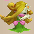 Curse Girl</td>
      <td>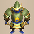 Swordsman</td>
    </tr>
    <tr>
      <td> Explochin</td>
      <td>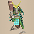 Hoppin' Batter</td>
      <td> Zapdon</td>
      <td> Schubell</td>
      <td class="highlightGray"></td>
    </tr>
    <tr>
      <td colspan="10" class="tableDivider"></td>
    </tr>
    <tr>
      <td rowspan="2" class="centeredText">21-30</td>
      <td> Pit Mamel</td>
      <td> Mid Chintala</td>
      <td> Lt. Spearfish</td>
      <td> Pumpanshee</td>
      <td> Flamepuff</td>
    </tr>
    <tr>
      <td> Brodillo</td>
      <td> Minotaur</td>
      <td class="highlightGray"></td>
      <td class="highlightGray"></td>
      <td class="highlightGray"></td>
    </tr>
    <tr>
      <td colspan="10" class="tableDivider"></td>
    </tr>
    <tr>
      <td class="monsterTableExtension"></td>
      <td colspan="5" class="monsterTableExtension centeredText">Sacred Tree Mode</td>
    </tr>
    <tr>
      <td colspan="10" class="tableDivider"></td>
    </tr>
    <tr>
      <td rowspan="4" class="centeredText">31-49</td>
      <td> Ornery Tank</td>
      <td>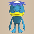 Pesky Kappa</td>
      <td> Porko</td>
      <td> Sky Dragon</td>
      <td> Daze Radish</td>
    </tr>
    <tr>
      <td> Skull Wizard</td>
      <td> Super Gazer</td>
      <td> Floppy Hani</td>
      <td> Vile Scorpion</td>
      <td> Pot Knave</td>
    </tr>
    <tr>
      <td>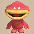 Nigiri Morph</td>
      <td> Hat Prankster</td>
      <td> Cursister</td>
      <td>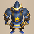 Fencer</td>
      <td> Concusschin</td>
    </tr>
    <tr>
      <td> Hoppin' Hitter</td>
      <td> Rumbledon</td>
      <td>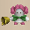 Menbell</td>
      <td class="highlightGray"></td>
      <td class="highlightGray"></td>
    </tr>
    <tr>
      <td colspan="10" class="tableDivider"></td>
    </tr>
    <tr>
      <td rowspan="6" class="centeredText">50</td>
      <td> Cave Mamel</td>
      <td> Big Chintala</td>
      <td> Capt. Spearfish</td>
      <td> Soul Reaper</td>
      <td> Pumplich</td>
    </tr>
    <tr>
      <td> Blazepuff</td>
      <td> Popdillo</td>
      <td> Megataur</td>
      <td> Ornery Tank</td>
      <td> Pesky Kappa</td>
    </tr>
    <tr>
      <td> Porko</td>
      <td> Sky Dragon</td>
      <td> Daze Radish</td>
      <td> Skull Wizard</td>
      <td> Super Gazer</td>
    </tr>
    <tr>
      <td> Floppy Hani</td>
      <td> Vile Scorpion</td>
      <td> Pot Knave</td>
      <td> Nigiri Morph</td>
      <td> Hat Prankster</td>
    </tr>
    <tr>
      <td> Cursister</td>
      <td> Fencer</td>
      <td> Concusschin</td>
      <td> Hoppin' Hitter</td>
      <td> Rumbledon</td>
    </tr>
    <tr>
      <td> Menbell</td>
      <td class="highlightGray"></td>
      <td class="highlightGray"></td>
      <td class="highlightGray"></td>
      <td class="highlightGray"></td>
    </tr>
    <tr>
      <td colspan="10" class="tableDivider"></td>
    </tr>
    <tr>
      <td rowspan="2" class="centeredText">51-59</td>
      <td> Cave Mamel</td>
      <td> Big Chintala</td>
      <td> Capt. Spearfish</td>
      <td> Pumplich</td>
      <td> Blazepuff</td>
    </tr>
    <tr>
      <td> Popdillo</td>
      <td> Megataur</td>
      <td class="highlightGray"></td>
      <td class="highlightGray"></td>
      <td class="highlightGray"></td>
    </tr>
    <tr>
      <td colspan="10" class="tableDivider"></td>
    </tr>
    <tr>
      <td rowspan="6" class="centeredText">60</td>
      <td> Cave Mamel</td>
      <td> Big Chintala</td>
      <td> Capt. Spearfish</td>
      <td> Soul Reaper</td>
      <td> Pumplich</td>
    </tr>
    <tr>
      <td> Blazepuff</td>
      <td> Popdillo</td>
      <td> Megataur</td>
      <td>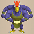 Great Hen</td>
      <td> Lashagga</td>
    </tr>
    <tr>
      <td> Baby Tank</td>
      <td> Ornery Tank</td>
      <td> Vexing Kappa</td>
      <td> Porkon</td>
      <td> Archdragon</td>
    </tr>
    <tr>
      <td> Sleep Radish</td>
      <td> Skullmancer</td>
      <td> Hyper Gazer</td>
      <td> Droopy Hani</td>
      <td> Terror Scorpion</td>
    </tr>
    <tr>
      <td> Bag Knave</td>
      <td> Nigiri Boss</td>
      <td> Hat Brat</td>
      <td> Curse Matron</td>
      <td> Battler</td>
    </tr>
    <tr>
      <td> Fulminachin</td>
      <td> Hoppin' Slugger</td>
      <td>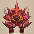 Clapdon</td>
      <td> Bellthoven</td>
      <td class="highlightGray"></td>
    </tr>
    <tr>
      <td colspan="10" class="tableDivider"></td>
    </tr>
    <tr>
      <td rowspan="6" class="centeredText">61-69</td>
      <td> Cave Mamel</td>
      <td> Big Chintala</td>
      <td> Capt. Spearfish</td>
      <td> Pumplich</td>
      <td> Blazepuff</td>
    </tr>
    <tr>
      <td> Popdillo</td>
      <td> Megataur</td>
      <td> Great Hen</td>
      <td> Lashagga</td>
      <td> Baby Tank</td>
    </tr>
    <tr>
      <td> Ornery Tank</td>
      <td> Vexing Kappa</td>
      <td> Porkon</td>
      <td> Archdragon</td>
      <td> Sleep Radish</td>
    </tr>
    <tr>
      <td> Skullmancer</td>
      <td> Hyper Gazer</td>
      <td> Droopy Hani</td>
      <td> Terror Scorpion</td>
      <td> Bag Knave</td>
    </tr>
    <tr>
      <td> Nigiri Boss</td>
      <td> Hat Brat</td>
      <td> Curse Matron</td>
      <td> Battler</td>
      <td> Fulminachin</td>
    </tr>
    <tr>
      <td> Hoppin' Slugger</td>
      <td> Clapdon</td>
      <td> Bellthoven</td>
      <td class="highlightGray"></td>
      <td class="highlightGray"></td>
    </tr>
    <tr>
      <td colspan="10" class="tableDivider"></td>
    </tr>
    <tr>
      <td rowspan="6" class="centeredText">70</td>
      <td> Cave Mamel</td>
      <td> Big Chintala</td>
      <td> Capt. Spearfish</td>
      <td> Soul Reaper</td>
      <td> Pumplich</td>
    </tr>
    <tr>
      <td> Blazepuff</td>
      <td> Popdillo</td>
      <td> Megataur</td>
      <td> Great Hen</td>
      <td> Lashagga</td>
    </tr>
    <tr>
      <td> Baby Tank</td>
      <td> Ornery Tank</td>
      <td> Vexing Kappa</td>
      <td> Porkon</td>
      <td> Archdragon</td>
    </tr>
    <tr>
      <td> Sleep Radish</td>
      <td> Skullmancer</td>
      <td> Hyper Gazer</td>
      <td> Droopy Hani</td>
      <td> Terror Scorpion</td>
    </tr>
    <tr>
      <td> Bag Knave</td>
      <td> Nigiri Boss</td>
      <td> Hat Brat</td>
      <td> Curse Matron</td>
      <td> Battler</td>
    </tr>
    <tr>
      <td> Fulminachin</td>
      <td> Hoppin' Slugger</td>
      <td> Clapdon</td>
      <td> Bellthoven</td>
      <td class="highlightGray"></td>
    </tr>
    <tr>
      <td colspan="10" class="tableDivider"></td>
    </tr>
    <tr>
      <td rowspan="6" class="centeredText">71-79</td>
      <td> Cave Mamel</td>
      <td> Big Chintala</td>
      <td> Capt. Spearfish</td>
      <td> Pumplich</td>
      <td> Blazepuff</td>
    </tr>
    <tr>
      <td> Popdillo</td>
      <td> Megataur</td>
      <td> Great Hen</td>
      <td> Lashagga</td>
      <td> Baby Tank</td>
    </tr>
    <tr>
      <td> Ornery Tank</td>
      <td> Vexing Kappa</td>
      <td> Porkon</td>
      <td> Archdragon</td>
      <td> Sleep Radish</td>
    </tr>
    <tr>
      <td> Skullmancer</td>
      <td> Hyper Gazer</td>
      <td> Droopy Hani</td>
      <td> Terror Scorpion</td>
      <td> Bag Knave</td>
    </tr>
    <tr>
      <td> Nigiri Boss</td>
      <td> Hat Brat</td>
      <td> Curse Matron</td>
      <td> Battler</td>
      <td> Fulminachin</td>
    </tr>
    <tr>
      <td> Hoppin' Slugger</td>
      <td> Clapdon</td>
      <td> Bellthoven</td>
      <td class="highlightGray"></td>
      <td class="highlightGray"></td>
    </tr>
    <tr>
      <td colspan="10" class="tableDivider"></td>
    </tr>
    <tr>
      <td rowspan="6" class="centeredText">80</td>
      <td> Cave Mamel</td>
      <td> Big Chintala</td>
      <td> Capt. Spearfish</td>
      <td> Soul Reaper</td>
      <td> Pumplich</td>
    </tr>
    <tr>
      <td> Blazepuff</td>
      <td> Popdillo</td>
      <td> Megataur</td>
      <td> Great Hen</td>
      <td> Lashagga</td>
    </tr>
    <tr>
      <td> Baby Tank</td>
      <td> Ornery Tank</td>
      <td> Vexing Kappa</td>
      <td> Porkon</td>
      <td> Archdragon</td>
    </tr>
    <tr>
      <td> Sleep Radish</td>
      <td> Skullmancer</td>
      <td> Hyper Gazer</td>
      <td> Droopy Hani</td>
      <td> Terror Scorpion</td>
    </tr>
    <tr>
      <td> Bag Knave</td>
      <td> Nigiri Boss</td>
      <td> Hat Brat</td>
      <td> Curse Matron</td>
      <td> Battler</td>
    </tr>
    <tr>
      <td> Fulminachin</td>
      <td> Hoppin' Slugger</td>
      <td> Clapdon</td>
      <td> Bellthoven</td>
      <td class="highlightGray"></td>
    </tr>
    <tr>
      <td colspan="10" class="tableDivider"></td>
    </tr>
    <tr>
      <td rowspan="6" class="centeredText">81-89</td>
      <td> Gitan Mamel</td>
      <td> Huge Chintala</td>
      <td> Admiral Spearfish</td>
      <td> Pumplord</td>
      <td> Pyrepuff</td>
    </tr>
    <tr>
      <td> Grampadillo</td>
      <td> Gigataur</td>
      <td>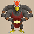 Miracle Hen</td>
      <td> Bashagga</td>
      <td> Mini Tank</td>
    </tr>
    <tr>
      <td> Adamant Tank</td>
      <td> Atrocious Kappa</td>
      <td> Porgon</td>
      <td>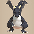 Abyss Dragon</td>
      <td>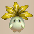 Frenzy Radish</td>
    </tr>
    <tr>
      <td> Skull Lord</td>
      <td> Ultra Gazer</td>
      <td> Wrinkly Hani</td>
      <td> Demon Scorpion</td>
      <td> Nimble Knave</td>
    </tr>
    <tr>
      <td> Nigiri Honcho</td>
      <td> Hat Rascal</td>
      <td> Cursenior</td>
      <td> Swordmaster</td>
      <td>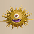 Detonachin</td>
    </tr>
    <tr>
      <td> Hoppin' Slammer</td>
      <td> Boomdon</td>
      <td> Showpin</td>
      <td class="highlightGray"></td>
      <td class="highlightGray"></td>
    </tr>
    <tr>
      <td colspan="10" class="tableDivider"></td>
    </tr>
    <tr>
      <td rowspan="6" class="centeredText">90</td>
      <td> Gitan Mamel</td>
      <td> Huge Chintala</td>
      <td> Admiral Spearfish</td>
      <td> King Reaper</td>
      <td> Pumplord</td>
    </tr>
    <tr>
      <td> Pyrepuff</td>
      <td> Grampadillo</td>
      <td> Gigataur</td>
      <td> Miracle Hen</td>
      <td> Bashagga</td>
    </tr>
    <tr>
      <td> Mini Tank</td>
      <td> Adamant Tank</td>
      <td> Atrocious Kappa</td>
      <td> Porgon</td>
      <td> Abyss Dragon</td>
    </tr>
    <tr>
      <td> Frenzy Radish</td>
      <td> Skull Lord</td>
      <td> Ultra Gazer</td>
      <td> Wrinkly Hani</td>
      <td> Demon Scorpion</td>
    </tr>
    <tr>
      <td> Nimble Knave</td>
      <td> Nigiri Honcho</td>
      <td> Hat Rascal</td>
      <td> Cursenior</td>
      <td> Swordmaster</td>
    </tr>
    <tr>
      <td> Detonachin</td>
      <td> Hoppin' Slammer</td>
      <td> Boomdon</td>
      <td> Showpin</td>
      <td class="highlightGray"></td>
    </tr>
    <tr>
      <td colspan="10" class="tableDivider"></td>
    </tr>
    <tr>
      <td rowspan="6" class="centeredText">91-99</td>
      <td> Gitan Mamel</td>
      <td> Huge Chintala</td>
      <td> Admiral Spearfish</td>
      <td> Pumplord</td>
      <td> Pyrepuff</td>
    </tr>
    <tr>
      <td> Grampadillo</td>
      <td> Gigataur</td>
      <td> Miracle Hen</td>
      <td> Bashagga</td>
      <td> Mini Tank</td>
    </tr>
    <tr>
      <td> Adamant Tank</td>
      <td> Atrocious Kappa</td>
      <td> Porgon</td>
      <td> Abyss Dragon</td>
      <td> Frenzy Radish</td>
    </tr>
    <tr>
      <td> Skull Lord</td>
      <td> Ultra Gazer</td>
      <td> Wrinkly Hani</td>
      <td> Demon Scorpion</td>
      <td> Nimble Knave</td>
    </tr>
    <tr>
      <td> Nigiri Honcho</td>
      <td> Hat Rascal</td>
      <td> Cursenior</td>
      <td> Swordmaster</td>
      <td> Detonachin</td>
    </tr>
    <tr>
      <td> Hoppin' Slammer</td>
      <td> Boomdon</td>
      <td> Showpin</td>
      <td class="highlightGray"></td>
      <td class="highlightGray"></td>
    </tr>
  </tbody>
</table>

# Items

- F = Floor
- G = Behemoth Gate

#### Weapon

<table class="dungeonItemTable">
  <tr>
    <th colspan="11" class="highlightLightblue">Weapon</th>
  </tr>
  <tr>
    <th>Name</th>
    <th>F</th>
    <th>G</th>
  </tr>
  <tr>
    <td class="leftText">Wooden Sword</td>
    <td>X</td>
    <td></td>
  </tr>
  <tr>
    <td class="leftText">Bronze Sword</td>
    <td>X</td>
    <td></td>
  </tr>
  <tr>
    <td class="leftText">Katana</td>
    <td>X</td>
    <td></td>
  </tr>
  <tr>
    <td class="leftText">Doutanuki</td>
    <td></td>
    <td></td>
  </tr>
  <tr>
    <td class="leftText">Manji Kabura</td>
    <td></td>
    <td></td>
  </tr>
  <tr>
    <td class="leftText">Kajin Fuuma</td>
    <td></td>
    <td></td>
  </tr>
  <tr>
    <td class="leftText">Kabura Sutegi</td>
    <td></td>
    <td></td>
  </tr>
  <tr>
    <td class="leftText">Golden Sword</td>
    <td>X</td>
    <td></td>
  </tr>
  <tr>
    <td class="leftText">Kama Itachi</td>
    <td>X</td>
    <td></td>
  </tr>
  <tr>
    <td class="leftText">Axe of the Minotaur</td>
    <td></td>
    <td></td>
  </tr>
  <tr>
    <td class="leftText">Accurate Sword</td>
    <td></td>
    <td></td>
  </tr>
  <tr>
    <td class="leftText">Swift Sword</td>
    <td>X</td>
    <td></td>
  </tr>
  <tr>
    <td class="leftText">Watersplitter</td>
    <td>X</td>
    <td></td>
  </tr>
  <tr>
    <td class="leftText">Primal Axe</td>
    <td>X</td>
    <td></td>
  </tr>
  <tr>
    <td class="leftText">Dragonkiller</td>
    <td>X</td>
    <td></td>
  </tr>
  <tr>
    <td class="leftText">Crescent Blade</td>
    <td>X</td>
    <td></td>
  </tr>
  <tr>
    <td class="leftText">Sky Sword</td>
    <td>X</td>
    <td></td>
  </tr>
  <tr>
    <td class="leftText">Sickle of Salvation</td>
    <td>X</td>
    <td></td>
  </tr>
  <tr>
    <td class="leftText">Drain Slayer</td>
    <td>X</td>
    <td></td>
  </tr>
  <tr>
    <td class="leftText">Cyclops Bane</td>
    <td>X</td>
    <td></td>
  </tr>
  <tr>
    <td class="leftText">Steel Severer</td>
    <td></td>
    <td></td>
  </tr>
  <tr>
    <td class="leftText">Whopping Harisen</td>
    <td></td>
    <td></td>
  </tr>
  <tr>
    <td class="leftText">Healing Sword</td>
    <td></td>
    <td></td>
  </tr>
  <tr>
    <td class="leftText">Peach Club</td>
    <td></td>
    <td></td>
  </tr>
  <tr>
    <td class="leftText">Spender's Club</td>
    <td></td>
    <td></td>
  </tr>
  <tr>
    <td class="leftText">Ferrous Greatsword</td>
    <td></td>
    <td></td>
  </tr>
  <tr>
    <td class="leftText">Steak Knife</td>
    <td></td>
    <td></td>
  </tr>
  <tr>
    <td class="leftText">Jagged Sword</td>
    <td></td>
    <td></td>
  </tr>
  <tr>
    <td class="leftText">Quad-edge</td>
    <td></td>
    <td></td>
  </tr>
  <tr>
    <td class="leftText">Auspicious Kumade</td>
    <td></td>
    <td></td>
  </tr>
  <tr>
    <td class="leftText">Pickaxe</td>
    <td>X</td>
    <td></td>
  </tr>
  <tr>
    <td class="leftText">Golden Pickaxe</td>
    <td></td>
    <td></td>
  </tr>
  <tr>
    <td class="leftText">Wooden Mallet</td>
    <td>X</td>
    <td></td>
  </tr>
  <tr>
    <td class="leftText">Epic Hammer</td>
    <td></td>
    <td></td>
  </tr>
  <tr>
    <td class="leftText">Trapseeker</td>
    <td></td>
    <td></td>
  </tr>
  <tr>
    <td class="leftText">Bonito Block</td>
    <td></td>
    <td></td>
  </tr>
  <tr>
    <td class="leftText">Yamanba's Cleaver</td>
    <td></td>
    <td></td>
  </tr>
  <tr>
    <td class="leftText">Break-Off Blade</td>
    <td></td>
    <td></td>
  </tr>
</table>

#### Shield

<table class="dungeonItemTable">
  <tr>
    <th colspan="11" class="highlightLightblue">Shield</th>
  </tr>
  <tr>
    <th>Name</th>
    <th>F</th>
    <th>G</th>
  </tr>
  <tr>
    <td class="leftText">Wooden Shield</td>
    <td>X</td>
    <td></td>
  </tr>
  <tr>
    <td class="leftText">Bronze Shield</td>
    <td>X</td>
    <td></td>
  </tr>
  <tr>
    <td class="leftText">Iron Shield</td>
    <td>X</td>
    <td></td>
  </tr>
  <tr>
    <td class="leftText">Wolfshead</td>
    <td>X</td>
    <td></td>
  </tr>
  <tr>
    <td class="leftText">Fuuma Shield</td>
    <td>X</td>
    <td></td>
  </tr>
  <tr>
    <td class="leftText">Rasen Fuuma</td>
    <td></td>
    <td></td>
  </tr>
  <tr>
    <td class="leftText">Golden Shield</td>
    <td>X</td>
    <td></td>
  </tr>
  <tr>
    <td class="leftText">Counter Shield</td>
    <td>X</td>
    <td></td>
  </tr>
  <tr>
    <td class="leftText">Watchful Shield</td>
    <td>X</td>
    <td></td>
  </tr>
  <tr>
    <td class="leftText">Dragon Shield</td>
    <td>X</td>
    <td></td>
  </tr>
  <tr>
    <td class="leftText">Blast Shield</td>
    <td>X</td>
    <td></td>
  </tr>
  <tr>
    <td class="leftText">Targe of the Minotaur</td>
    <td></td>
    <td></td>
  </tr>
  <tr>
    <td class="leftText">Walrus Stopper</td>
    <td>X</td>
    <td></td>
  </tr>
  <tr>
    <td class="leftText">Froggo Stopper</td>
    <td>X</td>
    <td></td>
  </tr>
  <tr>
    <td class="leftText">Hat Stopper</td>
    <td>X</td>
    <td></td>
  </tr>
  <tr>
    <td class="leftText">Nigiri Stopper</td>
    <td></td>
    <td></td>
  </tr>
  <tr>
    <td class="leftText">Spearscale Shield</td>
    <td>X</td>
    <td></td>
  </tr>
  <tr>
    <td class="leftText">Kappa's Dish</td>
    <td>X</td>
    <td></td>
  </tr>
  <tr>
    <td class="leftText">Gazer Shield</td>
    <td>X</td>
    <td></td>
  </tr>
  <tr>
    <td class="leftText">Shield of Negation</td>
    <td>X</td>
    <td></td>
  </tr>
  <tr>
    <td class="leftText">Unmoving Wall</td>
    <td></td>
    <td></td>
  </tr>
  <tr>
    <td class="leftText">Zabuton</td>
    <td></td>
    <td></td>
  </tr>
  <tr>
    <td class="leftText">Spender's Shield</td>
    <td></td>
    <td></td>
  </tr>
  <tr>
    <td class="leftText">Ferrous Kite</td>
    <td></td>
    <td></td>
  </tr>
  <tr>
    <td class="leftText">Steak Plate</td>
    <td></td>
    <td></td>
  </tr>
  <tr>
    <td class="leftText">Gutsy Shield</td>
    <td>X</td>
    <td></td>
  </tr>
  <tr>
    <td class="leftText">Hunky-dory Shield</td>
    <td></td>
    <td></td>
  </tr>
  <tr>
    <td class="leftText">Bodhi Shield</td>
    <td></td>
    <td></td>
  </tr>
  <tr>
    <td class="leftText">Shield of Sating</td>
    <td>X</td>
    <td></td>
  </tr>
  <tr>
    <td class="leftText">Auspicious Omamori</td>
    <td></td>
    <td></td>
  </tr>
  <tr>
    <td class="leftText">Shield of Presage</td>
    <td></td>
    <td></td>
  </tr>
  <tr>
    <td class="leftText">Yamanba's Potlid</td>
    <td></td>
    <td></td>
  </tr>
  <tr>
    <td class="leftText">Break-Off Shield</td>
    <td></td>
    <td></td>
  </tr>
</table>

#### Bracelet

<table class="dungeonItemTable">
  <tr>
    <th colspan="11" class="highlightLightblue">Bracelet</th>
  </tr>
  <tr>
    <th>Name</th>
    <th>F</th>
    <th>G</th>
  </tr>
  <tr>
    <td class="leftText">Healing Bracelet</td>
    <td>X</td>
    <td></td>
  </tr>
  <tr>
    <td class="leftText">Strength Bracelet</td>
    <td>X</td>
    <td></td>
  </tr>
  <tr>
    <td class="leftText">Bellyexpand Bracelet</td>
    <td></td>
    <td></td>
  </tr>
  <tr>
    <td class="leftText">Bellyshrink Bracelet</td>
    <td></td>
    <td></td>
  </tr>
  <tr>
    <td class="leftText">Fortune Bracelet</td>
    <td></td>
    <td></td>
  </tr>
  <tr>
    <td class="leftText">Cleansing Bracelet</td>
    <td>X</td>
    <td></td>
  </tr>
  <tr>
    <td class="leftText">Focusing Bracelet</td>
    <td>X</td>
    <td></td>
  </tr>
  <tr>
    <td class="leftText">Rousing Bracelet</td>
    <td>X</td>
    <td></td>
  </tr>
  <tr>
    <td class="leftText">Rustproof Bracelet</td>
    <td></td>
    <td></td>
  </tr>
  <tr>
    <td class="leftText">Cursebreak Bracelet</td>
    <td></td>
    <td></td>
  </tr>
  <tr>
    <td class="leftText">Affixing Bracelet</td>
    <td></td>
    <td></td>
  </tr>
  <tr>
    <td class="leftText">Far-throwing Bracelet</td>
    <td>X</td>
    <td></td>
  </tr>
  <tr>
    <td class="leftText">Bad-aim Bracelet</td>
    <td>X</td>
    <td></td>
  </tr>
  <tr>
    <td class="leftText">Sure-aim Bracelet</td>
    <td></td>
    <td></td>
  </tr>
  <tr>
    <td class="leftText">Bouncy Bracelet</td>
    <td>X</td>
    <td></td>
  </tr>
  <tr>
    <td class="leftText">Rapid-fire Bracelet</td>
    <td>X</td>
    <td></td>
  </tr>
  <tr>
    <td class="leftText">Daredevil Bracelet</td>
    <td></td>
    <td></td>
  </tr>
  <tr>
    <td class="leftText">Dreaded Bracelet</td>
    <td></td>
    <td></td>
  </tr>
  <tr>
    <td class="leftText">Leaping Bracelet</td>
    <td></td>
    <td></td>
  </tr>
  <tr>
    <td class="leftText">Blasting Bracelet</td>
    <td></td>
    <td></td>
  </tr>
  <tr>
    <td class="leftText">Clairvoyant Bracelet</td>
    <td></td>
    <td></td>
  </tr>
  <tr>
    <td class="leftText">Monster-find Bracelet</td>
    <td>X</td>
    <td></td>
  </tr>
  <tr>
    <td class="leftText">Item-find Bracelet</td>
    <td>X</td>
    <td></td>
  </tr>
  <tr>
    <td class="leftText">Passage-find Bracelet</td>
    <td></td>
    <td></td>
  </tr>
  <tr>
    <td class="leftText">Waterwalk Bracelet</td>
    <td>X</td>
    <td></td>
  </tr>
  <tr>
    <td class="leftText">Floating Bracelet</td>
    <td></td>
    <td></td>
  </tr>
  <tr>
    <td class="leftText">Wallpass Bracelet</td>
    <td></td>
    <td></td>
  </tr>
  <tr>
    <td class="leftText">Tiptoe Bracelet</td>
    <td></td>
    <td></td>
  </tr>
  <tr>
    <td class="leftText">Passerby Bracelet</td>
    <td></td>
    <td></td>
  </tr>
  <tr>
    <td class="leftText">Item-losing Bracelet</td>
    <td></td>
    <td></td>
  </tr>
  <tr>
    <td class="leftText">Gitan-losing Bracelet</td>
    <td></td>
    <td></td>
  </tr>
  <tr>
    <td class="leftText">Monstercall Bracelet</td>
    <td></td>
    <td></td>
  </tr>
  <tr>
    <td class="leftText">Trapmore Bracelet</td>
    <td></td>
    <td></td>
  </tr>
  <tr>
    <td class="leftText">Haggling Bracelet</td>
    <td></td>
    <td></td>
  </tr>
  <tr>
    <td class="leftText">Trapper's Bracelet</td>
    <td></td>
    <td></td>
  </tr>
  <tr>
    <td class="leftText">Appraiser's Bracelet</td>
    <td></td>
    <td></td>
  </tr>
  <tr>
    <td class="leftText">Cannonboost Bracelet</td>
    <td>X</td>
    <td></td>
  </tr>
</table>

#### Projectile

<table class="dungeonItemTable">
  <tr>
    <th colspan="11" class="highlightLightblue">Projectile</th>
  </tr>
  <tr>
    <th>Name</th>
    <th>F</th>
    <th>G</th>
  </tr>
  <tr>
    <td class="leftText">Wooden Arrow</td>
    <td>X</td>
    <td></td>
  </tr>
  <tr>
    <td class="leftText">Iron Arrow</td>
    <td>X</td>
    <td></td>
  </tr>
  <tr>
    <td class="leftText">Silver Arrow</td>
    <td>X</td>
    <td></td>
  </tr>
  <tr>
    <td class="leftText">Poison Arrow</td>
    <td></td>
    <td></td>
  </tr>
  <tr>
    <td class="leftText">Truestrike Arrow</td>
    <td>X</td>
    <td></td>
  </tr>
  <tr>
    <td class="leftText">Rock</td>
    <td>X</td>
    <td></td>
  </tr>
  <tr>
    <td class="leftText">Porky's Rock</td>
    <td>X</td>
    <td></td>
  </tr>
</table>

#### Food

<table class="dungeonItemTable">
  <tr>
    <th colspan="11" class="highlightLightblue">Food</th>
  </tr>
  <tr>
    <th>Name</th>
    <th>F</th>
    <th>G</th>
  </tr>
  <tr>
    <td class="leftText">Onigiri</td>
    <td>X</td>
    <td></td>
  </tr>
  <tr>
    <td class="leftText">Large Onigiri</td>
    <td>X</td>
    <td></td>
  </tr>
  <tr>
    <td class="leftText">Huge Onigiri</td>
    <td></td>
    <td></td>
  </tr>
  <tr>
    <td class="leftText">Rotten Onigiri</td>
    <td>X</td>
    <td></td>
  </tr>
  <tr>
    <td class="leftText">Grilled Onigiri</td>
    <td></td>
    <td></td>
  </tr>
  <tr>
    <td class="leftText">Special Onigiri</td>
    <td></td>
    <td>X</td>
  </tr>
  <tr>
    <td class="leftText">Sumo Onigiri</td>
    <td></td>
    <td>X</td>
  </tr>
  <tr>
    <td class="leftText">Sweet Potato</td>
    <td></td>
    <td></td>
  </tr>
  <tr>
    <td class="leftText">Yakitori</td>
    <td></td>
    <td></td>
  </tr>
  <tr>
    <td class="leftText">Rotten Peach Bun</td>
    <td></td>
    <td></td>
  </tr>
</table>

#### Grass

<table class="dungeonItemTable">
  <tr>
    <th colspan="11" class="highlightLightblue">Grass</th>
  </tr>
  <tr>
    <th>Name</th>
    <th>F</th>
    <th>G</th>
  </tr>
  <tr>
    <td class="leftText">Weeds</td>
    <td></td>
    <td></td>
  </tr>
  <tr>
    <td class="leftText">Herb</td>
    <td>X</td>
    <td></td>
  </tr>
  <tr>
    <td class="leftText">Otogirisou</td>
    <td>X</td>
    <td></td>
  </tr>
  <tr>
    <td class="leftText">Healing Grass</td>
    <td>X</td>
    <td></td>
  </tr>
  <tr>
    <td class="leftText">Life Grass</td>
    <td>X</td>
    <td>X</td>
  </tr>
  <tr>
    <td class="leftText">Fragrant Grass</td>
    <td></td>
    <td></td>
  </tr>
  <tr>
    <td class="leftText">Revival Grass</td>
    <td>X</td>
    <td>X</td>
  </tr>
  <tr>
    <td class="leftText">Bellyexpand Seed</td>
    <td>X</td>
    <td></td>
  </tr>
  <tr>
    <td class="leftText">Bellyshrink Seed</td>
    <td></td>
    <td></td>
  </tr>
  <tr>
    <td class="leftText">Dragon Grass</td>
    <td>X</td>
    <td></td>
  </tr>
  <tr>
    <td class="leftText">Leaping Grass</td>
    <td>X</td>
    <td></td>
  </tr>
  <tr>
    <td class="leftText">Antidote Grass</td>
    <td>X</td>
    <td></td>
  </tr>
  <tr>
    <td class="leftText">Strength Grass</td>
    <td>X</td>
    <td></td>
  </tr>
  <tr>
    <td class="leftText">Poison Grass</td>
    <td>X</td>
    <td></td>
  </tr>
  <tr>
    <td class="leftText">Confusion Grass</td>
    <td>X</td>
    <td></td>
  </tr>
  <tr>
    <td class="leftText">Sedating Grass</td>
    <td>X</td>
    <td></td>
  </tr>
  <tr>
    <td class="leftText">Berserk Seed</td>
    <td></td>
    <td></td>
  </tr>
  <tr>
    <td class="leftText">Blinding Grass</td>
    <td>X</td>
    <td></td>
  </tr>
  <tr>
    <td class="leftText">Seewell Grass</td>
    <td>X</td>
    <td></td>
  </tr>
  <tr>
    <td class="leftText">Swift Grass</td>
    <td>X</td>
    <td></td>
  </tr>
  <tr>
    <td class="leftText">Power-up Grass</td>
    <td>X</td>
    <td></td>
  </tr>
  <tr>
    <td class="leftText">Invincible Grass</td>
    <td>X</td>
    <td>X</td>
  </tr>
  <tr>
    <td class="leftText">Fortune Grass</td>
    <td>X</td>
    <td>X</td>
  </tr>
  <tr>
    <td class="leftText">Angel Seed</td>
    <td></td>
    <td></td>
  </tr>
  <tr>
    <td class="leftText">Feeble Grass</td>
    <td></td>
    <td></td>
  </tr>
  <tr>
    <td class="leftText">Unlucky Seed</td>
    <td></td>
    <td></td>
  </tr>
  <tr>
    <td class="leftText">Ill-fated Seed</td>
    <td></td>
    <td></td>
  </tr>
</table>

#### Scroll

<table class="dungeonItemTable">
  <tr>
    <th colspan="11" class="highlightLightblue">Scroll</th>
  </tr>
  <tr>
    <th>Name</th>
    <th>F</th>
    <th>G</th>
  </tr>
  <tr>
    <td class="leftText">Confusion Scroll</td>
    <td>X</td>
    <td></td>
  </tr>
  <tr>
    <td class="leftText">Slumber Scroll</td>
    <td>X</td>
    <td></td>
  </tr>
  <tr>
    <td class="leftText">Jitters Scroll</td>
    <td>X</td>
    <td></td>
  </tr>
  <tr>
    <td class="leftText">Windblade Scroll</td>
    <td>X</td>
    <td></td>
  </tr>
  <tr>
    <td class="leftText">Expulsion Scroll</td>
    <td></td>
    <td></td>
  </tr>
  <tr>
    <td class="leftText">Exorcism Scroll</td>
    <td></td>
    <td></td>
  </tr>
  <tr>
    <td class="leftText">Identifier Scroll</td>
    <td>X</td>
    <td></td>
  </tr>
  <tr>
    <td class="leftText">Heavenly Scroll</td>
    <td></td>
    <td>X</td>
  </tr>
  <tr>
    <td class="leftText">Earthly Scroll</td>
    <td></td>
    <td>X</td>
  </tr>
  <tr>
    <td class="leftText">Plating Scroll</td>
    <td>X</td>
    <td>X</td>
  </tr>
  <tr>
    <td class="leftText">Slot-adding Scroll</td>
    <td></td>
    <td></td>
  </tr>
  <tr>
    <td class="leftText">Rune-eraser Scroll</td>
    <td></td>
    <td></td>
  </tr>
  <tr>
    <td class="leftText">Silver-seal Scroll</td>
    <td></td>
    <td></td>
  </tr>
  <tr>
    <td class="leftText">Silverpurge Scroll</td>
    <td></td>
    <td></td>
  </tr>
  <tr>
    <td class="leftText">Pot-upsize Scroll</td>
    <td></td>
    <td></td>
  </tr>
  <tr>
    <td class="leftText">Extraction Scroll</td>
    <td></td>
    <td></td>
  </tr>
  <tr>
    <td class="leftText">Onigiri Scroll</td>
    <td>X</td>
    <td></td>
  </tr>
  <tr>
    <td class="leftText">Curse Scroll</td>
    <td></td>
    <td></td>
  </tr>
  <tr>
    <td class="leftText">Mapping Scroll</td>
    <td>X</td>
    <td></td>
  </tr>
  <tr>
    <td class="leftText">Map-loss Scroll</td>
    <td></td>
    <td></td>
  </tr>
  <tr>
    <td class="leftText">Trap-eraser Scroll</td>
    <td>X</td>
    <td></td>
  </tr>
  <tr>
    <td class="leftText">Trap Scroll</td>
    <td></td>
    <td></td>
  </tr>
  <tr>
    <td class="leftText">Water-drain Scroll</td>
    <td>X</td>
    <td></td>
  </tr>
  <tr>
    <td class="leftText">Monstercall Scroll</td>
    <td></td>
    <td></td>
  </tr>
  <tr>
    <td class="leftText">Wall-less Scroll</td>
    <td>X</td>
    <td></td>
  </tr>
  <tr>
    <td class="leftText">Gathering Scroll</td>
    <td></td>
    <td></td>
  </tr>
  <tr>
    <td class="leftText">Collection Scroll</td>
    <td>X</td>
    <td></td>
  </tr>
  <tr>
    <td class="leftText">Gambler's Scroll</td>
    <td></td>
    <td></td>
  </tr>
  <tr>
    <td class="leftText">Muzzle Scroll</td>
    <td></td>
    <td></td>
  </tr>
  <tr>
    <td class="leftText">Carry-ban Scroll</td>
    <td></td>
    <td></td>
  </tr>
  <tr>
    <td class="leftText">Swift Foe Scroll</td>
    <td></td>
    <td></td>
  </tr>
  <tr>
    <td class="leftText">Fixer Scroll</td>
    <td>X</td>
    <td>X</td>
  </tr>
  <tr>
    <td class="leftText">Escape Scroll</td>
    <td></td>
    <td></td>
  </tr>
  <tr>
    <td class="leftText">Eradication Scroll</td>
    <td></td>
    <td></td>
  </tr>
  <tr>
    <td class="leftText">Sanctuary Scroll</td>
    <td>X</td>
    <td></td>
  </tr>
  <tr>
    <td class="leftText">Blank Scroll</td>
    <td>X</td>
    <td>X</td>
  </tr>
  <tr>
    <td class="leftText">Wet Scroll</td>
    <td></td>
    <td></td>
  </tr>
</table>

#### Staff

<table class="dungeonItemTable">
  <tr>
    <th colspan="11" class="highlightLightblue">Staff</th>
  </tr>
  <tr>
    <th>Name</th>
    <th>F</th>
    <th>G</th>
  </tr>
  <tr>
    <td class="leftText">Ordinary Staff</td>
    <td></td>
    <td></td>
  </tr>
  <tr>
    <td class="leftText">Paralyzing Staff</td>
    <td>X</td>
    <td></td>
  </tr>
  <tr>
    <td class="leftText">Sealing Staff</td>
    <td>X</td>
    <td></td>
  </tr>
  <tr>
    <td class="leftText">Disguising Staff</td>
    <td>X</td>
    <td></td>
  </tr>
  <tr>
    <td class="leftText">Empathetic Staff</td>
    <td>X</td>
    <td></td>
  </tr>
  <tr>
    <td class="leftText">Narrow-escape Staff</td>
    <td>X</td>
    <td></td>
  </tr>
  <tr>
    <td class="leftText">Knockback Staff</td>
    <td>X</td>
    <td></td>
  </tr>
  <tr>
    <td class="leftText">Switching Staff</td>
    <td>X</td>
    <td></td>
  </tr>
  <tr>
    <td class="leftText">Vaulting Staff</td>
    <td>X</td>
    <td></td>
  </tr>
  <tr>
    <td class="leftText">Skull Mage's Staff</td>
    <td></td>
    <td></td>
  </tr>
  <tr>
    <td class="leftText">Thunderbolt Staff</td>
    <td>X</td>
    <td></td>
  </tr>
  <tr>
    <td class="leftText">Burrowing Staff</td>
    <td>X</td>
    <td></td>
  </tr>
  <tr>
    <td class="leftText">Earthmound Staff</td>
    <td>X</td>
    <td></td>
  </tr>
  <tr>
    <td class="leftText">Balance Staff</td>
    <td>X</td>
    <td></td>
  </tr>
  <tr>
    <td class="leftText">Guiding Staff</td>
    <td>X</td>
    <td></td>
  </tr>
  <tr>
    <td class="leftText">Swift Staff</td>
    <td></td>
    <td></td>
  </tr>
  <tr>
    <td class="leftText">Sluggish Staff</td>
    <td>X</td>
    <td></td>
  </tr>
  <tr>
    <td class="leftText">Fortune Staff</td>
    <td></td>
    <td></td>
  </tr>
  <tr>
    <td class="leftText">Unlucky Staff</td>
    <td></td>
    <td></td>
  </tr>
  <tr>
    <td class="leftText">Peach Staff</td>
    <td></td>
    <td></td>
  </tr>
</table>

#### Pot

<table class="dungeonItemTable">
  <tr>
    <th colspan="11" class="highlightLightblue">Pot</th>
  </tr>
  <tr>
    <th>Name</th>
    <th>F</th>
    <th>G</th>
  </tr>
  <tr>
    <td class="leftText">Preservation Pot</td>
    <td>X</td>
    <td>X</td>
  </tr>
  <tr>
    <td class="leftText">Identifier Pot</td>
    <td>X</td>
    <td></td>
  </tr>
  <tr>
    <td class="leftText">Transmutation Pot</td>
    <td>X</td>
    <td></td>
  </tr>
  <tr>
    <td class="leftText">Cashing Pot</td>
    <td>X</td>
    <td></td>
  </tr>
  <tr>
    <td class="leftText">Synthesis Pot</td>
    <td></td>
    <td>X</td>
  </tr>
  <tr>
    <td class="leftText">Exorcism Pot</td>
    <td></td>
    <td></td>
  </tr>
  <tr>
    <td class="leftText">Curse Pot</td>
    <td></td>
    <td></td>
  </tr>
  <tr>
    <td class="leftText">Upgrading Pot</td>
    <td></td>
    <td></td>
  </tr>
  <tr>
    <td class="leftText">Degrading Pot</td>
    <td></td>
    <td></td>
  </tr>
  <tr>
    <td class="leftText">Bottomless Pot</td>
    <td></td>
    <td></td>
  </tr>
  <tr>
    <td class="leftText">Warehouse Pot</td>
    <td></td>
    <td></td>
  </tr>
  <tr>
    <td class="leftText">Handtrapper Pot</td>
    <td></td>
    <td></td>
  </tr>
  <tr>
    <td class="leftText">Unbreakable Pot</td>
    <td></td>
    <td></td>
  </tr>
  <tr>
    <td class="leftText">Ordinary Pot</td>
    <td>X</td>
    <td></td>
  </tr>
  <tr>
    <td class="leftText">Hiding Pot</td>
    <td>X</td>
    <td></td>
  </tr>
  <tr>
    <td class="leftText">Rejuvenation Pot</td>
    <td></td>
    <td>X</td>
  </tr>
  <tr>
    <td class="leftText">Walrus Pot</td>
    <td>X</td>
    <td></td>
  </tr>
  <tr>
    <td class="leftText">Water Gun Pot</td>
    <td>X</td>
    <td></td>
  </tr>
  <tr>
    <td class="leftText">Hilarious Pot</td>
    <td></td>
    <td></td>
  </tr>
  <tr>
    <td class="leftText">Monster Pot</td>
    <td>X</td>
    <td></td>
  </tr>
  <tr>
    <td class="leftText">Surprise Pot</td>
    <td></td>
    <td></td>
  </tr>
</table>

#### Incense

<table class="dungeonItemTable">
  <tr>
    <th colspan="11" class="highlightLightblue">Incense</th>
  </tr>
  <tr>
    <th>Name</th>
    <th>F</th>
    <th>G</th>
  </tr>
  <tr>
    <td class="leftText">Heat-ban Incense</td>
    <td>X</td>
    <td></td>
  </tr>
  <tr>
    <td class="leftText">Evasive Incense</td>
    <td>X</td>
    <td></td>
  </tr>
  <tr>
    <td class="leftText">Cautious Incense</td>
    <td>X</td>
    <td></td>
  </tr>
  <tr>
    <td class="leftText">Reflective Incense</td>
    <td>X</td>
    <td></td>
  </tr>
  <tr>
    <td class="leftText">Aggressive Incense</td>
    <td>X</td>
    <td></td>
  </tr>
  <tr>
    <td class="leftText">Defensive Incense</td>
    <td>X</td>
    <td></td>
  </tr>
  <tr>
    <td class="leftText">Blurry Incense</td>
    <td>X</td>
    <td></td>
  </tr>
  <tr>
    <td class="leftText">Weighted Incense</td>
    <td>X</td>
    <td></td>
  </tr>
  <tr>
    <td class="leftText">Unwanting Incense</td>
    <td>X</td>
    <td></td>
  </tr>
</table>
