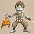
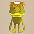

  

# Overview

<table class="dungeonOverview">
  <tr>
    <th>Unlock</th>
    <td class="highlightYellow">Clear Serpentcoil Island → Go to Mount Jatou Entrance.</td>
  </tr>
  <tr>
    <th>Entrance</th>
    <td class="highlightYellow">Mount Jatou Entrance (Check stone monument)</td>
  </tr>
</table>

<table class="dungeonTable">
  <tr>
    <th>Floors</th>
    <td colspan="3">10F / 99F (Sacred Tree)</td>
  </tr>
  <tr>
    <th>Bring Items</th>
    <td>No</td>
    <th>Stairs</th>
    <td>Ascending</td>
  </tr>
  <tr>
    <th>Companions</th>
    <td>No</td>
    <th>Roamers</th>
    <td>No</td>
  </tr>
  <tr>
    <th>Rescues</th>
    <td>3</td>
    <th>Starting Level</th>
    <td>Lv1</td>
  </tr>
  <tr>
    <th>Starting Item</th>
    <td colspan="3">Large Onigiri</td>
  </tr>
  <tr>
    <th>Unidentified</th>
    <td colspan="3"></td>
  </tr>
  <tr>
    <th>Shops</th>
    <td>No</td>
    <th>Monster Houses</th>
    <td>Yes (Regular, Sudden)</td>
  </tr>
  <tr>
    <th>Behemoths</th>
    <td>No (99F: Yes)</td>
    <th>Wishing Shrines</th>
    <td></td>
  </tr>
  <tr>
    <th>Kron's Challenge</th>
    <td></td>
    <th>Fever Time</th>
    <td></td>
  </tr>
  <tr>
    <th>Initial Enemies</th>
    <td>4</td>
    <th>Spawn Rate</th>
    <td>40 Turns</td>
  </tr>
  <tr>
    <th>Wind (1st Gust)</th>
    <td>900 Turns</td>
    <th>Reward</th>
    <td>Trapseeker</td>
  </tr>
</table>

Postgame dungeon where both the player and monsters can be ensnared by traps. Unlike [Trapper's Secret Path](/dungeons/trapper's-secret-path), the player doesn't have a Trapper's Bracelet, so traps can't be relocated. The player also doesn't earn any experience points when a monster steps on or is defeated by a trap. Overall, it looks like a trap dungeon at first glance, but it's mostly about throwing Gitan bags.

# Strategy

### General

#### Main Strategy

Weapons and shields on the ground are low quality, and staves and scrolls can't be found. Instead, most items that get generated are Gitan bags ranging in value from 100\~1000+ Gitan, with earlier floors usually generating higher value Gitan bags compared to deeper floors. So the idea is to stock up on Gitan bags at the start, then rush stairs until you clear the dungeon, utilizing traps to conserve the number of Gitan bags you throw when possible.

#### How to add Gitan to your inventory

1. Hold B and move towards the Gitan bag to step on the Gitan bag without picking it up.
2. Open your inventory, then exchange an item with the Gitan bag underfoot.

#### Firepuff (1-3F)

Firepuff is a Dragon and <b>Floating</b> dual-type monster, so it can't be ensnared by traps. Its special attack deals a fixed 10 damage, so it can be quite a problem when Shiren is at Lv1. It's somewhat common to have to restart until you get an opening where there's a Gitan bag nearby, which can be thrown at Firepuff to instantly defeat it.

### Trap Info

It's important to utilize traps when possible to conserve Gitan bags.

#### Spinning Trap / Sleep Trap / Blinding Trap / Sluggish Trap / Delusion Trap / Onigiri Trap

       

These are traps that inflict a negative stauts condition, with Delusion Trap being the most powerful. Monsters with Deluded status won't attack Shiren, and will instead run away from him forever. The second best trap is Blinding Trap, since its effect similarly never wears off for monsters. Sleep and Onigiri have short durations, so only use it against enemies you can defeat quickly.

#### Spring Trap

  

Step on this when you're being chased to warp to a different location on the current floor. Basically the same as Leaping Grass, except you can't carry the Spring Trap around.

#### Rotting Trap

  

Monsters who step on this trap are instantly defeated and transform into a Rotten Onigiri. Rotten Onigiri can be thrown at a monster to inflict them with a negative status condition. Blast Trap or Firepuff can be used to turn Rotten Onigiri into Grilled Onigiri.

#### Blast Trap / Explosion Trap

   

Any monsters caught in the blast that occurs will instantly collapse. So it's possible to step on it when a Floating type monster is adjacent to get rid of the monster. In this game, Shiren won't collapse even if his current HP is 1 when he steps on this trap.

#### Far-throwing Trap

  

Grants Far-throwing Status, which makes thrown items pierce through walls and creatures. Basically, stepping on this trap lets you throw Gitan against Hoppin' Hitter and Bored Kappa. Just be aware that you won't be able to recover thrown Gitan that misses its target.

#### Poison Arrow Trap / Wooden Arrow Trap

   

A single Poison Arrow reduces enemy attack power by about 50%. It can help you withstand more hits while running away, but Shiren's attack power is too low to keep up with stronger enemies later on either way, so don't bother collecting lots of arrows. Wooden Arrows mostly stop being useful after 4F or so.

#### Floor-exiting Trap

  

Step on this trap to instantly advance to the next floor. If you see it on the ground, it's best to hurry over to it before a monster steps on it.

#### Trap-setting Trap

  

Step on this to increase the number of traps on the ground. Shiren can see traps from the start, so there's no real downside to stepping on it.

#### Summoning Trap / Rage Trap

   

These 2 traps offer zero advantages for the player when activated. Try to avoid having monsters step on them if possible.

# Floor Guide

Hallways are visible on all floors, so make heavy use of the Look Around command in rooms. Avoid dashing, since you can end up in a bad situation very quickly even with 1 tile gap enabled. The value of Gitan bags tends to be higher early on, but decreases as you descend deeper.

### 1-2F

Shagga (18 HP, 6 atk, 4 def) looks strong, but can be defeated easily if it's a 1 vs 1 fight. Firepuff (20 HP, 7 atk, 7 def) is the most dangerous enemy in this floor range, contrary to its cuteness. It takes \~4 hits for a Lv1 Shiren to defeat Firepuff, while Firepuff can deal 10 damage with its flame, so you'll need to either throw Gitan at it, or have Shiren step on a Blast Trap to one-shot it. If you need to run from a Firepuff, avoid entering longer hallways if possible.

Don't pick up Gitan normally - Step on it by holding B, then exchange it with an inventory item. This lets you carry the Gitan bag as an item, which can be thrown as a projectile. Staying at 0 Gitan also lets you hunt Froggos (23 HP, 10 atk, 13 def) for more Gitan bags and exp. When throwing Gitan, save the higher value bags for later floors instead of using them first.

Once you've leveled up a bit, lure Mamels and Shaggas onto a Rotting Trap to make Rotten Onigiri. Rotten Onigiri turns into HP restoring Grilled Onigiri when Shiren gets hit by Firepuff's flame. Firepuff always uses its special attack through hallway corners.

Collect some Poison Arrows if possible if you find a Poison Arrow Trap on the ground. Linger until the wind blows on 1\~2F to level up and stock up on Grilled Onigiri and Gitan bags.

### 3F

Cave Mamel (5 HP, 100 atk, 100 def) appears as a somewhat rare encounter on 3-4F. Normal attacks only deal 1 damage to Cave Mamel, but it can be instantly slain by throwing Gitan. Cave Mamel provides 2000 experience points, so it's best to hunt any that you encounter.

Soldier Ant (50 HP, 25 atk, 16 def) digs out wall tiles instead of chasing Shiren, so it's pretty harmless. However, Soldier Ant will attack if you become adjacent to it - Same goes for Corporal Ant later on.

### 4-5F

Hoppin' Hitter (32 HP, 22 atk, 15 def) appears on 4-5F, and reflects or nullifies projectiles. The easiest counter is to step on a Far-throwing Trap to gain Far-throwing Status, then throw Gitan, since Hoppin' Hitter cannot reflect or nullify projectiles with piercing properties.

Zapdon (80 HP, 43 atk, 35 def) appears on 4-10F, and has slow speed but high defensive stats. It's best to ignore it since hitting it 3 times activates a 25 damage lightning counter attack.

Minotaur (70 HP, 31 atk, 20 def) and Metalhead (66 HP, 30 atk, 19 def) also appear on 5-10F. They both hit pretty hard, so try to deal with them from a distance before they're adjacent. Keep in mind that Metalhead can attack up to 2 tiles ahead.

### 6F

This is the only floor with a "Shuffle Dungeon" style map generation in this dungeon. The map is chosen from a group of predetermined patterns instead of being randomly generated.

New threats include Bored Kappa (50 HP, 18 atk, 11 def) and Master Hen (70 HP, 33 atk, 21 def). Bored Kappa is immune to projectiles that lack piercing properties, kind of like Hoppin' Hitter. Master Hen is a brawler style monster like Minotaur, but provides 400 experience points, so they're a nice target to hunt to level up if you weren't able to hunt a Cave Mamel earlier. They can be instantly defeated by throwing a Gitan bag with a value of 350 or more Gitan.

Gitan bags found on the ground will decrease in value to 300 or less from around this point. The final floor with Froggos is 7F, so combined with strong Dragon type monsters appearing soon, it's recommended to rush stairs to conserve Gitan starting from 7F or 8F.

### 7-10F

Lashagga (99 HP, 43 atk, 34 def) appears on 7-10F, and attacks 3 times per turn. Getting hit by its attacks nearly guarantees a collapse, so don't let it become adjacent. You'll need to throw a Gitan bag with a value of at least 500 Gitan to one-shot it.

Dragon (120 HP, 45 atk, 40 def) appears on 8-10F, and spews 20 damage fire in a straight line. Throwing a Gitan bag with a value of at least 600 Gitan will one-shot it.

8-10F often features water tiles, so flowing water and rafts can be generated on occasion. Avoid going against the flow of water if possible, and use the Look Around command a lot. The goal is close, so take things one step at a time and do your best!

# Monsters

See [Monsters](/system/monsters) for individual monster details.

- F - Dark hallways
- S - Shop is possible
- H - Monster House is possible
- G - Golden Egg Thing is possible
- B - Behemoth Monsters are possible

Monster Colors = Farming, Useful, Lowers Stats, Targets Items, Dangerous

<table class="monsterTable">
  <thead>
    <tr>
      <th>F</th>
      <th>S</th>
      <th>H</th>
      <th>G</th>
      <th colspan="5">Monsters</th>
      <th>B</th>
    </tr>
  </thead>
  <tbody>
    <tr>
      <td class="centeredText">1</td>
      <td class=""></td>
      <td class=""></td>
      <td class=""></td>
      <td> Mamel</td>
      <td class="farming"> Froggo</td>
      <td class="danger"> Firepuff</td>
      <td> Shagga</td>
      <td class="highlightGray"></td>
      <td class=""></td>
    </tr>
    <tr>
      <td colspan="10" class="tableDivider"></td>
    </tr>
    <tr>
      <td class="centeredText">2</td>
      <td class=""></td>
      <td class=""></td>
      <td class=""></td>
      <td> Mamel</td>
      <td> Chintala</td>
      <td class="farming"> Froggo</td>
      <td> Firepuff</td>
      <td> Shagga</td>
      <td class=""></td>
    </tr>
    <tr>
      <td colspan="10" class="tableDivider"></td>
    </tr>
    <tr>
      <td rowspan="2" class="centeredText">3</td>
      <td rowspan="2" class=""></td>
      <td rowspan="2" class=""></td>
      <td rowspan="2" class=""></td>
      <td> Mamel</td>
      <td class="useful"> Cave Mamel</td>
      <td> Chintala</td>
      <td class="farming"> Froggo</td>
      <td> Firepuff</td>
      <td rowspan="2" class=""></td>
    </tr>
    <tr>
      <td> Shagga</td>
      <td> Soldier Ant</td>
      <td class="highlightGray"></td>
      <td class="highlightGray"></td>
      <td class="highlightGray"></td>
    </tr>
    <tr>
      <td colspan="10" class="tableDivider"></td>
    </tr>
    <tr>
      <td rowspan="2" class="centeredText">4</td>
      <td rowspan="2" class=""></td>
      <td rowspan="2" class=""></td>
      <td rowspan="2" class=""></td>
      <td> Mamel</td>
      <td class="useful"> Cave Mamel</td>
      <td> Chintala</td>
      <td class="danger"> Hoppin' Hitter</td>
      <td class="farming"> Froggo</td>
      <td rowspan="2" class=""></td>
    </tr>
    <tr>
      <td> Zapdon</td>
      <td> Soldier Ant</td>
      <td class="highlightGray"></td>
      <td class="highlightGray"></td>
      <td class="highlightGray"></td>
    </tr>
    <tr>
      <td colspan="10" class="tableDivider"></td>
    </tr>
    <tr>
      <td rowspan="2" class="centeredText">5</td>
      <td rowspan="2" class=""></td>
      <td rowspan="2" class=""></td>
      <td rowspan="2" class=""></td>
      <td> Chintala</td>
      <td class="danger"> Hoppin' Hitter</td>
      <td class="farming"> Froggo</td>
      <td> Minotaur</td>
      <td class="danger"> Metalhead</td>
      <td rowspan="2" class=""></td>
    </tr>
    <tr>
      <td> Zapdon</td>
      <td> Soldier Ant</td>
      <td class="highlightGray"></td>
      <td class="highlightGray"></td>
      <td class="highlightGray"></td>
    </tr>
    <tr>
      <td colspan="10" class="tableDivider"></td>
    </tr>
    <tr>
      <td rowspan="2" class="centeredText">6</td>
      <td rowspan="2" class=""></td>
      <td rowspan="2" class=""></td>
      <td rowspan="2" class=""></td>
      <td> Bored Kappa</td>
      <td class="farming"> Froggo</td>
      <td class="useful"> Master Hen</td>
      <td> Minotaur</td>
      <td class="danger"> Metalhead</td>
      <td rowspan="2" class=""></td>
    </tr>
    <tr>
      <td> Zapdon</td>
      <td class="highlightGray"></td>
      <td class="highlightGray"></td>
      <td class="highlightGray"></td>
      <td class="highlightGray"></td>
    </tr>
    <tr>
      <td colspan="10" class="tableDivider"></td>
    </tr>
    <tr>
      <td rowspan="2" class="centeredText">7</td>
      <td rowspan="2" class=""></td>
      <td rowspan="2" class=""></td>
      <td rowspan="2" class=""></td>
      <td> Bored Kappa</td>
      <td class="farming"> Froggo</td>
      <td class="danger"> Lashagga</td>
      <td class="useful"> Master Hen</td>
      <td> Minotaur</td>
      <td rowspan="2" class=""></td>
    </tr>
    <tr>
      <td class="danger"> Metalhead</td>
      <td> Zapdon</td>
      <td> Corporal Ant</td>
      <td class="highlightGray"></td>
      <td class="highlightGray"></td>
    </tr>
    <tr>
      <td colspan="10" class="tableDivider"></td>
    </tr>
    <tr>
      <td rowspan="2" class="centeredText">8</td>
      <td rowspan="2" class=""></td>
      <td rowspan="2" class=""></td>
      <td rowspan="2" class=""></td>
      <td> Bored Kappa</td>
      <td class="danger"> Dragon</td>
      <td class="danger"> Lashagga</td>
      <td class="useful"> Master Hen</td>
      <td> Minotaur</td>
      <td rowspan="2" class=""></td>
    </tr>
    <tr>
      <td class="danger"> Metalhead</td>
      <td> Zapdon</td>
      <td> Corporal Ant</td>
      <td class="highlightGray"></td>
      <td class="highlightGray"></td>
    </tr>
    <tr>
      <td colspan="10" class="tableDivider"></td>
    </tr>
    <tr>
      <td rowspan="2" class="centeredText">9</td>
      <td rowspan="2" class=""></td>
      <td rowspan="2" class=""></td>
      <td rowspan="2" class=""></td>
      <td> Bored Kappa</td>
      <td class="danger"> Dragon</td>
      <td class="danger"> Lashagga</td>
      <td class="useful"> Master Hen</td>
      <td> Minotaur</td>
      <td rowspan="2" class=""></td>
    </tr>
    <tr>
      <td class="danger"> Metalhead</td>
      <td> Zapdon</td>
      <td> Corporal Ant</td>
      <td class="highlightGray"></td>
      <td class="highlightGray"></td>
    </tr>
    <tr>
      <td colspan="10" class="tableDivider"></td>
    </tr>
    <tr>
      <td rowspan="2" class="centeredText">10</td>
      <td rowspan="2" class=""></td>
      <td rowspan="2" class=""></td>
      <td rowspan="2" class=""></td>
      <td> Bored Kappa</td>
      <td class="danger"> Dragon</td>
      <td class="danger"> Lashagga</td>
      <td class="useful"> Master Hen</td>
      <td> Minotaur</td>
      <td rowspan="2" class=""></td>
    </tr>
    <tr>
      <td class="danger"> Metalhead</td>
      <td> Zapdon</td>
      <td> Corporal Ant</td>
      <td class="highlightGray"></td>
      <td class="highlightGray"></td>
    </tr>
    <tr>
      <td colspan="10" class="tableDivider"></td>
    </tr>
    <tr>
      <td class="monsterTableExtension"></td>
      <td colspan="3" class="monsterTableExtension"></td>
      <td colspan="5" class="monsterTableExtension centeredText">Sacred Tree Mode</td>
      <td class="monsterTableExtension"></td>
    </tr>
    <tr>
      <td colspan="10" class="tableDivider"></td>
    </tr>
    <tr>
      <td rowspan="2" class="centeredText">11</td>
      <td rowspan="2" class=""></td>
      <td rowspan="2" class=""></td>
      <td rowspan="2" class=""></td>
      <td> Dragon</td>
      <td> Lashagga</td>
      <td> Master Hen</td>
      <td> Minotaur</td>
      <td> Metalhead</td>
      <td rowspan="2" class=""></td>
    </tr>
    <tr>
      <td> Zapdon</td>
      <td class="highlightGray"></td>
      <td class="highlightGray"></td>
      <td class="highlightGray"></td>
      <td class="highlightGray"></td>
    </tr>
    <tr>
      <td colspan="10" class="tableDivider"></td>
    </tr>
    <tr>
      <td rowspan="2" class="centeredText">12</td>
      <td rowspan="2" class=""></td>
      <td rowspan="2" class=""></td>
      <td rowspan="2" class=""></td>
      <td> Froggucchi</td>
      <td> Dragon</td>
      <td> Lashagga</td>
      <td> Master Hen</td>
      <td> Minotaur</td>
      <td rowspan="2" class=""></td>
    </tr>
    <tr>
      <td> Metalhead</td>
      <td> Zapdon</td>
      <td class="highlightGray"></td>
      <td class="highlightGray"></td>
      <td class="highlightGray"></td>
    </tr>
    <tr>
      <td colspan="10" class="tableDivider"></td>
    </tr>
    <tr>
      <td rowspan="2" class="centeredText">13</td>
      <td rowspan="2" class=""></td>
      <td rowspan="2" class=""></td>
      <td rowspan="2" class=""></td>
      <td> Froggucchi</td>
      <td> Dragon</td>
      <td> Lashagga</td>
      <td> Master Hen</td>
      <td> Raging Samurai</td>
      <td rowspan="2" class=""></td>
    </tr>
    <tr>
      <td> Minotaur</td>
      <td> Metalhead</td>
      <td> Zapdon</td>
      <td class="highlightGray"></td>
      <td class="highlightGray"></td>
    </tr>
    <tr>
      <td colspan="10" class="tableDivider"></td>
    </tr>
    <tr>
      <td rowspan="2" class="centeredText">14</td>
      <td rowspan="2" class=""></td>
      <td rowspan="2" class=""></td>
      <td rowspan="2" class=""></td>
      <td> Froggucchi</td>
      <td> Dragon</td>
      <td> Lashagga</td>
      <td> Master Hen</td>
      <td> Raging Samurai</td>
      <td rowspan="2" class=""></td>
    </tr>
    <tr>
      <td> Minotaur</td>
      <td> Metalhead</td>
      <td> Zapdon</td>
      <td class="highlightGray"></td>
      <td class="highlightGray"></td>
    </tr>
    <tr>
      <td colspan="10" class="tableDivider"></td>
    </tr>
    <tr>
      <td rowspan="2" class="centeredText">15</td>
      <td rowspan="2" class=""></td>
      <td rowspan="2" class=""></td>
      <td rowspan="2" class=""></td>
      <td> Froggucchi</td>
      <td> Dragon</td>
      <td> Lashagga</td>
      <td> Master Hen</td>
      <td> Raging Samurai</td>
      <td rowspan="2" class=""></td>
    </tr>
    <tr>
      <td> Minotaur</td>
      <td> Metalhead</td>
      <td> Zapdon</td>
      <td class="highlightGray"></td>
      <td class="highlightGray"></td>
    </tr>
    <tr>
      <td colspan="10" class="tableDivider"></td>
    </tr>
    <tr>
      <td rowspan="2" class="centeredText">16</td>
      <td rowspan="2" class=""></td>
      <td rowspan="2" class=""></td>
      <td rowspan="2" class=""></td>
      <td> Froggucchi</td>
      <td> Dragon</td>
      <td> Lashagga</td>
      <td> Master Hen</td>
      <td> Raging Samurai</td>
      <td rowspan="2" class=""></td>
    </tr>
    <tr>
      <td> Minotaur</td>
      <td> Metalhead</td>
      <td> Zapdon</td>
      <td class="highlightGray"></td>
      <td class="highlightGray"></td>
    </tr>
    <tr>
      <td colspan="10" class="tableDivider"></td>
    </tr>
    <tr>
      <td rowspan="2" class="centeredText">17</td>
      <td rowspan="2" class=""></td>
      <td rowspan="2" class=""></td>
      <td rowspan="2" class=""></td>
      <td> Froggucchi</td>
      <td> Dragon</td>
      <td> Lashagga</td>
      <td> Master Hen</td>
      <td> Raging Samurai</td>
      <td rowspan="2" class=""></td>
    </tr>
    <tr>
      <td> Minotaur</td>
      <td> Metalhead</td>
      <td> Zapdon</td>
      <td class="highlightGray"></td>
      <td class="highlightGray"></td>
    </tr>
    <tr>
      <td colspan="10" class="tableDivider"></td>
    </tr>
    <tr>
      <td rowspan="2" class="centeredText">18</td>
      <td rowspan="2" class=""></td>
      <td rowspan="2" class=""></td>
      <td rowspan="2" class=""></td>
      <td> Froggucchi</td>
      <td> Dragon</td>
      <td> Lashagga</td>
      <td> Master Hen</td>
      <td> Raging Samurai</td>
      <td rowspan="2" class=""></td>
    </tr>
    <tr>
      <td> Minotaur</td>
      <td> Metalhead</td>
      <td> Zapdon</td>
      <td class="highlightGray"></td>
      <td class="highlightGray"></td>
    </tr>
    <tr>
      <td colspan="10" class="tableDivider"></td>
    </tr>
    <tr>
      <td rowspan="2" class="centeredText">19</td>
      <td rowspan="2" class=""></td>
      <td rowspan="2" class=""></td>
      <td rowspan="2" class=""></td>
      <td> Froggucchi</td>
      <td> Dragon</td>
      <td> Lashagga</td>
      <td> Master Hen</td>
      <td> Raging Samurai</td>
      <td rowspan="2" class=""></td>
    </tr>
    <tr>
      <td> Minotaur</td>
      <td> Metalhead</td>
      <td> Zapdon</td>
      <td class="highlightGray"></td>
      <td class="highlightGray"></td>
    </tr>
    <tr>
      <td colspan="10" class="tableDivider"></td>
    </tr>
    <tr>
      <td rowspan="2" class="centeredText">20</td>
      <td rowspan="2" class=""></td>
      <td rowspan="2" class=""></td>
      <td rowspan="2" class=""></td>
      <td> Froggucchi</td>
      <td> Dragon</td>
      <td> Lashagga</td>
      <td> Master Hen</td>
      <td> Raging Samurai</td>
      <td rowspan="2" class=""></td>
    </tr>
    <tr>
      <td> Minotaur</td>
      <td> Metalhead</td>
      <td> Zapdon</td>
      <td class="highlightGray"></td>
      <td class="highlightGray"></td>
    </tr>
    <tr>
      <td colspan="10" class="tableDivider"></td>
    </tr>
    <tr>
      <td rowspan="2" class="centeredText">21</td>
      <td rowspan="2" class=""></td>
      <td rowspan="2" class=""></td>
      <td rowspan="2" class=""></td>
      <td> Froggucchi</td>
      <td> Dragon</td>
      <td> Great Hen</td>
      <td> Megataur</td>
      <td> Metalhead</td>
      <td rowspan="2" class="highlightBehemoth"></td>
    </tr>
    <tr>
      <td> Zapdon</td>
      <td class="highlightGray"></td>
      <td class="highlightGray"></td>
      <td class="highlightGray"></td>
      <td class="highlightGray"></td>
    </tr>
    <tr>
      <td colspan="10" class="tableDivider"></td>
    </tr>
    <tr>
      <td rowspan="2" class="centeredText">22</td>
      <td rowspan="2" class=""></td>
      <td rowspan="2" class=""></td>
      <td rowspan="2" class=""></td>
      <td> Froggucchi</td>
      <td> Dragon</td>
      <td> Great Hen</td>
      <td> Megataur</td>
      <td> Metalhead</td>
      <td rowspan="2" class="highlightBehemoth"></td>
    </tr>
    <tr>
      <td> Zapdon</td>
      <td class="highlightGray"></td>
      <td class="highlightGray"></td>
      <td class="highlightGray"></td>
      <td class="highlightGray"></td>
    </tr>
    <tr>
      <td colspan="10" class="tableDivider"></td>
    </tr>
    <tr>
      <td rowspan="2" class="centeredText">23</td>
      <td rowspan="2" class=""></td>
      <td rowspan="2" class=""></td>
      <td rowspan="2" class=""></td>
      <td> Froggucchi</td>
      <td> Dragon</td>
      <td> Great Hen</td>
      <td> Megataur</td>
      <td> Thrashead</td>
      <td rowspan="2" class="highlightBehemoth"></td>
    </tr>
    <tr>
      <td> Zapdon</td>
      <td class="highlightGray"></td>
      <td class="highlightGray"></td>
      <td class="highlightGray"></td>
      <td class="highlightGray"></td>
    </tr>
    <tr>
      <td colspan="10" class="tableDivider"></td>
    </tr>
    <tr>
      <td rowspan="2" class="centeredText">24</td>
      <td rowspan="2" class=""></td>
      <td rowspan="2" class=""></td>
      <td rowspan="2" class=""></td>
      <td> Froggucchi</td>
      <td> Dragon</td>
      <td> Great Hen</td>
      <td> Megataur</td>
      <td> Thrashead</td>
      <td rowspan="2" class="highlightBehemoth"></td>
    </tr>
    <tr>
      <td> Zapdon</td>
      <td class="highlightGray"></td>
      <td class="highlightGray"></td>
      <td class="highlightGray"></td>
      <td class="highlightGray"></td>
    </tr>
    <tr>
      <td colspan="10" class="tableDivider"></td>
    </tr>
    <tr>
      <td rowspan="2" class="centeredText">25</td>
      <td rowspan="2" class=""></td>
      <td rowspan="2" class=""></td>
      <td rowspan="2" class=""></td>
      <td> Froggucchi</td>
      <td> Dragon</td>
      <td> Great Hen</td>
      <td> Megataur</td>
      <td> Thrashead</td>
      <td rowspan="2" class="highlightBehemoth"></td>
    </tr>
    <tr>
      <td> Zapdon</td>
      <td class="highlightGray"></td>
      <td class="highlightGray"></td>
      <td class="highlightGray"></td>
      <td class="highlightGray"></td>
    </tr>
    <tr>
      <td colspan="10" class="tableDivider"></td>
    </tr>
    <tr>
      <td rowspan="2" class="centeredText">26</td>
      <td rowspan="2" class=""></td>
      <td rowspan="2" class=""></td>
      <td rowspan="2" class=""></td>
      <td> Froggucchi</td>
      <td> Dragon</td>
      <td> Great Hen</td>
      <td> Megataur</td>
      <td> Thrashead</td>
      <td rowspan="2" class="highlightBehemoth"></td>
    </tr>
    <tr>
      <td> Zapdon</td>
      <td class="highlightGray"></td>
      <td class="highlightGray"></td>
      <td class="highlightGray"></td>
      <td class="highlightGray"></td>
    </tr>
    <tr>
      <td colspan="10" class="tableDivider"></td>
    </tr>
    <tr>
      <td rowspan="2" class="centeredText">27</td>
      <td rowspan="2" class=""></td>
      <td rowspan="2" class=""></td>
      <td rowspan="2" class=""></td>
      <td> Froggucchi</td>
      <td> Dragon</td>
      <td> Great Hen</td>
      <td> Megataur</td>
      <td> Thrashead</td>
      <td rowspan="2" class="highlightBehemoth"></td>
    </tr>
    <tr>
      <td> Zapdon</td>
      <td class="highlightGray"></td>
      <td class="highlightGray"></td>
      <td class="highlightGray"></td>
      <td class="highlightGray"></td>
    </tr>
    <tr>
      <td colspan="10" class="tableDivider"></td>
    </tr>
    <tr>
      <td rowspan="2" class="centeredText">28</td>
      <td rowspan="2" class=""></td>
      <td rowspan="2" class=""></td>
      <td rowspan="2" class=""></td>
      <td> Froggucchi</td>
      <td> Dragon</td>
      <td> Great Hen</td>
      <td> Megataur</td>
      <td> Thrashead</td>
      <td rowspan="2" class="highlightBehemoth"></td>
    </tr>
    <tr>
      <td> Zapdon</td>
      <td class="highlightGray"></td>
      <td class="highlightGray"></td>
      <td class="highlightGray"></td>
      <td class="highlightGray"></td>
    </tr>
    <tr>
      <td colspan="10" class="tableDivider"></td>
    </tr>
    <tr>
      <td rowspan="2" class="centeredText">29</td>
      <td rowspan="2" class=""></td>
      <td rowspan="2" class=""></td>
      <td rowspan="2" class=""></td>
      <td> Froggucchi</td>
      <td> Dragon</td>
      <td> Great Hen</td>
      <td> Megataur</td>
      <td> Thrashead</td>
      <td rowspan="2" class="highlightBehemoth"></td>
    </tr>
    <tr>
      <td> Zapdon</td>
      <td class="highlightGray"></td>
      <td class="highlightGray"></td>
      <td class="highlightGray"></td>
      <td class="highlightGray"></td>
    </tr>
    <tr>
      <td colspan="10" class="tableDivider"></td>
    </tr>
    <tr>
      <td rowspan="2" class="centeredText">30</td>
      <td rowspan="2" class=""></td>
      <td rowspan="2" class=""></td>
      <td rowspan="2" class=""></td>
      <td> Froggucchi</td>
      <td> Blazepuff</td>
      <td> Great Hen</td>
      <td> Megataur</td>
      <td> Thrashead</td>
      <td rowspan="2" class="highlightBehemoth"></td>
    </tr>
    <tr>
      <td> Zapdon</td>
      <td> Fulminachin</td>
      <td class="highlightGray"></td>
      <td class="highlightGray"></td>
      <td class="highlightGray"></td>
    </tr>
    <tr>
      <td colspan="10" class="tableDivider"></td>
    </tr>
    <tr>
      <td rowspan="2" class="centeredText">31</td>
      <td rowspan="2" class=""></td>
      <td rowspan="2" class=""></td>
      <td rowspan="2" class=""></td>
      <td> Froggucchi</td>
      <td> Blazepuff</td>
      <td> Great Hen</td>
      <td> Megataur</td>
      <td> Thrashead</td>
      <td rowspan="2" class="highlightBehemoth"></td>
    </tr>
    <tr>
      <td> Zapdon</td>
      <td> Fulminachin</td>
      <td class="highlightGray"></td>
      <td class="highlightGray"></td>
      <td class="highlightGray"></td>
    </tr>
    <tr>
      <td colspan="10" class="tableDivider"></td>
    </tr>
    <tr>
      <td rowspan="2" class="centeredText">32</td>
      <td rowspan="2" class=""></td>
      <td rowspan="2" class=""></td>
      <td rowspan="2" class=""></td>
      <td> Froggucchi</td>
      <td> Blazepuff</td>
      <td> Great Hen</td>
      <td> Megataur</td>
      <td> Thrashead</td>
      <td rowspan="2" class="highlightBehemoth"></td>
    </tr>
    <tr>
      <td> Zapdon</td>
      <td> Fulminachin</td>
      <td class="highlightGray"></td>
      <td class="highlightGray"></td>
      <td class="highlightGray"></td>
    </tr>
    <tr>
      <td colspan="10" class="tableDivider"></td>
    </tr>
    <tr>
      <td rowspan="2" class="centeredText">33</td>
      <td rowspan="2" class=""></td>
      <td rowspan="2" class=""></td>
      <td rowspan="2" class=""></td>
      <td> Froggucchi</td>
      <td> Blazepuff</td>
      <td> Great Hen</td>
      <td> Megataur</td>
      <td> Thrashead</td>
      <td rowspan="2" class="highlightBehemoth"></td>
    </tr>
    <tr>
      <td> Zapdon</td>
      <td> Fulminachin</td>
      <td class="highlightGray"></td>
      <td class="highlightGray"></td>
      <td class="highlightGray"></td>
    </tr>
    <tr>
      <td colspan="10" class="tableDivider"></td>
    </tr>
    <tr>
      <td rowspan="2" class="centeredText">34</td>
      <td rowspan="2" class=""></td>
      <td rowspan="2" class=""></td>
      <td rowspan="2" class=""></td>
      <td> Froggucchi</td>
      <td> Blazepuff</td>
      <td> Great Hen</td>
      <td> Megataur</td>
      <td> Thrashead</td>
      <td rowspan="2" class="highlightBehemoth"></td>
    </tr>
    <tr>
      <td> Zapdon</td>
      <td> Fulminachin</td>
      <td class="highlightGray"></td>
      <td class="highlightGray"></td>
      <td class="highlightGray"></td>
    </tr>
    <tr>
      <td colspan="10" class="tableDivider"></td>
    </tr>
    <tr>
      <td rowspan="4" class="centeredText">35</td>
      <td rowspan="4" class=""></td>
      <td rowspan="4" class=""></td>
      <td rowspan="4" class=""></td>
      <td> Froggucchi</td>
      <td> Blazepuff</td>
      <td> Great Hen</td>
      <td> Megataur</td>
      <td> Thrashead</td>
      <td rowspan="4" class="highlightBehemoth"></td>
    </tr>
    <tr>
      <td> Zapdon</td>
      <td> Fulminachin</td>
      <td> Tengu Monk B</td>
      <td> Okame Monk B</td>
      <td> Okina Monk B</td>
    </tr>
    <tr>
      <td> Kitsune Monk B</td>
      <td> Hannya Monk B</td>
      <td> Fire Ninja B</td>
      <td> Water Ninja B</td>
      <td> Tree Ninja B</td>
    </tr>
    <tr>
      <td> Earth Ninja B</td>
      <td class="highlightGray"></td>
      <td class="highlightGray"></td>
      <td class="highlightGray"></td>
      <td class="highlightGray"></td>
    </tr>
    <tr>
      <td colspan="10" class="tableDivider"></td>
    </tr>
    <tr>
      <td rowspan="3" class="centeredText">36</td>
      <td rowspan="3" class=""></td>
      <td rowspan="3" class=""></td>
      <td rowspan="3" class=""></td>
      <td> Froggucchi</td>
      <td> Blazepuff</td>
      <td> Bashagga</td>
      <td> Thrashead</td>
      <td> Zapdon</td>
      <td rowspan="3" class="highlightBehemoth"></td>
    </tr>
    <tr>
      <td> Fulminachin</td>
      <td> Tengu Monk B</td>
      <td> Okame Monk B</td>
      <td> Okina Monk B</td>
      <td> Kitsune Monk B</td>
    </tr>
    <tr>
      <td> Hannya Monk B</td>
      <td> Fire Ninja B</td>
      <td> Water Ninja B</td>
      <td> Tree Ninja B</td>
      <td> Earth Ninja B</td>
    </tr>
    <tr>
      <td colspan="10" class="tableDivider"></td>
    </tr>
    <tr>
      <td rowspan="3" class="centeredText">37</td>
      <td rowspan="3" class=""></td>
      <td rowspan="3" class=""></td>
      <td rowspan="3" class=""></td>
      <td> Froggucchi</td>
      <td> Blazepuff</td>
      <td> Bashagga</td>
      <td> Thrashead</td>
      <td> Zapdon</td>
      <td rowspan="3" class="highlightBehemoth"></td>
    </tr>
    <tr>
      <td> Fulminachin</td>
      <td> Tengu Monk B</td>
      <td> Okame Monk B</td>
      <td> Okina Monk B</td>
      <td> Kitsune Monk B</td>
    </tr>
    <tr>
      <td> Hannya Monk B</td>
      <td> Fire Ninja B</td>
      <td> Water Ninja B</td>
      <td> Tree Ninja B</td>
      <td> Earth Ninja B</td>
    </tr>
    <tr>
      <td colspan="10" class="tableDivider"></td>
    </tr>
    <tr>
      <td rowspan="3" class="centeredText">38</td>
      <td rowspan="3" class=""></td>
      <td rowspan="3" class=""></td>
      <td rowspan="3" class=""></td>
      <td> Froggucchi</td>
      <td> Blazepuff</td>
      <td> Bashagga</td>
      <td> Thrashead</td>
      <td> Zapdon</td>
      <td rowspan="3" class="highlightBehemoth"></td>
    </tr>
    <tr>
      <td> Fulminachin</td>
      <td> Tengu Monk B</td>
      <td> Okame Monk B</td>
      <td> Okina Monk B</td>
      <td> Kitsune Monk B</td>
    </tr>
    <tr>
      <td> Hannya Monk B</td>
      <td> Fire Ninja B</td>
      <td> Water Ninja B</td>
      <td> Tree Ninja B</td>
      <td> Earth Ninja B</td>
    </tr>
    <tr>
      <td colspan="10" class="tableDivider"></td>
    </tr>
    <tr>
      <td rowspan="3" class="centeredText">39</td>
      <td rowspan="3" class=""></td>
      <td rowspan="3" class=""></td>
      <td rowspan="3" class=""></td>
      <td> Froggucchi</td>
      <td> Blazepuff</td>
      <td> Bashagga</td>
      <td> Thrashead</td>
      <td> Zapdon</td>
      <td rowspan="3" class="highlightBehemoth"></td>
    </tr>
    <tr>
      <td> Fulminachin</td>
      <td> Tengu Monk B</td>
      <td> Okame Monk B</td>
      <td> Okina Monk B</td>
      <td> Kitsune Monk B</td>
    </tr>
    <tr>
      <td> Hannya Monk B</td>
      <td> Fire Ninja B</td>
      <td> Water Ninja B</td>
      <td> Tree Ninja B</td>
      <td> Earth Ninja B</td>
    </tr>
    <tr>
      <td colspan="10" class="tableDivider"></td>
    </tr>
    <tr>
      <td rowspan="3" class="centeredText">40</td>
      <td rowspan="3" class=""></td>
      <td rowspan="3" class=""></td>
      <td rowspan="3" class=""></td>
      <td> Blazepuff</td>
      <td> Bashagga</td>
      <td> Thrashead</td>
      <td> Zapdon</td>
      <td> Fulminachin</td>
      <td rowspan="3" class="highlightBehemoth"></td>
    </tr>
    <tr>
      <td> Tengu Monk B</td>
      <td> Okame Monk B</td>
      <td> Okina Monk B</td>
      <td> Kitsune Monk B</td>
      <td> Hannya Monk B</td>
    </tr>
    <tr>
      <td> Fire Ninja B</td>
      <td> Water Ninja B</td>
      <td> Tree Ninja B</td>
      <td> Earth Ninja B</td>
      <td class="highlightGray"></td>
    </tr>
    <tr>
      <td colspan="10" class="tableDivider"></td>
    </tr>
    <tr>
      <td rowspan="3" class="centeredText">41</td>
      <td rowspan="3" class=""></td>
      <td rowspan="3" class=""></td>
      <td rowspan="3" class=""></td>
      <td> Bashagga</td>
      <td> Thrashead</td>
      <td> Zapdon</td>
      <td> Tengu Monk B</td>
      <td> Okame Monk B</td>
      <td rowspan="3" class="highlightBehemoth"></td>
    </tr>
    <tr>
      <td> Okina Monk B</td>
      <td> Kitsune Monk B</td>
      <td> Hannya Monk B</td>
      <td> Fire Ninja B</td>
      <td> Water Ninja B</td>
    </tr>
    <tr>
      <td> Tree Ninja B</td>
      <td> Earth Ninja B</td>
      <td class="highlightGray"></td>
      <td class="highlightGray"></td>
      <td class="highlightGray"></td>
    </tr>
    <tr>
      <td colspan="10" class="tableDivider"></td>
    </tr>
    <tr>
      <td rowspan="3" class="centeredText">42</td>
      <td rowspan="3" class=""></td>
      <td rowspan="3" class=""></td>
      <td rowspan="3" class=""></td>
      <td> Bashagga</td>
      <td> Thrashead</td>
      <td> Zapdon</td>
      <td> Tengu Monk B</td>
      <td> Okame Monk B</td>
      <td rowspan="3" class="highlightBehemoth"></td>
    </tr>
    <tr>
      <td> Okina Monk B</td>
      <td> Kitsune Monk B</td>
      <td> Hannya Monk B</td>
      <td> Fire Ninja B</td>
      <td> Water Ninja B</td>
    </tr>
    <tr>
      <td> Tree Ninja B</td>
      <td> Earth Ninja B</td>
      <td class="highlightGray"></td>
      <td class="highlightGray"></td>
      <td class="highlightGray"></td>
    </tr>
    <tr>
      <td colspan="10" class="tableDivider"></td>
    </tr>
    <tr>
      <td rowspan="3" class="centeredText">43</td>
      <td rowspan="3" class=""></td>
      <td rowspan="3" class=""></td>
      <td rowspan="3" class=""></td>
      <td> Bashagga</td>
      <td> Thrashead</td>
      <td> Zapdon</td>
      <td> Tengu Monk B</td>
      <td> Okame Monk B</td>
      <td rowspan="3" class="highlightBehemoth"></td>
    </tr>
    <tr>
      <td> Okina Monk B</td>
      <td> Kitsune Monk B</td>
      <td> Hannya Monk B</td>
      <td> Fire Ninja B</td>
      <td> Water Ninja B</td>
    </tr>
    <tr>
      <td> Tree Ninja B</td>
      <td> Earth Ninja B</td>
      <td class="highlightGray"></td>
      <td class="highlightGray"></td>
      <td class="highlightGray"></td>
    </tr>
    <tr>
      <td colspan="10" class="tableDivider"></td>
    </tr>
    <tr>
      <td rowspan="3" class="centeredText">44</td>
      <td rowspan="3" class=""></td>
      <td rowspan="3" class=""></td>
      <td rowspan="3" class=""></td>
      <td> Bashagga</td>
      <td> Thrashead</td>
      <td> Zapdon</td>
      <td> Tengu Monk B</td>
      <td> Okame Monk B</td>
      <td rowspan="3" class="highlightBehemoth"></td>
    </tr>
    <tr>
      <td> Okina Monk B</td>
      <td> Kitsune Monk B</td>
      <td> Hannya Monk B</td>
      <td> Fire Ninja B</td>
      <td> Water Ninja B</td>
    </tr>
    <tr>
      <td> Tree Ninja B</td>
      <td> Earth Ninja B</td>
      <td class="highlightGray"></td>
      <td class="highlightGray"></td>
      <td class="highlightGray"></td>
    </tr>
    <tr>
      <td colspan="10" class="tableDivider"></td>
    </tr>
    <tr>
      <td rowspan="3" class="centeredText">45</td>
      <td rowspan="3" class=""></td>
      <td rowspan="3" class=""></td>
      <td rowspan="3" class=""></td>
      <td> Bashagga</td>
      <td> Thrashead</td>
      <td> Zapdon</td>
      <td> Tengu Monk B</td>
      <td> Okame Monk B</td>
      <td rowspan="3" class="highlightBehemoth"></td>
    </tr>
    <tr>
      <td> Okina Monk B</td>
      <td> Kitsune Monk B</td>
      <td> Hannya Monk B</td>
      <td> Fire Ninja B</td>
      <td> Water Ninja B</td>
    </tr>
    <tr>
      <td> Tree Ninja B</td>
      <td> Earth Ninja B</td>
      <td class="highlightGray"></td>
      <td class="highlightGray"></td>
      <td class="highlightGray"></td>
    </tr>
    <tr>
      <td colspan="10" class="tableDivider"></td>
    </tr>
    <tr>
      <td rowspan="3" class="centeredText">46</td>
      <td rowspan="3" class=""></td>
      <td rowspan="3" class=""></td>
      <td rowspan="3" class=""></td>
      <td> Bashagga</td>
      <td> Thrashead</td>
      <td> Zapdon</td>
      <td> Tengu Monk B</td>
      <td> Okame Monk B</td>
      <td rowspan="3" class="highlightBehemoth"></td>
    </tr>
    <tr>
      <td> Okina Monk B</td>
      <td> Kitsune Monk B</td>
      <td> Hannya Monk B</td>
      <td> Fire Ninja B</td>
      <td> Water Ninja B</td>
    </tr>
    <tr>
      <td> Tree Ninja B</td>
      <td> Earth Ninja B</td>
      <td class="highlightGray"></td>
      <td class="highlightGray"></td>
      <td class="highlightGray"></td>
    </tr>
    <tr>
      <td colspan="10" class="tableDivider"></td>
    </tr>
    <tr>
      <td rowspan="3" class="centeredText">47</td>
      <td rowspan="3" class=""></td>
      <td rowspan="3" class=""></td>
      <td rowspan="3" class=""></td>
      <td> Bashagga</td>
      <td> Thrashead</td>
      <td> Zapdon</td>
      <td> Tengu Monk B</td>
      <td> Okame Monk B</td>
      <td rowspan="3" class="highlightBehemoth"></td>
    </tr>
    <tr>
      <td> Okina Monk B</td>
      <td> Kitsune Monk B</td>
      <td> Hannya Monk B</td>
      <td> Fire Ninja B</td>
      <td> Water Ninja B</td>
    </tr>
    <tr>
      <td> Tree Ninja B</td>
      <td> Earth Ninja B</td>
      <td class="highlightGray"></td>
      <td class="highlightGray"></td>
      <td class="highlightGray"></td>
    </tr>
    <tr>
      <td colspan="10" class="tableDivider"></td>
    </tr>
    <tr>
      <td rowspan="3" class="centeredText">48</td>
      <td rowspan="3" class=""></td>
      <td rowspan="3" class=""></td>
      <td rowspan="3" class=""></td>
      <td> Bashagga</td>
      <td> Thrashead</td>
      <td> Zapdon</td>
      <td> Tengu Monk B</td>
      <td> Okame Monk B</td>
      <td rowspan="3" class="highlightBehemoth"></td>
    </tr>
    <tr>
      <td> Okina Monk B</td>
      <td> Kitsune Monk B</td>
      <td> Hannya Monk B</td>
      <td> Fire Ninja B</td>
      <td> Water Ninja B</td>
    </tr>
    <tr>
      <td> Tree Ninja B</td>
      <td> Earth Ninja B</td>
      <td class="highlightGray"></td>
      <td class="highlightGray"></td>
      <td class="highlightGray"></td>
    </tr>
    <tr>
      <td colspan="10" class="tableDivider"></td>
    </tr>
    <tr>
      <td rowspan="3" class="centeredText">49</td>
      <td rowspan="3" class=""></td>
      <td rowspan="3" class=""></td>
      <td rowspan="3" class=""></td>
      <td> Bashagga</td>
      <td> Thrashead</td>
      <td> Zapdon</td>
      <td> Tengu Monk B</td>
      <td> Okame Monk B</td>
      <td rowspan="3" class="highlightBehemoth"></td>
    </tr>
    <tr>
      <td> Okina Monk B</td>
      <td> Kitsune Monk B</td>
      <td> Hannya Monk B</td>
      <td> Fire Ninja B</td>
      <td> Water Ninja B</td>
    </tr>
    <tr>
      <td> Tree Ninja B</td>
      <td> Earth Ninja B</td>
      <td class="highlightGray"></td>
      <td class="highlightGray"></td>
      <td class="highlightGray"></td>
    </tr>
    <tr>
      <td colspan="10" class="tableDivider"></td>
    </tr>
    <tr>
      <td rowspan="2" class="centeredText">50</td>
      <td rowspan="2" class=""></td>
      <td rowspan="2" class=""></td>
      <td rowspan="2" class=""></td>
      <td> Pyrepuff</td>
      <td> Dragon Pit</td>
      <td> Bashagga</td>
      <td> Great Hen</td>
      <td> Rumbledon</td>
      <td rowspan="2" class="highlightBehemoth"></td>
    </tr>
    <tr>
      <td> Detonachin</td>
      <td class="highlightGray"></td>
      <td class="highlightGray"></td>
      <td class="highlightGray"></td>
      <td class="highlightGray"></td>
    </tr>
    <tr>
      <td colspan="10" class="tableDivider"></td>
    </tr>
    <tr>
      <td rowspan="2" class="centeredText">51</td>
      <td rowspan="2" class=""></td>
      <td rowspan="2" class=""></td>
      <td rowspan="2" class=""></td>
      <td> Pyrepuff</td>
      <td> Dragon Pit</td>
      <td> Bashagga</td>
      <td> Great Hen</td>
      <td> Rumbledon</td>
      <td rowspan="2" class="highlightBehemoth"></td>
    </tr>
    <tr>
      <td> Detonachin</td>
      <td class="highlightGray"></td>
      <td class="highlightGray"></td>
      <td class="highlightGray"></td>
      <td class="highlightGray"></td>
    </tr>
    <tr>
      <td colspan="10" class="tableDivider"></td>
    </tr>
    <tr>
      <td rowspan="2" class="centeredText">52</td>
      <td rowspan="2" class=""></td>
      <td rowspan="2" class=""></td>
      <td rowspan="2" class=""></td>
      <td> Pyrepuff</td>
      <td> Dragon Pit</td>
      <td> Bashagga</td>
      <td> Great Hen</td>
      <td> Rumbledon</td>
      <td rowspan="2" class="highlightBehemoth"></td>
    </tr>
    <tr>
      <td> Detonachin</td>
      <td class="highlightGray"></td>
      <td class="highlightGray"></td>
      <td class="highlightGray"></td>
      <td class="highlightGray"></td>
    </tr>
    <tr>
      <td colspan="10" class="tableDivider"></td>
    </tr>
    <tr>
      <td rowspan="2" class="centeredText">53</td>
      <td rowspan="2" class=""></td>
      <td rowspan="2" class=""></td>
      <td rowspan="2" class=""></td>
      <td> Pyrepuff</td>
      <td> Dragon Pit</td>
      <td> Bashagga</td>
      <td> Great Hen</td>
      <td> Rumbledon</td>
      <td rowspan="2" class="highlightBehemoth"></td>
    </tr>
    <tr>
      <td> Detonachin</td>
      <td class="highlightGray"></td>
      <td class="highlightGray"></td>
      <td class="highlightGray"></td>
      <td class="highlightGray"></td>
    </tr>
    <tr>
      <td colspan="10" class="tableDivider"></td>
    </tr>
    <tr>
      <td rowspan="2" class="centeredText">54</td>
      <td rowspan="2" class=""></td>
      <td rowspan="2" class=""></td>
      <td rowspan="2" class=""></td>
      <td> Pyrepuff</td>
      <td> Dragon Pit</td>
      <td> Bashagga</td>
      <td> Great Hen</td>
      <td> Rumbledon</td>
      <td rowspan="2" class="highlightBehemoth"></td>
    </tr>
    <tr>
      <td> Detonachin</td>
      <td class="highlightGray"></td>
      <td class="highlightGray"></td>
      <td class="highlightGray"></td>
      <td class="highlightGray"></td>
    </tr>
    <tr>
      <td colspan="10" class="tableDivider"></td>
    </tr>
    <tr>
      <td rowspan="2" class="centeredText">55</td>
      <td rowspan="2" class=""></td>
      <td rowspan="2" class=""></td>
      <td rowspan="2" class=""></td>
      <td> Pyrepuff</td>
      <td> Dragon Pit</td>
      <td> Bashagga</td>
      <td> Great Hen</td>
      <td> Rumbledon</td>
      <td rowspan="2" class="highlightBehemoth"></td>
    </tr>
    <tr>
      <td> Detonachin</td>
      <td class="highlightGray"></td>
      <td class="highlightGray"></td>
      <td class="highlightGray"></td>
      <td class="highlightGray"></td>
    </tr>
    <tr>
      <td colspan="10" class="tableDivider"></td>
    </tr>
    <tr>
      <td rowspan="2" class="centeredText">56</td>
      <td rowspan="2" class=""></td>
      <td rowspan="2" class=""></td>
      <td rowspan="2" class=""></td>
      <td> Pyrepuff</td>
      <td> Dragon Pit</td>
      <td> Bashagga</td>
      <td> Great Hen</td>
      <td> Rumbledon</td>
      <td rowspan="2" class="highlightBehemoth"></td>
    </tr>
    <tr>
      <td> Detonachin</td>
      <td class="highlightGray"></td>
      <td class="highlightGray"></td>
      <td class="highlightGray"></td>
      <td class="highlightGray"></td>
    </tr>
    <tr>
      <td colspan="10" class="tableDivider"></td>
    </tr>
    <tr>
      <td rowspan="2" class="centeredText">57</td>
      <td rowspan="2" class=""></td>
      <td rowspan="2" class=""></td>
      <td rowspan="2" class=""></td>
      <td> Pyrepuff</td>
      <td> Dragon Pit</td>
      <td> Bashagga</td>
      <td> Great Hen</td>
      <td> Rumbledon</td>
      <td rowspan="2" class="highlightBehemoth"></td>
    </tr>
    <tr>
      <td> Detonachin</td>
      <td class="highlightGray"></td>
      <td class="highlightGray"></td>
      <td class="highlightGray"></td>
      <td class="highlightGray"></td>
    </tr>
    <tr>
      <td colspan="10" class="tableDivider"></td>
    </tr>
    <tr>
      <td rowspan="2" class="centeredText">58</td>
      <td rowspan="2" class=""></td>
      <td rowspan="2" class=""></td>
      <td rowspan="2" class=""></td>
      <td> Pyrepuff</td>
      <td> Dragon Pit</td>
      <td> Bashagga</td>
      <td> Great Hen</td>
      <td> Rumbledon</td>
      <td rowspan="2" class="highlightBehemoth"></td>
    </tr>
    <tr>
      <td> Detonachin</td>
      <td class="highlightGray"></td>
      <td class="highlightGray"></td>
      <td class="highlightGray"></td>
      <td class="highlightGray"></td>
    </tr>
    <tr>
      <td colspan="10" class="tableDivider"></td>
    </tr>
    <tr>
      <td rowspan="2" class="centeredText">59</td>
      <td rowspan="2" class=""></td>
      <td rowspan="2" class=""></td>
      <td rowspan="2" class=""></td>
      <td> Pyrepuff</td>
      <td> Dragon Pit</td>
      <td> Bashagga</td>
      <td> Great Hen</td>
      <td> Rumbledon</td>
      <td rowspan="2" class="highlightBehemoth"></td>
    </tr>
    <tr>
      <td> Detonachin</td>
      <td class="highlightGray"></td>
      <td class="highlightGray"></td>
      <td class="highlightGray"></td>
      <td class="highlightGray"></td>
    </tr>
    <tr>
      <td colspan="10" class="tableDivider"></td>
    </tr>
    <tr>
      <td rowspan="2" class="centeredText">60</td>
      <td rowspan="2" class=""></td>
      <td rowspan="2" class=""></td>
      <td rowspan="2" class=""></td>
      <td> Pyrepuff</td>
      <td> Dragon Pit</td>
      <td> Bashagga</td>
      <td> Great Hen</td>
      <td> Rumbledon</td>
      <td rowspan="2" class="highlightBehemoth"></td>
    </tr>
    <tr>
      <td> Detonachin</td>
      <td class="highlightGray"></td>
      <td class="highlightGray"></td>
      <td class="highlightGray"></td>
      <td class="highlightGray"></td>
    </tr>
    <tr>
      <td colspan="10" class="tableDivider"></td>
    </tr>
    <tr>
      <td rowspan="2" class="centeredText">61</td>
      <td rowspan="2" class=""></td>
      <td rowspan="2" class=""></td>
      <td rowspan="2" class=""></td>
      <td> Pyrepuff</td>
      <td> Dragon Pit</td>
      <td> Bashagga</td>
      <td> Great Hen</td>
      <td> Rumbledon</td>
      <td rowspan="2" class="highlightBehemoth"></td>
    </tr>
    <tr>
      <td> N'daloon</td>
      <td class="highlightGray"></td>
      <td class="highlightGray"></td>
      <td class="highlightGray"></td>
      <td class="highlightGray"></td>
    </tr>
    <tr>
      <td colspan="10" class="tableDivider"></td>
    </tr>
    <tr>
      <td rowspan="2" class="centeredText">62</td>
      <td rowspan="2" class=""></td>
      <td rowspan="2" class=""></td>
      <td rowspan="2" class=""></td>
      <td> Pyrepuff</td>
      <td> Dragon Pit</td>
      <td> Bashagga</td>
      <td> Great Hen</td>
      <td> Rumbledon</td>
      <td rowspan="2" class="highlightBehemoth"></td>
    </tr>
    <tr>
      <td> N'daloon</td>
      <td class="highlightGray"></td>
      <td class="highlightGray"></td>
      <td class="highlightGray"></td>
      <td class="highlightGray"></td>
    </tr>
    <tr>
      <td colspan="10" class="tableDivider"></td>
    </tr>
    <tr>
      <td rowspan="2" class="centeredText">63</td>
      <td rowspan="2" class=""></td>
      <td rowspan="2" class=""></td>
      <td rowspan="2" class=""></td>
      <td> Pyrepuff</td>
      <td> Dragon Pit</td>
      <td> Bashagga</td>
      <td> Great Hen</td>
      <td> Rumbledon</td>
      <td rowspan="2" class="highlightBehemoth"></td>
    </tr>
    <tr>
      <td> N'daloon</td>
      <td class="highlightGray"></td>
      <td class="highlightGray"></td>
      <td class="highlightGray"></td>
      <td class="highlightGray"></td>
    </tr>
    <tr>
      <td colspan="10" class="tableDivider"></td>
    </tr>
    <tr>
      <td rowspan="2" class="centeredText">64</td>
      <td rowspan="2" class=""></td>
      <td rowspan="2" class=""></td>
      <td rowspan="2" class=""></td>
      <td> Pyrepuff</td>
      <td> Dragon Pit</td>
      <td> Bashagga</td>
      <td> Great Hen</td>
      <td> Rumbledon</td>
      <td rowspan="2" class="highlightBehemoth"></td>
    </tr>
    <tr>
      <td> N'daloon</td>
      <td class="highlightGray"></td>
      <td class="highlightGray"></td>
      <td class="highlightGray"></td>
      <td class="highlightGray"></td>
    </tr>
    <tr>
      <td colspan="10" class="tableDivider"></td>
    </tr>
    <tr>
      <td rowspan="2" class="centeredText">65</td>
      <td rowspan="2" class=""></td>
      <td rowspan="2" class=""></td>
      <td rowspan="2" class=""></td>
      <td> Pyrepuff</td>
      <td> Dragon Pit</td>
      <td> Bashagga</td>
      <td> Great Hen</td>
      <td> Rumbledon</td>
      <td rowspan="2" class="highlightBehemoth"></td>
    </tr>
    <tr>
      <td> N'daloon</td>
      <td class="highlightGray"></td>
      <td class="highlightGray"></td>
      <td class="highlightGray"></td>
      <td class="highlightGray"></td>
    </tr>
    <tr>
      <td colspan="10" class="tableDivider"></td>
    </tr>
    <tr>
      <td rowspan="2" class="centeredText">66</td>
      <td rowspan="2" class=""></td>
      <td rowspan="2" class=""></td>
      <td rowspan="2" class=""></td>
      <td> Pyrepuff</td>
      <td> Dragon Pit</td>
      <td> Bashagga</td>
      <td> Great Hen</td>
      <td> Rumbledon</td>
      <td rowspan="2" class="highlightBehemoth"></td>
    </tr>
    <tr>
      <td> N'daloon</td>
      <td class="highlightGray"></td>
      <td class="highlightGray"></td>
      <td class="highlightGray"></td>
      <td class="highlightGray"></td>
    </tr>
    <tr>
      <td colspan="10" class="tableDivider"></td>
    </tr>
    <tr>
      <td rowspan="2" class="centeredText">67</td>
      <td rowspan="2" class=""></td>
      <td rowspan="2" class=""></td>
      <td rowspan="2" class=""></td>
      <td> Pyrepuff</td>
      <td> Dragon Pit</td>
      <td> Bashagga</td>
      <td> Great Hen</td>
      <td> Rumbledon</td>
      <td rowspan="2" class="highlightBehemoth"></td>
    </tr>
    <tr>
      <td> N'daloon</td>
      <td class="highlightGray"></td>
      <td class="highlightGray"></td>
      <td class="highlightGray"></td>
      <td class="highlightGray"></td>
    </tr>
    <tr>
      <td colspan="10" class="tableDivider"></td>
    </tr>
    <tr>
      <td rowspan="2" class="centeredText">68</td>
      <td rowspan="2" class=""></td>
      <td rowspan="2" class=""></td>
      <td rowspan="2" class=""></td>
      <td> Pyrepuff</td>
      <td> Dragon Pit</td>
      <td> Bashagga</td>
      <td> Great Hen</td>
      <td> Rumbledon</td>
      <td rowspan="2" class="highlightBehemoth"></td>
    </tr>
    <tr>
      <td> N'daloon</td>
      <td class="highlightGray"></td>
      <td class="highlightGray"></td>
      <td class="highlightGray"></td>
      <td class="highlightGray"></td>
    </tr>
    <tr>
      <td colspan="10" class="tableDivider"></td>
    </tr>
    <tr>
      <td rowspan="2" class="centeredText">69</td>
      <td rowspan="2" class=""></td>
      <td rowspan="2" class=""></td>
      <td rowspan="2" class=""></td>
      <td> Pyrepuff</td>
      <td> Dragon Pit</td>
      <td> Bashagga</td>
      <td> Great Hen</td>
      <td> Rumbledon</td>
      <td rowspan="2" class="highlightBehemoth"></td>
    </tr>
    <tr>
      <td> N'daloon</td>
      <td class="highlightGray"></td>
      <td class="highlightGray"></td>
      <td class="highlightGray"></td>
      <td class="highlightGray"></td>
    </tr>
    <tr>
      <td colspan="10" class="tableDivider"></td>
    </tr>
    <tr>
      <td class="centeredText">70</td>
      <td class=""></td>
      <td class=""></td>
      <td class=""></td>
      <td> Fleefrog</td>
      <td> Archdragon</td>
      <td> Rumbledon</td>
      <td> N'daloon</td>
      <td class="highlightGray"></td>
      <td class="highlightBehemoth"></td>
    </tr>
    <tr>
      <td colspan="10" class="tableDivider"></td>
    </tr>
    <tr>
      <td class="centeredText">71</td>
      <td class=""></td>
      <td class=""></td>
      <td class=""></td>
      <td> Fleefrog</td>
      <td> Archdragon</td>
      <td> Rumbledon</td>
      <td> N'daloon</td>
      <td class="highlightGray"></td>
      <td class="highlightBehemoth"></td>
    </tr>
    <tr>
      <td colspan="10" class="tableDivider"></td>
    </tr>
    <tr>
      <td class="centeredText">72</td>
      <td class=""></td>
      <td class=""></td>
      <td class=""></td>
      <td> Fleefrog</td>
      <td> Archdragon</td>
      <td> Megahead</td>
      <td> Clapdon</td>
      <td> N'daloon</td>
      <td class="highlightBehemoth"></td>
    </tr>
    <tr>
      <td colspan="10" class="tableDivider"></td>
    </tr>
    <tr>
      <td class="centeredText">73</td>
      <td class=""></td>
      <td class=""></td>
      <td class=""></td>
      <td> Fleefrog</td>
      <td> Archdragon</td>
      <td> Megahead</td>
      <td> Clapdon</td>
      <td> N'daloon</td>
      <td class="highlightBehemoth"></td>
    </tr>
    <tr>
      <td colspan="10" class="tableDivider"></td>
    </tr>
    <tr>
      <td class="centeredText">74</td>
      <td class=""></td>
      <td class=""></td>
      <td class=""></td>
      <td> Fleefrog</td>
      <td> Archdragon</td>
      <td> Megahead</td>
      <td> Clapdon</td>
      <td> N'daloon</td>
      <td class="highlightBehemoth"></td>
    </tr>
    <tr>
      <td colspan="10" class="tableDivider"></td>
    </tr>
    <tr>
      <td class="centeredText">75</td>
      <td class=""></td>
      <td class=""></td>
      <td class=""></td>
      <td> Fleefrog</td>
      <td> Archdragon</td>
      <td> Megahead</td>
      <td> Clapdon</td>
      <td class="highlightGray"></td>
      <td class="highlightBehemoth"></td>
    </tr>
    <tr>
      <td colspan="10" class="tableDivider"></td>
    </tr>
    <tr>
      <td class="centeredText">76</td>
      <td class=""></td>
      <td class=""></td>
      <td class=""></td>
      <td> Fleefrog</td>
      <td> Archdragon</td>
      <td> Megahead</td>
      <td> Clapdon</td>
      <td class="highlightGray"></td>
      <td class="highlightBehemoth"></td>
    </tr>
    <tr>
      <td colspan="10" class="tableDivider"></td>
    </tr>
    <tr>
      <td class="centeredText">77</td>
      <td class=""></td>
      <td class=""></td>
      <td class=""></td>
      <td> Fleefrog</td>
      <td> Archdragon</td>
      <td> Megahead</td>
      <td> Clapdon</td>
      <td class="highlightGray"></td>
      <td class="highlightBehemoth"></td>
    </tr>
    <tr>
      <td colspan="10" class="tableDivider"></td>
    </tr>
    <tr>
      <td class="centeredText">78</td>
      <td class=""></td>
      <td class=""></td>
      <td class=""></td>
      <td> Fleefrog</td>
      <td> Archdragon</td>
      <td> Megahead</td>
      <td> Clapdon</td>
      <td class="highlightGray"></td>
      <td class="highlightBehemoth"></td>
    </tr>
    <tr>
      <td colspan="10" class="tableDivider"></td>
    </tr>
    <tr>
      <td class="centeredText">79</td>
      <td class=""></td>
      <td class=""></td>
      <td class=""></td>
      <td> Fleefrog</td>
      <td> Archdragon</td>
      <td> Megahead</td>
      <td> Clapdon</td>
      <td class="highlightGray"></td>
      <td class="highlightBehemoth"></td>
    </tr>
    <tr>
      <td colspan="10" class="tableDivider"></td>
    </tr>
    <tr>
      <td class="centeredText">80</td>
      <td class=""></td>
      <td class=""></td>
      <td class=""></td>
      <td> Fleefrog</td>
      <td> Archdragon</td>
      <td> Miracle Hen</td>
      <td> Megahead</td>
      <td> Clapdon</td>
      <td class="highlightBehemoth"></td>
    </tr>
    <tr>
      <td colspan="10" class="tableDivider"></td>
    </tr>
    <tr>
      <td class="centeredText">81</td>
      <td class=""></td>
      <td class=""></td>
      <td class=""></td>
      <td> Fleefrog</td>
      <td> Archdragon</td>
      <td> Miracle Hen</td>
      <td> Megahead</td>
      <td> Clapdon</td>
      <td class="highlightBehemoth"></td>
    </tr>
    <tr>
      <td colspan="10" class="tableDivider"></td>
    </tr>
    <tr>
      <td class="centeredText">82</td>
      <td class=""></td>
      <td class=""></td>
      <td class=""></td>
      <td> Fleefrog</td>
      <td> Archdragon</td>
      <td> Miracle Hen</td>
      <td> Megahead</td>
      <td> Clapdon</td>
      <td class="highlightBehemoth"></td>
    </tr>
    <tr>
      <td colspan="10" class="tableDivider"></td>
    </tr>
    <tr>
      <td class="centeredText">83</td>
      <td class=""></td>
      <td class=""></td>
      <td class=""></td>
      <td> Fleefrog</td>
      <td> Archdragon</td>
      <td> Miracle Hen</td>
      <td> Megahead</td>
      <td> Clapdon</td>
      <td class="highlightBehemoth"></td>
    </tr>
    <tr>
      <td colspan="10" class="tableDivider"></td>
    </tr>
    <tr>
      <td class="centeredText">84</td>
      <td class=""></td>
      <td class=""></td>
      <td class=""></td>
      <td> Fleefrog</td>
      <td> Archdragon</td>
      <td> Miracle Hen</td>
      <td> Megahead</td>
      <td> Clapdon</td>
      <td class="highlightBehemoth"></td>
    </tr>
    <tr>
      <td colspan="10" class="tableDivider"></td>
    </tr>
    <tr>
      <td rowspan="3" class="centeredText">85</td>
      <td rowspan="3" class=""></td>
      <td rowspan="3" class=""></td>
      <td rowspan="3" class=""></td>
      <td> Fleefrog</td>
      <td> Tengu Monk A</td>
      <td> Okame Monk A</td>
      <td> Okina Monk A</td>
      <td> Kitsune Monk A</td>
      <td rowspan="3" class="highlightBehemoth"></td>
    </tr>
    <tr>
      <td> Hannya Monk A</td>
      <td> Fire Ninja A</td>
      <td> Water Ninja A</td>
      <td> Tree Ninja A</td>
      <td> Earth Ninja A</td>
    </tr>
    <tr>
      <td> Archdragon</td>
      <td> Miracle Hen</td>
      <td> Megahead</td>
      <td> Clapdon</td>
      <td class="highlightGray"></td>
    </tr>
    <tr>
      <td colspan="10" class="tableDivider"></td>
    </tr>
    <tr>
      <td rowspan="3" class="centeredText">86</td>
      <td rowspan="3" class=""></td>
      <td rowspan="3" class=""></td>
      <td rowspan="3" class=""></td>
      <td> Fleefrog</td>
      <td> Tengu Monk A</td>
      <td> Okame Monk A</td>
      <td> Okina Monk A</td>
      <td> Kitsune Monk A</td>
      <td rowspan="3" class="highlightBehemoth"></td>
    </tr>
    <tr>
      <td> Hannya Monk A</td>
      <td> Fire Ninja A</td>
      <td> Water Ninja A</td>
      <td> Tree Ninja A</td>
      <td> Earth Ninja A</td>
    </tr>
    <tr>
      <td> Archdragon</td>
      <td> Miracle Hen</td>
      <td> Megahead</td>
      <td> Clapdon</td>
      <td class="highlightGray"></td>
    </tr>
    <tr>
      <td colspan="10" class="tableDivider"></td>
    </tr>
    <tr>
      <td rowspan="3" class="centeredText">87</td>
      <td rowspan="3" class=""></td>
      <td rowspan="3" class=""></td>
      <td rowspan="3" class=""></td>
      <td> Fleefrog</td>
      <td> Tengu Monk A</td>
      <td> Okame Monk A</td>
      <td> Okina Monk A</td>
      <td> Kitsune Monk A</td>
      <td rowspan="3" class="highlightBehemoth"></td>
    </tr>
    <tr>
      <td> Hannya Monk A</td>
      <td> Fire Ninja A</td>
      <td> Water Ninja A</td>
      <td> Tree Ninja A</td>
      <td> Earth Ninja A</td>
    </tr>
    <tr>
      <td> Archdragon</td>
      <td> Miracle Hen</td>
      <td> Megahead</td>
      <td> Clapdon</td>
      <td class="highlightGray"></td>
    </tr>
    <tr>
      <td colspan="10" class="tableDivider"></td>
    </tr>
    <tr>
      <td rowspan="3" class="centeredText">88</td>
      <td rowspan="3" class=""></td>
      <td rowspan="3" class=""></td>
      <td rowspan="3" class=""></td>
      <td> Fleefrog</td>
      <td> Tengu Monk A</td>
      <td> Okame Monk A</td>
      <td> Okina Monk A</td>
      <td> Kitsune Monk A</td>
      <td rowspan="3" class="highlightBehemoth"></td>
    </tr>
    <tr>
      <td> Hannya Monk A</td>
      <td> Fire Ninja A</td>
      <td> Water Ninja A</td>
      <td> Tree Ninja A</td>
      <td> Earth Ninja A</td>
    </tr>
    <tr>
      <td> Archdragon</td>
      <td> Miracle Hen</td>
      <td> Megahead</td>
      <td> Clapdon</td>
      <td class="highlightGray"></td>
    </tr>
    <tr>
      <td colspan="10" class="tableDivider"></td>
    </tr>
    <tr>
      <td rowspan="3" class="centeredText">89</td>
      <td rowspan="3" class=""></td>
      <td rowspan="3" class=""></td>
      <td rowspan="3" class=""></td>
      <td> Fleefrog</td>
      <td> Tengu Monk A</td>
      <td> Okame Monk A</td>
      <td> Okina Monk A</td>
      <td> Kitsune Monk A</td>
      <td rowspan="3" class="highlightBehemoth"></td>
    </tr>
    <tr>
      <td> Hannya Monk A</td>
      <td> Fire Ninja A</td>
      <td> Water Ninja A</td>
      <td> Tree Ninja A</td>
      <td> Earth Ninja A</td>
    </tr>
    <tr>
      <td> Archdragon</td>
      <td> Miracle Hen</td>
      <td> Megahead</td>
      <td> Clapdon</td>
      <td class="highlightGray"></td>
    </tr>
    <tr>
      <td colspan="10" class="tableDivider"></td>
    </tr>
    <tr>
      <td rowspan="3" class="centeredText">90</td>
      <td rowspan="3" class=""></td>
      <td rowspan="3" class=""></td>
      <td rowspan="3" class=""></td>
      <td> Tengu Monk A</td>
      <td> Okame Monk A</td>
      <td> Okina Monk A</td>
      <td> Kitsune Monk A</td>
      <td> Hannya Monk A</td>
      <td rowspan="3" class="highlightBehemoth"></td>
    </tr>
    <tr>
      <td> Fire Ninja A</td>
      <td> Water Ninja A</td>
      <td> Tree Ninja A</td>
      <td> Earth Ninja A</td>
      <td> Abyss Dragon</td>
    </tr>
    <tr>
      <td> Miracle Hen</td>
      <td> Swordmaster</td>
      <td> Megahead</td>
      <td> Clapdon</td>
      <td class="highlightGray"></td>
    </tr>
    <tr>
      <td colspan="10" class="tableDivider"></td>
    </tr>
    <tr>
      <td rowspan="3" class="centeredText">91</td>
      <td rowspan="3" class=""></td>
      <td rowspan="3" class=""></td>
      <td rowspan="3" class=""></td>
      <td> Tengu Monk A</td>
      <td> Okame Monk A</td>
      <td> Okina Monk A</td>
      <td> Kitsune Monk A</td>
      <td> Hannya Monk A</td>
      <td rowspan="3" class="highlightBehemoth"></td>
    </tr>
    <tr>
      <td> Fire Ninja A</td>
      <td> Water Ninja A</td>
      <td> Tree Ninja A</td>
      <td> Earth Ninja A</td>
      <td> Abyss Dragon</td>
    </tr>
    <tr>
      <td> Miracle Hen</td>
      <td> Swordmaster</td>
      <td> Megahead</td>
      <td> Clapdon</td>
      <td class="highlightGray"></td>
    </tr>
    <tr>
      <td colspan="10" class="tableDivider"></td>
    </tr>
    <tr>
      <td rowspan="3" class="centeredText">92</td>
      <td rowspan="3" class=""></td>
      <td rowspan="3" class=""></td>
      <td rowspan="3" class=""></td>
      <td> Tengu Monk A</td>
      <td> Okame Monk A</td>
      <td> Okina Monk A</td>
      <td> Kitsune Monk A</td>
      <td> Hannya Monk A</td>
      <td rowspan="3" class="highlightBehemoth"></td>
    </tr>
    <tr>
      <td> Fire Ninja A</td>
      <td> Water Ninja A</td>
      <td> Tree Ninja A</td>
      <td> Earth Ninja A</td>
      <td> Abyss Dragon</td>
    </tr>
    <tr>
      <td> Miracle Hen</td>
      <td> Swordmaster</td>
      <td> Megahead</td>
      <td> Clapdon</td>
      <td class="highlightGray"></td>
    </tr>
    <tr>
      <td colspan="10" class="tableDivider"></td>
    </tr>
    <tr>
      <td rowspan="3" class="centeredText">93</td>
      <td rowspan="3" class=""></td>
      <td rowspan="3" class=""></td>
      <td rowspan="3" class=""></td>
      <td> Tengu Monk A</td>
      <td> Okame Monk A</td>
      <td> Okina Monk A</td>
      <td> Kitsune Monk A</td>
      <td> Hannya Monk A</td>
      <td rowspan="3" class="highlightBehemoth"></td>
    </tr>
    <tr>
      <td> Fire Ninja A</td>
      <td> Water Ninja A</td>
      <td> Tree Ninja A</td>
      <td> Earth Ninja A</td>
      <td> Abyss Dragon</td>
    </tr>
    <tr>
      <td> Miracle Hen</td>
      <td> Swordmaster</td>
      <td> Megahead</td>
      <td> Clapdon</td>
      <td class="highlightGray"></td>
    </tr>
    <tr>
      <td colspan="10" class="tableDivider"></td>
    </tr>
    <tr>
      <td rowspan="3" class="centeredText">94</td>
      <td rowspan="3" class=""></td>
      <td rowspan="3" class=""></td>
      <td rowspan="3" class=""></td>
      <td> Tengu Monk A</td>
      <td> Okame Monk A</td>
      <td> Okina Monk A</td>
      <td> Kitsune Monk A</td>
      <td> Hannya Monk A</td>
      <td rowspan="3" class="highlightBehemoth"></td>
    </tr>
    <tr>
      <td> Fire Ninja A</td>
      <td> Water Ninja A</td>
      <td> Tree Ninja A</td>
      <td> Earth Ninja A</td>
      <td> Abyss Dragon</td>
    </tr>
    <tr>
      <td> Miracle Hen</td>
      <td> Swordmaster</td>
      <td> Megahead</td>
      <td> Clapdon</td>
      <td class="highlightGray"></td>
    </tr>
    <tr>
      <td colspan="10" class="tableDivider"></td>
    </tr>
    <tr>
      <td rowspan="3" class="centeredText">95</td>
      <td rowspan="3" class=""></td>
      <td rowspan="3" class=""></td>
      <td rowspan="3" class=""></td>
      <td> Tengu Monk A</td>
      <td> Okame Monk A</td>
      <td> Okina Monk A</td>
      <td> Kitsune Monk A</td>
      <td> Hannya Monk A</td>
      <td rowspan="3" class="highlightBehemoth"></td>
    </tr>
    <tr>
      <td> Fire Ninja A</td>
      <td> Water Ninja A</td>
      <td> Tree Ninja A</td>
      <td> Earth Ninja A</td>
      <td> Abyss Dragon</td>
    </tr>
    <tr>
      <td> Miracle Hen</td>
      <td> Swordmaster</td>
      <td> Megahead</td>
      <td> Clapdon</td>
      <td class="highlightGray"></td>
    </tr>
    <tr>
      <td colspan="10" class="tableDivider"></td>
    </tr>
    <tr>
      <td rowspan="3" class="centeredText">96</td>
      <td rowspan="3" class=""></td>
      <td rowspan="3" class=""></td>
      <td rowspan="3" class=""></td>
      <td> Tengu Monk A</td>
      <td> Okame Monk A</td>
      <td> Okina Monk A</td>
      <td> Kitsune Monk A</td>
      <td> Hannya Monk A</td>
      <td rowspan="3" class=""></td>
    </tr>
    <tr>
      <td> Fire Ninja A</td>
      <td> Water Ninja A</td>
      <td> Tree Ninja A</td>
      <td> Earth Ninja A</td>
      <td> Abyss Dragon</td>
    </tr>
    <tr>
      <td> Miracle Hen</td>
      <td> Swordmaster</td>
      <td> Megahead</td>
      <td> Clapdon</td>
      <td class="highlightGray"></td>
    </tr>
    <tr>
      <td colspan="10" class="tableDivider"></td>
    </tr>
    <tr>
      <td rowspan="3" class="centeredText">97</td>
      <td rowspan="3" class=""></td>
      <td rowspan="3" class=""></td>
      <td rowspan="3" class=""></td>
      <td> Tengu Monk A</td>
      <td> Okame Monk A</td>
      <td> Okina Monk A</td>
      <td> Kitsune Monk A</td>
      <td> Hannya Monk A</td>
      <td rowspan="3" class=""></td>
    </tr>
    <tr>
      <td> Fire Ninja A</td>
      <td> Water Ninja A</td>
      <td> Tree Ninja A</td>
      <td> Earth Ninja A</td>
      <td> Abyss Dragon</td>
    </tr>
    <tr>
      <td> Miracle Hen</td>
      <td> Swordmaster</td>
      <td> Megahead</td>
      <td> Clapdon</td>
      <td class="highlightGray"></td>
    </tr>
    <tr>
      <td colspan="10" class="tableDivider"></td>
    </tr>
    <tr>
      <td rowspan="3" class="centeredText">98</td>
      <td rowspan="3" class=""></td>
      <td rowspan="3" class=""></td>
      <td rowspan="3" class=""></td>
      <td> Tengu Monk A</td>
      <td> Okame Monk A</td>
      <td> Okina Monk A</td>
      <td> Kitsune Monk A</td>
      <td> Hannya Monk A</td>
      <td rowspan="3" class=""></td>
    </tr>
    <tr>
      <td> Fire Ninja A</td>
      <td> Water Ninja A</td>
      <td> Tree Ninja A</td>
      <td> Earth Ninja A</td>
      <td> Abyss Dragon</td>
    </tr>
    <tr>
      <td> Miracle Hen</td>
      <td> Swordmaster</td>
      <td> Megahead</td>
      <td> Clapdon</td>
      <td class="highlightGray"></td>
    </tr>
    <tr>
      <td colspan="10" class="tableDivider"></td>
    </tr>
    <tr>
      <td rowspan="3" class="centeredText">99</td>
      <td rowspan="3" class=""></td>
      <td rowspan="3" class=""></td>
      <td rowspan="3" class=""></td>
      <td> Tengu Monk A</td>
      <td> Okame Monk A</td>
      <td> Okina Monk A</td>
      <td> Kitsune Monk A</td>
      <td> Hannya Monk A</td>
      <td rowspan="3" class=""></td>
    </tr>
    <tr>
      <td> Fire Ninja A</td>
      <td> Water Ninja A</td>
      <td> Tree Ninja A</td>
      <td> Earth Ninja A</td>
      <td> Abyss Dragon</td>
    </tr>
    <tr>
      <td> Miracle Hen</td>
      <td> Swordmaster</td>
      <td> Megahead</td>
      <td> Clapdon</td>
      <td class="highlightGray"></td>
    </tr>
  </tbody>
</table>

# Behemoths

<table class="monsterTable">
  <thead>
    <tr>
      <th>F</th>
      <th>Behemoth Monsters</th>
    </tr>
  </thead>
  <tbody>
    <tr>
      <td class="centeredText">21-25</td>
      <td> Gazer</td>
    </tr>
    <tr>
      <td colspan="2" class="tableDivider"></td>
    </tr>
    <tr>
      <td class="centeredText">26-30</td>
      <td> Super Gazer</td>
    </tr>
    <tr>
      <td colspan="2" class="tableDivider"></td>
    </tr>
    <tr>
      <td class="centeredText">31-35</td>
      <td> Pumphantasm</td>
    </tr>
    <tr>
      <td colspan="2" class="tableDivider"></td>
    </tr>
    <tr>
      <td class="centeredText">36-40</td>
      <td> Bored Kappa</td>
    </tr>
    <tr>
      <td colspan="2" class="tableDivider"></td>
    </tr>
    <tr>
      <td class="centeredText">41-45</td>
      <td> Hoppin' Batter</td>
    </tr>
    <tr>
      <td colspan="2" class="tableDivider"></td>
    </tr>
    <tr>
      <td class="centeredText">46-50</td>
      <td> Pumpanshee</td>
    </tr>
    <tr>
      <td colspan="2" class="tableDivider"></td>
    </tr>
    <tr>
      <td class="centeredText">51-55</td>
      <td> Pesky Kappa</td>
    </tr>
    <tr>
      <td colspan="2" class="tableDivider"></td>
    </tr>
    <tr>
      <td class="centeredText">56-60</td>
      <td> Vexing Kappa</td>
    </tr>
    <tr>
      <td colspan="2" class="tableDivider"></td>
    </tr>
    <tr>
      <td class="centeredText">61-65</td>
      <td> Hoppin' Hitter</td>
    </tr>
    <tr>
      <td colspan="2" class="tableDivider"></td>
    </tr>
    <tr>
      <td class="centeredText">66-70</td>
      <td> Pumplich</td>
    </tr>
    <tr>
      <td colspan="2" class="tableDivider"></td>
    </tr>
    <tr>
      <td class="centeredText">71-75</td>
      <td> Atrocious Kappa</td>
    </tr>
    <tr>
      <td colspan="2" class="tableDivider"></td>
    </tr>
    <tr>
      <td class="centeredText">76-80</td>
      <td> Hyper Gazer</td>
    </tr>
    <tr>
      <td colspan="2" class="tableDivider"></td>
    </tr>
    <tr>
      <td class="centeredText">81-85</td>
      <td> Ultra Gazer</td>
    </tr>
    <tr>
      <td colspan="2" class="tableDivider"></td>
    </tr>
    <tr>
      <td class="centeredText">86-90</td>
      <td> Pumplord</td>
    </tr>
    <tr>
      <td colspan="2" class="tableDivider"></td>
    </tr>
    <tr>
      <td class="centeredText">91-95</td>
      <td> Hoppin' Slugger</td>
    </tr>
  </tbody>
</table>

# Items

- F = Floor
- S = Shop
- P = Peddler
- M = Monster drop
- B = Buried
- H = Thiefwalrus
- I = Island
- T = Transmutation Pot
- U = Surprise Pot
- W = Tunnel of Wishes

#### Weapon

<table class="dungeonItemTable">
  <tr>
    <th colspan="11" class="highlightLightblue">Weapon</th>
  </tr>
  <tr>
    <th>Name</th>
    <th>F</th>
    <th>S</th>
    <th>P</th>
    <th>M</th>
    <th>B</th>
    <th>H</th>
    <th>I</th>
    <th>T</th>
    <th>U</th>
    <th>W</th>
  </tr>
  <tr>
    <td class="leftText">Wooden Sword</td>
    <td></td>
    <td></td>
    <td></td>
    <td></td>
    <td></td>
    <td></td>
    <td></td>
    <td></td>
    <td></td>
    <td></td>
  </tr>
  <tr>
    <td class="leftText">Bronze Sword</td>
    <td></td>
    <td></td>
    <td></td>
    <td></td>
    <td></td>
    <td></td>
    <td></td>
    <td></td>
    <td></td>
    <td></td>
  </tr>
  <tr>
    <td class="leftText">Katana</td>
    <td></td>
    <td></td>
    <td></td>
    <td></td>
    <td></td>
    <td></td>
    <td></td>
    <td></td>
    <td></td>
    <td></td>
  </tr>
  <tr>
    <td class="leftText">Doutanuki</td>
    <td></td>
    <td></td>
    <td></td>
    <td></td>
    <td></td>
    <td></td>
    <td></td>
    <td></td>
    <td></td>
    <td></td>
  </tr>
  <tr>
    <td class="leftText">Manji Kabura</td>
    <td></td>
    <td></td>
    <td></td>
    <td></td>
    <td></td>
    <td></td>
    <td></td>
    <td></td>
    <td></td>
    <td></td>
  </tr>
  <tr>
    <td class="leftText">Kajin Fuuma</td>
    <td></td>
    <td></td>
    <td></td>
    <td></td>
    <td></td>
    <td></td>
    <td></td>
    <td></td>
    <td></td>
    <td></td>
  </tr>
  <tr>
    <td class="leftText">Kabura Sutegi</td>
    <td></td>
    <td></td>
    <td></td>
    <td></td>
    <td></td>
    <td></td>
    <td></td>
    <td></td>
    <td></td>
    <td></td>
  </tr>
  <tr>
    <td class="leftText">Golden Sword</td>
    <td></td>
    <td></td>
    <td></td>
    <td></td>
    <td></td>
    <td></td>
    <td></td>
    <td></td>
    <td></td>
    <td></td>
  </tr>
  <tr>
    <td class="leftText">Kama Itachi</td>
    <td></td>
    <td></td>
    <td></td>
    <td></td>
    <td></td>
    <td></td>
    <td></td>
    <td></td>
    <td></td>
    <td></td>
  </tr>
  <tr>
    <td class="leftText">Axe of the Minotaur</td>
    <td></td>
    <td></td>
    <td></td>
    <td></td>
    <td></td>
    <td></td>
    <td></td>
    <td></td>
    <td></td>
    <td></td>
  </tr>
  <tr>
    <td class="leftText">Accurate Sword</td>
    <td></td>
    <td></td>
    <td></td>
    <td></td>
    <td></td>
    <td></td>
    <td></td>
    <td></td>
    <td></td>
    <td></td>
  </tr>
  <tr>
    <td class="leftText">Swift Sword</td>
    <td></td>
    <td></td>
    <td></td>
    <td></td>
    <td></td>
    <td></td>
    <td></td>
    <td></td>
    <td></td>
    <td></td>
  </tr>
  <tr>
    <td class="leftText">Watersplitter</td>
    <td></td>
    <td></td>
    <td></td>
    <td></td>
    <td></td>
    <td></td>
    <td></td>
    <td></td>
    <td></td>
    <td></td>
  </tr>
  <tr>
    <td class="leftText">Primal Axe</td>
    <td></td>
    <td></td>
    <td></td>
    <td></td>
    <td></td>
    <td></td>
    <td></td>
    <td></td>
    <td></td>
    <td></td>
  </tr>
  <tr>
    <td class="leftText">Dragonkiller</td>
    <td></td>
    <td></td>
    <td></td>
    <td></td>
    <td></td>
    <td></td>
    <td></td>
    <td></td>
    <td></td>
    <td></td>
  </tr>
  <tr>
    <td class="leftText">Crescent Blade</td>
    <td></td>
    <td></td>
    <td></td>
    <td></td>
    <td></td>
    <td></td>
    <td></td>
    <td></td>
    <td></td>
    <td></td>
  </tr>
  <tr>
    <td class="leftText">Sky Sword</td>
    <td></td>
    <td></td>
    <td></td>
    <td></td>
    <td></td>
    <td></td>
    <td></td>
    <td></td>
    <td></td>
    <td></td>
  </tr>
  <tr>
    <td class="leftText">Sickle of Salvation</td>
    <td></td>
    <td></td>
    <td></td>
    <td></td>
    <td></td>
    <td></td>
    <td></td>
    <td></td>
    <td></td>
    <td></td>
  </tr>
  <tr>
    <td class="leftText">Drain Slayer</td>
    <td></td>
    <td></td>
    <td></td>
    <td></td>
    <td></td>
    <td></td>
    <td></td>
    <td></td>
    <td></td>
    <td></td>
  </tr>
  <tr>
    <td class="leftText">Cyclops Bane</td>
    <td></td>
    <td></td>
    <td></td>
    <td></td>
    <td></td>
    <td></td>
    <td></td>
    <td></td>
    <td></td>
    <td></td>
  </tr>
  <tr>
    <td class="leftText">Steel Severer</td>
    <td></td>
    <td></td>
    <td></td>
    <td></td>
    <td></td>
    <td></td>
    <td></td>
    <td></td>
    <td></td>
    <td></td>
  </tr>
  <tr>
    <td class="leftText">Whopping Harisen</td>
    <td></td>
    <td></td>
    <td></td>
    <td></td>
    <td></td>
    <td></td>
    <td></td>
    <td></td>
    <td></td>
    <td></td>
  </tr>
  <tr>
    <td class="leftText">Healing Sword</td>
    <td></td>
    <td></td>
    <td></td>
    <td></td>
    <td></td>
    <td></td>
    <td></td>
    <td></td>
    <td></td>
    <td></td>
  </tr>
  <tr>
    <td class="leftText">Peach Club</td>
    <td></td>
    <td></td>
    <td></td>
    <td></td>
    <td></td>
    <td></td>
    <td></td>
    <td></td>
    <td></td>
    <td></td>
  </tr>
  <tr>
    <td class="leftText">Spender's Club</td>
    <td></td>
    <td></td>
    <td></td>
    <td></td>
    <td></td>
    <td></td>
    <td></td>
    <td></td>
    <td></td>
    <td></td>
  </tr>
  <tr>
    <td class="leftText">Ferrous Greatsword</td>
    <td></td>
    <td></td>
    <td></td>
    <td></td>
    <td></td>
    <td></td>
    <td></td>
    <td></td>
    <td></td>
    <td></td>
  </tr>
  <tr>
    <td class="leftText">Steak Knife</td>
    <td></td>
    <td></td>
    <td></td>
    <td></td>
    <td></td>
    <td></td>
    <td></td>
    <td></td>
    <td></td>
    <td></td>
  </tr>
  <tr>
    <td class="leftText">Jagged Sword</td>
    <td></td>
    <td></td>
    <td></td>
    <td></td>
    <td></td>
    <td></td>
    <td></td>
    <td></td>
    <td></td>
    <td></td>
  </tr>
  <tr>
    <td class="leftText">Quad-edge</td>
    <td></td>
    <td></td>
    <td></td>
    <td></td>
    <td></td>
    <td></td>
    <td></td>
    <td></td>
    <td></td>
    <td></td>
  </tr>
  <tr>
    <td class="leftText">Auspicious Kumade</td>
    <td></td>
    <td></td>
    <td></td>
    <td></td>
    <td></td>
    <td></td>
    <td></td>
    <td></td>
    <td></td>
    <td></td>
  </tr>
  <tr>
    <td class="leftText">Pickaxe</td>
    <td></td>
    <td></td>
    <td></td>
    <td></td>
    <td></td>
    <td></td>
    <td></td>
    <td></td>
    <td></td>
    <td></td>
  </tr>
  <tr>
    <td class="leftText">Golden Pickaxe</td>
    <td></td>
    <td></td>
    <td></td>
    <td></td>
    <td></td>
    <td></td>
    <td></td>
    <td></td>
    <td></td>
    <td></td>
  </tr>
  <tr>
    <td class="leftText">Wooden Mallet</td>
    <td></td>
    <td></td>
    <td></td>
    <td></td>
    <td></td>
    <td></td>
    <td></td>
    <td></td>
    <td></td>
    <td></td>
  </tr>
  <tr>
    <td class="leftText">Epic Hammer</td>
    <td></td>
    <td></td>
    <td></td>
    <td></td>
    <td></td>
    <td></td>
    <td></td>
    <td></td>
    <td></td>
    <td></td>
  </tr>
  <tr>
    <td class="leftText">Trapseeker</td>
    <td></td>
    <td></td>
    <td></td>
    <td></td>
    <td></td>
    <td></td>
    <td></td>
    <td></td>
    <td></td>
    <td></td>
  </tr>
  <tr>
    <td class="leftText">Bonito Block</td>
    <td></td>
    <td></td>
    <td></td>
    <td></td>
    <td></td>
    <td></td>
    <td></td>
    <td></td>
    <td></td>
    <td></td>
  </tr>
  <tr>
    <td class="leftText">Yamanba's Cleaver</td>
    <td></td>
    <td></td>
    <td></td>
    <td></td>
    <td></td>
    <td></td>
    <td></td>
    <td></td>
    <td></td>
    <td></td>
  </tr>
  <tr>
    <td class="leftText">Break-Off Blade</td>
    <td></td>
    <td></td>
    <td></td>
    <td></td>
    <td></td>
    <td></td>
    <td></td>
    <td></td>
    <td></td>
    <td></td>
  </tr>
</table>

#### Shield

<table class="dungeonItemTable">
  <tr>
    <th colspan="11" class="highlightLightblue">Shield</th>
  </tr>
  <tr>
    <th>Name</th>
    <th>F</th>
    <th>S</th>
    <th>P</th>
    <th>M</th>
    <th>B</th>
    <th>H</th>
    <th>I</th>
    <th>T</th>
    <th>U</th>
    <th>W</th>
  </tr>
  <tr>
    <td class="leftText">Wooden Shield</td>
    <td></td>
    <td></td>
    <td></td>
    <td></td>
    <td></td>
    <td></td>
    <td></td>
    <td></td>
    <td></td>
    <td></td>
  </tr>
  <tr>
    <td class="leftText">Bronze Shield</td>
    <td></td>
    <td></td>
    <td></td>
    <td></td>
    <td></td>
    <td></td>
    <td></td>
    <td></td>
    <td></td>
    <td></td>
  </tr>
  <tr>
    <td class="leftText">Iron Shield</td>
    <td></td>
    <td></td>
    <td></td>
    <td></td>
    <td></td>
    <td></td>
    <td></td>
    <td></td>
    <td></td>
    <td></td>
  </tr>
  <tr>
    <td class="leftText">Wolfshead</td>
    <td></td>
    <td></td>
    <td></td>
    <td></td>
    <td></td>
    <td></td>
    <td></td>
    <td></td>
    <td></td>
    <td></td>
  </tr>
  <tr>
    <td class="leftText">Fuuma Shield</td>
    <td></td>
    <td></td>
    <td></td>
    <td></td>
    <td></td>
    <td></td>
    <td></td>
    <td></td>
    <td></td>
    <td></td>
  </tr>
  <tr>
    <td class="leftText">Rasen Fuuma</td>
    <td></td>
    <td></td>
    <td></td>
    <td></td>
    <td></td>
    <td></td>
    <td></td>
    <td></td>
    <td></td>
    <td></td>
  </tr>
  <tr>
    <td class="leftText">Golden Shield</td>
    <td></td>
    <td></td>
    <td></td>
    <td></td>
    <td></td>
    <td></td>
    <td></td>
    <td></td>
    <td></td>
    <td></td>
  </tr>
  <tr>
    <td class="leftText">Counter Shield</td>
    <td></td>
    <td></td>
    <td></td>
    <td></td>
    <td></td>
    <td></td>
    <td></td>
    <td></td>
    <td></td>
    <td></td>
  </tr>
  <tr>
    <td class="leftText">Watchful Shield</td>
    <td></td>
    <td></td>
    <td></td>
    <td></td>
    <td></td>
    <td></td>
    <td></td>
    <td></td>
    <td></td>
    <td></td>
  </tr>
  <tr>
    <td class="leftText">Dragon Shield</td>
    <td></td>
    <td></td>
    <td></td>
    <td></td>
    <td></td>
    <td></td>
    <td></td>
    <td></td>
    <td></td>
    <td></td>
  </tr>
  <tr>
    <td class="leftText">Blast Shield</td>
    <td></td>
    <td></td>
    <td></td>
    <td></td>
    <td></td>
    <td></td>
    <td></td>
    <td></td>
    <td></td>
    <td></td>
  </tr>
  <tr>
    <td class="leftText">Targe of the Minotaur</td>
    <td></td>
    <td></td>
    <td></td>
    <td></td>
    <td></td>
    <td></td>
    <td></td>
    <td></td>
    <td></td>
    <td></td>
  </tr>
  <tr>
    <td class="leftText">Walrus Stopper</td>
    <td></td>
    <td></td>
    <td></td>
    <td></td>
    <td></td>
    <td></td>
    <td></td>
    <td></td>
    <td></td>
    <td></td>
  </tr>
  <tr>
    <td class="leftText">Froggo Stopper</td>
    <td></td>
    <td></td>
    <td></td>
    <td></td>
    <td></td>
    <td></td>
    <td></td>
    <td></td>
    <td></td>
    <td></td>
  </tr>
  <tr>
    <td class="leftText">Hat Stopper</td>
    <td></td>
    <td></td>
    <td></td>
    <td></td>
    <td></td>
    <td></td>
    <td></td>
    <td></td>
    <td></td>
    <td></td>
  </tr>
  <tr>
    <td class="leftText">Nigiri Stopper</td>
    <td></td>
    <td></td>
    <td></td>
    <td></td>
    <td></td>
    <td></td>
    <td></td>
    <td></td>
    <td></td>
    <td></td>
  </tr>
  <tr>
    <td class="leftText">Spearscale Shield</td>
    <td></td>
    <td></td>
    <td></td>
    <td></td>
    <td></td>
    <td></td>
    <td></td>
    <td></td>
    <td></td>
    <td></td>
  </tr>
  <tr>
    <td class="leftText">Kappa's Dish</td>
    <td></td>
    <td></td>
    <td></td>
    <td></td>
    <td></td>
    <td></td>
    <td></td>
    <td></td>
    <td></td>
    <td></td>
  </tr>
  <tr>
    <td class="leftText">Gazer Shield</td>
    <td></td>
    <td></td>
    <td></td>
    <td></td>
    <td></td>
    <td></td>
    <td></td>
    <td></td>
    <td></td>
    <td></td>
  </tr>
  <tr>
    <td class="leftText">Shield of Negation</td>
    <td></td>
    <td></td>
    <td></td>
    <td></td>
    <td></td>
    <td></td>
    <td></td>
    <td></td>
    <td></td>
    <td></td>
  </tr>
  <tr>
    <td class="leftText">Unmoving Wall</td>
    <td></td>
    <td></td>
    <td></td>
    <td></td>
    <td></td>
    <td></td>
    <td></td>
    <td></td>
    <td></td>
    <td></td>
  </tr>
  <tr>
    <td class="leftText">Zabuton</td>
    <td></td>
    <td></td>
    <td></td>
    <td></td>
    <td></td>
    <td></td>
    <td></td>
    <td></td>
    <td></td>
    <td></td>
  </tr>
  <tr>
    <td class="leftText">Spender's Shield</td>
    <td></td>
    <td></td>
    <td></td>
    <td></td>
    <td></td>
    <td></td>
    <td></td>
    <td></td>
    <td></td>
    <td></td>
  </tr>
  <tr>
    <td class="leftText">Ferrous Kite</td>
    <td></td>
    <td></td>
    <td></td>
    <td></td>
    <td></td>
    <td></td>
    <td></td>
    <td></td>
    <td></td>
    <td></td>
  </tr>
  <tr>
    <td class="leftText">Steak Plate</td>
    <td></td>
    <td></td>
    <td></td>
    <td></td>
    <td></td>
    <td></td>
    <td></td>
    <td></td>
    <td></td>
    <td></td>
  </tr>
  <tr>
    <td class="leftText">Gutsy Shield</td>
    <td></td>
    <td></td>
    <td></td>
    <td></td>
    <td></td>
    <td></td>
    <td></td>
    <td></td>
    <td></td>
    <td></td>
  </tr>
  <tr>
    <td class="leftText">Hunky-dory Shield</td>
    <td></td>
    <td></td>
    <td></td>
    <td></td>
    <td></td>
    <td></td>
    <td></td>
    <td></td>
    <td></td>
    <td></td>
  </tr>
  <tr>
    <td class="leftText">Bodhi Shield</td>
    <td></td>
    <td></td>
    <td></td>
    <td></td>
    <td></td>
    <td></td>
    <td></td>
    <td></td>
    <td></td>
    <td></td>
  </tr>
  <tr>
    <td class="leftText">Shield of Sating</td>
    <td></td>
    <td></td>
    <td></td>
    <td></td>
    <td></td>
    <td></td>
    <td></td>
    <td></td>
    <td></td>
    <td></td>
  </tr>
  <tr>
    <td class="leftText">Auspicious Omamori</td>
    <td></td>
    <td></td>
    <td></td>
    <td></td>
    <td></td>
    <td></td>
    <td></td>
    <td></td>
    <td></td>
    <td></td>
  </tr>
  <tr>
    <td class="leftText">Shield of Presage</td>
    <td></td>
    <td></td>
    <td></td>
    <td></td>
    <td></td>
    <td></td>
    <td></td>
    <td></td>
    <td></td>
    <td></td>
  </tr>
  <tr>
    <td class="leftText">Yamanba's Potlid</td>
    <td></td>
    <td></td>
    <td></td>
    <td></td>
    <td></td>
    <td></td>
    <td></td>
    <td></td>
    <td></td>
    <td></td>
  </tr>
  <tr>
    <td class="leftText">Break-Off Shield</td>
    <td></td>
    <td></td>
    <td></td>
    <td></td>
    <td></td>
    <td></td>
    <td></td>
    <td></td>
    <td></td>
    <td></td>
  </tr>
</table>

#### Bracelet

<table class="dungeonItemTable">
  <tr>
    <th colspan="11" class="highlightLightblue">Bracelet</th>
  </tr>
  <tr>
    <th>Name</th>
    <th>F</th>
    <th>S</th>
    <th>P</th>
    <th>M</th>
    <th>B</th>
    <th>H</th>
    <th>I</th>
    <th>T</th>
    <th>U</th>
    <th>W</th>
  </tr>
  <tr>
    <td class="leftText">Healing Bracelet</td>
    <td></td>
    <td></td>
    <td></td>
    <td></td>
    <td></td>
    <td></td>
    <td></td>
    <td></td>
    <td></td>
    <td></td>
  </tr>
  <tr>
    <td class="leftText">Strength Bracelet</td>
    <td></td>
    <td></td>
    <td></td>
    <td></td>
    <td></td>
    <td></td>
    <td></td>
    <td></td>
    <td></td>
    <td></td>
  </tr>
  <tr>
    <td class="leftText">Bellyexpand Bracelet</td>
    <td></td>
    <td></td>
    <td></td>
    <td></td>
    <td></td>
    <td></td>
    <td></td>
    <td></td>
    <td></td>
    <td></td>
  </tr>
  <tr>
    <td class="leftText">Bellyshrink Bracelet</td>
    <td></td>
    <td></td>
    <td></td>
    <td></td>
    <td></td>
    <td></td>
    <td></td>
    <td></td>
    <td></td>
    <td></td>
  </tr>
  <tr>
    <td class="leftText">Fortune Bracelet</td>
    <td></td>
    <td></td>
    <td></td>
    <td></td>
    <td></td>
    <td></td>
    <td></td>
    <td></td>
    <td></td>
    <td></td>
  </tr>
  <tr>
    <td class="leftText">Cleansing Bracelet</td>
    <td></td>
    <td></td>
    <td></td>
    <td></td>
    <td></td>
    <td></td>
    <td></td>
    <td></td>
    <td></td>
    <td></td>
  </tr>
  <tr>
    <td class="leftText">Focusing Bracelet</td>
    <td></td>
    <td></td>
    <td></td>
    <td></td>
    <td></td>
    <td></td>
    <td></td>
    <td></td>
    <td></td>
    <td></td>
  </tr>
  <tr>
    <td class="leftText">Rousing Bracelet</td>
    <td></td>
    <td></td>
    <td></td>
    <td></td>
    <td></td>
    <td></td>
    <td></td>
    <td></td>
    <td></td>
    <td></td>
  </tr>
  <tr>
    <td class="leftText">Rustproof Bracelet</td>
    <td></td>
    <td></td>
    <td></td>
    <td></td>
    <td></td>
    <td></td>
    <td></td>
    <td></td>
    <td></td>
    <td></td>
  </tr>
  <tr>
    <td class="leftText">Cursebreak Bracelet</td>
    <td></td>
    <td></td>
    <td></td>
    <td></td>
    <td></td>
    <td></td>
    <td></td>
    <td></td>
    <td></td>
    <td></td>
  </tr>
  <tr>
    <td class="leftText">Affixing Bracelet</td>
    <td></td>
    <td></td>
    <td></td>
    <td></td>
    <td></td>
    <td></td>
    <td></td>
    <td></td>
    <td></td>
    <td></td>
  </tr>
  <tr>
    <td class="leftText">Far-throwing Bracelet</td>
    <td></td>
    <td></td>
    <td></td>
    <td></td>
    <td></td>
    <td></td>
    <td></td>
    <td></td>
    <td></td>
    <td></td>
  </tr>
  <tr>
    <td class="leftText">Bad-aim Bracelet</td>
    <td></td>
    <td></td>
    <td></td>
    <td></td>
    <td></td>
    <td></td>
    <td></td>
    <td></td>
    <td></td>
    <td></td>
  </tr>
  <tr>
    <td class="leftText">Sure-aim Bracelet</td>
    <td></td>
    <td></td>
    <td></td>
    <td></td>
    <td></td>
    <td></td>
    <td></td>
    <td></td>
    <td></td>
    <td></td>
  </tr>
  <tr>
    <td class="leftText">Bouncy Bracelet</td>
    <td></td>
    <td></td>
    <td></td>
    <td></td>
    <td></td>
    <td></td>
    <td></td>
    <td></td>
    <td></td>
    <td></td>
  </tr>
  <tr>
    <td class="leftText">Rapid-fire Bracelet</td>
    <td></td>
    <td></td>
    <td></td>
    <td></td>
    <td></td>
    <td></td>
    <td></td>
    <td></td>
    <td></td>
    <td></td>
  </tr>
  <tr>
    <td class="leftText">Daredevil Bracelet</td>
    <td></td>
    <td></td>
    <td></td>
    <td></td>
    <td></td>
    <td></td>
    <td></td>
    <td></td>
    <td></td>
    <td></td>
  </tr>
  <tr>
    <td class="leftText">Dreaded Bracelet</td>
    <td></td>
    <td></td>
    <td></td>
    <td></td>
    <td></td>
    <td></td>
    <td></td>
    <td></td>
    <td></td>
    <td></td>
  </tr>
  <tr>
    <td class="leftText">Leaping Bracelet</td>
    <td></td>
    <td></td>
    <td></td>
    <td></td>
    <td></td>
    <td></td>
    <td></td>
    <td></td>
    <td></td>
    <td></td>
  </tr>
  <tr>
    <td class="leftText">Blasting Bracelet</td>
    <td></td>
    <td></td>
    <td></td>
    <td></td>
    <td></td>
    <td></td>
    <td></td>
    <td></td>
    <td></td>
    <td></td>
  </tr>
  <tr>
    <td class="leftText">Clairvoyant Bracelet</td>
    <td></td>
    <td></td>
    <td></td>
    <td></td>
    <td></td>
    <td></td>
    <td></td>
    <td></td>
    <td></td>
    <td></td>
  </tr>
  <tr>
    <td class="leftText">Monster-find Bracelet</td>
    <td></td>
    <td></td>
    <td></td>
    <td></td>
    <td></td>
    <td></td>
    <td></td>
    <td></td>
    <td></td>
    <td></td>
  </tr>
  <tr>
    <td class="leftText">Item-find Bracelet</td>
    <td></td>
    <td></td>
    <td></td>
    <td></td>
    <td></td>
    <td></td>
    <td></td>
    <td></td>
    <td></td>
    <td></td>
  </tr>
  <tr>
    <td class="leftText">Passage-find Bracelet</td>
    <td></td>
    <td></td>
    <td></td>
    <td></td>
    <td></td>
    <td></td>
    <td></td>
    <td></td>
    <td></td>
    <td></td>
  </tr>
  <tr>
    <td class="leftText">Waterwalk Bracelet</td>
    <td></td>
    <td></td>
    <td></td>
    <td></td>
    <td></td>
    <td></td>
    <td></td>
    <td></td>
    <td></td>
    <td></td>
  </tr>
  <tr>
    <td class="leftText">Floating Bracelet</td>
    <td></td>
    <td></td>
    <td></td>
    <td></td>
    <td></td>
    <td></td>
    <td></td>
    <td></td>
    <td></td>
    <td></td>
  </tr>
  <tr>
    <td class="leftText">Wallpass Bracelet</td>
    <td></td>
    <td></td>
    <td></td>
    <td></td>
    <td></td>
    <td></td>
    <td></td>
    <td></td>
    <td></td>
    <td></td>
  </tr>
  <tr>
    <td class="leftText">Tiptoe Bracelet</td>
    <td></td>
    <td></td>
    <td></td>
    <td></td>
    <td></td>
    <td></td>
    <td></td>
    <td></td>
    <td></td>
    <td></td>
  </tr>
  <tr>
    <td class="leftText">Passerby Bracelet</td>
    <td></td>
    <td></td>
    <td></td>
    <td></td>
    <td></td>
    <td></td>
    <td></td>
    <td></td>
    <td></td>
    <td></td>
  </tr>
  <tr>
    <td class="leftText">Item-losing Bracelet</td>
    <td></td>
    <td></td>
    <td></td>
    <td></td>
    <td></td>
    <td></td>
    <td></td>
    <td></td>
    <td></td>
    <td></td>
  </tr>
  <tr>
    <td class="leftText">Gitan-losing Bracelet</td>
    <td></td>
    <td></td>
    <td></td>
    <td></td>
    <td></td>
    <td></td>
    <td></td>
    <td></td>
    <td></td>
    <td></td>
  </tr>
  <tr>
    <td class="leftText">Monstercall Bracelet</td>
    <td></td>
    <td></td>
    <td></td>
    <td></td>
    <td></td>
    <td></td>
    <td></td>
    <td></td>
    <td></td>
    <td></td>
  </tr>
  <tr>
    <td class="leftText">Trapmore Bracelet</td>
    <td></td>
    <td></td>
    <td></td>
    <td></td>
    <td></td>
    <td></td>
    <td></td>
    <td></td>
    <td></td>
    <td></td>
  </tr>
  <tr>
    <td class="leftText">Haggling Bracelet</td>
    <td></td>
    <td></td>
    <td></td>
    <td></td>
    <td></td>
    <td></td>
    <td></td>
    <td></td>
    <td></td>
    <td></td>
  </tr>
  <tr>
    <td class="leftText">Trapper's Bracelet</td>
    <td></td>
    <td></td>
    <td></td>
    <td></td>
    <td></td>
    <td></td>
    <td></td>
    <td></td>
    <td></td>
    <td></td>
  </tr>
  <tr>
    <td class="leftText">Appraiser's Bracelet</td>
    <td></td>
    <td></td>
    <td></td>
    <td></td>
    <td></td>
    <td></td>
    <td></td>
    <td></td>
    <td></td>
    <td></td>
  </tr>
  <tr>
    <td class="leftText">Cannonboost Bracelet</td>
    <td></td>
    <td></td>
    <td></td>
    <td></td>
    <td></td>
    <td></td>
    <td></td>
    <td></td>
    <td></td>
    <td></td>
  </tr>
</table>

#### Projectile

<table class="dungeonItemTable">
  <tr>
    <th colspan="11" class="highlightLightblue">Projectile</th>
  </tr>
  <tr>
    <th>Name</th>
    <th>F</th>
    <th>S</th>
    <th>P</th>
    <th>M</th>
    <th>B</th>
    <th>H</th>
    <th>I</th>
    <th>T</th>
    <th>U</th>
    <th>W</th>
  </tr>
  <tr>
    <td class="leftText">Wooden Arrow</td>
    <td></td>
    <td></td>
    <td></td>
    <td></td>
    <td></td>
    <td></td>
    <td></td>
    <td></td>
    <td></td>
    <td></td>
  </tr>
  <tr>
    <td class="leftText">Iron Arrow</td>
    <td></td>
    <td></td>
    <td></td>
    <td></td>
    <td></td>
    <td></td>
    <td></td>
    <td></td>
    <td></td>
    <td></td>
  </tr>
  <tr>
    <td class="leftText">Silver Arrow</td>
    <td></td>
    <td></td>
    <td></td>
    <td></td>
    <td></td>
    <td></td>
    <td></td>
    <td></td>
    <td></td>
    <td></td>
  </tr>
  <tr>
    <td class="leftText">Poison Arrow</td>
    <td></td>
    <td></td>
    <td></td>
    <td></td>
    <td></td>
    <td></td>
    <td></td>
    <td></td>
    <td></td>
    <td></td>
  </tr>
  <tr>
    <td class="leftText">Truestrike Arrow</td>
    <td></td>
    <td></td>
    <td></td>
    <td></td>
    <td></td>
    <td></td>
    <td></td>
    <td></td>
    <td></td>
    <td></td>
  </tr>
  <tr>
    <td class="leftText">Rock</td>
    <td></td>
    <td></td>
    <td></td>
    <td></td>
    <td></td>
    <td></td>
    <td></td>
    <td></td>
    <td></td>
    <td></td>
  </tr>
  <tr>
    <td class="leftText">Porky's Rock</td>
    <td></td>
    <td></td>
    <td></td>
    <td></td>
    <td></td>
    <td></td>
    <td></td>
    <td></td>
    <td></td>
    <td></td>
  </tr>
</table>

#### Food

<table class="dungeonItemTable">
  <tr>
    <th colspan="11" class="highlightLightblue">Food</th>
  </tr>
  <tr>
    <th>Name</th>
    <th>F</th>
    <th>S</th>
    <th>P</th>
    <th>M</th>
    <th>B</th>
    <th>H</th>
    <th>I</th>
    <th>T</th>
    <th>U</th>
    <th>W</th>
  </tr>
  <tr>
    <td class="leftText">Onigiri</td>
    <td></td>
    <td></td>
    <td></td>
    <td></td>
    <td></td>
    <td></td>
    <td></td>
    <td></td>
    <td></td>
    <td></td>
  </tr>
  <tr>
    <td class="leftText">Large Onigiri</td>
    <td></td>
    <td></td>
    <td></td>
    <td></td>
    <td></td>
    <td></td>
    <td></td>
    <td></td>
    <td></td>
    <td></td>
  </tr>
  <tr>
    <td class="leftText">Huge Onigiri</td>
    <td></td>
    <td></td>
    <td></td>
    <td></td>
    <td></td>
    <td></td>
    <td></td>
    <td></td>
    <td></td>
    <td></td>
  </tr>
  <tr>
    <td class="leftText">Rotten Onigiri</td>
    <td></td>
    <td></td>
    <td></td>
    <td></td>
    <td></td>
    <td></td>
    <td></td>
    <td></td>
    <td></td>
    <td></td>
  </tr>
  <tr>
    <td class="leftText">Grilled Onigiri</td>
    <td></td>
    <td></td>
    <td></td>
    <td></td>
    <td></td>
    <td></td>
    <td></td>
    <td></td>
    <td></td>
    <td></td>
  </tr>
  <tr>
    <td class="leftText">Special Onigiri</td>
    <td></td>
    <td></td>
    <td></td>
    <td></td>
    <td></td>
    <td></td>
    <td></td>
    <td></td>
    <td></td>
    <td></td>
  </tr>
  <tr>
    <td class="leftText">Sumo Onigiri</td>
    <td></td>
    <td></td>
    <td></td>
    <td></td>
    <td></td>
    <td></td>
    <td></td>
    <td></td>
    <td></td>
    <td></td>
  </tr>
  <tr>
    <td class="leftText">Sweet Potato</td>
    <td></td>
    <td></td>
    <td></td>
    <td></td>
    <td></td>
    <td></td>
    <td></td>
    <td></td>
    <td></td>
    <td></td>
  </tr>
  <tr>
    <td class="leftText">Yakitori</td>
    <td></td>
    <td></td>
    <td></td>
    <td></td>
    <td></td>
    <td></td>
    <td></td>
    <td></td>
    <td></td>
    <td></td>
  </tr>
  <tr>
    <td class="leftText">Rotten Peach Bun</td>
    <td></td>
    <td></td>
    <td></td>
    <td></td>
    <td></td>
    <td></td>
    <td></td>
    <td></td>
    <td></td>
    <td></td>
  </tr>
</table>

#### Grass

<table class="dungeonItemTable">
  <tr>
    <th colspan="11" class="highlightLightblue">Grass</th>
  </tr>
  <tr>
    <th>Name</th>
    <th>F</th>
    <th>S</th>
    <th>P</th>
    <th>M</th>
    <th>B</th>
    <th>H</th>
    <th>I</th>
    <th>T</th>
    <th>U</th>
    <th>W</th>
  </tr>
  <tr>
    <td class="leftText">Weeds</td>
    <td></td>
    <td></td>
    <td></td>
    <td></td>
    <td></td>
    <td></td>
    <td></td>
    <td></td>
    <td></td>
    <td></td>
  </tr>
  <tr>
    <td class="leftText">Herb</td>
    <td></td>
    <td></td>
    <td></td>
    <td></td>
    <td></td>
    <td></td>
    <td></td>
    <td></td>
    <td></td>
    <td></td>
  </tr>
  <tr>
    <td class="leftText">Otogirisou</td>
    <td></td>
    <td></td>
    <td></td>
    <td></td>
    <td></td>
    <td></td>
    <td></td>
    <td></td>
    <td></td>
    <td></td>
  </tr>
  <tr>
    <td class="leftText">Healing Grass</td>
    <td></td>
    <td></td>
    <td></td>
    <td></td>
    <td></td>
    <td></td>
    <td></td>
    <td></td>
    <td></td>
    <td></td>
  </tr>
  <tr>
    <td class="leftText">Life Grass</td>
    <td></td>
    <td></td>
    <td></td>
    <td></td>
    <td></td>
    <td></td>
    <td></td>
    <td></td>
    <td></td>
    <td></td>
  </tr>
  <tr>
    <td class="leftText">Fragrant Grass</td>
    <td></td>
    <td></td>
    <td></td>
    <td></td>
    <td></td>
    <td></td>
    <td></td>
    <td></td>
    <td></td>
    <td></td>
  </tr>
  <tr>
    <td class="leftText">Revival Grass</td>
    <td></td>
    <td></td>
    <td></td>
    <td></td>
    <td></td>
    <td></td>
    <td></td>
    <td></td>
    <td></td>
    <td></td>
  </tr>
  <tr>
    <td class="leftText">Bellyexpand Seed</td>
    <td></td>
    <td></td>
    <td></td>
    <td></td>
    <td></td>
    <td></td>
    <td></td>
    <td></td>
    <td></td>
    <td></td>
  </tr>
  <tr>
    <td class="leftText">Bellyshrink Seed</td>
    <td></td>
    <td></td>
    <td></td>
    <td></td>
    <td></td>
    <td></td>
    <td></td>
    <td></td>
    <td></td>
    <td></td>
  </tr>
  <tr>
    <td class="leftText">Dragon Grass</td>
    <td></td>
    <td></td>
    <td></td>
    <td></td>
    <td></td>
    <td></td>
    <td></td>
    <td></td>
    <td></td>
    <td></td>
  </tr>
  <tr>
    <td class="leftText">Leaping Grass</td>
    <td></td>
    <td></td>
    <td></td>
    <td></td>
    <td></td>
    <td></td>
    <td></td>
    <td></td>
    <td></td>
    <td></td>
  </tr>
  <tr>
    <td class="leftText">Antidote Grass</td>
    <td></td>
    <td></td>
    <td></td>
    <td></td>
    <td></td>
    <td></td>
    <td></td>
    <td></td>
    <td></td>
    <td></td>
  </tr>
  <tr>
    <td class="leftText">Strength Grass</td>
    <td></td>
    <td></td>
    <td></td>
    <td></td>
    <td></td>
    <td></td>
    <td></td>
    <td></td>
    <td></td>
    <td></td>
  </tr>
  <tr>
    <td class="leftText">Poison Grass</td>
    <td></td>
    <td></td>
    <td></td>
    <td></td>
    <td></td>
    <td></td>
    <td></td>
    <td></td>
    <td></td>
    <td></td>
  </tr>
  <tr>
    <td class="leftText">Confusion Grass</td>
    <td></td>
    <td></td>
    <td></td>
    <td></td>
    <td></td>
    <td></td>
    <td></td>
    <td></td>
    <td></td>
    <td></td>
  </tr>
  <tr>
    <td class="leftText">Sedating Grass</td>
    <td></td>
    <td></td>
    <td></td>
    <td></td>
    <td></td>
    <td></td>
    <td></td>
    <td></td>
    <td></td>
    <td></td>
  </tr>
  <tr>
    <td class="leftText">Berserk Seed</td>
    <td></td>
    <td></td>
    <td></td>
    <td></td>
    <td></td>
    <td></td>
    <td></td>
    <td></td>
    <td></td>
    <td></td>
  </tr>
  <tr>
    <td class="leftText">Blinding Grass</td>
    <td></td>
    <td></td>
    <td></td>
    <td></td>
    <td></td>
    <td></td>
    <td></td>
    <td></td>
    <td></td>
    <td></td>
  </tr>
  <tr>
    <td class="leftText">Seewell Grass</td>
    <td></td>
    <td></td>
    <td></td>
    <td></td>
    <td></td>
    <td></td>
    <td></td>
    <td></td>
    <td></td>
    <td></td>
  </tr>
  <tr>
    <td class="leftText">Swift Grass</td>
    <td></td>
    <td></td>
    <td></td>
    <td></td>
    <td></td>
    <td></td>
    <td></td>
    <td></td>
    <td></td>
    <td></td>
  </tr>
  <tr>
    <td class="leftText">Power-up Grass</td>
    <td></td>
    <td></td>
    <td></td>
    <td></td>
    <td></td>
    <td></td>
    <td></td>
    <td></td>
    <td></td>
    <td></td>
  </tr>
  <tr>
    <td class="leftText">Invincible Grass</td>
    <td></td>
    <td></td>
    <td></td>
    <td></td>
    <td></td>
    <td></td>
    <td></td>
    <td></td>
    <td></td>
    <td></td>
  </tr>
  <tr>
    <td class="leftText">Fortune Grass</td>
    <td></td>
    <td></td>
    <td></td>
    <td></td>
    <td></td>
    <td></td>
    <td></td>
    <td></td>
    <td></td>
    <td></td>
  </tr>
  <tr>
    <td class="leftText">Angel Seed</td>
    <td></td>
    <td></td>
    <td></td>
    <td></td>
    <td></td>
    <td></td>
    <td></td>
    <td></td>
    <td></td>
    <td></td>
  </tr>
  <tr>
    <td class="leftText">Feeble Grass</td>
    <td></td>
    <td></td>
    <td></td>
    <td></td>
    <td></td>
    <td></td>
    <td></td>
    <td></td>
    <td></td>
    <td></td>
  </tr>
  <tr>
    <td class="leftText">Unlucky Seed</td>
    <td></td>
    <td></td>
    <td></td>
    <td></td>
    <td></td>
    <td></td>
    <td></td>
    <td></td>
    <td></td>
    <td></td>
  </tr>
  <tr>
    <td class="leftText">Ill-fated Seed</td>
    <td></td>
    <td></td>
    <td></td>
    <td></td>
    <td></td>
    <td></td>
    <td></td>
    <td></td>
    <td></td>
    <td></td>
  </tr>
</table>

#### Scroll

<table class="dungeonItemTable">
  <tr>
    <th colspan="11" class="highlightLightblue">Scroll</th>
  </tr>
  <tr>
    <th>Name</th>
    <th>F</th>
    <th>S</th>
    <th>P</th>
    <th>M</th>
    <th>B</th>
    <th>H</th>
    <th>I</th>
    <th>T</th>
    <th>U</th>
    <th>W</th>
  </tr>
  <tr>
    <td class="leftText">Confusion Scroll</td>
    <td></td>
    <td></td>
    <td></td>
    <td></td>
    <td></td>
    <td></td>
    <td></td>
    <td></td>
    <td></td>
    <td></td>
  </tr>
  <tr>
    <td class="leftText">Slumber Scroll</td>
    <td></td>
    <td></td>
    <td></td>
    <td></td>
    <td></td>
    <td></td>
    <td></td>
    <td></td>
    <td></td>
    <td></td>
  </tr>
  <tr>
    <td class="leftText">Jitters Scroll</td>
    <td></td>
    <td></td>
    <td></td>
    <td></td>
    <td></td>
    <td></td>
    <td></td>
    <td></td>
    <td></td>
    <td></td>
  </tr>
  <tr>
    <td class="leftText">Windblade Scroll</td>
    <td></td>
    <td></td>
    <td></td>
    <td></td>
    <td></td>
    <td></td>
    <td></td>
    <td></td>
    <td></td>
    <td></td>
  </tr>
  <tr>
    <td class="leftText">Expulsion Scroll</td>
    <td></td>
    <td></td>
    <td></td>
    <td></td>
    <td></td>
    <td></td>
    <td></td>
    <td></td>
    <td></td>
    <td></td>
  </tr>
  <tr>
    <td class="leftText">Exorcism Scroll</td>
    <td></td>
    <td></td>
    <td></td>
    <td></td>
    <td></td>
    <td></td>
    <td></td>
    <td></td>
    <td></td>
    <td></td>
  </tr>
  <tr>
    <td class="leftText">Identifier Scroll</td>
    <td></td>
    <td></td>
    <td></td>
    <td></td>
    <td></td>
    <td></td>
    <td></td>
    <td></td>
    <td></td>
    <td></td>
  </tr>
  <tr>
    <td class="leftText">Heavenly Scroll</td>
    <td></td>
    <td></td>
    <td></td>
    <td></td>
    <td></td>
    <td></td>
    <td></td>
    <td></td>
    <td></td>
    <td></td>
  </tr>
  <tr>
    <td class="leftText">Earthly Scroll</td>
    <td></td>
    <td></td>
    <td></td>
    <td></td>
    <td></td>
    <td></td>
    <td></td>
    <td></td>
    <td></td>
    <td></td>
  </tr>
  <tr>
    <td class="leftText">Plating Scroll</td>
    <td></td>
    <td></td>
    <td></td>
    <td></td>
    <td></td>
    <td></td>
    <td></td>
    <td></td>
    <td></td>
    <td></td>
  </tr>
  <tr>
    <td class="leftText">Slot-adding Scroll</td>
    <td></td>
    <td></td>
    <td></td>
    <td></td>
    <td></td>
    <td></td>
    <td></td>
    <td></td>
    <td></td>
    <td></td>
  </tr>
  <tr>
    <td class="leftText">Rune-eraser Scroll</td>
    <td></td>
    <td></td>
    <td></td>
    <td></td>
    <td></td>
    <td></td>
    <td></td>
    <td></td>
    <td></td>
    <td></td>
  </tr>
  <tr>
    <td class="leftText">Silver-seal Scroll</td>
    <td></td>
    <td></td>
    <td></td>
    <td></td>
    <td></td>
    <td></td>
    <td></td>
    <td></td>
    <td></td>
    <td></td>
  </tr>
  <tr>
    <td class="leftText">Silverpurge Scroll</td>
    <td></td>
    <td></td>
    <td></td>
    <td></td>
    <td></td>
    <td></td>
    <td></td>
    <td></td>
    <td></td>
    <td></td>
  </tr>
  <tr>
    <td class="leftText">Pot-upsize Scroll</td>
    <td></td>
    <td></td>
    <td></td>
    <td></td>
    <td></td>
    <td></td>
    <td></td>
    <td></td>
    <td></td>
    <td></td>
  </tr>
  <tr>
    <td class="leftText">Extraction Scroll</td>
    <td></td>
    <td></td>
    <td></td>
    <td></td>
    <td></td>
    <td></td>
    <td></td>
    <td></td>
    <td></td>
    <td></td>
  </tr>
  <tr>
    <td class="leftText">Onigiri Scroll</td>
    <td></td>
    <td></td>
    <td></td>
    <td></td>
    <td></td>
    <td></td>
    <td></td>
    <td></td>
    <td></td>
    <td></td>
  </tr>
  <tr>
    <td class="leftText">Curse Scroll</td>
    <td></td>
    <td></td>
    <td></td>
    <td></td>
    <td></td>
    <td></td>
    <td></td>
    <td></td>
    <td></td>
    <td></td>
  </tr>
  <tr>
    <td class="leftText">Mapping Scroll</td>
    <td></td>
    <td></td>
    <td></td>
    <td></td>
    <td></td>
    <td></td>
    <td></td>
    <td></td>
    <td></td>
    <td></td>
  </tr>
  <tr>
    <td class="leftText">Map-loss Scroll</td>
    <td></td>
    <td></td>
    <td></td>
    <td></td>
    <td></td>
    <td></td>
    <td></td>
    <td></td>
    <td></td>
    <td></td>
  </tr>
  <tr>
    <td class="leftText">Trap-eraser Scroll</td>
    <td></td>
    <td></td>
    <td></td>
    <td></td>
    <td></td>
    <td></td>
    <td></td>
    <td></td>
    <td></td>
    <td></td>
  </tr>
  <tr>
    <td class="leftText">Trap Scroll</td>
    <td></td>
    <td></td>
    <td></td>
    <td></td>
    <td></td>
    <td></td>
    <td></td>
    <td></td>
    <td></td>
    <td></td>
  </tr>
  <tr>
    <td class="leftText">Water-drain Scroll</td>
    <td></td>
    <td></td>
    <td></td>
    <td></td>
    <td></td>
    <td></td>
    <td></td>
    <td></td>
    <td></td>
    <td></td>
  </tr>
  <tr>
    <td class="leftText">Monstercall Scroll</td>
    <td></td>
    <td></td>
    <td></td>
    <td></td>
    <td></td>
    <td></td>
    <td></td>
    <td></td>
    <td></td>
    <td></td>
  </tr>
  <tr>
    <td class="leftText">Wall-less Scroll</td>
    <td></td>
    <td></td>
    <td></td>
    <td></td>
    <td></td>
    <td></td>
    <td></td>
    <td></td>
    <td></td>
    <td></td>
  </tr>
  <tr>
    <td class="leftText">Gathering Scroll</td>
    <td></td>
    <td></td>
    <td></td>
    <td></td>
    <td></td>
    <td></td>
    <td></td>
    <td></td>
    <td></td>
    <td></td>
  </tr>
  <tr>
    <td class="leftText">Collection Scroll</td>
    <td></td>
    <td></td>
    <td></td>
    <td></td>
    <td></td>
    <td></td>
    <td></td>
    <td></td>
    <td></td>
    <td></td>
  </tr>
  <tr>
    <td class="leftText">Gambler's Scroll</td>
    <td></td>
    <td></td>
    <td></td>
    <td></td>
    <td></td>
    <td></td>
    <td></td>
    <td></td>
    <td></td>
    <td></td>
  </tr>
  <tr>
    <td class="leftText">Muzzle Scroll</td>
    <td></td>
    <td></td>
    <td></td>
    <td></td>
    <td></td>
    <td></td>
    <td></td>
    <td></td>
    <td></td>
    <td></td>
  </tr>
  <tr>
    <td class="leftText">Carry-ban Scroll</td>
    <td></td>
    <td></td>
    <td></td>
    <td></td>
    <td></td>
    <td></td>
    <td></td>
    <td></td>
    <td></td>
    <td></td>
  </tr>
  <tr>
    <td class="leftText">Swift Foe Scroll</td>
    <td></td>
    <td></td>
    <td></td>
    <td></td>
    <td></td>
    <td></td>
    <td></td>
    <td></td>
    <td></td>
    <td></td>
  </tr>
  <tr>
    <td class="leftText">Fixer Scroll</td>
    <td></td>
    <td></td>
    <td></td>
    <td></td>
    <td></td>
    <td></td>
    <td></td>
    <td></td>
    <td></td>
    <td></td>
  </tr>
  <tr>
    <td class="leftText">Escape Scroll</td>
    <td></td>
    <td></td>
    <td></td>
    <td></td>
    <td></td>
    <td></td>
    <td></td>
    <td></td>
    <td></td>
    <td></td>
  </tr>
  <tr>
    <td class="leftText">Eradication Scroll</td>
    <td></td>
    <td></td>
    <td></td>
    <td></td>
    <td></td>
    <td></td>
    <td></td>
    <td></td>
    <td></td>
    <td></td>
  </tr>
  <tr>
    <td class="leftText">Sanctuary Scroll</td>
    <td></td>
    <td></td>
    <td></td>
    <td></td>
    <td></td>
    <td></td>
    <td></td>
    <td></td>
    <td></td>
    <td></td>
  </tr>
  <tr>
    <td class="leftText">Blank Scroll</td>
    <td></td>
    <td></td>
    <td></td>
    <td></td>
    <td></td>
    <td></td>
    <td></td>
    <td></td>
    <td></td>
    <td></td>
  </tr>
  <tr>
    <td class="leftText">Wet Scroll</td>
    <td></td>
    <td></td>
    <td></td>
    <td></td>
    <td></td>
    <td></td>
    <td></td>
    <td></td>
    <td></td>
    <td></td>
  </tr>
</table>

#### Staff

<table class="dungeonItemTable">
  <tr>
    <th colspan="11" class="highlightLightblue">Staff</th>
  </tr>
  <tr>
    <th>Name</th>
    <th>F</th>
    <th>S</th>
    <th>P</th>
    <th>M</th>
    <th>B</th>
    <th>H</th>
    <th>I</th>
    <th>T</th>
    <th>U</th>
    <th>W</th>
  </tr>
  <tr>
    <td class="leftText">Ordinary Staff</td>
    <td></td>
    <td></td>
    <td></td>
    <td></td>
    <td></td>
    <td></td>
    <td></td>
    <td></td>
    <td></td>
    <td></td>
  </tr>
  <tr>
    <td class="leftText">Paralyzing Staff</td>
    <td></td>
    <td></td>
    <td></td>
    <td></td>
    <td></td>
    <td></td>
    <td></td>
    <td></td>
    <td></td>
    <td></td>
  </tr>
  <tr>
    <td class="leftText">Sealing Staff</td>
    <td></td>
    <td></td>
    <td></td>
    <td></td>
    <td></td>
    <td></td>
    <td></td>
    <td></td>
    <td></td>
    <td></td>
  </tr>
  <tr>
    <td class="leftText">Disguising Staff</td>
    <td></td>
    <td></td>
    <td></td>
    <td></td>
    <td></td>
    <td></td>
    <td></td>
    <td></td>
    <td></td>
    <td></td>
  </tr>
  <tr>
    <td class="leftText">Empathetic Staff</td>
    <td></td>
    <td></td>
    <td></td>
    <td></td>
    <td></td>
    <td></td>
    <td></td>
    <td></td>
    <td></td>
    <td></td>
  </tr>
  <tr>
    <td class="leftText">Narrow-escape Staff</td>
    <td></td>
    <td></td>
    <td></td>
    <td></td>
    <td></td>
    <td></td>
    <td></td>
    <td></td>
    <td></td>
    <td></td>
  </tr>
  <tr>
    <td class="leftText">Knockback Staff</td>
    <td></td>
    <td></td>
    <td></td>
    <td></td>
    <td></td>
    <td></td>
    <td></td>
    <td></td>
    <td></td>
    <td></td>
  </tr>
  <tr>
    <td class="leftText">Switching Staff</td>
    <td></td>
    <td></td>
    <td></td>
    <td></td>
    <td></td>
    <td></td>
    <td></td>
    <td></td>
    <td></td>
    <td></td>
  </tr>
  <tr>
    <td class="leftText">Vaulting Staff</td>
    <td></td>
    <td></td>
    <td></td>
    <td></td>
    <td></td>
    <td></td>
    <td></td>
    <td></td>
    <td></td>
    <td></td>
  </tr>
  <tr>
    <td class="leftText">Skull Mage's Staff</td>
    <td></td>
    <td></td>
    <td></td>
    <td></td>
    <td></td>
    <td></td>
    <td></td>
    <td></td>
    <td></td>
    <td></td>
  </tr>
  <tr>
    <td class="leftText">Thunderbolt Staff</td>
    <td></td>
    <td></td>
    <td></td>
    <td></td>
    <td></td>
    <td></td>
    <td></td>
    <td></td>
    <td></td>
    <td></td>
  </tr>
  <tr>
    <td class="leftText">Burrowing Staff</td>
    <td></td>
    <td></td>
    <td></td>
    <td></td>
    <td></td>
    <td></td>
    <td></td>
    <td></td>
    <td></td>
    <td></td>
  </tr>
  <tr>
    <td class="leftText">Earthmound Staff</td>
    <td></td>
    <td></td>
    <td></td>
    <td></td>
    <td></td>
    <td></td>
    <td></td>
    <td></td>
    <td></td>
    <td></td>
  </tr>
  <tr>
    <td class="leftText">Balance Staff</td>
    <td></td>
    <td></td>
    <td></td>
    <td></td>
    <td></td>
    <td></td>
    <td></td>
    <td></td>
    <td></td>
    <td></td>
  </tr>
  <tr>
    <td class="leftText">Guiding Staff</td>
    <td></td>
    <td></td>
    <td></td>
    <td></td>
    <td></td>
    <td></td>
    <td></td>
    <td></td>
    <td></td>
    <td></td>
  </tr>
  <tr>
    <td class="leftText">Swift Staff</td>
    <td></td>
    <td></td>
    <td></td>
    <td></td>
    <td></td>
    <td></td>
    <td></td>
    <td></td>
    <td></td>
    <td></td>
  </tr>
  <tr>
    <td class="leftText">Sluggish Staff</td>
    <td></td>
    <td></td>
    <td></td>
    <td></td>
    <td></td>
    <td></td>
    <td></td>
    <td></td>
    <td></td>
    <td></td>
  </tr>
  <tr>
    <td class="leftText">Fortune Staff</td>
    <td></td>
    <td></td>
    <td></td>
    <td></td>
    <td></td>
    <td></td>
    <td></td>
    <td></td>
    <td></td>
    <td></td>
  </tr>
  <tr>
    <td class="leftText">Unlucky Staff</td>
    <td></td>
    <td></td>
    <td></td>
    <td></td>
    <td></td>
    <td></td>
    <td></td>
    <td></td>
    <td></td>
    <td></td>
  </tr>
  <tr>
    <td class="leftText">Peach Staff</td>
    <td></td>
    <td></td>
    <td></td>
    <td></td>
    <td></td>
    <td></td>
    <td></td>
    <td></td>
    <td></td>
    <td></td>
  </tr>
</table>

#### Pot

<table class="dungeonItemTable">
  <tr>
    <th colspan="11" class="highlightLightblue">Pot</th>
  </tr>
  <tr>
    <th>Name</th>
    <th>F</th>
    <th>S</th>
    <th>P</th>
    <th>M</th>
    <th>B</th>
    <th>H</th>
    <th>I</th>
    <th>T</th>
    <th>U</th>
    <th>W</th>
  </tr>
  <tr>
    <td class="leftText">Preservation Pot</td>
    <td></td>
    <td></td>
    <td></td>
    <td></td>
    <td></td>
    <td></td>
    <td></td>
    <td></td>
    <td></td>
    <td></td>
  </tr>
  <tr>
    <td class="leftText">Identifier Pot</td>
    <td></td>
    <td></td>
    <td></td>
    <td></td>
    <td></td>
    <td></td>
    <td></td>
    <td></td>
    <td></td>
    <td></td>
  </tr>
  <tr>
    <td class="leftText">Transmutation Pot</td>
    <td></td>
    <td></td>
    <td></td>
    <td></td>
    <td></td>
    <td></td>
    <td></td>
    <td></td>
    <td></td>
    <td></td>
  </tr>
  <tr>
    <td class="leftText">Cashing Pot</td>
    <td></td>
    <td></td>
    <td></td>
    <td></td>
    <td></td>
    <td></td>
    <td></td>
    <td></td>
    <td></td>
    <td></td>
  </tr>
  <tr>
    <td class="leftText">Synthesis Pot</td>
    <td></td>
    <td></td>
    <td></td>
    <td></td>
    <td></td>
    <td></td>
    <td></td>
    <td></td>
    <td></td>
    <td></td>
  </tr>
  <tr>
    <td class="leftText">Exorcism Pot</td>
    <td></td>
    <td></td>
    <td></td>
    <td></td>
    <td></td>
    <td></td>
    <td></td>
    <td></td>
    <td></td>
    <td></td>
  </tr>
  <tr>
    <td class="leftText">Curse Pot</td>
    <td></td>
    <td></td>
    <td></td>
    <td></td>
    <td></td>
    <td></td>
    <td></td>
    <td></td>
    <td></td>
    <td></td>
  </tr>
  <tr>
    <td class="leftText">Upgrading Pot</td>
    <td></td>
    <td></td>
    <td></td>
    <td></td>
    <td></td>
    <td></td>
    <td></td>
    <td></td>
    <td></td>
    <td></td>
  </tr>
  <tr>
    <td class="leftText">Degrading Pot</td>
    <td></td>
    <td></td>
    <td></td>
    <td></td>
    <td></td>
    <td></td>
    <td></td>
    <td></td>
    <td></td>
    <td></td>
  </tr>
  <tr>
    <td class="leftText">Bottomless Pot</td>
    <td></td>
    <td></td>
    <td></td>
    <td></td>
    <td></td>
    <td></td>
    <td></td>
    <td></td>
    <td></td>
    <td></td>
  </tr>
  <tr>
    <td class="leftText">Warehouse Pot</td>
    <td></td>
    <td></td>
    <td></td>
    <td></td>
    <td></td>
    <td></td>
    <td></td>
    <td></td>
    <td></td>
    <td></td>
  </tr>
  <tr>
    <td class="leftText">Handtrapper Pot</td>
    <td></td>
    <td></td>
    <td></td>
    <td></td>
    <td></td>
    <td></td>
    <td></td>
    <td></td>
    <td></td>
    <td></td>
  </tr>
  <tr>
    <td class="leftText">Unbreakable Pot</td>
    <td></td>
    <td></td>
    <td></td>
    <td></td>
    <td></td>
    <td></td>
    <td></td>
    <td></td>
    <td></td>
    <td></td>
  </tr>
  <tr>
    <td class="leftText">Ordinary Pot</td>
    <td></td>
    <td></td>
    <td></td>
    <td></td>
    <td></td>
    <td></td>
    <td></td>
    <td></td>
    <td></td>
    <td></td>
  </tr>
  <tr>
    <td class="leftText">Hiding Pot</td>
    <td></td>
    <td></td>
    <td></td>
    <td></td>
    <td></td>
    <td></td>
    <td></td>
    <td></td>
    <td></td>
    <td></td>
  </tr>
  <tr>
    <td class="leftText">Rejuvenation Pot</td>
    <td></td>
    <td></td>
    <td></td>
    <td></td>
    <td></td>
    <td></td>
    <td></td>
    <td></td>
    <td></td>
    <td></td>
  </tr>
  <tr>
    <td class="leftText">Walrus Pot</td>
    <td></td>
    <td></td>
    <td></td>
    <td></td>
    <td></td>
    <td></td>
    <td></td>
    <td></td>
    <td></td>
    <td></td>
  </tr>
  <tr>
    <td class="leftText">Water Gun Pot</td>
    <td></td>
    <td></td>
    <td></td>
    <td></td>
    <td></td>
    <td></td>
    <td></td>
    <td></td>
    <td></td>
    <td></td>
  </tr>
  <tr>
    <td class="leftText">Hilarious Pot</td>
    <td></td>
    <td></td>
    <td></td>
    <td></td>
    <td></td>
    <td></td>
    <td></td>
    <td></td>
    <td></td>
    <td></td>
  </tr>
  <tr>
    <td class="leftText">Monster Pot</td>
    <td></td>
    <td></td>
    <td></td>
    <td></td>
    <td></td>
    <td></td>
    <td></td>
    <td></td>
    <td></td>
    <td></td>
  </tr>
  <tr>
    <td class="leftText">Surprise Pot</td>
    <td></td>
    <td></td>
    <td></td>
    <td></td>
    <td></td>
    <td></td>
    <td></td>
    <td></td>
    <td></td>
    <td></td>
  </tr>
</table>

#### Incense

<table class="dungeonItemTable">
  <tr>
    <th colspan="11" class="highlightLightblue">Incense</th>
  </tr>
  <tr>
    <th>Name</th>
    <th>F</th>
    <th>S</th>
    <th>P</th>
    <th>M</th>
    <th>B</th>
    <th>H</th>
    <th>I</th>
    <th>T</th>
    <th>U</th>
    <th>W</th>
  </tr>
  <tr>
    <td class="leftText">Heat-ban Incense</td>
    <td></td>
    <td></td>
    <td></td>
    <td></td>
    <td></td>
    <td></td>
    <td></td>
    <td></td>
    <td></td>
    <td></td>
  </tr>
  <tr>
    <td class="leftText">Evasive Incense</td>
    <td></td>
    <td></td>
    <td></td>
    <td></td>
    <td></td>
    <td></td>
    <td></td>
    <td></td>
    <td></td>
    <td></td>
  </tr>
  <tr>
    <td class="leftText">Cautious Incense</td>
    <td></td>
    <td></td>
    <td></td>
    <td></td>
    <td></td>
    <td></td>
    <td></td>
    <td></td>
    <td></td>
    <td></td>
  </tr>
  <tr>
    <td class="leftText">Reflective Incense</td>
    <td></td>
    <td></td>
    <td></td>
    <td></td>
    <td></td>
    <td></td>
    <td></td>
    <td></td>
    <td></td>
    <td></td>
  </tr>
  <tr>
    <td class="leftText">Aggressive Incense</td>
    <td></td>
    <td></td>
    <td></td>
    <td></td>
    <td></td>
    <td></td>
    <td></td>
    <td></td>
    <td></td>
    <td></td>
  </tr>
  <tr>
    <td class="leftText">Defensive Incense</td>
    <td></td>
    <td></td>
    <td></td>
    <td></td>
    <td></td>
    <td></td>
    <td></td>
    <td></td>
    <td></td>
    <td></td>
  </tr>
  <tr>
    <td class="leftText">Blurry Incense</td>
    <td></td>
    <td></td>
    <td></td>
    <td></td>
    <td></td>
    <td></td>
    <td></td>
    <td></td>
    <td></td>
    <td></td>
  </tr>
  <tr>
    <td class="leftText">Weighted Incense</td>
    <td></td>
    <td></td>
    <td></td>
    <td></td>
    <td></td>
    <td></td>
    <td></td>
    <td></td>
    <td></td>
    <td></td>
  </tr>
  <tr>
    <td class="leftText">Unwanting Incense</td>
    <td></td>
    <td></td>
    <td></td>
    <td></td>
    <td></td>
    <td></td>
    <td></td>
    <td></td>
    <td></td>
    <td></td>
  </tr>
</table>
