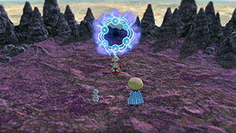
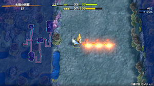

  

# Overview

<table class="dungeonOverview">
  <tr>
    <th>Unlock</th>
    <td class="highlightYellow">Clear Dune of Batsu.</td>
  </tr>
  <tr>
    <th>Entrance</th>
    <td class="highlightYellow">Shukuba Beach (near exit)</td>
  </tr>
</table>

<table class="dungeonTable">
  <tr>
    <th>Floors</th>
    <td colspan="3">20F</td>
  </tr>
  <tr>
    <th>Bring Items</th>
    <td>No</td>
    <th>Allies</th>
    <td>No</td>
  </tr>
  <tr>
    <th>Rescues</th>
    <td>3</td>
    <th>Starting Level</th>
    <td>Lv1</td>
  </tr>
  <tr>
    <th>Starting Item</th>
    <td colspan="3">Large Onigiri</td>
  </tr>
  <tr>
    <th>Unidentified</th>
    <td colspan="3"></td>
  </tr>
  <tr>
    <th>Shops</th>
    <td>Yes</td>
    <th>Monster Houses</th>
    <td></td>
  </tr>
  <tr>
    <th>Kron's Challenge</th>
    <td></td>
    <th>Fever Time</th>
    <td></td>
  </tr>
  <tr>
    <th>Initial Enemies</th>
    <td></td>
    <th>Spawn Rate</th>
    <td></td>
  </tr>
  <tr>
    <th>Wind of Kron</th>
    <td>900</td>
    <th>Reward</th>
    <td></td>
  </tr>
</table>

Post-game story dungeon where you play as Shiren fused with Kokatsu (1st clear only). Shiren cannot equip weapons, shields, or bracelets, and also cannot use arrows or rocks in this form. This form isn't simply a restriction, however, as Shiren can perform special attacks by spending fullness. Shiren's normal attack also changes to a flame attack which increases in range as you defeat enemies. Overall, the first clear of this dungeon is a fun diversion from the usual gameplay.

# Strategy

### Fused Form

#### Normal Attack

Shiren's normal attack initially reaches 1 tile ahead, but gains 1 tile of range per enemy defeated (max: 3 tiles). However, the boosted normal attack range resets to the initial state whenever Shiren receives damage. Since Shiren can't equip a shield, it's very important to utilize the extended range to avoid damage. This normal attack can cut through corners, and can also hit Pumphantasms inside walls.

#### Special Attacks

|Name|Fullness|Effect|
|-|-|-|
|Sand-handling|10|Creates a pillar of sand in front of you. If the tile in front is a wall, digs out the wall tile.|
|Deception|20|Creates a decoy.|
|Blazing Heat|60|Deals 40\~50 damage to all monsters in the room. Also inflicts Blind status at the same time.|
|Sun's Blessing|10|Transforms the selected item into a random Grass or Onigiri category item.|

### First Clear

#### Important Items

The special attack "Sun's Blessing" is the key to stocking up on most of the following items. However, it often gives mediocre items as well, so don't expect only useful items when you use it.

##### Revival Grass / Invincible Grass / Swift Grass / Leaping Grass / Power-up Grass

These are all items that help you get out of tricky situations. Keep 1 Power-up Grass on hand for the boss if you manage to obtain one.

##### Life Grass / Healing Grass / Otogirisou / Herb / Strength Grass / Fortune Grass

Without access to shields, increasing max HP is the main way to improve Shiren's survivability. Likewise, increasing Shiren's level and strength is the only way to deal more damage.

##### Onigiri

Since fullness is consumed to fuel special attacks, aim to keep 1\~3 onigiri on hand at all times. Onigiri can be grilled using an Explochin (9-15F) or Explosion Trap if desired, but it can be a bit risky. Special Onigiri's Knowledgeable status bonus is helpful early on, but it only replenishes 30 fullness, so prioritize more filling onigiri items as you descend further into the dungeon.

##### Peach Staff

If you're lucky enough to find this staff, you can perform additional farming techniques (see below). Of course, being able to one-shot any monster besides Hoppin' Batter types is handy as well.

##### Mapping Scroll

Being able to see where enemies are located makes it easier to maintain 3 tile normal attacks. Most monsters in this dungeon don't have ranged attacks, so it puts you at a big advantage. It's recommended to linger and hunt monsters whenever you use one of these scrolls.

#### Farming Techniques

##### Ghost Radish Bun (6-11F) / Daze Radish Bun (16-19F)

If you find a Peach Staff, turn into a Ghost Radish or Daze Radish and throw grass, then use Sun's Blessing on the Poison Grass or Confusion Grass to obtain better grass and food items. Chow, Gazer, Mudkin, or Explochin can cause issues while you do this, so be sure to seal off the room using Sand-handling beforehand - and check for traps if you want to be extra safe. Remember that the effect of Seewell Grass wears off when you eat a Peach Bun.

##### Mudkin Hunting (6-11F)

Mudkin's special attack lowers Shiren's attack and defense in fused form. So the idea is to intentionally get weakened by Mudkin a few times, then attack to make them multiply. Once there are lots of Lv1 Mudkin, use Blazing Heat once to blind them and create a Lv2 Mudkin, then repeat the process until you ultimately have a bunch of Lv3 or Lv4 Mudkin in the room. At that point, wipe out all remaining Mudkins using Blazing Heat to obtain a lot of experience points. Seal off the room using Sand-handling beforehand, and stand on the stairs in case it gets out of control. Lv3-4 Mudkin require 3 uses of Blazing Heat, so you'll need a total of about 300\~350 fullness.

##### Other Methods

Use Seewell Grass and search for an arrow trap, then create a sand pillar next to it and throw items against the sand pillar to obtain single arrows to be used as fodder for Sun's Blessing.

Blank Scroll → Monstercall Scroll can be helpful to stock up on some items during early game.

Thiefwalrus (9-19F), Froggo (6-10F), and Chow (6-10F) can be hunted for extra items.

### Second Clear

As mentioned in the overview section, the player cannot play as fused Shiren after the first clear. This is a problem, since the item and monster tables are balanced around fused Shiren's abilities. You'll be facing stronger enemies like Nashagga, Mixer, and Hoppin' Slugger without a range advantage, and most items on the ground are low quality since they expect you to use Sun's Blessing on them. Equipment is also on the rare side, and it's impossible to create a Cave Mamel to quickly level up, so all I can really say is expect to reset a lot until you get a decent start.

# Floor Guide

This section is written with the first clear in mind.

### 1-5F

It's fine to use staves and grass items to identify them - at worst, you might eat a bad status grass. Alternatively, collect unidentified items and then try for Special Onigiri's Knowledgeable status bonus. Use equipment and Gitan as fodder for Sun's Blessing - dash to step on Gitan without picking it up. If you find a shop, you can sell Special Onigiri to secure funds for shopping.

Pumphantasm (23 HP, 16 atk) and Gazer (30 HP, 18 atk) both appear from 4F, so aim for Lv7 by 3F. Hoppin' Hitter (32 HP, 22 atk) appears from 5F, so aim for Lv10 for faster HP regen before 5F.

### 6-11F

This is usually the last floor range where you can comfortably keep up with enemies. If you found a Peach Staff, consider transforming into Ghost Radish to farm Poison Grass. Otherwise, check rooms for items while being careful about groups of enemies.

Hunt Mudkins (6-19F) using the method explained in an earlier section to level up if possible.

Chow (6-8F) can cause a different monster to level up, so watch the message log closely. Remember that you can use Deception or Blazing Heat to deal with a leveled up monster if needed.

Dangerous monsters who appear between 9-15F: Nashagga (70 HP, 21 atk) attacks 2 times per turn - don't be deceived by its lower attack stat. Explochin (120 HP, 25 atk) stops moving when HP &le; 50%, and explodes when HP &le; 24.

### 12-15F

Chow exits the monster table in this range, so you don't need to worry about monsters leveling up. Mixer (78 HP, 39 atk) and Pumpanshee (60 HP, 35 atk) appear in addition to Nashagga and Explochin. Don't just trade hits with them - fight with a range advantage, or use a special attack or item.

If you have food and see an opportunity to seal off the stairs room to hunt Mudkins, go ahead and do so, but remember to keep onigiri on hand for the boss fight too.

### 16-19F

Mixer and Pumpanshee are still around, and Chow returns. Rush to the stairs using any Mapping Scrolls and Seewell Grass you saved for this floor range. If you end up in a bad situation, don't hesitate to use special attacks or items before it becomes dire.

Daze Radish (80 HP, 37 atk) throws Confusion Grass within a 2 tile radius. Hoppin' Slugger (72 HP, 39 atk) nullifies or reflects staff magic and thrown items. Super Gazer (60 HP, 30 atk) hypnotizes you and makes you perform a random action. Capt. Spearfish (100 HP, 39 atk) has high survivability thanks to its underwater HP regen. Dartingfrog (75 HP, 40 atk) pulls you closer and attacks, negating any range advantage.

### Boss

Embodiment of Suiryu (555 HP, 40 atk, 22 def) is an Aquatic and Dragon dual-type monster. Status conditions can be inflicted, but they get cured in roughly 2\~4 turns depending on the status. Sanctuary Scroll and Knockback Staff do not work, but Paralyzing Staff and Narrow-escape Staff do work.

Special attacks:

- [Content]

Other notes:

- [Content]

# Monsters

See [Monsters](/system/monsters) for individual monster details.

- F - Dark hallways
- S - Shop is possible
- H - Monster House is possible
- G - Golden Egg Thing is possible
- B - Behemoth Monsters are possible

Monster Colors = Farming, Useful, Lowers Stats, Targets Items, Dangerous

<table class="monsterTable">
  <thead>
    <tr>
      <th>F</th>
      <th>S</th>
      <th>H</th>
      <th>G</th>
      <th colspan="5">Monsters</th>
      <th>B</th>
    </tr>
  </thead>
  <tbody>
    <tr>
      <td class="centeredText">1</td>
      <td class=""></td>
      <td class=""></td>
      <td class=""></td>
      <td> Pullfrog</td>
      <td> Spearfish</td>
      <td> Shagga</td>
      <td class="highlightGray"></td>
      <td class="highlightGray"></td>
      <td class=""></td>
    </tr>
    <tr>
      <td colspan="10" class="tableDivider"></td>
    </tr>
    <tr>
      <td class="centeredText">2</td>
      <td class=""></td>
      <td class="highlightMH"></td>
      <td class=""></td>
      <td> Octopling</td>
      <td> Pullfrog</td>
      <td> Spearfish</td>
      <td> Shagga</td>
      <td class="highlightGray"></td>
      <td class=""></td>
    </tr>
    <tr>
      <td colspan="10" class="tableDivider"></td>
    </tr>
    <tr>
      <td class="centeredText">3</td>
      <td class=""></td>
      <td class="highlightMH"></td>
      <td class=""></td>
      <td> Octopling</td>
      <td> Pullfrog</td>
      <td> Spearfish</td>
      <td> Shagga</td>
      <td class="highlightGray"></td>
      <td class=""></td>
    </tr>
    <tr>
      <td colspan="10" class="tableDivider"></td>
    </tr>
    <tr>
      <td rowspan="2" class="centeredText">4</td>
      <td rowspan="2" class="highlightShop"></td>
      <td rowspan="2" class=""></td>
      <td rowspan="2" class=""></td>
      <td> Octopling</td>
      <td> Pullfrog</td>
      <td> Spearfish</td>
      <td class="items"> Gazer</td>
      <td> Pumphantasm</td>
      <td rowspan="2" class=""></td>
    </tr>
    <tr>
      <td> Shagga</td>
      <td class="highlightGray"></td>
      <td class="highlightGray"></td>
      <td class="highlightGray"></td>
      <td class="highlightGray"></td>
    </tr>
    <tr>
      <td colspan="10" class="tableDivider"></td>
    </tr>
    <tr>
      <td rowspan="2" class="centeredText">5</td>
      <td rowspan="2" class=""></td>
      <td rowspan="2" class=""></td>
      <td rowspan="2" class=""></td>
      <td> Hoppin' Hitter</td>
      <td> Octopling</td>
      <td> Pullfrog</td>
      <td> Spearfish</td>
      <td class="items"> Gazer</td>
      <td rowspan="2" class=""></td>
    </tr>
    <tr>
      <td> Pumphantasm</td>
      <td> Shagga</td>
      <td class="highlightGray"></td>
      <td class="highlightGray"></td>
      <td class="highlightGray"></td>
    </tr>
    <tr>
      <td colspan="10" class="tableDivider"></td>
    </tr>
    <tr>
      <td rowspan="2" class="centeredText">6</td>
      <td rowspan="2" class=""></td>
      <td rowspan="2" class="highlightMH"></td>
      <td rowspan="2" class=""></td>
      <td class="stats"> Ghost Radish</td>
      <td> Hoppin' Hitter</td>
      <td class="farming"> Froggo</td>
      <td class="items"> Mudkin</td>
      <td class="items"> Gazer</td>
      <td rowspan="2" class=""></td>
    </tr>
    <tr>
      <td> Pumphantasm</td>
      <td class="farming"> Chow</td>
      <td class="highlightGray"></td>
      <td class="highlightGray"></td>
      <td class="highlightGray"></td>
    </tr>
    <tr>
      <td colspan="10" class="tableDivider"></td>
    </tr>
    <tr>
      <td rowspan="2" class="centeredText">7</td>
      <td rowspan="2" class=""></td>
      <td rowspan="2" class=""></td>
      <td rowspan="2" class=""></td>
      <td class="stats"> Ghost Radish</td>
      <td> Hoppin' Hitter</td>
      <td class="farming"> Froggo</td>
      <td class="items"> Mudkin</td>
      <td class="items"> Gazer</td>
      <td rowspan="2" class=""></td>
    </tr>
    <tr>
      <td> Pumphantasm</td>
      <td class="farming"> Chow</td>
      <td class="highlightGray"></td>
      <td class="highlightGray"></td>
      <td class="highlightGray"></td>
    </tr>
    <tr>
      <td colspan="10" class="tableDivider"></td>
    </tr>
    <tr>
      <td rowspan="2" class="centeredText">8</td>
      <td rowspan="2" class=""></td>
      <td rowspan="2" class=""></td>
      <td rowspan="2" class=""></td>
      <td class="stats"> Ghost Radish</td>
      <td> Hoppin' Hitter</td>
      <td class="farming"> Froggo</td>
      <td class="items"> Mudkin</td>
      <td class="items"> Gazer</td>
      <td rowspan="2" class=""></td>
    </tr>
    <tr>
      <td> Pumphantasm</td>
      <td class="farming"> Chow</td>
      <td class="highlightGray"></td>
      <td class="highlightGray"></td>
      <td class="highlightGray"></td>
    </tr>
    <tr>
      <td colspan="10" class="tableDivider"></td>
    </tr>
    <tr>
      <td rowspan="2" class="centeredText">9</td>
      <td rowspan="2" class=""></td>
      <td rowspan="2" class=""></td>
      <td rowspan="2" class=""></td>
      <td class="stats"> Ghost Radish</td>
      <td> Bored Kappa</td>
      <td> Fresh Octopling</td>
      <td> Lt. Spearfish</td>
      <td class="farming"> Froggo</td>
      <td rowspan="2" class=""></td>
    </tr>
    <tr>
      <td class="farming"> Thiefwalrus</td>
      <td class="items"> Mudkin</td>
      <td> Nashagga</td>
      <td> Explochin</td>
      <td class="farming"> Chow</td>
    </tr>
    <tr>
      <td colspan="10" class="tableDivider"></td>
    </tr>
    <tr>
      <td rowspan="2" class="centeredText">10</td>
      <td rowspan="2" class=""></td>
      <td rowspan="2" class=""></td>
      <td rowspan="2" class=""></td>
      <td class="stats"> Ghost Radish</td>
      <td> Bored Kappa</td>
      <td> Fresh Octopling</td>
      <td> Lt. Spearfish</td>
      <td class="farming"> Froggo</td>
      <td rowspan="2" class=""></td>
    </tr>
    <tr>
      <td class="farming"> Thiefwalrus</td>
      <td class="items"> Mudkin</td>
      <td> Nashagga</td>
      <td> Explochin</td>
      <td class="farming"> Chow</td>
    </tr>
    <tr>
      <td colspan="10" class="tableDivider"></td>
    </tr>
    <tr>
      <td rowspan="2" class="centeredText">11</td>
      <td rowspan="2" class=""></td>
      <td rowspan="2" class="highlightMH"></td>
      <td rowspan="2" class=""></td>
      <td class="stats"> Ghost Radish</td>
      <td> Bored Kappa</td>
      <td> Fresh Octopling</td>
      <td> Lt. Spearfish</td>
      <td class="farming"> Thiefwalrus</td>
      <td rowspan="2" class=""></td>
    </tr>
    <tr>
      <td class="items"> Mudkin</td>
      <td> Nashagga</td>
      <td> Explochin</td>
      <td class="highlightGray"></td>
      <td class="highlightGray"></td>
    </tr>
    <tr>
      <td colspan="10" class="tableDivider"></td>
    </tr>
    <tr>
      <td rowspan="2" class="centeredText">12</td>
      <td rowspan="2" class=""></td>
      <td rowspan="2" class=""></td>
      <td rowspan="2" class=""></td>
      <td> Bored Kappa</td>
      <td> Lt. Spearfish</td>
      <td class="farming"> Thiefwalrus</td>
      <td class="items"> Mudkin</td>
      <td> Pumpanshee</td>
      <td rowspan="2" class=""></td>
    </tr>
    <tr>
      <td> Nashagga</td>
      <td> Explochin</td>
      <td class="useful"> Mixer</td>
      <td> Schubell</td>
      <td class="highlightGray"></td>
    </tr>
    <tr>
      <td colspan="10" class="tableDivider"></td>
    </tr>
    <tr>
      <td rowspan="2" class="centeredText">13</td>
      <td rowspan="2" class=""></td>
      <td rowspan="2" class="highlightMH"></td>
      <td rowspan="2" class=""></td>
      <td> Bored Kappa</td>
      <td class="farming"> Thiefwalrus</td>
      <td class="items"> Mudkin</td>
      <td> Pumpanshee</td>
      <td> Nashagga</td>
      <td rowspan="2" class=""></td>
    </tr>
    <tr>
      <td> Explochin</td>
      <td class="useful"> Mixer</td>
      <td> Schubell</td>
      <td class="highlightGray"></td>
      <td class="highlightGray"></td>
    </tr>
    <tr>
      <td colspan="10" class="tableDivider"></td>
    </tr>
    <tr>
      <td rowspan="2" class="centeredText">14</td>
      <td rowspan="2" class=""></td>
      <td rowspan="2" class=""></td>
      <td rowspan="2" class=""></td>
      <td> Bored Kappa</td>
      <td class="farming"> Thiefwalrus</td>
      <td class="items"> Mudkin</td>
      <td> Pumpanshee</td>
      <td> Nashagga</td>
      <td rowspan="2" class=""></td>
    </tr>
    <tr>
      <td> Explochin</td>
      <td class="useful"> Mixer</td>
      <td> Schubell</td>
      <td class="highlightGray"></td>
      <td class="highlightGray"></td>
    </tr>
    <tr>
      <td colspan="10" class="tableDivider"></td>
    </tr>
    <tr>
      <td rowspan="2" class="centeredText">15</td>
      <td rowspan="2" class="highlightShop"></td>
      <td rowspan="2" class=""></td>
      <td rowspan="2" class=""></td>
      <td> Bored Kappa</td>
      <td class="farming"> Thiefwalrus</td>
      <td class="items"> Mudkin</td>
      <td> Pumpanshee</td>
      <td> Nashagga</td>
      <td rowspan="2" class=""></td>
    </tr>
    <tr>
      <td> Explochin</td>
      <td class="useful"> Mixer</td>
      <td> Schubell</td>
      <td class="highlightGray"></td>
      <td class="highlightGray"></td>
    </tr>
    <tr>
      <td colspan="10" class="tableDivider"></td>
    </tr>
    <tr>
      <td rowspan="3" class="centeredText">16</td>
      <td rowspan="3" class=""></td>
      <td rowspan="3" class=""></td>
      <td rowspan="3" class=""></td>
      <td class="stats"> Daze Radish</td>
      <td> Hoppin' Slugger</td>
      <td> Capt. Spearfish</td>
      <td class="farming"> Froggucchi</td>
      <td class="farming"> Thiefwalrus</td>
      <td rowspan="3" class=""></td>
    </tr>
    <tr>
      <td class="items"> Mudkin</td>
      <td class="items"> Super Gazer</td>
      <td> Pumpanshee</td>
      <td class="farming"> Chow</td>
      <td class="useful"> Mixer</td>
    </tr>
    <tr>
      <td> Schubell</td>
      <td class="highlightGray"></td>
      <td class="highlightGray"></td>
      <td class="highlightGray"></td>
      <td class="highlightGray"></td>
    </tr>
    <tr>
      <td colspan="10" class="tableDivider"></td>
    </tr>
    <tr>
      <td rowspan="3" class="centeredText">17</td>
      <td rowspan="3" class=""></td>
      <td rowspan="3" class=""></td>
      <td rowspan="3" class="highlightGold"></td>
      <td class="stats"> Daze Radish</td>
      <td> Hoppin' Slugger</td>
      <td> Capt. Spearfish</td>
      <td class="farming"> Froggucchi</td>
      <td class="farming"> Thiefwalrus</td>
      <td rowspan="3" class=""></td>
    </tr>
    <tr>
      <td class="items"> Mudkin</td>
      <td class="items"> Super Gazer</td>
      <td> Pumpanshee</td>
      <td class="farming"> Chow</td>
      <td class="useful"> Mixer</td>
    </tr>
    <tr>
      <td> Schubell</td>
      <td class="highlightGray"></td>
      <td class="highlightGray"></td>
      <td class="highlightGray"></td>
      <td class="highlightGray"></td>
    </tr>
    <tr>
      <td colspan="10" class="tableDivider"></td>
    </tr>
    <tr>
      <td rowspan="3" class="centeredText">18</td>
      <td rowspan="3" class=""></td>
      <td rowspan="3" class="highlightMH"></td>
      <td rowspan="3" class=""></td>
      <td class="stats"> Daze Radish</td>
      <td> Hoppin' Slugger</td>
      <td> Dartingfrog</td>
      <td> Capt. Spearfish</td>
      <td class="farming"> Froggucchi</td>
      <td rowspan="3" class=""></td>
    </tr>
    <tr>
      <td class="farming"> Thiefwalrus</td>
      <td class="items"> Mudkin</td>
      <td class="items"> Super Gazer</td>
      <td> Pumpanshee</td>
      <td class="farming"> Chow</td>
    </tr>
    <tr>
      <td class="useful"> Mixer</td>
      <td> Schubell</td>
      <td class="highlightGray"></td>
      <td class="highlightGray"></td>
      <td class="highlightGray"></td>
    </tr>
    <tr>
      <td colspan="10" class="tableDivider"></td>
    </tr>
    <tr>
      <td rowspan="3" class="centeredText">19</td>
      <td rowspan="3" class=""></td>
      <td rowspan="3" class=""></td>
      <td rowspan="3" class=""></td>
      <td class="stats"> Daze Radish</td>
      <td> Hoppin' Slugger</td>
      <td> Dartingfrog</td>
      <td> Capt. Spearfish</td>
      <td class="farming"> Froggucchi</td>
      <td rowspan="3" class=""></td>
    </tr>
    <tr>
      <td class="farming"> Thiefwalrus</td>
      <td class="items"> Mudkin</td>
      <td class="items"> Super Gazer</td>
      <td> Pumpanshee</td>
      <td class="farming"> Chow</td>
    </tr>
    <tr>
      <td class="useful"> Mixer</td>
      <td> Schubell</td>
      <td class="highlightGray"></td>
      <td class="highlightGray"></td>
      <td class="highlightGray"></td>
    </tr>
    <tr>
      <td colspan="10" class="tableDivider"></td>
    </tr>
    <tr>
      <td rowspan="2" class="highlightOrange2 centeredText">20</td>
      <td rowspan="2" class=""></td>
      <td rowspan="2" class=""></td>
      <td rowspan="2" class=""></td>
      <td class="danger"> Suiryu</td>
      <td class="stats"> Daze Radish</td>
      <td> Bored Kappa</td>
      <td class="items"> Pesky Kappa</td>
      <td> Dartingfrog</td>
      <td rowspan="2" class=""></td>
    </tr>
    <tr>
      <td> Spearfish</td>
      <td> Lt. Spearfish</td>
      <td> Capt. Spearfish</td>
      <td class="items"> Super Gazer</td>
      <td> Schubell</td>
    </tr>
  </tbody>
</table>

# Items

- F = Floor
- S = Shop
- T = Trader
- M = Monster drop
- B = Buried
- Z = Zalokleft
- I = Island
- P = Presto Pot
- U = Surprise Pot
- W = Wish Cave

#### Weapon

<table class="dungeonItemTable">
  <tr>
    <th colspan="11" class="highlightLightblue">Weapon</th>
  </tr>
  <tr>
    <th>Name</th>
    <th>F</th>
    <th>S</th>
    <th>T</th>
    <th>M</th>
    <th>B</th>
    <th>Z</th>
    <th>I</th>
    <th>P</th>
    <th>U</th>
    <th>W</th>
  </tr>
  <tr>
    <td class="leftText">Wooden Sword</td>
    <td></td>
    <td></td>
    <td></td>
    <td></td>
    <td></td>
    <td></td>
    <td></td>
    <td></td>
    <td></td>
    <td></td>
  </tr>
  <tr>
    <td class="leftText">Bronze Sword</td>
    <td></td>
    <td></td>
    <td></td>
    <td></td>
    <td></td>
    <td></td>
    <td></td>
    <td></td>
    <td></td>
    <td></td>
  </tr>
  <tr>
    <td class="leftText">Katana</td>
    <td></td>
    <td></td>
    <td></td>
    <td></td>
    <td></td>
    <td></td>
    <td></td>
    <td></td>
    <td></td>
    <td></td>
  </tr>
  <tr>
    <td class="leftText">Doutanuki</td>
    <td></td>
    <td></td>
    <td></td>
    <td></td>
    <td></td>
    <td></td>
    <td></td>
    <td></td>
    <td></td>
    <td></td>
  </tr>
  <tr>
    <td class="leftText">Manji Kabura</td>
    <td></td>
    <td></td>
    <td></td>
    <td></td>
    <td></td>
    <td></td>
    <td></td>
    <td></td>
    <td></td>
    <td></td>
  </tr>
  <tr>
    <td class="leftText">Kajin Fuuma</td>
    <td></td>
    <td></td>
    <td></td>
    <td></td>
    <td></td>
    <td></td>
    <td></td>
    <td></td>
    <td></td>
    <td></td>
  </tr>
  <tr>
    <td class="leftText">Kabura Sutegi</td>
    <td></td>
    <td></td>
    <td></td>
    <td></td>
    <td></td>
    <td></td>
    <td></td>
    <td></td>
    <td></td>
    <td></td>
  </tr>
  <tr>
    <td class="leftText">Golden Sword</td>
    <td></td>
    <td></td>
    <td></td>
    <td></td>
    <td></td>
    <td></td>
    <td></td>
    <td></td>
    <td></td>
    <td></td>
  </tr>
  <tr>
    <td class="leftText">Kama Itachi</td>
    <td></td>
    <td></td>
    <td></td>
    <td></td>
    <td></td>
    <td></td>
    <td></td>
    <td></td>
    <td></td>
    <td></td>
  </tr>
  <tr>
    <td class="leftText">Axe of the Minotaur</td>
    <td></td>
    <td></td>
    <td></td>
    <td></td>
    <td></td>
    <td></td>
    <td></td>
    <td></td>
    <td></td>
    <td></td>
  </tr>
  <tr>
    <td class="leftText">Accurate Sword</td>
    <td></td>
    <td></td>
    <td></td>
    <td></td>
    <td></td>
    <td></td>
    <td></td>
    <td></td>
    <td></td>
    <td></td>
  </tr>
  <tr>
    <td class="leftText">Swift Sword</td>
    <td></td>
    <td></td>
    <td></td>
    <td></td>
    <td></td>
    <td></td>
    <td></td>
    <td></td>
    <td></td>
    <td></td>
  </tr>
  <tr>
    <td class="leftText">Watersplitter</td>
    <td></td>
    <td></td>
    <td></td>
    <td></td>
    <td></td>
    <td></td>
    <td></td>
    <td></td>
    <td></td>
    <td></td>
  </tr>
  <tr>
    <td class="leftText">Primal Axe</td>
    <td></td>
    <td></td>
    <td></td>
    <td></td>
    <td></td>
    <td></td>
    <td></td>
    <td></td>
    <td></td>
    <td></td>
  </tr>
  <tr>
    <td class="leftText">Dragonkiller</td>
    <td></td>
    <td></td>
    <td></td>
    <td></td>
    <td></td>
    <td></td>
    <td></td>
    <td></td>
    <td></td>
    <td></td>
  </tr>
  <tr>
    <td class="leftText">Crescent Blade</td>
    <td></td>
    <td></td>
    <td></td>
    <td></td>
    <td></td>
    <td></td>
    <td></td>
    <td></td>
    <td></td>
    <td></td>
  </tr>
  <tr>
    <td class="leftText">Sky Sword</td>
    <td></td>
    <td></td>
    <td></td>
    <td></td>
    <td></td>
    <td></td>
    <td></td>
    <td></td>
    <td></td>
    <td></td>
  </tr>
  <tr>
    <td class="leftText">Sickle of Salvation</td>
    <td></td>
    <td></td>
    <td></td>
    <td></td>
    <td></td>
    <td></td>
    <td></td>
    <td></td>
    <td></td>
    <td></td>
  </tr>
  <tr>
    <td class="leftText">Drain Slayer</td>
    <td></td>
    <td></td>
    <td></td>
    <td></td>
    <td></td>
    <td></td>
    <td></td>
    <td></td>
    <td></td>
    <td></td>
  </tr>
  <tr>
    <td class="leftText">Cyclops Bane</td>
    <td></td>
    <td></td>
    <td></td>
    <td></td>
    <td></td>
    <td></td>
    <td></td>
    <td></td>
    <td></td>
    <td></td>
  </tr>
  <tr>
    <td class="leftText">Steel Severer</td>
    <td></td>
    <td></td>
    <td></td>
    <td></td>
    <td></td>
    <td></td>
    <td></td>
    <td></td>
    <td></td>
    <td></td>
  </tr>
  <tr>
    <td class="leftText">Whopping Harisen</td>
    <td></td>
    <td></td>
    <td></td>
    <td></td>
    <td></td>
    <td></td>
    <td></td>
    <td></td>
    <td></td>
    <td></td>
  </tr>
  <tr>
    <td class="leftText">Healing Sword</td>
    <td></td>
    <td></td>
    <td></td>
    <td></td>
    <td></td>
    <td></td>
    <td></td>
    <td></td>
    <td></td>
    <td></td>
  </tr>
  <tr>
    <td class="leftText">Peach Club</td>
    <td></td>
    <td></td>
    <td></td>
    <td></td>
    <td></td>
    <td></td>
    <td></td>
    <td></td>
    <td></td>
    <td></td>
  </tr>
  <tr>
    <td class="leftText">Spender's Club</td>
    <td></td>
    <td></td>
    <td></td>
    <td></td>
    <td></td>
    <td></td>
    <td></td>
    <td></td>
    <td></td>
    <td></td>
  </tr>
  <tr>
    <td class="leftText">Ferrous Greatsword</td>
    <td></td>
    <td></td>
    <td></td>
    <td></td>
    <td></td>
    <td></td>
    <td></td>
    <td></td>
    <td></td>
    <td></td>
  </tr>
  <tr>
    <td class="leftText">Steak Knife</td>
    <td></td>
    <td></td>
    <td></td>
    <td></td>
    <td></td>
    <td></td>
    <td></td>
    <td></td>
    <td></td>
    <td></td>
  </tr>
  <tr>
    <td class="leftText">Jagged Sword</td>
    <td></td>
    <td></td>
    <td></td>
    <td></td>
    <td></td>
    <td></td>
    <td></td>
    <td></td>
    <td></td>
    <td></td>
  </tr>
  <tr>
    <td class="leftText">Quad-edge</td>
    <td></td>
    <td></td>
    <td></td>
    <td></td>
    <td></td>
    <td></td>
    <td></td>
    <td></td>
    <td></td>
    <td></td>
  </tr>
  <tr>
    <td class="leftText">Auspicious Kumade</td>
    <td></td>
    <td></td>
    <td></td>
    <td></td>
    <td></td>
    <td></td>
    <td></td>
    <td></td>
    <td></td>
    <td></td>
  </tr>
  <tr>
    <td class="leftText">Pickaxe</td>
    <td></td>
    <td></td>
    <td></td>
    <td></td>
    <td></td>
    <td></td>
    <td></td>
    <td></td>
    <td></td>
    <td></td>
  </tr>
  <tr>
    <td class="leftText">Golden Pickaxe</td>
    <td></td>
    <td></td>
    <td></td>
    <td></td>
    <td></td>
    <td></td>
    <td></td>
    <td></td>
    <td></td>
    <td></td>
  </tr>
  <tr>
    <td class="leftText">Wooden Mallet</td>
    <td></td>
    <td></td>
    <td></td>
    <td></td>
    <td></td>
    <td></td>
    <td></td>
    <td></td>
    <td></td>
    <td></td>
  </tr>
  <tr>
    <td class="leftText">Epic Hammer</td>
    <td></td>
    <td></td>
    <td></td>
    <td></td>
    <td></td>
    <td></td>
    <td></td>
    <td></td>
    <td></td>
    <td></td>
  </tr>
  <tr>
    <td class="leftText">Trapseeker</td>
    <td></td>
    <td></td>
    <td></td>
    <td></td>
    <td></td>
    <td></td>
    <td></td>
    <td></td>
    <td></td>
    <td></td>
  </tr>
  <tr>
    <td class="leftText">Bonito Block</td>
    <td></td>
    <td></td>
    <td></td>
    <td></td>
    <td></td>
    <td></td>
    <td></td>
    <td></td>
    <td></td>
    <td></td>
  </tr>
  <tr>
    <td class="leftText">Yamanba's Cleaver</td>
    <td></td>
    <td></td>
    <td></td>
    <td></td>
    <td></td>
    <td></td>
    <td></td>
    <td></td>
    <td></td>
    <td></td>
  </tr>
  <tr>
    <td class="leftText">Break-Off Blade</td>
    <td></td>
    <td></td>
    <td></td>
    <td></td>
    <td></td>
    <td></td>
    <td></td>
    <td></td>
    <td></td>
    <td></td>
  </tr>
</table>

#### Shield

<table class="dungeonItemTable">
  <tr>
    <th colspan="11" class="highlightLightblue">Shield</th>
  </tr>
  <tr>
    <th>Name</th>
    <th>F</th>
    <th>S</th>
    <th>T</th>
    <th>M</th>
    <th>B</th>
    <th>Z</th>
    <th>I</th>
    <th>P</th>
    <th>U</th>
    <th>W</th>
  </tr>
  <tr>
    <td class="leftText">Wooden Shield</td>
    <td></td>
    <td></td>
    <td></td>
    <td></td>
    <td></td>
    <td></td>
    <td></td>
    <td></td>
    <td></td>
    <td></td>
  </tr>
  <tr>
    <td class="leftText">Bronze Shield</td>
    <td></td>
    <td></td>
    <td></td>
    <td></td>
    <td></td>
    <td></td>
    <td></td>
    <td></td>
    <td></td>
    <td></td>
  </tr>
  <tr>
    <td class="leftText">Iron Shield</td>
    <td></td>
    <td></td>
    <td></td>
    <td></td>
    <td></td>
    <td></td>
    <td></td>
    <td></td>
    <td></td>
    <td></td>
  </tr>
  <tr>
    <td class="leftText">Wolfshead</td>
    <td></td>
    <td></td>
    <td></td>
    <td></td>
    <td></td>
    <td></td>
    <td></td>
    <td></td>
    <td></td>
    <td></td>
  </tr>
  <tr>
    <td class="leftText">Fuuma Shield</td>
    <td></td>
    <td></td>
    <td></td>
    <td></td>
    <td></td>
    <td></td>
    <td></td>
    <td></td>
    <td></td>
    <td></td>
  </tr>
  <tr>
    <td class="leftText">Rasen Fuuma</td>
    <td></td>
    <td></td>
    <td></td>
    <td></td>
    <td></td>
    <td></td>
    <td></td>
    <td></td>
    <td></td>
    <td></td>
  </tr>
  <tr>
    <td class="leftText">Golden Shield</td>
    <td></td>
    <td></td>
    <td></td>
    <td></td>
    <td></td>
    <td></td>
    <td></td>
    <td></td>
    <td></td>
    <td></td>
  </tr>
  <tr>
    <td class="leftText">Counter Shield</td>
    <td></td>
    <td></td>
    <td></td>
    <td></td>
    <td></td>
    <td></td>
    <td></td>
    <td></td>
    <td></td>
    <td></td>
  </tr>
  <tr>
    <td class="leftText">Watchful Shield</td>
    <td></td>
    <td></td>
    <td></td>
    <td></td>
    <td></td>
    <td></td>
    <td></td>
    <td></td>
    <td></td>
    <td></td>
  </tr>
  <tr>
    <td class="leftText">Dragon Shield</td>
    <td></td>
    <td></td>
    <td></td>
    <td></td>
    <td></td>
    <td></td>
    <td></td>
    <td></td>
    <td></td>
    <td></td>
  </tr>
  <tr>
    <td class="leftText">Blast Shield</td>
    <td></td>
    <td></td>
    <td></td>
    <td></td>
    <td></td>
    <td></td>
    <td></td>
    <td></td>
    <td></td>
    <td></td>
  </tr>
  <tr>
    <td class="leftText">Targe of the Minotaur</td>
    <td></td>
    <td></td>
    <td></td>
    <td></td>
    <td></td>
    <td></td>
    <td></td>
    <td></td>
    <td></td>
    <td></td>
  </tr>
  <tr>
    <td class="leftText">Walrus Stopper</td>
    <td></td>
    <td></td>
    <td></td>
    <td></td>
    <td></td>
    <td></td>
    <td></td>
    <td></td>
    <td></td>
    <td></td>
  </tr>
  <tr>
    <td class="leftText">Froggo Stopper</td>
    <td></td>
    <td></td>
    <td></td>
    <td></td>
    <td></td>
    <td></td>
    <td></td>
    <td></td>
    <td></td>
    <td></td>
  </tr>
  <tr>
    <td class="leftText">Hat Stopper</td>
    <td></td>
    <td></td>
    <td></td>
    <td></td>
    <td></td>
    <td></td>
    <td></td>
    <td></td>
    <td></td>
    <td></td>
  </tr>
  <tr>
    <td class="leftText">Nigiri Stopper</td>
    <td></td>
    <td></td>
    <td></td>
    <td></td>
    <td></td>
    <td></td>
    <td></td>
    <td></td>
    <td></td>
    <td></td>
  </tr>
  <tr>
    <td class="leftText">Spearscale Shield</td>
    <td></td>
    <td></td>
    <td></td>
    <td></td>
    <td></td>
    <td></td>
    <td></td>
    <td></td>
    <td></td>
    <td></td>
  </tr>
  <tr>
    <td class="leftText">Kappa's Dish</td>
    <td></td>
    <td></td>
    <td></td>
    <td></td>
    <td></td>
    <td></td>
    <td></td>
    <td></td>
    <td></td>
    <td></td>
  </tr>
  <tr>
    <td class="leftText">Gazer Shield</td>
    <td></td>
    <td></td>
    <td></td>
    <td></td>
    <td></td>
    <td></td>
    <td></td>
    <td></td>
    <td></td>
    <td></td>
  </tr>
  <tr>
    <td class="leftText">Shield of Negation</td>
    <td></td>
    <td></td>
    <td></td>
    <td></td>
    <td></td>
    <td></td>
    <td></td>
    <td></td>
    <td></td>
    <td></td>
  </tr>
  <tr>
    <td class="leftText">Unmoving Wall</td>
    <td></td>
    <td></td>
    <td></td>
    <td></td>
    <td></td>
    <td></td>
    <td></td>
    <td></td>
    <td></td>
    <td></td>
  </tr>
  <tr>
    <td class="leftText">Zabuton</td>
    <td></td>
    <td></td>
    <td></td>
    <td></td>
    <td></td>
    <td></td>
    <td></td>
    <td></td>
    <td></td>
    <td></td>
  </tr>
  <tr>
    <td class="leftText">Spender's Shield</td>
    <td></td>
    <td></td>
    <td></td>
    <td></td>
    <td></td>
    <td></td>
    <td></td>
    <td></td>
    <td></td>
    <td></td>
  </tr>
  <tr>
    <td class="leftText">Ferrous Kite</td>
    <td></td>
    <td></td>
    <td></td>
    <td></td>
    <td></td>
    <td></td>
    <td></td>
    <td></td>
    <td></td>
    <td></td>
  </tr>
  <tr>
    <td class="leftText">Steak Plate</td>
    <td></td>
    <td></td>
    <td></td>
    <td></td>
    <td></td>
    <td></td>
    <td></td>
    <td></td>
    <td></td>
    <td></td>
  </tr>
  <tr>
    <td class="leftText">Gutsy Shield</td>
    <td></td>
    <td></td>
    <td></td>
    <td></td>
    <td></td>
    <td></td>
    <td></td>
    <td></td>
    <td></td>
    <td></td>
  </tr>
  <tr>
    <td class="leftText">Hunky-dory Shield</td>
    <td></td>
    <td></td>
    <td></td>
    <td></td>
    <td></td>
    <td></td>
    <td></td>
    <td></td>
    <td></td>
    <td></td>
  </tr>
  <tr>
    <td class="leftText">Bodhi Shield</td>
    <td></td>
    <td></td>
    <td></td>
    <td></td>
    <td></td>
    <td></td>
    <td></td>
    <td></td>
    <td></td>
    <td></td>
  </tr>
  <tr>
    <td class="leftText">Shield of Sating</td>
    <td></td>
    <td></td>
    <td></td>
    <td></td>
    <td></td>
    <td></td>
    <td></td>
    <td></td>
    <td></td>
    <td></td>
  </tr>
  <tr>
    <td class="leftText">Auspicious Omamori</td>
    <td></td>
    <td></td>
    <td></td>
    <td></td>
    <td></td>
    <td></td>
    <td></td>
    <td></td>
    <td></td>
    <td></td>
  </tr>
  <tr>
    <td class="leftText">Shield of Presage</td>
    <td></td>
    <td></td>
    <td></td>
    <td></td>
    <td></td>
    <td></td>
    <td></td>
    <td></td>
    <td></td>
    <td></td>
  </tr>
  <tr>
    <td class="leftText">Yamanba's Potlid</td>
    <td></td>
    <td></td>
    <td></td>
    <td></td>
    <td></td>
    <td></td>
    <td></td>
    <td></td>
    <td></td>
    <td></td>
  </tr>
  <tr>
    <td class="leftText">Break-Off Shield</td>
    <td></td>
    <td></td>
    <td></td>
    <td></td>
    <td></td>
    <td></td>
    <td></td>
    <td></td>
    <td></td>
    <td></td>
  </tr>
</table>

#### Bracelet

<table class="dungeonItemTable">
  <tr>
    <th colspan="11" class="highlightLightblue">Bracelet</th>
  </tr>
  <tr>
    <th>Name</th>
    <th>F</th>
    <th>S</th>
    <th>T</th>
    <th>M</th>
    <th>B</th>
    <th>Z</th>
    <th>I</th>
    <th>P</th>
    <th>U</th>
    <th>W</th>
  </tr>
  <tr>
    <td class="leftText">Healing Bracelet</td>
    <td></td>
    <td></td>
    <td></td>
    <td></td>
    <td></td>
    <td></td>
    <td></td>
    <td></td>
    <td></td>
    <td></td>
  </tr>
  <tr>
    <td class="leftText">Strength Bracelet</td>
    <td></td>
    <td></td>
    <td></td>
    <td></td>
    <td></td>
    <td></td>
    <td></td>
    <td></td>
    <td></td>
    <td></td>
  </tr>
  <tr>
    <td class="leftText">Bellyexpand Bracelet</td>
    <td></td>
    <td></td>
    <td></td>
    <td></td>
    <td></td>
    <td></td>
    <td></td>
    <td></td>
    <td></td>
    <td></td>
  </tr>
  <tr>
    <td class="leftText">Bellyshrink Bracelet</td>
    <td></td>
    <td></td>
    <td></td>
    <td></td>
    <td></td>
    <td></td>
    <td></td>
    <td></td>
    <td></td>
    <td></td>
  </tr>
  <tr>
    <td class="leftText">Fortune Bracelet</td>
    <td></td>
    <td></td>
    <td></td>
    <td></td>
    <td></td>
    <td></td>
    <td></td>
    <td></td>
    <td></td>
    <td></td>
  </tr>
  <tr>
    <td class="leftText">Cleansing Bracelet</td>
    <td></td>
    <td></td>
    <td></td>
    <td></td>
    <td></td>
    <td></td>
    <td></td>
    <td></td>
    <td></td>
    <td></td>
  </tr>
  <tr>
    <td class="leftText">Focusing Bracelet</td>
    <td></td>
    <td></td>
    <td></td>
    <td></td>
    <td></td>
    <td></td>
    <td></td>
    <td></td>
    <td></td>
    <td></td>
  </tr>
  <tr>
    <td class="leftText">Rousing Bracelet</td>
    <td></td>
    <td></td>
    <td></td>
    <td></td>
    <td></td>
    <td></td>
    <td></td>
    <td></td>
    <td></td>
    <td></td>
  </tr>
  <tr>
    <td class="leftText">Rustproof Bracelet</td>
    <td></td>
    <td></td>
    <td></td>
    <td></td>
    <td></td>
    <td></td>
    <td></td>
    <td></td>
    <td></td>
    <td></td>
  </tr>
  <tr>
    <td class="leftText">Cursebreak Bracelet</td>
    <td></td>
    <td></td>
    <td></td>
    <td></td>
    <td></td>
    <td></td>
    <td></td>
    <td></td>
    <td></td>
    <td></td>
  </tr>
  <tr>
    <td class="leftText">Affixing Bracelet</td>
    <td></td>
    <td></td>
    <td></td>
    <td></td>
    <td></td>
    <td></td>
    <td></td>
    <td></td>
    <td></td>
    <td></td>
  </tr>
  <tr>
    <td class="leftText">Far-throwing Bracelet</td>
    <td></td>
    <td></td>
    <td></td>
    <td></td>
    <td></td>
    <td></td>
    <td></td>
    <td></td>
    <td></td>
    <td></td>
  </tr>
  <tr>
    <td class="leftText">Bad-aim Bracelet</td>
    <td></td>
    <td></td>
    <td></td>
    <td></td>
    <td></td>
    <td></td>
    <td></td>
    <td></td>
    <td></td>
    <td></td>
  </tr>
  <tr>
    <td class="leftText">Sure-aim Bracelet</td>
    <td></td>
    <td></td>
    <td></td>
    <td></td>
    <td></td>
    <td></td>
    <td></td>
    <td></td>
    <td></td>
    <td></td>
  </tr>
  <tr>
    <td class="leftText">Bouncy Bracelet</td>
    <td></td>
    <td></td>
    <td></td>
    <td></td>
    <td></td>
    <td></td>
    <td></td>
    <td></td>
    <td></td>
    <td></td>
  </tr>
  <tr>
    <td class="leftText">Rapid-fire Bracelet</td>
    <td></td>
    <td></td>
    <td></td>
    <td></td>
    <td></td>
    <td></td>
    <td></td>
    <td></td>
    <td></td>
    <td></td>
  </tr>
  <tr>
    <td class="leftText">Daredevil Bracelet</td>
    <td></td>
    <td></td>
    <td></td>
    <td></td>
    <td></td>
    <td></td>
    <td></td>
    <td></td>
    <td></td>
    <td></td>
  </tr>
  <tr>
    <td class="leftText">Dreaded Bracelet</td>
    <td></td>
    <td></td>
    <td></td>
    <td></td>
    <td></td>
    <td></td>
    <td></td>
    <td></td>
    <td></td>
    <td></td>
  </tr>
  <tr>
    <td class="leftText">Leaping Bracelet</td>
    <td></td>
    <td></td>
    <td></td>
    <td></td>
    <td></td>
    <td></td>
    <td></td>
    <td></td>
    <td></td>
    <td></td>
  </tr>
  <tr>
    <td class="leftText">Blasting Bracelet</td>
    <td></td>
    <td></td>
    <td></td>
    <td></td>
    <td></td>
    <td></td>
    <td></td>
    <td></td>
    <td></td>
    <td></td>
  </tr>
  <tr>
    <td class="leftText">Clairvoyant Bracelet</td>
    <td></td>
    <td></td>
    <td></td>
    <td></td>
    <td></td>
    <td></td>
    <td></td>
    <td></td>
    <td></td>
    <td></td>
  </tr>
  <tr>
    <td class="leftText">Monster-find Bracelet</td>
    <td></td>
    <td></td>
    <td></td>
    <td></td>
    <td></td>
    <td></td>
    <td></td>
    <td></td>
    <td></td>
    <td></td>
  </tr>
  <tr>
    <td class="leftText">Item-find Bracelet</td>
    <td></td>
    <td></td>
    <td></td>
    <td></td>
    <td></td>
    <td></td>
    <td></td>
    <td></td>
    <td></td>
    <td></td>
  </tr>
  <tr>
    <td class="leftText">Passage-find Bracelet</td>
    <td></td>
    <td></td>
    <td></td>
    <td></td>
    <td></td>
    <td></td>
    <td></td>
    <td></td>
    <td></td>
    <td></td>
  </tr>
  <tr>
    <td class="leftText">Waterwalk Bracelet</td>
    <td></td>
    <td></td>
    <td></td>
    <td></td>
    <td></td>
    <td></td>
    <td></td>
    <td></td>
    <td></td>
    <td></td>
  </tr>
  <tr>
    <td class="leftText">Floating Bracelet</td>
    <td></td>
    <td></td>
    <td></td>
    <td></td>
    <td></td>
    <td></td>
    <td></td>
    <td></td>
    <td></td>
    <td></td>
  </tr>
  <tr>
    <td class="leftText">Wallpass Bracelet</td>
    <td></td>
    <td></td>
    <td></td>
    <td></td>
    <td></td>
    <td></td>
    <td></td>
    <td></td>
    <td></td>
    <td></td>
  </tr>
  <tr>
    <td class="leftText">Tiptoe Bracelet</td>
    <td></td>
    <td></td>
    <td></td>
    <td></td>
    <td></td>
    <td></td>
    <td></td>
    <td></td>
    <td></td>
    <td></td>
  </tr>
  <tr>
    <td class="leftText">Passerby Bracelet</td>
    <td></td>
    <td></td>
    <td></td>
    <td></td>
    <td></td>
    <td></td>
    <td></td>
    <td></td>
    <td></td>
    <td></td>
  </tr>
  <tr>
    <td class="leftText">Item-losing Bracelet</td>
    <td></td>
    <td></td>
    <td></td>
    <td></td>
    <td></td>
    <td></td>
    <td></td>
    <td></td>
    <td></td>
    <td></td>
  </tr>
  <tr>
    <td class="leftText">Gitan-losing Bracelet</td>
    <td></td>
    <td></td>
    <td></td>
    <td></td>
    <td></td>
    <td></td>
    <td></td>
    <td></td>
    <td></td>
    <td></td>
  </tr>
  <tr>
    <td class="leftText">Monstercall Bracelet</td>
    <td></td>
    <td></td>
    <td></td>
    <td></td>
    <td></td>
    <td></td>
    <td></td>
    <td></td>
    <td></td>
    <td></td>
  </tr>
  <tr>
    <td class="leftText">Trapmore Bracelet</td>
    <td></td>
    <td></td>
    <td></td>
    <td></td>
    <td></td>
    <td></td>
    <td></td>
    <td></td>
    <td></td>
    <td></td>
  </tr>
  <tr>
    <td class="leftText">Haggling Bracelet</td>
    <td></td>
    <td></td>
    <td></td>
    <td></td>
    <td></td>
    <td></td>
    <td></td>
    <td></td>
    <td></td>
    <td></td>
  </tr>
  <tr>
    <td class="leftText">Trapper's Bracelet</td>
    <td></td>
    <td></td>
    <td></td>
    <td></td>
    <td></td>
    <td></td>
    <td></td>
    <td></td>
    <td></td>
    <td></td>
  </tr>
  <tr>
    <td class="leftText">Appraiser's Bracelet</td>
    <td></td>
    <td></td>
    <td></td>
    <td></td>
    <td></td>
    <td></td>
    <td></td>
    <td></td>
    <td></td>
    <td></td>
  </tr>
  <tr>
    <td class="leftText">Cannonboost Bracelet</td>
    <td></td>
    <td></td>
    <td></td>
    <td></td>
    <td></td>
    <td></td>
    <td></td>
    <td></td>
    <td></td>
    <td></td>
  </tr>
</table>

#### Projectile

<table class="dungeonItemTable">
  <tr>
    <th colspan="11" class="highlightLightblue">Projectile</th>
  </tr>
  <tr>
    <th>Name</th>
    <th>F</th>
    <th>S</th>
    <th>T</th>
    <th>M</th>
    <th>B</th>
    <th>Z</th>
    <th>I</th>
    <th>P</th>
    <th>U</th>
    <th>W</th>
  </tr>
  <tr>
    <td class="leftText">Wooden Arrow</td>
    <td></td>
    <td></td>
    <td></td>
    <td></td>
    <td></td>
    <td></td>
    <td></td>
    <td></td>
    <td></td>
    <td></td>
  </tr>
  <tr>
    <td class="leftText">Iron Arrow</td>
    <td></td>
    <td></td>
    <td></td>
    <td></td>
    <td></td>
    <td></td>
    <td></td>
    <td></td>
    <td></td>
    <td></td>
  </tr>
  <tr>
    <td class="leftText">Silver Arrow</td>
    <td></td>
    <td></td>
    <td></td>
    <td></td>
    <td></td>
    <td></td>
    <td></td>
    <td></td>
    <td></td>
    <td></td>
  </tr>
  <tr>
    <td class="leftText">Poison Arrow</td>
    <td></td>
    <td></td>
    <td></td>
    <td></td>
    <td></td>
    <td></td>
    <td></td>
    <td></td>
    <td></td>
    <td></td>
  </tr>
  <tr>
    <td class="leftText">Truestrike Arrow</td>
    <td></td>
    <td></td>
    <td></td>
    <td></td>
    <td></td>
    <td></td>
    <td></td>
    <td></td>
    <td></td>
    <td></td>
  </tr>
  <tr>
    <td class="leftText">Rock</td>
    <td></td>
    <td></td>
    <td></td>
    <td></td>
    <td></td>
    <td></td>
    <td></td>
    <td></td>
    <td></td>
    <td></td>
  </tr>
  <tr>
    <td class="leftText">Porky's Rock</td>
    <td></td>
    <td></td>
    <td></td>
    <td></td>
    <td></td>
    <td></td>
    <td></td>
    <td></td>
    <td></td>
    <td></td>
  </tr>
</table>

#### Food

<table class="dungeonItemTable">
  <tr>
    <th colspan="11" class="highlightLightblue">Food</th>
  </tr>
  <tr>
    <th>Name</th>
    <th>F</th>
    <th>S</th>
    <th>T</th>
    <th>M</th>
    <th>B</th>
    <th>Z</th>
    <th>I</th>
    <th>P</th>
    <th>U</th>
    <th>W</th>
  </tr>
  <tr>
    <td class="leftText">Onigiri</td>
    <td></td>
    <td></td>
    <td></td>
    <td></td>
    <td></td>
    <td></td>
    <td></td>
    <td></td>
    <td></td>
    <td></td>
  </tr>
  <tr>
    <td class="leftText">Large Onigiri</td>
    <td></td>
    <td></td>
    <td></td>
    <td></td>
    <td></td>
    <td></td>
    <td></td>
    <td></td>
    <td></td>
    <td></td>
  </tr>
  <tr>
    <td class="leftText">Huge Onigiri</td>
    <td></td>
    <td></td>
    <td></td>
    <td></td>
    <td></td>
    <td></td>
    <td></td>
    <td></td>
    <td></td>
    <td></td>
  </tr>
  <tr>
    <td class="leftText">Rotten Onigiri</td>
    <td></td>
    <td></td>
    <td></td>
    <td></td>
    <td></td>
    <td></td>
    <td></td>
    <td></td>
    <td></td>
    <td></td>
  </tr>
  <tr>
    <td class="leftText">Grilled Onigiri</td>
    <td></td>
    <td></td>
    <td></td>
    <td></td>
    <td></td>
    <td></td>
    <td></td>
    <td></td>
    <td></td>
    <td></td>
  </tr>
  <tr>
    <td class="leftText">Special Onigiri</td>
    <td></td>
    <td></td>
    <td></td>
    <td></td>
    <td></td>
    <td></td>
    <td></td>
    <td></td>
    <td></td>
    <td></td>
  </tr>
  <tr>
    <td class="leftText">Sumo Onigiri</td>
    <td></td>
    <td></td>
    <td></td>
    <td></td>
    <td></td>
    <td></td>
    <td></td>
    <td></td>
    <td></td>
    <td></td>
  </tr>
  <tr>
    <td class="leftText">Sweet Potato</td>
    <td></td>
    <td></td>
    <td></td>
    <td></td>
    <td></td>
    <td></td>
    <td></td>
    <td></td>
    <td></td>
    <td></td>
  </tr>
  <tr>
    <td class="leftText">Yakitori</td>
    <td></td>
    <td></td>
    <td></td>
    <td></td>
    <td></td>
    <td></td>
    <td></td>
    <td></td>
    <td></td>
    <td></td>
  </tr>
  <tr>
    <td class="leftText">Rotten Peach Bun</td>
    <td></td>
    <td></td>
    <td></td>
    <td></td>
    <td></td>
    <td></td>
    <td></td>
    <td></td>
    <td></td>
    <td></td>
  </tr>
</table>

#### Grass

<table class="dungeonItemTable">
  <tr>
    <th colspan="11" class="highlightLightblue">Grass</th>
  </tr>
  <tr>
    <th>Name</th>
    <th>F</th>
    <th>S</th>
    <th>T</th>
    <th>M</th>
    <th>B</th>
    <th>Z</th>
    <th>I</th>
    <th>P</th>
    <th>U</th>
    <th>W</th>
  </tr>
  <tr>
    <td class="leftText">Weeds</td>
    <td></td>
    <td></td>
    <td></td>
    <td></td>
    <td></td>
    <td></td>
    <td></td>
    <td></td>
    <td></td>
    <td></td>
  </tr>
  <tr>
    <td class="leftText">Herb</td>
    <td></td>
    <td></td>
    <td></td>
    <td></td>
    <td></td>
    <td></td>
    <td></td>
    <td></td>
    <td></td>
    <td></td>
  </tr>
  <tr>
    <td class="leftText">Otogirisou</td>
    <td></td>
    <td></td>
    <td></td>
    <td></td>
    <td></td>
    <td></td>
    <td></td>
    <td></td>
    <td></td>
    <td></td>
  </tr>
  <tr>
    <td class="leftText">Healing Grass</td>
    <td></td>
    <td></td>
    <td></td>
    <td></td>
    <td></td>
    <td></td>
    <td></td>
    <td></td>
    <td></td>
    <td></td>
  </tr>
  <tr>
    <td class="leftText">Life Grass</td>
    <td></td>
    <td></td>
    <td></td>
    <td></td>
    <td></td>
    <td></td>
    <td></td>
    <td></td>
    <td></td>
    <td></td>
  </tr>
  <tr>
    <td class="leftText">Fragrant Grass</td>
    <td></td>
    <td></td>
    <td></td>
    <td></td>
    <td></td>
    <td></td>
    <td></td>
    <td></td>
    <td></td>
    <td></td>
  </tr>
  <tr>
    <td class="leftText">Revival Grass</td>
    <td></td>
    <td></td>
    <td></td>
    <td></td>
    <td></td>
    <td></td>
    <td></td>
    <td></td>
    <td></td>
    <td></td>
  </tr>
  <tr>
    <td class="leftText">Bellyexpand Seed</td>
    <td></td>
    <td></td>
    <td></td>
    <td></td>
    <td></td>
    <td></td>
    <td></td>
    <td></td>
    <td></td>
    <td></td>
  </tr>
  <tr>
    <td class="leftText">Bellyshrink Seed</td>
    <td></td>
    <td></td>
    <td></td>
    <td></td>
    <td></td>
    <td></td>
    <td></td>
    <td></td>
    <td></td>
    <td></td>
  </tr>
  <tr>
    <td class="leftText">Dragon Grass</td>
    <td></td>
    <td></td>
    <td></td>
    <td></td>
    <td></td>
    <td></td>
    <td></td>
    <td></td>
    <td></td>
    <td></td>
  </tr>
  <tr>
    <td class="leftText">Leaping Grass</td>
    <td></td>
    <td></td>
    <td></td>
    <td></td>
    <td></td>
    <td></td>
    <td></td>
    <td></td>
    <td></td>
    <td></td>
  </tr>
  <tr>
    <td class="leftText">Antidote Grass</td>
    <td></td>
    <td></td>
    <td></td>
    <td></td>
    <td></td>
    <td></td>
    <td></td>
    <td></td>
    <td></td>
    <td></td>
  </tr>
  <tr>
    <td class="leftText">Strength Grass</td>
    <td></td>
    <td></td>
    <td></td>
    <td></td>
    <td></td>
    <td></td>
    <td></td>
    <td></td>
    <td></td>
    <td></td>
  </tr>
  <tr>
    <td class="leftText">Poison Grass</td>
    <td></td>
    <td></td>
    <td></td>
    <td></td>
    <td></td>
    <td></td>
    <td></td>
    <td></td>
    <td></td>
    <td></td>
  </tr>
  <tr>
    <td class="leftText">Confusion Grass</td>
    <td></td>
    <td></td>
    <td></td>
    <td></td>
    <td></td>
    <td></td>
    <td></td>
    <td></td>
    <td></td>
    <td></td>
  </tr>
  <tr>
    <td class="leftText">Sedating Grass</td>
    <td></td>
    <td></td>
    <td></td>
    <td></td>
    <td></td>
    <td></td>
    <td></td>
    <td></td>
    <td></td>
    <td></td>
  </tr>
  <tr>
    <td class="leftText">Berserk Seed</td>
    <td></td>
    <td></td>
    <td></td>
    <td></td>
    <td></td>
    <td></td>
    <td></td>
    <td></td>
    <td></td>
    <td></td>
  </tr>
  <tr>
    <td class="leftText">Blinding Grass</td>
    <td></td>
    <td></td>
    <td></td>
    <td></td>
    <td></td>
    <td></td>
    <td></td>
    <td></td>
    <td></td>
    <td></td>
  </tr>
  <tr>
    <td class="leftText">Seewell Grass</td>
    <td></td>
    <td></td>
    <td></td>
    <td></td>
    <td></td>
    <td></td>
    <td></td>
    <td></td>
    <td></td>
    <td></td>
  </tr>
  <tr>
    <td class="leftText">Swift Grass</td>
    <td></td>
    <td></td>
    <td></td>
    <td></td>
    <td></td>
    <td></td>
    <td></td>
    <td></td>
    <td></td>
    <td></td>
  </tr>
  <tr>
    <td class="leftText">Power-up Grass</td>
    <td></td>
    <td></td>
    <td></td>
    <td></td>
    <td></td>
    <td></td>
    <td></td>
    <td></td>
    <td></td>
    <td></td>
  </tr>
  <tr>
    <td class="leftText">Invincible Grass</td>
    <td></td>
    <td></td>
    <td></td>
    <td></td>
    <td></td>
    <td></td>
    <td></td>
    <td></td>
    <td></td>
    <td></td>
  </tr>
  <tr>
    <td class="leftText">Fortune Grass</td>
    <td></td>
    <td></td>
    <td></td>
    <td></td>
    <td></td>
    <td></td>
    <td></td>
    <td></td>
    <td></td>
    <td></td>
  </tr>
  <tr>
    <td class="leftText">Angel Seed</td>
    <td></td>
    <td></td>
    <td></td>
    <td></td>
    <td></td>
    <td></td>
    <td></td>
    <td></td>
    <td></td>
    <td></td>
  </tr>
  <tr>
    <td class="leftText">Feeble Grass</td>
    <td></td>
    <td></td>
    <td></td>
    <td></td>
    <td></td>
    <td></td>
    <td></td>
    <td></td>
    <td></td>
    <td></td>
  </tr>
  <tr>
    <td class="leftText">Unlucky Seed</td>
    <td></td>
    <td></td>
    <td></td>
    <td></td>
    <td></td>
    <td></td>
    <td></td>
    <td></td>
    <td></td>
    <td></td>
  </tr>
  <tr>
    <td class="leftText">Ill-fated Seed</td>
    <td></td>
    <td></td>
    <td></td>
    <td></td>
    <td></td>
    <td></td>
    <td></td>
    <td></td>
    <td></td>
    <td></td>
  </tr>
</table>

#### Scroll

<table class="dungeonItemTable">
  <tr>
    <th colspan="11" class="highlightLightblue">Scroll</th>
  </tr>
  <tr>
    <th>Name</th>
    <th>F</th>
    <th>S</th>
    <th>T</th>
    <th>M</th>
    <th>B</th>
    <th>Z</th>
    <th>I</th>
    <th>P</th>
    <th>U</th>
    <th>W</th>
  </tr>
  <tr>
    <td class="leftText">Confusion Scroll</td>
    <td></td>
    <td></td>
    <td></td>
    <td></td>
    <td></td>
    <td></td>
    <td></td>
    <td></td>
    <td></td>
    <td></td>
  </tr>
  <tr>
    <td class="leftText">Slumber Scroll</td>
    <td></td>
    <td></td>
    <td></td>
    <td></td>
    <td></td>
    <td></td>
    <td></td>
    <td></td>
    <td></td>
    <td></td>
  </tr>
  <tr>
    <td class="leftText">Jitters Scroll</td>
    <td></td>
    <td></td>
    <td></td>
    <td></td>
    <td></td>
    <td></td>
    <td></td>
    <td></td>
    <td></td>
    <td></td>
  </tr>
  <tr>
    <td class="leftText">Windblade Scroll</td>
    <td></td>
    <td></td>
    <td></td>
    <td></td>
    <td></td>
    <td></td>
    <td></td>
    <td></td>
    <td></td>
    <td></td>
  </tr>
  <tr>
    <td class="leftText">Expulsion Scroll</td>
    <td></td>
    <td></td>
    <td></td>
    <td></td>
    <td></td>
    <td></td>
    <td></td>
    <td></td>
    <td></td>
    <td></td>
  </tr>
  <tr>
    <td class="leftText">Exorcism Scroll</td>
    <td></td>
    <td></td>
    <td></td>
    <td></td>
    <td></td>
    <td></td>
    <td></td>
    <td></td>
    <td></td>
    <td></td>
  </tr>
  <tr>
    <td class="leftText">Identifier Scroll</td>
    <td></td>
    <td></td>
    <td></td>
    <td></td>
    <td></td>
    <td></td>
    <td></td>
    <td></td>
    <td></td>
    <td></td>
  </tr>
  <tr>
    <td class="leftText">Heavenly Scroll</td>
    <td></td>
    <td></td>
    <td></td>
    <td></td>
    <td></td>
    <td></td>
    <td></td>
    <td></td>
    <td></td>
    <td></td>
  </tr>
  <tr>
    <td class="leftText">Earthly Scroll</td>
    <td></td>
    <td></td>
    <td></td>
    <td></td>
    <td></td>
    <td></td>
    <td></td>
    <td></td>
    <td></td>
    <td></td>
  </tr>
  <tr>
    <td class="leftText">Plating Scroll</td>
    <td></td>
    <td></td>
    <td></td>
    <td></td>
    <td></td>
    <td></td>
    <td></td>
    <td></td>
    <td></td>
    <td></td>
  </tr>
  <tr>
    <td class="leftText">Slot-adding Scroll</td>
    <td></td>
    <td></td>
    <td></td>
    <td></td>
    <td></td>
    <td></td>
    <td></td>
    <td></td>
    <td></td>
    <td></td>
  </tr>
  <tr>
    <td class="leftText">Rune-eraser Scroll</td>
    <td></td>
    <td></td>
    <td></td>
    <td></td>
    <td></td>
    <td></td>
    <td></td>
    <td></td>
    <td></td>
    <td></td>
  </tr>
  <tr>
    <td class="leftText">Silver-seal Scroll</td>
    <td></td>
    <td></td>
    <td></td>
    <td></td>
    <td></td>
    <td></td>
    <td></td>
    <td></td>
    <td></td>
    <td></td>
  </tr>
  <tr>
    <td class="leftText">Silverpurge Scroll</td>
    <td></td>
    <td></td>
    <td></td>
    <td></td>
    <td></td>
    <td></td>
    <td></td>
    <td></td>
    <td></td>
    <td></td>
  </tr>
  <tr>
    <td class="leftText">Pot-upsize Scroll</td>
    <td></td>
    <td></td>
    <td></td>
    <td></td>
    <td></td>
    <td></td>
    <td></td>
    <td></td>
    <td></td>
    <td></td>
  </tr>
  <tr>
    <td class="leftText">Extraction Scroll</td>
    <td></td>
    <td></td>
    <td></td>
    <td></td>
    <td></td>
    <td></td>
    <td></td>
    <td></td>
    <td></td>
    <td></td>
  </tr>
  <tr>
    <td class="leftText">Onigiri Scroll</td>
    <td></td>
    <td></td>
    <td></td>
    <td></td>
    <td></td>
    <td></td>
    <td></td>
    <td></td>
    <td></td>
    <td></td>
  </tr>
  <tr>
    <td class="leftText">Curse Scroll</td>
    <td></td>
    <td></td>
    <td></td>
    <td></td>
    <td></td>
    <td></td>
    <td></td>
    <td></td>
    <td></td>
    <td></td>
  </tr>
  <tr>
    <td class="leftText">Mapping Scroll</td>
    <td></td>
    <td></td>
    <td></td>
    <td></td>
    <td></td>
    <td></td>
    <td></td>
    <td></td>
    <td></td>
    <td></td>
  </tr>
  <tr>
    <td class="leftText">Map-loss Scroll</td>
    <td></td>
    <td></td>
    <td></td>
    <td></td>
    <td></td>
    <td></td>
    <td></td>
    <td></td>
    <td></td>
    <td></td>
  </tr>
  <tr>
    <td class="leftText">Trap-eraser Scroll</td>
    <td></td>
    <td></td>
    <td></td>
    <td></td>
    <td></td>
    <td></td>
    <td></td>
    <td></td>
    <td></td>
    <td></td>
  </tr>
  <tr>
    <td class="leftText">Trap Scroll</td>
    <td></td>
    <td></td>
    <td></td>
    <td></td>
    <td></td>
    <td></td>
    <td></td>
    <td></td>
    <td></td>
    <td></td>
  </tr>
  <tr>
    <td class="leftText">Water-drain Scroll</td>
    <td></td>
    <td></td>
    <td></td>
    <td></td>
    <td></td>
    <td></td>
    <td></td>
    <td></td>
    <td></td>
    <td></td>
  </tr>
  <tr>
    <td class="leftText">Monstercall Scroll</td>
    <td></td>
    <td></td>
    <td></td>
    <td></td>
    <td></td>
    <td></td>
    <td></td>
    <td></td>
    <td></td>
    <td></td>
  </tr>
  <tr>
    <td class="leftText">Wall-less Scroll</td>
    <td></td>
    <td></td>
    <td></td>
    <td></td>
    <td></td>
    <td></td>
    <td></td>
    <td></td>
    <td></td>
    <td></td>
  </tr>
  <tr>
    <td class="leftText">Gathering Scroll</td>
    <td></td>
    <td></td>
    <td></td>
    <td></td>
    <td></td>
    <td></td>
    <td></td>
    <td></td>
    <td></td>
    <td></td>
  </tr>
  <tr>
    <td class="leftText">Collection Scroll</td>
    <td></td>
    <td></td>
    <td></td>
    <td></td>
    <td></td>
    <td></td>
    <td></td>
    <td></td>
    <td></td>
    <td></td>
  </tr>
  <tr>
    <td class="leftText">Gambler's Scroll</td>
    <td></td>
    <td></td>
    <td></td>
    <td></td>
    <td></td>
    <td></td>
    <td></td>
    <td></td>
    <td></td>
    <td></td>
  </tr>
  <tr>
    <td class="leftText">Muzzle Scroll</td>
    <td></td>
    <td></td>
    <td></td>
    <td></td>
    <td></td>
    <td></td>
    <td></td>
    <td></td>
    <td></td>
    <td></td>
  </tr>
  <tr>
    <td class="leftText">Carry-ban Scroll</td>
    <td></td>
    <td></td>
    <td></td>
    <td></td>
    <td></td>
    <td></td>
    <td></td>
    <td></td>
    <td></td>
    <td></td>
  </tr>
  <tr>
    <td class="leftText">Swift Foe Scroll</td>
    <td></td>
    <td></td>
    <td></td>
    <td></td>
    <td></td>
    <td></td>
    <td></td>
    <td></td>
    <td></td>
    <td></td>
  </tr>
  <tr>
    <td class="leftText">Fixer Scroll</td>
    <td></td>
    <td></td>
    <td></td>
    <td></td>
    <td></td>
    <td></td>
    <td></td>
    <td></td>
    <td></td>
    <td></td>
  </tr>
  <tr>
    <td class="leftText">Escape Scroll</td>
    <td></td>
    <td></td>
    <td></td>
    <td></td>
    <td></td>
    <td></td>
    <td></td>
    <td></td>
    <td></td>
    <td></td>
  </tr>
  <tr>
    <td class="leftText">Eradication Scroll</td>
    <td></td>
    <td></td>
    <td></td>
    <td></td>
    <td></td>
    <td></td>
    <td></td>
    <td></td>
    <td></td>
    <td></td>
  </tr>
  <tr>
    <td class="leftText">Sanctuary Scroll</td>
    <td></td>
    <td></td>
    <td></td>
    <td></td>
    <td></td>
    <td></td>
    <td></td>
    <td></td>
    <td></td>
    <td></td>
  </tr>
  <tr>
    <td class="leftText">Blank Scroll</td>
    <td></td>
    <td></td>
    <td></td>
    <td></td>
    <td></td>
    <td></td>
    <td></td>
    <td></td>
    <td></td>
    <td></td>
  </tr>
  <tr>
    <td class="leftText">Wet Scroll</td>
    <td></td>
    <td></td>
    <td></td>
    <td></td>
    <td></td>
    <td></td>
    <td></td>
    <td></td>
    <td></td>
    <td></td>
  </tr>
</table>

#### Staff

<table class="dungeonItemTable">
  <tr>
    <th colspan="11" class="highlightLightblue">Staff</th>
  </tr>
  <tr>
    <th>Name</th>
    <th>F</th>
    <th>S</th>
    <th>T</th>
    <th>M</th>
    <th>B</th>
    <th>Z</th>
    <th>I</th>
    <th>P</th>
    <th>U</th>
    <th>W</th>
  </tr>
  <tr>
    <td class="leftText">Ordinary Staff</td>
    <td></td>
    <td></td>
    <td></td>
    <td></td>
    <td></td>
    <td></td>
    <td></td>
    <td></td>
    <td></td>
    <td></td>
  </tr>
  <tr>
    <td class="leftText">Paralyzing Staff</td>
    <td></td>
    <td></td>
    <td></td>
    <td></td>
    <td></td>
    <td></td>
    <td></td>
    <td></td>
    <td></td>
    <td></td>
  </tr>
  <tr>
    <td class="leftText">Sealing Staff</td>
    <td></td>
    <td></td>
    <td></td>
    <td></td>
    <td></td>
    <td></td>
    <td></td>
    <td></td>
    <td></td>
    <td></td>
  </tr>
  <tr>
    <td class="leftText">Disguising Staff</td>
    <td></td>
    <td></td>
    <td></td>
    <td></td>
    <td></td>
    <td></td>
    <td></td>
    <td></td>
    <td></td>
    <td></td>
  </tr>
  <tr>
    <td class="leftText">Empathetic Staff</td>
    <td></td>
    <td></td>
    <td></td>
    <td></td>
    <td></td>
    <td></td>
    <td></td>
    <td></td>
    <td></td>
    <td></td>
  </tr>
  <tr>
    <td class="leftText">Narrow-escape Staff</td>
    <td></td>
    <td></td>
    <td></td>
    <td></td>
    <td></td>
    <td></td>
    <td></td>
    <td></td>
    <td></td>
    <td></td>
  </tr>
  <tr>
    <td class="leftText">Knockback Staff</td>
    <td></td>
    <td></td>
    <td></td>
    <td></td>
    <td></td>
    <td></td>
    <td></td>
    <td></td>
    <td></td>
    <td></td>
  </tr>
  <tr>
    <td class="leftText">Switching Staff</td>
    <td></td>
    <td></td>
    <td></td>
    <td></td>
    <td></td>
    <td></td>
    <td></td>
    <td></td>
    <td></td>
    <td></td>
  </tr>
  <tr>
    <td class="leftText">Vaulting Staff</td>
    <td></td>
    <td></td>
    <td></td>
    <td></td>
    <td></td>
    <td></td>
    <td></td>
    <td></td>
    <td></td>
    <td></td>
  </tr>
  <tr>
    <td class="leftText">Skull Mage's Staff</td>
    <td></td>
    <td></td>
    <td></td>
    <td></td>
    <td></td>
    <td></td>
    <td></td>
    <td></td>
    <td></td>
    <td></td>
  </tr>
  <tr>
    <td class="leftText">Thunderbolt Staff</td>
    <td></td>
    <td></td>
    <td></td>
    <td></td>
    <td></td>
    <td></td>
    <td></td>
    <td></td>
    <td></td>
    <td></td>
  </tr>
  <tr>
    <td class="leftText">Burrowing Staff</td>
    <td></td>
    <td></td>
    <td></td>
    <td></td>
    <td></td>
    <td></td>
    <td></td>
    <td></td>
    <td></td>
    <td></td>
  </tr>
  <tr>
    <td class="leftText">Earthmound Staff</td>
    <td></td>
    <td></td>
    <td></td>
    <td></td>
    <td></td>
    <td></td>
    <td></td>
    <td></td>
    <td></td>
    <td></td>
  </tr>
  <tr>
    <td class="leftText">Balance Staff</td>
    <td></td>
    <td></td>
    <td></td>
    <td></td>
    <td></td>
    <td></td>
    <td></td>
    <td></td>
    <td></td>
    <td></td>
  </tr>
  <tr>
    <td class="leftText">Guiding Staff</td>
    <td></td>
    <td></td>
    <td></td>
    <td></td>
    <td></td>
    <td></td>
    <td></td>
    <td></td>
    <td></td>
    <td></td>
  </tr>
  <tr>
    <td class="leftText">Swift Staff</td>
    <td></td>
    <td></td>
    <td></td>
    <td></td>
    <td></td>
    <td></td>
    <td></td>
    <td></td>
    <td></td>
    <td></td>
  </tr>
  <tr>
    <td class="leftText">Sluggish Staff</td>
    <td></td>
    <td></td>
    <td></td>
    <td></td>
    <td></td>
    <td></td>
    <td></td>
    <td></td>
    <td></td>
    <td></td>
  </tr>
  <tr>
    <td class="leftText">Fortune Staff</td>
    <td></td>
    <td></td>
    <td></td>
    <td></td>
    <td></td>
    <td></td>
    <td></td>
    <td></td>
    <td></td>
    <td></td>
  </tr>
  <tr>
    <td class="leftText">Unlucky Staff</td>
    <td></td>
    <td></td>
    <td></td>
    <td></td>
    <td></td>
    <td></td>
    <td></td>
    <td></td>
    <td></td>
    <td></td>
  </tr>
  <tr>
    <td class="leftText">Peach Staff</td>
    <td></td>
    <td></td>
    <td></td>
    <td></td>
    <td></td>
    <td></td>
    <td></td>
    <td></td>
    <td></td>
    <td></td>
  </tr>
</table>

#### Pot

<table class="dungeonItemTable">
  <tr>
    <th colspan="11" class="highlightLightblue">Pot</th>
  </tr>
  <tr>
    <th>Name</th>
    <th>F</th>
    <th>S</th>
    <th>T</th>
    <th>M</th>
    <th>B</th>
    <th>Z</th>
    <th>I</th>
    <th>P</th>
    <th>U</th>
    <th>W</th>
  </tr>
  <tr>
    <td class="leftText">Preservation Pot</td>
    <td></td>
    <td></td>
    <td></td>
    <td></td>
    <td></td>
    <td></td>
    <td></td>
    <td></td>
    <td></td>
    <td></td>
  </tr>
  <tr>
    <td class="leftText">Identifier Pot</td>
    <td></td>
    <td></td>
    <td></td>
    <td></td>
    <td></td>
    <td></td>
    <td></td>
    <td></td>
    <td></td>
    <td></td>
  </tr>
  <tr>
    <td class="leftText">Transmutation Pot</td>
    <td></td>
    <td></td>
    <td></td>
    <td></td>
    <td></td>
    <td></td>
    <td></td>
    <td></td>
    <td></td>
    <td></td>
  </tr>
  <tr>
    <td class="leftText">Cashing Pot</td>
    <td></td>
    <td></td>
    <td></td>
    <td></td>
    <td></td>
    <td></td>
    <td></td>
    <td></td>
    <td></td>
    <td></td>
  </tr>
  <tr>
    <td class="leftText">Synthesis Pot</td>
    <td></td>
    <td></td>
    <td></td>
    <td></td>
    <td></td>
    <td></td>
    <td></td>
    <td></td>
    <td></td>
    <td></td>
  </tr>
  <tr>
    <td class="leftText">Exorcism Pot</td>
    <td></td>
    <td></td>
    <td></td>
    <td></td>
    <td></td>
    <td></td>
    <td></td>
    <td></td>
    <td></td>
    <td></td>
  </tr>
  <tr>
    <td class="leftText">Curse Pot</td>
    <td></td>
    <td></td>
    <td></td>
    <td></td>
    <td></td>
    <td></td>
    <td></td>
    <td></td>
    <td></td>
    <td></td>
  </tr>
  <tr>
    <td class="leftText">Upgrading Pot</td>
    <td></td>
    <td></td>
    <td></td>
    <td></td>
    <td></td>
    <td></td>
    <td></td>
    <td></td>
    <td></td>
    <td></td>
  </tr>
  <tr>
    <td class="leftText">Degrading Pot</td>
    <td></td>
    <td></td>
    <td></td>
    <td></td>
    <td></td>
    <td></td>
    <td></td>
    <td></td>
    <td></td>
    <td></td>
  </tr>
  <tr>
    <td class="leftText">Bottomless Pot</td>
    <td></td>
    <td></td>
    <td></td>
    <td></td>
    <td></td>
    <td></td>
    <td></td>
    <td></td>
    <td></td>
    <td></td>
  </tr>
  <tr>
    <td class="leftText">Warehouse Pot</td>
    <td></td>
    <td></td>
    <td></td>
    <td></td>
    <td></td>
    <td></td>
    <td></td>
    <td></td>
    <td></td>
    <td></td>
  </tr>
  <tr>
    <td class="leftText">Handtrapper Pot</td>
    <td></td>
    <td></td>
    <td></td>
    <td></td>
    <td></td>
    <td></td>
    <td></td>
    <td></td>
    <td></td>
    <td></td>
  </tr>
  <tr>
    <td class="leftText">Unbreakable Pot</td>
    <td></td>
    <td></td>
    <td></td>
    <td></td>
    <td></td>
    <td></td>
    <td></td>
    <td></td>
    <td></td>
    <td></td>
  </tr>
  <tr>
    <td class="leftText">Ordinary Pot</td>
    <td></td>
    <td></td>
    <td></td>
    <td></td>
    <td></td>
    <td></td>
    <td></td>
    <td></td>
    <td></td>
    <td></td>
  </tr>
  <tr>
    <td class="leftText">Hiding Pot</td>
    <td></td>
    <td></td>
    <td></td>
    <td></td>
    <td></td>
    <td></td>
    <td></td>
    <td></td>
    <td></td>
    <td></td>
  </tr>
  <tr>
    <td class="leftText">Rejuvenation Pot</td>
    <td></td>
    <td></td>
    <td></td>
    <td></td>
    <td></td>
    <td></td>
    <td></td>
    <td></td>
    <td></td>
    <td></td>
  </tr>
  <tr>
    <td class="leftText">Walrus Pot</td>
    <td></td>
    <td></td>
    <td></td>
    <td></td>
    <td></td>
    <td></td>
    <td></td>
    <td></td>
    <td></td>
    <td></td>
  </tr>
  <tr>
    <td class="leftText">Water Gun Pot</td>
    <td></td>
    <td></td>
    <td></td>
    <td></td>
    <td></td>
    <td></td>
    <td></td>
    <td></td>
    <td></td>
    <td></td>
  </tr>
  <tr>
    <td class="leftText">Hilarious Pot</td>
    <td></td>
    <td></td>
    <td></td>
    <td></td>
    <td></td>
    <td></td>
    <td></td>
    <td></td>
    <td></td>
    <td></td>
  </tr>
  <tr>
    <td class="leftText">Monster Pot</td>
    <td></td>
    <td></td>
    <td></td>
    <td></td>
    <td></td>
    <td></td>
    <td></td>
    <td></td>
    <td></td>
    <td></td>
  </tr>
  <tr>
    <td class="leftText">Surprise Pot</td>
    <td></td>
    <td></td>
    <td></td>
    <td></td>
    <td></td>
    <td></td>
    <td></td>
    <td></td>
    <td></td>
    <td></td>
  </tr>
</table>

#### Incense

<table class="dungeonItemTable">
  <tr>
    <th colspan="11" class="highlightLightblue">Incense</th>
  </tr>
  <tr>
    <th>Name</th>
    <th>F</th>
    <th>S</th>
    <th>T</th>
    <th>M</th>
    <th>B</th>
    <th>Z</th>
    <th>I</th>
    <th>P</th>
    <th>U</th>
    <th>W</th>
  </tr>
  <tr>
    <td class="leftText">Heat-ban Incense</td>
    <td></td>
    <td></td>
    <td></td>
    <td></td>
    <td></td>
    <td></td>
    <td></td>
    <td></td>
    <td></td>
    <td></td>
  </tr>
  <tr>
    <td class="leftText">Evasive Incense</td>
    <td></td>
    <td></td>
    <td></td>
    <td></td>
    <td></td>
    <td></td>
    <td></td>
    <td></td>
    <td></td>
    <td></td>
  </tr>
  <tr>
    <td class="leftText">Cautious Incense</td>
    <td></td>
    <td></td>
    <td></td>
    <td></td>
    <td></td>
    <td></td>
    <td></td>
    <td></td>
    <td></td>
    <td></td>
  </tr>
  <tr>
    <td class="leftText">Reflective Incense</td>
    <td></td>
    <td></td>
    <td></td>
    <td></td>
    <td></td>
    <td></td>
    <td></td>
    <td></td>
    <td></td>
    <td></td>
  </tr>
  <tr>
    <td class="leftText">Aggressive Incense</td>
    <td></td>
    <td></td>
    <td></td>
    <td></td>
    <td></td>
    <td></td>
    <td></td>
    <td></td>
    <td></td>
    <td></td>
  </tr>
  <tr>
    <td class="leftText">Defensive Incense</td>
    <td></td>
    <td></td>
    <td></td>
    <td></td>
    <td></td>
    <td></td>
    <td></td>
    <td></td>
    <td></td>
    <td></td>
  </tr>
  <tr>
    <td class="leftText">Blurry Incense</td>
    <td></td>
    <td></td>
    <td></td>
    <td></td>
    <td></td>
    <td></td>
    <td></td>
    <td></td>
    <td></td>
    <td></td>
  </tr>
  <tr>
    <td class="leftText">Weighted Incense</td>
    <td></td>
    <td></td>
    <td></td>
    <td></td>
    <td></td>
    <td></td>
    <td></td>
    <td></td>
    <td></td>
    <td></td>
  </tr>
  <tr>
    <td class="leftText">Unwanting Incense</td>
    <td></td>
    <td></td>
    <td></td>
    <td></td>
    <td></td>
    <td></td>
    <td></td>
    <td></td>
    <td></td>
    <td></td>
  </tr>
</table>
