

  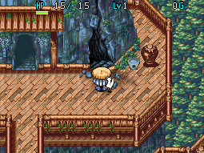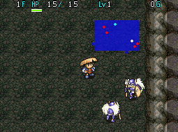

Shorter dungeon where higher level Kigny and Inferno monsters appear on nearly all floors. You need to bring items to stand a chance, but it's not as hard as other carry-in items postgame dungeons. However, the boss fight at the end is arguably the hardest one in the game

The exclusive Kigny Axe and Kigny Shield can rarely be found buried in Gitan vaults on specific floors. Kigny Axe only has a chance of being generated on 25F, meanwhile Kigny Shield can only appear on 29F. The item can also only appear if you currently don't have it in your inventory or any warehouse.

In addition, the Jar of Change item table for this dungeon is special between 10-12F. Transformed items have a chance to turn into Kabra's Blade or Windshield only on these 3 floors.

<ul class="quickLinksUL">
  <li><a href="#overview">Overview</a></li>
  <li><a href="#strategy">Strategy</a></li>
  <li><a href="#floor-guide">Floor Guide</a></li>
  <li><a href="#monsters">Monsters</a></li>
  <li><a href="#items">Items</a></li>
  <li><a href="#traps">Traps</a></li>
</ul>

# Overview

<table class="dungeonOverview">
  <tr>
    <th>Unlock</th>
    <td class="highlightYellow">1. Clear the main story. 2. Finish the Surala side quest. 3. Talk to the lady in the northwest house in Cryptic Rock Valley. 4. Go on an adventure and return. 5. Go near the same house in Cryptic Rock Valley for an event with Sabu. 6. Go on an adventure and return. 7. Talk to the Courier near the exit in Canyon Hamlet. 　(Must not be during Tainted Path unlock event) 　(Must not be during Scroll Cave unlock event) 8. Talk to the dog in Cryptic Rock Valley.</td>
  </tr>
  <tr>
    <th>Entrance</th>
    <td class="highlightYellow">Cryptic Rock Valley (Outside northwest house)</td>
  </tr>
</table>

<table class="dungeonTable">
  <tr>
    <th>Floors</th>
    <td colspan="3">30F</td>
  </tr>
  <tr>
    <th>Bring Items</th>
    <td>Yes</td>
    <th>Allies</th>
    <td></td>
  </tr>
  <tr>
    <th>Bring Gitan</th>
    <td>Yes</td>
    <th>Bring Level Ups</th>
    <td>Yes</td>
  </tr>
  <tr>
    <th>Starting Item</th>
    <td colspan="3">None</td>
  </tr>
  <tr>
    <th>Unidentified</th>
    <td colspan="3"></td>
  </tr>
  <tr>
    <th>Shops</th>
    <td>No</td>
    <th>Monster Houses</th>
    <td>Yes</td>
  </tr>
  <tr>
    <th>Clear Icon</th>
    <td></td>
    <th>Reward</th>
    <td></td>
  </tr>
</table>

# Rare Items

### Kigny Axe & Kigny Shield

As mentioned in the dungeon intro, these two items can rarely be found buried in Gitan vaults. Kigny Axe only has a chance of being generated on 25F, and Kigny Shield can only be generated on 29F. Gitan vaults can appear between 15-29F, but they always just contain Gitan on floors besides 25F and 29F. Each item can also only appear if you currently don't have it in your inventory or any warehouse.

The quickest way to check for a vault is to equip an Armband of Sight, which instantly reveals it on the map. Once you've located a vault, you can use an unbreakable Pickaxe ( meld ability) to enter the room. Alternatively, you can eat monster meat like Death Angel or Pacorepkin to pass through walls.

The items are NOT guaranteed to be generated just because a vault was generated on 25F or 29F. If you're unlucky, it can take hours of running the dungeon before you find a winning vault. (If you don't care about finding it yourself, you can just use a [Rescue Password](/guides/rescue-rewards#passwords))

### Jar of Change (10-12F)

As mentioned earlier, the Jar of Change item table for this dungeon is special between 10-12F. Transformed items have a chance to turn into Kabra's Blade or Windshield only on these 3 floors. If you want to obtain these without the use of passwords, one option is to visit this dungeon with lots of jars.

# Strategy

### Equipment

#### Weapon

Aim for a weapon with a minimum of 30 attack, but of course higher is better. Creating it takes a while, but a Firebrand+99 (119 atk) or Kabra Reborn+99 (149 atk) makes this dungeon easy. If you decide to use a weaker weapon, you'll want to bring more items to help you out in fights.

#### Weapon Melds

Golden Blade and Razor Wind are top priority, along with Pickaxe\* if you want Kigny Axe & Kigny Shield. The rest of the listed melds are nice to have, but aren't essential depending on weapon strength. (Many of these meld abilities are easily obtained using [Rescue Passwords](/guides/rescue-rewards#passwords))

<table class="sealTable">
  <tr>
    <th>Icon</th>
    <th>Item</th>
    <th>Effect</th>
  </tr>
  <tr>
    <td></td>
    <td>Golden Blade</td>
    <td>Weapon won't rust from traps or monster attacks. (Doesn't stop Lv3-4 Green Slimes from erasing meld abilities)</td>
  </tr>
  <tr>
    <td></td>
    <td>Razor Wind</td>
    <td>Attack in 3 forward directions.</td>
  </tr>
  <tr>
    <td></td>
    <td>Bufu's Cleaver</td>
    <td>Chance to turn defeated monsters into meat.</td>
  </tr>
  <tr>
    <td></td>
    <td>Pickaxe*</td>
    <td>Dig through walls, the weapon never breaks.</td>
  </tr>
  <tr>
    <td></td>
    <td>Sickle Slayer</td>
    <td>Deal x2.0 damage to Ghost types.</td>
  </tr>
  <tr>
    <td></td>
    <td>Cyclops Killer</td>
    <td>Deal x2.0 damage to One-Eyed types.</td>
  </tr>
  <tr>
    <td></td>
    <td>Drain Buster</td>
    <td>Deal x2.0 damage to Drain types.</td>
  </tr>
  <tr>
    <td></td>
    <td>Crescent Arm</td>
    <td>Deal x2.0 damage to Exploding types.</td>
  </tr>
  <tr>
    <td></td>
    <td>Air Slayer</td>
    <td>Deal x2.0 damage to Floating types.</td>
  </tr>
</table>

Pickaxe* = Unbreakable Pickaxe obtained from the Blacksmith.

#### Shield

Aim for a shield with a minimum of 30 defense, but really 50+ is better. To give you an idea, here's a damage table based on shield strength:

<table class="dungeonItemTable">
  <thead>
    <tr>
      <th rowspan="2">Monster</th>
      <th rowspan="2">Atk</th>
      <th colspan="5">Shield Strength</th>
    </tr>
    <tr>
      <th>Iron Shield+24 (30 defense)</th>
      <th>Iron Shield+34 (40 defense)</th>
      <th>Iron Shield+45 (51 defense)</th>
      <th>Armor Ward+55 (64 defense)</th>
      <th>Windshield+70 (82 defense)</th>
    </tr>
  </thead>
  <tbody>
    <tr>
      <td>Kigny2</td>
      <td>36</td>
      <td>8~16</td>
      <td>1~9</td>
      <td>1</td>
      <td>1</td>
      <td>1</td>
    </tr>
    <tr>
      <td>Kigny3</td>
      <td>56</td>
      <td>25~39</td>
      <td>17~31</td>
      <td>9~22</td>
      <td>1~12</td>
      <td>1</td>
    </tr>
    <tr>
      <td>Kigny4</td>
      <td>71</td>
      <td>38~55</td>
      <td>33~47</td>
      <td>22~39</td>
      <td>12~29</td>
      <td>1~15</td>
    </tr>
    <tr>
      <td>Kigny5</td>
      <td>86</td>
      <td>54~71</td>
      <td>44~63</td>
      <td>36~55</td>
      <td>25~45</td>
      <td>13~31</td>
    </tr>
    <tr>
      <td>Inferno3</td>
      <td>45</td>
      <td>16~25</td>
      <td>9~18</td>
      <td>1~8</td>
      <td>1</td>
      <td>1</td>
    </tr>
    <tr>
      <td>Inferno4</td>
      <td>60</td>
      <td>29~43</td>
      <td>22~35</td>
      <td>12~26</td>
      <td>3~16</td>
      <td>1</td>
    </tr>
    <tr>
      <td>Inferno5</td>
      <td>75</td>
      <td>42~58</td>
      <td>35~52</td>
      <td>25~43</td>
      <td>15~33</td>
      <td>1~19</td>
    </tr>
    <tr>
      <td>Boss</td>
      <td>105</td>
      <td>68~89</td>
      <td>60~81</td>
      <td>53~77</td>
      <td>41~64</td>
      <td>27~51</td>
    </tr>
  </tbody>
</table>

#### Shield Melds

Gold Shield and Hide Shield are top priority, but otherwise the rest aren't exactly mandatory here. Evasive Shield and Spiked Ward are both great against Kignys and Infernos if your shield strength is low. (Many of these meld abilities are easily obtained using [Rescue Passwords](/guides/rescue-rewards#passwords))

<table class="sealTable">
  <tr>
    <th>Icon</th>
    <th>Item</th>
    <th>Effect</th>
  </tr>
  <tr>
    <td></td>
    <td>Gold Shield</td>
    <td>Shield won't rust from traps or monster attacks. (Doesn't stop Lv3-4 Green Slimes from erasing meld abilities)</td>
  </tr>
  <tr>
    <td></td>
    <td>Evasive Shield</td>
    <td>Increases your chance to evade enemy direct attacks.</td>
  </tr>
  <tr>
    <td></td>
    <td>Spiked Ward</td>
    <td>Reflect 1/3 of damage received. (6 or less damage = 1)</td>
  </tr>
  <tr>
    <td></td>
    <td>Dragonward</td>
    <td>Reduces fire damage by 50%.</td>
  </tr>
  <tr>
    <td></td>
    <td>Blast Shield</td>
    <td>Reduces explosion damage by 50%.</td>
  </tr>
  <tr>
    <td></td>
    <td>Walrus Shield</td>
    <td>Protects items and Gitan from being stolen.</td>
  </tr>
  <tr>
    <td></td>
    <td>Hide Shield</td>
    <td>Halves hunger rate (1 fullness / 20 turns).</td>
  </tr>
</table>

#### Armbands

|Armband|Notes|
|-|-|
|Armband of Sight|Reveals the locations of characters and items. (Also makes you able to see invisible monsters such as Air Devil)|
|Trap Armband|Check for hidden traps when you enter a new room.|
|Sleepless Armband|For Sleep Radish (10-12F).|

### Other Items

Rare items like Bufu's Staff and Herb of Revival are great as well.

|Item|Notes|
|-|-|
|Chiropractic Jar [5]|Bring at least 1 of these.|
|Air Devil Meat|Turn invisible - Ensures victory during the boss fight.|
|Scroll of Removal|Throw it at a Kigny to remove risk of Kigny level up accidents. (Can use a Blank Scroll instead of the real thing)|
|Scroll of Blessing|Nice to have in case key items get cursed.|
|Doppelganger Staff|Useful for a variety of situations.|
|Staff of Postpone|Use with Armband of Sight to quickly locate the stairs.|
|Staff of Paralysis|Paralyze monsters with troublesome special attacks.|
|Switching Staff|Hurry to the stairs in a Monster House, etc.|
|Scroll of Need|Nice to have in case you get surrounded.|
|Scroll of Confusion|For Monster Houses or such.|

# Floor Guide

### General

You can bring level ups, so consider starting from Table Mountain instead of Cryptic Rock Valley.

Swap to Trap Armband to check for traps when entering rooms, then switch back to Armband of Sight. The exception to this is Sleep Radish (10-12F) floors, where you'll want to use Sleepless Armband instead.

Don't get lazy about using items against troublesome monsters like Super Gaze - Direct attacks can still miss. (It's fine to rely on direct attacks if you have the  Homing Blade meld ability from Ravine of the Dead).

### 1-9F

Nothing too notable aside from monsters who can mess with your items. If you brought a Scroll of Removal for Kigny monsters, go ahead and throw it at a Kigny2 right away.

#### Item Related

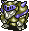 Dremlas (1-2F) has 40 HP and makes Shiren trip and drop items, which can cause jars to break. 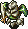 Cell Armor (1-2F) has 35 HP and knocks away your equipped shield when adjacent.  Jar Bandit (4-5F) has 25 HP and throws Weeds into open jars when lined up. 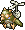 Flutter Fowl (4-6F) has 30 HP and electrifies 1 herb or scroll in your inventory, which destroys the item.  Super Gaze (6-9F) has 51 HP and hypnotizes Shiren, forcing item usage or an attack.  Curse Sis (7-9F) has 33 HP and curses 1 inventory item, sealing its abilities or making it unusable.

#### Slight Caution

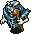 Skull Wizard (3-4F) has 35 HP and shoots a magic bullet (Presto, Confused, Postpone, 25 damage).  Rice Boss (7-9F) has 38 HP and inflicts Shiren with Riceball status, nullifying stats from equipment.  Dadster Tank (7-9F) has 40 HP and fires a cannon which deals 30 damage in a 1 tile radius. 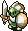 Half Warrior (5-6F) has 25 HP but only takes 1 damage when attacked from frontal directions. The trick is to lure it into a hallway and hit it from the side at a hallway bend to one-shot it.

### 10-12F

Dangerous floor range, though most of the risk is toward inventory items or Shiren's stats and not his life. Keep a Sleepless Armband equipped, and use a staff on Grey Slime instead of hitting it to avoid it multiplying. Don't forget to use Jar of Change while on this floor range if you brought some with you.

#### Item or Stats Related

 Grey Slime has 70 HP, can multiply when hit, and either rusts equipment or erases 1 meld ability. 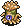 Leech Bug has 32 HP and lowers max strength by 1 when adjacent.  Floppy Hani has 40 HP and lowers level by 1 when adjacent.

#### Caution

 Sleep Radish has 55 HP and throws Sleeping Herb within 3 tiles, or Poison Herb if you're asleep.  Spike Blast has 80 HP and explodes when remaining HP &le; 16 HP.

### 13-24F

Kigny and Inferno monsters are now bumped up to level 3 starting from 13F. You'll take heavier damage if you only have 30 defense, but it should still be comfortable with 50 defense. Other monsters in this floor range don't hit as hard as Kigny3, so just watch out for special attacks. If you forgot Air Devil Meat but have Bufu's Cleaver melded, hunt Wraith Devils (13-29F) until you get its meat.

#### Item Related

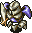 Metal Armor (13-16F) has 65 HP and knocks away your equipped weapon or shield.  Greenwalrus (13-16F) has 58 HP and steals 1 item from your inventory or the ground.  Madremlas (19-23F) has 60 HP and makes Shiren trip and drop items, which can cause jars to break.

#### Caution

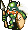 Kigny3 (13-24F) has 75 HP, 56 attack, 7 defense, and will level up if it defeats any creature. 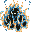 Inferno3 (13-24F) has 65 HP, 45 attack, 20 defense, and is immune to projectiles that don't pierce.  Skull Wraith (19-23F) has 60 HP and shoots a magic bullet (Riceball, Paralyzed, Slow, Sealed, Confused, Level-1).  Dragon (19-23F) has 90 HP, 40 attack, 18 defense, and spews fire which deals 30 damage in a line.

### 25-29F

Kigny and Inferno monsters are now bumped up to level 4 starting from 25F. You'll take a decent amount of damage even with 50 defense, so always keep an eye on your HP. Drain types return, along with monsters who can destroy items - Use items to disable them.

#### Item Related

 Item Bandit (24-25F) has 35 HP and can turn an inventory item into Weeds when adjacent.  Curse Mom (26-29F) has 56 HP and curses 1 inventory item, sealing its abilities or making it unusable.  Hyper Gaze (26-29F) has 70 HP and hypnotizes Shiren, forcing item usage or an attack.  Red Slime (26-29F) has 100 HP, can multiply when hit, and either rusts equipment or erases 1 meld ability.

#### Caution

 Kigny4 (25-29F) has 90 HP, 71 attack, 9 defense, and will level up if it defeats any creature.  Inferno4 (25-29F) has 80 HP, 60 attack, 24 defense, and is immune to projectiles that don't pierce.  N'Bama (25-29F) has 40 HP, 55 attack, 20 defense, and disguises itself as an item.

### 30F - Boss

Boss fight against King of the Kigny and a number of Kigny5 and Inferno5. ※ The Kigny5 will only focus on Shiren while King of the Kigny is alive.

<table class="monsterPageTable">
  <tr>
    <th>Lv</th>
    <th>Name</th>
    <th>HP</th>
    <th>Atk</th>
    <th>Def</th>
    <th>Exp</th>
    <th>Elem.</th>
    <th>Notes</th>
  </tr>
  <tr>
    <td>1</td>
    <td>King of the Kigny</td>
    <td>350</td>
    <td>105</td>
    <td>28</td>
    <td>5000</td>
    <td>Normal Swift 1</td>
    <td>Double speed, 1 attack. Immune to Bufu's Staff.</td>
  </tr>
</table>

The bonfire in the center of the room will continuously spawn Inferno5 monsters until you destroy it. The first Inferno5 spawns after 2 turns, then a new Inferno5 spawns every 6 turns.

The easiest strategy is to eat an Air Devil Meat which makes all enemies unable to detect Shiren. At that point, all that's left is to defeat each monster with direct attacks while they're unable to retaliate at all.

Another option is to use Half Warrior Meat and the hallway to reduce all damage received to 1 point. However, this is only recommended if you have a strong weapon that can outpace new Inferno5 spawns.

Otherwise, you could read Scroll of Confusion → Blastwave Scroll x 4 to safely clear out non-boss enemies, and then fight the boss + any new Inferno5 spawns using other items you have on hand. It shouldn't be too bad as long as you use items - Don't just trade direct attacks.

# Monsters

See [Monsters](/system/monsters) for individual monster details.

- H - Monster House is possible
- G - Gitan Vault is possible

Numbers in parentheses are HP values. Spawn Rates: Low Medium High

<table class="monsterTable">
  <thead>
    <tr>
      <th>F</th>
      <th>H</th>
      <th>G</th>
      <th colspan="5">Monsters</th>
    </tr>
  </thead>
  <tbody>
    <tr>
      <td rowspan="2">1</td>
      <td rowspan="2" class="highlightMH"></td>
      <td rowspan="2"></td>
      <td class="high">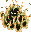 Inferno2 (50)</td>
      <td class="high">Kigny2 (60)</td>
      <td class="mid"> Cell Armor (35)</td>
      <td class="mid"> Popster Tank (36)</td>
      <td class="mid"> Dremlas (40)</td>
    </tr>
    <tr>
      <td class="low">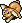 Fluffy Bunny (5)</td>
      <td class="low"> Flying Egg (8)</td>
      <td class="low"> N'Duba (30)</td>
      <td></td>
      <td></td>
    </tr>
    <tr>
      <td colspan="9" class="tableDivider"></td>
    </tr>
    <tr>
      <td rowspan="2">2</td>
      <td rowspan="2" class="highlightMH"></td>
      <td rowspan="2"></td>
      <td class="high"> Inferno2 (50)</td>
      <td class="high">Kigny2 (60)</td>
      <td class="mid"> Cell Armor (35)</td>
      <td class="mid"> Popster Tank (36)</td>
      <td class="mid"> Dremlas (40)</td>
    </tr>
    <tr>
      <td class="low"> Fluffy Bunny (5)</td>
      <td class="low"> Flying Egg (8)</td>
      <td class="low"> N'Duba (30)</td>
      <td></td>
      <td></td>
    </tr>
    <tr>
      <td colspan="9" class="tableDivider"></td>
    </tr>
    <tr>
      <td rowspan="2">3</td>
      <td rowspan="2" class="highlightMH"></td>
      <td rowspan="2"></td>
      <td class="high"> Inferno2 (50)</td>
      <td class="high">Kigny2 (60)</td>
      <td class="high">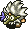 Young Tengu (25)</td>
      <td class="high"> Hell Reaper (45)</td>
      <td class="low"> Evil General (30)</td>
    </tr>
    <tr>
      <td class="low"> Fluffy Bunny (5)</td>
      <td class="low"> Flying Egg (8)</td>
      <td class="low"> N'Duba (30)</td>
      <td class="low"> Skull Wizard (35)</td>
      <td></td>
    </tr>
    <tr>
      <td colspan="9" class="tableDivider"></td>
    </tr>
    <tr>
      <td rowspan="3">4</td>
      <td rowspan="3" class="highlightMH"></td>
      <td rowspan="3"></td>
      <td class="high"> Inferno2 (50)</td>
      <td class="high">Kigny2 (60)</td>
      <td class="high"> Young Tengu (25)</td>
      <td class="high"> Hell Reaper (45)</td>
      <td class="low"> Evil General (30)</td>
    </tr>
    <tr>
      <td class="low"> Fluffy Bunny (5)</td>
      <td class="low"> Flying Egg (8)</td>
      <td class="low"> N'Duba (30)</td>
      <td class="low"> Skull Wizard (35)</td>
      <td class="low"> Jar Bandit (25)</td>
    </tr>
    <tr>
      <td class="low"> Flutter Fowl (30)</td>
      <td></td>
      <td></td>
      <td></td>
      <td></td>
    </tr>
    <tr>
      <td colspan="9" class="tableDivider"></td>
    </tr>
    <tr>
      <td rowspan="3">5</td>
      <td rowspan="3" class="highlightMH"></td>
      <td rowspan="3"></td>
      <td class="high"> Inferno2 (50)</td>
      <td class="high">Kigny2 (60)</td>
      <td class="low"> Half Warrior (25)</td>
      <td class="low"> Chainhead (50)</td>
      <td class="low"> Master Hen (50)</td>
    </tr>
    <tr>
      <td class="low"> Fluffy Bunny (5)</td>
      <td class="low"> Flying Egg (8)</td>
      <td class="low"> N'Duba (30)</td>
      <td></td>
      <td class="low"> Jar Bandit (25)</td>
    </tr>
    <tr>
      <td class="low"> Flutter Fowl (30)</td>
      <td></td>
      <td></td>
      <td></td>
      <td></td>
    </tr>
    <tr>
      <td colspan="9" class="tableDivider"></td>
    </tr>
    <tr>
      <td rowspan="3">6</td>
      <td rowspan="3" class="highlightMH"></td>
      <td rowspan="3"></td>
      <td class="high"> Inferno2 (50)</td>
      <td class="high">Kigny2 (60)</td>
      <td class="low"> Half Warrior (25)</td>
      <td class="low"> Chainhead (50)</td>
      <td class="low"> Master Hen (50)</td>
    </tr>
    <tr>
      <td class="low"> Fluffy Bunny (5)</td>
      <td class="low"> Flying Egg (8)</td>
      <td class="low"> N'Duba (30)</td>
      <td class="low"> Super Gaze (51)</td>
      <td></td>
    </tr>
    <tr>
      <td class="low"> Flutter Fowl (30)</td>
      <td></td>
      <td></td>
      <td></td>
      <td></td>
    </tr>
    <tr>
      <td colspan="9" class="tableDivider"></td>
    </tr>
    <tr>
      <td rowspan="2">7</td>
      <td rowspan="2" class="highlightMH"></td>
      <td rowspan="2"></td>
      <td class="high"> Inferno2 (50)</td>
      <td class="high">Kigny2 (60)</td>
      <td class="mid"> Curse Sis (33)</td>
      <td class="low"> Chainhead (50)</td>
      <td class="mid"> Rice Boss (38)</td>
    </tr>
    <tr>
      <td class="low"> Fluffy Bunny (5)</td>
      <td class="low"> Flying Egg (8)</td>
      <td class="low"> N'Duba (30)</td>
      <td class="low"> Super Gaze (51)</td>
      <td class="mid"> Dadster Tank (40)</td>
    </tr>
    <tr>
      <td colspan="9" class="tableDivider"></td>
    </tr>
    <tr>
      <td rowspan="3">8</td>
      <td rowspan="3" class="highlightMH"></td>
      <td rowspan="3"></td>
      <td class="high"> Inferno2 (50)</td>
      <td class="high">Kigny2 (60)</td>
      <td class="mid"> Curse Sis (33)</td>
      <td class="mid"> Blazepuff (40)</td>
      <td class="mid"> Rice Boss (38)</td>
    </tr>
    <tr>
      <td class="low"> Fluffy Bunny (5)</td>
      <td class="low"> Flying Egg (8)</td>
      <td class="low"> N'Duba (30)</td>
      <td class="low"> Super Gaze (51)</td>
      <td class="mid"> Dadster Tank (40)</td>
    </tr>
    <tr>
      <td class="mid"> Mistonos (50)</td>
      <td></td>
      <td></td>
      <td></td>
      <td></td>
    </tr>
    <tr>
      <td colspan="9" class="tableDivider"></td>
    </tr>
    <tr>
      <td rowspan="3">9</td>
      <td rowspan="3" class="highlightMH"></td>
      <td rowspan="3"></td>
      <td class="high"> Inferno2 (50)</td>
      <td class="high">Kigny2 (60)</td>
      <td class="mid"> Curse Sis (33)</td>
      <td class="mid"> Blazepuff (40)</td>
      <td class="mid"> Rice Boss (38)</td>
    </tr>
    <tr>
      <td class="low"> Fluffy Bunny (5)</td>
      <td class="low"> Flying Egg (8)</td>
      <td class="low"> N'Duba (30)</td>
      <td class="low"> Super Gaze (51)</td>
      <td class="mid"> Dadster Tank (40)</td>
    </tr>
    <tr>
      <td class="mid"> Mistonos (50)</td>
      <td></td>
      <td></td>
      <td></td>
      <td></td>
    </tr>
    <tr>
      <td colspan="9" class="tableDivider"></td>
    </tr>
    <tr>
      <td rowspan="2">10</td>
      <td rowspan="2" class="highlightMH"></td>
      <td rowspan="2"></td>
      <td class="high"> Leech Bug (32)</td>
      <td class="high">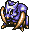 Sabregator (35)</td>
      <td class="high"> Floppy Hani (40)</td>
      <td class="high"> Sleep Radish (55)</td>
      <td class="high"> Grey Slime (70)</td>
    </tr>
    <tr>
      <td class="high"> Spike Blast (80)</td>
      <td class="mid"> Killer Gather (60)</td>
      <td></td>
      <td></td>
      <td></td>
    </tr>
    <tr>
      <td colspan="9" class="tableDivider"></td>
    </tr>
    <tr>
      <td rowspan="2">11</td>
      <td rowspan="2" class="highlightMH"></td>
      <td rowspan="2"></td>
      <td class="high"> Leech Bug (32)</td>
      <td class="high"> Sabregator (35)</td>
      <td class="high"> Floppy Hani (40)</td>
      <td class="high"> Sleep Radish (55)</td>
      <td class="high"> Grey Slime (70)</td>
    </tr>
    <tr>
      <td class="high"> Spike Blast (80)</td>
      <td class="mid"> Killer Gather (60)</td>
      <td></td>
      <td></td>
      <td></td>
    </tr>
    <tr>
      <td colspan="9" class="tableDivider"></td>
    </tr>
    <tr>
      <td rowspan="2">12</td>
      <td rowspan="2" class="highlightMH"></td>
      <td rowspan="2"></td>
      <td class="high"> Leech Bug (32)</td>
      <td class="high"> Sabregator (35)</td>
      <td class="high"> Floppy Hani (40)</td>
      <td class="high"> Sleep Radish (55)</td>
      <td class="high"> Grey Slime (70)</td>
    </tr>
    <tr>
      <td class="high"> Spike Blast (80)</td>
      <td class="mid"> Killer Gather (60)</td>
      <td></td>
      <td></td>
      <td></td>
    </tr>
    <tr>
      <td colspan="9" class="tableDivider"></td>
    </tr>
    <tr>
      <td rowspan="2">13</td>
      <td rowspan="2" class="highlightMH"></td>
      <td rowspan="2"></td>
      <td class="high"> Inferno3 (65)</td>
      <td class="high">Kigny3 (75)</td>
      <td class="low"> Fluffy Bunny (5)</td>
      <td class="low"> Wraith Devil (50)</td>
      <td class="low"> N'Dulu (35)</td>
    </tr>
    <tr>
      <td class="mid"> Pacorepkina (45)</td>
      <td class="mid"> Metal Armor (65)</td>
      <td class="mid">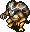 Pythy (70)</td>
      <td class="low"> Greenwalrus (58)</td>
      <td class="mid">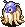 Haze Hermit (45)</td>
    </tr>
    <tr>
      <td colspan="9" class="tableDivider"></td>
    </tr>
    <tr>
      <td rowspan="2">14</td>
      <td rowspan="2" class="highlightMH"></td>
      <td rowspan="2"></td>
      <td class="high"> Inferno3 (65)</td>
      <td class="high">Kigny3 (75)</td>
      <td class="low"> Fluffy Bunny (5)</td>
      <td class="low"> Wraith Devil (50)</td>
      <td class="low"> N'Dulu (35)</td>
    </tr>
    <tr>
      <td class="mid"> Pacorepkina (45)</td>
      <td class="mid"> Metal Armor (65)</td>
      <td class="mid"> Pythy (70)</td>
      <td class="low"> Greenwalrus (58)</td>
      <td class="mid"> Haze Hermit (45)</td>
    </tr>
    <tr>
      <td colspan="9" class="tableDivider"></td>
    </tr>
    <tr>
      <td rowspan="2">15</td>
      <td rowspan="2" class="highlightMH"></td>
      <td rowspan="2" class="highlightGitan"></td>
      <td class="high"> Inferno3 (65)</td>
      <td class="high">Kigny3 (75)</td>
      <td class="low"> Fluffy Bunny (5)</td>
      <td class="low"> Wraith Devil (50)</td>
      <td class="low"> N'Dulu (35)</td>
    </tr>
    <tr>
      <td class="mid"> Pacorepkina (45)</td>
      <td class="mid"> Metal Armor (65)</td>
      <td class="mid"> Pythy (70)</td>
      <td class="low"> Greenwalrus (58)</td>
      <td class="mid"> Haze Hermit (45)</td>
    </tr>
    <tr>
      <td colspan="9" class="tableDivider"></td>
    </tr>
    <tr>
      <td rowspan="3">16</td>
      <td rowspan="3" class="highlightMH"></td>
      <td rowspan="3" class="highlightGitan"></td>
      <td class="high"> Inferno3 (65)</td>
      <td class="high">Kigny3 (75)</td>
      <td class="low"> Fluffy Bunny (5)</td>
      <td class="low"> Wraith Devil (50)</td>
      <td class="low"> N'Dulu (35)</td>
    </tr>
    <tr>
      <td class="mid"> Pacorepkina (45)</td>
      <td class="mid"> Metal Armor (65)</td>
      <td class="mid"> Pythy (70)</td>
      <td class="low"> Greenwalrus (58)</td>
      <td class="mid"> Haze Hermit (45)</td>
    </tr>
    <tr>
      <td class="mid"> Piggo (50)</td>
      <td class="mid"> Polygon Song (80)</td>
      <td class="mid"> Death Angel (65)</td>
      <td></td>
      <td></td>
    </tr>
    <tr>
      <td colspan="9" class="tableDivider"></td>
    </tr>
    <tr>
      <td rowspan="2">17</td>
      <td rowspan="2" class="highlightMH"></td>
      <td rowspan="2" class="highlightGitan"></td>
      <td class="high"> Inferno3 (65)</td>
      <td class="high">Kigny3 (75)</td>
      <td class="low"> Fluffy Bunny (5)</td>
      <td class="low"> Wraith Devil (50)</td>
      <td class="low"> N'Dulu (35)</td>
    </tr>
    <tr>
      <td class="mid"> Piggo (50)</td>
      <td class="mid"> Polygon Song (80)</td>
      <td class="mid"> Death Angel (65)</td>
      <td></td>
      <td></td>
    </tr>
    <tr>
      <td colspan="9" class="tableDivider"></td>
    </tr>
    <tr>
      <td rowspan="2">18</td>
      <td rowspan="2" class="highlightMH"></td>
      <td rowspan="2" class="highlightGitan"></td>
      <td class="high"> Inferno3 (65)</td>
      <td class="high">Kigny3 (75)</td>
      <td class="low"> Fluffy Bunny (5)</td>
      <td class="low"> Wraith Devil (50)</td>
      <td class="low"> N'Dulu (35)</td>
    </tr>
    <tr>
      <td class="mid"> Piggo (50)</td>
      <td class="mid"> Polygon Song (80)</td>
      <td class="mid"> Death Angel (65)</td>
      <td></td>
      <td></td>
    </tr>
    <tr>
      <td colspan="9" class="tableDivider"></td>
    </tr>
    <tr>
      <td rowspan="3">19</td>
      <td rowspan="3" class="highlightMH"></td>
      <td rowspan="3" class="highlightGitan"></td>
      <td class="high"> Inferno3 (65)</td>
      <td class="high">Kigny3 (75)</td>
      <td class="low"> Fluffy Bunny (5)</td>
      <td class="low"> Wraith Devil (50)</td>
      <td class="low"> N'Dulu (35)</td>
    </tr>
    <tr>
      <td class="mid"> Piggo (50)</td>
      <td class="mid"> Polygon Song (80)</td>
      <td class="mid"> Death Angel (65)</td>
      <td class="mid"> Dragon (90)</td>
      <td class="mid"> Madremlas (60)</td>
    </tr>
    <tr>
      <td class="mid"> Skull Wraith (60)</td>
      <td></td>
      <td></td>
      <td></td>
      <td></td>
    </tr>
    <tr>
      <td colspan="9" class="tableDivider"></td>
    </tr>
    <tr>
      <td rowspan="2">20</td>
      <td rowspan="2" class="highlightMH"></td>
      <td rowspan="2" class="highlightGitan"></td>
      <td class="high"> Inferno3 (65)</td>
      <td class="high">Kigny3 (75)</td>
      <td class="low"> Fluffy Bunny (5)</td>
      <td class="low"> Wraith Devil (50)</td>
      <td class="low"> N'Dulu (35)</td>
    </tr>
    <tr>
      <td class="mid"> Skull Wraith (60)</td>
      <td></td>
      <td class="mid"> Death Angel (65)</td>
      <td class="mid"> Dragon (90)</td>
      <td class="mid"> Madremlas (60)</td>
    </tr>
    <tr>
      <td colspan="9" class="tableDivider"></td>
    </tr>
    <tr>
      <td rowspan="2">21</td>
      <td rowspan="2" class="highlightMH"></td>
      <td rowspan="2" class="highlightGitan"></td>
      <td class="high"> Inferno3 (65)</td>
      <td class="high">Kigny3 (75)</td>
      <td class="low"> Fluffy Bunny (5)</td>
      <td class="low"> Wraith Devil (50)</td>
      <td class="low"> N'Dulu (35)</td>
    </tr>
    <tr>
      <td class="mid"> Skull Wraith (60)</td>
      <td></td>
      <td></td>
      <td class="mid"> Dragon (90)</td>
      <td class="mid"> Madremlas (60)</td>
    </tr>
    <tr>
      <td colspan="9" class="tableDivider"></td>
    </tr>
    <tr>
      <td rowspan="2">22</td>
      <td rowspan="2" class="highlightMH"></td>
      <td rowspan="2" class="highlightGitan"></td>
      <td class="high"> Inferno3 (65)</td>
      <td class="high">Kigny3 (75)</td>
      <td class="low"> Fluffy Bunny (5)</td>
      <td class="low"> Wraith Devil (50)</td>
      <td class="low"> N'Dulu (35)</td>
    </tr>
    <tr>
      <td class="mid"> Skull Wraith (60)</td>
      <td></td>
      <td></td>
      <td class="mid"> Dragon (90)</td>
      <td class="mid"> Madremlas (60)</td>
    </tr>
    <tr>
      <td colspan="9" class="tableDivider"></td>
    </tr>
    <tr>
      <td rowspan="3">23</td>
      <td rowspan="3" class="highlightMH"></td>
      <td rowspan="3" class="highlightGitan"></td>
      <td class="high"> Inferno3 (65)</td>
      <td class="high">Kigny3 (75)</td>
      <td class="low"> Fluffy Bunny (5)</td>
      <td class="low"> Wraith Devil (50)</td>
      <td class="low"> N'Dulu (35)</td>
    </tr>
    <tr>
      <td class="mid"> Skull Wraith (60)</td>
      <td class="mid"> Leech Fly (41)</td>
      <td class="mid">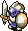 Half Fighter (50)</td>
      <td class="mid"> Dragon (90)</td>
      <td class="mid"> Madremlas (60)</td>
    </tr>
    <tr>
      <td class="mid"> Droopy Hani (55)</td>
      <td></td>
      <td></td>
      <td></td>
      <td></td>
    </tr>
    <tr>
      <td colspan="9" class="tableDivider"></td>
    </tr>
    <tr>
      <td rowspan="2">24</td>
      <td rowspan="2" class="highlightMH"></td>
      <td rowspan="2" class="highlightGitan"></td>
      <td class="high"> Inferno3 (65)</td>
      <td class="high">Kigny3 (75)</td>
      <td class="low"> Fluffy Bunny (5)</td>
      <td class="low"> Wraith Devil (50)</td>
      <td class="low"> N'Dulu (35)</td>
    </tr>
    <tr>
      <td class="mid"> Droopy Hani (55)</td>
      <td class="mid"> Leech Fly (41)</td>
      <td class="mid"> Half Fighter (50)</td>
      <td class="mid"> Item Bandit (35)</td>
      <td></td>
    </tr>
    <tr>
      <td colspan="9" class="tableDivider"></td>
    </tr>
    <tr>
      <td rowspan="2">25</td>
      <td rowspan="2" class="highlightMH"></td>
      <td rowspan="2" class="highlightGitan"></td>
      <td class="high"> Inferno4 (80)</td>
      <td class="high">Kigny4 (90)</td>
      <td class="low"> Fluffy Bunny (5)</td>
      <td class="low"> Wraith Devil (50)</td>
      <td class="low"> N'Bama (40)</td>
    </tr>
    <tr>
      <td class="mid"> Droopy Hani (55)</td>
      <td class="mid"> Leech Fly (41)</td>
      <td class="mid"> Half Fighter (50)</td>
      <td class="mid"> Item Bandit (35)</td>
      <td></td>
    </tr>
    <tr>
      <td colspan="9" class="tableDivider"></td>
    </tr>
    <tr>
      <td rowspan="3">26</td>
      <td rowspan="3" class="highlightMH"></td>
      <td rowspan="3" class="highlightGitan"></td>
      <td class="high"> Inferno4 (80)</td>
      <td class="high">Kigny4 (90)</td>
      <td class="low"> Fluffy Bunny (5)</td>
      <td class="low"> Wraith Devil (50)</td>
      <td class="low"> N'Bama (40)</td>
    </tr>
    <tr>
      <td class="mid"> Droopy Hani (55)</td>
      <td class="mid"> Leech Fly (41)</td>
      <td class="mid"> Evil Shogun (50)</td>
      <td class="mid"> Curse Mom (56)</td>
      <td class="mid"> Pacorepking (60)</td>
    </tr>
    <tr>
      <td class="mid"> Hyper Gaze (70)</td>
      <td class="mid"> Red Slime (100)</td>
      <td></td>
      <td></td>
      <td></td>
    </tr>
    <tr>
      <td colspan="9" class="tableDivider"></td>
    </tr>
    <tr>
      <td rowspan="2">27</td>
      <td rowspan="2" class="highlightMH"></td>
      <td rowspan="2" class="highlightGitan"></td>
      <td class="high"> Inferno4 (80)</td>
      <td class="high">Kigny4 (90)</td>
      <td class="low"> Fluffy Bunny (5)</td>
      <td class="low"> Wraith Devil (50)</td>
      <td class="low"> N'Bama (40)</td>
    </tr>
    <tr>
      <td class="mid"> Hyper Gaze (70)</td>
      <td class="mid"> Red Slime (100)</td>
      <td class="mid"> Evil Shogun (50)</td>
      <td class="mid"> Curse Mom (56)</td>
      <td class="mid"> Pacorepking (60)</td>
    </tr>
    <tr>
      <td colspan="9" class="tableDivider"></td>
    </tr>
    <tr>
      <td rowspan="2">28</td>
      <td rowspan="2" class="highlightMH"></td>
      <td rowspan="2" class="highlightGitan"></td>
      <td class="high"> Inferno4 (80)</td>
      <td class="high">Kigny4 (90)</td>
      <td class="low"> Fluffy Bunny (5)</td>
      <td class="low"> Wraith Devil (50)</td>
      <td class="low"> N'Bama (40)</td>
    </tr>
    <tr>
      <td class="mid"> Hyper Gaze (70)</td>
      <td class="mid"> Red Slime (100)</td>
      <td class="mid"> Evil Shogun (50)</td>
      <td class="mid"> Curse Mom (56)</td>
      <td class="mid"> Pacorepking (60)</td>
    </tr>
    <tr>
      <td colspan="9" class="tableDivider"></td>
    </tr>
    <tr>
      <td rowspan="2">29</td>
      <td rowspan="2" class="highlightMH"></td>
      <td rowspan="2" class="highlightGitan"></td>
      <td class="high"> Inferno4 (80)</td>
      <td class="high">Kigny4 (90)</td>
      <td class="low"> Fluffy Bunny (5)</td>
      <td class="low"> Wraith Devil (50)</td>
      <td class="low"> N'Bama (40)</td>
    </tr>
    <tr>
      <td class="mid"> Hyper Gaze (70)</td>
      <td class="mid"> Red Slime (100)</td>
      <td class="mid"> Evil Shogun (50)</td>
      <td class="mid"> Curse Mom (56)</td>
      <td class="mid"> Pacorepking (60)</td>
    </tr>
    <tr>
      <td colspan="9" class="tableDivider"></td>
    </tr>
    <tr>
      <td>30</td>
      <td></td>
      <td></td>
      <td colspan="5" class="highlightOffense">Boss</td>
    </tr>
    <tr>
      <td colspan="9" class="tableDivider"></td>
    </tr>
  </tbody>
</table>

# Items

#### Kigny Axe / Kigny Shield

Important: Kigny Axe (25F) and Kigny Shield (29F) can rarely be found inside Gitan vaults on specific floors, but only if you currently don't own a copy of the item in your inventory or any warehouse.

#### Spawn Rates

- F = Floor, Monster drop
- C = Jar of Change, Thiefwalrus drop

 

<table class="dungeonTable">
  <tr>
    <th class="centeredText">Category</th>
    <th class="centeredText">F</th>
    <th class="centeredText">C</th>
    <th rowspan="6" class="tableDivider"></th>
    <th class="centeredText">Category</th>
    <th class="centeredText">F</th>
    <th class="centeredText">C</th>
  </tr>
  <tr>
    <td class="highlightGray">Weapon</td>
    <td>★★</td>
    <td>★★★</td>
    <td class="highlightGray">Herb</td>
    <td>★★★★★</td>
    <td>★★★★★</td>
  </tr>
  <tr>
    <td class="highlightGray">Shield</td>
    <td>★★</td>
    <td>★★★</td>
    <td class="highlightGray">Scroll</td>
    <td>★★★</td>
    <td>★★</td>
  </tr>
  <tr>
    <td class="highlightGray">Armband</td>
    <td>★★★</td>
    <td>★★★</td>
    <td class="highlightGray">Staff</td>
    <td>★★</td>
    <td>★</td>
  </tr>
  <tr>
    <td class="highlightGray">Projectile</td>
    <td>★</td>
    <td>★</td>
    <td class="highlightGray">Jar</td>
    <td>★★</td>
    <td>★</td>
  </tr>
  <tr>
    <td class="highlightGray">Food</td>
    <td>★★</td>
    <td>★★</td>
    <td colspan="3"></td>
  </tr>
</table>

#### Item Table

The values like "1-30" in the Notes column represents the floor range where the item can appear.

- F = Floor, Monster drop
- M = Monster (Fixed drop)
- C = Jar of Change, Thiefwalrus drop

 

<table class="dungeonItemTable">
  <tr>
    <th colspan="5" class="highlightLightblue">Weapon</th>
    <th rowspan="54"></th>
    <th colspan="5" class="highlightLightblue">Herb</th>
  </tr>
  <tr>
    <th>Name</th>
    <th>F</th>
    <th>M</th>
    <th>C</th>
    <th>Notes</th>
    <th>Name</th>
    <th>F</th>
    <th>M</th>
    <th>C</th>
    <th>Notes</th>
  </tr>
  <tr>
    <td class="leftText">Katana</td>
    <td>X</td>
    <td></td>
    <td>X</td>
    <td>1-30</td>
    <td class="leftText">Big Belly Seed</td>
    <td>X</td>
    <td></td>
    <td>X</td>
    <td>1-30</td>
  </tr>
  <tr>
    <td class="leftText">Golden Blade</td>
    <td>X</td>
    <td></td>
    <td>X</td>
    <td>1-30</td>
    <td class="leftText">Herb of Life</td>
    <td>X</td>
    <td></td>
    <td>X</td>
    <td>1-30</td>
  </tr>
  <tr>
    <td class="leftText">Kabra's Blade</td>
    <td></td>
    <td></td>
    <td>X</td>
    <td>10-12</td>
    <td class="leftText">Restorative Herb</td>
    <td>X</td>
    <td></td>
    <td>X</td>
    <td>1-30</td>
  </tr>
  <tr>
    <td class="leftText">Cudgel</td>
    <td>X</td>
    <td></td>
    <td>X</td>
    <td>10-12</td>
    <td class="leftText">Weeds</td>
    <td></td>
    <td>X</td>
    <td></td>
    <td>Field Bandit Type</td>
  </tr>
  <tr>
    <td class="leftText">Air Slayer</td>
    <td>X</td>
    <td></td>
    <td>X</td>
    <td>1-30</td>
    <td class="leftText">Sleeping Herb</td>
    <td></td>
    <td>X</td>
    <td></td>
    <td>Sleep Radish</td>
  </tr>
  <tr>
    <td class="leftText">Sickle Slayer</td>
    <td>X</td>
    <td></td>
    <td>X</td>
    <td>1-30</td>
    <td class="leftText">Herb of Strength</td>
    <td>X</td>
    <td></td>
    <td>X</td>
    <td>1-30</td>
  </tr>
  <tr>
    <td class="leftText">Pickaxe</td>
    <td>X</td>
    <td></td>
    <td>X</td>
    <td>10-12</td>
    <td class="leftText">Antidote Herb</td>
    <td>X</td>
    <td></td>
    <td>X</td>
    <td>1-30</td>
  </tr>
  <tr>
    <td class="leftText">Mastersword</td>
    <td>X</td>
    <td></td>
    <td>X</td>
    <td>1-30</td>
    <td class="leftText">Dragon Herb</td>
    <td>X</td>
    <td></td>
    <td>X</td>
    <td>10-12</td>
  </tr>
  <tr>
    <td class="leftText">Dragonkiller</td>
    <td>X</td>
    <td></td>
    <td>X</td>
    <td>1-9 / 13-30</td>
    <td class="leftText">Herb of Sight</td>
    <td>X</td>
    <td></td>
    <td>X</td>
    <td>1-30</td>
  </tr>
  <tr>
    <td class="leftText">Drain Buster</td>
    <td>X</td>
    <td></td>
    <td>X</td>
    <td>1-30</td>
    <td class="leftText">Medicinal Herb</td>
    <td>X</td>
    <td></td>
    <td>X</td>
    <td>1-30</td>
  </tr>
  <tr>
    <td class="leftText">Polearm</td>
    <td>X</td>
    <td></td>
    <td>X</td>
    <td>1-30</td>
    <th colspan="5" class="highlightLightblue">Scroll</th>
  </tr>
  <tr>
    <td class="leftText">Cyclops Killer</td>
    <td>X</td>
    <td></td>
    <td>X</td>
    <td>1-9 / 13-30</td>
    <th>Name</th>
    <th>F</th>
    <th>M</th>
    <th>C</th>
    <th>Notes</th>
  </tr>
  <tr>
    <td class="leftText">Crescent Arm</td>
    <td>X</td>
    <td></td>
    <td>X</td>
    <td>1-30</td>
    <td class="leftText">Scroll of Light</td>
    <td>X</td>
    <td></td>
    <td>X</td>
    <td>1-30</td>
  </tr>
  <tr>
    <td class="leftText">Razor Wind</td>
    <td>X</td>
    <td></td>
    <td>X</td>
    <td>1-30</td>
    <td class="leftText">Great Hall Scroll</td>
    <td>X</td>
    <td></td>
    <td>X</td>
    <td>1-30</td>
  </tr>
  <tr>
    <th colspan="5" class="highlightLightblue">Shield</th>
    <td class="leftText">Scroll of Blessing</td>
    <td>X</td>
    <td></td>
    <td>X</td>
    <td>1-30</td>
  </tr>
  <tr>
    <th>Name</th>
    <th>F</th>
    <th>M</th>
    <th>C</th>
    <th>Notes</th>
    <td class="leftText">Scroll of Need</td>
    <td>X</td>
    <td></td>
    <td>X</td>
    <td>1-30</td>
  </tr>
  <tr>
    <td class="leftText">Gold Shield</td>
    <td>X</td>
    <td></td>
    <td>X</td>
    <td>1-30</td>
    <td class="leftText">Scroll of Confusion</td>
    <td>X</td>
    <td></td>
    <td>X</td>
    <td>1-30</td>
  </tr>
  <tr>
    <td class="leftText">Armor Ward</td>
    <td>X</td>
    <td></td>
    <td>X</td>
    <td>1-30</td>
    <td class="leftText">Scroll of Identity</td>
    <td>X</td>
    <td></td>
    <td>X</td>
    <td>1-30</td>
  </tr>
  <tr>
    <td class="leftText">Blast Shield</td>
    <td>X</td>
    <td></td>
    <td>X</td>
    <td>1-30</td>
    <td class="leftText">Blastwave Scroll</td>
    <td>X</td>
    <td></td>
    <td>X</td>
    <td>1-30</td>
  </tr>
  <tr>
    <td class="leftText">Bronzeward</td>
    <td>X</td>
    <td></td>
    <td>X</td>
    <td>1-30</td>
    <td class="leftText">Extraction Scroll</td>
    <td>X</td>
    <td></td>
    <td>X</td>
    <td>1-9 / 13-30</td>
  </tr>
  <tr>
    <td class="leftText">Iron Shield</td>
    <td>X</td>
    <td></td>
    <td>X</td>
    <td>1-30</td>
    <td class="leftText">Earth Bless Scroll</td>
    <td>X</td>
    <td></td>
    <td>X</td>
    <td>1-30</td>
  </tr>
  <tr>
    <td class="leftText">Walrus Shield</td>
    <td>X</td>
    <td></td>
    <td>X</td>
    <td>1-30</td>
    <td class="leftText">Air Bless Scroll</td>
    <td>X</td>
    <td></td>
    <td>X</td>
    <td>1-30</td>
  </tr>
  <tr>
    <td class="leftText">Dragonward</td>
    <td>X</td>
    <td></td>
    <td>X</td>
    <td>1-9 / 13-30</td>
    <td class="leftText">Blank Scroll</td>
    <td>X</td>
    <td></td>
    <td>X</td>
    <td>10-12</td>
  </tr>
  <tr>
    <td class="leftText">Spiked Ward</td>
    <td>X</td>
    <td></td>
    <td>X</td>
    <td>1-9 / 13-30</td>
    <td class="leftText">Scroll of Sleep</td>
    <td>X</td>
    <td></td>
    <td>X</td>
    <td>1-30</td>
  </tr>
  <tr>
    <td class="leftText">Hide Shield</td>
    <td>X</td>
    <td></td>
    <td>X</td>
    <td>10-12</td>
    <td class="leftText">Power Up Scroll</td>
    <td>X</td>
    <td></td>
    <td>X</td>
    <td>1-30</td>
  </tr>
  <tr>
    <td class="leftText">Windshield</td>
    <td></td>
    <td></td>
    <td>X</td>
    <td>10-12</td>
    <td class="leftText">Plating Scroll</td>
    <td>X</td>
    <td></td>
    <td>X</td>
    <td>1-30</td>
  </tr>
  <tr>
    <td class="leftText">Evasive Shield</td>
    <td>X</td>
    <td></td>
    <td>X</td>
    <td>1-9 / 13-30</td>
    <th colspan="5" class="highlightLightblue">Staff</th>
  </tr>
  <tr>
    <td class="leftText">Wood Shield</td>
    <td>X</td>
    <td></td>
    <td>X</td>
    <td>10-12</td>
    <th>Name</th>
    <th>F</th>
    <th>M</th>
    <th>C</th>
    <th>Notes</th>
  </tr>
  <tr>
    <th colspan="5" class="highlightLightblue">Armband</th>
    <td class="leftText">Pain Sharing Staff</td>
    <td>X</td>
    <td></td>
    <td>X</td>
    <td>1-30</td>
  </tr>
  <tr>
    <th>Name</th>
    <th>F</th>
    <th>M</th>
    <th>C</th>
    <th>Notes</th>
    <td class="leftText">Staff of Postpone</td>
    <td>X</td>
    <td></td>
    <td>X</td>
    <td>1-30</td>
  </tr>
  <tr>
    <td class="leftText">Pitcher's Armband</td>
    <td>X</td>
    <td></td>
    <td>X</td>
    <td>1-30</td>
    <td class="leftText">Skull Staff</td>
    <td></td>
    <td>X</td>
    <td></td>
    <td>Skull Mage Type</td>
  </tr>
  <tr>
    <td class="leftText">Critical Armband</td>
    <td>X</td>
    <td></td>
    <td>X</td>
    <td>1-9 / 13-30</td>
    <td class="leftText">Staff of Paralysis</td>
    <td>X</td>
    <td></td>
    <td>X</td>
    <td>1-30</td>
  </tr>
  <tr>
    <td class="leftText">Recovery Armband</td>
    <td>X</td>
    <td></td>
    <td>X</td>
    <td>1-9 / 13-30</td>
    <td class="leftText">Staff of Stability</td>
    <td>X</td>
    <td></td>
    <td>X</td>
    <td>1-30</td>
  </tr>
  <tr>
    <td class="leftText">Armband of Calm</td>
    <td>X</td>
    <td></td>
    <td>X</td>
    <td>1-30</td>
    <td class="leftText">Staff of Sloth</td>
    <td>X</td>
    <td></td>
    <td>X</td>
    <td>1-30</td>
  </tr>
  <tr>
    <td class="leftText">Rustless Armband</td>
    <td>X</td>
    <td></td>
    <td>X</td>
    <td>1-30</td>
    <td class="leftText">Switching Staff</td>
    <td>X</td>
    <td></td>
    <td>X</td>
    <td>1-30</td>
  </tr>
  <tr>
    <td class="leftText">Happy Armband</td>
    <td>X</td>
    <td></td>
    <td>X</td>
    <td>1-30</td>
    <td class="leftText">Knockback Staff</td>
    <td>X</td>
    <td></td>
    <td>X</td>
    <td>1-30</td>
  </tr>
  <tr>
    <td class="leftText">Passage Armband</td>
    <td>X</td>
    <td></td>
    <td>X</td>
    <td>1-9 / 13-30</td>
    <td class="leftText">Doppelganger Staff</td>
    <td>X</td>
    <td></td>
    <td>X</td>
    <td>1-30</td>
  </tr>
  <tr>
    <td class="leftText">Armband of Sight</td>
    <td>X</td>
    <td></td>
    <td>X</td>
    <td>1-30</td>
    <td class="leftText">Lightning Staff</td>
    <td>X</td>
    <td></td>
    <td>X</td>
    <td>1-30</td>
  </tr>
  <tr>
    <td class="leftText">Antidote Armband</td>
    <td>X</td>
    <td></td>
    <td>X</td>
    <td>1-30</td>
    <th colspan="5" class="highlightLightblue">Jar</th>
  </tr>
  <tr>
    <td class="leftText">Antidrain Armband</td>
    <td>X</td>
    <td></td>
    <td>X</td>
    <td>10-12</td>
    <th>Name</th>
    <th>F</th>
    <th>M</th>
    <th>C</th>
    <th>Notes</th>
  </tr>
  <tr>
    <td class="leftText">Discount Armband</td>
    <td>X</td>
    <td></td>
    <td>X</td>
    <td>1-30 ※1</td>
    <td class="leftText">Melding Jar</td>
    <td>X</td>
    <td></td>
    <td></td>
    <td>10-12</td>
  </tr>
  <tr>
    <td class="leftText">Sleepless Armband</td>
    <td>X</td>
    <td></td>
    <td>X</td>
    <td>1-30</td>
    <td class="leftText">Chiropractic Jar</td>
    <td>X</td>
    <td></td>
    <td>X</td>
    <td>1-30</td>
  </tr>
  <tr>
    <th colspan="5" class="highlightLightblue">Projectile</th>
    <td class="leftText">Storehouse Jar</td>
    <td>X</td>
    <td></td>
    <td>X</td>
    <td>1-30</td>
  </tr>
  <tr>
    <th>Name</th>
    <th>F</th>
    <th>M</th>
    <th>C</th>
    <th>Notes</th>
    <td class="leftText">Walrus Jar</td>
    <td>X</td>
    <td></td>
    <td>X</td>
    <td>10-12</td>
  </tr>
  <tr>
    <td class="leftText">Wooden Arrow</td>
    <td>X</td>
    <td></td>
    <td>X</td>
    <td>10-12</td>
    <td class="leftText">Jar of Change</td>
    <td>X</td>
    <td></td>
    <td>X</td>
    <td>1-30</td>
  </tr>
  <tr>
    <td class="leftText">Silver Arrow</td>
    <td></td>
    <td></td>
    <td>X</td>
    <td>10-12</td>
    <td class="leftText">Jar of Holding</td>
    <td>X</td>
    <td></td>
    <td>X</td>
    <td>1-30</td>
  </tr>
  <tr>
    <th colspan="5" class="highlightLightblue">Food</th>
    <td class="leftText">Jar of Hiding</td>
    <td>X</td>
    <td></td>
    <td></td>
    <td>10-12</td>
  </tr>
  <tr>
    <th>Name</th>
    <th>F</th>
    <th>M</th>
    <th>C</th>
    <th>Notes</th>
    <td rowspan="5" colspan="5"></td>
  </tr>
  <tr>
    <td class="leftText">Big Riceball</td>
    <td>X</td>
    <td>X</td>
    <td>X</td>
    <td>1-30 Rice Boss</td>
  </tr>
  <tr>
    <td class="leftText">Riceball</td>
    <td>X</td>
    <td></td>
    <td>X</td>
    <td>1-30</td>
  </tr>
  <tr>
    <td class="leftText">Giant Riceball</td>
    <td>X</td>
    <td></td>
    <td>X</td>
    <td>1-9 / 13-30</td>
  </tr>
  <tr>
    <td class="leftText">Rotten Riceball</td>
    <td>X</td>
    <td></td>
    <td>X</td>
    <td>1-30</td>
  </tr>
</table>

※1 - Never found on the floor between 10-12F.

# Traps

See [Traps](/system/traps) for details.

<table class="dungeonTable">
  <thead>
    <tr>
      <th>Trap</th>
      <th>Floors</th>
      <th class="tableDivider"></th>
      <th>Trap</th>
      <th>Floors</th>
      <th class="tableDivider"></th>
      <th>Trap</th>
      <th>Floors</th>
    </tr>
  </thead>
  <tbody>
    <tr>
      <td>Stumble</td>
      <td>1-9, 13-30</td>
      <td rowspan="9" class="tableDivider"></td>
      <td>Log</td>
      <td>13-30</td>
      <td rowspan="9" class="tableDivider"></td>
      <td>Landmine</td>
      <td>13-30</td>
    </tr>
    <tr>
      <td>Rusty</td>
      <td>1-9, 13-30</td>
      <td>Spin</td>
      <td>1-30</td>
      <td>Big Landmine</td>
      <td>13-30</td>
    </tr>
    <tr>
      <td>Unequip</td>
      <td>1-30</td>
      <td>Dream Gas</td>
      <td>1-12</td>
      <td>Wood Arrow</td>
      <td></td>
    </tr>
    <tr>
      <td>Rotten</td>
      <td>10-30</td>
      <td>Sleeping Gas</td>
      <td>1-30</td>
      <td>Iron Arrow</td>
      <td></td>
    </tr>
    <tr>
      <td>Alarm</td>
      <td>1-9, 13-30</td>
      <td>Slowness</td>
      <td>1-30</td>
      <td>One-way</td>
      <td></td>
    </tr>
    <tr>
      <td>Summons</td>
      <td>1-9, 13-30</td>
      <td>Immobilization</td>
      <td>1-30</td>
      <td>Knockback</td>
      <td></td>
    </tr>
    <tr>
      <td>Multiplication</td>
      <td>13-30</td>
      <td>Hunger</td>
      <td>13-30</td>
      <td>Riceball</td>
      <td>13-30</td>
    </tr>
    <tr>
      <td>Pitfall</td>
      <td>1-9, 13-30</td>
      <td>Poison Dart</td>
      <td>1-30</td>
      <td>Curse</td>
      <td></td>
    </tr>
    <tr>
      <td>Spring</td>
      <td>1-9, 13-30</td>
      <td>Boulder</td>
      <td>1-9, 13-30</td>
      <td>Stairway</td>
      <td></td>
    </tr>
  </tbody>
</table>
