

  

# Overview

<table class="dungeonOverview">
  <tr>
    <th>Unlock</th>
    <td class="highlightYellow">Talk to Drokotay the Adventurer (Shukuba Beach). 　※ DLC and Update 2.0.1 required.</td>
  </tr>
  <tr>
    <th>Entrance</th>
    <td class="highlightYellow">Shukuba Beach (Exit)</td>
  </tr>
</table>

<table class="dungeonTable">
  <tr>
    <th>Floors</th>
    <td colspan="3">50F / 99F (Sacred Tree)</td>
  </tr>
  <tr>
    <th>Bring Items</th>
    <td>Yes</td>
    <th>Stairs</th>
    <td>Ascending</td>
  </tr>
  <tr>
    <th>Companions</th>
    <td></td>
    <th>Roamers</th>
    <td>Yes</td>
  </tr>
  <tr>
    <th>Rescues</th>
    <td>3</td>
    <th>Starting Level</th>
    <td>Lv1</td>
  </tr>
  <tr>
    <th>Starting Item</th>
    <td colspan="3">Large Onigiri</td>
  </tr>
  <tr>
    <th>Unidentified</th>
    <td colspan="3">All categories</td>
  </tr>
  <tr>
    <th>Shops</th>
    <td>Yes</td>
    <th>Monster Houses</th>
    <td>Yes</td>
  </tr>
  <tr>
    <th>Behemoths</th>
    <td>Yes</td>
    <th>Wishing Shrines</th>
    <td>Yes</td>
  </tr>
  <tr>
    <th>Kron's Challenge</th>
    <td></td>
    <th>Fever Time</th>
    <td></td>
  </tr>
  <tr>
    <th>Initial Enemies</th>
    <td></td>
    <th>Spawn Rate</th>
    <td>30 Turns (1F - 20F) 40 Turns (21F - 50F) 50 Turns (51F - 80F) 100 Turns (81F - 99F)</td>
  </tr>
  <tr>
    <th>Wind (1st Gust)</th>
    <td>1200 Turns (1F - 96F) 700 Turns (97F - 99F)</td>
    <th>Reward</th>
    <td></td>
  </tr>
</table>

Mystery Dungeon where most items found on the ground are either weapons or shields. Both blue and gold sacred items are common, and Base Value tends to be higher on deeper floors. Shops feature a variety of item categories, but lean towards rare equipment on certain floors. Rotten Onigiri is the only food item found on the ground, and Starvation Traps can be generated, so there's a somewhat high risk of starving if you don't have the Peach Bun weapon rune or such. Negative effect items are included in the item table, including dreadful items like Ill-fated Seed. Overall, it's a nice dungeon to run if you want sacred items with high stats or want to complete the Gear Rack.

# Strategy

### Dungeon Characteristics

[Content]

### Important Items

Consumables are mostly obtained from shops or wall tiles, so bring essentials into the dungeon instead. This applies to items like Revival Grass, Blank Scrolls, Preservation Pots, Strength Grass, etc.

#### Weapon / Shield

Equipment you used for Training Path of Shopping (99F) or Isle of the Mighty (50F) should be fine. Your main weapon and shield should ideally be upgraded to +99 so that you can focus on item collection. If you don't have strong equipment yet, bring Escape Scrolls and do shallower runs a few times to stock up on synthesis ingredients and sacred items, and use the Shukuba Beach blacksmith to upgrade between runs. For reference, the best set is either Kabura Sutegi + Rasen Fuuma, or Yamanba's Cleaver + Yamanba's Potlid.

#### Runes

Be careful not to let Mudster (3-8F) or Mudder (51-55F) erase valuable runes. Pink colored rune names below are considered top priority runes for this dungeon.

##### Weapon Runes

|Rune|Source|Notes|
|-|-|-|
| Peach Bun|Peach Club|Chance for an enemy to drop a Peach Bun when slain.|
| Accurate|Accurate Sword|Your normal attacks always hit.|
| Healing|Healing Sword|Restore HP equal to 10% of damage dealt.|
| Frontal Attack|Kama Itachi|Attack 3 forward directions at the same time.|
| Max Wall Dig|Golden Pickaxe|Dig out walls, upgrade value never decreases.|
| Critical|Axe of the Minotaur|Chance to land a x1.5 damage critical hit.|
| Swift Strikes|Swift Sword|Chance to attack 2 times in a row.|
| Anti-Draining|Drain Slayer|Deal x1.5 damage to Draining type monsters: Twisty Hani, Scorpion, Polygon Spinna, Mudkin.|
| Anti-Ghost|Sickle of Salvation|Deal x1.5 damage to Ghost type monsters: Ghost Radish, Skull Mage, Ghost Samurai, Death Reaper, Pumphantasm.|
| Anti-Beast|Primal Axe|Deal x1.5 damage to Beast type monsters. Porky, Tiger Thrower, Fluffy Bunny, Taur, Hen, Chintala, Armordillo.|
| Anti-Dragon|Dragonkiller|Deal x1.5 damage to Dragon type monsters. Dragon, Floor Dragon, Shagga, Firepuff.|
| Anti-Aquatic|Watersplitter|Deal x1.5 damage to Aquatic type monsters. Bored Kappa, Pullfrog, Spearfish, Thiefwalrus, Mudkin, Explochin, Octopling.|
| Rustproof|Golden Sword Plating Scroll|Prevents upgrade value from decreasing due to rust. Raises accuracy of normal attacks by 2.0% (92% → 94%).|
| HP +20|Life Grass|Increase max HP by 20.|
| HP +15|Healing Grass|Increase max HP by 15.|

##### Shield Runes

|Rune|Source|Notes|
|-|-|-|
| Sating|Shield of Sating|Halves hunger rate (1 Fullness / 20 Turns)|
| Trap-proof|Sacred Item|Chance to nullify trap activation.|
| Nigiriproof|Nigiri Stopper|Nigiri Morph monsters can't turn your items into onigiri. Protects against Onigiri status.|
| Hypnosisproof|Gazer Shield|Protects against Gazer's hypnosis.|
| Anti-Dragon|Dragon Shield|Reduces normal attack and fire damage received by 50%. Normal attack damage reduction only works on Dragon types.|
| Anti-Blast|Blast Shield|Reduces damage from explosions by 50%.|
| Projectileproof|Kappa's Dish|Increases your chance to dodge enemy projectiles.|
| Magic Cancel|Shield of Negation|Nullifies magic bullets aimed at you.|
| Walrusproof|Walrus Stopper|Thiefwalrus monsters can't steal your items.|
| Hatproof|Hat Stopper|Hat Urchin monsters can't steal your items.|
| Oracle|Shield of Presage|Chime plays when Wishing Shrine is present. Buried items glow brightly.|
| Full Armor|Hunky-dory Shield|Reduces damage from any attack by 50%. Must be at full HP to activate.|
| Rustproof|Golden Shield Plating Scroll|Prevents upgrade value from decreasing due to rust.|
| HP +20|Life Grass|Increase max HP by 20.|
| HP +15|Healing Grass|Increase max HP by 15.|

#### Bracelets

<b><u>Affixing Bracelet</u></b> Protects against Fencer (16-30F), Battler (41-55F), Swordmaster (93-99F), and Nimble Knave (83-92F). You risk losing both main equipment and Preservation Pots if you dash around without this bracelet.

<b><u>Clairvoyant Bracelet (Monster-find Bracelet & Item-find Bracelet)</u></b> Clairvoyant is best since it lets you detect creatures, items, and shops while only taking up 1 item slot, but Monster-find Bracelet and Item-find Bracelet can be used if you don't have that bracelet yet. ※ Clairvoyant Bracelet can appear in shops between 48-50F in this dungeon.

<b><u>Wallpass Bracelet (Rustproof Bracelet / Cursebreak Bracelet / Cleansing Bracelet)</u></b> Lets you evade troublesome foes like Cursister, Mudster, and Terror Scorpion as long as there's a wall. Wallpass Bracelet also lets you access buried shops without needing Pickaxes or Burrowing Staves. The advantage of using Wallpass over Rustproof, Cursebreak, etc. is that you don't need to swap bracelets. However, using Wallpass leaves you open if you step on a Sleep Trap or get sedated by a Sleep Radish.

<b><u>Appraiser's Bracelet</u></b> Nice for tracking down specific items to complete the Notebook, and to avoid negative effect items. ※ Appraiser's Bracelet can appear in shops between 97-99F in this dungeon.

<b><u>Trapper's Bracelet / Floating Bracelet</u></b> Keeps you safe from traps that affect items like Silver-seal Trap and Curse Trap. Trapper's Bracelet lets you take home rarer traps like Starvation Trap and Alarm Switch, if desired. ※ Trapper's Bracelet can appear in shops between 48-50F in this dungeon.

#### Consumables

Don't forget items needed to steal if you plan on stealing from dungeon shops.

<b><u>Sumo Onigiri & Bellyshrink Bracelet / Feeding Trap</u></b> Bring these items if you plan on utilizing Sumo status. Equip 2 Bellyshrink Bracelets before eating the Sumo Onigiri to maximize benefits.

<b><u>Strength Grass</u></b> Bring 2 Strength Grass to eat at the start so that you can equip 2 bracelets at the same time. Also bring a Rejuvenation Pot and/or extra Strength Grass in case your Strength gets lowered. Likely unnecessary if you're using the Yamanba's Cleaver + Yamanba's Potlid resonance effect.

<b><u>Revival Grass</u></b> Extra lives - Don't expect to find any Revival Grass during the adventure. How many you need depends on your other items and such, but you'll want at least 3 for a 99F run.

<b><u>Monstercall Scroll</u></b> Read this to generate additional items, but be smart about which floors you read it on. Don't read it on floors where monsters like Adamant Tank, Sleep Radish, or Nimble Knave appear.

<b><u>Eradication Scroll</u></b> The best monster families to eradicate include Mudkin, Swordsman, Ghost Radish, Field Knave, and Dragon. If you only brought 1 scroll and have an Affixing Bracelet, just eradicate the Ghost Radish family.

<b><u>Rock / Porky's Rock</u></b> Needed to one-shot Behemoth Monsters if your main weapon doesn't have the Anti-Behemoth rune.

<b><u>Escape Scroll</u></b> Bring this if you don't feel confident about being able to clear the dungeon, or if you want to quickly return after searching for specific sacred items for the Gear Rack.

<b><u>Floor-exiting Trap</u></b> Place it on the ground and step on the trap to skip to the next floor. It's ideal to bring 5 to skip past the Frenzy Radish (51-55F) floors.

<b><u>Silverpurge Scroll / Collection Scroll / Fixer Scroll / Exorcism Scroll</u></b> Items used to recover your main equipment / Preservation Pots if you step on a trap or such.

#### Pots / Incense

<b><u>Preservation Pot</u></b> Bring tons of these so that you can take home lots of rare items. Armordillo family monsters appear, so consider bringing a Balance Staff as well.

<b><u>Evasive Incense</u></b> Nice to have for Sleep Radish (31-40F) and Frenzy Radish (51-55F) floors. Unnecessary if you brought an Eradication Scroll for Ghost Radish monsters instead.

<b><u>Upgrading Pot / Degrading Pot</u></b> These pots can be found on the ground, despite being a dungeon that allows bringing in items.

### Farming Techniques

[Content]

# Floor Guide

### 1-3F

Notable: Fierous (1-8F), Brodillo (1-8F), Cursister (1-8F), Mudster (3-8F)

Nothing is particularly dangerous at the start assuming you brought in strong equipment. However, Mudster can erase runes between 3-8F, so keep a Rustproof Bracelet equipped to stay safe. Floating or Waterwalk bracelets can be used to recover items that fall underwater if you trip near water. Sacred Items are pretty uncommon between 1-3F, but begin to appear more frequently starting on 4F. The monster table ramps up fast, so reach Lv20 for the fastest HP regen speed before advancing to 4F.

Fierous (60 HP, 25 atk, 22 def) can be leveled up into an Infernous for 1,999 exp if you have Flame Shot. Brodillo (70 HP, 36 atk, 38 def) can make you trip if you don't have Sumo status or a Balance Staff. Cursister (115 HP, 38 atk, 38 def) occasionally curses your equipped weapon or shield when adjacent. Mudster (140 HP, 35 atk, 43 def) erases 1 rune or lowers the upgrade value of equipped weapon & shield by 1.

### 4-5F

Notable: Fierous (1-8F), Brodillo (1-8F), Cursister (1-8F), Mudster (3-8F), Behemoth (4-98F)

Sacred weapons and shields begin to be more common from around this point. Same monsters as 3F, but Behemoth Gates can spawn on any floor between 4-98F, excluding 25F and 50F. The Behemoth Monster lineup is the same on all floors, and Behemoth Gates are rare compared to other dungeons. There's speculation that Behemoth Gates in this dungeon never drop Blank Scrolls or Preservation Pots. ※ The Adventure Log shows Behemoths on 25F, but a Behemoth Gate has never been sighted there.

#### Possible Behemoth Monsters

- Pumplich / Pumplord - Can be particularly troublesome in hallways.
- Ultra Gazer - Can be very dangerous if you don't have the Hypnosisproof shield rune.
- Skullmancer / Skull Lord - Extremely dangerous if you don't have the Magic Cancel shield rune.
- Lashagga / Bashagga - Likely to make the player collapse in 1 turn via consecutive attacks.
- Porkon / Porgon - Porky's Rock (20 damage) throwing range of 8 tiles / 10 tiles.
- Schubell (family) - Summons additional monsters based on the current floor's monster table.
- Others (Hyper Gazer, Lv3-4 Taur, Lv3-4 Explochin) - Shouldn't be hard to deal with if you have rocks.

### 6-12F

Notable: Brodillo (1-8F), Mudster (3-8F), Thrashead (6-12F), Skull Wizard (6-12F), Behemoth (4-98F)

Your gear should be strong enough to one-shot Thrashead and Mudster, so if that isn't the case, it's probably best to read an Escape Scroll and attempt this dungeon after upgrading your gear some more. Also consider escaping if you lose an essential rune like Nigiriproof to a Mudster's special attack.

Thrashead (122 HP, 55 atk, 45 def) can attack up to 3 tiles ahead, including through corners. Skull Wizard (88 HP, 35 atk, 24 def)'s magic effects include 20 damage, Narrow-escape, Confused, or Morphed.

### 13-20F

Notable: Nigiri Boss (13-20F), Hyper Gazer (16-25F), Fencer (16-30F), Behemoth (4-98F)

Nigiri Boss can be countered with the Nigiriproof rune, and Hyper Gazer with the Hypnosisproof rune. If you don't have both shield runes, it's best to read an Escape Scroll now instead of risking your items. Fencer also appears, so you'll want to either keep an Affixing Bracelet equipped or eradicate them. Otherwise, none of the monsters should be a threat if you brought heavily upgraded equipment.

Nigiri Boss (133 HP, 45 atk, 42 def) inflicts Onigiri status, which nullifies equipment while morphed. Hyper Gazer (126 HP, 55 atk, 45 def) hypnotizes Shiren and can force random item usage when adjacent. Fencer (140 HP, 49 atk, 48 def) disarms your equipped weapon or shield, sending it behind you.

### 21-25F

Notable: Hyper Gazer (16-25F), Fencer (16-30F), Lv3 Monks (21-25F), Adamant Tank (21-30F), Behemoth (4-98F)

Hyper Gazer and Fencer are still around, and Lv3 monks + Adamant Tank appear as new threats. Igneous multiplies from explosions, so beware if your weapon is weak or you lack the Frontal Attack rune. Consider letting Kitsune Monk B roam around to have it morph other monsters into fake items, but watch the message log to see what Fencer morphed into if you don't have an Affixing Bracelet. Adamant Tank's cannonballs destroy items caught in the blast, so don't place important items on the ground.

25F is a Shuffle Dungeon style map based on Firespew Mountain - Adventure Log has a slot for Behemoths, but it's likely a mistake on the developer's part since Behemoth Gates never seem to be generated on 25F.

Adamant Tank (100 HP, 60 atk, 54 def) has Swift 1 speed and deals 40 damage per cannonball. Igneous (165 HP, 56 atk, 45 def) is immune to projectiles, and multiplies from explosions.

### 26-30F

Notable: Fencer (16-30F), Adamant Tank (21-30F), Ironwalrus (26-35F), Terror Scorpion (26-40F), Behemoth (4-98F)

Fencer and Adamant Tank are still around, and Ironwalrus and Terror Scorpion appear as new threats. Don't expect to be able to increase Max Strength back to 10 if you get stung by Terror Scorpion, since Strength Grass doesn't seem to appear, and Special Onigiri has only been seen in shops. Ironwalrus often drops a mediocre item when slain, but can drop a sacred item on rare occasions, so feel free to linger and hunt them if you have Affixing and Cleansing bracelets.

If you forgot a Cleansing Bracelet and are cornered by Terror Scorpions, you can eat a Peach Bun and tank the special attack hit to receive Weakened status instead of losing Max Strength.

Ironwalrus (138 HP, 35 atk, 55 def) steals an item on the ground or from the player, then warps. Terror Scorpion (185 HP, 55 atk, 45 def) is a Draining type that lowers Max Strength by 1 when adjacent.

### 31-35F

Notable: Terror Scorpion (26-40F), Porkon (31-35F), Sleep Radish (31-40F), Wrinkly Hani (31-40F), Behemoth (4-98F)

Sleep Radish Zone - Fencer exits the monster table, and Porkon, Sleep Radish, and Wrinkly Hani appear. Keep a Rousing or Cleansing bracelet equipped, or eradicate Sleep Radish to make them a non-issue, since otherwise you risk being put to sleep → losing max strength and levels due to other monsters.

Pumplord (185 HP, 75 atk, 35 def) passes through walls and has semi-random movement. Porkon (150 HP, 75 atk, 50 def) throws 20 damage Porky's Rocks within an 8 tile radius. Sleep Radish (135 HP, 47 atk, 38 def) throws Sedating Grass → Poison Grass within a 3 tile radius. Wrinkly Hani (190 HP, 60 atk, 59 def) occasionally lowers level by 1 when adjacent.

### 36-40F

Notable: Terror Scorpion (26-40F), Sleep Radish (31-40F), Wrinkly Hani (31-40F), Vexing Kappa (36-40F), Mixergon (36-40F), Great Samurai (36-50F), Archdragon (36-45F), Behemoth (4-98F)

Sleep Radish Zone - Terror Scorpion and Sleep Radish appear with Archdragon and Vexing Kappa. Expect to get pelted by flames, negative effect items, and sacred equipment while walking around. Don't let Ghost Samurai roam when it spawns, since it could lead to a Frenzy Radish or Abyss Dragon. It's quite unlikely to happen, but there's a chance for Vexing Kappa to throw a Bodhi Shield at you, which can result in forcing the player to equip it and reducing Max Fullness to 1.

Mixergon also appears, but it's probably more trouble than it's worth to try and synthesize here. If anything, you'll want to turn them into Mixergon Buns using a Peach Staff or such and synthesize later.

Vexing Kappa (175 HP, 49 atk, 33 def) throws any item except for Gitan within a 10 tile radius. Mixergon (118 HP, 68 atk, 40 def) eats and synthesizes up to 4 thrown items. Great Samurai (149 HP, 58 atk, 40 def) revives as Ghost Samurai (4 HP) when defeated. Archdragon (200 HP, 65 atk, 60 def) spews a 30 damage flame from anywhere on the floor.

### 41-45F

Notable: Archdragon (36-45F), Miracle Hen (41-45F), Lv3 Ninjas (41-45F), Battler (41-55F), Behemoth (4-98F)

Monsters here generally aren't a threat to your items aside from Battler. This floor range should be very easy if you have an Affixing Bracelet + strong equipment.

Miracle Hen (220 HP, 82 atk, 60 def) has Swift 2 speed and very high attack power. Battler (200 HP, 69 atk, 50 def) knocks away any equipped item, sending it flying behind you.

### 46-50F

Notable: Battler (41-55F), Tiger Launcher (46-50F), Skullmancer (46-55F), Detonachin (46-60F), Behemoth (4-98F)

Rare Shop Zone - Shops and high Base Value sacred items are often generated on 48-50F. This floor range should be easy as long as you have an Affixing Bracelet + Magic Cancel shield rune. Seriously, don't advance to the next floor without checking for shops!

Tiger Launcher (255 HP, 83 atk, 65 def) throws an adjacent Shiren or a monster within a range of 20 tiles. Skullmancer (111 HP, 50 atk, 41 def)'s magic effects include Paralyzed, Sealed, Onigiri, Confused, Slow, or Level-1. Detonachin (260 HP, 55 atk, 37 def) explodes when HP ≤ 52 (Deal 208+ damage to it).

#### Shop Merchandise (48-50F)

[Content]

<h3 class="heading3Tree">Sacred Tree Mode</h3>

### 51-55F

Notable: Battler (41-55F), Skullmancer (46-55F), Detonachin (46-60F), Frenzy Radish (51-55F), Mudder (51-55F), Popdillo (51-55F), Cursenior (51-65F), Behemoth (4-98F)

Frenzy Radish Zone - This is likely the most dangerous floor range in this dungeon. Frenzy Radish inflicts Berserk status, which makes the player lose control of Shiren for 30 turns. Cursenior, Mudder, Battler, and Popdillo all target inventory items even while the player is berserk, so either throw an Eradication Scroll at Frenzy Radish, or use Floor-exiting Traps to skip this zone.

Soul Reaper (51-73F) appears, so stock up on Peach Buns to access buried shops if needed. Pumplich (51-60F) also appears despite higher level Pumplords having already appeared on 31-40F. In any case, avoid eating Peach Buns here since runes are nullified during Morphed status, meaning you'd be a sitting duck against Skullmancer's magic bullets.

Frenzy Radish (195 HP, 57 atk, 55 def) throws Berserk Seed → Poison Grass within a 5 tile radius. Mudder (145 HP, 45 atk, 53 def) erases 1 rune or lowers the upgrade value of equipped weapon & shield by 2. Popdillo (100 HP, 51 atk, 45 def)'s tackle makes you trip and drop inventory items on the ground. Cursenior (205 HP, 65 atk, 58 def) curses up to 2 of your items, prioritizing equipment first.

### 56-65F

Notable: Cursenior (51-65F), Demon Scorpion (56-65F), Deathead (56-65F), Porgon (56-73F), Behemoth (4-98F)

Curse & Poison Zone - Cursenior curses any 2 items, and Demon Scorpion lowers Max Strength by 2. If you're unable to slay either foe in 1 hit, keep a Wallpass Bracelet equipped to avoid their specials, or double up with Cursebreak Bracelet + Cleansing Bracelet to guarantee safety of items and strength. Porgon's 10 tile rock throw and Deathead's 5 tile normal attack can be painful even with a strong shield. Captain Ant also appears between 61-70F, so expect the terrain to get messy on those floors.

Demon Scorpion (295 HP, 73 atk, 55 def) occasionally lowers Max Strength by 2 when adjacent. Deathead (282 HP, 99 atk, 60 def) has high attack power, and strikes from up to 5 tiles ahead. Porgon (200 HP, 85 atk, 60 def) throws 20 damage Porky's Rocks within a 10 tile radius.

### 66-73F

Notable: Porgon (56-73F), Hoppin' Slammer (66-70F), Steadfast Tank (66-73F), Behemoth (4-98F)

The only dangerous monsters in this floor range are basically Porgon and Steadfast Tank. Don't place items on the ground, and also pay attention to red dots with swift movement on the map, since Steadfast Tank's explosions from cannonballs will destroy items that are on the ground. Hoppin' Slammer has a 100% chance to reflect magic bullets, so you could unequip your shield and swing a Narrow-escape Staff to warp to the stairs if desired, though expect to receive some damage. Lv4 ninjas also appear between 71-73F, but they shouldn't be an issue with strong equipment.

Hoppin' Slammer (125 HP, 49 atk, 49 def) has a 100% chance to reflect magic bullets and projectiles. Steadfast Tank (105 HP, 80 atk, 64 def) has Swift 2 action speed and fires 50 damage cannonballs.

### 74-82F

Notable: Nigiri Honcho (74-82F), Gigataur (74-82F), Grampadillo (79-92F), King Reaper (79-99F), Behemoth (4-98F)

This floor range features mostly power type monsters along with Nigiri Honcho and Grampadillo. It shouldn't be difficult, assuming you didn't lose your shield or the Nigiriproof rune earlier. Remember that Morphed status nullifies runes, so don't roam around after eating a Peach Bun.

Nigiri Honcho (165 HP, 61 atk, 54 def) either inflicts Onigiri status, or morphs an item into onigiri. Gigataur (235 HP, 85 atk, 62 def) occasionally unleashes a critical hit when attacking. Grampadillo (175 HP, 71 atk, 56 def)'s tackle makes you trip and drop inventory items on the ground. King Reaper (225 HP, 65 atk, 50 def) has Swift 2 speed + wall-clip, and detects you from anywhere.

### 83-92F

Notable: Grampadillo (79-92F), King Reaper (79-99F), Mixerdon (83-87F), Abyss Dragon (83-92F), Nimble Knave (83-92F), Okina Monk A (83-99F), Skull Lord (88-99F), Magicwalrus (88-99F), Behemoth (4-98F)

The biggest threats here are Nimble Knave, Grampadillo, and Abyss Dragon. Beware of being tripped and dropping items if you don't have a Balance Staff or aren't using Sumo status, as if there's a Nimble Knave around, the items you drop risk being turned into Weeds quite quickly. Keep an Affixing Bracelet equipped at all times so that Nimble Knave can't parry inventory items. Skull Lord, Magicwalrus, and Hat Rascal shouldn't be an issue if you have runes that counter them. Abyss Dragon's flames can be annoying even with the Anti-Dragon rune, so eradicate them if you want. Linger on 83-87F to stock up on Mixerdon Buns if you want to synthesize back at Shukuba Beach.

Mixerdon (177 HP, 78 atk, 45 def) eats and synthesizes up to 5 thrown items. Abyss Dragon (300 HP, 90 atk, 65 def) spews a 40 damage flame from anywhere on the current floor. Nimble Knave (145 HP, 50 atk, 40 def) has Swift 1 speed, knocks away an inventory item by throwing Weeds. Okina Monk A (270 HP, 76 atk, 60 def) warps a monster from anywhere on the floor closer to Shiren. Skull Lord (188 HP, 55 atk, 55 def)'s magic effects include Asleep, Blind, Level-3, or 40 damage. Magicwalrus (188 HP, 40 atk, 75 def) steals an item, then creates a decoy holding Weeds and warps.

### 93-99F

Notable: King Reaper (79-99F), Okina Monk A (83-99F), Skull Lord (88-99F), Magicwalrus (88-99F), Swordmaster (93-99F), Polygon Stunna (93-99F), Behemoth (4-98F)

Rare Shop Zone - Shops and high Base Value sacred items are often generated on 97-99F. Nimble Knave, Grampadillo, and Abyss Dragon get swapped out with Swordmaster and Polygon Stunna. Keep an Affixing Bracelet equipped and you'll be fine, provided you have shield runes for the usual suspects. Same as before, don't advance to the next floor without checking for shops!

Swordmaster (250 HP, 77 atk, 55 def) knocks away any equipped item, sending it somewhere nearby. Polygon Stunna (229 HP, 50 atk, 55 def) occasionally lowers Max Fullness by 10 when adjacent.

#### Shop Merchandise (97-99F)

[Content]

# Monsters

See [Monsters](/system/monsters) for individual monster details.

- F - Dark hallways
- S - Shop is possible
- H - Monster House is possible
- G - Golden Egg Thing is possible
- B - Behemoth Monsters are possible

Monster Colors = Farming, Useful, Lowers Stats, Targets Items, Dangerous

<table class="monsterTable">
  <thead>
    <tr>
      <th>F</th>
      <th>S</th>
      <th>H</th>
      <th>G</th>
      <th colspan="5">Monsters</th>
      <th>B</th>
    </tr>
  </thead>
  <tbody>
    <tr>
      <td rowspan="2" class="centeredText">1</td>
      <td rowspan="2" class="highlightShop"></td>
      <td rowspan="2" class=""></td>
      <td rowspan="2" class="highlightGold"></td>
      <td> Death Reaper</td>
      <td>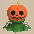 Pumphantasm</td>
      <td> Masked Samurai</td>
      <td> Skull Mage</td>
      <td>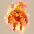 Fierous</td>
      <td rowspan="2" class=""></td>
    </tr>
    <tr>
      <td> Brodillo</td>
      <td class="items"> Cursister</td>
      <td class="highlightGray"></td>
      <td class="highlightGray"></td>
      <td class="highlightGray"></td>
    </tr>
    <tr>
      <td colspan="10" class="tableDivider"></td>
    </tr>
    <tr>
      <td rowspan="2" class="centeredText">2</td>
      <td rowspan="2" class=""></td>
      <td rowspan="2" class=""></td>
      <td rowspan="2" class=""></td>
      <td> Death Reaper</td>
      <td> Pumphantasm</td>
      <td> Masked Samurai</td>
      <td> Skull Mage</td>
      <td> Fierous</td>
      <td rowspan="2" class=""></td>
    </tr>
    <tr>
      <td> Brodillo</td>
      <td class="items"> Cursister</td>
      <td class="highlightGray"></td>
      <td class="highlightGray"></td>
      <td class="highlightGray"></td>
    </tr>
    <tr>
      <td colspan="10" class="tableDivider"></td>
    </tr>
    <tr>
      <td rowspan="3" class="centeredText">3</td>
      <td rowspan="3" class=""></td>
      <td rowspan="3" class=""></td>
      <td rowspan="3" class=""></td>
      <td> Death Reaper</td>
      <td> Hell Reaper</td>
      <td> Pumphantasm</td>
      <td> Pumpanshee</td>
      <td> Masked Samurai</td>
      <td rowspan="3" class=""></td>
    </tr>
    <tr>
      <td> Raging Samurai</td>
      <td> Skull Mage</td>
      <td> Fierous</td>
      <td> Brodillo</td>
      <td class="items"> Cursister</td>
    </tr>
    <tr>
      <td class="items"> Mudster</td>
      <td class="highlightGray"></td>
      <td class="highlightGray"></td>
      <td class="highlightGray"></td>
      <td class="highlightGray"></td>
    </tr>
    <tr>
      <td colspan="10" class="tableDivider"></td>
    </tr>
    <tr>
      <td rowspan="3" class="centeredText highlightFog">4</td>
      <td rowspan="3" class=""></td>
      <td rowspan="3" class=""></td>
      <td rowspan="3" class=""></td>
      <td> Death Reaper</td>
      <td> Hell Reaper</td>
      <td> Pumphantasm</td>
      <td> Pumpanshee</td>
      <td> Masked Samurai</td>
      <td rowspan="3" class="highlightBehemoth"></td>
    </tr>
    <tr>
      <td> Raging Samurai</td>
      <td> Skull Mage</td>
      <td> Fierous</td>
      <td> Brodillo</td>
      <td class="items"> Cursister</td>
    </tr>
    <tr>
      <td class="items"> Mudster</td>
      <td class="highlightGray"></td>
      <td class="highlightGray"></td>
      <td class="highlightGray"></td>
      <td class="highlightGray"></td>
    </tr>
    <tr>
      <td colspan="10" class="tableDivider"></td>
    </tr>
    <tr>
      <td rowspan="3" class="centeredText highlightFog">5</td>
      <td rowspan="3" class=""></td>
      <td rowspan="3" class=""></td>
      <td rowspan="3" class=""></td>
      <td> Death Reaper</td>
      <td> Hell Reaper</td>
      <td> Pumphantasm</td>
      <td> Pumpanshee</td>
      <td> Masked Samurai</td>
      <td rowspan="3" class="highlightBehemoth"></td>
    </tr>
    <tr>
      <td> Raging Samurai</td>
      <td> Skull Mage</td>
      <td> Fierous</td>
      <td> Brodillo</td>
      <td class="items"> Cursister</td>
    </tr>
    <tr>
      <td class="items"> Mudster</td>
      <td class="highlightGray"></td>
      <td class="highlightGray"></td>
      <td class="highlightGray"></td>
      <td class="highlightGray"></td>
    </tr>
    <tr>
      <td colspan="10" class="tableDivider"></td>
    </tr>
    <tr>
      <td rowspan="2" class="centeredText highlightFog">6</td>
      <td rowspan="2" class=""></td>
      <td rowspan="2" class=""></td>
      <td rowspan="2" class=""></td>
      <td> Pumpanshee</td>
      <td> Masked Samurai</td>
      <td> Raging Samurai</td>
      <td> Skull Mage</td>
      <td> Skull Wizard</td>
      <td rowspan="2" class="highlightBehemoth"></td>
    </tr>
    <tr>
      <td> Fierous</td>
      <td> Brodillo</td>
      <td class="items"> Cursister</td>
      <td class="items"> Mudster</td>
      <td> Thrashead</td>
    </tr>
    <tr>
      <td colspan="10" class="tableDivider"></td>
    </tr>
    <tr>
      <td rowspan="2" class="centeredText highlightFog">7</td>
      <td rowspan="2" class=""></td>
      <td rowspan="2" class=""></td>
      <td rowspan="2" class=""></td>
      <td> Pumpanshee</td>
      <td> Masked Samurai</td>
      <td> Raging Samurai</td>
      <td> Skull Mage</td>
      <td> Skull Wizard</td>
      <td rowspan="2" class="highlightBehemoth"></td>
    </tr>
    <tr>
      <td> Fierous</td>
      <td> Brodillo</td>
      <td class="items"> Cursister</td>
      <td class="items"> Mudster</td>
      <td> Thrashead</td>
    </tr>
    <tr>
      <td colspan="10" class="tableDivider"></td>
    </tr>
    <tr>
      <td rowspan="2" class="centeredText highlightFog">8</td>
      <td rowspan="2" class=""></td>
      <td rowspan="2" class=""></td>
      <td rowspan="2" class=""></td>
      <td> Pumpanshee</td>
      <td> Masked Samurai</td>
      <td> Raging Samurai</td>
      <td> Skull Mage</td>
      <td> Skull Wizard</td>
      <td rowspan="2" class="highlightBehemoth"></td>
    </tr>
    <tr>
      <td> Fierous</td>
      <td> Brodillo</td>
      <td class="items"> Cursister</td>
      <td class="items"> Mudster</td>
      <td> Thrashead</td>
    </tr>
    <tr>
      <td colspan="10" class="tableDivider"></td>
    </tr>
    <tr>
      <td rowspan="2" class="centeredText highlightFog">9</td>
      <td rowspan="2" class=""></td>
      <td rowspan="2" class=""></td>
      <td rowspan="2" class=""></td>
      <td> Pumpanshee</td>
      <td> Skull Wizard</td>
      <td> Thrashead</td>
      <td> Famed Octopling</td>
      <td>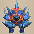 Rumbledon</td>
      <td rowspan="2" class="highlightBehemoth"></td>
    </tr>
    <tr>
      <td>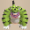 Tiger Hurler</td>
      <td> Fulminachin</td>
      <td class="highlightGray"></td>
      <td class="highlightGray"></td>
      <td class="highlightGray"></td>
    </tr>
    <tr>
      <td colspan="10" class="tableDivider"></td>
    </tr>
    <tr>
      <td rowspan="2" class="centeredText highlightFog">10</td>
      <td rowspan="2" class=""></td>
      <td rowspan="2" class=""></td>
      <td rowspan="2" class=""></td>
      <td> Pumpanshee</td>
      <td> Skull Wizard</td>
      <td> Thrashead</td>
      <td> Famed Octopling</td>
      <td> Rumbledon</td>
      <td rowspan="2" class="highlightBehemoth"></td>
    </tr>
    <tr>
      <td> Tiger Hurler</td>
      <td> Fulminachin</td>
      <td class="highlightGray"></td>
      <td class="highlightGray"></td>
      <td class="highlightGray"></td>
    </tr>
    <tr>
      <td colspan="10" class="tableDivider"></td>
    </tr>
    <tr>
      <td rowspan="2" class="centeredText highlightFog">11</td>
      <td rowspan="2" class=""></td>
      <td rowspan="2" class=""></td>
      <td rowspan="2" class=""></td>
      <td> Pumpanshee</td>
      <td> Skull Wizard</td>
      <td> Thrashead</td>
      <td> Famed Octopling</td>
      <td> Rumbledon</td>
      <td rowspan="2" class="highlightBehemoth"></td>
    </tr>
    <tr>
      <td> Tiger Hurler</td>
      <td> Fulminachin</td>
      <td class="highlightGray"></td>
      <td class="highlightGray"></td>
      <td class="highlightGray"></td>
    </tr>
    <tr>
      <td colspan="10" class="tableDivider"></td>
    </tr>
    <tr>
      <td rowspan="2" class="centeredText highlightFog">12</td>
      <td rowspan="2" class=""></td>
      <td rowspan="2" class=""></td>
      <td rowspan="2" class=""></td>
      <td> Pumpanshee</td>
      <td> Skull Wizard</td>
      <td> Thrashead</td>
      <td> Famed Octopling</td>
      <td> Rumbledon</td>
      <td rowspan="2" class="highlightBehemoth"></td>
    </tr>
    <tr>
      <td> Tiger Hurler</td>
      <td> Fulminachin</td>
      <td class="highlightGray"></td>
      <td class="highlightGray"></td>
      <td class="highlightGray"></td>
    </tr>
    <tr>
      <td colspan="10" class="tableDivider"></td>
    </tr>
    <tr>
      <td rowspan="2" class="centeredText highlightFog">13</td>
      <td rowspan="2" class=""></td>
      <td rowspan="2" class=""></td>
      <td rowspan="2" class=""></td>
      <td> Famed Octopling</td>
      <td> Rumbledon</td>
      <td> Tiger Hurler</td>
      <td> Fulminachin</td>
      <td> Great Hen</td>
      <td rowspan="2" class="highlightBehemoth"></td>
    </tr>
    <tr>
      <td> Lashagga</td>
      <td class="danger"> Nigiri Boss</td>
      <td> Blazepuff</td>
      <td class="highlightGray"></td>
      <td class="highlightGray"></td>
    </tr>
    <tr>
      <td colspan="10" class="tableDivider"></td>
    </tr>
    <tr>
      <td rowspan="2" class="centeredText highlightFog">14</td>
      <td rowspan="2" class=""></td>
      <td rowspan="2" class=""></td>
      <td rowspan="2" class=""></td>
      <td> Famed Octopling</td>
      <td> Rumbledon</td>
      <td> Tiger Hurler</td>
      <td> Fulminachin</td>
      <td> Great Hen</td>
      <td rowspan="2" class="highlightBehemoth"></td>
    </tr>
    <tr>
      <td> Lashagga</td>
      <td class="danger"> Nigiri Boss</td>
      <td> Blazepuff</td>
      <td class="highlightGray"></td>
      <td class="highlightGray"></td>
    </tr>
    <tr>
      <td colspan="10" class="tableDivider"></td>
    </tr>
    <tr>
      <td rowspan="2" class="centeredText highlightFog">15</td>
      <td rowspan="2" class=""></td>
      <td rowspan="2" class=""></td>
      <td rowspan="2" class=""></td>
      <td> Famed Octopling</td>
      <td> Rumbledon</td>
      <td> Tiger Hurler</td>
      <td> Fulminachin</td>
      <td> Great Hen</td>
      <td rowspan="2" class="highlightBehemoth"></td>
    </tr>
    <tr>
      <td> Lashagga</td>
      <td class="danger"> Nigiri Boss</td>
      <td> Blazepuff</td>
      <td class="highlightGray"></td>
      <td class="highlightGray"></td>
    </tr>
    <tr>
      <td colspan="10" class="tableDivider"></td>
    </tr>
    <tr>
      <td rowspan="2" class="centeredText highlightFog">16</td>
      <td rowspan="2" class=""></td>
      <td rowspan="2" class=""></td>
      <td rowspan="2" class=""></td>
      <td> Great Hen</td>
      <td> Lashagga</td>
      <td class="danger"> Nigiri Boss</td>
      <td> Blazepuff</td>
      <td class="items"> Hyper Gazer</td>
      <td rowspan="2" class="highlightBehemoth"></td>
    </tr>
    <tr>
      <td class="items"> Fencer</td>
      <td> Megataur</td>
      <td class="highlightGray"></td>
      <td class="highlightGray"></td>
      <td class="highlightGray"></td>
    </tr>
    <tr>
      <td colspan="10" class="tableDivider"></td>
    </tr>
    <tr>
      <td rowspan="2" class="centeredText highlightFog">17</td>
      <td rowspan="2" class=""></td>
      <td rowspan="2" class=""></td>
      <td rowspan="2" class=""></td>
      <td> Great Hen</td>
      <td> Lashagga</td>
      <td class="danger"> Nigiri Boss</td>
      <td> Blazepuff</td>
      <td class="items"> Hyper Gazer</td>
      <td rowspan="2" class="highlightBehemoth"></td>
    </tr>
    <tr>
      <td class="items"> Fencer</td>
      <td> Megataur</td>
      <td class="highlightGray"></td>
      <td class="highlightGray"></td>
      <td class="highlightGray"></td>
    </tr>
    <tr>
      <td colspan="10" class="tableDivider"></td>
    </tr>
    <tr>
      <td rowspan="2" class="centeredText highlightFog">18</td>
      <td rowspan="2" class=""></td>
      <td rowspan="2" class=""></td>
      <td rowspan="2" class=""></td>
      <td> Great Hen</td>
      <td> Lashagga</td>
      <td class="danger"> Nigiri Boss</td>
      <td> Blazepuff</td>
      <td class="items"> Hyper Gazer</td>
      <td rowspan="2" class="highlightBehemoth"></td>
    </tr>
    <tr>
      <td class="items"> Fencer</td>
      <td> Megataur</td>
      <td class="highlightGray"></td>
      <td class="highlightGray"></td>
      <td class="highlightGray"></td>
    </tr>
    <tr>
      <td colspan="10" class="tableDivider"></td>
    </tr>
    <tr>
      <td rowspan="2" class="centeredText highlightFog">19</td>
      <td rowspan="2" class=""></td>
      <td rowspan="2" class=""></td>
      <td rowspan="2" class=""></td>
      <td> Great Hen</td>
      <td> Lashagga</td>
      <td class="danger"> Nigiri Boss</td>
      <td> Blazepuff</td>
      <td class="items"> Hyper Gazer</td>
      <td rowspan="2" class="highlightBehemoth"></td>
    </tr>
    <tr>
      <td class="items"> Fencer</td>
      <td> Megataur</td>
      <td class="highlightGray"></td>
      <td class="highlightGray"></td>
      <td class="highlightGray"></td>
    </tr>
    <tr>
      <td colspan="10" class="tableDivider"></td>
    </tr>
    <tr>
      <td rowspan="2" class="centeredText highlightFog">20</td>
      <td rowspan="2" class=""></td>
      <td rowspan="2" class=""></td>
      <td rowspan="2" class=""></td>
      <td> Great Hen</td>
      <td> Lashagga</td>
      <td class="danger"> Nigiri Boss</td>
      <td> Blazepuff</td>
      <td class="items"> Hyper Gazer</td>
      <td rowspan="2" class="highlightBehemoth"></td>
    </tr>
    <tr>
      <td class="items"> Fencer</td>
      <td> Megataur</td>
      <td class="highlightGray"></td>
      <td class="highlightGray"></td>
      <td class="highlightGray"></td>
    </tr>
    <tr>
      <td colspan="10" class="tableDivider"></td>
    </tr>
    <tr>
      <td rowspan="3" class="centeredText highlightFog">21</td>
      <td rowspan="3" class=""></td>
      <td rowspan="3" class="highlightMH"></td>
      <td rowspan="3" class=""></td>
      <td> Lashagga</td>
      <td class="items"> Hyper Gazer</td>
      <td class="items"> Fencer</td>
      <td> Megataur</td>
      <td> Igneous</td>
      <td rowspan="3" class="highlightBehemoth"></td>
    </tr>
    <tr>
      <td class="danger"> Adamant Tank</td>
      <td> Hannya Monk B</td>
      <td> Kitsune Monk B</td>
      <td class="danger"> Okina Monk B</td>
      <td>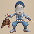 Okame Monk B</td>
    </tr>
    <tr>
      <td class="danger"> Tengu Monk B</td>
      <td class="highlightGray"></td>
      <td class="highlightGray"></td>
      <td class="highlightGray"></td>
      <td class="highlightGray"></td>
    </tr>
    <tr>
      <td colspan="10" class="tableDivider"></td>
    </tr>
    <tr>
      <td rowspan="3" class="centeredText highlightFog">22</td>
      <td rowspan="3" class=""></td>
      <td rowspan="3" class=""></td>
      <td rowspan="3" class=""></td>
      <td> Lashagga</td>
      <td class="items"> Hyper Gazer</td>
      <td class="items"> Fencer</td>
      <td> Megataur</td>
      <td> Igneous</td>
      <td rowspan="3" class="highlightBehemoth"></td>
    </tr>
    <tr>
      <td class="danger"> Adamant Tank</td>
      <td> Hannya Monk B</td>
      <td> Kitsune Monk B</td>
      <td class="danger"> Okina Monk B</td>
      <td> Okame Monk B</td>
    </tr>
    <tr>
      <td class="danger"> Tengu Monk B</td>
      <td class="highlightGray"></td>
      <td class="highlightGray"></td>
      <td class="highlightGray"></td>
      <td class="highlightGray"></td>
    </tr>
    <tr>
      <td colspan="10" class="tableDivider"></td>
    </tr>
    <tr>
      <td rowspan="3" class="centeredText highlightFog">23</td>
      <td rowspan="3" class=""></td>
      <td rowspan="3" class=""></td>
      <td rowspan="3" class=""></td>
      <td> Lashagga</td>
      <td class="items"> Hyper Gazer</td>
      <td class="items"> Fencer</td>
      <td> Megataur</td>
      <td> Igneous</td>
      <td rowspan="3" class="highlightBehemoth"></td>
    </tr>
    <tr>
      <td class="danger"> Adamant Tank</td>
      <td> Hannya Monk B</td>
      <td> Kitsune Monk B</td>
      <td class="danger"> Okina Monk B</td>
      <td> Okame Monk B</td>
    </tr>
    <tr>
      <td class="danger"> Tengu Monk B</td>
      <td class="highlightGray"></td>
      <td class="highlightGray"></td>
      <td class="highlightGray"></td>
      <td class="highlightGray"></td>
    </tr>
    <tr>
      <td colspan="10" class="tableDivider"></td>
    </tr>
    <tr>
      <td rowspan="3" class="centeredText highlightFog">24</td>
      <td rowspan="3" class=""></td>
      <td rowspan="3" class=""></td>
      <td rowspan="3" class=""></td>
      <td> Lashagga</td>
      <td class="items"> Hyper Gazer</td>
      <td class="items"> Fencer</td>
      <td> Megataur</td>
      <td> Igneous</td>
      <td rowspan="3" class="highlightBehemoth"></td>
    </tr>
    <tr>
      <td class="danger"> Adamant Tank</td>
      <td> Hannya Monk B</td>
      <td> Kitsune Monk B</td>
      <td class="danger"> Okina Monk B</td>
      <td> Okame Monk B</td>
    </tr>
    <tr>
      <td class="danger"> Tengu Monk B</td>
      <td class="highlightGray"></td>
      <td class="highlightGray"></td>
      <td class="highlightGray"></td>
      <td class="highlightGray"></td>
    </tr>
    <tr>
      <td colspan="10" class="tableDivider"></td>
    </tr>
    <tr>
      <td rowspan="3" class="centeredText">25</td>
      <td rowspan="3" class=""></td>
      <td rowspan="3" class=""></td>
      <td rowspan="3" class=""></td>
      <td> Lashagga</td>
      <td class="items"> Hyper Gazer</td>
      <td class="items"> Fencer</td>
      <td> Megataur</td>
      <td> Igneous</td>
      <td rowspan="3" class="highlightBehemoth"></td>
    </tr>
    <tr>
      <td class="danger"> Adamant Tank</td>
      <td> Hannya Monk B</td>
      <td> Kitsune Monk B</td>
      <td class="danger"> Okina Monk B</td>
      <td> Okame Monk B</td>
    </tr>
    <tr>
      <td class="danger"> Tengu Monk B</td>
      <td class="highlightGray"></td>
      <td class="highlightGray"></td>
      <td class="highlightGray"></td>
      <td class="highlightGray"></td>
    </tr>
    <tr>
      <td colspan="10" class="tableDivider"></td>
    </tr>
    <tr>
      <td rowspan="2" class="centeredText highlightFog">26</td>
      <td rowspan="2" class=""></td>
      <td rowspan="2" class=""></td>
      <td rowspan="2" class=""></td>
      <td class="items"> Fencer</td>
      <td> Igneous</td>
      <td> Electroid</td>
      <td class="danger"> Adamant Tank</td>
      <td class="stats"> Terror Scorpion</td>
      <td rowspan="2" class="highlightBehemoth"></td>
    </tr>
    <tr>
      <td> Superb Octopling</td>
      <td class="farming"> Ironwalrus</td>
      <td class="highlightGray"></td>
      <td class="highlightGray"></td>
      <td class="highlightGray"></td>
    </tr>
    <tr>
      <td colspan="10" class="tableDivider"></td>
    </tr>
    <tr>
      <td rowspan="2" class="centeredText highlightFog">27</td>
      <td rowspan="2" class=""></td>
      <td rowspan="2" class=""></td>
      <td rowspan="2" class=""></td>
      <td class="items"> Fencer</td>
      <td> Igneous</td>
      <td> Electroid</td>
      <td class="danger"> Adamant Tank</td>
      <td class="stats"> Terror Scorpion</td>
      <td rowspan="2" class="highlightBehemoth"></td>
    </tr>
    <tr>
      <td> Superb Octopling</td>
      <td class="farming"> Ironwalrus</td>
      <td class="highlightGray"></td>
      <td class="highlightGray"></td>
      <td class="highlightGray"></td>
    </tr>
    <tr>
      <td colspan="10" class="tableDivider"></td>
    </tr>
    <tr>
      <td rowspan="2" class="centeredText highlightFog">28</td>
      <td rowspan="2" class=""></td>
      <td rowspan="2" class=""></td>
      <td rowspan="2" class=""></td>
      <td class="items"> Fencer</td>
      <td> Igneous</td>
      <td> Electroid</td>
      <td class="danger"> Adamant Tank</td>
      <td class="stats"> Terror Scorpion</td>
      <td rowspan="2" class="highlightBehemoth"></td>
    </tr>
    <tr>
      <td> Superb Octopling</td>
      <td class="farming"> Ironwalrus</td>
      <td class="highlightGray"></td>
      <td class="highlightGray"></td>
      <td class="highlightGray"></td>
    </tr>
    <tr>
      <td colspan="10" class="tableDivider"></td>
    </tr>
    <tr>
      <td rowspan="2" class="centeredText highlightFog">29</td>
      <td rowspan="2" class=""></td>
      <td rowspan="2" class=""></td>
      <td rowspan="2" class=""></td>
      <td class="items"> Fencer</td>
      <td> Igneous</td>
      <td> Electroid</td>
      <td class="danger"> Adamant Tank</td>
      <td class="stats"> Terror Scorpion</td>
      <td rowspan="2" class="highlightBehemoth"></td>
    </tr>
    <tr>
      <td> Superb Octopling</td>
      <td class="farming"> Ironwalrus</td>
      <td class="highlightGray"></td>
      <td class="highlightGray"></td>
      <td class="highlightGray"></td>
    </tr>
    <tr>
      <td colspan="10" class="tableDivider"></td>
    </tr>
    <tr>
      <td rowspan="2" class="centeredText highlightFog">30</td>
      <td rowspan="2" class=""></td>
      <td rowspan="2" class=""></td>
      <td rowspan="2" class=""></td>
      <td class="items"> Fencer</td>
      <td> Igneous</td>
      <td> Electroid</td>
      <td class="danger"> Adamant Tank</td>
      <td class="stats"> Terror Scorpion</td>
      <td rowspan="2" class="highlightBehemoth"></td>
    </tr>
    <tr>
      <td> Superb Octopling</td>
      <td class="farming"> Ironwalrus</td>
      <td class="highlightGray"></td>
      <td class="highlightGray"></td>
      <td class="highlightGray"></td>
    </tr>
    <tr>
      <td colspan="10" class="tableDivider"></td>
    </tr>
    <tr>
      <td rowspan="2" class="centeredText highlightFog">31</td>
      <td rowspan="2" class=""></td>
      <td rowspan="2" class=""></td>
      <td rowspan="2" class=""></td>
      <td class="stats"> Terror Scorpion</td>
      <td class="danger"> Porkon</td>
      <td> Pumplord</td>
      <td class="stats"> Wrinkly Hani</td>
      <td> Admiral Spearfish</td>
      <td rowspan="2" class="highlightBehemoth"></td>
    </tr>
    <tr>
      <td class="danger">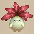 Sleep Radish</td>
      <td class="farming"> Ironwalrus</td>
      <td class="highlightGray"></td>
      <td class="highlightGray"></td>
      <td class="highlightGray"></td>
    </tr>
    <tr>
      <td colspan="10" class="tableDivider"></td>
    </tr>
    <tr>
      <td rowspan="2" class="centeredText highlightFog">32</td>
      <td rowspan="2" class="highlightShop"></td>
      <td rowspan="2" class=""></td>
      <td rowspan="2" class=""></td>
      <td class="stats"> Terror Scorpion</td>
      <td class="danger"> Porkon</td>
      <td> Pumplord</td>
      <td class="stats"> Wrinkly Hani</td>
      <td> Admiral Spearfish</td>
      <td rowspan="2" class="highlightBehemoth"></td>
    </tr>
    <tr>
      <td class="danger"> Sleep Radish</td>
      <td class="farming"> Ironwalrus</td>
      <td class="highlightGray"></td>
      <td class="highlightGray"></td>
      <td class="highlightGray"></td>
    </tr>
    <tr>
      <td colspan="10" class="tableDivider"></td>
    </tr>
    <tr>
      <td rowspan="2" class="centeredText highlightFog">33</td>
      <td rowspan="2" class=""></td>
      <td rowspan="2" class=""></td>
      <td rowspan="2" class=""></td>
      <td class="stats"> Terror Scorpion</td>
      <td class="danger"> Porkon</td>
      <td> Pumplord</td>
      <td class="stats"> Wrinkly Hani</td>
      <td> Admiral Spearfish</td>
      <td rowspan="2" class="highlightBehemoth"></td>
    </tr>
    <tr>
      <td class="danger"> Sleep Radish</td>
      <td class="farming"> Ironwalrus</td>
      <td class="highlightGray"></td>
      <td class="highlightGray"></td>
      <td class="highlightGray"></td>
    </tr>
    <tr>
      <td colspan="10" class="tableDivider"></td>
    </tr>
    <tr>
      <td rowspan="2" class="centeredText highlightFog">34</td>
      <td rowspan="2" class=""></td>
      <td rowspan="2" class=""></td>
      <td rowspan="2" class=""></td>
      <td class="stats"> Terror Scorpion</td>
      <td class="danger"> Porkon</td>
      <td> Pumplord</td>
      <td class="stats"> Wrinkly Hani</td>
      <td> Admiral Spearfish</td>
      <td rowspan="2" class="highlightBehemoth"></td>
    </tr>
    <tr>
      <td class="danger"> Sleep Radish</td>
      <td class="farming"> Ironwalrus</td>
      <td class="highlightGray"></td>
      <td class="highlightGray"></td>
      <td class="highlightGray"></td>
    </tr>
    <tr>
      <td colspan="10" class="tableDivider"></td>
    </tr>
    <tr>
      <td rowspan="2" class="centeredText highlightFog">35</td>
      <td rowspan="2" class=""></td>
      <td rowspan="2" class=""></td>
      <td rowspan="2" class=""></td>
      <td class="stats"> Terror Scorpion</td>
      <td class="danger"> Porkon</td>
      <td> Pumplord</td>
      <td class="stats"> Wrinkly Hani</td>
      <td> Admiral Spearfish</td>
      <td rowspan="2" class="highlightBehemoth"></td>
    </tr>
    <tr>
      <td class="danger"> Sleep Radish</td>
      <td class="farming"> Ironwalrus</td>
      <td class="highlightGray"></td>
      <td class="highlightGray"></td>
      <td class="highlightGray"></td>
    </tr>
    <tr>
      <td colspan="10" class="tableDivider"></td>
    </tr>
    <tr>
      <td rowspan="2" class="centeredText highlightFog">36</td>
      <td rowspan="2" class=""></td>
      <td rowspan="2" class=""></td>
      <td rowspan="2" class=""></td>
      <td class="stats"> Terror Scorpion</td>
      <td> Pumplord</td>
      <td class="stats"> Wrinkly Hani</td>
      <td class="danger"> Sleep Radish</td>
      <td class="items"> Vexing Kappa</td>
      <td rowspan="2" class="highlightBehemoth"></td>
    </tr>
    <tr>
      <td class="danger"> Archdragon</td>
      <td>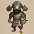 Great Samurai</td>
      <td class="useful"> Mixergon</td>
      <td class="highlightGray"></td>
      <td class="highlightGray"></td>
    </tr>
    <tr>
      <td colspan="10" class="tableDivider"></td>
    </tr>
    <tr>
      <td rowspan="2" class="centeredText highlightFog">37</td>
      <td rowspan="2" class=""></td>
      <td rowspan="2" class=""></td>
      <td rowspan="2" class=""></td>
      <td class="stats"> Terror Scorpion</td>
      <td> Pumplord</td>
      <td class="stats"> Wrinkly Hani</td>
      <td class="danger"> Sleep Radish</td>
      <td class="items"> Vexing Kappa</td>
      <td rowspan="2" class="highlightBehemoth"></td>
    </tr>
    <tr>
      <td class="danger"> Archdragon</td>
      <td> Great Samurai</td>
      <td class="useful"> Mixergon</td>
      <td class="highlightGray"></td>
      <td class="highlightGray"></td>
    </tr>
    <tr>
      <td colspan="10" class="tableDivider"></td>
    </tr>
    <tr>
      <td rowspan="2" class="centeredText highlightFog">38</td>
      <td rowspan="2" class=""></td>
      <td rowspan="2" class=""></td>
      <td rowspan="2" class=""></td>
      <td class="stats"> Terror Scorpion</td>
      <td> Pumplord</td>
      <td class="stats"> Wrinkly Hani</td>
      <td class="danger"> Sleep Radish</td>
      <td class="items"> Vexing Kappa</td>
      <td rowspan="2" class="highlightBehemoth"></td>
    </tr>
    <tr>
      <td class="danger"> Archdragon</td>
      <td> Great Samurai</td>
      <td class="useful"> Mixergon</td>
      <td class="highlightGray"></td>
      <td class="highlightGray"></td>
    </tr>
    <tr>
      <td colspan="10" class="tableDivider"></td>
    </tr>
    <tr>
      <td rowspan="2" class="centeredText highlightFog">39</td>
      <td rowspan="2" class=""></td>
      <td rowspan="2" class=""></td>
      <td rowspan="2" class=""></td>
      <td class="stats"> Terror Scorpion</td>
      <td> Pumplord</td>
      <td class="stats"> Wrinkly Hani</td>
      <td class="danger"> Sleep Radish</td>
      <td class="items"> Vexing Kappa</td>
      <td rowspan="2" class="highlightBehemoth"></td>
    </tr>
    <tr>
      <td class="danger"> Archdragon</td>
      <td> Great Samurai</td>
      <td class="useful"> Mixergon</td>
      <td class="highlightGray"></td>
      <td class="highlightGray"></td>
    </tr>
    <tr>
      <td colspan="10" class="tableDivider"></td>
    </tr>
    <tr>
      <td rowspan="2" class="centeredText highlightFog">40</td>
      <td rowspan="2" class=""></td>
      <td rowspan="2" class=""></td>
      <td rowspan="2" class=""></td>
      <td class="stats"> Terror Scorpion</td>
      <td> Pumplord</td>
      <td class="stats"> Wrinkly Hani</td>
      <td class="danger"> Sleep Radish</td>
      <td class="items"> Vexing Kappa</td>
      <td rowspan="2" class="highlightBehemoth"></td>
    </tr>
    <tr>
      <td class="danger"> Archdragon</td>
      <td> Great Samurai</td>
      <td class="useful"> Mixergon</td>
      <td class="highlightGray"></td>
      <td class="highlightGray"></td>
    </tr>
    <tr>
      <td colspan="10" class="tableDivider"></td>
    </tr>
    <tr>
      <td rowspan="3" class="centeredText highlightFog">41</td>
      <td rowspan="3" class=""></td>
      <td rowspan="3" class=""></td>
      <td rowspan="3" class=""></td>
      <td class="danger"> Miracle Hen</td>
      <td class="danger"> Archdragon</td>
      <td> Clapdon</td>
      <td>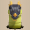 Dragon Pit</td>
      <td> Mini Tank</td>
      <td rowspan="3" class="highlightBehemoth"></td>
    </tr>
    <tr>
      <td> Great Samurai</td>
      <td class="items"> Battler</td>
      <td class="items"> Fire Ninja B</td>
      <td> Metal Ninja B</td>
      <td class="items"> Water Ninja B</td>
    </tr>
    <tr>
      <td> Tree Ninja B</td>
      <td> Earth Ninja B</td>
      <td class="highlightGray"></td>
      <td class="highlightGray"></td>
      <td class="highlightGray"></td>
    </tr>
    <tr>
      <td colspan="10" class="tableDivider"></td>
    </tr>
    <tr>
      <td rowspan="3" class="centeredText highlightFog">42</td>
      <td rowspan="3" class=""></td>
      <td rowspan="3" class=""></td>
      <td rowspan="3" class=""></td>
      <td class="danger"> Miracle Hen</td>
      <td class="danger"> Archdragon</td>
      <td> Clapdon</td>
      <td> Dragon Pit</td>
      <td> Mini Tank</td>
      <td rowspan="3" class="highlightBehemoth"></td>
    </tr>
    <tr>
      <td> Great Samurai</td>
      <td class="items"> Battler</td>
      <td class="items"> Fire Ninja B</td>
      <td> Metal Ninja B</td>
      <td class="items"> Water Ninja B</td>
    </tr>
    <tr>
      <td> Tree Ninja B</td>
      <td> Earth Ninja B</td>
      <td class="highlightGray"></td>
      <td class="highlightGray"></td>
      <td class="highlightGray"></td>
    </tr>
    <tr>
      <td colspan="10" class="tableDivider"></td>
    </tr>
    <tr>
      <td rowspan="3" class="centeredText highlightFog">43</td>
      <td rowspan="3" class=""></td>
      <td rowspan="3" class=""></td>
      <td rowspan="3" class=""></td>
      <td class="danger"> Miracle Hen</td>
      <td class="danger"> Archdragon</td>
      <td> Clapdon</td>
      <td> Dragon Pit</td>
      <td> Mini Tank</td>
      <td rowspan="3" class="highlightBehemoth"></td>
    </tr>
    <tr>
      <td> Great Samurai</td>
      <td class="items"> Battler</td>
      <td class="items"> Fire Ninja B</td>
      <td> Metal Ninja B</td>
      <td class="items"> Water Ninja B</td>
    </tr>
    <tr>
      <td> Tree Ninja B</td>
      <td> Earth Ninja B</td>
      <td class="highlightGray"></td>
      <td class="highlightGray"></td>
      <td class="highlightGray"></td>
    </tr>
    <tr>
      <td colspan="10" class="tableDivider"></td>
    </tr>
    <tr>
      <td rowspan="3" class="centeredText highlightFog">44</td>
      <td rowspan="3" class=""></td>
      <td rowspan="3" class=""></td>
      <td rowspan="3" class=""></td>
      <td class="danger"> Miracle Hen</td>
      <td class="danger"> Archdragon</td>
      <td> Clapdon</td>
      <td> Dragon Pit</td>
      <td> Mini Tank</td>
      <td rowspan="3" class="highlightBehemoth"></td>
    </tr>
    <tr>
      <td> Great Samurai</td>
      <td class="items"> Battler</td>
      <td class="items"> Fire Ninja B</td>
      <td> Metal Ninja B</td>
      <td class="items"> Water Ninja B</td>
    </tr>
    <tr>
      <td> Tree Ninja B</td>
      <td> Earth Ninja B</td>
      <td class="highlightGray"></td>
      <td class="highlightGray"></td>
      <td class="highlightGray"></td>
    </tr>
    <tr>
      <td colspan="10" class="tableDivider"></td>
    </tr>
    <tr>
      <td rowspan="3" class="centeredText highlightFog">45</td>
      <td rowspan="3" class=""></td>
      <td rowspan="3" class=""></td>
      <td rowspan="3" class=""></td>
      <td class="danger"> Miracle Hen</td>
      <td class="danger"> Archdragon</td>
      <td> Clapdon</td>
      <td> Dragon Pit</td>
      <td> Mini Tank</td>
      <td rowspan="3" class="highlightBehemoth"></td>
    </tr>
    <tr>
      <td> Great Samurai</td>
      <td class="items"> Battler</td>
      <td class="items"> Fire Ninja B</td>
      <td> Metal Ninja B</td>
      <td class="items"> Water Ninja B</td>
    </tr>
    <tr>
      <td> Tree Ninja B</td>
      <td> Earth Ninja B</td>
      <td class="highlightGray"></td>
      <td class="highlightGray"></td>
      <td class="highlightGray"></td>
    </tr>
    <tr>
      <td colspan="10" class="tableDivider"></td>
    </tr>
    <tr>
      <td rowspan="2" class="centeredText highlightFog">46</td>
      <td rowspan="2" class=""></td>
      <td rowspan="2" class=""></td>
      <td rowspan="2" class=""></td>
      <td> Clapdon</td>
      <td> Great Samurai</td>
      <td class="danger"> Skullmancer</td>
      <td class="items"> Battler</td>
      <td> Tiger Launcher</td>
      <td rowspan="2" class="highlightBehemoth"></td>
    </tr>
    <tr>
      <td> Huge Chintala</td>
      <td> Detonachin</td>
      <td> Hoppin' Slugger</td>
      <td class="highlightGray"></td>
      <td class="highlightGray"></td>
    </tr>
    <tr>
      <td colspan="10" class="tableDivider"></td>
    </tr>
    <tr>
      <td rowspan="2" class="centeredText highlightFog">47</td>
      <td rowspan="2" class=""></td>
      <td rowspan="2" class=""></td>
      <td rowspan="2" class=""></td>
      <td> Clapdon</td>
      <td> Great Samurai</td>
      <td class="danger"> Skullmancer</td>
      <td class="items"> Battler</td>
      <td> Tiger Launcher</td>
      <td rowspan="2" class="highlightBehemoth"></td>
    </tr>
    <tr>
      <td> Huge Chintala</td>
      <td> Detonachin</td>
      <td> Hoppin' Slugger</td>
      <td class="highlightGray"></td>
      <td class="highlightGray"></td>
    </tr>
    <tr>
      <td colspan="10" class="tableDivider"></td>
    </tr>
    <tr>
      <td rowspan="2" class="centeredText highlightFog">48</td>
      <td rowspan="2" class=""></td>
      <td rowspan="2" class=""></td>
      <td rowspan="2" class=""></td>
      <td> Clapdon</td>
      <td> Great Samurai</td>
      <td class="danger"> Skullmancer</td>
      <td class="items"> Battler</td>
      <td> Tiger Launcher</td>
      <td rowspan="2" class="highlightBehemoth"></td>
    </tr>
    <tr>
      <td> Huge Chintala</td>
      <td> Detonachin</td>
      <td> Hoppin' Slugger</td>
      <td class="highlightGray"></td>
      <td class="highlightGray"></td>
    </tr>
    <tr>
      <td colspan="10" class="tableDivider"></td>
    </tr>
    <tr>
      <td rowspan="2" class="centeredText highlightFog">49</td>
      <td rowspan="2" class="highlightShop"></td>
      <td rowspan="2" class=""></td>
      <td rowspan="2" class=""></td>
      <td> Clapdon</td>
      <td> Great Samurai</td>
      <td class="danger"> Skullmancer</td>
      <td class="items"> Battler</td>
      <td> Tiger Launcher</td>
      <td rowspan="2" class="highlightBehemoth"></td>
    </tr>
    <tr>
      <td> Huge Chintala</td>
      <td> Detonachin</td>
      <td> Hoppin' Slugger</td>
      <td class="highlightGray"></td>
      <td class="highlightGray"></td>
    </tr>
    <tr>
      <td colspan="10" class="tableDivider"></td>
    </tr>
    <tr>
      <td rowspan="2" class="centeredText highlightFog">50</td>
      <td rowspan="2" class="highlightShop"></td>
      <td rowspan="2" class=""></td>
      <td rowspan="2" class=""></td>
      <td> Clapdon</td>
      <td> Great Samurai</td>
      <td class="danger"> Skullmancer</td>
      <td class="items"> Battler</td>
      <td> Tiger Launcher</td>
      <td rowspan="2" class=""></td>
    </tr>
    <tr>
      <td> Huge Chintala</td>
      <td> Detonachin</td>
      <td> Hoppin' Slugger</td>
      <td class="highlightGray"></td>
      <td class="highlightGray"></td>
    </tr>
    <tr>
      <td colspan="10" class="tableDivider"></td>
    </tr>
    <tr>
      <td class="monsterTableExtension"></td>
      <td colspan="3" class="monsterTableExtension"></td>
      <td colspan="5" class="monsterTableExtension centeredText">Sacred Tree Mode</td>
      <td class="monsterTableExtension"></td>
    </tr>
    <tr>
      <td colspan="10" class="tableDivider"></td>
    </tr>
    <tr>
      <td rowspan="2" class="centeredText highlightFog">51</td>
      <td rowspan="2" class=""></td>
      <td rowspan="2" class="highlightMH"></td>
      <td rowspan="2" class=""></td>
      <td class="danger"> Skullmancer</td>
      <td class="items"> Battler</td>
      <td> Popdillo</td>
      <td> Pumplich</td>
      <td class="items"> Cursenior</td>
      <td rowspan="2" class="highlightBehemoth"></td>
    </tr>
    <tr>
      <td class="items">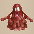 Mudder</td>
      <td class="danger"> Frenzy Radish</td>
      <td> Detonachin</td>
      <td> Hoppin' Slugger</td>
      <td> Soul Reaper</td>
    </tr>
    <tr>
      <td colspan="10" class="tableDivider"></td>
    </tr>
    <tr>
      <td rowspan="2" class="centeredText highlightFog">52</td>
      <td rowspan="2" class=""></td>
      <td rowspan="2" class=""></td>
      <td rowspan="2" class=""></td>
      <td class="danger"> Skullmancer</td>
      <td class="items"> Battler</td>
      <td> Popdillo</td>
      <td> Pumplich</td>
      <td class="items"> Cursenior</td>
      <td rowspan="2" class="highlightBehemoth"></td>
    </tr>
    <tr>
      <td class="items"> Mudder</td>
      <td class="danger"> Frenzy Radish</td>
      <td> Detonachin</td>
      <td> Hoppin' Slugger</td>
      <td> Soul Reaper</td>
    </tr>
    <tr>
      <td colspan="10" class="tableDivider"></td>
    </tr>
    <tr>
      <td rowspan="2" class="centeredText highlightFog">53</td>
      <td rowspan="2" class=""></td>
      <td rowspan="2" class=""></td>
      <td rowspan="2" class=""></td>
      <td class="danger"> Skullmancer</td>
      <td class="items"> Battler</td>
      <td> Popdillo</td>
      <td> Pumplich</td>
      <td class="items"> Cursenior</td>
      <td rowspan="2" class="highlightBehemoth"></td>
    </tr>
    <tr>
      <td class="items"> Mudder</td>
      <td class="danger"> Frenzy Radish</td>
      <td> Detonachin</td>
      <td> Hoppin' Slugger</td>
      <td> Soul Reaper</td>
    </tr>
    <tr>
      <td colspan="10" class="tableDivider"></td>
    </tr>
    <tr>
      <td rowspan="2" class="centeredText highlightFog">54</td>
      <td rowspan="2" class=""></td>
      <td rowspan="2" class=""></td>
      <td rowspan="2" class="highlightGold"></td>
      <td class="danger"> Skullmancer</td>
      <td class="items"> Battler</td>
      <td> Popdillo</td>
      <td> Pumplich</td>
      <td class="items"> Cursenior</td>
      <td rowspan="2" class="highlightBehemoth"></td>
    </tr>
    <tr>
      <td class="items"> Mudder</td>
      <td class="danger"> Frenzy Radish</td>
      <td> Detonachin</td>
      <td> Hoppin' Slugger</td>
      <td> Soul Reaper</td>
    </tr>
    <tr>
      <td colspan="10" class="tableDivider"></td>
    </tr>
    <tr>
      <td rowspan="2" class="centeredText highlightFog">55</td>
      <td rowspan="2" class=""></td>
      <td rowspan="2" class=""></td>
      <td rowspan="2" class=""></td>
      <td class="danger"> Skullmancer</td>
      <td class="items"> Battler</td>
      <td> Popdillo</td>
      <td> Pumplich</td>
      <td class="items"> Cursenior</td>
      <td rowspan="2" class="highlightBehemoth"></td>
    </tr>
    <tr>
      <td class="items"> Mudder</td>
      <td class="danger"> Frenzy Radish</td>
      <td> Detonachin</td>
      <td> Hoppin' Slugger</td>
      <td> Soul Reaper</td>
    </tr>
    <tr>
      <td colspan="10" class="tableDivider"></td>
    </tr>
    <tr>
      <td rowspan="2" class="centeredText highlightFog">56</td>
      <td rowspan="2" class=""></td>
      <td rowspan="2" class=""></td>
      <td rowspan="2" class=""></td>
      <td> Pumplich</td>
      <td class="items"> Cursenior</td>
      <td> Detonachin</td>
      <td> Soul Reaper</td>
      <td> Deathead</td>
      <td rowspan="2" class="highlightBehemoth"></td>
    </tr>
    <tr>
      <td class="danger"> Porgon</td>
      <td class="stats"> Demon Scorpion</td>
      <td class="highlightGray"></td>
      <td class="highlightGray"></td>
      <td class="highlightGray"></td>
    </tr>
    <tr>
      <td colspan="10" class="tableDivider"></td>
    </tr>
    <tr>
      <td rowspan="2" class="centeredText highlightFog">57</td>
      <td rowspan="2" class=""></td>
      <td rowspan="2" class=""></td>
      <td rowspan="2" class=""></td>
      <td> Pumplich</td>
      <td class="items"> Cursenior</td>
      <td> Detonachin</td>
      <td> Soul Reaper</td>
      <td> Deathead</td>
      <td rowspan="2" class="highlightBehemoth"></td>
    </tr>
    <tr>
      <td class="danger"> Porgon</td>
      <td class="stats"> Demon Scorpion</td>
      <td class="highlightGray"></td>
      <td class="highlightGray"></td>
      <td class="highlightGray"></td>
    </tr>
    <tr>
      <td colspan="10" class="tableDivider"></td>
    </tr>
    <tr>
      <td rowspan="2" class="centeredText highlightFog">58</td>
      <td rowspan="2" class=""></td>
      <td rowspan="2" class=""></td>
      <td rowspan="2" class=""></td>
      <td> Pumplich</td>
      <td class="items"> Cursenior</td>
      <td> Detonachin</td>
      <td> Soul Reaper</td>
      <td> Deathead</td>
      <td rowspan="2" class="highlightBehemoth"></td>
    </tr>
    <tr>
      <td class="danger"> Porgon</td>
      <td class="stats"> Demon Scorpion</td>
      <td class="highlightGray"></td>
      <td class="highlightGray"></td>
      <td class="highlightGray"></td>
    </tr>
    <tr>
      <td colspan="10" class="tableDivider"></td>
    </tr>
    <tr>
      <td rowspan="2" class="centeredText highlightFog">59</td>
      <td rowspan="2" class=""></td>
      <td rowspan="2" class=""></td>
      <td rowspan="2" class=""></td>
      <td> Pumplich</td>
      <td class="items"> Cursenior</td>
      <td> Detonachin</td>
      <td> Soul Reaper</td>
      <td> Deathead</td>
      <td rowspan="2" class="highlightBehemoth"></td>
    </tr>
    <tr>
      <td class="danger"> Porgon</td>
      <td class="stats"> Demon Scorpion</td>
      <td class="highlightGray"></td>
      <td class="highlightGray"></td>
      <td class="highlightGray"></td>
    </tr>
    <tr>
      <td colspan="10" class="tableDivider"></td>
    </tr>
    <tr>
      <td rowspan="2" class="centeredText highlightFog">60</td>
      <td rowspan="2" class=""></td>
      <td rowspan="2" class=""></td>
      <td rowspan="2" class=""></td>
      <td> Pumplich</td>
      <td class="items"> Cursenior</td>
      <td> Detonachin</td>
      <td> Soul Reaper</td>
      <td> Deathead</td>
      <td rowspan="2" class="highlightBehemoth"></td>
    </tr>
    <tr>
      <td class="danger"> Porgon</td>
      <td class="stats"> Demon Scorpion</td>
      <td class="highlightGray"></td>
      <td class="highlightGray"></td>
      <td class="highlightGray"></td>
    </tr>
    <tr>
      <td colspan="10" class="tableDivider"></td>
    </tr>
    <tr>
      <td rowspan="2" class="centeredText highlightFog">61</td>
      <td rowspan="2" class=""></td>
      <td rowspan="2" class=""></td>
      <td rowspan="2" class=""></td>
      <td class="items"> Cursenior</td>
      <td> Soul Reaper</td>
      <td> Deathead</td>
      <td class="danger"> Porgon</td>
      <td class="stats"> Demon Scorpion</td>
      <td rowspan="2" class="highlightBehemoth"></td>
    </tr>
    <tr>
      <td> Pyrepuff</td>
      <td>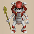 Captain Ant</td>
      <td class="highlightGray"></td>
      <td class="highlightGray"></td>
      <td class="highlightGray"></td>
    </tr>
    <tr>
      <td colspan="10" class="tableDivider"></td>
    </tr>
    <tr>
      <td rowspan="2" class="centeredText highlightFog">62</td>
      <td rowspan="2" class=""></td>
      <td rowspan="2" class=""></td>
      <td rowspan="2" class=""></td>
      <td class="items"> Cursenior</td>
      <td> Soul Reaper</td>
      <td> Deathead</td>
      <td class="danger"> Porgon</td>
      <td class="stats"> Demon Scorpion</td>
      <td rowspan="2" class="highlightBehemoth"></td>
    </tr>
    <tr>
      <td> Pyrepuff</td>
      <td> Captain Ant</td>
      <td class="highlightGray"></td>
      <td class="highlightGray"></td>
      <td class="highlightGray"></td>
    </tr>
    <tr>
      <td colspan="10" class="tableDivider"></td>
    </tr>
    <tr>
      <td rowspan="2" class="centeredText highlightFog">63</td>
      <td rowspan="2" class=""></td>
      <td rowspan="2" class="highlightMH"></td>
      <td rowspan="2" class=""></td>
      <td class="items"> Cursenior</td>
      <td> Soul Reaper</td>
      <td> Deathead</td>
      <td class="danger"> Porgon</td>
      <td class="stats"> Demon Scorpion</td>
      <td rowspan="2" class="highlightBehemoth"></td>
    </tr>
    <tr>
      <td> Pyrepuff</td>
      <td> Captain Ant</td>
      <td class="highlightGray"></td>
      <td class="highlightGray"></td>
      <td class="highlightGray"></td>
    </tr>
    <tr>
      <td colspan="10" class="tableDivider"></td>
    </tr>
    <tr>
      <td rowspan="2" class="centeredText highlightFog">64</td>
      <td rowspan="2" class=""></td>
      <td rowspan="2" class=""></td>
      <td rowspan="2" class=""></td>
      <td class="items"> Cursenior</td>
      <td> Soul Reaper</td>
      <td> Deathead</td>
      <td class="danger"> Porgon</td>
      <td class="stats"> Demon Scorpion</td>
      <td rowspan="2" class="highlightBehemoth"></td>
    </tr>
    <tr>
      <td> Pyrepuff</td>
      <td> Captain Ant</td>
      <td class="highlightGray"></td>
      <td class="highlightGray"></td>
      <td class="highlightGray"></td>
    </tr>
    <tr>
      <td colspan="10" class="tableDivider"></td>
    </tr>
    <tr>
      <td rowspan="2" class="centeredText highlightFog">65</td>
      <td rowspan="2" class=""></td>
      <td rowspan="2" class=""></td>
      <td rowspan="2" class=""></td>
      <td class="items"> Cursenior</td>
      <td> Soul Reaper</td>
      <td> Deathead</td>
      <td class="danger"> Porgon</td>
      <td class="stats"> Demon Scorpion</td>
      <td rowspan="2" class="highlightBehemoth"></td>
    </tr>
    <tr>
      <td> Pyrepuff</td>
      <td> Captain Ant</td>
      <td class="highlightGray"></td>
      <td class="highlightGray"></td>
      <td class="highlightGray"></td>
    </tr>
    <tr>
      <td colspan="10" class="tableDivider"></td>
    </tr>
    <tr>
      <td rowspan="2" class="centeredText highlightFog">66</td>
      <td rowspan="2" class=""></td>
      <td rowspan="2" class=""></td>
      <td rowspan="2" class=""></td>
      <td> Soul Reaper</td>
      <td class="danger"> Porgon</td>
      <td> Hiding Dragon</td>
      <td class="danger"> Steadfast Tank</td>
      <td> Pyrepuff</td>
      <td rowspan="2" class="highlightBehemoth"></td>
    </tr>
    <tr>
      <td> Lordly Samurai</td>
      <td> Hoppin' Slammer</td>
      <td> Captain Ant</td>
      <td class="highlightGray"></td>
      <td class="highlightGray"></td>
    </tr>
    <tr>
      <td colspan="10" class="tableDivider"></td>
    </tr>
    <tr>
      <td rowspan="2" class="centeredText highlightFog">67</td>
      <td rowspan="2" class="highlightShop"></td>
      <td rowspan="2" class=""></td>
      <td rowspan="2" class=""></td>
      <td> Soul Reaper</td>
      <td class="danger"> Porgon</td>
      <td> Hiding Dragon</td>
      <td class="danger"> Steadfast Tank</td>
      <td> Pyrepuff</td>
      <td rowspan="2" class="highlightBehemoth"></td>
    </tr>
    <tr>
      <td> Lordly Samurai</td>
      <td> Hoppin' Slammer</td>
      <td> Captain Ant</td>
      <td class="highlightGray"></td>
      <td class="highlightGray"></td>
    </tr>
    <tr>
      <td colspan="10" class="tableDivider"></td>
    </tr>
    <tr>
      <td rowspan="2" class="centeredText highlightFog">68</td>
      <td rowspan="2" class=""></td>
      <td rowspan="2" class=""></td>
      <td rowspan="2" class="highlightGold"></td>
      <td> Soul Reaper</td>
      <td class="danger"> Porgon</td>
      <td> Hiding Dragon</td>
      <td class="danger"> Steadfast Tank</td>
      <td> Pyrepuff</td>
      <td rowspan="2" class="highlightBehemoth"></td>
    </tr>
    <tr>
      <td> Lordly Samurai</td>
      <td> Hoppin' Slammer</td>
      <td> Captain Ant</td>
      <td class="highlightGray"></td>
      <td class="highlightGray"></td>
    </tr>
    <tr>
      <td colspan="10" class="tableDivider"></td>
    </tr>
    <tr>
      <td rowspan="2" class="centeredText highlightFog">69</td>
      <td rowspan="2" class=""></td>
      <td rowspan="2" class=""></td>
      <td rowspan="2" class=""></td>
      <td> Soul Reaper</td>
      <td class="danger"> Porgon</td>
      <td> Hiding Dragon</td>
      <td class="danger"> Steadfast Tank</td>
      <td> Pyrepuff</td>
      <td rowspan="2" class="highlightBehemoth"></td>
    </tr>
    <tr>
      <td> Lordly Samurai</td>
      <td> Hoppin' Slammer</td>
      <td> Captain Ant</td>
      <td class="highlightGray"></td>
      <td class="highlightGray"></td>
    </tr>
    <tr>
      <td colspan="10" class="tableDivider"></td>
    </tr>
    <tr>
      <td rowspan="2" class="centeredText highlightFog">70</td>
      <td rowspan="2" class=""></td>
      <td rowspan="2" class="highlightMH"></td>
      <td rowspan="2" class=""></td>
      <td> Soul Reaper</td>
      <td class="danger"> Porgon</td>
      <td> Hiding Dragon</td>
      <td class="danger"> Steadfast Tank</td>
      <td> Pyrepuff</td>
      <td rowspan="2" class="highlightBehemoth"></td>
    </tr>
    <tr>
      <td> Lordly Samurai</td>
      <td> Hoppin' Slammer</td>
      <td> Captain Ant</td>
      <td class="highlightGray"></td>
      <td class="highlightGray"></td>
    </tr>
    <tr>
      <td colspan="10" class="tableDivider"></td>
    </tr>
    <tr>
      <td rowspan="2" class="centeredText highlightFog">71</td>
      <td rowspan="2" class=""></td>
      <td rowspan="2" class=""></td>
      <td rowspan="2" class=""></td>
      <td> Soul Reaper</td>
      <td class="danger"> Porgon</td>
      <td> Hiding Dragon</td>
      <td class="danger"> Steadfast Tank</td>
      <td> Lordly Samurai</td>
      <td rowspan="2" class="highlightBehemoth"></td>
    </tr>
    <tr>
      <td class="items"> Fire Ninja A</td>
      <td> Metal Ninja A</td>
      <td class="items"> Water Ninja A</td>
      <td> Tree Ninja A</td>
      <td> Earth Ninja A</td>
    </tr>
    <tr>
      <td colspan="10" class="tableDivider"></td>
    </tr>
    <tr>
      <td rowspan="2" class="centeredText highlightFog">72</td>
      <td rowspan="2" class=""></td>
      <td rowspan="2" class=""></td>
      <td rowspan="2" class=""></td>
      <td> Soul Reaper</td>
      <td class="danger"> Porgon</td>
      <td> Hiding Dragon</td>
      <td class="danger"> Steadfast Tank</td>
      <td> Lordly Samurai</td>
      <td rowspan="2" class="highlightBehemoth"></td>
    </tr>
    <tr>
      <td class="items"> Fire Ninja A</td>
      <td> Metal Ninja A</td>
      <td class="items"> Water Ninja A</td>
      <td> Tree Ninja A</td>
      <td> Earth Ninja A</td>
    </tr>
    <tr>
      <td colspan="10" class="tableDivider"></td>
    </tr>
    <tr>
      <td rowspan="2" class="centeredText highlightFog">73</td>
      <td rowspan="2" class=""></td>
      <td rowspan="2" class="highlightMH"></td>
      <td rowspan="2" class=""></td>
      <td> Soul Reaper</td>
      <td class="danger"> Porgon</td>
      <td> Hiding Dragon</td>
      <td class="danger"> Steadfast Tank</td>
      <td> Lordly Samurai</td>
      <td rowspan="2" class="highlightBehemoth"></td>
    </tr>
    <tr>
      <td class="items"> Fire Ninja A</td>
      <td> Metal Ninja A</td>
      <td class="items"> Water Ninja A</td>
      <td> Tree Ninja A</td>
      <td> Earth Ninja A</td>
    </tr>
    <tr>
      <td colspan="10" class="tableDivider"></td>
    </tr>
    <tr>
      <td rowspan="2" class="centeredText highlightFog">74</td>
      <td rowspan="2" class=""></td>
      <td rowspan="2" class=""></td>
      <td rowspan="2" class=""></td>
      <td> Hiding Dragon</td>
      <td> Gigataur</td>
      <td> Lordly Samurai</td>
      <td>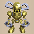 Cyberoid</td>
      <td>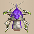 Bashagga</td>
      <td rowspan="2" class="highlightBehemoth"></td>
    </tr>
    <tr>
      <td> Infernous</td>
      <td class="danger"> Nigiri Honcho</td>
      <td class="highlightGray"></td>
      <td class="highlightGray"></td>
      <td class="highlightGray"></td>
    </tr>
    <tr>
      <td colspan="10" class="tableDivider"></td>
    </tr>
    <tr>
      <td rowspan="2" class="centeredText highlightFog">75</td>
      <td rowspan="2" class=""></td>
      <td rowspan="2" class=""></td>
      <td rowspan="2" class="highlightGold"></td>
      <td> Hiding Dragon</td>
      <td> Gigataur</td>
      <td> Lordly Samurai</td>
      <td> Cyberoid</td>
      <td> Bashagga</td>
      <td rowspan="2" class="highlightBehemoth"></td>
    </tr>
    <tr>
      <td> Infernous</td>
      <td class="danger"> Nigiri Honcho</td>
      <td class="highlightGray"></td>
      <td class="highlightGray"></td>
      <td class="highlightGray"></td>
    </tr>
    <tr>
      <td colspan="10" class="tableDivider"></td>
    </tr>
    <tr>
      <td rowspan="2" class="centeredText highlightFog">76</td>
      <td rowspan="2" class="highlightShop"></td>
      <td rowspan="2" class=""></td>
      <td rowspan="2" class=""></td>
      <td> Hiding Dragon</td>
      <td> Gigataur</td>
      <td> Lordly Samurai</td>
      <td> Cyberoid</td>
      <td> Bashagga</td>
      <td rowspan="2" class="highlightBehemoth"></td>
    </tr>
    <tr>
      <td> Infernous</td>
      <td class="danger"> Nigiri Honcho</td>
      <td> General Ant</td>
      <td class="highlightGray"></td>
      <td class="highlightGray"></td>
    </tr>
    <tr>
      <td colspan="10" class="tableDivider"></td>
    </tr>
    <tr>
      <td rowspan="2" class="centeredText highlightFog">77</td>
      <td rowspan="2" class="highlightShop"></td>
      <td rowspan="2" class=""></td>
      <td rowspan="2" class=""></td>
      <td> Gigataur</td>
      <td> Cyberoid</td>
      <td> Bashagga</td>
      <td> Infernous</td>
      <td class="danger"> Nigiri Honcho</td>
      <td rowspan="2" class="highlightBehemoth"></td>
    </tr>
    <tr>
      <td> General Ant</td>
      <td class="highlightGray"></td>
      <td class="highlightGray"></td>
      <td class="highlightGray"></td>
      <td class="highlightGray"></td>
    </tr>
    <tr>
      <td colspan="10" class="tableDivider"></td>
    </tr>
    <tr>
      <td rowspan="2" class="centeredText highlightFog">78</td>
      <td rowspan="2" class=""></td>
      <td rowspan="2" class=""></td>
      <td rowspan="2" class=""></td>
      <td> Gigataur</td>
      <td> Cyberoid</td>
      <td> Bashagga</td>
      <td> Infernous</td>
      <td class="danger"> Nigiri Honcho</td>
      <td rowspan="2" class="highlightBehemoth"></td>
    </tr>
    <tr>
      <td> General Ant</td>
      <td class="highlightGray"></td>
      <td class="highlightGray"></td>
      <td class="highlightGray"></td>
      <td class="highlightGray"></td>
    </tr>
    <tr>
      <td colspan="10" class="tableDivider"></td>
    </tr>
    <tr>
      <td rowspan="2" class="centeredText highlightFog">79</td>
      <td rowspan="2" class=""></td>
      <td rowspan="2" class=""></td>
      <td rowspan="2" class=""></td>
      <td> Gigataur</td>
      <td> Cyberoid</td>
      <td> Bashagga</td>
      <td> Infernous</td>
      <td> Grampadillo</td>
      <td rowspan="2" class="highlightBehemoth"></td>
    </tr>
    <tr>
      <td class="danger"> King Reaper</td>
      <td class="danger"> Nigiri Honcho</td>
      <td> General Ant</td>
      <td class="highlightGray"></td>
      <td class="highlightGray"></td>
    </tr>
    <tr>
      <td colspan="10" class="tableDivider"></td>
    </tr>
    <tr>
      <td rowspan="2" class="centeredText highlightFog">80</td>
      <td rowspan="2" class=""></td>
      <td rowspan="2" class=""></td>
      <td rowspan="2" class=""></td>
      <td> Gigataur</td>
      <td> Cyberoid</td>
      <td> Bashagga</td>
      <td> Infernous</td>
      <td> Grampadillo</td>
      <td rowspan="2" class="highlightBehemoth"></td>
    </tr>
    <tr>
      <td class="danger"> King Reaper</td>
      <td class="danger"> Nigiri Honcho</td>
      <td> General Ant</td>
      <td class="highlightGray"></td>
      <td class="highlightGray"></td>
    </tr>
    <tr>
      <td colspan="10" class="tableDivider"></td>
    </tr>
    <tr>
      <td rowspan="2" class="centeredText highlightFog">81</td>
      <td rowspan="2" class=""></td>
      <td rowspan="2" class=""></td>
      <td rowspan="2" class=""></td>
      <td> Gigataur</td>
      <td> Cyberoid</td>
      <td> Bashagga</td>
      <td> Infernous</td>
      <td> Grampadillo</td>
      <td rowspan="2" class="highlightBehemoth"></td>
    </tr>
    <tr>
      <td class="danger"> King Reaper</td>
      <td class="danger"> Nigiri Honcho</td>
      <td> General Ant</td>
      <td class="highlightGray"></td>
      <td class="highlightGray"></td>
    </tr>
    <tr>
      <td colspan="10" class="tableDivider"></td>
    </tr>
    <tr>
      <td rowspan="2" class="centeredText highlightFog">82</td>
      <td rowspan="2" class=""></td>
      <td rowspan="2" class=""></td>
      <td rowspan="2" class=""></td>
      <td> Gigataur</td>
      <td> Cyberoid</td>
      <td> Bashagga</td>
      <td> Infernous</td>
      <td> Grampadillo</td>
      <td rowspan="2" class="highlightBehemoth"></td>
    </tr>
    <tr>
      <td class="danger"> King Reaper</td>
      <td class="danger"> Nigiri Honcho</td>
      <td> General Ant</td>
      <td class="highlightGray"></td>
      <td class="highlightGray"></td>
    </tr>
    <tr>
      <td colspan="10" class="tableDivider"></td>
    </tr>
    <tr>
      <td rowspan="2" class="centeredText highlightFog">83</td>
      <td rowspan="2" class=""></td>
      <td rowspan="2" class=""></td>
      <td rowspan="2" class=""></td>
      <td class="useful"> Mixerdon</td>
      <td> Grampadillo</td>
      <td class="danger"> King Reaper</td>
      <td> Streamingfrog</td>
      <td class="danger"> Abyss Dragon</td>
      <td rowspan="2" class="highlightBehemoth"></td>
    </tr>
    <tr>
      <td class="items"> Nimble Knave</td>
      <td> Kitsune Monk A</td>
      <td class="danger"> Okina Monk A</td>
      <td> Okame Monk A</td>
      <td class="danger"> Tengu Monk A</td>
    </tr>
    <tr>
      <td colspan="10" class="tableDivider"></td>
    </tr>
    <tr>
      <td rowspan="2" class="centeredText highlightFog">84</td>
      <td rowspan="2" class=""></td>
      <td rowspan="2" class=""></td>
      <td rowspan="2" class=""></td>
      <td class="useful"> Mixerdon</td>
      <td> Grampadillo</td>
      <td class="danger"> King Reaper</td>
      <td> Streamingfrog</td>
      <td class="danger"> Abyss Dragon</td>
      <td rowspan="2" class="highlightBehemoth"></td>
    </tr>
    <tr>
      <td class="items"> Nimble Knave</td>
      <td> Kitsune Monk A</td>
      <td class="danger"> Okina Monk A</td>
      <td> Okame Monk A</td>
      <td class="danger"> Tengu Monk A</td>
    </tr>
    <tr>
      <td colspan="10" class="tableDivider"></td>
    </tr>
    <tr>
      <td rowspan="2" class="centeredText highlightFog">85</td>
      <td rowspan="2" class=""></td>
      <td rowspan="2" class=""></td>
      <td rowspan="2" class=""></td>
      <td class="useful"> Mixerdon</td>
      <td> Grampadillo</td>
      <td class="danger"> King Reaper</td>
      <td> Streamingfrog</td>
      <td class="danger"> Abyss Dragon</td>
      <td rowspan="2" class="highlightBehemoth"></td>
    </tr>
    <tr>
      <td class="items"> Nimble Knave</td>
      <td> Kitsune Monk A</td>
      <td class="danger"> Okina Monk A</td>
      <td> Okame Monk A</td>
      <td class="danger"> Tengu Monk A</td>
    </tr>
    <tr>
      <td colspan="10" class="tableDivider"></td>
    </tr>
    <tr>
      <td rowspan="2" class="centeredText highlightFog">86</td>
      <td rowspan="2" class=""></td>
      <td rowspan="2" class="highlightMH"></td>
      <td rowspan="2" class=""></td>
      <td class="useful"> Mixerdon</td>
      <td> Grampadillo</td>
      <td class="danger"> King Reaper</td>
      <td> Streamingfrog</td>
      <td class="danger"> Abyss Dragon</td>
      <td rowspan="2" class="highlightBehemoth"></td>
    </tr>
    <tr>
      <td class="items"> Nimble Knave</td>
      <td> Kitsune Monk A</td>
      <td class="danger"> Okina Monk A</td>
      <td> Okame Monk A</td>
      <td class="danger"> Tengu Monk A</td>
    </tr>
    <tr>
      <td colspan="10" class="tableDivider"></td>
    </tr>
    <tr>
      <td rowspan="2" class="centeredText highlightFog">87</td>
      <td rowspan="2" class=""></td>
      <td rowspan="2" class=""></td>
      <td rowspan="2" class="highlightGold"></td>
      <td class="useful"> Mixerdon</td>
      <td> Grampadillo</td>
      <td class="danger"> King Reaper</td>
      <td> Streamingfrog</td>
      <td class="danger"> Abyss Dragon</td>
      <td rowspan="2" class="highlightBehemoth"></td>
    </tr>
    <tr>
      <td class="items"> Nimble Knave</td>
      <td> Kitsune Monk A</td>
      <td class="danger"> Okina Monk A</td>
      <td> Okame Monk A</td>
      <td class="danger"> Tengu Monk A</td>
    </tr>
    <tr>
      <td colspan="10" class="tableDivider"></td>
    </tr>
    <tr>
      <td rowspan="2" class="centeredText highlightFog">88</td>
      <td rowspan="2" class=""></td>
      <td rowspan="2" class=""></td>
      <td rowspan="2" class=""></td>
      <td class="items"> Hat Rascal</td>
      <td> Grampadillo</td>
      <td class="danger"> King Reaper</td>
      <td> Streamingfrog</td>
      <td class="danger"> Skull Lord</td>
      <td rowspan="2" class="highlightBehemoth"></td>
    </tr>
    <tr>
      <td class="danger"> Abyss Dragon</td>
      <td> Boomdon</td>
      <td class="items"> Nimble Knave</td>
      <td class="farming"> Magicwalrus</td>
      <td class="danger"> Okina Monk A</td>
    </tr>
    <tr>
      <td colspan="10" class="tableDivider"></td>
    </tr>
    <tr>
      <td rowspan="2" class="centeredText highlightFog">89</td>
      <td rowspan="2" class=""></td>
      <td rowspan="2" class=""></td>
      <td rowspan="2" class=""></td>
      <td class="items"> Hat Rascal</td>
      <td> Grampadillo</td>
      <td class="danger"> King Reaper</td>
      <td> Streamingfrog</td>
      <td class="danger"> Skull Lord</td>
      <td rowspan="2" class="highlightBehemoth"></td>
    </tr>
    <tr>
      <td class="danger"> Abyss Dragon</td>
      <td> Boomdon</td>
      <td class="items"> Nimble Knave</td>
      <td class="farming"> Magicwalrus</td>
      <td class="danger"> Okina Monk A</td>
    </tr>
    <tr>
      <td colspan="10" class="tableDivider"></td>
    </tr>
    <tr>
      <td rowspan="2" class="centeredText highlightFog">90</td>
      <td rowspan="2" class=""></td>
      <td rowspan="2" class=""></td>
      <td rowspan="2" class=""></td>
      <td class="items"> Hat Rascal</td>
      <td> Grampadillo</td>
      <td class="danger"> King Reaper</td>
      <td> Streamingfrog</td>
      <td class="danger"> Skull Lord</td>
      <td rowspan="2" class="highlightBehemoth"></td>
    </tr>
    <tr>
      <td class="danger"> Abyss Dragon</td>
      <td> Boomdon</td>
      <td class="items"> Nimble Knave</td>
      <td class="farming"> Magicwalrus</td>
      <td class="danger"> Okina Monk A</td>
    </tr>
    <tr>
      <td colspan="10" class="tableDivider"></td>
    </tr>
    <tr>
      <td rowspan="2" class="centeredText highlightFog">91</td>
      <td rowspan="2" class=""></td>
      <td rowspan="2" class=""></td>
      <td rowspan="2" class=""></td>
      <td class="items"> Hat Rascal</td>
      <td> Grampadillo</td>
      <td class="danger"> King Reaper</td>
      <td> Streamingfrog</td>
      <td class="danger"> Skull Lord</td>
      <td rowspan="2" class="highlightBehemoth"></td>
    </tr>
    <tr>
      <td class="danger"> Abyss Dragon</td>
      <td> Boomdon</td>
      <td class="items"> Nimble Knave</td>
      <td class="farming"> Magicwalrus</td>
      <td class="danger"> Okina Monk A</td>
    </tr>
    <tr>
      <td colspan="10" class="tableDivider"></td>
    </tr>
    <tr>
      <td rowspan="2" class="centeredText highlightFog">92</td>
      <td rowspan="2" class="highlightShop"></td>
      <td rowspan="2" class="highlightMH"></td>
      <td rowspan="2" class=""></td>
      <td class="items"> Hat Rascal</td>
      <td> Grampadillo</td>
      <td class="danger"> King Reaper</td>
      <td> Streamingfrog</td>
      <td class="danger"> Skull Lord</td>
      <td rowspan="2" class="highlightBehemoth"></td>
    </tr>
    <tr>
      <td class="danger"> Abyss Dragon</td>
      <td> Boomdon</td>
      <td class="items"> Nimble Knave</td>
      <td class="farming"> Magicwalrus</td>
      <td class="danger"> Okina Monk A</td>
    </tr>
    <tr>
      <td colspan="10" class="tableDivider"></td>
    </tr>
    <tr>
      <td rowspan="2" class="centeredText highlightFog">93</td>
      <td rowspan="2" class=""></td>
      <td rowspan="2" class=""></td>
      <td rowspan="2" class=""></td>
      <td class="items"> Hat Rascal</td>
      <td class="danger"> King Reaper</td>
      <td> Streamingfrog</td>
      <td class="danger"> Skull Lord</td>
      <td class="stats"> Polygon Stunna</td>
      <td rowspan="2" class="highlightBehemoth"></td>
    </tr>
    <tr>
      <td class="items"> Swordmaster</td>
      <td class="farming"> Magicwalrus</td>
      <td class="danger"> Okina Monk A</td>
      <td class="highlightGray"></td>
      <td class="highlightGray"></td>
    </tr>
    <tr>
      <td colspan="10" class="tableDivider"></td>
    </tr>
    <tr>
      <td rowspan="2" class="centeredText highlightFog">94</td>
      <td rowspan="2" class=""></td>
      <td rowspan="2" class=""></td>
      <td rowspan="2" class=""></td>
      <td class="items"> Hat Rascal</td>
      <td class="danger"> King Reaper</td>
      <td> Streamingfrog</td>
      <td class="danger"> Skull Lord</td>
      <td class="stats"> Polygon Stunna</td>
      <td rowspan="2" class="highlightBehemoth"></td>
    </tr>
    <tr>
      <td class="items"> Swordmaster</td>
      <td class="farming"> Magicwalrus</td>
      <td class="danger"> Okina Monk A</td>
      <td class="highlightGray"></td>
      <td class="highlightGray"></td>
    </tr>
    <tr>
      <td colspan="10" class="tableDivider"></td>
    </tr>
    <tr>
      <td rowspan="2" class="centeredText highlightFog">95</td>
      <td rowspan="2" class=""></td>
      <td rowspan="2" class=""></td>
      <td rowspan="2" class=""></td>
      <td class="items"> Hat Rascal</td>
      <td class="danger"> King Reaper</td>
      <td> Streamingfrog</td>
      <td class="danger"> Skull Lord</td>
      <td class="stats"> Polygon Stunna</td>
      <td rowspan="2" class="highlightBehemoth"></td>
    </tr>
    <tr>
      <td class="items"> Swordmaster</td>
      <td class="farming"> Magicwalrus</td>
      <td class="danger"> Okina Monk A</td>
      <td class="highlightGray"></td>
      <td class="highlightGray"></td>
    </tr>
    <tr>
      <td colspan="10" class="tableDivider"></td>
    </tr>
    <tr>
      <td rowspan="2" class="centeredText highlightFog">96</td>
      <td rowspan="2" class=""></td>
      <td rowspan="2" class=""></td>
      <td rowspan="2" class=""></td>
      <td class="items"> Hat Rascal</td>
      <td class="danger"> King Reaper</td>
      <td> Streamingfrog</td>
      <td class="danger"> Skull Lord</td>
      <td class="stats"> Polygon Stunna</td>
      <td rowspan="2" class="highlightBehemoth"></td>
    </tr>
    <tr>
      <td class="items"> Swordmaster</td>
      <td class="farming"> Magicwalrus</td>
      <td class="danger"> Okina Monk A</td>
      <td class="highlightGray"></td>
      <td class="highlightGray"></td>
    </tr>
    <tr>
      <td colspan="10" class="tableDivider"></td>
    </tr>
    <tr>
      <td rowspan="2" class="centeredText highlightFog">97</td>
      <td rowspan="2" class=""></td>
      <td rowspan="2" class=""></td>
      <td rowspan="2" class=""></td>
      <td class="items"> Hat Rascal</td>
      <td class="danger"> King Reaper</td>
      <td> Streamingfrog</td>
      <td class="danger"> Skull Lord</td>
      <td class="stats"> Polygon Stunna</td>
      <td rowspan="2" class="highlightBehemoth"></td>
    </tr>
    <tr>
      <td class="items"> Swordmaster</td>
      <td class="farming"> Magicwalrus</td>
      <td class="danger"> Okina Monk A</td>
      <td class="highlightGray"></td>
      <td class="highlightGray"></td>
    </tr>
    <tr>
      <td colspan="10" class="tableDivider"></td>
    </tr>
    <tr>
      <td rowspan="2" class="centeredText highlightFog">98</td>
      <td rowspan="2" class=""></td>
      <td rowspan="2" class=""></td>
      <td rowspan="2" class=""></td>
      <td class="items"> Hat Rascal</td>
      <td class="danger"> King Reaper</td>
      <td> Streamingfrog</td>
      <td class="danger"> Skull Lord</td>
      <td class="stats"> Polygon Stunna</td>
      <td rowspan="2" class="highlightBehemoth"></td>
    </tr>
    <tr>
      <td class="items"> Swordmaster</td>
      <td class="farming"> Magicwalrus</td>
      <td class="danger"> Okina Monk A</td>
      <td class="highlightGray"></td>
      <td class="highlightGray"></td>
    </tr>
    <tr>
      <td colspan="10" class="tableDivider"></td>
    </tr>
    <tr>
      <td rowspan="2" class="centeredText highlightFog">99</td>
      <td rowspan="2" class="highlightShop"></td>
      <td rowspan="2" class=""></td>
      <td rowspan="2" class=""></td>
      <td class="items"> Hat Rascal</td>
      <td class="danger"> King Reaper</td>
      <td> Streamingfrog</td>
      <td class="danger"> Skull Lord</td>
      <td class="stats"> Polygon Stunna</td>
      <td rowspan="2" class=""></td>
    </tr>
    <tr>
      <td class="items"> Swordmaster</td>
      <td class="farming"> Magicwalrus</td>
      <td class="danger"> Okina Monk A</td>
      <td class="highlightGray"></td>
      <td class="highlightGray"></td>
    </tr>
  </tbody>
</table>

# Behemoths

<table class="monsterTable">
  <thead>
    <tr>
      <th>F</th>
      <th colspan="4">Behemoth Monsters</th>
    </tr>
  </thead>
  <tbody>
    <tr>
      <td rowspan="5" class="centeredText">4-49 51-98</td>
      <td> Pumplich</td>
      <td> Pumplord</td>
      <td> Megataur</td>
      <td> Gigataur</td>
    </tr>
    <tr>
      <td> Lashagga</td>
      <td> Bashagga</td>
      <td> Porkon</td>
      <td> Porgon</td>
    </tr>
    <tr>
      <td> Skullmancer</td>
      <td> Skull Lord</td>
      <td> Hyper Gazer</td>
      <td> Ultra Gazer</td>
    </tr>
    <tr>
      <td> Fulminachin</td>
      <td> Detonachin</td>
      <td> Schubell</td>
      <td> Menbell</td>
    </tr>
    <tr>
      <td>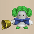 Bellthoven</td>
      <td>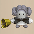 Showpin</td>
      <td class="highlightGray"></td>
      <td class="highlightGray"></td>
    </tr>
  </tbody>
</table>

# Items

※ This section is currently incomplete.

- F = Floor
- S = Shop
- P = Peddler
- M = Monster drop
- B = Buried
- H = Thiefwalrus
- I = Island
- T = Transmutation Pot
- U = Surprise Pot
- W = Tunnel of Wishes
- G = Behemoth Gate

#### Weapon

<table class="dungeonItemTable">
  <tr>
    <th colspan="11" class="highlightLightblue">Weapon</th>
  </tr>
  <tr>
    <th>Name</th>
    <th>F</th>
    <th>S</th>
    <th>P</th>
    <th>M</th>
    <th>B</th>
    <th>H</th>
    <th>I</th>
    <th>T</th>
    <th>U</th>
    <th>W</th>
  </tr>
  <tr>
    <td class="leftText">Wooden Sword</td>
    <td>X</td>
    <td>X</td>
    <td></td>
    <td></td>
    <td>X</td>
    <td></td>
    <td></td>
    <td></td>
    <td></td>
    <td></td>
  </tr>
  <tr>
    <td class="leftText">Bronze Sword</td>
    <td>X</td>
    <td>X</td>
    <td></td>
    <td></td>
    <td></td>
    <td></td>
    <td></td>
    <td></td>
    <td></td>
    <td></td>
  </tr>
  <tr>
    <td class="leftText">Katana</td>
    <td>X</td>
    <td>X</td>
    <td></td>
    <td></td>
    <td></td>
    <td></td>
    <td></td>
    <td></td>
    <td></td>
    <td></td>
  </tr>
  <tr>
    <td class="leftText">Doutanuki</td>
    <td></td>
    <td>X</td>
    <td></td>
    <td>X</td>
    <td></td>
    <td></td>
    <td></td>
    <td></td>
    <td></td>
    <td></td>
  </tr>
  <tr>
    <td class="leftText">Manji Kabura</td>
    <td>X</td>
    <td>X</td>
    <td></td>
    <td></td>
    <td></td>
    <td></td>
    <td></td>
    <td></td>
    <td></td>
    <td></td>
  </tr>
  <tr>
    <td class="leftText">Kajin Fuuma</td>
    <td></td>
    <td></td>
    <td></td>
    <td></td>
    <td></td>
    <td></td>
    <td></td>
    <td></td>
    <td></td>
    <td></td>
  </tr>
  <tr>
    <td class="leftText">Kabura Sutegi</td>
    <td></td>
    <td></td>
    <td></td>
    <td></td>
    <td></td>
    <td></td>
    <td></td>
    <td></td>
    <td></td>
    <td></td>
  </tr>
  <tr>
    <td class="leftText">Golden Sword</td>
    <td></td>
    <td>X</td>
    <td></td>
    <td></td>
    <td></td>
    <td></td>
    <td></td>
    <td></td>
    <td></td>
    <td></td>
  </tr>
  <tr>
    <td class="leftText">Kama Itachi</td>
    <td>X</td>
    <td></td>
    <td></td>
    <td>X</td>
    <td>X</td>
    <td></td>
    <td></td>
    <td></td>
    <td></td>
    <td></td>
  </tr>
  <tr>
    <td class="leftText">Axe of the Minotaur</td>
    <td>X</td>
    <td>X</td>
    <td></td>
    <td></td>
    <td></td>
    <td></td>
    <td></td>
    <td></td>
    <td></td>
    <td></td>
  </tr>
  <tr>
    <td class="leftText">Accurate Sword</td>
    <td></td>
    <td></td>
    <td></td>
    <td></td>
    <td></td>
    <td></td>
    <td></td>
    <td></td>
    <td></td>
    <td></td>
  </tr>
  <tr>
    <td class="leftText">Swift Sword</td>
    <td></td>
    <td></td>
    <td></td>
    <td>X</td>
    <td>X</td>
    <td></td>
    <td></td>
    <td></td>
    <td></td>
    <td></td>
  </tr>
  <tr>
    <td class="leftText">Watersplitter</td>
    <td></td>
    <td></td>
    <td></td>
    <td></td>
    <td>X</td>
    <td></td>
    <td></td>
    <td></td>
    <td></td>
    <td></td>
  </tr>
  <tr>
    <td class="leftText">Primal Axe</td>
    <td>X</td>
    <td>X</td>
    <td></td>
    <td></td>
    <td></td>
    <td></td>
    <td></td>
    <td></td>
    <td></td>
    <td></td>
  </tr>
  <tr>
    <td class="leftText">Dragonkiller</td>
    <td>X</td>
    <td></td>
    <td></td>
    <td>X</td>
    <td>X</td>
    <td></td>
    <td></td>
    <td></td>
    <td></td>
    <td></td>
  </tr>
  <tr>
    <td class="leftText">Crescent Blade</td>
    <td></td>
    <td>X</td>
    <td></td>
    <td></td>
    <td></td>
    <td></td>
    <td></td>
    <td></td>
    <td></td>
    <td></td>
  </tr>
  <tr>
    <td class="leftText">Sky Sword</td>
    <td>X</td>
    <td></td>
    <td></td>
    <td></td>
    <td></td>
    <td></td>
    <td></td>
    <td></td>
    <td></td>
    <td></td>
  </tr>
  <tr>
    <td class="leftText">Sickle of Salvation</td>
    <td>X</td>
    <td></td>
    <td></td>
    <td></td>
    <td></td>
    <td></td>
    <td></td>
    <td></td>
    <td></td>
    <td></td>
  </tr>
  <tr>
    <td class="leftText">Drain Slayer</td>
    <td>X</td>
    <td>X</td>
    <td></td>
    <td></td>
    <td>X</td>
    <td></td>
    <td></td>
    <td></td>
    <td></td>
    <td></td>
  </tr>
  <tr>
    <td class="leftText">Cyclops Bane</td>
    <td>X</td>
    <td>X</td>
    <td></td>
    <td></td>
    <td></td>
    <td></td>
    <td></td>
    <td></td>
    <td></td>
    <td></td>
  </tr>
  <tr>
    <td class="leftText">Steel Severer</td>
    <td>X</td>
    <td>X</td>
    <td></td>
    <td></td>
    <td>X</td>
    <td></td>
    <td></td>
    <td></td>
    <td></td>
    <td></td>
  </tr>
  <tr>
    <td class="leftText">Whopping Harisen</td>
    <td>X</td>
    <td>X</td>
    <td></td>
    <td></td>
    <td>X</td>
    <td></td>
    <td></td>
    <td></td>
    <td></td>
    <td></td>
  </tr>
  <tr>
    <td class="leftText">Healing Sword</td>
    <td>X</td>
    <td>X</td>
    <td></td>
    <td>X</td>
    <td></td>
    <td></td>
    <td></td>
    <td></td>
    <td></td>
    <td></td>
  </tr>
  <tr>
    <td class="leftText">Peach Club</td>
    <td></td>
    <td>X</td>
    <td></td>
    <td></td>
    <td></td>
    <td></td>
    <td></td>
    <td></td>
    <td></td>
    <td></td>
  </tr>
  <tr>
    <td class="leftText">Spender's Club</td>
    <td>X</td>
    <td>X</td>
    <td></td>
    <td></td>
    <td>X</td>
    <td></td>
    <td></td>
    <td></td>
    <td></td>
    <td></td>
  </tr>
  <tr>
    <td class="leftText">Ferrous Greatsword</td>
    <td>X</td>
    <td></td>
    <td></td>
    <td></td>
    <td>X</td>
    <td></td>
    <td></td>
    <td></td>
    <td></td>
    <td></td>
  </tr>
  <tr>
    <td class="leftText">Steak Knife</td>
    <td>X</td>
    <td>X</td>
    <td></td>
    <td></td>
    <td></td>
    <td></td>
    <td></td>
    <td></td>
    <td></td>
    <td></td>
  </tr>
  <tr>
    <td class="leftText">Jagged Sword</td>
    <td>X</td>
    <td></td>
    <td></td>
    <td></td>
    <td></td>
    <td></td>
    <td></td>
    <td></td>
    <td></td>
    <td></td>
  </tr>
  <tr>
    <td class="leftText">Quad-edge</td>
    <td>X</td>
    <td>X</td>
    <td></td>
    <td>X</td>
    <td></td>
    <td></td>
    <td></td>
    <td></td>
    <td></td>
    <td></td>
  </tr>
  <tr>
    <td class="leftText">Auspicious Kumade</td>
    <td>X</td>
    <td>X</td>
    <td></td>
    <td>X</td>
    <td></td>
    <td></td>
    <td></td>
    <td></td>
    <td></td>
    <td></td>
  </tr>
  <tr>
    <td class="leftText">Pickaxe</td>
    <td>X</td>
    <td>X</td>
    <td></td>
    <td>X</td>
    <td></td>
    <td></td>
    <td></td>
    <td></td>
    <td></td>
    <td></td>
  </tr>
  <tr>
    <td class="leftText">Golden Pickaxe</td>
    <td></td>
    <td>X</td>
    <td></td>
    <td></td>
    <td></td>
    <td></td>
    <td></td>
    <td></td>
    <td></td>
    <td></td>
  </tr>
  <tr>
    <td class="leftText">Wooden Mallet</td>
    <td></td>
    <td>X</td>
    <td></td>
    <td></td>
    <td></td>
    <td></td>
    <td></td>
    <td></td>
    <td></td>
    <td></td>
  </tr>
  <tr>
    <td class="leftText">Epic Hammer</td>
    <td></td>
    <td>X</td>
    <td></td>
    <td></td>
    <td></td>
    <td></td>
    <td></td>
    <td></td>
    <td></td>
    <td></td>
  </tr>
  <tr>
    <td class="leftText">Trapseeker</td>
    <td>X</td>
    <td>X</td>
    <td></td>
    <td></td>
    <td></td>
    <td></td>
    <td></td>
    <td></td>
    <td></td>
    <td></td>
  </tr>
  <tr>
    <td class="leftText">Bonito Block</td>
    <td>X</td>
    <td></td>
    <td></td>
    <td></td>
    <td></td>
    <td></td>
    <td></td>
    <td></td>
    <td></td>
    <td></td>
  </tr>
  <tr>
    <td class="leftText">Yamanba's Cleaver</td>
    <td>X</td>
    <td>X</td>
    <td></td>
    <td></td>
    <td></td>
    <td></td>
    <td></td>
    <td></td>
    <td></td>
    <td></td>
  </tr>
  <tr>
    <td class="leftText">Break-Off Blade</td>
    <td>X</td>
    <td>X</td>
    <td></td>
    <td></td>
    <td></td>
    <td></td>
    <td></td>
    <td></td>
    <td></td>
    <td></td>
  </tr>
</table>

#### Shield

<table class="dungeonItemTable">
  <tr>
    <th colspan="11" class="highlightLightblue">Shield</th>
  </tr>
  <tr>
    <th>Name</th>
    <th>F</th>
    <th>S</th>
    <th>P</th>
    <th>M</th>
    <th>B</th>
    <th>H</th>
    <th>I</th>
    <th>T</th>
    <th>U</th>
    <th>W</th>
  </tr>
  <tr>
    <td class="leftText">Wooden Shield</td>
    <td>X</td>
    <td>X</td>
    <td></td>
    <td></td>
    <td></td>
    <td></td>
    <td></td>
    <td></td>
    <td></td>
    <td></td>
  </tr>
  <tr>
    <td class="leftText">Bronze Shield</td>
    <td>X</td>
    <td>X</td>
    <td></td>
    <td>X</td>
    <td></td>
    <td></td>
    <td></td>
    <td></td>
    <td></td>
    <td></td>
  </tr>
  <tr>
    <td class="leftText">Iron Shield</td>
    <td>X</td>
    <td>X</td>
    <td></td>
    <td></td>
    <td></td>
    <td></td>
    <td></td>
    <td></td>
    <td></td>
    <td></td>
  </tr>
  <tr>
    <td class="leftText">Wolfshead</td>
    <td>X</td>
    <td></td>
    <td></td>
    <td></td>
    <td></td>
    <td></td>
    <td></td>
    <td></td>
    <td></td>
    <td></td>
  </tr>
  <tr>
    <td class="leftText">Fuuma Shield</td>
    <td></td>
    <td>X</td>
    <td></td>
    <td></td>
    <td></td>
    <td></td>
    <td></td>
    <td></td>
    <td></td>
    <td></td>
  </tr>
  <tr>
    <td class="leftText">Rasen Fuuma</td>
    <td></td>
    <td></td>
    <td></td>
    <td></td>
    <td></td>
    <td></td>
    <td></td>
    <td></td>
    <td></td>
    <td></td>
  </tr>
  <tr>
    <td class="leftText">Golden Shield</td>
    <td>X</td>
    <td>X</td>
    <td></td>
    <td></td>
    <td></td>
    <td></td>
    <td></td>
    <td></td>
    <td></td>
    <td></td>
  </tr>
  <tr>
    <td class="leftText">Counter Shield</td>
    <td>X</td>
    <td>X</td>
    <td></td>
    <td></td>
    <td></td>
    <td></td>
    <td></td>
    <td></td>
    <td></td>
    <td></td>
  </tr>
  <tr>
    <td class="leftText">Watchful Shield</td>
    <td>X</td>
    <td>X</td>
    <td></td>
    <td></td>
    <td></td>
    <td></td>
    <td></td>
    <td></td>
    <td></td>
    <td></td>
  </tr>
  <tr>
    <td class="leftText">Dragon Shield</td>
    <td>X</td>
    <td></td>
    <td></td>
    <td></td>
    <td></td>
    <td></td>
    <td></td>
    <td></td>
    <td></td>
    <td></td>
  </tr>
  <tr>
    <td class="leftText">Blast Shield</td>
    <td>X</td>
    <td>X</td>
    <td></td>
    <td></td>
    <td>X</td>
    <td></td>
    <td></td>
    <td></td>
    <td></td>
    <td></td>
  </tr>
  <tr>
    <td class="leftText">Targe of the Minotaur</td>
    <td>X</td>
    <td></td>
    <td></td>
    <td>X</td>
    <td></td>
    <td></td>
    <td></td>
    <td></td>
    <td></td>
    <td></td>
  </tr>
  <tr>
    <td class="leftText">Walrus Stopper</td>
    <td>X</td>
    <td>X</td>
    <td></td>
    <td>X</td>
    <td></td>
    <td></td>
    <td></td>
    <td></td>
    <td></td>
    <td></td>
  </tr>
  <tr>
    <td class="leftText">Froggo Stopper</td>
    <td>X</td>
    <td></td>
    <td></td>
    <td></td>
    <td>X</td>
    <td></td>
    <td></td>
    <td></td>
    <td></td>
    <td></td>
  </tr>
  <tr>
    <td class="leftText">Hat Stopper</td>
    <td>X</td>
    <td></td>
    <td></td>
    <td></td>
    <td>X</td>
    <td></td>
    <td></td>
    <td></td>
    <td></td>
    <td></td>
  </tr>
  <tr>
    <td class="leftText">Nigiri Stopper</td>
    <td>X</td>
    <td>X</td>
    <td></td>
    <td>X</td>
    <td></td>
    <td></td>
    <td></td>
    <td></td>
    <td></td>
    <td></td>
  </tr>
  <tr>
    <td class="leftText">Spearscale Shield</td>
    <td>X</td>
    <td>X</td>
    <td></td>
    <td></td>
    <td></td>
    <td></td>
    <td></td>
    <td></td>
    <td></td>
    <td></td>
  </tr>
  <tr>
    <td class="leftText">Kappa's Dish</td>
    <td>X</td>
    <td>X</td>
    <td></td>
    <td>X</td>
    <td></td>
    <td></td>
    <td></td>
    <td></td>
    <td></td>
    <td></td>
  </tr>
  <tr>
    <td class="leftText">Gazer Shield</td>
    <td>X</td>
    <td></td>
    <td></td>
    <td></td>
    <td></td>
    <td></td>
    <td></td>
    <td></td>
    <td></td>
    <td></td>
  </tr>
  <tr>
    <td class="leftText">Shield of Negation</td>
    <td></td>
    <td></td>
    <td></td>
    <td></td>
    <td>X</td>
    <td></td>
    <td></td>
    <td></td>
    <td></td>
    <td></td>
  </tr>
  <tr>
    <td class="leftText">Unmoving Wall</td>
    <td></td>
    <td>X</td>
    <td></td>
    <td></td>
    <td></td>
    <td></td>
    <td></td>
    <td></td>
    <td></td>
    <td></td>
  </tr>
  <tr>
    <td class="leftText">Zabuton</td>
    <td>X</td>
    <td>X</td>
    <td></td>
    <td></td>
    <td></td>
    <td></td>
    <td></td>
    <td></td>
    <td></td>
    <td></td>
  </tr>
  <tr>
    <td class="leftText">Spender's Shield</td>
    <td>X</td>
    <td>X</td>
    <td></td>
    <td></td>
    <td></td>
    <td></td>
    <td></td>
    <td></td>
    <td></td>
    <td></td>
  </tr>
  <tr>
    <td class="leftText">Ferrous Kite</td>
    <td>X</td>
    <td></td>
    <td></td>
    <td></td>
    <td></td>
    <td></td>
    <td></td>
    <td></td>
    <td></td>
    <td></td>
  </tr>
  <tr>
    <td class="leftText">Steak Plate</td>
    <td>X</td>
    <td></td>
    <td></td>
    <td></td>
    <td></td>
    <td></td>
    <td></td>
    <td></td>
    <td></td>
    <td></td>
  </tr>
  <tr>
    <td class="leftText">Gutsy Shield</td>
    <td>X</td>
    <td>X</td>
    <td></td>
    <td></td>
    <td></td>
    <td></td>
    <td></td>
    <td></td>
    <td></td>
    <td></td>
  </tr>
  <tr>
    <td class="leftText">Hunky-dory Shield</td>
    <td>X</td>
    <td>X</td>
    <td></td>
    <td></td>
    <td></td>
    <td></td>
    <td></td>
    <td></td>
    <td></td>
    <td></td>
  </tr>
  <tr>
    <td class="leftText">Bodhi Shield</td>
    <td>X</td>
    <td>X</td>
    <td></td>
    <td></td>
    <td></td>
    <td></td>
    <td></td>
    <td></td>
    <td></td>
    <td></td>
  </tr>
  <tr>
    <td class="leftText">Shield of Sating</td>
    <td>X</td>
    <td></td>
    <td></td>
    <td></td>
    <td></td>
    <td></td>
    <td></td>
    <td></td>
    <td></td>
    <td></td>
  </tr>
  <tr>
    <td class="leftText">Auspicious Omamori</td>
    <td>X</td>
    <td></td>
    <td></td>
    <td></td>
    <td></td>
    <td></td>
    <td></td>
    <td></td>
    <td></td>
    <td></td>
  </tr>
  <tr>
    <td class="leftText">Shield of Presage</td>
    <td>X</td>
    <td>X</td>
    <td></td>
    <td></td>
    <td></td>
    <td></td>
    <td></td>
    <td></td>
    <td></td>
    <td></td>
  </tr>
  <tr>
    <td class="leftText">Yamanba's Potlid</td>
    <td>X</td>
    <td>X</td>
    <td></td>
    <td>X</td>
    <td></td>
    <td></td>
    <td></td>
    <td></td>
    <td></td>
    <td></td>
  </tr>
  <tr>
    <td class="leftText">Break-Off Shield</td>
    <td>X</td>
    <td>X</td>
    <td></td>
    <td></td>
    <td></td>
    <td></td>
    <td></td>
    <td></td>
    <td></td>
    <td></td>
  </tr>
</table>

#### Bracelet

<table class="dungeonItemTable">
  <tr>
    <th colspan="11" class="highlightLightblue">Bracelet</th>
  </tr>
  <tr>
    <th>Name</th>
    <th>F</th>
    <th>S</th>
    <th>P</th>
    <th>M</th>
    <th>B</th>
    <th>H</th>
    <th>I</th>
    <th>T</th>
    <th>U</th>
    <th>W</th>
  </tr>
  <tr>
    <td class="leftText">Healing Bracelet</td>
    <td></td>
    <td></td>
    <td></td>
    <td></td>
    <td></td>
    <td></td>
    <td></td>
    <td></td>
    <td></td>
    <td>X</td>
  </tr>
  <tr>
    <td class="leftText">Strength Bracelet</td>
    <td>X</td>
    <td></td>
    <td></td>
    <td></td>
    <td></td>
    <td></td>
    <td></td>
    <td></td>
    <td></td>
    <td></td>
  </tr>
  <tr>
    <td class="leftText">Bellyexpand Bracelet</td>
    <td>X</td>
    <td></td>
    <td></td>
    <td>X</td>
    <td></td>
    <td></td>
    <td></td>
    <td></td>
    <td></td>
    <td></td>
  </tr>
  <tr>
    <td class="leftText">Bellyshrink Bracelet</td>
    <td></td>
    <td></td>
    <td></td>
    <td>X</td>
    <td></td>
    <td></td>
    <td></td>
    <td></td>
    <td></td>
    <td></td>
  </tr>
  <tr>
    <td class="leftText">Fortune Bracelet</td>
    <td></td>
    <td></td>
    <td></td>
    <td></td>
    <td></td>
    <td></td>
    <td></td>
    <td></td>
    <td></td>
    <td></td>
  </tr>
  <tr>
    <td class="leftText">Cleansing Bracelet</td>
    <td></td>
    <td></td>
    <td></td>
    <td></td>
    <td>X</td>
    <td></td>
    <td></td>
    <td></td>
    <td></td>
    <td></td>
  </tr>
  <tr>
    <td class="leftText">Focusing Bracelet</td>
    <td>X</td>
    <td>X</td>
    <td></td>
    <td></td>
    <td></td>
    <td></td>
    <td></td>
    <td></td>
    <td></td>
    <td></td>
  </tr>
  <tr>
    <td class="leftText">Rousing Bracelet</td>
    <td>X</td>
    <td></td>
    <td></td>
    <td></td>
    <td></td>
    <td></td>
    <td></td>
    <td></td>
    <td></td>
    <td></td>
  </tr>
  <tr>
    <td class="leftText">Rustproof Bracelet</td>
    <td>X</td>
    <td></td>
    <td></td>
    <td></td>
    <td></td>
    <td></td>
    <td></td>
    <td></td>
    <td></td>
    <td></td>
  </tr>
  <tr>
    <td class="leftText">Cursebreak Bracelet</td>
    <td>X</td>
    <td></td>
    <td></td>
    <td></td>
    <td></td>
    <td></td>
    <td></td>
    <td></td>
    <td></td>
    <td></td>
  </tr>
  <tr>
    <td class="leftText">Affixing Bracelet</td>
    <td></td>
    <td></td>
    <td></td>
    <td></td>
    <td></td>
    <td></td>
    <td></td>
    <td></td>
    <td></td>
    <td>X</td>
  </tr>
  <tr>
    <td class="leftText">Far-throwing Bracelet</td>
    <td>X</td>
    <td>X</td>
    <td></td>
    <td></td>
    <td></td>
    <td></td>
    <td></td>
    <td></td>
    <td></td>
    <td></td>
  </tr>
  <tr>
    <td class="leftText">Bad-aim Bracelet</td>
    <td></td>
    <td></td>
    <td></td>
    <td></td>
    <td></td>
    <td></td>
    <td></td>
    <td></td>
    <td></td>
    <td></td>
  </tr>
  <tr>
    <td class="leftText">Sure-aim Bracelet</td>
    <td></td>
    <td></td>
    <td></td>
    <td></td>
    <td></td>
    <td></td>
    <td></td>
    <td></td>
    <td></td>
    <td></td>
  </tr>
  <tr>
    <td class="leftText">Bouncy Bracelet</td>
    <td></td>
    <td></td>
    <td></td>
    <td>X</td>
    <td></td>
    <td></td>
    <td></td>
    <td></td>
    <td></td>
    <td>X</td>
  </tr>
  <tr>
    <td class="leftText">Rapid-fire Bracelet</td>
    <td></td>
    <td></td>
    <td></td>
    <td></td>
    <td></td>
    <td></td>
    <td></td>
    <td></td>
    <td></td>
    <td>X</td>
  </tr>
  <tr>
    <td class="leftText">Daredevil Bracelet</td>
    <td></td>
    <td></td>
    <td></td>
    <td></td>
    <td>X</td>
    <td></td>
    <td></td>
    <td></td>
    <td></td>
    <td></td>
  </tr>
  <tr>
    <td class="leftText">Dreaded Bracelet</td>
    <td></td>
    <td></td>
    <td></td>
    <td>X</td>
    <td></td>
    <td></td>
    <td></td>
    <td></td>
    <td></td>
    <td></td>
  </tr>
  <tr>
    <td class="leftText">Leaping Bracelet</td>
    <td></td>
    <td></td>
    <td></td>
    <td></td>
    <td></td>
    <td></td>
    <td></td>
    <td></td>
    <td></td>
    <td></td>
  </tr>
  <tr>
    <td class="leftText">Blasting Bracelet</td>
    <td></td>
    <td>X</td>
    <td></td>
    <td></td>
    <td></td>
    <td></td>
    <td></td>
    <td></td>
    <td></td>
    <td></td>
  </tr>
  <tr>
    <td class="leftText">Clairvoyant Bracelet</td>
    <td></td>
    <td>X</td>
    <td></td>
    <td></td>
    <td></td>
    <td></td>
    <td></td>
    <td></td>
    <td></td>
    <td></td>
  </tr>
  <tr>
    <td class="leftText">Monster-find Bracelet</td>
    <td>X</td>
    <td></td>
    <td></td>
    <td></td>
    <td></td>
    <td></td>
    <td></td>
    <td></td>
    <td></td>
    <td>X</td>
  </tr>
  <tr>
    <td class="leftText">Item-find Bracelet</td>
    <td></td>
    <td></td>
    <td></td>
    <td></td>
    <td></td>
    <td></td>
    <td></td>
    <td></td>
    <td></td>
    <td></td>
  </tr>
  <tr>
    <td class="leftText">Passage-find Bracelet</td>
    <td></td>
    <td></td>
    <td></td>
    <td></td>
    <td></td>
    <td></td>
    <td></td>
    <td></td>
    <td></td>
    <td></td>
  </tr>
  <tr>
    <td class="leftText">Waterwalk Bracelet</td>
    <td></td>
    <td></td>
    <td></td>
    <td></td>
    <td></td>
    <td></td>
    <td></td>
    <td></td>
    <td></td>
    <td></td>
  </tr>
  <tr>
    <td class="leftText">Floating Bracelet</td>
    <td>X</td>
    <td></td>
    <td></td>
    <td></td>
    <td></td>
    <td></td>
    <td></td>
    <td></td>
    <td></td>
    <td></td>
  </tr>
  <tr>
    <td class="leftText">Wallpass Bracelet</td>
    <td></td>
    <td></td>
    <td></td>
    <td></td>
    <td></td>
    <td></td>
    <td></td>
    <td></td>
    <td></td>
    <td></td>
  </tr>
  <tr>
    <td class="leftText">Tiptoe Bracelet</td>
    <td>X</td>
    <td></td>
    <td></td>
    <td></td>
    <td></td>
    <td></td>
    <td></td>
    <td></td>
    <td></td>
    <td></td>
  </tr>
  <tr>
    <td class="leftText">Passerby Bracelet</td>
    <td>X</td>
    <td></td>
    <td></td>
    <td></td>
    <td></td>
    <td></td>
    <td></td>
    <td></td>
    <td></td>
    <td></td>
  </tr>
  <tr>
    <td class="leftText">Item-losing Bracelet</td>
    <td>X</td>
    <td></td>
    <td></td>
    <td></td>
    <td></td>
    <td></td>
    <td></td>
    <td></td>
    <td></td>
    <td></td>
  </tr>
  <tr>
    <td class="leftText">Gitan-losing Bracelet</td>
    <td></td>
    <td></td>
    <td></td>
    <td></td>
    <td></td>
    <td></td>
    <td></td>
    <td></td>
    <td></td>
    <td>X</td>
  </tr>
  <tr>
    <td class="leftText">Monstercall Bracelet</td>
    <td></td>
    <td></td>
    <td></td>
    <td></td>
    <td></td>
    <td></td>
    <td></td>
    <td></td>
    <td></td>
    <td></td>
  </tr>
  <tr>
    <td class="leftText">Trapmore Bracelet</td>
    <td></td>
    <td>X</td>
    <td></td>
    <td></td>
    <td></td>
    <td></td>
    <td></td>
    <td></td>
    <td></td>
    <td></td>
  </tr>
  <tr>
    <td class="leftText">Haggling Bracelet</td>
    <td></td>
    <td></td>
    <td></td>
    <td></td>
    <td></td>
    <td></td>
    <td></td>
    <td></td>
    <td></td>
    <td></td>
  </tr>
  <tr>
    <td class="leftText">Trapper's Bracelet</td>
    <td></td>
    <td>X</td>
    <td></td>
    <td></td>
    <td></td>
    <td></td>
    <td></td>
    <td></td>
    <td></td>
    <td></td>
  </tr>
  <tr>
    <td class="leftText">Appraiser's Bracelet</td>
    <td></td>
    <td></td>
    <td></td>
    <td></td>
    <td></td>
    <td></td>
    <td></td>
    <td></td>
    <td></td>
    <td></td>
  </tr>
  <tr>
    <td class="leftText">Cannonboost Bracelet</td>
    <td></td>
    <td></td>
    <td></td>
    <td></td>
    <td></td>
    <td></td>
    <td></td>
    <td></td>
    <td></td>
    <td></td>
  </tr>
</table>

#### Projectile

<table class="dungeonItemTable">
  <tr>
    <th colspan="11" class="highlightLightblue">Projectile</th>
  </tr>
  <tr>
    <th>Name</th>
    <th>F</th>
    <th>S</th>
    <th>P</th>
    <th>M</th>
    <th>B</th>
    <th>H</th>
    <th>I</th>
    <th>T</th>
    <th>U</th>
    <th>W</th>
  </tr>
  <tr>
    <td class="leftText">Wooden Arrow</td>
    <td>X</td>
    <td></td>
    <td></td>
    <td></td>
    <td></td>
    <td></td>
    <td></td>
    <td></td>
    <td></td>
    <td></td>
  </tr>
  <tr>
    <td class="leftText">Iron Arrow</td>
    <td>X</td>
    <td></td>
    <td></td>
    <td></td>
    <td>X</td>
    <td></td>
    <td></td>
    <td></td>
    <td></td>
    <td></td>
  </tr>
  <tr>
    <td class="leftText">Silver Arrow</td>
    <td></td>
    <td></td>
    <td></td>
    <td></td>
    <td></td>
    <td></td>
    <td></td>
    <td></td>
    <td></td>
    <td></td>
  </tr>
  <tr>
    <td class="leftText">Poison Arrow</td>
    <td></td>
    <td></td>
    <td></td>
    <td></td>
    <td></td>
    <td></td>
    <td></td>
    <td></td>
    <td></td>
    <td></td>
  </tr>
  <tr>
    <td class="leftText">Truestrike Arrow</td>
    <td></td>
    <td></td>
    <td></td>
    <td></td>
    <td></td>
    <td></td>
    <td></td>
    <td></td>
    <td></td>
    <td></td>
  </tr>
  <tr>
    <td class="leftText">Rock</td>
    <td>X</td>
    <td></td>
    <td></td>
    <td></td>
    <td></td>
    <td></td>
    <td></td>
    <td></td>
    <td></td>
    <td></td>
  </tr>
  <tr>
    <td class="leftText">Porky's Rock</td>
    <td></td>
    <td></td>
    <td></td>
    <td></td>
    <td></td>
    <td></td>
    <td></td>
    <td></td>
    <td></td>
    <td></td>
  </tr>
</table>

#### Food

<table class="dungeonItemTable">
  <tr>
    <th colspan="11" class="highlightLightblue">Food</th>
  </tr>
  <tr>
    <th>Name</th>
    <th>F</th>
    <th>S</th>
    <th>P</th>
    <th>M</th>
    <th>B</th>
    <th>H</th>
    <th>I</th>
    <th>T</th>
    <th>U</th>
    <th>W</th>
  </tr>
  <tr>
    <td class="leftText">Onigiri</td>
    <td></td>
    <td>X</td>
    <td></td>
    <td></td>
    <td></td>
    <td>X</td>
    <td></td>
    <td></td>
    <td></td>
    <td></td>
  </tr>
  <tr>
    <td class="leftText">Large Onigiri</td>
    <td></td>
    <td>X</td>
    <td>X</td>
    <td></td>
    <td></td>
    <td></td>
    <td></td>
    <td></td>
    <td></td>
    <td></td>
  </tr>
  <tr>
    <td class="leftText">Huge Onigiri</td>
    <td></td>
    <td>X</td>
    <td></td>
    <td></td>
    <td></td>
    <td></td>
    <td></td>
    <td></td>
    <td></td>
    <td></td>
  </tr>
  <tr>
    <td class="leftText">Rotten Onigiri</td>
    <td>X</td>
    <td></td>
    <td></td>
    <td></td>
    <td>X</td>
    <td></td>
    <td></td>
    <td></td>
    <td></td>
    <td></td>
  </tr>
  <tr>
    <td class="leftText">Grilled Onigiri</td>
    <td></td>
    <td></td>
    <td></td>
    <td></td>
    <td></td>
    <td></td>
    <td></td>
    <td></td>
    <td></td>
    <td></td>
  </tr>
  <tr>
    <td class="leftText">Special Onigiri</td>
    <td></td>
    <td></td>
    <td></td>
    <td></td>
    <td></td>
    <td></td>
    <td></td>
    <td></td>
    <td></td>
    <td></td>
  </tr>
  <tr>
    <td class="leftText">Sumo Onigiri</td>
    <td></td>
    <td></td>
    <td></td>
    <td></td>
    <td></td>
    <td></td>
    <td></td>
    <td></td>
    <td></td>
    <td></td>
  </tr>
  <tr>
    <td class="leftText">Sweet Potato</td>
    <td></td>
    <td>X</td>
    <td></td>
    <td></td>
    <td>X</td>
    <td></td>
    <td></td>
    <td></td>
    <td></td>
    <td></td>
  </tr>
  <tr>
    <td class="leftText">Yakitori</td>
    <td></td>
    <td></td>
    <td></td>
    <td></td>
    <td></td>
    <td></td>
    <td></td>
    <td></td>
    <td></td>
    <td></td>
  </tr>
  <tr>
    <td class="leftText">Rotten Peach Bun</td>
    <td></td>
    <td></td>
    <td></td>
    <td></td>
    <td></td>
    <td></td>
    <td></td>
    <td></td>
    <td></td>
    <td></td>
  </tr>
</table>

#### Grass

<table class="dungeonItemTable">
  <tr>
    <th colspan="12" class="highlightLightblue">Grass</th>
  </tr>
  <tr>
    <th>Name</th>
    <th>F</th>
    <th>S</th>
    <th>P</th>
    <th>M</th>
    <th>B</th>
    <th>H</th>
    <th>I</th>
    <th>T</th>
    <th>U</th>
    <th>W</th>
    <th>G</th>
  </tr>
  <tr>
    <td class="leftText">Weeds</td>
    <td></td>
    <td></td>
    <td></td>
    <td></td>
    <td></td>
    <td></td>
    <td></td>
    <td></td>
    <td></td>
    <td></td>
    <td></td>
  </tr>
  <tr>
    <td class="leftText">Herb</td>
    <td></td>
    <td></td>
    <td></td>
    <td></td>
    <td></td>
    <td></td>
    <td></td>
    <td></td>
    <td></td>
    <td></td>
    <td></td>
  </tr>
  <tr>
    <td class="leftText">Otogirisou</td>
    <td></td>
    <td>X</td>
    <td>X</td>
    <td></td>
    <td></td>
    <td></td>
    <td></td>
    <td></td>
    <td></td>
    <td></td>
    <td></td>
  </tr>
  <tr>
    <td class="leftText">Healing Grass</td>
    <td></td>
    <td></td>
    <td>X</td>
    <td></td>
    <td></td>
    <td></td>
    <td></td>
    <td></td>
    <td></td>
    <td></td>
    <td></td>
  </tr>
  <tr>
    <td class="leftText">Life Grass</td>
    <td></td>
    <td>X</td>
    <td></td>
    <td></td>
    <td></td>
    <td></td>
    <td></td>
    <td></td>
    <td></td>
    <td></td>
    <td></td>
  </tr>
  <tr>
    <td class="leftText">Fragrant Grass</td>
    <td></td>
    <td></td>
    <td></td>
    <td></td>
    <td></td>
    <td></td>
    <td></td>
    <td></td>
    <td></td>
    <td></td>
    <td></td>
  </tr>
  <tr>
    <td class="leftText">Revival Grass</td>
    <td></td>
    <td></td>
    <td></td>
    <td></td>
    <td></td>
    <td></td>
    <td></td>
    <td></td>
    <td></td>
    <td></td>
    <td></td>
  </tr>
  <tr>
    <td class="leftText">Bellyexpand Seed</td>
    <td>X</td>
    <td>X</td>
    <td></td>
    <td></td>
    <td></td>
    <td></td>
    <td></td>
    <td></td>
    <td></td>
    <td></td>
    <td></td>
  </tr>
  <tr>
    <td class="leftText">Bellyshrink Seed</td>
    <td>X</td>
    <td></td>
    <td></td>
    <td></td>
    <td></td>
    <td></td>
    <td></td>
    <td></td>
    <td></td>
    <td></td>
    <td></td>
  </tr>
  <tr>
    <td class="leftText">Dragon Grass</td>
    <td></td>
    <td></td>
    <td></td>
    <td></td>
    <td></td>
    <td></td>
    <td></td>
    <td></td>
    <td></td>
    <td></td>
    <td></td>
  </tr>
  <tr>
    <td class="leftText">Leaping Grass</td>
    <td></td>
    <td></td>
    <td></td>
    <td></td>
    <td></td>
    <td></td>
    <td></td>
    <td></td>
    <td></td>
    <td></td>
    <td></td>
  </tr>
  <tr>
    <td class="leftText">Antidote Grass</td>
    <td></td>
    <td></td>
    <td></td>
    <td></td>
    <td></td>
    <td></td>
    <td></td>
    <td></td>
    <td></td>
    <td></td>
    <td></td>
  </tr>
  <tr>
    <td class="leftText">Strength Grass</td>
    <td></td>
    <td></td>
    <td></td>
    <td></td>
    <td></td>
    <td></td>
    <td></td>
    <td></td>
    <td></td>
    <td></td>
    <td></td>
  </tr>
  <tr>
    <td class="leftText">Poison Grass</td>
    <td></td>
    <td></td>
    <td></td>
    <td></td>
    <td></td>
    <td></td>
    <td></td>
    <td></td>
    <td></td>
    <td></td>
    <td></td>
  </tr>
  <tr>
    <td class="leftText">Confusion Grass</td>
    <td></td>
    <td>X</td>
    <td></td>
    <td></td>
    <td></td>
    <td></td>
    <td></td>
    <td></td>
    <td></td>
    <td></td>
    <td></td>
  </tr>
  <tr>
    <td class="leftText">Sedating Grass</td>
    <td></td>
    <td>X</td>
    <td></td>
    <td></td>
    <td>X</td>
    <td></td>
    <td></td>
    <td></td>
    <td></td>
    <td></td>
    <td></td>
  </tr>
  <tr>
    <td class="leftText">Berserk Seed</td>
    <td></td>
    <td>X</td>
    <td></td>
    <td></td>
    <td></td>
    <td></td>
    <td></td>
    <td></td>
    <td></td>
    <td></td>
    <td></td>
  </tr>
  <tr>
    <td class="leftText">Blinding Grass</td>
    <td></td>
    <td>X</td>
    <td></td>
    <td></td>
    <td></td>
    <td></td>
    <td></td>
    <td></td>
    <td></td>
    <td></td>
    <td></td>
  </tr>
  <tr>
    <td class="leftText">Seewell Grass</td>
    <td></td>
    <td></td>
    <td></td>
    <td></td>
    <td></td>
    <td></td>
    <td></td>
    <td></td>
    <td></td>
    <td></td>
    <td></td>
  </tr>
  <tr>
    <td class="leftText">Swift Grass</td>
    <td></td>
    <td></td>
    <td></td>
    <td></td>
    <td></td>
    <td></td>
    <td></td>
    <td></td>
    <td></td>
    <td></td>
    <td></td>
  </tr>
  <tr>
    <td class="leftText">Power-up Grass</td>
    <td></td>
    <td></td>
    <td></td>
    <td></td>
    <td></td>
    <td></td>
    <td></td>
    <td></td>
    <td></td>
    <td></td>
    <td></td>
  </tr>
  <tr>
    <td class="leftText">Invincible Grass</td>
    <td></td>
    <td></td>
    <td></td>
    <td></td>
    <td></td>
    <td></td>
    <td></td>
    <td></td>
    <td></td>
    <td></td>
    <td></td>
  </tr>
  <tr>
    <td class="leftText">Fortune Grass</td>
    <td></td>
    <td></td>
    <td>X</td>
    <td></td>
    <td></td>
    <td></td>
    <td></td>
    <td></td>
    <td></td>
    <td></td>
    <td>X</td>
  </tr>
  <tr>
    <td class="leftText">Angel Seed</td>
    <td></td>
    <td></td>
    <td></td>
    <td></td>
    <td></td>
    <td></td>
    <td></td>
    <td></td>
    <td></td>
    <td></td>
    <td></td>
  </tr>
  <tr>
    <td class="leftText">Feeble Grass</td>
    <td></td>
    <td></td>
    <td></td>
    <td></td>
    <td></td>
    <td></td>
    <td></td>
    <td></td>
    <td></td>
    <td></td>
    <td></td>
  </tr>
  <tr>
    <td class="leftText">Unlucky Seed</td>
    <td></td>
    <td>X</td>
    <td></td>
    <td></td>
    <td></td>
    <td></td>
    <td></td>
    <td></td>
    <td></td>
    <td></td>
    <td></td>
  </tr>
  <tr>
    <td class="leftText">Ill-fated Seed</td>
    <td></td>
    <td>X</td>
    <td></td>
    <td></td>
    <td></td>
    <td>X</td>
    <td></td>
    <td></td>
    <td></td>
    <td></td>
    <td></td>
  </tr>
</table>

#### Scroll

<table class="dungeonItemTable">
  <tr>
    <th colspan="12" class="highlightLightblue">Scroll</th>
  </tr>
  <tr>
    <th>Name</th>
    <th>F</th>
    <th>S</th>
    <th>P</th>
    <th>M</th>
    <th>B</th>
    <th>H</th>
    <th>I</th>
    <th>T</th>
    <th>U</th>
    <th>W</th>
    <th>G</th>
  </tr>
  <tr>
    <td class="leftText">Confusion Scroll</td>
    <td></td>
    <td></td>
    <td></td>
    <td></td>
    <td></td>
    <td></td>
    <td></td>
    <td></td>
    <td></td>
    <td></td>
    <td></td>
  </tr>
  <tr>
    <td class="leftText">Slumber Scroll</td>
    <td></td>
    <td></td>
    <td></td>
    <td></td>
    <td></td>
    <td></td>
    <td></td>
    <td></td>
    <td></td>
    <td></td>
    <td></td>
  </tr>
  <tr>
    <td class="leftText">Jitters Scroll</td>
    <td>X</td>
    <td></td>
    <td></td>
    <td></td>
    <td></td>
    <td></td>
    <td></td>
    <td></td>
    <td></td>
    <td></td>
    <td></td>
  </tr>
  <tr>
    <td class="leftText">Windblade Scroll</td>
    <td></td>
    <td>X</td>
    <td></td>
    <td></td>
    <td></td>
    <td></td>
    <td></td>
    <td></td>
    <td></td>
    <td></td>
    <td></td>
  </tr>
  <tr>
    <td class="leftText">Expulsion Scroll</td>
    <td></td>
    <td></td>
    <td></td>
    <td></td>
    <td></td>
    <td></td>
    <td></td>
    <td></td>
    <td></td>
    <td></td>
    <td></td>
  </tr>
  <tr>
    <td class="leftText">Exorcism Scroll</td>
    <td></td>
    <td></td>
    <td>X</td>
    <td></td>
    <td></td>
    <td></td>
    <td></td>
    <td></td>
    <td></td>
    <td></td>
    <td></td>
  </tr>
  <tr>
    <td class="leftText">Identifier Scroll</td>
    <td></td>
    <td></td>
    <td></td>
    <td></td>
    <td></td>
    <td></td>
    <td></td>
    <td></td>
    <td></td>
    <td></td>
    <td></td>
  </tr>
  <tr>
    <td class="leftText">Heavenly Scroll</td>
    <td></td>
    <td></td>
    <td></td>
    <td></td>
    <td></td>
    <td></td>
    <td></td>
    <td></td>
    <td></td>
    <td></td>
    <td></td>
  </tr>
  <tr>
    <td class="leftText">Earthly Scroll</td>
    <td></td>
    <td>X</td>
    <td></td>
    <td></td>
    <td></td>
    <td></td>
    <td></td>
    <td></td>
    <td></td>
    <td></td>
    <td></td>
  </tr>
  <tr>
    <td class="leftText">Plating Scroll</td>
    <td></td>
    <td></td>
    <td></td>
    <td></td>
    <td></td>
    <td></td>
    <td></td>
    <td></td>
    <td></td>
    <td></td>
    <td></td>
  </tr>
  <tr>
    <td class="leftText">Slot-adding Scroll</td>
    <td></td>
    <td></td>
    <td></td>
    <td></td>
    <td></td>
    <td></td>
    <td></td>
    <td></td>
    <td></td>
    <td></td>
    <td></td>
  </tr>
  <tr>
    <td class="leftText">Rune-eraser Scroll</td>
    <td></td>
    <td></td>
    <td></td>
    <td></td>
    <td></td>
    <td></td>
    <td></td>
    <td></td>
    <td></td>
    <td></td>
    <td></td>
  </tr>
  <tr>
    <td class="leftText">Silver-seal Scroll</td>
    <td>X</td>
    <td>X</td>
    <td></td>
    <td></td>
    <td></td>
    <td></td>
    <td></td>
    <td></td>
    <td></td>
    <td></td>
    <td></td>
  </tr>
  <tr>
    <td class="leftText">Silverpurge Scroll</td>
    <td></td>
    <td></td>
    <td></td>
    <td></td>
    <td></td>
    <td></td>
    <td></td>
    <td></td>
    <td></td>
    <td></td>
    <td></td>
  </tr>
  <tr>
    <td class="leftText">Pot-upsize Scroll</td>
    <td></td>
    <td>X</td>
    <td></td>
    <td></td>
    <td></td>
    <td></td>
    <td></td>
    <td></td>
    <td></td>
    <td></td>
    <td></td>
  </tr>
  <tr>
    <td class="leftText">Extraction Scroll</td>
    <td></td>
    <td>X</td>
    <td></td>
    <td></td>
    <td>X</td>
    <td></td>
    <td></td>
    <td></td>
    <td></td>
    <td></td>
    <td></td>
  </tr>
  <tr>
    <td class="leftText">Onigiri Scroll</td>
    <td></td>
    <td></td>
    <td></td>
    <td></td>
    <td></td>
    <td></td>
    <td></td>
    <td></td>
    <td></td>
    <td></td>
    <td></td>
  </tr>
  <tr>
    <td class="leftText">Curse Scroll</td>
    <td></td>
    <td></td>
    <td></td>
    <td></td>
    <td></td>
    <td></td>
    <td></td>
    <td></td>
    <td></td>
    <td></td>
    <td></td>
  </tr>
  <tr>
    <td class="leftText">Mapping Scroll</td>
    <td></td>
    <td>X</td>
    <td></td>
    <td></td>
    <td></td>
    <td></td>
    <td></td>
    <td></td>
    <td></td>
    <td></td>
    <td></td>
  </tr>
  <tr>
    <td class="leftText">Map-loss Scroll</td>
    <td>X</td>
    <td>X</td>
    <td></td>
    <td></td>
    <td></td>
    <td></td>
    <td></td>
    <td></td>
    <td></td>
    <td></td>
    <td></td>
  </tr>
  <tr>
    <td class="leftText">Trap-eraser Scroll</td>
    <td></td>
    <td>X</td>
    <td></td>
    <td></td>
    <td></td>
    <td></td>
    <td></td>
    <td></td>
    <td></td>
    <td></td>
    <td></td>
  </tr>
  <tr>
    <td class="leftText">Trap Scroll</td>
    <td></td>
    <td>X</td>
    <td></td>
    <td></td>
    <td></td>
    <td></td>
    <td></td>
    <td></td>
    <td></td>
    <td></td>
    <td></td>
  </tr>
  <tr>
    <td class="leftText">Water-drain Scroll</td>
    <td></td>
    <td></td>
    <td></td>
    <td></td>
    <td></td>
    <td></td>
    <td></td>
    <td></td>
    <td></td>
    <td></td>
    <td></td>
  </tr>
  <tr>
    <td class="leftText">Monstercall Scroll</td>
    <td></td>
    <td></td>
    <td></td>
    <td></td>
    <td></td>
    <td></td>
    <td>X</td>
    <td></td>
    <td></td>
    <td></td>
    <td></td>
  </tr>
  <tr>
    <td class="leftText">Wall-less Scroll</td>
    <td></td>
    <td></td>
    <td></td>
    <td></td>
    <td></td>
    <td></td>
    <td></td>
    <td></td>
    <td></td>
    <td></td>
    <td></td>
  </tr>
  <tr>
    <td class="leftText">Gathering Scroll</td>
    <td></td>
    <td></td>
    <td></td>
    <td></td>
    <td></td>
    <td></td>
    <td></td>
    <td></td>
    <td></td>
    <td></td>
    <td></td>
  </tr>
  <tr>
    <td class="leftText">Collection Scroll</td>
    <td></td>
    <td></td>
    <td></td>
    <td></td>
    <td></td>
    <td></td>
    <td></td>
    <td></td>
    <td></td>
    <td></td>
    <td></td>
  </tr>
  <tr>
    <td class="leftText">Gambler's Scroll</td>
    <td></td>
    <td>X</td>
    <td></td>
    <td></td>
    <td></td>
    <td></td>
    <td></td>
    <td></td>
    <td></td>
    <td></td>
    <td></td>
  </tr>
  <tr>
    <td class="leftText">Muzzle Scroll</td>
    <td></td>
    <td></td>
    <td></td>
    <td></td>
    <td></td>
    <td></td>
    <td></td>
    <td></td>
    <td></td>
    <td></td>
    <td></td>
  </tr>
  <tr>
    <td class="leftText">Carry-ban Scroll</td>
    <td></td>
    <td>X</td>
    <td></td>
    <td></td>
    <td>X</td>
    <td></td>
    <td></td>
    <td></td>
    <td></td>
    <td></td>
    <td></td>
  </tr>
  <tr>
    <td class="leftText">Swift Foe Scroll</td>
    <td></td>
    <td></td>
    <td></td>
    <td></td>
    <td></td>
    <td></td>
    <td></td>
    <td></td>
    <td></td>
    <td></td>
    <td></td>
  </tr>
  <tr>
    <td class="leftText">Fixer Scroll</td>
    <td></td>
    <td>X</td>
    <td></td>
    <td></td>
    <td></td>
    <td></td>
    <td></td>
    <td></td>
    <td></td>
    <td></td>
    <td>X</td>
  </tr>
  <tr>
    <td class="leftText">Escape Scroll</td>
    <td></td>
    <td></td>
    <td></td>
    <td></td>
    <td></td>
    <td></td>
    <td></td>
    <td></td>
    <td></td>
    <td></td>
    <td></td>
  </tr>
  <tr>
    <td class="leftText">Eradication Scroll</td>
    <td></td>
    <td></td>
    <td></td>
    <td></td>
    <td></td>
    <td></td>
    <td></td>
    <td></td>
    <td></td>
    <td></td>
    <td></td>
  </tr>
  <tr>
    <td class="leftText">Sanctuary Scroll</td>
    <td></td>
    <td></td>
    <td></td>
    <td></td>
    <td></td>
    <td></td>
    <td></td>
    <td></td>
    <td></td>
    <td></td>
    <td></td>
  </tr>
  <tr>
    <td class="leftText">Blank Scroll</td>
    <td></td>
    <td></td>
    <td></td>
    <td></td>
    <td></td>
    <td></td>
    <td></td>
    <td></td>
    <td></td>
    <td></td>
    <td></td>
  </tr>
  <tr>
    <td class="leftText">Wet Scroll</td>
    <td></td>
    <td></td>
    <td></td>
    <td></td>
    <td></td>
    <td></td>
    <td></td>
    <td></td>
    <td></td>
    <td></td>
    <td></td>
  </tr>
</table>

#### Staff

<table class="dungeonItemTable">
  <tr>
    <th colspan="11" class="highlightLightblue">Staff</th>
  </tr>
  <tr>
    <th>Name</th>
    <th>F</th>
    <th>S</th>
    <th>P</th>
    <th>M</th>
    <th>B</th>
    <th>H</th>
    <th>I</th>
    <th>T</th>
    <th>U</th>
    <th>W</th>
  </tr>
  <tr>
    <td class="leftText">Ordinary Staff</td>
    <td></td>
    <td></td>
    <td></td>
    <td></td>
    <td></td>
    <td></td>
    <td></td>
    <td></td>
    <td></td>
    <td></td>
  </tr>
  <tr>
    <td class="leftText">Paralyzing Staff</td>
    <td></td>
    <td>X</td>
    <td></td>
    <td></td>
    <td></td>
    <td></td>
    <td></td>
    <td></td>
    <td></td>
    <td></td>
  </tr>
  <tr>
    <td class="leftText">Sealing Staff</td>
    <td></td>
    <td>X</td>
    <td></td>
    <td></td>
    <td></td>
    <td></td>
    <td></td>
    <td></td>
    <td></td>
    <td></td>
  </tr>
  <tr>
    <td class="leftText">Disguising Staff</td>
    <td></td>
    <td>X</td>
    <td></td>
    <td></td>
    <td>X</td>
    <td></td>
    <td></td>
    <td></td>
    <td></td>
    <td></td>
  </tr>
  <tr>
    <td class="leftText">Empathetic Staff</td>
    <td></td>
    <td></td>
    <td></td>
    <td></td>
    <td></td>
    <td></td>
    <td></td>
    <td></td>
    <td></td>
    <td></td>
  </tr>
  <tr>
    <td class="leftText">Narrow-escape Staff</td>
    <td></td>
    <td>X</td>
    <td></td>
    <td></td>
    <td></td>
    <td></td>
    <td></td>
    <td></td>
    <td></td>
    <td></td>
  </tr>
  <tr>
    <td class="leftText">Knockback Staff</td>
    <td></td>
    <td></td>
    <td></td>
    <td></td>
    <td></td>
    <td></td>
    <td></td>
    <td></td>
    <td></td>
    <td></td>
  </tr>
  <tr>
    <td class="leftText">Switching Staff</td>
    <td></td>
    <td>X</td>
    <td></td>
    <td></td>
    <td></td>
    <td></td>
    <td></td>
    <td></td>
    <td></td>
    <td></td>
  </tr>
  <tr>
    <td class="leftText">Vaulting Staff</td>
    <td></td>
    <td></td>
    <td></td>
    <td></td>
    <td></td>
    <td></td>
    <td></td>
    <td></td>
    <td></td>
    <td></td>
  </tr>
  <tr>
    <td class="leftText">Skull Mage's Staff</td>
    <td></td>
    <td></td>
    <td></td>
    <td>X</td>
    <td></td>
    <td></td>
    <td></td>
    <td></td>
    <td></td>
    <td></td>
  </tr>
  <tr>
    <td class="leftText">Thunderbolt Staff</td>
    <td></td>
    <td>X</td>
    <td>X</td>
    <td></td>
    <td></td>
    <td></td>
    <td></td>
    <td></td>
    <td></td>
    <td></td>
  </tr>
  <tr>
    <td class="leftText">Burrowing Staff</td>
    <td></td>
    <td>X</td>
    <td></td>
    <td></td>
    <td></td>
    <td></td>
    <td></td>
    <td></td>
    <td></td>
    <td></td>
  </tr>
  <tr>
    <td class="leftText">Earthmound Staff</td>
    <td></td>
    <td>X</td>
    <td></td>
    <td></td>
    <td></td>
    <td></td>
    <td></td>
    <td></td>
    <td></td>
    <td></td>
  </tr>
  <tr>
    <td class="leftText">Balance Staff</td>
    <td></td>
    <td>X</td>
    <td></td>
    <td></td>
    <td></td>
    <td></td>
    <td></td>
    <td></td>
    <td></td>
    <td></td>
  </tr>
  <tr>
    <td class="leftText">Guiding Staff</td>
    <td></td>
    <td></td>
    <td></td>
    <td></td>
    <td></td>
    <td></td>
    <td></td>
    <td></td>
    <td></td>
    <td></td>
  </tr>
  <tr>
    <td class="leftText">Swift Staff</td>
    <td></td>
    <td></td>
    <td></td>
    <td>X</td>
    <td></td>
    <td></td>
    <td></td>
    <td></td>
    <td></td>
    <td></td>
  </tr>
  <tr>
    <td class="leftText">Sluggish Staff</td>
    <td></td>
    <td></td>
    <td></td>
    <td></td>
    <td></td>
    <td></td>
    <td></td>
    <td></td>
    <td></td>
    <td></td>
  </tr>
  <tr>
    <td class="leftText">Fortune Staff</td>
    <td>X</td>
    <td></td>
    <td></td>
    <td></td>
    <td>X</td>
    <td></td>
    <td></td>
    <td></td>
    <td></td>
    <td></td>
  </tr>
  <tr>
    <td class="leftText">Unlucky Staff</td>
    <td></td>
    <td></td>
    <td></td>
    <td></td>
    <td></td>
    <td></td>
    <td></td>
    <td></td>
    <td></td>
    <td></td>
  </tr>
  <tr>
    <td class="leftText">Peach Staff</td>
    <td></td>
    <td></td>
    <td></td>
    <td></td>
    <td></td>
    <td></td>
    <td></td>
    <td></td>
    <td></td>
    <td></td>
  </tr>
</table>

#### Pot

<table class="dungeonItemTable">
  <tr>
    <th colspan="12" class="highlightLightblue">Pot</th>
  </tr>
  <tr>
    <th>Name</th>
    <th>F</th>
    <th>S</th>
    <th>P</th>
    <th>M</th>
    <th>B</th>
    <th>H</th>
    <th>I</th>
    <th>T</th>
    <th>U</th>
    <th>W</th>
    <th>G</th>
  </tr>
  <tr>
    <td class="leftText">Preservation Pot</td>
    <td></td>
    <td></td>
    <td></td>
    <td></td>
    <td></td>
    <td></td>
    <td></td>
    <td></td>
    <td></td>
    <td></td>
    <td></td>
  </tr>
  <tr>
    <td class="leftText">Identifier Pot</td>
    <td></td>
    <td></td>
    <td></td>
    <td></td>
    <td>X</td>
    <td></td>
    <td></td>
    <td></td>
    <td></td>
    <td></td>
    <td></td>
  </tr>
  <tr>
    <td class="leftText">Transmutation Pot</td>
    <td></td>
    <td></td>
    <td></td>
    <td></td>
    <td>X</td>
    <td></td>
    <td></td>
    <td></td>
    <td></td>
    <td></td>
    <td></td>
  </tr>
  <tr>
    <td class="leftText">Cashing Pot</td>
    <td></td>
    <td>X</td>
    <td></td>
    <td></td>
    <td></td>
    <td></td>
    <td></td>
    <td></td>
    <td></td>
    <td></td>
    <td></td>
  </tr>
  <tr>
    <td class="leftText">Synthesis Pot</td>
    <td></td>
    <td></td>
    <td></td>
    <td></td>
    <td></td>
    <td></td>
    <td></td>
    <td></td>
    <td></td>
    <td></td>
    <td>X</td>
  </tr>
  <tr>
    <td class="leftText">Exorcism Pot</td>
    <td>X</td>
    <td>X</td>
    <td></td>
    <td></td>
    <td></td>
    <td></td>
    <td></td>
    <td></td>
    <td></td>
    <td></td>
    <td></td>
  </tr>
  <tr>
    <td class="leftText">Curse Pot</td>
    <td>X</td>
    <td></td>
    <td></td>
    <td></td>
    <td></td>
    <td></td>
    <td></td>
    <td></td>
    <td></td>
    <td></td>
    <td></td>
  </tr>
  <tr>
    <td class="leftText">Upgrading Pot</td>
    <td></td>
    <td></td>
    <td></td>
    <td></td>
    <td></td>
    <td></td>
    <td></td>
    <td></td>
    <td></td>
    <td></td>
    <td></td>
  </tr>
  <tr>
    <td class="leftText">Degrading Pot</td>
    <td></td>
    <td></td>
    <td></td>
    <td></td>
    <td></td>
    <td></td>
    <td></td>
    <td></td>
    <td></td>
    <td></td>
    <td></td>
  </tr>
  <tr>
    <td class="leftText">Bottomless Pot</td>
    <td>X</td>
    <td></td>
    <td></td>
    <td></td>
    <td></td>
    <td></td>
    <td></td>
    <td></td>
    <td></td>
    <td></td>
    <td></td>
  </tr>
  <tr>
    <td class="leftText">Warehouse Pot</td>
    <td></td>
    <td></td>
    <td></td>
    <td></td>
    <td></td>
    <td></td>
    <td></td>
    <td></td>
    <td></td>
    <td></td>
    <td></td>
  </tr>
  <tr>
    <td class="leftText">Handtrapper Pot</td>
    <td></td>
    <td></td>
    <td></td>
    <td></td>
    <td></td>
    <td></td>
    <td></td>
    <td></td>
    <td></td>
    <td></td>
    <td></td>
  </tr>
  <tr>
    <td class="leftText">Unbreakable Pot</td>
    <td>X</td>
    <td></td>
    <td></td>
    <td></td>
    <td></td>
    <td></td>
    <td></td>
    <td></td>
    <td></td>
    <td></td>
    <td></td>
  </tr>
  <tr>
    <td class="leftText">Ordinary Pot</td>
    <td></td>
    <td>X</td>
    <td></td>
    <td></td>
    <td></td>
    <td></td>
    <td></td>
    <td></td>
    <td></td>
    <td></td>
    <td></td>
  </tr>
  <tr>
    <td class="leftText">Hiding Pot</td>
    <td></td>
    <td></td>
    <td></td>
    <td></td>
    <td></td>
    <td></td>
    <td></td>
    <td></td>
    <td></td>
    <td></td>
    <td></td>
  </tr>
  <tr>
    <td class="leftText">Rejuvenation Pot</td>
    <td></td>
    <td>X</td>
    <td></td>
    <td></td>
    <td></td>
    <td></td>
    <td></td>
    <td></td>
    <td></td>
    <td></td>
    <td></td>
  </tr>
  <tr>
    <td class="leftText">Walrus Pot</td>
    <td></td>
    <td></td>
    <td></td>
    <td></td>
    <td></td>
    <td></td>
    <td></td>
    <td></td>
    <td></td>
    <td></td>
    <td></td>
  </tr>
  <tr>
    <td class="leftText">Water Gun Pot</td>
    <td></td>
    <td></td>
    <td></td>
    <td></td>
    <td></td>
    <td></td>
    <td></td>
    <td></td>
    <td></td>
    <td></td>
    <td></td>
  </tr>
  <tr>
    <td class="leftText">Hilarious Pot</td>
    <td></td>
    <td></td>
    <td></td>
    <td></td>
    <td></td>
    <td></td>
    <td></td>
    <td></td>
    <td></td>
    <td></td>
    <td></td>
  </tr>
  <tr>
    <td class="leftText">Monster Pot</td>
    <td></td>
    <td></td>
    <td></td>
    <td></td>
    <td></td>
    <td></td>
    <td></td>
    <td></td>
    <td></td>
    <td></td>
    <td></td>
  </tr>
  <tr>
    <td class="leftText">Surprise Pot</td>
    <td></td>
    <td>X</td>
    <td></td>
    <td>X</td>
    <td></td>
    <td></td>
    <td></td>
    <td></td>
    <td></td>
    <td></td>
    <td></td>
  </tr>
</table>

#### Incense

<table class="dungeonItemTable">
  <tr>
    <th colspan="11" class="highlightLightblue">Incense</th>
  </tr>
  <tr>
    <th>Name</th>
    <th>F</th>
    <th>S</th>
    <th>P</th>
    <th>M</th>
    <th>B</th>
    <th>H</th>
    <th>I</th>
    <th>T</th>
    <th>U</th>
    <th>W</th>
  </tr>
  <tr>
    <td class="leftText">Heat-ban Incense</td>
    <td>X</td>
    <td></td>
    <td></td>
    <td></td>
    <td></td>
    <td></td>
    <td></td>
    <td></td>
    <td></td>
    <td></td>
  </tr>
  <tr>
    <td class="leftText">Evasive Incense</td>
    <td></td>
    <td>X</td>
    <td></td>
    <td></td>
    <td></td>
    <td></td>
    <td></td>
    <td></td>
    <td></td>
    <td></td>
  </tr>
  <tr>
    <td class="leftText">Cautious Incense</td>
    <td>X</td>
    <td>X</td>
    <td></td>
    <td></td>
    <td></td>
    <td></td>
    <td></td>
    <td></td>
    <td></td>
    <td></td>
  </tr>
  <tr>
    <td class="leftText">Reflective Incense</td>
    <td></td>
    <td>X</td>
    <td></td>
    <td></td>
    <td></td>
    <td></td>
    <td></td>
    <td></td>
    <td></td>
    <td></td>
  </tr>
  <tr>
    <td class="leftText">Aggressive Incense</td>
    <td>X</td>
    <td></td>
    <td></td>
    <td></td>
    <td>X</td>
    <td></td>
    <td></td>
    <td></td>
    <td></td>
    <td></td>
  </tr>
  <tr>
    <td class="leftText">Defensive Incense</td>
    <td>X</td>
    <td></td>
    <td></td>
    <td></td>
    <td></td>
    <td></td>
    <td></td>
    <td></td>
    <td></td>
    <td></td>
  </tr>
  <tr>
    <td class="leftText">Blurry Incense</td>
    <td>X</td>
    <td></td>
    <td></td>
    <td></td>
    <td></td>
    <td>X</td>
    <td></td>
    <td></td>
    <td></td>
    <td></td>
  </tr>
  <tr>
    <td class="leftText">Weighted Incense</td>
    <td>X</td>
    <td>X</td>
    <td></td>
    <td></td>
    <td></td>
    <td></td>
    <td></td>
    <td></td>
    <td></td>
    <td></td>
  </tr>
  <tr>
    <td class="leftText">Unwanting Incense</td>
    <td>X</td>
    <td>X</td>
    <td></td>
    <td></td>
    <td></td>
    <td></td>
    <td></td>
    <td></td>
    <td></td>
    <td></td>
  </tr>
</table>
