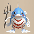
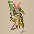
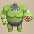
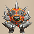
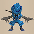
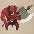
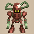
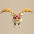
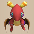
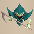

  

# Overview

<table class="dungeonOverview">
  <tr>
    <th>Unlock</th>
    <td class="highlightYellow">Talk to Drokotay the Adventurer (Shukuba Beach). 　※ Update 2.1.1 required.</td>
  </tr>
  <tr>
    <th>Entrance</th>
    <td class="highlightYellow">Shukuba Beach (Exit)</td>
  </tr>
</table>

<table class="dungeonTable">
  <tr>
    <th>Floors</th>
    <td colspan="3">25F / 50F (Sacred Tree)</td>
  </tr>
  <tr>
    <th>Bring Items</th>
    <td>No</td>
    <th>Stairs</th>
    <td>Ascending</td>
  </tr>
  <tr>
    <th>Companions</th>
    <td></td>
    <th>Roamers</th>
    <td></td>
  </tr>
  <tr>
    <th>Rescues</th>
    <td>3</td>
    <th>Starting Level</th>
    <td>Lv1</td>
  </tr>
  <tr>
    <th>Starting Item</th>
    <td colspan="3">Large Onigiri</td>
  </tr>
  <tr>
    <th>Unidentified</th>
    <td colspan="3">Bracelets, Grass, Scrolls, Pots</td>
  </tr>
  <tr>
    <th>Shops</th>
    <td>Yes</td>
    <th>Monster Houses</th>
    <td>Yes</td>
  </tr>
  <tr>
    <th>Behemoths</th>
    <td>Yes</td>
    <th>Wishing Shrines</th>
    <td></td>
  </tr>
  <tr>
    <th>Kron's Challenge</th>
    <td></td>
    <th>Fever Time</th>
    <td>Yes</td>
  </tr>
  <tr>
    <th>Initial Enemies</th>
    <td>4~12</td>
    <th>Spawn Rate</th>
    <td>30 Turns (1F - 3F) 25 Turns (4F - 25F) 20 Turns (26F - 50F)</td>
  </tr>
  <tr>
    <th>Wind (1st Gust)</th>
    <td>1200 Turns</td>
    <th>Reward</th>
    <td>Sacred Item (Blue)</td>
  </tr>
</table>

[Content]

# Strategy

### General

### Important Items

# Floor Guide

### 12F

Note: Shuffle Map (Firespew Mountain)

# Monsters

See [Monsters](/system/monsters) for individual monster details.

- F - Dark hallways
- S - Shop is possible
- H - Monster House is possible
- G - Golden Egg Thing is possible
- B - Behemoth Monsters are possible

Monster Colors = Farming, Useful, Lowers Stats, Targets Items, Dangerous

<table class="monsterTable">
  <thead>
    <tr>
      <th>F</th>
      <th>S</th>
      <th>H</th>
      <th>G</th>
      <th colspan="5">Monsters</th>
      <th>B</th>
    </tr>
  </thead>
  <tbody>
    <tr>
      <td rowspan="1" class="centeredText highlightFog">1</td>
      <td rowspan="1" class=""></td>
      <td rowspan="1" class=""></td>
      <td rowspan="1" class=""></td>
      <td> Mamel</td>
      <td> Pit Mamel</td>
      <td> Spearfish</td>
      <td> Chintala</td>
      <td class="highlightGray"></td>
      <td rowspan="1" class=""></td>
    </tr>
    <tr>
      <td colspan="10" class="tableDivider"></td>
    </tr>
    <tr>
      <td rowspan="1" class="centeredText highlightFog">2</td>
      <td rowspan="1" class=""></td>
      <td rowspan="1" class=""></td>
      <td rowspan="1" class=""></td>
      <td> Pit Mamel</td>
      <td> Spearfish</td>
      <td> Chintala</td>
      <td> Froggo</td>
      <td> Shagga</td>
      <td rowspan="1" class=""></td>
    </tr>
    <tr>
      <td colspan="10" class="tableDivider"></td>
    </tr>
    <tr>
      <td rowspan="1" class="centeredText highlightFog">3</td>
      <td rowspan="1" class=""></td>
      <td rowspan="1" class=""></td>
      <td rowspan="1" class=""></td>
      <td> Chintala</td>
      <td> Shagga</td>
      <td> Armordillo</td>
      <td> Polygon Spinna</td>
      <td> Bored Kappa</td>
      <td rowspan="1" class=""></td>
    </tr>
    <tr>
      <td colspan="10" class="tableDivider"></td>
    </tr>
    <tr>
      <td rowspan="1" class="centeredText highlightFog">4</td>
      <td rowspan="1" class="highlightShop"></td>
      <td rowspan="1" class=""></td>
      <td rowspan="1" class=""></td>
      <td> Armordillo</td>
      <td> Karakuroid</td>
      <td> Polygon Spinna</td>
      <td> Bored Kappa</td>
      <td class="highlightGray"></td>
      <td rowspan="1" class=""></td>
    </tr>
    <tr>
      <td colspan="10" class="tableDivider"></td>
    </tr>
    <tr>
      <td rowspan="2" class="centeredText highlightFog">5</td>
      <td rowspan="2" class=""></td>
      <td rowspan="2" class=""></td>
      <td rowspan="2" class=""></td>
      <td> Karakuroid</td>
      <td> Polygon Spinna</td>
      <td> Scorpion</td>
      <td> Porky</td>
      <td> Gazer</td>
      <td rowspan="2" class=""></td>
    </tr>
    <tr>
      <td> Bored Kappa</td>
      <td> Mudkin</td>
      <td class="highlightGray"></td>
      <td class="highlightGray"></td>
      <td class="highlightGray"></td>
    </tr>
    <tr>
      <td colspan="10" class="tableDivider"></td>
    </tr>
    <tr>
      <td rowspan="2" class="centeredText highlightFog">6</td>
      <td rowspan="2" class=""></td>
      <td rowspan="2" class=""></td>
      <td rowspan="2" class=""></td>
      <td> Karakuroid</td>
      <td> Hell Reaper</td>
      <td> Polygon Spinna</td>
      <td> Scorpion</td>
      <td> Porky</td>
      <td rowspan="2" class=""></td>
    </tr>
    <tr>
      <td> Gazer</td>
      <td> Hoppin' Hitter</td>
      <td> Mudkin</td>
      <td class="highlightGray"></td>
      <td class="highlightGray"></td>
    </tr>
    <tr>
      <td colspan="10" class="tableDivider"></td>
    </tr>
    <tr>
      <td rowspan="2" class="centeredText highlightFog">7</td>
      <td rowspan="2" class=""></td>
      <td rowspan="2" class=""></td>
      <td rowspan="2" class=""></td>
      <td> Hell Reaper</td>
      <td> Scorpion</td>
      <td> Porky</td>
      <td> Gazer</td>
      <td> Hoppin' Hitter</td>
      <td rowspan="2" class=""></td>
    </tr>
    <tr>
      <td> Mid Chintala</td>
      <td> Bowboy</td>
      <td> Crossbowboy</td>
      <td> Hat Prankster</td>
      <td> Mudkin</td>
    </tr>
    <tr>
      <td colspan="10" class="tableDivider"></td>
    </tr>
    <tr>
      <td rowspan="2" class="centeredText highlightFog">8</td>
      <td rowspan="2" class=""></td>
      <td rowspan="2" class=""></td>
      <td rowspan="2" class=""></td>
      <td> Hell Reaper</td>
      <td> Mid Chintala</td>
      <td> Bowboy</td>
      <td> Crossbowboy</td>
      <td> Masked Samurai</td>
      <td rowspan="2" class=""></td>
    </tr>
    <tr>
      <td> Hat Prankster</td>
      <td> Mudkin</td>
      <td> Lt. Spearfish</td>
      <td> Floor Dragon</td>
      <td> Mixer</td>
    </tr>
    <tr>
      <td colspan="10" class="tableDivider"></td>
    </tr>
    <tr>
      <td rowspan="3" class="centeredText highlightFog">9</td>
      <td rowspan="3" class=""></td>
      <td rowspan="3" class=""></td>
      <td rowspan="3" class=""></td>
      <td> Bowboy</td>
      <td> Crossbowboy</td>
      <td> Masked Samurai</td>
      <td> Hat Prankster</td>
      <td> Mudkin</td>
      <td rowspan="3" class=""></td>
    </tr>
    <tr>
      <td> Lt. Spearfish</td>
      <td> Floor Dragon</td>
      <td> Metalhead</td>
      <td> Okina Monk D</td>
      <td> Okame Monk D</td>
    </tr>
    <tr>
      <td> Tengu Monk D</td>
      <td class="highlightGray"></td>
      <td class="highlightGray"></td>
      <td class="highlightGray"></td>
      <td class="highlightGray"></td>
    </tr>
    <tr>
      <td colspan="10" class="tableDivider"></td>
    </tr>
    <tr>
      <td rowspan="3" class="centeredText highlightFog">10</td>
      <td rowspan="3" class=""></td>
      <td rowspan="3" class=""></td>
      <td rowspan="3" class=""></td>
      <td> Crossbowboy</td>
      <td> Masked Samurai</td>
      <td> Hat Prankster</td>
      <td> Floor Dragon</td>
      <td> Metalhead</td>
      <td rowspan="3" class=""></td>
    </tr>
    <tr>
      <td> Master Hen</td>
      <td> Tiger Thrower</td>
      <td> Okina Monk D</td>
      <td> Okame Monk D</td>
      <td> Tengu Monk D</td>
    </tr>
    <tr>
      <td> Minotaur</td>
      <td class="highlightGray"></td>
      <td class="highlightGray"></td>
      <td class="highlightGray"></td>
      <td class="highlightGray"></td>
    </tr>
    <tr>
      <td colspan="10" class="tableDivider"></td>
    </tr>
    <tr>
      <td rowspan="3" class="centeredText highlightFog">11</td>
      <td rowspan="3" class=""></td>
      <td rowspan="3" class=""></td>
      <td rowspan="3" class=""></td>
      <td> Lt. Spearfish</td>
      <td> Floor Dragon</td>
      <td> Metalhead</td>
      <td> Master Hen</td>
      <td> Tiger Thrower</td>
      <td rowspan="3" class=""></td>
    </tr>
    <tr>
      <td> Kitsune Monk D</td>
      <td> Okina Monk D</td>
      <td> Hannya Monk D</td>
      <td> Thiefwalrus</td>
      <td> Pop Tank</td>
    </tr>
    <tr>
      <td> Egg Thing</td>
      <td> Minotaur</td>
      <td> Ghost Radish</td>
      <td> Cave Mamel</td>
      <td class="highlightGray"></td>
    </tr>
    <tr>
      <td colspan="10" class="tableDivider"></td>
    </tr>
    <tr>
      <td rowspan="3" class="centeredText">12</td>
      <td rowspan="3" class=""></td>
      <td rowspan="3" class=""></td>
      <td rowspan="3" class=""></td>
      <td> Lt. Spearfish</td>
      <td> Floor Dragon</td>
      <td> Master Hen</td>
      <td> Tiger Thrower</td>
      <td> Hannya Monk D</td>
      <td rowspan="3" class=""></td>
    </tr>
    <tr>
      <td> Thiefwalrus</td>
      <td> Zapdon</td>
      <td> Pop Tank</td>
      <td> Egg Thing</td>
      <td> Minotaur</td>
    </tr>
    <tr>
      <td> Ghost Radish</td>
      <td> Skull Mage</td>
      <td> Cave Mamel</td>
      <td> Mixer</td>
      <td class="highlightGray"></td>
    </tr>
    <tr>
      <td colspan="10" class="tableDivider"></td>
    </tr>
    <tr>
      <td rowspan="3" class="centeredText highlightFog">13</td>
      <td rowspan="3" class=""></td>
      <td rowspan="3" class=""></td>
      <td rowspan="3" class=""></td>
      <td> Tiger Thrower</td>
      <td> Hannya Monk D</td>
      <td> Thiefwalrus</td>
      <td> Zapdon</td>
      <td> Pop Tank</td>
      <td rowspan="3" class=""></td>
    </tr>
    <tr>
      <td> Flamepuff</td>
      <td> N'dubba</td>
      <td> Tree Ninja C</td>
      <td> Earth Ninja C</td>
      <td> Fire Ninja C</td>
    </tr>
    <tr>
      <td> Explochin</td>
      <td> Pumpanshee</td>
      <td> Skull Mage</td>
      <td> Cave Mamel</td>
      <td class="highlightGray"></td>
    </tr>
    <tr>
      <td colspan="10" class="tableDivider"></td>
    </tr>
    <tr>
      <td rowspan="3" class="centeredText highlightFog">14</td>
      <td rowspan="3" class=""></td>
      <td rowspan="3" class=""></td>
      <td rowspan="3" class=""></td>
      <td> Thiefwalrus</td>
      <td> Zapdon</td>
      <td> Flamepuff</td>
      <td> N'dubba</td>
      <td> Tree Ninja C</td>
      <td rowspan="3" class="highlightBehemoth"></td>
    </tr>
    <tr>
      <td> Earth Ninja C</td>
      <td> Fire Ninja C</td>
      <td> Explochin</td>
      <td> Pumpanshee</td>
      <td> Skull Mage</td>
    </tr>
    <tr>
      <td> Cave Mamel</td>
      <td class="highlightGray"></td>
      <td class="highlightGray"></td>
      <td class="highlightGray"></td>
      <td class="highlightGray"></td>
    </tr>
    <tr>
      <td colspan="10" class="tableDivider"></td>
    </tr>
    <tr>
      <td rowspan="3" class="centeredText highlightFog">15</td>
      <td rowspan="3" class=""></td>
      <td rowspan="3" class=""></td>
      <td rowspan="3" class=""></td>
      <td> Zapdon</td>
      <td> Flamepuff</td>
      <td> N'dubba</td>
      <td> Tree Ninja C</td>
      <td> Metal Ninja C</td>
      <td rowspan="3" class="highlightBehemoth"></td>
    </tr>
    <tr>
      <td> Water Ninja C</td>
      <td> Explochin</td>
      <td> Pumpanshee</td>
      <td> Skull Wizard</td>
      <td> Super Gazer</td>
    </tr>
    <tr>
      <td> Cave Mamel</td>
      <td> Chow</td>
      <td class="highlightGray"></td>
      <td class="highlightGray"></td>
      <td class="highlightGray"></td>
    </tr>
    <tr>
      <td colspan="10" class="tableDivider"></td>
    </tr>
    <tr>
      <td rowspan="2" class="centeredText highlightFog">16</td>
      <td rowspan="2" class=""></td>
      <td rowspan="2" class=""></td>
      <td rowspan="2" class=""></td>
      <td> N'dubba</td>
      <td> Tree Ninja C</td>
      <td> Metal Ninja C</td>
      <td> Water Ninja C</td>
      <td> Pumpanshee</td>
      <td rowspan="2" class="highlightBehemoth"></td>
    </tr>
    <tr>
      <td> Skull Wizard</td>
      <td> Super Gazer</td>
      <td> Mixer</td>
      <td> Mixermon</td>
      <td> Chow</td>
    </tr>
    <tr>
      <td colspan="10" class="tableDivider"></td>
    </tr>
    <tr>
      <td rowspan="2" class="centeredText highlightFog">17</td>
      <td rowspan="2" class=""></td>
      <td rowspan="2" class=""></td>
      <td rowspan="2" class=""></td>
      <td> Pumpanshee</td>
      <td> Super Gazer</td>
      <td> N'dulu</td>
      <td> Pesky Kappa</td>
      <td> Porko</td>
      <td rowspan="2" class="highlightBehemoth"></td>
    </tr>
    <tr>
      <td> Chow</td>
      <td class="highlightGray"></td>
      <td class="highlightGray"></td>
      <td class="highlightGray"></td>
      <td class="highlightGray"></td>
    </tr>
    <tr>
      <td colspan="10" class="tableDivider"></td>
    </tr>
    <tr>
      <td rowspan="3" class="centeredText highlightFog">18</td>
      <td rowspan="3" class=""></td>
      <td rowspan="3" class=""></td>
      <td rowspan="3" class=""></td>
      <td> N'dulu</td>
      <td> Pesky Kappa</td>
      <td> Porko</td>
      <td> Daze Radish</td>
      <td> Baby Tank</td>
      <td rowspan="3" class=""></td>
    </tr>
    <tr>
      <td> Hoppin' Slugger</td>
      <td> Polygon Shaka</td>
      <td> Capt. Spearfish</td>
      <td> Famed Octopling</td>
      <td> Dartingfrog</td>
    </tr>
    <tr>
      <td> Chow</td>
      <td class="highlightGray"></td>
      <td class="highlightGray"></td>
      <td class="highlightGray"></td>
      <td class="highlightGray"></td>
    </tr>
    <tr>
      <td colspan="10" class="tableDivider"></td>
    </tr>
    <tr>
      <td rowspan="3" class="centeredText highlightFog">19</td>
      <td rowspan="3" class=""></td>
      <td rowspan="3" class=""></td>
      <td rowspan="3" class=""></td>
      <td> N'dulu</td>
      <td> Pesky Kappa</td>
      <td> Porko</td>
      <td> Baby Tank</td>
      <td> Vile Scorpion</td>
      <td rowspan="3" class=""></td>
    </tr>
    <tr>
      <td> Hoppin' Slugger</td>
      <td> Polygon Shaka</td>
      <td> Capt. Spearfish</td>
      <td> Famed Octopling</td>
      <td> Greenwalrus</td>
    </tr>
    <tr>
      <td> Dartingfrog</td>
      <td> Chow</td>
      <td class="highlightGray"></td>
      <td class="highlightGray"></td>
      <td class="highlightGray"></td>
    </tr>
    <tr>
      <td colspan="10" class="tableDivider"></td>
    </tr>
    <tr>
      <td rowspan="3" class="centeredText highlightFog">20</td>
      <td rowspan="3" class=""></td>
      <td rowspan="3" class=""></td>
      <td rowspan="3" class=""></td>
      <td> N'dulu</td>
      <td> Pesky Kappa</td>
      <td> Porko</td>
      <td> Vile Scorpion</td>
      <td> Hoppin' Slugger</td>
      <td rowspan="3" class=""></td>
    </tr>
    <tr>
      <td> Polygon Shaka</td>
      <td> Dragon</td>
      <td> Greenwalrus</td>
      <td> Dartingfrog</td>
      <td> Polygon Singa</td>
    </tr>
    <tr>
      <td> Floppy Hani</td>
      <td> Pumplich</td>
      <td> Mixermon</td>
      <td> Running Egg</td>
      <td class="highlightGray"></td>
    </tr>
    <tr>
      <td colspan="10" class="tableDivider"></td>
    </tr>
    <tr>
      <td rowspan="4" class="centeredText highlightFog">21</td>
      <td rowspan="4" class=""></td>
      <td rowspan="4" class=""></td>
      <td rowspan="4" class=""></td>
      <td> N'dulu</td>
      <td> Vile Scorpion</td>
      <td> Polygon Shaka</td>
      <td> Dragon</td>
      <td> Sky Dragon</td>
      <td rowspan="4" class="highlightBehemoth"></td>
    </tr>
    <tr>
      <td> Greenwalrus</td>
      <td> Dartingfrog</td>
      <td> Polygon Singa</td>
      <td> Floppy Hani</td>
      <td> Soul Reaper</td>
    </tr>
    <tr>
      <td> Pumplich</td>
      <td> Cave Mamel</td>
      <td> Hannya Monk B</td>
      <td> Okame Monk B</td>
      <td> Tengu Monk B</td>
    </tr>
    <tr>
      <td> Kitsune Monk B</td>
      <td> Okina Monk B</td>
      <td> Running Egg</td>
      <td class="highlightGray"></td>
      <td class="highlightGray"></td>
    </tr>
    <tr>
      <td colspan="10" class="tableDivider"></td>
    </tr>
    <tr>
      <td rowspan="3" class="centeredText highlightFog">22</td>
      <td rowspan="3" class=""></td>
      <td rowspan="3" class=""></td>
      <td rowspan="3" class=""></td>
      <td> Dragon</td>
      <td> Sky Dragon</td>
      <td> Floppy Hani</td>
      <td> Soul Reaper</td>
      <td> Pumplich</td>
      <td rowspan="3" class="highlightBehemoth"></td>
    </tr>
    <tr>
      <td> Mini Tank</td>
      <td> Cave Mamel</td>
      <td> Hannya Monk B</td>
      <td> Okame Monk B</td>
      <td> Tengu Monk B</td>
    </tr>
    <tr>
      <td> Kitsune Monk B</td>
      <td> Okina Monk B</td>
      <td> Running Egg</td>
      <td class="highlightGray"></td>
      <td class="highlightGray"></td>
    </tr>
    <tr>
      <td colspan="10" class="tableDivider"></td>
    </tr>
    <tr>
      <td rowspan="2" class="centeredText highlightFog">23</td>
      <td rowspan="2" class=""></td>
      <td rowspan="2" class=""></td>
      <td rowspan="2" class=""></td>
      <td> Soul Reaper</td>
      <td> Pumplich</td>
      <td> Mini Tank</td>
      <td> Cave Mamel</td>
      <td> Hannya Monk B</td>
      <td rowspan="2" class="highlightBehemoth"></td>
    </tr>
    <tr>
      <td> Okame Monk B</td>
      <td> Tengu Monk B</td>
      <td> Kitsune Monk B</td>
      <td> Okina Monk B</td>
      <td> Running Egg</td>
    </tr>
    <tr>
      <td colspan="10" class="tableDivider"></td>
    </tr>
    <tr>
      <td rowspan="3" class="centeredText highlightFog">24</td>
      <td rowspan="3" class=""></td>
      <td rowspan="3" class=""></td>
      <td rowspan="3" class=""></td>
      <td> Soul Reaper</td>
      <td> Pumplich</td>
      <td> Mini Tank</td>
      <td> Ornery Tank</td>
      <td> Adamant Tank</td>
      <td rowspan="3" class="highlightBehemoth"></td>
    </tr>
    <tr>
      <td> Cave Mamel</td>
      <td> Hannya Monk B</td>
      <td> Okame Monk B</td>
      <td> Tengu Monk B</td>
      <td> Kitsune Monk B</td>
    </tr>
    <tr>
      <td> Okina Monk B</td>
      <td> Mixermon</td>
      <td> Running Egg</td>
      <td class="highlightGray"></td>
      <td class="highlightGray"></td>
    </tr>
    <tr>
      <td colspan="10" class="tableDivider"></td>
    </tr>
    <tr>
      <td rowspan="2" class="centeredText highlightFog">25</td>
      <td rowspan="2" class=""></td>
      <td rowspan="2" class=""></td>
      <td rowspan="2" class=""></td>
      <td> Ornery Tank</td>
      <td> Adamant Tank</td>
      <td> Blazepuff</td>
      <td> Dragon Pit</td>
      <td> Cave Mamel</td>
      <td rowspan="2" class=""></td>
    </tr>
    <tr>
      <td> Running Egg</td>
      <td class="highlightGray"></td>
      <td class="highlightGray"></td>
      <td class="highlightGray"></td>
      <td class="highlightGray"></td>
    </tr>
    <tr>
      <td colspan="10" class="tableDivider"></td>
    </tr>
    <tr>
      <td class="monsterTableExtension"></td>
      <td colspan="3" class="monsterTableExtension"></td>
      <td colspan="5" class="monsterTableExtension centeredText">Sacred Tree Mode</td>
      <td class="monsterTableExtension"></td>
    </tr>
    <tr>
      <td colspan="10" class="tableDivider"></td>
    </tr>
    <tr>
      <td rowspan="2" class="centeredText highlightFog">26</td>
      <td rowspan="2" class=""></td>
      <td rowspan="2" class=""></td>
      <td rowspan="2" class=""></td>
      <td> Ornery Tank</td>
      <td> Adamant Tank</td>
      <td> Blazepuff</td>
      <td> Dragon Pit</td>
      <td> Mudster</td>
      <td rowspan="2" class=""></td>
    </tr>
    <tr>
      <td> Mudder</td>
      <td> N'dama</td>
      <td> Running Egg</td>
      <td> Dark Owl</td>
      <td class="highlightGray"></td>
    </tr>
    <tr>
      <td colspan="10" class="tableDivider"></td>
    </tr>
    <tr>
      <td rowspan="2" class="centeredText highlightFog">27</td>
      <td rowspan="2" class=""></td>
      <td rowspan="2" class=""></td>
      <td rowspan="2" class=""></td>
      <td> Blazepuff</td>
      <td> Dragon Pit</td>
      <td> Igneous</td>
      <td> Mudster</td>
      <td> Mudder</td>
      <td rowspan="2" class=""></td>
    </tr>
    <tr>
      <td> N'dama</td>
      <td> Running Egg</td>
      <td> Dark Owl</td>
      <td class="highlightGray"></td>
      <td class="highlightGray"></td>
    </tr>
    <tr>
      <td colspan="10" class="tableDivider"></td>
    </tr>
    <tr>
      <td rowspan="2" class="centeredText highlightFog">28</td>
      <td rowspan="2" class=""></td>
      <td rowspan="2" class=""></td>
      <td rowspan="2" class=""></td>
      <td> Igneous</td>
      <td> Mudster</td>
      <td> Mudder</td>
      <td> N'dama</td>
      <td> Mixermon</td>
      <td rowspan="2" class=""></td>
    </tr>
    <tr>
      <td> Mixergon</td>
      <td> Running Egg</td>
      <td> Dark Owl</td>
      <td class="highlightGray"></td>
      <td class="highlightGray"></td>
    </tr>
    <tr>
      <td colspan="10" class="tableDivider"></td>
    </tr>
    <tr>
      <td rowspan="2" class="centeredText highlightFog">29</td>
      <td rowspan="2" class="highlightShop"></td>
      <td rowspan="2" class=""></td>
      <td rowspan="2" class="highlightGold"></td>
      <td> Igneous</td>
      <td> Terror Scorpion</td>
      <td> Hoppin' Slammer</td>
      <td> Mudster</td>
      <td> Mudder</td>
      <td rowspan="2" class=""></td>
    </tr>
    <tr>
      <td> N'dama</td>
      <td> Running Egg</td>
      <td> Dark Owl</td>
      <td class="highlightGray"></td>
      <td class="highlightGray"></td>
    </tr>
    <tr>
      <td colspan="10" class="tableDivider"></td>
    </tr>
    <tr>
      <td rowspan="2" class="centeredText highlightFog">30</td>
      <td rowspan="2" class=""></td>
      <td rowspan="2" class=""></td>
      <td rowspan="2" class="highlightGold"></td>
      <td> Terror Scorpion</td>
      <td> Hoppin' Slammer</td>
      <td> Mudster</td>
      <td> Mudder</td>
      <td> N'dama</td>
      <td rowspan="2" class=""></td>
    </tr>
    <tr>
      <td> Chow</td>
      <td> Dark Owl</td>
      <td class="highlightGray"></td>
      <td class="highlightGray"></td>
      <td class="highlightGray"></td>
    </tr>
    <tr>
      <td colspan="10" class="tableDivider"></td>
    </tr>
    <tr>
      <td rowspan="2" class="centeredText highlightFog">31</td>
      <td rowspan="2" class=""></td>
      <td rowspan="2" class=""></td>
      <td rowspan="2" class="highlightGold"></td>
      <td> Hannya Monk B</td>
      <td> Okame Monk B</td>
      <td> Tengu Monk B</td>
      <td> Kitsune Monk B</td>
      <td> Okina Monk B</td>
      <td rowspan="2" class=""></td>
    </tr>
    <tr>
      <td> Terror Scorpion</td>
      <td> Hoppin' Slammer</td>
      <td> N'dama</td>
      <td> Chow</td>
      <td> Crow Tengu</td>
    </tr>
    <tr>
      <td colspan="10" class="tableDivider"></td>
    </tr>
    <tr>
      <td rowspan="3" class="centeredText highlightFog">32</td>
      <td rowspan="3" class=""></td>
      <td rowspan="3" class=""></td>
      <td rowspan="3" class=""></td>
      <td> Hannya Monk B</td>
      <td> Okame Monk B</td>
      <td> Tengu Monk B</td>
      <td> Kitsune Monk B</td>
      <td> Okina Monk B</td>
      <td rowspan="3" class=""></td>
    </tr>
    <tr>
      <td> Terror Scorpion</td>
      <td> Hoppin' Slammer</td>
      <td> N'dama</td>
      <td> Mixergon</td>
      <td> Chow</td>
    </tr>
    <tr>
      <td> Crow Tengu</td>
      <td class="highlightGray"></td>
      <td class="highlightGray"></td>
      <td class="highlightGray"></td>
      <td class="highlightGray"></td>
    </tr>
    <tr>
      <td colspan="10" class="tableDivider"></td>
    </tr>
    <tr>
      <td rowspan="3" class="centeredText highlightFog">33</td>
      <td rowspan="3" class=""></td>
      <td rowspan="3" class=""></td>
      <td rowspan="3" class=""></td>
      <td> Hannya Monk B</td>
      <td> Okame Monk B</td>
      <td> Tengu Monk B</td>
      <td> Kitsune Monk B</td>
      <td> Okina Monk B</td>
      <td rowspan="3" class=""></td>
    </tr>
    <tr>
      <td> Terror Scorpion</td>
      <td> Hoppin' Slammer</td>
      <td> N'dama</td>
      <td> Admiral Spearfish</td>
      <td> Superb Octopling</td>
    </tr>
    <tr>
      <td> Vexing Kappa</td>
      <td> Ironwalrus</td>
      <td> Fleefrog</td>
      <td> Chow</td>
      <td> Crow Tengu</td>
    </tr>
    <tr>
      <td colspan="10" class="tableDivider"></td>
    </tr>
    <tr>
      <td rowspan="3" class="centeredText highlightFog">34</td>
      <td rowspan="3" class=""></td>
      <td rowspan="3" class=""></td>
      <td rowspan="3" class=""></td>
      <td> Hannya Monk B</td>
      <td> Okame Monk B</td>
      <td> Tengu Monk B</td>
      <td> Kitsune Monk B</td>
      <td> Okina Monk B</td>
      <td rowspan="3" class=""></td>
    </tr>
    <tr>
      <td> Terror Scorpion</td>
      <td> Hoppin' Slammer</td>
      <td> N'dama</td>
      <td> Admiral Spearfish</td>
      <td> Superb Octopling</td>
    </tr>
    <tr>
      <td> Vexing Kappa</td>
      <td> Ironwalrus</td>
      <td> Fleefrog</td>
      <td> Chow</td>
      <td> Crow Tengu</td>
    </tr>
    <tr>
      <td colspan="10" class="tableDivider"></td>
    </tr>
    <tr>
      <td rowspan="2" class="centeredText highlightFog">35</td>
      <td rowspan="2" class=""></td>
      <td rowspan="2" class=""></td>
      <td rowspan="2" class=""></td>
      <td> Curse Matron</td>
      <td> Nigiri Boss</td>
      <td> Bag Knave</td>
      <td> Hyper Gazer</td>
      <td> Hat Brat</td>
      <td rowspan="2" class=""></td>
    </tr>
    <tr>
      <td> Chow</td>
      <td> Crow Tengu</td>
      <td class="highlightGray"></td>
      <td class="highlightGray"></td>
      <td class="highlightGray"></td>
    </tr>
    <tr>
      <td colspan="10" class="tableDivider"></td>
    </tr>
    <tr>
      <td rowspan="2" class="centeredText highlightFog">36</td>
      <td rowspan="2" class=""></td>
      <td rowspan="2" class=""></td>
      <td rowspan="2" class=""></td>
      <td> Curse Matron</td>
      <td> Nigiri Boss</td>
      <td> Bag Knave</td>
      <td> Hyper Gazer</td>
      <td> Hat Brat</td>
      <td rowspan="2" class=""></td>
    </tr>
    <tr>
      <td> Mixergon</td>
      <td> N'daloon</td>
      <td> Chow</td>
      <td class="highlightGray"></td>
      <td class="highlightGray"></td>
    </tr>
    <tr>
      <td colspan="10" class="tableDivider"></td>
    </tr>
    <tr>
      <td rowspan="2" class="centeredText highlightFog">37</td>
      <td rowspan="2" class=""></td>
      <td rowspan="2" class=""></td>
      <td rowspan="2" class=""></td>
      <td> Tree Ninja B</td>
      <td> Earth Ninja B</td>
      <td> Fire Ninja B</td>
      <td> Metal Ninja B</td>
      <td> Water Ninja B</td>
      <td rowspan="2" class=""></td>
    </tr>
    <tr>
      <td> N'daloon</td>
      <td> Chow</td>
      <td class="highlightGray"></td>
      <td class="highlightGray"></td>
      <td class="highlightGray"></td>
    </tr>
    <tr>
      <td colspan="10" class="tableDivider"></td>
    </tr>
    <tr>
      <td rowspan="3" class="centeredText highlightFog">38</td>
      <td rowspan="3" class=""></td>
      <td rowspan="3" class=""></td>
      <td rowspan="3" class=""></td>
      <td> Grampadillo</td>
      <td> Great Samurai</td>
      <td> Skull Lord</td>
      <td> Battler</td>
      <td> Megataur</td>
      <td rowspan="3" class="highlightBehemoth"></td>
    </tr>
    <tr>
      <td> Megahead</td>
      <td> Clapdon</td>
      <td> Bellthoven</td>
      <td> Pumplord</td>
      <td> N'daloon</td>
    </tr>
    <tr>
      <td> Chow</td>
      <td class="highlightGray"></td>
      <td class="highlightGray"></td>
      <td class="highlightGray"></td>
      <td class="highlightGray"></td>
    </tr>
    <tr>
      <td colspan="10" class="tableDivider"></td>
    </tr>
    <tr>
      <td rowspan="3" class="centeredText highlightFog">39</td>
      <td rowspan="3" class=""></td>
      <td rowspan="3" class=""></td>
      <td rowspan="3" class=""></td>
      <td> Grampadillo</td>
      <td> Great Samurai</td>
      <td> Skull Lord</td>
      <td> Battler</td>
      <td> Megataur</td>
      <td rowspan="3" class="highlightBehemoth"></td>
    </tr>
    <tr>
      <td> Megahead</td>
      <td> Clapdon</td>
      <td> Bellthoven</td>
      <td> Pumplord</td>
      <td> N'daloon</td>
    </tr>
    <tr>
      <td> Chow</td>
      <td class="highlightGray"></td>
      <td class="highlightGray"></td>
      <td class="highlightGray"></td>
      <td class="highlightGray"></td>
    </tr>
    <tr>
      <td colspan="10" class="tableDivider"></td>
    </tr>
    <tr>
      <td rowspan="3" class="centeredText highlightFog">40</td>
      <td rowspan="3" class=""></td>
      <td rowspan="3" class="highlightMH"></td>
      <td rowspan="3" class=""></td>
      <td> Grampadillo</td>
      <td> Great Samurai</td>
      <td> Skull Lord</td>
      <td> Battler</td>
      <td> Megataur</td>
      <td rowspan="3" class="highlightBehemoth"></td>
    </tr>
    <tr>
      <td> Megahead</td>
      <td> Clapdon</td>
      <td> Bellthoven</td>
      <td> Pumplord</td>
      <td> Mixergon</td>
    </tr>
    <tr>
      <td> N'daloon</td>
      <td> Chow</td>
      <td class="highlightGray"></td>
      <td class="highlightGray"></td>
      <td class="highlightGray"></td>
    </tr>
    <tr>
      <td colspan="10" class="tableDivider"></td>
    </tr>
    <tr>
      <td rowspan="3" class="centeredText highlightFog">41</td>
      <td rowspan="3" class=""></td>
      <td rowspan="3" class=""></td>
      <td rowspan="3" class=""></td>
      <td> Grampadillo</td>
      <td> Great Samurai</td>
      <td> Skull Lord</td>
      <td> Battler</td>
      <td> Megataur</td>
      <td rowspan="3" class=""></td>
    </tr>
    <tr>
      <td> Megahead</td>
      <td> Clapdon</td>
      <td> Bellthoven</td>
      <td> Pumplord</td>
      <td> Chow</td>
    </tr>
    <tr>
      <td> Crow Tengu</td>
      <td class="highlightGray"></td>
      <td class="highlightGray"></td>
      <td class="highlightGray"></td>
      <td class="highlightGray"></td>
    </tr>
    <tr>
      <td colspan="10" class="tableDivider"></td>
    </tr>
    <tr>
      <td rowspan="2" class="centeredText highlightFog">42</td>
      <td rowspan="2" class=""></td>
      <td rowspan="2" class=""></td>
      <td rowspan="2" class=""></td>
      <td> Fulminachin</td>
      <td> King Reaper</td>
      <td> Polygon Stunna</td>
      <td> Electroid</td>
      <td> Tiger Chucker</td>
      <td rowspan="2" class=""></td>
    </tr>
    <tr>
      <td> Porgon</td>
      <td> Fluffy Bunny</td>
      <td> Chow</td>
      <td> Crow Tengu</td>
      <td class="highlightGray"></td>
    </tr>
    <tr>
      <td colspan="10" class="tableDivider"></td>
    </tr>
    <tr>
      <td rowspan="2" class="centeredText highlightFog">43</td>
      <td rowspan="2" class=""></td>
      <td rowspan="2" class=""></td>
      <td rowspan="2" class=""></td>
      <td> Fulminachin</td>
      <td> King Reaper</td>
      <td> Polygon Stunna</td>
      <td> Electroid</td>
      <td> Tiger Chucker</td>
      <td rowspan="2" class=""></td>
    </tr>
    <tr>
      <td> Porgon</td>
      <td> Fluffy Bunny</td>
      <td> Chow</td>
      <td> Crow Tengu</td>
      <td class="highlightGray"></td>
    </tr>
    <tr>
      <td colspan="10" class="tableDivider"></td>
    </tr>
    <tr>
      <td rowspan="3" class="centeredText highlightFog">44</td>
      <td rowspan="3" class=""></td>
      <td rowspan="3" class=""></td>
      <td rowspan="3" class=""></td>
      <td> Fulminachin</td>
      <td> King Reaper</td>
      <td> Polygon Stunna</td>
      <td> Electroid</td>
      <td> Tiger Chucker</td>
      <td rowspan="3" class=""></td>
    </tr>
    <tr>
      <td> Porgon</td>
      <td> Fluffy Bunny</td>
      <td> Mixergon</td>
      <td> Mixerdon</td>
      <td> Chow</td>
    </tr>
    <tr>
      <td> Crow Tengu</td>
      <td class="highlightGray"></td>
      <td class="highlightGray"></td>
      <td class="highlightGray"></td>
      <td class="highlightGray"></td>
    </tr>
    <tr>
      <td colspan="10" class="tableDivider"></td>
    </tr>
    <tr>
      <td rowspan="2" class="centeredText highlightFog">45</td>
      <td rowspan="2" class=""></td>
      <td rowspan="2" class=""></td>
      <td rowspan="2" class=""></td>
      <td> Fulminachin</td>
      <td> King Reaper</td>
      <td> Polygon Stunna</td>
      <td> Electroid</td>
      <td> Tiger Chucker</td>
      <td rowspan="2" class=""></td>
    </tr>
    <tr>
      <td> Porgon</td>
      <td> Fluffy Bunny</td>
      <td> Chow</td>
      <td> Crow Tengu</td>
      <td class="highlightGray"></td>
    </tr>
    <tr>
      <td colspan="10" class="tableDivider"></td>
    </tr>
    <tr>
      <td rowspan="2" class="centeredText highlightFog">46</td>
      <td rowspan="2" class=""></td>
      <td rowspan="2" class=""></td>
      <td rowspan="2" class=""></td>
      <td> Hiding Dragon</td>
      <td> Infernous</td>
      <td> Miracle Hen</td>
      <td> Pyrepuff</td>
      <td> Hat Rascal</td>
      <td rowspan="2" class=""></td>
    </tr>
    <tr>
      <td> Huge Chintala</td>
      <td> Archdragon</td>
      <td> Fluffy Bunny</td>
      <td> Dark Owl</td>
      <td class="highlightGray"></td>
    </tr>
    <tr>
      <td colspan="10" class="tableDivider"></td>
    </tr>
    <tr>
      <td rowspan="2" class="centeredText highlightFog">47</td>
      <td rowspan="2" class=""></td>
      <td rowspan="2" class=""></td>
      <td rowspan="2" class=""></td>
      <td> Hiding Dragon</td>
      <td> Infernous</td>
      <td> Miracle Hen</td>
      <td> Pyrepuff</td>
      <td> Hat Rascal</td>
      <td rowspan="2" class=""></td>
    </tr>
    <tr>
      <td> Huge Chintala</td>
      <td> Archdragon</td>
      <td> Fluffy Bunny</td>
      <td> Dark Owl</td>
      <td class="highlightGray"></td>
    </tr>
    <tr>
      <td colspan="10" class="tableDivider"></td>
    </tr>
    <tr>
      <td rowspan="3" class="centeredText highlightFog">48</td>
      <td rowspan="3" class=""></td>
      <td rowspan="3" class=""></td>
      <td rowspan="3" class=""></td>
      <td> Steadfast Tank</td>
      <td> Hiding Dragon</td>
      <td> Infernous</td>
      <td> Miracle Hen</td>
      <td> Pyrepuff</td>
      <td rowspan="3" class=""></td>
    </tr>
    <tr>
      <td> Hat Rascal</td>
      <td> Huge Chintala</td>
      <td> Archdragon</td>
      <td> Fluffy Bunny</td>
      <td> Mixerdon</td>
    </tr>
    <tr>
      <td> Dark Owl</td>
      <td class="highlightGray"></td>
      <td class="highlightGray"></td>
      <td class="highlightGray"></td>
      <td class="highlightGray"></td>
    </tr>
    <tr>
      <td colspan="10" class="tableDivider"></td>
    </tr>
    <tr>
      <td rowspan="2" class="centeredText highlightFog">49</td>
      <td rowspan="2" class=""></td>
      <td rowspan="2" class=""></td>
      <td rowspan="2" class=""></td>
      <td> Steadfast Tank</td>
      <td> Hiding Dragon</td>
      <td> Infernous</td>
      <td> Miracle Hen</td>
      <td> Pyrepuff</td>
      <td rowspan="2" class=""></td>
    </tr>
    <tr>
      <td> Hat Rascal</td>
      <td> Huge Chintala</td>
      <td> Archdragon</td>
      <td> Fluffy Bunny</td>
      <td> Dark Owl</td>
    </tr>
    <tr>
      <td colspan="10" class="tableDivider"></td>
    </tr>
    <tr>
      <td rowspan="2" class="centeredText highlightFog">50</td>
      <td rowspan="2" class=""></td>
      <td rowspan="2" class=""></td>
      <td rowspan="2" class=""></td>
      <td> Steadfast Tank</td>
      <td> Hiding Dragon</td>
      <td> Infernous</td>
      <td> Miracle Hen</td>
      <td> Pyrepuff</td>
      <td rowspan="2" class=""></td>
    </tr>
    <tr>
      <td> Hat Rascal</td>
      <td> Huge Chintala</td>
      <td> Archdragon</td>
      <td> Fluffy Bunny</td>
      <td> Dark Owl</td>
    </tr>
  </tbody>
</table>

# Behemoths

<table class="monsterTable">
  <thead>
    <tr>
      <th>F</th>
      <th colspan="7">Behemoth Monsters</th>
    </tr>
  </thead>
  <tbody>
    <tr>
      <td class="centeredText">14-17</td>
      <td> Firepuff</td>
      <td> Armordillo</td>
      <td> Minotaur</td>
      <td> Shagga</td>
      <td> Dragon</td>
      <td> Gazer</td>
      <td> Nigiri Morph</td>
    </tr>
    <tr>
      <td colspan="8" class="tableDivider"></td>
    </tr>
    <tr>
      <td class="centeredText">21-24</td>
      <td> Mamel</td>
      <td> Bowboy</td>
      <td> Pop Tank</td>
      <td> Porky</td>
      <td> Ghost Radish</td>
      <td> Swordsman</td>
      <td> Explochin</td>
    </tr>
    <tr>
      <td colspan="8" class="tableDivider"></td>
    </tr>
    <tr>
      <td class="centeredText">38-40</td>
      <td> Death Reaper</td>
      <td> Sleep Radish</td>
      <td> Frenzy Radish</td>
      <td> Nigiri Boss</td>
      <td> Curse Matron</td>
      <td> Battler</td>
      <td class="highlightGray"></td>
    </tr>
  </tbody>
</table>

# Items

※ This section is currently incomplete.

- F = Floor
- S = Shop
- P = Peddler
- M = Monster drop
- B = Buried
- H = Thiefwalrus
- I = Island
- T = Transmutation Pot
- U = Surprise Pot
- W = Tunnel of Wishes

#### Weapon

<table class="dungeonItemTable">
  <tr>
    <th colspan="11" class="highlightLightblue">Weapon</th>
  </tr>
  <tr>
    <th>Name</th>
    <th>F</th>
    <th>S</th>
    <th>P</th>
    <th>M</th>
    <th>B</th>
    <th>H</th>
    <th>I</th>
    <th>T</th>
    <th>U</th>
    <th>W</th>
  </tr>
  <tr>
    <td class="leftText">Wooden Sword</td>
    <td></td>
    <td></td>
    <td></td>
    <td></td>
    <td></td>
    <td></td>
    <td></td>
    <td></td>
    <td></td>
    <td></td>
  </tr>
  <tr>
    <td class="leftText">Bronze Sword</td>
    <td></td>
    <td></td>
    <td></td>
    <td></td>
    <td></td>
    <td></td>
    <td></td>
    <td></td>
    <td></td>
    <td></td>
  </tr>
  <tr>
    <td class="leftText">Katana</td>
    <td></td>
    <td></td>
    <td></td>
    <td></td>
    <td></td>
    <td></td>
    <td></td>
    <td></td>
    <td></td>
    <td></td>
  </tr>
  <tr>
    <td class="leftText">Doutanuki</td>
    <td></td>
    <td></td>
    <td></td>
    <td></td>
    <td></td>
    <td></td>
    <td></td>
    <td></td>
    <td></td>
    <td></td>
  </tr>
  <tr>
    <td class="leftText">Manji Kabura</td>
    <td></td>
    <td></td>
    <td></td>
    <td></td>
    <td></td>
    <td></td>
    <td></td>
    <td></td>
    <td></td>
    <td></td>
  </tr>
  <tr>
    <td class="leftText">Kajin Fuuma</td>
    <td></td>
    <td></td>
    <td></td>
    <td></td>
    <td></td>
    <td></td>
    <td></td>
    <td></td>
    <td></td>
    <td></td>
  </tr>
  <tr>
    <td class="leftText">Kabura Sutegi</td>
    <td></td>
    <td></td>
    <td></td>
    <td></td>
    <td></td>
    <td></td>
    <td></td>
    <td></td>
    <td></td>
    <td></td>
  </tr>
  <tr>
    <td class="leftText">Golden Sword</td>
    <td></td>
    <td></td>
    <td></td>
    <td></td>
    <td></td>
    <td></td>
    <td></td>
    <td></td>
    <td></td>
    <td></td>
  </tr>
  <tr>
    <td class="leftText">Kama Itachi</td>
    <td></td>
    <td></td>
    <td></td>
    <td></td>
    <td></td>
    <td></td>
    <td></td>
    <td></td>
    <td></td>
    <td></td>
  </tr>
  <tr>
    <td class="leftText">Axe of the Minotaur</td>
    <td></td>
    <td></td>
    <td></td>
    <td></td>
    <td></td>
    <td></td>
    <td></td>
    <td></td>
    <td></td>
    <td></td>
  </tr>
  <tr>
    <td class="leftText">Accurate Sword</td>
    <td></td>
    <td></td>
    <td></td>
    <td></td>
    <td></td>
    <td></td>
    <td></td>
    <td></td>
    <td></td>
    <td></td>
  </tr>
  <tr>
    <td class="leftText">Swift Sword</td>
    <td></td>
    <td></td>
    <td></td>
    <td></td>
    <td></td>
    <td></td>
    <td></td>
    <td></td>
    <td></td>
    <td></td>
  </tr>
  <tr>
    <td class="leftText">Watersplitter</td>
    <td></td>
    <td></td>
    <td></td>
    <td></td>
    <td></td>
    <td></td>
    <td></td>
    <td></td>
    <td></td>
    <td></td>
  </tr>
  <tr>
    <td class="leftText">Primal Axe</td>
    <td></td>
    <td></td>
    <td></td>
    <td></td>
    <td></td>
    <td></td>
    <td></td>
    <td></td>
    <td></td>
    <td></td>
  </tr>
  <tr>
    <td class="leftText">Dragonkiller</td>
    <td></td>
    <td></td>
    <td></td>
    <td></td>
    <td></td>
    <td></td>
    <td></td>
    <td></td>
    <td></td>
    <td></td>
  </tr>
  <tr>
    <td class="leftText">Crescent Blade</td>
    <td></td>
    <td></td>
    <td></td>
    <td></td>
    <td></td>
    <td></td>
    <td></td>
    <td></td>
    <td></td>
    <td></td>
  </tr>
  <tr>
    <td class="leftText">Sky Sword</td>
    <td></td>
    <td></td>
    <td></td>
    <td></td>
    <td></td>
    <td></td>
    <td></td>
    <td></td>
    <td></td>
    <td></td>
  </tr>
  <tr>
    <td class="leftText">Sickle of Salvation</td>
    <td></td>
    <td></td>
    <td></td>
    <td></td>
    <td></td>
    <td></td>
    <td></td>
    <td></td>
    <td></td>
    <td></td>
  </tr>
  <tr>
    <td class="leftText">Drain Slayer</td>
    <td></td>
    <td></td>
    <td></td>
    <td></td>
    <td></td>
    <td></td>
    <td></td>
    <td></td>
    <td></td>
    <td></td>
  </tr>
  <tr>
    <td class="leftText">Cyclops Bane</td>
    <td></td>
    <td></td>
    <td></td>
    <td></td>
    <td></td>
    <td></td>
    <td></td>
    <td></td>
    <td></td>
    <td></td>
  </tr>
  <tr>
    <td class="leftText">Steel Severer</td>
    <td></td>
    <td></td>
    <td></td>
    <td></td>
    <td></td>
    <td></td>
    <td></td>
    <td></td>
    <td></td>
    <td></td>
  </tr>
  <tr>
    <td class="leftText">Whopping Harisen</td>
    <td></td>
    <td></td>
    <td></td>
    <td></td>
    <td></td>
    <td></td>
    <td></td>
    <td></td>
    <td></td>
    <td></td>
  </tr>
  <tr>
    <td class="leftText">Healing Sword</td>
    <td></td>
    <td></td>
    <td></td>
    <td></td>
    <td></td>
    <td></td>
    <td></td>
    <td></td>
    <td></td>
    <td></td>
  </tr>
  <tr>
    <td class="leftText">Peach Club</td>
    <td></td>
    <td></td>
    <td></td>
    <td></td>
    <td></td>
    <td></td>
    <td></td>
    <td></td>
    <td></td>
    <td></td>
  </tr>
  <tr>
    <td class="leftText">Spender's Club</td>
    <td></td>
    <td></td>
    <td></td>
    <td></td>
    <td></td>
    <td></td>
    <td></td>
    <td></td>
    <td></td>
    <td></td>
  </tr>
  <tr>
    <td class="leftText">Ferrous Greatsword</td>
    <td></td>
    <td></td>
    <td></td>
    <td></td>
    <td></td>
    <td></td>
    <td></td>
    <td></td>
    <td></td>
    <td></td>
  </tr>
  <tr>
    <td class="leftText">Steak Knife</td>
    <td></td>
    <td></td>
    <td></td>
    <td></td>
    <td></td>
    <td></td>
    <td></td>
    <td></td>
    <td></td>
    <td></td>
  </tr>
  <tr>
    <td class="leftText">Jagged Sword</td>
    <td></td>
    <td></td>
    <td></td>
    <td></td>
    <td></td>
    <td></td>
    <td></td>
    <td></td>
    <td></td>
    <td></td>
  </tr>
  <tr>
    <td class="leftText">Quad-edge</td>
    <td></td>
    <td></td>
    <td></td>
    <td></td>
    <td></td>
    <td></td>
    <td></td>
    <td></td>
    <td></td>
    <td></td>
  </tr>
  <tr>
    <td class="leftText">Auspicious Kumade</td>
    <td></td>
    <td></td>
    <td></td>
    <td></td>
    <td></td>
    <td></td>
    <td></td>
    <td></td>
    <td></td>
    <td></td>
  </tr>
  <tr>
    <td class="leftText">Pickaxe</td>
    <td></td>
    <td></td>
    <td></td>
    <td></td>
    <td></td>
    <td></td>
    <td></td>
    <td></td>
    <td></td>
    <td></td>
  </tr>
  <tr>
    <td class="leftText">Golden Pickaxe</td>
    <td></td>
    <td></td>
    <td></td>
    <td></td>
    <td></td>
    <td></td>
    <td></td>
    <td></td>
    <td></td>
    <td></td>
  </tr>
  <tr>
    <td class="leftText">Wooden Mallet</td>
    <td></td>
    <td></td>
    <td></td>
    <td></td>
    <td></td>
    <td></td>
    <td></td>
    <td></td>
    <td></td>
    <td></td>
  </tr>
  <tr>
    <td class="leftText">Epic Hammer</td>
    <td></td>
    <td></td>
    <td></td>
    <td></td>
    <td></td>
    <td></td>
    <td></td>
    <td></td>
    <td></td>
    <td></td>
  </tr>
  <tr>
    <td class="leftText">Trapseeker</td>
    <td></td>
    <td></td>
    <td></td>
    <td></td>
    <td></td>
    <td></td>
    <td></td>
    <td></td>
    <td></td>
    <td></td>
  </tr>
  <tr>
    <td class="leftText">Bonito Block</td>
    <td></td>
    <td></td>
    <td></td>
    <td></td>
    <td></td>
    <td></td>
    <td></td>
    <td></td>
    <td></td>
    <td></td>
  </tr>
  <tr>
    <td class="leftText">Yamanba's Cleaver</td>
    <td></td>
    <td></td>
    <td></td>
    <td></td>
    <td></td>
    <td></td>
    <td></td>
    <td></td>
    <td></td>
    <td></td>
  </tr>
  <tr>
    <td class="leftText">Break-Off Blade</td>
    <td></td>
    <td></td>
    <td></td>
    <td></td>
    <td></td>
    <td></td>
    <td></td>
    <td></td>
    <td></td>
    <td></td>
  </tr>
</table>

#### Shield

<table class="dungeonItemTable">
  <tr>
    <th colspan="11" class="highlightLightblue">Shield</th>
  </tr>
  <tr>
    <th>Name</th>
    <th>F</th>
    <th>S</th>
    <th>P</th>
    <th>M</th>
    <th>B</th>
    <th>H</th>
    <th>I</th>
    <th>T</th>
    <th>U</th>
    <th>W</th>
  </tr>
  <tr>
    <td class="leftText">Wooden Shield</td>
    <td></td>
    <td></td>
    <td></td>
    <td></td>
    <td></td>
    <td></td>
    <td></td>
    <td></td>
    <td></td>
    <td></td>
  </tr>
  <tr>
    <td class="leftText">Bronze Shield</td>
    <td></td>
    <td></td>
    <td></td>
    <td></td>
    <td></td>
    <td></td>
    <td></td>
    <td></td>
    <td></td>
    <td></td>
  </tr>
  <tr>
    <td class="leftText">Iron Shield</td>
    <td></td>
    <td></td>
    <td></td>
    <td></td>
    <td></td>
    <td></td>
    <td></td>
    <td></td>
    <td></td>
    <td></td>
  </tr>
  <tr>
    <td class="leftText">Wolfshead</td>
    <td></td>
    <td></td>
    <td></td>
    <td></td>
    <td></td>
    <td></td>
    <td></td>
    <td></td>
    <td></td>
    <td></td>
  </tr>
  <tr>
    <td class="leftText">Fuuma Shield</td>
    <td></td>
    <td></td>
    <td></td>
    <td></td>
    <td></td>
    <td></td>
    <td></td>
    <td></td>
    <td></td>
    <td></td>
  </tr>
  <tr>
    <td class="leftText">Rasen Fuuma</td>
    <td></td>
    <td></td>
    <td></td>
    <td></td>
    <td></td>
    <td></td>
    <td></td>
    <td></td>
    <td></td>
    <td></td>
  </tr>
  <tr>
    <td class="leftText">Golden Shield</td>
    <td></td>
    <td></td>
    <td></td>
    <td></td>
    <td></td>
    <td></td>
    <td></td>
    <td></td>
    <td></td>
    <td></td>
  </tr>
  <tr>
    <td class="leftText">Counter Shield</td>
    <td></td>
    <td></td>
    <td></td>
    <td></td>
    <td></td>
    <td></td>
    <td></td>
    <td></td>
    <td></td>
    <td></td>
  </tr>
  <tr>
    <td class="leftText">Watchful Shield</td>
    <td></td>
    <td></td>
    <td></td>
    <td></td>
    <td></td>
    <td></td>
    <td></td>
    <td></td>
    <td></td>
    <td></td>
  </tr>
  <tr>
    <td class="leftText">Dragon Shield</td>
    <td></td>
    <td></td>
    <td></td>
    <td></td>
    <td></td>
    <td></td>
    <td></td>
    <td></td>
    <td></td>
    <td></td>
  </tr>
  <tr>
    <td class="leftText">Blast Shield</td>
    <td></td>
    <td></td>
    <td></td>
    <td></td>
    <td></td>
    <td></td>
    <td></td>
    <td></td>
    <td></td>
    <td></td>
  </tr>
  <tr>
    <td class="leftText">Targe of the Minotaur</td>
    <td></td>
    <td></td>
    <td></td>
    <td></td>
    <td></td>
    <td></td>
    <td></td>
    <td></td>
    <td></td>
    <td></td>
  </tr>
  <tr>
    <td class="leftText">Walrus Stopper</td>
    <td></td>
    <td></td>
    <td></td>
    <td></td>
    <td></td>
    <td></td>
    <td></td>
    <td></td>
    <td></td>
    <td></td>
  </tr>
  <tr>
    <td class="leftText">Froggo Stopper</td>
    <td></td>
    <td></td>
    <td></td>
    <td></td>
    <td></td>
    <td></td>
    <td></td>
    <td></td>
    <td></td>
    <td></td>
  </tr>
  <tr>
    <td class="leftText">Hat Stopper</td>
    <td></td>
    <td></td>
    <td></td>
    <td></td>
    <td></td>
    <td></td>
    <td></td>
    <td></td>
    <td></td>
    <td></td>
  </tr>
  <tr>
    <td class="leftText">Nigiri Stopper</td>
    <td></td>
    <td></td>
    <td></td>
    <td></td>
    <td></td>
    <td></td>
    <td></td>
    <td></td>
    <td></td>
    <td></td>
  </tr>
  <tr>
    <td class="leftText">Spearscale Shield</td>
    <td></td>
    <td></td>
    <td></td>
    <td></td>
    <td></td>
    <td></td>
    <td></td>
    <td></td>
    <td></td>
    <td></td>
  </tr>
  <tr>
    <td class="leftText">Kappa's Dish</td>
    <td></td>
    <td></td>
    <td></td>
    <td></td>
    <td></td>
    <td></td>
    <td></td>
    <td></td>
    <td></td>
    <td></td>
  </tr>
  <tr>
    <td class="leftText">Gazer Shield</td>
    <td></td>
    <td></td>
    <td></td>
    <td></td>
    <td></td>
    <td></td>
    <td></td>
    <td></td>
    <td></td>
    <td></td>
  </tr>
  <tr>
    <td class="leftText">Shield of Negation</td>
    <td></td>
    <td></td>
    <td></td>
    <td></td>
    <td></td>
    <td></td>
    <td></td>
    <td></td>
    <td></td>
    <td></td>
  </tr>
  <tr>
    <td class="leftText">Unmoving Wall</td>
    <td></td>
    <td></td>
    <td></td>
    <td></td>
    <td></td>
    <td></td>
    <td></td>
    <td></td>
    <td></td>
    <td></td>
  </tr>
  <tr>
    <td class="leftText">Zabuton</td>
    <td></td>
    <td></td>
    <td></td>
    <td></td>
    <td></td>
    <td></td>
    <td></td>
    <td></td>
    <td></td>
    <td></td>
  </tr>
  <tr>
    <td class="leftText">Spender's Shield</td>
    <td></td>
    <td></td>
    <td></td>
    <td></td>
    <td></td>
    <td></td>
    <td></td>
    <td></td>
    <td></td>
    <td></td>
  </tr>
  <tr>
    <td class="leftText">Ferrous Kite</td>
    <td></td>
    <td></td>
    <td></td>
    <td></td>
    <td></td>
    <td></td>
    <td></td>
    <td></td>
    <td></td>
    <td></td>
  </tr>
  <tr>
    <td class="leftText">Steak Plate</td>
    <td></td>
    <td></td>
    <td></td>
    <td></td>
    <td></td>
    <td></td>
    <td></td>
    <td></td>
    <td></td>
    <td></td>
  </tr>
  <tr>
    <td class="leftText">Gutsy Shield</td>
    <td></td>
    <td></td>
    <td></td>
    <td></td>
    <td></td>
    <td></td>
    <td></td>
    <td></td>
    <td></td>
    <td></td>
  </tr>
  <tr>
    <td class="leftText">Hunky-dory Shield</td>
    <td></td>
    <td></td>
    <td></td>
    <td></td>
    <td></td>
    <td></td>
    <td></td>
    <td></td>
    <td></td>
    <td></td>
  </tr>
  <tr>
    <td class="leftText">Bodhi Shield</td>
    <td></td>
    <td></td>
    <td></td>
    <td></td>
    <td></td>
    <td></td>
    <td></td>
    <td></td>
    <td></td>
    <td></td>
  </tr>
  <tr>
    <td class="leftText">Shield of Sating</td>
    <td></td>
    <td></td>
    <td></td>
    <td></td>
    <td></td>
    <td></td>
    <td></td>
    <td></td>
    <td></td>
    <td></td>
  </tr>
  <tr>
    <td class="leftText">Auspicious Omamori</td>
    <td></td>
    <td></td>
    <td></td>
    <td></td>
    <td></td>
    <td></td>
    <td></td>
    <td></td>
    <td></td>
    <td></td>
  </tr>
  <tr>
    <td class="leftText">Shield of Presage</td>
    <td></td>
    <td></td>
    <td></td>
    <td></td>
    <td></td>
    <td></td>
    <td></td>
    <td></td>
    <td></td>
    <td></td>
  </tr>
  <tr>
    <td class="leftText">Yamanba's Potlid</td>
    <td></td>
    <td></td>
    <td></td>
    <td></td>
    <td></td>
    <td></td>
    <td></td>
    <td></td>
    <td></td>
    <td></td>
  </tr>
  <tr>
    <td class="leftText">Break-Off Shield</td>
    <td></td>
    <td></td>
    <td></td>
    <td></td>
    <td></td>
    <td></td>
    <td></td>
    <td></td>
    <td></td>
    <td></td>
  </tr>
</table>

#### Bracelet

<table class="dungeonItemTable">
  <tr>
    <th colspan="11" class="highlightLightblue">Bracelet</th>
  </tr>
  <tr>
    <th>Name</th>
    <th>F</th>
    <th>S</th>
    <th>P</th>
    <th>M</th>
    <th>B</th>
    <th>H</th>
    <th>I</th>
    <th>T</th>
    <th>U</th>
    <th>W</th>
  </tr>
  <tr>
    <td class="leftText">Healing Bracelet</td>
    <td></td>
    <td></td>
    <td></td>
    <td></td>
    <td></td>
    <td></td>
    <td></td>
    <td></td>
    <td></td>
    <td></td>
  </tr>
  <tr>
    <td class="leftText">Strength Bracelet</td>
    <td></td>
    <td></td>
    <td></td>
    <td></td>
    <td></td>
    <td></td>
    <td></td>
    <td></td>
    <td></td>
    <td></td>
  </tr>
  <tr>
    <td class="leftText">Bellyexpand Bracelet</td>
    <td></td>
    <td>X</td>
    <td></td>
    <td></td>
    <td></td>
    <td></td>
    <td></td>
    <td></td>
    <td></td>
    <td></td>
  </tr>
  <tr>
    <td class="leftText">Bellyshrink Bracelet</td>
    <td></td>
    <td></td>
    <td></td>
    <td></td>
    <td></td>
    <td></td>
    <td></td>
    <td></td>
    <td></td>
    <td></td>
  </tr>
  <tr>
    <td class="leftText">Fortune Bracelet</td>
    <td></td>
    <td></td>
    <td></td>
    <td></td>
    <td></td>
    <td></td>
    <td></td>
    <td></td>
    <td></td>
    <td></td>
  </tr>
  <tr>
    <td class="leftText">Cleansing Bracelet</td>
    <td></td>
    <td></td>
    <td></td>
    <td></td>
    <td></td>
    <td></td>
    <td></td>
    <td></td>
    <td></td>
    <td></td>
  </tr>
  <tr>
    <td class="leftText">Focusing Bracelet</td>
    <td></td>
    <td></td>
    <td></td>
    <td></td>
    <td></td>
    <td></td>
    <td></td>
    <td></td>
    <td></td>
    <td></td>
  </tr>
  <tr>
    <td class="leftText">Rousing Bracelet</td>
    <td></td>
    <td></td>
    <td></td>
    <td></td>
    <td></td>
    <td></td>
    <td></td>
    <td></td>
    <td></td>
    <td></td>
  </tr>
  <tr>
    <td class="leftText">Rustproof Bracelet</td>
    <td></td>
    <td></td>
    <td></td>
    <td></td>
    <td></td>
    <td></td>
    <td></td>
    <td></td>
    <td></td>
    <td></td>
  </tr>
  <tr>
    <td class="leftText">Cursebreak Bracelet</td>
    <td></td>
    <td></td>
    <td></td>
    <td></td>
    <td></td>
    <td></td>
    <td></td>
    <td></td>
    <td></td>
    <td></td>
  </tr>
  <tr>
    <td class="leftText">Affixing Bracelet</td>
    <td></td>
    <td></td>
    <td></td>
    <td></td>
    <td></td>
    <td></td>
    <td></td>
    <td></td>
    <td></td>
    <td></td>
  </tr>
  <tr>
    <td class="leftText">Far-throwing Bracelet</td>
    <td></td>
    <td></td>
    <td></td>
    <td></td>
    <td></td>
    <td></td>
    <td></td>
    <td></td>
    <td></td>
    <td></td>
  </tr>
  <tr>
    <td class="leftText">Bad-aim Bracelet</td>
    <td></td>
    <td></td>
    <td></td>
    <td></td>
    <td></td>
    <td></td>
    <td></td>
    <td></td>
    <td></td>
    <td></td>
  </tr>
  <tr>
    <td class="leftText">Sure-aim Bracelet</td>
    <td></td>
    <td></td>
    <td></td>
    <td></td>
    <td></td>
    <td></td>
    <td></td>
    <td></td>
    <td></td>
    <td></td>
  </tr>
  <tr>
    <td class="leftText">Bouncy Bracelet</td>
    <td></td>
    <td></td>
    <td></td>
    <td></td>
    <td></td>
    <td></td>
    <td></td>
    <td></td>
    <td></td>
    <td></td>
  </tr>
  <tr>
    <td class="leftText">Rapid-fire Bracelet</td>
    <td></td>
    <td></td>
    <td></td>
    <td></td>
    <td></td>
    <td></td>
    <td></td>
    <td></td>
    <td></td>
    <td></td>
  </tr>
  <tr>
    <td class="leftText">Daredevil Bracelet</td>
    <td></td>
    <td></td>
    <td></td>
    <td></td>
    <td></td>
    <td></td>
    <td></td>
    <td></td>
    <td></td>
    <td></td>
  </tr>
  <tr>
    <td class="leftText">Dreaded Bracelet</td>
    <td></td>
    <td></td>
    <td></td>
    <td></td>
    <td></td>
    <td></td>
    <td></td>
    <td></td>
    <td></td>
    <td></td>
  </tr>
  <tr>
    <td class="leftText">Leaping Bracelet</td>
    <td></td>
    <td></td>
    <td></td>
    <td></td>
    <td></td>
    <td></td>
    <td></td>
    <td></td>
    <td></td>
    <td></td>
  </tr>
  <tr>
    <td class="leftText">Blasting Bracelet</td>
    <td></td>
    <td></td>
    <td></td>
    <td></td>
    <td></td>
    <td></td>
    <td></td>
    <td></td>
    <td></td>
    <td></td>
  </tr>
  <tr>
    <td class="leftText">Clairvoyant Bracelet</td>
    <td></td>
    <td></td>
    <td></td>
    <td></td>
    <td></td>
    <td></td>
    <td></td>
    <td></td>
    <td></td>
    <td></td>
  </tr>
  <tr>
    <td class="leftText">Monster-find Bracelet</td>
    <td></td>
    <td></td>
    <td></td>
    <td></td>
    <td></td>
    <td></td>
    <td></td>
    <td></td>
    <td></td>
    <td></td>
  </tr>
  <tr>
    <td class="leftText">Item-find Bracelet</td>
    <td></td>
    <td>X</td>
    <td></td>
    <td></td>
    <td></td>
    <td></td>
    <td></td>
    <td></td>
    <td></td>
    <td></td>
  </tr>
  <tr>
    <td class="leftText">Passage-find Bracelet</td>
    <td></td>
    <td></td>
    <td></td>
    <td></td>
    <td></td>
    <td></td>
    <td></td>
    <td></td>
    <td></td>
    <td></td>
  </tr>
  <tr>
    <td class="leftText">Waterwalk Bracelet</td>
    <td></td>
    <td></td>
    <td></td>
    <td></td>
    <td></td>
    <td></td>
    <td></td>
    <td></td>
    <td></td>
    <td></td>
  </tr>
  <tr>
    <td class="leftText">Floating Bracelet</td>
    <td></td>
    <td></td>
    <td></td>
    <td></td>
    <td></td>
    <td></td>
    <td></td>
    <td></td>
    <td></td>
    <td></td>
  </tr>
  <tr>
    <td class="leftText">Wallpass Bracelet</td>
    <td></td>
    <td></td>
    <td></td>
    <td></td>
    <td></td>
    <td></td>
    <td></td>
    <td></td>
    <td></td>
    <td></td>
  </tr>
  <tr>
    <td class="leftText">Tiptoe Bracelet</td>
    <td></td>
    <td></td>
    <td></td>
    <td></td>
    <td></td>
    <td></td>
    <td></td>
    <td></td>
    <td></td>
    <td></td>
  </tr>
  <tr>
    <td class="leftText">Passerby Bracelet</td>
    <td></td>
    <td></td>
    <td></td>
    <td></td>
    <td></td>
    <td></td>
    <td></td>
    <td></td>
    <td></td>
    <td></td>
  </tr>
  <tr>
    <td class="leftText">Item-losing Bracelet</td>
    <td></td>
    <td></td>
    <td></td>
    <td></td>
    <td></td>
    <td></td>
    <td></td>
    <td></td>
    <td></td>
    <td></td>
  </tr>
  <tr>
    <td class="leftText">Gitan-losing Bracelet</td>
    <td></td>
    <td></td>
    <td></td>
    <td></td>
    <td></td>
    <td></td>
    <td></td>
    <td></td>
    <td></td>
    <td></td>
  </tr>
  <tr>
    <td class="leftText">Monstercall Bracelet</td>
    <td></td>
    <td></td>
    <td></td>
    <td></td>
    <td></td>
    <td></td>
    <td></td>
    <td></td>
    <td></td>
    <td></td>
  </tr>
  <tr>
    <td class="leftText">Trapmore Bracelet</td>
    <td></td>
    <td></td>
    <td></td>
    <td></td>
    <td></td>
    <td></td>
    <td></td>
    <td></td>
    <td></td>
    <td></td>
  </tr>
  <tr>
    <td class="leftText">Haggling Bracelet</td>
    <td></td>
    <td></td>
    <td></td>
    <td></td>
    <td></td>
    <td></td>
    <td></td>
    <td></td>
    <td></td>
    <td></td>
  </tr>
  <tr>
    <td class="leftText">Trapper's Bracelet</td>
    <td></td>
    <td></td>
    <td></td>
    <td></td>
    <td></td>
    <td></td>
    <td></td>
    <td></td>
    <td></td>
    <td></td>
  </tr>
  <tr>
    <td class="leftText">Appraiser's Bracelet</td>
    <td></td>
    <td></td>
    <td></td>
    <td></td>
    <td></td>
    <td></td>
    <td></td>
    <td></td>
    <td></td>
    <td></td>
  </tr>
  <tr>
    <td class="leftText">Cannonboost Bracelet</td>
    <td></td>
    <td></td>
    <td></td>
    <td></td>
    <td></td>
    <td></td>
    <td></td>
    <td></td>
    <td></td>
    <td></td>
  </tr>
</table>

#### Projectile

<table class="dungeonItemTable">
  <tr>
    <th colspan="11" class="highlightLightblue">Projectile</th>
  </tr>
  <tr>
    <th>Name</th>
    <th>F</th>
    <th>S</th>
    <th>P</th>
    <th>M</th>
    <th>B</th>
    <th>H</th>
    <th>I</th>
    <th>T</th>
    <th>U</th>
    <th>W</th>
  </tr>
  <tr>
    <td class="leftText">Wooden Arrow</td>
    <td></td>
    <td></td>
    <td></td>
    <td></td>
    <td></td>
    <td></td>
    <td></td>
    <td></td>
    <td></td>
    <td></td>
  </tr>
  <tr>
    <td class="leftText">Iron Arrow</td>
    <td></td>
    <td></td>
    <td></td>
    <td></td>
    <td></td>
    <td></td>
    <td></td>
    <td></td>
    <td></td>
    <td></td>
  </tr>
  <tr>
    <td class="leftText">Silver Arrow</td>
    <td></td>
    <td></td>
    <td></td>
    <td></td>
    <td></td>
    <td></td>
    <td></td>
    <td></td>
    <td></td>
    <td></td>
  </tr>
  <tr>
    <td class="leftText">Poison Arrow</td>
    <td></td>
    <td></td>
    <td></td>
    <td></td>
    <td></td>
    <td></td>
    <td></td>
    <td></td>
    <td></td>
    <td></td>
  </tr>
  <tr>
    <td class="leftText">Truestrike Arrow</td>
    <td></td>
    <td></td>
    <td></td>
    <td></td>
    <td></td>
    <td></td>
    <td></td>
    <td></td>
    <td></td>
    <td></td>
  </tr>
  <tr>
    <td class="leftText">Rock</td>
    <td></td>
    <td></td>
    <td></td>
    <td></td>
    <td></td>
    <td></td>
    <td></td>
    <td></td>
    <td></td>
    <td></td>
  </tr>
  <tr>
    <td class="leftText">Porky's Rock</td>
    <td></td>
    <td></td>
    <td></td>
    <td></td>
    <td></td>
    <td></td>
    <td></td>
    <td></td>
    <td></td>
    <td></td>
  </tr>
</table>

#### Food

<table class="dungeonItemTable">
  <tr>
    <th colspan="11" class="highlightLightblue">Food</th>
  </tr>
  <tr>
    <th>Name</th>
    <th>F</th>
    <th>S</th>
    <th>P</th>
    <th>M</th>
    <th>B</th>
    <th>H</th>
    <th>I</th>
    <th>T</th>
    <th>U</th>
    <th>W</th>
  </tr>
  <tr>
    <td class="leftText">Onigiri</td>
    <td></td>
    <td></td>
    <td></td>
    <td></td>
    <td></td>
    <td></td>
    <td></td>
    <td></td>
    <td></td>
    <td></td>
  </tr>
  <tr>
    <td class="leftText">Large Onigiri</td>
    <td></td>
    <td></td>
    <td></td>
    <td></td>
    <td></td>
    <td></td>
    <td></td>
    <td></td>
    <td></td>
    <td></td>
  </tr>
  <tr>
    <td class="leftText">Huge Onigiri</td>
    <td></td>
    <td></td>
    <td></td>
    <td></td>
    <td></td>
    <td></td>
    <td></td>
    <td></td>
    <td></td>
    <td></td>
  </tr>
  <tr>
    <td class="leftText">Rotten Onigiri</td>
    <td></td>
    <td></td>
    <td></td>
    <td></td>
    <td></td>
    <td></td>
    <td></td>
    <td></td>
    <td></td>
    <td></td>
  </tr>
  <tr>
    <td class="leftText">Grilled Onigiri</td>
    <td></td>
    <td></td>
    <td></td>
    <td></td>
    <td></td>
    <td></td>
    <td></td>
    <td></td>
    <td></td>
    <td></td>
  </tr>
  <tr>
    <td class="leftText">Special Onigiri</td>
    <td></td>
    <td></td>
    <td></td>
    <td></td>
    <td></td>
    <td></td>
    <td></td>
    <td></td>
    <td></td>
    <td></td>
  </tr>
  <tr>
    <td class="leftText">Sumo Onigiri</td>
    <td></td>
    <td></td>
    <td></td>
    <td></td>
    <td></td>
    <td></td>
    <td></td>
    <td></td>
    <td></td>
    <td></td>
  </tr>
  <tr>
    <td class="leftText">Sweet Potato</td>
    <td></td>
    <td></td>
    <td></td>
    <td></td>
    <td></td>
    <td></td>
    <td></td>
    <td></td>
    <td></td>
    <td></td>
  </tr>
  <tr>
    <td class="leftText">Yakitori</td>
    <td></td>
    <td></td>
    <td></td>
    <td></td>
    <td></td>
    <td></td>
    <td></td>
    <td></td>
    <td></td>
    <td></td>
  </tr>
  <tr>
    <td class="leftText">Rotten Peach Bun</td>
    <td></td>
    <td></td>
    <td></td>
    <td></td>
    <td></td>
    <td></td>
    <td></td>
    <td></td>
    <td></td>
    <td></td>
  </tr>
</table>

#### Grass

<table class="dungeonItemTable">
  <tr>
    <th colspan="11" class="highlightLightblue">Grass</th>
  </tr>
  <tr>
    <th>Name</th>
    <th>F</th>
    <th>S</th>
    <th>P</th>
    <th>M</th>
    <th>B</th>
    <th>H</th>
    <th>I</th>
    <th>T</th>
    <th>U</th>
    <th>W</th>
  </tr>
  <tr>
    <td class="leftText">Weeds</td>
    <td></td>
    <td></td>
    <td></td>
    <td></td>
    <td></td>
    <td></td>
    <td></td>
    <td></td>
    <td></td>
    <td></td>
  </tr>
  <tr>
    <td class="leftText">Herb</td>
    <td></td>
    <td></td>
    <td></td>
    <td></td>
    <td></td>
    <td></td>
    <td></td>
    <td></td>
    <td></td>
    <td></td>
  </tr>
  <tr>
    <td class="leftText">Otogirisou</td>
    <td></td>
    <td></td>
    <td></td>
    <td></td>
    <td></td>
    <td></td>
    <td></td>
    <td></td>
    <td></td>
    <td></td>
  </tr>
  <tr>
    <td class="leftText">Healing Grass</td>
    <td></td>
    <td></td>
    <td></td>
    <td></td>
    <td></td>
    <td></td>
    <td></td>
    <td></td>
    <td></td>
    <td></td>
  </tr>
  <tr>
    <td class="leftText">Life Grass</td>
    <td></td>
    <td></td>
    <td></td>
    <td></td>
    <td></td>
    <td></td>
    <td></td>
    <td></td>
    <td></td>
    <td></td>
  </tr>
  <tr>
    <td class="leftText">Fragrant Grass</td>
    <td></td>
    <td></td>
    <td></td>
    <td></td>
    <td></td>
    <td></td>
    <td></td>
    <td></td>
    <td></td>
    <td></td>
  </tr>
  <tr>
    <td class="leftText">Revival Grass</td>
    <td></td>
    <td></td>
    <td></td>
    <td></td>
    <td></td>
    <td></td>
    <td></td>
    <td></td>
    <td></td>
    <td></td>
  </tr>
  <tr>
    <td class="leftText">Bellyexpand Seed</td>
    <td></td>
    <td></td>
    <td></td>
    <td></td>
    <td></td>
    <td></td>
    <td></td>
    <td></td>
    <td></td>
    <td></td>
  </tr>
  <tr>
    <td class="leftText">Bellyshrink Seed</td>
    <td></td>
    <td></td>
    <td></td>
    <td></td>
    <td></td>
    <td></td>
    <td></td>
    <td></td>
    <td></td>
    <td></td>
  </tr>
  <tr>
    <td class="leftText">Dragon Grass</td>
    <td></td>
    <td></td>
    <td></td>
    <td></td>
    <td></td>
    <td></td>
    <td></td>
    <td></td>
    <td></td>
    <td></td>
  </tr>
  <tr>
    <td class="leftText">Leaping Grass</td>
    <td></td>
    <td></td>
    <td></td>
    <td></td>
    <td></td>
    <td></td>
    <td></td>
    <td></td>
    <td></td>
    <td></td>
  </tr>
  <tr>
    <td class="leftText">Antidote Grass</td>
    <td></td>
    <td></td>
    <td></td>
    <td></td>
    <td></td>
    <td></td>
    <td></td>
    <td></td>
    <td></td>
    <td></td>
  </tr>
  <tr>
    <td class="leftText">Strength Grass</td>
    <td></td>
    <td></td>
    <td></td>
    <td></td>
    <td></td>
    <td></td>
    <td></td>
    <td></td>
    <td></td>
    <td></td>
  </tr>
  <tr>
    <td class="leftText">Poison Grass</td>
    <td></td>
    <td></td>
    <td></td>
    <td></td>
    <td></td>
    <td></td>
    <td></td>
    <td></td>
    <td></td>
    <td></td>
  </tr>
  <tr>
    <td class="leftText">Confusion Grass</td>
    <td></td>
    <td></td>
    <td></td>
    <td></td>
    <td></td>
    <td></td>
    <td></td>
    <td></td>
    <td></td>
    <td></td>
  </tr>
  <tr>
    <td class="leftText">Sedating Grass</td>
    <td></td>
    <td></td>
    <td></td>
    <td></td>
    <td></td>
    <td></td>
    <td></td>
    <td></td>
    <td></td>
    <td></td>
  </tr>
  <tr>
    <td class="leftText">Berserk Seed</td>
    <td></td>
    <td></td>
    <td></td>
    <td></td>
    <td></td>
    <td></td>
    <td></td>
    <td></td>
    <td></td>
    <td></td>
  </tr>
  <tr>
    <td class="leftText">Blinding Grass</td>
    <td></td>
    <td></td>
    <td></td>
    <td></td>
    <td></td>
    <td></td>
    <td></td>
    <td></td>
    <td></td>
    <td></td>
  </tr>
  <tr>
    <td class="leftText">Seewell Grass</td>
    <td></td>
    <td></td>
    <td></td>
    <td></td>
    <td></td>
    <td></td>
    <td></td>
    <td></td>
    <td></td>
    <td></td>
  </tr>
  <tr>
    <td class="leftText">Swift Grass</td>
    <td></td>
    <td></td>
    <td></td>
    <td></td>
    <td></td>
    <td></td>
    <td></td>
    <td></td>
    <td></td>
    <td></td>
  </tr>
  <tr>
    <td class="leftText">Power-up Grass</td>
    <td></td>
    <td></td>
    <td></td>
    <td></td>
    <td></td>
    <td></td>
    <td></td>
    <td></td>
    <td></td>
    <td></td>
  </tr>
  <tr>
    <td class="leftText">Invincible Grass</td>
    <td></td>
    <td></td>
    <td></td>
    <td></td>
    <td></td>
    <td></td>
    <td></td>
    <td></td>
    <td></td>
    <td></td>
  </tr>
  <tr>
    <td class="leftText">Fortune Grass</td>
    <td></td>
    <td></td>
    <td></td>
    <td></td>
    <td></td>
    <td></td>
    <td></td>
    <td></td>
    <td></td>
    <td></td>
  </tr>
  <tr>
    <td class="leftText">Angel Seed</td>
    <td></td>
    <td></td>
    <td></td>
    <td></td>
    <td></td>
    <td></td>
    <td></td>
    <td></td>
    <td></td>
    <td></td>
  </tr>
  <tr>
    <td class="leftText">Feeble Grass</td>
    <td></td>
    <td></td>
    <td></td>
    <td></td>
    <td></td>
    <td></td>
    <td></td>
    <td></td>
    <td></td>
    <td></td>
  </tr>
  <tr>
    <td class="leftText">Unlucky Seed</td>
    <td></td>
    <td></td>
    <td></td>
    <td></td>
    <td></td>
    <td></td>
    <td></td>
    <td></td>
    <td></td>
    <td></td>
  </tr>
  <tr>
    <td class="leftText">Ill-fated Seed</td>
    <td></td>
    <td></td>
    <td></td>
    <td></td>
    <td></td>
    <td></td>
    <td></td>
    <td></td>
    <td></td>
    <td></td>
  </tr>
</table>

#### Scroll

<table class="dungeonItemTable">
  <tr>
    <th colspan="11" class="highlightLightblue">Scroll</th>
  </tr>
  <tr>
    <th>Name</th>
    <th>F</th>
    <th>S</th>
    <th>P</th>
    <th>M</th>
    <th>B</th>
    <th>H</th>
    <th>I</th>
    <th>T</th>
    <th>U</th>
    <th>W</th>
  </tr>
  <tr>
    <td class="leftText">Confusion Scroll</td>
    <td></td>
    <td></td>
    <td></td>
    <td></td>
    <td></td>
    <td></td>
    <td></td>
    <td></td>
    <td></td>
    <td></td>
  </tr>
  <tr>
    <td class="leftText">Slumber Scroll</td>
    <td></td>
    <td></td>
    <td></td>
    <td></td>
    <td></td>
    <td></td>
    <td></td>
    <td></td>
    <td></td>
    <td></td>
  </tr>
  <tr>
    <td class="leftText">Jitters Scroll</td>
    <td></td>
    <td></td>
    <td></td>
    <td></td>
    <td></td>
    <td></td>
    <td></td>
    <td></td>
    <td></td>
    <td></td>
  </tr>
  <tr>
    <td class="leftText">Windblade Scroll</td>
    <td></td>
    <td></td>
    <td></td>
    <td></td>
    <td></td>
    <td></td>
    <td></td>
    <td></td>
    <td></td>
    <td></td>
  </tr>
  <tr>
    <td class="leftText">Expulsion Scroll</td>
    <td></td>
    <td></td>
    <td></td>
    <td></td>
    <td></td>
    <td></td>
    <td></td>
    <td></td>
    <td></td>
    <td></td>
  </tr>
  <tr>
    <td class="leftText">Exorcism Scroll</td>
    <td></td>
    <td></td>
    <td></td>
    <td></td>
    <td></td>
    <td></td>
    <td></td>
    <td></td>
    <td></td>
    <td></td>
  </tr>
  <tr>
    <td class="leftText">Identifier Scroll</td>
    <td></td>
    <td></td>
    <td></td>
    <td></td>
    <td></td>
    <td></td>
    <td></td>
    <td></td>
    <td></td>
    <td></td>
  </tr>
  <tr>
    <td class="leftText">Heavenly Scroll</td>
    <td></td>
    <td></td>
    <td></td>
    <td></td>
    <td></td>
    <td></td>
    <td></td>
    <td></td>
    <td></td>
    <td></td>
  </tr>
  <tr>
    <td class="leftText">Earthly Scroll</td>
    <td></td>
    <td></td>
    <td></td>
    <td></td>
    <td></td>
    <td></td>
    <td></td>
    <td></td>
    <td></td>
    <td></td>
  </tr>
  <tr>
    <td class="leftText">Plating Scroll</td>
    <td></td>
    <td></td>
    <td></td>
    <td></td>
    <td></td>
    <td></td>
    <td></td>
    <td></td>
    <td></td>
    <td></td>
  </tr>
  <tr>
    <td class="leftText">Slot-adding Scroll</td>
    <td></td>
    <td></td>
    <td></td>
    <td></td>
    <td></td>
    <td></td>
    <td></td>
    <td></td>
    <td></td>
    <td></td>
  </tr>
  <tr>
    <td class="leftText">Rune-eraser Scroll</td>
    <td></td>
    <td></td>
    <td></td>
    <td></td>
    <td></td>
    <td></td>
    <td></td>
    <td></td>
    <td></td>
    <td></td>
  </tr>
  <tr>
    <td class="leftText">Silver-seal Scroll</td>
    <td></td>
    <td></td>
    <td></td>
    <td></td>
    <td></td>
    <td></td>
    <td></td>
    <td></td>
    <td></td>
    <td></td>
  </tr>
  <tr>
    <td class="leftText">Silverpurge Scroll</td>
    <td></td>
    <td></td>
    <td></td>
    <td></td>
    <td></td>
    <td></td>
    <td></td>
    <td></td>
    <td></td>
    <td></td>
  </tr>
  <tr>
    <td class="leftText">Pot-upsize Scroll</td>
    <td></td>
    <td></td>
    <td></td>
    <td></td>
    <td></td>
    <td></td>
    <td></td>
    <td></td>
    <td></td>
    <td></td>
  </tr>
  <tr>
    <td class="leftText">Extraction Scroll</td>
    <td></td>
    <td></td>
    <td></td>
    <td></td>
    <td></td>
    <td></td>
    <td></td>
    <td></td>
    <td></td>
    <td></td>
  </tr>
  <tr>
    <td class="leftText">Onigiri Scroll</td>
    <td></td>
    <td></td>
    <td></td>
    <td></td>
    <td></td>
    <td></td>
    <td></td>
    <td></td>
    <td></td>
    <td></td>
  </tr>
  <tr>
    <td class="leftText">Curse Scroll</td>
    <td></td>
    <td></td>
    <td></td>
    <td></td>
    <td></td>
    <td></td>
    <td></td>
    <td></td>
    <td></td>
    <td></td>
  </tr>
  <tr>
    <td class="leftText">Mapping Scroll</td>
    <td></td>
    <td></td>
    <td></td>
    <td></td>
    <td></td>
    <td></td>
    <td></td>
    <td></td>
    <td></td>
    <td></td>
  </tr>
  <tr>
    <td class="leftText">Map-loss Scroll</td>
    <td></td>
    <td></td>
    <td></td>
    <td></td>
    <td></td>
    <td></td>
    <td></td>
    <td></td>
    <td></td>
    <td></td>
  </tr>
  <tr>
    <td class="leftText">Trap-eraser Scroll</td>
    <td></td>
    <td></td>
    <td></td>
    <td></td>
    <td></td>
    <td></td>
    <td></td>
    <td></td>
    <td></td>
    <td></td>
  </tr>
  <tr>
    <td class="leftText">Trap Scroll</td>
    <td></td>
    <td></td>
    <td></td>
    <td></td>
    <td></td>
    <td></td>
    <td></td>
    <td></td>
    <td></td>
    <td></td>
  </tr>
  <tr>
    <td class="leftText">Water-drain Scroll</td>
    <td></td>
    <td></td>
    <td></td>
    <td></td>
    <td></td>
    <td></td>
    <td></td>
    <td></td>
    <td></td>
    <td></td>
  </tr>
  <tr>
    <td class="leftText">Monstercall Scroll</td>
    <td></td>
    <td></td>
    <td></td>
    <td></td>
    <td></td>
    <td></td>
    <td></td>
    <td></td>
    <td></td>
    <td></td>
  </tr>
  <tr>
    <td class="leftText">Wall-less Scroll</td>
    <td></td>
    <td></td>
    <td></td>
    <td></td>
    <td></td>
    <td></td>
    <td></td>
    <td></td>
    <td></td>
    <td></td>
  </tr>
  <tr>
    <td class="leftText">Gathering Scroll</td>
    <td></td>
    <td></td>
    <td></td>
    <td></td>
    <td></td>
    <td></td>
    <td></td>
    <td></td>
    <td></td>
    <td></td>
  </tr>
  <tr>
    <td class="leftText">Collection Scroll</td>
    <td></td>
    <td></td>
    <td></td>
    <td></td>
    <td></td>
    <td></td>
    <td></td>
    <td></td>
    <td></td>
    <td></td>
  </tr>
  <tr>
    <td class="leftText">Gambler's Scroll</td>
    <td></td>
    <td></td>
    <td></td>
    <td></td>
    <td></td>
    <td></td>
    <td></td>
    <td></td>
    <td></td>
    <td></td>
  </tr>
  <tr>
    <td class="leftText">Muzzle Scroll</td>
    <td></td>
    <td></td>
    <td></td>
    <td></td>
    <td></td>
    <td></td>
    <td></td>
    <td></td>
    <td></td>
    <td></td>
  </tr>
  <tr>
    <td class="leftText">Carry-ban Scroll</td>
    <td></td>
    <td></td>
    <td></td>
    <td></td>
    <td></td>
    <td></td>
    <td></td>
    <td></td>
    <td></td>
    <td></td>
  </tr>
  <tr>
    <td class="leftText">Swift Foe Scroll</td>
    <td></td>
    <td></td>
    <td></td>
    <td></td>
    <td></td>
    <td></td>
    <td></td>
    <td></td>
    <td></td>
    <td></td>
  </tr>
  <tr>
    <td class="leftText">Fixer Scroll</td>
    <td></td>
    <td></td>
    <td></td>
    <td></td>
    <td></td>
    <td></td>
    <td></td>
    <td></td>
    <td></td>
    <td></td>
  </tr>
  <tr>
    <td class="leftText">Escape Scroll</td>
    <td></td>
    <td></td>
    <td></td>
    <td></td>
    <td></td>
    <td></td>
    <td></td>
    <td></td>
    <td></td>
    <td></td>
  </tr>
  <tr>
    <td class="leftText">Eradication Scroll</td>
    <td></td>
    <td></td>
    <td></td>
    <td></td>
    <td></td>
    <td></td>
    <td></td>
    <td></td>
    <td></td>
    <td></td>
  </tr>
  <tr>
    <td class="leftText">Sanctuary Scroll</td>
    <td></td>
    <td></td>
    <td></td>
    <td></td>
    <td></td>
    <td></td>
    <td></td>
    <td></td>
    <td></td>
    <td></td>
  </tr>
  <tr>
    <td class="leftText">Blank Scroll</td>
    <td>X</td>
    <td>X</td>
    <td></td>
    <td></td>
    <td></td>
    <td></td>
    <td></td>
    <td></td>
    <td></td>
    <td></td>
  </tr>
  <tr>
    <td class="leftText">Wet Scroll</td>
    <td></td>
    <td></td>
    <td></td>
    <td></td>
    <td></td>
    <td></td>
    <td></td>
    <td></td>
    <td></td>
    <td></td>
  </tr>
</table>

#### Staff

<table class="dungeonItemTable">
  <tr>
    <th colspan="11" class="highlightLightblue">Staff</th>
  </tr>
  <tr>
    <th>Name</th>
    <th>F</th>
    <th>S</th>
    <th>P</th>
    <th>M</th>
    <th>B</th>
    <th>H</th>
    <th>I</th>
    <th>T</th>
    <th>U</th>
    <th>W</th>
  </tr>
  <tr>
    <td class="leftText">Ordinary Staff</td>
    <td></td>
    <td></td>
    <td></td>
    <td></td>
    <td></td>
    <td></td>
    <td></td>
    <td></td>
    <td></td>
    <td></td>
  </tr>
  <tr>
    <td class="leftText">Paralyzing Staff</td>
    <td></td>
    <td></td>
    <td></td>
    <td></td>
    <td></td>
    <td></td>
    <td></td>
    <td></td>
    <td></td>
    <td></td>
  </tr>
  <tr>
    <td class="leftText">Sealing Staff</td>
    <td></td>
    <td></td>
    <td></td>
    <td></td>
    <td></td>
    <td></td>
    <td></td>
    <td></td>
    <td></td>
    <td></td>
  </tr>
  <tr>
    <td class="leftText">Disguising Staff</td>
    <td></td>
    <td></td>
    <td></td>
    <td></td>
    <td></td>
    <td></td>
    <td></td>
    <td></td>
    <td></td>
    <td></td>
  </tr>
  <tr>
    <td class="leftText">Empathetic Staff</td>
    <td></td>
    <td></td>
    <td></td>
    <td></td>
    <td></td>
    <td></td>
    <td></td>
    <td></td>
    <td></td>
    <td></td>
  </tr>
  <tr>
    <td class="leftText">Narrow-escape Staff</td>
    <td></td>
    <td></td>
    <td></td>
    <td></td>
    <td></td>
    <td></td>
    <td></td>
    <td></td>
    <td></td>
    <td></td>
  </tr>
  <tr>
    <td class="leftText">Knockback Staff</td>
    <td></td>
    <td></td>
    <td></td>
    <td></td>
    <td></td>
    <td></td>
    <td></td>
    <td></td>
    <td></td>
    <td></td>
  </tr>
  <tr>
    <td class="leftText">Switching Staff</td>
    <td></td>
    <td></td>
    <td></td>
    <td></td>
    <td></td>
    <td></td>
    <td></td>
    <td></td>
    <td></td>
    <td></td>
  </tr>
  <tr>
    <td class="leftText">Vaulting Staff</td>
    <td></td>
    <td></td>
    <td></td>
    <td></td>
    <td></td>
    <td></td>
    <td></td>
    <td></td>
    <td></td>
    <td></td>
  </tr>
  <tr>
    <td class="leftText">Skull Mage's Staff</td>
    <td></td>
    <td></td>
    <td></td>
    <td></td>
    <td></td>
    <td></td>
    <td></td>
    <td></td>
    <td></td>
    <td></td>
  </tr>
  <tr>
    <td class="leftText">Thunderbolt Staff</td>
    <td></td>
    <td></td>
    <td></td>
    <td></td>
    <td></td>
    <td></td>
    <td></td>
    <td></td>
    <td></td>
    <td></td>
  </tr>
  <tr>
    <td class="leftText">Burrowing Staff</td>
    <td></td>
    <td></td>
    <td></td>
    <td></td>
    <td></td>
    <td></td>
    <td></td>
    <td></td>
    <td></td>
    <td></td>
  </tr>
  <tr>
    <td class="leftText">Earthmound Staff</td>
    <td></td>
    <td></td>
    <td></td>
    <td></td>
    <td></td>
    <td></td>
    <td></td>
    <td></td>
    <td></td>
    <td></td>
  </tr>
  <tr>
    <td class="leftText">Balance Staff</td>
    <td></td>
    <td></td>
    <td></td>
    <td></td>
    <td></td>
    <td></td>
    <td></td>
    <td></td>
    <td></td>
    <td></td>
  </tr>
  <tr>
    <td class="leftText">Guiding Staff</td>
    <td></td>
    <td></td>
    <td></td>
    <td></td>
    <td></td>
    <td></td>
    <td></td>
    <td></td>
    <td></td>
    <td></td>
  </tr>
  <tr>
    <td class="leftText">Swift Staff</td>
    <td></td>
    <td></td>
    <td></td>
    <td></td>
    <td></td>
    <td></td>
    <td></td>
    <td></td>
    <td></td>
    <td></td>
  </tr>
  <tr>
    <td class="leftText">Sluggish Staff</td>
    <td></td>
    <td></td>
    <td></td>
    <td></td>
    <td></td>
    <td></td>
    <td></td>
    <td></td>
    <td></td>
    <td></td>
  </tr>
  <tr>
    <td class="leftText">Fortune Staff</td>
    <td></td>
    <td></td>
    <td></td>
    <td></td>
    <td></td>
    <td></td>
    <td></td>
    <td></td>
    <td></td>
    <td></td>
  </tr>
  <tr>
    <td class="leftText">Unlucky Staff</td>
    <td></td>
    <td></td>
    <td></td>
    <td></td>
    <td></td>
    <td></td>
    <td></td>
    <td></td>
    <td></td>
    <td></td>
  </tr>
  <tr>
    <td class="leftText">Peach Staff</td>
    <td></td>
    <td></td>
    <td></td>
    <td></td>
    <td></td>
    <td></td>
    <td></td>
    <td></td>
    <td></td>
    <td></td>
  </tr>
</table>

#### Pot

<table class="dungeonItemTable">
  <tr>
    <th colspan="11" class="highlightLightblue">Pot</th>
  </tr>
  <tr>
    <th>Name</th>
    <th>F</th>
    <th>S</th>
    <th>P</th>
    <th>M</th>
    <th>B</th>
    <th>H</th>
    <th>I</th>
    <th>T</th>
    <th>U</th>
    <th>W</th>
  </tr>
  <tr>
    <td class="leftText">Preservation Pot</td>
    <td></td>
    <td></td>
    <td></td>
    <td></td>
    <td></td>
    <td></td>
    <td></td>
    <td></td>
    <td></td>
    <td></td>
  </tr>
  <tr>
    <td class="leftText">Identifier Pot</td>
    <td></td>
    <td></td>
    <td></td>
    <td></td>
    <td></td>
    <td></td>
    <td></td>
    <td></td>
    <td></td>
    <td></td>
  </tr>
  <tr>
    <td class="leftText">Transmutation Pot</td>
    <td></td>
    <td></td>
    <td></td>
    <td></td>
    <td></td>
    <td></td>
    <td></td>
    <td></td>
    <td></td>
    <td></td>
  </tr>
  <tr>
    <td class="leftText">Cashing Pot</td>
    <td></td>
    <td></td>
    <td></td>
    <td></td>
    <td></td>
    <td></td>
    <td></td>
    <td></td>
    <td></td>
    <td></td>
  </tr>
  <tr>
    <td class="leftText">Synthesis Pot</td>
    <td></td>
    <td></td>
    <td></td>
    <td></td>
    <td></td>
    <td></td>
    <td></td>
    <td></td>
    <td></td>
    <td></td>
  </tr>
  <tr>
    <td class="leftText">Exorcism Pot</td>
    <td></td>
    <td></td>
    <td></td>
    <td></td>
    <td></td>
    <td></td>
    <td></td>
    <td></td>
    <td></td>
    <td></td>
  </tr>
  <tr>
    <td class="leftText">Curse Pot</td>
    <td></td>
    <td></td>
    <td></td>
    <td></td>
    <td></td>
    <td></td>
    <td></td>
    <td></td>
    <td></td>
    <td></td>
  </tr>
  <tr>
    <td class="leftText">Upgrading Pot</td>
    <td></td>
    <td></td>
    <td></td>
    <td></td>
    <td></td>
    <td></td>
    <td></td>
    <td></td>
    <td></td>
    <td></td>
  </tr>
  <tr>
    <td class="leftText">Degrading Pot</td>
    <td></td>
    <td></td>
    <td></td>
    <td></td>
    <td></td>
    <td></td>
    <td></td>
    <td></td>
    <td></td>
    <td></td>
  </tr>
  <tr>
    <td class="leftText">Bottomless Pot</td>
    <td></td>
    <td></td>
    <td></td>
    <td></td>
    <td></td>
    <td></td>
    <td></td>
    <td></td>
    <td></td>
    <td></td>
  </tr>
  <tr>
    <td class="leftText">Warehouse Pot</td>
    <td></td>
    <td></td>
    <td></td>
    <td></td>
    <td></td>
    <td></td>
    <td></td>
    <td></td>
    <td></td>
    <td></td>
  </tr>
  <tr>
    <td class="leftText">Handtrapper Pot</td>
    <td></td>
    <td></td>
    <td></td>
    <td></td>
    <td></td>
    <td></td>
    <td></td>
    <td></td>
    <td></td>
    <td></td>
  </tr>
  <tr>
    <td class="leftText">Unbreakable Pot</td>
    <td></td>
    <td></td>
    <td></td>
    <td></td>
    <td></td>
    <td></td>
    <td></td>
    <td></td>
    <td></td>
    <td></td>
  </tr>
  <tr>
    <td class="leftText">Ordinary Pot</td>
    <td></td>
    <td></td>
    <td></td>
    <td></td>
    <td></td>
    <td></td>
    <td></td>
    <td></td>
    <td></td>
    <td></td>
  </tr>
  <tr>
    <td class="leftText">Hiding Pot</td>
    <td></td>
    <td></td>
    <td></td>
    <td></td>
    <td></td>
    <td></td>
    <td></td>
    <td></td>
    <td></td>
    <td></td>
  </tr>
  <tr>
    <td class="leftText">Rejuvenation Pot</td>
    <td></td>
    <td></td>
    <td></td>
    <td></td>
    <td></td>
    <td></td>
    <td></td>
    <td></td>
    <td></td>
    <td></td>
  </tr>
  <tr>
    <td class="leftText">Walrus Pot</td>
    <td></td>
    <td></td>
    <td></td>
    <td></td>
    <td></td>
    <td></td>
    <td></td>
    <td></td>
    <td></td>
    <td></td>
  </tr>
  <tr>
    <td class="leftText">Water Gun Pot</td>
    <td></td>
    <td></td>
    <td></td>
    <td></td>
    <td></td>
    <td></td>
    <td></td>
    <td></td>
    <td></td>
    <td></td>
  </tr>
  <tr>
    <td class="leftText">Hilarious Pot</td>
    <td></td>
    <td></td>
    <td></td>
    <td></td>
    <td></td>
    <td></td>
    <td></td>
    <td></td>
    <td></td>
    <td></td>
  </tr>
  <tr>
    <td class="leftText">Monster Pot</td>
    <td></td>
    <td></td>
    <td></td>
    <td></td>
    <td></td>
    <td></td>
    <td></td>
    <td></td>
    <td></td>
    <td></td>
  </tr>
  <tr>
    <td class="leftText">Surprise Pot</td>
    <td></td>
    <td></td>
    <td></td>
    <td></td>
    <td></td>
    <td></td>
    <td></td>
    <td></td>
    <td></td>
    <td></td>
  </tr>
</table>

#### Incense

<table class="dungeonItemTable">
  <tr>
    <th colspan="11" class="highlightLightblue">Incense</th>
  </tr>
  <tr>
    <th>Name</th>
    <th>F</th>
    <th>S</th>
    <th>P</th>
    <th>M</th>
    <th>B</th>
    <th>H</th>
    <th>I</th>
    <th>T</th>
    <th>U</th>
    <th>W</th>
  </tr>
  <tr>
    <td class="leftText">Heat-ban Incense</td>
    <td></td>
    <td></td>
    <td></td>
    <td></td>
    <td></td>
    <td></td>
    <td></td>
    <td></td>
    <td></td>
    <td></td>
  </tr>
  <tr>
    <td class="leftText">Evasive Incense</td>
    <td></td>
    <td></td>
    <td></td>
    <td></td>
    <td></td>
    <td></td>
    <td></td>
    <td></td>
    <td></td>
    <td></td>
  </tr>
  <tr>
    <td class="leftText">Cautious Incense</td>
    <td></td>
    <td></td>
    <td></td>
    <td></td>
    <td></td>
    <td></td>
    <td></td>
    <td></td>
    <td></td>
    <td></td>
  </tr>
  <tr>
    <td class="leftText">Reflective Incense</td>
    <td></td>
    <td></td>
    <td></td>
    <td></td>
    <td></td>
    <td></td>
    <td></td>
    <td></td>
    <td></td>
    <td></td>
  </tr>
  <tr>
    <td class="leftText">Aggressive Incense</td>
    <td></td>
    <td></td>
    <td></td>
    <td></td>
    <td></td>
    <td></td>
    <td></td>
    <td></td>
    <td></td>
    <td></td>
  </tr>
  <tr>
    <td class="leftText">Defensive Incense</td>
    <td></td>
    <td></td>
    <td></td>
    <td></td>
    <td></td>
    <td></td>
    <td></td>
    <td></td>
    <td></td>
    <td></td>
  </tr>
  <tr>
    <td class="leftText">Blurry Incense</td>
    <td></td>
    <td></td>
    <td></td>
    <td></td>
    <td></td>
    <td></td>
    <td></td>
    <td></td>
    <td></td>
    <td></td>
  </tr>
  <tr>
    <td class="leftText">Weighted Incense</td>
    <td></td>
    <td></td>
    <td></td>
    <td></td>
    <td></td>
    <td></td>
    <td></td>
    <td></td>
    <td></td>
    <td></td>
  </tr>
  <tr>
    <td class="leftText">Unwanting Incense</td>
    <td></td>
    <td></td>
    <td></td>
    <td></td>
    <td></td>
    <td></td>
    <td></td>
    <td></td>
    <td></td>
    <td></td>
  </tr>
</table>
