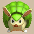
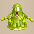
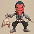
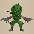
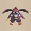
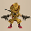
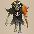
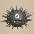
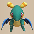

  

# Overview

<table class="dungeonOverview">
  <tr>
    <th>Unlock</th>
    <td class="highlightYellow">Talk to Drokotay the Adventurer (Shukuba Beach). 　※ Update 2.1.1 required.</td>
  </tr>
  <tr>
    <th>Entrance</th>
    <td class="highlightYellow">Shukuba Beach (Exit)</td>
  </tr>
</table>

<table class="dungeonTable">
  <tr>
    <th>Floors</th>
    <td colspan="3">25F / 50F (Sacred Tree)</td>
  </tr>
  <tr>
    <th>Bring Items</th>
    <td>No</td>
    <th>Stairs</th>
    <td>Ascending</td>
  </tr>
  <tr>
    <th>Companions</th>
    <td>No*1</td>
    <th>Roamers</th>
    <td>No</td>
  </tr>
  <tr>
    <th>Rescues</th>
    <td>3</td>
    <th>Starting Level</th>
    <td>Lv1</td>
  </tr>
  <tr>
    <th>Starting Item</th>
    <td colspan="3">Large Onigiri</td>
  </tr>
  <tr>
    <th>Unidentified</th>
    <td colspan="3">Bracelets, Grass, Scrolls, Pots</td>
  </tr>
  <tr>
    <th>Shops</th>
    <td>Yes</td>
    <th>Monster Houses</th>
    <td>Yes</td>
  </tr>
  <tr>
    <th>Behemoths</th>
    <td>Yes</td>
    <th>Wishing Shrines</th>
    <td></td>
  </tr>
  <tr>
    <th>Kron's Challenge</th>
    <td></td>
    <th>Fever Time</th>
    <td>Yes</td>
  </tr>
  <tr>
    <th>Initial Enemies</th>
    <td>4~12</td>
    <th>Spawn Rate</th>
    <td>30 Turns (1F - 3F) 25 Turns (4F - 25F) 20 Turns (26F - 50F)</td>
  </tr>
  <tr>
    <th>Wind (1st Gust)</th>
    <td>1200 Turns</td>
    <th>Reward</th>
    <td>Sacred Item (Blue)</td>
  </tr>
</table>

*1 - Companions appear in the official Parallel Data "SPCH-UNPQ".

Mystery Dungeon that's essentially a 99F dungeon condensed down into a 50F dungeon. Enemy strength ramps up quickly and continues to pressure the player throughout the run, but it's still possible to upgrade equipment, gather items to counter specific threats, etc. Overall, it offers a solid taste of a harder postgame dungeon without a big time commitment.

# Strategy

### General

#### Monster Table Condensed to 50F

The monster table is kind of like Wanderers' Highway condensed to 50 floors. However, there are some changes like Nigiri Baby not appearing, and Steadfast Tank being near the end. Fewer floors means items like Incenses and those that help with rushing stairs are more valuable. Items are on the plentiful side similar to Heart of Serpentcoil Island, including Blank Scrolls. Evasive play is also generally more effective than in most of the 99F dungeons in this game.

Possible Behemoth monsters on 38-40F include Death Reaper, Sleep Radish, and Frenzy Radish, so either prepare to rush to the stairs or use a Wall-less Scroll to make the Behemoth Gate vanish.

#### Limited Mixer Spawns (4xN+8)

Mixer family monsters appear on floors that are a multiple of 4, starting from 8F (8F, 12F, 16F, ...). However, be warned that Crow Tengu overlaps with Mixer family monsters on 32F and 44F. It's best to shoot an arrow to verify that it's a real Mixer family monster before throwing equipment. It'd also be good to have counters to Draining types if you plan on lingering for Mixer spawns.

#### Buried Item Floors (10xN)

It seems floors that are a multiple of 10 can sometimes have lots of buried items. Item-find Bracelet and Shield of Presage will let you know if this is the case at a glance, and Collection Scroll will let you claim all of the buried items on the current floor.

#### No Blessed or Cursed Items

Blessed or cursed items don't appear, except for the 3 "always cursed" bracelets. These bracelets include Item-losing Bracelet, Gitan-losing Bracelet, and Bellyshrink Bracelet. In addition, Exorcism Scroll, Curse Scroll, Exorcism Pot, and Curse Pot don't appear. This also means it's safe to equip unidentified weapons and shields to check upgrade value.

The only Curse Girl family monster that appears is Curse Matron between 35-36F, so a single Fixer Scroll should be plenty as a counter.

### Important Items

#### Weapon Runes

<b><u>Sedating</u></b>, <b><u>Blinding</u></b>, <b><u>Paralyzing</u></b>, <b><u>Confusing</u></b> Status inflicting runes work against all enemies, making these a high priority.

<b><u>Frontal Attack (Kama Itachi)</u></b>, <b><u>Knockback (Whopping Harisen)</u></b>, <b><u>Swift Strikes (Swift Sword)</u></b> Frontal Attack - Enemy spawn rate is on the fast side, so being able to hit up to 3 foes at once is great. Knockback - Knocking a foe back can lead to conserving items if the target lacks a ranged attack. Swift Strikes - Deal more damage / higher chance to inflict an ailment with a status rune in 1 turn.

<b><u>Rustproof (Golden Sword / Plating Scroll)</u></b> Protects against Mudkin's special attack, making it easier to linger for Mixers on 8F. Also increases normal attack accuracy, so it won't go to waste even if you find a Rustproof Bracelet.

<b><u>Anti-Drain (Drain Slayer)</u></b> Mudkin and Scorpion family monsters appear on a wide number of floors, so this rune helps prevent you from being unable to keep up with scaling monster strength due to repeated upgrade value or strength loss. You might also need Anti-Aquatic (Watersplitter) for Mudster and Mudder if you lack Rustproof Bracelet. And if you don't have any of the above items or runes, just throw an Eradication Scroll.

<b><u>Anti-Aquatic (Watersplitter)</u></b> Higher priority if you don't plan on eradicating the Mudkin family. Generally more useful early~mid game, since end game only has Fulminachin for Aquatic types.

<b><u>Anti-Ghost (Sickle of Salvation)</u></b> Very nice to have for Masked Samurai (8-10F) floors. Effective against Pumphantasm and Death Reaper families, as usual.

<b><u>Anti-Beast (Primal Axe)</u></b>, <b><u>Anti-Cyclops (Cyclops Bane)</u></b>, <b><u>Anti-Dragon (Dragonkiller)</u></b> Effective throughout the dungeon and even against some of the end game monsters. However, these aren't exactly essential since you should have other items by the end.

<b><u>Sealing (Sealing Staff)</u></b> Nice to have against less threatening Draining types or monsters with annoying but not dire abilities. ※ Higher level Pop Tank family monsters have high attack power and are still dangerous when sealed.

#### Shield Runes

<b><u>Jitter Payback</u></b>, <b><u>Onigiri Payback</u></b> These 2 runes are top priority, as usual.

<b><u>Oracle (Shield of Presage)</u></b> Wishing Shrines are on the somewhat common side. The ability to spot buried items on floor numbers that are a multiple of 10 is also nice.

<b><u>Magic Cancel (Shield of Negation)</u></b>, <b><u>Magic Reflect (Sacred Item)</u></b> Great for Skull Mage (12-14F), Skull Wizard (15-16F), and Skull Lord (38-41F) floors.

<b><u>Anti-Blast (Blast Shield)</u></b> Nice to have for Pop Tank family monsters if you don't plan on eradicating them. Synthesize it before 24F if possible, since both Ornery Tank and Adamant Tank appear between 24-26F. However, if you don't care to linger for Mixermons on 24F, a Heat-ban Incense[3] should be enough. Steadfast Tanks appear between 48-50F.

<b><u>Hatproof (Hat Stopper)</u></b> Hat Brat (35-36F) and Hat Rascal (46-50F) can be rather annoying when rushing stairs, so it's fine to go ahead and synthesize this rune in this dungeon.

#### Bracelets

<b><u>Item-losing Bracelet</u></b>, <b><u>Gitan-losing Bracelet</u></b>, <b><u>Bellyshrink Bracelet</u></b> These 3 are guaranteed to be cursed, so beware of equipping unidentified bracelets. Exorcism Scroll can't be found - Use a Removal Trap, Fixer Scroll, or Onigiri Scroll to remove it.

#### Other Items

<b><u>Eradication Scroll (Blank Scroll)</u></b> Blank Scrolls aren't super uncommon, so don't hesitate to eradicate annoying monsters. These include Mudkin, Polygon Spinna, Pop Tank, Skull Mage, and Swordsman families.

<b><u>Fortune Staff</u></b> Use this on Mixer family monsters to increase the number of items that can be synthesized. Don't forget to prepare a safe method in advance to defeat the leveled up Mixer.

<b><u>Incense (Various Types)</u></b> The monster table is condensed, so a single incense is often enough to counter tricky monsters.

### Farming Techniques

<b><u>Armordillo Bun (Peach Staff)</u></b> If you find a Peach Staff between 1-4F, you'll be able to collect items using an Armordillo Bun. The ideal target is Mudkin on 5-6F, since you can make them multiply by knocking them into a wall. But it's best to level up beforehand, since Porky can be troublesome to deal with while transformed. Mudkin continues to appear until 9F, but it's harder to farm with Bowboy and other trickier foes appearing, and at that point you might want to create a Hat Prankster Bun to collect grasses for synthesis, or simply create Peach Buns of leveled up Mixer family monsters instead.

# Floor Guide

### 1-7F

Notable: Bored Kappa (3-5F), Karakuroid (4-6F), Gazer (5-7F), Scorpion (5-7F), Porky (5-7F), Mudkin (5-9F)

The number of items generated on the ground is higher early on, so check every room.

Chintala (15 HP, 9 atk, 4 def) appears from 1F and deals about 10 damage to Shiren without a shield. Bored Kappa (50 HP, 18 atk, 11 def) has higher stats, but can be defeated without taking damage. To do so, place an item that Bored Kappa can throw → lure it onto the item → attack it → step back → repeat. ※ Lv1 Bored Kappa cannot throw weapons, shields, or Gitan.

Start collecting synthesis ingredients for 8F, but beware of Mudkin (70 HP, 5 atk, 9 def) starting on 5F. Either keep 2 slots open in a Preservation Pot so you can multi-select insert equipped items in 1 turn, or equip a pair of items that you plan on discarding after Mudkin exits the monster table.

### 8-12F

Notable: Mudkin (5-9F), Crossbowboy (7-10F), Masked Samurai (8-10F), Mixer (8/12F), Thiefwalrus (11-15F)

Floor range where you can synthesize, collect arrows, level up, or farm item drops. Egg Thing and Master Hen + Pop Tank appear between 11-12F, so it's also possible to stock up on food. However, many enemies already begin to hit pretty hard, so be careful with HP management.

12F is always a Shuffle Dungeon style map (Firespew Mountain) without dark hallways.

#### Hard Hitters

|Monster|HP|Atk|Def|Floors|
|-|-|-|-|-|
|Mixer|78|39|29|8/12F|
|Lt. Spearfish|60|24|17|8-9/11-12F|
|Floor Dragon|55|25|20|8-12F|
|Okina Monk D|70|25|25|9-11F|
|Metalhead|66|30|19|9-11F|
|Minotaur|70|31|20|10-12F|
|Master Hen|70|33|21|10-12F|
|Tiger Thrower|68|26|22|10-13F|
|Hannya Monk D|66|37|25|11-13F|
|Cave Mamel|5|100|100|11-15F|

### 13-16F

Notable: Mixer/Mixermon (16F), Fire Ninja C (13-14F), Pumpanshee (13-17F), Skull Wizard (15-16F), Super Gazer (15-17F)

This floor range is reminiscent of Firespew Mountain's monster table, but with some changes. Linger and synthesize on 16F since 2 types of Mixer monsters can spawn (Mixermon has 98 HP and 50 atk), but beware of accidents caused by Skull Wizard (88 HP, 35 atk), Super Gazer (66 HP, 30 atk), and Chow.

Fire Ninja C (75 HP, 45 atk, 21 def) hits hard and burns staves, scrolls, grasses, and onigiri. Pumpanshee (60 HP, 35 atk, 22 def) has random movement and can pass through walls. Cave Mamel (5 HP, 100 atk, 100 def) appears until 15F, and Chow (20 HP, 1 atk, 1 def) between 15-19F.

### 17-20F

Notable: Porko (17-20F), Daze Radish (18F), Baby Tank (18-19F), Vile Scorpion (19-21F), Greenwalrus (19-21F), Mixermon (20F), Polygon Singa (20-21F), Dragon (20-22F), Running Egg (20-29F)

Dragon (120 HP, 45 atk, 40 def) can be utilized with the Onigiri Payback shield rune to stock up on food. Polygon Singa (129 HP, 40 atk, 40 def) lowers Max Fullness by 7, but only appears for 2 floors. Only throw an Eradication Scroll if you don't plan on eradicating Battler, Skull Lord, or Archdragon later on. Greenwalrus (88 HP, 30 atk, 27 def) always drops an item when slain, and Mixermon (98 HP, 50 atk, 35 def) can be used to synthesize, so feel free to linger if you have counters for Polygon Singa and Vile Scorpion.

### 21-25F

Notable: Vile Scorpion (19-21F), Polygon Singa (20-21F), Soul Reaper (21-24F), Lv3 Monks (21-24F), Cave Mamel (21-25F), Mini Tank (22-24F), Ornery Tank (24-26F), Adamant Tank (24-26F), Dragon Pit (25-27F)

This is by far the most difficult floor range when attempting the first clear - Rush to the stairs. Soul Reapers, Mini Tanks, Ornery Tanks, and Adamant Tanks alongside monk buffs makes for a miserable time. Keep a Blank Scroll, Blurry Incense, or Heat-ban Incense on hand in case you encounter a Monster House. Avoid trying to synthesize on 24F unless you eradicate the Pop Tank family or read a Mapping Scroll, since you'll otherwise risk losing synthesized equipment from cannon blasts.

Notable monster stats:

|Monster|HP|Atk|Def|Floors|
|-|-|-|-|-|
|Vile Scorpion|108|45|33|19-21F|
|Polygon Singa|129|40|40|20-21F|
|Soul Reaper|75|40|40|21-24F|
|Hannya Monk B|166|57|45|21-24F|
|Kitsune Monk B|175|53|48|21-24F|
|Okina Monk B|170|56|50|21-24F|
|Okame Monk B|160|50|51|21-24F|
|Tengu Monk B|180|55|47|21-24F|
|Cave Mamel|5|100|100|21-25F|
|Mini Tank|100|55|40|22-24F|
|Ornery Tank|95|40|44|24-26F|
|Adamant Tank|100|60|54|24-26F|
|Dragon Pit|130|54|40|25-27F|

<h3 class="heading3Tree">Sacred Tree Mode</h3>

### 26-32F

Notable: Mudster (26-30F), Mudder (26-30F), N'dama (26-34F), Terror Scorpion (29-34F), Lv3 Monks (31-34F)

It's best to rush to the stairs if you lack counters to Mudster, Mudder, and Terror Scorpion.

Mudster (140 HP, 35 atk, 43 def) and Mudder (145 HP, 45 atk, 53 def) can erase runes. N'dama (135 HP, 50 atk, 35 def) won't be revealed even when inserting into a pot or advancing floors. Terror Scorpion (185 HP, 55 atk, 45 def) occasionally lowers Max Strength by 1 when adjacent. Any Mixermon (98 HP, 50 atk, 35 def) or Mixergon (118 HP, 68 atk, 40 def) you encounter on 28F is real, but Mixergon overlaps with Crow Tengu (5 HP, 1 atk, 1 def) on 32F, so always shoot an arrow first on 32F.

### 33-37F

Notable: N'dama (26-34F), Terror Scorpion (29-34F), Lv3 Monks (31-34F), Ironwalrus (33-34F), Vexing Kappa (33-34F), Curse Matron (35-36F), Nigiri Boss (35-36F), Bag Knave (35-36F), Hyper Gazer (35-36F), Lv3 Ninjas (37F)

N'dama and Terror Scorpion are still around until 34F. Ironwalrus (138 HP, 35 atk, 55 def) appears, but it's not recommended to linger. Vexing Kappa (175 HP, 49 atk, 33 def) throws items found on the ground within 10 tiles, so if you want to claim ground items, use an Evasive Incense or Collection Scroll.

35-36F is the usual deeper floor range harassment team of monsters - It's only 2 floors here, so rush stairs. Don't bother attempting to synthesize using Mixergons on 36F, you're pretty close to the end now anyway. 37F mostly spawns Lv3 ninjas, so it kind of serves as a rest area before the final stretch.

### 38-41F

Notable: Battler (38-41F), Skull Lord (38-41F), Grampadillo (38-41F), Bellthoven (38-41F), Behemoth (38-40F)

It's highly recommended to rush to the stairs from this point until you clear the dungeon. Extremely dangerous behemoths can spawn, including Death Reaper, Sleep Radish, and Frenzy Radish.

Battler (200 HP, 69 atk, 50 def) can disarm equipped weapons, shields, and bracelets. Skull Lord (188 HP, 55 atk, 55 def)'s magic effects include Asleep, Blind, Level-3, or 40 damage. Grampadillo (175 HP, 71 atk, 56 def) can make you trip and drop items when adjacent. Bellthoven (150 HP, 45 atk, 45 def) can summon up to 3 monsters at once even when not adjacent. Megahead (182 HP, 65 atk, 48 def) and Pumplord (185 HP, 75 atk, 35 def) also hit hard.

### 42-45F

Notable: King Reaper (42-45F), Polygon Stunna (42-45F), Porgon (42-45F), Electroid (42-45F), Fulminachin (42-45F)

Stepping in place at the start of the floor to lure King Reapers (225 HP, 65 atk, 50 def) to you sometimes leads to getting pelted by Porgon (200 HP, 85 atk, 60 def)'s rocks instead, so it's better to use items like Evasive Incense or Eradication Scroll to make one of the monsters a non-issue.

Polygon Stunna (229 HP, 50 atk, 55 def) can lower Max Fullness by 10 when adjacent. Fulminachin (200 HP, 45 atk, 32 def) explodes after taking 160+ damage without being defeated. Electroid (150 HP, 56 atk, 53 def) has Swift 1 speed and creates new traps.

Mixergon and Mixerdon overlap with Crow Tengu on 44F, but you should be done synthesizing by now.

### 46-50F

Notable: Miracle Hen (46-50F), Archdragon (46-50F), Pyrepuff (46-50F), Hat Rascal (46-50F), Steadfast Tank (48-50F)

The ideal counter for this floor range is to throw an Eradication Scroll at Miracle Hen, then use a Heat-ban Incense to breeze through Archdragon and Steadfast Tank's special attacks.

Archdragon (200 HP, 65 atk, 60 def) spews a 30 damage flame from anywhere on the floor. Miracle Hen (220 HP, 82 atk, 60 def) has Swift 2 speed and hits very hard, but lacks a special attack. Hat Rascal (170 HP, 85 atk, 12 def) steals and tosses away your staves, grass, food, or scrolls. Pyrepuff (255 HP, 75 atk, 45 def) breathes 40 damage fire when adjacent, but the attack can fail. Steadfast Tank (105 HP, 80 atk, 64 def) has Swift 2 speed and its cannonballs deal 50 damage. Infernous (285 HP, 69 atk, 55 def) and Hiding Dragon (230 HP, 70 atk, 60 def) also hit pretty hard.

# Monsters

See [Monsters](/system/monsters) for individual monster details.

- F - Dark hallways
- S - Shop is possible
- H - Monster House is possible
- G - Golden Egg Thing is possible
- B - Behemoth Monsters are possible

Monster Colors = Farming, Useful, Lowers Stats, Targets Items, Dangerous

<table class="monsterTable">
  <thead>
    <tr>
      <th>F</th>
      <th>S</th>
      <th>H</th>
      <th>G</th>
      <th colspan="5">Monsters</th>
      <th>B</th>
    </tr>
  </thead>
  <tbody>
    <tr>
      <td rowspan="1" class="centeredText highlightFog">1</td>
      <td rowspan="1" class=""></td>
      <td rowspan="1" class=""></td>
      <td rowspan="1" class=""></td>
      <td> Mamel</td>
      <td> Pit Mamel</td>
      <td> Spearfish</td>
      <td> Chintala</td>
      <td class="highlightGray"></td>
      <td rowspan="1" class=""></td>
    </tr>
    <tr>
      <td colspan="10" class="tableDivider"></td>
    </tr>
    <tr>
      <td rowspan="1" class="centeredText highlightFog">2</td>
      <td rowspan="1" class=""></td>
      <td rowspan="1" class=""></td>
      <td rowspan="1" class=""></td>
      <td> Pit Mamel</td>
      <td> Spearfish</td>
      <td> Chintala</td>
      <td> Froggo</td>
      <td> Shagga</td>
      <td rowspan="1" class=""></td>
    </tr>
    <tr>
      <td colspan="10" class="tableDivider"></td>
    </tr>
    <tr>
      <td rowspan="1" class="centeredText highlightFog">3</td>
      <td rowspan="1" class=""></td>
      <td rowspan="1" class=""></td>
      <td rowspan="1" class=""></td>
      <td> Chintala</td>
      <td> Shagga</td>
      <td> Armordillo</td>
      <td> Polygon Spinna</td>
      <td> Bored Kappa</td>
      <td rowspan="1" class=""></td>
    </tr>
    <tr>
      <td colspan="10" class="tableDivider"></td>
    </tr>
    <tr>
      <td rowspan="1" class="centeredText highlightFog">4</td>
      <td rowspan="1" class="highlightShop"></td>
      <td rowspan="1" class=""></td>
      <td rowspan="1" class=""></td>
      <td> Armordillo</td>
      <td> Karakuroid</td>
      <td> Polygon Spinna</td>
      <td> Bored Kappa</td>
      <td class="highlightGray"></td>
      <td rowspan="1" class=""></td>
    </tr>
    <tr>
      <td colspan="10" class="tableDivider"></td>
    </tr>
    <tr>
      <td rowspan="2" class="centeredText highlightFog">5</td>
      <td rowspan="2" class=""></td>
      <td rowspan="2" class=""></td>
      <td rowspan="2" class=""></td>
      <td> Karakuroid</td>
      <td> Polygon Spinna</td>
      <td> Scorpion</td>
      <td> Porky</td>
      <td> Gazer</td>
      <td rowspan="2" class=""></td>
    </tr>
    <tr>
      <td> Bored Kappa</td>
      <td> Mudkin</td>
      <td class="highlightGray"></td>
      <td class="highlightGray"></td>
      <td class="highlightGray"></td>
    </tr>
    <tr>
      <td colspan="10" class="tableDivider"></td>
    </tr>
    <tr>
      <td rowspan="2" class="centeredText highlightFog">6</td>
      <td rowspan="2" class=""></td>
      <td rowspan="2" class=""></td>
      <td rowspan="2" class=""></td>
      <td> Karakuroid</td>
      <td> Hell Reaper</td>
      <td> Polygon Spinna</td>
      <td> Scorpion</td>
      <td> Porky</td>
      <td rowspan="2" class=""></td>
    </tr>
    <tr>
      <td> Gazer</td>
      <td> Hoppin' Hitter</td>
      <td> Mudkin</td>
      <td class="highlightGray"></td>
      <td class="highlightGray"></td>
    </tr>
    <tr>
      <td colspan="10" class="tableDivider"></td>
    </tr>
    <tr>
      <td rowspan="2" class="centeredText highlightFog">7</td>
      <td rowspan="2" class=""></td>
      <td rowspan="2" class=""></td>
      <td rowspan="2" class=""></td>
      <td> Hell Reaper</td>
      <td> Scorpion</td>
      <td> Porky</td>
      <td> Gazer</td>
      <td> Hoppin' Hitter</td>
      <td rowspan="2" class=""></td>
    </tr>
    <tr>
      <td> Mid Chintala</td>
      <td> Bowboy</td>
      <td> Crossbowboy</td>
      <td> Hat Prankster</td>
      <td> Mudkin</td>
    </tr>
    <tr>
      <td colspan="10" class="tableDivider"></td>
    </tr>
    <tr>
      <td rowspan="2" class="centeredText highlightFog">8</td>
      <td rowspan="2" class=""></td>
      <td rowspan="2" class=""></td>
      <td rowspan="2" class=""></td>
      <td> Hell Reaper</td>
      <td> Mid Chintala</td>
      <td> Bowboy</td>
      <td> Crossbowboy</td>
      <td> Masked Samurai</td>
      <td rowspan="2" class=""></td>
    </tr>
    <tr>
      <td> Hat Prankster</td>
      <td> Mudkin</td>
      <td> Lt. Spearfish</td>
      <td> Floor Dragon</td>
      <td> Mixer</td>
    </tr>
    <tr>
      <td colspan="10" class="tableDivider"></td>
    </tr>
    <tr>
      <td rowspan="3" class="centeredText highlightFog">9</td>
      <td rowspan="3" class=""></td>
      <td rowspan="3" class=""></td>
      <td rowspan="3" class=""></td>
      <td> Bowboy</td>
      <td> Crossbowboy</td>
      <td> Masked Samurai</td>
      <td> Hat Prankster</td>
      <td> Mudkin</td>
      <td rowspan="3" class=""></td>
    </tr>
    <tr>
      <td> Lt. Spearfish</td>
      <td> Floor Dragon</td>
      <td> Metalhead</td>
      <td> Okina Monk D</td>
      <td> Okame Monk D</td>
    </tr>
    <tr>
      <td> Tengu Monk D</td>
      <td class="highlightGray"></td>
      <td class="highlightGray"></td>
      <td class="highlightGray"></td>
      <td class="highlightGray"></td>
    </tr>
    <tr>
      <td colspan="10" class="tableDivider"></td>
    </tr>
    <tr>
      <td rowspan="3" class="centeredText highlightFog">10</td>
      <td rowspan="3" class=""></td>
      <td rowspan="3" class=""></td>
      <td rowspan="3" class=""></td>
      <td> Crossbowboy</td>
      <td> Masked Samurai</td>
      <td> Hat Prankster</td>
      <td> Floor Dragon</td>
      <td> Metalhead</td>
      <td rowspan="3" class=""></td>
    </tr>
    <tr>
      <td> Master Hen</td>
      <td> Tiger Thrower</td>
      <td> Okina Monk D</td>
      <td> Okame Monk D</td>
      <td> Tengu Monk D</td>
    </tr>
    <tr>
      <td> Minotaur</td>
      <td class="highlightGray"></td>
      <td class="highlightGray"></td>
      <td class="highlightGray"></td>
      <td class="highlightGray"></td>
    </tr>
    <tr>
      <td colspan="10" class="tableDivider"></td>
    </tr>
    <tr>
      <td rowspan="3" class="centeredText highlightFog">11</td>
      <td rowspan="3" class=""></td>
      <td rowspan="3" class=""></td>
      <td rowspan="3" class=""></td>
      <td> Lt. Spearfish</td>
      <td> Floor Dragon</td>
      <td> Metalhead</td>
      <td> Master Hen</td>
      <td> Tiger Thrower</td>
      <td rowspan="3" class=""></td>
    </tr>
    <tr>
      <td> Kitsune Monk D</td>
      <td> Okina Monk D</td>
      <td> Hannya Monk D</td>
      <td> Thiefwalrus</td>
      <td> Pop Tank</td>
    </tr>
    <tr>
      <td> Egg Thing</td>
      <td> Minotaur</td>
      <td> Ghost Radish</td>
      <td> Cave Mamel</td>
      <td class="highlightGray"></td>
    </tr>
    <tr>
      <td colspan="10" class="tableDivider"></td>
    </tr>
    <tr>
      <td rowspan="3" class="centeredText">12</td>
      <td rowspan="3" class=""></td>
      <td rowspan="3" class=""></td>
      <td rowspan="3" class=""></td>
      <td> Lt. Spearfish</td>
      <td> Floor Dragon</td>
      <td> Master Hen</td>
      <td> Tiger Thrower</td>
      <td> Hannya Monk D</td>
      <td rowspan="3" class=""></td>
    </tr>
    <tr>
      <td> Thiefwalrus</td>
      <td> Zapdon</td>
      <td> Pop Tank</td>
      <td> Egg Thing</td>
      <td> Minotaur</td>
    </tr>
    <tr>
      <td> Ghost Radish</td>
      <td> Skull Mage</td>
      <td> Cave Mamel</td>
      <td> Mixer</td>
      <td class="highlightGray"></td>
    </tr>
    <tr>
      <td colspan="10" class="tableDivider"></td>
    </tr>
    <tr>
      <td rowspan="3" class="centeredText highlightFog">13</td>
      <td rowspan="3" class=""></td>
      <td rowspan="3" class=""></td>
      <td rowspan="3" class=""></td>
      <td> Tiger Thrower</td>
      <td> Hannya Monk D</td>
      <td> Thiefwalrus</td>
      <td> Zapdon</td>
      <td> Pop Tank</td>
      <td rowspan="3" class=""></td>
    </tr>
    <tr>
      <td> Flamepuff</td>
      <td> N'dubba</td>
      <td> Tree Ninja C</td>
      <td> Earth Ninja C</td>
      <td> Fire Ninja C</td>
    </tr>
    <tr>
      <td> Explochin</td>
      <td> Pumpanshee</td>
      <td> Skull Mage</td>
      <td> Cave Mamel</td>
      <td class="highlightGray"></td>
    </tr>
    <tr>
      <td colspan="10" class="tableDivider"></td>
    </tr>
    <tr>
      <td rowspan="3" class="centeredText highlightFog">14</td>
      <td rowspan="3" class=""></td>
      <td rowspan="3" class=""></td>
      <td rowspan="3" class=""></td>
      <td> Thiefwalrus</td>
      <td> Zapdon</td>
      <td> Flamepuff</td>
      <td> N'dubba</td>
      <td> Tree Ninja C</td>
      <td rowspan="3" class="highlightBehemoth"></td>
    </tr>
    <tr>
      <td> Earth Ninja C</td>
      <td> Fire Ninja C</td>
      <td> Explochin</td>
      <td> Pumpanshee</td>
      <td> Skull Mage</td>
    </tr>
    <tr>
      <td> Cave Mamel</td>
      <td class="highlightGray"></td>
      <td class="highlightGray"></td>
      <td class="highlightGray"></td>
      <td class="highlightGray"></td>
    </tr>
    <tr>
      <td colspan="10" class="tableDivider"></td>
    </tr>
    <tr>
      <td rowspan="3" class="centeredText highlightFog">15</td>
      <td rowspan="3" class=""></td>
      <td rowspan="3" class=""></td>
      <td rowspan="3" class=""></td>
      <td> Zapdon</td>
      <td> Flamepuff</td>
      <td> N'dubba</td>
      <td> Tree Ninja C</td>
      <td> Metal Ninja C</td>
      <td rowspan="3" class="highlightBehemoth"></td>
    </tr>
    <tr>
      <td> Water Ninja C</td>
      <td> Explochin</td>
      <td> Pumpanshee</td>
      <td> Skull Wizard</td>
      <td> Super Gazer</td>
    </tr>
    <tr>
      <td> Cave Mamel</td>
      <td> Chow</td>
      <td class="highlightGray"></td>
      <td class="highlightGray"></td>
      <td class="highlightGray"></td>
    </tr>
    <tr>
      <td colspan="10" class="tableDivider"></td>
    </tr>
    <tr>
      <td rowspan="2" class="centeredText highlightFog">16</td>
      <td rowspan="2" class=""></td>
      <td rowspan="2" class=""></td>
      <td rowspan="2" class=""></td>
      <td> N'dubba</td>
      <td> Tree Ninja C</td>
      <td> Metal Ninja C</td>
      <td> Water Ninja C</td>
      <td> Pumpanshee</td>
      <td rowspan="2" class="highlightBehemoth"></td>
    </tr>
    <tr>
      <td> Skull Wizard</td>
      <td> Super Gazer</td>
      <td> Mixer</td>
      <td> Mixermon</td>
      <td> Chow</td>
    </tr>
    <tr>
      <td colspan="10" class="tableDivider"></td>
    </tr>
    <tr>
      <td rowspan="2" class="centeredText highlightFog">17</td>
      <td rowspan="2" class=""></td>
      <td rowspan="2" class=""></td>
      <td rowspan="2" class=""></td>
      <td> Pumpanshee</td>
      <td> Super Gazer</td>
      <td> N'dulu</td>
      <td> Pesky Kappa</td>
      <td> Porko</td>
      <td rowspan="2" class="highlightBehemoth"></td>
    </tr>
    <tr>
      <td> Chow</td>
      <td class="highlightGray"></td>
      <td class="highlightGray"></td>
      <td class="highlightGray"></td>
      <td class="highlightGray"></td>
    </tr>
    <tr>
      <td colspan="10" class="tableDivider"></td>
    </tr>
    <tr>
      <td rowspan="3" class="centeredText highlightFog">18</td>
      <td rowspan="3" class=""></td>
      <td rowspan="3" class=""></td>
      <td rowspan="3" class=""></td>
      <td> N'dulu</td>
      <td> Pesky Kappa</td>
      <td> Porko</td>
      <td> Daze Radish</td>
      <td> Baby Tank</td>
      <td rowspan="3" class=""></td>
    </tr>
    <tr>
      <td> Hoppin' Slugger</td>
      <td> Polygon Shaka</td>
      <td> Capt. Spearfish</td>
      <td> Famed Octopling</td>
      <td> Dartingfrog</td>
    </tr>
    <tr>
      <td> Chow</td>
      <td class="highlightGray"></td>
      <td class="highlightGray"></td>
      <td class="highlightGray"></td>
      <td class="highlightGray"></td>
    </tr>
    <tr>
      <td colspan="10" class="tableDivider"></td>
    </tr>
    <tr>
      <td rowspan="3" class="centeredText highlightFog">19</td>
      <td rowspan="3" class=""></td>
      <td rowspan="3" class=""></td>
      <td rowspan="3" class=""></td>
      <td> N'dulu</td>
      <td> Pesky Kappa</td>
      <td> Porko</td>
      <td> Baby Tank</td>
      <td> Vile Scorpion</td>
      <td rowspan="3" class=""></td>
    </tr>
    <tr>
      <td> Hoppin' Slugger</td>
      <td> Polygon Shaka</td>
      <td> Capt. Spearfish</td>
      <td> Famed Octopling</td>
      <td> Greenwalrus</td>
    </tr>
    <tr>
      <td> Dartingfrog</td>
      <td> Chow</td>
      <td class="highlightGray"></td>
      <td class="highlightGray"></td>
      <td class="highlightGray"></td>
    </tr>
    <tr>
      <td colspan="10" class="tableDivider"></td>
    </tr>
    <tr>
      <td rowspan="3" class="centeredText highlightFog">20</td>
      <td rowspan="3" class=""></td>
      <td rowspan="3" class=""></td>
      <td rowspan="3" class=""></td>
      <td> N'dulu</td>
      <td> Pesky Kappa</td>
      <td> Porko</td>
      <td> Vile Scorpion</td>
      <td> Hoppin' Slugger</td>
      <td rowspan="3" class=""></td>
    </tr>
    <tr>
      <td> Polygon Shaka</td>
      <td> Dragon</td>
      <td> Greenwalrus</td>
      <td> Dartingfrog</td>
      <td> Polygon Singa</td>
    </tr>
    <tr>
      <td> Floppy Hani</td>
      <td> Pumplich</td>
      <td> Mixermon</td>
      <td> Running Egg</td>
      <td class="highlightGray"></td>
    </tr>
    <tr>
      <td colspan="10" class="tableDivider"></td>
    </tr>
    <tr>
      <td rowspan="4" class="centeredText highlightFog">21</td>
      <td rowspan="4" class=""></td>
      <td rowspan="4" class=""></td>
      <td rowspan="4" class=""></td>
      <td> N'dulu</td>
      <td> Vile Scorpion</td>
      <td> Polygon Shaka</td>
      <td> Dragon</td>
      <td> Sky Dragon</td>
      <td rowspan="4" class="highlightBehemoth"></td>
    </tr>
    <tr>
      <td> Greenwalrus</td>
      <td> Dartingfrog</td>
      <td> Polygon Singa</td>
      <td> Floppy Hani</td>
      <td> Soul Reaper</td>
    </tr>
    <tr>
      <td> Pumplich</td>
      <td> Cave Mamel</td>
      <td> Hannya Monk B</td>
      <td> Okame Monk B</td>
      <td> Tengu Monk B</td>
    </tr>
    <tr>
      <td> Kitsune Monk B</td>
      <td> Okina Monk B</td>
      <td> Running Egg</td>
      <td class="highlightGray"></td>
      <td class="highlightGray"></td>
    </tr>
    <tr>
      <td colspan="10" class="tableDivider"></td>
    </tr>
    <tr>
      <td rowspan="3" class="centeredText highlightFog">22</td>
      <td rowspan="3" class=""></td>
      <td rowspan="3" class=""></td>
      <td rowspan="3" class=""></td>
      <td> Dragon</td>
      <td> Sky Dragon</td>
      <td> Floppy Hani</td>
      <td> Soul Reaper</td>
      <td> Pumplich</td>
      <td rowspan="3" class="highlightBehemoth"></td>
    </tr>
    <tr>
      <td> Mini Tank</td>
      <td> Cave Mamel</td>
      <td> Hannya Monk B</td>
      <td> Okame Monk B</td>
      <td> Tengu Monk B</td>
    </tr>
    <tr>
      <td> Kitsune Monk B</td>
      <td> Okina Monk B</td>
      <td> Running Egg</td>
      <td class="highlightGray"></td>
      <td class="highlightGray"></td>
    </tr>
    <tr>
      <td colspan="10" class="tableDivider"></td>
    </tr>
    <tr>
      <td rowspan="2" class="centeredText highlightFog">23</td>
      <td rowspan="2" class=""></td>
      <td rowspan="2" class=""></td>
      <td rowspan="2" class=""></td>
      <td> Soul Reaper</td>
      <td> Pumplich</td>
      <td> Mini Tank</td>
      <td> Cave Mamel</td>
      <td> Hannya Monk B</td>
      <td rowspan="2" class="highlightBehemoth"></td>
    </tr>
    <tr>
      <td> Okame Monk B</td>
      <td> Tengu Monk B</td>
      <td> Kitsune Monk B</td>
      <td> Okina Monk B</td>
      <td> Running Egg</td>
    </tr>
    <tr>
      <td colspan="10" class="tableDivider"></td>
    </tr>
    <tr>
      <td rowspan="3" class="centeredText highlightFog">24</td>
      <td rowspan="3" class=""></td>
      <td rowspan="3" class=""></td>
      <td rowspan="3" class=""></td>
      <td> Soul Reaper</td>
      <td> Pumplich</td>
      <td> Mini Tank</td>
      <td> Ornery Tank</td>
      <td> Adamant Tank</td>
      <td rowspan="3" class="highlightBehemoth"></td>
    </tr>
    <tr>
      <td> Cave Mamel</td>
      <td> Hannya Monk B</td>
      <td> Okame Monk B</td>
      <td> Tengu Monk B</td>
      <td> Kitsune Monk B</td>
    </tr>
    <tr>
      <td> Okina Monk B</td>
      <td> Mixermon</td>
      <td> Running Egg</td>
      <td class="highlightGray"></td>
      <td class="highlightGray"></td>
    </tr>
    <tr>
      <td colspan="10" class="tableDivider"></td>
    </tr>
    <tr>
      <td rowspan="2" class="centeredText highlightFog">25</td>
      <td rowspan="2" class=""></td>
      <td rowspan="2" class=""></td>
      <td rowspan="2" class=""></td>
      <td> Ornery Tank</td>
      <td> Adamant Tank</td>
      <td> Blazepuff</td>
      <td> Dragon Pit</td>
      <td> Cave Mamel</td>
      <td rowspan="2" class=""></td>
    </tr>
    <tr>
      <td> Running Egg</td>
      <td class="highlightGray"></td>
      <td class="highlightGray"></td>
      <td class="highlightGray"></td>
      <td class="highlightGray"></td>
    </tr>
    <tr>
      <td colspan="10" class="tableDivider"></td>
    </tr>
    <tr>
      <td class="monsterTableExtension"></td>
      <td colspan="3" class="monsterTableExtension"></td>
      <td colspan="5" class="monsterTableExtension centeredText">Sacred Tree Mode</td>
      <td class="monsterTableExtension"></td>
    </tr>
    <tr>
      <td colspan="10" class="tableDivider"></td>
    </tr>
    <tr>
      <td rowspan="2" class="centeredText highlightFog">26</td>
      <td rowspan="2" class=""></td>
      <td rowspan="2" class=""></td>
      <td rowspan="2" class=""></td>
      <td> Ornery Tank</td>
      <td> Adamant Tank</td>
      <td> Blazepuff</td>
      <td> Dragon Pit</td>
      <td> Mudster</td>
      <td rowspan="2" class=""></td>
    </tr>
    <tr>
      <td> Mudder</td>
      <td> N'dama</td>
      <td> Running Egg</td>
      <td> Dark Owl</td>
      <td class="highlightGray"></td>
    </tr>
    <tr>
      <td colspan="10" class="tableDivider"></td>
    </tr>
    <tr>
      <td rowspan="2" class="centeredText highlightFog">27</td>
      <td rowspan="2" class=""></td>
      <td rowspan="2" class=""></td>
      <td rowspan="2" class=""></td>
      <td> Blazepuff</td>
      <td> Dragon Pit</td>
      <td> Igneous</td>
      <td> Mudster</td>
      <td> Mudder</td>
      <td rowspan="2" class=""></td>
    </tr>
    <tr>
      <td> N'dama</td>
      <td> Running Egg</td>
      <td> Dark Owl</td>
      <td class="highlightGray"></td>
      <td class="highlightGray"></td>
    </tr>
    <tr>
      <td colspan="10" class="tableDivider"></td>
    </tr>
    <tr>
      <td rowspan="2" class="centeredText highlightFog">28</td>
      <td rowspan="2" class=""></td>
      <td rowspan="2" class=""></td>
      <td rowspan="2" class=""></td>
      <td> Igneous</td>
      <td> Mudster</td>
      <td> Mudder</td>
      <td> N'dama</td>
      <td> Mixermon</td>
      <td rowspan="2" class=""></td>
    </tr>
    <tr>
      <td> Mixergon</td>
      <td> Running Egg</td>
      <td> Dark Owl</td>
      <td class="highlightGray"></td>
      <td class="highlightGray"></td>
    </tr>
    <tr>
      <td colspan="10" class="tableDivider"></td>
    </tr>
    <tr>
      <td rowspan="2" class="centeredText highlightFog">29</td>
      <td rowspan="2" class="highlightShop"></td>
      <td rowspan="2" class=""></td>
      <td rowspan="2" class="highlightGold"></td>
      <td> Igneous</td>
      <td> Terror Scorpion</td>
      <td> Hoppin' Slammer</td>
      <td> Mudster</td>
      <td> Mudder</td>
      <td rowspan="2" class=""></td>
    </tr>
    <tr>
      <td> N'dama</td>
      <td> Running Egg</td>
      <td> Dark Owl</td>
      <td class="highlightGray"></td>
      <td class="highlightGray"></td>
    </tr>
    <tr>
      <td colspan="10" class="tableDivider"></td>
    </tr>
    <tr>
      <td rowspan="2" class="centeredText highlightFog">30</td>
      <td rowspan="2" class=""></td>
      <td rowspan="2" class=""></td>
      <td rowspan="2" class="highlightGold"></td>
      <td> Terror Scorpion</td>
      <td> Hoppin' Slammer</td>
      <td> Mudster</td>
      <td> Mudder</td>
      <td> N'dama</td>
      <td rowspan="2" class=""></td>
    </tr>
    <tr>
      <td> Chow</td>
      <td> Dark Owl</td>
      <td class="highlightGray"></td>
      <td class="highlightGray"></td>
      <td class="highlightGray"></td>
    </tr>
    <tr>
      <td colspan="10" class="tableDivider"></td>
    </tr>
    <tr>
      <td rowspan="2" class="centeredText highlightFog">31</td>
      <td rowspan="2" class=""></td>
      <td rowspan="2" class=""></td>
      <td rowspan="2" class="highlightGold"></td>
      <td> Hannya Monk B</td>
      <td> Okame Monk B</td>
      <td> Tengu Monk B</td>
      <td> Kitsune Monk B</td>
      <td> Okina Monk B</td>
      <td rowspan="2" class=""></td>
    </tr>
    <tr>
      <td> Terror Scorpion</td>
      <td> Hoppin' Slammer</td>
      <td> N'dama</td>
      <td> Chow</td>
      <td> Crow Tengu</td>
    </tr>
    <tr>
      <td colspan="10" class="tableDivider"></td>
    </tr>
    <tr>
      <td rowspan="3" class="centeredText highlightFog">32</td>
      <td rowspan="3" class=""></td>
      <td rowspan="3" class=""></td>
      <td rowspan="3" class=""></td>
      <td> Hannya Monk B</td>
      <td> Okame Monk B</td>
      <td> Tengu Monk B</td>
      <td> Kitsune Monk B</td>
      <td> Okina Monk B</td>
      <td rowspan="3" class=""></td>
    </tr>
    <tr>
      <td> Terror Scorpion</td>
      <td> Hoppin' Slammer</td>
      <td> N'dama</td>
      <td> Mixergon</td>
      <td> Chow</td>
    </tr>
    <tr>
      <td> Crow Tengu</td>
      <td class="highlightGray"></td>
      <td class="highlightGray"></td>
      <td class="highlightGray"></td>
      <td class="highlightGray"></td>
    </tr>
    <tr>
      <td colspan="10" class="tableDivider"></td>
    </tr>
    <tr>
      <td rowspan="3" class="centeredText highlightFog">33</td>
      <td rowspan="3" class=""></td>
      <td rowspan="3" class=""></td>
      <td rowspan="3" class=""></td>
      <td> Hannya Monk B</td>
      <td> Okame Monk B</td>
      <td> Tengu Monk B</td>
      <td> Kitsune Monk B</td>
      <td> Okina Monk B</td>
      <td rowspan="3" class=""></td>
    </tr>
    <tr>
      <td> Terror Scorpion</td>
      <td> Hoppin' Slammer</td>
      <td> N'dama</td>
      <td> Admiral Spearfish</td>
      <td> Superb Octopling</td>
    </tr>
    <tr>
      <td> Vexing Kappa</td>
      <td> Ironwalrus</td>
      <td> Fleefrog</td>
      <td> Chow</td>
      <td> Crow Tengu</td>
    </tr>
    <tr>
      <td colspan="10" class="tableDivider"></td>
    </tr>
    <tr>
      <td rowspan="3" class="centeredText highlightFog">34</td>
      <td rowspan="3" class=""></td>
      <td rowspan="3" class=""></td>
      <td rowspan="3" class=""></td>
      <td> Hannya Monk B</td>
      <td> Okame Monk B</td>
      <td> Tengu Monk B</td>
      <td> Kitsune Monk B</td>
      <td> Okina Monk B</td>
      <td rowspan="3" class=""></td>
    </tr>
    <tr>
      <td> Terror Scorpion</td>
      <td> Hoppin' Slammer</td>
      <td> N'dama</td>
      <td> Admiral Spearfish</td>
      <td> Superb Octopling</td>
    </tr>
    <tr>
      <td> Vexing Kappa</td>
      <td> Ironwalrus</td>
      <td> Fleefrog</td>
      <td> Chow</td>
      <td> Crow Tengu</td>
    </tr>
    <tr>
      <td colspan="10" class="tableDivider"></td>
    </tr>
    <tr>
      <td rowspan="2" class="centeredText highlightFog">35</td>
      <td rowspan="2" class=""></td>
      <td rowspan="2" class=""></td>
      <td rowspan="2" class=""></td>
      <td> Curse Matron</td>
      <td> Nigiri Boss</td>
      <td> Bag Knave</td>
      <td> Hyper Gazer</td>
      <td> Hat Brat</td>
      <td rowspan="2" class=""></td>
    </tr>
    <tr>
      <td> Chow</td>
      <td> Crow Tengu</td>
      <td class="highlightGray"></td>
      <td class="highlightGray"></td>
      <td class="highlightGray"></td>
    </tr>
    <tr>
      <td colspan="10" class="tableDivider"></td>
    </tr>
    <tr>
      <td rowspan="2" class="centeredText highlightFog">36</td>
      <td rowspan="2" class=""></td>
      <td rowspan="2" class=""></td>
      <td rowspan="2" class=""></td>
      <td> Curse Matron</td>
      <td> Nigiri Boss</td>
      <td> Bag Knave</td>
      <td> Hyper Gazer</td>
      <td> Hat Brat</td>
      <td rowspan="2" class=""></td>
    </tr>
    <tr>
      <td> Mixergon</td>
      <td> N'daloon</td>
      <td> Chow</td>
      <td class="highlightGray"></td>
      <td class="highlightGray"></td>
    </tr>
    <tr>
      <td colspan="10" class="tableDivider"></td>
    </tr>
    <tr>
      <td rowspan="2" class="centeredText highlightFog">37</td>
      <td rowspan="2" class=""></td>
      <td rowspan="2" class=""></td>
      <td rowspan="2" class=""></td>
      <td> Tree Ninja B</td>
      <td> Earth Ninja B</td>
      <td> Fire Ninja B</td>
      <td> Metal Ninja B</td>
      <td> Water Ninja B</td>
      <td rowspan="2" class=""></td>
    </tr>
    <tr>
      <td> N'daloon</td>
      <td> Chow</td>
      <td class="highlightGray"></td>
      <td class="highlightGray"></td>
      <td class="highlightGray"></td>
    </tr>
    <tr>
      <td colspan="10" class="tableDivider"></td>
    </tr>
    <tr>
      <td rowspan="3" class="centeredText highlightFog">38</td>
      <td rowspan="3" class=""></td>
      <td rowspan="3" class=""></td>
      <td rowspan="3" class=""></td>
      <td> Grampadillo</td>
      <td> Great Samurai</td>
      <td> Skull Lord</td>
      <td> Battler</td>
      <td> Megataur</td>
      <td rowspan="3" class="highlightBehemoth"></td>
    </tr>
    <tr>
      <td> Megahead</td>
      <td> Clapdon</td>
      <td> Bellthoven</td>
      <td> Pumplord</td>
      <td> N'daloon</td>
    </tr>
    <tr>
      <td> Chow</td>
      <td class="highlightGray"></td>
      <td class="highlightGray"></td>
      <td class="highlightGray"></td>
      <td class="highlightGray"></td>
    </tr>
    <tr>
      <td colspan="10" class="tableDivider"></td>
    </tr>
    <tr>
      <td rowspan="3" class="centeredText highlightFog">39</td>
      <td rowspan="3" class=""></td>
      <td rowspan="3" class=""></td>
      <td rowspan="3" class=""></td>
      <td> Grampadillo</td>
      <td> Great Samurai</td>
      <td> Skull Lord</td>
      <td> Battler</td>
      <td> Megataur</td>
      <td rowspan="3" class="highlightBehemoth"></td>
    </tr>
    <tr>
      <td> Megahead</td>
      <td> Clapdon</td>
      <td> Bellthoven</td>
      <td> Pumplord</td>
      <td> N'daloon</td>
    </tr>
    <tr>
      <td> Chow</td>
      <td class="highlightGray"></td>
      <td class="highlightGray"></td>
      <td class="highlightGray"></td>
      <td class="highlightGray"></td>
    </tr>
    <tr>
      <td colspan="10" class="tableDivider"></td>
    </tr>
    <tr>
      <td rowspan="3" class="centeredText highlightFog">40</td>
      <td rowspan="3" class=""></td>
      <td rowspan="3" class="highlightMH"></td>
      <td rowspan="3" class=""></td>
      <td> Grampadillo</td>
      <td> Great Samurai</td>
      <td> Skull Lord</td>
      <td> Battler</td>
      <td> Megataur</td>
      <td rowspan="3" class="highlightBehemoth"></td>
    </tr>
    <tr>
      <td> Megahead</td>
      <td> Clapdon</td>
      <td> Bellthoven</td>
      <td> Pumplord</td>
      <td> Mixergon</td>
    </tr>
    <tr>
      <td> N'daloon</td>
      <td> Chow</td>
      <td class="highlightGray"></td>
      <td class="highlightGray"></td>
      <td class="highlightGray"></td>
    </tr>
    <tr>
      <td colspan="10" class="tableDivider"></td>
    </tr>
    <tr>
      <td rowspan="3" class="centeredText highlightFog">41</td>
      <td rowspan="3" class=""></td>
      <td rowspan="3" class=""></td>
      <td rowspan="3" class=""></td>
      <td> Grampadillo</td>
      <td> Great Samurai</td>
      <td> Skull Lord</td>
      <td> Battler</td>
      <td> Megataur</td>
      <td rowspan="3" class=""></td>
    </tr>
    <tr>
      <td> Megahead</td>
      <td> Clapdon</td>
      <td> Bellthoven</td>
      <td> Pumplord</td>
      <td> Chow</td>
    </tr>
    <tr>
      <td> Crow Tengu</td>
      <td class="highlightGray"></td>
      <td class="highlightGray"></td>
      <td class="highlightGray"></td>
      <td class="highlightGray"></td>
    </tr>
    <tr>
      <td colspan="10" class="tableDivider"></td>
    </tr>
    <tr>
      <td rowspan="2" class="centeredText highlightFog">42</td>
      <td rowspan="2" class=""></td>
      <td rowspan="2" class=""></td>
      <td rowspan="2" class=""></td>
      <td> Fulminachin</td>
      <td> King Reaper</td>
      <td> Polygon Stunna</td>
      <td> Electroid</td>
      <td> Tiger Chucker</td>
      <td rowspan="2" class=""></td>
    </tr>
    <tr>
      <td> Porgon</td>
      <td> Fluffy Bunny</td>
      <td> Chow</td>
      <td> Crow Tengu</td>
      <td class="highlightGray"></td>
    </tr>
    <tr>
      <td colspan="10" class="tableDivider"></td>
    </tr>
    <tr>
      <td rowspan="2" class="centeredText highlightFog">43</td>
      <td rowspan="2" class=""></td>
      <td rowspan="2" class=""></td>
      <td rowspan="2" class=""></td>
      <td> Fulminachin</td>
      <td> King Reaper</td>
      <td> Polygon Stunna</td>
      <td> Electroid</td>
      <td> Tiger Chucker</td>
      <td rowspan="2" class=""></td>
    </tr>
    <tr>
      <td> Porgon</td>
      <td> Fluffy Bunny</td>
      <td> Chow</td>
      <td> Crow Tengu</td>
      <td class="highlightGray"></td>
    </tr>
    <tr>
      <td colspan="10" class="tableDivider"></td>
    </tr>
    <tr>
      <td rowspan="3" class="centeredText highlightFog">44</td>
      <td rowspan="3" class=""></td>
      <td rowspan="3" class=""></td>
      <td rowspan="3" class=""></td>
      <td> Fulminachin</td>
      <td> King Reaper</td>
      <td> Polygon Stunna</td>
      <td> Electroid</td>
      <td> Tiger Chucker</td>
      <td rowspan="3" class=""></td>
    </tr>
    <tr>
      <td> Porgon</td>
      <td> Fluffy Bunny</td>
      <td> Mixergon</td>
      <td> Mixerdon</td>
      <td> Chow</td>
    </tr>
    <tr>
      <td> Crow Tengu</td>
      <td class="highlightGray"></td>
      <td class="highlightGray"></td>
      <td class="highlightGray"></td>
      <td class="highlightGray"></td>
    </tr>
    <tr>
      <td colspan="10" class="tableDivider"></td>
    </tr>
    <tr>
      <td rowspan="2" class="centeredText highlightFog">45</td>
      <td rowspan="2" class=""></td>
      <td rowspan="2" class=""></td>
      <td rowspan="2" class=""></td>
      <td> Fulminachin</td>
      <td> King Reaper</td>
      <td> Polygon Stunna</td>
      <td> Electroid</td>
      <td> Tiger Chucker</td>
      <td rowspan="2" class=""></td>
    </tr>
    <tr>
      <td> Porgon</td>
      <td> Fluffy Bunny</td>
      <td> Chow</td>
      <td> Crow Tengu</td>
      <td class="highlightGray"></td>
    </tr>
    <tr>
      <td colspan="10" class="tableDivider"></td>
    </tr>
    <tr>
      <td rowspan="2" class="centeredText highlightFog">46</td>
      <td rowspan="2" class=""></td>
      <td rowspan="2" class=""></td>
      <td rowspan="2" class=""></td>
      <td> Hiding Dragon</td>
      <td> Infernous</td>
      <td> Miracle Hen</td>
      <td> Pyrepuff</td>
      <td> Hat Rascal</td>
      <td rowspan="2" class=""></td>
    </tr>
    <tr>
      <td> Huge Chintala</td>
      <td> Archdragon</td>
      <td> Fluffy Bunny</td>
      <td> Dark Owl</td>
      <td class="highlightGray"></td>
    </tr>
    <tr>
      <td colspan="10" class="tableDivider"></td>
    </tr>
    <tr>
      <td rowspan="2" class="centeredText highlightFog">47</td>
      <td rowspan="2" class=""></td>
      <td rowspan="2" class=""></td>
      <td rowspan="2" class=""></td>
      <td> Hiding Dragon</td>
      <td> Infernous</td>
      <td> Miracle Hen</td>
      <td> Pyrepuff</td>
      <td> Hat Rascal</td>
      <td rowspan="2" class=""></td>
    </tr>
    <tr>
      <td> Huge Chintala</td>
      <td> Archdragon</td>
      <td> Fluffy Bunny</td>
      <td> Dark Owl</td>
      <td class="highlightGray"></td>
    </tr>
    <tr>
      <td colspan="10" class="tableDivider"></td>
    </tr>
    <tr>
      <td rowspan="3" class="centeredText highlightFog">48</td>
      <td rowspan="3" class=""></td>
      <td rowspan="3" class=""></td>
      <td rowspan="3" class=""></td>
      <td> Steadfast Tank</td>
      <td> Hiding Dragon</td>
      <td> Infernous</td>
      <td> Miracle Hen</td>
      <td> Pyrepuff</td>
      <td rowspan="3" class=""></td>
    </tr>
    <tr>
      <td> Hat Rascal</td>
      <td> Huge Chintala</td>
      <td> Archdragon</td>
      <td> Fluffy Bunny</td>
      <td> Mixerdon</td>
    </tr>
    <tr>
      <td> Dark Owl</td>
      <td class="highlightGray"></td>
      <td class="highlightGray"></td>
      <td class="highlightGray"></td>
      <td class="highlightGray"></td>
    </tr>
    <tr>
      <td colspan="10" class="tableDivider"></td>
    </tr>
    <tr>
      <td rowspan="2" class="centeredText highlightFog">49</td>
      <td rowspan="2" class=""></td>
      <td rowspan="2" class=""></td>
      <td rowspan="2" class=""></td>
      <td> Steadfast Tank</td>
      <td> Hiding Dragon</td>
      <td> Infernous</td>
      <td> Miracle Hen</td>
      <td> Pyrepuff</td>
      <td rowspan="2" class=""></td>
    </tr>
    <tr>
      <td> Hat Rascal</td>
      <td> Huge Chintala</td>
      <td> Archdragon</td>
      <td> Fluffy Bunny</td>
      <td> Dark Owl</td>
    </tr>
    <tr>
      <td colspan="10" class="tableDivider"></td>
    </tr>
    <tr>
      <td rowspan="2" class="centeredText highlightFog">50</td>
      <td rowspan="2" class=""></td>
      <td rowspan="2" class=""></td>
      <td rowspan="2" class=""></td>
      <td> Steadfast Tank</td>
      <td> Hiding Dragon</td>
      <td> Infernous</td>
      <td> Miracle Hen</td>
      <td> Pyrepuff</td>
      <td rowspan="2" class=""></td>
    </tr>
    <tr>
      <td> Hat Rascal</td>
      <td> Huge Chintala</td>
      <td> Archdragon</td>
      <td> Fluffy Bunny</td>
      <td> Dark Owl</td>
    </tr>
  </tbody>
</table>

# Behemoths

<table class="monsterTable">
  <thead>
    <tr>
      <th>F</th>
      <th colspan="7">Behemoth Monsters</th>
    </tr>
  </thead>
  <tbody>
    <tr>
      <td class="centeredText">14-17</td>
      <td> Firepuff</td>
      <td> Armordillo</td>
      <td> Minotaur</td>
      <td> Shagga</td>
      <td> Dragon</td>
      <td> Gazer</td>
      <td> Nigiri Morph</td>
    </tr>
    <tr>
      <td colspan="8" class="tableDivider"></td>
    </tr>
    <tr>
      <td class="centeredText">21-24</td>
      <td> Mamel</td>
      <td> Bowboy</td>
      <td> Pop Tank</td>
      <td> Porky</td>
      <td> Ghost Radish</td>
      <td> Swordsman</td>
      <td> Explochin</td>
    </tr>
    <tr>
      <td colspan="8" class="tableDivider"></td>
    </tr>
    <tr>
      <td class="centeredText">38-40</td>
      <td> Death Reaper</td>
      <td> Sleep Radish</td>
      <td> Frenzy Radish</td>
      <td> Nigiri Boss</td>
      <td> Curse Matron</td>
      <td> Battler</td>
      <td class="highlightGray"></td>
    </tr>
  </tbody>
</table>

# Items

※ This section is currently incomplete.

- F = Floor
- S = Shop
- P = Peddler
- M = Monster drop
- B = Buried
- H = Thiefwalrus
- I = Island
- T = Transmutation Pot
- U = Surprise Pot
- W = Tunnel of Wishes

#### Weapon

<table class="dungeonItemTable">
  <tr>
    <th colspan="11" class="highlightLightblue">Weapon</th>
  </tr>
  <tr>
    <th>Name</th>
    <th>F</th>
    <th>S</th>
    <th>P</th>
    <th>M</th>
    <th>B</th>
    <th>H</th>
    <th>I</th>
    <th>T</th>
    <th>U</th>
    <th>W</th>
  </tr>
  <tr>
    <td class="leftText">Wooden Sword</td>
    <td></td>
    <td></td>
    <td></td>
    <td></td>
    <td></td>
    <td></td>
    <td></td>
    <td></td>
    <td></td>
    <td></td>
  </tr>
  <tr>
    <td class="leftText">Bronze Sword</td>
    <td></td>
    <td></td>
    <td></td>
    <td></td>
    <td></td>
    <td></td>
    <td></td>
    <td></td>
    <td></td>
    <td></td>
  </tr>
  <tr>
    <td class="leftText">Katana</td>
    <td></td>
    <td></td>
    <td></td>
    <td></td>
    <td></td>
    <td></td>
    <td></td>
    <td></td>
    <td></td>
    <td></td>
  </tr>
  <tr>
    <td class="leftText">Doutanuki</td>
    <td></td>
    <td></td>
    <td></td>
    <td></td>
    <td></td>
    <td></td>
    <td></td>
    <td></td>
    <td></td>
    <td></td>
  </tr>
  <tr>
    <td class="leftText">Manji Kabura</td>
    <td></td>
    <td></td>
    <td></td>
    <td></td>
    <td></td>
    <td></td>
    <td></td>
    <td></td>
    <td></td>
    <td></td>
  </tr>
  <tr>
    <td class="leftText">Kajin Fuuma</td>
    <td></td>
    <td></td>
    <td></td>
    <td></td>
    <td></td>
    <td></td>
    <td></td>
    <td></td>
    <td></td>
    <td></td>
  </tr>
  <tr>
    <td class="leftText">Kabura Sutegi</td>
    <td></td>
    <td></td>
    <td></td>
    <td></td>
    <td></td>
    <td></td>
    <td></td>
    <td></td>
    <td></td>
    <td></td>
  </tr>
  <tr>
    <td class="leftText">Golden Sword</td>
    <td></td>
    <td></td>
    <td></td>
    <td></td>
    <td></td>
    <td></td>
    <td></td>
    <td></td>
    <td></td>
    <td></td>
  </tr>
  <tr>
    <td class="leftText">Kama Itachi</td>
    <td></td>
    <td></td>
    <td></td>
    <td></td>
    <td></td>
    <td></td>
    <td></td>
    <td></td>
    <td></td>
    <td></td>
  </tr>
  <tr>
    <td class="leftText">Axe of the Minotaur</td>
    <td></td>
    <td></td>
    <td></td>
    <td></td>
    <td></td>
    <td></td>
    <td></td>
    <td></td>
    <td></td>
    <td></td>
  </tr>
  <tr>
    <td class="leftText">Accurate Sword</td>
    <td></td>
    <td></td>
    <td></td>
    <td></td>
    <td></td>
    <td></td>
    <td></td>
    <td></td>
    <td></td>
    <td></td>
  </tr>
  <tr>
    <td class="leftText">Swift Sword</td>
    <td></td>
    <td></td>
    <td></td>
    <td></td>
    <td></td>
    <td></td>
    <td></td>
    <td></td>
    <td></td>
    <td></td>
  </tr>
  <tr>
    <td class="leftText">Watersplitter</td>
    <td></td>
    <td></td>
    <td></td>
    <td></td>
    <td></td>
    <td></td>
    <td></td>
    <td></td>
    <td></td>
    <td></td>
  </tr>
  <tr>
    <td class="leftText">Primal Axe</td>
    <td></td>
    <td></td>
    <td></td>
    <td></td>
    <td></td>
    <td></td>
    <td></td>
    <td></td>
    <td></td>
    <td></td>
  </tr>
  <tr>
    <td class="leftText">Dragonkiller</td>
    <td></td>
    <td></td>
    <td></td>
    <td></td>
    <td></td>
    <td></td>
    <td></td>
    <td></td>
    <td></td>
    <td></td>
  </tr>
  <tr>
    <td class="leftText">Crescent Blade</td>
    <td></td>
    <td></td>
    <td></td>
    <td></td>
    <td></td>
    <td></td>
    <td></td>
    <td></td>
    <td></td>
    <td></td>
  </tr>
  <tr>
    <td class="leftText">Sky Sword</td>
    <td></td>
    <td></td>
    <td></td>
    <td></td>
    <td></td>
    <td></td>
    <td></td>
    <td></td>
    <td></td>
    <td></td>
  </tr>
  <tr>
    <td class="leftText">Sickle of Salvation</td>
    <td></td>
    <td></td>
    <td></td>
    <td></td>
    <td></td>
    <td></td>
    <td></td>
    <td></td>
    <td></td>
    <td></td>
  </tr>
  <tr>
    <td class="leftText">Drain Slayer</td>
    <td></td>
    <td></td>
    <td></td>
    <td></td>
    <td></td>
    <td></td>
    <td></td>
    <td></td>
    <td></td>
    <td></td>
  </tr>
  <tr>
    <td class="leftText">Cyclops Bane</td>
    <td></td>
    <td></td>
    <td></td>
    <td></td>
    <td></td>
    <td></td>
    <td></td>
    <td></td>
    <td></td>
    <td></td>
  </tr>
  <tr>
    <td class="leftText">Steel Severer</td>
    <td></td>
    <td></td>
    <td></td>
    <td></td>
    <td></td>
    <td></td>
    <td></td>
    <td></td>
    <td></td>
    <td></td>
  </tr>
  <tr>
    <td class="leftText">Whopping Harisen</td>
    <td></td>
    <td></td>
    <td></td>
    <td></td>
    <td></td>
    <td></td>
    <td></td>
    <td></td>
    <td></td>
    <td></td>
  </tr>
  <tr>
    <td class="leftText">Healing Sword</td>
    <td></td>
    <td></td>
    <td></td>
    <td></td>
    <td></td>
    <td></td>
    <td></td>
    <td></td>
    <td></td>
    <td></td>
  </tr>
  <tr>
    <td class="leftText">Peach Club</td>
    <td></td>
    <td></td>
    <td></td>
    <td></td>
    <td></td>
    <td></td>
    <td></td>
    <td></td>
    <td></td>
    <td></td>
  </tr>
  <tr>
    <td class="leftText">Spender's Club</td>
    <td></td>
    <td></td>
    <td></td>
    <td></td>
    <td></td>
    <td></td>
    <td></td>
    <td></td>
    <td></td>
    <td></td>
  </tr>
  <tr>
    <td class="leftText">Ferrous Greatsword</td>
    <td></td>
    <td></td>
    <td></td>
    <td></td>
    <td></td>
    <td></td>
    <td></td>
    <td></td>
    <td></td>
    <td></td>
  </tr>
  <tr>
    <td class="leftText">Steak Knife</td>
    <td></td>
    <td></td>
    <td></td>
    <td></td>
    <td></td>
    <td></td>
    <td></td>
    <td></td>
    <td></td>
    <td></td>
  </tr>
  <tr>
    <td class="leftText">Jagged Sword</td>
    <td></td>
    <td></td>
    <td></td>
    <td></td>
    <td></td>
    <td></td>
    <td></td>
    <td></td>
    <td></td>
    <td></td>
  </tr>
  <tr>
    <td class="leftText">Quad-edge</td>
    <td></td>
    <td></td>
    <td></td>
    <td></td>
    <td></td>
    <td></td>
    <td></td>
    <td></td>
    <td></td>
    <td></td>
  </tr>
  <tr>
    <td class="leftText">Auspicious Kumade</td>
    <td></td>
    <td></td>
    <td></td>
    <td></td>
    <td></td>
    <td></td>
    <td></td>
    <td></td>
    <td></td>
    <td></td>
  </tr>
  <tr>
    <td class="leftText">Pickaxe</td>
    <td></td>
    <td></td>
    <td></td>
    <td></td>
    <td></td>
    <td></td>
    <td></td>
    <td></td>
    <td></td>
    <td></td>
  </tr>
  <tr>
    <td class="leftText">Golden Pickaxe</td>
    <td></td>
    <td></td>
    <td></td>
    <td></td>
    <td></td>
    <td></td>
    <td></td>
    <td></td>
    <td></td>
    <td></td>
  </tr>
  <tr>
    <td class="leftText">Wooden Mallet</td>
    <td></td>
    <td></td>
    <td></td>
    <td></td>
    <td></td>
    <td></td>
    <td></td>
    <td></td>
    <td></td>
    <td></td>
  </tr>
  <tr>
    <td class="leftText">Epic Hammer</td>
    <td></td>
    <td></td>
    <td></td>
    <td></td>
    <td></td>
    <td></td>
    <td></td>
    <td></td>
    <td></td>
    <td></td>
  </tr>
  <tr>
    <td class="leftText">Trapseeker</td>
    <td></td>
    <td></td>
    <td></td>
    <td></td>
    <td></td>
    <td></td>
    <td></td>
    <td></td>
    <td></td>
    <td></td>
  </tr>
  <tr>
    <td class="leftText">Bonito Block</td>
    <td></td>
    <td></td>
    <td></td>
    <td></td>
    <td></td>
    <td></td>
    <td></td>
    <td></td>
    <td></td>
    <td></td>
  </tr>
  <tr>
    <td class="leftText">Yamanba's Cleaver</td>
    <td></td>
    <td></td>
    <td></td>
    <td></td>
    <td></td>
    <td></td>
    <td></td>
    <td></td>
    <td></td>
    <td></td>
  </tr>
  <tr>
    <td class="leftText">Break-Off Blade</td>
    <td></td>
    <td></td>
    <td></td>
    <td></td>
    <td></td>
    <td></td>
    <td></td>
    <td></td>
    <td></td>
    <td></td>
  </tr>
</table>

#### Shield

<table class="dungeonItemTable">
  <tr>
    <th colspan="11" class="highlightLightblue">Shield</th>
  </tr>
  <tr>
    <th>Name</th>
    <th>F</th>
    <th>S</th>
    <th>P</th>
    <th>M</th>
    <th>B</th>
    <th>H</th>
    <th>I</th>
    <th>T</th>
    <th>U</th>
    <th>W</th>
  </tr>
  <tr>
    <td class="leftText">Wooden Shield</td>
    <td></td>
    <td></td>
    <td></td>
    <td></td>
    <td></td>
    <td></td>
    <td></td>
    <td></td>
    <td></td>
    <td></td>
  </tr>
  <tr>
    <td class="leftText">Bronze Shield</td>
    <td></td>
    <td></td>
    <td></td>
    <td></td>
    <td></td>
    <td></td>
    <td></td>
    <td></td>
    <td></td>
    <td></td>
  </tr>
  <tr>
    <td class="leftText">Iron Shield</td>
    <td></td>
    <td></td>
    <td></td>
    <td></td>
    <td></td>
    <td></td>
    <td></td>
    <td></td>
    <td></td>
    <td></td>
  </tr>
  <tr>
    <td class="leftText">Wolfshead</td>
    <td></td>
    <td></td>
    <td></td>
    <td></td>
    <td></td>
    <td></td>
    <td></td>
    <td></td>
    <td></td>
    <td></td>
  </tr>
  <tr>
    <td class="leftText">Fuuma Shield</td>
    <td></td>
    <td></td>
    <td></td>
    <td></td>
    <td></td>
    <td></td>
    <td></td>
    <td></td>
    <td></td>
    <td></td>
  </tr>
  <tr>
    <td class="leftText">Rasen Fuuma</td>
    <td></td>
    <td></td>
    <td></td>
    <td></td>
    <td></td>
    <td></td>
    <td></td>
    <td></td>
    <td></td>
    <td></td>
  </tr>
  <tr>
    <td class="leftText">Golden Shield</td>
    <td></td>
    <td></td>
    <td></td>
    <td></td>
    <td></td>
    <td></td>
    <td></td>
    <td></td>
    <td></td>
    <td></td>
  </tr>
  <tr>
    <td class="leftText">Counter Shield</td>
    <td></td>
    <td></td>
    <td></td>
    <td></td>
    <td></td>
    <td></td>
    <td></td>
    <td></td>
    <td></td>
    <td></td>
  </tr>
  <tr>
    <td class="leftText">Watchful Shield</td>
    <td></td>
    <td></td>
    <td></td>
    <td></td>
    <td></td>
    <td></td>
    <td></td>
    <td></td>
    <td></td>
    <td></td>
  </tr>
  <tr>
    <td class="leftText">Dragon Shield</td>
    <td></td>
    <td></td>
    <td></td>
    <td></td>
    <td></td>
    <td></td>
    <td></td>
    <td></td>
    <td></td>
    <td></td>
  </tr>
  <tr>
    <td class="leftText">Blast Shield</td>
    <td></td>
    <td></td>
    <td></td>
    <td></td>
    <td></td>
    <td></td>
    <td></td>
    <td></td>
    <td></td>
    <td></td>
  </tr>
  <tr>
    <td class="leftText">Targe of the Minotaur</td>
    <td></td>
    <td></td>
    <td></td>
    <td></td>
    <td></td>
    <td></td>
    <td></td>
    <td></td>
    <td></td>
    <td></td>
  </tr>
  <tr>
    <td class="leftText">Walrus Stopper</td>
    <td></td>
    <td></td>
    <td></td>
    <td></td>
    <td></td>
    <td></td>
    <td></td>
    <td></td>
    <td></td>
    <td></td>
  </tr>
  <tr>
    <td class="leftText">Froggo Stopper</td>
    <td></td>
    <td></td>
    <td></td>
    <td></td>
    <td></td>
    <td></td>
    <td></td>
    <td></td>
    <td></td>
    <td></td>
  </tr>
  <tr>
    <td class="leftText">Hat Stopper</td>
    <td></td>
    <td></td>
    <td></td>
    <td></td>
    <td></td>
    <td></td>
    <td></td>
    <td></td>
    <td></td>
    <td></td>
  </tr>
  <tr>
    <td class="leftText">Nigiri Stopper</td>
    <td></td>
    <td></td>
    <td></td>
    <td></td>
    <td></td>
    <td></td>
    <td></td>
    <td></td>
    <td></td>
    <td></td>
  </tr>
  <tr>
    <td class="leftText">Spearscale Shield</td>
    <td></td>
    <td></td>
    <td></td>
    <td></td>
    <td></td>
    <td></td>
    <td></td>
    <td></td>
    <td></td>
    <td></td>
  </tr>
  <tr>
    <td class="leftText">Kappa's Dish</td>
    <td></td>
    <td></td>
    <td></td>
    <td></td>
    <td></td>
    <td></td>
    <td></td>
    <td></td>
    <td></td>
    <td></td>
  </tr>
  <tr>
    <td class="leftText">Gazer Shield</td>
    <td></td>
    <td></td>
    <td></td>
    <td></td>
    <td></td>
    <td></td>
    <td></td>
    <td></td>
    <td></td>
    <td></td>
  </tr>
  <tr>
    <td class="leftText">Shield of Negation</td>
    <td></td>
    <td></td>
    <td></td>
    <td></td>
    <td></td>
    <td></td>
    <td></td>
    <td></td>
    <td></td>
    <td></td>
  </tr>
  <tr>
    <td class="leftText">Unmoving Wall</td>
    <td></td>
    <td></td>
    <td></td>
    <td></td>
    <td></td>
    <td></td>
    <td></td>
    <td></td>
    <td></td>
    <td></td>
  </tr>
  <tr>
    <td class="leftText">Zabuton</td>
    <td></td>
    <td></td>
    <td></td>
    <td></td>
    <td></td>
    <td></td>
    <td></td>
    <td></td>
    <td></td>
    <td></td>
  </tr>
  <tr>
    <td class="leftText">Spender's Shield</td>
    <td></td>
    <td></td>
    <td></td>
    <td></td>
    <td></td>
    <td></td>
    <td></td>
    <td></td>
    <td></td>
    <td></td>
  </tr>
  <tr>
    <td class="leftText">Ferrous Kite</td>
    <td></td>
    <td></td>
    <td></td>
    <td></td>
    <td></td>
    <td></td>
    <td></td>
    <td></td>
    <td></td>
    <td></td>
  </tr>
  <tr>
    <td class="leftText">Steak Plate</td>
    <td></td>
    <td></td>
    <td></td>
    <td></td>
    <td></td>
    <td></td>
    <td></td>
    <td></td>
    <td></td>
    <td></td>
  </tr>
  <tr>
    <td class="leftText">Gutsy Shield</td>
    <td></td>
    <td></td>
    <td></td>
    <td></td>
    <td></td>
    <td></td>
    <td></td>
    <td></td>
    <td></td>
    <td></td>
  </tr>
  <tr>
    <td class="leftText">Hunky-dory Shield</td>
    <td></td>
    <td></td>
    <td></td>
    <td></td>
    <td></td>
    <td></td>
    <td></td>
    <td></td>
    <td></td>
    <td></td>
  </tr>
  <tr>
    <td class="leftText">Bodhi Shield</td>
    <td></td>
    <td></td>
    <td></td>
    <td></td>
    <td></td>
    <td></td>
    <td></td>
    <td></td>
    <td></td>
    <td></td>
  </tr>
  <tr>
    <td class="leftText">Shield of Sating</td>
    <td></td>
    <td></td>
    <td></td>
    <td></td>
    <td></td>
    <td></td>
    <td></td>
    <td></td>
    <td></td>
    <td></td>
  </tr>
  <tr>
    <td class="leftText">Auspicious Omamori</td>
    <td></td>
    <td></td>
    <td></td>
    <td></td>
    <td></td>
    <td></td>
    <td></td>
    <td></td>
    <td></td>
    <td></td>
  </tr>
  <tr>
    <td class="leftText">Shield of Presage</td>
    <td></td>
    <td></td>
    <td></td>
    <td></td>
    <td></td>
    <td></td>
    <td></td>
    <td></td>
    <td></td>
    <td></td>
  </tr>
  <tr>
    <td class="leftText">Yamanba's Potlid</td>
    <td></td>
    <td></td>
    <td></td>
    <td></td>
    <td></td>
    <td></td>
    <td></td>
    <td></td>
    <td></td>
    <td></td>
  </tr>
  <tr>
    <td class="leftText">Break-Off Shield</td>
    <td></td>
    <td></td>
    <td></td>
    <td></td>
    <td></td>
    <td></td>
    <td></td>
    <td></td>
    <td></td>
    <td></td>
  </tr>
</table>

#### Bracelet

<table class="dungeonItemTable">
  <tr>
    <th colspan="11" class="highlightLightblue">Bracelet</th>
  </tr>
  <tr>
    <th>Name</th>
    <th>F</th>
    <th>S</th>
    <th>P</th>
    <th>M</th>
    <th>B</th>
    <th>H</th>
    <th>I</th>
    <th>T</th>
    <th>U</th>
    <th>W</th>
  </tr>
  <tr>
    <td class="leftText">Healing Bracelet</td>
    <td></td>
    <td></td>
    <td></td>
    <td></td>
    <td></td>
    <td></td>
    <td></td>
    <td></td>
    <td></td>
    <td></td>
  </tr>
  <tr>
    <td class="leftText">Strength Bracelet</td>
    <td></td>
    <td></td>
    <td></td>
    <td></td>
    <td></td>
    <td></td>
    <td></td>
    <td></td>
    <td></td>
    <td></td>
  </tr>
  <tr>
    <td class="leftText">Bellyexpand Bracelet</td>
    <td></td>
    <td>X</td>
    <td></td>
    <td></td>
    <td></td>
    <td></td>
    <td></td>
    <td></td>
    <td></td>
    <td></td>
  </tr>
  <tr>
    <td class="leftText">Bellyshrink Bracelet</td>
    <td></td>
    <td></td>
    <td></td>
    <td></td>
    <td></td>
    <td></td>
    <td></td>
    <td></td>
    <td></td>
    <td></td>
  </tr>
  <tr>
    <td class="leftText">Fortune Bracelet</td>
    <td></td>
    <td></td>
    <td></td>
    <td></td>
    <td></td>
    <td></td>
    <td></td>
    <td></td>
    <td></td>
    <td></td>
  </tr>
  <tr>
    <td class="leftText">Cleansing Bracelet</td>
    <td></td>
    <td></td>
    <td></td>
    <td></td>
    <td></td>
    <td></td>
    <td></td>
    <td></td>
    <td></td>
    <td></td>
  </tr>
  <tr>
    <td class="leftText">Focusing Bracelet</td>
    <td></td>
    <td></td>
    <td></td>
    <td></td>
    <td></td>
    <td></td>
    <td></td>
    <td></td>
    <td></td>
    <td></td>
  </tr>
  <tr>
    <td class="leftText">Rousing Bracelet</td>
    <td></td>
    <td></td>
    <td></td>
    <td></td>
    <td></td>
    <td></td>
    <td></td>
    <td></td>
    <td></td>
    <td></td>
  </tr>
  <tr>
    <td class="leftText">Rustproof Bracelet</td>
    <td></td>
    <td></td>
    <td></td>
    <td></td>
    <td></td>
    <td></td>
    <td></td>
    <td></td>
    <td></td>
    <td></td>
  </tr>
  <tr>
    <td class="leftText">Cursebreak Bracelet</td>
    <td></td>
    <td></td>
    <td></td>
    <td></td>
    <td></td>
    <td></td>
    <td></td>
    <td></td>
    <td></td>
    <td></td>
  </tr>
  <tr>
    <td class="leftText">Affixing Bracelet</td>
    <td></td>
    <td></td>
    <td></td>
    <td></td>
    <td></td>
    <td></td>
    <td></td>
    <td></td>
    <td></td>
    <td></td>
  </tr>
  <tr>
    <td class="leftText">Far-throwing Bracelet</td>
    <td></td>
    <td></td>
    <td></td>
    <td></td>
    <td></td>
    <td></td>
    <td></td>
    <td></td>
    <td></td>
    <td></td>
  </tr>
  <tr>
    <td class="leftText">Bad-aim Bracelet</td>
    <td></td>
    <td></td>
    <td></td>
    <td></td>
    <td></td>
    <td></td>
    <td></td>
    <td></td>
    <td></td>
    <td></td>
  </tr>
  <tr>
    <td class="leftText">Sure-aim Bracelet</td>
    <td></td>
    <td></td>
    <td></td>
    <td></td>
    <td></td>
    <td></td>
    <td></td>
    <td></td>
    <td></td>
    <td></td>
  </tr>
  <tr>
    <td class="leftText">Bouncy Bracelet</td>
    <td></td>
    <td></td>
    <td></td>
    <td></td>
    <td></td>
    <td></td>
    <td></td>
    <td></td>
    <td></td>
    <td></td>
  </tr>
  <tr>
    <td class="leftText">Rapid-fire Bracelet</td>
    <td></td>
    <td></td>
    <td></td>
    <td></td>
    <td></td>
    <td></td>
    <td></td>
    <td></td>
    <td></td>
    <td></td>
  </tr>
  <tr>
    <td class="leftText">Daredevil Bracelet</td>
    <td></td>
    <td></td>
    <td></td>
    <td></td>
    <td></td>
    <td></td>
    <td></td>
    <td></td>
    <td></td>
    <td></td>
  </tr>
  <tr>
    <td class="leftText">Dreaded Bracelet</td>
    <td></td>
    <td></td>
    <td></td>
    <td></td>
    <td></td>
    <td></td>
    <td></td>
    <td></td>
    <td></td>
    <td></td>
  </tr>
  <tr>
    <td class="leftText">Leaping Bracelet</td>
    <td></td>
    <td></td>
    <td></td>
    <td></td>
    <td></td>
    <td></td>
    <td></td>
    <td></td>
    <td></td>
    <td></td>
  </tr>
  <tr>
    <td class="leftText">Blasting Bracelet</td>
    <td></td>
    <td></td>
    <td></td>
    <td></td>
    <td></td>
    <td></td>
    <td></td>
    <td></td>
    <td></td>
    <td></td>
  </tr>
  <tr>
    <td class="leftText">Clairvoyant Bracelet</td>
    <td></td>
    <td></td>
    <td></td>
    <td></td>
    <td></td>
    <td></td>
    <td></td>
    <td></td>
    <td></td>
    <td></td>
  </tr>
  <tr>
    <td class="leftText">Monster-find Bracelet</td>
    <td></td>
    <td></td>
    <td></td>
    <td></td>
    <td></td>
    <td></td>
    <td></td>
    <td></td>
    <td></td>
    <td></td>
  </tr>
  <tr>
    <td class="leftText">Item-find Bracelet</td>
    <td></td>
    <td>X</td>
    <td></td>
    <td></td>
    <td></td>
    <td></td>
    <td></td>
    <td></td>
    <td></td>
    <td></td>
  </tr>
  <tr>
    <td class="leftText">Passage-find Bracelet</td>
    <td></td>
    <td></td>
    <td></td>
    <td></td>
    <td></td>
    <td></td>
    <td></td>
    <td></td>
    <td></td>
    <td></td>
  </tr>
  <tr>
    <td class="leftText">Waterwalk Bracelet</td>
    <td></td>
    <td></td>
    <td></td>
    <td></td>
    <td></td>
    <td></td>
    <td></td>
    <td></td>
    <td></td>
    <td></td>
  </tr>
  <tr>
    <td class="leftText">Floating Bracelet</td>
    <td></td>
    <td></td>
    <td></td>
    <td></td>
    <td></td>
    <td></td>
    <td></td>
    <td></td>
    <td></td>
    <td></td>
  </tr>
  <tr>
    <td class="leftText">Wallpass Bracelet</td>
    <td></td>
    <td></td>
    <td></td>
    <td></td>
    <td></td>
    <td></td>
    <td></td>
    <td></td>
    <td></td>
    <td></td>
  </tr>
  <tr>
    <td class="leftText">Tiptoe Bracelet</td>
    <td></td>
    <td></td>
    <td></td>
    <td></td>
    <td></td>
    <td></td>
    <td></td>
    <td></td>
    <td></td>
    <td></td>
  </tr>
  <tr>
    <td class="leftText">Passerby Bracelet</td>
    <td></td>
    <td></td>
    <td></td>
    <td></td>
    <td></td>
    <td></td>
    <td></td>
    <td></td>
    <td></td>
    <td></td>
  </tr>
  <tr>
    <td class="leftText">Item-losing Bracelet</td>
    <td></td>
    <td></td>
    <td></td>
    <td></td>
    <td></td>
    <td></td>
    <td></td>
    <td></td>
    <td></td>
    <td></td>
  </tr>
  <tr>
    <td class="leftText">Gitan-losing Bracelet</td>
    <td></td>
    <td></td>
    <td></td>
    <td></td>
    <td></td>
    <td></td>
    <td></td>
    <td></td>
    <td></td>
    <td></td>
  </tr>
  <tr>
    <td class="leftText">Monstercall Bracelet</td>
    <td></td>
    <td></td>
    <td></td>
    <td></td>
    <td></td>
    <td></td>
    <td></td>
    <td></td>
    <td></td>
    <td></td>
  </tr>
  <tr>
    <td class="leftText">Trapmore Bracelet</td>
    <td></td>
    <td></td>
    <td></td>
    <td></td>
    <td></td>
    <td></td>
    <td></td>
    <td></td>
    <td></td>
    <td></td>
  </tr>
  <tr>
    <td class="leftText">Haggling Bracelet</td>
    <td></td>
    <td></td>
    <td></td>
    <td></td>
    <td></td>
    <td></td>
    <td></td>
    <td></td>
    <td></td>
    <td></td>
  </tr>
  <tr>
    <td class="leftText">Trapper's Bracelet</td>
    <td></td>
    <td></td>
    <td></td>
    <td></td>
    <td></td>
    <td></td>
    <td></td>
    <td></td>
    <td></td>
    <td></td>
  </tr>
  <tr>
    <td class="leftText">Appraiser's Bracelet</td>
    <td></td>
    <td></td>
    <td></td>
    <td></td>
    <td></td>
    <td></td>
    <td></td>
    <td></td>
    <td></td>
    <td></td>
  </tr>
  <tr>
    <td class="leftText">Cannonboost Bracelet</td>
    <td></td>
    <td></td>
    <td></td>
    <td></td>
    <td></td>
    <td></td>
    <td></td>
    <td></td>
    <td></td>
    <td></td>
  </tr>
</table>

#### Projectile

<table class="dungeonItemTable">
  <tr>
    <th colspan="11" class="highlightLightblue">Projectile</th>
  </tr>
  <tr>
    <th>Name</th>
    <th>F</th>
    <th>S</th>
    <th>P</th>
    <th>M</th>
    <th>B</th>
    <th>H</th>
    <th>I</th>
    <th>T</th>
    <th>U</th>
    <th>W</th>
  </tr>
  <tr>
    <td class="leftText">Wooden Arrow</td>
    <td></td>
    <td></td>
    <td></td>
    <td></td>
    <td></td>
    <td></td>
    <td></td>
    <td></td>
    <td></td>
    <td></td>
  </tr>
  <tr>
    <td class="leftText">Iron Arrow</td>
    <td></td>
    <td></td>
    <td></td>
    <td></td>
    <td></td>
    <td></td>
    <td></td>
    <td></td>
    <td></td>
    <td></td>
  </tr>
  <tr>
    <td class="leftText">Silver Arrow</td>
    <td></td>
    <td></td>
    <td></td>
    <td></td>
    <td></td>
    <td></td>
    <td></td>
    <td></td>
    <td></td>
    <td></td>
  </tr>
  <tr>
    <td class="leftText">Poison Arrow</td>
    <td></td>
    <td></td>
    <td></td>
    <td></td>
    <td></td>
    <td></td>
    <td></td>
    <td></td>
    <td></td>
    <td></td>
  </tr>
  <tr>
    <td class="leftText">Truestrike Arrow</td>
    <td></td>
    <td></td>
    <td></td>
    <td></td>
    <td></td>
    <td></td>
    <td></td>
    <td></td>
    <td></td>
    <td></td>
  </tr>
  <tr>
    <td class="leftText">Rock</td>
    <td></td>
    <td></td>
    <td></td>
    <td></td>
    <td></td>
    <td></td>
    <td></td>
    <td></td>
    <td></td>
    <td></td>
  </tr>
  <tr>
    <td class="leftText">Porky's Rock</td>
    <td></td>
    <td></td>
    <td></td>
    <td></td>
    <td></td>
    <td></td>
    <td></td>
    <td></td>
    <td></td>
    <td></td>
  </tr>
</table>

#### Food

<table class="dungeonItemTable">
  <tr>
    <th colspan="11" class="highlightLightblue">Food</th>
  </tr>
  <tr>
    <th>Name</th>
    <th>F</th>
    <th>S</th>
    <th>P</th>
    <th>M</th>
    <th>B</th>
    <th>H</th>
    <th>I</th>
    <th>T</th>
    <th>U</th>
    <th>W</th>
  </tr>
  <tr>
    <td class="leftText">Onigiri</td>
    <td></td>
    <td></td>
    <td></td>
    <td></td>
    <td></td>
    <td></td>
    <td></td>
    <td></td>
    <td></td>
    <td></td>
  </tr>
  <tr>
    <td class="leftText">Large Onigiri</td>
    <td></td>
    <td></td>
    <td></td>
    <td></td>
    <td></td>
    <td></td>
    <td></td>
    <td></td>
    <td></td>
    <td></td>
  </tr>
  <tr>
    <td class="leftText">Huge Onigiri</td>
    <td></td>
    <td></td>
    <td></td>
    <td></td>
    <td></td>
    <td></td>
    <td></td>
    <td></td>
    <td></td>
    <td></td>
  </tr>
  <tr>
    <td class="leftText">Rotten Onigiri</td>
    <td></td>
    <td></td>
    <td></td>
    <td></td>
    <td></td>
    <td></td>
    <td></td>
    <td></td>
    <td></td>
    <td></td>
  </tr>
  <tr>
    <td class="leftText">Grilled Onigiri</td>
    <td></td>
    <td></td>
    <td></td>
    <td></td>
    <td></td>
    <td></td>
    <td></td>
    <td></td>
    <td></td>
    <td></td>
  </tr>
  <tr>
    <td class="leftText">Special Onigiri</td>
    <td></td>
    <td></td>
    <td></td>
    <td></td>
    <td></td>
    <td></td>
    <td></td>
    <td></td>
    <td></td>
    <td></td>
  </tr>
  <tr>
    <td class="leftText">Sumo Onigiri</td>
    <td></td>
    <td></td>
    <td></td>
    <td></td>
    <td></td>
    <td></td>
    <td></td>
    <td></td>
    <td></td>
    <td></td>
  </tr>
  <tr>
    <td class="leftText">Sweet Potato</td>
    <td></td>
    <td></td>
    <td></td>
    <td></td>
    <td></td>
    <td></td>
    <td></td>
    <td></td>
    <td></td>
    <td></td>
  </tr>
  <tr>
    <td class="leftText">Yakitori</td>
    <td></td>
    <td></td>
    <td></td>
    <td></td>
    <td></td>
    <td></td>
    <td></td>
    <td></td>
    <td></td>
    <td></td>
  </tr>
  <tr>
    <td class="leftText">Rotten Peach Bun</td>
    <td></td>
    <td></td>
    <td></td>
    <td></td>
    <td></td>
    <td></td>
    <td></td>
    <td></td>
    <td></td>
    <td></td>
  </tr>
</table>

#### Grass

<table class="dungeonItemTable">
  <tr>
    <th colspan="11" class="highlightLightblue">Grass</th>
  </tr>
  <tr>
    <th>Name</th>
    <th>F</th>
    <th>S</th>
    <th>P</th>
    <th>M</th>
    <th>B</th>
    <th>H</th>
    <th>I</th>
    <th>T</th>
    <th>U</th>
    <th>W</th>
  </tr>
  <tr>
    <td class="leftText">Weeds</td>
    <td></td>
    <td></td>
    <td></td>
    <td></td>
    <td></td>
    <td></td>
    <td></td>
    <td></td>
    <td></td>
    <td></td>
  </tr>
  <tr>
    <td class="leftText">Herb</td>
    <td></td>
    <td></td>
    <td></td>
    <td></td>
    <td></td>
    <td></td>
    <td></td>
    <td></td>
    <td></td>
    <td></td>
  </tr>
  <tr>
    <td class="leftText">Otogirisou</td>
    <td></td>
    <td></td>
    <td></td>
    <td></td>
    <td></td>
    <td></td>
    <td></td>
    <td></td>
    <td></td>
    <td></td>
  </tr>
  <tr>
    <td class="leftText">Healing Grass</td>
    <td></td>
    <td></td>
    <td></td>
    <td></td>
    <td></td>
    <td></td>
    <td></td>
    <td></td>
    <td></td>
    <td></td>
  </tr>
  <tr>
    <td class="leftText">Life Grass</td>
    <td></td>
    <td></td>
    <td></td>
    <td></td>
    <td></td>
    <td></td>
    <td></td>
    <td></td>
    <td></td>
    <td></td>
  </tr>
  <tr>
    <td class="leftText">Fragrant Grass</td>
    <td></td>
    <td></td>
    <td></td>
    <td></td>
    <td></td>
    <td></td>
    <td></td>
    <td></td>
    <td></td>
    <td></td>
  </tr>
  <tr>
    <td class="leftText">Revival Grass</td>
    <td></td>
    <td></td>
    <td></td>
    <td></td>
    <td></td>
    <td></td>
    <td></td>
    <td></td>
    <td></td>
    <td></td>
  </tr>
  <tr>
    <td class="leftText">Bellyexpand Seed</td>
    <td></td>
    <td></td>
    <td></td>
    <td></td>
    <td></td>
    <td></td>
    <td></td>
    <td></td>
    <td></td>
    <td></td>
  </tr>
  <tr>
    <td class="leftText">Bellyshrink Seed</td>
    <td></td>
    <td></td>
    <td></td>
    <td></td>
    <td></td>
    <td></td>
    <td></td>
    <td></td>
    <td></td>
    <td></td>
  </tr>
  <tr>
    <td class="leftText">Dragon Grass</td>
    <td></td>
    <td></td>
    <td></td>
    <td></td>
    <td></td>
    <td></td>
    <td></td>
    <td></td>
    <td></td>
    <td></td>
  </tr>
  <tr>
    <td class="leftText">Leaping Grass</td>
    <td></td>
    <td></td>
    <td></td>
    <td></td>
    <td></td>
    <td></td>
    <td></td>
    <td></td>
    <td></td>
    <td></td>
  </tr>
  <tr>
    <td class="leftText">Antidote Grass</td>
    <td></td>
    <td></td>
    <td></td>
    <td></td>
    <td></td>
    <td></td>
    <td></td>
    <td></td>
    <td></td>
    <td></td>
  </tr>
  <tr>
    <td class="leftText">Strength Grass</td>
    <td></td>
    <td></td>
    <td></td>
    <td></td>
    <td></td>
    <td></td>
    <td></td>
    <td></td>
    <td></td>
    <td></td>
  </tr>
  <tr>
    <td class="leftText">Poison Grass</td>
    <td></td>
    <td></td>
    <td></td>
    <td></td>
    <td></td>
    <td></td>
    <td></td>
    <td></td>
    <td></td>
    <td></td>
  </tr>
  <tr>
    <td class="leftText">Confusion Grass</td>
    <td></td>
    <td></td>
    <td></td>
    <td></td>
    <td></td>
    <td></td>
    <td></td>
    <td></td>
    <td></td>
    <td></td>
  </tr>
  <tr>
    <td class="leftText">Sedating Grass</td>
    <td></td>
    <td></td>
    <td></td>
    <td></td>
    <td></td>
    <td></td>
    <td></td>
    <td></td>
    <td></td>
    <td></td>
  </tr>
  <tr>
    <td class="leftText">Berserk Seed</td>
    <td></td>
    <td></td>
    <td></td>
    <td></td>
    <td></td>
    <td></td>
    <td></td>
    <td></td>
    <td></td>
    <td></td>
  </tr>
  <tr>
    <td class="leftText">Blinding Grass</td>
    <td></td>
    <td></td>
    <td></td>
    <td></td>
    <td></td>
    <td></td>
    <td></td>
    <td></td>
    <td></td>
    <td></td>
  </tr>
  <tr>
    <td class="leftText">Seewell Grass</td>
    <td></td>
    <td></td>
    <td></td>
    <td></td>
    <td></td>
    <td></td>
    <td></td>
    <td></td>
    <td></td>
    <td></td>
  </tr>
  <tr>
    <td class="leftText">Swift Grass</td>
    <td></td>
    <td></td>
    <td></td>
    <td></td>
    <td></td>
    <td></td>
    <td></td>
    <td></td>
    <td></td>
    <td></td>
  </tr>
  <tr>
    <td class="leftText">Power-up Grass</td>
    <td></td>
    <td></td>
    <td></td>
    <td></td>
    <td></td>
    <td></td>
    <td></td>
    <td></td>
    <td></td>
    <td></td>
  </tr>
  <tr>
    <td class="leftText">Invincible Grass</td>
    <td></td>
    <td></td>
    <td></td>
    <td></td>
    <td></td>
    <td></td>
    <td></td>
    <td></td>
    <td></td>
    <td></td>
  </tr>
  <tr>
    <td class="leftText">Fortune Grass</td>
    <td></td>
    <td></td>
    <td></td>
    <td></td>
    <td></td>
    <td></td>
    <td></td>
    <td></td>
    <td></td>
    <td></td>
  </tr>
  <tr>
    <td class="leftText">Angel Seed</td>
    <td></td>
    <td></td>
    <td></td>
    <td></td>
    <td></td>
    <td></td>
    <td></td>
    <td></td>
    <td></td>
    <td></td>
  </tr>
  <tr>
    <td class="leftText">Feeble Grass</td>
    <td></td>
    <td></td>
    <td></td>
    <td></td>
    <td></td>
    <td></td>
    <td></td>
    <td></td>
    <td></td>
    <td></td>
  </tr>
  <tr>
    <td class="leftText">Unlucky Seed</td>
    <td></td>
    <td></td>
    <td></td>
    <td></td>
    <td></td>
    <td></td>
    <td></td>
    <td></td>
    <td></td>
    <td></td>
  </tr>
  <tr>
    <td class="leftText">Ill-fated Seed</td>
    <td></td>
    <td></td>
    <td></td>
    <td></td>
    <td></td>
    <td></td>
    <td></td>
    <td></td>
    <td></td>
    <td></td>
  </tr>
</table>

#### Scroll

<table class="dungeonItemTable">
  <tr>
    <th colspan="11" class="highlightLightblue">Scroll</th>
  </tr>
  <tr>
    <th>Name</th>
    <th>F</th>
    <th>S</th>
    <th>P</th>
    <th>M</th>
    <th>B</th>
    <th>H</th>
    <th>I</th>
    <th>T</th>
    <th>U</th>
    <th>W</th>
  </tr>
  <tr>
    <td class="leftText">Confusion Scroll</td>
    <td></td>
    <td></td>
    <td></td>
    <td></td>
    <td></td>
    <td></td>
    <td></td>
    <td></td>
    <td></td>
    <td></td>
  </tr>
  <tr>
    <td class="leftText">Slumber Scroll</td>
    <td></td>
    <td></td>
    <td></td>
    <td></td>
    <td></td>
    <td></td>
    <td></td>
    <td></td>
    <td></td>
    <td></td>
  </tr>
  <tr>
    <td class="leftText">Jitters Scroll</td>
    <td></td>
    <td></td>
    <td></td>
    <td></td>
    <td></td>
    <td></td>
    <td></td>
    <td></td>
    <td></td>
    <td></td>
  </tr>
  <tr>
    <td class="leftText">Windblade Scroll</td>
    <td></td>
    <td></td>
    <td></td>
    <td></td>
    <td></td>
    <td></td>
    <td></td>
    <td></td>
    <td></td>
    <td></td>
  </tr>
  <tr>
    <td class="leftText">Expulsion Scroll</td>
    <td></td>
    <td></td>
    <td></td>
    <td></td>
    <td></td>
    <td></td>
    <td></td>
    <td></td>
    <td></td>
    <td></td>
  </tr>
  <tr>
    <td class="leftText">Exorcism Scroll</td>
    <td></td>
    <td></td>
    <td></td>
    <td></td>
    <td></td>
    <td></td>
    <td></td>
    <td></td>
    <td></td>
    <td></td>
  </tr>
  <tr>
    <td class="leftText">Identifier Scroll</td>
    <td></td>
    <td></td>
    <td></td>
    <td></td>
    <td></td>
    <td></td>
    <td></td>
    <td></td>
    <td></td>
    <td></td>
  </tr>
  <tr>
    <td class="leftText">Heavenly Scroll</td>
    <td></td>
    <td></td>
    <td></td>
    <td></td>
    <td></td>
    <td></td>
    <td></td>
    <td></td>
    <td></td>
    <td></td>
  </tr>
  <tr>
    <td class="leftText">Earthly Scroll</td>
    <td></td>
    <td></td>
    <td></td>
    <td></td>
    <td></td>
    <td></td>
    <td></td>
    <td></td>
    <td></td>
    <td></td>
  </tr>
  <tr>
    <td class="leftText">Plating Scroll</td>
    <td></td>
    <td></td>
    <td></td>
    <td></td>
    <td></td>
    <td></td>
    <td></td>
    <td></td>
    <td></td>
    <td></td>
  </tr>
  <tr>
    <td class="leftText">Slot-adding Scroll</td>
    <td></td>
    <td></td>
    <td></td>
    <td></td>
    <td></td>
    <td></td>
    <td></td>
    <td></td>
    <td></td>
    <td></td>
  </tr>
  <tr>
    <td class="leftText">Rune-eraser Scroll</td>
    <td></td>
    <td></td>
    <td></td>
    <td></td>
    <td></td>
    <td></td>
    <td></td>
    <td></td>
    <td></td>
    <td></td>
  </tr>
  <tr>
    <td class="leftText">Silver-seal Scroll</td>
    <td></td>
    <td></td>
    <td></td>
    <td></td>
    <td></td>
    <td></td>
    <td></td>
    <td></td>
    <td></td>
    <td></td>
  </tr>
  <tr>
    <td class="leftText">Silverpurge Scroll</td>
    <td></td>
    <td></td>
    <td></td>
    <td></td>
    <td></td>
    <td></td>
    <td></td>
    <td></td>
    <td></td>
    <td></td>
  </tr>
  <tr>
    <td class="leftText">Pot-upsize Scroll</td>
    <td></td>
    <td></td>
    <td></td>
    <td></td>
    <td></td>
    <td></td>
    <td></td>
    <td></td>
    <td></td>
    <td></td>
  </tr>
  <tr>
    <td class="leftText">Extraction Scroll</td>
    <td></td>
    <td></td>
    <td></td>
    <td></td>
    <td></td>
    <td></td>
    <td></td>
    <td></td>
    <td></td>
    <td></td>
  </tr>
  <tr>
    <td class="leftText">Onigiri Scroll</td>
    <td></td>
    <td></td>
    <td></td>
    <td></td>
    <td></td>
    <td></td>
    <td></td>
    <td></td>
    <td></td>
    <td></td>
  </tr>
  <tr>
    <td class="leftText">Curse Scroll</td>
    <td></td>
    <td></td>
    <td></td>
    <td></td>
    <td></td>
    <td></td>
    <td></td>
    <td></td>
    <td></td>
    <td></td>
  </tr>
  <tr>
    <td class="leftText">Mapping Scroll</td>
    <td></td>
    <td></td>
    <td></td>
    <td></td>
    <td></td>
    <td></td>
    <td></td>
    <td></td>
    <td></td>
    <td></td>
  </tr>
  <tr>
    <td class="leftText">Map-loss Scroll</td>
    <td></td>
    <td></td>
    <td></td>
    <td></td>
    <td></td>
    <td></td>
    <td></td>
    <td></td>
    <td></td>
    <td></td>
  </tr>
  <tr>
    <td class="leftText">Trap-eraser Scroll</td>
    <td></td>
    <td></td>
    <td></td>
    <td></td>
    <td></td>
    <td></td>
    <td></td>
    <td></td>
    <td></td>
    <td></td>
  </tr>
  <tr>
    <td class="leftText">Trap Scroll</td>
    <td></td>
    <td></td>
    <td></td>
    <td></td>
    <td></td>
    <td></td>
    <td></td>
    <td></td>
    <td></td>
    <td></td>
  </tr>
  <tr>
    <td class="leftText">Water-drain Scroll</td>
    <td></td>
    <td></td>
    <td></td>
    <td></td>
    <td></td>
    <td></td>
    <td></td>
    <td></td>
    <td></td>
    <td></td>
  </tr>
  <tr>
    <td class="leftText">Monstercall Scroll</td>
    <td></td>
    <td></td>
    <td></td>
    <td></td>
    <td></td>
    <td></td>
    <td></td>
    <td></td>
    <td></td>
    <td></td>
  </tr>
  <tr>
    <td class="leftText">Wall-less Scroll</td>
    <td></td>
    <td></td>
    <td></td>
    <td></td>
    <td></td>
    <td></td>
    <td></td>
    <td></td>
    <td></td>
    <td></td>
  </tr>
  <tr>
    <td class="leftText">Gathering Scroll</td>
    <td></td>
    <td></td>
    <td></td>
    <td></td>
    <td></td>
    <td></td>
    <td></td>
    <td></td>
    <td></td>
    <td></td>
  </tr>
  <tr>
    <td class="leftText">Collection Scroll</td>
    <td></td>
    <td></td>
    <td></td>
    <td></td>
    <td></td>
    <td></td>
    <td></td>
    <td></td>
    <td></td>
    <td></td>
  </tr>
  <tr>
    <td class="leftText">Gambler's Scroll</td>
    <td></td>
    <td></td>
    <td></td>
    <td></td>
    <td></td>
    <td></td>
    <td></td>
    <td></td>
    <td></td>
    <td></td>
  </tr>
  <tr>
    <td class="leftText">Muzzle Scroll</td>
    <td></td>
    <td></td>
    <td></td>
    <td></td>
    <td></td>
    <td></td>
    <td></td>
    <td></td>
    <td></td>
    <td></td>
  </tr>
  <tr>
    <td class="leftText">Carry-ban Scroll</td>
    <td></td>
    <td></td>
    <td></td>
    <td></td>
    <td></td>
    <td></td>
    <td></td>
    <td></td>
    <td></td>
    <td></td>
  </tr>
  <tr>
    <td class="leftText">Swift Foe Scroll</td>
    <td></td>
    <td></td>
    <td></td>
    <td></td>
    <td></td>
    <td></td>
    <td></td>
    <td></td>
    <td></td>
    <td></td>
  </tr>
  <tr>
    <td class="leftText">Fixer Scroll</td>
    <td></td>
    <td></td>
    <td></td>
    <td></td>
    <td></td>
    <td></td>
    <td></td>
    <td></td>
    <td></td>
    <td></td>
  </tr>
  <tr>
    <td class="leftText">Escape Scroll</td>
    <td></td>
    <td></td>
    <td></td>
    <td></td>
    <td></td>
    <td></td>
    <td></td>
    <td></td>
    <td></td>
    <td></td>
  </tr>
  <tr>
    <td class="leftText">Eradication Scroll</td>
    <td></td>
    <td></td>
    <td></td>
    <td></td>
    <td></td>
    <td></td>
    <td></td>
    <td></td>
    <td></td>
    <td></td>
  </tr>
  <tr>
    <td class="leftText">Sanctuary Scroll</td>
    <td></td>
    <td></td>
    <td></td>
    <td></td>
    <td></td>
    <td></td>
    <td></td>
    <td></td>
    <td></td>
    <td></td>
  </tr>
  <tr>
    <td class="leftText">Blank Scroll</td>
    <td>X</td>
    <td>X</td>
    <td></td>
    <td></td>
    <td></td>
    <td></td>
    <td></td>
    <td></td>
    <td></td>
    <td></td>
  </tr>
  <tr>
    <td class="leftText">Wet Scroll</td>
    <td></td>
    <td></td>
    <td></td>
    <td></td>
    <td></td>
    <td></td>
    <td></td>
    <td></td>
    <td></td>
    <td></td>
  </tr>
</table>

#### Staff

<table class="dungeonItemTable">
  <tr>
    <th colspan="11" class="highlightLightblue">Staff</th>
  </tr>
  <tr>
    <th>Name</th>
    <th>F</th>
    <th>S</th>
    <th>P</th>
    <th>M</th>
    <th>B</th>
    <th>H</th>
    <th>I</th>
    <th>T</th>
    <th>U</th>
    <th>W</th>
  </tr>
  <tr>
    <td class="leftText">Ordinary Staff</td>
    <td></td>
    <td></td>
    <td></td>
    <td></td>
    <td></td>
    <td></td>
    <td></td>
    <td></td>
    <td></td>
    <td></td>
  </tr>
  <tr>
    <td class="leftText">Paralyzing Staff</td>
    <td></td>
    <td></td>
    <td></td>
    <td></td>
    <td></td>
    <td></td>
    <td></td>
    <td></td>
    <td></td>
    <td></td>
  </tr>
  <tr>
    <td class="leftText">Sealing Staff</td>
    <td></td>
    <td></td>
    <td></td>
    <td></td>
    <td></td>
    <td></td>
    <td></td>
    <td></td>
    <td></td>
    <td></td>
  </tr>
  <tr>
    <td class="leftText">Disguising Staff</td>
    <td></td>
    <td></td>
    <td></td>
    <td></td>
    <td></td>
    <td></td>
    <td></td>
    <td></td>
    <td></td>
    <td></td>
  </tr>
  <tr>
    <td class="leftText">Empathetic Staff</td>
    <td></td>
    <td></td>
    <td></td>
    <td></td>
    <td></td>
    <td></td>
    <td></td>
    <td></td>
    <td></td>
    <td></td>
  </tr>
  <tr>
    <td class="leftText">Narrow-escape Staff</td>
    <td></td>
    <td></td>
    <td></td>
    <td></td>
    <td></td>
    <td></td>
    <td></td>
    <td></td>
    <td></td>
    <td></td>
  </tr>
  <tr>
    <td class="leftText">Knockback Staff</td>
    <td></td>
    <td></td>
    <td></td>
    <td></td>
    <td></td>
    <td></td>
    <td></td>
    <td></td>
    <td></td>
    <td></td>
  </tr>
  <tr>
    <td class="leftText">Switching Staff</td>
    <td></td>
    <td></td>
    <td></td>
    <td></td>
    <td></td>
    <td></td>
    <td></td>
    <td></td>
    <td></td>
    <td></td>
  </tr>
  <tr>
    <td class="leftText">Vaulting Staff</td>
    <td></td>
    <td></td>
    <td></td>
    <td></td>
    <td></td>
    <td></td>
    <td></td>
    <td></td>
    <td></td>
    <td></td>
  </tr>
  <tr>
    <td class="leftText">Skull Mage's Staff</td>
    <td></td>
    <td></td>
    <td></td>
    <td></td>
    <td></td>
    <td></td>
    <td></td>
    <td></td>
    <td></td>
    <td></td>
  </tr>
  <tr>
    <td class="leftText">Thunderbolt Staff</td>
    <td></td>
    <td></td>
    <td></td>
    <td></td>
    <td></td>
    <td></td>
    <td></td>
    <td></td>
    <td></td>
    <td></td>
  </tr>
  <tr>
    <td class="leftText">Burrowing Staff</td>
    <td></td>
    <td></td>
    <td></td>
    <td></td>
    <td></td>
    <td></td>
    <td></td>
    <td></td>
    <td></td>
    <td></td>
  </tr>
  <tr>
    <td class="leftText">Earthmound Staff</td>
    <td></td>
    <td></td>
    <td></td>
    <td></td>
    <td></td>
    <td></td>
    <td></td>
    <td></td>
    <td></td>
    <td></td>
  </tr>
  <tr>
    <td class="leftText">Balance Staff</td>
    <td></td>
    <td></td>
    <td></td>
    <td></td>
    <td></td>
    <td></td>
    <td></td>
    <td></td>
    <td></td>
    <td></td>
  </tr>
  <tr>
    <td class="leftText">Guiding Staff</td>
    <td></td>
    <td></td>
    <td></td>
    <td></td>
    <td></td>
    <td></td>
    <td></td>
    <td></td>
    <td></td>
    <td></td>
  </tr>
  <tr>
    <td class="leftText">Swift Staff</td>
    <td></td>
    <td></td>
    <td></td>
    <td></td>
    <td></td>
    <td></td>
    <td></td>
    <td></td>
    <td></td>
    <td></td>
  </tr>
  <tr>
    <td class="leftText">Sluggish Staff</td>
    <td></td>
    <td></td>
    <td></td>
    <td></td>
    <td></td>
    <td></td>
    <td></td>
    <td></td>
    <td></td>
    <td></td>
  </tr>
  <tr>
    <td class="leftText">Fortune Staff</td>
    <td></td>
    <td></td>
    <td></td>
    <td></td>
    <td></td>
    <td></td>
    <td></td>
    <td></td>
    <td></td>
    <td></td>
  </tr>
  <tr>
    <td class="leftText">Unlucky Staff</td>
    <td></td>
    <td></td>
    <td></td>
    <td></td>
    <td></td>
    <td></td>
    <td></td>
    <td></td>
    <td></td>
    <td></td>
  </tr>
  <tr>
    <td class="leftText">Peach Staff</td>
    <td></td>
    <td></td>
    <td></td>
    <td></td>
    <td></td>
    <td></td>
    <td></td>
    <td></td>
    <td></td>
    <td></td>
  </tr>
</table>

#### Pot

<table class="dungeonItemTable">
  <tr>
    <th colspan="11" class="highlightLightblue">Pot</th>
  </tr>
  <tr>
    <th>Name</th>
    <th>F</th>
    <th>S</th>
    <th>P</th>
    <th>M</th>
    <th>B</th>
    <th>H</th>
    <th>I</th>
    <th>T</th>
    <th>U</th>
    <th>W</th>
  </tr>
  <tr>
    <td class="leftText">Preservation Pot</td>
    <td></td>
    <td></td>
    <td></td>
    <td></td>
    <td></td>
    <td></td>
    <td></td>
    <td></td>
    <td></td>
    <td></td>
  </tr>
  <tr>
    <td class="leftText">Identifier Pot</td>
    <td></td>
    <td></td>
    <td></td>
    <td></td>
    <td></td>
    <td></td>
    <td></td>
    <td></td>
    <td></td>
    <td></td>
  </tr>
  <tr>
    <td class="leftText">Transmutation Pot</td>
    <td></td>
    <td></td>
    <td></td>
    <td></td>
    <td></td>
    <td></td>
    <td></td>
    <td></td>
    <td></td>
    <td></td>
  </tr>
  <tr>
    <td class="leftText">Cashing Pot</td>
    <td></td>
    <td></td>
    <td></td>
    <td></td>
    <td></td>
    <td></td>
    <td></td>
    <td></td>
    <td></td>
    <td></td>
  </tr>
  <tr>
    <td class="leftText">Synthesis Pot</td>
    <td></td>
    <td></td>
    <td></td>
    <td></td>
    <td></td>
    <td></td>
    <td></td>
    <td></td>
    <td></td>
    <td></td>
  </tr>
  <tr>
    <td class="leftText">Exorcism Pot</td>
    <td></td>
    <td></td>
    <td></td>
    <td></td>
    <td></td>
    <td></td>
    <td></td>
    <td></td>
    <td></td>
    <td></td>
  </tr>
  <tr>
    <td class="leftText">Curse Pot</td>
    <td></td>
    <td></td>
    <td></td>
    <td></td>
    <td></td>
    <td></td>
    <td></td>
    <td></td>
    <td></td>
    <td></td>
  </tr>
  <tr>
    <td class="leftText">Upgrading Pot</td>
    <td></td>
    <td></td>
    <td></td>
    <td></td>
    <td></td>
    <td></td>
    <td></td>
    <td></td>
    <td></td>
    <td></td>
  </tr>
  <tr>
    <td class="leftText">Degrading Pot</td>
    <td></td>
    <td></td>
    <td></td>
    <td></td>
    <td></td>
    <td></td>
    <td></td>
    <td></td>
    <td></td>
    <td></td>
  </tr>
  <tr>
    <td class="leftText">Bottomless Pot</td>
    <td></td>
    <td></td>
    <td></td>
    <td></td>
    <td></td>
    <td></td>
    <td></td>
    <td></td>
    <td></td>
    <td></td>
  </tr>
  <tr>
    <td class="leftText">Warehouse Pot</td>
    <td></td>
    <td></td>
    <td></td>
    <td></td>
    <td></td>
    <td></td>
    <td></td>
    <td></td>
    <td></td>
    <td></td>
  </tr>
  <tr>
    <td class="leftText">Handtrapper Pot</td>
    <td></td>
    <td></td>
    <td></td>
    <td></td>
    <td></td>
    <td></td>
    <td></td>
    <td></td>
    <td></td>
    <td></td>
  </tr>
  <tr>
    <td class="leftText">Unbreakable Pot</td>
    <td></td>
    <td></td>
    <td></td>
    <td></td>
    <td></td>
    <td></td>
    <td></td>
    <td></td>
    <td></td>
    <td></td>
  </tr>
  <tr>
    <td class="leftText">Ordinary Pot</td>
    <td></td>
    <td></td>
    <td></td>
    <td></td>
    <td></td>
    <td></td>
    <td></td>
    <td></td>
    <td></td>
    <td></td>
  </tr>
  <tr>
    <td class="leftText">Hiding Pot</td>
    <td></td>
    <td></td>
    <td></td>
    <td></td>
    <td></td>
    <td></td>
    <td></td>
    <td></td>
    <td></td>
    <td></td>
  </tr>
  <tr>
    <td class="leftText">Rejuvenation Pot</td>
    <td></td>
    <td></td>
    <td></td>
    <td></td>
    <td></td>
    <td></td>
    <td></td>
    <td></td>
    <td></td>
    <td></td>
  </tr>
  <tr>
    <td class="leftText">Walrus Pot</td>
    <td></td>
    <td></td>
    <td></td>
    <td></td>
    <td></td>
    <td></td>
    <td></td>
    <td></td>
    <td></td>
    <td></td>
  </tr>
  <tr>
    <td class="leftText">Water Gun Pot</td>
    <td></td>
    <td></td>
    <td></td>
    <td></td>
    <td></td>
    <td></td>
    <td></td>
    <td></td>
    <td></td>
    <td></td>
  </tr>
  <tr>
    <td class="leftText">Hilarious Pot</td>
    <td></td>
    <td></td>
    <td></td>
    <td></td>
    <td></td>
    <td></td>
    <td></td>
    <td></td>
    <td></td>
    <td></td>
  </tr>
  <tr>
    <td class="leftText">Monster Pot</td>
    <td></td>
    <td></td>
    <td></td>
    <td></td>
    <td></td>
    <td></td>
    <td></td>
    <td></td>
    <td></td>
    <td></td>
  </tr>
  <tr>
    <td class="leftText">Surprise Pot</td>
    <td></td>
    <td></td>
    <td></td>
    <td></td>
    <td></td>
    <td></td>
    <td></td>
    <td></td>
    <td></td>
    <td></td>
  </tr>
</table>

#### Incense

<table class="dungeonItemTable">
  <tr>
    <th colspan="11" class="highlightLightblue">Incense</th>
  </tr>
  <tr>
    <th>Name</th>
    <th>F</th>
    <th>S</th>
    <th>P</th>
    <th>M</th>
    <th>B</th>
    <th>H</th>
    <th>I</th>
    <th>T</th>
    <th>U</th>
    <th>W</th>
  </tr>
  <tr>
    <td class="leftText">Heat-ban Incense</td>
    <td></td>
    <td></td>
    <td></td>
    <td></td>
    <td></td>
    <td></td>
    <td></td>
    <td></td>
    <td></td>
    <td></td>
  </tr>
  <tr>
    <td class="leftText">Evasive Incense</td>
    <td></td>
    <td></td>
    <td></td>
    <td></td>
    <td></td>
    <td></td>
    <td></td>
    <td></td>
    <td></td>
    <td></td>
  </tr>
  <tr>
    <td class="leftText">Cautious Incense</td>
    <td></td>
    <td></td>
    <td></td>
    <td></td>
    <td></td>
    <td></td>
    <td></td>
    <td></td>
    <td></td>
    <td></td>
  </tr>
  <tr>
    <td class="leftText">Reflective Incense</td>
    <td></td>
    <td></td>
    <td></td>
    <td></td>
    <td></td>
    <td></td>
    <td></td>
    <td></td>
    <td></td>
    <td></td>
  </tr>
  <tr>
    <td class="leftText">Aggressive Incense</td>
    <td></td>
    <td></td>
    <td></td>
    <td></td>
    <td></td>
    <td></td>
    <td></td>
    <td></td>
    <td></td>
    <td></td>
  </tr>
  <tr>
    <td class="leftText">Defensive Incense</td>
    <td></td>
    <td></td>
    <td></td>
    <td></td>
    <td></td>
    <td></td>
    <td></td>
    <td></td>
    <td></td>
    <td></td>
  </tr>
  <tr>
    <td class="leftText">Blurry Incense</td>
    <td></td>
    <td></td>
    <td></td>
    <td></td>
    <td></td>
    <td></td>
    <td></td>
    <td></td>
    <td></td>
    <td></td>
  </tr>
  <tr>
    <td class="leftText">Weighted Incense</td>
    <td></td>
    <td></td>
    <td></td>
    <td></td>
    <td></td>
    <td></td>
    <td></td>
    <td></td>
    <td></td>
    <td></td>
  </tr>
  <tr>
    <td class="leftText">Unwanting Incense</td>
    <td></td>
    <td></td>
    <td></td>
    <td></td>
    <td></td>
    <td></td>
    <td></td>
    <td></td>
    <td></td>
    <td></td>
  </tr>
</table>
