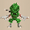
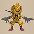
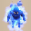
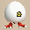
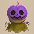

  

# Overview

<table class="dungeonOverview">
  <tr>
    <th>Unlock</th>
    <td class="highlightYellow">Talk to Drokotay the Adventurer (Shukuba Beach). 　※ DLC and Update 2.0.1 required.</td>
  </tr>
  <tr>
    <th>Entrance</th>
    <td class="highlightYellow">Shukuba Beach (Exit)</td>
  </tr>
</table>

<table class="dungeonTable">
  <tr>
    <th>Floors</th>
    <td colspan="3">30F / 99F (Sacred Tree)</td>
  </tr>
  <tr>
    <th>Bring Items</th>
    <td>No</td>
    <th>Stairs</th>
    <td>Ascending</td>
  </tr>
  <tr>
    <th>Companions</th>
    <td>No</td>
    <th>Roamers</th>
    <td></td>
  </tr>
  <tr>
    <th>Rescues</th>
    <td>3</td>
    <th>Starting Level</th>
    <td>Lv1</td>
  </tr>
  <tr>
    <th>Starting Item</th>
    <td colspan="3">12 random items at the start of each floor.</td>
  </tr>
  <tr>
    <th>Unidentified</th>
    <td colspan="3">None</td>
  </tr>
  <tr>
    <th>Shops</th>
    <td>Yes</td>
    <th>Monster Houses</th>
    <td>Yes (Fixed: 30F, 99F)</td>
  </tr>
  <tr>
    <th>Kron's Challenge</th>
    <td>No</td>
    <th>Fever Time</th>
    <td>No</td>
  </tr>
  <tr>
    <th>Initial Enemies</th>
    <td></td>
    <th>Spawn Rate</th>
    <td>30 Turns</td>
  </tr>
  <tr>
    <th>Wind (1st Gust)</th>
    <td>900 Turns</td>
    <th>Reward</th>
    <td>Inventory items at the end.</td>
  </tr>
</table>

Dungeon where the player's inventory is swapped out with 12 random items at the start of each floor. Certain floors have a tendency to generate specific categories of items instead of being 100% random. All items are identified from the start, and none of the items you're given are ever in a cursed state. Items are never generated on the ground, but can be obtained from shops, enemy drops, islands, and walls. Shiren's current and max stats (Level, Exp, HP, Fullness, Strength) and Gitan are retained between floors. Hallways remain visible during the first clear (1-30F), but become dark in the extension (31-99F). Monster Houses appear on 30F and 99F, but you sometimes start with an Expulsion Scroll.

# Strategy

### Dungeon Characteristics

#### 12 Starting Items Per Floor

The player's current inventory gets swapped out with 12 new items whenever they change floors. This includes any equipped weapon or shield, and the new items are always identified and never cursed. Items are never generated on the ground, but can be obtained from shops, enemy drops, islands, and walls. Certain floors lean toward supplying specific item categories, like Peach Buns on 51-60F and 81-90F. Shops seem to lean toward consumables that can be used to increase Max HP and Max Fullness.

Item Category Leanings:

|Floor|Leaning|
|-|-|
|1-6F|None|
|7-11F|Staff|
|12-15F|None|
|16-19F|Scroll|
|20-22F|Grass|
|23-29F|None|
|30F|Gitan|
|31-40F|None|
|41-47F|Grass, Scroll|
|48-50F|None|
|51-60F|Peach Bun|
|61-70F|Scroll|
|71-80F|Staff|
|81-90F|Peach Bun|
|91-98F|None|
|99F|Gitan|

#### Retained Player Stats

Shiren's current and max stats (Level, Exp, HP, Fullness, Strength) and Gitan are retained between floors. It's pretty important to increase the player's current and max stats with supplied items whenever possible, including eating some negative grasses like Confusion Grass while standing on the stairs before advancing floors. ※ Eat HP restoring grass when HP is full to boost Max HP, and food when Fullness is full to boost Max Fullness.

|Item|Stat Boost|
|-|-|
|Grass (Any)|Fullness +2|
|Fixer Scroll|Fullness +200 (When Fullness &lt; 20)|
|Herb|Max HP +1|
|Otogirisou|Max HP +2|
|Healing Grass|Max HP +3|
|Life Grass|Max HP +4|
|Strength Grass|Max Strength +1|
|Onigiri|Max Fullness +3|
|Large Onigiri|Max Fullness +4|
|Grilled Onigiri|Max Fullness +2|
|Special Onigiri|Max Fullness +2|
|Sweet Potato|Max Fullness +2|

#### Guaranteed Monster Houses (30F, 99F)

Monster Houses always appear on 30F and 99F, and you often start with 5 bags of 1000\~2000 Gitan. There's a chance to start with Expulsion Scrolls or Blank Scrolls as well, but it's not guaranteed. You get to take home all current inventory items when you clear the dungeon, so do your best!

#### Field of View (Light: 1-30F, Dark: 31-99F)

Hallways are fully visible during the 1st clear (1-30F), but become dark during the 2nd clear (31-99F). There's little point in lingering given the increased danger, so hurry to the stairs starting from 31F.

#### Rare Items for Notebook

Expulsion Scroll, Accurate Sword, Bodhi Shield, Floating Bracelet, etc. have been sighted in supplied items, so consider doing a few runs of this dungeon if you still need to register some of the rarer items.

### Important Items

<b><u>Weapons, Shields, Bracelets</u></b> Equip whatever strongest weapon and shield, but equipment isn't guaranteed to be supplied each floor. That said, never equip Bodhi Shield, since Max Fullness will be reduced to 1 and you won't keep the shield. You'll also want to carefully check the runes on Sacred Items prior to equipping them.

<b><u>Food</u></b> Focus on increasing Max Fullness early on so that Sumo status becomes a viable option late game. Sumo status lets you dig through walls, boosts Max HP by 50, and multiplies attack power by 50%. Eat food when none of the replenished Fullness goes to waste (Example: Eat Onigiri at 50 Fullness). If Max Fullness is still low and you only have 1 food item, wait until the stairs to eat it.

<b><u>Grass</u></b> Dungeon shops and walls often have grasses that can be used to increase max stats. Negative effect grasses can miss when thrown at an enemy, so don't rely on them in dire situations. Revival Grass can't be brought to the next floor, so consider intentionally collapsing to replenish stats, including HP, Strength, and Fullness - But if Max Fullness is 150+, Sumo status will activate. Fortune Grass or Angel Seed can be thrown to level up monster for more experience points.

<b><u>Scrolls</u></b> Mapping Scroll should be used at the start of the floor. Collection Scroll or Wall-less Scroll can be used to claim items in walls, islands, or Monster Houses, but wait to read Wall-less Scroll until after you've thinned out the number of monsters. Monstercall Scroll can be paired with Expulsion Scroll or such to activate the Monster-find effect. Gathering Scroll can be used to disable foes at the start depending on other supplied items.

<b><u>Staves</u></b> Fortune Staff can be swung at Hoppin' Batter family monsters for a chance to gain 2000 experience points. Narrow-escape Staff can also be swung at them for a chance to warp the player directly to the stairs. Otherwise, save staves like Sluggish Staff or Empathetic Staff for stronger enemies.

<b><u>Pots, Incense</u></b> Pots might seem lackluster under this dungeon's rules, but they're still useful aside from Synthesis Pot. Cashing Pot can be used to transform equipment into Gitan before advancing to the next floor. Transmutation Pot lets you turn some of the less useful supplied items into hopefully better items. Rejuvenation Pot, Hiding Pot, and incenses help with survival or powering through encounters. Surprise Pot can be thrown at a wall while standing on the stairs before advancing to the next floor, but it's probably best to place Surprise Pot and Monster Pot on the ground if Gazers are around.

### Farming Techniques

<b><u>Experience Points</u></b> If you obtain items that can be used to level up an enemy, go ahead and hunt a high level monster. Make sure you have items capable of dealing fixed damage or Slow status before leveling up a target. Berserk Seed, Blinding Grass, Confusion Grass, and Jitters Scroll can also be used to level them up.

Recommended Monsters:

- Hat Urchin (1-2F) → Hat Brat (Lv3, 880 Exp)
    - Requires 2 level ups, but Hat Brat only has 9 defense so it's easy to deal damage.
    - It has 125 HP and 45 attack, though, so be careful not to get hit by its normal attack.
- Hoppin' Hitter (7-10F) → Fortune Staff (2000 Exp)
    - Supplied items seem to lean toward staves on the floors where this monster appears.
    - Masked Samurai (8-13F) can be used to level up a Hoppin' Hitter for better reflect odds, but it's risky.
- Porky (6-10F) → Porko (Lv2, 840 Exp)
    - Porko only has 65 HP, 36 attack, and 18 defense, so it's a pretty easy target to hunt.
    - Masked Samurai (8-13F) can be used to level up a Porky, but don't accidentally create a Lv3 Porkon.
- Crossbowboy (11-13F) → Mini Tank (Lv4, 800 Exp)
    - If you're worried about damage received, Baby Tank (Lv3, 450 Exp) is an okay target too.
    - Baby Tank and Mini Tank have Swift 1 speed, so be careful when you retreat into a hallway.
    - Masked Samurai (8-13F) can be used, or just have Crossbowboy shoot arrows at another enemy.

### Sumo Status

Sumo status boosts Max HP by 50, attack power by 50%, and lets you dig through walls. This is generally great in a dungeon where you're not guaranteed to be supplied weapons or shields, but can be bad on floors where staves are common (71-80F) or where Monster Houses appear (30F, 99F), since certain supplied items like Leaping Grass, Switching Staff, and Vaulting Staff become useless. Therefore, some players like to drop their Fullness to 120 to cancel Sumo status prior to advancing.

<b><u>Make Monsters Turn Back While Digging with Sumo Status</u></b> Instead of digging in a straight line, dig like the diagram to reduce the risk of foes approaching from behind. Monsters can enter the tunnel when they bunch up near the turn-around spot if you only dig out 1 spot, so it's best to periodically dig out another turn-around spot to further reduce the risk of being pursued. ※ Enemies that have already detected Shiren will pursue him regardless of dug out turn-around spots.

<pre>
  S = Shiren, M = Monster 
  ☆ = 1st monster turn-around spot 
  ★ = 2nd monster that follows tunnel if M is occupying ☆ 
  △ = Dig here to create a 2nd turn-around spot to cover for ★ 
   
  ■ ■ ↓ ■ ■ ■ ■   ■ ■ ↓ ■ ■ ■ ■ 
  ■ ■ □ ■ ■ ■ ■   ■ ■ □ ■ ■ ■ ■ 
  ■ ■ □ □ □ ■ ■   ■ ■ ★ □ □ △ ■ 
  ■ ■ ☆ ■ □ ■ ■ → ■ ■ M ■ □ ■ ■ 
  ■ ■ ■ ■ S ■ ■   ■ ■ ■ ■ S ■ ■ 
  ■ ■ ■ ■ ■ ■ ■   ■ ■ ■ ■ ■ ■ ■
</pre>

If you want to intentionally cancel Sumo status, dig out a turn-around spot near the stairs room. This makes it safer to step in place when you don't have a Paralyzing Staff or Earthmound Staff.

<pre>
  S = Shiren, E = Exit 
  ☆ = 1st and 2nd monster turn-around spots 
   
  ■ ↓ ■ ■ ■ ■ ■ 
  ■ □ □ □ ☆ ☆ ■ 
  ■ ■ ■ □ ■ ■ ■ 
  ■ ■ ■ □ ■ ■ ■ 
  ■ □ □ □ □ □ ■ 
  ■ □ E □ S □ ■ 
  ■ □ □ □ □ □ ■ 
  ■ ■ ■ ■ ■ ■ ■
</pre>

# Floor Guide

### 1-6F

Notable: Firepuff (1-2F), Death Reaper (1-3F), Nigiri Baby (3-4F), Scorpion (3-6F), Porky (6-10F) Item Leaning: None (1-6F)

A pretty safe floor range to get used to this dungeon's unique inventory swapping mechanic. All current inventory items vanish when you change floors, so use anything that has a positive effect. Make a conscious effort to use up items before advancing, including eating grass to replenish Fullness. Status conditions reset when you change floors, so eat Confusion Grass or Blinding Grass too.

Other items are never found on the ground, so there isn't much in terms of reasons to check rooms. However, you might find a shop or Monster House with items that can be used to increase max stats, and you also need to earn experience points and level up, so it's fine to check rooms early on.

Shiren's current and max stats + Gitan total carry forward when you advance to the next floor. It's tedious, but Nigiri Baby (17 HP, 8 atk, 2 def) can be used to increase Max Fullness between 3-4F. Sumo status is one of the few ways to counteract bad supplied item luck, so it's worth the effort. High Max Fullness also means you can use more abilities when playing as Kokatsu, Tatsumi, or Koppa.

### 7-11F

Notable: Porky (6-10F), Hoppin' Hitter (7-10F), Twisty Hani (8-11F), Masked Samurai (8-13F), Crossbowboy (11-13F) Item Leaning:  Staves (7-11F)

Staves are common in supplied items, perhaps due to Hoppin' Hitter (32 HP, 22 atk, 15 def) being around. It's ideal to level up to the point where you can slay Hoppin' Hitters without relying on supplied items. You can use Masked Samurai → Ghost Samurai (7-13F) to create higher level monsters for more exp, but beware of Twisty Hani (35 HP, 12 atk, 15 def) erasing your level ups between 8-11F. Crossbowboy (55 HP, 20 atk, 20 def) appears, but there's no point in collecting arrows.

### 12-17F

Notable: Masked Samurai (8-13F), Crossbowboy (11-13F), Fierous (13-18F), Tiger Thrower (14-16F), Pumpanshee (17-22F) Item Leaning: None (12-15F) →  Scrolls (16-17F)

15F is guaranteed to be a Shuffle Dungeon style map based on Kibanuma Marsh. Item leaning for supplied items returns to normal, and more monsters with ranged attacks show up. Fierous (60 HP, 25 atk, 22 def) appears on 13-18F and is immune to projectiles that lack piercing properties. Pumpanshee (60 HP, 35 atk, 22 def) appears on 17-18F, so don't use Handy Dash or regular dash there.

Scrolls are common in supplied items between 16-19F, and can include Expulsion or Eradication scrolls. Eradication Scroll targets vary based on floor and whether or not you're playing the 30F or 99F version, but Pumpanshee might be the best option while attempting the first clear.

### 18-23F

Notable: Pumpanshee (17-22F), Okina Monk D (18-22F), Tengu Monk D (20-22F), Hannya Monk D (20-23F) Item Leaning: None (18-19F) →  Grass (20-22F) → None (23F)

Grass seems to be common in supplied items between 20-22F, making it harder than usual to linger. Lv1 monks except for Kitsune Monk D appear as well, so rush to the stairs instead of checking for shops. Beware of Hannya's Berserk causing a foe to level up → Tengu buffing its speed → Okina warping it next to you. To make things worse, Okame Monk D cures bad status conditions even if you disable the monster. Feel free to use HP restoring items and food more liberally instead of saving them for the stairs.

### 24-29F

Notable: Skull Wizard (23-25F), Blazeous (25-29F), Explochin (26-29F), Super Gazer (26-30F), Greenwalrus (28-30F) Item Leaning: None (24-29F)

Monks exit the monster table for a while, and Lv2 Ninjas appear in various combinations between 24-29F. Item leaning returns to normal, but weapons and shields seem to be uncommon in supplied items, so focus on finding the stairs before you run out of items instead of exploring the floor. Some players prefer to cancel Sumo status before descending to 30F so that movement staves are usable.

Super Gazer (66 HP, 30 atk, 26 def) forces either item usage or an attack in a random direction. Greenwalrus (88 HP, 30 atk, 27 def) steals an item and warps, so place your least useful item down. Skull Wizard (88 HP, 35 atk, 24 def) appears on 23-25F and Skull Mage (77 HP, 31 atk, 21 def) on 24-27F. Skull Wizard's magic effects include Confused status, Narrow-escape effect, 20 damage, or Morphed status. Skull Mage's magic effects include Warp effect, Swift effect, Knockback effect, or Switching effect. Explochin (120 HP, 25 atk, 22 def) stops moving when HP ≤ 50% and explodes when HP ≤ 24 (deal 96+ damage). Blazeous (92 HP, 36 atk, 24 def) is immune to projectiles, and Fire Ninja C (75 HP, 45 atk, 21 def) hits hard.

<b><u>Playing as Kokatsu / Tatsumi / Koppa</u></b> Replenish Fullness as much as possible before advancing so that you can use abilities right away.

### 30F

Guaranteed Monster House Notable: Super Gazer (26-30F), Greenwalrus (28-30F), Pesky Kappa (30-33F), Porko (30-33F), Dartingfrog (30-34F) Item Leaning:  Gitan (30F)

The player either <b>starts in a Monster House on a normal floor</b>, or <b>there's a Monster House on a 2 room floor.</b> With luck, you'll get the 2 room pattern and the stairs will be in the starting room, letting you skip the MH. But that scenario is quite rare, so it's probably best to expect starting the floor inside a Monster House.

Supplied items include multiple high value Gitan bags, but it's difficult to clear a MH with just those. Check supplied items for staves, grass, scrolls, and Sweet Potatos before taking any actions, and if you're lucky enough to see a Blank Scroll, write Expulsion Scroll on it and read it right away. Use your remaining items to find the stairs after you either clear out or escape from the Monster House. Pesky Kappa (75 HP, 29 atk, 22 def) tosses items back, so use Look Around to check before throwing items.

<b><u>Playing as Kokatsu / Tatsumi / Koppa</u></b> Abilities can be used to handle the Monster House, even if items like Expulsion Scroll aren't supplied. "Blazing Heat" (Kokatsu), "Raging Tornado" (Tatsumi), "Frantic Fart" or "Flee" (Koppa) are good options.

<h3 class="heading3Tree">Sacred Tree Mode</h3>

### General Advice (2nd Clear)

Hallways are dark between 31-99F, and Peach Buns begin to appear in supplied items starting on 51F. Koppa can still detect monsters, but other playable characters have a hard time with dark hallways. Supplied items are unpredictable and you can't just rely on powerful equipment to progress, so plan a route where you check rooms to locate the stairs efficiently, and use Sumo status to dig as needed.

The floors progress like "Drain zone" → "Tank / Dragon zone" → "Harassment zone" → "Aquatic zone" → "Finale". Drain type monsters are especially problematic under this dungeon's rules, excluding Mudders. Keep in mind that you can eat a Peach Bun to morph into a monster to avoid losing max stats. If you're lucky enough to see an Eradication Scroll (or Blank Scroll), choose a good target on the current floor, such as prioritizing a troublesome monk type, or a tricky monster that won't exit the table right away. Lastly, there's another guaranteed Monster House on 99F, with supplied items being similar to 30F.

#### Best Peach Buns (51F+)

- Wallpass - Pumphantasm family, Soul Reaper, King Reaper.
- Floating - Pumphantasm family, Death Reaper family, Firepuff family, Crow Tengu, Chow.
- Swift + Trap-immune - Karakuroid family, Dragon Pit, Hiding Dragon.

#### Best Eradication Scroll Targets

Floor ranges in red mean the target is likely to be the final eradication in the run.

- Pumphantasm family (3-5F, 17-22F, 41-50F, 89-99F)
    - Not a bad option, even if they aren't the most threatening.
- Death Reaper family (1-3F, 41-46F)
    - Great to remove the threat of Soul Reapers between 41-46F.
- Dragon family (33-40F, 96-99F)
    - Best to eradicate between 37-40F or 96-99F to avoid excessive Daze Radish spawns.
- Floor Dragon family (14-18F, 30-33F, 52-61F)
    - Mainly to remove Dragon Pit between 52-61F since it has Swift 1 action speed.
- Pop Tank family (20-23F, 47-58F)
    - Removes the threat of Swift 1 speed Adamant Tanks between 53-58F.
- Nigiri Morph family (3-4F, 58-65F)
    - Nigiri Boss + Adamant Tank or Blazepuff combo can one-shot you on 58-60F.
- Gazer family (26-30F, 66-75F)
    - It can be annoying to lose precious supplied items to hypnosis.
- Twisty Hani family (8-11F, 39-48F, 69-75F, 83-88F)
    - Losing Max HP from leveling down can add up after a number of times.
- Polygon Spinna family (4-6F, 39-48F, 89-99F)
    - Lv3-4 Polygon Spinnas lower Max Fullness and make it harder to utilize Sumo status.
- Skull Mage family (23-27F, 89-99F)
    - Mainly to remove Skull Lords between 89-99F.

### 31-33F

Notable: Pesky Kappa (30-33F), Porko (30-33F), Dartingfrog (30-34F), Daze Radish (32-35F), Dragon (33-36F) Item Leaning: None (31-33F)

Hallways become dark starting on 31F and remain dark until the very end, so rush to the stairs. Porko (65 HP, 36 atk, 18 def) continues to throw Porky's Rocks within a 5 tile radius. Swap Gitan bags with other inventory items so that you can throw Gitan bags as projectiles, and try to top up on HP and Fullness before advancing to the next floor if possible.

### 34-38F

Notable: Daze Radish (32-35F), Sky Dragon (34-40F), Vile Scorpion (36-40F), Hoppin' Slugger (36-40F) Item Leaning: None (34-38F)

The monster lineup is similar to the final floors of Serpentcoil Island. Daze Radish (80 HP, 37 atk, 27 def) throws Confusion Grass → Poison Grass within a 2 tile radius. Vile Scorpion (108 HP, 45 atk, 33 def) can lower Shiren's current strength by 2 when adjacent. There are only 3\~4 monsters in the table per floor, so throwing an Eradication Scroll can have a big effect.

### 39-48F

Notable: Floppy Hani (39-48F), Polygon Singa (39-48F), Soul Reaper (41-46F), Pumplich (41-50F) Item Leaning: None (39-40F) →  Grass  Scrolls (41-47F) → None (48F)

The drain type combo of Floppy Hani and Polygon Singa appears, plus Soul Reaper for added pressure. Floppy Hani (85 HP, 39 atk, 39 def) can lower Shiren's level by 1 when adjacent. Polygon Singa (129 HP, 40 atk, 40 def) can lower Shiren's Max Fullness by 7 when adjacent. Soul Reaper (75 HP, 40 atk, 40 def) has Swift 2 speed, passes through walls, and detects you from anywhere. Cave Mamel (5 HP, 100 atk, 100 def) can spawn between 41-61F for some extra dark hallway accident fun.

Grasses and scrolls are common but equipment is rare, meaning Soul Reapers are a huge problem. Soul Reaper can be one-shot by thrown Life Grass, Healing Grass, Otogirisou, or a Rejuvenation Pot[1+].

### 49-58F

Notable: Ornery Tank (47-52F), Dragon Pit (52-61F), Adamant Tank (53-58F), Lashagga (53-61F), Fencer (56-65F) Item Leaning: None (49-50F) →  Peach Buns (51-58F)

Quite a relentless floor range where ideally you'll want to eradicate 1 monster family if possible. Ornery Tank (95 HP, 40 atk, 44 def) and the Swift 1 speed Adamant Tank (100 HP, 60 atk, 54 def) appear. Dragon Pit (130 HP, 54 atk, 40 def) also has Swift 1 speed, Fencer (140 HP, 49 atk, 48 def) is quite tanky, Lashagga (99 HP, 43 atk, 34 def) attacks 3 times in 1 turn and is hard to counter even with equipment, Nigiri Boss (133 HP, 45 atk, 42 def) inflicts Onigiri status → insta-collapse due to explosion damage, Hat Brat (125 HP, 45 atk, 9 def) steals and tosses away your staves, grass, or food items, etc.

Peach Buns seem common in supplied items between 51-60F, along with equipment and food. Throw Peach Buns that are based on weaker monsters at enemies to get through encounters more easily, and eat Peach Buns with powerful abilities to give you an advantage while searching for the stairs.

<b><u>Playing as Koppa</u></b> Koppa is already swift and can detect foes even in dark hallways, so Morphed status is kinda lackluster. If you decide to eat Peach Buns, do so mainly to deal damage or to traverse water or air tiles.

### 59-68F

Notable: Fencer (56-65F), Nigiri Boss (58-65F), Megataur (62-69F), Hoppin' Slammer (64-76F), Hyper Gazer (66-75F) Item Leaning:  Peach Buns (59-60F) →  Scrolls (61-68F)

Scrolls seem to be more common than other items between 61-70F. Curse Matron (145 HP, 53 atk, 48 def) appears between 62-68F, but her curse only affects equipment. Hyper Gazer (126 HP, 55 atk, 45 def) is the bigger problem, since it can force usage of supplied items. Place items like Monster Pot, Surprise Pot, and Transmutation Pot on the ground between 66-75F.

### 69-75F

Notable: Hoppin' Slammer (64-76F), Hyper Gazer (66-75F), Droopy Hani (69-75F), Fleefrog (70-79F), Igneous (73-82F) Item Leaning:  Scrolls (69-70F) →  Staves (71-75F)

Staves are common between 71-80F, and Narrow-escape Staff can be swung at Hoppin' Slammer to skip floors. Food seems rare, however, so pay attention to Fullness if you're using Sumo status or abilities.

Hyper Gazer (126 HP, 55 atk, 45 def) continues to be a menace to your items. Droopy Hani (120 HP, 49 atk, 49 def) lowers your level, decreasing Max HP at the same time. Hoppin' Slammer (125 HP, 49 atk, 49 def), Vexing Kappa (175 HP, 49 atk, 33 def), and Igneous (165 HP, 56 atk, 45 def) are all on the more heavily guarded side thanks to their projectile-nullifying abilities.

### 76-82F

Notable: Fleefrog (70-79F), Igneous (73-82F), Bag Knave (76-79F), Great Samurai (76-82F), Terror Scorpion (76-88F) Item Leaning:  Staves (76-80F) →  Peach Buns (81-82F)

Peach Buns are common between 81-90F, and the advice on eating vs. throwing is the same as earlier. Terror Scorpion (185 HP, 55 atk, 45 def) can lower your Max Strength by 1 when adjacent. Bag Knave (95 HP, 40 atk, 35 def) knocks inventory items away and swaps them with Weeds. Superb Octopling (199 HP, 64 atk, 48 def) gains action speed (1 stage) when an adjacent foe is slain. Otherwise, monsters here aside from the mentioned ones + Fleefrog can only attack 1 tile ahead.

### 83-88F

Notable: Wrinkly Hani (83-88F), Terror Scorpion (76-88F), Tengu Monk B (83-88F), Okina Monk B (83-88F) Item Leaning:  Peach Buns (83-88F)

The drain combo of Wrinkly Hani (190 HP, 60 atk, 59 def) + Terror Scorpion (185 HP, 55 atk, 45 def), alongside Lv3 Monks except for Kitsune Monk B - Not much to say other than rush for the stairs.

### 89-94F

Notable: Polygon Stunna (89-99F), Popdillo (89-99F), Skull Lord (89-99F), Megahead (89-99F), Hat Rascal (91-96F) Item Leaning:  Peach Buns (89-90F) → None (91-94F)

Lv3 Monks exit the monster table for a bit, and equipment seems rare in supplied items between 91-99F. Skull Lord (188 HP, 55 atk, 55 def)'s magic effects include Asleep, Blind, Level-3, or 40 damage. Polygon Stunna (229 HP, 50 atk, 55 def) lowers Max Fullness by 10, and warps in front of you in rooms. Megahead (182 HP, 65 atk, 48 def), Hat Rascal (170 HP, 85 atk, 12 def), and Pumplord (185 HP, 75 atk, 35 def) hit hard. Again, not much to say other than make full use of supplied items while rushing to the stairs.

### 95-98F

Notable: Polygon Stunna (89-99F), Popdillo (89-99F), Skull Lord (89-99F), Lv3 Monks (95-99F), Archdragon (96-99F) Item Leaning: None (95-98F)

Lv3 Monks return in addition to the previous floor range's monsters, then Archdragon appears from 96F. Try to cancel Sumo status at the stairs on 98F so that movement staves and Leaping Grass are usable on 99F. However, it's usually not realistic to prepare for deactivating the status once Archdragon's flames arrive, so focus on adjusting remaining Fullness more on 95F or so instead of 96-98F.

<b><u>Playing as Kokatsu / Tatsumi / Koppa</u></b> Replenish Fullness as much as possible before advancing so that you can use abilities right away.

### 99F

Guaranteed Monster House Notable: Polygon Stunna (89-99F), Popdillo (89-99F), Skull Lord (89-99F), Lv3 Monks (95-99F), Archdragon (96-99F) Item Leaning:  Gitan (99F)

The player either <b>starts in a Monster House on a normal floor</b>, or <b>there's a Monster House on a 2 room floor.</b> If you're very lucky, you'll start with a Blank Scroll or Expulsion Scroll for an easy clear. But otherwise, you'll need to play extremely carefully and not let a single turn go to waste. Prioritize disabling or slaying Skull Lords and Archdragons using staves or high value Gitan bags first, then do your best to locate the stairs using the remaining supplied items.

<b><u>Playing as Kokatsu / Tatsumi / Koppa</u></b> Abilities can be used to handle the Monster House, even if items like Expulsion Scroll aren't supplied. "Blazing Heat" (Kokatsu), "Raging Tornado" (Tatsumi), "Frantic Fart" or "Flee" (Koppa) are good options.

# Monsters

See [Monsters](/system/monsters) for individual monster details.

- F - Dark hallways
- S - Shop is possible
- H - Monster House is possible

Monster Colors = Farming, Useful, Lowers Stats, Targets Items, Dangerous

<table class="monsterTable">
  <thead>
    <tr>
      <th>F</th>
      <th>S</th>
      <th>H</th>
      <th colspan="5">Monsters</th>
    </tr>
  </thead>
  <tbody>
    <tr>
      <td class="centeredText">1</td>
      <td class=""></td>
      <td class=""></td>
      <td> Spearfish</td>
      <td> Firepuff</td>
      <td> Hat Urchin</td>
      <td> Death Reaper</td>
      <td class="highlightGray"></td>
    </tr>
    <tr>
      <td colspan="8" class="tableDivider"></td>
    </tr>
    <tr>
      <td class="centeredText">2</td>
      <td class="highlightShop"></td>
      <td class=""></td>
      <td> Spearfish</td>
      <td> Firepuff</td>
      <td> Hat Urchin</td>
      <td> Death Reaper</td>
      <td> Pullfrog</td>
    </tr>
    <tr>
      <td colspan="8" class="tableDivider"></td>
    </tr>
    <tr>
      <td rowspan="2" class="centeredText">3</td>
      <td rowspan="2" class="highlightShop"></td>
      <td rowspan="2" class=""></td>
      <td> Spearfish</td>
      <td> Death Reaper</td>
      <td> Pullfrog</td>
      <td class="danger"> Pumphantasm</td>
      <td> Armordillo</td>
    </tr>
    <tr>
      <td class="useful"> Nigiri Baby</td>
      <td class="stats"> Scorpion</td>
      <td class="highlightGray"></td>
      <td class="highlightGray"></td>
      <td class="highlightGray"></td>
    </tr>
    <tr>
      <td colspan="8" class="tableDivider"></td>
    </tr>
    <tr>
      <td rowspan="2" class="centeredText">4</td>
      <td rowspan="2" class=""></td>
      <td rowspan="2" class=""></td>
      <td> Pullfrog</td>
      <td class="danger"> Pumphantasm</td>
      <td> Armordillo</td>
      <td class="useful"> Nigiri Baby</td>
      <td class="stats"> Scorpion</td>
    </tr>
    <tr>
      <td> Polygon Spinna</td>
      <td class="highlightGray"></td>
      <td class="highlightGray"></td>
      <td class="highlightGray"></td>
      <td class="highlightGray"></td>
    </tr>
    <tr>
      <td colspan="8" class="tableDivider"></td>
    </tr>
    <tr>
      <td rowspan="2" class="centeredText">5</td>
      <td rowspan="2" class=""></td>
      <td rowspan="2" class=""></td>
      <td class="danger"> Pumphantasm</td>
      <td class="stats"> Scorpion</td>
      <td> Polygon Spinna</td>
      <td> Taur</td>
      <td> Tree Ninja D</td>
    </tr>
    <tr>
      <td> Earth Ninja D</td>
      <td class="highlightGray"></td>
      <td class="highlightGray"></td>
      <td class="highlightGray"></td>
      <td class="highlightGray"></td>
    </tr>
    <tr>
      <td colspan="8" class="tableDivider"></td>
    </tr>
    <tr>
      <td rowspan="2" class="centeredText">6</td>
      <td rowspan="2" class=""></td>
      <td rowspan="2" class=""></td>
      <td class="stats"> Scorpion</td>
      <td> Karakuroid</td>
      <td> Polygon Spinna</td>
      <td> Taur</td>
      <td> Tree Ninja D</td>
    </tr>
    <tr>
      <td> Earth Ninja D</td>
      <td> Porky</td>
      <td class="highlightGray"></td>
      <td class="highlightGray"></td>
      <td class="highlightGray"></td>
    </tr>
    <tr>
      <td colspan="8" class="tableDivider"></td>
    </tr>
    <tr>
      <td rowspan="2" class="centeredText">7</td>
      <td rowspan="2" class="highlightShop"></td>
      <td rowspan="2" class=""></td>
      <td> Karakuroid</td>
      <td> Taur</td>
      <td> Tree Ninja D</td>
      <td> Earth Ninja D</td>
      <td> Porky</td>
    </tr>
    <tr>
      <td> Fire Ninja D</td>
      <td> Hoppin' Hitter</td>
      <td class="highlightGray"></td>
      <td class="highlightGray"></td>
      <td class="highlightGray"></td>
    </tr>
    <tr>
      <td colspan="8" class="tableDivider"></td>
    </tr>
    <tr>
      <td rowspan="2" class="centeredText">8</td>
      <td rowspan="2" class=""></td>
      <td rowspan="2" class=""></td>
      <td class="stats"> Twisty Hani</td>
      <td> Karakuroid</td>
      <td> Taur</td>
      <td> Tree Ninja D</td>
      <td> Earth Ninja D</td>
    </tr>
    <tr>
      <td> Porky</td>
      <td> Fire Ninja D</td>
      <td> Hoppin' Hitter</td>
      <td> Masked Samurai</td>
      <td> Fresh Octopling</td>
    </tr>
    <tr>
      <td colspan="8" class="tableDivider"></td>
    </tr>
    <tr>
      <td rowspan="2" class="centeredText">9</td>
      <td rowspan="2" class=""></td>
      <td rowspan="2" class=""></td>
      <td class="stats"> Twisty Hani</td>
      <td> Karakuroid</td>
      <td> Earth Ninja D</td>
      <td> Porky</td>
      <td> Fire Ninja D</td>
    </tr>
    <tr>
      <td> Hoppin' Hitter</td>
      <td> Masked Samurai</td>
      <td> Fresh Octopling</td>
      <td> Mid Chintala</td>
      <td class="highlightGray"></td>
    </tr>
    <tr>
      <td colspan="8" class="tableDivider"></td>
    </tr>
    <tr>
      <td rowspan="2" class="centeredText">10</td>
      <td rowspan="2" class=""></td>
      <td rowspan="2" class=""></td>
      <td class="stats"> Twisty Hani</td>
      <td> Earth Ninja D</td>
      <td> Porky</td>
      <td> Hoppin' Hitter</td>
      <td> Masked Samurai</td>
    </tr>
    <tr>
      <td> Fresh Octopling</td>
      <td> Mid Chintala</td>
      <td> Bored Kappa</td>
      <td class="highlightGray"></td>
      <td class="highlightGray"></td>
    </tr>
    <tr>
      <td colspan="8" class="tableDivider"></td>
    </tr>
    <tr>
      <td rowspan="2" class="centeredText">11</td>
      <td rowspan="2" class=""></td>
      <td rowspan="2" class=""></td>
      <td class="stats"> Twisty Hani</td>
      <td> Masked Samurai</td>
      <td> Fresh Octopling</td>
      <td> Mid Chintala</td>
      <td> Bored Kappa</td>
    </tr>
    <tr>
      <td> Bowboy</td>
      <td> Crossbowboy</td>
      <td class="highlightGray"></td>
      <td class="highlightGray"></td>
      <td class="highlightGray"></td>
    </tr>
    <tr>
      <td colspan="8" class="tableDivider"></td>
    </tr>
    <tr>
      <td rowspan="2" class="centeredText">12</td>
      <td rowspan="2" class=""></td>
      <td rowspan="2" class=""></td>
      <td> Masked Samurai</td>
      <td> Fresh Octopling</td>
      <td> Bored Kappa</td>
      <td> Bowboy</td>
      <td> Crossbowboy</td>
    </tr>
    <tr>
      <td> Lt. Spearfish</td>
      <td class="highlightGray"></td>
      <td class="highlightGray"></td>
      <td class="highlightGray"></td>
      <td class="highlightGray"></td>
    </tr>
    <tr>
      <td colspan="8" class="tableDivider"></td>
    </tr>
    <tr>
      <td rowspan="2" class="centeredText">13</td>
      <td rowspan="2" class=""></td>
      <td rowspan="2" class=""></td>
      <td> Masked Samurai</td>
      <td> Fresh Octopling</td>
      <td> Bored Kappa</td>
      <td> Crossbowboy</td>
      <td> Lt. Spearfish</td>
    </tr>
    <tr>
      <td> Fierous</td>
      <td class="highlightGray"></td>
      <td class="highlightGray"></td>
      <td class="highlightGray"></td>
      <td class="highlightGray"></td>
    </tr>
    <tr>
      <td colspan="8" class="tableDivider"></td>
    </tr>
    <tr>
      <td class="centeredText">14</td>
      <td class=""></td>
      <td class=""></td>
      <td> Fresh Octopling</td>
      <td> Lt. Spearfish</td>
      <td> Fierous</td>
      <td> Floor Dragon</td>
      <td> Tiger Thrower</td>
    </tr>
    <tr>
      <td colspan="8" class="tableDivider"></td>
    </tr>
    <tr>
      <td class="centeredText">15</td>
      <td class=""></td>
      <td class=""></td>
      <td> Lt. Spearfish</td>
      <td> Fierous</td>
      <td> Floor Dragon</td>
      <td> Tiger Thrower</td>
      <td class="highlightGray"></td>
    </tr>
    <tr>
      <td colspan="8" class="tableDivider"></td>
    </tr>
    <tr>
      <td class="centeredText">16</td>
      <td class=""></td>
      <td class=""></td>
      <td> Lt. Spearfish</td>
      <td> Fierous</td>
      <td> Floor Dragon</td>
      <td> Tiger Thrower</td>
      <td class="highlightGray"></td>
    </tr>
    <tr>
      <td colspan="8" class="tableDivider"></td>
    </tr>
    <tr>
      <td class="centeredText">17</td>
      <td class=""></td>
      <td class=""></td>
      <td> Fierous</td>
      <td> Floor Dragon</td>
      <td> Pumpanshee</td>
      <td class="highlightGray"></td>
      <td class="highlightGray"></td>
    </tr>
    <tr>
      <td colspan="8" class="tableDivider"></td>
    </tr>
    <tr>
      <td rowspan="2" class="centeredText">18</td>
      <td rowspan="2" class=""></td>
      <td rowspan="2" class=""></td>
      <td> Fierous</td>
      <td> Pumpanshee</td>
      <td> Minotaur</td>
      <td class="danger"> Okina Monk D</td>
      <td> Okame Monk D</td>
    </tr>
    <tr>
      <td> Hat Prankster</td>
      <td class="stats"> Ghost Radish</td>
      <td class="highlightGray"></td>
      <td class="highlightGray"></td>
      <td class="highlightGray"></td>
    </tr>
    <tr>
      <td colspan="8" class="tableDivider"></td>
    </tr>
    <tr>
      <td rowspan="2" class="centeredText">19</td>
      <td rowspan="2" class=""></td>
      <td rowspan="2" class=""></td>
      <td> Pumpanshee</td>
      <td> Minotaur</td>
      <td class="danger"> Okina Monk D</td>
      <td> Okame Monk D</td>
      <td> Hat Prankster</td>
    </tr>
    <tr>
      <td class="stats"> Ghost Radish</td>
      <td class="highlightGray"></td>
      <td class="highlightGray"></td>
      <td class="highlightGray"></td>
      <td class="highlightGray"></td>
    </tr>
    <tr>
      <td colspan="8" class="tableDivider"></td>
    </tr>
    <tr>
      <td rowspan="2" class="centeredText">20</td>
      <td rowspan="2" class=""></td>
      <td rowspan="2" class=""></td>
      <td> Pumpanshee</td>
      <td> Minotaur</td>
      <td class="danger"> Okina Monk D</td>
      <td> Okame Monk D</td>
      <td class="danger"> Tengu Monk D</td>
    </tr>
    <tr>
      <td> Hannya Monk D</td>
      <td> Pop Tank</td>
      <td> Hat Prankster</td>
      <td> Flamepuff</td>
      <td class="highlightGray"></td>
    </tr>
    <tr>
      <td colspan="8" class="tableDivider"></td>
    </tr>
    <tr>
      <td rowspan="2" class="centeredText">21</td>
      <td rowspan="2" class=""></td>
      <td rowspan="2" class=""></td>
      <td> Pumpanshee</td>
      <td> Minotaur</td>
      <td class="danger"> Okina Monk D</td>
      <td> Okame Monk D</td>
      <td class="danger"> Tengu Monk D</td>
    </tr>
    <tr>
      <td> Hannya Monk D</td>
      <td> Pop Tank</td>
      <td> Hat Prankster</td>
      <td> Flamepuff</td>
      <td class="highlightGray"></td>
    </tr>
    <tr>
      <td colspan="8" class="tableDivider"></td>
    </tr>
    <tr>
      <td rowspan="2" class="centeredText">22</td>
      <td rowspan="2" class=""></td>
      <td rowspan="2" class=""></td>
      <td> Pumpanshee</td>
      <td> Minotaur</td>
      <td class="danger"> Okina Monk D</td>
      <td> Okame Monk D</td>
      <td class="danger"> Tengu Monk D</td>
    </tr>
    <tr>
      <td> Hannya Monk D</td>
      <td> Pop Tank</td>
      <td> Hat Prankster</td>
      <td> Flamepuff</td>
      <td class="highlightGray"></td>
    </tr>
    <tr>
      <td colspan="8" class="tableDivider"></td>
    </tr>
    <tr>
      <td rowspan="2" class="centeredText">23</td>
      <td rowspan="2" class=""></td>
      <td rowspan="2" class=""></td>
      <td class="danger"> Tengu Monk D</td>
      <td> Hannya Monk D</td>
      <td> Pop Tank</td>
      <td> Hat Prankster</td>
      <td> Flamepuff</td>
    </tr>
    <tr>
      <td> Skull Wizard</td>
      <td class="highlightGray"></td>
      <td class="highlightGray"></td>
      <td class="highlightGray"></td>
      <td class="highlightGray"></td>
    </tr>
    <tr>
      <td colspan="8" class="tableDivider"></td>
    </tr>
    <tr>
      <td rowspan="2" class="centeredText">24</td>
      <td rowspan="2" class=""></td>
      <td rowspan="2" class=""></td>
      <td> Pop Tank</td>
      <td> Flamepuff</td>
      <td> Tree Ninja C</td>
      <td> Earth Ninja C</td>
      <td> Skull Mage</td>
    </tr>
    <tr>
      <td> Skull Wizard</td>
      <td class="highlightGray"></td>
      <td class="highlightGray"></td>
      <td class="highlightGray"></td>
      <td class="highlightGray"></td>
    </tr>
    <tr>
      <td colspan="8" class="tableDivider"></td>
    </tr>
    <tr>
      <td class="centeredText">25</td>
      <td class=""></td>
      <td class=""></td>
      <td> Tree Ninja C</td>
      <td> Earth Ninja C</td>
      <td> Skull Mage</td>
      <td> Blazeous</td>
      <td> Skull Wizard</td>
    </tr>
    <tr>
      <td colspan="8" class="tableDivider"></td>
    </tr>
    <tr>
      <td rowspan="2" class="centeredText">26</td>
      <td rowspan="2" class=""></td>
      <td rowspan="2" class="highlightMH"></td>
      <td class="danger"> Fire Ninja C</td>
      <td class="danger"> Metal Ninja C</td>
      <td> Water Ninja C</td>
      <td> Skull Mage</td>
      <td> Blazeous</td>
    </tr>
    <tr>
      <td> Explochin</td>
      <td class="items"> Super Gazer</td>
      <td class="highlightGray"></td>
      <td class="highlightGray"></td>
      <td class="highlightGray"></td>
    </tr>
    <tr>
      <td colspan="8" class="tableDivider"></td>
    </tr>
    <tr>
      <td rowspan="2" class="centeredText">27</td>
      <td rowspan="2" class=""></td>
      <td rowspan="2" class=""></td>
      <td class="danger"> Fire Ninja C</td>
      <td class="danger"> Metal Ninja C</td>
      <td> Water Ninja C</td>
      <td> Skull Mage</td>
      <td> Blazeous</td>
    </tr>
    <tr>
      <td> Explochin</td>
      <td class="items"> Super Gazer</td>
      <td class="highlightGray"></td>
      <td class="highlightGray"></td>
      <td class="highlightGray"></td>
    </tr>
    <tr>
      <td colspan="8" class="tableDivider"></td>
    </tr>
    <tr>
      <td rowspan="2" class="centeredText">28</td>
      <td rowspan="2" class=""></td>
      <td rowspan="2" class=""></td>
      <td class="items"> Greenwalrus</td>
      <td class="danger"> Fire Ninja C</td>
      <td class="danger"> Metal Ninja C</td>
      <td> Water Ninja C</td>
      <td> Blazeous</td>
    </tr>
    <tr>
      <td> Explochin</td>
      <td class="items"> Super Gazer</td>
      <td class="highlightGray"></td>
      <td class="highlightGray"></td>
      <td class="highlightGray"></td>
    </tr>
    <tr>
      <td colspan="8" class="tableDivider"></td>
    </tr>
    <tr>
      <td rowspan="2" class="centeredText">29</td>
      <td rowspan="2" class=""></td>
      <td rowspan="2" class=""></td>
      <td class="items"> Greenwalrus</td>
      <td class="danger"> Fire Ninja C</td>
      <td class="danger"> Metal Ninja C</td>
      <td> Water Ninja C</td>
      <td> Blazeous</td>
    </tr>
    <tr>
      <td> Explochin</td>
      <td class="items"> Super Gazer</td>
      <td class="highlightGray"></td>
      <td class="highlightGray"></td>
      <td class="highlightGray"></td>
    </tr>
    <tr>
      <td colspan="8" class="tableDivider"></td>
    </tr>
    <tr>
      <td rowspan="2" class="centeredText">30</td>
      <td rowspan="2" class=""></td>
      <td rowspan="2" class="highlightMH"></td>
      <td class="items"> Greenwalrus</td>
      <td class="items"> Super Gazer</td>
      <td> Pesky Kappa</td>
      <td> Dragon Head</td>
      <td class="danger"> Porko</td>
    </tr>
    <tr>
      <td> Dartingfrog</td>
      <td class="highlightGray"></td>
      <td class="highlightGray"></td>
      <td class="highlightGray"></td>
      <td class="highlightGray"></td>
    </tr>
    <tr>
      <td colspan="8" class="tableDivider"></td>
    </tr>
    <tr>
      <td class="monsterTableExtension"></td>
      <td colspan="2" class="monsterTableExtension"></td>
      <td colspan="5" class="monsterTableExtension centeredText">Sacred Tree Mode</td>
    </tr>
    <tr>
      <td colspan="8" class="tableDivider"></td>
    </tr>
    <tr>
      <td class="centeredText highlightFog">31</td>
      <td class=""></td>
      <td class=""></td>
      <td> Pesky Kappa</td>
      <td> Dragon Head</td>
      <td class="danger"> Porko</td>
      <td> Dartingfrog</td>
      <td class="highlightGray"></td>
    </tr>
    <tr>
      <td colspan="8" class="tableDivider"></td>
    </tr>
    <tr>
      <td class="centeredText highlightFog">32</td>
      <td class=""></td>
      <td class=""></td>
      <td> Pesky Kappa</td>
      <td> Dragon Head</td>
      <td class="danger"> Porko</td>
      <td class="stats"> Daze Radish</td>
      <td> Dartingfrog</td>
    </tr>
    <tr>
      <td colspan="8" class="tableDivider"></td>
    </tr>
    <tr>
      <td rowspan="2" class="centeredText highlightFog">33</td>
      <td rowspan="2" class=""></td>
      <td rowspan="2" class=""></td>
      <td> Pesky Kappa</td>
      <td> Dragon Head</td>
      <td class="danger"> Porko</td>
      <td class="stats"> Daze Radish</td>
      <td> Dartingfrog</td>
    </tr>
    <tr>
      <td> Dragon</td>
      <td class="highlightGray"></td>
      <td class="highlightGray"></td>
      <td class="highlightGray"></td>
      <td class="highlightGray"></td>
    </tr>
    <tr>
      <td colspan="8" class="tableDivider"></td>
    </tr>
    <tr>
      <td class="centeredText highlightFog">34</td>
      <td class=""></td>
      <td class=""></td>
      <td class="stats"> Daze Radish</td>
      <td> Dartingfrog</td>
      <td> Dragon</td>
      <td> Sky Dragon</td>
      <td class="highlightGray"></td>
    </tr>
    <tr>
      <td colspan="8" class="tableDivider"></td>
    </tr>
    <tr>
      <td class="centeredText highlightFog">35</td>
      <td class=""></td>
      <td class=""></td>
      <td class="stats"> Daze Radish</td>
      <td> Dragon</td>
      <td> Sky Dragon</td>
      <td class="highlightGray"></td>
      <td class="highlightGray"></td>
    </tr>
    <tr>
      <td colspan="8" class="tableDivider"></td>
    </tr>
    <tr>
      <td class="centeredText highlightFog">36</td>
      <td class=""></td>
      <td class=""></td>
      <td class="stats"> Vile Scorpion</td>
      <td> Hoppin' Slugger</td>
      <td> Dragon</td>
      <td> Sky Dragon</td>
      <td class="highlightGray"></td>
    </tr>
    <tr>
      <td colspan="8" class="tableDivider"></td>
    </tr>
    <tr>
      <td class="centeredText highlightFog">37</td>
      <td class=""></td>
      <td class=""></td>
      <td class="stats"> Vile Scorpion</td>
      <td> Hoppin' Slugger</td>
      <td> Sky Dragon</td>
      <td class="highlightGray"></td>
      <td class="highlightGray"></td>
    </tr>
    <tr>
      <td colspan="8" class="tableDivider"></td>
    </tr>
    <tr>
      <td class="centeredText highlightFog">38</td>
      <td class=""></td>
      <td class=""></td>
      <td class="stats"> Vile Scorpion</td>
      <td> Hoppin' Slugger</td>
      <td> Sky Dragon</td>
      <td class="highlightGray"></td>
      <td class="highlightGray"></td>
    </tr>
    <tr>
      <td colspan="8" class="tableDivider"></td>
    </tr>
    <tr>
      <td class="centeredText highlightFog">39</td>
      <td class=""></td>
      <td class=""></td>
      <td class="stats"> Floppy Hani</td>
      <td class="stats"> Polygon Singa</td>
      <td class="stats"> Vile Scorpion</td>
      <td> Hoppin' Slugger</td>
      <td> Sky Dragon</td>
    </tr>
    <tr>
      <td colspan="8" class="tableDivider"></td>
    </tr>
    <tr>
      <td rowspan="2" class="centeredText highlightFog">40</td>
      <td rowspan="2" class=""></td>
      <td rowspan="2" class=""></td>
      <td class="stats"> Floppy Hani</td>
      <td class="stats"> Polygon Singa</td>
      <td class="stats"> Vile Scorpion</td>
      <td> Hoppin' Slugger</td>
      <td> Sky Dragon</td>
    </tr>
    <tr>
      <td> Flying Egg</td>
      <td class="highlightGray"></td>
      <td class="highlightGray"></td>
      <td class="highlightGray"></td>
      <td class="highlightGray"></td>
    </tr>
    <tr>
      <td colspan="8" class="tableDivider"></td>
    </tr>
    <tr>
      <td rowspan="2" class="centeredText highlightFog">41</td>
      <td rowspan="2" class="highlightShop"></td>
      <td rowspan="2" class=""></td>
      <td class="stats"> Floppy Hani</td>
      <td class="stats"> Polygon Singa</td>
      <td class="danger"> Soul Reaper</td>
      <td> Pumplich</td>
      <td> Rumbledon</td>
    </tr>
    <tr>
      <td> Cave Mamel</td>
      <td> Flying Egg</td>
      <td class="highlightGray"></td>
      <td class="highlightGray"></td>
      <td class="highlightGray"></td>
    </tr>
    <tr>
      <td colspan="8" class="tableDivider"></td>
    </tr>
    <tr>
      <td rowspan="2" class="centeredText highlightFog">42</td>
      <td rowspan="2" class=""></td>
      <td rowspan="2" class=""></td>
      <td class="stats"> Floppy Hani</td>
      <td class="stats"> Polygon Singa</td>
      <td class="danger"> Soul Reaper</td>
      <td> Pumplich</td>
      <td> Rumbledon</td>
    </tr>
    <tr>
      <td> Cave Mamel</td>
      <td> Flying Egg</td>
      <td class="highlightGray"></td>
      <td class="highlightGray"></td>
      <td class="highlightGray"></td>
    </tr>
    <tr>
      <td colspan="8" class="tableDivider"></td>
    </tr>
    <tr>
      <td rowspan="2" class="centeredText highlightFog">43</td>
      <td rowspan="2" class=""></td>
      <td rowspan="2" class=""></td>
      <td class="stats"> Floppy Hani</td>
      <td class="stats"> Polygon Singa</td>
      <td class="danger"> Soul Reaper</td>
      <td> Pumplich</td>
      <td> Rumbledon</td>
    </tr>
    <tr>
      <td> Cave Mamel</td>
      <td> Flying Egg</td>
      <td class="highlightGray"></td>
      <td class="highlightGray"></td>
      <td class="highlightGray"></td>
    </tr>
    <tr>
      <td colspan="8" class="tableDivider"></td>
    </tr>
    <tr>
      <td rowspan="2" class="centeredText highlightFog">44</td>
      <td rowspan="2" class=""></td>
      <td rowspan="2" class=""></td>
      <td class="stats"> Floppy Hani</td>
      <td class="stats"> Polygon Singa</td>
      <td class="danger"> Soul Reaper</td>
      <td> Pumplich</td>
      <td> Rumbledon</td>
    </tr>
    <tr>
      <td> Cave Mamel</td>
      <td> Flying Egg</td>
      <td class="highlightGray"></td>
      <td class="highlightGray"></td>
      <td class="highlightGray"></td>
    </tr>
    <tr>
      <td colspan="8" class="tableDivider"></td>
    </tr>
    <tr>
      <td rowspan="2" class="centeredText highlightFog">45</td>
      <td rowspan="2" class=""></td>
      <td rowspan="2" class=""></td>
      <td class="stats"> Floppy Hani</td>
      <td class="stats"> Polygon Singa</td>
      <td class="danger"> Soul Reaper</td>
      <td> Pumplich</td>
      <td> Rumbledon</td>
    </tr>
    <tr>
      <td> Cave Mamel</td>
      <td class="highlightGray"></td>
      <td class="highlightGray"></td>
      <td class="highlightGray"></td>
      <td class="highlightGray"></td>
    </tr>
    <tr>
      <td colspan="8" class="tableDivider"></td>
    </tr>
    <tr>
      <td rowspan="2" class="centeredText highlightFog">46</td>
      <td rowspan="2" class=""></td>
      <td rowspan="2" class=""></td>
      <td class="stats"> Floppy Hani</td>
      <td class="stats"> Polygon Singa</td>
      <td class="danger"> Soul Reaper</td>
      <td> Pumplich</td>
      <td> Rumbledon</td>
    </tr>
    <tr>
      <td> Cave Mamel</td>
      <td class="highlightGray"></td>
      <td class="highlightGray"></td>
      <td class="highlightGray"></td>
      <td class="highlightGray"></td>
    </tr>
    <tr>
      <td colspan="8" class="tableDivider"></td>
    </tr>
    <tr>
      <td rowspan="2" class="centeredText highlightFog">47</td>
      <td rowspan="2" class=""></td>
      <td rowspan="2" class=""></td>
      <td class="stats"> Floppy Hani</td>
      <td class="stats"> Polygon Singa</td>
      <td> Pumplich</td>
      <td> Rumbledon</td>
      <td> Ornery Tank</td>
    </tr>
    <tr>
      <td> Cave Mamel</td>
      <td class="highlightGray"></td>
      <td class="highlightGray"></td>
      <td class="highlightGray"></td>
      <td class="highlightGray"></td>
    </tr>
    <tr>
      <td colspan="8" class="tableDivider"></td>
    </tr>
    <tr>
      <td rowspan="2" class="centeredText highlightFog">48</td>
      <td rowspan="2" class=""></td>
      <td rowspan="2" class=""></td>
      <td class="stats"> Floppy Hani</td>
      <td class="stats"> Polygon Singa</td>
      <td> Pumplich</td>
      <td> Rumbledon</td>
      <td> Ornery Tank</td>
    </tr>
    <tr>
      <td> Cave Mamel</td>
      <td class="highlightGray"></td>
      <td class="highlightGray"></td>
      <td class="highlightGray"></td>
      <td class="highlightGray"></td>
    </tr>
    <tr>
      <td colspan="8" class="tableDivider"></td>
    </tr>
    <tr>
      <td rowspan="2" class="centeredText highlightFog">49</td>
      <td rowspan="2" class=""></td>
      <td rowspan="2" class=""></td>
      <td> Pumplich</td>
      <td> Rumbledon</td>
      <td> Ornery Tank</td>
      <td> Hat Brat</td>
      <td> Blazepuff</td>
    </tr>
    <tr>
      <td> Cave Mamel</td>
      <td class="highlightGray"></td>
      <td class="highlightGray"></td>
      <td class="highlightGray"></td>
      <td class="highlightGray"></td>
    </tr>
    <tr>
      <td colspan="8" class="tableDivider"></td>
    </tr>
    <tr>
      <td rowspan="2" class="centeredText highlightFog">50</td>
      <td rowspan="2" class=""></td>
      <td rowspan="2" class=""></td>
      <td> Pumplich</td>
      <td> Rumbledon</td>
      <td> Ornery Tank</td>
      <td> Hat Brat</td>
      <td> Blazepuff</td>
    </tr>
    <tr>
      <td> Cave Mamel</td>
      <td class="highlightGray"></td>
      <td class="highlightGray"></td>
      <td class="highlightGray"></td>
      <td class="highlightGray"></td>
    </tr>
    <tr>
      <td colspan="8" class="tableDivider"></td>
    </tr>
    <tr>
      <td class="centeredText highlightFog">51</td>
      <td class=""></td>
      <td class=""></td>
      <td> Ornery Tank</td>
      <td> Hat Brat</td>
      <td> Blazepuff</td>
      <td> Cave Mamel</td>
      <td> Dark Owl</td>
    </tr>
    <tr>
      <td colspan="8" class="tableDivider"></td>
    </tr>
    <tr>
      <td rowspan="2" class="centeredText highlightFog">52</td>
      <td rowspan="2" class=""></td>
      <td rowspan="2" class=""></td>
      <td> Ornery Tank</td>
      <td> Hat Brat</td>
      <td> Blazepuff</td>
      <td> Dragon Pit</td>
      <td> Cave Mamel</td>
    </tr>
    <tr>
      <td> Dark Owl</td>
      <td class="highlightGray"></td>
      <td class="highlightGray"></td>
      <td class="highlightGray"></td>
      <td class="highlightGray"></td>
    </tr>
    <tr>
      <td colspan="8" class="tableDivider"></td>
    </tr>
    <tr>
      <td rowspan="2" class="centeredText highlightFog">53</td>
      <td rowspan="2" class=""></td>
      <td rowspan="2" class=""></td>
      <td class="danger"> Adamant Tank</td>
      <td> Hat Brat</td>
      <td> Blazepuff</td>
      <td> Dragon Pit</td>
      <td> Cave Mamel</td>
    </tr>
    <tr>
      <td class="danger"> Lashagga</td>
      <td> Dark Owl</td>
      <td class="highlightGray"></td>
      <td class="highlightGray"></td>
      <td class="highlightGray"></td>
    </tr>
    <tr>
      <td colspan="8" class="tableDivider"></td>
    </tr>
    <tr>
      <td rowspan="2" class="centeredText highlightFog">54</td>
      <td rowspan="2" class=""></td>
      <td rowspan="2" class=""></td>
      <td class="danger"> Adamant Tank</td>
      <td> Hat Brat</td>
      <td> Blazepuff</td>
      <td> Dragon Pit</td>
      <td> Cave Mamel</td>
    </tr>
    <tr>
      <td class="danger"> Lashagga</td>
      <td> Dark Owl</td>
      <td class="highlightGray"></td>
      <td class="highlightGray"></td>
      <td class="highlightGray"></td>
    </tr>
    <tr>
      <td colspan="8" class="tableDivider"></td>
    </tr>
    <tr>
      <td rowspan="2" class="centeredText highlightFog">55</td>
      <td rowspan="2" class=""></td>
      <td rowspan="2" class=""></td>
      <td class="danger"> Adamant Tank</td>
      <td> Hat Brat</td>
      <td> Blazepuff</td>
      <td> Dragon Pit</td>
      <td> Cave Mamel</td>
    </tr>
    <tr>
      <td class="danger"> Lashagga</td>
      <td> Dark Owl</td>
      <td class="highlightGray"></td>
      <td class="highlightGray"></td>
      <td class="highlightGray"></td>
    </tr>
    <tr>
      <td colspan="8" class="tableDivider"></td>
    </tr>
    <tr>
      <td rowspan="2" class="centeredText highlightFog">56</td>
      <td rowspan="2" class=""></td>
      <td rowspan="2" class=""></td>
      <td class="items"> Fencer</td>
      <td class="danger"> Adamant Tank</td>
      <td> Blazepuff</td>
      <td> Dragon Pit</td>
      <td> Cave Mamel</td>
    </tr>
    <tr>
      <td class="danger"> Lashagga</td>
      <td> Dark Owl</td>
      <td class="highlightGray"></td>
      <td class="highlightGray"></td>
      <td class="highlightGray"></td>
    </tr>
    <tr>
      <td colspan="8" class="tableDivider"></td>
    </tr>
    <tr>
      <td rowspan="2" class="centeredText highlightFog">57</td>
      <td rowspan="2" class=""></td>
      <td rowspan="2" class=""></td>
      <td class="items"> Fencer</td>
      <td class="danger"> Adamant Tank</td>
      <td> Blazepuff</td>
      <td> Dragon Pit</td>
      <td> Cave Mamel</td>
    </tr>
    <tr>
      <td class="danger"> Lashagga</td>
      <td> Dark Owl</td>
      <td class="highlightGray"></td>
      <td class="highlightGray"></td>
      <td class="highlightGray"></td>
    </tr>
    <tr>
      <td colspan="8" class="tableDivider"></td>
    </tr>
    <tr>
      <td rowspan="2" class="centeredText highlightFog">58</td>
      <td rowspan="2" class=""></td>
      <td rowspan="2" class=""></td>
      <td class="items"> Fencer</td>
      <td class="danger"> Adamant Tank</td>
      <td> Blazepuff</td>
      <td> Dragon Pit</td>
      <td> Cave Mamel</td>
    </tr>
    <tr>
      <td> Nigiri Boss</td>
      <td class="danger"> Lashagga</td>
      <td> Dark Owl</td>
      <td class="highlightGray"></td>
      <td class="highlightGray"></td>
    </tr>
    <tr>
      <td colspan="8" class="tableDivider"></td>
    </tr>
    <tr>
      <td rowspan="2" class="centeredText highlightFog">59</td>
      <td rowspan="2" class=""></td>
      <td rowspan="2" class=""></td>
      <td class="items"> Fencer</td>
      <td> Blazepuff</td>
      <td> Dragon Pit</td>
      <td> Cave Mamel</td>
      <td> Nigiri Boss</td>
    </tr>
    <tr>
      <td class="danger"> Lashagga</td>
      <td> Dark Owl</td>
      <td class="highlightGray"></td>
      <td class="highlightGray"></td>
      <td class="highlightGray"></td>
    </tr>
    <tr>
      <td colspan="8" class="tableDivider"></td>
    </tr>
    <tr>
      <td rowspan="2" class="centeredText highlightFog">60</td>
      <td rowspan="2" class=""></td>
      <td rowspan="2" class=""></td>
      <td class="items"> Fencer</td>
      <td> Blazepuff</td>
      <td> Dragon Pit</td>
      <td> Cave Mamel</td>
      <td> Nigiri Boss</td>
    </tr>
    <tr>
      <td class="danger"> Lashagga</td>
      <td> Dark Owl</td>
      <td class="highlightGray"></td>
      <td class="highlightGray"></td>
      <td class="highlightGray"></td>
    </tr>
    <tr>
      <td colspan="8" class="tableDivider"></td>
    </tr>
    <tr>
      <td class="centeredText highlightFog">61</td>
      <td class=""></td>
      <td class=""></td>
      <td class="items"> Fencer</td>
      <td> Dragon Pit</td>
      <td> Cave Mamel</td>
      <td> Nigiri Boss</td>
      <td class="danger"> Lashagga</td>
    </tr>
    <tr>
      <td colspan="8" class="tableDivider"></td>
    </tr>
    <tr>
      <td class="centeredText highlightFog">62</td>
      <td class=""></td>
      <td class=""></td>
      <td class="items"> Fencer</td>
      <td> Nigiri Boss</td>
      <td class="items"> Curse Matron</td>
      <td> Megataur</td>
      <td class="highlightGray"></td>
    </tr>
    <tr>
      <td colspan="8" class="tableDivider"></td>
    </tr>
    <tr>
      <td class="centeredText highlightFog">63</td>
      <td class=""></td>
      <td class=""></td>
      <td class="items"> Fencer</td>
      <td> Nigiri Boss</td>
      <td class="items"> Curse Matron</td>
      <td> Megataur</td>
      <td class="highlightGray"></td>
    </tr>
    <tr>
      <td colspan="8" class="tableDivider"></td>
    </tr>
    <tr>
      <td class="centeredText highlightFog">64</td>
      <td class=""></td>
      <td class=""></td>
      <td class="items"> Fencer</td>
      <td> Hoppin' Slammer</td>
      <td> Nigiri Boss</td>
      <td class="items"> Curse Matron</td>
      <td> Megataur</td>
    </tr>
    <tr>
      <td colspan="8" class="tableDivider"></td>
    </tr>
    <tr>
      <td class="centeredText highlightFog">65</td>
      <td class=""></td>
      <td class=""></td>
      <td class="items"> Fencer</td>
      <td> Hoppin' Slammer</td>
      <td> Nigiri Boss</td>
      <td class="items"> Curse Matron</td>
      <td> Megataur</td>
    </tr>
    <tr>
      <td colspan="8" class="tableDivider"></td>
    </tr>
    <tr>
      <td class="centeredText highlightFog">66</td>
      <td class=""></td>
      <td class=""></td>
      <td> Hoppin' Slammer</td>
      <td class="items"> Curse Matron</td>
      <td class="items"> Hyper Gazer</td>
      <td> Megataur</td>
      <td class="highlightGray"></td>
    </tr>
    <tr>
      <td colspan="8" class="tableDivider"></td>
    </tr>
    <tr>
      <td class="centeredText highlightFog">67</td>
      <td class=""></td>
      <td class=""></td>
      <td> Hoppin' Slammer</td>
      <td class="items"> Curse Matron</td>
      <td class="items"> Hyper Gazer</td>
      <td> Megataur</td>
      <td class="highlightGray"></td>
    </tr>
    <tr>
      <td colspan="8" class="tableDivider"></td>
    </tr>
    <tr>
      <td class="centeredText highlightFog">68</td>
      <td class=""></td>
      <td class=""></td>
      <td> Hoppin' Slammer</td>
      <td class="items"> Curse Matron</td>
      <td class="items"> Hyper Gazer</td>
      <td> Megataur</td>
      <td class="highlightGray"></td>
    </tr>
    <tr>
      <td colspan="8" class="tableDivider"></td>
    </tr>
    <tr>
      <td class="centeredText highlightFog">69</td>
      <td class=""></td>
      <td class=""></td>
      <td class="stats"> Droopy Hani</td>
      <td> Hoppin' Slammer</td>
      <td class="items"> Curse Matron</td>
      <td class="items"> Hyper Gazer</td>
      <td> Megataur</td>
    </tr>
    <tr>
      <td colspan="8" class="tableDivider"></td>
    </tr>
    <tr>
      <td class="centeredText highlightFog">70</td>
      <td class=""></td>
      <td class=""></td>
      <td class="stats"> Droopy Hani</td>
      <td> Hoppin' Slammer</td>
      <td> Vexing Kappa</td>
      <td> Fleefrog</td>
      <td class="items"> Hyper Gazer</td>
    </tr>
    <tr>
      <td colspan="8" class="tableDivider"></td>
    </tr>
    <tr>
      <td class="centeredText highlightFog">71</td>
      <td class=""></td>
      <td class="highlightMH"></td>
      <td class="stats"> Droopy Hani</td>
      <td> Hoppin' Slammer</td>
      <td> Vexing Kappa</td>
      <td> Fleefrog</td>
      <td class="items"> Hyper Gazer</td>
    </tr>
    <tr>
      <td colspan="8" class="tableDivider"></td>
    </tr>
    <tr>
      <td class="centeredText highlightFog">72</td>
      <td class=""></td>
      <td class=""></td>
      <td class="stats"> Droopy Hani</td>
      <td> Hoppin' Slammer</td>
      <td> Vexing Kappa</td>
      <td> Fleefrog</td>
      <td class="items"> Hyper Gazer</td>
    </tr>
    <tr>
      <td colspan="8" class="tableDivider"></td>
    </tr>
    <tr>
      <td rowspan="2" class="centeredText highlightFog">73</td>
      <td rowspan="2" class=""></td>
      <td rowspan="2" class=""></td>
      <td class="stats"> Droopy Hani</td>
      <td> Igneous</td>
      <td> Hoppin' Slammer</td>
      <td> Vexing Kappa</td>
      <td> Fleefrog</td>
    </tr>
    <tr>
      <td class="items"> Hyper Gazer</td>
      <td class="highlightGray"></td>
      <td class="highlightGray"></td>
      <td class="highlightGray"></td>
      <td class="highlightGray"></td>
    </tr>
    <tr>
      <td colspan="8" class="tableDivider"></td>
    </tr>
    <tr>
      <td rowspan="2" class="centeredText highlightFog">74</td>
      <td rowspan="2" class=""></td>
      <td rowspan="2" class=""></td>
      <td class="stats"> Droopy Hani</td>
      <td> Igneous</td>
      <td> Hoppin' Slammer</td>
      <td> Vexing Kappa</td>
      <td> Fleefrog</td>
    </tr>
    <tr>
      <td class="items"> Hyper Gazer</td>
      <td class="highlightGray"></td>
      <td class="highlightGray"></td>
      <td class="highlightGray"></td>
      <td class="highlightGray"></td>
    </tr>
    <tr>
      <td colspan="8" class="tableDivider"></td>
    </tr>
    <tr>
      <td rowspan="2" class="centeredText highlightFog">75</td>
      <td rowspan="2" class=""></td>
      <td rowspan="2" class=""></td>
      <td class="stats"> Droopy Hani</td>
      <td> Igneous</td>
      <td> Hoppin' Slammer</td>
      <td> Vexing Kappa</td>
      <td> Fleefrog</td>
    </tr>
    <tr>
      <td class="items"> Hyper Gazer</td>
      <td class="highlightGray"></td>
      <td class="highlightGray"></td>
      <td class="highlightGray"></td>
      <td class="highlightGray"></td>
    </tr>
    <tr>
      <td colspan="8" class="tableDivider"></td>
    </tr>
    <tr>
      <td rowspan="2" class="centeredText highlightFog">76</td>
      <td rowspan="2" class=""></td>
      <td rowspan="2" class=""></td>
      <td class="items"> Bag Knave</td>
      <td class="stats"> Terror Scorpion</td>
      <td> Igneous</td>
      <td> Hoppin' Slammer</td>
      <td> Superb Octopling</td>
    </tr>
    <tr>
      <td> Fleefrog</td>
      <td> Huge Chintala</td>
      <td> Great Samurai</td>
      <td> Hiding Egg</td>
      <td class="highlightGray"></td>
    </tr>
    <tr>
      <td colspan="8" class="tableDivider"></td>
    </tr>
    <tr>
      <td rowspan="2" class="centeredText highlightFog">77</td>
      <td rowspan="2" class=""></td>
      <td rowspan="2" class=""></td>
      <td class="items"> Bag Knave</td>
      <td class="stats"> Terror Scorpion</td>
      <td> Igneous</td>
      <td> Superb Octopling</td>
      <td> Fleefrog</td>
    </tr>
    <tr>
      <td> Huge Chintala</td>
      <td> Great Samurai</td>
      <td> Hiding Egg</td>
      <td class="highlightGray"></td>
      <td class="highlightGray"></td>
    </tr>
    <tr>
      <td colspan="8" class="tableDivider"></td>
    </tr>
    <tr>
      <td rowspan="2" class="centeredText highlightFog">78</td>
      <td rowspan="2" class=""></td>
      <td rowspan="2" class=""></td>
      <td class="items"> Bag Knave</td>
      <td class="stats"> Terror Scorpion</td>
      <td> Igneous</td>
      <td> Superb Octopling</td>
      <td> Fleefrog</td>
    </tr>
    <tr>
      <td> Huge Chintala</td>
      <td> Great Samurai</td>
      <td> Hiding Egg</td>
      <td class="highlightGray"></td>
      <td class="highlightGray"></td>
    </tr>
    <tr>
      <td colspan="8" class="tableDivider"></td>
    </tr>
    <tr>
      <td rowspan="2" class="centeredText highlightFog">79</td>
      <td rowspan="2" class=""></td>
      <td rowspan="2" class=""></td>
      <td class="items"> Bag Knave</td>
      <td class="stats"> Terror Scorpion</td>
      <td> Igneous</td>
      <td> Superb Octopling</td>
      <td> Fleefrog</td>
    </tr>
    <tr>
      <td> Huge Chintala</td>
      <td> Great Samurai</td>
      <td> Hiding Egg</td>
      <td class="highlightGray"></td>
      <td class="highlightGray"></td>
    </tr>
    <tr>
      <td colspan="8" class="tableDivider"></td>
    </tr>
    <tr>
      <td rowspan="2" class="centeredText highlightFog">80</td>
      <td rowspan="2" class=""></td>
      <td rowspan="2" class=""></td>
      <td class="stats"> Terror Scorpion</td>
      <td> Igneous</td>
      <td> Superb Octopling</td>
      <td> Huge Chintala</td>
      <td> Great Samurai</td>
    </tr>
    <tr>
      <td> Hiding Egg</td>
      <td class="highlightGray"></td>
      <td class="highlightGray"></td>
      <td class="highlightGray"></td>
      <td class="highlightGray"></td>
    </tr>
    <tr>
      <td colspan="8" class="tableDivider"></td>
    </tr>
    <tr>
      <td rowspan="2" class="centeredText highlightFog">81</td>
      <td rowspan="2" class=""></td>
      <td rowspan="2" class=""></td>
      <td class="stats"> Terror Scorpion</td>
      <td> Igneous</td>
      <td class="items"> Mudder</td>
      <td> Superb Octopling</td>
      <td> Huge Chintala</td>
    </tr>
    <tr>
      <td> Great Samurai</td>
      <td> Hiding Egg</td>
      <td class="highlightGray"></td>
      <td class="highlightGray"></td>
      <td class="highlightGray"></td>
    </tr>
    <tr>
      <td colspan="8" class="tableDivider"></td>
    </tr>
    <tr>
      <td rowspan="2" class="centeredText highlightFog">82</td>
      <td rowspan="2" class=""></td>
      <td rowspan="2" class=""></td>
      <td class="stats"> Terror Scorpion</td>
      <td> Igneous</td>
      <td class="items"> Mudder</td>
      <td> Superb Octopling</td>
      <td> Huge Chintala</td>
    </tr>
    <tr>
      <td> Great Samurai</td>
      <td> Hiding Egg</td>
      <td class="highlightGray"></td>
      <td class="highlightGray"></td>
      <td class="highlightGray"></td>
    </tr>
    <tr>
      <td colspan="8" class="tableDivider"></td>
    </tr>
    <tr>
      <td rowspan="2" class="centeredText highlightFog">83</td>
      <td rowspan="2" class=""></td>
      <td rowspan="2" class=""></td>
      <td class="stats"> Wrinkly Hani</td>
      <td class="stats"> Terror Scorpion</td>
      <td> Hannya Monk B</td>
      <td> Okame Monk B</td>
      <td class="danger"> Tengu Monk B</td>
    </tr>
    <tr>
      <td class="danger"> Okina Monk B</td>
      <td class="items"> Mudder</td>
      <td> Huge Chintala</td>
      <td> Hiding Egg</td>
      <td class="highlightGray"></td>
    </tr>
    <tr>
      <td colspan="8" class="tableDivider"></td>
    </tr>
    <tr>
      <td rowspan="2" class="centeredText highlightFog">84</td>
      <td rowspan="2" class=""></td>
      <td rowspan="2" class=""></td>
      <td class="stats"> Wrinkly Hani</td>
      <td class="stats"> Terror Scorpion</td>
      <td> Hannya Monk B</td>
      <td> Okame Monk B</td>
      <td class="danger"> Tengu Monk B</td>
    </tr>
    <tr>
      <td class="danger"> Okina Monk B</td>
      <td class="items"> Mudder</td>
      <td> Huge Chintala</td>
      <td> Hiding Egg</td>
      <td class="highlightGray"></td>
    </tr>
    <tr>
      <td colspan="8" class="tableDivider"></td>
    </tr>
    <tr>
      <td rowspan="2" class="centeredText highlightFog">85</td>
      <td rowspan="2" class=""></td>
      <td rowspan="2" class=""></td>
      <td class="stats"> Wrinkly Hani</td>
      <td class="stats"> Terror Scorpion</td>
      <td> Hannya Monk B</td>
      <td> Okame Monk B</td>
      <td class="danger"> Tengu Monk B</td>
    </tr>
    <tr>
      <td class="danger"> Okina Monk B</td>
      <td class="items"> Mudder</td>
      <td> Huge Chintala</td>
      <td> Hiding Egg</td>
      <td class="highlightGray"></td>
    </tr>
    <tr>
      <td colspan="8" class="tableDivider"></td>
    </tr>
    <tr>
      <td rowspan="2" class="centeredText highlightFog">86</td>
      <td rowspan="2" class=""></td>
      <td rowspan="2" class=""></td>
      <td class="stats"> Wrinkly Hani</td>
      <td class="stats"> Terror Scorpion</td>
      <td> Hannya Monk B</td>
      <td> Okame Monk B</td>
      <td class="danger"> Tengu Monk B</td>
    </tr>
    <tr>
      <td class="danger"> Okina Monk B</td>
      <td class="items"> Mudder</td>
      <td> Huge Chintala</td>
      <td> Hiding Egg</td>
      <td class="highlightGray"></td>
    </tr>
    <tr>
      <td colspan="8" class="tableDivider"></td>
    </tr>
    <tr>
      <td rowspan="2" class="centeredText highlightFog">87</td>
      <td rowspan="2" class=""></td>
      <td rowspan="2" class=""></td>
      <td class="stats"> Wrinkly Hani</td>
      <td class="stats"> Terror Scorpion</td>
      <td> Hannya Monk B</td>
      <td> Okame Monk B</td>
      <td class="danger"> Tengu Monk B</td>
    </tr>
    <tr>
      <td class="danger"> Okina Monk B</td>
      <td class="items"> Mudder</td>
      <td> Huge Chintala</td>
      <td> Hiding Egg</td>
      <td class="highlightGray"></td>
    </tr>
    <tr>
      <td colspan="8" class="tableDivider"></td>
    </tr>
    <tr>
      <td rowspan="2" class="centeredText highlightFog">88</td>
      <td rowspan="2" class=""></td>
      <td rowspan="2" class=""></td>
      <td class="stats"> Wrinkly Hani</td>
      <td class="stats"> Terror Scorpion</td>
      <td> Hannya Monk B</td>
      <td> Okame Monk B</td>
      <td class="danger"> Tengu Monk B</td>
    </tr>
    <tr>
      <td class="danger"> Okina Monk B</td>
      <td class="items"> Mudder</td>
      <td> Huge Chintala</td>
      <td> Hiding Egg</td>
      <td class="highlightGray"></td>
    </tr>
    <tr>
      <td colspan="8" class="tableDivider"></td>
    </tr>
    <tr>
      <td rowspan="2" class="centeredText highlightFog">89</td>
      <td rowspan="2" class=""></td>
      <td rowspan="2" class=""></td>
      <td class="stats"> Polygon Stunna</td>
      <td> Popdillo</td>
      <td class="items"> Mudder</td>
      <td class="danger"> Skull Lord</td>
      <td> Megahead</td>
    </tr>
    <tr>
      <td> Pumplord</td>
      <td class="highlightGray"></td>
      <td class="highlightGray"></td>
      <td class="highlightGray"></td>
      <td class="highlightGray"></td>
    </tr>
    <tr>
      <td colspan="8" class="tableDivider"></td>
    </tr>
    <tr>
      <td rowspan="2" class="centeredText highlightFog">90</td>
      <td rowspan="2" class=""></td>
      <td rowspan="2" class=""></td>
      <td class="stats"> Polygon Stunna</td>
      <td> Popdillo</td>
      <td class="items"> Mudder</td>
      <td class="danger"> Skull Lord</td>
      <td> Megahead</td>
    </tr>
    <tr>
      <td> Pumplord</td>
      <td class="highlightGray"></td>
      <td class="highlightGray"></td>
      <td class="highlightGray"></td>
      <td class="highlightGray"></td>
    </tr>
    <tr>
      <td colspan="8" class="tableDivider"></td>
    </tr>
    <tr>
      <td rowspan="2" class="centeredText highlightFog">91</td>
      <td rowspan="2" class=""></td>
      <td rowspan="2" class=""></td>
      <td class="stats"> Polygon Stunna</td>
      <td> Popdillo</td>
      <td> Hat Rascal</td>
      <td class="danger"> Skull Lord</td>
      <td> Megahead</td>
    </tr>
    <tr>
      <td> Pumplord</td>
      <td class="highlightGray"></td>
      <td class="highlightGray"></td>
      <td class="highlightGray"></td>
      <td class="highlightGray"></td>
    </tr>
    <tr>
      <td colspan="8" class="tableDivider"></td>
    </tr>
    <tr>
      <td rowspan="2" class="centeredText highlightFog">92</td>
      <td rowspan="2" class=""></td>
      <td rowspan="2" class=""></td>
      <td class="stats"> Polygon Stunna</td>
      <td> Popdillo</td>
      <td> Hat Rascal</td>
      <td class="danger"> Skull Lord</td>
      <td> Megahead</td>
    </tr>
    <tr>
      <td> Pumplord</td>
      <td class="highlightGray"></td>
      <td class="highlightGray"></td>
      <td class="highlightGray"></td>
      <td class="highlightGray"></td>
    </tr>
    <tr>
      <td colspan="8" class="tableDivider"></td>
    </tr>
    <tr>
      <td rowspan="2" class="centeredText highlightFog">93</td>
      <td rowspan="2" class=""></td>
      <td rowspan="2" class=""></td>
      <td class="stats"> Polygon Stunna</td>
      <td> Popdillo</td>
      <td> Hat Rascal</td>
      <td class="danger"> Skull Lord</td>
      <td> Megahead</td>
    </tr>
    <tr>
      <td> Pumplord</td>
      <td class="highlightGray"></td>
      <td class="highlightGray"></td>
      <td class="highlightGray"></td>
      <td class="highlightGray"></td>
    </tr>
    <tr>
      <td colspan="8" class="tableDivider"></td>
    </tr>
    <tr>
      <td rowspan="2" class="centeredText highlightFog">94</td>
      <td rowspan="2" class=""></td>
      <td rowspan="2" class=""></td>
      <td class="stats"> Polygon Stunna</td>
      <td> Popdillo</td>
      <td> Hat Rascal</td>
      <td class="danger"> Skull Lord</td>
      <td> Megahead</td>
    </tr>
    <tr>
      <td> Pumplord</td>
      <td class="highlightGray"></td>
      <td class="highlightGray"></td>
      <td class="highlightGray"></td>
      <td class="highlightGray"></td>
    </tr>
    <tr>
      <td colspan="8" class="tableDivider"></td>
    </tr>
    <tr>
      <td rowspan="2" class="centeredText highlightFog">95</td>
      <td rowspan="2" class=""></td>
      <td rowspan="2" class=""></td>
      <td class="stats"> Polygon Stunna</td>
      <td> Popdillo</td>
      <td> Hannya Monk B</td>
      <td> Okame Monk B</td>
      <td class="danger"> Tengu Monk B</td>
    </tr>
    <tr>
      <td class="danger"> Okina Monk B</td>
      <td> Hat Rascal</td>
      <td class="danger"> Skull Lord</td>
      <td> Megahead</td>
      <td> Pumplord</td>
    </tr>
    <tr>
      <td colspan="8" class="tableDivider"></td>
    </tr>
    <tr>
      <td rowspan="3" class="centeredText highlightFog">96</td>
      <td rowspan="3" class=""></td>
      <td rowspan="3" class=""></td>
      <td class="stats"> Polygon Stunna</td>
      <td> Popdillo</td>
      <td> Hannya Monk B</td>
      <td> Okame Monk B</td>
      <td class="danger"> Tengu Monk B</td>
    </tr>
    <tr>
      <td class="danger"> Okina Monk B</td>
      <td> Hat Rascal</td>
      <td class="danger"> Skull Lord</td>
      <td> Megahead</td>
      <td> Pumplord</td>
    </tr>
    <tr>
      <td class="danger"> Archdragon</td>
      <td class="highlightGray"></td>
      <td class="highlightGray"></td>
      <td class="highlightGray"></td>
      <td class="highlightGray"></td>
    </tr>
    <tr>
      <td colspan="8" class="tableDivider"></td>
    </tr>
    <tr>
      <td rowspan="3" class="centeredText highlightFog">97</td>
      <td rowspan="3" class=""></td>
      <td rowspan="3" class=""></td>
      <td class="items"> Magicwalrus</td>
      <td class="stats"> Polygon Stunna</td>
      <td> Popdillo</td>
      <td> Hannya Monk B</td>
      <td> Okame Monk B</td>
    </tr>
    <tr>
      <td class="danger"> Tengu Monk B</td>
      <td class="danger"> Okina Monk B</td>
      <td class="danger"> Skull Lord</td>
      <td> Megahead</td>
      <td> Pumplord</td>
    </tr>
    <tr>
      <td class="danger"> Archdragon</td>
      <td class="highlightGray"></td>
      <td class="highlightGray"></td>
      <td class="highlightGray"></td>
      <td class="highlightGray"></td>
    </tr>
    <tr>
      <td colspan="8" class="tableDivider"></td>
    </tr>
    <tr>
      <td rowspan="3" class="centeredText highlightFog">98</td>
      <td rowspan="3" class=""></td>
      <td rowspan="3" class=""></td>
      <td class="items"> Magicwalrus</td>
      <td class="stats"> Polygon Stunna</td>
      <td> Popdillo</td>
      <td> Hannya Monk B</td>
      <td> Okame Monk B</td>
    </tr>
    <tr>
      <td class="danger"> Tengu Monk B</td>
      <td class="danger"> Okina Monk B</td>
      <td class="danger"> Skull Lord</td>
      <td> Megahead</td>
      <td> Pumplord</td>
    </tr>
    <tr>
      <td class="danger"> Archdragon</td>
      <td class="highlightGray"></td>
      <td class="highlightGray"></td>
      <td class="highlightGray"></td>
      <td class="highlightGray"></td>
    </tr>
    <tr>
      <td colspan="8" class="tableDivider"></td>
    </tr>
    <tr>
      <td rowspan="3" class="centeredText highlightFog">99</td>
      <td rowspan="3" class=""></td>
      <td rowspan="3" class="highlightMH"></td>
      <td class="items"> Magicwalrus</td>
      <td class="stats"> Polygon Stunna</td>
      <td> Popdillo</td>
      <td> Hannya Monk B</td>
      <td> Okame Monk B</td>
    </tr>
    <tr>
      <td class="danger"> Tengu Monk B</td>
      <td class="danger"> Okina Monk B</td>
      <td class="danger"> Skull Lord</td>
      <td> Megahead</td>
      <td> Pumplord</td>
    </tr>
    <tr>
      <td class="danger"> Archdragon</td>
      <td class="highlightGray"></td>
      <td class="highlightGray"></td>
      <td class="highlightGray"></td>
      <td class="highlightGray"></td>
    </tr>
  </tbody>
</table>

# Items

※ This section is currently incomplete.

- O = Opening Hand (12 Items)
- S = Shop
- P = Peddler
- M = Monster drop
- B = Buried
- H = Thiefwalrus
- I = Island
- T = Transmutation Pot
- U = Surprise Pot

#### Weapon

<table class="dungeonItemTable">
  <tr>
    <th colspan="11" class="highlightLightblue">Weapon</th>
  </tr>
  <tr>
    <th>Name</th>
    <th>O</th>
    <th>S</th>
    <th>P</th>
    <th>M</th>
    <th>B</th>
    <th>H</th>
    <th>I</th>
    <th>T</th>
    <th>U</th>
  </tr>
  <tr>
    <td class="leftText">Wooden Sword</td>
    <td>X</td>
    <td></td>
    <td></td>
    <td></td>
    <td></td>
    <td></td>
    <td></td>
    <td></td>
    <td></td>
  </tr>
  <tr>
    <td class="leftText">Bronze Sword</td>
    <td>X</td>
    <td></td>
    <td></td>
    <td></td>
    <td></td>
    <td></td>
    <td></td>
    <td></td>
    <td></td>
  </tr>
  <tr>
    <td class="leftText">Katana</td>
    <td>X</td>
    <td>X</td>
    <td></td>
    <td></td>
    <td></td>
    <td></td>
    <td></td>
    <td>X</td>
    <td></td>
  </tr>
  <tr>
    <td class="leftText">Doutanuki</td>
    <td>X</td>
    <td></td>
    <td></td>
    <td></td>
    <td></td>
    <td></td>
    <td></td>
    <td>X</td>
    <td></td>
  </tr>
  <tr>
    <td class="leftText">Manji Kabura</td>
    <td>X</td>
    <td></td>
    <td></td>
    <td></td>
    <td></td>
    <td></td>
    <td></td>
    <td>X</td>
    <td></td>
  </tr>
  <tr>
    <td class="leftText">Kajin Fuuma</td>
    <td></td>
    <td></td>
    <td></td>
    <td></td>
    <td></td>
    <td></td>
    <td></td>
    <td></td>
    <td></td>
  </tr>
  <tr>
    <td class="leftText">Kabura Sutegi</td>
    <td></td>
    <td></td>
    <td></td>
    <td></td>
    <td></td>
    <td></td>
    <td></td>
    <td></td>
    <td></td>
  </tr>
  <tr>
    <td class="leftText">Golden Sword</td>
    <td>X</td>
    <td></td>
    <td></td>
    <td></td>
    <td></td>
    <td></td>
    <td></td>
    <td></td>
    <td></td>
  </tr>
  <tr>
    <td class="leftText">Kama Itachi</td>
    <td>X</td>
    <td></td>
    <td></td>
    <td></td>
    <td></td>
    <td></td>
    <td></td>
    <td></td>
    <td></td>
  </tr>
  <tr>
    <td class="leftText">Axe of the Minotaur</td>
    <td></td>
    <td></td>
    <td></td>
    <td></td>
    <td></td>
    <td></td>
    <td></td>
    <td></td>
    <td></td>
  </tr>
  <tr>
    <td class="leftText">Accurate Sword</td>
    <td></td>
    <td></td>
    <td></td>
    <td></td>
    <td></td>
    <td></td>
    <td></td>
    <td></td>
    <td></td>
  </tr>
  <tr>
    <td class="leftText">Swift Sword</td>
    <td>X</td>
    <td></td>
    <td></td>
    <td></td>
    <td></td>
    <td></td>
    <td></td>
    <td></td>
    <td></td>
  </tr>
  <tr>
    <td class="leftText">Watersplitter</td>
    <td>X</td>
    <td></td>
    <td></td>
    <td></td>
    <td></td>
    <td></td>
    <td></td>
    <td></td>
    <td></td>
  </tr>
  <tr>
    <td class="leftText">Primal Axe</td>
    <td>X</td>
    <td></td>
    <td></td>
    <td></td>
    <td></td>
    <td></td>
    <td></td>
    <td></td>
    <td></td>
  </tr>
  <tr>
    <td class="leftText">Dragonkiller</td>
    <td>X</td>
    <td></td>
    <td></td>
    <td></td>
    <td></td>
    <td></td>
    <td></td>
    <td></td>
    <td></td>
  </tr>
  <tr>
    <td class="leftText">Crescent Blade</td>
    <td>X</td>
    <td></td>
    <td></td>
    <td></td>
    <td></td>
    <td></td>
    <td></td>
    <td></td>
    <td></td>
  </tr>
  <tr>
    <td class="leftText">Sky Sword</td>
    <td>X</td>
    <td></td>
    <td></td>
    <td></td>
    <td></td>
    <td></td>
    <td></td>
    <td></td>
    <td></td>
  </tr>
  <tr>
    <td class="leftText">Sickle of Salvation</td>
    <td>X</td>
    <td></td>
    <td></td>
    <td></td>
    <td></td>
    <td></td>
    <td></td>
    <td></td>
    <td></td>
  </tr>
  <tr>
    <td class="leftText">Drain Slayer</td>
    <td></td>
    <td></td>
    <td></td>
    <td></td>
    <td></td>
    <td></td>
    <td></td>
    <td></td>
    <td></td>
  </tr>
  <tr>
    <td class="leftText">Cyclops Bane</td>
    <td>X</td>
    <td></td>
    <td></td>
    <td></td>
    <td></td>
    <td></td>
    <td></td>
    <td></td>
    <td></td>
  </tr>
  <tr>
    <td class="leftText">Steel Severer</td>
    <td>X</td>
    <td></td>
    <td></td>
    <td></td>
    <td></td>
    <td></td>
    <td></td>
    <td></td>
    <td></td>
  </tr>
  <tr>
    <td class="leftText">Whopping Harisen</td>
    <td>X</td>
    <td></td>
    <td></td>
    <td></td>
    <td></td>
    <td></td>
    <td></td>
    <td></td>
    <td></td>
  </tr>
  <tr>
    <td class="leftText">Healing Sword</td>
    <td></td>
    <td></td>
    <td></td>
    <td></td>
    <td></td>
    <td></td>
    <td></td>
    <td></td>
    <td></td>
  </tr>
  <tr>
    <td class="leftText">Peach Club</td>
    <td>X</td>
    <td></td>
    <td></td>
    <td></td>
    <td></td>
    <td></td>
    <td></td>
    <td></td>
    <td></td>
  </tr>
  <tr>
    <td class="leftText">Spender's Club</td>
    <td></td>
    <td></td>
    <td></td>
    <td></td>
    <td></td>
    <td></td>
    <td></td>
    <td></td>
    <td></td>
  </tr>
  <tr>
    <td class="leftText">Ferrous Greatsword</td>
    <td>X</td>
    <td></td>
    <td></td>
    <td></td>
    <td></td>
    <td></td>
    <td></td>
    <td></td>
    <td></td>
  </tr>
  <tr>
    <td class="leftText">Steak Knife</td>
    <td>X</td>
    <td></td>
    <td></td>
    <td></td>
    <td></td>
    <td></td>
    <td></td>
    <td></td>
    <td></td>
  </tr>
  <tr>
    <td class="leftText">Jagged Sword</td>
    <td>X</td>
    <td></td>
    <td></td>
    <td></td>
    <td></td>
    <td></td>
    <td></td>
    <td></td>
    <td></td>
  </tr>
  <tr>
    <td class="leftText">Quad-edge</td>
    <td>X</td>
    <td></td>
    <td></td>
    <td></td>
    <td></td>
    <td></td>
    <td></td>
    <td></td>
    <td></td>
  </tr>
  <tr>
    <td class="leftText">Auspicious Kumade</td>
    <td>X</td>
    <td></td>
    <td></td>
    <td></td>
    <td></td>
    <td></td>
    <td></td>
    <td></td>
    <td></td>
  </tr>
  <tr>
    <td class="leftText">Pickaxe</td>
    <td>X</td>
    <td></td>
    <td></td>
    <td></td>
    <td></td>
    <td></td>
    <td></td>
    <td></td>
    <td></td>
  </tr>
  <tr>
    <td class="leftText">Golden Pickaxe</td>
    <td></td>
    <td></td>
    <td></td>
    <td></td>
    <td></td>
    <td></td>
    <td></td>
    <td></td>
    <td></td>
  </tr>
  <tr>
    <td class="leftText">Wooden Mallet</td>
    <td>X</td>
    <td></td>
    <td></td>
    <td></td>
    <td></td>
    <td></td>
    <td></td>
    <td></td>
    <td></td>
  </tr>
  <tr>
    <td class="leftText">Epic Hammer</td>
    <td></td>
    <td></td>
    <td></td>
    <td></td>
    <td></td>
    <td></td>
    <td></td>
    <td></td>
    <td></td>
  </tr>
  <tr>
    <td class="leftText">Trapseeker</td>
    <td>X</td>
    <td></td>
    <td></td>
    <td></td>
    <td></td>
    <td></td>
    <td></td>
    <td></td>
    <td></td>
  </tr>
  <tr>
    <td class="leftText">Bonito Block</td>
    <td></td>
    <td></td>
    <td></td>
    <td></td>
    <td></td>
    <td></td>
    <td></td>
    <td></td>
    <td></td>
  </tr>
  <tr>
    <td class="leftText">Yamanba's Cleaver</td>
    <td>X</td>
    <td></td>
    <td></td>
    <td></td>
    <td></td>
    <td></td>
    <td></td>
    <td></td>
    <td></td>
  </tr>
  <tr>
    <td class="leftText">Break-Off Blade</td>
    <td></td>
    <td></td>
    <td></td>
    <td></td>
    <td></td>
    <td></td>
    <td></td>
    <td></td>
    <td></td>
  </tr>
</table>

#### Shield

<table class="dungeonItemTable">
  <tr>
    <th colspan="11" class="highlightLightblue">Shield</th>
  </tr>
  <tr>
    <th>Name</th>
    <th>O</th>
    <th>S</th>
    <th>P</th>
    <th>M</th>
    <th>B</th>
    <th>H</th>
    <th>I</th>
    <th>T</th>
    <th>U</th>
  </tr>
  <tr>
    <td class="leftText">Wooden Shield</td>
    <td>X</td>
    <td></td>
    <td></td>
    <td></td>
    <td></td>
    <td></td>
    <td></td>
    <td></td>
    <td></td>
  </tr>
  <tr>
    <td class="leftText">Bronze Shield</td>
    <td>X</td>
    <td></td>
    <td></td>
    <td></td>
    <td></td>
    <td></td>
    <td></td>
    <td></td>
    <td></td>
  </tr>
  <tr>
    <td class="leftText">Iron Shield</td>
    <td>X</td>
    <td>X</td>
    <td></td>
    <td></td>
    <td></td>
    <td></td>
    <td></td>
    <td></td>
    <td></td>
  </tr>
  <tr>
    <td class="leftText">Wolfshead</td>
    <td>X</td>
    <td>X</td>
    <td></td>
    <td></td>
    <td></td>
    <td></td>
    <td></td>
    <td></td>
    <td></td>
  </tr>
  <tr>
    <td class="leftText">Fuuma Shield</td>
    <td>X</td>
    <td>X</td>
    <td></td>
    <td></td>
    <td></td>
    <td></td>
    <td></td>
    <td></td>
    <td></td>
  </tr>
  <tr>
    <td class="leftText">Rasen Fuuma</td>
    <td></td>
    <td></td>
    <td></td>
    <td></td>
    <td></td>
    <td></td>
    <td></td>
    <td></td>
    <td></td>
  </tr>
  <tr>
    <td class="leftText">Golden Shield</td>
    <td>X</td>
    <td></td>
    <td></td>
    <td></td>
    <td></td>
    <td></td>
    <td></td>
    <td></td>
    <td></td>
  </tr>
  <tr>
    <td class="leftText">Counter Shield</td>
    <td>X</td>
    <td></td>
    <td></td>
    <td></td>
    <td></td>
    <td></td>
    <td></td>
    <td></td>
    <td></td>
  </tr>
  <tr>
    <td class="leftText">Watchful Shield</td>
    <td></td>
    <td></td>
    <td></td>
    <td></td>
    <td></td>
    <td></td>
    <td></td>
    <td></td>
    <td></td>
  </tr>
  <tr>
    <td class="leftText">Dragon Shield</td>
    <td>X</td>
    <td></td>
    <td></td>
    <td></td>
    <td></td>
    <td></td>
    <td></td>
    <td></td>
    <td></td>
  </tr>
  <tr>
    <td class="leftText">Blast Shield</td>
    <td></td>
    <td></td>
    <td></td>
    <td></td>
    <td></td>
    <td></td>
    <td></td>
    <td></td>
    <td></td>
  </tr>
  <tr>
    <td class="leftText">Targe of the Minotaur</td>
    <td>X</td>
    <td></td>
    <td></td>
    <td></td>
    <td></td>
    <td></td>
    <td></td>
    <td></td>
    <td></td>
  </tr>
  <tr>
    <td class="leftText">Walrus Stopper</td>
    <td>X</td>
    <td></td>
    <td></td>
    <td></td>
    <td></td>
    <td></td>
    <td></td>
    <td></td>
    <td></td>
  </tr>
  <tr>
    <td class="leftText">Froggo Stopper</td>
    <td>X</td>
    <td></td>
    <td></td>
    <td></td>
    <td></td>
    <td></td>
    <td></td>
    <td></td>
    <td></td>
  </tr>
  <tr>
    <td class="leftText">Hat Stopper</td>
    <td></td>
    <td></td>
    <td></td>
    <td></td>
    <td></td>
    <td></td>
    <td></td>
    <td></td>
    <td></td>
  </tr>
  <tr>
    <td class="leftText">Nigiri Stopper</td>
    <td></td>
    <td></td>
    <td></td>
    <td></td>
    <td></td>
    <td></td>
    <td></td>
    <td></td>
    <td></td>
  </tr>
  <tr>
    <td class="leftText">Spearscale Shield</td>
    <td>X</td>
    <td></td>
    <td></td>
    <td>X</td>
    <td></td>
    <td></td>
    <td></td>
    <td></td>
    <td></td>
  </tr>
  <tr>
    <td class="leftText">Kappa's Dish</td>
    <td>X</td>
    <td></td>
    <td></td>
    <td></td>
    <td></td>
    <td></td>
    <td></td>
    <td></td>
    <td></td>
  </tr>
  <tr>
    <td class="leftText">Gazer Shield</td>
    <td></td>
    <td></td>
    <td></td>
    <td></td>
    <td></td>
    <td></td>
    <td></td>
    <td></td>
    <td></td>
  </tr>
  <tr>
    <td class="leftText">Shield of Negation</td>
    <td></td>
    <td></td>
    <td></td>
    <td></td>
    <td></td>
    <td></td>
    <td></td>
    <td></td>
    <td></td>
  </tr>
  <tr>
    <td class="leftText">Unmoving Wall</td>
    <td>X</td>
    <td></td>
    <td></td>
    <td></td>
    <td></td>
    <td></td>
    <td></td>
    <td></td>
    <td></td>
  </tr>
  <tr>
    <td class="leftText">Zabuton</td>
    <td>X</td>
    <td></td>
    <td></td>
    <td></td>
    <td></td>
    <td></td>
    <td></td>
    <td></td>
    <td></td>
  </tr>
  <tr>
    <td class="leftText">Spender's Shield</td>
    <td>X</td>
    <td></td>
    <td></td>
    <td></td>
    <td></td>
    <td></td>
    <td></td>
    <td></td>
    <td></td>
  </tr>
  <tr>
    <td class="leftText">Ferrous Kite</td>
    <td>X</td>
    <td></td>
    <td></td>
    <td></td>
    <td></td>
    <td></td>
    <td></td>
    <td></td>
    <td></td>
  </tr>
  <tr>
    <td class="leftText">Steak Plate</td>
    <td>X</td>
    <td></td>
    <td></td>
    <td></td>
    <td></td>
    <td></td>
    <td></td>
    <td></td>
    <td></td>
  </tr>
  <tr>
    <td class="leftText">Gutsy Shield</td>
    <td>X</td>
    <td></td>
    <td></td>
    <td></td>
    <td></td>
    <td></td>
    <td></td>
    <td></td>
    <td></td>
  </tr>
  <tr>
    <td class="leftText">Hunky-dory Shield</td>
    <td>X</td>
    <td></td>
    <td></td>
    <td></td>
    <td></td>
    <td></td>
    <td></td>
    <td></td>
    <td></td>
  </tr>
  <tr>
    <td class="leftText">Bodhi Shield</td>
    <td>X</td>
    <td></td>
    <td></td>
    <td></td>
    <td></td>
    <td></td>
    <td></td>
    <td></td>
    <td></td>
  </tr>
  <tr>
    <td class="leftText">Shield of Sating</td>
    <td>X</td>
    <td></td>
    <td></td>
    <td></td>
    <td></td>
    <td></td>
    <td></td>
    <td></td>
    <td></td>
  </tr>
  <tr>
    <td class="leftText">Auspicious Omamori</td>
    <td>X</td>
    <td></td>
    <td></td>
    <td></td>
    <td></td>
    <td></td>
    <td></td>
    <td></td>
    <td></td>
  </tr>
  <tr>
    <td class="leftText">Shield of Presage</td>
    <td></td>
    <td></td>
    <td></td>
    <td></td>
    <td></td>
    <td></td>
    <td></td>
    <td></td>
    <td></td>
  </tr>
  <tr>
    <td class="leftText">Yamanba's Potlid</td>
    <td>X</td>
    <td></td>
    <td></td>
    <td></td>
    <td></td>
    <td></td>
    <td></td>
    <td></td>
    <td></td>
  </tr>
  <tr>
    <td class="leftText">Break-Off Shield</td>
    <td></td>
    <td></td>
    <td></td>
    <td></td>
    <td></td>
    <td></td>
    <td></td>
    <td></td>
    <td></td>
  </tr>
</table>

#### Bracelet

<table class="dungeonItemTable">
  <tr>
    <th colspan="11" class="highlightLightblue">Bracelet</th>
  </tr>
  <tr>
    <th>Name</th>
    <th>O</th>
    <th>S</th>
    <th>P</th>
    <th>M</th>
    <th>B</th>
    <th>H</th>
    <th>I</th>
    <th>T</th>
    <th>U</th>
  </tr>
  <tr>
    <td class="leftText">Healing Bracelet</td>
    <td>X</td>
    <td></td>
    <td></td>
    <td></td>
    <td></td>
    <td></td>
    <td></td>
    <td></td>
    <td></td>
  </tr>
  <tr>
    <td class="leftText">Strength Bracelet</td>
    <td>X</td>
    <td></td>
    <td></td>
    <td></td>
    <td></td>
    <td></td>
    <td></td>
    <td></td>
    <td></td>
  </tr>
  <tr>
    <td class="leftText">Bellyexpand Bracelet</td>
    <td></td>
    <td></td>
    <td></td>
    <td></td>
    <td></td>
    <td></td>
    <td></td>
    <td></td>
    <td></td>
  </tr>
  <tr>
    <td class="leftText">Bellyshrink Bracelet</td>
    <td></td>
    <td></td>
    <td></td>
    <td></td>
    <td></td>
    <td></td>
    <td></td>
    <td></td>
    <td></td>
  </tr>
  <tr>
    <td class="leftText">Fortune Bracelet</td>
    <td>X</td>
    <td></td>
    <td></td>
    <td></td>
    <td></td>
    <td></td>
    <td></td>
    <td></td>
    <td></td>
  </tr>
  <tr>
    <td class="leftText">Cleansing Bracelet</td>
    <td>X</td>
    <td></td>
    <td></td>
    <td></td>
    <td></td>
    <td></td>
    <td></td>
    <td></td>
    <td></td>
  </tr>
  <tr>
    <td class="leftText">Focusing Bracelet</td>
    <td>X</td>
    <td></td>
    <td></td>
    <td>X</td>
    <td></td>
    <td></td>
    <td></td>
    <td></td>
    <td></td>
  </tr>
  <tr>
    <td class="leftText">Rousing Bracelet</td>
    <td>X</td>
    <td></td>
    <td></td>
    <td></td>
    <td></td>
    <td></td>
    <td></td>
    <td></td>
    <td></td>
  </tr>
  <tr>
    <td class="leftText">Rustproof Bracelet</td>
    <td>X</td>
    <td></td>
    <td></td>
    <td></td>
    <td></td>
    <td></td>
    <td></td>
    <td></td>
    <td></td>
  </tr>
  <tr>
    <td class="leftText">Cursebreak Bracelet</td>
    <td>X</td>
    <td></td>
    <td></td>
    <td></td>
    <td></td>
    <td></td>
    <td></td>
    <td></td>
    <td></td>
  </tr>
  <tr>
    <td class="leftText">Affixing Bracelet</td>
    <td>X</td>
    <td></td>
    <td></td>
    <td></td>
    <td></td>
    <td></td>
    <td></td>
    <td>X</td>
    <td></td>
  </tr>
  <tr>
    <td class="leftText">Far-throwing Bracelet</td>
    <td>X</td>
    <td></td>
    <td></td>
    <td></td>
    <td></td>
    <td></td>
    <td></td>
    <td></td>
    <td></td>
  </tr>
  <tr>
    <td class="leftText">Bad-aim Bracelet</td>
    <td></td>
    <td></td>
    <td></td>
    <td></td>
    <td></td>
    <td></td>
    <td></td>
    <td></td>
    <td></td>
  </tr>
  <tr>
    <td class="leftText">Sure-aim Bracelet</td>
    <td></td>
    <td></td>
    <td></td>
    <td></td>
    <td></td>
    <td></td>
    <td></td>
    <td></td>
    <td></td>
  </tr>
  <tr>
    <td class="leftText">Bouncy Bracelet</td>
    <td>X</td>
    <td></td>
    <td></td>
    <td></td>
    <td></td>
    <td></td>
    <td></td>
    <td></td>
    <td></td>
  </tr>
  <tr>
    <td class="leftText">Rapid-fire Bracelet</td>
    <td></td>
    <td></td>
    <td></td>
    <td></td>
    <td></td>
    <td></td>
    <td></td>
    <td>X</td>
    <td></td>
  </tr>
  <tr>
    <td class="leftText">Daredevil Bracelet</td>
    <td>X</td>
    <td></td>
    <td></td>
    <td></td>
    <td></td>
    <td></td>
    <td></td>
    <td></td>
    <td></td>
  </tr>
  <tr>
    <td class="leftText">Dreaded Bracelet</td>
    <td></td>
    <td></td>
    <td></td>
    <td></td>
    <td></td>
    <td></td>
    <td></td>
    <td></td>
    <td></td>
  </tr>
  <tr>
    <td class="leftText">Leaping Bracelet</td>
    <td>X</td>
    <td></td>
    <td></td>
    <td></td>
    <td></td>
    <td></td>
    <td></td>
    <td></td>
    <td></td>
  </tr>
  <tr>
    <td class="leftText">Blasting Bracelet</td>
    <td>X</td>
    <td></td>
    <td></td>
    <td></td>
    <td></td>
    <td></td>
    <td></td>
    <td></td>
    <td></td>
  </tr>
  <tr>
    <td class="leftText">Clairvoyant Bracelet</td>
    <td>X</td>
    <td></td>
    <td></td>
    <td></td>
    <td></td>
    <td></td>
    <td></td>
    <td></td>
    <td></td>
  </tr>
  <tr>
    <td class="leftText">Monster-find Bracelet</td>
    <td></td>
    <td></td>
    <td></td>
    <td></td>
    <td></td>
    <td></td>
    <td></td>
    <td></td>
    <td></td>
  </tr>
  <tr>
    <td class="leftText">Item-find Bracelet</td>
    <td>X</td>
    <td></td>
    <td></td>
    <td></td>
    <td></td>
    <td></td>
    <td></td>
    <td></td>
    <td></td>
  </tr>
  <tr>
    <td class="leftText">Passage-find Bracelet</td>
    <td></td>
    <td></td>
    <td></td>
    <td></td>
    <td></td>
    <td></td>
    <td></td>
    <td></td>
    <td></td>
  </tr>
  <tr>
    <td class="leftText">Waterwalk Bracelet</td>
    <td>X</td>
    <td></td>
    <td></td>
    <td></td>
    <td></td>
    <td></td>
    <td></td>
    <td></td>
    <td></td>
  </tr>
  <tr>
    <td class="leftText">Floating Bracelet</td>
    <td></td>
    <td></td>
    <td></td>
    <td></td>
    <td></td>
    <td></td>
    <td></td>
    <td></td>
    <td></td>
  </tr>
  <tr>
    <td class="leftText">Wallpass Bracelet</td>
    <td>X</td>
    <td></td>
    <td></td>
    <td></td>
    <td></td>
    <td></td>
    <td></td>
    <td></td>
    <td></td>
  </tr>
  <tr>
    <td class="leftText">Tiptoe Bracelet</td>
    <td>X</td>
    <td></td>
    <td></td>
    <td></td>
    <td></td>
    <td></td>
    <td></td>
    <td></td>
    <td></td>
  </tr>
  <tr>
    <td class="leftText">Passerby Bracelet</td>
    <td>X</td>
    <td></td>
    <td></td>
    <td></td>
    <td></td>
    <td></td>
    <td></td>
    <td></td>
    <td></td>
  </tr>
  <tr>
    <td class="leftText">Item-losing Bracelet</td>
    <td></td>
    <td></td>
    <td></td>
    <td></td>
    <td></td>
    <td></td>
    <td></td>
    <td></td>
    <td></td>
  </tr>
  <tr>
    <td class="leftText">Gitan-losing Bracelet</td>
    <td></td>
    <td></td>
    <td></td>
    <td></td>
    <td></td>
    <td></td>
    <td></td>
    <td></td>
    <td></td>
  </tr>
  <tr>
    <td class="leftText">Monstercall Bracelet</td>
    <td></td>
    <td></td>
    <td></td>
    <td></td>
    <td></td>
    <td></td>
    <td></td>
    <td></td>
    <td></td>
  </tr>
  <tr>
    <td class="leftText">Trapmore Bracelet</td>
    <td></td>
    <td></td>
    <td></td>
    <td></td>
    <td></td>
    <td></td>
    <td></td>
    <td></td>
    <td></td>
  </tr>
  <tr>
    <td class="leftText">Haggling Bracelet</td>
    <td></td>
    <td></td>
    <td></td>
    <td></td>
    <td></td>
    <td></td>
    <td></td>
    <td></td>
    <td></td>
  </tr>
  <tr>
    <td class="leftText">Trapper's Bracelet</td>
    <td>X</td>
    <td></td>
    <td></td>
    <td></td>
    <td></td>
    <td></td>
    <td></td>
    <td></td>
    <td></td>
  </tr>
  <tr>
    <td class="leftText">Appraiser's Bracelet</td>
    <td></td>
    <td></td>
    <td></td>
    <td></td>
    <td></td>
    <td></td>
    <td></td>
    <td></td>
    <td></td>
  </tr>
  <tr>
    <td class="leftText">Cannonboost Bracelet</td>
    <td></td>
    <td></td>
    <td></td>
    <td></td>
    <td></td>
    <td></td>
    <td></td>
    <td></td>
    <td></td>
  </tr>
</table>

#### Projectile

<table class="dungeonItemTable">
  <tr>
    <th colspan="11" class="highlightLightblue">Projectile</th>
  </tr>
  <tr>
    <th>Name</th>
    <th>O</th>
    <th>S</th>
    <th>P</th>
    <th>M</th>
    <th>B</th>
    <th>H</th>
    <th>I</th>
    <th>T</th>
    <th>U</th>
  </tr>
  <tr>
    <td class="leftText">Wooden Arrow</td>
    <td>X</td>
    <td>X</td>
    <td></td>
    <td></td>
    <td></td>
    <td></td>
    <td></td>
    <td></td>
    <td></td>
  </tr>
  <tr>
    <td class="leftText">Iron Arrow</td>
    <td>X</td>
    <td></td>
    <td></td>
    <td></td>
    <td></td>
    <td></td>
    <td></td>
    <td></td>
    <td></td>
  </tr>
  <tr>
    <td class="leftText">Silver Arrow</td>
    <td>X</td>
    <td></td>
    <td></td>
    <td></td>
    <td></td>
    <td></td>
    <td></td>
    <td></td>
    <td></td>
  </tr>
  <tr>
    <td class="leftText">Poison Arrow</td>
    <td>X</td>
    <td></td>
    <td></td>
    <td></td>
    <td></td>
    <td></td>
    <td></td>
    <td></td>
    <td></td>
  </tr>
  <tr>
    <td class="leftText">Truestrike Arrow</td>
    <td>X</td>
    <td></td>
    <td></td>
    <td></td>
    <td></td>
    <td></td>
    <td></td>
    <td></td>
    <td></td>
  </tr>
  <tr>
    <td class="leftText">Rock</td>
    <td>X</td>
    <td></td>
    <td></td>
    <td></td>
    <td></td>
    <td></td>
    <td></td>
    <td>X</td>
    <td></td>
  </tr>
  <tr>
    <td class="leftText">Porky's Rock</td>
    <td>X</td>
    <td>X</td>
    <td></td>
    <td></td>
    <td></td>
    <td></td>
    <td></td>
    <td>X</td>
    <td></td>
  </tr>
</table>

#### Food

<table class="dungeonItemTable">
  <tr>
    <th colspan="11" class="highlightLightblue">Food</th>
  </tr>
  <tr>
    <th>Name</th>
    <th>O</th>
    <th>S</th>
    <th>P</th>
    <th>M</th>
    <th>B</th>
    <th>H</th>
    <th>I</th>
    <th>T</th>
    <th>U</th>
  </tr>
  <tr>
    <td class="leftText">Onigiri</td>
    <td>X</td>
    <td>X</td>
    <td></td>
    <td>X</td>
    <td></td>
    <td></td>
    <td></td>
    <td></td>
    <td></td>
  </tr>
  <tr>
    <td class="leftText">Large Onigiri</td>
    <td>X</td>
    <td>X</td>
    <td></td>
    <td></td>
    <td></td>
    <td></td>
    <td></td>
    <td>X</td>
    <td></td>
  </tr>
  <tr>
    <td class="leftText">Huge Onigiri</td>
    <td></td>
    <td>X</td>
    <td></td>
    <td>X</td>
    <td></td>
    <td></td>
    <td></td>
    <td></td>
    <td></td>
  </tr>
  <tr>
    <td class="leftText">Rotten Onigiri</td>
    <td>X</td>
    <td></td>
    <td></td>
    <td></td>
    <td></td>
    <td></td>
    <td></td>
    <td></td>
    <td></td>
  </tr>
  <tr>
    <td class="leftText">Grilled Onigiri</td>
    <td></td>
    <td></td>
    <td></td>
    <td></td>
    <td></td>
    <td></td>
    <td></td>
    <td></td>
    <td></td>
  </tr>
  <tr>
    <td class="leftText">Special Onigiri</td>
    <td>X</td>
    <td>X</td>
    <td></td>
    <td></td>
    <td></td>
    <td></td>
    <td></td>
    <td></td>
    <td></td>
  </tr>
  <tr>
    <td class="leftText">Sumo Onigiri</td>
    <td>X</td>
    <td>X</td>
    <td></td>
    <td></td>
    <td></td>
    <td></td>
    <td></td>
    <td></td>
    <td></td>
  </tr>
  <tr>
    <td class="leftText">Sweet Potato</td>
    <td>X</td>
    <td>X</td>
    <td></td>
    <td></td>
    <td></td>
    <td></td>
    <td></td>
    <td></td>
    <td></td>
  </tr>
  <tr>
    <td class="leftText">Yakitori</td>
    <td></td>
    <td></td>
    <td></td>
    <td></td>
    <td></td>
    <td></td>
    <td></td>
    <td></td>
    <td></td>
  </tr>
  <tr>
    <td class="leftText">Rotten Peach Bun</td>
    <td></td>
    <td></td>
    <td></td>
    <td></td>
    <td></td>
    <td></td>
    <td></td>
    <td></td>
    <td></td>
  </tr>
</table>

#### Grass

<table class="dungeonItemTable">
  <tr>
    <th colspan="11" class="highlightLightblue">Grass</th>
  </tr>
  <tr>
    <th>Name</th>
    <th>O</th>
    <th>S</th>
    <th>P</th>
    <th>M</th>
    <th>B</th>
    <th>H</th>
    <th>I</th>
    <th>T</th>
    <th>U</th>
  </tr>
  <tr>
    <td class="leftText">Weeds</td>
    <td></td>
    <td></td>
    <td></td>
    <td></td>
    <td></td>
    <td></td>
    <td></td>
    <td></td>
    <td></td>
  </tr>
  <tr>
    <td class="leftText">Herb</td>
    <td></td>
    <td>X</td>
    <td></td>
    <td></td>
    <td></td>
    <td></td>
    <td></td>
    <td>X</td>
    <td></td>
  </tr>
  <tr>
    <td class="leftText">Otogirisou</td>
    <td>X</td>
    <td>X</td>
    <td></td>
    <td></td>
    <td>X</td>
    <td></td>
    <td></td>
    <td></td>
    <td></td>
  </tr>
  <tr>
    <td class="leftText">Healing Grass</td>
    <td>X</td>
    <td>X</td>
    <td></td>
    <td>X</td>
    <td></td>
    <td></td>
    <td>X</td>
    <td></td>
    <td></td>
  </tr>
  <tr>
    <td class="leftText">Life Grass</td>
    <td></td>
    <td>X</td>
    <td></td>
    <td></td>
    <td></td>
    <td></td>
    <td></td>
    <td></td>
    <td></td>
  </tr>
  <tr>
    <td class="leftText">Fragrant Grass</td>
    <td>X</td>
    <td></td>
    <td></td>
    <td></td>
    <td></td>
    <td></td>
    <td></td>
    <td></td>
    <td></td>
  </tr>
  <tr>
    <td class="leftText">Revival Grass</td>
    <td>X</td>
    <td></td>
    <td></td>
    <td></td>
    <td></td>
    <td></td>
    <td></td>
    <td></td>
    <td></td>
  </tr>
  <tr>
    <td class="leftText">Bellyexpand Seed</td>
    <td></td>
    <td>X</td>
    <td></td>
    <td></td>
    <td></td>
    <td></td>
    <td></td>
    <td></td>
    <td></td>
  </tr>
  <tr>
    <td class="leftText">Bellyshrink Seed</td>
    <td></td>
    <td></td>
    <td></td>
    <td></td>
    <td></td>
    <td></td>
    <td></td>
    <td></td>
    <td></td>
  </tr>
  <tr>
    <td class="leftText">Dragon Grass</td>
    <td>X</td>
    <td></td>
    <td></td>
    <td></td>
    <td></td>
    <td></td>
    <td></td>
    <td></td>
    <td></td>
  </tr>
  <tr>
    <td class="leftText">Leaping Grass</td>
    <td>X</td>
    <td></td>
    <td></td>
    <td></td>
    <td></td>
    <td></td>
    <td></td>
    <td></td>
    <td></td>
  </tr>
  <tr>
    <td class="leftText">Antidote Grass</td>
    <td>X</td>
    <td></td>
    <td></td>
    <td></td>
    <td></td>
    <td></td>
    <td></td>
    <td></td>
    <td></td>
  </tr>
  <tr>
    <td class="leftText">Strength Grass</td>
    <td></td>
    <td>X</td>
    <td></td>
    <td></td>
    <td>X</td>
    <td></td>
    <td>X</td>
    <td>X</td>
    <td></td>
  </tr>
  <tr>
    <td class="leftText">Poison Grass</td>
    <td>X</td>
    <td></td>
    <td></td>
    <td></td>
    <td></td>
    <td></td>
    <td></td>
    <td></td>
    <td></td>
  </tr>
  <tr>
    <td class="leftText">Confusion Grass</td>
    <td>X</td>
    <td></td>
    <td></td>
    <td></td>
    <td></td>
    <td></td>
    <td></td>
    <td></td>
    <td></td>
  </tr>
  <tr>
    <td class="leftText">Sedating Grass</td>
    <td>X</td>
    <td></td>
    <td></td>
    <td></td>
    <td></td>
    <td></td>
    <td></td>
    <td></td>
    <td></td>
  </tr>
  <tr>
    <td class="leftText">Berserk Seed</td>
    <td>X</td>
    <td></td>
    <td></td>
    <td></td>
    <td></td>
    <td></td>
    <td></td>
    <td></td>
    <td></td>
  </tr>
  <tr>
    <td class="leftText">Blinding Grass</td>
    <td>X</td>
    <td></td>
    <td></td>
    <td></td>
    <td></td>
    <td></td>
    <td></td>
    <td></td>
    <td></td>
  </tr>
  <tr>
    <td class="leftText">Seewell Grass</td>
    <td>X</td>
    <td></td>
    <td></td>
    <td></td>
    <td></td>
    <td></td>
    <td></td>
    <td></td>
    <td></td>
  </tr>
  <tr>
    <td class="leftText">Swift Grass</td>
    <td>X</td>
    <td>X</td>
    <td></td>
    <td></td>
    <td></td>
    <td></td>
    <td></td>
    <td></td>
    <td></td>
  </tr>
  <tr>
    <td class="leftText">Power-up Grass</td>
    <td>X</td>
    <td>X</td>
    <td></td>
    <td></td>
    <td></td>
    <td></td>
    <td></td>
    <td></td>
    <td></td>
  </tr>
  <tr>
    <td class="leftText">Invincible Grass</td>
    <td>X</td>
    <td></td>
    <td></td>
    <td></td>
    <td></td>
    <td></td>
    <td></td>
    <td></td>
    <td></td>
  </tr>
  <tr>
    <td class="leftText">Fortune Grass</td>
    <td></td>
    <td>X</td>
    <td></td>
    <td></td>
    <td></td>
    <td></td>
    <td></td>
    <td></td>
    <td></td>
  </tr>
  <tr>
    <td class="leftText">Angel Seed</td>
    <td></td>
    <td>X</td>
    <td></td>
    <td></td>
    <td></td>
    <td></td>
    <td>X</td>
    <td></td>
    <td></td>
  </tr>
  <tr>
    <td class="leftText">Feeble Grass</td>
    <td></td>
    <td></td>
    <td></td>
    <td></td>
    <td></td>
    <td></td>
    <td></td>
    <td></td>
    <td></td>
  </tr>
  <tr>
    <td class="leftText">Unlucky Seed</td>
    <td></td>
    <td></td>
    <td></td>
    <td></td>
    <td></td>
    <td></td>
    <td></td>
    <td></td>
    <td></td>
  </tr>
  <tr>
    <td class="leftText">Ill-fated Seed</td>
    <td></td>
    <td></td>
    <td></td>
    <td></td>
    <td></td>
    <td></td>
    <td></td>
    <td></td>
    <td></td>
  </tr>
</table>

#### Scroll

<table class="dungeonItemTable">
  <tr>
    <th colspan="11" class="highlightLightblue">Scroll</th>
  </tr>
  <tr>
    <th>Name</th>
    <th>O</th>
    <th>S</th>
    <th>P</th>
    <th>M</th>
    <th>B</th>
    <th>H</th>
    <th>I</th>
    <th>T</th>
    <th>U</th>
  </tr>
  <tr>
    <td class="leftText">Confusion Scroll</td>
    <td>X</td>
    <td></td>
    <td></td>
    <td></td>
    <td></td>
    <td></td>
    <td></td>
    <td></td>
    <td></td>
  </tr>
  <tr>
    <td class="leftText">Slumber Scroll</td>
    <td>X</td>
    <td></td>
    <td></td>
    <td></td>
    <td></td>
    <td></td>
    <td></td>
    <td></td>
    <td></td>
  </tr>
  <tr>
    <td class="leftText">Jitters Scroll</td>
    <td>X</td>
    <td></td>
    <td></td>
    <td></td>
    <td></td>
    <td></td>
    <td></td>
    <td></td>
    <td></td>
  </tr>
  <tr>
    <td class="leftText">Windblade Scroll</td>
    <td>X</td>
    <td></td>
    <td></td>
    <td></td>
    <td></td>
    <td></td>
    <td></td>
    <td></td>
    <td></td>
  </tr>
  <tr>
    <td class="leftText">Expulsion Scroll</td>
    <td>X</td>
    <td></td>
    <td></td>
    <td></td>
    <td></td>
    <td></td>
    <td></td>
    <td></td>
    <td></td>
  </tr>
  <tr>
    <td class="leftText">Exorcism Scroll</td>
    <td></td>
    <td></td>
    <td></td>
    <td></td>
    <td></td>
    <td></td>
    <td></td>
    <td></td>
    <td></td>
  </tr>
  <tr>
    <td class="leftText">Identifier Scroll</td>
    <td></td>
    <td></td>
    <td></td>
    <td></td>
    <td></td>
    <td></td>
    <td></td>
    <td></td>
    <td></td>
  </tr>
  <tr>
    <td class="leftText">Heavenly Scroll</td>
    <td></td>
    <td></td>
    <td></td>
    <td></td>
    <td></td>
    <td></td>
    <td></td>
    <td></td>
    <td></td>
  </tr>
  <tr>
    <td class="leftText">Earthly Scroll</td>
    <td></td>
    <td>X</td>
    <td></td>
    <td></td>
    <td></td>
    <td></td>
    <td></td>
    <td></td>
    <td></td>
  </tr>
  <tr>
    <td class="leftText">Plating Scroll</td>
    <td></td>
    <td></td>
    <td></td>
    <td></td>
    <td></td>
    <td></td>
    <td></td>
    <td></td>
    <td></td>
  </tr>
  <tr>
    <td class="leftText">Slot-adding Scroll</td>
    <td></td>
    <td>X</td>
    <td></td>
    <td>X</td>
    <td></td>
    <td></td>
    <td></td>
    <td></td>
    <td></td>
  </tr>
  <tr>
    <td class="leftText">Rune-eraser Scroll</td>
    <td></td>
    <td></td>
    <td></td>
    <td></td>
    <td></td>
    <td></td>
    <td></td>
    <td></td>
    <td></td>
  </tr>
  <tr>
    <td class="leftText">Silver-seal Scroll</td>
    <td></td>
    <td></td>
    <td></td>
    <td></td>
    <td></td>
    <td></td>
    <td></td>
    <td></td>
    <td></td>
  </tr>
  <tr>
    <td class="leftText">Silverpurge Scroll</td>
    <td></td>
    <td></td>
    <td></td>
    <td></td>
    <td></td>
    <td></td>
    <td></td>
    <td></td>
    <td></td>
  </tr>
  <tr>
    <td class="leftText">Pot-upsize Scroll</td>
    <td></td>
    <td>X</td>
    <td></td>
    <td>X</td>
    <td></td>
    <td></td>
    <td></td>
    <td></td>
    <td></td>
  </tr>
  <tr>
    <td class="leftText">Extraction Scroll</td>
    <td></td>
    <td>X</td>
    <td></td>
    <td></td>
    <td></td>
    <td></td>
    <td></td>
    <td></td>
    <td></td>
  </tr>
  <tr>
    <td class="leftText">Onigiri Scroll</td>
    <td></td>
    <td></td>
    <td></td>
    <td></td>
    <td></td>
    <td></td>
    <td></td>
    <td></td>
    <td></td>
  </tr>
  <tr>
    <td class="leftText">Curse Scroll</td>
    <td></td>
    <td></td>
    <td></td>
    <td></td>
    <td></td>
    <td></td>
    <td></td>
    <td></td>
    <td></td>
  </tr>
  <tr>
    <td class="leftText">Mapping Scroll</td>
    <td>X</td>
    <td></td>
    <td></td>
    <td></td>
    <td></td>
    <td></td>
    <td></td>
    <td></td>
    <td></td>
  </tr>
  <tr>
    <td class="leftText">Map-loss Scroll</td>
    <td></td>
    <td></td>
    <td></td>
    <td></td>
    <td></td>
    <td></td>
    <td></td>
    <td></td>
    <td></td>
  </tr>
  <tr>
    <td class="leftText">Trap-eraser Scroll</td>
    <td>X</td>
    <td></td>
    <td></td>
    <td></td>
    <td></td>
    <td></td>
    <td></td>
    <td></td>
    <td></td>
  </tr>
  <tr>
    <td class="leftText">Trap Scroll</td>
    <td></td>
    <td></td>
    <td></td>
    <td></td>
    <td></td>
    <td></td>
    <td></td>
    <td></td>
    <td></td>
  </tr>
  <tr>
    <td class="leftText">Water-drain Scroll</td>
    <td>X</td>
    <td></td>
    <td></td>
    <td></td>
    <td></td>
    <td></td>
    <td></td>
    <td></td>
    <td></td>
  </tr>
  <tr>
    <td class="leftText">Monstercall Scroll</td>
    <td>X</td>
    <td></td>
    <td></td>
    <td></td>
    <td></td>
    <td></td>
    <td></td>
    <td></td>
    <td></td>
  </tr>
  <tr>
    <td class="leftText">Wall-less Scroll</td>
    <td>X</td>
    <td></td>
    <td></td>
    <td></td>
    <td></td>
    <td></td>
    <td></td>
    <td></td>
    <td></td>
  </tr>
  <tr>
    <td class="leftText">Gathering Scroll</td>
    <td>X</td>
    <td></td>
    <td></td>
    <td></td>
    <td></td>
    <td></td>
    <td></td>
    <td></td>
    <td></td>
  </tr>
  <tr>
    <td class="leftText">Collection Scroll</td>
    <td>X</td>
    <td></td>
    <td></td>
    <td></td>
    <td></td>
    <td></td>
    <td></td>
    <td></td>
    <td></td>
  </tr>
  <tr>
    <td class="leftText">Gambler's Scroll</td>
    <td>X</td>
    <td></td>
    <td></td>
    <td></td>
    <td></td>
    <td></td>
    <td></td>
    <td></td>
    <td></td>
  </tr>
  <tr>
    <td class="leftText">Muzzle Scroll</td>
    <td></td>
    <td></td>
    <td></td>
    <td></td>
    <td></td>
    <td></td>
    <td></td>
    <td></td>
    <td></td>
  </tr>
  <tr>
    <td class="leftText">Carry-ban Scroll</td>
    <td></td>
    <td></td>
    <td></td>
    <td></td>
    <td></td>
    <td></td>
    <td></td>
    <td></td>
    <td></td>
  </tr>
  <tr>
    <td class="leftText">Swift Foe Scroll</td>
    <td></td>
    <td></td>
    <td></td>
    <td></td>
    <td></td>
    <td></td>
    <td></td>
    <td></td>
    <td></td>
  </tr>
  <tr>
    <td class="leftText">Fixer Scroll</td>
    <td>X</td>
    <td></td>
    <td></td>
    <td></td>
    <td></td>
    <td></td>
    <td></td>
    <td></td>
    <td></td>
  </tr>
  <tr>
    <td class="leftText">Escape Scroll</td>
    <td></td>
    <td></td>
    <td></td>
    <td></td>
    <td></td>
    <td></td>
    <td></td>
    <td></td>
    <td></td>
  </tr>
  <tr>
    <td class="leftText">Eradication Scroll</td>
    <td>X</td>
    <td></td>
    <td></td>
    <td></td>
    <td></td>
    <td></td>
    <td></td>
    <td></td>
    <td></td>
  </tr>
  <tr>
    <td class="leftText">Sanctuary Scroll</td>
    <td>X</td>
    <td></td>
    <td></td>
    <td></td>
    <td></td>
    <td></td>
    <td></td>
    <td></td>
    <td></td>
  </tr>
  <tr>
    <td class="leftText">Blank Scroll</td>
    <td>X</td>
    <td></td>
    <td></td>
    <td></td>
    <td></td>
    <td></td>
    <td></td>
    <td></td>
    <td></td>
  </tr>
  <tr>
    <td class="leftText">Wet Scroll</td>
    <td></td>
    <td></td>
    <td></td>
    <td></td>
    <td></td>
    <td></td>
    <td></td>
    <td></td>
    <td></td>
  </tr>
</table>

#### Staff

<table class="dungeonItemTable">
  <tr>
    <th colspan="11" class="highlightLightblue">Staff</th>
  </tr>
  <tr>
    <th>Name</th>
    <th>O</th>
    <th>S</th>
    <th>P</th>
    <th>M</th>
    <th>B</th>
    <th>H</th>
    <th>I</th>
    <th>T</th>
    <th>U</th>
  </tr>
  <tr>
    <td class="leftText">Ordinary Staff</td>
    <td></td>
    <td></td>
    <td></td>
    <td></td>
    <td></td>
    <td></td>
    <td></td>
    <td></td>
    <td></td>
  </tr>
  <tr>
    <td class="leftText">Paralyzing Staff</td>
    <td>X</td>
    <td></td>
    <td></td>
    <td></td>
    <td></td>
    <td></td>
    <td></td>
    <td></td>
    <td></td>
  </tr>
  <tr>
    <td class="leftText">Sealing Staff</td>
    <td>X</td>
    <td></td>
    <td></td>
    <td></td>
    <td></td>
    <td></td>
    <td></td>
    <td></td>
    <td></td>
  </tr>
  <tr>
    <td class="leftText">Disguising Staff</td>
    <td>X</td>
    <td></td>
    <td></td>
    <td></td>
    <td></td>
    <td></td>
    <td></td>
    <td></td>
    <td></td>
  </tr>
  <tr>
    <td class="leftText">Empathetic Staff</td>
    <td>X</td>
    <td></td>
    <td></td>
    <td></td>
    <td></td>
    <td></td>
    <td></td>
    <td></td>
    <td></td>
  </tr>
  <tr>
    <td class="leftText">Narrow-escape Staff</td>
    <td>X</td>
    <td></td>
    <td></td>
    <td></td>
    <td></td>
    <td></td>
    <td></td>
    <td></td>
    <td></td>
  </tr>
  <tr>
    <td class="leftText">Knockback Staff</td>
    <td>X</td>
    <td></td>
    <td></td>
    <td></td>
    <td></td>
    <td></td>
    <td></td>
    <td>X</td>
    <td></td>
  </tr>
  <tr>
    <td class="leftText">Switching Staff</td>
    <td>X</td>
    <td>X</td>
    <td></td>
    <td></td>
    <td></td>
    <td></td>
    <td></td>
    <td></td>
    <td></td>
  </tr>
  <tr>
    <td class="leftText">Vaulting Staff</td>
    <td>X</td>
    <td></td>
    <td></td>
    <td></td>
    <td></td>
    <td></td>
    <td></td>
    <td>X</td>
    <td></td>
  </tr>
  <tr>
    <td class="leftText">Skull Mage's Staff</td>
    <td></td>
    <td></td>
    <td></td>
    <td>X</td>
    <td></td>
    <td></td>
    <td></td>
    <td></td>
    <td></td>
  </tr>
  <tr>
    <td class="leftText">Thunderbolt Staff</td>
    <td>X</td>
    <td></td>
    <td></td>
    <td></td>
    <td></td>
    <td></td>
    <td></td>
    <td></td>
    <td></td>
  </tr>
  <tr>
    <td class="leftText">Burrowing Staff</td>
    <td>X</td>
    <td></td>
    <td></td>
    <td></td>
    <td></td>
    <td></td>
    <td></td>
    <td></td>
    <td></td>
  </tr>
  <tr>
    <td class="leftText">Earthmound Staff</td>
    <td>X</td>
    <td></td>
    <td></td>
    <td></td>
    <td></td>
    <td></td>
    <td></td>
    <td></td>
    <td></td>
  </tr>
  <tr>
    <td class="leftText">Balance Staff</td>
    <td>X</td>
    <td></td>
    <td></td>
    <td></td>
    <td></td>
    <td></td>
    <td></td>
    <td></td>
    <td></td>
  </tr>
  <tr>
    <td class="leftText">Guiding Staff</td>
    <td>X</td>
    <td></td>
    <td></td>
    <td></td>
    <td></td>
    <td></td>
    <td></td>
    <td></td>
    <td></td>
  </tr>
  <tr>
    <td class="leftText">Swift Staff</td>
    <td>X</td>
    <td></td>
    <td></td>
    <td></td>
    <td></td>
    <td></td>
    <td></td>
    <td></td>
    <td></td>
  </tr>
  <tr>
    <td class="leftText">Sluggish Staff</td>
    <td>X</td>
    <td></td>
    <td></td>
    <td></td>
    <td></td>
    <td></td>
    <td></td>
    <td></td>
    <td></td>
  </tr>
  <tr>
    <td class="leftText">Fortune Staff</td>
    <td>X</td>
    <td></td>
    <td></td>
    <td></td>
    <td></td>
    <td></td>
    <td></td>
    <td></td>
    <td></td>
  </tr>
  <tr>
    <td class="leftText">Unlucky Staff</td>
    <td>X</td>
    <td></td>
    <td></td>
    <td></td>
    <td></td>
    <td></td>
    <td></td>
    <td></td>
    <td></td>
  </tr>
  <tr>
    <td class="leftText">Peach Staff</td>
    <td>X</td>
    <td></td>
    <td></td>
    <td></td>
    <td></td>
    <td></td>
    <td></td>
    <td></td>
    <td></td>
  </tr>
</table>

#### Pot

<table class="dungeonItemTable">
  <tr>
    <th colspan="11" class="highlightLightblue">Pot</th>
  </tr>
  <tr>
    <th>Name</th>
    <th>O</th>
    <th>S</th>
    <th>P</th>
    <th>M</th>
    <th>B</th>
    <th>H</th>
    <th>I</th>
    <th>T</th>
    <th>U</th>
  </tr>
  <tr>
    <td class="leftText">Preservation Pot</td>
    <td></td>
    <td></td>
    <td></td>
    <td></td>
    <td></td>
    <td></td>
    <td></td>
    <td></td>
    <td></td>
  </tr>
  <tr>
    <td class="leftText">Identifier Pot</td>
    <td></td>
    <td></td>
    <td></td>
    <td></td>
    <td></td>
    <td></td>
    <td></td>
    <td></td>
    <td></td>
  </tr>
  <tr>
    <td class="leftText">Transmutation Pot</td>
    <td>X</td>
    <td></td>
    <td></td>
    <td></td>
    <td></td>
    <td></td>
    <td></td>
    <td></td>
    <td></td>
  </tr>
  <tr>
    <td class="leftText">Cashing Pot</td>
    <td>X</td>
    <td></td>
    <td></td>
    <td></td>
    <td></td>
    <td></td>
    <td></td>
    <td></td>
    <td></td>
  </tr>
  <tr>
    <td class="leftText">Synthesis Pot</td>
    <td></td>
    <td></td>
    <td></td>
    <td></td>
    <td></td>
    <td></td>
    <td></td>
    <td></td>
    <td></td>
  </tr>
  <tr>
    <td class="leftText">Exorcism Pot</td>
    <td></td>
    <td></td>
    <td></td>
    <td></td>
    <td></td>
    <td></td>
    <td></td>
    <td></td>
    <td></td>
  </tr>
  <tr>
    <td class="leftText">Curse Pot</td>
    <td></td>
    <td></td>
    <td></td>
    <td></td>
    <td></td>
    <td></td>
    <td></td>
    <td></td>
    <td></td>
  </tr>
  <tr>
    <td class="leftText">Upgrading Pot</td>
    <td></td>
    <td></td>
    <td></td>
    <td></td>
    <td></td>
    <td></td>
    <td></td>
    <td></td>
    <td></td>
  </tr>
  <tr>
    <td class="leftText">Degrading Pot</td>
    <td></td>
    <td></td>
    <td></td>
    <td></td>
    <td></td>
    <td></td>
    <td></td>
    <td></td>
    <td></td>
  </tr>
  <tr>
    <td class="leftText">Bottomless Pot</td>
    <td></td>
    <td></td>
    <td></td>
    <td></td>
    <td></td>
    <td></td>
    <td></td>
    <td></td>
    <td></td>
  </tr>
  <tr>
    <td class="leftText">Warehouse Pot</td>
    <td></td>
    <td></td>
    <td></td>
    <td></td>
    <td></td>
    <td></td>
    <td></td>
    <td></td>
    <td></td>
  </tr>
  <tr>
    <td class="leftText">Handtrapper Pot</td>
    <td></td>
    <td></td>
    <td></td>
    <td></td>
    <td></td>
    <td></td>
    <td></td>
    <td></td>
    <td></td>
  </tr>
  <tr>
    <td class="leftText">Unbreakable Pot</td>
    <td></td>
    <td></td>
    <td></td>
    <td></td>
    <td></td>
    <td></td>
    <td></td>
    <td></td>
    <td></td>
  </tr>
  <tr>
    <td class="leftText">Ordinary Pot</td>
    <td></td>
    <td></td>
    <td></td>
    <td></td>
    <td></td>
    <td></td>
    <td></td>
    <td></td>
    <td></td>
  </tr>
  <tr>
    <td class="leftText">Hiding Pot</td>
    <td>X</td>
    <td></td>
    <td></td>
    <td></td>
    <td></td>
    <td></td>
    <td></td>
    <td></td>
    <td></td>
  </tr>
  <tr>
    <td class="leftText">Rejuvenation Pot</td>
    <td>X</td>
    <td></td>
    <td></td>
    <td></td>
    <td></td>
    <td></td>
    <td></td>
    <td></td>
    <td></td>
  </tr>
  <tr>
    <td class="leftText">Walrus Pot</td>
    <td>X</td>
    <td></td>
    <td></td>
    <td></td>
    <td></td>
    <td></td>
    <td></td>
    <td></td>
    <td></td>
  </tr>
  <tr>
    <td class="leftText">Water Gun Pot</td>
    <td>X</td>
    <td></td>
    <td></td>
    <td></td>
    <td></td>
    <td></td>
    <td></td>
    <td></td>
    <td></td>
  </tr>
  <tr>
    <td class="leftText">Hilarious Pot</td>
    <td>X</td>
    <td></td>
    <td></td>
    <td></td>
    <td></td>
    <td></td>
    <td></td>
    <td></td>
    <td></td>
  </tr>
  <tr>
    <td class="leftText">Monster Pot</td>
    <td>X</td>
    <td></td>
    <td></td>
    <td></td>
    <td></td>
    <td></td>
    <td></td>
    <td></td>
    <td></td>
  </tr>
  <tr>
    <td class="leftText">Surprise Pot</td>
    <td>X</td>
    <td></td>
    <td></td>
    <td></td>
    <td></td>
    <td></td>
    <td></td>
    <td></td>
    <td></td>
  </tr>
</table>

#### Incense

<table class="dungeonItemTable">
  <tr>
    <th colspan="11" class="highlightLightblue">Incense</th>
  </tr>
  <tr>
    <th>Name</th>
    <th>O</th>
    <th>S</th>
    <th>P</th>
    <th>M</th>
    <th>B</th>
    <th>H</th>
    <th>I</th>
    <th>T</th>
    <th>U</th>
  </tr>
  <tr>
    <td class="leftText">Heat-ban Incense</td>
    <td></td>
    <td></td>
    <td></td>
    <td></td>
    <td></td>
    <td></td>
    <td></td>
    <td></td>
    <td></td>
  </tr>
  <tr>
    <td class="leftText">Evasive Incense</td>
    <td>X</td>
    <td></td>
    <td></td>
    <td></td>
    <td></td>
    <td></td>
    <td></td>
    <td></td>
    <td></td>
  </tr>
  <tr>
    <td class="leftText">Cautious Incense</td>
    <td>X</td>
    <td></td>
    <td></td>
    <td></td>
    <td></td>
    <td></td>
    <td></td>
    <td></td>
    <td></td>
  </tr>
  <tr>
    <td class="leftText">Reflective Incense</td>
    <td>X</td>
    <td></td>
    <td></td>
    <td></td>
    <td></td>
    <td></td>
    <td></td>
    <td></td>
    <td></td>
  </tr>
  <tr>
    <td class="leftText">Aggressive Incense</td>
    <td>X</td>
    <td></td>
    <td></td>
    <td></td>
    <td></td>
    <td></td>
    <td></td>
    <td></td>
    <td></td>
  </tr>
  <tr>
    <td class="leftText">Defensive Incense</td>
    <td>X</td>
    <td>X</td>
    <td></td>
    <td></td>
    <td></td>
    <td></td>
    <td></td>
    <td></td>
    <td></td>
  </tr>
  <tr>
    <td class="leftText">Blurry Incense</td>
    <td></td>
    <td></td>
    <td></td>
    <td></td>
    <td></td>
    <td></td>
    <td></td>
    <td></td>
    <td></td>
  </tr>
  <tr>
    <td class="leftText">Weighted Incense</td>
    <td></td>
    <td>X</td>
    <td></td>
    <td></td>
    <td></td>
    <td></td>
    <td></td>
    <td></td>
    <td></td>
  </tr>
  <tr>
    <td class="leftText">Unwanting Incense</td>
    <td>X</td>
    <td></td>
    <td></td>
    <td></td>
    <td></td>
    <td></td>
    <td></td>
    <td></td>
    <td></td>
  </tr>
</table>
