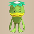
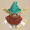
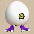
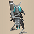
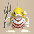
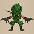
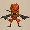
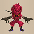
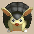

  

# Overview

<table class="dungeonOverview">
  <tr>
    <th>Unlock</th>
    <td class="highlightYellow">Clear Cavern of Suiryu.</td>
  </tr>
  <tr>
    <th>Entrance</th>
    <td class="highlightYellow">Firespew Mountain Summit</td>
  </tr>
</table>

<table class="dungeonTable">
  <tr>
    <th>Floors</th>
    <td colspan="3">99F</td>
  </tr>
  <tr>
    <th>Bring Items</th>
    <td>No</td>
    <th>Stairs</th>
    <td>Descending</td>
  </tr>
  <tr>
    <th>Companions</th>
    <td>No</td>
    <th>Roamers</th>
    <td>No</td>
  </tr>
  <tr>
    <th>Rescues</th>
    <td>3</td>
    <th>Starting Level</th>
    <td>Lv1</td>
  </tr>
  <tr>
    <th>Starting Item</th>
    <td colspan="3">Large Onigiri</td>
  </tr>
  <tr>
    <th>Unidentified</th>
    <td colspan="3">Bracelets, Scrolls, Grass, Staves, Pots, Incense</td>
  </tr>
  <tr>
    <th>Shops</th>
    <td>Yes</td>
    <th>Monster Houses</th>
    <td>Yes (Regular, Sudden, Special)</td>
  </tr>
  <tr>
    <th>Behemoths</th>
    <td>Yes</td>
    <th>Wishing Shrines</th>
    <td>Yes</td>
  </tr>
  <tr>
    <th>Kron's Challenge</th>
    <td>Yes</td>
    <th>Fever Time</th>
    <td>Yes</td>
  </tr>
  <tr>
    <th>Initial Enemies</th>
    <td>5~18</td>
    <th>Spawn Rate</th>
    <td>40 Turns (1F - 2F) 30 Turns (3F - 50F) 25 Turns (51F - 99F)</td>
  </tr>
  <tr>
    <th>Wind (1st Gust)</th>
    <td>1700 Turns</td>
    <th>Reward</th>
    <td>Item loop or new title screen (see below)</td>
  </tr>
</table>

Shiren 6's version of the series favorite unidentified items postgame dungeon. Travel companions and Roamer NPCs don't appear, so you're on your own for all 99 floors. If you're new to the series, you might want to work on other dungeons to gain experience first. It's best to unlock Mixers and register Eradication Scroll before challenging this dungeon.

#### Clear reward

Clearing this dungeon grants the next gold sacred item from the following 6-item loop: Manji Kabura → Fuuma Shield → Golden Pickaxe → Epic Hammer → Bodhi Shield → Accurate Sword. ※ This is currently the only known method to obtain Accurate Sword before version 1.2.0.

The first clear additionally unlocks the 12 Celestial Stones route, accessible from Shukuba Beach. Clearing this route for the first time unlocks a new title screen instead of granting an item. Clearing this route again (or clearing without all 12 stones) grants the next item from the 6-item loop.

# Strategy

### General

Learning how to [identify](/guides/identification-guide) and [steal](/guides/stealing-guide) (preferably with Wall-less Scroll registered) helps.

- Use Gitan as a projectile against tougher early game enemies.
  - Dash on top of the Gitan bag and exchange it with an inventory item.
- Get in the habit of using unidentified grasses, scrolls, incenses, and staves before advancing floors.
  - It might seem wasteful, but stocking up on unknown items won't really help when you're in danger.
  - Identifier Pots and Identifier Scrolls should be saved for bracelets if possible.
  - Use the in-game notebook or a [Price Chart](/items/price-chart) to identify items if you come across a shop.
- Protect food from rotting and scrolls from getting wet by storing them in Preservation Pots.
- Save good synthesis ingredients.
  - Weapons or shields with useful runes or positive upgrade value (especially +2\~+3).
  - Status Runes (Weapon) - Confusion Grass, Blinding Grass, Sedating Grass, Paralyzing Staff.
  - Status Runes (Shield) - Jitters Scroll, Onigiri Scroll.
  - See [Synthesis Runes](/system/synthesis-runes) for details.
- Make use of traps when possible.
  - Removal Trap - Equip all unidentified weapons, shields, and bracelets to check for curses.
  - Arrow Traps - Throw rocks or other items onto the trap to collect arrows.
      - Poison Arrows are great in particular, since 1 arrow reduces enemy Attack Power by \~50%.
  - Blast Trap - Step on it to transform Rotten Onigiri or Onigiri into Grilled Onigiri.
  - Pitfall Trap or Floor-exiting Trap - Step on it to advance to the next floor.
- Fortune Staff can be coupled with Reflective Incense / Bouncy Walls / Pit Mamel to earn experience points.
    - Player level doesn't matter as much after Lv20, so focus on upgrading equipment instead.
- A few notes regarding the item table:
    - Warehouse Pot, Wall-less Scroll, and Eradication Scroll cannot be found in this dungeon.
        - Eradication Scroll can easily be registered by playing [Domain of Staves and Scrolls](/dungeons/domain-of-staves-and-scrolls).
    - Ill-fated Seed is exclusively found in shops - never eat grasses being sold for 2000G.
    - All other grasses, scrolls, and pots can be found on the ground.
- Duplicate items in Bouncy Wall Rooms by throwing the item so that it bounces off of all 4 sides.
    - Blank Scroll, Preservation Pot, and Revival Grass are good duplication candidates.
- Items are often buried in walls on floor numbers ending in 0 (example: 10F), except for 50F.
    - If you find a Collection Scroll, save it until you reach one of these floors.
    - Pickaxe, Burrowing Staff, and Sumo status can be used to dig through wall tiles.
    - Shops and Wishing Shrines can also be hidden inside walls, regardless of floor number.
- Earthmound Staff can be used to go across water to an item island, or to help with arrow collection.
- Early game Monster Houses offer a chance to earn experience points and stock up on items.
    - If you find an extra Blank Scroll early on, consider writing Monstercall Scroll on it.
        - Read it while standing on a room's entrance tile, then retreat into the hallway.
        - Avoid reading it on 5-8F, since Fire Ninja D will burn grasses, scrolls, and staves.
- Nigiri Baby (2-4F) can be used to increase Max Fullness near the start of the dungeon.
    - Activating and maintaining Sumo status significantly helps with consistency.
- Behemoth Gates vanish and leave behind an item once all rooms on the floor have been checked.
    - If the monsters aren't too dangerous, consider exploring the floor for an extra item.

#### Difficulty Curve

Early game (1-9F) can be particularly rough - You'll ideally want to find a good shield, or perform techniques to rapidly level up or activate Sumo status to make things more manageable. Remember that Shiren's HP regeneration speed increases at Lv10 and Lv20.

Mid game (10-41F) features Mixers (10-29F) as a rare spawn, making it a good time to synthesize. One notable difficulty spike is 33-39F, where Polygon Singa and Soul Reaper appear. Polygon Singa lowers Max Fullness by 7, and Soul Reaper is Swift 2 speed and passes through walls. 40-41F turns into a bonus zone of mostly Mixermons and Chows if you eradicate the Pop Tank family.

Late game (42-99F) contains long stretches of mean enemies, so equipment with 30\~40+ strength helps. The ideal strategy is to alternate Eradication Scroll targets to remove the worst threats, but that isn't always feasible depending on your luck with Blank Scrolls and Bouncy Wall Rooms.

Compared to Primordial Chasm in Shiren 5, this dungeon generally has less enemy variety. However, Heart pressures the player with high initial enemy counts, lots of swift power types, and more complicated dungeon layouts as the player dives deeper.

Luckily, the items you find are often high quality, and many powerful items can be found on the ground. So the player is incentivized to spend time upgrading their equipment to keep up with stronger enemies. Incense and movement related staves have a lower priority once your equipment is upgraded and you have the resources to cut down swarms of monsters.

### Farming Techniques

#### Cave Mamel (1-3F)

Level up a Pit Mamel into a Cave Mamel (5 HP), then slay it with fixed damage attacks for 2000 exp.

#### Poison Arrow Trap (1-3F)

Throw projectiles onto Poison Arrow Traps to collect Poison Arrows. A well placed Hoppin' Batter (1-3F) can be used to safely collect arrows if you have a shield.

#### Nigiri Morph Factory (2-4F)

Technique to stock up on food and increase Max Fullness - requires a decent shield. It's tedious, but this can be used to activate Sumo status right away if desired.

1. Check for traps in the room - beware of Pitfall Trap in particular!
2. Place useful items on the ground, then exchange single arrows or rocks with inventory items.
3. Once your inventory is full of unneeded items and single arrows or rocks, find a Nigiri Baby.
4. Intentionally get hit by the Nigiri Baby's special attack to turn items into Large Onigiri.

#### Bowboy Family (10-12F, 29-32F)

Technique to collect lots of Wooden Arrows or Iron Arrows (preferable).

Easiest method is to use an Earthmound Staff to create a pillar between Bowboy and Shiren, then wait for Bowboy to shoot enough arrows until they can be picked up from behind the pillar. Evasive Incense also works, but remember that it only lasts 150 turns. 2\~3 stacks is usually enough since you ideally want to prioritize Poison Arrows instead, but if Rapid-fire Bracelet is found then having 4\~5 stacks of Iron Arrows could be very powerful.

#### Mixer Family (10-29F, 40-79F)

Linger until a Mixer family monster spawns, then throw items at it to synthesize equipment. Fortune staves can be used to level up Mixers and increase the number of items they can eat. Mixers are very dangerous early on even without damage buffs, so use staves or items like Hilarious Pot.

#### Master Hen Hunting (13-18F)

Master Hen provides 400 experience points if defeated prior to reverting to a Lv1 Hen. You can also collect Yakitori by grilling Hens on 16-18F using a Pop Tank, if desired.

#### Thiefwalrus Hunting (16-19F, 25-29F, 55-59F)

Linger and hunt Thiefwalrus (16-19F), Greenwalrus (25-29F), and Ironwalrus (55-59F) for item drops. Only practical when you either have a Walrus Stopper or the Walrusproof shield rune.

#### Bonus Zone (40-41F)

Eradicate the Pop Tank family to limit spawns to Mixermons, Chows, Cave Mamels, and Dark Owls. Chows always drop an item when defeated by the player, and Mixermons can be used to synthesize. Check for traps, since a Far-throwing Trap or Pitfall Trap could spoil the advantage. Consider using Monstercall Scroll or Monsterize Trap to generate more monsters.

### Important Items

#### Blank Scroll

Write the name of any scroll registered in your notebook, then use this as that scroll. Monstercall Scroll is a nice early game option to obtain additional items. Onigiri Scroll (Onigiri Payback) and Jitters Scroll (Jitters Payback) are good synthesis options. Slot-adding Scroll or Silverpurge Scroll can be used to enhance your main weapon or shield. Eradication Scroll is great for removing specific threats during the current adventure. Collection Scroll is fantastic when there's risk of losing Celestial Stones.

#### Eradication Scroll

Throw it at a monster to banish that monster family during the current adventure. If a second Eradication Scroll is thrown, the first monster family will begin to spawn again. Beware of disguised Crow Tengu (80-89F) if you plan on throwing one at an Archdragon.

Recommended Targets:

<table>
  <tr>
    <th class="highlightYellow">Floor</th>
    <th class="highlightYellow" colspan="3">Target</th>
  </tr>
  <tr>
    <td class="highlightGray">1-32F</td>
    <td>-</td>
    <td>-</td>
    <td>-</td>
  </tr>
  <tr>
    <td class="highlightGray">33-39F</td>
    <td class="highlightPurple">Polygon Singa</td>
    <td>-</td>
    <td>-</td>
  </tr>
  <tr>
    <td class="highlightGray">40-46F</td>
    <td rowspan="2" class="highlightGreen">Pop Tank Family</td>
    <td>-</td>
    <td>-</td>
  </tr>
  <tr>
    <td class="highlightGray">47-49F</td>
    <td rowspan="2" class="highlightCyan">Mudster / Mudder</td>
    <td>-</td>
  </tr>
  <tr>
    <td class="highlightGray">50-54F</td>
    <td rowspan="2" class="highlightPurple">Terror Scorpion</td>
    <td>-</td>
  </tr>
  <tr>
    <td class="highlightGray">55-59F</td>
    <td>-</td>
    <td>-</td>
  </tr>
  <tr>
    <td class="highlightGray">60-65F</td>
    <td>-</td>
    <td>-</td>
    <td>-</td>
  </tr>
  <tr>
    <td class="highlightGray">66-79F</td>
    <td class="highlightGreen">Miracle Hen</td>
    <td class="highlightPurple">Skull Lord</td>
    <td class="highlightCyan">Battler</td>
  </tr>
  <tr>
    <td class="highlightGray">80-99F</td>
    <td class="highlightCyan">King Reaper</td>
    <td class="highlightGreen">Archdragon</td>
    <td>-</td>
  </tr>
</table>

##### Eradication Target Notes

- Polygon Singa (129 HP, 40 atk, 40 def) - 33\~39F
    - Warps next to Shiren while in a room, and lowers Max Fullness by 7 when adjacent.
- Adamant Tank (100 HP, 60 atk, 54 def) / Steadfast Tank (105 HP, 80 atk, 64 def) - 40\~49F
    - Adamant has Swift 1 speed + 40 damage, Steadfast has Swift 2 speed + 50 damage.
- Mudster (140 HP, 35 atk, 43 def) / Mudder (145 HP, 45 atk, 53 def) - 47\~54F
    - Lowers upgrade value or erases 1 rune from an equipped weapon or shield.
    - Counter: Rustproof Bracelet
- Terror Scorpion (185 HP, 55 atk, 45 def) - 50\~59F
    - Lowers Max Strength by 1 when adjacent.
    - Counter: Cleansing Bracelet
- Battler (200 HP, 69 atk, 50 def) - 66\~79F
    - Knocks away Shiren's equipped weapon, shield, or bracelet when adjacent.
    - Counter: Affixing Bracelet
- Skull Lord (188 HP, 55 atk, 55 def) - 66\~79F
    - Magic effects include Asleep status, Blind status, Level -3, or 40 damage.
    - Counter: Shield of Negation
- Miracle Hen (220 HP, 82 atk, 60 def) - 66\~79F
    - No special attack, but Swift 2 speed and high attack power.
- Archdragon (200 HP, 65 atk, 60 def) - 80\~99F
    - Breathes 30 damage fire from anywhere on the floor.
- King Reaper (225 HP, 65 atk, 50 def) - 80\~99F
    - Swift 2 speed and can pass through walls while detecting Shiren from anywhere.

#### Upgrading Pot

Increases the upgrade value of inserted weapons and shields by +1 when advancing floors. However, the pot has a chance to shatter on its own each time an inserted item is upgraded. Potentially extremely powerful, but it can break after a single floor if you're unlucky. Once identified, insert items until the pot is full, and consider using Pot-upsize Scrolls. After the pot shatters, synthesize the upgraded weapons and shields into your main equipment.

#### Bracelets

All bracelets except for Trapper's Bracelet and Appraiser's Bracelet can be found.

- Rustproof Bracelet - Counters Mudkin (12-17F) and Mudster / Mudder (47-54F).
    - Keep it equipped against a Mudster / Mudder to remove silver from silver-sealed rune slots.
- Cleansing Bracelet - Mainly used to counter Terror Scorpion (50-59F).
- Rousing Bracelet - Nice to have against Skull Lord (66-79F) if you lack the Magic Cancel rune.
- Affixing Bracelet - Counters Battler (66-79F).
- Rapid-fire Bracelet - Shoot 2 projectiles in a single turn.
- Leaping Bracelet - Can be helpful when rushing to the stairs.
- Clairvoyant Bracelet / Monster-find Bracelet - Check for incoming enemies on the map.
- Item-find Bracelet - Check rooms more efficiently on each floor.
- Waterwalk Bracelet - Retrieve sumberged items, unequip while on a water tile to warp.
- Floating Bracelet - Traps don't activate when you walk on them, can walk on water and air tiles.
- Wallpass Bracelet - Move inside walls, but take damage equal to 4% of Max HP per turn in a wall.
    - Removing it while in a wall does not force a warp, and the player keeps taking damage.

#### Weapon / Shield

Prioritize equipment with high base stats early on, then transition to equipment with more rune slots. Sacred equipment with a combination of high stats and lots of rune slots is ideal. Golden Sword, Primal Axe, and Sickle of Salvation are good options (8\~10 slots). 5\~7 slots is fine for shields, but don't skip synthesizing Jitter Payback or Onigiri Payback. If you find a rare rune like Peach Bun on a sacred weapon, synthesize it into your main weapon.

# 12 Stones

Hard mode for this dungeon, which is unlocked after clearing the dungeon 1 time. 12 Celestial Stones can be found (displayed on the map) on random floors in numerical order. The stones can't be put into pots, so inventory space becomes increasingly limited as you progress. Also, precautions must be taken to not lose stones to Field Knaves, Kappas, Gazers, Armordillos, and traps. In addition, Wishing Shrines are never generated during a 12 Celestial Stones adventure. It's best to take things slow - upgrade equipment and stock up on Blank Scrolls to protect stones.

Celestial Stones can also appear as merchandise in a shop or as an item inside a Monster House. Always check for traps and item-destroying enemies on floors where a Celestial Stone is present.

#### Celestial Stone Floors (Possibly Incomplete)

<table class="stoneTable">
  <thead>
    <tr>
      <th rowspan="2">F</th>
      <th colspan="12">Celestial Stone</th>
      <th rowspan="2">Dangers</th>
    </tr>
    <tr>
      <th>1</th>
      <th>2</th>
      <th>3</th>
      <th>4</th>
      <th>5</th>
      <th>6</th>
      <th>7</th>
      <th>8</th>
      <th>9</th>
      <th>10</th>
      <th>11</th>
      <th>12</th>
    </tr>
  </thead>
  <tbody>
    <tr>
      <td>1</td>
      <td></td>
      <td></td>
      <td></td>
      <td></td>
      <td></td>
      <td></td>
      <td></td>
      <td></td>
      <td></td>
      <td></td>
      <td></td>
      <td></td>
      <td></td>
    </tr>
    <tr>
      <td>2</td>
      <td></td>
      <td></td>
      <td></td>
      <td></td>
      <td></td>
      <td></td>
      <td></td>
      <td></td>
      <td></td>
      <td></td>
      <td></td>
      <td></td>
      <td>Nigiri Baby</td>
    </tr>
    <tr>
      <td>3</td>
      <td>●</td>
      <td></td>
      <td></td>
      <td></td>
      <td></td>
      <td></td>
      <td></td>
      <td></td>
      <td></td>
      <td></td>
      <td></td>
      <td></td>
      <td rowspan="2">Nigiri Baby / Armordillo</td>
    </tr>
    <tr>
      <td>4</td>
      <td>●</td>
      <td></td>
      <td></td>
      <td></td>
      <td></td>
      <td></td>
      <td></td>
      <td></td>
      <td></td>
      <td></td>
      <td></td>
      <td></td>
    </tr>
    <tr>
      <td>5</td>
      <td>●</td>
      <td></td>
      <td></td>
      <td></td>
      <td></td>
      <td></td>
      <td></td>
      <td></td>
      <td></td>
      <td></td>
      <td></td>
      <td></td>
      <td></td>
    </tr>
    <tr>
      <td>6</td>
      <td>●</td>
      <td></td>
      <td></td>
      <td></td>
      <td></td>
      <td></td>
      <td></td>
      <td></td>
      <td></td>
      <td></td>
      <td></td>
      <td></td>
      <td></td>
    </tr>
    <tr>
      <td>7</td>
      <td>●</td>
      <td></td>
      <td></td>
      <td></td>
      <td></td>
      <td></td>
      <td></td>
      <td></td>
      <td></td>
      <td></td>
      <td></td>
      <td></td>
      <td></td>
    </tr>
    <tr>
      <td>8</td>
      <td>●</td>
      <td></td>
      <td></td>
      <td></td>
      <td></td>
      <td></td>
      <td></td>
      <td></td>
      <td></td>
      <td></td>
      <td></td>
      <td></td>
      <td></td>
    </tr>
    <tr>
      <td>9</td>
      <td>●</td>
      <td></td>
      <td></td>
      <td></td>
      <td></td>
      <td></td>
      <td></td>
      <td></td>
      <td></td>
      <td></td>
      <td></td>
      <td></td>
      <td></td>
    </tr>
    <tr>
      <td>10</td>
      <td></td>
      <td>●</td>
      <td></td>
      <td></td>
      <td></td>
      <td></td>
      <td></td>
      <td></td>
      <td></td>
      <td></td>
      <td></td>
      <td></td>
      <td></td>
    </tr>
    <tr>
      <td>11</td>
      <td></td>
      <td>●</td>
      <td></td>
      <td></td>
      <td></td>
      <td></td>
      <td></td>
      <td></td>
      <td></td>
      <td></td>
      <td></td>
      <td></td>
      <td></td>
    </tr>
    <tr>
      <td>12</td>
      <td></td>
      <td>●</td>
      <td></td>
      <td></td>
      <td></td>
      <td></td>
      <td></td>
      <td></td>
      <td></td>
      <td></td>
      <td></td>
      <td></td>
      <td></td>
    </tr>
    <tr>
      <td>13</td>
      <td></td>
      <td>●</td>
      <td></td>
      <td></td>
      <td></td>
      <td></td>
      <td></td>
      <td></td>
      <td></td>
      <td></td>
      <td></td>
      <td></td>
      <td></td>
    </tr>
    <tr>
      <td>14</td>
      <td></td>
      <td>●</td>
      <td></td>
      <td></td>
      <td></td>
      <td></td>
      <td></td>
      <td></td>
      <td></td>
      <td></td>
      <td></td>
      <td></td>
      <td></td>
    </tr>
    <tr>
      <td>15</td>
      <td></td>
      <td>●</td>
      <td></td>
      <td></td>
      <td></td>
      <td></td>
      <td></td>
      <td></td>
      <td></td>
      <td></td>
      <td></td>
      <td></td>
      <td></td>
    </tr>
    <tr>
      <td>16</td>
      <td></td>
      <td>●</td>
      <td></td>
      <td></td>
      <td></td>
      <td></td>
      <td></td>
      <td></td>
      <td></td>
      <td></td>
      <td></td>
      <td></td>
      <td rowspan="3">Thiefwalrus / Pop Tank</td>
    </tr>
    <tr>
      <td>17</td>
      <td></td>
      <td></td>
      <td>●</td>
      <td></td>
      <td></td>
      <td></td>
      <td></td>
      <td></td>
      <td></td>
      <td></td>
      <td></td>
      <td></td>
    </tr>
    <tr>
      <td>18</td>
      <td></td>
      <td></td>
      <td>●</td>
      <td></td>
      <td></td>
      <td></td>
      <td></td>
      <td></td>
      <td></td>
      <td></td>
      <td></td>
      <td></td>
    </tr>
    <tr>
      <td>19</td>
      <td></td>
      <td></td>
      <td>●</td>
      <td></td>
      <td></td>
      <td></td>
      <td></td>
      <td></td>
      <td></td>
      <td></td>
      <td></td>
      <td></td>
      <td>Thiefwalrus</td>
    </tr>
    <tr>
      <td>20</td>
      <td></td>
      <td></td>
      <td>●</td>
      <td></td>
      <td></td>
      <td></td>
      <td></td>
      <td></td>
      <td></td>
      <td></td>
      <td></td>
      <td></td>
      <td></td>
    </tr>
    <tr>
      <td>21</td>
      <td></td>
      <td></td>
      <td>●</td>
      <td></td>
      <td></td>
      <td></td>
      <td></td>
      <td></td>
      <td></td>
      <td></td>
      <td></td>
      <td></td>
      <td></td>
    </tr>
    <tr>
      <td>22</td>
      <td></td>
      <td></td>
      <td>●</td>
      <td></td>
      <td></td>
      <td></td>
      <td></td>
      <td></td>
      <td></td>
      <td></td>
      <td></td>
      <td></td>
      <td rowspan="2">Super Gazer</td>
    </tr>
    <tr>
      <td>23</td>
      <td></td>
      <td></td>
      <td>●</td>
      <td></td>
      <td></td>
      <td></td>
      <td></td>
      <td></td>
      <td></td>
      <td></td>
      <td></td>
      <td></td>
    </tr>
    <tr>
      <td>24</td>
      <td></td>
      <td></td>
      <td></td>
      <td>●</td>
      <td></td>
      <td></td>
      <td></td>
      <td></td>
      <td></td>
      <td></td>
      <td></td>
      <td></td>
      <td>Super Gazer / Pesky Kappa</td>
    </tr>
    <tr>
      <td>25</td>
      <td></td>
      <td></td>
      <td></td>
      <td>●</td>
      <td></td>
      <td></td>
      <td></td>
      <td></td>
      <td></td>
      <td></td>
      <td></td>
      <td></td>
      <td rowspan="3">Greenwalrus / Pesky Kappa</td>
    </tr>
    <tr>
      <td>26</td>
      <td></td>
      <td></td>
      <td></td>
      <td>●</td>
      <td></td>
      <td></td>
      <td></td>
      <td></td>
      <td></td>
      <td></td>
      <td></td>
      <td></td>
    </tr>
    <tr>
      <td>27</td>
      <td></td>
      <td></td>
      <td></td>
      <td>●</td>
      <td></td>
      <td></td>
      <td></td>
      <td></td>
      <td></td>
      <td></td>
      <td></td>
      <td></td>
    </tr>
    <tr>
      <td>28</td>
      <td></td>
      <td></td>
      <td></td>
      <td></td>
      <td></td>
      <td></td>
      <td></td>
      <td></td>
      <td></td>
      <td></td>
      <td></td>
      <td></td>
      <td rowspan="2">Greenwalrus</td>
    </tr>
    <tr>
      <td>29</td>
      <td></td>
      <td></td>
      <td></td>
      <td>●</td>
      <td></td>
      <td></td>
      <td></td>
      <td></td>
      <td></td>
      <td></td>
      <td></td>
      <td></td>
    </tr>
    <tr>
      <td>30</td>
      <td></td>
      <td></td>
      <td></td>
      <td>●</td>
      <td></td>
      <td></td>
      <td></td>
      <td></td>
      <td></td>
      <td></td>
      <td></td>
      <td></td>
      <td></td>
    </tr>
    <tr>
      <td>31</td>
      <td></td>
      <td></td>
      <td></td>
      <td></td>
      <td></td>
      <td></td>
      <td></td>
      <td></td>
      <td></td>
      <td></td>
      <td></td>
      <td></td>
      <td></td>
    </tr>
    <tr>
      <td>32</td>
      <td></td>
      <td></td>
      <td></td>
      <td></td>
      <td>●</td>
      <td></td>
      <td></td>
      <td></td>
      <td></td>
      <td></td>
      <td></td>
      <td></td>
      <td></td>
    </tr>
    <tr>
      <td>33</td>
      <td></td>
      <td></td>
      <td></td>
      <td></td>
      <td>●</td>
      <td></td>
      <td></td>
      <td></td>
      <td></td>
      <td></td>
      <td></td>
      <td></td>
      <td></td>
    </tr>
    <tr>
      <td>34</td>
      <td></td>
      <td></td>
      <td></td>
      <td></td>
      <td>●</td>
      <td></td>
      <td></td>
      <td></td>
      <td></td>
      <td></td>
      <td></td>
      <td></td>
      <td></td>
    </tr>
    <tr>
      <td>35</td>
      <td></td>
      <td></td>
      <td></td>
      <td></td>
      <td>●</td>
      <td></td>
      <td></td>
      <td></td>
      <td></td>
      <td></td>
      <td></td>
      <td></td>
      <td></td>
    </tr>
    <tr>
      <td>36</td>
      <td></td>
      <td></td>
      <td></td>
      <td></td>
      <td>●</td>
      <td></td>
      <td></td>
      <td></td>
      <td></td>
      <td></td>
      <td></td>
      <td></td>
      <td></td>
    </tr>
    <tr>
      <td>37</td>
      <td></td>
      <td></td>
      <td></td>
      <td></td>
      <td>●</td>
      <td></td>
      <td></td>
      <td></td>
      <td></td>
      <td></td>
      <td></td>
      <td></td>
      <td></td>
    </tr>
    <tr>
      <td>38</td>
      <td></td>
      <td></td>
      <td></td>
      <td></td>
      <td></td>
      <td>●</td>
      <td></td>
      <td></td>
      <td></td>
      <td></td>
      <td></td>
      <td></td>
      <td></td>
    </tr>
    <tr>
      <td>39</td>
      <td></td>
      <td></td>
      <td></td>
      <td></td>
      <td></td>
      <td>●</td>
      <td></td>
      <td></td>
      <td></td>
      <td></td>
      <td></td>
      <td></td>
      <td></td>
    </tr>
    <tr>
      <td>40</td>
      <td></td>
      <td></td>
      <td></td>
      <td></td>
      <td></td>
      <td>●</td>
      <td></td>
      <td></td>
      <td></td>
      <td></td>
      <td></td>
      <td></td>
      <td rowspan="5">Pop Tank Family</td>
    </tr>
    <tr>
      <td>41</td>
      <td></td>
      <td></td>
      <td></td>
      <td></td>
      <td></td>
      <td>●</td>
      <td></td>
      <td></td>
      <td></td>
      <td></td>
      <td></td>
      <td></td>
    </tr>
    <tr>
      <td>42</td>
      <td></td>
      <td></td>
      <td></td>
      <td></td>
      <td></td>
      <td>●</td>
      <td></td>
      <td></td>
      <td></td>
      <td></td>
      <td></td>
      <td></td>
    </tr>
    <tr>
      <td>43</td>
      <td></td>
      <td></td>
      <td></td>
      <td></td>
      <td></td>
      <td>●</td>
      <td></td>
      <td></td>
      <td></td>
      <td></td>
      <td></td>
      <td></td>
    </tr>
    <tr>
      <td>44</td>
      <td></td>
      <td></td>
      <td></td>
      <td></td>
      <td></td>
      <td>●</td>
      <td></td>
      <td></td>
      <td></td>
      <td></td>
      <td></td>
      <td></td>
    </tr>
    <tr>
      <td>45</td>
      <td></td>
      <td></td>
      <td></td>
      <td></td>
      <td></td>
      <td></td>
      <td>●</td>
      <td></td>
      <td></td>
      <td></td>
      <td></td>
      <td></td>
      <td rowspan="5">Steadfast Tank</td>
    </tr>
    <tr>
      <td>46</td>
      <td></td>
      <td></td>
      <td></td>
      <td></td>
      <td></td>
      <td></td>
      <td>●</td>
      <td></td>
      <td></td>
      <td></td>
      <td></td>
      <td></td>
    </tr>
    <tr>
      <td>47</td>
      <td></td>
      <td></td>
      <td></td>
      <td></td>
      <td></td>
      <td></td>
      <td>●</td>
      <td></td>
      <td></td>
      <td></td>
      <td></td>
      <td></td>
    </tr>
    <tr>
      <td>48</td>
      <td></td>
      <td></td>
      <td></td>
      <td></td>
      <td></td>
      <td></td>
      <td>●</td>
      <td></td>
      <td></td>
      <td></td>
      <td></td>
      <td></td>
    </tr>
    <tr>
      <td>49</td>
      <td></td>
      <td></td>
      <td></td>
      <td></td>
      <td></td>
      <td></td>
      <td>●</td>
      <td></td>
      <td></td>
      <td></td>
      <td></td>
      <td></td>
    </tr>
    <tr>
      <td>50</td>
      <td></td>
      <td></td>
      <td></td>
      <td></td>
      <td></td>
      <td></td>
      <td>●</td>
      <td></td>
      <td></td>
      <td></td>
      <td></td>
      <td></td>
      <td>No walls</td>
    </tr>
    <tr>
      <td>51</td>
      <td></td>
      <td></td>
      <td></td>
      <td></td>
      <td></td>
      <td></td>
      <td>●</td>
      <td></td>
      <td></td>
      <td></td>
      <td></td>
      <td></td>
      <td></td>
    </tr>
    <tr>
      <td>52</td>
      <td></td>
      <td></td>
      <td></td>
      <td></td>
      <td></td>
      <td></td>
      <td></td>
      <td>●</td>
      <td></td>
      <td></td>
      <td></td>
      <td></td>
      <td></td>
    </tr>
    <tr>
      <td>53</td>
      <td></td>
      <td></td>
      <td></td>
      <td></td>
      <td></td>
      <td></td>
      <td></td>
      <td>●</td>
      <td></td>
      <td></td>
      <td></td>
      <td></td>
      <td></td>
    </tr>
    <tr>
      <td>54</td>
      <td></td>
      <td></td>
      <td></td>
      <td></td>
      <td></td>
      <td></td>
      <td></td>
      <td>●</td>
      <td></td>
      <td></td>
      <td></td>
      <td></td>
      <td></td>
    </tr>
    <tr>
      <td>55</td>
      <td></td>
      <td></td>
      <td></td>
      <td></td>
      <td></td>
      <td></td>
      <td></td>
      <td></td>
      <td></td>
      <td></td>
      <td></td>
      <td></td>
      <td rowspan="5">Vexing Kappa / Ironwalrus</td>
    </tr>
    <tr>
      <td>56</td>
      <td></td>
      <td></td>
      <td></td>
      <td></td>
      <td></td>
      <td></td>
      <td></td>
      <td>●</td>
      <td></td>
      <td></td>
      <td></td>
      <td></td>
    </tr>
    <tr>
      <td>57</td>
      <td></td>
      <td></td>
      <td></td>
      <td></td>
      <td></td>
      <td></td>
      <td></td>
      <td></td>
      <td></td>
      <td></td>
      <td></td>
      <td></td>
    </tr>
    <tr>
      <td>58</td>
      <td></td>
      <td></td>
      <td></td>
      <td></td>
      <td></td>
      <td></td>
      <td></td>
      <td>●</td>
      <td></td>
      <td></td>
      <td></td>
      <td></td>
    </tr>
    <tr>
      <td>59</td>
      <td></td>
      <td></td>
      <td></td>
      <td></td>
      <td></td>
      <td></td>
      <td></td>
      <td></td>
      <td></td>
      <td></td>
      <td></td>
      <td></td>
    </tr>
    <tr>
      <td>60</td>
      <td></td>
      <td></td>
      <td></td>
      <td></td>
      <td></td>
      <td></td>
      <td></td>
      <td></td>
      <td></td>
      <td></td>
      <td></td>
      <td></td>
      <td rowspan="5">Bag Knave / Hyper Gazer</td>
    </tr>
    <tr>
      <td>61</td>
      <td></td>
      <td></td>
      <td></td>
      <td></td>
      <td></td>
      <td></td>
      <td></td>
      <td></td>
      <td></td>
      <td></td>
      <td></td>
      <td></td>
    </tr>
    <tr>
      <td>62</td>
      <td></td>
      <td></td>
      <td></td>
      <td></td>
      <td></td>
      <td></td>
      <td></td>
      <td></td>
      <td></td>
      <td></td>
      <td></td>
      <td></td>
    </tr>
    <tr>
      <td>63</td>
      <td></td>
      <td></td>
      <td></td>
      <td></td>
      <td></td>
      <td></td>
      <td></td>
      <td></td>
      <td></td>
      <td></td>
      <td></td>
      <td></td>
    </tr>
    <tr>
      <td>64</td>
      <td></td>
      <td></td>
      <td></td>
      <td></td>
      <td></td>
      <td></td>
      <td></td>
      <td></td>
      <td></td>
      <td></td>
      <td></td>
      <td></td>
    </tr>
    <tr>
      <td>65</td>
      <td></td>
      <td></td>
      <td></td>
      <td></td>
      <td></td>
      <td></td>
      <td></td>
      <td></td>
      <td>●</td>
      <td></td>
      <td></td>
      <td></td>
      <td></td>
    </tr>
    <tr>
      <td>66</td>
      <td></td>
      <td></td>
      <td></td>
      <td></td>
      <td></td>
      <td></td>
      <td></td>
      <td></td>
      <td>●</td>
      <td></td>
      <td></td>
      <td></td>
      <td></td>
    </tr>
    <tr>
      <td>67</td>
      <td></td>
      <td></td>
      <td></td>
      <td></td>
      <td></td>
      <td></td>
      <td></td>
      <td></td>
      <td>●</td>
      <td></td>
      <td></td>
      <td></td>
      <td></td>
    </tr>
    <tr>
      <td>68</td>
      <td></td>
      <td></td>
      <td></td>
      <td></td>
      <td></td>
      <td></td>
      <td></td>
      <td></td>
      <td>●</td>
      <td></td>
      <td></td>
      <td></td>
      <td></td>
    </tr>
    <tr>
      <td>69</td>
      <td></td>
      <td></td>
      <td></td>
      <td></td>
      <td></td>
      <td></td>
      <td></td>
      <td></td>
      <td>●</td>
      <td></td>
      <td></td>
      <td></td>
      <td></td>
    </tr>
    <tr>
      <td>70</td>
      <td></td>
      <td></td>
      <td></td>
      <td></td>
      <td></td>
      <td></td>
      <td></td>
      <td></td>
      <td>●</td>
      <td></td>
      <td></td>
      <td></td>
      <td></td>
    </tr>
    <tr>
      <td>71</td>
      <td></td>
      <td></td>
      <td></td>
      <td></td>
      <td></td>
      <td></td>
      <td></td>
      <td></td>
      <td>●</td>
      <td></td>
      <td></td>
      <td></td>
      <td></td>
    </tr>
    <tr>
      <td>72</td>
      <td></td>
      <td></td>
      <td></td>
      <td></td>
      <td></td>
      <td></td>
      <td></td>
      <td></td>
      <td>●</td>
      <td></td>
      <td></td>
      <td></td>
      <td></td>
    </tr>
    <tr>
      <td>73</td>
      <td></td>
      <td></td>
      <td></td>
      <td></td>
      <td></td>
      <td></td>
      <td></td>
      <td></td>
      <td></td>
      <td>●</td>
      <td></td>
      <td></td>
      <td></td>
    </tr>
    <tr>
      <td>74</td>
      <td></td>
      <td></td>
      <td></td>
      <td></td>
      <td></td>
      <td></td>
      <td></td>
      <td></td>
      <td></td>
      <td>●</td>
      <td></td>
      <td></td>
      <td></td>
    </tr>
    <tr>
      <td>75</td>
      <td></td>
      <td></td>
      <td></td>
      <td></td>
      <td></td>
      <td></td>
      <td></td>
      <td></td>
      <td></td>
      <td>●</td>
      <td></td>
      <td></td>
      <td></td>
    </tr>
    <tr>
      <td>76</td>
      <td></td>
      <td></td>
      <td></td>
      <td></td>
      <td></td>
      <td></td>
      <td></td>
      <td></td>
      <td></td>
      <td>●</td>
      <td></td>
      <td></td>
      <td></td>
    </tr>
    <tr>
      <td>77</td>
      <td></td>
      <td></td>
      <td></td>
      <td></td>
      <td></td>
      <td></td>
      <td></td>
      <td></td>
      <td></td>
      <td>●</td>
      <td></td>
      <td></td>
      <td></td>
    </tr>
    <tr>
      <td>78</td>
      <td></td>
      <td></td>
      <td></td>
      <td></td>
      <td></td>
      <td></td>
      <td></td>
      <td></td>
      <td></td>
      <td>●</td>
      <td></td>
      <td></td>
      <td></td>
    </tr>
    <tr>
      <td>79</td>
      <td></td>
      <td></td>
      <td></td>
      <td></td>
      <td></td>
      <td></td>
      <td></td>
      <td></td>
      <td></td>
      <td>●</td>
      <td></td>
      <td></td>
      <td></td>
    </tr>
    <tr>
      <td>80</td>
      <td></td>
      <td></td>
      <td></td>
      <td></td>
      <td></td>
      <td></td>
      <td></td>
      <td></td>
      <td></td>
      <td>●</td>
      <td></td>
      <td></td>
      <td rowspan="20">Grampadillo</td>
    </tr>
    <tr>
      <td>81</td>
      <td></td>
      <td></td>
      <td></td>
      <td></td>
      <td></td>
      <td></td>
      <td></td>
      <td></td>
      <td></td>
      <td></td>
      <td>●</td>
      <td></td>
    </tr>
    <tr>
      <td>82</td>
      <td></td>
      <td></td>
      <td></td>
      <td></td>
      <td></td>
      <td></td>
      <td></td>
      <td></td>
      <td></td>
      <td></td>
      <td>●</td>
      <td></td>
    </tr>
    <tr>
      <td>83</td>
      <td></td>
      <td></td>
      <td></td>
      <td></td>
      <td></td>
      <td></td>
      <td></td>
      <td></td>
      <td></td>
      <td></td>
      <td></td>
      <td></td>
    </tr>
    <tr>
      <td>84</td>
      <td></td>
      <td></td>
      <td></td>
      <td></td>
      <td></td>
      <td></td>
      <td></td>
      <td></td>
      <td></td>
      <td></td>
      <td></td>
      <td></td>
    </tr>
    <tr>
      <td>85</td>
      <td></td>
      <td></td>
      <td></td>
      <td></td>
      <td></td>
      <td></td>
      <td></td>
      <td></td>
      <td></td>
      <td></td>
      <td>●</td>
      <td></td>
    </tr>
    <tr>
      <td>86</td>
      <td></td>
      <td></td>
      <td></td>
      <td></td>
      <td></td>
      <td></td>
      <td></td>
      <td></td>
      <td></td>
      <td></td>
      <td>●</td>
      <td></td>
    </tr>
    <tr>
      <td>87</td>
      <td></td>
      <td></td>
      <td></td>
      <td></td>
      <td></td>
      <td></td>
      <td></td>
      <td></td>
      <td></td>
      <td></td>
      <td>●</td>
      <td></td>
    </tr>
    <tr>
      <td>88</td>
      <td></td>
      <td></td>
      <td></td>
      <td></td>
      <td></td>
      <td></td>
      <td></td>
      <td></td>
      <td></td>
      <td></td>
      <td>●</td>
      <td></td>
    </tr>
    <tr>
      <td>89</td>
      <td></td>
      <td></td>
      <td></td>
      <td></td>
      <td></td>
      <td></td>
      <td></td>
      <td></td>
      <td></td>
      <td></td>
      <td></td>
      <td>●</td>
    </tr>
    <tr>
      <td>90</td>
      <td></td>
      <td></td>
      <td></td>
      <td></td>
      <td></td>
      <td></td>
      <td></td>
      <td></td>
      <td></td>
      <td></td>
      <td></td>
      <td>●</td>
    </tr>
    <tr>
      <td>91</td>
      <td></td>
      <td></td>
      <td></td>
      <td></td>
      <td></td>
      <td></td>
      <td></td>
      <td></td>
      <td></td>
      <td></td>
      <td></td>
      <td>●</td>
    </tr>
    <tr>
      <td>92</td>
      <td></td>
      <td></td>
      <td></td>
      <td></td>
      <td></td>
      <td></td>
      <td></td>
      <td></td>
      <td></td>
      <td></td>
      <td></td>
      <td>●</td>
    </tr>
    <tr>
      <td>93</td>
      <td></td>
      <td></td>
      <td></td>
      <td></td>
      <td></td>
      <td></td>
      <td></td>
      <td></td>
      <td></td>
      <td></td>
      <td></td>
      <td></td>
    </tr>
    <tr>
      <td>94</td>
      <td></td>
      <td></td>
      <td></td>
      <td></td>
      <td></td>
      <td></td>
      <td></td>
      <td></td>
      <td></td>
      <td></td>
      <td></td>
      <td></td>
    </tr>
    <tr>
      <td>95</td>
      <td></td>
      <td></td>
      <td></td>
      <td></td>
      <td></td>
      <td></td>
      <td></td>
      <td></td>
      <td></td>
      <td></td>
      <td></td>
      <td>●</td>
    </tr>
    <tr>
      <td>96</td>
      <td></td>
      <td></td>
      <td></td>
      <td></td>
      <td></td>
      <td></td>
      <td></td>
      <td></td>
      <td></td>
      <td></td>
      <td></td>
      <td></td>
    </tr>
    <tr>
      <td>97</td>
      <td></td>
      <td></td>
      <td></td>
      <td></td>
      <td></td>
      <td></td>
      <td></td>
      <td></td>
      <td></td>
      <td></td>
      <td></td>
      <td>●</td>
    </tr>
    <tr>
      <td>98</td>
      <td></td>
      <td></td>
      <td></td>
      <td></td>
      <td></td>
      <td></td>
      <td></td>
      <td></td>
      <td></td>
      <td></td>
      <td></td>
      <td>●</td>
    </tr>
    <tr>
      <td>99</td>
      <td></td>
      <td></td>
      <td></td>
      <td></td>
      <td></td>
      <td></td>
      <td></td>
      <td></td>
      <td></td>
      <td></td>
      <td></td>
      <td>●</td>
    </tr>
  </tbody>
</table>

# Floor Guide

### 1F

Things that can make Shiren quickly collapse near the start:

- Rock Trap (Deals 16\~20 damage).
- Cannons manned by monsters.
- Spearfish (16 HP, 6 atk) or Hoppin' Batter (20 HP, 7 atk).
- Monster Houses.

Check all rooms, equip whatever highest base value weapon and shield you find, then descend to 2F. Blank Scrolls are common, so consider writing Monstercall for more items if you find one on 1-2F. Save projectiles like rocks and arrows for Nigiri Baby (2-4F) floors to secure additional food.

### 2F

<u>Notable</u>: Nigiri Baby (2-4F)

Nigiri Baby (17 HP, 8 atk) appears - It's best to create Large Onigiri on 2F instead of 3\~4F. Items and shops can be found in walls, so it'd be good to raise Max Fullness high enough to where you can activate Sumo status whenever you want and freely dig through breakable wall tiles.

If you still haven't found a shield by the end of 2F, linger and level up a bit before descending. Remember to perform level up techniques if you find items like Disguising Staff or Fortune Staff.

### 3F

<u>Notable</u>: Nigiri Baby (2-4F), Pumphantasm (3-4F), Taur (3-5F)

Pumphantasm (23 HP, 16 atk) and Taur (35 HP, 15 atk) both have high attack power. It's risky to read a Monstercall Scroll on these floors, since Pumphantasm can pass through walls.

### 4F

<u>Notable</u>: Nigiri Baby (2-4F), Pumphantasm (3-4F), Taur (3-5F), Karakuroid (4-6F)

Karakuroid (40 HP, 20 atk) has Swift 1 speed, so it's difficult to run away from it. Remember to collect Poison Arrows if a Karakuroid creates a Poison Arrow Trap.

### 5-6F

<u>Notable</u>: Karakuroid (4-6F), Scorpion (5-7F), Fire Ninja D (5-8F), Porky (6-9F), Cave Mamel (6-79F)

This is probably the last floor range for a bit where you can play in a leisurely manner. Wait until 8F to restore lowered strength via Antidote Grass or Rejuvenation Pot. Fire Ninja D will burn items, so don't bother reading a Monstercall Scroll between 5\~8F.

Cave Mamel (5 HP, 100 atk, 100 def) is very rare, but can potentially one-shot you in a dark hallway. It won't be included in the "Notable" list going forward, but it's a constant threat between 6\~79F.

If you find a Peach Staff or a sacred weapon with the Peach Bun rune:

- Karakuroid Bun - Create Poison Arrow Traps and collect lots of Poison Arrows.
- Porky Bun - Throw Porky's Rocks and collect them, which can be used to one-shot Ghost Samurai.
    - Evasive Incense can be used instead of a Peach Staff to collect Porky's Rocks.

### 7-9F

<u>Notable</u>: Scorpion (5-7F), Fire Ninja D (5-8F), Porky (6-9F), Water Ninja D (7-9F), Masked Samurai (7-12F)

Masked Samurai (47 HP, 18 atk) revives as Ghost Samurai (4 HP, 13 atk) when defeated. Ghost Samurai only takes 1 damage from normal attacks without the Anti-Ghost rune, and has the ability to possess a different monster, causing them to level up (Example: Mid Chintala → Big Chintala).

Twisty Hani (35 HP, 12 atk, 15 def) spawns on 7-10F, and lowers Shiren's level by 1 when adjacent. Use arrows to defeat it from a distance instead of risking losing experience points.

Water Ninja D (24 HP, 15 atk, 9 def) shoots water from up to 3 tiles away. Getting splashed by water makes equipped items rust, makes food go bad, or causes scrolls to get wet. Water Ninjas won't use their ability when adjacent, so use zigzag movement to lure them closer. Rotten Onigiri can be turned into Grilled Onigiri using Fire Ninja D (5-8F) if needed.

### 10-12F

<u>Notable</u>: Masked Samurai (7-12F), Crossbowboy (10-12F), Mixer (10-29F), Mudkin (12-17F)

Mixer (78 HP, 39 atk, 29 def) is a rare spawn, and is also extremely powerful after eating items. Use Narrow-escape or Paralyzing staves to paralyze the Mixer, then level it up using a Ghost Samurai. If there's a cannon, let Mixer man it and throw items at the Mixer to safely synthesize and slay it. If you have a Peach Staff, consider stocking up on Mixer Buns for when you find synthesis ingredients.

Crossbowboy (55 HP, 20 atk, 20 def) can be used to collect lots of Iron Arrows. Easiest methods: Evasive Incense, Earthmound Staff, or positioning Bored Kappa (10-12F) in-between. 

Mudkin (70 HP, 5 atk, 9 def) lowers the upgrade value of your equipped weapon or shield by 1. If you lack the Rustproof rune, keep 2 spaces open in a Preservation Pot and insert equipment. 12F: Some players unequip items and level up a Mudkin using Ghost Samurais to hunt Lv3 Mudsters for exp.

Lastly, 10F often has lots of items buried in wall tiles, so read a Collection Scroll if possible.

### 13-15F

<u>Notable</u>: Mixer (10-29F), Mudkin (12-17F), Master Hen (13-18F), Chow (15-99F), Behemoth (13-15F)

Mudkin is still around - If you have silver-sealed sacred weapons or shields + a Rustproof Bracelet, you could level up a Mudkin to Mudster and have it remove the silver seals with its special attack.

Master Hen (70 HP, 33 atk, 21 def) provides 400 exp when defeated before reverting to Lv1 Hen. Depending on how much food you have on hand, it might be a good idea to linger to level up. That said, Master Hen appears with Thiefwalrus and Minotaur on 16-18F, so it might be better to wait.

Behemoth Monsters can appear on 13-15F - avoid cornering yourself in rooms while the gate is around. Remember that rocks can be used to one-shot Behemoth Monsters even from the front.

Chow (20 HP, 1 atk, 1 def) is a rare spawn starting from 15F throughout the rest of the dungeon. Keep an eye on the message log so you don't miss monsters leveling up from defeating Chows. Chow always drops an item when defeated by the player.

### 16-19F

<u>Notable</u>: Mixer (10-29F), Master Hen (13-18F), Minotaur (16-18F), Thiefwalrus (16-19F)

Good floor range for farming items and experience points - Use a Mapping Scroll if you have one. Master Hen (70 HP, 33 atk, 21 def) provides 400 exp when defeated before reverting to Lv1 Hen. Minotaur (70 HP, 31 atk, 20 def) occasionally drops an Axe of the Minotaur when defeated. Thiefwalrus (65 HP, 25 atk, 23 def) always drops an item when defeated. Egg Thing (5 HP, 2 atk, 14 def) always drops an Onigiri when defeated.

Lv1 monks appear between 16-19F - The 3 most dangerous monks are Hannya, Okina, and Tengu. Hannya Monk D (66 HP, 37 atk, 25 def) causes other enemies to level up or defeat Shopkeepers. Okina Monk D (70 HP, 25 atk, 25 def) warps monsters on the floor so that they end up near Shiren. Tengu Monk D (80 HP, 24 atk, 20 def) increases the action speed of a monster on the floor by 1 stage.

Mudkin (70 HP, 5 atk, 9 def) is also still around until 17F. Ghost Radish (40 HP, 18 atk, 15 def) appears on 16-17F and throws Poison Grass 2 tiles ahead. Pop Tank (90 HP, 20 atk, 24 def) can be used to grill onigiri or dig your way into a buried shop. If you don't plan on eradicating Polygon Singa, eradicate the Pop Tank family here.

### 20-24F

<u>Notable</u>: Mixer (10-29F), Skull Wizard (19-21F), Explochin (20-22F), Fire Ninja C (20-23F), Super Gazer (22-24F)

Fire Ninja C (75 HP, 41 atk, 25 def) burns staves, scrolls, grass, and onigiri on the ground. Explochin (120 HP, 25 atk, 22 def) explodes when total damage received exceeds 95 damage. The explosion reduces Shiren's HP to 1, so use rocks to adjust how much damage you deal as needed. Skull Wizard (88 HP, 35 atk, 24 def) can inflict Confused status, deal 20 damage, turn you into a monster, or warp you to the stairs and inflict Paralyzed status.

Super Gazer (66 HP, 30 atk, 26 def) often causes item loss with its hypnosis. N'dulu (70 HP, 41 atk, 30 def) can be disguised as an item between 24-28F. For Lv2 N'dulus, you can check if a non-pot category item is real by inserting it into a pot.

All said, it's probably best to advance to the next floor instead of trying to linger in this range, unless you have shield runes like Magic Cancel, Hypnosisproof, and Anti-Blast.

### 25-29F

<u>Notable</u>: Mixer (10-29F), Porko (24-27F), Pesky Kappa (24-27F), Greenwalrus (25-29F), Daze Radish (26-29F), Dragon (27-30F), Sky Dragon (28-32F)

Farming zone featuring Greenwalrus (88 HP, 30 atk, 27 def), who always drops an item when defeated. Pesky Kappa (75 HP, 29 atk, 22 def) throws items (excluding weapons or Gitan) at you within 5 tiles. Porko (65 HP, 36 atk, 18 def) throws Porky's Rocks which deal 20 damage within a 5 tile radius. Daze Radish (80 HP, 37 atk, 27 def) throws Confusion Grass within a 2 tile radius, then Poison Grass. Projectiles and staves can still be used like normal while Shiren has Confused status.

Dragon (120 HP, 45 atk, 40 def) and Sky Dragon (140 HP, 55 atk, 50 def) are dangerous, but grant 1000+ exp. Dragon breathes fire in a straight line, and Sky Dragon breathes fire from anywhere in the same room. In either case, Shiren receives 20 damage if he gets hit by the flame.

### 30-32F

<u>Notable</u>: Dragon (27-30F), Sky Dragon (28-32F), Baby Tank (29-32F), Vile Scorpion (30-32F), Behemoth (31-39F)

Baby Tank (85 HP, 40 atk, 30 def) is generally your last chance to collect arrows. Vile Scorpion (108 HP, 45 atk, 33 def) lowers the player's current strength by 2 when adjacent. After this floor range, current strength will likely only be lowered by Poison Arrow Traps, so it's fine to use a Rejuvenation Pot or Antidote Grass to restore strength once you reach 33F.

### 33-39F

<u>Notable</u>: Soul Reaper (33-39F), Polygon Singa (33-39F), Pumplich (33-39F), Behemoth (31-39F)

This floor range is basically the introduction to Heart of Serpentcoil Island's true challenge. Ghost types pass through walls and rush at the player, and Draining types lower Level and Max Fullness. If you lack items and stats to deal with these enemies, rush to the stairs instead of trying to explore. However, this is also your last chance to prepare for the dreaded "Tank Zone" which begins on 40F.

Floppy Hani (85 HP, 39 atk, 39 def) lowers Shiren's level by 1 when adjacent. Soul Reaper (75 HP, 40 atk, 40 def) and Pumplich (100 HP, 50 atk, 30 def) can track you from anywhere. Soul Reaper is particularly dangerous if your shield is weak, since it has Swift 2 action speed.

Polygon Singa (129 HP, 40 atk, 40 def) warps to you in rooms, and lowers Max Fullness by 7 when adjacent. Consider throwing an Eradication Scroll at Polygon Singa if you plan on utilizing Sumo status. Reflective Incense can protect against Polygon Singa and Floppy Hani special attacks.

### 40-49F

<u>Notable</u>: Mixermon (40-49F), Adamant Tank (40-44F), Steadfast Tank (42-49F), Igneous (43-49F), Dragon Pit (44-50F), Mudster (47-54F), Mudder (47-54F), Lashagga (47-54F), N'dama (47-59F)

Tank Zone - It's often game over if you lack an Eradication Scroll (Blank Scroll) or the Anti-Blast rune. That said, if you do manage to successfully eradicate the Pop Tank family, 40-41F turns into a bonus zone where only Mixermon (98 HP, 50 atk, 35 def), Chow (20 HP), and Cave Mamel (5 HP, 100 atk/def) spawns. Check for traps - Pitfall Trap or Far-throwing Trap can ruin this great chance to synthesize and obtain items. Last but not least, remember to read a Collection Scroll on 40F if you have one on hand.

Ornery Tank (95 HP, 40 atk, 44 def) has Normal action speed and fires 30 damage cannonballs. Adamant Tank (100 HP, 60 atk, 54 def) has Swift 1 action speed and fires 40 damage cannonballs. Steadfast Tank (105 HP, 80 atk, 64 def) has Swift 2 action speed and fires 50 damage cannonballs. Water Gun Pot can be used to inflict Slowed and Sealed statuses against any Pop Tank family monster.

Dragon Pit (130 HP, 54 atk, 40 def) has Swift 1 action speed and aims for pincer attacks. Blazepuff (135 HP, 55 atk, 35 def) breathes fire (30 damage) when adjacent, but the attack can fail. They have higher HP and attack power, but they aren't too scary if you have the Anti-Dragon rune.

Mudster (140 HP, 35 atk, 43 def) and Mudder (145 HP, 45 atk, 53 def) can erase 1 rune. The Rustproof rune will be targeted first if present, but otherwise the rune is selected randomly. Rustproof Bracelet protects against both the rune erasing and upgrade value lowering special attacks, and can additionally make the Mudster or Mudder remove silver from silver-sealed rune slots. They have high HP and defense, so use staves to disable them instead of unequipping your items.

#### N'dama Notes

N'dama (135 HP, 50 atk, 35 def) can be disguised as an item on the ground between 47-59F. Unlike N'dulu, inserting the item into a pot or advancing floors won't reveal the disguised N'dama.

Sample guidelines for handling items on N'dama floors:

- Staves - Swing the staff 1 time when your surroundings are safe.
- Grass - Eat or throw the grass at a monster instead of carrying it in your inventory.
- Pot - It's probably best to ignore pots that aren't Preservation Pots or "Tap" type pots.
- Blank Scroll - Write Heavenly, Earthly, or Pot-upsize and try using it to upgrade right away.
- If you want to carry the item, insert it into a dedicated Preservation Pot named "N'dama?".

Also, the following sources are guaranteed to be real items:

- Shop merchandise.
- Items buried in walls.
- Items dropped by defeated monsters.
- Items left behind when a Behemoth Gate vanishes.

### 50-59F

<u>Notable</u>: Mixergon (50-70F), Mudster (47-54F), Mudder (47-54F), N'dama (47-59F), Terror Scorpion (50-59F), Ironwalrus (55-59F), Vexing Kappa (55-59F), Behemoth (52-55F)

This floor range is roughly the point in which you want to finalize your main equipment. 50F is always a shuffle dungeon map based on Firespew Mountain, and only bags of 1000 Gitan can be found. Behemoth monsters have a chance to appear between 52-55F, and there's little reason to linger.

Mudster and Mudder are still around until you descend past 54F. Terror Scorpion (185 HP, 55 atk, 45 def) lowers Max Strength by 1 when adjacent. If you don't have a Cleansing Bracelet to counter the poison, throw an Eradication Scroll at one. If Terror Scorpions are eradicated, you can safely hunt Ironwalrus (138 HP, 35 atk, 55 def) for items. Vexing Kappa (175 HP, 49 atk, 33 def) throws any item aside from Gitan within a range of 10 tiles. 

Lv3 monks appear between 51-59F, and like before, the dangerous ones are Hannya, Okina, and Tengu. Hannya Monk B (166 HP, 57 atk, 45 def) causes other enemies to level up or defeat Shopkeepers. Okina Monk B (170 HP, 56 atk, 50 def) warps monsters on the floor so that they end up near Shiren. Tengu Monk B (180 HP, 55 atk, 47 def) increases the action speed of a monster on the floor by 1 stage.

### 60-64F

<u>Notable</u>: Mixergon (50-70F), Curse Matron (60-64F), Nigiri Boss (60-64F), Bag Knave (60-64F), Hyper Gazer (60-64F), Hat Rascal (60-64F), N'daloon (60-69F)

Item destruction zone with lots of annoying monsters. The initial enemy count also increases dramatically starting from this floor range. There's no reason to linger unless you have all protection methods, which include: Cursebreak Bracelet, Affixing Bracelet, Nigiriproof (rune), Hyponosisproof (rune), and Hatproof (rune).

Curse Matron (145 HP, 53 atk, 48 def) curses up to 2 of your equipped weapon, shield, or bracelets. Hyper Gazer (126 HP, 55 atk, 45 def) hypnotizes Shiren and can force random item usage when adjacent. Hat Rascal (170 HP, 85 atk, 12 def) steals and tosses away a staff, grass, food, or scroll item. Bag Knave (95 HP, 40 atk, 35 def) throws Weeds to knock away your items, which also breaks pots. They also transform items on the ground into Weeds, so it's best to just rush to the stairs.

Non-item destruction threats include Nigiri Boss and N'daloon. Nigiri Boss (133 HP, 45 atk, 42 def) inflicts Onigiri status, which nullifies equipment while morphed. N'daloon (205 HP, 65 atk, 45 def) has the ability of N'dubba, N'dulu, or N'dama, selected randomly.

### 65F

<u>Notable</u>: Mixergon (50-70F), N'daloon (60-69F), Fire Ninja B (65F), Water Ninja B (65F)

Level 3 ninjas appear for a single floor. Special Monster Houses generated on this floor often feature ninjas or monks. Ninja enemies have a higher item drop rate, and Mixergon appears, so linger if you want. After you've finished your final preparations, descend and rush through the remaining 66-99F.

### 66-79F

<u>Notable</u>: N'daloon (60-69F), Miracle Hen (66-79F), Skull Lord (66-79F), Battler (66-79F), Bellthoven (66-79F)

The start of Heart of Serpentcoil Island's true attempt to filter out unprepared wanderers. Miracle Hen, Battler, and Skull Lord appear together for 14 floors in a row. Initial monster spawns can rival a Monster House, so it's best to have some healing items ready.

Miracle Hen (220 HP, 82 atk, 60 def) has Swift 2 speed and extremely high attack power. You'll want to use Poison Arrows or Wallpass Bracelet if you lack Anti-Beast, Keen, and payback runes.

Battler (200 HP, 69 atk, 50 def) knocks away any equipped item, sending it flying behind you. Equip an Affixing Bracelet if you have one to stay safe.

Skull Lord (188 HP, 55 atk, 55 def) fires magic that inflicts Asleep, Blind, level-3, or 40 damage. Magic Cancel (rune) keeps you safe, and Rousing Bracelet helps a bit if you don't have that rune. If you lack defensive options for both Battler and Skull Lord, it's likely best to eradicate Skull Lord.

Bellthoven (150 HP, 45 atk, 45 def) summons up to 3 monsters in one turn, even when not adjacent. N'daloon (205 HP, 65 atk, 45 def) exits the monster table from 70F, so you can trust items again. Monks appear between 70-75F, and Behemoth monsters have a chance to appear between 75-79F.

### 80-99F

<u>Notable</u>: Archdragon (80-99F), King Reaper (80-99F), Fulminachin (80-99F), Behemoth (94-98F)

The final stretch, featuring Archdragons spewing 30 damage fire from anywhere on the floor, along with swift monsters like King Reaper, Hiding Dragon, and Electroid hunting the player down. It mostly comes down to brawling with enemies at this point rather than avoiding special attacks. Reflective Incense + Narrow-escape Staff lets you skip floors, and Blurry Incense + Guiding Staff lets you avoid Archdragon's fire and becoming surrounded by King Reapers.

Archdragon (200 HP, 65 atk, 60 def) breathes 30 damage fire from anywhere on the current floor. Anti-Dragon (shield) reduces it to 15 damage, but you'll likely want to eradicate them either way. However, some players prefer to eradicate King Reaper instead if they have a weaker shield.

King Reaper (225 HP, 65 atk, 50 def) has Swift 2 speed and can pass through walls. Anti-Ghost, Anti-Floating, Keen, and payback runes are a significant help against them.

If you have a Peach Staff, create Electroid Buns or Dark Owl Buns to help with navigation. Electroid Bun can be used to make a Pitfall Trap, and Dark Owl Bun grants Mapping Scroll's effect.

# Monsters

See [Monsters](/system/monsters) for individual monster details.

- F - Dark hallways
- S - Shop is possible
- H - Monster House is possible
- G - Golden Egg Thing is possible
- B - Behemoth Monsters are possible

Monster Colors = Farming, Useful, Lowers Stats, Targets Items, Dangerous

<table class="monsterTable">
  <thead>
    <tr>
      <th>F</th>
      <th>S</th>
      <th>H</th>
      <th>G</th>
      <th colspan="5">Monsters</th>
      <th>B</th>
    </tr>
  </thead>
  <tbody>
    <tr>
      <td class="centeredText highlightFog">1</td>
      <td class=""></td>
      <td class=""></td>
      <td class=""></td>
      <td> Mamel</td>
      <td> Pit Mamel</td>
      <td> Octopling</td>
      <td> Spearfish</td>
      <td> Hoppin' Batter</td>
      <td class=""></td>
    </tr>
    <tr>
      <td colspan="10" class="tableDivider"></td>
    </tr>
    <tr>
      <td rowspan="2" class="centeredText highlightFog">2</td>
      <td rowspan="2" class=""></td>
      <td rowspan="2" class=""></td>
      <td rowspan="2" class="highlightGold"></td>
      <td> Mamel</td>
      <td> Pit Mamel</td>
      <td> Octopling</td>
      <td> Spearfish</td>
      <td class="farming"> Nigiri Baby</td>
      <td rowspan="2" class=""></td>
    </tr>
    <tr>
      <td> Death Reaper</td>
      <td> Hoppin' Batter</td>
      <td class="highlightGray"></td>
      <td class="highlightGray"></td>
      <td class="highlightGray"></td>
    </tr>
    <tr>
      <td colspan="10" class="tableDivider"></td>
    </tr>
    <tr>
      <td rowspan="2" class="centeredText highlightFog">3</td>
      <td rowspan="2" class="highlightShop"></td>
      <td rowspan="2" class=""></td>
      <td rowspan="2" class="highlightGold"></td>
      <td> Pit Mamel</td>
      <td> Chintala</td>
      <td class="danger"> Pumphantasm</td>
      <td> Armordillo</td>
      <td class="farming"> Nigiri Baby</td>
      <td rowspan="2" class=""></td>
    </tr>
    <tr>
      <td> Death Reaper</td>
      <td> Taur</td>
      <td> Hoppin' Batter</td>
      <td class="highlightGray"></td>
      <td class="highlightGray"></td>
    </tr>
    <tr>
      <td colspan="10" class="tableDivider"></td>
    </tr>
    <tr>
      <td rowspan="2" class="centeredText highlightFog">4</td>
      <td rowspan="2" class="highlightShop"></td>
      <td rowspan="2" class=""></td>
      <td rowspan="2" class=""></td>
      <td> Chintala</td>
      <td> Froggo</td>
      <td class="danger"> Pumphantasm</td>
      <td> Armordillo</td>
      <td class="farming"> Nigiri Baby</td>
      <td rowspan="2" class=""></td>
    </tr>
    <tr>
      <td> Karakuroid</td>
      <td> Death Reaper</td>
      <td> Polygon Spinna</td>
      <td> Taur</td>
      <td class="highlightGray"></td>
    </tr>
    <tr>
      <td colspan="10" class="tableDivider"></td>
    </tr>
    <tr>
      <td rowspan="2" class="centeredText highlightFog">5</td>
      <td rowspan="2" class="highlightShop"></td>
      <td rowspan="2" class=""></td>
      <td rowspan="2" class=""></td>
      <td> Karakuroid</td>
      <td> Polygon Spinna</td>
      <td> Taur</td>
      <td class="stats"> Scorpion</td>
      <td> Tree Ninja D</td>
      <td rowspan="2" class=""></td>
    </tr>
    <tr>
      <td> Earth Ninja D</td>
      <td class="items"> Fire Ninja D</td>
      <td class="highlightGray"></td>
      <td class="highlightGray"></td>
      <td class="highlightGray"></td>
    </tr>
    <tr>
      <td colspan="10" class="tableDivider"></td>
    </tr>
    <tr>
      <td rowspan="2" class="centeredText highlightFog">6</td>
      <td rowspan="2" class=""></td>
      <td rowspan="2" class=""></td>
      <td rowspan="2" class=""></td>
      <td> Karakuroid</td>
      <td> Polygon Spinna</td>
      <td class="stats"> Scorpion</td>
      <td> Tree Ninja D</td>
      <td> Earth Ninja D</td>
      <td rowspan="2" class=""></td>
    </tr>
    <tr>
      <td class="items"> Fire Ninja D</td>
      <td> Cave Mamel</td>
      <td> Porky</td>
      <td class="highlightGray"></td>
      <td class="highlightGray"></td>
    </tr>
    <tr>
      <td colspan="10" class="tableDivider"></td>
    </tr>
    <tr>
      <td rowspan="3" class="centeredText highlightFog">7</td>
      <td rowspan="3" class=""></td>
      <td rowspan="3" class=""></td>
      <td rowspan="3" class=""></td>
      <td> Twisty Hani</td>
      <td class="stats"> Scorpion</td>
      <td> Tree Ninja D</td>
      <td> Earth Ninja D</td>
      <td class="items"> Fire Ninja D</td>
      <td rowspan="3" class=""></td>
    </tr>
    <tr>
      <td class="items"> Water Ninja D</td>
      <td> Metal Ninja D</td>
      <td> Hoppin' Hitter</td>
      <td> Masked Samurai</td>
      <td> Fresh Octopling</td>
    </tr>
    <tr>
      <td> Soldier Ant</td>
      <td> Cave Mamel</td>
      <td> Porky</td>
      <td class="highlightGray"></td>
      <td class="highlightGray"></td>
    </tr>
    <tr>
      <td colspan="10" class="tableDivider"></td>
    </tr>
    <tr>
      <td rowspan="3" class="centeredText highlightFog">8</td>
      <td rowspan="3" class=""></td>
      <td rowspan="3" class=""></td>
      <td rowspan="3" class=""></td>
      <td> Twisty Hani</td>
      <td> Earth Ninja D</td>
      <td class="items"> Fire Ninja D</td>
      <td class="items"> Water Ninja D</td>
      <td> Metal Ninja D</td>
      <td rowspan="3" class=""></td>
    </tr>
    <tr>
      <td> Hoppin' Hitter</td>
      <td> Mid Chintala</td>
      <td> Masked Samurai</td>
      <td> Fresh Octopling</td>
      <td> Soldier Ant</td>
    </tr>
    <tr>
      <td> Cave Mamel</td>
      <td> Porky</td>
      <td class="highlightGray"></td>
      <td class="highlightGray"></td>
      <td class="highlightGray"></td>
    </tr>
    <tr>
      <td colspan="10" class="tableDivider"></td>
    </tr>
    <tr>
      <td rowspan="3" class="centeredText highlightFog">9</td>
      <td rowspan="3" class=""></td>
      <td rowspan="3" class=""></td>
      <td rowspan="3" class=""></td>
      <td> Twisty Hani</td>
      <td> Earth Ninja D</td>
      <td class="items"> Water Ninja D</td>
      <td> Metal Ninja D</td>
      <td> Hoppin' Hitter</td>
      <td rowspan="3" class=""></td>
    </tr>
    <tr>
      <td> Mid Chintala</td>
      <td> Masked Samurai</td>
      <td> Fresh Octopling</td>
      <td> Soldier Ant</td>
      <td> Cave Mamel</td>
    </tr>
    <tr>
      <td> Porky</td>
      <td class="highlightGray"></td>
      <td class="highlightGray"></td>
      <td class="highlightGray"></td>
      <td class="highlightGray"></td>
    </tr>
    <tr>
      <td colspan="10" class="tableDivider"></td>
    </tr>
    <tr>
      <td rowspan="3" class="centeredText highlightFog">10</td>
      <td rowspan="3" class=""></td>
      <td rowspan="3" class=""></td>
      <td rowspan="3" class="highlightGold"></td>
      <td> Twisty Hani</td>
      <td> Mid Chintala</td>
      <td> Bored Kappa</td>
      <td> Bowboy</td>
      <td> Crossbowboy</td>
      <td rowspan="3" class=""></td>
    </tr>
    <tr>
      <td> Masked Samurai</td>
      <td> Fresh Octopling</td>
      <td> Lt. Spearfish</td>
      <td> Floor Dragon</td>
      <td> Soldier Ant</td>
    </tr>
    <tr>
      <td class="useful"> Mixer</td>
      <td> Cave Mamel</td>
      <td class="highlightGray"></td>
      <td class="highlightGray"></td>
      <td class="highlightGray"></td>
    </tr>
    <tr>
      <td colspan="10" class="tableDivider"></td>
    </tr>
    <tr>
      <td rowspan="2" class="centeredText highlightFog">11</td>
      <td rowspan="2" class=""></td>
      <td rowspan="2" class=""></td>
      <td rowspan="2" class=""></td>
      <td> Bored Kappa</td>
      <td> Bowboy</td>
      <td> Crossbowboy</td>
      <td> Masked Samurai</td>
      <td> Fresh Octopling</td>
      <td rowspan="2" class=""></td>
    </tr>
    <tr>
      <td> Lt. Spearfish</td>
      <td> Floor Dragon</td>
      <td class="useful"> Mixer</td>
      <td> Cave Mamel</td>
      <td class="highlightGray"></td>
    </tr>
    <tr>
      <td colspan="10" class="tableDivider"></td>
    </tr>
    <tr>
      <td rowspan="2" class="centeredText highlightFog">12</td>
      <td rowspan="2" class=""></td>
      <td rowspan="2" class=""></td>
      <td rowspan="2" class=""></td>
      <td> Bored Kappa</td>
      <td> Crossbowboy</td>
      <td> Masked Samurai</td>
      <td> Fresh Octopling</td>
      <td class="items"> Mudkin</td>
      <td rowspan="2" class=""></td>
    </tr>
    <tr>
      <td> Floor Dragon</td>
      <td class="useful"> Mixer</td>
      <td> Cave Mamel</td>
      <td class="highlightGray"></td>
      <td class="highlightGray"></td>
    </tr>
    <tr>
      <td colspan="10" class="tableDivider"></td>
    </tr>
    <tr>
      <td rowspan="2" class="centeredText highlightFog">13</td>
      <td rowspan="2" class=""></td>
      <td rowspan="2" class=""></td>
      <td rowspan="2" class=""></td>
      <td> Fresh Octopling</td>
      <td class="items"> Mudkin</td>
      <td> Lt. Spearfish</td>
      <td> Floor Dragon</td>
      <td> Metalhead</td>
      <td rowspan="2" class="highlightBehemoth"></td>
    </tr>
    <tr>
      <td> Master Hen</td>
      <td> Tiger Thrower</td>
      <td class="useful"> Mixer</td>
      <td> Cave Mamel</td>
      <td class="highlightGray"></td>
    </tr>
    <tr>
      <td colspan="10" class="tableDivider"></td>
    </tr>
    <tr>
      <td rowspan="2" class="centeredText highlightFog">14</td>
      <td rowspan="2" class="highlightShop"></td>
      <td rowspan="2" class=""></td>
      <td rowspan="2" class=""></td>
      <td class="items"> Mudkin</td>
      <td> Lt. Spearfish</td>
      <td> Floor Dragon</td>
      <td> Metalhead</td>
      <td> Master Hen</td>
      <td rowspan="2" class="highlightBehemoth"></td>
    </tr>
    <tr>
      <td> Tiger Thrower</td>
      <td class="useful"> Mixer</td>
      <td> Cave Mamel</td>
      <td class="highlightGray"></td>
      <td class="highlightGray"></td>
    </tr>
    <tr>
      <td colspan="10" class="tableDivider"></td>
    </tr>
    <tr>
      <td rowspan="2" class="centeredText highlightFog">15</td>
      <td rowspan="2" class=""></td>
      <td rowspan="2" class=""></td>
      <td rowspan="2" class=""></td>
      <td class="items"> Mudkin</td>
      <td> Floor Dragon</td>
      <td> Metalhead</td>
      <td> Master Hen</td>
      <td> Tiger Thrower</td>
      <td rowspan="2" class="highlightBehemoth"></td>
    </tr>
    <tr>
      <td class="useful"> Mixer</td>
      <td> Cave Mamel</td>
      <td> Chow</td>
      <td class="highlightGray"></td>
      <td class="highlightGray"></td>
    </tr>
    <tr>
      <td colspan="10" class="tableDivider"></td>
    </tr>
    <tr>
      <td rowspan="3" class="centeredText highlightFog">16</td>
      <td rowspan="3" class=""></td>
      <td rowspan="3" class="highlightMH"></td>
      <td rowspan="3" class=""></td>
      <td class="items"> Mudkin</td>
      <td> Master Hen</td>
      <td> Minotaur</td>
      <td> Kitsune Monk D</td>
      <td> Okina Monk D</td>
      <td rowspan="3" class=""></td>
    </tr>
    <tr>
      <td> Okame Monk D</td>
      <td class="farming"> Thiefwalrus</td>
      <td> Pop Tank</td>
      <td> Egg Thing</td>
      <td> Hat Prankster</td>
    </tr>
    <tr>
      <td class="stats"> Ghost Radish</td>
      <td class="useful"> Mixer</td>
      <td> Cave Mamel</td>
      <td> Chow</td>
      <td class="highlightGray"></td>
    </tr>
    <tr>
      <td colspan="10" class="tableDivider"></td>
    </tr>
    <tr>
      <td rowspan="3" class="centeredText highlightFog">17</td>
      <td rowspan="3" class=""></td>
      <td rowspan="3" class=""></td>
      <td rowspan="3" class="highlightGold"></td>
      <td class="items"> Mudkin</td>
      <td> Master Hen</td>
      <td> Minotaur</td>
      <td> Kitsune Monk D</td>
      <td> Okina Monk D</td>
      <td rowspan="3" class=""></td>
    </tr>
    <tr>
      <td> Okame Monk D</td>
      <td class="farming"> Thiefwalrus</td>
      <td> Zapdon</td>
      <td> Pop Tank</td>
      <td> Egg Thing</td>
    </tr>
    <tr>
      <td> Hat Prankster</td>
      <td class="stats"> Ghost Radish</td>
      <td class="useful"> Mixer</td>
      <td> Cave Mamel</td>
      <td> Chow</td>
    </tr>
    <tr>
      <td colspan="10" class="tableDivider"></td>
    </tr>
    <tr>
      <td rowspan="3" class="centeredText highlightFog">18</td>
      <td rowspan="3" class="highlightShop"></td>
      <td rowspan="3" class=""></td>
      <td rowspan="3" class="highlightGold"></td>
      <td> Master Hen</td>
      <td> Minotaur</td>
      <td> Kitsune Monk D</td>
      <td> Okina Monk D</td>
      <td> Okame Monk D</td>
      <td rowspan="3" class=""></td>
    </tr>
    <tr>
      <td> Tengu Monk D</td>
      <td> Hannya Monk D</td>
      <td class="farming"> Thiefwalrus</td>
      <td> Zapdon</td>
      <td> Pop Tank</td>
    </tr>
    <tr>
      <td> Flamepuff</td>
      <td> N'dubba</td>
      <td class="useful"> Mixer</td>
      <td> Cave Mamel</td>
      <td> Chow</td>
    </tr>
    <tr>
      <td colspan="10" class="tableDivider"></td>
    </tr>
    <tr>
      <td rowspan="3" class="centeredText highlightFog">19</td>
      <td rowspan="3" class=""></td>
      <td rowspan="3" class=""></td>
      <td rowspan="3" class=""></td>
      <td> Okame Monk D</td>
      <td> Tengu Monk D</td>
      <td> Hannya Monk D</td>
      <td class="farming"> Thiefwalrus</td>
      <td> Zapdon</td>
      <td rowspan="3" class=""></td>
    </tr>
    <tr>
      <td> Flamepuff</td>
      <td> N'dubba</td>
      <td> Skull Wizard</td>
      <td class="useful"> Mixer</td>
      <td> Cave Mamel</td>
    </tr>
    <tr>
      <td> Chow</td>
      <td class="highlightGray"></td>
      <td class="highlightGray"></td>
      <td class="highlightGray"></td>
      <td class="highlightGray"></td>
    </tr>
    <tr>
      <td colspan="10" class="tableDivider"></td>
    </tr>
    <tr>
      <td rowspan="3" class="centeredText highlightFog">20</td>
      <td rowspan="3" class=""></td>
      <td rowspan="3" class=""></td>
      <td rowspan="3" class=""></td>
      <td> Zapdon</td>
      <td> Flamepuff</td>
      <td> N'dubba</td>
      <td> Tree Ninja C</td>
      <td> Earth Ninja C</td>
      <td rowspan="3" class=""></td>
    </tr>
    <tr>
      <td class="items"> Fire Ninja C</td>
      <td> Explochin</td>
      <td> Skull Wizard</td>
      <td class="useful"> Mixer</td>
      <td> Cave Mamel</td>
    </tr>
    <tr>
      <td> Running Egg</td>
      <td> Chow</td>
      <td class="highlightGray"></td>
      <td class="highlightGray"></td>
      <td class="highlightGray"></td>
    </tr>
    <tr>
      <td colspan="10" class="tableDivider"></td>
    </tr>
    <tr>
      <td rowspan="3" class="centeredText highlightFog">21</td>
      <td rowspan="3" class=""></td>
      <td rowspan="3" class=""></td>
      <td rowspan="3" class=""></td>
      <td> N'dubba</td>
      <td> Tree Ninja C</td>
      <td> Earth Ninja C</td>
      <td class="items"> Fire Ninja C</td>
      <td> Explochin</td>
      <td rowspan="3" class=""></td>
    </tr>
    <tr>
      <td> Blazeous</td>
      <td> Skull Wizard</td>
      <td class="useful"> Mixer</td>
      <td> Cave Mamel</td>
      <td> Running Egg</td>
    </tr>
    <tr>
      <td> Chow</td>
      <td class="highlightGray"></td>
      <td class="highlightGray"></td>
      <td class="highlightGray"></td>
      <td class="highlightGray"></td>
    </tr>
    <tr>
      <td colspan="10" class="tableDivider"></td>
    </tr>
    <tr>
      <td rowspan="3" class="centeredText highlightFog">22</td>
      <td rowspan="3" class=""></td>
      <td rowspan="3" class=""></td>
      <td rowspan="3" class=""></td>
      <td class="items"> Fire Ninja C</td>
      <td> Metal Ninja C</td>
      <td class="items"> Water Ninja C</td>
      <td> Explochin</td>
      <td> Blazeous</td>
      <td rowspan="3" class=""></td>
    </tr>
    <tr>
      <td> Skull Mage</td>
      <td> Super Gazer</td>
      <td class="useful"> Mixer</td>
      <td> Cave Mamel</td>
      <td> Running Egg</td>
    </tr>
    <tr>
      <td> Chow</td>
      <td class="highlightGray"></td>
      <td class="highlightGray"></td>
      <td class="highlightGray"></td>
      <td class="highlightGray"></td>
    </tr>
    <tr>
      <td colspan="10" class="tableDivider"></td>
    </tr>
    <tr>
      <td rowspan="2" class="centeredText highlightFog">23</td>
      <td rowspan="2" class=""></td>
      <td rowspan="2" class=""></td>
      <td rowspan="2" class=""></td>
      <td class="items"> Fire Ninja C</td>
      <td> Metal Ninja C</td>
      <td class="items"> Water Ninja C</td>
      <td> Blazeous</td>
      <td> Skull Mage</td>
      <td rowspan="2" class=""></td>
    </tr>
    <tr>
      <td> Super Gazer</td>
      <td class="useful"> Mixer</td>
      <td> Cave Mamel</td>
      <td> Running Egg</td>
      <td> Chow</td>
    </tr>
    <tr>
      <td colspan="10" class="tableDivider"></td>
    </tr>
    <tr>
      <td rowspan="3" class="centeredText highlightFog">24</td>
      <td rowspan="3" class=""></td>
      <td rowspan="3" class=""></td>
      <td rowspan="3" class=""></td>
      <td> Super Gazer</td>
      <td> N'dulu</td>
      <td> Pesky Kappa</td>
      <td> Corporal Ant</td>
      <td> Porko</td>
      <td rowspan="3" class=""></td>
    </tr>
    <tr>
      <td> Soldier Ant</td>
      <td> Capt. Spearfish</td>
      <td> Famed Octopling</td>
      <td> Dartingfrog</td>
      <td class="useful"> Mixer</td>
    </tr>
    <tr>
      <td> Cave Mamel</td>
      <td> Running Egg</td>
      <td> Chow</td>
      <td class="highlightGray"></td>
      <td class="highlightGray"></td>
    </tr>
    <tr>
      <td colspan="10" class="tableDivider"></td>
    </tr>
    <tr>
      <td rowspan="3" class="centeredText highlightFog">25</td>
      <td rowspan="3" class=""></td>
      <td rowspan="3" class=""></td>
      <td rowspan="3" class=""></td>
      <td> N'dulu</td>
      <td> Pesky Kappa</td>
      <td> Corporal Ant</td>
      <td> Porko</td>
      <td> Soldier Ant</td>
      <td rowspan="3" class=""></td>
    </tr>
    <tr>
      <td> Capt. Spearfish</td>
      <td> Famed Octopling</td>
      <td class="farming"> Greenwalrus</td>
      <td> Dartingfrog</td>
      <td class="useful"> Mixer</td>
    </tr>
    <tr>
      <td> Cave Mamel</td>
      <td> Running Egg</td>
      <td> Chow</td>
      <td> Dark Owl</td>
      <td class="highlightGray"></td>
    </tr>
    <tr>
      <td colspan="10" class="tableDivider"></td>
    </tr>
    <tr>
      <td rowspan="3" class="centeredText highlightFog">26</td>
      <td rowspan="3" class=""></td>
      <td rowspan="3" class=""></td>
      <td rowspan="3" class=""></td>
      <td> N'dulu</td>
      <td> Pesky Kappa</td>
      <td> Corporal Ant</td>
      <td> Porko</td>
      <td class="stats"> Daze Radish</td>
      <td rowspan="3" class=""></td>
    </tr>
    <tr>
      <td class="farming"> Greenwalrus</td>
      <td> Dartingfrog</td>
      <td class="useful"> Mixer</td>
      <td> Cave Mamel</td>
      <td> Running Egg</td>
    </tr>
    <tr>
      <td> Chow</td>
      <td> Dark Owl</td>
      <td class="highlightGray"></td>
      <td class="highlightGray"></td>
      <td class="highlightGray"></td>
    </tr>
    <tr>
      <td colspan="10" class="tableDivider"></td>
    </tr>
    <tr>
      <td rowspan="3" class="centeredText highlightFog">27</td>
      <td rowspan="3" class=""></td>
      <td rowspan="3" class=""></td>
      <td rowspan="3" class=""></td>
      <td> N'dulu</td>
      <td> Pesky Kappa</td>
      <td> Corporal Ant</td>
      <td> Porko</td>
      <td class="stats"> Daze Radish</td>
      <td rowspan="3" class=""></td>
    </tr>
    <tr>
      <td> Dragon</td>
      <td class="farming"> Greenwalrus</td>
      <td> Dartingfrog</td>
      <td class="useful"> Mixer</td>
      <td> Cave Mamel</td>
    </tr>
    <tr>
      <td> Running Egg</td>
      <td> Chow</td>
      <td> Dark Owl</td>
      <td class="highlightGray"></td>
      <td class="highlightGray"></td>
    </tr>
    <tr>
      <td colspan="10" class="tableDivider"></td>
    </tr>
    <tr>
      <td rowspan="3" class="centeredText highlightFog">28</td>
      <td rowspan="3" class=""></td>
      <td rowspan="3" class=""></td>
      <td rowspan="3" class=""></td>
      <td> N'dulu</td>
      <td class="stats"> Daze Radish</td>
      <td> Dragon</td>
      <td> Sky Dragon</td>
      <td class="farming"> Greenwalrus</td>
      <td rowspan="3" class=""></td>
    </tr>
    <tr>
      <td> Dartingfrog</td>
      <td class="useful"> Mixer</td>
      <td> Cave Mamel</td>
      <td> Running Egg</td>
      <td> Chow</td>
    </tr>
    <tr>
      <td> Dark Owl</td>
      <td class="highlightGray"></td>
      <td class="highlightGray"></td>
      <td class="highlightGray"></td>
      <td class="highlightGray"></td>
    </tr>
    <tr>
      <td colspan="10" class="tableDivider"></td>
    </tr>
    <tr>
      <td rowspan="2" class="centeredText highlightFog">29</td>
      <td rowspan="2" class=""></td>
      <td rowspan="2" class=""></td>
      <td rowspan="2" class=""></td>
      <td class="stats"> Daze Radish</td>
      <td> Baby Tank</td>
      <td> Dragon</td>
      <td> Sky Dragon</td>
      <td class="farming"> Greenwalrus</td>
      <td rowspan="2" class=""></td>
    </tr>
    <tr>
      <td class="useful"> Mixer</td>
      <td> Cave Mamel</td>
      <td> Running Egg</td>
      <td> Chow</td>
      <td> Dark Owl</td>
    </tr>
    <tr>
      <td colspan="10" class="tableDivider"></td>
    </tr>
    <tr>
      <td rowspan="2" class="centeredText highlightFog">30</td>
      <td rowspan="2" class=""></td>
      <td rowspan="2" class=""></td>
      <td rowspan="2" class=""></td>
      <td> Baby Tank</td>
      <td class="stats"> Vile Scorpion</td>
      <td> Hoppin' Slugger</td>
      <td> Dragon</td>
      <td> Sky Dragon</td>
      <td rowspan="2" class=""></td>
    </tr>
    <tr>
      <td> Cave Mamel</td>
      <td> Chow</td>
      <td> Dark Owl</td>
      <td class="highlightGray"></td>
      <td class="highlightGray"></td>
    </tr>
    <tr>
      <td colspan="10" class="tableDivider"></td>
    </tr>
    <tr>
      <td rowspan="2" class="centeredText highlightFog">31</td>
      <td rowspan="2" class=""></td>
      <td rowspan="2" class=""></td>
      <td rowspan="2" class=""></td>
      <td> Baby Tank</td>
      <td class="stats"> Vile Scorpion</td>
      <td> Hoppin' Slugger</td>
      <td> Sky Dragon</td>
      <td> Cave Mamel</td>
      <td rowspan="2" class="highlightBehemoth"></td>
    </tr>
    <tr>
      <td> Raging Samurai</td>
      <td> Chow</td>
      <td> Dark Owl</td>
      <td class="highlightGray"></td>
      <td class="highlightGray"></td>
    </tr>
    <tr>
      <td colspan="10" class="tableDivider"></td>
    </tr>
    <tr>
      <td rowspan="2" class="centeredText highlightFog">32</td>
      <td rowspan="2" class=""></td>
      <td rowspan="2" class=""></td>
      <td rowspan="2" class=""></td>
      <td> Baby Tank</td>
      <td class="stats"> Vile Scorpion</td>
      <td> Hoppin' Slugger</td>
      <td> Sky Dragon</td>
      <td> Cave Mamel</td>
      <td rowspan="2" class="highlightBehemoth"></td>
    </tr>
    <tr>
      <td> Raging Samurai</td>
      <td> Chow</td>
      <td> Dark Owl</td>
      <td class="highlightGray"></td>
      <td class="highlightGray"></td>
    </tr>
    <tr>
      <td colspan="10" class="tableDivider"></td>
    </tr>
    <tr>
      <td rowspan="2" class="centeredText highlightFog">33</td>
      <td rowspan="2" class=""></td>
      <td rowspan="2" class=""></td>
      <td rowspan="2" class=""></td>
      <td class="stats"> Polygon Singa</td>
      <td> Floppy Hani</td>
      <td> Soul Reaper</td>
      <td> Pumplich</td>
      <td> Cave Mamel</td>
      <td rowspan="2" class="highlightBehemoth"></td>
    </tr>
    <tr>
      <td> Raging Samurai</td>
      <td> Chow</td>
      <td> Dark Owl</td>
      <td class="highlightGray"></td>
      <td class="highlightGray"></td>
    </tr>
    <tr>
      <td colspan="10" class="tableDivider"></td>
    </tr>
    <tr>
      <td rowspan="2" class="centeredText highlightFog">34</td>
      <td rowspan="2" class=""></td>
      <td rowspan="2" class=""></td>
      <td rowspan="2" class=""></td>
      <td class="stats"> Polygon Singa</td>
      <td> Floppy Hani</td>
      <td> Soul Reaper</td>
      <td> Pumplich</td>
      <td> Cave Mamel</td>
      <td rowspan="2" class="highlightBehemoth"></td>
    </tr>
    <tr>
      <td> Raging Samurai</td>
      <td> Chow</td>
      <td> Dark Owl</td>
      <td class="highlightGray"></td>
      <td class="highlightGray"></td>
    </tr>
    <tr>
      <td colspan="10" class="tableDivider"></td>
    </tr>
    <tr>
      <td rowspan="2" class="centeredText highlightFog">35</td>
      <td rowspan="2" class=""></td>
      <td rowspan="2" class=""></td>
      <td rowspan="2" class=""></td>
      <td class="stats"> Polygon Singa</td>
      <td> Floppy Hani</td>
      <td> Soul Reaper</td>
      <td> Pumplich</td>
      <td> Cave Mamel</td>
      <td rowspan="2" class="highlightBehemoth"></td>
    </tr>
    <tr>
      <td> Raging Samurai</td>
      <td> Chow</td>
      <td> Dark Owl</td>
      <td class="highlightGray"></td>
      <td class="highlightGray"></td>
    </tr>
    <tr>
      <td colspan="10" class="tableDivider"></td>
    </tr>
    <tr>
      <td rowspan="2" class="centeredText highlightFog">36</td>
      <td rowspan="2" class=""></td>
      <td rowspan="2" class=""></td>
      <td rowspan="2" class=""></td>
      <td class="stats"> Polygon Singa</td>
      <td> Floppy Hani</td>
      <td> Soul Reaper</td>
      <td> Pumplich</td>
      <td> Cave Mamel</td>
      <td rowspan="2" class="highlightBehemoth"></td>
    </tr>
    <tr>
      <td> Chow</td>
      <td> Dark Owl</td>
      <td class="highlightGray"></td>
      <td class="highlightGray"></td>
      <td class="highlightGray"></td>
    </tr>
    <tr>
      <td colspan="10" class="tableDivider"></td>
    </tr>
    <tr>
      <td rowspan="2" class="centeredText highlightFog">37</td>
      <td rowspan="2" class=""></td>
      <td rowspan="2" class=""></td>
      <td rowspan="2" class=""></td>
      <td class="stats"> Polygon Singa</td>
      <td> Floppy Hani</td>
      <td> Soul Reaper</td>
      <td> Pumplich</td>
      <td> Cave Mamel</td>
      <td rowspan="2" class="highlightBehemoth"></td>
    </tr>
    <tr>
      <td> Chow</td>
      <td> Dark Owl</td>
      <td class="highlightGray"></td>
      <td class="highlightGray"></td>
      <td class="highlightGray"></td>
    </tr>
    <tr>
      <td colspan="10" class="tableDivider"></td>
    </tr>
    <tr>
      <td rowspan="2" class="centeredText highlightFog">38</td>
      <td rowspan="2" class=""></td>
      <td rowspan="2" class=""></td>
      <td rowspan="2" class=""></td>
      <td class="stats"> Polygon Singa</td>
      <td> Floppy Hani</td>
      <td> Soul Reaper</td>
      <td> Pumplich</td>
      <td> Cave Mamel</td>
      <td rowspan="2" class="highlightBehemoth"></td>
    </tr>
    <tr>
      <td> Chow</td>
      <td> Dark Owl</td>
      <td class="highlightGray"></td>
      <td class="highlightGray"></td>
      <td class="highlightGray"></td>
    </tr>
    <tr>
      <td colspan="10" class="tableDivider"></td>
    </tr>
    <tr>
      <td rowspan="2" class="centeredText highlightFog">39</td>
      <td rowspan="2" class=""></td>
      <td rowspan="2" class=""></td>
      <td rowspan="2" class=""></td>
      <td class="stats"> Polygon Singa</td>
      <td> Floppy Hani</td>
      <td> Soul Reaper</td>
      <td> Pumplich</td>
      <td> Cave Mamel</td>
      <td rowspan="2" class="highlightBehemoth"></td>
    </tr>
    <tr>
      <td> Chow</td>
      <td> Dark Owl</td>
      <td class="highlightGray"></td>
      <td class="highlightGray"></td>
      <td class="highlightGray"></td>
    </tr>
    <tr>
      <td colspan="10" class="tableDivider"></td>
    </tr>
    <tr>
      <td rowspan="2" class="centeredText highlightFog">40</td>
      <td rowspan="2" class=""></td>
      <td rowspan="2" class=""></td>
      <td rowspan="2" class=""></td>
      <td> Ornery Tank</td>
      <td class="danger"> Adamant Tank</td>
      <td> Cave Mamel</td>
      <td class="useful"> Mixermon</td>
      <td class="farming"> Chow</td>
      <td rowspan="2" class=""></td>
    </tr>
    <tr>
      <td> Dark Owl</td>
      <td class="highlightGray"></td>
      <td class="highlightGray"></td>
      <td class="highlightGray"></td>
      <td class="highlightGray"></td>
    </tr>
    <tr>
      <td colspan="10" class="tableDivider"></td>
    </tr>
    <tr>
      <td rowspan="2" class="centeredText highlightFog">41</td>
      <td rowspan="2" class=""></td>
      <td rowspan="2" class=""></td>
      <td rowspan="2" class=""></td>
      <td> Ornery Tank</td>
      <td class="danger"> Adamant Tank</td>
      <td> Cave Mamel</td>
      <td class="useful"> Mixermon</td>
      <td class="farming"> Chow</td>
      <td rowspan="2" class=""></td>
    </tr>
    <tr>
      <td> Dark Owl</td>
      <td class="highlightGray"></td>
      <td class="highlightGray"></td>
      <td class="highlightGray"></td>
      <td class="highlightGray"></td>
    </tr>
    <tr>
      <td colspan="10" class="tableDivider"></td>
    </tr>
    <tr>
      <td rowspan="2" class="centeredText highlightFog">42</td>
      <td rowspan="2" class=""></td>
      <td rowspan="2" class=""></td>
      <td rowspan="2" class=""></td>
      <td> Ornery Tank</td>
      <td class="danger"> Adamant Tank</td>
      <td class="danger"> Steadfast Tank</td>
      <td> Blazepuff</td>
      <td> Cave Mamel</td>
      <td rowspan="2" class=""></td>
    </tr>
    <tr>
      <td class="useful"> Mixermon</td>
      <td> Chow</td>
      <td> Dark Owl</td>
      <td class="highlightGray"></td>
      <td class="highlightGray"></td>
    </tr>
    <tr>
      <td colspan="10" class="tableDivider"></td>
    </tr>
    <tr>
      <td rowspan="2" class="centeredText highlightFog">43</td>
      <td rowspan="2" class=""></td>
      <td rowspan="2" class=""></td>
      <td rowspan="2" class=""></td>
      <td> Ornery Tank</td>
      <td class="danger"> Adamant Tank</td>
      <td class="danger"> Steadfast Tank</td>
      <td> Blazepuff</td>
      <td> Cave Mamel</td>
      <td rowspan="2" class=""></td>
    </tr>
    <tr>
      <td> Igneous</td>
      <td class="useful"> Mixermon</td>
      <td> Chow</td>
      <td> Dark Owl</td>
      <td class="highlightGray"></td>
    </tr>
    <tr>
      <td colspan="10" class="tableDivider"></td>
    </tr>
    <tr>
      <td rowspan="2" class="centeredText highlightFog">44</td>
      <td rowspan="2" class=""></td>
      <td rowspan="2" class=""></td>
      <td rowspan="2" class=""></td>
      <td> Ornery Tank</td>
      <td class="danger"> Adamant Tank</td>
      <td class="danger"> Steadfast Tank</td>
      <td> Blazepuff</td>
      <td> Dragon Pit</td>
      <td rowspan="2" class=""></td>
    </tr>
    <tr>
      <td> Cave Mamel</td>
      <td> Igneous</td>
      <td class="useful"> Mixermon</td>
      <td> Chow</td>
      <td> Dark Owl</td>
    </tr>
    <tr>
      <td colspan="10" class="tableDivider"></td>
    </tr>
    <tr>
      <td rowspan="2" class="centeredText highlightFog">45</td>
      <td rowspan="2" class=""></td>
      <td rowspan="2" class=""></td>
      <td rowspan="2" class=""></td>
      <td class="danger"> Steadfast Tank</td>
      <td> Blazepuff</td>
      <td> Dragon Pit</td>
      <td> Cave Mamel</td>
      <td> Igneous</td>
      <td rowspan="2" class=""></td>
    </tr>
    <tr>
      <td class="useful"> Mixermon</td>
      <td> Chow</td>
      <td> Dark Owl</td>
      <td class="highlightGray"></td>
      <td class="highlightGray"></td>
    </tr>
    <tr>
      <td colspan="10" class="tableDivider"></td>
    </tr>
    <tr>
      <td rowspan="2" class="centeredText highlightFog">46</td>
      <td rowspan="2" class=""></td>
      <td rowspan="2" class=""></td>
      <td rowspan="2" class=""></td>
      <td class="danger"> Steadfast Tank</td>
      <td> Blazepuff</td>
      <td> Dragon Pit</td>
      <td> Cave Mamel</td>
      <td> Igneous</td>
      <td rowspan="2" class=""></td>
    </tr>
    <tr>
      <td class="useful"> Mixermon</td>
      <td> Chow</td>
      <td> Dark Owl</td>
      <td class="highlightGray"></td>
      <td class="highlightGray"></td>
    </tr>
    <tr>
      <td colspan="10" class="tableDivider"></td>
    </tr>
    <tr>
      <td rowspan="3" class="centeredText highlightFog">47</td>
      <td rowspan="3" class=""></td>
      <td rowspan="3" class=""></td>
      <td rowspan="3" class=""></td>
      <td class="danger"> Steadfast Tank</td>
      <td> Blazepuff</td>
      <td> Dragon Pit</td>
      <td> Cave Mamel</td>
      <td> Igneous</td>
      <td rowspan="3" class=""></td>
    </tr>
    <tr>
      <td class="items"> Mudster</td>
      <td class="items"> Mudder</td>
      <td> N'dama</td>
      <td> Lashagga</td>
      <td class="useful"> Mixermon</td>
    </tr>
    <tr>
      <td> Chow</td>
      <td> Dark Owl</td>
      <td class="highlightGray"></td>
      <td class="highlightGray"></td>
      <td class="highlightGray"></td>
    </tr>
    <tr>
      <td colspan="10" class="tableDivider"></td>
    </tr>
    <tr>
      <td rowspan="3" class="centeredText highlightFog">48</td>
      <td rowspan="3" class=""></td>
      <td rowspan="3" class=""></td>
      <td rowspan="3" class=""></td>
      <td class="danger"> Steadfast Tank</td>
      <td> Blazepuff</td>
      <td> Dragon Pit</td>
      <td> Cave Mamel</td>
      <td> Igneous</td>
      <td rowspan="3" class=""></td>
    </tr>
    <tr>
      <td class="items"> Mudster</td>
      <td class="items"> Mudder</td>
      <td> N'dama</td>
      <td> Lashagga</td>
      <td class="useful"> Mixermon</td>
    </tr>
    <tr>
      <td> Chow</td>
      <td> Dark Owl</td>
      <td class="highlightGray"></td>
      <td class="highlightGray"></td>
      <td class="highlightGray"></td>
    </tr>
    <tr>
      <td colspan="10" class="tableDivider"></td>
    </tr>
    <tr>
      <td rowspan="3" class="centeredText highlightFog">49</td>
      <td rowspan="3" class=""></td>
      <td rowspan="3" class=""></td>
      <td rowspan="3" class=""></td>
      <td class="danger"> Steadfast Tank</td>
      <td> Blazepuff</td>
      <td> Dragon Pit</td>
      <td> Cave Mamel</td>
      <td> Igneous</td>
      <td rowspan="3" class=""></td>
    </tr>
    <tr>
      <td class="items"> Mudster</td>
      <td class="items"> Mudder</td>
      <td> N'dama</td>
      <td> Lashagga</td>
      <td class="useful"> Mixermon</td>
    </tr>
    <tr>
      <td> Chow</td>
      <td> Dark Owl</td>
      <td class="highlightGray"></td>
      <td class="highlightGray"></td>
      <td class="highlightGray"></td>
    </tr>
    <tr>
      <td colspan="10" class="tableDivider"></td>
    </tr>
    <tr>
      <td rowspan="3" class="centeredText">50</td>
      <td rowspan="3" class=""></td>
      <td rowspan="3" class=""></td>
      <td rowspan="3" class=""></td>
      <td> Dragon Pit</td>
      <td> Cave Mamel</td>
      <td class="stats"> Terror Scorpion</td>
      <td> Hoppin' Slammer</td>
      <td class="items"> Mudster</td>
      <td rowspan="3" class=""></td>
    </tr>
    <tr>
      <td class="items"> Mudder</td>
      <td> N'dama</td>
      <td> Lashagga</td>
      <td> Mixergon</td>
      <td> Chow</td>
    </tr>
    <tr>
      <td> Dark Owl</td>
      <td class="highlightGray"></td>
      <td class="highlightGray"></td>
      <td class="highlightGray"></td>
      <td class="highlightGray"></td>
    </tr>
    <tr>
      <td colspan="10" class="tableDivider"></td>
    </tr>
    <tr>
      <td rowspan="3" class="centeredText highlightFog">51</td>
      <td rowspan="3" class=""></td>
      <td rowspan="3" class=""></td>
      <td rowspan="3" class=""></td>
      <td> Cave Mamel</td>
      <td> Hannya Monk B</td>
      <td> Okame Monk B</td>
      <td> Tengu Monk B</td>
      <td> Kitsune Monk B</td>
      <td rowspan="3" class=""></td>
    </tr>
    <tr>
      <td> Okina Monk B</td>
      <td class="stats"> Terror Scorpion</td>
      <td> Hoppin' Slammer</td>
      <td class="items"> Mudster</td>
      <td class="items"> Mudder</td>
    </tr>
    <tr>
      <td> N'dama</td>
      <td> Lashagga</td>
      <td> Mixergon</td>
      <td> Chow</td>
      <td> Dark Owl</td>
    </tr>
    <tr>
      <td colspan="10" class="tableDivider"></td>
    </tr>
    <tr>
      <td rowspan="3" class="centeredText highlightFog">52</td>
      <td rowspan="3" class=""></td>
      <td rowspan="3" class=""></td>
      <td rowspan="3" class=""></td>
      <td> Cave Mamel</td>
      <td> Hannya Monk B</td>
      <td> Okame Monk B</td>
      <td> Tengu Monk B</td>
      <td> Kitsune Monk B</td>
      <td rowspan="3" class="highlightBehemoth"></td>
    </tr>
    <tr>
      <td> Okina Monk B</td>
      <td class="stats"> Terror Scorpion</td>
      <td> Hoppin' Slammer</td>
      <td class="items"> Mudster</td>
      <td class="items"> Mudder</td>
    </tr>
    <tr>
      <td> N'dama</td>
      <td> Lashagga</td>
      <td> Mixergon</td>
      <td> Chow</td>
      <td> Dark Owl</td>
    </tr>
    <tr>
      <td colspan="10" class="tableDivider"></td>
    </tr>
    <tr>
      <td rowspan="3" class="centeredText highlightFog">53</td>
      <td rowspan="3" class=""></td>
      <td rowspan="3" class=""></td>
      <td rowspan="3" class=""></td>
      <td> Cave Mamel</td>
      <td> Hannya Monk B</td>
      <td> Okame Monk B</td>
      <td> Tengu Monk B</td>
      <td> Kitsune Monk B</td>
      <td rowspan="3" class="highlightBehemoth"></td>
    </tr>
    <tr>
      <td> Okina Monk B</td>
      <td class="stats"> Terror Scorpion</td>
      <td> Hoppin' Slammer</td>
      <td class="items"> Mudster</td>
      <td class="items"> Mudder</td>
    </tr>
    <tr>
      <td> N'dama</td>
      <td> Lashagga</td>
      <td> Mixergon</td>
      <td> Chow</td>
      <td> Dark Owl</td>
    </tr>
    <tr>
      <td colspan="10" class="tableDivider"></td>
    </tr>
    <tr>
      <td rowspan="3" class="centeredText highlightFog">54</td>
      <td rowspan="3" class=""></td>
      <td rowspan="3" class=""></td>
      <td rowspan="3" class=""></td>
      <td> Cave Mamel</td>
      <td> Hannya Monk B</td>
      <td> Okame Monk B</td>
      <td> Tengu Monk B</td>
      <td> Kitsune Monk B</td>
      <td rowspan="3" class="highlightBehemoth"></td>
    </tr>
    <tr>
      <td> Okina Monk B</td>
      <td class="stats"> Terror Scorpion</td>
      <td> Hoppin' Slammer</td>
      <td class="items"> Mudster</td>
      <td class="items"> Mudder</td>
    </tr>
    <tr>
      <td> N'dama</td>
      <td> Lashagga</td>
      <td> Mixergon</td>
      <td> Chow</td>
      <td> Dark Owl</td>
    </tr>
    <tr>
      <td colspan="10" class="tableDivider"></td>
    </tr>
    <tr>
      <td rowspan="4" class="centeredText highlightFog">55</td>
      <td rowspan="4" class=""></td>
      <td rowspan="4" class=""></td>
      <td rowspan="4" class=""></td>
      <td> Cave Mamel</td>
      <td> Hannya Monk B</td>
      <td> Okame Monk B</td>
      <td> Tengu Monk B</td>
      <td> Kitsune Monk B</td>
      <td rowspan="4" class="highlightBehemoth"></td>
    </tr>
    <tr>
      <td> Okina Monk B</td>
      <td class="stats"> Terror Scorpion</td>
      <td> Hoppin' Slammer</td>
      <td> N'dama</td>
      <td> Admiral Spearfish</td>
    </tr>
    <tr>
      <td> Superb Octopling</td>
      <td> Vexing Kappa</td>
      <td class="farming"> Ironwalrus</td>
      <td> Fleefrog</td>
      <td> Mixergon</td>
    </tr>
    <tr>
      <td> Chow</td>
      <td> Dark Owl</td>
      <td class="highlightGray"></td>
      <td class="highlightGray"></td>
      <td class="highlightGray"></td>
    </tr>
    <tr>
      <td colspan="10" class="tableDivider"></td>
    </tr>
    <tr>
      <td rowspan="4" class="centeredText highlightFog">56</td>
      <td rowspan="4" class=""></td>
      <td rowspan="4" class=""></td>
      <td rowspan="4" class=""></td>
      <td> Cave Mamel</td>
      <td> Hannya Monk B</td>
      <td> Okame Monk B</td>
      <td> Tengu Monk B</td>
      <td> Kitsune Monk B</td>
      <td rowspan="4" class=""></td>
    </tr>
    <tr>
      <td> Okina Monk B</td>
      <td class="stats"> Terror Scorpion</td>
      <td> Hoppin' Slammer</td>
      <td> N'dama</td>
      <td> Admiral Spearfish</td>
    </tr>
    <tr>
      <td> Superb Octopling</td>
      <td> Vexing Kappa</td>
      <td class="farming"> Ironwalrus</td>
      <td> Fleefrog</td>
      <td> Mixergon</td>
    </tr>
    <tr>
      <td> Chow</td>
      <td> Dark Owl</td>
      <td class="highlightGray"></td>
      <td class="highlightGray"></td>
      <td class="highlightGray"></td>
    </tr>
    <tr>
      <td colspan="10" class="tableDivider"></td>
    </tr>
    <tr>
      <td rowspan="4" class="centeredText highlightFog">57</td>
      <td rowspan="4" class=""></td>
      <td rowspan="4" class=""></td>
      <td rowspan="4" class=""></td>
      <td> Cave Mamel</td>
      <td> Hannya Monk B</td>
      <td> Okame Monk B</td>
      <td> Tengu Monk B</td>
      <td> Kitsune Monk B</td>
      <td rowspan="4" class=""></td>
    </tr>
    <tr>
      <td> Okina Monk B</td>
      <td class="stats"> Terror Scorpion</td>
      <td> Hoppin' Slammer</td>
      <td> N'dama</td>
      <td> Admiral Spearfish</td>
    </tr>
    <tr>
      <td> Superb Octopling</td>
      <td> Vexing Kappa</td>
      <td class="farming"> Ironwalrus</td>
      <td> Fleefrog</td>
      <td> Mixergon</td>
    </tr>
    <tr>
      <td> Chow</td>
      <td> Dark Owl</td>
      <td class="highlightGray"></td>
      <td class="highlightGray"></td>
      <td class="highlightGray"></td>
    </tr>
    <tr>
      <td colspan="10" class="tableDivider"></td>
    </tr>
    <tr>
      <td rowspan="4" class="centeredText highlightFog">58</td>
      <td rowspan="4" class=""></td>
      <td rowspan="4" class=""></td>
      <td rowspan="4" class=""></td>
      <td> Cave Mamel</td>
      <td> Hannya Monk B</td>
      <td> Okame Monk B</td>
      <td> Tengu Monk B</td>
      <td> Kitsune Monk B</td>
      <td rowspan="4" class=""></td>
    </tr>
    <tr>
      <td> Okina Monk B</td>
      <td class="stats"> Terror Scorpion</td>
      <td> Hoppin' Slammer</td>
      <td> N'dama</td>
      <td> Admiral Spearfish</td>
    </tr>
    <tr>
      <td> Superb Octopling</td>
      <td> Vexing Kappa</td>
      <td class="farming"> Ironwalrus</td>
      <td> Fleefrog</td>
      <td> Mixergon</td>
    </tr>
    <tr>
      <td> Chow</td>
      <td> Dark Owl</td>
      <td class="highlightGray"></td>
      <td class="highlightGray"></td>
      <td class="highlightGray"></td>
    </tr>
    <tr>
      <td colspan="10" class="tableDivider"></td>
    </tr>
    <tr>
      <td rowspan="4" class="centeredText highlightFog">59</td>
      <td rowspan="4" class=""></td>
      <td rowspan="4" class=""></td>
      <td rowspan="4" class=""></td>
      <td> Cave Mamel</td>
      <td> Hannya Monk B</td>
      <td> Okame Monk B</td>
      <td> Tengu Monk B</td>
      <td> Kitsune Monk B</td>
      <td rowspan="4" class=""></td>
    </tr>
    <tr>
      <td> Okina Monk B</td>
      <td class="stats"> Terror Scorpion</td>
      <td> Hoppin' Slammer</td>
      <td> N'dama</td>
      <td> Admiral Spearfish</td>
    </tr>
    <tr>
      <td> Superb Octopling</td>
      <td> Vexing Kappa</td>
      <td class="farming"> Ironwalrus</td>
      <td> Fleefrog</td>
      <td> Mixergon</td>
    </tr>
    <tr>
      <td> Chow</td>
      <td> Dark Owl</td>
      <td class="highlightGray"></td>
      <td class="highlightGray"></td>
      <td class="highlightGray"></td>
    </tr>
    <tr>
      <td colspan="10" class="tableDivider"></td>
    </tr>
    <tr>
      <td rowspan="2" class="centeredText highlightFog">60</td>
      <td rowspan="2" class=""></td>
      <td rowspan="2" class=""></td>
      <td rowspan="2" class=""></td>
      <td> Cave Mamel</td>
      <td class="items"> Curse Matron</td>
      <td class="danger"> Nigiri Boss</td>
      <td class="items"> Bag Knave</td>
      <td class="items"> Hyper Gazer</td>
      <td rowspan="2" class=""></td>
    </tr>
    <tr>
      <td> Hat Rascal</td>
      <td> Mixergon</td>
      <td> N'daloon</td>
      <td> Chow</td>
      <td> Dark Owl</td>
    </tr>
    <tr>
      <td colspan="10" class="tableDivider"></td>
    </tr>
    <tr>
      <td rowspan="2" class="centeredText highlightFog">61</td>
      <td rowspan="2" class=""></td>
      <td rowspan="2" class=""></td>
      <td rowspan="2" class=""></td>
      <td> Cave Mamel</td>
      <td class="items"> Curse Matron</td>
      <td class="danger"> Nigiri Boss</td>
      <td class="items"> Bag Knave</td>
      <td class="items"> Hyper Gazer</td>
      <td rowspan="2" class=""></td>
    </tr>
    <tr>
      <td> Hat Rascal</td>
      <td> Mixergon</td>
      <td> N'daloon</td>
      <td> Chow</td>
      <td> Dark Owl</td>
    </tr>
    <tr>
      <td colspan="10" class="tableDivider"></td>
    </tr>
    <tr>
      <td rowspan="2" class="centeredText highlightFog">62</td>
      <td rowspan="2" class=""></td>
      <td rowspan="2" class=""></td>
      <td rowspan="2" class=""></td>
      <td> Cave Mamel</td>
      <td class="items"> Curse Matron</td>
      <td class="danger"> Nigiri Boss</td>
      <td class="items"> Bag Knave</td>
      <td class="items"> Hyper Gazer</td>
      <td rowspan="2" class=""></td>
    </tr>
    <tr>
      <td> Hat Rascal</td>
      <td> Mixergon</td>
      <td> N'daloon</td>
      <td> Chow</td>
      <td> Dark Owl</td>
    </tr>
    <tr>
      <td colspan="10" class="tableDivider"></td>
    </tr>
    <tr>
      <td rowspan="2" class="centeredText highlightFog">63</td>
      <td rowspan="2" class=""></td>
      <td rowspan="2" class=""></td>
      <td rowspan="2" class=""></td>
      <td> Cave Mamel</td>
      <td class="items"> Curse Matron</td>
      <td class="danger"> Nigiri Boss</td>
      <td class="items"> Bag Knave</td>
      <td class="items"> Hyper Gazer</td>
      <td rowspan="2" class=""></td>
    </tr>
    <tr>
      <td> Hat Rascal</td>
      <td> Mixergon</td>
      <td> N'daloon</td>
      <td> Chow</td>
      <td> Dark Owl</td>
    </tr>
    <tr>
      <td colspan="10" class="tableDivider"></td>
    </tr>
    <tr>
      <td rowspan="2" class="centeredText highlightFog">64</td>
      <td rowspan="2" class=""></td>
      <td rowspan="2" class=""></td>
      <td rowspan="2" class=""></td>
      <td> Cave Mamel</td>
      <td class="items"> Curse Matron</td>
      <td class="danger"> Nigiri Boss</td>
      <td class="items"> Bag Knave</td>
      <td class="items"> Hyper Gazer</td>
      <td rowspan="2" class=""></td>
    </tr>
    <tr>
      <td> Hat Rascal</td>
      <td> Mixergon</td>
      <td> N'daloon</td>
      <td> Chow</td>
      <td> Dark Owl</td>
    </tr>
    <tr>
      <td colspan="10" class="tableDivider"></td>
    </tr>
    <tr>
      <td rowspan="2" class="centeredText highlightFog">65</td>
      <td rowspan="2" class=""></td>
      <td rowspan="2" class=""></td>
      <td rowspan="2" class=""></td>
      <td> Cave Mamel</td>
      <td> Tree Ninja B</td>
      <td> Earth Ninja B</td>
      <td> Fire Ninja B</td>
      <td> Metal Ninja B</td>
      <td rowspan="2" class=""></td>
    </tr>
    <tr>
      <td> Water Ninja B</td>
      <td> Mixergon</td>
      <td> N'daloon</td>
      <td> Chow</td>
      <td> Dark Owl</td>
    </tr>
    <tr>
      <td colspan="10" class="tableDivider"></td>
    </tr>
    <tr>
      <td rowspan="3" class="centeredText highlightFog">66</td>
      <td rowspan="3" class=""></td>
      <td rowspan="3" class=""></td>
      <td rowspan="3" class=""></td>
      <td> Cave Mamel</td>
      <td class="danger"> Miracle Hen</td>
      <td> Great Samurai</td>
      <td class="danger"> Skull Lord</td>
      <td class="items"> Battler</td>
      <td rowspan="3" class=""></td>
    </tr>
    <tr>
      <td> Megataur</td>
      <td> Megahead</td>
      <td> Clapdon</td>
      <td> Bellthoven</td>
      <td> Pumplord</td>
    </tr>
    <tr>
      <td> Mixergon</td>
      <td> N'daloon</td>
      <td> Chow</td>
      <td> Dark Owl</td>
      <td class="highlightGray"></td>
    </tr>
    <tr>
      <td colspan="10" class="tableDivider"></td>
    </tr>
    <tr>
      <td rowspan="3" class="centeredText highlightFog">67</td>
      <td rowspan="3" class=""></td>
      <td rowspan="3" class=""></td>
      <td rowspan="3" class=""></td>
      <td> Cave Mamel</td>
      <td class="danger"> Miracle Hen</td>
      <td> Great Samurai</td>
      <td class="danger"> Skull Lord</td>
      <td class="items"> Battler</td>
      <td rowspan="3" class=""></td>
    </tr>
    <tr>
      <td> Megataur</td>
      <td> Megahead</td>
      <td> Clapdon</td>
      <td> Bellthoven</td>
      <td> Pumplord</td>
    </tr>
    <tr>
      <td> Mixergon</td>
      <td> N'daloon</td>
      <td> Chow</td>
      <td> Dark Owl</td>
      <td class="highlightGray"></td>
    </tr>
    <tr>
      <td colspan="10" class="tableDivider"></td>
    </tr>
    <tr>
      <td rowspan="3" class="centeredText highlightFog">68</td>
      <td rowspan="3" class=""></td>
      <td rowspan="3" class=""></td>
      <td rowspan="3" class=""></td>
      <td> Cave Mamel</td>
      <td class="danger"> Miracle Hen</td>
      <td> Great Samurai</td>
      <td class="danger"> Skull Lord</td>
      <td class="items"> Battler</td>
      <td rowspan="3" class=""></td>
    </tr>
    <tr>
      <td> Megataur</td>
      <td> Megahead</td>
      <td> Clapdon</td>
      <td> Bellthoven</td>
      <td> Pumplord</td>
    </tr>
    <tr>
      <td> Mixergon</td>
      <td> N'daloon</td>
      <td> Chow</td>
      <td> Dark Owl</td>
      <td class="highlightGray"></td>
    </tr>
    <tr>
      <td colspan="10" class="tableDivider"></td>
    </tr>
    <tr>
      <td rowspan="3" class="centeredText highlightFog">69</td>
      <td rowspan="3" class=""></td>
      <td rowspan="3" class=""></td>
      <td rowspan="3" class=""></td>
      <td> Cave Mamel</td>
      <td class="danger"> Miracle Hen</td>
      <td> Great Samurai</td>
      <td class="danger"> Skull Lord</td>
      <td class="items"> Battler</td>
      <td rowspan="3" class=""></td>
    </tr>
    <tr>
      <td> Megataur</td>
      <td> Megahead</td>
      <td> Clapdon</td>
      <td> Bellthoven</td>
      <td> Pumplord</td>
    </tr>
    <tr>
      <td> Mixergon</td>
      <td> N'daloon</td>
      <td> Chow</td>
      <td> Dark Owl</td>
      <td class="highlightGray"></td>
    </tr>
    <tr>
      <td colspan="10" class="tableDivider"></td>
    </tr>
    <tr>
      <td rowspan="4" class="centeredText highlightFog">70</td>
      <td rowspan="4" class=""></td>
      <td rowspan="4" class=""></td>
      <td rowspan="4" class=""></td>
      <td> Cave Mamel</td>
      <td> Hannya Monk B</td>
      <td> Okame Monk B</td>
      <td> Tengu Monk B</td>
      <td> Kitsune Monk B</td>
      <td rowspan="4" class=""></td>
    </tr>
    <tr>
      <td> Okina Monk B</td>
      <td class="danger"> Miracle Hen</td>
      <td> Great Samurai</td>
      <td class="danger"> Skull Lord</td>
      <td class="items"> Battler</td>
    </tr>
    <tr>
      <td> Megataur</td>
      <td> Megahead</td>
      <td> Clapdon</td>
      <td> Bellthoven</td>
      <td> Pumplord</td>
    </tr>
    <tr>
      <td> Mixergon</td>
      <td> Chow</td>
      <td> Dark Owl</td>
      <td class="highlightGray"></td>
      <td class="highlightGray"></td>
    </tr>
    <tr>
      <td colspan="10" class="tableDivider"></td>
    </tr>
    <tr>
      <td rowspan="4" class="centeredText highlightFog">71</td>
      <td rowspan="4" class=""></td>
      <td rowspan="4" class=""></td>
      <td rowspan="4" class=""></td>
      <td> Cave Mamel</td>
      <td> Hannya Monk B</td>
      <td> Okame Monk B</td>
      <td> Tengu Monk B</td>
      <td> Kitsune Monk B</td>
      <td rowspan="4" class=""></td>
    </tr>
    <tr>
      <td> Okina Monk B</td>
      <td class="danger"> Miracle Hen</td>
      <td> Great Samurai</td>
      <td class="danger"> Skull Lord</td>
      <td class="items"> Battler</td>
    </tr>
    <tr>
      <td> Megataur</td>
      <td> Megahead</td>
      <td> Clapdon</td>
      <td> Bellthoven</td>
      <td> Pumplord</td>
    </tr>
    <tr>
      <td> Mixerdon</td>
      <td> Chow</td>
      <td> Dark Owl</td>
      <td class="highlightGray"></td>
      <td class="highlightGray"></td>
    </tr>
    <tr>
      <td colspan="10" class="tableDivider"></td>
    </tr>
    <tr>
      <td rowspan="4" class="centeredText highlightFog">72</td>
      <td rowspan="4" class=""></td>
      <td rowspan="4" class=""></td>
      <td rowspan="4" class=""></td>
      <td> Cave Mamel</td>
      <td> Hannya Monk B</td>
      <td> Okame Monk B</td>
      <td> Tengu Monk B</td>
      <td> Kitsune Monk B</td>
      <td rowspan="4" class=""></td>
    </tr>
    <tr>
      <td> Okina Monk B</td>
      <td class="danger"> Miracle Hen</td>
      <td> Great Samurai</td>
      <td class="danger"> Skull Lord</td>
      <td class="items"> Battler</td>
    </tr>
    <tr>
      <td> Megataur</td>
      <td> Megahead</td>
      <td> Clapdon</td>
      <td> Bellthoven</td>
      <td> Pumplord</td>
    </tr>
    <tr>
      <td> Mixerdon</td>
      <td> Chow</td>
      <td> Dark Owl</td>
      <td class="highlightGray"></td>
      <td class="highlightGray"></td>
    </tr>
    <tr>
      <td colspan="10" class="tableDivider"></td>
    </tr>
    <tr>
      <td rowspan="4" class="centeredText highlightFog">73</td>
      <td rowspan="4" class=""></td>
      <td rowspan="4" class=""></td>
      <td rowspan="4" class=""></td>
      <td> Cave Mamel</td>
      <td> Hannya Monk B</td>
      <td> Okame Monk B</td>
      <td> Tengu Monk B</td>
      <td> Kitsune Monk B</td>
      <td rowspan="4" class=""></td>
    </tr>
    <tr>
      <td> Okina Monk B</td>
      <td class="danger"> Miracle Hen</td>
      <td> Great Samurai</td>
      <td class="danger"> Skull Lord</td>
      <td class="items"> Battler</td>
    </tr>
    <tr>
      <td> Megataur</td>
      <td> Megahead</td>
      <td> Clapdon</td>
      <td> Bellthoven</td>
      <td> Pumplord</td>
    </tr>
    <tr>
      <td> Mixerdon</td>
      <td> Chow</td>
      <td> Dark Owl</td>
      <td class="highlightGray"></td>
      <td class="highlightGray"></td>
    </tr>
    <tr>
      <td colspan="10" class="tableDivider"></td>
    </tr>
    <tr>
      <td rowspan="4" class="centeredText highlightFog">74</td>
      <td rowspan="4" class=""></td>
      <td rowspan="4" class=""></td>
      <td rowspan="4" class=""></td>
      <td> Cave Mamel</td>
      <td> Hannya Monk B</td>
      <td> Okame Monk B</td>
      <td> Tengu Monk B</td>
      <td> Kitsune Monk B</td>
      <td rowspan="4" class=""></td>
    </tr>
    <tr>
      <td> Okina Monk B</td>
      <td class="danger"> Miracle Hen</td>
      <td> Great Samurai</td>
      <td class="danger"> Skull Lord</td>
      <td class="items"> Battler</td>
    </tr>
    <tr>
      <td> Megataur</td>
      <td> Megahead</td>
      <td> Clapdon</td>
      <td> Bellthoven</td>
      <td> Pumplord</td>
    </tr>
    <tr>
      <td> Mixerdon</td>
      <td> Chow</td>
      <td> Dark Owl</td>
      <td class="highlightGray"></td>
      <td class="highlightGray"></td>
    </tr>
    <tr>
      <td colspan="10" class="tableDivider"></td>
    </tr>
    <tr>
      <td rowspan="4" class="centeredText highlightFog">75</td>
      <td rowspan="4" class=""></td>
      <td rowspan="4" class=""></td>
      <td rowspan="4" class=""></td>
      <td> Cave Mamel</td>
      <td> Hannya Monk B</td>
      <td> Okame Monk B</td>
      <td> Tengu Monk B</td>
      <td> Kitsune Monk B</td>
      <td rowspan="4" class="highlightBehemoth"></td>
    </tr>
    <tr>
      <td> Okina Monk B</td>
      <td class="danger"> Miracle Hen</td>
      <td> Great Samurai</td>
      <td class="danger"> Skull Lord</td>
      <td class="items"> Battler</td>
    </tr>
    <tr>
      <td> Megataur</td>
      <td> Megahead</td>
      <td> Clapdon</td>
      <td> Bellthoven</td>
      <td> Pumplord</td>
    </tr>
    <tr>
      <td> Mixerdon</td>
      <td> Chow</td>
      <td> Dark Owl</td>
      <td class="highlightGray"></td>
      <td class="highlightGray"></td>
    </tr>
    <tr>
      <td colspan="10" class="tableDivider"></td>
    </tr>
    <tr>
      <td rowspan="3" class="centeredText highlightFog">76</td>
      <td rowspan="3" class=""></td>
      <td rowspan="3" class=""></td>
      <td rowspan="3" class=""></td>
      <td> Cave Mamel</td>
      <td class="danger"> Miracle Hen</td>
      <td> Great Samurai</td>
      <td class="danger"> Skull Lord</td>
      <td class="items"> Battler</td>
      <td rowspan="3" class="highlightBehemoth"></td>
    </tr>
    <tr>
      <td> Megataur</td>
      <td> Megahead</td>
      <td> Clapdon</td>
      <td> Bellthoven</td>
      <td> Pumplord</td>
    </tr>
    <tr>
      <td> Mixerdon</td>
      <td> Chow</td>
      <td> Dark Owl</td>
      <td class="highlightGray"></td>
      <td class="highlightGray"></td>
    </tr>
    <tr>
      <td colspan="10" class="tableDivider"></td>
    </tr>
    <tr>
      <td rowspan="3" class="centeredText highlightFog">77</td>
      <td rowspan="3" class=""></td>
      <td rowspan="3" class=""></td>
      <td rowspan="3" class=""></td>
      <td> Cave Mamel</td>
      <td class="danger"> Miracle Hen</td>
      <td> Great Samurai</td>
      <td class="danger"> Skull Lord</td>
      <td class="items"> Battler</td>
      <td rowspan="3" class="highlightBehemoth"></td>
    </tr>
    <tr>
      <td> Megataur</td>
      <td> Megahead</td>
      <td> Clapdon</td>
      <td> Bellthoven</td>
      <td> Pumplord</td>
    </tr>
    <tr>
      <td> Mixerdon</td>
      <td> Chow</td>
      <td> Dark Owl</td>
      <td class="highlightGray"></td>
      <td class="highlightGray"></td>
    </tr>
    <tr>
      <td colspan="10" class="tableDivider"></td>
    </tr>
    <tr>
      <td rowspan="3" class="centeredText highlightFog">78</td>
      <td rowspan="3" class=""></td>
      <td rowspan="3" class=""></td>
      <td rowspan="3" class=""></td>
      <td> Cave Mamel</td>
      <td class="danger"> Miracle Hen</td>
      <td> Great Samurai</td>
      <td class="danger"> Skull Lord</td>
      <td class="items"> Battler</td>
      <td rowspan="3" class="highlightBehemoth"></td>
    </tr>
    <tr>
      <td> Megataur</td>
      <td> Megahead</td>
      <td> Clapdon</td>
      <td> Bellthoven</td>
      <td> Pumplord</td>
    </tr>
    <tr>
      <td> Mixerdon</td>
      <td> Chow</td>
      <td> Dark Owl</td>
      <td class="highlightGray"></td>
      <td class="highlightGray"></td>
    </tr>
    <tr>
      <td colspan="10" class="tableDivider"></td>
    </tr>
    <tr>
      <td rowspan="3" class="centeredText highlightFog">79</td>
      <td rowspan="3" class=""></td>
      <td rowspan="3" class=""></td>
      <td rowspan="3" class=""></td>
      <td> Cave Mamel</td>
      <td class="danger"> Miracle Hen</td>
      <td> Great Samurai</td>
      <td class="danger"> Skull Lord</td>
      <td class="items"> Battler</td>
      <td rowspan="3" class="highlightBehemoth"></td>
    </tr>
    <tr>
      <td> Megataur</td>
      <td> Megahead</td>
      <td> Clapdon</td>
      <td> Bellthoven</td>
      <td> Pumplord</td>
    </tr>
    <tr>
      <td> Mixerdon</td>
      <td> Chow</td>
      <td> Dark Owl</td>
      <td class="highlightGray"></td>
      <td class="highlightGray"></td>
    </tr>
    <tr>
      <td colspan="10" class="tableDivider"></td>
    </tr>
    <tr>
      <td rowspan="3" class="centeredText highlightFog">80</td>
      <td rowspan="3" class=""></td>
      <td rowspan="3" class=""></td>
      <td rowspan="3" class=""></td>
      <td class="danger"> Archdragon</td>
      <td> Fluffy Bunny</td>
      <td> Fulminachin</td>
      <td> Infernous</td>
      <td> Captain Ant</td>
      <td rowspan="3" class=""></td>
    </tr>
    <tr>
      <td class="danger"> King Reaper</td>
      <td> Grampadillo</td>
      <td> Electroid</td>
      <td> Hiding Dragon</td>
      <td> Tiger Chucker</td>
    </tr>
    <tr>
      <td> Lordly Samurai</td>
      <td> Chow</td>
      <td> Crow Tengu</td>
      <td> Dark Owl</td>
      <td class="highlightGray"></td>
    </tr>
    <tr>
      <td colspan="10" class="tableDivider"></td>
    </tr>
    <tr>
      <td rowspan="3" class="centeredText highlightFog">81</td>
      <td rowspan="3" class=""></td>
      <td rowspan="3" class=""></td>
      <td rowspan="3" class=""></td>
      <td class="danger"> Archdragon</td>
      <td> Fluffy Bunny</td>
      <td> Fulminachin</td>
      <td> Infernous</td>
      <td> Captain Ant</td>
      <td rowspan="3" class=""></td>
    </tr>
    <tr>
      <td class="danger"> King Reaper</td>
      <td> Grampadillo</td>
      <td> Electroid</td>
      <td> Hiding Dragon</td>
      <td> Tiger Chucker</td>
    </tr>
    <tr>
      <td> Lordly Samurai</td>
      <td> Chow</td>
      <td> Crow Tengu</td>
      <td> Dark Owl</td>
      <td class="highlightGray"></td>
    </tr>
    <tr>
      <td colspan="10" class="tableDivider"></td>
    </tr>
    <tr>
      <td rowspan="3" class="centeredText highlightFog">82</td>
      <td rowspan="3" class=""></td>
      <td rowspan="3" class=""></td>
      <td rowspan="3" class=""></td>
      <td class="danger"> Archdragon</td>
      <td> Fluffy Bunny</td>
      <td> Fulminachin</td>
      <td> Infernous</td>
      <td> Captain Ant</td>
      <td rowspan="3" class=""></td>
    </tr>
    <tr>
      <td class="danger"> King Reaper</td>
      <td> Grampadillo</td>
      <td> Electroid</td>
      <td> Hiding Dragon</td>
      <td> Tiger Chucker</td>
    </tr>
    <tr>
      <td> Lordly Samurai</td>
      <td> Chow</td>
      <td> Crow Tengu</td>
      <td> Dark Owl</td>
      <td class="highlightGray"></td>
    </tr>
    <tr>
      <td colspan="10" class="tableDivider"></td>
    </tr>
    <tr>
      <td rowspan="3" class="centeredText highlightFog">83</td>
      <td rowspan="3" class=""></td>
      <td rowspan="3" class=""></td>
      <td rowspan="3" class=""></td>
      <td class="danger"> Archdragon</td>
      <td> Fluffy Bunny</td>
      <td> Fulminachin</td>
      <td> Infernous</td>
      <td> Captain Ant</td>
      <td rowspan="3" class=""></td>
    </tr>
    <tr>
      <td class="danger"> King Reaper</td>
      <td> Grampadillo</td>
      <td> Electroid</td>
      <td> Hiding Dragon</td>
      <td> Tiger Chucker</td>
    </tr>
    <tr>
      <td> Lordly Samurai</td>
      <td> Chow</td>
      <td> Crow Tengu</td>
      <td> Dark Owl</td>
      <td class="highlightGray"></td>
    </tr>
    <tr>
      <td colspan="10" class="tableDivider"></td>
    </tr>
    <tr>
      <td rowspan="3" class="centeredText highlightFog">84</td>
      <td rowspan="3" class=""></td>
      <td rowspan="3" class=""></td>
      <td rowspan="3" class=""></td>
      <td class="danger"> Archdragon</td>
      <td> Fluffy Bunny</td>
      <td> Fulminachin</td>
      <td> Infernous</td>
      <td> Captain Ant</td>
      <td rowspan="3" class=""></td>
    </tr>
    <tr>
      <td class="danger"> King Reaper</td>
      <td> Grampadillo</td>
      <td> Electroid</td>
      <td> Hiding Dragon</td>
      <td> Tiger Chucker</td>
    </tr>
    <tr>
      <td> Lordly Samurai</td>
      <td> Chow</td>
      <td> Crow Tengu</td>
      <td> Dark Owl</td>
      <td class="highlightGray"></td>
    </tr>
    <tr>
      <td colspan="10" class="tableDivider"></td>
    </tr>
    <tr>
      <td rowspan="3" class="centeredText highlightFog">85</td>
      <td rowspan="3" class=""></td>
      <td rowspan="3" class=""></td>
      <td rowspan="3" class=""></td>
      <td class="danger"> Archdragon</td>
      <td> Fluffy Bunny</td>
      <td> Fulminachin</td>
      <td> Infernous</td>
      <td> Captain Ant</td>
      <td rowspan="3" class=""></td>
    </tr>
    <tr>
      <td class="danger"> King Reaper</td>
      <td> Grampadillo</td>
      <td> Electroid</td>
      <td> Hiding Dragon</td>
      <td> Tiger Chucker</td>
    </tr>
    <tr>
      <td> Lordly Samurai</td>
      <td> Chow</td>
      <td> Crow Tengu</td>
      <td> Dark Owl</td>
      <td class="highlightGray"></td>
    </tr>
    <tr>
      <td colspan="10" class="tableDivider"></td>
    </tr>
    <tr>
      <td rowspan="3" class="centeredText highlightFog">86</td>
      <td rowspan="3" class=""></td>
      <td rowspan="3" class=""></td>
      <td rowspan="3" class=""></td>
      <td class="danger"> Archdragon</td>
      <td> Fluffy Bunny</td>
      <td> Fulminachin</td>
      <td> Infernous</td>
      <td> Captain Ant</td>
      <td rowspan="3" class=""></td>
    </tr>
    <tr>
      <td class="danger"> King Reaper</td>
      <td> Grampadillo</td>
      <td> Electroid</td>
      <td> Hiding Dragon</td>
      <td> Tiger Chucker</td>
    </tr>
    <tr>
      <td> Lordly Samurai</td>
      <td> Chow</td>
      <td> Crow Tengu</td>
      <td> Dark Owl</td>
      <td class="highlightGray"></td>
    </tr>
    <tr>
      <td colspan="10" class="tableDivider"></td>
    </tr>
    <tr>
      <td rowspan="3" class="centeredText highlightFog">87</td>
      <td rowspan="3" class=""></td>
      <td rowspan="3" class=""></td>
      <td rowspan="3" class=""></td>
      <td class="danger"> Archdragon</td>
      <td> Fluffy Bunny</td>
      <td> Fulminachin</td>
      <td> Infernous</td>
      <td> Captain Ant</td>
      <td rowspan="3" class=""></td>
    </tr>
    <tr>
      <td class="danger"> King Reaper</td>
      <td> Grampadillo</td>
      <td> Electroid</td>
      <td> Hiding Dragon</td>
      <td> Tiger Chucker</td>
    </tr>
    <tr>
      <td> Lordly Samurai</td>
      <td> Chow</td>
      <td> Crow Tengu</td>
      <td> Dark Owl</td>
      <td class="highlightGray"></td>
    </tr>
    <tr>
      <td colspan="10" class="tableDivider"></td>
    </tr>
    <tr>
      <td rowspan="3" class="centeredText highlightFog">88</td>
      <td rowspan="3" class=""></td>
      <td rowspan="3" class=""></td>
      <td rowspan="3" class=""></td>
      <td class="danger"> Archdragon</td>
      <td> Fluffy Bunny</td>
      <td> Fulminachin</td>
      <td> Infernous</td>
      <td> Captain Ant</td>
      <td rowspan="3" class=""></td>
    </tr>
    <tr>
      <td class="danger"> King Reaper</td>
      <td> Grampadillo</td>
      <td> Electroid</td>
      <td> Hiding Dragon</td>
      <td> Tiger Chucker</td>
    </tr>
    <tr>
      <td> Lordly Samurai</td>
      <td> Chow</td>
      <td> Crow Tengu</td>
      <td> Dark Owl</td>
      <td class="highlightGray"></td>
    </tr>
    <tr>
      <td colspan="10" class="tableDivider"></td>
    </tr>
    <tr>
      <td rowspan="3" class="centeredText highlightFog">89</td>
      <td rowspan="3" class=""></td>
      <td rowspan="3" class=""></td>
      <td rowspan="3" class=""></td>
      <td class="danger"> Archdragon</td>
      <td> Fluffy Bunny</td>
      <td> Fulminachin</td>
      <td> Infernous</td>
      <td> Captain Ant</td>
      <td rowspan="3" class=""></td>
    </tr>
    <tr>
      <td class="danger"> King Reaper</td>
      <td> Grampadillo</td>
      <td> Electroid</td>
      <td> Hiding Dragon</td>
      <td> Tiger Chucker</td>
    </tr>
    <tr>
      <td> Lordly Samurai</td>
      <td> Chow</td>
      <td> Crow Tengu</td>
      <td> Dark Owl</td>
      <td class="highlightGray"></td>
    </tr>
    <tr>
      <td colspan="10" class="tableDivider"></td>
    </tr>
    <tr>
      <td rowspan="3" class="centeredText highlightFog">90</td>
      <td rowspan="3" class=""></td>
      <td rowspan="3" class=""></td>
      <td rowspan="3" class=""></td>
      <td class="danger"> Archdragon</td>
      <td> Fluffy Bunny</td>
      <td> Fulminachin</td>
      <td> Infernous</td>
      <td class="danger"> King Reaper</td>
      <td rowspan="3" class=""></td>
    </tr>
    <tr>
      <td> Grampadillo</td>
      <td> Electroid</td>
      <td> Hiding Dragon</td>
      <td> Tiger Chucker</td>
      <td> Lordly Samurai</td>
    </tr>
    <tr>
      <td> Chow</td>
      <td> Dark Owl</td>
      <td class="highlightGray"></td>
      <td class="highlightGray"></td>
      <td class="highlightGray"></td>
    </tr>
    <tr>
      <td colspan="10" class="tableDivider"></td>
    </tr>
    <tr>
      <td rowspan="3" class="centeredText highlightFog">91</td>
      <td rowspan="3" class=""></td>
      <td rowspan="3" class=""></td>
      <td rowspan="3" class=""></td>
      <td class="danger"> Archdragon</td>
      <td> Fluffy Bunny</td>
      <td> Fulminachin</td>
      <td> Infernous</td>
      <td class="danger"> King Reaper</td>
      <td rowspan="3" class=""></td>
    </tr>
    <tr>
      <td> Grampadillo</td>
      <td> Electroid</td>
      <td> Hiding Dragon</td>
      <td> Tiger Chucker</td>
      <td> Lordly Samurai</td>
    </tr>
    <tr>
      <td> Chow</td>
      <td> Dark Owl</td>
      <td class="highlightGray"></td>
      <td class="highlightGray"></td>
      <td class="highlightGray"></td>
    </tr>
    <tr>
      <td colspan="10" class="tableDivider"></td>
    </tr>
    <tr>
      <td rowspan="3" class="centeredText highlightFog">92</td>
      <td rowspan="3" class=""></td>
      <td rowspan="3" class=""></td>
      <td rowspan="3" class=""></td>
      <td class="danger"> Archdragon</td>
      <td> Fluffy Bunny</td>
      <td> Fulminachin</td>
      <td> Infernous</td>
      <td class="danger"> King Reaper</td>
      <td rowspan="3" class=""></td>
    </tr>
    <tr>
      <td> Grampadillo</td>
      <td> Electroid</td>
      <td> Hiding Dragon</td>
      <td> Tiger Chucker</td>
      <td> Lordly Samurai</td>
    </tr>
    <tr>
      <td> Chow</td>
      <td> Dark Owl</td>
      <td class="highlightGray"></td>
      <td class="highlightGray"></td>
      <td class="highlightGray"></td>
    </tr>
    <tr>
      <td colspan="10" class="tableDivider"></td>
    </tr>
    <tr>
      <td rowspan="3" class="centeredText highlightFog">93</td>
      <td rowspan="3" class=""></td>
      <td rowspan="3" class=""></td>
      <td rowspan="3" class=""></td>
      <td class="danger"> Archdragon</td>
      <td> Fluffy Bunny</td>
      <td> Fulminachin</td>
      <td> Infernous</td>
      <td class="danger"> King Reaper</td>
      <td rowspan="3" class=""></td>
    </tr>
    <tr>
      <td> Grampadillo</td>
      <td> Electroid</td>
      <td> Hiding Dragon</td>
      <td> Tiger Chucker</td>
      <td> Lordly Samurai</td>
    </tr>
    <tr>
      <td> Chow</td>
      <td> Dark Owl</td>
      <td class="highlightGray"></td>
      <td class="highlightGray"></td>
      <td class="highlightGray"></td>
    </tr>
    <tr>
      <td colspan="10" class="tableDivider"></td>
    </tr>
    <tr>
      <td rowspan="3" class="centeredText highlightFog">94</td>
      <td rowspan="3" class=""></td>
      <td rowspan="3" class=""></td>
      <td rowspan="3" class=""></td>
      <td class="danger"> Archdragon</td>
      <td> Fluffy Bunny</td>
      <td> Fulminachin</td>
      <td> Infernous</td>
      <td class="danger"> King Reaper</td>
      <td rowspan="3" class="highlightBehemoth"></td>
    </tr>
    <tr>
      <td> Grampadillo</td>
      <td> Electroid</td>
      <td> Hiding Dragon</td>
      <td> Tiger Chucker</td>
      <td> Lordly Samurai</td>
    </tr>
    <tr>
      <td> Chow</td>
      <td> Dark Owl</td>
      <td class="highlightGray"></td>
      <td class="highlightGray"></td>
      <td class="highlightGray"></td>
    </tr>
    <tr>
      <td colspan="10" class="tableDivider"></td>
    </tr>
    <tr>
      <td rowspan="3" class="centeredText highlightFog">95</td>
      <td rowspan="3" class=""></td>
      <td rowspan="3" class=""></td>
      <td rowspan="3" class=""></td>
      <td class="danger"> Archdragon</td>
      <td> Fluffy Bunny</td>
      <td> Fulminachin</td>
      <td> Infernous</td>
      <td class="danger"> King Reaper</td>
      <td rowspan="3" class="highlightBehemoth"></td>
    </tr>
    <tr>
      <td> Grampadillo</td>
      <td> Electroid</td>
      <td> Hiding Dragon</td>
      <td> Tiger Chucker</td>
      <td> Lordly Samurai</td>
    </tr>
    <tr>
      <td> Chow</td>
      <td> Dark Owl</td>
      <td class="highlightGray"></td>
      <td class="highlightGray"></td>
      <td class="highlightGray"></td>
    </tr>
    <tr>
      <td colspan="10" class="tableDivider"></td>
    </tr>
    <tr>
      <td rowspan="3" class="centeredText highlightFog">96</td>
      <td rowspan="3" class=""></td>
      <td rowspan="3" class=""></td>
      <td rowspan="3" class=""></td>
      <td class="danger"> Archdragon</td>
      <td> Fluffy Bunny</td>
      <td> Fulminachin</td>
      <td> Infernous</td>
      <td class="danger"> King Reaper</td>
      <td rowspan="3" class="highlightBehemoth"></td>
    </tr>
    <tr>
      <td> Grampadillo</td>
      <td> Electroid</td>
      <td> Hiding Dragon</td>
      <td> Tiger Chucker</td>
      <td> Lordly Samurai</td>
    </tr>
    <tr>
      <td> Chow</td>
      <td> Dark Owl</td>
      <td class="highlightGray"></td>
      <td class="highlightGray"></td>
      <td class="highlightGray"></td>
    </tr>
    <tr>
      <td colspan="10" class="tableDivider"></td>
    </tr>
    <tr>
      <td rowspan="3" class="centeredText highlightFog">97</td>
      <td rowspan="3" class=""></td>
      <td rowspan="3" class=""></td>
      <td rowspan="3" class=""></td>
      <td class="danger"> Archdragon</td>
      <td> Fluffy Bunny</td>
      <td> Fulminachin</td>
      <td> Infernous</td>
      <td class="danger"> King Reaper</td>
      <td rowspan="3" class="highlightBehemoth"></td>
    </tr>
    <tr>
      <td> Grampadillo</td>
      <td> Electroid</td>
      <td> Hiding Dragon</td>
      <td> Tiger Chucker</td>
      <td> Lordly Samurai</td>
    </tr>
    <tr>
      <td> Chow</td>
      <td> Dark Owl</td>
      <td class="highlightGray"></td>
      <td class="highlightGray"></td>
      <td class="highlightGray"></td>
    </tr>
    <tr>
      <td colspan="10" class="tableDivider"></td>
    </tr>
    <tr>
      <td rowspan="3" class="centeredText highlightFog">98</td>
      <td rowspan="3" class="highlightShop"></td>
      <td rowspan="3" class=""></td>
      <td rowspan="3" class=""></td>
      <td class="danger"> Archdragon</td>
      <td> Fluffy Bunny</td>
      <td> Fulminachin</td>
      <td> Infernous</td>
      <td class="danger"> King Reaper</td>
      <td rowspan="3" class="highlightBehemoth"></td>
    </tr>
    <tr>
      <td> Grampadillo</td>
      <td> Electroid</td>
      <td> Hiding Dragon</td>
      <td> Tiger Chucker</td>
      <td> Lordly Samurai</td>
    </tr>
    <tr>
      <td> Chow</td>
      <td> Dark Owl</td>
      <td class="highlightGray"></td>
      <td class="highlightGray"></td>
      <td class="highlightGray"></td>
    </tr>
    <tr>
      <td colspan="10" class="tableDivider"></td>
    </tr>
    <tr>
      <td rowspan="3" class="centeredText highlightFog">99</td>
      <td rowspan="3" class=""></td>
      <td rowspan="3" class=""></td>
      <td rowspan="3" class=""></td>
      <td class="danger"> Archdragon</td>
      <td> Fluffy Bunny</td>
      <td> Fulminachin</td>
      <td> Infernous</td>
      <td class="danger"> King Reaper</td>
      <td rowspan="3" class=""></td>
    </tr>
    <tr>
      <td> Grampadillo</td>
      <td> Electroid</td>
      <td> Hiding Dragon</td>
      <td> Tiger Chucker</td>
      <td> Lordly Samurai</td>
    </tr>
    <tr>
      <td> Chow</td>
      <td> Dark Owl</td>
      <td class="highlightGray"></td>
      <td class="highlightGray"></td>
      <td class="highlightGray"></td>
    </tr>
  </tbody>
</table>

# Behemoths

<table class="monsterTable">
  <thead>
    <tr>
      <th>F</th>
      <th colspan="6">Behemoth Monsters</th>
    </tr>
  </thead>
  <tbody>
    <tr>
      <td rowspan="2" class="centeredText">13-15</td>
      <td> Firepuff</td>
      <td> Armordillo</td>
      <td> Minotaur</td>
      <td> Shagga</td>
      <td> Dragon</td>
      <td> Gazer</td>
    </tr>
    <tr>
      <td> Nigiri Morph</td>
      <td> Swordsman</td>
      <td class="highlightGray"></td>
      <td class="highlightGray"></td>
      <td class="highlightGray"></td>
      <td class="highlightGray"></td>
    </tr>
    <tr>
      <td colspan="7" class="tableDivider"></td>
    </tr>
    <tr>
      <td class="centeredText">31-39</td>
      <td> Mamel</td>
      <td> Bowboy</td>
      <td> Pop Tank</td>
      <td> Porky</td>
      <td> Ghost Radish</td>
      <td> Explochin</td>
    </tr>
    <tr>
      <td colspan="7" class="tableDivider"></td>
    </tr>
    <tr>
      <td class="centeredText">52-55 75-79 94-98</td>
      <td> Death Reaper</td>
      <td> Sleep Radish</td>
      <td> Nigiri Boss</td>
      <td> Curse Matron</td>
      <td> Battler</td>
      <td class="highlightGray"></td>
    </tr>
  </tbody>
</table>

# Items

※ This section is currently incomplete.

- F = Floor
- S = Shop
- P = Peddler
- M = Monster drop
- B = Buried
- H = Thiefwalrus
- I = Island
- T = Transmutation Pot
- U = Surprise Pot
- W = Tunnel of Wishes

#### Weapon

<table class="dungeonItemTable">
  <tr>
    <th colspan="11" class="highlightLightblue">Weapon</th>
  </tr>
  <tr>
    <th>Name</th>
    <th>F</th>
    <th>S</th>
    <th>P</th>
    <th>M</th>
    <th>B</th>
    <th>H</th>
    <th>I</th>
    <th>T</th>
    <th>U</th>
    <th>W</th>
  </tr>
  <tr>
    <td class="leftText">Wooden Sword</td>
    <td>X</td>
    <td></td>
    <td></td>
    <td></td>
    <td></td>
    <td></td>
    <td></td>
    <td>X</td>
    <td></td>
    <td></td>
  </tr>
  <tr>
    <td class="leftText">Bronze Sword</td>
    <td>X</td>
    <td></td>
    <td></td>
    <td>X</td>
    <td></td>
    <td>X</td>
    <td></td>
    <td></td>
    <td></td>
    <td></td>
  </tr>
  <tr>
    <td class="leftText">Katana</td>
    <td></td>
    <td></td>
    <td></td>
    <td></td>
    <td></td>
    <td></td>
    <td></td>
    <td></td>
    <td></td>
    <td></td>
  </tr>
  <tr>
    <td class="leftText">Doutanuki</td>
    <td>X</td>
    <td></td>
    <td></td>
    <td></td>
    <td></td>
    <td></td>
    <td></td>
    <td>X</td>
    <td></td>
    <td></td>
  </tr>
  <tr>
    <td class="leftText">Manji Kabura</td>
    <td></td>
    <td></td>
    <td></td>
    <td></td>
    <td></td>
    <td></td>
    <td></td>
    <td></td>
    <td></td>
    <td></td>
  </tr>
  <tr>
    <td class="leftText">Kajin Fuuma</td>
    <td></td>
    <td></td>
    <td></td>
    <td></td>
    <td></td>
    <td></td>
    <td></td>
    <td></td>
    <td></td>
    <td></td>
  </tr>
  <tr>
    <td class="leftText">Kabura Sutegi</td>
    <td></td>
    <td></td>
    <td></td>
    <td></td>
    <td></td>
    <td></td>
    <td></td>
    <td></td>
    <td></td>
    <td></td>
  </tr>
  <tr>
    <td class="leftText">Golden Sword</td>
    <td></td>
    <td>X</td>
    <td></td>
    <td></td>
    <td>X</td>
    <td></td>
    <td></td>
    <td>X</td>
    <td></td>
    <td></td>
  </tr>
  <tr>
    <td class="leftText">Kama Itachi</td>
    <td>X</td>
    <td></td>
    <td></td>
    <td></td>
    <td></td>
    <td></td>
    <td></td>
    <td></td>
    <td></td>
    <td></td>
  </tr>
  <tr>
    <td class="leftText">Axe of the Minotaur</td>
    <td></td>
    <td></td>
    <td></td>
    <td></td>
    <td></td>
    <td></td>
    <td></td>
    <td></td>
    <td></td>
    <td></td>
  </tr>
  <tr>
    <td class="leftText">Accurate Sword</td>
    <td></td>
    <td></td>
    <td></td>
    <td></td>
    <td></td>
    <td></td>
    <td></td>
    <td></td>
    <td></td>
    <td></td>
  </tr>
  <tr>
    <td class="leftText">Swift Sword</td>
    <td></td>
    <td></td>
    <td></td>
    <td></td>
    <td></td>
    <td></td>
    <td></td>
    <td></td>
    <td></td>
    <td></td>
  </tr>
  <tr>
    <td class="leftText">Watersplitter</td>
    <td>X</td>
    <td>X</td>
    <td></td>
    <td></td>
    <td></td>
    <td></td>
    <td></td>
    <td></td>
    <td></td>
    <td></td>
  </tr>
  <tr>
    <td class="leftText">Primal Axe</td>
    <td>X</td>
    <td></td>
    <td></td>
    <td></td>
    <td></td>
    <td></td>
    <td></td>
    <td></td>
    <td></td>
    <td></td>
  </tr>
  <tr>
    <td class="leftText">Dragonkiller</td>
    <td>X</td>
    <td>X</td>
    <td></td>
    <td></td>
    <td></td>
    <td></td>
    <td></td>
    <td>X</td>
    <td></td>
    <td></td>
  </tr>
  <tr>
    <td class="leftText">Crescent Blade</td>
    <td>X</td>
    <td></td>
    <td></td>
    <td></td>
    <td></td>
    <td></td>
    <td></td>
    <td></td>
    <td></td>
    <td></td>
  </tr>
  <tr>
    <td class="leftText">Sky Sword</td>
    <td></td>
    <td></td>
    <td></td>
    <td></td>
    <td></td>
    <td></td>
    <td></td>
    <td>X</td>
    <td></td>
    <td></td>
  </tr>
  <tr>
    <td class="leftText">Sickle of Salvation</td>
    <td>X</td>
    <td></td>
    <td></td>
    <td></td>
    <td></td>
    <td></td>
    <td></td>
    <td></td>
    <td></td>
    <td></td>
  </tr>
  <tr>
    <td class="leftText">Drain Slayer</td>
    <td></td>
    <td></td>
    <td></td>
    <td></td>
    <td></td>
    <td></td>
    <td></td>
    <td></td>
    <td></td>
    <td></td>
  </tr>
  <tr>
    <td class="leftText">Cyclops Bane</td>
    <td></td>
    <td></td>
    <td></td>
    <td></td>
    <td></td>
    <td></td>
    <td></td>
    <td></td>
    <td></td>
    <td></td>
  </tr>
  <tr>
    <td class="leftText">Steel Severer</td>
    <td></td>
    <td></td>
    <td></td>
    <td></td>
    <td></td>
    <td>X</td>
    <td></td>
    <td></td>
    <td></td>
    <td></td>
  </tr>
  <tr>
    <td class="leftText">Whopping Harisen</td>
    <td>X</td>
    <td>X</td>
    <td></td>
    <td></td>
    <td></td>
    <td></td>
    <td></td>
    <td>X</td>
    <td></td>
    <td></td>
  </tr>
  <tr>
    <td class="leftText">Healing Sword</td>
    <td></td>
    <td></td>
    <td></td>
    <td>X</td>
    <td></td>
    <td></td>
    <td></td>
    <td></td>
    <td></td>
    <td></td>
  </tr>
  <tr>
    <td class="leftText">Peach Club</td>
    <td></td>
    <td></td>
    <td></td>
    <td></td>
    <td></td>
    <td></td>
    <td></td>
    <td></td>
    <td></td>
    <td></td>
  </tr>
  <tr>
    <td class="leftText">Spender's Club</td>
    <td>X</td>
    <td></td>
    <td></td>
    <td></td>
    <td></td>
    <td></td>
    <td></td>
    <td></td>
    <td></td>
    <td></td>
  </tr>
  <tr>
    <td class="leftText">Ferrous Greatsword</td>
    <td></td>
    <td>X</td>
    <td></td>
    <td></td>
    <td></td>
    <td></td>
    <td></td>
    <td></td>
    <td></td>
    <td></td>
  </tr>
  <tr>
    <td class="leftText">Steak Knife</td>
    <td>X</td>
    <td></td>
    <td></td>
    <td></td>
    <td></td>
    <td></td>
    <td></td>
    <td></td>
    <td></td>
    <td></td>
  </tr>
  <tr>
    <td class="leftText">Jagged Sword</td>
    <td>X</td>
    <td></td>
    <td></td>
    <td></td>
    <td></td>
    <td></td>
    <td></td>
    <td>X</td>
    <td></td>
    <td></td>
  </tr>
  <tr>
    <td class="leftText">Quad-edge</td>
    <td></td>
    <td></td>
    <td></td>
    <td></td>
    <td></td>
    <td></td>
    <td></td>
    <td>X</td>
    <td></td>
    <td></td>
  </tr>
  <tr>
    <td class="leftText">Auspicious Kumade</td>
    <td>X</td>
    <td>X</td>
    <td></td>
    <td></td>
    <td></td>
    <td></td>
    <td></td>
    <td></td>
    <td></td>
    <td></td>
  </tr>
  <tr>
    <td class="leftText">Pickaxe</td>
    <td>X</td>
    <td></td>
    <td></td>
    <td>X</td>
    <td></td>
    <td></td>
    <td></td>
    <td></td>
    <td></td>
    <td></td>
  </tr>
  <tr>
    <td class="leftText">Golden Pickaxe</td>
    <td></td>
    <td></td>
    <td></td>
    <td></td>
    <td></td>
    <td></td>
    <td></td>
    <td></td>
    <td></td>
    <td></td>
  </tr>
  <tr>
    <td class="leftText">Wooden Mallet</td>
    <td>X</td>
    <td>X</td>
    <td></td>
    <td></td>
    <td></td>
    <td></td>
    <td></td>
    <td></td>
    <td></td>
    <td></td>
  </tr>
  <tr>
    <td class="leftText">Epic Hammer</td>
    <td></td>
    <td></td>
    <td></td>
    <td></td>
    <td></td>
    <td></td>
    <td></td>
    <td></td>
    <td></td>
    <td></td>
  </tr>
  <tr>
    <td class="leftText">Trapseeker</td>
    <td></td>
    <td></td>
    <td></td>
    <td></td>
    <td></td>
    <td></td>
    <td></td>
    <td></td>
    <td></td>
    <td></td>
  </tr>
  <tr>
    <td class="leftText">Bonito Block</td>
    <td></td>
    <td></td>
    <td></td>
    <td></td>
    <td></td>
    <td></td>
    <td></td>
    <td></td>
    <td></td>
    <td></td>
  </tr>
  <tr>
    <td class="leftText">Yamanba's Cleaver</td>
    <td>X</td>
    <td>X</td>
    <td></td>
    <td></td>
    <td></td>
    <td></td>
    <td></td>
    <td></td>
    <td></td>
    <td></td>
  </tr>
  <tr>
    <td class="leftText">Break-Off Blade</td>
    <td></td>
    <td>X</td>
    <td></td>
    <td></td>
    <td></td>
    <td>X</td>
    <td></td>
    <td></td>
    <td></td>
    <td></td>
  </tr>
</table>

#### Shield

<table class="dungeonItemTable">
  <tr>
    <th colspan="11" class="highlightLightblue">Shield</th>
  </tr>
  <tr>
    <th>Name</th>
    <th>F</th>
    <th>S</th>
    <th>P</th>
    <th>M</th>
    <th>B</th>
    <th>H</th>
    <th>I</th>
    <th>T</th>
    <th>U</th>
    <th>W</th>
  </tr>
  <tr>
    <td class="leftText">Wooden Shield</td>
    <td>X</td>
    <td></td>
    <td></td>
    <td></td>
    <td></td>
    <td></td>
    <td></td>
    <td></td>
    <td></td>
    <td></td>
  </tr>
  <tr>
    <td class="leftText">Bronze Shield</td>
    <td>X</td>
    <td></td>
    <td></td>
    <td></td>
    <td></td>
    <td></td>
    <td></td>
    <td></td>
    <td></td>
    <td></td>
  </tr>
  <tr>
    <td class="leftText">Iron Shield</td>
    <td>X</td>
    <td>X</td>
    <td></td>
    <td></td>
    <td></td>
    <td></td>
    <td></td>
    <td></td>
    <td></td>
    <td></td>
  </tr>
  <tr>
    <td class="leftText">Wolfshead</td>
    <td>X</td>
    <td></td>
    <td></td>
    <td></td>
    <td></td>
    <td></td>
    <td></td>
    <td></td>
    <td></td>
    <td></td>
  </tr>
  <tr>
    <td class="leftText">Fuuma Shield</td>
    <td></td>
    <td>X</td>
    <td></td>
    <td></td>
    <td></td>
    <td></td>
    <td></td>
    <td></td>
    <td></td>
    <td></td>
  </tr>
  <tr>
    <td class="leftText">Rasen Fuuma</td>
    <td></td>
    <td></td>
    <td></td>
    <td></td>
    <td></td>
    <td></td>
    <td></td>
    <td></td>
    <td></td>
    <td></td>
  </tr>
  <tr>
    <td class="leftText">Golden Shield</td>
    <td>X</td>
    <td></td>
    <td></td>
    <td></td>
    <td></td>
    <td></td>
    <td></td>
    <td></td>
    <td></td>
    <td></td>
  </tr>
  <tr>
    <td class="leftText">Counter Shield</td>
    <td>X</td>
    <td></td>
    <td></td>
    <td></td>
    <td></td>
    <td></td>
    <td></td>
    <td></td>
    <td></td>
    <td></td>
  </tr>
  <tr>
    <td class="leftText">Watchful Shield</td>
    <td></td>
    <td></td>
    <td></td>
    <td></td>
    <td></td>
    <td></td>
    <td></td>
    <td></td>
    <td></td>
    <td></td>
  </tr>
  <tr>
    <td class="leftText">Dragon Shield</td>
    <td></td>
    <td></td>
    <td></td>
    <td></td>
    <td></td>
    <td></td>
    <td></td>
    <td></td>
    <td></td>
    <td></td>
  </tr>
  <tr>
    <td class="leftText">Blast Shield</td>
    <td></td>
    <td>X</td>
    <td></td>
    <td></td>
    <td></td>
    <td></td>
    <td></td>
    <td></td>
    <td></td>
    <td></td>
  </tr>
  <tr>
    <td class="leftText">Targe of the Minotaur</td>
    <td></td>
    <td></td>
    <td></td>
    <td></td>
    <td></td>
    <td></td>
    <td></td>
    <td></td>
    <td></td>
    <td></td>
  </tr>
  <tr>
    <td class="leftText">Walrus Stopper</td>
    <td></td>
    <td>X</td>
    <td></td>
    <td></td>
    <td></td>
    <td></td>
    <td></td>
    <td></td>
    <td></td>
    <td></td>
  </tr>
  <tr>
    <td class="leftText">Froggo Stopper</td>
    <td>X</td>
    <td>X</td>
    <td></td>
    <td></td>
    <td></td>
    <td></td>
    <td></td>
    <td></td>
    <td></td>
    <td></td>
  </tr>
  <tr>
    <td class="leftText">Hat Stopper</td>
    <td></td>
    <td></td>
    <td></td>
    <td></td>
    <td></td>
    <td></td>
    <td></td>
    <td>X</td>
    <td></td>
    <td></td>
  </tr>
  <tr>
    <td class="leftText">Nigiri Stopper</td>
    <td>X</td>
    <td>X</td>
    <td></td>
    <td></td>
    <td>X</td>
    <td></td>
    <td></td>
    <td></td>
    <td></td>
    <td></td>
  </tr>
  <tr>
    <td class="leftText">Spearscale Shield</td>
    <td></td>
    <td></td>
    <td></td>
    <td></td>
    <td></td>
    <td></td>
    <td></td>
    <td></td>
    <td></td>
    <td></td>
  </tr>
  <tr>
    <td class="leftText">Kappa's Dish</td>
    <td></td>
    <td></td>
    <td></td>
    <td></td>
    <td></td>
    <td></td>
    <td></td>
    <td></td>
    <td></td>
    <td></td>
  </tr>
  <tr>
    <td class="leftText">Gazer Shield</td>
    <td>X</td>
    <td></td>
    <td></td>
    <td></td>
    <td></td>
    <td></td>
    <td></td>
    <td></td>
    <td></td>
    <td></td>
  </tr>
  <tr>
    <td class="leftText">Shield of Negation</td>
    <td>X</td>
    <td>X</td>
    <td></td>
    <td></td>
    <td></td>
    <td></td>
    <td></td>
    <td></td>
    <td></td>
    <td></td>
  </tr>
  <tr>
    <td class="leftText">Unmoving Wall</td>
    <td></td>
    <td></td>
    <td></td>
    <td></td>
    <td></td>
    <td></td>
    <td></td>
    <td></td>
    <td></td>
    <td></td>
  </tr>
  <tr>
    <td class="leftText">Zabuton</td>
    <td></td>
    <td>X</td>
    <td></td>
    <td></td>
    <td></td>
    <td></td>
    <td></td>
    <td></td>
    <td></td>
    <td></td>
  </tr>
  <tr>
    <td class="leftText">Spender's Shield</td>
    <td>X</td>
    <td></td>
    <td></td>
    <td></td>
    <td></td>
    <td></td>
    <td></td>
    <td></td>
    <td></td>
    <td></td>
  </tr>
  <tr>
    <td class="leftText">Ferrous Kite</td>
    <td></td>
    <td>X</td>
    <td></td>
    <td></td>
    <td></td>
    <td></td>
    <td></td>
    <td></td>
    <td></td>
    <td></td>
  </tr>
  <tr>
    <td class="leftText">Steak Plate</td>
    <td></td>
    <td></td>
    <td></td>
    <td></td>
    <td>X</td>
    <td></td>
    <td></td>
    <td></td>
    <td></td>
    <td></td>
  </tr>
  <tr>
    <td class="leftText">Gutsy Shield</td>
    <td></td>
    <td></td>
    <td></td>
    <td></td>
    <td></td>
    <td></td>
    <td></td>
    <td></td>
    <td></td>
    <td></td>
  </tr>
  <tr>
    <td class="leftText">Hunky-dory Shield</td>
    <td></td>
    <td></td>
    <td></td>
    <td>X</td>
    <td></td>
    <td></td>
    <td></td>
    <td></td>
    <td></td>
    <td></td>
  </tr>
  <tr>
    <td class="leftText">Bodhi Shield</td>
    <td></td>
    <td></td>
    <td></td>
    <td></td>
    <td></td>
    <td></td>
    <td></td>
    <td></td>
    <td></td>
    <td></td>
  </tr>
  <tr>
    <td class="leftText">Shield of Sating</td>
    <td></td>
    <td></td>
    <td></td>
    <td></td>
    <td></td>
    <td></td>
    <td></td>
    <td></td>
    <td></td>
    <td></td>
  </tr>
  <tr>
    <td class="leftText">Auspicious Omamori</td>
    <td></td>
    <td></td>
    <td></td>
    <td></td>
    <td></td>
    <td></td>
    <td></td>
    <td></td>
    <td></td>
    <td>X</td>
  </tr>
  <tr>
    <td class="leftText">Shield of Presage</td>
    <td>X</td>
    <td></td>
    <td></td>
    <td></td>
    <td>X</td>
    <td></td>
    <td></td>
    <td></td>
    <td></td>
    <td></td>
  </tr>
  <tr>
    <td class="leftText">Yamanba's Potlid</td>
    <td></td>
    <td></td>
    <td></td>
    <td>X</td>
    <td></td>
    <td></td>
    <td></td>
    <td></td>
    <td></td>
    <td></td>
  </tr>
  <tr>
    <td class="leftText">Break-Off Shield</td>
    <td>X</td>
    <td></td>
    <td></td>
    <td></td>
    <td></td>
    <td></td>
    <td></td>
    <td></td>
    <td></td>
    <td></td>
  </tr>
</table>

#### Bracelet

<table class="dungeonItemTable">
  <tr>
    <th colspan="11" class="highlightLightblue">Bracelet</th>
  </tr>
  <tr>
    <th>Name</th>
    <th>F</th>
    <th>S</th>
    <th>P</th>
    <th>M</th>
    <th>B</th>
    <th>H</th>
    <th>I</th>
    <th>T</th>
    <th>U</th>
    <th>W</th>
  </tr>
  <tr>
    <td class="leftText">Healing Bracelet</td>
    <td></td>
    <td></td>
    <td></td>
    <td></td>
    <td></td>
    <td></td>
    <td></td>
    <td></td>
    <td></td>
    <td></td>
  </tr>
  <tr>
    <td class="leftText">Strength Bracelet</td>
    <td></td>
    <td></td>
    <td></td>
    <td></td>
    <td></td>
    <td></td>
    <td></td>
    <td></td>
    <td></td>
    <td></td>
  </tr>
  <tr>
    <td class="leftText">Bellyexpand Bracelet</td>
    <td>X</td>
    <td></td>
    <td></td>
    <td></td>
    <td></td>
    <td></td>
    <td></td>
    <td></td>
    <td></td>
    <td></td>
  </tr>
  <tr>
    <td class="leftText">Bellyshrink Bracelet</td>
    <td>X</td>
    <td></td>
    <td></td>
    <td></td>
    <td></td>
    <td></td>
    <td></td>
    <td></td>
    <td></td>
    <td></td>
  </tr>
  <tr>
    <td class="leftText">Fortune Bracelet</td>
    <td></td>
    <td></td>
    <td></td>
    <td></td>
    <td></td>
    <td></td>
    <td></td>
    <td></td>
    <td></td>
    <td></td>
  </tr>
  <tr>
    <td class="leftText">Cleansing Bracelet</td>
    <td></td>
    <td></td>
    <td></td>
    <td></td>
    <td></td>
    <td></td>
    <td></td>
    <td></td>
    <td></td>
    <td></td>
  </tr>
  <tr>
    <td class="leftText">Focusing Bracelet</td>
    <td></td>
    <td></td>
    <td></td>
    <td></td>
    <td></td>
    <td></td>
    <td></td>
    <td></td>
    <td></td>
    <td></td>
  </tr>
  <tr>
    <td class="leftText">Rousing Bracelet</td>
    <td></td>
    <td>X</td>
    <td></td>
    <td></td>
    <td></td>
    <td></td>
    <td></td>
    <td></td>
    <td></td>
    <td></td>
  </tr>
  <tr>
    <td class="leftText">Rustproof Bracelet</td>
    <td></td>
    <td></td>
    <td></td>
    <td></td>
    <td></td>
    <td></td>
    <td></td>
    <td></td>
    <td></td>
    <td></td>
  </tr>
  <tr>
    <td class="leftText">Cursebreak Bracelet</td>
    <td>X</td>
    <td></td>
    <td></td>
    <td></td>
    <td></td>
    <td></td>
    <td></td>
    <td></td>
    <td></td>
    <td></td>
  </tr>
  <tr>
    <td class="leftText">Affixing Bracelet</td>
    <td></td>
    <td></td>
    <td></td>
    <td></td>
    <td></td>
    <td></td>
    <td></td>
    <td></td>
    <td></td>
    <td></td>
  </tr>
  <tr>
    <td class="leftText">Far-throwing Bracelet</td>
    <td></td>
    <td>X</td>
    <td></td>
    <td></td>
    <td></td>
    <td></td>
    <td></td>
    <td></td>
    <td></td>
    <td></td>
  </tr>
  <tr>
    <td class="leftText">Bad-aim Bracelet</td>
    <td>X</td>
    <td></td>
    <td></td>
    <td></td>
    <td></td>
    <td></td>
    <td></td>
    <td></td>
    <td></td>
    <td></td>
  </tr>
  <tr>
    <td class="leftText">Sure-aim Bracelet</td>
    <td></td>
    <td></td>
    <td></td>
    <td></td>
    <td></td>
    <td></td>
    <td></td>
    <td></td>
    <td></td>
    <td></td>
  </tr>
  <tr>
    <td class="leftText">Bouncy Bracelet</td>
    <td>X</td>
    <td></td>
    <td></td>
    <td></td>
    <td></td>
    <td></td>
    <td></td>
    <td></td>
    <td></td>
    <td></td>
  </tr>
  <tr>
    <td class="leftText">Rapid-fire Bracelet</td>
    <td></td>
    <td></td>
    <td></td>
    <td></td>
    <td></td>
    <td></td>
    <td></td>
    <td></td>
    <td></td>
    <td></td>
  </tr>
  <tr>
    <td class="leftText">Daredevil Bracelet</td>
    <td></td>
    <td>X</td>
    <td></td>
    <td></td>
    <td></td>
    <td></td>
    <td></td>
    <td></td>
    <td></td>
    <td></td>
  </tr>
  <tr>
    <td class="leftText">Dreaded Bracelet</td>
    <td>X</td>
    <td></td>
    <td></td>
    <td></td>
    <td></td>
    <td></td>
    <td></td>
    <td></td>
    <td></td>
    <td></td>
  </tr>
  <tr>
    <td class="leftText">Leaping Bracelet</td>
    <td></td>
    <td></td>
    <td></td>
    <td>X</td>
    <td></td>
    <td></td>
    <td></td>
    <td></td>
    <td></td>
    <td></td>
  </tr>
  <tr>
    <td class="leftText">Blasting Bracelet</td>
    <td></td>
    <td></td>
    <td></td>
    <td></td>
    <td></td>
    <td></td>
    <td></td>
    <td></td>
    <td></td>
    <td></td>
  </tr>
  <tr>
    <td class="leftText">Clairvoyant Bracelet</td>
    <td></td>
    <td></td>
    <td></td>
    <td></td>
    <td></td>
    <td></td>
    <td></td>
    <td></td>
    <td></td>
    <td></td>
  </tr>
  <tr>
    <td class="leftText">Monster-find Bracelet</td>
    <td>X</td>
    <td></td>
    <td></td>
    <td></td>
    <td>X</td>
    <td></td>
    <td></td>
    <td></td>
    <td></td>
    <td></td>
  </tr>
  <tr>
    <td class="leftText">Item-find Bracelet</td>
    <td></td>
    <td></td>
    <td></td>
    <td></td>
    <td></td>
    <td></td>
    <td></td>
    <td></td>
    <td></td>
    <td>X</td>
  </tr>
  <tr>
    <td class="leftText">Passage-find Bracelet</td>
    <td></td>
    <td></td>
    <td></td>
    <td></td>
    <td></td>
    <td></td>
    <td></td>
    <td></td>
    <td></td>
    <td></td>
  </tr>
  <tr>
    <td class="leftText">Waterwalk Bracelet</td>
    <td></td>
    <td></td>
    <td></td>
    <td></td>
    <td>X</td>
    <td></td>
    <td></td>
    <td></td>
    <td></td>
    <td></td>
  </tr>
  <tr>
    <td class="leftText">Floating Bracelet</td>
    <td></td>
    <td></td>
    <td></td>
    <td></td>
    <td></td>
    <td></td>
    <td></td>
    <td></td>
    <td></td>
    <td></td>
  </tr>
  <tr>
    <td class="leftText">Wallpass Bracelet</td>
    <td></td>
    <td></td>
    <td></td>
    <td></td>
    <td></td>
    <td></td>
    <td></td>
    <td></td>
    <td></td>
    <td></td>
  </tr>
  <tr>
    <td class="leftText">Tiptoe Bracelet</td>
    <td></td>
    <td>X</td>
    <td></td>
    <td></td>
    <td></td>
    <td></td>
    <td></td>
    <td></td>
    <td></td>
    <td></td>
  </tr>
  <tr>
    <td class="leftText">Passerby Bracelet</td>
    <td></td>
    <td></td>
    <td></td>
    <td></td>
    <td></td>
    <td></td>
    <td></td>
    <td></td>
    <td></td>
    <td></td>
  </tr>
  <tr>
    <td class="leftText">Item-losing Bracelet</td>
    <td></td>
    <td></td>
    <td></td>
    <td></td>
    <td></td>
    <td></td>
    <td></td>
    <td></td>
    <td></td>
    <td></td>
  </tr>
  <tr>
    <td class="leftText">Gitan-losing Bracelet</td>
    <td>X</td>
    <td></td>
    <td></td>
    <td></td>
    <td></td>
    <td></td>
    <td></td>
    <td>X</td>
    <td></td>
    <td></td>
  </tr>
  <tr>
    <td class="leftText">Monstercall Bracelet</td>
    <td></td>
    <td></td>
    <td></td>
    <td></td>
    <td></td>
    <td></td>
    <td></td>
    <td></td>
    <td></td>
    <td></td>
  </tr>
  <tr>
    <td class="leftText">Trapmore Bracelet</td>
    <td></td>
    <td>X</td>
    <td></td>
    <td></td>
    <td></td>
    <td></td>
    <td></td>
    <td></td>
    <td></td>
    <td></td>
  </tr>
  <tr>
    <td class="leftText">Haggling Bracelet</td>
    <td></td>
    <td></td>
    <td></td>
    <td></td>
    <td></td>
    <td></td>
    <td></td>
    <td></td>
    <td></td>
    <td></td>
  </tr>
  <tr>
    <td class="leftText">Trapper's Bracelet</td>
    <td></td>
    <td></td>
    <td></td>
    <td></td>
    <td></td>
    <td></td>
    <td></td>
    <td></td>
    <td></td>
    <td></td>
  </tr>
  <tr>
    <td class="leftText">Appraiser's Bracelet</td>
    <td></td>
    <td></td>
    <td></td>
    <td></td>
    <td></td>
    <td></td>
    <td></td>
    <td></td>
    <td></td>
    <td></td>
  </tr>
  <tr>
    <td class="leftText">Cannonboost Bracelet</td>
    <td></td>
    <td></td>
    <td></td>
    <td></td>
    <td></td>
    <td></td>
    <td></td>
    <td>X</td>
    <td></td>
    <td></td>
  </tr>
</table>

#### Projectile

<table class="dungeonItemTable">
  <tr>
    <th colspan="11" class="highlightLightblue">Projectile</th>
  </tr>
  <tr>
    <th>Name</th>
    <th>F</th>
    <th>S</th>
    <th>P</th>
    <th>M</th>
    <th>B</th>
    <th>H</th>
    <th>I</th>
    <th>T</th>
    <th>U</th>
    <th>W</th>
  </tr>
  <tr>
    <td class="leftText">Wooden Arrow</td>
    <td>X</td>
    <td></td>
    <td></td>
    <td></td>
    <td>X</td>
    <td></td>
    <td></td>
    <td></td>
    <td></td>
    <td></td>
  </tr>
  <tr>
    <td class="leftText">Iron Arrow</td>
    <td></td>
    <td>X</td>
    <td></td>
    <td></td>
    <td></td>
    <td></td>
    <td></td>
    <td>X</td>
    <td></td>
    <td></td>
  </tr>
  <tr>
    <td class="leftText">Silver Arrow</td>
    <td>X</td>
    <td>X</td>
    <td></td>
    <td></td>
    <td></td>
    <td></td>
    <td></td>
    <td></td>
    <td></td>
    <td></td>
  </tr>
  <tr>
    <td class="leftText">Poison Arrow</td>
    <td>X</td>
    <td>X</td>
    <td></td>
    <td></td>
    <td>X</td>
    <td></td>
    <td></td>
    <td></td>
    <td></td>
    <td></td>
  </tr>
  <tr>
    <td class="leftText">Truestrike Arrow</td>
    <td>X</td>
    <td>X</td>
    <td></td>
    <td>X</td>
    <td></td>
    <td></td>
    <td></td>
    <td></td>
    <td></td>
    <td></td>
  </tr>
  <tr>
    <td class="leftText">Rock</td>
    <td>X</td>
    <td></td>
    <td></td>
    <td>X</td>
    <td>X</td>
    <td></td>
    <td></td>
    <td></td>
    <td></td>
    <td></td>
  </tr>
  <tr>
    <td class="leftText">Porky's Rock</td>
    <td>X</td>
    <td></td>
    <td></td>
    <td>X</td>
    <td></td>
    <td></td>
    <td></td>
    <td></td>
    <td></td>
    <td></td>
  </tr>
</table>

#### Food

<table class="dungeonItemTable">
  <tr>
    <th colspan="11" class="highlightLightblue">Food</th>
  </tr>
  <tr>
    <th>Name</th>
    <th>F</th>
    <th>S</th>
    <th>P</th>
    <th>M</th>
    <th>B</th>
    <th>H</th>
    <th>I</th>
    <th>T</th>
    <th>U</th>
    <th>W</th>
  </tr>
  <tr>
    <td class="leftText">Onigiri</td>
    <td>X</td>
    <td></td>
    <td></td>
    <td>X</td>
    <td>X</td>
    <td></td>
    <td></td>
    <td>X</td>
    <td></td>
    <td></td>
  </tr>
  <tr>
    <td class="leftText">Large Onigiri</td>
    <td>X</td>
    <td>X</td>
    <td></td>
    <td></td>
    <td></td>
    <td></td>
    <td></td>
    <td>X</td>
    <td></td>
    <td></td>
  </tr>
  <tr>
    <td class="leftText">Huge Onigiri</td>
    <td>X</td>
    <td>X</td>
    <td></td>
    <td></td>
    <td>X</td>
    <td></td>
    <td></td>
    <td>X</td>
    <td></td>
    <td></td>
  </tr>
  <tr>
    <td class="leftText">Rotten Onigiri</td>
    <td>X</td>
    <td></td>
    <td></td>
    <td></td>
    <td></td>
    <td></td>
    <td></td>
    <td></td>
    <td></td>
    <td></td>
  </tr>
  <tr>
    <td class="leftText">Grilled Onigiri</td>
    <td></td>
    <td></td>
    <td></td>
    <td></td>
    <td></td>
    <td></td>
    <td></td>
    <td></td>
    <td></td>
    <td></td>
  </tr>
  <tr>
    <td class="leftText">Special Onigiri</td>
    <td></td>
    <td>X</td>
    <td></td>
    <td></td>
    <td>X</td>
    <td></td>
    <td></td>
    <td></td>
    <td></td>
    <td></td>
  </tr>
  <tr>
    <td class="leftText">Sumo Onigiri</td>
    <td></td>
    <td></td>
    <td></td>
    <td></td>
    <td></td>
    <td></td>
    <td></td>
    <td></td>
    <td></td>
    <td></td>
  </tr>
  <tr>
    <td class="leftText">Sweet Potato</td>
    <td>X</td>
    <td>X</td>
    <td></td>
    <td></td>
    <td></td>
    <td></td>
    <td></td>
    <td>X</td>
    <td></td>
    <td></td>
  </tr>
  <tr>
    <td class="leftText">Yakitori</td>
    <td></td>
    <td></td>
    <td></td>
    <td></td>
    <td></td>
    <td></td>
    <td></td>
    <td></td>
    <td></td>
    <td></td>
  </tr>
  <tr>
    <td class="leftText">Rotten Peach Bun</td>
    <td></td>
    <td></td>
    <td></td>
    <td></td>
    <td></td>
    <td></td>
    <td></td>
    <td></td>
    <td></td>
    <td></td>
  </tr>
</table>

#### Grass

<table class="dungeonItemTable">
  <tr>
    <th colspan="11" class="highlightLightblue">Grass</th>
  </tr>
  <tr>
    <th>Name</th>
    <th>F</th>
    <th>S</th>
    <th>P</th>
    <th>M</th>
    <th>B</th>
    <th>H</th>
    <th>I</th>
    <th>T</th>
    <th>U</th>
    <th>W</th>
  </tr>
  <tr>
    <td class="leftText">Weeds</td>
    <td></td>
    <td></td>
    <td></td>
    <td></td>
    <td></td>
    <td></td>
    <td></td>
    <td></td>
    <td></td>
    <td></td>
  </tr>
  <tr>
    <td class="leftText">Herb</td>
    <td>X</td>
    <td>X</td>
    <td></td>
    <td></td>
    <td></td>
    <td></td>
    <td></td>
    <td>X</td>
    <td></td>
    <td>X</td>
  </tr>
  <tr>
    <td class="leftText">Otogirisou</td>
    <td>X</td>
    <td>X</td>
    <td></td>
    <td>X</td>
    <td>X</td>
    <td></td>
    <td></td>
    <td>X</td>
    <td></td>
    <td></td>
  </tr>
  <tr>
    <td class="leftText">Healing Grass</td>
    <td>X</td>
    <td>X</td>
    <td></td>
    <td></td>
    <td>X</td>
    <td></td>
    <td></td>
    <td></td>
    <td></td>
    <td></td>
  </tr>
  <tr>
    <td class="leftText">Life Grass</td>
    <td>X</td>
    <td>X</td>
    <td></td>
    <td></td>
    <td></td>
    <td></td>
    <td></td>
    <td>X</td>
    <td></td>
    <td></td>
  </tr>
  <tr>
    <td class="leftText">Fragrant Grass</td>
    <td>X</td>
    <td></td>
    <td></td>
    <td>X</td>
    <td></td>
    <td></td>
    <td></td>
    <td></td>
    <td></td>
    <td></td>
  </tr>
  <tr>
    <td class="leftText">Revival Grass</td>
    <td>X</td>
    <td>X</td>
    <td></td>
    <td>X</td>
    <td>X</td>
    <td></td>
    <td></td>
    <td></td>
    <td></td>
    <td></td>
  </tr>
  <tr>
    <td class="leftText">Bellyexpand Seed</td>
    <td>X</td>
    <td>X</td>
    <td></td>
    <td></td>
    <td></td>
    <td></td>
    <td></td>
    <td></td>
    <td></td>
    <td></td>
  </tr>
  <tr>
    <td class="leftText">Bellyshrink Seed</td>
    <td>X</td>
    <td></td>
    <td></td>
    <td></td>
    <td>X</td>
    <td></td>
    <td></td>
    <td></td>
    <td></td>
    <td></td>
  </tr>
  <tr>
    <td class="leftText">Dragon Grass</td>
    <td>X</td>
    <td>X</td>
    <td></td>
    <td></td>
    <td></td>
    <td></td>
    <td></td>
    <td>X</td>
    <td></td>
    <td></td>
  </tr>
  <tr>
    <td class="leftText">Leaping Grass</td>
    <td></td>
    <td>X</td>
    <td></td>
    <td></td>
    <td>X</td>
    <td></td>
    <td></td>
    <td></td>
    <td></td>
    <td></td>
  </tr>
  <tr>
    <td class="leftText">Antidote Grass</td>
    <td>X</td>
    <td>X</td>
    <td></td>
    <td></td>
    <td></td>
    <td></td>
    <td></td>
    <td></td>
    <td></td>
    <td></td>
  </tr>
  <tr>
    <td class="leftText">Strength Grass</td>
    <td></td>
    <td>X</td>
    <td></td>
    <td></td>
    <td>X</td>
    <td></td>
    <td></td>
    <td>X</td>
    <td></td>
    <td></td>
  </tr>
  <tr>
    <td class="leftText">Poison Grass</td>
    <td>X</td>
    <td></td>
    <td></td>
    <td></td>
    <td></td>
    <td></td>
    <td>X</td>
    <td></td>
    <td></td>
    <td></td>
  </tr>
  <tr>
    <td class="leftText">Confusion Grass</td>
    <td>X</td>
    <td></td>
    <td></td>
    <td>X</td>
    <td></td>
    <td>X</td>
    <td></td>
    <td>X</td>
    <td></td>
    <td>X</td>
  </tr>
  <tr>
    <td class="leftText">Sedating Grass</td>
    <td>X</td>
    <td>X</td>
    <td></td>
    <td></td>
    <td>X</td>
    <td></td>
    <td></td>
    <td>X</td>
    <td></td>
    <td></td>
  </tr>
  <tr>
    <td class="leftText">Berserk Seed</td>
    <td></td>
    <td></td>
    <td></td>
    <td>X</td>
    <td>X</td>
    <td></td>
    <td></td>
    <td></td>
    <td></td>
    <td></td>
  </tr>
  <tr>
    <td class="leftText">Blinding Grass</td>
    <td>X</td>
    <td>X</td>
    <td></td>
    <td></td>
    <td></td>
    <td></td>
    <td></td>
    <td></td>
    <td></td>
    <td></td>
  </tr>
  <tr>
    <td class="leftText">Seewell Grass</td>
    <td>X</td>
    <td>X</td>
    <td></td>
    <td></td>
    <td>X</td>
    <td></td>
    <td></td>
    <td></td>
    <td></td>
    <td></td>
  </tr>
  <tr>
    <td class="leftText">Swift Grass</td>
    <td>X</td>
    <td></td>
    <td></td>
    <td></td>
    <td>X</td>
    <td>X</td>
    <td></td>
    <td></td>
    <td></td>
    <td></td>
  </tr>
  <tr>
    <td class="leftText">Power-up Grass</td>
    <td>X</td>
    <td></td>
    <td></td>
    <td></td>
    <td>X</td>
    <td></td>
    <td>X</td>
    <td>X</td>
    <td></td>
    <td></td>
  </tr>
  <tr>
    <td class="leftText">Invincible Grass</td>
    <td>X</td>
    <td>X</td>
    <td></td>
    <td>X</td>
    <td></td>
    <td></td>
    <td></td>
    <td></td>
    <td></td>
    <td></td>
  </tr>
  <tr>
    <td class="leftText">Fortune Grass</td>
    <td>X</td>
    <td></td>
    <td></td>
    <td></td>
    <td></td>
    <td></td>
    <td></td>
    <td>X</td>
    <td></td>
    <td></td>
  </tr>
  <tr>
    <td class="leftText">Angel Seed</td>
    <td>X</td>
    <td></td>
    <td></td>
    <td></td>
    <td></td>
    <td></td>
    <td></td>
    <td></td>
    <td></td>
    <td></td>
  </tr>
  <tr>
    <td class="leftText">Feeble Grass</td>
    <td>X</td>
    <td></td>
    <td></td>
    <td></td>
    <td>X</td>
    <td></td>
    <td></td>
    <td></td>
    <td></td>
    <td></td>
  </tr>
  <tr>
    <td class="leftText">Unlucky Seed</td>
    <td>X</td>
    <td>X</td>
    <td></td>
    <td></td>
    <td></td>
    <td></td>
    <td></td>
    <td>X</td>
    <td></td>
    <td></td>
  </tr>
  <tr>
    <td class="leftText">Ill-fated Seed</td>
    <td></td>
    <td></td>
    <td></td>
    <td></td>
    <td></td>
    <td></td>
    <td></td>
    <td></td>
    <td></td>
    <td></td>
  </tr>
</table>

#### Scroll

<table class="dungeonItemTable">
  <tr>
    <th colspan="11" class="highlightLightblue">Scroll</th>
  </tr>
  <tr>
    <th>Name</th>
    <th>F</th>
    <th>S</th>
    <th>P</th>
    <th>M</th>
    <th>B</th>
    <th>H</th>
    <th>I</th>
    <th>T</th>
    <th>U</th>
    <th>W</th>
  </tr>
  <tr>
    <td class="leftText">Confusion Scroll</td>
    <td>X</td>
    <td>X</td>
    <td></td>
    <td></td>
    <td>X</td>
    <td></td>
    <td></td>
    <td></td>
    <td></td>
    <td></td>
  </tr>
  <tr>
    <td class="leftText">Slumber Scroll</td>
    <td></td>
    <td>X</td>
    <td></td>
    <td>X</td>
    <td></td>
    <td></td>
    <td></td>
    <td></td>
    <td></td>
    <td></td>
  </tr>
  <tr>
    <td class="leftText">Jitters Scroll</td>
    <td>X</td>
    <td>X</td>
    <td></td>
    <td></td>
    <td></td>
    <td></td>
    <td></td>
    <td>X</td>
    <td></td>
    <td>X</td>
  </tr>
  <tr>
    <td class="leftText">Windblade Scroll</td>
    <td>X</td>
    <td>X</td>
    <td></td>
    <td></td>
    <td></td>
    <td></td>
    <td></td>
    <td>X</td>
    <td></td>
    <td></td>
  </tr>
  <tr>
    <td class="leftText">Expulsion Scroll</td>
    <td></td>
    <td></td>
    <td></td>
    <td></td>
    <td></td>
    <td></td>
    <td></td>
    <td></td>
    <td></td>
    <td></td>
  </tr>
  <tr>
    <td class="leftText">Exorcism Scroll</td>
    <td>X</td>
    <td></td>
    <td></td>
    <td></td>
    <td></td>
    <td></td>
    <td></td>
    <td></td>
    <td></td>
    <td></td>
  </tr>
  <tr>
    <td class="leftText">Identifier Scroll</td>
    <td>X</td>
    <td></td>
    <td></td>
    <td></td>
    <td>X</td>
    <td></td>
    <td></td>
    <td></td>
    <td></td>
    <td></td>
  </tr>
  <tr>
    <td class="leftText">Heavenly Scroll</td>
    <td>X</td>
    <td>X</td>
    <td></td>
    <td></td>
    <td>X</td>
    <td></td>
    <td></td>
    <td></td>
    <td></td>
    <td>X</td>
  </tr>
  <tr>
    <td class="leftText">Earthly Scroll</td>
    <td>X</td>
    <td></td>
    <td></td>
    <td></td>
    <td></td>
    <td></td>
    <td></td>
    <td>X</td>
    <td></td>
    <td></td>
  </tr>
  <tr>
    <td class="leftText">Plating Scroll</td>
    <td>X</td>
    <td>X</td>
    <td></td>
    <td></td>
    <td></td>
    <td></td>
    <td></td>
    <td></td>
    <td></td>
    <td></td>
  </tr>
  <tr>
    <td class="leftText">Slot-adding Scroll</td>
    <td>X</td>
    <td></td>
    <td></td>
    <td></td>
    <td></td>
    <td></td>
    <td></td>
    <td></td>
    <td></td>
    <td></td>
  </tr>
  <tr>
    <td class="leftText">Rune-eraser Scroll</td>
    <td>X</td>
    <td>X</td>
    <td></td>
    <td></td>
    <td></td>
    <td></td>
    <td></td>
    <td></td>
    <td></td>
    <td></td>
  </tr>
  <tr>
    <td class="leftText">Silver-seal Scroll</td>
    <td></td>
    <td></td>
    <td></td>
    <td></td>
    <td></td>
    <td></td>
    <td></td>
    <td></td>
    <td></td>
    <td></td>
  </tr>
  <tr>
    <td class="leftText">Silverpurge Scroll</td>
    <td>X</td>
    <td></td>
    <td></td>
    <td></td>
    <td>X</td>
    <td>X</td>
    <td></td>
    <td></td>
    <td></td>
    <td></td>
  </tr>
  <tr>
    <td class="leftText">Pot-upsize Scroll</td>
    <td></td>
    <td></td>
    <td></td>
    <td></td>
    <td></td>
    <td></td>
    <td></td>
    <td></td>
    <td></td>
    <td></td>
  </tr>
  <tr>
    <td class="leftText">Extraction Scroll</td>
    <td>X</td>
    <td></td>
    <td></td>
    <td>X</td>
    <td></td>
    <td></td>
    <td></td>
    <td></td>
    <td></td>
    <td></td>
  </tr>
  <tr>
    <td class="leftText">Onigiri Scroll</td>
    <td>X</td>
    <td>X</td>
    <td></td>
    <td></td>
    <td></td>
    <td></td>
    <td></td>
    <td></td>
    <td></td>
    <td></td>
  </tr>
  <tr>
    <td class="leftText">Curse Scroll</td>
    <td>X</td>
    <td></td>
    <td></td>
    <td></td>
    <td></td>
    <td></td>
    <td>X</td>
    <td>X</td>
    <td></td>
    <td></td>
  </tr>
  <tr>
    <td class="leftText">Mapping Scroll</td>
    <td>X</td>
    <td>X</td>
    <td></td>
    <td></td>
    <td>X</td>
    <td></td>
    <td></td>
    <td>X</td>
    <td></td>
    <td></td>
  </tr>
  <tr>
    <td class="leftText">Map-loss Scroll</td>
    <td>X</td>
    <td>X</td>
    <td></td>
    <td></td>
    <td></td>
    <td></td>
    <td></td>
    <td></td>
    <td></td>
    <td></td>
  </tr>
  <tr>
    <td class="leftText">Trap-eraser Scroll</td>
    <td>X</td>
    <td></td>
    <td></td>
    <td></td>
    <td></td>
    <td></td>
    <td></td>
    <td></td>
    <td></td>
    <td></td>
  </tr>
  <tr>
    <td class="leftText">Trap Scroll</td>
    <td></td>
    <td></td>
    <td></td>
    <td></td>
    <td>X</td>
    <td></td>
    <td></td>
    <td></td>
    <td></td>
    <td></td>
  </tr>
  <tr>
    <td class="leftText">Water-drain Scroll</td>
    <td></td>
    <td>X</td>
    <td></td>
    <td></td>
    <td></td>
    <td></td>
    <td></td>
    <td></td>
    <td></td>
    <td></td>
  </tr>
  <tr>
    <td class="leftText">Monstercall Scroll</td>
    <td>X</td>
    <td></td>
    <td></td>
    <td>X</td>
    <td>X</td>
    <td></td>
    <td></td>
    <td></td>
    <td></td>
    <td></td>
  </tr>
  <tr>
    <td class="leftText">Wall-less Scroll</td>
    <td></td>
    <td></td>
    <td></td>
    <td></td>
    <td></td>
    <td></td>
    <td></td>
    <td></td>
    <td></td>
    <td></td>
  </tr>
  <tr>
    <td class="leftText">Gathering Scroll</td>
    <td>X</td>
    <td></td>
    <td></td>
    <td>X</td>
    <td></td>
    <td></td>
    <td></td>
    <td></td>
    <td></td>
    <td></td>
  </tr>
  <tr>
    <td class="leftText">Collection Scroll</td>
    <td>X</td>
    <td>X</td>
    <td></td>
    <td></td>
    <td></td>
    <td></td>
    <td></td>
    <td>X</td>
    <td></td>
    <td></td>
  </tr>
  <tr>
    <td class="leftText">Gambler's Scroll</td>
    <td>X</td>
    <td></td>
    <td></td>
    <td></td>
    <td></td>
    <td></td>
    <td></td>
    <td>X</td>
    <td></td>
    <td></td>
  </tr>
  <tr>
    <td class="leftText">Muzzle Scroll</td>
    <td>X</td>
    <td>X</td>
    <td></td>
    <td>X</td>
    <td></td>
    <td></td>
    <td></td>
    <td></td>
    <td></td>
    <td></td>
  </tr>
  <tr>
    <td class="leftText">Carry-ban Scroll</td>
    <td>X</td>
    <td></td>
    <td></td>
    <td></td>
    <td></td>
    <td></td>
    <td></td>
    <td></td>
    <td></td>
    <td></td>
  </tr>
  <tr>
    <td class="leftText">Swift Foe Scroll</td>
    <td>X</td>
    <td>X</td>
    <td></td>
    <td></td>
    <td></td>
    <td></td>
    <td></td>
    <td>X</td>
    <td></td>
    <td></td>
  </tr>
  <tr>
    <td class="leftText">Fixer Scroll</td>
    <td>X</td>
    <td>X</td>
    <td></td>
    <td></td>
    <td></td>
    <td></td>
    <td></td>
    <td></td>
    <td></td>
    <td></td>
  </tr>
  <tr>
    <td class="leftText">Escape Scroll</td>
    <td></td>
    <td></td>
    <td></td>
    <td></td>
    <td></td>
    <td></td>
    <td></td>
    <td></td>
    <td></td>
    <td></td>
  </tr>
  <tr>
    <td class="leftText">Eradication Scroll</td>
    <td></td>
    <td></td>
    <td></td>
    <td></td>
    <td></td>
    <td></td>
    <td></td>
    <td></td>
    <td></td>
    <td></td>
  </tr>
  <tr>
    <td class="leftText">Sanctuary Scroll</td>
    <td></td>
    <td></td>
    <td></td>
    <td></td>
    <td></td>
    <td></td>
    <td></td>
    <td></td>
    <td></td>
    <td></td>
  </tr>
  <tr>
    <td class="leftText">Blank Scroll</td>
    <td>X</td>
    <td>X</td>
    <td></td>
    <td></td>
    <td>X</td>
    <td></td>
    <td></td>
    <td>X</td>
    <td></td>
    <td>X</td>
  </tr>
  <tr>
    <td class="leftText">Wet Scroll</td>
    <td></td>
    <td></td>
    <td></td>
    <td></td>
    <td></td>
    <td></td>
    <td></td>
    <td></td>
    <td></td>
    <td></td>
  </tr>
</table>

#### Staff

<table class="dungeonItemTable">
  <tr>
    <th colspan="11" class="highlightLightblue">Staff</th>
  </tr>
  <tr>
    <th>Name</th>
    <th>F</th>
    <th>S</th>
    <th>P</th>
    <th>M</th>
    <th>B</th>
    <th>H</th>
    <th>I</th>
    <th>T</th>
    <th>U</th>
    <th>W</th>
  </tr>
  <tr>
    <td class="leftText">Ordinary Staff</td>
    <td></td>
    <td></td>
    <td></td>
    <td></td>
    <td></td>
    <td></td>
    <td></td>
    <td></td>
    <td></td>
    <td></td>
  </tr>
  <tr>
    <td class="leftText">Paralyzing Staff</td>
    <td>X</td>
    <td></td>
    <td></td>
    <td></td>
    <td>X</td>
    <td></td>
    <td></td>
    <td></td>
    <td></td>
    <td></td>
  </tr>
  <tr>
    <td class="leftText">Sealing Staff</td>
    <td>X</td>
    <td></td>
    <td></td>
    <td></td>
    <td></td>
    <td></td>
    <td></td>
    <td></td>
    <td></td>
    <td></td>
  </tr>
  <tr>
    <td class="leftText">Disguising Staff</td>
    <td></td>
    <td>X</td>
    <td></td>
    <td></td>
    <td>X</td>
    <td></td>
    <td></td>
    <td></td>
    <td></td>
    <td></td>
  </tr>
  <tr>
    <td class="leftText">Empathetic Staff</td>
    <td></td>
    <td>X</td>
    <td></td>
    <td></td>
    <td>X</td>
    <td></td>
    <td></td>
    <td></td>
    <td></td>
    <td></td>
  </tr>
  <tr>
    <td class="leftText">Narrow-escape Staff</td>
    <td>X</td>
    <td>X</td>
    <td></td>
    <td></td>
    <td></td>
    <td></td>
    <td></td>
    <td></td>
    <td></td>
    <td></td>
  </tr>
  <tr>
    <td class="leftText">Knockback Staff</td>
    <td>X</td>
    <td>X</td>
    <td></td>
    <td></td>
    <td>X</td>
    <td></td>
    <td></td>
    <td></td>
    <td></td>
    <td></td>
  </tr>
  <tr>
    <td class="leftText">Switching Staff</td>
    <td>X</td>
    <td></td>
    <td></td>
    <td></td>
    <td></td>
    <td></td>
    <td></td>
    <td></td>
    <td></td>
    <td></td>
  </tr>
  <tr>
    <td class="leftText">Vaulting Staff</td>
    <td>X</td>
    <td>X</td>
    <td></td>
    <td></td>
    <td></td>
    <td></td>
    <td></td>
    <td>X</td>
    <td></td>
    <td></td>
  </tr>
  <tr>
    <td class="leftText">Skull Mage's Staff</td>
    <td></td>
    <td></td>
    <td></td>
    <td></td>
    <td></td>
    <td></td>
    <td></td>
    <td></td>
    <td></td>
    <td></td>
  </tr>
  <tr>
    <td class="leftText">Thunderbolt Staff</td>
    <td>X</td>
    <td>X</td>
    <td></td>
    <td></td>
    <td>X</td>
    <td></td>
    <td></td>
    <td></td>
    <td></td>
    <td></td>
  </tr>
  <tr>
    <td class="leftText">Burrowing Staff</td>
    <td></td>
    <td></td>
    <td></td>
    <td>X</td>
    <td></td>
    <td></td>
    <td></td>
    <td>X</td>
    <td></td>
    <td></td>
  </tr>
  <tr>
    <td class="leftText">Earthmound Staff</td>
    <td>X</td>
    <td></td>
    <td></td>
    <td></td>
    <td></td>
    <td></td>
    <td></td>
    <td></td>
    <td></td>
    <td></td>
  </tr>
  <tr>
    <td class="leftText">Balance Staff</td>
    <td>X</td>
    <td>X</td>
    <td></td>
    <td></td>
    <td></td>
    <td></td>
    <td></td>
    <td>X</td>
    <td></td>
    <td></td>
  </tr>
  <tr>
    <td class="leftText">Guiding Staff</td>
    <td>X</td>
    <td>X</td>
    <td></td>
    <td></td>
    <td></td>
    <td></td>
    <td></td>
    <td>X</td>
    <td></td>
    <td></td>
  </tr>
  <tr>
    <td class="leftText">Swift Staff</td>
    <td>X</td>
    <td></td>
    <td></td>
    <td>X</td>
    <td>X</td>
    <td>X</td>
    <td></td>
    <td></td>
    <td></td>
    <td></td>
  </tr>
  <tr>
    <td class="leftText">Sluggish Staff</td>
    <td></td>
    <td></td>
    <td></td>
    <td></td>
    <td>X</td>
    <td></td>
    <td></td>
    <td></td>
    <td></td>
    <td></td>
  </tr>
  <tr>
    <td class="leftText">Fortune Staff</td>
    <td>X</td>
    <td>X</td>
    <td></td>
    <td></td>
    <td></td>
    <td></td>
    <td></td>
    <td></td>
    <td></td>
    <td></td>
  </tr>
  <tr>
    <td class="leftText">Unlucky Staff</td>
    <td>X</td>
    <td></td>
    <td></td>
    <td></td>
    <td></td>
    <td></td>
    <td></td>
    <td>X</td>
    <td></td>
    <td></td>
  </tr>
  <tr>
    <td class="leftText">Peach Staff</td>
    <td></td>
    <td></td>
    <td></td>
    <td></td>
    <td></td>
    <td></td>
    <td></td>
    <td></td>
    <td></td>
    <td></td>
  </tr>
</table>

#### Pot

<table class="dungeonItemTable">
  <tr>
    <th colspan="11" class="highlightLightblue">Pot</th>
  </tr>
  <tr>
    <th>Name</th>
    <th>F</th>
    <th>S</th>
    <th>P</th>
    <th>M</th>
    <th>B</th>
    <th>H</th>
    <th>I</th>
    <th>T</th>
    <th>U</th>
    <th>W</th>
  </tr>
  <tr>
    <td class="leftText">Preservation Pot</td>
    <td>X</td>
    <td></td>
    <td></td>
    <td>X</td>
    <td>X</td>
    <td></td>
    <td></td>
    <td></td>
    <td></td>
    <td></td>
  </tr>
  <tr>
    <td class="leftText">Identifier Pot</td>
    <td>X</td>
    <td></td>
    <td></td>
    <td></td>
    <td></td>
    <td></td>
    <td></td>
    <td></td>
    <td></td>
    <td></td>
  </tr>
  <tr>
    <td class="leftText">Transmutation Pot</td>
    <td>X</td>
    <td>X</td>
    <td></td>
    <td>X</td>
    <td></td>
    <td></td>
    <td></td>
    <td></td>
    <td></td>
    <td></td>
  </tr>
  <tr>
    <td class="leftText">Cashing Pot</td>
    <td>X</td>
    <td>X</td>
    <td></td>
    <td>X</td>
    <td></td>
    <td></td>
    <td></td>
    <td></td>
    <td></td>
    <td></td>
  </tr>
  <tr>
    <td class="leftText">Synthesis Pot</td>
    <td>X</td>
    <td></td>
    <td></td>
    <td></td>
    <td>X</td>
    <td></td>
    <td></td>
    <td></td>
    <td></td>
    <td></td>
  </tr>
  <tr>
    <td class="leftText">Exorcism Pot</td>
    <td>X</td>
    <td></td>
    <td></td>
    <td></td>
    <td></td>
    <td></td>
    <td></td>
    <td></td>
    <td></td>
    <td></td>
  </tr>
  <tr>
    <td class="leftText">Curse Pot</td>
    <td>X</td>
    <td></td>
    <td></td>
    <td></td>
    <td></td>
    <td></td>
    <td></td>
    <td></td>
    <td></td>
    <td></td>
  </tr>
  <tr>
    <td class="leftText">Upgrading Pot</td>
    <td>X</td>
    <td>X</td>
    <td></td>
    <td></td>
    <td></td>
    <td></td>
    <td></td>
    <td></td>
    <td></td>
    <td></td>
  </tr>
  <tr>
    <td class="leftText">Degrading Pot</td>
    <td></td>
    <td></td>
    <td></td>
    <td></td>
    <td></td>
    <td></td>
    <td></td>
    <td></td>
    <td></td>
    <td></td>
  </tr>
  <tr>
    <td class="leftText">Bottomless Pot</td>
    <td></td>
    <td></td>
    <td></td>
    <td></td>
    <td></td>
    <td></td>
    <td></td>
    <td></td>
    <td></td>
    <td></td>
  </tr>
  <tr>
    <td class="leftText">Warehouse Pot</td>
    <td></td>
    <td></td>
    <td></td>
    <td></td>
    <td></td>
    <td></td>
    <td></td>
    <td></td>
    <td></td>
    <td></td>
  </tr>
  <tr>
    <td class="leftText">Handtrapper Pot</td>
    <td>X</td>
    <td></td>
    <td></td>
    <td></td>
    <td></td>
    <td></td>
    <td></td>
    <td></td>
    <td></td>
    <td></td>
  </tr>
  <tr>
    <td class="leftText">Unbreakable Pot</td>
    <td></td>
    <td></td>
    <td></td>
    <td></td>
    <td></td>
    <td></td>
    <td></td>
    <td></td>
    <td></td>
    <td></td>
  </tr>
  <tr>
    <td class="leftText">Ordinary Pot</td>
    <td>X</td>
    <td></td>
    <td></td>
    <td></td>
    <td>X</td>
    <td></td>
    <td></td>
    <td></td>
    <td></td>
    <td></td>
  </tr>
  <tr>
    <td class="leftText">Hiding Pot</td>
    <td></td>
    <td></td>
    <td></td>
    <td></td>
    <td></td>
    <td></td>
    <td></td>
    <td></td>
    <td></td>
    <td></td>
  </tr>
  <tr>
    <td class="leftText">Rejuvenation Pot</td>
    <td></td>
    <td></td>
    <td></td>
    <td></td>
    <td>X</td>
    <td></td>
    <td></td>
    <td></td>
    <td></td>
    <td></td>
  </tr>
  <tr>
    <td class="leftText">Walrus Pot</td>
    <td>X</td>
    <td>X</td>
    <td></td>
    <td></td>
    <td></td>
    <td></td>
    <td></td>
    <td></td>
    <td></td>
    <td></td>
  </tr>
  <tr>
    <td class="leftText">Water Gun Pot</td>
    <td></td>
    <td></td>
    <td></td>
    <td></td>
    <td></td>
    <td></td>
    <td></td>
    <td></td>
    <td></td>
    <td></td>
  </tr>
  <tr>
    <td class="leftText">Hilarious Pot</td>
    <td></td>
    <td></td>
    <td></td>
    <td></td>
    <td></td>
    <td></td>
    <td></td>
    <td></td>
    <td></td>
    <td></td>
  </tr>
  <tr>
    <td class="leftText">Monster Pot</td>
    <td>X</td>
    <td></td>
    <td></td>
    <td></td>
    <td></td>
    <td></td>
    <td></td>
    <td></td>
    <td></td>
    <td></td>
  </tr>
  <tr>
    <td class="leftText">Surprise Pot</td>
    <td>X</td>
    <td>X</td>
    <td></td>
    <td></td>
    <td></td>
    <td></td>
    <td></td>
    <td></td>
    <td></td>
    <td></td>
  </tr>
</table>

#### Incense

<table class="dungeonItemTable">
  <tr>
    <th colspan="11" class="highlightLightblue">Incense</th>
  </tr>
  <tr>
    <th>Name</th>
    <th>F</th>
    <th>S</th>
    <th>P</th>
    <th>M</th>
    <th>B</th>
    <th>H</th>
    <th>I</th>
    <th>T</th>
    <th>U</th>
    <th>W</th>
  </tr>
  <tr>
    <td class="leftText">Heat-ban Incense</td>
    <td>X</td>
    <td></td>
    <td></td>
    <td></td>
    <td></td>
    <td></td>
    <td></td>
    <td></td>
    <td></td>
    <td></td>
  </tr>
  <tr>
    <td class="leftText">Evasive Incense</td>
    <td>X</td>
    <td>X</td>
    <td></td>
    <td></td>
    <td>X</td>
    <td></td>
    <td></td>
    <td></td>
    <td></td>
    <td></td>
  </tr>
  <tr>
    <td class="leftText">Cautious Incense</td>
    <td></td>
    <td>X</td>
    <td></td>
    <td>X</td>
    <td></td>
    <td></td>
    <td></td>
    <td></td>
    <td></td>
    <td></td>
  </tr>
  <tr>
    <td class="leftText">Reflective Incense</td>
    <td>X</td>
    <td></td>
    <td></td>
    <td></td>
    <td>X</td>
    <td></td>
    <td></td>
    <td></td>
    <td></td>
    <td></td>
  </tr>
  <tr>
    <td class="leftText">Aggressive Incense</td>
    <td>X</td>
    <td>X</td>
    <td></td>
    <td></td>
    <td></td>
    <td></td>
    <td></td>
    <td></td>
    <td></td>
    <td></td>
  </tr>
  <tr>
    <td class="leftText">Defensive Incense</td>
    <td>X</td>
    <td></td>
    <td></td>
    <td></td>
    <td></td>
    <td></td>
    <td></td>
    <td></td>
    <td></td>
    <td></td>
  </tr>
  <tr>
    <td class="leftText">Blurry Incense</td>
    <td>X</td>
    <td>X</td>
    <td></td>
    <td></td>
    <td></td>
    <td></td>
    <td></td>
    <td></td>
    <td></td>
    <td></td>
  </tr>
  <tr>
    <td class="leftText">Weighted Incense</td>
    <td></td>
    <td>X</td>
    <td></td>
    <td></td>
    <td>X</td>
    <td></td>
    <td></td>
    <td></td>
    <td></td>
    <td></td>
  </tr>
  <tr>
    <td class="leftText">Unwanting Incense</td>
    <td></td>
    <td>X</td>
    <td></td>
    <td></td>
    <td>X</td>
    <td></td>
    <td></td>
    <td></td>
    <td></td>
    <td></td>
  </tr>
</table>
