

  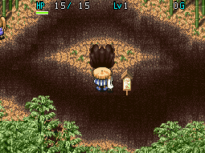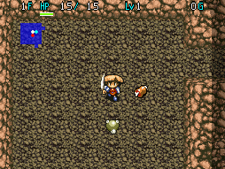

Dungeon where you start with a Bufu's Cleaver and utilize monster meat to progress. Most monster meats replenish 10 fullness, and Bufu's Staff is the only staff found on the ground. The objective is to find Naoki (located on 26F), who gives you Half Warrior Meat before you leave.

Despite the dungeon not allowing carry-in items, Shiren's status doesn't get reset upon entry, so it's possible to level up using a Happy Armband beforehand to start with a huge advantage. However, many players feel that doing so is cheating and goes against the spirit of the game.

<ul class="quickLinksUL">
  <li><a href="#overview">Overview</a></li>
  <li><a href="#strategy">Strategy</a></li>
  <li><a href="#floor-guide">Floor Guide</a></li>
  <li><a href="#monsters">Monsters</a></li>
  <li><a href="#items">Items</a></li>
  <li><a href="#traps">Traps</a></li>
</ul>

# Overview

<table class="dungeonOverview">
  <tr>
    <th>Unlock</th>
    <td class="highlightYellow">1. Clear the main story. 2. Finish the Gaibara side quest. 3. Finish the Naoki side quest. 4. Go to Bamboo Village. 5. Go to where the statue dedicated to Bufu was located.</td>
  </tr>
  <tr>
    <th>Entrance</th>
    <td class="highlightYellow">Bamboo Village (North side of village)</td>
  </tr>
</table>

<table class="dungeonTable">
  <tr>
    <th>Floors</th>
    <td colspan="3">99F (Can escape from 26F)</td>
  </tr>
  <tr>
    <th>Bring Items</th>
    <td>No</td>
    <th>Allies</th>
    <td>Yes</td>
  </tr>
  <tr>
    <th>Bring Gitan</th>
    <td>No</td>
    <th>Bring Level Ups</th>
    <td>Yes</td>
  </tr>
  <tr>
    <th>Starting Item</th>
    <td colspan="3">Bufu's Cleaver, Big Riceball</td>
  </tr>
  <tr>
    <th>Unidentified</th>
    <td colspan="3"></td>
  </tr>
  <tr>
    <th>Shops</th>
    <td>Yes</td>
    <th>Monster Houses</th>
    <td>Yes</td>
  </tr>
  <tr>
    <th>Clear Icon</th>
    <td></td>
    <th>Reward</th>
    <td></td>
  </tr>
</table>

#### Special Monster House Floors

<table class="dungeonTable">
  <tr>
    <th></th>
    <th>Lv1</th>
    <th>Lv2</th>
    <th>Lv3</th>
    <th>Lv4</th>
    <th>ALL</th>
  </tr>
  <tr>
    <th>One-eye</th>
    <td>1-10</td>
    <td>11-40</td>
    <td>41-70</td>
    <td>71-99</td>
    <td>71-99</td>
  </tr>
  <tr>
    <th>Ghost</th>
    <td>1-10</td>
    <td>11-40</td>
    <td>41-70</td>
    <td>71-99</td>
    <td>71-99</td>
  </tr>
  <tr>
    <th>Drain</th>
    <td>1-10</td>
    <td>11-40</td>
    <td>41-70</td>
    <td>71-99</td>
    <td>71-99</td>
  </tr>
  <tr>
    <th>Dragon</th>
    <td>-</td>
    <td>-</td>
    <td>-</td>
    <td>-</td>
    <td>-</td>
  </tr>
  <tr>
    <th>Sky</th>
    <td>-</td>
    <td>-</td>
    <td>-</td>
    <td>-</td>
    <td>-</td>
  </tr>
  <tr>
    <th>Power</th>
    <td>1-10</td>
    <td>11-40</td>
    <td>41-70</td>
    <td>71-99</td>
    <td>71-99</td>
  </tr>
  <tr>
    <th>Thief</th>
    <td>1-30</td>
    <td>31-60</td>
    <td>-</td>
    <td>-</td>
    <td>61-99</td>
  </tr>
  <tr>
    <th>Guard dogs</th>
    <td>-</td>
    <td>-</td>
    <td>-</td>
    <td>-</td>
    <td>-</td>
  </tr>
</table>

# Strategy

### Bringing Allies

This dungeon allows allies, but keep in mind that you never get meat when an ally defeats a monster. So while the beginning may be easier with an ally, it could make the dungeon harder in the long run.

### Level Up Beforehand

Happy Armband is the easiest way to level up before entering this dungeon, but it can take a while. Otherwise, level up a Rice Changer into a Rice Master using Dead Soldiers on 5-7F, then throw a riceball at it. Don't forget to place the Happy Armband inside the Mountaintop Town warehouse so that you don't lose it.

### Equipment

#### Weapon

Bufu's Cleaver is your only option besides getting lucky with a Minotaur's Axe drop from a Taur type. If you equip a Bufu's Cleaver that's cursed and you don't have Curse Girl Meat or Scroll of Blessing, your only other option to obtain meat will be Bufu's Staff - a somewhat dire situation. Therefore, avoid equipping unidentified Bufu's Cleavers.

#### Shield

Melding Jar doesn't appear, so don't expect to be able to upgrade a shield. Use whatever decent shield you find, but avoid Armor Ward due to its faster hunger rate.

### Monster Meat

|Meat|Floor|Notes|
|-|-|-|
|Mamel|1~2|Throw it at a strong monster.|
|Ghost Radish|3~4|Thrown Poison Herb disables most non-Swift monsters. Poison Herbs can also be sold for 240G each.|
|Bowboy|3~5|Collect Wooden Arrows. Crossbowboy Meat for Iron Arrows is better.|
|Evil Soldier Evil General|5~7 15~17|Eat it before you collapse to revive. Doesn't work if you get sealed by Skull Wraith.|
|Crossbowboy Baby Tank|8~10 10~13|Collect Iron Arrows.|
|Dark Owl Ghost Owl Dusk Owl Chaos Owl|8~10 20~26 36~45 61~80|Scroll of Light effect - makes it easy to locate Naoki.|
|Curse Girl Curse Sis Curse Mom Curse Gran|9~10 17~19 46~50 66~75|Removes curses from inventory items not in jars.|
|Pacorepkin Pacorepking Pacorepgod|10~13 46~50 91~99|Move and attack through walls. Beware of Popster Tank types and Death Angels.|
|Gaze Super Gaze Hyper Gaze|10~13 19~22 46~50|Inflict Confused status.|
|Fluffy Bunny|10~30 51~70 91~99|Restore 50 HP.|
|Dadster Tank Oldster Tank|21~24 66~75|Deal fixed damage from a distance.|
|Death Angel Death Master|25~30 61~70|Swift speed, move and attack through walls.|
|Skull Wraith Skull Demon|26~30 61~70|Shoot magic bullets with various powerful effects.|
|Dragon Sky Dragon Ark Dragon|28~35 56~65 90~99|Deal fixed damage from a distance.|

### Other Items

|Item|Notes|
|-|-|
|Bufu's Staff|Transforms a monster into meat.|
|Doppelganger Staff|Useful for a variety of situations.|
|Skull Staff|For single-target fights against troublesome monsters. Paralysis and Postpone staves can't be found.|
|Restorative Herb|Main healing item, since Chiropractic Jar doesn't appear. Evil Soldier Meat is generally better, though.|
|Iron Arrow|Mostly used early ~ mid game to conserve better items.|
|Armband of Sight|Reveals the locations of characters and items.|
|Pitcher's Armband|Throw a Bufu's Staff [0] at a line of monsters, etc.|
|Sleepless Armband|Nice to have for Sleep Radish (46-50F) floors.|
|Scroll of Blessing|Nice to have in case Bufu's Cleaver gets cursed.|

# Floor Guide

### General

Staves found on the ground are always Bufu's Staff in this dungeon. However, staves in shops or those dropped by Thiefwalrus types can be different. 

Healing items are on the limited side, so it's important to avoid damage from stronger enemies. Shoot arrows if there's distance, or throw a Poison Herb or use a Bufu's Staff if they're adjacent. Worst case, Evil Soldier Meat can be eaten before collapsing to revive with full HP and fullness.

It should be fine to start rushing for the stairs as early as 10F if aiming for the 1st clear, but you might want to take things slower if aiming for 99F.

### 1-4F

Meat of weak monsters like Mamel can be thrown to neutralize strong enemies, so don't eat all of them.

# Monsters

See [Monsters](/system/monsters) for individual monster details.

- S - Shop is possible
- H - Monster House is possible
- G - Gitan Vault is possible

Numbers in parentheses are HP values. Spawn Rates: Low Medium High

<table class="monsterTable">
  <thead>
    <tr>
      <th>F</th>
      <th>S</th>
      <th>H</th>
      <th>G</th>
      <th colspan="5">Monsters</th>
    </tr>
  </thead>
  <tbody>
    <tr>
      <td>1</td>
      <td class="highlightShop"></td>
      <td class="highlightMH"></td>
      <td class="highlightGitan"></td>
      <td class="high"> Mamel (5)</td>
      <td class="high"> Pit Mamel (5)</td>
      <td class="high"> Mini Robber (5)</td>
      <td></td>
      <td></td>
    </tr>
    <tr>
      <td colspan="9" class="tableDivider"></td>
    </tr>
    <tr>
      <td>2</td>
      <td class="highlightShop"></td>
      <td class="highlightMH"></td>
      <td class="highlightGitan"></td>
      <td class="high"> Mamel (5)</td>
      <td class="high"> Pit Mamel (5)</td>
      <td class="high"> Mini Robber (5)</td>
      <td></td>
      <td></td>
    </tr>
    <tr>
      <td colspan="9" class="tableDivider"></td>
    </tr>
    <tr>
      <td rowspan="2">3</td>
      <td rowspan="2" class="highlightShop"></td>
      <td rowspan="2" class="highlightMH"></td>
      <td rowspan="2" class="highlightGitan"></td>
      <td class="high"> Bowboy (12)</td>
      <td class="high"> Pit Mamel (5)</td>
      <td class="high"> Mini Robber (5)</td>
      <td class="high"> Ghost Radish (12)</td>
      <td class="high"> Snaky (17)</td>
    </tr>
    <tr>
      <td class="low"> PickPocket (10)</td>
      <td></td>
      <td></td>
      <td></td>
      <td></td>
    </tr>
    <tr>
      <td colspan="9" class="tableDivider"></td>
    </tr>
    <tr>
      <td rowspan="2">4</td>
      <td rowspan="2" class="highlightShop"></td>
      <td rowspan="2" class="highlightMH"></td>
      <td rowspan="2" class="highlightGitan"></td>
      <td class="high"> Bowboy (12)</td>
      <td class="high">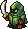 Dark Eye (6)</td>
      <td class="high">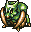 Knifegator (14)</td>
      <td class="high"> Ghost Radish (12)</td>
      <td class="high"> Snaky (17)</td>
    </tr>
    <tr>
      <td class="low"> PickPocket (10)</td>
      <td></td>
      <td></td>
      <td></td>
      <td></td>
    </tr>
    <tr>
      <td colspan="9" class="tableDivider"></td>
    </tr>
    <tr>
      <td rowspan="2">5</td>
      <td rowspan="2" class="highlightShop"></td>
      <td rowspan="2" class="highlightMH"></td>
      <td rowspan="2" class="highlightGitan"></td>
      <td class="high"> Bowboy (12)</td>
      <td class="high"> Dark Eye (6)</td>
      <td class="high"> Knifegator (14)</td>
      <td class="high">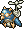 Flying Fowl (16)</td>
      <td class="high"> Rice Changer (23)</td>
    </tr>
    <tr>
      <td class="low"> PickPocket (10)</td>
      <td class="high">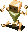 Polygon Spin (25)</td>
      <td class="mid"> Evil Soldier (18)</td>
      <td class="low"> Egg Thing (5)</td>
      <td></td>
    </tr>
    <tr>
      <td colspan="9" class="tableDivider"></td>
    </tr>
    <tr>
      <td rowspan="2">6</td>
      <td rowspan="2" class="highlightShop"></td>
      <td rowspan="2" class="highlightMH"></td>
      <td rowspan="2" class="highlightGitan"></td>
      <td class="high">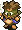 Robber (12)</td>
      <td class="high">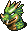 Floor Dragon (20)</td>
      <td></td>
      <td class="high"> Flying Fowl (16)</td>
      <td class="high"> Rice Changer (23)</td>
    </tr>
    <tr>
      <td class="low"> PickPocket (10)</td>
      <td class="high"> Polygon Spin (25)</td>
      <td class="mid"> Evil Soldier (18)</td>
      <td class="low"> Egg Thing (5)</td>
      <td></td>
    </tr>
    <tr>
      <td colspan="9" class="tableDivider"></td>
    </tr>
    <tr>
      <td rowspan="2">7</td>
      <td rowspan="2" class="highlightShop"></td>
      <td rowspan="2" class="highlightMH"></td>
      <td rowspan="2" class="highlightGitan"></td>
      <td class="high"> Robber (12)</td>
      <td class="high"> Floor Dragon (20)</td>
      <td class="high"> Skull Mage (21)</td>
      <td class="low"> Flying Fowl (16)</td>
      <td class="high"> Death Reaper (23)</td>
    </tr>
    <tr>
      <td class="low"> PickPocket (10)</td>
      <td class="high"> Polygon Spin (25)</td>
      <td class="mid"> Evil Soldier (18)</td>
      <td class="low"> Egg Thing (5)</td>
      <td></td>
    </tr>
    <tr>
      <td colspan="9" class="tableDivider"></td>
    </tr>
    <tr>
      <td rowspan="3">8</td>
      <td rowspan="3" class="highlightShop"></td>
      <td rowspan="3" class="highlightMH"></td>
      <td rowspan="3" class="highlightGitan"></td>
      <td class="high"> Robber (12)</td>
      <td class="high">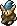 Crossbowboy (16)</td>
      <td class="high"> Skull Mage (21)</td>
      <td class="high"> Tiger Uho (33)</td>
      <td class="high"> Death Reaper (23)</td>
    </tr>
    <tr>
      <td class="high"> Spike Bomb (50)</td>
      <td class="low"> N'Duba (30)</td>
      <td class="low">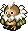 Dark Owl (4)</td>
      <td class="low"> Egg Thing (5)</td>
      <td class="low"> Thief (15)</td>
    </tr>
    <tr>
      <td class="mid"> Soldier Ant (20)</td>
      <td></td>
      <td></td>
      <td></td>
      <td></td>
    </tr>
    <tr>
      <td colspan="9" class="tableDivider"></td>
    </tr>
    <tr>
      <td rowspan="3">9</td>
      <td rowspan="3" class="highlightShop"></td>
      <td rowspan="3" class="highlightMH"></td>
      <td rowspan="3" class="highlightGitan"></td>
      <td class="mid"> Curse Girl (25)</td>
      <td class="high"> Crossbowboy (16)</td>
      <td class="high"> Skull Mage (21)</td>
      <td class="high"> Tiger Uho (33)</td>
      <td class="high"> Death Reaper (23)</td>
    </tr>
    <tr>
      <td class="high"> Spike Bomb (50)</td>
      <td class="low"> N'Duba (30)</td>
      <td class="low"> Dark Owl (4)</td>
      <td class="low"> Egg Thing (5)</td>
      <td class="low"> Thief (15)</td>
    </tr>
    <tr>
      <td class="mid"> Soldier Ant (20)</td>
      <td></td>
      <td></td>
      <td></td>
      <td></td>
    </tr>
    <tr>
      <td colspan="9" class="tableDivider"></td>
    </tr>
    <tr>
      <td rowspan="3">10</td>
      <td rowspan="3" class="highlightShop"></td>
      <td rowspan="3" class="highlightMH"></td>
      <td rowspan="3" class="highlightGitan"></td>
      <td class="mid"> Curse Girl (25)</td>
      <td class="high"> Crossbowboy (16)</td>
      <td class="high"> Dremlas (40)</td>
      <td class="high"> Tiger Uho (33)</td>
      <td class="low"> Fluffy Bunny (5)</td>
    </tr>
    <tr>
      <td class="high"> Spike Bomb (50)</td>
      <td class="low"> N'Duba (30)</td>
      <td class="low"> Dark Owl (4)</td>
      <td class="low"> Running Egg (5)</td>
      <td class="low"> Thief (15)</td>
    </tr>
    <tr>
      <td class="mid"> Baby Tank (25)</td>
      <td class="high"> Pacorepkin (28)</td>
      <td class="high">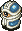 Gaze (18)</td>
      <td></td>
      <td></td>
    </tr>
    <tr>
      <td colspan="9" class="tableDivider"></td>
    </tr>
    <tr>
      <td rowspan="3">11</td>
      <td rowspan="3" class="highlightShop"></td>
      <td rowspan="3" class="highlightMH"></td>
      <td rowspan="3" class="highlightGitan"></td>
      <td class="high"> Flutter Fowl (30)</td>
      <td></td>
      <td class="high"> Dremlas (40)</td>
      <td></td>
      <td class="low"> Fluffy Bunny (5)</td>
    </tr>
    <tr>
      <td class="high"> Spike Bomb (50)</td>
      <td class="low"> N'Duba (30)</td>
      <td class="low"> Dark Owl (4)</td>
      <td class="low"> Running Egg (5)</td>
      <td class="low"> Thief (15)</td>
    </tr>
    <tr>
      <td class="mid"> Baby Tank (25)</td>
      <td class="high"> Pacorepkin (28)</td>
      <td class="high"> Gaze (18)</td>
      <td></td>
      <td></td>
    </tr>
    <tr>
      <td colspan="9" class="tableDivider"></td>
    </tr>
    <tr>
      <td rowspan="3">12</td>
      <td rowspan="3" class="highlightShop"></td>
      <td rowspan="3" class="highlightMH"></td>
      <td rowspan="3" class="highlightGitan"></td>
      <td class="high"> Flutter Fowl (30)</td>
      <td class="high"> Fog Hermit (25)</td>
      <td class="high"> Dremlas (40)</td>
      <td class="high">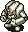 Parthenos (30)</td>
      <td class="low"> Fluffy Bunny (5)</td>
    </tr>
    <tr>
      <td class="high"> Spike Bomb (50)</td>
      <td class="low"> N'Duba (30)</td>
      <td class="low"> Dark Owl (4)</td>
      <td class="low"> Running Egg (5)</td>
      <td class="low"> Thief (15)</td>
    </tr>
    <tr>
      <td class="mid"> Baby Tank (25)</td>
      <td class="high"> Pacorepkin (28)</td>
      <td class="high"> Gaze (18)</td>
      <td></td>
      <td></td>
    </tr>
    <tr>
      <td colspan="9" class="tableDivider"></td>
    </tr>
    <tr>
      <td rowspan="3">13</td>
      <td rowspan="3" class="highlightShop"></td>
      <td rowspan="3" class="highlightMH"></td>
      <td rowspan="3" class="highlightGitan"></td>
      <td class="high"> Flutter Fowl (30)</td>
      <td class="high"> Fog Hermit (25)</td>
      <td class="high"> Dremlas (40)</td>
      <td class="high"> Parthenos (30)</td>
      <td class="low"> Fluffy Bunny (5)</td>
    </tr>
    <tr>
      <td class="high"> Spike Bomb (50)</td>
      <td class="low"> N'Duba (30)</td>
      <td class="low"> Dark Owl (4)</td>
      <td class="low"> Running Egg (5)</td>
      <td class="low"> Thief (15)</td>
    </tr>
    <tr>
      <td class="mid"> Baby Tank (25)</td>
      <td class="high"> Pacorepkin (28)</td>
      <td class="high"> Gaze (18)</td>
      <td class="mid">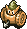 Mini Tank (28)</td>
      <td></td>
    </tr>
    <tr>
      <td colspan="9" class="tableDivider"></td>
    </tr>
    <tr>
      <td rowspan="3">14</td>
      <td rowspan="3" class="highlightShop"></td>
      <td rowspan="3" class="highlightMH"></td>
      <td rowspan="3" class="highlightGitan"></td>
      <td class="high"> Flutter Fowl (30)</td>
      <td class="high"> Fog Hermit (25)</td>
      <td class="high"> Dremlas (40)</td>
      <td class="high"> Parthenos (30)</td>
      <td class="low"> Fluffy Bunny (5)</td>
    </tr>
    <tr>
      <td class="high"> Sabregator (35)</td>
      <td class="low"> N'Duba (30)</td>
      <td class="low"> Dark Owl (4)</td>
      <td class="low"> Running Egg (5)</td>
      <td class="low"> Thief (15)</td>
    </tr>
    <tr>
      <td></td>
      <td></td>
      <td></td>
      <td class="mid"> Mini Tank (28)</td>
      <td></td>
    </tr>
    <tr>
      <td colspan="9" class="tableDivider"></td>
    </tr>
    <tr>
      <td rowspan="3">15</td>
      <td rowspan="3" class="highlightShop"></td>
      <td rowspan="3" class="highlightMH"></td>
      <td rowspan="3" class="highlightGitan"></td>
      <td class="high"> Twisty Hani (25)</td>
      <td class="high"> Daze Radish (30)</td>
      <td class="high"> Skull Wizard (35)</td>
      <td class="high"> Cell Armor (35)</td>
      <td class="low"> Fluffy Bunny (5)</td>
    </tr>
    <tr>
      <td class="high"> Sabregator (35)</td>
      <td class="low"> N'Duba (30)</td>
      <td class="high"> Purple Slime (40)</td>
      <td class="low"> Running Egg (5)</td>
      <td class="mid"> Evil General (30)</td>
    </tr>
    <tr>
      <td class="mid">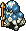 Corporal Ant (35)</td>
      <td></td>
      <td></td>
      <td class="mid"> Mini Tank (28)</td>
      <td></td>
    </tr>
    <tr>
      <td colspan="9" class="tableDivider"></td>
    </tr>
    <tr>
      <td rowspan="3">16</td>
      <td rowspan="3" class="highlightShop"></td>
      <td rowspan="3" class="highlightMH"></td>
      <td rowspan="3" class="highlightGitan"></td>
      <td class="high"> Twisty Hani (25)</td>
      <td class="high"> Daze Radish (30)</td>
      <td class="high"> Skull Wizard (35)</td>
      <td class="high"> Cell Armor (35)</td>
      <td class="low"> Fluffy Bunny (5)</td>
    </tr>
    <tr>
      <td class="high"> Hell Reaper (45)</td>
      <td class="low"> N'Duba (30)</td>
      <td class="high"> Purple Slime (40)</td>
      <td class="low"> Running Egg (5)</td>
      <td class="mid"> Evil General (30)</td>
    </tr>
    <tr>
      <td class="mid"> Corporal Ant (35)</td>
      <td></td>
      <td></td>
      <td class="mid"> Mini Tank (28)</td>
      <td></td>
    </tr>
    <tr>
      <td colspan="9" class="tableDivider"></td>
    </tr>
    <tr>
      <td rowspan="2">17</td>
      <td rowspan="2" class="highlightShop"></td>
      <td rowspan="2" class="highlightMH"></td>
      <td rowspan="2" class="highlightGitan"></td>
      <td class="high"> Chainhead (50)</td>
      <td class="high"> Master Hen (50)</td>
      <td class="high"> Skull Wizard (35)</td>
      <td class="high"> Cell Armor (35)</td>
      <td class="low"> Fluffy Bunny (5)</td>
    </tr>
    <tr>
      <td class="high"> Hell Reaper (45)</td>
      <td class="mid"> Curse Sis (33)</td>
      <td class="low"> N'Dulu (35)</td>
      <td class="low"> Greenwalrus (58)</td>
      <td class="mid"> Evil General (30)</td>
    </tr>
    <tr>
      <td colspan="9" class="tableDivider"></td>
    </tr>
    <tr>
      <td rowspan="2">18</td>
      <td rowspan="2" class="highlightShop"></td>
      <td rowspan="2" class="highlightMH"></td>
      <td rowspan="2" class="highlightGitan"></td>
      <td class="high"> Chainhead (50)</td>
      <td class="high"> Master Hen (50)</td>
      <td class="high"> Skull Wizard (35)</td>
      <td class="high">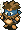 Robber Chief (40)</td>
      <td class="low"> Fluffy Bunny (5)</td>
    </tr>
    <tr>
      <td class="high"> Hell Reaper (45)</td>
      <td class="mid"> Curse Sis (33)</td>
      <td class="low"> N'Dulu (35)</td>
      <td class="low"> Greenwalrus (58)</td>
      <td></td>
    </tr>
    <tr>
      <td colspan="9" class="tableDivider"></td>
    </tr>
    <tr>
      <td rowspan="2">19</td>
      <td rowspan="2" class="highlightShop"></td>
      <td rowspan="2" class="highlightMH"></td>
      <td rowspan="2" class="highlightGitan"></td>
      <td class="high"> Chainhead (50)</td>
      <td class="high"> Master Hen (50)</td>
      <td class="high"> Super Gaze (51)</td>
      <td class="high"> Robber Chief (40)</td>
      <td class="low"> Fluffy Bunny (5)</td>
    </tr>
    <tr>
      <td class="high"> Hell Reaper (45)</td>
      <td class="mid"> Curse Sis (33)</td>
      <td class="low"> N'Dulu (35)</td>
      <td class="low"> Greenwalrus (58)</td>
      <td></td>
    </tr>
    <tr>
      <td colspan="9" class="tableDivider"></td>
    </tr>
    <tr>
      <td rowspan="2">20</td>
      <td rowspan="2" class="highlightShop"></td>
      <td rowspan="2" class="highlightMH"></td>
      <td rowspan="2" class="highlightGitan"></td>
      <td class="high"> Chainhead (50)</td>
      <td class="high"> Blazepuff (40)</td>
      <td class="high"> Super Gaze (51)</td>
      <td class="high"> Robber Chief (40)</td>
      <td class="low"> Fluffy Bunny (5)</td>
    </tr>
    <tr>
      <td class="high"> Mistonos (50)</td>
      <td class="low"> Ghost Owl (7)</td>
      <td class="low"> N'Dulu (35)</td>
      <td class="low"> Greenwalrus (58)</td>
      <td></td>
    </tr>
    <tr>
      <td colspan="9" class="tableDivider"></td>
    </tr>
    <tr>
      <td rowspan="3">21</td>
      <td rowspan="3" class="highlightShop"></td>
      <td rowspan="3" class="highlightMH"></td>
      <td rowspan="3" class="highlightGitan"></td>
      <td class="high"> Dadster Tank (40)</td>
      <td class="high"> Blazepuff (40)</td>
      <td class="high"> Super Gaze (51)</td>
      <td class="high"> Robber Chief (40)</td>
      <td class="low"> Fluffy Bunny (5)</td>
    </tr>
    <tr>
      <td class="high"> Mistonos (50)</td>
      <td class="low"> Ghost Owl (7)</td>
      <td class="low"> N'Dulu (35)</td>
      <td class="low"> Greenwalrus (58)</td>
      <td class="high"> Mecharoid (60)</td>
    </tr>
    <tr>
      <td class="low"> Schubell (15)</td>
      <td class="low"> Menbell (25)</td>
      <td></td>
      <td></td>
      <td></td>
    </tr>
    <tr>
      <td colspan="9" class="tableDivider"></td>
    </tr>
    <tr>
      <td rowspan="3">22</td>
      <td rowspan="3" class="highlightShop"></td>
      <td rowspan="3" class="highlightMH"></td>
      <td rowspan="3" class="highlightGitan"></td>
      <td class="high"> Dadster Tank (40)</td>
      <td class="high"> Blazepuff (40)</td>
      <td class="high"> Super Gaze (51)</td>
      <td class="high"> Rice Boss (38)</td>
      <td class="low"> Fluffy Bunny (5)</td>
    </tr>
    <tr>
      <td class="high"> Mistonos (50)</td>
      <td class="low"> Ghost Owl (7)</td>
      <td class="low"> N'Dulu (35)</td>
      <td class="low"> Flying Egg (8)</td>
      <td class="high"> Mecharoid (60)</td>
    </tr>
    <tr>
      <td class="low"> Schubell (15)</td>
      <td class="low"> Menbell (25)</td>
      <td></td>
      <td></td>
      <td></td>
    </tr>
    <tr>
      <td colspan="9" class="tableDivider"></td>
    </tr>
    <tr>
      <td rowspan="3">23</td>
      <td rowspan="3" class="highlightShop"></td>
      <td rowspan="3" class="highlightMH"></td>
      <td rowspan="3" class="highlightGitan"></td>
      <td class="high"> Dadster Tank (40)</td>
      <td class="high"> Haze Hermit (45)</td>
      <td class="high"> Minotaur (55)</td>
      <td class="high"> Rice Boss (38)</td>
      <td class="low"> Fluffy Bunny (5)</td>
    </tr>
    <tr>
      <td></td>
      <td class="low"> Ghost Owl (7)</td>
      <td class="low"> N'Dulu (35)</td>
      <td class="low"> Flying Egg (8)</td>
      <td class="high"> Mecharoid (60)</td>
    </tr>
    <tr>
      <td class="low"> Schubell (15)</td>
      <td class="low"> Menbell (25)</td>
      <td></td>
      <td></td>
      <td></td>
    </tr>
    <tr>
      <td colspan="9" class="tableDivider"></td>
    </tr>
    <tr>
      <td rowspan="3">24</td>
      <td rowspan="3" class="highlightShop"></td>
      <td rowspan="3" class="highlightMH"></td>
      <td rowspan="3" class="highlightGitan"></td>
      <td class="high"> Dadster Tank (40)</td>
      <td class="high"> Haze Hermit (45)</td>
      <td class="high"> Minotaur (55)</td>
      <td class="high"> Rice Boss (38)</td>
      <td class="low"> Fluffy Bunny (5)</td>
    </tr>
    <tr>
      <td></td>
      <td class="low"> Ghost Owl (7)</td>
      <td class="low"> N'Dulu (35)</td>
      <td class="low"> Flying Egg (8)</td>
      <td></td>
    </tr>
    <tr>
      <td class="low"> Schubell (15)</td>
      <td class="low"> Menbell (25)</td>
      <td></td>
      <td></td>
      <td></td>
    </tr>
    <tr>
      <td colspan="9" class="tableDivider"></td>
    </tr>
    <tr>
      <td rowspan="3">25</td>
      <td rowspan="3" class="highlightShop"></td>
      <td rowspan="3" class="highlightMH"></td>
      <td rowspan="3" class="highlightGitan"></td>
      <td class="high"> Death Angel (65)</td>
      <td class="high"> Haze Hermit (45)</td>
      <td class="high"> Minotaur (55)</td>
      <td class="high"> Rice Boss (38)</td>
      <td class="low"> Fluffy Bunny (5)</td>
    </tr>
    <tr>
      <td></td>
      <td class="low"> Ghost Owl (7)</td>
      <td class="low"> N'Dulu (35)</td>
      <td class="low"> Flying Egg (8)</td>
      <td></td>
    </tr>
    <tr>
      <td class="low"> Schubell (15)</td>
      <td class="low"> Menbell (25)</td>
      <td></td>
      <td></td>
      <td></td>
    </tr>
    <tr>
      <td colspan="9" class="tableDivider"></td>
    </tr>
    <tr>
      <td rowspan="2">26</td>
      <td rowspan="2" class="highlightShop"></td>
      <td rowspan="2" class="highlightMH"></td>
      <td rowspan="2" class="highlightGitan"></td>
      <td class="high"> Death Angel (65)</td>
      <td class="high"> Metal Armor (65)</td>
      <td class="high"> Skull Wraith (60)</td>
      <td class="mid"> Captain Ant (50)</td>
      <td class="low"> Fluffy Bunny (5)</td>
    </tr>
    <tr>
      <td class="high"> Hover Fowl (45)</td>
      <td class="low"> Ghost Owl (7)</td>
      <td class="low"> N'Dulu (35)</td>
      <td></td>
      <td></td>
    </tr>
    <tr>
      <td colspan="9" class="tableDivider"></td>
    </tr>
    <tr>
      <td rowspan="2">27</td>
      <td rowspan="2" class="highlightShop"></td>
      <td rowspan="2" class="highlightMH"></td>
      <td rowspan="2" class="highlightGitan"></td>
      <td class="high"> Death Angel (65)</td>
      <td class="high"> Metal Armor (65)</td>
      <td class="high"> Skull Wraith (60)</td>
      <td class="mid"> Captain Ant (50)</td>
      <td class="low"> Fluffy Bunny (5)</td>
    </tr>
    <tr>
      <td class="high"> Hover Fowl (45)</td>
      <td></td>
      <td class="low"> N'Dulu (35)</td>
      <td></td>
      <td></td>
    </tr>
    <tr>
      <td colspan="9" class="tableDivider"></td>
    </tr>
    <tr>
      <td rowspan="3">28</td>
      <td rowspan="3" class="highlightShop"></td>
      <td rowspan="3" class="highlightMH"></td>
      <td rowspan="3" class="highlightGitan"></td>
      <td class="high"> Death Angel (65)</td>
      <td class="high"> Metal Armor (65)</td>
      <td class="high"> Skull Wraith (60)</td>
      <td class="mid"> Captain Ant (50)</td>
      <td class="low"> Fluffy Bunny (5)</td>
    </tr>
    <tr>
      <td class="high"> Hover Fowl (45)</td>
      <td class="high"> Madremlas (60)</td>
      <td class="low"> N'Dulu (35)</td>
      <td class="high"> Tiger Uhoho (65)</td>
      <td class="high"> Dragon Head (70)</td>
    </tr>
    <tr>
      <td class="high"> Dragon (90)</td>
      <td class="high"> Piggo (50)</td>
      <td></td>
      <td></td>
      <td></td>
    </tr>
    <tr>
      <td colspan="9" class="tableDivider"></td>
    </tr>
    <tr>
      <td rowspan="3">29</td>
      <td rowspan="3" class="highlightShop"></td>
      <td rowspan="3" class="highlightMH"></td>
      <td rowspan="3" class="highlightGitan"></td>
      <td class="high"> Death Angel (65)</td>
      <td class="high"> Metal Armor (65)</td>
      <td class="high"> Skull Wraith (60)</td>
      <td class="mid"> Captain Ant (50)</td>
      <td class="low"> Fluffy Bunny (5)</td>
    </tr>
    <tr>
      <td class="high"> Hover Fowl (45)</td>
      <td class="high"> Madremlas (60)</td>
      <td class="low"> N'Dulu (35)</td>
      <td class="high"> Tiger Uhoho (65)</td>
      <td class="high"> Dragon Head (70)</td>
    </tr>
    <tr>
      <td class="high"> Dragon (90)</td>
      <td class="high"> Piggo (50)</td>
      <td></td>
      <td></td>
      <td></td>
    </tr>
    <tr>
      <td colspan="9" class="tableDivider"></td>
    </tr>
    <tr>
      <td rowspan="3">30</td>
      <td rowspan="3" class="highlightShop"></td>
      <td rowspan="3" class="highlightMH"></td>
      <td rowspan="3" class="highlightGitan"></td>
      <td class="high"> Death Angel (65)</td>
      <td class="high"> Metal Armor (65)</td>
      <td class="high"> Skull Wraith (60)</td>
      <td class="mid"> Captain Ant (50)</td>
      <td class="low"> Fluffy Bunny (5)</td>
    </tr>
    <tr>
      <td class="high"> Hover Fowl (45)</td>
      <td class="high"> Madremlas (60)</td>
      <td class="low"> N'Dulu (35)</td>
      <td class="high"> Tiger Uhoho (65)</td>
      <td class="high"> Dragon Head (70)</td>
    </tr>
    <tr>
      <td class="high"> Dragon (90)</td>
      <td class="high"> Piggo (50)</td>
      <td class="low"> Ironwalrus (70)</td>
      <td></td>
      <td></td>
    </tr>
    <tr>
      <td colspan="9" class="tableDivider"></td>
    </tr>
    <tr>
      <td rowspan="2">31</td>
      <td rowspan="2" class="highlightShop"></td>
      <td rowspan="2" class="highlightMH"></td>
      <td rowspan="2" class="highlightGitan"></td>
      <td class="high">Kigny2 (60)</td>
      <td class="high"> Madremlas (60)</td>
      <td class="low"> N'Bama (40)</td>
      <td class="mid"> Captain Ant (50)</td>
      <td class="high"> Dragon Head (70)</td>
    </tr>
    <tr>
      <td class="high"> Dragon (90)</td>
      <td class="high"> Piggo (50)</td>
      <td class="low"> Ironwalrus (70)</td>
      <td class="high"> Tiger Uhoho (65)</td>
      <td></td>
    </tr>
    <tr>
      <td colspan="9" class="tableDivider"></td>
    </tr>
    <tr>
      <td rowspan="2">32</td>
      <td rowspan="2" class="highlightShop"></td>
      <td rowspan="2" class="highlightMH"></td>
      <td rowspan="2" class="highlightGitan"></td>
      <td class="high">Kigny2 (60)</td>
      <td class="high"> Madremlas (60)</td>
      <td class="low"> N'Bama (40)</td>
      <td class="mid"> Captain Ant (50)</td>
      <td class="high"> Dragon Head (70)</td>
    </tr>
    <tr>
      <td class="high"> Dragon (90)</td>
      <td class="high"> Piggo (50)</td>
      <td class="low"> Ironwalrus (70)</td>
      <td class="high"> Tiger Uhoho (65)</td>
      <td></td>
    </tr>
    <tr>
      <td colspan="9" class="tableDivider"></td>
    </tr>
    <tr>
      <td rowspan="2">33</td>
      <td rowspan="2" class="highlightShop"></td>
      <td rowspan="2" class="highlightMH"></td>
      <td rowspan="2" class="highlightGitan"></td>
      <td class="high">Kigny2 (60)</td>
      <td class="high"> Madremlas (60)</td>
      <td class="low"> N'Bama (40)</td>
      <td class="mid"> Captain Ant (50)</td>
      <td class="high"> Dragon Head (70)</td>
    </tr>
    <tr>
      <td class="high"> Dragon (90)</td>
      <td class="high"> Piggo (50)</td>
      <td class="low"> Ironwalrus (70)</td>
      <td class="high"> Tiger Uhoho (65)</td>
      <td></td>
    </tr>
    <tr>
      <td colspan="9" class="tableDivider"></td>
    </tr>
    <tr>
      <td rowspan="2">34</td>
      <td rowspan="2" class="highlightShop"></td>
      <td rowspan="2" class="highlightMH"></td>
      <td rowspan="2" class="highlightGitan"></td>
      <td class="high">Kigny2 (60)</td>
      <td class="high"> Madremlas (60)</td>
      <td class="low"> N'Bama (40)</td>
      <td class="mid"> Captain Ant (50)</td>
      <td class="high"> Dragon Head (70)</td>
    </tr>
    <tr>
      <td class="high"> Dragon (90)</td>
      <td class="high"> Piggo (50)</td>
      <td class="low"> Ironwalrus (70)</td>
      <td class="high"> Tiger Uhoho (65)</td>
      <td></td>
    </tr>
    <tr>
      <td colspan="9" class="tableDivider"></td>
    </tr>
    <tr>
      <td rowspan="2">35</td>
      <td rowspan="2" class="highlightShop"></td>
      <td rowspan="2" class="highlightMH"></td>
      <td rowspan="2" class="highlightGitan"></td>
      <td class="high">Kigny2 (60)</td>
      <td class="high"> Madremlas (60)</td>
      <td class="low"> N'Bama (40)</td>
      <td class="mid"> Captain Ant (50)</td>
      <td class="high"> Dragon Head (70)</td>
    </tr>
    <tr>
      <td class="high"> Dragon (90)</td>
      <td class="high"> Piggo (50)</td>
      <td class="low"> Ironwalrus (70)</td>
      <td class="high"> Tiger Uhoho (65)</td>
      <td></td>
    </tr>
    <tr>
      <td colspan="9" class="tableDivider"></td>
    </tr>
    <tr>
      <td rowspan="2">36</td>
      <td rowspan="2" class="highlightShop"></td>
      <td rowspan="2" class="highlightMH"></td>
      <td rowspan="2" class="highlightGitan"></td>
      <td class="high">Kigny2 (60)</td>
      <td class="high"> Killer Gather (60)</td>
      <td class="low"> N'Bama (40)</td>
      <td class="high">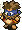 Robber Lord (60)</td>
      <td class="high"> Verginos (70)</td>
    </tr>
    <tr>
      <td class="high"> Gigahead (70)</td>
      <td class="high"> Spike Fire (120)</td>
      <td class="low"> Ironwalrus (70)</td>
      <td class="low"> Dusk Owl (10)</td>
      <td></td>
    </tr>
    <tr>
      <td colspan="9" class="tableDivider"></td>
    </tr>
    <tr>
      <td rowspan="2">37</td>
      <td rowspan="2" class="highlightShop"></td>
      <td rowspan="2" class="highlightMH"></td>
      <td rowspan="2" class="highlightGitan"></td>
      <td class="high">Kigny2 (60)</td>
      <td class="high"> Killer Gather (60)</td>
      <td class="low"> N'Bama (40)</td>
      <td class="high"> Robber Lord (60)</td>
      <td class="high"> Verginos (70)</td>
    </tr>
    <tr>
      <td class="high"> Gigahead (70)</td>
      <td class="high"> Spike Fire (120)</td>
      <td class="low"> Ironwalrus (70)</td>
      <td class="low"> Dusk Owl (10)</td>
      <td></td>
    </tr>
    <tr>
      <td colspan="9" class="tableDivider"></td>
    </tr>
    <tr>
      <td rowspan="2">38</td>
      <td rowspan="2" class="highlightShop"></td>
      <td rowspan="2" class="highlightMH"></td>
      <td rowspan="2" class="highlightGitan"></td>
      <td class="high">Kigny2 (60)</td>
      <td class="high"> Killer Gather (60)</td>
      <td class="low"> N'Bama (40)</td>
      <td class="high"> Robber Lord (60)</td>
      <td class="high"> Verginos (70)</td>
    </tr>
    <tr>
      <td class="high"> Gigahead (70)</td>
      <td class="high"> Spike Fire (120)</td>
      <td class="low"> Ironwalrus (70)</td>
      <td class="low"> Dusk Owl (10)</td>
      <td></td>
    </tr>
    <tr>
      <td colspan="9" class="tableDivider"></td>
    </tr>
    <tr>
      <td rowspan="2">39</td>
      <td rowspan="2" class="highlightShop"></td>
      <td rowspan="2" class="highlightMH"></td>
      <td rowspan="2" class="highlightGitan"></td>
      <td class="high">Kigny2 (60)</td>
      <td class="high"> Killer Gather (60)</td>
      <td class="low"> N'Bama (40)</td>
      <td class="high"> Robber Lord (60)</td>
      <td class="high"> Verginos (70)</td>
    </tr>
    <tr>
      <td class="high"> Gigahead (70)</td>
      <td class="high"> Spike Fire (120)</td>
      <td class="low"> Ironwalrus (70)</td>
      <td class="low"> Dusk Owl (10)</td>
      <td></td>
    </tr>
    <tr>
      <td colspan="9" class="tableDivider"></td>
    </tr>
    <tr>
      <td rowspan="3">40</td>
      <td rowspan="3" class="highlightShop"></td>
      <td rowspan="3" class="highlightMH"></td>
      <td rowspan="3" class="highlightGitan"></td>
      <td class="high">Kigny2 (60)</td>
      <td class="high"> Killer Gather (60)</td>
      <td class="low"> N'Bama (40)</td>
      <td class="high"> Robber Lord (60)</td>
      <td class="high"> Verginos (70)</td>
    </tr>
    <tr>
      <td class="high"> Gigahead (70)</td>
      <td class="high"> Spike Fire (120)</td>
      <td class="low"> Ironwalrus (70)</td>
      <td class="low"> Dusk Owl (10)</td>
      <td class="high"> Pythy (70)</td>
    </tr>
    <tr>
      <td class="high"> Floppy Hani (40)</td>
      <td></td>
      <td></td>
      <td></td>
      <td></td>
    </tr>
    <tr>
      <td colspan="9" class="tableDivider"></td>
    </tr>
    <tr>
      <td rowspan="3">41</td>
      <td rowspan="3" class="highlightShop"></td>
      <td rowspan="3" class="highlightMH"></td>
      <td rowspan="3" class="highlightGitan"></td>
      <td class="high"> Inferno3 (65)</td>
      <td class="high"> Killer Gather (60)</td>
      <td class="low"> N'Bama (40)</td>
      <td class="high"> Robber Lord (60)</td>
      <td class="high"> Steel Armor (80)</td>
    </tr>
    <tr>
      <td class="high"> Gigahead (70)</td>
      <td class="high"> Spike Fire (120)</td>
      <td class="low"> Ironwalrus (70)</td>
      <td class="low"> Dusk Owl (10)</td>
      <td class="high"> Pythy (70)</td>
    </tr>
    <tr>
      <td class="high"> Floppy Hani (40)</td>
      <td class="high"> Polygon Song (80)</td>
      <td></td>
      <td></td>
      <td></td>
    </tr>
    <tr>
      <td colspan="9" class="tableDivider"></td>
    </tr>
    <tr>
      <td rowspan="3">42</td>
      <td rowspan="3" class="highlightShop"></td>
      <td rowspan="3" class="highlightMH"></td>
      <td rowspan="3" class="highlightGitan"></td>
      <td class="high"> Inferno3 (65)</td>
      <td class="high"> Killer Gather (60)</td>
      <td class="low"> N'Bama (40)</td>
      <td></td>
      <td class="high"> Steel Armor (80)</td>
    </tr>
    <tr>
      <td class="high"> Gigahead (70)</td>
      <td class="high"> Spike Fire (120)</td>
      <td class="low"> Ironwalrus (70)</td>
      <td class="low"> Dusk Owl (10)</td>
      <td class="high"> Pythy (70)</td>
    </tr>
    <tr>
      <td class="high"> Floppy Hani (40)</td>
      <td class="high"> Polygon Song (80)</td>
      <td></td>
      <td></td>
      <td></td>
    </tr>
    <tr>
      <td colspan="9" class="tableDivider"></td>
    </tr>
    <tr>
      <td rowspan="3">43</td>
      <td rowspan="3" class="highlightShop"></td>
      <td rowspan="3" class="highlightMH"></td>
      <td rowspan="3" class="highlightGitan"></td>
      <td class="high"> Inferno3 (65)</td>
      <td class="high"> Killer Gather (60)</td>
      <td class="low"> N'Bama (40)</td>
      <td></td>
      <td class="high"> Steel Armor (80)</td>
    </tr>
    <tr>
      <td class="high"> Gigahead (70)</td>
      <td class="high"> Spike Fire (120)</td>
      <td class="low"> Ironwalrus (70)</td>
      <td class="low"> Dusk Owl (10)</td>
      <td class="high"> Pythy (70)</td>
    </tr>
    <tr>
      <td class="high"> Floppy Hani (40)</td>
      <td class="high"> Polygon Song (80)</td>
      <td></td>
      <td></td>
      <td></td>
    </tr>
    <tr>
      <td colspan="9" class="tableDivider"></td>
    </tr>
    <tr>
      <td rowspan="3">44</td>
      <td rowspan="3" class="highlightShop"></td>
      <td rowspan="3" class="highlightMH"></td>
      <td rowspan="3" class="highlightGitan"></td>
      <td class="high"> Inferno3 (65)</td>
      <td class="high"> Killer Gather (60)</td>
      <td class="low"> N'Bama (40)</td>
      <td></td>
      <td class="high"> Steel Armor (80)</td>
    </tr>
    <tr>
      <td class="high"> Gigahead (70)</td>
      <td class="high"> Spike Fire (120)</td>
      <td class="low"> Ironwalrus (70)</td>
      <td class="low"> Dusk Owl (10)</td>
      <td class="high"> Pythy (70)</td>
    </tr>
    <tr>
      <td></td>
      <td class="high"> Polygon Song (80)</td>
      <td></td>
      <td></td>
      <td></td>
    </tr>
    <tr>
      <td colspan="9" class="tableDivider"></td>
    </tr>
    <tr>
      <td rowspan="3">45</td>
      <td rowspan="3" class="highlightShop"></td>
      <td rowspan="3" class="highlightMH"></td>
      <td rowspan="3" class="highlightGitan"></td>
      <td class="high"> Inferno3 (65)</td>
      <td class="high"> Killer Gather (60)</td>
      <td class="low"> N'Bama (40)</td>
      <td></td>
      <td class="high"> Steel Armor (80)</td>
    </tr>
    <tr>
      <td class="high"> Gigahead (70)</td>
      <td class="high"> Spike Fire (120)</td>
      <td class="low"> Ironwalrus (70)</td>
      <td class="low"> Dusk Owl (10)</td>
      <td class="high"> Pythy (70)</td>
    </tr>
    <tr>
      <td></td>
      <td class="high"> Polygon Song (80)</td>
      <td></td>
      <td></td>
      <td></td>
    </tr>
    <tr>
      <td colspan="9" class="tableDivider"></td>
    </tr>
    <tr>
      <td rowspan="2">46</td>
      <td rowspan="2" class="highlightShop"></td>
      <td rowspan="2" class="highlightMH"></td>
      <td rowspan="2" class="highlightGitan"></td>
      <td class="high"> Inferno3 (65)</td>
      <td class="high"> Great Hen (60)</td>
      <td class="low"> N'Bama (40)</td>
      <td class="high"> Steamroid (65)</td>
      <td class="high"> Grey Slime (70)</td>
    </tr>
    <tr>
      <td class="high"> Hyper Gaze (70)</td>
      <td class="mid"> Curse Mom (56)</td>
      <td class="high"> Sleep Radish (55)</td>
      <td class="high"> Pacorepking (60)</td>
      <td></td>
    </tr>
    <tr>
      <td colspan="9" class="tableDivider"></td>
    </tr>
    <tr>
      <td rowspan="2">47</td>
      <td rowspan="2" class="highlightShop"></td>
      <td rowspan="2" class="highlightMH"></td>
      <td rowspan="2" class="highlightGitan"></td>
      <td class="high"> Inferno3 (65)</td>
      <td class="high"> Great Hen (60)</td>
      <td class="low"> N'Bama (40)</td>
      <td class="high"> Steamroid (65)</td>
      <td class="high"> Grey Slime (70)</td>
    </tr>
    <tr>
      <td class="high"> Hyper Gaze (70)</td>
      <td class="mid"> Curse Mom (56)</td>
      <td class="high"> Sleep Radish (55)</td>
      <td class="high"> Pacorepking (60)</td>
      <td></td>
    </tr>
    <tr>
      <td colspan="9" class="tableDivider"></td>
    </tr>
    <tr>
      <td rowspan="2">48</td>
      <td rowspan="2" class="highlightShop"></td>
      <td rowspan="2" class="highlightMH"></td>
      <td rowspan="2" class="highlightGitan"></td>
      <td class="high"> Inferno3 (65)</td>
      <td class="high"> Great Hen (60)</td>
      <td class="low"> N'Bama (40)</td>
      <td class="high"> Steamroid (65)</td>
      <td class="high"> Grey Slime (70)</td>
    </tr>
    <tr>
      <td class="high"> Hyper Gaze (70)</td>
      <td class="mid"> Curse Mom (56)</td>
      <td class="high"> Sleep Radish (55)</td>
      <td class="high"> Pacorepking (60)</td>
      <td></td>
    </tr>
    <tr>
      <td colspan="9" class="tableDivider"></td>
    </tr>
    <tr>
      <td rowspan="2">49</td>
      <td rowspan="2" class="highlightShop"></td>
      <td rowspan="2" class="highlightMH"></td>
      <td rowspan="2" class="highlightGitan"></td>
      <td class="high"> Inferno3 (65)</td>
      <td class="high"> Great Hen (60)</td>
      <td class="low"> N'Bama (40)</td>
      <td class="high"> Steamroid (65)</td>
      <td class="high"> Grey Slime (70)</td>
    </tr>
    <tr>
      <td class="high"> Hyper Gaze (70)</td>
      <td class="mid"> Curse Mom (56)</td>
      <td class="high"> Sleep Radish (55)</td>
      <td class="high"> Pacorepking (60)</td>
      <td class="high"> Dirt Dragon (80)</td>
    </tr>
    <tr>
      <td colspan="9" class="tableDivider"></td>
    </tr>
    <tr>
      <td rowspan="2">50</td>
      <td rowspan="2" class="highlightShop"></td>
      <td rowspan="2" class="highlightMH"></td>
      <td rowspan="2" class="highlightGitan"></td>
      <td class="high"> Inferno3 (65)</td>
      <td class="high"> Great Hen (60)</td>
      <td class="low"> N'Bama (40)</td>
      <td class="high"> Steamroid (65)</td>
      <td class="high"> Grey Slime (70)</td>
    </tr>
    <tr>
      <td class="high"> Hyper Gaze (70)</td>
      <td class="mid"> Curse Mom (56)</td>
      <td class="high"> Sleep Radish (55)</td>
      <td class="high"> Pacorepking (60)</td>
      <td class="high"> Dirt Dragon (80)</td>
    </tr>
    <tr>
      <td colspan="9" class="tableDivider"></td>
    </tr>
    <tr>
      <td rowspan="2">51</td>
      <td rowspan="2" class="highlightShop"></td>
      <td rowspan="2" class="highlightMH"></td>
      <td rowspan="2" class="highlightGitan"></td>
      <td class="high"> Leech Fly (41)</td>
      <td class="high"> Great Hen (60)</td>
      <td class="high"> Megataur (90)</td>
      <td class="high"> Steamroid (65)</td>
      <td class="high"> Grey Slime (70)</td>
    </tr>
    <tr>
      <td class="high"> Hardremlas (130)</td>
      <td class="low"> Bellthoven (40)</td>
      <td class="low"> N'Balun (50)</td>
      <td class="low"> Fluffy Bunny (5)</td>
      <td class="high"> Dirt Dragon (80)</td>
    </tr>
    <tr>
      <td colspan="9" class="tableDivider"></td>
    </tr>
    <tr>
      <td rowspan="2">52</td>
      <td rowspan="2" class="highlightShop"></td>
      <td rowspan="2" class="highlightMH"></td>
      <td rowspan="2" class="highlightGitan"></td>
      <td class="high"> Leech Fly (41)</td>
      <td class="high"> Great Hen (60)</td>
      <td class="high"> Megataur (90)</td>
      <td class="high"> Steamroid (65)</td>
      <td class="high"> Grey Slime (70)</td>
    </tr>
    <tr>
      <td class="high"> Hardremlas (130)</td>
      <td class="low"> Bellthoven (40)</td>
      <td class="low"> N'Balun (50)</td>
      <td class="low"> Fluffy Bunny (5)</td>
      <td class="high"> Dirt Dragon (80)</td>
    </tr>
    <tr>
      <td colspan="9" class="tableDivider"></td>
    </tr>
    <tr>
      <td rowspan="2">53</td>
      <td rowspan="2" class="highlightShop"></td>
      <td rowspan="2" class="highlightMH"></td>
      <td rowspan="2" class="highlightGitan"></td>
      <td class="high"> Leech Fly (41)</td>
      <td class="high"> Great Hen (60)</td>
      <td class="high"> Megataur (90)</td>
      <td class="high"> Steamroid (65)</td>
      <td class="high"> Grey Slime (70)</td>
    </tr>
    <tr>
      <td class="high"> Hardremlas (130)</td>
      <td class="low"> Bellthoven (40)</td>
      <td class="low"> N'Balun (50)</td>
      <td class="low"> Fluffy Bunny (5)</td>
      <td class="high"> Dirt Dragon (80)</td>
    </tr>
    <tr>
      <td colspan="9" class="tableDivider"></td>
    </tr>
    <tr>
      <td rowspan="2">54</td>
      <td rowspan="2" class="highlightShop"></td>
      <td rowspan="2" class="highlightMH"></td>
      <td rowspan="2" class="highlightGitan"></td>
      <td class="high"> Leech Fly (41)</td>
      <td class="high"> Great Hen (60)</td>
      <td class="high"> Megataur (90)</td>
      <td class="high"> Steamroid (65)</td>
      <td class="high"> Grey Slime (70)</td>
    </tr>
    <tr>
      <td class="high"> Hardremlas (130)</td>
      <td class="low"> Bellthoven (40)</td>
      <td class="low"> N'Balun (50)</td>
      <td class="low"> Fluffy Bunny (5)</td>
      <td class="high"> Dirt Dragon (80)</td>
    </tr>
    <tr>
      <td colspan="9" class="tableDivider"></td>
    </tr>
    <tr>
      <td rowspan="2">55</td>
      <td rowspan="2" class="highlightShop"></td>
      <td rowspan="2" class="highlightMH"></td>
      <td rowspan="2" class="highlightGitan"></td>
      <td class="high"> Leech Fly (41)</td>
      <td class="high"> Great Hen (60)</td>
      <td class="high"> Megataur (90)</td>
      <td class="high"> Steamroid (65)</td>
      <td class="high"> Grey Slime (70)</td>
    </tr>
    <tr>
      <td class="high"> Hardremlas (130)</td>
      <td class="low"> Bellthoven (40)</td>
      <td class="low"> N'Balun (50)</td>
      <td class="low"> Fluffy Bunny (5)</td>
      <td class="high"> Dirt Dragon (80)</td>
    </tr>
    <tr>
      <td colspan="9" class="tableDivider"></td>
    </tr>
    <tr>
      <td rowspan="2">56</td>
      <td rowspan="2" class="highlightShop"></td>
      <td rowspan="2" class="highlightMH"></td>
      <td rowspan="2" class="highlightGitan"></td>
      <td class="high"> Mist Hermit (60)</td>
      <td class="high"> Tiger Uhon (80)</td>
      <td class="high"> Megataur (90)</td>
      <td class="high"> Sky Dragon (100)</td>
      <td class="high"> Dirt Dragon (80)</td>
    </tr>
    <tr>
      <td class="high"> Hardremlas (130)</td>
      <td></td>
      <td class="low"> N'Balun (50)</td>
      <td class="low"> Fluffy Bunny (5)</td>
      <td></td>
    </tr>
    <tr>
      <td colspan="9" class="tableDivider"></td>
    </tr>
    <tr>
      <td rowspan="2">57</td>
      <td rowspan="2" class="highlightShop"></td>
      <td rowspan="2" class="highlightMH"></td>
      <td rowspan="2" class="highlightGitan"></td>
      <td class="high"> Mist Hermit (60)</td>
      <td class="high"> Tiger Uhon (80)</td>
      <td class="high"> Megataur (90)</td>
      <td class="high"> Sky Dragon (100)</td>
      <td class="high"> Dirt Dragon (80)</td>
    </tr>
    <tr>
      <td class="high"> Hardremlas (130)</td>
      <td></td>
      <td class="low"> N'Balun (50)</td>
      <td class="low"> Fluffy Bunny (5)</td>
      <td></td>
    </tr>
    <tr>
      <td colspan="9" class="tableDivider"></td>
    </tr>
    <tr>
      <td rowspan="2">58</td>
      <td rowspan="2" class="highlightShop"></td>
      <td rowspan="2" class="highlightMH"></td>
      <td rowspan="2" class="highlightGitan"></td>
      <td class="high"> Mist Hermit (60)</td>
      <td class="high"> Tiger Uhon (80)</td>
      <td class="high"> Megataur (90)</td>
      <td class="high"> Sky Dragon (100)</td>
      <td></td>
    </tr>
    <tr>
      <td class="high"> Hardremlas (130)</td>
      <td></td>
      <td class="low"> N'Balun (50)</td>
      <td class="low"> Fluffy Bunny (5)</td>
      <td></td>
    </tr>
    <tr>
      <td colspan="9" class="tableDivider"></td>
    </tr>
    <tr>
      <td rowspan="2">59</td>
      <td rowspan="2" class="highlightShop"></td>
      <td rowspan="2" class="highlightMH"></td>
      <td rowspan="2" class="highlightGitan"></td>
      <td class="high"> Mist Hermit (60)</td>
      <td class="high"> Tiger Uhon (80)</td>
      <td class="high"> Megataur (90)</td>
      <td class="high"> Sky Dragon (100)</td>
      <td></td>
    </tr>
    <tr>
      <td class="high"> Hardremlas (130)</td>
      <td></td>
      <td class="low"> N'Balun (50)</td>
      <td class="low"> Fluffy Bunny (5)</td>
      <td></td>
    </tr>
    <tr>
      <td colspan="9" class="tableDivider"></td>
    </tr>
    <tr>
      <td rowspan="2">60</td>
      <td rowspan="2" class="highlightShop"></td>
      <td rowspan="2" class="highlightMH"></td>
      <td rowspan="2" class="highlightGitan"></td>
      <td class="high"> Mist Hermit (60)</td>
      <td class="high"> Tiger Uhon (80)</td>
      <td class="high"> Megataur (90)</td>
      <td class="high"> Sky Dragon (100)</td>
      <td></td>
    </tr>
    <tr>
      <td class="high"> Hardremlas (130)</td>
      <td></td>
      <td class="low"> N'Balun (50)</td>
      <td class="low"> Fluffy Bunny (5)</td>
      <td></td>
    </tr>
    <tr>
      <td colspan="9" class="tableDivider"></td>
    </tr>
    <tr>
      <td rowspan="2">61</td>
      <td rowspan="2" class="highlightShop"></td>
      <td rowspan="2" class="highlightMH"></td>
      <td rowspan="2" class="highlightGitan"></td>
      <td class="high"> Droopy Hani (55)</td>
      <td class="high"> Tiger Uhon (80)</td>
      <td class="high"> Skull Demon (75)</td>
      <td class="high"> Sky Dragon (100)</td>
      <td class="high"> Death Master (77)</td>
    </tr>
    <tr>
      <td class="low"> Hiding Egg (10)</td>
      <td class="low"> Chaos Owl (15)</td>
      <td class="low"> N'Balun (50)</td>
      <td class="low"> Fluffy Bunny (5)</td>
      <td></td>
    </tr>
    <tr>
      <td colspan="9" class="tableDivider"></td>
    </tr>
    <tr>
      <td rowspan="2">62</td>
      <td rowspan="2" class="highlightShop"></td>
      <td rowspan="2" class="highlightMH"></td>
      <td rowspan="2" class="highlightGitan"></td>
      <td class="high"> Droopy Hani (55)</td>
      <td class="high"> Tiger Uhon (80)</td>
      <td class="high"> Skull Demon (75)</td>
      <td class="high"> Sky Dragon (100)</td>
      <td class="high"> Death Master (77)</td>
    </tr>
    <tr>
      <td class="low"> Hiding Egg (10)</td>
      <td class="low"> Chaos Owl (15)</td>
      <td class="low"> N'Balun (50)</td>
      <td class="low"> Fluffy Bunny (5)</td>
      <td></td>
    </tr>
    <tr>
      <td colspan="9" class="tableDivider"></td>
    </tr>
    <tr>
      <td rowspan="2">63</td>
      <td rowspan="2" class="highlightShop"></td>
      <td rowspan="2" class="highlightMH"></td>
      <td rowspan="2" class="highlightGitan"></td>
      <td class="high"> Droopy Hani (55)</td>
      <td class="high"> Tiger Uhon (80)</td>
      <td class="high"> Skull Demon (75)</td>
      <td class="high"> Sky Dragon (100)</td>
      <td class="high"> Death Master (77)</td>
    </tr>
    <tr>
      <td class="low"> Hiding Egg (10)</td>
      <td class="low"> Chaos Owl (15)</td>
      <td class="low"> N'Balun (50)</td>
      <td class="low"> Fluffy Bunny (5)</td>
      <td></td>
    </tr>
    <tr>
      <td colspan="9" class="tableDivider"></td>
    </tr>
    <tr>
      <td rowspan="2">64</td>
      <td rowspan="2" class="highlightShop"></td>
      <td rowspan="2" class="highlightMH"></td>
      <td rowspan="2" class="highlightGitan"></td>
      <td class="high"> Droopy Hani (55)</td>
      <td class="high"> Tiger Uhon (80)</td>
      <td class="high"> Skull Demon (75)</td>
      <td class="high"> Sky Dragon (100)</td>
      <td class="high"> Death Master (77)</td>
    </tr>
    <tr>
      <td class="low"> Hiding Egg (10)</td>
      <td class="low"> Chaos Owl (15)</td>
      <td class="low"> N'Balun (50)</td>
      <td class="low"> Fluffy Bunny (5)</td>
      <td></td>
    </tr>
    <tr>
      <td colspan="9" class="tableDivider"></td>
    </tr>
    <tr>
      <td rowspan="2">65</td>
      <td rowspan="2" class="highlightShop"></td>
      <td rowspan="2" class="highlightMH"></td>
      <td rowspan="2" class="highlightGitan"></td>
      <td class="high"> Droopy Hani (55)</td>
      <td class="high"> Tiger Uhon (80)</td>
      <td class="high"> Skull Demon (75)</td>
      <td class="high"> Sky Dragon (100)</td>
      <td class="high"> Death Master (77)</td>
    </tr>
    <tr>
      <td class="low"> Hiding Egg (10)</td>
      <td class="low"> Chaos Owl (15)</td>
      <td class="low"> N'Balun (50)</td>
      <td class="low"> Fluffy Bunny (5)</td>
      <td></td>
    </tr>
    <tr>
      <td colspan="9" class="tableDivider"></td>
    </tr>
    <tr>
      <td rowspan="3">66</td>
      <td rowspan="3" class="highlightShop"></td>
      <td rowspan="3" class="highlightMH"></td>
      <td rowspan="3" class="highlightGitan"></td>
      <td class="high"> Oldster Tank (50)</td>
      <td class="high"> Bladegator (70)</td>
      <td class="high"> Skull Demon (75)</td>
      <td class="high"> Electroid (70)</td>
      <td class="high"> Death Master (77)</td>
    </tr>
    <tr>
      <td class="low"> Hiding Egg (10)</td>
      <td class="low"> Chaos Owl (15)</td>
      <td class="low"> N'Balun (50)</td>
      <td class="low"> Fluffy Bunny (5)</td>
      <td class="high"> Piggora (70)</td>
    </tr>
    <tr>
      <td class="high"> Jet Fowl (80)</td>
      <td class="mid"> Curse Gran (72)</td>
      <td></td>
      <td></td>
      <td></td>
    </tr>
    <tr>
      <td colspan="9" class="tableDivider"></td>
    </tr>
    <tr>
      <td rowspan="3">67</td>
      <td rowspan="3" class="highlightShop"></td>
      <td rowspan="3" class="highlightMH"></td>
      <td rowspan="3" class="highlightGitan"></td>
      <td class="high"> Oldster Tank (50)</td>
      <td class="high"> Bladegator (70)</td>
      <td class="high"> Skull Demon (75)</td>
      <td class="high"> Electroid (70)</td>
      <td class="high"> Death Master (77)</td>
    </tr>
    <tr>
      <td class="low"> Hiding Egg (10)</td>
      <td class="low"> Chaos Owl (15)</td>
      <td class="low"> N'Balun (50)</td>
      <td class="low"> Fluffy Bunny (5)</td>
      <td class="high"> Piggora (70)</td>
    </tr>
    <tr>
      <td class="high"> Jet Fowl (80)</td>
      <td class="mid"> Curse Gran (72)</td>
      <td></td>
      <td></td>
      <td></td>
    </tr>
    <tr>
      <td colspan="9" class="tableDivider"></td>
    </tr>
    <tr>
      <td rowspan="3">68</td>
      <td rowspan="3" class="highlightShop"></td>
      <td rowspan="3" class="highlightMH"></td>
      <td rowspan="3" class="highlightGitan"></td>
      <td class="high"> Oldster Tank (50)</td>
      <td class="high"> Bladegator (70)</td>
      <td class="high"> Skull Demon (75)</td>
      <td class="high"> Electroid (70)</td>
      <td class="high"> Death Master (77)</td>
    </tr>
    <tr>
      <td class="low"> Hiding Egg (10)</td>
      <td class="low"> Chaos Owl (15)</td>
      <td class="low"> N'Balun (50)</td>
      <td class="low"> Fluffy Bunny (5)</td>
      <td class="high"> Piggora (70)</td>
    </tr>
    <tr>
      <td class="high"> Jet Fowl (80)</td>
      <td class="mid"> Curse Gran (72)</td>
      <td></td>
      <td></td>
      <td></td>
    </tr>
    <tr>
      <td colspan="9" class="tableDivider"></td>
    </tr>
    <tr>
      <td rowspan="3">69</td>
      <td rowspan="3" class="highlightShop"></td>
      <td rowspan="3" class="highlightMH"></td>
      <td rowspan="3" class="highlightGitan"></td>
      <td class="high"> Oldster Tank (50)</td>
      <td class="high"> Bladegator (70)</td>
      <td class="high"> Skull Demon (75)</td>
      <td class="high"> Electroid (70)</td>
      <td class="high"> Death Master (77)</td>
    </tr>
    <tr>
      <td class="low"> Hiding Egg (10)</td>
      <td class="low"> Chaos Owl (15)</td>
      <td class="low"> N'Balun (50)</td>
      <td class="low"> Fluffy Bunny (5)</td>
      <td class="high"> Piggora (70)</td>
    </tr>
    <tr>
      <td class="high"> Jet Fowl (80)</td>
      <td class="mid"> Curse Gran (72)</td>
      <td></td>
      <td></td>
      <td></td>
    </tr>
    <tr>
      <td colspan="9" class="tableDivider"></td>
    </tr>
    <tr>
      <td rowspan="3">70</td>
      <td rowspan="3" class="highlightShop"></td>
      <td rowspan="3" class="highlightMH"></td>
      <td rowspan="3" class="highlightGitan"></td>
      <td class="high"> Oldster Tank (50)</td>
      <td class="high"> Bladegator (70)</td>
      <td class="high"> Skull Demon (75)</td>
      <td class="high"> Electroid (70)</td>
      <td class="high"> Death Master (77)</td>
    </tr>
    <tr>
      <td class="low"> Hiding Egg (10)</td>
      <td class="low"> Chaos Owl (15)</td>
      <td class="low"> N'Balun (50)</td>
      <td class="low"> Fluffy Bunny (5)</td>
      <td class="high"> Piggora (70)</td>
    </tr>
    <tr>
      <td class="high"> Jet Fowl (80)</td>
      <td class="mid"> Curse Gran (72)</td>
      <td></td>
      <td></td>
      <td></td>
    </tr>
    <tr>
      <td colspan="9" class="tableDivider"></td>
    </tr>
    <tr>
      <td rowspan="3">71</td>
      <td rowspan="3" class="highlightShop"></td>
      <td rowspan="3" class="highlightMH"></td>
      <td rowspan="3" class="highlightGitan"></td>
      <td class="high"> Oldster Tank (50)</td>
      <td class="high"> Bladegator (70)</td>
      <td class="high"> Infernopuff (80)</td>
      <td class="high"> Electroid (70)</td>
      <td class="high"> Hell Gather (90)</td>
    </tr>
    <tr>
      <td class="low"> Hiding Egg (10)</td>
      <td class="low"> Chaos Owl (15)</td>
      <td class="low"> N'Balun (50)</td>
      <td class="high"> Deathhead (100)</td>
      <td class="high"> Piggora (70)</td>
    </tr>
    <tr>
      <td class="high"> Jet Fowl (80)</td>
      <td class="mid"> Curse Gran (72)</td>
      <td></td>
      <td></td>
      <td></td>
    </tr>
    <tr>
      <td colspan="9" class="tableDivider"></td>
    </tr>
    <tr>
      <td rowspan="3">72</td>
      <td rowspan="3" class="highlightShop"></td>
      <td rowspan="3" class="highlightMH"></td>
      <td rowspan="3" class="highlightGitan"></td>
      <td class="high"> Oldster Tank (50)</td>
      <td class="high"> Bladegator (70)</td>
      <td class="high"> Infernopuff (80)</td>
      <td class="high"> Electroid (70)</td>
      <td class="high"> Hell Gather (90)</td>
    </tr>
    <tr>
      <td class="low"> Hiding Egg (10)</td>
      <td class="low"> Chaos Owl (15)</td>
      <td class="low"> N'Balun (50)</td>
      <td class="high"> Deathhead (100)</td>
      <td class="high"> Piggora (70)</td>
    </tr>
    <tr>
      <td class="high"> Jet Fowl (80)</td>
      <td class="mid"> Curse Gran (72)</td>
      <td></td>
      <td></td>
      <td></td>
    </tr>
    <tr>
      <td colspan="9" class="tableDivider"></td>
    </tr>
    <tr>
      <td rowspan="3">73</td>
      <td rowspan="3" class="highlightShop"></td>
      <td rowspan="3" class="highlightMH"></td>
      <td rowspan="3" class="highlightGitan"></td>
      <td class="high"> Oldster Tank (50)</td>
      <td class="high"> Bladegator (70)</td>
      <td class="high"> Infernopuff (80)</td>
      <td class="high"> Electroid (70)</td>
      <td class="high"> Hell Gather (90)</td>
    </tr>
    <tr>
      <td class="low"> Hiding Egg (10)</td>
      <td class="low"> Chaos Owl (15)</td>
      <td class="low"> N'Balun (50)</td>
      <td class="high"> Deathhead (100)</td>
      <td class="high"> Piggora (70)</td>
    </tr>
    <tr>
      <td class="high"> Jet Fowl (80)</td>
      <td class="mid"> Curse Gran (72)</td>
      <td></td>
      <td></td>
      <td></td>
    </tr>
    <tr>
      <td colspan="9" class="tableDivider"></td>
    </tr>
    <tr>
      <td rowspan="3">74</td>
      <td rowspan="3" class="highlightShop"></td>
      <td rowspan="3" class="highlightMH"></td>
      <td rowspan="3" class="highlightGitan"></td>
      <td class="high"> Oldster Tank (50)</td>
      <td class="high"> Bladegator (70)</td>
      <td class="high"> Infernopuff (80)</td>
      <td class="high"> Electroid (70)</td>
      <td class="high"> Hell Gather (90)</td>
    </tr>
    <tr>
      <td class="low"> Hiding Egg (10)</td>
      <td class="low"> Chaos Owl (15)</td>
      <td class="low"> N'Balun (50)</td>
      <td class="high"> Deathhead (100)</td>
      <td class="high"> Piggora (70)</td>
    </tr>
    <tr>
      <td class="high"> Jet Fowl (80)</td>
      <td class="mid"> Curse Gran (72)</td>
      <td></td>
      <td></td>
      <td></td>
    </tr>
    <tr>
      <td colspan="9" class="tableDivider"></td>
    </tr>
    <tr>
      <td rowspan="3">75</td>
      <td rowspan="3" class="highlightShop"></td>
      <td rowspan="3" class="highlightMH"></td>
      <td rowspan="3" class="highlightGitan"></td>
      <td class="high"> Oldster Tank (50)</td>
      <td class="high"> Bladegator (70)</td>
      <td class="high"> Infernopuff (80)</td>
      <td class="high"> Electroid (70)</td>
      <td class="high"> Hell Gather (90)</td>
    </tr>
    <tr>
      <td class="low"> Hiding Egg (10)</td>
      <td class="low"> Chaos Owl (15)</td>
      <td class="low"> N'Balun (50)</td>
      <td class="high"> Deathhead (100)</td>
      <td class="high"> Piggora (70)</td>
    </tr>
    <tr>
      <td class="high"> Jet Fowl (80)</td>
      <td class="mid"> Curse Gran (72)</td>
      <td></td>
      <td></td>
      <td></td>
    </tr>
    <tr>
      <td colspan="9" class="tableDivider"></td>
    </tr>
    <tr>
      <td rowspan="2">76</td>
      <td rowspan="2" class="highlightShop"></td>
      <td rowspan="2" class="highlightMH"></td>
      <td rowspan="2" class="highlightGitan"></td>
      <td class="high"> Miracle Hen (80)</td>
      <td class="high"> Alloy Armor (100)</td>
      <td class="high"> Infernopuff (80)</td>
      <td class="high"> Deathhead (100)</td>
      <td class="high"> Hell Gather (90)</td>
    </tr>
    <tr>
      <td></td>
      <td class="low"> Chaos Owl (15)</td>
      <td class="low"> N'Balun (50)</td>
      <td></td>
      <td></td>
    </tr>
    <tr>
      <td colspan="9" class="tableDivider"></td>
    </tr>
    <tr>
      <td rowspan="2">77</td>
      <td rowspan="2" class="highlightShop"></td>
      <td rowspan="2" class="highlightMH"></td>
      <td rowspan="2" class="highlightGitan"></td>
      <td class="high"> Miracle Hen (80)</td>
      <td class="high"> Alloy Armor (100)</td>
      <td class="high"> Infernopuff (80)</td>
      <td class="high"> Deathhead (100)</td>
      <td class="high"> Hell Gather (90)</td>
    </tr>
    <tr>
      <td></td>
      <td class="low"> Chaos Owl (15)</td>
      <td class="low"> N'Balun (50)</td>
      <td></td>
      <td></td>
    </tr>
    <tr>
      <td colspan="9" class="tableDivider"></td>
    </tr>
    <tr>
      <td rowspan="2">78</td>
      <td rowspan="2" class="highlightShop"></td>
      <td rowspan="2" class="highlightMH"></td>
      <td rowspan="2" class="highlightGitan"></td>
      <td class="high"> Miracle Hen (80)</td>
      <td class="high"> Alloy Armor (100)</td>
      <td class="high"> Infernopuff (80)</td>
      <td class="high"> Deathhead (100)</td>
      <td class="high"> Hell Gather (90)</td>
    </tr>
    <tr>
      <td></td>
      <td class="low"> Chaos Owl (15)</td>
      <td class="low"> N'Balun (50)</td>
      <td></td>
      <td></td>
    </tr>
    <tr>
      <td colspan="9" class="tableDivider"></td>
    </tr>
    <tr>
      <td rowspan="2">79</td>
      <td rowspan="2" class="highlightShop"></td>
      <td rowspan="2" class="highlightMH"></td>
      <td rowspan="2" class="highlightGitan"></td>
      <td class="high"> Miracle Hen (80)</td>
      <td class="high"> Alloy Armor (100)</td>
      <td class="high"> Infernopuff (80)</td>
      <td class="high"> Deathhead (100)</td>
      <td class="high"> Hell Gather (90)</td>
    </tr>
    <tr>
      <td></td>
      <td class="low"> Chaos Owl (15)</td>
      <td class="low"> N'Balun (50)</td>
      <td></td>
      <td></td>
    </tr>
    <tr>
      <td colspan="9" class="tableDivider"></td>
    </tr>
    <tr>
      <td rowspan="2">80</td>
      <td rowspan="2" class="highlightShop"></td>
      <td rowspan="2" class="highlightMH"></td>
      <td rowspan="2" class="highlightGitan"></td>
      <td class="high"> Miracle Hen (80)</td>
      <td class="high"> Alloy Armor (100)</td>
      <td class="high"> Infernopuff (80)</td>
      <td class="high"> Deathhead (100)</td>
      <td class="high"> Hell Gather (90)</td>
    </tr>
    <tr>
      <td></td>
      <td class="low"> Chaos Owl (15)</td>
      <td class="low"> N'Balun (50)</td>
      <td></td>
      <td></td>
    </tr>
    <tr>
      <td colspan="9" class="tableDivider"></td>
    </tr>
    <tr>
      <td rowspan="2">81</td>
      <td rowspan="2" class="highlightShop"></td>
      <td rowspan="2" class="highlightMH"></td>
      <td rowspan="2" class="highlightGitan"></td>
      <td class="high"> Miracle Hen (80)</td>
      <td class="high"> Alloy Armor (100)</td>
      <td class="high"> Leech Queen (50)</td>
      <td class="high"> Fear Eye (60)</td>
      <td class="high">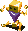 Polygon Jig (100)</td>
    </tr>
    <tr>
      <td class="high"> Earth Dragon (110)</td>
      <td class="low"> Kleptomaniac (35)</td>
      <td class="low"> N'Balun (50)</td>
      <td class="low"> Roguewalrus (100)</td>
      <td></td>
    </tr>
    <tr>
      <td colspan="9" class="tableDivider"></td>
    </tr>
    <tr>
      <td rowspan="2">82</td>
      <td rowspan="2" class="highlightShop"></td>
      <td rowspan="2" class="highlightMH"></td>
      <td rowspan="2" class="highlightGitan"></td>
      <td class="high"> Miracle Hen (80)</td>
      <td class="high"> Alloy Armor (100)</td>
      <td class="high"> Leech Queen (50)</td>
      <td class="high"> Fear Eye (60)</td>
      <td class="high"> Polygon Jig (100)</td>
    </tr>
    <tr>
      <td class="high"> Earth Dragon (110)</td>
      <td class="low"> Kleptomaniac (35)</td>
      <td class="low"> N'Balun (50)</td>
      <td class="low"> Roguewalrus (100)</td>
      <td></td>
    </tr>
    <tr>
      <td colspan="9" class="tableDivider"></td>
    </tr>
    <tr>
      <td rowspan="2">83</td>
      <td rowspan="2" class="highlightShop"></td>
      <td rowspan="2" class="highlightMH"></td>
      <td rowspan="2" class="highlightGitan"></td>
      <td class="high"> Miracle Hen (80)</td>
      <td class="high"> Alloy Armor (100)</td>
      <td class="high"> Leech Queen (50)</td>
      <td class="high"> Fear Eye (60)</td>
      <td class="high"> Polygon Jig (100)</td>
    </tr>
    <tr>
      <td class="high"> Earth Dragon (110)</td>
      <td class="low"> Kleptomaniac (35)</td>
      <td class="low"> N'Balun (50)</td>
      <td class="low"> Roguewalrus (100)</td>
      <td></td>
    </tr>
    <tr>
      <td colspan="9" class="tableDivider"></td>
    </tr>
    <tr>
      <td rowspan="2">84</td>
      <td rowspan="2" class="highlightShop"></td>
      <td rowspan="2" class="highlightMH"></td>
      <td rowspan="2" class="highlightGitan"></td>
      <td class="high"> Miracle Hen (80)</td>
      <td class="high"> Alloy Armor (100)</td>
      <td class="high"> Leech Queen (50)</td>
      <td class="high"> Fear Eye (60)</td>
      <td class="high"> Polygon Jig (100)</td>
    </tr>
    <tr>
      <td class="high"> Earth Dragon (110)</td>
      <td class="low"> Kleptomaniac (35)</td>
      <td class="low"> N'Balun (50)</td>
      <td class="low"> Roguewalrus (100)</td>
      <td></td>
    </tr>
    <tr>
      <td colspan="9" class="tableDivider"></td>
    </tr>
    <tr>
      <td rowspan="2">85</td>
      <td rowspan="2" class="highlightShop"></td>
      <td rowspan="2" class="highlightMH"></td>
      <td rowspan="2" class="highlightGitan"></td>
      <td class="high"> Miracle Hen (80)</td>
      <td class="high"> Alloy Armor (100)</td>
      <td class="high"> Leech Queen (50)</td>
      <td class="high"> Fear Eye (60)</td>
      <td class="high"> Polygon Jig (100)</td>
    </tr>
    <tr>
      <td class="high"> Earth Dragon (110)</td>
      <td class="low"> Kleptomaniac (35)</td>
      <td class="low"> N'Balun (50)</td>
      <td class="low"> Roguewalrus (100)</td>
      <td></td>
    </tr>
    <tr>
      <td colspan="9" class="tableDivider"></td>
    </tr>
    <tr>
      <td rowspan="2">86</td>
      <td rowspan="2" class="highlightShop"></td>
      <td rowspan="2" class="highlightMH"></td>
      <td rowspan="2" class="highlightGitan"></td>
      <td class="high"> Piggaron (90)</td>
      <td class="high"> Heavyremlas (150)</td>
      <td class="high"> Leech Queen (50)</td>
      <td class="high"> Fear Eye (60)</td>
      <td class="high"> Polygon Jig (100)</td>
    </tr>
    <tr>
      <td class="high"> Earth Dragon (110)</td>
      <td class="low"> Kleptomaniac (35)</td>
      <td class="low"> N'Balun (50)</td>
      <td class="low"> Roguewalrus (100)</td>
      <td></td>
    </tr>
    <tr>
      <td colspan="9" class="tableDivider"></td>
    </tr>
    <tr>
      <td rowspan="2">87</td>
      <td rowspan="2" class="highlightShop"></td>
      <td rowspan="2" class="highlightMH"></td>
      <td rowspan="2" class="highlightGitan"></td>
      <td class="high"> Piggaron (90)</td>
      <td class="high"> Heavyremlas (150)</td>
      <td class="high"> Leech Queen (50)</td>
      <td class="high"> Fear Eye (60)</td>
      <td class="high"> Polygon Jig (100)</td>
    </tr>
    <tr>
      <td class="high"> Earth Dragon (110)</td>
      <td class="low"> Kleptomaniac (35)</td>
      <td class="low"> N'Balun (50)</td>
      <td class="low"> Roguewalrus (100)</td>
      <td></td>
    </tr>
    <tr>
      <td colspan="9" class="tableDivider"></td>
    </tr>
    <tr>
      <td rowspan="2">88</td>
      <td rowspan="2" class="highlightShop"></td>
      <td rowspan="2" class="highlightMH"></td>
      <td rowspan="2" class="highlightGitan"></td>
      <td class="high"> Piggaron (90)</td>
      <td class="high"> Heavyremlas (150)</td>
      <td class="high"> Leech Queen (50)</td>
      <td class="high"> Fear Eye (60)</td>
      <td class="high"> Polygon Jig (100)</td>
    </tr>
    <tr>
      <td class="high"> Earth Dragon (110)</td>
      <td class="low"> Kleptomaniac (35)</td>
      <td class="low"> N'Balun (50)</td>
      <td class="low"> Roguewalrus (100)</td>
      <td></td>
    </tr>
    <tr>
      <td colspan="9" class="tableDivider"></td>
    </tr>
    <tr>
      <td rowspan="2">89</td>
      <td rowspan="2" class="highlightShop"></td>
      <td rowspan="2" class="highlightMH"></td>
      <td rowspan="2" class="highlightGitan"></td>
      <td class="high"> Piggaron (90)</td>
      <td class="high"> Heavyremlas (150)</td>
      <td class="high"> Leech Queen (50)</td>
      <td class="high"> Fear Eye (60)</td>
      <td class="high"> Polygon Jig (100)</td>
    </tr>
    <tr>
      <td class="high"> Earth Dragon (110)</td>
      <td class="low"> Kleptomaniac (35)</td>
      <td class="low"> N'Balun (50)</td>
      <td class="low"> Roguewalrus (100)</td>
      <td></td>
    </tr>
    <tr>
      <td colspan="9" class="tableDivider"></td>
    </tr>
    <tr>
      <td rowspan="3">90</td>
      <td rowspan="3" class="highlightShop"></td>
      <td rowspan="3" class="highlightMH"></td>
      <td rowspan="3" class="highlightGitan"></td>
      <td class="high"> Piggaron (90)</td>
      <td class="high"> Heavyremlas (150)</td>
      <td class="high"> Leech Queen (50)</td>
      <td class="high"> Fear Eye (60)</td>
      <td class="high"> Polygon Jig (100)</td>
    </tr>
    <tr>
      <td class="high"> Earth Dragon (110)</td>
      <td class="low"> Kleptomaniac (35)</td>
      <td class="low"> N'Balun (50)</td>
      <td class="low"> Roguewalrus (100)</td>
      <td class="low"> Showpin (60)</td>
    </tr>
    <tr>
      <td class="high"> Ark Dragon (120)</td>
      <td class="high">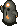 Wrinkly Hani (70)</td>
      <td></td>
      <td></td>
      <td></td>
    </tr>
    <tr>
      <td colspan="9" class="tableDivider"></td>
    </tr>
    <tr>
      <td rowspan="2">91</td>
      <td rowspan="2" class="highlightShop"></td>
      <td rowspan="2" class="highlightMH"></td>
      <td rowspan="2" class="highlightGitan"></td>
      <td class="high"> Piggaron (90)</td>
      <td class="high"> Heavyremlas (150)</td>
      <td class="high"> Rice Master (70)</td>
      <td class="high"> Pacorepgod (80)</td>
      <td class="high"> Gigataur (120)</td>
    </tr>
    <tr>
      <td class="high"> Ark Dragon (120)</td>
      <td class="high"> Wrinkly Hani (70)</td>
      <td class="low"> N'Balun (50)</td>
      <td class="low"> Fluffy Bunny (5)</td>
      <td class="low"> Showpin (60)</td>
    </tr>
    <tr>
      <td colspan="9" class="tableDivider"></td>
    </tr>
    <tr>
      <td rowspan="2">92</td>
      <td rowspan="2" class="highlightShop"></td>
      <td rowspan="2" class="highlightMH"></td>
      <td rowspan="2" class="highlightGitan"></td>
      <td class="high"> Piggaron (90)</td>
      <td class="high"> Heavyremlas (150)</td>
      <td class="high"> Rice Master (70)</td>
      <td class="high"> Pacorepgod (80)</td>
      <td class="high"> Gigataur (120)</td>
    </tr>
    <tr>
      <td class="high"> Ark Dragon (120)</td>
      <td class="high"> Wrinkly Hani (70)</td>
      <td class="low"> N'Balun (50)</td>
      <td class="low"> Fluffy Bunny (5)</td>
      <td class="low"> Showpin (60)</td>
    </tr>
    <tr>
      <td colspan="9" class="tableDivider"></td>
    </tr>
    <tr>
      <td rowspan="2">93</td>
      <td rowspan="2" class="highlightShop"></td>
      <td rowspan="2" class="highlightMH"></td>
      <td rowspan="2" class="highlightGitan"></td>
      <td class="high"> Piggaron (90)</td>
      <td class="high"> Heavyremlas (150)</td>
      <td class="high"> Rice Master (70)</td>
      <td class="high"> Pacorepgod (80)</td>
      <td class="high"> Gigataur (120)</td>
    </tr>
    <tr>
      <td class="high"> Ark Dragon (120)</td>
      <td class="high"> Wrinkly Hani (70)</td>
      <td class="low"> N'Balun (50)</td>
      <td class="low"> Fluffy Bunny (5)</td>
      <td class="low"> Showpin (60)</td>
    </tr>
    <tr>
      <td colspan="9" class="tableDivider"></td>
    </tr>
    <tr>
      <td rowspan="2">94</td>
      <td rowspan="2" class="highlightShop"></td>
      <td rowspan="2" class="highlightMH"></td>
      <td rowspan="2" class="highlightGitan"></td>
      <td class="high"> Piggaron (90)</td>
      <td class="high"> Heavyremlas (150)</td>
      <td class="high"> Rice Master (70)</td>
      <td class="high"> Pacorepgod (80)</td>
      <td class="high"> Gigataur (120)</td>
    </tr>
    <tr>
      <td class="high"> Ark Dragon (120)</td>
      <td class="high"> Wrinkly Hani (70)</td>
      <td class="low"> N'Balun (50)</td>
      <td class="low"> Fluffy Bunny (5)</td>
      <td class="low"> Showpin (60)</td>
    </tr>
    <tr>
      <td colspan="9" class="tableDivider"></td>
    </tr>
    <tr>
      <td rowspan="3">95</td>
      <td rowspan="3" class="highlightShop"></td>
      <td rowspan="3" class="highlightMH"></td>
      <td rowspan="3" class="highlightGitan"></td>
      <td class="high"> Piggaron (90)</td>
      <td class="high"> Heavyremlas (150)</td>
      <td class="high"> Rice Master (70)</td>
      <td class="high"> Pacorepgod (80)</td>
      <td class="high"> Gigataur (120)</td>
    </tr>
    <tr>
      <td class="high"> Ark Dragon (120)</td>
      <td class="high"> Wrinkly Hani (70)</td>
      <td class="low"> N'Balun (50)</td>
      <td class="low"> Fluffy Bunny (5)</td>
      <td class="low"> Showpin (60)</td>
    </tr>
    <tr>
      <td class="high">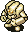 Goldinos (100)</td>
      <td class="high"> Swordgator (100)</td>
      <td></td>
      <td></td>
      <td></td>
    </tr>
    <tr>
      <td colspan="9" class="tableDivider"></td>
    </tr>
    <tr>
      <td rowspan="2">96</td>
      <td rowspan="2" class="highlightShop"></td>
      <td rowspan="2" class="highlightMH"></td>
      <td rowspan="2" class="highlightGitan"></td>
      <td class="high"> Ark Dragon (120)</td>
      <td class="high"> Heavyremlas (150)</td>
      <td class="high"> Rice Master (70)</td>
      <td class="high"> Pacorepgod (80)</td>
      <td class="high"> Gigataur (120)</td>
    </tr>
    <tr>
      <td class="high"> Goldinos (100)</td>
      <td class="high"> Swordgator (100)</td>
      <td class="low"> N'Balun (50)</td>
      <td class="low"> Fluffy Bunny (5)</td>
      <td class="low"> Showpin (60)</td>
    </tr>
    <tr>
      <td colspan="9" class="tableDivider"></td>
    </tr>
    <tr>
      <td rowspan="2">97</td>
      <td rowspan="2" class="highlightShop"></td>
      <td rowspan="2" class="highlightMH"></td>
      <td rowspan="2" class="highlightGitan"></td>
      <td class="high"> Ark Dragon (120)</td>
      <td class="high"> Heavyremlas (150)</td>
      <td class="high"> Rice Master (70)</td>
      <td class="high"> Pacorepgod (80)</td>
      <td class="high"> Gigataur (120)</td>
    </tr>
    <tr>
      <td class="high"> Goldinos (100)</td>
      <td class="high"> Swordgator (100)</td>
      <td class="low"> N'Balun (50)</td>
      <td class="low"> Fluffy Bunny (5)</td>
      <td class="low"> Showpin (60)</td>
    </tr>
    <tr>
      <td colspan="9" class="tableDivider"></td>
    </tr>
    <tr>
      <td rowspan="2">98</td>
      <td rowspan="2" class="highlightShop"></td>
      <td rowspan="2" class="highlightMH"></td>
      <td rowspan="2" class="highlightGitan"></td>
      <td class="high"> Ark Dragon (120)</td>
      <td class="high"> Heavyremlas (150)</td>
      <td class="high"> Rice Master (70)</td>
      <td class="high"> Pacorepgod (80)</td>
      <td class="high"> Gigataur (120)</td>
    </tr>
    <tr>
      <td class="high"> Goldinos (100)</td>
      <td class="high"> Swordgator (100)</td>
      <td class="low"> N'Balun (50)</td>
      <td class="low"> Fluffy Bunny (5)</td>
      <td class="low"> Showpin (60)</td>
    </tr>
    <tr>
      <td colspan="9" class="tableDivider"></td>
    </tr>
    <tr>
      <td rowspan="2">99</td>
      <td rowspan="2" class="highlightShop"></td>
      <td rowspan="2" class="highlightMH"></td>
      <td rowspan="2" class="highlightGitan"></td>
      <td class="high"> Ark Dragon (120)</td>
      <td class="high"> Heavyremlas (150)</td>
      <td class="high"> Rice Master (70)</td>
      <td class="high"> Pacorepgod (80)</td>
      <td class="high"> Gigataur (120)</td>
    </tr>
    <tr>
      <td class="high"> Goldinos (100)</td>
      <td class="high"> Swordgator (100)</td>
      <td class="low"> N'Balun (50)</td>
      <td class="low"> Fluffy Bunny (5)</td>
      <td class="low"> Showpin (60)</td>
    </tr>
  </tbody>
</table>

# Items

#### Spawn Rates

- F = Floor, Monster drop
- S = Shop

 

<table class="dungeonTable">
  <tr>
    <th class="centeredText">Category</th>
    <th class="centeredText">F</th>
    <th class="centeredText">S</th>
    <th rowspan="6" class="tableDivider"></th>
    <th class="centeredText">Category</th>
    <th class="centeredText">F</th>
    <th class="centeredText">S</th>
  </tr>
  <tr>
    <td class="highlightGray">Weapon</td>
    <td>★</td>
    <td>★</td>
    <td class="highlightGray">Herb</td>
    <td>★★★★★</td>
    <td>★★★★</td>
  </tr>
  <tr>
    <td class="highlightGray">Shield</td>
    <td>★</td>
    <td>★</td>
    <td class="highlightGray">Scroll</td>
    <td>-</td>
    <td>★★★★★</td>
  </tr>
  <tr>
    <td class="highlightGray">Armband</td>
    <td>★</td>
    <td>★</td>
    <td class="highlightGray">Staff</td>
    <td>★★★</td>
    <td>★★★</td>
  </tr>
  <tr>
    <td class="highlightGray">Projectile</td>
    <td>-</td>
    <td>-</td>
    <td class="highlightGray">Jar</td>
    <td>★★★★</td>
    <td>★★★★★</td>
  </tr>
  <tr>
    <td class="highlightGray">Food</td>
    <td>-</td>
    <td>-</td>
    <td colspan="3"></td>
  </tr>
</table>

#### Item Table

The values like "1-99" in the Notes column represents the floor range where the item can appear.

- F = Floor, Monster drop
- S = Shop
- M = Monster (Fixed drop)

 

<table class="dungeonItemTable">
  <tr>
    <th colspan="5" class="highlightLightblue">Weapon</th>
    <th rowspan="41"></th>
    <th colspan="5" class="highlightLightblue">Herb</th>
  </tr>
  <tr>
    <th>Name</th>
    <th>F</th>
    <th>S</th>
    <th>M</th>
    <th>Notes</th>
    <th>Name</th>
    <th>F</th>
    <th>S</th>
    <th>M</th>
    <th>Notes</th>
  </tr>
  <tr>
    <td class="leftText">Bufu's Cleaver</td>
    <td>X</td>
    <td>X</td>
    <td></td>
    <td>1-99</td>
    <td class="leftText">Big Belly Seed</td>
    <td></td>
    <td>X</td>
    <td></td>
    <td>1-99</td>
  </tr>
  <tr>
    <td class="leftText">Minotaur's Axe</td>
    <td></td>
    <td></td>
    <td>X</td>
    <td>Taur Type</td>
    <td class="leftText">Herb of Life</td>
    <td></td>
    <td>X</td>
    <td></td>
    <td>1-99</td>
  </tr>
  <tr>
    <th colspan="5" class="highlightLightblue">Shield</th>
    <td class="leftText">Restorative Herb</td>
    <td>X</td>
    <td>X</td>
    <td></td>
    <td>1-99</td>
  </tr>
  <tr>
    <th>Name</th>
    <th>F</th>
    <th>S</th>
    <th>M</th>
    <th>Notes</th>
    <td class="leftText">Herb of Confusion</td>
    <td></td>
    <td></td>
    <td>X</td>
    <td>Daze Radish</td>
  </tr>
  <tr>
    <td class="leftText">Gold Shield</td>
    <td></td>
    <td>X</td>
    <td></td>
    <td>1-99</td>
    <td class="leftText">Sleeping Herb</td>
    <td></td>
    <td></td>
    <td>X</td>
    <td>Sleep Radish</td>
  </tr>
  <tr>
    <td class="leftText">Armor Ward</td>
    <td>X</td>
    <td>X</td>
    <td></td>
    <td>1-99</td>
    <td class="leftText">Herb of Strength</td>
    <td></td>
    <td>X</td>
    <td></td>
    <td>1-99</td>
  </tr>
  <tr>
    <td class="leftText">Blast Shield</td>
    <td></td>
    <td>X</td>
    <td></td>
    <td>1-99</td>
    <td class="leftText">Antidote Herb</td>
    <td>X</td>
    <td>X</td>
    <td></td>
    <td>1-99</td>
  </tr>
  <tr>
    <td class="leftText">Bronzeward</td>
    <td>X</td>
    <td>X</td>
    <td></td>
    <td>1-99</td>
    <td class="leftText">Poison Herb</td>
    <td></td>
    <td></td>
    <td>X</td>
    <td>Ghost Radish</td>
  </tr>
  <tr>
    <td class="leftText">Fragile Shield</td>
    <td></td>
    <td>X</td>
    <td></td>
    <td>1-99</td>
    <td class="leftText">Herb of Sight</td>
    <td>X</td>
    <td>X</td>
    <td></td>
    <td>1-99</td>
  </tr>
  <tr>
    <td class="leftText">Iron Shield</td>
    <td>X</td>
    <td>X</td>
    <td></td>
    <td>1-99</td>
    <td class="leftText">Medicinal Herb</td>
    <td>X</td>
    <td>X</td>
    <td></td>
    <td>1-99</td>
  </tr>
  <tr>
    <td class="leftText">Walrus Shield</td>
    <td></td>
    <td>X</td>
    <td></td>
    <td>1-99</td>
    <th colspan="5" class="highlightLightblue">Scroll</th>
  </tr>
  <tr>
    <td class="leftText">Dragonward</td>
    <td></td>
    <td>X</td>
    <td></td>
    <td>1-99</td>
    <th>Name</th>
    <th>F</th>
    <th>S</th>
    <th>M</th>
    <th>Notes</th>
  </tr>
  <tr>
    <td class="leftText">Spiked Ward</td>
    <td>X</td>
    <td>X</td>
    <td></td>
    <td>1-99</td>
    <td class="leftText">Great Hall Scroll</td>
    <td></td>
    <td>X</td>
    <td></td>
    <td>1-99</td>
  </tr>
  <tr>
    <td class="leftText">Hide Shield</td>
    <td>X</td>
    <td>X</td>
    <td></td>
    <td>1-99</td>
    <td class="leftText">Scroll of Blessing</td>
    <td></td>
    <td>X</td>
    <td></td>
    <td>1-99</td>
  </tr>
  <tr>
    <td class="leftText">Fancy Shield</td>
    <td></td>
    <td>X</td>
    <td></td>
    <td>1-99</td>
    <td class="leftText">Scroll of Identity</td>
    <td></td>
    <td>X</td>
    <td></td>
    <td>1-99</td>
  </tr>
  <tr>
    <td class="leftText">Evasive Shield</td>
    <td></td>
    <td>X</td>
    <td></td>
    <td>1-99</td>
    <td class="leftText">Earth Bless Scroll</td>
    <td></td>
    <td>X</td>
    <td></td>
    <td>1-99</td>
  </tr>
  <tr>
    <td class="leftText">Wood Shield</td>
    <td>X</td>
    <td>X</td>
    <td></td>
    <td>1-99</td>
    <td class="leftText">Air Bless Scroll</td>
    <td></td>
    <td>X</td>
    <td></td>
    <td>1-99</td>
  </tr>
  <tr>
    <th colspan="5" class="highlightLightblue">Armband</th>
    <td class="leftText">Plating Scroll</td>
    <td></td>
    <td>X</td>
    <td></td>
    <td>1-99</td>
  </tr>
  <tr>
    <th>Name</th>
    <th>F</th>
    <th>S</th>
    <th>M</th>
    <th>Notes</th>
    <th colspan="5" class="highlightLightblue">Staff</th>
  </tr>
  <tr>
    <td class="leftText">Pitcher's Armband</td>
    <td>X</td>
    <td>X</td>
    <td></td>
    <td>1-99</td>
    <th>Name</th>
    <th>F</th>
    <th>S</th>
    <th>M</th>
    <th>Notes</th>
  </tr>
  <tr>
    <td class="leftText">Critical Armband</td>
    <td>X</td>
    <td>X</td>
    <td></td>
    <td>1-99</td>
    <td class="leftText">Skull Staff</td>
    <td></td>
    <td></td>
    <td>X</td>
    <td>Skull Mage Type</td>
  </tr>
  <tr>
    <td class="leftText">Recovery Armband</td>
    <td>X</td>
    <td>X</td>
    <td></td>
    <td>1-99</td>
    <td class="leftText">Staff of Happiness</td>
    <td></td>
    <td>X</td>
    <td></td>
    <td>1-99</td>
  </tr>
  <tr>
    <td class="leftText">Armband of Calm</td>
    <td>X</td>
    <td>X</td>
    <td></td>
    <td>1-99</td>
    <td class="leftText">Switching Staff</td>
    <td></td>
    <td>X</td>
    <td></td>
    <td>1-99</td>
  </tr>
  <tr>
    <td class="leftText">Rustless Armband</td>
    <td>X</td>
    <td>X</td>
    <td></td>
    <td>1-99</td>
    <td class="leftText">Knockback Staff</td>
    <td></td>
    <td>X</td>
    <td></td>
    <td>1-99</td>
  </tr>
  <tr>
    <td class="leftText">Happy Armband</td>
    <td>X</td>
    <td>X</td>
    <td></td>
    <td>1-99</td>
    <td class="leftText">Staff of Misfortune</td>
    <td></td>
    <td>X</td>
    <td></td>
    <td>1-99</td>
  </tr>
  <tr>
    <td class="leftText">Armband of Sight</td>
    <td>X</td>
    <td>X</td>
    <td></td>
    <td>1-99</td>
    <td class="leftText">Bufu's Staff</td>
    <td>X</td>
    <td>X</td>
    <td></td>
    <td>1-99</td>
  </tr>
  <tr>
    <td class="leftText">Antidote Armband</td>
    <td>X</td>
    <td>X</td>
    <td></td>
    <td>1-99</td>
    <td class="leftText">Doppelganger Staff</td>
    <td></td>
    <td>X</td>
    <td></td>
    <td>1-99</td>
  </tr>
  <tr>
    <td class="leftText">Antidrain Armband</td>
    <td>X</td>
    <td>X</td>
    <td></td>
    <td>1-99</td>
    <th colspan="5" class="highlightLightblue">Jar</th>
  </tr>
  <tr>
    <td class="leftText">Sleepless Armband</td>
    <td>X</td>
    <td>X</td>
    <td></td>
    <td>1-99</td>
    <th>Name</th>
    <th>F</th>
    <th>S</th>
    <th>M</th>
    <th>Notes</th>
  </tr>
  <tr>
    <th colspan="5" class="highlightLightblue">Projectile</th>
    <td class="leftText">Walrus Jar</td>
    <td>X</td>
    <td></td>
    <td></td>
    <td>1-99</td>
  </tr>
  <tr>
    <th>Name</th>
    <th>F</th>
    <th>S</th>
    <th>M</th>
    <th>Notes</th>
    <td class="leftText">Jar of Holding</td>
    <td>X</td>
    <td>X</td>
    <td></td>
    <td>1-99</td>
  </tr>
  <tr>
    <td class="leftText">Wooden Arrow</td>
    <td></td>
    <td></td>
    <td>X</td>
    <td>Bowboy</td>
    <td class="leftText">Monster Pot</td>
    <td>X</td>
    <td>X</td>
    <td></td>
    <td>1-99</td>
  </tr>
  <tr>
    <td class="leftText">Silver Arrow</td>
    <td></td>
    <td></td>
    <td>X</td>
    <td>Mini Tank</td>
    <td class="leftText">Jar of Hiding</td>
    <td>X</td>
    <td>X</td>
    <td></td>
    <td>1-99</td>
  </tr>
  <tr>
    <td class="leftText">Iron Arrow</td>
    <td></td>
    <td></td>
    <td>X</td>
    <td>Crossbowboy Baby Tank</td>
    <td rowspan="6" colspan="5"></td>
  </tr>
  <tr>
    <th colspan="5" class="highlightLightblue">Food</th>
  </tr>
  <tr>
    <th>Name</th>
    <th>F</th>
    <th>S</th>
    <th>M</th>
    <th>Notes</th>
  </tr>
  <tr>
    <td class="leftText">Big Riceball</td>
    <td></td>
    <td></td>
    <td>X</td>
    <td>Running Egg Rice Boss</td>
  </tr>
  <tr>
    <td class="leftText">Riceball</td>
    <td></td>
    <td></td>
    <td>X</td>
    <td>Egg Thing Rice Changer</td>
  </tr>
  <tr>
    <td class="leftText">Giant Riceball</td>
    <td></td>
    <td></td>
    <td>X</td>
    <td>Rice Master</td>
  </tr>
</table>

# Traps

See [Traps](/system/traps) for details.

<table class="dungeonTable">
  <thead>
    <tr>
      <th>Trap</th>
      <th>Floors</th>
      <th class="tableDivider"></th>
      <th>Trap</th>
      <th>Floors</th>
      <th class="tableDivider"></th>
      <th>Trap</th>
      <th>Floors</th>
    </tr>
  </thead>
  <tbody>
    <tr>
      <td>Stumble</td>
      <td>1-99</td>
      <td rowspan="9" class="tableDivider"></td>
      <td>Log</td>
      <td>1-99</td>
      <td rowspan="9" class="tableDivider"></td>
      <td>Landmine</td>
      <td>1-99</td>
    </tr>
    <tr>
      <td>Rusty</td>
      <td>6-99</td>
      <td>Spin</td>
      <td>1-99</td>
      <td>Big Landmine</td>
      <td>1-99</td>
    </tr>
    <tr>
      <td>Unequip</td>
      <td>1-99</td>
      <td>Dream Gas</td>
      <td>1-99</td>
      <td>Wood Arrow</td>
      <td>1-5</td>
    </tr>
    <tr>
      <td>Rotten</td>
      <td></td>
      <td>Sleeping Gas</td>
      <td>1-99</td>
      <td>Iron Arrow</td>
      <td>6-10</td>
    </tr>
    <tr>
      <td>Alarm</td>
      <td>1-99</td>
      <td>Slowness</td>
      <td>1-99</td>
      <td>One-way</td>
      <td></td>
    </tr>
    <tr>
      <td>Summons</td>
      <td>1-99</td>
      <td>Immobilization</td>
      <td>1-99</td>
      <td>Knockback</td>
      <td></td>
    </tr>
    <tr>
      <td>Multiplication</td>
      <td>1-99</td>
      <td>Hunger</td>
      <td>1-99</td>
      <td>Riceball</td>
      <td>1-99</td>
    </tr>
    <tr>
      <td>Pitfall</td>
      <td>1-99</td>
      <td>Poison Dart</td>
      <td>1-99</td>
      <td>Curse</td>
      <td>1-99</td>
    </tr>
    <tr>
      <td>Spring</td>
      <td>1-99</td>
      <td>Boulder</td>
      <td>11-99</td>
      <td>Stairway</td>
      <td></td>
    </tr>
  </tbody>
</table>
