

  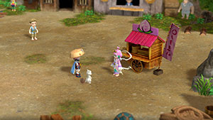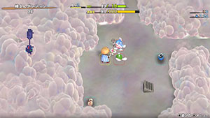

# Overview

<table class="dungeonOverview">
  <tr>
    <th>Unlock</th>
    <td class="highlightYellow">Clear Serpentcoil Island → Progress Peach Bun related events.</td>
  </tr>
  <tr>
    <th>Entrance</th>
    <td class="highlightYellow">Shukuba Beach (Exit)</td>
  </tr>
</table>

<table class="dungeonTable">
  <tr>
    <th>Floors</th>
    <td colspan="3">25F / 99F (Sacred Tree)</td>
  </tr>
  <tr>
    <th>Bring Items</th>
    <td>No</td>
    <th>Stairs</th>
    <td>Ascending</td>
  </tr>
  <tr>
    <th>Companions</th>
    <td>Yes (Ver 1.1.0+)</td>
    <th>Roamers</th>
    <td>No?</td>
  </tr>
  <tr>
    <th>Rescues</th>
    <td>3</td>
    <th>Starting Level</th>
    <td>Lv1</td>
  </tr>
  <tr>
    <th>Starting Item</th>
    <td colspan="3">Peach Club, Large Onigiri</td>
  </tr>
  <tr>
    <th>Unidentified</th>
    <td colspan="3">Equipment, Grass, Scrolls, Staves, Pots</td>
  </tr>
  <tr>
    <th>Shops</th>
    <td>Yes</td>
    <th>Monster Houses</th>
    <td>Yes (Regular, Sudden, Special)</td>
  </tr>
  <tr>
    <th>Behemoths</th>
    <td>Yes</td>
    <th>Wishing Shrines</th>
    <td></td>
  </tr>
  <tr>
    <th>Kron's Challenge</th>
    <td>Yes</td>
    <th>Fever Time</th>
    <td></td>
  </tr>
  <tr>
    <th>Initial Enemies</th>
    <td>4~6?</td>
    <th>Spawn Rate</th>
    <td>30 Turns</td>
  </tr>
  <tr>
    <th>Wind (1st Gust)</th>
    <td>900 Turns</td>
    <th>Reward</th>
    <td>Peach Bun (Random) or Peach Club (Sacred)</td>
  </tr>
</table>

Postgame dungeon where the player begins the dungeon with a Peach Club equipped. Peach Club is a weapon that has a chance to transform a defeated monster into a Peach Bun. Eating a Peach Bun morphs Shiren into the corresponding monster, allowing usage of its abilities. (Example: Eating a Pumphantasm Bun allows Shiren to go inside wall tiles)

# Strategy

### Morphed Status

- Shiren's stats (HP, attack, and defense) remain the same during Morphed status.
    - In other words, eating a Mamel Bun won't set your stats to be the same as a Mamel.
- Equipment runes and bracelet effects are nullified during Morphed status.
    - Increased attack and defense from equipment remains in effect.
- Reverting from Morphed status doesn't end the player's turn.
- All status conditions are cured when Shiren eats a Peach Bun or ends Morphed status.
    - This includes both positive and negative status conditions.

### General Tips

- Peach Buns are very easy to obtain, so hunger is generally not an issue in this dungeon.
    - This means you can easily linger until the wind blows to farm experience points or items.
- Nigiri Baby (2-4F) can be used to increase max fullness and activate Sumo status if desired.
    - Once Sumo status is active, it can usually be maintained just by eating Peach Buns.
- Break-Off Blade and Break-Off Shield can be used without degrading during Morphed status.
    - This is because equipment runes are nullified during Morphed status.
- Throw a Peach Bun at a monster or NPC to transform them into the corresponding monster.
    - If you carry weak Peach Buns like Mamel Bun, you can instantly weaken a tough opponent.
- Buried items are almost always Peach Buns in this dungeon.
    - The buried Peach Bun doesn't correlate to the current floor's monster table.
- Collect Peach Buns of swift monsters like Death Reaper to have an easier time near the end.
    - Swift Peach Buns are also great for escaping from Monster Houses.

### Important Items

#### Break-Off Blade / Break-Off Shield

Easily the best equipment for this dungeon when you're not aiming for Peach Bun drops. The Dulling rune is nullified during Morphed status, so it can be used without upgrade value loss.

#### Peach Club

Fighting monsters with this equipped is the primary method of obtaining Peach Buns. It's not the strongest weapon around, so synthesize status inflicting runes using Mixers if possible. (<u>Blinding Grass</u> → Blinding / <u>Confusion Grass</u> → Confusing / <u>Sedating Grass</u> → Sedating)

#### Monster-find Bracelet

Powerful bracelet that reveals enemy locations on the map. However, keep in mind that bracelet effects are nullified during Morphed status.

#### Peach Buns

Eating any Peach Bun replenishes 25 fullness and cures all status conditions.

<b><u>Pumphantasm Bun</u></b> (3-4F) Safely search for the stairs with the ability to walk on air tiles and go inside walls. Don't forget that Shiren loses HP for every turn spent inside a wall.

<b><u>Death Reaper Bun</u></b> (2-4F) Swift action speed + the ability to walk on air tiles.

<b><u>Armordillo Bun</u></b> (3-4F) Ability deals 2 tiles of knockback and has a chance to make the opponent drop an item. Can be used to safely defeat monsters that don't have ranged attacks.

<b><u>Karakuroid Bun</u></b> (4-6F) Swift action speed + Sharp-eyed status makes this a great pick for a Monster House. Can also be used to create Poison Arrow Traps to collect Poison Arrows.

<b><u>Bowboy Bun</u></b> (5-6F) / <b><u>Crossbowboy Bun</u></b> (5-7F) Shoot arrows at a wall to collect lots of Wooden Arrows or Iron Arrows. Unlike past games, you can pick up arrows even during Morphed status.

<b><u>Porky Bun</u></b> (8F) Morph into a Porky to collect lots of Porky's Rocks. Porky's Rocks are great for Ghost Samurai (7-12F) and Behemoth (22-24F) floors in particular.

<b><u>Masked Samurai Bun</u></b> (7-12F) The player revives as Ghost Samurai if they're defeated while morphed as Masked Samurai. However, decreased strength and fullness won't be restored, so it's worse than Revival Grass. Once you're a Ghost Samurai, possess the monster that defeated you to get rid of them.

<b><u>Mixer Bun</u></b> (5-25F) Use these to safely synthesize items - The item falls underfoot when you revert from Morphed status. Mixer gains Empowered status when it eats items, so it's not bad as an attacker either.

<b><u>Nigiri Baby Bun</u></b> (2-4F) Can be used to increase max fullness and activate Sumo status. Equip a Wolfshead or Break-Off Shield, then eat a Nigiri Baby Bun to turn enemies into Onigiri. Nigiri Baby's ability only has a 1/6 success rate during Morphed status, so it can take a while. Alternatively, throw a Nigiri Baby Bun at a monster and perform Nigiri Morph Factory normally after you've collected lots of arrows.

<b><u>Thiefwalrus Bun</u></b> (Walrus Pot) Steal items and hunt enemies while standing on a water tile. Be warned that Peach Buns and Onigiri items will become rotten when you walk on water. Thiefwalruses don't spawn naturally, so you'll need a Walrus Pot or lucky find in a wall or shop.

<b><u>Bored Kappa Bun</u></b> (10-12F) Makes you immune to Porky and Porko's rock throwing ability between 24-25F. In addition, fight enemies while standing on a water tile for faster HP regen and x2.0 damage.

<b><u>Rotten Peach Bun</u></b> Can be thrown at a monster to inflict a random negative status condition. Create these by entering water using something like Spearfish Bun.

# Floor Guide

### 1-2F

Enemies aren't particularly tough, so linger to farm experience points and Peach Buns. Save Mamel Buns, Pit Mamel Buns, and Death Reaper Buns - other Peach Buns can be eaten.

### 3F

Nigiri Baby (17 HP, 8 atk) appears on 2-4F, so perform Nigiri Morph Factory if you want Sumo status. Otherwise, use Armordillo Bun to collect extra items from monsters by making them trip. If your inventory is getting full, it's fine to eat all Onigiri since Peach Buns are so common. Pumphantasm (23 HP, 16 atk) is a bit tough if you didn't linger to level up on 1-2F.

### 4F

Karakuroid (40 HP, 20 atk) doesn't spawn very often, but can be a menace if it does spawn. If you don't have staves or such to deal with it, just throw a weaker monster's Peach Bun at it. Continue collecting items using Armordillo Bun while staying in the stairs room to avoid Karakuroids. Scorpions can't lower your strength during Morphed status - they inflict Weakened status instead.

### 5-6F

The difficulty of the dungeon quickly ramps up from this floor range. Collect arrows using Bowboy Bun or Crossbowboy Bun as much as possible. Expect to see Karakuroid (40 HP, 20 atk) with its Swift 1 speed in any new room you step into. Use Scorpion Bun or arrows to deal with them, and try to stock up on Karakuroid Buns if possible.

Mixer (78 HP, 39 atk, 29 def) and Fresh Octopling (60 HP, 19 atk, 14 def) are both very tough. If you found a Break-Off Blade or Break-Off Shield, you can take them on using Morphed status, but otherwise it can be tricky even if you managed to activate Sumo status.

### 7-12F

Masked Samurai (47 HP, 18 atk) revives as Ghost Samurai when slain - Peach Buns are effective. If you saved some Pit Mamel Buns, have Ghost Samurais level them up into Cave Mamels for exp. Always remember that you can throw a Peach Bun at a high level monster to weaken it if needed. Porky (30 HP, 17 atk) appears on 8F only, so collect Porky's Rocks for later if desired.

### 13-14F

Relatively calmer floor range compared to earlier Masked Samurai and upcoming Chow floors. Master Hen Buns can be thrown at other monsters to increase the amount of exp you earn.

### 15-18F

Chow (20 HP, 1 atk) appears from this point until the end of the dungeon. If a monster defeats a Chow, that monster will level up, so carry weaker Peach Buns if possible. All 5 types of monks appear between 16-18F, so it's best to rush to the stairs on those floors.

### 19-23F

Blazeous (92 HP, 36 atk) is immune to projectiles that don't have piercing properties. Skull Wizard (88 HP, 35 atk) can cause accidents, especially if it levels up via a Chow. If you see a message saying a Skull Wizard became a Skullmancer, just hurry to the stairs. Behemoth Gates can be generated between 22-24F as well, so it's not a good idea to linger.

### 24-25F

Porko (65 HP, 36 atk) is the final threat for this dungeon, especially if it levels up into a Porkon. Blazeous Bun or Bored Kappa Bun can be eaten to nullify Porky's Rocks aimed at you. Again, unless you're aiming for 100% monster table completion, there's no reason to linger.

# Monsters

See [Monsters](/system/monsters) for individual monster details.

- F - Dark hallways
- S - Shop is possible
- H - Monster House is possible
- G - Golden Egg Thing is possible
- B - Behemoth Monsters are possible

Monster Colors = Farming, Useful, Lowers Stats, Targets Items, Dangerous

<table class="monsterTable">
  <thead>
    <tr>
      <th>F</th>
      <th>S</th>
      <th>H</th>
      <th>G</th>
      <th colspan="5">Monsters</th>
      <th>B</th>
    </tr>
  </thead>
  <tbody>
    <tr>
      <td class="centeredText">1</td>
      <td class=""></td>
      <td class=""></td>
      <td class=""></td>
      <td> Mamel</td>
      <td> Pit Mamel</td>
      <td>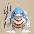 Spearfish</td>
      <td class="highlightGray"></td>
      <td class="highlightGray"></td>
      <td class=""></td>
    </tr>
    <tr>
      <td colspan="10" class="tableDivider"></td>
    </tr>
    <tr>
      <td class="centeredText">2</td>
      <td class="highlightShop"></td>
      <td class=""></td>
      <td class=""></td>
      <td> Mamel</td>
      <td> Pit Mamel</td>
      <td> Spearfish</td>
      <td class="items"> Nigiri Baby</td>
      <td> Death Reaper</td>
      <td class=""></td>
    </tr>
    <tr>
      <td colspan="10" class="tableDivider"></td>
    </tr>
    <tr>
      <td rowspan="2" class="centeredText">3</td>
      <td rowspan="2" class=""></td>
      <td rowspan="2" class="highlightMH"></td>
      <td rowspan="2" class=""></td>
      <td> Pit Mamel</td>
      <td> Chintala</td>
      <td class="danger">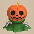 Pumphantasm</td>
      <td class="items">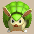 Armordillo</td>
      <td class="items"> Nigiri Baby</td>
      <td rowspan="2" class=""></td>
    </tr>
    <tr>
      <td> Death Reaper</td>
      <td class="highlightGray"></td>
      <td class="highlightGray"></td>
      <td class="highlightGray"></td>
      <td class="highlightGray"></td>
    </tr>
    <tr>
      <td colspan="10" class="tableDivider"></td>
    </tr>
    <tr>
      <td rowspan="2" class="centeredText">4</td>
      <td rowspan="2" class=""></td>
      <td rowspan="2" class="highlightMH"></td>
      <td rowspan="2" class=""></td>
      <td> Chintala</td>
      <td class="danger"> Pumphantasm</td>
      <td class="items"> Armordillo</td>
      <td class="items"> Nigiri Baby</td>
      <td class="danger">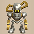 Karakuroid</td>
      <td rowspan="2" class=""></td>
    </tr>
    <tr>
      <td> Death Reaper</td>
      <td class="stats">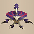 Scorpion</td>
      <td class="highlightGray"></td>
      <td class="highlightGray"></td>
      <td class="highlightGray"></td>
    </tr>
    <tr>
      <td colspan="10" class="tableDivider"></td>
    </tr>
    <tr>
      <td rowspan="2" class="centeredText">5</td>
      <td rowspan="2" class="highlightShop"></td>
      <td rowspan="2" class=""></td>
      <td rowspan="2" class=""></td>
      <td class="danger"> Karakuroid</td>
      <td class="stats"> Scorpion</td>
      <td class="useful"> Bowboy</td>
      <td class="useful">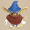 Crossbowboy</td>
      <td>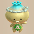 Fresh Octopling</td>
      <td rowspan="2" class=""></td>
    </tr>
    <tr>
      <td class="useful">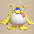 Mixer</td>
      <td class="highlightGray"></td>
      <td class="highlightGray"></td>
      <td class="highlightGray"></td>
      <td class="highlightGray"></td>
    </tr>
    <tr>
      <td colspan="10" class="tableDivider"></td>
    </tr>
    <tr>
      <td rowspan="2" class="centeredText">6</td>
      <td rowspan="2" class=""></td>
      <td rowspan="2" class="highlightMH"></td>
      <td rowspan="2" class=""></td>
      <td class="danger"> Karakuroid</td>
      <td class="stats"> Scorpion</td>
      <td class="useful"> Bowboy</td>
      <td class="useful"> Crossbowboy</td>
      <td> Fresh Octopling</td>
      <td rowspan="2" class=""></td>
    </tr>
    <tr>
      <td class="useful"> Mixer</td>
      <td class="highlightGray"></td>
      <td class="highlightGray"></td>
      <td class="highlightGray"></td>
      <td class="highlightGray"></td>
    </tr>
    <tr>
      <td colspan="10" class="tableDivider"></td>
    </tr>
    <tr>
      <td rowspan="2" class="centeredText">7</td>
      <td rowspan="2" class=""></td>
      <td rowspan="2" class=""></td>
      <td rowspan="2" class=""></td>
      <td class="danger">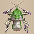 Nashagga</td>
      <td class="stats"> Scorpion</td>
      <td class="useful"> Crossbowboy</td>
      <td class="useful">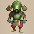 Masked Samurai</td>
      <td> Fresh Octopling</td>
      <td rowspan="2" class=""></td>
    </tr>
    <tr>
      <td class="useful"> Mixer</td>
      <td class="highlightGray"></td>
      <td class="highlightGray"></td>
      <td class="highlightGray"></td>
      <td class="highlightGray"></td>
    </tr>
    <tr>
      <td colspan="10" class="tableDivider"></td>
    </tr>
    <tr>
      <td class="centeredText">8</td>
      <td class=""></td>
      <td class=""></td>
      <td class=""></td>
      <td> Mid Chintala</td>
      <td class="useful"> Masked Samurai</td>
      <td> Fresh Octopling</td>
      <td>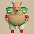 Porky</td>
      <td class="useful"> Mixer</td>
      <td class=""></td>
    </tr>
    <tr>
      <td colspan="10" class="tableDivider"></td>
    </tr>
    <tr>
      <td rowspan="2"class="centeredText">9</td>
      <td rowspan="2" class=""></td>
      <td rowspan="2" class=""></td>
      <td rowspan="2" class=""></td>
      <td>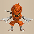 Earth Ninja D</td>
      <td class="items">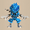 Water Ninja D</td>
      <td>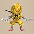 Metal Ninja D</td>
      <td>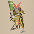 Hoppin' Hitter</td>
      <td> Mid Chintala</td>
      <td rowspan="2" class=""></td>
    </tr>
    <tr>
      <td class="useful"> Masked Samurai</td>
      <td> Fresh Octopling</td>
      <td class="useful"> Mixer</td>
      <td class="highlightGray"></td>
      <td class="highlightGray"></td>
    </tr>
    <tr>
      <td colspan="10" class="tableDivider"></td>
    </tr>
    <tr>
      <td rowspan="2"class="centeredText">10</td>
      <td rowspan="2" class=""></td>
      <td rowspan="2" class="highlightMH"></td>
      <td rowspan="2" class=""></td>
      <td> Mid Chintala</td>
      <td>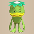 Bored Kappa</td>
      <td class="useful"> Masked Samurai</td>
      <td> Fresh Octopling</td>
      <td>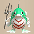 Lt. Spearfish</td>
      <td rowspan="2" class=""></td>
    </tr>
    <tr>
      <td>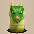 Floor Dragon</td>
      <td class="useful"> Mixer</td>
      <td class="highlightGray"></td>
      <td class="highlightGray"></td>
      <td class="highlightGray"></td>
    </tr>
    <tr>
      <td colspan="10" class="tableDivider"></td>
    </tr>
    <tr>
      <td rowspan="2"class="centeredText highlightFog">11</td>
      <td rowspan="2" class=""></td>
      <td rowspan="2" class=""></td>
      <td rowspan="2" class=""></td>
      <td> Bored Kappa</td>
      <td class="useful"> Masked Samurai</td>
      <td> Fresh Octopling</td>
      <td> Lt. Spearfish</td>
      <td> Floor Dragon</td>
      <td rowspan="2" class=""></td>
    </tr>
    <tr>
      <td>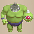 Metalhead</td>
      <td> Tiger Thrower</td>
      <td class="useful"> Mixer</td>
      <td class="highlightGray"></td>
      <td class="highlightGray"></td>
    </tr>
    <tr>
      <td colspan="10" class="tableDivider"></td>
    </tr>
    <tr>
      <td rowspan="2"class="centeredText highlightFog">12</td>
      <td rowspan="2" class=""></td>
      <td rowspan="2" class=""></td>
      <td rowspan="2" class=""></td>
      <td> Bored Kappa</td>
      <td class="useful"> Masked Samurai</td>
      <td> Fresh Octopling</td>
      <td> Floor Dragon</td>
      <td> Metalhead</td>
      <td rowspan="2" class=""></td>
    </tr>
    <tr>
      <td> Tiger Thrower</td>
      <td>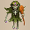 Skull Mage</td>
      <td class="useful"> Mixer</td>
      <td class="highlightGray"></td>
      <td class="highlightGray"></td>
    </tr>
    <tr>
      <td colspan="10" class="tableDivider"></td>
    </tr>
    <tr>
      <td rowspan="2"class="centeredText">13</td>
      <td rowspan="2" class=""></td>
      <td rowspan="2" class=""></td>
      <td rowspan="2" class=""></td>
      <td> Fresh Octopling</td>
      <td> Lt. Spearfish</td>
      <td> Floor Dragon</td>
      <td> Metalhead</td>
      <td>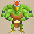 Master Hen</td>
      <td rowspan="2" class=""></td>
    </tr>
    <tr>
      <td> Tiger Thrower</td>
      <td> Skull Mage</td>
      <td class="useful"> Mixer</td>
      <td class="highlightGray"></td>
      <td class="highlightGray"></td>
    </tr>
    <tr>
      <td colspan="10" class="tableDivider"></td>
    </tr>
    <tr>
      <td rowspan="2"class="centeredText highlightFog">14</td>
      <td rowspan="2" class=""></td>
      <td rowspan="2" class=""></td>
      <td rowspan="2" class=""></td>
      <td> Lt. Spearfish</td>
      <td> Floor Dragon</td>
      <td> Metalhead</td>
      <td> Master Hen</td>
      <td> Tiger Thrower</td>
      <td rowspan="2" class=""></td>
    </tr>
    <tr>
      <td class="useful"> Mixer</td>
      <td class="highlightGray"></td>
      <td class="highlightGray"></td>
      <td class="highlightGray"></td>
      <td class="highlightGray"></td>
    </tr>
    <tr>
      <td colspan="10" class="tableDivider"></td>
    </tr>
    <tr>
      <td rowspan="2"class="centeredText highlightFog">15</td>
      <td rowspan="2" class=""></td>
      <td rowspan="2" class=""></td>
      <td rowspan="2" class=""></td>
      <td> Floor Dragon</td>
      <td> Metalhead</td>
      <td> Master Hen</td>
      <td> Tiger Thrower</td>
      <td class="useful"> Mixer</td>
      <td rowspan="2" class=""></td>
    </tr>
    <tr>
      <td class="farming"> Chow</td>
      <td class="highlightGray"></td>
      <td class="highlightGray"></td>
      <td class="highlightGray"></td>
      <td class="highlightGray"></td>
    </tr>
    <tr>
      <td colspan="10" class="tableDivider"></td>
    </tr>
    <tr>
      <td rowspan="3"class="centeredText highlightFog">16</td>
      <td rowspan="3" class=""></td>
      <td rowspan="3" class=""></td>
      <td rowspan="3" class=""></td>
      <td> Master Hen</td>
      <td>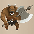 Minotaur</td>
      <td>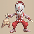 Kitsune Monk D</td>
      <td>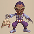 Okina Monk D</td>
      <td>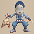 Okame Monk D</td>
      <td rowspan="3" class=""></td>
    </tr>
    <tr>
      <td>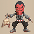 Tengu Monk D</td>
      <td>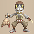 Hannya Monk D</td>
      <td>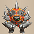 Zapdon</td>
      <td>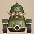 Pop Tank</td>
      <td class="items">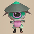 Hat Prankster</td>
    </tr>
    <tr>
      <td class="stats">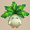 Ghost Radish</td>
      <td class="useful"> Mixer</td>
      <td class="farming"> Chow</td>
      <td class="highlightGray"></td>
      <td class="highlightGray"></td>
    </tr>
    <tr>
      <td colspan="10" class="tableDivider"></td>
    </tr>
    <tr>
      <td rowspan="3"class="centeredText highlightFog">17</td>
      <td rowspan="3" class=""></td>
      <td rowspan="3" class="highlightMH"></td>
      <td rowspan="3" class=""></td>
      <td> Master Hen</td>
      <td> Minotaur</td>
      <td> Kitsune Monk D</td>
      <td> Okina Monk D</td>
      <td> Okame Monk D</td>
      <td rowspan="3" class=""></td>
    </tr>
    <tr>
      <td> Tengu Monk D</td>
      <td> Hannya Monk D</td>
      <td> Zapdon</td>
      <td> Pop Tank</td>
      <td class="items"> Hat Prankster</td>
    </tr>
    <tr>
      <td class="stats"> Ghost Radish</td>
      <td class="useful"> Mixer</td>
      <td class="farming"> Chow</td>
      <td class="highlightGray"></td>
      <td class="highlightGray"></td>
    </tr>
    <tr>
      <td colspan="10" class="tableDivider"></td>
    </tr>
    <tr>
      <td rowspan="3"class="centeredText highlightFog">18</td>
      <td rowspan="3" class=""></td>
      <td rowspan="3" class=""></td>
      <td rowspan="3" class=""></td>
      <td> Master Hen</td>
      <td> Minotaur</td>
      <td> Kitsune Monk D</td>
      <td> Okina Monk D</td>
      <td> Okame Monk D</td>
      <td rowspan="3" class=""></td>
    </tr>
    <tr>
      <td> Tengu Monk D</td>
      <td> Hannya Monk D</td>
      <td> Zapdon</td>
      <td> Pop Tank</td>
      <td>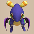 Flamepuff</td>
    </tr>
    <tr>
      <td class="useful"> Mixer</td>
      <td class="farming"> Chow</td>
      <td class="highlightGray"></td>
      <td class="highlightGray"></td>
      <td class="highlightGray"></td>
    </tr>
    <tr>
      <td colspan="10" class="tableDivider"></td>
    </tr>
    <tr>
      <td rowspan="2"class="centeredText highlightFog">19</td>
      <td rowspan="2" class=""></td>
      <td rowspan="2" class=""></td>
      <td rowspan="2" class=""></td>
      <td> Minotaur</td>
      <td> Zapdon</td>
      <td> Flamepuff</td>
      <td>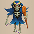 Skull Wizard</td>
      <td class="useful"> Mixer</td>
      <td rowspan="2" class=""></td>
    </tr>
    <tr>
      <td class="farming"> Chow</td>
      <td class="highlightGray"></td>
      <td class="highlightGray"></td>
      <td class="highlightGray"></td>
      <td class="highlightGray"></td>
    </tr>
    <tr>
      <td colspan="10" class="tableDivider"></td>
    </tr>
    <tr>
      <td rowspan="2"class="centeredText highlightFog">20</td>
      <td rowspan="2" class="highlightShop"></td>
      <td rowspan="2" class=""></td>
      <td rowspan="2" class=""></td>
      <td> Minotaur</td>
      <td> Zapdon</td>
      <td> Flamepuff</td>
      <td> Explochin</td>
      <td>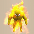 Blazeous</td>
      <td rowspan="2" class=""></td>
    </tr>
    <tr>
      <td> Skull Wizard</td>
      <td class="useful"> Mixer</td>
      <td class="farming">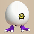 Running Egg</td>
      <td class="farming"> Chow</td>
      <td class="highlightGray"></td>
    </tr>
    <tr>
      <td colspan="10" class="tableDivider"></td>
    </tr>
    <tr>
      <td rowspan="2"class="centeredText highlightFog">21</td>
      <td rowspan="2" class=""></td>
      <td rowspan="2" class=""></td>
      <td rowspan="2" class=""></td>
      <td> Minotaur</td>
      <td> Explochin</td>
      <td> Blazeous</td>
      <td> Skull Wizard</td>
      <td class="useful"> Mixer</td>
      <td rowspan="2" class=""></td>
    </tr>
    <tr>
      <td class="farming"> Running Egg</td>
      <td class="farming"> Chow</td>
      <td class="highlightGray"></td>
      <td class="highlightGray"></td>
      <td class="highlightGray"></td>
    </tr>
    <tr>
      <td colspan="10" class="tableDivider"></td>
    </tr>
    <tr>
      <td rowspan="2"class="centeredText highlightFog">22</td>
      <td rowspan="2" class="highlightShop"></td>
      <td rowspan="2" class=""></td>
      <td rowspan="2" class=""></td>
      <td> Minotaur</td>
      <td> Explochin</td>
      <td> Blazeous</td>
      <td> Skull Wizard</td>
      <td class="items">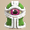 Super Gazer</td>
      <td rowspan="2" class="highlightBehemoth"></td>
    </tr>
    <tr>
      <td class="useful"> Mixer</td>
      <td class="farming"> Running Egg</td>
      <td class="farming"> Chow</td>
      <td class="highlightGray"></td>
      <td class="highlightGray"></td>
    </tr>
    <tr>
      <td colspan="10" class="tableDivider"></td>
    </tr>
    <tr>
      <td rowspan="2"class="centeredText highlightFog">23</td>
      <td rowspan="2" class=""></td>
      <td rowspan="2" class=""></td>
      <td rowspan="2" class=""></td>
      <td> Minotaur</td>
      <td> Blazeous</td>
      <td> Skull Wizard</td>
      <td> Skull Mage</td>
      <td class="items"> Super Gazer</td>
      <td rowspan="2" class="highlightBehemoth"></td>
    </tr>
    <tr>
      <td class="useful"> Mixer</td>
      <td class="farming"> Running Egg</td>
      <td class="farming"> Chow</td>
      <td class="highlightGray"></td>
      <td class="highlightGray"></td>
    </tr>
    <tr>
      <td colspan="10" class="tableDivider"></td>
    </tr>
    <tr>
      <td rowspan="3"class="centeredText highlightFog">24</td>
      <td rowspan="3" class="highlightShop"></td>
      <td rowspan="3" class=""></td>
      <td rowspan="3" class=""></td>
      <td> Minotaur</td>
      <td class="items"> Super Gazer</td>
      <td class="items">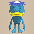 Pesky Kappa</td>
      <td>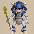 Corporal Ant</td>
      <td>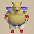 Porko</td>
      <td rowspan="3" class="highlightBehemoth"></td>
    </tr>
    <tr>
      <td> Porky</td>
      <td>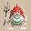 Capt. Spearfish</td>
      <td> Famed Octopling</td>
      <td> Dartingfrog</td>
      <td class="useful"> Mixer</td>
    </tr>
    <tr>
      <td class="farming"> Running Egg</td>
      <td class="farming"> Chow</td>
      <td class="highlightGray"></td>
      <td class="highlightGray"></td>
      <td class="highlightGray"></td>
    </tr>
    <tr>
      <td colspan="10" class="tableDivider"></td>
    </tr>
    <tr>
      <td rowspan="3"class="centeredText highlightFog">25</td>
      <td rowspan="3" class=""></td>
      <td rowspan="3" class=""></td>
      <td rowspan="3" class=""></td>
      <td class="items"> Pesky Kappa</td>
      <td> Corporal Ant</td>
      <td> Porko</td>
      <td> Porky</td>
      <td> Capt. Spearfish</td>
      <td rowspan="3" class=""></td>
    </tr>
    <tr>
      <td> Famed Octopling</td>
      <td> Dartingfrog</td>
      <td class="useful"> Mixer</td>
      <td class="farming"> Running Egg</td>
      <td class="farming"> Chow</td>
    </tr>
    <tr>
      <td>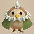 Dark Owl</td>
      <td class="highlightGray"></td>
      <td class="highlightGray"></td>
      <td class="highlightGray"></td>
      <td class="highlightGray"></td>
    </tr>
    <tr>
      <td colspan="10" class="tableDivider"></td>
    </tr>
    <tr>
      <td class="monsterTableExtension"></td>
      <td colspan="3" class="monsterTableExtension"></td>
      <td colspan="5" class="monsterTableExtension centeredText">Sacred Tree Mode</td>
      <td class="monsterTableExtension"></td>
    </tr>
    <tr>
      <td colspan="10" class="tableDivider"></td>
    </tr>
    <tr>
      <td rowspan="2"class="centeredText highlightFog">26</td>
      <td rowspan="2" class=""></td>
      <td rowspan="2" class=""></td>
      <td rowspan="2" class=""></td>
      <td> Pesky Kappa</td>
      <td> Corporal Ant</td>
      <td> Porko</td>
      <td> Daze Radish</td>
      <td> Dartingfrog</td>
      <td rowspan="2" class=""></td>
    </tr>
    <tr>
      <td> Mixer</td>
      <td> Running Egg</td>
      <td> Chow</td>
      <td> Dark Owl</td>
      <td class="highlightGray"></td>
    </tr>
    <tr>
      <td colspan="10" class="tableDivider"></td>
    </tr>
    <tr>
      <td rowspan="2"class="centeredText highlightFog">27</td>
      <td rowspan="2" class="highlightShop"></td>
      <td rowspan="2" class=""></td>
      <td rowspan="2" class=""></td>
      <td> Pesky Kappa</td>
      <td> Corporal Ant</td>
      <td> Porko</td>
      <td> Daze Radish</td>
      <td>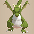 Dragon</td>
      <td rowspan="2" class=""></td>
    </tr>
    <tr>
      <td> Dartingfrog</td>
      <td> Mixer</td>
      <td> Running Egg</td>
      <td> Chow</td>
      <td> Dark Owl</td>
    </tr>
    <tr>
      <td colspan="10" class="tableDivider"></td>
    </tr>
    <tr>
      <td rowspan="2"class="centeredText highlightFog">28</td>
      <td rowspan="2" class=""></td>
      <td rowspan="2" class=""></td>
      <td rowspan="2" class=""></td>
      <td> Daze Radish</td>
      <td> Dragon</td>
      <td>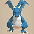 Sky Dragon</td>
      <td> Dartingfrog</td>
      <td> Mixer</td>
      <td rowspan="2" class=""></td>
    </tr>
    <tr>
      <td> Running Egg</td>
      <td> Chow</td>
      <td> Dark Owl</td>
      <td class="highlightGray"></td>
      <td class="highlightGray"></td>
    </tr>
    <tr>
      <td colspan="10" class="tableDivider"></td>
    </tr>
    <tr>
      <td rowspan="2"class="centeredText highlightFog">29</td>
      <td rowspan="2" class=""></td>
      <td rowspan="2" class=""></td>
      <td rowspan="2" class=""></td>
      <td> Daze Radish</td>
      <td>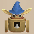 Baby Tank</td>
      <td> Dragon</td>
      <td> Sky Dragon</td>
      <td> Mixer</td>
      <td rowspan="2" class=""></td>
    </tr>
    <tr>
      <td> Running Egg</td>
      <td> Chow</td>
      <td> Dark Owl</td>
      <td class="highlightGray"></td>
      <td class="highlightGray"></td>
    </tr>
    <tr>
      <td colspan="10" class="tableDivider"></td>
    </tr>
    <tr>
      <td rowspan="2"class="centeredText">30</td>
      <td rowspan="2" class=""></td>
      <td rowspan="2" class=""></td>
      <td rowspan="2" class=""></td>
      <td> Baby Tank</td>
      <td> Vile Scorpion</td>
      <td>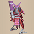 Hoppin' Slugger</td>
      <td>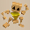 Polygon Shaka</td>
      <td> Dragon</td>
      <td rowspan="2" class=""></td>
    </tr>
    <tr>
      <td> Sky Dragon</td>
      <td> Mixer</td>
      <td> Chow</td>
      <td> Dark Owl</td>
      <td class="highlightGray"></td>
    </tr>
    <tr>
      <td colspan="10" class="tableDivider"></td>
    </tr>
    <tr>
      <td rowspan="2"class="centeredText">31</td>
      <td rowspan="2" class=""></td>
      <td rowspan="2" class=""></td>
      <td rowspan="2" class=""></td>
      <td>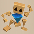 Polygon Singa</td>
      <td> Floppy Hani</td>
      <td>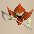 Soul Reaper</td>
      <td> Pumplich</td>
      <td> Chow</td>
      <td rowspan="2" class="highlightBehemoth"></td>
    </tr>
    <tr>
      <td> Dark Owl</td>
      <td class="highlightGray"></td>
      <td class="highlightGray"></td>
      <td class="highlightGray"></td>
      <td class="highlightGray"></td>
    </tr>
    <tr>
      <td colspan="10" class="tableDivider"></td>
    </tr>
    <tr>
      <td rowspan="2"class="centeredText">32</td>
      <td rowspan="2" class=""></td>
      <td rowspan="2" class=""></td>
      <td rowspan="2" class=""></td>
      <td> Polygon Singa</td>
      <td> Floppy Hani</td>
      <td> Soul Reaper</td>
      <td> Pumplich</td>
      <td> Chow</td>
      <td rowspan="2" class="highlightBehemoth"></td>
    </tr>
    <tr>
      <td> Dark Owl</td>
      <td class="highlightGray"></td>
      <td class="highlightGray"></td>
      <td class="highlightGray"></td>
      <td class="highlightGray"></td>
    </tr>
    <tr>
      <td colspan="10" class="tableDivider"></td>
    </tr>
    <tr>
      <td rowspan="2"class="centeredText">33</td>
      <td rowspan="2" class=""></td>
      <td rowspan="2" class=""></td>
      <td rowspan="2" class=""></td>
      <td> Polygon Singa</td>
      <td> Floppy Hani</td>
      <td> Soul Reaper</td>
      <td> Pumplich</td>
      <td> Chow</td>
      <td rowspan="2" class="highlightBehemoth"></td>
    </tr>
    <tr>
      <td> Dark Owl</td>
      <td class="highlightGray"></td>
      <td class="highlightGray"></td>
      <td class="highlightGray"></td>
      <td class="highlightGray"></td>
    </tr>
    <tr>
      <td colspan="10" class="tableDivider"></td>
    </tr>
    <tr>
      <td rowspan="2"class="centeredText">34</td>
      <td rowspan="2" class=""></td>
      <td rowspan="2" class=""></td>
      <td rowspan="2" class=""></td>
      <td> Polygon Singa</td>
      <td> Floppy Hani</td>
      <td> Soul Reaper</td>
      <td> Pumplich</td>
      <td> Chow</td>
      <td rowspan="2" class="highlightBehemoth"></td>
    </tr>
    <tr>
      <td> Dark Owl</td>
      <td class="highlightGray"></td>
      <td class="highlightGray"></td>
      <td class="highlightGray"></td>
      <td class="highlightGray"></td>
    </tr>
    <tr>
      <td colspan="10" class="tableDivider"></td>
    </tr>
    <tr>
      <td rowspan="3"class="centeredText">35</td>
      <td rowspan="3" class=""></td>
      <td rowspan="3" class=""></td>
      <td rowspan="3" class=""></td>
      <td> Polygon Singa</td>
      <td> Soul Reaper</td>
      <td> Pumplich</td>
      <td> Cave Mamel</td>
      <td> Tree Ninja B</td>
      <td rowspan="3" class="highlightBehemoth"></td>
    </tr>
    <tr>
      <td> Earth Ninja B</td>
      <td> Fire Ninja B</td>
      <td> Metal Ninja B</td>
      <td> Water Ninja B</td>
      <td> Chow</td>
    </tr>
    <tr>
      <td> Dark Owl</td>
      <td class="highlightGray"></td>
      <td class="highlightGray"></td>
      <td class="highlightGray"></td>
      <td class="highlightGray"></td>
    </tr>
    <tr>
      <td colspan="10" class="tableDivider"></td>
    </tr>
    <tr>
      <td rowspan="2"class="centeredText">36</td>
      <td rowspan="2" class=""></td>
      <td rowspan="2" class=""></td>
      <td rowspan="2" class=""></td>
      <td> Polygon Singa</td>
      <td> Soul Reaper</td>
      <td> Pumplich</td>
      <td> Tree Ninja B</td>
      <td> Earth Ninja B</td>
      <td rowspan="2" class="highlightBehemoth"></td>
    </tr>
    <tr>
      <td> Fire Ninja B</td>
      <td> Metal Ninja B</td>
      <td> Water Ninja B</td>
      <td> Chow</td>
      <td> Dark Owl</td>
    </tr>
    <tr>
      <td colspan="10" class="tableDivider"></td>
    </tr>
    <tr>
      <td rowspan="3"class="centeredText">37</td>
      <td rowspan="3" class=""></td>
      <td rowspan="3" class=""></td>
      <td rowspan="3" class=""></td>
      <td> Polygon Singa</td>
      <td> Soul Reaper</td>
      <td> Pumplich</td>
      <td> Cave Mamel</td>
      <td> Tree Ninja B</td>
      <td rowspan="3" class="highlightBehemoth"></td>
    </tr>
    <tr>
      <td> Earth Ninja B</td>
      <td> Fire Ninja B</td>
      <td> Metal Ninja B</td>
      <td> Water Ninja B</td>
      <td> Chow</td>
    </tr>
    <tr>
      <td> Dark Owl</td>
      <td class="highlightGray"></td>
      <td class="highlightGray"></td>
      <td class="highlightGray"></td>
      <td class="highlightGray"></td>
    </tr>
    <tr>
      <td colspan="10" class="tableDivider"></td>
    </tr>
    <tr>
      <td rowspan="2"class="centeredText">38</td>
      <td rowspan="2" class=""></td>
      <td rowspan="2" class=""></td>
      <td rowspan="2" class=""></td>
      <td> Polygon Singa</td>
      <td> Soul Reaper</td>
      <td> Pumplich</td>
      <td> Tree Ninja B</td>
      <td> Earth Ninja B</td>
      <td rowspan="2" class="highlightBehemoth"></td>
    </tr>
    <tr>
      <td> Fire Ninja B</td>
      <td> Metal Ninja B</td>
      <td> Water Ninja B</td>
      <td> Chow</td>
      <td> Dark Owl</td>
    </tr>
    <tr>
      <td colspan="10" class="tableDivider"></td>
    </tr>
    <tr>
      <td rowspan="3"class="centeredText">39</td>
      <td rowspan="3" class=""></td>
      <td rowspan="3" class="highlightMH"></td>
      <td rowspan="3" class=""></td>
      <td> Polygon Singa</td>
      <td> Soul Reaper</td>
      <td> Pumplich</td>
      <td> Cave Mamel</td>
      <td> Tree Ninja B</td>
      <td rowspan="3" class="highlightBehemoth"></td>
    </tr>
    <tr>
      <td> Earth Ninja B</td>
      <td> Fire Ninja B</td>
      <td> Metal Ninja B</td>
      <td> Water Ninja B</td>
      <td> Chow</td>
    </tr>
    <tr>
      <td> Dark Owl</td>
      <td class="highlightGray"></td>
      <td class="highlightGray"></td>
      <td class="highlightGray"></td>
      <td class="highlightGray"></td>
    </tr>
    <tr>
      <td colspan="10" class="tableDivider"></td>
    </tr>
    <tr>
      <td rowspan="2"class="centeredText">40</td>
      <td rowspan="2" class=""></td>
      <td rowspan="2" class=""></td>
      <td rowspan="2" class=""></td>
      <td> Mini Tank</td>
      <td> Ornery Tank</td>
      <td> Adamant Tank</td>
      <td> Steadfast Tank</td>
      <td> Chow</td>
      <td rowspan="2" class=""></td>
    </tr>
    <tr>
      <td> Dark Owl</td>
      <td class="highlightGray"></td>
      <td class="highlightGray"></td>
      <td class="highlightGray"></td>
      <td class="highlightGray"></td>
    </tr>
    <tr>
      <td colspan="10" class="tableDivider"></td>
    </tr>
    <tr>
      <td rowspan="2"class="centeredText">41</td>
      <td rowspan="2" class=""></td>
      <td rowspan="2" class=""></td>
      <td rowspan="2" class=""></td>
      <td> Mini Tank</td>
      <td> Ornery Tank</td>
      <td> Adamant Tank</td>
      <td> Steadfast Tank</td>
      <td> Chow</td>
      <td rowspan="2" class=""></td>
    </tr>
    <tr>
      <td> Dark Owl</td>
      <td class="highlightGray"></td>
      <td class="highlightGray"></td>
      <td class="highlightGray"></td>
      <td class="highlightGray"></td>
    </tr>
    <tr>
      <td colspan="10" class="tableDivider"></td>
    </tr>
    <tr>
      <td rowspan="2"class="centeredText">42</td>
      <td rowspan="2" class=""></td>
      <td rowspan="2" class=""></td>
      <td rowspan="2" class=""></td>
      <td> Mini Tank</td>
      <td> Ornery Tank</td>
      <td> Adamant Tank</td>
      <td> Steadfast Tank</td>
      <td> Chow</td>
      <td rowspan="2" class=""></td>
    </tr>
    <tr>
      <td> Dark Owl</td>
      <td class="highlightGray"></td>
      <td class="highlightGray"></td>
      <td class="highlightGray"></td>
      <td class="highlightGray"></td>
    </tr>
    <tr>
      <td colspan="10" class="tableDivider"></td>
    </tr>
    <tr>
      <td rowspan="2"class="centeredText">43</td>
      <td rowspan="2" class=""></td>
      <td rowspan="2" class=""></td>
      <td rowspan="2" class=""></td>
      <td> Mini Tank</td>
      <td> Ornery Tank</td>
      <td> Adamant Tank</td>
      <td> Steadfast Tank</td>
      <td> Igneous</td>
      <td rowspan="2" class=""></td>
    </tr>
    <tr>
      <td> Chow</td>
      <td> Dark Owl</td>
      <td class="highlightGray"></td>
      <td class="highlightGray"></td>
      <td class="highlightGray"></td>
    </tr>
    <tr>
      <td colspan="10" class="tableDivider"></td>
    </tr>
    <tr>
      <td rowspan="2"class="centeredText">44</td>
      <td rowspan="2" class=""></td>
      <td rowspan="2" class=""></td>
      <td rowspan="2" class=""></td>
      <td> Mini Tank</td>
      <td> Ornery Tank</td>
      <td> Adamant Tank</td>
      <td> Steadfast Tank</td>
      <td> Igneous</td>
      <td rowspan="2" class=""></td>
    </tr>
    <tr>
      <td> Chow</td>
      <td> Dark Owl</td>
      <td class="highlightGray"></td>
      <td class="highlightGray"></td>
      <td class="highlightGray"></td>
    </tr>
    <tr>
      <td colspan="10" class="tableDivider"></td>
    </tr>
    <tr>
      <td rowspan="2"class="centeredText">45</td>
      <td rowspan="2" class="highlightShop"></td>
      <td rowspan="2" class=""></td>
      <td rowspan="2" class=""></td>
      <td> Steadfast Tank</td>
      <td> Blazepuff</td>
      <td> Dragon Pit</td>
      <td> Igneous</td>
      <td> Chow</td>
      <td rowspan="2" class=""></td>
    </tr>
    <tr>
      <td> Dark Owl</td>
      <td class="highlightGray"></td>
      <td class="highlightGray"></td>
      <td class="highlightGray"></td>
      <td class="highlightGray"></td>
    </tr>
    <tr>
      <td colspan="10" class="tableDivider"></td>
    </tr>
    <tr>
      <td rowspan="2"class="centeredText">46</td>
      <td rowspan="2" class=""></td>
      <td rowspan="2" class=""></td>
      <td rowspan="2" class=""></td>
      <td> Steadfast Tank</td>
      <td> Blazepuff</td>
      <td> Dragon Pit</td>
      <td> Igneous</td>
      <td> Chow</td>
      <td rowspan="2" class=""></td>
    </tr>
    <tr>
      <td> Dark Owl</td>
      <td class="highlightGray"></td>
      <td class="highlightGray"></td>
      <td class="highlightGray"></td>
      <td class="highlightGray"></td>
    </tr>
    <tr>
      <td colspan="10" class="tableDivider"></td>
    </tr>
    <tr>
      <td rowspan="2"class="centeredText">47</td>
      <td rowspan="2" class=""></td>
      <td rowspan="2" class=""></td>
      <td rowspan="2" class=""></td>
      <td> Blazepuff</td>
      <td> Dragon Pit</td>
      <td> Igneous</td>
      <td> Mudster</td>
      <td> Mudder</td>
      <td rowspan="2" class=""></td>
    </tr>
    <tr>
      <td> Sleep Radish</td>
      <td> Chow</td>
      <td> Dark Owl</td>
      <td class="highlightGray"></td>
      <td class="highlightGray"></td>
    </tr>
    <tr>
      <td colspan="10" class="tableDivider"></td>
    </tr>
    <tr>
      <td rowspan="2"class="centeredText">48</td>
      <td rowspan="2" class=""></td>
      <td rowspan="2" class=""></td>
      <td rowspan="2" class=""></td>
      <td> Blazepuff</td>
      <td> Dragon Pit</td>
      <td> Igneous</td>
      <td> Mudster</td>
      <td> Mudder</td>
      <td rowspan="2" class=""></td>
    </tr>
    <tr>
      <td> Sleep Radish</td>
      <td> Chow</td>
      <td> Dark Owl</td>
      <td class="highlightGray"></td>
      <td class="highlightGray"></td>
    </tr>
    <tr>
      <td colspan="10" class="tableDivider"></td>
    </tr>
    <tr>
      <td rowspan="2"class="centeredText">49</td>
      <td rowspan="2" class=""></td>
      <td rowspan="2" class=""></td>
      <td rowspan="2" class=""></td>
      <td> Blazepuff</td>
      <td> Dragon Pit</td>
      <td> Igneous</td>
      <td> Mudster</td>
      <td> Mudder</td>
      <td rowspan="2" class=""></td>
    </tr>
    <tr>
      <td> Sleep Radish</td>
      <td> Chow</td>
      <td> Dark Owl</td>
      <td class="highlightGray"></td>
      <td class="highlightGray"></td>
    </tr>
    <tr>
      <td colspan="10" class="tableDivider"></td>
    </tr>
    <tr>
      <td rowspan="2"class="centeredText">50</td>
      <td rowspan="2" class=""></td>
      <td rowspan="2" class=""></td>
      <td rowspan="2" class=""></td>
      <td> Blazepuff</td>
      <td> Dragon Pit</td>
      <td> Igneous</td>
      <td> Mudster</td>
      <td> Mudder</td>
      <td rowspan="2" class=""></td>
    </tr>
    <tr>
      <td> Sleep Radish</td>
      <td> Chow</td>
      <td> Dark Owl</td>
      <td class="highlightGray"></td>
      <td class="highlightGray"></td>
    </tr>
    <tr>
      <td colspan="10" class="tableDivider"></td>
    </tr>
    <tr>
      <td rowspan="3"class="centeredText highlightFog">51</td>
      <td rowspan="3" class=""></td>
      <td rowspan="3" class=""></td>
      <td rowspan="3" class=""></td>
      <td> Hannya Monk B</td>
      <td> Okame Monk B</td>
      <td> Tengu Monk B</td>
      <td> Kitsune Monk B</td>
      <td> Okina Monk B</td>
      <td rowspan="3" class="highlightBehemoth"></td>
    </tr>
    <tr>
      <td> Terror Scorpion</td>
      <td> Hoppin' Slammer</td>
      <td> Mudster</td>
      <td> Mudder</td>
      <td> Chow</td>
    </tr>
    <tr>
      <td> Dark Owl</td>
      <td class="highlightGray"></td>
      <td class="highlightGray"></td>
      <td class="highlightGray"></td>
      <td class="highlightGray"></td>
    </tr>
    <tr>
      <td colspan="10" class="tableDivider"></td>
    </tr>
    <tr>
      <td rowspan="3"class="centeredText highlightFog">52</td>
      <td rowspan="3" class=""></td>
      <td rowspan="3" class=""></td>
      <td rowspan="3" class=""></td>
      <td> Hannya Monk B</td>
      <td> Okame Monk B</td>
      <td> Tengu Monk B</td>
      <td> Kitsune Monk B</td>
      <td> Okina Monk B</td>
      <td rowspan="3" class="highlightBehemoth"></td>
    </tr>
    <tr>
      <td> Terror Scorpion</td>
      <td> Hoppin' Slammer</td>
      <td> Mudster</td>
      <td> Mudder</td>
      <td> Chow</td>
    </tr>
    <tr>
      <td> Dark Owl</td>
      <td class="highlightGray"></td>
      <td class="highlightGray"></td>
      <td class="highlightGray"></td>
      <td class="highlightGray"></td>
    </tr>
    <tr>
      <td colspan="10" class="tableDivider"></td>
    </tr>
    <tr>
      <td rowspan="3"class="centeredText highlightFog">53</td>
      <td rowspan="3" class=""></td>
      <td rowspan="3" class=""></td>
      <td rowspan="3" class=""></td>
      <td> Hannya Monk B</td>
      <td> Okame Monk B</td>
      <td> Tengu Monk B</td>
      <td> Kitsune Monk B</td>
      <td> Okina Monk B</td>
      <td rowspan="3" class="highlightBehemoth"></td>
    </tr>
    <tr>
      <td> Terror Scorpion</td>
      <td> Hoppin' Slammer</td>
      <td> Mudster</td>
      <td> Mudder</td>
      <td> Chow</td>
    </tr>
    <tr>
      <td> Dark Owl</td>
      <td class="highlightGray"></td>
      <td class="highlightGray"></td>
      <td class="highlightGray"></td>
      <td class="highlightGray"></td>
    </tr>
    <tr>
      <td colspan="10" class="tableDivider"></td>
    </tr>
    <tr>
      <td rowspan="3"class="centeredText highlightFog">54</td>
      <td rowspan="3" class=""></td>
      <td rowspan="3" class=""></td>
      <td rowspan="3" class=""></td>
      <td> Hannya Monk B</td>
      <td> Okame Monk B</td>
      <td> Tengu Monk B</td>
      <td> Kitsune Monk B</td>
      <td> Okina Monk B</td>
      <td rowspan="3" class="highlightBehemoth"></td>
    </tr>
    <tr>
      <td> Terror Scorpion</td>
      <td> Hoppin' Slammer</td>
      <td> Mudster</td>
      <td> Mudder</td>
      <td> Chow</td>
    </tr>
    <tr>
      <td> Dark Owl</td>
      <td class="highlightGray"></td>
      <td class="highlightGray"></td>
      <td class="highlightGray"></td>
      <td class="highlightGray"></td>
    </tr>
    <tr>
      <td colspan="10" class="tableDivider"></td>
    </tr>
    <tr>
      <td rowspan="3"class="centeredText highlightFog">55</td>
      <td rowspan="3" class=""></td>
      <td rowspan="3" class=""></td>
      <td rowspan="3" class=""></td>
      <td> Hannya Monk B</td>
      <td> Okame Monk B</td>
      <td> Tengu Monk B</td>
      <td> Kitsune Monk B</td>
      <td> Okina Monk B</td>
      <td rowspan="3" class=""></td>
    </tr>
    <tr>
      <td> Terror Scorpion</td>
      <td> Hoppin' Slammer</td>
      <td> Admiral Spearfish</td>
      <td> Superb Octopling</td>
      <td> Vexing Kappa</td>
    </tr>
    <tr>
      <td> Fleefrog</td>
      <td> Chow</td>
      <td> Dark Owl</td>
      <td class="highlightGray"></td>
      <td class="highlightGray"></td>
    </tr>
    <tr>
      <td colspan="10" class="tableDivider"></td>
    </tr>
    <tr>
      <td rowspan="2"class="centeredText highlightFog">56</td>
      <td rowspan="2" class="highlightShop"></td>
      <td rowspan="2" class=""></td>
      <td rowspan="2" class=""></td>
      <td> Terror Scorpion</td>
      <td> Hoppin' Slammer</td>
      <td> Admiral Spearfish</td>
      <td> Superb Octopling</td>
      <td> Vexing Kappa</td>
      <td rowspan="2" class=""></td>
    </tr>
    <tr>
      <td> Fleefrog</td>
      <td> Chow</td>
      <td> Dark Owl</td>
      <td class="highlightGray"></td>
      <td class="highlightGray"></td>
    </tr>
    <tr>
      <td colspan="10" class="tableDivider"></td>
    </tr>
    <tr>
      <td rowspan="2"class="centeredText highlightFog">57</td>
      <td rowspan="2" class=""></td>
      <td rowspan="2" class=""></td>
      <td rowspan="2" class=""></td>
      <td> Terror Scorpion</td>
      <td> Hoppin' Slammer</td>
      <td> Admiral Spearfish</td>
      <td> Superb Octopling</td>
      <td> Vexing Kappa</td>
      <td rowspan="2" class=""></td>
    </tr>
    <tr>
      <td> Fleefrog</td>
      <td> Chow</td>
      <td> Dark Owl</td>
      <td class="highlightGray"></td>
      <td class="highlightGray"></td>
    </tr>
    <tr>
      <td colspan="10" class="tableDivider"></td>
    </tr>
    <tr>
      <td rowspan="2"class="centeredText highlightFog">58</td>
      <td rowspan="2" class=""></td>
      <td rowspan="2" class=""></td>
      <td rowspan="2" class=""></td>
      <td> Terror Scorpion</td>
      <td> Hoppin' Slammer</td>
      <td> Admiral Spearfish</td>
      <td> Superb Octopling</td>
      <td> Vexing Kappa</td>
      <td rowspan="2" class=""></td>
    </tr>
    <tr>
      <td> Fleefrog</td>
      <td> Chow</td>
      <td> Dark Owl</td>
      <td class="highlightGray"></td>
      <td class="highlightGray"></td>
    </tr>
    <tr>
      <td colspan="10" class="tableDivider"></td>
    </tr>
    <tr>
      <td rowspan="2"class="centeredText highlightFog">59</td>
      <td rowspan="2" class="highlightShop"></td>
      <td rowspan="2" class=""></td>
      <td rowspan="2" class=""></td>
      <td> Terror Scorpion</td>
      <td> Hoppin' Slammer</td>
      <td> Admiral Spearfish</td>
      <td> Superb Octopling</td>
      <td> Vexing Kappa</td>
      <td rowspan="2" class=""></td>
    </tr>
    <tr>
      <td> Fleefrog</td>
      <td> Chow</td>
      <td> Dark Owl</td>
      <td class="highlightGray"></td>
      <td class="highlightGray"></td>
    </tr>
    <tr>
      <td colspan="10" class="tableDivider"></td>
    </tr>
    <tr>
      <td rowspan="2"class="centeredText highlightFog">60</td>
      <td rowspan="2" class=""></td>
      <td rowspan="2" class=""></td>
      <td rowspan="2" class=""></td>
      <td> Curse Matron</td>
      <td> Nigiri Boss</td>
      <td> Bag Knave</td>
      <td> Hyper Gazer</td>
      <td> Hat Brat</td>
      <td rowspan="2" class=""></td>
    </tr>
    <tr>
      <td> Chow</td>
      <td> Dark Owl</td>
      <td class="highlightGray"></td>
      <td class="highlightGray"></td>
      <td class="highlightGray"></td>
    </tr>
    <tr>
      <td colspan="10" class="tableDivider"></td>
    </tr>
    <tr>
      <td rowspan="2"class="centeredText highlightFog">61</td>
      <td rowspan="2" class=""></td>
      <td rowspan="2" class=""></td>
      <td rowspan="2" class=""></td>
      <td> Curse Matron</td>
      <td> Nigiri Boss</td>
      <td> Bag Knave</td>
      <td> Hyper Gazer</td>
      <td> Hat Brat</td>
      <td rowspan="2" class=""></td>
    </tr>
    <tr>
      <td> Chow</td>
      <td> Dark Owl</td>
      <td class="highlightGray"></td>
      <td class="highlightGray"></td>
      <td class="highlightGray"></td>
    </tr>
    <tr>
      <td colspan="10" class="tableDivider"></td>
    </tr>
    <tr>
      <td rowspan="2"class="centeredText highlightFog">62</td>
      <td rowspan="2" class=""></td>
      <td rowspan="2" class=""></td>
      <td rowspan="2" class=""></td>
      <td> Curse Matron</td>
      <td> Nigiri Boss</td>
      <td> Bag Knave</td>
      <td> Hyper Gazer</td>
      <td> Hat Brat</td>
      <td rowspan="2" class=""></td>
    </tr>
    <tr>
      <td> Chow</td>
      <td> Dark Owl</td>
      <td class="highlightGray"></td>
      <td class="highlightGray"></td>
      <td class="highlightGray"></td>
    </tr>
    <tr>
      <td colspan="10" class="tableDivider"></td>
    </tr>
    <tr>
      <td rowspan="2"class="centeredText highlightFog">63</td>
      <td rowspan="2" class=""></td>
      <td rowspan="2" class=""></td>
      <td rowspan="2" class=""></td>
      <td> Curse Matron</td>
      <td> Nigiri Boss</td>
      <td> Bag Knave</td>
      <td> Hyper Gazer</td>
      <td> Hat Brat</td>
      <td rowspan="2" class=""></td>
    </tr>
    <tr>
      <td> Chow</td>
      <td> Dark Owl</td>
      <td class="highlightGray"></td>
      <td class="highlightGray"></td>
      <td class="highlightGray"></td>
    </tr>
    <tr>
      <td colspan="10" class="tableDivider"></td>
    </tr>
    <tr>
      <td rowspan="2"class="centeredText highlightFog">64</td>
      <td rowspan="2" class=""></td>
      <td rowspan="2" class=""></td>
      <td rowspan="2" class=""></td>
      <td> Curse Matron</td>
      <td> Nigiri Boss</td>
      <td> Bag Knave</td>
      <td> Hyper Gazer</td>
      <td> Hat Brat</td>
      <td rowspan="2" class=""></td>
    </tr>
    <tr>
      <td> Chow</td>
      <td> Dark Owl</td>
      <td class="highlightGray"></td>
      <td class="highlightGray"></td>
      <td class="highlightGray"></td>
    </tr>
    <tr>
      <td colspan="10" class="tableDivider"></td>
    </tr>
    <tr>
      <td rowspan="2"class="centeredText highlightFog">65</td>
      <td rowspan="2" class=""></td>
      <td rowspan="2" class=""></td>
      <td rowspan="2" class=""></td>
      <td> Curse Matron</td>
      <td> Nigiri Boss</td>
      <td> Bag Knave</td>
      <td> Hyper Gazer</td>
      <td> Hat Brat</td>
      <td rowspan="2" class=""></td>
    </tr>
    <tr>
      <td> Chow</td>
      <td> Dark Owl</td>
      <td class="highlightGray"></td>
      <td class="highlightGray"></td>
      <td class="highlightGray"></td>
    </tr>
    <tr>
      <td colspan="10" class="tableDivider"></td>
    </tr>
    <tr>
      <td rowspan="3"class="centeredText highlightFog">66</td>
      <td rowspan="3" class=""></td>
      <td rowspan="3" class=""></td>
      <td rowspan="3" class=""></td>
      <td> Lashagga</td>
      <td> Miracle Hen</td>
      <td> Great Samurai</td>
      <td> Skull Lord</td>
      <td> Battler</td>
      <td rowspan="3" class=""></td>
    </tr>
    <tr>
      <td> Megataur</td>
      <td> Megahead</td>
      <td> Clapdon</td>
      <td> Bellthoven</td>
      <td> Pumplord</td>
    </tr>
    <tr>
      <td> Chow</td>
      <td> Dark Owl</td>
      <td class="highlightGray"></td>
      <td class="highlightGray"></td>
      <td class="highlightGray"></td>
    </tr>
    <tr>
      <td colspan="10" class="tableDivider"></td>
    </tr>
    <tr>
      <td rowspan="3"class="centeredText highlightFog">67</td>
      <td rowspan="3" class=""></td>
      <td rowspan="3" class=""></td>
      <td rowspan="3" class=""></td>
      <td> Lashagga</td>
      <td> Miracle Hen</td>
      <td> Great Samurai</td>
      <td> Skull Lord</td>
      <td> Battler</td>
      <td rowspan="3" class=""></td>
    </tr>
    <tr>
      <td> Megataur</td>
      <td> Megahead</td>
      <td> Clapdon</td>
      <td> Bellthoven</td>
      <td> Pumplord</td>
    </tr>
    <tr>
      <td> Chow</td>
      <td> Dark Owl</td>
      <td class="highlightGray"></td>
      <td class="highlightGray"></td>
      <td class="highlightGray"></td>
    </tr>
    <tr>
      <td colspan="10" class="tableDivider"></td>
    </tr>
    <tr>
      <td rowspan="3"class="centeredText highlightFog">68</td>
      <td rowspan="3" class=""></td>
      <td rowspan="3" class=""></td>
      <td rowspan="3" class=""></td>
      <td> Lashagga</td>
      <td> Miracle Hen</td>
      <td> Great Samurai</td>
      <td> Skull Lord</td>
      <td> Battler</td>
      <td rowspan="3" class=""></td>
    </tr>
    <tr>
      <td> Megataur</td>
      <td> Megahead</td>
      <td> Clapdon</td>
      <td> Bellthoven</td>
      <td> Pumplord</td>
    </tr>
    <tr>
      <td> Chow</td>
      <td> Dark Owl</td>
      <td class="highlightGray"></td>
      <td class="highlightGray"></td>
      <td class="highlightGray"></td>
    </tr>
    <tr>
      <td colspan="10" class="tableDivider"></td>
    </tr>
    <tr>
      <td rowspan="3"class="centeredText highlightFog">69</td>
      <td rowspan="3" class=""></td>
      <td rowspan="3" class=""></td>
      <td rowspan="3" class=""></td>
      <td> Lashagga</td>
      <td> Miracle Hen</td>
      <td> Great Samurai</td>
      <td> Skull Lord</td>
      <td> Battler</td>
      <td rowspan="3" class=""></td>
    </tr>
    <tr>
      <td> Megataur</td>
      <td> Megahead</td>
      <td> Clapdon</td>
      <td> Bellthoven</td>
      <td> Pumplord</td>
    </tr>
    <tr>
      <td> Chow</td>
      <td> Dark Owl</td>
      <td class="highlightGray"></td>
      <td class="highlightGray"></td>
      <td class="highlightGray"></td>
    </tr>
    <tr>
      <td colspan="10" class="tableDivider"></td>
    </tr>
    <tr>
      <td rowspan="4"class="centeredText">70</td>
      <td rowspan="4" class=""></td>
      <td rowspan="4" class=""></td>
      <td rowspan="4" class=""></td>
      <td> Hannya Monk B</td>
      <td> Okame Monk B</td>
      <td> Tengu Monk B</td>
      <td> Kitsune Monk B</td>
      <td> Okina Monk B</td>
      <td rowspan="4" class=""></td>
    </tr>
    <tr>
      <td> Lashagga</td>
      <td> Miracle Hen</td>
      <td> Great Samurai</td>
      <td> Skull Lord</td>
      <td> Battler</td>
    </tr>
    <tr>
      <td> Megataur</td>
      <td> Megahead</td>
      <td> Clapdon</td>
      <td> Bellthoven</td>
      <td> Pumplord</td>
    </tr>
    <tr>
      <td> Chow</td>
      <td> Dark Owl</td>
      <td class="highlightGray"></td>
      <td class="highlightGray"></td>
      <td class="highlightGray"></td>
    </tr>
    <tr>
      <td colspan="10" class="tableDivider"></td>
    </tr>
    <tr>
      <td rowspan="4"class="centeredText">71</td>
      <td rowspan="4" class="highlightShop"></td>
      <td rowspan="4" class=""></td>
      <td rowspan="4" class=""></td>
      <td> Hannya Monk B</td>
      <td> Okame Monk B</td>
      <td> Tengu Monk B</td>
      <td> Kitsune Monk B</td>
      <td> Okina Monk B</td>
      <td rowspan="4" class=""></td>
    </tr>
    <tr>
      <td> Lashagga</td>
      <td> Miracle Hen</td>
      <td> Great Samurai</td>
      <td> Skull Lord</td>
      <td> Battler</td>
    </tr>
    <tr>
      <td> Megataur</td>
      <td> Megahead</td>
      <td> Clapdon</td>
      <td> Bellthoven</td>
      <td> Pumplord</td>
    </tr>
    <tr>
      <td> Chow</td>
      <td> Dark Owl</td>
      <td class="highlightGray"></td>
      <td class="highlightGray"></td>
      <td class="highlightGray"></td>
    </tr>
    <tr>
      <td colspan="10" class="tableDivider"></td>
    </tr>
    <tr>
      <td rowspan="4"class="centeredText">72</td>
      <td rowspan="4" class=""></td>
      <td rowspan="4" class="highlightMH"></td>
      <td rowspan="4" class=""></td>
      <td> Hannya Monk B</td>
      <td> Okame Monk B</td>
      <td> Tengu Monk B</td>
      <td> Kitsune Monk B</td>
      <td> Okina Monk B</td>
      <td rowspan="4" class=""></td>
    </tr>
    <tr>
      <td> Lashagga</td>
      <td> Miracle Hen</td>
      <td> Great Samurai</td>
      <td> Skull Lord</td>
      <td> Battler</td>
    </tr>
    <tr>
      <td> Megataur</td>
      <td> Megahead</td>
      <td> Clapdon</td>
      <td> Bellthoven</td>
      <td> Pumplord</td>
    </tr>
    <tr>
      <td> Chow</td>
      <td> Dark Owl</td>
      <td class="highlightGray"></td>
      <td class="highlightGray"></td>
      <td class="highlightGray"></td>
    </tr>
    <tr>
      <td colspan="10" class="tableDivider"></td>
    </tr>
    <tr>
      <td rowspan="4"class="centeredText">73</td>
      <td rowspan="4" class=""></td>
      <td rowspan="4" class=""></td>
      <td rowspan="4" class=""></td>
      <td> Hannya Monk B</td>
      <td> Okame Monk B</td>
      <td> Tengu Monk B</td>
      <td> Kitsune Monk B</td>
      <td> Okina Monk B</td>
      <td rowspan="4" class=""></td>
    </tr>
    <tr>
      <td> Lashagga</td>
      <td> Miracle Hen</td>
      <td> Great Samurai</td>
      <td> Skull Lord</td>
      <td> Battler</td>
    </tr>
    <tr>
      <td> Megataur</td>
      <td> Megahead</td>
      <td> Clapdon</td>
      <td> Bellthoven</td>
      <td> Pumplord</td>
    </tr>
    <tr>
      <td> Chow</td>
      <td> Dark Owl</td>
      <td class="highlightGray"></td>
      <td class="highlightGray"></td>
      <td class="highlightGray"></td>
    </tr>
    <tr>
      <td colspan="10" class="tableDivider"></td>
    </tr>
    <tr>
      <td rowspan="4"class="centeredText">74</td>
      <td rowspan="4" class=""></td>
      <td rowspan="4" class=""></td>
      <td rowspan="4" class=""></td>
      <td> Hannya Monk B</td>
      <td> Okame Monk B</td>
      <td> Tengu Monk B</td>
      <td> Kitsune Monk B</td>
      <td> Okina Monk B</td>
      <td rowspan="4" class=""></td>
    </tr>
    <tr>
      <td> Lashagga</td>
      <td> Miracle Hen</td>
      <td> Great Samurai</td>
      <td> Skull Lord</td>
      <td> Battler</td>
    </tr>
    <tr>
      <td> Megataur</td>
      <td> Megahead</td>
      <td> Clapdon</td>
      <td> Bellthoven</td>
      <td> Pumplord</td>
    </tr>
    <tr>
      <td> Chow</td>
      <td> Dark Owl</td>
      <td class="highlightGray"></td>
      <td class="highlightGray"></td>
      <td class="highlightGray"></td>
    </tr>
    <tr>
      <td colspan="10" class="tableDivider"></td>
    </tr>
    <tr>
      <td rowspan="4"class="centeredText">75</td>
      <td rowspan="4" class=""></td>
      <td rowspan="4" class=""></td>
      <td rowspan="4" class=""></td>
      <td> Hannya Monk B</td>
      <td> Okame Monk B</td>
      <td> Tengu Monk B</td>
      <td> Kitsune Monk B</td>
      <td> Okina Monk B</td>
      <td rowspan="4" class=""></td>
    </tr>
    <tr>
      <td> Lashagga</td>
      <td> Miracle Hen</td>
      <td> Great Samurai</td>
      <td> Skull Lord</td>
      <td> Battler</td>
    </tr>
    <tr>
      <td> Megataur</td>
      <td> Megahead</td>
      <td> Clapdon</td>
      <td> Bellthoven</td>
      <td> Pumplord</td>
    </tr>
    <tr>
      <td> Chow</td>
      <td> Dark Owl</td>
      <td class="highlightGray"></td>
      <td class="highlightGray"></td>
      <td class="highlightGray"></td>
    </tr>
    <tr>
      <td colspan="10" class="tableDivider"></td>
    </tr>
    <tr>
      <td rowspan="3"class="centeredText">76</td>
      <td rowspan="3" class=""></td>
      <td rowspan="3" class=""></td>
      <td rowspan="3" class=""></td>
      <td> Lashagga</td>
      <td> Miracle Hen</td>
      <td> Great Samurai</td>
      <td> Skull Lord</td>
      <td> Battler</td>
      <td rowspan="3" class=""></td>
    </tr>
    <tr>
      <td> Megataur</td>
      <td> Megahead</td>
      <td> Clapdon</td>
      <td> Bellthoven</td>
      <td> Pumplord</td>
    </tr>
    <tr>
      <td> Chow</td>
      <td> Dark Owl</td>
      <td class="highlightGray"></td>
      <td class="highlightGray"></td>
      <td class="highlightGray"></td>
    </tr>
    <tr>
      <td colspan="10" class="tableDivider"></td>
    </tr>
    <tr>
      <td rowspan="3"class="centeredText">77</td>
      <td rowspan="3" class=""></td>
      <td rowspan="3" class=""></td>
      <td rowspan="3" class=""></td>
      <td> Lashagga</td>
      <td> Miracle Hen</td>
      <td> Great Samurai</td>
      <td> Skull Lord</td>
      <td> Battler</td>
      <td rowspan="3" class=""></td>
    </tr>
    <tr>
      <td> Megataur</td>
      <td> Megahead</td>
      <td> Clapdon</td>
      <td> Bellthoven</td>
      <td> Pumplord</td>
    </tr>
    <tr>
      <td> Chow</td>
      <td> Dark Owl</td>
      <td class="highlightGray"></td>
      <td class="highlightGray"></td>
      <td class="highlightGray"></td>
    </tr>
    <tr>
      <td colspan="10" class="tableDivider"></td>
    </tr>
    <tr>
      <td rowspan="3"class="centeredText">78</td>
      <td rowspan="3" class=""></td>
      <td rowspan="3" class=""></td>
      <td rowspan="3" class=""></td>
      <td> Lashagga</td>
      <td> Miracle Hen</td>
      <td> Great Samurai</td>
      <td> Skull Lord</td>
      <td> Battler</td>
      <td rowspan="3" class=""></td>
    </tr>
    <tr>
      <td> Megataur</td>
      <td> Megahead</td>
      <td> Clapdon</td>
      <td> Bellthoven</td>
      <td> Pumplord</td>
    </tr>
    <tr>
      <td> Chow</td>
      <td> Dark Owl</td>
      <td class="highlightGray"></td>
      <td class="highlightGray"></td>
      <td class="highlightGray"></td>
    </tr>
    <tr>
      <td colspan="10" class="tableDivider"></td>
    </tr>
    <tr>
      <td rowspan="3"class="centeredText">79</td>
      <td rowspan="3" class=""></td>
      <td rowspan="3" class=""></td>
      <td rowspan="3" class=""></td>
      <td> Lashagga</td>
      <td> Miracle Hen</td>
      <td> Great Samurai</td>
      <td> Skull Lord</td>
      <td> Battler</td>
      <td rowspan="3" class=""></td>
    </tr>
    <tr>
      <td> Megataur</td>
      <td> Megahead</td>
      <td> Clapdon</td>
      <td> Bellthoven</td>
      <td> Pumplord</td>
    </tr>
    <tr>
      <td> Chow</td>
      <td> Dark Owl</td>
      <td class="highlightGray"></td>
      <td class="highlightGray"></td>
      <td class="highlightGray"></td>
    </tr>
    <tr>
      <td colspan="10" class="tableDivider"></td>
    </tr>
    <tr>
      <td rowspan="3" class="centeredText">80</td>
      <td rowspan="3" class=""></td>
      <td rowspan="3" class=""></td>
      <td rowspan="3" class=""></td>
      <td> Archdragon</td>
      <td> Fluffy Bunny</td>
      <td> Fulminachin</td>
      <td> Infernous</td>
      <td> Captain Ant</td>
      <td rowspan="3" class=""></td>
    </tr>
    <tr>
      <td> King Reaper</td>
      <td> Grampadillo</td>
      <td> Electroid</td>
      <td> Hiding Dragon</td>
      <td> Tiger Chucker</td>
    </tr>
    <tr>
      <td> Crow Tengu</td>
      <td> Dark Owl</td>
      <td class="highlightGray"></td>
      <td class="highlightGray"></td>
      <td class="highlightGray"></td>
    </tr>
    <tr>
      <td colspan="10" class="tableDivider"></td>
    </tr>
    <tr>
      <td rowspan="3" class="centeredText">81</td>
      <td rowspan="3" class=""></td>
      <td rowspan="3" class=""></td>
      <td rowspan="3" class=""></td>
      <td> Archdragon</td>
      <td> Fluffy Bunny</td>
      <td> Fulminachin</td>
      <td> Infernous</td>
      <td> Captain Ant</td>
      <td rowspan="3" class=""></td>
    </tr>
    <tr>
      <td> King Reaper</td>
      <td> Grampadillo</td>
      <td> Electroid</td>
      <td> Hiding Dragon</td>
      <td> Tiger Chucker</td>
    </tr>
    <tr>
      <td> Crow Tengu</td>
      <td> Dark Owl</td>
      <td class="highlightGray"></td>
      <td class="highlightGray"></td>
      <td class="highlightGray"></td>
    </tr>
    <tr>
      <td colspan="10" class="tableDivider"></td>
    </tr>
    <tr>
      <td rowspan="3" class="centeredText">82</td>
      <td rowspan="3" class=""></td>
      <td rowspan="3" class=""></td>
      <td rowspan="3" class=""></td>
      <td> Archdragon</td>
      <td> Fluffy Bunny</td>
      <td> Fulminachin</td>
      <td> Infernous</td>
      <td> Captain Ant</td>
      <td rowspan="3" class=""></td>
    </tr>
    <tr>
      <td> King Reaper</td>
      <td> Grampadillo</td>
      <td> Electroid</td>
      <td> Hiding Dragon</td>
      <td> Tiger Chucker</td>
    </tr>
    <tr>
      <td> Crow Tengu</td>
      <td> Dark Owl</td>
      <td class="highlightGray"></td>
      <td class="highlightGray"></td>
      <td class="highlightGray"></td>
    </tr>
    <tr>
      <td colspan="10" class="tableDivider"></td>
    </tr>
    <tr>
      <td rowspan="3" class="centeredText">83</td>
      <td rowspan="3" class=""></td>
      <td rowspan="3" class=""></td>
      <td rowspan="3" class=""></td>
      <td> Archdragon</td>
      <td> Fluffy Bunny</td>
      <td> Fulminachin</td>
      <td> Infernous</td>
      <td> Captain Ant</td>
      <td rowspan="3" class=""></td>
    </tr>
    <tr>
      <td> King Reaper</td>
      <td> Grampadillo</td>
      <td> Electroid</td>
      <td> Hiding Dragon</td>
      <td> Tiger Chucker</td>
    </tr>
    <tr>
      <td> Crow Tengu</td>
      <td> Dark Owl</td>
      <td class="highlightGray"></td>
      <td class="highlightGray"></td>
      <td class="highlightGray"></td>
    </tr>
    <tr>
      <td colspan="10" class="tableDivider"></td>
    </tr>
    <tr>
      <td rowspan="3" class="centeredText">84</td>
      <td rowspan="3" class=""></td>
      <td rowspan="3" class=""></td>
      <td rowspan="3" class=""></td>
      <td> Archdragon</td>
      <td> Fluffy Bunny</td>
      <td> Fulminachin</td>
      <td> Infernous</td>
      <td> Captain Ant</td>
      <td rowspan="3" class=""></td>
    </tr>
    <tr>
      <td> King Reaper</td>
      <td> Grampadillo</td>
      <td> Electroid</td>
      <td> Hiding Dragon</td>
      <td> Tiger Chucker</td>
    </tr>
    <tr>
      <td> Crow Tengu</td>
      <td> Dark Owl</td>
      <td class="highlightGray"></td>
      <td class="highlightGray"></td>
      <td class="highlightGray"></td>
    </tr>
    <tr>
      <td colspan="10" class="tableDivider"></td>
    </tr>
    <tr>
      <td rowspan="3" class="centeredText">85</td>
      <td rowspan="3" class=""></td>
      <td rowspan="3" class=""></td>
      <td rowspan="3" class=""></td>
      <td> Archdragon</td>
      <td> Fluffy Bunny</td>
      <td> Fulminachin</td>
      <td> Infernous</td>
      <td> Captain Ant</td>
      <td rowspan="3" class=""></td>
    </tr>
    <tr>
      <td> King Reaper</td>
      <td> Grampadillo</td>
      <td> Electroid</td>
      <td> Hiding Dragon</td>
      <td> Tiger Chucker</td>
    </tr>
    <tr>
      <td> Crow Tengu</td>
      <td> Dark Owl</td>
      <td class="highlightGray"></td>
      <td class="highlightGray"></td>
      <td class="highlightGray"></td>
    </tr>
    <tr>
      <td colspan="10" class="tableDivider"></td>
    </tr>
    <tr>
      <td rowspan="3" class="centeredText">86</td>
      <td rowspan="3" class=""></td>
      <td rowspan="3" class=""></td>
      <td rowspan="3" class=""></td>
      <td> Archdragon</td>
      <td> Fluffy Bunny</td>
      <td> Fulminachin</td>
      <td> Infernous</td>
      <td> Captain Ant</td>
      <td rowspan="3" class=""></td>
    </tr>
    <tr>
      <td> King Reaper</td>
      <td> Grampadillo</td>
      <td> Electroid</td>
      <td> Hiding Dragon</td>
      <td> Tiger Chucker</td>
    </tr>
    <tr>
      <td> Crow Tengu</td>
      <td> Dark Owl</td>
      <td class="highlightGray"></td>
      <td class="highlightGray"></td>
      <td class="highlightGray"></td>
    </tr>
    <tr>
      <td colspan="10" class="tableDivider"></td>
    </tr>
    <tr>
      <td rowspan="3" class="centeredText">87</td>
      <td rowspan="3" class=""></td>
      <td rowspan="3" class=""></td>
      <td rowspan="3" class=""></td>
      <td> Archdragon</td>
      <td> Fluffy Bunny</td>
      <td> Fulminachin</td>
      <td> Infernous</td>
      <td> Captain Ant</td>
      <td rowspan="3" class=""></td>
    </tr>
    <tr>
      <td> King Reaper</td>
      <td> Grampadillo</td>
      <td> Electroid</td>
      <td> Hiding Dragon</td>
      <td> Tiger Chucker</td>
    </tr>
    <tr>
      <td> Crow Tengu</td>
      <td> Dark Owl</td>
      <td class="highlightGray"></td>
      <td class="highlightGray"></td>
      <td class="highlightGray"></td>
    </tr>
    <tr>
      <td colspan="10" class="tableDivider"></td>
    </tr>
    <tr>
      <td rowspan="3" class="centeredText">88</td>
      <td rowspan="3" class=""></td>
      <td rowspan="3" class=""></td>
      <td rowspan="3" class=""></td>
      <td> Archdragon</td>
      <td> Fluffy Bunny</td>
      <td> Fulminachin</td>
      <td> Infernous</td>
      <td> Captain Ant</td>
      <td rowspan="3" class=""></td>
    </tr>
    <tr>
      <td> King Reaper</td>
      <td> Grampadillo</td>
      <td> Electroid</td>
      <td> Hiding Dragon</td>
      <td> Tiger Chucker</td>
    </tr>
    <tr>
      <td> Crow Tengu</td>
      <td> Dark Owl</td>
      <td class="highlightGray"></td>
      <td class="highlightGray"></td>
      <td class="highlightGray"></td>
    </tr>
    <tr>
      <td colspan="10" class="tableDivider"></td>
    </tr>
    <tr>
      <td rowspan="3" class="centeredText">89</td>
      <td rowspan="3" class=""></td>
      <td rowspan="3" class=""></td>
      <td rowspan="3" class=""></td>
      <td> Archdragon</td>
      <td> Fluffy Bunny</td>
      <td> Fulminachin</td>
      <td> Infernous</td>
      <td> Captain Ant</td>
      <td rowspan="3" class=""></td>
    </tr>
    <tr>
      <td> King Reaper</td>
      <td> Grampadillo</td>
      <td> Electroid</td>
      <td> Hiding Dragon</td>
      <td> Tiger Chucker</td>
    </tr>
    <tr>
      <td> Crow Tengu</td>
      <td> Dark Owl</td>
      <td class="highlightGray"></td>
      <td class="highlightGray"></td>
      <td class="highlightGray"></td>
    </tr>
    <tr>
      <td colspan="10" class="tableDivider"></td>
    </tr>
    <tr>
      <td rowspan="3" class="centeredText">90</td>
      <td rowspan="3" class=""></td>
      <td rowspan="3" class=""></td>
      <td rowspan="3" class=""></td>
      <td> Archdragon</td>
      <td> Fluffy Bunny</td>
      <td> Fulminachin</td>
      <td> Infernous</td>
      <td> Captain Ant</td>
      <td rowspan="3" class=""></td>
    </tr>
    <tr>
      <td> King Reaper</td>
      <td> Grampadillo</td>
      <td> Electroid</td>
      <td> Hiding Dragon</td>
      <td> Tiger Chucker</td>
    </tr>
    <tr>
      <td> Dark Owl</td>
      <td class="highlightGray"></td>
      <td class="highlightGray"></td>
      <td class="highlightGray"></td>
      <td class="highlightGray"></td>
    </tr>
    <tr>
      <td colspan="10" class="tableDivider"></td>
    </tr>
    <tr>
      <td rowspan="3" class="centeredText">91</td>
      <td rowspan="3" class=""></td>
      <td rowspan="3" class=""></td>
      <td rowspan="3" class=""></td>
      <td> Archdragon</td>
      <td> Fluffy Bunny</td>
      <td> Fulminachin</td>
      <td> Infernous</td>
      <td> Captain Ant</td>
      <td rowspan="3" class=""></td>
    </tr>
    <tr>
      <td> King Reaper</td>
      <td> Grampadillo</td>
      <td> Electroid</td>
      <td> Hiding Dragon</td>
      <td> Tiger Chucker</td>
    </tr>
    <tr>
      <td> Dark Owl</td>
      <td class="highlightGray"></td>
      <td class="highlightGray"></td>
      <td class="highlightGray"></td>
      <td class="highlightGray"></td>
    </tr>
    <tr>
      <td colspan="10" class="tableDivider"></td>
    </tr>
    <tr>
      <td rowspan="3" class="centeredText">92</td>
      <td rowspan="3" class=""></td>
      <td rowspan="3" class=""></td>
      <td rowspan="3" class=""></td>
      <td> Archdragon</td>
      <td> Fluffy Bunny</td>
      <td> Fulminachin</td>
      <td> Infernous</td>
      <td> Captain Ant</td>
      <td rowspan="3" class=""></td>
    </tr>
    <tr>
      <td> King Reaper</td>
      <td> Grampadillo</td>
      <td> Electroid</td>
      <td> Hiding Dragon</td>
      <td> Tiger Chucker</td>
    </tr>
    <tr>
      <td> Dark Owl</td>
      <td class="highlightGray"></td>
      <td class="highlightGray"></td>
      <td class="highlightGray"></td>
      <td class="highlightGray"></td>
    </tr>
    <tr>
      <td colspan="10" class="tableDivider"></td>
    </tr>
    <tr>
      <td rowspan="3" class="centeredText">93</td>
      <td rowspan="3" class=""></td>
      <td rowspan="3" class=""></td>
      <td rowspan="3" class=""></td>
      <td> Archdragon</td>
      <td> Fluffy Bunny</td>
      <td> Fulminachin</td>
      <td> Infernous</td>
      <td> Captain Ant</td>
      <td rowspan="3" class=""></td>
    </tr>
    <tr>
      <td> King Reaper</td>
      <td> Grampadillo</td>
      <td> Electroid</td>
      <td> Hiding Dragon</td>
      <td> Tiger Chucker</td>
    </tr>
    <tr>
      <td> Dark Owl</td>
      <td class="highlightGray"></td>
      <td class="highlightGray"></td>
      <td class="highlightGray"></td>
      <td class="highlightGray"></td>
    </tr>
    <tr>
      <td colspan="10" class="tableDivider"></td>
    </tr>
    <tr>
      <td rowspan="3" class="centeredText">94</td>
      <td rowspan="3" class=""></td>
      <td rowspan="3" class=""></td>
      <td rowspan="3" class=""></td>
      <td> Archdragon</td>
      <td> Fluffy Bunny</td>
      <td> Fulminachin</td>
      <td> Infernous</td>
      <td> Captain Ant</td>
      <td rowspan="3" class="highlightBehemoth"></td>
    </tr>
    <tr>
      <td> King Reaper</td>
      <td> Grampadillo</td>
      <td> Electroid</td>
      <td> Hiding Dragon</td>
      <td> Tiger Chucker</td>
    </tr>
    <tr>
      <td> Dark Owl</td>
      <td class="highlightGray"></td>
      <td class="highlightGray"></td>
      <td class="highlightGray"></td>
      <td class="highlightGray"></td>
    </tr>
    <tr>
      <td colspan="10" class="tableDivider"></td>
    </tr>
    <tr>
      <td rowspan="3" class="centeredText">95</td>
      <td rowspan="3" class=""></td>
      <td rowspan="3" class=""></td>
      <td rowspan="3" class=""></td>
      <td> Archdragon</td>
      <td> Fluffy Bunny</td>
      <td> Fulminachin</td>
      <td> Infernous</td>
      <td> Captain Ant</td>
      <td rowspan="3" class="highlightBehemoth"></td>
    </tr>
    <tr>
      <td> King Reaper</td>
      <td> Grampadillo</td>
      <td> Electroid</td>
      <td> Hiding Dragon</td>
      <td> Tiger Chucker</td>
    </tr>
    <tr>
      <td> Dark Owl</td>
      <td class="highlightGray"></td>
      <td class="highlightGray"></td>
      <td class="highlightGray"></td>
      <td class="highlightGray"></td>
    </tr>
    <tr>
      <td colspan="10" class="tableDivider"></td>
    </tr>
    <tr>
      <td rowspan="3" class="centeredText">96</td>
      <td rowspan="3" class=""></td>
      <td rowspan="3" class=""></td>
      <td rowspan="3" class=""></td>
      <td> Archdragon</td>
      <td> Fluffy Bunny</td>
      <td> Fulminachin</td>
      <td> Infernous</td>
      <td> Captain Ant</td>
      <td rowspan="3" class="highlightBehemoth"></td>
    </tr>
    <tr>
      <td> King Reaper</td>
      <td> Grampadillo</td>
      <td> Electroid</td>
      <td> Hiding Dragon</td>
      <td> Tiger Chucker</td>
    </tr>
    <tr>
      <td> Dark Owl</td>
      <td class="highlightGray"></td>
      <td class="highlightGray"></td>
      <td class="highlightGray"></td>
      <td class="highlightGray"></td>
    </tr>
    <tr>
      <td colspan="10" class="tableDivider"></td>
    </tr>
    <tr>
      <td rowspan="3" class="centeredText">97</td>
      <td rowspan="3" class=""></td>
      <td rowspan="3" class=""></td>
      <td rowspan="3" class=""></td>
      <td> Archdragon</td>
      <td> Fluffy Bunny</td>
      <td> Fulminachin</td>
      <td> Infernous</td>
      <td> Captain Ant</td>
      <td rowspan="3" class="highlightBehemoth"></td>
    </tr>
    <tr>
      <td> King Reaper</td>
      <td> Grampadillo</td>
      <td> Electroid</td>
      <td> Hiding Dragon</td>
      <td> Tiger Chucker</td>
    </tr>
    <tr>
      <td> Dark Owl</td>
      <td class="highlightGray"></td>
      <td class="highlightGray"></td>
      <td class="highlightGray"></td>
      <td class="highlightGray"></td>
    </tr>
    <tr>
      <td colspan="10" class="tableDivider"></td>
    </tr>
    <tr>
      <td rowspan="3" class="centeredText">98</td>
      <td rowspan="3" class=""></td>
      <td rowspan="3" class=""></td>
      <td rowspan="3" class=""></td>
      <td> Archdragon</td>
      <td> Fluffy Bunny</td>
      <td> Fulminachin</td>
      <td> Infernous</td>
      <td> Captain Ant</td>
      <td rowspan="3" class="highlightBehemoth"></td>
    </tr>
    <tr>
      <td> King Reaper</td>
      <td> Grampadillo</td>
      <td> Electroid</td>
      <td> Hiding Dragon</td>
      <td> Tiger Chucker</td>
    </tr>
    <tr>
      <td> Dark Owl</td>
      <td class="highlightGray"></td>
      <td class="highlightGray"></td>
      <td class="highlightGray"></td>
      <td class="highlightGray"></td>
    </tr>
    <tr>
      <td colspan="10" class="tableDivider"></td>
    </tr>
    <tr>
      <td rowspan="3" class="centeredText">99</td>
      <td rowspan="3" class=""></td>
      <td rowspan="3" class=""></td>
      <td rowspan="3" class=""></td>
      <td> Archdragon</td>
      <td> Fluffy Bunny</td>
      <td> Fulminachin</td>
      <td> Infernous</td>
      <td> Captain Ant</td>
      <td rowspan="3" class=""></td>
    </tr>
    <tr>
      <td> King Reaper</td>
      <td> Grampadillo</td>
      <td> Electroid</td>
      <td> Hiding Dragon</td>
      <td> Tiger Chucker</td>
    </tr>
    <tr>
      <td> Dark Owl</td>
      <td class="highlightGray"></td>
      <td class="highlightGray"></td>
      <td class="highlightGray"></td>
      <td class="highlightGray"></td>
    </tr>
  </tbody>
</table>

# Behemoths

<table class="monsterTable">
  <thead>
    <tr>
      <th>F</th>
      <th colspan="6">Behemoth Monsters</th>
    </tr>
  </thead>
  <tbody>
    <tr>
      <td rowspan="2" class="centeredText">22-24</td>
      <td> Firepuff</td>
      <td> Armordillo</td>
      <td> Minotaur</td>
      <td> Shagga</td>
      <td> Dragon</td>
      <td> Gazer</td>
    </tr>
    <tr>
      <td> Nigiri Morph</td>
      <td> Swordsman</td>
      <td class="highlightGray"></td>
      <td class="highlightGray"></td>
      <td class="highlightGray"></td>
      <td class="highlightGray"></td>
    </tr>
    <tr>
      <td colspan="7" class="tableDivider"></td>
    </tr>
    <tr>
      <td rowspan="1" class="centeredText">31-39</td>
      <td> Mamel</td>
      <td> Bowboy</td>
      <td> Pop Tank</td>
      <td> Porky</td>
      <td> Ghost Radish</td>
      <td> Explochin</td>
    </tr>
    <tr>
      <td colspan="7" class="tableDivider"></td>
    </tr>
    <tr>
      <td rowspan="1" class="centeredText">51-54 94-98</td>
      <td> Death Reaper</td>
      <td> Sleep Radish</td>
      <td> Frenzy Radish</td>
      <td> Nigiri Boss</td>
      <td> Curse Matron</td>
      <td> Battler</td>
    </tr>
  </tbody>
</table>

# Items

- F = Floor
- S = Shop
- P = Peddler
- M = Monster drop
- B = Buried
- H = Thiefwalrus
- I = Island
- T = Transmutation Pot
- U = Surprise Pot
- W = Tunnel of Wishes

#### Weapon

<table class="dungeonItemTable">
  <tr>
    <th colspan="11" class="highlightLightblue">Weapon</th>
  </tr>
  <tr>
    <th>Name</th>
    <th>F</th>
    <th>S</th>
    <th>P</th>
    <th>M</th>
    <th>B</th>
    <th>H</th>
    <th>I</th>
    <th>T</th>
    <th>U</th>
    <th>W</th>
  </tr>
  <tr>
    <td class="leftText">Wooden Sword</td>
    <td></td>
    <td></td>
    <td></td>
    <td></td>
    <td></td>
    <td></td>
    <td></td>
    <td></td>
    <td></td>
    <td></td>
  </tr>
  <tr>
    <td class="leftText">Bronze Sword</td>
    <td></td>
    <td></td>
    <td></td>
    <td></td>
    <td></td>
    <td></td>
    <td></td>
    <td></td>
    <td></td>
    <td></td>
  </tr>
  <tr>
    <td class="leftText">Katana</td>
    <td></td>
    <td></td>
    <td></td>
    <td></td>
    <td></td>
    <td></td>
    <td></td>
    <td></td>
    <td></td>
    <td></td>
  </tr>
  <tr>
    <td class="leftText">Doutanuki</td>
    <td></td>
    <td></td>
    <td></td>
    <td></td>
    <td></td>
    <td></td>
    <td></td>
    <td></td>
    <td></td>
    <td></td>
  </tr>
  <tr>
    <td class="leftText">Manji Kabura</td>
    <td></td>
    <td></td>
    <td></td>
    <td></td>
    <td></td>
    <td></td>
    <td></td>
    <td></td>
    <td></td>
    <td></td>
  </tr>
  <tr>
    <td class="leftText">Kajin Fuuma</td>
    <td></td>
    <td></td>
    <td></td>
    <td></td>
    <td></td>
    <td></td>
    <td></td>
    <td></td>
    <td></td>
    <td></td>
  </tr>
  <tr>
    <td class="leftText">Kabura Sutegi</td>
    <td></td>
    <td></td>
    <td></td>
    <td></td>
    <td></td>
    <td></td>
    <td></td>
    <td></td>
    <td></td>
    <td></td>
  </tr>
  <tr>
    <td class="leftText">Golden Sword</td>
    <td></td>
    <td></td>
    <td></td>
    <td></td>
    <td></td>
    <td></td>
    <td></td>
    <td></td>
    <td></td>
    <td></td>
  </tr>
  <tr>
    <td class="leftText">Kama Itachi</td>
    <td></td>
    <td></td>
    <td></td>
    <td></td>
    <td></td>
    <td></td>
    <td></td>
    <td></td>
    <td></td>
    <td></td>
  </tr>
  <tr>
    <td class="leftText">Axe of the Minotaur</td>
    <td></td>
    <td></td>
    <td></td>
    <td></td>
    <td></td>
    <td></td>
    <td></td>
    <td></td>
    <td></td>
    <td></td>
  </tr>
  <tr>
    <td class="leftText">Accurate Sword</td>
    <td></td>
    <td></td>
    <td></td>
    <td></td>
    <td></td>
    <td></td>
    <td></td>
    <td></td>
    <td></td>
    <td></td>
  </tr>
  <tr>
    <td class="leftText">Swift Sword</td>
    <td></td>
    <td></td>
    <td></td>
    <td></td>
    <td></td>
    <td></td>
    <td></td>
    <td></td>
    <td></td>
    <td></td>
  </tr>
  <tr>
    <td class="leftText">Watersplitter</td>
    <td></td>
    <td></td>
    <td></td>
    <td></td>
    <td></td>
    <td></td>
    <td></td>
    <td></td>
    <td></td>
    <td></td>
  </tr>
  <tr>
    <td class="leftText">Primal Axe</td>
    <td></td>
    <td></td>
    <td></td>
    <td></td>
    <td></td>
    <td></td>
    <td></td>
    <td></td>
    <td></td>
    <td></td>
  </tr>
  <tr>
    <td class="leftText">Dragonkiller</td>
    <td></td>
    <td></td>
    <td></td>
    <td></td>
    <td></td>
    <td></td>
    <td></td>
    <td></td>
    <td></td>
    <td></td>
  </tr>
  <tr>
    <td class="leftText">Crescent Blade</td>
    <td></td>
    <td></td>
    <td></td>
    <td></td>
    <td></td>
    <td></td>
    <td></td>
    <td></td>
    <td></td>
    <td></td>
  </tr>
  <tr>
    <td class="leftText">Sky Sword</td>
    <td></td>
    <td></td>
    <td></td>
    <td></td>
    <td></td>
    <td></td>
    <td></td>
    <td></td>
    <td></td>
    <td></td>
  </tr>
  <tr>
    <td class="leftText">Sickle of Salvation</td>
    <td></td>
    <td></td>
    <td></td>
    <td></td>
    <td></td>
    <td></td>
    <td></td>
    <td></td>
    <td></td>
    <td></td>
  </tr>
  <tr>
    <td class="leftText">Drain Slayer</td>
    <td></td>
    <td></td>
    <td></td>
    <td></td>
    <td></td>
    <td></td>
    <td></td>
    <td></td>
    <td></td>
    <td></td>
  </tr>
  <tr>
    <td class="leftText">Cyclops Bane</td>
    <td></td>
    <td></td>
    <td></td>
    <td></td>
    <td></td>
    <td></td>
    <td></td>
    <td></td>
    <td></td>
    <td></td>
  </tr>
  <tr>
    <td class="leftText">Steel Severer</td>
    <td></td>
    <td></td>
    <td></td>
    <td></td>
    <td></td>
    <td></td>
    <td></td>
    <td></td>
    <td></td>
    <td></td>
  </tr>
  <tr>
    <td class="leftText">Whopping Harisen</td>
    <td></td>
    <td></td>
    <td></td>
    <td></td>
    <td></td>
    <td></td>
    <td></td>
    <td></td>
    <td></td>
    <td></td>
  </tr>
  <tr>
    <td class="leftText">Healing Sword</td>
    <td></td>
    <td></td>
    <td></td>
    <td></td>
    <td></td>
    <td></td>
    <td></td>
    <td></td>
    <td></td>
    <td></td>
  </tr>
  <tr>
    <td class="leftText">Peach Club</td>
    <td></td>
    <td></td>
    <td></td>
    <td></td>
    <td></td>
    <td></td>
    <td></td>
    <td></td>
    <td></td>
    <td></td>
  </tr>
  <tr>
    <td class="leftText">Spender's Club</td>
    <td></td>
    <td></td>
    <td></td>
    <td></td>
    <td></td>
    <td></td>
    <td></td>
    <td></td>
    <td></td>
    <td></td>
  </tr>
  <tr>
    <td class="leftText">Ferrous Greatsword</td>
    <td></td>
    <td></td>
    <td></td>
    <td></td>
    <td></td>
    <td></td>
    <td></td>
    <td></td>
    <td></td>
    <td></td>
  </tr>
  <tr>
    <td class="leftText">Steak Knife</td>
    <td></td>
    <td></td>
    <td></td>
    <td></td>
    <td></td>
    <td></td>
    <td></td>
    <td></td>
    <td></td>
    <td></td>
  </tr>
  <tr>
    <td class="leftText">Jagged Sword</td>
    <td></td>
    <td></td>
    <td></td>
    <td></td>
    <td></td>
    <td></td>
    <td></td>
    <td></td>
    <td></td>
    <td></td>
  </tr>
  <tr>
    <td class="leftText">Quad-edge</td>
    <td></td>
    <td></td>
    <td></td>
    <td></td>
    <td></td>
    <td></td>
    <td></td>
    <td></td>
    <td></td>
    <td></td>
  </tr>
  <tr>
    <td class="leftText">Auspicious Kumade</td>
    <td></td>
    <td></td>
    <td></td>
    <td></td>
    <td></td>
    <td></td>
    <td></td>
    <td></td>
    <td></td>
    <td></td>
  </tr>
  <tr>
    <td class="leftText">Pickaxe</td>
    <td></td>
    <td></td>
    <td></td>
    <td></td>
    <td></td>
    <td></td>
    <td></td>
    <td></td>
    <td></td>
    <td></td>
  </tr>
  <tr>
    <td class="leftText">Golden Pickaxe</td>
    <td></td>
    <td></td>
    <td></td>
    <td></td>
    <td></td>
    <td></td>
    <td></td>
    <td></td>
    <td></td>
    <td></td>
  </tr>
  <tr>
    <td class="leftText">Wooden Mallet</td>
    <td></td>
    <td></td>
    <td></td>
    <td></td>
    <td></td>
    <td></td>
    <td></td>
    <td></td>
    <td></td>
    <td></td>
  </tr>
  <tr>
    <td class="leftText">Epic Hammer</td>
    <td></td>
    <td></td>
    <td></td>
    <td></td>
    <td></td>
    <td></td>
    <td></td>
    <td></td>
    <td></td>
    <td></td>
  </tr>
  <tr>
    <td class="leftText">Trapseeker</td>
    <td></td>
    <td></td>
    <td></td>
    <td></td>
    <td></td>
    <td></td>
    <td></td>
    <td></td>
    <td></td>
    <td></td>
  </tr>
  <tr>
    <td class="leftText">Bonito Block</td>
    <td></td>
    <td></td>
    <td></td>
    <td></td>
    <td></td>
    <td></td>
    <td></td>
    <td></td>
    <td></td>
    <td></td>
  </tr>
  <tr>
    <td class="leftText">Yamanba's Cleaver</td>
    <td></td>
    <td></td>
    <td></td>
    <td></td>
    <td></td>
    <td></td>
    <td></td>
    <td></td>
    <td></td>
    <td></td>
  </tr>
  <tr>
    <td class="leftText">Break-Off Blade</td>
    <td></td>
    <td></td>
    <td></td>
    <td></td>
    <td></td>
    <td></td>
    <td></td>
    <td></td>
    <td></td>
    <td></td>
  </tr>
</table>

#### Shield

<table class="dungeonItemTable">
  <tr>
    <th colspan="11" class="highlightLightblue">Shield</th>
  </tr>
  <tr>
    <th>Name</th>
    <th>F</th>
    <th>S</th>
    <th>P</th>
    <th>M</th>
    <th>B</th>
    <th>H</th>
    <th>I</th>
    <th>T</th>
    <th>U</th>
    <th>W</th>
  </tr>
  <tr>
    <td class="leftText">Wooden Shield</td>
    <td></td>
    <td></td>
    <td></td>
    <td></td>
    <td></td>
    <td></td>
    <td></td>
    <td></td>
    <td></td>
    <td></td>
  </tr>
  <tr>
    <td class="leftText">Bronze Shield</td>
    <td></td>
    <td></td>
    <td></td>
    <td></td>
    <td></td>
    <td></td>
    <td></td>
    <td></td>
    <td></td>
    <td></td>
  </tr>
  <tr>
    <td class="leftText">Iron Shield</td>
    <td></td>
    <td></td>
    <td></td>
    <td></td>
    <td></td>
    <td></td>
    <td></td>
    <td></td>
    <td></td>
    <td></td>
  </tr>
  <tr>
    <td class="leftText">Wolfshead</td>
    <td></td>
    <td></td>
    <td></td>
    <td></td>
    <td></td>
    <td></td>
    <td></td>
    <td></td>
    <td></td>
    <td></td>
  </tr>
  <tr>
    <td class="leftText">Fuuma Shield</td>
    <td></td>
    <td></td>
    <td></td>
    <td></td>
    <td></td>
    <td></td>
    <td></td>
    <td></td>
    <td></td>
    <td></td>
  </tr>
  <tr>
    <td class="leftText">Rasen Fuuma</td>
    <td></td>
    <td></td>
    <td></td>
    <td></td>
    <td></td>
    <td></td>
    <td></td>
    <td></td>
    <td></td>
    <td></td>
  </tr>
  <tr>
    <td class="leftText">Golden Shield</td>
    <td></td>
    <td></td>
    <td></td>
    <td></td>
    <td></td>
    <td></td>
    <td></td>
    <td></td>
    <td></td>
    <td></td>
  </tr>
  <tr>
    <td class="leftText">Counter Shield</td>
    <td></td>
    <td></td>
    <td></td>
    <td></td>
    <td></td>
    <td></td>
    <td></td>
    <td></td>
    <td></td>
    <td></td>
  </tr>
  <tr>
    <td class="leftText">Watchful Shield</td>
    <td></td>
    <td></td>
    <td></td>
    <td></td>
    <td></td>
    <td></td>
    <td></td>
    <td></td>
    <td></td>
    <td></td>
  </tr>
  <tr>
    <td class="leftText">Dragon Shield</td>
    <td></td>
    <td></td>
    <td></td>
    <td></td>
    <td></td>
    <td></td>
    <td></td>
    <td></td>
    <td></td>
    <td></td>
  </tr>
  <tr>
    <td class="leftText">Blast Shield</td>
    <td></td>
    <td></td>
    <td></td>
    <td></td>
    <td></td>
    <td></td>
    <td></td>
    <td></td>
    <td></td>
    <td></td>
  </tr>
  <tr>
    <td class="leftText">Targe of the Minotaur</td>
    <td></td>
    <td></td>
    <td></td>
    <td></td>
    <td></td>
    <td></td>
    <td></td>
    <td></td>
    <td></td>
    <td></td>
  </tr>
  <tr>
    <td class="leftText">Walrus Stopper</td>
    <td></td>
    <td></td>
    <td></td>
    <td></td>
    <td></td>
    <td></td>
    <td></td>
    <td></td>
    <td></td>
    <td></td>
  </tr>
  <tr>
    <td class="leftText">Froggo Stopper</td>
    <td></td>
    <td></td>
    <td></td>
    <td></td>
    <td></td>
    <td></td>
    <td></td>
    <td></td>
    <td></td>
    <td></td>
  </tr>
  <tr>
    <td class="leftText">Hat Stopper</td>
    <td></td>
    <td></td>
    <td></td>
    <td></td>
    <td></td>
    <td></td>
    <td></td>
    <td></td>
    <td></td>
    <td></td>
  </tr>
  <tr>
    <td class="leftText">Nigiri Stopper</td>
    <td></td>
    <td></td>
    <td></td>
    <td></td>
    <td></td>
    <td></td>
    <td></td>
    <td></td>
    <td></td>
    <td></td>
  </tr>
  <tr>
    <td class="leftText">Spearscale Shield</td>
    <td></td>
    <td></td>
    <td></td>
    <td></td>
    <td></td>
    <td></td>
    <td></td>
    <td></td>
    <td></td>
    <td></td>
  </tr>
  <tr>
    <td class="leftText">Kappa's Dish</td>
    <td></td>
    <td></td>
    <td></td>
    <td></td>
    <td></td>
    <td></td>
    <td></td>
    <td></td>
    <td></td>
    <td></td>
  </tr>
  <tr>
    <td class="leftText">Gazer Shield</td>
    <td></td>
    <td></td>
    <td></td>
    <td></td>
    <td></td>
    <td></td>
    <td></td>
    <td></td>
    <td></td>
    <td></td>
  </tr>
  <tr>
    <td class="leftText">Shield of Negation</td>
    <td></td>
    <td></td>
    <td></td>
    <td></td>
    <td></td>
    <td></td>
    <td></td>
    <td></td>
    <td></td>
    <td></td>
  </tr>
  <tr>
    <td class="leftText">Unmoving Wall</td>
    <td></td>
    <td></td>
    <td></td>
    <td></td>
    <td></td>
    <td></td>
    <td></td>
    <td></td>
    <td></td>
    <td></td>
  </tr>
  <tr>
    <td class="leftText">Zabuton</td>
    <td></td>
    <td></td>
    <td></td>
    <td></td>
    <td></td>
    <td></td>
    <td></td>
    <td></td>
    <td></td>
    <td></td>
  </tr>
  <tr>
    <td class="leftText">Spender's Shield</td>
    <td></td>
    <td></td>
    <td></td>
    <td></td>
    <td></td>
    <td></td>
    <td></td>
    <td></td>
    <td></td>
    <td></td>
  </tr>
  <tr>
    <td class="leftText">Ferrous Kite</td>
    <td></td>
    <td></td>
    <td></td>
    <td></td>
    <td></td>
    <td></td>
    <td></td>
    <td></td>
    <td></td>
    <td></td>
  </tr>
  <tr>
    <td class="leftText">Steak Plate</td>
    <td></td>
    <td></td>
    <td></td>
    <td></td>
    <td></td>
    <td></td>
    <td></td>
    <td></td>
    <td></td>
    <td></td>
  </tr>
  <tr>
    <td class="leftText">Gutsy Shield</td>
    <td></td>
    <td></td>
    <td></td>
    <td></td>
    <td></td>
    <td></td>
    <td></td>
    <td></td>
    <td></td>
    <td></td>
  </tr>
  <tr>
    <td class="leftText">Hunky-dory Shield</td>
    <td></td>
    <td></td>
    <td></td>
    <td></td>
    <td></td>
    <td></td>
    <td></td>
    <td></td>
    <td></td>
    <td></td>
  </tr>
  <tr>
    <td class="leftText">Bodhi Shield</td>
    <td></td>
    <td></td>
    <td></td>
    <td></td>
    <td></td>
    <td></td>
    <td></td>
    <td></td>
    <td></td>
    <td></td>
  </tr>
  <tr>
    <td class="leftText">Shield of Sating</td>
    <td></td>
    <td></td>
    <td></td>
    <td></td>
    <td></td>
    <td></td>
    <td></td>
    <td></td>
    <td></td>
    <td></td>
  </tr>
  <tr>
    <td class="leftText">Auspicious Omamori</td>
    <td></td>
    <td></td>
    <td></td>
    <td></td>
    <td></td>
    <td></td>
    <td></td>
    <td></td>
    <td></td>
    <td></td>
  </tr>
  <tr>
    <td class="leftText">Shield of Presage</td>
    <td></td>
    <td></td>
    <td></td>
    <td></td>
    <td></td>
    <td></td>
    <td></td>
    <td></td>
    <td></td>
    <td></td>
  </tr>
  <tr>
    <td class="leftText">Yamanba's Potlid</td>
    <td></td>
    <td></td>
    <td></td>
    <td></td>
    <td></td>
    <td></td>
    <td></td>
    <td></td>
    <td></td>
    <td></td>
  </tr>
  <tr>
    <td class="leftText">Break-Off Shield</td>
    <td></td>
    <td></td>
    <td></td>
    <td></td>
    <td></td>
    <td></td>
    <td></td>
    <td></td>
    <td></td>
    <td></td>
  </tr>
</table>

#### Bracelet

<table class="dungeonItemTable">
  <tr>
    <th colspan="11" class="highlightLightblue">Bracelet</th>
  </tr>
  <tr>
    <th>Name</th>
    <th>F</th>
    <th>S</th>
    <th>P</th>
    <th>M</th>
    <th>B</th>
    <th>H</th>
    <th>I</th>
    <th>T</th>
    <th>U</th>
    <th>W</th>
  </tr>
  <tr>
    <td class="leftText">Healing Bracelet</td>
    <td></td>
    <td></td>
    <td></td>
    <td></td>
    <td></td>
    <td></td>
    <td></td>
    <td></td>
    <td></td>
    <td></td>
  </tr>
  <tr>
    <td class="leftText">Strength Bracelet</td>
    <td></td>
    <td></td>
    <td></td>
    <td></td>
    <td></td>
    <td></td>
    <td></td>
    <td></td>
    <td></td>
    <td></td>
  </tr>
  <tr>
    <td class="leftText">Bellyexpand Bracelet</td>
    <td></td>
    <td></td>
    <td></td>
    <td></td>
    <td></td>
    <td></td>
    <td></td>
    <td></td>
    <td></td>
    <td></td>
  </tr>
  <tr>
    <td class="leftText">Bellyshrink Bracelet</td>
    <td></td>
    <td></td>
    <td></td>
    <td></td>
    <td></td>
    <td></td>
    <td></td>
    <td></td>
    <td></td>
    <td></td>
  </tr>
  <tr>
    <td class="leftText">Fortune Bracelet</td>
    <td></td>
    <td></td>
    <td></td>
    <td></td>
    <td></td>
    <td></td>
    <td></td>
    <td></td>
    <td></td>
    <td></td>
  </tr>
  <tr>
    <td class="leftText">Cleansing Bracelet</td>
    <td></td>
    <td></td>
    <td></td>
    <td></td>
    <td></td>
    <td></td>
    <td></td>
    <td></td>
    <td></td>
    <td></td>
  </tr>
  <tr>
    <td class="leftText">Focusing Bracelet</td>
    <td></td>
    <td></td>
    <td></td>
    <td></td>
    <td></td>
    <td></td>
    <td></td>
    <td></td>
    <td></td>
    <td></td>
  </tr>
  <tr>
    <td class="leftText">Rousing Bracelet</td>
    <td></td>
    <td></td>
    <td></td>
    <td></td>
    <td></td>
    <td></td>
    <td></td>
    <td></td>
    <td></td>
    <td></td>
  </tr>
  <tr>
    <td class="leftText">Rustproof Bracelet</td>
    <td></td>
    <td></td>
    <td></td>
    <td></td>
    <td></td>
    <td></td>
    <td></td>
    <td></td>
    <td></td>
    <td></td>
  </tr>
  <tr>
    <td class="leftText">Cursebreak Bracelet</td>
    <td></td>
    <td></td>
    <td></td>
    <td></td>
    <td></td>
    <td></td>
    <td></td>
    <td></td>
    <td></td>
    <td></td>
  </tr>
  <tr>
    <td class="leftText">Affixing Bracelet</td>
    <td></td>
    <td></td>
    <td></td>
    <td></td>
    <td></td>
    <td></td>
    <td></td>
    <td></td>
    <td></td>
    <td></td>
  </tr>
  <tr>
    <td class="leftText">Far-throwing Bracelet</td>
    <td></td>
    <td></td>
    <td></td>
    <td></td>
    <td></td>
    <td></td>
    <td></td>
    <td></td>
    <td></td>
    <td></td>
  </tr>
  <tr>
    <td class="leftText">Bad-aim Bracelet</td>
    <td></td>
    <td></td>
    <td></td>
    <td></td>
    <td></td>
    <td></td>
    <td></td>
    <td></td>
    <td></td>
    <td></td>
  </tr>
  <tr>
    <td class="leftText">Sure-aim Bracelet</td>
    <td></td>
    <td></td>
    <td></td>
    <td></td>
    <td></td>
    <td></td>
    <td></td>
    <td></td>
    <td></td>
    <td></td>
  </tr>
  <tr>
    <td class="leftText">Bouncy Bracelet</td>
    <td></td>
    <td></td>
    <td></td>
    <td></td>
    <td></td>
    <td></td>
    <td></td>
    <td></td>
    <td></td>
    <td></td>
  </tr>
  <tr>
    <td class="leftText">Rapid-fire Bracelet</td>
    <td></td>
    <td></td>
    <td></td>
    <td></td>
    <td></td>
    <td></td>
    <td></td>
    <td></td>
    <td></td>
    <td></td>
  </tr>
  <tr>
    <td class="leftText">Daredevil Bracelet</td>
    <td></td>
    <td></td>
    <td></td>
    <td></td>
    <td></td>
    <td></td>
    <td></td>
    <td></td>
    <td></td>
    <td></td>
  </tr>
  <tr>
    <td class="leftText">Dreaded Bracelet</td>
    <td></td>
    <td></td>
    <td></td>
    <td></td>
    <td></td>
    <td></td>
    <td></td>
    <td></td>
    <td></td>
    <td></td>
  </tr>
  <tr>
    <td class="leftText">Leaping Bracelet</td>
    <td></td>
    <td></td>
    <td></td>
    <td></td>
    <td></td>
    <td></td>
    <td></td>
    <td></td>
    <td></td>
    <td></td>
  </tr>
  <tr>
    <td class="leftText">Blasting Bracelet</td>
    <td></td>
    <td></td>
    <td></td>
    <td></td>
    <td></td>
    <td></td>
    <td></td>
    <td></td>
    <td></td>
    <td></td>
  </tr>
  <tr>
    <td class="leftText">Clairvoyant Bracelet</td>
    <td></td>
    <td></td>
    <td></td>
    <td></td>
    <td></td>
    <td></td>
    <td></td>
    <td></td>
    <td></td>
    <td></td>
  </tr>
  <tr>
    <td class="leftText">Monster-find Bracelet</td>
    <td></td>
    <td></td>
    <td></td>
    <td></td>
    <td></td>
    <td></td>
    <td></td>
    <td></td>
    <td></td>
    <td></td>
  </tr>
  <tr>
    <td class="leftText">Item-find Bracelet</td>
    <td></td>
    <td></td>
    <td></td>
    <td></td>
    <td></td>
    <td></td>
    <td></td>
    <td></td>
    <td></td>
    <td></td>
  </tr>
  <tr>
    <td class="leftText">Passage-find Bracelet</td>
    <td></td>
    <td></td>
    <td></td>
    <td></td>
    <td></td>
    <td></td>
    <td></td>
    <td></td>
    <td></td>
    <td></td>
  </tr>
  <tr>
    <td class="leftText">Waterwalk Bracelet</td>
    <td></td>
    <td></td>
    <td></td>
    <td></td>
    <td></td>
    <td></td>
    <td></td>
    <td></td>
    <td></td>
    <td></td>
  </tr>
  <tr>
    <td class="leftText">Floating Bracelet</td>
    <td></td>
    <td></td>
    <td></td>
    <td></td>
    <td></td>
    <td></td>
    <td></td>
    <td></td>
    <td></td>
    <td></td>
  </tr>
  <tr>
    <td class="leftText">Wallpass Bracelet</td>
    <td></td>
    <td></td>
    <td></td>
    <td></td>
    <td></td>
    <td></td>
    <td></td>
    <td></td>
    <td></td>
    <td></td>
  </tr>
  <tr>
    <td class="leftText">Tiptoe Bracelet</td>
    <td></td>
    <td></td>
    <td></td>
    <td></td>
    <td></td>
    <td></td>
    <td></td>
    <td></td>
    <td></td>
    <td></td>
  </tr>
  <tr>
    <td class="leftText">Passerby Bracelet</td>
    <td></td>
    <td></td>
    <td></td>
    <td></td>
    <td></td>
    <td></td>
    <td></td>
    <td></td>
    <td></td>
    <td></td>
  </tr>
  <tr>
    <td class="leftText">Item-losing Bracelet</td>
    <td></td>
    <td></td>
    <td></td>
    <td></td>
    <td></td>
    <td></td>
    <td></td>
    <td></td>
    <td></td>
    <td></td>
  </tr>
  <tr>
    <td class="leftText">Gitan-losing Bracelet</td>
    <td></td>
    <td></td>
    <td></td>
    <td></td>
    <td></td>
    <td></td>
    <td></td>
    <td></td>
    <td></td>
    <td></td>
  </tr>
  <tr>
    <td class="leftText">Monstercall Bracelet</td>
    <td></td>
    <td></td>
    <td></td>
    <td></td>
    <td></td>
    <td></td>
    <td></td>
    <td></td>
    <td></td>
    <td></td>
  </tr>
  <tr>
    <td class="leftText">Trapmore Bracelet</td>
    <td></td>
    <td></td>
    <td></td>
    <td></td>
    <td></td>
    <td></td>
    <td></td>
    <td></td>
    <td></td>
    <td></td>
  </tr>
  <tr>
    <td class="leftText">Haggling Bracelet</td>
    <td></td>
    <td></td>
    <td></td>
    <td></td>
    <td></td>
    <td></td>
    <td></td>
    <td></td>
    <td></td>
    <td></td>
  </tr>
  <tr>
    <td class="leftText">Trapper's Bracelet</td>
    <td></td>
    <td></td>
    <td></td>
    <td></td>
    <td></td>
    <td></td>
    <td></td>
    <td></td>
    <td></td>
    <td></td>
  </tr>
  <tr>
    <td class="leftText">Appraiser's Bracelet</td>
    <td></td>
    <td></td>
    <td></td>
    <td></td>
    <td></td>
    <td></td>
    <td></td>
    <td></td>
    <td></td>
    <td></td>
  </tr>
  <tr>
    <td class="leftText">Cannonboost Bracelet</td>
    <td></td>
    <td></td>
    <td></td>
    <td></td>
    <td></td>
    <td></td>
    <td></td>
    <td></td>
    <td></td>
    <td></td>
  </tr>
</table>

#### Projectile

<table class="dungeonItemTable">
  <tr>
    <th colspan="11" class="highlightLightblue">Projectile</th>
  </tr>
  <tr>
    <th>Name</th>
    <th>F</th>
    <th>S</th>
    <th>P</th>
    <th>M</th>
    <th>B</th>
    <th>H</th>
    <th>I</th>
    <th>T</th>
    <th>U</th>
    <th>W</th>
  </tr>
  <tr>
    <td class="leftText">Wooden Arrow</td>
    <td></td>
    <td></td>
    <td></td>
    <td></td>
    <td></td>
    <td></td>
    <td></td>
    <td></td>
    <td></td>
    <td></td>
  </tr>
  <tr>
    <td class="leftText">Iron Arrow</td>
    <td></td>
    <td></td>
    <td></td>
    <td></td>
    <td></td>
    <td></td>
    <td></td>
    <td></td>
    <td></td>
    <td></td>
  </tr>
  <tr>
    <td class="leftText">Silver Arrow</td>
    <td></td>
    <td></td>
    <td></td>
    <td></td>
    <td></td>
    <td></td>
    <td></td>
    <td></td>
    <td></td>
    <td></td>
  </tr>
  <tr>
    <td class="leftText">Poison Arrow</td>
    <td></td>
    <td></td>
    <td></td>
    <td></td>
    <td></td>
    <td></td>
    <td></td>
    <td></td>
    <td></td>
    <td></td>
  </tr>
  <tr>
    <td class="leftText">Truestrike Arrow</td>
    <td></td>
    <td></td>
    <td></td>
    <td></td>
    <td></td>
    <td></td>
    <td></td>
    <td></td>
    <td></td>
    <td></td>
  </tr>
  <tr>
    <td class="leftText">Rock</td>
    <td></td>
    <td></td>
    <td></td>
    <td></td>
    <td></td>
    <td></td>
    <td></td>
    <td></td>
    <td></td>
    <td></td>
  </tr>
  <tr>
    <td class="leftText">Porky's Rock</td>
    <td></td>
    <td></td>
    <td></td>
    <td></td>
    <td></td>
    <td></td>
    <td></td>
    <td></td>
    <td></td>
    <td></td>
  </tr>
</table>

#### Food

<table class="dungeonItemTable">
  <tr>
    <th colspan="11" class="highlightLightblue">Food</th>
  </tr>
  <tr>
    <th>Name</th>
    <th>F</th>
    <th>S</th>
    <th>P</th>
    <th>M</th>
    <th>B</th>
    <th>H</th>
    <th>I</th>
    <th>T</th>
    <th>U</th>
    <th>W</th>
  </tr>
  <tr>
    <td class="leftText">Onigiri</td>
    <td></td>
    <td></td>
    <td></td>
    <td></td>
    <td></td>
    <td></td>
    <td></td>
    <td></td>
    <td></td>
    <td></td>
  </tr>
  <tr>
    <td class="leftText">Large Onigiri</td>
    <td></td>
    <td></td>
    <td></td>
    <td></td>
    <td></td>
    <td></td>
    <td></td>
    <td></td>
    <td></td>
    <td></td>
  </tr>
  <tr>
    <td class="leftText">Huge Onigiri</td>
    <td></td>
    <td></td>
    <td></td>
    <td></td>
    <td></td>
    <td></td>
    <td></td>
    <td></td>
    <td></td>
    <td></td>
  </tr>
  <tr>
    <td class="leftText">Rotten Onigiri</td>
    <td></td>
    <td></td>
    <td></td>
    <td></td>
    <td></td>
    <td></td>
    <td></td>
    <td></td>
    <td></td>
    <td></td>
  </tr>
  <tr>
    <td class="leftText">Grilled Onigiri</td>
    <td></td>
    <td></td>
    <td></td>
    <td></td>
    <td></td>
    <td></td>
    <td></td>
    <td></td>
    <td></td>
    <td></td>
  </tr>
  <tr>
    <td class="leftText">Special Onigiri</td>
    <td></td>
    <td></td>
    <td></td>
    <td></td>
    <td></td>
    <td></td>
    <td></td>
    <td></td>
    <td></td>
    <td></td>
  </tr>
  <tr>
    <td class="leftText">Sumo Onigiri</td>
    <td></td>
    <td></td>
    <td></td>
    <td></td>
    <td></td>
    <td></td>
    <td></td>
    <td></td>
    <td></td>
    <td></td>
  </tr>
  <tr>
    <td class="leftText">Sweet Potato</td>
    <td></td>
    <td></td>
    <td></td>
    <td></td>
    <td></td>
    <td></td>
    <td></td>
    <td></td>
    <td></td>
    <td></td>
  </tr>
  <tr>
    <td class="leftText">Yakitori</td>
    <td></td>
    <td></td>
    <td></td>
    <td></td>
    <td></td>
    <td></td>
    <td></td>
    <td></td>
    <td></td>
    <td></td>
  </tr>
  <tr>
    <td class="leftText">Rotten Peach Bun</td>
    <td></td>
    <td></td>
    <td></td>
    <td></td>
    <td></td>
    <td></td>
    <td></td>
    <td></td>
    <td></td>
    <td></td>
  </tr>
</table>

#### Grass

<table class="dungeonItemTable">
  <tr>
    <th colspan="11" class="highlightLightblue">Grass</th>
  </tr>
  <tr>
    <th>Name</th>
    <th>F</th>
    <th>S</th>
    <th>P</th>
    <th>M</th>
    <th>B</th>
    <th>H</th>
    <th>I</th>
    <th>T</th>
    <th>U</th>
    <th>W</th>
  </tr>
  <tr>
    <td class="leftText">Weeds</td>
    <td></td>
    <td></td>
    <td></td>
    <td></td>
    <td></td>
    <td></td>
    <td></td>
    <td></td>
    <td></td>
    <td></td>
  </tr>
  <tr>
    <td class="leftText">Herb</td>
    <td></td>
    <td></td>
    <td></td>
    <td></td>
    <td></td>
    <td></td>
    <td></td>
    <td></td>
    <td></td>
    <td></td>
  </tr>
  <tr>
    <td class="leftText">Otogirisou</td>
    <td></td>
    <td></td>
    <td></td>
    <td></td>
    <td></td>
    <td></td>
    <td></td>
    <td></td>
    <td></td>
    <td></td>
  </tr>
  <tr>
    <td class="leftText">Healing Grass</td>
    <td></td>
    <td></td>
    <td></td>
    <td></td>
    <td></td>
    <td></td>
    <td></td>
    <td></td>
    <td></td>
    <td></td>
  </tr>
  <tr>
    <td class="leftText">Life Grass</td>
    <td></td>
    <td></td>
    <td></td>
    <td></td>
    <td></td>
    <td></td>
    <td></td>
    <td></td>
    <td></td>
    <td></td>
  </tr>
  <tr>
    <td class="leftText">Fragrant Grass</td>
    <td></td>
    <td></td>
    <td></td>
    <td></td>
    <td></td>
    <td></td>
    <td></td>
    <td></td>
    <td></td>
    <td></td>
  </tr>
  <tr>
    <td class="leftText">Revival Grass</td>
    <td></td>
    <td></td>
    <td></td>
    <td></td>
    <td></td>
    <td></td>
    <td></td>
    <td></td>
    <td></td>
    <td></td>
  </tr>
  <tr>
    <td class="leftText">Bellyexpand Seed</td>
    <td></td>
    <td></td>
    <td></td>
    <td></td>
    <td></td>
    <td></td>
    <td></td>
    <td></td>
    <td></td>
    <td></td>
  </tr>
  <tr>
    <td class="leftText">Bellyshrink Seed</td>
    <td></td>
    <td></td>
    <td></td>
    <td></td>
    <td></td>
    <td></td>
    <td></td>
    <td></td>
    <td></td>
    <td></td>
  </tr>
  <tr>
    <td class="leftText">Dragon Grass</td>
    <td></td>
    <td></td>
    <td></td>
    <td></td>
    <td></td>
    <td></td>
    <td></td>
    <td></td>
    <td></td>
    <td></td>
  </tr>
  <tr>
    <td class="leftText">Leaping Grass</td>
    <td></td>
    <td></td>
    <td></td>
    <td></td>
    <td></td>
    <td></td>
    <td></td>
    <td></td>
    <td></td>
    <td></td>
  </tr>
  <tr>
    <td class="leftText">Antidote Grass</td>
    <td></td>
    <td></td>
    <td></td>
    <td></td>
    <td></td>
    <td></td>
    <td></td>
    <td></td>
    <td></td>
    <td></td>
  </tr>
  <tr>
    <td class="leftText">Strength Grass</td>
    <td></td>
    <td></td>
    <td></td>
    <td></td>
    <td></td>
    <td></td>
    <td></td>
    <td></td>
    <td></td>
    <td></td>
  </tr>
  <tr>
    <td class="leftText">Poison Grass</td>
    <td></td>
    <td></td>
    <td></td>
    <td></td>
    <td></td>
    <td></td>
    <td></td>
    <td></td>
    <td></td>
    <td></td>
  </tr>
  <tr>
    <td class="leftText">Confusion Grass</td>
    <td></td>
    <td></td>
    <td></td>
    <td></td>
    <td></td>
    <td></td>
    <td></td>
    <td></td>
    <td></td>
    <td></td>
  </tr>
  <tr>
    <td class="leftText">Sedating Grass</td>
    <td></td>
    <td></td>
    <td></td>
    <td></td>
    <td></td>
    <td></td>
    <td></td>
    <td></td>
    <td></td>
    <td></td>
  </tr>
  <tr>
    <td class="leftText">Berserk Seed</td>
    <td></td>
    <td></td>
    <td></td>
    <td></td>
    <td></td>
    <td></td>
    <td></td>
    <td></td>
    <td></td>
    <td></td>
  </tr>
  <tr>
    <td class="leftText">Blinding Grass</td>
    <td></td>
    <td></td>
    <td></td>
    <td></td>
    <td></td>
    <td></td>
    <td></td>
    <td></td>
    <td></td>
    <td></td>
  </tr>
  <tr>
    <td class="leftText">Seewell Grass</td>
    <td></td>
    <td></td>
    <td></td>
    <td></td>
    <td></td>
    <td></td>
    <td></td>
    <td></td>
    <td></td>
    <td></td>
  </tr>
  <tr>
    <td class="leftText">Swift Grass</td>
    <td></td>
    <td></td>
    <td></td>
    <td></td>
    <td></td>
    <td></td>
    <td></td>
    <td></td>
    <td></td>
    <td></td>
  </tr>
  <tr>
    <td class="leftText">Power-up Grass</td>
    <td></td>
    <td></td>
    <td></td>
    <td></td>
    <td></td>
    <td></td>
    <td></td>
    <td></td>
    <td></td>
    <td></td>
  </tr>
  <tr>
    <td class="leftText">Invincible Grass</td>
    <td></td>
    <td></td>
    <td></td>
    <td></td>
    <td></td>
    <td></td>
    <td></td>
    <td></td>
    <td></td>
    <td></td>
  </tr>
  <tr>
    <td class="leftText">Fortune Grass</td>
    <td></td>
    <td></td>
    <td></td>
    <td></td>
    <td></td>
    <td></td>
    <td></td>
    <td></td>
    <td></td>
    <td></td>
  </tr>
  <tr>
    <td class="leftText">Angel Seed</td>
    <td></td>
    <td></td>
    <td></td>
    <td></td>
    <td></td>
    <td></td>
    <td></td>
    <td></td>
    <td></td>
    <td></td>
  </tr>
  <tr>
    <td class="leftText">Feeble Grass</td>
    <td></td>
    <td></td>
    <td></td>
    <td></td>
    <td></td>
    <td></td>
    <td></td>
    <td></td>
    <td></td>
    <td></td>
  </tr>
  <tr>
    <td class="leftText">Unlucky Seed</td>
    <td></td>
    <td></td>
    <td></td>
    <td></td>
    <td></td>
    <td></td>
    <td></td>
    <td></td>
    <td></td>
    <td></td>
  </tr>
  <tr>
    <td class="leftText">Ill-fated Seed</td>
    <td></td>
    <td></td>
    <td></td>
    <td></td>
    <td></td>
    <td></td>
    <td></td>
    <td></td>
    <td></td>
    <td></td>
  </tr>
</table>

#### Scroll

<table class="dungeonItemTable">
  <tr>
    <th colspan="11" class="highlightLightblue">Scroll</th>
  </tr>
  <tr>
    <th>Name</th>
    <th>F</th>
    <th>S</th>
    <th>P</th>
    <th>M</th>
    <th>B</th>
    <th>H</th>
    <th>I</th>
    <th>T</th>
    <th>U</th>
    <th>W</th>
  </tr>
  <tr>
    <td class="leftText">Confusion Scroll</td>
    <td></td>
    <td></td>
    <td></td>
    <td></td>
    <td></td>
    <td></td>
    <td></td>
    <td></td>
    <td></td>
    <td></td>
  </tr>
  <tr>
    <td class="leftText">Slumber Scroll</td>
    <td></td>
    <td></td>
    <td></td>
    <td></td>
    <td></td>
    <td></td>
    <td></td>
    <td></td>
    <td></td>
    <td></td>
  </tr>
  <tr>
    <td class="leftText">Jitters Scroll</td>
    <td></td>
    <td></td>
    <td></td>
    <td></td>
    <td></td>
    <td></td>
    <td></td>
    <td></td>
    <td></td>
    <td></td>
  </tr>
  <tr>
    <td class="leftText">Windblade Scroll</td>
    <td></td>
    <td></td>
    <td></td>
    <td></td>
    <td></td>
    <td></td>
    <td></td>
    <td></td>
    <td></td>
    <td></td>
  </tr>
  <tr>
    <td class="leftText">Expulsion Scroll</td>
    <td></td>
    <td></td>
    <td></td>
    <td></td>
    <td></td>
    <td></td>
    <td></td>
    <td></td>
    <td></td>
    <td></td>
  </tr>
  <tr>
    <td class="leftText">Exorcism Scroll</td>
    <td></td>
    <td></td>
    <td></td>
    <td></td>
    <td></td>
    <td></td>
    <td></td>
    <td></td>
    <td></td>
    <td></td>
  </tr>
  <tr>
    <td class="leftText">Identifier Scroll</td>
    <td></td>
    <td></td>
    <td></td>
    <td></td>
    <td></td>
    <td></td>
    <td></td>
    <td></td>
    <td></td>
    <td></td>
  </tr>
  <tr>
    <td class="leftText">Heavenly Scroll</td>
    <td></td>
    <td></td>
    <td></td>
    <td></td>
    <td></td>
    <td></td>
    <td></td>
    <td></td>
    <td></td>
    <td></td>
  </tr>
  <tr>
    <td class="leftText">Earthly Scroll</td>
    <td></td>
    <td></td>
    <td></td>
    <td></td>
    <td></td>
    <td></td>
    <td></td>
    <td></td>
    <td></td>
    <td></td>
  </tr>
  <tr>
    <td class="leftText">Plating Scroll</td>
    <td></td>
    <td></td>
    <td></td>
    <td></td>
    <td></td>
    <td></td>
    <td></td>
    <td></td>
    <td></td>
    <td></td>
  </tr>
  <tr>
    <td class="leftText">Slot-adding Scroll</td>
    <td></td>
    <td></td>
    <td></td>
    <td></td>
    <td></td>
    <td></td>
    <td></td>
    <td></td>
    <td></td>
    <td></td>
  </tr>
  <tr>
    <td class="leftText">Rune-eraser Scroll</td>
    <td></td>
    <td></td>
    <td></td>
    <td></td>
    <td></td>
    <td></td>
    <td></td>
    <td></td>
    <td></td>
    <td></td>
  </tr>
  <tr>
    <td class="leftText">Silver-seal Scroll</td>
    <td></td>
    <td></td>
    <td></td>
    <td></td>
    <td></td>
    <td></td>
    <td></td>
    <td></td>
    <td></td>
    <td></td>
  </tr>
  <tr>
    <td class="leftText">Silverpurge Scroll</td>
    <td></td>
    <td></td>
    <td></td>
    <td></td>
    <td></td>
    <td></td>
    <td></td>
    <td></td>
    <td></td>
    <td></td>
  </tr>
  <tr>
    <td class="leftText">Pot-upsize Scroll</td>
    <td></td>
    <td></td>
    <td></td>
    <td></td>
    <td></td>
    <td></td>
    <td></td>
    <td></td>
    <td></td>
    <td></td>
  </tr>
  <tr>
    <td class="leftText">Extraction Scroll</td>
    <td></td>
    <td></td>
    <td></td>
    <td></td>
    <td></td>
    <td></td>
    <td></td>
    <td></td>
    <td></td>
    <td></td>
  </tr>
  <tr>
    <td class="leftText">Onigiri Scroll</td>
    <td></td>
    <td></td>
    <td></td>
    <td></td>
    <td></td>
    <td></td>
    <td></td>
    <td></td>
    <td></td>
    <td></td>
  </tr>
  <tr>
    <td class="leftText">Curse Scroll</td>
    <td></td>
    <td></td>
    <td></td>
    <td></td>
    <td></td>
    <td></td>
    <td></td>
    <td></td>
    <td></td>
    <td></td>
  </tr>
  <tr>
    <td class="leftText">Mapping Scroll</td>
    <td></td>
    <td></td>
    <td></td>
    <td></td>
    <td></td>
    <td></td>
    <td></td>
    <td></td>
    <td></td>
    <td></td>
  </tr>
  <tr>
    <td class="leftText">Map-loss Scroll</td>
    <td></td>
    <td></td>
    <td></td>
    <td></td>
    <td></td>
    <td></td>
    <td></td>
    <td></td>
    <td></td>
    <td></td>
  </tr>
  <tr>
    <td class="leftText">Trap-eraser Scroll</td>
    <td></td>
    <td></td>
    <td></td>
    <td></td>
    <td></td>
    <td></td>
    <td></td>
    <td></td>
    <td></td>
    <td></td>
  </tr>
  <tr>
    <td class="leftText">Trap Scroll</td>
    <td></td>
    <td></td>
    <td></td>
    <td></td>
    <td></td>
    <td></td>
    <td></td>
    <td></td>
    <td></td>
    <td></td>
  </tr>
  <tr>
    <td class="leftText">Water-drain Scroll</td>
    <td></td>
    <td></td>
    <td></td>
    <td></td>
    <td></td>
    <td></td>
    <td></td>
    <td></td>
    <td></td>
    <td></td>
  </tr>
  <tr>
    <td class="leftText">Monstercall Scroll</td>
    <td></td>
    <td></td>
    <td></td>
    <td></td>
    <td></td>
    <td></td>
    <td></td>
    <td></td>
    <td></td>
    <td></td>
  </tr>
  <tr>
    <td class="leftText">Wall-less Scroll</td>
    <td></td>
    <td></td>
    <td></td>
    <td></td>
    <td></td>
    <td></td>
    <td></td>
    <td></td>
    <td></td>
    <td></td>
  </tr>
  <tr>
    <td class="leftText">Gathering Scroll</td>
    <td></td>
    <td></td>
    <td></td>
    <td></td>
    <td></td>
    <td></td>
    <td></td>
    <td></td>
    <td></td>
    <td></td>
  </tr>
  <tr>
    <td class="leftText">Collection Scroll</td>
    <td></td>
    <td></td>
    <td></td>
    <td></td>
    <td></td>
    <td></td>
    <td></td>
    <td></td>
    <td></td>
    <td></td>
  </tr>
  <tr>
    <td class="leftText">Gambler's Scroll</td>
    <td></td>
    <td></td>
    <td></td>
    <td></td>
    <td></td>
    <td></td>
    <td></td>
    <td></td>
    <td></td>
    <td></td>
  </tr>
  <tr>
    <td class="leftText">Muzzle Scroll</td>
    <td></td>
    <td></td>
    <td></td>
    <td></td>
    <td></td>
    <td></td>
    <td></td>
    <td></td>
    <td></td>
    <td></td>
  </tr>
  <tr>
    <td class="leftText">Carry-ban Scroll</td>
    <td></td>
    <td></td>
    <td></td>
    <td></td>
    <td></td>
    <td></td>
    <td></td>
    <td></td>
    <td></td>
    <td></td>
  </tr>
  <tr>
    <td class="leftText">Swift Foe Scroll</td>
    <td></td>
    <td></td>
    <td></td>
    <td></td>
    <td></td>
    <td></td>
    <td></td>
    <td></td>
    <td></td>
    <td></td>
  </tr>
  <tr>
    <td class="leftText">Fixer Scroll</td>
    <td></td>
    <td></td>
    <td></td>
    <td></td>
    <td></td>
    <td></td>
    <td></td>
    <td></td>
    <td></td>
    <td></td>
  </tr>
  <tr>
    <td class="leftText">Escape Scroll</td>
    <td></td>
    <td></td>
    <td></td>
    <td></td>
    <td></td>
    <td></td>
    <td></td>
    <td></td>
    <td></td>
    <td></td>
  </tr>
  <tr>
    <td class="leftText">Eradication Scroll</td>
    <td></td>
    <td></td>
    <td></td>
    <td></td>
    <td></td>
    <td></td>
    <td></td>
    <td></td>
    <td></td>
    <td></td>
  </tr>
  <tr>
    <td class="leftText">Sanctuary Scroll</td>
    <td></td>
    <td></td>
    <td></td>
    <td></td>
    <td></td>
    <td></td>
    <td></td>
    <td></td>
    <td></td>
    <td></td>
  </tr>
  <tr>
    <td class="leftText">Blank Scroll</td>
    <td></td>
    <td></td>
    <td></td>
    <td></td>
    <td></td>
    <td></td>
    <td></td>
    <td></td>
    <td></td>
    <td></td>
  </tr>
  <tr>
    <td class="leftText">Wet Scroll</td>
    <td></td>
    <td></td>
    <td></td>
    <td></td>
    <td></td>
    <td></td>
    <td></td>
    <td></td>
    <td></td>
    <td></td>
  </tr>
</table>

#### Staff

<table class="dungeonItemTable">
  <tr>
    <th colspan="11" class="highlightLightblue">Staff</th>
  </tr>
  <tr>
    <th>Name</th>
    <th>F</th>
    <th>S</th>
    <th>P</th>
    <th>M</th>
    <th>B</th>
    <th>H</th>
    <th>I</th>
    <th>T</th>
    <th>U</th>
    <th>W</th>
  </tr>
  <tr>
    <td class="leftText">Ordinary Staff</td>
    <td></td>
    <td></td>
    <td></td>
    <td></td>
    <td></td>
    <td></td>
    <td></td>
    <td></td>
    <td></td>
    <td></td>
  </tr>
  <tr>
    <td class="leftText">Paralyzing Staff</td>
    <td></td>
    <td></td>
    <td></td>
    <td></td>
    <td></td>
    <td></td>
    <td></td>
    <td></td>
    <td></td>
    <td></td>
  </tr>
  <tr>
    <td class="leftText">Sealing Staff</td>
    <td></td>
    <td></td>
    <td></td>
    <td></td>
    <td></td>
    <td></td>
    <td></td>
    <td></td>
    <td></td>
    <td></td>
  </tr>
  <tr>
    <td class="leftText">Disguising Staff</td>
    <td></td>
    <td></td>
    <td></td>
    <td></td>
    <td></td>
    <td></td>
    <td></td>
    <td></td>
    <td></td>
    <td></td>
  </tr>
  <tr>
    <td class="leftText">Empathetic Staff</td>
    <td></td>
    <td></td>
    <td></td>
    <td></td>
    <td></td>
    <td></td>
    <td></td>
    <td></td>
    <td></td>
    <td></td>
  </tr>
  <tr>
    <td class="leftText">Narrow-escape Staff</td>
    <td></td>
    <td></td>
    <td></td>
    <td></td>
    <td></td>
    <td></td>
    <td></td>
    <td></td>
    <td></td>
    <td></td>
  </tr>
  <tr>
    <td class="leftText">Knockback Staff</td>
    <td></td>
    <td></td>
    <td></td>
    <td></td>
    <td></td>
    <td></td>
    <td></td>
    <td></td>
    <td></td>
    <td></td>
  </tr>
  <tr>
    <td class="leftText">Switching Staff</td>
    <td></td>
    <td></td>
    <td></td>
    <td></td>
    <td></td>
    <td></td>
    <td></td>
    <td></td>
    <td></td>
    <td></td>
  </tr>
  <tr>
    <td class="leftText">Vaulting Staff</td>
    <td></td>
    <td></td>
    <td></td>
    <td></td>
    <td></td>
    <td></td>
    <td></td>
    <td></td>
    <td></td>
    <td></td>
  </tr>
  <tr>
    <td class="leftText">Skull Mage's Staff</td>
    <td></td>
    <td></td>
    <td></td>
    <td></td>
    <td></td>
    <td></td>
    <td></td>
    <td></td>
    <td></td>
    <td></td>
  </tr>
  <tr>
    <td class="leftText">Thunderbolt Staff</td>
    <td></td>
    <td></td>
    <td></td>
    <td></td>
    <td></td>
    <td></td>
    <td></td>
    <td></td>
    <td></td>
    <td></td>
  </tr>
  <tr>
    <td class="leftText">Burrowing Staff</td>
    <td></td>
    <td></td>
    <td></td>
    <td></td>
    <td></td>
    <td></td>
    <td></td>
    <td></td>
    <td></td>
    <td></td>
  </tr>
  <tr>
    <td class="leftText">Earthmound Staff</td>
    <td></td>
    <td></td>
    <td></td>
    <td></td>
    <td></td>
    <td></td>
    <td></td>
    <td></td>
    <td></td>
    <td></td>
  </tr>
  <tr>
    <td class="leftText">Balance Staff</td>
    <td></td>
    <td></td>
    <td></td>
    <td></td>
    <td></td>
    <td></td>
    <td></td>
    <td></td>
    <td></td>
    <td></td>
  </tr>
  <tr>
    <td class="leftText">Guiding Staff</td>
    <td></td>
    <td></td>
    <td></td>
    <td></td>
    <td></td>
    <td></td>
    <td></td>
    <td></td>
    <td></td>
    <td></td>
  </tr>
  <tr>
    <td class="leftText">Swift Staff</td>
    <td></td>
    <td></td>
    <td></td>
    <td></td>
    <td></td>
    <td></td>
    <td></td>
    <td></td>
    <td></td>
    <td></td>
  </tr>
  <tr>
    <td class="leftText">Sluggish Staff</td>
    <td></td>
    <td></td>
    <td></td>
    <td></td>
    <td></td>
    <td></td>
    <td></td>
    <td></td>
    <td></td>
    <td></td>
  </tr>
  <tr>
    <td class="leftText">Fortune Staff</td>
    <td></td>
    <td></td>
    <td></td>
    <td></td>
    <td></td>
    <td></td>
    <td></td>
    <td></td>
    <td></td>
    <td></td>
  </tr>
  <tr>
    <td class="leftText">Unlucky Staff</td>
    <td></td>
    <td></td>
    <td></td>
    <td></td>
    <td></td>
    <td></td>
    <td></td>
    <td></td>
    <td></td>
    <td></td>
  </tr>
  <tr>
    <td class="leftText">Peach Staff</td>
    <td></td>
    <td></td>
    <td></td>
    <td></td>
    <td></td>
    <td></td>
    <td></td>
    <td></td>
    <td></td>
    <td></td>
  </tr>
</table>

#### Pot

<table class="dungeonItemTable">
  <tr>
    <th colspan="11" class="highlightLightblue">Pot</th>
  </tr>
  <tr>
    <th>Name</th>
    <th>F</th>
    <th>S</th>
    <th>P</th>
    <th>M</th>
    <th>B</th>
    <th>H</th>
    <th>I</th>
    <th>T</th>
    <th>U</th>
    <th>W</th>
  </tr>
  <tr>
    <td class="leftText">Preservation Pot</td>
    <td></td>
    <td></td>
    <td></td>
    <td></td>
    <td></td>
    <td></td>
    <td></td>
    <td></td>
    <td></td>
    <td></td>
  </tr>
  <tr>
    <td class="leftText">Identifier Pot</td>
    <td></td>
    <td></td>
    <td></td>
    <td></td>
    <td></td>
    <td></td>
    <td></td>
    <td></td>
    <td></td>
    <td></td>
  </tr>
  <tr>
    <td class="leftText">Transmutation Pot</td>
    <td></td>
    <td></td>
    <td></td>
    <td></td>
    <td></td>
    <td></td>
    <td></td>
    <td></td>
    <td></td>
    <td></td>
  </tr>
  <tr>
    <td class="leftText">Cashing Pot</td>
    <td></td>
    <td></td>
    <td></td>
    <td></td>
    <td></td>
    <td></td>
    <td></td>
    <td></td>
    <td></td>
    <td></td>
  </tr>
  <tr>
    <td class="leftText">Synthesis Pot</td>
    <td></td>
    <td></td>
    <td></td>
    <td></td>
    <td></td>
    <td></td>
    <td></td>
    <td></td>
    <td></td>
    <td></td>
  </tr>
  <tr>
    <td class="leftText">Exorcism Pot</td>
    <td></td>
    <td></td>
    <td></td>
    <td></td>
    <td></td>
    <td></td>
    <td></td>
    <td></td>
    <td></td>
    <td></td>
  </tr>
  <tr>
    <td class="leftText">Curse Pot</td>
    <td></td>
    <td></td>
    <td></td>
    <td></td>
    <td></td>
    <td></td>
    <td></td>
    <td></td>
    <td></td>
    <td></td>
  </tr>
  <tr>
    <td class="leftText">Upgrading Pot</td>
    <td></td>
    <td></td>
    <td></td>
    <td></td>
    <td></td>
    <td></td>
    <td></td>
    <td></td>
    <td></td>
    <td></td>
  </tr>
  <tr>
    <td class="leftText">Degrading Pot</td>
    <td></td>
    <td></td>
    <td></td>
    <td></td>
    <td></td>
    <td></td>
    <td></td>
    <td></td>
    <td></td>
    <td></td>
  </tr>
  <tr>
    <td class="leftText">Bottomless Pot</td>
    <td></td>
    <td></td>
    <td></td>
    <td></td>
    <td></td>
    <td></td>
    <td></td>
    <td></td>
    <td></td>
    <td></td>
  </tr>
  <tr>
    <td class="leftText">Warehouse Pot</td>
    <td></td>
    <td></td>
    <td></td>
    <td></td>
    <td></td>
    <td></td>
    <td></td>
    <td></td>
    <td></td>
    <td></td>
  </tr>
  <tr>
    <td class="leftText">Handtrapper Pot</td>
    <td></td>
    <td></td>
    <td></td>
    <td></td>
    <td></td>
    <td></td>
    <td></td>
    <td></td>
    <td></td>
    <td></td>
  </tr>
  <tr>
    <td class="leftText">Unbreakable Pot</td>
    <td></td>
    <td></td>
    <td></td>
    <td></td>
    <td></td>
    <td></td>
    <td></td>
    <td></td>
    <td></td>
    <td></td>
  </tr>
  <tr>
    <td class="leftText">Ordinary Pot</td>
    <td></td>
    <td></td>
    <td></td>
    <td></td>
    <td></td>
    <td></td>
    <td></td>
    <td></td>
    <td></td>
    <td></td>
  </tr>
  <tr>
    <td class="leftText">Hiding Pot</td>
    <td></td>
    <td></td>
    <td></td>
    <td></td>
    <td></td>
    <td></td>
    <td></td>
    <td></td>
    <td></td>
    <td></td>
  </tr>
  <tr>
    <td class="leftText">Rejuvenation Pot</td>
    <td></td>
    <td></td>
    <td></td>
    <td></td>
    <td></td>
    <td></td>
    <td></td>
    <td></td>
    <td></td>
    <td></td>
  </tr>
  <tr>
    <td class="leftText">Walrus Pot</td>
    <td></td>
    <td></td>
    <td></td>
    <td></td>
    <td></td>
    <td></td>
    <td></td>
    <td></td>
    <td></td>
    <td></td>
  </tr>
  <tr>
    <td class="leftText">Water Gun Pot</td>
    <td></td>
    <td></td>
    <td></td>
    <td></td>
    <td></td>
    <td></td>
    <td></td>
    <td></td>
    <td></td>
    <td></td>
  </tr>
  <tr>
    <td class="leftText">Hilarious Pot</td>
    <td></td>
    <td></td>
    <td></td>
    <td></td>
    <td></td>
    <td></td>
    <td></td>
    <td></td>
    <td></td>
    <td></td>
  </tr>
  <tr>
    <td class="leftText">Monster Pot</td>
    <td></td>
    <td></td>
    <td></td>
    <td></td>
    <td></td>
    <td></td>
    <td></td>
    <td></td>
    <td></td>
    <td></td>
  </tr>
  <tr>
    <td class="leftText">Surprise Pot</td>
    <td></td>
    <td></td>
    <td></td>
    <td></td>
    <td></td>
    <td></td>
    <td></td>
    <td></td>
    <td></td>
    <td></td>
  </tr>
</table>

#### Incense

<table class="dungeonItemTable">
  <tr>
    <th colspan="11" class="highlightLightblue">Incense</th>
  </tr>
  <tr>
    <th>Name</th>
    <th>F</th>
    <th>S</th>
    <th>P</th>
    <th>M</th>
    <th>B</th>
    <th>H</th>
    <th>I</th>
    <th>T</th>
    <th>U</th>
    <th>W</th>
  </tr>
  <tr>
    <td class="leftText">Heat-ban Incense</td>
    <td></td>
    <td></td>
    <td></td>
    <td></td>
    <td></td>
    <td></td>
    <td></td>
    <td></td>
    <td></td>
    <td></td>
  </tr>
  <tr>
    <td class="leftText">Evasive Incense</td>
    <td></td>
    <td></td>
    <td></td>
    <td></td>
    <td></td>
    <td></td>
    <td></td>
    <td></td>
    <td></td>
    <td></td>
  </tr>
  <tr>
    <td class="leftText">Cautious Incense</td>
    <td></td>
    <td></td>
    <td></td>
    <td></td>
    <td></td>
    <td></td>
    <td></td>
    <td></td>
    <td></td>
    <td></td>
  </tr>
  <tr>
    <td class="leftText">Reflective Incense</td>
    <td></td>
    <td></td>
    <td></td>
    <td></td>
    <td></td>
    <td></td>
    <td></td>
    <td></td>
    <td></td>
    <td></td>
  </tr>
  <tr>
    <td class="leftText">Aggressive Incense</td>
    <td></td>
    <td></td>
    <td></td>
    <td></td>
    <td></td>
    <td></td>
    <td></td>
    <td></td>
    <td></td>
    <td></td>
  </tr>
  <tr>
    <td class="leftText">Defensive Incense</td>
    <td></td>
    <td></td>
    <td></td>
    <td></td>
    <td></td>
    <td></td>
    <td></td>
    <td></td>
    <td></td>
    <td></td>
  </tr>
  <tr>
    <td class="leftText">Blurry Incense</td>
    <td></td>
    <td></td>
    <td></td>
    <td></td>
    <td></td>
    <td></td>
    <td></td>
    <td></td>
    <td></td>
    <td></td>
  </tr>
  <tr>
    <td class="leftText">Weighted Incense</td>
    <td></td>
    <td></td>
    <td></td>
    <td></td>
    <td></td>
    <td></td>
    <td></td>
    <td></td>
    <td></td>
    <td></td>
  </tr>
  <tr>
    <td class="leftText">Unwanting Incense</td>
    <td></td>
    <td></td>
    <td></td>
    <td></td>
    <td></td>
    <td></td>
    <td></td>
    <td></td>
    <td></td>
    <td></td>
  </tr>
</table>
