

  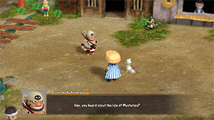

# Overview

<table class="dungeonOverview">
  <tr>
    <th>Unlock</th>
    <td class="highlightYellow">1. Unlock both Trapper's Secret Path and Peach Dungeon. 2. Talk to Drokotay the Adventurer (Shukuba Beach). 　※ DLC and Update 2.0.1 required.</td>
  </tr>
  <tr>
    <th>Entrance</th>
    <td class="highlightYellow">Shukuba Beach (Exit)</td>
  </tr>
</table>

<table class="dungeonTable">
  <tr>
    <th>Floors</th>
    <td colspan="3">50F / 99F (Sacred Tree)</td>
  </tr>
  <tr>
    <th>Bring Items</th>
    <td>No</td>
    <th>Stairs</th>
    <td>Descending</td>
  </tr>
  <tr>
    <th>Companions</th>
    <td>No</td>
    <th>Roamers</th>
    <td>No</td>
  </tr>
  <tr>
    <th>Rescues</th>
    <td>3</td>
    <th>Starting Level</th>
    <td>Lv1</td>
  </tr>
  <tr>
    <th>Starting Item</th>
    <td colspan="3">Large Onigiri, Peach Club, Trapper's Bracelet</td>
  </tr>
  <tr>
    <th>Unidentified</th>
    <td colspan="3">Grass, Scrolls, Staves, Pots, Incense</td>
  </tr>
  <tr>
    <th>Shops</th>
    <td>Yes</td>
    <th>Monster Houses</th>
    <td>Yes (Regular, Sudden, Special)</td>
  </tr>
  <tr>
    <th>Behemoths</th>
    <td>No</td>
    <th>Wishing Shrines</th>
    <td>No</td>
  </tr>
  <tr>
    <th>Kron's Challenge</th>
    <td>Yes</td>
    <th>Fever Time</th>
    <td>No</td>
  </tr>
  <tr>
    <th>Initial Enemies</th>
    <td>5 (1F - 99F)</td>
    <th>Spawn Rate</th>
    <td>40 Turns (1F - 99F)</td>
  </tr>
  <tr>
    <th>Wind (1st Gust)</th>
    <td>900 Turns</td>
    <th>Reward</th>
    <td>Blue Sacred Item (Random)</td>
  </tr>
</table>

Dungeon where you start with a Peach Club and Trapper's Bracelet, and use Peach Buns and traps to progress. Trapper status lets the player pick up traps and set them on the ground to ensnare monsters, but traps can't be picked up again once set, and Trapper status is lost while Trapper's Bracelet is unequipped. Peach Club is a weapon that has a chance to transform a defeated monster into a Peach Bun, and eating a Peach Bun morphs the player into the corresponding monster, allowing usage of its abilities. Overall, this dungeon is like an intersection of [Trapper's Secret Path](/dungeons/trapper's-secret-path) and [Peach Dungeon](/dungeons/peach-dungeon) with a unique flavor, slightly reminiscent of past dungeons like Kitchen God Shrine (Shiren 1) and Gen's Turf (Shiren 5).

# Strategy

### General

Peachy Trap Domain fully expects the player to utilize both Peach Buns and Traps to progress. It's possible to discard the starting gear, but you're likely to starve or be overwhelmed by strong foes, since the monster table features out-of-depth enemies like Hat Brat (3-10F) and N'dama (15-19F) quite early. That said, the aggressive monster table is manageable as long as you make use of Peach Buns and traps. Certain floors feature multiple levels of the same monster family on a single floor, so being able to tell the higher level monsters apart from their lower level counterparts is important to avoid accidents.

Pitfall Traps, Floor-exiting Traps, and Bottomless Pot don't appear in this dungeon. Food and incenses are never generated as ground items, and Trapper's Bracelet is likely the only bracelet. Staves are generally shop-exclusive except for Peach Staff which can be obtained from enemies.

The most consistent strategy involves eating a Hat Urchin Bun to collect Peach Staves on 1-2F, synthesizing staves and equipment during the first Mixer (16-30F) zone, and then focusing on obtaining useful Peach Buns and traps to rush to the stairs for the remainder of the dungeon.

#### Normal Status Pros/Cons

- (+) Insert or take out items from pots.
- (+) Equip Trapper's Bracelet to reveal hidden traps, pick them up and set them down.
- (+) Equip Peach Club and defeat monsters for a roughly 30% chance to obtain a Peach Bun.
- (+) If synthesis goes well, you can combine attacking with trapping to power through encounters.
- (-) Tends to have lower defense than Break-Off set + Morphed status.
- (-) Peach Staff is often your only method to deal with distant threats.
- (-) Invincible Grass or Swift Grass are often your single room Monster House survival options.

#### Morphed Status Pros/Cons

- (+) Equip the Break-Off set before transforming for 30 attack/defense that won't degrade.
- (+) Gain access to a powerful special attack, depending on the Peach Bun you eat.
- (+) Lots of options for survivng a single room Monster House.
- (-) Need to end Morphed status to organize your inventory after farming.
- (-) Equipment runes are nullified, so you need to end Morphed status to obtain Peach Buns.
- (-) You're susceptible to hidden traps, and you can't ensnare monsters in traps.
- (-) Can be hard to stock Peach Buns if your luck with Preservation Pots is bad.

### Status Explanations

#### Morphed Status

- Shiren's stats (HP, attack, defense) remain the same during Morphed status.
    - In other words, eating a Mamel Bun won't set your stats to be the same as a Mamel.
- Equipment runes and bracelet effects are nullified during Morphed status.
    - Increased attack and defense from equipment remains in effect.
    - Trapper status won't be active - don't forget where traps were before transforming.
- Reverting from Morphed status doesn't end the player's turn.
- All status conditions are cured when Shiren eats a Peach Bun or ends Morphed status.
    - This includes both positive and negative status conditions.

#### Trapper Status

- Shiren's color palette changes to purple to indicate that Trapper status is active.
- All hidden traps are revealed, and traps can be picked up, set on the ground, and thrown.
- Monsters can be ensnared by traps, and traps don't activate when Shiren walks on them.
    - However, select monsters like the Floor Dragon family and Floating types can't be trapped.
- Shiren earns 10% of the regular amount of experience points when a monster steps on a trap.
- Shiren earns x2.0 experience points when a monster is slain by a trap that deals damage.
    - Traps that one-shot monsters like Rotting Trap do not grant experience points.

### Useful Traps

<ul>
  <li> Rock Trap /  Boulder Trap - Defeat Cave Mamel / Gitan Mamel for lots of experience points.</li>
  <ul>
    <li>Can also be used to pick off weakened enemies after an Explosion Trap.</li>
  </ul>
  <li> Blast Trap /  Explosion Trap - Grill Rotten Onigiri, or turn foes with Onigiri status into Grilled Onigiri.</li>
  <ul>
    <li>Must unequip Trapper's Bracelet to instantly defeat enemies, otherwise deals damage.</li>
  </ul>
  <li> Spring Trap - Instant emergency warp, or warp an enemy that is chasing you.</li>
  <li> Spinning Trap /  Sleep Trap /  Delusion Trap - Disable a foe for an easy KO, or stop their pursuit.</li>
  <li> Blinding Trap - Blind an enemy indefinitely, can be used to create Cave Mamels early on.</li>
  <li> Onigiri Trap - Combine with Blast Trap or Explosion Trap to create Grilled Onigiri.</li>
  <li> Far-throwing Trap - Combine with a Peach Bun and Peach Staff[0] to duplicate a Peach Bun.</li>
  <li> Sluggish Trap - Make an enemy easier to defeat, or stall the flow of foes in a hallway.</li>
  <li> Removal Trap - Unequip cursed weapons/shields/bracelets, or make an enemy easier to defeat.</li>
  <li> Rotting Trap - Turn monsters into Rotten Onigiri, then somehow grill the onigiri.</li>
  <ul>
    <li>In this dungeon, Sumo status can only be attained by eating Grilled Onigiri until Max Fullness &ge; 150.</li>
  </ul>
  <li> Summoning Trap /  Monsterizing Trap - Combine with Far-throwing Trap to set up Peach Bun duplication.</li>
  <li> Gassy Trap - Eject monsters from the current room.</li>
  <li> Trap-setting Trap - Generate more traps.</li>
</ul>

### Useful Peach Buns

#### 1-50F

<ul>
  <li> Death Reaper (1-2F) - Swift speed, level up to Soul Reaper Bun on Masked Samurai (10-12F) floors.</li>
  <li> Hat Urchin (1-2F) - Ability lets you steal 1 Peach Staff per enemy (guaranteed).</li>
  <li>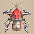 Shagga (1-2F) - Level up to Bashagga Bun on Masked Samurai (10-12F) floors.</li>
  <li> Pit Mamel (2-3F) - Level up in some way to Cave Mamel for experience points.</li>
  <li> Armordillo (3-4F) - Generate 1 item per enemy by tackling (chance-based).</li>
  <li> Hat Brat (3-10F) - Ability lets you steal 1 Peach Staff or Grass item per enemy (guaranteed).</li>
  <li> Pumphantasm (3-4F) - Early game wallpass option.</li>
  <li> Froggo (4F) - Equip the Break-Off set and morph to safely steal Gitan from enemies.</li>
  <li> Fire Ninja D (5-8F) - Grill onigiri generated by Rotting Traps.</li>
  <li> Hoppin' Hitter (6-9F) - Ensures safety against Skullmancer (35-37F, 41-43F, 47-49F)'s magic bullets.</li>
  <li> Water Ninja D (7-9F) - One-shot Fierous monsters, reduce weapon-wielding foe's attack power.</li>
  <li> Masked Samurai (10-12F) - Revive as Ghost Samurai if you collapse → possess foe to one-shot them.</li>
  <li> Ghost Samurai (10-12F, 22-30F) - Throw at enemy to generate a Ghost Samurai for leveling up a foe.</li>
  <li> Metalhead (13-15F) - Attack from up to 2 tiles away.</li>
  <li> N'dama (15-19F) - Ability grants Hiding status to yourself whenever you want.</li>
  <li> Hannya Monk C (15-19F) - Ability lets you easily win a fight, or assist in leveling up a monster.</li>
  <li> Tengu Monk C (15-19F) - Ability grants Swift status to yourself whenever you want.</li>
  <li> Egg Thing (16-17F) - Level up to Flying Egg / Hiding Egg and duplicate for Huge Onigiri / Special Onigiri.</li>
  <li> Hat Prankster (16-17F) - Ability lets you steal 1 Peach Staff or Grass item per enemy (guaranteed).</li>
  <li> Mixer (16-30F) - Safely synthesize 2 items together.</li>
  <li> Mixergon (16-30F) - Safely synthesize up to 4 items together.</li>
  <li> Thiefwalrus (16-19F) - Steal 1 item per enemy (guaranteed, warp after successfully stealing).</li>
  <li> Hannya Monk D (18-19F) - Ability lets you easily win a fight, or assist in leveling up a monster.</li>
  <li> Tengu Monk D (18-19F) - Ability grants Swift status to yourself whenever you want.</li>
  <li> N'dubba (18-21F) - Ability grants Hiding status to yourself whenever you want.</li>
  <li> Fire Ninja C (20-23F) - Grill onigiri generated by Rotting Traps.</li>
  <li> Water Ninja C (22-23F) - One-shot Fierous monsters, reduce weapon-wielding foe's attack power.</li>
  <li> Lashagga (20-24F) - Level up to Bashagga Bun using Blinding Trap, Ghost Samurai Bun, etc.</li>
  <li> Great Samurai (22-30F) - Revive as Ghost Samurai if you collapse → possess foe to one-shot them.</li>
  <li> Bag Knave (23-30F) - Generate 1 item per enemy by throwing Weeds (chance-based).</li>
  <li> Dark Owl (24-25F) - Grants Mapping Scroll effect when eaten, Tiptoe status while morphed.</li>
  <li> N'dulu (24-28F) - Ability grants Hiding status to yourself whenever you want.</li>
  <li> Daze Radish (26-29F) - Get Confusion Grass for synthesis, level up to Sleep Radish for Sedating Grass.</li>
  <li> Greenwalrus (26-29F) - Steal 1 item per enemy (guaranteed, warp after successfully stealing).</li>
  <li>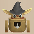 Mini Tank (30-31F, 40-41F) - Swift speed, shoot Silver Arrows.</li>
  <li> Pumplich (30-32F) - Mid game wallpass option.</li>
  <li> Skullmancer (35-37F, 41-43F, 47-49F) - Attack an enemy from a distance using magic bullets.</li>
  <li> Popdillo (36-40F) - Generate 1 item per enemy by tackling (chance-based).</li>
  <li> Hyper Gazer (40-50F) - Ability lets you confuse an enemy in front.</li>
  <li>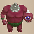 Megahead (41-50F) - Attack from up to 4 tiles away.</li>
  <li> Fire Ninja A (41-59F) - Grill onigiri generated by Rotting Traps.</li>
  <li> Water Ninja A (41-59F) - One-shot Fierous monsters, reduce weapon-wielding foe's attack power.</li>
  <li> Terror Scorpion (41-60F) - Power up from poison, ability lets you easily win a fight.</li>
  <li> Hannya Monk A (41-60F) - Ability lets you easily win a fight, or assist in leveling up a monster.</li>
  <li> Hannya Monk B (45-50F) - Ability lets you easily win a fight, or assist in leveling up a monster.</li>
  <li> Tengu Monk B (45-50F) - Ability grants Swift status to yourself whenever you want.</li>
  <li> Electroid (45-52F) - Swift speed, generate useful traps.</li>
</ul>

#### 51-99F

<ul>
  <li> Electroid (45-52F) - Swift speed, generate useful traps.</li>
  <li> Ultra Gazer (50F, 60F, 70F, 80F, 90F) - Ability lets you confuse all enemies in the same room.</li>
  <li> Mini Tank (50-51F, 60-61F) - Swift speed, shoot Silver Arrows.</li>
  <li> Tengu Monk A (50-99F) - Ability grants Swift status to yourself whenever you want.</li>
  <li> Dragon Pit (51-56F) - Swift speed, burrowing ability lets you escape combat.</li>
  <li>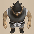 Nimble Knave (51-61F) - Swift speed, generate 1 item per enemy by throwing Weeds (chance-based).</li>
  <li> Soul Reaper (51-60F) - Swift speed, mid game wallpass option.</li>
  <li> Admiral Spearfish (53-68F) - One-shot Fierous monsters, reduce weapon-wielding foe's attack power.</li>
  <li> Gitan Mamel (55F, 65F, 75F, 85F) - Swift speed, receive 1 damage from normal attacks (20 Max HP).</li>
  <li>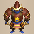 Swordmaster (60-70F) - Collect equipment using a Sanctuary Scroll for late game synthesis.</li>
  <li> Mixergon (60-79F) - Safely synthesize up to 4 items together.</li>
  <li> Infernous (60-80F) - Protects against Abyss Dragon (87-99F)'s flames.</li>
  <li> Lordly Samurai (61-80F) - Revive as Ghost Samurai if you collapse → possess foe to one-shot them.</li>
  <li> Porgon (66-70F) - Collect Porky's Rocks to use against Gitan Mamel and Ghost Samurai.</li>
  <li> Grampadillo (76-99F) - Generate 1 item per enemy by tackling (chance-based).</li>
  <li> Miracle Hen (80-89F) - Swift speed, but beware of leveling down to Hen at low HP.</li>
  <li> Demon Scorpion (80-92F) - Power up from poison, ability lets you easily win a fight.</li>
  <li>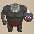 Deathead (81-93F) - Attack from up to 5 tiles away.</li>
  <li>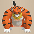 Tiger Launcher (86-99F) - Throw enemies somewhere else to avoid damage.</li>
  <li> Abyss Dragon (87-99F) - Spew flames to defeat enemies from anywhere on the floor.</li>
  <li> King Reaper (88-99F) - Swift speed, end game wallpass option.</li>
</ul>

### Advanced Strategies

#### Peach Bun Duplication

##### Method 1 - Bouncy Wall Room

Throw the Peach Bun in a way where it bounces off of all 4 sides of the room to duplicate it. However, some Bouncy Wall layouts that get generated are impossible to complete.

##### Method 2 - Far-throwing Trap + Peach Staff

1. Step on a Far-throwing Trap to gain Far-throwing status.
2. Line up a bunch of monsters either in a hallway or large room.
    - Single room Monster Houses or 2-room map layouts work the best.
3. Throw a Peach Bun at the line of enemies to turn them all into the target monster.
4. Throw a Peach Staff[0] at the line of monsters to turn them all into Peach Buns.

#### Peach Bun Level Up

1. Throw a Peach Bun at an enemy to turn them into the target monster.
2. Level the monster up using a Blinding Trap, Ghost Samurai, or a cannon's friendly fire.
3. Swing a Peach Staff to turn the target monster back into a Peach Bun.

### Important Items

#### Weapon / Shield / Bracelets

Have a Removal Trap or Fixer Scroll on hand before equipping other items in case the item is cursed.

<b><u>Peach Club / Trapper's Bracelet</u></b> Starting equipment, and be very careful not to lose either item. Beware of Swordmaster (60-70F) in particular if you're attempting the 99F version.

<b><u>Break-Off Blade / Break-Off Shield</u></b> Best equipment for Morphed status, since the Dulling rune gets nullified during transformation.

<b><u>Manji Kabura / Fuuma Shield (or Doutanuki / Wolfshead)</u></b> Any set with resonance offers higher attack and defense than just a Peach Club, but Manji Kabura and Fuuma Shield are the most powerful among resonance options. Doutanuki and Wolfshead is a drop in power, but offers an extra rune slot over the strongest set.

<b><u>Axe of the Minotaur</u></b> The Critical rune is a significant boost to your offense when you don't have Morphed status. Obtained from Minotaur (16-18F), Megataur (31-40F), or Gigataur (60-99F).

<b><u>Spearscale Shield</u></b> Can be nice to protect Peach Buns from Water Ninja's special attack. Obtained from Spearfish (1-2F), Lt. Spearfish (13-14F), Capt. Spearfish (24-25F), or Admiral Spearfish (53-68F).

#### Runes

The following tables only list obtainable runes that are worth synthesizing. Other obtainable runes include  HP +5,  HP +10,  Wall Dig,  Trap Bust, and  Berserk Payback. 

##### Weapon Runes

|Rune|Source|Notes|
|-|-|-|
| Peach Bun|Peach Club|Chance for an enemy to drop a Peach Bun when slain. The player starts with a Peach Club equipped.|
| Critical|Axe of the Minotaur|Chance to land a x1.5 damage critical hit. Taur family (16-18F, 31-40F, 60-99F) item drop.|
| Rustproof|Golden Sword Plating Scroll|Prevents upgrade value from decreasing due to rust. Raises accuracy of normal attacks by 2.0% (92% → 94%). Plating Scroll can be found on the ground.|
| Sedating|Sedating Grass|Chance to inflict Asleep status. Sedating Grass is obtained by leveling up a Daze Radish (26-29F).|
| Confusing|Confusion Grass|Chance to inflict Confused status. Confusion Grass is obtained from Daze Radish (26-29F).|
| Paralyzing|Paralyzing Staff|Chance to inflict Paralyzed status. Paralyzing Staff is shop-exclusive.|
| Sealing|Sealing Staff|Chance to inflict Sealed status. Sealing Staff is shop-exclusive.|

##### Shield Runes

|Rune|Source|Notes|
|-|-|-|
| Rustproof|Golden Shield Plating Scroll|Prevents upgrade value from decreasing due to rust. Plating Scroll can be found on the ground.|
| Waterproof|Spearscale Shield|Prevents inventory items from getting wet. Spearfish family (1-2F, 13-14F, 24-25F, 53-68F) item drop.|
| Onigiri Payback|Onigiri Scroll|Chance to inflict Onigiri status on attacker. Write on Blank Scroll, which can be found on the ground.|
| Jitter Payback|Jitters Scroll|Chance to inflict Jittery status on attacker. Write on Blank Scroll, which can be found on the ground.|
| HP +20|Life Grass|Increase max HP by 20. Life Grass is shop-exclusive.|
| HP +15|Healing Grass|Increase max HP by 15. Healing Grass is shop-exclusive.|

#### Projectiles

<b><u>Iron Arrow</u></b> Quite tricky to obtain in this dungeon, but can be decent if strength is high. Level down a Mini Tank using a Skullmancer's magic bullet on 41F, then swing a Peach Staff.

<b><u>Porky's Rock</u></b> Throw Porky's Rocks to one-shot Gitan Mamels (55F, 65F, 75F, 85F) and Ghost Samurais. Obtained by eating a Porgon Bun between 66-70F.

#### Grass / Food

<b><u>Revival Grass</u></b> The floor table is limited for grasses, so Lv2-4 Hat Urchin family Peach Buns can mass produce this grass. Don't carry an excessive number of Revival Grass, since you also need space for Peach Buns, traps, etc.

<b><u>Invincible Grass / Swift Grass</u></b> Obtained by using Lv2-4 Hat Urchin family Peach Buns. These serve as a counter to single room Monster Houses, so be sure to keep some on hand. Other options for surviving such Monster Houses often comes down to Peach Buns of Swift monsters.

<b><u>Strength Grass</u></b> Obtained by using Lv2-4 Hat Urchin family Peach Buns. If you farm a ton of this grass, you might be able to trade hits with stronger monsters.

<b><u>Grilled Onigiri</u></b> Obtained directly by chaining Onigiri Trap (or Onigiri Payback) + Blasting Trap or Explosion Trap, or indirectly by utilizing Rotting Trap + Blasting Trap / Dragon / Fire Ninja / Pop Tank / Flamepuff. You'll need to eat 23 Grilled Onigiri (+2 Max Fullness) if you want to activate Sumo status, assuming you immediately eat the Large Onigiri you start with for +4 Max Fullness.

#### Scrolls

<b><u>Mapping Scroll</u></b> Read this at the start of a floor when you plan to farm items or duplicate Peach Buns. If you find these later on in the 99F version, read them between 51-74F or on Gitan Mamel floors.

<b><u>Sanctuary Scroll</u></b> Safely farm items using Morphed status while standing on the placed Sanctuary Scroll. That said, it can also be used to counter single room Monster Houses, so consider saving it early on. Hat Rascal Bun can steal more Sanctuary Scrolls, but you need to be in a shop to obtain usable ones, since otherwise the currently placed Sanctuary Scroll vanishes when a new one is tossed to the ground.

<b><u>Water-drain Scroll / Wall-less Scroll</u></b> Can be used to recover items that fall in water due to Armordillo's tackle.

<b><u>Trap-eraser Scroll</u></b> Read before farming items using Morphed status, but detrimental if you have Trapper status.

<b><u>Fixer Scroll</u></b> Fully restore HP, remove curses from equipment, paralyze enemies when surrounded, etc. Paralyzing effect can be used to aid leveling up a target monster via Ghost Samurai.

<b><u>Trap Scroll</u></b> Shop-exclusive. Generate more traps for use with Trapper status.

#### Staves

<b><u>Peach Staff</u></b> Obtained by using Lv1-4 Hat Urchin family Peach Buns. This is the only staff that can be stolen using Hat Urchin's ability during Morphed status. Synthesize a number of Peach Staves to save space, but always check for curses beforehand. Some players like to identify the synthesized Peach Staff, even at the cost of using a Blank Scroll. Keep some low use count staves on hand too, since they can be used to duplicate Peach Buns.

<b><u>Other Staves</u></b> Shop-exclusive - Narrow-escape, Paralyzing, Switching, Earthmound, Disguising, etc. Status inflicting staves are useful, but beware of Okame Monk curing status conditions.

#### Pots / Incenses

<b><u>Preservation Pot</u></b> Top priority pot that lets you carry more Peach Buns, traps, staves, and other items. Pot-upsizing Scroll can't be found, but you might be able to duplicate it via Bouncy Wall Rooms.

<b><u>Exorcism Pot / Identifier Pot / Ordinary Pot</u></b> Insert Revival Grass or items that you otherwise won't need to use right away. Exorcism Scroll is shop-exclusive, so be a bit careful with how you handle Exorcism Pots.

# Floor Guide

<h3 class="heading3First">First Clear (1-50F)</h3>

### 1-2F

Notable: Hat Urchin (1-2F), Death Reaper (1-2F), Shagga (1-2F), Pit Mamel (2-3F)

Peach Staves & Leveling Zone - Hat Urchin Bun for staves, Pit Mamel + Blinding Trap for Cave Mamel. Peach Staff is the only item you can steal while morphed as Hat Urchin, and the theft always succeeds. Equip a shield before transforming if possible - Break-Off Shield won't degrade during Morphed status. It might seem wasteful, but it's best to swing each staff you obtain 1 time to check for curses. Stock extra Hat Urchin Buns if you want to collect more Peach Staves later on.

If you want to be extra safe, reveal hidden traps in every room by attacking above traps before morphing. This technique ensures that all traps remain visible during Morphed status (or read a Trap-eraser Scroll).

If you find a Blinding Trap, lure a Pit Mamel onto it and create a Cave Mamel or Gitan Mamel, then hunt it using a Rockfall Trap or Boulder Trap to earn lots of experience points. If you lack a Blinding Trap, throw Rotten Onigiri at Pit Mamels to potentially Blind them instead. And if that also isn't an option, stock up on Pit Mamel Buns and level them up on a different floor.

Otherwise, Death Reaper Bun grants Swift speed, which is great for Monster Houses. They can also be leveled up into Soul Reaper Buns a little bit later for wallpass if desired. Shagga Bun is another strong option if leveled up, since higher levels grant additional attacks.

If you spot a Far-throwing Trap, go ahead and collect it to perform Peach Bun duplication later on. Remember that you'll need some Peach Staves to throw under Far-throwing status for this trick, with Peach Staff[0] being the ideal one to throw since it doesn't waste any staff charges.

### 3-9F

Notable: Pit Mamel (2-3F), Armordillo (3-4F), Pumphantasm (3-4F), Froggo (4F), Hat Brat (3-10F), Fire Ninja D (5-8F), Water Ninja D (7-9F)

Farming & Leveling Zone - Another floor range where you can linger until the wind blows. Hat Brat (125 HP, 45 atk, 9 def) is rare, but it's very strong for how early it appears in this dungeon. You'll definitely want to fight it with traps or Peach Bun-related mechanics to survive any encounters, with the ideal option being swinging a Peach Staff and using its Peach Bun to collect grasses. The best obtainable grasses include Revival Grass, Strength Grass, Invincible Grass, and Swift Grass, so it's worth the effort to linger and farm until the wind blows despite the risk.

Armordillo Bun can be used to generate items, though it's chance-based instead of being guaranteed. Pumphantasm Bun can be used to pass through walls, and Froggo Bun can be used to stockpile Gitan. Fire Ninja D Bun can be used to grill Rotten Onigiri, and Water Ninja D Bun can be used to traverse water tiles. ※ An enemy Water Ninja D's special attack can make Peach Buns outside of pots rot.

Explosion Trap → Boulder Trap can be used to earn 1,760 experience points from a Hat Brat, but it's only recommended if you missed out on creating a Cave Mamel or Gitan Mamel earlier, since it's usually better to turn Hat Brats into Peach Buns using a Peach Staff in order to farm grass.

### 10-14F

Notable: Hat Brat (3-10F), Masked Samurai (10-12F), Pot Knave (10-12F), Mudkin (11-14F)

Peach Bun Level Up Zone - Ghost Samurai can be used to level up Peach Buns here. For steps on how to level up a Peach Bun, check the <a href="#advanced-strategies">Advanced Strategies</a> section of this page. Keep in mind that you can stock up on Ghost Samurai Buns to level up other Peach Buns later on. Expect inventory space to be quite limited at this point if you stole lots of Peach Staves.

Throw Pit Mamel Buns at foes and level them into Cave Mamels via Ghost Samurai to reach Lv20+. Mudkin can also be leveled up to Lv3-4 and then punched for experience points if you're bored, but it might be faster to use traps against higher level monsters via Ghost Samurai instead: Pesky Kappa (330), Famed Octopling (420), Mudster (460), Mudder (920), Hat Rascal (1080) ※ The above Exp values get doubled when you slay the target with a damage dealing trap.

Throw an Eradication Scroll at Pot Knave (65 HP, 35 atk, 25 def) if you have a Blank Scroll, since otherwise Bag Knave (23-30F) and Nimble Knave (51-61F) can be a menace later on. Other monsters include Tiger Thrower, Metalhead, Floor Dragon, and Lt. Spearfish. If you want the Waterproof rune, linger and hunt Lt. Spearfish for a Spearscale Shield drop.

### 15-19F

Notable: N'dama (15-19F), Lv2 Monks (15-19F), Lv1 Monks (16-19F), Hat Prankster (16-17F), Egg Thing (16-17F), Thiefwalrus (16-19F), Mixer (16-30F), Mixergon (16-30F), N'dubba (18-21F)

Synthesis & Farming Zone - Stronger monsters begin to appear, but it's still a great time to linger. Hat Prankster Buns and Thiefwalrus Buns can both be used to generate additional items if desired. Egg Thing Bun can be leveled up into a Flying or Hiding Egg Bun, then duplicated for Huge or Special Onigiri. Pop Tank (16-18F)'s cannonballs and Flamepuff (18-20F)'s special attack can grill onigiri.

Lv1-2 monks also appear and Lv2 monks hit pretty hard, so look closely at the color of their shell. A white-colored shell is a Lv1 (D rank) monk, and a brown-colored shell is a Lv2 (C rank) monk. Different levels of the same monster family appearing at the same time is a theme for this dungeon, so it's important to pay attention to the monster's colors to tell higher level ones apart.

Mixer (78 HP, 39 atk, 29 def) and Mixergon (118 HP, 68 atk, 40 def) provide a chance to synthesize items. Mixers and Mixergons aren't that uncommon here, so feel free to combine staves to free up inventory space. A single Mixer can be used twice if you turn it into a Peach Bun using a Peach Club after throwing items, though this trick doesn't work if you swing a Peach Staff instead.

N'dama (135 HP, 50 atk, 35 def) won't be revealed even when inserting into a pot or advancing floors, so only use newly found items when your HP is topped up, and be ready to swing a Peach Staff. If you want a N'dubba family Peach Bun for Hiding status, hunt N'dubba on 18-21F instead.

#### N'dama Tips

Sample guidelines for handling items on N'dama floors:

- Staves - Swing the staff 1 time when your surroundings are safe.
- Grass - Eat or throw the grass at a monster instead of carrying it in your inventory.
- Pot - It's probably best to ignore pots that aren't Preservation Pots or "Tap" type pots.
- Blank Scroll - Write Heavenly, Earthly, or Pot-upsize and try using it to upgrade right away.
- If you want to carry the item, insert it into a dedicated Preservation Pot named "N'dama?".

### 20-29F

Notable: Mixer (16-30F), Mixergon (16-30F), Lashagga (20-24F), Curse Matron (21-30F), Great Samurai (22-30F), Bag Knave (23-30F), Dark Owl (24-25F), Daze Radish (26-29F), Greenwalrus (26-29F), Dragon (27-32F)

Mid Game Begins - This is where you want to wrap up a majority of your farming and synthesis. The monster table is a combo of Firespew Mountain ~ Mount Jatou enemies + some out-of-depth foes. Fire Ninja C (20-23F), Bag Knave (23-30F), and Pesky Kappa (24-27F) can destroy items on the ground. Water Ninja C (22-23F) can rot Peach Buns outside of pots, and Super Gazer (22-24F) can cause item loss. Lashagga and Great Samurai's attack power can be reduced to mostly harmless levels by using a Rust Trap. Vile Scorpion (108 HP, 45 atk, 33 def) appears on 29-32F, but you won't lose strength during Morphed status. 25F is always a Shuffle Dungeon style map that looks somewhat like Suzunari Pass.

This floor range is riskier, but Great Samurai can be used to level up Peach Buns if desired. Confusion Grass can be obtained from Daze Radish → synthesized with a weapon for the Confusing rune. If you use a Ghost Samurai to level up a Daze Radish into a Sleep Radish and then swing a Peach Staff, Sedating Grass can be obtained as well → synthesized with a weapon for the Sedating rune. Greenwalrus Bun lets you collect items, Dark Owl Bun grants Mapping Scroll effect + Tiptoe status. Great Samurai Bun serves as an extra life, provided you remember to eat it before collapsing. Dragon (120 HP, 45 atk, 40 def)'s fire can be utilized to grill Rotten Onigiri.

Lashagga (99 HP, 43 atk, 34 def) performs 3 consecutive normal attacks in a single turn. Great Samurai (149 HP, 58 atk, 40 def) revives as Ghost Samurai (4 HP) after being defeated. Curse Matron (145 HP, 53 atk, 48 def) curses up to 2 of equipped weapon, shield, or bracelets at once. Bag Knave (95 HP, 40 atk, 35 def) throws Weeds which parries an inventory item, knocking it away.

### 30-32F

Notable: Mixer (16-30F), Mixergon (16-30F), Curse Matron (21-30F), Great Samurai (22-30F), Bag Knave (23-30F), Dragon (27-32F), Vile Scorpion (29-32F), Mini Tank (30-31F), Pumplich (30-32F), Polygon Shaka (30-35F), Polygon Singa (31-50F), Megataur (31-40F)

Last Chance for Synthesis (1st clear) - The next time Mixer family monsters appear after 30F is 60-79F. Polygon Shaka (yellow, lowers Fullness) overlaps with Polygon Singa (blue, lowers Max Fullness) on 31-35F. Megataur (170 HP, 55 atk, 42 def) can only attack when it's adjacent, but it's quite formidable. That said, try to save items for Polygon Singas and upcoming Skullmancers instead when possible. Overall, it's best to start rushing to the stairs from this point if aiming for the 50F clear.

Mini Tank (100 HP, 55 atk, 40 def) has Swift 1 speed, and shoots Silver Arrows when lined up in a room. Mini Tank transforms into Pop Tank if it levels up, so keep that in mind if you get caught in a room. Otherwise, lure it into a hallway so that it doesn't attack, and stock up on Mini Tank Buns if possible. Pumplich (100 HP, 50 atk, 30 def) can be turned into a Pumplich Bun for its wallpass ability.

### 33-39F

Notable: Megataur (31-40F), Polygon Singa (31-50F), Skullmancer (35-37F), Popdillo (36-40F)

The monster table shrinks to 4\~5 slots in this floor range, so expect to encounter lots of the same foes. You can safely farm items with a Sanctuary Scroll + Peach Bun on 33-34F or 38-39F if desired. Skullmancer's magic can be extremely dangerous, so consider using a Peach Staff charge against it. Eating a Skullmancer Bun lets you use powerful magic, and Popdillo Bun lets you farm more items. It's possible to avoid Polygon Singa's Max Fullness decrease by staying in Morphed status. Remember that you can throw a Peach Bun of a weaker monster at a foe to turn them into that monster, and all of the monsters on this floor range can be ensnared by traps.

Polygon Singa (129 HP, 40 atk, 40 def) decreases Max Fullness by 7 when adjacent. Popdillo (100 HP, 51 atk, 45 def)'s tackle makes you trip and drop inventory items on the ground. Skullmancer (111 HP, 50 atk, 41 def)'s magic effects include Paralyzed, Sealed, Onigiri, Confused, Slow, or Level-1. However, the Confused status effect changes to Disguised status when the target is not the player.

### 41-50F

Notable: Polygon Singa (31-50F), Mini Tank (40-41F, 50-51F), Hyper Gazer (40-50F), Skullmancer (41-43F, 47-49F), Megahead (41-50F), Lv4 Ninjas (41-59F), Terror Scorpion (41-60F), Lv4 Monks (not Okina/Tengu) (41-60F), Lv3 Monks (45-50F), Electroid (45-52F), Ultra Gazer (50F), Okina Monk A (50-99F), Tengu Monk A (50-99F)

Late Game Begins - Lots of out-of-depth monsters appear, so rush to the stairs. It's a good idea to equip the Break-Off set and have a Peach Bun ready before advancing to the next floor. Gold-colored shells are Lv4 (A rank) monks, who have significantly higher stats than Lv3 (B rank) monks. Okina Monk A and Tengu Monk A also join the fray from 50F, so be extra careful with inputs. When fighting Terror Scorpion, remember that you won't lose Max Strength during Morphed status. Electroid Bun cannot generate Floor-exiting or Pitfall traps, but other traps can still be useful. Ultra Gazer spawns on 50F as a rare slot, which can be a problem if you get a one room Monster House. In that case, eat a Swift speed monster's Peach Bun or Skullmancer Bun, or write on a Blank Scroll.

Hyper Gazer (126 HP, 55 atk, 45 def) hypnotizes Shiren when adjacent. Ultra Gazer (196 HP, 60 atk, 55 def) hypnotizes Shiren when in the same room, and always drops 3000 Gitan. Megahead (182 HP, 65 atk, 48 def) attacks up to 4 tiles ahead, and strikes through hallway corners. Terror Scorpion (185 HP, 55 atk, 45 def) lowers Max Strength by 1 when adjacent, and powers up from poison. Electroid (150 HP, 56 atk, 53 def) has Swift 1 speed, and creates new traps when inside a room.

#### Lv3-4 Monk Stats

|Floors|Name|HP|Atk|Def|
|-|-|-|-|-|
|41-60F|Hannya Monk A|266|67|55|
|41-60F|Kitsune Monk A|275|73|58|
|41-60F|Okame Monk A|260|70|61|
|45-50F|Hannya Monk B|166|57|45|
|45-50F|Kitsune Monk B|175|53|48|
|45-50F|Okame Monk B|160|50|51|
|45-50F|Tengu Monk B|180|55|47|
|50-99F|Okina Monk A|270|76|60|
|50-99F|Tengu Monk A|280|75|57|

#### Lv4 Ninja Stats

|Floors|Name|HP|Atk|Def|
|-|-|-|-|-|
|41-59F|Fire Ninja A|185|70|59|
|41-59F|Water Ninja A|205|65|49|
|41-59F|Tree Ninja A|195|72|57|
|41-59F|Earth Ninja A|215|68|58|

<h3 class="heading3Tree">Sacred Tree Mode (51-99F)</h3>

### General Advice

The extension uses a combo of Okina + Tengu monks as a base to send strong, hasted foes into your path, and since both monks appear between 50-99F, you really need to be ready for combat at any given time. In addition, Ultra Gazers spawn on floors ending in 0, and Gitan Mamels on 55F, 65F, 75F, and 85F. Hallways switch to being dark starting on 51F, meaning you can't see incoming enemies by default anymore. The second and final floor range where you can synthesize items is Mixergons between 60-79F. Overall, if you built a strong foundation in the 1st half and carefully ration resources, you'll likely be fine.

#### Eradication Scroll Targets

- Field Knave Family (10-12F, 23-30F, 51-61F)
    - Ensures that ground items can be claimed, and inventory items are safe.
- Okina Monk Family (16-18F, 50-99F) or Tengu Monk Family (16-19F, 45-99F)
    - Okina Monk is a higher priority, since it sends powerful foes next to you in hallways.
- Abyss Dragon (87-99F)
    - 40 fire damage from anywhere on the floor adds up very quickly.
- Fire Ninja Family (5-8F, 20-23F, 41-59F), Swordmaster (60-70F), and Cursenior (65-74F)
    - These are troublesome, but considering the rarity of Blank Scrolls, they're not worth eradicating.

### 51-59F

Notable: Mini Tank (50-51F), Lv4 Ninjas (41-59F), Electroid (45-52F), Lv4 Monks (not Okina/Tengu) (41-60F), Terror Scorpion (41-60F), Okina Monk A (50-99F), Tengu Monk A (50-99F), Nimble Knave (51-61F), Dragon Pit (51-56F), Soul Reaper (51-60F), Admiral Spearfish (53-68F), Gitan Mamel (55F)

Darkness Ahead - Visibility in hallways is reduced to a 1 tile radius from this point. The full suite of Lv4 (A rank) monks and ninjas roam around here, so beware of Okina and Tengu monks. Nimble Knave appears, so never explore while Far-throwing status is active unless you want to lose items. Don't be stingy against Terror Scorpions, as reduced Max Strength makes fighting everything more difficult. Soul Reapers and Dragon Pits are fantastic Swift speed monsters to turn into Peach Buns. Admiral Spearfish Bun can be used to cripple or one-shot certain foes in the 60-70F range.

Nimble Knave (145 HP, 50 atk, 40 def) has Swift 1 speed, and throws Weeds to parry inventory items. Dragon Pit (130 HP, 54 atk, 40 def)  has Swift 1 speed and tries to sandwich you in hallways. Soul Reaper (75 HP, 40 atk, 40 def) has Swift 2 speed + wall-clip, and detects you from anywhere. Admiral Spearfish (200 HP, 59 atk, 50 def) shoots water when it's standing on a water tile. Gitan Mamel (20 HP, 100 atk, 999 def) has Swift 2 speed, and only takes 1 damage from normal attacks.

### 60-69F

Notable: Okina/Tengu Monk A (50-99F), Nimble Knave (51-61F), Admiral Spearfish (53-68F), Ultra Gazer (60F), Mini Tank (60-61F), Swordmaster (60-70F), Mixergon (60-79F), Detonachin (60-80F), Infernous (60-80F), Gigataur (60-99F), Lordly Samurai (61-80F), Cursenior (65-74F), Porgon (66-70F), Gitan Mamel (65F)

Danger Zone #1 - Swordmaster and Cursenior are major threats to inventory items. If you want to synthesize with Mixergon, use a Peach Staff charge and eat its Peach Bun. The only type of monks that remain after you proceed past 60F are Okina Monk A and Tengu Monk A, meaning the chance of hasted foes being sent into your path increases - Eradicate Okina Monk A if possible. Cursenior curses up to 2 items, prioritizing equipment - Stay in Morphed status to ensure safety. Porgon also appears between 66-70F, but it's almost pointless to collect Porky's Rocks at this point, since Behemoths don't appear and foes have high HP, though Porky's Rocks can one-shot Gitan Mamels.

Equipment parried by Swordmaster lands somewhere nearby instead of being sent directly behind you, and losing either the Peach Bun weapon rune or Trapper's Bracelet here would be devastating. It's best to stay in Morphed status so that Swordmaster simply doesn't get the chance to ruin your run. If you're out of Swift monster Peach Buns, Admiral Spearfish Bun is likely your next best option, since its ability cripples Swordmaster, Lordly Samurai, and Gigataur, and can one-shot Infernous. Consider stocking up on Infernous Buns to protect yourself against Abyss Dragon's flames later on.

Swordmaster (250 HP, 77 atk, 55 def) knocks away your equipped weapon, shield, or bracelet. Cursenior (205 HP, 65 atk, 58 def) curses up to 2 items at once, prioritizing equipment first. Detonachin (260 HP, 55 atk, 37 def) explodes when HP ≤ 52 (Deal 208+ damage to it). Infernous (285 HP, 69 atk, 55 def) is immune to projectiles that lack piercing properties. Gigataur (235 HP, 85 atk, 62 def) occasionally lands a critical hit when attacking. Lordly Samurai (200 HP, 63 atk, 50 def) revives as Ghost Samurai (4 HP) after being defeated. Porgon (200 HP, 85 atk, 60 def) throws 20 damage Porky's Rocks within a 10 tile radius.

### 70-79F

Notable: Okina/Tengu Monk A (50-99F), Swordmaster (60-70F), Mixergon (60-79F), Detonachin (60-80F), Infernous (60-80F), Gigataur (60-99F), Lordly Samurai (61-80F), Cursenior (65-74F), Porgon (66-70F), Ultra Gazer (70F), Gitan Mamel (75F), Grampadillo (76-99F)

Danger Zone #1 (Continued) - Swordmaster until 70F, and Cursenior until 74F. Like before, stay in Morphed status to ensure safety against Swordmaster and Cursenior. 75-79F is an okay floor range to synthesize or try and stock up on items for the final stretch. Grampadillo (175 HP, 71 atk, 56 def) makes you trip - Dropped traps can't be picked up again. Morphed status doesn't protect you from being tripped by Grampadillo, so beware near water.

### 80-85F

Notable: Okina/Tengu Monk A (50-99F), Gigataur (60-99F), Grampadillo (76-99F), Miracle Hen (80-89F), Demon Scorpion (80-92F), Deathead (81-93F), Polygon Stunna (81-95F), Ultra Gazer (80F), Gitan Mamel (85F)

Danger Zone #2 - Draining types and high-powered monsters abound, so rush stairs. Demon Scorpion lowers Max Strength by 2, or inflicts Weakened status during Morphed status. Likewise Polygon Stunna lowers Max Fullness by 10, but Morphed status alters the effect to damage. Hoppin' Slammer (80-95F) is immune to staves, but has lower stats so it shouldn't be an issue. Miracle Hen has Swift 2 speed, so use Peach Staves on it if you're out of Swift monster Peach Buns. Deathead has an attack power stat that rivals Gitan Mamel, so don't just trade hits with it.

Miracle Hen (220 HP, 82 atk, 60 def) has Swift 2 speed and very high attack power. Demon Scorpion (295 HP, 73 atk, 55 def) occasionally lowers Max Strength by 2 when adjacent. Deathead (282 HP, 99 atk, 60 def) attacks up to 5 tiles ahead and strikes through hallway corners. Polygon Stunna (229 HP, 50 atk, 55 def) decreases Max Fullness by 10 when adjacent.

### 86-99F

Notable: Okina/Tengu Monk A (50-99F), Gigataur (60-99F), Grampadillo (76-99F), Miracle Hen (80-89F), Demon Scorpion (80-92F), Deathead (81-93F), Polygon Stunna (81-95F), Tiger Launcher (86-99F), Abyss Dragon (87-99F), King Reaper (88-99F), Ultra Gazer (90F)

The Final Rush - Use Swift monster Peach Buns to rush to the stairs as fast as possible. Direct combat is difficult unless you use traps or a powerful attacker Peach Bun like Bashagga Bun. Tiger Launcher throws the player at a creature or onto a trap located within 20 tiles. King Reaper has Swift 2 speed, passes through walls, and detects the player from anywhere. Use Peach Staves on King Reapers to restock Swift monster Peach Buns for rushing stairs as needed. Abyss Dragon spews 40 damage flames from anywhere - Eradicate them if you have a Blank Scroll. If that's not an option, Heat-ban Incense or Infernous Bun provides protection against fire damage.

The monster table condenses down from 9\~11 monsters to 7 monsters for the last 4 floors: Abyss Dragon, King Reaper, Tiger Launcher, Gigataur, Grampadillo, Okina Monk A, and Tengu Monk A. Utilize whatever resources you have left to survive, and the clear is yours.

Tiger Launcher (255 HP, 83 atk, 65 def) throws an adjacent creature up to 20 tiles away. Abyss Dragon (300 HP, 90 atk, 65 def) spews a 40 damage flame from anywhere on the floor. King Reaper (225 HP, 65 atk, 50 def) has Swift 2 speed, wall-clip, and detects the player from anywhere.

# Monsters

See [Monsters](/system/monsters) for individual monster details.

- F - Dark hallways
- S - Shop is possible
- H - Monster House is possible
- G - Golden Egg Thing is possible

Monster Colors = Farming, Useful, Lowers Stats, Targets Items, Dangerous

<table class="monsterTable">
  <thead>
    <tr>
      <th>F</th>
      <th>S</th>
      <th>H</th>
      <th>G</th>
      <th colspan="5">Monsters</th>
    </tr>
  </thead>
  <tbody>
    <tr>
      <td rowspan="2" class="centeredText">1</td>
      <td rowspan="2" class=""></td>
      <td rowspan="2" class=""></td>
      <td rowspan="2" class=""></td>
      <td> Mamel</td>
      <td> Octopling</td>
      <td> Spearfish</td>
      <td class="useful"> Hat Urchin</td>
      <td> Death Reaper</td>
    </tr>
    <tr>
      <td> Shagga</td>
      <td class="highlightGray"></td>
      <td class="highlightGray"></td>
      <td class="highlightGray"></td>
      <td class="highlightGray"></td>
    </tr>
    <tr>
      <td colspan="10" class="tableDivider"></td>
    </tr>
    <tr>
      <td rowspan="2" class="centeredText">2</td>
      <td rowspan="2" class=""></td>
      <td rowspan="2" class=""></td>
      <td rowspan="2" class=""></td>
      <td> Mamel</td>
      <td class="useful"> Pit Mamel</td>
      <td> Octopling</td>
      <td> Spearfish</td>
      <td class="useful"> Hat Urchin</td>
    </tr>
    <tr>
      <td> Death Reaper</td>
      <td> Shagga</td>
      <td class="highlightGray"></td>
      <td class="highlightGray"></td>
      <td class="highlightGray"></td>
    </tr>
    <tr>
      <td colspan="10" class="tableDivider"></td>
    </tr>
    <tr>
      <td rowspan="1" class="centeredText">3</td>
      <td rowspan="1" class=""></td>
      <td rowspan="1" class=""></td>
      <td rowspan="1" class=""></td>
      <td class="useful"> Pit Mamel</td>
      <td> Chintala</td>
      <td class="useful"> Pumphantasm</td>
      <td class="useful"> Armordillo</td>
      <td class="useful"> Hat Brat</td>
    </tr>
    <tr>
      <td colspan="10" class="tableDivider"></td>
    </tr>
    <tr>
      <td rowspan="1" class="centeredText">4</td>
      <td rowspan="1" class=""></td>
      <td rowspan="1" class=""></td>
      <td rowspan="1" class=""></td>
      <td> Chintala</td>
      <td class="farming"> Froggo</td>
      <td class="useful"> Pumphantasm</td>
      <td class="useful"> Armordillo</td>
      <td class="useful"> Hat Brat</td>
    </tr>
    <tr>
      <td colspan="10" class="tableDivider"></td>
    </tr>
    <tr>
      <td rowspan="1" class="centeredText">5</td>
      <td rowspan="1" class=""></td>
      <td rowspan="1" class=""></td>
      <td rowspan="1" class=""></td>
      <td> Tree Ninja D</td>
      <td> Earth Ninja D</td>
      <td class="items"> Fire Ninja D</td>
      <td class="useful"> Hat Brat</td>
      <td class="highlightGray"></td>
    </tr>
    <tr>
      <td colspan="10" class="tableDivider"></td>
    </tr>
    <tr>
      <td rowspan="1" class="centeredText">6</td>
      <td rowspan="1" class=""></td>
      <td rowspan="1" class=""></td>
      <td rowspan="1" class=""></td>
      <td> Tree Ninja D</td>
      <td> Earth Ninja D</td>
      <td class="items"> Fire Ninja D</td>
      <td> Hoppin' Hitter</td>
      <td class="useful"> Hat Brat</td>
    </tr>
    <tr>
      <td colspan="10" class="tableDivider"></td>
    </tr>
    <tr>
      <td rowspan="2" class="centeredText">7</td>
      <td rowspan="2" class=""></td>
      <td rowspan="2" class=""></td>
      <td rowspan="2" class=""></td>
      <td> Tree Ninja D</td>
      <td> Earth Ninja D</td>
      <td class="items"> Fire Ninja D</td>
      <td class="items"> Water Ninja D</td>
      <td> Metal Ninja D</td>
    </tr>
    <tr>
      <td> Hoppin' Hitter</td>
      <td class="useful"> Hat Brat</td>
      <td class="highlightGray"></td>
      <td class="highlightGray"></td>
      <td class="highlightGray"></td>
    </tr>
    <tr>
      <td colspan="10" class="tableDivider"></td>
    </tr>
    <tr>
      <td rowspan="2" class="centeredText">8</td>
      <td rowspan="2" class=""></td>
      <td rowspan="2" class=""></td>
      <td rowspan="2" class=""></td>
      <td> Earth Ninja D</td>
      <td class="items"> Fire Ninja D</td>
      <td class="items"> Water Ninja D</td>
      <td> Metal Ninja D</td>
      <td> Hoppin' Hitter</td>
    </tr>
    <tr>
      <td> Mid Chintala</td>
      <td class="useful"> Hat Brat</td>
      <td class="highlightGray"></td>
      <td class="highlightGray"></td>
      <td class="highlightGray"></td>
    </tr>
    <tr>
      <td colspan="10" class="tableDivider"></td>
    </tr>
    <tr>
      <td rowspan="2" class="centeredText">9</td>
      <td rowspan="2" class=""></td>
      <td rowspan="2" class=""></td>
      <td rowspan="2" class=""></td>
      <td> Earth Ninja D</td>
      <td class="items"> Water Ninja D</td>
      <td> Metal Ninja D</td>
      <td> Hoppin' Hitter</td>
      <td> Mid Chintala</td>
    </tr>
    <tr>
      <td class="useful"> Hat Brat</td>
      <td class="highlightGray"></td>
      <td class="highlightGray"></td>
      <td class="highlightGray"></td>
      <td class="highlightGray"></td>
    </tr>
    <tr>
      <td colspan="10" class="tableDivider"></td>
    </tr>
    <tr>
      <td rowspan="2" class="centeredText">10</td>
      <td rowspan="2" class=""></td>
      <td rowspan="2" class=""></td>
      <td rowspan="2" class=""></td>
      <td> Mid Chintala</td>
      <td> Bored Kappa</td>
      <td> Masked Samurai</td>
      <td> Fresh Octopling</td>
      <td>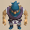 Pot Knave</td>
    </tr>
    <tr>
      <td class="useful"> Hat Brat</td>
      <td class="highlightGray"></td>
      <td class="highlightGray"></td>
      <td class="highlightGray"></td>
      <td class="highlightGray"></td>
    </tr>
    <tr>
      <td colspan="10" class="tableDivider"></td>
    </tr>
    <tr>
      <td rowspan="1" class="centeredText">11</td>
      <td rowspan="1" class=""></td>
      <td rowspan="1" class=""></td>
      <td rowspan="1" class=""></td>
      <td> Bored Kappa</td>
      <td> Masked Samurai</td>
      <td> Fresh Octopling</td>
      <td class="items"> Mudkin</td>
      <td> Pot Knave</td>
    </tr>
    <tr>
      <td colspan="10" class="tableDivider"></td>
    </tr>
    <tr>
      <td rowspan="1" class="centeredText">12</td>
      <td rowspan="1" class=""></td>
      <td rowspan="1" class=""></td>
      <td rowspan="1" class=""></td>
      <td> Bored Kappa</td>
      <td> Masked Samurai</td>
      <td> Fresh Octopling</td>
      <td class="items"> Mudkin</td>
      <td> Pot Knave</td>
    </tr>
    <tr>
      <td colspan="10" class="tableDivider"></td>
    </tr>
    <tr>
      <td rowspan="2" class="centeredText">13</td>
      <td rowspan="2" class=""></td>
      <td rowspan="2" class=""></td>
      <td rowspan="2" class=""></td>
      <td> Fresh Octopling</td>
      <td class="items"> Mudkin</td>
      <td> Lt. Spearfish</td>
      <td> Floor Dragon</td>
      <td> Metalhead</td>
    </tr>
    <tr>
      <td> Tiger Thrower</td>
      <td class="highlightGray"></td>
      <td class="highlightGray"></td>
      <td class="highlightGray"></td>
      <td class="highlightGray"></td>
    </tr>
    <tr>
      <td colspan="10" class="tableDivider"></td>
    </tr>
    <tr>
      <td rowspan="1" class="centeredText">14</td>
      <td rowspan="1" class=""></td>
      <td rowspan="1" class=""></td>
      <td rowspan="1" class=""></td>
      <td class="items"> Mudkin</td>
      <td> Lt. Spearfish</td>
      <td> Floor Dragon</td>
      <td> Metalhead</td>
      <td> Tiger Thrower</td>
    </tr>
    <tr>
      <td colspan="10" class="tableDivider"></td>
    </tr>
    <tr>
      <td rowspan="2" class="centeredText">15</td>
      <td rowspan="2" class=""></td>
      <td rowspan="2" class=""></td>
      <td rowspan="2" class=""></td>
      <td> Floor Dragon</td>
      <td> Metalhead</td>
      <td> Tiger Thrower</td>
      <td class="danger"> N'dama</td>
      <td> Okame Monk C</td>
    </tr>
    <tr>
      <td> Hannya Monk C</td>
      <td> Kitsune Monk C</td>
      <td class="danger"> Tengu Monk C</td>
      <td class="highlightGray"></td>
      <td class="highlightGray"></td>
    </tr>
    <tr>
      <td colspan="10" class="tableDivider"></td>
    </tr>
    <tr>
      <td rowspan="4" class="centeredText">16</td>
      <td rowspan="4" class=""></td>
      <td rowspan="4" class=""></td>
      <td rowspan="4" class=""></td>
      <td> Master Hen</td>
      <td> Minotaur</td>
      <td class="danger"> Okina Monk D</td>
      <td> Okame Monk D</td>
      <td class="farming"> Thiefwalrus</td>
    </tr>
    <tr>
      <td> Pop Tank</td>
      <td class="farming"> Egg Thing</td>
      <td class="useful"> Hat Prankster</td>
      <td class="stats"> Ghost Radish</td>
      <td class="useful"> Mixer</td>
    </tr>
    <tr>
      <td class="useful"> Mixergon</td>
      <td class="danger"> N'dama</td>
      <td> Okame Monk C</td>
      <td> Hannya Monk C</td>
      <td> Kitsune Monk C</td>
    </tr>
    <tr>
      <td class="danger"> Tengu Monk C</td>
      <td class="highlightGray"></td>
      <td class="highlightGray"></td>
      <td class="highlightGray"></td>
      <td class="highlightGray"></td>
    </tr>
    <tr>
      <td colspan="10" class="tableDivider"></td>
    </tr>
    <tr>
      <td rowspan="4" class="centeredText">17</td>
      <td rowspan="4" class=""></td>
      <td rowspan="4" class=""></td>
      <td rowspan="4" class=""></td>
      <td> Master Hen</td>
      <td> Minotaur</td>
      <td class="danger"> Okina Monk D</td>
      <td> Okame Monk D</td>
      <td class="farming"> Thiefwalrus</td>
    </tr>
    <tr>
      <td> Zapdon</td>
      <td> Pop Tank</td>
      <td class="farming"> Egg Thing</td>
      <td class="useful"> Hat Prankster</td>
      <td class="stats"> Ghost Radish</td>
    </tr>
    <tr>
      <td class="useful"> Mixer</td>
      <td class="useful"> Mixergon</td>
      <td class="danger"> N'dama</td>
      <td> Okame Monk C</td>
      <td> Hannya Monk C</td>
    </tr>
    <tr>
      <td> Kitsune Monk C</td>
      <td class="danger"> Tengu Monk C</td>
      <td class="highlightGray"></td>
      <td class="highlightGray"></td>
      <td class="highlightGray"></td>
    </tr>
    <tr>
      <td colspan="10" class="tableDivider"></td>
    </tr>
    <tr>
      <td rowspan="4" class="centeredText">18</td>
      <td rowspan="4" class=""></td>
      <td rowspan="4" class=""></td>
      <td rowspan="4" class=""></td>
      <td> Master Hen</td>
      <td> Minotaur</td>
      <td class="danger"> Okina Monk D</td>
      <td> Okame Monk D</td>
      <td class="danger"> Tengu Monk D</td>
    </tr>
    <tr>
      <td> Hannya Monk D</td>
      <td class="farming"> Thiefwalrus</td>
      <td> Zapdon</td>
      <td> Pop Tank</td>
      <td> Flamepuff</td>
    </tr>
    <tr>
      <td> N'dubba</td>
      <td class="useful"> Mixer</td>
      <td class="useful"> Mixergon</td>
      <td class="danger"> N'dama</td>
      <td> Okame Monk C</td>
    </tr>
    <tr>
      <td> Hannya Monk C</td>
      <td> Kitsune Monk C</td>
      <td class="danger"> Tengu Monk C</td>
      <td class="highlightGray"></td>
      <td class="highlightGray"></td>
    </tr>
    <tr>
      <td colspan="10" class="tableDivider"></td>
    </tr>
    <tr>
      <td rowspan="3" class="centeredText">19</td>
      <td rowspan="3" class=""></td>
      <td rowspan="3" class=""></td>
      <td rowspan="3" class=""></td>
      <td> Okame Monk D</td>
      <td class="danger"> Tengu Monk D</td>
      <td> Hannya Monk D</td>
      <td class="farming"> Thiefwalrus</td>
      <td> Zapdon</td>
    </tr>
    <tr>
      <td> Flamepuff</td>
      <td> N'dubba</td>
      <td> Skull Wizard</td>
      <td class="useful"> Mixer</td>
      <td class="useful"> Mixergon</td>
    </tr>
    <tr>
      <td class="danger"> N'dama</td>
      <td> Okame Monk C</td>
      <td> Hannya Monk C</td>
      <td> Kitsune Monk C</td>
      <td class="danger"> Tengu Monk C</td>
    </tr>
    <tr>
      <td colspan="10" class="tableDivider"></td>
    </tr>
    <tr>
      <td rowspan="3" class="centeredText">20</td>
      <td rowspan="3" class=""></td>
      <td rowspan="3" class=""></td>
      <td rowspan="3" class=""></td>
      <td> Zapdon</td>
      <td> Flamepuff</td>
      <td> N'dubba</td>
      <td> Tree Ninja C</td>
      <td> Earth Ninja C</td>
    </tr>
    <tr>
      <td class="items"> Fire Ninja C</td>
      <td> Explochin</td>
      <td> Skull Wizard</td>
      <td class="useful"> Mixer</td>
      <td class="useful"> Mixergon</td>
    </tr>
    <tr>
      <td> Lashagga</td>
      <td class="highlightGray"></td>
      <td class="highlightGray"></td>
      <td class="highlightGray"></td>
      <td class="highlightGray"></td>
    </tr>
    <tr>
      <td colspan="10" class="tableDivider"></td>
    </tr>
    <tr>
      <td rowspan="3" class="centeredText">21</td>
      <td rowspan="3" class=""></td>
      <td rowspan="3" class=""></td>
      <td rowspan="3" class=""></td>
      <td> N'dubba</td>
      <td> Tree Ninja C</td>
      <td> Earth Ninja C</td>
      <td class="items"> Fire Ninja C</td>
      <td> Explochin</td>
    </tr>
    <tr>
      <td> Blazeous</td>
      <td> Skull Wizard</td>
      <td class="useful"> Mixer</td>
      <td class="items"> Curse Matron</td>
      <td class="useful"> Mixergon</td>
    </tr>
    <tr>
      <td> Lashagga</td>
      <td class="highlightGray"></td>
      <td class="highlightGray"></td>
      <td class="highlightGray"></td>
      <td class="highlightGray"></td>
    </tr>
    <tr>
      <td colspan="10" class="tableDivider"></td>
    </tr>
    <tr>
      <td rowspan="3" class="centeredText">22</td>
      <td rowspan="3" class=""></td>
      <td rowspan="3" class=""></td>
      <td rowspan="3" class=""></td>
      <td class="items"> Fire Ninja C</td>
      <td> Metal Ninja C</td>
      <td class="items"> Water Ninja C</td>
      <td> Explochin</td>
      <td> Blazeous</td>
    </tr>
    <tr>
      <td> Skull Mage</td>
      <td class="items"> Super Gazer</td>
      <td class="useful"> Mixer</td>
      <td class="items"> Curse Matron</td>
      <td class="useful"> Mixergon</td>
    </tr>
    <tr>
      <td> Lashagga</td>
      <td> Great Samurai</td>
      <td class="highlightGray"></td>
      <td class="highlightGray"></td>
      <td class="highlightGray"></td>
    </tr>
    <tr>
      <td colspan="10" class="tableDivider"></td>
    </tr>
    <tr>
      <td rowspan="3" class="centeredText">23</td>
      <td rowspan="3" class=""></td>
      <td rowspan="3" class=""></td>
      <td rowspan="3" class=""></td>
      <td class="items"> Bag Knave</td>
      <td class="items"> Fire Ninja C</td>
      <td> Metal Ninja C</td>
      <td class="items"> Water Ninja C</td>
      <td> Blazeous</td>
    </tr>
    <tr>
      <td> Skull Mage</td>
      <td class="items"> Super Gazer</td>
      <td class="useful"> Mixer</td>
      <td class="items"> Curse Matron</td>
      <td class="useful"> Mixergon</td>
    </tr>
    <tr>
      <td> Lashagga</td>
      <td> Great Samurai</td>
      <td class="highlightGray"></td>
      <td class="highlightGray"></td>
      <td class="highlightGray"></td>
    </tr>
    <tr>
      <td colspan="10" class="tableDivider"></td>
    </tr>
    <tr>
      <td rowspan="3" class="centeredText">24</td>
      <td rowspan="3" class=""></td>
      <td rowspan="3" class=""></td>
      <td rowspan="3" class=""></td>
      <td class="items"> Bag Knave</td>
      <td class="items"> Super Gazer</td>
      <td> N'dulu</td>
      <td class="items"> Pesky Kappa</td>
      <td class="useful"> Dark Owl</td>
    </tr>
    <tr>
      <td> Capt. Spearfish</td>
      <td> Famed Octopling</td>
      <td class="useful"> Mixer</td>
      <td class="items"> Curse Matron</td>
      <td class="useful"> Mixergon</td>
    </tr>
    <tr>
      <td> Lashagga</td>
      <td> Great Samurai</td>
      <td class="highlightGray"></td>
      <td class="highlightGray"></td>
      <td class="highlightGray"></td>
    </tr>
    <tr>
      <td colspan="10" class="tableDivider"></td>
    </tr>
    <tr>
      <td rowspan="3" class="centeredText">25</td>
      <td rowspan="3" class=""></td>
      <td rowspan="3" class=""></td>
      <td rowspan="3" class=""></td>
      <td class="items"> Bag Knave</td>
      <td> N'dulu</td>
      <td class="items"> Pesky Kappa</td>
      <td class="useful"> Dark Owl</td>
      <td> Capt. Spearfish</td>
    </tr>
    <tr>
      <td> Famed Octopling</td>
      <td class="farming"> Greenwalrus</td>
      <td> Dartingfrog</td>
      <td class="useful"> Mixer</td>
      <td class="items"> Curse Matron</td>
    </tr>
    <tr>
      <td class="useful"> Mixergon</td>
      <td> Great Samurai</td>
      <td class="highlightGray"></td>
      <td class="highlightGray"></td>
      <td class="highlightGray"></td>
    </tr>
    <tr>
      <td colspan="10" class="tableDivider"></td>
    </tr>
    <tr>
      <td rowspan="2" class="centeredText">26</td>
      <td rowspan="2" class=""></td>
      <td rowspan="2" class=""></td>
      <td rowspan="2" class=""></td>
      <td class="items"> Bag Knave</td>
      <td> N'dulu</td>
      <td class="items"> Pesky Kappa</td>
      <td class="stats"> Daze Radish</td>
      <td class="farming"> Greenwalrus</td>
    </tr>
    <tr>
      <td> Dartingfrog</td>
      <td class="useful"> Mixer</td>
      <td class="items"> Curse Matron</td>
      <td class="useful"> Mixergon</td>
      <td> Great Samurai</td>
    </tr>
    <tr>
      <td colspan="10" class="tableDivider"></td>
    </tr>
    <tr>
      <td rowspan="3" class="centeredText">27</td>
      <td rowspan="3" class=""></td>
      <td rowspan="3" class=""></td>
      <td rowspan="3" class=""></td>
      <td class="items"> Bag Knave</td>
      <td> N'dulu</td>
      <td class="items"> Pesky Kappa</td>
      <td class="stats"> Daze Radish</td>
      <td> Dragon</td>
    </tr>
    <tr>
      <td class="farming"> Greenwalrus</td>
      <td> Dartingfrog</td>
      <td class="useful"> Mixer</td>
      <td class="items"> Curse Matron</td>
      <td class="useful"> Mixergon</td>
    </tr>
    <tr>
      <td> Great Samurai</td>
      <td class="highlightGray"></td>
      <td class="highlightGray"></td>
      <td class="highlightGray"></td>
      <td class="highlightGray"></td>
    </tr>
    <tr>
      <td colspan="10" class="tableDivider"></td>
    </tr>
    <tr>
      <td rowspan="3" class="centeredText">28</td>
      <td rowspan="3" class=""></td>
      <td rowspan="3" class=""></td>
      <td rowspan="3" class=""></td>
      <td class="items"> Bag Knave</td>
      <td> N'dulu</td>
      <td class="stats"> Daze Radish</td>
      <td> Dragon</td>
      <td> Sky Dragon</td>
    </tr>
    <tr>
      <td class="farming"> Greenwalrus</td>
      <td> Dartingfrog</td>
      <td class="useful"> Mixer</td>
      <td class="items"> Curse Matron</td>
      <td class="useful"> Mixergon</td>
    </tr>
    <tr>
      <td> Great Samurai</td>
      <td class="highlightGray"></td>
      <td class="highlightGray"></td>
      <td class="highlightGray"></td>
      <td class="highlightGray"></td>
    </tr>
    <tr>
      <td colspan="10" class="tableDivider"></td>
    </tr>
    <tr>
      <td rowspan="2" class="centeredText">29</td>
      <td rowspan="2" class=""></td>
      <td rowspan="2" class=""></td>
      <td rowspan="2" class=""></td>
      <td class="items"> Bag Knave</td>
      <td class="stats"> Daze Radish</td>
      <td class="stats"> Vile Scorpion</td>
      <td> Dragon</td>
      <td> Sky Dragon</td>
    </tr>
    <tr>
      <td class="farming"> Greenwalrus</td>
      <td class="useful"> Mixer</td>
      <td class="items"> Curse Matron</td>
      <td class="useful"> Mixergon</td>
      <td> Great Samurai</td>
    </tr>
    <tr>
      <td colspan="10" class="tableDivider"></td>
    </tr>
    <tr>
      <td rowspan="3" class="centeredText">30</td>
      <td rowspan="3" class=""></td>
      <td rowspan="3" class=""></td>
      <td rowspan="3" class=""></td>
      <td class="items"> Bag Knave</td>
      <td class="stats"> Vile Scorpion</td>
      <td> Hoppin' Slugger</td>
      <td> Polygon Shaka</td>
      <td> Dragon</td>
    </tr>
    <tr>
      <td> Sky Dragon</td>
      <td class="useful"> Mixer</td>
      <td class="useful"> Pumplich</td>
      <td class="items"> Curse Matron</td>
      <td class="useful"> Mixergon</td>
    </tr>
    <tr>
      <td> Great Samurai</td>
      <td class="danger"> Mini Tank</td>
      <td class="highlightGray"></td>
      <td class="highlightGray"></td>
      <td class="highlightGray"></td>
    </tr>
    <tr>
      <td colspan="10" class="tableDivider"></td>
    </tr>
    <tr>
      <td rowspan="2" class="centeredText">31</td>
      <td rowspan="2" class=""></td>
      <td rowspan="2" class=""></td>
      <td rowspan="2" class=""></td>
      <td class="stats"> Vile Scorpion</td>
      <td> Hoppin' Slugger</td>
      <td> Polygon Shaka</td>
      <td> Dragon</td>
      <td> Sky Dragon</td>
    </tr>
    <tr>
      <td class="useful"> Pumplich</td>
      <td> Big Chintala</td>
      <td class="stats"> Polygon Singa</td>
      <td> Megataur</td>
      <td class="danger"> Mini Tank</td>
    </tr>
    <tr>
      <td colspan="10" class="tableDivider"></td>
    </tr>
    <tr>
      <td rowspan="2" class="centeredText">32</td>
      <td rowspan="2" class=""></td>
      <td rowspan="2" class=""></td>
      <td rowspan="2" class=""></td>
      <td class="stats"> Vile Scorpion</td>
      <td> Hoppin' Slugger</td>
      <td> Polygon Shaka</td>
      <td> Dragon</td>
      <td> Sky Dragon</td>
    </tr>
    <tr>
      <td class="useful"> Pumplich</td>
      <td> Big Chintala</td>
      <td class="stats"> Polygon Singa</td>
      <td> Megataur</td>
      <td class="highlightGray"></td>
    </tr>
    <tr>
      <td colspan="10" class="tableDivider"></td>
    </tr>
    <tr>
      <td rowspan="1" class="centeredText">33</td>
      <td rowspan="1" class=""></td>
      <td rowspan="1" class=""></td>
      <td rowspan="1" class=""></td>
      <td> Polygon Shaka</td>
      <td> Big Chintala</td>
      <td class="stats"> Polygon Singa</td>
      <td> Megataur</td>
      <td class="highlightGray"></td>
    </tr>
    <tr>
      <td colspan="10" class="tableDivider"></td>
    </tr>
    <tr>
      <td rowspan="1" class="centeredText">34</td>
      <td rowspan="1" class=""></td>
      <td rowspan="1" class=""></td>
      <td rowspan="1" class=""></td>
      <td> Polygon Shaka</td>
      <td> Big Chintala</td>
      <td class="stats"> Polygon Singa</td>
      <td> Megataur</td>
      <td class="highlightGray"></td>
    </tr>
    <tr>
      <td colspan="10" class="tableDivider"></td>
    </tr>
    <tr>
      <td rowspan="1" class="centeredText">35</td>
      <td rowspan="1" class=""></td>
      <td rowspan="1" class=""></td>
      <td rowspan="1" class=""></td>
      <td> Polygon Shaka</td>
      <td class="danger"> Skullmancer</td>
      <td> Big Chintala</td>
      <td class="stats"> Polygon Singa</td>
      <td> Megataur</td>
    </tr>
    <tr>
      <td colspan="10" class="tableDivider"></td>
    </tr>
    <tr>
      <td rowspan="1" class="centeredText">36</td>
      <td rowspan="1" class=""></td>
      <td rowspan="1" class=""></td>
      <td rowspan="1" class=""></td>
      <td class="danger"> Skullmancer</td>
      <td> Big Chintala</td>
      <td class="stats"> Polygon Singa</td>
      <td> Popdillo</td>
      <td> Megataur</td>
    </tr>
    <tr>
      <td colspan="10" class="tableDivider"></td>
    </tr>
    <tr>
      <td rowspan="1" class="centeredText">37</td>
      <td rowspan="1" class=""></td>
      <td rowspan="1" class=""></td>
      <td rowspan="1" class=""></td>
      <td class="danger"> Skullmancer</td>
      <td> Big Chintala</td>
      <td class="stats"> Polygon Singa</td>
      <td> Popdillo</td>
      <td> Megataur</td>
    </tr>
    <tr>
      <td colspan="10" class="tableDivider"></td>
    </tr>
    <tr>
      <td rowspan="1" class="centeredText">38</td>
      <td rowspan="1" class=""></td>
      <td rowspan="1" class=""></td>
      <td rowspan="1" class=""></td>
      <td> Big Chintala</td>
      <td class="stats"> Polygon Singa</td>
      <td> Popdillo</td>
      <td> Megataur</td>
      <td class="highlightGray"></td>
    </tr>
    <tr>
      <td colspan="10" class="tableDivider"></td>
    </tr>
    <tr>
      <td rowspan="1" class="centeredText">39</td>
      <td rowspan="1" class=""></td>
      <td rowspan="1" class=""></td>
      <td rowspan="1" class=""></td>
      <td> Big Chintala</td>
      <td class="stats"> Polygon Singa</td>
      <td> Popdillo</td>
      <td> Megataur</td>
      <td class="highlightGray"></td>
    </tr>
    <tr>
      <td colspan="10" class="tableDivider"></td>
    </tr>
    <tr>
      <td rowspan="1" class="centeredText">40</td>
      <td rowspan="1" class=""></td>
      <td rowspan="1" class=""></td>
      <td rowspan="1" class=""></td>
      <td class="items"> Hyper Gazer</td>
      <td class="stats"> Polygon Singa</td>
      <td> Popdillo</td>
      <td> Megataur</td>
      <td class="danger"> Mini Tank</td>
    </tr>
    <tr>
      <td colspan="10" class="tableDivider"></td>
    </tr>
    <tr>
      <td rowspan="3" class="centeredText">41</td>
      <td rowspan="3" class=""></td>
      <td rowspan="3" class=""></td>
      <td rowspan="3" class=""></td>
      <td class="danger"> Skullmancer</td>
      <td class="items"> Hyper Gazer</td>
      <td class="stats"> Polygon Singa</td>
      <td> Megahead</td>
      <td class="danger"> Mini Tank</td>
    </tr>
    <tr>
      <td class="stats"> Terror Scorpion</td>
      <td>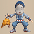 Okame Monk A</td>
      <td> Hannya Monk A</td>
      <td> Kitsune Monk A</td>
      <td class="items"> Fire Ninja A</td>
    </tr>
    <tr>
      <td class="items"> Water Ninja A</td>
      <td> Tree Ninja A</td>
      <td>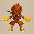 Earth Ninja A</td>
      <td class="highlightGray"></td>
      <td class="highlightGray"></td>
    </tr>
    <tr>
      <td colspan="10" class="tableDivider"></td>
    </tr>
    <tr>
      <td rowspan="3" class="centeredText">42</td>
      <td rowspan="3" class=""></td>
      <td rowspan="3" class=""></td>
      <td rowspan="3" class=""></td>
      <td class="danger"> Skullmancer</td>
      <td class="items"> Hyper Gazer</td>
      <td class="stats"> Polygon Singa</td>
      <td> Megahead</td>
      <td class="stats"> Terror Scorpion</td>
    </tr>
    <tr>
      <td> Okame Monk A</td>
      <td> Hannya Monk A</td>
      <td> Kitsune Monk A</td>
      <td class="items"> Fire Ninja A</td>
      <td class="items"> Water Ninja A</td>
    </tr>
    <tr>
      <td> Tree Ninja A</td>
      <td> Earth Ninja A</td>
      <td class="highlightGray"></td>
      <td class="highlightGray"></td>
      <td class="highlightGray"></td>
    </tr>
    <tr>
      <td colspan="10" class="tableDivider"></td>
    </tr>
    <tr>
      <td rowspan="3" class="centeredText">43</td>
      <td rowspan="3" class=""></td>
      <td rowspan="3" class=""></td>
      <td rowspan="3" class=""></td>
      <td class="danger"> Skullmancer</td>
      <td class="items"> Hyper Gazer</td>
      <td class="stats"> Polygon Singa</td>
      <td> Megahead</td>
      <td class="stats"> Terror Scorpion</td>
    </tr>
    <tr>
      <td> Okame Monk A</td>
      <td> Hannya Monk A</td>
      <td> Kitsune Monk A</td>
      <td class="items"> Fire Ninja A</td>
      <td class="items"> Water Ninja A</td>
    </tr>
    <tr>
      <td> Tree Ninja A</td>
      <td> Earth Ninja A</td>
      <td class="highlightGray"></td>
      <td class="highlightGray"></td>
      <td class="highlightGray"></td>
    </tr>
    <tr>
      <td colspan="10" class="tableDivider"></td>
    </tr>
    <tr>
      <td rowspan="3" class="centeredText">44</td>
      <td rowspan="3" class=""></td>
      <td rowspan="3" class=""></td>
      <td rowspan="3" class=""></td>
      <td class="items"> Hyper Gazer</td>
      <td class="stats"> Polygon Singa</td>
      <td> Megahead</td>
      <td class="stats"> Terror Scorpion</td>
      <td> Okame Monk A</td>
    </tr>
    <tr>
      <td> Hannya Monk A</td>
      <td> Kitsune Monk A</td>
      <td class="items"> Fire Ninja A</td>
      <td class="items"> Water Ninja A</td>
      <td> Tree Ninja A</td>
    </tr>
    <tr>
      <td> Earth Ninja A</td>
      <td class="highlightGray"></td>
      <td class="highlightGray"></td>
      <td class="highlightGray"></td>
      <td class="highlightGray"></td>
    </tr>
    <tr>
      <td colspan="10" class="tableDivider"></td>
    </tr>
    <tr>
      <td rowspan="4" class="centeredText">45</td>
      <td rowspan="4" class=""></td>
      <td rowspan="4" class=""></td>
      <td rowspan="4" class=""></td>
      <td> Okame Monk B</td>
      <td> Hannya Monk B</td>
      <td> Kitsune Monk B</td>
      <td class="danger"> Tengu Monk B</td>
      <td class="items"> Hyper Gazer</td>
    </tr>
    <tr>
      <td class="stats"> Polygon Singa</td>
      <td> Fleefrog</td>
      <td class="useful"> Electroid</td>
      <td> Megahead</td>
      <td class="stats"> Terror Scorpion</td>
    </tr>
    <tr>
      <td> Okame Monk A</td>
      <td> Hannya Monk A</td>
      <td> Kitsune Monk A</td>
      <td class="items"> Fire Ninja A</td>
      <td class="items"> Water Ninja A</td>
    </tr>
    <tr>
      <td> Tree Ninja A</td>
      <td> Earth Ninja A</td>
      <td class="highlightGray"></td>
      <td class="highlightGray"></td>
      <td class="highlightGray"></td>
    </tr>
    <tr>
      <td colspan="10" class="tableDivider"></td>
    </tr>
    <tr>
      <td rowspan="4" class="centeredText">46</td>
      <td rowspan="4" class=""></td>
      <td rowspan="4" class=""></td>
      <td rowspan="4" class=""></td>
      <td> Okame Monk B</td>
      <td> Hannya Monk B</td>
      <td> Kitsune Monk B</td>
      <td class="danger"> Tengu Monk B</td>
      <td class="items"> Hyper Gazer</td>
    </tr>
    <tr>
      <td class="stats"> Polygon Singa</td>
      <td> Fleefrog</td>
      <td class="useful"> Electroid</td>
      <td> Megahead</td>
      <td class="stats"> Terror Scorpion</td>
    </tr>
    <tr>
      <td> Okame Monk A</td>
      <td> Hannya Monk A</td>
      <td> Kitsune Monk A</td>
      <td class="items"> Fire Ninja A</td>
      <td class="items"> Water Ninja A</td>
    </tr>
    <tr>
      <td> Tree Ninja A</td>
      <td> Earth Ninja A</td>
      <td class="highlightGray"></td>
      <td class="highlightGray"></td>
      <td class="highlightGray"></td>
    </tr>
    <tr>
      <td colspan="10" class="tableDivider"></td>
    </tr>
    <tr>
      <td rowspan="4" class="centeredText">47</td>
      <td rowspan="4" class=""></td>
      <td rowspan="4" class=""></td>
      <td rowspan="4" class=""></td>
      <td> Okame Monk B</td>
      <td> Hannya Monk B</td>
      <td> Kitsune Monk B</td>
      <td class="danger"> Tengu Monk B</td>
      <td class="danger"> Skullmancer</td>
    </tr>
    <tr>
      <td class="items"> Hyper Gazer</td>
      <td class="stats"> Polygon Singa</td>
      <td> Fleefrog</td>
      <td class="useful"> Electroid</td>
      <td> Megahead</td>
    </tr>
    <tr>
      <td class="stats"> Terror Scorpion</td>
      <td> Okame Monk A</td>
      <td> Hannya Monk A</td>
      <td> Kitsune Monk A</td>
      <td class="items"> Fire Ninja A</td>
    </tr>
    <tr>
      <td class="items"> Water Ninja A</td>
      <td> Tree Ninja A</td>
      <td> Earth Ninja A</td>
      <td class="highlightGray"></td>
      <td class="highlightGray"></td>
    </tr>
    <tr>
      <td colspan="10" class="tableDivider"></td>
    </tr>
    <tr>
      <td rowspan="4" class="centeredText">48</td>
      <td rowspan="4" class=""></td>
      <td rowspan="4" class=""></td>
      <td rowspan="4" class=""></td>
      <td> Okame Monk B</td>
      <td> Hannya Monk B</td>
      <td> Kitsune Monk B</td>
      <td class="danger"> Tengu Monk B</td>
      <td class="danger"> Skullmancer</td>
    </tr>
    <tr>
      <td class="items"> Hyper Gazer</td>
      <td class="stats"> Polygon Singa</td>
      <td> Fleefrog</td>
      <td class="useful"> Electroid</td>
      <td> Megahead</td>
    </tr>
    <tr>
      <td class="stats"> Terror Scorpion</td>
      <td> Okame Monk A</td>
      <td> Hannya Monk A</td>
      <td> Kitsune Monk A</td>
      <td class="items"> Fire Ninja A</td>
    </tr>
    <tr>
      <td class="items"> Water Ninja A</td>
      <td> Tree Ninja A</td>
      <td> Earth Ninja A</td>
      <td class="highlightGray"></td>
      <td class="highlightGray"></td>
    </tr>
    <tr>
      <td colspan="10" class="tableDivider"></td>
    </tr>
    <tr>
      <td rowspan="4" class="centeredText">49</td>
      <td rowspan="4" class=""></td>
      <td rowspan="4" class=""></td>
      <td rowspan="4" class=""></td>
      <td> Okame Monk B</td>
      <td> Hannya Monk B</td>
      <td> Kitsune Monk B</td>
      <td class="danger"> Tengu Monk B</td>
      <td class="danger"> Skullmancer</td>
    </tr>
    <tr>
      <td class="items"> Hyper Gazer</td>
      <td class="stats"> Polygon Singa</td>
      <td> Fleefrog</td>
      <td class="useful"> Electroid</td>
      <td> Megahead</td>
    </tr>
    <tr>
      <td class="stats"> Terror Scorpion</td>
      <td> Okame Monk A</td>
      <td> Hannya Monk A</td>
      <td> Kitsune Monk A</td>
      <td class="items"> Fire Ninja A</td>
    </tr>
    <tr>
      <td class="items"> Water Ninja A</td>
      <td> Tree Ninja A</td>
      <td> Earth Ninja A</td>
      <td class="highlightGray"></td>
      <td class="highlightGray"></td>
    </tr>
    <tr>
      <td colspan="10" class="tableDivider"></td>
    </tr>
    <tr>
      <td rowspan="5" class="centeredText">50</td>
      <td rowspan="5" class=""></td>
      <td rowspan="5" class=""></td>
      <td rowspan="5" class=""></td>
      <td> Okame Monk B</td>
      <td> Hannya Monk B</td>
      <td> Kitsune Monk B</td>
      <td class="danger"> Tengu Monk B</td>
      <td class="items"> Hyper Gazer</td>
    </tr>
    <tr>
      <td class="stats"> Polygon Singa</td>
      <td> Fleefrog</td>
      <td class="useful"> Electroid</td>
      <td> Megahead</td>
      <td class="danger"> Mini Tank</td>
    </tr>
    <tr>
      <td class="stats"> Terror Scorpion</td>
      <td> Okame Monk A</td>
      <td> Hannya Monk A</td>
      <td> Kitsune Monk A</td>
      <td class="danger"> Tengu Monk A</td>
    </tr>
    <tr>
      <td class="items"> Fire Ninja A</td>
      <td class="items"> Water Ninja A</td>
      <td> Tree Ninja A</td>
      <td> Earth Ninja A</td>
      <td class="danger"> Okina Monk A</td>
    </tr>
    <tr>
      <td class="danger"> Ultra Gazer</td>
      <td class="highlightGray"></td>
      <td class="highlightGray"></td>
      <td class="highlightGray"></td>
      <td class="highlightGray"></td>
    </tr>
    <tr>
      <td colspan="10" class="tableDivider"></td>
    </tr>
    <tr>
      <td class="monsterTableExtension"></td>
      <td colspan="3" class="monsterTableExtension"></td>
      <td colspan="5" class="monsterTableExtension centeredText">Sacred Tree Mode</td>
    </tr>
    <tr>
      <td colspan="10" class="tableDivider"></td>
    </tr>
    <tr>
      <td rowspan="4" class="centeredText highlightFog">51</td>
      <td rowspan="4" class=""></td>
      <td rowspan="4" class=""></td>
      <td rowspan="4" class=""></td>
      <td> Huge Chintala</td>
      <td class="items"> Nimble Knave</td>
      <td> Fleefrog</td>
      <td class="useful"> Electroid</td>
      <td> Dragon Pit</td>
    </tr>
    <tr>
      <td class="danger"> Mini Tank</td>
      <td class="stats"> Terror Scorpion</td>
      <td class="danger"> Soul Reaper</td>
      <td> Okame Monk A</td>
      <td> Hannya Monk A</td>
    </tr>
    <tr>
      <td> Kitsune Monk A</td>
      <td class="danger"> Tengu Monk A</td>
      <td class="items"> Fire Ninja A</td>
      <td class="items"> Water Ninja A</td>
      <td> Tree Ninja A</td>
    </tr>
    <tr>
      <td> Earth Ninja A</td>
      <td class="danger"> Okina Monk A</td>
      <td class="highlightGray"></td>
      <td class="highlightGray"></td>
      <td class="highlightGray"></td>
    </tr>
    <tr>
      <td colspan="10" class="tableDivider"></td>
    </tr>
    <tr>
      <td rowspan="4" class="centeredText highlightFog">52</td>
      <td rowspan="4" class=""></td>
      <td rowspan="4" class=""></td>
      <td rowspan="4" class=""></td>
      <td> Huge Chintala</td>
      <td class="items"> Nimble Knave</td>
      <td> Fleefrog</td>
      <td class="useful"> Electroid</td>
      <td> Dragon Pit</td>
    </tr>
    <tr>
      <td class="stats"> Terror Scorpion</td>
      <td class="danger"> Soul Reaper</td>
      <td> Okame Monk A</td>
      <td> Hannya Monk A</td>
      <td> Kitsune Monk A</td>
    </tr>
    <tr>
      <td class="danger"> Tengu Monk A</td>
      <td class="items"> Fire Ninja A</td>
      <td class="items"> Water Ninja A</td>
      <td> Tree Ninja A</td>
      <td> Earth Ninja A</td>
    </tr>
    <tr>
      <td class="danger"> Okina Monk A</td>
      <td class="highlightGray"></td>
      <td class="highlightGray"></td>
      <td class="highlightGray"></td>
      <td class="highlightGray"></td>
    </tr>
    <tr>
      <td colspan="10" class="tableDivider"></td>
    </tr>
    <tr>
      <td rowspan="3" class="centeredText highlightFog">53</td>
      <td rowspan="3" class=""></td>
      <td rowspan="3" class=""></td>
      <td rowspan="3" class=""></td>
      <td> Huge Chintala</td>
      <td class="items"> Nimble Knave</td>
      <td> Admiral Spearfish</td>
      <td> Dragon Pit</td>
      <td class="stats"> Terror Scorpion</td>
    </tr>
    <tr>
      <td class="danger"> Soul Reaper</td>
      <td> Okame Monk A</td>
      <td> Hannya Monk A</td>
      <td> Kitsune Monk A</td>
      <td class="danger"> Tengu Monk A</td>
    </tr>
    <tr>
      <td class="items"> Fire Ninja A</td>
      <td class="items"> Water Ninja A</td>
      <td> Tree Ninja A</td>
      <td> Earth Ninja A</td>
      <td class="danger"> Okina Monk A</td>
    </tr>
    <tr>
      <td colspan="10" class="tableDivider"></td>
    </tr>
    <tr>
      <td rowspan="3" class="centeredText highlightFog">54</td>
      <td rowspan="3" class=""></td>
      <td rowspan="3" class=""></td>
      <td rowspan="3" class=""></td>
      <td> Huge Chintala</td>
      <td class="items"> Nimble Knave</td>
      <td> Admiral Spearfish</td>
      <td> Dragon Pit</td>
      <td class="stats"> Terror Scorpion</td>
    </tr>
    <tr>
      <td class="danger"> Soul Reaper</td>
      <td> Okame Monk A</td>
      <td> Hannya Monk A</td>
      <td> Kitsune Monk A</td>
      <td class="danger"> Tengu Monk A</td>
    </tr>
    <tr>
      <td class="items"> Fire Ninja A</td>
      <td class="items"> Water Ninja A</td>
      <td> Tree Ninja A</td>
      <td> Earth Ninja A</td>
      <td class="danger"> Okina Monk A</td>
    </tr>
    <tr>
      <td colspan="10" class="tableDivider"></td>
    </tr>
    <tr>
      <td rowspan="4" class="centeredText highlightFog">55</td>
      <td rowspan="4" class=""></td>
      <td rowspan="4" class=""></td>
      <td rowspan="4" class=""></td>
      <td> Huge Chintala</td>
      <td class="items"> Nimble Knave</td>
      <td> Admiral Spearfish</td>
      <td> Dragon Pit</td>
      <td class="stats"> Terror Scorpion</td>
    </tr>
    <tr>
      <td class="danger"> Soul Reaper</td>
      <td> Okame Monk A</td>
      <td> Hannya Monk A</td>
      <td> Kitsune Monk A</td>
      <td class="danger"> Tengu Monk A</td>
    </tr>
    <tr>
      <td class="items"> Fire Ninja A</td>
      <td class="items"> Water Ninja A</td>
      <td> Tree Ninja A</td>
      <td> Earth Ninja A</td>
      <td class="danger"> Okina Monk A</td>
    </tr>
    <tr>
      <td class="danger"> Gitan Mamel</td>
      <td class="highlightGray"></td>
      <td class="highlightGray"></td>
      <td class="highlightGray"></td>
      <td class="highlightGray"></td>
    </tr>
    <tr>
      <td colspan="10" class="tableDivider"></td>
    </tr>
    <tr>
      <td rowspan="3" class="centeredText highlightFog">56</td>
      <td rowspan="3" class=""></td>
      <td rowspan="3" class=""></td>
      <td rowspan="3" class=""></td>
      <td> Huge Chintala</td>
      <td class="items"> Nimble Knave</td>
      <td> Admiral Spearfish</td>
      <td> Dragon Pit</td>
      <td class="stats"> Terror Scorpion</td>
    </tr>
    <tr>
      <td class="danger"> Soul Reaper</td>
      <td> Okame Monk A</td>
      <td> Hannya Monk A</td>
      <td> Kitsune Monk A</td>
      <td class="danger"> Tengu Monk A</td>
    </tr>
    <tr>
      <td class="items"> Fire Ninja A</td>
      <td class="items"> Water Ninja A</td>
      <td> Tree Ninja A</td>
      <td> Earth Ninja A</td>
      <td class="danger"> Okina Monk A</td>
    </tr>
    <tr>
      <td colspan="10" class="tableDivider"></td>
    </tr>
    <tr>
      <td rowspan="3" class="centeredText highlightFog">57</td>
      <td rowspan="3" class=""></td>
      <td rowspan="3" class=""></td>
      <td rowspan="3" class=""></td>
      <td> Huge Chintala</td>
      <td class="items"> Nimble Knave</td>
      <td> Admiral Spearfish</td>
      <td class="stats"> Terror Scorpion</td>
      <td class="danger"> Soul Reaper</td>
    </tr>
    <tr>
      <td> Okame Monk A</td>
      <td> Hannya Monk A</td>
      <td> Kitsune Monk A</td>
      <td class="danger"> Tengu Monk A</td>
      <td class="items"> Fire Ninja A</td>
    </tr>
    <tr>
      <td class="items"> Water Ninja A</td>
      <td> Tree Ninja A</td>
      <td> Earth Ninja A</td>
      <td class="danger"> Okina Monk A</td>
      <td class="highlightGray"></td>
    </tr>
    <tr>
      <td colspan="10" class="tableDivider"></td>
    </tr>
    <tr>
      <td rowspan="3" class="centeredText highlightFog">58</td>
      <td rowspan="3" class=""></td>
      <td rowspan="3" class=""></td>
      <td rowspan="3" class=""></td>
      <td> Huge Chintala</td>
      <td class="items"> Nimble Knave</td>
      <td> Admiral Spearfish</td>
      <td class="stats"> Terror Scorpion</td>
      <td class="danger"> Soul Reaper</td>
    </tr>
    <tr>
      <td> Okame Monk A</td>
      <td> Hannya Monk A</td>
      <td> Kitsune Monk A</td>
      <td class="danger"> Tengu Monk A</td>
      <td class="items"> Fire Ninja A</td>
    </tr>
    <tr>
      <td class="items"> Water Ninja A</td>
      <td> Tree Ninja A</td>
      <td> Earth Ninja A</td>
      <td class="danger"> Okina Monk A</td>
      <td class="highlightGray"></td>
    </tr>
    <tr>
      <td colspan="10" class="tableDivider"></td>
    </tr>
    <tr>
      <td rowspan="3" class="centeredText highlightFog">59</td>
      <td rowspan="3" class=""></td>
      <td rowspan="3" class=""></td>
      <td rowspan="3" class=""></td>
      <td> Huge Chintala</td>
      <td class="items"> Nimble Knave</td>
      <td> Admiral Spearfish</td>
      <td class="stats"> Terror Scorpion</td>
      <td class="danger"> Soul Reaper</td>
    </tr>
    <tr>
      <td> Okame Monk A</td>
      <td> Hannya Monk A</td>
      <td> Kitsune Monk A</td>
      <td class="danger"> Tengu Monk A</td>
      <td class="items"> Fire Ninja A</td>
    </tr>
    <tr>
      <td class="items"> Water Ninja A</td>
      <td> Tree Ninja A</td>
      <td> Earth Ninja A</td>
      <td class="danger"> Okina Monk A</td>
      <td class="highlightGray"></td>
    </tr>
    <tr>
      <td colspan="10" class="tableDivider"></td>
    </tr>
    <tr>
      <td rowspan="4" class="centeredText highlightFog">60</td>
      <td rowspan="4" class=""></td>
      <td rowspan="4" class=""></td>
      <td rowspan="4" class=""></td>
      <td> Huge Chintala</td>
      <td class="items"> Nimble Knave</td>
      <td> Admiral Spearfish</td>
      <td class="useful"> Mixergon</td>
      <td class="danger"> Mini Tank</td>
    </tr>
    <tr>
      <td class="stats"> Terror Scorpion</td>
      <td class="danger"> Soul Reaper</td>
      <td> Okame Monk A</td>
      <td> Hannya Monk A</td>
      <td> Kitsune Monk A</td>
    </tr>
    <tr>
      <td class="danger"> Tengu Monk A</td>
      <td> Gigataur</td>
      <td class="items"> Swordmaster</td>
      <td> Detonachin</td>
      <td> Infernous</td>
    </tr>
    <tr>
      <td class="danger"> Okina Monk A</td>
      <td class="danger"> Ultra Gazer</td>
      <td class="highlightGray"></td>
      <td class="highlightGray"></td>
      <td class="highlightGray"></td>
    </tr>
    <tr>
      <td colspan="10" class="tableDivider"></td>
    </tr>
    <tr>
      <td rowspan="3" class="centeredText highlightFog">61</td>
      <td rowspan="3" class=""></td>
      <td rowspan="3" class=""></td>
      <td rowspan="3" class=""></td>
      <td class="items"> Nimble Knave</td>
      <td> Admiral Spearfish</td>
      <td class="useful"> Mixergon</td>
      <td class="danger"> Mini Tank</td>
      <td class="danger"> Tengu Monk A</td>
    </tr>
    <tr>
      <td> Gigataur</td>
      <td class="items"> Swordmaster</td>
      <td> Detonachin</td>
      <td> Infernous</td>
      <td class="danger"> Okina Monk A</td>
    </tr>
    <tr>
      <td> Lordly Samurai</td>
      <td class="highlightGray"></td>
      <td class="highlightGray"></td>
      <td class="highlightGray"></td>
      <td class="highlightGray"></td>
    </tr>
    <tr>
      <td colspan="10" class="tableDivider"></td>
    </tr>
    <tr>
      <td rowspan="2" class="centeredText highlightFog">62</td>
      <td rowspan="2" class=""></td>
      <td rowspan="2" class=""></td>
      <td rowspan="2" class=""></td>
      <td> Admiral Spearfish</td>
      <td class="useful"> Mixergon</td>
      <td class="danger"> Tengu Monk A</td>
      <td> Gigataur</td>
      <td class="items"> Swordmaster</td>
    </tr>
    <tr>
      <td> Detonachin</td>
      <td> Infernous</td>
      <td class="danger"> Okina Monk A</td>
      <td> Lordly Samurai</td>
      <td class="highlightGray"></td>
    </tr>
    <tr>
      <td colspan="10" class="tableDivider"></td>
    </tr>
    <tr>
      <td rowspan="2" class="centeredText highlightFog">63</td>
      <td rowspan="2" class=""></td>
      <td rowspan="2" class=""></td>
      <td rowspan="2" class=""></td>
      <td> Admiral Spearfish</td>
      <td class="useful"> Mixergon</td>
      <td class="danger"> Tengu Monk A</td>
      <td> Gigataur</td>
      <td class="items"> Swordmaster</td>
    </tr>
    <tr>
      <td> Detonachin</td>
      <td> Infernous</td>
      <td class="danger"> Okina Monk A</td>
      <td> Lordly Samurai</td>
      <td class="highlightGray"></td>
    </tr>
    <tr>
      <td colspan="10" class="tableDivider"></td>
    </tr>
    <tr>
      <td rowspan="2" class="centeredText highlightFog">64</td>
      <td rowspan="2" class=""></td>
      <td rowspan="2" class=""></td>
      <td rowspan="2" class=""></td>
      <td> Admiral Spearfish</td>
      <td class="useful"> Mixergon</td>
      <td class="danger"> Tengu Monk A</td>
      <td> Gigataur</td>
      <td class="items"> Swordmaster</td>
    </tr>
    <tr>
      <td> Detonachin</td>
      <td> Infernous</td>
      <td class="danger"> Okina Monk A</td>
      <td> Lordly Samurai</td>
      <td class="highlightGray"></td>
    </tr>
    <tr>
      <td colspan="10" class="tableDivider"></td>
    </tr>
    <tr>
      <td rowspan="3" class="centeredText highlightFog">65</td>
      <td rowspan="3" class=""></td>
      <td rowspan="3" class=""></td>
      <td rowspan="3" class=""></td>
      <td> Admiral Spearfish</td>
      <td class="useful"> Mixergon</td>
      <td class="items"> Cursenior</td>
      <td class="danger"> Tengu Monk A</td>
      <td> Gigataur</td>
    </tr>
    <tr>
      <td class="items"> Swordmaster</td>
      <td> Detonachin</td>
      <td> Infernous</td>
      <td class="danger"> Okina Monk A</td>
      <td class="danger"> Gitan Mamel</td>
    </tr>
    <tr>
      <td> Lordly Samurai</td>
      <td class="highlightGray"></td>
      <td class="highlightGray"></td>
      <td class="highlightGray"></td>
      <td class="highlightGray"></td>
    </tr>
    <tr>
      <td colspan="10" class="tableDivider"></td>
    </tr>
    <tr>
      <td rowspan="3" class="centeredText highlightFog">66</td>
      <td rowspan="3" class=""></td>
      <td rowspan="3" class=""></td>
      <td rowspan="3" class=""></td>
      <td> Admiral Spearfish</td>
      <td class="useful"> Mixergon</td>
      <td class="items"> Cursenior</td>
      <td class="danger"> Tengu Monk A</td>
      <td> Gigataur</td>
    </tr>
    <tr>
      <td class="items"> Swordmaster</td>
      <td> Detonachin</td>
      <td> Infernous</td>
      <td class="danger"> Okina Monk A</td>
      <td> Lordly Samurai</td>
    </tr>
    <tr>
      <td class="danger"> Porgon</td>
      <td class="highlightGray"></td>
      <td class="highlightGray"></td>
      <td class="highlightGray"></td>
      <td class="highlightGray"></td>
    </tr>
    <tr>
      <td colspan="10" class="tableDivider"></td>
    </tr>
    <tr>
      <td rowspan="3" class="centeredText highlightFog">67</td>
      <td rowspan="3" class=""></td>
      <td rowspan="3" class=""></td>
      <td rowspan="3" class=""></td>
      <td> Admiral Spearfish</td>
      <td class="useful"> Mixergon</td>
      <td class="items"> Cursenior</td>
      <td class="danger"> Tengu Monk A</td>
      <td> Gigataur</td>
    </tr>
    <tr>
      <td class="items"> Swordmaster</td>
      <td> Detonachin</td>
      <td> Infernous</td>
      <td class="danger"> Okina Monk A</td>
      <td> Lordly Samurai</td>
    </tr>
    <tr>
      <td class="danger"> Porgon</td>
      <td class="highlightGray"></td>
      <td class="highlightGray"></td>
      <td class="highlightGray"></td>
      <td class="highlightGray"></td>
    </tr>
    <tr>
      <td colspan="10" class="tableDivider"></td>
    </tr>
    <tr>
      <td rowspan="3" class="centeredText highlightFog">68</td>
      <td rowspan="3" class=""></td>
      <td rowspan="3" class=""></td>
      <td rowspan="3" class=""></td>
      <td> Admiral Spearfish</td>
      <td class="useful"> Mixergon</td>
      <td class="items"> Cursenior</td>
      <td class="danger"> Tengu Monk A</td>
      <td> Gigataur</td>
    </tr>
    <tr>
      <td class="items"> Swordmaster</td>
      <td> Detonachin</td>
      <td> Infernous</td>
      <td class="danger"> Okina Monk A</td>
      <td> Lordly Samurai</td>
    </tr>
    <tr>
      <td class="danger"> Porgon</td>
      <td class="highlightGray"></td>
      <td class="highlightGray"></td>
      <td class="highlightGray"></td>
      <td class="highlightGray"></td>
    </tr>
    <tr>
      <td colspan="10" class="tableDivider"></td>
    </tr>
    <tr>
      <td rowspan="2" class="centeredText highlightFog">69</td>
      <td rowspan="2" class=""></td>
      <td rowspan="2" class=""></td>
      <td rowspan="2" class=""></td>
      <td class="useful"> Mixergon</td>
      <td class="items"> Cursenior</td>
      <td class="danger"> Tengu Monk A</td>
      <td> Gigataur</td>
      <td class="items"> Swordmaster</td>
    </tr>
    <tr>
      <td> Detonachin</td>
      <td> Infernous</td>
      <td class="danger"> Okina Monk A</td>
      <td> Lordly Samurai</td>
      <td class="danger"> Porgon</td>
    </tr>
    <tr>
      <td colspan="10" class="tableDivider"></td>
    </tr>
    <tr>
      <td rowspan="3" class="centeredText highlightFog">70</td>
      <td rowspan="3" class=""></td>
      <td rowspan="3" class=""></td>
      <td rowspan="3" class=""></td>
      <td class="useful"> Mixergon</td>
      <td class="items"> Cursenior</td>
      <td class="danger"> Tengu Monk A</td>
      <td> Gigataur</td>
      <td class="items"> Swordmaster</td>
    </tr>
    <tr>
      <td> Detonachin</td>
      <td> Infernous</td>
      <td class="danger"> Okina Monk A</td>
      <td class="danger"> Ultra Gazer</td>
      <td> Lordly Samurai</td>
    </tr>
    <tr>
      <td class="danger"> Porgon</td>
      <td class="highlightGray"></td>
      <td class="highlightGray"></td>
      <td class="highlightGray"></td>
      <td class="highlightGray"></td>
    </tr>
    <tr>
      <td colspan="10" class="tableDivider"></td>
    </tr>
    <tr>
      <td rowspan="2" class="centeredText highlightFog">71</td>
      <td rowspan="2" class=""></td>
      <td rowspan="2" class=""></td>
      <td rowspan="2" class=""></td>
      <td class="useful"> Mixergon</td>
      <td class="items"> Cursenior</td>
      <td class="danger"> Tengu Monk A</td>
      <td> Gigataur</td>
      <td> Detonachin</td>
    </tr>
    <tr>
      <td> Infernous</td>
      <td class="danger"> Okina Monk A</td>
      <td> Lordly Samurai</td>
      <td class="highlightGray"></td>
      <td class="highlightGray"></td>
    </tr>
    <tr>
      <td colspan="10" class="tableDivider"></td>
    </tr>
    <tr>
      <td rowspan="2" class="centeredText highlightFog">72</td>
      <td rowspan="2" class=""></td>
      <td rowspan="2" class=""></td>
      <td rowspan="2" class=""></td>
      <td class="useful"> Mixergon</td>
      <td class="items"> Cursenior</td>
      <td class="danger"> Tengu Monk A</td>
      <td> Gigataur</td>
      <td> Detonachin</td>
    </tr>
    <tr>
      <td> Infernous</td>
      <td class="danger"> Okina Monk A</td>
      <td> Lordly Samurai</td>
      <td class="highlightGray"></td>
      <td class="highlightGray"></td>
    </tr>
    <tr>
      <td colspan="10" class="tableDivider"></td>
    </tr>
    <tr>
      <td rowspan="2" class="centeredText highlightFog">73</td>
      <td rowspan="2" class=""></td>
      <td rowspan="2" class=""></td>
      <td rowspan="2" class=""></td>
      <td class="useful"> Mixergon</td>
      <td class="items"> Cursenior</td>
      <td class="danger"> Tengu Monk A</td>
      <td> Gigataur</td>
      <td> Detonachin</td>
    </tr>
    <tr>
      <td> Infernous</td>
      <td class="danger"> Okina Monk A</td>
      <td> Lordly Samurai</td>
      <td class="highlightGray"></td>
      <td class="highlightGray"></td>
    </tr>
    <tr>
      <td colspan="10" class="tableDivider"></td>
    </tr>
    <tr>
      <td rowspan="2" class="centeredText highlightFog">74</td>
      <td rowspan="2" class=""></td>
      <td rowspan="2" class=""></td>
      <td rowspan="2" class=""></td>
      <td class="useful"> Mixergon</td>
      <td class="items"> Cursenior</td>
      <td class="danger"> Tengu Monk A</td>
      <td> Gigataur</td>
      <td> Detonachin</td>
    </tr>
    <tr>
      <td> Infernous</td>
      <td class="danger"> Okina Monk A</td>
      <td> Lordly Samurai</td>
      <td class="highlightGray"></td>
      <td class="highlightGray"></td>
    </tr>
    <tr>
      <td colspan="10" class="tableDivider"></td>
    </tr>
    <tr>
      <td rowspan="2" class="centeredText highlightFog">75</td>
      <td rowspan="2" class=""></td>
      <td rowspan="2" class=""></td>
      <td rowspan="2" class=""></td>
      <td class="useful"> Mixergon</td>
      <td class="danger"> Tengu Monk A</td>
      <td> Gigataur</td>
      <td> Detonachin</td>
      <td> Infernous</td>
    </tr>
    <tr>
      <td class="danger"> Okina Monk A</td>
      <td class="danger"> Gitan Mamel</td>
      <td> Lordly Samurai</td>
      <td class="highlightGray"></td>
      <td class="highlightGray"></td>
    </tr>
    <tr>
      <td colspan="10" class="tableDivider"></td>
    </tr>
    <tr>
      <td rowspan="2" class="centeredText highlightFog">76</td>
      <td rowspan="2" class=""></td>
      <td rowspan="2" class=""></td>
      <td rowspan="2" class=""></td>
      <td class="useful"> Mixergon</td>
      <td class="danger"> Tengu Monk A</td>
      <td> Gigataur</td>
      <td> Detonachin</td>
      <td> Infernous</td>
    </tr>
    <tr>
      <td class="danger"> Okina Monk A</td>
      <td> Lordly Samurai</td>
      <td> Grampadillo</td>
      <td class="highlightGray"></td>
      <td class="highlightGray"></td>
    </tr>
    <tr>
      <td colspan="10" class="tableDivider"></td>
    </tr>
    <tr>
      <td rowspan="2" class="centeredText highlightFog">77</td>
      <td rowspan="2" class=""></td>
      <td rowspan="2" class=""></td>
      <td rowspan="2" class=""></td>
      <td class="useful"> Mixergon</td>
      <td class="danger"> Tengu Monk A</td>
      <td> Gigataur</td>
      <td> Detonachin</td>
      <td> Infernous</td>
    </tr>
    <tr>
      <td class="danger"> Okina Monk A</td>
      <td> Lordly Samurai</td>
      <td> Grampadillo</td>
      <td class="highlightGray"></td>
      <td class="highlightGray"></td>
    </tr>
    <tr>
      <td colspan="10" class="tableDivider"></td>
    </tr>
    <tr>
      <td rowspan="2" class="centeredText highlightFog">78</td>
      <td rowspan="2" class=""></td>
      <td rowspan="2" class=""></td>
      <td rowspan="2" class=""></td>
      <td class="useful"> Mixergon</td>
      <td class="danger"> Tengu Monk A</td>
      <td> Gigataur</td>
      <td> Detonachin</td>
      <td> Infernous</td>
    </tr>
    <tr>
      <td class="danger"> Okina Monk A</td>
      <td> Lordly Samurai</td>
      <td> Grampadillo</td>
      <td class="highlightGray"></td>
      <td class="highlightGray"></td>
    </tr>
    <tr>
      <td colspan="10" class="tableDivider"></td>
    </tr>
    <tr>
      <td rowspan="2" class="centeredText highlightFog">79</td>
      <td rowspan="2" class=""></td>
      <td rowspan="2" class=""></td>
      <td rowspan="2" class=""></td>
      <td class="useful"> Mixergon</td>
      <td class="danger"> Tengu Monk A</td>
      <td> Gigataur</td>
      <td> Detonachin</td>
      <td> Infernous</td>
    </tr>
    <tr>
      <td class="danger"> Okina Monk A</td>
      <td> Lordly Samurai</td>
      <td> Grampadillo</td>
      <td class="highlightGray"></td>
      <td class="highlightGray"></td>
    </tr>
    <tr>
      <td colspan="10" class="tableDivider"></td>
    </tr>
    <tr>
      <td rowspan="3" class="centeredText highlightFog">80</td>
      <td rowspan="3" class=""></td>
      <td rowspan="3" class=""></td>
      <td rowspan="3" class=""></td>
      <td> Hoppin' Slammer</td>
      <td class="danger"> Miracle Hen</td>
      <td class="stats"> Demon Scorpion</td>
      <td class="danger"> Tengu Monk A</td>
      <td> Gigataur</td>
    </tr>
    <tr>
      <td> Detonachin</td>
      <td> Infernous</td>
      <td class="danger"> Okina Monk A</td>
      <td class="danger"> Ultra Gazer</td>
      <td> Lordly Samurai</td>
    </tr>
    <tr>
      <td> Grampadillo</td>
      <td class="highlightGray"></td>
      <td class="highlightGray"></td>
      <td class="highlightGray"></td>
      <td class="highlightGray"></td>
    </tr>
    <tr>
      <td colspan="10" class="tableDivider"></td>
    </tr>
    <tr>
      <td rowspan="2" class="centeredText highlightFog">81</td>
      <td rowspan="2" class=""></td>
      <td rowspan="2" class=""></td>
      <td rowspan="2" class=""></td>
      <td> Hoppin' Slammer</td>
      <td class="danger"> Miracle Hen</td>
      <td class="stats"> Demon Scorpion</td>
      <td class="danger"> Tengu Monk A</td>
      <td> Deathead</td>
    </tr>
    <tr>
      <td> Gigataur</td>
      <td class="danger"> Okina Monk A</td>
      <td class="stats"> Polygon Stunna</td>
      <td> Grampadillo</td>
      <td class="highlightGray"></td>
    </tr>
    <tr>
      <td colspan="10" class="tableDivider"></td>
    </tr>
    <tr>
      <td rowspan="2" class="centeredText highlightFog">82</td>
      <td rowspan="2" class=""></td>
      <td rowspan="2" class=""></td>
      <td rowspan="2" class=""></td>
      <td> Hoppin' Slammer</td>
      <td class="danger"> Miracle Hen</td>
      <td class="stats"> Demon Scorpion</td>
      <td class="danger"> Tengu Monk A</td>
      <td> Deathead</td>
    </tr>
    <tr>
      <td> Gigataur</td>
      <td class="danger"> Okina Monk A</td>
      <td class="stats"> Polygon Stunna</td>
      <td> Grampadillo</td>
      <td class="highlightGray"></td>
    </tr>
    <tr>
      <td colspan="10" class="tableDivider"></td>
    </tr>
    <tr>
      <td rowspan="2" class="centeredText highlightFog">83</td>
      <td rowspan="2" class=""></td>
      <td rowspan="2" class=""></td>
      <td rowspan="2" class=""></td>
      <td> Hoppin' Slammer</td>
      <td class="danger"> Miracle Hen</td>
      <td class="stats"> Demon Scorpion</td>
      <td class="danger"> Tengu Monk A</td>
      <td> Deathead</td>
    </tr>
    <tr>
      <td> Gigataur</td>
      <td class="danger"> Okina Monk A</td>
      <td class="stats"> Polygon Stunna</td>
      <td> Grampadillo</td>
      <td class="highlightGray"></td>
    </tr>
    <tr>
      <td colspan="10" class="tableDivider"></td>
    </tr>
    <tr>
      <td rowspan="2" class="centeredText highlightFog">84</td>
      <td rowspan="2" class=""></td>
      <td rowspan="2" class=""></td>
      <td rowspan="2" class=""></td>
      <td> Hoppin' Slammer</td>
      <td class="danger"> Miracle Hen</td>
      <td class="stats"> Demon Scorpion</td>
      <td class="danger"> Tengu Monk A</td>
      <td> Deathead</td>
    </tr>
    <tr>
      <td> Gigataur</td>
      <td class="danger"> Okina Monk A</td>
      <td class="stats"> Polygon Stunna</td>
      <td> Grampadillo</td>
      <td class="highlightGray"></td>
    </tr>
    <tr>
      <td colspan="10" class="tableDivider"></td>
    </tr>
    <tr>
      <td rowspan="2" class="centeredText highlightFog">85</td>
      <td rowspan="2" class=""></td>
      <td rowspan="2" class=""></td>
      <td rowspan="2" class=""></td>
      <td> Hoppin' Slammer</td>
      <td class="danger"> Miracle Hen</td>
      <td class="stats"> Demon Scorpion</td>
      <td class="danger"> Tengu Monk A</td>
      <td> Deathead</td>
    </tr>
    <tr>
      <td> Gigataur</td>
      <td class="danger"> Okina Monk A</td>
      <td class="danger"> Gitan Mamel</td>
      <td> Grampadillo</td>
      <td class="highlightGray"></td>
    </tr>
    <tr>
      <td colspan="10" class="tableDivider"></td>
    </tr>
    <tr>
      <td rowspan="2" class="centeredText highlightFog">86</td>
      <td rowspan="2" class=""></td>
      <td rowspan="2" class=""></td>
      <td rowspan="2" class=""></td>
      <td> Hoppin' Slammer</td>
      <td class="danger"> Miracle Hen</td>
      <td class="stats"> Demon Scorpion</td>
      <td class="danger"> Tengu Monk A</td>
      <td> Deathead</td>
    </tr>
    <tr>
      <td> Gigataur</td>
      <td class="danger"> Okina Monk A</td>
      <td class="stats"> Polygon Stunna</td>
      <td> Grampadillo</td>
      <td> Tiger Launcher</td>
    </tr>
    <tr>
      <td colspan="10" class="tableDivider"></td>
    </tr>
    <tr>
      <td rowspan="3" class="centeredText highlightFog">87</td>
      <td rowspan="3" class=""></td>
      <td rowspan="3" class=""></td>
      <td rowspan="3" class=""></td>
      <td> Hoppin' Slammer</td>
      <td class="danger"> Miracle Hen</td>
      <td class="stats"> Demon Scorpion</td>
      <td class="danger"> Tengu Monk A</td>
      <td> Deathead</td>
    </tr>
    <tr>
      <td> Gigataur</td>
      <td class="danger"> Abyss Dragon</td>
      <td class="danger"> Okina Monk A</td>
      <td class="stats"> Polygon Stunna</td>
      <td> Grampadillo</td>
    </tr>
    <tr>
      <td> Tiger Launcher</td>
      <td class="highlightGray"></td>
      <td class="highlightGray"></td>
      <td class="highlightGray"></td>
      <td class="highlightGray"></td>
    </tr>
    <tr>
      <td colspan="10" class="tableDivider"></td>
    </tr>
    <tr>
      <td rowspan="3" class="centeredText highlightFog">88</td>
      <td rowspan="3" class=""></td>
      <td rowspan="3" class=""></td>
      <td rowspan="3" class=""></td>
      <td> Hoppin' Slammer</td>
      <td class="danger"> Miracle Hen</td>
      <td class="stats"> Demon Scorpion</td>
      <td class="danger"> Tengu Monk A</td>
      <td> Deathead</td>
    </tr>
    <tr>
      <td> Gigataur</td>
      <td class="danger"> Abyss Dragon</td>
      <td class="danger"> Okina Monk A</td>
      <td class="danger"> King Reaper</td>
      <td class="stats"> Polygon Stunna</td>
    </tr>
    <tr>
      <td> Grampadillo</td>
      <td> Tiger Launcher</td>
      <td class="highlightGray"></td>
      <td class="highlightGray"></td>
      <td class="highlightGray"></td>
    </tr>
    <tr>
      <td colspan="10" class="tableDivider"></td>
    </tr>
    <tr>
      <td rowspan="3" class="centeredText highlightFog">89</td>
      <td rowspan="3" class=""></td>
      <td rowspan="3" class=""></td>
      <td rowspan="3" class=""></td>
      <td> Hoppin' Slammer</td>
      <td class="danger"> Miracle Hen</td>
      <td class="stats"> Demon Scorpion</td>
      <td class="danger"> Tengu Monk A</td>
      <td> Deathead</td>
    </tr>
    <tr>
      <td> Gigataur</td>
      <td class="danger"> Abyss Dragon</td>
      <td class="danger"> Okina Monk A</td>
      <td class="danger"> King Reaper</td>
      <td class="stats"> Polygon Stunna</td>
    </tr>
    <tr>
      <td> Grampadillo</td>
      <td> Tiger Launcher</td>
      <td class="highlightGray"></td>
      <td class="highlightGray"></td>
      <td class="highlightGray"></td>
    </tr>
    <tr>
      <td colspan="10" class="tableDivider"></td>
    </tr>
    <tr>
      <td rowspan="3" class="centeredText highlightFog">90</td>
      <td rowspan="3" class=""></td>
      <td rowspan="3" class=""></td>
      <td rowspan="3" class=""></td>
      <td> Hoppin' Slammer</td>
      <td class="stats"> Demon Scorpion</td>
      <td class="danger"> Tengu Monk A</td>
      <td> Deathead</td>
      <td> Gigataur</td>
    </tr>
    <tr>
      <td class="danger"> Abyss Dragon</td>
      <td class="danger"> Okina Monk A</td>
      <td class="danger"> King Reaper</td>
      <td class="danger"> Ultra Gazer</td>
      <td> Grampadillo</td>
    </tr>
    <tr>
      <td> Tiger Launcher</td>
      <td class="highlightGray"></td>
      <td class="highlightGray"></td>
      <td class="highlightGray"></td>
      <td class="highlightGray"></td>
    </tr>
    <tr>
      <td colspan="10" class="tableDivider"></td>
    </tr>
    <tr>
      <td rowspan="3" class="centeredText highlightFog">91</td>
      <td rowspan="3" class=""></td>
      <td rowspan="3" class=""></td>
      <td rowspan="3" class=""></td>
      <td> Hoppin' Slammer</td>
      <td class="stats"> Demon Scorpion</td>
      <td class="danger"> Tengu Monk A</td>
      <td> Deathead</td>
      <td> Gigataur</td>
    </tr>
    <tr>
      <td class="danger"> Abyss Dragon</td>
      <td class="danger"> Okina Monk A</td>
      <td class="danger"> King Reaper</td>
      <td class="stats"> Polygon Stunna</td>
      <td> Grampadillo</td>
    </tr>
    <tr>
      <td> Tiger Launcher</td>
      <td class="highlightGray"></td>
      <td class="highlightGray"></td>
      <td class="highlightGray"></td>
      <td class="highlightGray"></td>
    </tr>
    <tr>
      <td colspan="10" class="tableDivider"></td>
    </tr>
    <tr>
      <td rowspan="3" class="centeredText highlightFog">92</td>
      <td rowspan="3" class=""></td>
      <td rowspan="3" class=""></td>
      <td rowspan="3" class=""></td>
      <td> Hoppin' Slammer</td>
      <td class="stats"> Demon Scorpion</td>
      <td class="danger"> Tengu Monk A</td>
      <td> Deathead</td>
      <td> Gigataur</td>
    </tr>
    <tr>
      <td class="danger"> Abyss Dragon</td>
      <td class="danger"> Okina Monk A</td>
      <td class="danger"> King Reaper</td>
      <td class="stats"> Polygon Stunna</td>
      <td> Grampadillo</td>
    </tr>
    <tr>
      <td> Tiger Launcher</td>
      <td class="highlightGray"></td>
      <td class="highlightGray"></td>
      <td class="highlightGray"></td>
      <td class="highlightGray"></td>
    </tr>
    <tr>
      <td colspan="10" class="tableDivider"></td>
    </tr>
    <tr>
      <td rowspan="2" class="centeredText highlightFog">93</td>
      <td rowspan="2" class=""></td>
      <td rowspan="2" class=""></td>
      <td rowspan="2" class=""></td>
      <td> Hoppin' Slammer</td>
      <td class="danger"> Tengu Monk A</td>
      <td> Deathead</td>
      <td> Gigataur</td>
      <td class="danger"> Abyss Dragon</td>
    </tr>
    <tr>
      <td class="danger"> Okina Monk A</td>
      <td class="danger"> King Reaper</td>
      <td class="stats"> Polygon Stunna</td>
      <td> Grampadillo</td>
      <td> Tiger Launcher</td>
    </tr>
    <tr>
      <td colspan="10" class="tableDivider"></td>
    </tr>
    <tr>
      <td rowspan="2" class="centeredText highlightFog">94</td>
      <td rowspan="2" class=""></td>
      <td rowspan="2" class=""></td>
      <td rowspan="2" class=""></td>
      <td> Hoppin' Slammer</td>
      <td class="danger"> Tengu Monk A</td>
      <td> Gigataur</td>
      <td class="danger"> Abyss Dragon</td>
      <td class="danger"> Okina Monk A</td>
    </tr>
    <tr>
      <td class="danger"> King Reaper</td>
      <td class="stats"> Polygon Stunna</td>
      <td> Grampadillo</td>
      <td> Tiger Launcher</td>
      <td class="highlightGray"></td>
    </tr>
    <tr>
      <td colspan="10" class="tableDivider"></td>
    </tr>
    <tr>
      <td rowspan="2" class="centeredText highlightFog">95</td>
      <td rowspan="2" class=""></td>
      <td rowspan="2" class=""></td>
      <td rowspan="2" class=""></td>
      <td> Hoppin' Slammer</td>
      <td class="danger"> Tengu Monk A</td>
      <td> Gigataur</td>
      <td class="danger"> Abyss Dragon</td>
      <td class="danger"> Okina Monk A</td>
    </tr>
    <tr>
      <td class="danger"> King Reaper</td>
      <td class="stats"> Polygon Stunna</td>
      <td> Grampadillo</td>
      <td> Tiger Launcher</td>
      <td class="highlightGray"></td>
    </tr>
    <tr>
      <td colspan="10" class="tableDivider"></td>
    </tr>
    <tr>
      <td rowspan="2" class="centeredText highlightFog">96</td>
      <td rowspan="2" class=""></td>
      <td rowspan="2" class=""></td>
      <td rowspan="2" class=""></td>
      <td class="danger"> Tengu Monk A</td>
      <td> Gigataur</td>
      <td class="danger"> Abyss Dragon</td>
      <td class="danger"> Okina Monk A</td>
      <td class="danger"> King Reaper</td>
    </tr>
    <tr>
      <td> Grampadillo</td>
      <td> Tiger Launcher</td>
      <td class="highlightGray"></td>
      <td class="highlightGray"></td>
      <td class="highlightGray"></td>
    </tr>
    <tr>
      <td colspan="10" class="tableDivider"></td>
    </tr>
    <tr>
      <td rowspan="2" class="centeredText highlightFog">97</td>
      <td rowspan="2" class=""></td>
      <td rowspan="2" class=""></td>
      <td rowspan="2" class=""></td>
      <td class="danger"> Tengu Monk A</td>
      <td> Gigataur</td>
      <td class="danger"> Abyss Dragon</td>
      <td class="danger"> Okina Monk A</td>
      <td class="danger"> King Reaper</td>
    </tr>
    <tr>
      <td> Grampadillo</td>
      <td> Tiger Launcher</td>
      <td class="highlightGray"></td>
      <td class="highlightGray"></td>
      <td class="highlightGray"></td>
    </tr>
    <tr>
      <td colspan="10" class="tableDivider"></td>
    </tr>
    <tr>
      <td rowspan="2" class="centeredText highlightFog">98</td>
      <td rowspan="2" class=""></td>
      <td rowspan="2" class=""></td>
      <td rowspan="2" class=""></td>
      <td class="danger"> Tengu Monk A</td>
      <td> Gigataur</td>
      <td class="danger"> Abyss Dragon</td>
      <td class="danger"> Okina Monk A</td>
      <td class="danger"> King Reaper</td>
    </tr>
    <tr>
      <td> Grampadillo</td>
      <td> Tiger Launcher</td>
      <td class="highlightGray"></td>
      <td class="highlightGray"></td>
      <td class="highlightGray"></td>
    </tr>
    <tr>
      <td colspan="10" class="tableDivider"></td>
    </tr>
    <tr>
      <td rowspan="2" class="centeredText highlightFog">99</td>
      <td rowspan="2" class=""></td>
      <td rowspan="2" class=""></td>
      <td rowspan="2" class=""></td>
      <td class="danger"> Tengu Monk A</td>
      <td> Gigataur</td>
      <td class="danger"> Abyss Dragon</td>
      <td class="danger"> Okina Monk A</td>
      <td class="danger"> King Reaper</td>
    </tr>
    <tr>
      <td> Grampadillo</td>
      <td> Tiger Launcher</td>
      <td class="highlightGray"></td>
      <td class="highlightGray"></td>
      <td class="highlightGray"></td>
    </tr>
  </tbody>
</table>

# Items

- F = Floor
- S = Shop
- P = Peddler
- M = Monster drop
- B = Buried
- H = Thiefwalrus
- I = Island
- T = Transmutation Pot
- U = Surprise Pot
- W = Tunnel of Wishes

#### Weapon

<table class="dungeonItemTable">
  <tr>
    <th colspan="11" class="highlightLightblue">Weapon</th>
  </tr>
  <tr>
    <th>Name</th>
    <th>F</th>
    <th>S</th>
    <th>P</th>
    <th>M</th>
    <th>B</th>
    <th>H</th>
    <th>I</th>
    <th>T</th>
    <th>U</th>
    <th>W</th>
  </tr>
  <tr>
    <td class="leftText">Wooden Sword</td>
    <td></td>
    <td></td>
    <td></td>
    <td></td>
    <td></td>
    <td></td>
    <td></td>
    <td></td>
    <td></td>
    <td></td>
  </tr>
  <tr>
    <td class="leftText">Bronze Sword</td>
    <td></td>
    <td></td>
    <td></td>
    <td></td>
    <td></td>
    <td></td>
    <td></td>
    <td></td>
    <td></td>
    <td></td>
  </tr>
  <tr>
    <td class="leftText">Katana</td>
    <td></td>
    <td></td>
    <td></td>
    <td></td>
    <td></td>
    <td></td>
    <td></td>
    <td></td>
    <td></td>
    <td></td>
  </tr>
  <tr>
    <td class="leftText">Doutanuki</td>
    <td></td>
    <td></td>
    <td></td>
    <td></td>
    <td></td>
    <td></td>
    <td></td>
    <td></td>
    <td></td>
    <td></td>
  </tr>
  <tr>
    <td class="leftText">Manji Kabura</td>
    <td></td>
    <td></td>
    <td></td>
    <td></td>
    <td></td>
    <td></td>
    <td></td>
    <td></td>
    <td></td>
    <td></td>
  </tr>
  <tr>
    <td class="leftText">Kajin Fuuma</td>
    <td></td>
    <td></td>
    <td></td>
    <td></td>
    <td></td>
    <td></td>
    <td></td>
    <td></td>
    <td></td>
    <td></td>
  </tr>
  <tr>
    <td class="leftText">Kabura Sutegi</td>
    <td></td>
    <td></td>
    <td></td>
    <td></td>
    <td></td>
    <td></td>
    <td></td>
    <td></td>
    <td></td>
    <td></td>
  </tr>
  <tr>
    <td class="leftText">Golden Sword</td>
    <td></td>
    <td></td>
    <td></td>
    <td></td>
    <td></td>
    <td></td>
    <td></td>
    <td></td>
    <td></td>
    <td></td>
  </tr>
  <tr>
    <td class="leftText">Kama Itachi</td>
    <td></td>
    <td></td>
    <td></td>
    <td></td>
    <td></td>
    <td></td>
    <td></td>
    <td></td>
    <td></td>
    <td></td>
  </tr>
  <tr>
    <td class="leftText">Axe of the Minotaur</td>
    <td></td>
    <td></td>
    <td></td>
    <td></td>
    <td></td>
    <td></td>
    <td></td>
    <td></td>
    <td></td>
    <td></td>
  </tr>
  <tr>
    <td class="leftText">Accurate Sword</td>
    <td></td>
    <td></td>
    <td></td>
    <td></td>
    <td></td>
    <td></td>
    <td></td>
    <td></td>
    <td></td>
    <td></td>
  </tr>
  <tr>
    <td class="leftText">Swift Sword</td>
    <td></td>
    <td></td>
    <td></td>
    <td></td>
    <td></td>
    <td></td>
    <td></td>
    <td></td>
    <td></td>
    <td></td>
  </tr>
  <tr>
    <td class="leftText">Watersplitter</td>
    <td></td>
    <td></td>
    <td></td>
    <td></td>
    <td></td>
    <td></td>
    <td></td>
    <td></td>
    <td></td>
    <td></td>
  </tr>
  <tr>
    <td class="leftText">Primal Axe</td>
    <td></td>
    <td></td>
    <td></td>
    <td></td>
    <td></td>
    <td></td>
    <td></td>
    <td></td>
    <td></td>
    <td></td>
  </tr>
  <tr>
    <td class="leftText">Dragonkiller</td>
    <td></td>
    <td></td>
    <td></td>
    <td></td>
    <td></td>
    <td></td>
    <td></td>
    <td></td>
    <td></td>
    <td></td>
  </tr>
  <tr>
    <td class="leftText">Crescent Blade</td>
    <td></td>
    <td></td>
    <td></td>
    <td></td>
    <td></td>
    <td></td>
    <td></td>
    <td></td>
    <td></td>
    <td></td>
  </tr>
  <tr>
    <td class="leftText">Sky Sword</td>
    <td></td>
    <td></td>
    <td></td>
    <td></td>
    <td></td>
    <td></td>
    <td></td>
    <td></td>
    <td></td>
    <td></td>
  </tr>
  <tr>
    <td class="leftText">Sickle of Salvation</td>
    <td></td>
    <td></td>
    <td></td>
    <td></td>
    <td></td>
    <td></td>
    <td></td>
    <td></td>
    <td></td>
    <td></td>
  </tr>
  <tr>
    <td class="leftText">Drain Slayer</td>
    <td></td>
    <td></td>
    <td></td>
    <td></td>
    <td></td>
    <td></td>
    <td></td>
    <td></td>
    <td></td>
    <td></td>
  </tr>
  <tr>
    <td class="leftText">Cyclops Bane</td>
    <td></td>
    <td></td>
    <td></td>
    <td></td>
    <td></td>
    <td></td>
    <td></td>
    <td></td>
    <td></td>
    <td></td>
  </tr>
  <tr>
    <td class="leftText">Steel Severer</td>
    <td></td>
    <td></td>
    <td></td>
    <td></td>
    <td></td>
    <td></td>
    <td></td>
    <td></td>
    <td></td>
    <td></td>
  </tr>
  <tr>
    <td class="leftText">Whopping Harisen</td>
    <td></td>
    <td></td>
    <td></td>
    <td></td>
    <td></td>
    <td></td>
    <td></td>
    <td></td>
    <td></td>
    <td></td>
  </tr>
  <tr>
    <td class="leftText">Healing Sword</td>
    <td></td>
    <td></td>
    <td></td>
    <td></td>
    <td></td>
    <td></td>
    <td></td>
    <td></td>
    <td></td>
    <td></td>
  </tr>
  <tr>
    <td class="leftText">Peach Club</td>
    <td></td>
    <td></td>
    <td></td>
    <td></td>
    <td></td>
    <td></td>
    <td></td>
    <td></td>
    <td></td>
    <td></td>
  </tr>
  <tr>
    <td class="leftText">Spender's Club</td>
    <td></td>
    <td></td>
    <td></td>
    <td></td>
    <td></td>
    <td></td>
    <td></td>
    <td></td>
    <td></td>
    <td></td>
  </tr>
  <tr>
    <td class="leftText">Ferrous Greatsword</td>
    <td></td>
    <td></td>
    <td></td>
    <td></td>
    <td></td>
    <td></td>
    <td></td>
    <td></td>
    <td></td>
    <td></td>
  </tr>
  <tr>
    <td class="leftText">Steak Knife</td>
    <td></td>
    <td></td>
    <td></td>
    <td></td>
    <td></td>
    <td></td>
    <td></td>
    <td></td>
    <td></td>
    <td></td>
  </tr>
  <tr>
    <td class="leftText">Jagged Sword</td>
    <td></td>
    <td></td>
    <td></td>
    <td></td>
    <td></td>
    <td></td>
    <td></td>
    <td></td>
    <td></td>
    <td></td>
  </tr>
  <tr>
    <td class="leftText">Quad-edge</td>
    <td></td>
    <td></td>
    <td></td>
    <td></td>
    <td></td>
    <td></td>
    <td></td>
    <td></td>
    <td></td>
    <td></td>
  </tr>
  <tr>
    <td class="leftText">Auspicious Kumade</td>
    <td></td>
    <td></td>
    <td></td>
    <td></td>
    <td></td>
    <td></td>
    <td></td>
    <td></td>
    <td></td>
    <td></td>
  </tr>
  <tr>
    <td class="leftText">Pickaxe</td>
    <td></td>
    <td></td>
    <td></td>
    <td></td>
    <td></td>
    <td></td>
    <td></td>
    <td></td>
    <td></td>
    <td></td>
  </tr>
  <tr>
    <td class="leftText">Golden Pickaxe</td>
    <td></td>
    <td></td>
    <td></td>
    <td></td>
    <td></td>
    <td></td>
    <td></td>
    <td></td>
    <td></td>
    <td></td>
  </tr>
  <tr>
    <td class="leftText">Wooden Mallet</td>
    <td></td>
    <td></td>
    <td></td>
    <td></td>
    <td></td>
    <td></td>
    <td></td>
    <td></td>
    <td></td>
    <td></td>
  </tr>
  <tr>
    <td class="leftText">Epic Hammer</td>
    <td></td>
    <td></td>
    <td></td>
    <td></td>
    <td></td>
    <td></td>
    <td></td>
    <td></td>
    <td></td>
    <td></td>
  </tr>
  <tr>
    <td class="leftText">Trapseeker</td>
    <td></td>
    <td></td>
    <td></td>
    <td></td>
    <td></td>
    <td></td>
    <td></td>
    <td></td>
    <td></td>
    <td></td>
  </tr>
  <tr>
    <td class="leftText">Bonito Block</td>
    <td></td>
    <td></td>
    <td></td>
    <td></td>
    <td></td>
    <td></td>
    <td></td>
    <td></td>
    <td></td>
    <td></td>
  </tr>
  <tr>
    <td class="leftText">Yamanba's Cleaver</td>
    <td></td>
    <td></td>
    <td></td>
    <td></td>
    <td></td>
    <td></td>
    <td></td>
    <td></td>
    <td></td>
    <td></td>
  </tr>
  <tr>
    <td class="leftText">Break-Off Blade</td>
    <td></td>
    <td></td>
    <td></td>
    <td></td>
    <td></td>
    <td></td>
    <td></td>
    <td></td>
    <td></td>
    <td></td>
  </tr>
</table>

#### Shield

<table class="dungeonItemTable">
  <tr>
    <th colspan="11" class="highlightLightblue">Shield</th>
  </tr>
  <tr>
    <th>Name</th>
    <th>F</th>
    <th>S</th>
    <th>P</th>
    <th>M</th>
    <th>B</th>
    <th>H</th>
    <th>I</th>
    <th>T</th>
    <th>U</th>
    <th>W</th>
  </tr>
  <tr>
    <td class="leftText">Wooden Shield</td>
    <td></td>
    <td></td>
    <td></td>
    <td></td>
    <td></td>
    <td></td>
    <td></td>
    <td></td>
    <td></td>
    <td></td>
  </tr>
  <tr>
    <td class="leftText">Bronze Shield</td>
    <td></td>
    <td></td>
    <td></td>
    <td></td>
    <td></td>
    <td></td>
    <td></td>
    <td></td>
    <td></td>
    <td></td>
  </tr>
  <tr>
    <td class="leftText">Iron Shield</td>
    <td></td>
    <td></td>
    <td></td>
    <td></td>
    <td></td>
    <td></td>
    <td></td>
    <td></td>
    <td></td>
    <td></td>
  </tr>
  <tr>
    <td class="leftText">Wolfshead</td>
    <td></td>
    <td></td>
    <td></td>
    <td></td>
    <td></td>
    <td></td>
    <td></td>
    <td></td>
    <td></td>
    <td></td>
  </tr>
  <tr>
    <td class="leftText">Fuuma Shield</td>
    <td></td>
    <td></td>
    <td></td>
    <td></td>
    <td></td>
    <td></td>
    <td></td>
    <td></td>
    <td></td>
    <td></td>
  </tr>
  <tr>
    <td class="leftText">Rasen Fuuma</td>
    <td></td>
    <td></td>
    <td></td>
    <td></td>
    <td></td>
    <td></td>
    <td></td>
    <td></td>
    <td></td>
    <td></td>
  </tr>
  <tr>
    <td class="leftText">Golden Shield</td>
    <td></td>
    <td></td>
    <td></td>
    <td></td>
    <td></td>
    <td></td>
    <td></td>
    <td></td>
    <td></td>
    <td></td>
  </tr>
  <tr>
    <td class="leftText">Counter Shield</td>
    <td></td>
    <td></td>
    <td></td>
    <td></td>
    <td></td>
    <td></td>
    <td></td>
    <td></td>
    <td></td>
    <td></td>
  </tr>
  <tr>
    <td class="leftText">Watchful Shield</td>
    <td></td>
    <td></td>
    <td></td>
    <td></td>
    <td></td>
    <td></td>
    <td></td>
    <td></td>
    <td></td>
    <td></td>
  </tr>
  <tr>
    <td class="leftText">Dragon Shield</td>
    <td></td>
    <td></td>
    <td></td>
    <td></td>
    <td></td>
    <td></td>
    <td></td>
    <td></td>
    <td></td>
    <td></td>
  </tr>
  <tr>
    <td class="leftText">Blast Shield</td>
    <td></td>
    <td></td>
    <td></td>
    <td></td>
    <td></td>
    <td></td>
    <td></td>
    <td></td>
    <td></td>
    <td></td>
  </tr>
  <tr>
    <td class="leftText">Targe of the Minotaur</td>
    <td></td>
    <td></td>
    <td></td>
    <td></td>
    <td></td>
    <td></td>
    <td></td>
    <td></td>
    <td></td>
    <td></td>
  </tr>
  <tr>
    <td class="leftText">Walrus Stopper</td>
    <td></td>
    <td></td>
    <td></td>
    <td></td>
    <td></td>
    <td></td>
    <td></td>
    <td></td>
    <td></td>
    <td></td>
  </tr>
  <tr>
    <td class="leftText">Froggo Stopper</td>
    <td></td>
    <td></td>
    <td></td>
    <td></td>
    <td></td>
    <td></td>
    <td></td>
    <td></td>
    <td></td>
    <td></td>
  </tr>
  <tr>
    <td class="leftText">Hat Stopper</td>
    <td></td>
    <td></td>
    <td></td>
    <td></td>
    <td></td>
    <td></td>
    <td></td>
    <td></td>
    <td></td>
    <td></td>
  </tr>
  <tr>
    <td class="leftText">Nigiri Stopper</td>
    <td></td>
    <td></td>
    <td></td>
    <td></td>
    <td></td>
    <td></td>
    <td></td>
    <td></td>
    <td></td>
    <td></td>
  </tr>
  <tr>
    <td class="leftText">Spearscale Shield</td>
    <td></td>
    <td></td>
    <td></td>
    <td></td>
    <td></td>
    <td></td>
    <td></td>
    <td></td>
    <td></td>
    <td></td>
  </tr>
  <tr>
    <td class="leftText">Kappa's Dish</td>
    <td></td>
    <td></td>
    <td></td>
    <td></td>
    <td></td>
    <td></td>
    <td></td>
    <td></td>
    <td></td>
    <td></td>
  </tr>
  <tr>
    <td class="leftText">Gazer Shield</td>
    <td></td>
    <td></td>
    <td></td>
    <td></td>
    <td></td>
    <td></td>
    <td></td>
    <td></td>
    <td></td>
    <td></td>
  </tr>
  <tr>
    <td class="leftText">Shield of Negation</td>
    <td></td>
    <td></td>
    <td></td>
    <td></td>
    <td></td>
    <td></td>
    <td></td>
    <td></td>
    <td></td>
    <td></td>
  </tr>
  <tr>
    <td class="leftText">Unmoving Wall</td>
    <td></td>
    <td></td>
    <td></td>
    <td></td>
    <td></td>
    <td></td>
    <td></td>
    <td></td>
    <td></td>
    <td></td>
  </tr>
  <tr>
    <td class="leftText">Zabuton</td>
    <td></td>
    <td></td>
    <td></td>
    <td></td>
    <td></td>
    <td></td>
    <td></td>
    <td></td>
    <td></td>
    <td></td>
  </tr>
  <tr>
    <td class="leftText">Spender's Shield</td>
    <td></td>
    <td></td>
    <td></td>
    <td></td>
    <td></td>
    <td></td>
    <td></td>
    <td></td>
    <td></td>
    <td></td>
  </tr>
  <tr>
    <td class="leftText">Ferrous Kite</td>
    <td></td>
    <td></td>
    <td></td>
    <td></td>
    <td></td>
    <td></td>
    <td></td>
    <td></td>
    <td></td>
    <td></td>
  </tr>
  <tr>
    <td class="leftText">Steak Plate</td>
    <td></td>
    <td></td>
    <td></td>
    <td></td>
    <td></td>
    <td></td>
    <td></td>
    <td></td>
    <td></td>
    <td></td>
  </tr>
  <tr>
    <td class="leftText">Gutsy Shield</td>
    <td></td>
    <td></td>
    <td></td>
    <td></td>
    <td></td>
    <td></td>
    <td></td>
    <td></td>
    <td></td>
    <td></td>
  </tr>
  <tr>
    <td class="leftText">Hunky-dory Shield</td>
    <td></td>
    <td></td>
    <td></td>
    <td></td>
    <td></td>
    <td></td>
    <td></td>
    <td></td>
    <td></td>
    <td></td>
  </tr>
  <tr>
    <td class="leftText">Bodhi Shield</td>
    <td></td>
    <td></td>
    <td></td>
    <td></td>
    <td></td>
    <td></td>
    <td></td>
    <td></td>
    <td></td>
    <td></td>
  </tr>
  <tr>
    <td class="leftText">Shield of Sating</td>
    <td></td>
    <td></td>
    <td></td>
    <td></td>
    <td></td>
    <td></td>
    <td></td>
    <td></td>
    <td></td>
    <td></td>
  </tr>
  <tr>
    <td class="leftText">Auspicious Omamori</td>
    <td></td>
    <td></td>
    <td></td>
    <td></td>
    <td></td>
    <td></td>
    <td></td>
    <td></td>
    <td></td>
    <td></td>
  </tr>
  <tr>
    <td class="leftText">Shield of Presage</td>
    <td></td>
    <td></td>
    <td></td>
    <td></td>
    <td></td>
    <td></td>
    <td></td>
    <td></td>
    <td></td>
    <td></td>
  </tr>
  <tr>
    <td class="leftText">Yamanba's Potlid</td>
    <td></td>
    <td></td>
    <td></td>
    <td></td>
    <td></td>
    <td></td>
    <td></td>
    <td></td>
    <td></td>
    <td></td>
  </tr>
  <tr>
    <td class="leftText">Break-Off Shield</td>
    <td></td>
    <td></td>
    <td></td>
    <td></td>
    <td></td>
    <td></td>
    <td></td>
    <td></td>
    <td></td>
    <td></td>
  </tr>
</table>

#### Bracelet

<table class="dungeonItemTable">
  <tr>
    <th colspan="11" class="highlightLightblue">Bracelet</th>
  </tr>
  <tr>
    <th>Name</th>
    <th>F</th>
    <th>S</th>
    <th>P</th>
    <th>M</th>
    <th>B</th>
    <th>H</th>
    <th>I</th>
    <th>T</th>
    <th>U</th>
    <th>W</th>
  </tr>
  <tr>
    <td class="leftText">Healing Bracelet</td>
    <td></td>
    <td></td>
    <td></td>
    <td></td>
    <td></td>
    <td></td>
    <td></td>
    <td></td>
    <td></td>
    <td></td>
  </tr>
  <tr>
    <td class="leftText">Strength Bracelet</td>
    <td></td>
    <td></td>
    <td></td>
    <td></td>
    <td></td>
    <td></td>
    <td></td>
    <td></td>
    <td></td>
    <td></td>
  </tr>
  <tr>
    <td class="leftText">Bellyexpand Bracelet</td>
    <td></td>
    <td></td>
    <td></td>
    <td></td>
    <td></td>
    <td></td>
    <td></td>
    <td></td>
    <td></td>
    <td></td>
  </tr>
  <tr>
    <td class="leftText">Bellyshrink Bracelet</td>
    <td></td>
    <td></td>
    <td></td>
    <td></td>
    <td></td>
    <td></td>
    <td></td>
    <td></td>
    <td></td>
    <td></td>
  </tr>
  <tr>
    <td class="leftText">Fortune Bracelet</td>
    <td></td>
    <td></td>
    <td></td>
    <td></td>
    <td></td>
    <td></td>
    <td></td>
    <td></td>
    <td></td>
    <td></td>
  </tr>
  <tr>
    <td class="leftText">Cleansing Bracelet</td>
    <td></td>
    <td></td>
    <td></td>
    <td></td>
    <td></td>
    <td></td>
    <td></td>
    <td></td>
    <td></td>
    <td></td>
  </tr>
  <tr>
    <td class="leftText">Focusing Bracelet</td>
    <td></td>
    <td></td>
    <td></td>
    <td></td>
    <td></td>
    <td></td>
    <td></td>
    <td></td>
    <td></td>
    <td></td>
  </tr>
  <tr>
    <td class="leftText">Rousing Bracelet</td>
    <td></td>
    <td></td>
    <td></td>
    <td></td>
    <td></td>
    <td></td>
    <td></td>
    <td></td>
    <td></td>
    <td></td>
  </tr>
  <tr>
    <td class="leftText">Rustproof Bracelet</td>
    <td></td>
    <td></td>
    <td></td>
    <td></td>
    <td></td>
    <td></td>
    <td></td>
    <td></td>
    <td></td>
    <td></td>
  </tr>
  <tr>
    <td class="leftText">Cursebreak Bracelet</td>
    <td></td>
    <td></td>
    <td></td>
    <td></td>
    <td></td>
    <td></td>
    <td></td>
    <td></td>
    <td></td>
    <td></td>
  </tr>
  <tr>
    <td class="leftText">Affixing Bracelet</td>
    <td></td>
    <td></td>
    <td></td>
    <td></td>
    <td></td>
    <td></td>
    <td></td>
    <td></td>
    <td></td>
    <td></td>
  </tr>
  <tr>
    <td class="leftText">Far-throwing Bracelet</td>
    <td></td>
    <td></td>
    <td></td>
    <td></td>
    <td></td>
    <td></td>
    <td></td>
    <td></td>
    <td></td>
    <td></td>
  </tr>
  <tr>
    <td class="leftText">Bad-aim Bracelet</td>
    <td></td>
    <td></td>
    <td></td>
    <td></td>
    <td></td>
    <td></td>
    <td></td>
    <td></td>
    <td></td>
    <td></td>
  </tr>
  <tr>
    <td class="leftText">Sure-aim Bracelet</td>
    <td></td>
    <td></td>
    <td></td>
    <td></td>
    <td></td>
    <td></td>
    <td></td>
    <td></td>
    <td></td>
    <td></td>
  </tr>
  <tr>
    <td class="leftText">Bouncy Bracelet</td>
    <td></td>
    <td></td>
    <td></td>
    <td></td>
    <td></td>
    <td></td>
    <td></td>
    <td></td>
    <td></td>
    <td></td>
  </tr>
  <tr>
    <td class="leftText">Rapid-fire Bracelet</td>
    <td></td>
    <td></td>
    <td></td>
    <td></td>
    <td></td>
    <td></td>
    <td></td>
    <td></td>
    <td></td>
    <td></td>
  </tr>
  <tr>
    <td class="leftText">Daredevil Bracelet</td>
    <td></td>
    <td></td>
    <td></td>
    <td></td>
    <td></td>
    <td></td>
    <td></td>
    <td></td>
    <td></td>
    <td></td>
  </tr>
  <tr>
    <td class="leftText">Dreaded Bracelet</td>
    <td></td>
    <td></td>
    <td></td>
    <td></td>
    <td></td>
    <td></td>
    <td></td>
    <td></td>
    <td></td>
    <td></td>
  </tr>
  <tr>
    <td class="leftText">Leaping Bracelet</td>
    <td></td>
    <td></td>
    <td></td>
    <td></td>
    <td></td>
    <td></td>
    <td></td>
    <td></td>
    <td></td>
    <td></td>
  </tr>
  <tr>
    <td class="leftText">Blasting Bracelet</td>
    <td></td>
    <td></td>
    <td></td>
    <td></td>
    <td></td>
    <td></td>
    <td></td>
    <td></td>
    <td></td>
    <td></td>
  </tr>
  <tr>
    <td class="leftText">Clairvoyant Bracelet</td>
    <td></td>
    <td></td>
    <td></td>
    <td></td>
    <td></td>
    <td></td>
    <td></td>
    <td></td>
    <td></td>
    <td></td>
  </tr>
  <tr>
    <td class="leftText">Monster-find Bracelet</td>
    <td></td>
    <td></td>
    <td></td>
    <td></td>
    <td></td>
    <td></td>
    <td></td>
    <td></td>
    <td></td>
    <td></td>
  </tr>
  <tr>
    <td class="leftText">Item-find Bracelet</td>
    <td></td>
    <td></td>
    <td></td>
    <td></td>
    <td></td>
    <td></td>
    <td></td>
    <td></td>
    <td></td>
    <td></td>
  </tr>
  <tr>
    <td class="leftText">Passage-find Bracelet</td>
    <td></td>
    <td></td>
    <td></td>
    <td></td>
    <td></td>
    <td></td>
    <td></td>
    <td></td>
    <td></td>
    <td></td>
  </tr>
  <tr>
    <td class="leftText">Waterwalk Bracelet</td>
    <td></td>
    <td></td>
    <td></td>
    <td></td>
    <td></td>
    <td></td>
    <td></td>
    <td></td>
    <td></td>
    <td></td>
  </tr>
  <tr>
    <td class="leftText">Floating Bracelet</td>
    <td></td>
    <td></td>
    <td></td>
    <td></td>
    <td></td>
    <td></td>
    <td></td>
    <td></td>
    <td></td>
    <td></td>
  </tr>
  <tr>
    <td class="leftText">Wallpass Bracelet</td>
    <td></td>
    <td></td>
    <td></td>
    <td></td>
    <td></td>
    <td></td>
    <td></td>
    <td></td>
    <td></td>
    <td></td>
  </tr>
  <tr>
    <td class="leftText">Tiptoe Bracelet</td>
    <td></td>
    <td></td>
    <td></td>
    <td></td>
    <td></td>
    <td></td>
    <td></td>
    <td></td>
    <td></td>
    <td></td>
  </tr>
  <tr>
    <td class="leftText">Passerby Bracelet</td>
    <td></td>
    <td></td>
    <td></td>
    <td></td>
    <td></td>
    <td></td>
    <td></td>
    <td></td>
    <td></td>
    <td></td>
  </tr>
  <tr>
    <td class="leftText">Item-losing Bracelet</td>
    <td></td>
    <td></td>
    <td></td>
    <td></td>
    <td></td>
    <td></td>
    <td></td>
    <td></td>
    <td></td>
    <td></td>
  </tr>
  <tr>
    <td class="leftText">Gitan-losing Bracelet</td>
    <td></td>
    <td></td>
    <td></td>
    <td></td>
    <td></td>
    <td></td>
    <td></td>
    <td></td>
    <td></td>
    <td></td>
  </tr>
  <tr>
    <td class="leftText">Monstercall Bracelet</td>
    <td></td>
    <td></td>
    <td></td>
    <td></td>
    <td></td>
    <td></td>
    <td></td>
    <td></td>
    <td></td>
    <td></td>
  </tr>
  <tr>
    <td class="leftText">Trapmore Bracelet</td>
    <td></td>
    <td></td>
    <td></td>
    <td></td>
    <td></td>
    <td></td>
    <td></td>
    <td></td>
    <td></td>
    <td></td>
  </tr>
  <tr>
    <td class="leftText">Haggling Bracelet</td>
    <td></td>
    <td></td>
    <td></td>
    <td></td>
    <td></td>
    <td></td>
    <td></td>
    <td></td>
    <td></td>
    <td></td>
  </tr>
  <tr>
    <td class="leftText">Trapper's Bracelet</td>
    <td></td>
    <td></td>
    <td></td>
    <td></td>
    <td></td>
    <td></td>
    <td></td>
    <td></td>
    <td></td>
    <td></td>
  </tr>
  <tr>
    <td class="leftText">Appraiser's Bracelet</td>
    <td></td>
    <td></td>
    <td></td>
    <td></td>
    <td></td>
    <td></td>
    <td></td>
    <td></td>
    <td></td>
    <td></td>
  </tr>
  <tr>
    <td class="leftText">Cannonboost Bracelet</td>
    <td></td>
    <td></td>
    <td></td>
    <td></td>
    <td></td>
    <td></td>
    <td></td>
    <td></td>
    <td></td>
    <td></td>
  </tr>
</table>

#### Projectile

<table class="dungeonItemTable">
  <tr>
    <th colspan="11" class="highlightLightblue">Projectile</th>
  </tr>
  <tr>
    <th>Name</th>
    <th>F</th>
    <th>S</th>
    <th>P</th>
    <th>M</th>
    <th>B</th>
    <th>H</th>
    <th>I</th>
    <th>T</th>
    <th>U</th>
    <th>W</th>
  </tr>
  <tr>
    <td class="leftText">Wooden Arrow</td>
    <td></td>
    <td></td>
    <td></td>
    <td></td>
    <td></td>
    <td></td>
    <td></td>
    <td></td>
    <td></td>
    <td></td>
  </tr>
  <tr>
    <td class="leftText">Iron Arrow</td>
    <td></td>
    <td></td>
    <td></td>
    <td></td>
    <td></td>
    <td></td>
    <td></td>
    <td></td>
    <td></td>
    <td></td>
  </tr>
  <tr>
    <td class="leftText">Silver Arrow</td>
    <td></td>
    <td></td>
    <td></td>
    <td></td>
    <td></td>
    <td></td>
    <td></td>
    <td></td>
    <td></td>
    <td></td>
  </tr>
  <tr>
    <td class="leftText">Poison Arrow</td>
    <td></td>
    <td></td>
    <td></td>
    <td></td>
    <td></td>
    <td></td>
    <td></td>
    <td></td>
    <td></td>
    <td></td>
  </tr>
  <tr>
    <td class="leftText">Truestrike Arrow</td>
    <td></td>
    <td></td>
    <td></td>
    <td></td>
    <td></td>
    <td></td>
    <td></td>
    <td></td>
    <td></td>
    <td></td>
  </tr>
  <tr>
    <td class="leftText">Rock</td>
    <td></td>
    <td></td>
    <td></td>
    <td></td>
    <td></td>
    <td></td>
    <td></td>
    <td></td>
    <td></td>
    <td></td>
  </tr>
  <tr>
    <td class="leftText">Porky's Rock</td>
    <td></td>
    <td></td>
    <td></td>
    <td></td>
    <td></td>
    <td></td>
    <td></td>
    <td></td>
    <td></td>
    <td></td>
  </tr>
</table>

#### Food

<table class="dungeonItemTable">
  <tr>
    <th colspan="11" class="highlightLightblue">Food</th>
  </tr>
  <tr>
    <th>Name</th>
    <th>F</th>
    <th>S</th>
    <th>P</th>
    <th>M</th>
    <th>B</th>
    <th>H</th>
    <th>I</th>
    <th>T</th>
    <th>U</th>
    <th>W</th>
  </tr>
  <tr>
    <td class="leftText">Onigiri</td>
    <td></td>
    <td></td>
    <td></td>
    <td></td>
    <td></td>
    <td></td>
    <td></td>
    <td></td>
    <td></td>
    <td></td>
  </tr>
  <tr>
    <td class="leftText">Large Onigiri</td>
    <td></td>
    <td></td>
    <td></td>
    <td></td>
    <td></td>
    <td></td>
    <td></td>
    <td></td>
    <td></td>
    <td></td>
  </tr>
  <tr>
    <td class="leftText">Huge Onigiri</td>
    <td></td>
    <td></td>
    <td></td>
    <td></td>
    <td></td>
    <td></td>
    <td></td>
    <td></td>
    <td></td>
    <td></td>
  </tr>
  <tr>
    <td class="leftText">Rotten Onigiri</td>
    <td></td>
    <td></td>
    <td></td>
    <td></td>
    <td></td>
    <td></td>
    <td></td>
    <td></td>
    <td></td>
    <td></td>
  </tr>
  <tr>
    <td class="leftText">Grilled Onigiri</td>
    <td></td>
    <td></td>
    <td></td>
    <td></td>
    <td></td>
    <td></td>
    <td></td>
    <td></td>
    <td></td>
    <td></td>
  </tr>
  <tr>
    <td class="leftText">Special Onigiri</td>
    <td></td>
    <td></td>
    <td></td>
    <td></td>
    <td></td>
    <td></td>
    <td></td>
    <td></td>
    <td></td>
    <td></td>
  </tr>
  <tr>
    <td class="leftText">Sumo Onigiri</td>
    <td></td>
    <td></td>
    <td></td>
    <td></td>
    <td></td>
    <td></td>
    <td></td>
    <td></td>
    <td></td>
    <td></td>
  </tr>
  <tr>
    <td class="leftText">Sweet Potato</td>
    <td></td>
    <td></td>
    <td></td>
    <td></td>
    <td></td>
    <td></td>
    <td></td>
    <td></td>
    <td></td>
    <td></td>
  </tr>
  <tr>
    <td class="leftText">Yakitori</td>
    <td></td>
    <td></td>
    <td></td>
    <td></td>
    <td></td>
    <td></td>
    <td></td>
    <td></td>
    <td></td>
    <td></td>
  </tr>
  <tr>
    <td class="leftText">Rotten Peach Bun</td>
    <td></td>
    <td></td>
    <td></td>
    <td></td>
    <td></td>
    <td></td>
    <td></td>
    <td></td>
    <td></td>
    <td></td>
  </tr>
</table>

#### Grass

<table class="dungeonItemTable">
  <tr>
    <th colspan="11" class="highlightLightblue">Grass</th>
  </tr>
  <tr>
    <th>Name</th>
    <th>F</th>
    <th>S</th>
    <th>P</th>
    <th>M</th>
    <th>B</th>
    <th>H</th>
    <th>I</th>
    <th>T</th>
    <th>U</th>
    <th>W</th>
  </tr>
  <tr>
    <td class="leftText">Weeds</td>
    <td></td>
    <td></td>
    <td></td>
    <td></td>
    <td></td>
    <td></td>
    <td></td>
    <td></td>
    <td></td>
    <td></td>
  </tr>
  <tr>
    <td class="leftText">Herb</td>
    <td></td>
    <td></td>
    <td></td>
    <td></td>
    <td></td>
    <td></td>
    <td></td>
    <td></td>
    <td></td>
    <td></td>
  </tr>
  <tr>
    <td class="leftText">Otogirisou</td>
    <td></td>
    <td></td>
    <td></td>
    <td></td>
    <td></td>
    <td></td>
    <td></td>
    <td></td>
    <td></td>
    <td></td>
  </tr>
  <tr>
    <td class="leftText">Healing Grass</td>
    <td></td>
    <td></td>
    <td></td>
    <td></td>
    <td></td>
    <td></td>
    <td></td>
    <td></td>
    <td></td>
    <td></td>
  </tr>
  <tr>
    <td class="leftText">Life Grass</td>
    <td></td>
    <td></td>
    <td></td>
    <td></td>
    <td></td>
    <td></td>
    <td></td>
    <td></td>
    <td></td>
    <td></td>
  </tr>
  <tr>
    <td class="leftText">Fragrant Grass</td>
    <td></td>
    <td></td>
    <td></td>
    <td></td>
    <td></td>
    <td></td>
    <td></td>
    <td></td>
    <td></td>
    <td></td>
  </tr>
  <tr>
    <td class="leftText">Revival Grass</td>
    <td></td>
    <td></td>
    <td></td>
    <td></td>
    <td></td>
    <td></td>
    <td></td>
    <td></td>
    <td></td>
    <td></td>
  </tr>
  <tr>
    <td class="leftText">Bellyexpand Seed</td>
    <td></td>
    <td></td>
    <td></td>
    <td></td>
    <td></td>
    <td></td>
    <td></td>
    <td></td>
    <td></td>
    <td></td>
  </tr>
  <tr>
    <td class="leftText">Bellyshrink Seed</td>
    <td></td>
    <td></td>
    <td></td>
    <td></td>
    <td></td>
    <td></td>
    <td></td>
    <td></td>
    <td></td>
    <td></td>
  </tr>
  <tr>
    <td class="leftText">Dragon Grass</td>
    <td></td>
    <td></td>
    <td></td>
    <td></td>
    <td></td>
    <td></td>
    <td></td>
    <td></td>
    <td></td>
    <td></td>
  </tr>
  <tr>
    <td class="leftText">Leaping Grass</td>
    <td></td>
    <td></td>
    <td></td>
    <td></td>
    <td></td>
    <td></td>
    <td></td>
    <td></td>
    <td></td>
    <td></td>
  </tr>
  <tr>
    <td class="leftText">Antidote Grass</td>
    <td></td>
    <td></td>
    <td></td>
    <td></td>
    <td></td>
    <td></td>
    <td></td>
    <td></td>
    <td></td>
    <td></td>
  </tr>
  <tr>
    <td class="leftText">Strength Grass</td>
    <td></td>
    <td></td>
    <td></td>
    <td></td>
    <td></td>
    <td></td>
    <td></td>
    <td></td>
    <td></td>
    <td></td>
  </tr>
  <tr>
    <td class="leftText">Poison Grass</td>
    <td></td>
    <td></td>
    <td></td>
    <td></td>
    <td></td>
    <td></td>
    <td></td>
    <td></td>
    <td></td>
    <td></td>
  </tr>
  <tr>
    <td class="leftText">Confusion Grass</td>
    <td></td>
    <td></td>
    <td></td>
    <td></td>
    <td></td>
    <td></td>
    <td></td>
    <td></td>
    <td></td>
    <td></td>
  </tr>
  <tr>
    <td class="leftText">Sedating Grass</td>
    <td></td>
    <td></td>
    <td></td>
    <td></td>
    <td></td>
    <td></td>
    <td></td>
    <td></td>
    <td></td>
    <td></td>
  </tr>
  <tr>
    <td class="leftText">Berserk Seed</td>
    <td></td>
    <td></td>
    <td></td>
    <td></td>
    <td></td>
    <td></td>
    <td></td>
    <td></td>
    <td></td>
    <td></td>
  </tr>
  <tr>
    <td class="leftText">Blinding Grass</td>
    <td></td>
    <td></td>
    <td></td>
    <td></td>
    <td></td>
    <td></td>
    <td></td>
    <td></td>
    <td></td>
    <td></td>
  </tr>
  <tr>
    <td class="leftText">Seewell Grass</td>
    <td></td>
    <td></td>
    <td></td>
    <td></td>
    <td></td>
    <td></td>
    <td></td>
    <td></td>
    <td></td>
    <td></td>
  </tr>
  <tr>
    <td class="leftText">Swift Grass</td>
    <td></td>
    <td></td>
    <td></td>
    <td></td>
    <td></td>
    <td></td>
    <td></td>
    <td></td>
    <td></td>
    <td></td>
  </tr>
  <tr>
    <td class="leftText">Power-up Grass</td>
    <td></td>
    <td></td>
    <td></td>
    <td></td>
    <td></td>
    <td></td>
    <td></td>
    <td></td>
    <td></td>
    <td></td>
  </tr>
  <tr>
    <td class="leftText">Invincible Grass</td>
    <td></td>
    <td></td>
    <td></td>
    <td></td>
    <td></td>
    <td></td>
    <td></td>
    <td></td>
    <td></td>
    <td></td>
  </tr>
  <tr>
    <td class="leftText">Fortune Grass</td>
    <td></td>
    <td></td>
    <td></td>
    <td></td>
    <td></td>
    <td></td>
    <td></td>
    <td></td>
    <td></td>
    <td></td>
  </tr>
  <tr>
    <td class="leftText">Angel Seed</td>
    <td></td>
    <td></td>
    <td></td>
    <td></td>
    <td></td>
    <td></td>
    <td></td>
    <td></td>
    <td></td>
    <td></td>
  </tr>
  <tr>
    <td class="leftText">Feeble Grass</td>
    <td></td>
    <td></td>
    <td></td>
    <td></td>
    <td></td>
    <td></td>
    <td></td>
    <td></td>
    <td></td>
    <td></td>
  </tr>
  <tr>
    <td class="leftText">Unlucky Seed</td>
    <td></td>
    <td></td>
    <td></td>
    <td></td>
    <td></td>
    <td></td>
    <td></td>
    <td></td>
    <td></td>
    <td></td>
  </tr>
  <tr>
    <td class="leftText">Ill-fated Seed</td>
    <td></td>
    <td></td>
    <td></td>
    <td></td>
    <td></td>
    <td></td>
    <td></td>
    <td></td>
    <td></td>
    <td></td>
  </tr>
</table>

#### Scroll

<table class="dungeonItemTable">
  <tr>
    <th colspan="11" class="highlightLightblue">Scroll</th>
  </tr>
  <tr>
    <th>Name</th>
    <th>F</th>
    <th>S</th>
    <th>P</th>
    <th>M</th>
    <th>B</th>
    <th>H</th>
    <th>I</th>
    <th>T</th>
    <th>U</th>
    <th>W</th>
  </tr>
  <tr>
    <td class="leftText">Confusion Scroll</td>
    <td></td>
    <td></td>
    <td></td>
    <td></td>
    <td></td>
    <td></td>
    <td></td>
    <td></td>
    <td></td>
    <td></td>
  </tr>
  <tr>
    <td class="leftText">Slumber Scroll</td>
    <td></td>
    <td></td>
    <td></td>
    <td></td>
    <td></td>
    <td></td>
    <td></td>
    <td></td>
    <td></td>
    <td></td>
  </tr>
  <tr>
    <td class="leftText">Jitters Scroll</td>
    <td></td>
    <td></td>
    <td></td>
    <td></td>
    <td></td>
    <td></td>
    <td></td>
    <td></td>
    <td></td>
    <td></td>
  </tr>
  <tr>
    <td class="leftText">Windblade Scroll</td>
    <td></td>
    <td></td>
    <td></td>
    <td></td>
    <td></td>
    <td></td>
    <td></td>
    <td></td>
    <td></td>
    <td></td>
  </tr>
  <tr>
    <td class="leftText">Expulsion Scroll</td>
    <td></td>
    <td></td>
    <td></td>
    <td></td>
    <td></td>
    <td></td>
    <td></td>
    <td></td>
    <td></td>
    <td></td>
  </tr>
  <tr>
    <td class="leftText">Exorcism Scroll</td>
    <td></td>
    <td></td>
    <td></td>
    <td></td>
    <td></td>
    <td></td>
    <td></td>
    <td></td>
    <td></td>
    <td></td>
  </tr>
  <tr>
    <td class="leftText">Identifier Scroll</td>
    <td></td>
    <td></td>
    <td></td>
    <td></td>
    <td></td>
    <td></td>
    <td></td>
    <td></td>
    <td></td>
    <td></td>
  </tr>
  <tr>
    <td class="leftText">Heavenly Scroll</td>
    <td></td>
    <td></td>
    <td></td>
    <td></td>
    <td></td>
    <td></td>
    <td></td>
    <td></td>
    <td></td>
    <td></td>
  </tr>
  <tr>
    <td class="leftText">Earthly Scroll</td>
    <td></td>
    <td></td>
    <td></td>
    <td></td>
    <td></td>
    <td></td>
    <td></td>
    <td></td>
    <td></td>
    <td></td>
  </tr>
  <tr>
    <td class="leftText">Plating Scroll</td>
    <td></td>
    <td></td>
    <td></td>
    <td></td>
    <td></td>
    <td></td>
    <td></td>
    <td></td>
    <td></td>
    <td></td>
  </tr>
  <tr>
    <td class="leftText">Slot-adding Scroll</td>
    <td></td>
    <td></td>
    <td></td>
    <td></td>
    <td></td>
    <td></td>
    <td></td>
    <td></td>
    <td></td>
    <td></td>
  </tr>
  <tr>
    <td class="leftText">Rune-eraser Scroll</td>
    <td></td>
    <td></td>
    <td></td>
    <td></td>
    <td></td>
    <td></td>
    <td></td>
    <td></td>
    <td></td>
    <td></td>
  </tr>
  <tr>
    <td class="leftText">Silver-seal Scroll</td>
    <td></td>
    <td></td>
    <td></td>
    <td></td>
    <td></td>
    <td></td>
    <td></td>
    <td></td>
    <td></td>
    <td></td>
  </tr>
  <tr>
    <td class="leftText">Silverpurge Scroll</td>
    <td></td>
    <td></td>
    <td></td>
    <td></td>
    <td></td>
    <td></td>
    <td></td>
    <td></td>
    <td></td>
    <td></td>
  </tr>
  <tr>
    <td class="leftText">Pot-upsize Scroll</td>
    <td></td>
    <td></td>
    <td></td>
    <td></td>
    <td></td>
    <td></td>
    <td></td>
    <td></td>
    <td></td>
    <td></td>
  </tr>
  <tr>
    <td class="leftText">Extraction Scroll</td>
    <td></td>
    <td></td>
    <td></td>
    <td></td>
    <td></td>
    <td></td>
    <td></td>
    <td></td>
    <td></td>
    <td></td>
  </tr>
  <tr>
    <td class="leftText">Onigiri Scroll</td>
    <td></td>
    <td></td>
    <td></td>
    <td></td>
    <td></td>
    <td></td>
    <td></td>
    <td></td>
    <td></td>
    <td></td>
  </tr>
  <tr>
    <td class="leftText">Curse Scroll</td>
    <td></td>
    <td></td>
    <td></td>
    <td></td>
    <td></td>
    <td></td>
    <td></td>
    <td></td>
    <td></td>
    <td></td>
  </tr>
  <tr>
    <td class="leftText">Mapping Scroll</td>
    <td></td>
    <td></td>
    <td></td>
    <td></td>
    <td></td>
    <td></td>
    <td></td>
    <td></td>
    <td></td>
    <td></td>
  </tr>
  <tr>
    <td class="leftText">Map-loss Scroll</td>
    <td></td>
    <td></td>
    <td></td>
    <td></td>
    <td></td>
    <td></td>
    <td></td>
    <td></td>
    <td></td>
    <td></td>
  </tr>
  <tr>
    <td class="leftText">Trap-eraser Scroll</td>
    <td></td>
    <td></td>
    <td></td>
    <td></td>
    <td></td>
    <td></td>
    <td></td>
    <td></td>
    <td></td>
    <td></td>
  </tr>
  <tr>
    <td class="leftText">Trap Scroll</td>
    <td></td>
    <td></td>
    <td></td>
    <td></td>
    <td></td>
    <td></td>
    <td></td>
    <td></td>
    <td></td>
    <td></td>
  </tr>
  <tr>
    <td class="leftText">Water-drain Scroll</td>
    <td></td>
    <td></td>
    <td></td>
    <td></td>
    <td></td>
    <td></td>
    <td></td>
    <td></td>
    <td></td>
    <td></td>
  </tr>
  <tr>
    <td class="leftText">Monstercall Scroll</td>
    <td></td>
    <td></td>
    <td></td>
    <td></td>
    <td></td>
    <td></td>
    <td></td>
    <td></td>
    <td></td>
    <td></td>
  </tr>
  <tr>
    <td class="leftText">Wall-less Scroll</td>
    <td></td>
    <td></td>
    <td></td>
    <td></td>
    <td></td>
    <td></td>
    <td></td>
    <td></td>
    <td></td>
    <td></td>
  </tr>
  <tr>
    <td class="leftText">Gathering Scroll</td>
    <td></td>
    <td></td>
    <td></td>
    <td></td>
    <td></td>
    <td></td>
    <td></td>
    <td></td>
    <td></td>
    <td></td>
  </tr>
  <tr>
    <td class="leftText">Collection Scroll</td>
    <td></td>
    <td></td>
    <td></td>
    <td></td>
    <td></td>
    <td></td>
    <td></td>
    <td></td>
    <td></td>
    <td></td>
  </tr>
  <tr>
    <td class="leftText">Gambler's Scroll</td>
    <td></td>
    <td></td>
    <td></td>
    <td></td>
    <td></td>
    <td></td>
    <td></td>
    <td></td>
    <td></td>
    <td></td>
  </tr>
  <tr>
    <td class="leftText">Muzzle Scroll</td>
    <td></td>
    <td></td>
    <td></td>
    <td></td>
    <td></td>
    <td></td>
    <td></td>
    <td></td>
    <td></td>
    <td></td>
  </tr>
  <tr>
    <td class="leftText">Carry-ban Scroll</td>
    <td></td>
    <td></td>
    <td></td>
    <td></td>
    <td></td>
    <td></td>
    <td></td>
    <td></td>
    <td></td>
    <td></td>
  </tr>
  <tr>
    <td class="leftText">Swift Foe Scroll</td>
    <td></td>
    <td></td>
    <td></td>
    <td></td>
    <td></td>
    <td></td>
    <td></td>
    <td></td>
    <td></td>
    <td></td>
  </tr>
  <tr>
    <td class="leftText">Fixer Scroll</td>
    <td></td>
    <td></td>
    <td></td>
    <td></td>
    <td></td>
    <td></td>
    <td></td>
    <td></td>
    <td></td>
    <td></td>
  </tr>
  <tr>
    <td class="leftText">Escape Scroll</td>
    <td></td>
    <td></td>
    <td></td>
    <td></td>
    <td></td>
    <td></td>
    <td></td>
    <td></td>
    <td></td>
    <td></td>
  </tr>
  <tr>
    <td class="leftText">Eradication Scroll</td>
    <td></td>
    <td></td>
    <td></td>
    <td></td>
    <td></td>
    <td></td>
    <td></td>
    <td></td>
    <td></td>
    <td></td>
  </tr>
  <tr>
    <td class="leftText">Sanctuary Scroll</td>
    <td></td>
    <td></td>
    <td></td>
    <td></td>
    <td></td>
    <td></td>
    <td></td>
    <td></td>
    <td></td>
    <td></td>
  </tr>
  <tr>
    <td class="leftText">Blank Scroll</td>
    <td></td>
    <td></td>
    <td></td>
    <td></td>
    <td></td>
    <td></td>
    <td></td>
    <td></td>
    <td></td>
    <td></td>
  </tr>
  <tr>
    <td class="leftText">Wet Scroll</td>
    <td></td>
    <td></td>
    <td></td>
    <td></td>
    <td></td>
    <td></td>
    <td></td>
    <td></td>
    <td></td>
    <td></td>
  </tr>
</table>

#### Staff

<table class="dungeonItemTable">
  <tr>
    <th colspan="11" class="highlightLightblue">Staff</th>
  </tr>
  <tr>
    <th>Name</th>
    <th>F</th>
    <th>S</th>
    <th>P</th>
    <th>M</th>
    <th>B</th>
    <th>H</th>
    <th>I</th>
    <th>T</th>
    <th>U</th>
    <th>W</th>
  </tr>
  <tr>
    <td class="leftText">Ordinary Staff</td>
    <td></td>
    <td></td>
    <td></td>
    <td></td>
    <td></td>
    <td></td>
    <td></td>
    <td></td>
    <td></td>
    <td></td>
  </tr>
  <tr>
    <td class="leftText">Paralyzing Staff</td>
    <td></td>
    <td></td>
    <td></td>
    <td></td>
    <td></td>
    <td></td>
    <td></td>
    <td></td>
    <td></td>
    <td></td>
  </tr>
  <tr>
    <td class="leftText">Sealing Staff</td>
    <td></td>
    <td></td>
    <td></td>
    <td></td>
    <td></td>
    <td></td>
    <td></td>
    <td></td>
    <td></td>
    <td></td>
  </tr>
  <tr>
    <td class="leftText">Disguising Staff</td>
    <td></td>
    <td></td>
    <td></td>
    <td></td>
    <td></td>
    <td></td>
    <td></td>
    <td></td>
    <td></td>
    <td></td>
  </tr>
  <tr>
    <td class="leftText">Empathetic Staff</td>
    <td></td>
    <td></td>
    <td></td>
    <td></td>
    <td></td>
    <td></td>
    <td></td>
    <td></td>
    <td></td>
    <td></td>
  </tr>
  <tr>
    <td class="leftText">Narrow-escape Staff</td>
    <td></td>
    <td></td>
    <td></td>
    <td></td>
    <td></td>
    <td></td>
    <td></td>
    <td></td>
    <td></td>
    <td></td>
  </tr>
  <tr>
    <td class="leftText">Knockback Staff</td>
    <td></td>
    <td></td>
    <td></td>
    <td></td>
    <td></td>
    <td></td>
    <td></td>
    <td></td>
    <td></td>
    <td></td>
  </tr>
  <tr>
    <td class="leftText">Switching Staff</td>
    <td></td>
    <td></td>
    <td></td>
    <td></td>
    <td></td>
    <td></td>
    <td></td>
    <td></td>
    <td></td>
    <td></td>
  </tr>
  <tr>
    <td class="leftText">Vaulting Staff</td>
    <td></td>
    <td></td>
    <td></td>
    <td></td>
    <td></td>
    <td></td>
    <td></td>
    <td></td>
    <td></td>
    <td></td>
  </tr>
  <tr>
    <td class="leftText">Skull Mage's Staff</td>
    <td></td>
    <td></td>
    <td></td>
    <td></td>
    <td></td>
    <td></td>
    <td></td>
    <td></td>
    <td></td>
    <td></td>
  </tr>
  <tr>
    <td class="leftText">Thunderbolt Staff</td>
    <td></td>
    <td></td>
    <td></td>
    <td></td>
    <td></td>
    <td></td>
    <td></td>
    <td></td>
    <td></td>
    <td></td>
  </tr>
  <tr>
    <td class="leftText">Burrowing Staff</td>
    <td></td>
    <td></td>
    <td></td>
    <td></td>
    <td></td>
    <td></td>
    <td></td>
    <td></td>
    <td></td>
    <td></td>
  </tr>
  <tr>
    <td class="leftText">Earthmound Staff</td>
    <td></td>
    <td></td>
    <td></td>
    <td></td>
    <td></td>
    <td></td>
    <td></td>
    <td></td>
    <td></td>
    <td></td>
  </tr>
  <tr>
    <td class="leftText">Balance Staff</td>
    <td></td>
    <td></td>
    <td></td>
    <td></td>
    <td></td>
    <td></td>
    <td></td>
    <td></td>
    <td></td>
    <td></td>
  </tr>
  <tr>
    <td class="leftText">Guiding Staff</td>
    <td></td>
    <td></td>
    <td></td>
    <td></td>
    <td></td>
    <td></td>
    <td></td>
    <td></td>
    <td></td>
    <td></td>
  </tr>
  <tr>
    <td class="leftText">Swift Staff</td>
    <td></td>
    <td></td>
    <td></td>
    <td></td>
    <td></td>
    <td></td>
    <td></td>
    <td></td>
    <td></td>
    <td></td>
  </tr>
  <tr>
    <td class="leftText">Sluggish Staff</td>
    <td></td>
    <td></td>
    <td></td>
    <td></td>
    <td></td>
    <td></td>
    <td></td>
    <td></td>
    <td></td>
    <td></td>
  </tr>
  <tr>
    <td class="leftText">Fortune Staff</td>
    <td></td>
    <td></td>
    <td></td>
    <td></td>
    <td></td>
    <td></td>
    <td></td>
    <td></td>
    <td></td>
    <td></td>
  </tr>
  <tr>
    <td class="leftText">Unlucky Staff</td>
    <td></td>
    <td></td>
    <td></td>
    <td></td>
    <td></td>
    <td></td>
    <td></td>
    <td></td>
    <td></td>
    <td></td>
  </tr>
  <tr>
    <td class="leftText">Peach Staff</td>
    <td></td>
    <td></td>
    <td></td>
    <td></td>
    <td></td>
    <td></td>
    <td></td>
    <td></td>
    <td></td>
    <td></td>
  </tr>
</table>

#### Pot

<table class="dungeonItemTable">
  <tr>
    <th colspan="11" class="highlightLightblue">Pot</th>
  </tr>
  <tr>
    <th>Name</th>
    <th>F</th>
    <th>S</th>
    <th>P</th>
    <th>M</th>
    <th>B</th>
    <th>H</th>
    <th>I</th>
    <th>T</th>
    <th>U</th>
    <th>W</th>
  </tr>
  <tr>
    <td class="leftText">Preservation Pot</td>
    <td></td>
    <td></td>
    <td></td>
    <td></td>
    <td></td>
    <td></td>
    <td></td>
    <td></td>
    <td></td>
    <td></td>
  </tr>
  <tr>
    <td class="leftText">Identifier Pot</td>
    <td></td>
    <td></td>
    <td></td>
    <td></td>
    <td></td>
    <td></td>
    <td></td>
    <td></td>
    <td></td>
    <td></td>
  </tr>
  <tr>
    <td class="leftText">Transmutation Pot</td>
    <td></td>
    <td></td>
    <td></td>
    <td></td>
    <td></td>
    <td></td>
    <td></td>
    <td></td>
    <td></td>
    <td></td>
  </tr>
  <tr>
    <td class="leftText">Cashing Pot</td>
    <td></td>
    <td></td>
    <td></td>
    <td></td>
    <td></td>
    <td></td>
    <td></td>
    <td></td>
    <td></td>
    <td></td>
  </tr>
  <tr>
    <td class="leftText">Synthesis Pot</td>
    <td></td>
    <td></td>
    <td></td>
    <td></td>
    <td></td>
    <td></td>
    <td></td>
    <td></td>
    <td></td>
    <td></td>
  </tr>
  <tr>
    <td class="leftText">Exorcism Pot</td>
    <td></td>
    <td></td>
    <td></td>
    <td></td>
    <td></td>
    <td></td>
    <td></td>
    <td></td>
    <td></td>
    <td></td>
  </tr>
  <tr>
    <td class="leftText">Curse Pot</td>
    <td></td>
    <td></td>
    <td></td>
    <td></td>
    <td></td>
    <td></td>
    <td></td>
    <td></td>
    <td></td>
    <td></td>
  </tr>
  <tr>
    <td class="leftText">Upgrading Pot</td>
    <td></td>
    <td></td>
    <td></td>
    <td></td>
    <td></td>
    <td></td>
    <td></td>
    <td></td>
    <td></td>
    <td></td>
  </tr>
  <tr>
    <td class="leftText">Degrading Pot</td>
    <td></td>
    <td></td>
    <td></td>
    <td></td>
    <td></td>
    <td></td>
    <td></td>
    <td></td>
    <td></td>
    <td></td>
  </tr>
  <tr>
    <td class="leftText">Bottomless Pot</td>
    <td></td>
    <td></td>
    <td></td>
    <td></td>
    <td></td>
    <td></td>
    <td></td>
    <td></td>
    <td></td>
    <td></td>
  </tr>
  <tr>
    <td class="leftText">Warehouse Pot</td>
    <td></td>
    <td></td>
    <td></td>
    <td></td>
    <td></td>
    <td></td>
    <td></td>
    <td></td>
    <td></td>
    <td></td>
  </tr>
  <tr>
    <td class="leftText">Handtrapper Pot</td>
    <td></td>
    <td></td>
    <td></td>
    <td></td>
    <td></td>
    <td></td>
    <td></td>
    <td></td>
    <td></td>
    <td></td>
  </tr>
  <tr>
    <td class="leftText">Unbreakable Pot</td>
    <td></td>
    <td></td>
    <td></td>
    <td></td>
    <td></td>
    <td></td>
    <td></td>
    <td></td>
    <td></td>
    <td></td>
  </tr>
  <tr>
    <td class="leftText">Ordinary Pot</td>
    <td></td>
    <td></td>
    <td></td>
    <td></td>
    <td></td>
    <td></td>
    <td></td>
    <td></td>
    <td></td>
    <td></td>
  </tr>
  <tr>
    <td class="leftText">Hiding Pot</td>
    <td></td>
    <td></td>
    <td></td>
    <td></td>
    <td></td>
    <td></td>
    <td></td>
    <td></td>
    <td></td>
    <td></td>
  </tr>
  <tr>
    <td class="leftText">Rejuvenation Pot</td>
    <td></td>
    <td></td>
    <td></td>
    <td></td>
    <td></td>
    <td></td>
    <td></td>
    <td></td>
    <td></td>
    <td></td>
  </tr>
  <tr>
    <td class="leftText">Walrus Pot</td>
    <td></td>
    <td></td>
    <td></td>
    <td></td>
    <td></td>
    <td></td>
    <td></td>
    <td></td>
    <td></td>
    <td></td>
  </tr>
  <tr>
    <td class="leftText">Water Gun Pot</td>
    <td></td>
    <td></td>
    <td></td>
    <td></td>
    <td></td>
    <td></td>
    <td></td>
    <td></td>
    <td></td>
    <td></td>
  </tr>
  <tr>
    <td class="leftText">Hilarious Pot</td>
    <td></td>
    <td></td>
    <td></td>
    <td></td>
    <td></td>
    <td></td>
    <td></td>
    <td></td>
    <td></td>
    <td></td>
  </tr>
  <tr>
    <td class="leftText">Monster Pot</td>
    <td></td>
    <td></td>
    <td></td>
    <td></td>
    <td></td>
    <td></td>
    <td></td>
    <td></td>
    <td></td>
    <td></td>
  </tr>
  <tr>
    <td class="leftText">Surprise Pot</td>
    <td></td>
    <td></td>
    <td></td>
    <td></td>
    <td></td>
    <td></td>
    <td></td>
    <td></td>
    <td></td>
    <td></td>
  </tr>
</table>

#### Incense

<table class="dungeonItemTable">
  <tr>
    <th colspan="11" class="highlightLightblue">Incense</th>
  </tr>
  <tr>
    <th>Name</th>
    <th>F</th>
    <th>S</th>
    <th>P</th>
    <th>M</th>
    <th>B</th>
    <th>H</th>
    <th>I</th>
    <th>T</th>
    <th>U</th>
    <th>W</th>
  </tr>
  <tr>
    <td class="leftText">Heat-ban Incense</td>
    <td></td>
    <td></td>
    <td></td>
    <td></td>
    <td></td>
    <td></td>
    <td></td>
    <td></td>
    <td></td>
    <td></td>
  </tr>
  <tr>
    <td class="leftText">Evasive Incense</td>
    <td></td>
    <td></td>
    <td></td>
    <td></td>
    <td></td>
    <td></td>
    <td></td>
    <td></td>
    <td></td>
    <td></td>
  </tr>
  <tr>
    <td class="leftText">Cautious Incense</td>
    <td></td>
    <td></td>
    <td></td>
    <td></td>
    <td></td>
    <td></td>
    <td></td>
    <td></td>
    <td></td>
    <td></td>
  </tr>
  <tr>
    <td class="leftText">Reflective Incense</td>
    <td></td>
    <td></td>
    <td></td>
    <td></td>
    <td></td>
    <td></td>
    <td></td>
    <td></td>
    <td></td>
    <td></td>
  </tr>
  <tr>
    <td class="leftText">Aggressive Incense</td>
    <td></td>
    <td></td>
    <td></td>
    <td></td>
    <td></td>
    <td></td>
    <td></td>
    <td></td>
    <td></td>
    <td></td>
  </tr>
  <tr>
    <td class="leftText">Defensive Incense</td>
    <td></td>
    <td></td>
    <td></td>
    <td></td>
    <td></td>
    <td></td>
    <td></td>
    <td></td>
    <td></td>
    <td></td>
  </tr>
  <tr>
    <td class="leftText">Blurry Incense</td>
    <td></td>
    <td></td>
    <td></td>
    <td></td>
    <td></td>
    <td></td>
    <td></td>
    <td></td>
    <td></td>
    <td></td>
  </tr>
  <tr>
    <td class="leftText">Weighted Incense</td>
    <td></td>
    <td></td>
    <td></td>
    <td></td>
    <td></td>
    <td></td>
    <td></td>
    <td></td>
    <td></td>
    <td></td>
  </tr>
  <tr>
    <td class="leftText">Unwanting Incense</td>
    <td></td>
    <td></td>
    <td></td>
    <td></td>
    <td></td>
    <td></td>
    <td></td>
    <td></td>
    <td></td>
    <td></td>
  </tr>
</table>
