

  

# Overview

<table class="dungeonOverview">
  <tr>
    <th>Unlock</th>
    <td class="highlightYellow">1. Clear Heart of Serpentcoil Island. 2. Talk to Drokotay the Adventurer (Shukuba Beach). 　※ Update 2.0.1 required.</td>
  </tr>
  <tr>
    <th>Entrance</th>
    <td class="highlightYellow">Shukuba Beach (Exit)</td>
  </tr>
</table>

<table class="dungeonTable">
  <tr>
    <th>Floors</th>
    <td colspan="3">99F</td>
  </tr>
  <tr>
    <th>Bring Items</th>
    <td>No</td>
    <th>Stairs</th>
    <td>Descending</td>
  </tr>
  <tr>
    <th>Companions</th>
    <td>No</td>
    <th>Roamers</th>
    <td>No</td>
  </tr>
  <tr>
    <th>Rescues</th>
    <td>3</td>
    <th>Starting Level</th>
    <td>Lv1</td>
  </tr>
  <tr>
    <th>Starting Item</th>
    <td colspan="3">Large Onigiri</td>
  </tr>
  <tr>
    <th>Unidentified</th>
    <td colspan="3">All categories</td>
  </tr>
  <tr>
    <th>Shops</th>
    <td>Yes</td>
    <th>Monster Houses</th>
    <td>Yes (Regular, Sudden, Special)</td>
  </tr>
  <tr>
    <th>Behemoths</th>
    <td>No</td>
    <th>Wishing Shrines</th>
    <td>Yes</td>
  </tr>
  <tr>
    <th>Kron's Challenge</th>
    <td>Yes</td>
    <th>Fever Time</th>
    <td>Yes</td>
  </tr>
  <tr>
    <th>Initial Enemies</th>
    <td></td>
    <th>Spawn Rate</th>
    <td>150 Turns</td>
  </tr>
  <tr>
    <th>Wind (1st Gust)</th>
    <td>900 Turns</td>
    <th>Reward</th>
    <td></td>
  </tr>
</table>

Mystery Dungeon that uses Heart of Serpentcoil Island as a base, but with some rule changes. There are usually fewer initial monsters on a floor, and the monster spawn rate is 150 turns. In addition, Wind of Kron blows far earlier at 900 turns, and Behemoth Gates never appear. These balance adjustments make it much harder to linger and perform farming techniques, but it also means evasive play is far more effective than in Heart of Serpentcoil Island. To be clear, the monster table is identical aside from the lack of Behemoth Gates.

# Strategy

### General

#### Fewer Enemies

There are usually fewer initial enemies generated per floor than in Heart of Serpentcoil Island. The monster spawn rate was also increased to 150 turns, making it harder to farm items or level up. This often makes the player more reliant on items early on since it's tricky to keep up with enemies.

#### No Behemoth Gates

This sounds like it makes things easier, but you miss out on items from making Behemoth Gates vanish. Blank Scrolls are still somewhat common, thankfully, so it's not an extremely significant loss.

#### Faster Wind

The 1st gust blows after 900 turns here, compared to 1700 turns in Heart of Serpentcoil Island. That means only 6 new monsters spawn before you're pressured to advanced to the next floor.

#### No Buried Item Floors

Heart of Serpentcoil Island often had buried items on floor numbers that were a multiple of 10, but it seems Quietude of Serpentcoil Island doesn't have such distinct bonus floors. On a related note, 50F doesn't appear to exclusively generate Gitan in this dungeon.

#### More Breakable Pillar Rooms

Rooms with breakable pillars appear to generate more often in this dungeon. These rooms are like a controlled Monster House which provide a chance to earn exp and items.

#### Overall Picture

It's far less efficient to linger for experience points, item drops, or specific monsters like Mixers, so instead, the player is pressured to adapt their strategy based on available initial monsters. You might struggle if you're a player who relies on methodical farming techniques a lot, but those used to working with floor items and advancing at a brisk pace will have an easier time.

### Important Items

#### Runes

Costly and Voracious runes are more viable thanks to fewer enemies being generated. The Fasting shield rune lets you linger for additional monster spawns without the risk of starvation, but you'll still want to keep grass or food items on hand in case you step on a Hunger Trap.

##### Weapon

|Icon|Name|Source|Notes|
|-|-|-|-|
||Costly Hit|Spender's Club|Deal x1.5 damage, but spend 100 Gitan per hit. Weapon attack set to 0 without enough Gitan.|
||Voracious Hit|Ferrous Greatsword|Deal x1.5 damage, but spend 2 fullness per hit. Weapon attack set to 0 without enough fullness.|
||Rustproof|Golden Sword Plating Scroll|Mudster (47-54F) and Mudder (47-54F) erase Rustproof before other runes. Raises normal attack accuracy (92% → 94%).|
||Frontal Attack|Kama Itachi|Attack multiple monsters at the same time.|
||Confusing|Confusion Grass|Chance to mostly disable a monster for a while.|
||Sedating|Sedating Grass|Chance to fully disable a monster for a short while.|
||Blinding|Blinding Grass|Chance to mostly disable a monster forever.|
||Paralyzing|Paralyzing Staff|Chance to fully disable a monster forever.|
||Anti-Draining|Drain Slayer|Polygon Singa (33-39F), Terror Scorpion (50-59F), etc.|
||Anti-Beast|Primal Axe|Miracle Hen (66-79F), Grampadillo (80-99F), etc.|
||Anti-Ghost|Sickle of Salvation|Soul Reaper (33-39F), King Reaper (80-99F), etc.|

##### Shield

|Icon|Name|Source|Notes|
|-|-|-|-|
||Costly Block|Spender's Shield|Reduce normal attack damage received by 30%. Spend 100 Gitan per hit received, 0 shield defense without enough Gitan.|
||Voracious Block|Ferrous Kite|Reduce normal attack damage received by 30%. Spend 2 fullness per hit received, 0 shield defense without enough fullness.|
||Fasting|Bodhi Shield|Stops natural fullness depletion, Max Fullness becomes 1.|
||Jitters Payback|Jitters Scroll|Chance to disable a monster that uses a normal attack against you.|
||Onigiri Payback|Onigiri Scroll|Chance to disable a monster that uses a normal attack against you.|
||Anti-Dragon|Dragon Shield|Mainly for Archdragon (80-99F) floors.|
||Anti-Blast|Blast Shield|Adamant Tank (40-44F), Steadfast Tank (42-49F), Fulminachin (80-99F), etc.|

#### Bracelets

<b><u>Tiptoe Bracelet</u></b> Avoid having to fight napping monsters that wake up when you enter or exit a room. Somewhat difficult to identify, but its effect plays well with this dungeon's rules.

<b><u>Monster-find Bracelet</u></b> / <b><u>Clairvoyant Bracelet</u></b> Use it to avoid encounters, or safely retreat to regen HP during combat.

<b><u>Monstercall Bracelet</u></b> The monster spawn rate increasing effect seems to be effective even in this dungeon, so this bracelet single-handedly makes farming techniques more viable. Particularly nice on Nigiri Baby, Thiefwalrus, or Mixer floors.

<b><u>Trapmore Bracelet</u></b> Pair this with Seewell Grass to utilize Summoning Traps and Monsterizing Traps. Rotting Traps can also be used to obtain food if you're low on onigiri.

#### Staves

<b><u>Fortune Staff</u></b> / <b><u>Unlucky Staff</u></b> Level up a monster for more experience points, or lower their level to make combat easier. Masked Samurai family monsters can be used similarly to Fortune Staff.

<b><u>Peach Staff</u></b> Effective when you see a monster you want to utilize, but the timing doesn't line up. Recommended to swing it at Mixer or Karakuroid family monsters in particular.

<b><u>Paralyzing Staff</u></b> / <b><u>Narrow-escape Staff</u></b> Lets you paralyze and delay confronting a monster that can be used for farming techniques. Try to keep multiple of these staves on hand if possible.

#### Scrolls

<b><u>Monstercall Scroll</u></b> Introduces risk, but provides extra experience points and items. Don't read it on floors where monsters capable of destroying floor items appear.

<b><u>Eradication Scroll</u></b> (<b><u>Blank Scroll</u></b>) It was ideal to have around 4 of these in Heart of Serpentcoil Island, but fewer is needed here. The goal should be 2 to eradicate the Pop Tank family and either King Reaper or Archdragon.

### Farming Techniques

Most of the techniques from Heart of Serpentcoil Island can be performed in this dungeon. However, lingering for new monster spawns isn't effective from a Fullness depletion standpoint. If you're the type to rely on farming techniques, it might be best to get used to a quicker style.

#### General Monster Hunting

Level up a monster and earn lots of exp at once instead of aiming to hunt lots of weaker monsters. Don't expect to be able to hunt an endless number of monsters for item drops.

#### Nigiri Morph Factory / Bowboy Family

Can be performed if you get lucky and the corresponding monster is an initial spawn for the floor. Use a Paralyzing Staff to have the monster wait until you're ready - don't just defeat it.

#### Poison Arrows

Mainly viable if you happen to find a Peach Staff by the time you see Karakuroid monsters.

#### Mixermon / Chow

If you want 40-41F to be a bonus zone where mostly Mixermons and Chows spawn, you'll want to throw an Eradication Scroll at a Pop Tank (16-18F) instead of waiting until 40F. Another option is to level up a Baby Tank (29-32F) into a Pop Tank before eradicating it.

#### Making Behemoth Gates Vanish

Since Behemoth Gates never appear, this technique cannot be performed. You'll have fewer chances to obtain Preservation / Synthesis / Rejuvenation Pots and Blank Scrolls.

#### Fever Time / Wishing Shrine

These two are pretty luck-based and inconsistent, but offer a chance to replenish items.

# Floor Guide

Notable threats are generally the same as Heart of Serpentcoil Island. However, you can often get by without eradicating some key threats thanks to the reduced spawn rates, and running away with movement staves is more viable as a strategy thanks to fewer monsters being generated. Therefore, it's important not to give up even if you feel like Shiren or his gear is underleveled!

### 1-3F

Notable: Pit Mamel (1-3F), Nigiri Baby (2-4F), Pumphantasm (3-4F), Taur (3-5F)

Level up a Pit Mamel (11 HP, 5 atk) into a Cave Mamel for 2,000 experience points if possible. Nigiri Baby (17 HP, 8 atk) is rare, so don't expect to be able to easily activate Sumo status. Pumphantasm (23 HP, 16 atk) and Taur (35 HP, 15 atk) both have higher attack power.

### 4-6F

Notable: Karakuroid (4-6F), Scorpion (5-7F), Fire Ninja D (5-8F), Porky (6-9F), Cave Mamel (6-79F)

Karakuroid (40 HP, 20 atk, 13 def) might be tougher than usual if you haven't leveled up. Wait until 8F to restore lowered strength via Antidote Grass or Rejuvenation Pot. Fire Ninja D will burn items, so don't bother reading a Monstercall Scroll between 5\~8F.

Cave Mamel (5 HP, 100 atk, 100 def) is very rare, but can potentially one-shot you in a dark hallway. It won't be included in the "Notable" list going forward, but it's a constant threat between 6\~79F.

If you find a Peach Staff or a sacred weapon with the Peach Bun rune:

- Karakuroid Bun - Create Poison Arrow Traps and collect lots of Poison Arrows.
- Porky Bun - Throw Porky's Rocks and collect them, which can be used to one-shot Ghost Samurai.
    - Evasive Incense can be used instead of a Peach Staff to collect Porky's Rocks.

### 7-12F

Notable: Porky (6-9F), Masked Samurai (7-12F), Crossbowboy (10-12F), Mixer (10-29F), Mudkin (12-17F)

Masked Samurai (47 HP, 18 atk) revives as Ghost Samurai (4 HP, 13 atk) when defeated. Ghost Samurai only takes 1 damage from normal attacks without the Anti-Ghost rune, and has the ability to possess a different monster, causing them to level up (Example: Mid Chintala → Big Chintala).

Twisty Hani (35 HP, 12 atk, 15 def) spawns on 7-10F, and lowers Shiren's level by 1 when adjacent. Use arrows to defeat it from a distance instead of risking losing experience points.

Water Ninja D (24 HP, 15 atk, 9 def) shoots water from up to 3 tiles away. Getting splashed by water makes equipped items rust, makes food go bad, or causes scrolls to get wet. Water Ninjas won't use their ability when adjacent, so use zigzag movement to lure them closer. Rotten Onigiri can be turned into Grilled Onigiri using Fire Ninja D (5-8F) if needed.

Mixer (78 HP, 39 atk, 29 def) is a rare spawn, and is also extremely powerful after eating items. Use Narrow-escape or Paralyzing staves to paralyze the Mixer, then level it up using a Ghost Samurai. If there's a cannon, let Mixer man it and throw items at the Mixer to safely synthesize and slay it. If you have a Peach Staff, consider stocking up on Mixer Buns for when you find synthesis ingredients.

Crossbowboy (55 HP, 20 atk, 20 def) can be used to collect lots of Iron Arrows. Easiest methods: Evasive Incense, Earthmound Staff, or positioning Bored Kappa (10-12F) in-between.

Mudkin (70 HP, 5 atk, 9 def) lowers the upgrade value of your equipped weapon or shield by 1. If you lack the Rustproof rune, keep 2 spaces open in a Preservation Pot and insert equipment. 12F: Some players unequip items and level up a Mudkin using Ghost Samurais to hunt Lv3 Mudsters for exp.

Unlike Heart of Serpentcoil Island, 10F doesn't seem to have lots of buried items.

### 13-15F

Notable: Mixer (10-29F), Mudkin (12-17F), Master Hen (13-18F), Chow (15-99F)

Mudkin is still around - If you have silver-sealed sacred weapons or shields + a Rustproof Bracelet, you could level up a Mudkin to Mudster and have it remove the silver seals with its special attack.

Master Hen (70 HP, 33 atk, 21 def) provides 400 exp when defeated before reverting to Lv1 Hen. That said, it's still questionable whether it's worth lingering for additional spawns or not.

Chow (20 HP, 1 atk, 1 def) is a rare spawn starting from 15F throughout the rest of the dungeon. Keep an eye on the message log so you don't miss monsters leveling up from defeating Chows. Chow always drops an item when defeated by the player.

### 16-19F

Notable: Mixer (10-29F), Master Hen (13-18F), Minotaur (16-18F), Pop Tank (16-18F), Thiefwalrus (16-19F)

Good floor range for farming items and experience points if you have a Monstercall Bracelet. Master Hen (70 HP, 33 atk, 21 def) provides 400 exp when defeated before reverting to Lv1 Hen. Minotaur (70 HP, 31 atk, 20 def) occasionally drops an Axe of the Minotaur when defeated. Thiefwalrus (65 HP, 25 atk, 23 def) always drops an item when defeated. Egg Thing (5 HP, 2 atk, 14 def) always drops an Onigiri when defeated.

Lv1 monks appear between 16-19F - The 3 most dangerous monks are Hannya, Okina, and Tengu. Hannya Monk D (66 HP, 37 atk, 25 def) causes other enemies to level up or defeat Shopkeepers. Okina Monk D (70 HP, 25 atk, 25 def) warps monsters on the floor so that they end up near Shiren. Tengu Monk D (80 HP, 24 atk, 20 def) increases the action speed of a monster on the floor by 1 stage.

Mudkin (70 HP, 5 atk, 9 def) is also still around until 17F. Ghost Radish (40 HP, 18 atk, 15 def) appears on 16-17F and throws Poison Grass 2 tiles ahead. Pop Tank (90 HP, 20 atk, 24 def) can be used to grill onigiri or dig your way into a buried shop. It's highly recommended to eradicate the Pop Tank family here to turn 40-41F into a bonus zone.

### 20-24F

Notable: Mixer (10-29F), Skull Wizard (19-21F), Explochin (20-22F), Fire Ninja C (20-23F), Super Gazer (22-24F)

Fire Ninja C (75 HP, 41 atk, 25 def) burns staves, scrolls, grass, and onigiri on the ground. Explochin (120 HP, 25 atk, 22 def) explodes when total damage received exceeds 95 damage. The explosion reduces Shiren's HP to 1, so use rocks to adjust how much damage you deal as needed. Skull Wizard (88 HP, 35 atk, 24 def) can inflict Confused status, deal 20 damage, turn you into a monster, or warp you to the stairs and inflict Paralyzed status.

Super Gazer (66 HP, 30 atk, 26 def) often causes item loss with its hypnosis. N'dulu (70 HP, 41 atk, 30 def) can be disguised as an item between 24-28F. For Lv2 N'dulus, you can check if a non-pot category item is real by inserting it into a pot.

All said, it's probably best to advance to the next floor instead of trying to linger in this range, unless you have shield runes like Magic Cancel, Hypnosisproof, and Anti-Blast.

### 25-29F

Notable: Mixer (10-29F), Porko (24-27F), Pesky Kappa (24-27F), Greenwalrus (25-29F), Daze Radish (26-29F), Dragon (27-30F), Sky Dragon (28-32F)

Greenwalrus (88 HP, 30 atk, 27 def) appears, who always drops an item when defeated. Pesky Kappa (75 HP, 29 atk, 22 def) throws items (excluding weapons or Gitan) at you within 5 tiles. Porko (65 HP, 36 atk, 18 def) throws Porky's Rocks which deal 20 damage within a 5 tile radius. Daze Radish (80 HP, 37 atk, 27 def) throws Confusion Grass within a 2 tile radius, then Poison Grass. Projectiles and staves can still be used like normal while Shiren has Confused status.

Dragon (120 HP, 45 atk, 40 def) and Sky Dragon (140 HP, 55 atk, 50 def) are dangerous, but grant 1000+ exp. Dragon breathes fire in a straight line, and Sky Dragon breathes fire from anywhere in the same room. In either case, Shiren receives 20 damage if he gets hit by the flame.

### 30-32F

Notable: Dragon (27-30F), Sky Dragon (28-32F), Baby Tank (29-32F), Vile Scorpion (30-32F)

Baby Tank (85 HP, 40 atk, 30 def) is generally your last chance to collect arrows. Vile Scorpion (108 HP, 45 atk, 33 def) lowers the player's current strength by 2 when adjacent. After this floor range, current strength will likely only be lowered by Poison Arrow Traps, so it's fine to use a Rejuvenation Pot or Antidote Grass to restore strength once you reach 33F.

### 33-39F

Notable: Soul Reaper (33-39F), Polygon Singa (33-39F), Pumplich (33-39F)

This floor range marks the start to Quietude of Serpentcoil Island's true challenge. Ghost types pass through walls and rush at the player, and Draining types lower Level and Max Fullness. If you lack items and stats to deal with these enemies, rush to the stairs instead of trying to explore. However, this is also your last chance to prepare for the dreaded "Tank Zone" which begins on 40F.

Floppy Hani (85 HP, 39 atk, 39 def) lowers Shiren's level by 1 when adjacent. Soul Reaper (75 HP, 40 atk, 40 def) and Pumplich (100 HP, 50 atk, 30 def) can track you from anywhere. Soul Reaper is particularly dangerous if your shield is weak, since it has Swift 2 action speed.

Polygon Singa (129 HP, 40 atk, 40 def) warps to you in rooms, and lowers Max Fullness by 7 when adjacent. Throw an Eradication Scroll at Polygon Singa if you have Sumo status and didn't eradicate Pop Tanks. Reflective Incense can protect against Polygon Singa and Floppy Hani special attacks.

### 40-49F

Notable: Mixermon (40-49F), Adamant Tank (40-44F), Steadfast Tank (42-49F), Igneous (43-49F), Dragon Pit (44-50F), Mudster (47-54F), Mudder (47-54F), Lashagga (47-54F), N'dama (47-59F)

Tank Zone - It can be game over if you lack an Eradication Scroll (Blank Scroll) or the Anti-Blast rune. That said, if you do manage to successfully eradicate the Pop Tank family, 40-41F turns into a bonus zone where only Mixermon (98 HP, 50 atk, 35 def), Chow (20 HP), and Cave Mamel (5 HP, 100 atk/def) spawns. Check for traps - Pitfall Trap or Far-throwing Trap can ruin this great chance to synthesize and obtain items.

Ornery Tank (95 HP, 40 atk, 44 def) has Normal action speed and fires 30 damage cannonballs. Adamant Tank (100 HP, 60 atk, 54 def) has Swift 1 action speed and fires 40 damage cannonballs. Steadfast Tank (105 HP, 80 atk, 64 def) has Swift 2 action speed and fires 50 damage cannonballs. Water Gun Pot can be used to inflict Slowed and Sealed statuses against any Pop Tank family monster.

Dragon Pit (130 HP, 54 atk, 40 def) has Swift 1 action speed and aims for pincer attacks. Blazepuff (135 HP, 55 atk, 35 def) breathes fire (30 damage) when adjacent, but the attack can fail. They have higher HP and attack power, but they aren't too scary if you have the Anti-Dragon rune.

Mudster (140 HP, 35 atk, 43 def) and Mudder (145 HP, 45 atk, 53 def) can erase 1 rune. The Rustproof rune will be targeted first if present, but otherwise the rune is selected randomly. Rustproof Bracelet protects against both the rune erasing and upgrade value lowering special attacks, and can additionally make the Mudster or Mudder remove silver from silver-sealed rune slots. They have high HP and defense, so use staves to disable them instead of unequipping your items.

##### N'dama Notes

N'dama (135 HP, 50 atk, 35 def) can be disguised as an item on the ground between 47-59F. Unlike N'dulu, inserting the item into a pot or advancing floors won't reveal the disguised N'dama.

Sample guidelines for handling items on N'dama floors:

- Staves - Swing the staff 1 time when your surroundings are safe.
- Grass - Eat or throw the grass at a monster instead of carrying it in your inventory.
- Pot - It's probably best to ignore pots that aren't Preservation Pots or "Tap" type pots.
- Blank Scroll - Write Heavenly, Earthly, or Pot-upsize and try using it to upgrade right away.
- If you want to carry the item, insert it into a dedicated Preservation Pot named "N'dama?".

Also, the following sources are guaranteed to be real items:

- Shop merchandise.
- Items buried in walls.
- Items dropped by defeated monsters.

### 50-59F

Notable: Mixergon (50-70F), Mudster (47-54F), Mudder (47-54F), N'dama (47-59F), Terror Scorpion (50-59F), Ironwalrus (55-59F), Vexing Kappa (55-59F)

This floor range is roughly the point in which you want to finalize your main equipment. 50F is always a shuffle dungeon map based on Firespew Mountain, and only bags of 1000 Gitan can be found. Behemoth monsters have a chance to appear between 52-55F, and there's little reason to linger.

Mudster and Mudder are still around until you descend past 54F. Terror Scorpion (185 HP, 55 atk, 45 def) lowers Max Strength by 1 when adjacent. If you don't have a Cleansing Bracelet to counter the poison, throw an Eradication Scroll at one. If Terror Scorpions are eradicated, you can safely hunt Ironwalrus (138 HP, 35 atk, 55 def) for items. Vexing Kappa (175 HP, 49 atk, 33 def) throws any item aside from Gitan within a range of 10 tiles.

Lv3 monks appear between 51-59F, and like before, the dangerous ones are Hannya, Okina, and Tengu. Hannya Monk B (166 HP, 57 atk, 45 def) causes other enemies to level up or defeat Shopkeepers. Okina Monk B (170 HP, 56 atk, 50 def) warps monsters on the floor so that they end up near Shiren. Tengu Monk B (180 HP, 55 atk, 47 def) increases the action speed of a monster on the floor by 1 stage.

### 60-64F

Notable: Mixergon (50-70F), Curse Matron (60-64F), Nigiri Boss (60-64F), Bag Knave (60-64F), Hyper Gazer (60-64F), Hat Rascal (60-64F), N'daloon (60-69F)

Item destruction zone with lots of annoying monsters. The initial enemy count also seems to increase starting from this floor range. There's no reason to linger unless you have all protection methods, which include: Cursebreak Bracelet, Affixing Bracelet, Nigiriproof (rune), Hyponosisproof (rune), and Hatproof (rune).

Curse Matron (145 HP, 53 atk, 48 def) curses up to 2 of your equipped weapon, shield, or bracelets. Hyper Gazer (126 HP, 55 atk, 45 def) hypnotizes Shiren and can force random item usage when adjacent. Hat Rascal (170 HP, 85 atk, 12 def) steals and tosses away a staff, grass, food, or scroll item. Bag Knave (95 HP, 40 atk, 35 def) throws Weeds to knock away your items, which also breaks pots. They also transform items on the ground into Weeds, so it's best to just rush to the stairs.

Non-item destruction threats include Nigiri Boss and N'daloon. Nigiri Boss (133 HP, 45 atk, 42 def) inflicts Onigiri status, which nullifies equipment while morphed. N'daloon (205 HP, 65 atk, 45 def) has the ability of N'dubba, N'dulu, or N'dama, selected randomly.

### 65F

Notable: Mixergon (50-70F), N'daloon (60-69F), Fire Ninja B (65F), Water Ninja B (65F)

Level 3 ninjas appear for a single floor. Special Monster Houses generated on this floor often feature ninjas or monks. Ninja enemies have a higher item drop rate, and Mixergon appears, so linger if you want. After you've finished your final preparations, descend and rush through the remaining 66-99F.

### 66-79F

Notable: N'daloon (60-69F), Miracle Hen (66-79F), Skull Lord (66-79F), Battler (66-79F), Bellthoven (66-79F)

The start of Quietude of Serpentcoil Island's true attempt to filter out unprepared wanderers. Miracle Hen, Battler, and Skull Lord appear together for 14 floors in a row. Initial monster spawns can rival a Monster House, so it's best to have some healing items ready.

Miracle Hen (220 HP, 82 atk, 60 def) has Swift 2 speed and extremely high attack power. You'll want to use Poison Arrows or Wallpass Bracelet if you lack Anti-Beast, Keen, and payback runes.

Battler (200 HP, 69 atk, 50 def) knocks away any equipped item, sending it flying behind you. Equip an Affixing Bracelet if you have one to stay safe.

Skull Lord (188 HP, 55 atk, 55 def) fires magic that inflicts Asleep, Blind, level-3, or 40 damage. Magic Cancel (rune) keeps you safe, and Rousing Bracelet helps a bit if you don't have that rune. If you lack defensive options for both Battler and Skull Lord, it's likely best to eradicate Skull Lord.

Bellthoven (150 HP, 45 atk, 45 def) summons up to 3 monsters in one turn, even when not adjacent. N'daloon (205 HP, 65 atk, 45 def) exits the monster table from 70F, so you can trust items again. All five varieties of Lv3 Monks appear between 70-75F.

### 80-99F

Notable: Archdragon (80-99F), King Reaper (80-99F), Fulminachin (80-99F)

The final stretch, featuring Archdragons spewing 30 damage fire from anywhere on the floor, along with swift monsters like King Reaper, Hiding Dragon, and Electroid hunting the player down. It mostly comes down to brawling with or running away from higher stat enemies at this point. Reflective Incense + Narrow-escape Staff lets you skip floors, and Blurry Incense + Guiding Staff lets you avoid Archdragon's fire and becoming surrounded by King Reapers.

Archdragon (200 HP, 65 atk, 60 def) breathes 30 damage fire from anywhere on the current floor. Anti-Dragon (shield) reduces it to 15 damage, but you'll likely want to eradicate them either way. However, some players prefer to eradicate King Reaper instead if they have a weaker shield.

King Reaper (225 HP, 65 atk, 50 def) has Swift 2 speed and can pass through walls. Anti-Ghost, Anti-Floating, Keen, and payback runes are a significant help against them.

If you have a Peach Staff, create Electroid Buns or Dark Owl Buns to help with navigation. Electroid Bun can be used to make a Pitfall Trap, and Dark Owl Bun grants Mapping Scroll's effect.

# Monsters

See [Monsters](/system/monsters) for individual monster details.

- F - Dark hallways
- S - Shop is possible
- H - Monster House is possible
- G - Golden Egg Thing is possible

Monster Colors = Farming, Useful, Lowers Stats, Targets Items, Dangerous

<table class="monsterTable">
  <thead>
    <tr>
      <th>F</th>
      <th>S</th>
      <th>H</th>
      <th>G</th>
      <th colspan="5">Monsters</th>
    </tr>
  </thead>
  <tbody>
    <tr>
      <td class="centeredText">1</td>
      <td class=""></td>
      <td class=""></td>
      <td class=""></td>
      <td> Mamel</td>
      <td> Pit Mamel</td>
      <td> Octopling</td>
      <td> Spearfish</td>
      <td> Hoppin' Batter</td>
    </tr>
    <tr>
      <td colspan="9" class="tableDivider"></td>
    </tr>
    <tr>
      <td rowspan="2" class="centeredText">2</td>
      <td rowspan="2" class=""></td>
      <td rowspan="2" class=""></td>
      <td rowspan="2" class=""></td>
      <td> Mamel</td>
      <td> Pit Mamel</td>
      <td> Octopling</td>
      <td> Spearfish</td>
      <td class="farming"> Nigiri Baby</td>
    </tr>
    <tr>
      <td> Death Reaper</td>
      <td> Hoppin' Batter</td>
      <td class="highlightGray"></td>
      <td class="highlightGray"></td>
      <td class="highlightGray"></td>
    </tr>
    <tr>
      <td colspan="9" class="tableDivider"></td>
    </tr>
    <tr>
      <td rowspan="2" class="centeredText">3</td>
      <td rowspan="2" class=""></td>
      <td rowspan="2" class=""></td>
      <td rowspan="2" class=""></td>
      <td> Pit Mamel</td>
      <td> Chintala</td>
      <td class="danger"> Pumphantasm</td>
      <td> Armordillo</td>
      <td class="farming"> Nigiri Baby</td>
    </tr>
    <tr>
      <td> Death Reaper</td>
      <td> Taur</td>
      <td> Hoppin' Batter</td>
      <td class="highlightGray"></td>
      <td class="highlightGray"></td>
    </tr>
    <tr>
      <td colspan="9" class="tableDivider"></td>
    </tr>
    <tr>
      <td rowspan="2" class="centeredText">4</td>
      <td rowspan="2" class=""></td>
      <td rowspan="2" class=""></td>
      <td rowspan="2" class=""></td>
      <td> Chintala</td>
      <td> Froggo</td>
      <td class="danger"> Pumphantasm</td>
      <td> Armordillo</td>
      <td class="farming"> Nigiri Baby</td>
    </tr>
    <tr>
      <td> Karakuroid</td>
      <td> Death Reaper</td>
      <td> Polygon Spinna</td>
      <td> Taur</td>
      <td class="highlightGray"></td>
    </tr>
    <tr>
      <td colspan="9" class="tableDivider"></td>
    </tr>
    <tr>
      <td rowspan="2" class="centeredText">5</td>
      <td rowspan="2" class=""></td>
      <td rowspan="2" class=""></td>
      <td rowspan="2" class=""></td>
      <td> Karakuroid</td>
      <td> Polygon Spinna</td>
      <td> Taur</td>
      <td class="stats"> Scorpion</td>
      <td> Tree Ninja D</td>
    </tr>
    <tr>
      <td> Earth Ninja D</td>
      <td class="items"> Fire Ninja D</td>
      <td class="highlightGray"></td>
      <td class="highlightGray"></td>
      <td class="highlightGray"></td>
    </tr>
    <tr>
      <td colspan="9" class="tableDivider"></td>
    </tr>
    <tr>
      <td rowspan="2" class="centeredText">6</td>
      <td rowspan="2" class=""></td>
      <td rowspan="2" class=""></td>
      <td rowspan="2" class=""></td>
      <td> Karakuroid</td>
      <td> Polygon Spinna</td>
      <td class="stats"> Scorpion</td>
      <td> Tree Ninja D</td>
      <td> Earth Ninja D</td>
    </tr>
    <tr>
      <td class="items"> Fire Ninja D</td>
      <td> Cave Mamel</td>
      <td>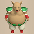 Porky</td>
      <td class="highlightGray"></td>
      <td class="highlightGray"></td>
    </tr>
    <tr>
      <td colspan="9" class="tableDivider"></td>
    </tr>
    <tr>
      <td rowspan="3" class="centeredText">7</td>
      <td rowspan="3" class=""></td>
      <td rowspan="3" class=""></td>
      <td rowspan="3" class=""></td>
      <td> Twisty Hani</td>
      <td class="stats"> Scorpion</td>
      <td> Tree Ninja D</td>
      <td> Earth Ninja D</td>
      <td class="items"> Fire Ninja D</td>
    </tr>
    <tr>
      <td class="items"> Water Ninja D</td>
      <td> Metal Ninja D</td>
      <td> Hoppin' Hitter</td>
      <td> Masked Samurai</td>
      <td> Fresh Octopling</td>
    </tr>
    <tr>
      <td> Soldier Ant</td>
      <td> Cave Mamel</td>
      <td> Porky</td>
      <td class="highlightGray"></td>
      <td class="highlightGray"></td>
    </tr>
    <tr>
      <td colspan="9" class="tableDivider"></td>
    </tr>
    <tr>
      <td rowspan="3" class="centeredText">8</td>
      <td rowspan="3" class=""></td>
      <td rowspan="3" class=""></td>
      <td rowspan="3" class=""></td>
      <td> Twisty Hani</td>
      <td> Earth Ninja D</td>
      <td class="items"> Fire Ninja D</td>
      <td class="items"> Water Ninja D</td>
      <td> Metal Ninja D</td>
    </tr>
    <tr>
      <td> Hoppin' Hitter</td>
      <td> Mid Chintala</td>
      <td> Masked Samurai</td>
      <td> Fresh Octopling</td>
      <td> Soldier Ant</td>
    </tr>
    <tr>
      <td> Cave Mamel</td>
      <td> Porky</td>
      <td class="highlightGray"></td>
      <td class="highlightGray"></td>
      <td class="highlightGray"></td>
    </tr>
    <tr>
      <td colspan="9" class="tableDivider"></td>
    </tr>
    <tr>
      <td rowspan="3" class="centeredText">9</td>
      <td rowspan="3" class=""></td>
      <td rowspan="3" class=""></td>
      <td rowspan="3" class=""></td>
      <td> Twisty Hani</td>
      <td> Earth Ninja D</td>
      <td class="items"> Water Ninja D</td>
      <td> Metal Ninja D</td>
      <td> Hoppin' Hitter</td>
    </tr>
    <tr>
      <td> Mid Chintala</td>
      <td> Masked Samurai</td>
      <td> Fresh Octopling</td>
      <td> Soldier Ant</td>
      <td> Cave Mamel</td>
    </tr>
    <tr>
      <td> Porky</td>
      <td class="highlightGray"></td>
      <td class="highlightGray"></td>
      <td class="highlightGray"></td>
      <td class="highlightGray"></td>
    </tr>
    <tr>
      <td colspan="9" class="tableDivider"></td>
    </tr>
    <tr>
      <td rowspan="3" class="centeredText">10</td>
      <td rowspan="3" class=""></td>
      <td rowspan="3" class=""></td>
      <td rowspan="3" class=""></td>
      <td> Twisty Hani</td>
      <td> Mid Chintala</td>
      <td> Bored Kappa</td>
      <td> Bowboy</td>
      <td> Crossbowboy</td>
    </tr>
    <tr>
      <td> Masked Samurai</td>
      <td> Fresh Octopling</td>
      <td> Lt. Spearfish</td>
      <td> Floor Dragon</td>
      <td> Soldier Ant</td>
    </tr>
    <tr>
      <td class="useful"> Mixer</td>
      <td> Cave Mamel</td>
      <td class="highlightGray"></td>
      <td class="highlightGray"></td>
      <td class="highlightGray"></td>
    </tr>
    <tr>
      <td colspan="9" class="tableDivider"></td>
    </tr>
    <tr>
      <td rowspan="2" class="centeredText">11</td>
      <td rowspan="2" class=""></td>
      <td rowspan="2" class=""></td>
      <td rowspan="2" class=""></td>
      <td> Bored Kappa</td>
      <td> Bowboy</td>
      <td> Crossbowboy</td>
      <td> Masked Samurai</td>
      <td> Fresh Octopling</td>
    </tr>
    <tr>
      <td> Lt. Spearfish</td>
      <td> Floor Dragon</td>
      <td class="useful"> Mixer</td>
      <td> Cave Mamel</td>
      <td class="highlightGray"></td>
    </tr>
    <tr>
      <td colspan="9" class="tableDivider"></td>
    </tr>
    <tr>
      <td rowspan="2" class="centeredText">12</td>
      <td rowspan="2" class=""></td>
      <td rowspan="2" class=""></td>
      <td rowspan="2" class=""></td>
      <td> Bored Kappa</td>
      <td> Crossbowboy</td>
      <td> Masked Samurai</td>
      <td> Fresh Octopling</td>
      <td class="items"> Mudkin</td>
    </tr>
    <tr>
      <td> Floor Dragon</td>
      <td class="useful"> Mixer</td>
      <td> Cave Mamel</td>
      <td class="highlightGray"></td>
      <td class="highlightGray"></td>
    </tr>
    <tr>
      <td colspan="9" class="tableDivider"></td>
    </tr>
    <tr>
      <td rowspan="2" class="centeredText">13</td>
      <td rowspan="2" class=""></td>
      <td rowspan="2" class=""></td>
      <td rowspan="2" class=""></td>
      <td> Fresh Octopling</td>
      <td class="items"> Mudkin</td>
      <td> Lt. Spearfish</td>
      <td> Floor Dragon</td>
      <td> Metalhead</td>
    </tr>
    <tr>
      <td>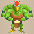 Master Hen</td>
      <td> Tiger Thrower</td>
      <td class="useful"> Mixer</td>
      <td> Cave Mamel</td>
      <td class="highlightGray"></td>
    </tr>
    <tr>
      <td colspan="9" class="tableDivider"></td>
    </tr>
    <tr>
      <td rowspan="2" class="centeredText">14</td>
      <td rowspan="2" class=""></td>
      <td rowspan="2" class=""></td>
      <td rowspan="2" class=""></td>
      <td class="items"> Mudkin</td>
      <td> Lt. Spearfish</td>
      <td> Floor Dragon</td>
      <td> Metalhead</td>
      <td> Master Hen</td>
    </tr>
    <tr>
      <td> Tiger Thrower</td>
      <td class="useful"> Mixer</td>
      <td> Cave Mamel</td>
      <td class="highlightGray"></td>
      <td class="highlightGray"></td>
    </tr>
    <tr>
      <td colspan="9" class="tableDivider"></td>
    </tr>
    <tr>
      <td rowspan="2" class="centeredText">15</td>
      <td rowspan="2" class=""></td>
      <td rowspan="2" class=""></td>
      <td rowspan="2" class=""></td>
      <td class="items"> Mudkin</td>
      <td> Floor Dragon</td>
      <td> Metalhead</td>
      <td> Master Hen</td>
      <td> Tiger Thrower</td>
    </tr>
    <tr>
      <td class="useful"> Mixer</td>
      <td> Cave Mamel</td>
      <td> Chow</td>
      <td class="highlightGray"></td>
      <td class="highlightGray"></td>
    </tr>
    <tr>
      <td colspan="9" class="tableDivider"></td>
    </tr>
    <tr>
      <td rowspan="3" class="centeredText">16</td>
      <td rowspan="3" class=""></td>
      <td rowspan="3" class=""></td>
      <td rowspan="3" class=""></td>
      <td class="items"> Mudkin</td>
      <td> Master Hen</td>
      <td>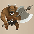 Minotaur</td>
      <td>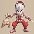 Kitsune Monk D</td>
      <td> Okina Monk D</td>
    </tr>
    <tr>
      <td> Okame Monk D</td>
      <td class="farming"> Thiefwalrus</td>
      <td>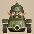 Pop Tank</td>
      <td> Egg Thing</td>
      <td>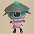 Hat Prankster</td>
    </tr>
    <tr>
      <td class="stats"> Ghost Radish</td>
      <td class="useful"> Mixer</td>
      <td> Cave Mamel</td>
      <td> Chow</td>
      <td class="highlightGray"></td>
    </tr>
    <tr>
      <td colspan="9" class="tableDivider"></td>
    </tr>
    <tr>
      <td rowspan="3" class="centeredText">17</td>
      <td rowspan="3" class=""></td>
      <td rowspan="3" class=""></td>
      <td rowspan="3" class=""></td>
      <td class="items"> Mudkin</td>
      <td> Master Hen</td>
      <td> Minotaur</td>
      <td> Kitsune Monk D</td>
      <td> Okina Monk D</td>
    </tr>
    <tr>
      <td> Okame Monk D</td>
      <td class="farming"> Thiefwalrus</td>
      <td> Zapdon</td>
      <td> Pop Tank</td>
      <td> Egg Thing</td>
    </tr>
    <tr>
      <td> Hat Prankster</td>
      <td class="stats"> Ghost Radish</td>
      <td class="useful"> Mixer</td>
      <td> Cave Mamel</td>
      <td> Chow</td>
    </tr>
    <tr>
      <td colspan="9" class="tableDivider"></td>
    </tr>
    <tr>
      <td rowspan="3" class="centeredText">18</td>
      <td rowspan="3" class=""></td>
      <td rowspan="3" class=""></td>
      <td rowspan="3" class=""></td>
      <td> Master Hen</td>
      <td> Minotaur</td>
      <td> Kitsune Monk D</td>
      <td> Okina Monk D</td>
      <td> Okame Monk D</td>
    </tr>
    <tr>
      <td> Tengu Monk D</td>
      <td> Hannya Monk D</td>
      <td class="farming"> Thiefwalrus</td>
      <td> Zapdon</td>
      <td> Pop Tank</td>
    </tr>
    <tr>
      <td> Flamepuff</td>
      <td> N'dubba</td>
      <td class="useful"> Mixer</td>
      <td> Cave Mamel</td>
      <td> Chow</td>
    </tr>
    <tr>
      <td colspan="9" class="tableDivider"></td>
    </tr>
    <tr>
      <td rowspan="3" class="centeredText">19</td>
      <td rowspan="3" class=""></td>
      <td rowspan="3" class=""></td>
      <td rowspan="3" class=""></td>
      <td> Okame Monk D</td>
      <td> Tengu Monk D</td>
      <td> Hannya Monk D</td>
      <td class="farming"> Thiefwalrus</td>
      <td> Zapdon</td>
    </tr>
    <tr>
      <td> Flamepuff</td>
      <td> N'dubba</td>
      <td> Skull Wizard</td>
      <td class="useful"> Mixer</td>
      <td> Cave Mamel</td>
    </tr>
    <tr>
      <td> Chow</td>
      <td class="highlightGray"></td>
      <td class="highlightGray"></td>
      <td class="highlightGray"></td>
      <td class="highlightGray"></td>
    </tr>
    <tr>
      <td colspan="9" class="tableDivider"></td>
    </tr>
    <tr>
      <td rowspan="3" class="centeredText">20</td>
      <td rowspan="3" class=""></td>
      <td rowspan="3" class=""></td>
      <td rowspan="3" class=""></td>
      <td> Zapdon</td>
      <td> Flamepuff</td>
      <td> N'dubba</td>
      <td> Tree Ninja C</td>
      <td> Earth Ninja C</td>
    </tr>
    <tr>
      <td class="items"> Fire Ninja C</td>
      <td> Explochin</td>
      <td> Skull Wizard</td>
      <td class="useful"> Mixer</td>
      <td> Cave Mamel</td>
    </tr>
    <tr>
      <td> Running Egg</td>
      <td> Chow</td>
      <td class="highlightGray"></td>
      <td class="highlightGray"></td>
      <td class="highlightGray"></td>
    </tr>
    <tr>
      <td colspan="9" class="tableDivider"></td>
    </tr>
    <tr>
      <td rowspan="3" class="centeredText">21</td>
      <td rowspan="3" class=""></td>
      <td rowspan="3" class=""></td>
      <td rowspan="3" class=""></td>
      <td> N'dubba</td>
      <td> Tree Ninja C</td>
      <td> Earth Ninja C</td>
      <td class="items"> Fire Ninja C</td>
      <td> Explochin</td>
    </tr>
    <tr>
      <td>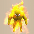 Blazeous</td>
      <td> Skull Wizard</td>
      <td class="useful"> Mixer</td>
      <td> Cave Mamel</td>
      <td> Running Egg</td>
    </tr>
    <tr>
      <td> Chow</td>
      <td class="highlightGray"></td>
      <td class="highlightGray"></td>
      <td class="highlightGray"></td>
      <td class="highlightGray"></td>
    </tr>
    <tr>
      <td colspan="9" class="tableDivider"></td>
    </tr>
    <tr>
      <td rowspan="3" class="centeredText">22</td>
      <td rowspan="3" class=""></td>
      <td rowspan="3" class=""></td>
      <td rowspan="3" class=""></td>
      <td class="items"> Fire Ninja C</td>
      <td> Metal Ninja C</td>
      <td class="items"> Water Ninja C</td>
      <td> Explochin</td>
      <td> Blazeous</td>
    </tr>
    <tr>
      <td> Skull Mage</td>
      <td> Super Gazer</td>
      <td class="useful"> Mixer</td>
      <td> Cave Mamel</td>
      <td> Running Egg</td>
    </tr>
    <tr>
      <td> Chow</td>
      <td class="highlightGray"></td>
      <td class="highlightGray"></td>
      <td class="highlightGray"></td>
      <td class="highlightGray"></td>
    </tr>
    <tr>
      <td colspan="9" class="tableDivider"></td>
    </tr>
    <tr>
      <td rowspan="2" class="centeredText">23</td>
      <td rowspan="2" class=""></td>
      <td rowspan="2" class=""></td>
      <td rowspan="2" class=""></td>
      <td class="items"> Fire Ninja C</td>
      <td> Metal Ninja C</td>
      <td class="items"> Water Ninja C</td>
      <td> Blazeous</td>
      <td> Skull Mage</td>
    </tr>
    <tr>
      <td> Super Gazer</td>
      <td class="useful"> Mixer</td>
      <td> Cave Mamel</td>
      <td> Running Egg</td>
      <td> Chow</td>
    </tr>
    <tr>
      <td colspan="9" class="tableDivider"></td>
    </tr>
    <tr>
      <td rowspan="3" class="centeredText">24</td>
      <td rowspan="3" class=""></td>
      <td rowspan="3" class=""></td>
      <td rowspan="3" class=""></td>
      <td> Super Gazer</td>
      <td> N'dulu</td>
      <td> Pesky Kappa</td>
      <td> Corporal Ant</td>
      <td>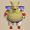 Porko</td>
    </tr>
    <tr>
      <td> Soldier Ant</td>
      <td>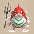 Capt. Spearfish</td>
      <td> Famed Octopling</td>
      <td> Dartingfrog</td>
      <td class="useful"> Mixer</td>
    </tr>
    <tr>
      <td> Cave Mamel</td>
      <td> Running Egg</td>
      <td> Chow</td>
      <td class="highlightGray"></td>
      <td class="highlightGray"></td>
    </tr>
    <tr>
      <td colspan="9" class="tableDivider"></td>
    </tr>
    <tr>
      <td rowspan="3" class="centeredText">25</td>
      <td rowspan="3" class=""></td>
      <td rowspan="3" class=""></td>
      <td rowspan="3" class=""></td>
      <td> N'dulu</td>
      <td> Pesky Kappa</td>
      <td> Corporal Ant</td>
      <td> Porko</td>
      <td> Soldier Ant</td>
    </tr>
    <tr>
      <td> Capt. Spearfish</td>
      <td> Famed Octopling</td>
      <td class="farming"> Greenwalrus</td>
      <td> Dartingfrog</td>
      <td class="useful"> Mixer</td>
    </tr>
    <tr>
      <td> Cave Mamel</td>
      <td> Running Egg</td>
      <td> Chow</td>
      <td> Dark Owl</td>
      <td class="highlightGray"></td>
    </tr>
    <tr>
      <td colspan="9" class="tableDivider"></td>
    </tr>
    <tr>
      <td rowspan="3" class="centeredText">26</td>
      <td rowspan="3" class=""></td>
      <td rowspan="3" class=""></td>
      <td rowspan="3" class=""></td>
      <td> N'dulu</td>
      <td> Pesky Kappa</td>
      <td> Corporal Ant</td>
      <td> Porko</td>
      <td class="stats"> Daze Radish</td>
    </tr>
    <tr>
      <td class="farming"> Greenwalrus</td>
      <td> Dartingfrog</td>
      <td class="useful"> Mixer</td>
      <td> Cave Mamel</td>
      <td> Running Egg</td>
    </tr>
    <tr>
      <td> Chow</td>
      <td> Dark Owl</td>
      <td class="highlightGray"></td>
      <td class="highlightGray"></td>
      <td class="highlightGray"></td>
    </tr>
    <tr>
      <td colspan="9" class="tableDivider"></td>
    </tr>
    <tr>
      <td rowspan="3" class="centeredText">27</td>
      <td rowspan="3" class=""></td>
      <td rowspan="3" class=""></td>
      <td rowspan="3" class=""></td>
      <td> N'dulu</td>
      <td> Pesky Kappa</td>
      <td> Corporal Ant</td>
      <td> Porko</td>
      <td class="stats"> Daze Radish</td>
    </tr>
    <tr>
      <td> Dragon</td>
      <td class="farming"> Greenwalrus</td>
      <td> Dartingfrog</td>
      <td class="useful"> Mixer</td>
      <td> Cave Mamel</td>
    </tr>
    <tr>
      <td> Running Egg</td>
      <td> Chow</td>
      <td> Dark Owl</td>
      <td class="highlightGray"></td>
      <td class="highlightGray"></td>
    </tr>
    <tr>
      <td colspan="9" class="tableDivider"></td>
    </tr>
    <tr>
      <td rowspan="3" class="centeredText">28</td>
      <td rowspan="3" class=""></td>
      <td rowspan="3" class=""></td>
      <td rowspan="3" class=""></td>
      <td> N'dulu</td>
      <td class="stats"> Daze Radish</td>
      <td> Dragon</td>
      <td>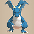 Sky Dragon</td>
      <td class="farming"> Greenwalrus</td>
    </tr>
    <tr>
      <td> Dartingfrog</td>
      <td class="useful"> Mixer</td>
      <td> Cave Mamel</td>
      <td> Running Egg</td>
      <td> Chow</td>
    </tr>
    <tr>
      <td> Dark Owl</td>
      <td class="highlightGray"></td>
      <td class="highlightGray"></td>
      <td class="highlightGray"></td>
      <td class="highlightGray"></td>
    </tr>
    <tr>
      <td colspan="9" class="tableDivider"></td>
    </tr>
    <tr>
      <td rowspan="2" class="centeredText">29</td>
      <td rowspan="2" class=""></td>
      <td rowspan="2" class=""></td>
      <td rowspan="2" class=""></td>
      <td class="stats"> Daze Radish</td>
      <td> Baby Tank</td>
      <td> Dragon</td>
      <td> Sky Dragon</td>
      <td class="farming"> Greenwalrus</td>
    </tr>
    <tr>
      <td class="useful"> Mixer</td>
      <td> Cave Mamel</td>
      <td> Running Egg</td>
      <td> Chow</td>
      <td> Dark Owl</td>
    </tr>
    <tr>
      <td colspan="9" class="tableDivider"></td>
    </tr>
    <tr>
      <td rowspan="2" class="centeredText">30</td>
      <td rowspan="2" class=""></td>
      <td rowspan="2" class=""></td>
      <td rowspan="2" class=""></td>
      <td> Baby Tank</td>
      <td class="stats"> Vile Scorpion</td>
      <td> Hoppin' Slugger</td>
      <td> Dragon</td>
      <td> Sky Dragon</td>
    </tr>
    <tr>
      <td> Cave Mamel</td>
      <td> Chow</td>
      <td> Dark Owl</td>
      <td class="highlightGray"></td>
      <td class="highlightGray"></td>
    </tr>
    <tr>
      <td colspan="9" class="tableDivider"></td>
    </tr>
    <tr>
      <td rowspan="2" class="centeredText">31</td>
      <td rowspan="2" class=""></td>
      <td rowspan="2" class=""></td>
      <td rowspan="2" class=""></td>
      <td> Baby Tank</td>
      <td class="stats"> Vile Scorpion</td>
      <td> Hoppin' Slugger</td>
      <td> Sky Dragon</td>
      <td> Cave Mamel</td>
    </tr>
    <tr>
      <td> Raging Samurai</td>
      <td> Chow</td>
      <td> Dark Owl</td>
      <td class="highlightGray"></td>
      <td class="highlightGray"></td>
    </tr>
    <tr>
      <td colspan="9" class="tableDivider"></td>
    </tr>
    <tr>
      <td rowspan="2" class="centeredText">32</td>
      <td rowspan="2" class=""></td>
      <td rowspan="2" class=""></td>
      <td rowspan="2" class=""></td>
      <td> Baby Tank</td>
      <td class="stats"> Vile Scorpion</td>
      <td> Hoppin' Slugger</td>
      <td> Sky Dragon</td>
      <td> Cave Mamel</td>
    </tr>
    <tr>
      <td> Raging Samurai</td>
      <td> Chow</td>
      <td> Dark Owl</td>
      <td class="highlightGray"></td>
      <td class="highlightGray"></td>
    </tr>
    <tr>
      <td colspan="9" class="tableDivider"></td>
    </tr>
    <tr>
      <td rowspan="2" class="centeredText">33</td>
      <td rowspan="2" class=""></td>
      <td rowspan="2" class=""></td>
      <td rowspan="2" class=""></td>
      <td class="stats"> Polygon Singa</td>
      <td> Floppy Hani</td>
      <td> Soul Reaper</td>
      <td> Pumplich</td>
      <td> Cave Mamel</td>
    </tr>
    <tr>
      <td> Raging Samurai</td>
      <td> Chow</td>
      <td> Dark Owl</td>
      <td class="highlightGray"></td>
      <td class="highlightGray"></td>
    </tr>
    <tr>
      <td colspan="9" class="tableDivider"></td>
    </tr>
    <tr>
      <td rowspan="2" class="centeredText">34</td>
      <td rowspan="2" class=""></td>
      <td rowspan="2" class=""></td>
      <td rowspan="2" class=""></td>
      <td class="stats"> Polygon Singa</td>
      <td> Floppy Hani</td>
      <td> Soul Reaper</td>
      <td> Pumplich</td>
      <td> Cave Mamel</td>
    </tr>
    <tr>
      <td> Raging Samurai</td>
      <td> Chow</td>
      <td> Dark Owl</td>
      <td class="highlightGray"></td>
      <td class="highlightGray"></td>
    </tr>
    <tr>
      <td colspan="9" class="tableDivider"></td>
    </tr>
    <tr>
      <td rowspan="2" class="centeredText">35</td>
      <td rowspan="2" class=""></td>
      <td rowspan="2" class=""></td>
      <td rowspan="2" class=""></td>
      <td class="stats"> Polygon Singa</td>
      <td> Floppy Hani</td>
      <td> Soul Reaper</td>
      <td> Pumplich</td>
      <td> Cave Mamel</td>
    </tr>
    <tr>
      <td> Raging Samurai</td>
      <td> Chow</td>
      <td> Dark Owl</td>
      <td class="highlightGray"></td>
      <td class="highlightGray"></td>
    </tr>
    <tr>
      <td colspan="9" class="tableDivider"></td>
    </tr>
    <tr>
      <td rowspan="2" class="centeredText">36</td>
      <td rowspan="2" class=""></td>
      <td rowspan="2" class=""></td>
      <td rowspan="2" class=""></td>
      <td class="stats"> Polygon Singa</td>
      <td> Floppy Hani</td>
      <td> Soul Reaper</td>
      <td> Pumplich</td>
      <td> Cave Mamel</td>
    </tr>
    <tr>
      <td> Chow</td>
      <td> Dark Owl</td>
      <td class="highlightGray"></td>
      <td class="highlightGray"></td>
      <td class="highlightGray"></td>
    </tr>
    <tr>
      <td colspan="9" class="tableDivider"></td>
    </tr>
    <tr>
      <td rowspan="2" class="centeredText">37</td>
      <td rowspan="2" class=""></td>
      <td rowspan="2" class=""></td>
      <td rowspan="2" class=""></td>
      <td class="stats"> Polygon Singa</td>
      <td> Floppy Hani</td>
      <td> Soul Reaper</td>
      <td> Pumplich</td>
      <td> Cave Mamel</td>
    </tr>
    <tr>
      <td> Chow</td>
      <td> Dark Owl</td>
      <td class="highlightGray"></td>
      <td class="highlightGray"></td>
      <td class="highlightGray"></td>
    </tr>
    <tr>
      <td colspan="9" class="tableDivider"></td>
    </tr>
    <tr>
      <td rowspan="2" class="centeredText">38</td>
      <td rowspan="2" class=""></td>
      <td rowspan="2" class=""></td>
      <td rowspan="2" class=""></td>
      <td class="stats"> Polygon Singa</td>
      <td> Floppy Hani</td>
      <td> Soul Reaper</td>
      <td> Pumplich</td>
      <td> Cave Mamel</td>
    </tr>
    <tr>
      <td> Chow</td>
      <td> Dark Owl</td>
      <td class="highlightGray"></td>
      <td class="highlightGray"></td>
      <td class="highlightGray"></td>
    </tr>
    <tr>
      <td colspan="9" class="tableDivider"></td>
    </tr>
    <tr>
      <td rowspan="2" class="centeredText">39</td>
      <td rowspan="2" class=""></td>
      <td rowspan="2" class=""></td>
      <td rowspan="2" class=""></td>
      <td class="stats"> Polygon Singa</td>
      <td> Floppy Hani</td>
      <td> Soul Reaper</td>
      <td> Pumplich</td>
      <td> Cave Mamel</td>
    </tr>
    <tr>
      <td> Chow</td>
      <td> Dark Owl</td>
      <td class="highlightGray"></td>
      <td class="highlightGray"></td>
      <td class="highlightGray"></td>
    </tr>
    <tr>
      <td colspan="9" class="tableDivider"></td>
    </tr>
    <tr>
      <td rowspan="2" class="centeredText">40</td>
      <td rowspan="2" class=""></td>
      <td rowspan="2" class=""></td>
      <td rowspan="2" class=""></td>
      <td>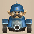 Ornery Tank</td>
      <td class="danger"> Adamant Tank</td>
      <td> Cave Mamel</td>
      <td class="useful"> Mixermon</td>
      <td class="farming"> Chow</td>
    </tr>
    <tr>
      <td> Dark Owl</td>
      <td class="highlightGray"></td>
      <td class="highlightGray"></td>
      <td class="highlightGray"></td>
      <td class="highlightGray"></td>
    </tr>
    <tr>
      <td colspan="9" class="tableDivider"></td>
    </tr>
    <tr>
      <td rowspan="2" class="centeredText">41</td>
      <td rowspan="2" class=""></td>
      <td rowspan="2" class=""></td>
      <td rowspan="2" class=""></td>
      <td> Ornery Tank</td>
      <td class="danger"> Adamant Tank</td>
      <td> Cave Mamel</td>
      <td class="useful"> Mixermon</td>
      <td class="farming"> Chow</td>
    </tr>
    <tr>
      <td> Dark Owl</td>
      <td class="highlightGray"></td>
      <td class="highlightGray"></td>
      <td class="highlightGray"></td>
      <td class="highlightGray"></td>
    </tr>
    <tr>
      <td colspan="9" class="tableDivider"></td>
    </tr>
    <tr>
      <td rowspan="2" class="centeredText">42</td>
      <td rowspan="2" class=""></td>
      <td rowspan="2" class=""></td>
      <td rowspan="2" class=""></td>
      <td> Ornery Tank</td>
      <td class="danger"> Adamant Tank</td>
      <td class="danger"> Steadfast Tank</td>
      <td> Blazepuff</td>
      <td> Cave Mamel</td>
    </tr>
    <tr>
      <td class="useful"> Mixermon</td>
      <td> Chow</td>
      <td> Dark Owl</td>
      <td class="highlightGray"></td>
      <td class="highlightGray"></td>
    </tr>
    <tr>
      <td colspan="9" class="tableDivider"></td>
    </tr>
    <tr>
      <td rowspan="2" class="centeredText">43</td>
      <td rowspan="2" class=""></td>
      <td rowspan="2" class=""></td>
      <td rowspan="2" class=""></td>
      <td> Ornery Tank</td>
      <td class="danger"> Adamant Tank</td>
      <td class="danger"> Steadfast Tank</td>
      <td> Blazepuff</td>
      <td> Cave Mamel</td>
    </tr>
    <tr>
      <td> Igneous</td>
      <td class="useful"> Mixermon</td>
      <td> Chow</td>
      <td> Dark Owl</td>
      <td class="highlightGray"></td>
    </tr>
    <tr>
      <td colspan="9" class="tableDivider"></td>
    </tr>
    <tr>
      <td rowspan="2" class="centeredText">44</td>
      <td rowspan="2" class=""></td>
      <td rowspan="2" class=""></td>
      <td rowspan="2" class=""></td>
      <td> Ornery Tank</td>
      <td class="danger"> Adamant Tank</td>
      <td class="danger"> Steadfast Tank</td>
      <td> Blazepuff</td>
      <td> Dragon Pit</td>
    </tr>
    <tr>
      <td> Cave Mamel</td>
      <td> Igneous</td>
      <td class="useful"> Mixermon</td>
      <td> Chow</td>
      <td> Dark Owl</td>
    </tr>
    <tr>
      <td colspan="9" class="tableDivider"></td>
    </tr>
    <tr>
      <td rowspan="2" class="centeredText">45</td>
      <td rowspan="2" class=""></td>
      <td rowspan="2" class=""></td>
      <td rowspan="2" class=""></td>
      <td class="danger"> Steadfast Tank</td>
      <td> Blazepuff</td>
      <td> Dragon Pit</td>
      <td> Cave Mamel</td>
      <td> Igneous</td>
    </tr>
    <tr>
      <td class="useful"> Mixermon</td>
      <td> Chow</td>
      <td> Dark Owl</td>
      <td class="highlightGray"></td>
      <td class="highlightGray"></td>
    </tr>
    <tr>
      <td colspan="9" class="tableDivider"></td>
    </tr>
    <tr>
      <td rowspan="2" class="centeredText">46</td>
      <td rowspan="2" class=""></td>
      <td rowspan="2" class=""></td>
      <td rowspan="2" class=""></td>
      <td class="danger"> Steadfast Tank</td>
      <td> Blazepuff</td>
      <td> Dragon Pit</td>
      <td> Cave Mamel</td>
      <td> Igneous</td>
    </tr>
    <tr>
      <td class="useful"> Mixermon</td>
      <td> Chow</td>
      <td> Dark Owl</td>
      <td class="highlightGray"></td>
      <td class="highlightGray"></td>
    </tr>
    <tr>
      <td colspan="9" class="tableDivider"></td>
    </tr>
    <tr>
      <td rowspan="3" class="centeredText">47</td>
      <td rowspan="3" class=""></td>
      <td rowspan="3" class=""></td>
      <td rowspan="3" class=""></td>
      <td class="danger"> Steadfast Tank</td>
      <td> Blazepuff</td>
      <td> Dragon Pit</td>
      <td> Cave Mamel</td>
      <td> Igneous</td>
    </tr>
    <tr>
      <td class="items"> Mudster</td>
      <td class="items"> Mudder</td>
      <td>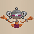 N'dama</td>
      <td> Lashagga</td>
      <td class="useful"> Mixermon</td>
    </tr>
    <tr>
      <td> Chow</td>
      <td> Dark Owl</td>
      <td class="highlightGray"></td>
      <td class="highlightGray"></td>
      <td class="highlightGray"></td>
    </tr>
    <tr>
      <td colspan="9" class="tableDivider"></td>
    </tr>
    <tr>
      <td rowspan="3" class="centeredText">48</td>
      <td rowspan="3" class=""></td>
      <td rowspan="3" class=""></td>
      <td rowspan="3" class=""></td>
      <td class="danger"> Steadfast Tank</td>
      <td> Blazepuff</td>
      <td> Dragon Pit</td>
      <td> Cave Mamel</td>
      <td> Igneous</td>
    </tr>
    <tr>
      <td class="items"> Mudster</td>
      <td class="items"> Mudder</td>
      <td> N'dama</td>
      <td> Lashagga</td>
      <td class="useful"> Mixermon</td>
    </tr>
    <tr>
      <td> Chow</td>
      <td> Dark Owl</td>
      <td class="highlightGray"></td>
      <td class="highlightGray"></td>
      <td class="highlightGray"></td>
    </tr>
    <tr>
      <td colspan="9" class="tableDivider"></td>
    </tr>
    <tr>
      <td rowspan="3" class="centeredText">49</td>
      <td rowspan="3" class=""></td>
      <td rowspan="3" class=""></td>
      <td rowspan="3" class=""></td>
      <td class="danger"> Steadfast Tank</td>
      <td> Blazepuff</td>
      <td> Dragon Pit</td>
      <td> Cave Mamel</td>
      <td> Igneous</td>
    </tr>
    <tr>
      <td class="items"> Mudster</td>
      <td class="items"> Mudder</td>
      <td> N'dama</td>
      <td> Lashagga</td>
      <td class="useful"> Mixermon</td>
    </tr>
    <tr>
      <td> Chow</td>
      <td> Dark Owl</td>
      <td class="highlightGray"></td>
      <td class="highlightGray"></td>
      <td class="highlightGray"></td>
    </tr>
    <tr>
      <td colspan="9" class="tableDivider"></td>
    </tr>
    <tr>
      <td rowspan="3" class="centeredText">50</td>
      <td rowspan="3" class=""></td>
      <td rowspan="3" class=""></td>
      <td rowspan="3" class=""></td>
      <td> Dragon Pit</td>
      <td> Cave Mamel</td>
      <td class="stats"> Terror Scorpion</td>
      <td> Hoppin' Slammer</td>
      <td class="items"> Mudster</td>
    </tr>
    <tr>
      <td class="items"> Mudder</td>
      <td> N'dama</td>
      <td> Lashagga</td>
      <td> Mixergon</td>
      <td> Chow</td>
    </tr>
    <tr>
      <td> Dark Owl</td>
      <td class="highlightGray"></td>
      <td class="highlightGray"></td>
      <td class="highlightGray"></td>
      <td class="highlightGray"></td>
    </tr>
    <tr>
      <td colspan="9" class="tableDivider"></td>
    </tr>
    <tr>
      <td rowspan="3" class="centeredText">51</td>
      <td rowspan="3" class=""></td>
      <td rowspan="3" class=""></td>
      <td rowspan="3" class=""></td>
      <td> Cave Mamel</td>
      <td> Hannya Monk B</td>
      <td> Okame Monk B</td>
      <td> Tengu Monk B</td>
      <td> Kitsune Monk B</td>
    </tr>
    <tr>
      <td> Okina Monk B</td>
      <td class="stats"> Terror Scorpion</td>
      <td> Hoppin' Slammer</td>
      <td class="items"> Mudster</td>
      <td class="items"> Mudder</td>
    </tr>
    <tr>
      <td> N'dama</td>
      <td> Lashagga</td>
      <td> Mixergon</td>
      <td> Chow</td>
      <td> Dark Owl</td>
    </tr>
    <tr>
      <td colspan="9" class="tableDivider"></td>
    </tr>
    <tr>
      <td rowspan="3" class="centeredText">52</td>
      <td rowspan="3" class=""></td>
      <td rowspan="3" class=""></td>
      <td rowspan="3" class=""></td>
      <td> Cave Mamel</td>
      <td> Hannya Monk B</td>
      <td> Okame Monk B</td>
      <td> Tengu Monk B</td>
      <td> Kitsune Monk B</td>
    </tr>
    <tr>
      <td> Okina Monk B</td>
      <td class="stats"> Terror Scorpion</td>
      <td> Hoppin' Slammer</td>
      <td class="items"> Mudster</td>
      <td class="items"> Mudder</td>
    </tr>
    <tr>
      <td> N'dama</td>
      <td> Lashagga</td>
      <td> Mixergon</td>
      <td> Chow</td>
      <td> Dark Owl</td>
    </tr>
    <tr>
      <td colspan="9" class="tableDivider"></td>
    </tr>
    <tr>
      <td rowspan="3" class="centeredText">53</td>
      <td rowspan="3" class=""></td>
      <td rowspan="3" class=""></td>
      <td rowspan="3" class=""></td>
      <td> Cave Mamel</td>
      <td> Hannya Monk B</td>
      <td> Okame Monk B</td>
      <td> Tengu Monk B</td>
      <td> Kitsune Monk B</td>
    </tr>
    <tr>
      <td> Okina Monk B</td>
      <td class="stats"> Terror Scorpion</td>
      <td> Hoppin' Slammer</td>
      <td class="items"> Mudster</td>
      <td class="items"> Mudder</td>
    </tr>
    <tr>
      <td> N'dama</td>
      <td> Lashagga</td>
      <td> Mixergon</td>
      <td> Chow</td>
      <td> Dark Owl</td>
    </tr>
    <tr>
      <td colspan="9" class="tableDivider"></td>
    </tr>
    <tr>
      <td rowspan="3" class="centeredText">54</td>
      <td rowspan="3" class=""></td>
      <td rowspan="3" class=""></td>
      <td rowspan="3" class=""></td>
      <td> Cave Mamel</td>
      <td> Hannya Monk B</td>
      <td> Okame Monk B</td>
      <td> Tengu Monk B</td>
      <td> Kitsune Monk B</td>
    </tr>
    <tr>
      <td> Okina Monk B</td>
      <td class="stats"> Terror Scorpion</td>
      <td> Hoppin' Slammer</td>
      <td class="items"> Mudster</td>
      <td class="items"> Mudder</td>
    </tr>
    <tr>
      <td> N'dama</td>
      <td> Lashagga</td>
      <td> Mixergon</td>
      <td> Chow</td>
      <td> Dark Owl</td>
    </tr>
    <tr>
      <td colspan="9" class="tableDivider"></td>
    </tr>
    <tr>
      <td rowspan="4" class="centeredText">55</td>
      <td rowspan="4" class=""></td>
      <td rowspan="4" class=""></td>
      <td rowspan="4" class=""></td>
      <td> Cave Mamel</td>
      <td> Hannya Monk B</td>
      <td> Okame Monk B</td>
      <td> Tengu Monk B</td>
      <td> Kitsune Monk B</td>
    </tr>
    <tr>
      <td> Okina Monk B</td>
      <td class="stats"> Terror Scorpion</td>
      <td> Hoppin' Slammer</td>
      <td> N'dama</td>
      <td> Admiral Spearfish</td>
    </tr>
    <tr>
      <td> Superb Octopling</td>
      <td>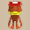 Vexing Kappa</td>
      <td class="farming"> Ironwalrus</td>
      <td> Fleefrog</td>
      <td> Mixergon</td>
    </tr>
    <tr>
      <td> Chow</td>
      <td> Dark Owl</td>
      <td class="highlightGray"></td>
      <td class="highlightGray"></td>
      <td class="highlightGray"></td>
    </tr>
    <tr>
      <td colspan="9" class="tableDivider"></td>
    </tr>
    <tr>
      <td rowspan="4" class="centeredText">56</td>
      <td rowspan="4" class=""></td>
      <td rowspan="4" class=""></td>
      <td rowspan="4" class=""></td>
      <td> Cave Mamel</td>
      <td> Hannya Monk B</td>
      <td> Okame Monk B</td>
      <td> Tengu Monk B</td>
      <td> Kitsune Monk B</td>
    </tr>
    <tr>
      <td> Okina Monk B</td>
      <td class="stats"> Terror Scorpion</td>
      <td> Hoppin' Slammer</td>
      <td> N'dama</td>
      <td> Admiral Spearfish</td>
    </tr>
    <tr>
      <td> Superb Octopling</td>
      <td> Vexing Kappa</td>
      <td class="farming"> Ironwalrus</td>
      <td> Fleefrog</td>
      <td> Mixergon</td>
    </tr>
    <tr>
      <td> Chow</td>
      <td> Dark Owl</td>
      <td class="highlightGray"></td>
      <td class="highlightGray"></td>
      <td class="highlightGray"></td>
    </tr>
    <tr>
      <td colspan="9" class="tableDivider"></td>
    </tr>
    <tr>
      <td rowspan="4" class="centeredText">57</td>
      <td rowspan="4" class=""></td>
      <td rowspan="4" class=""></td>
      <td rowspan="4" class=""></td>
      <td> Cave Mamel</td>
      <td> Hannya Monk B</td>
      <td> Okame Monk B</td>
      <td> Tengu Monk B</td>
      <td> Kitsune Monk B</td>
    </tr>
    <tr>
      <td> Okina Monk B</td>
      <td class="stats"> Terror Scorpion</td>
      <td> Hoppin' Slammer</td>
      <td> N'dama</td>
      <td> Admiral Spearfish</td>
    </tr>
    <tr>
      <td> Superb Octopling</td>
      <td> Vexing Kappa</td>
      <td class="farming"> Ironwalrus</td>
      <td> Fleefrog</td>
      <td> Mixergon</td>
    </tr>
    <tr>
      <td> Chow</td>
      <td> Dark Owl</td>
      <td class="highlightGray"></td>
      <td class="highlightGray"></td>
      <td class="highlightGray"></td>
    </tr>
    <tr>
      <td colspan="9" class="tableDivider"></td>
    </tr>
    <tr>
      <td rowspan="4" class="centeredText">58</td>
      <td rowspan="4" class=""></td>
      <td rowspan="4" class=""></td>
      <td rowspan="4" class=""></td>
      <td> Cave Mamel</td>
      <td> Hannya Monk B</td>
      <td> Okame Monk B</td>
      <td> Tengu Monk B</td>
      <td> Kitsune Monk B</td>
    </tr>
    <tr>
      <td> Okina Monk B</td>
      <td class="stats"> Terror Scorpion</td>
      <td> Hoppin' Slammer</td>
      <td> N'dama</td>
      <td> Admiral Spearfish</td>
    </tr>
    <tr>
      <td> Superb Octopling</td>
      <td> Vexing Kappa</td>
      <td class="farming"> Ironwalrus</td>
      <td> Fleefrog</td>
      <td> Mixergon</td>
    </tr>
    <tr>
      <td> Chow</td>
      <td> Dark Owl</td>
      <td class="highlightGray"></td>
      <td class="highlightGray"></td>
      <td class="highlightGray"></td>
    </tr>
    <tr>
      <td colspan="9" class="tableDivider"></td>
    </tr>
    <tr>
      <td rowspan="4" class="centeredText">59</td>
      <td rowspan="4" class=""></td>
      <td rowspan="4" class=""></td>
      <td rowspan="4" class=""></td>
      <td> Cave Mamel</td>
      <td> Hannya Monk B</td>
      <td> Okame Monk B</td>
      <td> Tengu Monk B</td>
      <td> Kitsune Monk B</td>
    </tr>
    <tr>
      <td> Okina Monk B</td>
      <td class="stats"> Terror Scorpion</td>
      <td> Hoppin' Slammer</td>
      <td> N'dama</td>
      <td> Admiral Spearfish</td>
    </tr>
    <tr>
      <td> Superb Octopling</td>
      <td> Vexing Kappa</td>
      <td class="farming"> Ironwalrus</td>
      <td> Fleefrog</td>
      <td> Mixergon</td>
    </tr>
    <tr>
      <td> Chow</td>
      <td> Dark Owl</td>
      <td class="highlightGray"></td>
      <td class="highlightGray"></td>
      <td class="highlightGray"></td>
    </tr>
    <tr>
      <td colspan="9" class="tableDivider"></td>
    </tr>
    <tr>
      <td rowspan="2" class="centeredText">60</td>
      <td rowspan="2" class=""></td>
      <td rowspan="2" class=""></td>
      <td rowspan="2" class=""></td>
      <td> Cave Mamel</td>
      <td class="items"> Curse Matron</td>
      <td class="danger"> Nigiri Boss</td>
      <td class="items">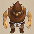 Bag Knave</td>
      <td class="items"> Hyper Gazer</td>
    </tr>
    <tr>
      <td> Hat Rascal</td>
      <td> Mixergon</td>
      <td>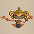 N'daloon</td>
      <td> Chow</td>
      <td> Dark Owl</td>
    </tr>
    <tr>
      <td colspan="9" class="tableDivider"></td>
    </tr>
    <tr>
      <td rowspan="2" class="centeredText">61</td>
      <td rowspan="2" class=""></td>
      <td rowspan="2" class=""></td>
      <td rowspan="2" class=""></td>
      <td> Cave Mamel</td>
      <td class="items"> Curse Matron</td>
      <td class="danger"> Nigiri Boss</td>
      <td class="items"> Bag Knave</td>
      <td class="items"> Hyper Gazer</td>
    </tr>
    <tr>
      <td> Hat Rascal</td>
      <td> Mixergon</td>
      <td> N'daloon</td>
      <td> Chow</td>
      <td> Dark Owl</td>
    </tr>
    <tr>
      <td colspan="9" class="tableDivider"></td>
    </tr>
    <tr>
      <td rowspan="2" class="centeredText">62</td>
      <td rowspan="2" class=""></td>
      <td rowspan="2" class=""></td>
      <td rowspan="2" class=""></td>
      <td> Cave Mamel</td>
      <td class="items"> Curse Matron</td>
      <td class="danger"> Nigiri Boss</td>
      <td class="items"> Bag Knave</td>
      <td class="items"> Hyper Gazer</td>
    </tr>
    <tr>
      <td> Hat Rascal</td>
      <td> Mixergon</td>
      <td> N'daloon</td>
      <td> Chow</td>
      <td> Dark Owl</td>
    </tr>
    <tr>
      <td colspan="9" class="tableDivider"></td>
    </tr>
    <tr>
      <td rowspan="2" class="centeredText">63</td>
      <td rowspan="2" class=""></td>
      <td rowspan="2" class=""></td>
      <td rowspan="2" class=""></td>
      <td> Cave Mamel</td>
      <td class="items"> Curse Matron</td>
      <td class="danger"> Nigiri Boss</td>
      <td class="items"> Bag Knave</td>
      <td class="items"> Hyper Gazer</td>
    </tr>
    <tr>
      <td> Hat Rascal</td>
      <td> Mixergon</td>
      <td> N'daloon</td>
      <td> Chow</td>
      <td> Dark Owl</td>
    </tr>
    <tr>
      <td colspan="9" class="tableDivider"></td>
    </tr>
    <tr>
      <td rowspan="2" class="centeredText">64</td>
      <td rowspan="2" class=""></td>
      <td rowspan="2" class=""></td>
      <td rowspan="2" class=""></td>
      <td> Cave Mamel</td>
      <td class="items"> Curse Matron</td>
      <td class="danger"> Nigiri Boss</td>
      <td class="items"> Bag Knave</td>
      <td class="items"> Hyper Gazer</td>
    </tr>
    <tr>
      <td> Hat Rascal</td>
      <td> Mixergon</td>
      <td> N'daloon</td>
      <td> Chow</td>
      <td> Dark Owl</td>
    </tr>
    <tr>
      <td colspan="9" class="tableDivider"></td>
    </tr>
    <tr>
      <td rowspan="2" class="centeredText">65</td>
      <td rowspan="2" class=""></td>
      <td rowspan="2" class=""></td>
      <td rowspan="2" class=""></td>
      <td> Cave Mamel</td>
      <td> Tree Ninja B</td>
      <td> Earth Ninja B</td>
      <td> Fire Ninja B</td>
      <td> Metal Ninja B</td>
    </tr>
    <tr>
      <td> Water Ninja B</td>
      <td> Mixergon</td>
      <td> N'daloon</td>
      <td> Chow</td>
      <td> Dark Owl</td>
    </tr>
    <tr>
      <td colspan="9" class="tableDivider"></td>
    </tr>
    <tr>
      <td rowspan="3" class="centeredText">66</td>
      <td rowspan="3" class=""></td>
      <td rowspan="3" class=""></td>
      <td rowspan="3" class=""></td>
      <td> Cave Mamel</td>
      <td class="danger"> Miracle Hen</td>
      <td> Great Samurai</td>
      <td class="danger"> Skull Lord</td>
      <td class="items"> Battler</td>
    </tr>
    <tr>
      <td> Megataur</td>
      <td> Megahead</td>
      <td> Clapdon</td>
      <td> Bellthoven</td>
      <td> Pumplord</td>
    </tr>
    <tr>
      <td> Mixergon</td>
      <td> N'daloon</td>
      <td> Chow</td>
      <td> Dark Owl</td>
      <td class="highlightGray"></td>
    </tr>
    <tr>
      <td colspan="9" class="tableDivider"></td>
    </tr>
    <tr>
      <td rowspan="3" class="centeredText">67</td>
      <td rowspan="3" class=""></td>
      <td rowspan="3" class=""></td>
      <td rowspan="3" class=""></td>
      <td> Cave Mamel</td>
      <td class="danger"> Miracle Hen</td>
      <td> Great Samurai</td>
      <td class="danger"> Skull Lord</td>
      <td class="items"> Battler</td>
    </tr>
    <tr>
      <td> Megataur</td>
      <td> Megahead</td>
      <td> Clapdon</td>
      <td> Bellthoven</td>
      <td> Pumplord</td>
    </tr>
    <tr>
      <td> Mixergon</td>
      <td> N'daloon</td>
      <td> Chow</td>
      <td> Dark Owl</td>
      <td class="highlightGray"></td>
    </tr>
    <tr>
      <td colspan="9" class="tableDivider"></td>
    </tr>
    <tr>
      <td rowspan="3" class="centeredText">68</td>
      <td rowspan="3" class=""></td>
      <td rowspan="3" class=""></td>
      <td rowspan="3" class=""></td>
      <td> Cave Mamel</td>
      <td class="danger"> Miracle Hen</td>
      <td> Great Samurai</td>
      <td class="danger"> Skull Lord</td>
      <td class="items"> Battler</td>
    </tr>
    <tr>
      <td> Megataur</td>
      <td> Megahead</td>
      <td> Clapdon</td>
      <td> Bellthoven</td>
      <td> Pumplord</td>
    </tr>
    <tr>
      <td> Mixergon</td>
      <td> N'daloon</td>
      <td> Chow</td>
      <td> Dark Owl</td>
      <td class="highlightGray"></td>
    </tr>
    <tr>
      <td colspan="9" class="tableDivider"></td>
    </tr>
    <tr>
      <td rowspan="3" class="centeredText">69</td>
      <td rowspan="3" class=""></td>
      <td rowspan="3" class=""></td>
      <td rowspan="3" class=""></td>
      <td> Cave Mamel</td>
      <td class="danger"> Miracle Hen</td>
      <td> Great Samurai</td>
      <td class="danger"> Skull Lord</td>
      <td class="items"> Battler</td>
    </tr>
    <tr>
      <td> Megataur</td>
      <td> Megahead</td>
      <td> Clapdon</td>
      <td> Bellthoven</td>
      <td> Pumplord</td>
    </tr>
    <tr>
      <td> Mixergon</td>
      <td> N'daloon</td>
      <td> Chow</td>
      <td> Dark Owl</td>
      <td class="highlightGray"></td>
    </tr>
    <tr>
      <td colspan="9" class="tableDivider"></td>
    </tr>
    <tr>
      <td rowspan="4" class="centeredText">70</td>
      <td rowspan="4" class=""></td>
      <td rowspan="4" class=""></td>
      <td rowspan="4" class=""></td>
      <td> Cave Mamel</td>
      <td> Hannya Monk B</td>
      <td> Okame Monk B</td>
      <td> Tengu Monk B</td>
      <td> Kitsune Monk B</td>
    </tr>
    <tr>
      <td> Okina Monk B</td>
      <td class="danger"> Miracle Hen</td>
      <td> Great Samurai</td>
      <td class="danger"> Skull Lord</td>
      <td class="items"> Battler</td>
    </tr>
    <tr>
      <td> Megataur</td>
      <td> Megahead</td>
      <td> Clapdon</td>
      <td> Bellthoven</td>
      <td> Pumplord</td>
    </tr>
    <tr>
      <td> Mixergon</td>
      <td> Chow</td>
      <td> Dark Owl</td>
      <td class="highlightGray"></td>
      <td class="highlightGray"></td>
    </tr>
    <tr>
      <td colspan="9" class="tableDivider"></td>
    </tr>
    <tr>
      <td rowspan="4" class="centeredText">71</td>
      <td rowspan="4" class=""></td>
      <td rowspan="4" class=""></td>
      <td rowspan="4" class=""></td>
      <td> Cave Mamel</td>
      <td> Hannya Monk B</td>
      <td> Okame Monk B</td>
      <td> Tengu Monk B</td>
      <td> Kitsune Monk B</td>
    </tr>
    <tr>
      <td> Okina Monk B</td>
      <td class="danger"> Miracle Hen</td>
      <td> Great Samurai</td>
      <td class="danger"> Skull Lord</td>
      <td class="items"> Battler</td>
    </tr>
    <tr>
      <td> Megataur</td>
      <td> Megahead</td>
      <td> Clapdon</td>
      <td> Bellthoven</td>
      <td> Pumplord</td>
    </tr>
    <tr>
      <td> Mixerdon</td>
      <td> Chow</td>
      <td> Dark Owl</td>
      <td class="highlightGray"></td>
      <td class="highlightGray"></td>
    </tr>
    <tr>
      <td colspan="9" class="tableDivider"></td>
    </tr>
    <tr>
      <td rowspan="4" class="centeredText">72</td>
      <td rowspan="4" class=""></td>
      <td rowspan="4" class=""></td>
      <td rowspan="4" class=""></td>
      <td> Cave Mamel</td>
      <td> Hannya Monk B</td>
      <td> Okame Monk B</td>
      <td> Tengu Monk B</td>
      <td> Kitsune Monk B</td>
    </tr>
    <tr>
      <td> Okina Monk B</td>
      <td class="danger"> Miracle Hen</td>
      <td> Great Samurai</td>
      <td class="danger"> Skull Lord</td>
      <td class="items"> Battler</td>
    </tr>
    <tr>
      <td> Megataur</td>
      <td> Megahead</td>
      <td> Clapdon</td>
      <td> Bellthoven</td>
      <td> Pumplord</td>
    </tr>
    <tr>
      <td> Mixerdon</td>
      <td> Chow</td>
      <td> Dark Owl</td>
      <td class="highlightGray"></td>
      <td class="highlightGray"></td>
    </tr>
    <tr>
      <td colspan="9" class="tableDivider"></td>
    </tr>
    <tr>
      <td rowspan="4" class="centeredText">73</td>
      <td rowspan="4" class=""></td>
      <td rowspan="4" class=""></td>
      <td rowspan="4" class=""></td>
      <td> Cave Mamel</td>
      <td> Hannya Monk B</td>
      <td> Okame Monk B</td>
      <td> Tengu Monk B</td>
      <td> Kitsune Monk B</td>
    </tr>
    <tr>
      <td> Okina Monk B</td>
      <td class="danger"> Miracle Hen</td>
      <td> Great Samurai</td>
      <td class="danger"> Skull Lord</td>
      <td class="items"> Battler</td>
    </tr>
    <tr>
      <td> Megataur</td>
      <td> Megahead</td>
      <td> Clapdon</td>
      <td> Bellthoven</td>
      <td> Pumplord</td>
    </tr>
    <tr>
      <td> Mixerdon</td>
      <td> Chow</td>
      <td> Dark Owl</td>
      <td class="highlightGray"></td>
      <td class="highlightGray"></td>
    </tr>
    <tr>
      <td colspan="9" class="tableDivider"></td>
    </tr>
    <tr>
      <td rowspan="4" class="centeredText">74</td>
      <td rowspan="4" class=""></td>
      <td rowspan="4" class=""></td>
      <td rowspan="4" class=""></td>
      <td> Cave Mamel</td>
      <td> Hannya Monk B</td>
      <td> Okame Monk B</td>
      <td> Tengu Monk B</td>
      <td> Kitsune Monk B</td>
    </tr>
    <tr>
      <td> Okina Monk B</td>
      <td class="danger"> Miracle Hen</td>
      <td> Great Samurai</td>
      <td class="danger"> Skull Lord</td>
      <td class="items"> Battler</td>
    </tr>
    <tr>
      <td> Megataur</td>
      <td> Megahead</td>
      <td> Clapdon</td>
      <td> Bellthoven</td>
      <td> Pumplord</td>
    </tr>
    <tr>
      <td> Mixerdon</td>
      <td> Chow</td>
      <td> Dark Owl</td>
      <td class="highlightGray"></td>
      <td class="highlightGray"></td>
    </tr>
    <tr>
      <td colspan="9" class="tableDivider"></td>
    </tr>
    <tr>
      <td rowspan="4" class="centeredText">75</td>
      <td rowspan="4" class=""></td>
      <td rowspan="4" class=""></td>
      <td rowspan="4" class=""></td>
      <td> Cave Mamel</td>
      <td> Hannya Monk B</td>
      <td> Okame Monk B</td>
      <td> Tengu Monk B</td>
      <td> Kitsune Monk B</td>
    </tr>
    <tr>
      <td> Okina Monk B</td>
      <td class="danger"> Miracle Hen</td>
      <td> Great Samurai</td>
      <td class="danger"> Skull Lord</td>
      <td class="items"> Battler</td>
    </tr>
    <tr>
      <td> Megataur</td>
      <td> Megahead</td>
      <td> Clapdon</td>
      <td> Bellthoven</td>
      <td> Pumplord</td>
    </tr>
    <tr>
      <td> Mixerdon</td>
      <td> Chow</td>
      <td> Dark Owl</td>
      <td class="highlightGray"></td>
      <td class="highlightGray"></td>
    </tr>
    <tr>
      <td colspan="9" class="tableDivider"></td>
    </tr>
    <tr>
      <td rowspan="3" class="centeredText">76</td>
      <td rowspan="3" class=""></td>
      <td rowspan="3" class=""></td>
      <td rowspan="3" class=""></td>
      <td> Cave Mamel</td>
      <td class="danger"> Miracle Hen</td>
      <td> Great Samurai</td>
      <td class="danger"> Skull Lord</td>
      <td class="items"> Battler</td>
    </tr>
    <tr>
      <td> Megataur</td>
      <td> Megahead</td>
      <td> Clapdon</td>
      <td> Bellthoven</td>
      <td> Pumplord</td>
    </tr>
    <tr>
      <td> Mixerdon</td>
      <td> Chow</td>
      <td> Dark Owl</td>
      <td class="highlightGray"></td>
      <td class="highlightGray"></td>
    </tr>
    <tr>
      <td colspan="9" class="tableDivider"></td>
    </tr>
    <tr>
      <td rowspan="3" class="centeredText">77</td>
      <td rowspan="3" class=""></td>
      <td rowspan="3" class=""></td>
      <td rowspan="3" class=""></td>
      <td> Cave Mamel</td>
      <td class="danger"> Miracle Hen</td>
      <td> Great Samurai</td>
      <td class="danger"> Skull Lord</td>
      <td class="items"> Battler</td>
    </tr>
    <tr>
      <td> Megataur</td>
      <td> Megahead</td>
      <td> Clapdon</td>
      <td> Bellthoven</td>
      <td> Pumplord</td>
    </tr>
    <tr>
      <td> Mixerdon</td>
      <td> Chow</td>
      <td> Dark Owl</td>
      <td class="highlightGray"></td>
      <td class="highlightGray"></td>
    </tr>
    <tr>
      <td colspan="9" class="tableDivider"></td>
    </tr>
    <tr>
      <td rowspan="3" class="centeredText">78</td>
      <td rowspan="3" class=""></td>
      <td rowspan="3" class=""></td>
      <td rowspan="3" class=""></td>
      <td> Cave Mamel</td>
      <td class="danger"> Miracle Hen</td>
      <td> Great Samurai</td>
      <td class="danger"> Skull Lord</td>
      <td class="items"> Battler</td>
    </tr>
    <tr>
      <td> Megataur</td>
      <td> Megahead</td>
      <td> Clapdon</td>
      <td> Bellthoven</td>
      <td> Pumplord</td>
    </tr>
    <tr>
      <td> Mixerdon</td>
      <td> Chow</td>
      <td> Dark Owl</td>
      <td class="highlightGray"></td>
      <td class="highlightGray"></td>
    </tr>
    <tr>
      <td colspan="9" class="tableDivider"></td>
    </tr>
    <tr>
      <td rowspan="3" class="centeredText">79</td>
      <td rowspan="3" class=""></td>
      <td rowspan="3" class=""></td>
      <td rowspan="3" class=""></td>
      <td> Cave Mamel</td>
      <td class="danger"> Miracle Hen</td>
      <td> Great Samurai</td>
      <td class="danger"> Skull Lord</td>
      <td class="items"> Battler</td>
    </tr>
    <tr>
      <td> Megataur</td>
      <td> Megahead</td>
      <td> Clapdon</td>
      <td> Bellthoven</td>
      <td> Pumplord</td>
    </tr>
    <tr>
      <td> Mixerdon</td>
      <td> Chow</td>
      <td> Dark Owl</td>
      <td class="highlightGray"></td>
      <td class="highlightGray"></td>
    </tr>
    <tr>
      <td colspan="9" class="tableDivider"></td>
    </tr>
    <tr>
      <td rowspan="3" class="centeredText">80</td>
      <td rowspan="3" class=""></td>
      <td rowspan="3" class=""></td>
      <td rowspan="3" class=""></td>
      <td class="danger">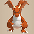 Archdragon</td>
      <td> Fluffy Bunny</td>
      <td> Fulminachin</td>
      <td> Infernous</td>
      <td> Captain Ant</td>
    </tr>
    <tr>
      <td class="danger"> King Reaper</td>
      <td> Grampadillo</td>
      <td> Electroid</td>
      <td> Hiding Dragon</td>
      <td>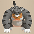 Tiger Chucker</td>
    </tr>
    <tr>
      <td> Lordly Samurai</td>
      <td> Chow</td>
      <td> Crow Tengu</td>
      <td> Dark Owl</td>
      <td class="highlightGray"></td>
    </tr>
    <tr>
      <td colspan="9" class="tableDivider"></td>
    </tr>
    <tr>
      <td rowspan="3" class="centeredText">81</td>
      <td rowspan="3" class=""></td>
      <td rowspan="3" class=""></td>
      <td rowspan="3" class=""></td>
      <td class="danger"> Archdragon</td>
      <td> Fluffy Bunny</td>
      <td> Fulminachin</td>
      <td> Infernous</td>
      <td> Captain Ant</td>
    </tr>
    <tr>
      <td class="danger"> King Reaper</td>
      <td> Grampadillo</td>
      <td> Electroid</td>
      <td> Hiding Dragon</td>
      <td> Tiger Chucker</td>
    </tr>
    <tr>
      <td> Lordly Samurai</td>
      <td> Chow</td>
      <td> Crow Tengu</td>
      <td> Dark Owl</td>
      <td class="highlightGray"></td>
    </tr>
    <tr>
      <td colspan="9" class="tableDivider"></td>
    </tr>
    <tr>
      <td rowspan="3" class="centeredText">82</td>
      <td rowspan="3" class=""></td>
      <td rowspan="3" class=""></td>
      <td rowspan="3" class=""></td>
      <td class="danger"> Archdragon</td>
      <td> Fluffy Bunny</td>
      <td> Fulminachin</td>
      <td> Infernous</td>
      <td> Captain Ant</td>
    </tr>
    <tr>
      <td class="danger"> King Reaper</td>
      <td> Grampadillo</td>
      <td> Electroid</td>
      <td> Hiding Dragon</td>
      <td> Tiger Chucker</td>
    </tr>
    <tr>
      <td> Lordly Samurai</td>
      <td> Chow</td>
      <td> Crow Tengu</td>
      <td> Dark Owl</td>
      <td class="highlightGray"></td>
    </tr>
    <tr>
      <td colspan="9" class="tableDivider"></td>
    </tr>
    <tr>
      <td rowspan="3" class="centeredText">83</td>
      <td rowspan="3" class=""></td>
      <td rowspan="3" class=""></td>
      <td rowspan="3" class=""></td>
      <td class="danger"> Archdragon</td>
      <td> Fluffy Bunny</td>
      <td> Fulminachin</td>
      <td> Infernous</td>
      <td> Captain Ant</td>
    </tr>
    <tr>
      <td class="danger"> King Reaper</td>
      <td> Grampadillo</td>
      <td> Electroid</td>
      <td> Hiding Dragon</td>
      <td> Tiger Chucker</td>
    </tr>
    <tr>
      <td> Lordly Samurai</td>
      <td> Chow</td>
      <td> Crow Tengu</td>
      <td> Dark Owl</td>
      <td class="highlightGray"></td>
    </tr>
    <tr>
      <td colspan="9" class="tableDivider"></td>
    </tr>
    <tr>
      <td rowspan="3" class="centeredText">84</td>
      <td rowspan="3" class=""></td>
      <td rowspan="3" class=""></td>
      <td rowspan="3" class=""></td>
      <td class="danger"> Archdragon</td>
      <td> Fluffy Bunny</td>
      <td> Fulminachin</td>
      <td> Infernous</td>
      <td> Captain Ant</td>
    </tr>
    <tr>
      <td class="danger"> King Reaper</td>
      <td> Grampadillo</td>
      <td> Electroid</td>
      <td> Hiding Dragon</td>
      <td> Tiger Chucker</td>
    </tr>
    <tr>
      <td> Lordly Samurai</td>
      <td> Chow</td>
      <td> Crow Tengu</td>
      <td> Dark Owl</td>
      <td class="highlightGray"></td>
    </tr>
    <tr>
      <td colspan="9" class="tableDivider"></td>
    </tr>
    <tr>
      <td rowspan="3" class="centeredText">85</td>
      <td rowspan="3" class=""></td>
      <td rowspan="3" class=""></td>
      <td rowspan="3" class=""></td>
      <td class="danger"> Archdragon</td>
      <td> Fluffy Bunny</td>
      <td> Fulminachin</td>
      <td> Infernous</td>
      <td> Captain Ant</td>
    </tr>
    <tr>
      <td class="danger"> King Reaper</td>
      <td> Grampadillo</td>
      <td> Electroid</td>
      <td> Hiding Dragon</td>
      <td> Tiger Chucker</td>
    </tr>
    <tr>
      <td> Lordly Samurai</td>
      <td> Chow</td>
      <td> Crow Tengu</td>
      <td> Dark Owl</td>
      <td class="highlightGray"></td>
    </tr>
    <tr>
      <td colspan="9" class="tableDivider"></td>
    </tr>
    <tr>
      <td rowspan="3" class="centeredText">86</td>
      <td rowspan="3" class=""></td>
      <td rowspan="3" class=""></td>
      <td rowspan="3" class=""></td>
      <td class="danger"> Archdragon</td>
      <td> Fluffy Bunny</td>
      <td> Fulminachin</td>
      <td> Infernous</td>
      <td> Captain Ant</td>
    </tr>
    <tr>
      <td class="danger"> King Reaper</td>
      <td> Grampadillo</td>
      <td> Electroid</td>
      <td> Hiding Dragon</td>
      <td> Tiger Chucker</td>
    </tr>
    <tr>
      <td> Lordly Samurai</td>
      <td> Chow</td>
      <td> Crow Tengu</td>
      <td> Dark Owl</td>
      <td class="highlightGray"></td>
    </tr>
    <tr>
      <td colspan="9" class="tableDivider"></td>
    </tr>
    <tr>
      <td rowspan="3" class="centeredText">87</td>
      <td rowspan="3" class=""></td>
      <td rowspan="3" class=""></td>
      <td rowspan="3" class=""></td>
      <td class="danger"> Archdragon</td>
      <td> Fluffy Bunny</td>
      <td> Fulminachin</td>
      <td> Infernous</td>
      <td> Captain Ant</td>
    </tr>
    <tr>
      <td class="danger"> King Reaper</td>
      <td> Grampadillo</td>
      <td> Electroid</td>
      <td> Hiding Dragon</td>
      <td> Tiger Chucker</td>
    </tr>
    <tr>
      <td> Lordly Samurai</td>
      <td> Chow</td>
      <td> Crow Tengu</td>
      <td> Dark Owl</td>
      <td class="highlightGray"></td>
    </tr>
    <tr>
      <td colspan="9" class="tableDivider"></td>
    </tr>
    <tr>
      <td rowspan="3" class="centeredText">88</td>
      <td rowspan="3" class=""></td>
      <td rowspan="3" class=""></td>
      <td rowspan="3" class=""></td>
      <td class="danger"> Archdragon</td>
      <td> Fluffy Bunny</td>
      <td> Fulminachin</td>
      <td> Infernous</td>
      <td> Captain Ant</td>
    </tr>
    <tr>
      <td class="danger"> King Reaper</td>
      <td> Grampadillo</td>
      <td> Electroid</td>
      <td> Hiding Dragon</td>
      <td> Tiger Chucker</td>
    </tr>
    <tr>
      <td> Lordly Samurai</td>
      <td> Chow</td>
      <td> Crow Tengu</td>
      <td> Dark Owl</td>
      <td class="highlightGray"></td>
    </tr>
    <tr>
      <td colspan="9" class="tableDivider"></td>
    </tr>
    <tr>
      <td rowspan="3" class="centeredText">89</td>
      <td rowspan="3" class=""></td>
      <td rowspan="3" class=""></td>
      <td rowspan="3" class=""></td>
      <td class="danger"> Archdragon</td>
      <td> Fluffy Bunny</td>
      <td> Fulminachin</td>
      <td> Infernous</td>
      <td> Captain Ant</td>
    </tr>
    <tr>
      <td class="danger"> King Reaper</td>
      <td> Grampadillo</td>
      <td> Electroid</td>
      <td> Hiding Dragon</td>
      <td> Tiger Chucker</td>
    </tr>
    <tr>
      <td> Lordly Samurai</td>
      <td> Chow</td>
      <td> Crow Tengu</td>
      <td> Dark Owl</td>
      <td class="highlightGray"></td>
    </tr>
    <tr>
      <td colspan="9" class="tableDivider"></td>
    </tr>
    <tr>
      <td rowspan="3" class="centeredText">90</td>
      <td rowspan="3" class=""></td>
      <td rowspan="3" class=""></td>
      <td rowspan="3" class=""></td>
      <td class="danger"> Archdragon</td>
      <td> Fluffy Bunny</td>
      <td> Fulminachin</td>
      <td> Infernous</td>
      <td class="danger"> King Reaper</td>
    </tr>
    <tr>
      <td> Grampadillo</td>
      <td> Electroid</td>
      <td> Hiding Dragon</td>
      <td> Tiger Chucker</td>
      <td> Lordly Samurai</td>
    </tr>
    <tr>
      <td> Chow</td>
      <td> Dark Owl</td>
      <td class="highlightGray"></td>
      <td class="highlightGray"></td>
      <td class="highlightGray"></td>
    </tr>
    <tr>
      <td colspan="9" class="tableDivider"></td>
    </tr>
    <tr>
      <td rowspan="3" class="centeredText">91</td>
      <td rowspan="3" class=""></td>
      <td rowspan="3" class=""></td>
      <td rowspan="3" class=""></td>
      <td class="danger"> Archdragon</td>
      <td> Fluffy Bunny</td>
      <td> Fulminachin</td>
      <td> Infernous</td>
      <td class="danger"> King Reaper</td>
    </tr>
    <tr>
      <td> Grampadillo</td>
      <td> Electroid</td>
      <td> Hiding Dragon</td>
      <td> Tiger Chucker</td>
      <td> Lordly Samurai</td>
    </tr>
    <tr>
      <td> Chow</td>
      <td> Dark Owl</td>
      <td class="highlightGray"></td>
      <td class="highlightGray"></td>
      <td class="highlightGray"></td>
    </tr>
    <tr>
      <td colspan="9" class="tableDivider"></td>
    </tr>
    <tr>
      <td rowspan="3" class="centeredText">92</td>
      <td rowspan="3" class=""></td>
      <td rowspan="3" class=""></td>
      <td rowspan="3" class=""></td>
      <td class="danger"> Archdragon</td>
      <td> Fluffy Bunny</td>
      <td> Fulminachin</td>
      <td> Infernous</td>
      <td class="danger"> King Reaper</td>
    </tr>
    <tr>
      <td> Grampadillo</td>
      <td> Electroid</td>
      <td> Hiding Dragon</td>
      <td> Tiger Chucker</td>
      <td> Lordly Samurai</td>
    </tr>
    <tr>
      <td> Chow</td>
      <td> Dark Owl</td>
      <td class="highlightGray"></td>
      <td class="highlightGray"></td>
      <td class="highlightGray"></td>
    </tr>
    <tr>
      <td colspan="9" class="tableDivider"></td>
    </tr>
    <tr>
      <td rowspan="3" class="centeredText">93</td>
      <td rowspan="3" class=""></td>
      <td rowspan="3" class=""></td>
      <td rowspan="3" class=""></td>
      <td class="danger"> Archdragon</td>
      <td> Fluffy Bunny</td>
      <td> Fulminachin</td>
      <td> Infernous</td>
      <td class="danger"> King Reaper</td>
    </tr>
    <tr>
      <td> Grampadillo</td>
      <td> Electroid</td>
      <td> Hiding Dragon</td>
      <td> Tiger Chucker</td>
      <td> Lordly Samurai</td>
    </tr>
    <tr>
      <td> Chow</td>
      <td> Dark Owl</td>
      <td class="highlightGray"></td>
      <td class="highlightGray"></td>
      <td class="highlightGray"></td>
    </tr>
    <tr>
      <td colspan="9" class="tableDivider"></td>
    </tr>
    <tr>
      <td rowspan="3" class="centeredText">94</td>
      <td rowspan="3" class=""></td>
      <td rowspan="3" class=""></td>
      <td rowspan="3" class=""></td>
      <td class="danger"> Archdragon</td>
      <td> Fluffy Bunny</td>
      <td> Fulminachin</td>
      <td> Infernous</td>
      <td class="danger"> King Reaper</td>
    </tr>
    <tr>
      <td> Grampadillo</td>
      <td> Electroid</td>
      <td> Hiding Dragon</td>
      <td> Tiger Chucker</td>
      <td> Lordly Samurai</td>
    </tr>
    <tr>
      <td> Chow</td>
      <td> Dark Owl</td>
      <td class="highlightGray"></td>
      <td class="highlightGray"></td>
      <td class="highlightGray"></td>
    </tr>
    <tr>
      <td colspan="9" class="tableDivider"></td>
    </tr>
    <tr>
      <td rowspan="3" class="centeredText">95</td>
      <td rowspan="3" class=""></td>
      <td rowspan="3" class=""></td>
      <td rowspan="3" class=""></td>
      <td class="danger"> Archdragon</td>
      <td> Fluffy Bunny</td>
      <td> Fulminachin</td>
      <td> Infernous</td>
      <td class="danger"> King Reaper</td>
    </tr>
    <tr>
      <td> Grampadillo</td>
      <td> Electroid</td>
      <td> Hiding Dragon</td>
      <td> Tiger Chucker</td>
      <td> Lordly Samurai</td>
    </tr>
    <tr>
      <td> Chow</td>
      <td> Dark Owl</td>
      <td class="highlightGray"></td>
      <td class="highlightGray"></td>
      <td class="highlightGray"></td>
    </tr>
    <tr>
      <td colspan="9" class="tableDivider"></td>
    </tr>
    <tr>
      <td rowspan="3" class="centeredText">96</td>
      <td rowspan="3" class=""></td>
      <td rowspan="3" class=""></td>
      <td rowspan="3" class=""></td>
      <td class="danger"> Archdragon</td>
      <td> Fluffy Bunny</td>
      <td> Fulminachin</td>
      <td> Infernous</td>
      <td class="danger"> King Reaper</td>
    </tr>
    <tr>
      <td> Grampadillo</td>
      <td> Electroid</td>
      <td> Hiding Dragon</td>
      <td> Tiger Chucker</td>
      <td> Lordly Samurai</td>
    </tr>
    <tr>
      <td> Chow</td>
      <td> Dark Owl</td>
      <td class="highlightGray"></td>
      <td class="highlightGray"></td>
      <td class="highlightGray"></td>
    </tr>
    <tr>
      <td colspan="9" class="tableDivider"></td>
    </tr>
    <tr>
      <td rowspan="3" class="centeredText">97</td>
      <td rowspan="3" class=""></td>
      <td rowspan="3" class=""></td>
      <td rowspan="3" class=""></td>
      <td class="danger"> Archdragon</td>
      <td> Fluffy Bunny</td>
      <td> Fulminachin</td>
      <td> Infernous</td>
      <td class="danger"> King Reaper</td>
    </tr>
    <tr>
      <td> Grampadillo</td>
      <td> Electroid</td>
      <td> Hiding Dragon</td>
      <td> Tiger Chucker</td>
      <td> Lordly Samurai</td>
    </tr>
    <tr>
      <td> Chow</td>
      <td> Dark Owl</td>
      <td class="highlightGray"></td>
      <td class="highlightGray"></td>
      <td class="highlightGray"></td>
    </tr>
    <tr>
      <td colspan="9" class="tableDivider"></td>
    </tr>
    <tr>
      <td rowspan="3" class="centeredText">98</td>
      <td rowspan="3" class=""></td>
      <td rowspan="3" class=""></td>
      <td rowspan="3" class=""></td>
      <td class="danger"> Archdragon</td>
      <td> Fluffy Bunny</td>
      <td> Fulminachin</td>
      <td> Infernous</td>
      <td class="danger"> King Reaper</td>
    </tr>
    <tr>
      <td> Grampadillo</td>
      <td> Electroid</td>
      <td> Hiding Dragon</td>
      <td> Tiger Chucker</td>
      <td> Lordly Samurai</td>
    </tr>
    <tr>
      <td> Chow</td>
      <td> Dark Owl</td>
      <td class="highlightGray"></td>
      <td class="highlightGray"></td>
      <td class="highlightGray"></td>
    </tr>
    <tr>
      <td colspan="9" class="tableDivider"></td>
    </tr>
    <tr>
      <td rowspan="3" class="centeredText">99</td>
      <td rowspan="3" class=""></td>
      <td rowspan="3" class=""></td>
      <td rowspan="3" class=""></td>
      <td class="danger"> Archdragon</td>
      <td> Fluffy Bunny</td>
      <td> Fulminachin</td>
      <td> Infernous</td>
      <td class="danger"> King Reaper</td>
    </tr>
    <tr>
      <td> Grampadillo</td>
      <td> Electroid</td>
      <td> Hiding Dragon</td>
      <td> Tiger Chucker</td>
      <td> Lordly Samurai</td>
    </tr>
    <tr>
      <td> Chow</td>
      <td> Dark Owl</td>
      <td class="highlightGray"></td>
      <td class="highlightGray"></td>
      <td class="highlightGray"></td>
    </tr>
  </tbody>
</table>

# Items

- F = Floor
- S = Shop
- P = Peddler
- M = Monster drop
- B = Buried
- H = Thiefwalrus
- I = Island
- T = Transmutation Pot
- U = Surprise Pot
- W = Tunnel of Wishes

#### Weapon

<table class="dungeonItemTable">
  <tr>
    <th colspan="11" class="highlightLightblue">Weapon</th>
  </tr>
  <tr>
    <th>Name</th>
    <th>F</th>
    <th>S</th>
    <th>P</th>
    <th>M</th>
    <th>B</th>
    <th>H</th>
    <th>I</th>
    <th>T</th>
    <th>U</th>
    <th>W</th>
  </tr>
  <tr>
    <td class="leftText">Wooden Sword</td>
    <td></td>
    <td></td>
    <td></td>
    <td></td>
    <td></td>
    <td></td>
    <td></td>
    <td></td>
    <td></td>
    <td></td>
  </tr>
  <tr>
    <td class="leftText">Bronze Sword</td>
    <td></td>
    <td></td>
    <td></td>
    <td></td>
    <td></td>
    <td></td>
    <td></td>
    <td></td>
    <td></td>
    <td></td>
  </tr>
  <tr>
    <td class="leftText">Katana</td>
    <td></td>
    <td></td>
    <td></td>
    <td></td>
    <td></td>
    <td></td>
    <td></td>
    <td></td>
    <td></td>
    <td></td>
  </tr>
  <tr>
    <td class="leftText">Doutanuki</td>
    <td></td>
    <td></td>
    <td></td>
    <td></td>
    <td></td>
    <td></td>
    <td></td>
    <td></td>
    <td></td>
    <td></td>
  </tr>
  <tr>
    <td class="leftText">Manji Kabura</td>
    <td></td>
    <td></td>
    <td></td>
    <td></td>
    <td></td>
    <td></td>
    <td></td>
    <td></td>
    <td></td>
    <td></td>
  </tr>
  <tr>
    <td class="leftText">Kajin Fuuma</td>
    <td></td>
    <td></td>
    <td></td>
    <td></td>
    <td></td>
    <td></td>
    <td></td>
    <td></td>
    <td></td>
    <td></td>
  </tr>
  <tr>
    <td class="leftText">Kabura Sutegi</td>
    <td></td>
    <td></td>
    <td></td>
    <td></td>
    <td></td>
    <td></td>
    <td></td>
    <td></td>
    <td></td>
    <td></td>
  </tr>
  <tr>
    <td class="leftText">Golden Sword</td>
    <td></td>
    <td></td>
    <td></td>
    <td></td>
    <td></td>
    <td></td>
    <td></td>
    <td></td>
    <td></td>
    <td></td>
  </tr>
  <tr>
    <td class="leftText">Kama Itachi</td>
    <td></td>
    <td></td>
    <td></td>
    <td></td>
    <td></td>
    <td></td>
    <td></td>
    <td></td>
    <td></td>
    <td></td>
  </tr>
  <tr>
    <td class="leftText">Axe of the Minotaur</td>
    <td></td>
    <td></td>
    <td></td>
    <td></td>
    <td></td>
    <td></td>
    <td></td>
    <td></td>
    <td></td>
    <td></td>
  </tr>
  <tr>
    <td class="leftText">Accurate Sword</td>
    <td></td>
    <td></td>
    <td></td>
    <td></td>
    <td></td>
    <td></td>
    <td></td>
    <td></td>
    <td></td>
    <td></td>
  </tr>
  <tr>
    <td class="leftText">Swift Sword</td>
    <td></td>
    <td></td>
    <td></td>
    <td></td>
    <td></td>
    <td></td>
    <td></td>
    <td></td>
    <td></td>
    <td></td>
  </tr>
  <tr>
    <td class="leftText">Watersplitter</td>
    <td></td>
    <td></td>
    <td></td>
    <td></td>
    <td></td>
    <td></td>
    <td></td>
    <td></td>
    <td></td>
    <td></td>
  </tr>
  <tr>
    <td class="leftText">Primal Axe</td>
    <td></td>
    <td></td>
    <td></td>
    <td></td>
    <td></td>
    <td></td>
    <td></td>
    <td></td>
    <td></td>
    <td></td>
  </tr>
  <tr>
    <td class="leftText">Dragonkiller</td>
    <td></td>
    <td></td>
    <td></td>
    <td></td>
    <td></td>
    <td></td>
    <td></td>
    <td></td>
    <td></td>
    <td></td>
  </tr>
  <tr>
    <td class="leftText">Crescent Blade</td>
    <td></td>
    <td></td>
    <td></td>
    <td></td>
    <td></td>
    <td></td>
    <td></td>
    <td></td>
    <td></td>
    <td></td>
  </tr>
  <tr>
    <td class="leftText">Sky Sword</td>
    <td></td>
    <td></td>
    <td></td>
    <td></td>
    <td></td>
    <td></td>
    <td></td>
    <td></td>
    <td></td>
    <td></td>
  </tr>
  <tr>
    <td class="leftText">Sickle of Salvation</td>
    <td></td>
    <td></td>
    <td></td>
    <td></td>
    <td></td>
    <td></td>
    <td></td>
    <td></td>
    <td></td>
    <td></td>
  </tr>
  <tr>
    <td class="leftText">Drain Slayer</td>
    <td></td>
    <td></td>
    <td></td>
    <td></td>
    <td></td>
    <td></td>
    <td></td>
    <td></td>
    <td></td>
    <td></td>
  </tr>
  <tr>
    <td class="leftText">Cyclops Bane</td>
    <td></td>
    <td></td>
    <td></td>
    <td></td>
    <td></td>
    <td></td>
    <td></td>
    <td></td>
    <td></td>
    <td></td>
  </tr>
  <tr>
    <td class="leftText">Steel Severer</td>
    <td></td>
    <td></td>
    <td></td>
    <td></td>
    <td></td>
    <td></td>
    <td></td>
    <td></td>
    <td></td>
    <td></td>
  </tr>
  <tr>
    <td class="leftText">Whopping Harisen</td>
    <td></td>
    <td></td>
    <td></td>
    <td></td>
    <td></td>
    <td></td>
    <td></td>
    <td></td>
    <td></td>
    <td></td>
  </tr>
  <tr>
    <td class="leftText">Healing Sword</td>
    <td></td>
    <td></td>
    <td></td>
    <td></td>
    <td></td>
    <td></td>
    <td></td>
    <td></td>
    <td></td>
    <td></td>
  </tr>
  <tr>
    <td class="leftText">Peach Club</td>
    <td></td>
    <td></td>
    <td></td>
    <td></td>
    <td></td>
    <td></td>
    <td></td>
    <td></td>
    <td></td>
    <td></td>
  </tr>
  <tr>
    <td class="leftText">Spender's Club</td>
    <td></td>
    <td></td>
    <td></td>
    <td></td>
    <td></td>
    <td></td>
    <td></td>
    <td></td>
    <td></td>
    <td></td>
  </tr>
  <tr>
    <td class="leftText">Ferrous Greatsword</td>
    <td></td>
    <td></td>
    <td></td>
    <td></td>
    <td></td>
    <td></td>
    <td></td>
    <td></td>
    <td></td>
    <td></td>
  </tr>
  <tr>
    <td class="leftText">Steak Knife</td>
    <td></td>
    <td></td>
    <td></td>
    <td></td>
    <td></td>
    <td></td>
    <td></td>
    <td></td>
    <td></td>
    <td></td>
  </tr>
  <tr>
    <td class="leftText">Jagged Sword</td>
    <td></td>
    <td></td>
    <td></td>
    <td></td>
    <td></td>
    <td></td>
    <td></td>
    <td></td>
    <td></td>
    <td></td>
  </tr>
  <tr>
    <td class="leftText">Quad-edge</td>
    <td></td>
    <td></td>
    <td></td>
    <td></td>
    <td></td>
    <td></td>
    <td></td>
    <td></td>
    <td></td>
    <td></td>
  </tr>
  <tr>
    <td class="leftText">Auspicious Kumade</td>
    <td></td>
    <td></td>
    <td></td>
    <td></td>
    <td></td>
    <td></td>
    <td></td>
    <td></td>
    <td></td>
    <td></td>
  </tr>
  <tr>
    <td class="leftText">Pickaxe</td>
    <td></td>
    <td></td>
    <td></td>
    <td></td>
    <td></td>
    <td></td>
    <td></td>
    <td></td>
    <td></td>
    <td></td>
  </tr>
  <tr>
    <td class="leftText">Golden Pickaxe</td>
    <td></td>
    <td></td>
    <td></td>
    <td></td>
    <td></td>
    <td></td>
    <td></td>
    <td></td>
    <td></td>
    <td></td>
  </tr>
  <tr>
    <td class="leftText">Wooden Mallet</td>
    <td></td>
    <td></td>
    <td></td>
    <td></td>
    <td></td>
    <td></td>
    <td></td>
    <td></td>
    <td></td>
    <td></td>
  </tr>
  <tr>
    <td class="leftText">Epic Hammer</td>
    <td></td>
    <td></td>
    <td></td>
    <td></td>
    <td></td>
    <td></td>
    <td></td>
    <td></td>
    <td></td>
    <td></td>
  </tr>
  <tr>
    <td class="leftText">Trapseeker</td>
    <td></td>
    <td></td>
    <td></td>
    <td></td>
    <td></td>
    <td></td>
    <td></td>
    <td></td>
    <td></td>
    <td></td>
  </tr>
  <tr>
    <td class="leftText">Bonito Block</td>
    <td></td>
    <td></td>
    <td></td>
    <td></td>
    <td></td>
    <td></td>
    <td></td>
    <td></td>
    <td></td>
    <td></td>
  </tr>
  <tr>
    <td class="leftText">Yamanba's Cleaver</td>
    <td></td>
    <td></td>
    <td></td>
    <td></td>
    <td></td>
    <td></td>
    <td></td>
    <td></td>
    <td></td>
    <td></td>
  </tr>
  <tr>
    <td class="leftText">Break-Off Blade</td>
    <td></td>
    <td></td>
    <td></td>
    <td></td>
    <td></td>
    <td></td>
    <td></td>
    <td></td>
    <td></td>
    <td></td>
  </tr>
</table>

#### Shield

<table class="dungeonItemTable">
  <tr>
    <th colspan="11" class="highlightLightblue">Shield</th>
  </tr>
  <tr>
    <th>Name</th>
    <th>F</th>
    <th>S</th>
    <th>P</th>
    <th>M</th>
    <th>B</th>
    <th>H</th>
    <th>I</th>
    <th>T</th>
    <th>U</th>
    <th>W</th>
  </tr>
  <tr>
    <td class="leftText">Wooden Shield</td>
    <td></td>
    <td></td>
    <td></td>
    <td></td>
    <td></td>
    <td></td>
    <td></td>
    <td></td>
    <td></td>
    <td></td>
  </tr>
  <tr>
    <td class="leftText">Bronze Shield</td>
    <td></td>
    <td></td>
    <td></td>
    <td></td>
    <td></td>
    <td></td>
    <td></td>
    <td></td>
    <td></td>
    <td></td>
  </tr>
  <tr>
    <td class="leftText">Iron Shield</td>
    <td></td>
    <td></td>
    <td></td>
    <td></td>
    <td></td>
    <td></td>
    <td></td>
    <td></td>
    <td></td>
    <td></td>
  </tr>
  <tr>
    <td class="leftText">Wolfshead</td>
    <td></td>
    <td></td>
    <td></td>
    <td></td>
    <td></td>
    <td></td>
    <td></td>
    <td></td>
    <td></td>
    <td></td>
  </tr>
  <tr>
    <td class="leftText">Fuuma Shield</td>
    <td></td>
    <td></td>
    <td></td>
    <td></td>
    <td></td>
    <td></td>
    <td></td>
    <td></td>
    <td></td>
    <td></td>
  </tr>
  <tr>
    <td class="leftText">Rasen Fuuma</td>
    <td></td>
    <td></td>
    <td></td>
    <td></td>
    <td></td>
    <td></td>
    <td></td>
    <td></td>
    <td></td>
    <td></td>
  </tr>
  <tr>
    <td class="leftText">Golden Shield</td>
    <td></td>
    <td></td>
    <td></td>
    <td></td>
    <td></td>
    <td></td>
    <td></td>
    <td></td>
    <td></td>
    <td></td>
  </tr>
  <tr>
    <td class="leftText">Counter Shield</td>
    <td></td>
    <td></td>
    <td></td>
    <td></td>
    <td></td>
    <td></td>
    <td></td>
    <td></td>
    <td></td>
    <td></td>
  </tr>
  <tr>
    <td class="leftText">Watchful Shield</td>
    <td></td>
    <td></td>
    <td></td>
    <td></td>
    <td></td>
    <td></td>
    <td></td>
    <td></td>
    <td></td>
    <td></td>
  </tr>
  <tr>
    <td class="leftText">Dragon Shield</td>
    <td></td>
    <td></td>
    <td></td>
    <td></td>
    <td></td>
    <td></td>
    <td></td>
    <td></td>
    <td></td>
    <td></td>
  </tr>
  <tr>
    <td class="leftText">Blast Shield</td>
    <td></td>
    <td></td>
    <td></td>
    <td></td>
    <td></td>
    <td></td>
    <td></td>
    <td></td>
    <td></td>
    <td></td>
  </tr>
  <tr>
    <td class="leftText">Targe of the Minotaur</td>
    <td></td>
    <td></td>
    <td></td>
    <td></td>
    <td></td>
    <td></td>
    <td></td>
    <td></td>
    <td></td>
    <td></td>
  </tr>
  <tr>
    <td class="leftText">Walrus Stopper</td>
    <td></td>
    <td></td>
    <td></td>
    <td></td>
    <td></td>
    <td></td>
    <td></td>
    <td></td>
    <td></td>
    <td></td>
  </tr>
  <tr>
    <td class="leftText">Froggo Stopper</td>
    <td></td>
    <td></td>
    <td></td>
    <td></td>
    <td></td>
    <td></td>
    <td></td>
    <td></td>
    <td></td>
    <td></td>
  </tr>
  <tr>
    <td class="leftText">Hat Stopper</td>
    <td></td>
    <td></td>
    <td></td>
    <td></td>
    <td></td>
    <td></td>
    <td></td>
    <td></td>
    <td></td>
    <td></td>
  </tr>
  <tr>
    <td class="leftText">Nigiri Stopper</td>
    <td></td>
    <td></td>
    <td></td>
    <td></td>
    <td></td>
    <td></td>
    <td></td>
    <td></td>
    <td></td>
    <td></td>
  </tr>
  <tr>
    <td class="leftText">Spearscale Shield</td>
    <td></td>
    <td></td>
    <td></td>
    <td></td>
    <td></td>
    <td></td>
    <td></td>
    <td></td>
    <td></td>
    <td></td>
  </tr>
  <tr>
    <td class="leftText">Kappa's Dish</td>
    <td></td>
    <td></td>
    <td></td>
    <td></td>
    <td></td>
    <td></td>
    <td></td>
    <td></td>
    <td></td>
    <td></td>
  </tr>
  <tr>
    <td class="leftText">Gazer Shield</td>
    <td></td>
    <td></td>
    <td></td>
    <td></td>
    <td></td>
    <td></td>
    <td></td>
    <td></td>
    <td></td>
    <td></td>
  </tr>
  <tr>
    <td class="leftText">Shield of Negation</td>
    <td></td>
    <td></td>
    <td></td>
    <td></td>
    <td></td>
    <td></td>
    <td></td>
    <td></td>
    <td></td>
    <td></td>
  </tr>
  <tr>
    <td class="leftText">Unmoving Wall</td>
    <td></td>
    <td></td>
    <td></td>
    <td></td>
    <td></td>
    <td></td>
    <td></td>
    <td></td>
    <td></td>
    <td></td>
  </tr>
  <tr>
    <td class="leftText">Zabuton</td>
    <td></td>
    <td></td>
    <td></td>
    <td></td>
    <td></td>
    <td></td>
    <td></td>
    <td></td>
    <td></td>
    <td></td>
  </tr>
  <tr>
    <td class="leftText">Spender's Shield</td>
    <td></td>
    <td></td>
    <td></td>
    <td></td>
    <td></td>
    <td></td>
    <td></td>
    <td></td>
    <td></td>
    <td></td>
  </tr>
  <tr>
    <td class="leftText">Ferrous Kite</td>
    <td></td>
    <td></td>
    <td></td>
    <td></td>
    <td></td>
    <td></td>
    <td></td>
    <td></td>
    <td></td>
    <td></td>
  </tr>
  <tr>
    <td class="leftText">Steak Plate</td>
    <td></td>
    <td></td>
    <td></td>
    <td></td>
    <td></td>
    <td></td>
    <td></td>
    <td></td>
    <td></td>
    <td></td>
  </tr>
  <tr>
    <td class="leftText">Gutsy Shield</td>
    <td></td>
    <td></td>
    <td></td>
    <td></td>
    <td></td>
    <td></td>
    <td></td>
    <td></td>
    <td></td>
    <td></td>
  </tr>
  <tr>
    <td class="leftText">Hunky-dory Shield</td>
    <td></td>
    <td></td>
    <td></td>
    <td></td>
    <td></td>
    <td></td>
    <td></td>
    <td></td>
    <td></td>
    <td></td>
  </tr>
  <tr>
    <td class="leftText">Bodhi Shield</td>
    <td></td>
    <td></td>
    <td></td>
    <td></td>
    <td></td>
    <td></td>
    <td></td>
    <td></td>
    <td></td>
    <td></td>
  </tr>
  <tr>
    <td class="leftText">Shield of Sating</td>
    <td></td>
    <td></td>
    <td></td>
    <td></td>
    <td></td>
    <td></td>
    <td></td>
    <td></td>
    <td></td>
    <td></td>
  </tr>
  <tr>
    <td class="leftText">Auspicious Omamori</td>
    <td></td>
    <td></td>
    <td></td>
    <td></td>
    <td></td>
    <td></td>
    <td></td>
    <td></td>
    <td></td>
    <td></td>
  </tr>
  <tr>
    <td class="leftText">Shield of Presage</td>
    <td></td>
    <td></td>
    <td></td>
    <td></td>
    <td></td>
    <td></td>
    <td></td>
    <td></td>
    <td></td>
    <td></td>
  </tr>
  <tr>
    <td class="leftText">Yamanba's Potlid</td>
    <td></td>
    <td></td>
    <td></td>
    <td></td>
    <td></td>
    <td></td>
    <td></td>
    <td></td>
    <td></td>
    <td></td>
  </tr>
  <tr>
    <td class="leftText">Break-Off Shield</td>
    <td></td>
    <td></td>
    <td></td>
    <td></td>
    <td></td>
    <td></td>
    <td></td>
    <td></td>
    <td></td>
    <td></td>
  </tr>
</table>

#### Bracelet

<table class="dungeonItemTable">
  <tr>
    <th colspan="11" class="highlightLightblue">Bracelet</th>
  </tr>
  <tr>
    <th>Name</th>
    <th>F</th>
    <th>S</th>
    <th>P</th>
    <th>M</th>
    <th>B</th>
    <th>H</th>
    <th>I</th>
    <th>T</th>
    <th>U</th>
    <th>W</th>
  </tr>
  <tr>
    <td class="leftText">Healing Bracelet</td>
    <td></td>
    <td></td>
    <td></td>
    <td></td>
    <td></td>
    <td></td>
    <td></td>
    <td></td>
    <td></td>
    <td></td>
  </tr>
  <tr>
    <td class="leftText">Strength Bracelet</td>
    <td></td>
    <td></td>
    <td></td>
    <td></td>
    <td></td>
    <td></td>
    <td></td>
    <td></td>
    <td></td>
    <td></td>
  </tr>
  <tr>
    <td class="leftText">Bellyexpand Bracelet</td>
    <td></td>
    <td></td>
    <td></td>
    <td></td>
    <td></td>
    <td></td>
    <td></td>
    <td></td>
    <td></td>
    <td></td>
  </tr>
  <tr>
    <td class="leftText">Bellyshrink Bracelet</td>
    <td></td>
    <td></td>
    <td></td>
    <td></td>
    <td></td>
    <td></td>
    <td></td>
    <td></td>
    <td></td>
    <td></td>
  </tr>
  <tr>
    <td class="leftText">Fortune Bracelet</td>
    <td></td>
    <td></td>
    <td></td>
    <td></td>
    <td></td>
    <td></td>
    <td></td>
    <td></td>
    <td></td>
    <td></td>
  </tr>
  <tr>
    <td class="leftText">Cleansing Bracelet</td>
    <td></td>
    <td></td>
    <td></td>
    <td></td>
    <td></td>
    <td></td>
    <td></td>
    <td></td>
    <td></td>
    <td></td>
  </tr>
  <tr>
    <td class="leftText">Focusing Bracelet</td>
    <td></td>
    <td></td>
    <td></td>
    <td></td>
    <td></td>
    <td></td>
    <td></td>
    <td></td>
    <td></td>
    <td></td>
  </tr>
  <tr>
    <td class="leftText">Rousing Bracelet</td>
    <td></td>
    <td></td>
    <td></td>
    <td></td>
    <td></td>
    <td></td>
    <td></td>
    <td></td>
    <td></td>
    <td></td>
  </tr>
  <tr>
    <td class="leftText">Rustproof Bracelet</td>
    <td></td>
    <td></td>
    <td></td>
    <td></td>
    <td></td>
    <td></td>
    <td></td>
    <td></td>
    <td></td>
    <td></td>
  </tr>
  <tr>
    <td class="leftText">Cursebreak Bracelet</td>
    <td></td>
    <td></td>
    <td></td>
    <td></td>
    <td></td>
    <td></td>
    <td></td>
    <td></td>
    <td></td>
    <td></td>
  </tr>
  <tr>
    <td class="leftText">Affixing Bracelet</td>
    <td></td>
    <td></td>
    <td></td>
    <td></td>
    <td></td>
    <td></td>
    <td></td>
    <td></td>
    <td></td>
    <td></td>
  </tr>
  <tr>
    <td class="leftText">Far-throwing Bracelet</td>
    <td></td>
    <td></td>
    <td></td>
    <td></td>
    <td></td>
    <td></td>
    <td></td>
    <td></td>
    <td></td>
    <td></td>
  </tr>
  <tr>
    <td class="leftText">Bad-aim Bracelet</td>
    <td></td>
    <td></td>
    <td></td>
    <td></td>
    <td></td>
    <td></td>
    <td></td>
    <td></td>
    <td></td>
    <td></td>
  </tr>
  <tr>
    <td class="leftText">Sure-aim Bracelet</td>
    <td></td>
    <td></td>
    <td></td>
    <td></td>
    <td></td>
    <td></td>
    <td></td>
    <td></td>
    <td></td>
    <td></td>
  </tr>
  <tr>
    <td class="leftText">Bouncy Bracelet</td>
    <td></td>
    <td></td>
    <td></td>
    <td></td>
    <td></td>
    <td></td>
    <td></td>
    <td></td>
    <td></td>
    <td></td>
  </tr>
  <tr>
    <td class="leftText">Rapid-fire Bracelet</td>
    <td></td>
    <td></td>
    <td></td>
    <td></td>
    <td></td>
    <td></td>
    <td></td>
    <td></td>
    <td></td>
    <td></td>
  </tr>
  <tr>
    <td class="leftText">Daredevil Bracelet</td>
    <td></td>
    <td></td>
    <td></td>
    <td></td>
    <td></td>
    <td></td>
    <td></td>
    <td></td>
    <td></td>
    <td></td>
  </tr>
  <tr>
    <td class="leftText">Dreaded Bracelet</td>
    <td></td>
    <td></td>
    <td></td>
    <td></td>
    <td></td>
    <td></td>
    <td></td>
    <td></td>
    <td></td>
    <td></td>
  </tr>
  <tr>
    <td class="leftText">Leaping Bracelet</td>
    <td></td>
    <td></td>
    <td></td>
    <td></td>
    <td></td>
    <td></td>
    <td></td>
    <td></td>
    <td></td>
    <td></td>
  </tr>
  <tr>
    <td class="leftText">Blasting Bracelet</td>
    <td></td>
    <td></td>
    <td></td>
    <td></td>
    <td></td>
    <td></td>
    <td></td>
    <td></td>
    <td></td>
    <td></td>
  </tr>
  <tr>
    <td class="leftText">Clairvoyant Bracelet</td>
    <td></td>
    <td></td>
    <td></td>
    <td></td>
    <td></td>
    <td></td>
    <td></td>
    <td></td>
    <td></td>
    <td></td>
  </tr>
  <tr>
    <td class="leftText">Monster-find Bracelet</td>
    <td></td>
    <td></td>
    <td></td>
    <td></td>
    <td></td>
    <td></td>
    <td></td>
    <td></td>
    <td></td>
    <td></td>
  </tr>
  <tr>
    <td class="leftText">Item-find Bracelet</td>
    <td></td>
    <td></td>
    <td></td>
    <td></td>
    <td></td>
    <td></td>
    <td></td>
    <td></td>
    <td></td>
    <td></td>
  </tr>
  <tr>
    <td class="leftText">Passage-find Bracelet</td>
    <td></td>
    <td></td>
    <td></td>
    <td></td>
    <td></td>
    <td></td>
    <td></td>
    <td></td>
    <td></td>
    <td></td>
  </tr>
  <tr>
    <td class="leftText">Waterwalk Bracelet</td>
    <td></td>
    <td></td>
    <td></td>
    <td></td>
    <td></td>
    <td></td>
    <td></td>
    <td></td>
    <td></td>
    <td></td>
  </tr>
  <tr>
    <td class="leftText">Floating Bracelet</td>
    <td></td>
    <td></td>
    <td></td>
    <td></td>
    <td></td>
    <td></td>
    <td></td>
    <td></td>
    <td></td>
    <td></td>
  </tr>
  <tr>
    <td class="leftText">Wallpass Bracelet</td>
    <td></td>
    <td></td>
    <td></td>
    <td></td>
    <td></td>
    <td></td>
    <td></td>
    <td></td>
    <td></td>
    <td></td>
  </tr>
  <tr>
    <td class="leftText">Tiptoe Bracelet</td>
    <td></td>
    <td></td>
    <td></td>
    <td></td>
    <td></td>
    <td></td>
    <td></td>
    <td></td>
    <td></td>
    <td></td>
  </tr>
  <tr>
    <td class="leftText">Passerby Bracelet</td>
    <td></td>
    <td></td>
    <td></td>
    <td></td>
    <td></td>
    <td></td>
    <td></td>
    <td></td>
    <td></td>
    <td></td>
  </tr>
  <tr>
    <td class="leftText">Item-losing Bracelet</td>
    <td></td>
    <td></td>
    <td></td>
    <td></td>
    <td></td>
    <td></td>
    <td></td>
    <td></td>
    <td></td>
    <td></td>
  </tr>
  <tr>
    <td class="leftText">Gitan-losing Bracelet</td>
    <td></td>
    <td></td>
    <td></td>
    <td></td>
    <td></td>
    <td></td>
    <td></td>
    <td></td>
    <td></td>
    <td></td>
  </tr>
  <tr>
    <td class="leftText">Monstercall Bracelet</td>
    <td></td>
    <td></td>
    <td></td>
    <td></td>
    <td></td>
    <td></td>
    <td></td>
    <td></td>
    <td></td>
    <td></td>
  </tr>
  <tr>
    <td class="leftText">Trapmore Bracelet</td>
    <td></td>
    <td></td>
    <td></td>
    <td></td>
    <td></td>
    <td></td>
    <td></td>
    <td></td>
    <td></td>
    <td></td>
  </tr>
  <tr>
    <td class="leftText">Haggling Bracelet</td>
    <td></td>
    <td></td>
    <td></td>
    <td></td>
    <td></td>
    <td></td>
    <td></td>
    <td></td>
    <td></td>
    <td></td>
  </tr>
  <tr>
    <td class="leftText">Trapper's Bracelet</td>
    <td></td>
    <td></td>
    <td></td>
    <td></td>
    <td></td>
    <td></td>
    <td></td>
    <td></td>
    <td></td>
    <td></td>
  </tr>
  <tr>
    <td class="leftText">Appraiser's Bracelet</td>
    <td></td>
    <td></td>
    <td></td>
    <td></td>
    <td></td>
    <td></td>
    <td></td>
    <td></td>
    <td></td>
    <td></td>
  </tr>
  <tr>
    <td class="leftText">Cannonboost Bracelet</td>
    <td></td>
    <td></td>
    <td></td>
    <td></td>
    <td></td>
    <td></td>
    <td></td>
    <td></td>
    <td></td>
    <td></td>
  </tr>
</table>

#### Projectile

<table class="dungeonItemTable">
  <tr>
    <th colspan="11" class="highlightLightblue">Projectile</th>
  </tr>
  <tr>
    <th>Name</th>
    <th>F</th>
    <th>S</th>
    <th>P</th>
    <th>M</th>
    <th>B</th>
    <th>H</th>
    <th>I</th>
    <th>T</th>
    <th>U</th>
    <th>W</th>
  </tr>
  <tr>
    <td class="leftText">Wooden Arrow</td>
    <td></td>
    <td></td>
    <td></td>
    <td></td>
    <td></td>
    <td></td>
    <td></td>
    <td></td>
    <td></td>
    <td></td>
  </tr>
  <tr>
    <td class="leftText">Iron Arrow</td>
    <td></td>
    <td></td>
    <td></td>
    <td></td>
    <td></td>
    <td></td>
    <td></td>
    <td></td>
    <td></td>
    <td></td>
  </tr>
  <tr>
    <td class="leftText">Silver Arrow</td>
    <td></td>
    <td></td>
    <td></td>
    <td></td>
    <td></td>
    <td></td>
    <td></td>
    <td></td>
    <td></td>
    <td></td>
  </tr>
  <tr>
    <td class="leftText">Poison Arrow</td>
    <td></td>
    <td></td>
    <td></td>
    <td></td>
    <td></td>
    <td></td>
    <td></td>
    <td></td>
    <td></td>
    <td></td>
  </tr>
  <tr>
    <td class="leftText">Truestrike Arrow</td>
    <td></td>
    <td></td>
    <td></td>
    <td></td>
    <td></td>
    <td></td>
    <td></td>
    <td></td>
    <td></td>
    <td></td>
  </tr>
  <tr>
    <td class="leftText">Rock</td>
    <td></td>
    <td></td>
    <td></td>
    <td></td>
    <td></td>
    <td></td>
    <td></td>
    <td></td>
    <td></td>
    <td></td>
  </tr>
  <tr>
    <td class="leftText">Porky's Rock</td>
    <td></td>
    <td></td>
    <td></td>
    <td></td>
    <td></td>
    <td></td>
    <td></td>
    <td></td>
    <td></td>
    <td></td>
  </tr>
</table>

#### Food

<table class="dungeonItemTable">
  <tr>
    <th colspan="11" class="highlightLightblue">Food</th>
  </tr>
  <tr>
    <th>Name</th>
    <th>F</th>
    <th>S</th>
    <th>P</th>
    <th>M</th>
    <th>B</th>
    <th>H</th>
    <th>I</th>
    <th>T</th>
    <th>U</th>
    <th>W</th>
  </tr>
  <tr>
    <td class="leftText">Onigiri</td>
    <td></td>
    <td></td>
    <td></td>
    <td></td>
    <td></td>
    <td></td>
    <td></td>
    <td></td>
    <td></td>
    <td></td>
  </tr>
  <tr>
    <td class="leftText">Large Onigiri</td>
    <td></td>
    <td></td>
    <td></td>
    <td></td>
    <td></td>
    <td></td>
    <td></td>
    <td></td>
    <td></td>
    <td></td>
  </tr>
  <tr>
    <td class="leftText">Huge Onigiri</td>
    <td></td>
    <td></td>
    <td></td>
    <td></td>
    <td></td>
    <td></td>
    <td></td>
    <td></td>
    <td></td>
    <td></td>
  </tr>
  <tr>
    <td class="leftText">Rotten Onigiri</td>
    <td></td>
    <td></td>
    <td></td>
    <td></td>
    <td></td>
    <td></td>
    <td></td>
    <td></td>
    <td></td>
    <td></td>
  </tr>
  <tr>
    <td class="leftText">Grilled Onigiri</td>
    <td></td>
    <td></td>
    <td></td>
    <td></td>
    <td></td>
    <td></td>
    <td></td>
    <td></td>
    <td></td>
    <td></td>
  </tr>
  <tr>
    <td class="leftText">Special Onigiri</td>
    <td></td>
    <td></td>
    <td></td>
    <td></td>
    <td></td>
    <td></td>
    <td></td>
    <td></td>
    <td></td>
    <td></td>
  </tr>
  <tr>
    <td class="leftText">Sumo Onigiri</td>
    <td></td>
    <td></td>
    <td></td>
    <td></td>
    <td></td>
    <td></td>
    <td></td>
    <td></td>
    <td></td>
    <td></td>
  </tr>
  <tr>
    <td class="leftText">Sweet Potato</td>
    <td></td>
    <td></td>
    <td></td>
    <td></td>
    <td></td>
    <td></td>
    <td></td>
    <td></td>
    <td></td>
    <td></td>
  </tr>
  <tr>
    <td class="leftText">Yakitori</td>
    <td></td>
    <td></td>
    <td></td>
    <td></td>
    <td></td>
    <td></td>
    <td></td>
    <td></td>
    <td></td>
    <td></td>
  </tr>
  <tr>
    <td class="leftText">Rotten Peach Bun</td>
    <td></td>
    <td></td>
    <td></td>
    <td></td>
    <td></td>
    <td></td>
    <td></td>
    <td></td>
    <td></td>
    <td></td>
  </tr>
</table>

#### Grass

<table class="dungeonItemTable">
  <tr>
    <th colspan="11" class="highlightLightblue">Grass</th>
  </tr>
  <tr>
    <th>Name</th>
    <th>F</th>
    <th>S</th>
    <th>P</th>
    <th>M</th>
    <th>B</th>
    <th>H</th>
    <th>I</th>
    <th>T</th>
    <th>U</th>
    <th>W</th>
  </tr>
  <tr>
    <td class="leftText">Weeds</td>
    <td></td>
    <td></td>
    <td></td>
    <td></td>
    <td></td>
    <td></td>
    <td></td>
    <td></td>
    <td></td>
    <td></td>
  </tr>
  <tr>
    <td class="leftText">Herb</td>
    <td></td>
    <td></td>
    <td></td>
    <td></td>
    <td></td>
    <td></td>
    <td></td>
    <td></td>
    <td></td>
    <td></td>
  </tr>
  <tr>
    <td class="leftText">Otogirisou</td>
    <td></td>
    <td></td>
    <td></td>
    <td></td>
    <td></td>
    <td></td>
    <td></td>
    <td></td>
    <td></td>
    <td></td>
  </tr>
  <tr>
    <td class="leftText">Healing Grass</td>
    <td></td>
    <td></td>
    <td></td>
    <td></td>
    <td></td>
    <td></td>
    <td></td>
    <td></td>
    <td></td>
    <td></td>
  </tr>
  <tr>
    <td class="leftText">Life Grass</td>
    <td></td>
    <td></td>
    <td></td>
    <td></td>
    <td></td>
    <td></td>
    <td></td>
    <td></td>
    <td></td>
    <td></td>
  </tr>
  <tr>
    <td class="leftText">Fragrant Grass</td>
    <td></td>
    <td></td>
    <td></td>
    <td></td>
    <td></td>
    <td></td>
    <td></td>
    <td></td>
    <td></td>
    <td></td>
  </tr>
  <tr>
    <td class="leftText">Revival Grass</td>
    <td></td>
    <td></td>
    <td></td>
    <td></td>
    <td></td>
    <td></td>
    <td></td>
    <td></td>
    <td></td>
    <td></td>
  </tr>
  <tr>
    <td class="leftText">Bellyexpand Seed</td>
    <td></td>
    <td></td>
    <td></td>
    <td></td>
    <td></td>
    <td></td>
    <td></td>
    <td></td>
    <td></td>
    <td></td>
  </tr>
  <tr>
    <td class="leftText">Bellyshrink Seed</td>
    <td></td>
    <td></td>
    <td></td>
    <td></td>
    <td></td>
    <td></td>
    <td></td>
    <td></td>
    <td></td>
    <td></td>
  </tr>
  <tr>
    <td class="leftText">Dragon Grass</td>
    <td></td>
    <td></td>
    <td></td>
    <td></td>
    <td></td>
    <td></td>
    <td></td>
    <td></td>
    <td></td>
    <td></td>
  </tr>
  <tr>
    <td class="leftText">Leaping Grass</td>
    <td></td>
    <td></td>
    <td></td>
    <td></td>
    <td></td>
    <td></td>
    <td></td>
    <td></td>
    <td></td>
    <td></td>
  </tr>
  <tr>
    <td class="leftText">Antidote Grass</td>
    <td></td>
    <td></td>
    <td></td>
    <td></td>
    <td></td>
    <td></td>
    <td></td>
    <td></td>
    <td></td>
    <td></td>
  </tr>
  <tr>
    <td class="leftText">Strength Grass</td>
    <td></td>
    <td></td>
    <td></td>
    <td></td>
    <td></td>
    <td></td>
    <td></td>
    <td></td>
    <td></td>
    <td></td>
  </tr>
  <tr>
    <td class="leftText">Poison Grass</td>
    <td></td>
    <td></td>
    <td></td>
    <td></td>
    <td></td>
    <td></td>
    <td></td>
    <td></td>
    <td></td>
    <td></td>
  </tr>
  <tr>
    <td class="leftText">Confusion Grass</td>
    <td></td>
    <td></td>
    <td></td>
    <td></td>
    <td></td>
    <td></td>
    <td></td>
    <td></td>
    <td></td>
    <td></td>
  </tr>
  <tr>
    <td class="leftText">Sedating Grass</td>
    <td></td>
    <td></td>
    <td></td>
    <td></td>
    <td></td>
    <td></td>
    <td></td>
    <td></td>
    <td></td>
    <td></td>
  </tr>
  <tr>
    <td class="leftText">Berserk Seed</td>
    <td></td>
    <td></td>
    <td></td>
    <td></td>
    <td></td>
    <td></td>
    <td></td>
    <td></td>
    <td></td>
    <td></td>
  </tr>
  <tr>
    <td class="leftText">Blinding Grass</td>
    <td></td>
    <td></td>
    <td></td>
    <td></td>
    <td></td>
    <td></td>
    <td></td>
    <td></td>
    <td></td>
    <td></td>
  </tr>
  <tr>
    <td class="leftText">Seewell Grass</td>
    <td></td>
    <td></td>
    <td></td>
    <td></td>
    <td></td>
    <td></td>
    <td></td>
    <td></td>
    <td></td>
    <td></td>
  </tr>
  <tr>
    <td class="leftText">Swift Grass</td>
    <td></td>
    <td></td>
    <td></td>
    <td></td>
    <td></td>
    <td></td>
    <td></td>
    <td></td>
    <td></td>
    <td></td>
  </tr>
  <tr>
    <td class="leftText">Power-up Grass</td>
    <td></td>
    <td></td>
    <td></td>
    <td></td>
    <td></td>
    <td></td>
    <td></td>
    <td></td>
    <td></td>
    <td></td>
  </tr>
  <tr>
    <td class="leftText">Invincible Grass</td>
    <td></td>
    <td></td>
    <td></td>
    <td></td>
    <td></td>
    <td></td>
    <td></td>
    <td></td>
    <td></td>
    <td></td>
  </tr>
  <tr>
    <td class="leftText">Fortune Grass</td>
    <td></td>
    <td></td>
    <td></td>
    <td></td>
    <td></td>
    <td></td>
    <td></td>
    <td></td>
    <td></td>
    <td></td>
  </tr>
  <tr>
    <td class="leftText">Angel Seed</td>
    <td></td>
    <td></td>
    <td></td>
    <td></td>
    <td></td>
    <td></td>
    <td></td>
    <td></td>
    <td></td>
    <td></td>
  </tr>
  <tr>
    <td class="leftText">Feeble Grass</td>
    <td></td>
    <td></td>
    <td></td>
    <td></td>
    <td></td>
    <td></td>
    <td></td>
    <td></td>
    <td></td>
    <td></td>
  </tr>
  <tr>
    <td class="leftText">Unlucky Seed</td>
    <td></td>
    <td></td>
    <td></td>
    <td></td>
    <td></td>
    <td></td>
    <td></td>
    <td></td>
    <td></td>
    <td></td>
  </tr>
  <tr>
    <td class="leftText">Ill-fated Seed</td>
    <td></td>
    <td></td>
    <td></td>
    <td></td>
    <td></td>
    <td></td>
    <td></td>
    <td></td>
    <td></td>
    <td></td>
  </tr>
</table>

#### Scroll

<table class="dungeonItemTable">
  <tr>
    <th colspan="11" class="highlightLightblue">Scroll</th>
  </tr>
  <tr>
    <th>Name</th>
    <th>F</th>
    <th>S</th>
    <th>P</th>
    <th>M</th>
    <th>B</th>
    <th>H</th>
    <th>I</th>
    <th>T</th>
    <th>U</th>
    <th>W</th>
  </tr>
  <tr>
    <td class="leftText">Confusion Scroll</td>
    <td></td>
    <td></td>
    <td></td>
    <td></td>
    <td></td>
    <td></td>
    <td></td>
    <td></td>
    <td></td>
    <td></td>
  </tr>
  <tr>
    <td class="leftText">Slumber Scroll</td>
    <td></td>
    <td></td>
    <td></td>
    <td></td>
    <td></td>
    <td></td>
    <td></td>
    <td></td>
    <td></td>
    <td></td>
  </tr>
  <tr>
    <td class="leftText">Jitters Scroll</td>
    <td></td>
    <td></td>
    <td></td>
    <td></td>
    <td></td>
    <td></td>
    <td></td>
    <td></td>
    <td></td>
    <td></td>
  </tr>
  <tr>
    <td class="leftText">Windblade Scroll</td>
    <td></td>
    <td></td>
    <td></td>
    <td></td>
    <td></td>
    <td></td>
    <td></td>
    <td></td>
    <td></td>
    <td></td>
  </tr>
  <tr>
    <td class="leftText">Expulsion Scroll</td>
    <td></td>
    <td></td>
    <td></td>
    <td></td>
    <td></td>
    <td></td>
    <td></td>
    <td></td>
    <td></td>
    <td></td>
  </tr>
  <tr>
    <td class="leftText">Exorcism Scroll</td>
    <td></td>
    <td></td>
    <td></td>
    <td></td>
    <td></td>
    <td></td>
    <td></td>
    <td></td>
    <td></td>
    <td></td>
  </tr>
  <tr>
    <td class="leftText">Identifier Scroll</td>
    <td></td>
    <td></td>
    <td></td>
    <td></td>
    <td></td>
    <td></td>
    <td></td>
    <td></td>
    <td></td>
    <td></td>
  </tr>
  <tr>
    <td class="leftText">Heavenly Scroll</td>
    <td></td>
    <td></td>
    <td></td>
    <td></td>
    <td></td>
    <td></td>
    <td></td>
    <td></td>
    <td></td>
    <td></td>
  </tr>
  <tr>
    <td class="leftText">Earthly Scroll</td>
    <td></td>
    <td></td>
    <td></td>
    <td></td>
    <td></td>
    <td></td>
    <td></td>
    <td></td>
    <td></td>
    <td></td>
  </tr>
  <tr>
    <td class="leftText">Plating Scroll</td>
    <td></td>
    <td></td>
    <td></td>
    <td></td>
    <td></td>
    <td></td>
    <td></td>
    <td></td>
    <td></td>
    <td></td>
  </tr>
  <tr>
    <td class="leftText">Slot-adding Scroll</td>
    <td></td>
    <td></td>
    <td></td>
    <td></td>
    <td></td>
    <td></td>
    <td></td>
    <td></td>
    <td></td>
    <td></td>
  </tr>
  <tr>
    <td class="leftText">Rune-eraser Scroll</td>
    <td></td>
    <td></td>
    <td></td>
    <td></td>
    <td></td>
    <td></td>
    <td></td>
    <td></td>
    <td></td>
    <td></td>
  </tr>
  <tr>
    <td class="leftText">Silver-seal Scroll</td>
    <td></td>
    <td></td>
    <td></td>
    <td></td>
    <td></td>
    <td></td>
    <td></td>
    <td></td>
    <td></td>
    <td></td>
  </tr>
  <tr>
    <td class="leftText">Silverpurge Scroll</td>
    <td></td>
    <td></td>
    <td></td>
    <td></td>
    <td></td>
    <td></td>
    <td></td>
    <td></td>
    <td></td>
    <td></td>
  </tr>
  <tr>
    <td class="leftText">Pot-upsize Scroll</td>
    <td></td>
    <td></td>
    <td></td>
    <td></td>
    <td></td>
    <td></td>
    <td></td>
    <td></td>
    <td></td>
    <td></td>
  </tr>
  <tr>
    <td class="leftText">Extraction Scroll</td>
    <td></td>
    <td></td>
    <td></td>
    <td></td>
    <td></td>
    <td></td>
    <td></td>
    <td></td>
    <td></td>
    <td></td>
  </tr>
  <tr>
    <td class="leftText">Onigiri Scroll</td>
    <td></td>
    <td></td>
    <td></td>
    <td></td>
    <td></td>
    <td></td>
    <td></td>
    <td></td>
    <td></td>
    <td></td>
  </tr>
  <tr>
    <td class="leftText">Curse Scroll</td>
    <td></td>
    <td></td>
    <td></td>
    <td></td>
    <td></td>
    <td></td>
    <td></td>
    <td></td>
    <td></td>
    <td></td>
  </tr>
  <tr>
    <td class="leftText">Mapping Scroll</td>
    <td></td>
    <td></td>
    <td></td>
    <td></td>
    <td></td>
    <td></td>
    <td></td>
    <td></td>
    <td></td>
    <td></td>
  </tr>
  <tr>
    <td class="leftText">Map-loss Scroll</td>
    <td></td>
    <td></td>
    <td></td>
    <td></td>
    <td></td>
    <td></td>
    <td></td>
    <td></td>
    <td></td>
    <td></td>
  </tr>
  <tr>
    <td class="leftText">Trap-eraser Scroll</td>
    <td></td>
    <td></td>
    <td></td>
    <td></td>
    <td></td>
    <td></td>
    <td></td>
    <td></td>
    <td></td>
    <td></td>
  </tr>
  <tr>
    <td class="leftText">Trap Scroll</td>
    <td></td>
    <td></td>
    <td></td>
    <td></td>
    <td></td>
    <td></td>
    <td></td>
    <td></td>
    <td></td>
    <td></td>
  </tr>
  <tr>
    <td class="leftText">Water-drain Scroll</td>
    <td></td>
    <td></td>
    <td></td>
    <td></td>
    <td></td>
    <td></td>
    <td></td>
    <td></td>
    <td></td>
    <td></td>
  </tr>
  <tr>
    <td class="leftText">Monstercall Scroll</td>
    <td></td>
    <td></td>
    <td></td>
    <td></td>
    <td></td>
    <td></td>
    <td></td>
    <td></td>
    <td></td>
    <td></td>
  </tr>
  <tr>
    <td class="leftText">Wall-less Scroll</td>
    <td></td>
    <td></td>
    <td></td>
    <td></td>
    <td></td>
    <td></td>
    <td></td>
    <td></td>
    <td></td>
    <td></td>
  </tr>
  <tr>
    <td class="leftText">Gathering Scroll</td>
    <td></td>
    <td></td>
    <td></td>
    <td></td>
    <td></td>
    <td></td>
    <td></td>
    <td></td>
    <td></td>
    <td></td>
  </tr>
  <tr>
    <td class="leftText">Collection Scroll</td>
    <td></td>
    <td></td>
    <td></td>
    <td></td>
    <td></td>
    <td></td>
    <td></td>
    <td></td>
    <td></td>
    <td></td>
  </tr>
  <tr>
    <td class="leftText">Gambler's Scroll</td>
    <td></td>
    <td></td>
    <td></td>
    <td></td>
    <td></td>
    <td></td>
    <td></td>
    <td></td>
    <td></td>
    <td></td>
  </tr>
  <tr>
    <td class="leftText">Muzzle Scroll</td>
    <td></td>
    <td></td>
    <td></td>
    <td></td>
    <td></td>
    <td></td>
    <td></td>
    <td></td>
    <td></td>
    <td></td>
  </tr>
  <tr>
    <td class="leftText">Carry-ban Scroll</td>
    <td></td>
    <td></td>
    <td></td>
    <td></td>
    <td></td>
    <td></td>
    <td></td>
    <td></td>
    <td></td>
    <td></td>
  </tr>
  <tr>
    <td class="leftText">Swift Foe Scroll</td>
    <td></td>
    <td></td>
    <td></td>
    <td></td>
    <td></td>
    <td></td>
    <td></td>
    <td></td>
    <td></td>
    <td></td>
  </tr>
  <tr>
    <td class="leftText">Fixer Scroll</td>
    <td></td>
    <td></td>
    <td></td>
    <td></td>
    <td></td>
    <td></td>
    <td></td>
    <td></td>
    <td></td>
    <td></td>
  </tr>
  <tr>
    <td class="leftText">Escape Scroll</td>
    <td></td>
    <td></td>
    <td></td>
    <td></td>
    <td></td>
    <td></td>
    <td></td>
    <td></td>
    <td></td>
    <td></td>
  </tr>
  <tr>
    <td class="leftText">Eradication Scroll</td>
    <td></td>
    <td></td>
    <td></td>
    <td></td>
    <td></td>
    <td></td>
    <td></td>
    <td></td>
    <td></td>
    <td></td>
  </tr>
  <tr>
    <td class="leftText">Sanctuary Scroll</td>
    <td></td>
    <td></td>
    <td></td>
    <td></td>
    <td></td>
    <td></td>
    <td></td>
    <td></td>
    <td></td>
    <td></td>
  </tr>
  <tr>
    <td class="leftText">Blank Scroll</td>
    <td></td>
    <td></td>
    <td></td>
    <td></td>
    <td></td>
    <td></td>
    <td></td>
    <td></td>
    <td></td>
    <td></td>
  </tr>
  <tr>
    <td class="leftText">Wet Scroll</td>
    <td></td>
    <td></td>
    <td></td>
    <td></td>
    <td></td>
    <td></td>
    <td></td>
    <td></td>
    <td></td>
    <td></td>
  </tr>
</table>

#### Staff

<table class="dungeonItemTable">
  <tr>
    <th colspan="11" class="highlightLightblue">Staff</th>
  </tr>
  <tr>
    <th>Name</th>
    <th>F</th>
    <th>S</th>
    <th>P</th>
    <th>M</th>
    <th>B</th>
    <th>H</th>
    <th>I</th>
    <th>T</th>
    <th>U</th>
    <th>W</th>
  </tr>
  <tr>
    <td class="leftText">Ordinary Staff</td>
    <td></td>
    <td></td>
    <td></td>
    <td></td>
    <td></td>
    <td></td>
    <td></td>
    <td></td>
    <td></td>
    <td></td>
  </tr>
  <tr>
    <td class="leftText">Paralyzing Staff</td>
    <td></td>
    <td></td>
    <td></td>
    <td></td>
    <td></td>
    <td></td>
    <td></td>
    <td></td>
    <td></td>
    <td></td>
  </tr>
  <tr>
    <td class="leftText">Sealing Staff</td>
    <td></td>
    <td></td>
    <td></td>
    <td></td>
    <td></td>
    <td></td>
    <td></td>
    <td></td>
    <td></td>
    <td></td>
  </tr>
  <tr>
    <td class="leftText">Disguising Staff</td>
    <td></td>
    <td></td>
    <td></td>
    <td></td>
    <td></td>
    <td></td>
    <td></td>
    <td></td>
    <td></td>
    <td></td>
  </tr>
  <tr>
    <td class="leftText">Empathetic Staff</td>
    <td></td>
    <td></td>
    <td></td>
    <td></td>
    <td></td>
    <td></td>
    <td></td>
    <td></td>
    <td></td>
    <td></td>
  </tr>
  <tr>
    <td class="leftText">Narrow-escape Staff</td>
    <td></td>
    <td></td>
    <td></td>
    <td></td>
    <td></td>
    <td></td>
    <td></td>
    <td></td>
    <td></td>
    <td></td>
  </tr>
  <tr>
    <td class="leftText">Knockback Staff</td>
    <td></td>
    <td></td>
    <td></td>
    <td></td>
    <td></td>
    <td></td>
    <td></td>
    <td></td>
    <td></td>
    <td></td>
  </tr>
  <tr>
    <td class="leftText">Switching Staff</td>
    <td></td>
    <td></td>
    <td></td>
    <td></td>
    <td></td>
    <td></td>
    <td></td>
    <td></td>
    <td></td>
    <td></td>
  </tr>
  <tr>
    <td class="leftText">Vaulting Staff</td>
    <td></td>
    <td></td>
    <td></td>
    <td></td>
    <td></td>
    <td></td>
    <td></td>
    <td></td>
    <td></td>
    <td></td>
  </tr>
  <tr>
    <td class="leftText">Skull Mage's Staff</td>
    <td></td>
    <td></td>
    <td></td>
    <td></td>
    <td></td>
    <td></td>
    <td></td>
    <td></td>
    <td></td>
    <td></td>
  </tr>
  <tr>
    <td class="leftText">Thunderbolt Staff</td>
    <td></td>
    <td></td>
    <td></td>
    <td></td>
    <td></td>
    <td></td>
    <td></td>
    <td></td>
    <td></td>
    <td></td>
  </tr>
  <tr>
    <td class="leftText">Burrowing Staff</td>
    <td></td>
    <td></td>
    <td></td>
    <td></td>
    <td></td>
    <td></td>
    <td></td>
    <td></td>
    <td></td>
    <td></td>
  </tr>
  <tr>
    <td class="leftText">Earthmound Staff</td>
    <td></td>
    <td></td>
    <td></td>
    <td></td>
    <td></td>
    <td></td>
    <td></td>
    <td></td>
    <td></td>
    <td></td>
  </tr>
  <tr>
    <td class="leftText">Balance Staff</td>
    <td></td>
    <td></td>
    <td></td>
    <td></td>
    <td></td>
    <td></td>
    <td></td>
    <td></td>
    <td></td>
    <td></td>
  </tr>
  <tr>
    <td class="leftText">Guiding Staff</td>
    <td></td>
    <td></td>
    <td></td>
    <td></td>
    <td></td>
    <td></td>
    <td></td>
    <td></td>
    <td></td>
    <td></td>
  </tr>
  <tr>
    <td class="leftText">Swift Staff</td>
    <td></td>
    <td></td>
    <td></td>
    <td></td>
    <td></td>
    <td></td>
    <td></td>
    <td></td>
    <td></td>
    <td></td>
  </tr>
  <tr>
    <td class="leftText">Sluggish Staff</td>
    <td></td>
    <td></td>
    <td></td>
    <td></td>
    <td></td>
    <td></td>
    <td></td>
    <td></td>
    <td></td>
    <td></td>
  </tr>
  <tr>
    <td class="leftText">Fortune Staff</td>
    <td></td>
    <td></td>
    <td></td>
    <td></td>
    <td></td>
    <td></td>
    <td></td>
    <td></td>
    <td></td>
    <td></td>
  </tr>
  <tr>
    <td class="leftText">Unlucky Staff</td>
    <td></td>
    <td></td>
    <td></td>
    <td></td>
    <td></td>
    <td></td>
    <td></td>
    <td></td>
    <td></td>
    <td></td>
  </tr>
  <tr>
    <td class="leftText">Peach Staff</td>
    <td></td>
    <td></td>
    <td></td>
    <td></td>
    <td></td>
    <td></td>
    <td></td>
    <td></td>
    <td></td>
    <td></td>
  </tr>
</table>

#### Pot

<table class="dungeonItemTable">
  <tr>
    <th colspan="11" class="highlightLightblue">Pot</th>
  </tr>
  <tr>
    <th>Name</th>
    <th>F</th>
    <th>S</th>
    <th>P</th>
    <th>M</th>
    <th>B</th>
    <th>H</th>
    <th>I</th>
    <th>T</th>
    <th>U</th>
    <th>W</th>
  </tr>
  <tr>
    <td class="leftText">Preservation Pot</td>
    <td></td>
    <td></td>
    <td></td>
    <td></td>
    <td></td>
    <td></td>
    <td></td>
    <td></td>
    <td></td>
    <td></td>
  </tr>
  <tr>
    <td class="leftText">Identifier Pot</td>
    <td></td>
    <td></td>
    <td></td>
    <td></td>
    <td></td>
    <td></td>
    <td></td>
    <td></td>
    <td></td>
    <td></td>
  </tr>
  <tr>
    <td class="leftText">Transmutation Pot</td>
    <td></td>
    <td></td>
    <td></td>
    <td></td>
    <td></td>
    <td></td>
    <td></td>
    <td></td>
    <td></td>
    <td></td>
  </tr>
  <tr>
    <td class="leftText">Cashing Pot</td>
    <td></td>
    <td></td>
    <td></td>
    <td></td>
    <td></td>
    <td></td>
    <td></td>
    <td></td>
    <td></td>
    <td></td>
  </tr>
  <tr>
    <td class="leftText">Synthesis Pot</td>
    <td></td>
    <td></td>
    <td></td>
    <td></td>
    <td></td>
    <td></td>
    <td></td>
    <td></td>
    <td></td>
    <td></td>
  </tr>
  <tr>
    <td class="leftText">Exorcism Pot</td>
    <td></td>
    <td></td>
    <td></td>
    <td></td>
    <td></td>
    <td></td>
    <td></td>
    <td></td>
    <td></td>
    <td></td>
  </tr>
  <tr>
    <td class="leftText">Curse Pot</td>
    <td></td>
    <td></td>
    <td></td>
    <td></td>
    <td></td>
    <td></td>
    <td></td>
    <td></td>
    <td></td>
    <td></td>
  </tr>
  <tr>
    <td class="leftText">Upgrading Pot</td>
    <td></td>
    <td></td>
    <td></td>
    <td></td>
    <td></td>
    <td></td>
    <td></td>
    <td></td>
    <td></td>
    <td></td>
  </tr>
  <tr>
    <td class="leftText">Degrading Pot</td>
    <td></td>
    <td></td>
    <td></td>
    <td></td>
    <td></td>
    <td></td>
    <td></td>
    <td></td>
    <td></td>
    <td></td>
  </tr>
  <tr>
    <td class="leftText">Bottomless Pot</td>
    <td></td>
    <td></td>
    <td></td>
    <td></td>
    <td></td>
    <td></td>
    <td></td>
    <td></td>
    <td></td>
    <td></td>
  </tr>
  <tr>
    <td class="leftText">Warehouse Pot</td>
    <td></td>
    <td></td>
    <td></td>
    <td></td>
    <td></td>
    <td></td>
    <td></td>
    <td></td>
    <td></td>
    <td></td>
  </tr>
  <tr>
    <td class="leftText">Handtrapper Pot</td>
    <td></td>
    <td></td>
    <td></td>
    <td></td>
    <td></td>
    <td></td>
    <td></td>
    <td></td>
    <td></td>
    <td></td>
  </tr>
  <tr>
    <td class="leftText">Unbreakable Pot</td>
    <td></td>
    <td></td>
    <td></td>
    <td></td>
    <td></td>
    <td></td>
    <td></td>
    <td></td>
    <td></td>
    <td></td>
  </tr>
  <tr>
    <td class="leftText">Ordinary Pot</td>
    <td></td>
    <td></td>
    <td></td>
    <td></td>
    <td></td>
    <td></td>
    <td></td>
    <td></td>
    <td></td>
    <td></td>
  </tr>
  <tr>
    <td class="leftText">Hiding Pot</td>
    <td></td>
    <td></td>
    <td></td>
    <td></td>
    <td></td>
    <td></td>
    <td></td>
    <td></td>
    <td></td>
    <td></td>
  </tr>
  <tr>
    <td class="leftText">Rejuvenation Pot</td>
    <td></td>
    <td></td>
    <td></td>
    <td></td>
    <td></td>
    <td></td>
    <td></td>
    <td></td>
    <td></td>
    <td></td>
  </tr>
  <tr>
    <td class="leftText">Walrus Pot</td>
    <td></td>
    <td></td>
    <td></td>
    <td></td>
    <td></td>
    <td></td>
    <td></td>
    <td></td>
    <td></td>
    <td></td>
  </tr>
  <tr>
    <td class="leftText">Water Gun Pot</td>
    <td></td>
    <td></td>
    <td></td>
    <td></td>
    <td></td>
    <td></td>
    <td></td>
    <td></td>
    <td></td>
    <td></td>
  </tr>
  <tr>
    <td class="leftText">Hilarious Pot</td>
    <td></td>
    <td></td>
    <td></td>
    <td></td>
    <td></td>
    <td></td>
    <td></td>
    <td></td>
    <td></td>
    <td></td>
  </tr>
  <tr>
    <td class="leftText">Monster Pot</td>
    <td></td>
    <td></td>
    <td></td>
    <td></td>
    <td></td>
    <td></td>
    <td></td>
    <td></td>
    <td></td>
    <td></td>
  </tr>
  <tr>
    <td class="leftText">Surprise Pot</td>
    <td></td>
    <td></td>
    <td></td>
    <td></td>
    <td></td>
    <td></td>
    <td></td>
    <td></td>
    <td></td>
    <td></td>
  </tr>
</table>

#### Incense

<table class="dungeonItemTable">
  <tr>
    <th colspan="11" class="highlightLightblue">Incense</th>
  </tr>
  <tr>
    <th>Name</th>
    <th>F</th>
    <th>S</th>
    <th>P</th>
    <th>M</th>
    <th>B</th>
    <th>H</th>
    <th>I</th>
    <th>T</th>
    <th>U</th>
    <th>W</th>
  </tr>
  <tr>
    <td class="leftText">Heat-ban Incense</td>
    <td></td>
    <td></td>
    <td></td>
    <td></td>
    <td></td>
    <td></td>
    <td></td>
    <td></td>
    <td></td>
    <td></td>
  </tr>
  <tr>
    <td class="leftText">Evasive Incense</td>
    <td></td>
    <td></td>
    <td></td>
    <td></td>
    <td></td>
    <td></td>
    <td></td>
    <td></td>
    <td></td>
    <td></td>
  </tr>
  <tr>
    <td class="leftText">Cautious Incense</td>
    <td></td>
    <td></td>
    <td></td>
    <td></td>
    <td></td>
    <td></td>
    <td></td>
    <td></td>
    <td></td>
    <td></td>
  </tr>
  <tr>
    <td class="leftText">Reflective Incense</td>
    <td></td>
    <td></td>
    <td></td>
    <td></td>
    <td></td>
    <td></td>
    <td></td>
    <td></td>
    <td></td>
    <td></td>
  </tr>
  <tr>
    <td class="leftText">Aggressive Incense</td>
    <td></td>
    <td></td>
    <td></td>
    <td></td>
    <td></td>
    <td></td>
    <td></td>
    <td></td>
    <td></td>
    <td></td>
  </tr>
  <tr>
    <td class="leftText">Defensive Incense</td>
    <td></td>
    <td></td>
    <td></td>
    <td></td>
    <td></td>
    <td></td>
    <td></td>
    <td></td>
    <td></td>
    <td></td>
  </tr>
  <tr>
    <td class="leftText">Blurry Incense</td>
    <td></td>
    <td></td>
    <td></td>
    <td></td>
    <td></td>
    <td></td>
    <td></td>
    <td></td>
    <td></td>
    <td></td>
  </tr>
  <tr>
    <td class="leftText">Weighted Incense</td>
    <td></td>
    <td></td>
    <td></td>
    <td></td>
    <td></td>
    <td></td>
    <td></td>
    <td></td>
    <td></td>
    <td></td>
  </tr>
  <tr>
    <td class="leftText">Unwanting Incense</td>
    <td></td>
    <td></td>
    <td></td>
    <td></td>
    <td></td>
    <td></td>
    <td></td>
    <td></td>
    <td></td>
    <td></td>
  </tr>
</table>
