

  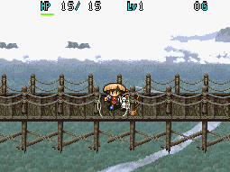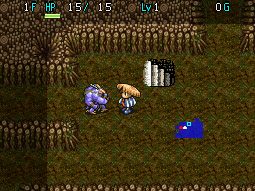

Dungeon where lots of Stairway Traps appear, and only 1 item is generated on each floor. You're expected to bring items to stand a chance, as the monster table ramps up in difficulty very quickly. Exclusives include Gaze Shield, Prism Shield, and Homing Blade, which can only be found between 41-50F. The objective is to rescue Pekeji (who is located on 26F) before the Ravine of the Dead claims his life. After the 1st clear, Transport Patterns can be found from 26F onwards to escape from the dungeon. Overall, it's considered to be the hardest dungeon that allows carry-in items in this game.

<ul class="quickLinksUL">
  <li><a href="#overview">Overview</a></li>
  <li><a href="#strategy">Strategy</a></li>
  <li><a href="#floor-guide">Floor Guide</a></li>
  <li><a href="#monsters">Monsters</a></li>
  <li><a href="#items">Items</a></li>
  <li><a href="#traps">Traps</a></li>
</ul>

# Overview

<table class="dungeonOverview">
  <tr>
    <th>Unlock</th>
    <td class="highlightYellow">1. Clear the main story. 2. Finish the Pekeji side quest. 3. Finish the Bungee Jump side quest. 4. Talk to the old lady inside the Canyon Hamlet Inn. 5. Go on an adventure and return. 6. Hear Pekeji's voice inside the Canyon Hamlet Inn. 7. Go on an adventure and return. 7. Hear Pekeji's voice again. 8. Go to Janus Valley and talk to Butafooter.</td>
  </tr>
  <tr>
    <th>Entrance</th>
    <td class="highlightYellow">Janus Valley (First broken spot on bridge)</td>
  </tr>
</table>

<table class="dungeonTable">
  <tr>
    <th>Floors</th>
    <td colspan="3">50F (Can escape from 26F)</td>
  </tr>
  <tr>
    <th>Bring Items</th>
    <td>Yes</td>
    <th>Allies</th>
    <td></td>
  </tr>
  <tr>
    <th>Bring Gitan</th>
    <td>Yes</td>
    <th>Bring Level Ups</th>
    <td>Yes</td>
  </tr>
  <tr>
    <th>Starting Item</th>
    <td colspan="3">None</td>
  </tr>
  <tr>
    <th>Unidentified</th>
    <td colspan="3"></td>
  </tr>
  <tr>
    <th>Shops</th>
    <td>No</td>
    <th>Monster Houses</th>
    <td>Yes</td>
  </tr>
  <tr>
    <th>Clear Icon</th>
    <td></td>
    <th>Reward</th>
    <td></td>
  </tr>
</table>

#### Special Monster House Floors

<table class="dungeonTable">
  <tr>
    <th></th>
    <th>Lv1</th>
    <th>Lv2</th>
    <th>Lv3</th>
    <th>Lv4</th>
    <th>ALL</th>
  </tr>
  <tr>
    <th>One-eye</th>
    <td>-</td>
    <td>-</td>
    <td>-</td>
    <td>-</td>
    <td>1-50</td>
  </tr>
  <tr>
    <th>Ghost</th>
    <td>-</td>
    <td>-</td>
    <td>-</td>
    <td>-</td>
    <td>1-50</td>
  </tr>
  <tr>
    <th>Drain</th>
    <td>-</td>
    <td>-</td>
    <td>-</td>
    <td>-</td>
    <td>1-50</td>
  </tr>
  <tr>
    <th>Dragon</th>
    <td>-</td>
    <td>-</td>
    <td>-</td>
    <td>-</td>
    <td>1-50</td>
  </tr>
  <tr>
    <th>Sky</th>
    <td>-</td>
    <td>-</td>
    <td>-</td>
    <td>-</td>
    <td>1-50</td>
  </tr>
  <tr>
    <th>Power</th>
    <td>-</td>
    <td>-</td>
    <td>-</td>
    <td>-</td>
    <td>1-50</td>
  </tr>
  <tr>
    <th>Thief</th>
    <td>-</td>
    <td>-</td>
    <td>-</td>
    <td>-</td>
    <td>-</td>
  </tr>
  <tr>
    <th>Guard dogs</th>
    <td>-</td>
    <td>-</td>
    <td>-</td>
    <td>-</td>
    <td>-</td>
  </tr>
</table>

# Rare Items

### Gaze Shield, Prism Shield, Homing Blade

As mentioned in the intro, this dungeon has 3 exclusive items - Gaze Shield, Prism Shield, and Homing Blade. Gaze Shield and Prism Shield have a chance of being generated between 41-45F and on 50F. Homing Blade has a chance of being generated between 46-50F.

The dungeon loops endlessly once you reach 50F (Descend stairs on 50F → Next floor is 50F again), and the 1 item per floor rule doesn't apply to Monster Houses, so it's not as bad as it probably sounds. But it can still take a lot of time to hunt down one of each item, so some prefer to use [Rescue Passwords](/guides/rescue-rewards#passwords).

To increase your chances, you could bring Monster Scrolls and read them on 50F to generate more items. Otherwise, there isn't much you can do to speed up the search aside from using an Armband of Sight.

# Strategy

### Equipment

#### Weapon

|Weapon|Atk|Notes|
|-|-|-|
|Kabra Reborn+99|149|One-shot most monsters.|
|Firebrand+99|119|One-shot many monsters, still comfortable.|
|Kabra's Blade+70|82|You really should upgrade this to Kabra Reborn.|
|Mastersword+60|68|Lack of power is noticeable, but fine for the 1st clear.|
|Katana+50|56|Minimum you should bring for the 1st clear.|

#### Weapon Melds

Razor Wind + Pickaxe* lets you strike incoming monsters first in hallways if you dig out a wall tile. Bufu's Cleaver is needed to sustain fullness, and meat has all sorts of great uses. (Many of these meld abilities are easily obtained using [Rescue Passwords](/guides/rescue-rewards#passwords))

<table class="sealTable">
  <tr>
    <th>Icon</th>
    <th>Item</th>
    <th>Effect</th>
  </tr>
  <tr>
    <td></td>
    <td>Golden Blade</td>
    <td>Weapon won't rust from traps or monster attacks. (Doesn't stop Lv3-4 Green Slimes from erasing meld abilities)</td>
  </tr>
  <tr>
    <td></td>
    <td>Razor Wind</td>
    <td>Attack in 3 forward directions.</td>
  </tr>
  <tr>
    <td></td>
    <td>Bufu's Cleaver</td>
    <td>Chance to turn defeated monsters into meat.</td>
  </tr>
  <tr>
    <td></td>
    <td>Pickaxe*</td>
    <td>Dig through walls, the weapon never breaks.</td>
  </tr>
  <tr>
    <td></td>
    <td>Dragonkiller</td>
    <td>Deal x2.0 damage to Dragon types.</td>
  </tr>
  <tr>
    <td></td>
    <td>Sickle Slayer</td>
    <td>Deal x2.0 damage to Ghost types.</td>
  </tr>
  <tr>
    <td></td>
    <td>Cyclops Killer</td>
    <td>Deal x2.0 damage to One-Eyed types.</td>
  </tr>
  <tr>
    <td></td>
    <td>Drain Buster</td>
    <td>Deal x2.0 damage to Drain types.</td>
  </tr>
  <tr>
    <td></td>
    <td>Crescent Arm</td>
    <td>Deal x2.0 damage to Exploding types.</td>
  </tr>
  <tr>
    <td></td>
    <td>Air Slayer</td>
    <td>Deal x2.0 damage to Floating types.</td>
  </tr>
</table>

Pickaxe* = Unbreakable Pickaxe obtained from the Blacksmith.

#### Shield

|Shield|Def|Notes|
|-|-|-|
|Stormward+99|149|Receive 1 damage from monsters.|
|Windshield+70|82|You really should upgrade this to Stormward.|
|Armor Ward+55|64|Should be fine for the 1st clear.|
|Iron Shield+45|51|Minimum you should bring for the 1st clear.|

#### Shield Melds

Gold Shield, Dragonward, Blast Shield, and Walrus Shield are top priority. Evasive Shield and Spiked Ward are particularly good if your shield strength is low. (Many of these meld abilities are easily obtained using [Rescue Passwords](/guides/rescue-rewards#passwords))

<table class="sealTable">
  <tr>
    <th>Icon</th>
    <th>Item</th>
    <th>Effect</th>
  </tr>
  <tr>
    <td></td>
    <td>Gold Shield</td>
    <td>Shield won't rust from traps or monster attacks. (Doesn't stop Lv3-4 Green Slimes from erasing meld abilities)</td>
  </tr>
  <tr>
    <td></td>
    <td>Dragonward</td>
    <td>Reduces fire damage by 50%.</td>
  </tr>
  <tr>
    <td></td>
    <td>Blast Shield</td>
    <td>Reduces explosion damage by 50%.</td>
  </tr>
  <tr>
    <td></td>
    <td>Walrus Shield</td>
    <td>Protects items and Gitan from being stolen.</td>
  </tr>
  <tr>
    <td></td>
    <td>Hide Shield</td>
    <td>Halves hunger rate (1 fullness / 20 turns).</td>
  </tr>
  <tr>
    <td></td>
    <td>Evasive Shield</td>
    <td>Increases your chance to evade enemy direct attacks.</td>
  </tr>
  <tr>
    <td></td>
    <td>Spiked Ward</td>
    <td>Reflect 1/3 of damage received. (6 or less damage = 1)</td>
  </tr>
</table>

#### Armbands

|Armband|Notes|
|-|-|
|Armband of Sight|Reveals the locations of characters and items. (Also makes you able to see invisible monsters such as Air Devil)|
|Trap Armband|Reveal Stairway Traps, check for hidden traps when you enter a new room.|
|Sleepless Armband|For Sleep Radish (7-10F).|

### Other Items

Rare items like Bufu's Staff and Herb of Revival are great as well.

|Item|Notes|
|-|-|
|Chiropractic Jar [5]|Bring at least 3 of these.|
|Air Devil Meat|Turn invisible - Great for Monster Houses, etc.|
|Scroll of Removal|Probably best thrown at a Dragon family monster. (Can use a Blank Scroll instead of the real thing)|
|Scroll of Blessing Curse Girl Meat|Nice to have in case key items get cursed.|
|Doppelganger Staff|Useful for a variety of situations.|
|Staff of Postpone|Use with Armband of Sight to quickly locate the stairs.|
|Staff of Paralysis|Paralyze monsters with troublesome special attacks.|
|Staff of Stability|Protects jars from breaking when tripped by Dremlas types.|
|Switching Staff|Hurry to the stairs in a Monster House, etc.|
|Scroll of Need|Nice to have in case you get surrounded.|
|Scroll of Confusion|For Monster Houses or such.|
|Blank Scroll|Use it as a Destruction Scroll, etc.|

# Floor Guide

### General

Eating Air Devil type meat is the best way to deal with Monster Houses in this dungeon.

Swap to Trap Armband to check for traps when entering rooms, then switch back to Armband of Sight. The exception to this is Sleep Radish (7-10F) floors, where you'll want to use Sleepless Armband instead. Equipping a Trap Armband instantly reveals all Stairway Traps.

Don't get lazy about using items against troublesome monsters like Super Gaze - Direct attacks can still miss. (It's fine to rely on direct attacks if you have the  Homing Blade meld ability from this dungeon).

### 1-2F

Monsters aren't a threat if you brought the suggested items. Throw a Scroll of Removal at a 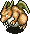 Dragon (2-4F) to banish Ark Dragon and Hell Dragon from the adventure. Hunt 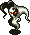 Air Devil (1-2F) to stock up on Air Devil Meat if you have Bufu's Cleaver melded.

### 3-19F

Monsters are generally easy, but there are some special attacks you'll want to watch out for. Remember to equip a Sleepless Armband between 7-10F for Sleep Radishes.

#### Item Related

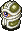 Super Gaze (3-6F) has 51 HP and hypnotizes Shiren, forcing item usage or an attack. 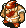 Item Bandit (4-6F) has 35 HP and can turn an inventory item into Weeds when adjacent. 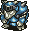 Madremlas (5-8F) has 60 HP and makes Shiren trip and drop items, which can cause jars to break.  Curse Mom (7-10F) has 56 HP and curses 1 inventory item, sealing its abilities or making it unusable.  Steel Armor (9-12F) has 80 HP and knocks away your equipped weapon or shield when adjacent. 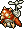 Hover Fowl (11-14F) has 45 HP and electrifies 1 herb, scroll, or staff in your inventory, destroying the item. 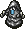 Grey Slime (11-20F) has 70 HP, can multiply when hit, and either rusts equipment or erases 1 meld ability.

#### Caution

 Rice Boss (5-8F) has 38 HP and inflicts Shiren with Riceball status, nullifying stats from equipment.  Sleep Radish (7-10F) has 55 HP and throws Sleeping Herb within 3 tiles, or Poison Herb if you're asleep. 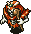 Skull Wraith (9-12F) has 60 HP and shoots a magic bullet (Riceball, Paralyzed, Slow, Sealed, Confused, Level-1). 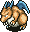 Sky Dragon (10-13F) has 100 HP and spews a 40 damage (20 w/Dragonward) flame from anywhere in the room. 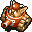 Oldster Tank (15-20F) has 50 HP, Swift 2 speed, and fires a 40 damage (20 w/Blast Shield) cannon. 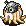 Mist Hermit (16-20F) has 60 HP and casts a spell that stops HP regen / drains HP from anywhere in the room.

### 20-38F

Monsters are Lv3-4 now, and the lineup of special attacks becomes quite nasty. The goal for the 1st clear is to find Pekeji who can be found on all floors starting on 26F. If you're using weaker equipment, consider escaping on 26F and coming back for the exclusive items later.  Fear Eye (26-35F), 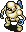 Bioroid (26-50F), and 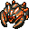 Fallen Gather (30-50F) hit hard if your shield is weak.

#### Item Related

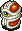 Hyper Gaze (20-25F) has 70 HP and hypnotizes Shiren, forcing item usage or an attack. 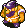 Trove Bandit (21-30F) has 50 HP and can turn an inventory item into Weeds when adjacent.  Curse Gran (27-35F) has 72 HP and curses 1 inventory item, sealing its abilities or making it unusable. 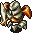 Alloy Armor (28-37F) has 100 HP and knocks away your equipped weapon, shield, or armband. 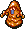 Red Slime (30-38F) has 100 HP, can multiply when hit, and either rusts equipment or erases 1 meld ability. 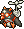 Jet Fowl (36-40F) has 80 HP and electrifies a jar, destroying both the jar and contents.

#### Caution

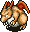 Ark Dragon (20-31F) has 120 HP and spews a 50 damage (25 w/Dragonward) flame from anywhere on the floor.  Fear Radish (29-33F) has 70 HP and throws Kigny Seed within 3 tiles, or Poison Herb if you're berserk. 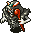 Skull Demon (31-38F) has 75 HP and shoots a magic bullet (Riceball, Sleepy, Blinded, 40 damage, Level-3).  Rice Master (31-50F) has 70 HP and inflicts Shiren with Riceball status or turns inventory items into riceballs. 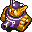 Cranky Tank (32-50F) has 80 HP, Swift 2 speed, and fires a 50 damage (25 w/Blast Shield) cannon. 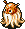 Cloud Hermit (38-50F) has 70 HP and casts a spell that stops HP regen / drains HP from anywhere on the floor.

### 39-50F

The monster table doesn't change much from this point, but powerful monsters including Hell Dragon appear. The goal around here is to search for Gaze Shield & Prism Shield (41-45F, 50F) and Homing Blade (46-50F). Monster direct attacks shouldn't be an issue if you have a Stormward+99.

#### Item Related

 Jet Fowl (36-40F) has 80 HP and electrifies a jar, destroying both the jar and contents.  Roguewalrus (36-50F) has 100 HP and steals 1 item from your inventory or the ground, then vanishes. 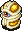 Ultra Gaze (40-50F) has 90 HP and hypnotizes Shiren, forcing item usage or an attack.  Red Slime (45-50F) has 100 HP, can multiply when hit, and either rusts equipment or erases 1 meld ability.

#### Caution

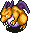 Hell Dragon (39-50F) has 150 HP and spews a 60 damage (30 w/Dragonward) flame from anywhere on the floor.  Rice Master (31-50F) has 70 HP and inflicts Shiren with Riceball status or turns inventory items into riceballs.  Cranky Tank (32-50F) has 80 HP, Swift 2 speed, and fires a 50 damage (25 w/Blast Shield) cannon.  Cloud Hermit (38-50F) has 70 HP and casts a spell that stops HP regen / drains HP from anywhere on the floor. 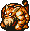 Tiger Uboho (44-50F) has 100 HP and throws other monsters at Shiren or such (Range of 20 tiles).

# Monsters

See [Monsters](/system/monsters) for individual monster details.

- H - Monster House is possible

Numbers in parentheses are HP values. Spawn Rates: Low Medium High

<table class="monsterTable">
  <thead>
    <tr>
      <th>F</th>
      <th>H</th>
      <th colspan="5">Monsters</th>
    </tr>
  </thead>
  <tbody>
    <tr>
      <td rowspan="2">1</td>
      <td rowspan="2" class="highlightMH"></td>
      <td class="high"> Pacorepkina (45)</td>
      <td class="high">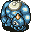 Chainhead (50)</td>
      <td class="high">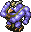 Master Hen (50)</td>
      <td class="high">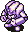 Mistonos (50)</td>
      <td class="mid">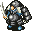 Evil General (30)</td>
    </tr>
    <tr>
      <td class="mid"> Air Devil (50)</td>
      <td class="low">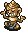 N'Bama (40)</td>
      <td class="high">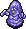 Purple Slime (40)</td>
      <td class=""></td>
      <td class=""></td>
    </tr>
    <tr>
      <td colspan="9" class="tableDivider"></td>
    </tr>
    <tr>
      <td rowspan="2">2</td>
      <td rowspan="2" class="highlightMH"></td>
      <td class="high"> Pacorepkina (45)</td>
      <td class="high"> Chainhead (50)</td>
      <td class="high"> Master Hen (50)</td>
      <td class="high"> Mistonos (50)</td>
      <td class="mid"> Evil General (30)</td>
    </tr>
    <tr>
      <td class="mid"> Air Devil (50)</td>
      <td class="low"> N'Bama (40)</td>
      <td class="high"> Purple Slime (40)</td>
      <td class="high">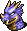 Dragon Head (70)</td>
      <td class="high"> Dragon (90)</td>
    </tr>
    <tr>
      <td colspan="9" class="tableDivider"></td>
    </tr>
    <tr>
      <td rowspan="3">3</td>
      <td rowspan="3" class="highlightMH"></td>
      <td class="high"> Pacorepkina (45)</td>
      <td class="high"> Chainhead (50)</td>
      <td class="high"> Super Gaze (51)</td>
      <td class="high"> Mistonos (50)</td>
      <td class="mid"> Evil General (30)</td>
    </tr>
    <tr>
      <td class="high">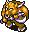 Minotaur (55)</td>
      <td class="low"> N'Bama (40)</td>
      <td class="high"> Purple Slime (40)</td>
      <td class="high"> Dragon Head (70)</td>
      <td class="high"> Dragon (90)</td>
    </tr>
    <tr>
      <td class="high"> Killer Gather (60)</td>
      <td class="low">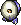 Running Egg (5)</td>
      <td class=""></td>
      <td class=""></td>
      <td class=""></td>
    </tr>
    <tr>
      <td colspan="9" class="tableDivider"></td>
    </tr>
    <tr>
      <td rowspan="3">4</td>
      <td rowspan="3" class="highlightMH"></td>
      <td class="high"> Item Bandit (35)</td>
      <td class="high">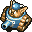 Dadster Tank (40)</td>
      <td class="high"> Super Gaze (51)</td>
      <td class="high"> Mistonos (50)</td>
      <td class="mid"> Evil General (30)</td>
    </tr>
    <tr>
      <td class="high"> Minotaur (55)</td>
      <td class="low"> N'Bama (40)</td>
      <td class="high"> Blazepuff (40)</td>
      <td class="high"> Dragon Head (70)</td>
      <td class="high"> Dragon (90)</td>
    </tr>
    <tr>
      <td class="high"> Killer Gather (60)</td>
      <td class="low"> Running Egg (5)</td>
      <td class="high">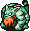 Tiger Uhoho (65)</td>
      <td class=""></td>
      <td class=""></td>
    </tr>
    <tr>
      <td colspan="9" class="tableDivider"></td>
    </tr>
    <tr>
      <td rowspan="3">5</td>
      <td rowspan="3" class="highlightMH"></td>
      <td class="high"> Item Bandit (35)</td>
      <td class="high"> Dadster Tank (40)</td>
      <td class="high"> Super Gaze (51)</td>
      <td class="high"> Rice Boss (38)</td>
      <td class="mid"> Evil General (30)</td>
    </tr>
    <tr>
      <td class="high"> Minotaur (55)</td>
      <td class="low"> N'Bama (40)</td>
      <td class="high"> Blazepuff (40)</td>
      <td class="high"> Madremlas (60)</td>
      <td class=""></td>
    </tr>
    <tr>
      <td class="high"> Killer Gather (60)</td>
      <td class="low"> Running Egg (5)</td>
      <td class="high"> Tiger Uhoho (65)</td>
      <td class=""></td>
      <td class=""></td>
    </tr>
    <tr>
      <td colspan="9" class="tableDivider"></td>
    </tr>
    <tr>
      <td rowspan="3">6</td>
      <td rowspan="3" class="highlightMH"></td>
      <td class="high"> Item Bandit (35)</td>
      <td class="high"> Dadster Tank (40)</td>
      <td class="high"> Super Gaze (51)</td>
      <td class="high"> Rice Boss (38)</td>
      <td class="mid"> Evil General (30)</td>
    </tr>
    <tr>
      <td class="high"> Minotaur (55)</td>
      <td class="low"> N'Bama (40)</td>
      <td class="high"> Blazepuff (40)</td>
      <td class="high"> Madremlas (60)</td>
      <td class=""></td>
    </tr>
    <tr>
      <td class="high"> Killer Gather (60)</td>
      <td class="low">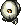 Flying Egg (8)</td>
      <td class="high"> Tiger Uhoho (65)</td>
      <td class=""></td>
      <td class=""></td>
    </tr>
    <tr>
      <td colspan="9" class="tableDivider"></td>
    </tr>
    <tr>
      <td rowspan="3">7</td>
      <td rowspan="3" class="highlightMH"></td>
      <td class="high">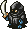 Shadow Eye (40)</td>
      <td class="high"> Dadster Tank (40)</td>
      <td class="high"> Sleep Radish (55)</td>
      <td class="high"> Rice Boss (38)</td>
      <td class="mid"> Evil General (30)</td>
    </tr>
    <tr>
      <td class="high"> Curse Mom (56)</td>
      <td class="low"> N'Bama (40)</td>
      <td class="high"> Blazepuff (40)</td>
      <td class="high"> Madremlas (60)</td>
      <td class="low">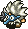 Tengu Chief (40)</td>
    </tr>
    <tr>
      <td class=""></td>
      <td class="low"> Flying Egg (8)</td>
      <td class="high"> Tiger Uhoho (65)</td>
      <td class=""></td>
      <td class=""></td>
    </tr>
    <tr>
      <td colspan="9" class="tableDivider"></td>
    </tr>
    <tr>
      <td rowspan="3">8</td>
      <td rowspan="3" class="highlightMH"></td>
      <td class="high"> Shadow Eye (40)</td>
      <td class="high">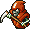 Death Angel (65)</td>
      <td class="high"> Sleep Radish (55)</td>
      <td class="high"> Rice Boss (38)</td>
      <td class="mid"> Evil General (30)</td>
    </tr>
    <tr>
      <td class="high"> Curse Mom (56)</td>
      <td class="low"> N'Bama (40)</td>
      <td class="mid">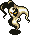 Wraith Devil (50)</td>
      <td class="high"> Madremlas (60)</td>
      <td class="low"> Tengu Chief (40)</td>
    </tr>
    <tr>
      <td class=""></td>
      <td class="low"> Flying Egg (8)</td>
      <td class=""></td>
      <td class=""></td>
      <td class=""></td>
    </tr>
    <tr>
      <td colspan="9" class="tableDivider"></td>
    </tr>
    <tr>
      <td rowspan="3">9</td>
      <td rowspan="3" class="highlightMH"></td>
      <td class="high"> Shadow Eye (40)</td>
      <td class="high"> Death Angel (65)</td>
      <td class="high"> Sleep Radish (55)</td>
      <td class="high">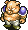 Piggo (50)</td>
      <td class="mid"> Evil General (30)</td>
    </tr>
    <tr>
      <td class="high"> Curse Mom (56)</td>
      <td class="low"> N'Bama (40)</td>
      <td class="mid"> Wraith Devil (50)</td>
      <td class="high"> Skull Wraith (60)</td>
      <td class="low"> Tengu Chief (40)</td>
    </tr>
    <tr>
      <td class="high"> Steel Armor (80)</td>
      <td class="low"> Flying Egg (8)</td>
      <td class="high">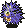 Spike Blast (80)</td>
      <td class=""></td>
      <td class=""></td>
    </tr>
    <tr>
      <td colspan="9" class="tableDivider"></td>
    </tr>
    <tr>
      <td rowspan="3">10</td>
      <td rowspan="3" class="highlightMH"></td>
      <td class="high"> Shadow Eye (40)</td>
      <td class="high"> Death Angel (65)</td>
      <td class="high"> Sleep Radish (55)</td>
      <td class="high"> Piggo (50)</td>
      <td class="mid"> Evil General (30)</td>
    </tr>
    <tr>
      <td class="high"> Curse Mom (56)</td>
      <td class="low"> N'Bama (40)</td>
      <td class="mid"> Wraith Devil (50)</td>
      <td class="high"> Skull Wraith (60)</td>
      <td class="low"> Tengu Chief (40)</td>
    </tr>
    <tr>
      <td class="high"> Steel Armor (80)</td>
      <td class="low"> Flying Egg (8)</td>
      <td class="high"> Spike Blast (80)</td>
      <td class="high"> Sky Dragon (100)</td>
      <td class=""></td>
    </tr>
    <tr>
      <td colspan="9" class="tableDivider"></td>
    </tr>
    <tr>
      <td rowspan="3">11</td>
      <td rowspan="3" class="highlightMH"></td>
      <td class="high"> Hover Fowl (45)</td>
      <td class="high"> Death Angel (65)</td>
      <td class="high"> Grey Slime (70)</td>
      <td class="high"> Piggo (50)</td>
      <td class="mid"> Evil General (30)</td>
    </tr>
    <tr>
      <td class="low"> Ironwalrus (70)</td>
      <td class="low"> N'Bama (40)</td>
      <td class="mid"> Wraith Devil (50)</td>
      <td class="high"> Skull Wraith (60)</td>
      <td class="low"> Tengu Chief (40)</td>
    </tr>
    <tr>
      <td class="high"> Steel Armor (80)</td>
      <td class=""></td>
      <td class="high"> Spike Blast (80)</td>
      <td class="high"> Sky Dragon (100)</td>
      <td class=""></td>
    </tr>
    <tr>
      <td colspan="9" class="tableDivider"></td>
    </tr>
    <tr>
      <td rowspan="3">12</td>
      <td rowspan="3" class="highlightMH"></td>
      <td class="high"> Hover Fowl (45)</td>
      <td class="high">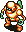 Electroid (70)</td>
      <td class="high"> Grey Slime (70)</td>
      <td class="high"> Piggo (50)</td>
      <td class="mid"> Evil General (30)</td>
    </tr>
    <tr>
      <td class="low"> Ironwalrus (70)</td>
      <td class="low"> N'Bama (40)</td>
      <td class="high"> Cave Mamel (5)</td>
      <td class="high"> Skull Wraith (60)</td>
      <td class="low"> Tengu Chief (40)</td>
    </tr>
    <tr>
      <td class="high"> Steel Armor (80)</td>
      <td class="high">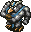 Great Hen (60)</td>
      <td class="high"> Spike Blast (80)</td>
      <td class="high"> Sky Dragon (100)</td>
      <td class=""></td>
    </tr>
    <tr>
      <td colspan="9" class="tableDivider"></td>
    </tr>
    <tr>
      <td rowspan="3">13</td>
      <td rowspan="3" class="highlightMH"></td>
      <td class="high"> Hover Fowl (45)</td>
      <td class="high"> Electroid (70)</td>
      <td class="high"> Grey Slime (70)</td>
      <td class="high">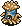 Leech Fly (41)</td>
      <td class="mid"> Evil General (30)</td>
    </tr>
    <tr>
      <td class="low"> Ironwalrus (70)</td>
      <td class="low"> N'Bama (40)</td>
      <td class="high"> Cave Mamel (5)</td>
      <td class="high"> Sky Dragon (100)</td>
      <td class="low"> Tengu Chief (40)</td>
    </tr>
    <tr>
      <td class=""></td>
      <td class="high"> Great Hen (60)</td>
      <td class=""></td>
      <td class=""></td>
      <td class=""></td>
    </tr>
    <tr>
      <td colspan="9" class="tableDivider"></td>
    </tr>
    <tr>
      <td rowspan="3">14</td>
      <td rowspan="3" class="highlightMH"></td>
      <td class="high"> Hover Fowl (45)</td>
      <td class="high"> Electroid (70)</td>
      <td class="high"> Grey Slime (70)</td>
      <td class="high"> Leech Fly (41)</td>
      <td class="mid"> Evil General (30)</td>
    </tr>
    <tr>
      <td class="low"> Ironwalrus (70)</td>
      <td class="low"> N'Bama (40)</td>
      <td class="high"> Cave Mamel (5)</td>
      <td class=""></td>
      <td class=""></td>
    </tr>
    <tr>
      <td class=""></td>
      <td class="high"> Great Hen (60)</td>
      <td class=""></td>
      <td class=""></td>
      <td class=""></td>
    </tr>
    <tr>
      <td colspan="9" class="tableDivider"></td>
    </tr>
    <tr>
      <td rowspan="3">15</td>
      <td rowspan="3" class="highlightMH"></td>
      <td class="high"> Oldster Tank (50)</td>
      <td class="high"> Electroid (70)</td>
      <td class="high"> Grey Slime (70)</td>
      <td class="high"> Leech Fly (41)</td>
      <td class="mid"> Evil General (30)</td>
    </tr>
    <tr>
      <td class="high"> Pacorepking (60)</td>
      <td class="low"> N'Bama (40)</td>
      <td class="high"> Cave Mamel (5)</td>
      <td class="high">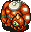 Gigahead (70)</td>
      <td class="high">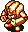 Verginos (70)</td>
    </tr>
    <tr>
      <td class="high"> Megataur (90)</td>
      <td class="high"> Great Hen (60)</td>
      <td class=""></td>
      <td class=""></td>
      <td class=""></td>
    </tr>
    <tr>
      <td colspan="9" class="tableDivider"></td>
    </tr>
    <tr>
      <td rowspan="3">16</td>
      <td rowspan="3" class="highlightMH"></td>
      <td class="high"> Oldster Tank (50)</td>
      <td class="high"> Mist Hermit (60)</td>
      <td class="high"> Grey Slime (70)</td>
      <td class="high"> Leech Fly (41)</td>
      <td class="mid"> Evil General (30)</td>
    </tr>
    <tr>
      <td class="high"> Pacorepking (60)</td>
      <td class="low"> N'Bama (40)</td>
      <td class="high"> Hell Gather (90)</td>
      <td class="high"> Gigahead (70)</td>
      <td class="high"> Verginos (70)</td>
    </tr>
    <tr>
      <td class="high"> Megataur (90)</td>
      <td class="high"> Hardremlas (130)</td>
      <td class="mid"> Mirage Devil (50)</td>
      <td class=""></td>
      <td class=""></td>
    </tr>
    <tr>
      <td colspan="9" class="tableDivider"></td>
    </tr>
    <tr>
      <td rowspan="3">17</td>
      <td rowspan="3" class="highlightMH"></td>
      <td class="high"> Oldster Tank (50)</td>
      <td class="high"> Mist Hermit (60)</td>
      <td class="high"> Grey Slime (70)</td>
      <td class="high"> Leech Fly (41)</td>
      <td class="mid"> Evil General (30)</td>
    </tr>
    <tr>
      <td class="high"> Pacorepking (60)</td>
      <td class="low"> N'Bama (40)</td>
      <td class="high"> Hell Gather (90)</td>
      <td class="high"> Gigahead (70)</td>
      <td class="high"> Verginos (70)</td>
    </tr>
    <tr>
      <td class="high"> Megataur (90)</td>
      <td class="high"> Hardremlas (130)</td>
      <td class="mid"> Mirage Devil (50)</td>
      <td class=""></td>
      <td class=""></td>
    </tr>
    <tr>
      <td colspan="9" class="tableDivider"></td>
    </tr>
    <tr>
      <td rowspan="3">18</td>
      <td rowspan="3" class="highlightMH"></td>
      <td class="high"> Oldster Tank (50)</td>
      <td class="high"> Mist Hermit (60)</td>
      <td class="high"> Grey Slime (70)</td>
      <td class=""></td>
      <td class="mid"> Evil General (30)</td>
    </tr>
    <tr>
      <td class="high"> Pacorepking (60)</td>
      <td class="low"> N'Bama (40)</td>
      <td class="high"> Hell Gather (90)</td>
      <td class="high"> Gigahead (70)</td>
      <td class="high"> Verginos (70)</td>
    </tr>
    <tr>
      <td class="high"> Megataur (90)</td>
      <td class="high"> Hardremlas (130)</td>
      <td class="mid"> Mirage Devil (50)</td>
      <td class=""></td>
      <td class=""></td>
    </tr>
    <tr>
      <td colspan="9" class="tableDivider"></td>
    </tr>
    <tr>
      <td rowspan="3">19</td>
      <td rowspan="3" class="highlightMH"></td>
      <td class="high"> Oldster Tank (50)</td>
      <td class="high"> Mist Hermit (60)</td>
      <td class="high"> Grey Slime (70)</td>
      <td class=""></td>
      <td class="mid"> Evil General (30)</td>
    </tr>
    <tr>
      <td class="high"> Pacorepking (60)</td>
      <td class="low"> N'Bama (40)</td>
      <td class="high"> Hell Gather (90)</td>
      <td class="high"> Gigahead (70)</td>
      <td class="high"> Verginos (70)</td>
    </tr>
    <tr>
      <td class="high"> Megataur (90)</td>
      <td class="high"> Hardremlas (130)</td>
      <td class="mid"> Mirage Devil (50)</td>
      <td class=""></td>
      <td class=""></td>
    </tr>
    <tr>
      <td colspan="9" class="tableDivider"></td>
    </tr>
    <tr>
      <td rowspan="3">20</td>
      <td rowspan="3" class="highlightMH"></td>
      <td class="high"> Oldster Tank (50)</td>
      <td class="high"> Mist Hermit (60)</td>
      <td class="high"> Grey Slime (70)</td>
      <td class="high"> Hyper Gaze (70)</td>
      <td class="mid"> Evil General (30)</td>
    </tr>
    <tr>
      <td class="high"> Pacorepking (60)</td>
      <td class="low"> N'Bama (40)</td>
      <td class="high"> Hell Gather (90)</td>
      <td class="high"> Infernopuff (80)</td>
      <td class="high"> Dirt Dragon (80)</td>
    </tr>
    <tr>
      <td class="high"> Ark Dragon (120)</td>
      <td class="high"> Hardremlas (130)</td>
      <td class="mid"> Mirage Devil (50)</td>
      <td class=""></td>
      <td class=""></td>
    </tr>
    <tr>
      <td colspan="9" class="tableDivider"></td>
    </tr>
    <tr>
      <td rowspan="2">21</td>
      <td rowspan="2" class="highlightMH"></td>
      <td class="high"> Trove Bandit (50)</td>
      <td class="low"> N'Bama (40)</td>
      <td class="high"> Spike Fire (120)</td>
      <td class="high"> Hyper Gaze (70)</td>
      <td class="mid"> Evil General (30)</td>
    </tr>
    <tr>
      <td class="high"> Ark Dragon (120)</td>
      <td class="high"> Hardremlas (130)</td>
      <td class=""></td>
      <td class="high"> Infernopuff (80)</td>
      <td class="high"> Dirt Dragon (80)</td>
    </tr>
    <tr>
      <td colspan="9" class="tableDivider"></td>
    </tr>
    <tr>
      <td rowspan="2">22</td>
      <td rowspan="2" class="highlightMH"></td>
      <td class="high"> Trove Bandit (50)</td>
      <td class="low"> N'Bama (40)</td>
      <td class="high"> Spike Fire (120)</td>
      <td class="high"> Hyper Gaze (70)</td>
      <td class="mid"> Evil General (30)</td>
    </tr>
    <tr>
      <td class="high"> Ark Dragon (120)</td>
      <td class="high"> Tiger Uhon (80)</td>
      <td class=""></td>
      <td class="high"> Infernopuff (80)</td>
      <td class="high"> Dirt Dragon (80)</td>
    </tr>
    <tr>
      <td colspan="9" class="tableDivider"></td>
    </tr>
    <tr>
      <td rowspan="2">23</td>
      <td rowspan="2" class="highlightMH"></td>
      <td class="high"> Trove Bandit (50)</td>
      <td class="low"> N'Bama (40)</td>
      <td class="high"> Spike Fire (120)</td>
      <td class="high"> Hyper Gaze (70)</td>
      <td class="mid"> Evil General (30)</td>
    </tr>
    <tr>
      <td class="high"> Ark Dragon (120)</td>
      <td class="high"> Tiger Uhon (80)</td>
      <td class="high"> Piggora (70)</td>
      <td class="high"> Infernopuff (80)</td>
      <td class="high"> Dirt Dragon (80)</td>
    </tr>
    <tr>
      <td colspan="9" class="tableDivider"></td>
    </tr>
    <tr>
      <td rowspan="3">24</td>
      <td rowspan="3" class="highlightMH"></td>
      <td class="high"> Trove Bandit (50)</td>
      <td class="low"> N'Bama (40)</td>
      <td class="high"> Spike Fire (120)</td>
      <td class="high"> Hyper Gaze (70)</td>
      <td class="mid"> Evil General (30)</td>
    </tr>
    <tr>
      <td class="high"> Ark Dragon (120)</td>
      <td class="high"> Tiger Uhon (80)</td>
      <td class="high"> Piggora (70)</td>
      <td class="high"> Infernopuff (80)</td>
      <td class="high"> Dirt Dragon (80)</td>
    </tr>
    <tr>
      <td class=""></td>
      <td class=""></td>
      <td class=""></td>
      <td class="low"> Tengu Elder (55)</td>
      <td class=""></td>
    </tr>
    <tr>
      <td colspan="9" class="tableDivider"></td>
    </tr>
    <tr>
      <td rowspan="2">25</td>
      <td rowspan="2" class="highlightMH"></td>
      <td class="high"> Trove Bandit (50)</td>
      <td class="low"> N'Bama (40)</td>
      <td class="high"> Spike Fire (120)</td>
      <td class="high"> Hyper Gaze (70)</td>
      <td class="mid"> Evil General (30)</td>
    </tr>
    <tr>
      <td class="high"> Ark Dragon (120)</td>
      <td class="high"> Tiger Uhon (80)</td>
      <td class="high"> Piggora (70)</td>
      <td class="low"> Tengu Elder (55)</td>
      <td class="high"> Dirt Dragon (80)</td>
    </tr>
    <tr>
      <td colspan="9" class="tableDivider"></td>
    </tr>
    <tr>
      <td rowspan="2">26</td>
      <td rowspan="2" class="highlightMH"></td>
      <td class="high"> Trove Bandit (50)</td>
      <td class="high"> Fear Eye (60)</td>
      <td class="high"> Death Master (77)</td>
      <td class="high"> Bioroid (80)</td>
      <td class="mid"> Evil Shogun (50)</td>
    </tr>
    <tr>
      <td class="high"> Ark Dragon (120)</td>
      <td class="high"> Tiger Uhon (80)</td>
      <td class="high"> Piggora (70)</td>
      <td class="low"> Tengu Elder (55)</td>
      <td class="low"> N'Balun (50)</td>
    </tr>
    <tr>
      <td colspan="9" class="tableDivider"></td>
    </tr>
    <tr>
      <td rowspan="3">27</td>
      <td rowspan="3" class="highlightMH"></td>
      <td class="high"> Trove Bandit (50)</td>
      <td class="high"> Fear Eye (60)</td>
      <td class="high"> Death Master (77)</td>
      <td class="high"> Bioroid (80)</td>
      <td class="mid"> Evil Shogun (50)</td>
    </tr>
    <tr>
      <td class="high"> Ark Dragon (120)</td>
      <td class="high"> Tiger Uhon (80)</td>
      <td class="high"> Piggora (70)</td>
      <td class="low"> Tengu Elder (55)</td>
      <td class="low"> N'Balun (50)</td>
    </tr>
    <tr>
      <td class="high"> Curse Gran (72)</td>
      <td class="low"> Hiding Egg (10)</td>
      <td class=""></td>
      <td class=""></td>
      <td class=""></td>
    </tr>
    <tr>
      <td colspan="9" class="tableDivider"></td>
    </tr>
    <tr>
      <td rowspan="3">28</td>
      <td rowspan="3" class="highlightMH"></td>
      <td class="high"> Trove Bandit (50)</td>
      <td class="high"> Fear Eye (60)</td>
      <td class="high"> Death Master (77)</td>
      <td class="high"> Bioroid (80)</td>
      <td class="mid"> Evil Shogun (50)</td>
    </tr>
    <tr>
      <td class="high"> Ark Dragon (120)</td>
      <td class="high"> Alloy Armor (100)</td>
      <td class="high"> Piggora (70)</td>
      <td class="low"> Tengu Elder (55)</td>
      <td class="low"> N'Balun (50)</td>
    </tr>
    <tr>
      <td class="high"> Curse Gran (72)</td>
      <td class="low"> Hiding Egg (10)</td>
      <td class=""></td>
      <td class=""></td>
      <td class=""></td>
    </tr>
    <tr>
      <td colspan="9" class="tableDivider"></td>
    </tr>
    <tr>
      <td rowspan="3">29</td>
      <td rowspan="3" class="highlightMH"></td>
      <td class="high"> Trove Bandit (50)</td>
      <td class="high"> Fear Eye (60)</td>
      <td class="high"> Death Master (77)</td>
      <td class="high"> Bioroid (80)</td>
      <td class="mid"> Evil Shogun (50)</td>
    </tr>
    <tr>
      <td class="high"> Ark Dragon (120)</td>
      <td class="high"> Alloy Armor (100)</td>
      <td class="high"> Piggora (70)</td>
      <td class="low"> Tengu Elder (55)</td>
      <td class="low"> N'Balun (50)</td>
    </tr>
    <tr>
      <td class="high"> Curse Gran (72)</td>
      <td class="low"> Hiding Egg (10)</td>
      <td class="high"> Fear Radish (70)</td>
      <td class=""></td>
      <td class=""></td>
    </tr>
    <tr>
      <td colspan="9" class="tableDivider"></td>
    </tr>
    <tr>
      <td rowspan="4">30</td>
      <td rowspan="4" class="highlightMH"></td>
      <td class="high"> Trove Bandit (50)</td>
      <td class="high"> Fear Eye (60)</td>
      <td class="high"> Death Master (77)</td>
      <td class="high"> Bioroid (80)</td>
      <td class="mid"> Evil Shogun (50)</td>
    </tr>
    <tr>
      <td class="high"> Ark Dragon (120)</td>
      <td class="high"> Alloy Armor (100)</td>
      <td class="high"> Piggora (70)</td>
      <td class="low"> Tengu Elder (55)</td>
      <td class="low"> N'Balun (50)</td>
    </tr>
    <tr>
      <td class="high"> Curse Gran (72)</td>
      <td class="low"> Hiding Egg (10)</td>
      <td class="high"> Fear Radish (70)</td>
      <td class="high"> Fallen Gather (130)</td>
      <td class="high"> Pacorepgod (80)</td>
    </tr>
    <tr>
      <td class="high"> Red Slime (100)</td>
      <td class=""></td>
      <td class=""></td>
      <td class=""></td>
      <td class=""></td>
    </tr>
    <tr>
      <td colspan="9" class="tableDivider"></td>
    </tr>
    <tr>
      <td rowspan="4">31</td>
      <td rowspan="4" class="highlightMH"></td>
      <td class="high"> Rice Master (70)</td>
      <td class="high"> Fear Eye (60)</td>
      <td class="high"> Death Master (77)</td>
      <td class="high"> Bioroid (80)</td>
      <td class="mid"> Evil Shogun (50)</td>
    </tr>
    <tr>
      <td class="high"> Ark Dragon (120)</td>
      <td class="high"> Alloy Armor (100)</td>
      <td class="high"> Skull Demon (75)</td>
      <td class="high"> Miracle Hen (80)</td>
      <td class="low"> N'Balun (50)</td>
    </tr>
    <tr>
      <td class="high"> Curse Gran (72)</td>
      <td class="low"> Hiding Egg (10)</td>
      <td class="high"> Fear Radish (70)</td>
      <td class="high"> Fallen Gather (130)</td>
      <td class="high"> Pacorepgod (80)</td>
    </tr>
    <tr>
      <td class="high"> Red Slime (100)</td>
      <td class=""></td>
      <td class=""></td>
      <td class=""></td>
      <td class=""></td>
    </tr>
    <tr>
      <td colspan="9" class="tableDivider"></td>
    </tr>
    <tr>
      <td rowspan="4">32</td>
      <td rowspan="4" class="highlightMH"></td>
      <td class="high"> Rice Master (70)</td>
      <td class="high"> Fear Eye (60)</td>
      <td class="high"> Death Master (77)</td>
      <td class="high"> Bioroid (80)</td>
      <td class="mid"> Evil Shogun (50)</td>
    </tr>
    <tr>
      <td class="high"> Cranky Tank (80)</td>
      <td class="high"> Alloy Armor (100)</td>
      <td class="high"> Skull Demon (75)</td>
      <td class="high"> Miracle Hen (80)</td>
      <td class="low"> N'Balun (50)</td>
    </tr>
    <tr>
      <td class="high"> Curse Gran (72)</td>
      <td class="low"> Hiding Egg (10)</td>
      <td class="high"> Fear Radish (70)</td>
      <td class="high"> Fallen Gather (130)</td>
      <td class="high"> Pacorepgod (80)</td>
    </tr>
    <tr>
      <td class="high"> Red Slime (100)</td>
      <td class=""></td>
      <td class=""></td>
      <td class=""></td>
      <td class=""></td>
    </tr>
    <tr>
      <td colspan="9" class="tableDivider"></td>
    </tr>
    <tr>
      <td rowspan="4">33</td>
      <td rowspan="4" class="highlightMH"></td>
      <td class="high"> Rice Master (70)</td>
      <td class="high"> Fear Eye (60)</td>
      <td class="high"> Death Master (77)</td>
      <td class="high"> Bioroid (80)</td>
      <td class="mid"> Evil Shogun (50)</td>
    </tr>
    <tr>
      <td class="high"> Cranky Tank (80)</td>
      <td class="high"> Alloy Armor (100)</td>
      <td class="high"> Skull Demon (75)</td>
      <td class="high"> Miracle Hen (80)</td>
      <td class="low"> N'Balun (50)</td>
    </tr>
    <tr>
      <td class="high"> Curse Gran (72)</td>
      <td class="low"> Hiding Egg (10)</td>
      <td class="high"> Fear Radish (70)</td>
      <td class="high"> Fallen Gather (130)</td>
      <td class="high"> Pacorepgod (80)</td>
    </tr>
    <tr>
      <td class="high"> Red Slime (100)</td>
      <td class=""></td>
      <td class=""></td>
      <td class=""></td>
      <td class=""></td>
    </tr>
    <tr>
      <td colspan="9" class="tableDivider"></td>
    </tr>
    <tr>
      <td rowspan="4">34</td>
      <td rowspan="4" class="highlightMH"></td>
      <td class="high"> Rice Master (70)</td>
      <td class="high"> Fear Eye (60)</td>
      <td class="high"> Death Master (77)</td>
      <td class="high"> Bioroid (80)</td>
      <td class="mid"> Evil Shogun (50)</td>
    </tr>
    <tr>
      <td class="high"> Cranky Tank (80)</td>
      <td class="high"> Alloy Armor (100)</td>
      <td class="high"> Skull Demon (75)</td>
      <td class="high"> Miracle Hen (80)</td>
      <td class="low"> N'Balun (50)</td>
    </tr>
    <tr>
      <td class="high"> Curse Gran (72)</td>
      <td class="low"> Hiding Egg (10)</td>
      <td class="high"> Leech Queen (50)</td>
      <td class="high"> Fallen Gather (130)</td>
      <td class="high"> Pacorepgod (80)</td>
    </tr>
    <tr>
      <td class="high"> Red Slime (100)</td>
      <td class="high"> Spike Erupt (200)</td>
      <td class=""></td>
      <td class=""></td>
      <td class=""></td>
    </tr>
    <tr>
      <td colspan="9" class="tableDivider"></td>
    </tr>
    <tr>
      <td rowspan="4">35</td>
      <td rowspan="4" class="highlightMH"></td>
      <td class="high"> Rice Master (70)</td>
      <td class="high"> Fear Eye (60)</td>
      <td class="high"> Death Master (77)</td>
      <td class="high"> Bioroid (80)</td>
      <td class="mid"> Evil Shogun (50)</td>
    </tr>
    <tr>
      <td class="high"> Cranky Tank (80)</td>
      <td class="high"> Alloy Armor (100)</td>
      <td class="high"> Skull Demon (75)</td>
      <td class="high"> Miracle Hen (80)</td>
      <td class="low"> N'Balun (50)</td>
    </tr>
    <tr>
      <td class="high"> Curse Gran (72)</td>
      <td class="low"> Hiding Egg (10)</td>
      <td class="high"> Leech Queen (50)</td>
      <td class="high"> Fallen Gather (130)</td>
      <td class="high"> Pacorepgod (80)</td>
    </tr>
    <tr>
      <td class="high"> Red Slime (100)</td>
      <td class="high"> Spike Erupt (200)</td>
      <td class="mid"> Showpin (60)</td>
      <td class="high"> Heavyremlas (150)</td>
      <td class=""></td>
    </tr>
    <tr>
      <td colspan="9" class="tableDivider"></td>
    </tr>
    <tr>
      <td rowspan="4">36</td>
      <td rowspan="4" class="highlightMH"></td>
      <td class="high"> Rice Master (70)</td>
      <td class="high"> Jet Fowl (80)</td>
      <td class="high"> Deathhead (100)</td>
      <td class="high"> Bioroid (80)</td>
      <td class="mid"> Evil Shogun (50)</td>
    </tr>
    <tr>
      <td class="high"> Cranky Tank (80)</td>
      <td class="high"> Alloy Armor (100)</td>
      <td class="high"> Skull Demon (75)</td>
      <td class="high"> Miracle Hen (80)</td>
      <td class="low"> N'Balun (50)</td>
    </tr>
    <tr>
      <td class="low"> Roguewalrus (100)</td>
      <td class="high"> Spike Erupt (200)</td>
      <td class="high"> Leech Queen (50)</td>
      <td class="high"> Fallen Gather (130)</td>
      <td class="high"> Pacorepgod (80)</td>
    </tr>
    <tr>
      <td class="high"> Red Slime (100)</td>
      <td class=""></td>
      <td class="mid"> Showpin (60)</td>
      <td class="high"> Heavyremlas (150)</td>
      <td class=""></td>
    </tr>
    <tr>
      <td colspan="9" class="tableDivider"></td>
    </tr>
    <tr>
      <td rowspan="4">37</td>
      <td rowspan="4" class="highlightMH"></td>
      <td class="high"> Rice Master (70)</td>
      <td class="high"> Jet Fowl (80)</td>
      <td class="high"> Deathhead (100)</td>
      <td class="high"> Bioroid (80)</td>
      <td class="mid"> Evil Shogun (50)</td>
    </tr>
    <tr>
      <td class="high"> Cranky Tank (80)</td>
      <td class="high"> Alloy Armor (100)</td>
      <td class="high"> Skull Demon (75)</td>
      <td class="high"> Miracle Hen (80)</td>
      <td class="low"> N'Balun (50)</td>
    </tr>
    <tr>
      <td class="low"> Roguewalrus (100)</td>
      <td class="high"> Spike Erupt (200)</td>
      <td class="high"> Leech Queen (50)</td>
      <td class="high"> Fallen Gather (130)</td>
      <td class=""></td>
    </tr>
    <tr>
      <td class="high"> Red Slime (100)</td>
      <td class=""></td>
      <td class="mid"> Showpin (60)</td>
      <td class="high"> Heavyremlas (150)</td>
      <td class=""></td>
    </tr>
    <tr>
      <td colspan="9" class="tableDivider"></td>
    </tr>
    <tr>
      <td rowspan="4">38</td>
      <td rowspan="4" class="highlightMH"></td>
      <td class="high"> Rice Master (70)</td>
      <td class="high"> Jet Fowl (80)</td>
      <td class="high"> Deathhead (100)</td>
      <td class="high"> Bioroid (80)</td>
      <td class="mid"> Evil Shogun (50)</td>
    </tr>
    <tr>
      <td class="high"> Cranky Tank (80)</td>
      <td class="high"> Cloud Hermit (70)</td>
      <td class="high"> Skull Demon (75)</td>
      <td class="high"> Miracle Hen (80)</td>
      <td class="low"> N'Balun (50)</td>
    </tr>
    <tr>
      <td class="low"> Roguewalrus (100)</td>
      <td class="high"> Spike Erupt (200)</td>
      <td class="high"> Leech Queen (50)</td>
      <td class="high"> Fallen Gather (130)</td>
      <td class="high"> Gigataur (120)</td>
    </tr>
    <tr>
      <td class="high"> Red Slime (100)</td>
      <td class=""></td>
      <td class="mid"> Showpin (60)</td>
      <td class="high"> Heavyremlas (150)</td>
      <td class=""></td>
    </tr>
    <tr>
      <td colspan="9" class="tableDivider"></td>
    </tr>
    <tr>
      <td rowspan="4">39</td>
      <td rowspan="4" class="highlightMH"></td>
      <td class="high"> Rice Master (70)</td>
      <td class="high"> Jet Fowl (80)</td>
      <td class="high"> Deathhead (100)</td>
      <td class="high"> Bioroid (80)</td>
      <td class="mid"> Evil Shogun (50)</td>
    </tr>
    <tr>
      <td class="high"> Cranky Tank (80)</td>
      <td class="high"> Cloud Hermit (70)</td>
      <td class="high"> Hell Dragon (150)</td>
      <td class="high"> Miracle Hen (80)</td>
      <td class="low"> N'Balun (50)</td>
    </tr>
    <tr>
      <td class="low"> Roguewalrus (100)</td>
      <td class=""></td>
      <td class="high"> Leech Queen (50)</td>
      <td class="high"> Fallen Gather (130)</td>
      <td class="high"> Gigataur (120)</td>
    </tr>
    <tr>
      <td class=""></td>
      <td class=""></td>
      <td class="mid"> Showpin (60)</td>
      <td class="high"> Heavyremlas (150)</td>
      <td class=""></td>
    </tr>
    <tr>
      <td colspan="9" class="tableDivider"></td>
    </tr>
    <tr>
      <td rowspan="4">40</td>
      <td rowspan="4" class="highlightMH"></td>
      <td class="high"> Rice Master (70)</td>
      <td class="high"> Jet Fowl (80)</td>
      <td class="high"> Deathhead (100)</td>
      <td class="high"> Bioroid (80)</td>
      <td class="mid"> Evil Shogun (50)</td>
    </tr>
    <tr>
      <td class="high"> Cranky Tank (80)</td>
      <td class="high"> Cloud Hermit (70)</td>
      <td class="high"> Hell Dragon (150)</td>
      <td class="high"> Miracle Hen (80)</td>
      <td class="low"> N'Balun (50)</td>
    </tr>
    <tr>
      <td class="low"> Roguewalrus (100)</td>
      <td class="high"> Ultra Gaze (90)</td>
      <td class="high"> Leech Queen (50)</td>
      <td class="high"> Fallen Gather (130)</td>
      <td class="high"> Gigataur (120)</td>
    </tr>
    <tr>
      <td class=""></td>
      <td class=""></td>
      <td class="mid"> Showpin (60)</td>
      <td class="high"> Heavyremlas (150)</td>
      <td class=""></td>
    </tr>
    <tr>
      <td colspan="9" class="tableDivider"></td>
    </tr>
    <tr>
      <td rowspan="4">41</td>
      <td rowspan="4" class="highlightMH"></td>
      <td class="high"> Rice Master (70)</td>
      <td class="high"> Piggaron (90)</td>
      <td class="high"> Deathhead (100)</td>
      <td class="high"> Bioroid (80)</td>
      <td class="mid"> Evil Shogun (50)</td>
    </tr>
    <tr>
      <td class="high"> Cranky Tank (80)</td>
      <td class="high"> Cloud Hermit (70)</td>
      <td class="high"> Hell Dragon (150)</td>
      <td class="high"> Fallen Gather (130)</td>
      <td class="low"> N'Balun (50)</td>
    </tr>
    <tr>
      <td class="low"> Roguewalrus (100)</td>
      <td class="high"> Ultra Gaze (90)</td>
      <td class="high"> Leech Queen (50)</td>
      <td class="high"> Heavyremlas (150)</td>
      <td class="high"> Gigataur (120)</td>
    </tr>
    <tr>
      <td class=""></td>
      <td class=""></td>
      <td class="mid"> Showpin (60)</td>
      <td class=""></td>
      <td class=""></td>
    </tr>
    <tr>
      <td colspan="9" class="tableDivider"></td>
    </tr>
    <tr>
      <td rowspan="3">42</td>
      <td rowspan="3" class="highlightMH"></td>
      <td class="high"> Rice Master (70)</td>
      <td class="high"> Piggaron (90)</td>
      <td class="high"> Deathhead (100)</td>
      <td class="high"> Bioroid (80)</td>
      <td class="mid"> Evil Shogun (50)</td>
    </tr>
    <tr>
      <td class="high"> Cranky Tank (80)</td>
      <td class="high"> Cloud Hermit (70)</td>
      <td class="high"> Hell Dragon (150)</td>
      <td class="high"> Fallen Gather (130)</td>
      <td class="low"> N'Balun (50)</td>
    </tr>
    <tr>
      <td class="low"> Roguewalrus (100)</td>
      <td class="high"> Ultra Gaze (90)</td>
      <td class="mid"> Showpin (60)</td>
      <td class="high"> Heavyremlas (150)</td>
      <td class="high"> Gigataur (120)</td>
    </tr>
    <tr>
      <td colspan="9" class="tableDivider"></td>
    </tr>
    <tr>
      <td rowspan="3">43</td>
      <td rowspan="3" class="highlightMH"></td>
      <td class="high"> Rice Master (70)</td>
      <td class="high"> Piggaron (90)</td>
      <td class="high"> Deathhead (100)</td>
      <td class="high"> Bioroid (80)</td>
      <td class="mid"> Evil Shogun (50)</td>
    </tr>
    <tr>
      <td class="high"> Cranky Tank (80)</td>
      <td class="high"> Cloud Hermit (70)</td>
      <td class="high"> Hell Dragon (150)</td>
      <td class="high"> Fallen Gather (130)</td>
      <td class="low"> N'Balun (50)</td>
    </tr>
    <tr>
      <td class="low"> Roguewalrus (100)</td>
      <td class="high"> Ultra Gaze (90)</td>
      <td class="mid"> Showpin (60)</td>
      <td class="high"> Heavyremlas (150)</td>
      <td class="high"> Gigataur (120)</td>
    </tr>
    <tr>
      <td colspan="9" class="tableDivider"></td>
    </tr>
    <tr>
      <td rowspan="4">44</td>
      <td rowspan="4" class="highlightMH"></td>
      <td class="high"> Rice Master (70)</td>
      <td class="high"> Piggaron (90)</td>
      <td class="high"> Tiger Uboho (100)</td>
      <td class="high"> Bioroid (80)</td>
      <td class="mid"> Evil Shogun (50)</td>
    </tr>
    <tr>
      <td class="high"> Cranky Tank (80)</td>
      <td class="high"> Cloud Hermit (70)</td>
      <td class="high"> Hell Dragon (150)</td>
      <td class="high"> Fallen Gather (130)</td>
      <td class="low"> N'Balun (50)</td>
    </tr>
    <tr>
      <td class="low"> Roguewalrus (100)</td>
      <td class="high"> Ultra Gaze (90)</td>
      <td class="mid"> Showpin (60)</td>
      <td class="high"> Heavyremlas (150)</td>
      <td class="high"> Gigataur (120)</td>
    </tr>
    <tr>
      <td class="high"> Earth Dragon (110)</td>
      <td class=""></td>
      <td class=""></td>
      <td class=""></td>
      <td class=""></td>
    </tr>
    <tr>
      <td colspan="9" class="tableDivider"></td>
    </tr>
    <tr>
      <td rowspan="4">45</td>
      <td rowspan="4" class="highlightMH"></td>
      <td class="high"> Rice Master (70)</td>
      <td class="high"> Piggaron (90)</td>
      <td class="high"> Tiger Uboho (100)</td>
      <td class="high"> Bioroid (80)</td>
      <td class="mid"> Evil Shogun (50)</td>
    </tr>
    <tr>
      <td class="high"> Cranky Tank (80)</td>
      <td class="high"> Cloud Hermit (70)</td>
      <td class="high"> Hell Dragon (150)</td>
      <td class="high"> Fallen Gather (130)</td>
      <td class="low"> N'Balun (50)</td>
    </tr>
    <tr>
      <td class="low"> Roguewalrus (100)</td>
      <td class="high"> Ultra Gaze (90)</td>
      <td class="mid"> Showpin (60)</td>
      <td class="mid"> Astral Devil (50)</td>
      <td class="high"> Gigataur (120)</td>
    </tr>
    <tr>
      <td class="high"> Earth Dragon (110)</td>
      <td class="low"> Gitan Mamel (6)</td>
      <td class="high"> Red Slime (100)</td>
      <td class=""></td>
      <td class=""></td>
    </tr>
    <tr>
      <td colspan="9" class="tableDivider"></td>
    </tr>
    <tr>
      <td rowspan="4">46</td>
      <td rowspan="4" class="highlightMH"></td>
      <td class="high"> Rice Master (70)</td>
      <td class="high"> Piggaron (90)</td>
      <td class="high"> Tiger Uboho (100)</td>
      <td class="high"> Bioroid (80)</td>
      <td class="mid"> Evil Shogun (50)</td>
    </tr>
    <tr>
      <td class="high"> Cranky Tank (80)</td>
      <td class="high"> Cloud Hermit (70)</td>
      <td class="high"> Hell Dragon (150)</td>
      <td class="high"> Fallen Gather (130)</td>
      <td class="low"> N'Balun (50)</td>
    </tr>
    <tr>
      <td class="low"> Roguewalrus (100)</td>
      <td class="high"> Ultra Gaze (90)</td>
      <td class="mid"> Showpin (60)</td>
      <td class="mid"> Astral Devil (50)</td>
      <td class="high"> Gigataur (120)</td>
    </tr>
    <tr>
      <td class="high"> Earth Dragon (110)</td>
      <td class="low"> Gitan Mamel (6)</td>
      <td class="high"> Red Slime (100)</td>
      <td class="high"> Swordgator (100)</td>
      <td class=""></td>
    </tr>
    <tr>
      <td colspan="9" class="tableDivider"></td>
    </tr>
    <tr>
      <td rowspan="4">47</td>
      <td rowspan="4" class="highlightMH"></td>
      <td class="high"> Rice Master (70)</td>
      <td class="high"> Piggaron (90)</td>
      <td class="high"> Tiger Uboho (100)</td>
      <td class="high"> Bioroid (80)</td>
      <td class="mid"> Evil Shogun (50)</td>
    </tr>
    <tr>
      <td class="high"> Cranky Tank (80)</td>
      <td class="high"> Cloud Hermit (70)</td>
      <td class="high"> Hell Dragon (150)</td>
      <td class="high"> Fallen Gather (130)</td>
      <td class="low"> N'Balun (50)</td>
    </tr>
    <tr>
      <td class="low"> Roguewalrus (100)</td>
      <td class="high"> Ultra Gaze (90)</td>
      <td class="mid"> Showpin (60)</td>
      <td class="mid"> Astral Devil (50)</td>
      <td class="high"> Gigataur (120)</td>
    </tr>
    <tr>
      <td class="high"> Earth Dragon (110)</td>
      <td class="low"> Gitan Mamel (6)</td>
      <td class="high"> Red Slime (100)</td>
      <td class="high"> Swordgator (100)</td>
      <td class=""></td>
    </tr>
    <tr>
      <td colspan="9" class="tableDivider"></td>
    </tr>
    <tr>
      <td rowspan="4">48</td>
      <td rowspan="4" class="highlightMH"></td>
      <td class="high"> Rice Master (70)</td>
      <td class=""></td>
      <td class="high"> Tiger Uboho (100)</td>
      <td class="high"> Bioroid (80)</td>
      <td class="mid"> Evil Shogun (50)</td>
    </tr>
    <tr>
      <td class="high"> Cranky Tank (80)</td>
      <td class="high"> Cloud Hermit (70)</td>
      <td class="high"> Hell Dragon (150)</td>
      <td class="high"> Fallen Gather (130)</td>
      <td class="low"> N'Balun (50)</td>
    </tr>
    <tr>
      <td class="low"> Roguewalrus (100)</td>
      <td class="high"> Ultra Gaze (90)</td>
      <td class="mid"> Showpin (60)</td>
      <td class="mid"> Astral Devil (50)</td>
      <td class="high"> Gigataur (120)</td>
    </tr>
    <tr>
      <td class="high"> Earth Dragon (110)</td>
      <td class="low"> Gitan Mamel (6)</td>
      <td class="high"> Red Slime (100)</td>
      <td class="high"> Swordgator (100)</td>
      <td class=""></td>
    </tr>
    <tr>
      <td colspan="9" class="tableDivider"></td>
    </tr>
    <tr>
      <td rowspan="4">49</td>
      <td rowspan="4" class="highlightMH"></td>
      <td class="high"> Rice Master (70)</td>
      <td class=""></td>
      <td class="high"> Tiger Uboho (100)</td>
      <td class="high"> Bioroid (80)</td>
      <td class="mid"> Evil Shogun (50)</td>
    </tr>
    <tr>
      <td class="high"> Cranky Tank (80)</td>
      <td class="high"> Cloud Hermit (70)</td>
      <td class="high"> Hell Dragon (150)</td>
      <td class="high"> Fallen Gather (130)</td>
      <td class="low"> N'Balun (50)</td>
    </tr>
    <tr>
      <td class="low"> Roguewalrus (100)</td>
      <td class="high"> Ultra Gaze (90)</td>
      <td class="mid"> Showpin (60)</td>
      <td class="mid"> Astral Devil (50)</td>
      <td class="high"> Gigataur (120)</td>
    </tr>
    <tr>
      <td class="high"> Earth Dragon (110)</td>
      <td class="low"> Gitan Mamel (6)</td>
      <td class="high"> Red Slime (100)</td>
      <td class="high"> Swordgator (100)</td>
      <td class=""></td>
    </tr>
    <tr>
      <td colspan="9" class="tableDivider"></td>
    </tr>
    <tr>
      <td rowspan="4">50</td>
      <td rowspan="4" class="highlightMH"></td>
      <td class="high"> Rice Master (70)</td>
      <td class=""></td>
      <td class="high"> Tiger Uboho (100)</td>
      <td class="high"> Bioroid (80)</td>
      <td class="mid"> Evil Shogun (50)</td>
    </tr>
    <tr>
      <td class="high"> Cranky Tank (80)</td>
      <td class="high"> Cloud Hermit (70)</td>
      <td class="high"> Hell Dragon (150)</td>
      <td class="high"> Fallen Gather (130)</td>
      <td class="low"> N'Balun (50)</td>
    </tr>
    <tr>
      <td class="low"> Roguewalrus (100)</td>
      <td class="high"> Ultra Gaze (90)</td>
      <td class="mid"> Showpin (60)</td>
      <td class="mid"> Astral Devil (50)</td>
      <td class="high"> Gigataur (120)</td>
    </tr>
    <tr>
      <td class="high"> Earth Dragon (110)</td>
      <td class="low"> Gitan Mamel (6)</td>
      <td class="high"> Red Slime (100)</td>
      <td class="high"> Swordgator (100)</td>
      <td class=""></td>
    </tr>
  </tbody>
</table>

# Items

#### Spawn Rates

- F = Floor, Monster drop
- C = Jar of Change, Thiefwalrus drop

 

<table class="dungeonTable">
  <tr>
    <th class="centeredText">Category</th>
    <th class="centeredText">F</th>
    <th class="centeredText">C</th>
    <th rowspan="5" class="tableDivider"></th>
    <th class="centeredText">Category</th>
    <th class="centeredText">F</th>
    <th class="centeredText">C</th>
  </tr>
  <tr>
    <td class="highlightGray">Weapon</td>
    <td>★★</td>
    <td>-</td>
    <td class="highlightGray">Herb</td>
    <td>★★★</td>
    <td>★</td>
  </tr>
  <tr>
    <td class="highlightGray">Shield</td>
    <td>★★</td>
    <td>-</td>
    <td class="highlightGray">Scroll</td>
    <td>★</td>
    <td>★</td>
  </tr>
  <tr>
    <td class="highlightGray">Armband</td>
    <td>★</td>
    <td>★</td>
    <td class="highlightGray">Staff</td>
    <td>★</td>
    <td>★</td>
  </tr>
  <tr>
    <td class="highlightGray">Food</td>
    <td>★★</td>
    <td>★</td>
    <td class="highlightGray">Jar</td>
    <td>★</td>
    <td>★</td>
  </tr>
</table>

#### Item Table

The values like "46-50" in the Notes column represents the floor range where the item can appear.

- F = Floor, Monster drop
- M = Monster (Fixed drop)
- C = Jar of Change, Thiefwalrus drop

 

<table class="dungeonItemTable">
  <tr>
    <th colspan="5" class="highlightLightblue">Weapon</th>
    <th rowspan="29"></th>
    <th colspan="5" class="highlightLightblue">Herb</th>
  </tr>
  <tr>
    <th>Name</th>
    <th>F</th>
    <th>M</th>
    <th>C</th>
    <th>Notes</th>
    <th>Name</th>
    <th>F</th>
    <th>M</th>
    <th>C</th>
    <th>Notes</th>
  </tr>
  <tr>
    <td class="leftText">Homing Blade</td>
    <td>X</td>
    <td></td>
    <td></td>
    <td>46-50</td>
    <td class="leftText">Big Belly Seed</td>
    <td>X</td>
    <td></td>
    <td>X</td>
    <td>1-50</td>
  </tr>
  <tr>
    <td class="leftText">Minotaur's Axe</td>
    <td></td>
    <td>X</td>
    <td></td>
    <td>Taur Type</td>
    <td class="leftText">Herb of Life</td>
    <td>X</td>
    <td></td>
    <td>X</td>
    <td>1-50</td>
  </tr>
  <tr>
    <th colspan="5" class="highlightLightblue">Shield</th>
    <td class="leftText">Restorative Herb</td>
    <td>X</td>
    <td></td>
    <td>X</td>
    <td>1-50</td>
  </tr>
  <tr>
    <th>Name</th>
    <th>F</th>
    <th>M</th>
    <th>C</th>
    <th>Notes</th>
    <td class="leftText">Kigny Seed</td>
    <td></td>
    <td>X</td>
    <td></td>
    <td>Fear Radish</td>
  </tr>
  <tr>
    <td class="leftText">Gaze Shield</td>
    <td>X</td>
    <td></td>
    <td></td>
    <td>41-45 / 50</td>
    <td class="leftText">Weeds</td>
    <td></td>
    <td>X</td>
    <td></td>
    <td>Field Bandit Type</td>
  </tr>
  <tr>
    <td class="leftText">Prism Shield</td>
    <td>X</td>
    <td></td>
    <td></td>
    <td>41-45 / 50</td>
    <td class="leftText">Sleeping Herb</td>
    <td></td>
    <td>X</td>
    <td></td>
    <td>Sleep Radish</td>
  </tr>
  <tr>
    <th colspan="5" class="highlightLightblue">Armband</th>
    <td class="leftText">Herb of Strength</td>
    <td>X</td>
    <td></td>
    <td>X</td>
    <td>1-50</td>
  </tr>
  <tr>
    <th>Name</th>
    <th>F</th>
    <th>M</th>
    <th>C</th>
    <th>Notes</th>
    <td class="leftText">Antidote Herb</td>
    <td>X</td>
    <td></td>
    <td>X</td>
    <td>1-50</td>
  </tr>
  <tr>
    <td class="leftText">Armband of Calm</td>
    <td>X</td>
    <td></td>
    <td>X</td>
    <td>1-50</td>
    <td class="leftText">Herb of Sight</td>
    <td>X</td>
    <td></td>
    <td>X</td>
    <td>1-50</td>
  </tr>
  <tr>
    <td class="leftText">Rustless Armband</td>
    <td>X</td>
    <td></td>
    <td>X</td>
    <td>1-50</td>
    <td class="leftText">Medicinal Herb</td>
    <td>X</td>
    <td></td>
    <td>X</td>
    <td>1-50</td>
  </tr>
  <tr>
    <td class="leftText">Antidote Armband</td>
    <td>X</td>
    <td></td>
    <td>X</td>
    <td>1-50</td>
    <th colspan="5" class="highlightLightblue">Scroll</th>
  </tr>
  <tr>
    <td class="leftText">Antidrain Armband</td>
    <td>X</td>
    <td></td>
    <td>X</td>
    <td>1-50</td>
    <th>Name</th>
    <th>F</th>
    <th>M</th>
    <th>C</th>
    <th>Notes</th>
  </tr>
  <tr>
    <td class="leftText">Sleepless Armband</td>
    <td>X</td>
    <td></td>
    <td>X</td>
    <td>1-50</td>
    <td class="leftText">Great Hall Scroll</td>
    <td></td>
    <td></td>
    <td>X</td>
    <td>1-50</td>
  </tr>
  <tr>
    <th colspan="5" class="highlightLightblue">Food</th>
    <td class="leftText">Scroll of Blessing</td>
    <td>X</td>
    <td></td>
    <td>X</td>
    <td>1-50</td>
  </tr>
  <tr>
    <th>Name</th>
    <th>F</th>
    <th>M</th>
    <th>C</th>
    <th>Notes</th>
    <td class="leftText">Earth Bless Scroll</td>
    <td>X</td>
    <td></td>
    <td>X</td>
    <td>1-50</td>
  </tr>
  <tr>
    <td class="leftText">Big Riceball</td>
    <td>X</td>
    <td>X</td>
    <td>X</td>
    <td>1-50 Running Egg</td>
    <td class="leftText">Air Bless Scroll</td>
    <td>X</td>
    <td></td>
    <td>X</td>
    <td>1-50</td>
  </tr>
  <tr>
    <td class="leftText">Riceball</td>
    <td>X</td>
    <td></td>
    <td>X</td>
    <td>1-50</td>
    <th colspan="5" class="highlightLightblue">Staff</th>
  </tr>
  <tr>
    <td class="leftText">Giant Riceball</td>
    <td></td>
    <td>X</td>
    <td></td>
    <td>Rice Master</td>
    <th>Name</th>
    <th>F</th>
    <th>M</th>
    <th>C</th>
    <th>Notes</th>
  </tr>
  <tr>
    <td class="leftText">Rotten Riceball</td>
    <td>X</td>
    <td></td>
    <td>X</td>
    <td>1-50</td>
    <td class="leftText">Pain Sharing Staff</td>
    <td>X</td>
    <td></td>
    <td>X</td>
    <td>1-50</td>
  </tr>
  <tr>
    <th colspan="5" class="highlightLightblue">Jar</th>
    <td class="leftText">Staff of Postpone</td>
    <td>X</td>
    <td></td>
    <td>X</td>
    <td>1-50</td>
  </tr>
  <tr>
    <th>Name</th>
    <th>F</th>
    <th>M</th>
    <th>C</th>
    <th>Notes</th>
    <td class="leftText">Skull Staff</td>
    <td></td>
    <td>X</td>
    <td></td>
    <td>Skull Mage Type</td>
  </tr>
  <tr>
    <td class="leftText">Chiropractic Jar</td>
    <td>X</td>
    <td></td>
    <td>X</td>
    <td>1-50</td>
    <td class="leftText">Staff of Paralysis</td>
    <td>X</td>
    <td></td>
    <td>X</td>
    <td>1-50</td>
  </tr>
  <tr>
    <td class="leftText">Storehouse Jar</td>
    <td>X</td>
    <td></td>
    <td>X</td>
    <td>1-50</td>
    <td class="leftText">Staff of Stability</td>
    <td>X</td>
    <td></td>
    <td>X</td>
    <td>1-50</td>
  </tr>
  <tr>
    <td class="leftText">Jar of Hiding</td>
    <td>X</td>
    <td></td>
    <td>X</td>
    <td>1-50</td>
    <td class="leftText">Staff of Sloth</td>
    <td>X</td>
    <td></td>
    <td>X</td>
    <td>1-50</td>
  </tr>
  <tr>
    <td rowspan="3" colspan="5"></td>
    <td class="leftText">Switching Staff</td>
    <td>X</td>
    <td></td>
    <td>X</td>
    <td>1-50</td>
  </tr>
  <tr>
    <td class="leftText">Doppelganger Staff</td>
    <td>X</td>
    <td></td>
    <td>X</td>
    <td>1-50</td>
  </tr>
  <tr>
    <td class="leftText">Lightning Staff</td>
    <td>X</td>
    <td></td>
    <td>X</td>
    <td>1-50</td>
  </tr>
</table>

# Traps

See [Traps](/system/traps) for details.

<table class="dungeonTable">
  <thead>
    <tr>
      <th>Trap</th>
      <th>Floors</th>
      <th class="tableDivider"></th>
      <th>Trap</th>
      <th>Floors</th>
      <th class="tableDivider"></th>
      <th>Trap</th>
      <th>Floors</th>
    </tr>
  </thead>
  <tbody>
    <tr>
      <td>Stumble</td>
      <td>1-50</td>
      <td rowspan="9" class="tableDivider"></td>
      <td>Log</td>
      <td></td>
      <td rowspan="9" class="tableDivider"></td>
      <td>Landmine</td>
      <td>1-50</td>
    </tr>
    <tr>
      <td>Rusty</td>
      <td></td>
      <td>Spin</td>
      <td></td>
      <td>Big Landmine</td>
      <td>1-50</td>
    </tr>
    <tr>
      <td>Unequip</td>
      <td></td>
      <td>Dream Gas</td>
      <td></td>
      <td>Wood Arrow</td>
      <td></td>
    </tr>
    <tr>
      <td>Rotten</td>
      <td></td>
      <td>Sleeping Gas</td>
      <td></td>
      <td>Iron Arrow</td>
      <td></td>
    </tr>
    <tr>
      <td>Alarm</td>
      <td>1-50</td>
      <td>Slowness</td>
      <td>1-50</td>
      <td>One-way</td>
      <td></td>
    </tr>
    <tr>
      <td>Summons</td>
      <td>1-50</td>
      <td>Immobilization</td>
      <td></td>
      <td>Knockback</td>
      <td></td>
    </tr>
    <tr>
      <td>Multiplication</td>
      <td></td>
      <td>Hunger</td>
      <td></td>
      <td>Riceball</td>
      <td>1-50</td>
    </tr>
    <tr>
      <td>Pitfall</td>
      <td></td>
      <td>Poison Dart</td>
      <td>1-50</td>
      <td>Curse</td>
      <td>1-50</td>
    </tr>
    <tr>
      <td>Spring</td>
      <td></td>
      <td>Boulder</td>
      <td></td>
      <td>Stairway</td>
      <td>1-50</td>
    </tr>
  </tbody>
</table>
