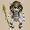
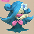
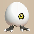
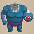
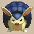
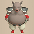
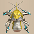

  

# Overview

<table class="dungeonOverview">
  <tr>
    <th>Unlock</th>
    <td class="highlightYellow">Talk to Drokotay the Adventurer (Shukuba Beach). 　※ DLC and Update 2.0.1 required.</td>
  </tr>
  <tr>
    <th>Entrance</th>
    <td class="highlightYellow">Shukuba Beach (Exit)</td>
  </tr>
</table>

<table class="dungeonTable">
  <tr>
    <th>Floors</th>
    <td colspan="3">99F</td>
  </tr>
  <tr>
    <th>Bring Items</th>
    <td>No</td>
    <th>Stairs</th>
    <td>Descending</td>
  </tr>
  <tr>
    <th>Companions</th>
    <td>No</td>
    <th>Roamers</th>
    <td>No</td>
  </tr>
  <tr>
    <th>Rescues</th>
    <td>3</td>
    <th>Starting Level</th>
    <td>Lv1</td>
  </tr>
  <tr>
    <th>Starting Item</th>
    <td colspan="3">Large Onigiri</td>
  </tr>
  <tr>
    <th>Unidentified</th>
    <td colspan="3">All categories</td>
  </tr>
  <tr>
    <th>Shops</th>
    <td>Yes</td>
    <th>Monster Houses</th>
    <td>Yes</td>
  </tr>
  <tr>
    <th>Behemoths</th>
    <td>No</td>
    <th>Wishing Shrines</th>
    <td>No</td>
  </tr>
  <tr>
    <th>Kron's Challenge</th>
    <td>No</td>
    <th>Fever Time</th>
    <td>No</td>
  </tr>
  <tr>
    <th>Initial Enemies</th>
    <td></td>
    <th>Spawn Rate</th>
    <td>64 Turns</td>
  </tr>
  <tr>
    <th>Wind (1st Gust)</th>
    <td>1700 Turns</td>
    <th>Reward</th>
    <td></td>
  </tr>
</table>

Dungeon that attempts to recreate Fay's Final Puzzle (SNES version) in Shiren 6's engine. The monster and item tables try to mimic the SNES version closely, but there are some adjustments for the sake of maintaining gameplay balance (Ex: Bowboy and Ghost Radish don't appear on 3F), and monsters or items that don't exist in Shiren 6 have substitutions (Ex: Knifegator → Shagga). Shops often lack carpet tiles, floors have fewer rooms on average, hidden trap density increases as you go deeper into the dungeon, there are usually only 4 items generated on the ground per floor, the monster spawn rate is 64 turns, and so on.

# Strategy

### Dungeon Characteristics

#### Limited Monsters, Item Categories, and Mechanics

Nearly any monster, item, or gameplay mechanic that wasn't in Fay's Final Puzzle (SNES) is excluded. This means you won't encounter Mixers, incense category items, Kron's Challenges, Wishing Shrines, and so on. Sacred weapons and shields can't be found, and synthesis can only be performed using Synthesis Pots. Rune slots are limited - The only way to increase rune slots is to write Slot-adding Scroll on a Blank Scroll. ※ Sumo status can still be activated in this dungeon, despite being a Shiren 6 mechanic.

#### Item Table Based on Fay's Final Puzzle

For the most part, items that weren't obtainable in Fay's Final Puzzle (SNES) can't be found here. Counters to monsters like Battler → Affixing Bracelet and Nigiri Honcho → Nigiri Stopper are missing. Substitutions were made when possible, like Cudgel → Wooden Sword and Polearm → Bronze Sword, but there are also oddities as a result like Doutanuki being obtainable but Wolfshead being excluded.

Accurate Sword, Clairvoyant Bracelet, Appraiser's Bracelet, and Trapper's Bracelet can still be found. It's easier to identify items by price in this dungeon, so keep an eye out for useful item price points in shops. However, it's also easier to find negative items, so be cautious when using unidentified items early on. Synthesis Pot, Upgrading Pot, Clairvoyant Bracelet, and Preservation Pot are extremely important, so be smart when obtaining or identifying pots and bracelets that could be one of those items.

#### Harder to Steal

Triggering Thief Mode in this dungeon still makes 4 Shop Guards appear near the stairs. The character entity limit per floor is higher in Shiren 6 than in Shiren 1, Blank Scrolls are very rare, and Vaulting Staff, Burrowing Staff, Earthmound Staff, Confusion Scroll, and Slumber Scroll don't appear. Therefore, it's tricky to steal from a shop unless you find a Wall-less Scroll, Bottomless Pot, or Walrus Pot. But Clairvoyant Bracelet, Paralyzing Staff, Disguising Staff, Sumo status, and Peach Buns can help, so don't give up too quickly even if your preferred stealing method might not be available.

#### Lots of Semi-Out of Depth Monsters

The monster table is based on Fay's Final Puzzle (SNES), so stronger monsters tend to appear earlier. Examples include Polygon Spinna (3-7F), Masked Samurai (5-7F), Metalhead (7-9F), N'dulu (8-9F), and so on. You generally don't want to be stingy when it comes to item usage against stronger enemies, and some players claim that the only floor range where you can relax is 30-35F.

#### Fewer Ways to Deal with Monster Houses

One-room Monster Houses are pretty mean between 51-99F thanks to Bellthoven, Steadfast Tank, and Archdragon. Most movement staves, incenses, Leaping Grass, Sweet Potato, Confusion and Slumber scrolls can't be found. You'll have to rely on items like Disguising Staff, Switching Staff, and Bottomless Pot instead, and keep in mind that Disguising Staff only lasts 8 turns per use in Shiren 6.

#### Slower Monster Spawns (64 Turns)

1 new monster is generated every 64 turns, so it's important to make good use of initial spawns. If you want to utilize a monster's special attack to farm items (ex: Nigiri Baby for Large Onigiri), it's best to paralyze the target or such and return to it when you're ready instead of slaying it and hoping that another will spawn after you've finished your preparations.

#### Harder to Farm Monsters

In addition to the slow monster spawns, Summon Traps always break after being triggered 1 time. Schubell family monsters also have a cool-down before they can summon more monsters in Shiren 6, and tricky enemies like Fencer, Ornery Tank, Nigiri Boss, Steamroid, and Thrashead overlap with Schubells, so don't expect to be able to easily hunt lots of monsters in short order.

#### Non-Equipment Items Can be Cursed

Any item can be cursed in this dungeon, unlike the SNES version where only equipment can be cursed. That said, it does seem like the rate of cursed items is lower than most other dungeons in Shiren 6. ※ Blessed items don't appear in this dungeon.

#### Items Can Still Fall In Water

This goes without saying, but since the game engine is Shiren 6, items can fall underwater. You'll still need to be careful about dropped items near Swordsman and Armordillo family monsters, especially since Water-drain Scroll and Collection Scroll can't be found in this dungeon. ※ Waterwalk Bracelet or Wall-less Scroll can be used to reclaim submerged items.

#### Differences That Make Things Easier

- Max HP can reach a max of 500 instead of 251, and natural HP regen speed is much faster.
- Can equip 2 bracelets at the same time once Strength &ge; 10.
- Damage formula is different, so you can one-shot more foes in Shiren 6 with enough upgrading.
- Sumo status activates once Fullness &ge; 150, letting you dig out walls and boosting attack power.
- Poison Arrows and Porky's Rocks can be held as items, unlike the original version.
- Gitan bags can be held as items even without a Preservation Pot.
- Revival Grass activates even when it's inside a pot.

### Important Items

#### Super Valuable Items

The following 3 items have a dramatic effect on lowering the difficulty of this dungeon.

<b><u>Synthesis Pot (Size 3-4)</u></b> Mixers don't appear, so this is your only option when it comes to synthesizing equipment. It's a bit rare, so read Pot-upsize and Extraction scrolls and reuse the same pot instead of breaking it. If an unidentified pot has a capacity between 3-4, it might be a Synthesis Pot - check its price. Also, it's more cost effective to synthesize a single category of items at a time.

<b><u>Upgrading Pot (Size 2-3)</u></b> Upgrades inserted weapons, shields, staves, arrows, and Gitan each time you advance floors, but it has a chance to shatter when it takes effect, so it could break after 1 floor if you're unlucky. If an unidentified pot has a capacity of 2-3, it might be an Upgrading Pot, so fill it with equipment. Peach Staff, Disguising Staff, and Paralyzing Staff are pretty good options too.

<b><u>Clairvoyant Bracelet</u></b> Reveals the positions of distant monsters and items, even in dark hallways. Lets you easily utilize Frontal Attack (rune), arrows, staves, locate shops and pillar rooms, etc. That said, you're still likely to struggle if you don't upgrade equipment or collect staves.

#### Weapon / Shield

Weapons and shields that have high base stats make a big difference during early game. Don't underestimate resonance effects, including Wooden, Bronze, and Katana sets. If you find an Upgrading Pot, the Wooden set can be used as your main gear the entire time.

<b><u>Manji Kabura / Fuuma Shield</u></b> Fantastic for early game, but 3 rune slots is very hard to work with as you progress. If you insist on maining Manji Kabura, aim for Frontal Attack + Critical + Accurate runes.

<b><u>Golden Sword / Golden Shield</u></b> Plenty of rune slots, but low base stats means you're more reliant on finding Upgrading Pots. If you find an early Golden Shield, consider saving it for later instead of maining it right away.

<b><u>Sickle of Salvation</u></b> Lots of rune slots, making it one of the best main weapon options. The Anti-Ghost rune is also nice against Ghost Samurai, Soul Reapers, Skullmancers, etc.

<b><u>Dragonkiller / Dragon Shield</u></b> Good combination of useful innate runes, base stats, and rune slots. Both Anti-Dragon runes remain useful even if you transition to different equipment later on.

<b><u>Break-Off Shield</u></b> Equip this before eating a Peach Bun to morph into a monster with 30 defense that won't degrade. Especially nice if you find a Peach Staff and can morph into a monster that lets you farm items. It goes without saying, but it can also be used to survive a Monster House.

#### Runes

##### Weapon

|Rune|Tier|Source|Notes|
|-|-|-|-|
| Frontal Attack|S|Kama Itachi|Attack 3 forward directions at the same time.|
| Accurate|S|Accurate Sword|The player's normal attacks are guaranteed to hit.|
| Critical|A|Axe of the Minotaur|Roughly 1/3 chance to land a x1.5 damage critical hit. ※ Taur family monster drop (6-9F, 17-20F, 51-59F)|
| Peach Bun|A|Peach Club|30% chance for a defeated monster to drop a Peach Bun. ※ Shop-exclusive (51-99F)|
| Anti-Ghost|B|Sickle of Salvation|Deal x1.5 damage to Ghost type monsters. Skull Mages (7-9F, 17-18F, 26-29F, 46-59F), Soul Reaper (26-29F), Pumplord (36-45F), etc.|
| Anti-Draining|B|Drain Slayer|Deal x1.5 damage to Draining type monsters. Polygon Singa (36-45F), Terror Scorpion (46-59F), Demon Scorpion (60-99F), etc.|
| Anti-Dragon|C|Dragonkiller|Deal x1.5 damage to Dragon type monsters. Dragons (27-35F, 46-59F, 60-99F), Dragon Pit (36-45F), Lashagga (51-59F), etc.|
| Anti-Cyclops|C|Cyclops Bane|Deal x1.5 damage to Cyclops type monsters. Metalhead (7-9F), Thrashead (21-24F), Megahead (36-45F), Hyper Gazer (60-99F), etc.|
| Rustproof|D|Golden Sword Plating Scroll|Upgrade value won't decrease, raises normal attack accuracy (92% → 94%). Mudster (51-59F) erases Rustproof before other runes.|

##### Shield

|Rune|Tier|Source|Notes|
|-|-|-|-|
| Keen|S|Watchful Shield|22.6% chance to dodge enemy normal attacks.|
| Retribution|S|Counter Shield|Reflects 50% damage received back at attacker.|
| Sating|S|Shield of Sating|Halves hunger rate (1 fullness / 20 turns).|
| Anti-Dragon|A|Dragon Shield|Reduces normal attack and fire damage received from Dragon types by 50%.|
| Anti-Blast|A|Blast Shield|Reduces damage received from explosions by 50%.|
| Hypnosisproof|A|Gazer Shield|Protects against Gazer family's hypnosis.|
| Magic Cancel|B|Shield of Negation|Nullifies magic bullets aimed at you.|
| Walrusproof|C|Walrus Stopper|Thiefwalrus family monsters can't steal your items.|
| Rustproof|D|Golden Shield Plating Scroll|Upgrade value won't decrease. Mudster (51-59F) erases Rustproof before other runes.|

#### Bracelets

The variety of bracelets in this dungeon is rather limited, so it's easy to identify by price. 5,000 Gitan bracelets are top priority since they're either Passage-find, Rustproof, Healing, or <b>Clairvoyant</b>. ※ Item-losing Bracelet is in the item table, so beware of equipping unidentified bracelets.

##### Bracelet Price Chart

|Buy|Sell|Possible Bracelets|
|-|-|-|
|1,500|600|Far-throwing, Daredevil, Dreaded, Item-losing|
|3,000|1,200|Cursebreak, Waterwalk|
|3,500|1,400|Haggling|
|4,000|1,600|Fortune, Focusing|
|5,000|2,000|Healing, Rustproof, Clairvoyant, Passage-find|
|7,500|3,000|Trapper's, Appraiser's|

<b><u>Waterwalk Bracelet</u></b> Lets you walk on water tiles, but be careful not to let onigiri or Peach Buns rot / scrolls get wet. Earthmound Staff can't be found, so this is the easiest way to claim island items.

<b><u>Cursebreak Bracelet</u></b> Makes it safe to trade hits with Curse Girl family monsters. However, Curse Pot and Curse Trap don't appear, so it's not as valuable here as in other dungeons.

<b><u>Focusing Bracelet</u></b> Nice for Skull Wizard (15-18F) and Daze Radish (15-16F) floors. Also blocks Skullmancer (26-29F)'s Disguising Staff effect versus the player.

<b><u>Far-throwing Bracelet</u></b> Retreat into a hallway and shoot arrows to clear out a Monster House, hunt Thiefwalrus monsters, etc. Unequip it before throwing pots, and remove it on floors where Swordsman, Bag Knave, and Gazer monsters appear.

<b><u>Rustproof Bracelet</u></b> Protects against Mudster (51-59F)'s rune erasing special attack.

<b><u>Fortune Bracelet</u></b> Nice during early game before reaching Lv20 (9,900 Exp) for the fastest HP regen speed. Also serves as a counter against Floppy Hani (15-16F) and Droopy Hani (46-59F)'s special attack.

<b><u>Appraiser's Bracelet</u></b> Likely shop-exclusive (51-99F) - Lets you identify items by picking them up. Great for identifying remaining uses of staves, and cursed state of items.

<b><u>Trapper's Bracelet</u></b> Likely shop-exclusive (51-99F) - Lets you pick up and set traps against monsters. Can be used alongside an Electroid (60-80F) Peach Bun to stock up on Pitfall Traps or other useful traps.

#### Projectiles

<b><u>Iron Arrow</u></b> Can be collected from Crossbowboys (10-14F) if you find a room with pillars. Quantity depends on finding Clairvoyant and Far-throwing bracelets, but 200~300 arrows would be good.

<b><u>Poison Arrow</u></b> Harder to collect than Iron Arrows, but handy when plans for upgrading gear doesn't go as desired. Can be mass produced via Poison Arrow Traps if you find a Karakuroid family Peach Bun. Avoid shooting Poison Arrows at Scorpion family monsters, since it'll boost their attack power.

<b><u>Porky's Rock</u></b> Can be collected by swinging a Peach Staff at a Porky family monster. Aim for 25~99 rocks vs. Cave Mamel and Gitan Mamel (91-99F) if you lack the Retribution shield rune. ※ Rocks and Porky's Rocks can't be found on the ground or in shops.

#### Food / Grass

<b><u>Huge Onigiri</u></b> Increases Max Fullness by 5 - Hunt Flying Eggs (20-25F) for guaranteed Huge Onigiri drops. Sumo status activates at 150 Max Fullness and can cover for some lack of upgrading / synthesizing.

<b><u>Herb / Otogirisou / Life Grass</u></b> Eat Herb and Otogirisou when your HP is full to increase Max HP.

<b><u>Invincible Grass</u></b> Items like Leaping Grass and Sweet Potato don't appear, so this should be saved for Monster Houses. Can be used to block status conditions, but not level down effects or item destruction.

<b><u>Strength Grass</u></b> It's said that for every +8 to Strength, weapon strength increases by an additional x0.25. Since Upgrading Pots can be found, this usually ends up being a significant boost.

<b><u>Ill-fated Seed</u></b> Shop-exclusive (51-99F) - Don't assume 2,000 Gitan grasses in shops are always Angel Seeds.

#### Scrolls

Both Muzzle Scroll and Carry-ban Scroll appear, so read unidentified right before advancing to the next floor. Onigiri Scroll and Curse Scroll can't be found, so there's little risk in selection-based scrolls. Exorcism Scroll, Pot-upsize Scroll, and Extraction Scroll are common, so prioritize pots.

<b><u>Pot-upsize Scroll</u></b> Common scroll in this dungeon, and should be read on a Synthesis Pot or Upgrading Pot. Rejuvenation Pot is a decent option after you've finished upgrading your equipment.

<b><u>Extraction Scroll</u></b> Should be used in combination with a Pot-upsize Scroll to reuse a Synthesis Pot. Transmutation Pot is another okay option, if you have lots of these scrolls on hand.

<b><u>Identifier Scroll</u></b> Prioritize identifying either bracelets or pots.

<b><u>Fixer Scroll</u></b> Keep on hand in case you become surrounded, or in case your equipment gets cursed. ※ Confusion Scroll, Slumber Scroll, and Jitters Scroll can't be found.

<b><u>Wall-less Scroll</u></b> Read it to steal from a shop, or to claim island items when you lack a Waterwalk Bracelet. However, don't read it on floors where lots of ranged attackers appear.

<b><u>Eradication Scroll</u></b> Incredibly rare scroll that can only be obtained from shops, wall tiles, or pillars. It's the only scroll that has a buying price of 10,000 G / selling price of 4,000 G. Most players save it for a threat in the 60-99F floor range like Archdragon or Steadfast Tank, but Polygon Singa (36-45F) is a great target if you plan on maintaining Sumo status the entire run. Otherwise, Skull Lord (46-59F) is another decent option if you find multiple Eradication Scrolls, but beware of abundant Soul Reaper spawns on 26F if you eradicate the Skull Mage family early.

<b><u>Blank Scroll</u></b> Much rarer than in Heart of Serpentcoil Island - Don't expect to find a single one in any given run. The best options for writing on it include Expulsion, Eradication, Pot-upsize, or Slot-adding.

<b><u>Gambler's Scroll</u></b> The Shiren 6 substitute for Scroll of Explosion (自爆の巻物). It might be good to keep a pot of unneeded equipment to sell in case you read it on a shop floor.

#### Staves

<b><u>Peach Staff</u></b> One-shots almost any monster in the game by transforming them into a Peach Bun. Useful Peach Buns include Hat Urchin, Crossbowboy, Karakuroid, Swordsman, Masked Samurai, and so on. If you find it mid ~ late game, focus on Peach Buns that let you survive Monster Houses more easily.

<b><u>Paralyzing Staff / Narrow-escape Staff</u></b> Can be used to avoid having to fight a target monster of your choice. If you have a Clairvoyant Bracelet, Narrow-escape Staff can be used to quickly locate the stairs.

<b><u>Disguising Staff</u></b> Life saving staff when you're surrounded, but the effect only lasts 8 turns per use. One of the few options that can be used to deal with single room Monster Houses.

<b><u>Switching Staff</u></b> Often used alongside Disguising Staff to quickly reach the stairs in a tricky room. Remember that it's ineffective when the player has Sumo status.

<b><u>Unlucky Staff</u></b> Nice during early ~ mid game where lowering a monster's level by 1 significantly weakens them, but not as useful after you've reached the 60-99F floor range or so.

<b><u>Skull Mage's Staff</u></b> Drop-exclusive (Skull Mage family monster) - Staff that can be used to shut down a single target. The magic bullet's effect is randomly chosen from Slow (1 stage), Asleep status, Confused status, or Warp.

#### Pots

##### Quick Notes

Put In type, Size 5 = Preservation, Identifier, Transmutation, Ordinary, Hiding, Warehouse, or Unbreakable. Put In type, Size 2-3 and expensive = Upgrading or Degrading. Put In type, Causes item loss = Warehouse, Bottomless, Transmutation, or Unbreakable. Tap type = Rejuvenation, Walrus, or Monster.

<b><u>Preservation Pot (Size 3-5)</u></b> Useful as always, but save Pot-upsize Scrolls for Synthesis Pots or Upgrading Pots.

<b><u>Identifier Pot (Size 3-5) / Ordinary Pot (Size 3-5)</u></b> Probably best used as extra storage for synthesis ingredients. However, it's a good idea to insert Revival Grass into Identifier Pots to check for curses.

<b><u>Rejuvenation Pot (Size 3-5)</u></b> Particularly nice for the 60-99F floor range where fixed damage attacks are common. Stock up on as many as you can, and keep a Rejuvenation Pot[0] on hand if it's your only one, since there's a chance you can still reuse it by reading a Pot-upsize Scroll.

<b><u>Bottomless Pot (Size 2-4)</u></b> It's unfortunate to lose an item while identifying it, but it's actually a great pot. Break it to make Pitfall Traps appear, which let you steal from a shop or otherwise skip to the next floor. Can be used even during Sumo status: Stand next to a wall → break the pot → shoot an arrow at the wall. Even more effective if you find a Trapper's Bracelet in a shop between 51-99F.

<b><u>Hiding Pot (Size 3-5)</u></b> Not a bad option for when you're surrounded at the start of a floor or such.

<b><u>Unbreakable Pot (Size 3-5)</u></b> Wooden Mallet can't be found, so Extraction Scroll is the only way to retrieve inserted items. Some players like to use it as storage for Revival Grass.

<b><u>Surprise Pot (Size 3-5)</u></b> Throw it against a wall from a distance to see if there are items inside the pot.

### Farming Techniques

#### Nigiri Morph Factory

Nigiri Baby can spawn between 3-6F, so the idea is to have it turn unneeded items into Large Onigiri. 4F is the safest since Crow Tengu appears on 3F, and Field Knave + Masked Samurai appears on 5-6F. If you need more items, have a Field Knave throw Weeds at you and pick up the ones that miss.

##### Field Knave (5-6F) Counters

- Perform the technique in a dead end room instead of a room with multiple entrances.
- Use a Paralyzing Staff to block the room's entrance, preventing other monsters from entering.
- Place a Gitan bag at the room's entrance and lure a Froggo onto it, blocking the entrance.

#### Experience Points

Masked Samurai (5-7F), Fortune Staff, and Berserk Seed can all be used to create a high level monster, which can then be instantly defeated by throwing a high value Gitan bag (500-700+ should be good). That said, Fortune Staff can also be used to create Hiding Eggs on 20-25F for Special Onigiri drops, so consider saving some staff charges to increase strength if you've reached Lv20.

#### Peach Staff Farming

If you have a Break-Off Shield, equip it before eating a Peach Bun to lock in 30 defense during the morph. Runes are ignored when you have Morphed status, so the shield won't degrade when you're hit.

- Hat Urchin (1-3F) for staves
- Bowboy family (5-14F) for arrows
    - If you have an Unlucky Staff, Mini Tank (18-20F) floors can be used as well.
- Froggo family (3-14F) for Gitan
- Swordsman family (9-14F, 23-25F, 36-45F) for equipment
    - Swordsman → shields, Fencer → shields + weapons, Battler → shields + weapons + bracelets.
- Masked Samurai family (5-7F, 15-19F) for extra lives
- Armordillo family (15-18F, 27-35F) for items
- Thiefwalrus family (8-14F, 17-22F, 30-50F) for items
- Karakuroid family (21-24F, 60-79F) for Poison Arrows
- Porky family (8-10F, 27-35F, 46-59F) for Porky's Rocks
- Ultra Gazer (60-99F) for room-wide confusion vs. single room Monster Houses
    - Requires a Fortune Staff or Berserk Seed to level up a Hyper Gazer.
- Peach Buns of Swift monsters
    - Mini Tank, Karakuroid, Dragon Pit, Soul Reaper, Steadfast Tank, etc.

#### Thiefwalrus Hunting

Thiefwalrus (8-14F), Greenwalrus (17-22F), and Ironwalrus (30-50F) can be hunted for item drops. Walrus Stopper, Sealing Staff, Far-throwing Bracelet + arrows can all be used to safely slay them. Ironwalrus is best hunted between 30-35F, where the monster table is on the calmer side.

#### Reusing Synthesis Pot

Extraction Scroll and Pot-upsize Scroll can be used to reuse a Synthesis Pot. Synthesis Pots aren't very common, and Mixers don't appear, so this can be a rather important technique. Of course, Pot-upsize Scrolls can also be used on Upgrading Pots, so try to strike a balance.

# Floor Guide

### 1-2F

Notable: Pit Mamel (1-3F), Hat Urchin (1-3F), Crow Tengu (1-3F)

Easy floor range as long as you aim to retreat and regen HP when your HP &le; 10. Some players like to follow the rule of lingering until Shiren's level is equal to floor number + 2. If you get lucky and find a Peach Staff, create a Hat Urchin Bun to obtain lots of staves. It might be worth throwing unidentified grasses at Pit Mamel in hopes of it being Berserk Seed, which will let Pit Mamel level up into a Cave Mamel worth 2,000 experience points.

### 3-4F

Notable: Hat Urchin (1-3F), Crow Tengu (1-3F), Nigiri Baby (3-6F), Polygon Spinna (3-7F), Froggo (3-7F)

Food Stocking Zone - Have Nigiri Baby turn unneeded items into Large Onigiri. The SNES version featured Bowboys, Ghost Radishes, and Floor Dragons here, but those don't show up yet. Instead, Polygon Spinna (33 HP, 16 atk, 17 def) appears starting on 3F, often causing some difficulty.

Nigiri Baby (17 HP, 8 atk, 2 def) spawns on 3-6F, but it's best to perform Nigiri Morph Factory on 3-4F. If a Nigiri Baby on 3F doesn't seem to be using its ability at all, it might be a disguised Crow Tengu. Field Knaves appear between 5-6F, so try your best to finish utilizing Nigiri Baby for food before 5F, then feel free to linger starting on 5F to collect arrows, hunt Taurs for an Axe of the Minotaur drop, etc.

### 5-9F

Notable: Field Knave (5-6F), Masked Samurai (5-7F), Egg Thing (5-14F), Ghost Radish (6-7F), Metalhead (7-9F), Skull Mage (7-9F), N'dulu (8-9F), Baby Tank (8-10F), Thiefwalrus (8-14F), Froggucchi (8-14F)

Danger Zone #1 - Many players collapse at this point due to monsters ramping up in power. Metalhead (66 HP, 30 atk, 19 def), Skull Mage (77 HP, 31 atk, 21 def), and Baby Tank (85 HP, 40 atk, 30 def) hit hard, and N'dulu (70 HP, 40 atk, 31 def) won't reveal itself until you use the item, insert it into a pot, or change floors.

Masked Samurai (47 HP, 18 atk, 18 def) revives as Ghost Samurai (4 HP), who levels up a different monster. If you have a high value Gitan bag, you could let it roam and hunt a high level monster for experience points, but otherwise it's best to use items to one-shot it, or corner it in a room and slay it with normal attacks.

Despite the danger, many monsters provide a decent amount of experience points when defeated. Field Knave (120), Skull Mage (210), N'dulu (230), and Baby Tank (450) all help towards reaching Lv10. Monsters spawn every 64 turns - slower than normal - so there's plenty of time to regen HP between fights. If you're lucky, you might obtain an Axe of the Minotaur from a Taur (6-9F) by lingering and farming monsters, and there's also a chance for Egg Thing (5-14F) to spawn, so don't give up even if your food situation is iffy. Some players go as far as lingering until they reach Lv20 to gain the fastest HP regen speed by 10F or so.

If you have a Peach Staff, spend 1 use on a Baby Tank to stock up on lots of Iron Arrows. Collect at least 1-2 stacks, and more is best since you could find Far-throwing or Clairvoyant bracelets. However, be sure to save Peach Staff uses for later too - Don't spend them all on Baby Tanks. Lastly, if you find a room with pillars, you can collect arrows without spending a Peach Staff use.

### 10-14F

Notable: Egg Thing (5-14F), Thiefwalrus (8-14F), Froggucchi (8-14F), Fierous (10-12F), Curse Girl (10-12F), Gazer (10-13F), Pumpanshee (10-13F), Swordsman (10-14F), Fluffy Bunny (10-29F)

The monster table includes Fierous who is immune to projectiles + enemies that mess with your items. Swordsman (77 HP, 30 atk, 25 def) disarms your shield, which vanishes if Far-throwing Bracelet is equipped. Curse Girl (65 HP, 28 atk, 28 def) curses your shield, but that doesn't stop Swordsman from disarming it. Gazer (30 HP, 18 atk, 14 def) has low HP, but forces item usage or a normal attack in a random direction. Fluffy Bunny (10 HP, 10 atk, 50 def) warps to a hurt monster and heals their HP by 50 points. Crossbowboy (55 HP, 20 atk, 20 def) spawns on 10-14F, so there's still a chance to collect arrows.

Thiefwalrus (65 HP, 25 atk, 23 def) and Froggucchi (60 HP, 20 atk, 30 def) continue to appear. 
Arrows can be combined with Far-throwing Bracelet to ensure item drops from Thiefwalrus and Frogguchi. Of course, Walrus Stopper can be used instead of arrows if you were lucky enough to find the shield. If you have a Peach Staff, consider spending 1 use on a Swordsman to collect lots of equipment. You could even use a Fortune Staff beforehand to obtain weapons and bracelets, if desired. Lv2 Fencer → Shields + Weapons, and Lv3 Battler → Shields + Weapons + Bracelets.

### 15-16F

Notable: Floppy Hani (15-16F), Vile Scorpion (15-16F), Daze Radish (15-16F), Muddy (15-16F), Skull Wizard (15-18F), Fluffy Bunny (10-29F)

Draining Zone - Monsters that lower player stats or gear upgrade value appear here, so rush stairs. Vile Scorpion (108 HP, 45 atk, 33 def) is a Draining type that lowers strength by 2 when adjacent. Floppy Hani (85 HP, 39 atk, 39 def) is a Draining type that lowers level by 1 when adjacent. Daze Radish (80 HP, 37 atk, 27 def) is a Ghost type that throws Confusion and Poison grass within 2 tiles. Muddy (75 HP, 25 atk, 33 def) is a Draining + Aquatic type that lowers upgrade value by 2 when adjacent.

You could try farming enemies if you have lots of Iron Arrows + the Anti-Draining weapon rune, but the next floor range is better for experience points and a chance for Axe of the Minotaur to drop.

### 17-20F

Notable: Cursister (17-19F), Master Hen (17-20F), Minotaur (17-20F), Greenwalrus (17-22F), Mini Tank (18-20F), Running Egg (17-19F), Flying Egg (20-25F), Fluffy Bunny (10-29F)

Somewhat dangerous floor range that also offers a chance to farm experience points and items. Mini Tank (100 HP, 55 atk, 40 def) is a major threat that shoots Silver Arrows with Swift 1 speed. Lure it into a hallway to slay it without taking damage, and use staves if you encounter it in a room. Cursister (115 HP, 38 atk, 38 def) curses your weapon and shield which effectively prevents synthesis, so if you were lucky enough to find and identify a Cursebreak Bracelet, keep it equipped.

Master Hen (70 HP, 33 atk, 21 def) provides 400 exp when defeated prior to reverting to Hen. Minotaur (70 HP, 31 atk, 20 def) has a higher chance than Taur to drop an Axe of the Minotaur when defeated. Greenwalrus (88 HP, 30 atk, 27 def) always drops a newly generated item when slain prior to stealing. Running Egg (6 HP) always drops a Large Onigiri, so feel free to linger if you have the Sating shield rune. Monsters are generally weaker than the previous floor range, so consider eating a Greenwalrus Bun to collect lots of items if you have a Peach Staff on hand.

### 21-25F

Notable: Blazeous (20-22F), Super Gazer (21-24F), Steamroid (21-24F), Thrashead (21-24F), Ornery Tank (21-24F), Schubell & Menbell (21-25F), Nigiri Boss (22-25F), Fencer (23-25F), Flying Egg (20-25F), Fluffy Bunny (10-29F)

Danger Zone #2 - Some monsters in this range normally appear around 30-50F elsewhere. Blazeous (92 HP, 36 atk, 24 def) is immune to projectiles and multiplies from explosions. Ornery Tank (95 HP, 40 atk, 44 def) deals a fixed 30 explosion damage with its cannonballs. Steamroid (100 HP, 45 atk, 48 def) has Swift 1 speed and always wakes upon entering or exiting a room. Thrashead (122 HP, 55 atk, 45 def) attacks up to 3 tiles ahead and can hit through corners. Fencer (140 HP, 49 atk, 48 def) disarms your equipped weapon or shield, sending it 10 tiles behind you. Nigiri Boss (133 HP, 43 atk, 42 def) turns the player into an onigiri, which insta-collapses from explosions. Super Gazer (66 HP, 30 atk, 26 def) forces item usage or a normal attack in a random direction.

As you can imagine from the above descriptions, it's dangerous here even with strong equipment. Avoid giving Nigiri Boss or Fencer even a single turn to act if at all possible, especially if Ornery Tank is nearby. That said, hunting Flying Eggs for Huge Onigiri drops lets you increase Max Fullness and attain Sumo status. If you have a Fortune Staff, you can also level up Flying Eggs into Hiding Eggs for Special Onigiri drops, which provide a chance to increase Max Strength or grant Knowledgeable status to help with identification. If you have a Peach Staff, go ahead and create a Steamroid Bun to collect Poison Arrows from traps too.

### 26-29F

Notable: Soul Reaper (26-29F), Skullmancer (26-29F), Popdillo (27-35F), Porko (27-35F), Fluffy Bunny (10-29F)

Danger Zone #3 - That's right, you don't get a break before the next rush of major threats. Soul Reaper (75 HP, 40 atk, 40 def) has Swift 2 speed + wall-clip, and detects you from anywhere. Skullmancer (111 HP, 50 atk, 41 def)'s magic effects include Paralyzed, Sealed, Onigiri, Confused, Slow, or Level-1. Popdillo (100 HP, 51 atk, 45 def)'s tackle makes you trip and drop inventory items on the ground. Porko (65 HP, 36 atk, 18 def) throws 20 damage Porky's Rocks within a 5 tile radius. Other threats include Dragon (120 HP, 45 atk, 40 def) and Dragon Head (88 HP, 31 atk, 25 def).

It's best to rush to the stairs if you don't have a Shield of Negation (Magic Cancel rune). 26F is particularly dangerous since most monster spawns are either Soul Reaper or Skullmancer.

### 30-35F

Notable: Popdillo (27-35F), Porko (27-35F), Dragon (27-35F), Dragon Head (27-35F), Ironwalrus (30-50F)

Item Stocking Zone - An easier oasis floor range before continuing into mid game. Popdillo (100 HP, 51 atk, 45 def)'s tackle makes you trip and drop inventory items on the ground. Porko (65 HP, 36 atk, 18 def) throws 20 damage Porky's Rocks within a 5 tile radius. Dragon (120 HP, 45 atk, 40 def) spews a 20 damage flame in a straight line. Dragon Head (88 HP, 31 atk, 25 def) tunnels behind you if there's a foe behind it to try and sandwich you. Captain Ant (110 HP, 55 atk, 39 def) has high attack power, but can be left alone to dig tunnels. Ironwalrus (138 HP, 35 atk, 55 def) always drops a newly generated item when slain prior to stealing.

The next floor range is another notable increase in monster attack power, so try to prepare now. Eat an Ironwalrus or Magicwalrus Bun and steal items - Even better if you eat a Dark Owl Bun beforehand. Popdillo Bun can also be used to generate items, but it's not as efficient as an Ironwalrus Bun. If you don't have a counter for Cave Mamels, eat a Porko Bun and collect Porky's Rocks. That said, don't give up even if you couldn't find a Peach Staff in time to farm additional items.

### 36-45F

Notable: Ironwalrus (30-50F), Battler (36-45F), Dragon Pit (36-45F), Megahead (36-45F), Igneous (36-45F), Fleefrog (36-45F), Polygon Singa (36-45F), Pumplord (36-45F), Curse Matron (41-45F)

High Power Zone - Monsters with higher attack power and nastier special attacks appear. 36F in the SNES version can feel like slamming into a brick wall, but it's not as bad in this game.

Battler (200 HP, 69 atk, 50 def) disarms your equipped weapon, shield, or bracelet when adjacent. Pumplord (185 HP, 75 atk, 35 def) has semi-random movement, passes through walls, and hits very hard. Dragon Pit (130 HP, 54 atk, 40 def) has Swift 1 speed and tries to sandwich you in hallways. Megahead (182 HP, 65 atk, 48 def) attacks up to 4 tiles ahead and can hit through corners. Igneous (165 HP, 56 atk, 45 def) is immune to projectiles that lack piercing properties. Fleefrog (125 HP, 60 atk, 45 def) pulls the player in a straight line and attacks from up to 10 tiles away. Polygon Singa (129 HP, 40 atk, 40 def) decreases Max Fullness by 7 when adjacent. Curse Matron (145 HP, 53 atk, 48 def) curses up to 2 of equipped weapon, shield, or bracelets at once.

Overall, most monsters hit hard here, but only Megahead and Fleefrog can attack from a distance. Ironwalrus (138 HP, 35 atk, 55 def) still spawns, so you can try to obtain items if you're running low. Monster Houses (51F+) can be very dangerous thanks to Bellthoven, Sky Dragon, Steadfast Tank, Bag Knave, etc., so watch for items like Invincible Grass, Disguising Staff, Bottomless Pot, and Peach Buns of swift monsters. Switching Staff can also be incredibly helpful if you're not using Sumo status.

### 46-50F

Notable: Skull Lord (46-59F), Terror Scorpion (46-59F), Droopy Hani (46-59F), Porkon (46-59F), Sky Dragon (46-59F)

Ranged & Draining Zone - Most monsters here either have ranged attacks, or lower the player's stats. It's best to rush to the stairs, especially if you lack the Magic Cancel shield rune or Clairvoyant Bracelet. 50F is a Shuffle Dungeon style map based on Firespew Mountain - beware of Tripping Traps near air tiles.

Skull Lord (188 HP, 55 atk, 55 def)'s magic effects include Asleep, Blind, Level-3, or 40 damage. Porkon (150 HP, 75 atk, 50 def) throws 20 damage Porky's Rocks within a 8 tile radius. Sky Dragon (140 HP, 55 atk, 50 def) spews a 20 damage flame from anywhere in the same room. Terror Scorpion (185 HP, 55 atk, 45 def) lowers Max Strength by 1 when adjacent. Droopy Hani (120 HP, 49 atk, 49 def) decreases player level by 1 when adjacent.

### 51-59F

Notable: Skull Lord (46-59F), Terror Scorpion (46-59F), Droopy Hani (46-59F), Porkon (46-59F), Sky Dragon (46-59F), Mudster (51-59F), Bellthoven (51-59F), Grampadillo (51-59F), Lashagga (51-59F), Fluffy Bunny (51-59F)

Ironwalrus no longer appears after 50F, so feel free to ditch Walrus Stopper now if it was a secondary shield. The monster table mostly has the same monsters from 46-50F, but with a number of additions. It's still best to rush to the stairs if you lack the Magic Cancel shield rune or Clairvoyant Bracelet. However, rare items like Appraiser's Bracelet and Peach Club can appear in shops between 51-99F, so if you notice a shop, it can be worth spending the time and resources to check it out.

Mudster (140 HP, 35 atk, 43 def) lowers equipment upgrade value by 1 or erases 1 rune when adjacent. Bellthoven (150 HP, 45 atk, 45 def) can summon up to 3 new monsters when the player is within its view. Grampadillo (175 HP, 71 atk, 56 def)'s tackle makes you trip and drop inventory items on the ground. Megataur (170 HP, 55 atk, 42 def) occasionally lands a critical hit, and can drop Axe of the Minotaur. Lashagga (99 HP, 43 atk, 34 def) attacks with 3 consecutive normal attacks.

### 60-79F

Notable: Nigiri Honcho (60-99F), Archdragon (60-99F), Steadfast Tank (60-99F), Hyper Gazer (60-99F), Demon Scorpion (60-99F), Bag Knave (60-79F), Electroid (60-80F)

Skull Lord no longer appears after 59F, so feel free to ditch Shield of Negation now if it was a secondary shield. This is the final major update to the monster table, and the rest of the dungeon only has slight changes until 99F. Nigiri Honcho can inflict Onigiri status - If you get hit by fire or explosion damage, you'll instantly collapse. Nigiri Stopper can't be found, so use things like Sealing Staff or the Accurate rune + Sumo status to stay safe. That said, Nigiri Honcho seems to prioritize transforming pots into Large Onigiri.

Avoid Monster Houses when possible - Steadfast Tank and Bag Knave make it hard to claim items anyway. If you have a Peach Staff and a method to level up a Hyper Gazer, create some Ultra Gazer Buns. Ultra Gazer Bun's ability lets you inflict Confused status on all enemies in the same room, which is basically infinite usage of Confusion Scroll - Great for single room Monster Houses.

Nigiri Honcho (165 HP, 61 atk, 54 def) either inflicts Onigiri status, or morphs an item into onigiri. Steadfast Tank (105 HP, 80 atk, 64 def) has Swift 2 speed and deals 50 explosion damage per cannonball. Archdragon (200 HP, 65 atk, 60 def) spews a 30 damage flame from anywhere on the current floor. Demon Scorpion (295 HP, 73 atk, 55 def) occasionally lowers Max Strength by 2 when adjacent. Hyper Gazer (126 HP, 55 atk, 45 def) forces item usage or a normal attack in a random direction. Bag Knave (95 HP, 40 atk, 35 def) throws Weeds which parry inventory items, knocking them away. Electroid (150 HP, 56 atk, 53 def) has Swift 1 speed and always wakes upon entering or exiting a room.

#### Eradication Scroll Priority

1. No Clairvoyant Bracelet → Nigiri Honcho
2. Clairvoyant Bracelet but no Anti-Blast → Steadfast Tank
3. Clairvoyant Bracelet + Anti-Blast but no Anti-Dragon → Archdragon
4. Clairvoyant Bracelet + Anti-Blast + Anti-Dragon → Demon Scorpion

### 81-90F

Notable: Nigiri Honcho (60-99F), Archdragon (60-99F), Steadfast Tank (60-99F), Hyper Gazer (60-99F), Demon Scorpion (60-99F)

Same monsters as 60-79F aside from Bag Knave and Electroid exiting the monster table. This means you'll have an easier time claiming items found on the ground, but you're also more likely to encounter the stronger foes than the previous floor range.

### 91-99F

Notable: Nigiri Honcho (60-99F), Archdragon (60-99F), Steadfast Tank (60-99F), Hyper Gazer (60-99F), Demon Scorpion (60-99F), Cave Mamel (91-99F), Gitan Mamel (91-99F)

Same monsters as 81-90F aside from the addition of Cave Mamel and Gitan Mamel. These 2 have a higher spawn rate than in other dungeons, so fighting them with normal attacks is a bad idea. Use Porky's Rocks, Knockback Staff, Peach Buns that grant usage of a damaging special attack, Gitan, etc. If you have lots of HP, the Retribution shield rune can also be an effective way to deal with them. 

# Monsters

See [Monsters](/system/monsters) for individual monster details.

- F - Dark hallways
- S - Shop is possible
- H - Monster House is possible

Monster Colors = Farming, Useful, Lowers Stats, Targets Items, Dangerous

<table class="monsterTable">
  <thead>
    <tr>
      <th>F</th>
      <th>S</th>
      <th>H</th>
      <th colspan="5">Monsters</th>
    </tr>
  </thead>
  <tbody>
    <tr>
      <td class="centeredText highlightFog">1</td>
      <td class=""></td>
      <td class=""></td>
      <td> Mamel</td>
      <td> Pit Mamel</td>
      <td> Shagga</td>
      <td> Hat Urchin</td>
      <td> Crow Tengu</td>
    </tr>
    <tr>
      <td colspan="8" class="tableDivider"></td>
    </tr>
    <tr>
      <td class="centeredText highlightFog">2</td>
      <td class=""></td>
      <td class=""></td>
      <td> Mamel</td>
      <td> Pit Mamel</td>
      <td> Shagga</td>
      <td> Hat Urchin</td>
      <td> Crow Tengu</td>
    </tr>
    <tr>
      <td colspan="8" class="tableDivider"></td>
    </tr>
    <tr>
      <td rowspan="2" class="centeredText highlightFog">3</td>
      <td rowspan="2" class=""></td>
      <td rowspan="2" class=""></td>
      <td> Pit Mamel</td>
      <td> Hat Urchin</td>
      <td> Crow Tengu</td>
      <td class="useful"> Nigiri Baby</td>
      <td class="danger"> Polygon Spinna</td>
    </tr>
    <tr>
      <td class="farming"> Froggo</td>
      <td> Pullfrog</td>
      <td> Death Reaper</td>
      <td class="highlightGray"></td>
      <td class="highlightGray"></td>
    </tr>
    <tr>
      <td colspan="8" class="tableDivider"></td>
    </tr>
    <tr>
      <td class="centeredText highlightFog">4</td>
      <td class=""></td>
      <td class=""></td>
      <td class="useful"> Nigiri Baby</td>
      <td class="danger"> Polygon Spinna</td>
      <td class="farming"> Froggo</td>
      <td> Pullfrog</td>
      <td> Death Reaper</td>
    </tr>
    <tr>
      <td colspan="8" class="tableDivider"></td>
    </tr>
    <tr>
      <td rowspan="2" class="centeredText highlightFog">5</td>
      <td rowspan="2" class=""></td>
      <td rowspan="2" class=""></td>
      <td class="useful"> Nigiri Baby</td>
      <td> Polygon Spinna</td>
      <td class="farming"> Froggo</td>
      <td> Pullfrog</td>
      <td> Death Reaper</td>
    </tr>
    <tr>
      <td class="items"> Field Knave</td>
      <td class="danger"> Masked Samurai</td>
      <td class="farming"> Egg Thing</td>
      <td> Bowboy</td>
      <td class="highlightGray"></td>
    </tr>
    <tr>
      <td colspan="8" class="tableDivider"></td>
    </tr>
    <tr>
      <td rowspan="2" class="centeredText highlightFog">6</td>
      <td rowspan="2" class=""></td>
      <td rowspan="2" class=""></td>
      <td class="useful"> Nigiri Baby</td>
      <td> Polygon Spinna</td>
      <td class="farming"> Froggo</td>
      <td> Death Reaper</td>
      <td class="items"> Field Knave</td>
    </tr>
    <tr>
      <td class="danger"> Masked Samurai</td>
      <td class="farming"> Egg Thing</td>
      <td class="stats"> Ghost Radish</td>
      <td> Taur</td>
      <td class="highlightGray"></td>
    </tr>
    <tr>
      <td colspan="8" class="tableDivider"></td>
    </tr>
    <tr>
      <td rowspan="2" class="centeredText highlightFog">7</td>
      <td rowspan="2" class=""></td>
      <td rowspan="2" class=""></td>
      <td> Polygon Spinna</td>
      <td class="farming"> Froggo</td>
      <td> Masked Samurai</td>
      <td class="farming"> Egg Thing</td>
      <td class="stats"> Ghost Radish</td>
    </tr>
    <tr>
      <td> Taur</td>
      <td> Floor Dragon</td>
      <td class="danger"> Metalhead</td>
      <td class="danger"> Skull Mage</td>
      <td class="highlightGray"></td>
    </tr>
    <tr>
      <td colspan="8" class="tableDivider"></td>
    </tr>
    <tr>
      <td rowspan="3" class="centeredText highlightFog">8</td>
      <td rowspan="3" class=""></td>
      <td rowspan="3" class=""></td>
      <td class="farming"> Egg Thing</td>
      <td> Taur</td>
      <td> Floor Dragon</td>
      <td class="danger"> Metalhead</td>
      <td class="danger"> Skull Mage</td>
    </tr>
    <tr>
      <td class="danger"> N'dulu</td>
      <td class="danger"> Baby Tank</td>
      <td> Porky</td>
      <td> Soldier Ant</td>
      <td class="farming"> Thiefwalrus</td>
    </tr>
    <tr>
      <td class="farming"> Froggucchi</td>
      <td> Dark Owl</td>
      <td class="highlightGray"></td>
      <td class="highlightGray"></td>
      <td class="highlightGray"></td>
    </tr>
    <tr>
      <td colspan="8" class="tableDivider"></td>
    </tr>
    <tr>
      <td rowspan="3" class="centeredText highlightFog">9</td>
      <td rowspan="3" class=""></td>
      <td rowspan="3" class=""></td>
      <td class="farming"> Egg Thing</td>
      <td> Taur</td>
      <td> Floor Dragon</td>
      <td class="danger"> Metalhead</td>
      <td class="danger"> Skull Mage</td>
    </tr>
    <tr>
      <td class="danger"> N'dulu</td>
      <td class="danger"> Baby Tank</td>
      <td> Porky</td>
      <td> Soldier Ant</td>
      <td class="farming"> Thiefwalrus</td>
    </tr>
    <tr>
      <td class="farming"> Froggucchi</td>
      <td> Dark Owl</td>
      <td class="highlightGray"></td>
      <td class="highlightGray"></td>
      <td class="highlightGray"></td>
    </tr>
    <tr>
      <td colspan="8" class="tableDivider"></td>
    </tr>
    <tr>
      <td rowspan="3" class="centeredText highlightFog">10</td>
      <td rowspan="3" class=""></td>
      <td rowspan="3" class=""></td>
      <td class="farming"> Egg Thing</td>
      <td> Floor Dragon</td>
      <td class="danger"> Baby Tank</td>
      <td> Porky</td>
      <td> Soldier Ant</td>
    </tr>
    <tr>
      <td class="farming"> Thiefwalrus</td>
      <td class="farming"> Froggucchi</td>
      <td> Dark Owl</td>
      <td class="items"> Curse Girl</td>
      <td> Fierous</td>
    </tr>
    <tr>
      <td> Pumpanshee</td>
      <td class="items"> Gazer</td>
      <td class="useful"> Crossbowboy</td>
      <td class="items"> Swordsman</td>
      <td> Fluffy Bunny</td>
    </tr>
    <tr>
      <td colspan="8" class="tableDivider"></td>
    </tr>
    <tr>
      <td rowspan="3" class="centeredText highlightFog">11</td>
      <td rowspan="3" class=""></td>
      <td rowspan="3" class=""></td>
      <td class="farming"> Egg Thing</td>
      <td> Soldier Ant</td>
      <td class="farming"> Thiefwalrus</td>
      <td class="farming"> Froggucchi</td>
      <td> Dark Owl</td>
    </tr>
    <tr>
      <td class="items"> Curse Girl</td>
      <td> Fierous</td>
      <td> Pumpanshee</td>
      <td class="items"> Gazer</td>
      <td class="useful"> Crossbowboy</td>
    </tr>
    <tr>
      <td class="items"> Swordsman</td>
      <td> Fluffy Bunny</td>
      <td class="highlightGray"></td>
      <td class="highlightGray"></td>
      <td class="highlightGray"></td>
    </tr>
    <tr>
      <td colspan="8" class="tableDivider"></td>
    </tr>
    <tr>
      <td rowspan="3" class="centeredText highlightFog">12</td>
      <td rowspan="3" class=""></td>
      <td rowspan="3" class=""></td>
      <td class="farming"> Egg Thing</td>
      <td> Soldier Ant</td>
      <td class="farming"> Thiefwalrus</td>
      <td class="farming"> Froggucchi</td>
      <td> Dark Owl</td>
    </tr>
    <tr>
      <td class="items"> Curse Girl</td>
      <td> Fierous</td>
      <td> Pumpanshee</td>
      <td class="items"> Gazer</td>
      <td class="useful"> Crossbowboy</td>
    </tr>
    <tr>
      <td class="items"> Swordsman</td>
      <td> Fluffy Bunny</td>
      <td> Pop Tank</td>
      <td> Dartingfrog</td>
      <td class="highlightGray"></td>
    </tr>
    <tr>
      <td colspan="8" class="tableDivider"></td>
    </tr>
    <tr>
      <td rowspan="3" class="centeredText highlightFog">13</td>
      <td rowspan="3" class=""></td>
      <td rowspan="3" class=""></td>
      <td class="farming"> Egg Thing</td>
      <td> Soldier Ant</td>
      <td class="farming"> Thiefwalrus</td>
      <td class="farming"> Froggucchi</td>
      <td> Dark Owl</td>
    </tr>
    <tr>
      <td> Pumpanshee</td>
      <td class="items"> Gazer</td>
      <td class="useful"> Crossbowboy</td>
      <td class="items"> Swordsman</td>
      <td> Fluffy Bunny</td>
    </tr>
    <tr>
      <td> Pop Tank</td>
      <td> Dartingfrog</td>
      <td class="highlightGray"></td>
      <td class="highlightGray"></td>
      <td class="highlightGray"></td>
    </tr>
    <tr>
      <td colspan="8" class="tableDivider"></td>
    </tr>
    <tr>
      <td rowspan="2" class="centeredText highlightFog">14</td>
      <td rowspan="2" class=""></td>
      <td rowspan="2" class=""></td>
      <td class="farming"> Egg Thing</td>
      <td> Soldier Ant</td>
      <td class="farming"> Thiefwalrus</td>
      <td class="farming"> Froggucchi</td>
      <td> Dark Owl</td>
    </tr>
    <tr>
      <td class="useful"> Crossbowboy</td>
      <td class="items"> Swordsman</td>
      <td> Fluffy Bunny</td>
      <td> Pop Tank</td>
      <td> Dartingfrog</td>
    </tr>
    <tr>
      <td colspan="8" class="tableDivider"></td>
    </tr>
    <tr>
      <td rowspan="3" class="centeredText highlightFog">15</td>
      <td rowspan="3" class=""></td>
      <td rowspan="3" class=""></td>
      <td> Fluffy Bunny</td>
      <td> Dartingfrog</td>
      <td class="stats"> Daze Radish</td>
      <td class="stats"> Vile Scorpion</td>
      <td class="stats"> Floppy Hani</td>
    </tr>
    <tr>
      <td class="items"> Muddy</td>
      <td> Nashagga</td>
      <td> Raging Samurai</td>
      <td> Brodillo</td>
      <td> Skull Wizard</td>
    </tr>
    <tr>
      <td> Corporal Ant</td>
      <td class="highlightGray"></td>
      <td class="highlightGray"></td>
      <td class="highlightGray"></td>
      <td class="highlightGray"></td>
    </tr>
    <tr>
      <td colspan="8" class="tableDivider"></td>
    </tr>
    <tr>
      <td rowspan="3" class="centeredText highlightFog">16</td>
      <td rowspan="3" class=""></td>
      <td rowspan="3" class=""></td>
      <td> Fluffy Bunny</td>
      <td class="stats"> Daze Radish</td>
      <td class="stats"> Vile Scorpion</td>
      <td class="stats"> Floppy Hani</td>
      <td class="items"> Muddy</td>
    </tr>
    <tr>
      <td> Nashagga</td>
      <td> Raging Samurai</td>
      <td> Brodillo</td>
      <td> Skull Wizard</td>
      <td> Corporal Ant</td>
    </tr>
    <tr>
      <td> Hell Reaper</td>
      <td class="highlightGray"></td>
      <td class="highlightGray"></td>
      <td class="highlightGray"></td>
      <td class="highlightGray"></td>
    </tr>
    <tr>
      <td colspan="8" class="tableDivider"></td>
    </tr>
    <tr>
      <td rowspan="3" class="centeredText highlightFog">17</td>
      <td rowspan="3" class=""></td>
      <td rowspan="3" class=""></td>
      <td> Fluffy Bunny</td>
      <td> Raging Samurai</td>
      <td> Brodillo</td>
      <td> Skull Wizard</td>
      <td> Corporal Ant</td>
    </tr>
    <tr>
      <td> Hell Reaper</td>
      <td class="farming"> Running Egg</td>
      <td class="items"> Cursister</td>
      <td class="farming"> Greenwalrus</td>
      <td> Minotaur</td>
    </tr>
    <tr>
      <td> Master Hen</td>
      <td class="highlightGray"></td>
      <td class="highlightGray"></td>
      <td class="highlightGray"></td>
      <td class="highlightGray"></td>
    </tr>
    <tr>
      <td colspan="8" class="tableDivider"></td>
    </tr>
    <tr>
      <td rowspan="3" class="centeredText highlightFog">18</td>
      <td rowspan="3" class=""></td>
      <td rowspan="3" class=""></td>
      <td> Fluffy Bunny</td>
      <td> Raging Samurai</td>
      <td> Brodillo</td>
      <td> Skull Wizard</td>
      <td> Corporal Ant</td>
    </tr>
    <tr>
      <td> Hell Reaper</td>
      <td class="farming"> Running Egg</td>
      <td class="items"> Cursister</td>
      <td class="farming"> Greenwalrus</td>
      <td> Minotaur</td>
    </tr>
    <tr>
      <td> Master Hen</td>
      <td class="danger"> Mini Tank</td>
      <td class="highlightGray"></td>
      <td class="highlightGray"></td>
      <td class="highlightGray"></td>
    </tr>
    <tr>
      <td colspan="8" class="tableDivider"></td>
    </tr>
    <tr>
      <td rowspan="2" class="centeredText highlightFog">19</td>
      <td rowspan="2" class=""></td>
      <td rowspan="2" class=""></td>
      <td> Fluffy Bunny</td>
      <td> Corporal Ant</td>
      <td> Hell Reaper</td>
      <td class="farming"> Running Egg</td>
      <td class="items"> Cursister</td>
    </tr>
    <tr>
      <td class="farming"> Greenwalrus</td>
      <td> Minotaur</td>
      <td> Master Hen</td>
      <td class="danger"> Mini Tank</td>
      <td class="highlightGray"></td>
    </tr>
    <tr>
      <td colspan="8" class="tableDivider"></td>
    </tr>
    <tr>
      <td rowspan="2" class="centeredText highlightFog">20</td>
      <td rowspan="2" class=""></td>
      <td rowspan="2" class=""></td>
      <td> Fluffy Bunny</td>
      <td> Corporal Ant</td>
      <td class="farming"> Greenwalrus</td>
      <td> Minotaur</td>
      <td> Master Hen</td>
    </tr>
    <tr>
      <td class="danger"> Mini Tank</td>
      <td> Blazeous</td>
      <td class="farming"> Flying Egg</td>
      <td class="highlightGray"></td>
      <td class="highlightGray"></td>
    </tr>
    <tr>
      <td colspan="8" class="tableDivider"></td>
    </tr>
    <tr>
      <td rowspan="3" class="centeredText highlightFog">21</td>
      <td rowspan="3" class=""></td>
      <td rowspan="3" class=""></td>
      <td> Fluffy Bunny</td>
      <td> Corporal Ant</td>
      <td class="farming"> Greenwalrus</td>
      <td> Blazeous</td>
      <td class="farming"> Flying Egg</td>
    </tr>
    <tr>
      <td class="danger"> Steamroid</td>
      <td class="danger"> Thrashead</td>
      <td class="danger"> Ornery Tank</td>
      <td class="items"> Super Gazer</td>
      <td> Schubell</td>
    </tr>
    <tr>
      <td> Menbell</td>
      <td class="highlightGray"></td>
      <td class="highlightGray"></td>
      <td class="highlightGray"></td>
      <td class="highlightGray"></td>
    </tr>
    <tr>
      <td colspan="8" class="tableDivider"></td>
    </tr>
    <tr>
      <td rowspan="3" class="centeredText highlightFog">22</td>
      <td rowspan="3" class=""></td>
      <td rowspan="3" class=""></td>
      <td> Fluffy Bunny</td>
      <td> Corporal Ant</td>
      <td class="farming"> Greenwalrus</td>
      <td> Blazeous</td>
      <td class="farming"> Flying Egg</td>
    </tr>
    <tr>
      <td class="danger"> Steamroid</td>
      <td class="danger"> Thrashead</td>
      <td class="danger"> Ornery Tank</td>
      <td class="items"> Super Gazer</td>
      <td> Schubell</td>
    </tr>
    <tr>
      <td> Menbell</td>
      <td class="danger"> Nigiri Boss</td>
      <td class="highlightGray"></td>
      <td class="highlightGray"></td>
      <td class="highlightGray"></td>
    </tr>
    <tr>
      <td colspan="8" class="tableDivider"></td>
    </tr>
    <tr>
      <td rowspan="3" class="centeredText highlightFog">23</td>
      <td rowspan="3" class=""></td>
      <td rowspan="3" class=""></td>
      <td> Dark Owl</td>
      <td> Fluffy Bunny</td>
      <td> Corporal Ant</td>
      <td class="farming"> Flying Egg</td>
      <td class="danger"> Steamroid</td>
    </tr>
    <tr>
      <td class="danger"> Thrashead</td>
      <td class="danger"> Ornery Tank</td>
      <td class="items"> Super Gazer</td>
      <td> Schubell</td>
      <td> Menbell</td>
    </tr>
    <tr>
      <td class="danger"> Nigiri Boss</td>
      <td class="items"> Fencer</td>
      <td> Polygon Shaka</td>
      <td> Pumplich</td>
      <td class="highlightGray"></td>
    </tr>
    <tr>
      <td colspan="8" class="tableDivider"></td>
    </tr>
    <tr>
      <td rowspan="3" class="centeredText highlightFog">24</td>
      <td rowspan="3" class=""></td>
      <td rowspan="3" class=""></td>
      <td> Dark Owl</td>
      <td> Fluffy Bunny</td>
      <td> Corporal Ant</td>
      <td class="farming"> Flying Egg</td>
      <td class="danger"> Steamroid</td>
    </tr>
    <tr>
      <td class="danger"> Thrashead</td>
      <td class="danger"> Ornery Tank</td>
      <td class="items"> Super Gazer</td>
      <td> Schubell</td>
      <td> Menbell</td>
    </tr>
    <tr>
      <td class="danger"> Nigiri Boss</td>
      <td class="items"> Fencer</td>
      <td> Polygon Shaka</td>
      <td> Pumplich</td>
      <td class="highlightGray"></td>
    </tr>
    <tr>
      <td colspan="8" class="tableDivider"></td>
    </tr>
    <tr>
      <td rowspan="2" class="centeredText highlightFog">25</td>
      <td rowspan="2" class=""></td>
      <td rowspan="2" class=""></td>
      <td> Dark Owl</td>
      <td> Fluffy Bunny</td>
      <td> Corporal Ant</td>
      <td class="farming"> Flying Egg</td>
      <td> Schubell</td>
    </tr>
    <tr>
      <td> Menbell</td>
      <td class="danger"> Nigiri Boss</td>
      <td class="items"> Fencer</td>
      <td> Polygon Shaka</td>
      <td> Pumplich</td>
    </tr>
    <tr>
      <td colspan="8" class="tableDivider"></td>
    </tr>
    <tr>
      <td class="centeredText highlightFog">26</td>
      <td class=""></td>
      <td class=""></td>
      <td> Fluffy Bunny</td>
      <td class="danger"> Soul Reaper</td>
      <td class="danger"> Skullmancer</td>
      <td> Captain Ant</td>
      <td class="highlightGray"></td>
    </tr>
    <tr>
      <td colspan="8" class="tableDivider"></td>
    </tr>
    <tr>
      <td rowspan="2" class="centeredText highlightFog">27</td>
      <td rowspan="2" class=""></td>
      <td rowspan="2" class=""></td>
      <td> Fluffy Bunny</td>
      <td class="danger"> Soul Reaper</td>
      <td class="danger"> Skullmancer</td>
      <td> Captain Ant</td>
      <td> Popdillo</td>
    </tr>
    <tr>
      <td> Dragon Head</td>
      <td> Dragon</td>
      <td> Porko</td>
      <td class="highlightGray"></td>
      <td class="highlightGray"></td>
    </tr>
    <tr>
      <td colspan="8" class="tableDivider"></td>
    </tr>
    <tr>
      <td rowspan="2" class="centeredText highlightFog">28</td>
      <td rowspan="2" class=""></td>
      <td rowspan="2" class=""></td>
      <td> Fluffy Bunny</td>
      <td class="danger"> Soul Reaper</td>
      <td class="danger"> Skullmancer</td>
      <td> Captain Ant</td>
      <td> Popdillo</td>
    </tr>
    <tr>
      <td> Dragon Head</td>
      <td> Dragon</td>
      <td> Porko</td>
      <td class="highlightGray"></td>
      <td class="highlightGray"></td>
    </tr>
    <tr>
      <td colspan="8" class="tableDivider"></td>
    </tr>
    <tr>
      <td rowspan="2" class="centeredText highlightFog">29</td>
      <td rowspan="2" class=""></td>
      <td rowspan="2" class=""></td>
      <td> Fluffy Bunny</td>
      <td class="danger"> Soul Reaper</td>
      <td class="danger"> Skullmancer</td>
      <td> Captain Ant</td>
      <td> Popdillo</td>
    </tr>
    <tr>
      <td> Dragon Head</td>
      <td> Dragon</td>
      <td> Porko</td>
      <td class="highlightGray"></td>
      <td class="highlightGray"></td>
    </tr>
    <tr>
      <td colspan="8" class="tableDivider"></td>
    </tr>
    <tr>
      <td rowspan="2" class="centeredText highlightFog">30</td>
      <td rowspan="2" class=""></td>
      <td rowspan="2" class=""></td>
      <td> Captain Ant</td>
      <td> Popdillo</td>
      <td> Dragon Head</td>
      <td> Dragon</td>
      <td> Porko</td>
    </tr>
    <tr>
      <td class="farming"> Ironwalrus</td>
      <td class="highlightGray"></td>
      <td class="highlightGray"></td>
      <td class="highlightGray"></td>
      <td class="highlightGray"></td>
    </tr>
    <tr>
      <td colspan="8" class="tableDivider"></td>
    </tr>
    <tr>
      <td rowspan="2" class="centeredText highlightFog">31</td>
      <td rowspan="2" class=""></td>
      <td rowspan="2" class=""></td>
      <td> Captain Ant</td>
      <td> Popdillo</td>
      <td> Dragon Head</td>
      <td> Dragon</td>
      <td> Porko</td>
    </tr>
    <tr>
      <td class="farming"> Ironwalrus</td>
      <td class="highlightGray"></td>
      <td class="highlightGray"></td>
      <td class="highlightGray"></td>
      <td class="highlightGray"></td>
    </tr>
    <tr>
      <td colspan="8" class="tableDivider"></td>
    </tr>
    <tr>
      <td rowspan="2" class="centeredText highlightFog">32</td>
      <td rowspan="2" class=""></td>
      <td rowspan="2" class=""></td>
      <td> Captain Ant</td>
      <td> Popdillo</td>
      <td> Dragon Head</td>
      <td> Dragon</td>
      <td> Porko</td>
    </tr>
    <tr>
      <td class="farming"> Ironwalrus</td>
      <td class="highlightGray"></td>
      <td class="highlightGray"></td>
      <td class="highlightGray"></td>
      <td class="highlightGray"></td>
    </tr>
    <tr>
      <td colspan="8" class="tableDivider"></td>
    </tr>
    <tr>
      <td rowspan="2" class="centeredText highlightFog">33</td>
      <td rowspan="2" class=""></td>
      <td rowspan="2" class=""></td>
      <td> Captain Ant</td>
      <td> Popdillo</td>
      <td> Dragon Head</td>
      <td> Dragon</td>
      <td> Porko</td>
    </tr>
    <tr>
      <td class="farming"> Ironwalrus</td>
      <td class="highlightGray"></td>
      <td class="highlightGray"></td>
      <td class="highlightGray"></td>
      <td class="highlightGray"></td>
    </tr>
    <tr>
      <td colspan="8" class="tableDivider"></td>
    </tr>
    <tr>
      <td rowspan="2" class="centeredText highlightFog">34</td>
      <td rowspan="2" class=""></td>
      <td rowspan="2" class=""></td>
      <td> Captain Ant</td>
      <td> Popdillo</td>
      <td> Dragon Head</td>
      <td> Dragon</td>
      <td> Porko</td>
    </tr>
    <tr>
      <td class="farming"> Ironwalrus</td>
      <td class="highlightGray"></td>
      <td class="highlightGray"></td>
      <td class="highlightGray"></td>
      <td class="highlightGray"></td>
    </tr>
    <tr>
      <td colspan="8" class="tableDivider"></td>
    </tr>
    <tr>
      <td rowspan="2" class="centeredText highlightFog">35</td>
      <td rowspan="2" class=""></td>
      <td rowspan="2" class=""></td>
      <td> Captain Ant</td>
      <td> Popdillo</td>
      <td> Dragon Head</td>
      <td> Dragon</td>
      <td> Porko</td>
    </tr>
    <tr>
      <td class="farming"> Ironwalrus</td>
      <td class="highlightGray"></td>
      <td class="highlightGray"></td>
      <td class="highlightGray"></td>
      <td class="highlightGray"></td>
    </tr>
    <tr>
      <td colspan="8" class="tableDivider"></td>
    </tr>
    <tr>
      <td rowspan="2" class="centeredText highlightFog">36</td>
      <td rowspan="2" class=""></td>
      <td rowspan="2" class=""></td>
      <td> Dark Owl</td>
      <td> Captain Ant</td>
      <td class="farming"> Ironwalrus</td>
      <td class="danger"> Pumplord</td>
      <td class="stats"> Polygon Singa</td>
    </tr>
    <tr>
      <td class="items"> Battler</td>
      <td class="danger"> Igneous</td>
      <td class="danger"> Megahead</td>
      <td> Dragon Pit</td>
      <td> Fleefrog</td>
    </tr>
    <tr>
      <td colspan="8" class="tableDivider"></td>
    </tr>
    <tr>
      <td rowspan="2" class="centeredText highlightFog">37</td>
      <td rowspan="2" class=""></td>
      <td rowspan="2" class=""></td>
      <td> Dark Owl</td>
      <td> Captain Ant</td>
      <td class="farming"> Ironwalrus</td>
      <td class="danger"> Pumplord</td>
      <td class="stats"> Polygon Singa</td>
    </tr>
    <tr>
      <td class="items"> Battler</td>
      <td class="danger"> Igneous</td>
      <td class="danger"> Megahead</td>
      <td> Dragon Pit</td>
      <td> Fleefrog</td>
    </tr>
    <tr>
      <td colspan="8" class="tableDivider"></td>
    </tr>
    <tr>
      <td rowspan="2" class="centeredText highlightFog">38</td>
      <td rowspan="2" class=""></td>
      <td rowspan="2" class=""></td>
      <td> Dark Owl</td>
      <td> Captain Ant</td>
      <td class="farming"> Ironwalrus</td>
      <td class="danger"> Pumplord</td>
      <td class="stats"> Polygon Singa</td>
    </tr>
    <tr>
      <td class="items"> Battler</td>
      <td class="danger"> Igneous</td>
      <td class="danger"> Megahead</td>
      <td> Dragon Pit</td>
      <td> Fleefrog</td>
    </tr>
    <tr>
      <td colspan="8" class="tableDivider"></td>
    </tr>
    <tr>
      <td rowspan="2" class="centeredText highlightFog">39</td>
      <td rowspan="2" class=""></td>
      <td rowspan="2" class=""></td>
      <td> Dark Owl</td>
      <td> Captain Ant</td>
      <td class="farming"> Ironwalrus</td>
      <td class="danger"> Pumplord</td>
      <td class="stats"> Polygon Singa</td>
    </tr>
    <tr>
      <td class="items"> Battler</td>
      <td class="danger"> Igneous</td>
      <td class="danger"> Megahead</td>
      <td> Dragon Pit</td>
      <td> Fleefrog</td>
    </tr>
    <tr>
      <td colspan="8" class="tableDivider"></td>
    </tr>
    <tr>
      <td rowspan="2" class="centeredText highlightFog">40</td>
      <td rowspan="2" class=""></td>
      <td rowspan="2" class=""></td>
      <td> Dark Owl</td>
      <td> Captain Ant</td>
      <td class="farming"> Ironwalrus</td>
      <td class="danger"> Pumplord</td>
      <td class="stats"> Polygon Singa</td>
    </tr>
    <tr>
      <td class="items"> Battler</td>
      <td class="danger"> Igneous</td>
      <td class="danger"> Megahead</td>
      <td> Dragon Pit</td>
      <td> Fleefrog</td>
    </tr>
    <tr>
      <td colspan="8" class="tableDivider"></td>
    </tr>
    <tr>
      <td rowspan="3" class="centeredText highlightFog">41</td>
      <td rowspan="3" class=""></td>
      <td rowspan="3" class=""></td>
      <td> Dark Owl</td>
      <td> Captain Ant</td>
      <td class="farming"> Ironwalrus</td>
      <td class="danger"> Pumplord</td>
      <td class="stats"> Polygon Singa</td>
    </tr>
    <tr>
      <td class="items"> Battler</td>
      <td class="danger"> Igneous</td>
      <td class="danger"> Megahead</td>
      <td> Dragon Pit</td>
      <td> Fleefrog</td>
    </tr>
    <tr>
      <td> Curse Matron</td>
      <td> Froggon</td>
      <td class="highlightGray"></td>
      <td class="highlightGray"></td>
      <td class="highlightGray"></td>
    </tr>
    <tr>
      <td colspan="8" class="tableDivider"></td>
    </tr>
    <tr>
      <td rowspan="3" class="centeredText highlightFog">42</td>
      <td rowspan="3" class=""></td>
      <td rowspan="3" class=""></td>
      <td> Dark Owl</td>
      <td> Captain Ant</td>
      <td class="farming"> Ironwalrus</td>
      <td class="danger"> Pumplord</td>
      <td class="stats"> Polygon Singa</td>
    </tr>
    <tr>
      <td class="items"> Battler</td>
      <td class="danger"> Igneous</td>
      <td class="danger"> Megahead</td>
      <td> Dragon Pit</td>
      <td> Fleefrog</td>
    </tr>
    <tr>
      <td> Curse Matron</td>
      <td> Froggon</td>
      <td class="highlightGray"></td>
      <td class="highlightGray"></td>
      <td class="highlightGray"></td>
    </tr>
    <tr>
      <td colspan="8" class="tableDivider"></td>
    </tr>
    <tr>
      <td rowspan="3" class="centeredText highlightFog">43</td>
      <td rowspan="3" class=""></td>
      <td rowspan="3" class=""></td>
      <td> Dark Owl</td>
      <td> Captain Ant</td>
      <td class="farming"> Ironwalrus</td>
      <td class="danger"> Pumplord</td>
      <td class="stats"> Polygon Singa</td>
    </tr>
    <tr>
      <td class="items"> Battler</td>
      <td class="danger"> Igneous</td>
      <td class="danger"> Megahead</td>
      <td> Dragon Pit</td>
      <td> Fleefrog</td>
    </tr>
    <tr>
      <td> Curse Matron</td>
      <td> Froggon</td>
      <td class="highlightGray"></td>
      <td class="highlightGray"></td>
      <td class="highlightGray"></td>
    </tr>
    <tr>
      <td colspan="8" class="tableDivider"></td>
    </tr>
    <tr>
      <td rowspan="3" class="centeredText highlightFog">44</td>
      <td rowspan="3" class=""></td>
      <td rowspan="3" class=""></td>
      <td> Dark Owl</td>
      <td> Captain Ant</td>
      <td class="farming"> Ironwalrus</td>
      <td class="danger"> Pumplord</td>
      <td class="stats"> Polygon Singa</td>
    </tr>
    <tr>
      <td class="items"> Battler</td>
      <td class="danger"> Igneous</td>
      <td class="danger"> Megahead</td>
      <td> Dragon Pit</td>
      <td> Fleefrog</td>
    </tr>
    <tr>
      <td> Curse Matron</td>
      <td> Froggon</td>
      <td class="highlightGray"></td>
      <td class="highlightGray"></td>
      <td class="highlightGray"></td>
    </tr>
    <tr>
      <td colspan="8" class="tableDivider"></td>
    </tr>
    <tr>
      <td rowspan="3" class="centeredText highlightFog">45</td>
      <td rowspan="3" class=""></td>
      <td rowspan="3" class=""></td>
      <td> Dark Owl</td>
      <td> Captain Ant</td>
      <td class="farming"> Ironwalrus</td>
      <td class="danger"> Pumplord</td>
      <td class="stats"> Polygon Singa</td>
    </tr>
    <tr>
      <td class="items"> Battler</td>
      <td class="danger"> Igneous</td>
      <td class="danger"> Megahead</td>
      <td> Dragon Pit</td>
      <td> Fleefrog</td>
    </tr>
    <tr>
      <td> Curse Matron</td>
      <td> Froggon</td>
      <td class="highlightGray"></td>
      <td class="highlightGray"></td>
      <td class="highlightGray"></td>
    </tr>
    <tr>
      <td colspan="8" class="tableDivider"></td>
    </tr>
    <tr>
      <td rowspan="2" class="centeredText highlightFog">46</td>
      <td rowspan="2" class=""></td>
      <td rowspan="2" class=""></td>
      <td> Captain Ant</td>
      <td class="farming"> Ironwalrus</td>
      <td class="stats"> Droopy Hani</td>
      <td class="danger"> Skull Lord</td>
      <td> Sky Dragon</td>
    </tr>
    <tr>
      <td> Great Hen</td>
      <td class="stats"> Terror Scorpion</td>
      <td> Porkon</td>
      <td class="highlightGray"></td>
      <td class="highlightGray"></td>
    </tr>
    <tr>
      <td colspan="8" class="tableDivider"></td>
    </tr>
    <tr>
      <td rowspan="2" class="centeredText highlightFog">47</td>
      <td rowspan="2" class=""></td>
      <td rowspan="2" class=""></td>
      <td> Captain Ant</td>
      <td class="farming"> Ironwalrus</td>
      <td class="stats"> Droopy Hani</td>
      <td class="danger"> Skull Lord</td>
      <td> Sky Dragon</td>
    </tr>
    <tr>
      <td> Great Hen</td>
      <td class="stats"> Terror Scorpion</td>
      <td> Porkon</td>
      <td class="highlightGray"></td>
      <td class="highlightGray"></td>
    </tr>
    <tr>
      <td colspan="8" class="tableDivider"></td>
    </tr>
    <tr>
      <td rowspan="2" class="centeredText highlightFog">48</td>
      <td rowspan="2" class=""></td>
      <td rowspan="2" class=""></td>
      <td> Captain Ant</td>
      <td class="farming"> Ironwalrus</td>
      <td class="stats"> Droopy Hani</td>
      <td class="danger"> Skull Lord</td>
      <td> Sky Dragon</td>
    </tr>
    <tr>
      <td> Great Hen</td>
      <td class="stats"> Terror Scorpion</td>
      <td> Porkon</td>
      <td class="highlightGray"></td>
      <td class="highlightGray"></td>
    </tr>
    <tr>
      <td colspan="8" class="tableDivider"></td>
    </tr>
    <tr>
      <td rowspan="2" class="centeredText highlightFog">49</td>
      <td rowspan="2" class=""></td>
      <td rowspan="2" class=""></td>
      <td> Captain Ant</td>
      <td class="farming"> Ironwalrus</td>
      <td class="stats"> Droopy Hani</td>
      <td class="danger"> Skull Lord</td>
      <td> Sky Dragon</td>
    </tr>
    <tr>
      <td> Great Hen</td>
      <td class="stats"> Terror Scorpion</td>
      <td> Porkon</td>
      <td class="highlightGray"></td>
      <td class="highlightGray"></td>
    </tr>
    <tr>
      <td colspan="8" class="tableDivider"></td>
    </tr>
    <tr>
      <td rowspan="2" class="centeredText">50</td>
      <td rowspan="2" class=""></td>
      <td rowspan="2" class=""></td>
      <td> Captain Ant</td>
      <td class="farming"> Ironwalrus</td>
      <td class="stats"> Droopy Hani</td>
      <td class="danger"> Skull Lord</td>
      <td> Sky Dragon</td>
    </tr>
    <tr>
      <td> Great Hen</td>
      <td class="stats"> Terror Scorpion</td>
      <td> Porkon</td>
      <td class="highlightGray"></td>
      <td class="highlightGray"></td>
    </tr>
    <tr>
      <td colspan="8" class="tableDivider"></td>
    </tr>
    <tr>
      <td rowspan="3" class="centeredText highlightFog">51</td>
      <td rowspan="3" class=""></td>
      <td rowspan="3" class=""></td>
      <td> Fluffy Bunny</td>
      <td class="stats"> Droopy Hani</td>
      <td class="danger"> Skull Lord</td>
      <td> Sky Dragon</td>
      <td> Great Hen</td>
    </tr>
    <tr>
      <td class="stats"> Terror Scorpion</td>
      <td> Porkon</td>
      <td> Megataur</td>
      <td> Grampadillo</td>
      <td class="items"> Mudster</td>
    </tr>
    <tr>
      <td> Bellthoven</td>
      <td> Lashagga</td>
      <td class="highlightGray"></td>
      <td class="highlightGray"></td>
      <td class="highlightGray"></td>
    </tr>
    <tr>
      <td colspan="8" class="tableDivider"></td>
    </tr>
    <tr>
      <td rowspan="3" class="centeredText highlightFog">52</td>
      <td rowspan="3" class=""></td>
      <td rowspan="3" class=""></td>
      <td> Fluffy Bunny</td>
      <td class="stats"> Droopy Hani</td>
      <td class="danger"> Skull Lord</td>
      <td> Sky Dragon</td>
      <td> Great Hen</td>
    </tr>
    <tr>
      <td class="stats"> Terror Scorpion</td>
      <td> Porkon</td>
      <td> Megataur</td>
      <td> Grampadillo</td>
      <td class="items"> Mudster</td>
    </tr>
    <tr>
      <td> Bellthoven</td>
      <td> Lashagga</td>
      <td class="highlightGray"></td>
      <td class="highlightGray"></td>
      <td class="highlightGray"></td>
    </tr>
    <tr>
      <td colspan="8" class="tableDivider"></td>
    </tr>
    <tr>
      <td rowspan="3" class="centeredText highlightFog">53</td>
      <td rowspan="3" class=""></td>
      <td rowspan="3" class=""></td>
      <td> Fluffy Bunny</td>
      <td class="stats"> Droopy Hani</td>
      <td class="danger"> Skull Lord</td>
      <td> Sky Dragon</td>
      <td> Great Hen</td>
    </tr>
    <tr>
      <td class="stats"> Terror Scorpion</td>
      <td> Porkon</td>
      <td> Megataur</td>
      <td> Grampadillo</td>
      <td class="items"> Mudster</td>
    </tr>
    <tr>
      <td> Bellthoven</td>
      <td> Lashagga</td>
      <td class="highlightGray"></td>
      <td class="highlightGray"></td>
      <td class="highlightGray"></td>
    </tr>
    <tr>
      <td colspan="8" class="tableDivider"></td>
    </tr>
    <tr>
      <td rowspan="3" class="centeredText highlightFog">54</td>
      <td rowspan="3" class=""></td>
      <td rowspan="3" class=""></td>
      <td> Fluffy Bunny</td>
      <td class="stats"> Droopy Hani</td>
      <td class="danger"> Skull Lord</td>
      <td> Sky Dragon</td>
      <td> Great Hen</td>
    </tr>
    <tr>
      <td class="stats"> Terror Scorpion</td>
      <td> Porkon</td>
      <td> Megataur</td>
      <td> Grampadillo</td>
      <td class="items"> Mudster</td>
    </tr>
    <tr>
      <td> Bellthoven</td>
      <td> Lashagga</td>
      <td class="highlightGray"></td>
      <td class="highlightGray"></td>
      <td class="highlightGray"></td>
    </tr>
    <tr>
      <td colspan="8" class="tableDivider"></td>
    </tr>
    <tr>
      <td rowspan="3" class="centeredText highlightFog">55</td>
      <td rowspan="3" class=""></td>
      <td rowspan="3" class=""></td>
      <td> Fluffy Bunny</td>
      <td class="stats"> Droopy Hani</td>
      <td class="danger"> Skull Lord</td>
      <td> Sky Dragon</td>
      <td> Great Hen</td>
    </tr>
    <tr>
      <td class="stats"> Terror Scorpion</td>
      <td> Porkon</td>
      <td> Megataur</td>
      <td> Grampadillo</td>
      <td class="items"> Mudster</td>
    </tr>
    <tr>
      <td> Bellthoven</td>
      <td> Lashagga</td>
      <td class="highlightGray"></td>
      <td class="highlightGray"></td>
      <td class="highlightGray"></td>
    </tr>
    <tr>
      <td colspan="8" class="tableDivider"></td>
    </tr>
    <tr>
      <td rowspan="3" class="centeredText highlightFog">56</td>
      <td rowspan="3" class=""></td>
      <td rowspan="3" class=""></td>
      <td> Fluffy Bunny</td>
      <td class="stats"> Droopy Hani</td>
      <td class="danger"> Skull Lord</td>
      <td> Sky Dragon</td>
      <td> Great Hen</td>
    </tr>
    <tr>
      <td class="stats"> Terror Scorpion</td>
      <td> Porkon</td>
      <td> Megataur</td>
      <td> Grampadillo</td>
      <td class="items"> Mudster</td>
    </tr>
    <tr>
      <td> Bellthoven</td>
      <td> Lashagga</td>
      <td class="highlightGray"></td>
      <td class="highlightGray"></td>
      <td class="highlightGray"></td>
    </tr>
    <tr>
      <td colspan="8" class="tableDivider"></td>
    </tr>
    <tr>
      <td rowspan="3" class="centeredText highlightFog">57</td>
      <td rowspan="3" class=""></td>
      <td rowspan="3" class=""></td>
      <td> Fluffy Bunny</td>
      <td class="stats"> Droopy Hani</td>
      <td class="danger"> Skull Lord</td>
      <td> Sky Dragon</td>
      <td> Great Hen</td>
    </tr>
    <tr>
      <td class="stats"> Terror Scorpion</td>
      <td> Porkon</td>
      <td> Megataur</td>
      <td> Grampadillo</td>
      <td class="items"> Mudster</td>
    </tr>
    <tr>
      <td> Bellthoven</td>
      <td> Lashagga</td>
      <td class="highlightGray"></td>
      <td class="highlightGray"></td>
      <td class="highlightGray"></td>
    </tr>
    <tr>
      <td colspan="8" class="tableDivider"></td>
    </tr>
    <tr>
      <td rowspan="3" class="centeredText highlightFog">58</td>
      <td rowspan="3" class=""></td>
      <td rowspan="3" class=""></td>
      <td> Fluffy Bunny</td>
      <td class="stats"> Droopy Hani</td>
      <td class="danger"> Skull Lord</td>
      <td> Sky Dragon</td>
      <td> Great Hen</td>
    </tr>
    <tr>
      <td class="stats"> Terror Scorpion</td>
      <td> Porkon</td>
      <td> Megataur</td>
      <td> Grampadillo</td>
      <td class="items"> Mudster</td>
    </tr>
    <tr>
      <td> Bellthoven</td>
      <td> Lashagga</td>
      <td class="highlightGray"></td>
      <td class="highlightGray"></td>
      <td class="highlightGray"></td>
    </tr>
    <tr>
      <td colspan="8" class="tableDivider"></td>
    </tr>
    <tr>
      <td rowspan="3" class="centeredText highlightFog">59</td>
      <td rowspan="3" class=""></td>
      <td rowspan="3" class=""></td>
      <td> Fluffy Bunny</td>
      <td class="stats"> Droopy Hani</td>
      <td class="danger"> Skull Lord</td>
      <td> Sky Dragon</td>
      <td> Great Hen</td>
    </tr>
    <tr>
      <td class="stats"> Terror Scorpion</td>
      <td> Porkon</td>
      <td> Megataur</td>
      <td> Grampadillo</td>
      <td class="items"> Mudster</td>
    </tr>
    <tr>
      <td> Bellthoven</td>
      <td> Lashagga</td>
      <td class="highlightGray"></td>
      <td class="highlightGray"></td>
      <td class="highlightGray"></td>
    </tr>
    <tr>
      <td colspan="8" class="tableDivider"></td>
    </tr>
    <tr>
      <td rowspan="2" class="centeredText highlightFog">60</td>
      <td rowspan="2" class=""></td>
      <td rowspan="2" class=""></td>
      <td class="items"> Bag Knave</td>
      <td> Electroid</td>
      <td class="danger"> Archdragon</td>
      <td class="danger"> Steadfast Tank</td>
      <td class="items"> Hyper Gazer</td>
    </tr>
    <tr>
      <td class="danger"> Nigiri Honcho</td>
      <td class="stats"> Demon Scorpion</td>
      <td class="highlightGray"></td>
      <td class="highlightGray"></td>
      <td class="highlightGray"></td>
    </tr>
    <tr>
      <td colspan="8" class="tableDivider"></td>
    </tr>
    <tr>
      <td rowspan="2" class="centeredText highlightFog">61</td>
      <td rowspan="2" class=""></td>
      <td rowspan="2" class=""></td>
      <td class="items"> Bag Knave</td>
      <td> Electroid</td>
      <td class="danger"> Archdragon</td>
      <td class="danger"> Steadfast Tank</td>
      <td class="items"> Hyper Gazer</td>
    </tr>
    <tr>
      <td class="danger"> Nigiri Honcho</td>
      <td class="stats"> Demon Scorpion</td>
      <td class="highlightGray"></td>
      <td class="highlightGray"></td>
      <td class="highlightGray"></td>
    </tr>
    <tr>
      <td colspan="8" class="tableDivider"></td>
    </tr>
    <tr>
      <td rowspan="2" class="centeredText highlightFog">62</td>
      <td rowspan="2" class=""></td>
      <td rowspan="2" class=""></td>
      <td class="items"> Bag Knave</td>
      <td> Electroid</td>
      <td class="danger"> Archdragon</td>
      <td class="danger"> Steadfast Tank</td>
      <td class="items"> Hyper Gazer</td>
    </tr>
    <tr>
      <td class="danger"> Nigiri Honcho</td>
      <td class="stats"> Demon Scorpion</td>
      <td class="highlightGray"></td>
      <td class="highlightGray"></td>
      <td class="highlightGray"></td>
    </tr>
    <tr>
      <td colspan="8" class="tableDivider"></td>
    </tr>
    <tr>
      <td rowspan="2" class="centeredText highlightFog">63</td>
      <td rowspan="2" class=""></td>
      <td rowspan="2" class=""></td>
      <td class="items"> Bag Knave</td>
      <td> Electroid</td>
      <td class="danger"> Archdragon</td>
      <td class="danger"> Steadfast Tank</td>
      <td class="items"> Hyper Gazer</td>
    </tr>
    <tr>
      <td class="danger"> Nigiri Honcho</td>
      <td class="stats"> Demon Scorpion</td>
      <td class="highlightGray"></td>
      <td class="highlightGray"></td>
      <td class="highlightGray"></td>
    </tr>
    <tr>
      <td colspan="8" class="tableDivider"></td>
    </tr>
    <tr>
      <td rowspan="2" class="centeredText highlightFog">64</td>
      <td rowspan="2" class=""></td>
      <td rowspan="2" class=""></td>
      <td class="items"> Bag Knave</td>
      <td> Electroid</td>
      <td class="danger"> Archdragon</td>
      <td class="danger"> Steadfast Tank</td>
      <td class="items"> Hyper Gazer</td>
    </tr>
    <tr>
      <td class="danger"> Nigiri Honcho</td>
      <td class="stats"> Demon Scorpion</td>
      <td class="highlightGray"></td>
      <td class="highlightGray"></td>
      <td class="highlightGray"></td>
    </tr>
    <tr>
      <td colspan="8" class="tableDivider"></td>
    </tr>
    <tr>
      <td rowspan="2" class="centeredText highlightFog">65</td>
      <td rowspan="2" class=""></td>
      <td rowspan="2" class=""></td>
      <td class="items"> Bag Knave</td>
      <td> Electroid</td>
      <td class="danger"> Archdragon</td>
      <td class="danger"> Steadfast Tank</td>
      <td class="items"> Hyper Gazer</td>
    </tr>
    <tr>
      <td class="danger"> Nigiri Honcho</td>
      <td class="stats"> Demon Scorpion</td>
      <td class="highlightGray"></td>
      <td class="highlightGray"></td>
      <td class="highlightGray"></td>
    </tr>
    <tr>
      <td colspan="8" class="tableDivider"></td>
    </tr>
    <tr>
      <td rowspan="2" class="centeredText highlightFog">66</td>
      <td rowspan="2" class=""></td>
      <td rowspan="2" class=""></td>
      <td class="items"> Bag Knave</td>
      <td> Electroid</td>
      <td class="danger"> Archdragon</td>
      <td class="danger"> Steadfast Tank</td>
      <td class="items"> Hyper Gazer</td>
    </tr>
    <tr>
      <td class="danger"> Nigiri Honcho</td>
      <td class="stats"> Demon Scorpion</td>
      <td class="highlightGray"></td>
      <td class="highlightGray"></td>
      <td class="highlightGray"></td>
    </tr>
    <tr>
      <td colspan="8" class="tableDivider"></td>
    </tr>
    <tr>
      <td rowspan="2" class="centeredText highlightFog">67</td>
      <td rowspan="2" class=""></td>
      <td rowspan="2" class=""></td>
      <td class="items"> Bag Knave</td>
      <td> Electroid</td>
      <td class="danger"> Archdragon</td>
      <td class="danger"> Steadfast Tank</td>
      <td class="items"> Hyper Gazer</td>
    </tr>
    <tr>
      <td class="danger"> Nigiri Honcho</td>
      <td class="stats"> Demon Scorpion</td>
      <td class="highlightGray"></td>
      <td class="highlightGray"></td>
      <td class="highlightGray"></td>
    </tr>
    <tr>
      <td colspan="8" class="tableDivider"></td>
    </tr>
    <tr>
      <td rowspan="2" class="centeredText highlightFog">68</td>
      <td rowspan="2" class=""></td>
      <td rowspan="2" class=""></td>
      <td class="items"> Bag Knave</td>
      <td> Electroid</td>
      <td class="danger"> Archdragon</td>
      <td class="danger"> Steadfast Tank</td>
      <td class="items"> Hyper Gazer</td>
    </tr>
    <tr>
      <td class="danger"> Nigiri Honcho</td>
      <td class="stats"> Demon Scorpion</td>
      <td class="highlightGray"></td>
      <td class="highlightGray"></td>
      <td class="highlightGray"></td>
    </tr>
    <tr>
      <td colspan="8" class="tableDivider"></td>
    </tr>
    <tr>
      <td rowspan="2" class="centeredText highlightFog">69</td>
      <td rowspan="2" class=""></td>
      <td rowspan="2" class=""></td>
      <td class="items"> Bag Knave</td>
      <td> Electroid</td>
      <td class="danger"> Archdragon</td>
      <td class="danger"> Steadfast Tank</td>
      <td class="items"> Hyper Gazer</td>
    </tr>
    <tr>
      <td class="danger"> Nigiri Honcho</td>
      <td class="stats"> Demon Scorpion</td>
      <td class="highlightGray"></td>
      <td class="highlightGray"></td>
      <td class="highlightGray"></td>
    </tr>
    <tr>
      <td colspan="8" class="tableDivider"></td>
    </tr>
    <tr>
      <td rowspan="2" class="centeredText highlightFog">70</td>
      <td rowspan="2" class=""></td>
      <td rowspan="2" class=""></td>
      <td class="items"> Bag Knave</td>
      <td> Electroid</td>
      <td class="danger"> Archdragon</td>
      <td class="danger"> Steadfast Tank</td>
      <td class="items"> Hyper Gazer</td>
    </tr>
    <tr>
      <td class="danger"> Nigiri Honcho</td>
      <td class="stats"> Demon Scorpion</td>
      <td class="highlightGray"></td>
      <td class="highlightGray"></td>
      <td class="highlightGray"></td>
    </tr>
    <tr>
      <td colspan="8" class="tableDivider"></td>
    </tr>
    <tr>
      <td rowspan="2" class="centeredText highlightFog">71</td>
      <td rowspan="2" class=""></td>
      <td rowspan="2" class=""></td>
      <td class="items"> Bag Knave</td>
      <td> Electroid</td>
      <td class="danger"> Archdragon</td>
      <td class="danger"> Steadfast Tank</td>
      <td class="items"> Hyper Gazer</td>
    </tr>
    <tr>
      <td class="danger"> Nigiri Honcho</td>
      <td class="stats"> Demon Scorpion</td>
      <td class="highlightGray"></td>
      <td class="highlightGray"></td>
      <td class="highlightGray"></td>
    </tr>
    <tr>
      <td colspan="8" class="tableDivider"></td>
    </tr>
    <tr>
      <td rowspan="2" class="centeredText highlightFog">72</td>
      <td rowspan="2" class=""></td>
      <td rowspan="2" class=""></td>
      <td class="items"> Bag Knave</td>
      <td> Electroid</td>
      <td class="danger"> Archdragon</td>
      <td class="danger"> Steadfast Tank</td>
      <td class="items"> Hyper Gazer</td>
    </tr>
    <tr>
      <td class="danger"> Nigiri Honcho</td>
      <td class="stats"> Demon Scorpion</td>
      <td class="highlightGray"></td>
      <td class="highlightGray"></td>
      <td class="highlightGray"></td>
    </tr>
    <tr>
      <td colspan="8" class="tableDivider"></td>
    </tr>
    <tr>
      <td rowspan="2" class="centeredText highlightFog">73</td>
      <td rowspan="2" class=""></td>
      <td rowspan="2" class=""></td>
      <td class="items"> Bag Knave</td>
      <td> Electroid</td>
      <td class="danger"> Archdragon</td>
      <td class="danger"> Steadfast Tank</td>
      <td class="items"> Hyper Gazer</td>
    </tr>
    <tr>
      <td class="danger"> Nigiri Honcho</td>
      <td class="stats"> Demon Scorpion</td>
      <td class="highlightGray"></td>
      <td class="highlightGray"></td>
      <td class="highlightGray"></td>
    </tr>
    <tr>
      <td colspan="8" class="tableDivider"></td>
    </tr>
    <tr>
      <td rowspan="2" class="centeredText highlightFog">74</td>
      <td rowspan="2" class=""></td>
      <td rowspan="2" class=""></td>
      <td class="items"> Bag Knave</td>
      <td> Electroid</td>
      <td class="danger"> Archdragon</td>
      <td class="danger"> Steadfast Tank</td>
      <td class="items"> Hyper Gazer</td>
    </tr>
    <tr>
      <td class="danger"> Nigiri Honcho</td>
      <td class="stats"> Demon Scorpion</td>
      <td class="highlightGray"></td>
      <td class="highlightGray"></td>
      <td class="highlightGray"></td>
    </tr>
    <tr>
      <td colspan="8" class="tableDivider"></td>
    </tr>
    <tr>
      <td rowspan="2" class="centeredText highlightFog">75</td>
      <td rowspan="2" class=""></td>
      <td rowspan="2" class=""></td>
      <td class="items"> Bag Knave</td>
      <td> Electroid</td>
      <td class="danger"> Archdragon</td>
      <td class="danger"> Steadfast Tank</td>
      <td class="items"> Hyper Gazer</td>
    </tr>
    <tr>
      <td class="danger"> Nigiri Honcho</td>
      <td class="stats"> Demon Scorpion</td>
      <td class="highlightGray"></td>
      <td class="highlightGray"></td>
      <td class="highlightGray"></td>
    </tr>
    <tr>
      <td colspan="8" class="tableDivider"></td>
    </tr>
    <tr>
      <td rowspan="2" class="centeredText highlightFog">76</td>
      <td rowspan="2" class=""></td>
      <td rowspan="2" class=""></td>
      <td class="items"> Bag Knave</td>
      <td> Electroid</td>
      <td class="danger"> Archdragon</td>
      <td class="danger"> Steadfast Tank</td>
      <td class="items"> Hyper Gazer</td>
    </tr>
    <tr>
      <td class="danger"> Nigiri Honcho</td>
      <td class="stats"> Demon Scorpion</td>
      <td class="highlightGray"></td>
      <td class="highlightGray"></td>
      <td class="highlightGray"></td>
    </tr>
    <tr>
      <td colspan="8" class="tableDivider"></td>
    </tr>
    <tr>
      <td rowspan="2" class="centeredText highlightFog">77</td>
      <td rowspan="2" class=""></td>
      <td rowspan="2" class=""></td>
      <td class="items"> Bag Knave</td>
      <td> Electroid</td>
      <td class="danger"> Archdragon</td>
      <td class="danger"> Steadfast Tank</td>
      <td class="items"> Hyper Gazer</td>
    </tr>
    <tr>
      <td class="danger"> Nigiri Honcho</td>
      <td class="stats"> Demon Scorpion</td>
      <td class="highlightGray"></td>
      <td class="highlightGray"></td>
      <td class="highlightGray"></td>
    </tr>
    <tr>
      <td colspan="8" class="tableDivider"></td>
    </tr>
    <tr>
      <td rowspan="2" class="centeredText highlightFog">78</td>
      <td rowspan="2" class=""></td>
      <td rowspan="2" class=""></td>
      <td class="items"> Bag Knave</td>
      <td> Electroid</td>
      <td class="danger"> Archdragon</td>
      <td class="danger"> Steadfast Tank</td>
      <td class="items"> Hyper Gazer</td>
    </tr>
    <tr>
      <td class="danger"> Nigiri Honcho</td>
      <td class="stats"> Demon Scorpion</td>
      <td class="highlightGray"></td>
      <td class="highlightGray"></td>
      <td class="highlightGray"></td>
    </tr>
    <tr>
      <td colspan="8" class="tableDivider"></td>
    </tr>
    <tr>
      <td rowspan="2" class="centeredText highlightFog">79</td>
      <td rowspan="2" class=""></td>
      <td rowspan="2" class=""></td>
      <td class="items"> Bag Knave</td>
      <td> Electroid</td>
      <td class="danger"> Archdragon</td>
      <td class="danger"> Steadfast Tank</td>
      <td class="items"> Hyper Gazer</td>
    </tr>
    <tr>
      <td class="danger"> Nigiri Honcho</td>
      <td class="stats"> Demon Scorpion</td>
      <td class="highlightGray"></td>
      <td class="highlightGray"></td>
      <td class="highlightGray"></td>
    </tr>
    <tr>
      <td colspan="8" class="tableDivider"></td>
    </tr>
    <tr>
      <td rowspan="2" class="centeredText highlightFog">80</td>
      <td rowspan="2" class=""></td>
      <td rowspan="2" class=""></td>
      <td> Electroid</td>
      <td class="danger"> Archdragon</td>
      <td class="danger"> Steadfast Tank</td>
      <td class="items"> Hyper Gazer</td>
      <td class="danger"> Nigiri Honcho</td>
    </tr>
    <tr>
      <td class="stats"> Demon Scorpion</td>
      <td class="highlightGray"></td>
      <td class="highlightGray"></td>
      <td class="highlightGray"></td>
      <td class="highlightGray"></td>
    </tr>
    <tr>
      <td colspan="8" class="tableDivider"></td>
    </tr>
    <tr>
      <td class="centeredText highlightFog">81</td>
      <td class=""></td>
      <td class=""></td>
      <td class="danger"> Archdragon</td>
      <td class="danger"> Steadfast Tank</td>
      <td class="items"> Hyper Gazer</td>
      <td class="danger"> Nigiri Honcho</td>
      <td class="stats"> Demon Scorpion</td>
    </tr>
    <tr>
      <td colspan="8" class="tableDivider"></td>
    </tr>
    <tr>
      <td class="centeredText highlightFog">82</td>
      <td class=""></td>
      <td class=""></td>
      <td class="danger"> Archdragon</td>
      <td class="danger"> Steadfast Tank</td>
      <td class="items"> Hyper Gazer</td>
      <td class="danger"> Nigiri Honcho</td>
      <td class="stats"> Demon Scorpion</td>
    </tr>
    <tr>
      <td colspan="8" class="tableDivider"></td>
    </tr>
    <tr>
      <td class="centeredText highlightFog">83</td>
      <td class=""></td>
      <td class=""></td>
      <td class="danger"> Archdragon</td>
      <td class="danger"> Steadfast Tank</td>
      <td class="items"> Hyper Gazer</td>
      <td class="danger"> Nigiri Honcho</td>
      <td class="stats"> Demon Scorpion</td>
    </tr>
    <tr>
      <td colspan="8" class="tableDivider"></td>
    </tr>
    <tr>
      <td class="centeredText highlightFog">84</td>
      <td class=""></td>
      <td class=""></td>
      <td class="danger"> Archdragon</td>
      <td class="danger"> Steadfast Tank</td>
      <td class="items"> Hyper Gazer</td>
      <td class="danger"> Nigiri Honcho</td>
      <td class="stats"> Demon Scorpion</td>
    </tr>
    <tr>
      <td colspan="8" class="tableDivider"></td>
    </tr>
    <tr>
      <td class="centeredText highlightFog">85</td>
      <td class=""></td>
      <td class=""></td>
      <td class="danger"> Archdragon</td>
      <td class="danger"> Steadfast Tank</td>
      <td class="items"> Hyper Gazer</td>
      <td class="danger"> Nigiri Honcho</td>
      <td class="stats"> Demon Scorpion</td>
    </tr>
    <tr>
      <td colspan="8" class="tableDivider"></td>
    </tr>
    <tr>
      <td class="centeredText highlightFog">86</td>
      <td class=""></td>
      <td class=""></td>
      <td class="danger"> Archdragon</td>
      <td class="danger"> Steadfast Tank</td>
      <td class="items"> Hyper Gazer</td>
      <td class="danger"> Nigiri Honcho</td>
      <td class="stats"> Demon Scorpion</td>
    </tr>
    <tr>
      <td colspan="8" class="tableDivider"></td>
    </tr>
    <tr>
      <td class="centeredText highlightFog">87</td>
      <td class=""></td>
      <td class=""></td>
      <td class="danger"> Archdragon</td>
      <td class="danger"> Steadfast Tank</td>
      <td class="items"> Hyper Gazer</td>
      <td class="danger"> Nigiri Honcho</td>
      <td class="stats"> Demon Scorpion</td>
    </tr>
    <tr>
      <td colspan="8" class="tableDivider"></td>
    </tr>
    <tr>
      <td class="centeredText highlightFog">88</td>
      <td class=""></td>
      <td class=""></td>
      <td class="danger"> Archdragon</td>
      <td class="danger"> Steadfast Tank</td>
      <td class="items"> Hyper Gazer</td>
      <td class="danger"> Nigiri Honcho</td>
      <td class="stats"> Demon Scorpion</td>
    </tr>
    <tr>
      <td colspan="8" class="tableDivider"></td>
    </tr>
    <tr>
      <td class="centeredText highlightFog">89</td>
      <td class=""></td>
      <td class=""></td>
      <td class="danger"> Archdragon</td>
      <td class="danger"> Steadfast Tank</td>
      <td class="items"> Hyper Gazer</td>
      <td class="danger"> Nigiri Honcho</td>
      <td class="stats"> Demon Scorpion</td>
    </tr>
    <tr>
      <td colspan="8" class="tableDivider"></td>
    </tr>
    <tr>
      <td class="centeredText highlightFog">90</td>
      <td class=""></td>
      <td class=""></td>
      <td class="danger"> Archdragon</td>
      <td class="danger"> Steadfast Tank</td>
      <td class="items"> Hyper Gazer</td>
      <td class="danger"> Nigiri Honcho</td>
      <td class="stats"> Demon Scorpion</td>
    </tr>
    <tr>
      <td colspan="8" class="tableDivider"></td>
    </tr>
    <tr>
      <td rowspan="2" class="centeredText highlightFog">91</td>
      <td rowspan="2" class=""></td>
      <td rowspan="2" class=""></td>
      <td class="danger"> Archdragon</td>
      <td class="danger"> Steadfast Tank</td>
      <td class="items"> Hyper Gazer</td>
      <td class="danger"> Nigiri Honcho</td>
      <td class="stats"> Demon Scorpion</td>
    </tr>
    <tr>
      <td> Cave Mamel</td>
      <td> Gitan Mamel</td>
      <td class="highlightGray"></td>
      <td class="highlightGray"></td>
      <td class="highlightGray"></td>
    </tr>
    <tr>
      <td colspan="8" class="tableDivider"></td>
    </tr>
    <tr>
      <td rowspan="2" class="centeredText highlightFog">92</td>
      <td rowspan="2" class=""></td>
      <td rowspan="2" class=""></td>
      <td class="danger"> Archdragon</td>
      <td class="danger"> Steadfast Tank</td>
      <td class="items"> Hyper Gazer</td>
      <td class="danger"> Nigiri Honcho</td>
      <td class="stats"> Demon Scorpion</td>
    </tr>
    <tr>
      <td> Cave Mamel</td>
      <td> Gitan Mamel</td>
      <td class="highlightGray"></td>
      <td class="highlightGray"></td>
      <td class="highlightGray"></td>
    </tr>
    <tr>
      <td colspan="8" class="tableDivider"></td>
    </tr>
    <tr>
      <td rowspan="2" class="centeredText highlightFog">93</td>
      <td rowspan="2" class=""></td>
      <td rowspan="2" class=""></td>
      <td class="danger"> Archdragon</td>
      <td class="danger"> Steadfast Tank</td>
      <td class="items"> Hyper Gazer</td>
      <td class="danger"> Nigiri Honcho</td>
      <td class="stats"> Demon Scorpion</td>
    </tr>
    <tr>
      <td> Cave Mamel</td>
      <td> Gitan Mamel</td>
      <td class="highlightGray"></td>
      <td class="highlightGray"></td>
      <td class="highlightGray"></td>
    </tr>
    <tr>
      <td colspan="8" class="tableDivider"></td>
    </tr>
    <tr>
      <td rowspan="2" class="centeredText highlightFog">94</td>
      <td rowspan="2" class=""></td>
      <td rowspan="2" class=""></td>
      <td class="danger"> Archdragon</td>
      <td class="danger"> Steadfast Tank</td>
      <td class="items"> Hyper Gazer</td>
      <td class="danger"> Nigiri Honcho</td>
      <td class="stats"> Demon Scorpion</td>
    </tr>
    <tr>
      <td> Cave Mamel</td>
      <td> Gitan Mamel</td>
      <td class="highlightGray"></td>
      <td class="highlightGray"></td>
      <td class="highlightGray"></td>
    </tr>
    <tr>
      <td colspan="8" class="tableDivider"></td>
    </tr>
    <tr>
      <td rowspan="2" class="centeredText highlightFog">95</td>
      <td rowspan="2" class=""></td>
      <td rowspan="2" class=""></td>
      <td class="danger"> Archdragon</td>
      <td class="danger"> Steadfast Tank</td>
      <td class="items"> Hyper Gazer</td>
      <td class="danger"> Nigiri Honcho</td>
      <td class="stats"> Demon Scorpion</td>
    </tr>
    <tr>
      <td> Cave Mamel</td>
      <td> Gitan Mamel</td>
      <td class="highlightGray"></td>
      <td class="highlightGray"></td>
      <td class="highlightGray"></td>
    </tr>
    <tr>
      <td colspan="8" class="tableDivider"></td>
    </tr>
    <tr>
      <td rowspan="2" class="centeredText highlightFog">96</td>
      <td rowspan="2" class=""></td>
      <td rowspan="2" class=""></td>
      <td class="danger"> Archdragon</td>
      <td class="danger"> Steadfast Tank</td>
      <td class="items"> Hyper Gazer</td>
      <td class="danger"> Nigiri Honcho</td>
      <td class="stats"> Demon Scorpion</td>
    </tr>
    <tr>
      <td> Cave Mamel</td>
      <td> Gitan Mamel</td>
      <td class="highlightGray"></td>
      <td class="highlightGray"></td>
      <td class="highlightGray"></td>
    </tr>
    <tr>
      <td colspan="8" class="tableDivider"></td>
    </tr>
    <tr>
      <td rowspan="2" class="centeredText highlightFog">97</td>
      <td rowspan="2" class=""></td>
      <td rowspan="2" class=""></td>
      <td class="danger"> Archdragon</td>
      <td class="danger"> Steadfast Tank</td>
      <td class="items"> Hyper Gazer</td>
      <td class="danger"> Nigiri Honcho</td>
      <td class="stats"> Demon Scorpion</td>
    </tr>
    <tr>
      <td> Cave Mamel</td>
      <td> Gitan Mamel</td>
      <td class="highlightGray"></td>
      <td class="highlightGray"></td>
      <td class="highlightGray"></td>
    </tr>
    <tr>
      <td colspan="8" class="tableDivider"></td>
    </tr>
    <tr>
      <td rowspan="2" class="centeredText highlightFog">98</td>
      <td rowspan="2" class=""></td>
      <td rowspan="2" class=""></td>
      <td class="danger"> Archdragon</td>
      <td class="danger"> Steadfast Tank</td>
      <td class="items"> Hyper Gazer</td>
      <td class="danger"> Nigiri Honcho</td>
      <td class="stats"> Demon Scorpion</td>
    </tr>
    <tr>
      <td> Cave Mamel</td>
      <td> Gitan Mamel</td>
      <td class="highlightGray"></td>
      <td class="highlightGray"></td>
      <td class="highlightGray"></td>
    </tr>
    <tr>
      <td colspan="8" class="tableDivider"></td>
    </tr>
    <tr>
      <td rowspan="2" class="centeredText highlightFog">99</td>
      <td rowspan="2" class=""></td>
      <td rowspan="2" class=""></td>
      <td class="danger"> Archdragon</td>
      <td class="danger"> Steadfast Tank</td>
      <td class="items"> Hyper Gazer</td>
      <td class="danger"> Nigiri Honcho</td>
      <td class="stats"> Demon Scorpion</td>
    </tr>
    <tr>
      <td> Cave Mamel</td>
      <td> Gitan Mamel</td>
      <td class="highlightGray"></td>
      <td class="highlightGray"></td>
      <td class="highlightGray"></td>
    </tr>
  </tbody>
</table>

# Items

※ This section is currently incomplete.

- F = Floor
- S = Shop
- P = Peddler
- M = Monster drop
- B = Buried
- H = Thiefwalrus
- I = Island
- T = Transmutation Pot
- U = Surprise Pot
- W = Tunnel of Wishes

#### Weapon

<table class="dungeonItemTable">
  <tr>
    <th colspan="11" class="highlightLightblue">Weapon</th>
  </tr>
  <tr>
    <th>Name</th>
    <th>F</th>
    <th>S</th>
    <th>P</th>
    <th>M</th>
    <th>B</th>
    <th>H</th>
    <th>I</th>
    <th>T</th>
    <th>U</th>
    <th>W</th>
  </tr>
  <tr>
    <td class="leftText">Wooden Sword</td>
    <td>X</td>
    <td></td>
    <td></td>
    <td></td>
    <td></td>
    <td></td>
    <td></td>
    <td></td>
    <td></td>
    <td></td>
  </tr>
  <tr>
    <td class="leftText">Bronze Sword</td>
    <td>X</td>
    <td></td>
    <td></td>
    <td></td>
    <td></td>
    <td></td>
    <td></td>
    <td></td>
    <td></td>
    <td></td>
  </tr>
  <tr>
    <td class="leftText">Katana</td>
    <td>X</td>
    <td></td>
    <td></td>
    <td></td>
    <td></td>
    <td></td>
    <td></td>
    <td></td>
    <td></td>
    <td></td>
  </tr>
  <tr>
    <td class="leftText">Doutanuki</td>
    <td>X</td>
    <td></td>
    <td></td>
    <td></td>
    <td></td>
    <td></td>
    <td></td>
    <td></td>
    <td></td>
    <td></td>
  </tr>
  <tr>
    <td class="leftText">Manji Kabura</td>
    <td>X</td>
    <td></td>
    <td></td>
    <td></td>
    <td></td>
    <td></td>
    <td></td>
    <td></td>
    <td></td>
    <td></td>
  </tr>
  <tr>
    <td class="leftText">Kajin Fuuma</td>
    <td></td>
    <td></td>
    <td></td>
    <td></td>
    <td></td>
    <td></td>
    <td></td>
    <td></td>
    <td></td>
    <td></td>
  </tr>
  <tr>
    <td class="leftText">Kabura Sutegi</td>
    <td></td>
    <td></td>
    <td></td>
    <td></td>
    <td></td>
    <td></td>
    <td></td>
    <td></td>
    <td></td>
    <td></td>
  </tr>
  <tr>
    <td class="leftText">Golden Sword</td>
    <td>X</td>
    <td></td>
    <td></td>
    <td></td>
    <td></td>
    <td></td>
    <td></td>
    <td></td>
    <td></td>
    <td></td>
  </tr>
  <tr>
    <td class="leftText">Kama Itachi</td>
    <td>X</td>
    <td></td>
    <td></td>
    <td></td>
    <td></td>
    <td></td>
    <td></td>
    <td></td>
    <td></td>
    <td></td>
  </tr>
  <tr>
    <td class="leftText">Axe of the Minotaur</td>
    <td></td>
    <td></td>
    <td></td>
    <td>X</td>
    <td></td>
    <td></td>
    <td></td>
    <td></td>
    <td></td>
    <td></td>
  </tr>
  <tr>
    <td class="leftText">Accurate Sword</td>
    <td>X</td>
    <td></td>
    <td></td>
    <td></td>
    <td></td>
    <td></td>
    <td></td>
    <td></td>
    <td></td>
    <td></td>
  </tr>
  <tr>
    <td class="leftText">Swift Sword</td>
    <td></td>
    <td></td>
    <td></td>
    <td></td>
    <td></td>
    <td></td>
    <td></td>
    <td></td>
    <td></td>
    <td></td>
  </tr>
  <tr>
    <td class="leftText">Watersplitter</td>
    <td></td>
    <td></td>
    <td></td>
    <td></td>
    <td></td>
    <td></td>
    <td></td>
    <td></td>
    <td></td>
    <td></td>
  </tr>
  <tr>
    <td class="leftText">Primal Axe</td>
    <td></td>
    <td></td>
    <td></td>
    <td></td>
    <td></td>
    <td></td>
    <td></td>
    <td></td>
    <td></td>
    <td></td>
  </tr>
  <tr>
    <td class="leftText">Dragonkiller</td>
    <td>X</td>
    <td></td>
    <td></td>
    <td></td>
    <td></td>
    <td></td>
    <td></td>
    <td></td>
    <td></td>
    <td></td>
  </tr>
  <tr>
    <td class="leftText">Crescent Blade</td>
    <td></td>
    <td></td>
    <td></td>
    <td></td>
    <td></td>
    <td></td>
    <td></td>
    <td></td>
    <td></td>
    <td></td>
  </tr>
  <tr>
    <td class="leftText">Sky Sword</td>
    <td></td>
    <td></td>
    <td></td>
    <td></td>
    <td></td>
    <td></td>
    <td></td>
    <td></td>
    <td></td>
    <td></td>
  </tr>
  <tr>
    <td class="leftText">Sickle of Salvation</td>
    <td>X</td>
    <td></td>
    <td></td>
    <td></td>
    <td></td>
    <td></td>
    <td></td>
    <td></td>
    <td></td>
    <td></td>
  </tr>
  <tr>
    <td class="leftText">Drain Slayer</td>
    <td>X</td>
    <td></td>
    <td></td>
    <td></td>
    <td></td>
    <td></td>
    <td></td>
    <td></td>
    <td></td>
    <td></td>
  </tr>
  <tr>
    <td class="leftText">Cyclops Bane</td>
    <td>X</td>
    <td></td>
    <td></td>
    <td></td>
    <td></td>
    <td></td>
    <td></td>
    <td></td>
    <td></td>
    <td></td>
  </tr>
  <tr>
    <td class="leftText">Steel Severer</td>
    <td></td>
    <td></td>
    <td></td>
    <td></td>
    <td></td>
    <td></td>
    <td></td>
    <td></td>
    <td></td>
    <td></td>
  </tr>
  <tr>
    <td class="leftText">Whopping Harisen</td>
    <td></td>
    <td></td>
    <td></td>
    <td></td>
    <td></td>
    <td></td>
    <td></td>
    <td></td>
    <td></td>
    <td></td>
  </tr>
  <tr>
    <td class="leftText">Healing Sword</td>
    <td></td>
    <td></td>
    <td></td>
    <td></td>
    <td></td>
    <td></td>
    <td></td>
    <td></td>
    <td></td>
    <td></td>
  </tr>
  <tr>
    <td class="leftText">Peach Club</td>
    <td>X</td>
    <td></td>
    <td></td>
    <td></td>
    <td></td>
    <td></td>
    <td></td>
    <td></td>
    <td></td>
    <td></td>
  </tr>
  <tr>
    <td class="leftText">Spender's Club</td>
    <td></td>
    <td></td>
    <td></td>
    <td></td>
    <td></td>
    <td></td>
    <td></td>
    <td></td>
    <td></td>
    <td></td>
  </tr>
  <tr>
    <td class="leftText">Ferrous Greatsword</td>
    <td></td>
    <td></td>
    <td></td>
    <td></td>
    <td></td>
    <td></td>
    <td></td>
    <td></td>
    <td></td>
    <td></td>
  </tr>
  <tr>
    <td class="leftText">Steak Knife</td>
    <td></td>
    <td></td>
    <td></td>
    <td></td>
    <td></td>
    <td></td>
    <td></td>
    <td></td>
    <td></td>
    <td></td>
  </tr>
  <tr>
    <td class="leftText">Jagged Sword</td>
    <td></td>
    <td></td>
    <td></td>
    <td></td>
    <td></td>
    <td></td>
    <td></td>
    <td></td>
    <td></td>
    <td></td>
  </tr>
  <tr>
    <td class="leftText">Quad-edge</td>
    <td></td>
    <td></td>
    <td></td>
    <td></td>
    <td></td>
    <td></td>
    <td></td>
    <td></td>
    <td></td>
    <td></td>
  </tr>
  <tr>
    <td class="leftText">Auspicious Kumade</td>
    <td></td>
    <td></td>
    <td></td>
    <td></td>
    <td></td>
    <td></td>
    <td></td>
    <td></td>
    <td></td>
    <td></td>
  </tr>
  <tr>
    <td class="leftText">Pickaxe</td>
    <td>X</td>
    <td></td>
    <td></td>
    <td></td>
    <td></td>
    <td></td>
    <td></td>
    <td></td>
    <td></td>
    <td></td>
  </tr>
  <tr>
    <td class="leftText">Golden Pickaxe</td>
    <td></td>
    <td></td>
    <td></td>
    <td></td>
    <td></td>
    <td></td>
    <td></td>
    <td></td>
    <td></td>
    <td></td>
  </tr>
  <tr>
    <td class="leftText">Wooden Mallet</td>
    <td></td>
    <td></td>
    <td></td>
    <td></td>
    <td></td>
    <td></td>
    <td></td>
    <td></td>
    <td></td>
    <td></td>
  </tr>
  <tr>
    <td class="leftText">Epic Hammer</td>
    <td></td>
    <td></td>
    <td></td>
    <td></td>
    <td></td>
    <td></td>
    <td></td>
    <td></td>
    <td></td>
    <td></td>
  </tr>
  <tr>
    <td class="leftText">Trapseeker</td>
    <td></td>
    <td></td>
    <td></td>
    <td></td>
    <td></td>
    <td></td>
    <td></td>
    <td></td>
    <td></td>
    <td></td>
  </tr>
  <tr>
    <td class="leftText">Bonito Block</td>
    <td></td>
    <td></td>
    <td></td>
    <td></td>
    <td></td>
    <td></td>
    <td></td>
    <td></td>
    <td></td>
    <td></td>
  </tr>
  <tr>
    <td class="leftText">Yamanba's Cleaver</td>
    <td></td>
    <td></td>
    <td></td>
    <td></td>
    <td></td>
    <td></td>
    <td></td>
    <td></td>
    <td></td>
    <td></td>
  </tr>
  <tr>
    <td class="leftText">Break-Off Blade</td>
    <td>X</td>
    <td></td>
    <td></td>
    <td></td>
    <td></td>
    <td></td>
    <td></td>
    <td></td>
    <td></td>
    <td></td>
  </tr>
</table>

#### Shield

<table class="dungeonItemTable">
  <tr>
    <th colspan="11" class="highlightLightblue">Shield</th>
  </tr>
  <tr>
    <th>Name</th>
    <th>F</th>
    <th>S</th>
    <th>P</th>
    <th>M</th>
    <th>B</th>
    <th>H</th>
    <th>I</th>
    <th>T</th>
    <th>U</th>
    <th>W</th>
  </tr>
  <tr>
    <td class="leftText">Wooden Shield</td>
    <td>X</td>
    <td></td>
    <td></td>
    <td></td>
    <td></td>
    <td></td>
    <td></td>
    <td></td>
    <td></td>
    <td></td>
  </tr>
  <tr>
    <td class="leftText">Bronze Shield</td>
    <td>X</td>
    <td></td>
    <td></td>
    <td></td>
    <td></td>
    <td></td>
    <td></td>
    <td></td>
    <td></td>
    <td></td>
  </tr>
  <tr>
    <td class="leftText">Iron Shield</td>
    <td>X</td>
    <td></td>
    <td></td>
    <td></td>
    <td></td>
    <td></td>
    <td></td>
    <td></td>
    <td></td>
    <td></td>
  </tr>
  <tr>
    <td class="leftText">Wolfshead</td>
    <td></td>
    <td></td>
    <td></td>
    <td></td>
    <td></td>
    <td></td>
    <td></td>
    <td></td>
    <td></td>
    <td></td>
  </tr>
  <tr>
    <td class="leftText">Fuuma Shield</td>
    <td>X</td>
    <td></td>
    <td></td>
    <td></td>
    <td></td>
    <td></td>
    <td></td>
    <td></td>
    <td></td>
    <td></td>
  </tr>
  <tr>
    <td class="leftText">Rasen Fuuma</td>
    <td></td>
    <td></td>
    <td></td>
    <td></td>
    <td></td>
    <td></td>
    <td></td>
    <td></td>
    <td></td>
    <td></td>
  </tr>
  <tr>
    <td class="leftText">Golden Shield</td>
    <td>X</td>
    <td></td>
    <td></td>
    <td></td>
    <td></td>
    <td></td>
    <td></td>
    <td></td>
    <td></td>
    <td></td>
  </tr>
  <tr>
    <td class="leftText">Counter Shield</td>
    <td>X</td>
    <td></td>
    <td></td>
    <td></td>
    <td></td>
    <td></td>
    <td></td>
    <td></td>
    <td></td>
    <td></td>
  </tr>
  <tr>
    <td class="leftText">Watchful Shield</td>
    <td>X</td>
    <td></td>
    <td></td>
    <td></td>
    <td></td>
    <td></td>
    <td></td>
    <td></td>
    <td></td>
    <td></td>
  </tr>
  <tr>
    <td class="leftText">Dragon Shield</td>
    <td>X</td>
    <td></td>
    <td></td>
    <td></td>
    <td></td>
    <td></td>
    <td></td>
    <td></td>
    <td></td>
    <td></td>
  </tr>
  <tr>
    <td class="leftText">Blast Shield</td>
    <td>X</td>
    <td></td>
    <td></td>
    <td></td>
    <td></td>
    <td></td>
    <td></td>
    <td></td>
    <td></td>
    <td></td>
  </tr>
  <tr>
    <td class="leftText">Targe of the Minotaur</td>
    <td></td>
    <td></td>
    <td></td>
    <td></td>
    <td></td>
    <td></td>
    <td></td>
    <td></td>
    <td></td>
    <td></td>
  </tr>
  <tr>
    <td class="leftText">Walrus Stopper</td>
    <td>X</td>
    <td></td>
    <td></td>
    <td></td>
    <td></td>
    <td></td>
    <td></td>
    <td></td>
    <td></td>
    <td></td>
  </tr>
  <tr>
    <td class="leftText">Froggo Stopper</td>
    <td>X</td>
    <td></td>
    <td></td>
    <td></td>
    <td></td>
    <td></td>
    <td></td>
    <td></td>
    <td></td>
    <td></td>
  </tr>
  <tr>
    <td class="leftText">Hat Stopper</td>
    <td></td>
    <td></td>
    <td></td>
    <td></td>
    <td></td>
    <td></td>
    <td></td>
    <td></td>
    <td></td>
    <td></td>
  </tr>
  <tr>
    <td class="leftText">Nigiri Stopper</td>
    <td></td>
    <td></td>
    <td></td>
    <td></td>
    <td></td>
    <td></td>
    <td></td>
    <td></td>
    <td></td>
    <td></td>
  </tr>
  <tr>
    <td class="leftText">Spearscale Shield</td>
    <td></td>
    <td></td>
    <td></td>
    <td></td>
    <td></td>
    <td></td>
    <td></td>
    <td></td>
    <td></td>
    <td></td>
  </tr>
  <tr>
    <td class="leftText">Kappa's Dish</td>
    <td></td>
    <td></td>
    <td></td>
    <td></td>
    <td></td>
    <td></td>
    <td></td>
    <td></td>
    <td></td>
    <td></td>
  </tr>
  <tr>
    <td class="leftText">Gazer Shield</td>
    <td>X</td>
    <td></td>
    <td></td>
    <td></td>
    <td></td>
    <td></td>
    <td></td>
    <td></td>
    <td></td>
    <td></td>
  </tr>
  <tr>
    <td class="leftText">Shield of Negation</td>
    <td>X</td>
    <td></td>
    <td></td>
    <td></td>
    <td></td>
    <td></td>
    <td></td>
    <td></td>
    <td></td>
    <td></td>
  </tr>
  <tr>
    <td class="leftText">Unmoving Wall</td>
    <td></td>
    <td></td>
    <td></td>
    <td></td>
    <td></td>
    <td></td>
    <td></td>
    <td></td>
    <td></td>
    <td></td>
  </tr>
  <tr>
    <td class="leftText">Zabuton</td>
    <td></td>
    <td></td>
    <td></td>
    <td></td>
    <td></td>
    <td></td>
    <td></td>
    <td></td>
    <td></td>
    <td></td>
  </tr>
  <tr>
    <td class="leftText">Spender's Shield</td>
    <td></td>
    <td></td>
    <td></td>
    <td></td>
    <td></td>
    <td></td>
    <td></td>
    <td></td>
    <td></td>
    <td></td>
  </tr>
  <tr>
    <td class="leftText">Ferrous Kite</td>
    <td>X</td>
    <td></td>
    <td></td>
    <td></td>
    <td></td>
    <td></td>
    <td></td>
    <td></td>
    <td></td>
    <td></td>
  </tr>
  <tr>
    <td class="leftText">Steak Plate</td>
    <td></td>
    <td></td>
    <td></td>
    <td></td>
    <td></td>
    <td></td>
    <td></td>
    <td></td>
    <td></td>
    <td></td>
  </tr>
  <tr>
    <td class="leftText">Gutsy Shield</td>
    <td></td>
    <td></td>
    <td></td>
    <td></td>
    <td></td>
    <td></td>
    <td></td>
    <td></td>
    <td></td>
    <td></td>
  </tr>
  <tr>
    <td class="leftText">Hunky-dory Shield</td>
    <td></td>
    <td></td>
    <td></td>
    <td></td>
    <td></td>
    <td></td>
    <td></td>
    <td></td>
    <td></td>
    <td></td>
  </tr>
  <tr>
    <td class="leftText">Bodhi Shield</td>
    <td></td>
    <td></td>
    <td></td>
    <td></td>
    <td></td>
    <td></td>
    <td></td>
    <td></td>
    <td></td>
    <td></td>
  </tr>
  <tr>
    <td class="leftText">Shield of Sating</td>
    <td>X</td>
    <td></td>
    <td></td>
    <td></td>
    <td></td>
    <td></td>
    <td></td>
    <td></td>
    <td></td>
    <td></td>
  </tr>
  <tr>
    <td class="leftText">Auspicious Omamori</td>
    <td></td>
    <td></td>
    <td></td>
    <td></td>
    <td></td>
    <td></td>
    <td></td>
    <td></td>
    <td></td>
    <td></td>
  </tr>
  <tr>
    <td class="leftText">Shield of Presage</td>
    <td></td>
    <td></td>
    <td></td>
    <td></td>
    <td></td>
    <td></td>
    <td></td>
    <td></td>
    <td></td>
    <td></td>
  </tr>
  <tr>
    <td class="leftText">Yamanba's Potlid</td>
    <td></td>
    <td></td>
    <td></td>
    <td></td>
    <td></td>
    <td></td>
    <td></td>
    <td></td>
    <td></td>
    <td></td>
  </tr>
  <tr>
    <td class="leftText">Break-Off Shield</td>
    <td>X</td>
    <td></td>
    <td></td>
    <td></td>
    <td></td>
    <td></td>
    <td></td>
    <td></td>
    <td></td>
    <td></td>
  </tr>
</table>

#### Bracelet

<table class="dungeonItemTable">
  <tr>
    <th colspan="11" class="highlightLightblue">Bracelet</th>
  </tr>
  <tr>
    <th>Name</th>
    <th>F</th>
    <th>S</th>
    <th>P</th>
    <th>M</th>
    <th>B</th>
    <th>H</th>
    <th>I</th>
    <th>T</th>
    <th>U</th>
    <th>W</th>
  </tr>
  <tr>
    <td class="leftText">Healing Bracelet</td>
    <td>X</td>
    <td>X</td>
    <td></td>
    <td></td>
    <td></td>
    <td></td>
    <td></td>
    <td></td>
    <td></td>
    <td></td>
  </tr>
  <tr>
    <td class="leftText">Strength Bracelet</td>
    <td></td>
    <td></td>
    <td></td>
    <td></td>
    <td></td>
    <td></td>
    <td></td>
    <td></td>
    <td></td>
    <td></td>
  </tr>
  <tr>
    <td class="leftText">Bellyexpand Bracelet</td>
    <td></td>
    <td></td>
    <td></td>
    <td></td>
    <td></td>
    <td></td>
    <td></td>
    <td></td>
    <td></td>
    <td></td>
  </tr>
  <tr>
    <td class="leftText">Bellyshrink Bracelet</td>
    <td></td>
    <td></td>
    <td></td>
    <td></td>
    <td></td>
    <td></td>
    <td></td>
    <td></td>
    <td></td>
    <td></td>
  </tr>
  <tr>
    <td class="leftText">Fortune Bracelet</td>
    <td>X</td>
    <td></td>
    <td></td>
    <td></td>
    <td></td>
    <td></td>
    <td></td>
    <td></td>
    <td></td>
    <td></td>
  </tr>
  <tr>
    <td class="leftText">Cleansing Bracelet</td>
    <td></td>
    <td></td>
    <td></td>
    <td></td>
    <td></td>
    <td></td>
    <td></td>
    <td></td>
    <td></td>
    <td></td>
  </tr>
  <tr>
    <td class="leftText">Focusing Bracelet</td>
    <td></td>
    <td>X</td>
    <td></td>
    <td></td>
    <td></td>
    <td></td>
    <td></td>
    <td></td>
    <td></td>
    <td></td>
  </tr>
  <tr>
    <td class="leftText">Rousing Bracelet</td>
    <td></td>
    <td></td>
    <td></td>
    <td></td>
    <td></td>
    <td></td>
    <td></td>
    <td></td>
    <td></td>
    <td></td>
  </tr>
  <tr>
    <td class="leftText">Rustproof Bracelet</td>
    <td>X</td>
    <td>X</td>
    <td></td>
    <td></td>
    <td></td>
    <td></td>
    <td></td>
    <td></td>
    <td></td>
    <td></td>
  </tr>
  <tr>
    <td class="leftText">Cursebreak Bracelet</td>
    <td>X</td>
    <td></td>
    <td></td>
    <td></td>
    <td></td>
    <td></td>
    <td></td>
    <td></td>
    <td></td>
    <td></td>
  </tr>
  <tr>
    <td class="leftText">Affixing Bracelet</td>
    <td></td>
    <td></td>
    <td></td>
    <td></td>
    <td></td>
    <td></td>
    <td></td>
    <td></td>
    <td></td>
    <td></td>
  </tr>
  <tr>
    <td class="leftText">Far-throwing Bracelet</td>
    <td>X</td>
    <td></td>
    <td></td>
    <td></td>
    <td></td>
    <td></td>
    <td></td>
    <td></td>
    <td></td>
    <td></td>
  </tr>
  <tr>
    <td class="leftText">Bad-aim Bracelet</td>
    <td></td>
    <td></td>
    <td></td>
    <td></td>
    <td></td>
    <td></td>
    <td></td>
    <td></td>
    <td></td>
    <td></td>
  </tr>
  <tr>
    <td class="leftText">Sure-aim Bracelet</td>
    <td></td>
    <td></td>
    <td></td>
    <td></td>
    <td></td>
    <td></td>
    <td></td>
    <td></td>
    <td></td>
    <td></td>
  </tr>
  <tr>
    <td class="leftText">Bouncy Bracelet</td>
    <td></td>
    <td></td>
    <td></td>
    <td></td>
    <td></td>
    <td></td>
    <td></td>
    <td></td>
    <td></td>
    <td></td>
  </tr>
  <tr>
    <td class="leftText">Rapid-fire Bracelet</td>
    <td></td>
    <td></td>
    <td></td>
    <td></td>
    <td></td>
    <td></td>
    <td></td>
    <td></td>
    <td></td>
    <td></td>
  </tr>
  <tr>
    <td class="leftText">Daredevil Bracelet</td>
    <td>X</td>
    <td>X</td>
    <td></td>
    <td></td>
    <td></td>
    <td></td>
    <td></td>
    <td></td>
    <td></td>
    <td></td>
  </tr>
  <tr>
    <td class="leftText">Dreaded Bracelet</td>
    <td>X</td>
    <td></td>
    <td></td>
    <td></td>
    <td></td>
    <td></td>
    <td></td>
    <td></td>
    <td></td>
    <td></td>
  </tr>
  <tr>
    <td class="leftText">Leaping Bracelet</td>
    <td></td>
    <td></td>
    <td></td>
    <td></td>
    <td></td>
    <td></td>
    <td></td>
    <td></td>
    <td></td>
    <td></td>
  </tr>
  <tr>
    <td class="leftText">Blasting Bracelet</td>
    <td></td>
    <td></td>
    <td></td>
    <td></td>
    <td></td>
    <td></td>
    <td></td>
    <td></td>
    <td></td>
    <td></td>
  </tr>
  <tr>
    <td class="leftText">Clairvoyant Bracelet</td>
    <td>X</td>
    <td>X</td>
    <td></td>
    <td></td>
    <td></td>
    <td></td>
    <td></td>
    <td></td>
    <td></td>
    <td></td>
  </tr>
  <tr>
    <td class="leftText">Monster-find Bracelet</td>
    <td></td>
    <td></td>
    <td></td>
    <td></td>
    <td></td>
    <td></td>
    <td></td>
    <td></td>
    <td></td>
    <td></td>
  </tr>
  <tr>
    <td class="leftText">Item-find Bracelet</td>
    <td></td>
    <td></td>
    <td></td>
    <td></td>
    <td></td>
    <td></td>
    <td></td>
    <td></td>
    <td></td>
    <td></td>
  </tr>
  <tr>
    <td class="leftText">Passage-find Bracelet</td>
    <td>X</td>
    <td></td>
    <td></td>
    <td></td>
    <td></td>
    <td></td>
    <td></td>
    <td></td>
    <td></td>
    <td></td>
  </tr>
  <tr>
    <td class="leftText">Waterwalk Bracelet</td>
    <td>X</td>
    <td></td>
    <td></td>
    <td></td>
    <td></td>
    <td></td>
    <td></td>
    <td></td>
    <td></td>
    <td></td>
  </tr>
  <tr>
    <td class="leftText">Floating Bracelet</td>
    <td></td>
    <td></td>
    <td></td>
    <td></td>
    <td></td>
    <td></td>
    <td></td>
    <td></td>
    <td></td>
    <td></td>
  </tr>
  <tr>
    <td class="leftText">Wallpass Bracelet</td>
    <td></td>
    <td></td>
    <td></td>
    <td></td>
    <td></td>
    <td></td>
    <td></td>
    <td></td>
    <td></td>
    <td></td>
  </tr>
  <tr>
    <td class="leftText">Tiptoe Bracelet</td>
    <td></td>
    <td></td>
    <td></td>
    <td></td>
    <td></td>
    <td></td>
    <td></td>
    <td></td>
    <td></td>
    <td></td>
  </tr>
  <tr>
    <td class="leftText">Passerby Bracelet</td>
    <td></td>
    <td></td>
    <td></td>
    <td></td>
    <td></td>
    <td></td>
    <td></td>
    <td></td>
    <td></td>
    <td></td>
  </tr>
  <tr>
    <td class="leftText">Item-losing Bracelet</td>
    <td></td>
    <td></td>
    <td></td>
    <td></td>
    <td></td>
    <td></td>
    <td></td>
    <td></td>
    <td></td>
    <td></td>
  </tr>
  <tr>
    <td class="leftText">Gitan-losing Bracelet</td>
    <td></td>
    <td></td>
    <td></td>
    <td></td>
    <td></td>
    <td></td>
    <td></td>
    <td></td>
    <td></td>
    <td></td>
  </tr>
  <tr>
    <td class="leftText">Monstercall Bracelet</td>
    <td></td>
    <td></td>
    <td></td>
    <td></td>
    <td></td>
    <td></td>
    <td></td>
    <td></td>
    <td></td>
    <td></td>
  </tr>
  <tr>
    <td class="leftText">Trapmore Bracelet</td>
    <td></td>
    <td></td>
    <td></td>
    <td></td>
    <td></td>
    <td></td>
    <td></td>
    <td></td>
    <td></td>
    <td></td>
  </tr>
  <tr>
    <td class="leftText">Haggling Bracelet</td>
    <td>X</td>
    <td></td>
    <td></td>
    <td></td>
    <td></td>
    <td></td>
    <td></td>
    <td></td>
    <td></td>
    <td></td>
  </tr>
  <tr>
    <td class="leftText">Trapper's Bracelet</td>
    <td></td>
    <td>X</td>
    <td></td>
    <td></td>
    <td></td>
    <td></td>
    <td></td>
    <td></td>
    <td></td>
    <td></td>
  </tr>
  <tr>
    <td class="leftText">Appraiser's Bracelet</td>
    <td></td>
    <td>X</td>
    <td></td>
    <td></td>
    <td></td>
    <td></td>
    <td></td>
    <td></td>
    <td></td>
    <td></td>
  </tr>
  <tr>
    <td class="leftText">Cannonboost Bracelet</td>
    <td></td>
    <td></td>
    <td></td>
    <td></td>
    <td></td>
    <td></td>
    <td></td>
    <td></td>
    <td></td>
    <td></td>
  </tr>
</table>

#### Projectile

<table class="dungeonItemTable">
  <tr>
    <th colspan="11" class="highlightLightblue">Projectile</th>
  </tr>
  <tr>
    <th>Name</th>
    <th>F</th>
    <th>S</th>
    <th>P</th>
    <th>M</th>
    <th>B</th>
    <th>H</th>
    <th>I</th>
    <th>T</th>
    <th>U</th>
    <th>W</th>
  </tr>
  <tr>
    <td class="leftText">Wooden Arrow</td>
    <td>X</td>
    <td>X</td>
    <td></td>
    <td></td>
    <td></td>
    <td></td>
    <td></td>
    <td></td>
    <td></td>
    <td></td>
  </tr>
  <tr>
    <td class="leftText">Iron Arrow</td>
    <td>X</td>
    <td>X</td>
    <td></td>
    <td></td>
    <td></td>
    <td></td>
    <td></td>
    <td></td>
    <td></td>
    <td></td>
  </tr>
  <tr>
    <td class="leftText">Silver Arrow</td>
    <td></td>
    <td>X</td>
    <td></td>
    <td></td>
    <td></td>
    <td></td>
    <td></td>
    <td></td>
    <td></td>
    <td></td>
  </tr>
  <tr>
    <td class="leftText">Poison Arrow</td>
    <td></td>
    <td></td>
    <td></td>
    <td></td>
    <td></td>
    <td></td>
    <td></td>
    <td></td>
    <td></td>
    <td></td>
  </tr>
  <tr>
    <td class="leftText">Truestrike Arrow</td>
    <td></td>
    <td></td>
    <td></td>
    <td></td>
    <td></td>
    <td></td>
    <td></td>
    <td></td>
    <td></td>
    <td></td>
  </tr>
  <tr>
    <td class="leftText">Rock</td>
    <td></td>
    <td></td>
    <td></td>
    <td></td>
    <td></td>
    <td></td>
    <td></td>
    <td></td>
    <td></td>
    <td></td>
  </tr>
  <tr>
    <td class="leftText">Porky's Rock</td>
    <td></td>
    <td></td>
    <td></td>
    <td></td>
    <td></td>
    <td></td>
    <td></td>
    <td></td>
    <td></td>
    <td></td>
  </tr>
</table>

#### Food

<table class="dungeonItemTable">
  <tr>
    <th colspan="11" class="highlightLightblue">Food</th>
  </tr>
  <tr>
    <th>Name</th>
    <th>F</th>
    <th>S</th>
    <th>P</th>
    <th>M</th>
    <th>B</th>
    <th>H</th>
    <th>I</th>
    <th>T</th>
    <th>U</th>
    <th>W</th>
  </tr>
  <tr>
    <td class="leftText">Onigiri</td>
    <td>X</td>
    <td></td>
    <td></td>
    <td></td>
    <td></td>
    <td></td>
    <td></td>
    <td></td>
    <td></td>
    <td></td>
  </tr>
  <tr>
    <td class="leftText">Large Onigiri</td>
    <td>X</td>
    <td>X</td>
    <td></td>
    <td></td>
    <td></td>
    <td></td>
    <td></td>
    <td></td>
    <td></td>
    <td></td>
  </tr>
  <tr>
    <td class="leftText">Huge Onigiri</td>
    <td>X</td>
    <td>X</td>
    <td></td>
    <td></td>
    <td></td>
    <td></td>
    <td></td>
    <td></td>
    <td></td>
    <td></td>
  </tr>
  <tr>
    <td class="leftText">Rotten Onigiri</td>
    <td>X</td>
    <td></td>
    <td></td>
    <td></td>
    <td></td>
    <td></td>
    <td></td>
    <td></td>
    <td></td>
    <td></td>
  </tr>
  <tr>
    <td class="leftText">Grilled Onigiri</td>
    <td></td>
    <td></td>
    <td></td>
    <td></td>
    <td></td>
    <td></td>
    <td></td>
    <td></td>
    <td></td>
    <td></td>
  </tr>
  <tr>
    <td class="leftText">Special Onigiri</td>
    <td></td>
    <td>X</td>
    <td></td>
    <td></td>
    <td></td>
    <td></td>
    <td></td>
    <td></td>
    <td></td>
    <td></td>
  </tr>
  <tr>
    <td class="leftText">Sumo Onigiri</td>
    <td></td>
    <td></td>
    <td></td>
    <td></td>
    <td></td>
    <td></td>
    <td></td>
    <td></td>
    <td></td>
    <td></td>
  </tr>
  <tr>
    <td class="leftText">Sweet Potato</td>
    <td></td>
    <td></td>
    <td></td>
    <td></td>
    <td></td>
    <td></td>
    <td></td>
    <td></td>
    <td></td>
    <td></td>
  </tr>
  <tr>
    <td class="leftText">Yakitori</td>
    <td></td>
    <td></td>
    <td></td>
    <td></td>
    <td></td>
    <td></td>
    <td></td>
    <td></td>
    <td></td>
    <td></td>
  </tr>
  <tr>
    <td class="leftText">Rotten Peach Bun</td>
    <td></td>
    <td></td>
    <td></td>
    <td></td>
    <td></td>
    <td></td>
    <td></td>
    <td></td>
    <td></td>
    <td></td>
  </tr>
</table>

#### Grass

<table class="dungeonItemTable">
  <tr>
    <th colspan="11" class="highlightLightblue">Grass</th>
  </tr>
  <tr>
    <th>Name</th>
    <th>F</th>
    <th>S</th>
    <th>P</th>
    <th>M</th>
    <th>B</th>
    <th>H</th>
    <th>I</th>
    <th>T</th>
    <th>U</th>
    <th>W</th>
  </tr>
  <tr>
    <td class="leftText">Weeds</td>
    <td></td>
    <td></td>
    <td></td>
    <td></td>
    <td></td>
    <td></td>
    <td></td>
    <td></td>
    <td></td>
    <td></td>
  </tr>
  <tr>
    <td class="leftText">Herb</td>
    <td>X</td>
    <td></td>
    <td></td>
    <td></td>
    <td></td>
    <td></td>
    <td></td>
    <td></td>
    <td></td>
    <td></td>
  </tr>
  <tr>
    <td class="leftText">Otogirisou</td>
    <td>X</td>
    <td>X</td>
    <td></td>
    <td></td>
    <td></td>
    <td></td>
    <td></td>
    <td></td>
    <td></td>
    <td></td>
  </tr>
  <tr>
    <td class="leftText">Healing Grass</td>
    <td></td>
    <td></td>
    <td></td>
    <td></td>
    <td></td>
    <td></td>
    <td></td>
    <td></td>
    <td></td>
    <td></td>
  </tr>
  <tr>
    <td class="leftText">Life Grass</td>
    <td>X</td>
    <td>X</td>
    <td></td>
    <td></td>
    <td></td>
    <td></td>
    <td></td>
    <td></td>
    <td></td>
    <td></td>
  </tr>
  <tr>
    <td class="leftText">Fragrant Grass</td>
    <td></td>
    <td></td>
    <td></td>
    <td></td>
    <td></td>
    <td></td>
    <td></td>
    <td></td>
    <td></td>
    <td></td>
  </tr>
  <tr>
    <td class="leftText">Revival Grass</td>
    <td>X</td>
    <td>X</td>
    <td></td>
    <td></td>
    <td></td>
    <td></td>
    <td></td>
    <td></td>
    <td></td>
    <td></td>
  </tr>
  <tr>
    <td class="leftText">Bellyexpand Seed</td>
    <td>X</td>
    <td></td>
    <td></td>
    <td></td>
    <td></td>
    <td></td>
    <td></td>
    <td></td>
    <td></td>
    <td></td>
  </tr>
  <tr>
    <td class="leftText">Bellyshrink Seed</td>
    <td>X</td>
    <td>X</td>
    <td></td>
    <td></td>
    <td></td>
    <td></td>
    <td></td>
    <td></td>
    <td></td>
    <td></td>
  </tr>
  <tr>
    <td class="leftText">Dragon Grass</td>
    <td></td>
    <td></td>
    <td></td>
    <td></td>
    <td></td>
    <td></td>
    <td></td>
    <td></td>
    <td></td>
    <td></td>
  </tr>
  <tr>
    <td class="leftText">Leaping Grass</td>
    <td></td>
    <td></td>
    <td></td>
    <td></td>
    <td></td>
    <td></td>
    <td></td>
    <td></td>
    <td></td>
    <td></td>
  </tr>
  <tr>
    <td class="leftText">Antidote Grass</td>
    <td>X</td>
    <td>X</td>
    <td></td>
    <td></td>
    <td></td>
    <td></td>
    <td></td>
    <td></td>
    <td></td>
    <td></td>
  </tr>
  <tr>
    <td class="leftText">Strength Grass</td>
    <td>X</td>
    <td>X</td>
    <td></td>
    <td></td>
    <td></td>
    <td></td>
    <td></td>
    <td></td>
    <td></td>
    <td></td>
  </tr>
  <tr>
    <td class="leftText">Poison Grass</td>
    <td></td>
    <td></td>
    <td></td>
    <td></td>
    <td></td>
    <td></td>
    <td></td>
    <td></td>
    <td></td>
    <td></td>
  </tr>
  <tr>
    <td class="leftText">Confusion Grass</td>
    <td></td>
    <td></td>
    <td></td>
    <td></td>
    <td></td>
    <td></td>
    <td></td>
    <td></td>
    <td></td>
    <td></td>
  </tr>
  <tr>
    <td class="leftText">Sedating Grass</td>
    <td></td>
    <td></td>
    <td></td>
    <td></td>
    <td></td>
    <td></td>
    <td></td>
    <td></td>
    <td></td>
    <td></td>
  </tr>
  <tr>
    <td class="leftText">Berserk Seed</td>
    <td>X</td>
    <td></td>
    <td></td>
    <td></td>
    <td></td>
    <td></td>
    <td></td>
    <td></td>
    <td></td>
    <td></td>
  </tr>
  <tr>
    <td class="leftText">Blinding Grass</td>
    <td></td>
    <td></td>
    <td></td>
    <td></td>
    <td></td>
    <td></td>
    <td></td>
    <td></td>
    <td></td>
    <td></td>
  </tr>
  <tr>
    <td class="leftText">Seewell Grass</td>
    <td>X</td>
    <td>X</td>
    <td></td>
    <td></td>
    <td></td>
    <td></td>
    <td></td>
    <td></td>
    <td></td>
    <td></td>
  </tr>
  <tr>
    <td class="leftText">Swift Grass</td>
    <td></td>
    <td></td>
    <td></td>
    <td></td>
    <td></td>
    <td></td>
    <td></td>
    <td></td>
    <td></td>
    <td></td>
  </tr>
  <tr>
    <td class="leftText">Power-up Grass</td>
    <td>X</td>
    <td></td>
    <td></td>
    <td></td>
    <td></td>
    <td></td>
    <td></td>
    <td></td>
    <td></td>
    <td></td>
  </tr>
  <tr>
    <td class="leftText">Invincible Grass</td>
    <td>X</td>
    <td></td>
    <td></td>
    <td></td>
    <td></td>
    <td></td>
    <td></td>
    <td></td>
    <td></td>
    <td></td>
  </tr>
  <tr>
    <td class="leftText">Fortune Grass</td>
    <td>X</td>
    <td>X</td>
    <td></td>
    <td></td>
    <td></td>
    <td></td>
    <td></td>
    <td></td>
    <td></td>
    <td></td>
  </tr>
  <tr>
    <td class="leftText">Angel Seed</td>
    <td></td>
    <td>X</td>
    <td></td>
    <td></td>
    <td></td>
    <td></td>
    <td></td>
    <td></td>
    <td></td>
    <td></td>
  </tr>
  <tr>
    <td class="leftText">Feeble Grass</td>
    <td>X</td>
    <td>X</td>
    <td></td>
    <td></td>
    <td></td>
    <td></td>
    <td></td>
    <td></td>
    <td></td>
    <td></td>
  </tr>
  <tr>
    <td class="leftText">Unlucky Seed</td>
    <td></td>
    <td></td>
    <td></td>
    <td></td>
    <td></td>
    <td></td>
    <td></td>
    <td></td>
    <td></td>
    <td></td>
  </tr>
  <tr>
    <td class="leftText">Ill-fated Seed</td>
    <td></td>
    <td>X</td>
    <td></td>
    <td></td>
    <td></td>
    <td></td>
    <td></td>
    <td></td>
    <td></td>
    <td></td>
  </tr>
</table>

#### Scroll

<table class="dungeonItemTable">
  <tr>
    <th colspan="11" class="highlightLightblue">Scroll</th>
  </tr>
  <tr>
    <th>Name</th>
    <th>F</th>
    <th>S</th>
    <th>P</th>
    <th>M</th>
    <th>B</th>
    <th>H</th>
    <th>I</th>
    <th>T</th>
    <th>U</th>
    <th>W</th>
  </tr>
  <tr>
    <td class="leftText">Confusion Scroll</td>
    <td></td>
    <td></td>
    <td></td>
    <td></td>
    <td></td>
    <td></td>
    <td></td>
    <td></td>
    <td></td>
    <td></td>
  </tr>
  <tr>
    <td class="leftText">Slumber Scroll</td>
    <td></td>
    <td></td>
    <td></td>
    <td></td>
    <td></td>
    <td></td>
    <td></td>
    <td></td>
    <td></td>
    <td></td>
  </tr>
  <tr>
    <td class="leftText">Jitters Scroll</td>
    <td></td>
    <td></td>
    <td></td>
    <td></td>
    <td></td>
    <td></td>
    <td></td>
    <td></td>
    <td></td>
    <td></td>
  </tr>
  <tr>
    <td class="leftText">Windblade Scroll</td>
    <td></td>
    <td></td>
    <td></td>
    <td></td>
    <td></td>
    <td></td>
    <td></td>
    <td></td>
    <td></td>
    <td></td>
  </tr>
  <tr>
    <td class="leftText">Expulsion Scroll</td>
    <td></td>
    <td></td>
    <td></td>
    <td></td>
    <td></td>
    <td></td>
    <td></td>
    <td></td>
    <td></td>
    <td></td>
  </tr>
  <tr>
    <td class="leftText">Exorcism Scroll</td>
    <td>X</td>
    <td></td>
    <td></td>
    <td></td>
    <td></td>
    <td></td>
    <td></td>
    <td></td>
    <td></td>
    <td></td>
  </tr>
  <tr>
    <td class="leftText">Identifier Scroll</td>
    <td>X</td>
    <td>X</td>
    <td></td>
    <td></td>
    <td></td>
    <td></td>
    <td></td>
    <td></td>
    <td></td>
    <td></td>
  </tr>
  <tr>
    <td class="leftText">Heavenly Scroll</td>
    <td>X</td>
    <td>X</td>
    <td></td>
    <td></td>
    <td></td>
    <td></td>
    <td></td>
    <td></td>
    <td></td>
    <td></td>
  </tr>
  <tr>
    <td class="leftText">Earthly Scroll</td>
    <td>X</td>
    <td>X</td>
    <td></td>
    <td></td>
    <td></td>
    <td></td>
    <td></td>
    <td></td>
    <td></td>
    <td></td>
  </tr>
  <tr>
    <td class="leftText">Plating Scroll</td>
    <td></td>
    <td>X</td>
    <td></td>
    <td></td>
    <td></td>
    <td></td>
    <td></td>
    <td></td>
    <td></td>
    <td></td>
  </tr>
  <tr>
    <td class="leftText">Slot-adding Scroll</td>
    <td></td>
    <td></td>
    <td></td>
    <td></td>
    <td></td>
    <td></td>
    <td></td>
    <td></td>
    <td></td>
    <td></td>
  </tr>
  <tr>
    <td class="leftText">Rune-eraser Scroll</td>
    <td></td>
    <td></td>
    <td></td>
    <td></td>
    <td></td>
    <td></td>
    <td></td>
    <td></td>
    <td></td>
    <td></td>
  </tr>
  <tr>
    <td class="leftText">Silver-seal Scroll</td>
    <td></td>
    <td></td>
    <td></td>
    <td></td>
    <td></td>
    <td></td>
    <td></td>
    <td></td>
    <td></td>
    <td></td>
  </tr>
  <tr>
    <td class="leftText">Silverpurge Scroll</td>
    <td></td>
    <td></td>
    <td></td>
    <td></td>
    <td></td>
    <td></td>
    <td></td>
    <td></td>
    <td></td>
    <td></td>
  </tr>
  <tr>
    <td class="leftText">Pot-upsize Scroll</td>
    <td>X</td>
    <td>X</td>
    <td></td>
    <td></td>
    <td></td>
    <td></td>
    <td></td>
    <td></td>
    <td></td>
    <td></td>
  </tr>
  <tr>
    <td class="leftText">Extraction Scroll</td>
    <td>X</td>
    <td>X</td>
    <td></td>
    <td></td>
    <td></td>
    <td></td>
    <td></td>
    <td></td>
    <td></td>
    <td></td>
  </tr>
  <tr>
    <td class="leftText">Onigiri Scroll</td>
    <td></td>
    <td></td>
    <td></td>
    <td></td>
    <td></td>
    <td></td>
    <td></td>
    <td></td>
    <td></td>
    <td></td>
  </tr>
  <tr>
    <td class="leftText">Curse Scroll</td>
    <td></td>
    <td></td>
    <td></td>
    <td></td>
    <td></td>
    <td></td>
    <td></td>
    <td></td>
    <td></td>
    <td></td>
  </tr>
  <tr>
    <td class="leftText">Mapping Scroll</td>
    <td></td>
    <td></td>
    <td></td>
    <td></td>
    <td></td>
    <td></td>
    <td></td>
    <td></td>
    <td></td>
    <td></td>
  </tr>
  <tr>
    <td class="leftText">Map-loss Scroll</td>
    <td>X</td>
    <td></td>
    <td></td>
    <td></td>
    <td></td>
    <td></td>
    <td></td>
    <td></td>
    <td></td>
    <td></td>
  </tr>
  <tr>
    <td class="leftText">Trap-eraser Scroll</td>
    <td></td>
    <td></td>
    <td></td>
    <td></td>
    <td></td>
    <td></td>
    <td></td>
    <td></td>
    <td></td>
    <td></td>
  </tr>
  <tr>
    <td class="leftText">Trap Scroll</td>
    <td>X</td>
    <td>X</td>
    <td></td>
    <td></td>
    <td></td>
    <td></td>
    <td></td>
    <td></td>
    <td></td>
    <td></td>
  </tr>
  <tr>
    <td class="leftText">Water-drain Scroll</td>
    <td></td>
    <td></td>
    <td></td>
    <td></td>
    <td></td>
    <td></td>
    <td></td>
    <td></td>
    <td></td>
    <td></td>
  </tr>
  <tr>
    <td class="leftText">Monstercall Scroll</td>
    <td>X</td>
    <td>X</td>
    <td></td>
    <td></td>
    <td></td>
    <td></td>
    <td></td>
    <td></td>
    <td></td>
    <td></td>
  </tr>
  <tr>
    <td class="leftText">Wall-less Scroll</td>
    <td>X</td>
    <td></td>
    <td></td>
    <td></td>
    <td></td>
    <td></td>
    <td></td>
    <td></td>
    <td></td>
    <td></td>
  </tr>
  <tr>
    <td class="leftText">Gathering Scroll</td>
    <td></td>
    <td></td>
    <td></td>
    <td></td>
    <td></td>
    <td></td>
    <td></td>
    <td></td>
    <td></td>
    <td></td>
  </tr>
  <tr>
    <td class="leftText">Collection Scroll</td>
    <td></td>
    <td></td>
    <td></td>
    <td></td>
    <td></td>
    <td></td>
    <td></td>
    <td></td>
    <td></td>
    <td></td>
  </tr>
  <tr>
    <td class="leftText">Gambler's Scroll</td>
    <td>X</td>
    <td></td>
    <td></td>
    <td></td>
    <td></td>
    <td></td>
    <td></td>
    <td></td>
    <td></td>
    <td></td>
  </tr>
  <tr>
    <td class="leftText">Muzzle Scroll</td>
    <td>X</td>
    <td></td>
    <td></td>
    <td></td>
    <td></td>
    <td></td>
    <td></td>
    <td></td>
    <td></td>
    <td></td>
  </tr>
  <tr>
    <td class="leftText">Carry-ban Scroll</td>
    <td>X</td>
    <td></td>
    <td></td>
    <td></td>
    <td></td>
    <td></td>
    <td></td>
    <td></td>
    <td></td>
    <td></td>
  </tr>
  <tr>
    <td class="leftText">Swift Foe Scroll</td>
    <td>X</td>
    <td></td>
    <td></td>
    <td></td>
    <td></td>
    <td></td>
    <td></td>
    <td></td>
    <td></td>
    <td></td>
  </tr>
  <tr>
    <td class="leftText">Fixer Scroll</td>
    <td>X</td>
    <td></td>
    <td></td>
    <td></td>
    <td></td>
    <td></td>
    <td></td>
    <td></td>
    <td></td>
    <td></td>
  </tr>
  <tr>
    <td class="leftText">Escape Scroll</td>
    <td></td>
    <td></td>
    <td></td>
    <td></td>
    <td></td>
    <td></td>
    <td></td>
    <td></td>
    <td></td>
    <td></td>
  </tr>
  <tr>
    <td class="leftText">Eradication Scroll</td>
    <td></td>
    <td>X</td>
    <td></td>
    <td></td>
    <td></td>
    <td></td>
    <td></td>
    <td></td>
    <td></td>
    <td></td>
  </tr>
  <tr>
    <td class="leftText">Sanctuary Scroll</td>
    <td></td>
    <td></td>
    <td></td>
    <td></td>
    <td></td>
    <td></td>
    <td></td>
    <td></td>
    <td></td>
    <td></td>
  </tr>
  <tr>
    <td class="leftText">Blank Scroll</td>
    <td></td>
    <td>X</td>
    <td></td>
    <td></td>
    <td></td>
    <td></td>
    <td></td>
    <td></td>
    <td></td>
    <td></td>
  </tr>
  <tr>
    <td class="leftText">Wet Scroll</td>
    <td></td>
    <td></td>
    <td></td>
    <td></td>
    <td></td>
    <td></td>
    <td></td>
    <td></td>
    <td></td>
    <td></td>
  </tr>
</table>

#### Staff

<table class="dungeonItemTable">
  <tr>
    <th colspan="11" class="highlightLightblue">Staff</th>
  </tr>
  <tr>
    <th>Name</th>
    <th>F</th>
    <th>S</th>
    <th>P</th>
    <th>M</th>
    <th>B</th>
    <th>H</th>
    <th>I</th>
    <th>T</th>
    <th>U</th>
    <th>W</th>
  </tr>
  <tr>
    <td class="leftText">Ordinary Staff</td>
    <td></td>
    <td></td>
    <td></td>
    <td></td>
    <td></td>
    <td></td>
    <td></td>
    <td></td>
    <td></td>
    <td></td>
  </tr>
  <tr>
    <td class="leftText">Paralyzing Staff</td>
    <td>X</td>
    <td>X</td>
    <td></td>
    <td></td>
    <td></td>
    <td></td>
    <td></td>
    <td></td>
    <td></td>
    <td></td>
  </tr>
  <tr>
    <td class="leftText">Sealing Staff</td>
    <td>X</td>
    <td></td>
    <td></td>
    <td></td>
    <td></td>
    <td></td>
    <td></td>
    <td></td>
    <td></td>
    <td></td>
  </tr>
  <tr>
    <td class="leftText">Disguising Staff</td>
    <td>X</td>
    <td>X</td>
    <td></td>
    <td></td>
    <td></td>
    <td></td>
    <td></td>
    <td></td>
    <td></td>
    <td></td>
  </tr>
  <tr>
    <td class="leftText">Empathetic Staff</td>
    <td>X</td>
    <td>X</td>
    <td></td>
    <td></td>
    <td></td>
    <td></td>
    <td></td>
    <td></td>
    <td></td>
    <td></td>
  </tr>
  <tr>
    <td class="leftText">Narrow-escape Staff</td>
    <td>X</td>
    <td>X</td>
    <td></td>
    <td></td>
    <td></td>
    <td></td>
    <td></td>
    <td></td>
    <td></td>
    <td></td>
  </tr>
  <tr>
    <td class="leftText">Knockback Staff</td>
    <td>X</td>
    <td>X</td>
    <td></td>
    <td></td>
    <td></td>
    <td></td>
    <td></td>
    <td></td>
    <td></td>
    <td></td>
  </tr>
  <tr>
    <td class="leftText">Switching Staff</td>
    <td>X</td>
    <td></td>
    <td></td>
    <td></td>
    <td></td>
    <td></td>
    <td></td>
    <td></td>
    <td></td>
    <td></td>
  </tr>
  <tr>
    <td class="leftText">Vaulting Staff</td>
    <td></td>
    <td></td>
    <td></td>
    <td></td>
    <td></td>
    <td></td>
    <td></td>
    <td></td>
    <td></td>
    <td></td>
  </tr>
  <tr>
    <td class="leftText">Skull Mage's Staff</td>
    <td></td>
    <td></td>
    <td></td>
    <td>X</td>
    <td></td>
    <td></td>
    <td></td>
    <td></td>
    <td></td>
    <td></td>
  </tr>
  <tr>
    <td class="leftText">Thunderbolt Staff</td>
    <td></td>
    <td></td>
    <td></td>
    <td></td>
    <td></td>
    <td></td>
    <td></td>
    <td></td>
    <td></td>
    <td></td>
  </tr>
  <tr>
    <td class="leftText">Burrowing Staff</td>
    <td></td>
    <td></td>
    <td></td>
    <td></td>
    <td></td>
    <td></td>
    <td></td>
    <td></td>
    <td></td>
    <td></td>
  </tr>
  <tr>
    <td class="leftText">Earthmound Staff</td>
    <td></td>
    <td></td>
    <td></td>
    <td></td>
    <td></td>
    <td></td>
    <td></td>
    <td></td>
    <td></td>
    <td></td>
  </tr>
  <tr>
    <td class="leftText">Balance Staff</td>
    <td></td>
    <td></td>
    <td></td>
    <td></td>
    <td></td>
    <td></td>
    <td></td>
    <td></td>
    <td></td>
    <td></td>
  </tr>
  <tr>
    <td class="leftText">Guiding Staff</td>
    <td></td>
    <td></td>
    <td></td>
    <td></td>
    <td></td>
    <td></td>
    <td></td>
    <td></td>
    <td></td>
    <td></td>
  </tr>
  <tr>
    <td class="leftText">Swift Staff</td>
    <td></td>
    <td></td>
    <td></td>
    <td></td>
    <td></td>
    <td></td>
    <td></td>
    <td></td>
    <td></td>
    <td></td>
  </tr>
  <tr>
    <td class="leftText">Sluggish Staff</td>
    <td></td>
    <td></td>
    <td></td>
    <td></td>
    <td></td>
    <td></td>
    <td></td>
    <td></td>
    <td></td>
    <td></td>
  </tr>
  <tr>
    <td class="leftText">Fortune Staff</td>
    <td>X</td>
    <td>X</td>
    <td></td>
    <td></td>
    <td></td>
    <td></td>
    <td></td>
    <td></td>
    <td></td>
    <td></td>
  </tr>
  <tr>
    <td class="leftText">Unlucky Staff</td>
    <td>X</td>
    <td></td>
    <td></td>
    <td></td>
    <td></td>
    <td></td>
    <td></td>
    <td></td>
    <td></td>
    <td></td>
  </tr>
  <tr>
    <td class="leftText">Peach Staff</td>
    <td>X</td>
    <td>X</td>
    <td></td>
    <td></td>
    <td></td>
    <td></td>
    <td></td>
    <td></td>
    <td></td>
    <td></td>
  </tr>
</table>

#### Pot

<table class="dungeonItemTable">
  <tr>
    <th colspan="11" class="highlightLightblue">Pot</th>
  </tr>
  <tr>
    <th>Name</th>
    <th>F</th>
    <th>S</th>
    <th>P</th>
    <th>M</th>
    <th>B</th>
    <th>H</th>
    <th>I</th>
    <th>T</th>
    <th>U</th>
    <th>W</th>
  </tr>
  <tr>
    <td class="leftText">Preservation Pot</td>
    <td>X</td>
    <td>X</td>
    <td></td>
    <td></td>
    <td></td>
    <td></td>
    <td></td>
    <td></td>
    <td></td>
    <td></td>
  </tr>
  <tr>
    <td class="leftText">Identifier Pot</td>
    <td>X</td>
    <td>X</td>
    <td></td>
    <td></td>
    <td></td>
    <td></td>
    <td></td>
    <td></td>
    <td></td>
    <td></td>
  </tr>
  <tr>
    <td class="leftText">Transmutation Pot</td>
    <td>X</td>
    <td>X</td>
    <td></td>
    <td></td>
    <td></td>
    <td></td>
    <td></td>
    <td></td>
    <td></td>
    <td></td>
  </tr>
  <tr>
    <td class="leftText">Cashing Pot</td>
    <td></td>
    <td></td>
    <td></td>
    <td></td>
    <td></td>
    <td></td>
    <td></td>
    <td></td>
    <td></td>
    <td></td>
  </tr>
  <tr>
    <td class="leftText">Synthesis Pot</td>
    <td>X</td>
    <td>X</td>
    <td></td>
    <td></td>
    <td></td>
    <td></td>
    <td></td>
    <td></td>
    <td></td>
    <td></td>
  </tr>
  <tr>
    <td class="leftText">Exorcism Pot</td>
    <td></td>
    <td></td>
    <td></td>
    <td></td>
    <td></td>
    <td></td>
    <td></td>
    <td></td>
    <td></td>
    <td></td>
  </tr>
  <tr>
    <td class="leftText">Curse Pot</td>
    <td></td>
    <td></td>
    <td></td>
    <td></td>
    <td></td>
    <td></td>
    <td></td>
    <td></td>
    <td></td>
    <td></td>
  </tr>
  <tr>
    <td class="leftText">Upgrading Pot</td>
    <td>X</td>
    <td></td>
    <td></td>
    <td></td>
    <td></td>
    <td></td>
    <td></td>
    <td></td>
    <td></td>
    <td></td>
  </tr>
  <tr>
    <td class="leftText">Degrading Pot</td>
    <td>X</td>
    <td>X</td>
    <td></td>
    <td></td>
    <td></td>
    <td></td>
    <td></td>
    <td></td>
    <td></td>
    <td></td>
  </tr>
  <tr>
    <td class="leftText">Bottomless Pot</td>
    <td></td>
    <td>X</td>
    <td></td>
    <td></td>
    <td></td>
    <td></td>
    <td></td>
    <td></td>
    <td></td>
    <td></td>
  </tr>
  <tr>
    <td class="leftText">Warehouse Pot</td>
    <td>X</td>
    <td>X</td>
    <td></td>
    <td></td>
    <td></td>
    <td></td>
    <td></td>
    <td></td>
    <td></td>
    <td></td>
  </tr>
  <tr>
    <td class="leftText">Handtrapper Pot</td>
    <td></td>
    <td></td>
    <td></td>
    <td></td>
    <td></td>
    <td></td>
    <td></td>
    <td></td>
    <td></td>
    <td></td>
  </tr>
  <tr>
    <td class="leftText">Unbreakable Pot</td>
    <td></td>
    <td></td>
    <td></td>
    <td></td>
    <td></td>
    <td></td>
    <td></td>
    <td></td>
    <td></td>
    <td></td>
  </tr>
  <tr>
    <td class="leftText">Ordinary Pot</td>
    <td>X</td>
    <td></td>
    <td></td>
    <td></td>
    <td></td>
    <td></td>
    <td></td>
    <td></td>
    <td></td>
    <td></td>
  </tr>
  <tr>
    <td class="leftText">Hiding Pot</td>
    <td>X</td>
    <td>X</td>
    <td></td>
    <td></td>
    <td></td>
    <td></td>
    <td></td>
    <td></td>
    <td></td>
    <td></td>
  </tr>
  <tr>
    <td class="leftText">Rejuvenation Pot</td>
    <td>X</td>
    <td>X</td>
    <td></td>
    <td></td>
    <td></td>
    <td></td>
    <td></td>
    <td></td>
    <td></td>
    <td></td>
  </tr>
  <tr>
    <td class="leftText">Walrus Pot</td>
    <td>X</td>
    <td></td>
    <td></td>
    <td></td>
    <td></td>
    <td></td>
    <td></td>
    <td></td>
    <td></td>
    <td></td>
  </tr>
  <tr>
    <td class="leftText">Water Gun Pot</td>
    <td></td>
    <td></td>
    <td></td>
    <td></td>
    <td></td>
    <td></td>
    <td></td>
    <td></td>
    <td></td>
    <td></td>
  </tr>
  <tr>
    <td class="leftText">Hilarious Pot</td>
    <td></td>
    <td></td>
    <td></td>
    <td></td>
    <td></td>
    <td></td>
    <td></td>
    <td></td>
    <td></td>
    <td></td>
  </tr>
  <tr>
    <td class="leftText">Monster Pot</td>
    <td>X</td>
    <td>X</td>
    <td></td>
    <td></td>
    <td></td>
    <td></td>
    <td></td>
    <td></td>
    <td></td>
    <td></td>
  </tr>
  <tr>
    <td class="leftText">Surprise Pot</td>
    <td>X</td>
    <td></td>
    <td></td>
    <td></td>
    <td></td>
    <td></td>
    <td></td>
    <td></td>
    <td></td>
    <td></td>
  </tr>
</table>

#### Incense

<table class="dungeonItemTable">
  <tr>
    <th colspan="11" class="highlightLightblue">Incense</th>
  </tr>
  <tr>
    <th>Name</th>
    <th>F</th>
    <th>S</th>
    <th>P</th>
    <th>M</th>
    <th>B</th>
    <th>H</th>
    <th>I</th>
    <th>T</th>
    <th>U</th>
    <th>W</th>
  </tr>
  <tr>
    <td class="leftText">Heat-ban Incense</td>
    <td></td>
    <td></td>
    <td></td>
    <td></td>
    <td></td>
    <td></td>
    <td></td>
    <td></td>
    <td></td>
    <td></td>
  </tr>
  <tr>
    <td class="leftText">Evasive Incense</td>
    <td></td>
    <td></td>
    <td></td>
    <td></td>
    <td></td>
    <td></td>
    <td></td>
    <td></td>
    <td></td>
    <td></td>
  </tr>
  <tr>
    <td class="leftText">Cautious Incense</td>
    <td></td>
    <td></td>
    <td></td>
    <td></td>
    <td></td>
    <td></td>
    <td></td>
    <td></td>
    <td></td>
    <td></td>
  </tr>
  <tr>
    <td class="leftText">Reflective Incense</td>
    <td></td>
    <td></td>
    <td></td>
    <td></td>
    <td></td>
    <td></td>
    <td></td>
    <td></td>
    <td></td>
    <td></td>
  </tr>
  <tr>
    <td class="leftText">Aggressive Incense</td>
    <td></td>
    <td></td>
    <td></td>
    <td></td>
    <td></td>
    <td></td>
    <td></td>
    <td></td>
    <td></td>
    <td></td>
  </tr>
  <tr>
    <td class="leftText">Defensive Incense</td>
    <td></td>
    <td></td>
    <td></td>
    <td></td>
    <td></td>
    <td></td>
    <td></td>
    <td></td>
    <td></td>
    <td></td>
  </tr>
  <tr>
    <td class="leftText">Blurry Incense</td>
    <td></td>
    <td></td>
    <td></td>
    <td></td>
    <td></td>
    <td></td>
    <td></td>
    <td></td>
    <td></td>
    <td></td>
  </tr>
  <tr>
    <td class="leftText">Weighted Incense</td>
    <td></td>
    <td></td>
    <td></td>
    <td></td>
    <td></td>
    <td></td>
    <td></td>
    <td></td>
    <td></td>
    <td></td>
  </tr>
  <tr>
    <td class="leftText">Unwanting Incense</td>
    <td></td>
    <td></td>
    <td></td>
    <td></td>
    <td></td>
    <td></td>
    <td></td>
    <td></td>
    <td></td>
    <td></td>
  </tr>
</table>
