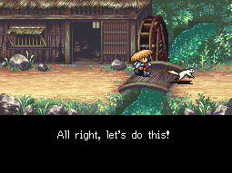
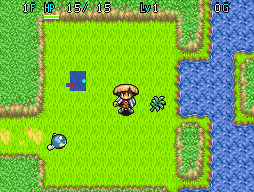

  

Tutorial dungeon where advice about the basics of dungeon gameplay appear as you progress. Items you pick up are kept after clearing the dungeon, so be sure to check every room on each floor. It's probably safe to say the only way to fail it is if you intentionally collapse. Once cleared, you can't return to this dungeon.

<ul class="quickLinksUL">
  <li><a href="#overview">Overview</a></li>
  <li><a href="#monsters">Monsters</a></li>
  <li><a href="#items">Items</a></li>
  <li><a href="#traps">Traps</a></li>
</ul>

# Overview

<table class="dungeonOverview">
  <tr>
    <th>Unlock</th>
    <td class="highlightYellow">Automatically proceed during the opening.</td>
  </tr>
  <tr>
    <th>Entrance</th>
    <td class="highlightYellow">N/A</td>
  </tr>
</table>

<table class="dungeonTable">
  <tr>
    <th>Floors</th>
    <td colspan="3">5F</td>
  </tr>
  <tr>
    <th>Bring Items</th>
    <td>-</td>
    <th>Allies</th>
    <td>-</td>
  </tr>
  <tr>
    <th>Bring Gitan</th>
    <td>-</td>
    <th>Bring Level Ups</th>
    <td>-</td>
  </tr>
  <tr>
    <th>Starting Item</th>
    <td colspan="3">None</td>
  </tr>
  <tr>
    <th>Unidentified</th>
    <td colspan="3">None</td>
  </tr>
  <tr>
    <th>Shops</th>
    <td>No</td>
    <th>Monster Houses</th>
    <td>No</td>
  </tr>
  <tr>
    <th>Clear Icon</th>
    <td>None</td>
    <th>Reward</th>
    <td>None</td>
  </tr>
</table>

# Monsters

Numbers in parentheses are HP values. Spawn Rates: Low Medium High

<table class="monsterTable">
  <thead>
    <tr>
      <th>F</th>
      <th colspan="3">Monsters</th>
    </tr>
  </thead>
  <tbody>
    <tr>
      <td>1</td>
      <td class="low"> Mamel (5)</td>
      <td></td>
      <td></td>
    </tr>
    <tr>
      <td>2</td>
      <td class="low"> Mamel (5)</td>
      <td class="low"> Mini Robber (5)</td>
      <td></td>
    </tr>
    <tr>
      <td>3</td>
      <td class="low"> Mamel (5)</td>
      <td class="low"> Mini Robber (5)</td>
      <td></td>
    </tr>
    <tr>
      <td>4</td>
      <td class="low"> Mamel (5)</td>
      <td class="low"> Mini Robber (5)</td>
      <td class="low"> Pit Mamel (5)</td>
    </tr>
    <tr>
      <td>5</td>
      <td class="low"> Mamel (5)</td>
      <td class="low"> Mini Robber (5)</td>
      <td class="low"> Pit Mamel (5)</td>
    </tr>
  </tbody>
</table>

# Items

- F = Floor, Monster drop

 

<table class="dungeonItemTable">
  <tr>
    <th colspan="5" class="highlightLightblue">Item</th>
  </tr>
  <tr>
    <th>Name</th>
    <th>F</th>
  </tr>
  <tr>
    <td class="leftText">Cudgel</td>
    <td>X</td>
  </tr>
  <tr>
    <td class="leftText">Wood Shield</td>
    <td>X</td>
  </tr>
  <tr>
    <td class="leftText">Riceball</td>
    <td>X</td>
  </tr>
  <tr>
    <td class="leftText">Dragon Herb</td>
    <td>X</td>
  </tr>
  <tr>
    <td class="leftText">Medicinal Herb</td>
    <td>X</td>
  </tr>
  <tr>
    <td class="leftText">Scroll of Light</td>
    <td>X</td>
  </tr>
  <tr>
    <td class="leftText">Blastwave Scroll</td>
    <td>X</td>
  </tr>
  <tr>
    <td class="leftText">Gitan</td>
    <td>X</td>
  </tr>
</table>

# Traps

<table class="dungeonTable">
  <thead>
    <tr>
      <th>Trap</th>
      <th>Floors</th>
    </tr>
  </thead>
  <tbody>
    <tr>
      <td>Immobilization</td>
      <td>1-5</td>
    </tr>
    <tr>
      <td>Wood Arrow</td>
      <td>1-5</td>
    </tr>
  </tbody>
</table>
