

  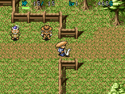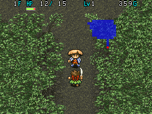

Table Mountain (also known as Kobami Valley) is the main story dungeon of Shiren 1. The dungeon is split into a number of areas, and there are overworld rest spots along the way. Backtracking is possible, but you can only go forward once you go past Cryptic Rock Valley.

This page mostly assumes you're attempting to clear the main story in 1 adventure from a new save file. If you're new to Shiren, or aren't up for the challenge, it's best to use backtracking to stock up on items and upgrade equipment at village blacksmiths to slowly work your way up instead.

<ul class="quickLinksUL">
  <li><a href="#overview">Overview</a></li>
  <li><a href="#strategy">Strategy</a></li>
  <li><a href="#floor-guide">Floor Guide</a></li>
  <li><a href="#monsters">Monsters</a></li>
  <li><a href="#items">Items</a></li>
  <li><a href="#traps">Traps</a></li>
</ul>

# Overview

<table class="dungeonOverview">
  <tr>
    <th>Unlock</th>
    <td class="highlightYellow">Clear Road to the Hamlet.</td>
  </tr>
  <tr>
    <th>Entrance</th>
    <td class="highlightYellow">Canyon Hamlet (East exit)</td>
  </tr>
</table>

<table class="dungeonTable">
  <tr>
    <th>Floors</th>
    <td colspan="3">30F</td>
  </tr>
  <tr>
    <th>Bring Items</th>
    <td>Yes</td>
    <th>Allies</th>
    <td>Yes</td>
  </tr>
  <tr>
    <th>Bring Gitan</th>
    <td>Yes</td>
    <th>Bring Level Ups</th>
    <td>Yes</td>
  </tr>
  <tr>
    <th>Starting Item</th>
    <td colspan="3">None</td>
  </tr>
  <tr>
    <th>Unidentified</th>
    <td colspan="3">Weapons, Shields, Armbands, Staves, Jars</td>
  </tr>
  <tr>
    <th>Shops</th>
    <td>Yes</td>
    <th>Monster Houses</th>
    <td>Yes</td>
  </tr>
  <tr>
    <th>Clear Icon</th>
    <td></td>
    <th>Reward</th>
    <td>None</td>
  </tr>
</table>

# Strategy

### Equipment

It's possible to clear the dungeon with any equipment, but a Katana and Iron Shield make things much easier. Both items can appear at the Bamboo Village shop - Use backtracking if you want to ensure obtaining them.

If you use weaker equipment, consider hunting an extra Rice Master to level up a bit more than usual. Shiren's attack power increases as he levels up, and higher max HP raises survivability in general.

Mastersword is stronger than a Katana, but a Katana can be upgraded into a better weapon in the long run. Hide Shield can be used to conserve fullness early game, but isn't recommended from around Waterfall Marsh. Armor Ward is strong, but it doubles your hunger rate (1 fullness / 5 turns), so you'll need lots of food if you use it. If you've unlocked Melding Jar through the [Gaibara Side Quest](/system/side-quests#gaibara), feel free to combine Armor Ward and Hide Shield. 1 Hide Shield will erase the faster hunger rate ability, and melding another Hide Shield will halve your hunger rate.

### Backtracking

Returning to the previous floor is possible by selecting Back while standing on an Exit tile. A new map will be generated for the previous floor, but there won't be any items on the ground. If you return to Canyon Hamlet, the current adventure ends and your stats reset, but you keep items and money.

This might sound somewhat pointless at first, but it's actually a very useful mechanic.

- The item shop in Bamboo Village refreshes its inventory each time you enter the village.
- Wandering NPCs change, making it possible to search for specific NPCs.
- Pickpockets can be hunted on 4-7F to earn money for the Bamboo Village shop.
- Rice Changers can be used to obtain Big Riceballs on 5-7F.
- Bowboys can be hunted on 3-5F to obtain Wooden Arrows.
- If a Monster House is generated, there will be lots of new items!

So, if you want to ensure victory, one strategy is to utilize backtracking to level up and stock up on items. That said, backtracking still isn't required to clear Table Mountain in a single attempt.

### Farming Techniques

#### Wooden Arrows (3-5F)

Have 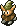 Bowboy shoot Wooden Arrows at you and collect the arrows that miss. Requires a shield, and watch your remaining HP so you don't collapse.

#### Big Riceballs (5-7F)

Have  Rice Changer transform unneeded items into Big Riceballs. Place important items on the ground first, but beware of 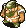 Field Bandits who can turn items into Weeds. If you don't have unneeded items, you can transform single arrows into Big Riceballs instead.

#### Rice Master (5-7F)

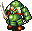 Evil Soldier and  Rice Changer both appear on 5-7F, so you can create  Rice Master to level up quickly.

##### Paralysis Method (Safe)

1. Paralyze a Rice Changer using Staff of Paralysis or Staff of Postpone.
2. Find an Evil Soldier, run it back to the paralyzed Rice Changer, then defeat the Evil Soldier.
    - Alternatively, step in place near the paralyzed Rice Changer and wait for an Evil Soldier to come.
3. A Dead Soldier will spawn after you defeat the Evil Soldier, so let it possess the paralyzed Rice Changer.
    - The paralyzed Rice Changer will level up into a Rice Boss, and the paralysis will wear off.
4. Paralyze the Rice Boss using Staff of Paralysis or Staff of Postpone.
5. Find another Evil Solider, then defeat it near the Rice Boss to level up the Rice Boss into a Rice Master.
6. Throw any riceball item at the Rice Master to instantly defeat it and gain 1500 experience points.

※ You can also use Staff of Sloth for this method, but it's a bit riskier compared to paralysis.

##### Doppelganger Method (Risky)

1. Find a Rice Changer, then find a second monster to use as a target.
2. Swing Doppelganger Staff at the second monster to have Rice Changer defeat it.
    - The Rice Changer will level up into a Rice Boss.
3. Find another monster to use as a target, then swing Doppelganger Staff at them.
    - The Rice Boss will level up into a Rice Master.
4. Throw any riceball item at the Rice Master to instantly defeat it and gain 1500 experience points.

# Floor Guide

### Old Cedar Road (1-2F)

  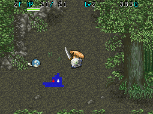

Enemies only use direct attacks, but you might struggle if you get swarmed in the starting room. 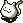 Chintala and  Mini Robber deal 3 damage without a shield, so use hallways to fight them 1 vs 1. HP regeneration rate is slow at first (1 HP per 15 turns), but speeds up as your max HP increases. Be sure to check every room for items before advancing to the next floor.

### Mountain Stream (3-4F)

  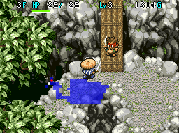

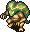 Snaky has 17 HP and deals 7~9 damage without a shield, so watch your HP and use an item if needed.  Bowboys shoot Wooden Arrows from up to 10 tiles away - Use zigzag movement to safely approach them.  Pickpockets will steal your Gitan when they're adjacent - Shoot arrows before they get close. As a bonus, defeating Pickpockets before they steal ensures they drop a fresh bag of Gitan.

If you find Gitan, you can hold B to step on it without picking it up, and then Trade it with an inventory item, which allows you to carry the Gitan and Throw it to deal damage equal to 1/10 of its value. It's a handy technique to defeat stronger enemies when Shiren is still lacking in stats or equipment. Continue checking every room for items before advancing to the next floor.

### Bamboo Village

  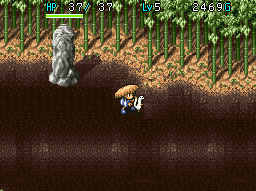

See [Villages](/system/villages#bamboo-village) and [Side Quests](/system/side-quests) pages for more information.

#### Item Shop

The shop has a random selection of 6 items (9 on the first visit) for sale.

<b>Shopping Priority</b>

Top: Iron Shield (2000), Mastersword (1500) or Katana (800) High: Bronzeward (600), Jar of Holding (1560~1800), Staff of Sloth (980~1190), Staff of Postpone (700~850) Mid: Scroll of Light (300), Chiropractic Jar (1950~2250), Earth Bless Scroll (800), Plating Scroll (2000) Low: Big Riceball (300), Medicinal Herb (300), Restorative Herb (600), Bowboy Meat (2000)

※ If you're doing a lot of backtracking, Hide Shield and Pickpocket Meat should be added to Top priority.

#### Blacksmith

Pay 1000 Gitan to upgrade a weapon of your choice (+1 upgrade value, or +3 if you're lucky). It's a bit expensive at this point in the game, so it's fine to skip this.

### Pegasus Ridge (5-6F)

  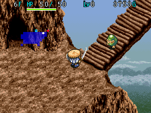

 Rice Changer (5-7F) has 23 HP and its special attack transforms 1 inventory item into a Big Riceball. This is helpful if it's an unneeded item, but it's quite bad if it happens to a valuable item like Jar of Holding. You likely won't be able to defeat them in 1 hit using direct attacks until you've <a href="#rice-master-(5-7f)">hunted a Rice Master</a> or two. However, you can instantly defeat Rice Changers by throwing any riceball item at them if needed. Otherwise, shoot arrows if there's distance or use staves when adjacent to ensure they don't act.

 Evil Soldier (5-7F) revives as 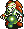 Dead Soldier 4 turns after it's been defeated. Dead Soldier has 3 HP but only takes 1 damage from direct attacks unless you have a Sickle Slayer equipped. It will seek out and possess a different monster, resulting in the possessed monster leveling up. This can be dangerous depending on the monster, so it's good to have Gitan on hand to be used as a projectile. Once you get the hang of these two monsters, you can use them to hunt a Rice Master for 1500 exp.

Other notable threats include 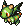 Firepuff (5-7F) and  Field Bandit (5-7F). Firepuff has 15 HP and can puff a flame which deals 10 damage, which hurts if you haven't leveled up much. Field Bandit has 18 HP and has low stats, but it can turn items on the ground into Weeds. If you're lucky, a bonus monster called 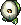 Egg Thing (5-9F) will spawn - Defeat it to obtain a Riceball.

### Mountaintop Forest (7F)

  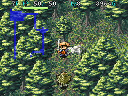

Monsters are the same as Pegasus Ridge, but with the addition of 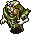 Skull Mage (7-9F). It has 21 HP and shoots a random effect magic bullet (Warp, Knockback, Switch positions, Swift) when lined up. None of the effects are that harmful, but it's good to get into the habit of using zigzag movement anyway.

### Mountaintop Town

  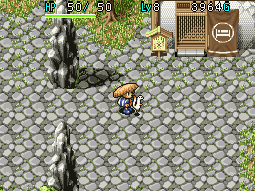

See [Villages](/system/villages#mountaintop-town) and [Side Quests](/system/side-quests) pages for more information.

#### Inn

Pay 500 Gitan to fully recover HP and fullness.

#### Warehouse

Store items inside the warehouse to keep them safe if you'd like. However, note that there's a secret reward for clearing Table Mountain without using any warehouses. See the "Blank Scroll Exclusive" section of the summary table on the [Scrolls](/items/scrolls) page for details.

#### Blacksmith

Pay 1000 Gitan to upgrade a weapon of your choice (+1 upgrade value, or +3 if you're lucky). It's a bit expensive at this point in the game, so it's fine to skip this.

#### Gaibara's Manor

  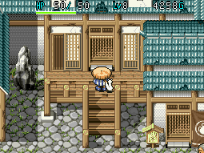

Warning: If you enter this building with a jar in your inventory, Gaibara will smash it and contents will be lost. This applies only to the first time you meet Gaibara, and excludes Walrus Jar and Monster Jar.

### Old Mine at Mount Nebri (8-9F)

  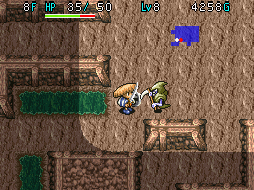

This is around the point where the difficulty of the dungeon begins to ramp up. Monster Houses (rooms packed full of monsters, items, and traps) can be generated between 8-14F. Save items like Scroll of Confusion and Blastwave Scroll for these situations if possible.

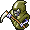 Death Reaper (8-10F) has 23 HP and Swift 1 action speed - It moves twice per turn and attacks 1 time. It also has 15 attack (10~14 damage if you're using Bronzeward), so it can be a bit tricky to deal with. When it's 1 tile away from you, step away from it so that it doesn't get to attack you first.

 Spike Bomb (8-9F) has 50 HP but only 7 attack, so its direct attacks aren't very threatening. However, it has an ability where it explodes when its HP falls below 20% (Remaining HP &le; 10 HP). When that happens, Shiren's remaining HP is set to 1 (or 50% of current HP if you're using a Blast Shield). Death Reapers won't hesitate to finish you off if you try to step in place to recover HP at that point, so it's extremely important to play in a manner where Spike Bombs don't explode.

Spike Bombs turn red and stop moving once their HP falls below 45% (Remaining HP &le; 22 HP). If your direct attack deals enough damage to where there's risk of making it explode (ex: 18\~24 damage), unequip your weapon or shoot an arrow instead of attacking with your weapon a second time. Once it turns red, either ignore it, or equip your weapon and finish it off if you have enough damage output.

 Thiefwalrus (8-11F) has 45 HP and steals 1 item from your inventory or the ground. It always drops an item from the Jar of Change item table if it's defeated before it steals an item. However, you're unlikely to one-shot it with a direct attack due to its high HP - Shoot arrows from a distance. It warps to a different room and runs away from Shiren after it steals, making it tricky to reclaim items. Some players prefer to shoot an arrow at the wall and let it steal that to avoid dealing with them.

### Janus Valley

  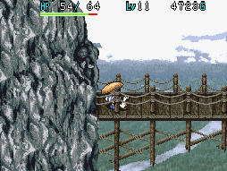

See [Villages](/system/villages#janus-valley) and [Side Quests](/system/side-quests) pages for more information.

No events or facilities during your first visit.

### Cavern in the Cliff (10-11F)

  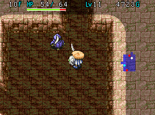

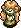 Curse Girl (10-12F) has 25 HP and curses 1 inventory item when adjacent - Shoot arrows from a distance. If a piece of equipment gets cursed, you won't be able to unequip it, and non-equipment items will be unusable. Lift a curse by reading a Scroll of Blessing (any item), Air Bless Scroll (weapon), or Earth Bless Scroll (shield).

 Hidden Eye (10-11F) has 20 HP and a whopping 28 attack, making it a menace in hallways. It likes to stay 1 tile away from Shiren when inside a room to try and get the first hit, but don't fall for it. You'll take 21~28 damage with a Bronzeward, or 20~26 damage with an Iron Shield if you approach it. Instead, shoot a single arrow and you'll likely one-shot it - It actually only has 1 defense.

 N'Duba (10-14F) has 30 HP and has the ability to disguise itself as an item. It won't reveal itself until you either try to use the item or advance to the next floor. Therefore, if you're in a dangerous situation, prioritize using an item obtained on a previous floor first. N'Duba itself only has 6 attack, so it's not a threat if it's a 1 vs 1 fight.

Other notable threats include 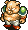 Piggy (11-13F) and 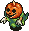 Pacorepkin (11-14F). Piggy has 34 HP and 18 attack, and can throw rocks (similar damage to direct attacks) within a 2 tile radius. Pacorepkin has 28 HP and 15 attack, and can pass through walls.

### Cave of the Mountain Spirits (12-14F)

  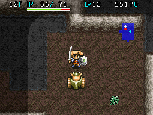

The dream team of  Inferno (12-14F) and  Popster Tank (12-14F) threaten you with a good time. Inferno has 35 HP and 17 attack, and is immune to projectiles unless the projectile has piercing properties. Popster Tank has 36 HP and Slow speed, and fires a cannon which deals 20 damage in a 1 tile radius. Neither are too bad on their own, but there's a catch - Infernos multiply when they get hit by explosions. Watch red dots on the map to ensure Popster Tank doesn't hit Infernos or other monsters with its cannon.

Otherwise, the only other new threat is  Kigny (12-14F), who attacks any creature - friend or foe. It has 40 HP and 25 attack at first, but will level up and get stronger each time it defeats a creature. If it reaches Lv3 or higher, step in place in a room and shoot arrows instead of risking a hallway encounter.

### Cryptic Rock Valley

  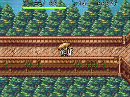

See [Villages](/system/villages#cryptic-rock-valley) and [Side Quests](/system/side-quests) pages for more information.

Caution: If you decide to continue to Waterfall Marsh, you won't be able to backtrack to previous floors.

#### Inn

Pay 1000 Gitan to fully recover HP and fullness.

#### Warehouse

Again, store items inside the warehouse to keep them safe if you'd like. The warehouse is unlocked when you successfully guide the lost girl (found on 8-11F) to her parents.

### Waterfall Marsh (15-16F)

  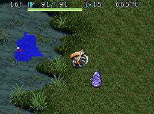

Highly recommended to rush to the exit instead of checking rooms for items. Monsters here can lower your stats or destroy items, so it's really not worth lingering on these floors.

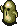 Twisty Hani has 25 HP and reduces your level by 1 when adjacent. 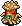 Leech Worm has 23 HP and reduces your max strength by 1 when adjacent.  Purple Slime has 40 HP and lowers weapon or shield strength by 2 when adjacent, and can multiply when hit.  Flutter Fowl has 30 HP and can electrify 1 herb or scroll in your inventory, which outright destroys the item.  Daze Radish has 30 HP and throws Herb of Confusion within a 2 tile radius, or Poison Herb if you're confused. Poison Herb slows your action speed to 1 action every 2 turns, and also reduces strength by 1.

If you have a Jar of Holding, leave 2 slots open in case you become adjacent to a Purple Slime. You can insert both your weapon and shield on the same turn using multi-select (R Button) to protect them.

Physical attacker threats include 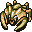 Gather and  Sabregator. Gather has 36 HP and 25 attack, and only uses direct attacks (19\~25 damage with Bronzeward). Sabregator has 35 HP and 18 attack, but attacks twice per turn. (26\~34 damage total with Bronzeward). 

### Table Mountain (17-21F)

  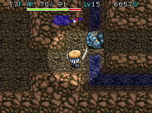

This is basically the first major wall for novice players - Especially for those who try to check every room. It takes experience to develop a sense for it, but once you have enough items, it can be better to rush to the stairs.

 Chainhead (17-20F) has 50 HP and 31 attack (24~31 damage with Bronzeward), and can attack 2 tiles ahead.  Master Hen (17-19F) has 50 HP and 26 attack (19~25 damage with Bronzeward), but only uses direct attacks. Both of these monsters are what I call "power type" monsters, where you don't want to just trade hits.

For example, say Chainhead takes 3 hits to defeat given your current level, weapon, and strength. If you trade hits without using items, that's 48\~62 damage (Bronzeward) per encounter assuming you get hit twice. What if you miss once or get hit by a surprise attack in a hallway? That spikes up to 72\~93 damage (3 hits). Or maybe you require 4 hits to defeat it, increasing the worst case damage to 96\~124 damage (4 hits). Even if you have a few Chiropractic Jars, it's clearly not sustainable.

So what should you do? The answer depends on your inventory, but it involves using items, such as:

- Dragon Herb and Gitan (500G+) can both one-shot Chainhead in an emergency.
- Scroll of Need will paralyze adjacent monsters if you're surrounded by 2 or more monsters.
- Staff of Sloth can be used to turn a monster into a roadblock in a hallway if you're being chased.
- Knockback Staff can be used to create distance for arrows, or buy time to escape.
- Scroll of Sleep will let you safely defeat adjacent monsters (sleep duration is 15 turns).
- Shoot arrows in hallways to check for incoming enemies, and to soften them before they're adjacent.

That said, there's a cute monster called  Fluffy Bunny (17-25F) who will gladly complicate the situation. Fluffy Bunny only has 5 HP and 6 attack, but it can warp to a hurt monster and heal their HP by 50 points. Unless you defeat Fluffy Bunny or one-shot the monster being supported, you can get stuck in an endless loop. Have Fluffy Bunny approach you by not dealing any damage after it heals the monster it's trying to support.

 Super Gaze (20-22F) has 51 HP and hypnotizes the player, forcing item usage or otherwise wasting your turn.  Air Devil (17-26F) has 50 HP and only 13 attack, but is normally invisible and reflects magic bullets.  Mistonos (20-22F) has 50 HP and 16 attack, and prevents you from moving anywhere else when adjacent.  Curse Sis (21-23F) has 33 HP and 15 attack - Similar to Curse Girl, she can curse 1 inventory item. 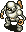 Mecharoid (21-23F) has 60 HP, 27 attack, and Swift 1 speed (moves 2 times per turn, attacks once). However, Mecharoid occasionally stops acting to create a trap, so it's not as mean as it sounds.

### Underground Stream Village

  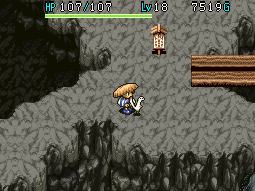

See [Villages](/system/villages#stream-village) for more information.

#### Inn

Pay 2000 Gitan to fully recover HP and fullness.

#### Item Shop

The shop has a random selection of 6 items for sale - Buy whatever looks useful. The pool of merchandise is very large compared to Bamboo Village, so it's not practical to list a shopping priority list.

### Table Mountain (22-25)

  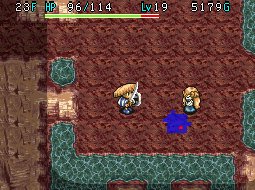

 Minotaur (23-25F) has 55 HP and 35 attack, and occasionally deals a critical hit - Another power type.  Haze Hermit (23-25F) has 45 HP and casts a spell that pauses Shiren's HP regeneration when lined up.  Polygon Jive (23-25F) has 60 HP and warps to Shiren inside rooms, and lowers fullness by 30.  Hover Fowl (24-26F) has 45 HP and electrifies 1 herb, scroll, or staff in your inventory, making it unusable.  Spike Blast (23-25F) has 80 HP and explodes when remaining HP &le; 16 HP - Deal with it similarly to Spike Bomb.

### Ravine of Illusions (26F) - The Three Trials (27-29F)

  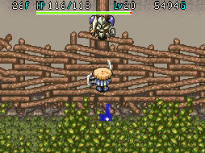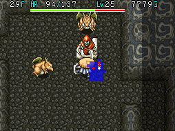

The final stretch - Single turns can be very important, so be careful with inputs. Highly recommended to use Scroll of Light and rush to the stairs instead of checking rooms for items.

 Death Angel (26-29F) has 65 HP, 28 attack, and Swift 2 speed (moves and attacks twice per turn). In addition to its high stats, it can pass through walls and detect Shiren from anywhere on the floor. This means you'll often be rushed by multiple Death Angels at the start of a floor - Use items to overcome them. It's best to step in place in the starting room instead of getting caught by them in a hallway.

 Skull Wraith (26-27F) has 60 HP and shoots a random effect magic bullet when lined up. Effects include Bufu (Riceball), Paralyzed, Slow, Sealed, Doppelganger (Confused), and Level-1. As you can imagine, most of these effects are very dangerous, so use items to stop Skull Wraith from acting.

 Metal Armor (26-27F) has 65 HP, 27 attack, and knocks away your equipped weapon or shield (flies 10 tiles). If the disarmed equipment hits another monster or lands on an air tile, the item is lost, so don't let it act.

 Dragon (27-29F) has 90 HP, 40 attack, and can spew fire in a straight line which deals 30 damage. You need to use items against it or you're going to have a bad time.

Other threats on 27-29F include  Dragon Head,  Tiger Uhoho,  Piggo, and  Madremlas. Dragon Head has 70 HP and 32 attack, and will try to sandwich you between another enemy in a hallway. Tiger Uhoho has 65 HP and 26 attack, and can throw creatures within a 10 tile radius. Piggo has 50 HP, 35 attack, and can throw rocks within a 5 tile radius. Madremlas has 60 HP, 30 attack, and can make Shiren trip and drop inventory items on the ground.

### Golden City / Rainbow's End

  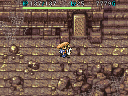

No facilities, but you can check the stone slabs to learn about the city.

### Waterfall Cavern (30F)

Boss fight with Tainted Insect and a random selection of monsters (Skull Wraith, Madremlas, Tiger Uhoho).

<table class="monsterPageTable">
  <tr>
    <th>Name</th>
    <th>HP</th>
    <th>Atk</th>
    <th>Def</th>
    <th>Exp</th>
    <th>Elem.</th>
    <th>Notes</th>
  </tr>
  <tr>
    <td>Tainted Insect</td>
    <td>500</td>
    <td>48</td>
    <td>20</td>
    <td>7777</td>
    <td>Normal</td>
    <td>No abilities, immune to Bufu's Staff.</td>
  </tr>
</table>

One guaranteed method is to read a Scroll of Confusion → 2 Blastwave Scrolls → Swing a Staff of Sloth at the boss. If you don't have a Staff of Sloth, you can run around a pillar to regenerate HP as you trade hits. Power Up Scroll + Knockback Staff + arrows, or thrown monster meat are also effective against the boss. It's the final battle for this dungeon, so stay calm and choose your actions carefully.

# Monsters

See [Monsters](/system/monsters) for individual monster details.

- S - Shop is possible
- H - Monster House is possible
- G - Gitan Vault is possible

Numbers in parentheses are HP values. Spawn Rates: Low Medium High

<table class="monsterTable">
  <thead>
    <tr>
      <th>F</th>
      <th>S</th>
      <th>H</th>
      <th>G</th>
      <th colspan="5">Monsters</th>
    </tr>
  </thead>
  <tbody>
    <tr>
      <td class="">1</td>
      <td class=""></td>
      <td class=""></td>
      <td class=""></td>
      <td class="high"> Mamel (5)</td>
      <td class="high"> Mini Robber (5)</td>
      <td class="mid"> Chintala (8)</td>
      <td></td>
      <td></td>
    </tr>
    <tr>
      <td colspan="9" class="tableDivider"></td>
    </tr>
    <tr>
      <td class="">2</td>
      <td class=""></td>
      <td class=""></td>
      <td class=""></td>
      <td class="high"> Mamel (5)</td>
      <td class="high"> Mini Robber (5)</td>
      <td class="mid"> Chintala (8)</td>
      <td></td>
      <td></td>
    </tr>
    <tr>
      <td colspan="9" class="tableDivider"></td>
    </tr>
    <tr>
      <td class="">3</td>
      <td class=""></td>
      <td class=""></td>
      <td class=""></td>
      <td class="high"> Snaky (17)</td>
      <td class="mid"> Mini Robber (5)</td>
      <td class="mid"> Chintala (8)</td>
      <td class="mid"> Bowboy (12)</td>
      <td></td>
    </tr>
    <tr>
      <td colspan="9" class="tableDivider"></td>
    </tr>
    <tr>
      <td class="">4</td>
      <td class=""></td>
      <td class=""></td>
      <td class=""></td>
      <td class="high"> Snaky (17)</td>
      <td class="low"> Pickpocket (10)</td>
      <td class="mid"> Chintala (8)</td>
      <td class="mid"> Bowboy (12)</td>
      <td></td>
    </tr>
    <tr>
      <td colspan="9" class="tableDivider"></td>
    </tr>
    <tr>
      <td class="monsterTableVillage"></td>
      <td colspan="3" class="monsterTableVillage"></td>
      <td colspan="5" class="monsterTableVillage">Bamboo Village</td>
    </tr>
    <tr>
      <td colspan="9" class="tableDivider"></td>
    </tr>
    <tr>
      <td rowspan="2" class="">5</td>
      <td rowspan="2" class=""></td>
      <td rowspan="2" class=""></td>
      <td rowspan="2" class=""></td>
      <td class="high"> Firepuff (15)</td>
      <td class="low"> Pickpocket (10)</td>
      <td class="high"> Rice Changer (23)</td>
      <td class="mid"> Bowboy (12)</td>
      <td class="mid"> Field Bandit (18)</td>
    </tr>
    <tr>
      <td class="mid"> Evil Soldier (18)</td>
      <td class="low"> Egg Thing (5)</td>
      <td class=""></td>
      <td class=""></td>
      <td class=""></td>
    </tr>
    <tr>
      <td colspan="9" class="tableDivider"></td>
    </tr>
    <tr>
      <td rowspan="2" class="">6</td>
      <td rowspan="2" class=""></td>
      <td rowspan="2" class=""></td>
      <td rowspan="2" class=""></td>
      <td class="high"> Firepuff (15)</td>
      <td class="low"> Pickpocket (10)</td>
      <td class="high"> Rice Changer (23)</td>
      <td class=""></td>
      <td class="mid"> Field Bandit (18)</td>
    </tr>
    <tr>
      <td class="mid"> Evil Soldier (18)</td>
      <td class="low"> Egg Thing (5)</td>
      <td class=""></td>
      <td class=""></td>
      <td class=""></td>
    </tr>
    <tr>
      <td colspan="9" class="tableDivider"></td>
    </tr>
    <tr>
      <td rowspan="2" class="">7</td>
      <td rowspan="2" class=""></td>
      <td rowspan="2" class=""></td>
      <td rowspan="2" class=""></td>
      <td class="high"> Firepuff (15)</td>
      <td class="low"> Pickpocket (10)</td>
      <td class="high"> Rice Changer (23)</td>
      <td class="high"> Skull Mage (21)</td>
      <td class="mid"> Field Bandit (18)</td>
    </tr>
    <tr>
      <td class="mid"> Evil Soldier (18)</td>
      <td class="low"> Egg Thing (5)</td>
      <td class=""></td>
      <td class=""></td>
      <td class=""></td>
    </tr>
    <tr>
      <td colspan="9" class="tableDivider"></td>
    </tr>
    <tr>
      <td class="monsterTableVillage"></td>
      <td colspan="3" class="monsterTableVillage"></td>
      <td colspan="5" class="monsterTableVillage">Mountaintop Town</td>
    </tr>
    <tr>
      <td colspan="9" class="tableDivider"></td>
    </tr>
    <tr>
      <td rowspan="2" class="">8</td>
      <td rowspan="2" class="highlightShop"></td>
      <td rowspan="2" class="highlightMH"></td>
      <td rowspan="2" class="highlightGitan"></td>
      <td class="high"> Death Reaper (23)</td>
      <td class="mid"> Spike Bomb (50)</td>
      <td class="low"> Thiefwalrus (45)</td>
      <td class="high"> Skull Mage (21)</td>
      <td class=""></td>
    </tr>
    <tr>
      <td class=""></td>
      <td class="low"> Egg Thing (5)</td>
      <td class=""></td>
      <td class=""></td>
      <td class=""></td>
    </tr>
    <tr>
      <td colspan="9" class="tableDivider"></td>
    </tr>
    <tr>
      <td rowspan="2" class="">9</td>
      <td rowspan="2" class="highlightShop"></td>
      <td rowspan="2" class="highlightMH"></td>
      <td rowspan="2" class="highlightGitan"></td>
      <td class="high"> Death Reaper (23)</td>
      <td class="mid"> Spike Bomb (50)</td>
      <td class="low"> Thiefwalrus (45)</td>
      <td class="high"> Skull Mage (21)</td>
      <td class="high">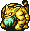 Tiger Uho (33)</td>
    </tr>
    <tr>
      <td class="mid">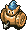 Baby Tank (25)</td>
      <td class="low"> Egg Thing (5)</td>
      <td class=""></td>
      <td class=""></td>
      <td class=""></td>
    </tr>
    <tr>
      <td colspan="9" class="tableDivider"></td>
    </tr>
    <tr>
      <td class="monsterTableVillage"></td>
      <td colspan="3" class="monsterTableVillage"></td>
      <td colspan="5" class="monsterTableVillage">Janus Valley</td>
    </tr>
    <tr>
      <td colspan="9" class="tableDivider"></td>
    </tr>
    <tr>
      <td rowspan="2" class="">10</td>
      <td rowspan="2" class="highlightShop"></td>
      <td rowspan="2" class="highlightMH"></td>
      <td rowspan="2" class="highlightGitan"></td>
      <td class="high"> Death Reaper (23)</td>
      <td class="high"> Hidden Eye (20)</td>
      <td class="low"> Thiefwalrus (45)</td>
      <td class="mid">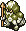 Soldier Ant (20)</td>
      <td class="high"> Tiger Uho (33)</td>
    </tr>
    <tr>
      <td class="mid"> Baby Tank (25)</td>
      <td class="mid"> Curse Girl (25)</td>
      <td class="low"> Running Egg (5)</td>
      <td class="low"> N'Duba (30)</td>
      <td class=""></td>
    </tr>
    <tr>
      <td colspan="9" class="tableDivider"></td>
    </tr>
    <tr>
      <td rowspan="2" class="">11</td>
      <td rowspan="2" class="highlightShop"></td>
      <td rowspan="2" class="highlightMH"></td>
      <td rowspan="2" class="highlightGitan"></td>
      <td class="high"> Pacorepkin (28)</td>
      <td class="high"> Hidden Eye (20)</td>
      <td class="low"> Thiefwalrus (45)</td>
      <td class="mid"> Soldier Ant (20)</td>
      <td class="high"> Tiger Uho (33)</td>
    </tr>
    <tr>
      <td class="high"> Piggy (34)</td>
      <td class="mid"> Curse Girl (25)</td>
      <td class="low"> Running Egg (5)</td>
      <td class="low"> N'Duba (30)</td>
      <td class=""></td>
    </tr>
    <tr>
      <td colspan="9" class="tableDivider"></td>
    </tr>
    <tr>
      <td rowspan="2" class="">12</td>
      <td rowspan="2" class="highlightShop"></td>
      <td rowspan="2" class="highlightMH"></td>
      <td rowspan="2" class="highlightGitan"></td>
      <td class="high"> Pacorepkin (28)</td>
      <td class="high"> Inferno (35)</td>
      <td class="high"> Popster Tank (36)</td>
      <td class="mid"> Kigny (40)</td>
      <td class="low">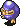 Thief (15)</td>
    </tr>
    <tr>
      <td class="high"> Piggy (34)</td>
      <td class="mid"> Curse Girl (25)</td>
      <td class="low"> Running Egg (5)</td>
      <td class="low"> N'Duba (30)</td>
      <td class=""></td>
    </tr>
    <tr>
      <td colspan="9" class="tableDivider"></td>
    </tr>
    <tr>
      <td rowspan="2" class="">13</td>
      <td rowspan="2" class="highlightShop"></td>
      <td rowspan="2" class="highlightMH"></td>
      <td rowspan="2" class="highlightGitan"></td>
      <td class="mid"> Pacorepkin (28)</td>
      <td class="high"> Inferno (35)</td>
      <td class="high"> Popster Tank (36)</td>
      <td class="mid"> Kigny (40)</td>
      <td class="low"> Thief (15)</td>
    </tr>
    <tr>
      <td class="high"> Piggy (34)</td>
      <td class=""></td>
      <td class="low"> Running Egg (5)</td>
      <td class="low"> N'Duba (30)</td>
      <td class=""></td>
    </tr>
    <tr>
      <td colspan="9" class="tableDivider"></td>
    </tr>
    <tr>
      <td rowspan="2" class="">14</td>
      <td rowspan="2" class="highlightShop"></td>
      <td rowspan="2" class="highlightMH"></td>
      <td rowspan="2" class="highlightGitan"></td>
      <td class="mid"> Pacorepkin (28)</td>
      <td class="high"> Inferno (35)</td>
      <td class="high"> Popster Tank (36)</td>
      <td class="mid"> Kigny (40)</td>
      <td class="low"> Thief (15)</td>
    </tr>
    <tr>
      <td class=""></td>
      <td class=""></td>
      <td class="low"> Running Egg (5)</td>
      <td class="low"> N'Duba (30)</td>
      <td class=""></td>
    </tr>
    <tr>
      <td colspan="9" class="tableDivider"></td>
    </tr>
    <tr>
      <td class="monsterTableVillage"></td>
      <td colspan="3" class="monsterTableVillage"></td>
      <td colspan="5" class="monsterTableVillage">Cryptic Rock Valley</td>
    </tr>
    <tr>
      <td colspan="9" class="tableDivider"></td>
    </tr>
    <tr>
      <td rowspan="2" class="">15</td>
      <td rowspan="2" class=""></td>
      <td rowspan="2" class=""></td>
      <td rowspan="2" class=""></td>
      <td class="high"> Leech Worm (23)</td>
      <td class="high"> Twisty Hani (25)</td>
      <td class="high"> Daze Radish (30)</td>
      <td class="high"> Flutter Fowl (30)</td>
      <td class="high"> Purple Slime (40)</td>
    </tr>
    <tr>
      <td class="mid"> Sabregator (35)</td>
      <td class="mid"> Gather (36)</td>
      <td class=""></td>
      <td class=""></td>
      <td class=""></td>
    </tr>
    <tr>
      <td colspan="9" class="tableDivider"></td>
    </tr>
    <tr>
      <td rowspan="2" class="">16</td>
      <td rowspan="2" class=""></td>
      <td rowspan="2" class=""></td>
      <td rowspan="2" class=""></td>
      <td class="high"> Leech Worm (23)</td>
      <td class="high"> Twisty Hani (25)</td>
      <td class="high"> Daze Radish (30)</td>
      <td class="high"> Flutter Fowl (30)</td>
      <td class="high"> Purple Slime (40)</td>
    </tr>
    <tr>
      <td class="mid"> Sabregator (35)</td>
      <td class="mid"> Gather (36)</td>
      <td class=""></td>
      <td class=""></td>
      <td class=""></td>
    </tr>
    <tr>
      <td colspan="9" class="tableDivider"></td>
    </tr>
    <tr>
      <td rowspan="2" class="">17</td>
      <td rowspan="2" class="highlightShop"></td>
      <td rowspan="2" class="highlightMH"></td>
      <td rowspan="2" class="highlightGitan"></td>
      <td class="high"> Chainhead (50)</td>
      <td class="high"> Master Hen (50)</td>
      <td class="low"> Young Tengu (25)</td>
      <td class="mid"> Air Devil (50)</td>
      <td class="low"> Fluffy Bunny (5)</td>
    </tr>
    <tr>
      <td class="low">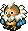 Ghost Owl (7)</td>
      <td class="low"> N'Dulu (35)</td>
      <td class="low"> Greenwalrus (58)</td>
      <td class=""></td>
      <td class=""></td>
    </tr>
    <tr>
      <td colspan="9" class="tableDivider"></td>
    </tr>
    <tr>
      <td rowspan="2" class="">18</td>
      <td rowspan="2" class="highlightShop"></td>
      <td rowspan="2" class="highlightMH"></td>
      <td rowspan="2" class="highlightGitan"></td>
      <td class="high"> Chainhead (50)</td>
      <td class="high"> Master Hen (50)</td>
      <td class="low"> Young Tengu (25)</td>
      <td class="mid"> Air Devil (50)</td>
      <td class="low"> Fluffy Bunny (5)</td>
    </tr>
    <tr>
      <td class="low"> Ghost Owl (7)</td>
      <td class="low"> N'Dulu (35)</td>
      <td class="low"> Greenwalrus (58)</td>
      <td class=""></td>
      <td class=""></td>
    </tr>
    <tr>
      <td colspan="9" class="tableDivider"></td>
    </tr>
    <tr>
      <td rowspan="2" class="">19</td>
      <td rowspan="2" class="highlightShop"></td>
      <td rowspan="2" class="highlightMH"></td>
      <td rowspan="2" class="highlightGitan"></td>
      <td class="high"> Chainhead (50)</td>
      <td class="high"> Master Hen (50)</td>
      <td class="low"> Young Tengu (25)</td>
      <td class="mid"> Air Devil (50)</td>
      <td class="low"> Fluffy Bunny (5)</td>
    </tr>
    <tr>
      <td class="low"> Ghost Owl (7)</td>
      <td class="low"> N'Dulu (35)</td>
      <td class="low"> Greenwalrus (58)</td>
      <td class=""></td>
      <td class=""></td>
    </tr>
    <tr>
      <td colspan="9" class="tableDivider"></td>
    </tr>
    <tr>
      <td rowspan="2" class="">20</td>
      <td rowspan="2" class="highlightShop"></td>
      <td rowspan="2" class="highlightMH"></td>
      <td rowspan="2" class="highlightGitan"></td>
      <td class="high"> Chainhead (50)</td>
      <td class="high"> Blazepuff (40)</td>
      <td class="high"> Mistonos (50)</td>
      <td class="mid"> Air Devil (50)</td>
      <td class="low"> Fluffy Bunny (5)</td>
    </tr>
    <tr>
      <td class="low"> Ghost Owl (7)</td>
      <td class="low"> N'Dulu (35)</td>
      <td class="low"> Greenwalrus (58)</td>
      <td class="high"> Super Gaze (51)</td>
      <td class=""></td>
    </tr>
    <tr>
      <td colspan="9" class="tableDivider"></td>
    </tr>
    <tr>
      <td rowspan="3" class="">21</td>
      <td rowspan="3" class="highlightShop"></td>
      <td rowspan="3" class="highlightMH"></td>
      <td rowspan="3" class="highlightGitan"></td>
      <td class="high"> Mecharoid (60)</td>
      <td class="high"> Blazepuff (40)</td>
      <td class="high"> Mistonos (50)</td>
      <td class="mid"> Air Devil (50)</td>
      <td class="low"> Fluffy Bunny (5)</td>
    </tr>
    <tr>
      <td class="low"> Ghost Owl (7)</td>
      <td class="low"> N'Dulu (35)</td>
      <td class="low"> Greenwalrus (58)</td>
      <td class="high"> Super Gaze (51)</td>
      <td class="mid"> Curse Sis (33)</td>
    </tr>
    <tr>
      <td class="mid">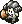 Schubell (15)</td>
      <td class="mid">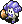 Menbell (25)</td>
      <td class=""></td>
      <td class=""></td>
      <td class=""></td>
    </tr>
    <tr>
      <td colspan="9" class="tableDivider"></td>
    </tr>
    <tr>
      <td class="monsterTableVillage"></td>
      <td colspan="3" class="monsterTableVillage"></td>
      <td colspan="5" class="monsterTableVillage">Stream Village</td>
    </tr>
    <tr>
      <td colspan="9" class="tableDivider"></td>
    </tr>
    <tr>
      <td rowspan="3" class="">22</td>
      <td rowspan="3" class="highlightShop"></td>
      <td rowspan="3" class="highlightMH"></td>
      <td rowspan="3" class="highlightGitan"></td>
      <td class="high"> Mecharoid (60)</td>
      <td class="high"> Blazepuff (40)</td>
      <td class="high"> Mistonos (50)</td>
      <td class="mid"> Air Devil (50)</td>
      <td class="low"> Fluffy Bunny (5)</td>
    </tr>
    <tr>
      <td class="low"> Ghost Owl (7)</td>
      <td class="low"> N'Dulu (35)</td>
      <td class="mid"> Pacorepkina (45)</td>
      <td class="high"> Super Gaze (51)</td>
      <td class="mid"> Curse Sis (33)</td>
    </tr>
    <tr>
      <td class="mid"> Schubell (15)</td>
      <td class="mid"> Menbell (25)</td>
      <td class="low"> Flying Egg (8)</td>
      <td class=""></td>
      <td class=""></td>
    </tr>
    <tr>
      <td colspan="9" class="tableDivider"></td>
    </tr>
    <tr>
      <td rowspan="3" class="">23</td>
      <td rowspan="3" class=""></td>
      <td rowspan="3" class="highlightMH"></td>
      <td rowspan="3" class=""></td>
      <td class="high"> Mecharoid (60)</td>
      <td class="high"> Haze Hermit (45)</td>
      <td class="high"> Minotaur (55)</td>
      <td class="mid"> Air Devil (50)</td>
      <td class="low"> Fluffy Bunny (5)</td>
    </tr>
    <tr>
      <td class="low"> Ghost Owl (7)</td>
      <td class="low"> N'Dulu (35)</td>
      <td class="mid"> Pacorepkina (45)</td>
      <td class="high"> Polygon Jive (60)</td>
      <td class="mid"> Curse Sis (33)</td>
    </tr>
    <tr>
      <td class="mid"> Schubell (15)</td>
      <td class="mid"> Menbell (25)</td>
      <td class="low"> Flying Egg (8)</td>
      <td class="mid"> Spike Blast (80)</td>
      <td class=""></td>
    </tr>
    <tr>
      <td colspan="9" class="tableDivider"></td>
    </tr>
    <tr>
      <td rowspan="3" class="">24</td>
      <td rowspan="3" class=""></td>
      <td rowspan="3" class="highlightMH"></td>
      <td rowspan="3" class=""></td>
      <td class="mid"> Hover Fowl (45)</td>
      <td class="high"> Haze Hermit (45)</td>
      <td class="high"> Minotaur (55)</td>
      <td class="mid"> Air Devil (50)</td>
      <td class="low"> Fluffy Bunny (5)</td>
    </tr>
    <tr>
      <td class="low"> Ghost Owl (7)</td>
      <td class="low"> N'Dulu (35)</td>
      <td class="mid"> Pacorepkina (45)</td>
      <td class="high"> Polygon Jive (60)</td>
      <td class=""></td>
    </tr>
    <tr>
      <td class="mid"> Schubell (15)</td>
      <td class="mid"> Menbell (25)</td>
      <td class="low"> Flying Egg (8)</td>
      <td class="mid"> Spike Blast (80)</td>
      <td class=""></td>
    </tr>
    <tr>
      <td colspan="9" class="tableDivider"></td>
    </tr>
    <tr>
      <td rowspan="3" class="">25</td>
      <td rowspan="3" class=""></td>
      <td rowspan="3" class="highlightMH"></td>
      <td rowspan="3" class=""></td>
      <td class="mid"> Hover Fowl (45)</td>
      <td class="high"> Haze Hermit (45)</td>
      <td class="high"> Minotaur (55)</td>
      <td class="mid"> Air Devil (50)</td>
      <td class="low"> Fluffy Bunny (5)</td>
    </tr>
    <tr>
      <td class="low"> Ghost Owl (7)</td>
      <td class="low"> N'Dulu (35)</td>
      <td class="mid"> Pacorepkina (45)</td>
      <td class="high"> Polygon Jive (60)</td>
      <td class=""></td>
    </tr>
    <tr>
      <td class="mid"> Schubell (15)</td>
      <td class="mid"> Menbell (25)</td>
      <td class="low"> Flying Egg (8)</td>
      <td class="mid"> Spike Blast (80)</td>
      <td class=""></td>
    </tr>
    <tr>
      <td colspan="9" class="tableDivider"></td>
    </tr>
    <tr>
      <td class="">26</td>
      <td class=""></td>
      <td class=""></td>
      <td class=""></td>
      <td class="mid"> Hover Fowl (45)</td>
      <td class="high"> Skull Wraith (60)</td>
      <td class="mid"> Death Angel (65)</td>
      <td class="mid"> Air Devil (50)</td>
      <td class="high"> Metal Armor (65)</td>
    </tr>
    <tr>
      <td colspan="9" class="tableDivider"></td>
    </tr>
    <tr>
      <td rowspan="2" class="">27</td>
      <td rowspan="2" class=""></td>
      <td rowspan="2" class="highlightMH"></td>
      <td rowspan="2" class=""></td>
      <td class="high"> Dragon Head (70)</td>
      <td class="high"> Skull Wraith (60)</td>
      <td class="mid"> Death Angel (65)</td>
      <td class="high"> Dragon (90)</td>
      <td class="high"> Metal Armor (65)</td>
    </tr>
    <tr>
      <td class="low"> Fluffy Bunny (5)</td>
      <td class="high"> Piggo (50)</td>
      <td class="high"> Madremlas (60)</td>
      <td class="high"> Tiger Uhoho (65)</td>
      <td class=""></td>
    </tr>
    <tr>
      <td colspan="9" class="tableDivider"></td>
    </tr>
    <tr>
      <td rowspan="2" class="">28</td>
      <td rowspan="2" class=""></td>
      <td rowspan="2" class="highlightMH"></td>
      <td rowspan="2" class=""></td>
      <td class="high"> Dragon Head (70)</td>
      <td class=""></td>
      <td class="mid"> Death Angel (65)</td>
      <td class="high"> Dragon (90)</td>
      <td class=""></td>
    </tr>
    <tr>
      <td class="low"> Fluffy Bunny (5)</td>
      <td class="high"> Piggo (50)</td>
      <td class="high"> Madremlas (60)</td>
      <td class="high"> Tiger Uhoho (65)</td>
      <td class=""></td>
    </tr>
    <tr>
      <td colspan="9" class="tableDivider"></td>
    </tr>
    <tr>
      <td rowspan="2" class="">29</td>
      <td rowspan="2" class=""></td>
      <td rowspan="2" class="highlightMH"></td>
      <td rowspan="2" class=""></td>
      <td class="high"> Dragon Head (70)</td>
      <td class=""></td>
      <td class="mid"> Death Angel (65)</td>
      <td class="high"> Dragon (90)</td>
      <td class=""></td>
    </tr>
    <tr>
      <td class="low"> Fluffy Bunny (5)</td>
      <td class="high"> Piggo (50)</td>
      <td class="high"> Madremlas (60)</td>
      <td class="high"> Tiger Uhoho (65)</td>
      <td class=""></td>
    </tr>
    <tr>
      <td colspan="9" class="tableDivider"></td>
    </tr>
    <tr>
      <td class="monsterTableVillage"></td>
      <td colspan="3" class="monsterTableVillage"></td>
      <td colspan="5" class="monsterTableVillage">Golden City / Rainbow's End</td>
    </tr>
    <tr>
      <td colspan="9" class="tableDivider"></td>
    </tr>
    <tr>
      <td class="">30</td>
      <td class=""></td>
      <td class=""></td>
      <td class=""></td>
      <td colspan="5" class="highlightOffense">Boss</td>
    </tr>
    <tr>
      <td colspan="9" class="tableDivider"></td>
    </tr>
  </tbody>
</table>

# Items

#### Spawn Rates

- F = Floor, Monster drop
- S = Shop
- C = Jar of Change, Thiefwalrus drop

 

<table class="dungeonTable">
  <tr>
    <th class="centeredText">Category</th>
    <th class="centeredText">F</th>
    <th class="centeredText">S</th>
    <th class="centeredText">C</th>
    <th rowspan="6" class="tableDivider"></th>
    <th class="centeredText">Category</th>
    <th class="centeredText">F</th>
    <th class="centeredText">S</th>
    <th class="centeredText">C</th>
  </tr>
  <tr>
    <td class="highlightGray">Weapon</td>
    <td>★</td>
    <td>★</td>
    <td>★</td>
    <td class="highlightGray">Herb</td>
    <td>★★★★★</td>
    <td>★★★★★</td>
    <td>★★★★</td>
  </tr>
  <tr>
    <td class="highlightGray">Shield</td>
    <td>★</td>
    <td>★</td>
    <td>★</td>
    <td class="highlightGray">Scroll</td>
    <td>★★★★★</td>
    <td>★★★★</td>
    <td>★★★★</td>
  </tr>
  <tr>
    <td class="highlightGray">Armband</td>
    <td>★</td>
    <td>★</td>
    <td>★</td>
    <td class="highlightGray">Staff</td>
    <td>★★★★</td>
    <td>★★★</td>
    <td>★★</td>
  </tr>
  <tr>
    <td class="highlightGray">Projectile</td>
    <td>★</td>
    <td>-</td>
    <td>★</td>
    <td class="highlightGray">Jar</td>
    <td>★★★★</td>
    <td>★★★</td>
    <td>★★</td>
  </tr>
  <tr>
    <td class="highlightGray">Food</td>
    <td>★</td>
    <td>★★★★</td>
    <td>★</td>
    <td class="highlightGray">Meat</td>
    <td>-</td>
    <td>★</td>
    <td>-</td>
  </tr>
</table>

#### Item Table

The values like "1-29" in the Notes column represents the floor range where the item can appear.

- F = Floor, Monster drop
- S = Shop
- M = Monster (Fixed drop)
- C = Jar of Change, Thiefwalrus drop

 

<table class="dungeonItemTable">
  <tr>
    <th colspan="6" class="highlightLightblue">Weapon</th>
    <th rowspan="68"></th>
    <th colspan="6" class="highlightLightblue">Herb</th>
  </tr>
  <tr>
    <th>Name</th>
    <th>F</th>
    <th>S</th>
    <th>M</th>
    <th>C</th>
    <th>Notes</th>
    <th>Name</th>
    <th>F</th>
    <th>S</th>
    <th>M</th>
    <th>C</th>
    <th>Notes</th>
  </tr>
  <tr>
    <td class="leftText">Katana</td>
    <td>X</td>
    <td>X</td>
    <td></td>
    <td>X</td>
    <td>1-29</td>
    <td class="leftText">Big Belly Seed</td>
    <td>X</td>
    <td>X</td>
    <td></td>
    <td>X</td>
    <td>1-29</td>
  </tr>
  <tr>
    <td class="leftText">Golden Blade</td>
    <td>X</td>
    <td>X</td>
    <td></td>
    <td>X</td>
    <td>1-29</td>
    <td class="leftText">Herb of Life</td>
    <td>X</td>
    <td></td>
    <td></td>
    <td>X</td>
    <td>1-29</td>
  </tr>
  <tr>
    <td class="leftText">Kabra's Blade</td>
    <td></td>
    <td></td>
    <td></td>
    <td>X</td>
    <td>1-29</td>
    <td class="leftText">Restorative Herb</td>
    <td>X</td>
    <td>X</td>
    <td></td>
    <td>X</td>
    <td>1-29</td>
  </tr>
  <tr>
    <td class="leftText">Cudgel</td>
    <td>X</td>
    <td>X</td>
    <td></td>
    <td>X</td>
    <td>1-29</td>
    <td class="leftText">Herb of Confusion</td>
    <td></td>
    <td></td>
    <td>X</td>
    <td></td>
    <td>Daze Radish</td>
  </tr>
  <tr>
    <td class="leftText">Air Slayer</td>
    <td>X</td>
    <td>X</td>
    <td></td>
    <td>X</td>
    <td>8-29</td>
    <td class="leftText">Weeds</td>
    <td></td>
    <td></td>
    <td>X</td>
    <td></td>
    <td>Field Bandit Type</td>
  </tr>
  <tr>
    <td class="leftText">Sickle Slayer</td>
    <td>X</td>
    <td>X</td>
    <td></td>
    <td>X</td>
    <td>1-29</td>
    <td class="leftText">Herb of Strength</td>
    <td>X</td>
    <td>X</td>
    <td></td>
    <td>X</td>
    <td>1-29</td>
  </tr>
  <tr>
    <td class="leftText">Fragile Edge</td>
    <td></td>
    <td>X</td>
    <td></td>
    <td></td>
    <td>Any shop</td>
    <td class="leftText">Antidote Herb</td>
    <td>X</td>
    <td>X</td>
    <td></td>
    <td>X</td>
    <td>1-29</td>
  </tr>
  <tr>
    <td class="leftText">Pickaxe</td>
    <td>X</td>
    <td></td>
    <td></td>
    <td>X</td>
    <td>8-29</td>
    <td class="leftText">Dragon Herb</td>
    <td>X</td>
    <td>X</td>
    <td></td>
    <td>X</td>
    <td>1-29</td>
  </tr>
  <tr>
    <td class="leftText">Mastersword</td>
    <td>X</td>
    <td>X</td>
    <td></td>
    <td>X</td>
    <td>1-29</td>
    <td class="leftText">Herb of Revival</td>
    <td></td>
    <td>X</td>
    <td></td>
    <td></td>
    <td>1-29</td>
  </tr>
  <tr>
    <td class="leftText">Dragonkiller</td>
    <td></td>
    <td>X</td>
    <td></td>
    <td></td>
    <td>Any shop</td>
    <td class="leftText">Herb of Victory</td>
    <td></td>
    <td>X</td>
    <td></td>
    <td></td>
    <td>1-29</td>
  </tr>
  <tr>
    <td class="leftText">Drain Buster</td>
    <td>X</td>
    <td></td>
    <td></td>
    <td>X</td>
    <td>1-29</td>
    <td class="leftText">Herb of Sight</td>
    <td>X</td>
    <td>X</td>
    <td></td>
    <td>X</td>
    <td>1-29</td>
  </tr>
  <tr>
    <td class="leftText">Polearm</td>
    <td>X</td>
    <td>X</td>
    <td></td>
    <td>X</td>
    <td>1-29</td>
    <td class="leftText">Medicinal Herb</td>
    <td>X</td>
    <td>X</td>
    <td></td>
    <td>X</td>
    <td>1-29</td>
  </tr>
  <tr>
    <td class="leftText">Cyclops Killer</td>
    <td></td>
    <td>X</td>
    <td></td>
    <td></td>
    <td>Any shop</td>
    <th colspan="6" class="highlightLightblue">Scroll</th>
  </tr>
  <tr>
    <td class="leftText">Crescent Arm</td>
    <td>X</td>
    <td>X</td>
    <td></td>
    <td>X</td>
    <td>8-29</td>
    <th>Name</th>
    <th>F</th>
    <th>S</th>
    <th>M</th>
    <th>C</th>
    <th>Notes</th>
  </tr>
  <tr>
    <td class="leftText">Minotaur's Axe</td>
    <td></td>
    <td></td>
    <td>X</td>
    <td></td>
    <td>Taur Type</td>
    <td class="leftText">Scroll of Light</td>
    <td>X</td>
    <td>X</td>
    <td></td>
    <td>X</td>
    <td>1-29</td>
  </tr>
  <tr>
    <td class="leftText">Razor Wind</td>
    <td>X</td>
    <td>X</td>
    <td></td>
    <td>X</td>
    <td>1-29</td>
    <td class="leftText">Great Hall Scroll</td>
    <td>X</td>
    <td></td>
    <td></td>
    <td>X</td>
    <td>8-29</td>
  </tr>
  <tr>
    <th colspan="6" class="highlightLightblue">Shield</th>
    <td class="leftText">Scroll of Blessing</td>
    <td>X</td>
    <td>X</td>
    <td></td>
    <td>X</td>
    <td>1-29</td>
  </tr>
  <tr>
    <th>Name</th>
    <th>F</th>
    <th>S</th>
    <th>M</th>
    <th>C</th>
    <th>Notes</th>
    <td class="leftText">Scroll of Need</td>
    <td>X</td>
    <td></td>
    <td></td>
    <td>X</td>
    <td>1-29</td>
  </tr>
  <tr>
    <td class="leftText">Gold Shield</td>
    <td>X</td>
    <td>X</td>
    <td></td>
    <td>X</td>
    <td>1-29</td>
    <td class="leftText">Scroll of Confusion</td>
    <td>X</td>
    <td></td>
    <td></td>
    <td>X</td>
    <td>1-29</td>
  </tr>
  <tr>
    <td class="leftText">Armor Ward</td>
    <td>X</td>
    <td>X</td>
    <td></td>
    <td>X</td>
    <td>1-29</td>
    <td class="leftText">Scroll of Removal</td>
    <td></td>
    <td>X</td>
    <td></td>
    <td></td>
    <td>Any shop</td>
  </tr>
  <tr>
    <td class="leftText">Blast Shield</td>
    <td>X</td>
    <td>X</td>
    <td></td>
    <td>X</td>
    <td>1-29</td>
    <td class="leftText">Scroll of Identity</td>
    <td>X</td>
    <td>X</td>
    <td></td>
    <td>X</td>
    <td>8-29</td>
  </tr>
  <tr>
    <td class="leftText">Bronzeward</td>
    <td>X</td>
    <td>X</td>
    <td></td>
    <td>X</td>
    <td>1-29</td>
    <td class="leftText">Blastwave Scroll</td>
    <td>X</td>
    <td></td>
    <td></td>
    <td>X</td>
    <td>1-29</td>
  </tr>
  <tr>
    <td class="leftText">Fragile Shield</td>
    <td></td>
    <td>X</td>
    <td></td>
    <td></td>
    <td>Any shop</td>
    <td class="leftText">Extraction Scroll</td>
    <td></td>
    <td>X</td>
    <td></td>
    <td></td>
    <td>Any shop</td>
  </tr>
  <tr>
    <td class="leftText">Iron Shield</td>
    <td>X</td>
    <td>X</td>
    <td></td>
    <td>X</td>
    <td>1-29</td>
    <td class="leftText">Earth Bless Scroll</td>
    <td>X</td>
    <td>X</td>
    <td></td>
    <td>X</td>
    <td>1-29</td>
  </tr>
  <tr>
    <td class="leftText">Walrus Shield</td>
    <td>X</td>
    <td>X</td>
    <td></td>
    <td>X</td>
    <td>1-29</td>
    <td class="leftText">Air Bless Scroll</td>
    <td>X</td>
    <td>X</td>
    <td></td>
    <td>X</td>
    <td>1-29</td>
  </tr>
  <tr>
    <td class="leftText">Dragonward</td>
    <td></td>
    <td>X</td>
    <td></td>
    <td></td>
    <td>Any shop</td>
    <td class="leftText">Blank Scroll</td>
    <td>X</td>
    <td>X</td>
    <td></td>
    <td>X</td>
    <td>17-29</td>
  </tr>
  <tr>
    <td class="leftText">Spiked Ward</td>
    <td></td>
    <td>X</td>
    <td></td>
    <td></td>
    <td>Any shop</td>
    <td class="leftText">Scroll of Sleep</td>
    <td>X</td>
    <td></td>
    <td></td>
    <td>X</td>
    <td>1-29</td>
  </tr>
  <tr>
    <td class="leftText">Hide Shield</td>
    <td>X</td>
    <td>X</td>
    <td></td>
    <td>X</td>
    <td>1-29</td>
    <td class="leftText">Power Up Scroll</td>
    <td>X</td>
    <td>X</td>
    <td></td>
    <td>X</td>
    <td>1-29</td>
  </tr>
  <tr>
    <td class="leftText">Windshield</td>
    <td></td>
    <td></td>
    <td></td>
    <td>X</td>
    <td>1-29</td>
    <td class="leftText">Plating Scroll</td>
    <td>X</td>
    <td>X</td>
    <td></td>
    <td>X</td>
    <td>1-29</td>
  </tr>
  <tr>
    <td class="leftText">Fancy Shield</td>
    <td></td>
    <td>X</td>
    <td></td>
    <td></td>
    <td>Any shop</td>
    <th colspan="6" class="highlightLightblue">Staff</th>
  </tr>
  <tr>
    <td class="leftText">Evasive Shield</td>
    <td></td>
    <td>X</td>
    <td></td>
    <td></td>
    <td>Any shop</td>
    <th>Name</th>
    <th>F</th>
    <th>S</th>
    <th>M</th>
    <th>C</th>
    <th>Notes</th>
  </tr>
  <tr>
    <td class="leftText">Wood Shield</td>
    <td>X</td>
    <td></td>
    <td></td>
    <td>X</td>
    <td>1-29</td>
    <td class="leftText">Pain Sharing Staff</td>
    <td>X</td>
    <td>X</td>
    <td></td>
    <td>X</td>
    <td>1-29</td>
  </tr>
  <tr>
    <th colspan="6" class="highlightLightblue">Armband</th>
    <td class="leftText">Staff of Postpone</td>
    <td>X</td>
    <td>X</td>
    <td></td>
    <td>X</td>
    <td>1-29</td>
  </tr>
  <tr>
    <th>Name</th>
    <th>F</th>
    <th>S</th>
    <th>M</th>
    <th>C</th>
    <th>Notes</th>
    <td class="leftText">Skull Staff</td>
    <td></td>
    <td></td>
    <td>X</td>
    <td></td>
    <td>Skull Mage Type</td>
  </tr>
  <tr>
    <td class="leftText">Pitcher's Armband</td>
    <td>X</td>
    <td>X</td>
    <td></td>
    <td>X</td>
    <td>1-29</td>
    <td class="leftText">Staff of Paralysis</td>
    <td>X</td>
    <td>X</td>
    <td></td>
    <td>X</td>
    <td>1-29</td>
  </tr>
  <tr>
    <td class="leftText">Critical Armband</td>
    <td></td>
    <td>X</td>
    <td></td>
    <td></td>
    <td>Any shop</td>
    <td class="leftText">Staff of Stability</td>
    <td>X</td>
    <td>X</td>
    <td></td>
    <td>X</td>
    <td>1-29</td>
  </tr>
  <tr>
    <td class="leftText">Recovery Armband</td>
    <td></td>
    <td>X</td>
    <td></td>
    <td></td>
    <td>Any shop</td>
    <td class="leftText">Staff of Sloth</td>
    <td>X</td>
    <td>X</td>
    <td></td>
    <td>X</td>
    <td>1-29</td>
  </tr>
  <tr>
    <td class="leftText">Armband of Calm</td>
    <td>X</td>
    <td>X</td>
    <td></td>
    <td>X</td>
    <td>1-29</td>
    <td class="leftText">Switching Staff</td>
    <td>X</td>
    <td>X</td>
    <td></td>
    <td>X</td>
    <td>1-29</td>
  </tr>
  <tr>
    <td class="leftText">Rustless Armband</td>
    <td>X</td>
    <td>X</td>
    <td></td>
    <td>X</td>
    <td>1-29</td>
    <td class="leftText">Knockback Staff</td>
    <td>X</td>
    <td>X</td>
    <td></td>
    <td>X</td>
    <td>1-29</td>
  </tr>
  <tr>
    <td class="leftText">Happy Armband</td>
    <td>X</td>
    <td>X</td>
    <td></td>
    <td>X</td>
    <td>1-29</td>
    <td class="leftText">Bufu's Staff</td>
    <td></td>
    <td>X</td>
    <td></td>
    <td></td>
    <td>Any shop</td>
  </tr>
  <tr>
    <td class="leftText">Armband of Sight</td>
    <td>X</td>
    <td>X</td>
    <td></td>
    <td>X</td>
    <td>1-29</td>
    <td class="leftText">Doppelganger Staff</td>
    <td>X</td>
    <td>X</td>
    <td></td>
    <td>X</td>
    <td>1-29</td>
  </tr>
  <tr>
    <td class="leftText">Antidote Armband</td>
    <td>X</td>
    <td>X</td>
    <td></td>
    <td>X</td>
    <td>1-29</td>
    <td class="leftText">Lightning Staff</td>
    <td>X</td>
    <td>X</td>
    <td></td>
    <td>X</td>
    <td>1-29</td>
  </tr>
  <tr>
    <td class="leftText">Antidrain Armband</td>
    <td>X</td>
    <td>X</td>
    <td></td>
    <td>X</td>
    <td>1-29</td>
    <th colspan="6" class="highlightLightblue">Meat</th>
  </tr>
  <tr>
    <td class="leftText">Discount Armband</td>
    <td></td>
    <td></td>
    <td></td>
    <td>X</td>
    <td>1-29</td>
    <th>Name</th>
    <th>F</th>
    <th>S</th>
    <th>M</th>
    <th>C</th>
    <th>Notes</th>
  </tr>
  <tr>
    <td class="leftText">Sleepless Armband</td>
    <td>X</td>
    <td>X</td>
    <td></td>
    <td>X</td>
    <td>1-29</td>
    <td class="leftText">Fluffy Bunny</td>
    <td></td>
    <td>X</td>
    <td></td>
    <td></td>
    <td>21-22</td>
  </tr>
  <tr>
    <th colspan="6" class="highlightLightblue">Projectile</th>
    <td class="leftText">Evil Soldier</td>
    <td></td>
    <td>X</td>
    <td></td>
    <td></td>
    <td>8-11</td>
  </tr>
  <tr>
    <th>Name</th>
    <th>F</th>
    <th>S</th>
    <th>M</th>
    <th>C</th>
    <th>Notes</th>
    <td class="leftText">Leech Bug</td>
    <td></td>
    <td>X</td>
    <td></td>
    <td></td>
    <td>17-20</td>
  </tr>
  <tr>
    <td class="leftText">Wooden Arrow</td>
    <td>X</td>
    <td></td>
    <td>X</td>
    <td>X</td>
    <td>1-29 Bowboy</td>
    <td class="leftText">Twisty Hani</td>
    <td></td>
    <td>X</td>
    <td></td>
    <td></td>
    <td>17-20</td>
  </tr>
  <tr>
    <td class="leftText">Silver Arrow</td>
    <td></td>
    <td></td>
    <td></td>
    <td>X</td>
    <td>1-29</td>
    <td class="leftText">Purple Slime</td>
    <td></td>
    <td>X</td>
    <td></td>
    <td></td>
    <td>17-20</td>
  </tr>
  <tr>
    <td class="leftText">Iron Arrow</td>
    <td></td>
    <td></td>
    <td>X</td>
    <td></td>
    <td>Baby Tank</td>
    <td class="leftText">Baby Tank</td>
    <td></td>
    <td>X</td>
    <td></td>
    <td></td>
    <td>12-14</td>
  </tr>
  <tr>
    <th colspan="6" class="highlightLightblue">Food</th>
    <td class="leftText">Sabregator</td>
    <td></td>
    <td>X</td>
    <td></td>
    <td></td>
    <td>17-20</td>
  </tr>
  <tr>
    <th>Name</th>
    <th>F</th>
    <th>S</th>
    <th>M</th>
    <th>C</th>
    <th>Notes</th>
    <td class="leftText">Death Reaper</td>
    <td></td>
    <td>X</td>
    <td></td>
    <td></td>
    <td>12-14</td>
  </tr>
  <tr>
    <td class="leftText">Big Riceball</td>
    <td>X</td>
    <td>X</td>
    <td>X</td>
    <td>X</td>
    <td>1-29 Running Egg</td>
    <td class="leftText">Tiger Uho</td>
    <td></td>
    <td>X</td>
    <td></td>
    <td></td>
    <td>12-14</td>
  </tr>
  <tr>
    <td class="leftText">Riceball</td>
    <td>X</td>
    <td>X</td>
    <td>X</td>
    <td>X</td>
    <td>1-29 Egg Thing</td>
    <td class="leftText">Chainhead</td>
    <td></td>
    <td>X</td>
    <td></td>
    <td></td>
    <td>21-22</td>
  </tr>
  <tr>
    <td class="leftText">Giant Riceball</td>
    <td></td>
    <td>X</td>
    <td></td>
    <td></td>
    <td>Any shop</td>
    <td class="leftText">Thiefwalrus</td>
    <td></td>
    <td>X</td>
    <td></td>
    <td></td>
    <td>12-14</td>
  </tr>
  <tr>
    <td class="leftText">Rotten Riceball</td>
    <td>X</td>
    <td></td>
    <td></td>
    <td>X</td>
    <td>1-29</td>
    <td class="leftText">Egg Thing</td>
    <td></td>
    <td>X</td>
    <td></td>
    <td></td>
    <td>8-11</td>
  </tr>
  <tr>
    <td class="leftText">Special Riceball</td>
    <td></td>
    <td>X</td>
    <td></td>
    <td></td>
    <td>Any shop</td>
    <td class="leftText">Firepuff</td>
    <td></td>
    <td>X</td>
    <td></td>
    <td></td>
    <td>8-11</td>
  </tr>
  <tr>
    <th colspan="6" class="highlightLightblue">Jar</th>
    <td class="leftText">Greenwalrus</td>
    <td></td>
    <td>X</td>
    <td></td>
    <td></td>
    <td>21-22</td>
  </tr>
  <tr>
    <th>Name</th>
    <th>F</th>
    <th>S</th>
    <th>M</th>
    <th>C</th>
    <th>Notes</th>
    <td class="leftText">Daze Radish</td>
    <td></td>
    <td>X</td>
    <td></td>
    <td></td>
    <td>17-20</td>
  </tr>
  <tr>
    <td class="leftText">Melding Jar</td>
    <td>X</td>
    <td>X</td>
    <td></td>
    <td>X</td>
    <td>8-29</td>
    <td class="leftText">Dark Eye</td>
    <td></td>
    <td>X</td>
    <td></td>
    <td></td>
    <td>12-14</td>
  </tr>
  <tr>
    <td class="leftText">Chiropractic Jar</td>
    <td>X</td>
    <td>X</td>
    <td></td>
    <td>X</td>
    <td>5-29</td>
    <td class="leftText">Rice Changer</td>
    <td></td>
    <td>X</td>
    <td></td>
    <td></td>
    <td>21-22</td>
  </tr>
  <tr>
    <td class="leftText">Storehouse Jar</td>
    <td>X</td>
    <td></td>
    <td></td>
    <td>X</td>
    <td>8-29</td>
    <td class="leftText">Ghost Owl</td>
    <td></td>
    <td>X</td>
    <td></td>
    <td></td>
    <td>21-22</td>
  </tr>
  <tr>
    <td class="leftText">Walrus Jar</td>
    <td>X</td>
    <td></td>
    <td></td>
    <td>X</td>
    <td>5-29</td>
    <td rowspan="4" colspan="6"></td>
  </tr>
  <tr>
    <td class="leftText">Jar of Change</td>
    <td>X</td>
    <td>X</td>
    <td></td>
    <td>X</td>
    <td>5-29</td>
  </tr>
  <tr>
    <td class="leftText">Jar of Holding</td>
    <td>X</td>
    <td>X</td>
    <td></td>
    <td>X</td>
    <td>5-29</td>
  </tr>
  <tr>
    <td class="leftText">Jar of Hiding</td>
    <td>X</td>
    <td></td>
    <td></td>
    <td>X</td>
    <td>8-29</td>
  </tr>
</table>

# Traps

See [Traps](/system/traps) for details.

<table class="dungeonTable">
  <thead>
    <tr>
      <th>Trap</th>
      <th>Floors</th>
      <th class="tableDivider"></th>
      <th>Trap</th>
      <th>Floors</th>
      <th class="tableDivider"></th>
      <th>Trap</th>
      <th>Floors</th>
    </tr>
  </thead>
  <tbody>
    <tr>
      <td>Stumble</td>
      <td>1-14, 17-25, 27-30</td>
      <td rowspan="9" class="tableDivider"></td>
      <td>Log</td>
      <td>17-25</td>
      <td rowspan="9" class="tableDivider"></td>
      <td>Landmine</td>
      <td>17-25, 27-29</td>
    </tr>
    <tr>
      <td>Rusty</td>
      <td>8-14, 17-25, 30</td>
      <td>Spin</td>
      <td>1-30</td>
      <td>Big Landmine</td>
      <td>17-25, 27-29</td>
    </tr>
    <tr>
      <td>Unequip</td>
      <td>1-30</td>
      <td>Dream Gas</td>
      <td>3-16, 30</td>
      <td>Wood Arrow</td>
      <td>1-4</td>
    </tr>
    <tr>
      <td>Rotten</td>
      <td>15-25</td>
      <td>Sleeping Gas</td>
      <td>8-30</td>
      <td>Iron Arrow</td>
      <td>4-8</td>
    </tr>
    <tr>
      <td>Alarm</td>
      <td>8-14, 17-25, 27-29</td>
      <td>Slowness</td>
      <td>1-30</td>
      <td>One-way</td>
      <td></td>
    </tr>
    <tr>
      <td>Summons</td>
      <td>8-14, 17-25, 27-29</td>
      <td>Immobilization</td>
      <td>1-30</td>
      <td>Knockback</td>
      <td></td>
    </tr>
    <tr>
      <td>Multiplication</td>
      <td>17-25, 27-29</td>
      <td>Hunger</td>
      <td>17-26</td>
      <td>Riceball</td>
      <td>17-30</td>
    </tr>
    <tr>
      <td>Pitfall</td>
      <td>8-14, 17-25, 27-29</td>
      <td>Poison Dart</td>
      <td>8-30</td>
      <td>Curse</td>
      <td></td>
    </tr>
    <tr>
      <td>Spring</td>
      <td>8-14, 17-25, 27-29</td>
      <td>Boulder</td>
      <td>8-14, 17-25</td>
      <td>Stairway</td>
      <td></td>
    </tr>
  </tbody>
</table>
