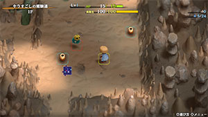
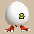

  

# Overview

<table class="dungeonOverview">
  <tr>
    <th>Unlock</th>
    <td class="highlightYellow">Talk to Drokotay the Adventurer (Shukuba Beach). 　※ Update 2.1.1 required.</td>
  </tr>
  <tr>
    <th>Entrance</th>
    <td class="highlightYellow">Shukuba Beach (Exit)</td>
  </tr>
</table>

<table class="dungeonTable">
  <tr>
    <th>Floors</th>
    <td colspan="3">20F / 99F (Sacred Tree)</td>
  </tr>
  <tr>
    <th>Bring Items</th>
    <td>No</td>
    <th>Stairs</th>
    <td>Descending</td>
  </tr>
  <tr>
    <th>Companions</th>
    <td>No</td>
    <th>Roamers</th>
    <td>No</td>
  </tr>
  <tr>
    <th>Rescues</th>
    <td>3</td>
    <th>Starting Level</th>
    <td>1</td>
  </tr>
  <tr>
    <th>Starting Item</th>
    <td colspan="3">Large Onigiri, Hiding Pot x 3</td>
  </tr>
  <tr>
    <th>Unidentified</th>
    <td colspan="3">None</td>
  </tr>
  <tr>
    <th>Shops</th>
    <td>Yes</td>
    <th>Monster Houses</th>
    <td>Yes</td>
  </tr>
  <tr>
    <th>Kron's Challenge</th>
    <td></td>
    <th>Fever Time</th>
    <td></td>
  </tr>
  <tr>
    <th>Initial Enemies</th>
    <td>6~10</td>
    <th>Spawn Rate</th>
    <td>50 Turns (1F - 99F)</td>
  </tr>
  <tr>
    <th>Wind (1st Gust)</th>
    <td>900 Turns</td>
    <th>Reward</th>
    <td></td>
  </tr>
</table>

Mystery Dungeon focused on evasive play, similar to The Pinnacle (Shiren 5) or Pot Cave (Shiren DS2). Shiren's level is locked to Lv1, so the player must use items like Hiding Pot to reach the end. The player starts with 3 Hiding Pots in their inventory, and more can easily be found on the ground. Overall, this dungeon is one of the easier ones among the evasive style dungeons in the series.

# Strategy

### General

##### Changes from Similar Dungeons in Past Games

- Thrown items and projectiles are not guaranteed to hit their target.
    - This includes throwing a Hiding Pot at a monster.
- Field of view is not limited on any floor, even in the 99F Sacred Tree Mode extension.
- Generally speaking, a larger variety of items can be found.
- Food and Transmutation Pots are pretty common.
- The monster table includes many enemies with special abilities.
- Shops and Monster Houses can be generated.
    - Revival Grass and Blank Scrolls can be found in shops, among other items.

##### Sumo Status Warning

This is one dungeon where you'll probably want to avoid activating Sumo status. You really don't want to lose access to Vaulting Staff, Switching Staff, or Pitfall Trap if possible. However, Max HP +50 does let you survive some attacks, and the ability to ignore traps is still nice, so it's not the end of the world if you accidentally activate Sumo status.

##### Game Settings Tips

The number of tiles visible in vertical directions is quite narrow, so a very common cause of collapsing is the player walking up or down and not reacting to an incoming enemy in time.

- Select "Look Around" or tilt the right analog stick → Tap R2 until field of view is fully zoomed out.
- Adjust game settings so that walk speed is set to slow.

##### Behemoth Gate Items

The list of possible items left behind when a Behemoth Gate vanishes differs in this dungeon.

|Category|Items|
|-|-|
|Bracelet|Sure-aim Bracelet, Tiptoe Bracelet|
|Food|Special Onigiri, Sumo Onigiri|
|Staff|Peach Staff, Switching Staff, Disguising Staff, Vaulting Staff|
|Scroll|Mapping Scroll, Eradication Scroll|
|Grass|Revival Grass, Invincible Grass|
|Pot|Hilarious Pot|

### Important Items

#### Weapon

<b><u>Pickaxe</u></b> / <b><u>Wooden Mallet</u></b> / <b><u>Trapseeker</u></b> / <b><u>Bonito Block</u></b> These four weapons are generally the only types of weapons you'll find in this dungeon. Pickaxe can be found on the ground, and the other 3 can appear in shops (including sacred versions). Sacred versions are basically pointless aside from Pickaxe and Bonito Block.

#### Bracelets

<b><u>Sure-aim Bracelet</u></b> Obtained in shops or from making a Behemoth Gate vanish. Accuracy of projectiles and thrown items increases to 100% while the bracelet is equipped. Also makes it possible to hit Bored Kappa and Hoppin' Batter families with thrown items.

<b><u>Tiptoe Bracelet</u></b> Obtained from making a Behemoth Gate vanish. Napping enemies won't wake up when Shiren walks adjacent to them or enters / exits a room.

<b><u>Waterwalk Bracelet</u></b> Opens up additional escape routes if there are water tiles nearby. Unequip the bracelet while standing on a water tile to warp as a last resort. Beware of scrolls and food items getting wet while walking on water tiles.

<b><u>Passerby Bracelet</u></b> Combine with Swift Grass to safely pass by a regular speed enemy. ※ Shiren cannot switch places with a monster that has Hiding status.

#### Grass

<b><u>Revival Grass</u></b> Generally rare in this dungeon, but can also be found in shops. Treat every Revival Grass you find very carefully.

<b><u>Leaping Grass</u></b> Use this as a last resort to escape from a dire situation. Remember, there's no guarantee that you'll land somewhere safe!

#### Scrolls

<b><u>Eradication Scroll (Blank Scroll)</u></b> Blank Scrolls can be found in shops, and Eradication Scroll can be obtained via a Behemoth Gate. It's best to eradicate either the Pumphantasm or Death Reaper family since they can wall clip. If you're currently only attempting the first clear (20F), just eradicate the Pumphantasm family. Otherwise, eradicate the Death Reaper family before King Reaper (80-85F) and Soul Reaper (95-99F) floors.

<b><u>Slumber Scroll</u></b> / <b><u>Confusion Scroll</u></b> Crowd control items, but both scrolls are risky for a dungeon where Shiren collapses in 1 hit. Honestly, it's often better to have Shiren enter a Hiding Pot instead of reading either scroll, so don't carry more than 1~2 of these scrolls once your inventory is full.

#### Staves

<b><u>Knockback Staff</u></b> Use this staff against Cave Mamels to conserve Burrowing Staff charges and Hiding Pots.

<b><u>Burrowing Staff</u></b> These staves should mainly be used to create shortcuts or escape routes. However, it can also be used to slay Cave Mamels or Egg Thing family monsters.

<b><u>Vaulting Staff</u></b> Valuable staff for escaping from enemies or bad situations. Swing a Vaulting Staff so that you land on a water tile to warp as a last resort if needed. Swinging it at a monster that has Hiding status will not cancel the monster's Hiding status.

#### Pots

<b><u>Hiding Pot</u></b> The player starts with 3 of these in their inventory, and they're also commonly found on the ground. Select Insert to have Shiren hide inside the pot when you're cornered or surrounded by monsters, or select Throw while facing a monster to trap that monster inside the pot indefinitely. However, keep in mind that thrown Hiding Pots are not guaranteed to hit their target, so use a Knockback Staff or Vaulting Staff to create distance first if you're adjacent. Monsters with Hiding status are unaffected by Okina Monk's warp and Okame Monk's status curing notes, and Shiren is unable to traverse tiles that have monsters with Hiding status on them.

<b><u>Transmutation Pot</u></b> Pretty common, similar to Hiding Pot. The item generated is always a different category than the item you inserted, so for example if you want staves, insert anything that isn't a staff category item. Good insertion fodder include Vaulting Staff[0], Earthmound Staff[0], Leaping Grass, Swift Grass, etc.

<b><u>Bottomless Pot</u></b> Break this pot to generate Pitfall Traps, which can then be used to skip to the next floor. Best used to steal from a shop or to skip a floor that has dangerous Behemoth Monsters.

<b><u>Water Gun Pot</u></b> Can be used to one-shot Cave Mamel or Fierous family monsters. Reduces damage received from Death Reaper family, Swordmaster, Gigataur, and Bashagga to 1 damage.

<b><u>Hilarious Pot</u></b> Prevents an enemy from acting for a short duration. Probably best used when you encounter a single enemy near the stairs before descending.

# Floor Guide

### General Advice

Trying to check every room on a floor usually results in consuming more items than you gain, so aim to hurry to the next floor when you spot the stairs instead of lingering and exploring. That said, shops are an exception, since you could find a nice item like Revival Grass for sale.

When throwing Hiding Pots at monsters, always throw from 2 or more tiles away instead of when adjacent. It's also best to throw Hiding Pots in rooms, since throwing them in a hallway blocks off the path. Remember that you can insert yourself into a Hiding Pot if you're adjacent to an enemy, and never use Handy Dash (or even normal dash) in a dungeon where a single mistake can end the run.

### 1-4F

Notable: Pumpanshee (1-16F)

Cave Mamel only has 5 HP, so items like Knockback Staff or Burrowing Staff can be used to one-shot it. Otherwise, the biggest threat to watch for is Pumpanshee who can pass through walls.

### 5-9F

Notable: Pumpanshee (1-16F), Earth Ninja C (5-9F), Okame Monk B (5-9F)

Throw an item at any sand pillars you need to walk past to stay safe from hidden Earth Ninja C. Okame Monk B cures bad status conditions for non-monk monsters, but it cannot cure Hiding status. Therefore, it's fine to use items like Paralyzing Staff on Okame Monk B to disable them.

### 10-16F

Notable: Pumpanshee (1-16F), Polygon Stunna (10-16F), Behemoth (14-16F)

Polygon Stunna warps in front of Shiren when inside a room. If you're careful with your footwork, you might be able to conserve items.

Possible Behemoths include Pumplich, Crossbowboy, Ultra Gazer, and Fulminachin. B-Crossbowboy and B-Ultra Gazer are very dangerous - use movement staves or Bottomless Pot to escape. If you're feeling confident, go ahead and fully explore the floor to make the Behemoth Gate vanish, since you could find a powerful item like Sure-aim Bracelet or Eradication Scroll as a reward.

### 17-20F

Notable: Water Ninja C (17-20F), Bored Kappa (17-20F), Pesky Kappa (17-20F), Hoppin' Slugger (17-20F)

Bored Kappa, Pesky Kappa, and Hoppin' Slugger are immune to thrown items, so use scrolls or staves. Throw an item at a distant wall to make Bored Kappa family monsters go towards the item instead of Shiren. Water Ninja C's ranged special attack deals 10 damage, so you can survive 1 hit at full HP.

<h3 class="heading3Tree">Sacred Tree Mode</h3>

### 21-27F

Notable: Okina Monk A (21-27F), Corporal Ant (21-27F), Pumplord (21-34F)

Okina Monk A warps monsters closer to Shiren, but it can't warp monsters that have Hiding status. It's ideal to use Hiding Pots against non-monk enemies, and use other items against Okina Monk A. Don't forget that Corporal Ant can attack through corners.

### 28-34F

Notable: Pumplord (21-34F), Polygon Singa (28-34F), Mixermon (28-34F), Behemoth (31-34F)

Treat Mixermons as monsters that are immune to projectiles - Synthesizing items isn't realistic at all. Polygon Singa and Pumplord behave similarly to Polygon Stunna and Pumpanshee from earlier.

Possible Behemoths include Pumplich, Great Hen, Crossbowboy, Ultra Gazer, Fulminachin, and Showpin. B-Great Hen acts faster than other Behemoth monsters, and avoid being in the same room as B-Showpin. The lineup of possible Behemoth monsters is the same from here until the end of the dungeon.

### 35-40F

Notable: Earth Ninja C (35-40F), Hell Reaper (35-40F), Hoppin' Slammer (35-50F)

Hell Reaper has Swift 2 speed (2 attacks per turn), and Shiren can only survive 1 hit at full HP. Therefore, you need to be extra careful with inputs related to movement in this floor range. Otherwise, check for Earth Ninja C by throwing an item at sand pillars as needed like earlier, and remember that Hoppin' Slammers are immune to projectiles (without Sure-aim Bracelet) and staves.

### 41-55F

Notable: Hoppin' Slammer (35-50F), Pumplord (41-46F / 51-55F), Bored Kappa (47-50F), Pesky Kappa (47-50F), Earth Ninja C (51-55F), Cyberoid (51-55F), Behemoth (47-50F)

The only notable new threat who isn't a repeat from an earlier floor range is Cyberoid. Cyberoid is always generated napping in a room, and wakes up when Shiren enters or exits the room. It also has Swift 2 action speed, so be very careful with inputs whenever you spot one.

Possible Behemoths include Pumplich, Great Hen, Crossbowboy, Ultra Gazer, Fulminachin, and Showpin. Don't neglect to use the "Look Around" command when inside a room.

### 56-69F

Notable: Bored Kappa (56-59F), Pesky Kappa (56-59F), Igneous (56-69F), Mixergon (60-65F), Pumplich (60-74F), Skull Mage (66-69F), Electroid (66-74F), Behemoth (63-66F)

Another projectile-immune monster zone with Bored Kappa, Pesky Kappa, Igneous, and Mixergon. Igneous can be defeated with a single use of Water Gun Pot, so try to keep at least one pot on hand. Nigiri Honcho (60-79F) can be instantly defeated by throwing an Onigiri type item at it.

Skull Mage's magic effects include Switching, Knockback, Swift, and warp. None of these can directly one-shot Shiren from full HP, but use "Look Around" in rooms anyway. Otherwise, Electroid is the only Swift 2 action speed threat in this floor range.

Again, possible Behemoths include Pumplich, Great Hen, Crossbowboy, Ultra Gazer, Fulminachin, and Showpin.

### 70-74F

Notable: Earth Ninja C (70-74F), Pumplich (60-74F), General Ant (70-79F), Hoppin' Slugger (70-79F), Electroid (66-74F)

Basically the same threats as earlier in the dungeon, but in a different lineup of monsters. Pumplich, Hoppin' Slugger, and Electroid are the worst monsters to watch out for.

### 75-79F

Notable: General Ant (70-79F), Hoppin' Slugger (70-79F), Hiding Dragon (75-79F), Behemoth (79-82F)

Hiding Dragon has Swift 1 speed (1 attack), and can be generated awake from the start. As before, possible Behemoths include Pumplich, Great Hen, Crossbowboy, Ultra Gazer, Fulminachin, and Showpin.

### 80-85F

Notable: Pumplich (80-91F), Polygon Singa (80-94F), Infernous (80-85F), Mixerdon (80-85F), King Reaper (80-85F), Behemoth (79-82F)

The dreaded King Reaper (Swift 2 action speed + wall clip) appears between 80-85F. Step in place at the start of the floor to lure any King Reapers to you before exploring, then rush to the stairs.

Possible Behemoths are the same - Pumplich, Great Hen, Crossbowboy, Ultra Gazer, Fulminachin, and Showpin.

### 86-94F

Notable: Pumplich (80-91F), Polygon Singa (80-94F), Hoppin' Slugger (86-99F), Okina Monk B (86-99F), Okame Monk A (92-99F)

Remember, Okame Monk A can't cure Hiding status or ailments that other monks have. Again, Okina Monk B warps monsters closer to Shiren, but it can't warp monsters that have Hiding status. The threats are still tame compared to the final rush, so be smart with item usage and save some resources.

### 95-99F

Notable: Pumplich (95-99F), Dartingfrog (95-99F), Hoppin' Slugger (86-99F), Soul Reaper (95-99F), Okina Monk B (86-99F), Okame Monk A (92-99F)

The final rush - Waiting for Soul Reapers at the start of the floor can be risky, since Okina Monk B and Dartingfrog have the potential to catch you off guard if you step in place. Plan your actions in advance, but be ready to adapt to changes to your situation on any given turn. Don't dash under any circumstances, use the "Look Around" command, and be very careful with inputs. For reference, Dartingfrog has a special attack range of 5 tiles in a straight line.

# Monsters

See [Monsters](/system/monsters) for individual monster details.

- F - Dark hallways
- S - Shop is possible
- H - Monster House is possible
- G - Golden Egg Thing is possible
- B - Behemoth Monsters are possible

Monster Colors = Farming, Useful, Lowers Stats, Targets Items, Dangerous

<table class="monsterTable">
  <thead>
    <tr>
      <th>F</th>
      <th>S</th>
      <th>H</th>
      <th>G</th>
      <th colspan="5">Monsters</th>
      <th>B</th>
    </tr>
  </thead>
  <tbody>
    <tr>
      <td rowspan="1" class="centeredText">1</td>
      <td rowspan="1" class=""></td>
      <td rowspan="1" class=""></td>
      <td rowspan="1" class=""></td>
      <td> Cave Mamel</td>
      <td> Wrinkly Hani</td>
      <td> Pumpanshee</td>
      <td> Fresh Octopling</td>
      <td class="highlightGray"></td>
      <td rowspan="1" class=""></td>
    </tr>
    <tr>
      <td colspan="10" class="tableDivider"></td>
    </tr>
    <tr>
      <td rowspan="1" class="centeredText">2</td>
      <td rowspan="1" class=""></td>
      <td rowspan="1" class=""></td>
      <td rowspan="1" class=""></td>
      <td> Cave Mamel</td>
      <td> Wrinkly Hani</td>
      <td> Pumpanshee</td>
      <td> Fresh Octopling</td>
      <td class="highlightGray"></td>
      <td rowspan="1" class=""></td>
    </tr>
    <tr>
      <td colspan="10" class="tableDivider"></td>
    </tr>
    <tr>
      <td rowspan="1" class="centeredText">3</td>
      <td rowspan="1" class=""></td>
      <td rowspan="1" class=""></td>
      <td rowspan="1" class=""></td>
      <td> Cave Mamel</td>
      <td> Wrinkly Hani</td>
      <td> Pumpanshee</td>
      <td> Fresh Octopling</td>
      <td class="highlightGray"></td>
      <td rowspan="1" class=""></td>
    </tr>
    <tr>
      <td colspan="10" class="tableDivider"></td>
    </tr>
    <tr>
      <td rowspan="1" class="centeredText">4</td>
      <td rowspan="1" class=""></td>
      <td rowspan="1" class=""></td>
      <td rowspan="1" class=""></td>
      <td> Cave Mamel</td>
      <td> Wrinkly Hani</td>
      <td> Pumpanshee</td>
      <td> Fresh Octopling</td>
      <td class="highlightGray"></td>
      <td rowspan="1" class=""></td>
    </tr>
    <tr>
      <td colspan="10" class="tableDivider"></td>
    </tr>
    <tr>
      <td rowspan="2" class="centeredText">5</td>
      <td rowspan="2" class=""></td>
      <td rowspan="2" class=""></td>
      <td rowspan="2" class=""></td>
      <td> Cave Mamel</td>
      <td> Swordmaster</td>
      <td> Earth Ninja C</td>
      <td> Pumpanshee</td>
      <td> Fresh Octopling</td>
      <td rowspan="2" class=""></td>
    </tr>
    <tr>
      <td> Okame Monk B</td>
      <td class="highlightGray"></td>
      <td class="highlightGray"></td>
      <td class="highlightGray"></td>
      <td class="highlightGray"></td>
    </tr>
    <tr>
      <td colspan="10" class="tableDivider"></td>
    </tr>
    <tr>
      <td rowspan="2" class="centeredText">6</td>
      <td rowspan="2" class=""></td>
      <td rowspan="2" class=""></td>
      <td rowspan="2" class=""></td>
      <td> Cave Mamel</td>
      <td> Swordmaster</td>
      <td> Earth Ninja C</td>
      <td> Pumpanshee</td>
      <td> Fresh Octopling</td>
      <td rowspan="2" class=""></td>
    </tr>
    <tr>
      <td> Okame Monk B</td>
      <td class="highlightGray"></td>
      <td class="highlightGray"></td>
      <td class="highlightGray"></td>
      <td class="highlightGray"></td>
    </tr>
    <tr>
      <td colspan="10" class="tableDivider"></td>
    </tr>
    <tr>
      <td rowspan="2" class="centeredText">7</td>
      <td rowspan="2" class=""></td>
      <td rowspan="2" class=""></td>
      <td rowspan="2" class=""></td>
      <td> Cave Mamel</td>
      <td> Swordmaster</td>
      <td> Earth Ninja C</td>
      <td> Pumpanshee</td>
      <td> Fresh Octopling</td>
      <td rowspan="2" class=""></td>
    </tr>
    <tr>
      <td> Okame Monk B</td>
      <td class="highlightGray"></td>
      <td class="highlightGray"></td>
      <td class="highlightGray"></td>
      <td class="highlightGray"></td>
    </tr>
    <tr>
      <td colspan="10" class="tableDivider"></td>
    </tr>
    <tr>
      <td rowspan="2" class="centeredText">8</td>
      <td rowspan="2" class=""></td>
      <td rowspan="2" class=""></td>
      <td rowspan="2" class=""></td>
      <td> Cave Mamel</td>
      <td> Swordmaster</td>
      <td> Earth Ninja C</td>
      <td> Pumpanshee</td>
      <td> Fresh Octopling</td>
      <td rowspan="2" class=""></td>
    </tr>
    <tr>
      <td> Okame Monk B</td>
      <td class="highlightGray"></td>
      <td class="highlightGray"></td>
      <td class="highlightGray"></td>
      <td class="highlightGray"></td>
    </tr>
    <tr>
      <td colspan="10" class="tableDivider"></td>
    </tr>
    <tr>
      <td rowspan="2" class="centeredText">9</td>
      <td rowspan="2" class="highlightShop"></td>
      <td rowspan="2" class=""></td>
      <td rowspan="2" class=""></td>
      <td> Cave Mamel</td>
      <td> Swordmaster</td>
      <td> Earth Ninja C</td>
      <td> Pumpanshee</td>
      <td> Fresh Octopling</td>
      <td rowspan="2" class=""></td>
    </tr>
    <tr>
      <td> Okame Monk B</td>
      <td class="highlightGray"></td>
      <td class="highlightGray"></td>
      <td class="highlightGray"></td>
      <td class="highlightGray"></td>
    </tr>
    <tr>
      <td colspan="10" class="tableDivider"></td>
    </tr>
    <tr>
      <td rowspan="1" class="centeredText">10</td>
      <td rowspan="1" class=""></td>
      <td rowspan="1" class=""></td>
      <td rowspan="1" class=""></td>
      <td> Cave Mamel</td>
      <td> Gigataur</td>
      <td> Pumpanshee</td>
      <td> Polygon Stunna</td>
      <td class="highlightGray"></td>
      <td rowspan="1" class=""></td>
    </tr>
    <tr>
      <td colspan="10" class="tableDivider"></td>
    </tr>
    <tr>
      <td rowspan="1" class="centeredText">11</td>
      <td rowspan="1" class=""></td>
      <td rowspan="1" class=""></td>
      <td rowspan="1" class=""></td>
      <td> Cave Mamel</td>
      <td> Gigataur</td>
      <td> Pumpanshee</td>
      <td> Polygon Stunna</td>
      <td class="highlightGray"></td>
      <td rowspan="1" class=""></td>
    </tr>
    <tr>
      <td colspan="10" class="tableDivider"></td>
    </tr>
    <tr>
      <td rowspan="1" class="centeredText">12</td>
      <td rowspan="1" class=""></td>
      <td rowspan="1" class=""></td>
      <td rowspan="1" class=""></td>
      <td> Cave Mamel</td>
      <td> Gigataur</td>
      <td> Pumpanshee</td>
      <td> Polygon Stunna</td>
      <td class="highlightGray"></td>
      <td rowspan="1" class=""></td>
    </tr>
    <tr>
      <td colspan="10" class="tableDivider"></td>
    </tr>
    <tr>
      <td rowspan="1" class="centeredText">13</td>
      <td rowspan="1" class=""></td>
      <td rowspan="1" class=""></td>
      <td rowspan="1" class=""></td>
      <td> Cave Mamel</td>
      <td> Gigataur</td>
      <td> Pumpanshee</td>
      <td> Polygon Stunna</td>
      <td class="highlightGray"></td>
      <td rowspan="1" class=""></td>
    </tr>
    <tr>
      <td colspan="10" class="tableDivider"></td>
    </tr>
    <tr>
      <td rowspan="1" class="centeredText">14</td>
      <td rowspan="1" class=""></td>
      <td rowspan="1" class=""></td>
      <td rowspan="1" class=""></td>
      <td> Cave Mamel</td>
      <td> Gigataur</td>
      <td> Pumpanshee</td>
      <td> Polygon Stunna</td>
      <td class="highlightGray"></td>
      <td rowspan="1" class="highlightBehemoth"></td>
    </tr>
    <tr>
      <td colspan="10" class="tableDivider"></td>
    </tr>
    <tr>
      <td rowspan="1" class="centeredText">15</td>
      <td rowspan="1" class=""></td>
      <td rowspan="1" class=""></td>
      <td rowspan="1" class=""></td>
      <td> Cave Mamel</td>
      <td> Gigataur</td>
      <td> Pumpanshee</td>
      <td> Polygon Stunna</td>
      <td class="highlightGray"></td>
      <td rowspan="1" class="highlightBehemoth"></td>
    </tr>
    <tr>
      <td colspan="10" class="tableDivider"></td>
    </tr>
    <tr>
      <td rowspan="1" class="centeredText">16</td>
      <td rowspan="1" class=""></td>
      <td rowspan="1" class=""></td>
      <td rowspan="1" class=""></td>
      <td> Cave Mamel</td>
      <td> Gigataur</td>
      <td> Pumpanshee</td>
      <td> Polygon Stunna</td>
      <td class="highlightGray"></td>
      <td rowspan="1" class="highlightBehemoth"></td>
    </tr>
    <tr>
      <td colspan="10" class="tableDivider"></td>
    </tr>
    <tr>
      <td rowspan="2" class="centeredText">17</td>
      <td rowspan="2" class=""></td>
      <td rowspan="2" class=""></td>
      <td rowspan="2" class=""></td>
      <td> Cave Mamel</td>
      <td> Boomdon</td>
      <td> Water Ninja C</td>
      <td> Bored Kappa</td>
      <td> Pesky Kappa</td>
      <td rowspan="2" class=""></td>
    </tr>
    <tr>
      <td> Hoppin' Slugger</td>
      <td class="highlightGray"></td>
      <td class="highlightGray"></td>
      <td class="highlightGray"></td>
      <td class="highlightGray"></td>
    </tr>
    <tr>
      <td colspan="10" class="tableDivider"></td>
    </tr>
    <tr>
      <td rowspan="2" class="centeredText">18</td>
      <td rowspan="2" class=""></td>
      <td rowspan="2" class=""></td>
      <td rowspan="2" class=""></td>
      <td> Cave Mamel</td>
      <td> Boomdon</td>
      <td> Water Ninja C</td>
      <td> Bored Kappa</td>
      <td> Pesky Kappa</td>
      <td rowspan="2" class=""></td>
    </tr>
    <tr>
      <td> Hoppin' Slugger</td>
      <td class="highlightGray"></td>
      <td class="highlightGray"></td>
      <td class="highlightGray"></td>
      <td class="highlightGray"></td>
    </tr>
    <tr>
      <td colspan="10" class="tableDivider"></td>
    </tr>
    <tr>
      <td rowspan="2" class="centeredText">19</td>
      <td rowspan="2" class=""></td>
      <td rowspan="2" class=""></td>
      <td rowspan="2" class=""></td>
      <td> Cave Mamel</td>
      <td> Boomdon</td>
      <td> Water Ninja C</td>
      <td> Bored Kappa</td>
      <td> Pesky Kappa</td>
      <td rowspan="2" class=""></td>
    </tr>
    <tr>
      <td> Hoppin' Slugger</td>
      <td class="highlightGray"></td>
      <td class="highlightGray"></td>
      <td class="highlightGray"></td>
      <td class="highlightGray"></td>
    </tr>
    <tr>
      <td colspan="10" class="tableDivider"></td>
    </tr>
    <tr>
      <td rowspan="2" class="centeredText">20</td>
      <td rowspan="2" class=""></td>
      <td rowspan="2" class=""></td>
      <td rowspan="2" class=""></td>
      <td> Cave Mamel</td>
      <td> Boomdon</td>
      <td> Water Ninja C</td>
      <td> Bored Kappa</td>
      <td> Pesky Kappa</td>
      <td rowspan="2" class=""></td>
    </tr>
    <tr>
      <td> Hoppin' Slugger</td>
      <td class="highlightGray"></td>
      <td class="highlightGray"></td>
      <td class="highlightGray"></td>
      <td class="highlightGray"></td>
    </tr>
    <tr>
      <td colspan="10" class="tableDivider"></td>
    </tr>
    <tr>
      <td class="monsterTableExtension"></td>
      <td colspan="3" class="monsterTableExtension"></td>
      <td colspan="5" class="monsterTableExtension centeredText">Sacred Tree Mode</td>
      <td class="monsterTableExtension"></td>
    </tr>
    <tr>
      <td colspan="10" class="tableDivider"></td>
    </tr>
    <tr>
      <td rowspan="1" class="centeredText">21</td>
      <td rowspan="1" class=""></td>
      <td rowspan="1" class=""></td>
      <td rowspan="1" class=""></td>
      <td> Hat Rascal</td>
      <td> Swordmaster</td>
      <td> Pumplord</td>
      <td> Corporal Ant</td>
      <td> Okina Monk A</td>
      <td rowspan="1" class=""></td>
    </tr>
    <tr>
      <td colspan="10" class="tableDivider"></td>
    </tr>
    <tr>
      <td rowspan="1" class="centeredText">22</td>
      <td rowspan="1" class=""></td>
      <td rowspan="1" class=""></td>
      <td rowspan="1" class=""></td>
      <td> Hat Rascal</td>
      <td> Swordmaster</td>
      <td> Pumplord</td>
      <td> Corporal Ant</td>
      <td> Okina Monk A</td>
      <td rowspan="1" class=""></td>
    </tr>
    <tr>
      <td colspan="10" class="tableDivider"></td>
    </tr>
    <tr>
      <td rowspan="1" class="centeredText">23</td>
      <td rowspan="1" class=""></td>
      <td rowspan="1" class=""></td>
      <td rowspan="1" class=""></td>
      <td> Hat Rascal</td>
      <td> Swordmaster</td>
      <td> Pumplord</td>
      <td> Corporal Ant</td>
      <td> Okina Monk A</td>
      <td rowspan="1" class=""></td>
    </tr>
    <tr>
      <td colspan="10" class="tableDivider"></td>
    </tr>
    <tr>
      <td rowspan="1" class="centeredText">24</td>
      <td rowspan="1" class=""></td>
      <td rowspan="1" class=""></td>
      <td rowspan="1" class=""></td>
      <td> Hat Rascal</td>
      <td> Swordmaster</td>
      <td> Pumplord</td>
      <td> Corporal Ant</td>
      <td> Okina Monk A</td>
      <td rowspan="1" class=""></td>
    </tr>
    <tr>
      <td colspan="10" class="tableDivider"></td>
    </tr>
    <tr>
      <td rowspan="1" class="centeredText">25</td>
      <td rowspan="1" class=""></td>
      <td rowspan="1" class=""></td>
      <td rowspan="1" class=""></td>
      <td> Hat Rascal</td>
      <td> Swordmaster</td>
      <td> Pumplord</td>
      <td> Corporal Ant</td>
      <td> Okina Monk A</td>
      <td rowspan="1" class=""></td>
    </tr>
    <tr>
      <td colspan="10" class="tableDivider"></td>
    </tr>
    <tr>
      <td rowspan="1" class="centeredText">26</td>
      <td rowspan="1" class=""></td>
      <td rowspan="1" class=""></td>
      <td rowspan="1" class=""></td>
      <td> Hat Rascal</td>
      <td> Swordmaster</td>
      <td> Pumplord</td>
      <td> Corporal Ant</td>
      <td> Okina Monk A</td>
      <td rowspan="1" class=""></td>
    </tr>
    <tr>
      <td colspan="10" class="tableDivider"></td>
    </tr>
    <tr>
      <td rowspan="1" class="centeredText">27</td>
      <td rowspan="1" class=""></td>
      <td rowspan="1" class=""></td>
      <td rowspan="1" class=""></td>
      <td> Hat Rascal</td>
      <td> Swordmaster</td>
      <td> Pumplord</td>
      <td> Corporal Ant</td>
      <td> Okina Monk A</td>
      <td rowspan="1" class=""></td>
    </tr>
    <tr>
      <td colspan="10" class="tableDivider"></td>
    </tr>
    <tr>
      <td rowspan="1" class="centeredText">28</td>
      <td rowspan="1" class=""></td>
      <td rowspan="1" class=""></td>
      <td rowspan="1" class=""></td>
      <td> Swordmaster</td>
      <td> Cursenior</td>
      <td> Pumplord</td>
      <td> Polygon Singa</td>
      <td> Mixermon</td>
      <td rowspan="1" class=""></td>
    </tr>
    <tr>
      <td colspan="10" class="tableDivider"></td>
    </tr>
    <tr>
      <td rowspan="1" class="centeredText">29</td>
      <td rowspan="1" class=""></td>
      <td rowspan="1" class=""></td>
      <td rowspan="1" class=""></td>
      <td> Swordmaster</td>
      <td> Cursenior</td>
      <td> Pumplord</td>
      <td> Polygon Singa</td>
      <td> Mixermon</td>
      <td rowspan="1" class=""></td>
    </tr>
    <tr>
      <td colspan="10" class="tableDivider"></td>
    </tr>
    <tr>
      <td rowspan="1" class="centeredText">30</td>
      <td rowspan="1" class=""></td>
      <td rowspan="1" class=""></td>
      <td rowspan="1" class=""></td>
      <td> Swordmaster</td>
      <td> Cursenior</td>
      <td> Pumplord</td>
      <td> Polygon Singa</td>
      <td> Mixermon</td>
      <td rowspan="1" class=""></td>
    </tr>
    <tr>
      <td colspan="10" class="tableDivider"></td>
    </tr>
    <tr>
      <td rowspan="1" class="centeredText">31</td>
      <td rowspan="1" class=""></td>
      <td rowspan="1" class=""></td>
      <td rowspan="1" class=""></td>
      <td> Swordmaster</td>
      <td> Cursenior</td>
      <td> Pumplord</td>
      <td> Polygon Singa</td>
      <td> Mixermon</td>
      <td rowspan="1" class="highlightBehemoth"></td>
    </tr>
    <tr>
      <td colspan="10" class="tableDivider"></td>
    </tr>
    <tr>
      <td rowspan="1" class="centeredText">32</td>
      <td rowspan="1" class=""></td>
      <td rowspan="1" class=""></td>
      <td rowspan="1" class=""></td>
      <td> Swordmaster</td>
      <td> Cursenior</td>
      <td> Pumplord</td>
      <td> Polygon Singa</td>
      <td> Mixermon</td>
      <td rowspan="1" class="highlightBehemoth"></td>
    </tr>
    <tr>
      <td colspan="10" class="tableDivider"></td>
    </tr>
    <tr>
      <td rowspan="1" class="centeredText">33</td>
      <td rowspan="1" class=""></td>
      <td rowspan="1" class=""></td>
      <td rowspan="1" class=""></td>
      <td> Swordmaster</td>
      <td> Cursenior</td>
      <td> Pumplord</td>
      <td> Polygon Singa</td>
      <td> Mixermon</td>
      <td rowspan="1" class="highlightBehemoth"></td>
    </tr>
    <tr>
      <td colspan="10" class="tableDivider"></td>
    </tr>
    <tr>
      <td rowspan="1" class="centeredText">34</td>
      <td rowspan="1" class=""></td>
      <td rowspan="1" class=""></td>
      <td rowspan="1" class=""></td>
      <td> Swordmaster</td>
      <td> Cursenior</td>
      <td> Pumplord</td>
      <td> Polygon Singa</td>
      <td> Mixermon</td>
      <td rowspan="1" class="highlightBehemoth"></td>
    </tr>
    <tr>
      <td colspan="10" class="tableDivider"></td>
    </tr>
    <tr>
      <td rowspan="2" class="centeredText">35</td>
      <td rowspan="2" class=""></td>
      <td rowspan="2" class=""></td>
      <td rowspan="2" class=""></td>
      <td> Gigataur</td>
      <td> Bashagga</td>
      <td> Earth Ninja C</td>
      <td> Hoppin' Slammer</td>
      <td> Hell Reaper</td>
      <td rowspan="2" class=""></td>
    </tr>
    <tr>
      <td> Running Egg</td>
      <td class="highlightGray"></td>
      <td class="highlightGray"></td>
      <td class="highlightGray"></td>
      <td class="highlightGray"></td>
    </tr>
    <tr>
      <td colspan="10" class="tableDivider"></td>
    </tr>
    <tr>
      <td rowspan="2" class="centeredText">36</td>
      <td rowspan="2" class=""></td>
      <td rowspan="2" class=""></td>
      <td rowspan="2" class=""></td>
      <td> Gigataur</td>
      <td> Bashagga</td>
      <td> Earth Ninja C</td>
      <td> Hoppin' Slammer</td>
      <td> Hell Reaper</td>
      <td rowspan="2" class=""></td>
    </tr>
    <tr>
      <td> Running Egg</td>
      <td class="highlightGray"></td>
      <td class="highlightGray"></td>
      <td class="highlightGray"></td>
      <td class="highlightGray"></td>
    </tr>
    <tr>
      <td colspan="10" class="tableDivider"></td>
    </tr>
    <tr>
      <td rowspan="2" class="centeredText">37</td>
      <td rowspan="2" class=""></td>
      <td rowspan="2" class=""></td>
      <td rowspan="2" class=""></td>
      <td> Gigataur</td>
      <td> Bashagga</td>
      <td> Earth Ninja C</td>
      <td> Hoppin' Slammer</td>
      <td> Hell Reaper</td>
      <td rowspan="2" class=""></td>
    </tr>
    <tr>
      <td> Running Egg</td>
      <td class="highlightGray"></td>
      <td class="highlightGray"></td>
      <td class="highlightGray"></td>
      <td class="highlightGray"></td>
    </tr>
    <tr>
      <td colspan="10" class="tableDivider"></td>
    </tr>
    <tr>
      <td rowspan="1" class="centeredText">38</td>
      <td rowspan="1" class=""></td>
      <td rowspan="1" class=""></td>
      <td rowspan="1" class=""></td>
      <td> Gigataur</td>
      <td> Bashagga</td>
      <td> Earth Ninja C</td>
      <td> Hoppin' Slammer</td>
      <td> Hell Reaper</td>
      <td rowspan="1" class=""></td>
    </tr>
    <tr>
      <td colspan="10" class="tableDivider"></td>
    </tr>
    <tr>
      <td rowspan="1" class="centeredText">39</td>
      <td rowspan="1" class=""></td>
      <td rowspan="1" class=""></td>
      <td rowspan="1" class=""></td>
      <td> Gigataur</td>
      <td> Bashagga</td>
      <td> Earth Ninja C</td>
      <td> Hoppin' Slammer</td>
      <td> Hell Reaper</td>
      <td rowspan="1" class=""></td>
    </tr>
    <tr>
      <td colspan="10" class="tableDivider"></td>
    </tr>
    <tr>
      <td rowspan="1" class="centeredText">40</td>
      <td rowspan="1" class=""></td>
      <td rowspan="1" class=""></td>
      <td rowspan="1" class=""></td>
      <td> Gigataur</td>
      <td> Bashagga</td>
      <td> Earth Ninja C</td>
      <td> Hoppin' Slammer</td>
      <td> Hell Reaper</td>
      <td rowspan="1" class=""></td>
    </tr>
    <tr>
      <td colspan="10" class="tableDivider"></td>
    </tr>
    <tr>
      <td rowspan="1" class="centeredText">41</td>
      <td rowspan="1" class=""></td>
      <td rowspan="1" class=""></td>
      <td rowspan="1" class=""></td>
      <td> Gigataur</td>
      <td> Wrinkly Hani</td>
      <td> Pumplord</td>
      <td> Dragon Head</td>
      <td> Hoppin' Slammer</td>
      <td rowspan="1" class=""></td>
    </tr>
    <tr>
      <td colspan="10" class="tableDivider"></td>
    </tr>
    <tr>
      <td rowspan="1" class="centeredText">42</td>
      <td rowspan="1" class=""></td>
      <td rowspan="1" class=""></td>
      <td rowspan="1" class=""></td>
      <td> Gigataur</td>
      <td> Wrinkly Hani</td>
      <td> Pumplord</td>
      <td> Dragon Head</td>
      <td> Hoppin' Slammer</td>
      <td rowspan="1" class=""></td>
    </tr>
    <tr>
      <td colspan="10" class="tableDivider"></td>
    </tr>
    <tr>
      <td rowspan="1" class="centeredText">43</td>
      <td rowspan="1" class=""></td>
      <td rowspan="1" class=""></td>
      <td rowspan="1" class=""></td>
      <td> Gigataur</td>
      <td> Wrinkly Hani</td>
      <td> Pumplord</td>
      <td> Dragon Head</td>
      <td> Hoppin' Slammer</td>
      <td rowspan="1" class=""></td>
    </tr>
    <tr>
      <td colspan="10" class="tableDivider"></td>
    </tr>
    <tr>
      <td rowspan="1" class="centeredText">44</td>
      <td rowspan="1" class=""></td>
      <td rowspan="1" class=""></td>
      <td rowspan="1" class=""></td>
      <td> Gigataur</td>
      <td> Wrinkly Hani</td>
      <td> Pumplord</td>
      <td> Dragon Head</td>
      <td> Hoppin' Slammer</td>
      <td rowspan="1" class=""></td>
    </tr>
    <tr>
      <td colspan="10" class="tableDivider"></td>
    </tr>
    <tr>
      <td rowspan="1" class="centeredText">45</td>
      <td rowspan="1" class=""></td>
      <td rowspan="1" class=""></td>
      <td rowspan="1" class=""></td>
      <td> Gigataur</td>
      <td> Wrinkly Hani</td>
      <td> Pumplord</td>
      <td> Dragon Head</td>
      <td> Hoppin' Slammer</td>
      <td rowspan="1" class=""></td>
    </tr>
    <tr>
      <td colspan="10" class="tableDivider"></td>
    </tr>
    <tr>
      <td rowspan="1" class="centeredText">46</td>
      <td rowspan="1" class=""></td>
      <td rowspan="1" class=""></td>
      <td rowspan="1" class=""></td>
      <td> Gigataur</td>
      <td> Wrinkly Hani</td>
      <td> Pumplord</td>
      <td> Dragon Head</td>
      <td> Hoppin' Slammer</td>
      <td rowspan="1" class=""></td>
    </tr>
    <tr>
      <td colspan="10" class="tableDivider"></td>
    </tr>
    <tr>
      <td rowspan="2" class="centeredText">47</td>
      <td rowspan="2" class=""></td>
      <td rowspan="2" class=""></td>
      <td rowspan="2" class=""></td>
      <td> Gigataur</td>
      <td> Wrinkly Hani</td>
      <td> Dragon Head</td>
      <td> Bored Kappa</td>
      <td> Pesky Kappa</td>
      <td rowspan="2" class="highlightBehemoth"></td>
    </tr>
    <tr>
      <td> Hoppin' Slammer</td>
      <td class="highlightGray"></td>
      <td class="highlightGray"></td>
      <td class="highlightGray"></td>
      <td class="highlightGray"></td>
    </tr>
    <tr>
      <td colspan="10" class="tableDivider"></td>
    </tr>
    <tr>
      <td rowspan="2" class="centeredText">48</td>
      <td rowspan="2" class=""></td>
      <td rowspan="2" class=""></td>
      <td rowspan="2" class=""></td>
      <td> Gigataur</td>
      <td> Wrinkly Hani</td>
      <td> Dragon Head</td>
      <td> Bored Kappa</td>
      <td> Pesky Kappa</td>
      <td rowspan="2" class="highlightBehemoth"></td>
    </tr>
    <tr>
      <td> Hoppin' Slammer</td>
      <td class="highlightGray"></td>
      <td class="highlightGray"></td>
      <td class="highlightGray"></td>
      <td class="highlightGray"></td>
    </tr>
    <tr>
      <td colspan="10" class="tableDivider"></td>
    </tr>
    <tr>
      <td rowspan="2" class="centeredText">49</td>
      <td rowspan="2" class=""></td>
      <td rowspan="2" class=""></td>
      <td rowspan="2" class=""></td>
      <td> Gigataur</td>
      <td> Wrinkly Hani</td>
      <td> Dragon Head</td>
      <td> Bored Kappa</td>
      <td> Pesky Kappa</td>
      <td rowspan="2" class="highlightBehemoth"></td>
    </tr>
    <tr>
      <td> Hoppin' Slammer</td>
      <td class="highlightGray"></td>
      <td class="highlightGray"></td>
      <td class="highlightGray"></td>
      <td class="highlightGray"></td>
    </tr>
    <tr>
      <td colspan="10" class="tableDivider"></td>
    </tr>
    <tr>
      <td rowspan="2" class="centeredText">50</td>
      <td rowspan="2" class=""></td>
      <td rowspan="2" class=""></td>
      <td rowspan="2" class=""></td>
      <td> Gigataur</td>
      <td> Wrinkly Hani</td>
      <td> Dragon Head</td>
      <td> Bored Kappa</td>
      <td> Pesky Kappa</td>
      <td rowspan="2" class="highlightBehemoth"></td>
    </tr>
    <tr>
      <td> Hoppin' Slammer</td>
      <td class="highlightGray"></td>
      <td class="highlightGray"></td>
      <td class="highlightGray"></td>
      <td class="highlightGray"></td>
    </tr>
    <tr>
      <td colspan="10" class="tableDivider"></td>
    </tr>
    <tr>
      <td rowspan="2" class="centeredText">51</td>
      <td rowspan="2" class=""></td>
      <td rowspan="2" class=""></td>
      <td rowspan="2" class=""></td>
      <td> Cave Mamel</td>
      <td> Cursenior</td>
      <td> Earth Ninja C</td>
      <td> Pumplord</td>
      <td> Dragon Head</td>
      <td rowspan="2" class=""></td>
    </tr>
    <tr>
      <td> Fresh Octopling</td>
      <td> Cyberoid</td>
      <td class="highlightGray"></td>
      <td class="highlightGray"></td>
      <td class="highlightGray"></td>
    </tr>
    <tr>
      <td colspan="10" class="tableDivider"></td>
    </tr>
    <tr>
      <td rowspan="2" class="centeredText">52</td>
      <td rowspan="2" class=""></td>
      <td rowspan="2" class=""></td>
      <td rowspan="2" class=""></td>
      <td> Cave Mamel</td>
      <td> Cursenior</td>
      <td> Earth Ninja C</td>
      <td> Pumplord</td>
      <td> Dragon Head</td>
      <td rowspan="2" class=""></td>
    </tr>
    <tr>
      <td> Fresh Octopling</td>
      <td> Cyberoid</td>
      <td class="highlightGray"></td>
      <td class="highlightGray"></td>
      <td class="highlightGray"></td>
    </tr>
    <tr>
      <td colspan="10" class="tableDivider"></td>
    </tr>
    <tr>
      <td rowspan="2" class="centeredText">53</td>
      <td rowspan="2" class=""></td>
      <td rowspan="2" class=""></td>
      <td rowspan="2" class=""></td>
      <td> Cave Mamel</td>
      <td> Cursenior</td>
      <td> Earth Ninja C</td>
      <td> Pumplord</td>
      <td> Dragon Head</td>
      <td rowspan="2" class=""></td>
    </tr>
    <tr>
      <td> Fresh Octopling</td>
      <td> Cyberoid</td>
      <td class="highlightGray"></td>
      <td class="highlightGray"></td>
      <td class="highlightGray"></td>
    </tr>
    <tr>
      <td colspan="10" class="tableDivider"></td>
    </tr>
    <tr>
      <td rowspan="2" class="centeredText">54</td>
      <td rowspan="2" class=""></td>
      <td rowspan="2" class=""></td>
      <td rowspan="2" class=""></td>
      <td> Cave Mamel</td>
      <td> Cursenior</td>
      <td> Earth Ninja C</td>
      <td> Pumplord</td>
      <td> Dragon Head</td>
      <td rowspan="2" class=""></td>
    </tr>
    <tr>
      <td> Fresh Octopling</td>
      <td> Cyberoid</td>
      <td class="highlightGray"></td>
      <td class="highlightGray"></td>
      <td class="highlightGray"></td>
    </tr>
    <tr>
      <td colspan="10" class="tableDivider"></td>
    </tr>
    <tr>
      <td rowspan="2" class="centeredText">55</td>
      <td rowspan="2" class=""></td>
      <td rowspan="2" class=""></td>
      <td rowspan="2" class=""></td>
      <td> Cave Mamel</td>
      <td> Cursenior</td>
      <td> Earth Ninja C</td>
      <td> Pumplord</td>
      <td> Dragon Head</td>
      <td rowspan="2" class=""></td>
    </tr>
    <tr>
      <td> Fresh Octopling</td>
      <td> Cyberoid</td>
      <td class="highlightGray"></td>
      <td class="highlightGray"></td>
      <td class="highlightGray"></td>
    </tr>
    <tr>
      <td colspan="10" class="tableDivider"></td>
    </tr>
    <tr>
      <td rowspan="2" class="centeredText">56</td>
      <td rowspan="2" class=""></td>
      <td rowspan="2" class=""></td>
      <td rowspan="2" class=""></td>
      <td> Hat Rascal</td>
      <td> Cursenior</td>
      <td> Fresh Octopling</td>
      <td> Bored Kappa</td>
      <td> Pesky Kappa</td>
      <td rowspan="2" class=""></td>
    </tr>
    <tr>
      <td> Igneous</td>
      <td> Hiding Egg</td>
      <td class="highlightGray"></td>
      <td class="highlightGray"></td>
      <td class="highlightGray"></td>
    </tr>
    <tr>
      <td colspan="10" class="tableDivider"></td>
    </tr>
    <tr>
      <td rowspan="2" class="centeredText">57</td>
      <td rowspan="2" class=""></td>
      <td rowspan="2" class=""></td>
      <td rowspan="2" class=""></td>
      <td> Hat Rascal</td>
      <td> Cursenior</td>
      <td> Fresh Octopling</td>
      <td> Bored Kappa</td>
      <td> Pesky Kappa</td>
      <td rowspan="2" class=""></td>
    </tr>
    <tr>
      <td> Igneous</td>
      <td> Hiding Egg</td>
      <td class="highlightGray"></td>
      <td class="highlightGray"></td>
      <td class="highlightGray"></td>
    </tr>
    <tr>
      <td colspan="10" class="tableDivider"></td>
    </tr>
    <tr>
      <td rowspan="2" class="centeredText">58</td>
      <td rowspan="2" class=""></td>
      <td rowspan="2" class=""></td>
      <td rowspan="2" class=""></td>
      <td> Hat Rascal</td>
      <td> Cursenior</td>
      <td> Fresh Octopling</td>
      <td> Bored Kappa</td>
      <td> Pesky Kappa</td>
      <td rowspan="2" class=""></td>
    </tr>
    <tr>
      <td> Igneous</td>
      <td> Hiding Egg</td>
      <td class="highlightGray"></td>
      <td class="highlightGray"></td>
      <td class="highlightGray"></td>
    </tr>
    <tr>
      <td colspan="10" class="tableDivider"></td>
    </tr>
    <tr>
      <td rowspan="2" class="centeredText">59</td>
      <td rowspan="2" class=""></td>
      <td rowspan="2" class=""></td>
      <td rowspan="2" class=""></td>
      <td> Hat Rascal</td>
      <td> Cursenior</td>
      <td> Fresh Octopling</td>
      <td> Bored Kappa</td>
      <td> Pesky Kappa</td>
      <td rowspan="2" class=""></td>
    </tr>
    <tr>
      <td> Igneous</td>
      <td> Hiding Egg</td>
      <td class="highlightGray"></td>
      <td class="highlightGray"></td>
      <td class="highlightGray"></td>
    </tr>
    <tr>
      <td colspan="10" class="tableDivider"></td>
    </tr>
    <tr>
      <td rowspan="2" class="centeredText">60</td>
      <td rowspan="2" class=""></td>
      <td rowspan="2" class=""></td>
      <td rowspan="2" class=""></td>
      <td> Nigiri Honcho</td>
      <td> Boomdon</td>
      <td> Water Ninja C</td>
      <td> Pumplich</td>
      <td> Igneous</td>
      <td rowspan="2" class=""></td>
    </tr>
    <tr>
      <td> Mixergon</td>
      <td class="highlightGray"></td>
      <td class="highlightGray"></td>
      <td class="highlightGray"></td>
      <td class="highlightGray"></td>
    </tr>
    <tr>
      <td colspan="10" class="tableDivider"></td>
    </tr>
    <tr>
      <td rowspan="2" class="centeredText">61</td>
      <td rowspan="2" class=""></td>
      <td rowspan="2" class=""></td>
      <td rowspan="2" class=""></td>
      <td> Nigiri Honcho</td>
      <td> Boomdon</td>
      <td> Water Ninja C</td>
      <td> Pumplich</td>
      <td> Igneous</td>
      <td rowspan="2" class=""></td>
    </tr>
    <tr>
      <td> Mixergon</td>
      <td class="highlightGray"></td>
      <td class="highlightGray"></td>
      <td class="highlightGray"></td>
      <td class="highlightGray"></td>
    </tr>
    <tr>
      <td colspan="10" class="tableDivider"></td>
    </tr>
    <tr>
      <td rowspan="2" class="centeredText">62</td>
      <td rowspan="2" class=""></td>
      <td rowspan="2" class=""></td>
      <td rowspan="2" class=""></td>
      <td> Nigiri Honcho</td>
      <td> Boomdon</td>
      <td> Water Ninja C</td>
      <td> Pumplich</td>
      <td> Igneous</td>
      <td rowspan="2" class=""></td>
    </tr>
    <tr>
      <td> Mixergon</td>
      <td class="highlightGray"></td>
      <td class="highlightGray"></td>
      <td class="highlightGray"></td>
      <td class="highlightGray"></td>
    </tr>
    <tr>
      <td colspan="10" class="tableDivider"></td>
    </tr>
    <tr>
      <td rowspan="2" class="centeredText">63</td>
      <td rowspan="2" class=""></td>
      <td rowspan="2" class=""></td>
      <td rowspan="2" class=""></td>
      <td> Nigiri Honcho</td>
      <td> Boomdon</td>
      <td> Water Ninja C</td>
      <td> Pumplich</td>
      <td> Igneous</td>
      <td rowspan="2" class="highlightBehemoth"></td>
    </tr>
    <tr>
      <td> Mixergon</td>
      <td class="highlightGray"></td>
      <td class="highlightGray"></td>
      <td class="highlightGray"></td>
      <td class="highlightGray"></td>
    </tr>
    <tr>
      <td colspan="10" class="tableDivider"></td>
    </tr>
    <tr>
      <td rowspan="2" class="centeredText">64</td>
      <td rowspan="2" class=""></td>
      <td rowspan="2" class=""></td>
      <td rowspan="2" class=""></td>
      <td> Nigiri Honcho</td>
      <td> Boomdon</td>
      <td> Water Ninja C</td>
      <td> Pumplich</td>
      <td> Igneous</td>
      <td rowspan="2" class="highlightBehemoth"></td>
    </tr>
    <tr>
      <td> Mixergon</td>
      <td class="highlightGray"></td>
      <td class="highlightGray"></td>
      <td class="highlightGray"></td>
      <td class="highlightGray"></td>
    </tr>
    <tr>
      <td colspan="10" class="tableDivider"></td>
    </tr>
    <tr>
      <td rowspan="2" class="centeredText">65</td>
      <td rowspan="2" class=""></td>
      <td rowspan="2" class=""></td>
      <td rowspan="2" class=""></td>
      <td> Nigiri Honcho</td>
      <td> Boomdon</td>
      <td> Water Ninja C</td>
      <td> Pumplich</td>
      <td> Igneous</td>
      <td rowspan="2" class="highlightBehemoth"></td>
    </tr>
    <tr>
      <td> Mixergon</td>
      <td class="highlightGray"></td>
      <td class="highlightGray"></td>
      <td class="highlightGray"></td>
      <td class="highlightGray"></td>
    </tr>
    <tr>
      <td colspan="10" class="tableDivider"></td>
    </tr>
    <tr>
      <td rowspan="2" class="centeredText">66</td>
      <td rowspan="2" class=""></td>
      <td rowspan="2" class=""></td>
      <td rowspan="2" class=""></td>
      <td> Nigiri Honcho</td>
      <td> Detonachin</td>
      <td> Pumplich</td>
      <td> Skull Mage</td>
      <td> Igneous</td>
      <td rowspan="2" class="highlightBehemoth"></td>
    </tr>
    <tr>
      <td> Electroid</td>
      <td class="highlightGray"></td>
      <td class="highlightGray"></td>
      <td class="highlightGray"></td>
      <td class="highlightGray"></td>
    </tr>
    <tr>
      <td colspan="10" class="tableDivider"></td>
    </tr>
    <tr>
      <td rowspan="2" class="centeredText">67</td>
      <td rowspan="2" class=""></td>
      <td rowspan="2" class=""></td>
      <td rowspan="2" class=""></td>
      <td> Nigiri Honcho</td>
      <td> Detonachin</td>
      <td> Pumplich</td>
      <td> Skull Mage</td>
      <td> Igneous</td>
      <td rowspan="2" class=""></td>
    </tr>
    <tr>
      <td> Electroid</td>
      <td class="highlightGray"></td>
      <td class="highlightGray"></td>
      <td class="highlightGray"></td>
      <td class="highlightGray"></td>
    </tr>
    <tr>
      <td colspan="10" class="tableDivider"></td>
    </tr>
    <tr>
      <td rowspan="2" class="centeredText">68</td>
      <td rowspan="2" class=""></td>
      <td rowspan="2" class=""></td>
      <td rowspan="2" class=""></td>
      <td> Nigiri Honcho</td>
      <td> Detonachin</td>
      <td> Pumplich</td>
      <td> Skull Mage</td>
      <td> Igneous</td>
      <td rowspan="2" class=""></td>
    </tr>
    <tr>
      <td> Electroid</td>
      <td class="highlightGray"></td>
      <td class="highlightGray"></td>
      <td class="highlightGray"></td>
      <td class="highlightGray"></td>
    </tr>
    <tr>
      <td colspan="10" class="tableDivider"></td>
    </tr>
    <tr>
      <td rowspan="2" class="centeredText">69</td>
      <td rowspan="2" class=""></td>
      <td rowspan="2" class=""></td>
      <td rowspan="2" class=""></td>
      <td> Nigiri Honcho</td>
      <td> Detonachin</td>
      <td> Pumplich</td>
      <td> Skull Mage</td>
      <td> Igneous</td>
      <td rowspan="2" class=""></td>
    </tr>
    <tr>
      <td> Electroid</td>
      <td class="highlightGray"></td>
      <td class="highlightGray"></td>
      <td class="highlightGray"></td>
      <td class="highlightGray"></td>
    </tr>
    <tr>
      <td colspan="10" class="tableDivider"></td>
    </tr>
    <tr>
      <td rowspan="2" class="centeredText">70</td>
      <td rowspan="2" class=""></td>
      <td rowspan="2" class=""></td>
      <td rowspan="2" class=""></td>
      <td> Wrinkly Hani</td>
      <td> Nigiri Honcho</td>
      <td> Earth Ninja C</td>
      <td> Water Ninja C</td>
      <td> Pumplich</td>
      <td rowspan="2" class=""></td>
    </tr>
    <tr>
      <td> General Ant</td>
      <td> Hoppin' Slugger</td>
      <td> Electroid</td>
      <td class="highlightGray"></td>
      <td class="highlightGray"></td>
    </tr>
    <tr>
      <td colspan="10" class="tableDivider"></td>
    </tr>
    <tr>
      <td rowspan="2" class="centeredText">71</td>
      <td rowspan="2" class=""></td>
      <td rowspan="2" class=""></td>
      <td rowspan="2" class=""></td>
      <td> Wrinkly Hani</td>
      <td> Nigiri Honcho</td>
      <td> Earth Ninja C</td>
      <td> Water Ninja C</td>
      <td> Pumplich</td>
      <td rowspan="2" class=""></td>
    </tr>
    <tr>
      <td> General Ant</td>
      <td> Hoppin' Slugger</td>
      <td> Electroid</td>
      <td class="highlightGray"></td>
      <td class="highlightGray"></td>
    </tr>
    <tr>
      <td colspan="10" class="tableDivider"></td>
    </tr>
    <tr>
      <td rowspan="2" class="centeredText">72</td>
      <td rowspan="2" class=""></td>
      <td rowspan="2" class=""></td>
      <td rowspan="2" class=""></td>
      <td> Wrinkly Hani</td>
      <td> Nigiri Honcho</td>
      <td> Earth Ninja C</td>
      <td> Water Ninja C</td>
      <td> Pumplich</td>
      <td rowspan="2" class=""></td>
    </tr>
    <tr>
      <td> General Ant</td>
      <td> Hoppin' Slugger</td>
      <td> Electroid</td>
      <td class="highlightGray"></td>
      <td class="highlightGray"></td>
    </tr>
    <tr>
      <td colspan="10" class="tableDivider"></td>
    </tr>
    <tr>
      <td rowspan="2" class="centeredText">73</td>
      <td rowspan="2" class=""></td>
      <td rowspan="2" class=""></td>
      <td rowspan="2" class=""></td>
      <td> Wrinkly Hani</td>
      <td> Nigiri Honcho</td>
      <td> Earth Ninja C</td>
      <td> Water Ninja C</td>
      <td> Pumplich</td>
      <td rowspan="2" class=""></td>
    </tr>
    <tr>
      <td> General Ant</td>
      <td> Hoppin' Slugger</td>
      <td> Electroid</td>
      <td class="highlightGray"></td>
      <td class="highlightGray"></td>
    </tr>
    <tr>
      <td colspan="10" class="tableDivider"></td>
    </tr>
    <tr>
      <td rowspan="2" class="centeredText">74</td>
      <td rowspan="2" class=""></td>
      <td rowspan="2" class=""></td>
      <td rowspan="2" class=""></td>
      <td> Wrinkly Hani</td>
      <td> Nigiri Honcho</td>
      <td> Earth Ninja C</td>
      <td> Water Ninja C</td>
      <td> Pumplich</td>
      <td rowspan="2" class=""></td>
    </tr>
    <tr>
      <td> General Ant</td>
      <td> Hoppin' Slugger</td>
      <td> Electroid</td>
      <td class="highlightGray"></td>
      <td class="highlightGray"></td>
    </tr>
    <tr>
      <td colspan="10" class="tableDivider"></td>
    </tr>
    <tr>
      <td rowspan="2" class="centeredText">75</td>
      <td rowspan="2" class=""></td>
      <td rowspan="2" class=""></td>
      <td rowspan="2" class=""></td>
      <td> Nigiri Honcho</td>
      <td> Boomdon</td>
      <td> General Ant</td>
      <td> Hiding Dragon</td>
      <td> Hoppin' Slugger</td>
      <td rowspan="2" class=""></td>
    </tr>
    <tr>
      <td> Flying Egg</td>
      <td class="highlightGray"></td>
      <td class="highlightGray"></td>
      <td class="highlightGray"></td>
      <td class="highlightGray"></td>
    </tr>
    <tr>
      <td colspan="10" class="tableDivider"></td>
    </tr>
    <tr>
      <td rowspan="2" class="centeredText">76</td>
      <td rowspan="2" class=""></td>
      <td rowspan="2" class=""></td>
      <td rowspan="2" class=""></td>
      <td> Nigiri Honcho</td>
      <td> Boomdon</td>
      <td> General Ant</td>
      <td> Hiding Dragon</td>
      <td> Hoppin' Slugger</td>
      <td rowspan="2" class=""></td>
    </tr>
    <tr>
      <td> Flying Egg</td>
      <td class="highlightGray"></td>
      <td class="highlightGray"></td>
      <td class="highlightGray"></td>
      <td class="highlightGray"></td>
    </tr>
    <tr>
      <td colspan="10" class="tableDivider"></td>
    </tr>
    <tr>
      <td rowspan="2" class="centeredText">77</td>
      <td rowspan="2" class=""></td>
      <td rowspan="2" class=""></td>
      <td rowspan="2" class=""></td>
      <td> Nigiri Honcho</td>
      <td> Boomdon</td>
      <td> General Ant</td>
      <td> Hiding Dragon</td>
      <td> Hoppin' Slugger</td>
      <td rowspan="2" class=""></td>
    </tr>
    <tr>
      <td> Flying Egg</td>
      <td class="highlightGray"></td>
      <td class="highlightGray"></td>
      <td class="highlightGray"></td>
      <td class="highlightGray"></td>
    </tr>
    <tr>
      <td colspan="10" class="tableDivider"></td>
    </tr>
    <tr>
      <td rowspan="2" class="centeredText">78</td>
      <td rowspan="2" class=""></td>
      <td rowspan="2" class=""></td>
      <td rowspan="2" class=""></td>
      <td> Nigiri Honcho</td>
      <td> Boomdon</td>
      <td> General Ant</td>
      <td> Hiding Dragon</td>
      <td> Hoppin' Slugger</td>
      <td rowspan="2" class=""></td>
    </tr>
    <tr>
      <td> Flying Egg</td>
      <td class="highlightGray"></td>
      <td class="highlightGray"></td>
      <td class="highlightGray"></td>
      <td class="highlightGray"></td>
    </tr>
    <tr>
      <td colspan="10" class="tableDivider"></td>
    </tr>
    <tr>
      <td rowspan="2" class="centeredText">79</td>
      <td rowspan="2" class=""></td>
      <td rowspan="2" class=""></td>
      <td rowspan="2" class=""></td>
      <td> Nigiri Honcho</td>
      <td> Boomdon</td>
      <td> General Ant</td>
      <td> Hiding Dragon</td>
      <td> Hoppin' Slugger</td>
      <td rowspan="2" class="highlightBehemoth"></td>
    </tr>
    <tr>
      <td> Flying Egg</td>
      <td class="highlightGray"></td>
      <td class="highlightGray"></td>
      <td class="highlightGray"></td>
      <td class="highlightGray"></td>
    </tr>
    <tr>
      <td colspan="10" class="tableDivider"></td>
    </tr>
    <tr>
      <td rowspan="2" class="centeredText">80</td>
      <td rowspan="2" class=""></td>
      <td rowspan="2" class=""></td>
      <td rowspan="2" class=""></td>
      <td> Cave Mamel</td>
      <td> Bashagga</td>
      <td> Hat Rascal</td>
      <td> Pumplich</td>
      <td> Polygon Singa</td>
      <td rowspan="2" class="highlightBehemoth"></td>
    </tr>
    <tr>
      <td> Infernous</td>
      <td> Mixerdon</td>
      <td> King Reaper</td>
      <td class="highlightGray"></td>
      <td class="highlightGray"></td>
    </tr>
    <tr>
      <td colspan="10" class="tableDivider"></td>
    </tr>
    <tr>
      <td rowspan="2" class="centeredText">81</td>
      <td rowspan="2" class=""></td>
      <td rowspan="2" class=""></td>
      <td rowspan="2" class=""></td>
      <td> Cave Mamel</td>
      <td> Bashagga</td>
      <td> Hat Rascal</td>
      <td> Pumplich</td>
      <td> Polygon Singa</td>
      <td rowspan="2" class="highlightBehemoth"></td>
    </tr>
    <tr>
      <td> Infernous</td>
      <td> Mixerdon</td>
      <td> King Reaper</td>
      <td class="highlightGray"></td>
      <td class="highlightGray"></td>
    </tr>
    <tr>
      <td colspan="10" class="tableDivider"></td>
    </tr>
    <tr>
      <td rowspan="2" class="centeredText">82</td>
      <td rowspan="2" class=""></td>
      <td rowspan="2" class=""></td>
      <td rowspan="2" class=""></td>
      <td> Cave Mamel</td>
      <td> Bashagga</td>
      <td> Hat Rascal</td>
      <td> Pumplich</td>
      <td> Polygon Singa</td>
      <td rowspan="2" class="highlightBehemoth"></td>
    </tr>
    <tr>
      <td> Infernous</td>
      <td> Mixerdon</td>
      <td> King Reaper</td>
      <td class="highlightGray"></td>
      <td class="highlightGray"></td>
    </tr>
    <tr>
      <td colspan="10" class="tableDivider"></td>
    </tr>
    <tr>
      <td rowspan="2" class="centeredText">83</td>
      <td rowspan="2" class=""></td>
      <td rowspan="2" class=""></td>
      <td rowspan="2" class=""></td>
      <td> Cave Mamel</td>
      <td> Bashagga</td>
      <td> Hat Rascal</td>
      <td> Pumplich</td>
      <td> Polygon Singa</td>
      <td rowspan="2" class=""></td>
    </tr>
    <tr>
      <td> Infernous</td>
      <td> Mixerdon</td>
      <td> King Reaper</td>
      <td class="highlightGray"></td>
      <td class="highlightGray"></td>
    </tr>
    <tr>
      <td colspan="10" class="tableDivider"></td>
    </tr>
    <tr>
      <td rowspan="2" class="centeredText">84</td>
      <td rowspan="2" class=""></td>
      <td rowspan="2" class=""></td>
      <td rowspan="2" class=""></td>
      <td> Cave Mamel</td>
      <td> Bashagga</td>
      <td> Hat Rascal</td>
      <td> Pumplich</td>
      <td> Polygon Singa</td>
      <td rowspan="2" class=""></td>
    </tr>
    <tr>
      <td> Infernous</td>
      <td> Mixerdon</td>
      <td> King Reaper</td>
      <td class="highlightGray"></td>
      <td class="highlightGray"></td>
    </tr>
    <tr>
      <td colspan="10" class="tableDivider"></td>
    </tr>
    <tr>
      <td rowspan="2" class="centeredText">85</td>
      <td rowspan="2" class=""></td>
      <td rowspan="2" class=""></td>
      <td rowspan="2" class=""></td>
      <td> Cave Mamel</td>
      <td> Bashagga</td>
      <td> Hat Rascal</td>
      <td> Pumplich</td>
      <td> Polygon Singa</td>
      <td rowspan="2" class=""></td>
    </tr>
    <tr>
      <td> Infernous</td>
      <td> Mixerdon</td>
      <td> King Reaper</td>
      <td class="highlightGray"></td>
      <td class="highlightGray"></td>
    </tr>
    <tr>
      <td colspan="10" class="tableDivider"></td>
    </tr>
    <tr>
      <td rowspan="2" class="centeredText">86</td>
      <td rowspan="2" class=""></td>
      <td rowspan="2" class=""></td>
      <td rowspan="2" class=""></td>
      <td> Cave Mamel</td>
      <td> Bashagga</td>
      <td> Detonachin</td>
      <td> Pumplich</td>
      <td> Polygon Singa</td>
      <td rowspan="2" class=""></td>
    </tr>
    <tr>
      <td> Hoppin' Slugger</td>
      <td> Okina Monk B</td>
      <td class="highlightGray"></td>
      <td class="highlightGray"></td>
      <td class="highlightGray"></td>
    </tr>
    <tr>
      <td colspan="10" class="tableDivider"></td>
    </tr>
    <tr>
      <td rowspan="2" class="centeredText">87</td>
      <td rowspan="2" class=""></td>
      <td rowspan="2" class=""></td>
      <td rowspan="2" class=""></td>
      <td> Cave Mamel</td>
      <td> Bashagga</td>
      <td> Detonachin</td>
      <td> Pumplich</td>
      <td> Polygon Singa</td>
      <td rowspan="2" class=""></td>
    </tr>
    <tr>
      <td> Hoppin' Slugger</td>
      <td> Okina Monk B</td>
      <td class="highlightGray"></td>
      <td class="highlightGray"></td>
      <td class="highlightGray"></td>
    </tr>
    <tr>
      <td colspan="10" class="tableDivider"></td>
    </tr>
    <tr>
      <td rowspan="2" class="centeredText">88</td>
      <td rowspan="2" class=""></td>
      <td rowspan="2" class=""></td>
      <td rowspan="2" class=""></td>
      <td> Cave Mamel</td>
      <td> Bashagga</td>
      <td> Detonachin</td>
      <td> Pumplich</td>
      <td> Polygon Singa</td>
      <td rowspan="2" class=""></td>
    </tr>
    <tr>
      <td> Hoppin' Slugger</td>
      <td> Okina Monk B</td>
      <td class="highlightGray"></td>
      <td class="highlightGray"></td>
      <td class="highlightGray"></td>
    </tr>
    <tr>
      <td colspan="10" class="tableDivider"></td>
    </tr>
    <tr>
      <td rowspan="2" class="centeredText">89</td>
      <td rowspan="2" class=""></td>
      <td rowspan="2" class=""></td>
      <td rowspan="2" class=""></td>
      <td> Cave Mamel</td>
      <td> Bashagga</td>
      <td> Detonachin</td>
      <td> Pumplich</td>
      <td> Polygon Singa</td>
      <td rowspan="2" class=""></td>
    </tr>
    <tr>
      <td> Hoppin' Slugger</td>
      <td> Okina Monk B</td>
      <td class="highlightGray"></td>
      <td class="highlightGray"></td>
      <td class="highlightGray"></td>
    </tr>
    <tr>
      <td colspan="10" class="tableDivider"></td>
    </tr>
    <tr>
      <td rowspan="2" class="centeredText">90</td>
      <td rowspan="2" class=""></td>
      <td rowspan="2" class=""></td>
      <td rowspan="2" class=""></td>
      <td> Cave Mamel</td>
      <td> Gigataur</td>
      <td> Detonachin</td>
      <td> Pumplich</td>
      <td> Polygon Singa</td>
      <td rowspan="2" class=""></td>
    </tr>
    <tr>
      <td> Hoppin' Slugger</td>
      <td> Okina Monk B</td>
      <td class="highlightGray"></td>
      <td class="highlightGray"></td>
      <td class="highlightGray"></td>
    </tr>
    <tr>
      <td colspan="10" class="tableDivider"></td>
    </tr>
    <tr>
      <td rowspan="2" class="centeredText">91</td>
      <td rowspan="2" class=""></td>
      <td rowspan="2" class=""></td>
      <td rowspan="2" class=""></td>
      <td> Cave Mamel</td>
      <td> Gigataur</td>
      <td> Detonachin</td>
      <td> Pumplich</td>
      <td> Polygon Singa</td>
      <td rowspan="2" class=""></td>
    </tr>
    <tr>
      <td> Hoppin' Slugger</td>
      <td> Okina Monk B</td>
      <td class="highlightGray"></td>
      <td class="highlightGray"></td>
      <td class="highlightGray"></td>
    </tr>
    <tr>
      <td colspan="10" class="tableDivider"></td>
    </tr>
    <tr>
      <td rowspan="2" class="centeredText">92</td>
      <td rowspan="2" class=""></td>
      <td rowspan="2" class=""></td>
      <td rowspan="2" class=""></td>
      <td> Cave Mamel</td>
      <td> Gigataur</td>
      <td> Detonachin</td>
      <td> Polygon Singa</td>
      <td> Hoppin' Slugger</td>
      <td rowspan="2" class=""></td>
    </tr>
    <tr>
      <td> Okina Monk B</td>
      <td> Okame Monk A</td>
      <td class="highlightGray"></td>
      <td class="highlightGray"></td>
      <td class="highlightGray"></td>
    </tr>
    <tr>
      <td colspan="10" class="tableDivider"></td>
    </tr>
    <tr>
      <td rowspan="2" class="centeredText">93</td>
      <td rowspan="2" class=""></td>
      <td rowspan="2" class=""></td>
      <td rowspan="2" class=""></td>
      <td> Cave Mamel</td>
      <td> Gigataur</td>
      <td> Detonachin</td>
      <td> Polygon Singa</td>
      <td> Hoppin' Slugger</td>
      <td rowspan="2" class=""></td>
    </tr>
    <tr>
      <td> Okina Monk B</td>
      <td> Okame Monk A</td>
      <td class="highlightGray"></td>
      <td class="highlightGray"></td>
      <td class="highlightGray"></td>
    </tr>
    <tr>
      <td colspan="10" class="tableDivider"></td>
    </tr>
    <tr>
      <td rowspan="2" class="centeredText">94</td>
      <td rowspan="2" class=""></td>
      <td rowspan="2" class=""></td>
      <td rowspan="2" class=""></td>
      <td> Cave Mamel</td>
      <td> Gigataur</td>
      <td> Detonachin</td>
      <td> Polygon Singa</td>
      <td> Hoppin' Slugger</td>
      <td rowspan="2" class=""></td>
    </tr>
    <tr>
      <td> Okina Monk B</td>
      <td> Okame Monk A</td>
      <td class="highlightGray"></td>
      <td class="highlightGray"></td>
      <td class="highlightGray"></td>
    </tr>
    <tr>
      <td colspan="10" class="tableDivider"></td>
    </tr>
    <tr>
      <td rowspan="2" class="centeredText">95</td>
      <td rowspan="2" class=""></td>
      <td rowspan="2" class=""></td>
      <td rowspan="2" class=""></td>
      <td> Cave Mamel</td>
      <td> Gigataur</td>
      <td> Pumplich</td>
      <td> Dartingfrog</td>
      <td> Hoppin' Slugger</td>
      <td rowspan="2" class=""></td>
    </tr>
    <tr>
      <td> Soul Reaper</td>
      <td> Okina Monk B</td>
      <td> Okame Monk A</td>
      <td class="highlightGray"></td>
      <td class="highlightGray"></td>
    </tr>
    <tr>
      <td colspan="10" class="tableDivider"></td>
    </tr>
    <tr>
      <td rowspan="2" class="centeredText">96</td>
      <td rowspan="2" class=""></td>
      <td rowspan="2" class=""></td>
      <td rowspan="2" class=""></td>
      <td> Cave Mamel</td>
      <td> Gigataur</td>
      <td> Pumplich</td>
      <td> Dartingfrog</td>
      <td> Hoppin' Slugger</td>
      <td rowspan="2" class=""></td>
    </tr>
    <tr>
      <td> Soul Reaper</td>
      <td> Okina Monk B</td>
      <td> Okame Monk A</td>
      <td class="highlightGray"></td>
      <td class="highlightGray"></td>
    </tr>
    <tr>
      <td colspan="10" class="tableDivider"></td>
    </tr>
    <tr>
      <td rowspan="2" class="centeredText">97</td>
      <td rowspan="2" class=""></td>
      <td rowspan="2" class=""></td>
      <td rowspan="2" class=""></td>
      <td> Cave Mamel</td>
      <td> Gigataur</td>
      <td> Pumplich</td>
      <td> Dartingfrog</td>
      <td> Hoppin' Slugger</td>
      <td rowspan="2" class=""></td>
    </tr>
    <tr>
      <td> Soul Reaper</td>
      <td> Okina Monk B</td>
      <td> Okame Monk A</td>
      <td class="highlightGray"></td>
      <td class="highlightGray"></td>
    </tr>
    <tr>
      <td colspan="10" class="tableDivider"></td>
    </tr>
    <tr>
      <td rowspan="2" class="centeredText">98</td>
      <td rowspan="2" class=""></td>
      <td rowspan="2" class=""></td>
      <td rowspan="2" class=""></td>
      <td> Cave Mamel</td>
      <td> Gigataur</td>
      <td> Pumplich</td>
      <td> Dartingfrog</td>
      <td> Hoppin' Slugger</td>
      <td rowspan="2" class=""></td>
    </tr>
    <tr>
      <td> Soul Reaper</td>
      <td> Okina Monk B</td>
      <td> Okame Monk A</td>
      <td class="highlightGray"></td>
      <td class="highlightGray"></td>
    </tr>
    <tr>
      <td colspan="10" class="tableDivider"></td>
    </tr>
    <tr>
      <td rowspan="2" class="centeredText">99</td>
      <td rowspan="2" class=""></td>
      <td rowspan="2" class=""></td>
      <td rowspan="2" class=""></td>
      <td> Cave Mamel</td>
      <td> Gigataur</td>
      <td> Pumplich</td>
      <td> Dartingfrog</td>
      <td> Hoppin' Slugger</td>
      <td rowspan="2" class=""></td>
    </tr>
    <tr>
      <td> Soul Reaper</td>
      <td> Okina Monk B</td>
      <td> Okame Monk A</td>
      <td class="highlightGray"></td>
      <td class="highlightGray"></td>
    </tr>
  </tbody>
</table>

# Behemoths

<table class="monsterTable">
  <thead>
    <tr>
      <th>F</th>
      <th colspan="6">Behemoth Monsters</th>
    </tr>
  </thead>
  <tbody>
    <tr>
      <td rowspan="1" class="centeredText">14-16</td>
      <td> Pumplich</td>
      <td class="danger"> Crossbowboy</td>
      <td class="danger"> Ultra Gazer</td>
      <td> Fulminachin</td>
      <td class="highlightGray"></td>
      <td class="highlightGray"></td>
    </tr>
    <tr>
      <td colspan="7" class="tableDivider"></td>
    </tr>
    <tr>
      <td rowspan="1" class="centeredText">31-34 47-50 63-66 79-82</td>
      <td> Pumplich</td>
      <td> Great Hen</td>
      <td class="danger"> Crossbowboy</td>
      <td class="danger"> Ultra Gazer</td>
      <td> Fulminachin</td>
      <td> Showpin</td>
    </tr>
  </tbody>
</table>

# Items

※ This section is currently incomplete.

- F = Floor
- S = Shop
- P = Peddler
- M = Monster drop
- B = Buried
- H = Thiefwalrus
- I = Island
- T = Transmutation Pot
- U = Surprise Pot
- W = Tunnel of Wishes

#### Weapon

<table class="dungeonItemTable">
  <tr>
    <th colspan="11" class="highlightLightblue">Weapon</th>
  </tr>
  <tr>
    <th>Name</th>
    <th>F</th>
    <th>S</th>
    <th>P</th>
    <th>M</th>
    <th>B</th>
    <th>H</th>
    <th>I</th>
    <th>T</th>
    <th>U</th>
    <th>W</th>
  </tr>
  <tr>
    <td class="leftText">Wooden Sword</td>
    <td></td>
    <td></td>
    <td></td>
    <td></td>
    <td></td>
    <td></td>
    <td></td>
    <td></td>
    <td></td>
    <td></td>
  </tr>
  <tr>
    <td class="leftText">Bronze Sword</td>
    <td></td>
    <td></td>
    <td></td>
    <td></td>
    <td></td>
    <td></td>
    <td></td>
    <td></td>
    <td></td>
    <td></td>
  </tr>
  <tr>
    <td class="leftText">Katana</td>
    <td></td>
    <td></td>
    <td></td>
    <td></td>
    <td></td>
    <td></td>
    <td></td>
    <td></td>
    <td></td>
    <td></td>
  </tr>
  <tr>
    <td class="leftText">Doutanuki</td>
    <td></td>
    <td></td>
    <td></td>
    <td></td>
    <td></td>
    <td></td>
    <td></td>
    <td></td>
    <td></td>
    <td></td>
  </tr>
  <tr>
    <td class="leftText">Manji Kabura</td>
    <td></td>
    <td></td>
    <td></td>
    <td></td>
    <td></td>
    <td></td>
    <td></td>
    <td></td>
    <td></td>
    <td></td>
  </tr>
  <tr>
    <td class="leftText">Kajin Fuuma</td>
    <td></td>
    <td></td>
    <td></td>
    <td></td>
    <td></td>
    <td></td>
    <td></td>
    <td></td>
    <td></td>
    <td></td>
  </tr>
  <tr>
    <td class="leftText">Kabura Sutegi</td>
    <td></td>
    <td></td>
    <td></td>
    <td></td>
    <td></td>
    <td></td>
    <td></td>
    <td></td>
    <td></td>
    <td></td>
  </tr>
  <tr>
    <td class="leftText">Golden Sword</td>
    <td></td>
    <td></td>
    <td></td>
    <td></td>
    <td></td>
    <td></td>
    <td></td>
    <td></td>
    <td></td>
    <td></td>
  </tr>
  <tr>
    <td class="leftText">Kama Itachi</td>
    <td></td>
    <td></td>
    <td></td>
    <td></td>
    <td></td>
    <td></td>
    <td></td>
    <td></td>
    <td></td>
    <td></td>
  </tr>
  <tr>
    <td class="leftText">Axe of the Minotaur</td>
    <td></td>
    <td></td>
    <td></td>
    <td></td>
    <td></td>
    <td></td>
    <td></td>
    <td></td>
    <td></td>
    <td></td>
  </tr>
  <tr>
    <td class="leftText">Accurate Sword</td>
    <td></td>
    <td></td>
    <td></td>
    <td></td>
    <td></td>
    <td></td>
    <td></td>
    <td></td>
    <td></td>
    <td></td>
  </tr>
  <tr>
    <td class="leftText">Swift Sword</td>
    <td></td>
    <td></td>
    <td></td>
    <td></td>
    <td></td>
    <td></td>
    <td></td>
    <td></td>
    <td></td>
    <td></td>
  </tr>
  <tr>
    <td class="leftText">Watersplitter</td>
    <td></td>
    <td></td>
    <td></td>
    <td></td>
    <td></td>
    <td></td>
    <td></td>
    <td></td>
    <td></td>
    <td></td>
  </tr>
  <tr>
    <td class="leftText">Primal Axe</td>
    <td></td>
    <td></td>
    <td></td>
    <td></td>
    <td></td>
    <td></td>
    <td></td>
    <td></td>
    <td></td>
    <td></td>
  </tr>
  <tr>
    <td class="leftText">Dragonkiller</td>
    <td></td>
    <td></td>
    <td></td>
    <td></td>
    <td></td>
    <td></td>
    <td></td>
    <td></td>
    <td></td>
    <td></td>
  </tr>
  <tr>
    <td class="leftText">Crescent Blade</td>
    <td></td>
    <td></td>
    <td></td>
    <td></td>
    <td></td>
    <td></td>
    <td></td>
    <td></td>
    <td></td>
    <td></td>
  </tr>
  <tr>
    <td class="leftText">Sky Sword</td>
    <td></td>
    <td></td>
    <td></td>
    <td></td>
    <td></td>
    <td></td>
    <td></td>
    <td></td>
    <td></td>
    <td></td>
  </tr>
  <tr>
    <td class="leftText">Sickle of Salvation</td>
    <td></td>
    <td></td>
    <td></td>
    <td></td>
    <td></td>
    <td></td>
    <td></td>
    <td></td>
    <td></td>
    <td></td>
  </tr>
  <tr>
    <td class="leftText">Drain Slayer</td>
    <td></td>
    <td></td>
    <td></td>
    <td></td>
    <td></td>
    <td></td>
    <td></td>
    <td></td>
    <td></td>
    <td></td>
  </tr>
  <tr>
    <td class="leftText">Cyclops Bane</td>
    <td></td>
    <td></td>
    <td></td>
    <td></td>
    <td></td>
    <td></td>
    <td></td>
    <td></td>
    <td></td>
    <td></td>
  </tr>
  <tr>
    <td class="leftText">Steel Severer</td>
    <td></td>
    <td></td>
    <td></td>
    <td></td>
    <td></td>
    <td></td>
    <td></td>
    <td></td>
    <td></td>
    <td></td>
  </tr>
  <tr>
    <td class="leftText">Whopping Harisen</td>
    <td></td>
    <td></td>
    <td></td>
    <td></td>
    <td></td>
    <td></td>
    <td></td>
    <td></td>
    <td></td>
    <td></td>
  </tr>
  <tr>
    <td class="leftText">Healing Sword</td>
    <td></td>
    <td></td>
    <td></td>
    <td></td>
    <td></td>
    <td></td>
    <td></td>
    <td></td>
    <td></td>
    <td></td>
  </tr>
  <tr>
    <td class="leftText">Peach Club</td>
    <td></td>
    <td></td>
    <td></td>
    <td></td>
    <td></td>
    <td></td>
    <td></td>
    <td></td>
    <td></td>
    <td></td>
  </tr>
  <tr>
    <td class="leftText">Spender's Club</td>
    <td></td>
    <td></td>
    <td></td>
    <td></td>
    <td></td>
    <td></td>
    <td></td>
    <td></td>
    <td></td>
    <td></td>
  </tr>
  <tr>
    <td class="leftText">Ferrous Greatsword</td>
    <td></td>
    <td></td>
    <td></td>
    <td></td>
    <td></td>
    <td></td>
    <td></td>
    <td></td>
    <td></td>
    <td></td>
  </tr>
  <tr>
    <td class="leftText">Steak Knife</td>
    <td></td>
    <td></td>
    <td></td>
    <td></td>
    <td></td>
    <td></td>
    <td></td>
    <td></td>
    <td></td>
    <td></td>
  </tr>
  <tr>
    <td class="leftText">Jagged Sword</td>
    <td></td>
    <td></td>
    <td></td>
    <td></td>
    <td></td>
    <td></td>
    <td></td>
    <td></td>
    <td></td>
    <td></td>
  </tr>
  <tr>
    <td class="leftText">Quad-edge</td>
    <td></td>
    <td></td>
    <td></td>
    <td></td>
    <td></td>
    <td></td>
    <td></td>
    <td></td>
    <td></td>
    <td></td>
  </tr>
  <tr>
    <td class="leftText">Auspicious Kumade</td>
    <td></td>
    <td></td>
    <td></td>
    <td></td>
    <td></td>
    <td></td>
    <td></td>
    <td></td>
    <td></td>
    <td></td>
  </tr>
  <tr>
    <td class="leftText">Pickaxe</td>
    <td></td>
    <td>X</td>
    <td></td>
    <td></td>
    <td></td>
    <td></td>
    <td></td>
    <td></td>
    <td></td>
    <td></td>
  </tr>
  <tr>
    <td class="leftText">Golden Pickaxe</td>
    <td></td>
    <td></td>
    <td></td>
    <td></td>
    <td></td>
    <td></td>
    <td></td>
    <td></td>
    <td></td>
    <td></td>
  </tr>
  <tr>
    <td class="leftText">Wooden Mallet</td>
    <td></td>
    <td></td>
    <td></td>
    <td></td>
    <td></td>
    <td></td>
    <td></td>
    <td></td>
    <td></td>
    <td></td>
  </tr>
  <tr>
    <td class="leftText">Epic Hammer</td>
    <td></td>
    <td></td>
    <td></td>
    <td></td>
    <td></td>
    <td></td>
    <td></td>
    <td></td>
    <td></td>
    <td></td>
  </tr>
  <tr>
    <td class="leftText">Trapseeker</td>
    <td></td>
    <td>X</td>
    <td></td>
    <td></td>
    <td></td>
    <td></td>
    <td></td>
    <td></td>
    <td></td>
    <td></td>
  </tr>
  <tr>
    <td class="leftText">Bonito Block</td>
    <td></td>
    <td></td>
    <td></td>
    <td></td>
    <td></td>
    <td></td>
    <td></td>
    <td></td>
    <td></td>
    <td></td>
  </tr>
  <tr>
    <td class="leftText">Yamanba's Cleaver</td>
    <td></td>
    <td></td>
    <td></td>
    <td></td>
    <td></td>
    <td></td>
    <td></td>
    <td></td>
    <td></td>
    <td></td>
  </tr>
  <tr>
    <td class="leftText">Break-Off Blade</td>
    <td></td>
    <td></td>
    <td></td>
    <td></td>
    <td></td>
    <td></td>
    <td></td>
    <td></td>
    <td></td>
    <td></td>
  </tr>
</table>

#### Shield

<table class="dungeonItemTable">
  <tr>
    <th colspan="11" class="highlightLightblue">Shield</th>
  </tr>
  <tr>
    <th>Name</th>
    <th>F</th>
    <th>S</th>
    <th>P</th>
    <th>M</th>
    <th>B</th>
    <th>H</th>
    <th>I</th>
    <th>T</th>
    <th>U</th>
    <th>W</th>
  </tr>
  <tr>
    <td class="leftText">Wooden Shield</td>
    <td></td>
    <td></td>
    <td></td>
    <td></td>
    <td></td>
    <td></td>
    <td></td>
    <td></td>
    <td></td>
    <td></td>
  </tr>
  <tr>
    <td class="leftText">Bronze Shield</td>
    <td></td>
    <td></td>
    <td></td>
    <td></td>
    <td></td>
    <td></td>
    <td></td>
    <td></td>
    <td></td>
    <td></td>
  </tr>
  <tr>
    <td class="leftText">Iron Shield</td>
    <td></td>
    <td></td>
    <td></td>
    <td></td>
    <td></td>
    <td></td>
    <td></td>
    <td></td>
    <td></td>
    <td></td>
  </tr>
  <tr>
    <td class="leftText">Wolfshead</td>
    <td></td>
    <td></td>
    <td></td>
    <td></td>
    <td></td>
    <td></td>
    <td></td>
    <td></td>
    <td></td>
    <td></td>
  </tr>
  <tr>
    <td class="leftText">Fuuma Shield</td>
    <td></td>
    <td></td>
    <td></td>
    <td></td>
    <td></td>
    <td></td>
    <td></td>
    <td></td>
    <td></td>
    <td></td>
  </tr>
  <tr>
    <td class="leftText">Rasen Fuuma</td>
    <td></td>
    <td></td>
    <td></td>
    <td></td>
    <td></td>
    <td></td>
    <td></td>
    <td></td>
    <td></td>
    <td></td>
  </tr>
  <tr>
    <td class="leftText">Golden Shield</td>
    <td></td>
    <td></td>
    <td></td>
    <td></td>
    <td></td>
    <td></td>
    <td></td>
    <td></td>
    <td></td>
    <td></td>
  </tr>
  <tr>
    <td class="leftText">Counter Shield</td>
    <td></td>
    <td></td>
    <td></td>
    <td></td>
    <td></td>
    <td></td>
    <td></td>
    <td></td>
    <td></td>
    <td></td>
  </tr>
  <tr>
    <td class="leftText">Watchful Shield</td>
    <td></td>
    <td></td>
    <td></td>
    <td></td>
    <td></td>
    <td></td>
    <td></td>
    <td></td>
    <td></td>
    <td></td>
  </tr>
  <tr>
    <td class="leftText">Dragon Shield</td>
    <td></td>
    <td></td>
    <td></td>
    <td></td>
    <td></td>
    <td></td>
    <td></td>
    <td></td>
    <td></td>
    <td></td>
  </tr>
  <tr>
    <td class="leftText">Blast Shield</td>
    <td></td>
    <td></td>
    <td></td>
    <td></td>
    <td></td>
    <td></td>
    <td></td>
    <td></td>
    <td></td>
    <td></td>
  </tr>
  <tr>
    <td class="leftText">Targe of the Minotaur</td>
    <td></td>
    <td></td>
    <td></td>
    <td></td>
    <td></td>
    <td></td>
    <td></td>
    <td></td>
    <td></td>
    <td></td>
  </tr>
  <tr>
    <td class="leftText">Walrus Stopper</td>
    <td></td>
    <td></td>
    <td></td>
    <td></td>
    <td></td>
    <td></td>
    <td></td>
    <td></td>
    <td></td>
    <td></td>
  </tr>
  <tr>
    <td class="leftText">Froggo Stopper</td>
    <td></td>
    <td></td>
    <td></td>
    <td></td>
    <td></td>
    <td></td>
    <td></td>
    <td></td>
    <td></td>
    <td></td>
  </tr>
  <tr>
    <td class="leftText">Hat Stopper</td>
    <td></td>
    <td></td>
    <td></td>
    <td></td>
    <td></td>
    <td></td>
    <td></td>
    <td></td>
    <td></td>
    <td></td>
  </tr>
  <tr>
    <td class="leftText">Nigiri Stopper</td>
    <td></td>
    <td></td>
    <td></td>
    <td></td>
    <td></td>
    <td></td>
    <td></td>
    <td></td>
    <td></td>
    <td></td>
  </tr>
  <tr>
    <td class="leftText">Spearscale Shield</td>
    <td></td>
    <td></td>
    <td></td>
    <td></td>
    <td></td>
    <td></td>
    <td></td>
    <td></td>
    <td></td>
    <td></td>
  </tr>
  <tr>
    <td class="leftText">Kappa's Dish</td>
    <td></td>
    <td></td>
    <td></td>
    <td></td>
    <td></td>
    <td></td>
    <td></td>
    <td></td>
    <td></td>
    <td></td>
  </tr>
  <tr>
    <td class="leftText">Gazer Shield</td>
    <td></td>
    <td></td>
    <td></td>
    <td></td>
    <td></td>
    <td></td>
    <td></td>
    <td></td>
    <td></td>
    <td></td>
  </tr>
  <tr>
    <td class="leftText">Shield of Negation</td>
    <td></td>
    <td></td>
    <td></td>
    <td></td>
    <td></td>
    <td></td>
    <td></td>
    <td></td>
    <td></td>
    <td></td>
  </tr>
  <tr>
    <td class="leftText">Unmoving Wall</td>
    <td></td>
    <td></td>
    <td></td>
    <td></td>
    <td></td>
    <td></td>
    <td></td>
    <td></td>
    <td></td>
    <td></td>
  </tr>
  <tr>
    <td class="leftText">Zabuton</td>
    <td></td>
    <td></td>
    <td></td>
    <td></td>
    <td></td>
    <td></td>
    <td></td>
    <td></td>
    <td></td>
    <td></td>
  </tr>
  <tr>
    <td class="leftText">Spender's Shield</td>
    <td></td>
    <td></td>
    <td></td>
    <td></td>
    <td></td>
    <td></td>
    <td></td>
    <td></td>
    <td></td>
    <td></td>
  </tr>
  <tr>
    <td class="leftText">Ferrous Kite</td>
    <td></td>
    <td></td>
    <td></td>
    <td></td>
    <td></td>
    <td></td>
    <td></td>
    <td></td>
    <td></td>
    <td></td>
  </tr>
  <tr>
    <td class="leftText">Steak Plate</td>
    <td></td>
    <td></td>
    <td></td>
    <td></td>
    <td></td>
    <td></td>
    <td></td>
    <td></td>
    <td></td>
    <td></td>
  </tr>
  <tr>
    <td class="leftText">Gutsy Shield</td>
    <td></td>
    <td></td>
    <td></td>
    <td></td>
    <td></td>
    <td></td>
    <td></td>
    <td></td>
    <td></td>
    <td></td>
  </tr>
  <tr>
    <td class="leftText">Hunky-dory Shield</td>
    <td></td>
    <td></td>
    <td></td>
    <td></td>
    <td></td>
    <td></td>
    <td></td>
    <td></td>
    <td></td>
    <td></td>
  </tr>
  <tr>
    <td class="leftText">Bodhi Shield</td>
    <td></td>
    <td></td>
    <td></td>
    <td></td>
    <td></td>
    <td></td>
    <td></td>
    <td></td>
    <td></td>
    <td></td>
  </tr>
  <tr>
    <td class="leftText">Shield of Sating</td>
    <td></td>
    <td></td>
    <td></td>
    <td></td>
    <td></td>
    <td></td>
    <td></td>
    <td></td>
    <td></td>
    <td></td>
  </tr>
  <tr>
    <td class="leftText">Auspicious Omamori</td>
    <td></td>
    <td></td>
    <td></td>
    <td></td>
    <td></td>
    <td></td>
    <td></td>
    <td></td>
    <td></td>
    <td></td>
  </tr>
  <tr>
    <td class="leftText">Shield of Presage</td>
    <td></td>
    <td></td>
    <td></td>
    <td></td>
    <td></td>
    <td></td>
    <td></td>
    <td></td>
    <td></td>
    <td></td>
  </tr>
  <tr>
    <td class="leftText">Yamanba's Potlid</td>
    <td></td>
    <td></td>
    <td></td>
    <td></td>
    <td></td>
    <td></td>
    <td></td>
    <td></td>
    <td></td>
    <td></td>
  </tr>
  <tr>
    <td class="leftText">Break-Off Shield</td>
    <td></td>
    <td></td>
    <td></td>
    <td></td>
    <td></td>
    <td></td>
    <td></td>
    <td></td>
    <td></td>
    <td></td>
  </tr>
</table>

#### Bracelet

<table class="dungeonItemTable">
  <tr>
    <th colspan="11" class="highlightLightblue">Bracelet</th>
  </tr>
  <tr>
    <th>Name</th>
    <th>F</th>
    <th>S</th>
    <th>P</th>
    <th>M</th>
    <th>B</th>
    <th>H</th>
    <th>I</th>
    <th>T</th>
    <th>U</th>
    <th>W</th>
  </tr>
  <tr>
    <td class="leftText">Healing Bracelet</td>
    <td></td>
    <td></td>
    <td></td>
    <td></td>
    <td></td>
    <td></td>
    <td></td>
    <td></td>
    <td></td>
    <td></td>
  </tr>
  <tr>
    <td class="leftText">Strength Bracelet</td>
    <td></td>
    <td></td>
    <td></td>
    <td></td>
    <td></td>
    <td></td>
    <td></td>
    <td></td>
    <td></td>
    <td></td>
  </tr>
  <tr>
    <td class="leftText">Bellyexpand Bracelet</td>
    <td></td>
    <td></td>
    <td></td>
    <td></td>
    <td></td>
    <td></td>
    <td></td>
    <td></td>
    <td></td>
    <td></td>
  </tr>
  <tr>
    <td class="leftText">Bellyshrink Bracelet</td>
    <td></td>
    <td></td>
    <td></td>
    <td></td>
    <td></td>
    <td></td>
    <td></td>
    <td></td>
    <td></td>
    <td></td>
  </tr>
  <tr>
    <td class="leftText">Fortune Bracelet</td>
    <td></td>
    <td></td>
    <td></td>
    <td></td>
    <td></td>
    <td></td>
    <td></td>
    <td></td>
    <td></td>
    <td></td>
  </tr>
  <tr>
    <td class="leftText">Cleansing Bracelet</td>
    <td></td>
    <td></td>
    <td></td>
    <td></td>
    <td></td>
    <td></td>
    <td></td>
    <td></td>
    <td></td>
    <td></td>
  </tr>
  <tr>
    <td class="leftText">Focusing Bracelet</td>
    <td></td>
    <td></td>
    <td></td>
    <td></td>
    <td></td>
    <td></td>
    <td></td>
    <td></td>
    <td></td>
    <td></td>
  </tr>
  <tr>
    <td class="leftText">Rousing Bracelet</td>
    <td></td>
    <td></td>
    <td></td>
    <td></td>
    <td></td>
    <td></td>
    <td></td>
    <td></td>
    <td></td>
    <td></td>
  </tr>
  <tr>
    <td class="leftText">Rustproof Bracelet</td>
    <td></td>
    <td></td>
    <td></td>
    <td></td>
    <td></td>
    <td></td>
    <td></td>
    <td></td>
    <td></td>
    <td></td>
  </tr>
  <tr>
    <td class="leftText">Cursebreak Bracelet</td>
    <td></td>
    <td></td>
    <td></td>
    <td></td>
    <td></td>
    <td></td>
    <td></td>
    <td></td>
    <td></td>
    <td></td>
  </tr>
  <tr>
    <td class="leftText">Affixing Bracelet</td>
    <td></td>
    <td></td>
    <td></td>
    <td></td>
    <td></td>
    <td></td>
    <td></td>
    <td></td>
    <td></td>
    <td></td>
  </tr>
  <tr>
    <td class="leftText">Far-throwing Bracelet</td>
    <td></td>
    <td></td>
    <td></td>
    <td></td>
    <td></td>
    <td></td>
    <td></td>
    <td></td>
    <td></td>
    <td></td>
  </tr>
  <tr>
    <td class="leftText">Bad-aim Bracelet</td>
    <td></td>
    <td></td>
    <td></td>
    <td></td>
    <td></td>
    <td></td>
    <td></td>
    <td></td>
    <td></td>
    <td></td>
  </tr>
  <tr>
    <td class="leftText">Sure-aim Bracelet</td>
    <td></td>
    <td></td>
    <td></td>
    <td></td>
    <td></td>
    <td></td>
    <td></td>
    <td></td>
    <td></td>
    <td></td>
  </tr>
  <tr>
    <td class="leftText">Bouncy Bracelet</td>
    <td></td>
    <td></td>
    <td></td>
    <td></td>
    <td></td>
    <td></td>
    <td></td>
    <td></td>
    <td></td>
    <td></td>
  </tr>
  <tr>
    <td class="leftText">Rapid-fire Bracelet</td>
    <td></td>
    <td></td>
    <td></td>
    <td></td>
    <td></td>
    <td></td>
    <td></td>
    <td></td>
    <td></td>
    <td></td>
  </tr>
  <tr>
    <td class="leftText">Daredevil Bracelet</td>
    <td></td>
    <td></td>
    <td></td>
    <td></td>
    <td></td>
    <td></td>
    <td></td>
    <td></td>
    <td></td>
    <td></td>
  </tr>
  <tr>
    <td class="leftText">Dreaded Bracelet</td>
    <td></td>
    <td></td>
    <td></td>
    <td></td>
    <td></td>
    <td></td>
    <td></td>
    <td></td>
    <td></td>
    <td></td>
  </tr>
  <tr>
    <td class="leftText">Leaping Bracelet</td>
    <td></td>
    <td></td>
    <td></td>
    <td></td>
    <td></td>
    <td></td>
    <td></td>
    <td></td>
    <td></td>
    <td></td>
  </tr>
  <tr>
    <td class="leftText">Blasting Bracelet</td>
    <td></td>
    <td></td>
    <td></td>
    <td></td>
    <td></td>
    <td></td>
    <td></td>
    <td></td>
    <td></td>
    <td></td>
  </tr>
  <tr>
    <td class="leftText">Clairvoyant Bracelet</td>
    <td></td>
    <td></td>
    <td></td>
    <td></td>
    <td></td>
    <td></td>
    <td></td>
    <td></td>
    <td></td>
    <td></td>
  </tr>
  <tr>
    <td class="leftText">Monster-find Bracelet</td>
    <td></td>
    <td></td>
    <td></td>
    <td></td>
    <td></td>
    <td></td>
    <td></td>
    <td></td>
    <td></td>
    <td></td>
  </tr>
  <tr>
    <td class="leftText">Item-find Bracelet</td>
    <td></td>
    <td></td>
    <td></td>
    <td></td>
    <td></td>
    <td></td>
    <td></td>
    <td></td>
    <td></td>
    <td></td>
  </tr>
  <tr>
    <td class="leftText">Passage-find Bracelet</td>
    <td></td>
    <td></td>
    <td></td>
    <td></td>
    <td></td>
    <td></td>
    <td></td>
    <td></td>
    <td></td>
    <td></td>
  </tr>
  <tr>
    <td class="leftText">Waterwalk Bracelet</td>
    <td></td>
    <td></td>
    <td></td>
    <td></td>
    <td></td>
    <td></td>
    <td></td>
    <td></td>
    <td></td>
    <td></td>
  </tr>
  <tr>
    <td class="leftText">Floating Bracelet</td>
    <td></td>
    <td></td>
    <td></td>
    <td></td>
    <td></td>
    <td></td>
    <td></td>
    <td></td>
    <td></td>
    <td></td>
  </tr>
  <tr>
    <td class="leftText">Wallpass Bracelet</td>
    <td></td>
    <td></td>
    <td></td>
    <td></td>
    <td></td>
    <td></td>
    <td></td>
    <td></td>
    <td></td>
    <td></td>
  </tr>
  <tr>
    <td class="leftText">Tiptoe Bracelet</td>
    <td></td>
    <td></td>
    <td></td>
    <td></td>
    <td></td>
    <td></td>
    <td></td>
    <td></td>
    <td></td>
    <td></td>
  </tr>
  <tr>
    <td class="leftText">Passerby Bracelet</td>
    <td></td>
    <td></td>
    <td></td>
    <td></td>
    <td></td>
    <td></td>
    <td></td>
    <td></td>
    <td></td>
    <td></td>
  </tr>
  <tr>
    <td class="leftText">Item-losing Bracelet</td>
    <td></td>
    <td></td>
    <td></td>
    <td></td>
    <td></td>
    <td></td>
    <td></td>
    <td></td>
    <td></td>
    <td></td>
  </tr>
  <tr>
    <td class="leftText">Gitan-losing Bracelet</td>
    <td></td>
    <td></td>
    <td></td>
    <td></td>
    <td></td>
    <td></td>
    <td></td>
    <td></td>
    <td></td>
    <td></td>
  </tr>
  <tr>
    <td class="leftText">Monstercall Bracelet</td>
    <td></td>
    <td></td>
    <td></td>
    <td></td>
    <td></td>
    <td></td>
    <td></td>
    <td></td>
    <td></td>
    <td></td>
  </tr>
  <tr>
    <td class="leftText">Trapmore Bracelet</td>
    <td></td>
    <td></td>
    <td></td>
    <td></td>
    <td></td>
    <td></td>
    <td></td>
    <td></td>
    <td></td>
    <td></td>
  </tr>
  <tr>
    <td class="leftText">Haggling Bracelet</td>
    <td></td>
    <td></td>
    <td></td>
    <td></td>
    <td></td>
    <td></td>
    <td></td>
    <td></td>
    <td></td>
    <td></td>
  </tr>
  <tr>
    <td class="leftText">Trapper's Bracelet</td>
    <td></td>
    <td></td>
    <td></td>
    <td></td>
    <td></td>
    <td></td>
    <td></td>
    <td></td>
    <td></td>
    <td></td>
  </tr>
  <tr>
    <td class="leftText">Appraiser's Bracelet</td>
    <td></td>
    <td></td>
    <td></td>
    <td></td>
    <td></td>
    <td></td>
    <td></td>
    <td></td>
    <td></td>
    <td></td>
  </tr>
  <tr>
    <td class="leftText">Cannonboost Bracelet</td>
    <td></td>
    <td></td>
    <td></td>
    <td></td>
    <td></td>
    <td></td>
    <td></td>
    <td></td>
    <td></td>
    <td></td>
  </tr>
</table>

#### Projectile

<table class="dungeonItemTable">
  <tr>
    <th colspan="11" class="highlightLightblue">Projectile</th>
  </tr>
  <tr>
    <th>Name</th>
    <th>F</th>
    <th>S</th>
    <th>P</th>
    <th>M</th>
    <th>B</th>
    <th>H</th>
    <th>I</th>
    <th>T</th>
    <th>U</th>
    <th>W</th>
  </tr>
  <tr>
    <td class="leftText">Wooden Arrow</td>
    <td></td>
    <td></td>
    <td></td>
    <td></td>
    <td></td>
    <td></td>
    <td></td>
    <td></td>
    <td></td>
    <td></td>
  </tr>
  <tr>
    <td class="leftText">Iron Arrow</td>
    <td></td>
    <td></td>
    <td></td>
    <td></td>
    <td></td>
    <td></td>
    <td></td>
    <td></td>
    <td></td>
    <td></td>
  </tr>
  <tr>
    <td class="leftText">Silver Arrow</td>
    <td></td>
    <td></td>
    <td></td>
    <td></td>
    <td></td>
    <td></td>
    <td></td>
    <td></td>
    <td></td>
    <td></td>
  </tr>
  <tr>
    <td class="leftText">Poison Arrow</td>
    <td></td>
    <td></td>
    <td></td>
    <td></td>
    <td></td>
    <td></td>
    <td></td>
    <td></td>
    <td></td>
    <td></td>
  </tr>
  <tr>
    <td class="leftText">Truestrike Arrow</td>
    <td></td>
    <td></td>
    <td></td>
    <td></td>
    <td></td>
    <td></td>
    <td></td>
    <td></td>
    <td></td>
    <td></td>
  </tr>
  <tr>
    <td class="leftText">Rock</td>
    <td></td>
    <td></td>
    <td></td>
    <td></td>
    <td></td>
    <td></td>
    <td></td>
    <td></td>
    <td></td>
    <td></td>
  </tr>
  <tr>
    <td class="leftText">Porky's Rock</td>
    <td></td>
    <td></td>
    <td></td>
    <td></td>
    <td></td>
    <td></td>
    <td></td>
    <td></td>
    <td></td>
    <td></td>
  </tr>
</table>

#### Food

<table class="dungeonItemTable">
  <tr>
    <th colspan="11" class="highlightLightblue">Food</th>
  </tr>
  <tr>
    <th>Name</th>
    <th>F</th>
    <th>S</th>
    <th>P</th>
    <th>M</th>
    <th>B</th>
    <th>H</th>
    <th>I</th>
    <th>T</th>
    <th>U</th>
    <th>W</th>
  </tr>
  <tr>
    <td class="leftText">Onigiri</td>
    <td>X</td>
    <td></td>
    <td></td>
    <td>X</td>
    <td></td>
    <td></td>
    <td>X</td>
    <td></td>
    <td></td>
    <td></td>
  </tr>
  <tr>
    <td class="leftText">Large Onigiri</td>
    <td></td>
    <td>X</td>
    <td></td>
    <td></td>
    <td></td>
    <td></td>
    <td></td>
    <td></td>
    <td></td>
    <td></td>
  </tr>
  <tr>
    <td class="leftText">Huge Onigiri</td>
    <td></td>
    <td></td>
    <td></td>
    <td></td>
    <td></td>
    <td></td>
    <td></td>
    <td></td>
    <td></td>
    <td></td>
  </tr>
  <tr>
    <td class="leftText">Rotten Onigiri</td>
    <td></td>
    <td></td>
    <td></td>
    <td></td>
    <td></td>
    <td></td>
    <td></td>
    <td></td>
    <td></td>
    <td></td>
  </tr>
  <tr>
    <td class="leftText">Grilled Onigiri</td>
    <td></td>
    <td></td>
    <td></td>
    <td></td>
    <td></td>
    <td></td>
    <td></td>
    <td></td>
    <td></td>
    <td></td>
  </tr>
  <tr>
    <td class="leftText">Special Onigiri</td>
    <td></td>
    <td></td>
    <td></td>
    <td></td>
    <td></td>
    <td></td>
    <td></td>
    <td></td>
    <td></td>
    <td></td>
  </tr>
  <tr>
    <td class="leftText">Sumo Onigiri</td>
    <td></td>
    <td></td>
    <td></td>
    <td></td>
    <td></td>
    <td></td>
    <td></td>
    <td></td>
    <td></td>
    <td></td>
  </tr>
  <tr>
    <td class="leftText">Sweet Potato</td>
    <td></td>
    <td>X</td>
    <td></td>
    <td></td>
    <td></td>
    <td></td>
    <td></td>
    <td></td>
    <td></td>
    <td></td>
  </tr>
  <tr>
    <td class="leftText">Yakitori</td>
    <td></td>
    <td></td>
    <td></td>
    <td></td>
    <td></td>
    <td></td>
    <td></td>
    <td></td>
    <td></td>
    <td></td>
  </tr>
  <tr>
    <td class="leftText">Rotten Peach Bun</td>
    <td></td>
    <td></td>
    <td></td>
    <td></td>
    <td></td>
    <td></td>
    <td></td>
    <td></td>
    <td></td>
    <td></td>
  </tr>
</table>

#### Grass

<table class="dungeonItemTable">
  <tr>
    <th colspan="11" class="highlightLightblue">Grass</th>
  </tr>
  <tr>
    <th>Name</th>
    <th>F</th>
    <th>S</th>
    <th>P</th>
    <th>M</th>
    <th>B</th>
    <th>H</th>
    <th>I</th>
    <th>T</th>
    <th>U</th>
    <th>W</th>
  </tr>
  <tr>
    <td class="leftText">Weeds</td>
    <td></td>
    <td></td>
    <td></td>
    <td></td>
    <td></td>
    <td></td>
    <td></td>
    <td></td>
    <td></td>
    <td></td>
  </tr>
  <tr>
    <td class="leftText">Herb</td>
    <td></td>
    <td></td>
    <td></td>
    <td></td>
    <td></td>
    <td></td>
    <td></td>
    <td></td>
    <td></td>
    <td></td>
  </tr>
  <tr>
    <td class="leftText">Otogirisou</td>
    <td></td>
    <td></td>
    <td></td>
    <td></td>
    <td></td>
    <td></td>
    <td></td>
    <td></td>
    <td></td>
    <td></td>
  </tr>
  <tr>
    <td class="leftText">Healing Grass</td>
    <td></td>
    <td></td>
    <td></td>
    <td></td>
    <td></td>
    <td></td>
    <td></td>
    <td></td>
    <td></td>
    <td></td>
  </tr>
  <tr>
    <td class="leftText">Life Grass</td>
    <td></td>
    <td></td>
    <td></td>
    <td></td>
    <td></td>
    <td></td>
    <td></td>
    <td></td>
    <td></td>
    <td></td>
  </tr>
  <tr>
    <td class="leftText">Fragrant Grass</td>
    <td></td>
    <td></td>
    <td></td>
    <td></td>
    <td></td>
    <td></td>
    <td></td>
    <td></td>
    <td></td>
    <td></td>
  </tr>
  <tr>
    <td class="leftText">Revival Grass</td>
    <td></td>
    <td></td>
    <td></td>
    <td></td>
    <td></td>
    <td></td>
    <td></td>
    <td></td>
    <td></td>
    <td></td>
  </tr>
  <tr>
    <td class="leftText">Bellyexpand Seed</td>
    <td>X</td>
    <td></td>
    <td></td>
    <td>X</td>
    <td></td>
    <td></td>
    <td></td>
    <td></td>
    <td></td>
    <td></td>
  </tr>
  <tr>
    <td class="leftText">Bellyshrink Seed</td>
    <td></td>
    <td></td>
    <td></td>
    <td></td>
    <td></td>
    <td></td>
    <td></td>
    <td></td>
    <td></td>
    <td></td>
  </tr>
  <tr>
    <td class="leftText">Dragon Grass</td>
    <td></td>
    <td></td>
    <td></td>
    <td></td>
    <td></td>
    <td></td>
    <td></td>
    <td></td>
    <td></td>
    <td></td>
  </tr>
  <tr>
    <td class="leftText">Leaping Grass</td>
    <td></td>
    <td>X</td>
    <td></td>
    <td></td>
    <td></td>
    <td></td>
    <td></td>
    <td></td>
    <td></td>
    <td></td>
  </tr>
  <tr>
    <td class="leftText">Antidote Grass</td>
    <td></td>
    <td></td>
    <td></td>
    <td></td>
    <td></td>
    <td></td>
    <td></td>
    <td></td>
    <td></td>
    <td></td>
  </tr>
  <tr>
    <td class="leftText">Strength Grass</td>
    <td></td>
    <td></td>
    <td></td>
    <td></td>
    <td></td>
    <td></td>
    <td></td>
    <td></td>
    <td></td>
    <td></td>
  </tr>
  <tr>
    <td class="leftText">Poison Grass</td>
    <td>X</td>
    <td></td>
    <td></td>
    <td></td>
    <td></td>
    <td></td>
    <td></td>
    <td></td>
    <td></td>
    <td></td>
  </tr>
  <tr>
    <td class="leftText">Confusion Grass</td>
    <td>X</td>
    <td></td>
    <td></td>
    <td></td>
    <td></td>
    <td></td>
    <td>X</td>
    <td></td>
    <td></td>
    <td></td>
  </tr>
  <tr>
    <td class="leftText">Sedating Grass</td>
    <td></td>
    <td></td>
    <td></td>
    <td></td>
    <td></td>
    <td></td>
    <td></td>
    <td></td>
    <td></td>
    <td></td>
  </tr>
  <tr>
    <td class="leftText">Berserk Seed</td>
    <td></td>
    <td></td>
    <td></td>
    <td></td>
    <td></td>
    <td></td>
    <td></td>
    <td>X</td>
    <td></td>
    <td></td>
  </tr>
  <tr>
    <td class="leftText">Blinding Grass</td>
    <td>X</td>
    <td>X</td>
    <td></td>
    <td></td>
    <td></td>
    <td></td>
    <td>X</td>
    <td>X</td>
    <td></td>
    <td></td>
  </tr>
  <tr>
    <td class="leftText">Seewell Grass</td>
    <td></td>
    <td></td>
    <td></td>
    <td></td>
    <td></td>
    <td></td>
    <td></td>
    <td></td>
    <td></td>
    <td></td>
  </tr>
  <tr>
    <td class="leftText">Swift Grass</td>
    <td></td>
    <td></td>
    <td></td>
    <td></td>
    <td></td>
    <td></td>
    <td></td>
    <td></td>
    <td></td>
    <td></td>
  </tr>
  <tr>
    <td class="leftText">Power-up Grass</td>
    <td></td>
    <td></td>
    <td></td>
    <td></td>
    <td></td>
    <td></td>
    <td></td>
    <td></td>
    <td></td>
    <td></td>
  </tr>
  <tr>
    <td class="leftText">Invincible Grass</td>
    <td></td>
    <td></td>
    <td></td>
    <td></td>
    <td></td>
    <td></td>
    <td></td>
    <td></td>
    <td></td>
    <td></td>
  </tr>
  <tr>
    <td class="leftText">Fortune Grass</td>
    <td></td>
    <td></td>
    <td></td>
    <td></td>
    <td></td>
    <td></td>
    <td></td>
    <td></td>
    <td></td>
    <td></td>
  </tr>
  <tr>
    <td class="leftText">Angel Seed</td>
    <td></td>
    <td></td>
    <td></td>
    <td></td>
    <td></td>
    <td></td>
    <td></td>
    <td></td>
    <td></td>
    <td></td>
  </tr>
  <tr>
    <td class="leftText">Feeble Grass</td>
    <td></td>
    <td></td>
    <td></td>
    <td></td>
    <td></td>
    <td></td>
    <td></td>
    <td></td>
    <td></td>
    <td></td>
  </tr>
  <tr>
    <td class="leftText">Unlucky Seed</td>
    <td></td>
    <td></td>
    <td></td>
    <td></td>
    <td></td>
    <td></td>
    <td></td>
    <td></td>
    <td></td>
    <td></td>
  </tr>
  <tr>
    <td class="leftText">Ill-fated Seed</td>
    <td></td>
    <td></td>
    <td></td>
    <td></td>
    <td></td>
    <td></td>
    <td></td>
    <td></td>
    <td></td>
    <td></td>
  </tr>
</table>

#### Scroll

<table class="dungeonItemTable">
  <tr>
    <th colspan="11" class="highlightLightblue">Scroll</th>
  </tr>
  <tr>
    <th>Name</th>
    <th>F</th>
    <th>S</th>
    <th>P</th>
    <th>M</th>
    <th>B</th>
    <th>H</th>
    <th>I</th>
    <th>T</th>
    <th>U</th>
    <th>W</th>
  </tr>
  <tr>
    <td class="leftText">Confusion Scroll</td>
    <td></td>
    <td>X</td>
    <td></td>
    <td></td>
    <td></td>
    <td></td>
    <td></td>
    <td></td>
    <td></td>
    <td></td>
  </tr>
  <tr>
    <td class="leftText">Slumber Scroll</td>
    <td>X</td>
    <td>X</td>
    <td></td>
    <td></td>
    <td></td>
    <td></td>
    <td></td>
    <td></td>
    <td></td>
    <td></td>
  </tr>
  <tr>
    <td class="leftText">Jitters Scroll</td>
    <td>X</td>
    <td></td>
    <td></td>
    <td></td>
    <td></td>
    <td></td>
    <td></td>
    <td></td>
    <td></td>
    <td></td>
  </tr>
  <tr>
    <td class="leftText">Windblade Scroll</td>
    <td></td>
    <td></td>
    <td></td>
    <td></td>
    <td></td>
    <td></td>
    <td></td>
    <td></td>
    <td></td>
    <td></td>
  </tr>
  <tr>
    <td class="leftText">Expulsion Scroll</td>
    <td></td>
    <td></td>
    <td></td>
    <td></td>
    <td></td>
    <td></td>
    <td></td>
    <td></td>
    <td></td>
    <td></td>
  </tr>
  <tr>
    <td class="leftText">Exorcism Scroll</td>
    <td></td>
    <td></td>
    <td></td>
    <td></td>
    <td></td>
    <td></td>
    <td></td>
    <td></td>
    <td></td>
    <td></td>
  </tr>
  <tr>
    <td class="leftText">Identifier Scroll</td>
    <td></td>
    <td></td>
    <td></td>
    <td></td>
    <td></td>
    <td></td>
    <td></td>
    <td></td>
    <td></td>
    <td></td>
  </tr>
  <tr>
    <td class="leftText">Heavenly Scroll</td>
    <td></td>
    <td></td>
    <td></td>
    <td></td>
    <td></td>
    <td></td>
    <td></td>
    <td></td>
    <td></td>
    <td></td>
  </tr>
  <tr>
    <td class="leftText">Earthly Scroll</td>
    <td></td>
    <td></td>
    <td></td>
    <td></td>
    <td></td>
    <td></td>
    <td></td>
    <td></td>
    <td></td>
    <td></td>
  </tr>
  <tr>
    <td class="leftText">Plating Scroll</td>
    <td></td>
    <td></td>
    <td></td>
    <td></td>
    <td></td>
    <td></td>
    <td></td>
    <td></td>
    <td></td>
    <td></td>
  </tr>
  <tr>
    <td class="leftText">Slot-adding Scroll</td>
    <td></td>
    <td></td>
    <td></td>
    <td></td>
    <td></td>
    <td></td>
    <td></td>
    <td></td>
    <td></td>
    <td></td>
  </tr>
  <tr>
    <td class="leftText">Rune-eraser Scroll</td>
    <td></td>
    <td></td>
    <td></td>
    <td></td>
    <td></td>
    <td></td>
    <td></td>
    <td></td>
    <td></td>
    <td></td>
  </tr>
  <tr>
    <td class="leftText">Silver-seal Scroll</td>
    <td></td>
    <td></td>
    <td></td>
    <td></td>
    <td></td>
    <td></td>
    <td></td>
    <td></td>
    <td></td>
    <td></td>
  </tr>
  <tr>
    <td class="leftText">Silverpurge Scroll</td>
    <td></td>
    <td></td>
    <td></td>
    <td></td>
    <td></td>
    <td></td>
    <td></td>
    <td></td>
    <td></td>
    <td></td>
  </tr>
  <tr>
    <td class="leftText">Pot-upsize Scroll</td>
    <td>X</td>
    <td>X</td>
    <td></td>
    <td></td>
    <td></td>
    <td></td>
    <td></td>
    <td></td>
    <td></td>
    <td></td>
  </tr>
  <tr>
    <td class="leftText">Extraction Scroll</td>
    <td></td>
    <td></td>
    <td></td>
    <td></td>
    <td></td>
    <td></td>
    <td></td>
    <td></td>
    <td></td>
    <td></td>
  </tr>
  <tr>
    <td class="leftText">Onigiri Scroll</td>
    <td>X</td>
    <td></td>
    <td></td>
    <td></td>
    <td></td>
    <td></td>
    <td></td>
    <td></td>
    <td></td>
    <td></td>
  </tr>
  <tr>
    <td class="leftText">Curse Scroll</td>
    <td></td>
    <td></td>
    <td></td>
    <td></td>
    <td></td>
    <td></td>
    <td></td>
    <td></td>
    <td></td>
    <td></td>
  </tr>
  <tr>
    <td class="leftText">Mapping Scroll</td>
    <td>X</td>
    <td>X</td>
    <td></td>
    <td></td>
    <td></td>
    <td></td>
    <td></td>
    <td></td>
    <td></td>
    <td></td>
  </tr>
  <tr>
    <td class="leftText">Map-loss Scroll</td>
    <td></td>
    <td></td>
    <td></td>
    <td></td>
    <td></td>
    <td></td>
    <td></td>
    <td></td>
    <td></td>
    <td></td>
  </tr>
  <tr>
    <td class="leftText">Trap-eraser Scroll</td>
    <td></td>
    <td></td>
    <td></td>
    <td></td>
    <td></td>
    <td></td>
    <td></td>
    <td></td>
    <td></td>
    <td></td>
  </tr>
  <tr>
    <td class="leftText">Trap Scroll</td>
    <td></td>
    <td></td>
    <td></td>
    <td></td>
    <td></td>
    <td></td>
    <td></td>
    <td></td>
    <td></td>
    <td></td>
  </tr>
  <tr>
    <td class="leftText">Water-drain Scroll</td>
    <td></td>
    <td></td>
    <td></td>
    <td></td>
    <td></td>
    <td></td>
    <td></td>
    <td></td>
    <td></td>
    <td></td>
  </tr>
  <tr>
    <td class="leftText">Monstercall Scroll</td>
    <td></td>
    <td>X</td>
    <td></td>
    <td></td>
    <td></td>
    <td></td>
    <td></td>
    <td></td>
    <td></td>
    <td></td>
  </tr>
  <tr>
    <td class="leftText">Wall-less Scroll</td>
    <td></td>
    <td></td>
    <td></td>
    <td></td>
    <td></td>
    <td></td>
    <td></td>
    <td></td>
    <td></td>
    <td></td>
  </tr>
  <tr>
    <td class="leftText">Gathering Scroll</td>
    <td></td>
    <td></td>
    <td></td>
    <td></td>
    <td></td>
    <td></td>
    <td></td>
    <td></td>
    <td></td>
    <td></td>
  </tr>
  <tr>
    <td class="leftText">Collection Scroll</td>
    <td></td>
    <td></td>
    <td></td>
    <td></td>
    <td></td>
    <td></td>
    <td></td>
    <td></td>
    <td></td>
    <td></td>
  </tr>
  <tr>
    <td class="leftText">Gambler's Scroll</td>
    <td>X</td>
    <td></td>
    <td></td>
    <td></td>
    <td></td>
    <td></td>
    <td></td>
    <td></td>
    <td></td>
    <td></td>
  </tr>
  <tr>
    <td class="leftText">Muzzle Scroll</td>
    <td></td>
    <td></td>
    <td></td>
    <td></td>
    <td></td>
    <td></td>
    <td></td>
    <td></td>
    <td></td>
    <td></td>
  </tr>
  <tr>
    <td class="leftText">Carry-ban Scroll</td>
    <td></td>
    <td></td>
    <td></td>
    <td></td>
    <td></td>
    <td></td>
    <td></td>
    <td></td>
    <td></td>
    <td></td>
  </tr>
  <tr>
    <td class="leftText">Swift Foe Scroll</td>
    <td></td>
    <td></td>
    <td></td>
    <td></td>
    <td></td>
    <td></td>
    <td></td>
    <td></td>
    <td></td>
    <td></td>
  </tr>
  <tr>
    <td class="leftText">Fixer Scroll</td>
    <td>X</td>
    <td></td>
    <td></td>
    <td></td>
    <td></td>
    <td></td>
    <td></td>
    <td></td>
    <td></td>
    <td></td>
  </tr>
  <tr>
    <td class="leftText">Escape Scroll</td>
    <td></td>
    <td></td>
    <td></td>
    <td></td>
    <td></td>
    <td></td>
    <td></td>
    <td></td>
    <td></td>
    <td></td>
  </tr>
  <tr>
    <td class="leftText">Eradication Scroll</td>
    <td></td>
    <td></td>
    <td></td>
    <td></td>
    <td></td>
    <td></td>
    <td></td>
    <td></td>
    <td></td>
    <td></td>
  </tr>
  <tr>
    <td class="leftText">Sanctuary Scroll</td>
    <td></td>
    <td></td>
    <td></td>
    <td></td>
    <td></td>
    <td></td>
    <td></td>
    <td></td>
    <td></td>
    <td></td>
  </tr>
  <tr>
    <td class="leftText">Blank Scroll</td>
    <td></td>
    <td></td>
    <td></td>
    <td></td>
    <td></td>
    <td></td>
    <td></td>
    <td></td>
    <td></td>
    <td></td>
  </tr>
  <tr>
    <td class="leftText">Wet Scroll</td>
    <td></td>
    <td></td>
    <td></td>
    <td></td>
    <td></td>
    <td></td>
    <td></td>
    <td></td>
    <td></td>
    <td></td>
  </tr>
</table>

#### Staff

<table class="dungeonItemTable">
  <tr>
    <th colspan="11" class="highlightLightblue">Staff</th>
  </tr>
  <tr>
    <th>Name</th>
    <th>F</th>
    <th>S</th>
    <th>P</th>
    <th>M</th>
    <th>B</th>
    <th>H</th>
    <th>I</th>
    <th>T</th>
    <th>U</th>
    <th>W</th>
  </tr>
  <tr>
    <td class="leftText">Ordinary Staff</td>
    <td></td>
    <td></td>
    <td></td>
    <td></td>
    <td></td>
    <td></td>
    <td></td>
    <td></td>
    <td></td>
    <td></td>
  </tr>
  <tr>
    <td class="leftText">Paralyzing Staff</td>
    <td></td>
    <td>X</td>
    <td></td>
    <td></td>
    <td></td>
    <td></td>
    <td></td>
    <td></td>
    <td></td>
    <td></td>
  </tr>
  <tr>
    <td class="leftText">Sealing Staff</td>
    <td></td>
    <td></td>
    <td></td>
    <td></td>
    <td></td>
    <td></td>
    <td></td>
    <td></td>
    <td></td>
    <td></td>
  </tr>
  <tr>
    <td class="leftText">Disguising Staff</td>
    <td></td>
    <td></td>
    <td></td>
    <td></td>
    <td></td>
    <td></td>
    <td></td>
    <td></td>
    <td></td>
    <td></td>
  </tr>
  <tr>
    <td class="leftText">Empathetic Staff</td>
    <td></td>
    <td></td>
    <td></td>
    <td></td>
    <td></td>
    <td></td>
    <td></td>
    <td></td>
    <td></td>
    <td></td>
  </tr>
  <tr>
    <td class="leftText">Narrow-escape Staff</td>
    <td></td>
    <td></td>
    <td></td>
    <td></td>
    <td></td>
    <td></td>
    <td></td>
    <td></td>
    <td></td>
    <td></td>
  </tr>
  <tr>
    <td class="leftText">Knockback Staff</td>
    <td>X</td>
    <td></td>
    <td></td>
    <td></td>
    <td></td>
    <td></td>
    <td></td>
    <td></td>
    <td></td>
    <td></td>
  </tr>
  <tr>
    <td class="leftText">Switching Staff</td>
    <td>X</td>
    <td></td>
    <td></td>
    <td></td>
    <td></td>
    <td></td>
    <td></td>
    <td></td>
    <td></td>
    <td></td>
  </tr>
  <tr>
    <td class="leftText">Vaulting Staff</td>
    <td>X</td>
    <td>X</td>
    <td></td>
    <td></td>
    <td></td>
    <td></td>
    <td></td>
    <td></td>
    <td></td>
    <td></td>
  </tr>
  <tr>
    <td class="leftText">Skull Mage's Staff</td>
    <td></td>
    <td></td>
    <td></td>
    <td></td>
    <td></td>
    <td></td>
    <td></td>
    <td></td>
    <td></td>
    <td></td>
  </tr>
  <tr>
    <td class="leftText">Thunderbolt Staff</td>
    <td></td>
    <td></td>
    <td></td>
    <td></td>
    <td></td>
    <td></td>
    <td></td>
    <td></td>
    <td></td>
    <td></td>
  </tr>
  <tr>
    <td class="leftText">Burrowing Staff</td>
    <td>X</td>
    <td></td>
    <td></td>
    <td></td>
    <td></td>
    <td></td>
    <td></td>
    <td></td>
    <td></td>
    <td></td>
  </tr>
  <tr>
    <td class="leftText">Earthmound Staff</td>
    <td>X</td>
    <td></td>
    <td></td>
    <td>X</td>
    <td></td>
    <td></td>
    <td></td>
    <td>X</td>
    <td></td>
    <td></td>
  </tr>
  <tr>
    <td class="leftText">Balance Staff</td>
    <td>X</td>
    <td></td>
    <td></td>
    <td></td>
    <td></td>
    <td></td>
    <td></td>
    <td></td>
    <td></td>
    <td></td>
  </tr>
  <tr>
    <td class="leftText">Guiding Staff</td>
    <td></td>
    <td>X</td>
    <td></td>
    <td></td>
    <td></td>
    <td></td>
    <td></td>
    <td></td>
    <td></td>
    <td></td>
  </tr>
  <tr>
    <td class="leftText">Swift Staff</td>
    <td></td>
    <td></td>
    <td></td>
    <td></td>
    <td></td>
    <td></td>
    <td></td>
    <td></td>
    <td></td>
    <td></td>
  </tr>
  <tr>
    <td class="leftText">Sluggish Staff</td>
    <td></td>
    <td></td>
    <td></td>
    <td></td>
    <td></td>
    <td></td>
    <td></td>
    <td></td>
    <td></td>
    <td></td>
  </tr>
  <tr>
    <td class="leftText">Fortune Staff</td>
    <td></td>
    <td></td>
    <td></td>
    <td></td>
    <td></td>
    <td></td>
    <td></td>
    <td></td>
    <td></td>
    <td></td>
  </tr>
  <tr>
    <td class="leftText">Unlucky Staff</td>
    <td></td>
    <td></td>
    <td></td>
    <td></td>
    <td></td>
    <td></td>
    <td></td>
    <td></td>
    <td></td>
    <td></td>
  </tr>
  <tr>
    <td class="leftText">Peach Staff</td>
    <td></td>
    <td>X</td>
    <td></td>
    <td></td>
    <td></td>
    <td></td>
    <td></td>
    <td></td>
    <td></td>
    <td></td>
  </tr>
</table>

#### Pot

<table class="dungeonItemTable">
  <tr>
    <th colspan="11" class="highlightLightblue">Pot</th>
  </tr>
  <tr>
    <th>Name</th>
    <th>F</th>
    <th>S</th>
    <th>P</th>
    <th>M</th>
    <th>B</th>
    <th>H</th>
    <th>I</th>
    <th>T</th>
    <th>U</th>
    <th>W</th>
  </tr>
  <tr>
    <td class="leftText">Preservation Pot</td>
    <td></td>
    <td></td>
    <td></td>
    <td></td>
    <td></td>
    <td></td>
    <td></td>
    <td></td>
    <td></td>
    <td></td>
  </tr>
  <tr>
    <td class="leftText">Identifier Pot</td>
    <td></td>
    <td></td>
    <td></td>
    <td></td>
    <td></td>
    <td></td>
    <td></td>
    <td></td>
    <td></td>
    <td></td>
  </tr>
  <tr>
    <td class="leftText">Transmutation Pot</td>
    <td>X</td>
    <td>X</td>
    <td></td>
    <td></td>
    <td></td>
    <td></td>
    <td></td>
    <td></td>
    <td></td>
    <td></td>
  </tr>
  <tr>
    <td class="leftText">Cashing Pot</td>
    <td></td>
    <td></td>
    <td></td>
    <td></td>
    <td></td>
    <td></td>
    <td></td>
    <td></td>
    <td></td>
    <td></td>
  </tr>
  <tr>
    <td class="leftText">Synthesis Pot</td>
    <td></td>
    <td></td>
    <td></td>
    <td></td>
    <td></td>
    <td></td>
    <td></td>
    <td></td>
    <td></td>
    <td></td>
  </tr>
  <tr>
    <td class="leftText">Exorcism Pot</td>
    <td></td>
    <td></td>
    <td></td>
    <td></td>
    <td></td>
    <td></td>
    <td></td>
    <td></td>
    <td></td>
    <td></td>
  </tr>
  <tr>
    <td class="leftText">Curse Pot</td>
    <td></td>
    <td></td>
    <td></td>
    <td></td>
    <td></td>
    <td></td>
    <td></td>
    <td></td>
    <td></td>
    <td></td>
  </tr>
  <tr>
    <td class="leftText">Upgrading Pot</td>
    <td></td>
    <td></td>
    <td></td>
    <td></td>
    <td></td>
    <td></td>
    <td></td>
    <td></td>
    <td></td>
    <td></td>
  </tr>
  <tr>
    <td class="leftText">Degrading Pot</td>
    <td></td>
    <td></td>
    <td></td>
    <td></td>
    <td></td>
    <td></td>
    <td></td>
    <td></td>
    <td></td>
    <td></td>
  </tr>
  <tr>
    <td class="leftText">Bottomless Pot</td>
    <td></td>
    <td></td>
    <td></td>
    <td></td>
    <td>X</td>
    <td></td>
    <td></td>
    <td></td>
    <td></td>
    <td></td>
  </tr>
  <tr>
    <td class="leftText">Warehouse Pot</td>
    <td></td>
    <td></td>
    <td></td>
    <td></td>
    <td></td>
    <td></td>
    <td></td>
    <td></td>
    <td></td>
    <td></td>
  </tr>
  <tr>
    <td class="leftText">Handtrapper Pot</td>
    <td></td>
    <td></td>
    <td></td>
    <td></td>
    <td></td>
    <td></td>
    <td></td>
    <td></td>
    <td></td>
    <td></td>
  </tr>
  <tr>
    <td class="leftText">Unbreakable Pot</td>
    <td></td>
    <td></td>
    <td></td>
    <td></td>
    <td></td>
    <td></td>
    <td></td>
    <td></td>
    <td></td>
    <td></td>
  </tr>
  <tr>
    <td class="leftText">Ordinary Pot</td>
    <td></td>
    <td></td>
    <td></td>
    <td></td>
    <td></td>
    <td></td>
    <td></td>
    <td></td>
    <td></td>
    <td></td>
  </tr>
  <tr>
    <td class="leftText">Hiding Pot</td>
    <td>X</td>
    <td>X</td>
    <td></td>
    <td>X</td>
    <td></td>
    <td></td>
    <td>X</td>
    <td></td>
    <td></td>
    <td></td>
  </tr>
  <tr>
    <td class="leftText">Rejuvenation Pot</td>
    <td></td>
    <td></td>
    <td></td>
    <td></td>
    <td></td>
    <td></td>
    <td></td>
    <td></td>
    <td></td>
    <td></td>
  </tr>
  <tr>
    <td class="leftText">Walrus Pot</td>
    <td></td>
    <td></td>
    <td></td>
    <td></td>
    <td></td>
    <td></td>
    <td></td>
    <td></td>
    <td></td>
    <td></td>
  </tr>
  <tr>
    <td class="leftText">Water Gun Pot</td>
    <td></td>
    <td></td>
    <td></td>
    <td></td>
    <td></td>
    <td></td>
    <td></td>
    <td></td>
    <td></td>
    <td></td>
  </tr>
  <tr>
    <td class="leftText">Hilarious Pot</td>
    <td></td>
    <td></td>
    <td></td>
    <td></td>
    <td></td>
    <td></td>
    <td></td>
    <td></td>
    <td></td>
    <td></td>
  </tr>
  <tr>
    <td class="leftText">Monster Pot</td>
    <td></td>
    <td></td>
    <td></td>
    <td></td>
    <td></td>
    <td></td>
    <td></td>
    <td></td>
    <td></td>
    <td></td>
  </tr>
  <tr>
    <td class="leftText">Surprise Pot</td>
    <td>X</td>
    <td></td>
    <td></td>
    <td></td>
    <td></td>
    <td></td>
    <td></td>
    <td></td>
    <td></td>
    <td></td>
  </tr>
</table>

#### Incense

<table class="dungeonItemTable">
  <tr>
    <th colspan="11" class="highlightLightblue">Incense</th>
  </tr>
  <tr>
    <th>Name</th>
    <th>F</th>
    <th>S</th>
    <th>P</th>
    <th>M</th>
    <th>B</th>
    <th>H</th>
    <th>I</th>
    <th>T</th>
    <th>U</th>
    <th>W</th>
  </tr>
  <tr>
    <td class="leftText">Heat-ban Incense</td>
    <td></td>
    <td></td>
    <td></td>
    <td></td>
    <td></td>
    <td></td>
    <td></td>
    <td></td>
    <td></td>
    <td></td>
  </tr>
  <tr>
    <td class="leftText">Evasive Incense</td>
    <td></td>
    <td></td>
    <td></td>
    <td></td>
    <td></td>
    <td></td>
    <td></td>
    <td></td>
    <td></td>
    <td></td>
  </tr>
  <tr>
    <td class="leftText">Cautious Incense</td>
    <td></td>
    <td></td>
    <td></td>
    <td></td>
    <td></td>
    <td></td>
    <td></td>
    <td></td>
    <td></td>
    <td></td>
  </tr>
  <tr>
    <td class="leftText">Reflective Incense</td>
    <td>X</td>
    <td>X</td>
    <td></td>
    <td></td>
    <td></td>
    <td></td>
    <td></td>
    <td></td>
    <td></td>
    <td></td>
  </tr>
  <tr>
    <td class="leftText">Aggressive Incense</td>
    <td></td>
    <td></td>
    <td></td>
    <td></td>
    <td></td>
    <td></td>
    <td></td>
    <td></td>
    <td></td>
    <td></td>
  </tr>
  <tr>
    <td class="leftText">Defensive Incense</td>
    <td></td>
    <td></td>
    <td></td>
    <td></td>
    <td></td>
    <td></td>
    <td></td>
    <td></td>
    <td></td>
    <td></td>
  </tr>
  <tr>
    <td class="leftText">Blurry Incense</td>
    <td></td>
    <td>X</td>
    <td></td>
    <td></td>
    <td></td>
    <td></td>
    <td></td>
    <td></td>
    <td></td>
    <td></td>
  </tr>
  <tr>
    <td class="leftText">Weighted Incense</td>
    <td></td>
    <td></td>
    <td></td>
    <td></td>
    <td></td>
    <td></td>
    <td></td>
    <td></td>
    <td></td>
    <td></td>
  </tr>
  <tr>
    <td class="leftText">Unwanting Incense</td>
    <td></td>
    <td>X</td>
    <td></td>
    <td></td>
    <td></td>
    <td></td>
    <td></td>
    <td></td>
    <td></td>
    <td></td>
  </tr>
</table>
