

  

# Overview

<table class="dungeonOverview">
  <tr>
    <th>Unlock</th>
    <td class="highlightYellow">Talk to Drokotay the Adventurer (Shukuba Beach). 　※ Update 2.0.1 required.</td>
  </tr>
  <tr>
    <th>Entrance</th>
    <td class="highlightYellow">Shukuba Beach (Exit)</td>
  </tr>
</table>

<table class="dungeonTable">
  <tr>
    <th>Floors</th>
    <td colspan="3">99F</td>
  </tr>
  <tr>
    <th>Bring Items</th>
    <td>No</td>
    <th>Companions</th>
    <td>Yes</td>
  </tr>
  <tr>
    <th>Rescues</th>
    <td>3</td>
    <th>Starting Level</th>
    <td>Lv1</td>
  </tr>
  <tr>
    <th>Starting Item</th>
    <td colspan="3">Large Onigiri</td>
  </tr>
  <tr>
    <th>Unidentified</th>
    <td colspan="3">All categories</td>
  </tr>
  <tr>
    <th>Shops</th>
    <td>Yes</td>
    <th>Monster Houses</th>
    <td>Yes</td>
  </tr>
  <tr>
    <th>Kron's Challenge</th>
    <td>Yes</td>
    <th>Fever Time</th>
    <td>Yes</td>
  </tr>
  <tr>
    <th>Initial Enemies</th>
    <td></td>
    <th>Spawn Rate</th>
    <td></td>
  </tr>
  <tr>
    <th>Wind (1st Gust)</th>
    <td>700 Turns</td>
    <th>Reward</th>
    <td></td>
  </tr>
</table>

Dungeon where floors are smaller, items are easier to identify, NPCs appear, and visibility is better. The main idea is to team up with Travel Companions like Asuka to overcome a harder 99F dungeon. Mixer monsters only appear on floor numbers that are a multiple of 12, and are also pretty rare. Travel Companions often appear on floor numbers that are 10xN+1 (example: 1F and 11F). The inference mechanic is enabled, so unidentified items are narrowed down to 3 possibilities. Wind blows earlier than most other dungeons, so farming techniques aren't as effective. Overall, it's a nice change of pace from dungeons that are based on Heart of Serpentcoil Island.

# Strategy

### General

#### Travel Companion Floors (10xN+1)

Travel Companions have a high chance of appearing on floor numbers that are 10xN+1 (1F, 11F, etc.). However, Travel Companions who collapse during the current adventure won't appear for a 2nd time. Monster Pups can also appear, so it's nice to befriend pups that give good items like Thiefwalrus.

#### Inference Mechanic

Unidentified items are narrowed down to 3 possibilities, and identified options are greyed out. See [Training Path of Inference](/dungeons/training-path-of-inference) for a more detailed explanation.

#### Mixer Floors (12xN)

Mixer monsters only appear on floor numbers that are a multiple of 12 (example: 12F, 24F, etc.). Their spawn rates are low, so it's common to only see 1 even if you linger until the wind blows. It's a good idea to save items like Fortune Staff for Mixers so that you can synthesize more items. That said, 36F has both Mixers and Mixermons, so you'll generally have more opportunities there. Synthesis Pots usually aren't too rare, so prioritize Cross-Mixing runes with Mixers first.

#### Strong Foes

The monster table resembles Heart of Serpentcoil Island / Kiki Island, but there are changes. For example, Mini Tanks appear on 35\~39F, and Steadfast Tanks were moved to 55\~62F. Don't let your guard down thinking it's the same as Heart of Serpentcoil Island.

Notable Changes:

- 31-39F : Soul Reaper
- 35-39F : Mini Tank
- 55-62F : Steadfast Tank (overlaps with Nigiri Boss on 58-62F)
- 64-74F : Battler / Skull Lord / Grampadillo
- 75-87F : King Reaper / Polygon Stunna / Porgon
- 88-99F : Archdragon / Hat Rascal / Miracle Hen

#### Wind

The 1st gust blows after 700 turns, so you'll get sent back to Shukuba Beach after 1000 turns. You won't be able to linger for Mixers very long, even if you have plenty of food.

#### Smaller Floors

Floors generally have fewer rooms and are more compact compared to Heart of Serpentcoil Island. It's not uncommon for a floor to be generated with only 2\~3 rooms, giving the impression of more traps. Despite this being the case, initial enemy counts can rival Heart of Serpentcoil Island, and new monsters are generated every 30 turns, so expect lots of encounters.

#### Buried Item Floors (10xN)

Floor numbers that are a multiple of 10 often have lots of buried items inside the walls. Save Collection Scrolls for these floors whenever possible.

### Important Items

#### Runes

##### Weapon

|Icon|Name|Source|Notes|
|-|-|-|-|
||Rustproof|Golden Sword Plating Scroll|Mudster (45-51F) and Mudder (45-51F) erase Rustproof before other runes. Raises normal attack accuracy (92% → 94%).|
||Frontal Attack|Kama Itachi|Attack multiple monsters at the same time.|
||Critical|Axe of the Minotaur|Basically a chance-based type-effective rune that works against anyone.|
||Confusing|Confusion Grass|Chance to mostly disable a monster for a while.|
||Sedating|Sedating Grass|Chance to fully disable a monster for a short while.|
||Blinding|Blinding Grass|Chance to mostly disable a monster forever.|
||Paralyzing|Paralyzing Staff|Chance to fully disable a monster forever.|
||Anti-Draining|Drain Slayer|Polygon Singa (30-34F), Terror Scorpion (49-55F), Polygon Stunna (75-87F), etc.|
||Anti-Beast|Primal Axe|Grampadillo (64-74F), Porgon (75-87F), Miracle Hen (88-99F), etc.|
||Anti-Dragon|Dragonkiller|Hiding Dragon (88-99F), Archdragon (88-99F), Pyrepuff (88-99F), etc.|
||Anti-Cyclops|Cyclops Bane|Hyper Gazer (58-62F), Megahead (64-74F), Hat Rascal (88-99F), etc.|
||Trap-finding|Trapseeker|Smaller rooms and floors = higher chance to reveal a trap when attacking.|

##### Shield

|Icon|Name|Source|Notes|
|-|-|-|-|
||Rustproof|Golden Shield Plating Scroll|Mudster (45-51F) and Mudder (45-51F) erase Rustproof before other runes.|
||Jitters Payback|Jitters Scroll|Chance to disable a monster that uses a normal attack against you.|
||Onigiri Payback|Onigiri Scroll|Chance to disable a monster that uses a normal attack against you.|
||Anti-Dragon|Dragon Shield|Archdragon (88-99F), Pyrepuff (88-99F), etc.|
||Anti-Blast|Blast Shield|Adamant Tank (39-42F), Steadfast Tank (55-62F), Fulminachin (75-87F), etc.|
||Unmoving|Unmoving Wall|Helps prevent becoming separated from your Travel Companions. ※ Switching and Vaulting staves cannot be used with this rune.|
||Trap-proof|Sacred Item|Rarely obtained, but reduces stress related to traps. ※ Auspicious set resonance also reduces trap activation rate.|
||Nigiriproof|Nigiri Stopper|Nigiri Boss (58-62F) overlaps with Steadfast Tank (55-62F) on 58-62F.|
||Hatproof|Hat Stopper|Basically just for Hat Rascal (88-99F).|

#### Bracelets

<b><u>Monster-find Bracelet</u></b> Tag-teaming enemies with companions is a very effective strategy, so this bracelet is key. Also reveals the locations of NPCs, eliminating the risk of missing out on a companion.

<b><u>Clairvoyant Bracelet</u></b> Upgraded version of Monster-find Bracelet that also reveals item locations.

<b><u>Far-throwing Bracelet</u></b> Throw a Mixer family Peach Bun at a line of monsters to synthesize as much as you want. Needed items: Paralyzing Staff, Peach Staff, Mixer family Peach Bun

<b><u>Floating Bracelet</u></b> Nigiri Baby doesn't appear, so it's difficult to attain Sumo status in this dungeon. Therefore, this bracelet is your best option when it comes to countering traps. It also lets you claim island items and walk on water tiles without your items getting wet.

<b><u>Passerby Bracelet</u></b> Lets you gang up on a monster by sandwiching them between Shiren and companions.

#### Scrolls

<b><u>Eradication Scroll</u></b> Blank Scrolls are somewhat common, but don't use them without thinking. It's best to save 3 for eradicating key threats, which vary based on your bracelets and runes. ※ Crow Tengu appears on 80-99F, so make sure the target is the actual monster on those floors.

|Floors|Monster|
|-|-|
|29-32F|Polygon Shaka|
|30-34F|Polygon Singa|
|31-39F|Soul Reaper|
|35-39F|Mini Tank|
|39-42F|Ornery Tank / Adamant Tank|
|46-51F|Mudster / Mudder|
|49-55F|Terror Scorpion|
|55-62F|Steadfast Tank|
|64-74F|Battler or Skull Lord|
|75-87F|Polygon Stunna or Porgon or King Reaper|
|88-99F|Archdragon or Miracle Hen|

<b><u>Confusion / Slumber / Jitters / Fixer / Gathering scrolls</u></b> Scrolls that are helpful when it comes to keeping companions alive. Note that monsters won't attack on the same turn you read a Gathering Scroll.

<b><u>Collection Scroll</u></b> Read it on a floor number that is a multiple of 10 to hopefully obtain lots of items. However, beware of N'daloon if you read a Collection Scroll on 60F.

<b><u>Trap-eraser Scroll</u></b> Read it at the start of a dangerous floor before rushing to the stairs.

#### Staves

<b><u>Peach Staff</u></b> Swing it at a Hat Prankster (9-13F) to collect lots of staves. Level up a Mixer family monster and turn it into a Peach Bun, etc.

<b><u>Fortune Staff</u></b> Swing it at a Mudkin (7-13F) and hunt multiplying Mudsters to level up. Or save it for Mixer monsters to increase the number of items you can synthesize.

<b><u>Earthmound / Paralyzing / Knockback / Sluggish staves</u></b> Can be used to keep companions away from Shiren prior to entering a Monster House.

<b><u>Disguising / Switching / Swift staves</u></b> Staves that are helpful when it comes to keeping companions alive. Disguising Staff sets damage received by any attack to 5 damage in this game.

#### Grass

<b><u>Swift / Invincible / (HP restoring) grass</u></b> Grasses that are helpful when it comes to keeping companions alive. Invincible is great for Monster Houses or if you get sandwiched by Soul Reapers in a hallway. Swift Grass can be used by either Shiren or a companion.

<b><u>Seewell Grass</u></b> Nice, since smaller floors means you're more likely to encounter traps. Probably best saved for Mixer floors or otherwise very dangerous floors.

<b><u>Revival Grass</u></b> Behemoth Frenzy Radish can instantly end runs if you don't have Revival Grass.

#### Pots / Incense

<b><u>Synthesis Pot</u></b> Found occasionally, and rarely wasted thanks to the inference mechanic. Use these pots for any regular synthesis needs (not Cross-Mixing recipes).

<b><u>Upgrading Pot</u></b> If you find a pot with a capacity of 2, handle it carefully. If the other 2 inference options have a minimum capacity of 3, it's guaranteed to be this pot.

<b><u>Hiding Pot</u></b> Item that can help keep a companion alive in emergencies. Also useful to block off of an entrance when synthesizing via a Mixer family monster.

<b><u>Blurry Incense</u></b> Great to keep 1 on hand in case you encounter a Monster House. That said, it'll still be difficult to keep companions alive from mid game onward.

### Travel Companions

#### Monster Notes

##### Stat Lowering

Monsters: Curse Girl, Scorpion, Mudkin, Nigiri Baby, Polygon Spinna, Swordsman families.

Companions aren't as heavily affected when hit by these monsters' special attacks compared to Shiren, so use your companions as a shield and let them fight these monsters whenever possible. However, Asuka's equipment can be affected by Mudkin and Swordsman families.

##### Ranged Attackers

Monsters: Bowboy, Pop Tank, Skull Mage, Porky, Dragon, Metalhead families.

Companions stay close to Shiren, so they generally struggle against these monsters. Consider eradicating Mini Tank, Adamant Tank, and Steadfast Tank in particular.

##### Wall-clip

Monsters: Pumphantasm family, Soul Reaper, King Reaper

Companions quickly collapse to these monsters when attacked from inside a wall. If you want to keep companions alive, don't be stingy writing Eradication Scroll on Blank Scrolls.

#### Characters

##### Asuka

- Throw weapons and shields at Asuka to check equipment upgrade value and cursed status.
- Prioritize synthesizing status inflicting runes on Asuka's equipment before Shiren's equipment.
    - This helps keep Asuka alive longer, and if she collapses, you can still synthesize her items.
- Retribution and Frontal Attack runes are particularly effective on Asuka.
- If playing as a character other than Normal Shiren, you can focus all synthesis on Asuka.

##### Hibiki

- Reliable like Tugai, and can throw medicine from behind other allies.
- Good even when you have 2 or more allies in your party.

##### Porky the Pirate

- Excellent for early game, but very unreliable for mid\~late game.
- The best part of this ally is Shiren being able to collect Porky's Rocks that miss.
- Lower Max HP than all other Travel Companions.

##### Tugai

- Reliable for 1 vs 1 encounters thanks to good stats and a chance for critical hits.
- Lacks a ranged attack option, so not as good when you have 2 or more allies in your party.

##### Seki

- Faster HP regen than other allies thanks to her swift action speed.
- Strong when there's room for her to retreat after attacking, but worse with lots of allies.
- Weak against monsters who excel at ranged attacks like the Skull Mage family.

# Floor Guide

Floor ranges alternate between full visibility and dark hallways in this dungeon. Some dangerous floor ranges have dark hallways for longer durations, such as 11-18F and 35-46F.

### 1-4F

Notable: Pit Mamel (1-3F), Froggo (4F), Polygon Spinna (4-6F)

These floors shouldn't be a challenge, especially if you recruit a companion.

### 5-7F

Notable: Scorpion (5-7F), Karakuroid (5-7F), Gazer (6-8F), Porky (6-8F)

Scorpion (37 HP, 14 atk, 14 def) appears on 5-7F, so let a companion fight it instead. Its strength lowering special attack just inflicts a temporary Weakened status against companions. Get in the habit of having companions fight monsters that are capable of lowering Shiren's stats.

Gazer (30 HP, 18 atk, 14 def) can cause item loss or friendly fire accidents with companions. Karakuroid (40 HP, 20 atk, 13 def) has Swift 1 action speed, but is asleep until Shiren enters the room. Porky (30 HP, 17 atk, 12 def) throws 20 damage Porky's Rocks within a 3 tile radius.

### 8-11F

Notable: Mudkin (7-13F), Bowboy (9-11F), Crossbowboy (9-12F), Masked Samurai (10-12F)

If you have the items for it, level up a Mudkin (70 HP, 5 atk, 9 def) into a Mudster for 460 exp. The Mudster multiplying strategy is even more effective than usual if you have companions.

Collect arrows from Bowboy (45 HP, 17 atk, 18 def) or Crossbowboy (55 HP, 20 atk, 20 def) if desired. Masked Samurai (47 HP, 18 atk, 18 def) respawns as Ghost Samurai when defeated.

### 12F

Notable: Mixer (12F), Mudkin (7-13F), Crossbowboy (9-12F), Masked Samurai (10-12F)

Mixer (78 HP, 39 atk, 29 def) appears, but its spawn rate is on the low side. Use a Fortune Staff or Ghost Samurai to level it up if you want to synthesize more items. ※ Mixer family monsters only appear on floor numbers that are a multiple of 12.

### 13-19F

Notable: Master Hen (13-18F), Metalhead (12-15F), Pop Tank (16-18F), Thiefwalrus (16-19F), etc.

Slay Master Hen (70 HP, 33 atk, 21 def) before it reverts to Hen for 400 exp instead of 200 exp. Beware of Pop Tank (90 HP, 20 atk, 24 def)'s 20 damage cannonballs when you have companions. Linger and let companions fight Thiefwalrus (65 HP, 25 atk, 23 def) to guarantee item drops. Have companions fight Ghost Radish (40 HP, 18 atk, 15 def) on 16-17F to avoid strength loss. Otherwise, Lv1 monks appear in various combinations between 15-19F.

### 20-24F

Notable: Pumpanshee (20-24F), Super Gazer (22-24F), Cave Mamel (20-25F), Mixer (24F), etc.

Pumpanshee (60 HP, 35 atk, 22 def) can easily slay companions if caught in a hallway. Super Gazer (66 HP, 30 atk, 26 def) can cause item loss or friendly fire accidents with companions. Cave Mamel (5 HP, 100 atk, 100 def) is mainly a problem when hallways are dark on 23-25F. Explochin (120 HP, 25 atk, 22 def) appears on 20-22F and explodes when its HP ≤ 24 (deal 96+ damage). Skull Mage (77 HP, 31 atk, 21 def) spawns on 19-21F, and Skull Wizard (88 HP, 35 atk, 24 def) on 22-23F. Their special attacks can cause Shiren to become separated from his companions.

Mixer (78 HP, 39 atk, 29 def) appears again on 24F, so linger and synthesize if possible. N'dulu (70 HP, 40 atk, 31 def) appears on 24-27F, so beware of surprise attacks when using new items. Either insert the item into a Preservation Pot or advance to the next floor to reveal N'dulu's disguise. Otherwise, Lv2 ninjas appear in various combinations between 20-23F.

### 25-30F

Notable: Porko (24-27F), N'dulu (24-27F), Greenwalrus (25-28F), Daze Radish (26-29F), Dragon (27-30F)

Porko (65 HP, 36 atk, 18 def) throws 20 damage Porky's Rocks within a 5 tile radius. Greenwalrus (88 HP, 30 atk, 27 def) can be hunted for items, but it's only recommended on 25F. Daze Radish (80 HP, 37 atk, 27 def) throws Confusion Grass → Poison Grass within a 2 tile radius. Dragon (120 HP, 45 atk, 40 def) appears on 27-30F and breathes 20 damage fire in a straight line. Sky Dragon (140 HP, 55 atk, 50 def) appears on 28-30F and breathes 20 damage fire in the same room. If the Dragon or Sky Dragon is in the distance and you have companions, use a Paralyzing Staff or such.

### 31-42F

Notable: Pumplich (30-39F), Soul Reaper (31-39F), Mini Tank (35-39F), Adamant Tank (39-42F), etc.

The companion slayer zone - This is the most difficult floor range of mid game. If you want to protect companions, eradicate Soul Reaper → Mini Tank → Adamant Tank in that order. Dark Owl (90 HP, 16 atk, 25 def)'s room-dimming effect is extremely dangerous on tank floors, and floors with flowing water and rafts can be tricky if a Mini Tank stations itself on a raft. Mixer and Mixermon both spawn on 36F, but be very careful if you decide to linger.

Pumplich (100 HP, 50 atk, 30 def) isn't as bad as Soul Reaper, but can be a problem in hallways. Chow (20 HP, 1 atk, 1 def) also appears, so there's a constant risk of a Soul Reaper leveling up. King Reaper (225 HP, 65 atk, 50 def) is much tougher than Soul Reaper (75 HP, 40 atk, 40 def), so use items to disable it instead of trying to trade hits with it.

Mini Tank (100 HP, 55 atk, 40 def) shoots Silver Arrows which pass through creatures and walls. Ornery Tank (95 HP, 40 atk, 44 def) has Normal action speed and shoots 30 damage cannonballs. Adamant Tank (100 HP, 60 atk, 54 def) has Swift 1 action speed and shoots 40 damage cannonballs.

Other threats include: Polygon Singa (129 HP, 40 atk, 40 def) on 30-34F - Lowers max fullness by 7. Vile Scorpion (108 HP, 45 atk, 33 def) on 30-34F - Lowers current strength by 2. Floppy Hani (85 HP, 39 atk, 39 def) on 29-34F - Lowers level by 1. Behemoth Gates can also appear between 31-38F.

### 43-54F

Notable: Mudster (45-51F), Mudder (45-51F), N'dama (45-55F), Terror Scorpion (51-55F)

Mudster (140 HP, 35 atk, 43 def) and Mudder (145 HP, 45 atk, 53 def) can both erase 1 rune, and Terror Scorpion (185 HP, 55 atk, 45 def) lowers Max Strength by 1 when adjacent. If you still have a companion with you, let them fight said monsters in place of Shiren. Mixermon (98 HP, 50 atk, 35 def) appears on 48F, so linger and synthesize if desired.

Lv3 monks appear on 51-56F, so it's probably best to rush to the stairs (55-58F have dark hallways). 50F is always a "Shuffle Dungeon" style map based on Suzunari Pass.

### 55-63F

Notable: Steadfast Tank (55-62F), Nigiri Boss (58-62F), Hyper Gazer (58-62F), Bag Knave (58-62F)

Monsters capable of destroying both inventory and floor items appear, so rush to the stairs. Steadfast Tank (105 HP, 80 atk, 64 def)'s cannonball will instantly defeat Shiren if he has Onigiri status, so be careful near Nigiri Boss (133 HP, 45 atk, 42 def) if you don't have the Nigiriproof shield rune. Behemoth Gates can also appear between 61-68F.

Lv3 ninjas appear on 63F, giving you a small break before the next major threats show up.

### 64-74F

Notable: Grampadillo (64-74F), Skull Lord (64-74F), Battler (64-74F), Pumplord (64-74F), etc.

Companions might struggle to keep up from this point - don't go out of your way to save them. Throw an Eradication Scroll at Skull Lord (188 HP, 55 atk, 55 def) if you lack Magic Cancel. If you don't have a Blank Scroll, don't be stingy when using items to disable Skull Lords. Battler (200 HP, 69 atk, 50 def) can disarm any equipped item if you lack an Affixing Bracelet. Pumplord (185 HP, 75 atk, 35 def) can be a menace in hallways with its wall-clip ability.

Lv3 monks appear again on 68-73F, so it's best to rush to the stairs (71-74F have dark hallways). Both Mixermon (98 HP, 50 atk, 35 def) and Mixergon (118 HP, 68 atk, 40 def) appear on 72F.

### 75-87F

Notable: King Reaper (75-87F), Porgon (75-87F), Polygon Stunna (75-87F), Fulminachin (75-87F)

Companions are very likely to collapse, so assume that you'll have to fight solo from this point.

King Reaper (225 HP, 65 atk, 50 def) has Swift 2 speed, wall-clips, and detects Shiren from anywhere. Porgon (200 HP, 85 atk, 60 def) throws 20 damage Porky's Rocks within a 10 tile radius. Polygon Stunna (229 HP, 50 atk, 55 def) warps in front of you in rooms, and lowers Max Fullness by 10. Fulminachin (200 HP, 45 atk, 32 def) explodes when its HP ≤ 40 (deal 160+ damage to it).

Fluffy Bunny (10 HP, 10 atk, 50 def) appears on 75-99F and warps to a monster and heals their HP by 50. Crow Tengu (5 HP, 1 atk, 1 def) appears on 80-99F, so beware when throwing Eradication Scrolls, and shoot an arrow to see if a Mixergon is real first if you want to synthesize on 84F.

### 88-99F

Notable: Miracle Hen (88-99F), Archdragon (88-99F), Hat Rascal (88-99F), Pyrepuff (88-99F)

It's best to eradicate either Miracle Hen or Archdragon, depending on your equipment and runes.

Miracle Hen (220 HP, 82 atk, 60 def) has very high attack power and Swift 2 speed. Archdragon (200 HP, 65 atk, 60 def) breathes 30 damage fire from anywhere on the floor. Hat Rascal (170 HP, 85 atk, 12 def) steals and tosses away a staff, grass, food, or scroll item. Pyrepuff (255 HP, 75 atk, 45 def) breathes 40 damage fire when adjacent.

Behemoth Gates can also appear between 91-98F - Sleep Radish and Frenzy Radish can appear. If you want to keep companions alive until 99F, use items like Evasive Incense or Wall-less Scroll.

# Monsters

See [Monsters](/system/monsters) for individual monster details.

- F - Dark hallways
- S - Shop is possible
- H - Monster House is possible
- G - Golden Egg Thing is possible
- B - Behemoth Monsters are possible

Monster Colors = Farming, Useful, Lowers Stats, Targets Items, Dangerous

<table class="monsterTable">
  <thead>
    <tr>
      <th>F</th>
      <th>S</th>
      <th>H</th>
      <th>G</th>
      <th colspan="5">Monsters</th>
      <th>B</th>
    </tr>
  </thead>
  <tbody>
    <tr>
      <td class="centeredText highlightFog">1</td>
      <td class=""></td>
      <td class=""></td>
      <td class=""></td>
      <td> Mamel</td>
      <td> Pit Mamel</td>
      <td> Spearfish</td>
      <td> Chintala</td>
      <td class="highlightGray"></td>
      <td class=""></td>
    </tr>
    <tr>
      <td colspan="10" class="tableDivider"></td>
    </tr>
    <tr>
      <td class="centeredText highlightFog">2</td>
      <td class=""></td>
      <td class=""></td>
      <td class=""></td>
      <td> Mamel</td>
      <td> Pit Mamel</td>
      <td> Spearfish</td>
      <td> Chintala</td>
      <td class="highlightGray"></td>
      <td class=""></td>
    </tr>
    <tr>
      <td colspan="10" class="tableDivider"></td>
    </tr>
    <tr>
      <td class="centeredText highlightFog">3</td>
      <td class=""></td>
      <td class=""></td>
      <td class=""></td>
      <td> Pit Mamel</td>
      <td> Chintala</td>
      <td> Shagga</td>
      <td> Armordillo</td>
      <td class="highlightGray"></td>
      <td class=""></td>
    </tr>
    <tr>
      <td colspan="10" class="tableDivider"></td>
    </tr>
    <tr>
      <td class="centeredText">4</td>
      <td class=""></td>
      <td class=""></td>
      <td class=""></td>
      <td> Chintala</td>
      <td class="farming"> Froggo</td>
      <td> Shagga</td>
      <td> Armordillo</td>
      <td> Polygon Spinna</td>
      <td class=""></td>
    </tr>
    <tr>
      <td colspan="10" class="tableDivider"></td>
    </tr>
    <tr>
      <td class="centeredText">5</td>
      <td class=""></td>
      <td class=""></td>
      <td class=""></td>
      <td> Armordillo</td>
      <td> Karakuroid</td>
      <td> Polygon Spinna</td>
      <td class="stats"> Scorpion</td>
      <td class="highlightGray"></td>
      <td class=""></td>
    </tr>
    <tr>
      <td colspan="10" class="tableDivider"></td>
    </tr>
    <tr>
      <td class="centeredText">6</td>
      <td class=""></td>
      <td class=""></td>
      <td class=""></td>
      <td> Karakuroid</td>
      <td> Polygon Spinna</td>
      <td class="stats"> Scorpion</td>
      <td> Porky</td>
      <td class="items"> Gazer</td>
      <td class=""></td>
    </tr>
    <tr>
      <td colspan="10" class="tableDivider"></td>
    </tr>
    <tr>
      <td rowspan="2" class="centeredText">7</td>
      <td rowspan="2" class=""></td>
      <td rowspan="2" class=""></td>
      <td rowspan="2" class=""></td>
      <td> Karakuroid</td>
      <td class="stats"> Scorpion</td>
      <td> Porky</td>
      <td class="items"> Gazer</td>
      <td> Hoppin' Hitter</td>
      <td rowspan="2" class=""></td>
    </tr>
    <tr>
      <td class="items"> Mudkin</td>
      <td class="highlightGray"></td>
      <td class="highlightGray"></td>
      <td class="highlightGray"></td>
      <td class="highlightGray"></td>
    </tr>
    <tr>
      <td colspan="10" class="tableDivider"></td>
    </tr>
    <tr>
      <td rowspan="2" class="centeredText">8</td>
      <td rowspan="2" class=""></td>
      <td rowspan="2" class=""></td>
      <td rowspan="2" class=""></td>
      <td> Hell Reaper</td>
      <td> Porky</td>
      <td class="items"> Gazer</td>
      <td> Hoppin' Hitter</td>
      <td> Mid Chintala</td>
      <td rowspan="2" class=""></td>
    </tr>
    <tr>
      <td class="items"> Mudkin</td>
      <td class="highlightGray"></td>
      <td class="highlightGray"></td>
      <td class="highlightGray"></td>
      <td class="highlightGray"></td>
    </tr>
    <tr>
      <td colspan="10" class="tableDivider"></td>
    </tr>
    <tr>
      <td rowspan="2" class="centeredText">9</td>
      <td rowspan="2" class=""></td>
      <td rowspan="2" class=""></td>
      <td rowspan="2" class=""></td>
      <td> Hell Reaper</td>
      <td> Hoppin' Hitter</td>
      <td> Mid Chintala</td>
      <td class="useful"> Bowboy</td>
      <td class="useful"> Crossbowboy</td>
      <td rowspan="2" class=""></td>
    </tr>
    <tr>
      <td class="items"> Hat Prankster</td>
      <td class="items"> Mudkin</td>
      <td class="highlightGray"></td>
      <td class="highlightGray"></td>
      <td class="highlightGray"></td>
    </tr>
    <tr>
      <td colspan="10" class="tableDivider"></td>
    </tr>
    <tr>
      <td rowspan="2" class="centeredText">10</td>
      <td rowspan="2" class=""></td>
      <td rowspan="2" class=""></td>
      <td rowspan="2" class=""></td>
      <td> Hell Reaper</td>
      <td> Mid Chintala</td>
      <td> Bored Kappa</td>
      <td class="useful"> Bowboy</td>
      <td class="useful"> Crossbowboy</td>
      <td rowspan="2" class=""></td>
    </tr>
    <tr>
      <td>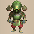 Masked Samurai</td>
      <td class="items"> Hat Prankster</td>
      <td class="items"> Mudkin</td>
      <td> Lt. Spearfish</td>
      <td>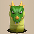 Floor Dragon</td>
    </tr>
    <tr>
      <td colspan="10" class="tableDivider"></td>
    </tr>
    <tr>
      <td rowspan="2" class="centeredText highlightFog">11</td>
      <td rowspan="2" class=""></td>
      <td rowspan="2" class=""></td>
      <td rowspan="2" class=""></td>
      <td> Bored Kappa</td>
      <td class="useful"> Bowboy</td>
      <td class="useful"> Crossbowboy</td>
      <td> Masked Samurai</td>
      <td class="items"> Hat Prankster</td>
      <td rowspan="2" class=""></td>
    </tr>
    <tr>
      <td class="items"> Mudkin</td>
      <td> Lt. Spearfish</td>
      <td> Floor Dragon</td>
      <td class="highlightGray"></td>
      <td class="highlightGray"></td>
    </tr>
    <tr>
      <td colspan="10" class="tableDivider"></td>
    </tr>
    <tr>
      <td rowspan="2" class="centeredText highlightFog">12</td>
      <td rowspan="2" class=""></td>
      <td rowspan="2" class=""></td>
      <td rowspan="2" class=""></td>
      <td> Bored Kappa</td>
      <td class="useful"> Crossbowboy</td>
      <td> Masked Samurai</td>
      <td class="items"> Hat Prankster</td>
      <td class="items"> Mudkin</td>
      <td rowspan="2" class=""></td>
    </tr>
    <tr>
      <td> Floor Dragon</td>
      <td> Metalhead</td>
      <td class="useful"> Mixer</td>
      <td class="highlightGray"></td>
      <td class="highlightGray"></td>
    </tr>
    <tr>
      <td colspan="10" class="tableDivider"></td>
    </tr>
    <tr>
      <td rowspan="2" class="centeredText highlightFog">13</td>
      <td rowspan="2" class=""></td>
      <td rowspan="2" class=""></td>
      <td rowspan="2" class=""></td>
      <td class="items"> Hat Prankster</td>
      <td class="items"> Mudkin</td>
      <td> Lt. Spearfish</td>
      <td> Floor Dragon</td>
      <td> Metalhead</td>
      <td rowspan="2" class=""></td>
    </tr>
    <tr>
      <td> Master Hen</td>
      <td> Tiger Thrower</td>
      <td class="highlightGray"></td>
      <td class="highlightGray"></td>
      <td class="highlightGray"></td>
    </tr>
    <tr>
      <td colspan="10" class="tableDivider"></td>
    </tr>
    <tr>
      <td class="centeredText highlightFog">14</td>
      <td class=""></td>
      <td class=""></td>
      <td class=""></td>
      <td> Lt. Spearfish</td>
      <td> Floor Dragon</td>
      <td> Metalhead</td>
      <td> Master Hen</td>
      <td> Tiger Thrower</td>
      <td class=""></td>
    </tr>
    <tr>
      <td colspan="10" class="tableDivider"></td>
    </tr>
    <tr>
      <td rowspan="2" class="centeredText highlightFog">15</td>
      <td rowspan="2" class=""></td>
      <td rowspan="2" class=""></td>
      <td rowspan="2" class=""></td>
      <td> Floor Dragon</td>
      <td> Metalhead</td>
      <td> Master Hen</td>
      <td> Tiger Thrower</td>
      <td> Okina Monk D</td>
      <td rowspan="2" class=""></td>
    </tr>
    <tr>
      <td> Okame Monk D</td>
      <td> Tengu Monk D</td>
      <td> Minotaur</td>
      <td class="farming"> Chow</td>
      <td class="highlightGray"></td>
    </tr>
    <tr>
      <td colspan="10" class="tableDivider"></td>
    </tr>
    <tr>
      <td rowspan="3" class="centeredText highlightFog">16</td>
      <td rowspan="3" class=""></td>
      <td rowspan="3" class=""></td>
      <td rowspan="3" class=""></td>
      <td> Master Hen</td>
      <td> Tiger Thrower</td>
      <td> Okina Monk D</td>
      <td> Okame Monk D</td>
      <td> Tengu Monk D</td>
      <td rowspan="3" class=""></td>
    </tr>
    <tr>
      <td class="farming"> Thiefwalrus</td>
      <td> Pop Tank</td>
      <td class="farming"> Egg Thing</td>
      <td> Minotaur</td>
      <td class="stats"> Ghost Radish</td>
    </tr>
    <tr>
      <td class="farming"> Chow</td>
      <td class="highlightGray"></td>
      <td class="highlightGray"></td>
      <td class="highlightGray"></td>
      <td class="highlightGray"></td>
    </tr>
    <tr>
      <td colspan="10" class="tableDivider"></td>
    </tr>
    <tr>
      <td rowspan="3" class="centeredText highlightFog">17</td>
      <td rowspan="3" class=""></td>
      <td rowspan="3" class=""></td>
      <td rowspan="3" class=""></td>
      <td> Master Hen</td>
      <td> Tiger Thrower</td>
      <td> Kitsune Monk D</td>
      <td> Okina Monk D</td>
      <td>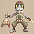 Hannya Monk D</td>
      <td rowspan="3" class=""></td>
    </tr>
    <tr>
      <td class="farming"> Thiefwalrus</td>
      <td> Zapdon</td>
      <td> Pop Tank</td>
      <td class="farming"> Egg Thing</td>
      <td> Minotaur</td>
    </tr>
    <tr>
      <td class="stats"> Ghost Radish</td>
      <td class="farming"> Chow</td>
      <td class="highlightGray"></td>
      <td class="highlightGray"></td>
      <td class="highlightGray"></td>
    </tr>
    <tr>
      <td colspan="10" class="tableDivider"></td>
    </tr>
    <tr>
      <td rowspan="2" class="centeredText highlightFog">18</td>
      <td rowspan="2" class=""></td>
      <td rowspan="2" class=""></td>
      <td rowspan="2" class=""></td>
      <td> Master Hen</td>
      <td> Tiger Thrower</td>
      <td> Hannya Monk D</td>
      <td class="farming"> Thiefwalrus</td>
      <td> Zapdon</td>
      <td rowspan="2" class=""></td>
    </tr>
    <tr>
      <td> Pop Tank</td>
      <td>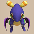 Flamepuff</td>
      <td> N'dubba</td>
      <td class="farming"> Chow</td>
      <td class="highlightGray"></td>
    </tr>
    <tr>
      <td colspan="10" class="tableDivider"></td>
    </tr>
    <tr>
      <td rowspan="2" class="centeredText">19</td>
      <td rowspan="2" class=""></td>
      <td rowspan="2" class=""></td>
      <td rowspan="2" class=""></td>
      <td> Hannya Monk D</td>
      <td class="farming"> Thiefwalrus</td>
      <td> Zapdon</td>
      <td> Flamepuff</td>
      <td> N'dubba</td>
      <td rowspan="2" class=""></td>
    </tr>
    <tr>
      <td> Skull Mage</td>
      <td class="farming"> Chow</td>
      <td class="highlightGray"></td>
      <td class="highlightGray"></td>
      <td class="highlightGray"></td>
    </tr>
    <tr>
      <td colspan="10" class="tableDivider"></td>
    </tr>
    <tr>
      <td rowspan="3" class="centeredText">20</td>
      <td rowspan="3" class=""></td>
      <td rowspan="3" class=""></td>
      <td rowspan="3" class=""></td>
      <td> Zapdon</td>
      <td> Flamepuff</td>
      <td> N'dubba</td>
      <td> Tree Ninja C</td>
      <td> Earth Ninja C</td>
      <td rowspan="3" class=""></td>
    </tr>
    <tr>
      <td class="items"> Fire Ninja C</td>
      <td> Explochin</td>
      <td> Pumpanshee</td>
      <td> Skull Mage</td>
      <td> Cave Mamel</td>
    </tr>
    <tr>
      <td class="farming"> Running Egg</td>
      <td class="farming"> Chow</td>
      <td class="highlightGray"></td>
      <td class="highlightGray"></td>
      <td class="highlightGray"></td>
    </tr>
    <tr>
      <td colspan="10" class="tableDivider"></td>
    </tr>
    <tr>
      <td rowspan="2" class="centeredText">21</td>
      <td rowspan="2" class=""></td>
      <td rowspan="2" class=""></td>
      <td rowspan="2" class=""></td>
      <td> N'dubba</td>
      <td> Tree Ninja C</td>
      <td> Earth Ninja C</td>
      <td class="items"> Fire Ninja C</td>
      <td> Explochin</td>
      <td rowspan="2" class=""></td>
    </tr>
    <tr>
      <td> Pumpanshee</td>
      <td> Skull Mage</td>
      <td> Cave Mamel</td>
      <td class="farming"> Running Egg</td>
      <td class="farming"> Chow</td>
    </tr>
    <tr>
      <td colspan="10" class="tableDivider"></td>
    </tr>
    <tr>
      <td rowspan="2" class="centeredText">22</td>
      <td rowspan="2" class=""></td>
      <td rowspan="2" class=""></td>
      <td rowspan="2" class=""></td>
      <td> Tree Ninja C</td>
      <td> Metal Ninja C</td>
      <td class="items"> Water Ninja C</td>
      <td> Explochin</td>
      <td> Pumpanshee</td>
      <td rowspan="2" class=""></td>
    </tr>
    <tr>
      <td>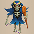 Skull Wizard</td>
      <td class="items"> Super Gazer</td>
      <td> Cave Mamel</td>
      <td class="farming"> Running Egg</td>
      <td class="farming"> Chow</td>
    </tr>
    <tr>
      <td colspan="10" class="tableDivider"></td>
    </tr>
    <tr>
      <td rowspan="2" class="centeredText highlightFog">23</td>
      <td rowspan="2" class=""></td>
      <td rowspan="2" class=""></td>
      <td rowspan="2" class=""></td>
      <td> Tree Ninja C</td>
      <td> Metal Ninja C</td>
      <td class="items"> Water Ninja C</td>
      <td> Pumpanshee</td>
      <td> Skull Wizard</td>
      <td rowspan="2" class=""></td>
    </tr>
    <tr>
      <td class="items"> Super Gazer</td>
      <td> Cave Mamel</td>
      <td class="farming"> Running Egg</td>
      <td class="farming"> Chow</td>
      <td class="highlightGray"></td>
    </tr>
    <tr>
      <td colspan="10" class="tableDivider"></td>
    </tr>
    <tr>
      <td rowspan="3" class="centeredText highlightFog">24</td>
      <td rowspan="3" class=""></td>
      <td rowspan="3" class=""></td>
      <td rowspan="3" class=""></td>
      <td> Pumpanshee</td>
      <td class="items"> Super Gazer</td>
      <td> N'dulu</td>
      <td> Pesky Kappa</td>
      <td> Porko</td>
      <td rowspan="3" class=""></td>
    </tr>
    <tr>
      <td> Capt. Spearfish</td>
      <td> Famed Octopling</td>
      <td> Dartingfrog</td>
      <td> Cave Mamel</td>
      <td class="useful"> Mixer</td>
    </tr>
    <tr>
      <td class="farming"> Running Egg</td>
      <td class="farming"> Chow</td>
      <td class="highlightGray"></td>
      <td class="highlightGray"></td>
      <td class="highlightGray"></td>
    </tr>
    <tr>
      <td colspan="10" class="tableDivider"></td>
    </tr>
    <tr>
      <td rowspan="2" class="centeredText highlightFog">25</td>
      <td rowspan="2" class=""></td>
      <td rowspan="2" class=""></td>
      <td rowspan="2" class=""></td>
      <td> N'dulu</td>
      <td> Pesky Kappa</td>
      <td> Porko</td>
      <td> Capt. Spearfish</td>
      <td> Famed Octopling</td>
      <td rowspan="2" class=""></td>
    </tr>
    <tr>
      <td class="farming"> Greenwalrus</td>
      <td> Dartingfrog</td>
      <td> Cave Mamel</td>
      <td class="farming"> Running Egg</td>
      <td class="farming"> Chow</td>
    </tr>
    <tr>
      <td colspan="10" class="tableDivider"></td>
    </tr>
    <tr>
      <td rowspan="2" class="centeredText highlightFog">26</td>
      <td rowspan="2" class=""></td>
      <td rowspan="2" class=""></td>
      <td rowspan="2" class=""></td>
      <td> N'dulu</td>
      <td> Pesky Kappa</td>
      <td> Porko</td>
      <td class="stats"> Daze Radish</td>
      <td class="farming"> Greenwalrus</td>
      <td rowspan="2" class=""></td>
    </tr>
    <tr>
      <td> Dartingfrog</td>
      <td class="farming"> Running Egg</td>
      <td class="farming"> Chow</td>
      <td class="highlightGray"></td>
      <td class="highlightGray"></td>
    </tr>
    <tr>
      <td colspan="10" class="tableDivider"></td>
    </tr>
    <tr>
      <td rowspan="2" class="centeredText">27</td>
      <td rowspan="2" class=""></td>
      <td rowspan="2" class=""></td>
      <td rowspan="2" class=""></td>
      <td> N'dulu</td>
      <td> Pesky Kappa</td>
      <td> Porko</td>
      <td class="stats"> Daze Radish</td>
      <td> Dragon</td>
      <td rowspan="2" class=""></td>
    </tr>
    <tr>
      <td class="farming"> Greenwalrus</td>
      <td> Dartingfrog</td>
      <td class="farming"> Running Egg</td>
      <td class="farming"> Chow</td>
      <td class="highlightGray"></td>
    </tr>
    <tr>
      <td colspan="10" class="tableDivider"></td>
    </tr>
    <tr>
      <td rowspan="2" class="centeredText">28</td>
      <td rowspan="2" class=""></td>
      <td rowspan="2" class=""></td>
      <td rowspan="2" class=""></td>
      <td> N'dulu</td>
      <td class="stats"> Daze Radish</td>
      <td> Dragon</td>
      <td> Sky Dragon</td>
      <td class="farming"> Greenwalrus</td>
      <td rowspan="2" class=""></td>
    </tr>
    <tr>
      <td> Dartingfrog</td>
      <td class="farming"> Running Egg</td>
      <td class="farming"> Chow</td>
      <td class="highlightGray"></td>
      <td class="highlightGray"></td>
    </tr>
    <tr>
      <td colspan="10" class="tableDivider"></td>
    </tr>
    <tr>
      <td rowspan="2" class="centeredText">29</td>
      <td rowspan="2" class=""></td>
      <td rowspan="2" class=""></td>
      <td rowspan="2" class=""></td>
      <td class="stats"> Daze Radish</td>
      <td> Baby Tank</td>
      <td> Hoppin' Slugger</td>
      <td> Polygon Shaka</td>
      <td> Dragon</td>
      <td rowspan="2" class=""></td>
    </tr>
    <tr>
      <td> Sky Dragon</td>
      <td class="stats"> Floppy Hani</td>
      <td class="farming"> Running Egg</td>
      <td class="farming"> Chow</td>
      <td class="highlightGray"></td>
    </tr>
    <tr>
      <td colspan="10" class="tableDivider"></td>
    </tr>
    <tr>
      <td rowspan="2" class="centeredText">30</td>
      <td rowspan="2" class=""></td>
      <td rowspan="2" class=""></td>
      <td rowspan="2" class=""></td>
      <td> Baby Tank</td>
      <td class="stats"> Vile Scorpion</td>
      <td> Hoppin' Slugger</td>
      <td> Polygon Shaka</td>
      <td> Dragon</td>
      <td rowspan="2" class=""></td>
    </tr>
    <tr>
      <td> Sky Dragon</td>
      <td class="stats"> Polygon Singa</td>
      <td class="stats"> Floppy Hani</td>
      <td> Pumplich</td>
      <td class="farming"> Chow</td>
    </tr>
    <tr>
      <td colspan="10" class="tableDivider"></td>
    </tr>
    <tr>
      <td rowspan="2" class="centeredText">31</td>
      <td rowspan="2" class=""></td>
      <td rowspan="2" class=""></td>
      <td rowspan="2" class=""></td>
      <td class="stats"> Vile Scorpion</td>
      <td> Hoppin' Slugger</td>
      <td> Polygon Shaka</td>
      <td class="stats"> Polygon Singa</td>
      <td class="stats"> Floppy Hani</td>
      <td rowspan="2" class="highlightBehemoth"></td>
    </tr>
    <tr>
      <td class="danger">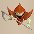 Soul Reaper</td>
      <td> Pumplich</td>
      <td class="farming"> Chow</td>
      <td class="highlightGray"></td>
      <td class="highlightGray"></td>
    </tr>
    <tr>
      <td colspan="10" class="tableDivider"></td>
    </tr>
    <tr>
      <td rowspan="2" class="centeredText">32</td>
      <td rowspan="2" class=""></td>
      <td rowspan="2" class=""></td>
      <td rowspan="2" class=""></td>
      <td class="stats"> Vile Scorpion</td>
      <td> Polygon Shaka</td>
      <td class="stats"> Polygon Singa</td>
      <td class="stats"> Floppy Hani</td>
      <td class="danger"> Soul Reaper</td>
      <td rowspan="2" class="highlightBehemoth"></td>
    </tr>
    <tr>
      <td> Pumplich</td>
      <td class="farming"> Chow</td>
      <td class="highlightGray"></td>
      <td class="highlightGray"></td>
      <td class="highlightGray"></td>
    </tr>
    <tr>
      <td colspan="10" class="tableDivider"></td>
    </tr>
    <tr>
      <td rowspan="2" class="centeredText">33</td>
      <td rowspan="2" class=""></td>
      <td rowspan="2" class=""></td>
      <td rowspan="2" class=""></td>
      <td class="stats"> Vile Scorpion</td>
      <td class="stats"> Polygon Singa</td>
      <td class="stats"> Floppy Hani</td>
      <td class="danger"> Soul Reaper</td>
      <td> Pumplich</td>
      <td rowspan="2" class="highlightBehemoth"></td>
    </tr>
    <tr>
      <td class="farming"> Chow</td>
      <td class="highlightGray"></td>
      <td class="highlightGray"></td>
      <td class="highlightGray"></td>
      <td class="highlightGray"></td>
    </tr>
    <tr>
      <td colspan="10" class="tableDivider"></td>
    </tr>
    <tr>
      <td rowspan="2" class="centeredText">34</td>
      <td rowspan="2" class=""></td>
      <td rowspan="2" class=""></td>
      <td rowspan="2" class=""></td>
      <td class="stats"> Vile Scorpion</td>
      <td class="stats"> Polygon Singa</td>
      <td class="stats"> Floppy Hani</td>
      <td class="danger"> Soul Reaper</td>
      <td> Pumplich</td>
      <td rowspan="2" class="highlightBehemoth"></td>
    </tr>
    <tr>
      <td class="farming"> Chow</td>
      <td class="highlightGray"></td>
      <td class="highlightGray"></td>
      <td class="highlightGray"></td>
      <td class="highlightGray"></td>
    </tr>
    <tr>
      <td colspan="10" class="tableDivider"></td>
    </tr>
    <tr>
      <td rowspan="2" class="centeredText highlightFog">35</td>
      <td rowspan="2" class=""></td>
      <td rowspan="2" class=""></td>
      <td rowspan="2" class=""></td>
      <td class="stats"> Floppy Hani</td>
      <td class="danger"> Soul Reaper</td>
      <td> Pumplich</td>
      <td class="danger"> Mini Tank</td>
      <td class="farming"> Chow</td>
      <td rowspan="2" class="highlightBehemoth"></td>
    </tr>
    <tr>
      <td>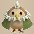 Dark Owl</td>
      <td class="highlightGray"></td>
      <td class="highlightGray"></td>
      <td class="highlightGray"></td>
      <td class="highlightGray"></td>
    </tr>
    <tr>
      <td colspan="10" class="tableDivider"></td>
    </tr>
    <tr>
      <td rowspan="2" class="centeredText highlightFog">36</td>
      <td rowspan="2" class=""></td>
      <td rowspan="2" class=""></td>
      <td rowspan="2" class=""></td>
      <td class="danger"> Soul Reaper</td>
      <td> Pumplich</td>
      <td class="danger"> Mini Tank</td>
      <td class="useful"> Mixer</td>
      <td class="useful"> Mixermon</td>
      <td rowspan="2" class="highlightBehemoth"></td>
    </tr>
    <tr>
      <td class="farming"> Chow</td>
      <td> Dark Owl</td>
      <td class="highlightGray"></td>
      <td class="highlightGray"></td>
      <td class="highlightGray"></td>
    </tr>
    <tr>
      <td colspan="10" class="tableDivider"></td>
    </tr>
    <tr>
      <td class="centeredText highlightFog">37</td>
      <td class=""></td>
      <td class=""></td>
      <td class=""></td>
      <td class="danger"> Soul Reaper</td>
      <td> Pumplich</td>
      <td class="danger"> Mini Tank</td>
      <td class="farming"> Chow</td>
      <td> Dark Owl</td>
      <td class="highlightBehemoth"></td>
    </tr>
    <tr>
      <td colspan="10" class="tableDivider"></td>
    </tr>
    <tr>
      <td class="centeredText highlightFog">38</td>
      <td class=""></td>
      <td class=""></td>
      <td class=""></td>
      <td class="danger"> Soul Reaper</td>
      <td> Pumplich</td>
      <td class="danger"> Mini Tank</td>
      <td class="farming"> Chow</td>
      <td> Dark Owl</td>
      <td class="highlightBehemoth"></td>
    </tr>
    <tr>
      <td colspan="10" class="tableDivider"></td>
    </tr>
    <tr>
      <td rowspan="2" class="centeredText highlightFog">39</td>
      <td rowspan="2" class=""></td>
      <td rowspan="2" class=""></td>
      <td rowspan="2" class=""></td>
      <td class="danger"> Soul Reaper</td>
      <td> Pumplich</td>
      <td class="danger"> Mini Tank</td>
      <td> Ornery Tank</td>
      <td class="danger"> Adamant Tank</td>
      <td rowspan="2" class=""></td>
    </tr>
    <tr>
      <td class="farming"> Chow</td>
      <td> Dark Owl</td>
      <td class="highlightGray"></td>
      <td class="highlightGray"></td>
      <td class="highlightGray"></td>
    </tr>
    <tr>
      <td colspan="10" class="tableDivider"></td>
    </tr>
    <tr>
      <td rowspan="2" class="centeredText highlightFog">40</td>
      <td rowspan="2" class=""></td>
      <td rowspan="2" class=""></td>
      <td rowspan="2" class=""></td>
      <td> Ornery Tank</td>
      <td class="danger"> Adamant Tank</td>
      <td> Blazepuff</td>
      <td> Dragon Pit</td>
      <td> Cave Mamel</td>
      <td rowspan="2" class=""></td>
    </tr>
    <tr>
      <td class="farming"> Chow</td>
      <td> Dark Owl</td>
      <td class="highlightGray"></td>
      <td class="highlightGray"></td>
      <td class="highlightGray"></td>
    </tr>
    <tr>
      <td colspan="10" class="tableDivider"></td>
    </tr>
    <tr>
      <td rowspan="2" class="centeredText highlightFog">41</td>
      <td rowspan="2" class=""></td>
      <td rowspan="2" class=""></td>
      <td rowspan="2" class=""></td>
      <td> Ornery Tank</td>
      <td class="danger"> Adamant Tank</td>
      <td> Blazepuff</td>
      <td> Dragon Pit</td>
      <td> Cave Mamel</td>
      <td rowspan="2" class=""></td>
    </tr>
    <tr>
      <td class="farming"> Chow</td>
      <td> Dark Owl</td>
      <td class="highlightGray"></td>
      <td class="highlightGray"></td>
      <td class="highlightGray"></td>
    </tr>
    <tr>
      <td colspan="10" class="tableDivider"></td>
    </tr>
    <tr>
      <td rowspan="2" class="centeredText highlightFog">42</td>
      <td rowspan="2" class=""></td>
      <td rowspan="2" class=""></td>
      <td rowspan="2" class=""></td>
      <td> Ornery Tank</td>
      <td class="danger"> Adamant Tank</td>
      <td> Blazepuff</td>
      <td> Dragon Pit</td>
      <td> Cave Mamel</td>
      <td rowspan="2" class=""></td>
    </tr>
    <tr>
      <td class="farming"> Chow</td>
      <td> Dark Owl</td>
      <td class="highlightGray"></td>
      <td class="highlightGray"></td>
      <td class="highlightGray"></td>
    </tr>
    <tr>
      <td colspan="10" class="tableDivider"></td>
    </tr>
    <tr>
      <td rowspan="2" class="centeredText highlightFog">43</td>
      <td rowspan="2" class=""></td>
      <td rowspan="2" class=""></td>
      <td rowspan="2" class=""></td>
      <td> Blazepuff</td>
      <td> Dragon Pit</td>
      <td> Cave Mamel</td>
      <td> Igneous</td>
      <td class="farming"> Chow</td>
      <td rowspan="2" class=""></td>
    </tr>
    <tr>
      <td> Dark Owl</td>
      <td class="highlightGray"></td>
      <td class="highlightGray"></td>
      <td class="highlightGray"></td>
      <td class="highlightGray"></td>
    </tr>
    <tr>
      <td colspan="10" class="tableDivider"></td>
    </tr>
    <tr>
      <td rowspan="2" class="centeredText highlightFog">44</td>
      <td rowspan="2" class=""></td>
      <td rowspan="2" class=""></td>
      <td rowspan="2" class=""></td>
      <td> Blazepuff</td>
      <td> Dragon Pit</td>
      <td> Cave Mamel</td>
      <td> Igneous</td>
      <td class="farming"> Chow</td>
      <td rowspan="2" class=""></td>
    </tr>
    <tr>
      <td> Dark Owl</td>
      <td class="highlightGray"></td>
      <td class="highlightGray"></td>
      <td class="highlightGray"></td>
      <td class="highlightGray"></td>
    </tr>
    <tr>
      <td colspan="10" class="tableDivider"></td>
    </tr>
    <tr>
      <td rowspan="2" class="centeredText highlightFog">45</td>
      <td rowspan="2" class=""></td>
      <td rowspan="2" class=""></td>
      <td rowspan="2" class=""></td>
      <td> Blazepuff</td>
      <td> Dragon Pit</td>
      <td> Cave Mamel</td>
      <td> Igneous</td>
      <td class="items"> Mudster</td>
      <td rowspan="2" class=""></td>
    </tr>
    <tr>
      <td class="items"> Mudder</td>
      <td class="danger"> N'dama</td>
      <td class="farming"> Chow</td>
      <td> Dark Owl</td>
      <td class="highlightGray"></td>
    </tr>
    <tr>
      <td colspan="10" class="tableDivider"></td>
    </tr>
    <tr>
      <td rowspan="2" class="centeredText highlightFog">46</td>
      <td rowspan="2" class=""></td>
      <td rowspan="2" class=""></td>
      <td rowspan="2" class=""></td>
      <td> Igneous</td>
      <td class="items"> Mudster</td>
      <td class="items"> Mudder</td>
      <td class="danger"> N'dama</td>
      <td class="farming"> Chow</td>
      <td rowspan="2" class=""></td>
    </tr>
    <tr>
      <td> Dark Owl</td>
      <td class="highlightGray"></td>
      <td class="highlightGray"></td>
      <td class="highlightGray"></td>
      <td class="highlightGray"></td>
    </tr>
    <tr>
      <td colspan="10" class="tableDivider"></td>
    </tr>
    <tr>
      <td class="centeredText">47</td>
      <td class=""></td>
      <td class=""></td>
      <td class=""></td>
      <td> Igneous</td>
      <td class="items"> Mudster</td>
      <td class="items"> Mudder</td>
      <td class="danger"> N'dama</td>
      <td class="farming"> Chow</td>
      <td class=""></td>
    </tr>
    <tr>
      <td colspan="10" class="tableDivider"></td>
    </tr>
    <tr>
      <td rowspan="2" class="centeredText">48</td>
      <td rowspan="2" class=""></td>
      <td rowspan="2" class=""></td>
      <td rowspan="2" class=""></td>
      <td> Igneous</td>
      <td class="items"> Mudster</td>
      <td class="items"> Mudder</td>
      <td class="danger"> N'dama</td>
      <td class="useful"> Mixermon</td>
      <td rowspan="2" class=""></td>
    </tr>
    <tr>
      <td class="farming"> Chow</td>
      <td class="highlightGray"></td>
      <td class="highlightGray"></td>
      <td class="highlightGray"></td>
      <td class="highlightGray"></td>
    </tr>
    <tr>
      <td colspan="10" class="tableDivider"></td>
    </tr>
    <tr>
      <td rowspan="2" class="centeredText">49</td>
      <td rowspan="2" class=""></td>
      <td rowspan="2" class=""></td>
      <td rowspan="2" class=""></td>
      <td> Igneous</td>
      <td class="stats"> Terror Scorpion</td>
      <td> Hoppin' Slammer</td>
      <td class="items"> Mudster</td>
      <td class="items"> Mudder</td>
      <td rowspan="2" class=""></td>
    </tr>
    <tr>
      <td class="danger"> N'dama</td>
      <td class="farming"> Chow</td>
      <td class="highlightGray"></td>
      <td class="highlightGray"></td>
      <td class="highlightGray"></td>
    </tr>
    <tr>
      <td colspan="10" class="tableDivider"></td>
    </tr>
    <tr>
      <td rowspan="2" class="centeredText">50</td>
      <td rowspan="2" class=""></td>
      <td rowspan="2" class=""></td>
      <td rowspan="2" class=""></td>
      <td> Igneous</td>
      <td class="stats"> Terror Scorpion</td>
      <td> Hoppin' Slammer</td>
      <td class="items"> Mudster</td>
      <td class="items"> Mudder</td>
      <td rowspan="2" class=""></td>
    </tr>
    <tr>
      <td class="danger"> N'dama</td>
      <td class="farming"> Chow</td>
      <td class="highlightGray"></td>
      <td class="highlightGray"></td>
      <td class="highlightGray"></td>
    </tr>
    <tr>
      <td colspan="10" class="tableDivider"></td>
    </tr>
    <tr>
      <td rowspan="3" class="centeredText">51</td>
      <td rowspan="3" class=""></td>
      <td rowspan="3" class=""></td>
      <td rowspan="3" class=""></td>
      <td>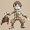 Hannya Monk B</td>
      <td> Okame Monk B</td>
      <td> Tengu Monk B</td>
      <td> Kitsune Monk B</td>
      <td> Okina Monk B</td>
      <td rowspan="3" class=""></td>
    </tr>
    <tr>
      <td class="stats"> Terror Scorpion</td>
      <td> Hoppin' Slammer</td>
      <td class="items"> Mudster</td>
      <td class="items"> Mudder</td>
      <td class="danger"> N'dama</td>
    </tr>
    <tr>
      <td class="farming"> Chow</td>
      <td class="highlightGray"></td>
      <td class="highlightGray"></td>
      <td class="highlightGray"></td>
      <td class="highlightGray"></td>
    </tr>
    <tr>
      <td colspan="10" class="tableDivider"></td>
    </tr>
    <tr>
      <td rowspan="2" class="centeredText">52</td>
      <td rowspan="2" class=""></td>
      <td rowspan="2" class=""></td>
      <td rowspan="2" class=""></td>
      <td> Hannya Monk B</td>
      <td> Okame Monk B</td>
      <td> Tengu Monk B</td>
      <td> Kitsune Monk B</td>
      <td> Okina Monk B</td>
      <td rowspan="2" class=""></td>
    </tr>
    <tr>
      <td class="stats"> Terror Scorpion</td>
      <td> Hoppin' Slammer</td>
      <td class="danger"> N'dama</td>
      <td class="farming"> Chow</td>
      <td class="highlightGray"></td>
    </tr>
    <tr>
      <td colspan="10" class="tableDivider"></td>
    </tr>
    <tr>
      <td rowspan="2" class="centeredText">53</td>
      <td rowspan="2" class=""></td>
      <td rowspan="2" class=""></td>
      <td rowspan="2" class=""></td>
      <td> Hannya Monk B</td>
      <td> Okame Monk B</td>
      <td> Tengu Monk B</td>
      <td> Kitsune Monk B</td>
      <td> Okina Monk B</td>
      <td rowspan="2" class=""></td>
    </tr>
    <tr>
      <td class="stats"> Terror Scorpion</td>
      <td> Hoppin' Slammer</td>
      <td class="danger"> N'dama</td>
      <td class="farming"> Chow</td>
      <td class="highlightGray"></td>
    </tr>
    <tr>
      <td colspan="10" class="tableDivider"></td>
    </tr>
    <tr>
      <td rowspan="3" class="centeredText">54</td>
      <td rowspan="3" class=""></td>
      <td rowspan="3" class=""></td>
      <td rowspan="3" class=""></td>
      <td> Hannya Monk B</td>
      <td> Okame Monk B</td>
      <td> Tengu Monk B</td>
      <td> Kitsune Monk B</td>
      <td> Okina Monk B</td>
      <td rowspan="3" class=""></td>
    </tr>
    <tr>
      <td class="stats"> Terror Scorpion</td>
      <td> Hoppin' Slammer</td>
      <td class="danger"> N'dama</td>
      <td> Admiral Spearfish</td>
      <td> Superb Octopling</td>
    </tr>
    <tr>
      <td> Vexing Kappa</td>
      <td class="farming"> Ironwalrus</td>
      <td> Fleefrog</td>
      <td class="farming"> Chow</td>
      <td class="highlightGray"></td>
    </tr>
    <tr>
      <td colspan="10" class="tableDivider"></td>
    </tr>
    <tr>
      <td rowspan="4" class="centeredText highlightFog">55</td>
      <td rowspan="4" class=""></td>
      <td rowspan="4" class=""></td>
      <td rowspan="4" class=""></td>
      <td class="danger"> Steadfast Tank</td>
      <td> Hannya Monk B</td>
      <td> Okame Monk B</td>
      <td> Tengu Monk B</td>
      <td> Kitsune Monk B</td>
      <td rowspan="4" class=""></td>
    </tr>
    <tr>
      <td> Okina Monk B</td>
      <td class="stats"> Terror Scorpion</td>
      <td> Hoppin' Slammer</td>
      <td class="danger"> N'dama</td>
      <td> Admiral Spearfish</td>
    </tr>
    <tr>
      <td> Superb Octopling</td>
      <td> Vexing Kappa</td>
      <td class="farming"> Ironwalrus</td>
      <td> Fleefrog</td>
      <td class="farming"> Chow</td>
    </tr>
    <tr>
      <td> Dark Owl</td>
      <td class="highlightGray"></td>
      <td class="highlightGray"></td>
      <td class="highlightGray"></td>
      <td class="highlightGray"></td>
    </tr>
    <tr>
      <td colspan="10" class="tableDivider"></td>
    </tr>
    <tr>
      <td rowspan="3" class="centeredText highlightFog">56</td>
      <td rowspan="3" class=""></td>
      <td rowspan="3" class=""></td>
      <td rowspan="3" class=""></td>
      <td class="danger"> Steadfast Tank</td>
      <td> Hannya Monk B</td>
      <td> Okame Monk B</td>
      <td> Tengu Monk B</td>
      <td> Kitsune Monk B</td>
      <td rowspan="3" class=""></td>
    </tr>
    <tr>
      <td> Okina Monk B</td>
      <td> Admiral Spearfish</td>
      <td> Superb Octopling</td>
      <td> Vexing Kappa</td>
      <td class="farming"> Ironwalrus</td>
    </tr>
    <tr>
      <td> Fleefrog</td>
      <td class="farming"> Chow</td>
      <td> Dark Owl</td>
      <td class="highlightGray"></td>
      <td class="highlightGray"></td>
    </tr>
    <tr>
      <td colspan="10" class="tableDivider"></td>
    </tr>
    <tr>
      <td rowspan="2" class="centeredText highlightFog">57</td>
      <td rowspan="2" class=""></td>
      <td rowspan="2" class=""></td>
      <td rowspan="2" class=""></td>
      <td class="danger"> Steadfast Tank</td>
      <td> Admiral Spearfish</td>
      <td> Superb Octopling</td>
      <td> Vexing Kappa</td>
      <td class="farming"> Ironwalrus</td>
      <td rowspan="2" class=""></td>
    </tr>
    <tr>
      <td> Fleefrog</td>
      <td class="farming"> Chow</td>
      <td> Dark Owl</td>
      <td class="highlightGray"></td>
      <td class="highlightGray"></td>
    </tr>
    <tr>
      <td colspan="10" class="tableDivider"></td>
    </tr>
    <tr>
      <td rowspan="2" class="centeredText highlightFog">58</td>
      <td rowspan="2" class=""></td>
      <td rowspan="2" class=""></td>
      <td rowspan="2" class=""></td>
      <td class="danger"> Steadfast Tank</td>
      <td class="items"> Curse Matron</td>
      <td class="danger"> Nigiri Boss</td>
      <td class="items"> Bag Knave</td>
      <td class="items"> Hyper Gazer</td>
      <td rowspan="2" class=""></td>
    </tr>
    <tr>
      <td class="items"> Hat Brat</td>
      <td class="farming"> Chow</td>
      <td> Dark Owl</td>
      <td class="highlightGray"></td>
      <td class="highlightGray"></td>
    </tr>
    <tr>
      <td colspan="10" class="tableDivider"></td>
    </tr>
    <tr>
      <td rowspan="2" class="centeredText">59</td>
      <td rowspan="2" class=""></td>
      <td rowspan="2" class=""></td>
      <td rowspan="2" class=""></td>
      <td class="danger"> Steadfast Tank</td>
      <td class="items"> Curse Matron</td>
      <td class="danger"> Nigiri Boss</td>
      <td class="items"> Bag Knave</td>
      <td class="items"> Hyper Gazer</td>
      <td rowspan="2" class=""></td>
    </tr>
    <tr>
      <td class="items"> Hat Brat</td>
      <td class="farming"> Chow</td>
      <td class="highlightGray"></td>
      <td class="highlightGray"></td>
      <td class="highlightGray"></td>
    </tr>
    <tr>
      <td colspan="10" class="tableDivider"></td>
    </tr>
    <tr>
      <td rowspan="2" class="centeredText">60</td>
      <td rowspan="2" class=""></td>
      <td rowspan="2" class=""></td>
      <td rowspan="2" class=""></td>
      <td class="danger"> Steadfast Tank</td>
      <td class="items"> Curse Matron</td>
      <td class="danger"> Nigiri Boss</td>
      <td class="items"> Bag Knave</td>
      <td class="items"> Hyper Gazer</td>
      <td rowspan="2" class=""></td>
    </tr>
    <tr>
      <td class="items"> Hat Brat</td>
      <td class="useful"> Mixermon</td>
      <td> N'daloon</td>
      <td class="farming"> Chow</td>
      <td class="highlightGray"></td>
    </tr>
    <tr>
      <td colspan="10" class="tableDivider"></td>
    </tr>
    <tr>
      <td rowspan="2" class="centeredText">61</td>
      <td rowspan="2" class=""></td>
      <td rowspan="2" class=""></td>
      <td rowspan="2" class=""></td>
      <td class="danger"> Steadfast Tank</td>
      <td class="items"> Curse Matron</td>
      <td class="danger"> Nigiri Boss</td>
      <td class="items"> Bag Knave</td>
      <td class="items"> Hyper Gazer</td>
      <td rowspan="2" class="highlightBehemoth"></td>
    </tr>
    <tr>
      <td class="items"> Hat Brat</td>
      <td> N'daloon</td>
      <td class="farming"> Chow</td>
      <td class="highlightGray"></td>
      <td class="highlightGray"></td>
    </tr>
    <tr>
      <td colspan="10" class="tableDivider"></td>
    </tr>
    <tr>
      <td rowspan="2" class="centeredText">62</td>
      <td rowspan="2" class=""></td>
      <td rowspan="2" class=""></td>
      <td rowspan="2" class=""></td>
      <td class="danger"> Steadfast Tank</td>
      <td class="items"> Curse Matron</td>
      <td class="danger"> Nigiri Boss</td>
      <td class="items"> Bag Knave</td>
      <td class="items"> Hyper Gazer</td>
      <td rowspan="2" class="highlightBehemoth"></td>
    </tr>
    <tr>
      <td class="items"> Hat Brat</td>
      <td> N'daloon</td>
      <td class="farming"> Chow</td>
      <td class="highlightGray"></td>
      <td class="highlightGray"></td>
    </tr>
    <tr>
      <td colspan="10" class="tableDivider"></td>
    </tr>
    <tr>
      <td rowspan="2" class="centeredText highlightFog">63</td>
      <td rowspan="2" class=""></td>
      <td rowspan="2" class=""></td>
      <td rowspan="2" class=""></td>
      <td> Tree Ninja B</td>
      <td> Earth Ninja B</td>
      <td class="items"> Fire Ninja B</td>
      <td> Metal Ninja B</td>
      <td class="items"> Water Ninja B</td>
      <td rowspan="2" class="highlightBehemoth"></td>
    </tr>
    <tr>
      <td> N'daloon</td>
      <td class="farming"> Chow</td>
      <td> Dark Owl</td>
      <td class="highlightGray"></td>
      <td class="highlightGray"></td>
    </tr>
    <tr>
      <td colspan="10" class="tableDivider"></td>
    </tr>
    <tr>
      <td rowspan="3" class="centeredText highlightFog">64</td>
      <td rowspan="3" class=""></td>
      <td rowspan="3" class=""></td>
      <td rowspan="3" class=""></td>
      <td class="items"> Grampadillo</td>
      <td> Great Samurai</td>
      <td class="danger"> Skull Lord</td>
      <td class="items">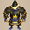 Battler</td>
      <td> Megataur</td>
      <td rowspan="3" class="highlightBehemoth"></td>
    </tr>
    <tr>
      <td> Megahead</td>
      <td> Clapdon</td>
      <td class="danger"> Bellthoven</td>
      <td> Pumplord</td>
      <td> N'daloon</td>
    </tr>
    <tr>
      <td class="farming"> Chow</td>
      <td> Dark Owl</td>
      <td class="highlightGray"></td>
      <td class="highlightGray"></td>
      <td class="highlightGray"></td>
    </tr>
    <tr>
      <td colspan="10" class="tableDivider"></td>
    </tr>
    <tr>
      <td rowspan="3" class="centeredText highlightFog">65</td>
      <td rowspan="3" class=""></td>
      <td rowspan="3" class=""></td>
      <td rowspan="3" class=""></td>
      <td class="items"> Grampadillo</td>
      <td> Great Samurai</td>
      <td class="danger"> Skull Lord</td>
      <td class="items"> Battler</td>
      <td> Megataur</td>
      <td rowspan="3" class="highlightBehemoth"></td>
    </tr>
    <tr>
      <td> Megahead</td>
      <td> Clapdon</td>
      <td class="danger"> Bellthoven</td>
      <td> Pumplord</td>
      <td> N'daloon</td>
    </tr>
    <tr>
      <td class="farming"> Chow</td>
      <td> Dark Owl</td>
      <td class="highlightGray"></td>
      <td class="highlightGray"></td>
      <td class="highlightGray"></td>
    </tr>
    <tr>
      <td colspan="10" class="tableDivider"></td>
    </tr>
    <tr>
      <td rowspan="3" class="centeredText highlightFog">66</td>
      <td rowspan="3" class=""></td>
      <td rowspan="3" class=""></td>
      <td rowspan="3" class=""></td>
      <td class="items"> Grampadillo</td>
      <td> Great Samurai</td>
      <td class="danger"> Skull Lord</td>
      <td class="items"> Battler</td>
      <td> Megataur</td>
      <td rowspan="3" class="highlightBehemoth"></td>
    </tr>
    <tr>
      <td> Megahead</td>
      <td> Clapdon</td>
      <td class="danger"> Bellthoven</td>
      <td> Pumplord</td>
      <td> N'daloon</td>
    </tr>
    <tr>
      <td class="farming"> Chow</td>
      <td> Dark Owl</td>
      <td class="highlightGray"></td>
      <td class="highlightGray"></td>
      <td class="highlightGray"></td>
    </tr>
    <tr>
      <td colspan="10" class="tableDivider"></td>
    </tr>
    <tr>
      <td rowspan="3" class="centeredText">67</td>
      <td rowspan="3" class=""></td>
      <td rowspan="3" class=""></td>
      <td rowspan="3" class=""></td>
      <td class="items"> Grampadillo</td>
      <td> Great Samurai</td>
      <td class="danger"> Skull Lord</td>
      <td class="items"> Battler</td>
      <td> Megataur</td>
      <td rowspan="3" class="highlightBehemoth"></td>
    </tr>
    <tr>
      <td> Megahead</td>
      <td> Clapdon</td>
      <td class="danger"> Bellthoven</td>
      <td> Pumplord</td>
      <td> N'daloon</td>
    </tr>
    <tr>
      <td class="farming"> Chow</td>
      <td class="highlightGray"></td>
      <td class="highlightGray"></td>
      <td class="highlightGray"></td>
      <td class="highlightGray"></td>
    </tr>
    <tr>
      <td colspan="10" class="tableDivider"></td>
    </tr>
    <tr>
      <td rowspan="4" class="centeredText">68</td>
      <td rowspan="4" class=""></td>
      <td rowspan="4" class=""></td>
      <td rowspan="4" class=""></td>
      <td> Hannya Monk B</td>
      <td> Okame Monk B</td>
      <td> Tengu Monk B</td>
      <td> Kitsune Monk B</td>
      <td> Okina Monk B</td>
      <td rowspan="4" class="highlightBehemoth"></td>
    </tr>
    <tr>
      <td class="items"> Grampadillo</td>
      <td> Great Samurai</td>
      <td class="danger"> Skull Lord</td>
      <td class="items"> Battler</td>
      <td> Megataur</td>
    </tr>
    <tr>
      <td> Megahead</td>
      <td> Clapdon</td>
      <td class="danger"> Bellthoven</td>
      <td> Pumplord</td>
      <td> N'daloon</td>
    </tr>
    <tr>
      <td class="farming"> Chow</td>
      <td class="highlightGray"></td>
      <td class="highlightGray"></td>
      <td class="highlightGray"></td>
      <td class="highlightGray"></td>
    </tr>
    <tr>
      <td colspan="10" class="tableDivider"></td>
    </tr>
    <tr>
      <td rowspan="4" class="centeredText">69</td>
      <td rowspan="4" class=""></td>
      <td rowspan="4" class=""></td>
      <td rowspan="4" class=""></td>
      <td> Hannya Monk B</td>
      <td> Okame Monk B</td>
      <td> Tengu Monk B</td>
      <td> Kitsune Monk B</td>
      <td> Okina Monk B</td>
      <td rowspan="4" class=""></td>
    </tr>
    <tr>
      <td class="items"> Grampadillo</td>
      <td> Great Samurai</td>
      <td class="danger"> Skull Lord</td>
      <td class="items"> Battler</td>
      <td> Megataur</td>
    </tr>
    <tr>
      <td> Megahead</td>
      <td> Clapdon</td>
      <td class="danger"> Bellthoven</td>
      <td> Pumplord</td>
      <td> N'daloon</td>
    </tr>
    <tr>
      <td class="farming"> Chow</td>
      <td class="highlightGray"></td>
      <td class="highlightGray"></td>
      <td class="highlightGray"></td>
      <td class="highlightGray"></td>
    </tr>
    <tr>
      <td colspan="10" class="tableDivider"></td>
    </tr>
    <tr>
      <td rowspan="3" class="centeredText">70</td>
      <td rowspan="3" class=""></td>
      <td rowspan="3" class=""></td>
      <td rowspan="3" class=""></td>
      <td> Hannya Monk B</td>
      <td> Okame Monk B</td>
      <td> Tengu Monk B</td>
      <td> Kitsune Monk B</td>
      <td> Okina Monk B</td>
      <td rowspan="3" class=""></td>
    </tr>
    <tr>
      <td class="items"> Grampadillo</td>
      <td> Great Samurai</td>
      <td class="danger"> Skull Lord</td>
      <td class="items"> Battler</td>
      <td> Megataur</td>
    </tr>
    <tr>
      <td> Megahead</td>
      <td> Clapdon</td>
      <td class="danger"> Bellthoven</td>
      <td> Pumplord</td>
      <td class="farming"> Chow</td>
    </tr>
    <tr>
      <td colspan="10" class="tableDivider"></td>
    </tr>
    <tr>
      <td rowspan="4" class="centeredText highlightFog">71</td>
      <td rowspan="4" class=""></td>
      <td rowspan="4" class=""></td>
      <td rowspan="4" class=""></td>
      <td> Hannya Monk B</td>
      <td> Okame Monk B</td>
      <td> Tengu Monk B</td>
      <td> Kitsune Monk B</td>
      <td> Okina Monk B</td>
      <td rowspan="4" class=""></td>
    </tr>
    <tr>
      <td class="items"> Grampadillo</td>
      <td> Great Samurai</td>
      <td class="danger"> Skull Lord</td>
      <td class="items"> Battler</td>
      <td> Megataur</td>
    </tr>
    <tr>
      <td> Megahead</td>
      <td> Clapdon</td>
      <td class="danger"> Bellthoven</td>
      <td> Pumplord</td>
      <td class="farming"> Chow</td>
    </tr>
    <tr>
      <td> Dark Owl</td>
      <td class="highlightGray"></td>
      <td class="highlightGray"></td>
      <td class="highlightGray"></td>
      <td class="highlightGray"></td>
    </tr>
    <tr>
      <td colspan="10" class="tableDivider"></td>
    </tr>
    <tr>
      <td rowspan="4" class="centeredText highlightFog">72</td>
      <td rowspan="4" class=""></td>
      <td rowspan="4" class=""></td>
      <td rowspan="4" class=""></td>
      <td> Hannya Monk B</td>
      <td> Okame Monk B</td>
      <td> Tengu Monk B</td>
      <td> Kitsune Monk B</td>
      <td> Okina Monk B</td>
      <td rowspan="4" class=""></td>
    </tr>
    <tr>
      <td class="items"> Grampadillo</td>
      <td> Great Samurai</td>
      <td class="danger"> Skull Lord</td>
      <td class="items"> Battler</td>
      <td> Megataur</td>
    </tr>
    <tr>
      <td> Megahead</td>
      <td> Clapdon</td>
      <td class="danger"> Bellthoven</td>
      <td> Pumplord</td>
      <td class="useful"> Mixermon</td>
    </tr>
    <tr>
      <td class="useful"> Mixergon</td>
      <td class="farming"> Chow</td>
      <td> Dark Owl</td>
      <td class="highlightGray"></td>
      <td class="highlightGray"></td>
    </tr>
    <tr>
      <td colspan="10" class="tableDivider"></td>
    </tr>
    <tr>
      <td rowspan="4" class="centeredText highlightFog">73</td>
      <td rowspan="4" class=""></td>
      <td rowspan="4" class=""></td>
      <td rowspan="4" class=""></td>
      <td> Hannya Monk B</td>
      <td> Okame Monk B</td>
      <td> Tengu Monk B</td>
      <td> Kitsune Monk B</td>
      <td> Okina Monk B</td>
      <td rowspan="4" class=""></td>
    </tr>
    <tr>
      <td class="items"> Grampadillo</td>
      <td> Great Samurai</td>
      <td class="danger"> Skull Lord</td>
      <td class="items"> Battler</td>
      <td> Megataur</td>
    </tr>
    <tr>
      <td> Megahead</td>
      <td> Clapdon</td>
      <td class="danger"> Bellthoven</td>
      <td> Pumplord</td>
      <td class="farming"> Chow</td>
    </tr>
    <tr>
      <td> Dark Owl</td>
      <td class="highlightGray"></td>
      <td class="highlightGray"></td>
      <td class="highlightGray"></td>
      <td class="highlightGray"></td>
    </tr>
    <tr>
      <td colspan="10" class="tableDivider"></td>
    </tr>
    <tr>
      <td rowspan="3" class="centeredText highlightFog">74</td>
      <td rowspan="3" class=""></td>
      <td rowspan="3" class=""></td>
      <td rowspan="3" class=""></td>
      <td class="items"> Grampadillo</td>
      <td> Great Samurai</td>
      <td class="danger"> Skull Lord</td>
      <td class="items"> Battler</td>
      <td> Megataur</td>
      <td rowspan="3" class=""></td>
    </tr>
    <tr>
      <td> Megahead</td>
      <td> Clapdon</td>
      <td class="danger"> Bellthoven</td>
      <td> Pumplord</td>
      <td class="farming"> Chow</td>
    </tr>
    <tr>
      <td> Dark Owl</td>
      <td class="highlightGray"></td>
      <td class="highlightGray"></td>
      <td class="highlightGray"></td>
      <td class="highlightGray"></td>
    </tr>
    <tr>
      <td colspan="10" class="tableDivider"></td>
    </tr>
    <tr>
      <td rowspan="2" class="centeredText">75</td>
      <td rowspan="2" class=""></td>
      <td rowspan="2" class=""></td>
      <td rowspan="2" class=""></td>
      <td> Fulminachin</td>
      <td class="danger">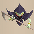 King Reaper</td>
      <td class="stats"> Polygon Stunna</td>
      <td> Electroid</td>
      <td> Tiger Chucker</td>
      <td rowspan="2" class=""></td>
    </tr>
    <tr>
      <td class="danger"> Porgon</td>
      <td> Fluffy Bunny</td>
      <td class="farming"> Chow</td>
      <td class="highlightGray"></td>
      <td class="highlightGray"></td>
    </tr>
    <tr>
      <td colspan="10" class="tableDivider"></td>
    </tr>
    <tr>
      <td rowspan="2" class="centeredText">76</td>
      <td rowspan="2" class=""></td>
      <td rowspan="2" class=""></td>
      <td rowspan="2" class=""></td>
      <td> Fulminachin</td>
      <td class="danger"> King Reaper</td>
      <td class="stats"> Polygon Stunna</td>
      <td> Electroid</td>
      <td> Tiger Chucker</td>
      <td rowspan="2" class=""></td>
    </tr>
    <tr>
      <td class="danger"> Porgon</td>
      <td> Fluffy Bunny</td>
      <td class="farming"> Chow</td>
      <td class="highlightGray"></td>
      <td class="highlightGray"></td>
    </tr>
    <tr>
      <td colspan="10" class="tableDivider"></td>
    </tr>
    <tr>
      <td rowspan="2" class="centeredText">77</td>
      <td rowspan="2" class=""></td>
      <td rowspan="2" class=""></td>
      <td rowspan="2" class=""></td>
      <td> Fulminachin</td>
      <td class="danger"> King Reaper</td>
      <td class="stats"> Polygon Stunna</td>
      <td> Electroid</td>
      <td> Tiger Chucker</td>
      <td rowspan="2" class=""></td>
    </tr>
    <tr>
      <td class="danger"> Porgon</td>
      <td> Fluffy Bunny</td>
      <td class="farming"> Chow</td>
      <td class="highlightGray"></td>
      <td class="highlightGray"></td>
    </tr>
    <tr>
      <td colspan="10" class="tableDivider"></td>
    </tr>
    <tr>
      <td rowspan="2" class="centeredText">78</td>
      <td rowspan="2" class=""></td>
      <td rowspan="2" class=""></td>
      <td rowspan="2" class=""></td>
      <td> Fulminachin</td>
      <td class="danger"> King Reaper</td>
      <td class="stats"> Polygon Stunna</td>
      <td> Electroid</td>
      <td> Tiger Chucker</td>
      <td rowspan="2" class=""></td>
    </tr>
    <tr>
      <td class="danger"> Porgon</td>
      <td> Fluffy Bunny</td>
      <td class="farming"> Chow</td>
      <td class="highlightGray"></td>
      <td class="highlightGray"></td>
    </tr>
    <tr>
      <td colspan="10" class="tableDivider"></td>
    </tr>
    <tr>
      <td rowspan="2" class="centeredText highlightFog">79</td>
      <td rowspan="2" class=""></td>
      <td rowspan="2" class=""></td>
      <td rowspan="2" class=""></td>
      <td> Fulminachin</td>
      <td class="danger"> King Reaper</td>
      <td class="stats"> Polygon Stunna</td>
      <td> Electroid</td>
      <td> Tiger Chucker</td>
      <td rowspan="2" class=""></td>
    </tr>
    <tr>
      <td class="danger"> Porgon</td>
      <td> Fluffy Bunny</td>
      <td class="farming"> Chow</td>
      <td> Dark Owl</td>
      <td class="highlightGray"></td>
    </tr>
    <tr>
      <td colspan="10" class="tableDivider"></td>
    </tr>
    <tr>
      <td rowspan="2" class="centeredText highlightFog">80</td>
      <td rowspan="2" class=""></td>
      <td rowspan="2" class=""></td>
      <td rowspan="2" class=""></td>
      <td> Fulminachin</td>
      <td class="danger"> King Reaper</td>
      <td class="stats"> Polygon Stunna</td>
      <td> Electroid</td>
      <td> Tiger Chucker</td>
      <td rowspan="2" class=""></td>
    </tr>
    <tr>
      <td class="danger"> Porgon</td>
      <td> Fluffy Bunny</td>
      <td> Crow Tengu</td>
      <td> Dark Owl</td>
      <td class="highlightGray"></td>
    </tr>
    <tr>
      <td colspan="10" class="tableDivider"></td>
    </tr>
    <tr>
      <td rowspan="2" class="centeredText highlightFog">81</td>
      <td rowspan="2" class=""></td>
      <td rowspan="2" class=""></td>
      <td rowspan="2" class=""></td>
      <td> Fulminachin</td>
      <td class="danger"> King Reaper</td>
      <td class="stats"> Polygon Stunna</td>
      <td> Electroid</td>
      <td> Tiger Chucker</td>
      <td rowspan="2" class=""></td>
    </tr>
    <tr>
      <td class="danger"> Porgon</td>
      <td> Fluffy Bunny</td>
      <td> Crow Tengu</td>
      <td> Dark Owl</td>
      <td class="highlightGray"></td>
    </tr>
    <tr>
      <td colspan="10" class="tableDivider"></td>
    </tr>
    <tr>
      <td rowspan="2" class="centeredText highlightFog">82</td>
      <td rowspan="2" class=""></td>
      <td rowspan="2" class=""></td>
      <td rowspan="2" class=""></td>
      <td> Fulminachin</td>
      <td class="danger"> King Reaper</td>
      <td class="stats"> Polygon Stunna</td>
      <td> Electroid</td>
      <td> Tiger Chucker</td>
      <td rowspan="2" class=""></td>
    </tr>
    <tr>
      <td class="danger"> Porgon</td>
      <td> Fluffy Bunny</td>
      <td> Crow Tengu</td>
      <td> Dark Owl</td>
      <td class="highlightGray"></td>
    </tr>
    <tr>
      <td colspan="10" class="tableDivider"></td>
    </tr>
    <tr>
      <td rowspan="2" class="centeredText">83</td>
      <td rowspan="2" class=""></td>
      <td rowspan="2" class=""></td>
      <td rowspan="2" class=""></td>
      <td> Fulminachin</td>
      <td class="danger"> King Reaper</td>
      <td class="stats"> Polygon Stunna</td>
      <td> Electroid</td>
      <td> Tiger Chucker</td>
      <td rowspan="2" class=""></td>
    </tr>
    <tr>
      <td class="danger"> Porgon</td>
      <td> Fluffy Bunny</td>
      <td> Crow Tengu</td>
      <td class="highlightGray"></td>
      <td class="highlightGray"></td>
    </tr>
    <tr>
      <td colspan="10" class="tableDivider"></td>
    </tr>
    <tr>
      <td rowspan="2" class="centeredText">84</td>
      <td rowspan="2" class=""></td>
      <td rowspan="2" class=""></td>
      <td rowspan="2" class=""></td>
      <td> Fulminachin</td>
      <td class="danger"> King Reaper</td>
      <td class="stats"> Polygon Stunna</td>
      <td> Electroid</td>
      <td> Tiger Chucker</td>
      <td rowspan="2" class=""></td>
    </tr>
    <tr>
      <td class="danger"> Porgon</td>
      <td> Fluffy Bunny</td>
      <td class="useful"> Mixergon</td>
      <td> Crow Tengu</td>
      <td class="highlightGray"></td>
    </tr>
    <tr>
      <td colspan="10" class="tableDivider"></td>
    </tr>
    <tr>
      <td rowspan="2" class="centeredText">85</td>
      <td rowspan="2" class=""></td>
      <td rowspan="2" class=""></td>
      <td rowspan="2" class=""></td>
      <td> Fulminachin</td>
      <td class="danger"> King Reaper</td>
      <td class="stats"> Polygon Stunna</td>
      <td> Electroid</td>
      <td> Tiger Chucker</td>
      <td rowspan="2" class=""></td>
    </tr>
    <tr>
      <td class="danger"> Porgon</td>
      <td> Fluffy Bunny</td>
      <td> Crow Tengu</td>
      <td class="highlightGray"></td>
      <td class="highlightGray"></td>
    </tr>
    <tr>
      <td colspan="10" class="tableDivider"></td>
    </tr>
    <tr>
      <td rowspan="2" class="centeredText">86</td>
      <td rowspan="2" class=""></td>
      <td rowspan="2" class=""></td>
      <td rowspan="2" class=""></td>
      <td> Fulminachin</td>
      <td class="danger"> King Reaper</td>
      <td class="stats"> Polygon Stunna</td>
      <td> Electroid</td>
      <td> Tiger Chucker</td>
      <td rowspan="2" class=""></td>
    </tr>
    <tr>
      <td class="danger"> Porgon</td>
      <td> Fluffy Bunny</td>
      <td> Crow Tengu</td>
      <td class="highlightGray"></td>
      <td class="highlightGray"></td>
    </tr>
    <tr>
      <td colspan="10" class="tableDivider"></td>
    </tr>
    <tr>
      <td rowspan="2" class="centeredText highlightFog">87</td>
      <td rowspan="2" class=""></td>
      <td rowspan="2" class=""></td>
      <td rowspan="2" class=""></td>
      <td> Fulminachin</td>
      <td class="danger"> King Reaper</td>
      <td class="stats"> Polygon Stunna</td>
      <td> Electroid</td>
      <td> Tiger Chucker</td>
      <td rowspan="2" class=""></td>
    </tr>
    <tr>
      <td class="danger"> Porgon</td>
      <td> Fluffy Bunny</td>
      <td> Crow Tengu</td>
      <td> Dark Owl</td>
      <td class="highlightGray"></td>
    </tr>
    <tr>
      <td colspan="10" class="tableDivider"></td>
    </tr>
    <tr>
      <td rowspan="2" class="centeredText highlightFog">88</td>
      <td rowspan="2" class=""></td>
      <td rowspan="2" class=""></td>
      <td rowspan="2" class=""></td>
      <td> Hiding Dragon</td>
      <td> Infernous</td>
      <td class="danger"> Miracle Hen</td>
      <td> Pyrepuff</td>
      <td class="items"> Hat Rascal</td>
      <td rowspan="2" class=""></td>
    </tr>
    <tr>
      <td> Huge Chintala</td>
      <td class="danger"> Archdragon</td>
      <td> Fluffy Bunny</td>
      <td> Crow Tengu</td>
      <td> Dark Owl</td>
    </tr>
    <tr>
      <td colspan="10" class="tableDivider"></td>
    </tr>
    <tr>
      <td rowspan="2" class="centeredText highlightFog">89</td>
      <td rowspan="2" class=""></td>
      <td rowspan="2" class=""></td>
      <td rowspan="2" class=""></td>
      <td> Hiding Dragon</td>
      <td> Infernous</td>
      <td class="danger"> Miracle Hen</td>
      <td> Pyrepuff</td>
      <td class="items"> Hat Rascal</td>
      <td rowspan="2" class=""></td>
    </tr>
    <tr>
      <td> Huge Chintala</td>
      <td class="danger"> Archdragon</td>
      <td> Fluffy Bunny</td>
      <td> Crow Tengu</td>
      <td> Dark Owl</td>
    </tr>
    <tr>
      <td colspan="10" class="tableDivider"></td>
    </tr>
    <tr>
      <td rowspan="2" class="centeredText highlightFog">90</td>
      <td rowspan="2" class=""></td>
      <td rowspan="2" class=""></td>
      <td rowspan="2" class=""></td>
      <td> Hiding Dragon</td>
      <td> Infernous</td>
      <td class="danger"> Miracle Hen</td>
      <td> Pyrepuff</td>
      <td class="items"> Hat Rascal</td>
      <td rowspan="2" class=""></td>
    </tr>
    <tr>
      <td> Huge Chintala</td>
      <td class="danger"> Archdragon</td>
      <td> Fluffy Bunny</td>
      <td> Crow Tengu</td>
      <td> Dark Owl</td>
    </tr>
    <tr>
      <td colspan="10" class="tableDivider"></td>
    </tr>
    <tr>
      <td rowspan="2" class="centeredText">91</td>
      <td rowspan="2" class=""></td>
      <td rowspan="2" class=""></td>
      <td rowspan="2" class=""></td>
      <td> Hiding Dragon</td>
      <td> Infernous</td>
      <td class="danger"> Miracle Hen</td>
      <td> Pyrepuff</td>
      <td class="items"> Hat Rascal</td>
      <td rowspan="2" class="highlightBehemoth"></td>
    </tr>
    <tr>
      <td> Huge Chintala</td>
      <td class="danger"> Archdragon</td>
      <td> Fluffy Bunny</td>
      <td> Crow Tengu</td>
      <td class="highlightGray"></td>
    </tr>
    <tr>
      <td colspan="10" class="tableDivider"></td>
    </tr>
    <tr>
      <td rowspan="2" class="centeredText">92</td>
      <td rowspan="2" class=""></td>
      <td rowspan="2" class=""></td>
      <td rowspan="2" class=""></td>
      <td> Hiding Dragon</td>
      <td> Infernous</td>
      <td class="danger"> Miracle Hen</td>
      <td> Pyrepuff</td>
      <td class="items"> Hat Rascal</td>
      <td rowspan="2" class="highlightBehemoth"></td>
    </tr>
    <tr>
      <td> Huge Chintala</td>
      <td class="danger"> Archdragon</td>
      <td> Fluffy Bunny</td>
      <td> Crow Tengu</td>
      <td class="highlightGray"></td>
    </tr>
    <tr>
      <td colspan="10" class="tableDivider"></td>
    </tr>
    <tr>
      <td rowspan="2" class="centeredText">93</td>
      <td rowspan="2" class=""></td>
      <td rowspan="2" class=""></td>
      <td rowspan="2" class=""></td>
      <td> Hiding Dragon</td>
      <td> Infernous</td>
      <td class="danger"> Miracle Hen</td>
      <td> Pyrepuff</td>
      <td class="items"> Hat Rascal</td>
      <td rowspan="2" class="highlightBehemoth"></td>
    </tr>
    <tr>
      <td> Huge Chintala</td>
      <td class="danger"> Archdragon</td>
      <td> Fluffy Bunny</td>
      <td> Crow Tengu</td>
      <td class="highlightGray"></td>
    </tr>
    <tr>
      <td colspan="10" class="tableDivider"></td>
    </tr>
    <tr>
      <td rowspan="2" class="centeredText">94</td>
      <td rowspan="2" class=""></td>
      <td rowspan="2" class=""></td>
      <td rowspan="2" class=""></td>
      <td> Hiding Dragon</td>
      <td> Infernous</td>
      <td class="danger"> Miracle Hen</td>
      <td> Pyrepuff</td>
      <td class="items"> Hat Rascal</td>
      <td rowspan="2" class="highlightBehemoth"></td>
    </tr>
    <tr>
      <td> Huge Chintala</td>
      <td class="danger"> Archdragon</td>
      <td> Fluffy Bunny</td>
      <td> Crow Tengu</td>
      <td class="highlightGray"></td>
    </tr>
    <tr>
      <td colspan="10" class="tableDivider"></td>
    </tr>
    <tr>
      <td rowspan="2" class="centeredText highlightFog">95</td>
      <td rowspan="2" class=""></td>
      <td rowspan="2" class=""></td>
      <td rowspan="2" class=""></td>
      <td> Hiding Dragon</td>
      <td> Infernous</td>
      <td class="danger"> Miracle Hen</td>
      <td> Pyrepuff</td>
      <td class="items"> Hat Rascal</td>
      <td rowspan="2" class="highlightBehemoth"></td>
    </tr>
    <tr>
      <td> Huge Chintala</td>
      <td class="danger"> Archdragon</td>
      <td> Fluffy Bunny</td>
      <td> Crow Tengu</td>
      <td> Dark Owl</td>
    </tr>
    <tr>
      <td colspan="10" class="tableDivider"></td>
    </tr>
    <tr>
      <td rowspan="3" class="centeredText highlightFog">96</td>
      <td rowspan="3" class=""></td>
      <td rowspan="3" class=""></td>
      <td rowspan="3" class=""></td>
      <td> Hiding Dragon</td>
      <td> Infernous</td>
      <td class="danger"> Miracle Hen</td>
      <td> Pyrepuff</td>
      <td class="items"> Hat Rascal</td>
      <td rowspan="3" class="highlightBehemoth"></td>
    </tr>
    <tr>
      <td> Huge Chintala</td>
      <td class="danger"> Archdragon</td>
      <td> Fluffy Bunny</td>
      <td class="useful"> Mixergon</td>
      <td class="useful">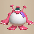 Mixerdon</td>
    </tr>
    <tr>
      <td> Crow Tengu</td>
      <td> Dark Owl</td>
      <td class="highlightGray"></td>
      <td class="highlightGray"></td>
      <td class="highlightGray"></td>
    </tr>
    <tr>
      <td colspan="10" class="tableDivider"></td>
    </tr>
    <tr>
      <td rowspan="2" class="centeredText highlightFog">97</td>
      <td rowspan="2" class=""></td>
      <td rowspan="2" class=""></td>
      <td rowspan="2" class=""></td>
      <td> Hiding Dragon</td>
      <td> Infernous</td>
      <td class="danger"> Miracle Hen</td>
      <td> Pyrepuff</td>
      <td class="items"> Hat Rascal</td>
      <td rowspan="2" class="highlightBehemoth"></td>
    </tr>
    <tr>
      <td> Huge Chintala</td>
      <td class="danger"> Archdragon</td>
      <td> Fluffy Bunny</td>
      <td> Crow Tengu</td>
      <td> Dark Owl</td>
    </tr>
    <tr>
      <td colspan="10" class="tableDivider"></td>
    </tr>
    <tr>
      <td rowspan="2" class="centeredText highlightFog">98</td>
      <td rowspan="2" class=""></td>
      <td rowspan="2" class=""></td>
      <td rowspan="2" class=""></td>
      <td> Hiding Dragon</td>
      <td> Infernous</td>
      <td class="danger"> Miracle Hen</td>
      <td> Pyrepuff</td>
      <td class="items"> Hat Rascal</td>
      <td rowspan="2" class="highlightBehemoth"></td>
    </tr>
    <tr>
      <td> Huge Chintala</td>
      <td class="danger"> Archdragon</td>
      <td> Fluffy Bunny</td>
      <td> Crow Tengu</td>
      <td> Dark Owl</td>
    </tr>
    <tr>
      <td colspan="10" class="tableDivider"></td>
    </tr>
    <tr>
      <td rowspan="2" class="centeredText highlightFog">99</td>
      <td rowspan="2" class=""></td>
      <td rowspan="2" class=""></td>
      <td rowspan="2" class=""></td>
      <td> Hiding Dragon</td>
      <td> Infernous</td>
      <td class="danger"> Miracle Hen</td>
      <td> Pyrepuff</td>
      <td class="items"> Hat Rascal</td>
      <td rowspan="2" class=""></td>
    </tr>
    <tr>
      <td> Huge Chintala</td>
      <td class="danger"> Archdragon</td>
      <td> Fluffy Bunny</td>
      <td> Crow Tengu</td>
      <td> Dark Owl</td>
    </tr>
  </tbody>
</table>

# Items

- F = Floor
- S = Shop
- P = Peddler
- M = Monster drop
- B = Buried
- H = Thiefwalrus
- I = Island
- T = Transmutation Pot
- U = Surprise Pot
- W = Tunnel of Wishes

#### Weapon

<table class="dungeonItemTable">
  <tr>
    <th colspan="11" class="highlightLightblue">Weapon</th>
  </tr>
  <tr>
    <th>Name</th>
    <th>F</th>
    <th>S</th>
    <th>P</th>
    <th>M</th>
    <th>B</th>
    <th>H</th>
    <th>I</th>
    <th>T</th>
    <th>U</th>
    <th>W</th>
  </tr>
  <tr>
    <td class="leftText">Wooden Sword</td>
    <td></td>
    <td></td>
    <td></td>
    <td></td>
    <td></td>
    <td></td>
    <td></td>
    <td></td>
    <td></td>
    <td></td>
  </tr>
  <tr>
    <td class="leftText">Bronze Sword</td>
    <td></td>
    <td></td>
    <td></td>
    <td></td>
    <td></td>
    <td></td>
    <td></td>
    <td></td>
    <td></td>
    <td></td>
  </tr>
  <tr>
    <td class="leftText">Katana</td>
    <td></td>
    <td></td>
    <td></td>
    <td></td>
    <td></td>
    <td></td>
    <td></td>
    <td></td>
    <td></td>
    <td></td>
  </tr>
  <tr>
    <td class="leftText">Doutanuki</td>
    <td></td>
    <td></td>
    <td></td>
    <td></td>
    <td></td>
    <td></td>
    <td></td>
    <td></td>
    <td></td>
    <td></td>
  </tr>
  <tr>
    <td class="leftText">Manji Kabura</td>
    <td></td>
    <td></td>
    <td></td>
    <td></td>
    <td></td>
    <td></td>
    <td></td>
    <td></td>
    <td></td>
    <td></td>
  </tr>
  <tr>
    <td class="leftText">Kajin Fuuma</td>
    <td></td>
    <td></td>
    <td></td>
    <td></td>
    <td></td>
    <td></td>
    <td></td>
    <td></td>
    <td></td>
    <td></td>
  </tr>
  <tr>
    <td class="leftText">Kabura Sutegi</td>
    <td></td>
    <td></td>
    <td></td>
    <td></td>
    <td></td>
    <td></td>
    <td></td>
    <td></td>
    <td></td>
    <td></td>
  </tr>
  <tr>
    <td class="leftText">Golden Sword</td>
    <td></td>
    <td></td>
    <td></td>
    <td></td>
    <td></td>
    <td></td>
    <td></td>
    <td></td>
    <td></td>
    <td></td>
  </tr>
  <tr>
    <td class="leftText">Kama Itachi</td>
    <td></td>
    <td></td>
    <td></td>
    <td></td>
    <td></td>
    <td></td>
    <td></td>
    <td></td>
    <td></td>
    <td></td>
  </tr>
  <tr>
    <td class="leftText">Axe of the Minotaur</td>
    <td></td>
    <td></td>
    <td></td>
    <td></td>
    <td></td>
    <td></td>
    <td></td>
    <td></td>
    <td></td>
    <td></td>
  </tr>
  <tr>
    <td class="leftText">Accurate Sword</td>
    <td></td>
    <td></td>
    <td></td>
    <td></td>
    <td></td>
    <td></td>
    <td></td>
    <td></td>
    <td></td>
    <td></td>
  </tr>
  <tr>
    <td class="leftText">Swift Sword</td>
    <td></td>
    <td></td>
    <td></td>
    <td></td>
    <td></td>
    <td></td>
    <td></td>
    <td></td>
    <td></td>
    <td></td>
  </tr>
  <tr>
    <td class="leftText">Watersplitter</td>
    <td></td>
    <td></td>
    <td></td>
    <td></td>
    <td></td>
    <td></td>
    <td></td>
    <td></td>
    <td></td>
    <td></td>
  </tr>
  <tr>
    <td class="leftText">Primal Axe</td>
    <td></td>
    <td></td>
    <td></td>
    <td></td>
    <td></td>
    <td></td>
    <td></td>
    <td></td>
    <td></td>
    <td></td>
  </tr>
  <tr>
    <td class="leftText">Dragonkiller</td>
    <td></td>
    <td></td>
    <td></td>
    <td></td>
    <td></td>
    <td></td>
    <td></td>
    <td></td>
    <td></td>
    <td></td>
  </tr>
  <tr>
    <td class="leftText">Crescent Blade</td>
    <td></td>
    <td></td>
    <td></td>
    <td></td>
    <td></td>
    <td></td>
    <td></td>
    <td></td>
    <td></td>
    <td></td>
  </tr>
  <tr>
    <td class="leftText">Sky Sword</td>
    <td></td>
    <td></td>
    <td></td>
    <td></td>
    <td></td>
    <td></td>
    <td></td>
    <td></td>
    <td></td>
    <td></td>
  </tr>
  <tr>
    <td class="leftText">Sickle of Salvation</td>
    <td></td>
    <td></td>
    <td></td>
    <td></td>
    <td></td>
    <td></td>
    <td></td>
    <td></td>
    <td></td>
    <td></td>
  </tr>
  <tr>
    <td class="leftText">Drain Slayer</td>
    <td></td>
    <td></td>
    <td></td>
    <td></td>
    <td></td>
    <td></td>
    <td></td>
    <td></td>
    <td></td>
    <td></td>
  </tr>
  <tr>
    <td class="leftText">Cyclops Bane</td>
    <td></td>
    <td></td>
    <td></td>
    <td></td>
    <td></td>
    <td></td>
    <td></td>
    <td></td>
    <td></td>
    <td></td>
  </tr>
  <tr>
    <td class="leftText">Steel Severer</td>
    <td></td>
    <td></td>
    <td></td>
    <td></td>
    <td></td>
    <td></td>
    <td></td>
    <td></td>
    <td></td>
    <td></td>
  </tr>
  <tr>
    <td class="leftText">Whopping Harisen</td>
    <td></td>
    <td></td>
    <td></td>
    <td></td>
    <td></td>
    <td></td>
    <td></td>
    <td></td>
    <td></td>
    <td></td>
  </tr>
  <tr>
    <td class="leftText">Healing Sword</td>
    <td></td>
    <td></td>
    <td></td>
    <td></td>
    <td></td>
    <td></td>
    <td></td>
    <td></td>
    <td></td>
    <td></td>
  </tr>
  <tr>
    <td class="leftText">Peach Club</td>
    <td></td>
    <td></td>
    <td></td>
    <td></td>
    <td></td>
    <td></td>
    <td></td>
    <td></td>
    <td></td>
    <td></td>
  </tr>
  <tr>
    <td class="leftText">Spender's Club</td>
    <td></td>
    <td></td>
    <td></td>
    <td></td>
    <td></td>
    <td></td>
    <td></td>
    <td></td>
    <td></td>
    <td></td>
  </tr>
  <tr>
    <td class="leftText">Ferrous Greatsword</td>
    <td></td>
    <td></td>
    <td></td>
    <td></td>
    <td></td>
    <td></td>
    <td></td>
    <td></td>
    <td></td>
    <td></td>
  </tr>
  <tr>
    <td class="leftText">Steak Knife</td>
    <td></td>
    <td></td>
    <td></td>
    <td></td>
    <td></td>
    <td></td>
    <td></td>
    <td></td>
    <td></td>
    <td></td>
  </tr>
  <tr>
    <td class="leftText">Jagged Sword</td>
    <td></td>
    <td></td>
    <td></td>
    <td></td>
    <td></td>
    <td></td>
    <td></td>
    <td></td>
    <td></td>
    <td></td>
  </tr>
  <tr>
    <td class="leftText">Quad-edge</td>
    <td></td>
    <td></td>
    <td></td>
    <td></td>
    <td></td>
    <td></td>
    <td></td>
    <td></td>
    <td></td>
    <td></td>
  </tr>
  <tr>
    <td class="leftText">Auspicious Kumade</td>
    <td></td>
    <td></td>
    <td></td>
    <td></td>
    <td></td>
    <td></td>
    <td></td>
    <td></td>
    <td></td>
    <td></td>
  </tr>
  <tr>
    <td class="leftText">Pickaxe</td>
    <td></td>
    <td></td>
    <td></td>
    <td></td>
    <td></td>
    <td></td>
    <td></td>
    <td></td>
    <td></td>
    <td></td>
  </tr>
  <tr>
    <td class="leftText">Golden Pickaxe</td>
    <td></td>
    <td></td>
    <td></td>
    <td></td>
    <td></td>
    <td></td>
    <td></td>
    <td></td>
    <td></td>
    <td></td>
  </tr>
  <tr>
    <td class="leftText">Wooden Mallet</td>
    <td></td>
    <td></td>
    <td></td>
    <td></td>
    <td></td>
    <td></td>
    <td></td>
    <td></td>
    <td></td>
    <td></td>
  </tr>
  <tr>
    <td class="leftText">Epic Hammer</td>
    <td></td>
    <td></td>
    <td></td>
    <td></td>
    <td></td>
    <td></td>
    <td></td>
    <td></td>
    <td></td>
    <td></td>
  </tr>
  <tr>
    <td class="leftText">Trapseeker</td>
    <td></td>
    <td></td>
    <td></td>
    <td></td>
    <td></td>
    <td></td>
    <td></td>
    <td></td>
    <td></td>
    <td></td>
  </tr>
  <tr>
    <td class="leftText">Bonito Block</td>
    <td></td>
    <td></td>
    <td></td>
    <td></td>
    <td></td>
    <td></td>
    <td></td>
    <td></td>
    <td></td>
    <td></td>
  </tr>
  <tr>
    <td class="leftText">Yamanba's Cleaver</td>
    <td></td>
    <td></td>
    <td></td>
    <td></td>
    <td></td>
    <td></td>
    <td></td>
    <td></td>
    <td></td>
    <td></td>
  </tr>
  <tr>
    <td class="leftText">Break-Off Blade</td>
    <td></td>
    <td></td>
    <td></td>
    <td></td>
    <td></td>
    <td></td>
    <td></td>
    <td></td>
    <td></td>
    <td></td>
  </tr>
</table>

#### Shield

<table class="dungeonItemTable">
  <tr>
    <th colspan="11" class="highlightLightblue">Shield</th>
  </tr>
  <tr>
    <th>Name</th>
    <th>F</th>
    <th>S</th>
    <th>P</th>
    <th>M</th>
    <th>B</th>
    <th>H</th>
    <th>I</th>
    <th>T</th>
    <th>U</th>
    <th>W</th>
  </tr>
  <tr>
    <td class="leftText">Wooden Shield</td>
    <td></td>
    <td></td>
    <td></td>
    <td></td>
    <td></td>
    <td></td>
    <td></td>
    <td></td>
    <td></td>
    <td></td>
  </tr>
  <tr>
    <td class="leftText">Bronze Shield</td>
    <td></td>
    <td></td>
    <td></td>
    <td></td>
    <td></td>
    <td></td>
    <td></td>
    <td></td>
    <td></td>
    <td></td>
  </tr>
  <tr>
    <td class="leftText">Iron Shield</td>
    <td></td>
    <td></td>
    <td></td>
    <td></td>
    <td></td>
    <td></td>
    <td></td>
    <td></td>
    <td></td>
    <td></td>
  </tr>
  <tr>
    <td class="leftText">Wolfshead</td>
    <td></td>
    <td></td>
    <td></td>
    <td></td>
    <td></td>
    <td></td>
    <td></td>
    <td></td>
    <td></td>
    <td></td>
  </tr>
  <tr>
    <td class="leftText">Fuuma Shield</td>
    <td></td>
    <td></td>
    <td></td>
    <td></td>
    <td></td>
    <td></td>
    <td></td>
    <td></td>
    <td></td>
    <td></td>
  </tr>
  <tr>
    <td class="leftText">Rasen Fuuma</td>
    <td></td>
    <td></td>
    <td></td>
    <td></td>
    <td></td>
    <td></td>
    <td></td>
    <td></td>
    <td></td>
    <td></td>
  </tr>
  <tr>
    <td class="leftText">Golden Shield</td>
    <td></td>
    <td></td>
    <td></td>
    <td></td>
    <td></td>
    <td></td>
    <td></td>
    <td></td>
    <td></td>
    <td></td>
  </tr>
  <tr>
    <td class="leftText">Counter Shield</td>
    <td></td>
    <td></td>
    <td></td>
    <td></td>
    <td></td>
    <td></td>
    <td></td>
    <td></td>
    <td></td>
    <td></td>
  </tr>
  <tr>
    <td class="leftText">Watchful Shield</td>
    <td></td>
    <td></td>
    <td></td>
    <td></td>
    <td></td>
    <td></td>
    <td></td>
    <td></td>
    <td></td>
    <td></td>
  </tr>
  <tr>
    <td class="leftText">Dragon Shield</td>
    <td></td>
    <td></td>
    <td></td>
    <td></td>
    <td></td>
    <td></td>
    <td></td>
    <td></td>
    <td></td>
    <td></td>
  </tr>
  <tr>
    <td class="leftText">Blast Shield</td>
    <td></td>
    <td></td>
    <td></td>
    <td></td>
    <td></td>
    <td></td>
    <td></td>
    <td></td>
    <td></td>
    <td></td>
  </tr>
  <tr>
    <td class="leftText">Targe of the Minotaur</td>
    <td></td>
    <td></td>
    <td></td>
    <td></td>
    <td></td>
    <td></td>
    <td></td>
    <td></td>
    <td></td>
    <td></td>
  </tr>
  <tr>
    <td class="leftText">Walrus Stopper</td>
    <td></td>
    <td></td>
    <td></td>
    <td></td>
    <td></td>
    <td></td>
    <td></td>
    <td></td>
    <td></td>
    <td></td>
  </tr>
  <tr>
    <td class="leftText">Froggo Stopper</td>
    <td></td>
    <td></td>
    <td></td>
    <td></td>
    <td></td>
    <td></td>
    <td></td>
    <td></td>
    <td></td>
    <td></td>
  </tr>
  <tr>
    <td class="leftText">Hat Stopper</td>
    <td></td>
    <td></td>
    <td></td>
    <td></td>
    <td></td>
    <td></td>
    <td></td>
    <td></td>
    <td></td>
    <td></td>
  </tr>
  <tr>
    <td class="leftText">Nigiri Stopper</td>
    <td></td>
    <td></td>
    <td></td>
    <td></td>
    <td></td>
    <td></td>
    <td></td>
    <td></td>
    <td></td>
    <td></td>
  </tr>
  <tr>
    <td class="leftText">Spearscale Shield</td>
    <td></td>
    <td></td>
    <td></td>
    <td></td>
    <td></td>
    <td></td>
    <td></td>
    <td></td>
    <td></td>
    <td></td>
  </tr>
  <tr>
    <td class="leftText">Kappa's Dish</td>
    <td></td>
    <td></td>
    <td></td>
    <td></td>
    <td></td>
    <td></td>
    <td></td>
    <td></td>
    <td></td>
    <td></td>
  </tr>
  <tr>
    <td class="leftText">Gazer Shield</td>
    <td></td>
    <td></td>
    <td></td>
    <td></td>
    <td></td>
    <td></td>
    <td></td>
    <td></td>
    <td></td>
    <td></td>
  </tr>
  <tr>
    <td class="leftText">Shield of Negation</td>
    <td></td>
    <td></td>
    <td></td>
    <td></td>
    <td></td>
    <td></td>
    <td></td>
    <td></td>
    <td></td>
    <td></td>
  </tr>
  <tr>
    <td class="leftText">Unmoving Wall</td>
    <td></td>
    <td></td>
    <td></td>
    <td></td>
    <td></td>
    <td></td>
    <td></td>
    <td></td>
    <td></td>
    <td></td>
  </tr>
  <tr>
    <td class="leftText">Zabuton</td>
    <td></td>
    <td></td>
    <td></td>
    <td></td>
    <td></td>
    <td></td>
    <td></td>
    <td></td>
    <td></td>
    <td></td>
  </tr>
  <tr>
    <td class="leftText">Spender's Shield</td>
    <td></td>
    <td></td>
    <td></td>
    <td></td>
    <td></td>
    <td></td>
    <td></td>
    <td></td>
    <td></td>
    <td></td>
  </tr>
  <tr>
    <td class="leftText">Ferrous Kite</td>
    <td></td>
    <td></td>
    <td></td>
    <td></td>
    <td></td>
    <td></td>
    <td></td>
    <td></td>
    <td></td>
    <td></td>
  </tr>
  <tr>
    <td class="leftText">Steak Plate</td>
    <td></td>
    <td></td>
    <td></td>
    <td></td>
    <td></td>
    <td></td>
    <td></td>
    <td></td>
    <td></td>
    <td></td>
  </tr>
  <tr>
    <td class="leftText">Gutsy Shield</td>
    <td></td>
    <td></td>
    <td></td>
    <td></td>
    <td></td>
    <td></td>
    <td></td>
    <td></td>
    <td></td>
    <td></td>
  </tr>
  <tr>
    <td class="leftText">Hunky-dory Shield</td>
    <td></td>
    <td></td>
    <td></td>
    <td></td>
    <td></td>
    <td></td>
    <td></td>
    <td></td>
    <td></td>
    <td></td>
  </tr>
  <tr>
    <td class="leftText">Bodhi Shield</td>
    <td></td>
    <td></td>
    <td></td>
    <td></td>
    <td></td>
    <td></td>
    <td></td>
    <td></td>
    <td></td>
    <td></td>
  </tr>
  <tr>
    <td class="leftText">Shield of Sating</td>
    <td></td>
    <td></td>
    <td></td>
    <td></td>
    <td></td>
    <td></td>
    <td></td>
    <td></td>
    <td></td>
    <td></td>
  </tr>
  <tr>
    <td class="leftText">Auspicious Omamori</td>
    <td></td>
    <td></td>
    <td></td>
    <td></td>
    <td></td>
    <td></td>
    <td></td>
    <td></td>
    <td></td>
    <td></td>
  </tr>
  <tr>
    <td class="leftText">Shield of Presage</td>
    <td></td>
    <td></td>
    <td></td>
    <td></td>
    <td></td>
    <td></td>
    <td></td>
    <td></td>
    <td></td>
    <td></td>
  </tr>
  <tr>
    <td class="leftText">Yamanba's Potlid</td>
    <td></td>
    <td></td>
    <td></td>
    <td></td>
    <td></td>
    <td></td>
    <td></td>
    <td></td>
    <td></td>
    <td></td>
  </tr>
  <tr>
    <td class="leftText">Break-Off Shield</td>
    <td></td>
    <td></td>
    <td></td>
    <td></td>
    <td></td>
    <td></td>
    <td></td>
    <td></td>
    <td></td>
    <td></td>
  </tr>
</table>

#### Bracelet

<table class="dungeonItemTable">
  <tr>
    <th colspan="11" class="highlightLightblue">Bracelet</th>
  </tr>
  <tr>
    <th>Name</th>
    <th>F</th>
    <th>S</th>
    <th>P</th>
    <th>M</th>
    <th>B</th>
    <th>H</th>
    <th>I</th>
    <th>T</th>
    <th>U</th>
    <th>W</th>
  </tr>
  <tr>
    <td class="leftText">Healing Bracelet</td>
    <td></td>
    <td></td>
    <td></td>
    <td></td>
    <td></td>
    <td></td>
    <td></td>
    <td></td>
    <td></td>
    <td></td>
  </tr>
  <tr>
    <td class="leftText">Strength Bracelet</td>
    <td></td>
    <td></td>
    <td></td>
    <td></td>
    <td></td>
    <td></td>
    <td></td>
    <td></td>
    <td></td>
    <td></td>
  </tr>
  <tr>
    <td class="leftText">Bellyexpand Bracelet</td>
    <td></td>
    <td></td>
    <td></td>
    <td></td>
    <td></td>
    <td></td>
    <td></td>
    <td></td>
    <td></td>
    <td></td>
  </tr>
  <tr>
    <td class="leftText">Bellyshrink Bracelet</td>
    <td></td>
    <td></td>
    <td></td>
    <td></td>
    <td></td>
    <td></td>
    <td></td>
    <td></td>
    <td></td>
    <td></td>
  </tr>
  <tr>
    <td class="leftText">Fortune Bracelet</td>
    <td></td>
    <td></td>
    <td></td>
    <td></td>
    <td></td>
    <td></td>
    <td></td>
    <td></td>
    <td></td>
    <td></td>
  </tr>
  <tr>
    <td class="leftText">Cleansing Bracelet</td>
    <td></td>
    <td></td>
    <td></td>
    <td></td>
    <td></td>
    <td></td>
    <td></td>
    <td></td>
    <td></td>
    <td></td>
  </tr>
  <tr>
    <td class="leftText">Focusing Bracelet</td>
    <td></td>
    <td></td>
    <td></td>
    <td></td>
    <td></td>
    <td></td>
    <td></td>
    <td></td>
    <td></td>
    <td></td>
  </tr>
  <tr>
    <td class="leftText">Rousing Bracelet</td>
    <td></td>
    <td></td>
    <td></td>
    <td></td>
    <td></td>
    <td></td>
    <td></td>
    <td></td>
    <td></td>
    <td></td>
  </tr>
  <tr>
    <td class="leftText">Rustproof Bracelet</td>
    <td></td>
    <td></td>
    <td></td>
    <td></td>
    <td></td>
    <td></td>
    <td></td>
    <td></td>
    <td></td>
    <td></td>
  </tr>
  <tr>
    <td class="leftText">Cursebreak Bracelet</td>
    <td></td>
    <td></td>
    <td></td>
    <td></td>
    <td></td>
    <td></td>
    <td></td>
    <td></td>
    <td></td>
    <td></td>
  </tr>
  <tr>
    <td class="leftText">Affixing Bracelet</td>
    <td></td>
    <td></td>
    <td></td>
    <td></td>
    <td></td>
    <td></td>
    <td></td>
    <td></td>
    <td></td>
    <td></td>
  </tr>
  <tr>
    <td class="leftText">Far-throwing Bracelet</td>
    <td></td>
    <td></td>
    <td></td>
    <td></td>
    <td></td>
    <td></td>
    <td></td>
    <td></td>
    <td></td>
    <td></td>
  </tr>
  <tr>
    <td class="leftText">Bad-aim Bracelet</td>
    <td></td>
    <td></td>
    <td></td>
    <td></td>
    <td></td>
    <td></td>
    <td></td>
    <td></td>
    <td></td>
    <td></td>
  </tr>
  <tr>
    <td class="leftText">Sure-aim Bracelet</td>
    <td></td>
    <td></td>
    <td></td>
    <td></td>
    <td></td>
    <td></td>
    <td></td>
    <td></td>
    <td></td>
    <td></td>
  </tr>
  <tr>
    <td class="leftText">Bouncy Bracelet</td>
    <td></td>
    <td></td>
    <td></td>
    <td></td>
    <td></td>
    <td></td>
    <td></td>
    <td></td>
    <td></td>
    <td></td>
  </tr>
  <tr>
    <td class="leftText">Rapid-fire Bracelet</td>
    <td></td>
    <td></td>
    <td></td>
    <td></td>
    <td></td>
    <td></td>
    <td></td>
    <td></td>
    <td></td>
    <td></td>
  </tr>
  <tr>
    <td class="leftText">Daredevil Bracelet</td>
    <td></td>
    <td></td>
    <td></td>
    <td></td>
    <td></td>
    <td></td>
    <td></td>
    <td></td>
    <td></td>
    <td></td>
  </tr>
  <tr>
    <td class="leftText">Dreaded Bracelet</td>
    <td></td>
    <td></td>
    <td></td>
    <td></td>
    <td></td>
    <td></td>
    <td></td>
    <td></td>
    <td></td>
    <td></td>
  </tr>
  <tr>
    <td class="leftText">Leaping Bracelet</td>
    <td></td>
    <td></td>
    <td></td>
    <td></td>
    <td></td>
    <td></td>
    <td></td>
    <td></td>
    <td></td>
    <td></td>
  </tr>
  <tr>
    <td class="leftText">Blasting Bracelet</td>
    <td></td>
    <td></td>
    <td></td>
    <td></td>
    <td></td>
    <td></td>
    <td></td>
    <td></td>
    <td></td>
    <td></td>
  </tr>
  <tr>
    <td class="leftText">Clairvoyant Bracelet</td>
    <td></td>
    <td></td>
    <td></td>
    <td></td>
    <td></td>
    <td></td>
    <td></td>
    <td></td>
    <td></td>
    <td></td>
  </tr>
  <tr>
    <td class="leftText">Monster-find Bracelet</td>
    <td></td>
    <td></td>
    <td></td>
    <td></td>
    <td></td>
    <td></td>
    <td></td>
    <td></td>
    <td></td>
    <td></td>
  </tr>
  <tr>
    <td class="leftText">Item-find Bracelet</td>
    <td></td>
    <td></td>
    <td></td>
    <td></td>
    <td></td>
    <td></td>
    <td></td>
    <td></td>
    <td></td>
    <td></td>
  </tr>
  <tr>
    <td class="leftText">Passage-find Bracelet</td>
    <td></td>
    <td></td>
    <td></td>
    <td></td>
    <td></td>
    <td></td>
    <td></td>
    <td></td>
    <td></td>
    <td></td>
  </tr>
  <tr>
    <td class="leftText">Waterwalk Bracelet</td>
    <td></td>
    <td></td>
    <td></td>
    <td></td>
    <td></td>
    <td></td>
    <td></td>
    <td></td>
    <td></td>
    <td></td>
  </tr>
  <tr>
    <td class="leftText">Floating Bracelet</td>
    <td></td>
    <td></td>
    <td></td>
    <td></td>
    <td></td>
    <td></td>
    <td></td>
    <td></td>
    <td></td>
    <td></td>
  </tr>
  <tr>
    <td class="leftText">Wallpass Bracelet</td>
    <td></td>
    <td></td>
    <td></td>
    <td></td>
    <td></td>
    <td></td>
    <td></td>
    <td></td>
    <td></td>
    <td></td>
  </tr>
  <tr>
    <td class="leftText">Tiptoe Bracelet</td>
    <td></td>
    <td></td>
    <td></td>
    <td></td>
    <td></td>
    <td></td>
    <td></td>
    <td></td>
    <td></td>
    <td></td>
  </tr>
  <tr>
    <td class="leftText">Passerby Bracelet</td>
    <td></td>
    <td></td>
    <td></td>
    <td></td>
    <td></td>
    <td></td>
    <td></td>
    <td></td>
    <td></td>
    <td></td>
  </tr>
  <tr>
    <td class="leftText">Item-losing Bracelet</td>
    <td></td>
    <td></td>
    <td></td>
    <td></td>
    <td></td>
    <td></td>
    <td></td>
    <td></td>
    <td></td>
    <td></td>
  </tr>
  <tr>
    <td class="leftText">Gitan-losing Bracelet</td>
    <td></td>
    <td></td>
    <td></td>
    <td></td>
    <td></td>
    <td></td>
    <td></td>
    <td></td>
    <td></td>
    <td></td>
  </tr>
  <tr>
    <td class="leftText">Monstercall Bracelet</td>
    <td></td>
    <td></td>
    <td></td>
    <td></td>
    <td></td>
    <td></td>
    <td></td>
    <td></td>
    <td></td>
    <td></td>
  </tr>
  <tr>
    <td class="leftText">Trapmore Bracelet</td>
    <td></td>
    <td></td>
    <td></td>
    <td></td>
    <td></td>
    <td></td>
    <td></td>
    <td></td>
    <td></td>
    <td></td>
  </tr>
  <tr>
    <td class="leftText">Haggling Bracelet</td>
    <td></td>
    <td></td>
    <td></td>
    <td></td>
    <td></td>
    <td></td>
    <td></td>
    <td></td>
    <td></td>
    <td></td>
  </tr>
  <tr>
    <td class="leftText">Trapper's Bracelet</td>
    <td></td>
    <td></td>
    <td></td>
    <td></td>
    <td></td>
    <td></td>
    <td></td>
    <td></td>
    <td></td>
    <td></td>
  </tr>
  <tr>
    <td class="leftText">Appraiser's Bracelet</td>
    <td></td>
    <td></td>
    <td></td>
    <td></td>
    <td></td>
    <td></td>
    <td></td>
    <td></td>
    <td></td>
    <td></td>
  </tr>
  <tr>
    <td class="leftText">Cannonboost Bracelet</td>
    <td></td>
    <td></td>
    <td></td>
    <td></td>
    <td></td>
    <td></td>
    <td></td>
    <td></td>
    <td></td>
    <td></td>
  </tr>
</table>

#### Projectile

<table class="dungeonItemTable">
  <tr>
    <th colspan="11" class="highlightLightblue">Projectile</th>
  </tr>
  <tr>
    <th>Name</th>
    <th>F</th>
    <th>S</th>
    <th>P</th>
    <th>M</th>
    <th>B</th>
    <th>H</th>
    <th>I</th>
    <th>T</th>
    <th>U</th>
    <th>W</th>
  </tr>
  <tr>
    <td class="leftText">Wooden Arrow</td>
    <td></td>
    <td></td>
    <td></td>
    <td></td>
    <td></td>
    <td></td>
    <td></td>
    <td></td>
    <td></td>
    <td></td>
  </tr>
  <tr>
    <td class="leftText">Iron Arrow</td>
    <td></td>
    <td></td>
    <td></td>
    <td></td>
    <td></td>
    <td></td>
    <td></td>
    <td></td>
    <td></td>
    <td></td>
  </tr>
  <tr>
    <td class="leftText">Silver Arrow</td>
    <td></td>
    <td></td>
    <td></td>
    <td></td>
    <td></td>
    <td></td>
    <td></td>
    <td></td>
    <td></td>
    <td></td>
  </tr>
  <tr>
    <td class="leftText">Poison Arrow</td>
    <td></td>
    <td></td>
    <td></td>
    <td></td>
    <td></td>
    <td></td>
    <td></td>
    <td></td>
    <td></td>
    <td></td>
  </tr>
  <tr>
    <td class="leftText">Truestrike Arrow</td>
    <td></td>
    <td></td>
    <td></td>
    <td></td>
    <td></td>
    <td></td>
    <td></td>
    <td></td>
    <td></td>
    <td></td>
  </tr>
  <tr>
    <td class="leftText">Rock</td>
    <td></td>
    <td></td>
    <td></td>
    <td></td>
    <td></td>
    <td></td>
    <td></td>
    <td></td>
    <td></td>
    <td></td>
  </tr>
  <tr>
    <td class="leftText">Porky's Rock</td>
    <td></td>
    <td></td>
    <td></td>
    <td></td>
    <td></td>
    <td></td>
    <td></td>
    <td></td>
    <td></td>
    <td></td>
  </tr>
</table>

#### Food

<table class="dungeonItemTable">
  <tr>
    <th colspan="11" class="highlightLightblue">Food</th>
  </tr>
  <tr>
    <th>Name</th>
    <th>F</th>
    <th>S</th>
    <th>P</th>
    <th>M</th>
    <th>B</th>
    <th>H</th>
    <th>I</th>
    <th>T</th>
    <th>U</th>
    <th>W</th>
  </tr>
  <tr>
    <td class="leftText">Onigiri</td>
    <td></td>
    <td></td>
    <td></td>
    <td></td>
    <td></td>
    <td></td>
    <td></td>
    <td></td>
    <td></td>
    <td></td>
  </tr>
  <tr>
    <td class="leftText">Large Onigiri</td>
    <td></td>
    <td></td>
    <td></td>
    <td></td>
    <td></td>
    <td></td>
    <td></td>
    <td></td>
    <td></td>
    <td></td>
  </tr>
  <tr>
    <td class="leftText">Huge Onigiri</td>
    <td></td>
    <td></td>
    <td></td>
    <td></td>
    <td></td>
    <td></td>
    <td></td>
    <td></td>
    <td></td>
    <td></td>
  </tr>
  <tr>
    <td class="leftText">Rotten Onigiri</td>
    <td></td>
    <td></td>
    <td></td>
    <td></td>
    <td></td>
    <td></td>
    <td></td>
    <td></td>
    <td></td>
    <td></td>
  </tr>
  <tr>
    <td class="leftText">Grilled Onigiri</td>
    <td></td>
    <td></td>
    <td></td>
    <td></td>
    <td></td>
    <td></td>
    <td></td>
    <td></td>
    <td></td>
    <td></td>
  </tr>
  <tr>
    <td class="leftText">Special Onigiri</td>
    <td></td>
    <td></td>
    <td></td>
    <td></td>
    <td></td>
    <td></td>
    <td></td>
    <td></td>
    <td></td>
    <td></td>
  </tr>
  <tr>
    <td class="leftText">Sumo Onigiri</td>
    <td></td>
    <td></td>
    <td></td>
    <td></td>
    <td></td>
    <td></td>
    <td></td>
    <td></td>
    <td></td>
    <td></td>
  </tr>
  <tr>
    <td class="leftText">Sweet Potato</td>
    <td></td>
    <td></td>
    <td></td>
    <td></td>
    <td></td>
    <td></td>
    <td></td>
    <td></td>
    <td></td>
    <td></td>
  </tr>
  <tr>
    <td class="leftText">Yakitori</td>
    <td></td>
    <td></td>
    <td></td>
    <td></td>
    <td></td>
    <td></td>
    <td></td>
    <td></td>
    <td></td>
    <td></td>
  </tr>
  <tr>
    <td class="leftText">Rotten Peach Bun</td>
    <td></td>
    <td></td>
    <td></td>
    <td></td>
    <td></td>
    <td></td>
    <td></td>
    <td></td>
    <td></td>
    <td></td>
  </tr>
</table>

#### Grass

<table class="dungeonItemTable">
  <tr>
    <th colspan="11" class="highlightLightblue">Grass</th>
  </tr>
  <tr>
    <th>Name</th>
    <th>F</th>
    <th>S</th>
    <th>P</th>
    <th>M</th>
    <th>B</th>
    <th>H</th>
    <th>I</th>
    <th>T</th>
    <th>U</th>
    <th>W</th>
  </tr>
  <tr>
    <td class="leftText">Weeds</td>
    <td></td>
    <td></td>
    <td></td>
    <td></td>
    <td></td>
    <td></td>
    <td></td>
    <td></td>
    <td></td>
    <td></td>
  </tr>
  <tr>
    <td class="leftText">Herb</td>
    <td></td>
    <td></td>
    <td></td>
    <td></td>
    <td></td>
    <td></td>
    <td></td>
    <td></td>
    <td></td>
    <td></td>
  </tr>
  <tr>
    <td class="leftText">Otogirisou</td>
    <td></td>
    <td></td>
    <td></td>
    <td></td>
    <td></td>
    <td></td>
    <td></td>
    <td></td>
    <td></td>
    <td></td>
  </tr>
  <tr>
    <td class="leftText">Healing Grass</td>
    <td></td>
    <td></td>
    <td></td>
    <td></td>
    <td></td>
    <td></td>
    <td></td>
    <td></td>
    <td></td>
    <td></td>
  </tr>
  <tr>
    <td class="leftText">Life Grass</td>
    <td></td>
    <td></td>
    <td></td>
    <td></td>
    <td></td>
    <td></td>
    <td></td>
    <td></td>
    <td></td>
    <td></td>
  </tr>
  <tr>
    <td class="leftText">Fragrant Grass</td>
    <td></td>
    <td></td>
    <td></td>
    <td></td>
    <td></td>
    <td></td>
    <td></td>
    <td></td>
    <td></td>
    <td></td>
  </tr>
  <tr>
    <td class="leftText">Revival Grass</td>
    <td></td>
    <td></td>
    <td></td>
    <td></td>
    <td></td>
    <td></td>
    <td></td>
    <td></td>
    <td></td>
    <td></td>
  </tr>
  <tr>
    <td class="leftText">Bellyexpand Seed</td>
    <td></td>
    <td></td>
    <td></td>
    <td></td>
    <td></td>
    <td></td>
    <td></td>
    <td></td>
    <td></td>
    <td></td>
  </tr>
  <tr>
    <td class="leftText">Bellyshrink Seed</td>
    <td></td>
    <td></td>
    <td></td>
    <td></td>
    <td></td>
    <td></td>
    <td></td>
    <td></td>
    <td></td>
    <td></td>
  </tr>
  <tr>
    <td class="leftText">Dragon Grass</td>
    <td></td>
    <td></td>
    <td></td>
    <td></td>
    <td></td>
    <td></td>
    <td></td>
    <td></td>
    <td></td>
    <td></td>
  </tr>
  <tr>
    <td class="leftText">Leaping Grass</td>
    <td></td>
    <td></td>
    <td></td>
    <td></td>
    <td></td>
    <td></td>
    <td></td>
    <td></td>
    <td></td>
    <td></td>
  </tr>
  <tr>
    <td class="leftText">Antidote Grass</td>
    <td></td>
    <td></td>
    <td></td>
    <td></td>
    <td></td>
    <td></td>
    <td></td>
    <td></td>
    <td></td>
    <td></td>
  </tr>
  <tr>
    <td class="leftText">Strength Grass</td>
    <td></td>
    <td></td>
    <td></td>
    <td></td>
    <td></td>
    <td></td>
    <td></td>
    <td></td>
    <td></td>
    <td></td>
  </tr>
  <tr>
    <td class="leftText">Poison Grass</td>
    <td></td>
    <td></td>
    <td></td>
    <td></td>
    <td></td>
    <td></td>
    <td></td>
    <td></td>
    <td></td>
    <td></td>
  </tr>
  <tr>
    <td class="leftText">Confusion Grass</td>
    <td></td>
    <td></td>
    <td></td>
    <td></td>
    <td></td>
    <td></td>
    <td></td>
    <td></td>
    <td></td>
    <td></td>
  </tr>
  <tr>
    <td class="leftText">Sedating Grass</td>
    <td></td>
    <td></td>
    <td></td>
    <td></td>
    <td></td>
    <td></td>
    <td></td>
    <td></td>
    <td></td>
    <td></td>
  </tr>
  <tr>
    <td class="leftText">Berserk Seed</td>
    <td></td>
    <td></td>
    <td></td>
    <td></td>
    <td></td>
    <td></td>
    <td></td>
    <td></td>
    <td></td>
    <td></td>
  </tr>
  <tr>
    <td class="leftText">Blinding Grass</td>
    <td></td>
    <td></td>
    <td></td>
    <td></td>
    <td></td>
    <td></td>
    <td></td>
    <td></td>
    <td></td>
    <td></td>
  </tr>
  <tr>
    <td class="leftText">Seewell Grass</td>
    <td></td>
    <td></td>
    <td></td>
    <td></td>
    <td></td>
    <td></td>
    <td></td>
    <td></td>
    <td></td>
    <td></td>
  </tr>
  <tr>
    <td class="leftText">Swift Grass</td>
    <td></td>
    <td></td>
    <td></td>
    <td></td>
    <td></td>
    <td></td>
    <td></td>
    <td></td>
    <td></td>
    <td></td>
  </tr>
  <tr>
    <td class="leftText">Power-up Grass</td>
    <td></td>
    <td></td>
    <td></td>
    <td></td>
    <td></td>
    <td></td>
    <td></td>
    <td></td>
    <td></td>
    <td></td>
  </tr>
  <tr>
    <td class="leftText">Invincible Grass</td>
    <td></td>
    <td></td>
    <td></td>
    <td></td>
    <td></td>
    <td></td>
    <td></td>
    <td></td>
    <td></td>
    <td></td>
  </tr>
  <tr>
    <td class="leftText">Fortune Grass</td>
    <td></td>
    <td></td>
    <td></td>
    <td></td>
    <td></td>
    <td></td>
    <td></td>
    <td></td>
    <td></td>
    <td></td>
  </tr>
  <tr>
    <td class="leftText">Angel Seed</td>
    <td></td>
    <td></td>
    <td></td>
    <td></td>
    <td></td>
    <td></td>
    <td></td>
    <td></td>
    <td></td>
    <td></td>
  </tr>
  <tr>
    <td class="leftText">Feeble Grass</td>
    <td></td>
    <td></td>
    <td></td>
    <td></td>
    <td></td>
    <td></td>
    <td></td>
    <td></td>
    <td></td>
    <td></td>
  </tr>
  <tr>
    <td class="leftText">Unlucky Seed</td>
    <td></td>
    <td></td>
    <td></td>
    <td></td>
    <td></td>
    <td></td>
    <td></td>
    <td></td>
    <td></td>
    <td></td>
  </tr>
  <tr>
    <td class="leftText">Ill-fated Seed</td>
    <td></td>
    <td></td>
    <td></td>
    <td></td>
    <td></td>
    <td></td>
    <td></td>
    <td></td>
    <td></td>
    <td></td>
  </tr>
</table>

#### Scroll

<table class="dungeonItemTable">
  <tr>
    <th colspan="11" class="highlightLightblue">Scroll</th>
  </tr>
  <tr>
    <th>Name</th>
    <th>F</th>
    <th>S</th>
    <th>P</th>
    <th>M</th>
    <th>B</th>
    <th>H</th>
    <th>I</th>
    <th>T</th>
    <th>U</th>
    <th>W</th>
  </tr>
  <tr>
    <td class="leftText">Confusion Scroll</td>
    <td></td>
    <td></td>
    <td></td>
    <td></td>
    <td></td>
    <td></td>
    <td></td>
    <td></td>
    <td></td>
    <td></td>
  </tr>
  <tr>
    <td class="leftText">Slumber Scroll</td>
    <td></td>
    <td></td>
    <td></td>
    <td></td>
    <td></td>
    <td></td>
    <td></td>
    <td></td>
    <td></td>
    <td></td>
  </tr>
  <tr>
    <td class="leftText">Jitters Scroll</td>
    <td></td>
    <td></td>
    <td></td>
    <td></td>
    <td></td>
    <td></td>
    <td></td>
    <td></td>
    <td></td>
    <td></td>
  </tr>
  <tr>
    <td class="leftText">Windblade Scroll</td>
    <td></td>
    <td></td>
    <td></td>
    <td></td>
    <td></td>
    <td></td>
    <td></td>
    <td></td>
    <td></td>
    <td></td>
  </tr>
  <tr>
    <td class="leftText">Expulsion Scroll</td>
    <td></td>
    <td></td>
    <td></td>
    <td></td>
    <td></td>
    <td></td>
    <td></td>
    <td></td>
    <td></td>
    <td></td>
  </tr>
  <tr>
    <td class="leftText">Exorcism Scroll</td>
    <td></td>
    <td></td>
    <td></td>
    <td></td>
    <td></td>
    <td></td>
    <td></td>
    <td></td>
    <td></td>
    <td></td>
  </tr>
  <tr>
    <td class="leftText">Identifier Scroll</td>
    <td></td>
    <td></td>
    <td></td>
    <td></td>
    <td></td>
    <td></td>
    <td></td>
    <td></td>
    <td></td>
    <td></td>
  </tr>
  <tr>
    <td class="leftText">Heavenly Scroll</td>
    <td></td>
    <td></td>
    <td></td>
    <td></td>
    <td></td>
    <td></td>
    <td></td>
    <td></td>
    <td></td>
    <td></td>
  </tr>
  <tr>
    <td class="leftText">Earthly Scroll</td>
    <td></td>
    <td></td>
    <td></td>
    <td></td>
    <td></td>
    <td></td>
    <td></td>
    <td></td>
    <td></td>
    <td></td>
  </tr>
  <tr>
    <td class="leftText">Plating Scroll</td>
    <td></td>
    <td></td>
    <td></td>
    <td></td>
    <td></td>
    <td></td>
    <td></td>
    <td></td>
    <td></td>
    <td></td>
  </tr>
  <tr>
    <td class="leftText">Slot-adding Scroll</td>
    <td></td>
    <td></td>
    <td></td>
    <td></td>
    <td></td>
    <td></td>
    <td></td>
    <td></td>
    <td></td>
    <td></td>
  </tr>
  <tr>
    <td class="leftText">Rune-eraser Scroll</td>
    <td></td>
    <td></td>
    <td></td>
    <td></td>
    <td></td>
    <td></td>
    <td></td>
    <td></td>
    <td></td>
    <td></td>
  </tr>
  <tr>
    <td class="leftText">Silver-seal Scroll</td>
    <td></td>
    <td></td>
    <td></td>
    <td></td>
    <td></td>
    <td></td>
    <td></td>
    <td></td>
    <td></td>
    <td></td>
  </tr>
  <tr>
    <td class="leftText">Silverpurge Scroll</td>
    <td></td>
    <td></td>
    <td></td>
    <td></td>
    <td></td>
    <td></td>
    <td></td>
    <td></td>
    <td></td>
    <td></td>
  </tr>
  <tr>
    <td class="leftText">Pot-upsize Scroll</td>
    <td></td>
    <td></td>
    <td></td>
    <td></td>
    <td></td>
    <td></td>
    <td></td>
    <td></td>
    <td></td>
    <td></td>
  </tr>
  <tr>
    <td class="leftText">Extraction Scroll</td>
    <td></td>
    <td></td>
    <td></td>
    <td></td>
    <td></td>
    <td></td>
    <td></td>
    <td></td>
    <td></td>
    <td></td>
  </tr>
  <tr>
    <td class="leftText">Onigiri Scroll</td>
    <td></td>
    <td></td>
    <td></td>
    <td></td>
    <td></td>
    <td></td>
    <td></td>
    <td></td>
    <td></td>
    <td></td>
  </tr>
  <tr>
    <td class="leftText">Curse Scroll</td>
    <td></td>
    <td></td>
    <td></td>
    <td></td>
    <td></td>
    <td></td>
    <td></td>
    <td></td>
    <td></td>
    <td></td>
  </tr>
  <tr>
    <td class="leftText">Mapping Scroll</td>
    <td></td>
    <td></td>
    <td></td>
    <td></td>
    <td></td>
    <td></td>
    <td></td>
    <td></td>
    <td></td>
    <td></td>
  </tr>
  <tr>
    <td class="leftText">Map-loss Scroll</td>
    <td></td>
    <td></td>
    <td></td>
    <td></td>
    <td></td>
    <td></td>
    <td></td>
    <td></td>
    <td></td>
    <td></td>
  </tr>
  <tr>
    <td class="leftText">Trap-eraser Scroll</td>
    <td></td>
    <td></td>
    <td></td>
    <td></td>
    <td></td>
    <td></td>
    <td></td>
    <td></td>
    <td></td>
    <td></td>
  </tr>
  <tr>
    <td class="leftText">Trap Scroll</td>
    <td></td>
    <td></td>
    <td></td>
    <td></td>
    <td></td>
    <td></td>
    <td></td>
    <td></td>
    <td></td>
    <td></td>
  </tr>
  <tr>
    <td class="leftText">Water-drain Scroll</td>
    <td></td>
    <td></td>
    <td></td>
    <td></td>
    <td></td>
    <td></td>
    <td></td>
    <td></td>
    <td></td>
    <td></td>
  </tr>
  <tr>
    <td class="leftText">Monstercall Scroll</td>
    <td></td>
    <td></td>
    <td></td>
    <td></td>
    <td></td>
    <td></td>
    <td></td>
    <td></td>
    <td></td>
    <td></td>
  </tr>
  <tr>
    <td class="leftText">Wall-less Scroll</td>
    <td></td>
    <td></td>
    <td></td>
    <td></td>
    <td></td>
    <td></td>
    <td></td>
    <td></td>
    <td></td>
    <td></td>
  </tr>
  <tr>
    <td class="leftText">Gathering Scroll</td>
    <td></td>
    <td></td>
    <td></td>
    <td></td>
    <td></td>
    <td></td>
    <td></td>
    <td></td>
    <td></td>
    <td></td>
  </tr>
  <tr>
    <td class="leftText">Collection Scroll</td>
    <td></td>
    <td></td>
    <td></td>
    <td></td>
    <td></td>
    <td></td>
    <td></td>
    <td></td>
    <td></td>
    <td></td>
  </tr>
  <tr>
    <td class="leftText">Gambler's Scroll</td>
    <td></td>
    <td></td>
    <td></td>
    <td></td>
    <td></td>
    <td></td>
    <td></td>
    <td></td>
    <td></td>
    <td></td>
  </tr>
  <tr>
    <td class="leftText">Muzzle Scroll</td>
    <td></td>
    <td></td>
    <td></td>
    <td></td>
    <td></td>
    <td></td>
    <td></td>
    <td></td>
    <td></td>
    <td></td>
  </tr>
  <tr>
    <td class="leftText">Carry-ban Scroll</td>
    <td></td>
    <td></td>
    <td></td>
    <td></td>
    <td></td>
    <td></td>
    <td></td>
    <td></td>
    <td></td>
    <td></td>
  </tr>
  <tr>
    <td class="leftText">Swift Foe Scroll</td>
    <td></td>
    <td></td>
    <td></td>
    <td></td>
    <td></td>
    <td></td>
    <td></td>
    <td></td>
    <td></td>
    <td></td>
  </tr>
  <tr>
    <td class="leftText">Fixer Scroll</td>
    <td></td>
    <td></td>
    <td></td>
    <td></td>
    <td></td>
    <td></td>
    <td></td>
    <td></td>
    <td></td>
    <td></td>
  </tr>
  <tr>
    <td class="leftText">Escape Scroll</td>
    <td></td>
    <td></td>
    <td></td>
    <td></td>
    <td></td>
    <td></td>
    <td></td>
    <td></td>
    <td></td>
    <td></td>
  </tr>
  <tr>
    <td class="leftText">Eradication Scroll</td>
    <td></td>
    <td></td>
    <td></td>
    <td></td>
    <td></td>
    <td></td>
    <td></td>
    <td></td>
    <td></td>
    <td></td>
  </tr>
  <tr>
    <td class="leftText">Sanctuary Scroll</td>
    <td></td>
    <td></td>
    <td></td>
    <td></td>
    <td></td>
    <td></td>
    <td></td>
    <td></td>
    <td></td>
    <td></td>
  </tr>
  <tr>
    <td class="leftText">Blank Scroll</td>
    <td></td>
    <td></td>
    <td></td>
    <td></td>
    <td></td>
    <td></td>
    <td></td>
    <td></td>
    <td></td>
    <td></td>
  </tr>
  <tr>
    <td class="leftText">Wet Scroll</td>
    <td></td>
    <td></td>
    <td></td>
    <td></td>
    <td></td>
    <td></td>
    <td></td>
    <td></td>
    <td></td>
    <td></td>
  </tr>
</table>

#### Staff

<table class="dungeonItemTable">
  <tr>
    <th colspan="11" class="highlightLightblue">Staff</th>
  </tr>
  <tr>
    <th>Name</th>
    <th>F</th>
    <th>S</th>
    <th>P</th>
    <th>M</th>
    <th>B</th>
    <th>H</th>
    <th>I</th>
    <th>T</th>
    <th>U</th>
    <th>W</th>
  </tr>
  <tr>
    <td class="leftText">Ordinary Staff</td>
    <td></td>
    <td></td>
    <td></td>
    <td></td>
    <td></td>
    <td></td>
    <td></td>
    <td></td>
    <td></td>
    <td></td>
  </tr>
  <tr>
    <td class="leftText">Paralyzing Staff</td>
    <td></td>
    <td></td>
    <td></td>
    <td></td>
    <td></td>
    <td></td>
    <td></td>
    <td></td>
    <td></td>
    <td></td>
  </tr>
  <tr>
    <td class="leftText">Sealing Staff</td>
    <td></td>
    <td></td>
    <td></td>
    <td></td>
    <td></td>
    <td></td>
    <td></td>
    <td></td>
    <td></td>
    <td></td>
  </tr>
  <tr>
    <td class="leftText">Disguising Staff</td>
    <td></td>
    <td></td>
    <td></td>
    <td></td>
    <td></td>
    <td></td>
    <td></td>
    <td></td>
    <td></td>
    <td></td>
  </tr>
  <tr>
    <td class="leftText">Empathetic Staff</td>
    <td></td>
    <td></td>
    <td></td>
    <td></td>
    <td></td>
    <td></td>
    <td></td>
    <td></td>
    <td></td>
    <td></td>
  </tr>
  <tr>
    <td class="leftText">Narrow-escape Staff</td>
    <td></td>
    <td></td>
    <td></td>
    <td></td>
    <td></td>
    <td></td>
    <td></td>
    <td></td>
    <td></td>
    <td></td>
  </tr>
  <tr>
    <td class="leftText">Knockback Staff</td>
    <td></td>
    <td></td>
    <td></td>
    <td></td>
    <td></td>
    <td></td>
    <td></td>
    <td></td>
    <td></td>
    <td></td>
  </tr>
  <tr>
    <td class="leftText">Switching Staff</td>
    <td></td>
    <td></td>
    <td></td>
    <td></td>
    <td></td>
    <td></td>
    <td></td>
    <td></td>
    <td></td>
    <td></td>
  </tr>
  <tr>
    <td class="leftText">Vaulting Staff</td>
    <td></td>
    <td></td>
    <td></td>
    <td></td>
    <td></td>
    <td></td>
    <td></td>
    <td></td>
    <td></td>
    <td></td>
  </tr>
  <tr>
    <td class="leftText">Skull Mage's Staff</td>
    <td></td>
    <td></td>
    <td></td>
    <td></td>
    <td></td>
    <td></td>
    <td></td>
    <td></td>
    <td></td>
    <td></td>
  </tr>
  <tr>
    <td class="leftText">Thunderbolt Staff</td>
    <td></td>
    <td></td>
    <td></td>
    <td></td>
    <td></td>
    <td></td>
    <td></td>
    <td></td>
    <td></td>
    <td></td>
  </tr>
  <tr>
    <td class="leftText">Burrowing Staff</td>
    <td></td>
    <td></td>
    <td></td>
    <td></td>
    <td></td>
    <td></td>
    <td></td>
    <td></td>
    <td></td>
    <td></td>
  </tr>
  <tr>
    <td class="leftText">Earthmound Staff</td>
    <td></td>
    <td></td>
    <td></td>
    <td></td>
    <td></td>
    <td></td>
    <td></td>
    <td></td>
    <td></td>
    <td></td>
  </tr>
  <tr>
    <td class="leftText">Balance Staff</td>
    <td></td>
    <td></td>
    <td></td>
    <td></td>
    <td></td>
    <td></td>
    <td></td>
    <td></td>
    <td></td>
    <td></td>
  </tr>
  <tr>
    <td class="leftText">Guiding Staff</td>
    <td></td>
    <td></td>
    <td></td>
    <td></td>
    <td></td>
    <td></td>
    <td></td>
    <td></td>
    <td></td>
    <td></td>
  </tr>
  <tr>
    <td class="leftText">Swift Staff</td>
    <td></td>
    <td></td>
    <td></td>
    <td></td>
    <td></td>
    <td></td>
    <td></td>
    <td></td>
    <td></td>
    <td></td>
  </tr>
  <tr>
    <td class="leftText">Sluggish Staff</td>
    <td></td>
    <td></td>
    <td></td>
    <td></td>
    <td></td>
    <td></td>
    <td></td>
    <td></td>
    <td></td>
    <td></td>
  </tr>
  <tr>
    <td class="leftText">Fortune Staff</td>
    <td></td>
    <td></td>
    <td></td>
    <td></td>
    <td></td>
    <td></td>
    <td></td>
    <td></td>
    <td></td>
    <td></td>
  </tr>
  <tr>
    <td class="leftText">Unlucky Staff</td>
    <td></td>
    <td></td>
    <td></td>
    <td></td>
    <td></td>
    <td></td>
    <td></td>
    <td></td>
    <td></td>
    <td></td>
  </tr>
  <tr>
    <td class="leftText">Peach Staff</td>
    <td></td>
    <td></td>
    <td></td>
    <td></td>
    <td></td>
    <td></td>
    <td></td>
    <td></td>
    <td></td>
    <td></td>
  </tr>
</table>

#### Pot

<table class="dungeonItemTable">
  <tr>
    <th colspan="11" class="highlightLightblue">Pot</th>
  </tr>
  <tr>
    <th>Name</th>
    <th>F</th>
    <th>S</th>
    <th>P</th>
    <th>M</th>
    <th>B</th>
    <th>H</th>
    <th>I</th>
    <th>T</th>
    <th>U</th>
    <th>W</th>
  </tr>
  <tr>
    <td class="leftText">Preservation Pot</td>
    <td></td>
    <td></td>
    <td></td>
    <td></td>
    <td></td>
    <td></td>
    <td></td>
    <td></td>
    <td></td>
    <td></td>
  </tr>
  <tr>
    <td class="leftText">Identifier Pot</td>
    <td></td>
    <td></td>
    <td></td>
    <td></td>
    <td></td>
    <td></td>
    <td></td>
    <td></td>
    <td></td>
    <td></td>
  </tr>
  <tr>
    <td class="leftText">Transmutation Pot</td>
    <td></td>
    <td></td>
    <td></td>
    <td></td>
    <td></td>
    <td></td>
    <td></td>
    <td></td>
    <td></td>
    <td></td>
  </tr>
  <tr>
    <td class="leftText">Cashing Pot</td>
    <td></td>
    <td></td>
    <td></td>
    <td></td>
    <td></td>
    <td></td>
    <td></td>
    <td></td>
    <td></td>
    <td></td>
  </tr>
  <tr>
    <td class="leftText">Synthesis Pot</td>
    <td></td>
    <td></td>
    <td></td>
    <td></td>
    <td></td>
    <td></td>
    <td></td>
    <td></td>
    <td></td>
    <td></td>
  </tr>
  <tr>
    <td class="leftText">Exorcism Pot</td>
    <td></td>
    <td></td>
    <td></td>
    <td></td>
    <td></td>
    <td></td>
    <td></td>
    <td></td>
    <td></td>
    <td></td>
  </tr>
  <tr>
    <td class="leftText">Curse Pot</td>
    <td></td>
    <td></td>
    <td></td>
    <td></td>
    <td></td>
    <td></td>
    <td></td>
    <td></td>
    <td></td>
    <td></td>
  </tr>
  <tr>
    <td class="leftText">Upgrading Pot</td>
    <td></td>
    <td></td>
    <td></td>
    <td></td>
    <td></td>
    <td></td>
    <td></td>
    <td></td>
    <td></td>
    <td></td>
  </tr>
  <tr>
    <td class="leftText">Degrading Pot</td>
    <td></td>
    <td></td>
    <td></td>
    <td></td>
    <td></td>
    <td></td>
    <td></td>
    <td></td>
    <td></td>
    <td></td>
  </tr>
  <tr>
    <td class="leftText">Bottomless Pot</td>
    <td></td>
    <td></td>
    <td></td>
    <td></td>
    <td></td>
    <td></td>
    <td></td>
    <td></td>
    <td></td>
    <td></td>
  </tr>
  <tr>
    <td class="leftText">Warehouse Pot</td>
    <td></td>
    <td></td>
    <td></td>
    <td></td>
    <td></td>
    <td></td>
    <td></td>
    <td></td>
    <td></td>
    <td></td>
  </tr>
  <tr>
    <td class="leftText">Handtrapper Pot</td>
    <td></td>
    <td></td>
    <td></td>
    <td></td>
    <td></td>
    <td></td>
    <td></td>
    <td></td>
    <td></td>
    <td></td>
  </tr>
  <tr>
    <td class="leftText">Unbreakable Pot</td>
    <td></td>
    <td></td>
    <td></td>
    <td></td>
    <td></td>
    <td></td>
    <td></td>
    <td></td>
    <td></td>
    <td></td>
  </tr>
  <tr>
    <td class="leftText">Ordinary Pot</td>
    <td></td>
    <td></td>
    <td></td>
    <td></td>
    <td></td>
    <td></td>
    <td></td>
    <td></td>
    <td></td>
    <td></td>
  </tr>
  <tr>
    <td class="leftText">Hiding Pot</td>
    <td></td>
    <td></td>
    <td></td>
    <td></td>
    <td></td>
    <td></td>
    <td></td>
    <td></td>
    <td></td>
    <td></td>
  </tr>
  <tr>
    <td class="leftText">Rejuvenation Pot</td>
    <td></td>
    <td></td>
    <td></td>
    <td></td>
    <td></td>
    <td></td>
    <td></td>
    <td></td>
    <td></td>
    <td></td>
  </tr>
  <tr>
    <td class="leftText">Walrus Pot</td>
    <td></td>
    <td></td>
    <td></td>
    <td></td>
    <td></td>
    <td></td>
    <td></td>
    <td></td>
    <td></td>
    <td></td>
  </tr>
  <tr>
    <td class="leftText">Water Gun Pot</td>
    <td></td>
    <td></td>
    <td></td>
    <td></td>
    <td></td>
    <td></td>
    <td></td>
    <td></td>
    <td></td>
    <td></td>
  </tr>
  <tr>
    <td class="leftText">Hilarious Pot</td>
    <td></td>
    <td></td>
    <td></td>
    <td></td>
    <td></td>
    <td></td>
    <td></td>
    <td></td>
    <td></td>
    <td></td>
  </tr>
  <tr>
    <td class="leftText">Monster Pot</td>
    <td></td>
    <td></td>
    <td></td>
    <td></td>
    <td></td>
    <td></td>
    <td></td>
    <td></td>
    <td></td>
    <td></td>
  </tr>
  <tr>
    <td class="leftText">Surprise Pot</td>
    <td></td>
    <td></td>
    <td></td>
    <td></td>
    <td></td>
    <td></td>
    <td></td>
    <td></td>
    <td></td>
    <td></td>
  </tr>
</table>

#### Incense

<table class="dungeonItemTable">
  <tr>
    <th colspan="11" class="highlightLightblue">Incense</th>
  </tr>
  <tr>
    <th>Name</th>
    <th>F</th>
    <th>S</th>
    <th>P</th>
    <th>M</th>
    <th>B</th>
    <th>H</th>
    <th>I</th>
    <th>T</th>
    <th>U</th>
    <th>W</th>
  </tr>
  <tr>
    <td class="leftText">Heat-ban Incense</td>
    <td></td>
    <td></td>
    <td></td>
    <td></td>
    <td></td>
    <td></td>
    <td></td>
    <td></td>
    <td></td>
    <td></td>
  </tr>
  <tr>
    <td class="leftText">Evasive Incense</td>
    <td></td>
    <td></td>
    <td></td>
    <td></td>
    <td></td>
    <td></td>
    <td></td>
    <td></td>
    <td></td>
    <td></td>
  </tr>
  <tr>
    <td class="leftText">Cautious Incense</td>
    <td></td>
    <td></td>
    <td></td>
    <td></td>
    <td></td>
    <td></td>
    <td></td>
    <td></td>
    <td></td>
    <td></td>
  </tr>
  <tr>
    <td class="leftText">Reflective Incense</td>
    <td></td>
    <td></td>
    <td></td>
    <td></td>
    <td></td>
    <td></td>
    <td></td>
    <td></td>
    <td></td>
    <td></td>
  </tr>
  <tr>
    <td class="leftText">Aggressive Incense</td>
    <td></td>
    <td></td>
    <td></td>
    <td></td>
    <td></td>
    <td></td>
    <td></td>
    <td></td>
    <td></td>
    <td></td>
  </tr>
  <tr>
    <td class="leftText">Defensive Incense</td>
    <td></td>
    <td></td>
    <td></td>
    <td></td>
    <td></td>
    <td></td>
    <td></td>
    <td></td>
    <td></td>
    <td></td>
  </tr>
  <tr>
    <td class="leftText">Blurry Incense</td>
    <td></td>
    <td></td>
    <td></td>
    <td></td>
    <td></td>
    <td></td>
    <td></td>
    <td></td>
    <td></td>
    <td></td>
  </tr>
  <tr>
    <td class="leftText">Weighted Incense</td>
    <td></td>
    <td></td>
    <td></td>
    <td></td>
    <td></td>
    <td></td>
    <td></td>
    <td></td>
    <td></td>
    <td></td>
  </tr>
  <tr>
    <td class="leftText">Unwanting Incense</td>
    <td></td>
    <td></td>
    <td></td>
    <td></td>
    <td></td>
    <td></td>
    <td></td>
    <td></td>
    <td></td>
    <td></td>
  </tr>
</table>
