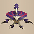
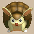
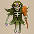
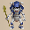
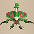
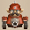
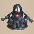
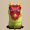

  

# Overview

<table class="dungeonOverview">
  <tr>
    <th>Unlock</th>
    <td class="highlightYellow">Talk to Drokotay the Adventurer (Shukuba Beach). 　※ Update 2.1.1 required.</td>
  </tr>
  <tr>
    <th>Entrance</th>
    <td class="highlightYellow">Shukuba Beach (Exit)</td>
  </tr>
</table>

<table class="dungeonTable">
  <tr>
    <th>Floors</th>
    <td colspan="3">50F / 99F (Sacred Tree)</td>
  </tr>
  <tr>
    <th>Bring Items</th>
    <td>No</td>
    <th>Stairs</th>
    <td>Ascending</td>
  </tr>
  <tr>
    <th>Companions</th>
    <td>Yes</td>
    <th>Roamers</th>
    <td>Yes</td>
  </tr>
  <tr>
    <th>Rescues</th>
    <td>3</td>
    <th>Starting Level</th>
    <td>1</td>
  </tr>
  <tr>
    <th>Starting Item</th>
    <td colspan="3">Large Onigiri</td>
  </tr>
  <tr>
    <th>Unidentified</th>
    <td colspan="3">Bracelets, Pots, Incense</td>
  </tr>
  <tr>
    <th>Shops</th>
    <td>Yes</td>
    <th>Monster Houses</th>
    <td>Yes</td>
  </tr>
  <tr>
    <th>Kron's Challenge</th>
    <td>Yes</td>
    <th>Fever Time</th>
    <td>Yes</td>
  </tr>
  <tr>
    <th>Initial Enemies</th>
    <td>8~32</td>
    <th>Spawn Rate</th>
    <td>20 Turns (1F - 10F) 15 Turns (11F - 50F) 10 Turns (51F - 99F)</td>
  </tr>
  <tr>
    <th>Wind (1st Gust)</th>
    <td>1200 Turns</td>
    <th>Reward</th>
    <td></td>
  </tr>
</table>

The JP name is "Waku Waku Monster Path", where "Waku Waku" reads as ワクワク (fun) or 湧く湧く (spawn), and as such a name implies, monsters indeed spawn very quickly and abundantly in this dungeon. In addition, there are also guaranteed single room Monster Houses on floor numbers ending in 9, and Behemoth Gates which rarely change locations are guaranteed to appear every 7 floors. So it's like a dungeon that mashes "Monster Hotspot" and "Rousing Paradise" together from Shiren 5, but it's generally not as hard thanks to the lack of out of depth and swarm monsters.

# Strategy

### Dungeon Characteristics

#### Fast Monster Spawns (1 every 20-10 turns)

Monsters spawn at x2\~3 speed compared to normal dungeons (<u>1-10F</u>: 20T, <u>11-50F</u>: 15T, <u>51-99F</u>: 10T). This means it's harder to rely on natural HP regen to survive since the next monster arrives so quickly. However, running away instead of fighting what's in front of you often results in getting cornered by foes, so you'll want to focus on increasing your damage output as much as possible.

The monster table is on the unique side with monk and ninja enemies nowhere to be found. Therefore, the priority of shield runes and bracelets differs a bit compared to other dungeons.

#### Larger Floors

Larger floors provide a benefit in less clustering of foes despite the faster monster spawn rate, but it also means it takes more effort to maintain Sumo status or make Behemoth Gates vanish for items. Try to make an effort to explore floors in an efficient manner, and it might be good to plan ahead when it comes to which floors you want to try and rush to the stairs on.

#### Guaranteed Monster Houses (X9F)

Single room Monster House floors are generated on 9F, 19F, 29F, 39F, 59F, 69F, 79F, 89F, and 99F. 49F is an exception - The floor generation is normal and a regular Monster House is generated instead. Many of these MH floors feature Chow as a possible spawn, so it's important to be efficient with actions. Items that counter Monster Houses are pretty common, though, so it's not hard to prepare in advance.

#### Behemoth Gate Floors (7xN)

Behemoth Gates appear on 7F, 14F, 21F, 28F, 35F, 42F, 49F, 56F, 63F, 70F, 77F, 84F, 91F, and 98F. The Behemoth Monsters that spawn are special - Only 1\~3 spawn at a time, and they linger a long time. In addition, the Behemoth Gate itself rarely relocates elsewhere, so think about your route carefully. 77F, 84F, 91F, and 98F can generate very dangerous Behemoths like Mini Tank, Ultra Gazer, Abyss Dragon, etc.

#### Companions & NPCs Can Appear

Depending on your luck, you might encounter mutliple companions throughout the dungeon. Companions are great for boosting early game consistency prior to finding equipment or items. Of course, they can be helpful even later on, but it's challenging to keep them alive that long.

#### Kron's Challenge & Fever Time

These 2 events seem to occur more often than in other dungeons. Fever Time events where foes are guaranteed to drop items synergizes well with fast monster spawns, so if you manage to get that event, step in place to quickly lure monsters to you for item drops.

#### Ascending Stairs

This dungeon has Bottomless Pot in its item table, but the dungeon features ascending stairs, so don't make the mistake of trying to steal from a shop or skip floors by breaking a Bottomless Pot.

### General Strategy

The basic plan is like Heart of Serpentcoil Island - Collect items and synthesize with Mixers to keep up. But monsters with mean special attacks are more dangerous due to faster spawns if you lack counters, so you'll want to be more discerning when it comes to deciding whether or not to rush stairs. Focus on shield runes and bracelets, but don't neglect other items like counters to Monster House floors. The dungeon's floors alternate between ranges with and without darkness in hallways.

Item drops are easier to come by than in other dungeons since you'll be slaying more enemies. Weapons, shields, and consumables are common, but Preservation Pots and bracelets seem to be rare.

It's possible to perform Nigiri Morph Factory using Nigiri Baby on 3-4F, but it's not essential at all. Upgrading equipment or relying on companions should be enough to keep up without activating Sumo status, but it doesn't hurt to stock up on some additional food while you have the chance.

The difficulty is more variable than other dungeons thanks to companions, Fever Times, and Kron's Challenges. Companions in particular can be used to regroup via safely hunting Thiefwalrus (19-23F) for extra item drops, so don't give up even if you don't see Fever Times, Kron's Challenges, or good floor items early on.

As far as playable characters go, Asuka (DLC) really shines under this dungeon's ruleset. Axe of the Minotaur and Daredevil Bracelet both provide a boost to her innate critical hit rate, and she makes short work of Monster Houses if she activates Sumo status to attain a 100% critical hit rate. The faster Fullness depletion during Sumo status isn't a big issue when only used to clear MHs.

#### First Clear

For the first clear, 40-50F is the floor range where it's recommended to rush to the stairs. You can trade hits with enemies relatively comfortably with 20 or so weapon and shield strength, so you might want to switch to focusing on non-synthesis related items from around that point. There are 4 guaranteed Monster House floors during the first clear (9F, 19F, 29F, and 39F), and an easy counter to these single room MH floors is to simply use a Blurry Incense.

### Important Items

#### Weapon & Runes

It's best to focus on runes that apply to a wide range of enemies instead of a narrow range. A Sacred Item is typically the ideal base weapon, but anything with lots of slots is decent early on.

<b><u>Sedating</u></b>, <b><u>Blinding</u></b>, <b><u>Paralyzing</u></b>, <b><u>Confusing</u></b>, <b><u>Sealing</u></b> Status inflicting runes work against all enemies, making these a high priority. Sealing is decent if you want to minimize your chances of getting hit by dangerous special attacks, but note that it can lead to the player getting hit by more normal attacks than usual.

<b><u>Frontal Attack (Kama Itachi)</u></b> Enemy spawn rate is fast and there are guaranteed Monster Houses, so this is a top priorty.

<b><u>Critical (Axe of the Minotaur)</u></b>, <b><u>Knockback (Whopping Harisen)</u></b>, <b><u>Swift Strikes (Swift Sword)</u></b> Runes that boost damage output against all enemies instead of being specific to a single family. Remember, it's possible to find both Targe of the Minotaur and Daredevil Bracelet in this dungeon to boost your critical hit rate even further.

<b><u>Anti-Dragon (Dragonkiller)</u></b> Archdragon (89-99F) can be turned into a non-issue by throwing an Eradication Scroll, so this rune is more for the Dragon and Sky Dragon (28-39F) zone and Hiding Dragon (89-99F).

<b><u>Anti-Beast (Primal Axe)</u></b> Nice to have from 68F+ against Huge Chintala, Megataur, Miracle Hen, Grampadillo, and Tiger Chucker.

<b><u>Anti-Ghost (Sickle of Salvation)</u></b> Great against Skull Lord (68-77F) and King Reaper (78-88F) if you don't eradicate them instead. It's also nice even early game against monsters like Ghost Samurai and the Pumphantasm family, and the weapon itself makes for a solid early game main weapon thanks to a high rune slot count.

<b><u>Anti-Aquatic (Watersplitter)</u></b> Nice against Octopling, Thiefwalrus, Mudkin, and Explochin families in particular.

<b><u>Anti-Drain (Drain Slayer)</u></b> Good against monsters that lower your stats or your equipment's upgrade value, but Draining types stop appearing after 54F, so it becomes a wasted slot in the second clear. That said, it's still handy for the Draining type monster zone starting at around 30F.

<b><u>Break-Off Blade + Dried Bonito (Bonito Block)</u></b> Synthesize a Bonito Block into a Break-Off Blade to create a long-lasting food source.

#### Shield & Runes

Prioritize runes that counter dangerous monster special attacks. Beware of Mudder erasing runes if you decide to use Golden Shield as a main shield. Shield strength is still important, especially for the 2nd clear (Miracle Hens and King Reapers).

<b><u>Onigiri Payback (Onigiri Scroll)</u></b>, <b><u>Jitter Payback (Jitters Scroll)</u></b>, <b><u>Delusion Payback (Sacred Item)</u></b> Top priority runes that provide a chance to disable any enemy that uses normal attacks. Leap Payback is not recommended since it just postpones the encounter instead of disabling the foe.

<b><u>Critproof (Targe of the Minotaur)</u></b> This shield rune reduces damage received from enemy critical hits by 55%, so you can pair it with Daredevil Bracelet or Dreaded Bracelet to effectively reduce damage received. Targe of the Minotaur can be found on the ground in this dungeon.

<b><u>Anti-Dragon (Dragon Shield)</u></b> Great to have for the Dragon and Sky Dragon zone (28-39F), along with Archdragon floors. Chow is pretty common in this dungeon, so Archdragons can be generated via a Sky Dragon leveling up. The 29F and 39F single room Monster House floors are especially dangerous when it comes to fire damage. This rune also helps against Behemoth Archdragon (56F, 63F, 70F) and Abyss Dragon (77F, 84F, 91F, 98F).

<b><u>Magic Cancel (Shield of Negation)</u></b> Essential for Skull Lord (68-77F) floors if you don't plan on eradicating them. Lv1-2 Skull Mage monsters aren't much of a threat - Focusing Bracelet counters Skull Wizard (19-22F).

<b><u>Projectileproof (Kappa's Dish)</u></b> Nice to have for Mini Tank (40-44F) floors in particular, but it's not a complete counter. Also helps against Pesky Kappa (28-31F), Vexing Kappa (55-59F), Daze Radish (26-30F), Bag Knave (60-67F), and Porko (24-27F) and such.

<b><u>Nigiriproof (Nigiri Stopper)</u></b> Counters Nigiri Boss (60-67F) and Nigiri Honcho (89-99F)'s special attacks. It's easy to forget, but it also offers protection against Onigiri Trap.

<b><u>Anti-Blast (Blast Shield)</u></b> Essential for the tank zone (40-44F) if you don't have an Eradication Scroll. Also helps against Concusschin (60-77F) and Fulminachin (78-88F), so it won't go to waste.

<b><u>Hatproof (Hat Stopper)</u></b> Basically for Hat Brat (60-67F) if you want to make that floor range slightly less stressful.

<b><u>Walrusproof (Walrus Stopper)</u></b>, <b><u>Froggoproof (Froggo Stopper)</u></b> Unnecessary if you have a companion with you, since Froggo and Thiefwalrus can't steal from companions. In any case, it's best on a secondary shield instead of synthesizing it into your main one.

#### Bracelets

<b><u>Monster-find Bracelet</u></b> Eliminates the risk of blindly bumping into enemies and getting hit first in hallways. If you're lucky enough to find this bracelet, take very good care of it.

<b><u>Tiptoe Bracelet</u></b> Equip it before advancing to the next floor in case you start inside a Monster House. Also great for avoiding always-napping monsters like Karakuroid and Thiefwalrus.

<b><u>Waterwalk Bracelet</u></b>, <b><u>Floating Bracelet</u></b> Opens up new escape routes, and lets you safely recover HP by stepping in place.

<b><u>Focusing Bracelet</u></b> Counters Daze Radish (26-30F) and Skull Wizard (19-22F). It's fine to discard it once you've reached 31F.

<b><u>Affixing Bracelet</u></b> Counters Swordsman (20-24F), Fencer (51-57F), Battler (68-77F), and Bag Knave (60-67F). Especially important for floors that have said monsters + dark hallways.

<b><u>Daredevil Bracelet</u></b>, <b><u>Dreaded Bracelet</u></b> Equip these alongside Targe of the Minotaur to effectively reduce damage received.

#### Scrolls

<b><u>Mapping Scroll</u></b>, <b><u>Monstercall Scroll</u></b> Mapping Scroll is handy for when you want to linger and farm, check for shops, or rush to the stairs. Monstercall Scroll can be used to activate a Monster-find Bracelet type effect for the current floor, but make sure you have other items to deal with the generated Monster House before reading it. Some good floor ranges to use Mapping Scrolls on are 40-44F and 60-67F.

<b><u>Wall-less Scroll</u></b> Can be used to steal from a shop or make a Behemoth Gate vanish, but think carefully before reading it. It's best to check the monster table for the current floor beforehand to see what you'll be up against.

<b><u>Eradication Scroll</u></b> Synthesis isn't as hard to perform as other dungeons, so prioritize eradicating nasty special attackers that you don't have counters to yet.

##### Eradication Targets

|Family|Floors|
|-|-|
|Pop Tank|<b><u>Lv1:</u></b> 19-22F, <b><u>Lv2-4:</u></b> 40-44F|
|Nigiri Morph|<b><u>Lv1:</u></b> 3-4F, <b><u>Lv3:</u></b> 60-67F, <b><u>Lv4:</u></b> 89-99F|
|Field Knave|<b><u>Lv3:</u></b> 60-67F|
|Swordsman|<b><u>Lv1:</u></b> 20-24F, <b><u>Lv2:</u></b> 51-57F, <b><u>Lv3:</u></b> 68-77F|
|Skull Mage|<b><u>Lv1-2:</u></b> 19-23F, <b><u>Lv4:</u></b> 68-77F|
|Death Reaper|<b><u>Lv1:</u></b> 4-6F, <b><u>Lv2:</u></b> 9-11F, <b><u>Lv4:</u></b> 78-88F|
|Dragon|<b><u>Lv1-2:</u></b> 28-39F, <b><u>Lv3:</u></b> 89-99F|

#### Incense

<b><u>Incense (Various Types)</u></b> Blurry Incense is spectacular in particular, but other types can be useful too. Heat-ban, Reflective, and Evasive incenses should ideally be paired with a Mapping Scroll.

### Farming Techniques

<b><u>Schubell Farm (14-15F)</u></b> Schubell appears between 12-15F, but Crossbowboy overlaps on 12-13F so 14-15F is best. Simply place a Sacntuary Scroll on the ground for safety, and have Schubell summon new monsters. This is additionally a nice way to force Mixers to spawn early on to synthesize equipment.

<b><u>Thiefwalrus Hunting (19-23F)</u></b> If you have a companion, simply have them fight any Thiefwalrus monsters that spawn for item drops. However, Skull Mage and Skull Wizard can appear, so beware of becoming separated or an ally getting morphed.

<b><u>Skull Wizard Morph Farm (20-22F)</u></b> Intentionally get hit by Skull Wizard's magic until you morph into Swordsman or Thiefwalrus, then start collecting lots of items from other enemies.

# Floor Guide

### 1-9F

Notable: Nigiri Baby (3-4F), Firepuff (3-5F), Scorpion (6-8F), Masked Samurai (8-12F), Behemoth (7F)

Nigiri Baby (17 HP, 8 atk, 2 def) can be used to turn unneeded items into Large Onigiri. However, Firepuff (20 HP, 7 atk, 7 def)'s 10 damage fire attack will grill all onigiri that aren't in pots. You can still perform Nigiri Morph Factory with a companion if you paralyze the companion or such.

Masked Samurai (47 HP, 18 atk, 18 def) revives as Ghost Samurai (4 HP, 13 atk, 15 def) when slain. Ghost Samurai tries to level up an adjacent monster and only takes 1 damage from normal attacks, but can be one-shot by any type of rock, or by swinging staves like Knockback, Burrowing, or Thunderbolt.

The 1st guaranteed single large room Monster House of this dungeon is encountered on 9F. None of the monsters have ranged attacks on this floor, so a single Sanctuary Scroll ensures safety. But if you have a companion with you, you'll want to use other scrolls, staves, or incenses instead. The high-powered Nashagga appears from 10F, so try to keep your companions alive if possible.

Behemoth Monsters: 7F - Pumphantasm, Firepuff, Shagga, and Explochin.

### 10-19F

Notable: Nashagga (10-13F), Crossbowboy (10-13F), Schubell (12-15F), Brodillo (16-19F), Big Chintala (17-19F), Pop Tank (19-22F), Skull Wizard (19-22F), Mixer (10-29F), Chow (15-67F), Behemoth (14F)

Nashagga (70 HP, 21 atk, 20 def) attacks 2 times per turn and has higher HP, so be very careful. 
Mixer (78 HP, 39 atk, 29 def) is quite rare, but can be used to synthesize up to 2 thrown items. Crossbowboy (55 HP, 20 atk, 20 def) overlaps with Bored Kappa on 10-13F, so feel free to collect Iron Arrows. Consider placing Sanctuary Scroll on 14F or 15F to have Schubell (50 HP, 20 atk, 20 def) summon more Mixers. Brodillo (70 HP, 36 atk, 38 def) and Big Chintala (85 HP, 40 atk, 33 def) are also rather tough at this point.

The 2nd guaranteed single large room Monster House is encountered on 19F. The notably troublesome monsters here include Chow, Pop Tank, and Skull Wizard. It's very common for monsters to level up inside this Monster House, so don't be stingy with items. Companions can be used to hunt Thiefwalrus monsters for items on 20-23F, so keep them alive at all costs.

Behemoth Monsters: 14F - Pumphantasm, Firepuff, Shagga, and Explochin.

### 20-29F

Notable: Thiefwalrus (19-23F), Skull Wizard (19-22F), Swordsman (20-24F), Super Gazer (22-24F), Porko (24-27F), Daze Radish (26-30F), Pesky Kappa (28-31F), Dragon (28-35F), Mixer (10-29F), Chow (15-67F), Behemoth (21F, 28F)

Thiefwalrus (65 HP, 25 atk, 23 def) and Froggucchi (60 HP, 20 atk, 30 def) can be hunted for items and Gitan, but beware of Swordsman (77 HP, 30 atk, 25 def) who is capable of disarming your equipped shield. If you have an Eradication Scroll, consider throwing it at Pop Tank to make 40-44F less of a threat, but be warned that you'll need a counter for Mini Tanks who shoot Silver Arrows instead. Mixer family monsters don't appear between 30-39F, so synthesize equipment as needed before advancing.

If you're feeling adventurous, you can intentionally get hit by Skull Wizard's magic until you morph into either Swordsman or Thiefwalrus, and then begin collecting items from other monsters.

The 3rd guaranteed single large room Monster House is encountered on 29F. Dragon, Daze Radish, and Dartingfrog are among the companion slayers - Watch your positioning. Dragon (120 HP, 45 atk, 40 def) spews 20 damage fire in a straight line. Daze Radish (80 HP, 37 atk, 27 def) throws Confusion Grass → Poison Grass within a 2 tile radius. Dartingfrog (75 HP, 40 atk, 28 def) pulls creatures within 5 tiles toward itself, then attacks. Chow also appears, so it's best to rush to the stairs unless you have a Blurry Incense or Expulsion Scroll. Pesky Kappas can throw items into pots and incenses, so don't be stingy about using items.

Behemoth Monsters: 21F - Pumphantasm, Firepuff, Shagga, and Explochin. 28F - Death Reaper, Pumpanshee, Bowboy, Porko, Daze Radish, and Hoppin' Hitter.

### 30-39F

Notable: Muddy (30-34F), Vile Scorpion (31-35F), Sky Dragon (36-39F), Chow (15-67F), Behemoth (35F)

Vile Scorpion (108 HP, 45 atk, 33 def) lowers current strength by 2 when adjacent. 
Muddy (75 HP, 25 atk, 33 def) lowers equipped weapon or shield upgrade value by 2 when adjacent. You really don't want to lose upgrade value with all of the fighting you have to do in this dungeon, so if you don't have Rustproof runes or a Monster-find Bracelet, consider rushing to the stairs.

The 4th guaranteed single large room Monster House is encountered on 39F. Sky Dragon overlaps with Chow, so expect Sky Dragons to immediately level up into Archdragons. Rush to the stairs even if you have Anti-Dragon (shield), since it might not be enough to survive for long. Thankfully all other monsters on this floor have regular action speed and only move 1 tile per turn, so as long as you have a way to deal with the fire damage, you should be able to make it to the stairs.

Behemoth Monsters: 35F - Death Reaper, Pumpanshee, Bowboy, Porko, Daze Radish, and Hoppin' Hitter.

### 40-44F

Notable: Mini Tank (40-44F), Adamant Tank (40-44F), Steadfast Tank (40-44F), Mixermon (40-50F), Behemoth (42F)

The dreaded Tank Zone with the addition of Mini Tanks, along with Behemoth Monsters on 42F. It can be tricky to survive even with the Anti-Blast rune depending on the number of tanks, so the best counter is to use a Heat-ban Incense + throw an Eradication Scroll at Mini Tank. However, you'll still want to rush to the stairs on 44F to avoid Igneous multiplying from explosions. Read a Mapping Scroll or use the Wall-less Scroll → Blurry Incense combo to advance quickly. ※ If your shield is very strong or you lack Heat-ban Incense, eradicate the Pop Tank family instead.

Ornery Tank (95 HP, 40 atk, 44 def) is regular speed and deals 30 damage per cannonball. Adamant Tank (100 HP, 60 atk, 54 def) is Swift 1 speed and deals 40 damage per cannonball. Steadfast Tank (105 HP, 80 atk, 64 def) is Swift 2 speed and deals 50 damage per cannonball. Mini Tank (100 HP, 55 atk, 40 def) is Swift 1 speed and shoots Silver Arrows when lined up. Mixermon (98 HP, 50 atk, 35 def) eats and synthesizes up to 3 thrown items.

Behemoth Monsters: 42F - Death Reaper, Pumpanshee, Bowboy, Porko, Daze Radish, and Hoppin' Hitter.

### 45-50F

Notable: Mixermon (40-50F), Dragon Pit (45-50F), Steamroid (45-50F), Mudster (47-54F), Mudder (47-54F), Behemoth (49F)

Easier than the previous floor range, but not entirely without danger. Mixermon is still around until 50F, so feel free to synthesize if the opportunity comes up. If you're only aiming for the first clear, go ahead and rush stairs while using up remaining items.

Dragon Pit (130 HP, 54 atk, 40 def) and Steamroid (100 HP, 45 atk, 48 def) have Swift 1 speed. Thrashead (122 HP, 55 atk, 45 def) can attack through corners and from up to 3 tiles away in a line. Mudster (140 HP, 35 atk, 43 def) and Mudder (145 HP, 45 atk, 53 def) rust gear or erase runes.

Note that 49F is not a single large room Monster House, since it overlaps with a Behemoth Gate. Instead, a regular room-style Monster House will be randomly generated somewhere on the floor.

Behemoth Monsters: 49F - Death Reaper, Pumpanshee, Bowboy, Porko, Daze Radish, and Hoppin' Hitter.

<h3 class="heading3Tree">Sacred Tree Mode</h3>

### 51-59F

Notable: Mudster (47-54F), Mudder (47-54F), Fencer (51-57F), Vexing Kappa (55-59F), Behemoth (56F)

Always use the Look Around command in rooms so that Tiger Hurler doesn't catch you off guard on 51-54F. Fencer (140 HP, 49 atk, 48 def) disarms your equipped weapon or shield, sending it behind you. Tiger Hurler (135 HP, 50 atk, 45 def) throws an adjacent Shiren or other monster within 10 tiles. 

The 5th guaranteed single large room Monster House is encountered on 59F. Vexing Kappa (175 HP, 49 atk, 33 def) throws items found on the ground at Shiren within a 10 tile radius, so it's probably best to use an Evasive Incense or Blurry Incense and skip to the stairs.

Behemoth Monsters: 56F - Pumplich, Great Hen, Baby Tank, Adamant Tank, Porkon, Archdragon, and Hoppin' Slugger.

### 60-67F

Notable: Curse Matron (60-67F), Nigiri Boss (60-67F), Bag Knave (60-67F), Hat Brat (60-67F), Behemoth (63F)

The harassment team only includes Curse Matron, Nigiri Boss, Bag Knave, and Hat Brat - Hyper Gazer is missing. Mixergon (118 HP, 68 atk, 40 def) on 51-67F is your last chance to synthesize, since Mixerdons don't appear. The next stretch features Skull Lord, so synthesize Magic Cancel (Shield of Negation) if at all possible. Keep an eye out for Reflective Incense for the upcoming Monster House on 69F if you lack Magic Cancel.

Behemoth Monsters: 63F - Pumplich, Great Hen, Baby Tank, Adamant Tank, Porkon, Archdragon, and Hoppin' Slugger.

### 68-77F

Notable: Skull Lord (68-77F), Battler (68-77F), Pumplord (68-77F), Crow Tengu (68-99F), Behemoth (70, 77F)

Pumplord (185 HP, 75 atk, 35 def) has high attack power and can pass through walls. Skull Lord (188 HP, 55 atk, 55 def)'s magic effects include Asleep, Blind, Level-3, or 40 damage. Battler (200 HP, 69 atk, 50 def) disarms your equipped weapon, shield, or bracelet when adjacent. Skull Lord can be countered via Magic Cancel or Reflective Incense, and Battler via Affixing Bracelet. If you want to eradicate one of them, make sure the target is not a disguised Crow Tengu monster. Otherwise, the rest of the monsters here shouldn't be too tricky to deal with.

The 6th guaranteed single large room Monster House is encountered on 69F. Skull Lords and Battlers are the major threats inside this Monster House, so use items liberally. Reflective Incense offers protection, but don't forget that it reflects your staff magic as well.

Behemoth Monsters: 70F - Pumplich, Great Hen, Baby Tank, Adamant Tank, Porkon, Archdragon, and Hoppin' Slugger. 77F - Gitan Mamel, Pumplord, Miracle Hen, Mini Tank, Steadfast Tank, Porgon, Abyss Dragon, and Ultra Gazer.

### 78-88F

Notable: Miracle Hen (78-88F), King Reaper (78-88F), Infernous (78-88F), Crow Tengu (68-99F), Behemoth (84F)

You're quite likely to struggle in this floor range if your gear is very underpowered. Again, make sure the target isn't a Crow Tengu if you plan on throwing an Eradication Scroll. Miracle Hen (220 HP, 82 atk, 60 def) and King Reaper (225 HP, 65 atk, 50 def) both have Swift 2 speed. Infernous (285 HP, 69 atk, 55 def) is immune to projectiles that lack piercing properties. Megahead (182 HP, 65 atk, 48 def) can attack through corners and from up to 4 tiles away.

The 7th guaranteed single large room Monster House is encountered on 79F. Sanctuary Scroll basically ensures safety, but don't let Fulminachin's explosion destroy the scroll. Fulminachin (200 HP, 45 atk, 32 def) explodes when HP ≤ 40 (160+ damage is dealt to it).

Behemoth Monsters: 84F - Gitan Mamel, Pumplord, Miracle Hen, Mini Tank, Steadfast Tank, Porgon, Abyss Dragon, and Ultra Gazer.

### 89-99F

Notable: Archdragon (89-99F), Nigiri Honcho (89-99F), Grampadillo (89-99F), Crow Tengu (68-99F), Behemoth (91, 98F)

The final stretch, featuring an incredibly mean Nigiri Honcho + Archdragon combo. Nigiri Honcho (165 HP, 61 atk, 54 def) inflicts Onigiri status and turns your items into Large Onigiri. Archdragon (200 HP, 65 atk, 60 def) spews 30 damage fire at the player from anywhere on the floor, and if you have Onigiri status, you'll be turned into a Grilled Onigiri and instantly collapse. So be extremely careful not to get hit with Onigiri status if you lack the Nigiriproof shield rune.

The 8th and 9th guaranteed single large room Monster Houses are encountered on 89F and 99F. Rush to the stairs, but beware of Grampadillo (175 HP, 71 atk, 56 def) making you trip and drop items. Tiger Chucker (155 HP, 60 atk, 55 def) throws monsters at you within 15 tiles, so don't drop your guard. Otherwise, Electroid (150 HP, 56 atk, 53 def) and Hiding Dragon (230 HP, 70 atk, 60 def) have Swift 1 speed.

Behemoth Monsters: 91/98F - Gitan Mamel, Pumplord, Miracle Hen, Mini Tank, Steadfast Tank, Porgon, Abyss Dragon, and Ultra Gazer.

# Monsters

See [Monsters](/system/monsters) for individual monster details.

- F - Dark hallways, Monster House (Guaranteed)
- S - Shop is possible
- H - Monster House is possible
- G - Golden Egg Thing is possible
- B - Behemoth Monsters are possible

Monster Colors = Farming, Useful, Lowers Stats, Targets Items, Dangerous

<table class="monsterTable">
  <thead>
    <tr>
      <th>F</th>
      <th>S</th>
      <th>H</th>
      <th>G</th>
      <th colspan="5">Monsters</th>
      <th>B</th>
    </tr>
  </thead>
  <tbody>
    <tr>
      <td rowspan="1" class="centeredText">1</td>
      <td rowspan="1" class=""></td>
      <td rowspan="1" class=""></td>
      <td rowspan="1" class=""></td>
      <td> Mamel</td>
      <td> Pit Mamel</td>
      <td> Spearfish</td>
      <td> Octopling</td>
      <td class="highlightGray"></td>
      <td rowspan="1" class=""></td>
    </tr>
    <tr>
      <td colspan="10" class="tableDivider"></td>
    </tr>
    <tr>
      <td rowspan="1" class="centeredText">2</td>
      <td rowspan="1" class=""></td>
      <td rowspan="1" class=""></td>
      <td rowspan="1" class=""></td>
      <td> Mamel</td>
      <td> Pit Mamel</td>
      <td> Spearfish</td>
      <td> Octopling</td>
      <td> Shagga</td>
      <td rowspan="1" class=""></td>
    </tr>
    <tr>
      <td colspan="10" class="tableDivider"></td>
    </tr>
    <tr>
      <td rowspan="1" class="centeredText">3</td>
      <td rowspan="1" class=""></td>
      <td rowspan="1" class=""></td>
      <td rowspan="1" class=""></td>
      <td> Pit Mamel</td>
      <td> Shagga</td>
      <td> Firepuff</td>
      <td> Chintala</td>
      <td> Nigiri Baby</td>
      <td rowspan="1" class=""></td>
    </tr>
    <tr>
      <td colspan="10" class="tableDivider"></td>
    </tr>
    <tr>
      <td rowspan="2" class="centeredText">4</td>
      <td rowspan="2" class=""></td>
      <td rowspan="2" class=""></td>
      <td rowspan="2" class=""></td>
      <td> Shagga</td>
      <td> Firepuff</td>
      <td> Chintala</td>
      <td> Nigiri Baby</td>
      <td> Death Reaper</td>
      <td rowspan="2" class=""></td>
    </tr>
    <tr>
      <td> Pumphantasm</td>
      <td> Taur</td>
      <td class="highlightGray"></td>
      <td class="highlightGray"></td>
      <td class="highlightGray"></td>
    </tr>
    <tr>
      <td colspan="10" class="tableDivider"></td>
    </tr>
    <tr>
      <td rowspan="1" class="centeredText">5</td>
      <td rowspan="1" class=""></td>
      <td rowspan="1" class=""></td>
      <td rowspan="1" class=""></td>
      <td> Firepuff</td>
      <td> Chintala</td>
      <td> Death Reaper</td>
      <td> Pumphantasm</td>
      <td> Taur</td>
      <td rowspan="1" class=""></td>
    </tr>
    <tr>
      <td colspan="10" class="tableDivider"></td>
    </tr>
    <tr>
      <td rowspan="1" class="centeredText">6</td>
      <td rowspan="1" class=""></td>
      <td rowspan="1" class=""></td>
      <td rowspan="1" class=""></td>
      <td> Death Reaper</td>
      <td> Pumphantasm</td>
      <td> Taur</td>
      <td> Scorpion</td>
      <td class="highlightGray"></td>
      <td rowspan="1" class=""></td>
    </tr>
    <tr>
      <td colspan="10" class="tableDivider"></td>
    </tr>
    <tr>
      <td rowspan="1" class="centeredText">7</td>
      <td rowspan="1" class=""></td>
      <td rowspan="1" class=""></td>
      <td rowspan="1" class=""></td>
      <td> Pumphantasm</td>
      <td> Taur</td>
      <td> Scorpion</td>
      <td> Hoppin' Hitter</td>
      <td> Fresh Octopling</td>
      <td rowspan="1" class="highlightBehemoth"></td>
    </tr>
    <tr>
      <td colspan="10" class="tableDivider"></td>
    </tr>
    <tr>
      <td rowspan="1" class="centeredText">8</td>
      <td rowspan="1" class=""></td>
      <td rowspan="1" class=""></td>
      <td rowspan="1" class=""></td>
      <td> Scorpion</td>
      <td> Masked Samurai</td>
      <td> Hoppin' Hitter</td>
      <td> Fresh Octopling</td>
      <td class="highlightGray"></td>
      <td rowspan="1" class=""></td>
    </tr>
    <tr>
      <td colspan="10" class="tableDivider"></td>
    </tr>
    <tr>
      <td rowspan="1" class="centeredText redText">9</td>
      <td rowspan="1" class=""></td>
      <td rowspan="1" class="highlightMH"></td>
      <td rowspan="1" class=""></td>
      <td> Masked Samurai</td>
      <td> Hoppin' Hitter</td>
      <td> Fresh Octopling</td>
      <td> Hell Reaper</td>
      <td class="highlightGray"></td>
      <td rowspan="1" class=""></td>
    </tr>
    <tr>
      <td colspan="10" class="tableDivider"></td>
    </tr>
    <tr>
      <td rowspan="2" class="centeredText">10</td>
      <td rowspan="2" class=""></td>
      <td rowspan="2" class=""></td>
      <td rowspan="2" class=""></td>
      <td> Masked Samurai</td>
      <td> Nashagga</td>
      <td> Hell Reaper</td>
      <td> Bored Kappa</td>
      <td> Mid Chintala</td>
      <td rowspan="2" class=""></td>
    </tr>
    <tr>
      <td> Crossbowboy</td>
      <td> Lt. Spearfish</td>
      <td> Mixer</td>
      <td class="highlightGray"></td>
      <td class="highlightGray"></td>
    </tr>
    <tr>
      <td colspan="10" class="tableDivider"></td>
    </tr>
    <tr>
      <td rowspan="2" class="centeredText">11</td>
      <td rowspan="2" class=""></td>
      <td rowspan="2" class=""></td>
      <td rowspan="2" class=""></td>
      <td> Masked Samurai</td>
      <td> Nashagga</td>
      <td> Hell Reaper</td>
      <td> Bored Kappa</td>
      <td> Mid Chintala</td>
      <td rowspan="2" class=""></td>
    </tr>
    <tr>
      <td> Crossbowboy</td>
      <td> Lt. Spearfish</td>
      <td> Floor Dragon</td>
      <td> Mixer</td>
      <td class="highlightGray"></td>
    </tr>
    <tr>
      <td colspan="10" class="tableDivider"></td>
    </tr>
    <tr>
      <td rowspan="2" class="centeredText">12</td>
      <td rowspan="2" class=""></td>
      <td rowspan="2" class=""></td>
      <td rowspan="2" class=""></td>
      <td> Masked Samurai</td>
      <td> Nashagga</td>
      <td> Bored Kappa</td>
      <td> Mid Chintala</td>
      <td> Crossbowboy</td>
      <td rowspan="2" class=""></td>
    </tr>
    <tr>
      <td> Lt. Spearfish</td>
      <td> Floor Dragon</td>
      <td> Schubell</td>
      <td> Mixer</td>
      <td class="highlightGray"></td>
    </tr>
    <tr>
      <td colspan="10" class="tableDivider"></td>
    </tr>
    <tr>
      <td rowspan="2" class="centeredText highlightFog">13</td>
      <td rowspan="2" class=""></td>
      <td rowspan="2" class=""></td>
      <td rowspan="2" class=""></td>
      <td> Nashagga</td>
      <td> Mid Chintala</td>
      <td> Crossbowboy</td>
      <td> Lt. Spearfish</td>
      <td> Floor Dragon</td>
      <td rowspan="2" class=""></td>
    </tr>
    <tr>
      <td> Master Hen</td>
      <td> Schubell</td>
      <td> Mixer</td>
      <td class="highlightGray"></td>
      <td class="highlightGray"></td>
    </tr>
    <tr>
      <td colspan="10" class="tableDivider"></td>
    </tr>
    <tr>
      <td rowspan="2" class="centeredText highlightFog">14</td>
      <td rowspan="2" class=""></td>
      <td rowspan="2" class=""></td>
      <td rowspan="2" class=""></td>
      <td> Lt. Spearfish</td>
      <td> Floor Dragon</td>
      <td> Master Hen</td>
      <td> Pumpanshee</td>
      <td> Schubell</td>
      <td rowspan="2" class="highlightBehemoth"></td>
    </tr>
    <tr>
      <td> Hat Prankster</td>
      <td> Mixer</td>
      <td class="highlightGray"></td>
      <td class="highlightGray"></td>
      <td class="highlightGray"></td>
    </tr>
    <tr>
      <td colspan="10" class="tableDivider"></td>
    </tr>
    <tr>
      <td rowspan="2" class="centeredText highlightFog">15</td>
      <td rowspan="2" class=""></td>
      <td rowspan="2" class=""></td>
      <td rowspan="2" class=""></td>
      <td> Floor Dragon</td>
      <td> Master Hen</td>
      <td> Pumpanshee</td>
      <td> Schubell</td>
      <td> Hat Prankster</td>
      <td rowspan="2" class=""></td>
    </tr>
    <tr>
      <td> Mixer</td>
      <td> Chow</td>
      <td class="highlightGray"></td>
      <td class="highlightGray"></td>
      <td class="highlightGray"></td>
    </tr>
    <tr>
      <td colspan="10" class="tableDivider"></td>
    </tr>
    <tr>
      <td rowspan="2" class="centeredText highlightFog">16</td>
      <td rowspan="2" class=""></td>
      <td rowspan="2" class=""></td>
      <td rowspan="2" class=""></td>
      <td> Floor Dragon</td>
      <td> Master Hen</td>
      <td> Pumpanshee</td>
      <td> Brodillo</td>
      <td> Minotaur</td>
      <td rowspan="2" class=""></td>
    </tr>
    <tr>
      <td> Hat Prankster</td>
      <td> Ghost Radish</td>
      <td> Mixer</td>
      <td> Chow</td>
      <td class="highlightGray"></td>
    </tr>
    <tr>
      <td colspan="10" class="tableDivider"></td>
    </tr>
    <tr>
      <td rowspan="2" class="centeredText">17</td>
      <td rowspan="2" class=""></td>
      <td rowspan="2" class=""></td>
      <td rowspan="2" class=""></td>
      <td> Master Hen</td>
      <td> Pumpanshee</td>
      <td> Brodillo</td>
      <td> Minotaur</td>
      <td> Big Chintala</td>
      <td rowspan="2" class=""></td>
    </tr>
    <tr>
      <td> Ghost Radish</td>
      <td> Mixer</td>
      <td> Chow</td>
      <td class="highlightGray"></td>
      <td class="highlightGray"></td>
    </tr>
    <tr>
      <td colspan="10" class="tableDivider"></td>
    </tr>
    <tr>
      <td rowspan="2" class="centeredText">18</td>
      <td rowspan="2" class="highlightShop"></td>
      <td rowspan="2" class=""></td>
      <td rowspan="2" class=""></td>
      <td> Master Hen</td>
      <td> Pumpanshee</td>
      <td> Brodillo</td>
      <td> Minotaur</td>
      <td> Big Chintala</td>
      <td rowspan="2" class=""></td>
    </tr>
    <tr>
      <td> Ghost Radish</td>
      <td> Mixer</td>
      <td> Chow</td>
      <td class="highlightGray"></td>
      <td class="highlightGray"></td>
    </tr>
    <tr>
      <td colspan="10" class="tableDivider"></td>
    </tr>
    <tr>
      <td rowspan="2" class="centeredText redText">19</td>
      <td rowspan="2" class=""></td>
      <td rowspan="2" class="highlightMH"></td>
      <td rowspan="2" class=""></td>
      <td> Pumpanshee</td>
      <td> Brodillo</td>
      <td> Big Chintala</td>
      <td> Ghost Radish</td>
      <td> Thiefwalrus</td>
      <td rowspan="2" class=""></td>
    </tr>
    <tr>
      <td> Zapdon</td>
      <td> Pop Tank</td>
      <td> Skull Wizard</td>
      <td> Mixer</td>
      <td> Chow</td>
    </tr>
    <tr>
      <td colspan="10" class="tableDivider"></td>
    </tr>
    <tr>
      <td rowspan="2" class="centeredText">20</td>
      <td rowspan="2" class=""></td>
      <td rowspan="2" class=""></td>
      <td rowspan="2" class=""></td>
      <td> Thiefwalrus</td>
      <td> Zapdon</td>
      <td> Pop Tank</td>
      <td> Skull Wizard</td>
      <td> Swordsman</td>
      <td rowspan="2" class=""></td>
    </tr>
    <tr>
      <td> Dragon Head</td>
      <td> Froggucchi</td>
      <td> Mixer</td>
      <td> Chow</td>
      <td class="highlightGray"></td>
    </tr>
    <tr>
      <td colspan="10" class="tableDivider"></td>
    </tr>
    <tr>
      <td rowspan="3" class="centeredText highlightFog">21</td>
      <td rowspan="3" class=""></td>
      <td rowspan="3" class="highlightMH"></td>
      <td rowspan="3" class=""></td>
      <td> Thiefwalrus</td>
      <td> Zapdon</td>
      <td> Pop Tank</td>
      <td> Skull Wizard</td>
      <td> Skull Mage</td>
      <td rowspan="3" class="highlightBehemoth"></td>
    </tr>
    <tr>
      <td> Swordsman</td>
      <td> Dragon Head</td>
      <td> Blazeous</td>
      <td> Froggucchi</td>
      <td> Mixer</td>
    </tr>
    <tr>
      <td> Chow</td>
      <td class="highlightGray"></td>
      <td class="highlightGray"></td>
      <td class="highlightGray"></td>
      <td class="highlightGray"></td>
    </tr>
    <tr>
      <td colspan="10" class="tableDivider"></td>
    </tr>
    <tr>
      <td rowspan="3" class="centeredText highlightFog">22</td>
      <td rowspan="3" class=""></td>
      <td rowspan="3" class=""></td>
      <td rowspan="3" class=""></td>
      <td> Thiefwalrus</td>
      <td> Zapdon</td>
      <td> Pop Tank</td>
      <td> Skull Wizard</td>
      <td> Skull Mage</td>
      <td rowspan="3" class=""></td>
    </tr>
    <tr>
      <td> Swordsman</td>
      <td> Dragon Head</td>
      <td> Blazeous</td>
      <td> Super Gazer</td>
      <td> Froggucchi</td>
    </tr>
    <tr>
      <td> Mixer</td>
      <td> Chow</td>
      <td class="highlightGray"></td>
      <td class="highlightGray"></td>
      <td class="highlightGray"></td>
    </tr>
    <tr>
      <td colspan="10" class="tableDivider"></td>
    </tr>
    <tr>
      <td rowspan="2" class="centeredText highlightFog">23</td>
      <td rowspan="2" class=""></td>
      <td rowspan="2" class=""></td>
      <td rowspan="2" class=""></td>
      <td> Thiefwalrus</td>
      <td> Skull Mage</td>
      <td> Swordsman</td>
      <td> Dragon Head</td>
      <td> Blazeous</td>
      <td rowspan="2" class=""></td>
    </tr>
    <tr>
      <td> Super Gazer</td>
      <td> Froggucchi</td>
      <td> Mixer</td>
      <td> Chow</td>
      <td class="highlightGray"></td>
    </tr>
    <tr>
      <td colspan="10" class="tableDivider"></td>
    </tr>
    <tr>
      <td rowspan="2" class="centeredText highlightFog">24</td>
      <td rowspan="2" class=""></td>
      <td rowspan="2" class=""></td>
      <td rowspan="2" class=""></td>
      <td> Swordsman</td>
      <td> Dragon Head</td>
      <td> Super Gazer</td>
      <td> Corporal Ant</td>
      <td> Porko</td>
      <td rowspan="2" class=""></td>
    </tr>
    <tr>
      <td> Famed Octopling</td>
      <td> Mixer</td>
      <td> Chow</td>
      <td class="highlightGray"></td>
      <td class="highlightGray"></td>
    </tr>
    <tr>
      <td colspan="10" class="tableDivider"></td>
    </tr>
    <tr>
      <td rowspan="2" class="centeredText">25</td>
      <td rowspan="2" class=""></td>
      <td rowspan="2" class=""></td>
      <td rowspan="2" class=""></td>
      <td> Dragon Head</td>
      <td> Corporal Ant</td>
      <td> Porko</td>
      <td> Famed Octopling</td>
      <td> Dartingfrog</td>
      <td rowspan="2" class=""></td>
    </tr>
    <tr>
      <td> Mixer</td>
      <td> Chow</td>
      <td class="highlightGray"></td>
      <td class="highlightGray"></td>
      <td class="highlightGray"></td>
    </tr>
    <tr>
      <td colspan="10" class="tableDivider"></td>
    </tr>
    <tr>
      <td rowspan="2" class="centeredText">26</td>
      <td rowspan="2" class=""></td>
      <td rowspan="2" class=""></td>
      <td rowspan="2" class=""></td>
      <td> Dragon Head</td>
      <td> Corporal Ant</td>
      <td> Porko</td>
      <td> Famed Octopling</td>
      <td> Dartingfrog</td>
      <td rowspan="2" class=""></td>
    </tr>
    <tr>
      <td> Capt. Spearfish</td>
      <td> Daze Radish</td>
      <td> Mixer</td>
      <td> Chow</td>
      <td class="highlightGray"></td>
    </tr>
    <tr>
      <td colspan="10" class="tableDivider"></td>
    </tr>
    <tr>
      <td rowspan="2" class="centeredText">27</td>
      <td rowspan="2" class=""></td>
      <td rowspan="2" class=""></td>
      <td rowspan="2" class=""></td>
      <td> Dragon Head</td>
      <td> Corporal Ant</td>
      <td> Porko</td>
      <td> Famed Octopling</td>
      <td> Dartingfrog</td>
      <td rowspan="2" class=""></td>
    </tr>
    <tr>
      <td> Capt. Spearfish</td>
      <td> Daze Radish</td>
      <td> Mixer</td>
      <td> Chow</td>
      <td class="highlightGray"></td>
    </tr>
    <tr>
      <td colspan="10" class="tableDivider"></td>
    </tr>
    <tr>
      <td rowspan="2" class="centeredText">28</td>
      <td rowspan="2" class=""></td>
      <td rowspan="2" class=""></td>
      <td rowspan="2" class=""></td>
      <td> Dragon Head</td>
      <td> Dartingfrog</td>
      <td> Capt. Spearfish</td>
      <td> Daze Radish</td>
      <td> Pesky Kappa</td>
      <td rowspan="2" class="highlightBehemoth"></td>
    </tr>
    <tr>
      <td> Dragon</td>
      <td> Mixer</td>
      <td> Chow</td>
      <td class="highlightGray"></td>
      <td class="highlightGray"></td>
    </tr>
    <tr>
      <td colspan="10" class="tableDivider"></td>
    </tr>
    <tr>
      <td rowspan="2" class="centeredText redText">29</td>
      <td rowspan="2" class=""></td>
      <td rowspan="2" class="highlightMH"></td>
      <td rowspan="2" class=""></td>
      <td> Dragon Head</td>
      <td> Dartingfrog</td>
      <td> Capt. Spearfish</td>
      <td> Daze Radish</td>
      <td> Pesky Kappa</td>
      <td rowspan="2" class=""></td>
    </tr>
    <tr>
      <td> Dragon</td>
      <td> Mixer</td>
      <td> Chow</td>
      <td class="highlightGray"></td>
      <td class="highlightGray"></td>
    </tr>
    <tr>
      <td colspan="10" class="tableDivider"></td>
    </tr>
    <tr>
      <td rowspan="2" class="centeredText highlightFog">30</td>
      <td rowspan="2" class=""></td>
      <td rowspan="2" class=""></td>
      <td rowspan="2" class=""></td>
      <td> Capt. Spearfish</td>
      <td> Daze Radish</td>
      <td> Pesky Kappa</td>
      <td> Dragon</td>
      <td> Muddy</td>
      <td rowspan="2" class=""></td>
    </tr>
    <tr>
      <td> Chow</td>
      <td class="highlightGray"></td>
      <td class="highlightGray"></td>
      <td class="highlightGray"></td>
      <td class="highlightGray"></td>
    </tr>
    <tr>
      <td colspan="10" class="tableDivider"></td>
    </tr>
    <tr>
      <td rowspan="2" class="centeredText highlightFog">31</td>
      <td rowspan="2" class=""></td>
      <td rowspan="2" class=""></td>
      <td rowspan="2" class=""></td>
      <td> Pesky Kappa</td>
      <td> Dragon</td>
      <td> Muddy</td>
      <td> Vile Scorpion</td>
      <td> Hoppin' Slugger</td>
      <td rowspan="2" class=""></td>
    </tr>
    <tr>
      <td> Polygon Shaka</td>
      <td> Chow</td>
      <td class="highlightGray"></td>
      <td class="highlightGray"></td>
      <td class="highlightGray"></td>
    </tr>
    <tr>
      <td colspan="10" class="tableDivider"></td>
    </tr>
    <tr>
      <td rowspan="2" class="centeredText highlightFog">32</td>
      <td rowspan="2" class=""></td>
      <td rowspan="2" class=""></td>
      <td rowspan="2" class=""></td>
      <td> Dragon</td>
      <td> Muddy</td>
      <td> Vile Scorpion</td>
      <td> Hoppin' Slugger</td>
      <td> Polygon Shaka</td>
      <td rowspan="2" class=""></td>
    </tr>
    <tr>
      <td> Cursister</td>
      <td> Chow</td>
      <td class="highlightGray"></td>
      <td class="highlightGray"></td>
      <td class="highlightGray"></td>
    </tr>
    <tr>
      <td colspan="10" class="tableDivider"></td>
    </tr>
    <tr>
      <td rowspan="2" class="centeredText highlightFog">33</td>
      <td rowspan="2" class=""></td>
      <td rowspan="2" class=""></td>
      <td rowspan="2" class=""></td>
      <td> Dragon</td>
      <td> Muddy</td>
      <td> Vile Scorpion</td>
      <td> Hoppin' Slugger</td>
      <td> Polygon Shaka</td>
      <td rowspan="2" class=""></td>
    </tr>
    <tr>
      <td> Cursister</td>
      <td> Chow</td>
      <td class="highlightGray"></td>
      <td class="highlightGray"></td>
      <td class="highlightGray"></td>
    </tr>
    <tr>
      <td colspan="10" class="tableDivider"></td>
    </tr>
    <tr>
      <td rowspan="2" class="centeredText">34</td>
      <td rowspan="2" class=""></td>
      <td rowspan="2" class=""></td>
      <td rowspan="2" class=""></td>
      <td> Dragon</td>
      <td> Muddy</td>
      <td> Vile Scorpion</td>
      <td> Hoppin' Slugger</td>
      <td> Polygon Shaka</td>
      <td rowspan="2" class=""></td>
    </tr>
    <tr>
      <td> Cursister</td>
      <td> Chow</td>
      <td class="highlightGray"></td>
      <td class="highlightGray"></td>
      <td class="highlightGray"></td>
    </tr>
    <tr>
      <td colspan="10" class="tableDivider"></td>
    </tr>
    <tr>
      <td rowspan="2" class="centeredText">35</td>
      <td rowspan="2" class=""></td>
      <td rowspan="2" class=""></td>
      <td rowspan="2" class=""></td>
      <td> Dragon</td>
      <td> Vile Scorpion</td>
      <td> Hoppin' Slugger</td>
      <td> Polygon Shaka</td>
      <td> Cursister</td>
      <td rowspan="2" class="highlightBehemoth"></td>
    </tr>
    <tr>
      <td> Chow</td>
      <td class="highlightGray"></td>
      <td class="highlightGray"></td>
      <td class="highlightGray"></td>
      <td class="highlightGray"></td>
    </tr>
    <tr>
      <td colspan="10" class="tableDivider"></td>
    </tr>
    <tr>
      <td rowspan="1" class="centeredText">36</td>
      <td rowspan="1" class=""></td>
      <td rowspan="1" class=""></td>
      <td rowspan="1" class=""></td>
      <td> Cursister</td>
      <td> Sky Dragon</td>
      <td> Menbell</td>
      <td> Floppy Hani</td>
      <td> Chow</td>
      <td rowspan="1" class=""></td>
    </tr>
    <tr>
      <td colspan="10" class="tableDivider"></td>
    </tr>
    <tr>
      <td rowspan="1" class="centeredText">37</td>
      <td rowspan="1" class=""></td>
      <td rowspan="1" class=""></td>
      <td rowspan="1" class=""></td>
      <td> Cursister</td>
      <td> Sky Dragon</td>
      <td> Menbell</td>
      <td> Floppy Hani</td>
      <td> Chow</td>
      <td rowspan="1" class=""></td>
    </tr>
    <tr>
      <td colspan="10" class="tableDivider"></td>
    </tr>
    <tr>
      <td rowspan="1" class="centeredText highlightFog">38</td>
      <td rowspan="1" class=""></td>
      <td rowspan="1" class=""></td>
      <td rowspan="1" class=""></td>
      <td> Cursister</td>
      <td> Sky Dragon</td>
      <td> Menbell</td>
      <td> Floppy Hani</td>
      <td> Chow</td>
      <td rowspan="1" class=""></td>
    </tr>
    <tr>
      <td colspan="10" class="tableDivider"></td>
    </tr>
    <tr>
      <td rowspan="1" class="centeredText highlightFog redText">39</td>
      <td rowspan="1" class=""></td>
      <td rowspan="1" class="highlightMH"></td>
      <td rowspan="1" class=""></td>
      <td> Cursister</td>
      <td> Sky Dragon</td>
      <td> Menbell</td>
      <td> Floppy Hani</td>
      <td> Chow</td>
      <td rowspan="1" class=""></td>
    </tr>
    <tr>
      <td colspan="10" class="tableDivider"></td>
    </tr>
    <tr>
      <td rowspan="2" class="centeredText highlightFog">40</td>
      <td rowspan="2" class=""></td>
      <td rowspan="2" class=""></td>
      <td rowspan="2" class=""></td>
      <td> Mini Tank</td>
      <td> Ornery Tank</td>
      <td> Adamant Tank</td>
      <td> Steadfast Tank</td>
      <td> Froggon</td>
      <td rowspan="2" class=""></td>
    </tr>
    <tr>
      <td> Mixermon</td>
      <td> Chow</td>
      <td class="highlightGray"></td>
      <td class="highlightGray"></td>
      <td class="highlightGray"></td>
    </tr>
    <tr>
      <td colspan="10" class="tableDivider"></td>
    </tr>
    <tr>
      <td rowspan="2" class="centeredText highlightFog">41</td>
      <td rowspan="2" class=""></td>
      <td rowspan="2" class=""></td>
      <td rowspan="2" class=""></td>
      <td> Mini Tank</td>
      <td> Ornery Tank</td>
      <td> Adamant Tank</td>
      <td> Steadfast Tank</td>
      <td> Froggon</td>
      <td rowspan="2" class=""></td>
    </tr>
    <tr>
      <td> Mixermon</td>
      <td> Chow</td>
      <td class="highlightGray"></td>
      <td class="highlightGray"></td>
      <td class="highlightGray"></td>
    </tr>
    <tr>
      <td colspan="10" class="tableDivider"></td>
    </tr>
    <tr>
      <td rowspan="2" class="centeredText highlightFog">42</td>
      <td rowspan="2" class=""></td>
      <td rowspan="2" class=""></td>
      <td rowspan="2" class=""></td>
      <td> Mini Tank</td>
      <td> Ornery Tank</td>
      <td> Adamant Tank</td>
      <td> Steadfast Tank</td>
      <td> Froggon</td>
      <td rowspan="2" class="highlightBehemoth"></td>
    </tr>
    <tr>
      <td> Mixermon</td>
      <td> Chow</td>
      <td class="highlightGray"></td>
      <td class="highlightGray"></td>
      <td class="highlightGray"></td>
    </tr>
    <tr>
      <td colspan="10" class="tableDivider"></td>
    </tr>
    <tr>
      <td rowspan="2" class="centeredText highlightFog">43</td>
      <td rowspan="2" class=""></td>
      <td rowspan="2" class=""></td>
      <td rowspan="2" class=""></td>
      <td> Mini Tank</td>
      <td> Ornery Tank</td>
      <td> Adamant Tank</td>
      <td> Steadfast Tank</td>
      <td> Froggon</td>
      <td rowspan="2" class=""></td>
    </tr>
    <tr>
      <td> Mixermon</td>
      <td> Chow</td>
      <td class="highlightGray"></td>
      <td class="highlightGray"></td>
      <td class="highlightGray"></td>
    </tr>
    <tr>
      <td colspan="10" class="tableDivider"></td>
    </tr>
    <tr>
      <td rowspan="2" class="centeredText highlightFog">44</td>
      <td rowspan="2" class=""></td>
      <td rowspan="2" class=""></td>
      <td rowspan="2" class=""></td>
      <td> Mini Tank</td>
      <td> Ornery Tank</td>
      <td> Adamant Tank</td>
      <td> Steadfast Tank</td>
      <td> Igneous</td>
      <td rowspan="2" class=""></td>
    </tr>
    <tr>
      <td> Froggon</td>
      <td> Mixermon</td>
      <td> Chow</td>
      <td class="highlightGray"></td>
      <td class="highlightGray"></td>
    </tr>
    <tr>
      <td colspan="10" class="tableDivider"></td>
    </tr>
    <tr>
      <td rowspan="2" class="centeredText highlightFog">45</td>
      <td rowspan="2" class=""></td>
      <td rowspan="2" class=""></td>
      <td rowspan="2" class=""></td>
      <td> Igneous</td>
      <td> Blazepuff</td>
      <td> Dragon Pit</td>
      <td> Thrashead</td>
      <td> Steamroid</td>
      <td rowspan="2" class=""></td>
    </tr>
    <tr>
      <td> Mixermon</td>
      <td> Chow</td>
      <td class="highlightGray"></td>
      <td class="highlightGray"></td>
      <td class="highlightGray"></td>
    </tr>
    <tr>
      <td colspan="10" class="tableDivider"></td>
    </tr>
    <tr>
      <td rowspan="2" class="centeredText">46</td>
      <td rowspan="2" class=""></td>
      <td rowspan="2" class=""></td>
      <td rowspan="2" class=""></td>
      <td> Igneous</td>
      <td> Blazepuff</td>
      <td> Dragon Pit</td>
      <td> Thrashead</td>
      <td> Steamroid</td>
      <td rowspan="2" class=""></td>
    </tr>
    <tr>
      <td> Mixermon</td>
      <td> Chow</td>
      <td class="highlightGray"></td>
      <td class="highlightGray"></td>
      <td class="highlightGray"></td>
    </tr>
    <tr>
      <td colspan="10" class="tableDivider"></td>
    </tr>
    <tr>
      <td rowspan="2" class="centeredText">47</td>
      <td rowspan="2" class=""></td>
      <td rowspan="2" class=""></td>
      <td rowspan="2" class=""></td>
      <td> Igneous</td>
      <td> Blazepuff</td>
      <td> Dragon Pit</td>
      <td> Thrashead</td>
      <td> Steamroid</td>
      <td rowspan="2" class=""></td>
    </tr>
    <tr>
      <td> Mudster</td>
      <td> Mudder</td>
      <td> Mixermon</td>
      <td> Chow</td>
      <td class="highlightGray"></td>
    </tr>
    <tr>
      <td colspan="10" class="tableDivider"></td>
    </tr>
    <tr>
      <td rowspan="2" class="centeredText">48</td>
      <td rowspan="2" class=""></td>
      <td rowspan="2" class=""></td>
      <td rowspan="2" class=""></td>
      <td> Igneous</td>
      <td> Blazepuff</td>
      <td> Dragon Pit</td>
      <td> Thrashead</td>
      <td> Steamroid</td>
      <td rowspan="2" class=""></td>
    </tr>
    <tr>
      <td> Mudster</td>
      <td> Mudder</td>
      <td> Mixermon</td>
      <td> Chow</td>
      <td class="highlightGray"></td>
    </tr>
    <tr>
      <td colspan="10" class="tableDivider"></td>
    </tr>
    <tr>
      <td rowspan="2" class="centeredText redText">49</td>
      <td rowspan="2" class=""></td>
      <td rowspan="2" class="highlightMH"></td>
      <td rowspan="2" class=""></td>
      <td> Igneous</td>
      <td> Blazepuff</td>
      <td> Dragon Pit</td>
      <td> Thrashead</td>
      <td> Steamroid</td>
      <td rowspan="2" class="highlightBehemoth"></td>
    </tr>
    <tr>
      <td> Mudster</td>
      <td> Mudder</td>
      <td> Mixermon</td>
      <td> Chow</td>
      <td class="highlightGray"></td>
    </tr>
    <tr>
      <td colspan="10" class="tableDivider"></td>
    </tr>
    <tr>
      <td rowspan="2" class="centeredText">50</td>
      <td rowspan="2" class=""></td>
      <td rowspan="2" class=""></td>
      <td rowspan="2" class=""></td>
      <td> Igneous</td>
      <td> Blazepuff</td>
      <td> Dragon Pit</td>
      <td> Thrashead</td>
      <td> Steamroid</td>
      <td rowspan="2" class=""></td>
    </tr>
    <tr>
      <td> Mudster</td>
      <td> Mudder</td>
      <td> Mixermon</td>
      <td> Chow</td>
      <td class="highlightGray"></td>
    </tr>
    <tr>
      <td colspan="10" class="tableDivider"></td>
    </tr>
    <tr>
      <td class="monsterTableExtension"></td>
      <td colspan="3" class="monsterTableExtension"></td>
      <td colspan="5" class="monsterTableExtension centeredText">Sacred Tree Mode</td>
      <td class="monsterTableExtension"></td>
    </tr>
    <tr>
      <td colspan="10" class="tableDivider"></td>
    </tr>
    <tr>
      <td rowspan="2" class="centeredText highlightFog">51</td>
      <td rowspan="2" class=""></td>
      <td rowspan="2" class=""></td>
      <td rowspan="2" class=""></td>
      <td> Mudster</td>
      <td> Mudder</td>
      <td> Hoppin' Slammer</td>
      <td> Fencer</td>
      <td> Tiger Hurler</td>
      <td rowspan="2" class=""></td>
    </tr>
    <tr>
      <td> Rumbledon</td>
      <td> Mixergon</td>
      <td> Flying Egg</td>
      <td> Chow</td>
      <td class="highlightGray"></td>
    </tr>
    <tr>
      <td colspan="10" class="tableDivider"></td>
    </tr>
    <tr>
      <td rowspan="2" class="centeredText highlightFog">52</td>
      <td rowspan="2" class=""></td>
      <td rowspan="2" class=""></td>
      <td rowspan="2" class=""></td>
      <td> Mudster</td>
      <td> Mudder</td>
      <td> Hoppin' Slammer</td>
      <td> Fencer</td>
      <td> Tiger Hurler</td>
      <td rowspan="2" class=""></td>
    </tr>
    <tr>
      <td> Rumbledon</td>
      <td> Mixergon</td>
      <td> Flying Egg</td>
      <td> Chow</td>
      <td class="highlightGray"></td>
    </tr>
    <tr>
      <td colspan="10" class="tableDivider"></td>
    </tr>
    <tr>
      <td rowspan="2" class="centeredText highlightFog">53</td>
      <td rowspan="2" class=""></td>
      <td rowspan="2" class=""></td>
      <td rowspan="2" class=""></td>
      <td> Mudster</td>
      <td> Mudder</td>
      <td> Hoppin' Slammer</td>
      <td> Fencer</td>
      <td> Tiger Hurler</td>
      <td rowspan="2" class=""></td>
    </tr>
    <tr>
      <td> Rumbledon</td>
      <td> Mixergon</td>
      <td> Flying Egg</td>
      <td> Chow</td>
      <td class="highlightGray"></td>
    </tr>
    <tr>
      <td colspan="10" class="tableDivider"></td>
    </tr>
    <tr>
      <td rowspan="2" class="centeredText highlightFog">54</td>
      <td rowspan="2" class=""></td>
      <td rowspan="2" class=""></td>
      <td rowspan="2" class=""></td>
      <td> Mudster</td>
      <td> Mudder</td>
      <td> Hoppin' Slammer</td>
      <td> Fencer</td>
      <td> Tiger Hurler</td>
      <td rowspan="2" class=""></td>
    </tr>
    <tr>
      <td> Rumbledon</td>
      <td> Mixergon</td>
      <td> Flying Egg</td>
      <td> Chow</td>
      <td class="highlightGray"></td>
    </tr>
    <tr>
      <td colspan="10" class="tableDivider"></td>
    </tr>
    <tr>
      <td rowspan="3" class="centeredText highlightFog">55</td>
      <td rowspan="3" class=""></td>
      <td rowspan="3" class=""></td>
      <td rowspan="3" class=""></td>
      <td> Hoppin' Slammer</td>
      <td> Fencer</td>
      <td> Tiger Hurler</td>
      <td> Rumbledon</td>
      <td> Admiral Spearfish</td>
      <td rowspan="3" class=""></td>
    </tr>
    <tr>
      <td> Superb Octopling</td>
      <td> Vexing Kappa</td>
      <td> Ironwalrus</td>
      <td> Fleefrog</td>
      <td> Mixergon</td>
    </tr>
    <tr>
      <td> Flying Egg</td>
      <td> Chow</td>
      <td class="highlightGray"></td>
      <td class="highlightGray"></td>
      <td class="highlightGray"></td>
    </tr>
    <tr>
      <td colspan="10" class="tableDivider"></td>
    </tr>
    <tr>
      <td rowspan="3" class="centeredText highlightFog">56</td>
      <td rowspan="3" class=""></td>
      <td rowspan="3" class=""></td>
      <td rowspan="3" class=""></td>
      <td> Hoppin' Slammer</td>
      <td> Fencer</td>
      <td> Tiger Hurler</td>
      <td> Rumbledon</td>
      <td> Admiral Spearfish</td>
      <td rowspan="3" class="highlightBehemoth"></td>
    </tr>
    <tr>
      <td> Superb Octopling</td>
      <td> Vexing Kappa</td>
      <td> Ironwalrus</td>
      <td> Fleefrog</td>
      <td> Mixergon</td>
    </tr>
    <tr>
      <td> Flying Egg</td>
      <td> Chow</td>
      <td class="highlightGray"></td>
      <td class="highlightGray"></td>
      <td class="highlightGray"></td>
    </tr>
    <tr>
      <td colspan="10" class="tableDivider"></td>
    </tr>
    <tr>
      <td rowspan="3" class="centeredText highlightFog">57</td>
      <td rowspan="3" class=""></td>
      <td rowspan="3" class=""></td>
      <td rowspan="3" class=""></td>
      <td> Hoppin' Slammer</td>
      <td> Fencer</td>
      <td> Tiger Hurler</td>
      <td> Rumbledon</td>
      <td> Admiral Spearfish</td>
      <td rowspan="3" class=""></td>
    </tr>
    <tr>
      <td> Superb Octopling</td>
      <td> Vexing Kappa</td>
      <td> Ironwalrus</td>
      <td> Fleefrog</td>
      <td> Mixergon</td>
    </tr>
    <tr>
      <td> Flying Egg</td>
      <td> Chow</td>
      <td class="highlightGray"></td>
      <td class="highlightGray"></td>
      <td class="highlightGray"></td>
    </tr>
    <tr>
      <td colspan="10" class="tableDivider"></td>
    </tr>
    <tr>
      <td rowspan="2" class="centeredText highlightFog">58</td>
      <td rowspan="2" class=""></td>
      <td rowspan="2" class=""></td>
      <td rowspan="2" class=""></td>
      <td> Hoppin' Slammer</td>
      <td> Rumbledon</td>
      <td> Admiral Spearfish</td>
      <td> Superb Octopling</td>
      <td> Vexing Kappa</td>
      <td rowspan="2" class=""></td>
    </tr>
    <tr>
      <td> Ironwalrus</td>
      <td> Fleefrog</td>
      <td> Mixergon</td>
      <td> Flying Egg</td>
      <td> Chow</td>
    </tr>
    <tr>
      <td colspan="10" class="tableDivider"></td>
    </tr>
    <tr>
      <td rowspan="2" class="centeredText highlightFog redText">59</td>
      <td rowspan="2" class=""></td>
      <td rowspan="2" class="highlightMH"></td>
      <td rowspan="2" class=""></td>
      <td> Hoppin' Slammer</td>
      <td> Rumbledon</td>
      <td> Admiral Spearfish</td>
      <td> Superb Octopling</td>
      <td> Vexing Kappa</td>
      <td rowspan="2" class=""></td>
    </tr>
    <tr>
      <td> Ironwalrus</td>
      <td> Fleefrog</td>
      <td> Mixergon</td>
      <td> Chow</td>
      <td class="highlightGray"></td>
    </tr>
    <tr>
      <td colspan="10" class="tableDivider"></td>
    </tr>
    <tr>
      <td rowspan="2" class="centeredText highlightFog">60</td>
      <td rowspan="2" class=""></td>
      <td rowspan="2" class=""></td>
      <td rowspan="2" class=""></td>
      <td> Rumbledon</td>
      <td> Curse Matron</td>
      <td> Nigiri Boss</td>
      <td> Bag Knave</td>
      <td> Hat Brat</td>
      <td rowspan="2" class=""></td>
    </tr>
    <tr>
      <td> Concusschin</td>
      <td> Mixergon</td>
      <td> Chow</td>
      <td class="highlightGray"></td>
      <td class="highlightGray"></td>
    </tr>
    <tr>
      <td colspan="10" class="tableDivider"></td>
    </tr>
    <tr>
      <td rowspan="2" class="centeredText highlightFog">61</td>
      <td rowspan="2" class=""></td>
      <td rowspan="2" class=""></td>
      <td rowspan="2" class=""></td>
      <td> Curse Matron</td>
      <td> Nigiri Boss</td>
      <td> Bag Knave</td>
      <td> Hat Brat</td>
      <td> Concusschin</td>
      <td rowspan="2" class=""></td>
    </tr>
    <tr>
      <td> Mixergon</td>
      <td> Chow</td>
      <td class="highlightGray"></td>
      <td class="highlightGray"></td>
      <td class="highlightGray"></td>
    </tr>
    <tr>
      <td colspan="10" class="tableDivider"></td>
    </tr>
    <tr>
      <td rowspan="2" class="centeredText highlightFog">62</td>
      <td rowspan="2" class=""></td>
      <td rowspan="2" class=""></td>
      <td rowspan="2" class=""></td>
      <td> Curse Matron</td>
      <td> Nigiri Boss</td>
      <td> Bag Knave</td>
      <td> Hat Brat</td>
      <td> Concusschin</td>
      <td rowspan="2" class=""></td>
    </tr>
    <tr>
      <td> Mixergon</td>
      <td> Chow</td>
      <td class="highlightGray"></td>
      <td class="highlightGray"></td>
      <td class="highlightGray"></td>
    </tr>
    <tr>
      <td colspan="10" class="tableDivider"></td>
    </tr>
    <tr>
      <td rowspan="2" class="centeredText">63</td>
      <td rowspan="2" class=""></td>
      <td rowspan="2" class=""></td>
      <td rowspan="2" class=""></td>
      <td> Curse Matron</td>
      <td> Nigiri Boss</td>
      <td> Bag Knave</td>
      <td> Hat Brat</td>
      <td> Concusschin</td>
      <td rowspan="2" class="highlightBehemoth"></td>
    </tr>
    <tr>
      <td> Mixergon</td>
      <td> Chow</td>
      <td class="highlightGray"></td>
      <td class="highlightGray"></td>
      <td class="highlightGray"></td>
    </tr>
    <tr>
      <td colspan="10" class="tableDivider"></td>
    </tr>
    <tr>
      <td rowspan="2" class="centeredText">64</td>
      <td rowspan="2" class=""></td>
      <td rowspan="2" class=""></td>
      <td rowspan="2" class=""></td>
      <td> Curse Matron</td>
      <td> Nigiri Boss</td>
      <td> Bag Knave</td>
      <td> Hat Brat</td>
      <td> Concusschin</td>
      <td rowspan="2" class=""></td>
    </tr>
    <tr>
      <td> Mixergon</td>
      <td> Chow</td>
      <td class="highlightGray"></td>
      <td class="highlightGray"></td>
      <td class="highlightGray"></td>
    </tr>
    <tr>
      <td colspan="10" class="tableDivider"></td>
    </tr>
    <tr>
      <td rowspan="2" class="centeredText">65</td>
      <td rowspan="2" class=""></td>
      <td rowspan="2" class=""></td>
      <td rowspan="2" class=""></td>
      <td> Curse Matron</td>
      <td> Nigiri Boss</td>
      <td> Bag Knave</td>
      <td> Hat Brat</td>
      <td> Concusschin</td>
      <td rowspan="2" class=""></td>
    </tr>
    <tr>
      <td> Mixergon</td>
      <td> Chow</td>
      <td class="highlightGray"></td>
      <td class="highlightGray"></td>
      <td class="highlightGray"></td>
    </tr>
    <tr>
      <td colspan="10" class="tableDivider"></td>
    </tr>
    <tr>
      <td rowspan="2" class="centeredText">66</td>
      <td rowspan="2" class=""></td>
      <td rowspan="2" class=""></td>
      <td rowspan="2" class=""></td>
      <td> Curse Matron</td>
      <td> Nigiri Boss</td>
      <td> Bag Knave</td>
      <td> Hat Brat</td>
      <td> Concusschin</td>
      <td rowspan="2" class=""></td>
    </tr>
    <tr>
      <td> Mixergon</td>
      <td> Chow</td>
      <td class="highlightGray"></td>
      <td class="highlightGray"></td>
      <td class="highlightGray"></td>
    </tr>
    <tr>
      <td colspan="10" class="tableDivider"></td>
    </tr>
    <tr>
      <td rowspan="2" class="centeredText">67</td>
      <td rowspan="2" class=""></td>
      <td rowspan="2" class=""></td>
      <td rowspan="2" class=""></td>
      <td> Curse Matron</td>
      <td> Nigiri Boss</td>
      <td> Bag Knave</td>
      <td> Hat Brat</td>
      <td> Concusschin</td>
      <td rowspan="2" class=""></td>
    </tr>
    <tr>
      <td> Mixergon</td>
      <td> Chow</td>
      <td class="highlightGray"></td>
      <td class="highlightGray"></td>
      <td class="highlightGray"></td>
    </tr>
    <tr>
      <td colspan="10" class="tableDivider"></td>
    </tr>
    <tr>
      <td rowspan="2" class="centeredText">68</td>
      <td rowspan="2" class=""></td>
      <td rowspan="2" class=""></td>
      <td rowspan="2" class=""></td>
      <td> Concusschin</td>
      <td> Huge Chintala</td>
      <td> Lashagga</td>
      <td> Great Samurai</td>
      <td> Skull Lord</td>
      <td rowspan="2" class=""></td>
    </tr>
    <tr>
      <td> Battler</td>
      <td> Megataur</td>
      <td> Pumplord</td>
      <td> Crow Tengu</td>
      <td> Dark Owl</td>
    </tr>
    <tr>
      <td colspan="10" class="tableDivider"></td>
    </tr>
    <tr>
      <td rowspan="2" class="centeredText redText">69</td>
      <td rowspan="2" class=""></td>
      <td rowspan="2" class="highlightMH"></td>
      <td rowspan="2" class=""></td>
      <td> Concusschin</td>
      <td> Huge Chintala</td>
      <td> Lashagga</td>
      <td> Great Samurai</td>
      <td> Skull Lord</td>
      <td rowspan="2" class=""></td>
    </tr>
    <tr>
      <td> Battler</td>
      <td> Megataur</td>
      <td> Pumplord</td>
      <td> Crow Tengu</td>
      <td> Dark Owl</td>
    </tr>
    <tr>
      <td colspan="10" class="tableDivider"></td>
    </tr>
    <tr>
      <td rowspan="2" class="centeredText">70</td>
      <td rowspan="2" class=""></td>
      <td rowspan="2" class=""></td>
      <td rowspan="2" class=""></td>
      <td> Concusschin</td>
      <td> Huge Chintala</td>
      <td> Lashagga</td>
      <td> Great Samurai</td>
      <td> Skull Lord</td>
      <td rowspan="2" class="highlightBehemoth"></td>
    </tr>
    <tr>
      <td> Battler</td>
      <td> Megataur</td>
      <td> Pumplord</td>
      <td> Crow Tengu</td>
      <td> Dark Owl</td>
    </tr>
    <tr>
      <td colspan="10" class="tableDivider"></td>
    </tr>
    <tr>
      <td rowspan="2" class="centeredText">71</td>
      <td rowspan="2" class=""></td>
      <td rowspan="2" class=""></td>
      <td rowspan="2" class=""></td>
      <td> Concusschin</td>
      <td> Huge Chintala</td>
      <td> Lashagga</td>
      <td> Great Samurai</td>
      <td> Skull Lord</td>
      <td rowspan="2" class=""></td>
    </tr>
    <tr>
      <td> Battler</td>
      <td> Megataur</td>
      <td> Pumplord</td>
      <td> Crow Tengu</td>
      <td> Dark Owl</td>
    </tr>
    <tr>
      <td colspan="10" class="tableDivider"></td>
    </tr>
    <tr>
      <td rowspan="2" class="centeredText">72</td>
      <td rowspan="2" class=""></td>
      <td rowspan="2" class=""></td>
      <td rowspan="2" class=""></td>
      <td> Concusschin</td>
      <td> Huge Chintala</td>
      <td> Lashagga</td>
      <td> Great Samurai</td>
      <td> Skull Lord</td>
      <td rowspan="2" class=""></td>
    </tr>
    <tr>
      <td> Battler</td>
      <td> Megataur</td>
      <td> Pumplord</td>
      <td> Crow Tengu</td>
      <td> Dark Owl</td>
    </tr>
    <tr>
      <td colspan="10" class="tableDivider"></td>
    </tr>
    <tr>
      <td rowspan="2" class="centeredText">73</td>
      <td rowspan="2" class=""></td>
      <td rowspan="2" class=""></td>
      <td rowspan="2" class=""></td>
      <td> Concusschin</td>
      <td> Huge Chintala</td>
      <td> Lashagga</td>
      <td> Great Samurai</td>
      <td> Skull Lord</td>
      <td rowspan="2" class=""></td>
    </tr>
    <tr>
      <td> Battler</td>
      <td> Megataur</td>
      <td> Pumplord</td>
      <td> Crow Tengu</td>
      <td> Dark Owl</td>
    </tr>
    <tr>
      <td colspan="10" class="tableDivider"></td>
    </tr>
    <tr>
      <td rowspan="2" class="centeredText">74</td>
      <td rowspan="2" class=""></td>
      <td rowspan="2" class=""></td>
      <td rowspan="2" class=""></td>
      <td> Concusschin</td>
      <td> Huge Chintala</td>
      <td> Lashagga</td>
      <td> Great Samurai</td>
      <td> Skull Lord</td>
      <td rowspan="2" class=""></td>
    </tr>
    <tr>
      <td> Battler</td>
      <td> Megataur</td>
      <td> Pumplord</td>
      <td> Crow Tengu</td>
      <td> Dark Owl</td>
    </tr>
    <tr>
      <td colspan="10" class="tableDivider"></td>
    </tr>
    <tr>
      <td rowspan="2" class="centeredText highlightFog">75</td>
      <td rowspan="2" class=""></td>
      <td rowspan="2" class=""></td>
      <td rowspan="2" class=""></td>
      <td> Concusschin</td>
      <td> Huge Chintala</td>
      <td> Lashagga</td>
      <td> Great Samurai</td>
      <td> Skull Lord</td>
      <td rowspan="2" class=""></td>
    </tr>
    <tr>
      <td> Battler</td>
      <td> Megataur</td>
      <td> Pumplord</td>
      <td> Crow Tengu</td>
      <td> Dark Owl</td>
    </tr>
    <tr>
      <td colspan="10" class="tableDivider"></td>
    </tr>
    <tr>
      <td rowspan="2" class="centeredText highlightFog">76</td>
      <td rowspan="2" class=""></td>
      <td rowspan="2" class=""></td>
      <td rowspan="2" class=""></td>
      <td> Concusschin</td>
      <td> Huge Chintala</td>
      <td> Lashagga</td>
      <td> Great Samurai</td>
      <td> Skull Lord</td>
      <td rowspan="2" class=""></td>
    </tr>
    <tr>
      <td> Battler</td>
      <td> Megataur</td>
      <td> Pumplord</td>
      <td> Crow Tengu</td>
      <td> Dark Owl</td>
    </tr>
    <tr>
      <td colspan="10" class="tableDivider"></td>
    </tr>
    <tr>
      <td rowspan="2" class="centeredText highlightFog">77</td>
      <td rowspan="2" class=""></td>
      <td rowspan="2" class=""></td>
      <td rowspan="2" class=""></td>
      <td> Concusschin</td>
      <td> Huge Chintala</td>
      <td> Lashagga</td>
      <td> Great Samurai</td>
      <td> Skull Lord</td>
      <td rowspan="2" class="highlightBehemoth"></td>
    </tr>
    <tr>
      <td> Battler</td>
      <td> Megataur</td>
      <td> Pumplord</td>
      <td> Crow Tengu</td>
      <td> Dark Owl</td>
    </tr>
    <tr>
      <td colspan="10" class="tableDivider"></td>
    </tr>
    <tr>
      <td rowspan="2" class="centeredText highlightFog">78</td>
      <td rowspan="2" class=""></td>
      <td rowspan="2" class=""></td>
      <td rowspan="2" class=""></td>
      <td> Miracle Hen</td>
      <td> Megahead</td>
      <td> Fulminachin</td>
      <td> Infernous</td>
      <td> Captain Ant</td>
      <td rowspan="2" class=""></td>
    </tr>
    <tr>
      <td> King Reaper</td>
      <td> Boomdon</td>
      <td> Crow Tengu</td>
      <td> Dark Owl</td>
      <td class="highlightGray"></td>
    </tr>
    <tr>
      <td colspan="10" class="tableDivider"></td>
    </tr>
    <tr>
      <td rowspan="2" class="centeredText highlightFog redText">79</td>
      <td rowspan="2" class=""></td>
      <td rowspan="2" class="highlightMH"></td>
      <td rowspan="2" class=""></td>
      <td> Miracle Hen</td>
      <td> Megahead</td>
      <td> Fulminachin</td>
      <td> Infernous</td>
      <td> Captain Ant</td>
      <td rowspan="2" class=""></td>
    </tr>
    <tr>
      <td> King Reaper</td>
      <td> Boomdon</td>
      <td> Crow Tengu</td>
      <td> Dark Owl</td>
      <td class="highlightGray"></td>
    </tr>
    <tr>
      <td colspan="10" class="tableDivider"></td>
    </tr>
    <tr>
      <td rowspan="2" class="centeredText highlightFog">80</td>
      <td rowspan="2" class=""></td>
      <td rowspan="2" class="highlightMH"></td>
      <td rowspan="2" class=""></td>
      <td> Miracle Hen</td>
      <td> Megahead</td>
      <td> Fulminachin</td>
      <td> Infernous</td>
      <td> Captain Ant</td>
      <td rowspan="2" class=""></td>
    </tr>
    <tr>
      <td> King Reaper</td>
      <td> Boomdon</td>
      <td> Crow Tengu</td>
      <td> Dark Owl</td>
      <td class="highlightGray"></td>
    </tr>
    <tr>
      <td colspan="10" class="tableDivider"></td>
    </tr>
    <tr>
      <td rowspan="2" class="centeredText highlightFog">81</td>
      <td rowspan="2" class=""></td>
      <td rowspan="2" class=""></td>
      <td rowspan="2" class=""></td>
      <td> Miracle Hen</td>
      <td> Megahead</td>
      <td> Fulminachin</td>
      <td> Infernous</td>
      <td> Captain Ant</td>
      <td rowspan="2" class=""></td>
    </tr>
    <tr>
      <td> King Reaper</td>
      <td> Boomdon</td>
      <td> Crow Tengu</td>
      <td> Dark Owl</td>
      <td class="highlightGray"></td>
    </tr>
    <tr>
      <td colspan="10" class="tableDivider"></td>
    </tr>
    <tr>
      <td rowspan="2" class="centeredText highlightFog">82</td>
      <td rowspan="2" class=""></td>
      <td rowspan="2" class=""></td>
      <td rowspan="2" class=""></td>
      <td> Miracle Hen</td>
      <td> Megahead</td>
      <td> Fulminachin</td>
      <td> Infernous</td>
      <td> Captain Ant</td>
      <td rowspan="2" class=""></td>
    </tr>
    <tr>
      <td> King Reaper</td>
      <td> Boomdon</td>
      <td> Crow Tengu</td>
      <td> Dark Owl</td>
      <td class="highlightGray"></td>
    </tr>
    <tr>
      <td colspan="10" class="tableDivider"></td>
    </tr>
    <tr>
      <td rowspan="2" class="centeredText">83</td>
      <td rowspan="2" class=""></td>
      <td rowspan="2" class=""></td>
      <td rowspan="2" class=""></td>
      <td> Miracle Hen</td>
      <td> Megahead</td>
      <td> Fulminachin</td>
      <td> Infernous</td>
      <td> Captain Ant</td>
      <td rowspan="2" class=""></td>
    </tr>
    <tr>
      <td> King Reaper</td>
      <td> Boomdon</td>
      <td> Crow Tengu</td>
      <td> Dark Owl</td>
      <td class="highlightGray"></td>
    </tr>
    <tr>
      <td colspan="10" class="tableDivider"></td>
    </tr>
    <tr>
      <td rowspan="2" class="centeredText">84</td>
      <td rowspan="2" class=""></td>
      <td rowspan="2" class=""></td>
      <td rowspan="2" class=""></td>
      <td> Miracle Hen</td>
      <td> Megahead</td>
      <td> Fulminachin</td>
      <td> Infernous</td>
      <td> Captain Ant</td>
      <td rowspan="2" class="highlightBehemoth"></td>
    </tr>
    <tr>
      <td> King Reaper</td>
      <td> Boomdon</td>
      <td> Crow Tengu</td>
      <td> Dark Owl</td>
      <td class="highlightGray"></td>
    </tr>
    <tr>
      <td colspan="10" class="tableDivider"></td>
    </tr>
    <tr>
      <td rowspan="2" class="centeredText">85</td>
      <td rowspan="2" class=""></td>
      <td rowspan="2" class=""></td>
      <td rowspan="2" class=""></td>
      <td> Miracle Hen</td>
      <td> Megahead</td>
      <td> Fulminachin</td>
      <td> Infernous</td>
      <td> Captain Ant</td>
      <td rowspan="2" class=""></td>
    </tr>
    <tr>
      <td> King Reaper</td>
      <td> Boomdon</td>
      <td> Crow Tengu</td>
      <td> Dark Owl</td>
      <td class="highlightGray"></td>
    </tr>
    <tr>
      <td colspan="10" class="tableDivider"></td>
    </tr>
    <tr>
      <td rowspan="2" class="centeredText">86</td>
      <td rowspan="2" class=""></td>
      <td rowspan="2" class=""></td>
      <td rowspan="2" class=""></td>
      <td> Miracle Hen</td>
      <td> Megahead</td>
      <td> Fulminachin</td>
      <td> Infernous</td>
      <td> Captain Ant</td>
      <td rowspan="2" class=""></td>
    </tr>
    <tr>
      <td> King Reaper</td>
      <td> Boomdon</td>
      <td> Crow Tengu</td>
      <td> Dark Owl</td>
      <td class="highlightGray"></td>
    </tr>
    <tr>
      <td colspan="10" class="tableDivider"></td>
    </tr>
    <tr>
      <td rowspan="2" class="centeredText">87</td>
      <td rowspan="2" class=""></td>
      <td rowspan="2" class=""></td>
      <td rowspan="2" class=""></td>
      <td> Miracle Hen</td>
      <td> Megahead</td>
      <td> Fulminachin</td>
      <td> Infernous</td>
      <td> Captain Ant</td>
      <td rowspan="2" class=""></td>
    </tr>
    <tr>
      <td> King Reaper</td>
      <td> Boomdon</td>
      <td> Crow Tengu</td>
      <td> Dark Owl</td>
      <td class="highlightGray"></td>
    </tr>
    <tr>
      <td colspan="10" class="tableDivider"></td>
    </tr>
    <tr>
      <td rowspan="2" class="centeredText">88</td>
      <td rowspan="2" class=""></td>
      <td rowspan="2" class=""></td>
      <td rowspan="2" class=""></td>
      <td> Miracle Hen</td>
      <td> Megahead</td>
      <td> Fulminachin</td>
      <td> Infernous</td>
      <td> Captain Ant</td>
      <td rowspan="2" class=""></td>
    </tr>
    <tr>
      <td> King Reaper</td>
      <td> Boomdon</td>
      <td> Crow Tengu</td>
      <td> Dark Owl</td>
      <td class="highlightGray"></td>
    </tr>
    <tr>
      <td colspan="10" class="tableDivider"></td>
    </tr>
    <tr>
      <td rowspan="2" class="centeredText redText">89</td>
      <td rowspan="2" class=""></td>
      <td rowspan="2" class="highlightMH"></td>
      <td rowspan="2" class=""></td>
      <td> Grampadillo</td>
      <td> Electroid</td>
      <td> Hiding Dragon</td>
      <td> Tiger Chucker</td>
      <td> Archdragon</td>
      <td rowspan="2" class=""></td>
    </tr>
    <tr>
      <td> Nigiri Honcho</td>
      <td> Crow Tengu</td>
      <td> Dark Owl</td>
      <td class="highlightGray"></td>
      <td class="highlightGray"></td>
    </tr>
    <tr>
      <td colspan="10" class="tableDivider"></td>
    </tr>
    <tr>
      <td rowspan="2" class="centeredText">90</td>
      <td rowspan="2" class=""></td>
      <td rowspan="2" class=""></td>
      <td rowspan="2" class=""></td>
      <td> Grampadillo</td>
      <td> Electroid</td>
      <td> Hiding Dragon</td>
      <td> Tiger Chucker</td>
      <td> Archdragon</td>
      <td rowspan="2" class=""></td>
    </tr>
    <tr>
      <td> Nigiri Honcho</td>
      <td> Crow Tengu</td>
      <td> Dark Owl</td>
      <td class="highlightGray"></td>
      <td class="highlightGray"></td>
    </tr>
    <tr>
      <td colspan="10" class="tableDivider"></td>
    </tr>
    <tr>
      <td rowspan="2" class="centeredText highlightFog">91</td>
      <td rowspan="2" class=""></td>
      <td rowspan="2" class=""></td>
      <td rowspan="2" class=""></td>
      <td> Grampadillo</td>
      <td> Electroid</td>
      <td> Hiding Dragon</td>
      <td> Tiger Chucker</td>
      <td> Archdragon</td>
      <td rowspan="2" class="highlightBehemoth"></td>
    </tr>
    <tr>
      <td> Nigiri Honcho</td>
      <td> Crow Tengu</td>
      <td> Dark Owl</td>
      <td class="highlightGray"></td>
      <td class="highlightGray"></td>
    </tr>
    <tr>
      <td colspan="10" class="tableDivider"></td>
    </tr>
    <tr>
      <td rowspan="2" class="centeredText highlightFog">92</td>
      <td rowspan="2" class=""></td>
      <td rowspan="2" class=""></td>
      <td rowspan="2" class=""></td>
      <td> Grampadillo</td>
      <td> Electroid</td>
      <td> Hiding Dragon</td>
      <td> Tiger Chucker</td>
      <td> Archdragon</td>
      <td rowspan="2" class=""></td>
    </tr>
    <tr>
      <td> Nigiri Honcho</td>
      <td> Crow Tengu</td>
      <td> Dark Owl</td>
      <td class="highlightGray"></td>
      <td class="highlightGray"></td>
    </tr>
    <tr>
      <td colspan="10" class="tableDivider"></td>
    </tr>
    <tr>
      <td rowspan="2" class="centeredText highlightFog">93</td>
      <td rowspan="2" class=""></td>
      <td rowspan="2" class=""></td>
      <td rowspan="2" class=""></td>
      <td> Grampadillo</td>
      <td> Electroid</td>
      <td> Hiding Dragon</td>
      <td> Tiger Chucker</td>
      <td> Archdragon</td>
      <td rowspan="2" class=""></td>
    </tr>
    <tr>
      <td> Nigiri Honcho</td>
      <td> Crow Tengu</td>
      <td> Dark Owl</td>
      <td class="highlightGray"></td>
      <td class="highlightGray"></td>
    </tr>
    <tr>
      <td colspan="10" class="tableDivider"></td>
    </tr>
    <tr>
      <td rowspan="2" class="centeredText highlightFog">94</td>
      <td rowspan="2" class=""></td>
      <td rowspan="2" class=""></td>
      <td rowspan="2" class=""></td>
      <td> Grampadillo</td>
      <td> Electroid</td>
      <td> Hiding Dragon</td>
      <td> Tiger Chucker</td>
      <td> Archdragon</td>
      <td rowspan="2" class=""></td>
    </tr>
    <tr>
      <td> Nigiri Honcho</td>
      <td> Crow Tengu</td>
      <td> Dark Owl</td>
      <td class="highlightGray"></td>
      <td class="highlightGray"></td>
    </tr>
    <tr>
      <td colspan="10" class="tableDivider"></td>
    </tr>
    <tr>
      <td rowspan="2" class="centeredText">95</td>
      <td rowspan="2" class=""></td>
      <td rowspan="2" class="highlightMH"></td>
      <td rowspan="2" class=""></td>
      <td> Grampadillo</td>
      <td> Electroid</td>
      <td> Hiding Dragon</td>
      <td> Tiger Chucker</td>
      <td> Archdragon</td>
      <td rowspan="2" class=""></td>
    </tr>
    <tr>
      <td> Nigiri Honcho</td>
      <td> Crow Tengu</td>
      <td> Dark Owl</td>
      <td class="highlightGray"></td>
      <td class="highlightGray"></td>
    </tr>
    <tr>
      <td colspan="10" class="tableDivider"></td>
    </tr>
    <tr>
      <td rowspan="2" class="centeredText">96</td>
      <td rowspan="2" class=""></td>
      <td rowspan="2" class=""></td>
      <td rowspan="2" class=""></td>
      <td> Grampadillo</td>
      <td> Electroid</td>
      <td> Hiding Dragon</td>
      <td> Tiger Chucker</td>
      <td> Archdragon</td>
      <td rowspan="2" class=""></td>
    </tr>
    <tr>
      <td> Nigiri Honcho</td>
      <td> Crow Tengu</td>
      <td> Dark Owl</td>
      <td class="highlightGray"></td>
      <td class="highlightGray"></td>
    </tr>
    <tr>
      <td colspan="10" class="tableDivider"></td>
    </tr>
    <tr>
      <td rowspan="2" class="centeredText">97</td>
      <td rowspan="2" class=""></td>
      <td rowspan="2" class=""></td>
      <td rowspan="2" class=""></td>
      <td> Grampadillo</td>
      <td> Electroid</td>
      <td> Hiding Dragon</td>
      <td> Tiger Chucker</td>
      <td> Archdragon</td>
      <td rowspan="2" class=""></td>
    </tr>
    <tr>
      <td> Nigiri Honcho</td>
      <td> Crow Tengu</td>
      <td> Dark Owl</td>
      <td class="highlightGray"></td>
      <td class="highlightGray"></td>
    </tr>
    <tr>
      <td colspan="10" class="tableDivider"></td>
    </tr>
    <tr>
      <td rowspan="2" class="centeredText">98</td>
      <td rowspan="2" class=""></td>
      <td rowspan="2" class=""></td>
      <td rowspan="2" class=""></td>
      <td> Grampadillo</td>
      <td> Electroid</td>
      <td> Hiding Dragon</td>
      <td> Tiger Chucker</td>
      <td> Archdragon</td>
      <td rowspan="2" class="highlightBehemoth"></td>
    </tr>
    <tr>
      <td> Nigiri Honcho</td>
      <td> Crow Tengu</td>
      <td> Dark Owl</td>
      <td class="highlightGray"></td>
      <td class="highlightGray"></td>
    </tr>
    <tr>
      <td colspan="10" class="tableDivider"></td>
    </tr>
    <tr>
      <td rowspan="2" class="centeredText redText">99</td>
      <td rowspan="2" class=""></td>
      <td rowspan="2" class="highlightMH"></td>
      <td rowspan="2" class=""></td>
      <td> Grampadillo</td>
      <td> Electroid</td>
      <td> Hiding Dragon</td>
      <td> Tiger Chucker</td>
      <td> Archdragon</td>
      <td rowspan="2" class=""></td>
    </tr>
    <tr>
      <td> Nigiri Honcho</td>
      <td> Crow Tengu</td>
      <td> Dark Owl</td>
      <td class="highlightGray"></td>
      <td class="highlightGray"></td>
    </tr>
  </tbody>
</table>

# Behemoths

<table class="monsterTable">
  <thead>
    <tr>
      <th>F</th>
      <th colspan="6">Behemoth Monsters</th>
    </tr>
  </thead>
  <tbody>
    <tr>
      <td rowspan="1" class="centeredText">7, 14, 21</td>
      <td> Pumphantasm</td>
      <td> Firepuff</td>
      <td> Shagga</td>
      <td> Explochin</td>
      <td class="highlightGray"></td>
      <td class="highlightGray"></td>
    </tr>
    <tr>
      <td colspan="7" class="tableDivider"></td>
    </tr>
    <tr>
      <td rowspan="1" class="centeredText">28, 35, 42, 49</td>
      <td> Death Reaper</td>
      <td> Pumpanshee</td>
      <td> Bowboy</td>
      <td> Porko</td>
      <td> Daze Radish</td>
      <td> Hoppin' Hitter</td>
    </tr>
    <tr>
      <td colspan="7" class="tableDivider"></td>
    </tr>
    <tr>
      <td rowspan="2" class="centeredText">56, 63, 70</td>
      <td> Pumplich</td>
      <td> Great Hen</td>
      <td> Baby Tank</td>
      <td> Adamant Tank</td>
      <td> Porkon</td>
      <td> Archdragon</td>
    </tr>
    <tr>
      <td> Hoppin' Slugger</td>
      <td class="highlightGray"></td>
      <td class="highlightGray"></td>
      <td class="highlightGray"></td>
      <td class="highlightGray"></td>
      <td class="highlightGray"></td>
    </tr>
    <tr>
      <td colspan="7" class="tableDivider"></td>
    </tr>
    <tr>
      <td rowspan="2" class="centeredText">77, 84, 91, 98</td>
      <td> Gitan Mamel</td>
      <td> Pumplord</td>
      <td> Miracle Hen</td>
      <td> Mini Tank</td>
      <td> Steadfast Tank</td>
      <td> Porgon</td>
    </tr>
    <tr>
      <td> Abyss Dragon</td>
      <td> Ultra Gazer</td>
      <td class="highlightGray"></td>
      <td class="highlightGray"></td>
      <td class="highlightGray"></td>
      <td class="highlightGray"></td>
    </tr>
  </tbody>
</table>

# Items

※ This section is currently incomplete.

- F = Floor
- S = Shop
- P = Peddler
- M = Monster drop
- B = Buried
- H = Thiefwalrus
- I = Island
- T = Transmutation Pot
- U = Surprise Pot
- W = Tunnel of Wishes

#### Weapon

<table class="dungeonItemTable">
  <tr>
    <th colspan="11" class="highlightLightblue">Weapon</th>
  </tr>
  <tr>
    <th>Name</th>
    <th>F</th>
    <th>S</th>
    <th>P</th>
    <th>M</th>
    <th>B</th>
    <th>H</th>
    <th>I</th>
    <th>T</th>
    <th>U</th>
    <th>W</th>
  </tr>
  <tr>
    <td class="leftText">Wooden Sword</td>
    <td></td>
    <td></td>
    <td></td>
    <td></td>
    <td></td>
    <td></td>
    <td></td>
    <td></td>
    <td></td>
    <td></td>
  </tr>
  <tr>
    <td class="leftText">Bronze Sword</td>
    <td></td>
    <td></td>
    <td></td>
    <td></td>
    <td></td>
    <td></td>
    <td></td>
    <td></td>
    <td></td>
    <td></td>
  </tr>
  <tr>
    <td class="leftText">Katana</td>
    <td></td>
    <td></td>
    <td></td>
    <td></td>
    <td></td>
    <td></td>
    <td></td>
    <td></td>
    <td></td>
    <td></td>
  </tr>
  <tr>
    <td class="leftText">Doutanuki</td>
    <td></td>
    <td></td>
    <td></td>
    <td></td>
    <td></td>
    <td></td>
    <td></td>
    <td></td>
    <td></td>
    <td></td>
  </tr>
  <tr>
    <td class="leftText">Manji Kabura</td>
    <td>X</td>
    <td></td>
    <td></td>
    <td></td>
    <td></td>
    <td></td>
    <td></td>
    <td></td>
    <td></td>
    <td></td>
  </tr>
  <tr>
    <td class="leftText">Kajin Fuuma</td>
    <td></td>
    <td></td>
    <td></td>
    <td></td>
    <td></td>
    <td></td>
    <td></td>
    <td></td>
    <td></td>
    <td></td>
  </tr>
  <tr>
    <td class="leftText">Kabura Sutegi</td>
    <td></td>
    <td></td>
    <td></td>
    <td></td>
    <td></td>
    <td></td>
    <td></td>
    <td></td>
    <td></td>
    <td></td>
  </tr>
  <tr>
    <td class="leftText">Golden Sword</td>
    <td></td>
    <td></td>
    <td></td>
    <td></td>
    <td></td>
    <td></td>
    <td></td>
    <td></td>
    <td></td>
    <td></td>
  </tr>
  <tr>
    <td class="leftText">Kama Itachi</td>
    <td></td>
    <td></td>
    <td></td>
    <td></td>
    <td></td>
    <td></td>
    <td></td>
    <td></td>
    <td></td>
    <td></td>
  </tr>
  <tr>
    <td class="leftText">Axe of the Minotaur</td>
    <td></td>
    <td></td>
    <td></td>
    <td></td>
    <td></td>
    <td></td>
    <td></td>
    <td></td>
    <td></td>
    <td></td>
  </tr>
  <tr>
    <td class="leftText">Accurate Sword</td>
    <td></td>
    <td></td>
    <td></td>
    <td></td>
    <td></td>
    <td></td>
    <td></td>
    <td></td>
    <td></td>
    <td></td>
  </tr>
  <tr>
    <td class="leftText">Swift Sword</td>
    <td></td>
    <td></td>
    <td></td>
    <td></td>
    <td></td>
    <td></td>
    <td></td>
    <td></td>
    <td></td>
    <td></td>
  </tr>
  <tr>
    <td class="leftText">Watersplitter</td>
    <td></td>
    <td></td>
    <td></td>
    <td></td>
    <td></td>
    <td></td>
    <td></td>
    <td></td>
    <td></td>
    <td></td>
  </tr>
  <tr>
    <td class="leftText">Primal Axe</td>
    <td></td>
    <td></td>
    <td></td>
    <td></td>
    <td></td>
    <td></td>
    <td></td>
    <td></td>
    <td></td>
    <td></td>
  </tr>
  <tr>
    <td class="leftText">Dragonkiller</td>
    <td></td>
    <td></td>
    <td></td>
    <td></td>
    <td></td>
    <td></td>
    <td></td>
    <td></td>
    <td></td>
    <td></td>
  </tr>
  <tr>
    <td class="leftText">Crescent Blade</td>
    <td></td>
    <td></td>
    <td></td>
    <td></td>
    <td></td>
    <td></td>
    <td></td>
    <td></td>
    <td></td>
    <td></td>
  </tr>
  <tr>
    <td class="leftText">Sky Sword</td>
    <td></td>
    <td></td>
    <td></td>
    <td></td>
    <td></td>
    <td></td>
    <td></td>
    <td></td>
    <td></td>
    <td></td>
  </tr>
  <tr>
    <td class="leftText">Sickle of Salvation</td>
    <td></td>
    <td></td>
    <td></td>
    <td></td>
    <td></td>
    <td></td>
    <td></td>
    <td></td>
    <td></td>
    <td></td>
  </tr>
  <tr>
    <td class="leftText">Drain Slayer</td>
    <td></td>
    <td></td>
    <td></td>
    <td></td>
    <td></td>
    <td></td>
    <td></td>
    <td></td>
    <td></td>
    <td></td>
  </tr>
  <tr>
    <td class="leftText">Cyclops Bane</td>
    <td></td>
    <td></td>
    <td></td>
    <td></td>
    <td></td>
    <td></td>
    <td></td>
    <td></td>
    <td></td>
    <td></td>
  </tr>
  <tr>
    <td class="leftText">Steel Severer</td>
    <td></td>
    <td></td>
    <td></td>
    <td></td>
    <td></td>
    <td></td>
    <td></td>
    <td></td>
    <td></td>
    <td></td>
  </tr>
  <tr>
    <td class="leftText">Whopping Harisen</td>
    <td></td>
    <td></td>
    <td></td>
    <td></td>
    <td></td>
    <td></td>
    <td></td>
    <td></td>
    <td></td>
    <td></td>
  </tr>
  <tr>
    <td class="leftText">Healing Sword</td>
    <td></td>
    <td></td>
    <td></td>
    <td></td>
    <td></td>
    <td></td>
    <td></td>
    <td></td>
    <td></td>
    <td></td>
  </tr>
  <tr>
    <td class="leftText">Peach Club</td>
    <td></td>
    <td></td>
    <td></td>
    <td></td>
    <td></td>
    <td></td>
    <td></td>
    <td></td>
    <td></td>
    <td></td>
  </tr>
  <tr>
    <td class="leftText">Spender's Club</td>
    <td></td>
    <td></td>
    <td></td>
    <td></td>
    <td></td>
    <td></td>
    <td></td>
    <td></td>
    <td></td>
    <td></td>
  </tr>
  <tr>
    <td class="leftText">Ferrous Greatsword</td>
    <td></td>
    <td></td>
    <td></td>
    <td></td>
    <td></td>
    <td></td>
    <td></td>
    <td></td>
    <td></td>
    <td></td>
  </tr>
  <tr>
    <td class="leftText">Steak Knife</td>
    <td></td>
    <td></td>
    <td></td>
    <td></td>
    <td></td>
    <td></td>
    <td></td>
    <td></td>
    <td></td>
    <td></td>
  </tr>
  <tr>
    <td class="leftText">Jagged Sword</td>
    <td></td>
    <td></td>
    <td></td>
    <td></td>
    <td></td>
    <td></td>
    <td></td>
    <td></td>
    <td></td>
    <td></td>
  </tr>
  <tr>
    <td class="leftText">Quad-edge</td>
    <td></td>
    <td></td>
    <td></td>
    <td></td>
    <td></td>
    <td></td>
    <td></td>
    <td></td>
    <td></td>
    <td></td>
  </tr>
  <tr>
    <td class="leftText">Auspicious Kumade</td>
    <td></td>
    <td></td>
    <td></td>
    <td></td>
    <td></td>
    <td></td>
    <td></td>
    <td></td>
    <td></td>
    <td></td>
  </tr>
  <tr>
    <td class="leftText">Pickaxe</td>
    <td></td>
    <td></td>
    <td></td>
    <td></td>
    <td></td>
    <td></td>
    <td></td>
    <td></td>
    <td></td>
    <td></td>
  </tr>
  <tr>
    <td class="leftText">Golden Pickaxe</td>
    <td></td>
    <td></td>
    <td></td>
    <td></td>
    <td></td>
    <td></td>
    <td></td>
    <td></td>
    <td></td>
    <td></td>
  </tr>
  <tr>
    <td class="leftText">Wooden Mallet</td>
    <td></td>
    <td></td>
    <td></td>
    <td></td>
    <td></td>
    <td></td>
    <td></td>
    <td></td>
    <td></td>
    <td></td>
  </tr>
  <tr>
    <td class="leftText">Epic Hammer</td>
    <td></td>
    <td></td>
    <td></td>
    <td></td>
    <td></td>
    <td></td>
    <td></td>
    <td></td>
    <td></td>
    <td></td>
  </tr>
  <tr>
    <td class="leftText">Trapseeker</td>
    <td></td>
    <td></td>
    <td></td>
    <td></td>
    <td></td>
    <td></td>
    <td></td>
    <td></td>
    <td></td>
    <td></td>
  </tr>
  <tr>
    <td class="leftText">Bonito Block</td>
    <td></td>
    <td></td>
    <td></td>
    <td></td>
    <td></td>
    <td></td>
    <td></td>
    <td></td>
    <td></td>
    <td></td>
  </tr>
  <tr>
    <td class="leftText">Yamanba's Cleaver</td>
    <td>X</td>
    <td></td>
    <td></td>
    <td></td>
    <td></td>
    <td></td>
    <td></td>
    <td></td>
    <td></td>
    <td></td>
  </tr>
  <tr>
    <td class="leftText">Break-Off Blade</td>
    <td></td>
    <td></td>
    <td></td>
    <td></td>
    <td></td>
    <td></td>
    <td></td>
    <td></td>
    <td></td>
    <td></td>
  </tr>
</table>

#### Shield

<table class="dungeonItemTable">
  <tr>
    <th colspan="11" class="highlightLightblue">Shield</th>
  </tr>
  <tr>
    <th>Name</th>
    <th>F</th>
    <th>S</th>
    <th>P</th>
    <th>M</th>
    <th>B</th>
    <th>H</th>
    <th>I</th>
    <th>T</th>
    <th>U</th>
    <th>W</th>
  </tr>
  <tr>
    <td class="leftText">Wooden Shield</td>
    <td></td>
    <td></td>
    <td></td>
    <td></td>
    <td></td>
    <td></td>
    <td></td>
    <td></td>
    <td></td>
    <td></td>
  </tr>
  <tr>
    <td class="leftText">Bronze Shield</td>
    <td></td>
    <td></td>
    <td></td>
    <td></td>
    <td></td>
    <td></td>
    <td></td>
    <td></td>
    <td></td>
    <td></td>
  </tr>
  <tr>
    <td class="leftText">Iron Shield</td>
    <td></td>
    <td></td>
    <td></td>
    <td></td>
    <td></td>
    <td></td>
    <td></td>
    <td></td>
    <td></td>
    <td></td>
  </tr>
  <tr>
    <td class="leftText">Wolfshead</td>
    <td></td>
    <td></td>
    <td></td>
    <td></td>
    <td></td>
    <td></td>
    <td></td>
    <td></td>
    <td></td>
    <td></td>
  </tr>
  <tr>
    <td class="leftText">Fuuma Shield</td>
    <td></td>
    <td>X</td>
    <td></td>
    <td></td>
    <td></td>
    <td></td>
    <td></td>
    <td></td>
    <td></td>
    <td></td>
  </tr>
  <tr>
    <td class="leftText">Rasen Fuuma</td>
    <td></td>
    <td></td>
    <td></td>
    <td></td>
    <td></td>
    <td></td>
    <td></td>
    <td></td>
    <td></td>
    <td></td>
  </tr>
  <tr>
    <td class="leftText">Golden Shield</td>
    <td></td>
    <td></td>
    <td></td>
    <td></td>
    <td></td>
    <td></td>
    <td></td>
    <td></td>
    <td></td>
    <td></td>
  </tr>
  <tr>
    <td class="leftText">Counter Shield</td>
    <td></td>
    <td></td>
    <td></td>
    <td></td>
    <td></td>
    <td></td>
    <td></td>
    <td></td>
    <td></td>
    <td></td>
  </tr>
  <tr>
    <td class="leftText">Watchful Shield</td>
    <td></td>
    <td></td>
    <td></td>
    <td></td>
    <td></td>
    <td></td>
    <td></td>
    <td></td>
    <td></td>
    <td></td>
  </tr>
  <tr>
    <td class="leftText">Dragon Shield</td>
    <td></td>
    <td></td>
    <td></td>
    <td></td>
    <td></td>
    <td></td>
    <td></td>
    <td></td>
    <td></td>
    <td></td>
  </tr>
  <tr>
    <td class="leftText">Blast Shield</td>
    <td></td>
    <td></td>
    <td></td>
    <td></td>
    <td></td>
    <td></td>
    <td></td>
    <td></td>
    <td></td>
    <td></td>
  </tr>
  <tr>
    <td class="leftText">Targe of the Minotaur</td>
    <td></td>
    <td></td>
    <td></td>
    <td></td>
    <td></td>
    <td></td>
    <td></td>
    <td></td>
    <td></td>
    <td></td>
  </tr>
  <tr>
    <td class="leftText">Walrus Stopper</td>
    <td></td>
    <td></td>
    <td></td>
    <td></td>
    <td></td>
    <td></td>
    <td></td>
    <td></td>
    <td></td>
    <td></td>
  </tr>
  <tr>
    <td class="leftText">Froggo Stopper</td>
    <td></td>
    <td></td>
    <td></td>
    <td></td>
    <td></td>
    <td></td>
    <td></td>
    <td></td>
    <td></td>
    <td></td>
  </tr>
  <tr>
    <td class="leftText">Hat Stopper</td>
    <td></td>
    <td></td>
    <td></td>
    <td></td>
    <td></td>
    <td></td>
    <td></td>
    <td></td>
    <td></td>
    <td></td>
  </tr>
  <tr>
    <td class="leftText">Nigiri Stopper</td>
    <td></td>
    <td></td>
    <td></td>
    <td></td>
    <td></td>
    <td></td>
    <td></td>
    <td></td>
    <td></td>
    <td></td>
  </tr>
  <tr>
    <td class="leftText">Spearscale Shield</td>
    <td></td>
    <td></td>
    <td></td>
    <td></td>
    <td></td>
    <td></td>
    <td></td>
    <td></td>
    <td></td>
    <td></td>
  </tr>
  <tr>
    <td class="leftText">Kappa's Dish</td>
    <td></td>
    <td></td>
    <td></td>
    <td></td>
    <td></td>
    <td></td>
    <td></td>
    <td></td>
    <td></td>
    <td></td>
  </tr>
  <tr>
    <td class="leftText">Gazer Shield</td>
    <td></td>
    <td></td>
    <td></td>
    <td></td>
    <td></td>
    <td></td>
    <td></td>
    <td></td>
    <td></td>
    <td></td>
  </tr>
  <tr>
    <td class="leftText">Shield of Negation</td>
    <td></td>
    <td></td>
    <td></td>
    <td></td>
    <td></td>
    <td></td>
    <td></td>
    <td></td>
    <td></td>
    <td></td>
  </tr>
  <tr>
    <td class="leftText">Unmoving Wall</td>
    <td></td>
    <td></td>
    <td></td>
    <td></td>
    <td></td>
    <td></td>
    <td></td>
    <td></td>
    <td></td>
    <td></td>
  </tr>
  <tr>
    <td class="leftText">Zabuton</td>
    <td></td>
    <td></td>
    <td></td>
    <td></td>
    <td></td>
    <td></td>
    <td></td>
    <td></td>
    <td></td>
    <td></td>
  </tr>
  <tr>
    <td class="leftText">Spender's Shield</td>
    <td></td>
    <td></td>
    <td></td>
    <td></td>
    <td></td>
    <td></td>
    <td></td>
    <td></td>
    <td></td>
    <td></td>
  </tr>
  <tr>
    <td class="leftText">Ferrous Kite</td>
    <td></td>
    <td>X</td>
    <td></td>
    <td></td>
    <td></td>
    <td></td>
    <td></td>
    <td></td>
    <td></td>
    <td></td>
  </tr>
  <tr>
    <td class="leftText">Steak Plate</td>
    <td></td>
    <td></td>
    <td></td>
    <td></td>
    <td></td>
    <td></td>
    <td></td>
    <td></td>
    <td></td>
    <td></td>
  </tr>
  <tr>
    <td class="leftText">Gutsy Shield</td>
    <td></td>
    <td></td>
    <td></td>
    <td></td>
    <td></td>
    <td></td>
    <td></td>
    <td></td>
    <td></td>
    <td></td>
  </tr>
  <tr>
    <td class="leftText">Hunky-dory Shield</td>
    <td></td>
    <td></td>
    <td></td>
    <td></td>
    <td></td>
    <td></td>
    <td></td>
    <td></td>
    <td></td>
    <td></td>
  </tr>
  <tr>
    <td class="leftText">Bodhi Shield</td>
    <td></td>
    <td></td>
    <td></td>
    <td></td>
    <td></td>
    <td></td>
    <td></td>
    <td></td>
    <td></td>
    <td></td>
  </tr>
  <tr>
    <td class="leftText">Shield of Sating</td>
    <td></td>
    <td></td>
    <td></td>
    <td></td>
    <td></td>
    <td></td>
    <td></td>
    <td></td>
    <td></td>
    <td></td>
  </tr>
  <tr>
    <td class="leftText">Auspicious Omamori</td>
    <td></td>
    <td></td>
    <td></td>
    <td></td>
    <td></td>
    <td></td>
    <td></td>
    <td></td>
    <td></td>
    <td></td>
  </tr>
  <tr>
    <td class="leftText">Shield of Presage</td>
    <td></td>
    <td></td>
    <td></td>
    <td></td>
    <td></td>
    <td></td>
    <td></td>
    <td></td>
    <td></td>
    <td></td>
  </tr>
  <tr>
    <td class="leftText">Yamanba's Potlid</td>
    <td></td>
    <td></td>
    <td></td>
    <td></td>
    <td></td>
    <td></td>
    <td></td>
    <td></td>
    <td></td>
    <td></td>
  </tr>
  <tr>
    <td class="leftText">Break-Off Shield</td>
    <td>X</td>
    <td></td>
    <td></td>
    <td></td>
    <td></td>
    <td></td>
    <td></td>
    <td></td>
    <td></td>
    <td></td>
  </tr>
</table>

#### Bracelet

<table class="dungeonItemTable">
  <tr>
    <th colspan="11" class="highlightLightblue">Bracelet</th>
  </tr>
  <tr>
    <th>Name</th>
    <th>F</th>
    <th>S</th>
    <th>P</th>
    <th>M</th>
    <th>B</th>
    <th>H</th>
    <th>I</th>
    <th>T</th>
    <th>U</th>
    <th>W</th>
  </tr>
  <tr>
    <td class="leftText">Healing Bracelet</td>
    <td></td>
    <td></td>
    <td></td>
    <td></td>
    <td></td>
    <td></td>
    <td></td>
    <td></td>
    <td></td>
    <td></td>
  </tr>
  <tr>
    <td class="leftText">Strength Bracelet</td>
    <td></td>
    <td></td>
    <td></td>
    <td></td>
    <td></td>
    <td></td>
    <td></td>
    <td></td>
    <td></td>
    <td></td>
  </tr>
  <tr>
    <td class="leftText">Bellyexpand Bracelet</td>
    <td></td>
    <td></td>
    <td></td>
    <td></td>
    <td></td>
    <td></td>
    <td></td>
    <td></td>
    <td></td>
    <td></td>
  </tr>
  <tr>
    <td class="leftText">Bellyshrink Bracelet</td>
    <td></td>
    <td></td>
    <td></td>
    <td></td>
    <td></td>
    <td></td>
    <td></td>
    <td></td>
    <td></td>
    <td></td>
  </tr>
  <tr>
    <td class="leftText">Fortune Bracelet</td>
    <td></td>
    <td></td>
    <td></td>
    <td></td>
    <td></td>
    <td></td>
    <td></td>
    <td></td>
    <td></td>
    <td></td>
  </tr>
  <tr>
    <td class="leftText">Cleansing Bracelet</td>
    <td></td>
    <td></td>
    <td></td>
    <td></td>
    <td></td>
    <td></td>
    <td></td>
    <td></td>
    <td></td>
    <td></td>
  </tr>
  <tr>
    <td class="leftText">Focusing Bracelet</td>
    <td></td>
    <td></td>
    <td></td>
    <td></td>
    <td></td>
    <td></td>
    <td></td>
    <td></td>
    <td></td>
    <td></td>
  </tr>
  <tr>
    <td class="leftText">Rousing Bracelet</td>
    <td></td>
    <td></td>
    <td></td>
    <td></td>
    <td></td>
    <td></td>
    <td></td>
    <td></td>
    <td></td>
    <td></td>
  </tr>
  <tr>
    <td class="leftText">Rustproof Bracelet</td>
    <td></td>
    <td></td>
    <td></td>
    <td></td>
    <td></td>
    <td></td>
    <td></td>
    <td></td>
    <td></td>
    <td></td>
  </tr>
  <tr>
    <td class="leftText">Cursebreak Bracelet</td>
    <td></td>
    <td></td>
    <td></td>
    <td></td>
    <td></td>
    <td></td>
    <td></td>
    <td></td>
    <td></td>
    <td></td>
  </tr>
  <tr>
    <td class="leftText">Affixing Bracelet</td>
    <td></td>
    <td></td>
    <td></td>
    <td></td>
    <td></td>
    <td></td>
    <td></td>
    <td></td>
    <td></td>
    <td></td>
  </tr>
  <tr>
    <td class="leftText">Far-throwing Bracelet</td>
    <td></td>
    <td></td>
    <td></td>
    <td></td>
    <td></td>
    <td></td>
    <td></td>
    <td></td>
    <td></td>
    <td></td>
  </tr>
  <tr>
    <td class="leftText">Bad-aim Bracelet</td>
    <td></td>
    <td></td>
    <td></td>
    <td></td>
    <td></td>
    <td></td>
    <td></td>
    <td></td>
    <td></td>
    <td></td>
  </tr>
  <tr>
    <td class="leftText">Sure-aim Bracelet</td>
    <td></td>
    <td></td>
    <td></td>
    <td></td>
    <td></td>
    <td></td>
    <td></td>
    <td></td>
    <td></td>
    <td></td>
  </tr>
  <tr>
    <td class="leftText">Bouncy Bracelet</td>
    <td></td>
    <td></td>
    <td></td>
    <td></td>
    <td></td>
    <td></td>
    <td></td>
    <td></td>
    <td></td>
    <td></td>
  </tr>
  <tr>
    <td class="leftText">Rapid-fire Bracelet</td>
    <td></td>
    <td></td>
    <td></td>
    <td></td>
    <td></td>
    <td></td>
    <td></td>
    <td></td>
    <td></td>
    <td></td>
  </tr>
  <tr>
    <td class="leftText">Daredevil Bracelet</td>
    <td></td>
    <td></td>
    <td></td>
    <td></td>
    <td></td>
    <td></td>
    <td></td>
    <td></td>
    <td></td>
    <td></td>
  </tr>
  <tr>
    <td class="leftText">Dreaded Bracelet</td>
    <td></td>
    <td></td>
    <td></td>
    <td></td>
    <td></td>
    <td></td>
    <td></td>
    <td></td>
    <td></td>
    <td></td>
  </tr>
  <tr>
    <td class="leftText">Leaping Bracelet</td>
    <td></td>
    <td></td>
    <td></td>
    <td></td>
    <td></td>
    <td></td>
    <td></td>
    <td></td>
    <td></td>
    <td></td>
  </tr>
  <tr>
    <td class="leftText">Blasting Bracelet</td>
    <td></td>
    <td></td>
    <td></td>
    <td></td>
    <td></td>
    <td></td>
    <td></td>
    <td></td>
    <td></td>
    <td></td>
  </tr>
  <tr>
    <td class="leftText">Clairvoyant Bracelet</td>
    <td></td>
    <td></td>
    <td></td>
    <td></td>
    <td></td>
    <td></td>
    <td></td>
    <td></td>
    <td></td>
    <td></td>
  </tr>
  <tr>
    <td class="leftText">Monster-find Bracelet</td>
    <td></td>
    <td></td>
    <td></td>
    <td></td>
    <td></td>
    <td></td>
    <td></td>
    <td></td>
    <td></td>
    <td></td>
  </tr>
  <tr>
    <td class="leftText">Item-find Bracelet</td>
    <td></td>
    <td></td>
    <td></td>
    <td></td>
    <td></td>
    <td></td>
    <td></td>
    <td></td>
    <td></td>
    <td></td>
  </tr>
  <tr>
    <td class="leftText">Passage-find Bracelet</td>
    <td></td>
    <td></td>
    <td></td>
    <td></td>
    <td></td>
    <td></td>
    <td></td>
    <td></td>
    <td></td>
    <td></td>
  </tr>
  <tr>
    <td class="leftText">Waterwalk Bracelet</td>
    <td></td>
    <td></td>
    <td></td>
    <td></td>
    <td></td>
    <td></td>
    <td></td>
    <td></td>
    <td></td>
    <td></td>
  </tr>
  <tr>
    <td class="leftText">Floating Bracelet</td>
    <td></td>
    <td></td>
    <td></td>
    <td></td>
    <td></td>
    <td></td>
    <td></td>
    <td></td>
    <td></td>
    <td></td>
  </tr>
  <tr>
    <td class="leftText">Wallpass Bracelet</td>
    <td></td>
    <td></td>
    <td></td>
    <td></td>
    <td></td>
    <td></td>
    <td></td>
    <td></td>
    <td></td>
    <td></td>
  </tr>
  <tr>
    <td class="leftText">Tiptoe Bracelet</td>
    <td></td>
    <td></td>
    <td></td>
    <td></td>
    <td></td>
    <td></td>
    <td></td>
    <td></td>
    <td></td>
    <td></td>
  </tr>
  <tr>
    <td class="leftText">Passerby Bracelet</td>
    <td></td>
    <td></td>
    <td></td>
    <td></td>
    <td></td>
    <td></td>
    <td></td>
    <td></td>
    <td></td>
    <td></td>
  </tr>
  <tr>
    <td class="leftText">Item-losing Bracelet</td>
    <td></td>
    <td></td>
    <td></td>
    <td></td>
    <td></td>
    <td></td>
    <td></td>
    <td></td>
    <td></td>
    <td></td>
  </tr>
  <tr>
    <td class="leftText">Gitan-losing Bracelet</td>
    <td></td>
    <td></td>
    <td></td>
    <td></td>
    <td></td>
    <td></td>
    <td></td>
    <td></td>
    <td></td>
    <td></td>
  </tr>
  <tr>
    <td class="leftText">Monstercall Bracelet</td>
    <td></td>
    <td></td>
    <td></td>
    <td></td>
    <td></td>
    <td></td>
    <td></td>
    <td></td>
    <td></td>
    <td></td>
  </tr>
  <tr>
    <td class="leftText">Trapmore Bracelet</td>
    <td></td>
    <td></td>
    <td></td>
    <td></td>
    <td></td>
    <td></td>
    <td></td>
    <td></td>
    <td></td>
    <td></td>
  </tr>
  <tr>
    <td class="leftText">Haggling Bracelet</td>
    <td></td>
    <td></td>
    <td></td>
    <td></td>
    <td></td>
    <td></td>
    <td></td>
    <td></td>
    <td></td>
    <td></td>
  </tr>
  <tr>
    <td class="leftText">Trapper's Bracelet</td>
    <td></td>
    <td></td>
    <td></td>
    <td></td>
    <td></td>
    <td></td>
    <td></td>
    <td></td>
    <td></td>
    <td></td>
  </tr>
  <tr>
    <td class="leftText">Appraiser's Bracelet</td>
    <td></td>
    <td></td>
    <td></td>
    <td></td>
    <td></td>
    <td></td>
    <td></td>
    <td></td>
    <td></td>
    <td></td>
  </tr>
  <tr>
    <td class="leftText">Cannonboost Bracelet</td>
    <td></td>
    <td></td>
    <td></td>
    <td></td>
    <td></td>
    <td></td>
    <td></td>
    <td></td>
    <td></td>
    <td></td>
  </tr>
</table>

#### Projectile

<table class="dungeonItemTable">
  <tr>
    <th colspan="11" class="highlightLightblue">Projectile</th>
  </tr>
  <tr>
    <th>Name</th>
    <th>F</th>
    <th>S</th>
    <th>P</th>
    <th>M</th>
    <th>B</th>
    <th>H</th>
    <th>I</th>
    <th>T</th>
    <th>U</th>
    <th>W</th>
  </tr>
  <tr>
    <td class="leftText">Wooden Arrow</td>
    <td></td>
    <td></td>
    <td></td>
    <td></td>
    <td></td>
    <td></td>
    <td></td>
    <td></td>
    <td></td>
    <td></td>
  </tr>
  <tr>
    <td class="leftText">Iron Arrow</td>
    <td></td>
    <td>X</td>
    <td></td>
    <td></td>
    <td></td>
    <td></td>
    <td></td>
    <td></td>
    <td></td>
    <td></td>
  </tr>
  <tr>
    <td class="leftText">Silver Arrow</td>
    <td></td>
    <td></td>
    <td></td>
    <td></td>
    <td></td>
    <td></td>
    <td></td>
    <td></td>
    <td></td>
    <td></td>
  </tr>
  <tr>
    <td class="leftText">Poison Arrow</td>
    <td></td>
    <td></td>
    <td></td>
    <td></td>
    <td></td>
    <td></td>
    <td></td>
    <td></td>
    <td></td>
    <td></td>
  </tr>
  <tr>
    <td class="leftText">Truestrike Arrow</td>
    <td></td>
    <td></td>
    <td></td>
    <td></td>
    <td></td>
    <td></td>
    <td></td>
    <td></td>
    <td></td>
    <td></td>
  </tr>
  <tr>
    <td class="leftText">Rock</td>
    <td></td>
    <td></td>
    <td></td>
    <td></td>
    <td></td>
    <td></td>
    <td></td>
    <td></td>
    <td></td>
    <td></td>
  </tr>
  <tr>
    <td class="leftText">Porky's Rock</td>
    <td></td>
    <td></td>
    <td></td>
    <td></td>
    <td></td>
    <td></td>
    <td></td>
    <td></td>
    <td></td>
    <td></td>
  </tr>
</table>

#### Food

<table class="dungeonItemTable">
  <tr>
    <th colspan="11" class="highlightLightblue">Food</th>
  </tr>
  <tr>
    <th>Name</th>
    <th>F</th>
    <th>S</th>
    <th>P</th>
    <th>M</th>
    <th>B</th>
    <th>H</th>
    <th>I</th>
    <th>T</th>
    <th>U</th>
    <th>W</th>
  </tr>
  <tr>
    <td class="leftText">Onigiri</td>
    <td></td>
    <td></td>
    <td></td>
    <td></td>
    <td></td>
    <td></td>
    <td></td>
    <td></td>
    <td></td>
    <td></td>
  </tr>
  <tr>
    <td class="leftText">Large Onigiri</td>
    <td></td>
    <td></td>
    <td></td>
    <td></td>
    <td></td>
    <td></td>
    <td></td>
    <td></td>
    <td></td>
    <td></td>
  </tr>
  <tr>
    <td class="leftText">Huge Onigiri</td>
    <td></td>
    <td></td>
    <td></td>
    <td></td>
    <td></td>
    <td></td>
    <td></td>
    <td></td>
    <td></td>
    <td></td>
  </tr>
  <tr>
    <td class="leftText">Rotten Onigiri</td>
    <td></td>
    <td></td>
    <td></td>
    <td></td>
    <td></td>
    <td></td>
    <td></td>
    <td></td>
    <td></td>
    <td></td>
  </tr>
  <tr>
    <td class="leftText">Grilled Onigiri</td>
    <td></td>
    <td></td>
    <td></td>
    <td></td>
    <td></td>
    <td></td>
    <td></td>
    <td></td>
    <td></td>
    <td></td>
  </tr>
  <tr>
    <td class="leftText">Special Onigiri</td>
    <td></td>
    <td>X</td>
    <td></td>
    <td></td>
    <td></td>
    <td></td>
    <td></td>
    <td></td>
    <td></td>
    <td></td>
  </tr>
  <tr>
    <td class="leftText">Sumo Onigiri</td>
    <td></td>
    <td></td>
    <td></td>
    <td></td>
    <td></td>
    <td></td>
    <td></td>
    <td></td>
    <td></td>
    <td></td>
  </tr>
  <tr>
    <td class="leftText">Sweet Potato</td>
    <td></td>
    <td></td>
    <td></td>
    <td></td>
    <td></td>
    <td></td>
    <td></td>
    <td></td>
    <td></td>
    <td></td>
  </tr>
  <tr>
    <td class="leftText">Yakitori</td>
    <td></td>
    <td></td>
    <td></td>
    <td></td>
    <td></td>
    <td></td>
    <td></td>
    <td></td>
    <td></td>
    <td></td>
  </tr>
  <tr>
    <td class="leftText">Rotten Peach Bun</td>
    <td></td>
    <td></td>
    <td></td>
    <td></td>
    <td></td>
    <td></td>
    <td></td>
    <td></td>
    <td></td>
    <td></td>
  </tr>
</table>

#### Grass

<table class="dungeonItemTable">
  <tr>
    <th colspan="11" class="highlightLightblue">Grass</th>
  </tr>
  <tr>
    <th>Name</th>
    <th>F</th>
    <th>S</th>
    <th>P</th>
    <th>M</th>
    <th>B</th>
    <th>H</th>
    <th>I</th>
    <th>T</th>
    <th>U</th>
    <th>W</th>
  </tr>
  <tr>
    <td class="leftText">Weeds</td>
    <td></td>
    <td></td>
    <td></td>
    <td></td>
    <td></td>
    <td></td>
    <td></td>
    <td></td>
    <td></td>
    <td></td>
  </tr>
  <tr>
    <td class="leftText">Herb</td>
    <td></td>
    <td></td>
    <td></td>
    <td></td>
    <td></td>
    <td></td>
    <td></td>
    <td></td>
    <td></td>
    <td></td>
  </tr>
  <tr>
    <td class="leftText">Otogirisou</td>
    <td></td>
    <td></td>
    <td></td>
    <td></td>
    <td></td>
    <td></td>
    <td></td>
    <td></td>
    <td></td>
    <td></td>
  </tr>
  <tr>
    <td class="leftText">Healing Grass</td>
    <td></td>
    <td></td>
    <td></td>
    <td></td>
    <td></td>
    <td></td>
    <td></td>
    <td></td>
    <td></td>
    <td></td>
  </tr>
  <tr>
    <td class="leftText">Life Grass</td>
    <td></td>
    <td></td>
    <td></td>
    <td></td>
    <td></td>
    <td></td>
    <td></td>
    <td></td>
    <td></td>
    <td></td>
  </tr>
  <tr>
    <td class="leftText">Fragrant Grass</td>
    <td></td>
    <td></td>
    <td></td>
    <td></td>
    <td></td>
    <td></td>
    <td></td>
    <td></td>
    <td></td>
    <td></td>
  </tr>
  <tr>
    <td class="leftText">Revival Grass</td>
    <td></td>
    <td></td>
    <td></td>
    <td></td>
    <td></td>
    <td></td>
    <td></td>
    <td></td>
    <td></td>
    <td></td>
  </tr>
  <tr>
    <td class="leftText">Bellyexpand Seed</td>
    <td></td>
    <td></td>
    <td></td>
    <td></td>
    <td></td>
    <td></td>
    <td></td>
    <td></td>
    <td></td>
    <td></td>
  </tr>
  <tr>
    <td class="leftText">Bellyshrink Seed</td>
    <td></td>
    <td></td>
    <td></td>
    <td></td>
    <td></td>
    <td></td>
    <td></td>
    <td></td>
    <td></td>
    <td></td>
  </tr>
  <tr>
    <td class="leftText">Dragon Grass</td>
    <td></td>
    <td></td>
    <td></td>
    <td></td>
    <td></td>
    <td></td>
    <td></td>
    <td></td>
    <td></td>
    <td></td>
  </tr>
  <tr>
    <td class="leftText">Leaping Grass</td>
    <td></td>
    <td></td>
    <td></td>
    <td></td>
    <td></td>
    <td></td>
    <td></td>
    <td></td>
    <td></td>
    <td></td>
  </tr>
  <tr>
    <td class="leftText">Antidote Grass</td>
    <td></td>
    <td></td>
    <td></td>
    <td></td>
    <td></td>
    <td></td>
    <td></td>
    <td></td>
    <td></td>
    <td></td>
  </tr>
  <tr>
    <td class="leftText">Strength Grass</td>
    <td></td>
    <td></td>
    <td></td>
    <td></td>
    <td></td>
    <td></td>
    <td></td>
    <td></td>
    <td></td>
    <td></td>
  </tr>
  <tr>
    <td class="leftText">Poison Grass</td>
    <td></td>
    <td></td>
    <td></td>
    <td></td>
    <td></td>
    <td></td>
    <td></td>
    <td></td>
    <td></td>
    <td></td>
  </tr>
  <tr>
    <td class="leftText">Confusion Grass</td>
    <td></td>
    <td></td>
    <td></td>
    <td></td>
    <td></td>
    <td></td>
    <td></td>
    <td></td>
    <td></td>
    <td></td>
  </tr>
  <tr>
    <td class="leftText">Sedating Grass</td>
    <td></td>
    <td></td>
    <td></td>
    <td></td>
    <td></td>
    <td></td>
    <td></td>
    <td></td>
    <td></td>
    <td></td>
  </tr>
  <tr>
    <td class="leftText">Berserk Seed</td>
    <td></td>
    <td></td>
    <td></td>
    <td></td>
    <td></td>
    <td></td>
    <td></td>
    <td></td>
    <td></td>
    <td></td>
  </tr>
  <tr>
    <td class="leftText">Blinding Grass</td>
    <td></td>
    <td></td>
    <td></td>
    <td></td>
    <td></td>
    <td></td>
    <td></td>
    <td></td>
    <td></td>
    <td></td>
  </tr>
  <tr>
    <td class="leftText">Seewell Grass</td>
    <td></td>
    <td></td>
    <td></td>
    <td></td>
    <td></td>
    <td></td>
    <td></td>
    <td></td>
    <td></td>
    <td></td>
  </tr>
  <tr>
    <td class="leftText">Swift Grass</td>
    <td></td>
    <td></td>
    <td></td>
    <td></td>
    <td></td>
    <td></td>
    <td></td>
    <td></td>
    <td></td>
    <td></td>
  </tr>
  <tr>
    <td class="leftText">Power-up Grass</td>
    <td></td>
    <td></td>
    <td></td>
    <td></td>
    <td></td>
    <td></td>
    <td></td>
    <td></td>
    <td></td>
    <td></td>
  </tr>
  <tr>
    <td class="leftText">Invincible Grass</td>
    <td></td>
    <td></td>
    <td></td>
    <td></td>
    <td></td>
    <td></td>
    <td></td>
    <td></td>
    <td></td>
    <td></td>
  </tr>
  <tr>
    <td class="leftText">Fortune Grass</td>
    <td></td>
    <td></td>
    <td></td>
    <td></td>
    <td></td>
    <td></td>
    <td></td>
    <td></td>
    <td></td>
    <td></td>
  </tr>
  <tr>
    <td class="leftText">Angel Seed</td>
    <td></td>
    <td></td>
    <td></td>
    <td></td>
    <td></td>
    <td></td>
    <td></td>
    <td></td>
    <td></td>
    <td></td>
  </tr>
  <tr>
    <td class="leftText">Feeble Grass</td>
    <td></td>
    <td></td>
    <td></td>
    <td></td>
    <td></td>
    <td></td>
    <td></td>
    <td></td>
    <td></td>
    <td></td>
  </tr>
  <tr>
    <td class="leftText">Unlucky Seed</td>
    <td></td>
    <td></td>
    <td></td>
    <td></td>
    <td></td>
    <td></td>
    <td></td>
    <td></td>
    <td></td>
    <td></td>
  </tr>
  <tr>
    <td class="leftText">Ill-fated Seed</td>
    <td></td>
    <td></td>
    <td></td>
    <td></td>
    <td></td>
    <td></td>
    <td></td>
    <td></td>
    <td></td>
    <td></td>
  </tr>
</table>

#### Scroll

<table class="dungeonItemTable">
  <tr>
    <th colspan="11" class="highlightLightblue">Scroll</th>
  </tr>
  <tr>
    <th>Name</th>
    <th>F</th>
    <th>S</th>
    <th>P</th>
    <th>M</th>
    <th>B</th>
    <th>H</th>
    <th>I</th>
    <th>T</th>
    <th>U</th>
    <th>W</th>
  </tr>
  <tr>
    <td class="leftText">Confusion Scroll</td>
    <td></td>
    <td></td>
    <td></td>
    <td></td>
    <td></td>
    <td></td>
    <td></td>
    <td></td>
    <td></td>
    <td></td>
  </tr>
  <tr>
    <td class="leftText">Slumber Scroll</td>
    <td></td>
    <td></td>
    <td></td>
    <td></td>
    <td></td>
    <td></td>
    <td></td>
    <td></td>
    <td></td>
    <td></td>
  </tr>
  <tr>
    <td class="leftText">Jitters Scroll</td>
    <td></td>
    <td></td>
    <td></td>
    <td></td>
    <td></td>
    <td></td>
    <td></td>
    <td></td>
    <td></td>
    <td></td>
  </tr>
  <tr>
    <td class="leftText">Windblade Scroll</td>
    <td></td>
    <td></td>
    <td></td>
    <td></td>
    <td></td>
    <td></td>
    <td></td>
    <td></td>
    <td></td>
    <td></td>
  </tr>
  <tr>
    <td class="leftText">Expulsion Scroll</td>
    <td></td>
    <td></td>
    <td></td>
    <td></td>
    <td></td>
    <td></td>
    <td></td>
    <td></td>
    <td></td>
    <td></td>
  </tr>
  <tr>
    <td class="leftText">Exorcism Scroll</td>
    <td></td>
    <td></td>
    <td></td>
    <td></td>
    <td></td>
    <td></td>
    <td></td>
    <td></td>
    <td></td>
    <td></td>
  </tr>
  <tr>
    <td class="leftText">Identifier Scroll</td>
    <td></td>
    <td></td>
    <td></td>
    <td></td>
    <td></td>
    <td></td>
    <td></td>
    <td></td>
    <td></td>
    <td></td>
  </tr>
  <tr>
    <td class="leftText">Heavenly Scroll</td>
    <td></td>
    <td></td>
    <td></td>
    <td></td>
    <td></td>
    <td></td>
    <td></td>
    <td></td>
    <td></td>
    <td></td>
  </tr>
  <tr>
    <td class="leftText">Earthly Scroll</td>
    <td></td>
    <td></td>
    <td></td>
    <td></td>
    <td></td>
    <td></td>
    <td></td>
    <td></td>
    <td></td>
    <td></td>
  </tr>
  <tr>
    <td class="leftText">Plating Scroll</td>
    <td></td>
    <td></td>
    <td></td>
    <td></td>
    <td></td>
    <td></td>
    <td></td>
    <td></td>
    <td></td>
    <td></td>
  </tr>
  <tr>
    <td class="leftText">Slot-adding Scroll</td>
    <td></td>
    <td></td>
    <td></td>
    <td></td>
    <td></td>
    <td></td>
    <td></td>
    <td></td>
    <td></td>
    <td></td>
  </tr>
  <tr>
    <td class="leftText">Rune-eraser Scroll</td>
    <td></td>
    <td></td>
    <td></td>
    <td></td>
    <td></td>
    <td></td>
    <td></td>
    <td></td>
    <td></td>
    <td></td>
  </tr>
  <tr>
    <td class="leftText">Silver-seal Scroll</td>
    <td></td>
    <td></td>
    <td></td>
    <td></td>
    <td></td>
    <td></td>
    <td></td>
    <td></td>
    <td></td>
    <td></td>
  </tr>
  <tr>
    <td class="leftText">Silverpurge Scroll</td>
    <td></td>
    <td></td>
    <td></td>
    <td></td>
    <td></td>
    <td></td>
    <td></td>
    <td></td>
    <td></td>
    <td></td>
  </tr>
  <tr>
    <td class="leftText">Pot-upsize Scroll</td>
    <td></td>
    <td></td>
    <td></td>
    <td></td>
    <td></td>
    <td></td>
    <td></td>
    <td></td>
    <td></td>
    <td></td>
  </tr>
  <tr>
    <td class="leftText">Extraction Scroll</td>
    <td></td>
    <td></td>
    <td></td>
    <td></td>
    <td></td>
    <td></td>
    <td></td>
    <td></td>
    <td></td>
    <td></td>
  </tr>
  <tr>
    <td class="leftText">Onigiri Scroll</td>
    <td></td>
    <td></td>
    <td></td>
    <td></td>
    <td></td>
    <td></td>
    <td></td>
    <td></td>
    <td></td>
    <td></td>
  </tr>
  <tr>
    <td class="leftText">Curse Scroll</td>
    <td></td>
    <td></td>
    <td></td>
    <td></td>
    <td></td>
    <td></td>
    <td></td>
    <td></td>
    <td></td>
    <td></td>
  </tr>
  <tr>
    <td class="leftText">Mapping Scroll</td>
    <td></td>
    <td></td>
    <td></td>
    <td></td>
    <td></td>
    <td></td>
    <td></td>
    <td></td>
    <td></td>
    <td></td>
  </tr>
  <tr>
    <td class="leftText">Map-loss Scroll</td>
    <td></td>
    <td></td>
    <td></td>
    <td></td>
    <td></td>
    <td></td>
    <td></td>
    <td></td>
    <td></td>
    <td></td>
  </tr>
  <tr>
    <td class="leftText">Trap-eraser Scroll</td>
    <td></td>
    <td></td>
    <td></td>
    <td></td>
    <td></td>
    <td></td>
    <td></td>
    <td></td>
    <td></td>
    <td></td>
  </tr>
  <tr>
    <td class="leftText">Trap Scroll</td>
    <td></td>
    <td></td>
    <td></td>
    <td></td>
    <td></td>
    <td></td>
    <td></td>
    <td></td>
    <td></td>
    <td></td>
  </tr>
  <tr>
    <td class="leftText">Water-drain Scroll</td>
    <td></td>
    <td></td>
    <td></td>
    <td></td>
    <td></td>
    <td></td>
    <td></td>
    <td></td>
    <td></td>
    <td></td>
  </tr>
  <tr>
    <td class="leftText">Monstercall Scroll</td>
    <td></td>
    <td></td>
    <td></td>
    <td></td>
    <td></td>
    <td></td>
    <td></td>
    <td></td>
    <td></td>
    <td></td>
  </tr>
  <tr>
    <td class="leftText">Wall-less Scroll</td>
    <td></td>
    <td></td>
    <td></td>
    <td></td>
    <td></td>
    <td></td>
    <td></td>
    <td></td>
    <td></td>
    <td></td>
  </tr>
  <tr>
    <td class="leftText">Gathering Scroll</td>
    <td></td>
    <td></td>
    <td></td>
    <td></td>
    <td></td>
    <td></td>
    <td></td>
    <td></td>
    <td></td>
    <td></td>
  </tr>
  <tr>
    <td class="leftText">Collection Scroll</td>
    <td></td>
    <td></td>
    <td></td>
    <td></td>
    <td></td>
    <td></td>
    <td></td>
    <td></td>
    <td></td>
    <td></td>
  </tr>
  <tr>
    <td class="leftText">Gambler's Scroll</td>
    <td></td>
    <td></td>
    <td></td>
    <td></td>
    <td></td>
    <td></td>
    <td></td>
    <td></td>
    <td></td>
    <td></td>
  </tr>
  <tr>
    <td class="leftText">Muzzle Scroll</td>
    <td></td>
    <td></td>
    <td></td>
    <td></td>
    <td></td>
    <td></td>
    <td></td>
    <td></td>
    <td></td>
    <td></td>
  </tr>
  <tr>
    <td class="leftText">Carry-ban Scroll</td>
    <td></td>
    <td></td>
    <td></td>
    <td></td>
    <td></td>
    <td></td>
    <td></td>
    <td></td>
    <td></td>
    <td></td>
  </tr>
  <tr>
    <td class="leftText">Swift Foe Scroll</td>
    <td></td>
    <td></td>
    <td></td>
    <td></td>
    <td></td>
    <td></td>
    <td></td>
    <td></td>
    <td></td>
    <td></td>
  </tr>
  <tr>
    <td class="leftText">Fixer Scroll</td>
    <td></td>
    <td></td>
    <td></td>
    <td></td>
    <td></td>
    <td></td>
    <td></td>
    <td></td>
    <td></td>
    <td></td>
  </tr>
  <tr>
    <td class="leftText">Escape Scroll</td>
    <td></td>
    <td></td>
    <td></td>
    <td></td>
    <td></td>
    <td></td>
    <td></td>
    <td></td>
    <td></td>
    <td></td>
  </tr>
  <tr>
    <td class="leftText">Eradication Scroll</td>
    <td></td>
    <td></td>
    <td></td>
    <td></td>
    <td></td>
    <td></td>
    <td></td>
    <td></td>
    <td></td>
    <td></td>
  </tr>
  <tr>
    <td class="leftText">Sanctuary Scroll</td>
    <td></td>
    <td></td>
    <td></td>
    <td></td>
    <td></td>
    <td></td>
    <td></td>
    <td></td>
    <td></td>
    <td></td>
  </tr>
  <tr>
    <td class="leftText">Blank Scroll</td>
    <td></td>
    <td></td>
    <td></td>
    <td></td>
    <td></td>
    <td></td>
    <td></td>
    <td></td>
    <td></td>
    <td></td>
  </tr>
  <tr>
    <td class="leftText">Wet Scroll</td>
    <td></td>
    <td></td>
    <td></td>
    <td></td>
    <td></td>
    <td></td>
    <td></td>
    <td></td>
    <td></td>
    <td></td>
  </tr>
</table>

#### Staff

<table class="dungeonItemTable">
  <tr>
    <th colspan="11" class="highlightLightblue">Staff</th>
  </tr>
  <tr>
    <th>Name</th>
    <th>F</th>
    <th>S</th>
    <th>P</th>
    <th>M</th>
    <th>B</th>
    <th>H</th>
    <th>I</th>
    <th>T</th>
    <th>U</th>
    <th>W</th>
  </tr>
  <tr>
    <td class="leftText">Ordinary Staff</td>
    <td></td>
    <td></td>
    <td></td>
    <td></td>
    <td></td>
    <td></td>
    <td></td>
    <td></td>
    <td></td>
    <td></td>
  </tr>
  <tr>
    <td class="leftText">Paralyzing Staff</td>
    <td></td>
    <td></td>
    <td></td>
    <td></td>
    <td></td>
    <td></td>
    <td></td>
    <td></td>
    <td></td>
    <td></td>
  </tr>
  <tr>
    <td class="leftText">Sealing Staff</td>
    <td></td>
    <td></td>
    <td></td>
    <td></td>
    <td></td>
    <td></td>
    <td></td>
    <td></td>
    <td></td>
    <td></td>
  </tr>
  <tr>
    <td class="leftText">Disguising Staff</td>
    <td></td>
    <td></td>
    <td></td>
    <td></td>
    <td></td>
    <td></td>
    <td></td>
    <td></td>
    <td></td>
    <td></td>
  </tr>
  <tr>
    <td class="leftText">Empathetic Staff</td>
    <td></td>
    <td></td>
    <td></td>
    <td></td>
    <td></td>
    <td></td>
    <td></td>
    <td></td>
    <td></td>
    <td></td>
  </tr>
  <tr>
    <td class="leftText">Narrow-escape Staff</td>
    <td></td>
    <td></td>
    <td></td>
    <td></td>
    <td></td>
    <td></td>
    <td></td>
    <td></td>
    <td></td>
    <td></td>
  </tr>
  <tr>
    <td class="leftText">Knockback Staff</td>
    <td></td>
    <td></td>
    <td></td>
    <td></td>
    <td></td>
    <td></td>
    <td></td>
    <td></td>
    <td></td>
    <td></td>
  </tr>
  <tr>
    <td class="leftText">Switching Staff</td>
    <td></td>
    <td></td>
    <td></td>
    <td></td>
    <td></td>
    <td></td>
    <td></td>
    <td></td>
    <td></td>
    <td></td>
  </tr>
  <tr>
    <td class="leftText">Vaulting Staff</td>
    <td></td>
    <td></td>
    <td></td>
    <td></td>
    <td></td>
    <td></td>
    <td></td>
    <td></td>
    <td></td>
    <td></td>
  </tr>
  <tr>
    <td class="leftText">Skull Mage's Staff</td>
    <td></td>
    <td></td>
    <td></td>
    <td></td>
    <td></td>
    <td></td>
    <td></td>
    <td></td>
    <td></td>
    <td></td>
  </tr>
  <tr>
    <td class="leftText">Thunderbolt Staff</td>
    <td></td>
    <td></td>
    <td></td>
    <td></td>
    <td></td>
    <td></td>
    <td></td>
    <td></td>
    <td></td>
    <td></td>
  </tr>
  <tr>
    <td class="leftText">Burrowing Staff</td>
    <td></td>
    <td>X</td>
    <td></td>
    <td></td>
    <td></td>
    <td></td>
    <td></td>
    <td></td>
    <td></td>
    <td></td>
  </tr>
  <tr>
    <td class="leftText">Earthmound Staff</td>
    <td></td>
    <td></td>
    <td></td>
    <td></td>
    <td></td>
    <td></td>
    <td></td>
    <td></td>
    <td></td>
    <td></td>
  </tr>
  <tr>
    <td class="leftText">Balance Staff</td>
    <td></td>
    <td></td>
    <td></td>
    <td></td>
    <td></td>
    <td></td>
    <td></td>
    <td></td>
    <td></td>
    <td></td>
  </tr>
  <tr>
    <td class="leftText">Guiding Staff</td>
    <td></td>
    <td></td>
    <td></td>
    <td></td>
    <td></td>
    <td></td>
    <td></td>
    <td></td>
    <td></td>
    <td></td>
  </tr>
  <tr>
    <td class="leftText">Swift Staff</td>
    <td></td>
    <td></td>
    <td></td>
    <td></td>
    <td></td>
    <td></td>
    <td></td>
    <td></td>
    <td></td>
    <td></td>
  </tr>
  <tr>
    <td class="leftText">Sluggish Staff</td>
    <td>X</td>
    <td>X</td>
    <td></td>
    <td></td>
    <td></td>
    <td></td>
    <td></td>
    <td></td>
    <td></td>
    <td></td>
  </tr>
  <tr>
    <td class="leftText">Fortune Staff</td>
    <td></td>
    <td></td>
    <td></td>
    <td></td>
    <td></td>
    <td></td>
    <td></td>
    <td></td>
    <td></td>
    <td></td>
  </tr>
  <tr>
    <td class="leftText">Unlucky Staff</td>
    <td></td>
    <td></td>
    <td></td>
    <td></td>
    <td></td>
    <td></td>
    <td></td>
    <td></td>
    <td></td>
    <td></td>
  </tr>
  <tr>
    <td class="leftText">Peach Staff</td>
    <td></td>
    <td></td>
    <td></td>
    <td></td>
    <td></td>
    <td>X</td>
    <td></td>
    <td></td>
    <td></td>
    <td></td>
  </tr>
</table>

#### Pot

<table class="dungeonItemTable">
  <tr>
    <th colspan="11" class="highlightLightblue">Pot</th>
  </tr>
  <tr>
    <th>Name</th>
    <th>F</th>
    <th>S</th>
    <th>P</th>
    <th>M</th>
    <th>B</th>
    <th>H</th>
    <th>I</th>
    <th>T</th>
    <th>U</th>
    <th>W</th>
  </tr>
  <tr>
    <td class="leftText">Preservation Pot</td>
    <td></td>
    <td></td>
    <td></td>
    <td></td>
    <td></td>
    <td></td>
    <td></td>
    <td></td>
    <td></td>
    <td></td>
  </tr>
  <tr>
    <td class="leftText">Identifier Pot</td>
    <td></td>
    <td></td>
    <td></td>
    <td></td>
    <td></td>
    <td></td>
    <td></td>
    <td></td>
    <td></td>
    <td></td>
  </tr>
  <tr>
    <td class="leftText">Transmutation Pot</td>
    <td></td>
    <td></td>
    <td></td>
    <td></td>
    <td></td>
    <td></td>
    <td></td>
    <td></td>
    <td></td>
    <td></td>
  </tr>
  <tr>
    <td class="leftText">Cashing Pot</td>
    <td></td>
    <td></td>
    <td></td>
    <td></td>
    <td></td>
    <td></td>
    <td></td>
    <td></td>
    <td></td>
    <td></td>
  </tr>
  <tr>
    <td class="leftText">Synthesis Pot</td>
    <td></td>
    <td></td>
    <td></td>
    <td></td>
    <td></td>
    <td></td>
    <td></td>
    <td></td>
    <td></td>
    <td></td>
  </tr>
  <tr>
    <td class="leftText">Exorcism Pot</td>
    <td></td>
    <td></td>
    <td></td>
    <td></td>
    <td></td>
    <td></td>
    <td></td>
    <td></td>
    <td></td>
    <td></td>
  </tr>
  <tr>
    <td class="leftText">Curse Pot</td>
    <td></td>
    <td></td>
    <td></td>
    <td></td>
    <td></td>
    <td></td>
    <td></td>
    <td></td>
    <td></td>
    <td></td>
  </tr>
  <tr>
    <td class="leftText">Upgrading Pot</td>
    <td></td>
    <td></td>
    <td></td>
    <td></td>
    <td></td>
    <td></td>
    <td></td>
    <td></td>
    <td></td>
    <td></td>
  </tr>
  <tr>
    <td class="leftText">Degrading Pot</td>
    <td></td>
    <td></td>
    <td></td>
    <td></td>
    <td></td>
    <td></td>
    <td></td>
    <td></td>
    <td></td>
    <td></td>
  </tr>
  <tr>
    <td class="leftText">Bottomless Pot</td>
    <td></td>
    <td></td>
    <td></td>
    <td></td>
    <td></td>
    <td></td>
    <td></td>
    <td></td>
    <td></td>
    <td></td>
  </tr>
  <tr>
    <td class="leftText">Warehouse Pot</td>
    <td></td>
    <td></td>
    <td></td>
    <td></td>
    <td></td>
    <td></td>
    <td></td>
    <td></td>
    <td></td>
    <td></td>
  </tr>
  <tr>
    <td class="leftText">Handtrapper Pot</td>
    <td></td>
    <td></td>
    <td></td>
    <td></td>
    <td></td>
    <td></td>
    <td></td>
    <td></td>
    <td></td>
    <td></td>
  </tr>
  <tr>
    <td class="leftText">Unbreakable Pot</td>
    <td></td>
    <td></td>
    <td></td>
    <td></td>
    <td></td>
    <td></td>
    <td></td>
    <td></td>
    <td></td>
    <td></td>
  </tr>
  <tr>
    <td class="leftText">Ordinary Pot</td>
    <td></td>
    <td></td>
    <td></td>
    <td></td>
    <td></td>
    <td></td>
    <td></td>
    <td></td>
    <td></td>
    <td></td>
  </tr>
  <tr>
    <td class="leftText">Hiding Pot</td>
    <td></td>
    <td></td>
    <td></td>
    <td></td>
    <td></td>
    <td></td>
    <td></td>
    <td></td>
    <td></td>
    <td></td>
  </tr>
  <tr>
    <td class="leftText">Rejuvenation Pot</td>
    <td></td>
    <td></td>
    <td></td>
    <td></td>
    <td></td>
    <td></td>
    <td></td>
    <td></td>
    <td></td>
    <td></td>
  </tr>
  <tr>
    <td class="leftText">Walrus Pot</td>
    <td></td>
    <td></td>
    <td></td>
    <td></td>
    <td></td>
    <td></td>
    <td></td>
    <td></td>
    <td></td>
    <td></td>
  </tr>
  <tr>
    <td class="leftText">Water Gun Pot</td>
    <td></td>
    <td></td>
    <td></td>
    <td></td>
    <td></td>
    <td></td>
    <td></td>
    <td></td>
    <td></td>
    <td></td>
  </tr>
  <tr>
    <td class="leftText">Hilarious Pot</td>
    <td></td>
    <td></td>
    <td></td>
    <td></td>
    <td></td>
    <td></td>
    <td></td>
    <td></td>
    <td></td>
    <td></td>
  </tr>
  <tr>
    <td class="leftText">Monster Pot</td>
    <td></td>
    <td></td>
    <td></td>
    <td></td>
    <td></td>
    <td></td>
    <td></td>
    <td></td>
    <td></td>
    <td></td>
  </tr>
  <tr>
    <td class="leftText">Surprise Pot</td>
    <td></td>
    <td></td>
    <td></td>
    <td></td>
    <td></td>
    <td></td>
    <td></td>
    <td></td>
    <td></td>
    <td></td>
  </tr>
</table>

#### Incense

<table class="dungeonItemTable">
  <tr>
    <th colspan="11" class="highlightLightblue">Incense</th>
  </tr>
  <tr>
    <th>Name</th>
    <th>F</th>
    <th>S</th>
    <th>P</th>
    <th>M</th>
    <th>B</th>
    <th>H</th>
    <th>I</th>
    <th>T</th>
    <th>U</th>
    <th>W</th>
  </tr>
  <tr>
    <td class="leftText">Heat-ban Incense</td>
    <td></td>
    <td></td>
    <td></td>
    <td></td>
    <td></td>
    <td></td>
    <td></td>
    <td></td>
    <td></td>
    <td></td>
  </tr>
  <tr>
    <td class="leftText">Evasive Incense</td>
    <td></td>
    <td></td>
    <td></td>
    <td></td>
    <td></td>
    <td></td>
    <td></td>
    <td></td>
    <td></td>
    <td></td>
  </tr>
  <tr>
    <td class="leftText">Cautious Incense</td>
    <td></td>
    <td></td>
    <td></td>
    <td></td>
    <td></td>
    <td></td>
    <td></td>
    <td></td>
    <td></td>
    <td></td>
  </tr>
  <tr>
    <td class="leftText">Reflective Incense</td>
    <td></td>
    <td></td>
    <td></td>
    <td></td>
    <td></td>
    <td></td>
    <td></td>
    <td></td>
    <td></td>
    <td></td>
  </tr>
  <tr>
    <td class="leftText">Aggressive Incense</td>
    <td></td>
    <td></td>
    <td></td>
    <td></td>
    <td></td>
    <td></td>
    <td></td>
    <td></td>
    <td></td>
    <td></td>
  </tr>
  <tr>
    <td class="leftText">Defensive Incense</td>
    <td></td>
    <td></td>
    <td></td>
    <td></td>
    <td></td>
    <td></td>
    <td></td>
    <td></td>
    <td></td>
    <td></td>
  </tr>
  <tr>
    <td class="leftText">Blurry Incense</td>
    <td></td>
    <td></td>
    <td></td>
    <td></td>
    <td></td>
    <td></td>
    <td></td>
    <td></td>
    <td></td>
    <td></td>
  </tr>
  <tr>
    <td class="leftText">Weighted Incense</td>
    <td></td>
    <td></td>
    <td></td>
    <td></td>
    <td></td>
    <td></td>
    <td></td>
    <td></td>
    <td></td>
    <td></td>
  </tr>
  <tr>
    <td class="leftText">Unwanting Incense</td>
    <td></td>
    <td></td>
    <td></td>
    <td></td>
    <td></td>
    <td></td>
    <td></td>
    <td></td>
    <td></td>
    <td></td>
  </tr>
</table>
