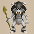
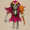
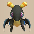
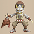
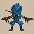
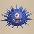

  

# Overview

<table class="dungeonOverview">
  <tr>
    <th>Unlock</th>
    <td class="highlightYellow">Talk to Drokotay the Adventurer (Shukuba Beach). 　※ DLC and Update 2.0.1 required.</td>
  </tr>
  <tr>
    <th>Entrance</th>
    <td class="highlightYellow">Shukuba Beach (Exit)</td>
  </tr>
</table>

<table class="dungeonTable">
  <tr>
    <th>Floors</th>
    <td colspan="3">99F</td>
  </tr>
  <tr>
    <th>Bring Items</th>
    <td>No</td>
    <th>Stairs</th>
    <td>Descending</td>
  </tr>
  <tr>
    <th>Companions</th>
    <td>No</td>
    <th>Roamers</th>
    <td>No</td>
  </tr>
  <tr>
    <th>Rescues</th>
    <td>3</td>
    <th>Starting Level</th>
    <td>Lv99</td>
  </tr>
  <tr>
    <th>Starting Item</th>
    <td colspan="3">Large Onigiri</td>
  </tr>
  <tr>
    <th>Unidentified</th>
    <td colspan="3">Bracelets, Pots, Incense</td>
  </tr>
  <tr>
    <th>Shops</th>
    <td>Yes</td>
    <th>Monster Houses</th>
    <td>Yes</td>
  </tr>
  <tr>
    <th>Behemoths</th>
    <td>Yes</td>
    <th>Wishing Shrines</th>
    <td></td>
  </tr>
  <tr>
    <th>Kron's Challenge</th>
    <td>Yes</td>
    <th>Fever Time</th>
    <td>Yes</td>
  </tr>
  <tr>
    <th>Initial Enemies</th>
    <td></td>
    <th>Spawn Rate</th>
    <td>50 Turns (1F - 24F) 40 Turns (25F - 30F) 35 Turns (31F - 40F) 30 Turns (41F - 99F)</td>
  </tr>
  <tr>
    <th>Wind (1st Gust)</th>
    <td>1700 Turns</td>
    <th>Reward</th>
    <td></td>
  </tr>
</table>

Mystery Dungeon where the player begins at Lv99 and loses 1 level every time they advance floors. The player can't level up even if they slay monsters, but can lose levels from Twisty Hani's dance and such. The minimum level is Lv1, and Fortune Grass isn't included in Kokatsu or Tatsumi's item transmutation ability table. In addition, Heavenly and Earthly scrolls can't be found, so methods to upgrade gear are rather limited. The monster table starts with powerful Lv4 foes, but weaker monsters get swapped in as you go deeper. Overall, this dungeon offers an interesting twist, and isn't as hard as it might seem at first glance.

# Strategy

### Dungeon Characteristics

#### Level Notes

- Lv20-99
    - Lose 3-6 Max HP per level down.
    - From Lv99 to Lv20, HP regeneration rate is 3 HP per turn.
    - From Lv99 to Lv14, normal attacks and arrows deal 0.5 less damage per level down.
- Lv10-19
    - From Lv19 to Lv10, HP regeneration rate is 2 HP per turn.
    - From Lv13 to Lv6, normal attacks and arrows deal 1.0 less damage per level down.
- Lv1-9
    - From Lv9 to Lv1, HP regeneration rate is 1 HP per turn.
    - From Lv5 to Lv1, normal attacks and arrows deal 1.5 less damage per level down.

#### Weakening Monster Table

Early game features some powerful Lv4 monsters like Hat Rascal (1-15F) and Ultra Gazer (8-18F), but the monster table generally becomes tamer as you progress deeper into the dungeon.

#### Item Notes

Any grasses, scrolls, or staves you find will always be identified from the start in this dungeon, but bracelets, pots, and incense category items are found in an unidentified state.

Max stats (HP, Fullness, Strength) that you increase through items persist even when you level down, so always prioritize increasing max stats instead of using items to replenish current stats. This mainly applies to Herb, Otogirisou, Healing Grass, and Strength Grass.

Early game floors have more items on the ground than later floors, so be sure to check all rooms.

#### Mixer & Equipment Notes

Break-Off Blade and Break-Off Shield are extremely common, while other weapons and shields are rare. Mixer family monsters only appear between 25-40F and 61-70F, but they have a decently high spawn rate. Stock up on ingredients between 1-24F, then synthesize status inflicting and Max HP increasing runes on 25F. Don't worry too much even if you end up maining the Break-Off set with an equipment strength of 0, since synthesized runes will put in most of the work compared to a few points of attack or defense.

#### Behemoth Monsters

Behemoth monsters can appear between 67-94F, including the Pumphantasm and Death Reaper families. The table cycles between Lv1\~Lv4 sets of Death Reaper, Pumphantasm, Curse Girl, and Schubell families.

##### Most Dangerous Behemoth Floors

- Soul Reaper / King Reaper - 67-68F, 71-72F, 75-76F, 79-80F, 83-84F, 87-88F, 91-92F

### Important Items

#### Weapon / Shield

Don't expect to find a variety of equipment - Items other than the Break-Off set are incredibly rare.

<b><u>Break-Off Blade / Break-Off Shield</u></b> These 2 pieces of equipment are very common early on, but become rarer as you progress. Rune slots are plentiful, so this set can be used as main equipment even after it degrades to 0 strength. Also, sacred versions of Break-Off Blade and Break-Off Shield can be found in this dungeon.

<b><u>Watchful Shield / Counter Shield</u></b> Offers effects that make it easier to fight monsters without relying on increasing upgrade value. Especially nice to have for mid game threats and Hell Reapers (81-99F).

<b><u>Hunky-dory Shield</u></b> Halves damage received when HP is equal to Max HP, which also applies to fixed damage attacks.

<b><u>Spender's Shield</u></b> Gitan Mamels and Ultra Gazers can be hunted between 8-24F to stock up on Gitan to utilize it. Reduces damage received from normal attacks by 30% at the cost of 100 Gitan per hit taken. Shield defense drops to 0 if you don't have enough Gitan.

<b><u>Gusty Shield</u></b> Grants a ~30% chance to survive a surprise attack from a Cave Mamel near the end. Not exactly great as insurance, but can be nice if you don't have Revival Grass.

<b><u>Dragon Shield</u></b> Nice against Dragons (95-99F) near the end to halve fire damage (20 → 10) when your Max HP is lower.

<b><u>Kappa's Dish</u></b> Helps you dodge Porkon (11-24F), Porko (57-63F), and Porky (81-92F)'s projectiles. Also handy for Daze Radish (61-66F) and Pesky Kappa (78-83F) floors.

<b><u>Drain Slayer</u></b> Great for Floppy Hani (57-69F), Twisty Hani (81-99F), Scorpion (81-92F), etc. The rune boosts damage even if weapon strength is 0, so it's fine to synthesize into Break-Off Blade.

<b><u>Sickle of Salvation</u></b> Death Reaper and Pumphantasm family monsters appear and overlap on a wide range of floors, so the rune remains useful even if you eradicate one of said monster families.

<b><u>Pickaxe</u></b> Mainly used to access dungeon shops that are buried in wall tiles.

#### Runes

##### Weapon Runes

|Rune|Tier|Source|Notes|
|-|-|-|-|
| Paralyzing|S|Paralyzing Staff|Chance to inflict Paralyzed status.|
| Sedating|S|Sedating Grass|Chance to inflict Asleep status.|
| Blinding|S|Blinding Grass|Chance to inflict Blind status.|
| Confusing|A|Confusion Grass|Chance to inflict Confused status.|
| Sealing|B|Sealing Staff|Chance to inflict Sealed status.|
| Anti-Draining|A|Drain Slayer|Deal x1.5 damage to Draining type monsters. Families: Twisty Hani, Scorpion, Polygon Spinna, Mudkin.|
| Anti-Ghost|A|Sickle of Salvation|Deal x1.5 damage to Ghost type monsters. Families: Ghost Radish, Skull Mage, Ghost Samurai, Death Reaper, Pumphantasm.|
| HP +20|S|Life Grass|Increase max HP by 20.|
| HP +15|S|Healing Grass|Increase max HP by 15.|
| HP +10|A|Otogirisou|Increase max HP by 10.|

##### Shield Runes

|Rune|Tier|Source|Notes|
|-|-|-|-|
| Onigiri Payback|S|Onigiri Scroll|Chance to inflict Onigiri status on attacker.|
| Jitter Payback|S|Jitters Scroll|Chance to inflict Jittery status on attacker.|
| Leap Payback|A|Leaping Grass|Chance to make the attacker warp elsewhere.|
| Keen|S|Watchful Shield|Increases your chance to evade monster normal attacks.|
| Retribution|S|Counter Shield|Reflect 50% damage received back at attacker.|
| Full Armor|S|Hunky-dory Shield|Reduces damage from any attack by 50%. Must be at full HP to activate.|
| Costly Block|B|Spender's Shield|Reduce normal attack damage received by 30%, but -100 Gitan per hit. Shield defense set to 0 without enough Gitan.|
| Guts|C|Gutsy Shield|Chance to endure a fatal hit with 1 HP. Never activates when current HP is 1.|
| Anti-Dragon|S|Dragon Shield|Reduces normal attack and fire damage received by 50%. Normal attack damage reduction only works on Dragon types.|
| Projectileproof|A|Kappa's Dish|Increases your chance to dodge enemy projectiles.|
| HP +20|S|Life Grass|Increase max HP by 20.|
| HP +15|S|Healing Grass|Increase max HP by 15.|
| HP +10|A|Otogirisou|Increase max HP by 10.|

#### Projectiles

<b><u>Rock / Porky's Rock</u></b> Useful against Gitan Mamels (8-24F), Cave Mamels (87-99F), and Behemoth Monsters (67-94F). Porky's Rocks are better if you only carry 1 type, since it takes 2 Rocks to slay a Gitan Mamel. Porky family floors: Porkon (11-24F), Porko (57-63F), and Porky (81-92F).

<b><u>Silver Arrow</u></b> Capable of damaging Behemoths and Hoppin' Batter family monsters. Also nice for thinning out enemies in a Monster House prior to stepping inside.

<b><u>Poison Arrow</u></b> 1 Poison Arrow roughly halves a target monster's attack power. If you happen to find Seewell Grass, keep an eye out for Poison Arrow Traps.

#### Bracelets

Powerful bracelets can be found on the ground, but so can negative effect bracelets. Therefore, think carefully before equipping unidentified bracelets.

<b><u>Wallpass Bracelet</u></b> Lets you move through walls, but receive damage equal to 4% of Max HP each turn inside a wall. Beware of Pop Tank, Porky, and Pumphantasm (eradicate them if possible) family monsters.

<b><u>Monster-find Bracelet</u></b> Reveals the locations of creatures on the floor. Hallways are dark between 25-99F aside from 50F, so this drastically lowers the difficulty of the dungeon.

<b><u>Floating Bracelet</u></b> Lets you walk on water and air tiles, and traps won't activate. Outmaneuver most monsters using terrain aside from Death Reaper and Pumphantasm families.

<b><u>Bellyexpand Bracelet</u></b> Increases Max Fullness by 25 while the bracelet is equipped - Helpful for activating Sumo status.

<b><u>Focusing Bracelet / Rustproof Bracelet / Cleansing Bracelet / Affixing Bracelet</u></b> Protects your equipment or status from a variety of monster special attacks.

<b><u>Bellyshrink Bracelet / Item-losing Bracelet / Gitan-losing Bracelet</u></b> These 3 bracelets are always cursed - Don't equip unidentified bracelets until they've been identified, unless there's a Removal Trap nearby or you have an Exorcism Scroll or Fixer Scroll on hand.

<b><u>Leaping Bracelet / Blasting Bracelet</u></b> Dangerous when they are generated as merchandise in a dungeon shop. It's best to keep 1500 Gitan bracelets unequipped prior to purchasing.

#### Food / Grass

<b><u>Herb / Otogirisou / Healing Grass / Life Grass / Bellyexpand Seed / Strength Grass</u></b> Items that can be used to boost max stats - More common in shops than on the ground. Always eat Herb, Otogirisou, and Healing Grass when HP is full to increase Max HP. Consider saving Life Grass and Healing Grass for synthesis if you find them near 25F.

<b><u>Invincible Grass</u></b> Safely trade hits against many threats, but it won't block stat lowering or item destroying special attacks. Keep in mind that it does protect against Gazer family's hypnosis.

<b><u>Sumo Onigiri</u></b> Can be obtained from wall tiles, shops, or making a Behemoth Gate vanish. Sumo status boosts Max HP by 50, attack power by x1.5, and makes you immune to traps. Equip a Bellyshrink Bracelet before eating it if possible to maximize gains.

<b><u>Sweet Potato</u></b> Mostly obtained from wall tiles or shops. Use it when you're surrounded, or if you used Narrow-escape Staff too many times, etc.

#### Scrolls

<b><u>Confusion Scroll / Slumber Scroll / Jitters Scroll / Fixer Scroll</u></b> Save these for when swinging staves won't disable enemies fast enough. Don't be afraid to stock lots of them, and use them as needed when rushing to the stairs.

<b><u>Pot-upsize Scroll</u></b> Read these on Preservation Pots, Rejuvenation Pots, or Synthesis Pots.

<b><u>Exorcism Scroll</u></b> Fixer Scroll can remove curses from equipped items, so select non-equipment category items.

<b><u>Collection Scroll</u></b> Some floors feature items that are buried in wall tiles, so this lets you claim those items.

<b><u>Wall-less Scroll</u></b> Can be used to claim buried items, or to instantly make a Behemoth Gate vanish. However, you'll likely need other items to deal with monsters after reading it.

<b><u>Mapping Scroll</u></b> Save one for 25F to make it easier to synthesize using Mixergons. Also nice to read when you want to increase safety before throwing an Eradication Scroll.

<b><u>Eradication Scroll (Blank Scroll)</u></b> Pumphantasm family is the best target since they appear on a wide range of floors and can cut off escape routes. Floor ranges: Pumplord (13-24F), Pumplich (41-56F), Pumpanshee (70-86F), Pumphantasm (87-99F). That said, Cave Mamel (87-99F) is also a pretty good target closer to the end.

<b><u>Silverpurge Scroll</u></b> It hasn't been sighted on the ground yet, so it might be shop-exclusive. Consider writing Silverpurge on a Blank Scroll if you find a sacred item with high stats or a great rune.

<b><u>Expulsion Scroll</u></b> Can be found in shops (reported on 56F and 94F so far), and excellent for Monster Houses. Read it after using a Monstercall Scroll to safely restock items and activate the Monster-find effect.

#### Staves

It's a good idea to swing staves 1 time to check for curses when you first find them.

<b><u>Paralyzing Staff / Narrow-escape Staff / Earthmound Staff</u></b> Paralyze a monster to block off pursuing enemies and buy more time to regenerate HP. Paralyzing Staff[0] can still be used to synthesize the Paralyzing weapon rune. Narrow-escape Staff can be swung at Hoppin' Slugger to warp to the stairs, but it can be quite risky. Consider swinging Narrow-escape Staff at a weak monster once before swinging it at tougher foes.

<b><u>Sluggish Staff / Sealing Staff / Empathetic Staff / Skull Mage's Staff</u></b> Useful when you intend to slay a foe by trading hits - Empathetic is better early on when Max HP is higher.

<b><u>Switching Staff / Vaulting Staff / Knockback Staff</u></b> Quickly escape bad starting rooms, vault-warp out of a dead end, or skip past a Narrow-escape'd foe.

<b><u>Thunderbolt Staff</u></b> Basically exclusively used to one-shot Gitan Mamels during early game. Can be useful against weaker enemies near the end, but don't damage yourself.

<b><u>Guiding Staff</u></b> Save these for floors where dark hallways overlap with major threats like Nigiri Honcho. Can be paired with a Blurry Incense to mostly ensure safety in a tricky starting room.

#### Pots / Incense / Other

<b><u>Preservation Pot</u></b> Lets you carry more consumable items and synthesis ingredients. Some players prioritize duplicating Preservation Pots when they find a Bouncy Wall Room.

<b><u>Identifier Pot / Exorcism Pot</u></b> Insert grass or scroll items to check for curses, or insert bracelets to identify them.

<b><u>Rejuvenation Pot</u></b> HP restoring grasses should be eaten at full HP to increase Max HP, so this pot is your main source for healing. Aim to keep at least 1~2 on hand at all times as you progress.

<b><u>Bottomless Pot</u></b> Break it and intentionally step on a Pitfall Trap to skip past a Monster House or such. However, avoid carrying it around on floors where Gazer family monsters appear.

<b><u>Blurry Incense</u></b> Counters single room Monster Houses (or bad starting rooms). Especially nice when you have Sumo status and can't rely on movement staves or Bottomless Pot.

<b><u>Evasive Incense</u></b> Collect Porky's Rocks from Porky family monsters, or Confusion Grass from Daze Radishes.

<b><u>Aggressive Incense</u></b> Very risky, but can be the difference in one-shotting monsters when you have Sumo status. Projectiles also become more viable, but overall questionable if this incense is worth carrying around.

<b><u>Gitan</u></b> Ultra Gazer and Gitan Mamel drop high value Gitan bags, which can be thrown to one-shot most threats. Gitan also fuels Spender's Shield - Costly Block is 30% damage reduction in exchange for -100 Gitan per hit.

### Farming Techniques

You don't earn experience points, so there usually isn't much reason to linger on any given floor.

#### Projectile Farming (11-24F)

Ultra Gazer (8-18F), Gitan Mamel (8-24F), and Porkon (11-24F) appear in this floor range. It's possible to collect Porky's Rocks if you find an item like Kappa's Dish or Evasive Incense. Ultra Gazer drops 3,000 Gitan (600 damage), and Gitan Mamel drops 2,000 Gitan (400 damage).

# Floor Guide

### General Advice

The player might feel pressured to rush stairs instead of exploring thanks to the dungeon's rules, but early\~mid game (1-40F) is key to how the remainder of the dungeon plays out, so be sure to explore. It could be the difference between having to switch to evasive play vs. feeling close to a victory lap. ※ Special Monster Houses can be generated, so don't neglect items to counter Monster Houses.

### 1-7F

Notable: Dragon (1-7F), Detonachin (1-10F), Hat Rascal (1-15F), Hoppin' Slammer (1-18F)

Item Stocking Zone - Large quantities of items are generated on the ground, so check every room. Keep an eye out for Thunderbolt Staff, Empathetic Staff, and Rocks for upcoming Gitan Mamel floors. Try to identify pots and incenses, but wait to try on bracelets until you find an Exorcism Scroll or such. It's possible to defeat monsters without equipment at Lv99, but fighting multiple in a row can be rough, so try to regen HP between fights, and beware of Hoppin' Slammers who nullify staves and projectiles.

Hoppin' Slammer (125 HP, 49 atk, 49 def) has a 100% chance to reflect magic bullets and projectiles. Hat Rascal (170 HP, 85 atk, 12 def) steals and tosses away a staff, grass, food, or scroll item. Detonachin (260 HP, 55 atk, 37 def) explodes when HP ≤ 52 (Deal 208+ damage to it). Dragon (120 HP, 45 atk, 40 def) spews a 20 damage flame in a straight line.

<b><u>Playing as Kokatsu / Tatsumi</u></b> Fortune Grass doesn't appear, but Sun's Blessing / Rain's Blessing can still be used to boost max stats. Prioritize Max Fullness and Max Strength first, since Max HP above 500 won't be reflected.

### 8-15F

Notable: Hat Rascal (1-15F), Hoppin' Slammer (1-18F), Ultra Gazer (8-18F), Gitan Mamel (8-24F), Porkon (11-24F), Dragon Pit (11-24F), Electroid (11-24F), Pumplord (13-24F)

High Pressure Zone - Swift monsters appear alongside enemies with tricky abilities or special attacks. Avoid Reflective Incense as a counter to Ultra Gazer since it makes it harder to use staves against other foes. Ultra Gazer honestly shouldn't be too bad since hallways are visible - Just avoid being in the same room. Use items like Thunderbolt Staff, Empathetic Staff, Knockback Staff, or Rocks against Gitan Mamels. Swap high value Gitan bag drops to use as projectiles, but never throw Gitan at Hoppin' Slammer. If you have a Kappa's Dish or Evasive Incense, collect some Porky's Rocks from a Porkon.

Ultra Gazer (196 HP, 60 atk, 55 def) hypnotizes from anywhere in the room, and always drops 3000G. Gitan Mamel (20 HP, 100 atk, 999 def) has Swift 2 speed, takes 1 damage from normal hits, and drops 2000G. Porkon (150 HP, 75 atk, 50 def) throws 20 damage Porky's Rocks within an 8 tile radius. Dragon Pit (130 HP, 54 atk, 40 def) has Swift 1 speed and burrows underground to pincer you in hallways. Electroid (150 HP, 56 atk, 53 def) has Swift 1 speed and always wakes when you enter or exit the room. Pumplord (185 HP, 75 atk, 35 def) passes through walls and has semi-random movement.

### 16-24F

Notable: Hoppin' Slammer (1-18F), Ultra Gazer (8-18F), Gitan Mamel (8-24F), Porkon (11-24F), Dragon Pit (11-24F), Electroid (11-24F), Pumplord (13-24F), Battler (16-24F), Fleefrog (19-28F)

High Pressure Zone (Continued) - Mostly the same monsters, but Battler and Fleefrog join the fray. Hat Rascal and Ultra Gazer exit the table after 15F and 18F respectively, so your items are a bit safer. Battler has considerable stats, so it's best to use a Poison Arrow or high value Gitan bag against it. Try to explore for more synthesis ingredients and useful items before hallways become dark (25F).

Battler (200 HP, 69 atk, 50 def) can disarm your equipped weapon, shield, or bracelet when adjacent. Fleefrog (125 HP, 60 atk, 45 def) pulls the player in a straight line (10 tile range) and attacks.

### 25-34F

Notable: Skullmancer (25-30F), Droopy Hani (25-30F), Nigiri Honcho (25-34F), Mixergon (25-40F), Fulminachin (29-34F), Adamant Tank (31-34F), Fire Ninja B (31-34F), Blazepuff (31-40F)

Mixergon & Insta-Collapse Zone - It's finally possible to synthesize, but danger looms in dark hallways. If you have a Mapping Scroll or Sanctuary Scroll, go ahead and use it on 25F to safely synthesize items. Nigiri Honcho and Skullmancer can both inflict Onigiri status, so beware of fire and explosion damage. Never give Nigiri Honcho or Droopy Hani a chance to act when adjacent, and rush stairs between 31-34F. Don't forget that Fire Ninja B and Blazepuff can use fire attacks through corners.

See the earlier [Runes](#runes) section if you need ideas on what to synthesize in this dungeon.

Skullmancer (111 HP, 50 atk, 41 def)'s magic effects include Paralyzed, Sealed, Onigiri, Confused, Slow, or Level-1. Droopy Hani (120 HP, 49 atk, 49 def) decreases player level by 1 when adjacent. Nigiri Honcho (165 HP, 61 atk, 54 def) either inflicts Onigiri status, or morphs an item into onigiri. Mixergon (118 HP, 68 atk, 40 def) eats and synthesizes up to 4 thrown items. Fulminachin (200 HP, 45 atk, 32 def) explodes when HP ≤ 40 (Deal 160+ damage to it). Adamant Tank (100 HP, 60 atk, 54 def) is Swift 1 speed and deals 40 damage per cannonball. Fire Ninja B (105 HP, 56 atk, 39 def) burns staves, scrolls, grass, and onigiri items that are on the ground. Blazepuff (135 HP, 55 atk, 35 def) breathes a 30 damage flame when adjacent, but it occasionally fails.

### 35-40F

Notable: Mixergon (25-40F), Blazepuff (31-40F), Lashagga (35-40F), Mini Tank (35-40F), Great Hen (35-40F)

Mixergon & Rapid Strikes Zone - Mixergon is still around, but other monsters strike rapidly. Keep your current HP topped up, using Earthmound or Paralyzing staves to block off routes as needed. Use staves against Mini Tank if you get caught in a room, and seal Lashagga to reduce its attack count to 1.

Lashagga (99 HP, 43 atk, 34 def) performs 3 consecutive normal attacks in a single turn. Mini Tank (100 HP, 55 atk, 40 def) has Swift 1 speed, and shoots Silver Arrows in a straight line. Great Hen (120 HP, 55 atk, 40 def) has Swift 1 speed, and reverts to a Lv1 Hen when HP ≤ 24.

### 41-51F

Notable: Thrashead (41-51F), Soul Reaper (41-51F), Pumplich (41-56F), Hyper Gazer (41-56F), N'dulu (41-56F), Popdillo (44-51F), Hannya Monk C (48-56F)

Relentless Zone - Monsters with wallpass abilities, ranged attacks, hypnosis, and surprise attacks. Popdillo aims to make you lose items midway through, and Hannya Monk C tries to level up monsters. If you have an Eradication Scroll, it's best to throw it at Pumplich or Soul Reaper at this point. 50F is always a Shuffle Dungeon style map based on Kibanuma Marsh.

Thrashead (122 HP, 55 atk, 45 def) attacks up to 3 tiles ahead and can hit through corners. Soul Reaper (75 HP, 40 atk, 40 def) has Swift 2 speed + wall-clip, and detects you from anywhere. Pumplich (100 HP, 50 atk, 30 def) can wall-clip and has a somewhat random movement pattern. Hyper Gazer (126 HP, 55 atk, 45 def) forces item usage or a normal attack in a random direction. N'dulu (70 HP, 40 atk, 31 def) won't reveal itself until you use the item, insert it into a pot, or change floors. Popdillo (100 HP, 51 atk, 45 def)'s tackle makes you trip and drop inventory items on the ground. Hannya Monk C (106 HP, 47 atk, 35 def) causes other enemies to level up or defeat Shopkeepers.

### 52-56F

Notable: Pumplich (41-56F), Hyper Gazer (41-56F), N'dulu (41-56F), Hannya Monk C (48-56F), Hat Brat (52-56F), Vile Scorpion (52-61F)

Soul Reaper, Thrashead, and Popdillo get swapped out with Hat Brat and Vile Scorpion. It's probably best to hurry to the stairs if you don't have a Monster-find Bracelet or Cleansing Bracelet.

Hat Brat (125 HP, 45 atk, 9 def) steals and tosses away a staff, grass, or food category item. Vile Scorpion (108 HP, 45 atk, 33 def) occasionally lowers strength by 2 when adjacent.

### 57-60F

Notable: Vile Scorpion (52-61F), Water Ninja B (55-61F), Porko (57-63F), Floppy Hani (57-69F), Blazeous (59-65F)

Pumplich, Hyper Gazer, N'dulu, and Hannya Monk C get swapped out with Porko, Floppy Hani, etc. Expect to lose additional levels here due to Floppy Hani if you don't have a Monster-find Bracelet. Porko's rock damage can add up, so avoid lingering in hallways if you lack a Rejuvenation Pot.

Water Ninja B (120 HP, 45 atk, 39 def) shoots water up to 3 tiles ahead, dealing 15 damage. Porko (65 HP, 36 atk, 18 def) throws Porky's Rocks which deal 20 damage within a 5 tile radius. Floppy Hani (85 HP, 39 atk, 39 def) occasionally lowers level by 1 when adjacent. Blazeous (92 HP, 36 atk, 24 def) is immune to projectiles and multiplies from explosions.

### 61-70F

Notable: Floppy Hani (57-69F), Daze Radish (61-66F), Mixermon (61-70F), Polygon Shaka (62-69F), Cursister (66-72F), Concusschin (66-72F), Behemoth (67-94F)

Mixermon Zone - This floor range is your final chance to synthesize items. However, monsters like Daze Radish, Polygon Shaka, and Cursister aim to make it harder to linger. Behemoth Gates capable of spawning Death Reaper family monsters can also appear between 67-94F, so it's essential to rush stairs even if you have Porky's Rocks - Read Wall-less Scroll if cornered by a Behemoth. B-Soul Reaper / B-King Reaper floors - 67-68F, 71-72F, 75-76F, 79-80F, 83-84F, 87-88F, 91-92F. It gets harder to explore in the next floor range, so check rooms for items if a Behemoth Gate didn't appear.

See the earlier [Runes](#runes) section if you need ideas on what to synthesize in this dungeon.

Daze Radish (80 HP, 37 atk, 27 def) throws Confusion → Poison Grass within a 2 tile radius. Mixermon (98 HP, 50 atk, 35 def) eats and synthesizes up to 3 thrown items. Polygon Shaka (70 HP, 34 atk) occasionally lowers Fullness by 5 when adjacent. Cursister (115 HP, 38 atk, 38 def) can curse your weapon or shield when adjacent. Concusschin (160 HP, 35 atk, 27 def) explodes when HP ≤ 32 (Deal 128+ damage to it).

### 71-80F

Notable: Pumpanshee (70-86F), Muddy (70-80F), Skull Mage (70-99F), Pesky Kappa (78-83F), Behemoth (67-94F)

The difficulty from here varies based on runes, gear, and whether or not the Pumphantasm family is eradicated. Muddy is a non-issue if you're using the Break-Off set since gear strength will likely already be at 0. Skull Mage occasionally drops Skull Mage's Staff when defeated, so don't throw an Eradication Scroll at it. Behemoths are still a menace and Pesky Kappa's item throw + Schubell's summon can cause accidents. B-Soul Reaper / B-King Reaper floors - 67-68F, 71-72F, 75-76F, 79-80F, 83-84F, 87-88F, 91-92F.

Pumpanshee (60 HP, 35 atk, 22 def) passes through walls and has somewhat random movement. Muddy (75 HP, 25 atk, 33 def) occasionally lowers a weapon or shield's upgrade value by 2 when adjacent. Skull Mage (77 HP, 31 atk, 21 def)'s magic effects include Warp, Swift, Knockback, or Switching. Pesky Kappa (75 HP, 29 atk, 22 def) throws items - excluding weapons or Gitan - at you within 5 tiles. Schubell (50 HP, 20 atk, 20 def) occasionally summons 1 monster when Shiren is within view.

### 81-86F

Notable: Pumpanshee (70-86F), Skull Mage (70-99F), Pesky Kappa (78-83F), Scorpion (81-92F), Porky (81-92F), Twisty Hani (81-99F), Hell Reaper (81-99F), Behemoth (67-94F)

Draining & Ghost Zone - The Anti-Draining and Anti-Ghost weapon runes excel at this point. Hell Reaper can't do much harm if you have a shield with ~10 defense, but otherwise rush to the stairs. Porky's rock throwing range might only be 3 tiles, but 20 damage adds up fast when max HP is low. As usual, beware of Behemoth Gates on floors where Lv3-4 Death Reapers are a possibility. B-Soul Reaper / B-King Reaper floors - 67-68F, 71-72F, 75-76F, 79-80F, 83-84F, 87-88F, 91-92F.

Scorpion (37 HP, 14 atk) occasionally lowers Strength by 1 when adjacent. Porky (30 HP, 17 atk, 12 def) throws 20 damage Porky's Rocks within a 3 tile radius. Twisty Hani (35 HP, 12 atk, 15 def) occasionally lowers Shiren's level by 1 when adjacent. Hell Reaper (45 HP, 12 atk, 15 def) has Swift 2 speed, but it cannot pass through walls.

### 87-94F

Notable: Skull Mage (70-99F), Scorpion (81-92F), Porky (81-92F), Twisty Hani (81-99F), Hell Reaper (81-99F), Pumphantasm (87-99F), Cave Mamel (87-99F), Hoppin' Slugger (87-99F), Behemoth (67-94F)

Cave Mamel Zone - Cave Mamel can potentially one-shot you by surprising you in a dark hallway. If you happen to have a spare Eradication (or Blank) scroll, consider throwing it at a Cave Mamel now. If you decide to go without eradicating Cave Mamels, DO NOT dash under any circumstances. Otherwise, Pumpanshee is downgraded to Pumphantasm, and the Lv3 Hoppin' Slugger appears. It might be tempting to swing a Narrow-escape Staff at a Hoppin' Slugger to warp to the stairs, but it's extremely risky if Cave Mamels aren't eradicated, so just don't do it. B-Soul Reaper / B-King Reaper floors - 67-68F, 71-72F, 75-76F, 79-80F, 83-84F, 87-88F, 91-92F.

Pumphantasm (23 HP, 16 atk, 10 def) passes through walls and has somewhat random movement. Cave Mamel (5 HP, 100 atk, 100 def) has high attack power and only takes 1 damage from normal attacks. Hoppin' Slugger (72 HP, 39 atk, 31 def) has a 50% chance to reflect magic bullets and projectiles.

### 95-99F

Notable: Skull Mage (70-99F), Twisty Hani (81-99F), Hell Reaper (81-99F), Pumphantasm (87-99F), Cave Mamel (87-99F), Hoppin' Slugger (87-99F), Dragon (95-99F)

Cave Mamel & Dragon Zone - Similar monsters as the previous floor range, but with Lv1 Dragons. Dragons are tough to defeat even if you're maining a Dragon Shield, so use items to avoid them instead. Behemoth Gates never appear between 95-99F, so don't worry about Behemoth Death Reapers anymore.

Dragon (120 HP, 45 atk, 40 def) spews a 20 damage flame in a straight line.

# Monsters

See [Monsters](/system/monsters) for individual monster details.

- F - Dark hallways
- S - Shop is possible
- H - Monster House is possible
- G - Golden Egg Thing is possible
- B - Behemoth Monsters are possible

Monster Colors = Farming, Useful, Lowers Stats, Targets Items, Dangerous

<table class="monsterTable">
  <thead>
    <tr>
      <th>F</th>
      <th>S</th>
      <th>H</th>
      <th>G</th>
      <th colspan="5">Monsters</th>
      <th>B</th>
    </tr>
  </thead>
  <tbody>
    <tr>
      <td class="centeredText">1</td>
      <td class=""></td>
      <td class=""></td>
      <td class=""></td>
      <td> General Ant</td>
      <td> Detonachin</td>
      <td> Hoppin' Slammer</td>
      <td class="items"> Hat Rascal</td>
      <td class="danger"> Dragon</td>
      <td class=""></td>
    </tr>
    <tr>
      <td colspan="10" class="tableDivider"></td>
    </tr>
    <tr>
      <td class="centeredText">2</td>
      <td class=""></td>
      <td class=""></td>
      <td class=""></td>
      <td> General Ant</td>
      <td> Detonachin</td>
      <td> Hoppin' Slammer</td>
      <td class="items"> Hat Rascal</td>
      <td class="danger"> Dragon</td>
      <td class=""></td>
    </tr>
    <tr>
      <td colspan="10" class="tableDivider"></td>
    </tr>
    <tr>
      <td class="centeredText">3</td>
      <td class=""></td>
      <td class=""></td>
      <td class=""></td>
      <td> General Ant</td>
      <td> Detonachin</td>
      <td> Hoppin' Slammer</td>
      <td class="items"> Hat Rascal</td>
      <td class="danger"> Dragon</td>
      <td class=""></td>
    </tr>
    <tr>
      <td colspan="10" class="tableDivider"></td>
    </tr>
    <tr>
      <td class="centeredText">4</td>
      <td class=""></td>
      <td class=""></td>
      <td class=""></td>
      <td> General Ant</td>
      <td> Detonachin</td>
      <td> Hoppin' Slammer</td>
      <td class="items"> Hat Rascal</td>
      <td class="danger"> Dragon</td>
      <td class=""></td>
    </tr>
    <tr>
      <td colspan="10" class="tableDivider"></td>
    </tr>
    <tr>
      <td class="centeredText">5</td>
      <td class=""></td>
      <td class=""></td>
      <td class=""></td>
      <td> Detonachin</td>
      <td> Hoppin' Slammer</td>
      <td class="items"> Hat Rascal</td>
      <td class="danger"> Dragon</td>
      <td> Boomdon</td>
      <td class=""></td>
    </tr>
    <tr>
      <td colspan="10" class="tableDivider"></td>
    </tr>
    <tr>
      <td class="centeredText">6</td>
      <td class=""></td>
      <td class=""></td>
      <td class=""></td>
      <td> Detonachin</td>
      <td> Hoppin' Slammer</td>
      <td class="items"> Hat Rascal</td>
      <td class="danger"> Dragon</td>
      <td> Boomdon</td>
      <td class=""></td>
    </tr>
    <tr>
      <td colspan="10" class="tableDivider"></td>
    </tr>
    <tr>
      <td class="centeredText">7</td>
      <td class=""></td>
      <td class=""></td>
      <td class=""></td>
      <td> Detonachin</td>
      <td> Hoppin' Slammer</td>
      <td class="items"> Hat Rascal</td>
      <td class="danger"> Dragon</td>
      <td> Boomdon</td>
      <td class=""></td>
    </tr>
    <tr>
      <td colspan="10" class="tableDivider"></td>
    </tr>
    <tr>
      <td rowspan="2" class="centeredText">8</td>
      <td rowspan="2" class=""></td>
      <td rowspan="2" class=""></td>
      <td rowspan="2" class=""></td>
      <td> Detonachin</td>
      <td> Hoppin' Slammer</td>
      <td class="items"> Hat Rascal</td>
      <td> Boomdon</td>
      <td class="danger"> Ultra Gazer</td>
      <td rowspan="2" class=""></td>
    </tr>
    <tr>
      <td class="danger"> Gitan Mamel</td>
      <td class="highlightGray"></td>
      <td class="highlightGray"></td>
      <td class="highlightGray"></td>
      <td class="highlightGray"></td>
    </tr>
    <tr>
      <td colspan="10" class="tableDivider"></td>
    </tr>
    <tr>
      <td rowspan="2" class="centeredText">9</td>
      <td rowspan="2" class=""></td>
      <td rowspan="2" class=""></td>
      <td rowspan="2" class=""></td>
      <td> Detonachin</td>
      <td> Hoppin' Slammer</td>
      <td class="items"> Hat Rascal</td>
      <td> Boomdon</td>
      <td class="danger"> Ultra Gazer</td>
      <td rowspan="2" class=""></td>
    </tr>
    <tr>
      <td class="danger"> Gitan Mamel</td>
      <td class="highlightGray"></td>
      <td class="highlightGray"></td>
      <td class="highlightGray"></td>
      <td class="highlightGray"></td>
    </tr>
    <tr>
      <td colspan="10" class="tableDivider"></td>
    </tr>
    <tr>
      <td rowspan="2" class="centeredText">10</td>
      <td rowspan="2" class=""></td>
      <td rowspan="2" class=""></td>
      <td rowspan="2" class=""></td>
      <td> Detonachin</td>
      <td> Hoppin' Slammer</td>
      <td class="items"> Hat Rascal</td>
      <td> Boomdon</td>
      <td class="danger"> Ultra Gazer</td>
      <td rowspan="2" class=""></td>
    </tr>
    <tr>
      <td class="danger"> Gitan Mamel</td>
      <td class="highlightGray"></td>
      <td class="highlightGray"></td>
      <td class="highlightGray"></td>
      <td class="highlightGray"></td>
    </tr>
    <tr>
      <td colspan="10" class="tableDivider"></td>
    </tr>
    <tr>
      <td rowspan="2" class="centeredText">11</td>
      <td rowspan="2" class=""></td>
      <td rowspan="2" class=""></td>
      <td rowspan="2" class=""></td>
      <td> Hoppin' Slammer</td>
      <td class="items"> Hat Rascal</td>
      <td> Boomdon</td>
      <td class="danger"> Ultra Gazer</td>
      <td> Dragon Pit</td>
      <td rowspan="2" class=""></td>
    </tr>
    <tr>
      <td class="danger"> Porkon</td>
      <td> Electroid</td>
      <td class="danger"> Gitan Mamel</td>
      <td class="highlightGray"></td>
      <td class="highlightGray"></td>
    </tr>
    <tr>
      <td colspan="10" class="tableDivider"></td>
    </tr>
    <tr>
      <td rowspan="2" class="centeredText">12</td>
      <td rowspan="2" class=""></td>
      <td rowspan="2" class=""></td>
      <td rowspan="2" class=""></td>
      <td> Hoppin' Slammer</td>
      <td class="items"> Hat Rascal</td>
      <td> Boomdon</td>
      <td class="danger"> Ultra Gazer</td>
      <td> Dragon Pit</td>
      <td rowspan="2" class=""></td>
    </tr>
    <tr>
      <td class="danger"> Porkon</td>
      <td> Electroid</td>
      <td class="danger"> Gitan Mamel</td>
      <td class="highlightGray"></td>
      <td class="highlightGray"></td>
    </tr>
    <tr>
      <td colspan="10" class="tableDivider"></td>
    </tr>
    <tr>
      <td rowspan="2" class="centeredText">13</td>
      <td rowspan="2" class=""></td>
      <td rowspan="2" class=""></td>
      <td rowspan="2" class=""></td>
      <td> Hoppin' Slammer</td>
      <td class="items"> Hat Rascal</td>
      <td> Boomdon</td>
      <td class="danger"> Ultra Gazer</td>
      <td> Dragon Pit</td>
      <td rowspan="2" class=""></td>
    </tr>
    <tr>
      <td class="danger"> Porkon</td>
      <td> Electroid</td>
      <td class="danger"> Pumplord</td>
      <td class="danger"> Gitan Mamel</td>
      <td class="highlightGray"></td>
    </tr>
    <tr>
      <td colspan="10" class="tableDivider"></td>
    </tr>
    <tr>
      <td rowspan="2" class="centeredText">14</td>
      <td rowspan="2" class=""></td>
      <td rowspan="2" class=""></td>
      <td rowspan="2" class=""></td>
      <td> Hoppin' Slammer</td>
      <td class="items"> Hat Rascal</td>
      <td> Boomdon</td>
      <td class="danger"> Ultra Gazer</td>
      <td> Dragon Pit</td>
      <td rowspan="2" class=""></td>
    </tr>
    <tr>
      <td class="danger"> Porkon</td>
      <td> Electroid</td>
      <td class="danger"> Pumplord</td>
      <td class="danger"> Gitan Mamel</td>
      <td class="highlightGray"></td>
    </tr>
    <tr>
      <td colspan="10" class="tableDivider"></td>
    </tr>
    <tr>
      <td rowspan="2" class="centeredText">15</td>
      <td rowspan="2" class=""></td>
      <td rowspan="2" class=""></td>
      <td rowspan="2" class=""></td>
      <td> Hoppin' Slammer</td>
      <td class="items"> Hat Rascal</td>
      <td> Boomdon</td>
      <td class="danger"> Ultra Gazer</td>
      <td> Dragon Pit</td>
      <td rowspan="2" class=""></td>
    </tr>
    <tr>
      <td class="danger"> Porkon</td>
      <td> Electroid</td>
      <td class="danger"> Pumplord</td>
      <td class="danger"> Gitan Mamel</td>
      <td class="highlightGray"></td>
    </tr>
    <tr>
      <td colspan="10" class="tableDivider"></td>
    </tr>
    <tr>
      <td rowspan="2" class="centeredText">16</td>
      <td rowspan="2" class=""></td>
      <td rowspan="2" class=""></td>
      <td rowspan="2" class=""></td>
      <td> Hoppin' Slammer</td>
      <td class="danger"> Ultra Gazer</td>
      <td> Dragon Pit</td>
      <td class="danger"> Porkon</td>
      <td> Electroid</td>
      <td rowspan="2" class=""></td>
    </tr>
    <tr>
      <td class="danger"> Pumplord</td>
      <td class="items"> Battler</td>
      <td class="danger"> Gitan Mamel</td>
      <td class="highlightGray"></td>
      <td class="highlightGray"></td>
    </tr>
    <tr>
      <td colspan="10" class="tableDivider"></td>
    </tr>
    <tr>
      <td rowspan="2" class="centeredText">17</td>
      <td rowspan="2" class=""></td>
      <td rowspan="2" class=""></td>
      <td rowspan="2" class=""></td>
      <td> Hoppin' Slammer</td>
      <td class="danger"> Ultra Gazer</td>
      <td> Dragon Pit</td>
      <td class="danger"> Porkon</td>
      <td> Electroid</td>
      <td rowspan="2" class=""></td>
    </tr>
    <tr>
      <td class="danger"> Pumplord</td>
      <td class="items"> Battler</td>
      <td class="danger"> Gitan Mamel</td>
      <td class="highlightGray"></td>
      <td class="highlightGray"></td>
    </tr>
    <tr>
      <td colspan="10" class="tableDivider"></td>
    </tr>
    <tr>
      <td rowspan="2" class="centeredText">18</td>
      <td rowspan="2" class=""></td>
      <td rowspan="2" class=""></td>
      <td rowspan="2" class=""></td>
      <td> Hoppin' Slammer</td>
      <td class="danger"> Ultra Gazer</td>
      <td> Dragon Pit</td>
      <td class="danger"> Porkon</td>
      <td> Electroid</td>
      <td rowspan="2" class=""></td>
    </tr>
    <tr>
      <td class="danger"> Pumplord</td>
      <td class="items"> Battler</td>
      <td class="danger"> Gitan Mamel</td>
      <td class="highlightGray"></td>
      <td class="highlightGray"></td>
    </tr>
    <tr>
      <td colspan="10" class="tableDivider"></td>
    </tr>
    <tr>
      <td rowspan="2" class="centeredText">19</td>
      <td rowspan="2" class=""></td>
      <td rowspan="2" class=""></td>
      <td rowspan="2" class=""></td>
      <td> Dragon Pit</td>
      <td class="danger"> Porkon</td>
      <td> Electroid</td>
      <td class="danger"> Pumplord</td>
      <td class="items"> Battler</td>
      <td rowspan="2" class=""></td>
    </tr>
    <tr>
      <td class="danger"> Gitan Mamel</td>
      <td> Fleefrog</td>
      <td class="highlightGray"></td>
      <td class="highlightGray"></td>
      <td class="highlightGray"></td>
    </tr>
    <tr>
      <td colspan="10" class="tableDivider"></td>
    </tr>
    <tr>
      <td rowspan="2" class="centeredText">20</td>
      <td rowspan="2" class=""></td>
      <td rowspan="2" class=""></td>
      <td rowspan="2" class=""></td>
      <td> Dragon Pit</td>
      <td class="danger"> Porkon</td>
      <td> Electroid</td>
      <td class="danger"> Pumplord</td>
      <td class="items"> Battler</td>
      <td rowspan="2" class=""></td>
    </tr>
    <tr>
      <td class="danger"> Gitan Mamel</td>
      <td> Fleefrog</td>
      <td class="highlightGray"></td>
      <td class="highlightGray"></td>
      <td class="highlightGray"></td>
    </tr>
    <tr>
      <td colspan="10" class="tableDivider"></td>
    </tr>
    <tr>
      <td rowspan="2" class="centeredText">21</td>
      <td rowspan="2" class=""></td>
      <td rowspan="2" class=""></td>
      <td rowspan="2" class=""></td>
      <td> Dragon Pit</td>
      <td class="danger"> Porkon</td>
      <td> Electroid</td>
      <td class="danger"> Pumplord</td>
      <td class="items"> Battler</td>
      <td rowspan="2" class=""></td>
    </tr>
    <tr>
      <td class="danger"> Gitan Mamel</td>
      <td> Fleefrog</td>
      <td class="highlightGray"></td>
      <td class="highlightGray"></td>
      <td class="highlightGray"></td>
    </tr>
    <tr>
      <td colspan="10" class="tableDivider"></td>
    </tr>
    <tr>
      <td rowspan="2" class="centeredText">22</td>
      <td rowspan="2" class=""></td>
      <td rowspan="2" class=""></td>
      <td rowspan="2" class=""></td>
      <td> Dragon Pit</td>
      <td class="danger"> Porkon</td>
      <td> Electroid</td>
      <td class="danger"> Pumplord</td>
      <td class="items"> Battler</td>
      <td rowspan="2" class=""></td>
    </tr>
    <tr>
      <td class="danger"> Gitan Mamel</td>
      <td> Fleefrog</td>
      <td class="highlightGray"></td>
      <td class="highlightGray"></td>
      <td class="highlightGray"></td>
    </tr>
    <tr>
      <td colspan="10" class="tableDivider"></td>
    </tr>
    <tr>
      <td rowspan="2" class="centeredText">23</td>
      <td rowspan="2" class=""></td>
      <td rowspan="2" class=""></td>
      <td rowspan="2" class=""></td>
      <td> Dragon Pit</td>
      <td class="danger"> Porkon</td>
      <td> Electroid</td>
      <td class="danger"> Pumplord</td>
      <td class="items"> Battler</td>
      <td rowspan="2" class=""></td>
    </tr>
    <tr>
      <td class="danger"> Gitan Mamel</td>
      <td> Fleefrog</td>
      <td class="highlightGray"></td>
      <td class="highlightGray"></td>
      <td class="highlightGray"></td>
    </tr>
    <tr>
      <td colspan="10" class="tableDivider"></td>
    </tr>
    <tr>
      <td rowspan="2" class="centeredText">24</td>
      <td rowspan="2" class=""></td>
      <td rowspan="2" class=""></td>
      <td rowspan="2" class=""></td>
      <td> Dragon Pit</td>
      <td class="danger"> Porkon</td>
      <td> Electroid</td>
      <td class="danger"> Pumplord</td>
      <td class="items"> Battler</td>
      <td rowspan="2" class=""></td>
    </tr>
    <tr>
      <td class="danger"> Gitan Mamel</td>
      <td> Fleefrog</td>
      <td class="highlightGray"></td>
      <td class="highlightGray"></td>
      <td class="highlightGray"></td>
    </tr>
    <tr>
      <td colspan="10" class="tableDivider"></td>
    </tr>
    <tr>
      <td rowspan="2" class="centeredText highlightFog">25</td>
      <td rowspan="2" class=""></td>
      <td rowspan="2" class=""></td>
      <td rowspan="2" class=""></td>
      <td> Fleefrog</td>
      <td class="danger"> Nigiri Honcho</td>
      <td> Clapdon</td>
      <td class="danger"> Skullmancer</td>
      <td class="useful"> Mixergon</td>
      <td rowspan="2" class=""></td>
    </tr>
    <tr>
      <td class="stats"> Droopy Hani</td>
      <td class="highlightGray"></td>
      <td class="highlightGray"></td>
      <td class="highlightGray"></td>
      <td class="highlightGray"></td>
    </tr>
    <tr>
      <td colspan="10" class="tableDivider"></td>
    </tr>
    <tr>
      <td rowspan="2" class="centeredText highlightFog">26</td>
      <td rowspan="2" class=""></td>
      <td rowspan="2" class=""></td>
      <td rowspan="2" class=""></td>
      <td> Fleefrog</td>
      <td class="danger"> Nigiri Honcho</td>
      <td> Clapdon</td>
      <td class="danger"> Skullmancer</td>
      <td class="useful"> Mixergon</td>
      <td rowspan="2" class=""></td>
    </tr>
    <tr>
      <td class="stats"> Droopy Hani</td>
      <td class="highlightGray"></td>
      <td class="highlightGray"></td>
      <td class="highlightGray"></td>
      <td class="highlightGray"></td>
    </tr>
    <tr>
      <td colspan="10" class="tableDivider"></td>
    </tr>
    <tr>
      <td rowspan="2" class="centeredText highlightFog">27</td>
      <td rowspan="2" class=""></td>
      <td rowspan="2" class=""></td>
      <td rowspan="2" class=""></td>
      <td> Fleefrog</td>
      <td class="danger"> Nigiri Honcho</td>
      <td> Clapdon</td>
      <td class="danger"> Skullmancer</td>
      <td class="useful"> Mixergon</td>
      <td rowspan="2" class=""></td>
    </tr>
    <tr>
      <td class="stats"> Droopy Hani</td>
      <td class="highlightGray"></td>
      <td class="highlightGray"></td>
      <td class="highlightGray"></td>
      <td class="highlightGray"></td>
    </tr>
    <tr>
      <td colspan="10" class="tableDivider"></td>
    </tr>
    <tr>
      <td rowspan="2" class="centeredText highlightFog">28</td>
      <td rowspan="2" class=""></td>
      <td rowspan="2" class=""></td>
      <td rowspan="2" class=""></td>
      <td> Fleefrog</td>
      <td class="danger"> Nigiri Honcho</td>
      <td> Clapdon</td>
      <td class="danger"> Skullmancer</td>
      <td class="useful"> Mixergon</td>
      <td rowspan="2" class=""></td>
    </tr>
    <tr>
      <td class="stats"> Droopy Hani</td>
      <td class="highlightGray"></td>
      <td class="highlightGray"></td>
      <td class="highlightGray"></td>
      <td class="highlightGray"></td>
    </tr>
    <tr>
      <td colspan="10" class="tableDivider"></td>
    </tr>
    <tr>
      <td rowspan="2" class="centeredText highlightFog">29</td>
      <td rowspan="2" class=""></td>
      <td rowspan="2" class=""></td>
      <td rowspan="2" class=""></td>
      <td class="danger"> Nigiri Honcho</td>
      <td> Clapdon</td>
      <td class="danger"> Skullmancer</td>
      <td> Fulminachin</td>
      <td class="useful"> Mixergon</td>
      <td rowspan="2" class=""></td>
    </tr>
    <tr>
      <td class="stats"> Droopy Hani</td>
      <td class="highlightGray"></td>
      <td class="highlightGray"></td>
      <td class="highlightGray"></td>
      <td class="highlightGray"></td>
    </tr>
    <tr>
      <td colspan="10" class="tableDivider"></td>
    </tr>
    <tr>
      <td rowspan="2" class="centeredText highlightFog">30</td>
      <td rowspan="2" class=""></td>
      <td rowspan="2" class=""></td>
      <td rowspan="2" class=""></td>
      <td class="danger"> Nigiri Honcho</td>
      <td> Clapdon</td>
      <td class="danger"> Skullmancer</td>
      <td> Fulminachin</td>
      <td class="useful"> Mixergon</td>
      <td rowspan="2" class=""></td>
    </tr>
    <tr>
      <td class="stats"> Droopy Hani</td>
      <td class="highlightGray"></td>
      <td class="highlightGray"></td>
      <td class="highlightGray"></td>
      <td class="highlightGray"></td>
    </tr>
    <tr>
      <td colspan="10" class="tableDivider"></td>
    </tr>
    <tr>
      <td rowspan="2" class="centeredText highlightFog">31</td>
      <td rowspan="2" class=""></td>
      <td rowspan="2" class=""></td>
      <td rowspan="2" class=""></td>
      <td class="danger"> Nigiri Honcho</td>
      <td> Fulminachin</td>
      <td class="items"> Fire Ninja B</td>
      <td class="danger"> Adamant Tank</td>
      <td> Blazepuff</td>
      <td rowspan="2" class=""></td>
    </tr>
    <tr>
      <td class="useful"> Mixergon</td>
      <td class="highlightGray"></td>
      <td class="highlightGray"></td>
      <td class="highlightGray"></td>
      <td class="highlightGray"></td>
    </tr>
    <tr>
      <td colspan="10" class="tableDivider"></td>
    </tr>
    <tr>
      <td rowspan="2" class="centeredText highlightFog">32</td>
      <td rowspan="2" class=""></td>
      <td rowspan="2" class=""></td>
      <td rowspan="2" class=""></td>
      <td class="danger"> Nigiri Honcho</td>
      <td> Fulminachin</td>
      <td class="items"> Fire Ninja B</td>
      <td class="danger"> Adamant Tank</td>
      <td> Blazepuff</td>
      <td rowspan="2" class=""></td>
    </tr>
    <tr>
      <td class="useful"> Mixergon</td>
      <td class="highlightGray"></td>
      <td class="highlightGray"></td>
      <td class="highlightGray"></td>
      <td class="highlightGray"></td>
    </tr>
    <tr>
      <td colspan="10" class="tableDivider"></td>
    </tr>
    <tr>
      <td rowspan="2" class="centeredText highlightFog">33</td>
      <td rowspan="2" class=""></td>
      <td rowspan="2" class=""></td>
      <td rowspan="2" class=""></td>
      <td class="danger"> Nigiri Honcho</td>
      <td> Fulminachin</td>
      <td class="items"> Fire Ninja B</td>
      <td class="danger"> Adamant Tank</td>
      <td> Blazepuff</td>
      <td rowspan="2" class=""></td>
    </tr>
    <tr>
      <td class="useful"> Mixergon</td>
      <td class="highlightGray"></td>
      <td class="highlightGray"></td>
      <td class="highlightGray"></td>
      <td class="highlightGray"></td>
    </tr>
    <tr>
      <td colspan="10" class="tableDivider"></td>
    </tr>
    <tr>
      <td rowspan="2" class="centeredText highlightFog">34</td>
      <td rowspan="2" class=""></td>
      <td rowspan="2" class=""></td>
      <td rowspan="2" class=""></td>
      <td class="danger"> Nigiri Honcho</td>
      <td> Fulminachin</td>
      <td class="items"> Fire Ninja B</td>
      <td class="danger"> Adamant Tank</td>
      <td> Blazepuff</td>
      <td rowspan="2" class=""></td>
    </tr>
    <tr>
      <td class="useful"> Mixergon</td>
      <td class="highlightGray"></td>
      <td class="highlightGray"></td>
      <td class="highlightGray"></td>
      <td class="highlightGray"></td>
    </tr>
    <tr>
      <td colspan="10" class="tableDivider"></td>
    </tr>
    <tr>
      <td rowspan="1" class="centeredText highlightFog">35</td>
      <td rowspan="1" class=""></td>
      <td rowspan="1" class=""></td>
      <td rowspan="1" class=""></td>
      <td> Blazepuff</td>
      <td> Great Hen</td>
      <td> Mini Tank</td>
      <td> Lashagga</td>
      <td class="useful"> Mixergon</td>
      <td rowspan="1" class=""></td>
    </tr>
    <tr>
      <td colspan="10" class="tableDivider"></td>
    </tr>
    <tr>
      <td rowspan="1" class="centeredText highlightFog">36</td>
      <td rowspan="1" class=""></td>
      <td rowspan="1" class=""></td>
      <td rowspan="1" class=""></td>
      <td> Blazepuff</td>
      <td> Great Hen</td>
      <td> Mini Tank</td>
      <td> Lashagga</td>
      <td class="useful"> Mixergon</td>
      <td rowspan="1" class=""></td>
    </tr>
    <tr>
      <td colspan="10" class="tableDivider"></td>
    </tr>
    <tr>
      <td rowspan="1" class="centeredText highlightFog">37</td>
      <td rowspan="1" class=""></td>
      <td rowspan="1" class=""></td>
      <td rowspan="1" class=""></td>
      <td> Blazepuff</td>
      <td> Great Hen</td>
      <td> Mini Tank</td>
      <td> Lashagga</td>
      <td class="useful"> Mixergon</td>
      <td rowspan="1" class=""></td>
    </tr>
    <tr>
      <td colspan="10" class="tableDivider"></td>
    </tr>
    <tr>
      <td rowspan="1" class="centeredText highlightFog">38</td>
      <td rowspan="1" class=""></td>
      <td rowspan="1" class=""></td>
      <td rowspan="1" class=""></td>
      <td> Blazepuff</td>
      <td> Great Hen</td>
      <td> Mini Tank</td>
      <td> Lashagga</td>
      <td class="useful"> Mixergon</td>
      <td rowspan="1" class=""></td>
    </tr>
    <tr>
      <td colspan="10" class="tableDivider"></td>
    </tr>
    <tr>
      <td rowspan="1" class="centeredText highlightFog">39</td>
      <td rowspan="1" class=""></td>
      <td rowspan="1" class=""></td>
      <td rowspan="1" class=""></td>
      <td> Blazepuff</td>
      <td> Great Hen</td>
      <td> Mini Tank</td>
      <td> Lashagga</td>
      <td class="useful"> Mixergon</td>
      <td rowspan="1" class=""></td>
    </tr>
    <tr>
      <td colspan="10" class="tableDivider"></td>
    </tr>
    <tr>
      <td rowspan="1" class="centeredText highlightFog">40</td>
      <td rowspan="1" class=""></td>
      <td rowspan="1" class=""></td>
      <td rowspan="1" class=""></td>
      <td> Blazepuff</td>
      <td> Great Hen</td>
      <td> Mini Tank</td>
      <td> Lashagga</td>
      <td class="useful"> Mixergon</td>
      <td rowspan="1" class=""></td>
    </tr>
    <tr>
      <td colspan="10" class="tableDivider"></td>
    </tr>
    <tr>
      <td rowspan="1" class="centeredText highlightFog">41</td>
      <td rowspan="1" class=""></td>
      <td rowspan="1" class=""></td>
      <td rowspan="1" class=""></td>
      <td class="danger"> Pumplich</td>
      <td> Thrashead</td>
      <td class="items"> Hyper Gazer</td>
      <td> N'dulu</td>
      <td class="danger"> Soul Reaper</td>
      <td rowspan="1" class=""></td>
    </tr>
    <tr>
      <td colspan="10" class="tableDivider"></td>
    </tr>
    <tr>
      <td rowspan="1" class="centeredText highlightFog">42</td>
      <td rowspan="1" class=""></td>
      <td rowspan="1" class=""></td>
      <td rowspan="1" class=""></td>
      <td class="danger"> Pumplich</td>
      <td> Thrashead</td>
      <td class="items"> Hyper Gazer</td>
      <td> N'dulu</td>
      <td class="danger"> Soul Reaper</td>
      <td rowspan="1" class=""></td>
    </tr>
    <tr>
      <td colspan="10" class="tableDivider"></td>
    </tr>
    <tr>
      <td rowspan="1" class="centeredText highlightFog">43</td>
      <td rowspan="1" class=""></td>
      <td rowspan="1" class=""></td>
      <td rowspan="1" class=""></td>
      <td class="danger"> Pumplich</td>
      <td> Thrashead</td>
      <td class="items"> Hyper Gazer</td>
      <td> N'dulu</td>
      <td class="danger"> Soul Reaper</td>
      <td rowspan="1" class=""></td>
    </tr>
    <tr>
      <td colspan="10" class="tableDivider"></td>
    </tr>
    <tr>
      <td rowspan="2" class="centeredText highlightFog">44</td>
      <td rowspan="2" class=""></td>
      <td rowspan="2" class=""></td>
      <td rowspan="2" class=""></td>
      <td class="danger"> Pumplich</td>
      <td> Thrashead</td>
      <td class="items"> Hyper Gazer</td>
      <td> Popdillo</td>
      <td> N'dulu</td>
      <td rowspan="2" class=""></td>
    </tr>
    <tr>
      <td class="danger"> Soul Reaper</td>
      <td class="highlightGray"></td>
      <td class="highlightGray"></td>
      <td class="highlightGray"></td>
      <td class="highlightGray"></td>
    </tr>
    <tr>
      <td colspan="10" class="tableDivider"></td>
    </tr>
    <tr>
      <td rowspan="2" class="centeredText highlightFog">45</td>
      <td rowspan="2" class=""></td>
      <td rowspan="2" class=""></td>
      <td rowspan="2" class=""></td>
      <td class="danger"> Pumplich</td>
      <td> Thrashead</td>
      <td class="items"> Hyper Gazer</td>
      <td> Popdillo</td>
      <td> N'dulu</td>
      <td rowspan="2" class=""></td>
    </tr>
    <tr>
      <td class="danger"> Soul Reaper</td>
      <td class="highlightGray"></td>
      <td class="highlightGray"></td>
      <td class="highlightGray"></td>
      <td class="highlightGray"></td>
    </tr>
    <tr>
      <td colspan="10" class="tableDivider"></td>
    </tr>
    <tr>
      <td rowspan="2" class="centeredText highlightFog">46</td>
      <td rowspan="2" class=""></td>
      <td rowspan="2" class=""></td>
      <td rowspan="2" class=""></td>
      <td class="danger"> Pumplich</td>
      <td> Thrashead</td>
      <td class="items"> Hyper Gazer</td>
      <td> Popdillo</td>
      <td> N'dulu</td>
      <td rowspan="2" class=""></td>
    </tr>
    <tr>
      <td class="danger"> Soul Reaper</td>
      <td class="highlightGray"></td>
      <td class="highlightGray"></td>
      <td class="highlightGray"></td>
      <td class="highlightGray"></td>
    </tr>
    <tr>
      <td colspan="10" class="tableDivider"></td>
    </tr>
    <tr>
      <td rowspan="2" class="centeredText highlightFog">47</td>
      <td rowspan="2" class=""></td>
      <td rowspan="2" class=""></td>
      <td rowspan="2" class=""></td>
      <td class="danger"> Pumplich</td>
      <td> Thrashead</td>
      <td class="items"> Hyper Gazer</td>
      <td> Popdillo</td>
      <td> N'dulu</td>
      <td rowspan="2" class=""></td>
    </tr>
    <tr>
      <td class="danger"> Soul Reaper</td>
      <td class="highlightGray"></td>
      <td class="highlightGray"></td>
      <td class="highlightGray"></td>
      <td class="highlightGray"></td>
    </tr>
    <tr>
      <td colspan="10" class="tableDivider"></td>
    </tr>
    <tr>
      <td rowspan="2" class="centeredText highlightFog">48</td>
      <td rowspan="2" class=""></td>
      <td rowspan="2" class=""></td>
      <td rowspan="2" class=""></td>
      <td class="danger"> Pumplich</td>
      <td> Thrashead</td>
      <td class="items"> Hyper Gazer</td>
      <td> Popdillo</td>
      <td> Hannya Monk C</td>
      <td rowspan="2" class=""></td>
    </tr>
    <tr>
      <td> N'dulu</td>
      <td class="danger"> Soul Reaper</td>
      <td class="highlightGray"></td>
      <td class="highlightGray"></td>
      <td class="highlightGray"></td>
    </tr>
    <tr>
      <td colspan="10" class="tableDivider"></td>
    </tr>
    <tr>
      <td rowspan="2" class="centeredText highlightFog">49</td>
      <td rowspan="2" class=""></td>
      <td rowspan="2" class=""></td>
      <td rowspan="2" class=""></td>
      <td class="danger"> Pumplich</td>
      <td> Thrashead</td>
      <td class="items"> Hyper Gazer</td>
      <td> Popdillo</td>
      <td> Hannya Monk C</td>
      <td rowspan="2" class=""></td>
    </tr>
    <tr>
      <td> N'dulu</td>
      <td class="danger"> Soul Reaper</td>
      <td class="highlightGray"></td>
      <td class="highlightGray"></td>
      <td class="highlightGray"></td>
    </tr>
    <tr>
      <td colspan="10" class="tableDivider"></td>
    </tr>
    <tr>
      <td rowspan="2" class="centeredText">50</td>
      <td rowspan="2" class=""></td>
      <td rowspan="2" class=""></td>
      <td rowspan="2" class=""></td>
      <td class="danger"> Pumplich</td>
      <td> Thrashead</td>
      <td class="items"> Hyper Gazer</td>
      <td> Popdillo</td>
      <td> Hannya Monk C</td>
      <td rowspan="2" class=""></td>
    </tr>
    <tr>
      <td> N'dulu</td>
      <td class="danger"> Soul Reaper</td>
      <td class="highlightGray"></td>
      <td class="highlightGray"></td>
      <td class="highlightGray"></td>
    </tr>
    <tr>
      <td colspan="10" class="tableDivider"></td>
    </tr>
    <tr>
      <td rowspan="2" class="centeredText highlightFog">51</td>
      <td rowspan="2" class=""></td>
      <td rowspan="2" class=""></td>
      <td rowspan="2" class=""></td>
      <td class="danger"> Pumplich</td>
      <td> Thrashead</td>
      <td class="items"> Hyper Gazer</td>
      <td> Popdillo</td>
      <td> Hannya Monk C</td>
      <td rowspan="2" class=""></td>
    </tr>
    <tr>
      <td> N'dulu</td>
      <td class="danger"> Soul Reaper</td>
      <td class="highlightGray"></td>
      <td class="highlightGray"></td>
      <td class="highlightGray"></td>
    </tr>
    <tr>
      <td colspan="10" class="tableDivider"></td>
    </tr>
    <tr>
      <td rowspan="2" class="centeredText highlightFog">52</td>
      <td rowspan="2" class=""></td>
      <td rowspan="2" class=""></td>
      <td rowspan="2" class=""></td>
      <td class="danger"> Pumplich</td>
      <td class="items"> Hyper Gazer</td>
      <td> Hannya Monk C</td>
      <td class="items"> Hat Brat</td>
      <td class="stats"> Vile Scorpion</td>
      <td rowspan="2" class=""></td>
    </tr>
    <tr>
      <td> N'dulu</td>
      <td class="highlightGray"></td>
      <td class="highlightGray"></td>
      <td class="highlightGray"></td>
      <td class="highlightGray"></td>
    </tr>
    <tr>
      <td colspan="10" class="tableDivider"></td>
    </tr>
    <tr>
      <td rowspan="2" class="centeredText highlightFog">53</td>
      <td rowspan="2" class=""></td>
      <td rowspan="2" class=""></td>
      <td rowspan="2" class=""></td>
      <td class="danger"> Pumplich</td>
      <td class="items"> Hyper Gazer</td>
      <td> Hannya Monk C</td>
      <td class="items"> Hat Brat</td>
      <td class="stats"> Vile Scorpion</td>
      <td rowspan="2" class=""></td>
    </tr>
    <tr>
      <td> N'dulu</td>
      <td class="highlightGray"></td>
      <td class="highlightGray"></td>
      <td class="highlightGray"></td>
      <td class="highlightGray"></td>
    </tr>
    <tr>
      <td colspan="10" class="tableDivider"></td>
    </tr>
    <tr>
      <td rowspan="2" class="centeredText highlightFog">54</td>
      <td rowspan="2" class=""></td>
      <td rowspan="2" class=""></td>
      <td rowspan="2" class=""></td>
      <td class="danger"> Pumplich</td>
      <td class="items"> Hyper Gazer</td>
      <td> Hannya Monk C</td>
      <td class="items"> Hat Brat</td>
      <td class="stats"> Vile Scorpion</td>
      <td rowspan="2" class=""></td>
    </tr>
    <tr>
      <td> N'dulu</td>
      <td class="highlightGray"></td>
      <td class="highlightGray"></td>
      <td class="highlightGray"></td>
      <td class="highlightGray"></td>
    </tr>
    <tr>
      <td colspan="10" class="tableDivider"></td>
    </tr>
    <tr>
      <td rowspan="2" class="centeredText highlightFog">55</td>
      <td rowspan="2" class=""></td>
      <td rowspan="2" class=""></td>
      <td rowspan="2" class=""></td>
      <td class="danger"> Pumplich</td>
      <td class="items"> Hyper Gazer</td>
      <td> Hannya Monk C</td>
      <td class="items"> Hat Brat</td>
      <td class="stats"> Vile Scorpion</td>
      <td rowspan="2" class=""></td>
    </tr>
    <tr>
      <td> N'dulu</td>
      <td class="items"> Water Ninja B</td>
      <td class="highlightGray"></td>
      <td class="highlightGray"></td>
      <td class="highlightGray"></td>
    </tr>
    <tr>
      <td colspan="10" class="tableDivider"></td>
    </tr>
    <tr>
      <td rowspan="2" class="centeredText highlightFog">56</td>
      <td rowspan="2" class=""></td>
      <td rowspan="2" class=""></td>
      <td rowspan="2" class=""></td>
      <td class="danger"> Pumplich</td>
      <td class="items"> Hyper Gazer</td>
      <td> Hannya Monk C</td>
      <td class="items"> Hat Brat</td>
      <td class="stats"> Vile Scorpion</td>
      <td rowspan="2" class=""></td>
    </tr>
    <tr>
      <td> N'dulu</td>
      <td class="items"> Water Ninja B</td>
      <td class="highlightGray"></td>
      <td class="highlightGray"></td>
      <td class="highlightGray"></td>
    </tr>
    <tr>
      <td colspan="10" class="tableDivider"></td>
    </tr>
    <tr>
      <td rowspan="1" class="centeredText highlightFog">57</td>
      <td rowspan="1" class=""></td>
      <td rowspan="1" class=""></td>
      <td rowspan="1" class=""></td>
      <td class="stats"> Vile Scorpion</td>
      <td class="items"> Water Ninja B</td>
      <td> Big Chintala</td>
      <td> Porko</td>
      <td class="stats"> Floppy Hani</td>
      <td rowspan="1" class=""></td>
    </tr>
    <tr>
      <td colspan="10" class="tableDivider"></td>
    </tr>
    <tr>
      <td rowspan="1" class="centeredText highlightFog">58</td>
      <td rowspan="1" class=""></td>
      <td rowspan="1" class=""></td>
      <td rowspan="1" class=""></td>
      <td class="stats"> Vile Scorpion</td>
      <td class="items"> Water Ninja B</td>
      <td> Big Chintala</td>
      <td> Porko</td>
      <td class="stats"> Floppy Hani</td>
      <td rowspan="1" class=""></td>
    </tr>
    <tr>
      <td colspan="10" class="tableDivider"></td>
    </tr>
    <tr>
      <td rowspan="2" class="centeredText highlightFog">59</td>
      <td rowspan="2" class=""></td>
      <td rowspan="2" class=""></td>
      <td rowspan="2" class=""></td>
      <td class="stats"> Vile Scorpion</td>
      <td class="items"> Water Ninja B</td>
      <td> Big Chintala</td>
      <td> Porko</td>
      <td> Blazeous</td>
      <td rowspan="2" class=""></td>
    </tr>
    <tr>
      <td class="stats"> Floppy Hani</td>
      <td class="highlightGray"></td>
      <td class="highlightGray"></td>
      <td class="highlightGray"></td>
      <td class="highlightGray"></td>
    </tr>
    <tr>
      <td colspan="10" class="tableDivider"></td>
    </tr>
    <tr>
      <td rowspan="2" class="centeredText highlightFog">60</td>
      <td rowspan="2" class=""></td>
      <td rowspan="2" class=""></td>
      <td rowspan="2" class=""></td>
      <td class="stats"> Vile Scorpion</td>
      <td class="items"> Water Ninja B</td>
      <td> Big Chintala</td>
      <td> Porko</td>
      <td> Blazeous</td>
      <td rowspan="2" class=""></td>
    </tr>
    <tr>
      <td class="stats"> Floppy Hani</td>
      <td class="highlightGray"></td>
      <td class="highlightGray"></td>
      <td class="highlightGray"></td>
      <td class="highlightGray"></td>
    </tr>
    <tr>
      <td colspan="10" class="tableDivider"></td>
    </tr>
    <tr>
      <td rowspan="2" class="centeredText highlightFog">61</td>
      <td rowspan="2" class=""></td>
      <td rowspan="2" class=""></td>
      <td rowspan="2" class=""></td>
      <td class="stats"> Vile Scorpion</td>
      <td class="items"> Water Ninja B</td>
      <td> Big Chintala</td>
      <td> Porko</td>
      <td> Blazeous</td>
      <td rowspan="2" class=""></td>
    </tr>
    <tr>
      <td class="stats"> Daze Radish</td>
      <td class="useful"> Mixermon</td>
      <td class="stats"> Floppy Hani</td>
      <td class="highlightGray"></td>
      <td class="highlightGray"></td>
    </tr>
    <tr>
      <td colspan="10" class="tableDivider"></td>
    </tr>
    <tr>
      <td rowspan="2" class="centeredText highlightFog">62</td>
      <td rowspan="2" class=""></td>
      <td rowspan="2" class=""></td>
      <td rowspan="2" class=""></td>
      <td> Porko</td>
      <td> Blazeous</td>
      <td class="stats"> Daze Radish</td>
      <td> Polygon Shaka</td>
      <td class="useful"> Mixermon</td>
      <td rowspan="2" class=""></td>
    </tr>
    <tr>
      <td class="stats"> Floppy Hani</td>
      <td class="highlightGray"></td>
      <td class="highlightGray"></td>
      <td class="highlightGray"></td>
      <td class="highlightGray"></td>
    </tr>
    <tr>
      <td colspan="10" class="tableDivider"></td>
    </tr>
    <tr>
      <td rowspan="2" class="centeredText highlightFog">63</td>
      <td rowspan="2" class=""></td>
      <td rowspan="2" class=""></td>
      <td rowspan="2" class=""></td>
      <td> Porko</td>
      <td> Blazeous</td>
      <td class="stats"> Daze Radish</td>
      <td> Polygon Shaka</td>
      <td class="useful"> Mixermon</td>
      <td rowspan="2" class=""></td>
    </tr>
    <tr>
      <td class="stats"> Floppy Hani</td>
      <td class="highlightGray"></td>
      <td class="highlightGray"></td>
      <td class="highlightGray"></td>
      <td class="highlightGray"></td>
    </tr>
    <tr>
      <td colspan="10" class="tableDivider"></td>
    </tr>
    <tr>
      <td rowspan="2" class="centeredText highlightFog">64</td>
      <td rowspan="2" class=""></td>
      <td rowspan="2" class=""></td>
      <td rowspan="2" class=""></td>
      <td> Blazeous</td>
      <td class="stats"> Daze Radish</td>
      <td> Polygon Shaka</td>
      <td> Capt. Spearfish</td>
      <td class="useful"> Mixermon</td>
      <td rowspan="2" class=""></td>
    </tr>
    <tr>
      <td class="stats"> Floppy Hani</td>
      <td class="highlightGray"></td>
      <td class="highlightGray"></td>
      <td class="highlightGray"></td>
      <td class="highlightGray"></td>
    </tr>
    <tr>
      <td colspan="10" class="tableDivider"></td>
    </tr>
    <tr>
      <td rowspan="2" class="centeredText highlightFog">65</td>
      <td rowspan="2" class=""></td>
      <td rowspan="2" class=""></td>
      <td rowspan="2" class=""></td>
      <td> Blazeous</td>
      <td class="stats"> Daze Radish</td>
      <td> Polygon Shaka</td>
      <td> Capt. Spearfish</td>
      <td class="useful"> Mixermon</td>
      <td rowspan="2" class=""></td>
    </tr>
    <tr>
      <td class="stats"> Floppy Hani</td>
      <td class="highlightGray"></td>
      <td class="highlightGray"></td>
      <td class="highlightGray"></td>
      <td class="highlightGray"></td>
    </tr>
    <tr>
      <td colspan="10" class="tableDivider"></td>
    </tr>
    <tr>
      <td rowspan="2" class="centeredText highlightFog">66</td>
      <td rowspan="2" class=""></td>
      <td rowspan="2" class=""></td>
      <td rowspan="2" class=""></td>
      <td class="stats"> Daze Radish</td>
      <td> Polygon Shaka</td>
      <td> Capt. Spearfish</td>
      <td class="items"> Cursister</td>
      <td class="useful"> Mixermon</td>
      <td rowspan="2" class=""></td>
    </tr>
    <tr>
      <td class="stats"> Floppy Hani</td>
      <td> Concusschin</td>
      <td class="highlightGray"></td>
      <td class="highlightGray"></td>
      <td class="highlightGray"></td>
    </tr>
    <tr>
      <td colspan="10" class="tableDivider"></td>
    </tr>
    <tr>
      <td rowspan="2" class="centeredText highlightFog">67</td>
      <td rowspan="2" class=""></td>
      <td rowspan="2" class=""></td>
      <td rowspan="2" class=""></td>
      <td> Polygon Shaka</td>
      <td> Capt. Spearfish</td>
      <td class="items"> Cursister</td>
      <td class="useful"> Mixermon</td>
      <td class="stats"> Floppy Hani</td>
      <td rowspan="2" class="highlightBehemoth"></td>
    </tr>
    <tr>
      <td> Concusschin</td>
      <td class="highlightGray"></td>
      <td class="highlightGray"></td>
      <td class="highlightGray"></td>
      <td class="highlightGray"></td>
    </tr>
    <tr>
      <td colspan="10" class="tableDivider"></td>
    </tr>
    <tr>
      <td rowspan="2" class="centeredText highlightFog">68</td>
      <td rowspan="2" class="highlightShop"></td>
      <td rowspan="2" class=""></td>
      <td rowspan="2" class=""></td>
      <td> Polygon Shaka</td>
      <td> Capt. Spearfish</td>
      <td class="items"> Cursister</td>
      <td class="useful"> Mixermon</td>
      <td class="stats"> Floppy Hani</td>
      <td rowspan="2" class="highlightBehemoth"></td>
    </tr>
    <tr>
      <td> Concusschin</td>
      <td class="highlightGray"></td>
      <td class="highlightGray"></td>
      <td class="highlightGray"></td>
      <td class="highlightGray"></td>
    </tr>
    <tr>
      <td colspan="10" class="tableDivider"></td>
    </tr>
    <tr>
      <td rowspan="2" class="centeredText highlightFog">69</td>
      <td rowspan="2" class=""></td>
      <td rowspan="2" class=""></td>
      <td rowspan="2" class=""></td>
      <td> Polygon Shaka</td>
      <td> Capt. Spearfish</td>
      <td class="items"> Cursister</td>
      <td class="useful"> Mixermon</td>
      <td class="stats"> Floppy Hani</td>
      <td rowspan="2" class="highlightBehemoth"></td>
    </tr>
    <tr>
      <td> Concusschin</td>
      <td class="highlightGray"></td>
      <td class="highlightGray"></td>
      <td class="highlightGray"></td>
      <td class="highlightGray"></td>
    </tr>
    <tr>
      <td colspan="10" class="tableDivider"></td>
    </tr>
    <tr>
      <td rowspan="2" class="centeredText highlightFog">70</td>
      <td rowspan="2" class=""></td>
      <td rowspan="2" class=""></td>
      <td rowspan="2" class=""></td>
      <td class="items"> Cursister</td>
      <td class="useful"> Mixermon</td>
      <td> Concusschin</td>
      <td> Minotaur</td>
      <td> Nashagga</td>
      <td rowspan="2" class="highlightBehemoth"></td>
    </tr>
    <tr>
      <td class="items"> Muddy</td>
      <td class="danger"> Pumpanshee</td>
      <td> Skull Mage</td>
      <td class="highlightGray"></td>
      <td class="highlightGray"></td>
    </tr>
    <tr>
      <td colspan="10" class="tableDivider"></td>
    </tr>
    <tr>
      <td rowspan="2" class="centeredText highlightFog">71</td>
      <td rowspan="2" class=""></td>
      <td rowspan="2" class=""></td>
      <td rowspan="2" class=""></td>
      <td class="items"> Cursister</td>
      <td> Concusschin</td>
      <td> Minotaur</td>
      <td> Nashagga</td>
      <td class="items"> Muddy</td>
      <td rowspan="2" class="highlightBehemoth"></td>
    </tr>
    <tr>
      <td class="danger"> Pumpanshee</td>
      <td> Skull Mage</td>
      <td class="highlightGray"></td>
      <td class="highlightGray"></td>
      <td class="highlightGray"></td>
    </tr>
    <tr>
      <td colspan="10" class="tableDivider"></td>
    </tr>
    <tr>
      <td rowspan="2" class="centeredText highlightFog">72</td>
      <td rowspan="2" class=""></td>
      <td rowspan="2" class=""></td>
      <td rowspan="2" class=""></td>
      <td class="items"> Cursister</td>
      <td> Concusschin</td>
      <td> Minotaur</td>
      <td> Nashagga</td>
      <td class="items"> Muddy</td>
      <td rowspan="2" class="highlightBehemoth"></td>
    </tr>
    <tr>
      <td class="danger"> Pumpanshee</td>
      <td> Skull Mage</td>
      <td class="highlightGray"></td>
      <td class="highlightGray"></td>
      <td class="highlightGray"></td>
    </tr>
    <tr>
      <td colspan="10" class="tableDivider"></td>
    </tr>
    <tr>
      <td rowspan="2" class="centeredText highlightFog">73</td>
      <td rowspan="2" class=""></td>
      <td rowspan="2" class=""></td>
      <td rowspan="2" class=""></td>
      <td> Minotaur</td>
      <td> Nashagga</td>
      <td> Fresh Octopling</td>
      <td class="items"> Muddy</td>
      <td class="danger"> Pumpanshee</td>
      <td rowspan="2" class="highlightBehemoth"></td>
    </tr>
    <tr>
      <td> Skull Mage</td>
      <td class="highlightGray"></td>
      <td class="highlightGray"></td>
      <td class="highlightGray"></td>
      <td class="highlightGray"></td>
    </tr>
    <tr>
      <td colspan="10" class="tableDivider"></td>
    </tr>
    <tr>
      <td rowspan="2" class="centeredText highlightFog">74</td>
      <td rowspan="2" class=""></td>
      <td rowspan="2" class=""></td>
      <td rowspan="2" class=""></td>
      <td> Minotaur</td>
      <td> Nashagga</td>
      <td> Fresh Octopling</td>
      <td class="items"> Muddy</td>
      <td class="danger"> Pumpanshee</td>
      <td rowspan="2" class="highlightBehemoth"></td>
    </tr>
    <tr>
      <td> Skull Mage</td>
      <td class="highlightGray"></td>
      <td class="highlightGray"></td>
      <td class="highlightGray"></td>
      <td class="highlightGray"></td>
    </tr>
    <tr>
      <td colspan="10" class="tableDivider"></td>
    </tr>
    <tr>
      <td rowspan="2" class="centeredText highlightFog">75</td>
      <td rowspan="2" class=""></td>
      <td rowspan="2" class=""></td>
      <td rowspan="2" class=""></td>
      <td> Minotaur</td>
      <td> Nashagga</td>
      <td> Fresh Octopling</td>
      <td class="items"> Muddy</td>
      <td class="danger"> Pumpanshee</td>
      <td rowspan="2" class="highlightBehemoth"></td>
    </tr>
    <tr>
      <td> Skull Mage</td>
      <td class="highlightGray"></td>
      <td class="highlightGray"></td>
      <td class="highlightGray"></td>
      <td class="highlightGray"></td>
    </tr>
    <tr>
      <td colspan="10" class="tableDivider"></td>
    </tr>
    <tr>
      <td rowspan="2" class="centeredText highlightFog">76</td>
      <td rowspan="2" class=""></td>
      <td rowspan="2" class=""></td>
      <td rowspan="2" class=""></td>
      <td> Minotaur</td>
      <td> Fresh Octopling</td>
      <td> Schubell</td>
      <td class="items"> Muddy</td>
      <td class="danger"> Pumpanshee</td>
      <td rowspan="2" class="highlightBehemoth"></td>
    </tr>
    <tr>
      <td> Skull Mage</td>
      <td class="highlightGray"></td>
      <td class="highlightGray"></td>
      <td class="highlightGray"></td>
      <td class="highlightGray"></td>
    </tr>
    <tr>
      <td colspan="10" class="tableDivider"></td>
    </tr>
    <tr>
      <td rowspan="2" class="centeredText highlightFog">77</td>
      <td rowspan="2" class=""></td>
      <td rowspan="2" class=""></td>
      <td rowspan="2" class=""></td>
      <td> Minotaur</td>
      <td> Fresh Octopling</td>
      <td> Schubell</td>
      <td class="items"> Muddy</td>
      <td class="danger"> Pumpanshee</td>
      <td rowspan="2" class="highlightBehemoth"></td>
    </tr>
    <tr>
      <td> Skull Mage</td>
      <td class="highlightGray"></td>
      <td class="highlightGray"></td>
      <td class="highlightGray"></td>
      <td class="highlightGray"></td>
    </tr>
    <tr>
      <td colspan="10" class="tableDivider"></td>
    </tr>
    <tr>
      <td rowspan="2" class="centeredText highlightFog">78</td>
      <td rowspan="2" class=""></td>
      <td rowspan="2" class=""></td>
      <td rowspan="2" class=""></td>
      <td> Minotaur</td>
      <td> Schubell</td>
      <td class="items"> Pesky Kappa</td>
      <td class="items"> Muddy</td>
      <td class="danger"> Pumpanshee</td>
      <td rowspan="2" class="highlightBehemoth"></td>
    </tr>
    <tr>
      <td> Skull Mage</td>
      <td class="highlightGray"></td>
      <td class="highlightGray"></td>
      <td class="highlightGray"></td>
      <td class="highlightGray"></td>
    </tr>
    <tr>
      <td colspan="10" class="tableDivider"></td>
    </tr>
    <tr>
      <td rowspan="2" class="centeredText highlightFog">79</td>
      <td rowspan="2" class=""></td>
      <td rowspan="2" class=""></td>
      <td rowspan="2" class=""></td>
      <td> Minotaur</td>
      <td> Schubell</td>
      <td class="items"> Pesky Kappa</td>
      <td class="items"> Muddy</td>
      <td class="danger"> Pumpanshee</td>
      <td rowspan="2" class="highlightBehemoth"></td>
    </tr>
    <tr>
      <td> Skull Mage</td>
      <td class="highlightGray"></td>
      <td class="highlightGray"></td>
      <td class="highlightGray"></td>
      <td class="highlightGray"></td>
    </tr>
    <tr>
      <td colspan="10" class="tableDivider"></td>
    </tr>
    <tr>
      <td rowspan="2" class="centeredText highlightFog">80</td>
      <td rowspan="2" class=""></td>
      <td rowspan="2" class=""></td>
      <td rowspan="2" class=""></td>
      <td> Minotaur</td>
      <td> Schubell</td>
      <td class="items"> Pesky Kappa</td>
      <td class="items"> Muddy</td>
      <td class="danger"> Pumpanshee</td>
      <td rowspan="2" class="highlightBehemoth"></td>
    </tr>
    <tr>
      <td> Skull Mage</td>
      <td class="highlightGray"></td>
      <td class="highlightGray"></td>
      <td class="highlightGray"></td>
      <td class="highlightGray"></td>
    </tr>
    <tr>
      <td colspan="10" class="tableDivider"></td>
    </tr>
    <tr>
      <td rowspan="2" class="centeredText highlightFog">81</td>
      <td rowspan="2" class=""></td>
      <td rowspan="2" class=""></td>
      <td rowspan="2" class=""></td>
      <td class="items"> Pesky Kappa</td>
      <td class="danger"> Pumpanshee</td>
      <td> Floor Dragon</td>
      <td class="stats"> Twisty Hani</td>
      <td class="stats"> Scorpion</td>
      <td rowspan="2" class="highlightBehemoth"></td>
    </tr>
    <tr>
      <td class="danger"> Porky</td>
      <td> Skull Mage</td>
      <td> Hell Reaper</td>
      <td class="highlightGray"></td>
      <td class="highlightGray"></td>
    </tr>
    <tr>
      <td colspan="10" class="tableDivider"></td>
    </tr>
    <tr>
      <td rowspan="2" class="centeredText highlightFog">82</td>
      <td rowspan="2" class=""></td>
      <td rowspan="2" class=""></td>
      <td rowspan="2" class=""></td>
      <td class="items"> Pesky Kappa</td>
      <td class="danger"> Pumpanshee</td>
      <td> Floor Dragon</td>
      <td class="stats"> Twisty Hani</td>
      <td class="stats"> Scorpion</td>
      <td rowspan="2" class="highlightBehemoth"></td>
    </tr>
    <tr>
      <td class="danger"> Porky</td>
      <td> Skull Mage</td>
      <td> Hell Reaper</td>
      <td class="highlightGray"></td>
      <td class="highlightGray"></td>
    </tr>
    <tr>
      <td colspan="10" class="tableDivider"></td>
    </tr>
    <tr>
      <td rowspan="2" class="centeredText highlightFog">83</td>
      <td rowspan="2" class=""></td>
      <td rowspan="2" class=""></td>
      <td rowspan="2" class=""></td>
      <td class="items"> Pesky Kappa</td>
      <td class="danger"> Pumpanshee</td>
      <td> Floor Dragon</td>
      <td class="stats"> Twisty Hani</td>
      <td class="stats"> Scorpion</td>
      <td rowspan="2" class="highlightBehemoth"></td>
    </tr>
    <tr>
      <td class="danger"> Porky</td>
      <td> Skull Mage</td>
      <td> Hell Reaper</td>
      <td class="highlightGray"></td>
      <td class="highlightGray"></td>
    </tr>
    <tr>
      <td colspan="10" class="tableDivider"></td>
    </tr>
    <tr>
      <td rowspan="2" class="centeredText highlightFog">84</td>
      <td rowspan="2" class=""></td>
      <td rowspan="2" class=""></td>
      <td rowspan="2" class=""></td>
      <td class="danger"> Pumpanshee</td>
      <td> Floor Dragon</td>
      <td class="stats"> Twisty Hani</td>
      <td class="stats"> Scorpion</td>
      <td class="danger"> Porky</td>
      <td rowspan="2" class="highlightBehemoth"></td>
    </tr>
    <tr>
      <td> Skull Mage</td>
      <td> Hell Reaper</td>
      <td class="highlightGray"></td>
      <td class="highlightGray"></td>
      <td class="highlightGray"></td>
    </tr>
    <tr>
      <td colspan="10" class="tableDivider"></td>
    </tr>
    <tr>
      <td rowspan="2" class="centeredText highlightFog">85</td>
      <td rowspan="2" class=""></td>
      <td rowspan="2" class=""></td>
      <td rowspan="2" class=""></td>
      <td class="danger"> Pumpanshee</td>
      <td> Floor Dragon</td>
      <td class="stats"> Twisty Hani</td>
      <td class="stats"> Scorpion</td>
      <td class="danger"> Porky</td>
      <td rowspan="2" class="highlightBehemoth"></td>
    </tr>
    <tr>
      <td> Skull Mage</td>
      <td> Hell Reaper</td>
      <td class="highlightGray"></td>
      <td class="highlightGray"></td>
      <td class="highlightGray"></td>
    </tr>
    <tr>
      <td colspan="10" class="tableDivider"></td>
    </tr>
    <tr>
      <td rowspan="2" class="centeredText highlightFog">86</td>
      <td rowspan="2" class=""></td>
      <td rowspan="2" class=""></td>
      <td rowspan="2" class=""></td>
      <td class="danger"> Pumpanshee</td>
      <td> Floor Dragon</td>
      <td class="stats"> Twisty Hani</td>
      <td class="stats"> Scorpion</td>
      <td class="danger"> Porky</td>
      <td rowspan="2" class="highlightBehemoth"></td>
    </tr>
    <tr>
      <td> Skull Mage</td>
      <td> Hell Reaper</td>
      <td class="highlightGray"></td>
      <td class="highlightGray"></td>
      <td class="highlightGray"></td>
    </tr>
    <tr>
      <td colspan="10" class="tableDivider"></td>
    </tr>
    <tr>
      <td rowspan="2" class="centeredText highlightFog">87</td>
      <td rowspan="2" class=""></td>
      <td rowspan="2" class=""></td>
      <td rowspan="2" class=""></td>
      <td> Floor Dragon</td>
      <td class="stats"> Twisty Hani</td>
      <td class="stats"> Scorpion</td>
      <td> Hoppin' Slugger</td>
      <td class="danger"> Porky</td>
      <td rowspan="2" class="highlightBehemoth"></td>
    </tr>
    <tr>
      <td class="danger"> Cave Mamel</td>
      <td> Skull Mage</td>
      <td> Pumphantasm</td>
      <td> Hell Reaper</td>
      <td class="highlightGray"></td>
    </tr>
    <tr>
      <td colspan="10" class="tableDivider"></td>
    </tr>
    <tr>
      <td rowspan="2" class="centeredText highlightFog">88</td>
      <td rowspan="2" class=""></td>
      <td rowspan="2" class=""></td>
      <td rowspan="2" class=""></td>
      <td> Floor Dragon</td>
      <td class="stats"> Twisty Hani</td>
      <td class="stats"> Scorpion</td>
      <td> Hoppin' Slugger</td>
      <td class="danger"> Porky</td>
      <td rowspan="2" class="highlightBehemoth"></td>
    </tr>
    <tr>
      <td class="danger"> Cave Mamel</td>
      <td> Skull Mage</td>
      <td> Pumphantasm</td>
      <td> Hell Reaper</td>
      <td class="highlightGray"></td>
    </tr>
    <tr>
      <td colspan="10" class="tableDivider"></td>
    </tr>
    <tr>
      <td rowspan="2" class="centeredText highlightFog">89</td>
      <td rowspan="2" class=""></td>
      <td rowspan="2" class=""></td>
      <td rowspan="2" class=""></td>
      <td> Floor Dragon</td>
      <td class="stats"> Twisty Hani</td>
      <td class="stats"> Scorpion</td>
      <td> Hoppin' Slugger</td>
      <td class="danger"> Porky</td>
      <td rowspan="2" class="highlightBehemoth"></td>
    </tr>
    <tr>
      <td class="danger"> Cave Mamel</td>
      <td> Skull Mage</td>
      <td> Pumphantasm</td>
      <td> Hell Reaper</td>
      <td class="highlightGray"></td>
    </tr>
    <tr>
      <td colspan="10" class="tableDivider"></td>
    </tr>
    <tr>
      <td rowspan="2" class="centeredText highlightFog">90</td>
      <td rowspan="2" class=""></td>
      <td rowspan="2" class=""></td>
      <td rowspan="2" class=""></td>
      <td> Floor Dragon</td>
      <td class="stats"> Twisty Hani</td>
      <td class="stats"> Scorpion</td>
      <td> Hoppin' Slugger</td>
      <td class="danger"> Porky</td>
      <td rowspan="2" class="highlightBehemoth"></td>
    </tr>
    <tr>
      <td class="danger"> Cave Mamel</td>
      <td> Skull Mage</td>
      <td> Pumphantasm</td>
      <td> Hell Reaper</td>
      <td class="highlightGray"></td>
    </tr>
    <tr>
      <td colspan="10" class="tableDivider"></td>
    </tr>
    <tr>
      <td rowspan="2" class="centeredText highlightFog">91</td>
      <td rowspan="2" class=""></td>
      <td rowspan="2" class=""></td>
      <td rowspan="2" class=""></td>
      <td> Floor Dragon</td>
      <td class="stats"> Twisty Hani</td>
      <td class="stats"> Scorpion</td>
      <td> Hoppin' Slugger</td>
      <td class="danger"> Porky</td>
      <td rowspan="2" class="highlightBehemoth"></td>
    </tr>
    <tr>
      <td class="danger"> Cave Mamel</td>
      <td> Skull Mage</td>
      <td> Pumphantasm</td>
      <td> Hell Reaper</td>
      <td class="highlightGray"></td>
    </tr>
    <tr>
      <td colspan="10" class="tableDivider"></td>
    </tr>
    <tr>
      <td rowspan="2" class="centeredText highlightFog">92</td>
      <td rowspan="2" class=""></td>
      <td rowspan="2" class=""></td>
      <td rowspan="2" class=""></td>
      <td> Floor Dragon</td>
      <td class="stats"> Twisty Hani</td>
      <td class="stats"> Scorpion</td>
      <td> Hoppin' Slugger</td>
      <td class="danger"> Porky</td>
      <td rowspan="2" class="highlightBehemoth"></td>
    </tr>
    <tr>
      <td class="danger"> Cave Mamel</td>
      <td> Skull Mage</td>
      <td> Pumphantasm</td>
      <td> Hell Reaper</td>
      <td class="highlightGray"></td>
    </tr>
    <tr>
      <td colspan="10" class="tableDivider"></td>
    </tr>
    <tr>
      <td rowspan="2" class="centeredText highlightFog">93</td>
      <td rowspan="2" class=""></td>
      <td rowspan="2" class=""></td>
      <td rowspan="2" class=""></td>
      <td class="stats"> Twisty Hani</td>
      <td> Hoppin' Slugger</td>
      <td> Armordillo</td>
      <td class="danger"> Cave Mamel</td>
      <td> Skull Mage</td>
      <td rowspan="2" class="highlightBehemoth"></td>
    </tr>
    <tr>
      <td> Pumphantasm</td>
      <td> Hell Reaper</td>
      <td class="highlightGray"></td>
      <td class="highlightGray"></td>
      <td class="highlightGray"></td>
    </tr>
    <tr>
      <td colspan="10" class="tableDivider"></td>
    </tr>
    <tr>
      <td rowspan="2" class="centeredText highlightFog">94</td>
      <td rowspan="2" class=""></td>
      <td rowspan="2" class=""></td>
      <td rowspan="2" class=""></td>
      <td class="stats"> Twisty Hani</td>
      <td> Hoppin' Slugger</td>
      <td> Armordillo</td>
      <td class="danger"> Cave Mamel</td>
      <td> Skull Mage</td>
      <td rowspan="2" class="highlightBehemoth"></td>
    </tr>
    <tr>
      <td> Pumphantasm</td>
      <td> Hell Reaper</td>
      <td class="highlightGray"></td>
      <td class="highlightGray"></td>
      <td class="highlightGray"></td>
    </tr>
    <tr>
      <td colspan="10" class="tableDivider"></td>
    </tr>
    <tr>
      <td rowspan="2" class="centeredText highlightFog">95</td>
      <td rowspan="2" class=""></td>
      <td rowspan="2" class=""></td>
      <td rowspan="2" class=""></td>
      <td class="danger"> Dragon</td>
      <td class="stats"> Twisty Hani</td>
      <td> Hoppin' Slugger</td>
      <td> Armordillo</td>
      <td class="danger"> Cave Mamel</td>
      <td rowspan="2" class=""></td>
    </tr>
    <tr>
      <td> Skull Mage</td>
      <td> Pumphantasm</td>
      <td> Hell Reaper</td>
      <td class="highlightGray"></td>
      <td class="highlightGray"></td>
    </tr>
    <tr>
      <td colspan="10" class="tableDivider"></td>
    </tr>
    <tr>
      <td rowspan="2" class="centeredText highlightFog">96</td>
      <td rowspan="2" class=""></td>
      <td rowspan="2" class=""></td>
      <td rowspan="2" class=""></td>
      <td class="danger"> Dragon</td>
      <td class="stats"> Twisty Hani</td>
      <td> Hoppin' Slugger</td>
      <td> Armordillo</td>
      <td class="danger"> Cave Mamel</td>
      <td rowspan="2" class=""></td>
    </tr>
    <tr>
      <td> Skull Mage</td>
      <td> Pumphantasm</td>
      <td> Hell Reaper</td>
      <td class="highlightGray"></td>
      <td class="highlightGray"></td>
    </tr>
    <tr>
      <td colspan="10" class="tableDivider"></td>
    </tr>
    <tr>
      <td rowspan="2" class="centeredText highlightFog">97</td>
      <td rowspan="2" class=""></td>
      <td rowspan="2" class=""></td>
      <td rowspan="2" class=""></td>
      <td class="danger"> Dragon</td>
      <td class="stats"> Twisty Hani</td>
      <td> Hoppin' Slugger</td>
      <td> Armordillo</td>
      <td class="danger"> Cave Mamel</td>
      <td rowspan="2" class=""></td>
    </tr>
    <tr>
      <td> Skull Mage</td>
      <td> Pumphantasm</td>
      <td> Hell Reaper</td>
      <td class="highlightGray"></td>
      <td class="highlightGray"></td>
    </tr>
    <tr>
      <td colspan="10" class="tableDivider"></td>
    </tr>
    <tr>
      <td rowspan="2" class="centeredText highlightFog">98</td>
      <td rowspan="2" class=""></td>
      <td rowspan="2" class=""></td>
      <td rowspan="2" class=""></td>
      <td class="danger"> Dragon</td>
      <td class="stats"> Twisty Hani</td>
      <td> Hoppin' Slugger</td>
      <td> Armordillo</td>
      <td class="danger"> Cave Mamel</td>
      <td rowspan="2" class=""></td>
    </tr>
    <tr>
      <td> Skull Mage</td>
      <td> Pumphantasm</td>
      <td> Hell Reaper</td>
      <td class="highlightGray"></td>
      <td class="highlightGray"></td>
    </tr>
    <tr>
      <td colspan="10" class="tableDivider"></td>
    </tr>
    <tr>
      <td rowspan="2" class="centeredText highlightFog">99</td>
      <td rowspan="2" class=""></td>
      <td rowspan="2" class=""></td>
      <td rowspan="2" class=""></td>
      <td class="danger"> Dragon</td>
      <td class="stats"> Twisty Hani</td>
      <td> Hoppin' Slugger</td>
      <td> Armordillo</td>
      <td class="danger"> Cave Mamel</td>
      <td rowspan="2" class=""></td>
    </tr>
    <tr>
      <td> Skull Mage</td>
      <td> Pumphantasm</td>
      <td> Hell Reaper</td>
      <td class="highlightGray"></td>
      <td class="highlightGray"></td>
    </tr>
  </tbody>
</table>

# Behemoths

<table class="monsterTable">
  <thead>
    <tr>
      <th>F</th>
      <th colspan="4">Behemoth Monsters</th>
    </tr>
  </thead>
  <tbody>
    <tr>
      <td class="centeredText">67, 71, 75, 79, 83, 87, 91</td>
      <td> King Reaper</td>
      <td> Pumplord</td>
      <td> Cursenior</td>
      <td> Showpin</td>
    </tr>
    <tr>
      <td colspan="5" class="tableDivider"></td>
    </tr>
    <tr>
      <td class="centeredText">68, 72, 76, 80, 84, 88, 92</td>
      <td> Soul Reaper</td>
      <td> Pumplich</td>
      <td> Curse Matron</td>
      <td> Bellthoven</td>
    </tr>
    <tr>
      <td colspan="5" class="tableDivider"></td>
    </tr>
    <tr>
      <td class="centeredText">69, 73, 77, 81, 85, 89, 93</td>
      <td> Hell Reaper</td>
      <td> Pumpanshee</td>
      <td> Cursister</td>
      <td> Menbell</td>
    </tr>
    <tr>
      <td colspan="5" class="tableDivider"></td>
    </tr>
    <tr>
      <td class="centeredText">70, 74, 78, 82, 86, 90, 94</td>
      <td> Death Reaper</td>
      <td> Pumphantasm</td>
      <td> Curse Girl</td>
      <td> Schubell</td>
    </tr>
  </tbody>
</table>

# Items

- F = Floor
- S = Shop
- P = Peddler
- M = Monster drop
- B = Buried
- H = Thiefwalrus
- I = Island
- T = Transmutation Pot
- U = Surprise Pot
- W = Tunnel of Wishes

#### Weapon

<table class="dungeonItemTable">
  <tr>
    <th colspan="11" class="highlightLightblue">Weapon</th>
  </tr>
  <tr>
    <th>Name</th>
    <th>F</th>
    <th>S</th>
    <th>P</th>
    <th>M</th>
    <th>B</th>
    <th>H</th>
    <th>I</th>
    <th>T</th>
    <th>U</th>
    <th>W</th>
  </tr>
  <tr>
    <td class="leftText">Wooden Sword</td>
    <td></td>
    <td></td>
    <td></td>
    <td></td>
    <td></td>
    <td></td>
    <td></td>
    <td></td>
    <td></td>
    <td></td>
  </tr>
  <tr>
    <td class="leftText">Bronze Sword</td>
    <td></td>
    <td></td>
    <td></td>
    <td></td>
    <td></td>
    <td></td>
    <td></td>
    <td></td>
    <td></td>
    <td></td>
  </tr>
  <tr>
    <td class="leftText">Katana</td>
    <td></td>
    <td></td>
    <td></td>
    <td></td>
    <td></td>
    <td></td>
    <td></td>
    <td></td>
    <td></td>
    <td></td>
  </tr>
  <tr>
    <td class="leftText">Doutanuki</td>
    <td></td>
    <td></td>
    <td></td>
    <td></td>
    <td></td>
    <td></td>
    <td></td>
    <td></td>
    <td></td>
    <td></td>
  </tr>
  <tr>
    <td class="leftText">Manji Kabura</td>
    <td></td>
    <td></td>
    <td></td>
    <td></td>
    <td></td>
    <td></td>
    <td></td>
    <td></td>
    <td></td>
    <td></td>
  </tr>
  <tr>
    <td class="leftText">Kajin Fuuma</td>
    <td></td>
    <td></td>
    <td></td>
    <td></td>
    <td></td>
    <td></td>
    <td></td>
    <td></td>
    <td></td>
    <td></td>
  </tr>
  <tr>
    <td class="leftText">Kabura Sutegi</td>
    <td></td>
    <td></td>
    <td></td>
    <td></td>
    <td></td>
    <td></td>
    <td></td>
    <td></td>
    <td></td>
    <td></td>
  </tr>
  <tr>
    <td class="leftText">Golden Sword</td>
    <td></td>
    <td></td>
    <td></td>
    <td></td>
    <td></td>
    <td></td>
    <td></td>
    <td></td>
    <td></td>
    <td></td>
  </tr>
  <tr>
    <td class="leftText">Kama Itachi</td>
    <td></td>
    <td></td>
    <td></td>
    <td></td>
    <td></td>
    <td></td>
    <td></td>
    <td></td>
    <td></td>
    <td></td>
  </tr>
  <tr>
    <td class="leftText">Axe of the Minotaur</td>
    <td></td>
    <td></td>
    <td></td>
    <td></td>
    <td></td>
    <td></td>
    <td></td>
    <td></td>
    <td></td>
    <td></td>
  </tr>
  <tr>
    <td class="leftText">Accurate Sword</td>
    <td></td>
    <td></td>
    <td></td>
    <td></td>
    <td></td>
    <td></td>
    <td></td>
    <td></td>
    <td></td>
    <td></td>
  </tr>
  <tr>
    <td class="leftText">Swift Sword</td>
    <td></td>
    <td></td>
    <td></td>
    <td></td>
    <td></td>
    <td></td>
    <td></td>
    <td></td>
    <td></td>
    <td></td>
  </tr>
  <tr>
    <td class="leftText">Watersplitter</td>
    <td></td>
    <td></td>
    <td></td>
    <td></td>
    <td></td>
    <td></td>
    <td></td>
    <td></td>
    <td></td>
    <td></td>
  </tr>
  <tr>
    <td class="leftText">Primal Axe</td>
    <td></td>
    <td></td>
    <td></td>
    <td></td>
    <td></td>
    <td></td>
    <td></td>
    <td></td>
    <td></td>
    <td></td>
  </tr>
  <tr>
    <td class="leftText">Dragonkiller</td>
    <td></td>
    <td></td>
    <td></td>
    <td></td>
    <td></td>
    <td></td>
    <td></td>
    <td></td>
    <td></td>
    <td></td>
  </tr>
  <tr>
    <td class="leftText">Crescent Blade</td>
    <td></td>
    <td></td>
    <td></td>
    <td></td>
    <td></td>
    <td></td>
    <td></td>
    <td></td>
    <td></td>
    <td></td>
  </tr>
  <tr>
    <td class="leftText">Sky Sword</td>
    <td></td>
    <td></td>
    <td></td>
    <td></td>
    <td></td>
    <td></td>
    <td></td>
    <td></td>
    <td></td>
    <td></td>
  </tr>
  <tr>
    <td class="leftText">Sickle of Salvation</td>
    <td></td>
    <td></td>
    <td></td>
    <td></td>
    <td></td>
    <td></td>
    <td></td>
    <td></td>
    <td></td>
    <td></td>
  </tr>
  <tr>
    <td class="leftText">Drain Slayer</td>
    <td></td>
    <td></td>
    <td></td>
    <td></td>
    <td></td>
    <td></td>
    <td></td>
    <td></td>
    <td></td>
    <td></td>
  </tr>
  <tr>
    <td class="leftText">Cyclops Bane</td>
    <td></td>
    <td></td>
    <td></td>
    <td></td>
    <td></td>
    <td></td>
    <td></td>
    <td></td>
    <td></td>
    <td></td>
  </tr>
  <tr>
    <td class="leftText">Steel Severer</td>
    <td></td>
    <td></td>
    <td></td>
    <td></td>
    <td></td>
    <td></td>
    <td></td>
    <td></td>
    <td></td>
    <td></td>
  </tr>
  <tr>
    <td class="leftText">Whopping Harisen</td>
    <td></td>
    <td></td>
    <td></td>
    <td></td>
    <td></td>
    <td></td>
    <td></td>
    <td></td>
    <td></td>
    <td></td>
  </tr>
  <tr>
    <td class="leftText">Healing Sword</td>
    <td></td>
    <td></td>
    <td></td>
    <td></td>
    <td></td>
    <td></td>
    <td></td>
    <td></td>
    <td></td>
    <td></td>
  </tr>
  <tr>
    <td class="leftText">Peach Club</td>
    <td></td>
    <td></td>
    <td></td>
    <td></td>
    <td></td>
    <td></td>
    <td></td>
    <td></td>
    <td></td>
    <td></td>
  </tr>
  <tr>
    <td class="leftText">Spender's Club</td>
    <td></td>
    <td></td>
    <td></td>
    <td></td>
    <td></td>
    <td></td>
    <td></td>
    <td></td>
    <td></td>
    <td></td>
  </tr>
  <tr>
    <td class="leftText">Ferrous Greatsword</td>
    <td></td>
    <td></td>
    <td></td>
    <td></td>
    <td></td>
    <td></td>
    <td></td>
    <td></td>
    <td></td>
    <td></td>
  </tr>
  <tr>
    <td class="leftText">Steak Knife</td>
    <td></td>
    <td></td>
    <td></td>
    <td></td>
    <td></td>
    <td></td>
    <td></td>
    <td></td>
    <td></td>
    <td></td>
  </tr>
  <tr>
    <td class="leftText">Jagged Sword</td>
    <td></td>
    <td></td>
    <td></td>
    <td></td>
    <td></td>
    <td></td>
    <td></td>
    <td></td>
    <td></td>
    <td></td>
  </tr>
  <tr>
    <td class="leftText">Quad-edge</td>
    <td></td>
    <td></td>
    <td></td>
    <td></td>
    <td></td>
    <td></td>
    <td></td>
    <td></td>
    <td></td>
    <td></td>
  </tr>
  <tr>
    <td class="leftText">Auspicious Kumade</td>
    <td></td>
    <td></td>
    <td></td>
    <td></td>
    <td></td>
    <td></td>
    <td></td>
    <td></td>
    <td></td>
    <td></td>
  </tr>
  <tr>
    <td class="leftText">Pickaxe</td>
    <td></td>
    <td></td>
    <td></td>
    <td></td>
    <td></td>
    <td></td>
    <td></td>
    <td></td>
    <td></td>
    <td></td>
  </tr>
  <tr>
    <td class="leftText">Golden Pickaxe</td>
    <td></td>
    <td></td>
    <td></td>
    <td></td>
    <td></td>
    <td></td>
    <td></td>
    <td></td>
    <td></td>
    <td></td>
  </tr>
  <tr>
    <td class="leftText">Wooden Mallet</td>
    <td></td>
    <td></td>
    <td></td>
    <td></td>
    <td></td>
    <td></td>
    <td></td>
    <td></td>
    <td></td>
    <td></td>
  </tr>
  <tr>
    <td class="leftText">Epic Hammer</td>
    <td></td>
    <td></td>
    <td></td>
    <td></td>
    <td></td>
    <td></td>
    <td></td>
    <td></td>
    <td></td>
    <td></td>
  </tr>
  <tr>
    <td class="leftText">Trapseeker</td>
    <td></td>
    <td></td>
    <td></td>
    <td></td>
    <td></td>
    <td></td>
    <td></td>
    <td></td>
    <td></td>
    <td></td>
  </tr>
  <tr>
    <td class="leftText">Bonito Block</td>
    <td></td>
    <td></td>
    <td></td>
    <td></td>
    <td></td>
    <td></td>
    <td></td>
    <td></td>
    <td></td>
    <td></td>
  </tr>
  <tr>
    <td class="leftText">Yamanba's Cleaver</td>
    <td></td>
    <td></td>
    <td></td>
    <td></td>
    <td></td>
    <td></td>
    <td></td>
    <td></td>
    <td></td>
    <td></td>
  </tr>
  <tr>
    <td class="leftText">Break-Off Blade</td>
    <td></td>
    <td></td>
    <td></td>
    <td></td>
    <td></td>
    <td></td>
    <td></td>
    <td></td>
    <td></td>
    <td></td>
  </tr>
</table>

#### Shield

<table class="dungeonItemTable">
  <tr>
    <th colspan="11" class="highlightLightblue">Shield</th>
  </tr>
  <tr>
    <th>Name</th>
    <th>F</th>
    <th>S</th>
    <th>P</th>
    <th>M</th>
    <th>B</th>
    <th>H</th>
    <th>I</th>
    <th>T</th>
    <th>U</th>
    <th>W</th>
  </tr>
  <tr>
    <td class="leftText">Wooden Shield</td>
    <td></td>
    <td></td>
    <td></td>
    <td></td>
    <td></td>
    <td></td>
    <td></td>
    <td></td>
    <td></td>
    <td></td>
  </tr>
  <tr>
    <td class="leftText">Bronze Shield</td>
    <td></td>
    <td></td>
    <td></td>
    <td></td>
    <td></td>
    <td></td>
    <td></td>
    <td></td>
    <td></td>
    <td></td>
  </tr>
  <tr>
    <td class="leftText">Iron Shield</td>
    <td></td>
    <td></td>
    <td></td>
    <td></td>
    <td></td>
    <td></td>
    <td></td>
    <td></td>
    <td></td>
    <td></td>
  </tr>
  <tr>
    <td class="leftText">Wolfshead</td>
    <td></td>
    <td></td>
    <td></td>
    <td></td>
    <td></td>
    <td></td>
    <td></td>
    <td></td>
    <td></td>
    <td></td>
  </tr>
  <tr>
    <td class="leftText">Fuuma Shield</td>
    <td></td>
    <td></td>
    <td></td>
    <td></td>
    <td></td>
    <td></td>
    <td></td>
    <td></td>
    <td></td>
    <td></td>
  </tr>
  <tr>
    <td class="leftText">Rasen Fuuma</td>
    <td></td>
    <td></td>
    <td></td>
    <td></td>
    <td></td>
    <td></td>
    <td></td>
    <td></td>
    <td></td>
    <td></td>
  </tr>
  <tr>
    <td class="leftText">Golden Shield</td>
    <td></td>
    <td></td>
    <td></td>
    <td></td>
    <td></td>
    <td></td>
    <td></td>
    <td></td>
    <td></td>
    <td></td>
  </tr>
  <tr>
    <td class="leftText">Counter Shield</td>
    <td></td>
    <td></td>
    <td></td>
    <td></td>
    <td></td>
    <td></td>
    <td></td>
    <td></td>
    <td></td>
    <td></td>
  </tr>
  <tr>
    <td class="leftText">Watchful Shield</td>
    <td></td>
    <td></td>
    <td></td>
    <td></td>
    <td></td>
    <td></td>
    <td></td>
    <td></td>
    <td></td>
    <td></td>
  </tr>
  <tr>
    <td class="leftText">Dragon Shield</td>
    <td></td>
    <td></td>
    <td></td>
    <td></td>
    <td></td>
    <td></td>
    <td></td>
    <td></td>
    <td></td>
    <td></td>
  </tr>
  <tr>
    <td class="leftText">Blast Shield</td>
    <td></td>
    <td></td>
    <td></td>
    <td></td>
    <td></td>
    <td></td>
    <td></td>
    <td></td>
    <td></td>
    <td></td>
  </tr>
  <tr>
    <td class="leftText">Targe of the Minotaur</td>
    <td></td>
    <td></td>
    <td></td>
    <td></td>
    <td></td>
    <td></td>
    <td></td>
    <td></td>
    <td></td>
    <td></td>
  </tr>
  <tr>
    <td class="leftText">Walrus Stopper</td>
    <td></td>
    <td></td>
    <td></td>
    <td></td>
    <td></td>
    <td></td>
    <td></td>
    <td></td>
    <td></td>
    <td></td>
  </tr>
  <tr>
    <td class="leftText">Froggo Stopper</td>
    <td></td>
    <td></td>
    <td></td>
    <td></td>
    <td></td>
    <td></td>
    <td></td>
    <td></td>
    <td></td>
    <td></td>
  </tr>
  <tr>
    <td class="leftText">Hat Stopper</td>
    <td></td>
    <td></td>
    <td></td>
    <td></td>
    <td></td>
    <td></td>
    <td></td>
    <td></td>
    <td></td>
    <td></td>
  </tr>
  <tr>
    <td class="leftText">Nigiri Stopper</td>
    <td></td>
    <td></td>
    <td></td>
    <td></td>
    <td></td>
    <td></td>
    <td></td>
    <td></td>
    <td></td>
    <td></td>
  </tr>
  <tr>
    <td class="leftText">Spearscale Shield</td>
    <td></td>
    <td></td>
    <td></td>
    <td></td>
    <td></td>
    <td></td>
    <td></td>
    <td></td>
    <td></td>
    <td></td>
  </tr>
  <tr>
    <td class="leftText">Kappa's Dish</td>
    <td></td>
    <td></td>
    <td></td>
    <td></td>
    <td></td>
    <td></td>
    <td></td>
    <td></td>
    <td></td>
    <td></td>
  </tr>
  <tr>
    <td class="leftText">Gazer Shield</td>
    <td></td>
    <td></td>
    <td></td>
    <td></td>
    <td></td>
    <td></td>
    <td></td>
    <td></td>
    <td></td>
    <td></td>
  </tr>
  <tr>
    <td class="leftText">Shield of Negation</td>
    <td></td>
    <td></td>
    <td></td>
    <td></td>
    <td></td>
    <td></td>
    <td></td>
    <td></td>
    <td></td>
    <td></td>
  </tr>
  <tr>
    <td class="leftText">Unmoving Wall</td>
    <td></td>
    <td></td>
    <td></td>
    <td></td>
    <td></td>
    <td></td>
    <td></td>
    <td></td>
    <td></td>
    <td></td>
  </tr>
  <tr>
    <td class="leftText">Zabuton</td>
    <td></td>
    <td></td>
    <td></td>
    <td></td>
    <td></td>
    <td></td>
    <td></td>
    <td></td>
    <td></td>
    <td></td>
  </tr>
  <tr>
    <td class="leftText">Spender's Shield</td>
    <td></td>
    <td></td>
    <td></td>
    <td></td>
    <td></td>
    <td></td>
    <td></td>
    <td></td>
    <td></td>
    <td></td>
  </tr>
  <tr>
    <td class="leftText">Ferrous Kite</td>
    <td></td>
    <td></td>
    <td></td>
    <td></td>
    <td></td>
    <td></td>
    <td></td>
    <td></td>
    <td></td>
    <td></td>
  </tr>
  <tr>
    <td class="leftText">Steak Plate</td>
    <td></td>
    <td></td>
    <td></td>
    <td></td>
    <td></td>
    <td></td>
    <td></td>
    <td></td>
    <td></td>
    <td></td>
  </tr>
  <tr>
    <td class="leftText">Gutsy Shield</td>
    <td></td>
    <td></td>
    <td></td>
    <td></td>
    <td></td>
    <td></td>
    <td></td>
    <td></td>
    <td></td>
    <td></td>
  </tr>
  <tr>
    <td class="leftText">Hunky-dory Shield</td>
    <td></td>
    <td></td>
    <td></td>
    <td></td>
    <td></td>
    <td></td>
    <td></td>
    <td></td>
    <td></td>
    <td></td>
  </tr>
  <tr>
    <td class="leftText">Bodhi Shield</td>
    <td></td>
    <td></td>
    <td></td>
    <td></td>
    <td></td>
    <td></td>
    <td></td>
    <td></td>
    <td></td>
    <td></td>
  </tr>
  <tr>
    <td class="leftText">Shield of Sating</td>
    <td></td>
    <td></td>
    <td></td>
    <td></td>
    <td></td>
    <td></td>
    <td></td>
    <td></td>
    <td></td>
    <td></td>
  </tr>
  <tr>
    <td class="leftText">Auspicious Omamori</td>
    <td></td>
    <td></td>
    <td></td>
    <td></td>
    <td></td>
    <td></td>
    <td></td>
    <td></td>
    <td></td>
    <td></td>
  </tr>
  <tr>
    <td class="leftText">Shield of Presage</td>
    <td></td>
    <td></td>
    <td></td>
    <td></td>
    <td></td>
    <td></td>
    <td></td>
    <td></td>
    <td></td>
    <td></td>
  </tr>
  <tr>
    <td class="leftText">Yamanba's Potlid</td>
    <td></td>
    <td></td>
    <td></td>
    <td></td>
    <td></td>
    <td></td>
    <td></td>
    <td></td>
    <td></td>
    <td></td>
  </tr>
  <tr>
    <td class="leftText">Break-Off Shield</td>
    <td></td>
    <td></td>
    <td></td>
    <td></td>
    <td></td>
    <td></td>
    <td></td>
    <td></td>
    <td></td>
    <td></td>
  </tr>
</table>

#### Bracelet

<table class="dungeonItemTable">
  <tr>
    <th colspan="11" class="highlightLightblue">Bracelet</th>
  </tr>
  <tr>
    <th>Name</th>
    <th>F</th>
    <th>S</th>
    <th>P</th>
    <th>M</th>
    <th>B</th>
    <th>H</th>
    <th>I</th>
    <th>T</th>
    <th>U</th>
    <th>W</th>
  </tr>
  <tr>
    <td class="leftText">Healing Bracelet</td>
    <td></td>
    <td></td>
    <td></td>
    <td></td>
    <td></td>
    <td></td>
    <td></td>
    <td></td>
    <td></td>
    <td></td>
  </tr>
  <tr>
    <td class="leftText">Strength Bracelet</td>
    <td></td>
    <td></td>
    <td></td>
    <td></td>
    <td></td>
    <td></td>
    <td></td>
    <td></td>
    <td></td>
    <td></td>
  </tr>
  <tr>
    <td class="leftText">Bellyexpand Bracelet</td>
    <td></td>
    <td></td>
    <td></td>
    <td></td>
    <td></td>
    <td></td>
    <td></td>
    <td></td>
    <td></td>
    <td></td>
  </tr>
  <tr>
    <td class="leftText">Bellyshrink Bracelet</td>
    <td></td>
    <td></td>
    <td></td>
    <td></td>
    <td></td>
    <td></td>
    <td></td>
    <td></td>
    <td></td>
    <td></td>
  </tr>
  <tr>
    <td class="leftText">Fortune Bracelet</td>
    <td></td>
    <td></td>
    <td></td>
    <td></td>
    <td></td>
    <td></td>
    <td></td>
    <td></td>
    <td></td>
    <td></td>
  </tr>
  <tr>
    <td class="leftText">Cleansing Bracelet</td>
    <td></td>
    <td></td>
    <td></td>
    <td></td>
    <td></td>
    <td></td>
    <td></td>
    <td></td>
    <td></td>
    <td></td>
  </tr>
  <tr>
    <td class="leftText">Focusing Bracelet</td>
    <td></td>
    <td></td>
    <td></td>
    <td></td>
    <td></td>
    <td></td>
    <td></td>
    <td></td>
    <td></td>
    <td></td>
  </tr>
  <tr>
    <td class="leftText">Rousing Bracelet</td>
    <td></td>
    <td></td>
    <td></td>
    <td></td>
    <td></td>
    <td></td>
    <td></td>
    <td></td>
    <td></td>
    <td></td>
  </tr>
  <tr>
    <td class="leftText">Rustproof Bracelet</td>
    <td></td>
    <td></td>
    <td></td>
    <td></td>
    <td></td>
    <td></td>
    <td></td>
    <td></td>
    <td></td>
    <td></td>
  </tr>
  <tr>
    <td class="leftText">Cursebreak Bracelet</td>
    <td></td>
    <td></td>
    <td></td>
    <td></td>
    <td></td>
    <td></td>
    <td></td>
    <td></td>
    <td></td>
    <td></td>
  </tr>
  <tr>
    <td class="leftText">Affixing Bracelet</td>
    <td></td>
    <td></td>
    <td></td>
    <td></td>
    <td></td>
    <td></td>
    <td></td>
    <td></td>
    <td></td>
    <td></td>
  </tr>
  <tr>
    <td class="leftText">Far-throwing Bracelet</td>
    <td></td>
    <td></td>
    <td></td>
    <td></td>
    <td></td>
    <td></td>
    <td></td>
    <td></td>
    <td></td>
    <td></td>
  </tr>
  <tr>
    <td class="leftText">Bad-aim Bracelet</td>
    <td></td>
    <td></td>
    <td></td>
    <td></td>
    <td></td>
    <td></td>
    <td></td>
    <td></td>
    <td></td>
    <td></td>
  </tr>
  <tr>
    <td class="leftText">Sure-aim Bracelet</td>
    <td></td>
    <td></td>
    <td></td>
    <td></td>
    <td></td>
    <td></td>
    <td></td>
    <td></td>
    <td></td>
    <td></td>
  </tr>
  <tr>
    <td class="leftText">Bouncy Bracelet</td>
    <td></td>
    <td></td>
    <td></td>
    <td></td>
    <td></td>
    <td></td>
    <td></td>
    <td></td>
    <td></td>
    <td></td>
  </tr>
  <tr>
    <td class="leftText">Rapid-fire Bracelet</td>
    <td></td>
    <td></td>
    <td></td>
    <td></td>
    <td></td>
    <td></td>
    <td></td>
    <td></td>
    <td></td>
    <td></td>
  </tr>
  <tr>
    <td class="leftText">Daredevil Bracelet</td>
    <td></td>
    <td></td>
    <td></td>
    <td></td>
    <td></td>
    <td></td>
    <td></td>
    <td></td>
    <td></td>
    <td></td>
  </tr>
  <tr>
    <td class="leftText">Dreaded Bracelet</td>
    <td></td>
    <td></td>
    <td></td>
    <td></td>
    <td></td>
    <td></td>
    <td></td>
    <td></td>
    <td></td>
    <td></td>
  </tr>
  <tr>
    <td class="leftText">Leaping Bracelet</td>
    <td></td>
    <td></td>
    <td></td>
    <td></td>
    <td></td>
    <td></td>
    <td></td>
    <td></td>
    <td></td>
    <td></td>
  </tr>
  <tr>
    <td class="leftText">Blasting Bracelet</td>
    <td></td>
    <td></td>
    <td></td>
    <td></td>
    <td></td>
    <td></td>
    <td></td>
    <td></td>
    <td></td>
    <td></td>
  </tr>
  <tr>
    <td class="leftText">Clairvoyant Bracelet</td>
    <td></td>
    <td></td>
    <td></td>
    <td></td>
    <td></td>
    <td></td>
    <td></td>
    <td></td>
    <td></td>
    <td></td>
  </tr>
  <tr>
    <td class="leftText">Monster-find Bracelet</td>
    <td></td>
    <td></td>
    <td></td>
    <td></td>
    <td></td>
    <td></td>
    <td></td>
    <td></td>
    <td></td>
    <td></td>
  </tr>
  <tr>
    <td class="leftText">Item-find Bracelet</td>
    <td></td>
    <td></td>
    <td></td>
    <td></td>
    <td></td>
    <td></td>
    <td></td>
    <td></td>
    <td></td>
    <td></td>
  </tr>
  <tr>
    <td class="leftText">Passage-find Bracelet</td>
    <td></td>
    <td></td>
    <td></td>
    <td></td>
    <td></td>
    <td></td>
    <td></td>
    <td></td>
    <td></td>
    <td></td>
  </tr>
  <tr>
    <td class="leftText">Waterwalk Bracelet</td>
    <td></td>
    <td></td>
    <td></td>
    <td></td>
    <td></td>
    <td></td>
    <td></td>
    <td></td>
    <td></td>
    <td></td>
  </tr>
  <tr>
    <td class="leftText">Floating Bracelet</td>
    <td></td>
    <td></td>
    <td></td>
    <td></td>
    <td></td>
    <td></td>
    <td></td>
    <td></td>
    <td></td>
    <td></td>
  </tr>
  <tr>
    <td class="leftText">Wallpass Bracelet</td>
    <td></td>
    <td></td>
    <td></td>
    <td></td>
    <td></td>
    <td></td>
    <td></td>
    <td></td>
    <td></td>
    <td></td>
  </tr>
  <tr>
    <td class="leftText">Tiptoe Bracelet</td>
    <td></td>
    <td></td>
    <td></td>
    <td></td>
    <td></td>
    <td></td>
    <td></td>
    <td></td>
    <td></td>
    <td></td>
  </tr>
  <tr>
    <td class="leftText">Passerby Bracelet</td>
    <td></td>
    <td></td>
    <td></td>
    <td></td>
    <td></td>
    <td></td>
    <td></td>
    <td></td>
    <td></td>
    <td></td>
  </tr>
  <tr>
    <td class="leftText">Item-losing Bracelet</td>
    <td></td>
    <td></td>
    <td></td>
    <td></td>
    <td></td>
    <td></td>
    <td></td>
    <td></td>
    <td></td>
    <td></td>
  </tr>
  <tr>
    <td class="leftText">Gitan-losing Bracelet</td>
    <td></td>
    <td></td>
    <td></td>
    <td></td>
    <td></td>
    <td></td>
    <td></td>
    <td></td>
    <td></td>
    <td></td>
  </tr>
  <tr>
    <td class="leftText">Monstercall Bracelet</td>
    <td></td>
    <td></td>
    <td></td>
    <td></td>
    <td></td>
    <td></td>
    <td></td>
    <td></td>
    <td></td>
    <td></td>
  </tr>
  <tr>
    <td class="leftText">Trapmore Bracelet</td>
    <td></td>
    <td></td>
    <td></td>
    <td></td>
    <td></td>
    <td></td>
    <td></td>
    <td></td>
    <td></td>
    <td></td>
  </tr>
  <tr>
    <td class="leftText">Haggling Bracelet</td>
    <td></td>
    <td></td>
    <td></td>
    <td></td>
    <td></td>
    <td></td>
    <td></td>
    <td></td>
    <td></td>
    <td></td>
  </tr>
  <tr>
    <td class="leftText">Trapper's Bracelet</td>
    <td></td>
    <td></td>
    <td></td>
    <td></td>
    <td></td>
    <td></td>
    <td></td>
    <td></td>
    <td></td>
    <td></td>
  </tr>
  <tr>
    <td class="leftText">Appraiser's Bracelet</td>
    <td></td>
    <td></td>
    <td></td>
    <td></td>
    <td></td>
    <td></td>
    <td></td>
    <td></td>
    <td></td>
    <td></td>
  </tr>
  <tr>
    <td class="leftText">Cannonboost Bracelet</td>
    <td></td>
    <td></td>
    <td></td>
    <td></td>
    <td></td>
    <td></td>
    <td></td>
    <td></td>
    <td></td>
    <td></td>
  </tr>
</table>

#### Projectile

<table class="dungeonItemTable">
  <tr>
    <th colspan="11" class="highlightLightblue">Projectile</th>
  </tr>
  <tr>
    <th>Name</th>
    <th>F</th>
    <th>S</th>
    <th>P</th>
    <th>M</th>
    <th>B</th>
    <th>H</th>
    <th>I</th>
    <th>T</th>
    <th>U</th>
    <th>W</th>
  </tr>
  <tr>
    <td class="leftText">Wooden Arrow</td>
    <td></td>
    <td></td>
    <td></td>
    <td></td>
    <td></td>
    <td></td>
    <td></td>
    <td></td>
    <td></td>
    <td></td>
  </tr>
  <tr>
    <td class="leftText">Iron Arrow</td>
    <td></td>
    <td></td>
    <td></td>
    <td></td>
    <td></td>
    <td></td>
    <td></td>
    <td></td>
    <td></td>
    <td></td>
  </tr>
  <tr>
    <td class="leftText">Silver Arrow</td>
    <td></td>
    <td></td>
    <td></td>
    <td></td>
    <td></td>
    <td></td>
    <td></td>
    <td></td>
    <td></td>
    <td></td>
  </tr>
  <tr>
    <td class="leftText">Poison Arrow</td>
    <td></td>
    <td></td>
    <td></td>
    <td></td>
    <td></td>
    <td></td>
    <td></td>
    <td></td>
    <td></td>
    <td></td>
  </tr>
  <tr>
    <td class="leftText">Truestrike Arrow</td>
    <td></td>
    <td></td>
    <td></td>
    <td></td>
    <td></td>
    <td></td>
    <td></td>
    <td></td>
    <td></td>
    <td></td>
  </tr>
  <tr>
    <td class="leftText">Rock</td>
    <td></td>
    <td></td>
    <td></td>
    <td></td>
    <td></td>
    <td></td>
    <td></td>
    <td></td>
    <td></td>
    <td></td>
  </tr>
  <tr>
    <td class="leftText">Porky's Rock</td>
    <td></td>
    <td></td>
    <td></td>
    <td></td>
    <td></td>
    <td></td>
    <td></td>
    <td></td>
    <td></td>
    <td></td>
  </tr>
</table>

#### Food

<table class="dungeonItemTable">
  <tr>
    <th colspan="11" class="highlightLightblue">Food</th>
  </tr>
  <tr>
    <th>Name</th>
    <th>F</th>
    <th>S</th>
    <th>P</th>
    <th>M</th>
    <th>B</th>
    <th>H</th>
    <th>I</th>
    <th>T</th>
    <th>U</th>
    <th>W</th>
  </tr>
  <tr>
    <td class="leftText">Onigiri</td>
    <td></td>
    <td></td>
    <td></td>
    <td></td>
    <td></td>
    <td></td>
    <td></td>
    <td></td>
    <td></td>
    <td></td>
  </tr>
  <tr>
    <td class="leftText">Large Onigiri</td>
    <td></td>
    <td></td>
    <td></td>
    <td></td>
    <td></td>
    <td></td>
    <td></td>
    <td></td>
    <td></td>
    <td></td>
  </tr>
  <tr>
    <td class="leftText">Huge Onigiri</td>
    <td></td>
    <td></td>
    <td></td>
    <td></td>
    <td></td>
    <td></td>
    <td></td>
    <td></td>
    <td></td>
    <td></td>
  </tr>
  <tr>
    <td class="leftText">Rotten Onigiri</td>
    <td></td>
    <td></td>
    <td></td>
    <td></td>
    <td></td>
    <td></td>
    <td></td>
    <td></td>
    <td></td>
    <td></td>
  </tr>
  <tr>
    <td class="leftText">Grilled Onigiri</td>
    <td></td>
    <td></td>
    <td></td>
    <td></td>
    <td></td>
    <td></td>
    <td></td>
    <td></td>
    <td></td>
    <td></td>
  </tr>
  <tr>
    <td class="leftText">Special Onigiri</td>
    <td></td>
    <td></td>
    <td></td>
    <td></td>
    <td></td>
    <td></td>
    <td></td>
    <td></td>
    <td></td>
    <td></td>
  </tr>
  <tr>
    <td class="leftText">Sumo Onigiri</td>
    <td></td>
    <td></td>
    <td></td>
    <td></td>
    <td></td>
    <td></td>
    <td></td>
    <td></td>
    <td></td>
    <td></td>
  </tr>
  <tr>
    <td class="leftText">Sweet Potato</td>
    <td></td>
    <td></td>
    <td></td>
    <td></td>
    <td></td>
    <td></td>
    <td></td>
    <td></td>
    <td></td>
    <td></td>
  </tr>
  <tr>
    <td class="leftText">Yakitori</td>
    <td></td>
    <td></td>
    <td></td>
    <td></td>
    <td></td>
    <td></td>
    <td></td>
    <td></td>
    <td></td>
    <td></td>
  </tr>
  <tr>
    <td class="leftText">Rotten Peach Bun</td>
    <td></td>
    <td></td>
    <td></td>
    <td></td>
    <td></td>
    <td></td>
    <td></td>
    <td></td>
    <td></td>
    <td></td>
  </tr>
</table>

#### Grass

<table class="dungeonItemTable">
  <tr>
    <th colspan="11" class="highlightLightblue">Grass</th>
  </tr>
  <tr>
    <th>Name</th>
    <th>F</th>
    <th>S</th>
    <th>P</th>
    <th>M</th>
    <th>B</th>
    <th>H</th>
    <th>I</th>
    <th>T</th>
    <th>U</th>
    <th>W</th>
  </tr>
  <tr>
    <td class="leftText">Weeds</td>
    <td></td>
    <td></td>
    <td></td>
    <td></td>
    <td></td>
    <td></td>
    <td></td>
    <td></td>
    <td></td>
    <td></td>
  </tr>
  <tr>
    <td class="leftText">Herb</td>
    <td></td>
    <td></td>
    <td></td>
    <td></td>
    <td></td>
    <td></td>
    <td></td>
    <td></td>
    <td></td>
    <td></td>
  </tr>
  <tr>
    <td class="leftText">Otogirisou</td>
    <td></td>
    <td></td>
    <td></td>
    <td></td>
    <td></td>
    <td></td>
    <td></td>
    <td></td>
    <td></td>
    <td></td>
  </tr>
  <tr>
    <td class="leftText">Healing Grass</td>
    <td></td>
    <td></td>
    <td></td>
    <td></td>
    <td></td>
    <td></td>
    <td></td>
    <td></td>
    <td></td>
    <td></td>
  </tr>
  <tr>
    <td class="leftText">Life Grass</td>
    <td></td>
    <td></td>
    <td></td>
    <td></td>
    <td></td>
    <td></td>
    <td></td>
    <td></td>
    <td></td>
    <td></td>
  </tr>
  <tr>
    <td class="leftText">Fragrant Grass</td>
    <td></td>
    <td></td>
    <td></td>
    <td></td>
    <td></td>
    <td></td>
    <td></td>
    <td></td>
    <td></td>
    <td></td>
  </tr>
  <tr>
    <td class="leftText">Revival Grass</td>
    <td></td>
    <td></td>
    <td></td>
    <td></td>
    <td></td>
    <td></td>
    <td></td>
    <td></td>
    <td></td>
    <td></td>
  </tr>
  <tr>
    <td class="leftText">Bellyexpand Seed</td>
    <td></td>
    <td></td>
    <td></td>
    <td></td>
    <td></td>
    <td></td>
    <td></td>
    <td></td>
    <td></td>
    <td></td>
  </tr>
  <tr>
    <td class="leftText">Bellyshrink Seed</td>
    <td></td>
    <td></td>
    <td></td>
    <td></td>
    <td></td>
    <td></td>
    <td></td>
    <td></td>
    <td></td>
    <td></td>
  </tr>
  <tr>
    <td class="leftText">Dragon Grass</td>
    <td></td>
    <td></td>
    <td></td>
    <td></td>
    <td></td>
    <td></td>
    <td></td>
    <td></td>
    <td></td>
    <td></td>
  </tr>
  <tr>
    <td class="leftText">Leaping Grass</td>
    <td></td>
    <td></td>
    <td></td>
    <td></td>
    <td></td>
    <td></td>
    <td></td>
    <td></td>
    <td></td>
    <td></td>
  </tr>
  <tr>
    <td class="leftText">Antidote Grass</td>
    <td></td>
    <td></td>
    <td></td>
    <td></td>
    <td></td>
    <td></td>
    <td></td>
    <td></td>
    <td></td>
    <td></td>
  </tr>
  <tr>
    <td class="leftText">Strength Grass</td>
    <td></td>
    <td></td>
    <td></td>
    <td></td>
    <td></td>
    <td></td>
    <td></td>
    <td></td>
    <td></td>
    <td></td>
  </tr>
  <tr>
    <td class="leftText">Poison Grass</td>
    <td></td>
    <td></td>
    <td></td>
    <td></td>
    <td></td>
    <td></td>
    <td></td>
    <td></td>
    <td></td>
    <td></td>
  </tr>
  <tr>
    <td class="leftText">Confusion Grass</td>
    <td></td>
    <td></td>
    <td></td>
    <td></td>
    <td></td>
    <td></td>
    <td></td>
    <td></td>
    <td></td>
    <td></td>
  </tr>
  <tr>
    <td class="leftText">Sedating Grass</td>
    <td></td>
    <td></td>
    <td></td>
    <td></td>
    <td></td>
    <td></td>
    <td></td>
    <td></td>
    <td></td>
    <td></td>
  </tr>
  <tr>
    <td class="leftText">Berserk Seed</td>
    <td></td>
    <td></td>
    <td></td>
    <td></td>
    <td></td>
    <td></td>
    <td></td>
    <td></td>
    <td></td>
    <td></td>
  </tr>
  <tr>
    <td class="leftText">Blinding Grass</td>
    <td></td>
    <td></td>
    <td></td>
    <td></td>
    <td></td>
    <td></td>
    <td></td>
    <td></td>
    <td></td>
    <td></td>
  </tr>
  <tr>
    <td class="leftText">Seewell Grass</td>
    <td></td>
    <td></td>
    <td></td>
    <td></td>
    <td></td>
    <td></td>
    <td></td>
    <td></td>
    <td></td>
    <td></td>
  </tr>
  <tr>
    <td class="leftText">Swift Grass</td>
    <td></td>
    <td></td>
    <td></td>
    <td></td>
    <td></td>
    <td></td>
    <td></td>
    <td></td>
    <td></td>
    <td></td>
  </tr>
  <tr>
    <td class="leftText">Power-up Grass</td>
    <td></td>
    <td></td>
    <td></td>
    <td></td>
    <td></td>
    <td></td>
    <td></td>
    <td></td>
    <td></td>
    <td></td>
  </tr>
  <tr>
    <td class="leftText">Invincible Grass</td>
    <td></td>
    <td></td>
    <td></td>
    <td></td>
    <td></td>
    <td></td>
    <td></td>
    <td></td>
    <td></td>
    <td></td>
  </tr>
  <tr>
    <td class="leftText">Fortune Grass</td>
    <td></td>
    <td></td>
    <td></td>
    <td></td>
    <td></td>
    <td></td>
    <td></td>
    <td></td>
    <td></td>
    <td></td>
  </tr>
  <tr>
    <td class="leftText">Angel Seed</td>
    <td></td>
    <td></td>
    <td></td>
    <td></td>
    <td></td>
    <td></td>
    <td></td>
    <td></td>
    <td></td>
    <td></td>
  </tr>
  <tr>
    <td class="leftText">Feeble Grass</td>
    <td></td>
    <td></td>
    <td></td>
    <td></td>
    <td></td>
    <td></td>
    <td></td>
    <td></td>
    <td></td>
    <td></td>
  </tr>
  <tr>
    <td class="leftText">Unlucky Seed</td>
    <td></td>
    <td></td>
    <td></td>
    <td></td>
    <td></td>
    <td></td>
    <td></td>
    <td></td>
    <td></td>
    <td></td>
  </tr>
  <tr>
    <td class="leftText">Ill-fated Seed</td>
    <td></td>
    <td></td>
    <td></td>
    <td></td>
    <td></td>
    <td></td>
    <td></td>
    <td></td>
    <td></td>
    <td></td>
  </tr>
</table>

#### Scroll

<table class="dungeonItemTable">
  <tr>
    <th colspan="11" class="highlightLightblue">Scroll</th>
  </tr>
  <tr>
    <th>Name</th>
    <th>F</th>
    <th>S</th>
    <th>P</th>
    <th>M</th>
    <th>B</th>
    <th>H</th>
    <th>I</th>
    <th>T</th>
    <th>U</th>
    <th>W</th>
  </tr>
  <tr>
    <td class="leftText">Confusion Scroll</td>
    <td></td>
    <td></td>
    <td></td>
    <td></td>
    <td></td>
    <td></td>
    <td></td>
    <td></td>
    <td></td>
    <td></td>
  </tr>
  <tr>
    <td class="leftText">Slumber Scroll</td>
    <td></td>
    <td></td>
    <td></td>
    <td></td>
    <td></td>
    <td></td>
    <td></td>
    <td></td>
    <td></td>
    <td></td>
  </tr>
  <tr>
    <td class="leftText">Jitters Scroll</td>
    <td></td>
    <td></td>
    <td></td>
    <td></td>
    <td></td>
    <td></td>
    <td></td>
    <td></td>
    <td></td>
    <td></td>
  </tr>
  <tr>
    <td class="leftText">Windblade Scroll</td>
    <td></td>
    <td></td>
    <td></td>
    <td></td>
    <td></td>
    <td></td>
    <td></td>
    <td></td>
    <td></td>
    <td></td>
  </tr>
  <tr>
    <td class="leftText">Expulsion Scroll</td>
    <td></td>
    <td></td>
    <td></td>
    <td></td>
    <td></td>
    <td></td>
    <td></td>
    <td></td>
    <td></td>
    <td></td>
  </tr>
  <tr>
    <td class="leftText">Exorcism Scroll</td>
    <td></td>
    <td></td>
    <td></td>
    <td></td>
    <td></td>
    <td></td>
    <td></td>
    <td></td>
    <td></td>
    <td></td>
  </tr>
  <tr>
    <td class="leftText">Identifier Scroll</td>
    <td></td>
    <td></td>
    <td></td>
    <td></td>
    <td></td>
    <td></td>
    <td></td>
    <td></td>
    <td></td>
    <td></td>
  </tr>
  <tr>
    <td class="leftText">Heavenly Scroll</td>
    <td></td>
    <td></td>
    <td></td>
    <td></td>
    <td></td>
    <td></td>
    <td></td>
    <td></td>
    <td></td>
    <td></td>
  </tr>
  <tr>
    <td class="leftText">Earthly Scroll</td>
    <td></td>
    <td></td>
    <td></td>
    <td></td>
    <td></td>
    <td></td>
    <td></td>
    <td></td>
    <td></td>
    <td></td>
  </tr>
  <tr>
    <td class="leftText">Plating Scroll</td>
    <td></td>
    <td></td>
    <td></td>
    <td></td>
    <td></td>
    <td></td>
    <td></td>
    <td></td>
    <td></td>
    <td></td>
  </tr>
  <tr>
    <td class="leftText">Slot-adding Scroll</td>
    <td></td>
    <td></td>
    <td></td>
    <td></td>
    <td></td>
    <td></td>
    <td></td>
    <td></td>
    <td></td>
    <td></td>
  </tr>
  <tr>
    <td class="leftText">Rune-eraser Scroll</td>
    <td></td>
    <td></td>
    <td></td>
    <td></td>
    <td></td>
    <td></td>
    <td></td>
    <td></td>
    <td></td>
    <td></td>
  </tr>
  <tr>
    <td class="leftText">Silver-seal Scroll</td>
    <td></td>
    <td></td>
    <td></td>
    <td></td>
    <td></td>
    <td></td>
    <td></td>
    <td></td>
    <td></td>
    <td></td>
  </tr>
  <tr>
    <td class="leftText">Silverpurge Scroll</td>
    <td></td>
    <td></td>
    <td></td>
    <td></td>
    <td></td>
    <td></td>
    <td></td>
    <td></td>
    <td></td>
    <td></td>
  </tr>
  <tr>
    <td class="leftText">Pot-upsize Scroll</td>
    <td></td>
    <td></td>
    <td></td>
    <td></td>
    <td></td>
    <td></td>
    <td></td>
    <td></td>
    <td></td>
    <td></td>
  </tr>
  <tr>
    <td class="leftText">Extraction Scroll</td>
    <td></td>
    <td></td>
    <td></td>
    <td></td>
    <td></td>
    <td></td>
    <td></td>
    <td></td>
    <td></td>
    <td></td>
  </tr>
  <tr>
    <td class="leftText">Onigiri Scroll</td>
    <td></td>
    <td></td>
    <td></td>
    <td></td>
    <td></td>
    <td></td>
    <td></td>
    <td></td>
    <td></td>
    <td></td>
  </tr>
  <tr>
    <td class="leftText">Curse Scroll</td>
    <td></td>
    <td></td>
    <td></td>
    <td></td>
    <td></td>
    <td></td>
    <td></td>
    <td></td>
    <td></td>
    <td></td>
  </tr>
  <tr>
    <td class="leftText">Mapping Scroll</td>
    <td></td>
    <td></td>
    <td></td>
    <td></td>
    <td></td>
    <td></td>
    <td></td>
    <td></td>
    <td></td>
    <td></td>
  </tr>
  <tr>
    <td class="leftText">Map-loss Scroll</td>
    <td></td>
    <td></td>
    <td></td>
    <td></td>
    <td></td>
    <td></td>
    <td></td>
    <td></td>
    <td></td>
    <td></td>
  </tr>
  <tr>
    <td class="leftText">Trap-eraser Scroll</td>
    <td></td>
    <td></td>
    <td></td>
    <td></td>
    <td></td>
    <td></td>
    <td></td>
    <td></td>
    <td></td>
    <td></td>
  </tr>
  <tr>
    <td class="leftText">Trap Scroll</td>
    <td></td>
    <td></td>
    <td></td>
    <td></td>
    <td></td>
    <td></td>
    <td></td>
    <td></td>
    <td></td>
    <td></td>
  </tr>
  <tr>
    <td class="leftText">Water-drain Scroll</td>
    <td></td>
    <td></td>
    <td></td>
    <td></td>
    <td></td>
    <td></td>
    <td></td>
    <td></td>
    <td></td>
    <td></td>
  </tr>
  <tr>
    <td class="leftText">Monstercall Scroll</td>
    <td></td>
    <td></td>
    <td></td>
    <td></td>
    <td></td>
    <td></td>
    <td></td>
    <td></td>
    <td></td>
    <td></td>
  </tr>
  <tr>
    <td class="leftText">Wall-less Scroll</td>
    <td></td>
    <td></td>
    <td></td>
    <td></td>
    <td></td>
    <td></td>
    <td></td>
    <td></td>
    <td></td>
    <td></td>
  </tr>
  <tr>
    <td class="leftText">Gathering Scroll</td>
    <td></td>
    <td></td>
    <td></td>
    <td></td>
    <td></td>
    <td></td>
    <td></td>
    <td></td>
    <td></td>
    <td></td>
  </tr>
  <tr>
    <td class="leftText">Collection Scroll</td>
    <td></td>
    <td></td>
    <td></td>
    <td></td>
    <td></td>
    <td></td>
    <td></td>
    <td></td>
    <td></td>
    <td></td>
  </tr>
  <tr>
    <td class="leftText">Gambler's Scroll</td>
    <td></td>
    <td></td>
    <td></td>
    <td></td>
    <td></td>
    <td></td>
    <td></td>
    <td></td>
    <td></td>
    <td></td>
  </tr>
  <tr>
    <td class="leftText">Muzzle Scroll</td>
    <td></td>
    <td></td>
    <td></td>
    <td></td>
    <td></td>
    <td></td>
    <td></td>
    <td></td>
    <td></td>
    <td></td>
  </tr>
  <tr>
    <td class="leftText">Carry-ban Scroll</td>
    <td></td>
    <td></td>
    <td></td>
    <td></td>
    <td></td>
    <td></td>
    <td></td>
    <td></td>
    <td></td>
    <td></td>
  </tr>
  <tr>
    <td class="leftText">Swift Foe Scroll</td>
    <td></td>
    <td></td>
    <td></td>
    <td></td>
    <td></td>
    <td></td>
    <td></td>
    <td></td>
    <td></td>
    <td></td>
  </tr>
  <tr>
    <td class="leftText">Fixer Scroll</td>
    <td></td>
    <td></td>
    <td></td>
    <td></td>
    <td></td>
    <td></td>
    <td></td>
    <td></td>
    <td></td>
    <td></td>
  </tr>
  <tr>
    <td class="leftText">Escape Scroll</td>
    <td></td>
    <td></td>
    <td></td>
    <td></td>
    <td></td>
    <td></td>
    <td></td>
    <td></td>
    <td></td>
    <td></td>
  </tr>
  <tr>
    <td class="leftText">Eradication Scroll</td>
    <td></td>
    <td></td>
    <td></td>
    <td></td>
    <td></td>
    <td></td>
    <td></td>
    <td></td>
    <td></td>
    <td></td>
  </tr>
  <tr>
    <td class="leftText">Sanctuary Scroll</td>
    <td></td>
    <td></td>
    <td></td>
    <td></td>
    <td></td>
    <td></td>
    <td></td>
    <td></td>
    <td></td>
    <td></td>
  </tr>
  <tr>
    <td class="leftText">Blank Scroll</td>
    <td></td>
    <td></td>
    <td></td>
    <td></td>
    <td></td>
    <td></td>
    <td></td>
    <td></td>
    <td></td>
    <td></td>
  </tr>
  <tr>
    <td class="leftText">Wet Scroll</td>
    <td></td>
    <td></td>
    <td></td>
    <td></td>
    <td></td>
    <td></td>
    <td></td>
    <td></td>
    <td></td>
    <td></td>
  </tr>
</table>

#### Staff

<table class="dungeonItemTable">
  <tr>
    <th colspan="11" class="highlightLightblue">Staff</th>
  </tr>
  <tr>
    <th>Name</th>
    <th>F</th>
    <th>S</th>
    <th>P</th>
    <th>M</th>
    <th>B</th>
    <th>H</th>
    <th>I</th>
    <th>T</th>
    <th>U</th>
    <th>W</th>
  </tr>
  <tr>
    <td class="leftText">Ordinary Staff</td>
    <td></td>
    <td></td>
    <td></td>
    <td></td>
    <td></td>
    <td></td>
    <td></td>
    <td></td>
    <td></td>
    <td></td>
  </tr>
  <tr>
    <td class="leftText">Paralyzing Staff</td>
    <td></td>
    <td></td>
    <td></td>
    <td></td>
    <td></td>
    <td></td>
    <td></td>
    <td></td>
    <td></td>
    <td></td>
  </tr>
  <tr>
    <td class="leftText">Sealing Staff</td>
    <td></td>
    <td></td>
    <td></td>
    <td></td>
    <td></td>
    <td></td>
    <td></td>
    <td></td>
    <td></td>
    <td></td>
  </tr>
  <tr>
    <td class="leftText">Disguising Staff</td>
    <td></td>
    <td></td>
    <td></td>
    <td></td>
    <td></td>
    <td></td>
    <td></td>
    <td></td>
    <td></td>
    <td></td>
  </tr>
  <tr>
    <td class="leftText">Empathetic Staff</td>
    <td></td>
    <td></td>
    <td></td>
    <td></td>
    <td></td>
    <td></td>
    <td></td>
    <td></td>
    <td></td>
    <td></td>
  </tr>
  <tr>
    <td class="leftText">Narrow-escape Staff</td>
    <td></td>
    <td></td>
    <td></td>
    <td></td>
    <td></td>
    <td></td>
    <td></td>
    <td></td>
    <td></td>
    <td></td>
  </tr>
  <tr>
    <td class="leftText">Knockback Staff</td>
    <td></td>
    <td></td>
    <td></td>
    <td></td>
    <td></td>
    <td></td>
    <td></td>
    <td></td>
    <td></td>
    <td></td>
  </tr>
  <tr>
    <td class="leftText">Switching Staff</td>
    <td></td>
    <td></td>
    <td></td>
    <td></td>
    <td></td>
    <td></td>
    <td></td>
    <td></td>
    <td></td>
    <td></td>
  </tr>
  <tr>
    <td class="leftText">Vaulting Staff</td>
    <td></td>
    <td></td>
    <td></td>
    <td></td>
    <td></td>
    <td></td>
    <td></td>
    <td></td>
    <td></td>
    <td></td>
  </tr>
  <tr>
    <td class="leftText">Skull Mage's Staff</td>
    <td></td>
    <td></td>
    <td></td>
    <td></td>
    <td></td>
    <td></td>
    <td></td>
    <td></td>
    <td></td>
    <td></td>
  </tr>
  <tr>
    <td class="leftText">Thunderbolt Staff</td>
    <td></td>
    <td></td>
    <td></td>
    <td></td>
    <td></td>
    <td></td>
    <td></td>
    <td></td>
    <td></td>
    <td></td>
  </tr>
  <tr>
    <td class="leftText">Burrowing Staff</td>
    <td></td>
    <td></td>
    <td></td>
    <td></td>
    <td></td>
    <td></td>
    <td></td>
    <td></td>
    <td></td>
    <td></td>
  </tr>
  <tr>
    <td class="leftText">Earthmound Staff</td>
    <td></td>
    <td></td>
    <td></td>
    <td></td>
    <td></td>
    <td></td>
    <td></td>
    <td></td>
    <td></td>
    <td></td>
  </tr>
  <tr>
    <td class="leftText">Balance Staff</td>
    <td></td>
    <td></td>
    <td></td>
    <td></td>
    <td></td>
    <td></td>
    <td></td>
    <td></td>
    <td></td>
    <td></td>
  </tr>
  <tr>
    <td class="leftText">Guiding Staff</td>
    <td></td>
    <td></td>
    <td></td>
    <td></td>
    <td></td>
    <td></td>
    <td></td>
    <td></td>
    <td></td>
    <td></td>
  </tr>
  <tr>
    <td class="leftText">Swift Staff</td>
    <td></td>
    <td></td>
    <td></td>
    <td></td>
    <td></td>
    <td></td>
    <td></td>
    <td></td>
    <td></td>
    <td></td>
  </tr>
  <tr>
    <td class="leftText">Sluggish Staff</td>
    <td></td>
    <td></td>
    <td></td>
    <td></td>
    <td></td>
    <td></td>
    <td></td>
    <td></td>
    <td></td>
    <td></td>
  </tr>
  <tr>
    <td class="leftText">Fortune Staff</td>
    <td></td>
    <td></td>
    <td></td>
    <td></td>
    <td></td>
    <td></td>
    <td></td>
    <td></td>
    <td></td>
    <td></td>
  </tr>
  <tr>
    <td class="leftText">Unlucky Staff</td>
    <td></td>
    <td></td>
    <td></td>
    <td></td>
    <td></td>
    <td></td>
    <td></td>
    <td></td>
    <td></td>
    <td></td>
  </tr>
  <tr>
    <td class="leftText">Peach Staff</td>
    <td></td>
    <td></td>
    <td></td>
    <td></td>
    <td></td>
    <td></td>
    <td></td>
    <td></td>
    <td></td>
    <td></td>
  </tr>
</table>

#### Pot

<table class="dungeonItemTable">
  <tr>
    <th colspan="11" class="highlightLightblue">Pot</th>
  </tr>
  <tr>
    <th>Name</th>
    <th>F</th>
    <th>S</th>
    <th>P</th>
    <th>M</th>
    <th>B</th>
    <th>H</th>
    <th>I</th>
    <th>T</th>
    <th>U</th>
    <th>W</th>
  </tr>
  <tr>
    <td class="leftText">Preservation Pot</td>
    <td></td>
    <td></td>
    <td></td>
    <td></td>
    <td></td>
    <td></td>
    <td></td>
    <td></td>
    <td></td>
    <td></td>
  </tr>
  <tr>
    <td class="leftText">Identifier Pot</td>
    <td></td>
    <td></td>
    <td></td>
    <td></td>
    <td></td>
    <td></td>
    <td></td>
    <td></td>
    <td></td>
    <td></td>
  </tr>
  <tr>
    <td class="leftText">Transmutation Pot</td>
    <td></td>
    <td></td>
    <td></td>
    <td></td>
    <td></td>
    <td></td>
    <td></td>
    <td></td>
    <td></td>
    <td></td>
  </tr>
  <tr>
    <td class="leftText">Cashing Pot</td>
    <td></td>
    <td></td>
    <td></td>
    <td></td>
    <td></td>
    <td></td>
    <td></td>
    <td></td>
    <td></td>
    <td></td>
  </tr>
  <tr>
    <td class="leftText">Synthesis Pot</td>
    <td></td>
    <td></td>
    <td></td>
    <td></td>
    <td></td>
    <td></td>
    <td></td>
    <td></td>
    <td></td>
    <td></td>
  </tr>
  <tr>
    <td class="leftText">Exorcism Pot</td>
    <td></td>
    <td></td>
    <td></td>
    <td></td>
    <td></td>
    <td></td>
    <td></td>
    <td></td>
    <td></td>
    <td></td>
  </tr>
  <tr>
    <td class="leftText">Curse Pot</td>
    <td></td>
    <td></td>
    <td></td>
    <td></td>
    <td></td>
    <td></td>
    <td></td>
    <td></td>
    <td></td>
    <td></td>
  </tr>
  <tr>
    <td class="leftText">Upgrading Pot</td>
    <td></td>
    <td></td>
    <td></td>
    <td></td>
    <td></td>
    <td></td>
    <td></td>
    <td></td>
    <td></td>
    <td></td>
  </tr>
  <tr>
    <td class="leftText">Degrading Pot</td>
    <td></td>
    <td></td>
    <td></td>
    <td></td>
    <td></td>
    <td></td>
    <td></td>
    <td></td>
    <td></td>
    <td></td>
  </tr>
  <tr>
    <td class="leftText">Bottomless Pot</td>
    <td></td>
    <td></td>
    <td></td>
    <td></td>
    <td></td>
    <td></td>
    <td></td>
    <td></td>
    <td></td>
    <td></td>
  </tr>
  <tr>
    <td class="leftText">Warehouse Pot</td>
    <td></td>
    <td></td>
    <td></td>
    <td></td>
    <td></td>
    <td></td>
    <td></td>
    <td></td>
    <td></td>
    <td></td>
  </tr>
  <tr>
    <td class="leftText">Handtrapper Pot</td>
    <td></td>
    <td></td>
    <td></td>
    <td></td>
    <td></td>
    <td></td>
    <td></td>
    <td></td>
    <td></td>
    <td></td>
  </tr>
  <tr>
    <td class="leftText">Unbreakable Pot</td>
    <td></td>
    <td></td>
    <td></td>
    <td></td>
    <td></td>
    <td></td>
    <td></td>
    <td></td>
    <td></td>
    <td></td>
  </tr>
  <tr>
    <td class="leftText">Ordinary Pot</td>
    <td></td>
    <td></td>
    <td></td>
    <td></td>
    <td></td>
    <td></td>
    <td></td>
    <td></td>
    <td></td>
    <td></td>
  </tr>
  <tr>
    <td class="leftText">Hiding Pot</td>
    <td></td>
    <td></td>
    <td></td>
    <td></td>
    <td></td>
    <td></td>
    <td></td>
    <td></td>
    <td></td>
    <td></td>
  </tr>
  <tr>
    <td class="leftText">Rejuvenation Pot</td>
    <td></td>
    <td></td>
    <td></td>
    <td></td>
    <td></td>
    <td></td>
    <td></td>
    <td></td>
    <td></td>
    <td></td>
  </tr>
  <tr>
    <td class="leftText">Walrus Pot</td>
    <td></td>
    <td></td>
    <td></td>
    <td></td>
    <td></td>
    <td></td>
    <td></td>
    <td></td>
    <td></td>
    <td></td>
  </tr>
  <tr>
    <td class="leftText">Water Gun Pot</td>
    <td></td>
    <td></td>
    <td></td>
    <td></td>
    <td></td>
    <td></td>
    <td></td>
    <td></td>
    <td></td>
    <td></td>
  </tr>
  <tr>
    <td class="leftText">Hilarious Pot</td>
    <td></td>
    <td></td>
    <td></td>
    <td></td>
    <td></td>
    <td></td>
    <td></td>
    <td></td>
    <td></td>
    <td></td>
  </tr>
  <tr>
    <td class="leftText">Monster Pot</td>
    <td></td>
    <td></td>
    <td></td>
    <td></td>
    <td></td>
    <td></td>
    <td></td>
    <td></td>
    <td></td>
    <td></td>
  </tr>
  <tr>
    <td class="leftText">Surprise Pot</td>
    <td></td>
    <td></td>
    <td></td>
    <td></td>
    <td></td>
    <td></td>
    <td></td>
    <td></td>
    <td></td>
    <td></td>
  </tr>
</table>

#### Incense

<table class="dungeonItemTable">
  <tr>
    <th colspan="11" class="highlightLightblue">Incense</th>
  </tr>
  <tr>
    <th>Name</th>
    <th>F</th>
    <th>S</th>
    <th>P</th>
    <th>M</th>
    <th>B</th>
    <th>H</th>
    <th>I</th>
    <th>T</th>
    <th>U</th>
    <th>W</th>
  </tr>
  <tr>
    <td class="leftText">Heat-ban Incense</td>
    <td></td>
    <td></td>
    <td></td>
    <td></td>
    <td></td>
    <td></td>
    <td></td>
    <td></td>
    <td></td>
    <td></td>
  </tr>
  <tr>
    <td class="leftText">Evasive Incense</td>
    <td></td>
    <td></td>
    <td></td>
    <td></td>
    <td></td>
    <td></td>
    <td></td>
    <td></td>
    <td></td>
    <td></td>
  </tr>
  <tr>
    <td class="leftText">Cautious Incense</td>
    <td></td>
    <td></td>
    <td></td>
    <td></td>
    <td></td>
    <td></td>
    <td></td>
    <td></td>
    <td></td>
    <td></td>
  </tr>
  <tr>
    <td class="leftText">Reflective Incense</td>
    <td></td>
    <td></td>
    <td></td>
    <td></td>
    <td></td>
    <td></td>
    <td></td>
    <td></td>
    <td></td>
    <td></td>
  </tr>
  <tr>
    <td class="leftText">Aggressive Incense</td>
    <td></td>
    <td></td>
    <td></td>
    <td></td>
    <td></td>
    <td></td>
    <td></td>
    <td></td>
    <td></td>
    <td></td>
  </tr>
  <tr>
    <td class="leftText">Defensive Incense</td>
    <td></td>
    <td></td>
    <td></td>
    <td></td>
    <td></td>
    <td></td>
    <td></td>
    <td></td>
    <td></td>
    <td></td>
  </tr>
  <tr>
    <td class="leftText">Blurry Incense</td>
    <td></td>
    <td></td>
    <td></td>
    <td></td>
    <td></td>
    <td></td>
    <td></td>
    <td></td>
    <td></td>
    <td></td>
  </tr>
  <tr>
    <td class="leftText">Weighted Incense</td>
    <td></td>
    <td></td>
    <td></td>
    <td></td>
    <td></td>
    <td></td>
    <td></td>
    <td></td>
    <td></td>
    <td></td>
  </tr>
  <tr>
    <td class="leftText">Unwanting Incense</td>
    <td></td>
    <td></td>
    <td></td>
    <td></td>
    <td></td>
    <td></td>
    <td></td>
    <td></td>
    <td></td>
    <td></td>
  </tr>
</table>
