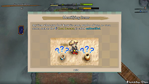

  

# Overview

Some item categories are "unidentified" in dungeons, meaning they have random names. The player can assign a name to the unidentified item, and certain actions reveal the true name. The randomized names change each adventure, so a Cow Scroll might be a Jitters Scroll in one run, but a Cow Scroll is likely to be a completely different scroll during the next adventure.

An item is unidentified if it has a yellow-colored name instead of a white-colored name. The "Checklist" option can be used to quickly name items and see what has already been identified.

# Methods

### Item Usage

Method where you simply use the item and infer what it is based on the effect. Scroll and Grass category items are automatically identified when you use the item. There's risk of a bad effect, so it's best to do this while standing on the stairs before advancing.

Pots and Staves that are being sold in a shop can be tested for a small amount of Gitan, since you only need to pay for the capacity (pot) or charges (staff) that you consumed while testing. However, don't accidentally steal (Switching Staff) or ruin other merchandise (Water Gun Pot).

### Price

Method where you reference a [Price Chart](/items/price-chart) to narrow down possibilities inside a shop. It doesn't consume any resources so there's no risk, but it often isn't enough to fully identify items. It's also possible to view prices of items by looking at the in-game notebook.

Selling price is 40% of the buying price, so multiply the selling price by x2.5 to get the buying price. An item's price is doubled when blessed (grass or scroll), and gets discounted by 13% when cursed.

You can narrow down staves and pots further by looking at the initial charges or capacity, and also by looking at the item table of the specific dungeon you're currently playing. ※ However, please keep in mind that the item tables are currently incomplete.

<u>Example: A shop has an unidentified grass for sale - should you eat it?</u>

50G (Poison / Berserk) or 100G (Leaping / Feeble) = mostly bad effects, so skip using it in a shop. 200G (Bellyshrink / Bellyexpand / Fragrant / Healing) = more enticing, but also skip using it in a shop. This is because a 200G grass could be a blessed Leaping Grass, resulting in triggering Thief Mode. Of course, it's fine to test 100G or 200G grasses if you purchase the item before you use it.

As you can see from this small sample, looking up prices of items can provide a big advantage.

### Identifier Scroll

Method where you read an Identifier Scroll to fully identify a selected item. If you're lucky, all items except for those in pots will be identified instead of only the selected item. This lucky secondary effect is guaranteed to occur when the Identifier Scroll is blessed.

Players will usually want to prioritize bracelets or pots when using this scroll.

### Identifier Pot

Method where you insert unidentified items into an Identifier Pot to identify them. It can identify multiple items, but the downside is that you need to break the pot to retrieve items. Another negative is that this method can't be used to identify pot or incense category items.

Players will usually want to prioritize bracelets, but it can be a waste to carry around a half-filled pot. If you haven't found many bracelets, or if you've already found the powerful Monster-find Bracelet, consider using it for synthesis ingredients or just as additional storage like an Ordinary Pot.

### Mixer / Synthesis

2 unidentified weapons or shields being synthesized results in an identified weapon or shield. Otherwise, unidentified items used as rune ingredients don't get auto-identified in this game. If one of the ingredients is identified, the blessed/cursed state of the resulting item will be known. Likewise, if one staff's remaining charges is known, the charges of the resulting staff will be known. Always ensure that neither staff is cursed before synthesizing staves together.

# Strategies

### Weapon / Shield

A weapon or shield's name is never randomized, so only cursed state and upgrade value are unknown. It's best to wait until you've found a Removal Trap or have a method to remove curses before checking. If you have Synthesis Pots or Mixers to spare, synthesize to check instead of equipping the items.

It's possible to check if a weapon or shield has upgrade value or is cursed by checking its price. Most cases will have a last digit other than 0, though certain cursed items can have a last digit of 0, so it's more of a guideline than a hard rule to follow.

### Bracelets

The most difficult item category to identify without relying on Identifier Scroll or Identifier Pot. It's best to narrow down possibilities by checking prices instead of risking equipping a cursed bracelet, since Item-losing, Gitan-losing, and Bellyshrink bracelets are always cursed when they're generated. These 3 bracelets have a buying / selling price of either 1305 / 522 or 3045 / 1218 Gitan. Otherwise, check bracelets once you've found a Removal Trap or have a method to remove curses.

<b><u>Known upon equipping:</u></b>

- Strength increased = <u>Strength Bracelet</u>
- Max Fullness increased or decreased = <u>Bellyexpand Bracelet</u> or <u>Bellyshrink Bracelet</u>
- Can see enemy locations on the map = <u>Monster-find Bracelet</u>
- Can see item locations on the map = <u>Item-find Bracelet</u>
- Can see both enemy and item locations on the map = <u>Clairvoyant Bracelet</u>

<b><u>Known when turns elapse:</u></b>

- Gain 1 experience point per turn = <u>Fortune Bracelet</u>
- Faster HP regen speed and fullness depletion = <u>Healing Bracelet</u>
- Shiren warped elsewhere = <u>Leaping Bracelet</u>
- Shiren exploded = <u>Blasting Bracelet</u>
- Dropped inventory items or Gitan = <u>Item-losing Bracelet</u> or <u>Gitan-losing Bracelet</u>

<b><u>Known when throwing / shooting an item:</u></b>

- Thrown item passed through walls = <u>Far-throwing Bracelet</u>
- Projectile ricocheted off of a wall = <u>Bouncy Bracelet</u>
- Threw 2 rocks / Shot 2 arrows = <u>Rapid-fire Bracelet</u>
- Projectiles besides Truestrike Arrow always miss = <u>Bad-aim Bracelet</u>
- Projectiles never miss = <u>Sure-aim Bracelet</u>

<b><u>Known based on status / enemy special attack:</u></b>

- Protected against Confused status = <u>Focusing Bracelet</u>
- Protected against Asleep status = <u>Rousing Bracelet</u>
- Equipment didn't rust or lose a rune from Mudster or Mudder = <u>Rustproof Bracelet</u>
- Protected against a curse = <u>Cursebreak Bracelet</u>
- Item wasn't parried by a Swordsman or Lv3\~4 Field Knave = <u>Affixing Bracelet</u>
- Protected against poison = <u>Cleansing Bracelet</u>

<b><u>Known based on a specific action or situation:</u></b>

- Can go inside walls = <u>Wallpass Bracelet</u>
- Can walk on water tiles = <u>Waterwalk Bracelet</u>
- Can walk on water and air tiles, traps never activate = <u>Floating Bracelet</u>
- Occasionally land and receive critical hits = <u>Daredevil Bracelet</u>
- Occasionally receive critical hits = <u>Dreaded Bracelet</u>
- Can swap places with an adjacent monster = <u>Passerby Bracelet</u>
- Cannons deal more damage = <u>Cannonboost Bracelet</u>
- Breakable walls and pillars crumble when adjacent = <u>Passage-find Bracelet</u>
- Napping monsters never wake when you walk next to them = <u>Tiptoe Bracelet</u>
- Picking up an unidentified item auto-identifies the item = <u>Appraiser's Bracelet</u>

### Staves

The player can infer what most unidentified staves are simply by swinging the staff at a monster.

Notable Price Ranges:

- 1400\~1700G = <u>Empathetic</u> / <u>Narrow-escape</u> / <u>Fortune</u> / <u>Unlucky</u> / <u>Skull Mage's</u>
- 2400\~2700G = <u>Disguising</u> / <u>Peach</u>

Testing Guidelines:

- Swing the staff from a distance of 2 or more tiles away from the monster.
    - This helps you stay safe if it turns out to be a Fortune Staff or Thunderbolt Staff.
    - Also makes it easier to tell if the staff is an Earthmound Staff.
- Swing the staff when there's only 1 monster present.
    - Switching Staff or Vaulting Staff can be a problem if there are multiple enemies nearby.
- Never test staves against a Hoppin' Batter family monster.
    - These monsters either nullify or reflect magic bullets from staves.

<b><u>Dealt damage:</u></b>

- 25 damage = <u>Thunderbolt Staff</u>
- 10 damage = <u>Burrowing Staff</u>
- 2 damage  = <u>Earthmound Staff</u> (when adjacent)

<b><u>Non-Damage Effects:</u></b>

- Target's action speed increased = <u>Swift Staff</u>
- Target's action speed decreased = <u>Sluggish Staff</u> or <u>Skull Mage's Staff</u>
- Inflicted Sealed status = <u>Sealing Staff</u>
- Inflicted Paralyzed status = <u>Paralyzing Staff</u>
- Inflicted Disguised status = <u>Disguising Staff</u>
- Warped the target, then inflicted Paralyzed status = <u>Narrow-escape Staff</u>
- Target was sent flying backward = <u>Knockback Staff</u>
- Shiren switched positions with the target = <u>Switching Staff</u>
- Shiren moved towards whatever the magic bullet hit = <u>Vaulting Staff</u>
- The magic bullet flew towards the stairs = <u>Guiding Staff</u>
- Target's level increased = <u>Fortune Staff</u>
- Target's level decreased = <u>Unlucky Staff</u>
- Target transformed into a Peach Bun = <u>Peach Staff</u>

<b><u>Unable to determine immediately:</u></b>

- Target took damage when Shiren received damage = <u>Empathetic Staff</u>
- Prevented tripping = <u>Balance Staff</u>
- None of the above = <u>Ordinary Staff</u>

### Scrolls

Escape Scroll and Blank Scroll are always identified from the start. Check the blessed/cursed state of a Blank Scroll by selecting the "Write" command. The scroll name you write on a Blank Scroll becomes identified during the current adventure.

Scrolls become fully identified when read, so item usage is the main identification method. It's usually best to read scrolls while standing on the stairs before advancing to the next floor. If Gathering Scroll has already been identified, read scrolls on a room entrance tile instead, if you want to tackle a Monster House generated from a Monstercall Scroll.

Consider placing a scroll on the ground before reading to check for Sanctuary Scroll. If it turns out to be a Sanctuary Scroll, it can be utilized while on that floor.

Notable Price Ranges:

- 300G = 2 possible for selection-based scrolls, <u>Identifier</u> or <u>Silver-seal</u>
- 400G = 6 possible and all are selection-based scrolls, includes <u>Onigiri</u> and <u>Rune-eraser</u>
- 1000G = 15 possible, includes <u>Curse</u>, <u>Trap</u>, <u>Monstercall</u>, <u>Gambler's</u>, <u>Muzzle</u>, <u>Carry-ban</u>, <u>Swift Foe</u>
- 3000G = Guaranteed to be an <u>Expulsion Scroll</u>
- 10000G = Guaranteed to be an <u>Eradication Scroll</u>

<b><u>Non-selection scrolls:</u></b>

- Bad = <u>Muzzle</u>, <u>Carry-ban</u>, <u>Trap</u>, <u>Swift Foe</u>, <u>Map-loss</u>, <u>Gathering</u>, <u>Gambler's</u>, <u>Monstercall</u>

<b><u>Selection scrolls:</u></b>

- Good = <u>Identifier</u>, <u>Exorcism</u>, <u>Heavenly</u>, <u>Earthly</u>, <u>Plating</u>, <u>Silverpurge</u>, <u>Slot-adding</u>, <u>Pot-upsize</u>, <u>Extraction</u>
- Bad = <u>Curse</u>, <u>Silver-seal</u>, <u>Rune-eraser</u>, <u>Onigiri</u>

### Grass

Grass items become fully identified when eaten, but do not become identified when thrown. Grasses that restore HP have a secondary effect of increasing max HP if used when HP is full. There are many grasses with negative effects, so test grasses when there are no enemies nearby.

Ghost Radish family monsters always throw or drop a specific type of grass based on their level. Ghost Radish = <u>Poison</u>, Daze Radish = <u>Confusion</u>, Sleep Radish = <u>Sedating</u>, Frenzy Radish = <u>Berserk</u>. Lv2-4 Ghost Radishes throw <u>Poison Grass</u> when you're afflicted by a corresponding status condition.

Price Ranges (price in parenthesis is blessed price):

- 40G (80G) = <u>Herb</u>
- 50G (100G) = <u>Poison</u> or <u>Berserk</u>
- 70G (140G) = 6 possible, bad ones include <u>Confusion</u>, <u>Sedating</u>, <u>Blinding</u>
- 80G (160G) = <u>Otogirisou</u> or <u>Herb</u> (blessed)
- 100G (200G) = <u>Leaping</u>, <u>Feeble</u>, <u>Poison</u> (blessed), or <u>Berserk</u> (blessed)
- 200G (400G) = 6 possible, bad ones include <u>Bellyshrink</u>, <u>Leaping</u> (blessed), or <u>Feeble</u> (blessed)
- 250G (500G) = <u>Dragon</u>
- 400G (800G) = <u>Revival</u>, <u>Invincible</u>, or <u>Unlucky</u>
- 500G (1000G) = <u>Life</u> or <u>Dragon</u> (blessed)
- 600G (1200G) = <u>Antidote</u>
- 700G (1400G) = <u>Strength</u>
- 1000G (2000G) = <u>Fortune</u> or <u>Life</u> (blessed)
- 2000G (4000G) = <u>Angel</u>, <u>Ill-fated</u>, Fortune (blessed)

So basically when it comes to prices:

- 40G and 80G grasses always restore HP (Herb or Otogirisou).
- 50G grasses are always bad (Poison or Berserk).
- 70G grasses have a decent chance of being a status inflicting rune ingredient.
    - Confusion Grass, Sedating Grass, and Blinding Grass.
- 100G and 200G grasses should never be tested inside a shop.
    - Berserk Seed (blessed) could make you attack the Shopkeeper.
    - Leaping Grass would result in triggering Thief Mode if you haven't paid for the item.
- 400G grasses could be Revival Grass, so it's best to keep them on hand instead of eating them.
- 600G is always Antidote Grass, and 700G is always Strength Grass.
- 2000G grasses should never be eaten in dungeons where Ill-fated Seed can be found.

### Pots

Pots with the Tap command become fully identified when the player taps the pot. Test Tap type pots on the stairs before advancing to the next floor in case it's a Monster Pot. Don't aim Tap type pots at merchandise, since Water Gun Pot can result in degrading or ruining items. One common mistake is thinking the pot is a Walrus Pot and tapping it towards merchandise from outside the shop, resulting in triggering Thief Mode.

Pots with the Put In command don't automatically become identified except for Hiding Pot. Exorcism Pot can be identified by looking at the ? icon of the unidentified item you insert into the pot. The ? icon indicating an unknown cursed or blessed state will vanish if it's an Exorcism Pot. ※ The ? icon on a disguised N'dubba family monster won't vanish when inserted.

It's possible to narrow down possibilities based on the initial capacity value of the pot.

#### Tap Type

- Capacity of 2 = <u>Hilarious Pot</u>
- Capacity of 3\~5 = Tap the pot to identify it

#### Put In type

<b><u>General:</u></b>

- Selected Put In and went inside the pot = <u>Hiding Pot</u>

<b><u>Capacity of 2:</u></b>

Possible = <u>Degrading</u>, <u>Upgrading</u>, <u>Exorcism</u>, <u>Curse</u>, <u>Warehouse</u>, <u>Bottomless</u> First step → Insert an unneeded and already identified weapon or shield.

1. The item vanished
    - Broke the pot outside of a shop and Pitfall Traps appeared = <u>Bottomless Pot</u>
    - Broke the pot outside of a shop and nothing happened = <u>Warehouse Pot</u>
2. The item became cursed = <u>Curse Pot</u>
3. The item upgraded after advancing floors = <u>Upgrading Pot</u>
4. The item degraded after advancing floors = <u>Degrading Pot</u>
5. Nothing happened / The item's ? icon vanished / Curse was removed = <u>Exorcism Pot</u>

<b><u>Capacity of 5:</u></b>

Possible = <u>Preservation</u>, <u>Identifier</u>, <u>Transmutation</u>, <u>Cashing</u>, <u>Handtrapper</u>, <u>Warehouse</u>, <u>Ordinary</u>, <u>Unbreakable</u> First step → Insert an unneeded item (unidentified if Identifier Pot has not been identified yet).

1. Can take out the item = <u>Preservation Pot</u>
2. The item became identified = <u>Identifier Pot</u>
3. The item turned into a different item = <u>Transmutation Pot</u>
4. The item turned into Gitan = <u>Cashing Pot</u>
5. Shiren became afflicted with Potted status = <u>Handtrapper Pot</u>
6. The item vanished = <u>Warehouse Pot</u>
7. Nothing happened → Name the pot "Ordinary Pot", then throw the pot at a wall.
    - The pot shattered = <u>Ordinary Pot</u>
    - The pot didn't break = <u>Unbreakable Pot</u> (rename the pot)

<b><u>Capacity of 3:</u></b>

Possibilities can't be determined by initial capacity. First step → Insert a weapon or shield.

1. Nothing obvious happened → try advancing floors.
    - The item upgraded after advancing floors = <u>Upgrading Pot</u>
    - The item degraded after advancing floors = <u>Degrading Pot</u>
2. Nothing happened even after advancing floors → continue to <b><u>Capacity of 3\~4</u></b>

<b><u>Capacity of 3~4:</u></b>

1. Items were synthesized after inserting same category items = <u>Synthesis Pot</u>
2. Nothing happened → go through <b><u>Capacity of 2</u></b> or <b><u>Capacity of 5</u></b> checks.

### Incense

Incenses become fully identified when the player lights the incense. Test incenses on the stairs before advancing to the next floor in case it has a negative effect. Incenses all cost the same amount of Gitan, so it's not possible to identify them by price.
