

  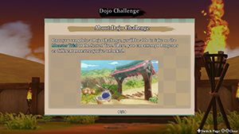

# Overview

Monster Trial is a [Sacred Tree](/system/sacred-tree) mode where the player challenges a selected dungeon as a monster. Playable monsters can be unlocked by clearing Dojo Challenges inside the [Monster Dojo](/system/monster-dojo). Some monsters can breeze through dungeons, while others might feel nearly impossible.

The player can use the monster's ability anytime (unless Sealed), similar to eating a Peach Bun. Likewise, some traps affect the player differently when playing as a monster.

However, there are also a number of significant changes to mechanics in this mode, such as:

- The player begins with the base stats of the selected monster.
- HP doesn't regenerate as turns elapse, but is restored to max every time you level up.
- Fullness doesn't deplete as turns elapse, but depletes by 4 every time you level up.
- Items cannot be used, but instead can be eaten to replenish 2 fullness.

#### Unavailable Dungeons

- Training Path of Extra Inference
- Peach Dungeon
- Trapper's Secret Path
- Heart of Serpentcoil Island (The 12 Celestial Stones)

#### Unavailable Monsters

- Golden Egg Thing
- Bosses
- Shop NPCs

# Mechanics

- You can freely use the monster's special attack and abilities, similar to eating a Peach Bun.
    - The player's starting stats = monster's base stats.
    - In some cases, stepping on a trap affects the monster differently than Shiren.
- Fullness doesn't deplete as turns elapse, and HP doesn't regenerate either.
    - Aquatic type monsters can stand on a water tile to restore their HP.
    - Ghost Samurai restores its HP when it possesses another monster.
- Player level increases by 1 each time you defeat a monster.
    - HP is fully restored upon leveling up, and fullness decreases by 4.
    - HP is fully restored upon leveling up even if fullness is currently 0.
    - The amount of max HP you gain is based on level.
        - Lv2\~19 = +1 HP, Lv20\~49 = +2 HP, Lv50\~99 = +3 HP.
    - Attack Power increases as you level up, but it's unknown if Defense increases.
        - The damage formula appears to be different than Shiren at first glance.
    - Once you reach Lv99, you can no longer level up and fully restore your HP.
        - Monsters who can restore HP on their own have an advantage for deeper dungeons.
- Items cannot be used - They can be eaten to replenish 2 fullness instead.
    - Eating to replenish 2 fullness applies to all item categories, including food items.
    - Monsters that generate new items like Bowboy can replenish fullness whenever they want.
    - Gitan cannot be eaten unless it's cursed.
    - Enemy Lv2\~4 Bored Kappas can be used to get hit by a thrown item if desired.
    - Exceptions:
        - Revival Grass - Still activates when carried in your inventory.
        - Sanctuary Scroll - Can be placed on the ground and used like normal.
        - Balance Staff - Prevents you from being tripped when carried in your inventory.
        - Incense - Can be activated by a Lv2\~4 Bored Kappa or Pot Knave.
        - Traps - Can be brought into the dungeon if the dungeon allows bringing items.
- Monsters who can pass through walls will still lose HP while inside a wall.
- The player cannot talk to NPCs like Travel Companions or Peddlers.
    - Fluffy Bunny Pup can still appear and fully restore your HP.
- Shops are never generated during a Monster Trial, even in Training Path of Shopping.
- Getting hit by a Peach Staff makes you instantly collapse.
    - Revival Grass can revive you if this happens.

# Basic Strategy

- HP can only be restored by leveling up, and once you reach Lv99, you can't restore HP.
    - Exceptions = Fluffy Bunny, Ghost Samurai, Masked Samurai family, Aquatic type monsters.
    - Consider waiting to eat an item until after you're done grinding levels when fullness is at 0.
- You generally want to rush to the stairs, and only defeat a necessary number of monsters.
    - Many playable monsters have useful special attacks or abilities, so use them!
    - Avoid Monster Houses when possible to prevent excessive level ups and fullness depletion.
- Some monsters like King Reaper are simply more viable than others like Chow.
    - Equipment and Eradication Scrolls can't be used, so Heart of Serpentcoil Island is quite hard.
    - A realistic goal for weaker monsters will likely be to just reach a specific floor.
- Generally speaking, level 4 monsters offer an advantage over level 1\~3 monsters.
    - However, there are exceptions like choosing Sleep Radish (Lv3) instead of Frenzy Radish (Lv4).

# Monsters

### Monster Ranking

Keep in mind that this monster ranking is an opinion piece, and isn't absolute.

<table class="monsterTable">
  <thead>
    <tr>
      <th>Rank</th>
      <th>Monsters (Notable Levels Only)</th>
    </tr>
  </thead>
  <tbody>
    <tr>
      <td class="highlightPurple2 centeredText">S+</td>
      <td>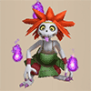 Ghost Samurai</td>
    </tr>
    <tr>
      <td class="highlightRed centeredText">S</td>
      <td> Lordly Samurai</td>
    </tr>
    <tr>
      <td class="highlightPink centeredText">A</td>
      <td> Ultra Gazer 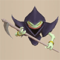 King Reaper 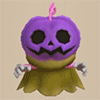 Pumplord 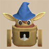 Baby Tank 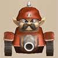 Steadfast Tank 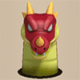 Hiding Dragon  Gitan Mamel 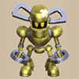 Cyberoid  Magicwalrus</td>
    </tr>
    <tr>
      <td class="highlightOrange2 centeredText">B</td>
      <td> Nimble Knave 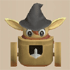 Mini Tank 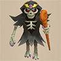 Skull Lord  Abyss Dragon 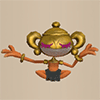 N'daloon  Admiral Spearfish  Porgon 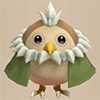 Dark Owl</td>
    </tr>
    <tr>
      <td class="highlightYellow centeredText">C</td>
      <td>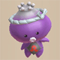 Superb Octopling  Hoppin' Slammer 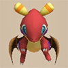 Pyrepuff 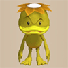 Atrocious Kappa 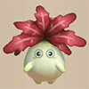 Sleep Radish 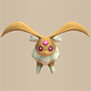 Fluffy Bunny 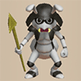 General Ant 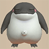 Streamingfrog  Detonachin  Water Ninja A  Tengu Monk A</td>
    </tr>
    <tr>
      <td class="highlightGreen centeredText">D</td>
      <td>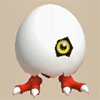 Hiding Egg  Grampadillo  Deathead 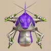 Bashagga  Polygon Stunna  Nigiri Honcho  Tiger Launcher 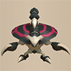 Demon Scorpion 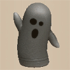 Wrinkly Hani 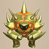 Boomdon 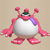 Mixerdon  Frogginator 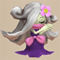 Cursenior 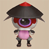 Hat Rascal  Tree Ninja A 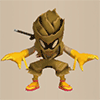 Metal Ninja A  Okame Monk A</td>
    </tr>
    <tr>
      <td class="highlightBlue centeredText">E</td>
      <td>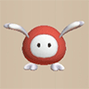 Chow  Infernous  Miracle Hen  Gigataur 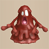 Mudder 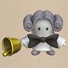 Showpin  Swordmaster  Fire Ninja A  Earth Ninja A  Kitsune Monk A  Hannya Monk A  Okina Monk A</td>
    </tr>
    <tr>
      <td class="highlightGray centeredText">F</td>
      <td>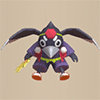 Crow Tengu 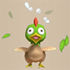 Hen</td>
    </tr>
  </tbody>
</table>

### Monster Notes

<table id="monsterList" class="pageLinksTable">
  <tr>
    <th colspan="6">Monster (Family) ~ Monster Trial Menu Order</th>
  </tr>
  <tr>
    <th>1</th>
    <th>2</th>
    <th>3</th>
    <th>4</th>
    <th>5</th>
  </tr>
  <tr>
    <td class="highlightGrey"><a href="#mamel-family">Mamel</a></td>
    <td><a href="#shagga-family">Shagga</a></td>
    <td class="highlightGrey"><a href="#nigiri-baby-family">Nigiri Baby</a></td>
    <td><a href="#hoppin'-batter-family">Hoppin' Batter</a></td>
    <td class="highlightGrey"><a href="#tree-ninja-family">Tree Ninja</a></td>
  </tr>
  <tr>
    <td class="highlightGrey"><a href="#chintala-family">Chintala</a></td>
    <td><a href="#bowboy-family">Bowboy</a></td>
    <td class="highlightGrey"><a href="#froggo-family">Froggo</a></td>
    <td><a href="#fierous-family">Fierous</a></td>
    <td class="highlightGrey"><a href="#metal-ninja-family">Metal Ninja</a></td>
  </tr>
  <tr>
    <td class="highlightGrey"><a href="#octopling-family">Octopling</a></td>
    <td><a href="#pop-tank-family">Pop Tank</a></td>
    <td class="highlightGrey"><a href="#thiefwalrus-family">Thiefwalrus</a></td>
    <td><a href="#zapdon-family">Zapdon</a></td>
    <td class="highlightGrey"><a href="#earth-ninja-family">Earth Ninja</a></td>
  </tr>
  <tr>
    <td class="highlightGrey"><a href="#spearfish-family">Spearfish</a></td>
    <td><a href="#bored-kappa-family">Bored Kappa</a></td>
    <td class="highlightGrey"><a href="#hat-urchin-family">Hat Urchin</a></td>
    <td><a href="#schubell-family">Schubell</a></td>
    <td class="highlightGrey"><a href="#hannya-monk-family">Hannya Monk</a></td>
  </tr>
  <tr>
    <td class="highlightGrey"><a href="#death-reaper-family">Death Reaper</a></td>
    <td><a href="#porky-family">Porky</a></td>
    <td class="highlightGrey"><a href="#curse-girl-family">Curse Girl</a></td>
    <td><a href="#n'dubba-family">N'dubba</a></td>
    <td class="highlightGrey"><a href="#kitsune-monk-family">Kitsune Monk</a></td>
  </tr>
  <tr>
    <td class="highlightGrey"><a href="#pumphantasm-family">Pumphantasm</a></td>
    <td><a href="#dragon-family">Dragon</a></td>
    <td class="highlightGrey"><a href="#mudkin-family">Mudkin</a></td>
    <td><a href="#mixer-family">Mixer</a></td>
    <td class="highlightGrey"><a href="#okina-monk-family">Okina Monk</a></td>
  </tr>
  <tr>
    <td class="highlightGrey"><a href="#firepuff-family">Firepuff</a></td>
    <td><a href="#ghost-radish-family">Ghost Radish</a></td>
    <td class="highlightGrey"><a href="#swordsman-family">Swordsman</a></td>
    <td><a href="#egg-thing-family">Egg Thing</a></td>
    <td class="highlightGrey"><a href="#okame-monk-family">Okame Monk</a></td>
  </tr>
  <tr>
    <td class="highlightGrey"><a href="#armordillo-family">Armordillo</a></td>
    <td><a href="#skull-mage-family">Skull Mage</a></td>
    <td class="highlightGrey"><a href="#pullfrog-family">Pullfrog</a></td>
    <td><a href="#chow">Chow</a></td>
    <td class="highlightGrey"><a href="#tengu-monk-family">Tengu Monk</a></td>
  </tr>
  <tr>
    <td class="highlightGrey"><a href="#masked-samurai-family">Masked Samurai</a></td>
    <td><a href="#gazer-family">Gazer</a></td>
    <td class="highlightGrey"><a href="#floor-dragon-family">Floor Dragon</a></td>
    <td><a href="#dark-owl">Dark Owl</a></td>
    <td class="highlightGrey"></td>
  </tr>
  <tr>
    <td class="highlightGrey"><a href="#ghost-samurai">Ghost Samurai</a></td>
    <td><a href="#twisty-hani-family">Twisty Hani</a></td>
    <td class="highlightGrey"><a href="#tiger-thrower-family">Tiger Thrower</a></td>
    <td><a href="#crow-tengu">Crow Tengu</a></td>
    <td class="highlightGrey"></td>
  </tr>
  <tr>
    <td class="highlightGrey"><a href="#taur-family">Taur</a></td>
    <td><a href="#polygon-spinna-family">Polygon Spinna</a></td>
    <td class="highlightGrey"><a href="#karakuroid-family">Karakuroid</a></td>
    <td><a href="#fluffy-bunny">Fluffy Bunny</a></td>
    <td class="highlightGrey"></td>
  </tr>
  <tr>
    <td class="highlightGrey"><a href="#metalhead-family">Metalhead</a></td>
    <td><a href="#scorpion-family">Scorpion</a></td>
    <td class="highlightGrey"><a href="#soldier-ant-family">Soldier Ant</a></td>
    <td><a href="#fire-ninja-family">Fire Ninja</a></td>
    <td class="highlightGrey"></td>
  </tr>
  <tr>
    <td class="highlightGrey"><a href="#hen-family">Hen</a></td>
    <td><a href="#field-knave-family">Field Knave</a></td>
    <td class="highlightGrey"><a href="#explochin-family">Explochin</a></td>
    <td><a href="#water-ninja-family">Water Ninja</a></td>
    <td class="highlightGrey"></td>
  </tr>
</table>

Teal name = Swift action speed, Orange name = Slow action speed.

#### Mamel Family

- No special attack, but Cave Mamel (Lv3) and Gitan Mamel (Lv4) convert non-fixed damage to 1.
- Steamrolls shorter dungeons, but longer dungeons require planning your level ups.
- Gitan Mamel (Lv4) has swift action speed.

 

|Name|HP|Atk|Def|
|-|-|-|-|
|Mamel|8|3|4|
|Pit Mamel|11|5|8|
|Cave Mamel|5|100|100|
|Gitan Mamel|20|100|999|

#### Chintala Family

- No special attack or characteristics.

 

|Name|HP|Atk|Def|
|-|-|-|-|
|Chintala|15|9|4|
|Mid Chintala|45|23|10|
|Big Chintala|85|40|33|
|Huge Chintala|185|60|40|

#### Octopling Family

- Special attack inflicts Mingling status for 30 turns (enemy won't attack you), but can fail.
- Aquatic type, so HP regenerates and Attack Power is boosted while standing on a water tile.
- Getting splashed by water or stepping on a Rust Trap restores HP.

 

|Name|HP|Atk|Def|
|-|-|-|-|
|Octopling|14|4|6|
|Fresh Octopling|60|19|14|
|Famed Octopling|99|25|30|
|Superb Octopling|199|64|48|

#### Spearfish Family

- Capt. Spearfish (Lv3) and Admiral Spearfish (Lv4) can shoot water 3 tiles ahead.
    - Effect is similar to Water Gun Pot, but deals 15 damage (Lv3) or 25 damage (Lv4).
- Aquatic type, so HP regenerates and Attack Power is boosted while standing on a water tile.
- Getting splashed by water or stepping on a Rust Trap restores HP.

 

|Name|HP|Atk|Def|
|-|-|-|-|
|Spearfish|16|6|2|
|Lt. Spearfish|60|24|17|
|Capt. Spearfish|100|39|30|
|Admiral Spearfish|200|59|50|

#### Death Reaper Family

- All four levels in this family have swift action speed.
    - Soul Reaper (Lv3) and King Reaper (Lv4) can also pass through walls.
- Floating type, so you can move across water and air tiles, and also ignores traps.
- Ghost type, so you'll receive damage if you get hit by a HP restoring item.
- Getting splashed by water or stepping on a Rust Trap reduces Attack Power by 8 stages.

 

|Name|HP|Atk|Def|
|-|-|-|-|
|Death Reaper|22|6|5|
|Hell Reaper|45|12|15|
|Soul Reaper|75|40|40|
|King Reaper|225|65|50|

#### Pumphantasm Family

- All four levels in this family can pass through walls.
- Floating type, so you can move across water and air tiles, and also ignores traps.
- Ghost type, so you'll receive damage if you get hit by a HP restoring item.

 

|Name|HP|Atk|Def|
|-|-|-|-|
|Pumphantasm|23|16|10|
|Pumpanshee|60|35|22|
|Pumplich|100|50|30|
|Pumplord|185|75|35|

#### Firepuff Family

- Special attack spews fire, dealing fixed damage (can fail).
    - Damage and success rate increases based on level within the monster family.
- Floating type, so you can move across water and air tiles, and also ignores traps.

 

|Name|HP|Atk|Def|
|-|-|-|-|
|Firepuff|20|7|7|
|Flamepuff|50|25|20|
|Blazepuff|135|55|35|
|Pyrepuff|255|75|45|

#### Armordillo Family

- Special attack deals fixed damage and knockback, and might make the target drop an item.
- Strong in 1 vs 1 situations, but other enemies might approach while you're fighting.

 

|Name|HP|Atk|Def|
|-|-|-|-|
|Armordillo|20|11|15|
|Brodillo|70|36|38|
|Popdillo|100|51|45|
|Grampadillo|175|71|56|

#### Masked Samurai Family

- No special attack, but revives as Ghost Samurai when HP drops to 0.
    - Ghost Samurai only has 4 HP, so possess a different monster right away.
- Getting splashed by water or stepping on a Rust Trap reduces Attack Power by 8 stages.
- Sealed status prevents reviving as Ghost Samurai.

 

|Name|HP|Atk|Def|
|-|-|-|-|
|Masked Samurai|47|18|18|
|Raging Samurai|100|45|37|
|Great Samurai|149|58|40|
|Lordly Samurai|200|63|50|

#### Ghost Samurai

- Only takes 1 damage from enemy normal attacks.
    - Starts with 4 HP, but max HP increases as you level up (Lv99 = 232 HP).
- Possessing a monster fully restores HP and cures status conditions.
    - Canceling the transformation only restores your status.
- Ghost type, so you'll receive damage if you get hit by a HP restoring item.

 

|Name|HP|Atk|Def|
|-|-|-|-|
|Ghost Samurai|4|13|15|

#### Taur Family

- Occasionally lands a critical hit.
- Getting splashed by water or stepping on a Rust Trap reduces Attack Power by 8 stages.

 

|Name|HP|Atk|Def|
|-|-|-|-|
|Taur|35|15|15|
|Minotaur|70|31|20|
|Megataur|170|55|42|
|Gigataur|235|85|62|

#### Metalhead Family

- Normal attacks can cut through corners and hit from a distance.
    - Metalhead = 2 tiles, Thrashead = 3 tiles, Megahead = 4 tiles, Deathead = 5 tiles.

 

|Name|HP|Atk|Def|
|-|-|-|-|
|Metalhead|66|30|19|
|Thrashead|122|55|45|
|Megahead|182|65|48|
|Deathead|282|99|60|

#### Hen Family

- No special attack, but Hen (Lv1), Great Hen (Lv3), and Miracle Hen (Lv4) have swift action speed.
- Transforms into Hen (Lv1) when current HP &le; 20%.
    - Hen's Attack Power and Defense is 1, so it's often the end of the run.

 

|Name|HP|Atk|Def|
|-|-|-|-|
|Hen|4|1|1|
|Master Hen|70|33|21|
|Great Hen|120|55|40|
|Miracle Hen|220|82|60|

#### Shagga Family

- Normal attacks are multi-hit, with the number of hits varying by level.
    - Shagga = 1 hit, Nashagga = 2 hits, Lashagga = 3 hits, Bashagga = 4 hits.
- Getting splashed by water or stepping on a Rust Trap reduces Attack Power by 8 stages.

 

|Name|HP|Atk|Def|
|-|-|-|-|
|Shagga|18|6|4|
|Nashagga|70|21|20|
|Lashagga|99|43|34|
|Bashagga|154|55|40|

#### Bowboy Family

- Special attack shoots an arrow, with the type varying by level.
    - Bowboy = Wooden, Crossbowboy = Iron, Baby Tank = Iron, Mini Tank = Silver.
    - You can still use normal attacks, so enemies immune to projectiles aren't a big problem.
- Baby Tank (Lv3) and Mini Tank (Lv4) have swift action speed.
- Getting splashed by water or stepping on a Rust Trap inflicts Sealed and Slowed statuses.

 

|Name|HP|Atk|Def|
|-|-|-|-|
|Bowboy|45|17|18|
|Crossbowboy|55|20|20|
|Baby Tank|85|40|30|
|Mini Tank|100|55|40|

#### Pop Tank Family

- Special attack fires a cannon, with the damage varying by level.
    - Pop Tank = 20, Ornery Tank = 30, Adamant Tank = 40, Steadfast Tank = 50.
- Pop Tank (Lv1) has slow action speed, and Adamant Tank (Lv3) and Steadfast Tank (Lv4) are swift.
- Getting splashed by water or stepping on a Rust Trap inflicts Sealed and Slowed statuses.

 

|Name|HP|Atk|Def|
|-|-|-|-|
|Pop Tank|90|20|24|
|Ornery Tank|95|40|44|
|Adamant Tank|100|60|54|
|Steadfast Tank|105|80|64|

#### Bored Kappa Family

- Special attack throws the item underfoot at a target within range.
    - Bored = 3 tiles, Pesky = 5 tiles, Vexing = 10 tiles, Atrocious = anywhere on the floor.
- Catches and throws back incoming projectiles.
- Aquatic type, so HP regenerates and Attack Power is boosted while standing on a water tile.
- Getting splashed by water or stepping on a Rust Trap restores HP.

 

|Name|HP|Atk|Def|
|-|-|-|-|
|Bored Kappa|50|18|11|
|Pesky Kappa|75|29|22|
|Vexing Kappa|175|49|33|
|Atrocious Kappa|275|59|42|

#### Porky Family

- Special attack throws a Porky's Rock (20 damage) at a target within range.
    - Porky = 3 tiles, Porko = 5 tiles, Porkon = 8 tiles, Porgon = 10 tiles.

 

|Name|HP|Atk|Def|
|-|-|-|-|
|Porky|30|17|12|
|Porko|65|36|18|
|Porkon|150|75|50|
|Porgon|200|85|60|

#### Dragon Family

- Special attack spews a flame, with the damage and range varying by level.
    - Dragon = 20 + line, Sky Dragon = 20 + room, Archdragon = 30 + floor, Abyss Dragon = 40 + floor.

 

|Name|HP|Atk|Def|
|-|-|-|-|
|Dragon|120|45|40|
|Sky Dragon|140|55|50|
|Archdragon|200|65|60|
|Abyss Dragon|300|90|65|

#### Ghost Radish Family

- Special attack throws grass in a straight line (10 tiles), with the type varying by level.
    - Ghost = Poison Grass, Daze = Confusion Grass, Sleep = Sedating Grass, Frenzy = Berserk Seed.
- Attack Power increases when hit by a poison effect.
    - Poison Arrow Trap, Poison Grass thrown by Ghost Radish, Scorpion family, Jakaku, etc.
- Ghost type, so you'll receive damage if you get hit by a HP restoring item.
    - In addition, getting hit by Antidote Grass deals 50 damage.

 

|Name|HP|Atk|Def|
|-|-|-|-|
|Ghost Radish|40|18|15|
|Daze Radish|80|37|27|
|Sleep Radish|135|47|38|
|Frenzy Radish|195|57|55|

#### Skull Mage Family

- Special attack fires a magic bullet which deals a random effect based on level.
    - Skull Mage = Warp, increase speed by 1 stage, 10 tiles knockback, or switch positions.
    - Skull Wizard = Confused, 20 damage, Narrow-escape, or Peach.
    - Skullmancer = Paralyzed, Sealed, Onigiri, Disguised, lower speed by 1 stage, or Level -1.
    - Skull Lord = Asleep, Blind, Level -3, or 40 damage.
- Ghost type, so you'll receive damage if you get hit by a HP restoring item.

 

|Name|HP|Atk|Def|
|-|-|-|-|
|Skull Mage|77|31|21|
|Skull Wizard|88|35|24|
|Skullmancer|111|50|41|
|Skull Lord|188|55|55|

#### Gazer Family

- Special attack inflicts Confused status on an adjacent monster for 20 turns.
    - Ultra Gazer (Lv4) inflicts Confused status on all enemies in the room.
- No enemy monsters are immune to hypnosis, but Okame Monk can cure Confused status.

 

|Name|HP|Atk|Def|
|-|-|-|-|
|Gazer|30|18|14|
|Super Gazer|66|30|26|
|Hyper Gazer|126|55|45|
|Ultra Gazer|196|60|55|

#### Twisty Hani Family

- Special attack lowers the level of the target in front by 1.
- Strong in 1 vs 1 situations, but doesn't have a way to deal with a group of monsters.

 

|Name|HP|Atk|Def|
|-|-|-|-|
|Twisty Hani|35|12|15|
|Floppy Hani|85|39|39|
|Droopy Hani|120|49|49|
|Wrinkly Hani|190|60|59|

#### Polygon Spinna Family

- Special attack reduces the current HP of a target in front by a set percentage.
    - Polygon Spinna = 30%, Polygon Shaka = 40%, Polygon Singa = 50%, Polygon Stunna = 60%.
    - This special attack is also effective against bosses.
- Stepping on a Hunger Trap or Starvation Trap increases your Attack Power.
    - However, enemy Polygon Spinna family monsters will still deal percentage based damage to you.

 

|Name|HP|Atk|Def|
|-|-|-|-|
|Polygon Spinna|33|16|17|
|Polygon Shaka|70|34|33|
|Polygon Singa|129|40|40|
|Polygon Stunna|229|50|55|

#### Scorpion Family

- Special attack reduces the Attack Power of a target in front.
    - Attack Power reduction increases based on level, but exact values are currently unknown.
    - Ghost Radish and Scorpion family monsters will gain Attack Power instead.
- Attack Power increases when hit by a poison effect.
    - Poison Arrow Trap, Poison Grass thrown by Ghost Radish, Scorpion family, Jakaku, etc.
- You'll receive 50 damage if you get hit by Antidote Grass.

 

|Name|HP|Atk|Def|
|-|-|-|-|
|Scorpion|37|14|14|
|Vile Scorpion|108|45|33|
|Terror Scorpion|185|55|45|
|Demon Scorpion|295|73|55|

#### Field Knave Family

- Special attack throws Weeds in a straight line (10 tiles).
    - Bag Knave (Lv3) and Nimble Knave (Lv4) might knock away an item from an enemy hit by Weeds.
- Nimble Knave (Lv4) has swift action speed.
- Getting hit by Weeds increases your action speed by 1 stage.
    - Enemy Field Knave or Bored Kappa family monsters can be used to trigger this effect.

 

|Name|HP|Atk|Def|
|-|-|-|-|
|Field Knave|50|15|16|
|Pot Knave|65|35|25|
|Bag Knave|95|40|35|
|Nimble Knave|145|50|40|

#### Nigiri Baby Family

- Special attack turns an enemy in front into an onigiri type item, instantly defeating them.
    - Chance for success: Baby = 1/6, Morph = 1/4, Boss = 1/2, Honcho = 1/2.
- Receiving by an effect that inflicts Onigiri status increases Attack Power instead.
    - Onigiri Trap or enemy Nigiri Baby family monsters.
- Getting hit by an onigiri type item (not cursed) makes you instantly collapse.

 

|Name|HP|Atk|Def|
|-|-|-|-|
|Nigiri Baby|17|8|2|
|Nigiri Morph|88|35|30|
|Nigiri Boss|133|45|42|
|Nigiri Honcho|165|61|54|

#### Froggo Family

- Special attack steals Gitan from an enemy in front, then makes you warp away.
    - Frogginator (Lv4) can throw Gitan to attack when not adjacent to an enemy.
- Getting hit by thrown Gitan restores your HP.

 

|Name|HP|Atk|Def|
|-|-|-|-|
|Froggo|23|10|13|
|Froggucchi|60|20|30|
|Froggon|100|30|45|
|Frogginator|140|40|60|

#### Thiefwalrus Family

- Special attack steals an item from an enemy in front, then makes you warp away.
    - Limited to 1 item per enemy, can also be used to pick up items that are on the ground.
    - Magicwalrus (Lv4) creates a clone which always carries Weeds upon a successful theft.
- Aquatic type, so HP regenerates and Attack Power is boosted while standing on a water tile.
- Getting splashed by water or stepping on a Rust Trap restores HP.

 

|Name|HP|Atk|Def|
|-|-|-|-|
|Thiefwalrus|65|25|23|
|Greenwalrus|88|30|27|
|Ironwalrus|138|35|55|
|Magicwalrus|188|40|75|

#### Hat Urchin Family

- Special attack steals an item from an enemy in front, which is then tossed away.
    - Item category varies based on level (staves, grass, food, or scrolls).
    - The stolen item can hit an enemy monster on occasion.

 

|Name|HP|Atk|Def|
|-|-|-|-|
|Hat Urchin|16|5|3|
|Hat Prankster|70|15|6|
|Hat Brat|125|45|9|
|Hat Rascal|170|85|12|

#### Curse Girl Family

- Special attack inflicts Sealed status on a target in front.
- Receiving a curse effect increases your Attack Power instead.
- You'll receive 100 damage if you get hit by a thrown Exorcism Scroll.

 

|Name|HP|Atk|Def|
|-|-|-|-|
|Curse Girl|65|28|28|
|Cursister|115|38|38|
|Curse Matron|145|53|48|
|Cursenior|205|65|58|

#### Mudkin Family

- Special attack lowers the Attack Power and Defense of a target in front.
- Occasionally multiplies when you receive damage, spawning enemy Mudkins of the same level.
- Aquatic type, so HP regenerates and Attack Power is boosted while standing on a water tile.
- Getting splashed by water or stepping on a Rust Trap restores HP.

 

|Name|HP|Atk|Def|
|-|-|-|-|
|Mudkin|70|5|9|
|Muddy|75|25|33|
|Mudster|140|35|43|
|Mudder|145|45|53|

#### Swordsman Family

- Special attack knocks away an item from an enemy (can fail), with the category varying by level.
    - Lv1 = Shield, Lv2 = Weapon or Shield, Lv3 & Lv4 = Weapon, Shield, or Bracelet.
- Getting splashed by water or stepping on a Rust Trap reduces Attack Power by 8 stages.

 

|Name|HP|Atk|Def|
|-|-|-|-|
|Swordsman|77|30|25|
|Fencer|140|49|48|
|Battler|200|69|50|
|Swordmaster|250|77|55|

#### Pullfrog Family

- Special attack pulls a target towards you, with the range varying by level.
    - Pullfrog = 3 tiles, Dartingfrog = 5 tiles, Fleefrog & Streamingfrog = 10 tiles.
    - Dartingfrog (Lv2), Fleefrog (Lv3), and Streamingfrog (Lv4) also attack at the same time.
    - Streamingfrog (Lv4) pulls all enemies within 10 tiles in a straight line.
- Aquatic type, so HP regenerates and Attack Power is boosted while standing on a water tile.
- Getting splashed by water or stepping on a Rust Trap restores HP.

 

|Name|HP|Atk|Def|
|-|-|-|-|
|Pullfrog|15|5|4|
|Dartingfrog|75|40|28|
|Fleefrog|125|60|45|
|Streamingfrog|175|80|60|

#### Floor Dragon Family

- Special attack burrows underground and emerges 2 tiles ahead (cuts through corners).
    - This can also be used to move to the other side of a 1 tile wall.
- Dragon Pit (Lv3) and Hiding Dragon (Lv4) have swift action speed.
- Immune to traps.

 

|Name|HP|Atk|Def|
|-|-|-|-|
|Floor Dragon|55|25|20|
|Dragon Head|88|31|25|
|Dragon Pit|130|54|40|
|Hiding Dragon|230|70|60|

#### Tiger Thrower Family

- Special attack throws the target in front towards a different monster or visible trap.
    - Range: Thrower = 5 tiles, Hurler = 10 tiles, Chucker = 15 tiles, Launcher = 20 tiles.

 

|Name|HP|Atk|Def|
|-|-|-|-|
|Tiger Thrower|68|26|22|
|Tiger Hurler|135|50|45|
|Tiger Chucker|155|60|55|
|Tiger Launcher|255|83|65|

#### Karakuroid Family

- Special attack either creates a new trap or changes the trap you're standing on.
    - Floor-exiting Traps or Pitfall Traps can be used to skip floors in some dungeons.
- All four levels in this family have swift action speed.
- Getting splashed by water or stepping on a Rust Trap inflicts Sealed and Slowed statuses.

 

|Name|HP|Atk|Def|
|-|-|-|-|
|Karakuroid|40|20|13|
|Steamroid|100|45|48|
|Electroid|150|56|53|
|Cyberoid|175|69|60|

#### Soldier Ant Family

- Special attack digs out the wall tile in front.
    - Captain Ant (Lv3) and General Ant (Lv4) will create a pillar if the tile in front isn't a wall.
- Normal attacks cut through corners.

 

|Name|HP|Atk|Def|
|-|-|-|-|
|Soldier Ant|50|25|16|
|Corporal Ant|100|40|20|
|Captain Ant|110|55|39|
|General Ant|125|76|49|

#### Explochin Family

- Explodes when HP gets low or when hit by an explosion, dropping current HP to 1.
    - Beware of Fierous or Pop Tank family monsters and Blast Traps!
- Aquatic type, so HP regenerates and Attack Power is boosted while standing on a water tile.
- Getting splashed by water or stepping on a Rust Trap restores HP.

 

|Name|HP|Atk|Def|
|-|-|-|-|
|Explochin|120|25|22|
|Concusschin|160|35|27|
|Fulminachin|200|45|32|
|Detonachin|260|55|37|

#### Hoppin' Batter Family

- Either reflects or nullifies incoming projectiles and magic bullets.
    - Reflect chance: Lv1 = 10%, Lv2 = 30%, Lv3 = 50%, Lv4 = 100%.
- Hoppin' Slammer (Lv4) easily handles Skull Mage, Bored Kappa, Pop Tank, and Ghost Radish monsters.

 

|Name|HP|Atk|Def|
|-|-|-|-|
|Hoppin' Batter|20|7|3|
|Hoppin' Hitter|32|22|15|
|Hoppin' Slugger|72|39|31|
|Hoppin' Slammer|125|49|49|

#### Fierous Family

- Nullifies fire and explosion damage, and incoming projectiles that lack piercing properties.
- Explosions cause it to multiply, spawning an enemy Fierous monster of the same level.
- Getting splashed by water or stepping on a Rust Trap makes you instantly collapse.

 

|Name|HP|Atk|Def|
|-|-|-|-|
|Fierous|60|25|22|
|Blazeous|92|36|24|
|Igneous|165|56|45|
|Infernous|285|69|55|

#### Zapdon Family

- Electrifies after taking damage, then drops lightning on all monsters in the room when hit again.
    - Damage: Zapdon (Lv1) = 25, Rumbledon (Lv2) = 30, Clapdon (Lv3) = 35, Boomdon (Lv4) = 40.
- All four levels in this family have slow action speed.
- Getting splashed by water or stepping on a Rust Trap inflicts Sealed and Slowed statuses.

 

|Name|HP|Atk|Def|
|-|-|-|-|
|Zapdon|80|43|35|
|Rumbledon|125|53|45|
|Clapdon|195|73|55|
|Boomdon|285|93|65|

#### Schubell Family

- Special attack summons new enemy monsters around you.
    - Count: Schubell (Lv1) = 1, Menbell (Lv2) = 1\~2, Bellthoven (Lv3) = 1\~3, Showpin (Lv4) = 1\~3.
- There are basically no advantages to using its special attack in this gameplay mode.

 

|Name|HP|Atk|Def|
|-|-|-|-|
|Schubell|50|20|20|
|Menbell|100|30|30|
|Bellthoven|150|45|45|
|Showpin|250|55|55|

#### N'dubba Family

- Special attack grants Hiding status to the player for 20 turns.
    - Hiding status wears off immediately if Fullness is currently 0.

 

|Name|HP|Atk|Def|
|-|-|-|-|
|N'dubba|32|16|8|
|N'dulu|70|40|31|
|N'dama|135|50|35|
|N'daloon|205|65|45|

#### Mixer Family

- Eats incoming projectiles that lack piercing properties, boosting Attack Power by 1 stage.
    - Count: Mixer (Lv1) = 2, Mixermon (Lv2) = 3, Mixergon (Lv3) = 4, Mixerdon (Lv4) = 5.
- Arrow Traps can be used to boost Attack Power regardless of the current floor's monster table.

 

|Name|HP|Atk|Def|
|-|-|-|-|
|Mixer|78|39|29|
|Mixermon|98|50|35|
|Mixergon|118|68|40|
|Mixerdon|177|78|45|

#### Egg Thing Family

- All four levels in this family have swift action speed, but Attack Power is set to 1.
    - Running Egg (Lv2), Flying Egg (Lv3), and Hiding Egg (Lv4) warp when attacked.
    - Flying Egg (Lv3) and Hiding Egg (Lv4) can use their special attack to warp.

 

|Name|HP|Atk|Def|
|-|-|-|-|
|Egg Thing|5|2|14|
|Running Egg|6|3|15|
|Flying Egg|7|4|16|
|Hiding Egg|8|5|17|

#### Chow

- Swift action speed, but Attack Power and Defense are set to 1.
- Floating type, so you can move across water and air tiles, and also ignores traps.

 

|Name|HP|Atk|Def|
|-|-|-|-|
|Chow|20|1|1|

#### Dark Owl

- Ability grants Mapping Scroll effect + Tiptoe status.
- Great for sneaking your way through a dungeon, but might struggle against bosses.

 

|Name|HP|Atk|Def|
|-|-|-|-|
|Dark Owl|90|16|25|

#### Crow Tengu

- Starts with 1 Attack Power and 1 Defense, so defeating enemies is a struggle.
- Floating type, so you can move across water and air tiles, and also ignores traps.

 

|Name|HP|Atk|Def|
|-|-|-|-|
|Crow Tengu|5|1|1|

#### Fluffy Bunny

- Special attack restores the player's HP by 50 points.
- Only has 10 for Max HP and Attack Power at the start, but has 50 Defense.

 

|Name|HP|Atk|Def|
|-|-|-|-|
|Fluffy Bunny|10|10|50|

#### Fire Ninja Family

- Special attack shoots fire at a target in front.
    - Damage: Lv1 = 5, Lv2 = 10, Lv3 = 15, Lv4 = 20.
    - Any Grass, Staff, or Scroll item on the tile in front also burns up.

 

|Name|HP|Atk|Def|
|-|-|-|-|
|Fire Ninja D|28|18|5|
|Fire Ninja C|75|45|21|
|Fire Ninja B|105|56|39|
|Fire Ninja A|185|70|59|

#### Water Ninja Family

- Special attack shoots water up to 3 tiles ahead.
    - Damage: Lv1 = 5, Lv2 = 10, Lv3 = 15, Lv4 = 20.
- You can move across water tiles, but your HP does not regenerate on water tiles.

 

|Name|HP|Atk|Def|
|-|-|-|-|
|Water Ninja D|24|15|9|
|Water Ninja C|80|37|26|
|Water Ninja B|120|45|39|
|Water Ninja A|205|65|49|

#### Tree Ninja Family

- Special attack launches a log at a target from a random direction, dealing 10 tiles of knockback.
    - Damage: Lv1 = 5, Lv2 = 10, Lv3 = 15, Lv4 = 20.
    - The log occasionally hits the player instead.
- Occasionally warps after receiving damage.

 

|Name|HP|Atk|Def|
|-|-|-|-|
|Tree Ninja D|25|14|10|
|Tree Ninja C|70|37|24|
|Tree Ninja B|145|47|43|
|Tree Ninja A|195|72|57|

#### Metal Ninja Family

- Special attack throws a bag of Gitan in a straight line.
    - The Gitan is subtracted from your current Gitan total.

 

|Name|HP|Atk|Def|
|-|-|-|-|
|Metal Ninja D|27|13|11|
|Metal Ninja C|85|42|29|
|Metal Ninja B|125|50|40|
|Metal Ninja A|205|70|50|

#### Earth Ninja Family

- Special attack shoots sand at a target in front, occasionally blinding them.
    - Damage: Lv1 = 5, Lv2 = 10, Lv3 = 15, Lv4 = 20.

 

|Name|HP|Atk|Def|
|-|-|-|-|
|Earth Ninja D|38|11|20|
|Earth Ninja C|85|21|28|
|Earth Ninja B|155|52|38|
|Earth Ninja A|215|68|58|

#### Hannya Monk Family

- Special attack inflicts the target in front with Monk's Berserk status for 30 turns (can fail).
    - The enemy monster with Monk's Berserk status won't attack the player or other monks.

 

|Name|HP|Atk|Def|
|-|-|-|-|
|Hannya Monk D|66|37|25|
|Hannya Monk C|106|47|35|
|Hannya Monk B|166|57|45|
|Hannya Monk A|266|67|55|

#### Kitsune Monk Family

- Special attack morphs the target in front into an item (can fail).
    - Picking up a morphed monster makes it revert and attack.

 

|Name|HP|Atk|Def|
|-|-|-|-|
|Kitsune Monk D|75|22|24|
|Kitsune Monk C|125|43|38|
|Kitsune Monk B|175|53|48|
|Kitsune Monk A|275|73|58|

#### Okina Monk Family

- Special attack warps the target in front to a different spot on the current floor (can fail).

 

|Name|HP|Atk|Def|
|-|-|-|-|
|Okina Monk D|70|25|25|
|Okina Monk C|120|46|40|
|Okina Monk B|170|56|50|
|Okina Monk A|270|76|60|

#### Okame Monk Family

- Special attack cures the player's negative status conditions (always succeeds).
    - Cannot be used to cure Sealed status or ailments that prevent taking actions.

 

|Name|HP|Atk|Def|
|-|-|-|-|
|Okame Monk D|60|19|23|
|Okame Monk C|110|40|41|
|Okame Monk B|160|50|51|
|Okame Monk A|260|70|61|

#### Tengu Monk Family

- Special attack grants the player Hasted status for roughly 14 turns (always succeeds).

 

|Name|HP|Atk|Def|
|-|-|-|-|
|Tengu Monk D|80|24|20|
|Tengu Monk C|130|45|37|
|Tengu Monk B|180|55|47|
|Tengu Monk A|280|75|57|
