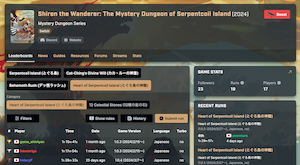

  

# Overview

Congratulations on clearing the main story! You're now finished with the tutorial. That's right - The main story was just the introduction to Shiren 6, and there's lots more to do!

There are 17 other dungeons besides Serpentcoil Island (not counting hidden routes) with various rules. In addition, there's a notebook to complete, 51 achievements to aim for, and a secret title screen to unlock.

# Dungeons

### Dungeon List

Reward for 2nd+ clears for dungeons that only list a 1st clear reward is a random blue sacred item.

<table>
  <thead>
    <tr>
      <th class="centeredText">Name</th>
      <th class="centeredText">Depth</th>
      <th class="centeredText">Level Reset</th>
      <th class="centeredText">Bring Items</th>
      <th class="centeredText">Rescues</th>
      <th class="centeredText">Clear Reward</th>
    </tr>
  </thead>
  <tbody>
    <tr>
      <td class="centeredText highlightYellow"><a href="../dungeons/serpentcoil-island">Serpentcoil Island</a></td>
      <td class="centeredText">31F</td>
      <td class="centeredText">No</td>
      <td class="centeredText">Yes</td>
      <td class="centeredText">3</td>
      <td>1st: Staff credits, title screen changes. 2nd: Unlock Wagoneer, Dune of Batsu. 3rd+: Random Sacred Item (Blue)</td>
    </tr>
    <tr>
      <td class="centeredText highlightYellow"><a href="../dungeons/secluded-path">Secluded Path</a></td>
      <td class="centeredText">3~6F</td>
      <td class="centeredText">No</td>
      <td class="centeredText">Yes</td>
      <td class="centeredText">0</td>
      <td>None</td>
    </tr>
    <tr>
      <td class="centeredText highlightYellow"><a href="../dungeons/ghost-ship">Ghost Ship</a></td>
      <td class="centeredText">4~7F</td>
      <td class="centeredText">No</td>
      <td class="centeredText">Yes</td>
      <td class="centeredText">0</td>
      <td>None</td>
    </tr>
    <tr>
      <td class="centeredText highlightYellow"><a href="../dungeons/golden-highway">Golden Highway</a></td>
      <td class="centeredText">2~6F</td>
      <td class="centeredText">No</td>
      <td class="centeredText">Yes</td>
      <td class="centeredText">0</td>
      <td>None</td>
    </tr>
    <tr>
      <td class="centeredText highlightYellow"><a href="../dungeons/dune-of-batsu">Dune of Batsu</a></td>
      <td class="centeredText">30F</td>
      <td class="centeredText">Yes</td>
      <td class="centeredText">Yes</td>
      <td class="centeredText">3</td>
      <td>Unlock Cavern of Suiryu.</td>
    </tr>
    <tr>
      <td class="centeredText highlightYellow"><a href="../dungeons/cavern-of-suiryu">Cavern of Suiryu</a></td>
      <td class="centeredText">20F</td>
      <td class="centeredText">Yes</td>
      <td class="centeredText">No</td>
      <td class="centeredText">3</td>
      <td>Unlock Heart of Serpentcoil Island. Title screen changes.</td>
    </tr>
    <tr>
      <td class="centeredText highlightYellow"><a href="../dungeons/yamakagashi-pass">Yamakagashi Pass</a></td>
      <td class="centeredText">25F</td>
      <td class="centeredText">Yes</td>
      <td class="centeredText">No</td>
      <td class="centeredText">3</td>
      <td>Seki rejoins as a companion.</td>
    </tr>
    <tr>
      <td class="centeredText highlightYellow"><a href="../dungeons/kiki-island">Kiki Island</a></td>
      <td class="centeredText">25F</td>
      <td class="centeredText">Yes</td>
      <td class="centeredText">No</td>
      <td class="centeredText">3</td>
      <td>Hibiki and Tugai rejoin as companions. Unlock Escape Scroll.</td>
    </tr>
    <tr>
      <td class="centeredText highlightYellow"><a href="../dungeons/training-path-of-inference">Training Path of Inference</a></td>
      <td class="centeredText">20F</td>
      <td class="centeredText">Yes</td>
      <td class="centeredText">No</td>
      <td class="centeredText">3</td>
      <td>1st: Gutsy Shield Unlock Training Path of Extra Inference.</td>
    </tr>
    <tr>
      <td class="centeredText highlightYellow"><a href="../dungeons/training-path-of-extra-inference">Training Path of Extra Inference</a></td>
      <td class="centeredText">20F</td>
      <td class="centeredText">Yes</td>
      <td class="centeredText">No</td>
      <td class="centeredText">0</td>
      <td>Final item the player identified.</td>
    </tr>
    <tr>
      <td class="centeredText highlightYellow"><a href="../dungeons/peach-dungeon">Peach Dungeon</a></td>
      <td class="centeredText">25F</td>
      <td class="centeredText">Yes</td>
      <td class="centeredText">No</td>
      <td class="centeredText">3</td>
      <td>1st: Better Peach Buns in shop. 2nd+: Peach Bun (Random)</td>
    </tr>
    <tr>
      <td class="centeredText highlightYellow"><a href="../dungeons/sumo-dungeon">Sumo Dungeon</a></td>
      <td class="centeredText">20F</td>
      <td class="centeredText">Yes</td>
      <td class="centeredText">Yes</td>
      <td class="centeredText">3</td>
      <td>1st: Steak Plate (Gold)</td>
    </tr>
    <tr>
      <td class="centeredText highlightYellow"><a href="../dungeons/cat-ching's-divine-will">Cat-Ching's Divine Will</a></td>
      <td class="centeredText">10F</td>
      <td class="centeredText">Yes</td>
      <td class="centeredText">No</td>
      <td class="centeredText">3</td>
      <td>1st: Trapseeker (Gold)</td>
    </tr>
    <tr>
      <td class="centeredText highlightYellow"><a href="../dungeons/trapper's-secret-path">Trapper's Secret Path</a></td>
      <td class="centeredText">20F</td>
      <td class="centeredText">Yes</td>
      <td class="centeredText">No</td>
      <td class="centeredText">3</td>
      <td>None</td>
    </tr>
    <tr>
      <td class="centeredText highlightYellow"><a href="../dungeons/training-path-of-gimmicks">Training Path of Gimmicks</a></td>
      <td class="centeredText">20F</td>
      <td class="centeredText">Yes</td>
      <td class="centeredText">No</td>
      <td class="centeredText">3</td>
      <td>1st: Auspicious Omamori (Gold)</td>
    </tr>
    <tr>
      <td class="centeredText highlightYellow"><a href="../dungeons/training-path-of-shopping">Training Path of Shopping</a></td>
      <td class="centeredText">40F</td>
      <td class="centeredText">Yes</td>
      <td class="centeredText">Yes</td>
      <td class="centeredText">3</td>
      <td>1st: Shield of Presage (Gold)</td>
    </tr>
    <tr>
      <td class="centeredText highlightYellow"><a href="../dungeons/behemoth-rush">Behemoth Rush</a></td>
      <td class="centeredText">30F</td>
      <td class="centeredText">Yes</td>
      <td class="centeredText">No</td>
      <td class="centeredText">0</td>
      <td>1st: Auspicious Kumade (Gold)</td>
    </tr>
    <tr>
      <td class="centeredText highlightYellow"><a href="../dungeons/sacred-ocean-tunnel">Sacred Ocean Tunnel</a></td>
      <td class="centeredText">15F</td>
      <td class="centeredText">Yes</td>
      <td class="centeredText">No</td>
      <td class="centeredText">3</td>
      <td>Random Sacred Item (Gold)</td>
    </tr>
    <tr>
      <td class="centeredText highlightYellow"><a href="../dungeons/domain-of-staves-and-scrolls">Domain of Staves and Scrolls</a></td>
      <td class="centeredText">20F</td>
      <td class="centeredText">Yes</td>
      <td class="centeredText">No</td>
      <td class="centeredText">3</td>
      <td>1st: Steak Knife (Gold)</td>
    </tr>
    <tr>
      <td class="centeredText highlightYellow"><a href="../dungeons/isle-of-the-mighty">Isle of the Mighty</a></td>
      <td class="centeredText">50F</td>
      <td class="centeredText">Yes</td>
      <td class="centeredText">Yes</td>
      <td class="centeredText">3</td>
      <td>1st: Hunky-dory Shield (Gold)</td>
    </tr>
    <tr>
      <td class="centeredText highlightYellow"><a href="../dungeons/heart-of-serpentcoil-island">Heart of Serpentcoil Island</a></td>
      <td class="centeredText">99F</td>
      <td class="centeredText">Yes</td>
      <td class="centeredText">No</td>
      <td class="centeredText">3</td>
      <td><u>Reward is a 6 item loop as follows:</u> 1st: Manji Kabura (Gold) 2nd: Fuuma Shield (Gold) 3rd: Golden Pickaxe (Gold) 4th: Epic Hammer (Gold) 5th: Bodhi Shield (Gold) 6th: Accurate Sword (Gold)</td>
    </tr>
    <tr>
      <td class="centeredText highlightYellow"><a href="../dungeons/heart-of-serpentcoil-island">Heart of Serpentcoil Island</a> (The 12 Celestial Stones)</td>
      <td class="centeredText">99F</td>
      <td class="centeredText">Yes</td>
      <td class="centeredText">No</td>
      <td class="centeredText">3</td>
      <td>Title screen changes.</td>
    </tr>
  </tbody>
</table>

### Dungeon Unlock Chart

If a particular dungeon doesn't seem to be unlocking, visit more locations that have a red ! on the map. Progressing synthesis related events might also be part of the requirements for some dungeons.

<table>
  <thead>
    <tr>
      <th class="centeredText">Name</th>
      <th class="centeredText">Entrance</th>
      <th class="centeredText">Unlock Condition</th>
    </tr>
  </thead>
  <tbody>
    <tr>
      <td class="centeredText highlightPurple">Serpentcoil Island</td>
      <td class="centeredText">Shukuba Beach</td>
      <td>Available from the start.</td>
    </tr>
    <tr>
      <td class="centeredText highlightPurple">Secluded Path</td>
      <td class="centeredText">Secret Ninja Village</td>
      <td>Progress Mountain Village events.</td>
    </tr>
    <tr>
      <td class="centeredText highlightPurple">Ghost Ship</td>
      <td class="centeredText">Small Harbor</td>
      <td>Progress Small Harbor events.</td>
    </tr>
    <tr>
      <td class="centeredText highlightPurple">Golden Highway</td>
      <td class="centeredText">Icewall Village</td>
      <td>Progress Golden Highway (Kawasaku) events.</td>
    </tr>
    <tr>
      <td class="centeredText highlightPurple">Dune of Batsu</td>
      <td class="centeredText">Shukuba Beach</td>
      <td>1. Clear Serpentcoil Island 2 times. 2. Go on a few adventures.</td>
    </tr>
    <tr>
      <td class="centeredText highlightPurple">Cavern of Suiryu</td>
      <td class="centeredText">Shukuba Beach</td>
      <td>Clear Dune of Batsu.</td>
    </tr>
    <tr>
      <td class="centeredText highlightPurple">Yamakagashi Pass</td>
      <td class="centeredText">Secret Ninja Village</td>
      <td>1. Clear Serpentcoil Island. 2. Progress Secret Ninja Village events.</td>
    </tr>
    <tr>
      <td class="centeredText highlightPurple">Kiki Island</td>
      <td class="centeredText">Small Harbor</td>
      <td>1. Challenge Training Path of Inference 1 time. 2. Progress pirate events.</td>
    </tr>
    <tr>
      <td class="centeredText highlightPurple">Training Path of Inference</td>
      <td class="centeredText">Rocky Viewpoint</td>
      <td>Clear Serpentcoil Island.</td>
    </tr>
    <tr>
      <td class="centeredText highlightPurple">Training Path of Extra Inference</td>
      <td class="centeredText">Rocky Viewpoint</td>
      <td>Clear Training Path of Inference.</td>
    </tr>
    <tr>
      <td class="centeredText highlightPurple">Peach Dungeon</td>
      <td class="centeredText">Shukuba Beach</td>
      <td>1. Clear Serpentcoil Island. 2. Progress Peach Bun events.</td>
    </tr>
    <tr>
      <td class="centeredText highlightPurple">Sumo Dungeon</td>
      <td class="centeredText">Small Harbor</td>
      <td>Clear Serpentcoil Island.</td>
    </tr>
    <tr>
      <td class="centeredText highlightPurple">Cat-Ching's Divine Will</td>
      <td class="centeredText">Mount Jatou Entrance</td>
      <td>Clear Serpentcoil Island.</td>
    </tr>
    <tr>
      <td class="centeredText highlightPurple">Trapper's Secret Path</td>
      <td class="centeredText">Icewall Village</td>
      <td>Clear Serpentcoil Island.</td>
    </tr>
    <tr>
      <td class="centeredText highlightPurple">Training Path of Gimmicks</td>
      <td class="centeredText">Underwater Training Ground</td>
      <td>Clear Serpentcoil Island.</td>
    </tr>
    <tr>
      <td class="centeredText highlightPurple">Training Path of Shopping</td>
      <td class="centeredText">Underwater Training Ground</td>
      <td>Clear Serpentcoil Island.</td>
    </tr>
    <tr>
      <td class="centeredText highlightPurple">Behemoth Rush</td>
      <td class="centeredText">Firespew Mountain Summit</td>
      <td>Clear Serpentcoil Island.</td>
    </tr>
    <tr>
      <td class="centeredText highlightPurple">Sacred Ocean Tunnel</td>
      <td class="centeredText">Rocky Viewpoint</td>
      <td>Challenge Training Path of Inference 1 time?</td>
    </tr>
    <tr>
      <td class="centeredText highlightPurple">Domain of Staves and Scrolls</td>
      <td class="centeredText">Small Harbor</td>
      <td>Clear Dune of Batsu.</td>
    </tr>
    <tr>
      <td class="centeredText highlightPurple">Isle of the Mighty</td>
      <td class="centeredText">Shukuba Beach</td>
      <td>Clear Cavern of Suiryu.</td>
    </tr>
    <tr>
      <td class="centeredText highlightPurple">Heart of Serpentcoil Island</td>
      <td class="centeredText">Firespew Mountain Summit</td>
      <td>Clear Cavern of Suiryu.</td>
    </tr>
    <tr>
      <td class="centeredText highlightPurple">Heart of Serpentcoil Island (The 12 Celestial Stones)</td>
      <td class="centeredText">Shukuba Beach</td>
      <td>Clear Heart of Serpentcoil Island.</td>
    </tr>
  </tbody>
</table>

### Dungeon Difficulty Ranking

Keep in mind that this difficulty ranking is an opinion piece, and isn't absolute.

#### No Carry-In Items

<table>
  <thead>
    <tr>
      <th class="centeredText">Difficulty</th>
      <th class="centeredText">Dungeon</th>
      <th class="centeredText">Notes</th>
    </tr>
  </thead>
  <tbody>
    <tr>
      <td class="centeredText highlightGray">Super Hard</td>
      <td>Heart of Serpentcoil Island</td>
      <td>The 12 Celestial Stones.</td>
    </tr>
    <tr>
      <td rowspan="2" class="centeredText highlightGray">Hard</td>
      <td>Heart of Serpentcoil Island</td>
      <td>-</td>
    </tr>
    <tr>
      <td>Yamakagashi Pass</td>
      <td>Including the boss fight.</td>
    </tr>
    <tr>
      <td rowspan="4" class="centeredText highlightGray">Medium Hard</td>
      <td>Training Path of Inference</td>
      <td>-</td>
    </tr>
    <tr>
      <td>Training Path of Extra Inference</td>
      <td>Descend to 20F.</td>
    </tr>
    <tr>
      <td>Peach Dungeon</td>
      <td>Sumo status → Medium.</td>
    </tr>
    <tr>
      <td>Sacred Ocean Tunnel</td>
      <td>-</td>
    </tr>
    <tr>
      <td rowspan="4" class="centeredText highlightGray">Medium</td>
      <td>Kiki Island</td>
      <td>-</td>
    </tr>
    <tr>
      <td>Cavern of Suiryu</td>
      <td>Medium Hard after 1st clear.</td>
    </tr>
    <tr>
      <td>Trapper's Secret Path</td>
      <td>-</td>
    </tr>
    <tr>
      <td>Domain of Staves and Scrolls</td>
      <td>Transmutation Pot → Easy.</td>
    </tr>
    <tr>
      <td rowspan="3" class="centeredText highlightGray">Easy</td>
      <td>Training Path of Extra Inference</td>
      <td>Identify 50 items.</td>
    </tr>
    <tr>
      <td>Behemoth Rush</td>
      <td>-</td>
    </tr>
    <tr>
      <td>Cat-Ching's Divine Will</td>
      <td>-</td>
    </tr>
  </tbody>
</table>

#### Carry-In Items

All dungeons that allow bringing items drop down to "Easy" if you overprepare.

<table>
  <thead>
    <tr>
      <th class="centeredText">Difficulty</th>
      <th class="centeredText">Dungeon</th>
      <th class="centeredText">Notes</th>
    </tr>
  </thead>
  <tbody>
    <tr>
      <td class="centeredText highlightGray">Hard</td>
      <td>Isle of the Mighty</td>
      <td>-</td>
    </tr>
    <tr>
      <td class="centeredText highlightGray">Medium Hard</td>
      <td>Training Path of Shopping</td>
      <td>-</td>
    </tr>
    <tr>
      <td rowspan="2" class="centeredText highlightGray">Medium</td>
      <td>Training Path of Gimmicks</td>
      <td>-</td>
    </tr>
    <tr>
      <td>Dune of Batsu</td>
      <td>-</td>
    </tr>
    <tr>
      <td rowspan="2" class="centeredText highlightGray">Easy</td>
      <td>Sumo Dungeon</td>
      <td>-</td>
    </tr>
    <tr>
      <td>Serpentcoil Island</td>
      <td>-</td>
    </tr>
  </tbody>
</table>

#### Restricted Play (No Bringing Items / Wanderer Rescue)

<table>
  <thead>
    <tr>
      <th class="centeredText">Difficulty</th>
      <th class="centeredText">Dungeon</th>
      <th class="centeredText">Notes</th>
    </tr>
  </thead>
  <tbody>
    <tr>
      <td rowspan="2" class="centeredText highlightGray">Super Hard</td>
      <td>Isle of the Mighty</td>
      <td>50F rescue using points.</td>
    </tr>
    <tr>
      <td>Training Path of Shopping</td>
      <td>No bringing items.</td>
    </tr>
    <tr>
      <td class="centeredText highlightGray">Hard</td>
      <td>Isle of the Mighty</td>
      <td>Bring items from 1 run of Heart.</td>
    </tr>
    <tr>
      <td class="centeredText highlightGray">Medium Hard</td>
      <td>Dune of Batsu</td>
      <td>No bringing items.</td>
    </tr>
    <tr>
      <td class="centeredText highlightGray">Medium</td>
      <td>Sumo Dungeon</td>
      <td>No bringing items.</td>
    </tr>
    <tr>
      <td class="centeredText highlightGray">Easy</td>
      <td>Serpentcoil Island</td>
      <td>No bringing items.</td>
    </tr>
  </tbody>
</table>

# Get Stronger

Some dungeons expect you to bring strong equipment, so this section helps you get up to speed.

### Obtain the Best Equipment

#### Kabura Sutegi + Rasen Fuuma

   

Pros / Cons:

- (+) Highest base stats in the game, resonance effect lets you 2-shot Gitan Mamels.
- (−) Must bring 2 Strength Grass if you want to equip 2 bracelets at the start of a dungeon.
- (−) Costs twice the amount of Gitan to fully upgrade starting from Manji Kabura and Fuuma Shield.

Set Stats:

- Weapon: 50 Base Attack (Max: 149 non-sacred, up to 159 sacred).
- Shield: 30 Base Defense (Max: 129 non-sacred, up to 139 sacred).
- Resonance: Your normal attacks deal an additional 10 damage.

How to Obtain:

- Kabura Sutegi = Upgrade a Manji Kabura+99 at the Traveling Blacksmith in Shukuba Beach.
    - Rune slots will be set to 15 slots upon transforming the Manji Kabura.
- Rasen Fuuma = Upgrade a Fuuma Shield+99 at the Traveling Blacksmith in Shukuba Beach.
    - Rune slots will be set to 15 slots upon transforming the Fuuma Shield.

#### Yamanba's Cleaver + Yamanba's Potlid

   

Pros / Cons:

- (+) Resonance effect lets you equip 2 bracelets without bringing Strength Grass.
- (−) Fewer initial rune slots than Kabura Sutegi and Rasen Fuuma, so needs more Slot-adding Scrolls.
- (−) Lower damage output than Kabura Sutegi + Rasen Fuuma.

Set Stats:

- Weapon: 10 Base Attack (Max: 109 non-sacred, up to 119 sacred).
- Shield: 10 Base Defense (Max: 109 non-sacred, up to 119 sacred).
- Resonance: Weapon and shield become cursed, increase strength by 4.

How to Obtain:

- Found in various postgame dungeons.

### Upgrade Equipment

The quickest method to upgrade equipment is to use the Traveling Blacksmith in Shukuba Beach 9 times, then fast-travel to Secret Ninja Village and upgrade 1 time → return to Shukuba Beach from the map. ※ You can return to Shukuba Beach after using the Wagoneer as long as you don't enter a dungeon.

|Method|Count|Total cost to repeat until +99|
|-|-|-|
|Shukuba Beach + Secret Ninja Village|9 + 1|(3,000 x 90 = 270,000) + (1,000 x 9 = 9,000) = 279,000|
|Only Secret Ninja Village|1|1,000 x 99 = 99,000|

The total cost is actually slightly less since the blacksmith occasionally upgrades by +3 instead of +1.

#### Earning Gitan

As you can see in the table above, you'll need a lot of Gitan to fully upgrade equipment. 
The best way to earn Gitan is to sell high-value items in a dungeon shop and steal them back. (See [Stealing Guide](/guides/stealing-guide) for safe methods)

Methods to earn Gitan that don't involve stealing:

- Read a Fixer Scroll inside the Shukuba Beach warehouse when your Gitan total is 0.
- Equip a Golden Sword and Golden Shield at the same time, then hunt monsters for Gitan drops.
- Collect lots of Blank Scrolls in [Domain of Staves and Scrolls](/dungeons/domain-of-staves-and-scrolls), then sell Eradication Scrolls.
    - This becomes more efficient if you've cleared [Kiki Island](/dungeons/kiki-island) and have unlocked Escape Scrolls.

### Synthesize Runes

Finalize your main weapon and shield by synthesizing the best runes. Slot-adding Scrolls can be used to increase the number of rune slots on an item (max: 30 slots).

Mixergons can be found between 16-30F of [Training Path of Shopping](/dungeons/training-path-of-shopping), and can eat up to 4 items. If your equipment isn't strong enough yet, you can go to Serpentcoil Island or Golden Highway instead. To ensure safety, swing a Peach Staff at a Mixergon and synthesize in the Shukuba Beach warehouse.

#### Weapon Runes

Feel free to swap runes out depending on your preferences.

|Icon|Name|Source|Notes|
|-|-|-|-|
||Rustproof|Golden Sword Plating Scroll|Prevents upgrade value from decreasing due to rust. Raises accuracy of normal attacks by 2.0% (92% → 94%).|
||Frontal Attack|Kama Itachi|Attack 3 forward directions at the same time.|
||Side Attack|Sacred Item|Attack in front and to your left and right at the same time.|
||Accurate|Accurate Sword *1|Your normal attacks always hit.|
||Swift Strikes|Swift Sword|Roughly 25% chance to attack 2 times in a row. The second hit has 50% attack power.|
||Healing|Healing Sword|Restore HP equal to 10% of damage dealt.|
||Peach Bun|Peach Club|30% chance for an enemy to drop a Peach Bun when slain.|
||Max Wall Dig|Golden Pickaxe *1|Dig walls, upgrade value never decreases.|
||Knockback|Whopping Harisen|Roughly 53.7% chance to deal 1 tile of knockback.|
||Sedating|Sedating Grass|Roughly 10.5% chance to inflict Asleep status.|
||Paralyzing|Paralyzing Staff|Roughly 11.3% chance to inflict Paralyzed status.|
||HP +15|Healing Grass|Increase max HP by 15.|
||HP +20|Life Grass|Increase max HP by 20.|
||Anti-Aquatic|Watersplitter|Deal x1.5 damage to Aquatic type monsters.|
||Anti-Beast|Primal Axe|Deal x1.5 damage to Beast type monsters.|
||Anti-Dragon|Dragonkiller|Deal x1.5 damage to Dragon type monsters.|
||Anti-Ghost|Sickle of Salvation|Deal x1.5 damage to Ghost type monsters.|
||Anti-Draining|Drain Slayer|Deal x1.5 damage to Draining type monsters.|
||Anti-Cyclops|Cyclops Bane|Deal x1.5 damage to Cyclops type monsters.|
||Anti-Behemoth|Sacred Item|Lets you attack through a Behemoth monster's barrier.|
||Critical At 0|Sacred Item|x1.5 damage critical hit when last digit of your HP is 0.|
||Critical At 1|Sacred Item|x1.5 damage critical hit when last digit of your HP is 1.|
||Critical At 2|Sacred Item|x1.5 damage critical hit when last digit of your HP is 2.|
||Critical At 3|Sacred Item|x1.5 damage critical hit when last digit of your HP is 3.|
||Critical At 4|Sacred Item|x1.5 damage critical hit when last digit of your HP is 4.|
||Critical At 5|Sacred Item|x1.5 damage critical hit when last digit of your HP is 5.|
||Critical At 6|Sacred Item|x1.5 damage critical hit when last digit of your HP is 6.|
||Critical At 7|Auspicious Kumade|x1.5 damage critical hit when last digit of your HP is 7.|
||Critical At 8|Sacred Item|x1.5 damage critical hit when last digit of your HP is 8.|
||Critical At 9|Sacred Item|x1.5 damage critical hit when last digit of your HP is 9.|

*1: Rune is also randomly found on sacred items in Isle of the Mighty.

#### Shield Runes

Feel free to swap runes out depending on your preferences.

|Icon|Name|Source|Notes|
|-|-|-|-|
||Rustproof|Golden Shield Plating Scroll|Prevents upgrade value from decreasing due to rust.|
||Onigiri Payback|Onigiri Scroll|10.2% chance to inflict Onigiri status on attacker.|
||Keen|Watchful Shield|22.6% chance to dodge enemy normal attacks.|
||Anti-Dragon|Dragon Shield|Reduces normal attack and fire damage by 50%. Only works on Dragon type monsters.|
||Anti-Blast|Blast Shield|Reduces damage from explosions by 50%.|
||Critproof|Targe of the Minotaur|Reduces damage from enemy critical hits by 55%.|
||Walrusproof|Walrus Stopper|Thiefwalrus monsters can't steal your items.|
||Hatproof|Hat Stopper|Hat Urchin monsters can't steal your items.|
||Nigiriproof|Nigiri Stopper|Nigiri Morph monsters can't turn items into onigiri. Protects against Onigiri status.|
||Projectileproof|Kappa's Dish|39.2% chance to evade enemy projectiles.|
||Hypnosisproof|Gazer Shield|Protects against Gazer's hypnosis.|
||Magic Reflect|Sacred Item|Reflects magic bullets aimed at you.|
||Full Armor|Hunky-dory Shield|Reduces damage from any attack by 50%. Must be at full HP to activate.|
||Sating|Shield of Sating|Halves hunger rate (1 fullness / 20 turns).|
||Trap-proof|Sacred Item|Chance to nullify trap activation.|
||Oracle|Shield of Presage|Chime plays when Wishing Shrine is present. Buried items glow brightly.|
||HP +5|Herb|Increase max HP by 5.|
||HP +10|Otogirisou|Increase max HP by 10.|
||HP +15|Healing Grass|Increase max HP by 15.|
||HP +20|Life Grass|Increase max HP by 20.|
||Tough At 0|Sacred Item|Reduce normal attack damage received by 30%. Last digit of HP must be 0 to activate.|
||Tough At 1|Sacred Item|Reduce normal attack damage received by 30%. Last digit of HP must be 0 to activate.|
||Tough At 2|Sacred Item|Reduce normal attack damage received by 30%. Last digit of HP must be 0 to activate.|
||Tough At 3|Sacred Item|Reduce normal attack damage received by 30%. Last digit of HP must be 0 to activate.|
||Tough At 4|Sacred Item|Reduce normal attack damage received by 30%. Last digit of HP must be 0 to activate.|
||Tough At 5|Sacred Item|Reduce normal attack damage received by 30%. Last digit of HP must be 0 to activate.|
||Tough At 6|Sacred Item|Reduce normal attack damage received by 30%. Last digit of HP must be 0 to activate.|
||Tough At 7|Auspicious Omamori|Reduce normal attack damage received by 30%. Last digit of HP must be 0 to activate.|
||Tough At 8|Sacred Item|Reduce normal attack damage received by 30%. Last digit of HP must be 0 to activate.|
||Tough At 9|Sacred Item|Reduce normal attack damage received by 30%. Last digit of HP must be 0 to activate.|

# 100% Notebook

#### Rare Entries

Some of the rarer entries needed for notebook completion are noted below:

- Kajin Fuuma
    - Upgrade a Katana+99 at the Traveling Blacksmith in Shukuba Beach.
- Kabura Sutegi
    - Upgrade a Manji Kabura+99 at the Traveling Blacksmith in Shukuba Beach.
- Golden Pickaxe
    - Isle of the Mighty (shop, 48\~49F).
    - Clear Heart of Serpentcoil Island 3 times.
- Epic Hammer
    - Isle of the Mighty (shop, 48\~49F).
    - Clear Heart of Serpentcoil Island 4 times.
- Accurate Sword
    - Clear Heart of Serpentcoil Island 6 times.
- Rasen Fuuma
    - Upgrade a Fuuma Shield+99 at the Traveling Blacksmith in Shukuba Beach.
- Bodhi Shield
    - Heart of Serpentcoil Island (floor).
    - Clear Heart of Serpentcoil Island 5 times.
- Appraiser's Bracelet
    - Training Path of Extra Inference (13\~20F).
- Expulsion Scroll
    - Isle of the Mighty (shop, 48\~49F, 3000G).
- Eradication Scroll
    - Domain of Staves and Scrolls (floor).
- Ill-fated Seed
    - Heart of Serpentcoil Island (shop, 2000G).
- Bellyshrink Seed
    - Heart of Serpentcoil Island (floor).
- Alarm Switch
    - Heart of Serpentcoil Island (50\~99F?)
- Sacred Item exclusive runes
    - Isle of the Mighty or Sacred Ocean Tunnel.
- Peach Buns
    - Peach Bun shop in Shukuba Beach (Eat the Peach Bun to also unlock the monster entry).

# Adventure Log

#### Peach Bun Method

Monster entries in the Adventure Log can be filled out by utilizing Peach Buns, such as:

1. Go to a floor where the slot for Cave Mamel hasn't been unlocked yet.
2. Throw a Cave Mamel Bun at any enemy.
3. Swing a Peach Staff at the Cave Mamel, transforming it back into a Peach Bun.
4. Check the Adventure Log to confirm that the slot for Cave Mamel is now unlocked on that floor.

This trick is particularly effective for rare encounter slots like Cave Mamel, Mixer, and Chow.

#### Other Methods

- Monstercall Scroll
    - Up to a maximum of 15 or so new monsters are generated when this scroll is read.
- Monstercall Bracelet
    - 2 bracelets shortens the interval between monster spawns even further.
- Schubell
    - Either step in place and have an enemy Schubell family monster summon new monsters, or eat a Schubell family monster's Peach Bun and summon new monsters yourself.
- Summoning Trap / Monsterizing Trap
    - Step on the trap to generate new monsters.
    - For Monsterizing Trap, shoot arrows at a wall inside the room beforehand.
- Clairvoyant Bracelet / Monster-find Bracelet / Mapping Scroll
    - Makes it easier to hunt down monsters that spawn.

#### Monster House Exclusive

Fluffy Bunny (80-89F) in Heart of Serpentcoil Island is currently thought to be Monster House exclusive.

# Clear Icons

|Icon|In-Game Description|
|-|-|
||Completed the "Serpentcoil Island" story arc.|
||Completed the "Suiryu" story arc.|
||Completed the "Kokatsu" story arc.|
||Completed the "Reconciliation" story arc.|
||Completed "The Two Pirate Gangs" story arc.|
||Completed the "Peach Club" story arc.|
||Completed the "Secret Ninja Village" story arc.|
||Completed the "Secluded Path" story arc.|
||Completed the "Ghost Ship" story arc.|
||Completed the "Golden Highway" story arc.|
||Completed the "Kiki Island" story arc.|
||Completed the "Yamakagashi Pass" story arc.|
||Completed the "Peach Dungeon" story arc.|
||Completed the "Training Path of Inference" story arc.|
||Completed the "Asuka" story arc.|
||Completed the "Porky the Pirate" story arc.|
||Completed the "Tugai" story arc.|
||Completed the "Hibiki" story arc.|
||Completed the "Sumo Dungeon" story arc.|
||Completed the "Cat-Ching's Divine Will" story arc.|
||Completed the "Trapper's Secret Path" story arc.|
||Completed the "Training Path of Gimmicks" story arc.|
||Completed the "Training Path of Shopping" story arc.|
||Completed the "Behemoth Rush" story arc.|
||Completed the "Sacred Ocean Tunnel" story arc.|
||Completed the "Domain of Staves and Scrolls" story arc.|
||Completed the "Isle of the Mighty" story arc.|
||Completed the "Heart of Serpentcoil Island" story arc.|

# Achievements

|No|Achievement|In-Game Description|
|-|-|-|
|1|Serpentcoil Island Completion|Defeated Jakaku and completed Serpentcoil Island.|
|2|Dune of Batsu Completion|Defeated Embodiment of Batsu and completed Dune of Batsu.|
|3|Cavern of Suiryu Completion|Defeated Embodiment of Suiryu and completed Cavern of Suiryu.|
|4|Yamakagashi Pass Completion|Defeated Madara and completed Yamakagashi Pass.|
|5|Kiki Island Completion|Completed Kiki Island.|
|6|Training Path of Inference Completion|Completed Training Path of Inference.|
|7|Training Path of Extra Inference Completion|Completed Training Path of Extra Inference.|
|8|Peach Dungeon Completion|Completed Peach Dungeon.|
|9|Sumo Dungeon Completion|Completed Sumo Dungeon.|
|10|Cat-Ching's Divine Will Completion|Completed Cat-Ching's Divine Will.|
|11|Trapper's Secret Path Completion|Completed Trapper's Secret Path.|
|12|Training Path of Gimmicks Completion|Completed Training Path of Gimmicks.|
|13|Training Path of Shopping Completion|Completed Training Path of Shopping.|
|14|Behemoth Rush Completion|Completed Behemoth Rush.|
|15|Sacred Ocean Tunnel Completion|Completed Sacred Ocrean Tunnel.|
|16|Domain of Staves and Scrolls Completion|Completed Domain of Staves and Scrolls.|
|17|Isle of the Mighty Completion|Completed Isle of the Mighty.|
|18|Heart of Serpentcoil Island Completion|Completed Heart of Serpentcoil Island.|
|19|Sumo-ready!|Experienced the Sumo condition.|
|20|Wish Granted|Reached the Tunnel of Wishes.|
|21|Blue Sacred Gear|Brought back a Blue Sacred item.|
|22|Golden Sacred Gear|Brought back a Golden Sacred item.|
|23|Cannon Master|Defeated a monster in a dungeon with a cannon.|
|24|Way of Gitau|Took the shop's wares and managed to escape.|
|25|Trusty Companions|Recruited all companions.|
|26|Seasoned Wanderer|Completed Kron's challenge.|
|27|Behemoth Vanquished!|Defeated a Behemoth.|
|28|Grilled to Perfection!|Had an Onigiri grilled.|
|29|How Did You Know?!|Attacked a Ninja in hiding.|
|30|Cooking in the Wild|Made a Hen into Yakitori.|
|31|Don't Overdo Your Diet|Collapsed due to starvation.|
|32|Don't Overstay in the Dungeon|Had a gust send you back to Shukuba Beach.|
|33|Immediate Danger!|Got thrown into a Monster House.|
|34|Awwww, How Cute!|Became friendly with a monster pup.|
|35|Rejoined by Fate|Bought back your weapon or shield at an Unsuspicious Shop.|
|36|First Successful Rescue|Succeeded in rescuing a Wanderer.|
|37|Invitation to a Parallel World *１|Uploaded Parallel Data.|
|38|Journey to a Parallel World|Went on a Parallel Play adventure.|
|39|Weapon Collector|Completed the Weapon listing in the Item Notes.|
|40|Shield Collector|Completed the Shield listing in the Item Notes.|
|41|Bracelet Appraiser|Completed the Bracelet listing in the Item Notes.|
|42|Arrow Collector|Completed the Arrow listing in the Item Notes.|
|43|Rock Collector|Completed the Rock listing in the Item Notes.|
|44|Gourmet|Completed the Food listing in the Item Notes.|
|45|Vegetarian|Completed the Grass listing in the Item Notes.|
|46|Scroll Collector|Completed the Scroll listing in the Item Notes.|
|47|Master of Staves|Completed the Stave listing in the Item Notes.|
|48|Fragrance Expert|Completed the Incense listing in the Item Notes.|
|49|Pottery Aficionado|Completed the Pot listing in the Item Notes.|
|50|Peach Bun Lover|Completed the Peach Bun listing in the Item Notes.|
|51|Monster Whiz|Completed the Monster Notes.|

*1 Requires an internet connection.

# Speedrunning

  

Interested in competing for world records? Check out the [Shiren 6 page](https://www.speedrun.com/shiren6) on speedrun.com.
