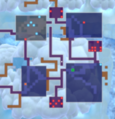

# Overview

Stealing is where you take merchandise from a dungeon shop without paying for said merchandise. Shopkeepers and guards only chase you on the current floor, so you're golden once you reach the stairs.

### Dungeon Shop Basics

- The player cannot write on Blank Scrolls that have a price tag.
    - Don't sell your Blank Scroll if you plan on stealing by writing Wall-less Scroll on it.
- The player cannot give an Identifier Scroll to the Shopkeeper to identify merchandise.
    - This was a feature in Shiren 5, but it's not in this game.
- Traps cannot be generated on carpet tiles.
    - Pitfall Traps will not appear on the ground if you break a Bottomless Pot inside a shop.
    - Karakuroid will not create traps inside a shop.
- Wall-less Scroll transforms the entire floor into a shop, and Shopkeepers warp next to the stairs.
    - Shopkeepers will not head towards Wishing Shrines.
- Thief Mode triggers include:
    - Leaving the shop with unpaid-for merchandise, even when there are no Shopkeepers.
    - Using a Water Gun Pot on merchandise (weapon, scroll, or food) from outside the shop.
- Shopkeepers becoming hostile (prior to stealing):
    - Switching Staff will not anger a Shopkeeper.
    - Eating a Sweet Potato will not anger a Shopkeeper.
    - Dealing knockback to an enemy who bumps into a Shopkeeper will not anger the Shopkeeper.
    - Hostile Shopkeepers will stop being angry if you revive using Revival Grass.
    - Attacking a Guard Dog or using a Narrow-escape Staff will anger a Shopkeeper.
- Shopkeepers are not cured of bad status conditions when Thief Mode is triggered.
- It's possible to expand a shop by destroying surrounding wall tiles.

### Anti-Theft Measures

- Shops with 4\~5 Shopkeepers instead of the usual single Shopkeeper.
    - Each Shopkeeper will block an exit if possible when merchandise is picked up.
    - All Shopkeepers will become hostile if you do something to anger one of them.
- Shops with a Guard Dog.
    - The Guard Dog prevents Thiefwalrus from stealing an item when a Walrus Pot is used.
    - Walrus Pot can be used to steal after the Guard Dog has been dealt with.
- Shops surrounded by unbreakable wall tiles.
    - The player cannot enter these wall tiles even with a Wallpass Bracelet equipped.
- Shopkeeper with a Shield of Negation equipped.
    - Immune to magic bullets from swinging a staff, but scrolls and thrown staves are effective.
    - Inflicting Sealed status removes their ability to negate magic bullets.
- Shop without an entrance.
    - The shop is buried in wall tiles without an entrance, and a Spring Trap is present.

### Shopkeepers & Guards

- Disguising Staff and Peach Staff do not work, and all shop NPCs ignore Sanctuary Scroll.
- Shopkeeper
    - Normal speed, but changes to Swift 1 action speed when Thief Mode is triggered.
    - Stats (Red) = 180 HP / 180 Attack / 50 Defense
    - Stats (Blue) = 190 HP / 190 Attack / 70 Defense
    - Stats (Yellow) = 200 HP / 200 Attack / 90 Defense - Immune to staff magic
    - Stats (Black) = 210 HP / 210 Attack / 110 Defense
- Guard Dog
    - Swift 2 action speed at all times.
    - When present in a shop, it prevents theft using a Walrus Pot from outside the shop.
    - Continuously spawns during Thief Mode, and detects Shiren's position within 20 tiles.
    - Stats = 220 HP / 220 Attack / 220 Defense
- Shop Guard
    - Normal speed.
    - Up to 4 Shop Guards are generated surrounding the stairs when Thief Mode is triggered.
    - Continuously spawns during Thief Mode, and has a regular 1 tile range of detection.
    - Stats = 300 HP / 250 Attack / 250 Defense

### Thief Mode

- Shopkeepers change to Swift 1 action speed.
- Up to 4 Shop Guards are generated surrounding the stairs.
    - These Shop Guards don't attack on the turn they're generated.
    - Shop Guards don't surround Byways (blue stairs) or Wishing Shrines.
- 11 other Guard Dogs and Shop Guards are generated throughout the floor.
- Regular monsters stop spawning, and 1 Guard Dog or Shop Guard spawns every 16 turns.
    - Unlike Shiren 5, regular monsters already present do not transform into shop NPCs.
- Escape Scroll is nullified if read during Thief Mode.

# Risk vs. Return

Think carefully and weigh the pros and cons before you steal from a dungeon shop. If you have enough Gitan to buy the items you want, it might be best to simply purchase the items. This is especially true if you don't have a Monster-find Bracelet or Mapping Scroll on hand.

That said, selling your inventory and stealing it back can secure funds for future shopping. An expensive Sacred Item that nearly guarantees a successful adventure would be worth the risk, too.

# Methods

### Wall-less Scroll

The listed methods are follow-up actions after reading a Wall-less Scroll.

#### Knockback Staff / Switching Staff

Staves that simply move the Shopkeeper so they're no longer blocking the stairs. Narrow-escape Staff also works if used on a monster before the Shopkeeper (before Wall-less Scroll).

#### Paralyzing Staff / Disguising Staff

Throw an item at the Shopkeeper to anger them, then paralyze them when they're not on the stairs. Alternatively, swing a Disguising Staff at a regular monster, then anger the Shopkeeper. ※ Keep in mind that Shopkeepers themselves are immune to Disguising Staff.

#### Swift Grass / Invincible Grass / Earthmound Staff / Sluggish Staff

Anger the Shopkeeper, then use good movement to reach the stairs while the Shopkeeper chases you. The Shopkeeper won't gain Swift 1 speed since Thief Mode doesn't get triggered.

#### Peach Bun

Throw a Peach Bun at the Shopkeeper to transform them into a regular monster. This method is effective even on yellow Shopkeepers.

#### Monster as a wall

Anger the Shopkeeper, then circle around a regular monster using diagonal movement. Choose a weak monster since you're going to receive a decent number of attacks.

### Other Methods

<b><u>Methods to reach the stairs room:</u></b>

#### Wall Dig + Vaulting Staff / Switching Staff

Dig walls so that there's a straight path to the stairs from inside the shop, then land on the stairs. Monster-find Bracelet or Mapping Scroll ensures that no other monster is in the line of sight. Vaulting Staff - Use an Earthmound Staff or paralyzed monster to create a wall if needed. Switching Staff - Swing it at a monster who is standing directly on the stairs.

#### Expand the Shop

If the stairs room is next to the shop, dig walls so that you can enter the stairs room by taking 1 step. You'll still need to deal with the Shop Guards that get generated in the stairs room.

#### Reflective Incense + Narrow-escape Staff + Revival Grass / Starvation

Light a Reflective Incense, then swing a Narrow-escape Staff to warp yourself to the stairs. The Shop Guards will attack you while you're paralyzed, so Revival Grass or Starving status is needed. (Invincible Grass might work as well, but I haven't tested it yet)

#### Barricade (Earthmound Staff / Paralyzing Staff)

The idea is to block off the path to the stairs room beforehand so that Guard Dogs can't enter it. Don't use Paralyzing Staff on floors where Okame Monks appear, since they'll cure the status. You'll still need to deal with the Shop Guards that get generated in the stairs room.

#### Sumo Status (Dig Trap Rooms)

Dig small rooms where enemies get trapped due to their simple AI, buying time to reach the stairs. Enemies have a tendency to walk straight until they bump into a wall or creature in this game, so shop enemies other than Guard Dogs have a hard time escaping these small rooms.

Example:

  

<b><u>Methods to deal with guards in the stairs room:</u></b>

#### Sweet Potato

All enemies in the same room as Shiren warp to a different location on the current floor.

#### Slumber Scroll + Switching Staff

Slumber Scroll is safer than Confusion Scroll since getting hit once will likely make you collapse. The Shop Guards will gain increased action speed if you don't reach the stairs within 12 turns.

#### Invincible Grass + Passerby Bracelet

The player can perform 19 actions without taking damage after eating an Invincible Grass, and Passerby Bracelet lets you swap places with adjacent enemies similar to friendly NPCs. If the stairs is far away, use Vaulting Staff or such to cover more distance in fewer turns.

<b><u>Other Methods:</u></b>

#### Bottomless Pot

Break the Bottomless Pot in a hallway outside of the shop, then step on the trap to advance floors. This only works in dungeons that have descending stairs, and doesn't work with Sumo status.

#### Brute Force

Not recommended, and only viable in dungeons that allow carry-in items like Isle of the Mighty. You'll want a fully upgraded weapon + Wallpass Bracelet + Monster-find Bracelet at minimum, along with Sumo status and the Healing weapon rune to heal HP while you're inside walls. Bring lots of Revival Grass and maybe a Bottomless Pot in case things don't work out.
