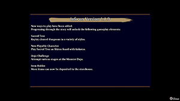

  

# Overview

This page provides a summary of patch notes for game updates released by Spike Chunsoft. Spike Chunsoft has announced that a second large content update is currently planned for Summer 2024. ※ This page was last edited on May 13th, 2024.

# 1.1.1

[Official Patch Notes](https://www.spike-chunsoft.com/patch-notes/patch-1-1-1-for-shiren-the-wanderer-the-mystery-dungeon-of-serpentcoil-island-for-nintendo-switch/)

|Version|Release Date|
|-|-|
|1.1.1|May 11th, 2024|

Changes:

- Fixed an issue where the game could crash during a rescue upon reaching the target floor.

# 1.1.0

[Official Patch Notes](https://www.spike-chunsoft.com/news/shiren6-free-content-update-1/)

|Version|Release Date|
|-|-|
|1.1.0|April 27th, 2024|

Changes:

- New Features
    - [Sacred Tree](/system/sacred-tree) mode can be played in Shukuba Beach.
        - Info: Play dungeons you've cleared in the past as different characters or under special rules.
        - Unlock: Clear Serpentcoil Island 1 time.
    - [Monster Dojo](/system/monster-dojo) now has Dojo Challenges.
        - Info: Play 51 puzzle-like stages based on individual monster families.
        - Unlock: Clear Serpentcoil Island 1 time + Unlock the Monster Dojo.
- New Functionality
    - Item Holder's storage limit was increased from 180 items → 960 items.
    - Parallel Play Data uploaded to the internet now expires after 30 days instead of 7 days.
    - Click the right analog stick during dungeon gameplay to pause the game.
    - Added an option to disable tapping the B button to open the inventory menu.
    - Adjusted the unlock condition for Wanderer Rescue.
    - Adjusted the bonus value for Wanderer Aid Points.
    - Companions can now appear in Yamakagashi Pass and Sacred Ocean Tunnel.
    - Adjusted the balance of each dungeon on a more detailed level.
    - Gazer's hypnosis can no longer make the player burn a celestial stone in an incense.
    - Improved the wait time for explosion animations.
- Bug Fixes / Adjustments
    - Fixed a bug related to identification of cursed state under specific circumstances.
    - Fixed a bug where Blind Bored Kappas throwing items back and forth caused the game to freeze.
    - Fixed a bug where the adventure results screen would rarely display inaccurate results.
    - 120 or so other fixes and adjustments.
- Notes
    - Parallel Play Data from earlier versions cannot be loaded after updating to version 1.1.0.
    - The number of [achievements](/system/achievements) increased from 51 → 58 (2 new wallpapers and 1 new skin).
    - The number of clear icons increased from 28 → 29.

# 1.0.5

[Official Patch Notes](https://www.spike-chunsoft.com/patch-notes/shiren-the-wanderer-the-mystery-dungeon-of-serpentcoil-island-patch-notes-1-0-5/)

|Version|Release Date|
|-|-|
|1.0.5|March 27th, 2024|

Changes:

- Fixed an issue where an error message such as "data is corrupt" was displayed when attempting to load suspended data, making the data unloadable.
- If you have been experiencing the above issue, please update the game and try loading the suspended data.
- Fixed an issue causing Asuka’s event to not progress on rare occasions after updating the game previously.
- Please update the game and check the location(s) marked with "!".
- Fixed an issue causing the game to stop when a boss battle begins on rare occasions.
- If you are still experiencing this issue, please close the app and restart the game.
- Other miscellaneous fixes.

# 1.0.4

[Official Patch Notes](https://www.spike-chunsoft.com/patch-notes/shiren-the-wanderer-the-mystery-dungeon-of-serpentcoil-island-patch-notes-1-0-4/)

|Version|Release Date|
|-|-|
|1.0.4|March 7th, 2024|

Changes:

- Fixed an issue where a silver-sealed rune's effect could become activated when resuming a suspended game.
- Fixed Rescue-related issues.
    - Rescuee is different from that of the accepted request, rescuee is missing on the target floor, etc.
- Fixed an issue where items dropped due to Item-losing Bracelet's effect were not displayed properly on the floor.
- Turned off monster pups' cries while the Item Holder's window is opened.
- Other miscellaneous fixes.

# 1.0.1 - 1.0.3

[Official Patch Notes](https://www.spike-chunsoft.com/patch-notes/shiren-the-wanderer-the-mystery-dungeon-of-serpentcoil-island-patch-notes-1-0-3/)

|Version|Release Date|
|-|-|
|1.0.3|February 15th, 2024|
|1.0.2|January 23rd, 2024|
|1.0.1|Unknown|

Changes:

- Fixed a number of game progression-stopping bugs.
- Various stability bug fixes.
