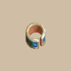

# Overview

- Bracelets grant special effects while they're equipped.
- When Shiren's strength &ge; 10, he gains the ability to equip 2 bracelets at the same time.
    - Some bracelet effects get boosted if you equip 2 of the same bracelet.

# Bracelet List

<table id="monsterList" class="pageLinksTable">
  <tr>
    <th colspan="5">Bracelets ~ Notebook Order</th>
  </tr>
  <tr>
    <th>Name</th>
    <th>Buy</th>
    <th>Sell</th>
    <th>Stack</th>
    <th>Notes</th>
  </tr>
  <tr>
    <td class="priceTableName"><a href="#healing-bracelet">Healing Bracelet</a></td>
    <td>5000</td>
    <td>2000</td>
    <td>Yes</td>
    <td class="leftText">Boosts natural HP regen, but fullness rapidly depletes.</td>
  </tr>
  <tr>
    <td class="priceTableName"><a href="#strength-bracelet">Strength Bracelet</a></td>
    <td>2000</td>
    <td>800</td>
    <td>Yes</td>
    <td class="leftText">Increases current and max strength by 3.</td>
  </tr>
  <tr>
    <td class="priceTableName"><a href="#bellyexpand-bracelet">Bellyexpand Bracelet</a></td>
    <td>3500</td>
    <td>1400</td>
    <td>Yes</td>
    <td class="leftText">Increases max fullness by 25.</td>
  </tr>
  <tr>
    <td class="priceTableName"><a href="#bellyshrink-bracelet">Bellyshrink Bracelet</a></td>
    <td>3500</td>
    <td>1400</td>
    <td>Yes</td>
    <td class="leftText">Decreases max fullness by 25.</td>
  </tr>
  <tr>
    <td class="priceTableName"><a href="#fortune-bracelet">Fortune Bracelet</a></td>
    <td>4000</td>
    <td>1600</td>
    <td>Yes</td>
    <td class="leftText">Gain 1 experience point per turn.</td>
  </tr>
  <tr>
    <td class="priceTableName"><a href="#cleansing-bracelet">Cleansing Bracelet</a></td>
    <td>6500</td>
    <td>2600</td>
    <td>No</td>
    <td class="leftText">Protects against strength loss and slowness due to poison.</td>
  </tr>
  <tr>
    <td class="priceTableName"><a href="#focusing-bracelet">Focusing Bracelet</a></td>
    <td>4000</td>
    <td>1600</td>
    <td>No</td>
    <td class="leftText">Protects against Confused status.</td>
  </tr>
  <tr>
    <td class="priceTableName"><a href="#rousing-bracelet">Rousing Bracelet</a></td>
    <td>2500</td>
    <td>1000</td>
    <td>No</td>
    <td class="leftText">Protects against Asleep status.</td>
  </tr>
  <tr>
    <td class="priceTableName"><a href="#rustproof-bracelet">Rustproof Bracelet</a></td>
    <td>5000</td>
    <td>2000</td>
    <td>No</td>
    <td class="leftText">Upgrade value of equipped weapon and shield won't decrease. Protects against Mudster's rune erasing special attack.</td>
  </tr>
  <tr>
    <td class="priceTableName"><a href="#cursebreak-bracelet">Cursebreak Bracelet</a></td>
    <td>3000</td>
    <td>1200</td>
    <td>No</td>
    <td class="leftText">Protects items from becoming cursed.</td>
  </tr>
  <tr>
    <td class="priceTableName"><a href="#affixing-bracelet">Affixing Bracelet</a></td>
    <td>3500</td>
    <td>1400</td>
    <td>No</td>
    <td class="leftText">Protects items from being parried by Swordsman and Field Knave.</td>
  </tr>
  <tr>
    <td class="priceTableName"><a href="#far-throwing-bracelet">Far-throwing Bracelet</a></td>
    <td>1500</td>
    <td>600</td>
    <td>No</td>
    <td class="leftText">Arrows and thrown items pierce through walls and creatures.</td>
  </tr>
  <tr>
    <td class="priceTableName"><a href="#bad-aim-bracelet">Bad-aim Bracelet</a></td>
    <td>1500</td>
    <td>600</td>
    <td>No</td>
    <td class="leftText">Arrows and thrown items will always miss.</td>
  </tr>
  <tr>
    <td class="priceTableName"><a href="#sure-aim-bracelet">Sure-aim Bracelet</a></td>
    <td>15000</td>
    <td>6000</td>
    <td>No</td>
    <td class="leftText">Arrows and thrown items will always hit the target.</td>
  </tr>
  <tr>
    <td class="priceTableName"><a href="#bouncy-bracelet">Bouncy Bracelet</a></td>
    <td>1500</td>
    <td>600</td>
    <td>No</td>
    <td class="leftText">Arrows and thrown items reflect off of walls.</td>
  </tr>
  <tr>
    <td class="priceTableName"><a href="#rapid-fire-bracelet">Rapid-fire Bracelet</a></td>
    <td>1500</td>
    <td>600</td>
    <td>Yes</td>
    <td class="leftText">Shoot arrows or throw rocks 2 times in a single turn. Increases accuracy of arrows and thrown items.</td>
  </tr>
  <tr>
    <td class="priceTableName"><a href="#daredevil-bracelet">Daredevil Bracelet</a></td>
    <td>1500</td>
    <td>600</td>
    <td>Yes</td>
    <td class="leftText">Grants a chance to land critical hits for both Shiren and monsters.</td>
  </tr>
  <tr>
    <td class="priceTableName"><a href="#dreaded-bracelet">Dreaded Bracelet</a></td>
    <td>1500</td>
    <td>600</td>
    <td>Yes</td>
    <td class="leftText">Shiren will occasionally suffer a critical hit from monsters.</td>
  </tr>
  <tr>
    <td class="priceTableName"><a href="#leaping-bracelet">Leaping Bracelet</a></td>
    <td>1500</td>
    <td>600</td>
    <td>Yes</td>
    <td class="leftText">Occasionally warp to a different spot on the floor.</td>
  </tr>
  <tr>
    <td class="priceTableName"><a href="#blasting-bracelet">Blasting Bracelet</a></td>
    <td>1500</td>
    <td>600</td>
    <td>Yes</td>
    <td class="leftText">Occasionally explode in a 1-tile radius, reducing HP to 1.</td>
  </tr>
  <tr>
    <td class="priceTableName"><a href="#clairvoyant-bracelet">Clairvoyant Bracelet</a></td>
    <td>5000</td>
    <td>2000</td>
    <td>No</td>
    <td class="leftText">Reveals the locations of creatures and items on the floor.</td>
  </tr>
  <tr>
    <td class="priceTableName"><a href="#monster-find-bracelet">Monster-find Bracelet</a></td>
    <td>2500</td>
    <td>1000</td>
    <td>No</td>
    <td class="leftText">Reveals the locations of creatures on the floor.</td>
  </tr>
  <tr>
    <td class="priceTableName"><a href="#item-find Bracelet">Item-find Bracelet</a></td>
    <td>2500</td>
    <td>1000</td>
    <td>No</td>
    <td class="leftText">Reveals the locations of items on the floor.</td>
  </tr>
  <tr>
    <td class="priceTableName"><a href="#passage-find-bracelet">Passage-find Bracelet</a></td>
    <td>5000</td>
    <td>2000</td>
    <td>No</td>
    <td class="leftText">Reveals hidden paths when you walk next to them.</td>
  </tr>
  <tr>
    <td class="priceTableName"><a href="#waterwalk-bracelet">Waterwalk Bracelet</a></td>
    <td>3000</td>
    <td>1200</td>
    <td>No</td>
    <td class="leftText">Lets you walk on water tiles and pick up submerged items. However, items can get wet while walking on water.</td>
  </tr>
  <tr>
    <td class="priceTableName"><a href="#floating-bracelet">Floating Bracelet</a></td>
    <td>3000</td>
    <td>1200</td>
    <td>No</td>
    <td class="leftText">Lets you walk on water and air tiles, and traps won't activate.</td>
  </tr>
  <tr>
    <td class="priceTableName"><a href="#wallpass-bracelet">Wallpass Bracelet</a></td>
    <td>6500</td>
    <td>2600</td>
    <td>No</td>
    <td class="leftText">Lets you move through walls. Receive damage equal to 4% of Max HP each turn inside a wall.</td>
  </tr>
  <tr>
    <td class="priceTableName"><a href="#tiptoe-bracelet">Tiptoe Bracelet</a></td>
    <td>6500</td>
    <td>2600</td>
    <td>No</td>
    <td class="leftText">Napping monsters never wake up when you walk next to them. Monsters also never wake up when you enter or exit a room.</td>
  </tr>
  <tr>
    <td class="priceTableName"><a href="#passerby-bracelet">Passerby Bracelet</a></td>
    <td>5000</td>
    <td>2000</td>
    <td>No</td>
    <td class="leftText">Lets you switch positions with a monster by walking into them.</td>
  </tr>
  <tr>
    <td class="priceTableName"><a href="#item-losing-bracelet">Item-losing Bracelet</a></td>
    <td>1500</td>
    <td>600</td>
    <td>Yes</td>
    <td class="leftText">Occasionally drop items while walking.</td>
  </tr>
  <tr>
    <td class="priceTableName"><a href="#gitan-losing-bracelet">Gitan-losing Bracelet</a></td>
    <td>1500</td>
    <td>600</td>
    <td>Yes</td>
    <td class="leftText">Occasionally drop Gitan while walking.</td>
  </tr>
  <tr>
    <td class="priceTableName"><a href="#monstercall-bracelet">Monstercall Bracelet</a></td>
    <td>3000</td>
    <td>1200</td>
    <td>Yes</td>
    <td class="leftText">New monsters are generated at a faster rate.</td>
  </tr>
  <tr>
    <td class="priceTableName"><a href="#trapmore-bracelet">Trapmore Bracelet</a></td>
    <td>1500</td>
    <td>600</td>
    <td>Yes</td>
    <td class="leftText">New traps are generated as turns elapse.</td>
  </tr>
  <tr>
    <td class="priceTableName"><a href="#haggling-bracelet">Haggling Bracelet</a></td>
    <td>3500</td>
    <td>1400</td>
    <td>?</td>
    <td class="leftText">Lets you purchase items in a dungeon shop at half price.</td>
  </tr>
  <tr>
    <td class="priceTableName"><a href="#trapper's-bracelet">Trapper's Bracelet</a></td>
    <td>7500</td>
    <td>3000</td>
    <td>No</td>
    <td class="leftText">Reveals all traps, and lets you pick up traps as items. Monsters can be trapped, and you get exp from doing so. Earn double exp if you defeat a monster using a trap. </td>
  </tr>
  <tr>
    <td class="priceTableName"><a href="#appraiser's-bracelet">Appraiser's Bracelet</a></td>
    <td>7500</td>
    <td>3000</td>
    <td>No</td>
    <td class="leftText">Items you pick up or insert into a pot are automatically identified.</td>
  </tr>
  <tr>
    <td class="priceTableName"><a href="#cannonboost-bracelet">Cannonboost Bracelet</a></td>
    <td>2500</td>
    <td>1000</td>
    <td>Yes</td>
    <td class="leftText">Boosts damage dealt by cannons.</td>
  </tr>
</table>

# Bracelet Details

<table class="monsterPageTable">
  <tbody>
    <tr>
      <th>
        

          
Healing Bracelet

        

      </th>
    </tr>
    <tr>
      <td>
        

          

            
          

          

            

              
Buy

              
5000

              
Sell

              
2000

              
Stack

              
Yes

            

            
Increases HP regeneration. Also lowers resistance to hunger, so be careful! Equipping 2 doubles the effect.

            
Without Sating rune (Shield of Sating): &nbsp;&nbsp;&nbsp;1 bracelet → Heal +3 HP per turn, lose 6 fullness / 10 turns. &nbsp;&nbsp;&nbsp;2 bracelets → Heal +6 HP per turn, lose 12 fullness / 10 turns. Sating rune (Shield of Sating): &nbsp;&nbsp;&nbsp;1 bracelet → Heal +3 HP per turn, lose 3 fullness / 10 turns. &nbsp;&nbsp;&nbsp;2 bracelets → Heal +6 HP per turn, lose 6 fullness / 10 turns.

          

        

      </td>
    </tr>
    <tr>
      <th>
        

          
Strength Bracelet

        

      </th>
    </tr>
    <tr>
      <td>
        

          

            
          

          

            

              
Buy

              
2000

              
Sell

              
800

              
Stack

              
Yes

            

            
Increases Strength and Max Strength by 3. Equipping 2 doubles the effect.

            
2 bracelets → Strength and Max Strength +6.

          

        

      </td>
    </tr>
    <tr>
      <th>
        

          
Bellyexpand Bracelet

        

      </th>
    </tr>
    <tr>
      <td>
        

          

            
          

          

            

              
Buy

              
3500

              
Sell

              
1400

              
Stack

              
Yes

            

            
Increases Max Fullness by 25. Equipping 2 doubles the effect.

            
Unequip this bracelet before eating a Sumo Onigiri. 2 bracelets → Max Fullness +50.

          

        

      </td>
    </tr>
    <tr>
      <th>
        

          
Bellyshrink Bracelet

        

      </th>
    </tr>
    <tr>
      <td>
        

          

            
          

          

            

              
Buy

              
3500

              
Sell

              
1400

              
Stack

              
Yes

            

            
Decreases Max Fullness by 25. Equipping 2 doubles the effect.

            
Equip this bracelet before eating a Sumo Onigiri. 2 bracelets → Max Fullness -50.

          

        

      </td>
    </tr>
    <tr>
      <th>
        

          
Fortune Bracelet

        

      </th>
    </tr>
    <tr>
      <td>
        

          

            
          

          

            

              
Buy

              
4000

              
Sell

              
1600

              
Stack

              
Yes

            

            
Earn 1 Experience Point(s) every turn. Equipping 2 doubles the effect.

            
2 bracelets → Earn 2 experience points per turn.

          

        

      </td>
    </tr>
    <tr>
      <th>
        

          
Cleansing Bracelet

        

      </th>
    </tr>
    <tr>
      <td>
        

          

            
          

          

            

              
Buy

              
6500

              
Sell

              
2600

              
Stack

              
No

            

            
Strength and Action Speed will not decrease, even when poisoned.

            
Nice for Ghost Radish and Scorpions, Poison Arrow Trap. Doesn't block Slow from sources other than poison.

          

        

      </td>
    </tr>
    <tr>
      <th>
        

          
Focusing Bracelet

        

      </th>
    </tr>
    <tr>
      <td>
        

          

            
          

          

            

              
Buy

              
4000

              
Sell

              
1600

              
Stack

              
No

            

            
Prevents Confused status.

            
Nice for Daze Radish and Skull Wizard, Spinning Trap. Rocks, arrows, and staves can be used normally while confused.

          

        

      </td>
    </tr>
    <tr>
      <th>
        

          
Rousing Bracelet

        

      </th>
    </tr>
    <tr>
      <td>
        

          

            
          

          

            

              
Buy

              
2500

              
Sell

              
1000

              
Stack

              
No

            

            
Prevents Asleep status.

            
Nice for Sleep Radish and Skull Lord, Sleep Trap.

          

        

      </td>
    </tr>
    <tr>
      <th>
        

          
Rustproof Bracelet

        

      </th>
    </tr>
    <tr>
      <td>
        

          

            
          

          

            

              
Buy

              
5000

              
Sell

              
2000

              
Stack

              
No

            

            
Upgrade Value of equipped Weapon and Shield will not decrease. Prevents Runes from being removed by Mudster or others.

            
Mudster and Mudder only removes silver with this equipped. Doesn't prevent upgrade value loss due to Dulling rune.

          

        

      </td>
    </tr>
    <tr>
      <th>
        

          
Cursebreak Bracelet

        

      </th>
    </tr>
    <tr>
      <td>
        

          

            
          

          

            

              
Buy

              
3000

              
Sell

              
1200

              
Stack

              
No

            

            
Prevents inventory from being Cursed.

            
Nice for Lv3-4 Curse Girls when you lack Wallpass Bracelet.

          

        

      </td>
    </tr>
    <tr>
      <th>
        

          
Affixing Bracelet

        

      </th>
    </tr>
    <tr>
      <td>
        

          

            
          

          

            

              
Buy

              
3500

              
Sell

              
1400

              
Stack

              
No

            

            
Prevents equipment and inventory from being knocked off by the Swordsman family or others.

            
Essential for Swordsman family and Lv3-4 Field Knaves.

          

        

      </td>
    </tr>
    <tr>
      <th>
        

          
Far-throwing Bracelet

        

      </th>
    </tr>
    <tr>
      <td>
        

          

            
          

          

            

              
Buy

              
1500

              
Sell

              
600

              
Stack

              
No

            

            
Fired Arrows and thrown items will fly indefinitely, passing through walls and beings. Be careful not to throw any important items!

            
Items that pierce can hit enemies immune to projectiles, including Hoppin' Batter, Mixer, and Fierous family monsters. If an item gets knocked away by a Swordsman or Lv3-4 Field Knave while this is equipped, the item flies forever and will be lost.

          

        

      </td>
    </tr>
    <tr>
      <th>
        

          
Bad-aim Bracelet

        

      </th>
    </tr>
    <tr>
      <td>
        

          

            
          

          

            

              
Buy

              
1500

              
Sell

              
600

              
Stack

              
No

            

            
Fired Arrows and thrown items will always miss.

            
Can be used to trap monsters using visible traps. Rotting Trap can be used to obtain Rotten Onigiri, Sleep Trap lets you defeat enemies safely, etc.

          

        

      </td>
    </tr>
    <tr>
      <th>
        

          
Sure-aim Bracelet

        

      </th>
    </tr>
    <tr>
      <td>
        

          

            
          

          

            

              
Buy

              
15000

              
Sell

              
6000

              
Stack

              
No

            

            
Fired Arrows and thrown items will always hit.

            
Pair with Far-throwing Bracelet and throw a Peach Bun to mass produce a useful monster like Mixerdon or Chow.

          

        

      </td>
    </tr>
    <tr>
      <th>
        

          
Bouncy Bracelet

        

      </th>
    </tr>
    <tr>
      <td>
        

          

            
          

          

            

              
Buy

              
1500

              
Sell

              
600

              
Stack

              
No

            

            
Fired Arrows and thrown items will ricochet off walls.

            
Makes it easier to duplicate items in Bouncy Wall rooms, especially when paired with an Earthmound Staff.

          

        

      </td>
    </tr>
    <tr>
      <th>
        

          
Rapid-fire Bracelet

        

      </th>
    </tr>
    <tr>
      <td>
        

          

            
          

          

            

              
Buy

              
1500

              
Sell

              
600

              
Stack

              
Yes

            

            
Slightly increases the accuracy of Arrows and thrown items. Allows you to launch 2 Arrows or Rocks at once. Equipped 2 allows you to launch 3 projectiles at once.

            
Accuracy increase seems to be roughly 84% → 91%.

          

        

      </td>
    </tr>
    <tr>
      <th>
        

          
Daredevil Bracelet

        

      </th>
    </tr>
    <tr>
      <td>
        

          

            
          

          

            

              
Buy

              
1500

              
Sell

              
600

              
Stack

              
Yes

            

            
Allows you to sometimes unleash Critical Hits. However, enemy Critical Hits also occur more often. Equipping 2 increases both chances.

            
Critical hits deal x1.5 damage. Shiren lands a critical hit: 25% chance (50% with 2 bracelets). Monsters land a critical hit: 50% chance (100% with 2 bracelets).

          

        

      </td>
    </tr>
    <tr>
      <th>
        

          
Dreaded Bracelet

        

      </th>
    </tr>
    <tr>
      <td>
        

          

            
          

          

            

              
Buy

              
1500

              
Sell

              
600

              
Stack

              
Yes

            

            
Allows enemies to sometimes unleash Critical Hits. Equipping 2 increases this Critical Hit chance.

            
Enemy critical hits deal x1.5 damage. Chance hasn't been tested yet.

          

        

      </td>
    </tr>
    <tr>
      <th>
        

          
Leaping Bracelet

        

      </th>
    </tr>
    <tr>
      <td>
        

          

            
          

          

            

              
Buy

              
1500

              
Sell

              
600

              
Stack

              
Yes

            

            
May warp you somewhere on the floor. Equipping 2 increases the chance of being warped.

            
Chance hasn't been tested yet.

          

        

      </td>
    </tr>
    <tr>
      <th>
        

          
Blasting Bracelet

        

      </th>
    </tr>
    <tr>
      <td>
        

          

            
          

          

            

              
Buy

              
1500

              
Sell

              
600

              
Stack

              
Yes

            

            
May cause a massive explosion that affects 1 tile(s) in every direction and reduces HP to 1. Equipping 2 increases the chance of an explosion.

            
Chance hasn't been tested yet.

          

        

      </td>
    </tr>
    <tr>
      <th>
        

          
Clairvoyant Bracelet

        

      </th>
    </tr>
    <tr>
      <td>
        

          

            
          

          

            

              
Buy

              
5000

              
Sell

              
2000

              
Stack

              
No

            

            
Displays all items and beings on the floor on the map.

            
Confirmed Locations: &nbsp;&nbsp;&nbsp;Isle of the Mighty - 49F Shop, Training Path of Extra Inference

          

        

      </td>
    </tr>
    <tr>
      <th>
        

          
Monster-find Bracelet

        

      </th>
    </tr>
    <tr>
      <td>
        

          

            
          

          

            

              
Buy

              
2500

              
Sell

              
1000

              
Stack

              
No

            

            
Displays all beings on the floor on the map.

            
Shopkeepers and NPCs are displayed as a green dot. Pairs nicely with Far-throwing Bracelet.

          

        

      </td>
    </tr>
    <tr>
      <th>
        

          
Item-find Bracelet

        

      </th>
    </tr>
    <tr>
      <td>
        

          

            
          

          

            

              
Buy

              
2500

              
Sell

              
1000

              
Stack

              
No

            

            
Displays all items on the floor on the map.

            
See shops, islands, and buried items at a glance.

          

        

      </td>
    </tr>
    <tr>
      <th>
        

          
Passage-find Bracelet

        

      </th>
    </tr>
    <tr>
      <td>
        

          

            
          

          

            

              
Buy

              
5000

              
Sell

              
2000

              
Stack

              
No

            

            
Standing next to a breakable wall causes it to break, revealing things like hidden passages.

            
Walls created by Earthmound Staff will also break.

          

        

      </td>
    </tr>
    <tr>
      <th>
        

          
Waterwalk Bracelet

        

      </th>
    </tr>
    <tr>
      <td>
        

          

            
          

          

            

              
Buy

              
3000

              
Sell

              
1200

              
Stack

              
No

            

            
Allows you to walk on water. You can also pick up items that have fallen underwater. Your inventory may get wet when walking on water.

            
Onigiri and Peach Buns will rot, scrolls will get wet.

          

        

      </td>
    </tr>
    <tr>
      <th>
        

          
Floating Bracelet

        

      </th>
    </tr>
    <tr>
      <td>
        

          

            
          

          

            

              
Buy

              
3000

              
Sell

              
1200

              
Stack

              
No

            

            
Allows you to walk on air. As you'll be floating, Traps will nto ensnare you.

            
Items won't get wet while walking on water tiles? Traps still activate if manually stepped on or if an item falls on it.

          

        

      </td>
    </tr>
    <tr>
      <th>
        

          
Wallpass Bracelet

        

      </th>
    </tr>
    <tr>
      <td>
        

          

            
          

          

            

              
Buy

              
6500

              
Sell

              
2600

              
Stack

              
No

            

            
Allows you to move through walls. You will take damage every turn you spend inside a wall, so be careful!

            
Lose HP equal to 4% of max HP per turn in walls. No damage when you cut through a corner. Confirmed Location: Training Path of Shopping - Shop

          

        

      </td>
    </tr>
    <tr>
      <th>
        

          
Tiptoe Bracelet

        

      </th>
    </tr>
    <tr>
      <td>
        

          

            
          

          

            

              
Buy

              
6500

              
Sell

              
2600

              
Stack

              
No

            

            
Coming in and out of the room or standing adjacent to monsters with the Napping status will not wake them up.

            
Monsters in a Monster House won't wake up either.

          

        

      </td>
    </tr>
    <tr>
      <th>
        

          
Passerby Bracelet

        

      </th>
    </tr>
    <tr>
      <td>
        

          

            
          

          

            

              
Buy

              
5000

              
Sell

              
2000

              
Stack

              
No

            

            
Allows you to safely pass by monsters.

            
Lets you walk toward a monster to swap places with them. Can swap positions with a behemoth and backstrike them.

          

        

      </td>
    </tr>
    <tr>
      <th>
        

          
Item-losing Bracelet

        

      </th>
    </tr>
    <tr>
      <td>
        

          

            
          

          

            

              
Buy

              
1500

              
Sell

              
600

              
Stack

              
Yes

            

            
May lose inventory items when walking. Equipping 2 causes you to drop more frequently.

            
Chance hasn't been tested.

          

        

      </td>
    </tr>
    <tr>
      <th>
        

          
Gitan-losing Bracelet

        

      </th>
    </tr>
    <tr>
      <td>
        

          

            
          

          

            

              
Buy

              
1500

              
Sell

              
600

              
Stack

              
Yes

            

            
May lose Gitan when walking. Equipping 2 causes you to drop more frequently.

            
Chance hasn't been tested.

          

        

      </td>
    </tr>
    <tr>
      <th>
        

          
Monstercall Bracelet

        

      </th>
    </tr>
    <tr>
      <td>
        

          

            
          

          

            

              
Buy

              
3000

              
Sell

              
1200

              
Stack

              
Yes

            

            
Makes more monsters appear on floors. Equipping 2 causes even more monsters to spawn.

            
Spawn rate increase hasn't been tested yet.

          

        

      </td>
    </tr>
    <tr>
      <th>
        

          
Trapmore Bracelet

        

      </th>
    </tr>
    <tr>
      <td>
        

          

            
          

          

            

              
Buy

              
1500

              
Sell

              
600

              
Stack

              
Yes

            

            
Sets a Trap on the floor when taking turns. Equipping 2 shortens the time between setting traps.

            
1 bracelet → New trap generated every 12 turns. 2 bracelets → New trap generated every 6 turns.

          

        

      </td>
    </tr>
    <tr>
      <th>
        

          
Haggling Bracelet

        

      </th>
    </tr>
    <tr>
      <td>
        

          

            
          

          

            

              
Buy

              
3500

              
Sell

              
1400

              
Stack

              
?

            

            
Reduces prices at the dungeon store by 50%.

            
Stacking the bracelet hasn't been tested yet.

          

        

      </td>
    </tr>
    <tr>
      <th>
        

          
Trapper's Bracelet

        

      </th>
    </tr>
    <tr>
      <td>
        

          

            
          

          

            

              
Buy

              
7500

              
Sell

              
3000

              
Stack

              
No

            

            
Become a Trap Master, able to see and move hidden Traps. Traps will ensnare monsters, but not you. Defeating monsters with Traps earns a large amount of EXP. Monsters triggering Traps earns some EXP as well.

            
Setting a trap doesn't end your turn. Earn 10% experience points when a monster steps on a trap. Earn x2.0 experience points if you defeat a monster using a trap.

          

        

      </td>
    </tr>
    <tr>
      <th>
        

          
Appraiser's Bracelet

        

      </th>
    </tr>
    <tr>
      <td>
        

          

            
          

          

            

              
Buy

              
7500

              
Sell

              
3000

              
Stack

              
No

            

            
Allows you to identify items just by picking them up.

            
Items you insert into a pot are also auto-identified. Confirmed Location: Training Path of Extra Inference

          

        

      </td>
    </tr>
    <tr>
      <th>
        

          
Cannonboost Bracelet

        

      </th>
    </tr>
    <tr>
      <td>
        

          

            
          

          

            

              
Buy

              
2500

              
Sell

              
1000

              
Stack

              
Yes

            

            
Increases damage dealt by cannons. Equipping 2 further increases damage.

            
Damage increase hasn't been tested yet.

          

        

      </td>
    </tr>
  </tbody>
</table>
