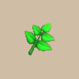

# Overview

- Use a grass or seed item to apply the item's effect to Shiren.
    - In addition, most grass and seed items replenish Fullness by 2.
- Throw a grass or seed item at a creature to apply the item's effect to that creature.

# Grass List

<table id="monsterList" class="pageLinksTable">
  <tr>
    <th colspan="4">Grass ~ Notebook Order</th>
  </tr>
  <tr>
    <th>Name</th>
    <th>Buy</th>
    <th>Sell</th>
    <th>Notes</th>
  </tr>
  <tr>
    <td class="priceTableName"><a href="#weeds">Weeds</a></td>
    <td>10</td>
    <td>4</td>
    <td class="leftText">No effect.</td>
  </tr>
  <tr>
    <td class="priceTableName"><a href="#herb">Herb</a></td>
    <td>40</td>
    <td>10</td>
    <td class="leftText">Restores 25 HP. Increases max HP by 1 if already at max. Cross-Mixing: HP+5 (Sword/Shield)</td>
  </tr>
  <tr>
    <td class="priceTableName"><a href="#otogirisou">Otogirisou</a></td>
    <td>80</td>
    <td>30</td>
    <td class="leftText">Restores 100 HP. Increases max HP by 2 if already at max. Cures Confused and Puzzled status. Cross-Mixing: HP+10 (Sword/Shield)</td>
  </tr>
  <tr>
    <td class="priceTableName"><a href="#healing-grass">Healing Grass</a></td>
    <td>200</td>
    <td>80</td>
    <td class="leftText">Restores 200 HP. Increases max HP by 3 if already at max. Cures bad status conditions. Cross-Mixing: HP+15 (Sword/Shield)</td>
  </tr>
  <tr>
    <td class="priceTableName"><a href="#life-grass">Life Grass</a></td>
    <td>500</td>
    <td>200</td>
    <td class="leftText">Increases max HP by 4. Cross-Mixing: HP+20 (Sword/Shield)</td>
  </tr>
  <tr>
    <td class="priceTableName"><a href="#fragrant-grass">Fragrant Grass</a></td>
    <td>200</td>
    <td>80</td>
    <td class="leftText">Cures bad status conditions. Extends duration of incense to 300 turns when burned.</td>
  </tr>
  <tr>
    <td class="priceTableName"><a href="#revival-grass">Revival Grass</a></td>
    <td>400</td>
    <td>160</td>
    <td class="leftText">Revives you with full HP, strength, and fullness if it's in your inventory when you collapse. (Takes effect even inside a pot)</td>
  </tr>
  <tr>
    <td class="priceTableName"><a href="#bellyexpand-seed">Bellyexpand Seed</a></td>
    <td>200</td>
    <td>80</td>
    <td class="leftText">Increases max fullness by 5.</td>
  </tr>
  <tr>
    <td class="priceTableName"><a href="#bellyshrink-seed">Bellyshrink Seed</a></td>
    <td>200</td>
    <td>80</td>
    <td class="leftText">Decreases max fullness by 5.</td>
  </tr>
  <tr>
    <td class="priceTableName"><a href="#dragon-grass">Dragon Grass</a></td>
    <td>250</td>
    <td>100</td>
    <td class="leftText">Spew a traveling flame that deals 70~80 damage. Deals 35~45 damage when thrown.</td>
  </tr>
  <tr>
    <td class="priceTableName"><a href="#leaping-grass">Leaping Grass</a></td>
    <td>100</td>
    <td>40</td>
    <td class="leftText">Warps you to a different spot on the floor. Cross-Mixing: Leap Payback (Shield)</td>
  </tr>
  <tr>
    <td class="priceTableName"><a href="#antidote-grass">Antidote Grass</a></td>
    <td>600</td>
    <td>240</td>
    <td class="leftText">Restores lost strength to max.</td>
  </tr>
  <tr>
    <td class="priceTableName"><a href="#strength-grass">Strength Grass</a></td>
    <td>700</td>
    <td>280</td>
    <td class="leftText">Restores 1 strength. Increases max strength by 1 if already at max.</td>
  </tr>
  <tr>
    <td class="priceTableName"><a href="#poison-grass">Poison Grass</a></td>
    <td>50</td>
    <td>20</td>
    <td class="leftText">Deals 5 damage, strength -1, and slows speed.</td>
  </tr>
  <tr>
    <td class="priceTableName"><a href="#confusion-grass">Confusion Grass</a></td>
    <td>70</td>
    <td>25</td>
    <td class="leftText">Inflicts Confused status. Cross-Mixing: Confusing (Sword)</td>
  </tr>
  <tr>
    <td class="priceTableName"><a href="#sedating-grass">Sedating Grass</a></td>
    <td>70</td>
    <td>25</td>
    <td class="leftText">Inflicts Asleep status. Cross-Mixing: Sedating (Sword)</td>
  </tr>
  <tr>
    <td class="priceTableName"><a href="#berserk-seed">Berserk Seed</a></td>
    <td>50</td>
    <td>20</td>
    <td class="leftText">Inflicts Berserk status. Cross-Mixing: Berserk Payback (Shield)</td>
  </tr>
  <tr>
    <td class="priceTableName"><a href="#blinding-grass">Blinding Grass</a></td>
    <td>70</td>
    <td>25</td>
    <td class="leftText">Inflicts Blind status. Cross-Mixing: Blinding (Sword)</td>
  </tr>
  <tr>
    <td class="priceTableName"><a href="#seewell-grass">Seewell Grass</a></td>
    <td>70</td>
    <td>25</td>
    <td class="leftText">Grants Sharp-eyed status, which reveals hidden traps. Effect lasts for the duration of the current floor.</td>
  </tr>
  <tr>
    <td class="priceTableName"><a href="#swift-grass">Swift Grass</a></td>
    <td>70</td>
    <td>25</td>
    <td class="leftText">Increases action speed by 1 stage.</td>
  </tr>
  <tr>
    <td class="priceTableName"><a href="#power-up-grass">Power-up Grass</a></td>
    <td>70</td>
    <td>25</td>
    <td class="leftText">Boosts your attack power (30 turns).</td>
  </tr>
  <tr>
    <td class="priceTableName"><a href="#invincible-grass">Invincible Grass</a></td>
    <td>400</td>
    <td>160</td>
    <td class="leftText">Makes you immune to damage and bad statuses.</td>
  </tr>
  <tr>
    <td class="priceTableName"><a href="#fortune-grass">Fortune Grass</a></td>
    <td>1000</td>
    <td>400</td>
    <td class="leftText">Increases level by 1.</td>
  </tr>
  <tr>
    <td class="priceTableName"><a href="#angel-seed">Angel Seed</a></td>
    <td>2000</td>
    <td>800</td>
    <td class="leftText">Increases level by 3.</td>
  </tr>
  <tr>
    <td class="priceTableName"><a href="#feeble-grass">Feeble Grass</a></td>
    <td>100</td>
    <td>40</td>
    <td class="leftText">Decreases level by 1.</td>
  </tr>
  <tr>
    <td class="priceTableName"><a href="#unlucky-seed">Unlucky Seed</a></td>
    <td>400</td>
    <td>160</td>
    <td class="leftText">Decreases level by 3.</td>
  </tr>
  <tr>
    <td class="priceTableName"><a href="#ill-fated-seed">Ill-fated Seed</a></td>
    <td>2000</td>
    <td>800</td>
    <td class="leftText">Something terrible happens.</td>
  </tr>
</table>

# Grass Details

<table class="monsterPageTable">
  <tbody>
    <tr>
      <th>
        

          
Weeds

        

      </th>
    </tr>
    <tr>
      <td>
        

          

            
          

          

            

              
Buy

              
10

              
Sell

              
4

              
Rune

              
-

            

            
Just grass. Has no special effect when used.

            
Increases action speed by 1 stage when thrown at a Field Knave.

          

        

      </td>
    </tr>
    <tr>
      <th>
        

          
Herb

        

      </th>
    </tr>
    <tr>
      <td>
        

          

            
          

          

            

              
Buy

              
40

              
Sell

              
10

              
Rune

              
 HP+5 (Sword/Shield)

            

            
Using this restores HP by 25. Using this when HP is full increases Max HP by 1.

            
Deals 25 damage when thrown at a Ghost type.

          

        

      </td>
    </tr>
    <tr>
      <th>
        

          
Otogirisou

        

      </th>
    </tr>
    <tr>
      <td>
        

          

            
          

          

            

              
Buy

              
80

              
Sell

              
30

              
Rune

              
 HP+10 (Sword/Shield)

            

            
Using this restores HP by 100. Using this when HP is full increases Max HP by 2. Also heals Confused status and Deluded status.

            
Deals 100 damage when thrown at a Ghost type.

          

        

      </td>
    </tr>
    <tr>
      <th>
        

          
Healing Grass

        

      </th>
    </tr>
    <tr>
      <td>
        

          

            
          

          

            

              
Buy

              
200

              
Sell

              
80

              
Rune

              
 HP+15 (Sword/Shield)

            

            
Using this restores HP by 200. Using this when HP is full increases Max HP by 3. Also cures status ailments.

            
Deals 200 damage when thrown at a Ghost type.

          

        

      </td>
    </tr>
    <tr>
      <th>
        

          
Life Grass

        

      </th>
    </tr>
    <tr>
      <td>
        

          

            
          

          

            

              
Buy

              
500

              
Sell

              
200

              
Rune

              
 HP+20 (Sword/Shield)

            

            
Using this increases Max HP by 4. Throwing this at a companion will fully restore their HP.

            
Instantly defeats the target when thrown at a Ghost type.

          

        

      </td>
    </tr>
    <tr>
      <th>
        

          
Fragrant Grass

        

      </th>
    </tr>
    <tr>
      <td>
        

          

            
          

          

            

              
Buy

              
200

              
Sell

              
80

              
Rune

              
-

            

            
Using this cures status ailments. Burning this with Incense will prolong the Incense's effect.

            
Doubles duration of incense (150 turns → 300 turns) when burned.

          

        

      </td>
    </tr>
    <tr>
      <th>
        

          
Revival Grass

        

      </th>
    </tr>
    <tr>
      <td>
        

          

            
          

          

            

              
Buy

              
400

              
Sell

              
160

              
Rune

              
-

            

            
Holding this automatically revives you upon collapsing. Its effect can be activated while stored inside a Pot. Becomes Weeds after reviving you. Using or throwing this has no special effect.

            
Deals 2 damage when thrown.

          

        

      </td>
    </tr>
    <tr>
      <th>
        

          
Bellyexpand Seed

        

      </th>
    </tr>
    <tr>
      <td>
        

          

            
          

          

            

              
Buy

              
200

              
Sell

              
80

              
Rune

              
-

            

            
Using this increases Max Fullness by 5.

            
Throw at a Mixer to increases the number of items the target Mixer can eat by 1 (Max: 8 items).

          

        

      </td>
    </tr>
    <tr>
      <th>
        

          
Bellyshrink Seed

        

      </th>
    </tr>
    <tr>
      <td>
        

          

            
          

          

            

              
Buy

              
200

              
Sell

              
80

              
Rune

              
-

            

            
Using this decreases Max Fullness by 5.

            
Throw at a Mixer to decrease the number of items the target Mixer can eat by 1.

          

        

      </td>
    </tr>
    <tr>
      <th>
        

          
Dragon Grass

        

      </th>
    </tr>
    <tr>
      <td>
        

          

            
          

          

            

              
Buy

              
250

              
Sell

              
100

              
Rune

              
-

            

            
Using this causes you to breathe fire straight ahead, dealing 70-80 damage to the target. Throwing this ignites the target, dealing 35-45 damage.

            
No additional notes.

          

        

      </td>
    </tr>
    <tr>
      <th>
        

          
Leaping Grass

        

      </th>
    </tr>
    <tr>
      <td>
        

          

            
          

          

            

              
Buy

              
100

              
Sell

              
40

              
Rune

              
 Leap Payback (Shield)

            

            
Using this warps you somewhere on the floor.

            
Sumo status and Unmoving Wall nullify the effect.

          

        

      </td>
    </tr>
    <tr>
      <th>
        

          
Antidote Grass

        

      </th>
    </tr>
    <tr>
      <td>
        

          

            
          

          

            

              
Buy

              
600

              
Sell

              
240

              
Rune

              
-

            

            
Using this restores Strength to its maximum value.

            
Deals 50 damage when thrown at Scorpion or Ghost Radish.

          

        

      </td>
    </tr>
    <tr>
      <th>
        

          
Strength Grass

        

      </th>
    </tr>
    <tr>
      <td>
        

          

            
          

          

            

              
Buy

              
700

              
Sell

              
280

              
Rune

              
-

            

            
Using this increases Max Strength by 1. Using this when Strength is reduced will restore your Strength by 1. Throwing this at a companion raises their Attack Power.

            
No additional notes.

          

        

      </td>
    </tr>
    <tr>
      <th>
        

          
Poison Grass

        

      </th>
    </tr>
    <tr>
      <td>
        

          

            
          

          

            

              
Buy

              
50

              
Sell

              
20

              
Rune

              
-

            

            
Using this deals 5 damage to you and decreases Strength by 1. Also decreases Action Speed by 1.

            
Boosts attack power when thrown at Scorpion or Ghost Radish.

          

        

      </td>
    </tr>
    <tr>
      <th>
        

          
Confusion Grass

        

      </th>
    </tr>
    <tr>
      <td>
        

          

            
          

          

            

              
Buy

              
70

              
Sell

              
25

              
Rune

              
 Confusing (Sword)

            

            
Using this inflicts you with Confused status, causing your movement and attack directions to become random.

            
No additional notes.

          

        

      </td>
    </tr>
    <tr>
      <th>
        

          
Sedating Grass

        

      </th>
    </tr>
    <tr>
      <td>
        

          

            
          

          

            

              
Buy

              
70

              
Sell

              
25

              
Rune

              
 Sedating (Sword)

            

            
Using this inflicts you with Asleep status, making you unable to perform any actions.

            
No additional notes.

          

        

      </td>
    </tr>
    <tr>
      <th>
        

          
Berserk Seed

        

      </th>
    </tr>
    <tr>
      <td>
        

          

            
          

          

            

              
Buy

              
50

              
Sell

              
20

              
Rune

              
 Berserk Payback (Shield)

            

            
Using this inflicts you with Berserk status, causing you to move at random and indiscriminately attack nearby beings.

            
No additional notes.

          

        

      </td>
    </tr>
    <tr>
      <th>
        

          
Blinding Grass

        

      </th>
    </tr>
    <tr>
      <td>
        

          

            
          

          

            

              
Buy

              
70

              
Sell

              
25

              
Rune

              
 Blinding (Sword)

            

            
Using this inflicts you with Blind status, leaving you unable to discern the terrain or other beings.

            
No additional notes.

          

        

      </td>
    </tr>
    <tr>
      <th>
        

          
Seewell Grass

        

      </th>
    </tr>
    <tr>
      <td>
        

          

            
          

          

            

              
Buy

              
70

              
Sell

              
25

              
Rune

              
-

            

            
Using this grants you Sharp-eyed status, allowing you to see hidden Traps.

            
No additional notes.

          

        

      </td>
    </tr>
    <tr>
      <th>
        

          
Swift Grass

        

      </th>
    </tr>
    <tr>
      <td>
        

          

            
          

          

            

              
Buy

              
70

              
Sell

              
25

              
Rune

              
-

            

            
Using this increases Action Speed by 1.

            
No additional notes.

          

        

      </td>
    </tr>
    <tr>
      <th>
        

          
Power-up Grass

        

      </th>
    </tr>
    <tr>
      <td>
        

          

            
          

          

            

              
Buy

              
70

              
Sell

              
25

              
Rune

              
-

            

            
Using this temporarily increases Attack Power.

            
Duration is 30 turns.

          

        

      </td>
    </tr>
    <tr>
      <th>
        

          
Invincible Grass

        

      </th>
    </tr>
    <tr>
      <td>
        

          

            
          

          

            

              
Buy

              
400

              
Sell

              
160

              
Rune

              
-

            

            
Using this grants you the Invincible status, preventing damage and status ailments.

            
No additional notes.

          

        

      </td>
    </tr>
    <tr>
      <th>
        

          
Fortune Grass

        

      </th>
    </tr>
    <tr>
      <td>
        

          

            
          

          

            

              
Buy

              
1000

              
Sell

              
400

              
Rune

              
-

            

            
Using this increases Level by 1.

            
No additional notes.

          

        

      </td>
    </tr>
    <tr>
      <th>
        

          
Angel Seed

        

      </th>
    </tr>
    <tr>
      <td>
        

          

            
          

          

            

              
Buy

              
2000

              
Sell

              
800

              
Rune

              
-

            

            
Using this increases Level by 3.

            
No additional notes.

          

        

      </td>
    </tr>
    <tr>
      <th>
        

          
Feeble Grass

        

      </th>
    </tr>
    <tr>
      <td>
        

          

            
          

          

            

              
Buy

              
100

              
Sell

              
40

              
Rune

              
-

            

            
Using this decreases Level by 1.

            
No additional notes.

          

        

      </td>
    </tr>
    <tr>
      <th>
        

          
Unlucky Seed

        

      </th>
    </tr>
    <tr>
      <td>
        

          

            
          

          

            

              
Buy

              
400

              
Sell

              
160

              
Rune

              
-

            

            
Using this decreases Level by 3.

            
No additional notes.

          

        

      </td>
    </tr>
    <tr>
      <th>
        

          
Ill-fated Seed

        

      </th>
    </tr>
    <tr>
      <td>
        

          

            
          

          

            

              
Buy

              
2000

              
Sell

              
800

              
Rune

              
-

            

            
Using this causes something terrible to happen. Don't use it by mistake!

            
Comsuming this will set your level back to 1, your HP to 1, and your Fullness to zero, then adds the two Fullness from consuming grass.

          

        

      </td>
    </tr>
  </tbody>
</table>
