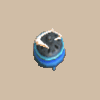

# Overview

- Burn an item to cause a lingering floor-wide effect that lasts for 150 turns to occur.
    - Burning a Fragrant Grass extends the duration to 300 turns.
- The incense effect immediately ends if you eat a Sweet Potato or step on a Gassy Trap.

# Incense List

<table id="monsterList" class="pageLinksTable">
  <tr>
    <th colspan="7">Incense ~ Notebook Order</th>
  </tr>
  <tr>
    <th>Name</th>
    <th>Buy</th>
    <th>+1</th>
    <th>Sell</th>
    <th>+1</th>
    <th>Size</th>
    <th>Notes</th>
  </tr>
  <tr>
    <td class="priceTableName"><a href="#heat-ban-incense">Heat-ban Incense</a></td>
    <td>2000</td>
    <td></td>
    <td>800</td>
    <td></td>
    <td></td>
    <td class="leftText">Nullifies fire and explosion damage.</td>
  </tr>
  <tr>
    <td class="priceTableName"><a href="#evasive-incense">Evasive Incense</a></td>
    <td>2000</td>
    <td></td>
    <td>800</td>
    <td></td>
    <td></td>
    <td class="leftText">Makes all non-truestrike projectiles miss.</td>
  </tr>
  <tr>
    <td class="priceTableName"><a href="#cautious-incense">Cautious Incense</a></td>
    <td>2000</td>
    <td></td>
    <td>800</td>
    <td></td>
    <td></td>
    <td class="leftText">Items won't be accidentally dropped or stolen.</td>
  </tr>
  <tr>
    <td class="priceTableName"><a href="#reflective-incense">Reflective Incense</a></td>
    <td>2000</td>
    <td></td>
    <td>800</td>
    <td></td>
    <td></td>
    <td class="leftText">Reflects magic bullets and certain special attacks.</td>
  </tr>
  <tr>
    <td class="priceTableName"><a href="#aggressive-incense">Aggressive Incense</a></td>
    <td>2000</td>
    <td></td>
    <td>800</td>
    <td></td>
    <td></td>
    <td class="leftText">Doubles damage received.</td>
  </tr>
  <tr>
    <td class="priceTableName"><a href="#defensive-incense">Defensive Incense</a></td>
    <td>2000</td>
    <td></td>
    <td>800</td>
    <td></td>
    <td></td>
    <td class="leftText">Halves damage received.</td>
  </tr>
  <tr>
    <td class="priceTableName"><a href="#blurry-incense">Blurry Incense</a></td>
    <td>2000</td>
    <td></td>
    <td>800</td>
    <td></td>
    <td></td>
    <td class="leftText">Reduces field of view to a 1 tile radius.</td>
  </tr>
  <tr>
    <td class="priceTableName"><a href="#weighted-incense">Weighted Incense</a></td>
    <td>2000</td>
    <td></td>
    <td>800</td>
    <td></td>
    <td></td>
    <td class="leftText">Prevents moving in the air or warping.</td>
  </tr>
  <tr>
    <td class="priceTableName"><a href="#unwanting-incense">Unwanting Incense</a></td>
    <td>2000</td>
    <td></td>
    <td>800</td>
    <td></td>
    <td></td>
    <td class="leftText">Can't pick up items. Monsters won't steal or go after items.</td>
  </tr>
</table>

# Incense Details

<table class="monsterPageTable">
  <tbody>
    <tr>
      <th>
        

          
Heat-ban Incense

        

      </th>
    </tr>
    <tr>
      <td>
        

          

            
          

          

            

              
Buy

              
2000

              
Sell

              
800

              
Size

              
?~?

            

            
Burning this item grants all beings Heat-negated status, preventing damage from fire or explosions.

            
No additional notes.

          

        

      </td>
    </tr>
    <tr>
      <th>
        

          
Evasive Incense

        

      </th>
    </tr>
    <tr>
      <td>
        

          

            
          

          

            

              
Buy

              
2000

              
Sell

              
800

              
Size

              
?~?

            

            
Burning this item grants all beings Evasive status, making Arrows and thrown items miss.

            
No additional notes.

          

        

      </td>
    </tr>
    <tr>
      <th>
        

          
Cautious Incense

        

      </th>
    </tr>
    <tr>
      <td>
        

          

            
          

          

            

              
Buy

              
2000

              
Sell

              
800

              
Size

              
?~?

            

            
Burning this item grants all beings Cautious status, preventing items from being dropped or stolen.

            
No additional notes.

          

        

      </td>
    </tr>
    <tr>
      <th>
        

          
Reflective Incense

        

      </th>
    </tr>
    <tr>
      <td>
        

          

            
          

          

            

              
Buy

              
2000

              
Sell

              
800

              
Size

              
?~?

            

            
Burning this item grants all beings Reflective status, allowing them to reflect magic bullets and some abilities.

            
No additional notes.

          

        

      </td>
    </tr>
    <tr>
      <th>
        

          
Aggressive Incense

        

      </th>
    </tr>
    <tr>
      <td>
        

          

            
          

          

            

              
Buy

              
2000

              
Sell

              
800

              
Size

              
?~?

            

            
Burning this item inflicts all beings with Damage-up status, increasing damage taken.

            
No additional notes.

          

        

      </td>
    </tr>
    <tr>
      <th>
        

          
Defensive Incense

        

      </th>
    </tr>
    <tr>
      <td>
        

          

            
          

          

            

              
Buy

              
2000

              
Sell

              
800

              
Size

              
?~?

            

            
Burning this item grants all beings Damage-down status, decreasing damage taken.

            
No additional notes.

          

        

      </td>
    </tr>
    <tr>
      <th>
        

          
Blurry Incense

        

      </th>
    </tr>
    <tr>
      <td>
        

          

            
          

          

            

              
Buy

              
2000

              
Sell

              
800

              
Size

              
?~?

            

            
Burning this item inflicts all beings with Blurry status, making them unable to see more than 1 tile(s) away.

            
Using a Mapping Scroll or eating a Dark Owl Bun will remove this effect.

          

        

      </td>
    </tr>
    <tr>
      <th>
        

          
Weighted Incense

        

      </th>
    </tr>
    <tr>
      <td>
        

          

            
          

          

            

              
Buy

              
2000

              
Sell

              
800

              
Size

              
?~?

            

            
Burning this item inflicts all beings with Weighted status, making them unable to fly or warp.

            
No additional notes.

          

        

      </td>
    </tr>
    <tr>
      <th>
        

          
Unwanting Incense

        

      </th>
    </tr>
    <tr>
      <td>
        

          

            
          

          

            

              
Buy

              
2000

              
Sell

              
800

              
Size

              
?~?

            

            
Burning this item inflicts all beings with Unwanting status, making them unable to pick up or steal items. Monsters will ignore items on the ground.

            
No additional notes.

          

        

      </td>
    </tr>
  </tbody>
</table>
