# Overview

- Peach Buns can be obtained by using a [Peach Club](/items/weapons#peach-club) or [Peach Staff](/items/staves#peach-staff).
    - These items must be unlocked through a [Side Quest](/system/side-quests#peach-bun) before they can be found in dungeons.
- Eat a Peach Bun to transform into that monster.
    - Transformation lasts for the duration of the current floor.
    - A Peach Bun also replenishes 25 fullness and cures status conditions.
    - Equipment stats are retained during the transformation, but runes and bracelets are nullified.
        - Example: Equip a Shoddy Dirk for higher attack during transformation, sword won't degrade.
    - Open the menu and select End Morph to cancel the transformation.
    - Press ZL or open the menu and select Ability to use the monster's special attack.
        - Some monsters don't have a special attack.
    - Items can be picked up while transformed into a monster, but you can't use items.
- Throw a Peach Bun at a creature to transform them into that monster.
    - This can be used to easily unlock rare encounter slots in a dungeon's monster table.
- A Peach Bun will transform into a Rotten Peach Bun if it gets splashed by water.

# Peach Bun List

<table id="monsterList" class="pageLinksTable">
  <tr>
    <th colspan="6">Peach Bun ~ Notebook Order</th>
  </tr>
  <tr>
    <th>Image</th>
    <th>Name</th>
    <th>Buy</th>
    <th>Sell</th>
    <th>Speed</th>
    <th>In-Game Description</th>
  </tr>
  <tr>
    <td></td>
    <td class="priceTableName">Mamel</td>
    <td>500</td>
    <td>200</td>
    <td class="neutral">Normal</td>
    <td rowspan="2" class="leftText">Ability: None</td>
  </tr>
  <tr>
    <td></td>
    <td class="priceTableName">Pit Mamel</td>
    <td>700</td>
    <td>280</td>
    <td class="neutral">Normal</td>
  </tr>
  <tr>
    <td></td>
    <td class="priceTableName">Cave Mamel</td>
    <td>900</td>
    <td>360</td>
    <td class="neutral">Normal</td>
    <td class="leftText">Ability: None  Reduces damage taken from normal attacks to 1. While transformed, Max HP becomes 5.</td>
  </tr>
  <tr>
    <td></td>
    <td class="priceTableName">Gitan Mamel</td>
    <td>1200</td>
    <td>480</td>
    <td class="good">Swift</td>
    <td class="leftText">Ability: None  Reduces damage taken from normal attacks to 1. While transformed, Max HP becomes 20.</td>
  </tr>
  <tr>
    <td colspan="6" class="tableDivider"></td>
  </tr>
  <tr>
    <td></td>
    <td class="priceTableName">Chintala</td>
    <td>500</td>
    <td>200</td>
    <td class="neutral">Normal</td>
    <td rowspan="4" class="leftText">Ability: None</td>
  </tr>
  <tr>
    <td></td>
    <td class="priceTableName">Mid Chintala</td>
    <td>700</td>
    <td>280</td>
    <td class="neutral">Normal</td>
  </tr>
  <tr>
    <td></td>
    <td class="priceTableName">Big Chintala</td>
    <td>900</td>
    <td>360</td>
    <td class="neutral">Normal</td>
  </tr>
  <tr>
    <td></td>
    <td class="priceTableName">Huge Chintala</td>
    <td>1200</td>
    <td>480</td>
    <td class="neutral">Normal</td>
  </tr>
  <tr>
    <td colspan="6" class="tableDivider"></td>
  </tr>
  <tr>
    <td></td>
    <td class="priceTableName">Octopling</td>
    <td>500</td>
    <td>200</td>
    <td class="neutral">Normal</td>
    <td rowspan="4" class="leftText">Ability: Inflicts Mingling status on monsters. Monsters with Mingling status will not fight. This ability may fail.  While moving on water, Attack Power increases and HP recovers each turn.</td>
  </tr>
  <tr>
    <td></td>
    <td class="priceTableName">Fresh Octopling</td>
    <td>700</td>
    <td>280</td>
    <td class="neutral">Normal</td>
  </tr>
  <tr>
    <td></td>
    <td class="priceTableName">Famed Octopling</td>
    <td>900</td>
    <td>360</td>
    <td class="neutral">Normal</td>
  </tr>
  <tr>
    <td></td>
    <td class="priceTableName">Superb Octopling</td>
    <td>1200</td>
    <td>480</td>
    <td class="neutral">Normal</td>
  </tr>
  <tr>
    <td colspan="6" class="tableDivider"></td>
  </tr>
  <tr>
    <td></td>
    <td class="priceTableName">Spearfish</td>
    <td>500</td>
    <td>200</td>
    <td class="neutral">Normal</td>
    <td rowspan="2" class="leftText">Ability: None  While moving on water, Attack Power increases and HP recovers each turn.</td>
  </tr>
  <tr>
    <td></td>
    <td class="priceTableName">Lt. Spearfish</td>
    <td>700</td>
    <td>280</td>
    <td class="neutral">Normal</td>
  </tr>
  <tr>
    <td></td>
    <td class="priceTableName">Capt. Spearfish</td>
    <td>900</td>
    <td>360</td>
    <td class="neutral">Normal</td>
    <td class="leftText">Ability: Shoots a water gun. Deals 15 damage up to 3 tile(s) away.  While moving on water, Attack Power increases and HP recovers each turn.</td>
  </tr>
  <tr>
    <td></td>
    <td class="priceTableName">Admiral Spearfish</td>
    <td>1200</td>
    <td>480</td>
    <td class="neutral">Normal</td>
    <td class="leftText">Ability: Shoots a water gun. Deals 25 damage up to 5 tile(s) away.  While moving on water, Attack Power increases and HP recovers each turn.</td>
  </tr>
  <tr>
    <td colspan="6" class="tableDivider"></td>
  </tr>
  <tr>
    <td></td>
    <td class="priceTableName">Death Reaper</td>
    <td>500</td>
    <td>200</td>
    <td class="good">Swift</td>
    <td rowspan="2" class="leftText">Ability: None  Allows you to fly.</td>
  </tr>
  <tr>
    <td></td>
    <td class="priceTableName">Hell Reaper</td>
    <td>700</td>
    <td>280</td>
    <td class="good">Swift</td>
  </tr>
  <tr>
    <td></td>
    <td class="priceTableName">Soul Reaper</td>
    <td>900</td>
    <td>360</td>
    <td class="good">Swift</td>
    <td rowspan="2" class="leftText">Ability: None  Allows you to fly and move through walls.</td>
  </tr>
  <tr>
    <td></td>
    <td class="priceTableName">King Reaper</td>
    <td>1200</td>
    <td>480</td>
    <td class="good">Swift</td>
  </tr>
  <tr>
    <td colspan="6" class="tableDivider"></td>
  </tr>
  <tr>
    <td></td>
    <td class="priceTableName">Pumphantasm</td>
    <td>500</td>
    <td>200</td>
    <td class="neutral">Normal</td>
    <td rowspan="4" class="leftText">Ability: None  Allows you to fly and move through walls.</td>
  </tr>
  <tr>
    <td></td>
    <td class="priceTableName">Pumpanshee</td>
    <td>700</td>
    <td>280</td>
    <td class="neutral">Normal</td>
  </tr>
  <tr>
    <td></td>
    <td class="priceTableName">Pumplich</td>
    <td>900</td>
    <td>360</td>
    <td class="neutral">Normal</td>
  </tr>
  <tr>
    <td></td>
    <td class="priceTableName">Pumplord</td>
    <td>1200</td>
    <td>480</td>
    <td class="neutral">Normal</td>
  </tr>
  <tr>
    <td colspan="6" class="tableDivider"></td>
  </tr>
  <tr>
    <td></td>
    <td class="priceTableName">Firepuff</td>
    <td>500</td>
    <td>200</td>
    <td class="neutral">Normal</td>
    <td class="leftText">Ability: Breathes fire - This ability may fail. Deals 10 damage to the target ahead of you.  Allows you to fly.</td>
  </tr>
  <tr>
    <td></td>
    <td class="priceTableName">Flamepuff</td>
    <td>700</td>
    <td>280</td>
    <td class="neutral">Normal</td>
    <td class="leftText">Ability: Breathes fire - This ability may fail. Deals 20 damage to the target ahead of you.  Allows you to fly.</td>
  </tr>
  <tr>
    <td></td>
    <td class="priceTableName">Blazepuff</td>
    <td>900</td>
    <td>360</td>
    <td class="neutral">Normal</td>
    <td class="leftText">Ability: Breathes fire - This ability may fail. Deals 30 damage to the target ahead of you.  Allows you to fly.</td>
  </tr>
  <tr>
    <td></td>
    <td class="priceTableName">Pyrepuff</td>
    <td>1200</td>
    <td>480</td>
    <td class="neutral">Normal</td>
    <td class="leftText">Ability: Breathes fire - This ability may fail. Deals 40 damage to the target ahead of you.  Allows you to fly.</td>
  </tr>
  <tr>
    <td colspan="6" class="tableDivider"></td>
  </tr>
  <tr>
    <td></td>
    <td class="priceTableName">Armordillo</td>
    <td>500</td>
    <td>200</td>
    <td class="neutral">Normal</td>
    <td class="leftText">Ability: Shoves target. Deals 5 damage and knocks the target back 2 tile(s). May knock the target over, causing them to drop items.</td>
  </tr>
  <tr>
    <td></td>
    <td class="priceTableName">Brodillo</td>
    <td>700</td>
    <td>280</td>
    <td class="neutral">Normal</td>
    <td class="leftText">Ability: Shoves target. Deals 10 damage and knocks the target back 3 tile(s). May knock the target over, causing them to drop items.</td>
  </tr>
  <tr>
    <td></td>
    <td class="priceTableName">Popdillo</td>
    <td>900</td>
    <td>360</td>
    <td class="neutral">Normal</td>
    <td class="leftText">Ability: Shoves target. Deals 15 damage and knocks the target back 4 tile(s). May knock the target over, causing them to drop items.</td>
  </tr>
  <tr>
    <td></td>
    <td class="priceTableName">Grampadillo</td>
    <td>1200</td>
    <td>480</td>
    <td class="neutral">Normal</td>
    <td class="leftText">Ability: Shoves target. Deals 20 damage and knocks the target back 5 tile(s). May knock the target over, causing them to drop items.</td>
  </tr>
  <tr>
    <td colspan="6" class="tableDivider"></td>
  </tr>
  <tr>
    <td></td>
    <td class="priceTableName">Masked Samurai</td>
    <td>500</td>
    <td>200</td>
    <td class="neutral">Normal</td>
    <td rowspan="4" class="leftText">Ability: None  After collapsing, you come back as Ghost Samurai. Ghost Samurai can possess monsters.</td>
  </tr>
  <tr>
    <td>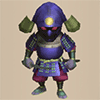</td>
    <td class="priceTableName">Raging Samurai</td>
    <td>700</td>
    <td>280</td>
    <td class="neutral">Normal</td>
  </tr>
  <tr>
    <td></td>
    <td class="priceTableName">Great Samurai</td>
    <td>900</td>
    <td>360</td>
    <td class="neutral">Normal</td>
  </tr>
  <tr>
    <td></td>
    <td class="priceTableName">Lordly Samurai</td>
    <td>1200</td>
    <td>480</td>
    <td class="neutral">Normal</td>
  </tr>
  <tr>
    <td colspan="6" class="tableDivider"></td>
  </tr>
  <tr>
    <td></td>
    <td class="priceTableName">Ghost Samurai</td>
    <td>500</td>
    <td>200</td>
    <td class="neutral">Normal</td>
    <td class="leftText">Ability: Possess monsters.  Reduces damage taken from normal attacks to 1. While transformed, Max HP becomes 4.</td>
  </tr>
  <tr>
    <td colspan="6" class="tableDivider"></td>
  </tr>
  <tr>
    <td></td>
    <td class="priceTableName">Taur</td>
    <td>500</td>
    <td>200</td>
    <td class="neutral">Normal</td>
    <td rowspan="4" class="leftText">Ability: Performs an attack that may Critically Hit. Normal attacks may also become Critical Hits.</td>
  </tr>
  <tr>
    <td></td>
    <td class="priceTableName">Minotaur</td>
    <td>700</td>
    <td>280</td>
    <td class="neutral">Normal</td>
  </tr>
  <tr>
    <td></td>
    <td class="priceTableName">Megataur</td>
    <td>900</td>
    <td>360</td>
    <td class="neutral">Normal</td>
  </tr>
  <tr>
    <td></td>
    <td class="priceTableName">Gigataur</td>
    <td>1200</td>
    <td>480</td>
    <td class="neutral">Normal</td>
  </tr>
  <tr>
    <td colspan="6" class="tableDivider"></td>
  </tr>
  <tr>
    <td></td>
    <td class="priceTableName">Metalhead</td>
    <td>500</td>
    <td>200</td>
    <td class="neutral">Normal</td>
    <td class="leftText">Ability: Attacks by throwing your head up to 2 tile(s) away. Normal attacks also become head-throwing attacks.</td>
  </tr>
  <tr>
    <td></td>
    <td class="priceTableName">Thrashead</td>
    <td>700</td>
    <td>280</td>
    <td class="neutral">Normal</td>
    <td class="leftText">Ability: Attacks by throwing your head up to 3 tile(s) away. Normal attacks also become head-throwing attacks.</td>
  </tr>
  <tr>
    <td></td>
    <td class="priceTableName">Megahead</td>
    <td>900</td>
    <td>360</td>
    <td class="neutral">Normal</td>
    <td class="leftText">Ability: Attacks by throwing your head up to 4 tile(s) away. Normal attacks also become head-throwing attacks.</td>
  </tr>
  <tr>
    <td></td>
    <td class="priceTableName">Deathead</td>
    <td>1200</td>
    <td>480</td>
    <td class="neutral">Normal</td>
    <td class="leftText">Ability: Attacks by throwing your head up to 5 tile(s) away. Normal attacks also become head-throwing attacks.</td>
  </tr>
  <tr>
    <td colspan="6" class="tableDivider"></td>
  </tr>
  <tr>
    <td></td>
    <td class="priceTableName">Hen</td>
    <td>500</td>
    <td>200</td>
    <td class="good">Swift</td>
    <td class="leftText">Ability: None  Attack Power and Defense Power become 1.</td>
  </tr>
  <tr>
    <td></td>
    <td class="priceTableName">Master Hen</td>
    <td>700</td>
    <td>280</td>
    <td class="neutral">Normal</td>
    <td class="leftText">Ability: None  Losing enough HP to enter Danger status turns you into Hen. Returns to Master Hen when HP is restored.</td>
  </tr>
  <tr>
    <td></td>
    <td class="priceTableName">Great Hen</td>
    <td>900</td>
    <td>360</td>
    <td class="good">Swift</td>
    <td class="leftText">Ability: None  Losing enough HP to enter Danger status turns you into Hen. Returns to Great Hen when HP is restored.</td>
  </tr>
  <tr>
    <td></td>
    <td class="priceTableName">Miracle Hen</td>
    <td>1200</td>
    <td>480</td>
    <td class="good">Swift</td>
    <td class="leftText">Ability: None  Losing enough HP to enter Danger status turns you into Hen. Returns to Miracle Hen when HP is restored.</td>
  </tr>
  <tr>
    <td colspan="6" class="tableDivider"></td>
  </tr>
  <tr>
    <td></td>
    <td class="priceTableName">Shagga</td>
    <td>500</td>
    <td>200</td>
    <td class="neutral">Normal</td>
    <td class="leftText">Ability: None</td>
  </tr>
  <tr>
    <td></td>
    <td class="priceTableName">Nashagga</td>
    <td>700</td>
    <td>280</td>
    <td class="neutral">Normal</td>
    <td class="leftText">Ability: Attacks 2 times consecutively. Normal attacks also become swift strikes.</td>
  </tr>
  <tr>
    <td></td>
    <td class="priceTableName">Lashagga</td>
    <td>900</td>
    <td>360</td>
    <td class="neutral">Normal</td>
    <td class="leftText">Ability: Attacks 3 times consecutively. Normal attacks also become swift strikes.</td>
  </tr>
  <tr>
    <td></td>
    <td class="priceTableName">Bashagga</td>
    <td>1200</td>
    <td>480</td>
    <td class="neutral">Normal</td>
    <td class="leftText">Ability: Attacks 4 times consecutively. Normal attacks also become swift strikes.</td>
  </tr>
  <tr>
    <td colspan="6" class="tableDivider"></td>
  </tr>
  <tr>
    <td></td>
    <td class="priceTableName">Bowboy</td>
    <td>500</td>
    <td>200</td>
    <td class="neutral">Normal</td>
    <td class="leftText">Ability: Shoots Wooden Arrow.</td>
  </tr>
  <tr>
    <td></td>
    <td class="priceTableName">Crossbowboy</td>
    <td>700</td>
    <td>280</td>
    <td class="neutral">Normal</td>
    <td rowspan="2" class="leftText">Ability: Shoots Iron Arrow.</td>
  </tr>
  <tr>
    <td></td>
    <td class="priceTableName">Baby Tank</td>
    <td>900</td>
    <td>360</td>
    <td class="good">Swift</td>
  </tr>
  <tr>
    <td></td>
    <td class="priceTableName">Mini Tank</td>
    <td>1200</td>
    <td>480</td>
    <td class="good">Swift</td>
    <td class="leftText">Ability: Shoots Silver Arrow.</td>
  </tr>
  <tr>
    <td colspan="6" class="tableDivider"></td>
  </tr>
  <tr>
    <td></td>
    <td class="priceTableName">Pop Tank</td>
    <td>500</td>
    <td>200</td>
    <td class="bad">Slow</td>
    <td class="leftText">Ability: Fires a cannon. Deals 20 damage to the target and 1 tile(s) around it.</td>
  </tr>
  <tr>
    <td></td>
    <td class="priceTableName">Ornery Tank</td>
    <td>700</td>
    <td>280</td>
    <td class="neutral">Normal</td>
    <td class="leftText">Ability: Fires a cannon. Deals 30 damage to the target and 1 tile(s) around it.</td>
  </tr>
  <tr>
    <td>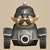</td>
    <td class="priceTableName">Adamant Tank</td>
    <td>900</td>
    <td>360</td>
    <td class="good">Swift</td>
    <td class="leftText">Ability: Fires a cannon. Deals 40 damage to the target and 1 tile(s) around it.</td>
  </tr>
  <tr>
    <td></td>
    <td class="priceTableName">Steadfast Tank</td>
    <td>1200</td>
    <td>480</td>
    <td class="good">Swift</td>
    <td class="leftText">Ability: Fires a cannon. Deals 50 damage to the target and 1 tile(s) around it.</td>
  </tr>
  <tr>
    <td colspan="6" class="tableDivider"></td>
  </tr>
  <tr>
    <td></td>
    <td class="priceTableName">Bored Kappa</td>
    <td>500</td>
    <td>200</td>
    <td class="neutral">Normal</td>
    <td class="leftText">Ability: Throws an item located at your feet, always misses. It will be thrown at a monster up to 3 tile(s) away.  Items launched at you will be thrown back but always miss. While moving on water, Attack Power increases and HP recovers each turn.</td>
  </tr>
  <tr>
    <td></td>
    <td class="priceTableName">Pesky Kappa</td>
    <td>700</td>
    <td>280</td>
    <td class="neutral">Normal</td>
    <td class="leftText">Ability: Throws an item located at your feet. It will be thrown at a monster up to 5 tile(s) away.  Items launched at you will be thrown back. While moving on water, Attack Power increases and HP recovers each turn.</td>
  </tr>
  <tr>
    <td></td>
    <td class="priceTableName">Vexing Kappa</td>
    <td>900</td>
    <td>360</td>
    <td class="neutral">Normal</td>
    <td class="leftText">Ability: Throws an item located at your feet. It will be thrown at a monster up to 10 tile(s) away.  Items launched at you will be thrown back. While moving on water, Attack Power increases and HP recovers each turn.</td>
  </tr>
  <tr>
    <td></td>
    <td class="priceTableName">Atrocious Kappa</td>
    <td>1200</td>
    <td>480</td>
    <td class="neutral">Normal</td>
    <td class="leftText">Ability: Throws an item located at your feet. It will be thrown all the way to a distant monster.  Items launched at you will be thrown back. While moving on water, Attack Power increases and HP recovers each turn.</td>
  </tr>
  <tr>
    <td colspan="6" class="tableDivider"></td>
  </tr>
  <tr>
    <td>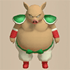</td>
    <td class="priceTableName">Porky</td>
    <td>500</td>
    <td>200</td>
    <td class="neutral">Normal</td>
    <td class="leftText">Ability: Throws Porky's Rock at a target up to 3 tile(s) away.</td>
  </tr>
  <tr>
    <td></td>
    <td class="priceTableName">Porko</td>
    <td>700</td>
    <td>280</td>
    <td class="neutral">Normal</td>
    <td class="leftText">Ability: Throws Porky's Rock at a target up to 5 tile(s) away.</td>
  </tr>
  <tr>
    <td></td>
    <td class="priceTableName">Porkon</td>
    <td>900</td>
    <td>360</td>
    <td class="neutral">Normal</td>
    <td class="leftText">Ability: Throws Porky's Rock at a target up to 8 tile(s) away.</td>
  </tr>
  <tr>
    <td></td>
    <td class="priceTableName">Porgon</td>
    <td>1200</td>
    <td>480</td>
    <td class="neutral">Normal</td>
    <td class="leftText">Ability: Throws Porky's Rock at a target up to 10 tile(s) away.</td>
  </tr>
  <tr>
    <td colspan="6" class="tableDivider"></td>
  </tr>
  <tr>
    <td></td>
    <td class="priceTableName">Dragon</td>
    <td>500</td>
    <td>200</td>
    <td class="neutral">Normal</td>
    <td class="leftText">Ability: Breathes fire. Fire is shot straight ahead, dealing 20 damage to any target hit.</td>
  </tr>
  <tr>
    <td></td>
    <td class="priceTableName">Sky Dragon</td>
    <td>700</td>
    <td>280</td>
    <td class="neutral">Normal</td>
    <td class="leftText">Ability: Breathes fire. Fire is shot at a monster in the room, dealing 20 damage to any target hit.</td>
  </tr>
  <tr>
    <td></td>
    <td class="priceTableName">Archdragon</td>
    <td>900</td>
    <td>360</td>
    <td class="neutral">Normal</td>
    <td class="leftText">Ability: Breathes fire. Fire is shot at a monster on the floor, dealing 30 damage to any target hit.</td>
  </tr>
  <tr>
    <td></td>
    <td class="priceTableName">Abyss Dragon</td>
    <td>1200</td>
    <td>480</td>
    <td class="neutral">Normal</td>
    <td class="leftText">Ability: Breathes fire. Fire is shot at a monster on the floor, dealing 40 damage to any target hit.</td>
  </tr>
  <tr>
    <td colspan="6" class="tableDivider"></td>
  </tr>
  <tr>
    <td></td>
    <td class="priceTableName">Ghost Radish</td>
    <td>500</td>
    <td>200</td>
    <td class="neutral">Normal</td>
    <td class="leftText">Ability: Throws Poison Grass.  Being inflicted with poison increases Attack Power.</td>
  </tr>
  <tr>
    <td></td>
    <td class="priceTableName">Daze Radish</td>
    <td>700</td>
    <td>280</td>
    <td class="neutral">Normal</td>
    <td class="leftText">Ability: Throws Confusion Grass.  Being inflicted with poison increases Attack Power.</td>
  </tr>
  <tr>
    <td></td>
    <td class="priceTableName">Sleep Radish</td>
    <td>900</td>
    <td>360</td>
    <td class="neutral">Normal</td>
    <td class="leftText">Ability: Throws Sedating Grass.  Being inflicted with poison increases Attack Power.</td>
  </tr>
  <tr>
    <td>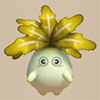</td>
    <td class="priceTableName">Frenzy Radish</td>
    <td>1200</td>
    <td>480</td>
    <td class="neutral">Normal</td>
    <td class="leftText">Ability: Throws Berserk Seed.  Being inflicted with poison increases Attack Power.</td>
  </tr>
  <tr>
    <td colspan="6" class="tableDivider"></td>
  </tr>
  <tr>
    <td></td>
    <td class="priceTableName">Skull Mage</td>
    <td>500</td>
    <td>200</td>
    <td class="neutral">Normal</td>
    <td class="leftText">Ability: Fires a magic bullet that causes one of the following: Warps target, increases Action Speed by 1, knocks target back 10 tiles, or switches locations with you.</td>
  </tr>
  <tr>
    <td></td>
    <td class="priceTableName">Skull Wizard</td>
    <td>700</td>
    <td>280</td>
    <td class="neutral">Normal</td>
    <td class="leftText">Ability: Fires a magic bullet that causes one of the following: Inflicts Confused status, deals 20 damage, Warps target to stairs and inflicts Paralyzed status, or transforms target into monster.</td>
  </tr>
  <tr>
    <td></td>
    <td class="priceTableName">Skullmancer</td>
    <td>900</td>
    <td>360</td>
    <td class="neutral">Normal</td>
    <td class="leftText">Ability: Fires a magic bullet that causes one of the following: Paralyzed status, Sealed status, Onigiri status, Disguised status, Action Speed decreased by 1, or Level decreased by 1.</td>
  </tr>
  <tr>
    <td></td>
    <td class="priceTableName">Skull Lord</td>
    <td>1200</td>
    <td>480</td>
    <td class="neutral">Normal</td>
    <td class="leftText">Ability: Fires a magic bullet that causes one of the following: Asleep status, Blind status, Level decreased by 3, or deals 40 damage.</td>
  </tr>
  <tr>
    <td colspan="6" class="tableDivider"></td>
  </tr>
  <tr>
    <td></td>
    <td class="priceTableName">Gazer</td>
    <td>500</td>
    <td>200</td>
    <td class="neutral">Normal</td>
    <td rowspan="3" class="leftText">Ability: Inflicts Confused status on a monster ahead of you.</td>
  </tr>
  <tr>
    <td></td>
    <td class="priceTableName">Super Gazer</td>
    <td>700</td>
    <td>280</td>
    <td class="neutral">Normal</td>
  </tr>
  <tr>
    <td></td>
    <td class="priceTableName">Hyper Gazer</td>
    <td>900</td>
    <td>360</td>
    <td class="neutral">Normal</td>
  </tr>
  <tr>
    <td></td>
    <td class="priceTableName">Ultra Gazer</td>
    <td>1200</td>
    <td>480</td>
    <td class="neutral">Normal</td>
    <td class="leftText">Ability: Inflicts Confused status on every monster in the room.</td>
  </tr>
  <tr>
    <td colspan="6" class="tableDivider"></td>
  </tr>
  <tr>
    <td></td>
    <td class="priceTableName">Twisty Hani</td>
    <td>500</td>
    <td>200</td>
    <td class="neutral">Normal</td>
    <td rowspan="4" class="leftText">Ability: Decreases the target's Level by 1.</td>
  </tr>
  <tr>
    <td></td>
    <td class="priceTableName">Floppy Hani</td>
    <td>700</td>
    <td>280</td>
    <td class="neutral">Normal</td>
  </tr>
  <tr>
    <td></td>
    <td class="priceTableName">Droopy Hani</td>
    <td>900</td>
    <td>360</td>
    <td class="neutral">Normal</td>
  </tr>
  <tr>
    <td></td>
    <td class="priceTableName">Wrinkly Hani</td>
    <td>1200</td>
    <td>480</td>
    <td class="neutral">Normal</td>
  </tr>
  <tr>
    <td colspan="6" class="tableDivider"></td>
  </tr>
  <tr>
    <td></td>
    <td class="priceTableName">Polygon Spinna</td>
    <td>500</td>
    <td>200</td>
    <td class="neutral">Normal</td>
    <td class="leftText">Ability: Deals damage equivalent to 30% of the target's HP.  Being affected by a Hunger Trap increases Attack Power.</td>
  </tr>
  <tr>
    <td></td>
    <td class="priceTableName">Polygon Shaka</td>
    <td>700</td>
    <td>280</td>
    <td class="neutral">Normal</td>
    <td class="leftText">Ability: Deals damage equivalent to 40% of the target's HP.  Being affected by a Hunger Trap increases Attack Power.</td>
  </tr>
  <tr>
    <td></td>
    <td class="priceTableName">Polygon Singa</td>
    <td>900</td>
    <td>360</td>
    <td class="neutral">Normal</td>
    <td class="leftText">Ability: Deals damage equivalent to 50% of the target's HP.  Being affected by a Hunger Trap increases Attack Power.</td>
  </tr>
  <tr>
    <td></td>
    <td class="priceTableName">Polygon Stunna</td>
    <td>1200</td>
    <td>480</td>
    <td class="neutral">Normal</td>
    <td class="leftText">Ability: Deals damage equivalent to 60% of the target's HP.  Being affected by a Hunger Trap increases Attack Power.</td>
  </tr>
  <tr>
    <td colspan="6" class="tableDivider"></td>
  </tr>
  <tr>
    <td></td>
    <td class="priceTableName">Scorpion</td>
    <td>500</td>
    <td>200</td>
    <td class="neutral">Normal</td>
    <td class="leftText">Ability: Decreases the target's Attack Power.  Being inflicted with poison increases Attack Power.</td>
  </tr>
  <tr>
    <td></td>
    <td class="priceTableName">Vile Scorpion</td>
    <td>700</td>
    <td>280</td>
    <td class="neutral">Normal</td>
    <td class="leftText">Ability: Notably decreases the target's Attack Power.  Being inflicted with poison increases Attack Power.</td>
  </tr>
  <tr>
    <td></td>
    <td class="priceTableName">Terror Scorpion</td>
    <td>900</td>
    <td>360</td>
    <td class="neutral">Normal</td>
    <td class="leftText">Ability: Significantly decreases the target's Attack Power.  Being inflicted with poison increases Attack Power.</td>
  </tr>
  <tr>
    <td></td>
    <td class="priceTableName">Demon Scorpion</td>
    <td>1200</td>
    <td>480</td>
    <td class="neutral">Normal</td>
    <td class="leftText">Ability: Massively decreases the target's Attack Power.  Being inflicted with poison increases Attack Power.</td>
  </tr>
  <tr>
    <td colspan="6" class="tableDivider"></td>
  </tr>
  <tr>
    <td></td>
    <td class="priceTableName">Field Knave</td>
    <td>500</td>
    <td>200</td>
    <td class="neutral">Normal</td>
    <td rowspan="2" class="leftText">Ability: Throws Weeds.  Stepping on an item will turn it into Weeds.</td>
  </tr>
  <tr>
    <td></td>
    <td class="priceTableName">Pot Knave</td>
    <td>700</td>
    <td>280</td>
    <td class="neutral">Normal</td>
  </tr>
  <tr>
    <td></td>
    <td class="priceTableName">Bag Knave</td>
    <td>900</td>
    <td>360</td>
    <td class="neutral">Normal</td>
    <td rowspan="2" class="leftText">Ability: Throws Weeds. May knock items out of the target's possession.  Stepping on an item will turn it into Weeds.</td>
  </tr>
  <tr>
    <td></td>
    <td class="priceTableName">Nimble Knave</td>
    <td>1200</td>
    <td>480</td>
    <td class="good">Swift</td>
  </tr>
  <tr>
    <td colspan="6" class="tableDivider"></td>
  </tr>
  <tr>
    <td></td>
    <td class="priceTableName">Nigiri Baby</td>
    <td>500</td>
    <td>200</td>
    <td class="neutral">Normal</td>
    <td class="leftText">Ability: Turns monsters into Onigiri. Possibility of success is 1 in 6.</td>
  </tr>
  <tr>
    <td></td>
    <td class="priceTableName">Nigiri Morph</td>
    <td>700</td>
    <td>280</td>
    <td class="neutral">Normal</td>
    <td class="leftText">Ability: Turns monsters into Onigiri. Possibility of success is 1 in 4.</td>
  </tr>
  <tr>
    <td></td>
    <td class="priceTableName">Nigiri Boss</td>
    <td>900</td>
    <td>360</td>
    <td class="neutral">Normal</td>
    <td class="leftText">Ability: Turns monsters into Onigiri. Possibility of success is 1 in 2.</td>
  </tr>
  <tr>
    <td></td>
    <td class="priceTableName">Nigiri Honcho</td>
    <td>1200</td>
    <td>480</td>
    <td class="neutral">Normal</td>
    <td class="leftText">Ability: Turns monsters into Large Onigiri. Possibility of success is 1 in 2.</td>
  </tr>
  <tr>
    <td colspan="6" class="tableDivider"></td>
  </tr>
  <tr>
    <td></td>
    <td class="priceTableName">Froggo</td>
    <td>500</td>
    <td>200</td>
    <td class="neutral">Normal</td>
    <td rowspan="3" class="leftText">Ability: Steals Gitan and warps away upon success.  When hit with Gitan, HP will be restored.</td>
  </tr>
  <tr>
    <td></td>
    <td class="priceTableName">Froggucchi</td>
    <td>700</td>
    <td>280</td>
    <td class="neutral">Normal</td>
  </tr>
  <tr>
    <td></td>
    <td class="priceTableName">Froggon</td>
    <td>900</td>
    <td>360</td>
    <td class="neutral">Normal</td>
  </tr>
  <tr>
    <td></td>
    <td class="priceTableName">Frogginator</td>
    <td>1200</td>
    <td>480</td>
    <td class="neutral">Normal</td>
    <td class="leftText">Ability: Steals Gitan and warps away upon success. When at a distance, Gitan from your funds will be thrown.  When hit with Gitan, HP will be restored.</td>
  </tr>
  <tr>
    <td colspan="6" class="tableDivider"></td>
  </tr>
  <tr>
    <td></td>
    <td class="priceTableName">Thiefwalrus</td>
    <td>500</td>
    <td>200</td>
    <td class="neutral">Normal</td>
    <td rowspan="3" class="leftText">Ability: Steals an item and warps away upon success. Can also pick up items on the ground ahead of you.  While moving on water, Attack Power increases and HP recovers each turn.</td>
  </tr>
  <tr>
    <td></td>
    <td class="priceTableName">Greenwalrus</td>
    <td>700</td>
    <td>280</td>
    <td class="neutral">Normal</td>
  </tr>
  <tr>
    <td></td>
    <td class="priceTableName">Ironwalrus</td>
    <td>900</td>
    <td>360</td>
    <td class="neutral">Normal</td>
  </tr>
  <tr>
    <td></td>
    <td class="priceTableName">Magicwalrus</td>
    <td>1200</td>
    <td>480</td>
    <td class="neutral">Normal</td>
    <td class="leftText">Ability: Steals items and warps away upon success. Can also pick up items on the ground ahead of you. Creates multiple Magicwalrus holding Weeds decoys.  While moving on water, Attack Power increases and HP recovers each turn.</td>
  </tr>
  <tr>
    <td colspan="6" class="tableDivider"></td>
  </tr>
  <tr>
    <td></td>
    <td class="priceTableName">Hat Urchin</td>
    <td>500</td>
    <td>200</td>
    <td class="neutral">Normal</td>
    <td class="leftText">Ability: Steals Stave and throws it away.</td>
  </tr>
  <tr>
    <td></td>
    <td class="priceTableName">Hat Prankster</td>
    <td>700</td>
    <td>280</td>
    <td class="neutral">Normal</td>
    <td class="leftText">Ability: Steals Stave or Grass and throws it away.</td>
  </tr>
  <tr>
    <td></td>
    <td class="priceTableName">Hat Brat</td>
    <td>900</td>
    <td>360</td>
    <td class="neutral">Normal</td>
    <td class="leftText">Ability: Steals Stave, Grass, or Food and throws it away.</td>
  </tr>
  <tr>
    <td></td>
    <td class="priceTableName">Hat Rascal</td>
    <td>1200</td>
    <td>480</td>
    <td class="neutral">Normal</td>
    <td class="leftText">Ability: Steals Stave, Grass, Food, or Scroll and throws it away.</td>
  </tr>
  <tr>
    <td colspan="6" class="tableDivider"></td>
  </tr>
  <tr>
    <td></td>
    <td class="priceTableName">Curse Girl</td>
    <td>500</td>
    <td>200</td>
    <td class="neutral">Normal</td>
    <td rowspan="4" class="leftText">Ability: Inflicts Sealed status on the monster ahead of you.  Being affected by a Curse Trap increases Attack Power.</td>
  </tr>
  <tr>
    <td></td>
    <td class="priceTableName">Cursister</td>
    <td>700</td>
    <td>280</td>
    <td class="neutral">Normal</td>
  </tr>
  <tr>
    <td></td>
    <td class="priceTableName">Curse Matron</td>
    <td>900</td>
    <td>360</td>
    <td class="neutral">Normal</td>
  </tr>
  <tr>
    <td></td>
    <td class="priceTableName">Cursenior</td>
    <td>1200</td>
    <td>480</td>
    <td class="neutral">Normal</td>
  </tr>
  <tr>
    <td colspan="6" class="tableDivider"></td>
  </tr>
  <tr>
    <td></td>
    <td class="priceTableName">Mudkin</td>
    <td>500</td>
    <td>200</td>
    <td class="neutral">Normal</td>
    <td class="leftText">Ability: Decreases the target's Attack Power and Defense Power.  Being attacked may cause Mudkin to multiply. While moving on water, Attack Power increases and HP recovers each turn.</td>
  </tr>
  <tr>
    <td></td>
    <td class="priceTableName">Muddy</td>
    <td>700</td>
    <td>280</td>
    <td class="neutral">Normal</td>
    <td class="leftText">Ability: Decreases the target's Attack Power and Defense Power.  Being attacked may cause Muddy to multiply. While moving on water, Attack Power increases and HP recovers each turn.</td>
  </tr>
  <tr>
    <td></td>
    <td class="priceTableName">Mudster</td>
    <td>900</td>
    <td>360</td>
    <td class="neutral">Normal</td>
    <td class="leftText">Ability: Decreases the target's Attack Power and Defense Power.  Being attacked may cause Mudster to multiply. While moving on water, Attack Power increases and HP recovers each turn.</td>
  </tr>
  <tr>
    <td></td>
    <td class="priceTableName">Mudder</td>
    <td>1200</td>
    <td>480</td>
    <td class="neutral">Normal</td>
    <td class="leftText">Ability: Decreases the target's Attack Power and Defense Power.  Being attacked may cause Mudder to multiply. While moving on water, Attack Power increases and HP recovers each turn.</td>
  </tr>
  <tr>
    <td colspan="6" class="tableDivider"></td>
  </tr>
  <tr>
    <td></td>
    <td class="priceTableName">Swordsman</td>
    <td>500</td>
    <td>200</td>
    <td class="neutral">Normal</td>
    <td class="leftText">Ability: Knocks Shield from a monster. This ability may fail. Removed items will be flung behind the target.</td>
  </tr>
  <tr>
    <td></td>
    <td class="priceTableName">Fencer</td>
    <td>700</td>
    <td>280</td>
    <td class="neutral">Normal</td>
    <td class="leftText">Ability: Knocks Weapon or Shield from a monster. This ability may fail. Removed items will be flung behind the target.</td>
  </tr>
  <tr>
    <td>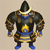</td>
    <td class="priceTableName">Battler</td>
    <td>900</td>
    <td>360</td>
    <td class="neutral">Normal</td>
    <td class="leftText">Ability: Knocks Weapon, Shield, or Bracelet from a monster. This ability may fail. Removed items will be flung behind the target.</td>
  </tr>
  <tr>
    <td></td>
    <td class="priceTableName">Swordmaster</td>
    <td>1200</td>
    <td>480</td>
    <td class="neutral">Normal</td>
    <td class="leftText">Ability: Knocks Weapon, Shield, or Bracelet from a monster. This ability may fail. Removed items will be flung somewhere nearby.</td>
  </tr>
  <tr>
    <td colspan="6" class="tableDivider"></td>
  </tr>
  <tr>
    <td></td>
    <td class="priceTableName">Pullfrog</td>
    <td>500</td>
    <td>200</td>
    <td class="neutral">Normal</td>
    <td class="leftText">Ability: Uses tongue to pull things closer. The closest target in a straight line within 3 tile(s) will be pulled closer.  While moving on water, Attack Power increases and HP recovers each turn.</td>
  </tr>
  <tr>
    <td></td>
    <td class="priceTableName">Dartingfrog</td>
    <td>700</td>
    <td>280</td>
    <td class="neutral">Normal</td>
    <td class="leftText">Ability: Uses tongue to pull things closer. The closest target in a straight line within 5 tile(s) will be pulled closer and attacked.  While moving on water, Attack Power increases and HP recovers each turn.</td>
  </tr>
  <tr>
    <td></td>
    <td class="priceTableName">Fleefrog</td>
    <td>900</td>
    <td>360</td>
    <td class="neutral">Normal</td>
    <td class="leftText">Ability: Uses tongue to pull things closer. The closest target in a straight line within 10 tile(s) will be pulled closer and attacked.  While moving on water, Attack Power increases and HP recovers each turn.</td>
  </tr>
  <tr>
    <td></td>
    <td class="priceTableName">Streamingfrog</td>
    <td>1200</td>
    <td>480</td>
    <td class="neutral">Normal</td>
    <td class="leftText">Ability: Uses tongue to pull things closer. All targets in a straight line within 10 tile(s) will be pulled closer and attacked.  While moving on water, Attack Power increases and HP recovers each turn.</td>
  </tr>
  <tr>
    <td colspan="6" class="tableDivider"></td>
  </tr>
  <tr>
    <td></td>
    <td class="priceTableName">Floor Dragon</td>
    <td>500</td>
    <td>200</td>
    <td class="neutral">Normal</td>
    <td rowspan="4" class="leftText">Ability: Burrows into the ground and moves 2 tiles.  Traps will not ensnare you.</td>
  </tr>
  <tr>
    <td></td>
    <td class="priceTableName">Dragon Head</td>
    <td>700</td>
    <td>280</td>
    <td class="neutral">Normal</td>
  </tr>
  <tr>
    <td></td>
    <td class="priceTableName">Dragon Pit</td>
    <td>900</td>
    <td>360</td>
    <td class="good">Swift</td>
  </tr>
  <tr>
    <td></td>
    <td class="priceTableName">Hiding Dragon</td>
    <td>1200</td>
    <td>480</td>
    <td class="good">Swift</td>
  </tr>
  <tr>
    <td colspan="6" class="tableDivider"></td>
  </tr>
  <tr>
    <td></td>
    <td class="priceTableName">Tiger Thrower</td>
    <td>500</td>
    <td>200</td>
    <td class="neutral">Normal</td>
    <td class="leftText">Ability: Tosses a being located ahead of you. The target will be thrown at a monster up to 5 tile(s) away, dealing 5 damage to both when they collide.</td>
  </tr>
  <tr>
    <td></td>
    <td class="priceTableName">Tiger Hurler</td>
    <td>700</td>
    <td>280</td>
    <td class="neutral">Normal</td>
    <td class="leftText">Ability: Tosses a being located ahead of you. The target will be thrown at a monster up to 10 tile(s) away, dealing 10 damage to both when they collide.</td>
  </tr>
  <tr>
    <td></td>
    <td class="priceTableName">Tiger Chucker</td>
    <td>900</td>
    <td>360</td>
    <td class="neutral">Normal</td>
    <td class="leftText">Ability: Tosses a being located ahead of you. The target will be thrown at a monster up to 15 tile(s) away, dealing 15 damage to both when they collide.</td>
  </tr>
  <tr>
    <td></td>
    <td class="priceTableName">Tiger Launcher</td>
    <td>1200</td>
    <td>480</td>
    <td class="neutral">Normal</td>
    <td class="leftText">Ability: Tosses a being located ahead of you. The target will be thrown at a monster up to 20 tile(s) away, dealing 20 damage to both when they collide.</td>
  </tr>
  <tr>
    <td colspan="6" class="tableDivider"></td>
  </tr>
  <tr>
    <td></td>
    <td class="priceTableName">Karakuroid</td>
    <td>500</td>
    <td>200</td>
    <td class="good">Swift</td>
    <td rowspan="4" class="leftText">Ability: Places a Trap at your feet.  Allows you to see and not be ensnared by hidden Traps.</td>
  </tr>
  <tr>
    <td></td>
    <td class="priceTableName">Steamroid</td>
    <td>700</td>
    <td>280</td>
    <td class="good">Swift</td>
  </tr>
  <tr>
    <td></td>
    <td class="priceTableName">Electroid</td>
    <td>900</td>
    <td>360</td>
    <td class="good">Swift</td>
  </tr>
  <tr>
    <td></td>
    <td class="priceTableName">Cyberoid</td>
    <td>1200</td>
    <td>480</td>
    <td class="good">Swift</td>
  </tr>
  <tr>
    <td colspan="6" class="tableDivider"></td>
  </tr>
  <tr>
    <td></td>
    <td class="priceTableName">Soldier Ant</td>
    <td>500</td>
    <td>200</td>
    <td class="neutral">Normal</td>
    <td rowspan="2" class="leftText">Ability: Digs through walls.</td>
  </tr>
  <tr>
    <td></td>
    <td class="priceTableName">Corporal Ant</td>
    <td>700</td>
    <td>280</td>
    <td class="neutral">Normal</td>
  </tr>
  <tr>
    <td></td>
    <td class="priceTableName">Captain Ant</td>
    <td>900</td>
    <td>360</td>
    <td class="neutral">Normal</td>
    <td rowspan="2" class="leftText">Ability: Digs through walls. In places where there are no walls, earthen walls will be built. Earthen walls can be destroyed by attacks.</td>
  </tr>
  <tr>
    <td></td>
    <td class="priceTableName">General Ant</td>
    <td>1200</td>
    <td>480</td>
    <td class="neutral">Normal</td>
  </tr>
  <tr>
    <td colspan="6" class="tableDivider"></td>
  </tr>
  <tr>
    <td></td>
    <td class="priceTableName">Explochin</td>
    <td>500</td>
    <td>200</td>
    <td class="neutral">Normal</td>
    <td rowspan="4" class="leftText">Ability: None  Losing enough HP to enter Danger status makes you explode. After exploding, your HP becomes 1. While moving on water, Attack Power increases and HP recovers each turn.</td>
  </tr>
  <tr>
    <td></td>
    <td class="priceTableName">Concusschin</td>
    <td>700</td>
    <td>280</td>
    <td class="neutral">Normal</td>
  </tr>
  <tr>
    <td>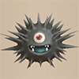</td>
    <td class="priceTableName">Fulminachin</td>
    <td>900</td>
    <td>360</td>
    <td class="neutral">Normal</td>
  </tr>
  <tr>
    <td></td>
    <td class="priceTableName">Detonachin</td>
    <td>1200</td>
    <td>480</td>
    <td class="neutral">Normal</td>
  </tr>
  <tr>
    <td colspan="6" class="tableDivider"></td>
  </tr>
  <tr>
    <td></td>
    <td class="priceTableName">Hoppin' Batter</td>
    <td>500</td>
    <td>200</td>
    <td class="neutral">Normal</td>
    <td class="leftText">Ability: None  Things like items, magic bullets, and cannonballs that are launched at you have a 10% chance of being hit back. If this fails, the projectile falls nearby.</td>
  </tr>
  <tr>
    <td></td>
    <td class="priceTableName">Hoppin' Hitter</td>
    <td>700</td>
    <td>280</td>
    <td class="neutral">Normal</td>
    <td class="leftText">Ability: None  Things like items, magic bullets, and cannonballs that are launched at you have a 30% chance of being hit back. If this fails, the projectile falls nearby.</td>
  </tr>
  <tr>
    <td></td>
    <td class="priceTableName">Hoppin' Slugger</td>
    <td>900</td>
    <td>360</td>
    <td class="neutral">Normal</td>
    <td class="leftText">Ability: None  Things like items, magic bullets, and cannonballs that are launched at you have a 50% chance of being hit back. If this fails, the projectile falls nearby.</td>
  </tr>
  <tr>
    <td></td>
    <td class="priceTableName">Hoppin' Slammer</td>
    <td>1200</td>
    <td>480</td>
    <td class="neutral">Normal</td>
    <td class="leftText">Ability: None  Things like items, magic bullets, and cannonballs that are launched at you have a 100% chance of being hit back.</td>
  </tr>
  <tr>
    <td colspan="6" class="tableDivider"></td>
  </tr>
  <tr>
    <td></td>
    <td class="priceTableName">Fierous</td>
    <td>500</td>
    <td>200</td>
    <td class="neutral">Normal</td>
    <td class="leftText">Ability: None  Damage will not be taken from fire or explosions. Items launched at you will be burned, negating their effect.</td>
  </tr>
  <tr>
    <td></td>
    <td class="priceTableName">Blazeous</td>
    <td>700</td>
    <td>280</td>
    <td class="neutral">Normal</td>
    <td class="leftText">Ability: None  Damage will not be taken from fire. Explosions cause Blazeous to multiply by 1. Items launched at you will be burned, negating their effect.</td>
  </tr>
  <tr>
    <td></td>
    <td class="priceTableName">Igneous</td>
    <td>900</td>
    <td>360</td>
    <td class="neutral">Normal</td>
    <td class="leftText">Ability: None  Damage will not be taken from fire. Explosions cause Igneous to multiply by 1. Items launched at you will be burned, negating their effect.</td>
  </tr>
  <tr>
    <td></td>
    <td class="priceTableName">Infernous</td>
    <td>1200</td>
    <td>480</td>
    <td class="neutral">Normal</td>
    <td class="leftText">Ability: None  Damage will not be taken from fire. Explosions cause Infernous to multiply by 1. Items launched at you will be burned, negating their effect.</td>
  </tr>
  <tr>
    <td colspan="6" class="tableDivider"></td>
  </tr>
  <tr>
    <td></td>
    <td class="priceTableName">Zapdon</td>
    <td>500</td>
    <td>200</td>
    <td class="bad">Slow</td>
    <td class="leftText">Ability: None  Taking damage several times electrifies you. When you take damage in this state, every monster in the room will be struck by lighting that deals 25 damage.</td>
  </tr>
  <tr>
    <td>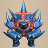</td>
    <td class="priceTableName">Rumbledon</td>
    <td>700</td>
    <td>280</td>
    <td class="bad">Slow</td>
    <td class="leftText">Ability: None  Taking damage several times electrifies you. When you take damage in this state, every monster in the room will be struck by lighting that deals 30 damage.</td>
  </tr>
  <tr>
    <td></td>
    <td class="priceTableName">Clapdon</td>
    <td>900</td>
    <td>360</td>
    <td class="bad">Slow</td>
    <td class="leftText">Ability: None  Taking damage several times electrifies you. When you take damage in this state, every monster in the room will be struck by lighting that deals 35 damage.</td>
  </tr>
  <tr>
    <td></td>
    <td class="priceTableName">Boomdon</td>
    <td>1200</td>
    <td>480</td>
    <td class="bad">Slow</td>
    <td class="leftText">Ability: None  Taking damage several times electrifies you. When you take damage in this state, every monster in the room will be struck by lighting that deals 40 damage.</td>
  </tr>
  <tr>
    <td colspan="6" class="tableDivider"></td>
  </tr>
  <tr>
    <td></td>
    <td class="priceTableName">Schubell</td>
    <td>500</td>
    <td>200</td>
    <td class="neutral">Normal</td>
    <td class="leftText">Ability: Summons 1 monster(s).</td>
  </tr>
  <tr>
    <td>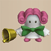</td>
    <td class="priceTableName">Menbell</td>
    <td>700</td>
    <td>280</td>
    <td class="neutral">Normal</td>
    <td class="leftText">Ability: Summons up to 2 monster(s).</td>
  </tr>
  <tr>
    <td></td>
    <td class="priceTableName">Bellthoven</td>
    <td>900</td>
    <td>360</td>
    <td class="neutral">Normal</td>
    <td rowspan="2" class="leftText">Ability: Summons up to 3 monster(s).</td>
  </tr>
  <tr>
    <td></td>
    <td class="priceTableName">Showpin</td>
    <td>1200</td>
    <td>480</td>
    <td class="neutral">Normal</td>
  </tr>
  <tr>
    <td colspan="6" class="tableDivider"></td>
  </tr>
  <tr>
    <td></td>
    <td class="priceTableName">N'dubba</td>
    <td>500</td>
    <td>200</td>
    <td class="neutral">Normal</td>
    <td rowspan="4" class="leftText">Ability: Inflicts you with Hiding status.</td>
  </tr>
  <tr>
    <td></td>
    <td class="priceTableName">N'dulu</td>
    <td>700</td>
    <td>280</td>
    <td class="neutral">Normal</td>
  </tr>
  <tr>
    <td></td>
    <td class="priceTableName">N'dama</td>
    <td>900</td>
    <td>360</td>
    <td class="neutral">Normal</td>
  </tr>
  <tr>
    <td></td>
    <td class="priceTableName">N'daloon</td>
    <td>1200</td>
    <td>480</td>
    <td class="neutral">Normal</td>
  </tr>
  <tr>
    <td colspan="6" class="tableDivider"></td>
  </tr>
  <tr>
    <td></td>
    <td class="priceTableName">Mixer</td>
    <td>500</td>
    <td>200</td>
    <td class="neutral">Normal</td>
    <td class="leftText">Ability: Eats items at your feet and synthesizes them. After swallowing an item, Attack Power increases and status ailments are removed. Up to 2 item(s) launched at you will be swallowed and fall at your feet when the transformation wears off.</td>
  </tr>
  <tr>
    <td>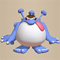</td>
    <td class="priceTableName">Mixermon</td>
    <td>700</td>
    <td>280</td>
    <td class="neutral">Normal</td>
    <td class="leftText">Ability: Eats items at your feet and synthesizes them. After swallowing an item, Attack Power increases and status ailments are removed. Up to 3 item(s) launched at you will be swallowed and fall at your feet when the transformation wears off.</td>
  </tr>
  <tr>
    <td></td>
    <td class="priceTableName">Mixergon</td>
    <td>900</td>
    <td>360</td>
    <td class="neutral">Normal</td>
    <td class="leftText">Ability: Eats items at your feet and synthesizes them. After swallowing an item, Attack Power increases and status ailments are removed. Up to 4 item(s) launched at you will be swallowed and fall at your feet when the transformation wears off.</td>
  </tr>
  <tr>
    <td></td>
    <td class="priceTableName">Mixerdon</td>
    <td>1200</td>
    <td>480</td>
    <td class="neutral">Normal</td>
    <td class="leftText">Ability: Eats items at your feet and synthesizes them. After swallowing an item, Attack Power increases and status ailments are removed. Up to 5 item(s) launched at you will be swallowed and fall at your feet when the transformation wears off.</td>
  </tr>
  <tr>
    <td colspan="6" class="tableDivider"></td>
  </tr>
  <tr>
    <td></td>
    <td class="priceTableName">Egg Thing</td>
    <td>500</td>
    <td>200</td>
    <td class="good">Swift</td>
    <td class="leftText">Ability: None  Attack Power becomes 1.</td>
  </tr>
  <tr>
    <td>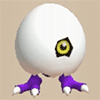</td>
    <td class="priceTableName">Running Egg</td>
    <td>700</td>
    <td>280</td>
    <td class="good">Swift</td>
    <td class="leftText">Ability: None  Attack Power becomes 1. If attacked, you will warp away.</td>
  </tr>
  <tr>
    <td></td>
    <td class="priceTableName">Flying Egg</td>
    <td>900</td>
    <td>360</td>
    <td class="good">Swift</td>
    <td rowspan="2" class="leftText">Ability: Warps you.  Attack Power becomes 1. If attacked, you will warp away.</td>
  </tr>
  <tr>
    <td></td>
    <td class="priceTableName">Hiding Egg</td>
    <td>1200</td>
    <td>480</td>
    <td class="good">Swift</td>
  </tr>
  <tr>
    <td colspan="6" class="tableDivider"></td>
  </tr>
  <tr>
    <td></td>
    <td class="priceTableName">Chow</td>
    <td>500</td>
    <td>200</td>
    <td class="good">Swift</td>
    <td class="leftText">Ability: None  Attack Power and Defense Power become 1. Monsters will target you more easily. Allows you to fly.</td>
  </tr>
  <tr>
    <td colspan="6" class="tableDivider"></td>
  </tr>
  <tr>
    <td></td>
    <td class="priceTableName">Dark Owl</td>
    <td>500</td>
    <td>200</td>
    <td class="neutral">Normal</td>
    <td class="leftText">Ability: None  While transformed, the terrain, all items, and beings on the floor are displayed on the map. Floors with low visibility are illuminated. Walking by monsters with Napping status will not wake them.</td>
  </tr>
  <tr>
    <td colspan="6" class="tableDivider"></td>
  </tr>
  <tr>
    <td></td>
    <td class="priceTableName">Crow Tengu</td>
    <td>500</td>
    <td>200</td>
    <td class="neutral">Normal</td>
    <td class="leftText">Ability: Takes on the appearance of other monsters. Imitates only a monster's appearance, not its abilities.  Allows you to fly.</td>
  </tr>
  <tr>
    <td colspan="6" class="tableDivider"></td>
  </tr>
  <tr>
    <td></td>
    <td class="priceTableName">Fluffy Bunny</td>
    <td>500</td>
    <td>200</td>
    <td class="neutral">Normal</td>
    <td class="leftText">Ability: Restores 50 HP to you and your companions up to 1 tile(s) away.</td>
  </tr>
  <tr>
    <td colspan="6" class="tableDivider"></td>
  </tr>
  <tr>
    <td></td>
    <td class="priceTableName">Fire Ninja D</td>
    <td>500</td>
    <td>200</td>
    <td class="neutral">Normal</td>
    <td class="leftText">Ability: Shoots fire. Deals 5 damage to the target ahead of you. Grass, Food, Stave, or Scroll will be burned up.</td>
  </tr>
  <tr>
    <td></td>
    <td class="priceTableName">Fire Ninja C</td>
    <td>700</td>
    <td>280</td>
    <td class="neutral">Normal</td>
    <td class="leftText">Ability: Shoots fire. Deals 10 damage to the target ahead of you. Grass, Food, Stave, or Scroll will be burned up.</td>
  </tr>
  <tr>
    <td></td>
    <td class="priceTableName">Fire Ninja B</td>
    <td>900</td>
    <td>360</td>
    <td class="neutral">Normal</td>
    <td class="leftText">Ability: Shoots fire. Deals 15 damage to the target ahead of you. Grass, Food, Stave, or Scroll will be burned up.</td>
  </tr>
  <tr>
    <td></td>
    <td class="priceTableName">Fire Ninja A</td>
    <td>1200</td>
    <td>480</td>
    <td class="neutral">Normal</td>
    <td class="leftText">Ability: Shoots fire. Deals 20 damage to the target ahead of you. Grass, Food, Stave, or Scroll will be burned up.</td>
  </tr>
  <tr>
    <td colspan="6" class="tableDivider"></td>
  </tr>
  <tr>
    <td></td>
    <td class="priceTableName">Water Ninja D</td>
    <td>500</td>
    <td>200</td>
    <td class="neutral">Normal</td>
    <td class="leftText">Ability: Shoots a water gun. Deals 5 damage up to 3 tile(s) away.  Allows you to talk on water.</td>
  </tr>
  <tr>
    <td></td>
    <td class="priceTableName">Water Ninja C</td>
    <td>700</td>
    <td>280</td>
    <td class="neutral">Normal</td>
    <td class="leftText">Ability: Shoots a water gun. Deals 10 damage up to 3 tile(s) away.  Allows you to talk on water.</td>
  </tr>
  <tr>
    <td></td>
    <td class="priceTableName">Water Ninja B</td>
    <td>900</td>
    <td>360</td>
    <td class="neutral">Normal</td>
    <td class="leftText">Ability: Shoots a water gun. Deals 15 damage up to 3 tile(s) away.  Allows you to talk on water.</td>
  </tr>
  <tr>
    <td></td>
    <td class="priceTableName">Water Ninja A</td>
    <td>1200</td>
    <td>480</td>
    <td class="neutral">Normal</td>
    <td class="leftText">Ability: Shoots a water gun. Deals 20 damage up to 3 tile(s) away.  Allows you to talk on water.</td>
  </tr>
  <tr>
    <td colspan="6" class="tableDivider"></td>
  </tr>
  <tr>
    <td></td>
    <td class="priceTableName">Tree Ninja D</td>
    <td>500</td>
    <td>200</td>
    <td class="neutral">Normal</td>
    <td class="leftText">Ability: Attacks with a log. Deals 5 damage to the target and knocks them back. This ability may hit you.  May warp you when you take damage.</td>
  </tr>
  <tr>
    <td></td>
    <td class="priceTableName">Tree Ninja C</td>
    <td>700</td>
    <td>280</td>
    <td class="neutral">Normal</td>
    <td class="leftText">Ability: Attacks with a log. Deals 10 damage to the target and knocks them back. This ability may hit you.  May warp you when you take damage.</td>
  </tr>
  <tr>
    <td></td>
    <td class="priceTableName">Tree Ninja B</td>
    <td>900</td>
    <td>360</td>
    <td class="neutral">Normal</td>
    <td class="leftText">Ability: Attacks with a log. Deals 15 damage to the target and knocks them back. This ability may hit you.  May warp you when you take damage.</td>
  </tr>
  <tr>
    <td></td>
    <td class="priceTableName">Tree Ninja A</td>
    <td>1200</td>
    <td>480</td>
    <td class="neutral">Normal</td>
    <td class="leftText">Ability: Attacks with a log. Deals 20 damage to the target and knocks them back. This ability may hit you.  May warp you when you take damage.</td>
  </tr>
  <tr>
    <td colspan="6" class="tableDivider"></td>
  </tr>
  <tr>
    <td></td>
    <td class="priceTableName">Metal Ninja D</td>
    <td>500</td>
    <td>200</td>
    <td class="neutral">Normal</td>
    <td rowspan="4" class="leftText">Ability: Throws Gitan from your funds.</td>
  </tr>
  <tr>
    <td></td>
    <td class="priceTableName">Metal Ninja C</td>
    <td>700</td>
    <td>280</td>
    <td class="neutral">Normal</td>
  </tr>
  <tr>
    <td></td>
    <td class="priceTableName">Metal Ninja B</td>
    <td>900</td>
    <td>360</td>
    <td class="neutral">Normal</td>
  </tr>
  <tr>
    <td></td>
    <td class="priceTableName">Metal Ninja A</td>
    <td>1200</td>
    <td>480</td>
    <td class="neutral">Normal</td>
  </tr>
  <tr>
    <td colspan="6" class="tableDivider"></td>
  </tr>
  <tr>
    <td></td>
    <td class="priceTableName">Earth Ninja D</td>
    <td>500</td>
    <td>200</td>
    <td class="neutral">Normal</td>
    <td class="leftText">Ability: Flings sand. Deals 5 damage to the target ahead of you and may inflict Blind status.</td>
  </tr>
  <tr>
    <td></td>
    <td class="priceTableName">Earth Ninja C</td>
    <td>700</td>
    <td>280</td>
    <td class="neutral">Normal</td>
    <td class="leftText">Ability: Flings sand. Deals 10 damage to the target ahead of you and may inflict Blind status.</td>
  </tr>
  <tr>
    <td></td>
    <td class="priceTableName">Earth Ninja B</td>
    <td>900</td>
    <td>360</td>
    <td class="neutral">Normal</td>
    <td class="leftText">Ability: Flings sand. Deals 15 damage to the target ahead of you and may inflict Blind status.</td>
  </tr>
  <tr>
    <td></td>
    <td class="priceTableName">Earth Ninja A</td>
    <td>1200</td>
    <td>480</td>
    <td class="neutral">Normal</td>
    <td class="leftText">Ability: Flings sand. Deals 20 damage to the target ahead of you and may inflict Blind status.</td>
  </tr>
  <tr>
    <td colspan="6" class="tableDivider"></td>
  </tr>
  <tr>
    <td></td>
    <td class="priceTableName">Hannya Monk D</td>
    <td>500</td>
    <td>200</td>
    <td class="neutral">Normal</td>
    <td rowspan="4" class="leftText">Ability: Plays the Berserk Note. Inflicts Monk's Berserk status on the target ahead of you. This ability may fail.  Monsters with Monk's Berserk status will not attack you.</td>
  </tr>
  <tr>
    <td></td>
    <td class="priceTableName">Hannya Monk C</td>
    <td>700</td>
    <td>280</td>
    <td class="neutral">Normal</td>
  </tr>
  <tr>
    <td></td>
    <td class="priceTableName">Hannya Monk B</td>
    <td>900</td>
    <td>360</td>
    <td class="neutral">Normal</td>
  </tr>
  <tr>
    <td></td>
    <td class="priceTableName">Hannya Monk A</td>
    <td>1200</td>
    <td>480</td>
    <td class="neutral">Normal</td>
  </tr>
  <tr>
    <td colspan="6" class="tableDivider"></td>
  </tr>
  <tr>
    <td></td>
    <td class="priceTableName">Kitsune Monk D</td>
    <td>500</td>
    <td>200</td>
    <td class="neutral">Normal</td>
    <td rowspan="4" class="leftText">Ability: Plays the Item Change Note. Morphs the target ahead of you into an item. Only the target's looks change; it is not actually an item. This ability may fail.</td>
  </tr>
  <tr>
    <td></td>
    <td class="priceTableName">Kitsune Monk C</td>
    <td>700</td>
    <td>280</td>
    <td class="neutral">Normal</td>
  </tr>
  <tr>
    <td></td>
    <td class="priceTableName">Kitsune Monk B</td>
    <td>900</td>
    <td>360</td>
    <td class="neutral">Normal</td>
  </tr>
  <tr>
    <td></td>
    <td class="priceTableName">Kitsune Monk A</td>
    <td>1200</td>
    <td>480</td>
    <td class="neutral">Normal</td>
  </tr>
  <tr>
    <td colspan="6" class="tableDivider"></td>
  </tr>
  <tr>
    <td></td>
    <td class="priceTableName">Okina Monk D</td>
    <td>500</td>
    <td>200</td>
    <td class="neutral">Normal</td>
    <td rowspan="4" class="leftText">Ability: Plays the Relocate Note. Warps the target ahead of you somewhere on the floor. This ability may fail.</td>
  </tr>
  <tr>
    <td></td>
    <td class="priceTableName">Okina Monk C</td>
    <td>700</td>
    <td>280</td>
    <td class="neutral">Normal</td>
  </tr>
  <tr>
    <td>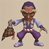</td>
    <td class="priceTableName">Okina Monk B</td>
    <td>900</td>
    <td>360</td>
    <td class="neutral">Normal</td>
  </tr>
  <tr>
    <td></td>
    <td class="priceTableName">Okina Monk A</td>
    <td>1200</td>
    <td>480</td>
    <td class="neutral">Normal</td>
  </tr>
  <tr>
    <td colspan="6" class="tableDivider"></td>
  </tr>
  <tr>
    <td></td>
    <td class="priceTableName">Okame Monk D</td>
    <td>500</td>
    <td>200</td>
    <td class="neutral">Normal</td>
    <td rowspan="4" class="leftText">Ability: Plays the Panacea Note. Heals you and companions 1 tile(s) away of any status ailments.</td>
  </tr>
  <tr>
    <td></td>
    <td class="priceTableName">Okame Monk C</td>
    <td>700</td>
    <td>280</td>
    <td class="neutral">Normal</td>
  </tr>
  <tr>
    <td></td>
    <td class="priceTableName">Okame Monk B</td>
    <td>900</td>
    <td>360</td>
    <td class="neutral">Normal</td>
  </tr>
  <tr>
    <td></td>
    <td class="priceTableName">Okame Monk A</td>
    <td>1200</td>
    <td>480</td>
    <td class="neutral">Normal</td>
  </tr>
  <tr>
    <td colspan="6" class="tableDivider"></td>
  </tr>
  <tr>
    <td></td>
    <td class="priceTableName">Tengu Monk D</td>
    <td>500</td>
    <td>200</td>
    <td class="neutral">Normal</td>
    <td rowspan="4" class="leftText">Ability: Plays the Swift Note. Increases your Action Speed and that of companions 1 tile(s) away by 1.</td>
  </tr>
  <tr>
    <td></td>
    <td class="priceTableName">Tengu Monk C</td>
    <td>700</td>
    <td>280</td>
    <td class="neutral">Normal</td>
  </tr>
  <tr>
    <td></td>
    <td class="priceTableName">Tengu Monk B</td>
    <td>900</td>
    <td>360</td>
    <td class="neutral">Normal</td>
  </tr>
  <tr>
    <td></td>
    <td class="priceTableName">Tengu Monk A</td>
    <td>1200</td>
    <td>480</td>
    <td class="neutral">Normal</td>
  </tr>
</table>
