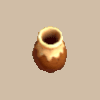

# Overview

- Pots apply an effect to inserted items.
    - Some pots already have contents, so those types must be tapped instead.
- The capacity of a generated pot is between 2~5.
    - Max capacity is 6, which can only be reached using Pot-upsize Scrolls.
- Except for Preservation Pots, inserted items can't be taken out freely.
    - Retrieve contents by throwing the pot at a wall or creature, or use an Extraction Scroll.
    - Wooden Mallet or Sturdy Hammer can also be used to break a pot and retrieve its contents.
- Contents of a pot are protected from things that normally affect inventory items.
    - Example: Scrolls inside a pot will never get wet while walking on water.

# Pot List

<table id="monsterList" class="pageLinksTable">
  <tr>
    <th colspan="7">Pots ~ Notebook Order</th>
  </tr>
  <tr>
    <th>Name</th>
    <th>Buy</th>
    <th>+1</th>
    <th>Sell</th>
    <th>+1</th>
    <th>Size</th>
    <th>Notes</th>
  </tr>
  <tr>
    <td class="priceTableName"><a href="#preservation-pot">Preservation Pot</a></td>
    <td>800</td>
    <td>100</td>
    <td>320</td>
    <td>40</td>
    <td>3~5</td>
    <td class="leftText">Insert and take out items freely. Can be labeled after being identified.</td>
  </tr>
  <tr>
    <td class="priceTableName"><a href="#identifier-pot">Identifier Pot</a></td>
    <td>800</td>
    <td>100</td>
    <td>320</td>
    <td>40</td>
    <td>3~5</td>
    <td class="leftText">Identifies inserted items (Reveals name, staff charges, etc).</td>
  </tr>
  <tr>
    <td class="priceTableName"><a href="#transmutation-pot">Transmutation Pot</a></td>
    <td>800</td>
    <td>100</td>
    <td>320</td>
    <td>40</td>
    <td>3~5</td>
    <td class="leftText">Transforms inserted items into different items.</td>
  </tr>
  <tr>
    <td class="priceTableName"><a href="#cashing-pot">Cashing Pot</a></td>
    <td>1000</td>
    <td>100</td>
    <td>400</td>
    <td>40</td>
    <td>3~5</td>
    <td class="leftText">Transforms inserted items into Gitan equal to selling price.</td>
  </tr>
  <tr>
    <td class="priceTableName"><a href="#synthesis-pot">Synthesis Pot</a></td>
    <td>6000</td>
    <td>100</td>
    <td>2400</td>
    <td>40</td>
    <td>3~4</td>
    <td class="leftText">Insert same category items to combine them into 1 item. 1st item acts as the base, and items afterward are consumed. Weapons and shields transfer their runes and upgrade value, and same name staves have their charges added together. Must be unlocked via a Side Quest.</td>
  </tr>
  <tr>
    <td class="priceTableName"><a href="#exorcism-pot">Exorcism Pot</a></td>
    <td>1600</td>
    <td>100</td>
    <td>640</td>
    <td>40</td>
    <td>2~4</td>
    <td class="leftText">Removes curses from inserted items.</td>
  </tr>
  <tr>
    <td class="priceTableName"><a href="#curse-pot">Curse Pot</a></td>
    <td>1600</td>
    <td>100</td>
    <td>640</td>
    <td>40</td>
    <td>2~4</td>
    <td class="leftText">Curses inserted items.</td>
  </tr>
  <tr>
    <td class="priceTableName"><a href="#upgrading-pot">Upgrading Pot</a></td>
    <td>10000</td>
    <td>100</td>
    <td>4000</td>
    <td>40</td>
    <td>2~3</td>
    <td class="leftText">Inserted items upgrade when advancing floors. &nbsp;&nbsp;&nbsp;Weapon / Shield → Upgrade value increases. &nbsp;&nbsp;&nbsp;Arrow / Rock / Gitan → Quantity or value increases. &nbsp;&nbsp;&nbsp;Staff → Charges increases. Chance to randomly shatter when an item upgrades.</td>
  </tr>
  <tr>
    <td class="priceTableName"><a href="#degrading-pot">Degrading Pot</a></td>
    <td>10000</td>
    <td>100</td>
    <td>4000</td>
    <td>40</td>
    <td>2~3</td>
    <td class="leftText">Inserted items degrade when advancing floors. &nbsp;&nbsp;&nbsp;Weapon / Shield → Upgrade value decreases. &nbsp;&nbsp;&nbsp;Arrow / Rock / Gitan → Quantity or value decreases. &nbsp;&nbsp;&nbsp;Staff → Charges decreases. Chance to randomly shatter when an item degrades.</td>
  </tr>
  <tr>
    <td class="priceTableName"><a href="#bottomless-pot">Bottomless Pot</a></td>
    <td>1000</td>
    <td>100</td>
    <td>400</td>
    <td>40</td>
    <td>2~4</td>
    <td class="leftText">Inserted items vanish and are lost. Pitfall Traps equal to capacity appear when it breaks. Pitfall Traps won't appear on shop carpet tiles.</td>
  </tr>
  <tr>
    <td class="priceTableName"><a href="#warehouse-pot">Warehouse Pot</a></td>
    <td>1000</td>
    <td>100</td>
    <td>400</td>
    <td>40</td>
    <td>2~5</td>
    <td class="leftText">Sends inserted items to Shukuba Beach's warehouse. If the warehouse is full, the inserted item falls underfoot.</td>
  </tr>
  <tr>
    <td class="priceTableName"><a href="#handtrapper-pot">Handtrapper Pot</a></td>
    <td>1000</td>
    <td>100</td>
    <td>400</td>
    <td>40</td>
    <td>3~5</td>
    <td class="leftText">Your hand gets stuck inside the pot when you insert an item. Weapon gets unequipped, and you can't pick up or use items. The pot can break from attacking or getting hit by enemies.</td>
  </tr>
  <tr>
    <td class="priceTableName"><a href="#unbreakable-pot">Unbreakable Pot</a></td>
    <td>1000</td>
    <td>100</td>
    <td>400</td>
    <td>40</td>
    <td>3~5</td>
    <td class="leftText">Pot that won't break even when thrown against a wall. Use an Extraction Scroll or Mallet to retrieve its contents.</td>
  </tr>
  <tr>
    <td class="priceTableName"><a href="#ordinary-pot">Ordinary Pot</a></td>
    <td>800</td>
    <td>100</td>
    <td>320</td>
    <td>40</td>
    <td>3~5</td>
    <td class="leftText">No effect.</td>
  </tr>
  <tr>
    <td class="priceTableName"><a href="#hiding-pot">Hiding Pot</a></td>
    <td>800</td>
    <td>100</td>
    <td>320</td>
    <td>40</td>
    <td>3~5</td>
    <td class="leftText">Select Put In to hide inside the pot for a while. Can be thrown at an enemy to trap them inside the pot.</td>
  </tr>
  <tr>
    <td class="priceTableName"><a href="#rejuvenation-pot">Rejuvenation Pot</a></td>
    <td>2000</td>
    <td>100</td>
    <td>800</td>
    <td>40</td>
    <td>3~5</td>
    <td class="leftText">Restores HP and strength to max when tapped. Also cures bad status conditions.</td>
  </tr>
  <tr>
    <td class="priceTableName"><a href="#walrus-pot">Walrus Pot</a></td>
    <td>2000</td>
    <td>100</td>
    <td>800</td>
    <td>40</td>
    <td>3~5</td>
    <td class="leftText">Releases a Thiefwalrus that retrieves an item. Thiefwalrus can't pick up pots, and can't cross wall or air tiles. If broken when capacity &gt; 0, confused Thiefwalruses appear.</td>
  </tr>
  <tr>
    <td class="priceTableName"><a href="#water-gun-pot">Water Gun Pot</a></td>
    <td>2000</td>
    <td>100</td>
    <td>800</td>
    <td>40</td>
    <td>3~5</td>
    <td class="leftText">Shoots water up to 3 tiles ahead, which deals 5 damage. The water affects some targets differently.</td>
  </tr>
  <tr>
    <td class="priceTableName"><a href="#hilarious-pot">Hilarious Pot</a></td>
    <td>800</td>
    <td>100</td>
    <td>320</td>
    <td>40</td>
    <td>2~3</td>
    <td class="leftText">Inflicts Laughing status on a target in front when tapped.</td>
  </tr>
  <tr>
    <td class="priceTableName"><a href="#monster-pot">Monster Pot</a></td>
    <td>2000</td>
    <td>100</td>
    <td>800</td>
    <td>40</td>
    <td>3~5</td>
    <td class="leftText">A number of monsters equal to capacity appear when tapped.</td>
  </tr>
  <tr>
    <td class="priceTableName"><a href="#surprise-pot">Surprise Pot</a></td>
    <td>2000</td>
    <td>100</td>
    <td>800</td>
    <td>40</td>
    <td>3~5</td>
    <td class="leftText">Break the pot to find out what sort of surprise awaits inside! This pot is always identified from the start.</td>
  </tr>
</table>

# Pot Details

<table class="monsterPageTable">
  <tbody>
    <tr>
      <th>
        

          
Preservation Pot

        

      </th>
    </tr>
    <tr>
      <td>
        

          

            
          

          

            

              
Size

              
3~5

              
Buy

              
800

              
Sell

              
320

            

            
Items can be freely put in and taken out. If it is identified, you can label it with any name you like.

            
Store onigiri and scrolls to prevent them from getting wet.

          

        

      </td>
    </tr>
    <tr>
      <th>
        

          
Identifier Pot

        

      </th>
    </tr>
    <tr>
      <td>
        

          

            
          

          

            

              
Size

              
3~5

              
Buy

              
800

              
Sell

              
320

            

            
Identifies a selected item, revealing things like unknown names and Stave uses.

            
Reveals the inserted item's name, charges (staff), upgrade value (weapon/shield), and cursed/blessed status.

          

        

      </td>
    </tr>
    <tr>
      <th>
        

          
Transmutation Pot

        

      </th>
    </tr>
    <tr>
      <td>
        

          

            
          

          

            

              
Size

              
3~5

              
Buy

              
800

              
Sell

              
320

            

            
Turns inserted items into different items.

            
Recommended to insert a single arrow or rock at a time. Dangerous to carry on floors where Gazers appear.

          

        

      </td>
    </tr>
    <tr>
      <th>
        

          
Cashing Pot

        

      </th>
    </tr>
    <tr>
      <td>
        

          

            
          

          

            

              
Size

              
3~5

              
Buy

              
1000

              
Sell

              
400

            

            
Turns inserted items into Gitan equal to their selling price.

            
Dangerous to carry on floors where Gazers appear.

          

        

      </td>
    </tr>
    <tr>
      <th>
        

          
Synthesis Pot

        

      </th>
    </tr>
    <tr>
      <td>
        

          

            
          

          

            

              
Size

              
3~4

              
Buy

              
6000

              
Sell

              
2400

            

            
Synthesizes inserted items, combining the Upgrade Values and Runes of Weapon or Shield, and the uses of Stave.

            
Cross-Mixing can't be done using a Synthesis Pot.

          

        

      </td>
    </tr>
    <tr>
      <th>
        

          
Exorcism Pot

        

      </th>
    </tr>
    <tr>
      <td>
        

          

            
          

          

            

              
Size

              
2~4

              
Buy

              
1600

              
Sell

              
640

            

            
Removes a Curse from inserted items.

            
Insert unidentified bracelets to make them safe to equip.

          

        

      </td>
    </tr>
    <tr>
      <th>
        

          
Curse Pot

        

      </th>
    </tr>
    <tr>
      <td>
        

          

            
          

          

            

              
Size

              
2~4

              
Buy

              
1600

              
Sell

              
640

            

            
Inflicts a Curse on inserted items.

            
Can be used to store arrows or rocks.

          

        

      </td>
    </tr>
    <tr>
      <th>
        

          
Upgrading Pot

        

      </th>
    </tr>
    <tr>
      <td>
        

          

            
          

          

            

              
Size

              
2~3

              
Buy

              
10000

              
Sell

              
4000

            

            
Grants positive effects on items inside as you travel. Increases Weapon or Shield Upgrade Value; increases Stave uses; increases Arrow, Rock, or Gitan. May shatter when activating the effect.

            
Chance to break hasn't been tested.

          

        

      </td>
    </tr>
    <tr>
      <th>
        

          
Degrading Pot

        

      </th>
    </tr>
    <tr>
      <td>
        

          

            
          

          

            

              
Size

              
2~3

              
Buy

              
10000

              
Sell

              
4000

            

            
Inflicts negative effects on items inside as you travel. Decreases Weapon or Shield Upgrade Value; decreases Stave uses; decreases Arrow, Rock, or Gitan. May shatter when activating the effect.

            
Chance to break hasn't been tested.

          

        

      </td>
    </tr>
    <tr>
      <th>
        

          
Bottomless Pot

        

      </th>
    </tr>
    <tr>
      <td>
        

          

            
          

          

            

              
Size

              
2~4

              
Buy

              
1000

              
Sell

              
400

            

            
Inserted items vanish. Breaking it forms a Pitfall Trap nearby.

            
Can be used to steal if the dungeon has descending stairs. Pitfall Traps won't appear on shop carpet tiles.

          

        

      </td>
    </tr>
    <tr>
      <th>
        

          
Warehouse Pot

        

      </th>
    </tr>
    <tr>
      <td>
        

          

            
          

          

            

              
Size

              
2~5

              
Buy

              
1000

              
Sell

              
400

            

            
Inserted items can be sent to Shukuba Beach's warehouse. Cannot be used in certain situations, so items may fall at your feet instead of going inside.

            
No additional notes.

          

        

      </td>
    </tr>
    <tr>
      <th>
        

          
Handtrapper Pot

        

      </th>
    </tr>
    <tr>
      <td>
        

          

            
          

          

            

              
Size

              
3~5

              
Buy

              
1000

              
Sell

              
400

            

            
You will not be able to remove your hand from the Pot and will be inflicted with Potted status. Weapon will miss, and items cannot be used or picked up. Attacking may cause the Handtrapper Pot to shatter.

            
No additional notes.

          

        

      </td>
    </tr>
    <tr>
      <th>
        

          
Unbreakable Pot

        

      </th>
    </tr>
    <tr>
      <td>
        

          

            
          

          

            

              
Size

              
3~5

              
Buy

              
1000

              
Sell

              
400

            

            
Does not shatter when thrown or dropped. Its contents will disappear if it is thrown at another being, so be careful! Hitting it with a Weapon that has a Trap Bust Rune will shatter it and spill its contents.

            
No additional notes.

          

        

      </td>
    </tr>
    <tr>
      <th>
        

          
Ordinary Pot

        

      </th>
    </tr>
    <tr>
      <td>
        

          

            
          

          

            

              
Size

              
3~5

              
Buy

              
800

              
Sell

              
320

            

            
Has no special effect on inserted items.

            
No additional notes.

          

        

      </td>
    </tr>
    <tr>
      <th>
        

          
Hiding Pot

        

      </th>
    </tr>
    <tr>
      <td>
        

          

            
          

          

            

              
Size

              
3~5

              
Buy

              
800

              
Sell

              
320

            

            
You enter the pot and become inflicted with Hiding status, preventing monsters from targeting you. Throwing this at a target can trap it inside.

            
No additional notes.

          

        

      </td>
    </tr>
    <tr>
      <th>
        

          
Rejuvenation Pot

        

      </th>
    </tr>
    <tr>
      <td>
        

          

            
          

          

            

              
Size

              
3~5

              
Buy

              
2000

              
Sell

              
800

            

            
Tapping fully restores HP and Strength. Also cures status ailments.

            
Can be thrown at a creature to heal them if capacity &ge; 1.

          

        

      </td>
    </tr>
    <tr>
      <th>
        

          
Walrus Pot

        

      </th>
    </tr>
    <tr>
      <td>
        

          

            
          

          

            

              
Size

              
3~5

              
Buy

              
2000

              
Sell

              
800

            

            
Tapping causes Thiefwalrus to jump out, pick up any items on the ground, and then go back inside the Pot. If there are no items to pick up, it will simply vanish.

            
The Thiefwalrus picks up 1 item and has a range of 10 tiles. Thiefwalrus can't pick up pots, and can't cross wall or air tiles. If shattered when capacity &gt; 0, confused Thiefwalruses appear. Can't be used to steal if a Guard Dog is in the shop.

          

        

      </td>
    </tr>
    <tr>
      <th>
        

          
Water Gun Pot

        

      </th>
    </tr>
    <tr>
      <td>
        

          

            
          

          

            

              
Size

              
3~5

              
Buy

              
2000

              
Sell

              
800

            

            
Tapping shoots water up to 3 tile(s) away. Deals 5 damage to the target and has a special effect on some monsters.

            
Reduces weapon or shield upgrade value by 1. An onigiri becomes rotten, a scroll becomes a Wet Scroll. Reduces attack power to 1 for monsters with weapons. Karakuroid monsters become sealed + slowed. Fierous monsters are instantly defeated, etc.

          

        

      </td>
    </tr>
    <tr>
      <th>
        

          
Hilarious Pot

        

      </th>
    </tr>
    <tr>
      <td>
        

          

            
          

          

            

              
Size

              
2~3

              
Buy

              
800

              
Sell

              
320

            

            
Tapping inflicts Laughing status on a target ahead of you. Laughter prevents the target from taking any actions.

            
No additional notes.

          

        

      </td>
    </tr>
    <tr>
      <th>
        

          
Monster Pot

        

      </th>
    </tr>
    <tr>
      <td>
        

          

            
          

          

            

              
Size

              
3~5

              
Buy

              
2000

              
Sell

              
800

            

            
Tapping causes a number of monsters relative to the Pot's capacity to emerge.

            
No additional notes.

          

        

      </td>
    </tr>
    <tr>
      <th>
        

          
Surprise Pot

        

      </th>
    </tr>
    <tr>
      <td>
        

          

            
          

          

            

              
Size

              
3~5

              
Buy

              
2000

              
Sell

              
800

            

            
A Pot full of excitement. Something surprising happens when it shatters.

            
No additional notes.

          

        

      </td>
    </tr>
  </tbody>
</table>
