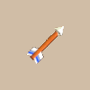
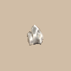

# Overview

- Projectiles are used to attack enemies from a distance.

# Projectile List

<table id="monsterList" class="pageLinksTable">
  <tr>
    <th colspan="5">Projectile ~ Notebook Order</th>
  </tr>
  <tr>
    <th>Name</th>
    <th>Buy</th>
    <th>Sell</th>
    <th>Range</th>
    <th>Notes</th>
  </tr>
  <tr>
    <td class="priceTableName"><a href="#wooden-arrow">Wooden Arrow</a></td>
    <td>10</td>
    <td>4</td>
    <td>10</td>
    <td class="leftText">Low attack power.</td>
  </tr>
  <tr>
    <td class="priceTableName"><a href="#iron-arrow">Iron Arrow</a></td>
    <td>30</td>
    <td>12</td>
    <td>10</td>
    <td class="leftText">Higher attack power.</td>
  </tr>
  <tr>
    <td class="priceTableName"><a href="#silver-arrow">Silver Arrow</a></td>
    <td>50</td>
    <td>20</td>
    <td>∞</td>
    <td class="leftText">Pierces through walls and creatures.</td>
  </tr>
  <tr>
    <td class="priceTableName"><a href="#poison-arrow">Poison Arrow</a></td>
    <td>100</td>
    <td>40</td>
    <td>10</td>
    <td class="leftText">Inflicts Weakened status, lowering the target's attack power.</td>
  </tr>
  <tr>
    <td class="priceTableName"><a href="#truestrike-arrow">Truestrike Arrow</a></td>
    <td>120</td>
    <td>48</td>
    <td>10</td>
    <td class="leftText">Guaranteed to hit the target.</td>
  </tr>
  <tr>
    <td class="priceTableName"><a href="#rock">Rock</a></td>
    <td>10</td>
    <td>4</td>
    <td>3</td>
    <td class="leftText">Arcs toward a target up to 3 tiles ahead. Deals a fixed 12 damage.</td>
  </tr>
  <tr>
    <td class="priceTableName"><a href="#porky's-rock">Porky's Rock</a></td>
    <td>50</td>
    <td>20</td>
    <td>3</td>
    <td class="leftText">Homes in on a target within 3 forward direction tiles. Deals a fixed 20 damage.</td>
  </tr>
</table>

# Projectile Details

<table class="monsterPageTable">
  <tbody>
    <tr>
      <th>
        

          
Wooden Arrow

        

      </th>
    </tr>
    <tr>
      <td>
        

          

            
          

          

            

              
Buy

              
10

              
Sell

              
4

              
Range

              
10

            

            
Flies straight ahead and deals damage to any target hit.

            
Bowboy shoots these arrows.

          

        

      </td>
    </tr>
    <tr>
      <th>
        

          
Iron Arrow

        

      </th>
    </tr>
    <tr>
      <td>
        

          

            
          

          

            

              
Buy

              
30

              
Sell

              
12

              
Range

              
10

            

            
Flies straight ahead and deals damage to any target hit. Deals even more damage than Wooden Arrow.

            
Crossbowboy and Baby Tank shoots these arrows.

          

        

      </td>
    </tr>
    <tr>
      <th>
        

          
Silver Arrow

        

      </th>
    </tr>
    <tr>
      <td>
        

          

            
          

          

            

              
Buy

              
50

              
Sell

              
20

              
Range

              
∞

            

            
Flies straight ahead and deals damage to any target hit. Flies indefinitely, passing through walls and beings.

            
Can hit Behemoth monsters from the front. Mini Tank shoots these arrows.

          

        

      </td>
    </tr>
    <tr>
      <th>
        

          
Poison Arrow

        

      </th>
    </tr>
    <tr>
      <td>
        

          

            
          

          

            

              
Buy

              
100

              
Sell

              
40

              
Range

              
10

            

            
Flies straight ahead and deals damage to any target hit. Poison decreases Strength and Attack Power.

            
Scorpion and Ghost Radish types gain attack power.

          

        

      </td>
    </tr>
    <tr>
      <th>
        

          
Truestrike Arrow

        

      </th>
    </tr>
    <tr>
      <td>
        

          

            
          

          

            

              
Buy

              
120

              
Sell

              
48

              
Range

              
10

            

            
Flies straight ahead and deals damage to any target hit. Always hits its target.

            
No additional notes.

          

        

      </td>
    </tr>
    <tr>
      <th>
        

          
Rock

        

      </th>
    </tr>
    <tr>
      <td>
        

          

            
          

          

            

              
Buy

              
10

              
Sell

              
4

              
Range

              
3

            

            
Flies in an arc and deals 12 damage to any target hit. Can fly up to 3 tile(s).

            
Can hit Behemoth monsters from the front.

          

        

      </td>
    </tr>
    <tr>
      <th>
        

          
Porky's Rock

        

      </th>
    </tr>
    <tr>
      <td>
        

          

            
          

          

            

              
Buy

              
50

              
Sell

              
20

              
Range

              
3

            

            
Flies at monsters and deals 20 damage to any target hit. Can fly up to 3 tile(s).

            
Can hit Behemoth monsters from the front.

          

        

      </td>
    </tr>
  </tbody>
</table>
