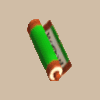

# Overview

- Read a scroll to cause an effect to occur.
    - Sanctuary Scroll should be placed on the ground instead.
    - Eradication Scroll should be thrown at a monster instead.
- Scrolls turn into Wet Scrolls when splashed by water.

# Scroll List

<table id="monsterList" class="pageLinksTable">
  <tr>
    <th colspan="4">Scrolls ~ Notebook Order</th>
  </tr>
  <tr>
    <th>Name</th>
    <th>Buy</th>
    <th>Sell</th>
    <th>Notes</th>
  </tr>
  <tr>
    <td class="priceTableName"><a href="#confusion-scroll">Confusion Scroll</a></td>
    <td>300</td>
    <td>120</td>
    <td class="leftText">Inflicts Confused status on monsters in the room.</td>
  </tr>
  <tr>
    <td class="priceTableName"><a href="#slumber-scroll">Slumber Scroll</a></td>
    <td>300</td>
    <td>120</td>
    <td class="leftText">Inflicts Sound Asleep status on monsters in the room.</td>
  </tr>
  <tr>
    <td class="priceTableName"><a href="#jitters-scroll">Jitters Scroll</a></td>
    <td>300</td>
    <td>120</td>
    <td class="leftText">Inflicts Jittery status on monsters within a 1 tile radius. Cross-Mixing: Jitter Payback (Shield)</td>
  </tr>
  <tr>
    <td class="priceTableName"><a href="#windblade-scroll">Windblade Scroll</a></td>
    <td>300</td>
    <td>120</td>
    <td class="leftText">Deals 40~50 damage to all monsters in the room.</td>
  </tr>
  <tr>
    <td class="priceTableName"><a href="#expulsion-scroll">Expulsion Scroll</a></td>
    <td>3000</td>
    <td>1200</td>
    <td class="leftText">All monsters in the room vanish (No experience points).</td>
  </tr>
  <tr>
    <td class="priceTableName"><a href="#exorcism-scroll">Exorcism Scroll</a></td>
    <td>600</td>
    <td>240</td>
    <td class="leftText">Removes a curse from the selected item. Small chance to remove curses from all items not in pots.</td>
  </tr>
  <tr>
    <td class="priceTableName"><a href="#identifier-scroll">Identifier Scroll</a></td>
    <td>300</td>
    <td>120</td>
    <td class="leftText">Identifies the selected item. Small chance to identify all items not in pots.</td>
  </tr>
  <tr>
    <td class="priceTableName"><a href="#heavenly-scroll">Heavenly Scroll</a></td>
    <td>400</td>
    <td>160</td>
    <td class="leftText">Increases the selected weapon's upgrade value by 1. Small chance to increase Upgrade Value by 3 instead. Removes a curse from the selected weapon as well.</td>
  </tr>
  <tr>
    <td class="priceTableName"><a href="#earthly-scroll">Earthly Scroll</a></td>
    <td>400</td>
    <td>160</td>
    <td class="leftText">Increases the selected shield's upgrade value by 1. Small chance to increase Upgrade Value by 3 instead. Removes a curse from the selected shield as well.</td>
  </tr>
  <tr>
    <td class="priceTableName"><a href="#plating-scroll">Plating Scroll</a></td>
    <td>400</td>
    <td>160</td>
    <td class="leftText">Adds the Rustproof rune to the selected weapon or shield. Removes a curse from the selected weapon or shield as well.</td>
  </tr>
  <tr>
    <td class="priceTableName"><a href="#slot-adding-scroll">Slot-adding Scroll</a></td>
    <td>400</td>
    <td>160</td>
    <td class="leftText">The selected weapon or shield gains 1 rune slot (max: 30). Removes a curse from the selected weapon or shield as well.</td>
  </tr>
  <tr>
    <td class="priceTableName"><a href="#rune-eraser-scroll">Rune-eraser Scroll</a></td>
    <td>400</td>
    <td>160</td>
    <td class="leftText">Erases the rune in the last slot of the selected weapon or shield.</td>
  </tr>
  <tr>
    <td class="priceTableName"><a href="#silver-seal-scroll">Silver-seal Scroll</a></td>
    <td>300</td>
    <td>120</td>
    <td class="leftText">Silver seals 1 rune slot of the selected weapon or shield.</td>
  </tr>
  <tr>
    <td class="priceTableName"><a href="#silverpurge-scroll">Silverpurge Scroll</a></td>
    <td>1000</td>
    <td>400</td>
    <td class="leftText">Erases silver seals from 2~4 rune slots of the selected item.</td>
  </tr>
  <tr>
    <td class="priceTableName"><a href="#pot-upsize-scroll">Pot-upsize Scroll</a></td>
    <td>1000</td>
    <td>400</td>
    <td class="leftText">Increases the capacity of the selected pot by 1 (max: 6).</td>
  </tr>
  <tr>
    <td class="priceTableName"><a href="#extraction-scroll">Extraction Scroll</a></td>
    <td>1000</td>
    <td>400</td>
    <td class="leftText">Extracts the contents of a pot onto the ground.</td>
  </tr>
  <tr>
    <td class="priceTableName"><a href="#onigiri-scroll">Onigiri Scroll</a></td>
    <td>400</td>
    <td>160</td>
    <td class="leftText">Transforms the selected item into a Large Onigiri. Cross-Mixing: Onigiri Payback (Shield)</td>
  </tr>
  <tr>
    <td class="priceTableName"><a href="#curse-scroll">Curse Scroll</a></td>
    <td>1000</td>
    <td>400</td>
    <td class="leftText">Curses the selected item.</td>
  </tr>
  <tr>
    <td class="priceTableName"><a href="#mapping-scroll">Mapping Scroll</a></td>
    <td>600</td>
    <td>240</td>
    <td class="leftText">Reveals the floor's layout, and illuminates dark hallways. Monster and item locations are displayed on the map.</td>
  </tr>
  <tr>
    <td class="priceTableName"><a href="#map-loss-scroll">Map-loss Scroll</a></td>
    <td>600</td>
    <td>240</td>
    <td class="leftText">The current floor's layout gets reset on the map.</td>
  </tr>
  <tr>
    <td class="priceTableName"><a href="#trap-eraser-scroll">Trap-eraser Scroll</a></td>
    <td>600</td>
    <td>240</td>
    <td class="leftText">Erases all traps on the current floor.</td>
  </tr>
  <tr>
    <td class="priceTableName"><a href="#trap-scroll">Trap Scroll</a></td>
    <td>1000</td>
    <td>400</td>
    <td class="leftText">Creates lots of new traps on the current floor.</td>
  </tr>
  <tr>
    <td class="priceTableName"><a href="#water-drain-scroll">Water-drain Scroll</a></td>
    <td>1000</td>
    <td>400</td>
    <td class="leftText">All water tiles change to ground tiles on the current floor.</td>
  </tr>
  <tr>
    <td class="priceTableName"><a href="#monstercall-scroll">Monstercall Scroll</a></td>
    <td>1000</td>
    <td>400</td>
    <td class="leftText">Turns the current room into a Monster House. Warps you to a room first if the scroll is read in a hallway.</td>
  </tr>
  <tr>
    <td class="priceTableName"><a href="#wall-less-scroll">Wall-less Scroll</a></td>
    <td>1000</td>
    <td>400</td>
    <td class="leftText">The current floor turns into a single large room.</td>
  </tr>
  <tr>
    <td class="priceTableName"><a href="#gathering-scroll">Gathering Scroll</a></td>
    <td>300</td>
    <td>120</td>
    <td class="leftText">Warps creatures on the current floor to your surroundings.</td>
  </tr>
  <tr>
    <td class="priceTableName"><a href="#collection-scroll">Collection Scroll</a></td>
    <td>300</td>
    <td>120</td>
    <td class="leftText">Warps items on the current floor to your surroundings.</td>
  </tr>
  <tr>
    <td class="priceTableName"><a href="#gambler's-scroll">Gambler's Scroll</a></td>
    <td>1000</td>
    <td>400</td>
    <td class="leftText">Either gain 10,000 Gitan, or lose all of your Gitan.</td>
  </tr>
  <tr>
    <td class="priceTableName"><a href="#muzzle-scroll">Muzzle Scroll</a></td>
    <td>1000</td>
    <td>400</td>
    <td class="leftText">Inflicts Muzzled status on the player.</td>
  </tr>
  <tr>
    <td class="priceTableName"><a href="#carry-ban-scroll">Carry-ban Scroll</a></td>
    <td>1000</td>
    <td>400</td>
    <td class="leftText">Inflicts Carry-ban status on the player.</td>
  </tr>
  <tr>
    <td class="priceTableName"><a href="#swift-foe-scroll">Swift Foe Scroll</a></td>
    <td>1000</td>
    <td>400</td>
    <td class="leftText">Increases the speed of monsters in the room by 1 stage.</td>
  </tr>
  <tr>
    <td class="priceTableName"><a href="#fixer-scroll">Fixer Scroll</a></td>
    <td>300</td>
    <td>120</td>
    <td class="leftText">Fully restores HP, and helps solve 1 of your problems.</td>
  </tr>
  <tr>
    <td class="priceTableName"><a href="#escape-scroll">Escape Scroll</a></td>
    <td>1000</td>
    <td>400</td>
    <td class="leftText">Escape from the dungeon with your items and Gitan. Clear Kiki Island → visit Small Harbor to unlock in dungeons.</td>
  </tr>
  <tr>
    <td class="priceTableName"><a href="#eradication-scroll">Eradication Scroll</a></td>
    <td>10000</td>
    <td>4000</td>
    <td class="leftText">Toss at a monster to make that family vanish from the adventure.</td>
  </tr>
  <tr>
    <td class="priceTableName"><a href="#sanctuary-scroll">Sanctuary Scroll</a></td>
    <td>1000</td>
    <td>400</td>
    <td class="leftText">No effect if read, and sticks to the ground when placed. Standing on this scroll stops monster normal attacks.</td>
  </tr>
  <tr>
    <td class="priceTableName"><a href="#blank-scroll">Blank Scroll</a></td>
    <td>1000</td>
    <td>400</td>
    <td class="leftText">Write the name of any scroll listed in your notebook. This scroll can then be used as that scroll.</td>
  </tr>
  <tr>
    <td class="priceTableName"><a href="#wet-scroll">Wet Scroll</a></td>
    <td>200</td>
    <td>80</td>
    <td class="leftText">The scroll is lost if you try to read it in this state.</td>
  </tr>
</table>

# Scroll Details

<table class="monsterPageTable">
  <tbody>
    <tr>
      <th>
        

          
Confusion Scroll

        

      </th>
    </tr>
    <tr>
      <td>
        

          

            
          

          

            

              
Buy

              
300

              
Sell

              
120

              
Rune

              
-

            

            
Reading this inflicts Confused status on every monster in the room, causing movement and attack directions to become random. When used in passageways, surrounding monsters 1 tile(s) away will be affected.

            
No additional notes.

          

        

      </td>
    </tr>
    <tr>
      <th>
        

          
Slumber Scroll

        

      </th>
    </tr>
    <tr>
      <td>
        

          

            
          

          

            

              
Buy

              
300

              
Sell

              
120

              
Rune

              
-

            

            
Reading this inflicts Sound Asleep status on every monster in the room, making them unable to act. When they wake up, their Action Speed will increase by 1. When used in passageways, surrounding monsters 1 tile(s) away will be affected.

            
No additional notes.

          

        

      </td>
    </tr>
    <tr>
      <th>
        

          
Jitters Scroll

        

      </th>
    </tr>
    <tr>
      <td>
        

          

            
          

          

            

              
Buy

              
300

              
Sell

              
120

              
Rune

              
 Jitter Payback (Shield)

            

            
Reading this inflicts Jittery status on 1 surrounding monster, causing its normal attacks to go in the opposite direction.

            
Affects all surrounding monsters in a 1 tile radius, not just 1 monster.

          

        

      </td>
    </tr>
    <tr>
      <th>
        

          
Windblade Scroll

        

      </th>
    </tr>
    <tr>
      <td>
        

          

            
          

          

            

              
Buy

              
300

              
Sell

              
120

              
Rune

              
-

            

            
Reading this creates a shockwave that deals 40-50 damage to every monster in the room. When used in passageways, surrounding monsters 1 tile(s) away will be affected.

            
No additional notes.

          

        

      </td>
    </tr>
    <tr>
      <th>
        

          
Expulsion Scroll

        

      </th>
    </tr>
    <tr>
      <td>
        

          

            
          

          

            

              
Buy

              
3000

              
Sell

              
1200

              
Rune

              
-

            

            
Reading this banishes every monster in the room. When used in passageways, surrounding monsters 1 tile(s) away will be affected.

            
Confirmed location: Isle of the Mighty - Shop 49F

          

        

      </td>
    </tr>
    <tr>
      <th>
        

          
Exorcism Scroll

        

      </th>
    </tr>
    <tr>
      <td>
        

          

            
          

          

            

              
Buy

              
600

              
Sell

              
240

              
Rune

              
-

            

            
Reading this removes the Curse from a selected item. Has a chance to remove the Curses from everything in your inventory, except for the contents of a Pot.

            
Second effect is guaranteed to occur when blessed.

          

        

      </td>
    </tr>
    <tr>
      <th>
        

          
Identifier Scroll

        

      </th>
    </tr>
    <tr>
      <td>
        

          

            
          

          

            

              
Buy

              
300

              
Sell

              
120

              
Rune

              
-

            

            
Reading this identifies a selected item, revealing things like unknown names and Stave uses. Has a chance to identify everything in your inventory, except for the contents of a Pot.

            
Second effect is guaranteed to occur when blessed.

          

        

      </td>
    </tr>
    <tr>
      <th>
        

          
Heavenly Scroll

        

      </th>
    </tr>
    <tr>
      <td>
        

          

            
          

          

            

              
Buy

              
400

              
Sell

              
160

              
Rune

              
-

            

            
Reading this increases a Weapon's Upgrade Value by 1. May increase Upgrade Value by 3. If the Weapon is Cursed, the Curse is removed.

            
Second effect is guaranteed to occur when blessed.

          

        

      </td>
    </tr>
    <tr>
      <th>
        

          
Earthly Scroll

        

      </th>
    </tr>
    <tr>
      <td>
        

          

            
          

          

            

              
Buy

              
400

              
Sell

              
160

              
Rune

              
-

            

            
Reading this increases a Shield's Upgrade Value by 1. May increase Upgrade Value by 3. If the Shield is Cursed, the Curse is removed.

            
Second effect is guaranteed to occur when blessed.

          

        

      </td>
    </tr>
    <tr>
      <th>
        

          
Plating Scroll

        

      </th>
    </tr>
    <tr>
      <td>
        

          

            
          

          

            

              
Buy

              
400

              
Sell

              
160

              
Rune

              
-

            

            
Reading this Plates a Weapon or Shield, preventing its Upgrade Value from being decreased by things like Rust Trap. Slightly increases the accuracy of the Plated Weapon. If the Weapon or Shield is Cursed, the Curse is removed.

            
Normal attack accuracy increases from 92% → 94%. Same rune as synthesizing Golden Sword or Golden Shield.

          

        

      </td>
    </tr>
    <tr>
      <th>
        

          
Slot-adding Scroll

        

      </th>
    </tr>
    <tr>
      <td>
        

          

            
          

          

            

              
Buy

              
400

              
Sell

              
160

              
Rune

              
-

            

            
Reading this increases a Weapon or Shield's number of empty Rune slots by 1. If the Weapon or Shield is Cursed, the Curse is removed.

            
Maximum number of Rune slots is 30.

          

        

      </td>
    </tr>
    <tr>
      <th>
        

          
Rune-eraser Scroll

        

      </th>
    </tr>
    <tr>
      <td>
        

          

            
          

          

            

              
Buy

              
400

              
Sell

              
160

              
Rune

              
-

            

            
Reading this removes the last Rune on a Weapon or Shield.

            
Traveling Blacksmith in Shukuba Beach can also remove Runes.

          

        

      </td>
    </tr>
    <tr>
      <th>
        

          
Silver-seal Scroll

        

      </th>
    </tr>
    <tr>
      <td>
        

          

            
          

          

            

              
Buy

              
300

              
Sell

              
120

              
Rune

              
-

            

            
Reading this places a silver-seal onto 1 Rune of a Weapon or Shield. Silver-sealed Runes cannot be activated.

            
No additional notes.

          

        

      </td>
    </tr>
    <tr>
      <th>
        

          
Silverpurge Scroll

        

      </th>
    </tr>
    <tr>
      <td>
        

          

            
          

          

            

              
Buy

              
1000

              
Sell

              
400

              
Rune

              
-

            

            
Reading this removes 2-4 silver-seals from Runes on a Weapon or Shield.

            
Traveling Blacksmith in Shukuba Beach can also remove silver.

          

        

      </td>
    </tr>
    <tr>
      <th>
        

          
Pot-upsize Scroll

        

      </th>
    </tr>
    <tr>
      <td>
        

          

            
          

          

            

              
Buy

              
1000

              
Sell

              
400

              
Rune

              
-

            

            
Reading this increases a selected Pot's capacity by 1.

            
Maximum capacity for a pot is 6.

          

        

      </td>
    </tr>
    <tr>
      <th>
        

          
Extraction Scroll

        

      </th>
    </tr>
    <tr>
      <td>
        

          

            
          

          

            

              
Buy

              
1000

              
Sell

              
400

              
Rune

              
-

            

            
Reading this extracts the contents of a selected Pot, spilling its contents onto the ground. Can be used to extract the contents of any Pot except a Preservation Pot.

            
No additional notes.

          

        

      </td>
    </tr>
    <tr>
      <th>
        

          
Onigiri Scroll

        

      </th>
    </tr>
    <tr>
      <td>
        

          

            
          

          

            

              
Buy

              
400

              
Sell

              
160

              
Rune

              
 Onigiri Payback (Shield)

            

            
Reading this turns a selected item into Large Onigiri.

            
Never read unidentified selection-based scrolls on main equipment until this scroll has been identified.

          

        

      </td>
    </tr>
    <tr>
      <th>
        

          
Curse Scroll

        

      </th>
    </tr>
    <tr>
      <td>
        

          

            
          

          

            

              
Buy

              
1000

              
Sell

              
400

              
Rune

              
-

            

            
Reading this Curses a selected item.

            
No additional notes.

          

        

      </td>
    </tr>
    <tr>
      <th>
        

          
Mapping Scroll

        

      </th>
    </tr>
    <tr>
      <td>
        

          

            
          

          

            

              
Buy

              
600

              
Sell

              
240

              
Rune

              
-

            

            
Reading this displays the terrain, all items and beings on the map. Floors with low visibility are illuminated.

            
Reading this does not make a Behemoth Gate vanish.

          

        

      </td>
    </tr>
    <tr>
      <th>
        

          
Map-loss Scroll

        

      </th>
    </tr>
    <tr>
      <td>
        

          

            
          

          

            

              
Buy

              
600

              
Sell

              
240

              
Rune

              
-

            

            
Reading this returns the map to its original state, leaving you unable to discern the floor's terrain.

            
No additional notes.

          

        

      </td>
    </tr>
    <tr>
      <th>
        

          
Trap-eraser Scroll

        

      </th>
    </tr>
    <tr>
      <td>
        

          

            
          

          

            

              
Buy

              
600

              
Sell

              
240

              
Rune

              
-

            

            
Reading this makes all Traps on the floor vanish.

            
No additional notes.

          

        

      </td>
    </tr>
    <tr>
      <th>
        

          
Trap Scroll

        

      </th>
    </tr>
    <tr>
      <td>
        

          

            
          

          

            

              
Buy

              
1000

              
Sell

              
400

              
Rune

              
-

            

            
Reading this places Traps throughout the floor.

            
No additional notes.

          

        

      </td>
    </tr>
    <tr>
      <th>
        

          
Water-drain Scroll

        

      </th>
    </tr>
    <tr>
      <td>
        

          

            
          

          

            

              
Buy

              
1000

              
Sell

              
400

              
Rune

              
-

            

            
Reading this dries up all water on the floor, leaving ground you can walk across.

            
No additional notes.

          

        

      </td>
    </tr>
    <tr>
      <th>
        

          
Monstercall Scroll

        

      </th>
    </tr>
    <tr>
      <td>
        

          

            
          

          

            

              
Buy

              
1000

              
Sell

              
400

              
Rune

              
-

            

            
Reading this changes the room into a Monster House.

            
If read on a floor that already has a Monster House, the next floor becomes a single large room Monster House. Warps you to a room first if read in a hallway.

          

        

      </td>
    </tr>
    <tr>
      <th>
        

          
Wall-less Scroll

        

      </th>
    </tr>
    <tr>
      <td>
        

          

            
          

          

            

              
Buy

              
1000

              
Sell

              
400

              
Rune

              
-

            

            
Reading this makes the dungeon walls fall, creating one big room.

            
No additional notes.

          

        

      </td>
    </tr>
    <tr>
      <th>
        

          
Gathering Scroll

        

      </th>
    </tr>
    <tr>
      <td>
        

          

            
          

          

            

              
Buy

              
300

              
Sell

              
120

              
Rune

              
-

            

            
Reading this pulls any beings on the floor toward you.

            
No additional notes.

          

        

      </td>
    </tr>
    <tr>
      <th>
        

          
Collection Scroll

        

      </th>
    </tr>
    <tr>
      <td>
        

          

            
          

          

            

              
Buy

              
300

              
Sell

              
120

              
Rune

              
-

            

            
Reading this pulls any items on the floor toward you.

            
Cannot be used to steal merchandise in a dungeon shop.

          

        

      </td>
    </tr>
    <tr>
      <th>
        

          
Gambler's Scroll

        

      </th>
    </tr>
    <tr>
      <td>
        

          

            
          

          

            

              
Buy

              
1000

              
Sell

              
400

              
Rune

              
-

            

            
Reading this either gives you 10000 Gitan or rids you of all your money.

            
No additional notes.

          

        

      </td>
    </tr>
    <tr>
      <th>
        

          
Muzzle Scroll

        

      </th>
    </tr>
    <tr>
      <td>
        

          

            
          

          

            

              
Buy

              
1000

              
Sell

              
400

              
Rune

              
-

            

            
Reading this inflicts you with Muzzled status, leaving you unable to perform actions that require your mouth, like using Grass or reading Scrolls.

            
No additional notes.

          

        

      </td>
    </tr>
    <tr>
      <th>
        

          
Carry-ban Scroll

        

      </th>
    </tr>
    <tr>
      <td>
        

          

            
          

          

            

              
Buy

              
1000

              
Sell

              
400

              
Rune

              
-

            

            
Reading this inflicts you with Carry-ban status, leaving you unable to pick up items from the ground.

            
Can still use items underfoot, you just can't pick them up.

          

        

      </td>
    </tr>
    <tr>
      <th>
        

          
Swift Foe Scroll

        

      </th>
    </tr>
    <tr>
      <td>
        

          

            
          

          

            

              
Buy

              
1000

              
Sell

              
400

              
Rune

              
-

            

            
Reading this increases the Action Speed of every monster in the room by 1. When used in passageways, surrounding monsters 1 tile(s) away will be affected.

            
Speed stages: Slow → Normal → Swift 1 → Swift 2.

          

        

      </td>
    </tr>
    <tr>
      <th>
        

          
Fixer Scroll

        

      </th>
    </tr>
    <tr>
      <td>
        

          

            
          

          

            

              
Buy

              
300

              
Sell

              
120

              
Rune

              
-

            

            
Reading this fully restores HP. Also removes one negative effect, like being surrounded by monsters, being hungry, having Cursed equipment, or being inflicted with a status ailment.

            
Possible secondary effects: 1. Surrounded by 2 or more enemies → Paralyzes adjacent enemies. 2. Fullness is currently &le; 20 → Restores Fullness to max. 3. Equipped weapon/shield/bracelet is cursed → Curse is removed. 4. Shiren has a bad status condition → Cures the bad status. 5. Currently have 0 Gitan → Gain 3000~4999 Gitan. 6. Strength is currently &le; 4 → Restores strength to max.

          

        

      </td>
    </tr>
    <tr>
      <th>
        

          
Escape Scroll

        

      </th>
    </tr>
    <tr>
      <td>
        

          

            
          

          

            

              
Buy

              
1000

              
Sell

              
400

              
Rune

              
-

            

            
Reading this allows you to escape the dungeon and safely return to Shukuba Beach. You can take your items and Gitan with you.

            
Unlocked by clearing Kiki Island → Event at Small Harbor. Cannot be used to escape during Thief Mode.

          

        

      </td>
    </tr>
    <tr>
      <th>
        

          
Eradication Scroll

        

      </th>
    </tr>
    <tr>
      <td>
        

          

            
          

          

            

              
Buy

              
10000

              
Sell

              
4000

              
Rune

              
-

            

            
Throwing this at a monster banishes it and all others of its family from the dungeon until you reach the exit. Throwing this at another monster will cause the previously banished monsters to reappear. Reading this has no special effect.

            
Commonly found in Domain of Staves and Scrolls.

          

        

      </td>
    </tr>
    <tr>
      <th>
        

          
Sanctuary Scroll

        

      </th>
    </tr>
    <tr>
      <td>
        

          

            
          

          

            

              
Buy

              
1000

              
Sell

              
400

              
Rune

              
-

            

            
Placing this on the ground turns that spot into a sanctuary. Monsters are prohibited from entering and will stop using normal attacks or certain abilities. Making a new sanctuary will remove the old one. Reading this has no special effect.

            
Shopkeepers, Guard Dogs, and Sheriffs ignore this scroll. Cannot be used during boss fights.

          

        

      </td>
    </tr>
    <tr>
      <th>
        

          
Blank Scroll

        

      </th>
    </tr>
    <tr>
      <td>
        

          

            
          

          

            

              
Buy

              
1000

              
Sell

              
400

              
Rune

              
-

            

            
Writing the name of a Scroll you've obtained before on this turns it into that kind of Scroll. Reading this before you've named it has no special effect.

            
No additional notes.

          

        

      </td>
    </tr>
    <tr>
      <th>
        

          
Wet Scroll

        

      </th>
    </tr>
    <tr>
      <td>
        

          

            
          

          

            

              
Buy

              
200

              
Sell

              
80

              
Rune

              
-

            

            
A Scroll that got wet. It will fall apart if you read it now, but it will dry as you progress through the floor.

            
The scroll becomes dry when you advance to the next floor.

          

        

      </td>
    </tr>
  </tbody>
</table>
