# Overview

- Shields reduce the amount of damage you receive from enemy attacks.
- Some shields have innate special abilities, which can be synthesized into other shields as runes.
    - Multiple copies of the same rune cannot be synthesized in Shiren 6.

# Shield List

<table id="monsterList" class="equipmentTable">
  <tr>
    <th colspan="7">Shields ~ Notebook Order</th>
  </tr>
  <tr>
    <th>Name</th>
    <th>Def</th>
    <th>Slot</th>
    <th>Rune</th>
    <th>Buy</th>
    <th>Sell</th>
    <th>Notes</th>
  </tr>
  <tr>
    <td class="priceTableName"><a href="#wooden-shield">Wooden Shield</a></td>
    <td>3</td>
    <td>7</td>
    <td>-</td>
    <td>500</td>
    <td>200</td>
    <td>Resonance: Wooden Sword</td>
  </tr>
  <tr>
    <td class="priceTableName"><a href="#bronze-shield">Bronze Shield</a></td>
    <td>4</td>
    <td>6</td>
    <td>-</td>
    <td>800</td>
    <td>320</td>
    <td>Resonance: Bronze Sword</td>
  </tr>
  <tr>
    <td class="priceTableName"><a href="#iron-shield">Iron Shield</a></td>
    <td>6</td>
    <td>5</td>
    <td>-</td>
    <td>1200</td>
    <td>480</td>
    <td>Resonance: Katana</td>
  </tr>
  <tr>
    <td class="priceTableName"><a href="#wolfshead">Wolfshead</a></td>
    <td>8</td>
    <td>4</td>
    <td>-</td>
    <td>1500</td>
    <td>600</td>
    <td>Resonance: Doutanuki</td>
  </tr>
  <tr>
    <td class="priceTableName"><a href="#fuuma-shield">Fuuma Shield</a></td>
    <td>13</td>
    <td>3</td>
    <td>-</td>
    <td>6000</td>
    <td>2400</td>
    <td>Resonance: Manji Kabura / Kajin Fuuma / Kabura Sutegi</td>
  </tr>
  <tr>
    <td class="priceTableName"><a href="#rasen-fuuma">Rasen Fuuma</a></td>
    <td>30</td>
    <td>15</td>
    <td>-</td>
    <td>15000</td>
    <td>6000</td>
    <td>How to obtain: Upgrade Fuuma Shield+99 (Shukuba Beach). Resonance: Manji Kabura / Kajin Fuuma / Kabura Sutegi</td>
  </tr>
  <tr>
    <td class="priceTableName"><a href="#golden-shield">Golden Shield</a></td>
    <td>4</td>
    <td>10</td>
    <td></td>
    <td>2500</td>
    <td>1000</td>
    <td>Upgrade value won't decrease from rust. Resonance: Golden Sword</td>
  </tr>
  <tr>
    <td class="priceTableName"><a href="#counter-shield">Counter Shield</a></td>
    <td>2</td>
    <td>6</td>
    <td></td>
    <td>2200</td>
    <td>880</td>
    <td>Reflects 50% damage taken back at attacker.</td>
  </tr>
  <tr>
    <td class="priceTableName"><a href="#watchful-shield">Watchful Shield</a></td>
    <td>1</td>
    <td>5</td>
    <td></td>
    <td>4000</td>
    <td>1600</td>
    <td>22% chance to dodge normal attacks. Resonance: Cyclops Bane</td>
  </tr>
  <tr>
    <td class="priceTableName"><a href="#dragon-shield">Dragon Shield</a></td>
    <td>7</td>
    <td>5</td>
    <td></td>
    <td>3000</td>
    <td>1200</td>
    <td>Reduces normal attack and fire damage from Dragon type monsters by 50%. Resonance: Dragonkiller</td>
  </tr>
  <tr>
    <td class="priceTableName"><a href="#blast-shield">Blast Shield</a></td>
    <td>6</td>
    <td>4</td>
    <td></td>
    <td>3300</td>
    <td>1320</td>
    <td>Reduces damage from explosions by 50%. Resonance: Crescent Blade</td>
  </tr>
  <tr>
    <td class="priceTableName"><a href="#targe-of-the-minotaur">Targe of the Minotaur</a></td>
    <td>7</td>
    <td>5</td>
    <td></td>
    <td>2500</td>
    <td>1000</td>
    <td>Reduces damage from critical hits by 55%. Resonance: Axe of the Minotaur</td>
  </tr>
  <tr>
    <td class="priceTableName"><a href="#walrus-stopper">Walrus Stopper</a></td>
    <td>4</td>
    <td>5</td>
    <td></td>
    <td>2600</td>
    <td>1040</td>
    <td>Thiefwalrus can't steal your items.</td>
  </tr>
  <tr>
    <td class="priceTableName"><a href="#froggo-stopper">Froggo Stopper</a></td>
    <td>5</td>
    <td>6</td>
    <td></td>
    <td>2700</td>
    <td>1080</td>
    <td>Froggo can't steal your Gitan.</td>
  </tr>
  <tr>
    <td class="priceTableName"><a href="#hat-stopper">Hat Stopper</a></td>
    <td>6</td>
    <td>3</td>
    <td></td>
    <td>2800</td>
    <td>1120</td>
    <td>Hat Urchin can't steal your items.</td>
  </tr>
  <tr>
    <td class="priceTableName"><a href="#nigiri-stopper">Nigiri Stopper</a></td>
    <td>3</td>
    <td>5</td>
    <td></td>
    <td>3600</td>
    <td>1440</td>
    <td>Nigiri Morph can't turn your items into onigiri. Protects against Onigiri status.</td>
  </tr>
  <tr>
    <td class="priceTableName"><a href="#spearscale-shield">Spearscale Shield</a></td>
    <td>5</td>
    <td>6</td>
    <td></td>
    <td>2000</td>
    <td>800</td>
    <td>Your items won't get wet. Resonance: Watersplitter</td>
  </tr>
  <tr>
    <td class="priceTableName"><a href="#kappa's-dish">Kappa's Dish</a></td>
    <td>4</td>
    <td>7</td>
    <td></td>
    <td>5000</td>
    <td>2000</td>
    <td>45% chance to dodge projectiles.</td>
  </tr>
  <tr>
    <td class="priceTableName"><a href="#gazer-shield">Gazer Shield</a></td>
    <td>3</td>
    <td>5</td>
    <td></td>
    <td>4000</td>
    <td>1600</td>
    <td>Protects against Gazer's hypnosis.</td>
  </tr>
  <tr>
    <td class="priceTableName"><a href="#shield-of-negation">Shield of Negation</a></td>
    <td>2</td>
    <td>3</td>
    <td></td>
    <td>7500</td>
    <td>3000</td>
    <td>Protects against Skull Mage's staff magic.</td>
  </tr>
  <tr>
    <td class="priceTableName"><a href="#unmoving-wall">Unmoving Wall</a></td>
    <td>6</td>
    <td>5</td>
    <td></td>
    <td>2500</td>
    <td>1000</td>
    <td>Stops you from being moved by other things.</td>
  </tr>
  <tr>
    <td class="priceTableName"><a href="#zabuton">Zabuton</a></td>
    <td>7</td>
    <td>5</td>
    <td></td>
    <td>3000</td>
    <td>1200</td>
    <td>Prevents damage when colliding or tripping. Resonance: Whopping Harisen</td>
  </tr>
  <tr>
    <td class="priceTableName"><a href="#spender's-shield">Spender's Shield</a></td>
    <td>8</td>
    <td>4</td>
    <td></td>
    <td>6000</td>
    <td>2400</td>
    <td>Reduces normal attack damage by 30%. Spend 100 Gitan per hit received. Resonance: Spender's Club</td>
  </tr>
  <tr>
    <td class="priceTableName"><a href="#ferrous-kite">Ferrous Kite</a></td>
    <td>8</td>
    <td>4</td>
    <td></td>
    <td>4400</td>
    <td>1760</td>
    <td>Reduces normal attack damage by 30%. Spend 2 Fullness per hit received. Resonance: Ferrous Greatsword</td>
  </tr>
  <tr>
    <td class="priceTableName"><a href="#steak-plate">Steak Plate</a></td>
    <td>7</td>
    <td>5</td>
    <td></td>
    <td>4500</td>
    <td>1800</td>
    <td>Reduces normal attack damage by 30%. Must have Starving status to activate. Resonance: Steak Knife</td>
  </tr>
  <tr>
    <td class="priceTableName"><a href="#gutsy-shield">Gutsy Shield</a></td>
    <td>9</td>
    <td>4</td>
    <td></td>
    <td>4600</td>
    <td>1840</td>
    <td>32% chance to endure a fatal hit with 1 HP. Never activates when current HP is 1.</td>
  </tr>
  <tr>
    <td class="priceTableName"><a href="#hunky-dory-shield">Hunky-dory Shield</a></td>
    <td>5</td>
    <td>3</td>
    <td></td>
    <td>5000</td>
    <td>2000</td>
    <td>Reduces damage by 50% when HP is full.</td>
  </tr>
  <tr>
    <td class="priceTableName"><a href="#bodhi-shield">Bodhi Shield</a></td>
    <td>3</td>
    <td>6</td>
    <td></td>
    <td>10000</td>
    <td>4000</td>
    <td>Stops natural Fullness depletion. Max Fullness set to 1.</td>
  </tr>
  <tr>
    <td class="priceTableName"><a href="#shield-of-sating">Shield of Sating</a></td>
    <td>2</td>
    <td>5</td>
    <td></td>
    <td>2000</td>
    <td>800</td>
    <td>Halves hunger rate (1 Fullness / 20 turns). Resonance: Bonito Block</td>
  </tr>
  <tr>
    <td class="priceTableName"><a href="#auspicious-omamori">Auspicious Omamori</a></td>
    <td>7</td>
    <td>7</td>
    <td></td>
    <td>5500</td>
    <td>2200</td>
    <td>Reduces normal attack damage by 30%. Last digit of HP must be 7 to activate. Resonance: Auspicious Kumade</td>
  </tr>
  <tr>
    <td class="priceTableName"><a href="#shield-of-presage">Shield of Presage</a></td>
    <td>5</td>
    <td>5</td>
    <td></td>
    <td>7000</td>
    <td>2800</td>
    <td>Chime plays if a Wishing Shrine is present. Buried items glow brightly.</td>
  </tr>
  <tr>
    <td class="priceTableName"><a href="#yamanba's-potlid">Yamanba's Potlid</a></td>
    <td>10</td>
    <td>7</td>
    <td></td>
    <td>4100</td>
    <td>1640</td>
    <td>Strength +1 if a cursed one is equipped. Resonance: Yamanba's Cleaver</td>
  </tr>
  <tr>
    <td class="priceTableName"><a href="#break-off-shield">Break-Off Shield</a></td>
    <td>30</td>
    <td>10</td>
    <td></td>
    <td>3400</td>
    <td>1360</td>
    <td>Upgrade value -1 per hit received. Resonance: Break-Off Blade</td>
  </tr>
</table>

# Shield Details

<table class="monsterPageTable">
  <tbody>
    <tr>
      <th>
        

          
Wooden Shield

        

      </th>
    </tr>
    <tr>
      <td>
        

          

            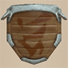
          

          

            

              
Def

              
3

              
Slot

              
7

              
Buy

              
500

              
Sell

              
200

              
Rune

              
-

            

            
A shield made of tough planks joined together. It's easy for beginners to wield. Resonance Effect (Wooden Shield): Increases Weapon and Shield strength by 3.

            
No additional notes.

          

        

      </td>
    </tr>
    <tr>
      <th>
        

          
Bronze Shield

        

      </th>
    </tr>
    <tr>
      <td>
        

          

            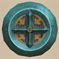
          

          

            

              
Def

              
4

              
Slot

              
6

              
Buy

              
800

              
Sell

              
320

              
Rune

              
-

            

            
A bronze shield that is easy to obtain and used by many. Resonance Effect (Bronze Sword): Increases Weapon and Shield strength by 3.

            
No additional notes.

          

        

      </td>
    </tr>
    <tr>
      <th>
        

          
Iron Shield

        

      </th>
    </tr>
    <tr>
      <td>
        

          

            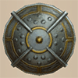
          

          

            

              
Def

              
6

              
Slot

              
5

              
Buy

              
1200

              
Sell

              
480

              
Rune

              
-

            

            
A sturdy, reliable shield cherished by wanderers everywhere. Resonance Effect (Katana): Increases Weapon and Shield strength by 3.

            
No additional notes.

          

        

      </td>
    </tr>
    <tr>
      <th>
        

          
Wolfshead

        

      </th>
    </tr>
    <tr>
      <td>
        

          

            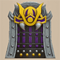
          

          

            

              
Def

              
8

              
Slot

              
4

              
Buy

              
1500

              
Sell

              
600

              
Rune

              
-

            

            
A shield forged by Dotanuki Genma. Officially named "Sword Breaker", but many call it "Wolfshead." Resonance Effect (Doutanuki): Increases Weapon and Shield strength by 3.

            
No additional notes.

          

        

      </td>
    </tr>
    <tr>
      <th>
        

          
Fuuma Shield

        

      </th>
    </tr>
    <tr>
      <td>
        

          

            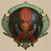
          

          

            

              
Def

              
13

              
Slot

              
3

              
Buy

              
6000

              
Sell

              
2400

              
Rune

              
-

            

            
An extraodrinarily tough shield made of a special metal called Fuuma. Resonance Effect (Manji Kabura, Kajin Fuuma, Kabura Sutegi): Increases damage dealt by normal attacks by 5.

            
No additional notes.

          

        

      </td>
    </tr>
    <tr>
      <th>
        

          
Rasen Fuuma

        

      </th>
    </tr>
    <tr>
      <td>
        

          

            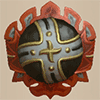
          

          

            

              
Def

              
30

              
Slot

              
15

              
Buy

              
15000

              
Sell

              
6000

              
Rune

              
-

            

            
A miraculous shield thought to only be a legend. The spiral shape enhances the strength of the Fuuma. Resonance Effect (Manji Kabura, Kajin Fuuma, Kabura Sutegi): Increases damage dealt by normal attacks by 10.

            
Upgrade a Fuuma Shield+99 in Shukuba Beach (post-game).

          

        

      </td>
    </tr>
    <tr>
      <th>
        

          
Golden Shield

        

      </th>
    </tr>
    <tr>
      <td>
        

          

            
          

          

            

              
Def

              
4

              
Slot

              
10

              
Buy

              
2500

              
Sell

              
1000

              
Rune

              
 Rustproof

            

            
A gold shield that does not rust. Things like Rust Trap will not cause Upgrade Value to decrease. Resonance Effect (Golden Sword): Monsters defeated with normal attacks are more likely to drop Gitan.

            
Resonance effect's chance seems to be roughly 24%.

          

        

      </td>
    </tr>
    <tr>
      <th>
        

          
Counter Shield

        

      </th>
    </tr>
    <tr>
      <td>
        

          

            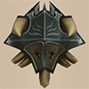
          

          

            

              
Def

              
2

              
Slot

              
6

              
Buy

              
2200

              
Sell

              
880

              
Rune

              
 Retribution

            

            
Reflects some of the damage taken from normal attacks back at the attacker.

            
Reflects 50% of damage received back at attacker.

          

        

      </td>
    </tr>
    <tr>
      <th>
        

          
Watchful Shield

        

      </th>
    </tr>
    <tr>
      <td>
        

          

            
          

          

            

              
Def

              
1

              
Slot

              
5

              
Buy

              
4000

              
Sell

              
1600

              
Rune

              
 Keen

            

            
Makes normal attacks easier to dodge. Resonance Effect (Cyclops Bane): Increases Anti-Cyclops Rune effects.

            
Grants a roughly 22% chance to dodge normal attacks. Resonance boosts Anti-Cyclops's damage multiplier (x1.5 → x2.5).

          

        

      </td>
    </tr>
    <tr>
      <th>
        

          
Dragon Shield

        

      </th>
    </tr>
    <tr>
      <td>
        

          

            
          

          

            

              
Def

              
7

              
Slot

              
5

              
Buy

              
3000

              
Sell

              
1200

              
Rune

              
 Anti-Dragon

            

            
A shield made from dragon scales. Reduces damage taken from Dragon monsters and fire attacks. Resonance Effect (Dragonkiller): Increases Anti-Dragon Rune effects.

            
Reduces normal attack and fire damage from Dragon types by 50%. Resonance boosts Anti-Dragon's damage multiplier (x1.5 → x2.5).

          

        

      </td>
    </tr>
    <tr>
      <th>
        

          
Blast Shield

        

      </th>
    </tr>
    <tr>
      <td>
        

          

            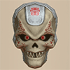
          

          

            

              
Def

              
6

              
Slot

              
4

              
Buy

              
3300

              
Sell

              
1320

              
Rune

              
 Anti-Blast

            

            
This skull mask is said to resist the force of explosive blasts. Reduces damage taken from Pop Tank family shells and explosions from things like Trap. Resonance Effect (Crescent Blade): Increases Anti-Exploding Rune effects.

            
Reduces damage from explosions by 50%. Resonance boosts Anti-Exploding's damage multiplier (x1.5 → x2.5).

          

        

      </td>
    </tr>
    <tr>
      <th>
        

          
Targe of the Minotaur

        

      </th>
    </tr>
    <tr>
      <td>
        

          

            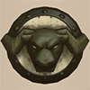
          

          

            

              
Def

              
7

              
Slot

              
5

              
Buy

              
2500

              
Sell

              
1000

              
Rune

              
 Critproof

            

            
Notable for its piercing Minotaur decoration. Massively reduces extra damage taken from Critical Hits. Resonance Effect (Axe of the Minotaur): Makes Critical Hits occur more often.

            
Reduces damage from monster critical hits by 55%. Resonance boosts critical hit rates: &nbsp;&nbsp;&nbsp;Player: 30% → 40% chance, Monster: 33% chance.

          

        

      </td>
    </tr>
    <tr>
      <th>
        

          
Walrus Stopper

        

      </th>
    </tr>
    <tr>
      <td>
        

          

            
          

          

            

              
Def

              
4

              
Slot

              
5

              
Buy

              
2600

              
Sell

              
1040

              
Rune

              
 Walrusproof

            

            
Prevents items from being stolen by the Thiefwalrus family.

            
No additional notes.

          

        

      </td>
    </tr>
    <tr>
      <th>
        

          
Froggo Stopper

        

      </th>
    </tr>
    <tr>
      <td>
        

          

            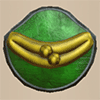
          

          

            

              
Def

              
5

              
Slot

              
6

              
Buy

              
2700

              
Sell

              
1080

              
Rune

              
 Froggoproof

            

            
Prevents Gitan from being stolen by the Froggo family.

            
No additional notes.

          

        

      </td>
    </tr>
    <tr>
      <th>
        

          
Hat Stopper

        

      </th>
    </tr>
    <tr>
      <td>
        

          

            
          

          

            

              
Def

              
6

              
Slot

              
3

              
Buy

              
2800

              
Sell

              
1120

              
Rune

              
 Hatproof

            

            
Prevents items from being stolen by the Hat Urchin family.

            
No additional notes.

          

        

      </td>
    </tr>
    <tr>
      <th>
        

          
Nigiri Stopper

        

      </th>
    </tr>
    <tr>
      <td>
        

          

            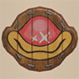
          

          

            

              
Def

              
3

              
Slot

              
5

              
Buy

              
3600

              
Sell

              
1440

              
Rune

              
 Nigiriproof

            

            
Prevents items from being turned into Large Onigiri by the Nigiri Morph family. You can no longer be inflicted with Onigiri status.

            
No additional notes.

          

        

      </td>
    </tr>
    <tr>
      <th>
        

          
Spearscale Shield

        

      </th>
    </tr>
    <tr>
      <td>
        

          

            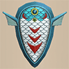
          

          

            

              
Def

              
5

              
Slot

              
6

              
Buy

              
2000

              
Sell

              
800

              
Rune

              
 Waterproof

            

            
A shield made from Spearfish scales. Prevents your inventory from getting wet. Resonance Effect (Watersplitter): Increases Anti-Aquatic Rune effects.

            
Resonance boosts Anti-Aquatic's damage multiplier (x1.5 → x2.5).

          

        

      </td>
    </tr>
    <tr>
      <th>
        

          
Kappa's Dish

        

      </th>
    </tr>
    <tr>
      <td>
        

          

            
          

          

            

              
Def

              
4

              
Slot

              
7

              
Buy

              
5000

              
Sell

              
2000

              
Rune

              
 Projectileproof

            

            
A shield inspired by a Bored Kappa with poor aim. Increases the chance that Arrows and other items launched at you will miss.

            
Chance to dodge projectiles seems to be roughly 45%.

          

        

      </td>
    </tr>
    <tr>
      <th>
        

          
Gazer Shield

        

      </th>
    </tr>
    <tr>
      <td>
        

          

            
          

          

            

              
Def

              
3

              
Slot

              
5

              
Buy

              
4000

              
Sell

              
1600

              
Rune

              
 Hypnosisproof

            

            
Prevents the Gazer family from inflicting Hypnotized status on you.

            
No additional notes.

          

        

      </td>
    </tr>
    <tr>
      <th>
        

          
Shield of Negation

        

      </th>
    </tr>
    <tr>
      <td>
        

          

            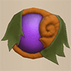
          

          

            

              
Def

              
2

              
Slot

              
3

              
Buy

              
7500

              
Sell

              
3000

              
Rune

              
 Magic Cancel

            

            
Negates the effects of magic bullets shot at you.

            
No additional notes.

          

        

      </td>
    </tr>
    <tr>
      <th>
        

          
Unmoving Wall

        

      </th>
    </tr>
    <tr>
      <td>
        

          

            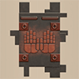
          

          

            

              
Def

              
6

              
Slot

              
5

              
Buy

              
2500

              
Sell

              
1000

              
Rune

              
 Unmoving

            

            
Prevents you from being moved from your location by the Pullfrog family's ability or things like Spring Trap. Effects of things like Leaping Grass and Vaulting Staff are also prevented, so be careful!

            
No additional notes.

          

        

      </td>
    </tr>
    <tr>
      <th>
        

          
Zabuton

        

      </th>
    </tr>
    <tr>
      <td>
        

          

            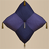
          

          

            

              
Def

              
7

              
Slot

              
5

              
Buy

              
3000

              
Sell

              
1200

              
Rune

              
 Breakfalling

            

            
A fluffy floor cushion. When hitting something or falling over after being knocked back, no damage will be taken. Resonance Effect (Whopping Harisen): Attacks may inflict Laughing status on the target.

            
Resonance's chance to inflict Laughing status is roughly 10.4%.

          

        

      </td>
    </tr>
    <tr>
      <th>
        

          
Spender's Shield

        

      </th>
    </tr>
    <tr>
      <td>
        

          

            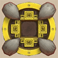
          

          

            

              
Def

              
8

              
Slot

              
4

              
Buy

              
6000

              
Sell

              
2400

              
Rune

              
 Costly Block

            

            
Spends Gitan to reduce damage taken by normal attacks. Without enough Gitan, damage taken will be increased. Resonance Effect (Spender's Club): Slightly reduces the amount of Gitan consumed by Runes.

            
Damage reduction is 30%, and spend 100 Gitan per hit. Shield defense becomes 0 without enough Gitan. Resonance reduces Gitan cost per hit from 100 → 70.

          

        

      </td>
    </tr>
    <tr>
      <th>
        

          
Ferrous Kite

        

      </th>
    </tr>
    <tr>
      <td>
        

          

            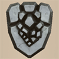
          

          

            

              
Def

              
9

              
Slot

              
3

              
Buy

              
4400

              
Sell

              
1760

              
Rune

              
 Voracious Block

            

            
A shield that is sturdy but incredibly heavy. Depletes Fullness to reduce damage taken by normal attacks. Without enough Fullness, damage taken will be increased. Resonance Effect (Ferrous Greatsword): Slightly reduces the amount of Fullness consumed by Runes.

            
Damage reduction is 30%. Resonance reduces Fullness loss per hit (2 → 1).

          

        

      </td>
    </tr>
    <tr>
      <th>
        

          
Steak Plate

        

      </th>
    </tr>
    <tr>
      <td>
        

          

            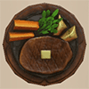
          

          

            

              
Def

              
7

              
Slot

              
5

              
Buy

              
4500

              
Sell

              
1800

              
Rune

              
 Hunger Power

            

            
A plate of extraordinarily yummy foods. Reduces damage taken by normal attacks when inflicted with Starving status. Resonance Effect (Steak Knife): Damage will not be taken from Starving status.

            
HP still doesn't regenerate while you have Starving status. Damage reduction is 30%.

          

        

      </td>
    </tr>
    <tr>
      <th>
        

          
Gutsy Shield

        

      </th>
    </tr>
    <tr>
      <td>
        

          

            
          

          

            

              
Def

              
9

              
Slot

              
4

              
Buy

              
4600

              
Sell

              
1840

              
Rune

              
 Guts

            

            
A shield that bolsters one's resolve. May allow you to endure fatal damage and survive with 1 HP.

            
Chance to endure with 1 HP seems to be roughly 32%. Does not activate when current HP is 1.

          

        

      </td>
    </tr>
    <tr>
      <th>
        

          
Hunky-dory Shield

        

      </th>
    </tr>
    <tr>
      <td>
        

          

            
          

          

            

              
Def

              
5

              
Slot

              
3

              
Buy

              
5000

              
Sell

              
2000

              
Rune

              
 Full Armor

            

            
Halves damage taken from any attack when HP is full.

            
Protection applies to any damage source, not just normal attacks.

          

        

      </td>
    </tr>
    <tr>
      <th>
        

          
Bodhi Shield

        

      </th>
    </tr>
    <tr>
      <td>
        

          

            
          

          

            

              
Def

              
3

              
Slot

              
6

              
Buy

              
10000

              
Sell

              
4000

              
Rune

              
 Fasting

            

            
While equipped, taking turns will not cause hunger. However, Max Fullness becomes 1. Even after removing the shield, Max Fullness won't return to normal, so be careful!

            
No additional notes.

          

        

      </td>
    </tr>
    <tr>
      <th>
        

          
Shield of Sating

        

      </th>
    </tr>
    <tr>
      <td>
        

          

            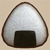
          

          

            

              
Def

              
2

              
Slot

              
5

              
Buy

              
2000

              
Sell

              
800

              
Rune

              
 Sating

            

            
A shield that looks just like an onigiri. While equipped, you can resist hunger. Resonance Effect (Bonito Block): Attacks may inflict Onigiri status on the target.

            
Halves hunger rate (1 fullness / 10 turns → 1 fullness / 20 turns). Resonance's chance to inflict Onigiri status is roughly 10.5%.

          

        

      </td>
    </tr>
    <tr>
      <th>
        

          
Auspicious Omamori

        

      </th>
    </tr>
    <tr>
      <td>
        

          

            
          

          

            

              
Def

              
7

              
Slot

              
7

              
Buy

              
5500

              
Sell

              
2200

              
Rune

              
 Tough At 7

            

            
An amulet that appears to grant some sort of divine blessing. When the last digit of HP is 7, damage taken by normal attacks is reduced. Resonance Effect (Auspicious Kumade): Traps are less likely to ensnare you.

            
Damage reduction is 30%. Resonance's chance to negate trap activation is roughly 70%.

          

        

      </td>
    </tr>
    <tr>
      <th>
        

          
Shield of Presage

        

      </th>
    </tr>
    <tr>
      <td>
        

          

            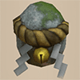
          

          

            

              
Def

              
5

              
Slot

              
5

              
Buy

              
7000

              
Sell

              
2800

              
Rune

              
 Oracle

            

            
A shield with a magical aura. When a Wishing Shrine is nearby, a chime will sound. When an item or Wishing Shrine is inside a wall, its location will be illuminated.

            
No additional notes.

          

        

      </td>
    </tr>
    <tr>
      <th>
        

          
Yamanba's Potlid

        

      </th>
    </tr>
    <tr>
      <td>
        

          

            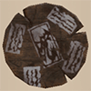
          

          

            

              
Def

              
10

              
Slot

              
7

              
Buy

              
4100

              
Sell

              
1640

              
Rune

              
 Cursed Might

            

            
A strangely terrifying lid from a pot. Equipping this Cursed shield increases Strength by 1. Resonance Effect (Yamanba's Cleaver): While Resonating, Weapon and Shield become Cursed, further increasing Strength by 4.

            
Despite the in-game description, it's not always found cursed.

          

        

      </td>
    </tr>
    <tr>
      <th>
        

          
Break-Off Shield

        

      </th>
    </tr>
    <tr>
      <td>
        

          

            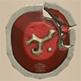
          

          

            

              
Def

              
30

              
Slot

              
10

              
Buy

              
3400

              
Sell

              
1360

              
Rune

              
 Dulling

            

            
A shield that loses Upgrade Value when blocking normal attacks. Resonance Effect (Break-Off Blade): Occasionally prevents deterioration.

            
Resonance's chance to activate hasn't been tested yet.

          

        

      </td>
    </tr>
  </tbody>
</table>
