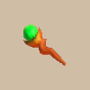

# Overview

- Wave a staff to shoot a magic bullet that deals an effect if it hits a target.
    - Nothing happens if you wave a staff with 0 remaining charges.
- Throw a staff to deal a similar effect as that staff's magic bullet.
- The number of charges is random when a staff is generated.

# Staff List

<table id="monsterList" class="pageLinksTable">
  <tr>
    <th colspan="7">Staves ~ Notebook Order</th>
  </tr>
  <tr>
    <th>Name</th>
    <th>Buy</th>
    <th>+1</th>
    <th>Sell</th>
    <th>+1</th>
    <th>Charges</th>
    <th>Notes</th>
  </tr>
  <tr>
    <td class="priceTableName"><a href="#ordinary-staff">Ordinary Staff</a></td>
    <td>500</td>
    <td>100</td>
    <td>200</td>
    <td>40</td>
    <td>?~?</td>
    <td class="leftText">No effect.</td>
  </tr>
  <tr>
    <td class="priceTableName"><a href="#paralyzing-staff">Paralyzing Staff</a></td>
    <td>500</td>
    <td>100</td>
    <td>200</td>
    <td>40</td>
    <td>?~6</td>
    <td class="leftText">Inflicts the target with Paralyzed status. Cross-Mixing: Paralyzing (Sword)</td>
  </tr>
  <tr>
    <td class="priceTableName"><a href="#sealing-staff">Sealing Staff</a></td>
    <td>500</td>
    <td>100</td>
    <td>200</td>
    <td>40</td>
    <td>?~6</td>
    <td class="leftText">Inflicts the target with Sealed status. Cross-Mixing: Sealing (Sword)</td>
  </tr>
  <tr>
    <td class="priceTableName"><a href="#disguising-staff">Disguising Staff</a></td>
    <td>2000</td>
    <td>100</td>
    <td>800</td>
    <td>40</td>
    <td>?~6</td>
    <td class="leftText">Inflicts the target with Disguised status. Must be unlocked via a Side Quest.</td>
  </tr>
  <tr>
    <td class="priceTableName"><a href="#empathetic-staff">Empathetic Staff</a></td>
    <td>1000</td>
    <td>100</td>
    <td>400</td>
    <td>40</td>
    <td>?~7</td>
    <td class="leftText">Inflicts the target with Empathetic status.</td>
  </tr>
  <tr>
    <td class="priceTableName"><a href="#narrow-escape-staff">Narrow-escape Staff</a></td>
    <td>1000</td>
    <td>100</td>
    <td>400</td>
    <td>40</td>
    <td>?~6</td>
    <td class="leftText">Warps the target to the stairs, then paralyzes them.</td>
  </tr>
  <tr>
    <td class="priceTableName"><a href="#knockback-staff">Knockback Staff</a></td>
    <td>500</td>
    <td>100</td>
    <td>200</td>
    <td>40</td>
    <td>?~7</td>
    <td class="leftText">Sends the target flying 10 tiles backward. Deals 5 damage if the target hits something.</td>
  </tr>
  <tr>
    <td class="priceTableName"><a href="#switching-staff">Switching Staff</a></td>
    <td>500</td>
    <td>100</td>
    <td>200</td>
    <td>40</td>
    <td>?~7</td>
    <td class="leftText">Shiren switches positions with the target. Shiren warps if he lands on a water or air tile.</td>
  </tr>
  <tr>
    <td class="priceTableName"><a href="#vaulting-staff">Vaulting Staff</a></td>
    <td>500</td>
    <td>100</td>
    <td>200</td>
    <td>40</td>
    <td>?~7</td>
    <td class="leftText">Shiren leaps toward whatever the magic bullet hit. Shiren warps if he lands on a water or air tile.</td>
  </tr>
  <tr>
    <td class="priceTableName"><a href="#skull-mage's-staff">Skull Mage's Staff</a></td>
    <td>1000</td>
    <td>100</td>
    <td>400</td>
    <td>40</td>
    <td>?~7</td>
    <td class="leftText">Inflicts Asleep, Confused, Slow, or warps the target.</td>
  </tr>
  <tr>
    <td class="priceTableName"><a href="#thunderbolt-staff">Thunderbolt Staff</a></td>
    <td>500</td>
    <td>100</td>
    <td>200</td>
    <td>40</td>
    <td>?~6</td>
    <td class="leftText">Deals 25 damage to a target. Creatures adjacent to the target also take damage.</td>
  </tr>
  <tr>
    <td class="priceTableName"><a href="#burrowing-staff">Burrowing Staff</a></td>
    <td>700</td>
    <td>100</td>
    <td>280</td>
    <td>40</td>
    <td>?~6</td>
    <td class="leftText">Digs a tunnel 10 tiles deep in a straight line. This cannot be used to dig in a diagonal direction. Deals 10 damage if the magic bullet hits a creature.</td>
  </tr>
  <tr>
    <td class="priceTableName"><a href="#earthmound-staff">Earthmound Staff</a></td>
    <td>700</td>
    <td>100</td>
    <td>280</td>
    <td>40</td>
    <td>?~6</td>
    <td class="leftText">Changes the tile in front into a breakable wall tile. Deals 2 damage if there's a creature in front.</td>
  </tr>
  <tr>
    <td class="priceTableName"><a href="#balance-staff">Balance Staff</a></td>
    <td>500</td>
    <td>100</td>
    <td>200</td>
    <td>40</td>
    <td>?~7</td>
    <td class="leftText">Prevents tripping and dropping items. -1 charge each time it activates, no effect at [0]. No effect inside a pot.</td>
  </tr>
  <tr>
    <td class="priceTableName"><a href="#guiding-staff">Guiding Staff</a></td>
    <td>700</td>
    <td>100</td>
    <td>280</td>
    <td>40</td>
    <td>?~4</td>
    <td class="leftText">Reveals the location of the stairs on the map.</td>
  </tr>
  <tr>
    <td class="priceTableName"><a href="#swift-staff">Swift Staff</a></td>
    <td>700</td>
    <td>100</td>
    <td>280</td>
    <td>40</td>
    <td>?~?</td>
    <td class="leftText">Increases the speed of the target by 1 stage.</td>
  </tr>
  <tr>
    <td class="priceTableName"><a href="#sluggish-staff">Sluggish Staff</a></td>
    <td>700</td>
    <td>100</td>
    <td>280</td>
    <td>40</td>
    <td>?~6</td>
    <td class="leftText">Decreases the speed of the target by 1 stage.</td>
  </tr>
  <tr>
    <td class="priceTableName"><a href="#fortune-staff">Fortune Staff</a></td>
    <td>1000</td>
    <td>100</td>
    <td>400</td>
    <td>40</td>
    <td>?~6</td>
    <td class="leftText">Increases the target's level by 1. Shiren or companion: Gain 2000 experience points.</td>
  </tr>
  <tr>
    <td class="priceTableName"><a href="#unlucky-staff">Unlucky Staff</a></td>
    <td>1000</td>
    <td>100</td>
    <td>400</td>
    <td>40</td>
    <td>?~6</td>
    <td class="leftText">Decreases the target's level by 1. Shiren or companion: Lose 2000 experience points.</td>
  </tr>
  <tr>
    <td class="priceTableName"><a href="#peach-staff">Peach Staff</a></td>
    <td>2000</td>
    <td>100</td>
    <td>800</td>
    <td>40</td>
    <td>?~6</td>
    <td class="leftText">Transforms the target into a Peach Bun. Must be unlocked via a Side Quest.</td>
  </tr>
</table>

# Staff Details

<table class="monsterPageTable">
  <tbody>
    <tr>
      <th>
        

          
Ordinary Staff

        

      </th>
    </tr>
    <tr>
      <td>
        

          

            
          

          

            

              
Buy

              
500

              
Sell

              
200

              
Charges

              
?~?

              
Rune

              
-

            

            
Hitting things with magic bullets has no special effect.

            
No additional notes.

          

        

      </td>
    </tr>
    <tr>
      <th>
        

          
Paralyzing Staff

        

      </th>
    </tr>
    <tr>
      <td>
        

          

            
          

          

            

              
Buy

              
500

              
Sell

              
200

              
Charges

              
?~6

              
Rune

              
 Paralyzing (Sword)

            

            
Inflicts Paralyzed status on targets hit with a magic bullet, leaving them unable to move until affected by something else.

            
No additional notes.

          

        

      </td>
    </tr>
    <tr>
      <th>
        

          
Sealing Staff

        

      </th>
    </tr>
    <tr>
      <td>
        

          

            
          

          

            

              
Buy

              
500

              
Sell

              
200

              
Charges

              
?~6

              
Rune

              
 Sealing (Sword)

            

            
Inflicts Sealed status on targets hit with a magic bullet, leaving them unable to use abilities.

            
No additional notes.

          

        

      </td>
    </tr>
    <tr>
      <th>
        

          
Disguising Staff

        

      </th>
    </tr>
    <tr>
      <td>
        

          

            
          

          

            

              
Buy

              
2000

              
Sell

              
800

              
Charges

              
?~6

              
Rune

              
-

            

            
Inflicts Disguised status on targets hit with a magic bullet, making them the target of other monsters. This only works on one target at a time. If you are hit, you are inflicted with Confused status.

            
Disguised creature takes 5 damage from attacks, duration is 8 turns.

          

        

      </td>
    </tr>
    <tr>
      <th>
        

          
Empathetic Staff

        

      </th>
    </tr>
    <tr>
      <td>
        

          

            
          

          

            

              
Buy

              
1000

              
Sell

              
400

              
Charges

              
?~7

              
Rune

              
-

            

            
Inflicts Empathetic status on beings hit with a magic bullet, causing damage taken to be dealt to the attacker as well. Inflicting Empathetic status on another being will remove Empathetic status from the previous target.

            
No additional notes.

          

        

      </td>
    </tr>
    <tr>
      <th>
        

          
Narrow-escape Staff

        

      </th>
    </tr>
    <tr>
      <td>
        

          

            
          

          

            

              
Buy

              
1000

              
Sell

              
400

              
Charges

              
?~6

              
Rune

              
-

            

            
Warps targets hit with a magic bullet to the Stairs and inflicts them with Paralyzed status.

            
No additional notes.

          

        

      </td>
    </tr>
    <tr>
      <th>
        

          
Knockback Staff

        

      </th>
    </tr>
    <tr>
      <td>
        

          

            
          

          

            

              
Buy

              
500

              
Sell

              
200

              
Charges

              
?~7

              
Rune

              
-

            

            
Knocks targets hit with a magic bullet back 5 tile(s). If the target runs into something, it takes 10 damage.

            
No additional notes.

          

        

      </td>
    </tr>
    <tr>
      <th>
        

          
Switching Staff

        

      </th>
    </tr>
    <tr>
      <td>
        

          

            
          

          

            

              
Buy

              
500

              
Sell

              
200

              
Charges

              
?~7

              
Rune

              
-

            

            
Switches your location with that of a target hit with a magic bullet.

            
No additional notes.

          

        

      </td>
    </tr>
    <tr>
      <th>
        

          
Vaulting Staff

        

      </th>
    </tr>
    <tr>
      <td>
        

          

            
          

          

            

              
Buy

              
500

              
Sell

              
200

              
Charges

              
?~7

              
Rune

              
-

            

            
Teleports you to either the tile in front of a wall or the location of a target hit with a magic bullet.

            
No additional notes.

          

        

      </td>
    </tr>
    <tr>
      <th>
        

          
Skull Mage's Staff

        

      </th>
    </tr>
    <tr>
      <td>
        

          

            
          

          

            

              
Buy

              
1000

              
Sell

              
400

              
Charges

              
?~7

              
Rune

              
-

            

            
Targets hit with a magic bullet suffer one of the following: Confused status, Asleep status, Action Speed reduced by 1, or warped somewhere.

            
No additional notes.

          

        

      </td>
    </tr>
    <tr>
      <th>
        

          
Thunderbolt Staff

        

      </th>
    </tr>
    <tr>
      <td>
        

          

            
          

          

            

              
Buy

              
500

              
Sell

              
200

              
Charges

              
?~6

              
Rune

              
-

            

            
Deals 25 damage to targets hit with a magic bullet, and adjacent beings will then take the same eletric damage. If you're nearby, you'll take electric damage too, so be careful!

            
No additional notes.

          

        

      </td>
    </tr>
    <tr>
      <th>
        

          
Burrowing Staff

        

      </th>
    </tr>
    <tr>
      <td>
        

          

            
          

          

            

              
Buy

              
700

              
Sell

              
280

              
Charges

              
?~6

              
Rune

              
-

            

            
Digs 10 tile(s) straight through walls hit with a magic bullet. Cannot dig diagonally. Stave cannot be thrown at walls to dig. Beings hit with a magic bullet will take 10 damage.

            
No additional notes.

          

        

      </td>
    </tr>
    <tr>
      <th>
        

          
Earthmound Staff

        

      </th>
    </tr>
    <tr>
      <td>
        

          

            
          

          

            

              
Buy

              
700

              
Sell

              
280

              
Charges

              
?~6

              
Rune

              
-

            

            
Builds an earthen wall ahead of you instead of firing magic bullets. Earthen walls can be destroyed by attacks.

            
No additional notes.

          

        

      </td>
    </tr>
    <tr>
      <th>
        

          
Balance Staff

        

      </th>
    </tr>
    <tr>
      <td>
        

          

            
          

          

            

              
Buy

              
500

              
Sell

              
200

              
Charges

              
?~7

              
Rune

              
-

            

            
Holding this prevents you from falling over or being tripped by a Tripping Trap. Activating its effects lowers the number of uses. Its effect cannot be activated when it is inside a Pot. Hitting things with magic bullets has no special effect.

            
No additional notes.

          

        

      </td>
    </tr>
    <tr>
      <th>
        

          
Guiding Staff

        

      </th>
    </tr>
    <tr>
      <td>
        

          

            
          

          

            

              
Buy

              
700

              
Sell

              
280

              
Charges

              
?~4

              
Rune

              
-

            

            
Displays the location of the Stairs on the map instead of firing magic bullets.

            
No additional notes.

          

        

      </td>
    </tr>
    <tr>
      <th>
        

          
Swift Staff

        

      </th>
    </tr>
    <tr>
      <td>
        

          

            
          

          

            

              
Buy

              
700

              
Sell

              
280

              
Charges

              
?~?

              
Rune

              
-

            

            
Increases the Action Speed of targets hit with a magic bullet by 1.

            
No additional notes.

          

        

      </td>
    </tr>
    <tr>
      <th>
        

          
Sluggish Staff

        

      </th>
    </tr>
    <tr>
      <td>
        

          

            
          

          

            

              
Buy

              
700

              
Sell

              
280

              
Charges

              
?~6

              
Rune

              
-

            

            
Decreases the Action Speed of targets hit with a magic bullet by 1.

            
No additional notes.

          

        

      </td>
    </tr>
    <tr>
      <th>
        

          
Fortune Staff

        

      </th>
    </tr>
    <tr>
      <td>
        

          

            
          

          

            

              
Buy

              
1000

              
Sell

              
400

              
Charges

              
?~6

              
Rune

              
-

            

            
Increases the Level of targets hit with its magic bullet by 1. When you or a companion are hit, they gain 2000 EXP.

            
Can be waved at a Bouncy Wall to rapidly level up.

          

        

      </td>
    </tr>
    <tr>
      <th>
        

          
Unlucky Staff

        

      </th>
    </tr>
    <tr>
      <td>
        

          

            
          

          

            

              
Buy

              
1000

              
Sell

              
400

              
Charges

              
?~6

              
Rune

              
-

            

            
Decreases the Level of targets hit with its magic bullet by 1. When you or a companion are hit, they lose 2000 EXP.

            
No additional notes.

          

        

      </td>
    </tr>
    <tr>
      <th>
        

          
Peach Staff

        

      </th>
    </tr>
    <tr>
      <td>
        

          

            
          

          

            

              
Buy

              
2000

              
Sell

              
800

              
Charges

              
?~6

              
Rune

              
-

            

            
Turns monsters hit with a magic bullet into a Peach Bun.

            
No additional notes.

          

        

      </td>
    </tr>
  </tbody>
</table>
