# Overview

- Weapons increase the amount of damage you deal with normal attacks while equipped.
- Some weapons have innate special abilities, which can be synthesized into other weapons as runes.
    - Multiple copies of the same rune cannot be synthesized in Shiren 6.

# Weapon List

<table id="monsterList" class="equipmentTable">
  <tr>
    <th colspan="7">Weapons ~ Notebook Order</th>
  </tr>
  <tr>
    <th>Name</th>
    <th>Atk</th>
    <th>Slot</th>
    <th>Rune</th>
    <th>Buy</th>
    <th>Sell</th>
    <th>Notes</th>
  </tr>
  <tr>
    <td class="priceTableName"><a href="#wooden-sword">Wooden Sword</a></td>
    <td>3</td>
    <td>7</td>
    <td>-</td>
    <td>250</td>
    <td>100</td>
    <td>Resonance: Wooden Shield</td>
  </tr>
  <tr>
    <td class="priceTableName"><a href="#bronze-sword">Bronze Sword</a></td>
    <td>4</td>
    <td>6</td>
    <td>-</td>
    <td>550</td>
    <td>220</td>
    <td>Resonance: Bronze Shield</td>
  </tr>
  <tr>
    <td class="priceTableName"><a href="#katana">Katana</a></td>
    <td>5</td>
    <td>5</td>
    <td>-</td>
    <td>1000</td>
    <td>400</td>
    <td>Resonance: Iron Shield</td>
  </tr>
  <tr>
    <td class="priceTableName"><a href="#doutanuki">Doutanuki</a></td>
    <td>8</td>
    <td>4</td>
    <td>-</td>
    <td>2200</td>
    <td>880</td>
    <td>Resonance: Wolfshead</td>
  </tr>
  <tr>
    <td class="priceTableName"><a href="#manji-kabura">Manji Kabura</a></td>
    <td>14</td>
    <td>3</td>
    <td>-</td>
    <td>5500</td>
    <td>2200</td>
    <td>Resonance: Fuuma Shield / Rasen Fuuma</td>
  </tr>
  <tr>
    <td class="priceTableName"><a href="#kajin-fuuma">Kajin Fuuma</a></td>
    <td>30</td>
    <td>10</td>
    <td></td>
    <td>16000</td>
    <td>64000</td>
    <td>How to obtain: Upgrade Katana+99 (Shukuba Beach). Resonance: Fuuma Shield / Rasen Fuuma</td>
  </tr>
  <tr>
    <td class="priceTableName"><a href="#kabura-sutegi">Kabura Sutegi</a></td>
    <td>50</td>
    <td>15</td>
    <td>-</td>
    <td>25000</td>
    <td>10000</td>
    <td>How to obtain: Upgrade Manji Kabura+99 (Shukuba Beach). Resonance: Fuuma Shield / Rasen Fuuma</td>
  </tr>
  <tr>
    <td class="priceTableName"><a href="#golden-sword">Golden Sword</a></td>
    <td>3</td>
    <td>10</td>
    <td></td>
    <td>3000</td>
    <td>1200</td>
    <td>Upgrade value won't decrease from rust. Resonance: Golden Shield</td>
  </tr>
  <tr>
    <td class="priceTableName"><a href="#kama-itachi">Kama Itachi</a></td>
    <td>2</td>
    <td>6</td>
    <td></td>
    <td>8400</td>
    <td>3360</td>
    <td>Lets you attack in a 3-way pattern.</td>
  </tr>
  <tr>
    <td class="priceTableName"><a href="#axe-of-the-minotaur">Axe of the Minotaur</a></td>
    <td>6</td>
    <td>4</td>
    <td></td>
    <td>6500</td>
    <td>2600</td>
    <td>30% chance for a x1.5 damage critical hit. Resonance: Targe of the Minotaur</td>
  </tr>
  <tr>
    <td class="priceTableName"><a href="#accurate-sword">Accurate Sword</a></td>
    <td>1</td>
    <td>3</td>
    <td></td>
    <td>20000</td>
    <td>8000</td>
    <td>Your normal attacks will always hit. How to obtain: Clear Heart of Serpentcoil Island 6 times.</td>
  </tr>
  <tr>
    <td class="priceTableName"><a href="#swift-sword">Swift Sword</a></td>
    <td>5</td>
    <td>3</td>
    <td></td>
    <td>10000</td>
    <td>4000</td>
    <td>25% chance for normal attack to hit 2 times. The second hit has 50% attack power.</td>
  </tr>
  <tr>
    <td class="priceTableName"><a href="#watersplitter">Watersplitter</a></td>
    <td>6</td>
    <td>6</td>
    <td></td>
    <td>3300</td>
    <td>1320</td>
    <td>Deals x1.5 damage to Aquatic types. Resonance: Spearscale Shield</td>
  </tr>
  <tr>
    <td class="priceTableName"><a href="#primal-axe">Primal Axe</a></td>
    <td>6</td>
    <td>8</td>
    <td></td>
    <td>5000</td>
    <td>2000</td>
    <td>Deals x1.5 damage to Beast types.</td>
  </tr>
  <tr>
    <td class="priceTableName"><a href="#dragonkiller">Dragonkiller</a></td>
    <td>9</td>
    <td>5</td>
    <td></td>
    <td>4000</td>
    <td>1600</td>
    <td>Deals x1.5 damage to Dragon types. Resonance: Dragon Shield</td>
  </tr>
  <tr>
    <td class="priceTableName"><a href="#crescent-blade">Crescent Blade</a></td>
    <td>6</td>
    <td>6</td>
    <td></td>
    <td>3500</td>
    <td>1400</td>
    <td>Deals x1.5 damage to Exploding types. Resonance: Blast Shield</td>
  </tr>
  <tr>
    <td class="priceTableName"><a href="#sky-sword">Sky Sword</a></td>
    <td>4</td>
    <td>4</td>
    <td></td>
    <td>3700</td>
    <td>1480</td>
    <td>Deals x1.5 damage to Floating types.</td>
  </tr>
  <tr>
    <td class="priceTableName"><a href="#sickle-of-salvation">Sickle of Salvation</a></td>
    <td>5</td>
    <td>8</td>
    <td></td>
    <td>4200</td>
    <td>1680</td>
    <td>Deals x1.5 damage to Ghost types.</td>
  </tr>
  <tr>
    <td class="priceTableName"><a href="#drain-slayer">Drain Slayer</a></td>
    <td>6</td>
    <td>3</td>
    <td></td>
    <td>3600</td>
    <td>1440</td>
    <td>Deals x1.5 damage to Drain types.</td>
  </tr>
  <tr>
    <td class="priceTableName"><a href="#cyclops-bane">Cyclops Bane</a></td>
    <td>7</td>
    <td>4</td>
    <td></td>
    <td>3200</td>
    <td>1280</td>
    <td>Deals x1.5 damage to Cyclops types. Resonance: Watchful Shield</td>
  </tr>
  <tr>
    <td class="priceTableName"><a href="#steel-severer">Steel Severer</a></td>
    <td>6</td>
    <td>5</td>
    <td></td>
    <td>3100</td>
    <td>1240</td>
    <td>Deals x1.5 damage to Metal types.</td>
  </tr>
  <tr>
    <td class="priceTableName"><a href="#whopping-harisen">Whopping Harisen</a></td>
    <td>5</td>
    <td>4</td>
    <td></td>
    <td>4200</td>
    <td>1680</td>
    <td>53% chance to knock target back 1 tile. Resonance: Zabuton</td>
  </tr>
  <tr>
    <td class="priceTableName"><a href="#healing-sword">Healing Sword</a></td>
    <td>2</td>
    <td>4</td>
    <td></td>
    <td>4300</td>
    <td>1720</td>
    <td>Restore HP equal to 10% of damage dealt.</td>
  </tr>
  <tr>
    <td class="priceTableName"><a href="#peach-club">Peach Club</a></td>
    <td>4</td>
    <td>3</td>
    <td></td>
    <td>4500</td>
    <td>1800</td>
    <td>30% chance for slain foe to drop Peach Bun.</td>
  </tr>
  <tr>
    <td class="priceTableName"><a href="#spender's-club">Spender's Club</a></td>
    <td>8</td>
    <td>4</td>
    <td></td>
    <td>6000</td>
    <td>2400</td>
    <td>Deal x1.5 damage with normal attacks. Spend 100 Gitan per hit. Resonance: Spender's Shield</td>
  </tr>
  <tr>
    <td class="priceTableName"><a href="#ferrous-greatsword">Ferrous Greatsword</a></td>
    <td>9</td>
    <td>3</td>
    <td></td>
    <td>5300</td>
    <td>2120</td>
    <td>Deal x1.5 damage with normal attacks. Spend 2 Fullness per hit. Resonance: Ferrous Kite</td>
  </tr>
  <tr>
    <td class="priceTableName"><a href="#steak-knife">Steak Knife</a></td>
    <td>7</td>
    <td>5</td>
    <td></td>
    <td>5400</td>
    <td>2160</td>
    <td>Deal x2.0 damage with normal attacks. Must have Starving status to activate. Resonance: Steak Plate</td>
  </tr>
  <tr>
    <td class="priceTableName"><a href="#jagged-sword">Jagged Sword</a></td>
    <td>4</td>
    <td>6</td>
    <td></td>
    <td>5500</td>
    <td>2200</td>
    <td>100% accuracy critical hit after 2 misses.</td>
  </tr>
  <tr>
    <td class="priceTableName"><a href="#quad-edge">Quad-edge</a></td>
    <td>6</td>
    <td>4</td>
    <td></td>
    <td>5600</td>
    <td>2240</td>
    <td>100% accuracy critical hit after 4 hits.</td>
  </tr>
  <tr>
    <td class="priceTableName"><a href="#auspicious-kumade">Auspicious Kumade</a></td>
    <td>7</td>
    <td>7</td>
    <td></td>
    <td>5700</td>
    <td>2280</td>
    <td>Critical hit when last digit of HP is 7. Resonance: Auspicious Omamori</td>
  </tr>
  <tr>
    <td class="priceTableName"><a href="#pickaxe">Pickaxe</a></td>
    <td>8</td>
    <td>1</td>
    <td></td>
    <td>1000</td>
    <td>400</td>
    <td>Dig walls, but upgrade value may decrease. 50% chance, can't dig when attack is 0.</td>
  </tr>
  <tr>
    <td class="priceTableName"><a href="#golden-pickaxe">Golden Pickaxe</a></td>
    <td>2</td>
    <td>10</td>
    <td></td>
    <td>18000</td>
    <td>7200</td>
    <td>Dig walls, upgrade value won't decrease.</td>
  </tr>
  <tr>
    <td class="priceTableName"><a href="#wooden-mallet">Wooden Mallet</a></td>
    <td>7</td>
    <td>3</td>
    <td></td>
    <td>1000</td>
    <td>400</td>
    <td>Break traps and items on the ground. 50% chance for upgrade value to decrease. Can't break things when attack is 0.</td>
  </tr>
  <tr>
    <td class="priceTableName"><a href="#epic-hammer">Epic Hammer</a></td>
    <td>2</td>
    <td>5</td>
    <td></td>
    <td>15000</td>
    <td>6000</td>
    <td>Break traps and items on the ground. Upgrade value won't decrease.</td>
  </tr>
  <tr>
    <td class="priceTableName"><a href="#trapseeker">Trapseeker</a></td>
    <td>4</td>
    <td>5</td>
    <td></td>
    <td>4400</td>
    <td>1760</td>
    <td>Expands trap check range to 3x2 area.</td>
  </tr>
  <tr>
    <td class="priceTableName"><a href="#bonito-block">Bonito Block</a></td>
    <td>6</td>
    <td>6</td>
    <td></td>
    <td>1800</td>
    <td>720</td>
    <td>Nibble on it to restore 20 Fullness. Nibbling decreases upgrade value by 1. Can't nibble on it when attack is 0. Resonance: Shield of Sating</td>
  </tr>
  <tr>
    <td class="priceTableName"><a href="#yamanba's-cleaver">Yamanba's Cleaver</a></td>
    <td>10</td>
    <td>7</td>
    <td></td>
    <td>4000</td>
    <td>1600</td>
    <td>Strength +1 if a cursed one is equipped. Resonance: Yamanba's Potlid</td>
  </tr>
  <tr>
    <td class="priceTableName"><a href="#break-off-blade">Break-Off Blade</a></td>
    <td>30</td>
    <td>10</td>
    <td></td>
    <td>3000</td>
    <td>1200</td>
    <td>Upgrade value -1 per hit. Resonance: Break-Off Shield</td>
  </tr>
</table>

# Weapon Details

<table class="monsterPageTable">
  <tbody>
    <tr>
      <th>
        

          
Wooden Sword

        

      </th>
    </tr>
    <tr>
      <td>
        

          

            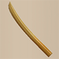
          

          

            

              
Atk

              
3

              
Slot

              
7

              
Buy

              
250

              
Sell

              
100

              
Rune

              
-

            

            
A weapon carved from old wood into the shape of a katana. It's lightweight and easy to handle. Resonance Effect (Wooden Shield): Increases Weapon and Shield strength by 3.

            
No additional notes.

          

        

      </td>
    </tr>
    <tr>
      <th>
        

          
Bronze Sword

        

      </th>
    </tr>
    <tr>
      <td>
        

          

            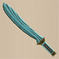
          

          

            

              
Atk

              
4

              
Slot

              
6

              
Buy

              
550

              
Sell

              
220

              
Rune

              
-

            

            
A bronze sword that is widely available and easy to obtain. Resonance Effect (Bronze Shield): Increases Weapon and Shield strength by 3.

            
No additional notes.

          

        

      </td>
    </tr>
    <tr>
      <th>
        

          
Katana

        

      </th>
    </tr>
    <tr>
      <td>
        

          

            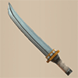
          

          

            

              
Atk

              
5

              
Slot

              
5

              
Buy

              
1000

              
Sell

              
400

              
Rune

              
-

            

            
A sturdy, reliable weapon cherished by wanderers everywhere. Resonance Effect (Iron Shield): Increases Weapon and Shield strength by 3.

            
No additional notes.

          

        

      </td>
    </tr>
    <tr>
      <th>
        

          
Doutanuki

        

      </th>
    </tr>
    <tr>
      <td>
        

          

            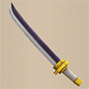
          

          

            

              
Atk

              
8

              
Slot

              
4

              
Buy

              
2200

              
Sell

              
880

              
Rune

              
-

            

            
A revered sword forged by the swordsmith Dotanuki Genma. Resonance Effect (Wolfshead): Increases Weapon and Shield strength by 3.

            
No additional notes.

          

        

      </td>
    </tr>
    <tr>
      <th>
        

          
Manji Kabura

        

      </th>
    </tr>
    <tr>
      <td>
        

          

            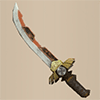
          

          

            

              
Atk

              
14

              
Slot

              
3

              
Buy

              
5500

              
Sell

              
2200

              
Rune

              
-

            

            
A rare, mighty sword forged by the ancient swordsmith Kabura. Resonance Effect: Fuuma Shield - Increases damage dealt by normal attacks by 5. Rasen Fuuma - Increases damage dealt by normal attacks by 10.

          

        

      </td>
    </tr>
    <tr>
      <th>
        

          
Kajin Fuuma

        

      </th>
    </tr>
    <tr>
      <td>
        

          

            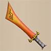
          

          

            

              
Atk

              
30

              
Slot

              
10

              
Buy

              
16000

              
Sell

              
6400

              
Rune

              
 Flame Shot

            

            
A legendary katana sought by all wanderers. When HP is full, shoots flames that deal 10 damage to the target. Resonance Effect: Fuuma Shield - Increases damage dealt by normal attacks by 5. Rasen Fuuma - Increases damage dealt by normal attacks by 10.

            
How to obtain: Upgrade a Katana+99 in Shukuba Beach.

          

        

      </td>
    </tr>
    <tr>
      <th>
        

          
Kabura Sutegi

        

      </th>
    </tr>
    <tr>
      <td>
        

          

            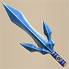
          

          

            

              
Atk

              
50

              
Slot

              
15

              
Buy

              
25000

              
Sell

              
10000

              
Rune

              
-

            

            
The final form of the mighty sword, Manji Kabura. A mythical blade rarely crafted even by the ancient swordsmith Kabura. Resonance Effect: Fuuma Shield - Increases damage dealt by normal attacks by 5. Rasen Fuuma - Increases damage dealt by normal attacks by 10.

            
How to obtain: Upgrade a Manji Kabura+99 in Shukuba Beach.

          

        

      </td>
    </tr>
    <tr>
      <th>
        

          
Golden Sword

        

      </th>
    </tr>
    <tr>
      <td>
        

          

            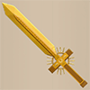
          

          

            

              
Atk

              
3

              
Slot

              
10

              
Buy

              
3000

              
Sell

              
1200

              
Rune

              
 Rustproof

            

            
A gold sword that does not rust. Things like Rust Trap will not decrease Upgrade Value. Slightly increases the accuracy of normal attacks. Resonance Effect (Golden Shield): Monsters defeated with normal attacks are likely to drop Gitan.

            
Increases accuracy of normal attacks by 2.0% (92% → 94%). Resonance effect's chance seems to be roughly 24%.

          

        

      </td>
    </tr>
    <tr>
      <th>
        

          
Kama Itachi

        

      </th>
    </tr>
    <tr>
      <td>
        

          

            
          

          

            

              
Atk

              
2

              
Slot

              
6

              
Buy

              
8400

              
Sell

              
3360

              
Rune

              
 Frontal Attack

            

            
A magical sword that generates shockwaves when swung. Attacks to the front in 3 directions simultaneously.

            
No additional notes.

          

        

      </td>
    </tr>
    <tr>
      <th>
        

          
Axe of the Minotaur

        

      </th>
    </tr>
    <tr>
      <td>
        

          

            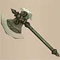
          

          

            

              
Atk

              
6

              
Slot

              
4

              
Buy

              
6500

              
Sell

              
2600

              
Rune

              
 Critical

            

            
An axe beloved by Minotaur. May unleash Critical Hits. Resonance Effect (Targe of the Minotaur): Makes Critical Hits occur more often.

            
Roughly 30% chance to land a x1.5 damage critical hit. Resonance boosts critical hit rates: &nbsp;&nbsp;&nbsp;Player: 30% → 40% chance, Monster: 33% chance.

          

        

      </td>
    </tr>
    <tr>
      <th>
        

          
Accurate Sword

        

      </th>
    </tr>
    <tr>
      <td>
        

          

            
          

          

            

              
Atk

              
1

              
Slot

              
3

              
Buy

              
20000

              
Sell

              
8000

              
Rune

              
 Accurate

            

            
A beautiful, double-edged sword. Attacks will always hit.

            
How to obtain: Clear Heart of Serpentcoil Island 6 times.

          

        

      </td>
    </tr>
    <tr>
      <th>
        

          
Swift Sword

        

      </th>
    </tr>
    <tr>
      <td>
        

          

            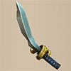
          

          

            

              
Atk

              
5

              
Slot

              
3

              
Buy

              
10000

              
Sell

              
4000

              
Rune

              
 Swift Strikes

            

            
A katana that's as light as a feather. Normal attacks may hit 2 times.

            
25% chance, second hit has 50% attack power.

          

        

      </td>
    </tr>
    <tr>
      <th>
        

          
Watersplitter

        

      </th>
    </tr>
    <tr>
      <td>
        

          

            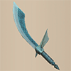
          

          

            

              
Atk

              
6

              
Slot

              
6

              
Buy

              
3300

              
Sell

              
1320

              
Rune

              
 Anti-Aquatic

            

            
Legend has it that this weapon can carve a path through the sea. Deals extra damage to Aquatic monsters. Resonance Effect (Spearscale Shield): Increases Anti-Aquatic Rune effects.

            
Deals x1.5 damage to Aquatic type monsters. Resonance boosts Anti-Aquatic's damage multiplier (x1.5 → x2.5).

          

        

      </td>
    </tr>
    <tr>
      <th>
        

          
Primal Axe

        

      </th>
    </tr>
    <tr>
      <td>
        

          

            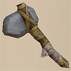
          

          

            

              
Atk

              
6

              
Slot

              
8

              
Buy

              
5000

              
Sell

              
2000

              
Rune

              
 Anti-Beast

            

            
Used since ancient times, this weapon bears a primal savagery. Deals extra damage to Beast monsters.

            
Deals x1.5 damage to Beast type monsters.

          

        

      </td>
    </tr>
    <tr>
      <th>
        

          
Dragonkiller

        

      </th>
    </tr>
    <tr>
      <td>
        

          

            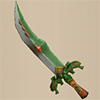
          

          

            

              
Atk

              
9

              
Slot

              
5

              
Buy

              
4000

              
Sell

              
1600

              
Rune

              
 Anti-Dragon

            

            
A weapon that can slice through the tough scales of dragons. Deals extra damage to Dragon monsters. Resonance Effect (Dragon Shield): Increases Anti-Dragon Rune effects.

            
Deals x1.5 damage to Dragon type monsters. Resonance boosts Anti-Dragon's damage multiplier (x1.5 → x2.5).

          

        

      </td>
    </tr>
    <tr>
      <th>
        

          
Crescent Blade

        

      </th>
    </tr>
    <tr>
      <td>
        

          

            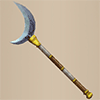
          

          

            

              
Atk

              
6

              
Slot

              
6

              
Buy

              
3500

              
Sell

              
1400

              
Rune

              
 Anti-Exploding

            

            
A weapon with a blade resembling a crescent moon. Deals extra damage to Exploding monsters. Resonance Effect (Blast Shield): Increases Anti-Exploding Rune effects.

            
Deals x1.5 damage to Exploding type monsters. Resonance boosts Anti-Exploding's damage multiplier (x1.5 → x2.5).

          

        

      </td>
    </tr>
    <tr>
      <th>
        

          
Sky Sword

        

      </th>
    </tr>
    <tr>
      <td>
        

          

            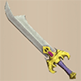
          

          

            

              
Atk

              
4

              
Slot

              
4

              
Buy

              
3700

              
Sell

              
1480

              
Rune

              
 Anti-Floating

            

            
Rends the target with a razor-sharp blade of air. Deals extra damage to Floating monsters.

            
Deals x1.5 damage to Floating type monsters.

          

        

      </td>
    </tr>
    <tr>
      <th>
        

          
Sickle of Salvation

        

      </th>
    </tr>
    <tr>
      <td>
        

          

            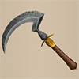
          

          

            

              
Atk

              
5

              
Slot

              
8

              
Buy

              
4200

              
Sell

              
1680

              
Rune

              
 Anti-Ghost

            

            
A scythe said to reap the souls of the wandering dead. Deals extra damage to Ghost monsters.

            
Deals x1.5 damage to Ghost type monsters.

          

        

      </td>
    </tr>
    <tr>
      <th>
        

          
Drain Slayer

        

      </th>
    </tr>
    <tr>
      <td>
        

          

            
          

          

            

              
Atk

              
6

              
Slot

              
3

              
Buy

              
3600

              
Sell

              
1440

              
Rune

              
 Anti-Draining

            

            
A katana with a distinctive shape. Deals extra damage to Draining monsters.

            
Deals x1.5 damage to Draining type monsters.

          

        

      </td>
    </tr>
    <tr>
      <th>
        

          
Cyclops Bane

        

      </th>
    </tr>
    <tr>
      <td>
        

          

            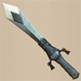
          

          

            

              
Atk

              
7

              
Slot

              
4

              
Buy

              
3200

              
Sell

              
1280

              
Rune

              
 Anti-Cyclops

            

            
Decorated all over with eye patterns. Deals extra damage to Cyclops monsters. Resonance Effect (Watchful Shield): Increases Anti-Cyclops Rune effects.

            
Deals x1.5 damage to Cyclops type monsters. Resonance boosts Anti-Cyclops's damage multiplier (x1.5 → x2.5).

          

        

      </td>
    </tr>
    <tr>
      <th>
        

          
Steel Severer

        

      </th>
    </tr>
    <tr>
      <td>
        

          

            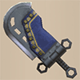
          

          

            

              
Atk

              
6

              
Slot

              
5

              
Buy

              
3100

              
Sell

              
1240

              
Rune

              
 Anti-Metal

            

            
A hulking long sword that can even cleave through steel. Deals extra damage to Metal monsters.

            
Deals x1.5 damage to Metal type monsters.

          

        

      </td>
    </tr>
    <tr>
      <th>
        

          
Whopping Harisen

        

      </th>
    </tr>
    <tr>
      <td>
        

          

            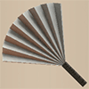
          

          

            

              
Atk

              
5

              
Slot

              
4

              
Buy

              
4200

              
Sell

              
1680

              
Rune

              
 Knockback

            

            
A large folding fan used in comedy routines. Attacks may knock the target back 1 tile(s). Resonance Effect (Zabuton): Attacks may inflict Laughing status on the target.

            
Roughly 53.7% chance to deal 1 tile of knockback. Resonance's chance to inflict Laughing status is roughly 10.4%.

          

        

      </td>
    </tr>
    <tr>
      <th>
        

          
Healing Sword

        

      </th>
    </tr>
    <tr>
      <td>
        

          

            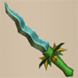
          

          

            

              
Atk

              
2

              
Slot

              
4

              
Buy

              
4300

              
Sell

              
1720

              
Rune

              
 Healing

            

            
A weapon with a distinctive winding blade. Attacks restore HP relative to the damage dealt.

            
Restores HP equal to 10% of damage dealt.

          

        

      </td>
    </tr>
    <tr>
      <th>
        

          
Peach Club

        

      </th>
    </tr>
    <tr>
      <td>
        

          

            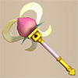
          

          

            

              
Atk

              
4

              
Slot

              
3

              
Buy

              
4500

              
Sell

              
1800

              
Rune

              
 Peach Bun

            

            
A mysterious club shaped like a peach. May turn defeated monsters into Peach Buns.

            
30% chance for an enemy to drop a Peach Bun when defeated.

          

        

      </td>
    </tr>
    <tr>
      <th>
        

          
Spender's Club

        

      </th>
    </tr>
    <tr>
      <td>
        

          

            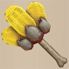
          

          

            

              
Atk

              
8

              
Slot

              
4

              
Buy

              
6000

              
Sell

              
2400

              
Rune

              
 Costly Hit

            

            
A costly weapon that spends Gitan to deal extra damage. Without enough Gitan, it's almost useless. Resonance Effect (Spender's Shield): Slightly reduces the amount of Gitan consumed by Runes.

            
Normal attacks deal x1.5 damage, but spend 100 Gitan per hit. Weapon attack becomes 0 without enough Gitan. Resonance reduces Gitan cost per hit from 100 → 75.

          

        

      </td>
    </tr>
    <tr>
      <th>
        

          
Ferrous Greatsword

        

      </th>
    </tr>
    <tr>
      <td>
        

          

            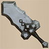
          

          

            

              
Atk

              
9

              
Slot

              
3

              
Buy

              
5300

              
Sell

              
2120

              
Rune

              
 Voracious Hit

            

            
A giant sword that depletes Fullness to deal heavy damage. When Fullness is low, it's almost useless. Resonance Effect (Ferrous Kite): Slightly reduces the amount of Fullness consumed by Runes.

            
Normal attacks deal x1.5 damage, but spend 2 Fullness per hit. Resonance reduces Fullness loss per hit (2 → 1).

          

        

      </td>
    </tr>
    <tr>
      <th>
        

          
Steak Knife

        

      </th>
    </tr>
    <tr>
      <td>
        

          

            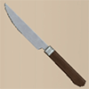
          

          

            

              
Atk

              
7

              
Slot

              
5

              
Buy

              
5400

              
Sell

              
2160

              
Rune

              
 Hunger Power

            

            
A knife designed to cut steak perfectly. Increases damage dealt when inflicted with Starving status. Resonance Effect (Steak Plate): Damage will not be taken from Starving.

            
Normal attacks deal x2.0 damage while you have Starving status. HP still doesn't regenerate while you have Starving status.

          

        

      </td>
    </tr>
    <tr>
      <th>
        

          
Jagged Sword

        

      </th>
    </tr>
    <tr>
      <td>
        

          

            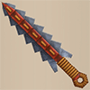
          

          

            

              
Atk

              
4

              
Slot

              
6

              
Buy

              
5500

              
Sell

              
2200

              
Rune

              
 Third Strike

            

            
After missing 2 attacks, the next attack is a guaranteed Critical Hit.

            
No additional notes.

          

        

      </td>
    </tr>
    <tr>
      <th>
        

          
Quad-edge

        

      </th>
    </tr>
    <tr>
      <td>
        

          

            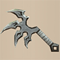
          

          

            

              
Atk

              
6

              
Slot

              
4

              
Buy

              
5600

              
Sell

              
2240

              
Rune

              
 Quintessence

            

            
A weapon with four linked blades. After 4 consecutive hits, the next attack is a guaranteed Critical Hit.

            
No additional notes.

          

        

      </td>
    </tr>
    <tr>
      <th>
        

          
Auspicious Kumade

        

      </th>
    </tr>
    <tr>
      <td>
        

          

            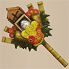
          

          

            

              
Atk

              
7

              
Slot

              
7

              
Buy

              
5700

              
Sell

              
2280

              
Rune

              
 Critical At 7

            

            
A lucky bear's paw. When the last digit of HP is 7, normal attacks become Critical Hits. Resonance Effect (Auspicious Omamori): Traps are less likely to ensnare you.

            
Critical hits deal x1.5 damage. Resonance's chance to negate trap activation is roughly 70%.

          

        

      </td>
    </tr>
    <tr>
      <th>
        

          
Pickaxe

        

      </th>
    </tr>
    <tr>
      <td>
        

          

            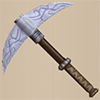
          

          

            

              
Atk

              
8

              
Slot

              
1

              
Buy

              
1000

              
Sell

              
400

              
Rune

              
 Wall Dig

            

            
Can dig through walls. Digging has a chance of decreasing Upgrade Value. If Weapon power reaches 0, it can no longer dig.

            
Roughly 50% chance for Upgrade Value to decrease. The weapon itself won't break from digging.

          

        

      </td>
    </tr>
    <tr>
      <th>
        

          
Golden Pickaxe

        

      </th>
    </tr>
    <tr>
      <td>
        

          

            
          

          

            

              
Atk

              
2

              
Slot

              
10

              
Buy

              
18000

              
Sell

              
7200

              
Rune

              
 Max Wall Dig

            

            
Can dig through walls. Digging will not decrease Upgrade Value.

            
Confirmed Location: Isle of the Mighty - Shop 49F

          

        

      </td>
    </tr>
    <tr>
      <th>
        

          
Wooden Mallet

        

      </th>
    </tr>
    <tr>
      <td>
        

          

            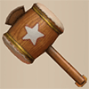
          

          

            

              
Atk

              
7

              
Slot

              
3

              
Buy

              
1000

              
Sell

              
400

              
Rune

              
 Trap Bust

            

            
Can break Traps and items on the ground. Breaking things has a chance of decreasing Upgrade Value. If Weapon strength reaches 0, it cannot break things. Breaking a Pot will spill its contents. Can also be used to extract the contents of an Unbreakable Pot.

            
Roughly 50% chance for Upgrade Value to decrease. The weapon itself won't break from breaking traps or items.

          

        

      </td>
    </tr>
    <tr>
      <th>
        

          
Epic Hammer

        

      </th>
    </tr>
    <tr>
      <td>
        

          

            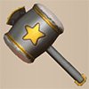
          

          

            

              
Atk

              
2

              
Slot

              
5

              
Buy

              
15000

              
Sell

              
6000

              
Rune

              
 Max Trap Bust

            

            
Can break Traps and items on the ground. Breaking things will not decrease Upgrade Value. Breaking a Pot will spill its contents. Can also be used to extract the contents of an Unbreakable Pot.

            
Confirmed Location: Isle of the Mighty - Shop 49F

          

        

      </td>
    </tr>
    <tr>
      <th>
        

          
Trapseeker

        

      </th>
    </tr>
    <tr>
      <td>
        

          

            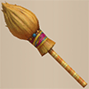
          

          

            

              
Atk

              
4

              
Slot

              
5

              
Buy

              
4400

              
Sell

              
1760

              
Rune

              
 Trap-finding

            

            
As if sweeping a broom, attacking will uncover hidden Traps ahead of you in an area 3 tiles wide and up to 2 tiles away.

            
No additional notes.

          

        

      </td>
    </tr>
    <tr>
      <th>
        

          
Bonito Block

        

      </th>
    </tr>
    <tr>
      <td>
        

          

            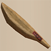
          

          

            

              
Atk

              
6

              
Slot

              
6

              
Buy

              
1800

              
Sell

              
720

              
Rune

              
 Dried Bonito

            

            
Nibbling on this restores Fullness by 20 but decreases Upgrade Value. If Weapon power reaches 0, you can no longer nibble on it. Resonance Effect (Shield of Sating): Attacks may inflict Onigiri status on the target.

            
Resonance's chance to inflict Onigiri status is roughly 10.5%.

          

        

      </td>
    </tr>
    <tr>
      <th>
        

          
Yamanba's Cleaver

        

      </th>
    </tr>
    <tr>
      <td>
        

          

            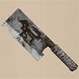
          

          

            

              
Atk

              
10

              
Slot

              
7

              
Buy

              
4000

              
Sell

              
1600

              
Rune

              
 Cursed Might

            

            
A kitchen knife spoken of in folktales. Equipping this Cursed weapon increases Strength by 1. Resonance Effect (Yamanba's Potlid): While Resonating, Weapon and Shield become Cursed, further increasing Strength by 4.

            
Despite the in-game description, it's not always found cursed.

          

        

      </td>
    </tr>
    <tr>
      <th>
        

          
Break-Off Blade

        

      </th>
    </tr>
    <tr>
      <td>
        

          

            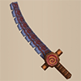
          

          

            

              
Atk

              
30

              
Slot

              
10

              
Buy

              
3000

              
Sell

              
1200

              
Rune

              
 Dulling

            

            
The blade deteriorates with each attack, decreasing its Upgrade Value. Resonance Effect (Break-Off Shield): Occasionally prevents deterioration.

            
Resonance's chance to activate hasn't been tested yet.

          

        

      </td>
    </tr>
  </tbody>
</table>
