# Overview

Clear Icons and Achievements are automatically attained as you reach certain milestones. ※ This page last updated November 5th, 2024 (Game version 2.1.1).

# Clear Icons

Colors = Update Required / DLC Required

|Icon|In-Game Description|Version|
|-|-|-|
|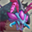|Completed the "Serpentcoil Island" story arc.|1.0.0|
||Completed the "Suiryu" story arc.|1.0.0|
|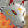|Completed the "Kokatsu" story arc.|1.0.0|
|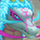|Completed the "Reconciliation" story arc.|1.0.0|
||Completed "The Two Pirate Gangs" story arc.|1.0.0|
||Completed the "Peach Club" story arc.|1.0.0|
|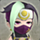|Completed the "Secret Ninja Village" story arc.|1.0.0|
|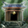|Completed the "Secluded Path" story arc.|1.0.0|
|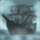|Completed the "Ghost Ship" story arc.|1.0.0|
|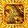|Completed the "Golden Highway" story arc.|1.0.0|
||Completed the "Kiki Island" story arc.|1.0.0|
||Completed the "Yamakagashi Pass" story arc.|1.0.0|
||Completed the "Peach Dungeon" story arc.|1.0.0|
||Completed the "Training Path of Inference" story arc.|1.0.0|
|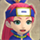|Completed the "Asuka" story arc.|1.0.0|
|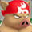|Completed the "Porky the Pirate" story arc.|1.0.0|
||Completed the "Tugai" story arc.|1.0.0|
||Completed the "Hibiki" story arc.|1.0.0|
||Completed the "Sumo Dungeon" story arc.|1.0.0|
||Completed the "Cat-Ching's Divine Will" story arc.|1.0.0|
|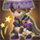|Completed the "Trapper's Secret Path" story arc.|1.0.0|
|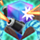|Completed the "Training Path of Gimmicks" story arc.|1.0.0|
||Completed the "Training Path of Shopping" story arc.|1.0.0|
|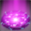|Completed the "Behemoth Rush" story arc.|1.0.0|
|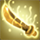|Completed the "Sacred Ocean Tunnel" story arc.|1.0.0|
|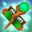|Completed the "Domain of Staves and Scrolls" story arc.|1.0.0|
|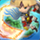|Completed the "Isle of the Mighty" story arc.|1.0.0|
|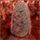|Completed the "Heart of Serpentcoil Island" story arc.|1.0.0|
||Unlocked "Kokatsu Shiren" to adventure as.|1.1.0|
||Unlocked "Tatsumi Shiren" to adventure as.|1.2.0|
||Unlocked "Koppa" to adventure as.|2.0.1|
|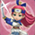|Unlocked "Asuka" to adventure as.|2.1.1|

# Achievements

Colors = Update Required / DLC Required

|No|Achievement|In-Game Description|Version|
|-|-|-|-|
|1|Serpentcoil Island Completion|Defeated Jakaku and completed Serpentcoil Island.|1.0.0|
|2|Dune of Batsu Completion|Defeated Embodiment of Batsu and completed Dune of Batsu.|1.0.0|
|3|Cavern of Suiryu Completion|Defeated Embodiment of Suiryu and completed Cavern of Suiryu.|1.0.0|
|4|Yamakagashi Pass Completion|Defeated Madara and completed Yamakagashi Pass.|1.0.0|
|5|Kiki Island Completion|Completed Kiki Island.|1.0.0|
|6|Training Path of Inference Completion|Completed Training Path of Inference.|1.0.0|
|7|Training Path of Extra Inference Completion|Completed Training Path of Extra Inference.|1.0.0|
|8|Peach Dungeon Completion|Completed Peach Dungeon.|1.0.0|
|9|Sumo Dungeon Completion|Completed Sumo Dungeon.|1.0.0|
|10|Cat-Ching's Divine Will Completion|Completed Cat-Ching's Divine Will.|1.0.0|
|11|Trapper's Secret Path Completion|Completed Trapper's Secret Path.|1.0.0|
|12|Training Path of Gimmicks Completion|Completed Training Path of Gimmicks.|1.0.0|
|13|Training Path of Shopping Completion|Completed Training Path of Shopping.|1.0.0|
|14|Behemoth Rush Completion|Completed Behemoth Rush.|1.0.0|
|15|Sacred Ocean Tunnel Completion|Completed Sacred Ocrean Tunnel.|1.0.0|
|16|Domain of Staves and Scrolls Completion|Completed Domain of Staves and Scrolls.|1.0.0|
|17|Isle of the Mighty Completion|Completed Isle of the Mighty.|1.0.0|
|18|Heart of Serpentcoil Island Completion|Completed Heart of Serpentcoil Island.|1.0.0|
|19|Go Go Dungeon Completion|Completed Go Go Dungeon.|2.0.1|
|20|Wanderers' Highway Completion|Completed Wanderers' Highway.|2.0.1|
|21|Quietude of Serpentcoil Island Completion|Completed Quietude of Serpentcoil Island.|2.0.1|
|22|Training Path of Hiding Completion|Completed Training Path of Hiding.|2.1.1|
|23|Cliff of Condensing Completion|Completed Cliff of Condensing.|2.1.1|
|24|Wild Monster Path Completion|Completed Wild Monster Path.|2.1.1|
|25|Forest of Frugality Completion|Completed Forest of Frugality.|2.0.1|
|26|Researcher's Experimental Site Completion|Completed Researcher's Experimental Site.|2.0.1|
|27|Winding Valley Completion|Completed Winding Valley.|2.0.1|
|28|Clash of Weapons and Shields Completion|Completed Clash of Weapons and Shields.|2.0.1|
|29|Peachy Trap Domain Completion|Completed Peachy Trap Domain.|2.0.1|
|30|Training Path of Deadly Strikes Completion|Completed Training Path of Deadly Strikes.|2.1.1|
|31|Battleground of the Rivals Completion|Completed Battleground of the Rivals.|2.1.1|
|32|Timeworn Cave Completion|Completed Timeworn Cave.|2.1.1|
|33|Floral Garden Completion|Completed Floral Garden.|2.1.1|
|34|Soul of Serpentcoil Island Completion|Completed Soul of Serpentcoil Island.|2.1.1|
|35|Sumo-ready!|Experienced the Sumo condition.|1.0.0|
|36|Wish Granted|Reached the Tunnel of Wishes.|1.0.0|
|37|Blue Sacred Gear|Brought back a Blue Sacred item.|1.0.0|
|38|Golden Sacred Gear|Brought back a Golden Sacred item.|1.0.0|
|39|Cannon Master|Defeated a monster in a dungeon with a cannon.|1.0.0|
|40|Way of Gitau|Took the shop's wares and managed to escape.|1.0.0|
|41|Trusty Companions|Recruited all companions.|1.0.0|
|42|Seasoned Wanderer|Completed Kron's challenge.|1.0.0|
|43|Behemoth Vanquished!|Defeated a Behemoth.|1.0.0|
|44|Grilled to Perfection!|Had an Onigiri grilled.|1.0.0|
|45|How Did You Know?!|Attacked a Ninja in hiding.|1.0.0|
|46|Cooking in the Wild|Made a Hen into Yakitori.|1.0.0|
|47|Don't Overdo Your Diet|Collapsed due to starvation.|1.0.0|
|48|Don't Overstay in the Dungeon|Had a gust send you back to Shukuba Beach.|1.0.0|
|49|Immediate Danger!|Got thrown into a Monster House.|1.0.0|
|50|Awwww, How Cute!|Became friendly with a monster pup.|1.0.0|
|51|Rejoined by Fate|Bought back your weapon or shield at an Unsuspicious Shop.|1.0.0|
|52|First Successful Rescue|Succeeded in rescuing a Wanderer.|1.0.0|
|53|Invitation to a Parallel World *1|Uploaded Parallel Data.|1.0.0|
|54|Journey to a Parallel World|Went on a Parallel Play adventure.|1.0.0|
|55|First Gear on the Rack|Hung a weapon or shield on the Gear Rack.|2.0.1|
|56|Weapon Collector|Completed the Weapon listing in the Item Notes.|1.0.0|
|57|Shield Collector|Completed the Shield listing in the Item Notes.|1.0.0|
|58|Bracelet Appraiser|Completed the Bracelet listing in the Item Notes.|1.0.0|
|59|Arrow Collector|Completed the Arrow listing in the Item Notes.|1.0.0|
|60|Rock Collector|Completed the Rock listing in the Item Notes.|1.0.0|
|61|Gourmet|Completed the Food listing in the Item Notes.|1.0.0|
|62|Vegetarian|Completed the Grass listing in the Item Notes.|1.0.0|
|63|Scroll Collector|Completed the Scroll listing in the Item Notes.|1.0.0|
|64|Master of Staves|Completed the Stave listing in the Item Notes.|1.0.0|
|65|Fragrance Expert|Completed the Incense listing in the Item Notes.|1.0.0|
|66|Pottery Aficionado|Completed the Pot listing in the Item Notes.|1.0.0|
|67|Peach Bun Lover|Completed the Peach Bun listing in the Item Notes.|1.0.0|
|68|Monster Whiz|Completed the Monster Notes.|1.0.0|
|69|Dojo Conqueror|Completed all Dojo Challenges at Monster Dojo.|1.1.0|
|70|Quick-witted|Completed a Sacred Tree dungeon in a Countdown Trial.|1.1.0|
|71|Most Efficient Moves|Completed a Sacred Tree dungeon in a Turn Trial.|1.1.0|
|72|Fastest Run|Completed a Sacred Tree dungeon in a Time Trial.|1.1.0|
|73|Proven Expert|Completed a Sacred Tree dungeon in a Challenge Trial.|1.1.0|
|74|A Monster's Life|Completed a Sacred Tree dungeon in a Monster Trial.|1.1.0|
|75|Tale of the Burning Sand|Completed a Sacred Tree dungeon as Kokatsu Shiren.|1.1.0|
|76|Dragon God's Frolic|Completed a Sacred Tree dungeon as Tatsumi Shiren.|1.2.0|
|77|Ferret's Feat|Completed a Sacred Tree dungeon as Koppa.|2.0.1|
|78|Bladedancing Swordswoman|Completed a Sacred Tree dungeon as Asuka.|2.1.1|

*1 Requires an internet connection.

# Rewards

Colors = Update Required / DLC Required

|Preview|Count|Reward|Version|
|-|-|-|-|
|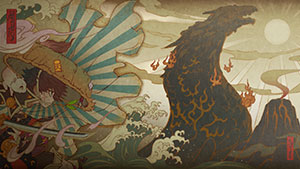|-|Wallpaper (Default)|1.0.0|
|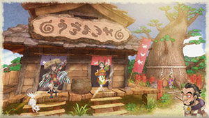|2|Wallpaper "Shukuba Beach"|1.0.0|
|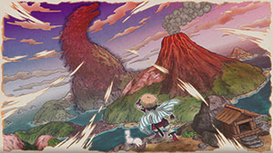|4|Wallpaper "The View from Mount Jingara"|1.0.0|
|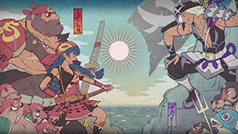|6|Wallpaper "The Two Pirate Gangs"|1.0.0|
|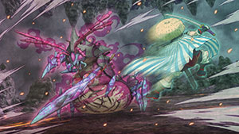|8|Wallpaper "The Battle Against Jakaku"|1.0.0|
|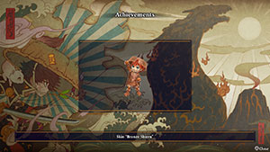|10|Skin "Bronze Shiren"|1.0.0|
|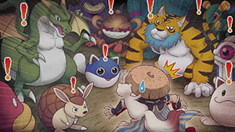|12|Wallpaper "It's a Monster House!"|1.0.0|
|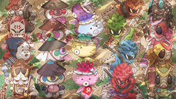|14|Wallpaper "Serpentcoil Island Locals"|1.0.0|
||16|Wallpaper "Welcome to Uzumaki-Ya!"|1.0.0|
|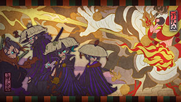|18|Wallpaper "Kantenbo's Perspective"|1.0.0|
|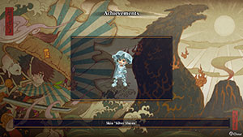|20|Skin "Silver Shiren"|1.0.0|
|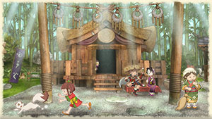|23|Wallpaper "Secret Ninja Village"|1.0.0|
|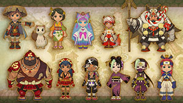|26|Wallpaper "Group Shot Part 1"|1.0.0|
|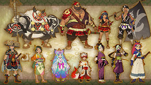|29|Wallpaper "Group Shot Part 2"|1.0.0|
|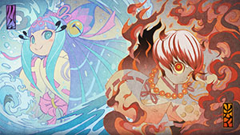|32|Wallpaper "Tatsumi and Kokatsu"|1.0.0|
|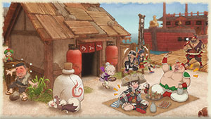|35|Wallpaper "Party at Small Harbor"|1.0.0|
|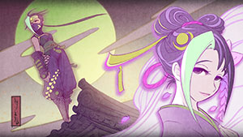|38|Wallpaper "Ninja Princess in Moonlight"|1.0.0|
|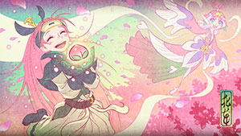|41|Wallpaper "Asuka Loves Peach Buns!"|1.0.0|
|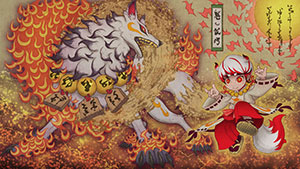|44|Wallpaper "Flame Amidst the Sandstorm"|1.0.0|
|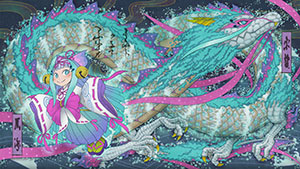|47|Wallpaper "The Dragon God of Water"|1.0.0|
|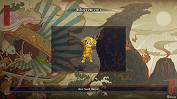|50|Skin "Gold Shiren"|1.0.0|
|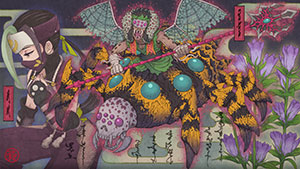|52|Wallpaper "Seki and Madara"|1.1.0|
|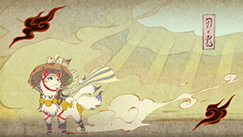|55|Wallpaper "Kokatsu Shiren"|1.1.0|
|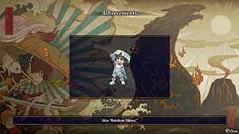|58|Skin "Rainbow Shiren"|1.1.0|
|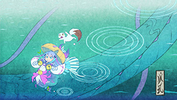|59|Wallpaper "Tatsumi Shiren"|1.2.0|
|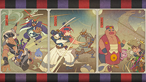|60|Wallpaper "Series: Showdown!"|2.0.1|
|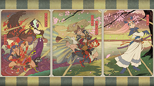|63|Wallpaper "Series: The Adventurers"|2.0.1|
|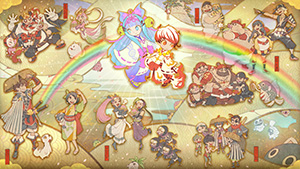|66|Wallpaper "The Grand Finale!"|2.0.1|
|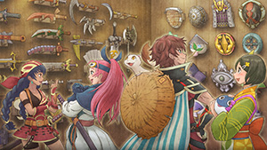|69|Wallpaper "Proof of Myriad Battles"|2.0.1|
|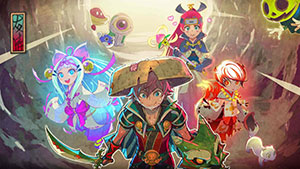|74|Wallpaper "Onward to a New Challenge"|2.1.1|
|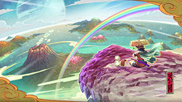|78|Wallpaper "A Truly Magnificent View"|2.1.1|

