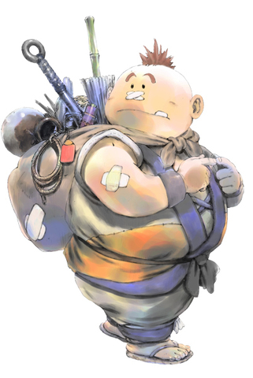
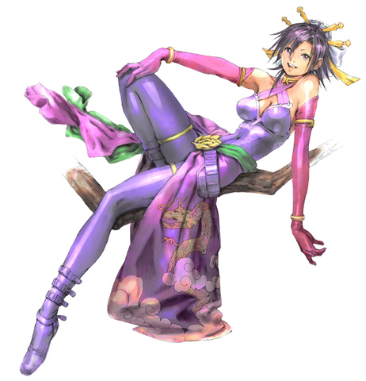
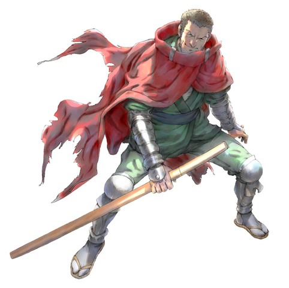

  

## Overview

Allies are NPC characters who fight monsters alongside Shiren. 
There are 4 ally characters in this game - Pekeji, Oryu, Kechi, and Borg Mamel. 
Some characters have a unique ability or can grow stronger through leveling up.

Those looking for a more classic roguelike experience can play without allies.

<ul class="quickLinksUL">
  <li><a href="#overview">Overview</a>
    <ul>
      <li><a href="#unlocking-allies">Unlocking Allies</a></li>
      <li><a href="#ally-hp">Ally HP</a></li>
    </ul>
  </li>
  <li><a href="#characters">Characters</a>
    <ul>
      <li><a href="#pekeji">Pekeji</a></li>
      <li><a href="#oryu">Oryu</a></li>
      <li><a href="#kechi">Kechi</a></li>
      <li><a href="#borg-mamel">Borg Mamel</a></li>
    </ul>
  </li>
  <li><a href="#borg-mamel-items">Borg Mamel Items</a></li>
</ul>

### Unlocking Allies

Allies must be unlocked before they can join your adventures. 
Once unlocked, Pekeji, Oryu, and Kechi can be randomly encountered in Kobami Valley. Borg Mamel can always be found at Canyon Hamlet once unlocked.

|Character|Condition|
|-|-|
|Pekeji|1. Talk to Pekeji inside the Bamboo Village shop and answer "Yes" regarding your name. 2. Go to the bar called Yoidore and listen to what Pekeji has to say. Subsequent Adventure 3. Talk to Pekeji inside the Bamboo Village shop, then go to the bar. 4. Answer "How much do you need?", then "Wait! If it's money you need..." to give 1000G. Subsequent Adventure 5. Watch Pekeji get kicked out of the bar in Bamboo Village. 6. Select "Punch him" twice after going through all 3 dialogue options.|
|Oryu|1. Talk to her in Kobami Valley (1-4F) and answer "Yes" twice to her offer. Subsequent Adventure 2. Talk to her in Kobami Valley (1-4F) and get blinded again. Subsequent Adventure 3. Help her near the Blacksmith in Bamboo Village when she's cornered by two guys. 4. Afterward, answer "Yes" when she asks to join.|
|Kechi|1. Talk to Kechi in Kobami Valley (1-4F) and pay 200G for a massage. ・The massage you receive must be a successful one to continue. Subsequent Adventure 2. Meet Kechi in Bamboo Village (south) to learn that he's a wanted man. Subsequent Adventure 3. Meet Kechi in Mountaintop Town, then answer "Yes" when he asks to join.|
|Borg Mamel|1. Clear Fay's Final Puzzle and reach The Other Side of the World. 2. Before leaving, talk to Borg Mamel and answer "Yes" to taking them along.|

### Ally HP

Unlike Shiren 5, this game doesn't have a way to display ally HP. 
You can talk to them to get a rough idea, but keep in mind that talking is a turn ending action. 

Medicinal Herb, Restorative Herb, and Herb of Life will restore HP when thrown at an ally. 
Max HP won't increase when they're at full HP.

## Characters

### Pekeji

#### Description

Crass guy who claims to be Shiren's brother, but looks nothing like him. Starts out being nearly useless as an ally, but eventually becomes very reliable.

#### Unlock Condition

1. Talk to Pekeji inside the Bamboo Village shop and answer "Yes" regarding your name.
2. Go to the bar called Yoidore and listen to what Pekeji has to say. Subsequent Adventure
3. Talk to Pekeji inside the Bamboo Village shop, then go to the bar.
4. Answer "How much do you need?", then "Wait! If it's money you need..." to give 1000G. Subsequent Adventure
5. Watch Pekeji get kicked out of the bar in Bamboo Village.
6. Select "Punch him" twice after going through all 3 dialogue options.

#### Characteristics

- Only uses direct attacks.
- Lv1-7: Stops moving once his fullness is depleted.
    - Leave him behind, and he'll have leveled up the next time you see him.
- Lv1-7: Occasionally attacks Shiren instead of a monster.
- Lv8: Occasionally lands a critical hit.

#### Stats

|Lv|HP|Atk|Def|Fullness|
|-|-|-|-|-|
|1|20|16|6|15|
|2|25|18|8|16|
|3|30|20|10|17|
|4|35|22|12|18|
|5|40|24|12|19|
|6|45|26|14|20|
|7|50|28|14|21|
|8|75|30|18|∞|

### Oryu

#### Description

Somewhat mysterious young lady who excels at blinding opponents. Her special attack that blinds all enemies in the room is extremely powerful.

#### Unlock Condition

1. Talk to her in Kobami Valley (1-4F) and answer "Yes" twice to her offer. Subsequent Adventure
2. Talk to her in Kobami Valley (1-4F) and get blinded again. Subsequent Adventure
3. Help her near the Blacksmith in Bamboo Village when she's cornered by two guys.
4. Afterward, answer "Yes" when she asks to join.

#### Characteristics

- Special attack blinds all enemies in the room.

#### Stats

|Lv|HP|Atk|Def|
|-|-|-|-|
|1|65|25|18|

### Kechi

#### Description

Odd man who pretends to be blind to gain an advantage in life. He gives a massage which either restores HP and strength, or has a bad effect.

#### Unlock Condition

1. Talk to Kechi in Kobami Valley (1-4F) and pay 200G for a massage. ・The massage you receive must be a successful one to continue. Subsequent Adventure
2. Meet Kechi in Bamboo Village (south) to learn that he's a wanted man. Subsequent Adventure
3. Meet Kechi in Mountaintop Town, then answer "Yes" when he asks to join.

#### Characteristics

- Only uses direct attacks.
- Can request a massage 1 time per floor.
    - Success = Fully restore HP and strength.
    - Failure = Lose 10 HP, 1 strength, and 30 fullness.

#### Stats

|Lv|HP|Atk|Def|
|-|-|-|-|
|1|60|30|15|

### Borg Mamel

#### Description

Its default name is "Borg Mamel", but can be renamed when it first joins you.

Levels up when specific items are thrown at it. ※ The item's name has to be an exact match, along with cursed status + meld abilities.

#### Unlock Condition

1. Clear Fay's Final Puzzle and reach The Other Side of the World.
2. Before leaving, talk to Borg Mamel and answer "Yes" to taking them along.

#### Characteristics

- Only uses direct attacks.
- Levels up when hit by a requested item, and can go as high as Lv99.

#### Stats

Exact values for Borg Mamel haven't been datamined.

## Borg Mamel Items

The item's name has to be an exact match, along with cursed status + meld abilities. Item names that are monster names such as "Floor Dragon" = monster meat. See [Meld Abilities](/system/meld-abilities) for meld ingredients.

- C = Cursed

 

<table class="borgTable">
  <thead>
    <tr>
      <th>Lv</th>
      <th>Item</th>
      <th>Lv</th>
      <th>Item</th>
      <th>Lv</th>
      <th>Item</th>
      <th>Lv</th>
      <th>Item</th>
    </tr>
  </thead>
  <tbody>
    <tr>
      <td class="highlightGray">1</td>
      <td>Any Riceball</td>
      <td class="highlightGray">26</td>
      <td>Dragon Herb</td>
      <td class="highlightGray">51</td>
      <td>Monster Scroll</td>
      <td class="highlightGray">76</td>
      <td>Sickle Slayer </td>
    </tr>
    <tr>
      <td class="highlightGray">2</td>
      <td>Any Herb</td>
      <td class="highlightGray">27</td>
      <td>Blastwave Scroll</td>
      <td class="highlightGray">52</td>
      <td>Herb of Victory</td>
      <td class="highlightGray">77</td>
      <td>Blank Scroll (C)</td>
    </tr>
    <tr>
      <td class="highlightGray">3</td>
      <td>Any Scroll</td>
      <td class="highlightGray">28</td>
      <td>Jar of Change</td>
      <td class="highlightGray">53</td>
      <td>Any Trap</td>
      <td class="highlightGray">78</td>
      <td>Happiness Herb</td>
    </tr>
    <tr>
      <td class="highlightGray">4</td>
      <td>Any Staff</td>
      <td class="highlightGray">29</td>
      <td>Any Meat</td>
      <td class="highlightGray">54</td>
      <td>Floor Dragon</td>
      <td class="highlightGray">79</td>
      <td>Dragon (C)</td>
    </tr>
    <tr>
      <td class="highlightGray">5</td>
      <td>Gitan</td>
      <td class="highlightGray">30</td>
      <td>Polearm </td>
      <td class="highlightGray">55</td>
      <td>Little Belly Seed</td>
      <td class="highlightGray">80</td>
      <td>Passage Armband</td>
    </tr>
    <tr>
      <td class="highlightGray">6</td>
      <td>Any Shield</td>
      <td class="highlightGray">31</td>
      <td>Iron Arrow</td>
      <td class="highlightGray">56</td>
      <td>Armor Ward </td>
      <td class="highlightGray">81</td>
      <td>Golden Blade </td>
    </tr>
    <tr>
      <td class="highlightGray">7</td>
      <td>Any Weapon</td>
      <td class="highlightGray">32</td>
      <td>Restorative Herb</td>
      <td class="highlightGray">57</td>
      <td>Pickaxe* </td>
      <td class="highlightGray">82</td>
      <td>Drain Buster  (C)</td>
    </tr>
    <tr>
      <td class="highlightGray">8</td>
      <td>Any Staff (C)</td>
      <td class="highlightGray">33</td>
      <td>Hide Shield</td>
      <td class="highlightGray">58</td>
      <td>Rustless Armband</td>
      <td class="highlightGray">83</td>
      <td>Razor Wind </td>
    </tr>
    <tr>
      <td class="highlightGray">9</td>
      <td>Weeds</td>
      <td class="highlightGray">34</td>
      <td>Armband of Calm</td>
      <td class="highlightGray">59</td>
      <td>Extraction Scroll</td>
      <td class="highlightGray">84</td>
      <td>Minotaur's Axe  (C)</td>
    </tr>
    <tr>
      <td class="highlightGray">10</td>
      <td>Cudgel</td>
      <td class="highlightGray">35</td>
      <td>Air Bless Scroll</td>
      <td class="highlightGray">60</td>
      <td>Melding Jar (C)</td>
      <td class="highlightGray">85</td>
      <td>Kabra's Blade </td>
    </tr>
    <tr>
      <td class="highlightGray">11</td>
      <td>Big Riceball</td>
      <td class="highlightGray">36</td>
      <td>Doppelganger Staff</td>
      <td class="highlightGray">61</td>
      <td>Giant Riceball</td>
      <td class="highlightGray">86</td>
      <td>Evasive Shield  (C)</td>
    </tr>
    <tr>
      <td class="highlightGray">12</td>
      <td>Medicinal Herb</td>
      <td class="highlightGray">37</td>
      <td>Skull Staff</td>
      <td class="highlightGray">62</td>
      <td>Great Hall Scroll</td>
      <td class="highlightGray">87</td>
      <td>Gold Shield </td>
    </tr>
    <tr>
      <td class="highlightGray">13</td>
      <td>Wood Shield</td>
      <td class="highlightGray">38</td>
      <td>Walrus Jar</td>
      <td class="highlightGray">63</td>
      <td>Minotaur</td>
      <td class="highlightGray">88</td>
      <td>Dragonward  (C)</td>
    </tr>
    <tr>
      <td class="highlightGray">14</td>
      <td>Gitan</td>
      <td class="highlightGray">39</td>
      <td>Weeds (C)</td>
      <td class="highlightGray">64</td>
      <td>Armband of Sight (C)</td>
      <td class="highlightGray">89</td>
      <td>Blast Shield </td>
    </tr>
    <tr>
      <td class="highlightGray">15</td>
      <td>Scroll of Light</td>
      <td class="highlightGray">40</td>
      <td>Gitan</td>
      <td class="highlightGray">65</td>
      <td>Crescent Arm </td>
      <td class="highlightGray">90</td>
      <td>Windshield  (C)</td>
    </tr>
    <tr>
      <td class="highlightGray">16</td>
      <td>Power Up Scroll</td>
      <td class="highlightGray">41</td>
      <td>Mastersword</td>
      <td class="highlightGray">66</td>
      <td>Lightning Staff</td>
      <td class="highlightGray">91</td>
      <td>Monster Jar (C)</td>
    </tr>
    <tr>
      <td class="highlightGray">17</td>
      <td>Wooden Arrow</td>
      <td class="highlightGray">42</td>
      <td>Silver Arrow</td>
      <td class="highlightGray">67</td>
      <td>Gitan</td>
      <td class="highlightGray">92</td>
      <td>Half Master</td>
    </tr>
    <tr>
      <td class="highlightGray">18</td>
      <td>Any Armband</td>
      <td class="highlightGray">43</td>
      <td>Antidrain Armband</td>
      <td class="highlightGray">68</td>
      <td>Scroll of Chains</td>
      <td class="highlightGray">93</td>
      <td>Bufu's Cleaver </td>
    </tr>
    <tr>
      <td class="highlightGray">19</td>
      <td>Knockback Staff</td>
      <td class="highlightGray">44</td>
      <td>Iron Shield</td>
      <td class="highlightGray">69</td>
      <td>Immobilization Trap</td>
      <td class="highlightGray">94</td>
      <td>Trap Armband</td>
    </tr>
    <tr>
      <td class="highlightGray">20</td>
      <td>Jar of Holding</td>
      <td class="highlightGray">45</td>
      <td>Scroll of Blessing (C)</td>
      <td class="highlightGray">70</td>
      <td>Happy Armband</td>
      <td class="highlightGray">95</td>
      <td>Kigny Shield </td>
    </tr>
    <tr>
      <td class="highlightGray">21</td>
      <td>Antidote Herb</td>
      <td class="highlightGray">46</td>
      <td>Poison Herb</td>
      <td class="highlightGray">71</td>
      <td>Walrus Shield  (C)</td>
      <td class="highlightGray">96</td>
      <td>Kigny Axe </td>
    </tr>
    <tr>
      <td class="highlightGray">22</td>
      <td>Katana</td>
      <td class="highlightGray">47</td>
      <td>Evil Soldier (C)</td>
      <td class="highlightGray">72</td>
      <td>Herb of Invisibility (C)</td>
      <td class="highlightGray">97</td>
      <td>Stormward </td>
    </tr>
    <tr>
      <td class="highlightGray">23</td>
      <td>Bronzeward</td>
      <td class="highlightGray">48</td>
      <td>Chiropractic Jar</td>
      <td class="highlightGray">73</td>
      <td>Scroll of Removal</td>
      <td class="highlightGray">98</td>
      <td>Kabra Reborn </td>
    </tr>
    <tr>
      <td class="highlightGray">24</td>
      <td>Sleepless Armband</td>
      <td class="highlightGray">49</td>
      <td>Staff of Sloth (C)</td>
      <td class="highlightGray">74</td>
      <td>Special Riceball</td>
      <td class="highlightGray">99</td>
      <td>-</td>
    </tr>
    <tr>
      <td class="highlightGray">25</td>
      <td>Riceball</td>
      <td class="highlightGray">50</td>
      <td>Jar of Hiding</td>
      <td class="highlightGray">75</td>
      <td>Sealing Staff</td>
      <td colspan="2"></td>
    </tr>
  </tbody>
</table>

Pickaxe* = Unbreakable Pickaxe obtained from the Blacksmith.
