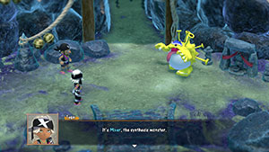
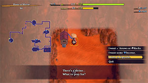

# Shiren

#### HP

Shiren collapses and the adventure ends in failure if HP falls to 0. HP decreases from things like monster attacks, certain traps and items, and starvation. HP can be restored by using items like Otogirisou, Healing Grass, Fixer Scroll, or Rejuvenation Pot. HP also naturally regenerates as turns elapse outside of battle or through item usage.

#### HP Regeneration Rate

The speed at which HP regenerates is based on Shiren's level.

|Level|Rate|
|-|-|
|1~9|+1 HP / Turn|
|10~19|+2 HP / Turn|
|20~99|+3 HP / Turn|

#### Fullness

Fullness depletes as turns elapse, and Shiren takes 1 damage per turn once it reaches 0. Replenish fullness by eating food items such as Onigiri, Yakitori, Sweet Potato, or Peach Bun. Fixer Scroll fully restores Fullness if read when Fullness &le; 20, and Grass items replenish 2 Fullness.

#### Fullness Depletion Rate

|State|Rate|
|-|-|
|Normal|1 Fullness / 10 Turns|
|Sating (Shield Rune)|1 Fullness / 20 Turns|
|Sumo Status|1 Fullness / 5 Turns|
|Sating + Sumo Status|1 Fullness / 10 Turns|
|Healing Bracelet|6 Fullness / 10 Turns|
|Healing Bracelet x 2|12 Fullness / 10 Turns|
|Sating + Healing Bracelet|3 Fullness / 10 Turns|
|Sating + Healing Bracelet x 2|6 Fullness / 10 Turns|

#### Sumo Status

New status in Shiren 6 that activates when Shiren's Fullness &ge; 150.

Sumo Status Details:

- Max HP increases by 50.
- Shiren gains a x1.5 multiplier on damage dealt.
- Stepping on a trap simply destroys the trap without triggering it.
    - This includes Pitfall Traps, so be careful when stealing from a dungeon shop.
    - You can pick up or step on traps if you have a Trapper's Bracelet equipped.
    - Spring Traps needed to escape item islands won't break.
- Items and monster special attacks that move or warp the player are nullified.
    - Items - Leaping Grass, Switching Staff, Vaulting Staff, and Skull Mage's Staff.
    - Special Attacks - Armordillo, Tiger Thrower, and Pullfrog.
    - Exception: Unequipping a Waterwalk Bracelet or Floating Bracelet while on water.
- Shiren can dig through walls with normal attacks.
    - Upgrade value won't decrease even if you have a Pickaxe equipped.
- Fullness depletes at double speed (1 Fullness / 5 Turns).
    - The Sating rune slows hunger to regular speed (1 Fullness / 10 Turns).
- If Fullness depletes to 120 or less, Sumo status ends and Max Fullness decreases by 5.
    - You must maintain 121 or higher Fullness if you want to stay in Sumo status.

Related Items:

- Sumo Onigiri
    - Fully Replenishes Fullness.
    - If Max Fullness is less than 150, also increases Max Fullness to 150.
    - Bellyexpand Bracelet and Bellyshrink Bracelet affect the final Max Fullness value.
        - Unequip Bellyexpand Bracelets before eating to avoid diminishing the benefits.
        - Equip Bellyshrink Bracelets before eating to increase Max Fullness further.
- Huge Onigiri
    - Increases Max Fullness by 5, so it cancels out the Max Fulless loss when Sumo Status ends.
- Bellyexpand Bracelet
    - Equipping 1 increases the Max Fullness limit to 225.
        - This lets you eat a Large Onigiri at 125 Fullness to maintain Sumo Status without waste.
        - Only practical if you perform Nigiri Morph Factory to raise Max Fullness to the limit.
- Peach Bun
    - Eating a Peach Bun outside of Sumo Status:
        - If Fullness goes above 150 from eating the Peach Bun, you can wait until Fullness &lt; 150 before reverting from Morphed Status to avoid activating Sumo Status.
    - Eating a Peach Bun during Sumo Status:
        - The Max HP +50 effect from Sumo Status doesn't apply during Morphed status.
        - Reverting after Fullness goes below 120 skips the -5 Max Fullness penalty.

#### Attack Accuracy

|Type|Accuracy|
|-|-|
|Normal Attack|92%|
|Normal Attack (Rustproof)|94%|
|Accurate Sword|100%|
|Projectile|84%|
|Arrow/Rock + Rapid-fire Bracelet|91~92%|

#### Damage Dealt

This section is for Shiren's normal attack damage. (Translated from [feketerigo's note](https://note.com/feketerigo6/n/n44e373fda515))

Formula:

<pre>
Dmg = (ATK x RNG - DEF + 1) x Slayer x Sumo x Empowered/Weakened x Fortified/Softened
</pre>

Explanation:

- ATK = STR_ATK + WPN_ATK + LV_ATK
    - STR_ATK
        - Current Strength
    - WPN_ATK
        - Weapon Strength x (0.75 + Current Strength / 32)
    - LV_ATK
        - Level &le; 5 = 1 + (Level - 1) x 1.5
        - 6 &le; Level &le; 13 = 7.5 + (Level - 5) x 1
        - 14 &le; Level = 15.5 + (Level - 13) x 0.5
- RNG
    - ±1/8 = 87.5 ~ 112.5%
- DEF
    - Monster's Defense / 2
- Slayer = (1 + MULT)
    - MULT (Multipliers are additive)
        - 0.5 = Beast, Aquatic, Dragon, Exploding, Floating, Ghost, Cyclops, Draining, Metal
        - 0.5 = Costly Hit, Voracious Hit, Critical Hit
        - 1.0 = Hunger Power
- Sumo
    - x1.5 damage multiplier.
- Empowered
    - 2.0 = Power-up Grass, Aggressive Incense (Can stack)
- Weakened
    - ...Is there anything that inflicts this on the player?
- Fortified
    - 1.25 = Lv4 monster receiving a buff after defeating a character.
    - 2.0 = Defensive Incense
- Softened
    - \~5.0 = Rust Trap x 8

Slayer Multiplier Example:

- Anti-Floating + Anti-Ghost + Costly Hit + Voracious Hit
    - (1 + 0.5 + 0.5 + 0.5 + 0.5) = 3.0, so the attack has a x3.0 damage multiplier.

#### Damage Received

This section is for how much damage Shiren receives from enemy attacks. (Translated from [feketerigo's note](https://note.com/feketerigo6/n/n44e373fda515))

Formula:

<pre>
Dmg = (ATK x RNG - DEF + 1) x Reduction x Empowered/Weakened x Fortified/Softened
</pre>

Explanation:

- ATK
    - Monster's Attack
- RNG
    - ±1/8 = 87.5 ~ 112.5%
- DEF
    - Shield Strength &le; 20 = Shield Strength
    - 21 &le; Shield Strength = 20 + (Shield Strength - 20) x 0.6
- Reduction (Multipliers are multiplicative)
    - 0.7 = Voracious Block, Costly Block, Hunger Power, Tough At (Number)
    - 0.5 = Full Armor
    - 0.45 = Critproof
- Empowered (Max: 5.0)
    - 2.0 = Lv4 monster receiving a buff after defeating a character.
    - 2.0 = Aquatic type monster on a water tile.
    - 2.0 = Enraged status, Aggressive Incense
    - Power-up Grass: 2.0 → 3.0 → 4.0 → 5.0
- Weakened
    - 0.5 = Poison (Poison Arrow, Rotten Onigiri)
    - Poison Arrow: 0.5 → 0.4 → 0.3 → 0.2 → 0.1 → 0.05 → 0.03? → 0.01?
- Fortified
    - 2.0 = Defensive Incense
- Softened
    - ...Is there anything that inflicts this on the player?

Reduction Multiplier Example:

- Voracious Block + Costly Block
    - (0.7 x 0.7) = 0.49, so the reduction multiplier is x0.49 which roughly halves damage.

#### Shiren's Exp Table

|Lv|Total|Difference|
|-|-|-|
|1|0|-|
|2|10|10|
|3|40|30|
|4|100|60|
|5|200|100|
|6|400|200|
|7|700|300|
|8|1,000|300|
|9|1,300|300|
|10|1,800|500|
|11|2,400|600|
|12|3,000|600|
|13|3,600|600|
|14|4,000|400|
|15|4,800|800|
|16|5,600|800|
|17|6,400|800|
|18|7,400|1,000|
|19|8,400|1,000|
|20|9,900|1,500|
|21|11,500|1,600|
|22|13,500|2,000|
|23|15,500|2,000|
|24|17,500|2,000|
|25|20,500|3,000|
|26|23,500|3,000|
|27|29,500|6,000|
|28|36,500|7,000|
|29|44,500|8,000|
|30|53,500|9,000|
|31|64,500|11,000|
|32|75,600|11,100|
|33|88,000|12,400|
|34|103,000|15,000|
|35|120,000|17,000|
|36|150,000|30,000|
|37|180,000|30,000|
|38|215,000|35,000|
|39|260,000|45,000|
|40|305,000|45,000|
|41|350,000|45,000|
|42|400,000|50,000|
|43|450,000|50,000|
|44|500,000|50,000|
|45|550,000|50,000|
|46|600,000|50,000|
|47|650,000|50,000|
|48|700,000|50,000|
|49|750,000|50,000|
|50|800,000|50,000|
|51|855,000|55,000|
|52|910,000|55,000|
|53|965,000|55,000|
|54|1,020,000|55,000|
|55|1,075,000|55,000|
|56|1,130,000|55,000|
|57|1,185,000|55,000|
|58|1,240,000|55,000|
|59|1,295,000|55,000|
|60|1,350,000|55,000|
|61|1,410,000|60,000|
|62|1,470,000|60,000|
|63|1,530,000|60,000|
|64|1,590,000|60,000|
|65|1,650,000|60,000|
|66|1,710,000|60,000|
|67|1,770,000|60,000|
|68|1,830,000|60,000|
|69|1,890,000|60,000|
|70|1,950,000|60,000|
|71|2,010,000|60,000|
|72|2,070,000|60,000|
|73|2,130,000|60,000|
|74|2,190,000|60,000|
|75|2,250,000|60,000|
|76|2,310,000|60,000|
|77|2,370,000|60,000|
|78|2,430,000|60,000|
|79|2,490,000|60,000|
|80|2,550,000|60,000|
|81|2,615,000|65,000|
|82|2,680,000|65,000|
|83|2,745,000|65,000|
|84|2,815,000|70,000|
|85|2,885,000|70,000|
|86|2,955,000|70,000|
|87|3,025,000|70,000|
|88|3,095,000|70,000|
|89|3,165,000|70,000|
|90|3,235,000|70,000|
|91|3,305,000|70,000|
|92|3,375,000|70,000|
|93|3,445,000|70,000|
|94|3,515,000|70,000|
|95|3,585,000|70,000|
|96|3,655,000|70,000|
|97|3,725,000|70,000|
|98|3,800,000|75,000|
|99|3,875,000|75,000|

# Items

#### Synthesis

  

Synthesis is a mechanic that lets you merge weapon and shield runes and upgrade value, and combine same name staves to add their remaining charges together.

※ Synthesis Pots and Mixers must be unlocked through a Side Quest before they appear in dungeons.

How to Synthesize:

The first item you insert into a Synthesis Pot or throw at a Mixer acts as the base. Each weapon or shield has a limited number of rune slots, and no more runes can be added once filled. Upgrade value can go up to +99 for any weapon or shield, and staves can go as high as 99 charges.

- Synthesis Pot
    - Insert same category items to synthesize them.
        - Can only synthesize weapons, shields or staves.
- Mixer
    - Throw items at a Mixer to synthesize them.
        - Some different category items can be synthesized (This is called Cross-Mixing).
        - Check to make sure you don't have Far-throwing status before throwing important items.
    - Unlike Shiren 5, Mixers will eat items even when afflicted with Paralyzed or Napping status.
        - Bad status conditions are cured each time Mixer eats an item.
    - The number of items a Mixer can eat depends on their level.
        - Mixer → 2, Mixermon → 3, Mixergon → 4, Mixerdon → 5
    - Bellyexpand Seed increases the number of items a Mixer can eat by 1.
        - Example: Throw a Bellyexpand Seed at a Mixer, then synthesize 3 items instead of 2.

Examples:

- Regular Synthesis
    - Katana first, Golden Sword+2 second → Katana+2 with Rustproof rune.
    - Paralyzing Staff [3] first, Paralyzing Staff [4] second → Paralyzing Staff [7].
- Cross-Mixing
    - Kataka first, Sedating Grass second → Katana with Sedating rune.
        - As mentioned earlier, Cross-Mixing is only possible with Mixer synthesis.

#### Blessings / Curses

Blessings:

- Bell icon is displayed near the item category.
- Only Food, Grass, Scrolls, and Peach Buns have the possibility of being blessed.
- The item can be used 2 times.
    - The Blessing is removed and it returns to being a regular item after the first use.
    - If thrown at a creature, the item falls on the ground underneath the creature after it hits.
- Buying and selling prices are doubled.
- Shiren 6 doesn't have Blessing Scroll or Blessing Pot, so the player cannot bless items.
    - However, Kron's Challenge can result in inventory items becoming blessed.
- If a blessed item gets targeted by a curse, it changes to a cursed item.
- The following scrolls always grant the lucky chance effect when blessed:
    - Identifier Scroll / Exorcism Scroll / Heavenly Scroll / Earthly Scroll

Curses:

- Skull icon is displayed near the item category.
- All item categories have the possibility of being cursed.
- Usage of the item becomes restricted.
    - Equipment: Cannot be unequipped.
        - Removal Trap can remove cursed items that are equipped, but the curse remains.
        - Onigiri Scroll can be used to turn the equipped item into a Large Onigiri.
    - Other Categories: The item cannot be used.
    - If a cursed item is thrown at a creature, it deals 1\~2 damage instead of its normal effect.
- Specific items can be used to remove the curse.
    - Read an Exorcism Scroll, or insert the cursed item into an Exorcism Pot.
    - If it's a weapon or shield, read one of the following scrolls:
        - Heavenly Scroll / Earthly Scroll / Plating Scroll / Slot-adding Scroll
    - If it's a weapon, shield, or bracelet, read a Fixer Scroll.
- Buying and selling prices are 87% of the item's normal price.
- How items get cursed:
    - Read a Curse Scroll.
    - Step on a Curse Trap, or throw an item onto a Curse Trap.
    - Get hit by a Curse Girl family monster's special attack.
    - Synthesize a cursed item.
        - Unlike Shiren 5, you can't remove a curse via synthesis based on the order of items.
- Items that are always found cursed:
    - Bellyshrink Bracelet / Item-losing Bracelet / Gitan-losing Bracelet
- Monster related notes:
    - Gazer's hypnosis cannot make you unequip or throw an equipped item if the item is cursed.
    - Bored Kappas can still make you equip a thrown item even if your equipped item is cursed.

#### Equipment Resonance

Certain weapons and shields activate special effects when equipped at the same time. See [Resonance](/system/equipment-resonance) for details.

#### Sacred Items

  

Sacred items are rare weapons or shields that carry random enhanced abilities. These items generally have a higher Base Value and more Rune Slots than regular equipment. In addition, sacred items can sometimes have exclusive runes called Natural Runes. Rune Slots on sacred items can occasionally be filled with silver seals (roughly 40% chance per slot). ※ The max Base Value modifier is +10 for Blue and +8 for Golden, but these values are extremely rare.

##### Sacred Item Type

- Blue - Often has a higher Base Value modifier.
    - Base Value ranges from +5 ~ +10, extra rune slots ranges from 2 ~ 5.
    - Roughly 5% chance for additional runes being present.
- Golden - Often has more Runes and Rune Slots.
    - Base Value ranges from +3 ~ +8, extra rune slots ranges from 4 ~ 7.
    - Roughly 30% chance for additional runes being present.

##### Natural Runes

|Icon|Rune|Effect|
|-|-|-|
||Back Attack|Attack in front and behind you at the same time.|
||Side Attack|Attack in front and to your left and right at the same time.|
||Anti-Behemoth|Lets you attack through a Behemoth monster's barrier.|
||Thunderbolt|Chance to deal an extra 20 damage to a target.|
||Danger Power|Deal more damage when your HP is low.|
||Critical At 0|Critical hit when last digit of your HP is 0.|
||Critical At 1|Critical hit when last digit of your HP is 1.|
||Critical At 2|Critical hit when last digit of your HP is 2.|
||Critical At 3|Critical hit when last digit of your HP is 3.|
||Critical At 4|Critical hit when last digit of your HP is 4.|
||Critical At 5|Critical hit when last digit of your HP is 5.|
||Critical At 6|Critical hit when last digit of your HP is 6.|
||Critical At 8|Critical hit when last digit of your HP is 8.|
||Critical At 9|Critical hit when last digit of your HP is 9.|

# Dungeon

#### Wind

If you linger on a dungeon floor for too long, wind will begin to blow. The first three gusts are warnings, and the fourth gust forces you back to Shukuba Beach. Revival Grass doesn't take effect when that happens, and you lose all items and Gitan. ※ The player can check the current turn count by viewing the Message Log.

##### Wind Turns

|Dungeon|1st|2nd|3rd|4th|
|-|-|-|-|-|
|Serpentcoil Island (1~14F)|1200|1300|1400|1500|
|Serpentcoil Island (15~30F)|1700|1800|1900|2000|
|Kiki Island|1700|1800|1900|2000|
|Yamakagashi Pass|900|1000|1100|1200|
|Training Path of Inference|900|1000|1100|1200|
|Training Path of Extra Inference|900|1000|1100|1200|
|Peach Dungeon|900|1000|1100|1200|
|Sumo Dungeon|900|1000|1100|1200|
|Cat-Ching's Divine Will|900|1000|1100|1200|
|Trapper's Secret Path|900|1000|1100|1200|
|Training Path of Shopping|900|1000|1100|1200|
|Behemoth Rush|900|1000|1100|1200|
|Sacred Ocean Tunnel|900|1000|1100|1200|
|Domain of Staves and Scrolls|900|1000|1100|1200|
|Isle of the Mighty|1200|1300|1400|1500|
|Heart of Serpentcoil Island|1700|1800|1900|2000|
|Tunnel of Wishes|600|700|800|900|

#### Kron's Challenge

Challenges that can occur at random in select postgame dungeons. It begins at the start of a floor, and the player is rewarded if they complete the challenge. The player is still rewarded based on their progress if they advance floors before the challenge ends, but the player won't receive any rewards if they advance using a Pitfall Trap or Floor-exiting Trap.

##### Possible Kron's Challenges

Note: The in-game text for each challenge might differ from the text in this table.

|Challenge|Gold|Silver|Bronze|Notes|
|-|-|-|-|-|
|Don't eat anything.|0 Times|1~2 Times|3~5 Times|Biting a Bonito Block is fine. Peach Buns count.|
|Don't throw or shoot anything.|0 Times|1~2 Times|3~5 Times|-|
|Don't swing staves.|0 Times|1~2 Times|3~5 Times|Cursed staves count.|
|Don't read scrolls.|0 Times|1~2 Times|3~5 Times|-|
|Read scrolls.|5 Times|2~4 Times|1 Time|Wet Scroll doesn't count.|
|Eat grass.|5 Times|2~4 Times|1 Time|Revival Grass activating doesn't count.|
|Light incense.|3 Times|2 Times|1 Time|-|
|Swing staves.|12 Times|4~11 Times|1~3 Times|Cursed staves count.|
|Hit monsters with arrows.|12 Times|4~11 Times|1~3 Times|Hitting a Shopkeeper counts.|
|Hit monsters with rocks.|12 Times|4~11 Times|1~3 Times|-|
|Take damage as few times as possible.|0 Times|1~5 Times|6~10 Times|-|
|Advance floors quickly.|100 Turns|101~500 Turns|501~1000 Turns|Gate of Wishes counts.|
|Slay monsters without taking damage.|10 Times|7~9 Times|3~6 Times|Monsters slain by companions count.*1|
|Slay lots of monsters.|20 Times|10~19 Times|5~9 Times||
|Teleport.|3 Times|2 Times|1 Time|Any type of warping counts.|
|Eat onigiri.|5 Times|2~4 Times|1 Time|Yakitori and Sweet Potato count.|
|Spend money at a shop.|5000G|3000~4999G|1000~2999G|-|

*1 - As of game version 1.1.0 and later.

##### Possible Kron's Challenge Rewards

|Reward|Gold|Silver|Bronze|Notes|
|-|-|-|-|-|
|Increase Max HP.|+30|+10|+3|-|
|Increase Max Strength.|+5|+3|+1|Also fully restores lost strength.|
|Increase Max Fullness.|+30|+10|+5|Also fully replenishes current fullness. No increase if Bodhi Shield is equipped.|
|Raise Upgrade Value of equipped items.|+5|+3|+1|-|
|Increase 1 staff's charges.|+20|+3|+1|Staves in pots are excluded.|
|Increase pot capacity by 1.|20 Pots|3 Pots|1 Pot|No increase if max capacity pot is selected.|
|Identify items not in pots.|20 Items|10 Items|1 Item|-|
|Bless items not in pots.|5 Items|3 Items|1 Item|-|
|Obtain Gitan.|7000G|3500G|1400G|-|
|Obtain Gitan.|5000G|2500G|1000G|-|
|Obtain Gitan.|4000G|2000G|800G|-|

#### Fever Time

Limited time events that can occur at random in select postgame dungeons. When it does occur, it usually occurs when the player is inside a room instead of a hallway. There's no penalty for ignoring the event similar to Kron's Challenge, so don't feel pressured to act quickly. You can easily end up getting hit by a nasty special attack or stepping on a trap when in a hurry.

##### Fever Time Details

- The event progresses in real time instead of being based on turns.
    - The countdown doesn't begin until the player presses A after the notification appears.
    - Once the countdown reaches 0, the Fever Time ends on the next turn.
    - If an adventure is suspended during a Fever Time, the countdown is set to 0 upon resuming.
- Some have reported finding weapons and shields that normally don't appear in the dungeon's item table.
- Type 1 - Item related (30 seconds)
    - Lots of items of the category corresponding to the Fever Time are generated on the ground.
    - Item-find Bracelet's effect is granted to the player during the Fever Time.
        - Fever Time items blink on the map, so they're easy to tell apart from regular items.
    - Fever Time items that haven't been picked up will vanish once the Fever Time ends.
        - This includes Fever Time items that you picked up and set back down.
    - Collection Scroll can be used to quickly gather all Fever Time items.
        - It's recommended to use the Exchange command if you're already at 24/24 items.
- Type 2 - Monster related (60 seconds)
    - Monster-find Bracelet's effect is granted to the player during the Fever Time.
    - Gathering Scroll can be used to quickly attract all monsters on the floor, but be careful.
    - Stepping in place sometimes leads to more monsters defeated than running around.

##### Possible Fever Times

|Fever Time|Duration|Notes|
|-|-|-|
|Item|30 Seconds|Floor table items.|
|Weapon|30 Seconds|Weapons, Heavenly Scroll.|
|Shield|30 Seconds|Shields, Earthly Scroll.|
|Level Up|30 Seconds|Fortune Grass, Angel Seed, Fortune Staff.|
|Onigiri|30 Seconds|Onigiri type items.|
|Gitan|30 Seconds|Gitan.|
|Experience Points|60 Seconds|Double experience points.|
|Item Drop|60 Seconds|Slain monsters always drop an item. (Monsters like Chow drop 2 items).|

#### Wishing Shrine

  

Object that offers 3 random wishes, and a portal to Tunnel of Wishes opens after making a selection. Tunnel of Wishes acts as a bonus zone where the item(s) you wished for can be found on the ground. Wishing Shrines are usually hidden inside a buried room, wall tile, or Gitan vault.

A chime will sound when you have a Shield of Presage equipped if a Wishing Shrine is present on the floor. In addition, 1 Golden Egg Thing is always generated when a Wishing Shrine is present on the floor. It's similar to Golden Intervals in Shiren 2, but Wishing Shrines are generally much easier to find.

Shopkeepers won't go towards a Gate of Wishes, so a Wall-less Scroll can be used to steal easily. If the player steps on a Monsterizing Trap, the Wishing Shrine transforms into a monster.

##### Possible Wishes

- Item Category
    - Weapons, Shields, Bracelets, Arrows / Rocks, Food, Scrolls, Staves, Incense, Pots, or Gitan.
- Specific Item
    - Preservation Pot
    - Revival Grass
    - Blank Scroll
    - Fixer Scroll
    - Wallpass Bracelet
    - Waterwalk Bracelet
    - Clairvoyant Bracelet
    - Monster-find Bracelet
    - Item-find Bracelet
- Other Wishes
    - Identify Items - Identifier Scroll, Identifier Pot, etc.
    - Dig Through Walls - Pickaxe, Burrowing Staff, etc.
    - Increase Strength - Strength Grass, Strength Bracelet, etc.
    - Level Up - Fortune Grass, Angel Seed, etc.
    - Destroy Traps - Pickaxe, Wooden Mallet, Burrowing Staff, Trapseeker, Seewell Grass, etc.
    - Upgrade - Heavenly Scroll, Earthly Scroll, Plating Scroll, Slot-adding Scroll, Rune-eraser Scroll, Silverpurge Scroll, Upgrading Pot, etc.

#### Tunnel of Wishes

1 floor bonus zone accessed by making a wish at a Wishing Shrine and going through a Gate of Wishes. A random quantity of the item(s) you wished for can be found on the ground in this area. Items dropped by defeated monsters are also generally weighted towards what you wished for. Unrelated items can also be generated either on the ground or inside the floor's walls.

The monster table is the same as the floor the Wishing Shrine was found on. Use a Collection Scroll or such if there were Fire Ninjas, Bored Kappas, or Field Knaves on the prior floor. Wind blows far earlier than regular floors inside a Tunnel of Wishes, and hallways are never dark. The adventure log cannot be checked inside a Tunnel of Wishes, and Parallel Data cannot be created.

#### Flowing Water and Rafts

A long single tile wide waterway where rafts move downstream like a conveyor belt, 1 tile per turn. The player can ride a raft for a while or simply walk across it as a means to get to the other side. Items and monsters can also be on rafts, and monsters won't step off unless Shiren is within view. Aquatic types can walk inside the waterway, but they get pushed 1 tile in the direction of the flow. The waterway's end point is a whirlpool which warps entities back to the start of the waterway, and there are no negative effects for Shiren if he enters the whirlpool to warp.

Earthmound Staff can be used, but the pillar and ground tile get destroyed after 10 turns each. Rafts that collide with a ground tile vanish, but new rafts are generated so you won't get stuck. Water-drain Scroll or Wall-less Scroll can be used to remove the waterway and rafts on the floor. The [Monster Dojo](/system/monster-dojo) has a room with flowing water and rafts, for those who want to test things out.

#### Bouncy Wall Rooms

#### Item Islands

#### Gitan Vaults

#### Pillar Rooms

#### Hidden Hallways

#### Shiny Walls

# Monsters

#### Spawn Rate

# Facilities

#### Warehouse

#### Item Holder (Storehouse / Bank)

#### Wagoneer (Fast-Travel)
