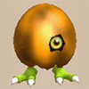
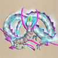

# Monster List

<table id="monsterList" class="pageLinksTable">
  <tr>
    <th colspan="6">Monster (Family) ~ Notebook Order</th>
  </tr>
  <tr>
    <th>1</th>
    <th>2</th>
    <th>3</th>
    <th>4</th>
    <th>5</th>
  </tr>
  <tr>
    <td class="highlightGrey"><a href="#mamel-family">Mamel</a></td>
    <td><a href="#shagga-family">Shagga</a></td>
    <td class="highlightGrey"><a href="#nigiri-baby-family">Nigiri Baby</a></td>
    <td><a href="#hoppin'-batter-family">Hoppin' Batter</a></td>
    <td class="highlightGrey"><a href="#water-ninja-family">Water Ninja</a></td>
  </tr>
  <tr>
    <td class="highlightGrey"><a href="#chintala-family">Chintala</a></td>
    <td><a href="#bowboy-family">Bowboy</a></td>
    <td class="highlightGrey"><a href="#froggo-family">Froggo</a></td>
    <td><a href="#fierous-family">Fierous</a></td>
    <td class="highlightGrey"><a href="#tree-ninja-family">Tree Ninja</a></td>
  </tr>
  <tr>
    <td class="highlightGrey"><a href="#octopling-family">Octopling</a></td>
    <td><a href="#pop-tank-family">Pop Tank</a></td>
    <td class="highlightGrey"><a href="#thiefwalrus-family">Thiefwalrus</a></td>
    <td><a href="#zapdon-family">Zapdon</a></td>
    <td class="highlightGrey"><a href="#metal-ninja-family">Metal Ninja</a></td>
  </tr>
  <tr>
    <td class="highlightGrey"><a href="#spearfish-family">Spearfish</a></td>
    <td><a href="#bored-kappa-family">Bored Kappa</a></td>
    <td class="highlightGrey"><a href="#hat-urchin-family">Hat Urchin</a></td>
    <td><a href="#schubell-family">Schubell</a></td>
    <td class="highlightGrey"><a href="#earth-ninja-family">Earth Ninja</a></td>
  </tr>
  <tr>
    <td class="highlightGrey"><a href="#death-reaper-family">Death Reaper</a></td>
    <td><a href="#porky-family">Porky</a></td>
    <td class="highlightGrey"><a href="#curse-girl-family">Curse Girl</a></td>
    <td><a href="#n'dubba-family">N'dubba</a></td>
    <td class="highlightGrey"><a href="#hannya-monk-family">Hannya Monk</a></td>
  </tr>
  <tr>
    <td class="highlightGrey"><a href="#pumphantasm-family">Pumphantasm</a></td>
    <td><a href="#dragon-family">Dragon</a></td>
    <td class="highlightGrey"><a href="#mudkin-family">Mudkin</a></td>
    <td><a href="#mixer-family">Mixer</a></td>
    <td class="highlightGrey"><a href="#kitsune-monk-family">Kitsune Monk</a></td>
  </tr>
  <tr>
    <td class="highlightGrey"><a href="#firepuff-family">Firepuff</a></td>
    <td><a href="#ghost-radish-family">Ghost Radish</a></td>
    <td class="highlightGrey"><a href="#swordsman-family">Swordsman</a></td>
    <td><a href="#egg-thing-family">Egg Thing</a></td>
    <td class="highlightGrey"><a href="#okina-monk-family">Okina Monk</a></td>
  </tr>
  <tr>
    <td class="highlightGrey"><a href="#armordillo-family">Armordillo</a></td>
    <td><a href="#skull-mage-family">Skull Mage</a></td>
    <td class="highlightGrey"><a href="#pullfrog-family">Pullfrog</a></td>
    <td><a href="#golden-egg-thing">Golden Egg Thing</a></td>
    <td class="highlightGrey"><a href="#okame-monk-family">Okame Monk</a></td>
  </tr>
  <tr>
    <td class="highlightGrey"><a href="#masked-samurai-family">Masked Samurai</a></td>
    <td><a href="#gazer-family">Gazer</a></td>
    <td class="highlightGrey"><a href="#floor-dragon-family">Floor Dragon</a></td>
    <td><a href="#chow">Chow</a></td>
    <td class="highlightGrey"><a href="#tengu-monk-family">Tengu Monk</a></td>
  </tr>
  <tr>
    <td class="highlightGrey"><a href="#ghost-samurai">Ghost Samurai</a></td>
    <td><a href="#twisty-hani-family">Twisty Hani</a></td>
    <td class="highlightGrey"><a href="#tiger-thrower-family">Tiger Thrower</a></td>
    <td><a href="#dark-owl">Dark Owl</a></td>
    <td class="highlightGrey"><a href="#boss-group">Boss Group</a></td>
  </tr>
  <tr>
    <td class="highlightGrey"><a href="#taur-family">Taur</a></td>
    <td><a href="#polygon-spinna-family">Polygon Spinna</a></td>
    <td class="highlightGrey"><a href="#karakuroid-family">Karakuroid</a></td>
    <td><a href="#crow-tengu">Crow Tengu</a></td>
    <td class="highlightGrey"></td>
  </tr>
  <tr>
    <td class="highlightGrey"><a href="#metalhead-family">Metalhead</a></td>
    <td><a href="#scorpion-family">Scorpion</a></td>
    <td class="highlightGrey"><a href="#soldier-ant-family">Soldier Ant</a></td>
    <td><a href="#fluffy-bunny">Fluffy Bunny</a></td>
    <td class="highlightGrey"></td>
  </tr>
  <tr>
    <td class="highlightGrey"><a href="#hen-family">Hen</a></td>
    <td><a href="#field-knave-family">Field Knave</a></td>
    <td class="highlightGrey"><a href="#explochin-family">Explochin</a></td>
    <td><a href="#fire-ninja-family">Fire Ninja</a></td>
    <td class="highlightGrey"></td>
  </tr>
</table>

# Details

### Table Explanation

- Lv = Monster's level.
- HP = Monster's hit points.
- Atk = Monster's attack power.
- Def = Monster's defense.
- Exp = Experience points awarded when the monster is defeated.
- Speed = Monster's action speed.
    - Slow = Half speed.
    - Regular = Regular speed.
    - Swift 1 = Double speed, 1 attack.
    - Swift 2 = Double speed, 2 attacks.
- Type = Monster type.
    - Draining = Weak to Drain Slayer.
    - Dragon = Weak to Dragonkiller.
    - Cyclops = Weak to Cyclops Bane.
    - Ghost = Weak to Sickle of Salvation, HP restoring items deal damage.
    - Exploding = Weak to Crescent Blade.
    - Floating = Weak to Sky Sword, can move across water tiles.

## Regular Monsters

### Mamel Family

<table class="monsterPageTable">
  <tbody>
    <tr>
      <th>
        

          
Lv1 : Mamel

        

      </th>
    </tr>
    <tr>
      <td>
        

          

            
          

          

            

              
HP

              
8

              
Atk

              
3

              
Def

              
4

              
Exp

              
2

            

            

              
Speed

              
Normal

              
Type

              
Normal

            

            
A very weak monster with low Attack Power and HP.

            
additional_notes

          

        

      </td>
    </tr>
    <tr>
      <th>
        

          
Lv2 : Pit Mamel

        

      </th>
    </tr>
    <tr>
      <td>
        

          

            
          

          

            

              
HP

              
11

              
Atk

              
5

              
Def

              
8

              
Exp

              
5

            

            

              
Speed

              
Normal

              
Type

              
Normal

            

            
A weak monster with low Attack Power and HP that is only just a little stronger than Mamel. It's not dangerous if you're careful.

            
additional_notes

          

        

      </td>
    </tr>
    <tr>
      <th>
        

          
Lv3 : Cave Mamel

        

      </th>
    </tr>
    <tr>
      <td>
        

          

            
          

          

            

              
HP

              
5

              
Atk

              
100

              
Def

              
100

              
Exp

              
2000

            

            

              
Speed

              
Normal

              
Type

              
Normal

            

            
Normal attacks do little damage. Its HP is low, so using things like Rock will defeat it easily. Defeating it grants lots of Experience Points.

            
additional_notes

          

        

      </td>
    </tr>
    <tr>
      <th>
        

          
Lv4 : Gitan Mamel

        

      </th>
    </tr>
    <tr>
      <td>
        

          

            
          

          

            

              
HP

              
20

              
Atk

              
100

              
Def

              
999

              
Exp

              
3333

            

            

              
Speed

              
Swift 2

              
Type

              
Normal

            

            
Normal attacks do little damage. This strong enemy moves at double speed, but its HP is low, so using things like Rock will defeat it easily. Defeating it grants lots of Experience Points and Gitan.

            
additional_notes

          

        

      </td>
    </tr>
  </tbody>
</table>

### Chintala Family

<table class="monsterPageTable">
  <tbody>
    <tr>
      <th>
        

          
Lv1 : Chintala

        

      </th>
    </tr>
    <tr>
      <td>
        

          

            
          

          

            

              
HP

              
15

              
Atk

              
9

              
Def

              
4

              
Exp

              
12

            

            

              
Speed

              
Normal

              
Type

              
Beast

            

            
A monster without any particular abilities.

            
additional_notes

          

        

      </td>
    </tr>
    <tr>
      <th>
        

          
Lv2 : Mid Chintala

        

      </th>
    </tr>
    <tr>
      <td>
        

          

            
          

          

            

              
HP

              
45

              
Atk

              
23

              
Def

              
10

              
Exp

              
27

            

            

              
Speed

              
Normal

              
Type

              
Beast

            

            
A monster without any particular abilities. Given its medium size, it's stronger than Chintala.

            
additional_notes

          

        

      </td>
    </tr>
    <tr>
      <th>
        

          
Lv3 : Big Chintala

        

      </th>
    </tr>
    <tr>
      <td>
        

          

            
          

          

            

              
HP

              
85

              
Atk

              
40

              
Def

              
33

              
Exp

              
350

            

            

              
Speed

              
Normal

              
Type

              
Beast

            

            
A monster without any particular abilities. Given its big size, it's stronger than Mid Chintala.

            
additional_notes

          

        

      </td>
    </tr>
    <tr>
      <th>
        

          
Lv4 : Huge Chintala

        

      </th>
    </tr>
    <tr>
      <td>
        

          

            
          

          

            

              
HP

              
185

              
Atk

              
60

              
Def

              
40

              
Exp

              
1350

            

            

              
Speed

              
Normal

              
Type

              
Beast

            

            
A monster without any particular abilities. Given its huge size, it's stronger than Big Chintala.

            
additional_notes

          

        

      </td>
    </tr>
  </tbody>
</table>

### Octopling Family

<table class="monsterPageTable">
  <tbody>
    <tr>
      <th>
        

          
Lv1 : Octopling

        

      </th>
    </tr>
    <tr>
      <td>
        

          

            
          

          

            

              
HP

              
14

              
Atk

              
4

              
Def

              
6

              
Exp

              
4

            

            

              
Speed

              
Normal

              
Type

              
Aquatic

            

            
Seeks out and helps other monsters. While on water, Attack Power increases and HP recovers each turn.

            
additional_notes

          

        

      </td>
    </tr>
    <tr>
      <th>
        

          
Lv2 : Fresh Octopling

        

      </th>
    </tr>
    <tr>
      <td>
        

          

            
          

          

            

              
HP

              
60

              
Atk

              
19

              
Def

              
14

              
Exp

              
55

            

            

              
Speed

              
Normal

              
Type

              
Aquatic

            

            
Seeks out and helps other monsters. Its Attack Power increases if an adjacent monster is defeated. While on water, Attack Power increases and HP recovers each turn.

            
additional_notes

          

        

      </td>
    </tr>
    <tr>
      <th>
        

          
Lv3 : Famed Octopling

        

      </th>
    </tr>
    <tr>
      <td>
        

          

            
          

          

            

              
HP

              
99

              
Atk

              
25

              
Def

              
30

              
Exp

              
420

            

            

              
Speed

              
Normal

              
Type

              
Aquatic

            

            
Seeks out and helps other monsters. Gives covering fire from a distance, dealing 5 damage. Its Attack Power increases if an adjacent monster is defeated. While on water, Attack Power increases and HP recovers each turn.

            
additional_notes

          

        

      </td>
    </tr>
    <tr>
      <th>
        

          
Lv4 : Superb Octopling

        

      </th>
    </tr>
    <tr>
      <td>
        

          

            
          

          

            

              
HP

              
199

              
Atk

              
64

              
Def

              
48

              
Exp

              
1260

            

            

              
Speed

              
Normal

              
Type

              
Aquatic

            

            
Seeks out and helps other monsters. Gives covering fire from a distance, dealing 5 damage. Its Action Speed increases by 1 if an adjacent monster is defeated. While on water, Attack Power increases and HP recovers each turn.

            
additional_notes

          

        

      </td>
    </tr>
  </tbody>
</table>

### Spearfish Family

<table class="monsterPageTable">
  <tbody>
    <tr>
      <th>
        

          
Lv1 : Spearfish

        

      </th>
    </tr>
    <tr>
      <td>
        

          

            
          

          

            

              
HP

              
16

              
Atk

              
6

              
Def

              
2

              
Exp

              
7

            

            

              
Speed

              
Normal

              
Type

              
Aquatic

            

            
Walks on water. While on water, Attack Power increases and HP recovers each turn.

            
additional_notes

          

        

      </td>
    </tr>
    <tr>
      <th>
        

          
Lv2 : Lt. Spearfish

        

      </th>
    </tr>
    <tr>
      <td>
        

          

            
          

          

            

              
HP

              
60

              
Atk

              
24

              
Def

              
17

              
Exp

              
55

            

            

              
Speed

              
Normal

              
Type

              
Aquatic

            

            
Tries to flee to water when its HP gets low. While on water, Attack Power increases and HP recovers each turn.

            
additional_notes

          

        

      </td>
    </tr>
    <tr>
      <th>
        

          
Lv3 : Capt. Spearfish

        

      </th>
    </tr>
    <tr>
      <td>
        

          

            
          

          

            

              
HP

              
100

              
Atk

              
39

              
Def

              
30

              
Exp

              
410

            

            

              
Speed

              
Normal

              
Type

              
Aquatic

            

            
Tries to flee to water when its HP gets low. While on water, it shoots water up to 3 tile(s) away that deals 15 damage and may get items in your inventory wet. While on water, Attack Power increases and HP recovers each turn.

            
additional_notes

          

        

      </td>
    </tr>
    <tr>
      <th>
        

          
Lv4 : Admiral Spearfish

        

      </th>
    </tr>
    <tr>
      <td>
        

          

            
          

          

            

              
HP

              
200

              
Atk

              
59

              
Def

              
50

              
Exp

              
1410

            

            

              
Speed

              
Normal

              
Type

              
Aquatic

            

            
Tries to flee to water when its HP gets low. While on water, it shoots water up to 5 tile(s) away that deals 25 damage and may get items in your inventory wet. While on water, Attack Power increases and HP recovers each turn.

            
additional_notes

          

        

      </td>
    </tr>
  </tbody>
</table>

### Death Reaper Family

<table class="monsterPageTable">
  <tbody>
    <tr>
      <th>
        

          
Lv1 : Death Reaper

        

      </th>
    </tr>
    <tr>
      <td>
        

          

            
          

          

            

              
HP

              
22

              
Atk

              
6

              
Def

              
5

              
Exp

              
9

            

            

              
Speed

              
Swift 1

              
Type

              
Ghost, Floating

            

            
Damaged by items that restore HP, such as Herb. Splashing it with water greatly decreases its Attack Power.

            
additional_notes

          

        

      </td>
    </tr>
    <tr>
      <th>
        

          
Lv2 : Hell Reaper

        

      </th>
    </tr>
    <tr>
      <td>
        

          

            
          

          

            

              
HP

              
45

              
Atk

              
12

              
Def

              
15

              
Exp

              
30

            

            

              
Speed

              
Swift 2

              
Type

              
Ghost, Floating

            

            
Damaged by items that restore HP, such as Herb. Splashing it with water greatly decreases its Attack Power.

            
additional_notes

          

        

      </td>
    </tr>
    <tr>
      <th>
        

          
Lv3 : Soul Reaper

        

      </th>
    </tr>
    <tr>
      <td>
        

          

            
          

          

            

              
HP

              
75

              
Atk

              
40

              
Def

              
40

              
Exp

              
555

            

            

              
Speed

              
Swift 2

              
Type

              
Ghost, Floating

            

            
Moves through walls. Damaged by items that restore HP, such as Herb. Splashing it with water greatly decreases its Attack Power.

            
additional_notes

          

        

      </td>
    </tr>
    <tr>
      <th>
        

          
Lv4 : King Reaper

        

      </th>
    </tr>
    <tr>
      <td>
        

          

            
          

          

            

              
HP

              
225

              
Atk

              
65

              
Def

              
50

              
Exp

              
1555

            

            

              
Speed

              
Swift 2

              
Type

              
Ghost, Floating

            

            
Moves through walls. Damaged by items that restore HP, such as Herb. Splashing it with water greatly decreases its Attack Power.

            
additional_notes

          

        

      </td>
    </tr>
  </tbody>
</table>

### Pumphantasm Family

<table class="monsterPageTable">
  <tbody>
    <tr>
      <th>
        

          
Lv1 : Pumphantasm

        

      </th>
    </tr>
    <tr>
      <td>
        

          

            
          

          

            

              
HP

              
23

              
Atk

              
16

              
Def

              
10

              
Exp

              
25

            

            

              
Speed

              
Normal

              
Type

              
Ghost, Floating

            

            
Moves through walls as it wanders aimlessly. Damaged by items that restore HP, such as Herb.

            
additional_notes

          

        

      </td>
    </tr>
    <tr>
      <th>
        

          
Lv2 : Pumpanshee

        

      </th>
    </tr>
    <tr>
      <td>
        

          

            
          

          

            

              
HP

              
60

              
Atk

              
35

              
Def

              
22

              
Exp

              
250

            

            

              
Speed

              
Normal

              
Type

              
Ghost, Floating

            

            
Moves through walls as it wanders aimlessly. Damaged by items that restore HP, such as Herb.

            
additional_notes

          

        

      </td>
    </tr>
    <tr>
      <th>
        

          
Lv3 : Pumplich

        

      </th>
    </tr>
    <tr>
      <td>
        

          

            
          

          

            

              
HP

              
100

              
Atk

              
50

              
Def

              
30

              
Exp

              
800

            

            

              
Speed

              
Normal

              
Type

              
Ghost, Floating

            

            
Moves through walls as it wanders aimlessly. Damaged by items that restore HP, such as Herb.

            
additional_notes

          

        

      </td>
    </tr>
    <tr>
      <th>
        

          
Lv4 : Pumplord

        

      </th>
    </tr>
    <tr>
      <td>
        

          

            
          

          

            

              
HP

              
185

              
Atk

              
75

              
Def

              
35

              
Exp

              
1850

            

            

              
Speed

              
Normal

              
Type

              
Ghost, Floating

            

            
Moves through walls as it wanders aimlessly. Damaged by items that restore HP, such as Herb.

            
additional_notes

          

        

      </td>
    </tr>
  </tbody>
</table>

### Firepuff Family

<table class="monsterPageTable">
  <tbody>
    <tr>
      <th>
        

          
Lv1 : Firepuff

        

      </th>
    </tr>
    <tr>
      <td>
        

          

            
          

          

            

              
HP

              
20

              
Atk

              
7

              
Def

              
7

              
Exp

              
13

            

            

              
Speed

              
Normal

              
Type

              
Dragon, Floating

            

            
Breathes fire at adjacent foes, dealing 10 damage. This attack may fail.

            
additional_notes

          

        

      </td>
    </tr>
    <tr>
      <th>
        

          
Lv2 : Flamepuff

        

      </th>
    </tr>
    <tr>
      <td>
        

          

            
          

          

            

              
HP

              
50

              
Atk

              
25

              
Def

              
20

              
Exp

              
175

            

            

              
Speed

              
Normal

              
Type

              
Dragon, Floating

            

            
Breathes fire at adjacent foes, dealing 20 damage. This attack may fail.

            
additional_notes

          

        

      </td>
    </tr>
    <tr>
      <th>
        

          
Lv3 : Blazepuff

        

      </th>
    </tr>
    <tr>
      <td>
        

          

            
          

          

            

              
HP

              
135

              
Atk

              
55

              
Def

              
35

              
Exp

              
1050

            

            

              
Speed

              
Normal

              
Type

              
Dragon, Floating

            

            
Breathes fire at adjacent foes, dealing 30 damage. This attack may fail.

            
additional_notes

          

        

      </td>
    </tr>
    <tr>
      <th>
        

          
Lv4 : Pyrepuff

        

      </th>
    </tr>
    <tr>
      <td>
        

          

            
          

          

            

              
HP

              
255

              
Atk

              
75

              
Def

              
45

              
Exp

              
1550

            

            

              
Speed

              
Normal

              
Type

              
Dragon, Floating

            

            
Breathes fire at adjacent foes, dealing 40 damage. This attack may fail.

            
additional_notes

          

        

      </td>
    </tr>
  </tbody>
</table>

### Armordillo Family

<table class="monsterPageTable">
  <tbody>
    <tr>
      <th>
        

          
Lv1 : Armordillo

        

      </th>
    </tr>
    <tr>
      <td>
        

          

            
          

          

            

              
HP

              
20

              
Atk

              
11

              
Def

              
15

              
Exp

              
15

            

            

              
Speed

              
Normal

              
Type

              
Beast

            

            
Hurls itself at the target, dealing 5 damage. Knocks the target back 2 tile(s) and makes them drop items.

            
additional_notes

          

        

      </td>
    </tr>
    <tr>
      <th>
        

          
Lv2 : Brodillo

        

      </th>
    </tr>
    <tr>
      <td>
        

          

            
          

          

            

              
HP

              
70

              
Atk

              
36

              
Def

              
38

              
Exp

              
450

            

            

              
Speed

              
Normal

              
Type

              
Beast

            

            
Hurls itself at the target, dealing 10 damage. Knocks the target back 3 tile(s) and makes them drop items.

            
additional_notes

          

        

      </td>
    </tr>
    <tr>
      <th>
        

          
Lv3 : Popdillo

        

      </th>
    </tr>
    <tr>
      <td>
        

          

            
          

          

            

              
HP

              
100

              
Atk

              
51

              
Def

              
45

              
Exp

              
1200

            

            

              
Speed

              
Normal

              
Type

              
Beast

            

            
Hurls itself at the target, dealing 15 damage. Knocks the target back 4 tile(s) and makes them drop items.

            
additional_notes

          

        

      </td>
    </tr>
    <tr>
      <th>
        

          
Lv4 : Grampadillo

        

      </th>
    </tr>
    <tr>
      <td>
        

          

            
          

          

            

              
HP

              
175

              
Atk

              
71

              
Def

              
56

              
Exp

              
1400

            

            

              
Speed

              
Normal

              
Type

              
Beast

            

            
Hurls itself at the target, dealing 20 damage. Knocks the target back 5 tile(s) and makes them drop items.

            
additional_notes

          

        

      </td>
    </tr>
  </tbody>
</table>

### Masked Samurai Family

<table class="monsterPageTable">
  <tbody>
    <tr>
      <th>
        

          
Lv1 : Masked Samurai

        

      </th>
    </tr>
    <tr>
      <td>
        

          

            
          

          

            

              
HP

              
47

              
Atk

              
18

              
Def

              
18

              
Exp

              
48

            

            

              
Speed

              
Normal

              
Type

              
Normal

            

            
Resurrects as Ghost Samurai when defeated. Splashing it with water greatly decreases its Attack Power.

            
additional_notes

          

        

      </td>
    </tr>
    <tr>
      <th>
        

          
Lv2 : Raging Samurai

        

      </th>
    </tr>
    <tr>
      <td>
        

          

            
          

          

            

              
HP

              
100

              
Atk

              
45

              
Def

              
37

              
Exp

              
400

            

            

              
Speed

              
Normal

              
Type

              
Normal

            

            
Resurrects as Ghost Samurai when defeated. Splashing it with water greatly decreases its Attack Power.

            
additional_notes

          

        

      </td>
    </tr>
    <tr>
      <th>
        

          
Lv3 : Great Samurai

        

      </th>
    </tr>
    <tr>
      <td>
        

          

            
          

          

            

              
HP

              
149

              
Atk

              
58

              
Def

              
40

              
Exp

              
840

            

            

              
Speed

              
Normal

              
Type

              
Normal

            

            
Resurrects as Ghost Samurai when defeated. Splashing it with water greatly decreases its Attack Power.

            
additional_notes

          

        

      </td>
    </tr>
    <tr>
      <th>
        

          
Lv4 : Lordly Samurai

        

      </th>
    </tr>
    <tr>
      <td>
        

          

            
          

          

            

              
HP

              
200

              
Atk

              
63

              
Def

              
50

              
Exp

              
1280

            

            

              
Speed

              
Normal

              
Type

              
Normal

            

            
Resurrects as Ghost Samurai when defeated. Splashing it with water greatly decreases its Attack Power.

            
additional_notes

          

        

      </td>
    </tr>
  </tbody>
</table>

### Ghost Samurai

<table class="monsterPageTable">
  <tbody>
    <tr>
      <th>
        

          
Lv1 : Ghost Samurai

        

      </th>
    </tr>
    <tr>
      <td>
        

          

            
          

          

            

              
HP

              
4

              
Atk

              
13

              
Def

              
15

              
Exp

              
10

            

            

              
Speed

              
Normal

              
Type

              
Ghost

            

            
Possesses any monsters it gets close to, leveling them up. Normal attacks do little damage, but damage can be inflicted as usual by Anti-Ghost runes. Damaged by items that restore HP, such as Herb.

            
additional_notes

          

        

      </td>
    </tr>
  </tbody>
</table>

### Taur Family

<table class="monsterPageTable">
  <tbody>
    <tr>
      <th>
        

          
Lv1 : Taur

        

      </th>
    </tr>
    <tr>
      <td>
        

          

            
          

          

            

              
HP

              
35

              
Atk

              
15

              
Def

              
15

              
Exp

              
33

            

            

              
Speed

              
Normal

              
Type

              
Beast

            

            
Occasionally unleashes Critical Hits. May drop Axe of the Minotaur when defeated. Splashing it with water greatly decreases its Attack Power.

            
additional_notes

          

        

      </td>
    </tr>
    <tr>
      <th>
        

          
Lv2 : Minotaur

        

      </th>
    </tr>
    <tr>
      <td>
        

          

            
          

          

            

              
HP

              
70

              
Atk

              
31

              
Def

              
20

              
Exp

              
90

            

            

              
Speed

              
Normal

              
Type

              
Beast

            

            
Occasionally unleashes Critical Hits. May drop Axe of the Minotaur when defeated. Splashing it with water greatly decreases its Attack Power.

            
additional_notes

          

        

      </td>
    </tr>
    <tr>
      <th>
        

          
Lv3 : Megataur

        

      </th>
    </tr>
    <tr>
      <td>
        

          

            
          

          

            

              
HP

              
170

              
Atk

              
55

              
Def

              
42

              
Exp

              
790

            

            

              
Speed

              
Normal

              
Type

              
Beast

            

            
Occasionally unleashes Critical Hits. May drop Axe of the Minotaur when defeated. Splashing it with water greatly decreases its Attack Power.

            
additional_notes

          

        

      </td>
    </tr>
    <tr>
      <th>
        

          
Lv4 : Gigataur

        

      </th>
    </tr>
    <tr>
      <td>
        

          

            
          

          

            

              
HP

              
235

              
Atk

              
85

              
Def

              
62

              
Exp

              
1790

            

            

              
Speed

              
Normal

              
Type

              
Beast

            

            
Occasionally unleashes Critical Hits. May drop Axe of the Minotaur when defeated. Splashing it with water greatly decreases its Attack Power.

            
additional_notes

          

        

      </td>
    </tr>
  </tbody>
</table>

### Metalhead Family

<table class="monsterPageTable">
  <tbody>
    <tr>
      <th>
        

          
Lv1 : Metalhead

        

      </th>
    </tr>
    <tr>
      <td>
        

          

            
          

          

            

              
HP

              
66

              
Atk

              
30

              
Def

              
19

              
Exp

              
61

            

            

              
Speed

              
Normal

              
Type

              
Cyclops

            

            
Throws its head to attack up to 2 tile(s) away. This attack will even hit around corners.

            
additional_notes

          

        

      </td>
    </tr>
    <tr>
      <th>
        

          
Lv2 : Thrashead

        

      </th>
    </tr>
    <tr>
      <td>
        

          

            
          

          

            

              
HP

              
122

              
Atk

              
55

              
Def

              
45

              
Exp

              
1100

            

            

              
Speed

              
Normal

              
Type

              
Cyclops

            

            
Throws its head to attack up to 3 tile(s) away. This attack will even hit around corners.

            
additional_notes

          

        

      </td>
    </tr>
    <tr>
      <th>
        

          
Lv3 : Megahead

        

      </th>
    </tr>
    <tr>
      <td>
        

          

            
          

          

            

              
HP

              
182

              
Atk

              
65

              
Def

              
48

              
Exp

              
1350

            

            

              
Speed

              
Normal

              
Type

              
Cyclops

            

            
Throws its head to attack up to 4 tile(s) away. This attack will even hit around corners.

            
additional_notes

          

        

      </td>
    </tr>
    <tr>
      <th>
        

          
Lv4 : Deathead

        

      </th>
    </tr>
    <tr>
      <td>
        

          

            
          

          

            

              
HP

              
282

              
Atk

              
99

              
Def

              
60

              
Exp

              
2350

            

            

              
Speed

              
Normal

              
Type

              
Cyclops

            

            
Throws its head to attack up to 5 tile(s) away. This attack will even hit around corners.

            
additional_notes

          

        

      </td>
    </tr>
  </tbody>
</table>

### Hen Family

<table class="monsterPageTable">
  <tbody>
    <tr>
      <th>
        

          
Lv1 : Hen

        

      </th>
    </tr>
    <tr>
      <td>
        

          

            
          

          

            

              
HP

              
4

              
Atk

              
1

              
Def

              
1

              
Exp

              
200

            

            

              
Speed

              
Swift 1

              
Type

              
Beast

            

            
Runs around like it lost its head. If hit by fire or explosions, it turns into Yakitori.

            
additional_notes

          

        

      </td>
    </tr>
    <tr>
      <th>
        

          
Lv2 : Master Hen

        

      </th>
    </tr>
    <tr>
      <td>
        

          

            
          

          

            

              
HP

              
70

              
Atk

              
33

              
Def

              
21

              
Exp

              
400

            

            

              
Speed

              
Normal

              
Type

              
Beast

            

            
Boasts about its powerful muscles. But it turns into a Hen when its HP gets low.

            
additional_notes

          

        

      </td>
    </tr>
    <tr>
      <th>
        

          
Lv3 : Great Hen

        

      </th>
    </tr>
    <tr>
      <td>
        

          

            
          

          

            

              
HP

              
120

              
Atk

              
55

              
Def

              
40

              
Exp

              
800

            

            

              
Speed

              
Swift 1

              
Type

              
Beast

            

            
Excels at hand-to-hand combat. But it turns into a Hen when its HP gets low.

            
additional_notes

          

        

      </td>
    </tr>
    <tr>
      <th>
        

          
Lv4 : Miracle Hen

        

      </th>
    </tr>
    <tr>
      <td>
        

          

            
          

          

            

              
HP

              
220

              
Atk

              
82

              
Def

              
60

              
Exp

              
1600

            

            

              
Speed

              
Swift 2

              
Type

              
Beast

            

            
Feared for its godlike strength. But it turns into a Hen when its HP gets low.

            
additional_notes

          

        

      </td>
    </tr>
  </tbody>
</table>

### Shagga Family

<table class="monsterPageTable">
  <tbody>
    <tr>
      <th>
        

          
Lv1 : Shagga

        

      </th>
    </tr>
    <tr>
      <td>
        

          

            
          

          

            

              
HP

              
18

              
Atk

              
6

              
Def

              
4

              
Exp

              
12

            

            

              
Speed

              
Normal

              
Type

              
Dragon

            

            
Splashing it with water greatly decreases its Attack Power.

            
additional_notes

          

        

      </td>
    </tr>
    <tr>
      <th>
        

          
Lv2 : Nashagga

        

      </th>
    </tr>
    <tr>
      <td>
        

          

            
          

          

            

              
HP

              
70

              
Atk

              
21

              
Def

              
20

              
Exp

              
60

            

            

              
Speed

              
Normal

              
Type

              
Dragon

            

            
Attacks with 2 consecutive normal attacks. Splashing it with water greatly decreases its Attack Power.

            
additional_notes

          

        

      </td>
    </tr>
    <tr>
      <th>
        

          
Lv3 : Lashagga

        

      </th>
    </tr>
    <tr>
      <td>
        

          

            
          

          

            

              
HP

              
99

              
Atk

              
43

              
Def

              
34

              
Exp

              
500

            

            

              
Speed

              
Normal

              
Type

              
Dragon

            

            
Attacks with 3 consecutive normal attacks. Splashing it with water greatly decreases its Attack Power.

            
additional_notes

          

        

      </td>
    </tr>
    <tr>
      <th>
        

          
Lv4 : Bashagga

        

      </th>
    </tr>
    <tr>
      <td>
        

          

            
          

          

            

              
HP

              
154

              
Atk

              
55

              
Def

              
40

              
Exp

              
950

            

            

              
Speed

              
Normal

              
Type

              
Dragon

            

            
Attacks with 4 consecutive normal attacks. Splashing it with water greatly decreases its Attack Power.

            
additional_notes

          

        

      </td>
    </tr>
  </tbody>
</table>

### Bowboy Family

<table class="monsterPageTable">
  <tbody>
    <tr>
      <th>
        

          
Lv1 : Bowboy

        

      </th>
    </tr>
    <tr>
      <td>
        

          

            
          

          

            

              
HP

              
45

              
Atk

              
17

              
Def

              
18

              
Exp

              
60

            

            

              
Speed

              
Normal

              
Type

              
Normal

            

            
Shoots Wooden Arrow from a distance. May drop Wooden Arrow when defeated. Splashing it with water makes it unable to fire arrows.

            
additional_notes

          

        

      </td>
    </tr>
    <tr>
      <th>
        

          
Lv2 : Crossbowboy

        

      </th>
    </tr>
    <tr>
      <td>
        

          

            
          

          

            

              
HP

              
55

              
Atk

              
20

              
Def

              
20

              
Exp

              
80

            

            

              
Speed

              
Normal

              
Type

              
Normal

            

            
Shoots Iron Arrow from a distance. May drop Iron Arrow when defeated. Splashing it with water makes it unable to fire arrows.

            
additional_notes

          

        

      </td>
    </tr>
    <tr>
      <th>
        

          
Lv3 : Baby Tank

        

      </th>
    </tr>
    <tr>
      <td>
        

          

            
          

          

            

              
HP

              
85

              
Atk

              
40

              
Def

              
30

              
Exp

              
450

            

            

              
Speed

              
Swift 1

              
Type

              
Normal

            

            
Shoots Iron Arrow from a distance. May drop Iron Arrow when defeated. Splashing it with water makes it unable to fire arrows.

            
additional_notes

          

        

      </td>
    </tr>
    <tr>
      <th>
        

          
Lv4 : Mini Tank

        

      </th>
    </tr>
    <tr>
      <td>
        

          

            
          

          

            

              
HP

              
100

              
Atk

              
55

              
Def

              
40

              
Exp

              
800

            

            

              
Speed

              
Swift 1

              
Type

              
Normal

            

            
Shoots Silver Arrow from a distance. May drop Silver Arrow when defeated. Splashing it with water makes it unable to fire arrows.

            
additional_notes

          

        

      </td>
    </tr>
  </tbody>
</table>

### Pop Tank Family

<table class="monsterPageTable">
  <tbody>
    <tr>
      <th>
        

          
Lv1 : Pop Tank

        

      </th>
    </tr>
    <tr>
      <td>
        

          

            
          

          

            

              
HP

              
90

              
Atk

              
20

              
Def

              
24

              
Exp

              
100

            

            

              
Speed

              
Slow

              
Type

              
Metal, Exploding

            

            
Shoots a cannon from a distance, dealing 20 damage to the target and 1 tile(s) around it. It moves slowly, so you can defeat it easily if you're quick. Splashing it with water makes it unable to shoot.

            
additional_notes

          

        

      </td>
    </tr>
    <tr>
      <th>
        

          
Lv2 : Ornery Tank

        

      </th>
    </tr>
    <tr>
      <td>
        

          

            
          

          

            

              
HP

              
95

              
Atk

              
40

              
Def

              
44

              
Exp

              
1500

            

            

              
Speed

              
Normal

              
Type

              
Metal, Exploding

            

            
Shoots a cannon from a distance, dealing 30 damage to the target and 1 tile(s) around it. Splashing it with water makes it unable to shoot.

            
additional_notes

          

        

      </td>
    </tr>
    <tr>
      <th>
        

          
Lv3 : Adamant Tank

        

      </th>
    </tr>
    <tr>
      <td>
        

          

            
          

          

            

              
HP

              
100

              
Atk

              
60

              
Def

              
54

              
Exp

              
2500

            

            

              
Speed

              
Swift 1

              
Type

              
Metal, Exploding

            

            
Shoots a cannon from a distance, dealing 40 damage to the target and 1 tile(s) around it. It moves quickly, so escaping it is difficult. Splashing it with water makes it unable to shoot.

            
additional_notes

          

        

      </td>
    </tr>
    <tr>
      <th>
        

          
Lv4 : Steadfast Tank

        

      </th>
    </tr>
    <tr>
      <td>
        

          

            
          

          

            

              
HP

              
105

              
Atk

              
80

              
Def

              
64

              
Exp

              
3500

            

            

              
Speed

              
Swift 2

              
Type

              
Metal, Exploding

            

            
Shoots a cannon from a distance, dealing 50 damage to the target and 1 tile(s) around it. It moves quickly and attacks 2 times, making it a tough foe. Splashing it with water makes it unable to shoot.

            
additional_notes

          

        

      </td>
    </tr>
  </tbody>
</table>

### Bored Kappa Family

<table class="monsterPageTable">
  <tbody>
    <tr>
      <th>
        

          
Lv1 : Bored Kappa

        

      </th>
    </tr>
    <tr>
      <td>
        

          

            
          

          

            

              
HP

              
50

              
Atk

              
18

              
Def

              
11

              
Exp

              
48

            

            

              
Speed

              
Normal

              
Type

              
Aquatic

            

            
Throws items at anyone within 3 tile(s) of it. Will throw back items thrown at it but always misses. It will not throw Weapon, Shield, or Gitan. While on water, Attack Power increases and HP recovers each turn.

            
additional_notes

          

        

      </td>
    </tr>
    <tr>
      <th>
        

          
Lv2 : Pesky Kappa

        

      </th>
    </tr>
    <tr>
      <td>
        

          

            
          

          

            

              
HP

              
75

              
Atk

              
29

              
Def

              
22

              
Exp

              
330

            

            

              
Speed

              
Normal

              
Type

              
Aquatic

            

            
Throws items at anyone within 5 tile(s) of it. Will throw back items thrown at it. It will not throw Weapon or Gitan. While on water, Attack Power increases and HP recovers each turn.

            
additional_notes

          

        

      </td>
    </tr>
    <tr>
      <th>
        

          
Lv3 : Vexing Kappa

        

      </th>
    </tr>
    <tr>
      <td>
        

          

            
          

          

            

              
HP

              
175

              
Atk

              
49

              
Def

              
33

              
Exp

              
960

            

            

              
Speed

              
Normal

              
Type

              
Aquatic

            

            
Throws items at anyone within 10 tile(s) of it. Will throw back items thrown at it. It will not throw Gitan. While on water, Attack Power increases and HP recovers each turn.

            
additional_notes

          

        

      </td>
    </tr>
    <tr>
      <th>
        

          
Lv4 : Atrocious Kappa

        

      </th>
    </tr>
    <tr>
      <td>
        

          

            
          

          

            

              
HP

              
275

              
Atk

              
59

              
Def

              
42

              
Exp

              
1960

            

            

              
Speed

              
Normal

              
Type

              
Aquatic

            

            
Throws items at anyone anywhere on the floor. Will throw back items thrown at it. While on water, Attack Power increases and HP recovers each turn.

            
additional_notes

          

        

      </td>
    </tr>
  </tbody>
</table>

### Porky Family

<table class="monsterPageTable">
  <tbody>
    <tr>
      <th>
        

          
Lv1 : Porky

        

      </th>
    </tr>
    <tr>
      <td>
        

          

            
          

          

            

              
HP

              
30

              
Atk

              
17

              
Def

              
12

              
Exp

              
40

            

            

              
Speed

              
Normal

              
Type

              
Beast

            

            
Throws Porky's Rock from 3 tile(s) away. May drop Porky's Rock when defeated.

            
additional_notes

          

        

      </td>
    </tr>
    <tr>
      <th>
        

          
Lv2 : Porko

        

      </th>
    </tr>
    <tr>
      <td>
        

          

            
          

          

            

              
HP

              
65

              
Atk

              
36

              
Def

              
18

              
Exp

              
840

            

            

              
Speed

              
Normal

              
Type

              
Beast

            

            
Throws Porky's Rock from 5 tile(s) away. May drop Porky's Rock when defeated.

            
additional_notes

          

        

      </td>
    </tr>
    <tr>
      <th>
        

          
Lv3 : Porkon

        

      </th>
    </tr>
    <tr>
      <td>
        

          

            
          

          

            

              
HP

              
150

              
Atk

              
75

              
Def

              
50

              
Exp

              
1800

            

            

              
Speed

              
Normal

              
Type

              
Beast

            

            
Throws Porky's Rock from 8 tile(s) away. May drop Porky's Rock when defeated.

            
additional_notes

          

        

      </td>
    </tr>
    <tr>
      <th>
        

          
Lv4 : Porgon

        

      </th>
    </tr>
    <tr>
      <td>
        

          

            
          

          

            

              
HP

              
200

              
Atk

              
85

              
Def

              
60

              
Exp

              
2000

            

            

              
Speed

              
Normal

              
Type

              
Beast

            

            
Throws Porky's Rock from 10 tile(s) away. May drop Porky's Rock when defeated.

            
additional_notes

          

        

      </td>
    </tr>
  </tbody>
</table>

### Dragon Family

<table class="monsterPageTable">
  <tbody>
    <tr>
      <th>
        

          
Lv1 : Dragon

        

      </th>
    </tr>
    <tr>
      <td>
        

          

            
          

          

            

              
HP

              
120

              
Atk

              
45

              
Def

              
40

              
Exp

              
1000

            

            

              
Speed

              
Normal

              
Type

              
Dragon

            

            
Breathes fire in a straight line, dealing 20 damage.

            
additional_notes

          

        

      </td>
    </tr>
    <tr>
      <th>
        

          
Lv2 : Sky Dragon

        

      </th>
    </tr>
    <tr>
      <td>
        

          

            
          

          

            

              
HP

              
140

              
Atk

              
55

              
Def

              
50

              
Exp

              
1600

            

            

              
Speed

              
Normal

              
Type

              
Dragon

            

            
Breathes fire anywhere in the room, dealing 20 damage. Fire passes through any walls or beings in the way.

            
additional_notes

          

        

      </td>
    </tr>
    <tr>
      <th>
        

          
Lv3 : Archdragon

        

      </th>
    </tr>
    <tr>
      <td>
        

          

            
          

          

            

              
HP

              
200

              
Atk

              
65

              
Def

              
60

              
Exp

              
2200

            

            

              
Speed

              
Normal

              
Type

              
Dragon

            

            
Breathes fire anywhere on the floor, dealing 30 damage. Fire passes through any walls or beings in the way.

            
additional_notes

          

        

      </td>
    </tr>
    <tr>
      <th>
        

          
Lv4 : Abyss Dragon

        

      </th>
    </tr>
    <tr>
      <td>
        

          

            
          

          

            

              
HP

              
300

              
Atk

              
90

              
Def

              
65

              
Exp

              
2800

            

            

              
Speed

              
Normal

              
Type

              
Dragon

            

            
Breathes fire anywhere on the floor, dealing 40 damage. Fire passes through any walls or beings in the way.

            
additional_notes

          

        

      </td>
    </tr>
  </tbody>
</table>

### Ghost Radish Family

<table class="monsterPageTable">
  <tbody>
    <tr>
      <th>
        

          
Lv1 : Ghost Radish

        

      </th>
    </tr>
    <tr>
      <td>
        

          

            
          

          

            

              
HP

              
40

              
Atk

              
18

              
Def

              
15

              
Exp

              
49

            

            

              
Speed

              
Normal

              
Type

              
Ghost

            

            
Throws Poison Grass. May drop Poison Grass when defeated. Damaged by thrown Antidote Grass.

            
additional_notes

          

        

      </td>
    </tr>
    <tr>
      <th>
        

          
Lv2 : Daze Radish

        

      </th>
    </tr>
    <tr>
      <td>
        

          

            
          

          

            

              
HP

              
80

              
Atk

              
37

              
Def

              
27

              
Exp

              
400

            

            

              
Speed

              
Normal

              
Type

              
Ghost

            

            
Throws Confusion Grass. If the target is already inflicted with Confused status, it throws Poison Grass instead. May drop Confusion Grass when defeated. Damaged by thrown Antidote Grass.

            
additional_notes

          

        

      </td>
    </tr>
    <tr>
      <th>
        

          
Lv3 : Sleep Radish

        

      </th>
    </tr>
    <tr>
      <td>
        

          

            
          

          

            

              
HP

              
135

              
Atk

              
47

              
Def

              
38

              
Exp

              
900

            

            

              
Speed

              
Normal

              
Type

              
Ghost

            

            
Throws Sedating Grass. If the target is already inflicted with Asleep status, it throws Poison Grass instead. May drop Sedating Grass when defeated. Damaged by thrown Antidote Grass.

            
additional_notes

          

        

      </td>
    </tr>
    <tr>
      <th>
        

          
Lv4 : Frenzy Radish

        

      </th>
    </tr>
    <tr>
      <td>
        

          

            
          

          

            

              
HP

              
195

              
Atk

              
57

              
Def

              
55

              
Exp

              
1150

            

            

              
Speed

              
Normal

              
Type

              
Ghost

            

            
Throws Berserk Seed. If the target is already inflicted with Berserk status, it throws Poison Grass instead. May drop Berserk Seed when defeated. Damaged by thrown Antidote Grass.

            
additional_notes

          

        

      </td>
    </tr>
  </tbody>
</table>

### Skull Mage Family

<table class="monsterPageTable">
  <tbody>
    <tr>
      <th>
        

          
Lv1 : Skull Mage

        

      </th>
    </tr>
    <tr>
      <td>
        

          

            
          

          

            

              
HP

              
77

              
Atk

              
31

              
Def

              
21

              
Exp

              
210

            

            

              
Speed

              
Normal

              
Type

              
Ghost

            

            
Shoots a magic bullet that causes one of the following effects: Warps target, increases Action Speed by 1, knocks target back 10 tiles, or switches location with target.

            
Special attack blocked by Magic Cancel rune.

          

        

      </td>
    </tr>
    <tr>
      <th>
        

          
Lv2 : Skull Wizard

        

      </th>
    </tr>
    <tr>
      <td>
        

          

            
          

          

            

              
HP

              
88

              
Atk

              
35

              
Def

              
24

              
Exp

              
250

            

            

              
Speed

              
Normal

              
Type

              
Ghost

            

            
Shoots a magic bullet that causes one of the following effects: Confused status, deals 20 damage, warps target to stairs and inflicts Paralyzed status, or transforms target into a monster.

            
Special attack blocked by Magic Cancel rune.

          

        

      </td>
    </tr>
    <tr>
      <th>
        

          
Lv3 : Skullmancer

        

      </th>
    </tr>
    <tr>
      <td>
        

          

            
          

          

            

              
HP

              
111

              
Atk

              
50

              
Def

              
41

              
Exp

              
888

            

            

              
Speed

              
Normal

              
Type

              
Ghost

            

            
Shoots a magic bullet that causes one of the following effects: Paralyzed status, Sealed status, Onigiri status, Disguised status, Action Speed decreased by 1, or Level decreased by 1.

            
Special attack blocked by Magic Cancel rune.

          

        

      </td>
    </tr>
    <tr>
      <th>
        

          
Lv4 : Skull Lord

        

      </th>
    </tr>
    <tr>
      <td>
        

          

            
          

          

            

              
HP

              
188

              
Atk

              
55

              
Def

              
55

              
Exp

              
1250

            

            

              
Speed

              
Normal

              
Type

              
Ghost

            

            
Shoots a magic bullet that causes one of the following effects: Asleep status, Blind status, Level decreased by 3, or deals 40 damage.

            
Special attack blocked by Magic Cancel rune.

          

        

      </td>
    </tr>
  </tbody>
</table>

### Gazer Family

<table class="monsterPageTable">
  <tbody>
    <tr>
      <th>
        

          
Lv1 : Gazer

        

      </th>
    </tr>
    <tr>
      <td>
        

          

            
          

          

            

              
HP

              
30

              
Atk

              
18

              
Def

              
14

              
Exp

              
40

            

            

              
Speed

              
Normal

              
Type

              
Cyclops

            

            
Emits a light that inflicts Hypnotized status on nearby foes, forcing the target to do whatever it wants.

            
Special attack blocked by Hypnosisproof rune.

          

        

      </td>
    </tr>
    <tr>
      <th>
        

          
Lv2 : Super Gazer

        

      </th>
    </tr>
    <tr>
      <td>
        

          

            
          

          

            

              
HP

              
66

              
Atk

              
30

              
Def

              
26

              
Exp

              
222

            

            

              
Speed

              
Normal

              
Type

              
Cyclops

            

            
Emits a light that inflicts Hypnotized status on nearby foes, forcing the target to do whatever it wants.

            
Special attack blocked by Hypnosisproof rune.

          

        

      </td>
    </tr>
    <tr>
      <th>
        

          
Lv3 : Hyper Gazer

        

      </th>
    </tr>
    <tr>
      <td>
        

          

            
          

          

            

              
HP

              
126

              
Atk

              
55

              
Def

              
45

              
Exp

              
922

            

            

              
Speed

              
Normal

              
Type

              
Cyclops

            

            
Emits a light that inflicts Hypnotized status on nearby foes, forcing the target to do whatever it wants.

            
Special attack blocked by Hypnosisproof rune.

          

        

      </td>
    </tr>
    <tr>
      <th>
        

          
Lv4 : Ultra Gazer

        

      </th>
    </tr>
    <tr>
      <td>
        

          

            
          

          

            

              
HP

              
196

              
Atk

              
60

              
Def

              
55

              
Exp

              
1322

            

            

              
Speed

              
Normal

              
Type

              
Cyclops

            

            
Emits a light that inflicts Hypnotized status on foes in the same room, forcing the target to do whatever it wants.

            
Special attack blocked by Hypnosisproof rune. Drops 3000 Gitan when defeated.

          

        

      </td>
    </tr>
  </tbody>
</table>

### Twisty Hani Family

<table class="monsterPageTable">
  <tbody>
    <tr>
      <th>
        

          
Lv1 : Twisty Hani

        

      </th>
    </tr>
    <tr>
      <td>
        

          

            
          

          

            

              
HP

              
35

              
Atk

              
12

              
Def

              
15

              
Exp

              
20

            

            

              
Speed

              
Normal

              
Type

              
Draining

            

            
Twists and twirls, decreasing the target's Level by 1.

            
additional_notes

          

        

      </td>
    </tr>
    <tr>
      <th>
        

          
Lv2 : Floppy Hani

        

      </th>
    </tr>
    <tr>
      <td>
        

          

            
          

          

            

              
HP

              
85

              
Atk

              
39

              
Def

              
39

              
Exp

              
390

            

            

              
Speed

              
Normal

              
Type

              
Draining

            

            
Twists and twirls, decreasing the target's Level by 1.

            
additional_notes

          

        

      </td>
    </tr>
    <tr>
      <th>
        

          
Lv3 : Droopy Hani

        

      </th>
    </tr>
    <tr>
      <td>
        

          

            
          

          

            

              
HP

              
120

              
Atk

              
49

              
Def

              
49

              
Exp

              
780

            

            

              
Speed

              
Normal

              
Type

              
Draining

            

            
Twists and twirls, decreasing the target's Level by 1.

            
additional_notes

          

        

      </td>
    </tr>
    <tr>
      <th>
        

          
Lv4 : Wrinkly Hani

        

      </th>
    </tr>
    <tr>
      <td>
        

          

            
          

          

            

              
HP

              
190

              
Atk

              
60

              
Def

              
59

              
Exp

              
1170

            

            

              
Speed

              
Normal

              
Type

              
Draining

            

            
Twists and twirls, decreasing the target's Level by 1.

            
additional_notes

          

        

      </td>
    </tr>
  </tbody>
</table>

### Polygon Spinna Family

<table class="monsterPageTable">
  <tbody>
    <tr>
      <th>
        

          
Lv1 : Polygon Spinna

        

      </th>
    </tr>
    <tr>
      <td>
        

          

            
          

          

            

              
HP

              
33

              
Atk

              
16

              
Def

              
17

              
Exp

              
28

            

            

              
Speed

              
Normal

              
Type

              
Draining

            

            
Warps right in front of a target in the same room. Does a weird dance, decreasing Fullness by 3.

            
additional_notes

          

        

      </td>
    </tr>
    <tr>
      <th>
        

          
Lv2 : Polygon Shaka

        

      </th>
    </tr>
    <tr>
      <td>
        

          

            
          

          

            

              
HP

              
70

              
Atk

              
34

              
Def

              
33

              
Exp

              
360

            

            

              
Speed

              
Normal

              
Type

              
Draining

            

            
Warps right in front of a target in the same room. Does a weird dance, decreasing Fullness by 5.

            
additional_notes

          

        

      </td>
    </tr>
    <tr>
      <th>
        

          
Lv3 : Polygon Singa

        

      </th>
    </tr>
    <tr>
      <td>
        

          

            
          

          

            

              
HP

              
129

              
Atk

              
40

              
Def

              
40

              
Exp

              
445

            

            

              
Speed

              
Normal

              
Type

              
Draining

            

            
Warps right in front of a target in the same room. Does a weird dance, decreasing Max Fullness by 7.

            
additional_notes

          

        

      </td>
    </tr>
    <tr>
      <th>
        

          
Lv4 : Polygon Stunna

        

      </th>
    </tr>
    <tr>
      <td>
        

          

            
          

          

            

              
HP

              
229

              
Atk

              
50

              
Def

              
55

              
Exp

              
890

            

            

              
Speed

              
Normal

              
Type

              
Draining

            

            
Warps right in front of a target in the same room. Does a weird dance, decreasing Max Fullness by 10.

            
additional_notes

          

        

      </td>
    </tr>
  </tbody>
</table>

### Scorpion Family

<table class="monsterPageTable">
  <tbody>
    <tr>
      <th>
        

          
Lv1 : Scorpion

        

      </th>
    </tr>
    <tr>
      <td>
        

          

            
          

          

            

              
HP

              
37

              
Atk

              
14

              
Def

              
14

              
Exp

              
33

            

            

              
Speed

              
Normal

              
Type

              
Draining

            

            
Stings the target, decreasing Strength by 1. Being inflicted with poison increases its Attack Power. Damaged by thrown Antidote Grass.

            
additional_notes

          

        

      </td>
    </tr>
    <tr>
      <th>
        

          
Lv2 : Vile Scorpion

        

      </th>
    </tr>
    <tr>
      <td>
        

          

            
          

          

            

              
HP

              
108

              
Atk

              
45

              
Def

              
33

              
Exp

              
500

            

            

              
Speed

              
Normal

              
Type

              
Draining

            

            
Stings the target, decreasing Strength by 2. Being inflicted with poison increases its Attack Power. Damaged by thrown Antidote Grass.

            
additional_notes

          

        

      </td>
    </tr>
    <tr>
      <th>
        

          
Lv3 : Terror Scorpion

        

      </th>
    </tr>
    <tr>
      <td>
        

          

            
          

          

            

              
HP

              
185

              
Atk

              
55

              
Def

              
45

              
Exp

              
900

            

            

              
Speed

              
Normal

              
Type

              
Draining

            

            
Stings the target, decreasing Max Strength by 1. Being inflicted with poison increases its Attack Power. Damaged by thrown Antidote Grass.

            
additional_notes

          

        

      </td>
    </tr>
    <tr>
      <th>
        

          
Lv4 : Demon Scorpion

        

      </th>
    </tr>
    <tr>
      <td>
        

          

            
          

          

            

              
HP

              
295

              
Atk

              
73

              
Def

              
55

              
Exp

              
1350

            

            

              
Speed

              
Normal

              
Type

              
Draining

            

            
Stings the target, decreasing Max Strength by 2. Being inflicted with poison increases its Attack Power. Damaged by thrown Antidote Grass.

            
additional_notes

          

        

      </td>
    </tr>
  </tbody>
</table>

### Field Knave Family

<table class="monsterPageTable">
  <tbody>
    <tr>
      <th>
        

          
Lv1 : Field Knave

        

      </th>
    </tr>
    <tr>
      <td>
        

          

            
          

          

            

              
HP

              
50

              
Atk

              
15

              
Def

              
16

              
Exp

              
120

            

            

              
Speed

              
Normal

              
Type

              
Normal

            

            
Throws Weeds. Turns items on the ground into Weeds.

            
additional_notes

          

        

      </td>
    </tr>
    <tr>
      <th>
        

          
Lv2 : Pot Knave

        

      </th>
    </tr>
    <tr>
      <td>
        

          

            
          

          

            

              
HP

              
65

              
Atk

              
35

              
Def

              
25

              
Exp

              
300

            

            

              
Speed

              
Normal

              
Type

              
Normal

            

            
Throws Weeds, filling up Pots and Incense in the target's inventory. Turns items on the ground into Weeds.

            
additional_notes

          

        

      </td>
    </tr>
    <tr>
      <th>
        

          
Lv3 : Bag Knave

        

      </th>
    </tr>
    <tr>
      <td>
        

          

            
          

          

            

              
HP

              
95

              
Atk

              
40

              
Def

              
35

              
Exp

              
600

            

            

              
Speed

              
Normal

              
Type

              
Normal

            

            
Throws Weeds, knocking items out of the target's inventory. Turns items on the ground into Weeds.

            
additional_notes

          

        

      </td>
    </tr>
    <tr>
      <th>
        

          
Lv4 : Nimble Knave

        

      </th>
    </tr>
    <tr>
      <td>
        

          

            
          

          

            

              
HP

              
145

              
Atk

              
50

              
Def

              
40

              
Exp

              
850

            

            

              
Speed

              
Swift 1

              
Type

              
Normal

            

            
Throws Weeds, knocking items out of the target's inventory. Dashes around and turns items on the ground into Weeds.

            
additional_notes

          

        

      </td>
    </tr>
  </tbody>
</table>

### Nigiri Baby Family

<table class="monsterPageTable">
  <tbody>
    <tr>
      <th>
        

          
Lv1 : Nigiri Baby

        

      </th>
    </tr>
    <tr>
      <td>
        

          

            
          

          

            

              
HP

              
17

              
Atk

              
8

              
Def

              
2

              
Exp

              
11

            

            

              
Speed

              
Normal

              
Type

              
Normal

            

            
Turns 1 item(s) in an adjacent target's inventory into Large Onigiri, but this attack may fail. Throwing items like Onigiri will stop it.

            
additional_notes

          

        

      </td>
    </tr>
    <tr>
      <th>
        

          
Lv2 : Nigiri Morph

        

      </th>
    </tr>
    <tr>
      <td>
        

          

            
          

          

            

              
HP

              
88

              
Atk

              
35

              
Def

              
30

              
Exp

              
255

            

            

              
Speed

              
Normal

              
Type

              
Normal

            

            
Turns 1 item(s) in an adjacent target's inventory into Large Onigiri. Throwing items like Onigiri will stop it.

            
additional_notes

          

        

      </td>
    </tr>
    <tr>
      <th>
        

          
Lv3 : Nigiri Boss

        

      </th>
    </tr>
    <tr>
      <td>
        

          

            
          

          

            

              
HP

              
133

              
Atk

              
45

              
Def

              
42

              
Exp

              
555

            

            

              
Speed

              
Normal

              
Type

              
Normal

            

            
Inflicts Onigiri status on a target. Throwing items like Onigiri will stop it.

            
additional_notes

          

        

      </td>
    </tr>
    <tr>
      <th>
        

          
Lv4 : Nigiri Honcho

        

      </th>
    </tr>
    <tr>
      <td>
        

          

            
          

          

            

              
HP

              
165

              
Atk

              
61

              
Def

              
54

              
Exp

              
1230

            

            

              
Speed

              
Normal

              
Type

              
Normal

            

            
Inflicts Onigiri status on a target and turns 1 item(s) in their inventory into Large Onigiri. It will target Pots in particular. Throwing items like Onigiri will stop it.

            
additional_notes

          

        

      </td>
    </tr>
  </tbody>
</table>

### Froggo Family

<table class="monsterPageTable">
  <tbody>
    <tr>
      <th>
        

          
Lv1 : Froggo

        

      </th>
    </tr>
    <tr>
      <td>
        

          

            
          

          

            

              
HP

              
23

              
Atk

              
10

              
Def

              
13

              
Exp

              
18

            

            

              
Speed

              
Normal

              
Type

              
Normal

            

            
Approaches any Gitan it finds on the ground. Steals Gitan from nearby targets and warps away. Always drops Gitan when defeated.

            
additional_notes

          

        

      </td>
    </tr>
    <tr>
      <th>
        

          
Lv2 : Froggucchi

        

      </th>
    </tr>
    <tr>
      <td>
        

          

            
          

          

            

              
HP

              
60

              
Atk

              
20

              
Def

              
30

              
Exp

              
80

            

            

              
Speed

              
Normal

              
Type

              
Normal

            

            
Approaches any Gitan it finds on the ground. Steals Gitan from nearby targets and warps away. Always drops Gitan when defeated.

            
additional_notes

          

        

      </td>
    </tr>
    <tr>
      <th>
        

          
Lv3 : Froggon

        

      </th>
    </tr>
    <tr>
      <td>
        

          

            
          

          

            

              
HP

              
100

              
Atk

              
30

              
Def

              
45

              
Exp

              
350

            

            

              
Speed

              
Normal

              
Type

              
Normal

            

            
Approaches any Gitan it finds on the ground. Steals Gitan from nearby targets and warps away. Always drops Gitan when defeated.

            
additional_notes

          

        

      </td>
    </tr>
    <tr>
      <th>
        

          
Lv4 : Frogginator

        

      </th>
    </tr>
    <tr>
      <td>
        

          

            
          

          

            

              
HP

              
140

              
Atk

              
40

              
Def

              
60

              
Exp

              
700

            

            

              
Speed

              
Normal

              
Type

              
Normal

            

            
Picks up and throws any Gitan it finds on the ground. Steals Gitan from nearby targets and warps away. Always drops Gitan when defeated.

            
additional_notes

          

        

      </td>
    </tr>
  </tbody>
</table>

### Thiefwalrus Family

<table class="monsterPageTable">
  <tbody>
    <tr>
      <th>
        

          
Lv1 : Thiefwalrus

        

      </th>
    </tr>
    <tr>
      <td>
        

          

            
          

          

            

              
HP

              
65

              
Atk

              
25

              
Def

              
23

              
Exp

              
75

            

            

              
Speed

              
Normal

              
Type

              
Aquatic

            

            
Steals items from the ground or target's inventory, then warps. When it has an item, it will focus on running away. Always drops items when defeated. While on water, Attack Power increases and HP recovers each turn.

            
additional_notes

          

        

      </td>
    </tr>
    <tr>
      <th>
        

          
Lv2 : Greenwalrus

        

      </th>
    </tr>
    <tr>
      <td>
        

          

            
          

          

            

              
HP

              
88

              
Atk

              
30

              
Def

              
27

              
Exp

              
240

            

            

              
Speed

              
Normal

              
Type

              
Aquatic

            

            
Steals items from the ground or target's inventory, then warps. When it has an item, it will focus on running away. Always drops items when defeated. While on water, Attack Power increases and HP recovers each turn.

            
additional_notes

          

        

      </td>
    </tr>
    <tr>
      <th>
        

          
Lv3 : Ironwalrus

        

      </th>
    </tr>
    <tr>
      <td>
        

          

            
          

          

            

              
HP

              
138

              
Atk

              
35

              
Def

              
55

              
Exp

              
860

            

            

              
Speed

              
Normal

              
Type

              
Aquatic

            

            
Steals items from the ground or target's inventory, then warps. If the inventory is empty, it will steal an equipped item. When it has an item, it will focus on running away. Always drops items when defeated. While on water, Attack Power increases and HP recovers each turn.

            
additional_notes

          

        

      </td>
    </tr>
    <tr>
      <th>
        

          
Lv4 : Magicwalrus

        

      </th>
    </tr>
    <tr>
      <td>
        

          

            
          

          

            

              
HP

              
188

              
Atk

              
40

              
Def

              
75

              
Exp

              
1650

            

            

              
Speed

              
Normal

              
Type

              
Aquatic

            

            
Steals items from the ground or target's inventory, then warps. If the inventory is empty, it will steal an equipped item. When it warps, it leaves behind a decoy holding Weeds. Always drops items when defeated. While on water, Attack Power increases and HP recovers each turn.

            
additional_notes

          

        

      </td>
    </tr>
  </tbody>
</table>

### Hat Urchin Family

<table class="monsterPageTable">
  <tbody>
    <tr>
      <th>
        

          
Lv1 : Hat Urchin

        

      </th>
    </tr>
    <tr>
      <td>
        

          

            
          

          

            

              
HP

              
16

              
Atk

              
5

              
Def

              
3

              
Exp

              
10

            

            

              
Speed

              
Normal

              
Type

              
Cyclops

            

            
Plays a prank on the target, stealing an item from their inventory and throwing it away. It will target Stave.

            
additional_notes

          

        

      </td>
    </tr>
    <tr>
      <th>
        

          
Lv2 : Hat Prankster

        

      </th>
    </tr>
    <tr>
      <td>
        

          

            
          

          

            

              
HP

              
70

              
Atk

              
15

              
Def

              
6

              
Exp

              
50

            

            

              
Speed

              
Normal

              
Type

              
Cyclops

            

            
Plays a prank on the target, stealing an item from their inventory and throwing it away. It will target Stave or Grass.

            
additional_notes

          

        

      </td>
    </tr>
    <tr>
      <th>
        

          
Lv3 : Hat Brat

        

      </th>
    </tr>
    <tr>
      <td>
        

          

            
          

          

            

              
HP

              
125

              
Atk

              
45

              
Def

              
9

              
Exp

              
880

            

            

              
Speed

              
Normal

              
Type

              
Cyclops

            

            
Plays a prank on the target, stealing an item from their inventory and throwing it away. It will target Stave, Grass, or Food.

            
additional_notes

          

        

      </td>
    </tr>
    <tr>
      <th>
        

          
Lv4 : Hat Rascal

        

      </th>
    </tr>
    <tr>
      <td>
        

          

            
          

          

            

              
HP

              
170

              
Atk

              
85

              
Def

              
12

              
Exp

              
1080

            

            

              
Speed

              
Normal

              
Type

              
Cyclops

            

            
Plays a prank on the target, stealing an item from their inventory and throwing it away. It will target Stave, Grass, Food, or Scroll.

            
additional_notes

          

        

      </td>
    </tr>
  </tbody>
</table>

### Curse Girl Family

<table class="monsterPageTable">
  <tbody>
    <tr>
      <th>
        

          
Lv1 : Curse Girl

        

      </th>
    </tr>
    <tr>
      <td>
        

          

            
          

          

            

              
HP

              
65

              
Atk

              
28

              
Def

              
28

              
Exp

              
180

            

            

              
Speed

              
Normal

              
Type

              
Normal

            

            
Curses an equipped Shield. Damaged by thrown Exorcism Scrolls.

            
additional_notes

          

        

      </td>
    </tr>
    <tr>
      <th>
        

          
Lv2 : Cursister

        

      </th>
    </tr>
    <tr>
      <td>
        

          

            
          

          

            

              
HP

              
115

              
Atk

              
38

              
Def

              
38

              
Exp

              
380

            

            

              
Speed

              
Normal

              
Type

              
Normal

            

            
Curses an equipped Weapon or Shield. Damaged by thrown Exorcism Scrolls.

            
additional_notes

          

        

      </td>
    </tr>
    <tr>
      <th>
        

          
Lv3 : Curse Matron

        

      </th>
    </tr>
    <tr>
      <td>
        

          

            
          

          

            

              
HP

              
145

              
Atk

              
53

              
Def

              
48

              
Exp

              
1060

            

            

              
Speed

              
Normal

              
Type

              
Normal

            

            
Curses up to 2 of equipped Weapon, Shield, or Bracelets. Damaged by thrown Exorcism Scrolls.

            
additional_notes

          

        

      </td>
    </tr>
    <tr>
      <th>
        

          
Lv4 : Cursenior

        

      </th>
    </tr>
    <tr>
      <td>
        

          

            
          

          

            

              
HP

              
205

              
Atk

              
65

              
Def

              
58

              
Exp

              
1360

            

            

              
Speed

              
Normal

              
Type

              
Normal

            

            
Curses up to 2 items, prioritizing equipped items. Damaged by thrown Exorcism Scrolls.

            
additional_notes

          

        

      </td>
    </tr>
  </tbody>
</table>

### Mudkin Family

<table class="monsterPageTable">
  <tbody>
    <tr>
      <th>
        

          
Lv1 : Mudkin

        

      </th>
    </tr>
    <tr>
      <td>
        

          

            
          

          

            

              
HP

              
70

              
Atk

              
5

              
Def

              
9

              
Exp

              
53

            

            

              
Speed

              
Normal

              
Type

              
Draining, Aquatic

            

            
Decreases an equipped Weapon or Shield's Upgrade Value by 1. May multiply when it takes damage. While on water, Attack Power increases and HP recovers each turn.

            
additional_notes

          

        

      </td>
    </tr>
    <tr>
      <th>
        

          
Lv2 : Muddy

        

      </th>
    </tr>
    <tr>
      <td>
        

          

            
          

          

            

              
HP

              
75

              
Atk

              
25

              
Def

              
33

              
Exp

              
230

            

            

              
Speed

              
Normal

              
Type

              
Draining, Aquatic

            

            
Decreases an equipped Weapon or Shield's Upgrade Value by 2. May multiply when it takes damage. While on water, Attack Power increases and HP recovers each turn.

            
additional_notes

          

        

      </td>
    </tr>
    <tr>
      <th>
        

          
Lv3 : Mudster

        

      </th>
    </tr>
    <tr>
      <td>
        

          

            
          

          

            

              
HP

              
140

              
Atk

              
35

              
Def

              
43

              
Exp

              
460

            

            

              
Speed

              
Normal

              
Type

              
Draining, Aquatic

            

            
Decreases an equipped Weapon or Shield's Upgrade Value by 1. May remove Runes from an equipped Weapon or Shield. May multiply when it takes damage. While on water, Attack Power increases and HP recovers each turn.

            
additional_notes

          

        

      </td>
    </tr>
    <tr>
      <th>
        

          
Lv4 : Mudder

        

      </th>
    </tr>
    <tr>
      <td>
        

          

            
          

          

            

              
HP

              
145

              
Atk

              
45

              
Def

              
53

              
Exp

              
920

            

            

              
Speed

              
Normal

              
Type

              
Draining, Aquatic

            

            
Decreases an equipped Weapon or Shield's Upgrade Value by 2. May remove Runes from an equipped Weapon or Shield. May multiply when it takes damage. While on water, Attack Power increases and HP recovers each turn.

            
additional_notes

          

        

      </td>
    </tr>
  </tbody>
</table>

### Swordsman Family

<table class="monsterPageTable">
  <tbody>
    <tr>
      <th>
        

          
Lv1 : Swordsman

        

      </th>
    </tr>
    <tr>
      <td>
        

          

            
          

          

            

              
HP

              
77

              
Atk

              
30

              
Def

              
25

              
Exp

              
122

            

            

              
Speed

              
Normal

              
Type

              
Normal

            

            
Knocks an equipped Shield to the ground behind the target. Splashing it with water greatly decreases its Attack Power.

            
additional_notes

          

        

      </td>
    </tr>
    <tr>
      <th>
        

          
Lv2 : Fencer

        

      </th>
    </tr>
    <tr>
      <td>
        

          

            
          

          

            

              
HP

              
140

              
Atk

              
49

              
Def

              
48

              
Exp

              
1000

            

            

              
Speed

              
Normal

              
Type

              
Normal

            

            
Knocks an equipped Weapon or Shield to the ground behind the target. Splashing it with water greatly decreases its Attack Power.

            
additional_notes

          

        

      </td>
    </tr>
    <tr>
      <th>
        

          
Lv3 : Battler

        

      </th>
    </tr>
    <tr>
      <td>
        

          

            
          

          

            

              
HP

              
200

              
Atk

              
69

              
Def

              
50

              
Exp

              
1200

            

            

              
Speed

              
Normal

              
Type

              
Normal

            

            
Knocks an equipped Weapon, Shield, or Bracelet to the ground behind the target. Splashing it with water greatly decreases its Attack Power.

            
additional_notes

          

        

      </td>
    </tr>
    <tr>
      <th>
        

          
Lv4 : Swordmaster

        

      </th>
    </tr>
    <tr>
      <td>
        

          

            
          

          

            

              
HP

              
250

              
Atk

              
77

              
Def

              
55

              
Exp

              
1400

            

            

              
Speed

              
Normal

              
Type

              
Normal

            

            
Knocks an equipped Weapon, Shield, or Bracelet to the ground somewhere around the target. Splashing it with water greatly decreases its Attack Power.

            
additional_notes

          

        

      </td>
    </tr>
  </tbody>
</table>

### Pullfrog Family

<table class="monsterPageTable">
  <tbody>
    <tr>
      <th>
        

          
Lv1 : Pullfrog

        

      </th>
    </tr>
    <tr>
      <td>
        

          

            
          

          

            

              
HP

              
15

              
Atk

              
5

              
Def

              
4

              
Exp

              
8

            

            

              
Speed

              
Normal

              
Type

              
Aquatic

            

            
Uses its long tongue to pull targets in a straight line within 3 tile(s). While on water, Attack Power increases and HP recovers each turn.

            
additional_notes

          

        

      </td>
    </tr>
    <tr>
      <th>
        

          
Lv2 : Dartingfrog

        

      </th>
    </tr>
    <tr>
      <td>
        

          

            
          

          

            

              
HP

              
75

              
Atk

              
40

              
Def

              
28

              
Exp

              
300

            

            

              
Speed

              
Normal

              
Type

              
Aquatic

            

            
Uses its long tongue to pull targets in a straight line within 5 tile(s) and then attacks them. While on water, Attack Power increases and HP recovers each turn.

            
additional_notes

          

        

      </td>
    </tr>
    <tr>
      <th>
        

          
Lv3 : Fleefrog

        

      </th>
    </tr>
    <tr>
      <td>
        

          

            
          

          

            

              
HP

              
125

              
Atk

              
60

              
Def

              
45

              
Exp

              
900

            

            

              
Speed

              
Normal

              
Type

              
Aquatic

            

            
Uses its long tongue to pull targets in a straight line within 10 tile(s) and then attacks them. While on water, Attack Power increases and HP recovers each turn.

            
additional_notes

          

        

      </td>
    </tr>
    <tr>
      <th>
        

          
Lv4 : Streamingfrog

        

      </th>
    </tr>
    <tr>
      <td>
        

          

            
          

          

            

              
HP

              
175

              
Atk

              
80

              
Def

              
60

              
Exp

              
1800

            

            

              
Speed

              
Normal

              
Type

              
Aquatic

            

            
Uses its long tongue to pull all beings in a straight line within 10 tile(s) and then attacks an adjacent target. While on water, Attack Power increases and HP recovers each turn.

            
additional_notes

          

        

      </td>
    </tr>
  </tbody>
</table>

### Floor Dragon Family

<table class="monsterPageTable">
  <tbody>
    <tr>
      <th>
        

          
Lv1 : Floor Dragon

        

      </th>
    </tr>
    <tr>
      <td>
        

          

            
          

          

            

              
HP

              
55

              
Atk

              
25

              
Def

              
20

              
Exp

              
80

            

            

              
Speed

              
Normal

              
Type

              
Dragon

            

            
Burrows through the ground to move behind the target, initiating a pincer attack with another monster.

            
additional_notes

          

        

      </td>
    </tr>
    <tr>
      <th>
        

          
Lv2 : Dragon Head

        

      </th>
    </tr>
    <tr>
      <td>
        

          

            
          

          

            

              
HP

              
88

              
Atk

              
31

              
Def

              
25

              
Exp

              
266

            

            

              
Speed

              
Normal

              
Type

              
Dragon

            

            
Burrows through the ground to move behind the target, initiating a pincer attack with another monster.

            
additional_notes

          

        

      </td>
    </tr>
    <tr>
      <th>
        

          
Lv3 : Dragon Pit

        

      </th>
    </tr>
    <tr>
      <td>
        

          

            
          

          

            

              
HP

              
130

              
Atk

              
54

              
Def

              
40

              
Exp

              
960

            

            

              
Speed

              
Swift 1

              
Type

              
Dragon

            

            
Burrows through the ground to move behind the target, initiating a pincer attack with another monster.

            
additional_notes

          

        

      </td>
    </tr>
    <tr>
      <th>
        

          
Lv4 : Hiding Dragon

        

      </th>
    </tr>
    <tr>
      <td>
        

          

            
          

          

            

              
HP

              
230

              
Atk

              
70

              
Def

              
60

              
Exp

              
1500

            

            

              
Speed

              
Swift 1

              
Type

              
Dragon

            

            
Burrows through the ground to move behind the target, initiating a pincer attack with another monster.

            
additional_notes

          

        

      </td>
    </tr>
  </tbody>
</table>

### Tiger Tosser Family

<table class="monsterPageTable">
  <tbody>
    <tr>
      <th>
        

          
Lv1 : Tiger Thrower

        

      </th>
    </tr>
    <tr>
      <td>
        

          

            
          

          

            

              
HP

              
68

              
Atk

              
26

              
Def

              
22

              
Exp

              
77

            

            

              
Speed

              
Normal

              
Type

              
Beast

            

            
Grabs and throws a nearby being up to 5 tile(s) away, dealing 5 damage if it hits something. It may try to throw you at another being, Trap, or Monster House.

            
additional_notes

          

        

      </td>
    </tr>
    <tr>
      <th>
        

          
Lv2 : Tiger Hurler

        

      </th>
    </tr>
    <tr>
      <td>
        

          

            
          

          

            

              
HP

              
135

              
Atk

              
50

              
Def

              
45

              
Exp

              
800

            

            

              
Speed

              
Normal

              
Type

              
Beast

            

            
Grabs and throws a nearby being up to 10 tile(s) away, dealing 10 damage if it hits something. It may try to throw you at another being, Trap, or Monster House.

            
additional_notes

          

        

      </td>
    </tr>
    <tr>
      <th>
        

          
Lv3 : Tiger Chucker

        

      </th>
    </tr>
    <tr>
      <td>
        

          

            
          

          

            

              
HP

              
155

              
Atk

              
60

              
Def

              
55

              
Exp

              
1800

            

            

              
Speed

              
Normal

              
Type

              
Beast

            

            
Grabs and throws a nearby being up to 15 tile(s) away, dealing 15 damage if it hits something. It may try to throw you at another being, Trap, or Monster House.

            
additional_notes

          

        

      </td>
    </tr>
    <tr>
      <th>
        

          
Lv4 : Tiger Launcher

        

      </th>
    </tr>
    <tr>
      <td>
        

          

            
          

          

            

              
HP

              
255

              
Atk

              
83

              
Def

              
65

              
Exp

              
2800

            

            

              
Speed

              
Normal

              
Type

              
Beast

            

            
Grabs and throws a nearby being up to 20 tile(s) away, dealing 20 damage if it hits something. It may try to throw you at another being, Trap, or Monster House.

            
additional_notes

          

        

      </td>
    </tr>
  </tbody>
</table>

### Karakuroid Family

<table class="monsterPageTable">
  <tbody>
    <tr>
      <th>
        

          
Lv1 : Karakuroid

        

      </th>
    </tr>
    <tr>
      <td>
        

          

            
          

          

            

              
HP

              
40

              
Atk

              
20

              
Def

              
13

              
Exp

              
30

            

            

              
Speed

              
Swift 1

              
Type

              
Metal

            

            
Sets a Trap on the ground. After setting a Trap, it becomes unable to move for a while. May use the last of its strength to set a Trap when defeated. Splashing it with water makes it unable to set a Trap.

            
additional_notes

          

        

      </td>
    </tr>
    <tr>
      <th>
        

          
Lv2 : Steamroid

        

      </th>
    </tr>
    <tr>
      <td>
        

          

            
          

          

            

              
HP

              
100

              
Atk

              
45

              
Def

              
48

              
Exp

              
333

            

            

              
Speed

              
Swift 1

              
Type

              
Metal

            

            
Sets a Trap on the ground. After setting a Trap, it becomes unable to move for a while. May use the last of its strength to set a Trap when defeated. Splashing it with water makes it unable to set a Trap.

            
additional_notes

          

        

      </td>
    </tr>
    <tr>
      <th>
        

          
Lv3 : Electroid

        

      </th>
    </tr>
    <tr>
      <td>
        

          

            
          

          

            

              
HP

              
150

              
Atk

              
56

              
Def

              
53

              
Exp

              
1333

            

            

              
Speed

              
Swift 1

              
Type

              
Metal

            

            
Sets a Trap on the ground. After setting a Trap, it becomes unable to move for a while. May use the last of its strength to set a Trap when defeated. Splashing it with water makes it unable to set a Trap.

            
additional_notes

          

        

      </td>
    </tr>
    <tr>
      <th>
        

          
Lv4 : Cyberoid

        

      </th>
    </tr>
    <tr>
      <td>
        

          

            
          

          

            

              
HP

              
175

              
Atk

              
69

              
Def

              
60

              
Exp

              
1666

            

            

              
Speed

              
Swift 1

              
Type

              
Metal

            

            
Sets a Trap on the ground. After setting a Trap, it becomes unable to move for a while. May use the last of its strength to set a Trap when defeated. Splashing it with water makes it unable to set a Trap.

            
additional_notes

          

        

      </td>
    </tr>
  </tbody>
</table>

### Soldier Ant Family

<table class="monsterPageTable">
  <tbody>
    <tr>
      <th>
        

          
Lv1 : Soldier Ant

        

      </th>
    </tr>
    <tr>
      <td>
        

          

            
          

          

            

              
HP

              
50

              
Atk

              
25

              
Def

              
16

              
Exp

              
44

            

            

              
Speed

              
Normal

              
Type

              
Normal

            

            
Digs through walls as it wanders around. Doesn't target anyone who stays away from it, but it will attack if you get too close.

            
additional_notes

          

        

      </td>
    </tr>
    <tr>
      <th>
        

          
Lv2 : Corporal Ant

        

      </th>
    </tr>
    <tr>
      <td>
        

          

            
          

          

            

              
HP

              
100

              
Atk

              
40

              
Def

              
20

              
Exp

              
220

            

            

              
Speed

              
Normal

              
Type

              
Normal

            

            
Digs through walls as it wanders around. Doesn't target anyone who stays away from it, but it will attack if you get too close.

            
additional_notes

          

        

      </td>
    </tr>
    <tr>
      <th>
        

          
Lv3 : Captain Ant

        

      </th>
    </tr>
    <tr>
      <td>
        

          

            
          

          

            

              
HP

              
110

              
Atk

              
55

              
Def

              
39

              
Exp

              
440

            

            

              
Speed

              
Normal

              
Type

              
Normal

            

            
Digs through walls as it wanders around. Attempts to block the room's exits and passageways with earthen walls, which can be destroyed with attacks. Doesn't target anyone who stays away from it, but it will attack if you get too close.

            
additional_notes

          

        

      </td>
    </tr>
    <tr>
      <th>
        

          
Lv4 : General Ant

        

      </th>
    </tr>
    <tr>
      <td>
        

          

            
          

          

            

              
HP

              
125

              
Atk

              
76

              
Def

              
49

              
Exp

              
880

            

            

              
Speed

              
Normal

              
Type

              
Normal

            

            
Digs through walls as it wanders around. Attempts to block the room's exits and passageways with earthen walls, which can be destroyed with attacks. Doesn't target anyone who stays away from it, but it will attack if you get too close.

            
additional_notes

          

        

      </td>
    </tr>
  </tbody>
</table>

### Explochin Family

<table class="monsterPageTable">
  <tbody>
    <tr>
      <th>
        

          
Lv1 : Explochin

        

      </th>
    </tr>
    <tr>
      <td>
        

          

            
          

          

            

              
HP

              
120

              
Atk

              
25

              
Def

              
22

              
Exp

              
55

            

            

              
Speed

              
Normal

              
Type

              
Exploding, Cyclops, Aquatic

            

            
Stops taking actions when its HP reaches 50% or less. When its HP is critically low, it will self-destruct. Being hit by an explosion will also cause it to explode. While on water, Attack Power increases and HP recovers each turn.

            
additional_notes

          

        

      </td>
    </tr>
    <tr>
      <th>
        

          
Lv2 : Concusschin

        

      </th>
    </tr>
    <tr>
      <td>
        

          

            
          

          

            

              
HP

              
160

              
Atk

              
35

              
Def

              
27

              
Exp

              
110

            

            

              
Speed

              
Normal

              
Type

              
Exploding, Cyclops, Aquatic

            

            
Stops taking actions when its HP reaches 50% or less. When its HP is critically low, it will self-destruct. Being hit by an explosion will also cause it to explode. While on water, Attack Power increases and HP recovers each turn.

            
additional_notes

          

        

      </td>
    </tr>
    <tr>
      <th>
        

          
Lv3 : Fulminachin

        

      </th>
    </tr>
    <tr>
      <td>
        

          

            
          

          

            

              
HP

              
200

              
Atk

              
45

              
Def

              
32

              
Exp

              
440

            

            

              
Speed

              
Normal

              
Type

              
Exploding, Cyclops, Aquatic

            

            
Stops taking actions when its HP reaches 50% or less. When its HP is critically low, it will self-destruct. Being hit by an explosion will also cause it to explode. While on water, Attack Power increases and HP recovers each turn.

            
additional_notes

          

        

      </td>
    </tr>
    <tr>
      <th>
        

          
Lv4 : Detonachin

        

      </th>
    </tr>
    <tr>
      <td>
        

          

            
          

          

            

              
HP

              
260

              
Atk

              
55

              
Def

              
37

              
Exp

              
1440

            

            

              
Speed

              
Normal

              
Type

              
Exploding, Cyclops, Aquatic

            

            
Stops taking actions when its HP reaches 50% or less. When its HP is critically low, it will self-destruct. Being hit by an explosion will also cause it to explode. While on water, Attack Power increases and HP recovers each turn.

            
additional_notes

          

        

      </td>
    </tr>
  </tbody>
</table>

### Hoppin' Batter Family

<table class="monsterPageTable">
  <tbody>
    <tr>
      <th>
        

          
Lv1 : Hoppin' Batter

        

      </th>
    </tr>
    <tr>
      <td>
        

          

            
          

          

            

              
HP

              
20

              
Atk

              
7

              
Def

              
3

              
Exp

              
9

            

            

              
Speed

              
Normal

              
Type

              
Normal

            

            
Has a 10% chance of hitting thrown items, Stave magic bullets, and cannonballs back at the attacker. If this fails, the projectile lands nearby.

            
additional_notes

          

        

      </td>
    </tr>
    <tr>
      <th>
        

          
Lv2 : Hoppin' Hitter

        

      </th>
    </tr>
    <tr>
      <td>
        

          

            
          

          

            

              
HP

              
32

              
Atk

              
22

              
Def

              
15

              
Exp

              
34

            

            

              
Speed

              
Normal

              
Type

              
Normal

            

            
Has a 30% chance of hitting thrown items, Stave magic bullets, and cannonballs back at the attacker. If this fails, the projectile lands nearby.

            
additional_notes

          

        

      </td>
    </tr>
    <tr>
      <th>
        

          
Lv3 : Hoppin' Slugger

        

      </th>
    </tr>
    <tr>
      <td>
        

          

            
          

          

            

              
HP

              
72

              
Atk

              
39

              
Def

              
31

              
Exp

              
400

            

            

              
Speed

              
Normal

              
Type

              
Normal

            

            
Has a 50% chance of hitting thrown items, Stave magic bullets, and cannonballs back at the attacker. If this fails, the projectile lands nearby.

            
additional_notes

          

        

      </td>
    </tr>
    <tr>
      <th>
        

          
Lv4 : Hoppin' Slammer

        

      </th>
    </tr>
    <tr>
      <td>
        

          

            
          

          

            

              
HP

              
125

              
Atk

              
49

              
Def

              
49

              
Exp

              
820

            

            

              
Speed

              
Normal

              
Type

              
Normal

            

            
Has a 100% chance of hitting thrown items, Stave magic bullets, and cannonballs back at the attacker.

            
additional_notes

          

        

      </td>
    </tr>
  </tbody>
</table>

### Fierous Family

<table class="monsterPageTable">
  <tbody>
    <tr>
      <th>
        

          
Lv1 : Fierous

        

      </th>
    </tr>
    <tr>
      <td>
        

          

            
          

          

            

              
HP

              
60

              
Atk

              
25

              
Def

              
22

              
Exp

              
55

            

            

              
Speed

              
Normal

              
Type

              
Normal

            

            
Burns any items thrown at it with its fiery body. Cannot be damaged by explosions. Attacking it with fire causes it to level up. Splashing it with water defeats it.

            
additional_notes

          

        

      </td>
    </tr>
    <tr>
      <th>
        

          
Lv2 : Blazeous

        

      </th>
    </tr>
    <tr>
      <td>
        

          

            
          

          

            

              
HP

              
92

              
Atk

              
36

              
Def

              
24

              
Exp

              
150

            

            

              
Speed

              
Normal

              
Type

              
Normal

            

            
Burns any items thrown at it with its fiery body. Explosions cause it to multiply itself by 1. Attacking it with fire causes it to level up. Splashing it with water defeats it.

            
additional_notes

          

        

      </td>
    </tr>
    <tr>
      <th>
        

          
Lv3 : Igneous

        

      </th>
    </tr>
    <tr>
      <td>
        

          

            
          

          

            

              
HP

              
165

              
Atk

              
56

              
Def

              
45

              
Exp

              
999

            

            

              
Speed

              
Normal

              
Type

              
Normal

            

            
Burns any items thrown at it with its fiery body. Explosions cause it to multiply itself by 1. Attacking it with fire causes it to level up. Splashing it with water defeats it.

            
additional_notes

          

        

      </td>
    </tr>
    <tr>
      <th>
        

          
Lv4 : Infernous

        

      </th>
    </tr>
    <tr>
      <td>
        

          

            
          

          

            

              
HP

              
285

              
Atk

              
69

              
Def

              
55

              
Exp

              
1999

            

            

              
Speed

              
Normal

              
Type

              
Normal

            

            
Burns any items thrown at it with its fiery body. Explosions cause it to multiply itself by 1. Attacking it with fire causes it to power up. Splashing it with water defeats it.

            
additional_notes

          

        

      </td>
    </tr>
  </tbody>
</table>

### Zapdon Family

<table class="monsterPageTable">
  <tbody>
    <tr>
      <th>
        

          
Lv1 : Zapdon

        

      </th>
    </tr>
    <tr>
      <td>
        

          

            
          

          

            

              
HP

              
80

              
Atk

              
43

              
Def

              
35

              
Exp

              
105

            

            

              
Speed

              
Slow

              
Type

              
Metal

            

            
Eletrifies after taking damage several times, and then strikes with lightning that deals 25 damage. Damages anything that attacks it while electrified with lightning. Splashing it with water makes it unable to become electrified.

            
additional_notes

          

        

      </td>
    </tr>
    <tr>
      <th>
        

          
Lv2 : Rumbledon

        

      </th>
    </tr>
    <tr>
      <td>
        

          

            
          

          

            

              
HP

              
125

              
Atk

              
53

              
Def

              
45

              
Exp

              
899

            

            

              
Speed

              
Slow

              
Type

              
Metal

            

            
Eletrifies after taking damage several times, and then strikes with lightning that deals 30 damage. Damages anything that attacks it while electrified with lightning. Splashing it with water makes it unable to become electrified.

            
additional_notes

          

        

      </td>
    </tr>
    <tr>
      <th>
        

          
Lv3 : Clapdon

        

      </th>
    </tr>
    <tr>
      <td>
        

          

            
          

          

            

              
HP

              
195

              
Atk

              
73

              
Def

              
55

              
Exp

              
1888

            

            

              
Speed

              
Slow

              
Type

              
Metal

            

            
Eletrifies after taking damage several times, and then strikes with lightning that deals 35 damage. Damages anything that attacks it while electrified with lightning. Splashing it with water makes it unable to become electrified.

            
additional_notes

          

        

      </td>
    </tr>
    <tr>
      <th>
        

          
Lv4 : Boomdon

        

      </th>
    </tr>
    <tr>
      <td>
        

          

            
          

          

            

              
HP

              
285

              
Atk

              
93

              
Def

              
65

              
Exp

              
2999

            

            

              
Speed

              
Slow

              
Type

              
Metal

            

            
Eletrifies after taking damage several times, and then strikes with lightning that deals 40 damage. Damages anything that attacks it while electrified with lightning. Splashing it with water makes it unable to become electrified.

            
additional_notes

          

        

      </td>
    </tr>
  </tbody>
</table>

### Schubell Family

<table class="monsterPageTable">
  <tbody>
    <tr>
      <th>
        

          
Lv1 : Schubell

        

      </th>
    </tr>
    <tr>
      <td>
        

          

            
          

          

            

              
HP

              
50

              
Atk

              
20

              
Def

              
20

              
Exp

              
100

            

            

              
Speed

              
Normal

              
Type

              
Normal

            

            
Rings a bell, summoning 1 monster(s).

            
additional_notes

          

        

      </td>
    </tr>
    <tr>
      <th>
        

          
Lv2 : Menbell

        

      </th>
    </tr>
    <tr>
      <td>
        

          

            
          

          

            

              
HP

              
100

              
Atk

              
30

              
Def

              
30

              
Exp

              
400

            

            

              
Speed

              
Normal

              
Type

              
Normal

            

            
Rings a bell, summoning up to 2 monster(s).

            
additional_notes

          

        

      </td>
    </tr>
    <tr>
      <th>
        

          
Lv3 : Bellthoven

        

      </th>
    </tr>
    <tr>
      <td>
        

          

            
          

          

            

              
HP

              
150

              
Atk

              
45

              
Def

              
45

              
Exp

              
1111

            

            

              
Speed

              
Normal

              
Type

              
Normal

            

            
Rings a bell, summoning up to 3 monster(s).

            
additional_notes

          

        

      </td>
    </tr>
    <tr>
      <th>
        

          
Lv4 : Showpin

        

      </th>
    </tr>
    <tr>
      <td>
        

          

            
          

          

            

              
HP

              
250

              
Atk

              
55

              
Def

              
55

              
Exp

              
1555

            

            

              
Speed

              
Normal

              
Type

              
Normal

            

            
Rings a bell, summoning up to 3 monster(s).

            
additional_notes

          

        

      </td>
    </tr>
  </tbody>
</table>

### N'dubba Family

<table class="monsterPageTable">
  <tbody>
    <tr>
      <th>
        

          
Lv1 : N'dubba

        

      </th>
    </tr>
    <tr>
      <td>
        

          

            
          

          

            

              
HP

              
32

              
Atk

              
16

              
Def

              
8

              
Exp

              
16

            

            

              
Speed

              
Normal

              
Type

              
Metal

            

            
Appears on the floor disguised as an item. Reveals its true form and attacks when picked up.

            
additional_notes

          

        

      </td>
    </tr>
    <tr>
      <th>
        

          
Lv2 : N'dulu

        

      </th>
    </tr>
    <tr>
      <td>
        

          

            
          

          

            

              
HP

              
70

              
Atk

              
40

              
Def

              
31

              
Exp

              
230

            

            

              
Speed

              
Normal

              
Type

              
Metal

            

            
Appears on the floor disguised as an item. Reveals its true form and attacks when used or put in a pot. Progressing through the floor without using it will also reveal its true form.

            
additional_notes

          

        

      </td>
    </tr>
    <tr>
      <th>
        

          
Lv3 : N'dama

        

      </th>
    </tr>
    <tr>
      <td>
        

          

            
          

          

            

              
HP

              
135

              
Atk

              
50

              
Def

              
35

              
Exp

              
650

            

            

              
Speed

              
Normal

              
Type

              
Metal

            

            
Appears on the floor disguised as an item. Reveals its true form and attacks when used. Progressing through the floor without using it will not reveal its true form.

            
additional_notes

          

        

      </td>
    </tr>
    <tr>
      <th>
        

          
Lv4 : N'daloon

        

      </th>
    </tr>
    <tr>
      <td>
        

          

            
          

          

            

              
HP

              
205

              
Atk

              
65

              
Def

              
45

              
Exp

              
1250

            

            

              
Speed

              
Normal

              
Type

              
Metal

            

            
Appears on the floor disguised as an item. It's impossible to know when it will show its true form.

            
additional_notes

          

        

      </td>
    </tr>
  </tbody>
</table>

### Mixer Family

<table class="monsterPageTable">
  <tbody>
    <tr>
      <th>
        

          
Lv1 : Mixer

        

      </th>
    </tr>
    <tr>
      <td>
        

          

            
          

          

            

              
HP

              
78

              
Atk

              
39

              
Def

              
29

              
Exp

              
280

            

            

              
Speed

              
Normal

              
Type

              
Normal

            

            
Swallows up to 2 thrown items and synthesizes them. Each item it swallows increases its Attack Power and removes status ailments. Drops any items it swallowed when defeated. Can perform Cross-Mixing not possible with a Synthesis Pot. Bellyexpand Seed increases the number of items it can swallow.

            
additional_notes

          

        

      </td>
    </tr>
    <tr>
      <th>
        

          
Lv2 : Mixermon

        

      </th>
    </tr>
    <tr>
      <td>
        

          

            
          

          

            

              
HP

              
98

              
Atk

              
50

              
Def

              
35

              
Exp

              
580

            

            

              
Speed

              
Normal

              
Type

              
Normal

            

            
Swallows up to 3 thrown items and synthesizes them. Each item it swallows increases its Attack Power and removes status ailments. Drops any items it swallowed when defeated. Can perform Cross-Mixing not possible with a Synthesis Pot. Bellyexpand Seed increases the number of items it can swallow.

            
additional_notes

          

        

      </td>
    </tr>
    <tr>
      <th>
        

          
Lv3 : Mixergon

        

      </th>
    </tr>
    <tr>
      <td>
        

          

            
          

          

            

              
HP

              
118

              
Atk

              
68

              
Def

              
40

              
Exp

              
880

            

            

              
Speed

              
Normal

              
Type

              
Normal

            

            
Swallows up to 4 thrown items and synthesizes them. Each item it swallows increases its Attack Power and removes status ailments. Drops any items it swallowed when defeated. Can perform Cross-Mixing not possible with a Synthesis Pot. Bellyexpand Seed increases the number of items it can swallow.

            
additional_notes

          

        

      </td>
    </tr>
    <tr>
      <th>
        

          
Lv4 : Mixerdon

        

      </th>
    </tr>
    <tr>
      <td>
        

          

            
          

          

            

              
HP

              
177

              
Atk

              
78

              
Def

              
45

              
Exp

              
1180

            

            

              
Speed

              
Normal

              
Type

              
Normal

            

            
Swallows up to 5 thrown items and synthesizes them. Each item it swallows increases its Attack Power and removes status ailments. Drops any items it swallowed when defeated. Can perform Cross-Mixing not possible with a Synthesis Pot. Bellyexpand Seed increases the number of items it can swallow.

            
additional_notes

          

        

      </td>
    </tr>
  </tbody>
</table>

### Egg Thing Family

<table class="monsterPageTable">
  <tbody>
    <tr>
      <th>
        

          
Lv1 : Egg Thing

        

      </th>
    </tr>
    <tr>
      <td>
        

          

            
          

          

            

              
HP

              
5

              
Atk

              
2

              
Def

              
14

              
Exp

              
7

            

            

              
Speed

              
Swift 2

              
Type

              
Cyclops

            

            
Lies in Napping status but wakes and runs if you get near. Always drops Onigiri when defeated.

            
additional_notes

          

        

      </td>
    </tr>
    <tr>
      <th>
        

          
Lv2 : Running Egg

        

      </th>
    </tr>
    <tr>
      <td>
        

          

            
          

          

            

              
HP

              
6

              
Atk

              
3

              
Def

              
15

              
Exp

              
8

            

            

              
Speed

              
Swift 2

              
Type

              
Cyclops

            

            
Lies in Napping status but wakes and runs if you get near. Warps away when attacked. Always drops Large Onigiri when defeated.

            
additional_notes

          

        

      </td>
    </tr>
    <tr>
      <th>
        

          
Lv3 : Flying Egg

        

      </th>
    </tr>
    <tr>
      <td>
        

          

            
          

          

            

              
HP

              
7

              
Atk

              
4

              
Def

              
16

              
Exp

              
9

            

            

              
Speed

              
Swift 2

              
Type

              
Cyclops

            

            
Runs if you draw near and warps away when attacked. Always drops Huge Onigiri when defeated.

            
additional_notes

          

        

      </td>
    </tr>
    <tr>
      <th>
        

          
Lv4 : Hiding Egg

        

      </th>
    </tr>
    <tr>
      <td>
        

          

            
          

          

            

              
HP

              
8

              
Atk

              
5

              
Def

              
17

              
Exp

              
10

            

            

              
Speed

              
Swift 2

              
Type

              
Cyclops

            

            
Runs if you draw near and warps away when attacked. Always drops Special Onigiri when defeated.

            
additional_notes

          

        

      </td>
    </tr>
  </tbody>
</table>

### Golden Egg Thing

<table class="monsterPageTable">
  <tbody>
    <tr>
      <th>
        

          
Lv1 : Golden Egg Thing

        

      </th>
    </tr>
    <tr>
      <td>
        

          

            
          

          

            

              
HP

              
9

              
Atk

              
6

              
Def

              
18

              
Exp

              
11

            

            

              
Speed

              
Swift 2

              
Type

              
Cyclops

            

            
Lies in Napping status but wakes and runs if you get near. Always drops Onigiri when defeated. Floors with Golden Egg Thing are said to hide something special.

            
additional_notes

          

        

      </td>
    </tr>
  </tbody>
</table>

### Chow

<table class="monsterPageTable">
  <tbody>
    <tr>
      <th>
        

          
Lv1 : Chow

        

      </th>
    </tr>
    <tr>
      <td>
        

          

            
          

          

            

              
HP

              
20

              
Atk

              
1

              
Def

              
1

              
Exp

              
5

            

            

              
Speed

              
Swift 1

              
Type

              
Floating

            

            
Gets targeted and attacked by other monsters. Monsters that defeat Chow will level up and get stronger. It runs away from all other beings.

            
additional_notes

          

        

      </td>
    </tr>
  </tbody>
</table>

### Dark Owl

<table class="monsterPageTable">
  <tbody>
    <tr>
      <th>
        

          
Lv1 : Dark Owl

        

      </th>
    </tr>
    <tr>
      <td>
        

          

            
          

          

            

              
HP

              
90

              
Atk

              
16

              
Def

              
25

              
Exp

              
120

            

            

              
Speed

              
Normal

              
Type

              
Normal

            

            
Plunges its room into darkness, narrowing the field of view. Does not move from its position.

            
additional_notes

          

        

      </td>
    </tr>
  </tbody>
</table>

### Crow Tengu

<table class="monsterPageTable">
  <tbody>
    <tr>
      <th>
        

          
Lv1 : Crow Tengu

        

      </th>
    </tr>
    <tr>
      <td>
        

          

            
          

          

            

              
HP

              
5

              
Atk

              
1

              
Def

              
1

              
Exp

              
1

            

            

              
Speed

              
Normal

              
Type

              
Floating

            

            
Disguises itself as another monster and wanders around. It can only imitate a monster's appearance, nots its abilities.

            
additional_notes

          

        

      </td>
    </tr>
  </tbody>
</table>

### Fluffy Bunny

<table class="monsterPageTable">
  <tbody>
    <tr>
      <th>
        

          
Lv1 : Fluffy Bunny

        

      </th>
    </tr>
    <tr>
      <td>
        

          

            
          

          

            

              
HP

              
10

              
Atk

              
10

              
Def

              
50

              
Exp

              
50

            

            

              
Speed

              
Normal

              
Type

              
Beast

            

            
Flies to any monsters with low HP and restores their HP by 50.

            
additional_notes

          

        

      </td>
    </tr>
  </tbody>
</table>

### Fire Ninja Family

<table class="monsterPageTable">
  <tbody>
    <tr>
      <th>
        

          
Lv1 : Fire Ninja D

        

      </th>
    </tr>
    <tr>
      <td>
        

          

            
          

          

            

              
HP

              
28

              
Atk

              
18

              
Def

              
5

              
Exp

              
30

            

            

              
Speed

              
Normal

              
Type

              
Normal

            

            
Shoots fire at adjacent targets, dealing 5 damage. Burns any Grass, Food, Stave, or Scroll near the target. This nuisance goes around burning items on the ground. It may dodge attacks with nimble speed.

            
additional_notes

          

        

      </td>
    </tr>
    <tr>
      <th>
        

          
Lv2 : Fire Ninja C

        

      </th>
    </tr>
    <tr>
      <td>
        

          

            
          

          

            

              
HP

              
75

              
Atk

              
45

              
Def

              
21

              
Exp

              
100

            

            

              
Speed

              
Normal

              
Type

              
Normal

            

            
Shoots fire at adjacent targets, dealing 10 damage. Burns any Grass, Food, Stave, or Scroll near the target. This nuisance goes around burning items on the ground. It may dodge attacks with nimble speed.

            
additional_notes

          

        

      </td>
    </tr>
    <tr>
      <th>
        

          
Lv3 : Fire Ninja B

        

      </th>
    </tr>
    <tr>
      <td>
        

          

            
          

          

            

              
HP

              
105

              
Atk

              
56

              
Def

              
39

              
Exp

              
500

            

            

              
Speed

              
Normal

              
Type

              
Normal

            

            
Shoots fire at adjacent targets, dealing 15 damage. Burns any Grass, Food, Stave, or Scroll near the target. This nuisance goes around burning items on the ground. It may dodge attacks with nimble speed.

            
additional_notes

          

        

      </td>
    </tr>
    <tr>
      <th>
        

          
Lv4 : Fire Ninja A

        

      </th>
    </tr>
    <tr>
      <td>
        

          

            
          

          

            

              
HP

              
185

              
Atk

              
70

              
Def

              
59

              
Exp

              
1000

            

            

              
Speed

              
Normal

              
Type

              
Normal

            

            
Shoots fire at adjacent targets, dealing 20 damage. Burns any Grass, Food, Stave, or Scroll near the target. This nuisance goes around burning items on the ground. It may dodge attacks with nimble speed.

            
additional_notes

          

        

      </td>
    </tr>
  </tbody>
</table>

### Water Ninja Family

<table class="monsterPageTable">
  <tbody>
    <tr>
      <th>
        

          
Lv1 : Water Ninja D

        

      </th>
    </tr>
    <tr>
      <td>
        

          

            
          

          

            

              
HP

              
24

              
Atk

              
15

              
Def

              
9

              
Exp

              
31

            

            

              
Speed

              
Normal

              
Type

              
Normal

            

            
Hides underwater until someone gets close, then attacks. Shoots water up to 3 tile(s) away, dealing 5 damage and sometimes getting your inventory wet. It may dodge attacks with nimble speed.

            
additional_notes

          

        

      </td>
    </tr>
    <tr>
      <th>
        

          
Lv2 : Water Ninja C

        

      </th>
    </tr>
    <tr>
      <td>
        

          

            
          

          

            

              
HP

              
80

              
Atk

              
37

              
Def

              
26

              
Exp

              
95

            

            

              
Speed

              
Normal

              
Type

              
Normal

            

            
Hides underwater until someone gets close, then attacks. Shoots water up to 3 tile(s) away, dealing 10 damage and sometimes getting your inventory wet. It may dodge attacks with nimble speed.

            
additional_notes

          

        

      </td>
    </tr>
    <tr>
      <th>
        

          
Lv3 : Water Ninja B

        

      </th>
    </tr>
    <tr>
      <td>
        

          

            
          

          

            

              
HP

              
120

              
Atk

              
45

              
Def

              
39

              
Exp

              
400

            

            

              
Speed

              
Normal

              
Type

              
Normal

            

            
Hides underwater until someone gets close, then attacks. Shoots water up to 3 tile(s) away, dealing 15 damage and sometimes getting your inventory wet. It may dodge attacks with nimble speed.

            
additional_notes

          

        

      </td>
    </tr>
    <tr>
      <th>
        

          
Lv4 : Water Ninja A

        

      </th>
    </tr>
    <tr>
      <td>
        

          

            
          

          

            

              
HP

              
205

              
Atk

              
65

              
Def

              
49

              
Exp

              
1000

            

            

              
Speed

              
Normal

              
Type

              
Normal

            

            
Hides underwater until someone gets close, then attacks. Shoots water up to 3 tile(s) away, dealing 20 damage and sometimes getting your inventory wet. It may dodge attacks with nimble speed.

            
additional_notes

          

        

      </td>
    </tr>
  </tbody>
</table>

### Tree Ninja Family

<table class="monsterPageTable">
  <tbody>
    <tr>
      <th>
        

          
Lv1 : Tree Ninja D

        

      </th>
    </tr>
    <tr>
      <td>
        

          

            
          

          

            

              
HP

              
25

              
Atk

              
14

              
Def

              
10

              
Exp

              
27

            

            

              
Speed

              
Normal

              
Type

              
Normal

            

            
Throws a log at the target but may get caught in its own attack. The log deals 5 damage and knocks the target back. When taking damage, it may use a ninja trick to escape. It may dodge attacks with nimble speed.

            
additional_notes

          

        

      </td>
    </tr>
    <tr>
      <th>
        

          
Lv2 : Tree Ninja C

        

      </th>
    </tr>
    <tr>
      <td>
        

          

            
          

          

            

              
HP

              
70

              
Atk

              
37

              
Def

              
24

              
Exp

              
88

            

            

              
Speed

              
Normal

              
Type

              
Normal

            

            
Throws a log at the target but may get caught in its own attack. The log deals 10 damage and knocks the target back. When taking damage, it may use a ninja trick to escape. It may dodge attacks with nimble speed.

            
additional_notes

          

        

      </td>
    </tr>
    <tr>
      <th>
        

          
Lv3 : Tree Ninja B

        

      </th>
    </tr>
    <tr>
      <td>
        

          

            
          

          

            

              
HP

              
145

              
Atk

              
47

              
Def

              
43

              
Exp

              
688

            

            

              
Speed

              
Normal

              
Type

              
Normal

            

            
Throws a log at the target but may get caught in its own attack. The log deals 15 damage and knocks the target back. When taking damage, it may use a ninja trick to escape. It may dodge attacks with nimble speed.

            
additional_notes

          

        

      </td>
    </tr>
    <tr>
      <th>
        

          
Lv4 : Tree Ninja A

        

      </th>
    </tr>
    <tr>
      <td>
        

          

            
          

          

            

              
HP

              
195

              
Atk

              
72

              
Def

              
57

              
Exp

              
1000

            

            

              
Speed

              
Normal

              
Type

              
Normal

            

            
Throws a log at the target but may get caught in its own attack. The log deals 20 damage and knocks the target back. When taking damage, it may use a ninja trick to escape. It may dodge attacks with nimble speed.

            
additional_notes

          

        

      </td>
    </tr>
  </tbody>
</table>

### Metal Ninja Family

<table class="monsterPageTable">
  <tbody>
    <tr>
      <th>
        

          
Lv1 : Metal Ninja D

        

      </th>
    </tr>
    <tr>
      <td>
        

          

            
          

          

            

              
HP

              
27

              
Atk

              
13

              
Def

              
11

              
Exp

              
35

            

            

              
Speed

              
Normal

              
Type

              
Normal

            

            
Throws Gitan in a straight line to attack. Always drops Gitan when defeated, but the amount dropped decreases according to the amount it threw. It may dodge attacks with nimble speed.

            
additional_notes

          

        

      </td>
    </tr>
    <tr>
      <th>
        

          
Lv2 : Metal Ninja C

        

      </th>
    </tr>
    <tr>
      <td>
        

          

            
          

          

            

              
HP

              
85

              
Atk

              
42

              
Def

              
29

              
Exp

              
93

            

            

              
Speed

              
Normal

              
Type

              
Normal

            

            
Throws Gitan in a straight line to attack. Always drops Gitan when defeated, but the amount dropped decreases according to the amount it threw. It may dodge attacks with nimble speed.

            
additional_notes

          

        

      </td>
    </tr>
    <tr>
      <th>
        

          
Lv3 : Metal Ninja B

        

      </th>
    </tr>
    <tr>
      <td>
        

          

            
          

          

            

              
HP

              
125

              
Atk

              
50

              
Def

              
40

              
Exp

              
444

            

            

              
Speed

              
Normal

              
Type

              
Normal

            

            
Throws Gitan in a straight line to attack. Always drops Gitan when defeated, but the amount dropped decreases according to the amount it threw. It may dodge attacks with nimble speed.

            
additional_notes

          

        

      </td>
    </tr>
    <tr>
      <th>
        

          
Lv4 : Metal Ninja A

        

      </th>
    </tr>
    <tr>
      <td>
        

          

            
          

          

            

              
HP

              
205

              
Atk

              
70

              
Def

              
50

              
Exp

              
1000

            

            

              
Speed

              
Normal

              
Type

              
Normal

            

            
Throws Gitan in a straight line to attack. Always drops Gitan when defeated, but the amount dropped decreases according to the amount it threw. It may dodge attacks with nimble speed.

            
additional_notes

          

        

      </td>
    </tr>
  </tbody>
</table>

### Earth Ninja Family

<table class="monsterPageTable">
  <tbody>
    <tr>
      <th>
        

          
Lv1 : Earth Ninja D

        

      </th>
    </tr>
    <tr>
      <td>
        

          

            
          

          

            

              
HP

              
38

              
Atk

              
11

              
Def

              
20

              
Exp

              
30

            

            

              
Speed

              
Normal

              
Type

              
Normal

            

            
Hides in earthen walls until someone gets close, then attacks. Pelts the target with sand, dealing 5 damage and sometimes inflicting Blind status. It may dodge attacks with nimble speed.

            
additional_notes

          

        

      </td>
    </tr>
    <tr>
      <th>
        

          
Lv2 : Earth Ninja C

        

      </th>
    </tr>
    <tr>
      <td>
        

          

            
          

          

            

              
HP

              
85

              
Atk

              
21

              
Def

              
28

              
Exp

              
90

            

            

              
Speed

              
Normal

              
Type

              
Normal

            

            
Hides in earthen walls until someone gets close, then attacks. Pelts the target with sand, dealing 10 damage and sometimes inflicting Blind status. It may dodge attacks with nimble speed.

            
additional_notes

          

        

      </td>
    </tr>
    <tr>
      <th>
        

          
Lv3 : Earth Ninja B

        

      </th>
    </tr>
    <tr>
      <td>
        

          

            
          

          

            

              
HP

              
155

              
Atk

              
52

              
Def

              
38

              
Exp

              
780

            

            

              
Speed

              
Normal

              
Type

              
Normal

            

            
Hides in earthen walls until someone gets close, then attacks. Pelts the target with sand, dealing 15 damage and sometimes inflicting Blind status. It may dodge attacks with nimble speed.

            
additional_notes

          

        

      </td>
    </tr>
    <tr>
      <th>
        

          
Lv4 : Earth Ninja A

        

      </th>
    </tr>
    <tr>
      <td>
        

          

            
          

          

            

              
HP

              
215

              
Atk

              
68

              
Def

              
58

              
Exp

              
1000

            

            

              
Speed

              
Normal

              
Type

              
Normal

            

            
Hides in earthen walls until someone gets close, then attacks. Pelts the target with sand, dealing 20 damage and sometimes inflicting Blind status. It may dodge attacks with nimble speed.

            
additional_notes

          

        

      </td>
    </tr>
  </tbody>
</table>

### Hannya Monk Family

<table class="monsterPageTable">
  <tbody>
    <tr>
      <th>
        

          
Lv1 : Hannya Monk D

        

      </th>
    </tr>
    <tr>
      <td>
        

          

            
          

          

            

              
HP

              
66

              
Atk

              
37

              
Def

              
25

              
Exp

              
80

            

            

              
Speed

              
Normal

              
Type

              
Normal

            

            
Inflicts Monk's Berserk status on 1 monster(s) on the floor.

            
additional_notes

          

        

      </td>
    </tr>
    <tr>
      <th>
        

          
Lv2 : Hannya Monk C

        

      </th>
    </tr>
    <tr>
      <td>
        

          

            
          

          

            

              
HP

              
106

              
Atk

              
47

              
Def

              
35

              
Exp

              
800

            

            

              
Speed

              
Normal

              
Type

              
Normal

            

            
Inflicts Monk's Berserk status on 1 monster(s) on the floor.

            
additional_notes

          

        

      </td>
    </tr>
    <tr>
      <th>
        

          
Lv3 : Hannya Monk B

        

      </th>
    </tr>
    <tr>
      <td>
        

          

            
          

          

            

              
HP

              
166

              
Atk

              
57

              
Def

              
45

              
Exp

              
1200

            

            

              
Speed

              
Normal

              
Type

              
Normal

            

            
Inflicts Monk's Berserk status on 1 monster(s) on the floor.

            
additional_notes

          

        

      </td>
    </tr>
    <tr>
      <th>
        

          
Lv4 : Hannya Monk A

        

      </th>
    </tr>
    <tr>
      <td>
        

          

            
          

          

            

              
HP

              
266

              
Atk

              
67

              
Def

              
55

              
Exp

              
1400

            

            

              
Speed

              
Normal

              
Type

              
Normal

            

            
Inflicts Monk's Berserk status on 1 monster(s) on the floor.

            
additional_notes

          

        

      </td>
    </tr>
  </tbody>
</table>

### Kitsune Monk Family

<table class="monsterPageTable">
  <tbody>
    <tr>
      <th>
        

          
Lv1 : Kitsune Monk D

        

      </th>
    </tr>
    <tr>
      <td>
        

          

            
          

          

            

              
HP

              
75

              
Atk

              
22

              
Def

              
24

              
Exp

              
80

            

            

              
Speed

              
Normal

              
Type

              
Normal

            

            
Morphs 1 monster(s) on the floor into items. Picking up a morphed monster makes it revert and attack.

            
additional_notes

          

        

      </td>
    </tr>
    <tr>
      <th>
        

          
Lv2 : Kitsune Monk C

        

      </th>
    </tr>
    <tr>
      <td>
        

          

            
          

          

            

              
HP

              
125

              
Atk

              
43

              
Def

              
38

              
Exp

              
680

            

            

              
Speed

              
Normal

              
Type

              
Normal

            

            
Morphs 1 monster(s) on the floor into items. Picking up a morphed monster makes it revert and attack.

            
additional_notes

          

        

      </td>
    </tr>
    <tr>
      <th>
        

          
Lv3 : Kitsune Monk B

        

      </th>
    </tr>
    <tr>
      <td>
        

          

            
          

          

            

              
HP

              
175

              
Atk

              
53

              
Def

              
48

              
Exp

              
1180

            

            

              
Speed

              
Normal

              
Type

              
Normal

            

            
Morphs 1 monster(s) on the floor into items. Picking up a morphed monster makes it revert and attack.

            
additional_notes

          

        

      </td>
    </tr>
    <tr>
      <th>
        

          
Lv4 : Kitsune Monk A

        

      </th>
    </tr>
    <tr>
      <td>
        

          

            
          

          

            

              
HP

              
275

              
Atk

              
73

              
Def

              
58

              
Exp

              
1380

            

            

              
Speed

              
Normal

              
Type

              
Normal

            

            
Morphs 1 monster(s) on the floor into items. Picking up a morphed monster makes it revert and attack.

            
additional_notes

          

        

      </td>
    </tr>
  </tbody>
</table>

### Okina Monk Family

<table class="monsterPageTable">
  <tbody>
    <tr>
      <th>
        

          
Lv1 : Okina Monk D

        

      </th>
    </tr>
    <tr>
      <td>
        

          

            
          

          

            

              
HP

              
70

              
Atk

              
25

              
Def

              
25

              
Exp

              
80

            

            

              
Speed

              
Normal

              
Type

              
Normal

            

            
Sends 1 monster(s) on the floor towards you.

            
additional_notes

          

        

      </td>
    </tr>
    <tr>
      <th>
        

          
Lv2 : Okina Monk C

        

      </th>
    </tr>
    <tr>
      <td>
        

          

            
          

          

            

              
HP

              
120

              
Atk

              
46

              
Def

              
40

              
Exp

              
800

            

            

              
Speed

              
Normal

              
Type

              
Normal

            

            
Sends 1 monster(s) on the floor towards you.

            
additional_notes

          

        

      </td>
    </tr>
    <tr>
      <th>
        

          
Lv3 : Okina Monk B

        

      </th>
    </tr>
    <tr>
      <td>
        

          

            
          

          

            

              
HP

              
170

              
Atk

              
56

              
Def

              
50

              
Exp

              
1200

            

            

              
Speed

              
Normal

              
Type

              
Normal

            

            
Sends 1 monster(s) on the floor towards you.

            
additional_notes

          

        

      </td>
    </tr>
    <tr>
      <th>
        

          
Lv4 : Okina Monk A

        

      </th>
    </tr>
    <tr>
      <td>
        

          

            
          

          

            

              
HP

              
270

              
Atk

              
76

              
Def

              
60

              
Exp

              
1400

            

            

              
Speed

              
Normal

              
Type

              
Normal

            

            
Sends 1 monster(s) on the floor towards you.

            
additional_notes

          

        

      </td>
    </tr>
  </tbody>
</table>

### Okame Monk Family

<table class="monsterPageTable">
  <tbody>
    <tr>
      <th>
        

          
Lv1 : Okame Monk D

        

      </th>
    </tr>
    <tr>
      <td>
        

          

            
          

          

            

              
HP

              
60

              
Atk

              
19

              
Def

              
23

              
Exp

              
75

            

            

              
Speed

              
Normal

              
Type

              
Normal

            

            
Heals 1 monster(s) on the floor of any status ailments.

            
additional_notes

          

        

      </td>
    </tr>
    <tr>
      <th>
        

          
Lv2 : Okame Monk C

        

      </th>
    </tr>
    <tr>
      <td>
        

          

            
          

          

            

              
HP

              
110

              
Atk

              
40

              
Def

              
41

              
Exp

              
800

            

            

              
Speed

              
Normal

              
Type

              
Normal

            

            
Heals 1 monster(s) on the floor of any status ailments.

            
additional_notes

          

        

      </td>
    </tr>
    <tr>
      <th>
        

          
Lv3 : Okame Monk B

        

      </th>
    </tr>
    <tr>
      <td>
        

          

            
          

          

            

              
HP

              
160

              
Atk

              
50

              
Def

              
51

              
Exp

              
1200

            

            

              
Speed

              
Normal

              
Type

              
Normal

            

            
Heals 1 monster(s) on the floor of any status ailments.

            
additional_notes

          

        

      </td>
    </tr>
    <tr>
      <th>
        

          
Lv4 : Okame Monk A

        

      </th>
    </tr>
    <tr>
      <td>
        

          

            
          

          

            

              
HP

              
260

              
Atk

              
70

              
Def

              
61

              
Exp

              
1400

            

            

              
Speed

              
Normal

              
Type

              
Normal

            

            
Heals 1 monster(s) on the floor of any status ailments.

            
additional_notes

          

        

      </td>
    </tr>
  </tbody>
</table>

### Tengu Monk Family

<table class="monsterPageTable">
  <tbody>
    <tr>
      <th>
        

          
Lv1 : Tengu Monk D

        

      </th>
    </tr>
    <tr>
      <td>
        

          

            
          

          

            

              
HP

              
80

              
Atk

              
24

              
Def

              
20

              
Exp

              
85

            

            

              
Speed

              
Normal

              
Type

              
Normal

            

            
Increases the Action Speed of 1 monster(s) on the floor by 1.

            
additional_notes

          

        

      </td>
    </tr>
    <tr>
      <th>
        

          
Lv2 : Tengu Monk C

        

      </th>
    </tr>
    <tr>
      <td>
        

          

            
          

          

            

              
HP

              
130

              
Atk

              
45

              
Def

              
37

              
Exp

              
800

            

            

              
Speed

              
Normal

              
Type

              
Normal

            

            
Increases the Action Speed of 1 monster(s) on the floor by 1.

            
additional_notes

          

        

      </td>
    </tr>
    <tr>
      <th>
        

          
Lv3 : Tengu Monk B

        

      </th>
    </tr>
    <tr>
      <td>
        

          

            
          

          

            

              
HP

              
180

              
Atk

              
55

              
Def

              
47

              
Exp

              
1200

            

            

              
Speed

              
Normal

              
Type

              
Normal

            

            
Increases the Action Speed of 1 monster(s) on the floor by 1.

            
additional_notes

          

        

      </td>
    </tr>
    <tr>
      <th>
        

          
Lv4 : Tengu Monk A

        

      </th>
    </tr>
    <tr>
      <td>
        

          

            
          

          

            

              
HP

              
280

              
Atk

              
75

              
Def

              
57

              
Exp

              
1400

            

            

              
Speed

              
Normal

              
Type

              
Normal

            

            
Increases the Action Speed of 1 monster(s) on the floor by 1.

            
additional_notes

          

        

      </td>
    </tr>
  </tbody>
</table>

## Boss Group

### Jakaku

<table class="monsterPageTable">
  <tbody>
    <tr>
      <th>
        

          
Lv1 : Jakaku

        

      </th>
    </tr>
    <tr>
      <td>
        

          

            
          

          

            

              
HP

              
777

              
Atk

              
50

              
Def

              
20

              
Exp

              
0

            

            

              
Speed

              
Normal

              
Type

              
Draining

            

            
A monster that has felled many wanderers. Pushes the target back and spits poison that decreases Strength. May prey upon other monsters to recover HP. Damaged by thrown Antidote Grass.

            
additional_notes

          

        

      </td>
    </tr>
  </tbody>
</table>

### Embodiment of Batsu

<table class="monsterPageTable">
  <tbody>
    <tr>
      <th>
        

          
Lv1 : Embodiment of Batsu

        

      </th>
    </tr>
    <tr>
      <td>
        

          

            
          

          

            

              
HP

              
888

              
Atk

              
52

              
Def

              
30

              
Exp

              
0

            

            

              
Speed

              
Normal

              
Type

              
Beast

            

            
The battle form of the god of sunshine, Kokatsu. Thrown items will burn up in the flames that wreath its body. Summons minions and creates earthen walls to block your path. Stores power to unleash flames that deal 80-100 damage to all beings. Splashing it with water greatly decreases its Attack Power.

            
additional_notes

          

        

      </td>
    </tr>
  </tbody>
</table>

### Embodiment of Suiryu

<table class="monsterPageTable">
  <tbody>
    <tr>
      <th>
        

          
Lv1 : Embodiment of Suiryu

        

      </th>
    </tr>
    <tr>
      <td>
        

          

            
          

          

            

              
HP

              
555

              
Atk

              
40

              
Def

              
22

              
Exp

              
0

            

            

              
Speed

              
Normal

              
Type

              
Aquatic, Dragon

            

            
The battle form of the god of water, Tatsumi. Spawns raging tornados to send foes flying. Summons minions and rain to make items wet and change the terrain. While on water, Attack Power increases and it recovers from status ailments.

            
additional_notes

          

        

      </td>
    </tr>
  </tbody>
</table>

### Madara

<table class="monsterPageTable">
  <tbody>
    <tr>
      <th>
        

          
Lv1 : Madara

        

      </th>
    </tr>
    <tr>
      <td>
        

          

            
          

          

            

              
HP

              
666

              
Atk

              
37

              
Def

              
34

              
Exp

              
0

            

            

              
Speed

              
Normal

              
Type

              
Normal

            

            
The monstrous form of the Madara-gumo clan's leader. Jumps away from approaching foes to keep its distance. Inflicts Damage-down, Reflective, or Evasive status on the target. Summons minions and creates low HP clones to fight alongside it.

            
additional_notes

          

        

      </td>
    </tr>
  </tbody>
</table>
