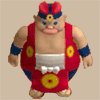
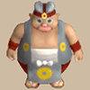
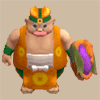
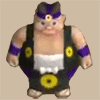

# Monster List

#### Monsters

<table id="monsterList" class="pageLinksTable">
  <tr>
    <th colspan="6">Monster (Family) ~ Notebook Order</th>
  </tr>
  <tr>
    <th>1</th>
    <th>2</th>
    <th>3</th>
    <th>4</th>
    <th>5</th>
  </tr>
  <tr>
    <td class="highlightGrey"><a href="#mamel-family">Mamel</a></td>
    <td><a href="#shagga-family">Shagga</a></td>
    <td class="highlightGrey"><a href="#nigiri-baby-family">Nigiri Baby</a></td>
    <td><a href="#hoppin'-batter-family">Hoppin' Batter</a></td>
    <td class="highlightGrey"><a href="#water-ninja-family">Water Ninja</a></td>
  </tr>
  <tr>
    <td class="highlightGrey"><a href="#chintala-family">Chintala</a></td>
    <td><a href="#bowboy-family">Bowboy</a></td>
    <td class="highlightGrey"><a href="#froggo-family">Froggo</a></td>
    <td><a href="#fierous-family">Fierous</a></td>
    <td class="highlightGrey"><a href="#tree-ninja-family">Tree Ninja</a></td>
  </tr>
  <tr>
    <td class="highlightGrey"><a href="#octopling-family">Octopling</a></td>
    <td><a href="#pop-tank-family">Pop Tank</a></td>
    <td class="highlightGrey"><a href="#thiefwalrus-family">Thiefwalrus</a></td>
    <td><a href="#zapdon-family">Zapdon</a></td>
    <td class="highlightGrey"><a href="#metal-ninja-family">Metal Ninja</a></td>
  </tr>
  <tr>
    <td class="highlightGrey"><a href="#spearfish-family">Spearfish</a></td>
    <td><a href="#bored-kappa-family">Bored Kappa</a></td>
    <td class="highlightGrey"><a href="#hat-urchin-family">Hat Urchin</a></td>
    <td><a href="#schubell-family">Schubell</a></td>
    <td class="highlightGrey"><a href="#earth-ninja-family">Earth Ninja</a></td>
  </tr>
  <tr>
    <td class="highlightGrey"><a href="#death-reaper-family">Death Reaper</a></td>
    <td><a href="#porky-family">Porky</a></td>
    <td class="highlightGrey"><a href="#curse-girl-family">Curse Girl</a></td>
    <td><a href="#n'dubba-family">N'dubba</a></td>
    <td class="highlightGrey"><a href="#hannya-monk-family">Hannya Monk</a></td>
  </tr>
  <tr>
    <td class="highlightGrey"><a href="#pumphantasm-family">Pumphantasm</a></td>
    <td><a href="#dragon-family">Dragon</a></td>
    <td class="highlightGrey"><a href="#mudkin-family">Mudkin</a></td>
    <td><a href="#mixer-family">Mixer</a></td>
    <td class="highlightGrey"><a href="#kitsune-monk-family">Kitsune Monk</a></td>
  </tr>
  <tr>
    <td class="highlightGrey"><a href="#firepuff-family">Firepuff</a></td>
    <td><a href="#ghost-radish-family">Ghost Radish</a></td>
    <td class="highlightGrey"><a href="#swordsman-family">Swordsman</a></td>
    <td><a href="#egg-thing-family">Egg Thing</a></td>
    <td class="highlightGrey"><a href="#okina-monk-family">Okina Monk</a></td>
  </tr>
  <tr>
    <td class="highlightGrey"><a href="#armordillo-family">Armordillo</a></td>
    <td><a href="#skull-mage-family">Skull Mage</a></td>
    <td class="highlightGrey"><a href="#pullfrog-family">Pullfrog</a></td>
    <td><a href="#golden-egg-thing">Golden Egg Thing</a></td>
    <td class="highlightGrey"><a href="#okame-monk-family">Okame Monk</a></td>
  </tr>
  <tr>
    <td class="highlightGrey"><a href="#masked-samurai-family">Masked Samurai</a></td>
    <td><a href="#gazer-family">Gazer</a></td>
    <td class="highlightGrey"><a href="#floor-dragon-family">Floor Dragon</a></td>
    <td><a href="#chow">Chow</a></td>
    <td class="highlightGrey"><a href="#tengu-monk-family">Tengu Monk</a></td>
  </tr>
  <tr>
    <td class="highlightGrey"><a href="#ghost-samurai">Ghost Samurai</a></td>
    <td><a href="#twisty-hani-family">Twisty Hani</a></td>
    <td class="highlightGrey"><a href="#tiger-thrower-family">Tiger Thrower</a></td>
    <td><a href="#dark-owl">Dark Owl</a></td>
    <td class="highlightGrey"><a href="#boss-group">Boss Group</a></td>
  </tr>
  <tr>
    <td class="highlightGrey"><a href="#taur-family">Taur</a></td>
    <td><a href="#polygon-spinna-family">Polygon Spinna</a></td>
    <td class="highlightGrey"><a href="#karakuroid-family">Karakuroid</a></td>
    <td><a href="#crow-tengu">Crow Tengu</a></td>
    <td class="highlightGrey"></td>
  </tr>
  <tr>
    <td class="highlightGrey"><a href="#metalhead-family">Metalhead</a></td>
    <td><a href="#scorpion-family">Scorpion</a></td>
    <td class="highlightGrey"><a href="#soldier-ant-family">Soldier Ant</a></td>
    <td><a href="#fluffy-bunny">Fluffy Bunny</a></td>
    <td class="highlightGrey"></td>
  </tr>
  <tr>
    <td class="highlightGrey"><a href="#hen-family">Hen</a></td>
    <td><a href="#field-knave-family">Field Knave</a></td>
    <td class="highlightGrey"><a href="#explochin-family">Explochin</a></td>
    <td><a href="#fire-ninja-family">Fire Ninja</a></td>
    <td class="highlightGrey"></td>
  </tr>
</table>

#### Shop NPCs

<table id="monsterList" class="pageLinksTable">
  <tr>
    <th>Shop NPCs</th>
  </tr>
  <tr>
    <th>1</th>
  </tr>
  <tr>
    <td class="highlightGrey"><a href="#shopkeeper-family">Shopkeeper</a></td>
  </tr>
  <tr>
    <td class="highlightGrey"><a href="#guard-dog">Guard Dog</a></td>
  </tr>
  <tr>
    <td class="highlightGrey"><a href="#shop-guard">Shop Guard</a></td>
  </tr>
</table>

# Details

### Table Explanation

- Lv = Monster's level.
- HP = Monster's hit points.
- Atk = Monster's attack power.
- Def = Monster's defense power.
- Exp = Experience points awarded when the monster is defeated.
- Speed = Monster's action speed.
    - Slow = Half speed.
    - Normal = Regular speed.
    - Swift 1 = Double speed, 1 attack.
    - Swift 2 = Double speed, 2 attacks.
- Type = Monster type.
    - Aquatic = Weak to Watersplitter, can move across water tiles.
    - Beast = Weak to Primal Axe.
    - Cyclops = Weak to Cyclops Bane.
    - Draining = Weak to Drain Slayer.
    - Dragon = Weak to Dragonkiller.
    - Exploding = Weak to Crescent Blade.
    - Floating = Weak to Sky Sword, can move across air and water tiles.
    - Ghost = Weak to Sickle of Salvation, HP restoring items deal damage.
    - Metal = Weak to Steel Severer.
    - Normal = No type-effective weakness.

## Regular Monsters

### Mamel Family

<table class="monsterPageTable">
  <tbody>
    <tr>
      <th>
        

          
Lv1 : Mamel

        

      </th>
    </tr>
    <tr>
      <td>
        

          

            
          

          

            

              
HP

              
8

              
Atk

              
3

              
Def

              
4

              
Exp

              
2

            

            

              
Speed

              
Normal

              
Type

              
Normal

            

            
A very weak monster with low Attack Power and HP.

            
One of the safest monsters to test unidentified staves on, since Unlucky Staff displays a message even against a Lv1 monster now. Despite its name being based on "mammal", it's not a Beast type.

          

        

      </td>
    </tr>
    <tr>
      <th>
        

          
Lv2 : Pit Mamel

        

      </th>
    </tr>
    <tr>
      <td>
        

          

            
          

          

            

              
HP

              
11

              
Atk

              
5

              
Def

              
8

              
Exp

              
5

            

            

              
Speed

              
Normal

              
Type

              
Normal

            

            
A weak monster with low Attack Power and HP that is only just a little stronger than Mamel. It's not dangerous if you're careful.

            
Leave a 1 tile gap when testing unidentified items on it. Level it up using Fortune Staff, Fortune Grass, Disguising Staff, etc. and hunt the resulting Cave Mamel for lots of experience points.

          

        

      </td>
    </tr>
    <tr>
      <th>
        

          
Lv3 : Cave Mamel

        

      </th>
    </tr>
    <tr>
      <td>
        

          

            
          

          

            

              
HP

              
5

              
Atk

              
100

              
Def

              
100

              
Exp

              
2000

            

            

              
Speed

              
Normal

              
Type

              
Normal

            

            
Normal attacks do little damage. Its HP is low, so using things like Rock will defeat it easily. Defeating it grants lots of Experience Points.

            
Only takes 1 damage from normal attacks and arrows. Sealing it removes this ability, but it still has 100 defense. Can be slain in 1 hit using a Rock, Knockback Staff, Rotten Onigiri, etc.

          

        

      </td>
    </tr>
    <tr>
      <th>
        

          
Lv4 : Gitan Mamel

        

      </th>
    </tr>
    <tr>
      <td>
        

          

            
          

          

            

              
HP

              
20

              
Atk

              
100

              
Def

              
999

              
Exp

              
3333

            

            

              
Speed

              
Swift 2

              
Type

              
Normal

            

            
Normal attacks do little damage. This strong enemy moves at double speed, but its HP is low, so using things like Rock will defeat it easily. Defeating it grants lots of Experience Points and Gitan.

            
Always drops 2000 Gitan when defeated. Only takes 1 damage from normal attacks and arrows. Can be slain in 1 hit using a Porky's Rock or Thunderbolt Staff.

          

        

      </td>
    </tr>
  </tbody>
</table>

### Chintala Family

<table class="monsterPageTable">
  <tbody>
    <tr>
      <th>
        

          
Lv1 : Chintala

        

      </th>
    </tr>
    <tr>
      <td>
        

          

            
          

          

            

              
HP

              
15

              
Atk

              
9

              
Def

              
4

              
Exp

              
12

            

            

              
Speed

              
Normal

              
Type

              
Beast

            

            
A monster without any particular abilities.

            
A bit more threatening than a Pit Mamel, but that's about it.

          

        

      </td>
    </tr>
    <tr>
      <th>
        

          
Lv2 : Mid Chintala

        

      </th>
    </tr>
    <tr>
      <td>
        

          

            
          

          

            

              
HP

              
45

              
Atk

              
23

              
Def

              
10

              
Exp

              
27

            

            

              
Speed

              
Normal

              
Type

              
Beast

            

            
A monster without any particular abilities. Given its medium size, it's stronger than Chintala.

            
Quite formidable for how early it appears in some dungeons. The model grows bigger with each level up, similar to Shiren 2.

          

        

      </td>
    </tr>
    <tr>
      <th>
        

          
Lv3 : Big Chintala

        

      </th>
    </tr>
    <tr>
      <td>
        

          

            
          

          

            

              
HP

              
85

              
Atk

              
40

              
Def

              
33

              
Exp

              
350

            

            

              
Speed

              
Normal

              
Type

              
Beast

            

            
A monster without any particular abilities. Given its big size, it's stronger than Mid Chintala.

            
Appears in Training Path of Shopping and Isle of the Mighty.

          

        

      </td>
    </tr>
    <tr>
      <th>
        

          
Lv4 : Huge Chintala

        

      </th>
    </tr>
    <tr>
      <td>
        

          

            
          

          

            

              
HP

              
185

              
Atk

              
60

              
Def

              
40

              
Exp

              
1350

            

            

              
Speed

              
Normal

              
Type

              
Beast

            

            
A monster without any particular abilities. Given its huge size, it's stronger than Big Chintala.

            
Its napping animation makes it look like a cute, oversized plush. Appears in Training Path of Shopping and Isle of the Mighty.

          

        

      </td>
    </tr>
  </tbody>
</table>

### Octopling Family

<table class="monsterPageTable">
  <tbody>
    <tr>
      <th>
        

          
Lv1 : Octopling

        

      </th>
    </tr>
    <tr>
      <td>
        

          

            
          

          

            

              
HP

              
14

              
Atk

              
4

              
Def

              
6

              
Exp

              
4

            

            

              
Speed

              
Normal

              
Type

              
Aquatic

            

            
Seeks out and helps other monsters. While on water, Attack Power increases and HP recovers each turn.

            
Heals 2 HP per turn while on a water tile. Doesn't follow behind other Octopling family monsters. Prioritizes moving toward other monsters instead of attacking Shiren.

          

        

      </td>
    </tr>
    <tr>
      <th>
        

          
Lv2 : Fresh Octopling

        

      </th>
    </tr>
    <tr>
      <td>
        

          

            
          

          

            

              
HP

              
60

              
Atk

              
19

              
Def

              
14

              
Exp

              
55

            

            

              
Speed

              
Normal

              
Type

              
Aquatic

            

            
Seeks out and helps other monsters. Its Attack Power increases if an adjacent monster is defeated. While on water, Attack Power increases and HP recovers each turn.

            
Heals 9 HP per turn while on a water tile. Attack power is boosted by 1 stage when an adjacent monster is slain. The boost is skipped if the Fresh Octopling is napping or paralyzed. 19 shield strength reduces a boosted Fresh Octopling's damage to 1.

          

        

      </td>
    </tr>
    <tr>
      <th>
        

          
Lv3 : Famed Octopling

        

      </th>
    </tr>
    <tr>
      <td>
        

          

            
          

          

            

              
HP

              
99

              
Atk

              
25

              
Def

              
30

              
Exp

              
420

            

            

              
Speed

              
Normal

              
Type

              
Aquatic

            

            
Seeks out and helps other monsters. Gives covering fire from a distance, dealing 5 damage. Its Attack Power increases if an adjacent monster is defeated. While on water, Attack Power increases and HP recovers each turn.

            
Heals 14 HP per turn while on a water tile. Attack power is boosted by 1 stage when an adjacent monster is slain. Shoots rocks that deal 5 damage from a distance: - When adjacent to another monster in a room: 3 tile range. - When not adjacent to another monster or in a hallway: 1 tile range.

          

        

      </td>
    </tr>
    <tr>
      <th>
        

          
Lv4 : Superb Octopling

        

      </th>
    </tr>
    <tr>
      <td>
        

          

            
          

          

            

              
HP

              
199

              
Atk

              
64

              
Def

              
48

              
Exp

              
1260

            

            

              
Speed

              
Normal

              
Type

              
Aquatic

            

            
Seeks out and helps other monsters. Gives covering fire from a distance, dealing 5 damage. Its Action Speed increases by 1 if an adjacent monster is defeated. While on water, Attack Power increases and HP recovers each turn.

            
Heals 29 HP per turn while on a water tile. Action speed is boosted by 1 stage when an adjacent monster is slain. Rock throwing range is the same as Famed Octopling. Only naturally appears in Heart of Serpentcoil Island.

          

        

      </td>
    </tr>
  </tbody>
</table>

### Spearfish Family

<table class="monsterPageTable">
  <tbody>
    <tr>
      <th>
        

          
Lv1 : Spearfish

        

      </th>
    </tr>
    <tr>
      <td>
        

          

            
          

          

            

              
HP

              
16

              
Atk

              
6

              
Def

              
2

              
Exp

              
7

            

            

              
Speed

              
Normal

              
Type

              
Aquatic

            

            
Walks on water. While on water, Attack Power increases and HP recovers each turn.

            
Heals 2 HP per turn while on a water tile. Deals 6~7 damage without a shield, or 11~14 damage on a water tile. Occasionally drops a Spearscale Shield when defeated.

          

        

      </td>
    </tr>
    <tr>
      <th>
        

          
Lv2 : Lt. Spearfish

        

      </th>
    </tr>
    <tr>
      <td>
        

          

            
          

          

            

              
HP

              
60

              
Atk

              
24

              
Def

              
17

              
Exp

              
55

            

            

              
Speed

              
Normal

              
Type

              
Aquatic

            

            
Tries to flee to water when its HP gets low. While on water, Attack Power increases and HP recovers each turn.

            
Heals 9 HP per turn while on a water tile. Attempts to flee towards a water tile when HP &le; 12. Occasionally drops a Spearscale Shield when defeated.

          

        

      </td>
    </tr>
    <tr>
      <th>
        

          
Lv3 : Capt. Spearfish

        

      </th>
    </tr>
    <tr>
      <td>
        

          

            
          

          

            

              
HP

              
100

              
Atk

              
39

              
Def

              
30

              
Exp

              
410

            

            

              
Speed

              
Normal

              
Type

              
Aquatic

            

            
Tries to flee to water when its HP gets low. While on water, it shoots water up to 3 tile(s) away that deals 15 damage and may get items in your inventory wet. While on water, Attack Power increases and HP recovers each turn.

            
Heals 15 HP per turn while on a water tile. Attempts to flee towards a water tile when HP &le; 20. It won't shoot water when it's not standing on a water tile. Occasionally drops a Spearscale Shield when defeated.

          

        

      </td>
    </tr>
    <tr>
      <th>
        

          
Lv4 : Admiral Spearfish

        

      </th>
    </tr>
    <tr>
      <td>
        

          

            
          

          

            

              
HP

              
200

              
Atk

              
59

              
Def

              
50

              
Exp

              
1410

            

            

              
Speed

              
Normal

              
Type

              
Aquatic

            

            
Tries to flee to water when its HP gets low. While on water, it shoots water up to 5 tile(s) away that deals 25 damage and may get items in your inventory wet. While on water, Attack Power increases and HP recovers each turn.

            
Heals 30 HP per turn while on a water tile. Attempts to flee towards a water tile when HP &le; 40. It won't shoot water when it's not standing on a water tile. Occasionally drops a Spearscale Shield when defeated.

          

        

      </td>
    </tr>
  </tbody>
</table>

### Death Reaper Family

<table class="monsterPageTable">
  <tbody>
    <tr>
      <th>
        

          
Lv1 : Death Reaper

        

      </th>
    </tr>
    <tr>
      <td>
        

          

            
          

          

            

              
HP

              
22

              
Atk

              
6

              
Def

              
5

              
Exp

              
9

            

            

              
Speed

              
Swift 1

              
Type

              
Ghost, Floating

            

            
Damaged by items that restore HP, such as Herb. Splashing it with water greatly decreases its Attack Power.

            
Can be pretty dangerous when Shiren doesn't have a shield, so try to reach Lv3 before descending to where this monster spawns.

          

        

      </td>
    </tr>
    <tr>
      <th>
        

          
Lv2 : Hell Reaper

        

      </th>
    </tr>
    <tr>
      <td>
        

          

            
          

          

            

              
HP

              
45

              
Atk

              
12

              
Def

              
15

              
Exp

              
30

            

            

              
Speed

              
Swift 2

              
Type

              
Ghost, Floating

            

            
Damaged by items that restore HP, such as Herb. Splashing it with water greatly decreases its Attack Power.

            
Swift 2 action speed makes it very dangerous without a shield.

          

        

      </td>
    </tr>
    <tr>
      <th>
        

          
Lv3 : Soul Reaper

        

      </th>
    </tr>
    <tr>
      <td>
        

          

            
          

          

            

              
HP

              
75

              
Atk

              
40

              
Def

              
40

              
Exp

              
555

            

            

              
Speed

              
Swift 2

              
Type

              
Ghost, Floating

            

            
Moves through walls. Damaged by items that restore HP, such as Herb. Splashing it with water greatly decreases its Attack Power.

            
Detects Shiren from anywhere on the floor. Step in place in a room instead of entering a hallway right away.

          

        

      </td>
    </tr>
    <tr>
      <th>
        

          
Lv4 : King Reaper

        

      </th>
    </tr>
    <tr>
      <td>
        

          

            
          

          

            

              
HP

              
225

              
Atk

              
65

              
Def

              
50

              
Exp

              
1555

            

            

              
Speed

              
Swift 2

              
Type

              
Ghost, Floating

            

            
Moves through walls. Damaged by items that restore HP, such as Herb. Splashing it with water greatly decreases its Attack Power.

            
Generally the same as Soul Reaper, but much higher stats. Throw an Eradication Scroll at it if your equipment is lacking.

          

        

      </td>
    </tr>
  </tbody>
</table>

### Pumphantasm Family

<table class="monsterPageTable">
  <tbody>
    <tr>
      <th>
        

          
Lv1 : Pumphantasm

        

      </th>
    </tr>
    <tr>
      <td>
        

          

            
          

          

            

              
HP

              
23

              
Atk

              
16

              
Def

              
10

              
Exp

              
25

            

            

              
Speed

              
Normal

              
Type

              
Ghost, Floating

            

            
Moves through walls as it wanders aimlessly. Damaged by items that restore HP, such as Herb.

            
High attack power for a monster that can appear as early as 3F. Rocks and items with piercing properties can hit them inside walls. Throw HP restoring items or Gitan bags to one-shot them if needed. Damage: Herb = 25, Otogirisou = 100, Healing Grass = 200, Life Grass or Rejuvenation Pot = Instantly defeated.

          

        

      </td>
    </tr>
    <tr>
      <th>
        

          
Lv2 : Pumpanshee

        

      </th>
    </tr>
    <tr>
      <td>
        

          

            
          

          

            

              
HP

              
60

              
Atk

              
35

              
Def

              
22

              
Exp

              
250

            

            

              
Speed

              
Normal

              
Type

              
Ghost, Floating

            

            
Moves through walls as it wanders aimlessly. Damaged by items that restore HP, such as Herb.

            
Beware of Behemoth versions of Pumphantasm family monsters, since both their attack power and range are increased.

          

        

      </td>
    </tr>
    <tr>
      <th>
        

          
Lv3 : Pumplich

        

      </th>
    </tr>
    <tr>
      <td>
        

          

            
          

          

            

              
HP

              
100

              
Atk

              
50

              
Def

              
30

              
Exp

              
800

            

            

              
Speed

              
Normal

              
Type

              
Ghost, Floating

            

            
Moves through walls as it wanders aimlessly. Damaged by items that restore HP, such as Herb.

            
Higher attack power for when it appears, as usual. Appears alongside Soul Reaper in Heart of Serpentcoil Island.

          

        

      </td>
    </tr>
    <tr>
      <th>
        

          
Lv4 : Pumplord

        

      </th>
    </tr>
    <tr>
      <td>
        

          

            
          

          

            

              
HP

              
185

              
Atk

              
75

              
Def

              
35

              
Exp

              
1850

            

            

              
Speed

              
Normal

              
Type

              
Ghost, Floating

            

            
Moves through walls as it wanders aimlessly. Damaged by items that restore HP, such as Herb.

            
HP and attack power are on the high end, so don't lower your guard. Appears alongside Battler in Heart of Serpentcoil Island.

          

        

      </td>
    </tr>
  </tbody>
</table>

### Firepuff Family

<table class="monsterPageTable">
  <tbody>
    <tr>
      <th>
        

          
Lv1 : Firepuff

        

      </th>
    </tr>
    <tr>
      <td>
        

          

            
          

          

            

              
HP

              
20

              
Atk

              
7

              
Def

              
7

              
Exp

              
13

            

            

              
Speed

              
Normal

              
Type

              
Dragon, Floating

            

            
Breathes fire at adjacent foes, dealing 10 damage. This attack may fail.

            
100% special attack usage rate around corners. Breathes fire even if Shiren is standing on a Sanctuary Scroll. Its fire breath can be used to obtain Grilled Onigiri.

          

        

      </td>
    </tr>
    <tr>
      <th>
        

          
Lv2 : Flamepuff

        

      </th>
    </tr>
    <tr>
      <td>
        

          

            
          

          

            

              
HP

              
50

              
Atk

              
25

              
Def

              
20

              
Exp

              
175

            

            

              
Speed

              
Normal

              
Type

              
Dragon, Floating

            

            
Breathes fire at adjacent foes, dealing 20 damage. This attack may fail.

            
HP is on the low side, so it's not too hard to defeat it. Appears near the end of dungeons like Domain of Staves and Scrolls.

          

        

      </td>
    </tr>
    <tr>
      <th>
        

          
Lv3 : Blazepuff

        

      </th>
    </tr>
    <tr>
      <td>
        

          

            
          

          

            

              
HP

              
135

              
Atk

              
55

              
Def

              
35

              
Exp

              
1050

            

            

              
Speed

              
Normal

              
Type

              
Dragon, Floating

            

            
Breathes fire at adjacent foes, dealing 30 damage. This attack may fail.

            
Much higher stats than Flamepuff, and its fire breath is painful. Quick Tip (Requires Floating Bracelet or Waterwalk Bracelet): Lure it above water and utilize Onigiri Payback to obtain Rotten Onigiri, then have a different Blazepuff grill the Rotten Onigiri.

          

        

      </td>
    </tr>
    <tr>
      <th>
        

          
Lv4 : Pyrepuff

        

      </th>
    </tr>
    <tr>
      <td>
        

          

            
          

          

            

              
HP

              
255

              
Atk

              
75

              
Def

              
45

              
Exp

              
1550

            

            

              
Speed

              
Normal

              
Type

              
Dragon, Floating

            

            
Breathes fire at adjacent foes, dealing 40 damage. This attack may fail.

            
Very formidable stats, as you'd expect from a proper Dragon type. Occasionally seen in Heart of Serpentcoil Island thanks to Chow. Only naturally appears in Isle of the Mighty.

          

        

      </td>
    </tr>
  </tbody>
</table>

### Armordillo Family

<table class="monsterPageTable">
  <tbody>
    <tr>
      <th>
        

          
Lv1 : Armordillo

        

      </th>
    </tr>
    <tr>
      <td>
        

          

            
          

          

            

              
HP

              
20

              
Atk

              
11

              
Def

              
15

              
Exp

              
15

            

            

              
Speed

              
Normal

              
Type

              
Beast

            

            
Hurls itself at the target, dealing 5 damage. Knocks the target back 2 tile(s) and makes them drop items.

            
Avoid tripping via Balance Staff, Sumo status, or Unmoving Wall. Zabuton nullifies the damage, but doesn't prevent Shiren from tripping. Shiren won't trip if he lands on a water or air tile after the tackle. Fighting with your back against a wall doesn't prevent dropping items. Items fall within 3 forward directions + 2 tiles ahead (4 tiles total), pots can break, and any items that land on an air tile will vanish.

          

        

      </td>
    </tr>
    <tr>
      <th>
        

          
Lv2 : Brodillo

        

      </th>
    </tr>
    <tr>
      <td>
        

          

            
          

          

            

              
HP

              
70

              
Atk

              
36

              
Def

              
38

              
Exp

              
450

            

            

              
Speed

              
Normal

              
Type

              
Beast

            

            
Hurls itself at the target, dealing 10 damage. Knocks the target back 3 tile(s) and makes them drop items.

            
Stronger than a Minotaur, despite its cute appearance. Very troublesome to deal with in Training Path of Inference.

          

        

      </td>
    </tr>
    <tr>
      <th>
        

          
Lv3 : Popdillo

        

      </th>
    </tr>
    <tr>
      <td>
        

          

            
          

          

            

              
HP

              
100

              
Atk

              
51

              
Def

              
45

              
Exp

              
1200

            

            

              
Speed

              
Normal

              
Type

              
Beast

            

            
Hurls itself at the target, dealing 15 damage. Knocks the target back 4 tile(s) and makes them drop items.

            
Its tackle one-shots Lv1 Shiren in Isle of the Mighty without HP+X runes. Appears in Training Path of Shopping and Isle of the Mighty.

          

        

      </td>
    </tr>
    <tr>
      <th>
        

          
Lv4 : Grampadillo

        

      </th>
    </tr>
    <tr>
      <td>
        

          

            
          

          

            

              
HP

              
175

              
Atk

              
71

              
Def

              
56

              
Exp

              
1400

            

            

              
Speed

              
Normal

              
Type

              
Beast

            

            
Hurls itself at the target, dealing 20 damage. Knocks the target back 5 tile(s) and makes them drop items.

            
End game threat for Heart of Serpentcoil Island (12 Celestial Stones). It's best to carry a Balance Staff or maintain Sumo status.

          

        

      </td>
    </tr>
  </tbody>
</table>

### Masked Samurai Family

<table class="monsterPageTable">
  <tbody>
    <tr>
      <th>
        

          
Lv1 : Masked Samurai

        

      </th>
    </tr>
    <tr>
      <td>
        

          

            
          

          

            

              
HP

              
47

              
Atk

              
18

              
Def

              
18

              
Exp

              
48

            

            

              
Speed

              
Normal

              
Type

              
Normal

            

            
Resurrects as Ghost Samurai when defeated. Splashing it with water greatly decreases its Attack Power.

            
Ghost Samurai spawns 4~9 turns after Masked Samurai is slain. Sealed or Onigiri status prevents Ghost Samurai from spawning. If a character is standing on the tile where Masked Samurai was located, Ghost Samurai will spawn on a nearby surrounding tile instead. If an Eradication Scroll has been thrown at Ghost Samurai this adventure, Masked Samurai won't be able to resurrect when it's defeated.

          

        

      </td>
    </tr>
    <tr>
      <th>
        

          
Lv2 : Raging Samurai

        

      </th>
    </tr>
    <tr>
      <td>
        

          

            
          

          

            

              
HP

              
100

              
Atk

              
45

              
Def

              
37

              
Exp

              
400

            

            

              
Speed

              
Normal

              
Type

              
Normal

            

            
Resurrects as Ghost Samurai when defeated. Splashing it with water greatly decreases its Attack Power.

            
Much stronger than Masked Samurai - It's approaching Dragon's stats. Don't neglect to hunt Ghost Samurai on Masked Samurai floors.

          

        

      </td>
    </tr>
    <tr>
      <th>
        

          
Lv3 : Great Samurai

        

      </th>
    </tr>
    <tr>
      <td>
        

          

            
          

          

            

              
HP

              
149

              
Atk

              
58

              
Def

              
40

              
Exp

              
840

            

            

              
Speed

              
Normal

              
Type

              
Normal

            

            
Resurrects as Ghost Samurai when defeated. Splashing it with water greatly decreases its Attack Power.

            
Appears alongside Miracle Hen in Heart of Serpentcoil Island. Slay Ghost Samurai or else you might face a powered up Miracle Hen.

          

        

      </td>
    </tr>
    <tr>
      <th>
        

          
Lv4 : Lordly Samurai

        

      </th>
    </tr>
    <tr>
      <td>
        

          

            
          

          

            

              
HP

              
200

              
Atk

              
63

              
Def

              
50

              
Exp

              
1280

            

            

              
Speed

              
Normal

              
Type

              
Normal

            

            
Resurrects as Ghost Samurai when defeated. Splashing it with water greatly decreases its Attack Power.

            
Can be hunted for experience points if you have a Water Gun Pot. Only naturally appears in Heart of Serpentcoil Island.

          

        

      </td>
    </tr>
  </tbody>
</table>

### Ghost Samurai

<table class="monsterPageTable">
  <tbody>
    <tr>
      <th>
        

          
Lv1 : Ghost Samurai

        

      </th>
    </tr>
    <tr>
      <td>
        

          

            
          

          

            

              
HP

              
4

              
Atk

              
13

              
Def

              
15

              
Exp

              
10

            

            

              
Speed

              
Normal

              
Type

              
Ghost

            

            
Possesses any monsters it gets close to, leveling them up. Normal attacks do little damage, but damage can be inflicted as usual by Anti-Ghost runes. Damaged by items that restore HP, such as Herb.

            
Only takes 1 damage from normal attacks and arrows. Sealing it removes this ability, similar to Cave Mamel and Gitan Mamel. If it possesses a monster that can't level up any further, that monster fully restores HP and gains Empowered and Fortified statuses. Ghost Samurai never warps when attacked, unlike previous games. Can be slain in 1 hit using a Rock, Knockback Staff, Rotten Onigiri, etc.

          

        

      </td>
    </tr>
  </tbody>
</table>

### Taur Family

<table class="monsterPageTable">
  <tbody>
    <tr>
      <th>
        

          
Lv1 : Taur

        

      </th>
    </tr>
    <tr>
      <td>
        

          

            
          

          

            

              
HP

              
35

              
Atk

              
15

              
Def

              
15

              
Exp

              
33

            

            

              
Speed

              
Normal

              
Type

              
Beast

            

            
Occasionally unleashes Critical Hits. May drop Axe of the Minotaur when defeated. Splashing it with water greatly decreases its Attack Power.

            
The Taur family deals x1.5 damage with Critical Hits. Comparable attack power to Pumphantasm, higher HP and defense. Axe of the Minotaur drop chance seems to be 1~2%.

          

        

      </td>
    </tr>
    <tr>
      <th>
        

          
Lv2 : Minotaur

        

      </th>
    </tr>
    <tr>
      <td>
        

          

            
          

          

            

              
HP

              
70

              
Atk

              
31

              
Def

              
20

              
Exp

              
90

            

            

              
Speed

              
Normal

              
Type

              
Beast

            

            
Occasionally unleashes Critical Hits. May drop Axe of the Minotaur when defeated. Splashing it with water greatly decreases its Attack Power.

            
Often appears alongside Master Hen. Axe of the Minotaur drop chance seems to be 1~2%.

          

        

      </td>
    </tr>
    <tr>
      <th>
        

          
Lv3 : Megataur

        

      </th>
    </tr>
    <tr>
      <td>
        

          

            
          

          

            

              
HP

              
170

              
Atk

              
55

              
Def

              
42

              
Exp

              
790

            

            

              
Speed

              
Normal

              
Type

              
Beast

            

            
Occasionally unleashes Critical Hits. May drop Axe of the Minotaur when defeated. Splashing it with water greatly decreases its Attack Power.

            
Somewhat low Attack Power for when it usually appears in a dungeon, considering its Critical Hit is roughly equal to 1 hit from Miracle Hen. Axe of the Minotaur drop chance seems to be 3~5%.

          

        

      </td>
    </tr>
    <tr>
      <th>
        

          
Lv4 : Gigataur

        

      </th>
    </tr>
    <tr>
      <td>
        

          

            
          

          

            

              
HP

              
235

              
Atk

              
85

              
Def

              
62

              
Exp

              
1790

            

            

              
Speed

              
Normal

              
Type

              
Beast

            

            
Occasionally unleashes Critical Hits. May drop Axe of the Minotaur when defeated. Splashing it with water greatly decreases its Attack Power.

            
Doesn't naturally appear in Heart of Serpentcoil Island, but can be found in Isle of the Mighty and Behemoth Rush. Axe of the Minotaur drop chance seems to be 3~5%.

          

        

      </td>
    </tr>
  </tbody>
</table>

### Metalhead Family

<table class="monsterPageTable">
  <tbody>
    <tr>
      <th>
        

          
Lv1 : Metalhead

        

      </th>
    </tr>
    <tr>
      <td>
        

          

            
          

          

            

              
HP

              
66

              
Atk

              
30

              
Def

              
19

              
Exp

              
61

            

            

              
Speed

              
Normal

              
Type

              
Cyclops

            

            
Throws its head to attack up to 2 tile(s) away. This attack will even hit around corners.

            
Low experience points, despite being on the stronger side. Has longer attack range instead of charging strength like in Shiren 5. It can't attack Shiren if he is standing on a Sanctuary Scroll. Retribution doesn't take effect when attacked from 2+ tiles away, but Keen does take effect.

          

        

      </td>
    </tr>
    <tr>
      <th>
        

          
Lv2 : Thrashead

        

      </th>
    </tr>
    <tr>
      <td>
        

          

            
          

          

            

              
HP

              
122

              
Atk

              
55

              
Def

              
45

              
Exp

              
1100

            

            

              
Speed

              
Normal

              
Type

              
Cyclops

            

            
Throws its head to attack up to 3 tile(s) away. This attack will even hit around corners.

            
Much higher stats than Metalhead, and offers decent experience points. Doesn't attack if another monster is in-between Shiren and itself. Only naturally appears in Dune of Batsu.

          

        

      </td>
    </tr>
    <tr>
      <th>
        

          
Lv3 : Megahead

        

      </th>
    </tr>
    <tr>
      <td>
        

          

            
          

          

            

              
HP

              
182

              
Atk

              
65

              
Def

              
48

              
Exp

              
1350

            

            

              
Speed

              
Normal

              
Type

              
Cyclops

            

            
Throws its head to attack up to 4 tile(s) away. This attack will even hit around corners.

            
Longer reach than the Ironhead family in Shiren 2 or Asuka Kenzan.

          

        

      </td>
    </tr>
    <tr>
      <th>
        

          
Lv4 : Deathead

        

      </th>
    </tr>
    <tr>
      <td>
        

          

            
          

          

            

              
HP

              
282

              
Atk

              
99

              
Def

              
60

              
Exp

              
2350

            

            

              
Speed

              
Normal

              
Type

              
Cyclops

            

            
Throws its head to attack up to 5 tile(s) away. This attack will even hit around corners.

            
Top-notch attack power alongside its range makes for a nasty combo. Shop NPCs and Lv3-4 Mamels are the only ones with a higher attack stat.

          

        

      </td>
    </tr>
  </tbody>
</table>

### Hen Family

<table class="monsterPageTable">
  <tbody>
    <tr>
      <th>
        

          
Lv1 : Hen

        

      </th>
    </tr>
    <tr>
      <td>
        

          

            
          

          

            

              
HP

              
4

              
Atk

              
1

              
Def

              
1

              
Exp

              
200

            

            

              
Speed

              
Swift 1

              
Type

              
Beast

            

            
Runs around like it lost its head. If hit by fire or explosions, it turns into Yakitori.

            
Decent experience points even as a Lv1 Hen, so hunt them if possible. However, it grants 0 experience points if it turns into Yakitori. Yakitori never rots, and cannot be grilled further.

          

        

      </td>
    </tr>
    <tr>
      <th>
        

          
Lv2 : Master Hen

        

      </th>
    </tr>
    <tr>
      <td>
        

          

            
          

          

            

              
HP

              
70

              
Atk

              
33

              
Def

              
21

              
Exp

              
400

            

            

              
Speed

              
Normal

              
Type

              
Beast

            

            
Boasts about its powerful muscles. But it turns into a Hen when its HP gets low.

            
Reverts to a Lv1 Hen when HP &le; 14 (Deal 56+ damage to it). Try to defeat it before it reverts to a Hen for more experience points. Doesn't turn into Yakitori even when hit by fire or explosions.

          

        

      </td>
    </tr>
    <tr>
      <th>
        

          
Lv3 : Great Hen

        

      </th>
    </tr>
    <tr>
      <td>
        

          

            
          

          

            

              
HP

              
120

              
Atk

              
55

              
Def

              
40

              
Exp

              
800

            

            

              
Speed

              
Swift 1

              
Type

              
Beast

            

            
Excels at hand-to-hand combat. But it turns into a Hen when its HP gets low.

            
Reverts to a Lv1 Hen when HP &le; 24 (Deal 96+ damage to it). Only naturally appears in Training Path of Gimmicks.

          

        

      </td>
    </tr>
    <tr>
      <th>
        

          
Lv4 : Miracle Hen

        

      </th>
    </tr>
    <tr>
      <td>
        

          

            
          

          

            

              
HP

              
220

              
Atk

              
82

              
Def

              
60

              
Exp

              
1600

            

            

              
Speed

              
Swift 2

              
Type

              
Beast

            

            
Feared for its godlike strength. But it turns into a Hen when its HP gets low.

            
Reverts to a Lv1 Hen when HP &le; 44 (Deal 176+ damage to it). Swift 2 speed and 82 attack power makes it extremely dangerous. Consider eradicating it in Heart if your equipment is lacking. Good defensive runes include Keen, Full Armor, and Payback runes.

          

        

      </td>
    </tr>
  </tbody>
</table>

### Shagga Family

<table class="monsterPageTable">
  <tbody>
    <tr>
      <th>
        

          
Lv1 : Shagga

        

      </th>
    </tr>
    <tr>
      <td>
        

          

            
          

          

            

              
HP

              
18

              
Atk

              
6

              
Def

              
4

              
Exp

              
12

            

            

              
Speed

              
Normal

              
Type

              
Dragon

            

            
Splashing it with water greatly decreases its Attack Power.

            
Monster that got nerfed into oblivion compared to Shiren 5. Chintala has higher attack power than this scary <i>looking</i> monster. Appears on 11~14F in Sacred Ocean Tunnel, which is likely a mistake, but the monster table hasn't been changed in any of the updates so far.

          

        

      </td>
    </tr>
    <tr>
      <th>
        

          
Lv2 : Nashagga

        

      </th>
    </tr>
    <tr>
      <td>
        

          

            
          

          

            

              
HP

              
70

              
Atk

              
21

              
Def

              
20

              
Exp

              
60

            

            

              
Speed

              
Normal

              
Type

              
Dragon

            

            
Attacks with 2 consecutive normal attacks. Splashing it with water greatly decreases its Attack Power.

            
Actually a formidable monster, unlike its level 1 counterpart. Sealing a Lv2-4 Shagga family monster limits its normal attack to 1 hit. Beware of Behemoth versions, since they also attack multiple times.

          

        

      </td>
    </tr>
    <tr>
      <th>
        

          
Lv3 : Lashagga

        

      </th>
    </tr>
    <tr>
      <td>
        

          

            
          

          

            

              
HP

              
99

              
Atk

              
43

              
Def

              
34

              
Exp

              
500

            

            

              
Speed

              
Normal

              
Type

              
Dragon

            

            
Attacks with 3 consecutive normal attacks. Splashing it with water greatly decreases its Attack Power.

            
Shouldn't be too bad to deal with if you have a good shield. Dragon Shield significantly helps at reducing damage received.

          

        

      </td>
    </tr>
    <tr>
      <th>
        

          
Lv4 : Bashagga

        

      </th>
    </tr>
    <tr>
      <td>
        

          

            
          

          

            

              
HP

              
154

              
Atk

              
55

              
Def

              
40

              
Exp

              
950

            

            

              
Speed

              
Normal

              
Type

              
Dragon

            

            
Attacks with 4 consecutive normal attacks. Splashing it with water greatly decreases its Attack Power.

            
Basically the same as Lashagga, but 4 hits instead of 3. Shield strength of 15~20 translates to 30~50 damage taken per hit. Only appears in Behemoth Rush and the boss floor of Dune of Batsu.

          

        

      </td>
    </tr>
  </tbody>
</table>

### Bowboy Family

<table class="monsterPageTable">
  <tbody>
    <tr>
      <th>
        

          
Lv1 : Bowboy

        

      </th>
    </tr>
    <tr>
      <td>
        

          

            
          

          

            

              
HP

              
45

              
Atk

              
17

              
Def

              
18

              
Exp

              
60

            

            

              
Speed

              
Normal

              
Type

              
Normal

            

            
Shoots Wooden Arrow from a distance. May drop Wooden Arrow when defeated. Splashing it with water makes it unable to fire arrows.

            
100% special attack usage rate when Shiren is lined up. Shoots arrows even if an earthen wall or character is in-between.

          

        

      </td>
    </tr>
    <tr>
      <th>
        

          
Lv2 : Crossbowboy

        

      </th>
    </tr>
    <tr>
      <td>
        

          

            
          

          

            

              
HP

              
55

              
Atk

              
20

              
Def

              
20

              
Exp

              
80

            

            

              
Speed

              
Normal

              
Type

              
Normal

            

            
Shoots Iron Arrow from a distance. May drop Iron Arrow when defeated. Splashing it with water makes it unable to fire arrows.

            
Similar to Bowboy, but tries to keep some distance from Shiren. Earthmound Staff or Bored Kappa can be used to collect arrows.

          

        

      </td>
    </tr>
    <tr>
      <th>
        

          
Lv3 : Baby Tank

        

      </th>
    </tr>
    <tr>
      <td>
        

          

            
          

          

            

              
HP

              
85

              
Atk

              
40

              
Def

              
30

              
Exp

              
450

            

            

              
Speed

              
Swift 1

              
Type

              
Normal

            

            
Shoots Iron Arrow from a distance. May drop Iron Arrow when defeated. Splashing it with water makes it unable to fire arrows.

            
Basically a stronger and swift version of Crossbowboy. Performs a normal attack when cornered inside a hallway.

          

        

      </td>
    </tr>
    <tr>
      <th>
        

          
Lv4 : Mini Tank

        

      </th>
    </tr>
    <tr>
      <td>
        

          

            
          

          

            

              
HP

              
100

              
Atk

              
55

              
Def

              
40

              
Exp

              
800

            

            

              
Speed

              
Swift 1

              
Type

              
Normal

            

            
Shoots Silver Arrow from a distance. May drop Silver Arrow when defeated. Splashing it with water makes it unable to fire arrows.

            
Similar to Baby Tank, but shoots Silver Arrows instead. Turns into a Pop Tank if it levels up.

          

        

      </td>
    </tr>
  </tbody>
</table>

### Pop Tank Family

<table class="monsterPageTable">
  <tbody>
    <tr>
      <th>
        

          
Lv1 : Pop Tank

        

      </th>
    </tr>
    <tr>
      <td>
        

          

            
          

          

            

              
HP

              
90

              
Atk

              
20

              
Def

              
24

              
Exp

              
100

            

            

              
Speed

              
Slow

              
Type

              
Metal, Exploding

            

            
Shoots a cannon from a distance, dealing 20 damage to the target and 1 tile(s) around it. It moves slowly, so you can defeat it easily if you're quick. Splashing it with water makes it unable to shoot.

            
100% special attack usage rate if the blast can hit Shiren. Turns into Mini Tank if it levels down.

          

        

      </td>
    </tr>
    <tr>
      <th>
        

          
Lv2 : Ornery Tank

        

      </th>
    </tr>
    <tr>
      <td>
        

          

            
          

          

            

              
HP

              
95

              
Atk

              
40

              
Def

              
44

              
Exp

              
1500

            

            

              
Speed

              
Normal

              
Type

              
Metal, Exploding

            

            
Shoots a cannon from a distance, dealing 30 damage to the target and 1 tile(s) around it. Splashing it with water makes it unable to shoot.

            
Use the Look Around command to avoid level up accidents. Splashing it with water also inflicts Slowed status.

          

        

      </td>
    </tr>
    <tr>
      <th>
        

          
Lv3 : Adamant Tank

        

      </th>
    </tr>
    <tr>
      <td>
        

          

            
          

          

            

              
HP

              
100

              
Atk

              
60

              
Def

              
54

              
Exp

              
2500

            

            

              
Speed

              
Swift 1

              
Type

              
Metal, Exploding

            

            
Shoots a cannon from a distance, dealing 40 damage to the target and 1 tile(s) around it. It moves quickly, so escaping it is difficult. Splashing it with water makes it unable to shoot.

            
Swift speed makes it risky to utilize Mixers or shops on the same floor. Splashing it with water also inflicts Slowed status.

          

        

      </td>
    </tr>
    <tr>
      <th>
        

          
Lv4 : Steadfast Tank

        

      </th>
    </tr>
    <tr>
      <td>
        

          

            
          

          

            

              
HP

              
105

              
Atk

              
80

              
Def

              
64

              
Exp

              
3500

            

            

              
Speed

              
Swift 2

              
Type

              
Metal, Exploding

            

            
Shoots a cannon from a distance, dealing 50 damage to the target and 1 tile(s) around it. It moves quickly and attacks 2 times, making it a tough foe. Splashing it with water makes it unable to shoot.

            
Deals 100 damage per turn if both cannon blasts connect. Inflicting Sealed status is a bad idea, since it also has 80 attack power. Highest amount of experience points in the game for a single monster. Splashing it with water also inflicts Slowed status.

          

        

      </td>
    </tr>
  </tbody>
</table>

### Bored Kappa Family

<table class="monsterPageTable">
  <tbody>
    <tr>
      <th>
        

          
Lv1 : Bored Kappa

        

      </th>
    </tr>
    <tr>
      <td>
        

          

            
          

          

            

              
HP

              
50

              
Atk

              
18

              
Def

              
11

              
Exp

              
48

            

            

              
Speed

              
Normal

              
Type

              
Aquatic

            

            
Throws items at anyone within 3 tile(s) of it. Will throw back items thrown at it but always misses. It will not throw Weapon, Shield, or Gitan. While on water, Attack Power increases and HP recovers each turn.

            
Heals 7 HP per turn while on a water tile. Splashing it with water restores HP equal to 25% of Max HP. Truestrike Arrows thrown by Bored Kappa will still hit Shiren. Can be used to collect arrows from Bowboy or island items. Behemoth version can be a bit tricky if you don't have Silver Arrows.

          

        

      </td>
    </tr>
    <tr>
      <th>
        

          
Lv2 : Pesky Kappa

        

      </th>
    </tr>
    <tr>
      <td>
        

          

            
          

          

            

              
HP

              
75

              
Atk

              
29

              
Def

              
22

              
Exp

              
330

            

            

              
Speed

              
Normal

              
Type

              
Aquatic

            

            
Throws items at anyone within 5 tile(s) of it. Will throw back items thrown at it. It will not throw Weapon or Gitan. While on water, Attack Power increases and HP recovers each turn.

            
Heals 11 HP per turn while on a water tile. Splashing it with water restores HP equal to 25% of Max HP. Throws N'dubba or item-morphed monsters as if they were real items. Shiren has a chance to auto-equip an item thrown by Pesky Kappa, in which case the previously equipped item will fall underfoot.

          

        

      </td>
    </tr>
    <tr>
      <th>
        

          
Lv3 : Vexing Kappa

        

      </th>
    </tr>
    <tr>
      <td>
        

          

            
          

          

            

              
HP

              
175

              
Atk

              
49

              
Def

              
33

              
Exp

              
960

            

            

              
Speed

              
Normal

              
Type

              
Aquatic

            

            
Throws items at anyone within 10 tile(s) of it. Will throw back items thrown at it. It will not throw Gitan. While on water, Attack Power increases and HP recovers each turn.

            
Heals 26 HP per turn while on a water tile. Splashing it with water restores HP equal to 25% of Max HP. Read a Collection Scroll to quickly claim a Celestial Stone if needed. Shiren has a chance to auto-equip an item thrown by Vexing Kappa, in which case the previously equipped item will fall underfoot.

          

        

      </td>
    </tr>
    <tr>
      <th>
        

          
Lv4 : Atrocious Kappa

        

      </th>
    </tr>
    <tr>
      <td>
        

          

            
          

          

            

              
HP

              
275

              
Atk

              
59

              
Def

              
42

              
Exp

              
1960

            

            

              
Speed

              
Normal

              
Type

              
Aquatic

            

            
Throws items at anyone anywhere on the floor. Will throw back items thrown at it. While on water, Attack Power increases and HP recovers each turn.

            
Heals 41 HP per turn while on a water tile. Splashing it with water restores HP equal to 25% of Max HP. Shiren has a chance to auto-equip an item thrown by Atrocious Kappa, in which case the previously equipped item will fall underfoot. Only naturally appears in Isle of the Mighty.

          

        

      </td>
    </tr>
  </tbody>
</table>

### Porky Family

<table class="monsterPageTable">
  <tbody>
    <tr>
      <th>
        

          
Lv1 : Porky

        

      </th>
    </tr>
    <tr>
      <td>
        

          

            
          

          

            

              
HP

              
30

              
Atk

              
17

              
Def

              
12

              
Exp

              
40

            

            

              
Speed

              
Normal

              
Type

              
Beast

            

            
Throws Porky's Rock from 3 tile(s) away. May drop Porky's Rock when defeated.

            
Porky's Rocks deal 20 damage, no matter the monster's level. Peach Staff or Evasive Incense can be used to collect Porky's Rocks. The Porky's Rocks it throws will target Shiren when he's in range, even if there's a monster with Disguised status nearby.

          

        

      </td>
    </tr>
    <tr>
      <th>
        

          
Lv2 : Porko

        

      </th>
    </tr>
    <tr>
      <td>
        

          

            
          

          

            

              
HP

              
65

              
Atk

              
36

              
Def

              
18

              
Exp

              
840

            

            

              
Speed

              
Normal

              
Type

              
Beast

            

            
Throws Porky's Rock from 5 tile(s) away. May drop Porky's Rock when defeated.

            
Surprisingly low HP, so ranged attacks are effective against it. Move in the direction the Porky's Rock came from to quickly deal with it.

          

        

      </td>
    </tr>
    <tr>
      <th>
        

          
Lv3 : Porkon

        

      </th>
    </tr>
    <tr>
      <td>
        

          

            
          

          

            

              
HP

              
150

              
Atk

              
75

              
Def

              
50

              
Exp

              
1800

            

            

              
Speed

              
Normal

              
Type

              
Beast

            

            
Throws Porky's Rock from 8 tile(s) away. May drop Porky's Rock when defeated.

            
High stats on top of its great Porky's Rock throwing range. Approaching it often results in Shiren taking lots of damage. Appears in Training Path of Shopping and Isle of the Mighty.

          

        

      </td>
    </tr>
    <tr>
      <th>
        

          
Lv4 : Porgon

        

      </th>
    </tr>
    <tr>
      <td>
        

          

            
          

          

            

              
HP

              
200

              
Atk

              
85

              
Def

              
60

              
Exp

              
2000

            

            

              
Speed

              
Normal

              
Type

              
Beast

            

            
Throws Porky's Rock from 10 tile(s) away. May drop Porky's Rock when defeated.

            
Dangerous monster with even higher stats and range than Porkon. Porky's Rocks can hit Shiren even when he's inside a wall. Only naturally appears in Isle of the Mighty.

          

        

      </td>
    </tr>
  </tbody>
</table>

### Dragon Family

<table class="monsterPageTable">
  <tbody>
    <tr>
      <th>
        

          
Lv1 : Dragon

        

      </th>
    </tr>
    <tr>
      <td>
        

          

            
          

          

            

              
HP

              
120

              
Atk

              
45

              
Def

              
40

              
Exp

              
1000

            

            

              
Speed

              
Normal

              
Type

              
Dragon

            

            
Breathes fire in a straight line, dealing 20 damage.

            
100% special attack usage rate when Shiren is lined up at a distance. Breathes fire even if Shiren is standing on a Sanctuary Scroll. Can be helpful during the Jakaku boss fight in Serpentcoil Island.

          

        

      </td>
    </tr>
    <tr>
      <th>
        

          
Lv2 : Sky Dragon

        

      </th>
    </tr>
    <tr>
      <td>
        

          

            
          

          

            

              
HP

              
140

              
Atk

              
55

              
Def

              
50

              
Exp

              
1600

            

            

              
Speed

              
Normal

              
Type

              
Dragon

            

            
Breathes fire anywhere in the room, dealing 20 damage. Fire passes through any walls or beings in the way.

            
Doesn't always breathe fire, even if Shiren is lined up. Can be particularly troublesome in a single room Monster House. The flame homes in on a target, so level up accidents are rare.

          

        

      </td>
    </tr>
    <tr>
      <th>
        

          
Lv3 : Archdragon

        

      </th>
    </tr>
    <tr>
      <td>
        

          

            
          

          

            

              
HP

              
200

              
Atk

              
65

              
Def

              
60

              
Exp

              
2200

            

            

              
Speed

              
Normal

              
Type

              
Dragon

            

            
Breathes fire anywhere on the floor, dealing 30 damage. Fire passes through any walls or beings in the way.

            
Doesn't breathe fire when Shiren is inside a wall. High special attack usage rate, so dangerous despite fast HP regen. Especially difficult to deal with on floors with flowing water and rafts.

          

        

      </td>
    </tr>
    <tr>
      <th>
        

          
Lv4 : Abyss Dragon

        

      </th>
    </tr>
    <tr>
      <td>
        

          

            
          

          

            

              
HP

              
300

              
Atk

              
90

              
Def

              
65

              
Exp

              
2800

            

            

              
Speed

              
Normal

              
Type

              
Dragon

            

            
Breathes fire anywhere on the floor, dealing 40 damage. Fire passes through any walls or beings in the way.

            
Doesn't breathe fire when Shiren is inside a wall. Basically an Archdragon with greater stats and fire damage. Only naturally appears in Isle of the Mighty.

          

        

      </td>
    </tr>
  </tbody>
</table>

### Ghost Radish Family

<table class="monsterPageTable">
  <tbody>
    <tr>
      <th>
        

          
Lv1 : Ghost Radish

        

      </th>
    </tr>
    <tr>
      <td>
        

          

            
          

          

            

              
HP

              
40

              
Atk

              
18

              
Def

              
15

              
Exp

              
49

            

            

              
Speed

              
Normal

              
Type

              
Ghost

            

            
Throws Poison Grass. May drop Poison Grass when defeated. Damaged by thrown Antidote Grass.

            
Throws Poison Grass up to 2 tiles ahead. Attack power increases by 1 stage when hit by a poison effect. Seems to have a lower special attack usage rate when adjacent. Splashing it with water increases its special attack usage rate. Receives 50 damage when hit by thrown Antidote Grass.

          

        

      </td>
    </tr>
    <tr>
      <th>
        

          
Lv2 : Daze Radish

        

      </th>
    </tr>
    <tr>
      <td>
        

          

            
          

          

            

              
HP

              
80

              
Atk

              
37

              
Def

              
27

              
Exp

              
400

            

            

              
Speed

              
Normal

              
Type

              
Ghost

            

            
Throws Confusion Grass. If the target is already inflicted with Confused status, it throws Poison Grass instead. May drop Confusion Grass when defeated. Damaged by thrown Antidote Grass.

            
Throws Confusion Grass / Poison Grass within a 2 tile radius. Equipping a Focusing Bracelet makes its special attack a non-issue. Otherwise the notes for Ghost Radish also apply to Daze Radish.

          

        

      </td>
    </tr>
    <tr>
      <th>
        

          
Lv3 : Sleep Radish

        

      </th>
    </tr>
    <tr>
      <td>
        

          

            
          

          

            

              
HP

              
135

              
Atk

              
47

              
Def

              
38

              
Exp

              
900

            

            

              
Speed

              
Normal

              
Type

              
Ghost

            

            
Throws Sedating Grass. If the target is already inflicted with Asleep status, it throws Poison Grass instead. May drop Sedating Grass when defeated. Damaged by thrown Antidote Grass.

            
Throws Sedating Grass / Poison Grass within a 3 tile radius. Equipping a Rousing Bracelet makes its special attack a non-issue. Otherwise the notes for Ghost Radish also apply to Sleep Radish. Only naturally appears in Isle of the Mighty.

          

        

      </td>
    </tr>
    <tr>
      <th>
        

          
Lv4 : Frenzy Radish

        

      </th>
    </tr>
    <tr>
      <td>
        

          

            
          

          

            

              
HP

              
195

              
Atk

              
57

              
Def

              
55

              
Exp

              
1150

            

            

              
Speed

              
Normal

              
Type

              
Ghost

            

            
Throws Berserk Seed. If the target is already inflicted with Berserk status, it throws Poison Grass instead. May drop Berserk Seed when defeated. Damaged by thrown Antidote Grass.

            
Throws Berserk Seed / Poison Grass within a 5 tile radius. Lv2-4 Ghost Radish monsters throw grass even if Shiren is in a wall. Otherwise the notes for Ghost Radish also apply to Frenzy Radish. Only naturally appears in Isle of the Mighty.

          

        

      </td>
    </tr>
  </tbody>
</table>

### Skull Mage Family

<table class="monsterPageTable">
  <tbody>
    <tr>
      <th>
        

          
Lv1 : Skull Mage

        

      </th>
    </tr>
    <tr>
      <td>
        

          

            
          

          

            

              
HP

              
77

              
Atk

              
31

              
Def

              
21

              
Exp

              
210

            

            

              
Speed

              
Normal

              
Type

              
Ghost

            

            
Shoots a magic bullet that causes one of the following effects: Warps target, increases Action Speed by 1, knocks target back 10 tiles, or switches location with target.

            
100% special attack usage rate when Shiren is lined up at a distance. Be mindful of the warp effect when inside a dungeon shop. Occasionally drops a Skull Mage Staff when defeated. Special attack blocked by Magic Cancel rune.

          

        

      </td>
    </tr>
    <tr>
      <th>
        

          
Lv2 : Skull Wizard

        

      </th>
    </tr>
    <tr>
      <td>
        

          

            
          

          

            

              
HP

              
88

              
Atk

              
35

              
Def

              
24

              
Exp

              
250

            

            

              
Speed

              
Normal

              
Type

              
Ghost

            

            
Shoots a magic bullet that causes one of the following effects: Confused status, deals 20 damage, warps target to stairs and inflicts Paralyzed status, or transforms target into a monster.

            
100% special attack usage rate when Shiren is lined up at a distance. Be mindful of the warp effect when inside a dungeon shop. Occasionally drops a Skull Mage Staff when defeated. Special attack blocked by Magic Cancel rune.

          

        

      </td>
    </tr>
    <tr>
      <th>
        

          
Lv3 : Skullmancer

        

      </th>
    </tr>
    <tr>
      <td>
        

          

            
          

          

            

              
HP

              
111

              
Atk

              
50

              
Def

              
41

              
Exp

              
888

            

            

              
Speed

              
Normal

              
Type

              
Ghost

            

            
Shoots a magic bullet that causes one of the following effects: Paralyzed status, Sealed status, Onigiri status, Disguised status, Action Speed decreased by 1, or Level decreased by 1.

            
100% special attack usage rate when Shiren is lined up at a distance. Capable of inflicting extremely dangerous status conditions. Occasionally drops a Skull Mage Staff when defeated. Special attack blocked by Magic Cancel rune. Only naturally appears in Training Path of Shopping.

          

        

      </td>
    </tr>
    <tr>
      <th>
        

          
Lv4 : Skull Lord

        

      </th>
    </tr>
    <tr>
      <td>
        

          

            
          

          

            

              
HP

              
188

              
Atk

              
55

              
Def

              
55

              
Exp

              
1250

            

            

              
Speed

              
Normal

              
Type

              
Ghost

            

            
Shoots a magic bullet that causes one of the following effects: Asleep status, Blind status, Level decreased by 3, or deals 40 damage.

            
100% special attack usage rate when Shiren is lined up at a distance. Level -3 roughly means -15 Max HP and -1.5 damage dealt on attacks. Occasionally drops a Skull Mage Staff when defeated. Special attack blocked by Magic Cancel rune. Appears in Heart of Serpentcoil Island and Isle of the Mighty.

          

        

      </td>
    </tr>
  </tbody>
</table>

### Gazer Family

<table class="monsterPageTable">
  <tbody>
    <tr>
      <th>
        

          
Lv1 : Gazer

        

      </th>
    </tr>
    <tr>
      <td>
        

          

            
          

          

            

              
HP

              
30

              
Atk

              
18

              
Def

              
14

              
Exp

              
40

            

            

              
Speed

              
Normal

              
Type

              
Cyclops

            

            
Emits a light that inflicts Hypnotized status on nearby foes, forcing the target to do whatever it wants.

            
Can force the player to throw equipment or Preservation Pots, eat Revival Grass, insert equipped items into incense, etc. Particularly annoying in Training Path of Extra Inference. Special attack blocked by Hypnosisproof rune.

          

        

      </td>
    </tr>
    <tr>
      <th>
        

          
Lv2 : Super Gazer

        

      </th>
    </tr>
    <tr>
      <td>
        

          

            
          

          

            

              
HP

              
66

              
Atk

              
30

              
Def

              
26

              
Exp

              
222

            

            

              
Speed

              
Normal

              
Type

              
Cyclops

            

            
Emits a light that inflicts Hypnotized status on nearby foes, forcing the target to do whatever it wants.

            
Appears for a long time in Dune of Batsu, among other dungeons. Special attack blocked by Hypnosisproof rune.

          

        

      </td>
    </tr>
    <tr>
      <th>
        

          
Lv3 : Hyper Gazer

        

      </th>
    </tr>
    <tr>
      <td>
        

          

            
          

          

            

              
HP

              
126

              
Atk

              
55

              
Def

              
45

              
Exp

              
922

            

            

              
Speed

              
Normal

              
Type

              
Cyclops

            

            
Emits a light that inflicts Hypnotized status on nearby foes, forcing the target to do whatever it wants.

            
Gazers can't force Shiren to insert Celestial Stones into incense starting from version 1.1.0, so it's not as dangerous as it once was. Special attack blocked by Hypnosisproof rune.

          

        

      </td>
    </tr>
    <tr>
      <th>
        

          
Lv4 : Ultra Gazer

        

      </th>
    </tr>
    <tr>
      <td>
        

          

            
          

          

            

              
HP

              
196

              
Atk

              
60

              
Def

              
55

              
Exp

              
1322

            

            

              
Speed

              
Normal

              
Type

              
Cyclops

            

            
Emits a light that inflicts Hypnotized status on foes in the same room, forcing the target to do whatever it wants.

            
Always drops 3000 Gitan when defeated. Special attack blocked by Hypnosisproof rune. Only naturally appears in Isle of the Mighty.

          

        

      </td>
    </tr>
  </tbody>
</table>

### Twisty Hani Family

<table class="monsterPageTable">
  <tbody>
    <tr>
      <th>
        

          
Lv1 : Twisty Hani

        

      </th>
    </tr>
    <tr>
      <td>
        

          

            
          

          

            

              
HP

              
35

              
Atk

              
12

              
Def

              
15

              
Exp

              
20

            

            

              
Speed

              
Normal

              
Type

              
Draining

            

            
Twists and twirls, decreasing the target's Level by 1.

            
Exp needed until the next level up is set to 1 after leveling down, so a Fortune Bracelet can counter its special attack when it's 1 vs 1.

          

        

      </td>
    </tr>
    <tr>
      <th>
        

          
Lv2 : Floppy Hani

        

      </th>
    </tr>
    <tr>
      <td>
        

          

            
          

          

            

              
HP

              
85

              
Atk

              
39

              
Def

              
39

              
Exp

              
390

            

            

              
Speed

              
Normal

              
Type

              
Draining

            

            
Twists and twirls, decreasing the target's Level by 1.

            
Throwing Feeble Grass at it decreases the monster's level as usual.

          

        

      </td>
    </tr>
    <tr>
      <th>
        

          
Lv3 : Droopy Hani

        

      </th>
    </tr>
    <tr>
      <td>
        

          

            
          

          

            

              
HP

              
120

              
Atk

              
49

              
Def

              
49

              
Exp

              
780

            

            

              
Speed

              
Normal

              
Type

              
Draining

            

            
Twists and twirls, decreasing the target's Level by 1.

            
Only naturally appears in Isle of the Mighty.

          

        

      </td>
    </tr>
    <tr>
      <th>
        

          
Lv4 : Wrinkly Hani

        

      </th>
    </tr>
    <tr>
      <td>
        

          

            
          

          

            

              
HP

              
190

              
Atk

              
60

              
Def

              
59

              
Exp

              
1170

            

            

              
Speed

              
Normal

              
Type

              
Draining

            

            
Twists and twirls, decreasing the target's Level by 1.

            
Lowers level by 1 per special attack use, even at Lv4. A person almost feels bad for it when Skull Lord can lower level by 3. Only naturally appears in Isle of the Mighty.

          

        

      </td>
    </tr>
  </tbody>
</table>

### Polygon Spinna Family

<table class="monsterPageTable">
  <tbody>
    <tr>
      <th>
        

          
Lv1 : Polygon Spinna

        

      </th>
    </tr>
    <tr>
      <td>
        

          

            
          

          

            

              
HP

              
33

              
Atk

              
16

              
Def

              
17

              
Exp

              
28

            

            

              
Speed

              
Normal

              
Type

              
Draining

            

            
Warps right in front of a target in the same room. Does a weird dance, decreasing Fullness by 3.

            
Hunger Trap and Starvation Trap boosts this family's attack power. Special attack can only be blocked by a Reflective Incense. Beware of its special attack when Bodhi Shield is equipped.

          

        

      </td>
    </tr>
    <tr>
      <th>
        

          
Lv2 : Polygon Shaka

        

      </th>
    </tr>
    <tr>
      <td>
        

          

            
          

          

            

              
HP

              
70

              
Atk

              
34

              
Def

              
33

              
Exp

              
360

            

            

              
Speed

              
Normal

              
Type

              
Draining

            

            
Warps right in front of a target in the same room. Does a weird dance, decreasing Fullness by 5.

            
Has formidable stats for how early it appears in some dungeons. Special attack can only be blocked by a Reflective Incense. Beware of its special attack when Bodhi Shield is equipped.

          

        

      </td>
    </tr>
    <tr>
      <th>
        

          
Lv3 : Polygon Singa

        

      </th>
    </tr>
    <tr>
      <td>
        

          

            
          

          

            

              
HP

              
129

              
Atk

              
40

              
Def

              
40

              
Exp

              
445

            

            

              
Speed

              
Normal

              
Type

              
Draining

            

            
Warps right in front of a target in the same room. Does a weird dance, decreasing Max Fullness by 7.

            
It's best to throw an Eradication Scroll if you're using Sumo status. Shiren with Morphed status takes damage equal to 50% of current HP. Special attack can be blocked by equipping a Bodhi Shield.

          

        

      </td>
    </tr>
    <tr>
      <th>
        

          
Lv4 : Polygon Stunna

        

      </th>
    </tr>
    <tr>
      <td>
        

          

            
          

          

            

              
HP

              
229

              
Atk

              
50

              
Def

              
55

              
Exp

              
890

            

            

              
Speed

              
Normal

              
Type

              
Draining

            

            
Warps right in front of a target in the same room. Does a weird dance, decreasing Max Fullness by 10.

            
2 Bellyexpand Seeds or Huge Onigiri are needed to counter 1 dance. Special attack can be blocked by equipping a Bodhi Shield. Only naturally appears in Isle of the Mighty.

          

        

      </td>
    </tr>
  </tbody>
</table>

### Scorpion Family

<table class="monsterPageTable">
  <tbody>
    <tr>
      <th>
        

          
Lv1 : Scorpion

        

      </th>
    </tr>
    <tr>
      <td>
        

          

            
          

          

            

              
HP

              
37

              
Atk

              
14

              
Def

              
14

              
Exp

              
33

            

            

              
Speed

              
Normal

              
Type

              
Draining

            

            
Stings the target, decreasing Strength by 1. Being inflicted with poison increases its Attack Power. Damaged by thrown Antidote Grass.

            
Attack power increases by 1 stage when hit by a poison effect. Use regular arrows or rocks against it instead of Poison Arrows. Receives 50 damage when hit by thrown Antidote Grass. Special attack blocked by Cleansing Bracelet.

          

        

      </td>
    </tr>
    <tr>
      <th>
        

          
Lv2 : Vile Scorpion

        

      </th>
    </tr>
    <tr>
      <td>
        

          

            
          

          

            

              
HP

              
108

              
Atk

              
45

              
Def

              
33

              
Exp

              
500

            

            

              
Speed

              
Normal

              
Type

              
Draining

            

            
Stings the target, decreasing Strength by 2. Being inflicted with poison increases its Attack Power. Damaged by thrown Antidote Grass.

            
Often difficult to defeat in 1 hit without the Anti-Draining rune. Save a Rejuvenation Pot or Antidote Grass for after they stop appearing. Otherwise the notes for Scorpion also apply to Vile Scorpion.

          

        

      </td>
    </tr>
    <tr>
      <th>
        

          
Lv3 : Terror Scorpion

        

      </th>
    </tr>
    <tr>
      <td>
        

          

            
          

          

            

              
HP

              
185

              
Atk

              
55

              
Def

              
45

              
Exp

              
900

            

            

              
Speed

              
Normal

              
Type

              
Draining

            

            
Stings the target, decreasing Max Strength by 1. Being inflicted with poison increases its Attack Power. Damaged by thrown Antidote Grass.

            
Shiren can no longer equip 2 bracelets at once when strength &lt; 10. Throw an Eradication Scroll if you lack a Cleansing Bracelet.

          

        

      </td>
    </tr>
    <tr>
      <th>
        

          
Lv4 : Demon Scorpion

        

      </th>
    </tr>
    <tr>
      <td>
        

          

            
          

          

            

              
HP

              
295

              
Atk

              
73

              
Def

              
55

              
Exp

              
1350

            

            

              
Speed

              
Normal

              
Type

              
Draining

            

            
Stings the target, decreasing Max Strength by 2. Being inflicted with poison increases its Attack Power. Damaged by thrown Antidote Grass.

            
Higher attack power, and defensive stats rival Abyss Dragon. Keep a Wallpass Bracelet or Cleansing Bracelet equipped. Only naturally appears in Isle of the Mighty.

          

        

      </td>
    </tr>
  </tbody>
</table>

### Field Knave Family

<table class="monsterPageTable">
  <tbody>
    <tr>
      <th>
        

          
Lv1 : Field Knave

        

      </th>
    </tr>
    <tr>
      <td>
        

          

            
          

          

            

              
HP

              
50

              
Atk

              
15

              
Def

              
16

              
Exp

              
120

            

            

              
Speed

              
Normal

              
Type

              
Normal

            

            
Throws Weeds. Turns items on the ground into Weeds.

            
This family seems to never have Napping status when generated. Action speed increases when hit by thrown Weeds. Occasionally drops Weeds when defeated.

          

        

      </td>
    </tr>
    <tr>
      <th>
        

          
Lv2 : Pot Knave

        

      </th>
    </tr>
    <tr>
      <td>
        

          

            
          

          

            

              
HP

              
65

              
Atk

              
35

              
Def

              
25

              
Exp

              
300

            

            

              
Speed

              
Normal

              
Type

              
Normal

            

            
Throws Weeds, filling up Pots and Incense in the target's inventory. Turns items on the ground into Weeds.

            
Not an issue for Preservation Pots, but others can be a problem. Infamously annoying in Yamakagashi Pass.

          

        

      </td>
    </tr>
    <tr>
      <th>
        

          
Lv3 : Bag Knave

        

      </th>
    </tr>
    <tr>
      <td>
        

          

            
          

          

            

              
HP

              
95

              
Atk

              
40

              
Def

              
35

              
Exp

              
600

            

            

              
Speed

              
Normal

              
Type

              
Normal

            

            
Throws Weeds, knocking items out of the target's inventory. Turns items on the ground into Weeds.

            
If a pot in your inventory is knocked away, expect it to break. Special attack blocked by Affixing Bracelet or Cautious Incense.

          

        

      </td>
    </tr>
    <tr>
      <th>
        

          
Lv4 : Nimble Knave

        

      </th>
    </tr>
    <tr>
      <td>
        

          

            
          

          

            

              
HP

              
145

              
Atk

              
50

              
Def

              
40

              
Exp

              
850

            

            

              
Speed

              
Swift 1

              
Type

              
Normal

            

            
Throws Weeds, knocking items out of the target's inventory. Dashes around and turns items on the ground into Weeds.

            
Doesn't turn inventory items into Weeds when adjacent, unlike Shiren 5. Special attack blocked by Affixing Bracelet or Cautious Incense. Appears for a long time in Training Path of Shopping.

          

        

      </td>
    </tr>
  </tbody>
</table>

### Nigiri Baby Family

<table class="monsterPageTable">
  <tbody>
    <tr>
      <th>
        

          
Lv1 : Nigiri Baby

        

      </th>
    </tr>
    <tr>
      <td>
        

          

            
          

          

            

              
HP

              
17

              
Atk

              
8

              
Def

              
2

              
Exp

              
11

            

            

              
Speed

              
Normal

              
Type

              
Normal

            

            
Turns 1 item(s) in an adjacent target's inventory into Large Onigiri, but this attack may fail. Throwing items like Onigiri will stop it.

            
Instantly collapses when hit by a thrown onigiri item (non-cursed). Cannot morph a cursed Large Onigiri into a regular Large Onigiri. Immune to Onigiri status, attack power increases instead. Occasionally drops an Onigiri when defeated. Special attack blocked by Nigiriproof rune.

          

        

      </td>
    </tr>
    <tr>
      <th>
        

          
Lv2 : Nigiri Morph

        

      </th>
    </tr>
    <tr>
      <td>
        

          

            
          

          

            

              
HP

              
88

              
Atk

              
35

              
Def

              
30

              
Exp

              
255

            

            

              
Speed

              
Normal

              
Type

              
Normal

            

            
Turns 1 item(s) in an adjacent target's inventory into Large Onigiri. Throwing items like Onigiri will stop it.

            
Special attack has a 100% success rate. Occasionally drops a Large Onigiri when defeated. Otherwise the notes for Nigiri Baby also apply to Nigiri Morph.

          

        

      </td>
    </tr>
    <tr>
      <th>
        

          
Lv3 : Nigiri Boss

        

      </th>
    </tr>
    <tr>
      <td>
        

          

            
          

          

            

              
HP

              
133

              
Atk

              
45

              
Def

              
42

              
Exp

              
555

            

            

              
Speed

              
Normal

              
Type

              
Normal

            

            
Inflicts Onigiri status on a target. Throwing items like Onigiri will stop it.

            
Special attack has a 100% success rate. Occasionally drops a Huge Onigiri when defeated. Otherwise the notes for Nigiri Baby also apply to Nigiri Boss.

          

        

      </td>
    </tr>
    <tr>
      <th>
        

          
Lv4 : Nigiri Honcho

        

      </th>
    </tr>
    <tr>
      <td>
        

          

            
          

          

            

              
HP

              
165

              
Atk

              
61

              
Def

              
54

              
Exp

              
1230

            

            

              
Speed

              
Normal

              
Type

              
Normal

            

            
Inflicts Onigiri status on a target and turns 1 item(s) in their inventory into Large Onigiri. It will target Pots in particular. Throwing items like Onigiri will stop it.

            
Special attack has a 100% success rate. Chance to target a pot in your inventory is 100% if one is present. Occasionally drops a Special Onigiri when defeated. Otherwise the notes for Nigiri Baby also apply to Nigiri Honcho.

          

        

      </td>
    </tr>
  </tbody>
</table>

### Froggo Family

<table class="monsterPageTable">
  <tbody>
    <tr>
      <th>
        

          
Lv1 : Froggo

        

      </th>
    </tr>
    <tr>
      <td>
        

          

            
          

          

            

              
HP

              
23

              
Atk

              
10

              
Def

              
13

              
Exp

              
18

            

            

              
Speed

              
Normal

              
Type

              
Normal

            

            
Approaches any Gitan it finds on the ground. Steals Gitan from nearby targets and warps away. Always drops Gitan when defeated.

            
Doesn't use normal attacks unless it has certain status conditions. Cannot steal Gitan bags located in Shiren's inventory. Gains swift action speed after stealing Gitan. HP is restored when hit by thrown Gitan. Special attack blocked by Froggoproof rune.

          

        

      </td>
    </tr>
    <tr>
      <th>
        

          
Lv2 : Froggucchi

        

      </th>
    </tr>
    <tr>
      <td>
        

          

            
          

          

            

              
HP

              
60

              
Atk

              
20

              
Def

              
30

              
Exp

              
80

            

            

              
Speed

              
Normal

              
Type

              
Normal

            

            
Approaches any Gitan it finds on the ground. Steals Gitan from nearby targets and warps away. Always drops Gitan when defeated.

            
The notes for Froggo also apply to Froggucchi. Only naturally appears in Cavern of Suiryu.

          

        

      </td>
    </tr>
    <tr>
      <th>
        

          
Lv3 : Froggon

        

      </th>
    </tr>
    <tr>
      <td>
        

          

            
          

          

            

              
HP

              
100

              
Atk

              
30

              
Def

              
45

              
Exp

              
350

            

            

              
Speed

              
Normal

              
Type

              
Normal

            

            
Approaches any Gitan it finds on the ground. Steals Gitan from nearby targets and warps away. Always drops Gitan when defeated.

            
The notes for Froggo also apply to Froggon. Appears alongside Ironwalrus in Training Path of Shopping.

          

        

      </td>
    </tr>
    <tr>
      <th>
        

          
Lv4 : Frogginator

        

      </th>
    </tr>
    <tr>
      <td>
        

          

            
          

          

            

              
HP

              
140

              
Atk

              
40

              
Def

              
60

              
Exp

              
700

            

            

              
Speed

              
Normal

              
Type

              
Normal

            

            
Picks up and throws any Gitan it finds on the ground. Steals Gitan from nearby targets and warps away. Always drops Gitan when defeated.

            
Does not throw Gitan after stealing Gitan from Shiren. Drops around 1000~2500 Gitan when slain prior to stealing. Otherwise the notes for Froggo also apply to Frogginator. Appears in Training Path of Shopping and Isle of the Mighty.

          

        

      </td>
    </tr>
  </tbody>
</table>

### Thiefwalrus Family

<table class="monsterPageTable">
  <tbody>
    <tr>
      <th>
        

          
Lv1 : Thiefwalrus

        

      </th>
    </tr>
    <tr>
      <td>
        

          

            
          

          

            

              
HP

              
65

              
Atk

              
25

              
Def

              
23

              
Exp

              
75

            

            

              
Speed

              
Normal

              
Type

              
Aquatic

            

            
Steals items from the ground or target's inventory, then warps. When it has an item, it will focus on running away. Always drops items when defeated. While on water, Attack Power increases and HP recovers each turn.

            
Heals 9 HP per turn while on a water tile. Splashing it with water restores HP equal to 25% of Max HP. Doesn't use normal attacks unless it has certain status conditions. The item drop is thought to be selected from a unique table. Weighted status prevents Thiefwalrus from warping after stealing. Special attack blocked by Walrusproof rune. Doesn't steal dungeon shop merchandise.

          

        

      </td>
    </tr>
    <tr>
      <th>
        

          
Lv2 : Greenwalrus

        

      </th>
    </tr>
    <tr>
      <td>
        

          

            
          

          

            

              
HP

              
88

              
Atk

              
30

              
Def

              
27

              
Exp

              
240

            

            

              
Speed

              
Normal

              
Type

              
Aquatic

            

            
Steals items from the ground or target's inventory, then warps. When it has an item, it will focus on running away. Always drops items when defeated. While on water, Attack Power increases and HP recovers each turn.

            
Heals 13 HP per turn while on a water tile. High HP, so it's usually difficult to slay it in one hit. Doesn't multiply from damage, unlike some of the previous games. Otherwise the notes for Thiefwalrus apply to Greenwalrus.

          

        

      </td>
    </tr>
    <tr>
      <th>
        

          
Lv3 : Ironwalrus

        

      </th>
    </tr>
    <tr>
      <td>
        

          

            
          

          

            

              
HP

              
138

              
Atk

              
35

              
Def

              
55

              
Exp

              
860

            

            

              
Speed

              
Normal

              
Type

              
Aquatic

            

            
Steals items from the ground or target's inventory, then warps. If the inventory is empty, it will steal an equipped item. When it has an item, it will focus on running away. Always drops items when defeated. While on water, Attack Power increases and HP recovers each turn.

            
Heals 20 HP per turn while on a water tile. It steals an equipped item only if you have no other items on hand. Otherwise the notes for Thiefwalrus apply to Ironwalrus.

          

        

      </td>
    </tr>
    <tr>
      <th>
        

          
Lv4 : Magicwalrus

        

      </th>
    </tr>
    <tr>
      <td>
        

          

            
          

          

            

              
HP

              
188

              
Atk

              
40

              
Def

              
75

              
Exp

              
1650

            

            

              
Speed

              
Normal

              
Type

              
Aquatic

            

            
Steals items from the ground or target's inventory, then warps. If the inventory is empty, it will steal an equipped item. When it warps, it leaves behind a decoy holding Weeds. Always drops items when defeated. While on water, Attack Power increases and HP recovers each turn.

            
Heals 28 HP per turn while on a water tile. It steals an equipped item only if you have no other items on hand. Weighted status prevents Magicwalrus from warping after stealing, but it still creates a decoy holding Weeds after stealing an item. Otherwise the notes for Thiefwalrus apply to Magicwalrus.

          

        

      </td>
    </tr>
  </tbody>
</table>

### Hat Urchin Family

<table class="monsterPageTable">
  <tbody>
    <tr>
      <th>
        

          
Lv1 : Hat Urchin

        

      </th>
    </tr>
    <tr>
      <td>
        

          

            
          

          

            

              
HP

              
16

              
Atk

              
5

              
Def

              
3

              
Exp

              
10

            

            

              
Speed

              
Normal

              
Type

              
Cyclops

            

            
Plays a prank on the target, stealing an item from their inventory and throwing it away. It will target Stave.

            
Doesn't target items that are inside pots. Stolen items get thrown to a tile within 2~4 tiles of Hat Urchin, and the stolen item can land on a water tile, trap, or hit a character. The trap must be visible for a stolen item to land on a trap. Special attack blocked by Hatproof rune.

          

        

      </td>
    </tr>
    <tr>
      <th>
        

          
Lv2 : Hat Prankster

        

      </th>
    </tr>
    <tr>
      <td>
        

          

            
          

          

            

              
HP

              
70

              
Atk

              
15

              
Def

              
6

              
Exp

              
50

            

            

              
Speed

              
Normal

              
Type

              
Cyclops

            

            
Plays a prank on the target, stealing an item from their inventory and throwing it away. It will target Stave or Grass.

            
Low attack power for when it appears in a dungeon. Store grasses and staves in pots to keep them safe. Stolen items get thrown to a tile within 2~4 tiles of Hat Prankster. Water-drain Scroll doesn't work on Kibanuma Marsh style shuffle maps, so beware of Hat Pranksters throwing items into water in that location.

          

        

      </td>
    </tr>
    <tr>
      <th>
        

          
Lv3 : Hat Brat

        

      </th>
    </tr>
    <tr>
      <td>
        

          

            
          

          

            

              
HP

              
125

              
Atk

              
45

              
Def

              
9

              
Exp

              
880

            

            

              
Speed

              
Normal

              
Type

              
Cyclops

            

            
Plays a prank on the target, stealing an item from their inventory and throwing it away. It will target Stave, Grass, or Food.

            
High attack power for when it appears in Training Path of Shopping. Store grasses, staves, and food in pots to keep them safe. Cannot steal Peach Buns, aside from Rotten Peach Buns. Stolen items get thrown to a tile within 2~5 tiles of Hat Brat.

          

        

      </td>
    </tr>
    <tr>
      <th>
        

          
Lv4 : Hat Rascal

        

      </th>
    </tr>
    <tr>
      <td>
        

          

            
          

          

            

              
HP

              
170

              
Atk

              
85

              
Def

              
12

              
Exp

              
1080

            

            

              
Speed

              
Normal

              
Type

              
Cyclops

            

            
Plays a prank on the target, stealing an item from their inventory and throwing it away. It will target Stave, Grass, Food, or Scroll.

            
Very high attack power - It hits harder than Miracle Hen. Store grasses, staves, scrolls, and food in pots to keep them safe. Cannot steal Peach Buns, aside from Rotten Peach Buns. Stolen items get thrown to a tile within 2~5 tiles of Hat Brat.

          

        

      </td>
    </tr>
  </tbody>
</table>

### Curse Girl Family

<table class="monsterPageTable">
  <tbody>
    <tr>
      <th>
        

          
Lv1 : Curse Girl

        

      </th>
    </tr>
    <tr>
      <td>
        

          

            
          

          

            

              
HP

              
65

              
Atk

              
28

              
Def

              
28

              
Exp

              
180

            

            

              
Speed

              
Normal

              
Type

              
Normal

            

            
Curses an equipped Shield. Damaged by thrown Exorcism Scrolls.

            
Only capable of cursing Shiren's equipped shield. High stats for how early it appears, so don't unequip your shield. Often hunted until Shiren reaches Lv20 on Yamakagashi Pass 13F. Receives 100 damage when hit by a thrown Exorcism Scroll. Special attack blocked by Cursebreak Bracelet.

          

        

      </td>
    </tr>
    <tr>
      <th>
        

          
Lv2 : Cursister

        

      </th>
    </tr>
    <tr>
      <td>
        

          

            
          

          

            

              
HP

              
115

              
Atk

              
38

              
Def

              
38

              
Exp

              
380

            

            

              
Speed

              
Normal

              
Type

              
Normal

            

            
Curses an equipped Weapon or Shield. Damaged by thrown Exorcism Scrolls.

            
Only capable of cursing Shiren's equipped weapon and shield, so equipped bracelets and other items are still safe at this level.

          

        

      </td>
    </tr>
    <tr>
      <th>
        

          
Lv3 : Curse Matron

        

      </th>
    </tr>
    <tr>
      <td>
        

          

            
          

          

            

              
HP

              
145

              
Atk

              
53

              
Def

              
48

              
Exp

              
1060

            

            

              
Speed

              
Normal

              
Type

              
Normal

            

            
Curses up to 2 of equipped Weapon, Shield, or Bracelets. Damaged by thrown Exorcism Scrolls.

            
Capable of cursing up to 2 of Shiren's equipped items at a time. A single Fixer Scroll can fully counter cursed equipment. Stop at Curse Matron if leveling up a Curse Girl for experience points, since Cursenior is far stronger and curses <i>any</i> item in your inventory.

          

        

      </td>
    </tr>
    <tr>
      <th>
        

          
Lv4 : Cursenior

        

      </th>
    </tr>
    <tr>
      <td>
        

          

            
          

          

            

              
HP

              
205

              
Atk

              
65

              
Def

              
58

              
Exp

              
1360

            

            

              
Speed

              
Normal

              
Type

              
Normal

            

            
Curses up to 2 items, prioritizing equipped items. Damaged by thrown Exorcism Scrolls.

            
Equip a Cursebreak Bracelet or Wallpass Bracelet to stay safe. Only naturally appears in Isle of the Mighty.

          

        

      </td>
    </tr>
  </tbody>
</table>

### Mudkin Family

<table class="monsterPageTable">
  <tbody>
    <tr>
      <th>
        

          
Lv1 : Mudkin

        

      </th>
    </tr>
    <tr>
      <td>
        

          

            
          

          

            

              
HP

              
70

              
Atk

              
5

              
Def

              
9

              
Exp

              
53

            

            

              
Speed

              
Normal

              
Type

              
Draining, Aquatic

            

            
Decreases an equipped Weapon or Shield's Upgrade Value by 1. May multiply when it takes damage. While on water, Attack Power increases and HP recovers each turn.

            
Heals 10 HP per turn while on a water tile. Splashing it with water restores HP equal to 25% of Max HP. Doesn't use normal attacks unless it has certain status conditions. Chance to multiply within a 2 tile radius when damaged. Keep 2 spots open in a Preservation Pot and insert your equipment using multi-select to protect items from rusting in 1 turn when adjacent. Special attack blocked by Rustproof rune or Rustproof Bracelet.

          

        

      </td>
    </tr>
    <tr>
      <th>
        

          
Lv2 : Muddy

        

      </th>
    </tr>
    <tr>
      <td>
        

          

            
          

          

            

              
HP

              
75

              
Atk

              
25

              
Def

              
33

              
Exp

              
230

            

            

              
Speed

              
Normal

              
Type

              
Draining, Aquatic

            

            
Decreases an equipped Weapon or Shield's Upgrade Value by 2. May multiply when it takes damage. While on water, Attack Power increases and HP recovers each turn.

            
Heals 11 HP per turn while on a water tile. Otherwise the notes for Mudkin also apply to Muddy. Only naturally appears in Dune of Batsu.

          

        

      </td>
    </tr>
    <tr>
      <th>
        

          
Lv3 : Mudster

        

      </th>
    </tr>
    <tr>
      <td>
        

          

            
          

          

            

              
HP

              
140

              
Atk

              
35

              
Def

              
43

              
Exp

              
460

            

            

              
Speed

              
Normal

              
Type

              
Draining, Aquatic

            

            
Decreases an equipped Weapon or Shield's Upgrade Value by 1. May remove Runes from an equipped Weapon or Shield. May multiply when it takes damage. While on water, Attack Power increases and HP recovers each turn.

            
Heals 21 HP per turn while on a water tile. Chance to multiply within a 2 tile radius when damaged. Lowers upgrade value of <i>both</i> weapon and shield by 1. Special attack might remove silver seals from rune slots. Prioritizes erasing the Rustproof rune first if it's present. Rune erasing special attack blocked by Rustproof Bracelet.

          

        

      </td>
    </tr>
    <tr>
      <th>
        

          
Lv4 : Mudder

        

      </th>
    </tr>
    <tr>
      <td>
        

          

            
          

          

            

              
HP

              
145

              
Atk

              
45

              
Def

              
53

              
Exp

              
920

            

            

              
Speed

              
Normal

              
Type

              
Draining, Aquatic

            

            
Decreases an equipped Weapon or Shield's Upgrade Value by 2. May remove Runes from an equipped Weapon or Shield. May multiply when it takes damage. While on water, Attack Power increases and HP recovers each turn.

            
Heals 21 HP per turn while on a water tile. Lowers upgrade value of <i>both</i> weapon and shield by 2. Does not turn invisible on water tiles, unlike Shiren 5. Otherwise the notes for Mudster also apply to Mudder.

          

        

      </td>
    </tr>
  </tbody>
</table>

### Swordsman Family

<table class="monsterPageTable">
  <tbody>
    <tr>
      <th>
        

          
Lv1 : Swordsman

        

      </th>
    </tr>
    <tr>
      <td>
        

          

            
          

          

            

              
HP

              
77

              
Atk

              
30

              
Def

              
25

              
Exp

              
122

            

            

              
Speed

              
Normal

              
Type

              
Normal

            

            
Knocks an equipped Shield to the ground behind the target. Splashing it with water greatly decreases its Attack Power.

            
Only uses normal attacks when Shiren has Morphed status. Invincible Grass doesn't protect against its special attack. Far-throwing status causes the disarmed item to fly outside of the map. Special attack blocked by Affixing Bracelet or Cautious Incense.

          

        

      </td>
    </tr>
    <tr>
      <th>
        

          
Lv2 : Fencer

        

      </th>
    </tr>
    <tr>
      <td>
        

          

            
          

          

            

              
HP

              
140

              
Atk

              
49

              
Def

              
48

              
Exp

              
1000

            

            

              
Speed

              
Normal

              
Type

              
Normal

            

            
Knocks an equipped Weapon or Shield to the ground behind the target. Splashing it with water greatly decreases its Attack Power.

            
High offensive and defensive stats for a Lv2 monster. Basically the same as Swordsman, but can also disarm weapons.

          

        

      </td>
    </tr>
    <tr>
      <th>
        

          
Lv3 : Battler

        

      </th>
    </tr>
    <tr>
      <td>
        

          

            
          

          

            

              
HP

              
200

              
Atk

              
69

              
Def

              
50

              
Exp

              
1200

            

            

              
Speed

              
Normal

              
Type

              
Normal

            

            
Knocks an equipped Weapon, Shield, or Bracelet to the ground behind the target. Splashing it with water greatly decreases its Attack Power.

            
Consider eradicating it if you lack an Affixing Bracelet. Basically the same as Fencer, but can also disarm bracelets.

          

        

      </td>
    </tr>
    <tr>
      <th>
        

          
Lv4 : Swordmaster

        

      </th>
    </tr>
    <tr>
      <td>
        

          

            
          

          

            

              
HP

              
250

              
Atk

              
77

              
Def

              
55

              
Exp

              
1400

            

            

              
Speed

              
Normal

              
Type

              
Normal

            

            
Knocks an equipped Weapon, Shield, or Bracelet to the ground somewhere around the target. Splashing it with water greatly decreases its Attack Power.

            
The disarmed item lands on the ground within 10 tiles of Shiren. Only naturally appears in Isle of the Mighty.

          

        

      </td>
    </tr>
  </tbody>
</table>

### Pullfrog Family

<table class="monsterPageTable">
  <tbody>
    <tr>
      <th>
        

          
Lv1 : Pullfrog

        

      </th>
    </tr>
    <tr>
      <td>
        

          

            
          

          

            

              
HP

              
15

              
Atk

              
5

              
Def

              
4

              
Exp

              
8

            

            

              
Speed

              
Normal

              
Type

              
Aquatic

            

            
Uses its long tongue to pull targets in a straight line within 3 tile(s). While on water, Attack Power increases and HP recovers each turn.

            
Heals 2 HP per turn while on a water tile. Splashing it with water restores HP equal to 25% of Max HP. Shiren can be pulled through wall corners by its special attack. Special attack blocked by Sumo status or Unmoving rune. Its special attack can be utilized to reach item islands.

          

        

      </td>
    </tr>
    <tr>
      <th>
        

          
Lv2 : Dartingfrog

        

      </th>
    </tr>
    <tr>
      <td>
        

          

            
          

          

            

              
HP

              
75

              
Atk

              
40

              
Def

              
28

              
Exp

              
300

            

            

              
Speed

              
Normal

              
Type

              
Aquatic

            

            
Uses its long tongue to pull targets in a straight line within 5 tile(s) and then attacks them. While on water, Attack Power increases and HP recovers each turn.

            
Heals 11 HP per turn while on a water tile. Lv2-4 Pullfrogs attack on the same turn when they pull a character. Otherwise the notes for Pullfrog also apply to Dartingfrog.

          

        

      </td>
    </tr>
    <tr>
      <th>
        

          
Lv3 : Fleefrog

        

      </th>
    </tr>
    <tr>
      <td>
        

          

            
          

          

            

              
HP

              
125

              
Atk

              
60

              
Def

              
45

              
Exp

              
900

            

            

              
Speed

              
Normal

              
Type

              
Aquatic

            

            
Uses its long tongue to pull targets in a straight line within 10 tile(s) and then attacks them. While on water, Attack Power increases and HP recovers each turn.

            
Heals 18 HP per turn while on a water tile. Its special attack reaches very far, so use the Look Around command. Otherwise the notes for Pullfrog also apply to Fleefrog.

          

        

      </td>
    </tr>
    <tr>
      <th>
        

          
Lv4 : Streamingfrog

        

      </th>
    </tr>
    <tr>
      <td>
        

          

            
          

          

            

              
HP

              
175

              
Atk

              
80

              
Def

              
60

              
Exp

              
1800

            

            

              
Speed

              
Normal

              
Type

              
Aquatic

            

            
Uses its long tongue to pull all beings in a straight line within 10 tile(s) and then attacks an adjacent target. While on water, Attack Power increases and HP recovers each turn.

            
Heals 26 HP per turn while on a water tile. Otherwise the notes for Pullfrog also apply to Streamingfrog. Only naturally appears in Isle of the Mighty.

          

        

      </td>
    </tr>
  </tbody>
</table>

### Floor Dragon Family

<table class="monsterPageTable">
  <tbody>
    <tr>
      <th>
        

          
Lv1 : Floor Dragon

        

      </th>
    </tr>
    <tr>
      <td>
        

          

            
          

          

            

              
HP

              
55

              
Atk

              
25

              
Def

              
20

              
Exp

              
80

            

            

              
Speed

              
Normal

              
Type

              
Dragon

            

            
Burrows through the ground to move behind the target, initiating a pincer attack with another monster.

            
Fight with your back against a wall to avoid its special attack. Cannot be ensnared by traps unless it has Sealed status.

          

        

      </td>
    </tr>
    <tr>
      <th>
        

          
Lv2 : Dragon Head

        

      </th>
    </tr>
    <tr>
      <td>
        

          

            
          

          

            

              
HP

              
88

              
Atk

              
31

              
Def

              
25

              
Exp

              
266

            

            

              
Speed

              
Normal

              
Type

              
Dragon

            

            
Burrows through the ground to move behind the target, initiating a pincer attack with another monster.

            
Only naturally appears in Dune of Batsu.

          

        

      </td>
    </tr>
    <tr>
      <th>
        

          
Lv3 : Dragon Pit

        

      </th>
    </tr>
    <tr>
      <td>
        

          

            
          

          

            

              
HP

              
130

              
Atk

              
54

              
Def

              
40

              
Exp

              
960

            

            

              
Speed

              
Swift 1

              
Type

              
Dragon

            

            
Burrows through the ground to move behind the target, initiating a pincer attack with another monster.

            
Lv3-4 Floor Dragons have Swift 1 speed in this game.

          

        

      </td>
    </tr>
    <tr>
      <th>
        

          
Lv4 : Hiding Dragon

        

      </th>
    </tr>
    <tr>
      <td>
        

          

            
          

          

            

              
HP

              
230

              
Atk

              
70

              
Def

              
60

              
Exp

              
1500

            

            

              
Speed

              
Swift 1

              
Type

              
Dragon

            

            
Burrows through the ground to move behind the target, initiating a pincer attack with another monster.

            
Hits pretty hard if you don't have the Anti-Dragon shield rune, but generally not as threatening as Miracle Hen or such.

          

        

      </td>
    </tr>
  </tbody>
</table>

### Tiger Thrower Family

<table class="monsterPageTable">
  <tbody>
    <tr>
      <th>
        

          
Lv1 : Tiger Thrower

        

      </th>
    </tr>
    <tr>
      <td>
        

          

            
          

          

            

              
HP

              
68

              
Atk

              
26

              
Def

              
22

              
Exp

              
77

            

            

              
Speed

              
Normal

              
Type

              
Beast

            

            
Grabs and throws a nearby being up to 5 tile(s) away, dealing 5 damage if it hits something. It may try to throw you at another being, Trap, or Monster House.

            
Collision damage nullified by Breakfalling rune. Tiger Thrower family can't throw Shiren if he has Sumo status. Won't throw monsters at Shiren when he's on a Sanctuary Scroll. Only throws Shiren onto a trap if the trap is visible.

          

        

      </td>
    </tr>
    <tr>
      <th>
        

          
Lv2 : Tiger Hurler

        

      </th>
    </tr>
    <tr>
      <td>
        

          

            
          

          

            

              
HP

              
135

              
Atk

              
50

              
Def

              
45

              
Exp

              
800

            

            

              
Speed

              
Normal

              
Type

              
Beast

            

            
Grabs and throws a nearby being up to 10 tile(s) away, dealing 10 damage if it hits something. It may try to throw you at another being, Trap, or Monster House.

            
Much higher stats than Tiger Thrower.

          

        

      </td>
    </tr>
    <tr>
      <th>
        

          
Lv3 : Tiger Chucker

        

      </th>
    </tr>
    <tr>
      <td>
        

          

            
          

          

            

              
HP

              
155

              
Atk

              
60

              
Def

              
55

              
Exp

              
1800

            

            

              
Speed

              
Normal

              
Type

              
Beast

            

            
Grabs and throws a nearby being up to 15 tile(s) away, dealing 15 damage if it hits something. It may try to throw you at another being, Trap, or Monster House.

            
Annoying in Heart of Serpentcoil Island when trying to rush stairs.

          

        

      </td>
    </tr>
    <tr>
      <th>
        

          
Lv4 : Tiger Launcher

        

      </th>
    </tr>
    <tr>
      <td>
        

          

            
          

          

            

              
HP

              
255

              
Atk

              
83

              
Def

              
65

              
Exp

              
2800

            

            

              
Speed

              
Normal

              
Type

              
Beast

            

            
Grabs and throws a nearby being up to 20 tile(s) away, dealing 20 damage if it hits something. It may try to throw you at another being, Trap, or Monster House.

            
Only naturally appears in Isle of the Mighty.

          

        

      </td>
    </tr>
  </tbody>
</table>

### Karakuroid Family

<table class="monsterPageTable">
  <tbody>
    <tr>
      <th>
        

          
Lv1 : Karakuroid

        

      </th>
    </tr>
    <tr>
      <td>
        

          

            
          

          

            

              
HP

              
40

              
Atk

              
20

              
Def

              
13

              
Exp

              
30

            

            

              
Speed

              
Swift 1

              
Type

              
Metal

            

            
Sets a Trap on the ground. After setting a Trap, it becomes unable to move for a while. May use the last of its strength to set a Trap when defeated. Splashing it with water makes it unable to set a Trap.

            
It can be ensnared by traps when Shiren has Trapper status. Often used as a source for collecting Poison Arrows. Splashing it with water also inflicts Slowed status.

          

        

      </td>
    </tr>
    <tr>
      <th>
        

          
Lv2 : Steamroid

        

      </th>
    </tr>
    <tr>
      <td>
        

          

            
          

          

            

              
HP

              
100

              
Atk

              
45

              
Def

              
48

              
Exp

              
333

            

            

              
Speed

              
Swift 1

              
Type

              
Metal

            

            
Sets a Trap on the ground. After setting a Trap, it becomes unable to move for a while. May use the last of its strength to set a Trap when defeated. Splashing it with water makes it unable to set a Trap.

            
Causes accidents in Yamakagashi Pass on Ghost Samurai floors. Only naturally appears in Dune of Batsu.

          

        

      </td>
    </tr>
    <tr>
      <th>
        

          
Lv3 : Electroid

        

      </th>
    </tr>
    <tr>
      <td>
        

          

            
          

          

            

              
HP

              
150

              
Atk

              
56

              
Def

              
53

              
Exp

              
1333

            

            

              
Speed

              
Swift 1

              
Type

              
Metal

            

            
Sets a Trap on the ground. After setting a Trap, it becomes unable to move for a while. May use the last of its strength to set a Trap when defeated. Splashing it with water makes it unable to set a Trap.

            
The body color for Lv3 and Lv4 were swapped compared to Shiren 5, so Electroid and Cyberoid are often mistaken for each other.

          

        

      </td>
    </tr>
    <tr>
      <th>
        

          
Lv4 : Cyberoid

        

      </th>
    </tr>
    <tr>
      <td>
        

          

            
          

          

            

              
HP

              
175

              
Atk

              
69

              
Def

              
60

              
Exp

              
1666

            

            

              
Speed

              
Swift 1

              
Type

              
Metal

            

            
Sets a Trap on the ground. After setting a Trap, it becomes unable to move for a while. May use the last of its strength to set a Trap when defeated. Splashing it with water makes it unable to set a Trap.

            
Activating Sumo status grants Shiren immunity to all traps, making Cyberoid's trap creating ability a non-issue. Only naturally appears in Isle of the Mighty.

          

        

      </td>
    </tr>
  </tbody>
</table>

### Soldier Ant Family

<table class="monsterPageTable">
  <tbody>
    <tr>
      <th>
        

          
Lv1 : Soldier Ant

        

      </th>
    </tr>
    <tr>
      <td>
        

          

            
          

          

            

              
HP

              
50

              
Atk

              
25

              
Def

              
16

              
Exp

              
44

            

            

              
Speed

              
Normal

              
Type

              
Normal

            

            
Digs through walls as it wanders around. Doesn't target anyone who stays away from it, but it will attack if you get too close.

            
Soldier Ant family's normal attacks cut through corners. Knockback Staff can be used to manipulate the direction it digs. Splashing it with water does not lower its attack power.

          

        

      </td>
    </tr>
    <tr>
      <th>
        

          
Lv2 : Corporal Ant

        

      </th>
    </tr>
    <tr>
      <td>
        

          

            
          

          

            

              
HP

              
100

              
Atk

              
40

              
Def

              
20

              
Exp

              
220

            

            

              
Speed

              
Normal

              
Type

              
Normal

            

            
Digs through walls as it wanders around. Doesn't target anyone who stays away from it, but it will attack if you get too close.

            
Appears alongside Soldier Ant in Heart of Serpentcoil Island. It's recommended to ignore it in Cat-Ching's Divine Will.

          

        

      </td>
    </tr>
    <tr>
      <th>
        

          
Lv3 : Captain Ant

        

      </th>
    </tr>
    <tr>
      <td>
        

          

            
          

          

            

              
HP

              
110

              
Atk

              
55

              
Def

              
39

              
Exp

              
440

            

            

              
Speed

              
Normal

              
Type

              
Normal

            

            
Digs through walls as it wanders around. Attempts to block the room's exits and passageways with earthen walls, which can be destroyed with attacks. Doesn't target anyone who stays away from it, but it will attack if you get too close.

            
Eating a Captain Ant Bun lets you freely create earthen walls, so consider using a Peach Staff on one.

          

        

      </td>
    </tr>
    <tr>
      <th>
        

          
Lv4 : General Ant

        

      </th>
    </tr>
    <tr>
      <td>
        

          

            
          

          

            

              
HP

              
125

              
Atk

              
76

              
Def

              
49

              
Exp

              
880

            

            

              
Speed

              
Normal

              
Type

              
Normal

            

            
Digs through walls as it wanders around. Attempts to block the room's exits and passageways with earthen walls, which can be destroyed with attacks. Doesn't target anyone who stays away from it, but it will attack if you get too close.

            
Only naturally appears in Isle of the Mighty.

          

        

      </td>
    </tr>
  </tbody>
</table>

### Explochin Family

<table class="monsterPageTable">
  <tbody>
    <tr>
      <th>
        

          
Lv1 : Explochin

        

      </th>
    </tr>
    <tr>
      <td>
        

          

            
          

          

            

              
HP

              
120

              
Atk

              
25

              
Def

              
22

              
Exp

              
55

            

            

              
Speed

              
Normal

              
Type

              
Exploding, Cyclops, Aquatic

            

            
Stops taking actions when its HP reaches 50% or less. When its HP is critically low, it will self-destruct. Being hit by an explosion will also cause it to explode. While on water, Attack Power increases and HP recovers each turn.

            
Heals 18 HP per turn while on a water tile. Explodes when HP &le; 24 (Deal 96+ damage to it). Splashing it with water restores HP equal to 25% of Max HP. Shiren's HP is set to 1 if he gets caught in the explosion.

          

        

      </td>
    </tr>
    <tr>
      <th>
        

          
Lv2 : Concusschin

        

      </th>
    </tr>
    <tr>
      <td>
        

          

            
          

          

            

              
HP

              
160

              
Atk

              
35

              
Def

              
27

              
Exp

              
110

            

            

              
Speed

              
Normal

              
Type

              
Exploding, Cyclops, Aquatic

            

            
Stops taking actions when its HP reaches 50% or less. When its HP is critically low, it will self-destruct. Being hit by an explosion will also cause it to explode. While on water, Attack Power increases and HP recovers each turn.

            
Heals 24 HP per turn while on a water tile. Explodes when HP &le; 32 (Deal 128+ damage to it). Only naturally appears in Training Path of Gimmicks.

          

        

      </td>
    </tr>
    <tr>
      <th>
        

          
Lv3 : Fulminachin

        

      </th>
    </tr>
    <tr>
      <td>
        

          

            
          

          

            

              
HP

              
200

              
Atk

              
45

              
Def

              
32

              
Exp

              
440

            

            

              
Speed

              
Normal

              
Type

              
Exploding, Cyclops, Aquatic

            

            
Stops taking actions when its HP reaches 50% or less. When its HP is critically low, it will self-destruct. Being hit by an explosion will also cause it to explode. While on water, Attack Power increases and HP recovers each turn.

            
Heals 30 HP per turn while on a water tile. Explodes when HP &le; 40 (Deal 160+ damage to it). Appears alongside Archdragon in Heart of Serpentcoil Island, so beware when you don't have the Anti-Blast shield rune.

          

        

      </td>
    </tr>
    <tr>
      <th>
        

          
Lv4 : Detonachin

        

      </th>
    </tr>
    <tr>
      <td>
        

          

            
          

          

            

              
HP

              
260

              
Atk

              
55

              
Def

              
37

              
Exp

              
1440

            

            

              
Speed

              
Normal

              
Type

              
Exploding, Cyclops, Aquatic

            

            
Stops taking actions when its HP reaches 50% or less. When its HP is critically low, it will self-destruct. Being hit by an explosion will also cause it to explode. While on water, Attack Power increases and HP recovers each turn.

            
Heals 39 HP per turn while on a water tile. Explodes when HP &le; 52 (Deal 208+ damage to it). Only naturally appears in Isle of the Mighty.

          

        

      </td>
    </tr>
  </tbody>
</table>

### Hoppin' Batter Family

<table class="monsterPageTable">
  <tbody>
    <tr>
      <th>
        

          
Lv1 : Hoppin' Batter

        

      </th>
    </tr>
    <tr>
      <td>
        

          

            
          

          

            

              
HP

              
20

              
Atk

              
7

              
Def

              
3

              
Exp

              
9

            

            

              
Speed

              
Normal

              
Type

              
Normal

            

            
Has a 10% chance of hitting thrown items, Stave magic bullets, and cannonballs back at the attacker. If this fails, the projectile lands nearby.

            
The projectile lands within 2~3 tiles when it fails to reflect it. Also reflects Flame Shot rune's flame and arrows from traps. Can't reflect Truestrike Arrows or items with Sure-aim Bracelet equipped. Can't reflect eaten Dragon Grass, tapped Water Gun Pot, Log Trap, piercing items, or creatures thrown by Tiger Thrower family monsters. Doesn't reflect projectiles when Paralyzed or Sound Asleep.

          

        

      </td>
    </tr>
    <tr>
      <th>
        

          
Lv2 : Hoppin' Hitter

        

      </th>
    </tr>
    <tr>
      <td>
        

          

            
          

          

            

              
HP

              
32

              
Atk

              
22

              
Def

              
15

              
Exp

              
34

            

            

              
Speed

              
Normal

              
Type

              
Normal

            

            
Has a 30% chance of hitting thrown items, Stave magic bullets, and cannonballs back at the attacker. If this fails, the projectile lands nearby.

            
Same as Hoppin' Batter, but higher stats and 30% reflect chance. Can be a problem if you haven't found a shield yet.

          

        

      </td>
    </tr>
    <tr>
      <th>
        

          
Lv3 : Hoppin' Slugger

        

      </th>
    </tr>
    <tr>
      <td>
        

          

            
          

          

            

              
HP

              
72

              
Atk

              
39

              
Def

              
31

              
Exp

              
400

            

            

              
Speed

              
Normal

              
Type

              
Normal

            

            
Has a 50% chance of hitting thrown items, Stave magic bullets, and cannonballs back at the attacker. If this fails, the projectile lands nearby.

            
Same as Hoppin' Batter, but higher stats and 50% reflect chance. Usually weaker than other monsters who appear at the same time, but can be formidable if accidentally created on a Ghost Samurai floor.

          

        

      </td>
    </tr>
    <tr>
      <th>
        

          
Lv4 : Hoppin' Slammer

        

      </th>
    </tr>
    <tr>
      <td>
        

          

            
          

          

            

              
HP

              
125

              
Atk

              
49

              
Def

              
49

              
Exp

              
820

            

            

              
Speed

              
Normal

              
Type

              
Normal

            

            
Has a 100% chance of hitting thrown items, Stave magic bullets, and cannonballs back at the attacker.

            
Same as Hoppin' Batter, but higher stats and 100% reflect chance. Fortune Staff and Narrow-escape Staff can reliably be used on yourself. Low stats compared to some of the other Lv4 monsters.

          

        

      </td>
    </tr>
  </tbody>
</table>

### Fierous Family

<table class="monsterPageTable">
  <tbody>
    <tr>
      <th>
        

          
Lv1 : Fierous

        

      </th>
    </tr>
    <tr>
      <td>
        

          

            
          

          

            

              
HP

              
60

              
Atk

              
25

              
Def

              
22

              
Exp

              
55

            

            

              
Speed

              
Normal

              
Type

              
Normal

            

            
Burns any items thrown at it with its fiery body. Cannot be damaged by explosions. Attacking it with fire causes it to level up. Splashing it with water defeats it.

            
Projectiles with piercing properties won't burn up. Beware of accidental level ups when using the Flame Shot rune. Fierous's normal attack is not fire damage, despite how it looks. Kokatsu Shiren's normal attack deals damage - It won't level it up. Throwing an onigiri at it makes the item burn up - No Grilled Onigiri. Sealed status makes enemy Fierous family monsters vulnerable to fire, prevents fire from leveling them up, and stops explosions from making Lv2-4 versions of the monster multiply.

          

        

      </td>
    </tr>
    <tr>
      <th>
        

          
Lv2 : Blazeous

        

      </th>
    </tr>
    <tr>
      <td>
        

          

            
          

          

            

              
HP

              
92

              
Atk

              
36

              
Def

              
24

              
Exp

              
150

            

            

              
Speed

              
Normal

              
Type

              
Normal

            

            
Burns any items thrown at it with its fiery body. Explosions cause it to multiply itself by 1. Attacking it with fire causes it to level up. Splashing it with water defeats it.

            
Same as Fierous, but multiplies by 1 when hit by an explosion. Appears alongside Dragons in Dune of Batsu.

          

        

      </td>
    </tr>
    <tr>
      <th>
        

          
Lv3 : Igneous

        

      </th>
    </tr>
    <tr>
      <td>
        

          

            
          

          

            

              
HP

              
165

              
Atk

              
56

              
Def

              
45

              
Exp

              
999

            

            

              
Speed

              
Normal

              
Type

              
Normal

            

            
Burns any items thrown at it with its fiery body. Explosions cause it to multiply itself by 1. Attacking it with fire causes it to level up. Splashing it with water defeats it.

            
Same as Fierous, but multiplies by 1 when hit by an explosion. Appears with Pop Tank family monsters in Heart of Serpentcoil Island.

          

        

      </td>
    </tr>
    <tr>
      <th>
        

          
Lv4 : Infernous

        

      </th>
    </tr>
    <tr>
      <td>
        

          

            
          

          

            

              
HP

              
285

              
Atk

              
69

              
Def

              
55

              
Exp

              
1999

            

            

              
Speed

              
Normal

              
Type

              
Normal

            

            
Burns any items thrown at it with its fiery body. Explosions cause it to multiply itself by 1. Attacking it with fire causes it to power up. Splashing it with water defeats it.

            
Powers up instead of leveling up when hit by fire damage. Similar to Fierous, but multiplies by 1 when hit by an explosion. Stops the player from having a one-sided floor using an Archdragon Bun.

          

        

      </td>
    </tr>
  </tbody>
</table>

### Zapdon Family

<table class="monsterPageTable">
  <tbody>
    <tr>
      <th>
        

          
Lv1 : Zapdon

        

      </th>
    </tr>
    <tr>
      <td>
        

          

            
          

          

            

              
HP

              
80

              
Atk

              
43

              
Def

              
35

              
Exp

              
105

            

            

              
Speed

              
Slow

              
Type

              
Metal

            

            
Electrifies after taking damage several times, and then strikes with lightning that deals 25 damage. Damages anything that attacks it while electrified with lightning. Splashing it with water makes it unable to become electrified.

            
Lightning strikes after taking damage 3 times. Thunderbolt rune or Thunderbolt Staff charges it in a single hit. Lightning strikes anywhere in the room, or adjacent tiles in hallways. Often appears with Tengu Monks, so beware of swift Zapdons.

          

        

      </td>
    </tr>
    <tr>
      <th>
        

          
Lv2 : Rumbledon

        

      </th>
    </tr>
    <tr>
      <td>
        

          

            
          

          

            

              
HP

              
125

              
Atk

              
53

              
Def

              
45

              
Exp

              
899

            

            

              
Speed

              
Slow

              
Type

              
Metal

            

            
Electrifies after taking damage several times, and then strikes with lightning that deals 30 damage. Damages anything that attacks it while electrified with lightning. Splashing it with water makes it unable to become electrified.

            
Same abilities as Zapdon, but deals more lightning damage. Only naturally appears in Trapper's Secret Path.

          

        

      </td>
    </tr>
    <tr>
      <th>
        

          
Lv3 : Clapdon

        

      </th>
    </tr>
    <tr>
      <td>
        

          

            
          

          

            

              
HP

              
195

              
Atk

              
73

              
Def

              
55

              
Exp

              
1888

            

            

              
Speed

              
Slow

              
Type

              
Metal

            

            
Electrifies after taking damage several times, and then strikes with lightning that deals 35 damage. Damages anything that attacks it while electrified with lightning. Splashing it with water makes it unable to become electrified.

            
Same abilities as Zapdon, but deals more lightning damage. Sadly weaker than Miracle Hen, despite having innate Slow speed and appearing on the same floors in Heart of Serpentcoil Island.

          

        

      </td>
    </tr>
    <tr>
      <th>
        

          
Lv4 : Boomdon

        

      </th>
    </tr>
    <tr>
      <td>
        

          

            
          

          

            

              
HP

              
285

              
Atk

              
93

              
Def

              
65

              
Exp

              
2999

            

            

              
Speed

              
Slow

              
Type

              
Metal

            

            
Electrifies after taking damage several times, and then strikes with lightning that deals 40 damage. Damages anything that attacks it while electrified with lightning. Splashing it with water makes it unable to become electrified.

            
Same abilities as Zapdon, but deals more lightning damage. Respectable stats and offers lots of experience points. Slow speed makes it easier to fight than many other Lv4 monsters.

          

        

      </td>
    </tr>
  </tbody>
</table>

### Schubell Family

<table class="monsterPageTable">
  <tbody>
    <tr>
      <th>
        

          
Lv1 : Schubell

        

      </th>
    </tr>
    <tr>
      <td>
        

          

            
          

          

            

              
HP

              
50

              
Atk

              
20

              
Def

              
20

              
Exp

              
100

            

            

              
Speed

              
Normal

              
Type

              
Normal

            

            
Rings a bell, summoning 1 monster(s).

            
Uses its special attack even when Shiren is not adjacent. Summoned monster appears within a 2 tile radius of Schubell, and the monster is selected from the current floor's monster table. Doesn't use its special attack if there are 36 monsters on the floor.

          

        

      </td>
    </tr>
    <tr>
      <th>
        

          
Lv2 : Menbell

        

      </th>
    </tr>
    <tr>
      <td>
        

          

            
          

          

            

              
HP

              
100

              
Atk

              
30

              
Def

              
30

              
Exp

              
400

            

            

              
Speed

              
Normal

              
Type

              
Normal

            

            
Rings a bell, summoning up to 2 monster(s).

            
Summons 1~2 monsters at a time. Same color as Shiren 2 and Asuka Kenzan, but it was blue in Shiren 1. Only naturally appears in Sumo Dungeon.

          

        

      </td>
    </tr>
    <tr>
      <th>
        

          
Lv3 : Bellthoven

        

      </th>
    </tr>
    <tr>
      <td>
        

          

            
          

          

            

              
HP

              
150

              
Atk

              
45

              
Def

              
45

              
Exp

              
1111

            

            

              
Speed

              
Normal

              
Type

              
Normal

            

            
Rings a bell, summoning up to 3 monster(s).

            
Summons 1~3 monsters at a time. Can be quite dangerous in Heart of Serpentcoil Island. If you see one across the room, use a staff or go into a hallway.

          

        

      </td>
    </tr>
    <tr>
      <th>
        

          
Lv4 : Showpin

        

      </th>
    </tr>
    <tr>
      <td>
        

          

            
          

          

            

              
HP

              
250

              
Atk

              
55

              
Def

              
55

              
Exp

              
1555

            

            

              
Speed

              
Normal

              
Type

              
Normal

            

            
Rings a bell, summoning up to 3 monster(s).

            
Summons 2~3 monsters at a time. Only naturally appears in Isle of the Mighty.

          

        

      </td>
    </tr>
  </tbody>
</table>

### N'dubba Family

<table class="monsterPageTable">
  <tbody>
    <tr>
      <th>
        

          
Lv1 : N'dubba

        

      </th>
    </tr>
    <tr>
      <td>
        

          

            
          

          

            

              
HP

              
32

              
Atk

              
16

              
Def

              
8

              
Exp

              
16

            

            

              
Speed

              
Normal

              
Type

              
Metal

            

            
Appears on the floor disguised as an item. Reveals its true form and attacks when picked up.

            
Low stats for when it appears, so it's not a big threat. Immediately vanishes if the floor's entity limit has been reached. Eradicating a N'dubba turns all disguised N'dubbas into real items. Can spawn without a disguise via a Monster House or Summoning Trap. Monster Dojo only lets you place non-disguised N'dubba monsters.

          

        

      </td>
    </tr>
    <tr>
      <th>
        

          
Lv2 : N'dulu

        

      </th>
    </tr>
    <tr>
      <td>
        

          

            
          

          

            

              
HP

              
70

              
Atk

              
40

              
Def

              
31

              
Exp

              
230

            

            

              
Speed

              
Normal

              
Type

              
Metal

            

            
Appears on the floor disguised as an item. Reveals its true form and attacks when used or put in a pot. Progressing through the floor without using it will also reveal its true form.

            
N'dulu disguised as a Blank Scroll appears when you select Write. Trying to deposit a N'dulu at the Storehouse makes the N'dulu vanish. Can be sold to a shop for 1 Gitan.

          

        

      </td>
    </tr>
    <tr>
      <th>
        

          
Lv3 : N'dama

        

      </th>
    </tr>
    <tr>
      <td>
        

          

            
          

          

            

              
HP

              
135

              
Atk

              
50

              
Def

              
35

              
Exp

              
650

            

            

              
Speed

              
Normal

              
Type

              
Metal

            

            
Appears on the floor disguised as an item. Reveals its true form and attacks when used. Progressing through the floor without using it will not reveal its true form.

            
Most troublesome ability among N'dubba family monsters. If you have to pick up items, store them in a named Preservation Pot. Disguise is revealed when inserted into an Identifier Pot.

          

        

      </td>
    </tr>
    <tr>
      <th>
        

          
Lv4 : N'daloon

        

      </th>
    </tr>
    <tr>
      <td>
        

          

            
          

          

            

              
HP

              
205

              
Atk

              
65

              
Def

              
45

              
Exp

              
1250

            

            

              
Speed

              
Normal

              
Type

              
Metal

            

            
Appears on the floor disguised as an item. It's impossible to know when it will show its true form.

            
Has the ability of either N'dubba, N'dulu, or N'dama when generated. It's best to ignore items on the ground on N'daloon floors when Shiren's HP is low, and treat items you find as if they might be N'damas.

          

        

      </td>
    </tr>
  </tbody>
</table>

### Mixer Family

<table class="monsterPageTable">
  <tbody>
    <tr>
      <th>
        

          
Lv1 : Mixer

        

      </th>
    </tr>
    <tr>
      <td>
        

          

            
          

          

            

              
HP

              
78

              
Atk

              
39

              
Def

              
29

              
Exp

              
280

            

            

              
Speed

              
Normal

              
Type

              
Normal

            

            
Swallows up to 2 thrown items and synthesizes them. Each item it swallows increases its Attack Power and removes status ailments. Drops any items it swallowed when defeated. Can perform Cross-Mixing not possible with a Synthesis Pot. Bellyexpand Seed increases the number of items it can swallow.

            
Generally rare in this game, but appears on wide floor range. Doesn't appear in any dungeon until you unlock Mixers via an event. Will eat items even when Napping, Sound Asleep, or Paralyzed. Won't eat items when it has Disguised, Onigiri, or Sealed status. Can't eat piercing items, so beware when you have Far-throwing status. Eats items even under Bad-aim Bracelet or Evasive Incense effects. Scrolls that can't be synthesized turn into a Wet Scroll. Drops items without synthesizing when hit by Peach Staff. Also drops items when slain via Pitfall Trap or Eradication Scroll. Will eat Bellyexpand Seed even when it has already eaten 2 items. Bellyexpand Seed can be thrown to raise the limit up to 8 items. Drops items when tripped, but eating limit does not get reset.

          

        

      </td>
    </tr>
    <tr>
      <th>
        

          
Lv2 : Mixermon

        

      </th>
    </tr>
    <tr>
      <td>
        

          

            
          

          

            

              
HP

              
98

              
Atk

              
50

              
Def

              
35

              
Exp

              
580

            

            

              
Speed

              
Normal

              
Type

              
Normal

            

            
Swallows up to 3 thrown items and synthesizes them. Each item it swallows increases its Attack Power and removes status ailments. Drops any items it swallowed when defeated. Can perform Cross-Mixing not possible with a Synthesis Pot. Bellyexpand Seed increases the number of items it can swallow.

            
Cross-Mixing has a lower priority than same category synthesis. Ex: Katana → Sedating Grass → Kama Itachi = Katana (). Only naturally appears in Heart of Serpentcoil Island.

          

        

      </td>
    </tr>
    <tr>
      <th>
        

          
Lv3 : Mixergon

        

      </th>
    </tr>
    <tr>
      <td>
        

          

            
          

          

            

              
HP

              
118

              
Atk

              
68

              
Def

              
40

              
Exp

              
880

            

            

              
Speed

              
Normal

              
Type

              
Normal

            

            
Swallows up to 4 thrown items and synthesizes them. Each item it swallows increases its Attack Power and removes status ailments. Drops any items it swallowed when defeated. Can perform Cross-Mixing not possible with a Synthesis Pot. Bellyexpand Seed increases the number of items it can swallow.

            
Items are synthesized even when thrown in alternating categories. Ex: Weapon → Shield → Weapon → Shield. Cross-Mixing takes priority if weapons are thrown with staves. Ex: Weapon x 2 → Paralyzing Staff x 2 = Weapon ().

          

        

      </td>
    </tr>
    <tr>
      <th>
        

          
Lv4 : Mixerdon

        

      </th>
    </tr>
    <tr>
      <td>
        

          

            
          

          

            

              
HP

              
177

              
Atk

              
78

              
Def

              
45

              
Exp

              
1180

            

            

              
Speed

              
Normal

              
Type

              
Normal

            

            
Swallows up to 5 thrown items and synthesizes them. Each item it swallows increases its Attack Power and removes status ailments. Drops any items it swallowed when defeated. Can perform Cross-Mixing not possible with a Synthesis Pot. Bellyexpand Seed increases the number of items it can swallow.

            
The player's main equipment should already be finalized by the time Mixerdon appears, but linger to synthesize if you want to do so. Only naturally appears in Heart of Serpentcoil Island.

          

        

      </td>
    </tr>
  </tbody>
</table>

### Egg Thing Family

<table class="monsterPageTable">
  <tbody>
    <tr>
      <th>
        

          
Lv1 : Egg Thing

        

      </th>
    </tr>
    <tr>
      <td>
        

          

            
          

          

            

              
HP

              
5

              
Atk

              
2

              
Def

              
14

              
Exp

              
7

            

            

              
Speed

              
Swift 2

              
Type

              
Cyclops

            

            
Lies in Napping status but wakes and runs if you get near. Always drops Onigiri when defeated.

            
Attacks Shiren when completely cornered.

          

        

      </td>
    </tr>
    <tr>
      <th>
        

          
Lv2 : Running Egg

        

      </th>
    </tr>
    <tr>
      <td>
        

          

            
          

          

            

              
HP

              
6

              
Atk

              
3

              
Def

              
15

              
Exp

              
8

            

            

              
Speed

              
Swift 2

              
Type

              
Cyclops

            

            
Lies in Napping status but wakes and runs if you get near. Warps away when attacked. Always drops Large Onigiri when defeated.

            
Easily defeated in 1 hit, so the player rarely sees it warp. The magic bullet from a Knockback Staff isn't enough to one-shot it.

          

        

      </td>
    </tr>
    <tr>
      <th>
        

          
Lv3 : Flying Egg

        

      </th>
    </tr>
    <tr>
      <td>
        

          

            
          

          

            

              
HP

              
7

              
Atk

              
4

              
Def

              
16

              
Exp

              
9

            

            

              
Speed

              
Swift 2

              
Type

              
Cyclops

            

            
Runs if you draw near and warps away when attacked. Always drops Huge Onigiri when defeated.

            
Warps when Shiren is in the room or becomes adjacent in a hallway. Doesn't warp unless attacked if the floor is a single room. Only naturally appears in Isle of the Mighty.

          

        

      </td>
    </tr>
    <tr>
      <th>
        

          
Lv4 : Hiding Egg

        

      </th>
    </tr>
    <tr>
      <td>
        

          

            
          

          

            

              
HP

              
8

              
Atk

              
5

              
Def

              
17

              
Exp

              
10

            

            

              
Speed

              
Swift 2

              
Type

              
Cyclops

            

            
Runs if you draw near and warps away when attacked. Always drops Special Onigiri when defeated.

            
Similar to Flying Egg, but drops Special Onigiri instead. Only naturally appears in Isle of the Mighty.

          

        

      </td>
    </tr>
  </tbody>
</table>

### Golden Egg Thing

<table class="monsterPageTable">
  <tbody>
    <tr>
      <th>
        

          
Lv1 : Golden Egg Thing

        

      </th>
    </tr>
    <tr>
      <td>
        

          

            
          

          

            

              
HP

              
9

              
Atk

              
6

              
Def

              
18

              
Exp

              
11

            

            

              
Speed

              
Swift 2

              
Type

              
Cyclops

            

            
Lies in Napping status but wakes and runs if you get near. Always drops Onigiri when defeated. Floors with Golden Egg Thing are said to hide something special.

            
A Peach Bun of this monster does not exist. Signals the presence of a Wishing Shrine on the current floor. Attacks Shiren when completely cornered.

          

        

      </td>
    </tr>
  </tbody>
</table>

### Chow

<table class="monsterPageTable">
  <tbody>
    <tr>
      <th>
        

          
Lv1 : Chow

        

      </th>
    </tr>
    <tr>
      <td>
        

          

            
          

          

            

              
HP

              
20

              
Atk

              
1

              
Def

              
1

              
Exp

              
5

            

            

              
Speed

              
Swift 1

              
Type

              
Floating

            

            
Gets targeted and attacked by other monsters. Monsters that defeat Chow will level up and get stronger. It runs away from all other beings.

            
Always drops an item when defeated by Shiren. The item seems to be randomly selected from a unique table, and the drop rate for sacred items seems higher than average.

          

        

      </td>
    </tr>
  </tbody>
</table>

### Dark Owl

<table class="monsterPageTable">
  <tbody>
    <tr>
      <th>
        

          
Lv1 : Dark Owl

        

      </th>
    </tr>
    <tr>
      <td>
        

          

            
          

          

            

              
HP

              
90

              
Atk

              
16

              
Def

              
25

              
Exp

              
120

            

            

              
Speed

              
Normal

              
Type

              
Normal

            

            
Plunges its room into darkness, narrowing the field of view. Does not move from its position.

            
Monsters track Shiren like normal in the dark, unlike Blurry Incense. Blurry Incense's 1 tile visibility takes priority over Dark Owl's ability. New monsters generated in the dark will likely have Napping status. Napping monsters in the dark won't wake when you become adjacent. Mapping Scroll can be read to counter Dark Owl's ability. Its ability is nullified and it begins to move when Sealed. Monster-find Bracelet lets you see enemy positions in the dark.

          

        

      </td>
    </tr>
  </tbody>
</table>

### Crow Tengu

<table class="monsterPageTable">
  <tbody>
    <tr>
      <th>
        

          
Lv1 : Crow Tengu

        

      </th>
    </tr>
    <tr>
      <td>
        

          

            
          

          

            

              
HP

              
5

              
Atk

              
1

              
Def

              
1

              
Exp

              
1

            

            

              
Speed

              
Normal

              
Type

              
Floating

            

            
Disguises itself as another monster and wanders around. It can only imitate a monster's appearance, not its abilities.

            
Eradicating a disguised Crow Tengu displays a smoke effect. Can be disguised as a monster that has already been eradicated. If you see a non-floating monster in a Sky House, it's likely Crow Tengu. Only naturally appears in Heart of Serpentcoil Island.

          

        

      </td>
    </tr>
  </tbody>
</table>

### Fluffy Bunny

<table class="monsterPageTable">
  <tbody>
    <tr>
      <th>
        

          
Lv1 : Fluffy Bunny

        

      </th>
    </tr>
    <tr>
      <td>
        

          

            
          

          

            

              
HP

              
10

              
Atk

              
10

              
Def

              
50

              
Exp

              
50

            

            

              
Speed

              
Normal

              
Type

              
Beast

            

            
Flies to any monsters with low HP and restores their HP by 50.

            
Restores HP to itself when its HP &le; 5. Ghost type monsters will restore HP instead of taking damage. Only naturally appears in Heart of Serpentcoil Island. Encounters on 80~89F are thought to be Monster House exclusive.

          

        

      </td>
    </tr>
  </tbody>
</table>

### Fire Ninja Family

<table class="monsterPageTable">
  <tbody>
    <tr>
      <th>
        

          
Lv1 : Fire Ninja D

        

      </th>
    </tr>
    <tr>
      <td>
        

          

            
          

          

            

              
HP

              
28

              
Atk

              
18

              
Def

              
5

              
Exp

              
30

            

            

              
Speed

              
Normal

              
Type

              
Normal

            

            
Shoots fire at adjacent targets, dealing 5 damage. Burns any Grass, Food, Stave, or Scroll near the target. This nuisance goes around burning items on the ground. It may dodge attacks with nimble speed.

            
100% special attack usage rate around corners. Special attack causes all onigiri not in pots to become grilled. Burns the Sanctuary Scroll if Shiren is standing on one. Onigiri items remain as Grilled Onigiri, but other items vanish. Won't burn Grilled Onigiri, Sweet Potato, or Yakitori. Unwanting Incense or Blurry Incense helps save items on the ground. Prioritizes enemies with Disguised status over burning items. Has a higher item drop rate than most other monsters. Fire Ninja D in Serpentcoil Island (5~9F) often drops rocks, but the item drop is random in other locations.

          

        

      </td>
    </tr>
    <tr>
      <th>
        

          
Lv2 : Fire Ninja C

        

      </th>
    </tr>
    <tr>
      <td>
        

          

            
          

          

            

              
HP

              
75

              
Atk

              
45

              
Def

              
21

              
Exp

              
100

            

            

              
Speed

              
Normal

              
Type

              
Normal

            

            
Shoots fire at adjacent targets, dealing 10 damage. Burns any Grass, Food, Stave, or Scroll near the target. This nuisance goes around burning items on the ground. It may dodge attacks with nimble speed.

            
High attack power for when it appears. If you have a Kama Itachi, utilize corners to reduce damage taken. Some like to eradicate Lv1-2 Fire Ninjas in Heart of Serpentcoil Island to effectively increase the number of items they find on the ground.

          

        

      </td>
    </tr>
    <tr>
      <th>
        

          
Lv3 : Fire Ninja B

        

      </th>
    </tr>
    <tr>
      <td>
        

          

            
          

          

            

              
HP

              
105

              
Atk

              
56

              
Def

              
39

              
Exp

              
500

            

            

              
Speed

              
Normal

              
Type

              
Normal

            

            
Shoots fire at adjacent targets, dealing 15 damage. Burns any Grass, Food, Stave, or Scroll near the target. This nuisance goes around burning items on the ground. It may dodge attacks with nimble speed.

            
Appears in Heart of Serpentcoil Island and Training Path of Gimmicks.

          

        

      </td>
    </tr>
    <tr>
      <th>
        

          
Lv4 : Fire Ninja A

        

      </th>
    </tr>
    <tr>
      <td>
        

          

            
          

          

            

              
HP

              
185

              
Atk

              
70

              
Def

              
59

              
Exp

              
1000

            

            

              
Speed

              
Normal

              
Type

              
Normal

            

            
Shoots fire at adjacent targets, dealing 20 damage. Burns any Grass, Food, Stave, or Scroll near the target. This nuisance goes around burning items on the ground. It may dodge attacks with nimble speed.

            
Only naturally appears in Isle of the Mighty.

          

        

      </td>
    </tr>
  </tbody>
</table>

### Water Ninja Family

<table class="monsterPageTable">
  <tbody>
    <tr>
      <th>
        

          
Lv1 : Water Ninja D

        

      </th>
    </tr>
    <tr>
      <td>
        

          

            
          

          

            

              
HP

              
24

              
Atk

              
15

              
Def

              
9

              
Exp

              
31

            

            

              
Speed

              
Normal

              
Type

              
Normal

            

            
Hides underwater until someone gets close, then attacks. Shoots water up to 3 tile(s) away, dealing 5 damage and sometimes getting your inventory wet. It may dodge attacks with nimble speed.

            
Can walk on water tiles, but isn't an Aquatic type. Never shoots water if a monster is in-between itself and Shiren. Never shoots water when Shiren is in range of a normal attack. Always shoots water when Shiren is lined up at a distance. Always shoots water if approached around a corner when Water Ninja D is hiding underwater, but not when there are no wall tiles nearby. Water effects on inventory items include: - Equipped weapon and/or shield upgrade value -1. - Onigiri or Peach Buns not in pots become rotten. - Scrolls not in pots turn into Wet Scrolls. Has a higher item drop rate than most other monsters. Water Ninja D in Serpentcoil Island (5~9F) often drops grass, but the item drop is random in other locations.

          

        

      </td>
    </tr>
    <tr>
      <th>
        

          
Lv2 : Water Ninja C

        

      </th>
    </tr>
    <tr>
      <td>
        

          

            
          

          

            

              
HP

              
80

              
Atk

              
37

              
Def

              
26

              
Exp

              
95

            

            

              
Speed

              
Normal

              
Type

              
Normal

            

            
Hides underwater until someone gets close, then attacks. Shoots water up to 3 tile(s) away, dealing 10 damage and sometimes getting your inventory wet. It may dodge attacks with nimble speed.

            
Rustproof rune or Rustproof Bracelet protects equipped items. Store food and scrolls in Preservation Pots to keep them safe.

          

        

      </td>
    </tr>
    <tr>
      <th>
        

          
Lv3 : Water Ninja B

        

      </th>
    </tr>
    <tr>
      <td>
        

          

            
          

          

            

              
HP

              
120

              
Atk

              
45

              
Def

              
39

              
Exp

              
400

            

            

              
Speed

              
Normal

              
Type

              
Normal

            

            
Hides underwater until someone gets close, then attacks. Shoots water up to 3 tile(s) away, dealing 15 damage and sometimes getting your inventory wet. It may dodge attacks with nimble speed.

            
Its special attack shouldn't be scary by the time these guys appear, since you'll likely have some pots and synthesized equipment.

          

        

      </td>
    </tr>
    <tr>
      <th>
        

          
Lv4 : Water Ninja A

        

      </th>
    </tr>
    <tr>
      <td>
        

          

            
          

          

            

              
HP

              
205

              
Atk

              
65

              
Def

              
49

              
Exp

              
1000

            

            

              
Speed

              
Normal

              
Type

              
Normal

            

            
Hides underwater until someone gets close, then attacks. Shoots water up to 3 tile(s) away, dealing 20 damage and sometimes getting your inventory wet. It may dodge attacks with nimble speed.

            
Only naturally appears in Isle of the Mighty.

          

        

      </td>
    </tr>
  </tbody>
</table>

### Tree Ninja Family

<table class="monsterPageTable">
  <tbody>
    <tr>
      <th>
        

          
Lv1 : Tree Ninja D

        

      </th>
    </tr>
    <tr>
      <td>
        

          

            
          

          

            

              
HP

              
25

              
Atk

              
14

              
Def

              
10

              
Exp

              
27

            

            

              
Speed

              
Normal

              
Type

              
Normal

            

            
Throws a log at the target but may get caught in its own attack. The log deals 5 damage and knocks the target back. When taking damage, it may use a ninja trick to escape. It may dodge attacks with nimble speed.

            
The direction of the flying log is randomly selected. No experience points when Tree Ninja defeats itself with a log. Levels up if a log attack defeats a different monster. Uses its log attack even when Shiren is on a Sanctuary Scroll. It can use its log attack around corners, but doesn't always use it. Has a higher item drop rate than most other monsters. Tree Ninja D in Serpentcoil Island (5~9F) often drops staves, but the item drop is random in other locations.

          

        

      </td>
    </tr>
    <tr>
      <th>
        

          
Lv2 : Tree Ninja C

        

      </th>
    </tr>
    <tr>
      <td>
        

          

            
          

          

            

              
HP

              
70

              
Atk

              
37

              
Def

              
24

              
Exp

              
88

            

            

              
Speed

              
Normal

              
Type

              
Normal

            

            
Throws a log at the target but may get caught in its own attack. The log deals 10 damage and knocks the target back. When taking damage, it may use a ninja trick to escape. It may dodge attacks with nimble speed.

            
Beware of getting sent into a wall when using Wallpass Bracelet. Retribution rune damage can make Tree Ninja warp away. Sumo status nullifies the knockback from the flying log.

          

        

      </td>
    </tr>
    <tr>
      <th>
        

          
Lv3 : Tree Ninja B

        

      </th>
    </tr>
    <tr>
      <td>
        

          

            
          

          

            

              
HP

              
145

              
Atk

              
47

              
Def

              
43

              
Exp

              
688

            

            

              
Speed

              
Normal

              
Type

              
Normal

            

            
Throws a log at the target but may get caught in its own attack. The log deals 15 damage and knocks the target back. When taking damage, it may use a ninja trick to escape. It may dodge attacks with nimble speed.

            
Appears in Heart of Serpentcoil Island and Training Path of Gimmicks.

          

        

      </td>
    </tr>
    <tr>
      <th>
        

          
Lv4 : Tree Ninja A

        

      </th>
    </tr>
    <tr>
      <td>
        

          

            
          

          

            

              
HP

              
195

              
Atk

              
72

              
Def

              
57

              
Exp

              
1000

            

            

              
Speed

              
Normal

              
Type

              
Normal

            

            
Throws a log at the target but may get caught in its own attack. The log deals 20 damage and knocks the target back. When taking damage, it may use a ninja trick to escape. It may dodge attacks with nimble speed.

            
Only naturally appears in Isle of the Mighty.

          

        

      </td>
    </tr>
  </tbody>
</table>

### Metal Ninja Family

<table class="monsterPageTable">
  <tbody>
    <tr>
      <th>
        

          
Lv1 : Metal Ninja D

        

      </th>
    </tr>
    <tr>
      <td>
        

          

            
          

          

            

              
HP

              
27

              
Atk

              
13

              
Def

              
11

              
Exp

              
35

            

            

              
Speed

              
Normal

              
Type

              
Normal

            

            
Throws Gitan in a straight line to attack. Always drops Gitan when defeated, but the amount dropped decreases according to the amount it threw. It may dodge attacks with nimble speed.

            
Metal Ninja D's Gitan throw usually deals 8~14 damage. Never throws Gitan if a monster is in-between itself and Shiren. Drops around 200~300 Gitan when slain before throwing Gitan. Runs out of Gitan after throwing Gitan 3~4 times. Possibly a reference to Cactuar from Chocobo's Mystery Dungeon.

          

        

      </td>
    </tr>
    <tr>
      <th>
        

          
Lv2 : Metal Ninja C

        

      </th>
    </tr>
    <tr>
      <td>
        

          

            
          

          

            

              
HP

              
85

              
Atk

              
42

              
Def

              
29

              
Exp

              
93

            

            

              
Speed

              
Normal

              
Type

              
Normal

            

            
Throws Gitan in a straight line to attack. Always drops Gitan when defeated, but the amount dropped decreases according to the amount it threw. It may dodge attacks with nimble speed.

            
Metal Ninja C's Gitan throw deals a max of about 24 damage. Drops around 400~600 Gitan when slain before throwing Gitan. Runs out of Gitan after throwing Gitan 5~8 times.

          

        

      </td>
    </tr>
    <tr>
      <th>
        

          
Lv3 : Metal Ninja B

        

      </th>
    </tr>
    <tr>
      <td>
        

          

            
          

          

            

              
HP

              
125

              
Atk

              
50

              
Def

              
40

              
Exp

              
444

            

            

              
Speed

              
Normal

              
Type

              
Normal

            

            
Throws Gitan in a straight line to attack. Always drops Gitan when defeated, but the amount dropped decreases according to the amount it threw. It may dodge attacks with nimble speed.

            
Metal Ninja B's Gitan throw deals a max of about 31 damage. Drops around 600~900 Gitan when slain before throwing Gitan. Runs out of Gitan after throwing Gitan 8 times.

          

        

      </td>
    </tr>
    <tr>
      <th>
        

          
Lv4 : Metal Ninja A

        

      </th>
    </tr>
    <tr>
      <td>
        

          

            
          

          

            

              
HP

              
205

              
Atk

              
70

              
Def

              
50

              
Exp

              
1000

            

            

              
Speed

              
Normal

              
Type

              
Normal

            

            
Throws Gitan in a straight line to attack. Always drops Gitan when defeated, but the amount dropped decreases according to the amount it threw. It may dodge attacks with nimble speed.

            
Metal Ninja A's Gitan throw deals a max of about 40 damage. Drops around 800~1200 Gitan when slain before throwing Gitan. Runs out of Gitan after throwing Gitan 6~10 times.

          

        

      </td>
    </tr>
  </tbody>
</table>

### Earth Ninja Family

<table class="monsterPageTable">
  <tbody>
    <tr>
      <th>
        

          
Lv1 : Earth Ninja D

        

      </th>
    </tr>
    <tr>
      <td>
        

          

            
          

          

            

              
HP

              
38

              
Atk

              
11

              
Def

              
20

              
Exp

              
30

            

            

              
Speed

              
Normal

              
Type

              
Normal

            

            
Hides in earthen walls until someone gets close, then attacks. Pelts the target with sand, dealing 5 damage and sometimes inflicting Blind status. It may dodge attacks with nimble speed.

            
Earth Ninja D has higher defensive stats and lower attack. Creates 2 earthen walls and hides inside one of them in a room. Monster-find Bracelet or Mapping Scroll reveals its hiding spot. It can use its sand attack around corners, but doesn't always use it. Has a higher item drop rate than most other monsters. Earth Ninja D in Serpentcoil Island (5~9F) often drops pots, but the item drop is random in other locations.

          

        

      </td>
    </tr>
    <tr>
      <th>
        

          
Lv2 : Earth Ninja C

        

      </th>
    </tr>
    <tr>
      <td>
        

          

            
          

          

            

              
HP

              
85

              
Atk

              
21

              
Def

              
28

              
Exp

              
90

            

            

              
Speed

              
Normal

              
Type

              
Normal

            

            
Hides in earthen walls until someone gets close, then attacks. Pelts the target with sand, dealing 10 damage and sometimes inflicting Blind status. It may dodge attacks with nimble speed.

            
It's fine to ignore Earth Ninja C when it's hiding in an earthen wall.

          

        

      </td>
    </tr>
    <tr>
      <th>
        

          
Lv3 : Earth Ninja B

        

      </th>
    </tr>
    <tr>
      <td>
        

          

            
          

          

            

              
HP

              
155

              
Atk

              
52

              
Def

              
38

              
Exp

              
780

            

            

              
Speed

              
Normal

              
Type

              
Normal

            

            
Hides in earthen walls until someone gets close, then attacks. Pelts the target with sand, dealing 15 damage and sometimes inflicting Blind status. It may dodge attacks with nimble speed.

            
Lv3-4 Earth Ninjas create 3 earthen walls instead of 2. Getting hit with Blind status is the bigger problem between the two.

          

        

      </td>
    </tr>
    <tr>
      <th>
        

          
Lv4 : Earth Ninja A

        

      </th>
    </tr>
    <tr>
      <td>
        

          

            
          

          

            

              
HP

              
215

              
Atk

              
68

              
Def

              
58

              
Exp

              
1000

            

            

              
Speed

              
Normal

              
Type

              
Normal

            

            
Hides in earthen walls until someone gets close, then attacks. Pelts the target with sand, dealing 20 damage and sometimes inflicting Blind status. It may dodge attacks with nimble speed.

            
Only naturally appears in Isle of the Mighty.

          

        

      </td>
    </tr>
  </tbody>
</table>

### Hannya Monk Family

<table class="monsterPageTable">
  <tbody>
    <tr>
      <th>
        

          
Lv1 : Hannya Monk D

        

      </th>
    </tr>
    <tr>
      <td>
        

          

            
          

          

            

              
HP

              
66

              
Atk

              
37

              
Def

              
25

              
Exp

              
80

            

            

              
Speed

              
Normal

              
Type

              
Normal

            

            
Inflicts Monk's Berserk status on 1 monster(s) on the floor.

            
Higher attack power than other Lv1 monk enemies. Uses its special attack regardless of Shiren's position. Monsters with Monk's Berserk status won't attack monk enemies. Other monk enemies can't become afflicted with Monk's Berserk status. If the target monster is Paralyzed, the paralysis wears off. Behemoth monsters can be targeted by its special attack.

          

        

      </td>
    </tr>
    <tr>
      <th>
        

          
Lv2 : Hannya Monk C

        

      </th>
    </tr>
    <tr>
      <td>
        

          

            
          

          

            

              
HP

              
106

              
Atk

              
47

              
Def

              
35

              
Exp

              
800

            

            

              
Speed

              
Normal

              
Type

              
Normal

            

            
Inflicts Monk's Berserk status on 1 monster(s) on the floor.

            
Beware of monsters leveling up on floors where Hannya Monk appears.

          

        

      </td>
    </tr>
    <tr>
      <th>
        

          
Lv3 : Hannya Monk B

        

      </th>
    </tr>
    <tr>
      <td>
        

          

            
          

          

            

              
HP

              
166

              
Atk

              
57

              
Def

              
45

              
Exp

              
1200

            

            

              
Speed

              
Normal

              
Type

              
Normal

            

            
Inflicts Monk's Berserk status on 1 monster(s) on the floor.

            
It's best to hunt Hannya Monks you see instead of ignoring them.

          

        

      </td>
    </tr>
    <tr>
      <th>
        

          
Lv4 : Hannya Monk A

        

      </th>
    </tr>
    <tr>
      <td>
        

          

            
          

          

            

              
HP

              
266

              
Atk

              
67

              
Def

              
55

              
Exp

              
1400

            

            

              
Speed

              
Normal

              
Type

              
Normal

            

            
Inflicts Monk's Berserk status on 1 monster(s) on the floor.

            
Monsters with Monk's Berserk status can't use special attacks. Only naturally appears in Isle of the Mighty.

          

        

      </td>
    </tr>
  </tbody>
</table>

### Kitsune Monk Family

<table class="monsterPageTable">
  <tbody>
    <tr>
      <th>
        

          
Lv1 : Kitsune Monk D

        

      </th>
    </tr>
    <tr>
      <td>
        

          

            
          

          

            

              
HP

              
75

              
Atk

              
22

              
Def

              
24

              
Exp

              
80

            

            

              
Speed

              
Normal

              
Type

              
Normal

            

            
Morphs 1 monster(s) on the floor into items. Picking up a morphed monster makes it revert and attack.

            
Uses its special attack regardless of Shiren's position. Other monk enemies won't be targeted by Kitsune Monk's ability. Monsters in the same room as Shiren also won't be targeted. Eradicating a monster turns morphed ones of that family into real items.

          

        

      </td>
    </tr>
    <tr>
      <th>
        

          
Lv2 : Kitsune Monk C

        

      </th>
    </tr>
    <tr>
      <td>
        

          

            
          

          

            

              
HP

              
125

              
Atk

              
43

              
Def

              
38

              
Exp

              
680

            

            

              
Speed

              
Normal

              
Type

              
Normal

            

            
Morphs 1 monster(s) on the floor into items. Picking up a morphed monster makes it revert and attack.

            
The message log shows which monsters morphed into what items.

          

        

      </td>
    </tr>
    <tr>
      <th>
        

          
Lv3 : Kitsune Monk B

        

      </th>
    </tr>
    <tr>
      <td>
        

          

            
          

          

            

              
HP

              
175

              
Atk

              
53

              
Def

              
48

              
Exp

              
1180

            

            

              
Speed

              
Normal

              
Type

              
Normal

            

            
Morphs 1 monster(s) on the floor into items. Picking up a morphed monster makes it revert and attack.

            
Appears alongside N'dama in Heart of Serpentcoil Island, so it's probably best to ignore items on the ground.

          

        

      </td>
    </tr>
    <tr>
      <th>
        

          
Lv4 : Kitsune Monk A

        

      </th>
    </tr>
    <tr>
      <td>
        

          

            
          

          

            

              
HP

              
275

              
Atk

              
73

              
Def

              
58

              
Exp

              
1380

            

            

              
Speed

              
Normal

              
Type

              
Normal

            

            
Morphs 1 monster(s) on the floor into items. Picking up a morphed monster makes it revert and attack.

            
Only naturally appears in Isle of the Mighty.

          

        

      </td>
    </tr>
  </tbody>
</table>

### Okina Monk Family

<table class="monsterPageTable">
  <tbody>
    <tr>
      <th>
        

          
Lv1 : Okina Monk D

        

      </th>
    </tr>
    <tr>
      <td>
        

          

            
          

          

            

              
HP

              
70

              
Atk

              
25

              
Def

              
25

              
Exp

              
80

            

            

              
Speed

              
Normal

              
Type

              
Normal

            

            
Sends 1 monster(s) on the floor towards you.

            
Uses its special attack regardless of Shiren's position. Other monk enemies won't be targeted by Okina Monk's ability. Monsters in the same room as Shiren also won't be targeted. If Shiren is in a hallway, the monster warps next to Shiren. If the target monster is Paralyzed, the paralysis wears off. Behemoth monsters can be targeted by its special attack.

          

        

      </td>
    </tr>
    <tr>
      <th>
        

          
Lv2 : Okina Monk C

        

      </th>
    </tr>
    <tr>
      <td>
        

          

            
          

          

            

              
HP

              
120

              
Atk

              
46

              
Def

              
40

              
Exp

              
800

            

            

              
Speed

              
Normal

              
Type

              
Normal

            

            
Sends 1 monster(s) on the floor towards you.

            
Can be quite annoying near the end of Yamakagashi Pass.

          

        

      </td>
    </tr>
    <tr>
      <th>
        

          
Lv3 : Okina Monk B

        

      </th>
    </tr>
    <tr>
      <td>
        

          

            
          

          

            

              
HP

              
170

              
Atk

              
56

              
Def

              
50

              
Exp

              
1200

            

            

              
Speed

              
Normal

              
Type

              
Normal

            

            
Sends 1 monster(s) on the floor towards you.

            
Appears alongside troublesome monsters like Mudster and Terror Scorpion in Heart of Serpentcoil Island.

          

        

      </td>
    </tr>
    <tr>
      <th>
        

          
Lv4 : Okina Monk A

        

      </th>
    </tr>
    <tr>
      <td>
        

          

            
          

          

            

              
HP

              
270

              
Atk

              
76

              
Def

              
60

              
Exp

              
1400

            

            

              
Speed

              
Normal

              
Type

              
Normal

            

            
Sends 1 monster(s) on the floor towards you.

            
Only naturally appears in Isle of the Mighty.

          

        

      </td>
    </tr>
  </tbody>
</table>

### Okame Monk Family

<table class="monsterPageTable">
  <tbody>
    <tr>
      <th>
        

          
Lv1 : Okame Monk D

        

      </th>
    </tr>
    <tr>
      <td>
        

          

            
          

          

            

              
HP

              
60

              
Atk

              
19

              
Def

              
23

              
Exp

              
75

            

            

              
Speed

              
Normal

              
Type

              
Normal

            

            
Heals 1 monster(s) on the floor of any status ailments.

            
Uses its special attack regardless of Shiren's position. Other monk enemies won't be targeted by Okame Monk's ability. Monsters in the same room as Shiren can be targeted. Doesn't remove positive status conditions like Hasted status.

          

        

      </td>
    </tr>
    <tr>
      <th>
        

          
Lv2 : Okame Monk C

        

      </th>
    </tr>
    <tr>
      <td>
        

          

            
          

          

            

              
HP

              
110

              
Atk

              
40

              
Def

              
41

              
Exp

              
800

            

            

              
Speed

              
Normal

              
Type

              
Normal

            

            
Heals 1 monster(s) on the floor of any status ailments.

            
Its ability remains the same even at higher levels.

          

        

      </td>
    </tr>
    <tr>
      <th>
        

          
Lv3 : Okame Monk B

        

      </th>
    </tr>
    <tr>
      <td>
        

          

            
          

          

            

              
HP

              
160

              
Atk

              
50

              
Def

              
51

              
Exp

              
1200

            

            

              
Speed

              
Normal

              
Type

              
Normal

            

            
Heals 1 monster(s) on the floor of any status ailments.

            
Can be a problem when stealing in Training Path of Shopping.

          

        

      </td>
    </tr>
    <tr>
      <th>
        

          
Lv4 : Okame Monk A

        

      </th>
    </tr>
    <tr>
      <td>
        

          

            
          

          

            

              
HP

              
260

              
Atk

              
70

              
Def

              
61

              
Exp

              
1400

            

            

              
Speed

              
Normal

              
Type

              
Normal

            

            
Heals 1 monster(s) on the floor of any status ailments.

            
Monks tend to have higher stats than ninjas of the same level. Only naturally appears in Isle of the Mighty.

          

        

      </td>
    </tr>
  </tbody>
</table>

### Tengu Monk Family

<table class="monsterPageTable">
  <tbody>
    <tr>
      <th>
        

          
Lv1 : Tengu Monk D

        

      </th>
    </tr>
    <tr>
      <td>
        

          

            
          

          

            

              
HP

              
80

              
Atk

              
24

              
Def

              
20

              
Exp

              
85

            

            

              
Speed

              
Normal

              
Type

              
Normal

            

            
Increases the Action Speed of 1 monster(s) on the floor by 1.

            
Uses its special attack regardless of Shiren's position. Other monk enemies won't be targeted by Tengu Monk's ability. Monsters in the same room as Shiren can be targeted. Action speed stages: Slow → Normal → Swift 1 → Swift 2.

          

        

      </td>
    </tr>
    <tr>
      <th>
        

          
Lv2 : Tengu Monk C

        

      </th>
    </tr>
    <tr>
      <td>
        

          

            
          

          

            

              
HP

              
130

              
Atk

              
45

              
Def

              
37

              
Exp

              
800

            

            

              
Speed

              
Normal

              
Type

              
Normal

            

            
Increases the Action Speed of 1 monster(s) on the floor by 1.

            
Can be bad if a Nigiri Morph or Skull Wizard gets hasted.

          

        

      </td>
    </tr>
    <tr>
      <th>
        

          
Lv3 : Tengu Monk B

        

      </th>
    </tr>
    <tr>
      <td>
        

          

            
          

          

            

              
HP

              
180

              
Atk

              
55

              
Def

              
47

              
Exp

              
1200

            

            

              
Speed

              
Normal

              
Type

              
Normal

            

            
Increases the Action Speed of 1 monster(s) on the floor by 1.

            
Appears alongside troublesome monsters like Mudster and Terror Scorpion in Heart of Serpentcoil Island.

          

        

      </td>
    </tr>
    <tr>
      <th>
        

          
Lv4 : Tengu Monk A

        

      </th>
    </tr>
    <tr>
      <td>
        

          

            
          

          

            

              
HP

              
280

              
Atk

              
75

              
Def

              
57

              
Exp

              
1400

            

            

              
Speed

              
Normal

              
Type

              
Normal

            

            
Increases the Action Speed of 1 monster(s) on the floor by 1.

            
Equip an Affixing Bracelet for Tengu Monk hasted Swordmasters. Only naturally appears in Isle of the Mighty.

          

        

      </td>
    </tr>
  </tbody>
</table>

## Boss Group

※ Sanctuary Scroll is nullified on boss floors.

### Jakaku

<table class="monsterPageTable">
  <tbody>
    <tr>
      <th>
        

          
Jakaku

        

      </th>
    </tr>
    <tr>
      <td>
        

          

            
          

          

            

              
HP

              
777

              
Atk

              
50

              
Def

              
20

              
Exp

              
0

            

            

              
Speed

              
Normal

              
Type

              
Draining

            

            
A monster that has felled many wanderers. Pushes the target back and spits poison that decreases Strength. May prey upon other monsters to recover HP. Damaged by thrown Antidote Grass.

            
Eating a monster restores Jakaku's HP by 30. Poison attack deals 5 damage, strength -1, Slowed status. Pushing attack makes Shiren trip and drop inventory items. Poison Grass and Poison Arrows increase Jakaku's attack power. Immune to Knockback Staff, but Narrow-escape Staff works. Negative status conditions are cured after 2~4 turns. Can be defeated during the opening battle.

          

        

      </td>
    </tr>
  </tbody>
</table>

### Embodiment of Batsu

<table class="monsterPageTable">
  <tbody>
    <tr>
      <th>
        

          
Embodiment of Batsu

        

      </th>
    </tr>
    <tr>
      <td>
        

          

            
          

          

            

              
HP

              
888

              
Atk

              
52

              
Def

              
30

              
Exp

              
0

            

            

              
Speed

              
Normal

              
Type

              
Beast

            

            
The battle form of the god of sunshine, Kokatsu. Thrown items will burn up in the flames that wreath its body. Summons minions and creates earthen walls to block your path. Stores power to unleash flames that deal 80-100 damage to all beings. Splashing it with water greatly decreases its Attack Power.

            
Normal attack is fire damage, 3x3 tile range. - Shield strength matters for normal attack damage. Stored power attack is explosion damage, 3 tile radius. - Shield strength is ignored for stored power attack damage. - Interrupt its charge using Jitters Scroll, Switching Staff, etc. Projectiles with piercing properties can hit Batsu, others burn up. Summon 3 monsters from the floor's monster table at a time. Heat-ban Incense or Fierous Bun makes you immune to its attacks. Batsu can walk through earthen walls while destroying them. Water lowers its attack power until it uses its charge attack. Negative status conditions are cured after 2~4 turns.

          

        

      </td>
    </tr>
  </tbody>
</table>

### Embodiment of Suiryu

<table class="monsterPageTable">
  <tbody>
    <tr>
      <th>
        

          
Embodiment of Suiryu

        

      </th>
    </tr>
    <tr>
      <td>
        

          

            
          

          

            

              
HP

              
555

              
Atk

              
40

              
Def

              
22

              
Exp

              
0

            

            

              
Speed

              
Normal

              
Type

              
Aquatic, Dragon

            

            
The battle form of the god of water, Tatsumi. Spawns raging tornados to send foes flying. Summons minions and rain to make items wet and change the terrain. While on water, Attack Power increases and it recovers from status ailments.

            
Tornados cause nearby monsters to also warp elsewhere. Occasionally summons more monsters from the floor's monster table. Summons rain after taking 166+ damage, then again every 25 turns. - The terrain of the floor changes, Shiren and Suiryu change positions. - Items on the ground are relocated, Shiren's inventory gets wet. - Other monsters on the floor vanish. Eradication Scroll and Monstercall Scroll are nullified. Negative status conditions are cured after 2~4 turns.

          

        

      </td>
    </tr>
  </tbody>
</table>

### Madara

<table class="monsterPageTable">
  <tbody>
    <tr>
      <th>
        

          
Madara

        

      </th>
    </tr>
    <tr>
      <td>
        

          

            
          

          

            

              
HP

              
666

              
Atk

              
37

              
Def

              
34

              
Exp

              
0

            

            

              
Speed

              
Normal

              
Type

              
Normal

            

            
The monstrous form of the Madara-gumo clan's leader. Jumps away from approaching foes to keep its distance. Inflicts Damage-down, Reflective, or Evasive status on the target. Summons minions and creates low HP clones to fight alongside it.

            
Breathe Smoke: Activates an incense effect based on player actions. - Deal damage to Madara with an arrow → Evasive. - Use normal attacks against Madara → Defensive. - Use a staff against Madara → Reflective. Smoke Bomb: Madara creates a clone with roughly 60 HP, then jumps. Howl: Summons 3 ninjas from the floor's monster table. Negative status conditions are cured after 2~4 turns.

          

        

      </td>
    </tr>
  </tbody>
</table>

## Shop NPCs

### Shopkeeper Family

<table class="monsterPageTable">
  <tbody>
    <tr>
      <th>
        

          
Shopkeeper (Red)

        

      </th>
    </tr>
    <tr>
      <td>
        

          

            
          

          

            

              
HP

              
180

              
Atk

              
180

              
Def

              
50

              
Exp

              
0

            

            

              
Speed

              
Normal (Regular) / Swift 1 (Thief Mode)

              
Type

              
Normal

            

            
No in-game description available.

            
additional_notes

          

        

      </td>
    </tr>
    <tr>
      <th>
        

          
Shopkeeper (Gray)

        

      </th>
    </tr>
    <tr>
      <td>
        

          

            
          

          

            

              
HP

              
190

              
Atk

              
190

              
Def

              
70

              
Exp

              
0

            

            

              
Speed

              
Normal (Regular) / Swift 1 (Thief Mode)

              
Type

              
Normal

            

            
No in-game description available.

            
additional_notes

          

        

      </td>
    </tr>
    <tr>
      <th>
        

          
Shopkeeper (Orange)

        

      </th>
    </tr>
    <tr>
      <td>
        

          

            
          

          

            

              
HP

              
200

              
Atk

              
200

              
Def

              
90

              
Exp

              
0

            

            

              
Speed

              
Normal (Regular) / Swift 1 (Thief Mode)

              
Type

              
Normal

            

            
No in-game description available.

            
additional_notes

          

        

      </td>
    </tr>
    <tr>
      <th>
        

          
Shopkeeper (Black)

        

      </th>
    </tr>
    <tr>
      <td>
        

          

            
          

          

            

              
HP

              
210

              
Atk

              
210

              
Def

              
110

              
Exp

              
0

            

            

              
Speed

              
Normal (Regular) / Swift 1 (Thief Mode)

              
Type

              
Normal

            

            
No in-game description available.

            
additional_notes

          

        

      </td>
    </tr>
  </tbody>
</table>

### Guard Dog

<table class="monsterPageTable">
  <tbody>
    <tr>
      <th>
        

          
Guard Dog

        

      </th>
    </tr>
    <tr>
      <td>
        

          

            
          

          

            

              
HP

              
220

              
Atk

              
220

              
Def

              
220

              
Exp

              
0

            

            

              
Speed

              
Swift 2

              
Type

              
Normal

            

            
No in-game description available.

            
additional_notes

          

        

      </td>
    </tr>
  </tbody>
</table>

### Shop Guard

<table class="monsterPageTable">
  <tbody>
    <tr>
      <th>
        

          
Shop Guard

        

      </th>
    </tr>
    <tr>
      <td>
        

          

            
          

          

            

              
HP

              
300

              
Atk

              
250

              
Def

              
250

              
Exp

              
0

            

            

              
Speed

              
Normal

              
Type

              
Normal

            

            
No in-game description available.

            
additional_notes

          

        

      </td>
    </tr>
  </tbody>
</table>
