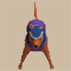

# Monster List

<table id="monsterList" class="monsterPageTable">
  <tr>
    <th colspan="6">Monster (Family)</th>
  </tr>
  <tr>
    <th class="highlightNormal">1</th>
    <th class="highlightNormal">2</th>
    <th class="highlightNormal">3</th>
    <th class="highlightNormal">4</th>
    <th class="highlightNormal">5</th>
    <th class="highlightNormal">6</th>
  </tr>
  <tr>
    <td class="highlightGrey"><a href="#air-devil">Air Devil</a></td>
    <td><a href="#dragon">Dragon</a></td>
    <td class="highlightGrey"><a href="#gather">Gather</a></td>
    <td><a href="#leech-worm">Leech Worm</a></td>
    <td class="highlightGrey"><a href="#popster-tank">Popster Tank</a></td>
    <td><a href="#twisty-hani">Twisty Hani</a></td>
  </tr>
  <tr>
    <td class="highlightGrey"><a href="#baby-tengu">Baby Tengu</a></td>
    <td><a href="#dremlas">Dremlas</a></td>
    <td class="highlightGrey"><a href="#gaze">Gaze</a></td>
    <td><a href="#mamel">Mamel</a></td>
    <td class="highlightGrey"><a href="#rice-baby">Rice Baby</a></td>
    <td><a href="#shop-group">Shop Group</a></td>
  </tr>
  <tr>
    <td class="highlightGrey"><a href="#bowboy">Bowboy</a></td>
    <td><a href="#egg-thing">Egg Thing</a></td>
    <td class="highlightGrey"><a href="#ghost-radish">Ghost Radish</a></td>
    <td><a href="#mecharoid">Mecharoid</a></td>
    <td class="highlightGrey"><a href="#schubell">Schubell</a></td>
    <td><a href="#boss-group">Boss Group</a></td>
  </tr>
  <tr>
    <td class="highlightGrey"><a href="#cell-armor">Cell Armor</a></td>
    <td><a href="#evil-soldier">Evil Soldier</a></td>
    <td class="highlightGrey"><a href="#green-slime">Green Slime</a></td>
    <td><a href="#mini-robber">Mini Robber</a></td>
    <td class="highlightGrey"><a href="#skull-mage">Skull Mage</a></td>
    <td></td>
  </tr>
  <tr>
    <td class="highlightGrey"><a href="#chintala">Chintala</a></td>
    <td><a href="#field-bandit">Field Bandit</a></td>
    <td class="highlightGrey"><a href="#half-warrior">Half Warrior</a></td>
    <td><a href="#n'duba">N'Duba</a></td>
    <td class="highlightGrey"><a href="#snaky">Snaky</a></td>
    <td></td>
  </tr>
  <tr>
    <td class="highlightGrey"><a href="#curse-girl">Curse Girl</a></td>
    <td><a href="#firepuff">Firepuff</a></td>
    <td class="highlightGrey"><a href="#hen">Hen</a></td>
    <td><a href="#pacorepkin">Pacorepkin</a></td>
    <td class="highlightGrey"><a href="#soldier-ant">Soldier Ant</a></td>
    <td></td>
  </tr>
  <tr>
    <td class="highlightGrey"><a href="#dark-eye">Dark Eye</a></td>
    <td><a href="#floor-dragon">Floor Dragon</a></td>
    <td class="highlightGrey"><a href="#inferno">Inferno</a></td>
    <td><a href="#parthenos">Parthenos</a></td>
    <td class="highlightGrey"><a href="#spike-bomb">Spike Bomb</a></td>
    <td></td>
  </tr>
  <tr>
    <td class="highlightGrey"><a href="#dark-owl">Dark Owl</a></td>
    <td><a href="#fluffy-bunny">Fluffy Bunny</a></td>
    <td class="highlightGrey"><a href="#ironhead">Ironhead</a></td>
    <td><a href="#pickpocket">Pickpocket</a></td>
    <td class="highlightGrey"><a href="#taur">Taur</a></td>
    <td></td>
  </tr>
  <tr>
    <td class="highlightGrey"><a href="#dead-soldier">Dead Soldier</a></td>
    <td><a href="#flying-fowl">Flying Fowl</a></td>
    <td class="highlightGrey"><a href="#kigny">Kigny</a></td>
    <td><a href="#piggy">Piggy</a></td>
    <td class="highlightGrey"><a href="#thiefwalrus">Thiefwalrus</a></td>
    <td></td>
  </tr>
  <tr>
    <td class="highlightGrey"><a href="#death-reaper">Death Reaper</a></td>
    <td><a href="#fog-hermit">Fog Hermit</a></td>
    <td class="highlightGrey"><a href="#knifegator">Knifegator</a></td>
    <td><a href="#polygon-spin">Polygon Spin</a></td>
    <td class="highlightGrey"><a href="#tiger-uho">Tiger Uho</a></td>
    <td></td>
  </tr>
</table>

# Details

### Table Explanation

- Lv = Monster level.
- HP = Monster's hit points.
- Atk = Monster's attack power.
- Def = Monster's defense.
- Exp = Experience points awarded when the monster is defeated.
- Elem. = Element or type.
    - Slow = Half speed.
    - Swift 1 = Double speed, 1 attack.
    - Swift 2 = Double speed, 2 attacks.
    - Prism = Special attack can be blocked by a Prism Shield.
    - Theft = Special attack can be blocked by a Walrus Shield.
    - Drain = Weak to Drain Buster.
    - Dragon = Weak to Dragonkiller.
    - One-Eyed = Weak to Cyclops Killer.
    - Ghost = Weak to Sickle Slayer, HP restoring items deal damage.
    - Exploding = Weak to Crescent Arm.
    - Floating = Weak to Air Slayer, can move across water tiles.

### Air Devil

  

<table class="monsterPageTable">
  <tr>
    <th>Lv</th>
    <th>Name</th>
    <th>HP</th>
    <th>Atk</th>
    <th>Def</th>
    <th>Exp</th>
    <th>Elem.</th>
    <th>Notes</th>
  </tr>
  <tr>
    <td>1</td>
    <td>Air Devil</td>
    <td>50</td>
    <td>13</td>
    <td>8</td>
    <td>30</td>
    <td rowspan="4">Ghost Floating</td>
    <td rowspan="4">Invisible, reflects magic bullets. Unpredictable movement. Becomes Sealed when hit by Herb of Sight.</td>
  </tr>
  <tr>
    <td>2</td>
    <td>Wraith Devil</td>
    <td>50</td>
    <td>19</td>
    <td>10</td>
    <td>150</td>
  </tr>
  <tr>
    <td>3</td>
    <td>Mirage Devil</td>
    <td>50</td>
    <td>25</td>
    <td>14</td>
    <td>400</td>
  </tr>
  <tr>
    <td>4</td>
    <td>Astral Devil</td>
    <td>50</td>
    <td>31</td>
    <td>18</td>
    <td>700</td>
  </tr>
</table>

#### Locations

<table class="monsterLocationTable">
  <tr>
    <th rowspan="2">Lv</th>
    <th rowspan="2">Name</th>
    <th colspan="9">Dungeon</th>
  </tr>
  <tr>
    <th>RH</th>
    <th>TM</th>
    <th>F</th>
    <th>TP</th>
    <th>CC</th>
    <th>RD</th>
    <th>KG</th>
    <th>SC</th>
    <th>FP</th>
  </tr>
  <tr>
    <td>1</td>
    <td>Air Devil</td>
    <td></td>
    <td>X</td>
    <td>X</td>
    <td></td>
    <td></td>
    <td>X</td>
    <td></td>
    <td>X</td>
    <td>X</td>
  </tr>
  <tr>
    <td>2</td>
    <td>Wraith Devil</td>
    <td></td>
    <td></td>
    <td></td>
    <td>X</td>
    <td>X</td>
    <td>X</td>
    <td></td>
    <td>X</td>
    <td>X</td>
  </tr>
  <tr>
    <td>3</td>
    <td>Mirage Devil</td>
    <td></td>
    <td></td>
    <td></td>
    <td>X</td>
    <td></td>
    <td>X</td>
    <td></td>
    <td></td>
    <td>X</td>
  </tr>
  <tr>
    <td>4</td>
    <td>Astral Devil</td>
    <td></td>
    <td></td>
    <td></td>
    <td></td>
    <td></td>
    <td>X</td>
    <td></td>
    <td></td>
    <td>X</td>
  </tr>
</table>

### Baby Tengu

  

<table class="monsterPageTable">
  <tr>
    <th>Lv</th>
    <th>Name</th>
    <th>HP</th>
    <th>Atk</th>
    <th>Def</th>
    <th>Exp</th>
    <th>Elem.</th>
    <th>Notes</th>
  </tr>
  <tr>
    <td>1</td>
    <td>Baby Tengu</td>
    <td>10</td>
    <td>4</td>
    <td>3</td>
    <td>5</td>
    <td rowspan="4">Normal</td>
    <td rowspan="4">Disguises itself as a different monster. (It can't use that monster's special attack)</td>
  </tr>
  <tr>
    <td>2</td>
    <td>Young Tengu</td>
    <td>25</td>
    <td>7</td>
    <td>6</td>
    <td>20</td>
  </tr>
  <tr>
    <td>3</td>
    <td>Tengu Chief</td>
    <td>40</td>
    <td>10</td>
    <td>9</td>
    <td>150</td>
  </tr>
  <tr>
    <td>4</td>
    <td>Tengu Elder</td>
    <td>55</td>
    <td>14</td>
    <td>13</td>
    <td>400</td>
  </tr>
</table>

#### Locations

<table class="monsterLocationTable">
  <tr>
    <th rowspan="2">Lv</th>
    <th rowspan="2">Name</th>
    <th colspan="9">Dungeon</th>
  </tr>
  <tr>
    <th>RH</th>
    <th>TM</th>
    <th>F</th>
    <th>TP</th>
    <th>CC</th>
    <th>RD</th>
    <th>KG</th>
    <th>SC</th>
    <th>FP</th>
  </tr>
  <tr>
    <td>1</td>
    <td>Baby Tengu</td>
    <td></td>
    <td></td>
    <td></td>
    <td></td>
    <td></td>
    <td></td>
    <td></td>
    <td></td>
    <td>X</td>
  </tr>
  <tr>
    <td>2</td>
    <td>Young Tengu</td>
    <td></td>
    <td>X</td>
    <td></td>
    <td></td>
    <td>X</td>
    <td></td>
    <td></td>
    <td></td>
    <td>X</td>
  </tr>
  <tr>
    <td>3</td>
    <td>Tengu Chief</td>
    <td></td>
    <td></td>
    <td></td>
    <td>X</td>
    <td></td>
    <td>X</td>
    <td></td>
    <td></td>
    <td>X</td>
  </tr>
  <tr>
    <td>4</td>
    <td>Tengu Elder</td>
    <td></td>
    <td></td>
    <td></td>
    <td></td>
    <td></td>
    <td>X</td>
    <td></td>
    <td></td>
    <td>X</td>
  </tr>
</table>

### Bowboy

  

<table class="monsterPageTable">
  <tr>
    <th>Lv</th>
    <th>Name</th>
    <th>HP</th>
    <th>Atk</th>
    <th>Def</th>
    <th>Exp</th>
    <th>Elem.</th>
    <th>Notes</th>
  </tr>
  <tr>
    <td>1</td>
    <td>Bowboy</td>
    <td>12</td>
    <td>5</td>
    <td>2</td>
    <td>6</td>
    <td rowspan="2">Normal</td>
    <td>Shoots Wooden Arrows.</td>
  </tr>
  <tr>
    <td>2</td>
    <td>Crossbowboy</td>
    <td>16</td>
    <td>8</td>
    <td>3</td>
    <td>11</td>
    <td>Shoots Iron Arrows.</td>
  </tr>
  <tr>
    <td>3</td>
    <td>Baby Tank</td>
    <td>25</td>
    <td>9</td>
    <td>4</td>
    <td>30</td>
    <td rowspan="2">Normal Swift 1</td>
    <td>Shoots Iron Arrows. Tries to stay 2 tiles away from Shiren.</td>
  </tr>
  <tr>
    <td>4</td>
    <td>Mini Tank</td>
    <td>28</td>
    <td>14</td>
    <td>8</td>
    <td>52</td>
    <td>Shoots Silver Arrows. Tries to stay 2 tiles away from Shiren.</td>
  </tr>
</table>

#### Locations

<table class="monsterLocationTable">
  <tr>
    <th rowspan="2">Lv</th>
    <th rowspan="2">Name</th>
    <th colspan="9">Dungeon</th>
  </tr>
  <tr>
    <th>RH</th>
    <th>TM</th>
    <th>F</th>
    <th>TP</th>
    <th>CC</th>
    <th>RD</th>
    <th>KG</th>
    <th>SC</th>
    <th>FP</th>
  </tr>
  <tr>
    <td>1</td>
    <td>Bowboy</td>
    <td></td>
    <td>X</td>
    <td></td>
    <td></td>
    <td></td>
    <td></td>
    <td>X</td>
    <td></td>
    <td>X</td>
  </tr>
  <tr>
    <td>2</td>
    <td>Crossbowboy</td>
    <td></td>
    <td></td>
    <td></td>
    <td></td>
    <td></td>
    <td></td>
    <td>X</td>
    <td></td>
    <td>X</td>
  </tr>
  <tr>
    <td>3</td>
    <td>Baby Tank</td>
    <td></td>
    <td>X</td>
    <td></td>
    <td></td>
    <td></td>
    <td></td>
    <td>X</td>
    <td>X</td>
    <td>X</td>
  </tr>
  <tr>
    <td>4</td>
    <td>Mini Tank</td>
    <td></td>
    <td></td>
    <td></td>
    <td></td>
    <td></td>
    <td></td>
    <td>X</td>
    <td>X</td>
    <td>X</td>
  </tr>
</table>

### Cell Armor

  

<table class="monsterPageTable">
  <tr>
    <th>Lv</th>
    <th>Name</th>
    <th>HP</th>
    <th>Atk</th>
    <th>Def</th>
    <th>Exp</th>
    <th>Elem.</th>
    <th>Notes</th>
  </tr>
  <tr>
    <td>1</td>
    <td>Cell Armor</td>
    <td>35</td>
    <td>16</td>
    <td>9</td>
    <td>70</td>
    <td rowspan="4">Ghost</td>
    <td>Knocks away your equipped shield. The item flies 10 tiles behind you.</td>
  </tr>
  <tr>
    <td>2</td>
    <td>Metal Armor</td>
    <td>65</td>
    <td>27</td>
    <td>12</td>
    <td>600</td>
    <td>Knocks away your equipped weapon or shield. The item flies 10 tiles behind you.</td>
  </tr>
  <tr>
    <td>3</td>
    <td>Steel Armor</td>
    <td>80</td>
    <td>34</td>
    <td>16</td>
    <td>2000</td>
    <td rowspan="2">Knocks away your equipped weapon, shield, or armband. The item flies 10 tiles behind you.</td>
  </tr>
  <tr>
    <td>4</td>
    <td>Alloy Armor</td>
    <td>100</td>
    <td>43</td>
    <td>21</td>
    <td>3600</td>
  </tr>
</table>

Disarmed equipment will fly outside the map if you have a Pitcher's Armband equipped.

#### Locations

<table class="monsterLocationTable">
  <tr>
    <th rowspan="2">Lv</th>
    <th rowspan="2">Name</th>
    <th colspan="9">Dungeon</th>
  </tr>
  <tr>
    <th>RH</th>
    <th>TM</th>
    <th>F</th>
    <th>TP</th>
    <th>CC</th>
    <th>RD</th>
    <th>KG</th>
    <th>SC</th>
    <th>FP</th>
  </tr>
  <tr>
    <td>1</td>
    <td>Cell Armor</td>
    <td></td>
    <td></td>
    <td></td>
    <td></td>
    <td>X</td>
    <td></td>
    <td>X</td>
    <td>X</td>
    <td>X</td>
  </tr>
  <tr>
    <td>2</td>
    <td>Metal Armor</td>
    <td></td>
    <td>X</td>
    <td></td>
    <td></td>
    <td>X</td>
    <td></td>
    <td>X</td>
    <td></td>
    <td>X</td>
  </tr>
  <tr>
    <td>3</td>
    <td>Steel Armor</td>
    <td></td>
    <td></td>
    <td></td>
    <td>X</td>
    <td></td>
    <td>X</td>
    <td>X</td>
    <td>X</td>
    <td>X</td>
  </tr>
  <tr>
    <td>4</td>
    <td>Alloy Armor</td>
    <td></td>
    <td></td>
    <td></td>
    <td>X</td>
    <td></td>
    <td>X</td>
    <td>X</td>
    <td>X</td>
    <td>X</td>
  </tr>
</table>

### Chintala

  

<table class="monsterPageTable">
  <tr>
    <th>Lv</th>
    <th>Name</th>
    <th>HP</th>
    <th>Atk</th>
    <th>Def</th>
    <th>Exp</th>
    <th>Elem.</th>
    <th>Notes</th>
  </tr>
  <tr>
    <td>1</td>
    <td>Chintala</td>
    <td>8</td>
    <td>3</td>
    <td>1</td>
    <td>5</td>
    <td rowspan="4">Normal</td>
    <td rowspan="4">No abilities.</td>
  </tr>
  <tr>
    <td>2</td>
    <td>Mid Chintala</td>
    <td>17</td>
    <td>9</td>
    <td>6</td>
    <td>16</td>
  </tr>
  <tr>
    <td>3</td>
    <td>Big Chintala</td>
    <td>40</td>
    <td>21</td>
    <td>12</td>
    <td>180</td>
  </tr>
  <tr>
    <td>4</td>
    <td>Giga Chintala</td>
    <td>60</td>
    <td>29</td>
    <td>17</td>
    <td>650</td>
  </tr>
</table>

#### Locations

<table class="monsterLocationTable">
  <tr>
    <th rowspan="2">Lv</th>
    <th rowspan="2">Name</th>
    <th colspan="9">Dungeon</th>
  </tr>
  <tr>
    <th>RH</th>
    <th>TM</th>
    <th>F</th>
    <th>TP</th>
    <th>CC</th>
    <th>RD</th>
    <th>KG</th>
    <th>SC</th>
    <th>FP</th>
  </tr>
  <tr>
    <td>1</td>
    <td>Chintala</td>
    <td></td>
    <td>X</td>
    <td></td>
    <td></td>
    <td></td>
    <td></td>
    <td></td>
    <td>X</td>
    <td></td>
  </tr>
  <tr>
    <td>2</td>
    <td>Mid Chintala</td>
    <td></td>
    <td></td>
    <td></td>
    <td></td>
    <td></td>
    <td></td>
    <td></td>
    <td>X</td>
    <td></td>
  </tr>
  <tr>
    <td>3</td>
    <td>Big Chintala</td>
    <td></td>
    <td></td>
    <td></td>
    <td></td>
    <td></td>
    <td></td>
    <td></td>
    <td>X</td>
    <td></td>
  </tr>
  <tr>
    <td>4</td>
    <td>Giga Chintala</td>
    <td></td>
    <td></td>
    <td></td>
    <td></td>
    <td></td>
    <td></td>
    <td></td>
    <td>X</td>
    <td></td>
  </tr>
</table>

### Curse Girl

  

<table class="monsterPageTable">
  <tr>
    <th>Lv</th>
    <th>Name</th>
    <th>HP</th>
    <th>Atk</th>
    <th>Def</th>
    <th>Exp</th>
    <th>Elem.</th>
    <th>Notes</th>
  </tr>
  <tr>
    <td>1</td>
    <td>Curse Girl</td>
    <td>25</td>
    <td>10</td>
    <td>7</td>
    <td>40</td>
    <td rowspan="4">Normal</td>
    <td rowspan="4">Curses 1 inventory item.</td>
  </tr>
  <tr>
    <td>2</td>
    <td>Curse Sis</td>
    <td>33</td>
    <td>15</td>
    <td>11</td>
    <td>100</td>
  </tr>
  <tr>
    <td>3</td>
    <td>Curse Mom</td>
    <td>56</td>
    <td>22</td>
    <td>13</td>
    <td>600</td>
  </tr>
  <tr>
    <td>4</td>
    <td>Curse Gran</td>
    <td>72</td>
    <td>31</td>
    <td>14</td>
    <td>1500</td>
  </tr>
</table>

#### Locations

<table class="monsterLocationTable">
  <tr>
    <th rowspan="2">Lv</th>
    <th rowspan="2">Name</th>
    <th colspan="9">Dungeon</th>
  </tr>
  <tr>
    <th>RH</th>
    <th>TM</th>
    <th>F</th>
    <th>TP</th>
    <th>CC</th>
    <th>RD</th>
    <th>KG</th>
    <th>SC</th>
    <th>FP</th>
  </tr>
  <tr>
    <td>1</td>
    <td>Curse Girl</td>
    <td></td>
    <td>X</td>
    <td>X</td>
    <td></td>
    <td></td>
    <td></td>
    <td>X</td>
    <td>X</td>
    <td>X</td>
  </tr>
  <tr>
    <td>2</td>
    <td>Curse Sis</td>
    <td></td>
    <td>X</td>
    <td>X</td>
    <td></td>
    <td>X</td>
    <td></td>
    <td>X</td>
    <td>X</td>
    <td>X</td>
  </tr>
  <tr>
    <td>3</td>
    <td>Curse Mom</td>
    <td></td>
    <td></td>
    <td></td>
    <td>X</td>
    <td>X</td>
    <td>X</td>
    <td>X</td>
    <td>X</td>
    <td>X</td>
  </tr>
  <tr>
    <td>4</td>
    <td>Curse Gran</td>
    <td></td>
    <td></td>
    <td></td>
    <td>X</td>
    <td></td>
    <td>X</td>
    <td>X</td>
    <td>X</td>
    <td>X</td>
  </tr>
</table>

### Dark Eye

  

<table class="monsterPageTable">
  <tr>
    <th>Lv</th>
    <th>Name</th>
    <th>HP</th>
    <th>Atk</th>
    <th>Def</th>
    <th>Exp</th>
    <th>Elem.</th>
    <th>Notes</th>
  </tr>
  <tr>
    <td>1</td>
    <td>Dark Eye</td>
    <td>6</td>
    <td>14</td>
    <td>1</td>
    <td>7</td>
    <td rowspan="4">Normal</td>
    <td rowspan="4">Waits for Shiren to approach from 1 tile away.</td>
  </tr>
  <tr>
    <td>2</td>
    <td>Hidden Eye</td>
    <td>20</td>
    <td>28</td>
    <td>1</td>
    <td>30</td>
  </tr>
  <tr>
    <td>3</td>
    <td>Shadow Eye</td>
    <td>40</td>
    <td>71</td>
    <td>1</td>
    <td>300</td>
  </tr>
  <tr>
    <td>4</td>
    <td>Fear Eye</td>
    <td>60</td>
    <td>100</td>
    <td>1</td>
    <td>800</td>
  </tr>
</table>

#### Locations

<table class="monsterLocationTable">
  <tr>
    <th rowspan="2">Lv</th>
    <th rowspan="2">Name</th>
    <th colspan="9">Dungeon</th>
  </tr>
  <tr>
    <th>RH</th>
    <th>TM</th>
    <th>F</th>
    <th>TP</th>
    <th>CC</th>
    <th>RD</th>
    <th>KG</th>
    <th>SC</th>
    <th>FP</th>
  </tr>
  <tr>
    <td>1</td>
    <td>Dark Eye</td>
    <td></td>
    <td></td>
    <td></td>
    <td></td>
    <td></td>
    <td></td>
    <td>X</td>
    <td></td>
    <td>X</td>
  </tr>
  <tr>
    <td>2</td>
    <td>Hidden Eye</td>
    <td></td>
    <td>X</td>
    <td></td>
    <td></td>
    <td></td>
    <td></td>
    <td></td>
    <td></td>
    <td></td>
  </tr>
  <tr>
    <td>3</td>
    <td>Shadow Eye</td>
    <td></td>
    <td></td>
    <td></td>
    <td>X</td>
    <td></td>
    <td>X</td>
    <td></td>
    <td></td>
    <td>X</td>
  </tr>
  <tr>
    <td>4</td>
    <td>Fear Eye</td>
    <td></td>
    <td></td>
    <td></td>
    <td>X</td>
    <td></td>
    <td>X</td>
    <td>X</td>
    <td>X</td>
    <td>X</td>
  </tr>
</table>

### Dark Owl

  

<table class="monsterPageTable">
  <tr>
    <th>Lv</th>
    <th>Name</th>
    <th>HP</th>
    <th>Atk</th>
    <th>Def</th>
    <th>Exp</th>
    <th>Elem.</th>
    <th>Notes</th>
  </tr>
  <tr>
    <td>1</td>
    <td>Dark Owl</td>
    <td>4</td>
    <td>6</td>
    <td>20</td>
    <td>10</td>
    <td rowspan="4">Normal</td>
    <td rowspan="4">Turns the room dark.</td>
  </tr>
  <tr>
    <td>2</td>
    <td>Ghost Owl</td>
    <td>7</td>
    <td>9</td>
    <td>25</td>
    <td>50</td>
  </tr>
  <tr>
    <td>3</td>
    <td>Dusk Owl</td>
    <td>10</td>
    <td>12</td>
    <td>35</td>
    <td>200</td>
  </tr>
  <tr>
    <td>4</td>
    <td>Chaos Owl</td>
    <td>15</td>
    <td>21</td>
    <td>40</td>
    <td>650</td>
  </tr>
</table>

#### Locations

<table class="monsterLocationTable">
  <tr>
    <th rowspan="2">Lv</th>
    <th rowspan="2">Name</th>
    <th colspan="9">Dungeon</th>
  </tr>
  <tr>
    <th>RH</th>
    <th>TM</th>
    <th>F</th>
    <th>TP</th>
    <th>CC</th>
    <th>RD</th>
    <th>KG</th>
    <th>SC</th>
    <th>FP</th>
  </tr>
  <tr>
    <td>1</td>
    <td>Dark Owl</td>
    <td></td>
    <td></td>
    <td>X</td>
    <td></td>
    <td></td>
    <td></td>
    <td>X</td>
    <td>X</td>
    <td>X</td>
  </tr>
  <tr>
    <td>2</td>
    <td>Ghost Owl</td>
    <td></td>
    <td>X</td>
    <td></td>
    <td></td>
    <td></td>
    <td></td>
    <td>X</td>
    <td>X</td>
    <td>X</td>
  </tr>
  <tr>
    <td>3</td>
    <td>Dusk Owl</td>
    <td></td>
    <td></td>
    <td></td>
    <td>X</td>
    <td></td>
    <td></td>
    <td>X</td>
    <td>X</td>
    <td>X</td>
  </tr>
  <tr>
    <td>4</td>
    <td>Chaos Owl</td>
    <td></td>
    <td></td>
    <td></td>
    <td>X</td>
    <td></td>
    <td></td>
    <td>X</td>
    <td>X</td>
    <td>X</td>
  </tr>
</table>

### Dead Soldier

  

<table class="monsterPageTable">
  <tr>
    <th>Lv</th>
    <th>Name</th>
    <th>HP</th>
    <th>Atk</th>
    <th>Def</th>
    <th>Exp</th>
    <th>Elem.</th>
    <th>Notes</th>
  </tr>
  <tr>
    <td>1</td>
    <td>Dead Soldier</td>
    <td>3</td>
    <td>4</td>
    <td>1</td>
    <td>4</td>
    <td rowspan="4">Ghost</td>
    <td rowspan="4">Possesses a monster and raises their level by 1. Only takes 1 damage from direct attacks, unless you have a Sickle Slayer equipped. Occasionally warps when attacked.</td>
  </tr>
  <tr>
    <td>2</td>
    <td>Dead Veteran</td>
    <td>5</td>
    <td>6</td>
    <td>5</td>
    <td>10</td>
  </tr>
  <tr>
    <td>3</td>
    <td>Dead General</td>
    <td>7</td>
    <td>8</td>
    <td>9</td>
    <td>25</td>
  </tr>
  <tr>
    <td>4</td>
    <td>Dead Shogun</td>
    <td>10</td>
    <td>15</td>
    <td>11</td>
    <td>300</td>
  </tr>
</table>

#### Locations

<table class="monsterLocationTable">
  <tr>
    <th rowspan="2">Lv</th>
    <th rowspan="2">Name</th>
    <th colspan="9">Dungeon</th>
  </tr>
  <tr>
    <th>RH</th>
    <th>TM</th>
    <th>F</th>
    <th>TP</th>
    <th>CC</th>
    <th>RD</th>
    <th>KG</th>
    <th>SC</th>
    <th>FP</th>
  </tr>
  <tr>
    <td>1</td>
    <td>Dead Soldier</td>
    <td></td>
    <td></td>
    <td></td>
    <td></td>
    <td></td>
    <td></td>
    <td></td>
    <td></td>
    <td></td>
  </tr>
  <tr>
    <td>2</td>
    <td>Dead Veteran</td>
    <td></td>
    <td></td>
    <td></td>
    <td></td>
    <td></td>
    <td></td>
    <td></td>
    <td></td>
    <td></td>
  </tr>
  <tr>
    <td>3</td>
    <td>Dead General</td>
    <td></td>
    <td></td>
    <td></td>
    <td></td>
    <td></td>
    <td></td>
    <td></td>
    <td></td>
    <td></td>
  </tr>
  <tr>
    <td>4</td>
    <td>Dead Shogun</td>
    <td></td>
    <td></td>
    <td></td>
    <td></td>
    <td></td>
    <td></td>
    <td></td>
    <td></td>
    <td></td>
  </tr>
</table>

### Death Reaper

  

<table class="monsterPageTable">
  <tr>
    <th>Lv</th>
    <th>Name</th>
    <th>HP</th>
    <th>Atk</th>
    <th>Def</th>
    <th>Exp</th>
    <th>Elem.</th>
    <th>Notes</th>
  </tr>
  <tr>
    <td>1</td>
    <td>Death Reaper</td>
    <td>23</td>
    <td>15</td>
    <td>5</td>
    <td>23</td>
    <td>Ghost Floating Swift 1</td>
    <td>Double speed, 1 attack.</td>
  </tr>
  <tr>
    <td>2</td>
    <td>Hell Reaper</td>
    <td>45</td>
    <td>16</td>
    <td>7</td>
    <td>130</td>
    <td rowspan="3">Ghost Floating Swift 2</td>
    <td>Double speed, 2 attacks.</td>
  </tr>
  <tr>
    <td>3</td>
    <td>Death Angel</td>
    <td>65</td>
    <td>28</td>
    <td>9</td>
    <td>700</td>
    <td rowspan="2">Double speed, 2 attacks. Can pass through walls.</td>
  </tr>
  <tr>
    <td>4</td>
    <td>Death Master</td>
    <td>77</td>
    <td>54</td>
    <td>15</td>
    <td>3000</td>
  </tr>
</table>

#### Locations

<table class="monsterLocationTable">
  <tr>
    <th rowspan="2">Lv</th>
    <th rowspan="2">Name</th>
    <th colspan="9">Dungeon</th>
  </tr>
  <tr>
    <th>RH</th>
    <th>TM</th>
    <th>F</th>
    <th>TP</th>
    <th>CC</th>
    <th>RD</th>
    <th>KG</th>
    <th>SC</th>
    <th>FP</th>
  </tr>
  <tr>
    <td>1</td>
    <td>Death Reaper</td>
    <td></td>
    <td>X</td>
    <td>X</td>
    <td></td>
    <td></td>
    <td></td>
    <td>X</td>
    <td>X</td>
    <td>X</td>
  </tr>
  <tr>
    <td>2</td>
    <td>Hell Reaper</td>
    <td></td>
    <td></td>
    <td></td>
    <td></td>
    <td>X</td>
    <td></td>
    <td>X</td>
    <td>X</td>
    <td>X</td>
  </tr>
  <tr>
    <td>3</td>
    <td>Death Angel</td>
    <td></td>
    <td>X</td>
    <td></td>
    <td></td>
    <td>X</td>
    <td>X</td>
    <td>X</td>
    <td>X</td>
    <td>X</td>
  </tr>
  <tr>
    <td>4</td>
    <td>Death Master</td>
    <td></td>
    <td></td>
    <td></td>
    <td>X</td>
    <td></td>
    <td>X</td>
    <td>X</td>
    <td>X</td>
    <td>X</td>
  </tr>
</table>

### Dragon

  

<table class="monsterPageTable">
  <tr>
    <th>Lv</th>
    <th>Name</th>
    <th>HP</th>
    <th>Atk</th>
    <th>Def</th>
    <th>Exp</th>
    <th>Elem.</th>
    <th>Notes</th>
  </tr>
  <tr>
    <td>1</td>
    <td>Dragon</td>
    <td>90</td>
    <td>40</td>
    <td>18</td>
    <td>1300</td>
    <td rowspan="4">Dragon Floating</td>
    <td>Breathes 30 damage fire in a straight line.</td>
  </tr>
  <tr>
    <td>2</td>
    <td>Sky Dragon</td>
    <td>100</td>
    <td>45</td>
    <td>22</td>
    <td>2600</td>
    <td>Breathes 40 damage fire from anywhere in the room.</td>
  </tr>
  <tr>
    <td>3</td>
    <td>Ark Dragon</td>
    <td>120</td>
    <td>78</td>
    <td>26</td>
    <td>4000</td>
    <td>Breathes 50 damage fire from anywhere on the floor.</td>
  </tr>
  <tr>
    <td>4</td>
    <td>Hell Dragon</td>
    <td>150</td>
    <td>108</td>
    <td>75</td>
    <td>7000</td>
    <td>Breathes 60 damage fire from anywhere on the floor.</td>
  </tr>
</table>

#### Locations

<table class="monsterLocationTable">
  <tr>
    <th rowspan="2">Lv</th>
    <th rowspan="2">Name</th>
    <th colspan="9">Dungeon</th>
  </tr>
  <tr>
    <th>RH</th>
    <th>TM</th>
    <th>F</th>
    <th>TP</th>
    <th>CC</th>
    <th>RD</th>
    <th>KG</th>
    <th>SC</th>
    <th>FP</th>
  </tr>
  <tr>
    <td>1</td>
    <td>Dragon</td>
    <td></td>
    <td>X</td>
    <td></td>
    <td></td>
    <td>X</td>
    <td>X</td>
    <td>X</td>
    <td>X</td>
    <td>X</td>
  </tr>
  <tr>
    <td>2</td>
    <td>Sky Dragon</td>
    <td></td>
    <td></td>
    <td></td>
    <td>X</td>
    <td></td>
    <td>X</td>
    <td>X</td>
    <td>X</td>
    <td>X</td>
  </tr>
  <tr>
    <td>3</td>
    <td>Ark Dragon</td>
    <td></td>
    <td></td>
    <td></td>
    <td>X</td>
    <td></td>
    <td>X</td>
    <td>X</td>
    <td>X</td>
    <td>X</td>
  </tr>
  <tr>
    <td>4</td>
    <td>Hell Dragon</td>
    <td></td>
    <td></td>
    <td></td>
    <td></td>
    <td></td>
    <td>X</td>
    <td></td>
    <td></td>
    <td></td>
  </tr>
</table>

### Dremlas

  

<table class="monsterPageTable">
  <tr>
    <th>Lv</th>
    <th>Name</th>
    <th>HP</th>
    <th>Atk</th>
    <th>Def</th>
    <th>Exp</th>
    <th>Elem.</th>
    <th>Notes</th>
  </tr>
  <tr>
    <td>1</td>
    <td>Dremlas</td>
    <td>40</td>
    <td>18</td>
    <td>10</td>
    <td>75</td>
    <td rowspan="4">Normal</td>
    <td rowspan="4">Tackle deals 5 damage plus knockback, and also makes Shiren trip and drop items if he isn't against a wall. (Balance Staff prevents Shiren from tripping)</td>
  </tr>
  <tr>
    <td>2</td>
    <td>Madremlas</td>
    <td>60</td>
    <td>30</td>
    <td>17</td>
    <td>800</td>
  </tr>
  <tr>
    <td>3</td>
    <td>Hardremlas</td>
    <td>130</td>
    <td>42</td>
    <td>18</td>
    <td>1600</td>
  </tr>
  <tr>
    <td>4</td>
    <td>Heavyremlas</td>
    <td>150</td>
    <td>55</td>
    <td>23</td>
    <td>4200</td>
  </tr>
</table>

#### Locations

<table class="monsterLocationTable">
  <tr>
    <th rowspan="2">Lv</th>
    <th rowspan="2">Name</th>
    <th colspan="9">Dungeon</th>
  </tr>
  <tr>
    <th>RH</th>
    <th>TM</th>
    <th>F</th>
    <th>TP</th>
    <th>CC</th>
    <th>RD</th>
    <th>KG</th>
    <th>SC</th>
    <th>FP</th>
  </tr>
  <tr>
    <td>1</td>
    <td>Dremlas</td>
    <td></td>
    <td></td>
    <td>X</td>
    <td></td>
    <td>X</td>
    <td></td>
    <td>X</td>
    <td>X</td>
    <td>X</td>
  </tr>
  <tr>
    <td>2</td>
    <td>Madremlas</td>
    <td></td>
    <td>X</td>
    <td></td>
    <td></td>
    <td>X</td>
    <td>X</td>
    <td>X</td>
    <td>X</td>
    <td>X</td>
  </tr>
  <tr>
    <td>3</td>
    <td>Hardremlas</td>
    <td></td>
    <td></td>
    <td></td>
    <td>X</td>
    <td></td>
    <td>X</td>
    <td>X</td>
    <td>X</td>
    <td>X</td>
  </tr>
  <tr>
    <td>4</td>
    <td>Heavyremlas</td>
    <td></td>
    <td></td>
    <td></td>
    <td></td>
    <td></td>
    <td>X</td>
    <td>X</td>
    <td>X</td>
    <td>X</td>
  </tr>
</table>

### Egg Thing

  

<table class="monsterPageTable">
  <tr>
    <th>Lv</th>
    <th>Name</th>
    <th>HP</th>
    <th>Atk</th>
    <th>Def</th>
    <th>Exp</th>
    <th>Elem.</th>
    <th>Notes</th>
  </tr>
  <tr>
    <td>1</td>
    <td>Egg Thing</td>
    <td>5</td>
    <td>3</td>
    <td>10</td>
    <td>7</td>
    <td rowspan="4">One-Eyed Swift 1</td>
    <td>Runs away at double speed. Always drops a Riceball.</td>
  </tr>
  <tr>
    <td>2</td>
    <td>Running Egg</td>
    <td>5</td>
    <td>4</td>
    <td>20</td>
    <td>15</td>
    <td>Runs away at double speed, warps when attacked. Always drops a Big Riceball.</td>
  </tr>
  <tr>
    <td>3</td>
    <td>Flying Egg</td>
    <td>8</td>
    <td>5</td>
    <td>30</td>
    <td>50</td>
    <td rowspan="2">Runs away at double speed, warps when you get within 3 tiles. Always drops an item.</td>
  </tr>
  <tr>
    <td>4</td>
    <td>Hiding Egg</td>
    <td>10</td>
    <td>6</td>
    <td>40</td>
    <td>300</td>
  </tr>
</table>

#### Locations

<table class="monsterLocationTable">
  <tr>
    <th rowspan="2">Lv</th>
    <th rowspan="2">Name</th>
    <th colspan="9">Dungeon</th>
  </tr>
  <tr>
    <th>RH</th>
    <th>TM</th>
    <th>F</th>
    <th>TP</th>
    <th>CC</th>
    <th>RD</th>
    <th>KG</th>
    <th>SC</th>
    <th>FP</th>
  </tr>
  <tr>
    <td>1</td>
    <td>Egg Thing</td>
    <td></td>
    <td>X</td>
    <td>X</td>
    <td></td>
    <td></td>
    <td></td>
    <td>X</td>
    <td>X</td>
    <td>X</td>
  </tr>
  <tr>
    <td>2</td>
    <td>Running Egg</td>
    <td></td>
    <td>X</td>
    <td></td>
    <td>X</td>
    <td></td>
    <td>X</td>
    <td>X</td>
    <td>X</td>
    <td>X</td>
  </tr>
  <tr>
    <td>3</td>
    <td>Flying Egg</td>
    <td></td>
    <td>X</td>
    <td></td>
    <td>X</td>
    <td>X</td>
    <td>X</td>
    <td>X</td>
    <td>X</td>
    <td>X</td>
  </tr>
  <tr>
    <td>4</td>
    <td>Hiding Egg</td>
    <td></td>
    <td></td>
    <td></td>
    <td>X</td>
    <td></td>
    <td>X</td>
    <td>X</td>
    <td>X</td>
    <td>X</td>
  </tr>
</table>

### Evil Soldier

  

<table class="monsterPageTable">
  <tr>
    <th>Lv</th>
    <th>Name</th>
    <th>HP</th>
    <th>Atk</th>
    <th>Def</th>
    <th>Exp</th>
    <th>Elem.</th>
    <th>Notes</th>
  </tr>
  <tr>
    <td>1</td>
    <td>Evil Soldier</td>
    <td>18</td>
    <td>10</td>
    <td>6</td>
    <td>15</td>
    <td rowspan="4">Normal</td>
    <td>Dead Soldier appears 4 turns after it's defeated.</td>
  </tr>
  <tr>
    <td>2</td>
    <td>Evil Veteran</td>
    <td>20</td>
    <td>13</td>
    <td>9</td>
    <td>35</td>
    <td>Dead Veteran appears 4 turns after it's defeated.</td>
  </tr>
  <tr>
    <td>3</td>
    <td>Evil General</td>
    <td>30</td>
    <td>17</td>
    <td>11</td>
    <td>60</td>
    <td>Dead General appears 4 turns after it's defeated.</td>
  </tr>
  <tr>
    <td>4</td>
    <td>Evil Shogun</td>
    <td>50</td>
    <td>31</td>
    <td>15</td>
    <td>400</td>
    <td>Dead Shogun appears 4 turns after it's defeated.</td>
  </tr>
</table>

#### Locations

<table class="monsterLocationTable">
  <tr>
    <th rowspan="2">Lv</th>
    <th rowspan="2">Name</th>
    <th colspan="9">Dungeon</th>
  </tr>
  <tr>
    <th>RH</th>
    <th>TM</th>
    <th>F</th>
    <th>TP</th>
    <th>CC</th>
    <th>RD</th>
    <th>KG</th>
    <th>SC</th>
    <th>FP</th>
  </tr>
  <tr>
    <td>1</td>
    <td>Evil Soldier</td>
    <td></td>
    <td>X</td>
    <td>X</td>
    <td></td>
    <td></td>
    <td></td>
    <td>X</td>
    <td>X</td>
    <td>X</td>
  </tr>
  <tr>
    <td>2</td>
    <td>Evil Veteran</td>
    <td></td>
    <td></td>
    <td></td>
    <td></td>
    <td></td>
    <td></td>
    <td></td>
    <td></td>
    <td></td>
  </tr>
  <tr>
    <td>3</td>
    <td>Evil General</td>
    <td></td>
    <td></td>
    <td></td>
    <td>X</td>
    <td>X</td>
    <td>X</td>
    <td>X</td>
    <td>X</td>
    <td>X</td>
  </tr>
  <tr>
    <td>4</td>
    <td>Evil Shogun</td>
    <td></td>
    <td></td>
    <td></td>
    <td>X</td>
    <td>X</td>
    <td>X</td>
    <td></td>
    <td>X</td>
    <td>X</td>
  </tr>
</table>

### Field Bandit

  

<table class="monsterPageTable">
  <tr>
    <th>Lv</th>
    <th>Name</th>
    <th>HP</th>
    <th>Atk</th>
    <th>Def</th>
    <th>Exp</th>
    <th>Elem.</th>
    <th>Notes</th>
  </tr>
  <tr>
    <td>1</td>
    <td>Field Bandit</td>
    <td>18</td>
    <td>6</td>
    <td>3</td>
    <td>7</td>
    <td rowspan="4">Normal</td>
    <td>Walks to items on the ground and turns them into Weeds. Throws Weeds, dealing 2 damage.</td>
  </tr>
  <tr>
    <td>2</td>
    <td>Jar Bandit</td>
    <td>25</td>
    <td>10</td>
    <td>7</td>
    <td>15</td>
    <td>Walks to items on the ground and turns them into Weeds. Throws Weeds into open jars.</td>
  </tr>
  <tr>
    <td>3</td>
    <td>Item Bandit</td>
    <td>35</td>
    <td>20</td>
    <td>16</td>
    <td>250</td>
    <td>Walks to items on the ground and turns them into Weeds. Turns inventory items into Weeds when adjacent.</td>
  </tr>
  <tr>
    <td>4</td>
    <td>Trove Bandit</td>
    <td>50</td>
    <td>38</td>
    <td>24</td>
    <td>600</td>
    <td>Walks to items on the ground and turns them into Weeds. Turns inventory items into Weeds, including equipped items.</td>
  </tr>
</table>

#### Locations

<table class="monsterLocationTable">
  <tr>
    <th rowspan="2">Lv</th>
    <th rowspan="2">Name</th>
    <th colspan="9">Dungeon</th>
  </tr>
  <tr>
    <th>RH</th>
    <th>TM</th>
    <th>F</th>
    <th>TP</th>
    <th>CC</th>
    <th>RD</th>
    <th>KG</th>
    <th>SC</th>
    <th>FP</th>
  </tr>
  <tr>
    <td>1</td>
    <td>Field Bandit</td>
    <td></td>
    <td>X</td>
    <td>X</td>
    <td></td>
    <td></td>
    <td></td>
    <td></td>
    <td>X</td>
    <td>X</td>
  </tr>
  <tr>
    <td>2</td>
    <td>Jar Bandit</td>
    <td></td>
    <td></td>
    <td></td>
    <td></td>
    <td>X</td>
    <td></td>
    <td></td>
    <td></td>
    <td></td>
  </tr>
  <tr>
    <td>3</td>
    <td>Item Bandit</td>
    <td></td>
    <td></td>
    <td></td>
    <td>X</td>
    <td>X</td>
    <td>X</td>
    <td></td>
    <td></td>
    <td>X</td>
  </tr>
  <tr>
    <td>4</td>
    <td>Trove Bandit</td>
    <td></td>
    <td></td>
    <td></td>
    <td></td>
    <td></td>
    <td>X</td>
    <td></td>
    <td>X</td>
    <td></td>
  </tr>
</table>

### Firepuff

  

<table class="monsterPageTable">
  <tr>
    <th>Lv</th>
    <th>Name</th>
    <th>HP</th>
    <th>Atk</th>
    <th>Def</th>
    <th>Exp</th>
    <th>Elem.</th>
    <th>Notes</th>
  </tr>
  <tr>
    <td>1</td>
    <td>Firepuff</td>
    <td>15</td>
    <td>4</td>
    <td>6</td>
    <td>10</td>
    <td rowspan="4">Dragon Floating</td>
    <td>Breathes 10 damage fire at an adjacent target. Chance to fail, and fire can go through corners.</td>
  </tr>
  <tr>
    <td>2</td>
    <td>Flamepuff</td>
    <td>28</td>
    <td>8</td>
    <td>9</td>
    <td>45</td>
    <td>Same as Firepuff, but 20 damage.</td>
  </tr>
  <tr>
    <td>3</td>
    <td>Blazepuff</td>
    <td>40</td>
    <td>13</td>
    <td>11</td>
    <td>220</td>
    <td>Same as Firepuff, but 30 damage.</td>
  </tr>
  <tr>
    <td>4</td>
    <td>Infernopuff</td>
    <td>80</td>
    <td>29</td>
    <td>20</td>
    <td>900</td>
    <td>Same as Firepuff, but 40 damage.</td>
  </tr>
</table>

#### Locations

<table class="monsterLocationTable">
  <tr>
    <th rowspan="2">Lv</th>
    <th rowspan="2">Name</th>
    <th colspan="9">Dungeon</th>
  </tr>
  <tr>
    <th>RH</th>
    <th>TM</th>
    <th>F</th>
    <th>TP</th>
    <th>CC</th>
    <th>RD</th>
    <th>KG</th>
    <th>SC</th>
    <th>FP</th>
  </tr>
  <tr>
    <td>1</td>
    <td>Firepuff</td>
    <td></td>
    <td>X</td>
    <td></td>
    <td></td>
    <td></td>
    <td></td>
    <td></td>
    <td>X</td>
    <td></td>
  </tr>
  <tr>
    <td>2</td>
    <td>Flamepuff</td>
    <td></td>
    <td></td>
    <td></td>
    <td></td>
    <td></td>
    <td></td>
    <td></td>
    <td>X</td>
    <td>X</td>
  </tr>
  <tr>
    <td>3</td>
    <td>Blazepuff</td>
    <td></td>
    <td>X</td>
    <td>X</td>
    <td></td>
    <td>X</td>
    <td>X</td>
    <td>X</td>
    <td></td>
    <td>X</td>
  </tr>
  <tr>
    <td>4</td>
    <td>Infernopuff</td>
    <td></td>
    <td></td>
    <td></td>
    <td>X</td>
    <td></td>
    <td>X</td>
    <td>X</td>
    <td>X</td>
    <td>X</td>
  </tr>
</table>

### Floor Dragon

  

<table class="monsterPageTable">
  <tr>
    <th>Lv</th>
    <th>Name</th>
    <th>HP</th>
    <th>Atk</th>
    <th>Def</th>
    <th>Exp</th>
    <th>Elem.</th>
    <th>Notes</th>
  </tr>
  <tr>
    <td>1</td>
    <td>Floor Dragon</td>
    <td>20</td>
    <td>10</td>
    <td>9</td>
    <td>18</td>
    <td rowspan="4">Dragon</td>
    <td rowspan="4">Tunnels to the other side of Shiren if an enemy is behind it.</td>
  </tr>
  <tr>
    <td>2</td>
    <td>Dragon Head</td>
    <td>70</td>
    <td>32</td>
    <td>15</td>
    <td>650</td>
  </tr>
  <tr>
    <td>3</td>
    <td>Dirt Dragon</td>
    <td>80</td>
    <td>47</td>
    <td>21</td>
    <td>1200</td>
  </tr>
  <tr>
    <td>4</td>
    <td>Earth Dragon</td>
    <td>110</td>
    <td>64</td>
    <td>27</td>
    <td>3800</td>
  </tr>
</table>

#### Locations

<table class="monsterLocationTable">
  <tr>
    <th rowspan="2">Lv</th>
    <th rowspan="2">Name</th>
    <th colspan="9">Dungeon</th>
  </tr>
  <tr>
    <th>RH</th>
    <th>TM</th>
    <th>F</th>
    <th>TP</th>
    <th>CC</th>
    <th>RD</th>
    <th>KG</th>
    <th>SC</th>
    <th>FP</th>
  </tr>
  <tr>
    <td>1</td>
    <td>Floor Dragon</td>
    <td></td>
    <td></td>
    <td></td>
    <td></td>
    <td></td>
    <td></td>
    <td>X</td>
    <td></td>
    <td>X</td>
  </tr>
  <tr>
    <td>2</td>
    <td>Dragon Head</td>
    <td></td>
    <td>X</td>
    <td></td>
    <td></td>
    <td></td>
    <td>X</td>
    <td>X</td>
    <td>X</td>
    <td>X</td>
  </tr>
  <tr>
    <td>3</td>
    <td>Dirt Dragon</td>
    <td></td>
    <td></td>
    <td></td>
    <td>X</td>
    <td></td>
    <td>X</td>
    <td>X</td>
    <td>X</td>
    <td>X</td>
  </tr>
  <tr>
    <td>4</td>
    <td>Earth Dragon</td>
    <td></td>
    <td></td>
    <td></td>
    <td>X</td>
    <td></td>
    <td>X</td>
    <td>X</td>
    <td>X</td>
    <td>X</td>
  </tr>
</table>

### Fluffy Bunny

  

<table class="monsterPageTable">
  <tr>
    <th>Lv</th>
    <th>Name</th>
    <th>HP</th>
    <th>Atk</th>
    <th>Def</th>
    <th>Exp</th>
    <th>Elem.</th>
    <th>Notes</th>
  </tr>
  <tr>
    <td>1</td>
    <td>Fluffy Bunny</td>
    <td>5</td>
    <td>6</td>
    <td>3</td>
    <td>8</td>
    <td>Normal</td>
    <td>Warps to a hurt monster and restores 50 HP.</td>
  </tr>
</table>

#### Locations

<table class="monsterLocationTable">
  <tr>
    <th rowspan="2">Lv</th>
    <th rowspan="2">Name</th>
    <th colspan="9">Dungeon</th>
  </tr>
  <tr>
    <th>RH</th>
    <th>TM</th>
    <th>F</th>
    <th>TP</th>
    <th>CC</th>
    <th>RD</th>
    <th>KG</th>
    <th>SC</th>
    <th>FP</th>
  </tr>
  <tr>
    <td>1</td>
    <td>Fluffy Bunny</td>
    <td></td>
    <td>X</td>
    <td>X</td>
    <td>X</td>
    <td>X</td>
    <td></td>
    <td>X</td>
    <td>X</td>
    <td>X</td>
  </tr>
</table>

### Flying Fowl

  

<table class="monsterPageTable">
  <tr>
    <th>Lv</th>
    <th>Name</th>
    <th>HP</th>
    <th>Atk</th>
    <th>Def</th>
    <th>Exp</th>
    <th>Elem.</th>
    <th>Notes</th>
  </tr>
  <tr>
    <td>1</td>
    <td>Flying Fowl</td>
    <td>16</td>
    <td>6</td>
    <td>4</td>
    <td>12</td>
    <td rowspan="4">Floating</td>
    <td>Electrifies 1 herb in your inventory, making it unusable. The electrified item can't be discarded until you change floors.</td>
  </tr>
  <tr>
    <td>2</td>
    <td>Flutter Fowl</td>
    <td>30</td>
    <td>15</td>
    <td>9</td>
    <td>60</td>
    <td>Same as Flying Fowl, but electrifies herbs and scrolls.</td>
  </tr>
  <tr>
    <td>3</td>
    <td>Hover Fowl</td>
    <td>45</td>
    <td>21</td>
    <td>12</td>
    <td>250</td>
    <td>Same as Flying Fowl, but electrifies herbs, scrolls, and staves.</td>
  </tr>
  <tr>
    <td>4</td>
    <td>Jet Fowl</td>
    <td>80</td>
    <td>34</td>
    <td>24</td>
    <td>1100</td>
    <td>Same as Flying Fowl, but only electrifies jars.</td>
  </tr>
</table>

#### Locations

<table class="monsterLocationTable">
  <tr>
    <th rowspan="2">Lv</th>
    <th rowspan="2">Name</th>
    <th colspan="9">Dungeon</th>
  </tr>
  <tr>
    <th>RH</th>
    <th>TM</th>
    <th>F</th>
    <th>TP</th>
    <th>CC</th>
    <th>RD</th>
    <th>KG</th>
    <th>SC</th>
    <th>FP</th>
  </tr>
  <tr>
    <td>1</td>
    <td>Flying Fowl</td>
    <td></td>
    <td></td>
    <td></td>
    <td></td>
    <td></td>
    <td></td>
    <td>X</td>
    <td>X</td>
    <td>X</td>
  </tr>
  <tr>
    <td>2</td>
    <td>Flutter Fowl</td>
    <td></td>
    <td>X</td>
    <td></td>
    <td></td>
    <td>X</td>
    <td></td>
    <td>X</td>
    <td>X</td>
    <td></td>
  </tr>
  <tr>
    <td>3</td>
    <td>Hover Fowl</td>
    <td></td>
    <td>X</td>
    <td></td>
    <td></td>
    <td></td>
    <td>X</td>
    <td>X</td>
    <td>X</td>
    <td>X</td>
  </tr>
  <tr>
    <td>4</td>
    <td>Jet Fowl</td>
    <td></td>
    <td></td>
    <td></td>
    <td>X</td>
    <td></td>
    <td>X</td>
    <td>X</td>
    <td>X</td>
    <td>X</td>
  </tr>
</table>

### Fog Hermit

  

<table class="monsterPageTable">
  <tr>
    <th>Lv</th>
    <th>Name</th>
    <th>HP</th>
    <th>Atk</th>
    <th>Def</th>
    <th>Exp</th>
    <th>Elem.</th>
    <th>Notes</th>
  </tr>
  <tr>
    <td>1</td>
    <td>Fog Hermit</td>
    <td>25</td>
    <td>10</td>
    <td>7</td>
    <td>60</td>
    <td rowspan="4">Normal Prism</td>
    <td>Casts a spell that stops HP regeneration when adjacent. If you get hit a second time, you'll begin to lose HP.</td>
  </tr>
  <tr>
    <td>2</td>
    <td>Haze Hermit</td>
    <td>45</td>
    <td>15</td>
    <td>11</td>
    <td>200</td>
    <td>Same as Fog Hermit, but casts the spell when lined up.</td>
  </tr>
  <tr>
    <td>3</td>
    <td>Mist Hermit</td>
    <td>60</td>
    <td>26</td>
    <td>15</td>
    <td>1000</td>
    <td>Same as Fog Hermit, but casts the spell in the same room.</td>
  </tr>
  <tr>
    <td>4</td>
    <td>Cloud Hermit</td>
    <td>70</td>
    <td>45</td>
    <td>26</td>
    <td>2200</td>
    <td>Same as Fog Hermit, but casts the spell anywhere on the floor.</td>
  </tr>
</table>

#### Locations

<table class="monsterLocationTable">
  <tr>
    <th rowspan="2">Lv</th>
    <th rowspan="2">Name</th>
    <th colspan="9">Dungeon</th>
  </tr>
  <tr>
    <th>RH</th>
    <th>TM</th>
    <th>F</th>
    <th>TP</th>
    <th>CC</th>
    <th>RD</th>
    <th>KG</th>
    <th>SC</th>
    <th>FP</th>
  </tr>
  <tr>
    <td>1</td>
    <td>Fog Hermit</td>
    <td></td>
    <td></td>
    <td></td>
    <td></td>
    <td></td>
    <td></td>
    <td>X</td>
    <td>X</td>
    <td>X</td>
  </tr>
  <tr>
    <td>2</td>
    <td>Haze Hermit</td>
    <td></td>
    <td>X</td>
    <td></td>
    <td></td>
    <td>X</td>
    <td></td>
    <td>X</td>
    <td>X</td>
    <td>X</td>
  </tr>
  <tr>
    <td>3</td>
    <td>Mist Hermit</td>
    <td></td>
    <td></td>
    <td></td>
    <td>X</td>
    <td></td>
    <td>X</td>
    <td>X</td>
    <td>X</td>
    <td>X</td>
  </tr>
  <tr>
    <td>4</td>
    <td>Cloud Hermit</td>
    <td></td>
    <td></td>
    <td></td>
    <td>X</td>
    <td></td>
    <td>X</td>
    <td></td>
    <td></td>
    <td>X</td>
  </tr>
</table>

### Gather

  

<table class="monsterPageTable">
  <tr>
    <th>Lv</th>
    <th>Name</th>
    <th>HP</th>
    <th>Atk</th>
    <th>Def</th>
    <th>Exp</th>
    <th>Elem.</th>
    <th>Notes</th>
  </tr>
  <tr>
    <td>1</td>
    <td>Gather</td>
    <td>36</td>
    <td>25</td>
    <td>17</td>
    <td>110</td>
    <td rowspan="4">Normal</td>
    <td rowspan="4">No abilities.</td>
  </tr>
  <tr>
    <td>2</td>
    <td>Killer Gather</td>
    <td>60</td>
    <td>40</td>
    <td>21</td>
    <td>600</td>
  </tr>
  <tr>
    <td>3</td>
    <td>Hell Gather</td>
    <td>90</td>
    <td>67</td>
    <td>23</td>
    <td>1500</td>
  </tr>
  <tr>
    <td>4</td>
    <td>Fallen Gather</td>
    <td>130</td>
    <td>93</td>
    <td>68</td>
    <td>4000</td>
  </tr>
</table>

#### Locations

<table class="monsterLocationTable">
  <tr>
    <th rowspan="2">Lv</th>
    <th rowspan="2">Name</th>
    <th colspan="9">Dungeon</th>
  </tr>
  <tr>
    <th>RH</th>
    <th>TM</th>
    <th>F</th>
    <th>TP</th>
    <th>CC</th>
    <th>RD</th>
    <th>KG</th>
    <th>SC</th>
    <th>FP</th>
  </tr>
  <tr>
    <td>1</td>
    <td>Gather</td>
    <td></td>
    <td>X</td>
    <td>X</td>
    <td></td>
    <td></td>
    <td></td>
    <td></td>
    <td>X</td>
    <td>X</td>
  </tr>
  <tr>
    <td>2</td>
    <td>Killer Gather</td>
    <td></td>
    <td></td>
    <td></td>
    <td>X</td>
    <td>X</td>
    <td>X</td>
    <td>X</td>
    <td></td>
    <td>X</td>
  </tr>
  <tr>
    <td>3</td>
    <td>Hell Gather</td>
    <td></td>
    <td></td>
    <td></td>
    <td>X</td>
    <td></td>
    <td>X</td>
    <td>X</td>
    <td>X</td>
    <td>X</td>
  </tr>
  <tr>
    <td>4</td>
    <td>Fallen Gather</td>
    <td></td>
    <td></td>
    <td></td>
    <td></td>
    <td></td>
    <td>X</td>
    <td></td>
    <td></td>
    <td></td>
  </tr>
</table>

### Gaze

  

<table class="monsterPageTable">
  <tr>
    <th>Lv</th>
    <th>Name</th>
    <th>HP</th>
    <th>Atk</th>
    <th>Def</th>
    <th>Exp</th>
    <th>Elem.</th>
    <th>Notes</th>
  </tr>
  <tr>
    <td>1</td>
    <td>Gaze</td>
    <td>18</td>
    <td>8</td>
    <td>5</td>
    <td>25</td>
    <td rowspan="4">One-Eyed</td>
    <td rowspan="4">Hypnotizes Shiren, making him perform an action. Other characters become confused when hypnotized. (Hypnosis can be blocked by a Gaze Shield)</td>
  </tr>
  <tr>
    <td>2</td>
    <td>Super Gaze</td>
    <td>51</td>
    <td>13</td>
    <td>9</td>
    <td>150</td>
  </tr>
  <tr>
    <td>3</td>
    <td>Hyper Gaze</td>
    <td>70</td>
    <td>19</td>
    <td>13</td>
    <td>800</td>
  </tr>
  <tr>
    <td>4</td>
    <td>Ultra Gaze</td>
    <td>90</td>
    <td>61</td>
    <td>46</td>
    <td>2000</td>
  </tr>
</table>

#### Locations

<table class="monsterLocationTable">
  <tr>
    <th rowspan="2">Lv</th>
    <th rowspan="2">Name</th>
    <th colspan="9">Dungeon</th>
  </tr>
  <tr>
    <th>RH</th>
    <th>TM</th>
    <th>F</th>
    <th>TP</th>
    <th>CC</th>
    <th>RD</th>
    <th>KG</th>
    <th>SC</th>
    <th>FP</th>
  </tr>
  <tr>
    <td>1</td>
    <td>Gaze</td>
    <td></td>
    <td></td>
    <td>X</td>
    <td></td>
    <td></td>
    <td></td>
    <td>X</td>
    <td>X</td>
    <td>X</td>
  </tr>
  <tr>
    <td>2</td>
    <td>Super Gaze</td>
    <td></td>
    <td>X</td>
    <td></td>
    <td></td>
    <td>X</td>
    <td>X</td>
    <td>X</td>
    <td>X</td>
    <td>X</td>
  </tr>
  <tr>
    <td>3</td>
    <td>Hyper Gaze</td>
    <td></td>
    <td></td>
    <td></td>
    <td>X</td>
    <td>X</td>
    <td>X</td>
    <td>X</td>
    <td>X</td>
    <td>X</td>
  </tr>
  <tr>
    <td>4</td>
    <td>Ultra Gaze</td>
    <td></td>
    <td></td>
    <td></td>
    <td></td>
    <td></td>
    <td>X</td>
    <td></td>
    <td></td>
    <td></td>
  </tr>
</table>

### Ghost Radish

  

<table class="monsterPageTable">
  <tr>
    <th>Lv</th>
    <th>Name</th>
    <th>HP</th>
    <th>Atk</th>
    <th>Def</th>
    <th>Exp</th>
    <th>Elem.</th>
    <th>Notes</th>
  </tr>
  <tr>
    <td>1</td>
    <td>Ghost Radish</td>
    <td>12</td>
    <td>6</td>
    <td>3</td>
    <td>7</td>
    <td rowspan="4">Normal</td>
    <td>Throws Poison Herb when lined up (2 tile range).</td>
  </tr>
  <tr>
    <td>2</td>
    <td>Daze Radish</td>
    <td>30</td>
    <td>12</td>
    <td>9</td>
    <td>50</td>
    <td>Throws Herb of Confusion within a 2 tile radius. Throws Poison Herb if target has Confused status.</td>
  </tr>
  <tr>
    <td>3</td>
    <td>Sleep Radish</td>
    <td>55</td>
    <td>22</td>
    <td>12</td>
    <td>500</td>
    <td>Throws Sleeping Herb within a 3 tile radius. Throws Poison Herb if target has Sleepy status.</td>
  </tr>
  <tr>
    <td>4</td>
    <td>Fear Radish</td>
    <td>70</td>
    <td>44</td>
    <td>16</td>
    <td>1300</td>
    <td>Throws Kigny Seed within a 3 tile radius. Throws Poison Herb if target has Berserk status.</td>
  </tr>
</table>

#### Locations

<table class="monsterLocationTable">
  <tr>
    <th rowspan="2">Lv</th>
    <th rowspan="2">Name</th>
    <th colspan="9">Dungeon</th>
  </tr>
  <tr>
    <th>RH</th>
    <th>TM</th>
    <th>F</th>
    <th>TP</th>
    <th>CC</th>
    <th>RD</th>
    <th>KG</th>
    <th>SC</th>
    <th>FP</th>
  </tr>
  <tr>
    <td>1</td>
    <td>Ghost Radish</td>
    <td></td>
    <td></td>
    <td>X</td>
    <td></td>
    <td></td>
    <td></td>
    <td>X</td>
    <td>X</td>
    <td>X</td>
  </tr>
  <tr>
    <td>2</td>
    <td>Daze Radish</td>
    <td></td>
    <td>X</td>
    <td></td>
    <td></td>
    <td></td>
    <td></td>
    <td>X</td>
    <td></td>
    <td>X</td>
  </tr>
  <tr>
    <td>3</td>
    <td>Sleep Radish</td>
    <td></td>
    <td></td>
    <td></td>
    <td>X</td>
    <td>X</td>
    <td>X</td>
    <td>X</td>
    <td>X</td>
    <td>X</td>
  </tr>
  <tr>
    <td>4</td>
    <td>Fear Radish</td>
    <td></td>
    <td></td>
    <td></td>
    <td></td>
    <td></td>
    <td>X</td>
    <td></td>
    <td></td>
    <td>X</td>
  </tr>
</table>

### Green Slime

  

<table class="monsterPageTable">
  <tr>
    <th>Lv</th>
    <th>Name</th>
    <th>HP</th>
    <th>Atk</th>
    <th>Def</th>
    <th>Exp</th>
    <th>Elem.</th>
    <th>Notes</th>
  </tr>
  <tr>
    <td>1</td>
    <td>Green Slime</td>
    <td>10</td>
    <td>3</td>
    <td>1</td>
    <td>4</td>
    <td rowspan="4">Normal</td>
    <td>Lowers weapon or shield upgrade value by 1.</td>
  </tr>
  <tr>
    <td>2</td>
    <td>Purple Slime</td>
    <td>40</td>
    <td>9</td>
    <td>7</td>
    <td>40</td>
    <td>Lowers weapon or shield upgrade value by 2. Occasionally multiplies when attacked.</td>
  </tr>
  <tr>
    <td>3</td>
    <td>Grey Slime</td>
    <td>70</td>
    <td>16</td>
    <td>12</td>
    <td>200</td>
    <td>Removes plating, and erases 1 rune or lowers upgrade value by 1. Prioritizes removing Plating before other meld abilities. Occasionally multiplies when attacked.</td>
  </tr>
  <tr>
    <td>4</td>
    <td>Red Slime</td>
    <td>100</td>
    <td>24</td>
    <td>16</td>
    <td>600</td>
    <td>Removes plating, and erases 1 rune or lowers upgrade value by 3. Prioritizes removing Plating before other meld abilities. Occasionally multiplies when attacked.</td>
  </tr>
</table>

#### Locations

<table class="monsterLocationTable">
  <tr>
    <th rowspan="2">Lv</th>
    <th rowspan="2">Name</th>
    <th colspan="9">Dungeon</th>
  </tr>
  <tr>
    <th>RH</th>
    <th>TM</th>
    <th>F</th>
    <th>TP</th>
    <th>CC</th>
    <th>RD</th>
    <th>KG</th>
    <th>SC</th>
    <th>FP</th>
  </tr>
  <tr>
    <td>1</td>
    <td>Green Slime</td>
    <td></td>
    <td></td>
    <td>X</td>
    <td></td>
    <td></td>
    <td></td>
    <td></td>
    <td>X</td>
    <td></td>
  </tr>
  <tr>
    <td>2</td>
    <td>Purple Slime</td>
    <td></td>
    <td>X</td>
    <td>X</td>
    <td></td>
    <td></td>
    <td>X</td>
    <td>X</td>
    <td>X</td>
    <td>X</td>
  </tr>
  <tr>
    <td>3</td>
    <td>Grey Slime</td>
    <td></td>
    <td></td>
    <td></td>
    <td>X</td>
    <td>X</td>
    <td>X</td>
    <td>X</td>
    <td>X</td>
    <td>X</td>
  </tr>
  <tr>
    <td>4</td>
    <td>Red Slime</td>
    <td></td>
    <td></td>
    <td></td>
    <td></td>
    <td>X</td>
    <td>X</td>
    <td></td>
    <td></td>
    <td></td>
  </tr>
</table>

### Half Warrior

  

<table class="monsterPageTable">
  <tr>
    <th>Lv</th>
    <th>Name</th>
    <th>HP</th>
    <th>Atk</th>
    <th>Def</th>
    <th>Exp</th>
    <th>Elem.</th>
    <th>Notes</th>
  </tr>
  <tr>
    <td>1</td>
    <td>Half Warrior</td>
    <td>25</td>
    <td>22</td>
    <td>1</td>
    <td>180</td>
    <td rowspan="4">Normal</td>
    <td rowspan="4">Only takes 1 damage when attacked from the front. Defeated in one hit if attacked from the side or back.</td>
  </tr>
  <tr>
    <td>2</td>
    <td>Half Fighter</td>
    <td>50</td>
    <td>30</td>
    <td>1</td>
    <td>460</td>
  </tr>
  <tr>
    <td>3</td>
    <td>Half Master</td>
    <td>80</td>
    <td>47</td>
    <td>1</td>
    <td>800</td>
  </tr>
  <tr>
    <td>4</td>
    <td>Half Lord</td>
    <td>100</td>
    <td>61</td>
    <td>1</td>
    <td>1500</td>
  </tr>
</table>

#### Locations

<table class="monsterLocationTable">
  <tr>
    <th rowspan="2">Lv</th>
    <th rowspan="2">Name</th>
    <th colspan="9">Dungeon</th>
  </tr>
  <tr>
    <th>RH</th>
    <th>TM</th>
    <th>F</th>
    <th>TP</th>
    <th>CC</th>
    <th>RD</th>
    <th>KG</th>
    <th>SC</th>
    <th>FP</th>
  </tr>
  <tr>
    <td>1</td>
    <td>Half Warrior</td>
    <td></td>
    <td></td>
    <td></td>
    <td></td>
    <td>X</td>
    <td></td>
    <td></td>
    <td></td>
    <td>X</td>
  </tr>
  <tr>
    <td>2</td>
    <td>Half Fighter</td>
    <td></td>
    <td></td>
    <td></td>
    <td></td>
    <td>X</td>
    <td></td>
    <td></td>
    <td></td>
    <td>X</td>
  </tr>
  <tr>
    <td>3</td>
    <td>Half Master</td>
    <td></td>
    <td></td>
    <td></td>
    <td></td>
    <td></td>
    <td></td>
    <td></td>
    <td></td>
    <td>X</td>
  </tr>
  <tr>
    <td>4</td>
    <td>Half Lord</td>
    <td></td>
    <td></td>
    <td></td>
    <td></td>
    <td></td>
    <td></td>
    <td></td>
    <td></td>
    <td>X</td>
  </tr>
</table>

### Hen

  

<table class="monsterPageTable">
  <tr>
    <th>Lv</th>
    <th>Name</th>
    <th>HP</th>
    <th>Atk</th>
    <th>Def</th>
    <th>Exp</th>
    <th>Elem.</th>
    <th>Notes</th>
  </tr>
  <tr>
    <td>1</td>
    <td>Hen</td>
    <td>4</td>
    <td>1</td>
    <td>1</td>
    <td>1</td>
    <td>Normal Swift 1</td>
    <td>Runs away from Shiren at double speed. Turns into meat if hit by an explosion.</td>
  </tr>
  <tr>
    <td>2</td>
    <td>Master Hen</td>
    <td>50</td>
    <td>26</td>
    <td>12</td>
    <td>400</td>
    <td>Normal</td>
    <td>Transforms into Hen when HP &le; 15.</td>
  </tr>
  <tr>
    <td>3</td>
    <td>Great Hen</td>
    <td>60</td>
    <td>39</td>
    <td>15</td>
    <td>1500</td>
    <td rowspan="2">Normal Swift 2</td>
    <td>Double speed, 2 attacks. Transforms into Hen when HP &le; 15.</td>
  </tr>
  <tr>
    <td>4</td>
    <td>Miracle Hen</td>
    <td>80</td>
    <td>47</td>
    <td>18</td>
    <td>3200</td>
    <td>Double speed, 2 attacks. Transforms into Hen when HP &le; 15.</td>
  </tr>
</table>

#### Locations

<table class="monsterLocationTable">
  <tr>
    <th rowspan="2">Lv</th>
    <th rowspan="2">Name</th>
    <th colspan="9">Dungeon</th>
  </tr>
  <tr>
    <th>RH</th>
    <th>TM</th>
    <th>F</th>
    <th>TP</th>
    <th>CC</th>
    <th>RD</th>
    <th>KG</th>
    <th>SC</th>
    <th>FP</th>
  </tr>
  <tr>
    <td>1</td>
    <td>Hen</td>
    <td></td>
    <td></td>
    <td></td>
    <td></td>
    <td></td>
    <td></td>
    <td></td>
    <td></td>
    <td></td>
  </tr>
  <tr>
    <td>2</td>
    <td>Master Hen</td>
    <td></td>
    <td>X</td>
    <td></td>
    <td></td>
    <td>X</td>
    <td>X</td>
    <td>X</td>
    <td>X</td>
    <td>X</td>
  </tr>
  <tr>
    <td>3</td>
    <td>Great Hen</td>
    <td></td>
    <td></td>
    <td></td>
    <td>X</td>
    <td></td>
    <td>X</td>
    <td>X</td>
    <td>X</td>
    <td>X</td>
  </tr>
  <tr>
    <td>4</td>
    <td>Miracle Hen</td>
    <td></td>
    <td></td>
    <td></td>
    <td>X</td>
    <td></td>
    <td>X</td>
    <td>X</td>
    <td>X</td>
    <td>X</td>
  </tr>
</table>

### Inferno

  

<table class="monsterPageTable">
  <tr>
    <th>Lv</th>
    <th>Name</th>
    <th>HP</th>
    <th>Atk</th>
    <th>Def</th>
    <th>Exp</th>
    <th>Elem.</th>
    <th>Notes</th>
  </tr>
  <tr>
    <td>1</td>
    <td>Inferno</td>
    <td>35</td>
    <td>17</td>
    <td>10</td>
    <td>55</td>
    <td rowspan="5">Normal</td>
    <td rowspan="5">Burns projectiles unless they have piercing properties. Multiplies from explosions. Levels up from fire damage. (Max: 99) Rust Trap will instantly defeat it.</td>
  </tr>
  <tr>
    <td>2</td>
    <td>Inferno2</td>
    <td>50</td>
    <td>25</td>
    <td>16</td>
    <td>90</td>
  </tr>
  <tr>
    <td>3</td>
    <td>Inferno3</td>
    <td>65</td>
    <td>45</td>
    <td>20</td>
    <td>250</td>
  </tr>
  <tr>
    <td>4</td>
    <td>Inferno4</td>
    <td>80</td>
    <td>60</td>
    <td>24</td>
    <td>550</td>
  </tr>
  <tr>
    <td>5</td>
    <td>Inferno5</td>
    <td>95</td>
    <td>75</td>
    <td>28</td>
    <td>950</td>
  </tr>
</table>

#### Locations

<table class="monsterLocationTable">
  <tr>
    <th rowspan="2">Lv</th>
    <th rowspan="2">Name</th>
    <th colspan="9">Dungeon</th>
  </tr>
  <tr>
    <th>RH</th>
    <th>TM</th>
    <th>F</th>
    <th>TP</th>
    <th>CC</th>
    <th>RD</th>
    <th>KG</th>
    <th>SC</th>
    <th>FP</th>
  </tr>
  <tr>
    <td>1</td>
    <td>Inferno</td>
    <td></td>
    <td>X</td>
    <td>X</td>
    <td></td>
    <td></td>
    <td></td>
    <td></td>
    <td>X</td>
    <td>X</td>
  </tr>
  <tr>
    <td>2</td>
    <td>Inferno2</td>
    <td></td>
    <td></td>
    <td></td>
    <td></td>
    <td>X</td>
    <td></td>
    <td></td>
    <td>X</td>
    <td></td>
  </tr>
  <tr>
    <td>3</td>
    <td>Inferno3</td>
    <td></td>
    <td></td>
    <td></td>
    <td>X</td>
    <td>X</td>
    <td></td>
    <td>X</td>
    <td></td>
    <td>X</td>
  </tr>
  <tr>
    <td>4</td>
    <td>Inferno4</td>
    <td></td>
    <td></td>
    <td></td>
    <td>X</td>
    <td>X</td>
    <td></td>
    <td></td>
    <td></td>
    <td></td>
  </tr>
  <tr>
    <td>5</td>
    <td>Inferno5</td>
    <td></td>
    <td></td>
    <td></td>
    <td></td>
    <td>X</td>
    <td></td>
    <td></td>
    <td></td>
    <td></td>
  </tr>
</table>

### Ironhead

  

<table class="monsterPageTable">
  <tr>
    <th>Lv</th>
    <th>Name</th>
    <th>HP</th>
    <th>Atk</th>
    <th>Def</th>
    <th>Exp</th>
    <th>Elem.</th>
    <th>Notes</th>
  </tr>
  <tr>
    <td>1</td>
    <td>Ironhead</td>
    <td>20</td>
    <td>17</td>
    <td>3</td>
    <td>23</td>
    <td rowspan="4">One-Eyed</td>
    <td rowspan="4">Attacks 2 tiles ahead. Can attack through hallway corners.</td>
  </tr>
  <tr>
    <td>2</td>
    <td>Chainhead</td>
    <td>50</td>
    <td>31</td>
    <td>10</td>
    <td>200</td>
  </tr>
  <tr>
    <td>3</td>
    <td>Gigahead</td>
    <td>70</td>
    <td>46</td>
    <td>13</td>
    <td>1200</td>
  </tr>
  <tr>
    <td>4</td>
    <td>Deathhead</td>
    <td>100</td>
    <td>77</td>
    <td>17</td>
    <td>3000</td>
  </tr>
</table>

#### Locations

<table class="monsterLocationTable">
  <tr>
    <th rowspan="2">Lv</th>
    <th rowspan="2">Name</th>
    <th colspan="9">Dungeon</th>
  </tr>
  <tr>
    <th>RH</th>
    <th>TM</th>
    <th>F</th>
    <th>TP</th>
    <th>CC</th>
    <th>RD</th>
    <th>KG</th>
    <th>SC</th>
    <th>FP</th>
  </tr>
  <tr>
    <td>1</td>
    <td>Ironhead</td>
    <td></td>
    <td></td>
    <td>X</td>
    <td></td>
    <td></td>
    <td></td>
    <td></td>
    <td>X</td>
    <td>X</td>
  </tr>
  <tr>
    <td>2</td>
    <td>Chainhead</td>
    <td></td>
    <td>X</td>
    <td></td>
    <td></td>
    <td>X</td>
    <td>X</td>
    <td>X</td>
    <td>X</td>
    <td>X</td>
  </tr>
  <tr>
    <td>3</td>
    <td>Gigahead</td>
    <td></td>
    <td></td>
    <td></td>
    <td>X</td>
    <td></td>
    <td>X</td>
    <td>X</td>
    <td>X</td>
    <td>X</td>
  </tr>
  <tr>
    <td>4</td>
    <td>Deathhead</td>
    <td></td>
    <td></td>
    <td></td>
    <td>X</td>
    <td></td>
    <td>X</td>
    <td>X</td>
    <td>X</td>
    <td>X</td>
  </tr>
</table>

### Kigny

  

<table class="monsterPageTable">
  <tr>
    <th>Lv</th>
    <th>Name</th>
    <th>HP</th>
    <th>Atk</th>
    <th>Def</th>
    <th>Exp</th>
    <th>Elem.</th>
    <th>Notes</th>
  </tr>
  <tr>
    <td>1</td>
    <td>Kigny</td>
    <td>40</td>
    <td>26</td>
    <td>3</td>
    <td>50</td>
    <td rowspan="5">Normal</td>
    <td rowspan="5">Attacks any adjacent creature, friend or foe. Levels up when it defeats a creature. (Max: 99) Levels up if hit by Kigny Seed.</td>
  </tr>
  <tr>
    <td>2</td>
    <td>Kigny2</td>
    <td>60</td>
    <td>36</td>
    <td>5</td>
    <td>80</td>
  </tr>
  <tr>
    <td>3</td>
    <td>Kigny3</td>
    <td>75</td>
    <td>56</td>
    <td>7</td>
    <td>200</td>
  </tr>
  <tr>
    <td>4</td>
    <td>Kigny4</td>
    <td>90</td>
    <td>71</td>
    <td>9</td>
    <td>500</td>
  </tr>
  <tr>
    <td>5</td>
    <td>Kigny5</td>
    <td>110</td>
    <td>86</td>
    <td>11</td>
    <td>900</td>
  </tr>
</table>

#### Locations

<table class="monsterLocationTable">
  <tr>
    <th rowspan="2">Lv</th>
    <th rowspan="2">Name</th>
    <th colspan="9">Dungeon</th>
  </tr>
  <tr>
    <th>RH</th>
    <th>TM</th>
    <th>F</th>
    <th>TP</th>
    <th>CC</th>
    <th>RD</th>
    <th>KG</th>
    <th>SC</th>
    <th>FP</th>
  </tr>
  <tr>
    <td>1</td>
    <td>Kigny</td>
    <td></td>
    <td>X</td>
    <td></td>
    <td></td>
    <td></td>
    <td></td>
    <td></td>
    <td>X</td>
    <td>X</td>
  </tr>
  <tr>
    <td>2</td>
    <td>Kigny2</td>
    <td></td>
    <td></td>
    <td></td>
    <td></td>
    <td>X</td>
    <td></td>
    <td>X</td>
    <td>X</td>
    <td></td>
  </tr>
  <tr>
    <td>3</td>
    <td>Kigny3</td>
    <td></td>
    <td></td>
    <td></td>
    <td></td>
    <td>X</td>
    <td></td>
    <td></td>
    <td></td>
    <td>X</td>
  </tr>
  <tr>
    <td>4</td>
    <td>Kigny4</td>
    <td></td>
    <td></td>
    <td></td>
    <td></td>
    <td>X</td>
    <td></td>
    <td></td>
    <td></td>
    <td></td>
  </tr>
  <tr>
    <td>5</td>
    <td>Kigny5</td>
    <td></td>
    <td></td>
    <td></td>
    <td></td>
    <td>X</td>
    <td></td>
    <td></td>
    <td></td>
    <td></td>
  </tr>
</table>

### Knifegator

  

<table class="monsterPageTable">
  <tr>
    <th>Lv</th>
    <th>Name</th>
    <th>HP</th>
    <th>Atk</th>
    <th>Def</th>
    <th>Exp</th>
    <th>Elem.</th>
    <th>Notes</th>
  </tr>
  <tr>
    <td>1</td>
    <td>Knifegator</td>
    <td>14</td>
    <td>12</td>
    <td>1</td>
    <td>9</td>
    <td rowspan="4">Normal</td>
    <td>No abilities.</td>
  </tr>
  <tr>
    <td>2</td>
    <td>Sabregator</td>
    <td>35</td>
    <td>18</td>
    <td>8</td>
    <td>75</td>
    <td>Attacks 2 times in a row.</td>
  </tr>
  <tr>
    <td>3</td>
    <td>Bladegator</td>
    <td>70</td>
    <td>29</td>
    <td>11</td>
    <td>1600</td>
    <td>Attacks 3 times in a row.</td>
  </tr>
  <tr>
    <td>4</td>
    <td>Swordgator</td>
    <td>100</td>
    <td>45</td>
    <td>16</td>
    <td>2800</td>
    <td>Attacks 4 times in a row.</td>
  </tr>
</table>

#### Locations

<table class="monsterLocationTable">
  <tr>
    <th rowspan="2">Lv</th>
    <th rowspan="2">Name</th>
    <th colspan="9">Dungeon</th>
  </tr>
  <tr>
    <th>RH</th>
    <th>TM</th>
    <th>F</th>
    <th>TP</th>
    <th>CC</th>
    <th>RD</th>
    <th>KG</th>
    <th>SC</th>
    <th>FP</th>
  </tr>
  <tr>
    <td>1</td>
    <td>Knifegator</td>
    <td></td>
    <td></td>
    <td>X</td>
    <td></td>
    <td></td>
    <td></td>
    <td>X</td>
    <td></td>
    <td></td>
  </tr>
  <tr>
    <td>2</td>
    <td>Sabregator</td>
    <td></td>
    <td>X</td>
    <td></td>
    <td></td>
    <td>X</td>
    <td></td>
    <td>X</td>
    <td>X</td>
    <td>X</td>
  </tr>
  <tr>
    <td>3</td>
    <td>Bladegator</td>
    <td></td>
    <td></td>
    <td></td>
    <td>X</td>
    <td></td>
    <td></td>
    <td>X</td>
    <td>X</td>
    <td>X</td>
  </tr>
  <tr>
    <td>4</td>
    <td>Swordgator</td>
    <td></td>
    <td></td>
    <td></td>
    <td></td>
    <td></td>
    <td>X</td>
    <td>X</td>
    <td></td>
    <td>X</td>
  </tr>
</table>

### Leech Worm

  

<table class="monsterPageTable">
  <tr>
    <th>Lv</th>
    <th>Name</th>
    <th>HP</th>
    <th>Atk</th>
    <th>Def</th>
    <th>Exp</th>
    <th>Elem.</th>
    <th>Notes</th>
  </tr>
  <tr>
    <td>1</td>
    <td>Leech Worm</td>
    <td>23</td>
    <td>10</td>
    <td>8</td>
    <td>15</td>
    <td rowspan="4">Drain One-Eyed</td>
    <td rowspan="4">Lowers max strength by 1 when adjacent.</td>
  </tr>
  <tr>
    <td>2</td>
    <td>Leech Bug</td>
    <td>32</td>
    <td>16</td>
    <td>11</td>
    <td>300</td>
  </tr>
  <tr>
    <td>3</td>
    <td>Leech Fly</td>
    <td>41</td>
    <td>22</td>
    <td>15</td>
    <td>700</td>
  </tr>
  <tr>
    <td>4</td>
    <td>Leech Queen</td>
    <td>50</td>
    <td>35</td>
    <td>19</td>
    <td>950</td>
  </tr>
</table>

#### Locations

<table class="monsterLocationTable">
  <tr>
    <th rowspan="2">Lv</th>
    <th rowspan="2">Name</th>
    <th colspan="9">Dungeon</th>
  </tr>
  <tr>
    <th>RH</th>
    <th>TM</th>
    <th>F</th>
    <th>TP</th>
    <th>CC</th>
    <th>RD</th>
    <th>KG</th>
    <th>SC</th>
    <th>FP</th>
  </tr>
  <tr>
    <td>1</td>
    <td>Leech Worm</td>
    <td></td>
    <td>X</td>
    <td></td>
    <td></td>
    <td></td>
    <td></td>
    <td></td>
    <td>X</td>
    <td>X</td>
  </tr>
  <tr>
    <td>2</td>
    <td>Leech Bug</td>
    <td></td>
    <td></td>
    <td></td>
    <td>X</td>
    <td>X</td>
    <td></td>
    <td></td>
    <td>X</td>
    <td>X</td>
  </tr>
  <tr>
    <td>3</td>
    <td>Leech Fly</td>
    <td></td>
    <td></td>
    <td></td>
    <td>X</td>
    <td>X</td>
    <td>X</td>
    <td>X</td>
    <td>X</td>
    <td>X</td>
  </tr>
  <tr>
    <td>4</td>
    <td>Leech Queen</td>
    <td></td>
    <td></td>
    <td></td>
    <td></td>
    <td></td>
    <td>X</td>
    <td>X</td>
    <td>X</td>
    <td>X</td>
  </tr>
</table>

### Mamel

  

<table class="monsterPageTable">
  <tr>
    <th>Lv</th>
    <th>Name</th>
    <th>HP</th>
    <th>Atk</th>
    <th>Def</th>
    <th>Exp</th>
    <th>Elem.</th>
    <th>Notes</th>
  </tr>
  <tr>
    <td>1</td>
    <td>Mamel</td>
    <td>5</td>
    <td>2</td>
    <td>1</td>
    <td>2</td>
    <td rowspan="3">Normal</td>
    <td rowspan="3">No abilities.</td>
  </tr>
  <tr>
    <td>2</td>
    <td>Pit Mamel</td>
    <td>5</td>
    <td>2</td>
    <td>2</td>
    <td>3</td>
  </tr>
  <tr>
    <td>3</td>
    <td>Cave Mamel</td>
    <td>5</td>
    <td>36</td>
    <td>80</td>
    <td>800</td>
  </tr>
  <tr>
    <td>4</td>
    <td>Gitan Mamel</td>
    <td>6</td>
    <td>60</td>
    <td>140</td>
    <td>2000</td>
    <td>Normal Swift 2</td>
    <td>Double speed, 2 attacks. Always drops 2000 Gitan when defeated.</td>
  </tr>
</table>

#### Locations

<table class="monsterLocationTable">
  <tr>
    <th rowspan="2">Lv</th>
    <th rowspan="2">Name</th>
    <th colspan="9">Dungeon</th>
  </tr>
  <tr>
    <th>RH</th>
    <th>TM</th>
    <th>F</th>
    <th>TP</th>
    <th>CC</th>
    <th>RD</th>
    <th>KG</th>
    <th>SC</th>
    <th>FP</th>
  </tr>
  <tr>
    <td>1</td>
    <td>Mamel</td>
    <td>X</td>
    <td>X</td>
    <td>X</td>
    <td></td>
    <td></td>
    <td></td>
    <td>X</td>
    <td>X</td>
    <td>X</td>
  </tr>
  <tr>
    <td>2</td>
    <td>Pit Mamel</td>
    <td>X</td>
    <td></td>
    <td></td>
    <td></td>
    <td></td>
    <td></td>
    <td>X</td>
    <td></td>
    <td>X</td>
  </tr>
  <tr>
    <td>3</td>
    <td>Cave Mamel</td>
    <td></td>
    <td></td>
    <td></td>
    <td>X</td>
    <td></td>
    <td>X</td>
    <td></td>
    <td></td>
    <td>X</td>
  </tr>
  <tr>
    <td>4</td>
    <td>Gitan Mamel</td>
    <td></td>
    <td></td>
    <td></td>
    <td>X</td>
    <td></td>
    <td>X</td>
    <td></td>
    <td></td>
    <td>X</td>
  </tr>
</table>

### Mecharoid

  

<table class="monsterPageTable">
  <tr>
    <th>Lv</th>
    <th>Name</th>
    <th>HP</th>
    <th>Atk</th>
    <th>Def</th>
    <th>Exp</th>
    <th>Elem.</th>
    <th>Notes</th>
  </tr>
  <tr>
    <td>1</td>
    <td>Mecharoid</td>
    <td>60</td>
    <td>27</td>
    <td>13</td>
    <td>250</td>
    <td rowspan="4">Normal Swift 1</td>
    <td rowspan="4">Double speed, 1 attack. Initially Napping, and wakes up if you enter the room. Creates visible traps while inside a room. Stops acting for 2 turns after creating a trap.</td>
  </tr>
  <tr>
    <td>2</td>
    <td>Steamroid</td>
    <td>65</td>
    <td>33</td>
    <td>15</td>
    <td>900</td>
  </tr>
  <tr>
    <td>3</td>
    <td>Electroid</td>
    <td>70</td>
    <td>39</td>
    <td>18</td>
    <td>1700</td>
  </tr>
  <tr>
    <td>4</td>
    <td>Bioroid</td>
    <td>80</td>
    <td>84</td>
    <td>62</td>
    <td>2800</td>
  </tr>
</table>

#### Locations

<table class="monsterLocationTable">
  <tr>
    <th rowspan="2">Lv</th>
    <th rowspan="2">Name</th>
    <th colspan="9">Dungeon</th>
  </tr>
  <tr>
    <th>RH</th>
    <th>TM</th>
    <th>F</th>
    <th>TP</th>
    <th>CC</th>
    <th>RD</th>
    <th>KG</th>
    <th>SC</th>
    <th>FP</th>
  </tr>
  <tr>
    <td>1</td>
    <td>Mecharoid</td>
    <td></td>
    <td>X</td>
    <td></td>
    <td></td>
    <td></td>
    <td></td>
    <td>X</td>
    <td>X</td>
    <td>X</td>
  </tr>
  <tr>
    <td>2</td>
    <td>Steamroid</td>
    <td></td>
    <td></td>
    <td></td>
    <td>X</td>
    <td></td>
    <td></td>
    <td>X</td>
    <td>X</td>
    <td>X</td>
  </tr>
  <tr>
    <td>3</td>
    <td>Electroid</td>
    <td></td>
    <td></td>
    <td></td>
    <td>X</td>
    <td></td>
    <td>X</td>
    <td>X</td>
    <td>X</td>
    <td>X</td>
  </tr>
  <tr>
    <td>4</td>
    <td>Bioroid</td>
    <td></td>
    <td></td>
    <td></td>
    <td></td>
    <td></td>
    <td>X</td>
    <td></td>
    <td></td>
    <td></td>
  </tr>
</table>

### Mini Robber

  

<table class="monsterPageTable">
  <tr>
    <th>Lv</th>
    <th>Name</th>
    <th>HP</th>
    <th>Atk</th>
    <th>Def</th>
    <th>Exp</th>
    <th>Elem.</th>
    <th>Notes</th>
  </tr>
  <tr>
    <td>1</td>
    <td>Mini Robber</td>
    <td>5</td>
    <td>3</td>
    <td>1</td>
    <td>3</td>
    <td rowspan="4">Normal</td>
    <td rowspan="4">No abilities.</td>
  </tr>
  <tr>
    <td>2</td>
    <td>Robber</td>
    <td>12</td>
    <td>8</td>
    <td>3</td>
    <td>15</td>
  </tr>
  <tr>
    <td>3</td>
    <td>Robber Chief</td>
    <td>40</td>
    <td>19</td>
    <td>15</td>
    <td>180</td>
  </tr>
  <tr>
    <td>4</td>
    <td>Robber Lord</td>
    <td>60</td>
    <td>28</td>
    <td>18</td>
    <td>650</td>
  </tr>
</table>

#### Locations

<table class="monsterLocationTable">
  <tr>
    <th rowspan="2">Lv</th>
    <th rowspan="2">Name</th>
    <th colspan="9">Dungeon</th>
  </tr>
  <tr>
    <th>RH</th>
    <th>TM</th>
    <th>F</th>
    <th>TP</th>
    <th>CC</th>
    <th>RD</th>
    <th>KG</th>
    <th>SC</th>
    <th>FP</th>
  </tr>
  <tr>
    <td>1</td>
    <td>Mini Robber</td>
    <td>X</td>
    <td>X</td>
    <td>X</td>
    <td></td>
    <td></td>
    <td></td>
    <td>X</td>
    <td></td>
    <td></td>
  </tr>
  <tr>
    <td>2</td>
    <td>Robber</td>
    <td></td>
    <td></td>
    <td></td>
    <td></td>
    <td></td>
    <td></td>
    <td>X</td>
    <td></td>
    <td></td>
  </tr>
  <tr>
    <td>3</td>
    <td>Robber Chief</td>
    <td></td>
    <td></td>
    <td></td>
    <td></td>
    <td></td>
    <td></td>
    <td>X</td>
    <td></td>
    <td></td>
  </tr>
  <tr>
    <td>4</td>
    <td>Robber Lord</td>
    <td></td>
    <td></td>
    <td></td>
    <td></td>
    <td></td>
    <td></td>
    <td>X</td>
    <td></td>
    <td></td>
  </tr>
</table>

### N'Duba

  

<table class="monsterPageTable">
  <tr>
    <th>Lv</th>
    <th>Name</th>
    <th>HP</th>
    <th>Atk</th>
    <th>Def</th>
    <th>Exp</th>
    <th>Elem.</th>
    <th>Notes</th>
  </tr>
  <tr>
    <td>1</td>
    <td>N'Duba</td>
    <td>30</td>
    <td>6</td>
    <td>10</td>
    <td>20</td>
    <td rowspan="4">Normal</td>
    <td rowspan="4">Disguises itself as an item. Reveals itself and attacks if you try to use the item. Changing floors identifies disguised N'Duba monsters.</td>
  </tr>
  <tr>
    <td>2</td>
    <td>N'Dulu</td>
    <td>35</td>
    <td>10</td>
    <td>15</td>
    <td>60</td>
  </tr>
  <tr>
    <td>3</td>
    <td>N'Bama</td>
    <td>40</td>
    <td>55</td>
    <td>20</td>
    <td>250</td>
  </tr>
  <tr>
    <td>4</td>
    <td>N'Balun</td>
    <td>50</td>
    <td>70</td>
    <td>25</td>
    <td>600</td>
  </tr>
</table>

#### Locations

<table class="monsterLocationTable">
  <tr>
    <th rowspan="2">Lv</th>
    <th rowspan="2">Name</th>
    <th colspan="9">Dungeon</th>
  </tr>
  <tr>
    <th>RH</th>
    <th>TM</th>
    <th>F</th>
    <th>TP</th>
    <th>CC</th>
    <th>RD</th>
    <th>KG</th>
    <th>SC</th>
    <th>FP</th>
  </tr>
  <tr>
    <td>1</td>
    <td>N'Duba</td>
    <td></td>
    <td>X</td>
    <td></td>
    <td></td>
    <td>X</td>
    <td></td>
    <td>X</td>
    <td>X</td>
    <td>X</td>
  </tr>
  <tr>
    <td>2</td>
    <td>N'Dulu</td>
    <td></td>
    <td>X</td>
    <td></td>
    <td></td>
    <td>X</td>
    <td></td>
    <td>X</td>
    <td>X</td>
    <td>X</td>
  </tr>
  <tr>
    <td>3</td>
    <td>N'Bama</td>
    <td></td>
    <td></td>
    <td></td>
    <td>X</td>
    <td>X</td>
    <td>X</td>
    <td>X</td>
    <td>X</td>
    <td>X</td>
  </tr>
  <tr>
    <td>4</td>
    <td>N'Balun</td>
    <td></td>
    <td></td>
    <td></td>
    <td>X</td>
    <td></td>
    <td>X</td>
    <td>X</td>
    <td>X</td>
    <td>X</td>
  </tr>
</table>

### Pacorepkin

  

<table class="monsterPageTable">
  <tr>
    <th>Lv</th>
    <th>Name</th>
    <th>HP</th>
    <th>Atk</th>
    <th>Def</th>
    <th>Exp</th>
    <th>Elem.</th>
    <th>Notes</th>
  </tr>
  <tr>
    <td>1</td>
    <td>Pacorepkin</td>
    <td>28</td>
    <td>15</td>
    <td>8</td>
    <td>42</td>
    <td rowspan="4">Ghost Floating</td>
    <td rowspan="4">Can pass through walls. Unpredictable movement.</td>
  </tr>
  <tr>
    <td>2</td>
    <td>Pacorepkina</td>
    <td>45</td>
    <td>22</td>
    <td>12</td>
    <td>250</td>
  </tr>
  <tr>
    <td>3</td>
    <td>Pacorepking</td>
    <td>60</td>
    <td>31</td>
    <td>15</td>
    <td>750</td>
  </tr>
  <tr>
    <td>4</td>
    <td>Pacorepgod</td>
    <td>80</td>
    <td>38</td>
    <td>21</td>
    <td>2300</td>
  </tr>
</table>

#### Locations

<table class="monsterLocationTable">
  <tr>
    <th rowspan="2">Lv</th>
    <th rowspan="2">Name</th>
    <th colspan="9">Dungeon</th>
  </tr>
  <tr>
    <th>RH</th>
    <th>TM</th>
    <th>F</th>
    <th>TP</th>
    <th>CC</th>
    <th>RD</th>
    <th>KG</th>
    <th>SC</th>
    <th>FP</th>
  </tr>
  <tr>
    <td>1</td>
    <td>Pacorepkin</td>
    <td></td>
    <td>X</td>
    <td>X</td>
    <td></td>
    <td></td>
    <td></td>
    <td>X</td>
    <td>X</td>
    <td>X</td>
  </tr>
  <tr>
    <td>2</td>
    <td>Pacorepkina</td>
    <td></td>
    <td>X</td>
    <td></td>
    <td></td>
    <td>X</td>
    <td>X</td>
    <td></td>
    <td>X</td>
    <td>X</td>
  </tr>
  <tr>
    <td>3</td>
    <td>Pacorepking</td>
    <td></td>
    <td></td>
    <td></td>
    <td>X</td>
    <td>X</td>
    <td>X</td>
    <td>X</td>
    <td>X</td>
    <td>X</td>
  </tr>
  <tr>
    <td>4</td>
    <td>Pacorepgod</td>
    <td></td>
    <td></td>
    <td></td>
    <td></td>
    <td></td>
    <td>X</td>
    <td>X</td>
    <td>X</td>
    <td>X</td>
  </tr>
</table>

### Parthenos

  

<table class="monsterPageTable">
  <tr>
    <th>Lv</th>
    <th>Name</th>
    <th>HP</th>
    <th>Atk</th>
    <th>Def</th>
    <th>Exp</th>
    <th>Elem.</th>
    <th>Notes</th>
  </tr>
  <tr>
    <td>1</td>
    <td>Parthenos</td>
    <td>30</td>
    <td>12</td>
    <td>12</td>
    <td>48</td>
    <td rowspan="4">Normal</td>
    <td rowspan="4">Prevents Shiren from moving when adjacent. (If you try to move, your turn still ends)</td>
  </tr>
  <tr>
    <td>2</td>
    <td>Mistonos</td>
    <td>50</td>
    <td>16</td>
    <td>15</td>
    <td>300</td>
  </tr>
  <tr>
    <td>3</td>
    <td>Verginos</td>
    <td>70</td>
    <td>26</td>
    <td>20</td>
    <td>650</td>
  </tr>
  <tr>
    <td>4</td>
    <td>Goldinos</td>
    <td>100</td>
    <td>39</td>
    <td>25</td>
    <td>1600</td>
  </tr>
</table>

#### Locations

<table class="monsterLocationTable">
  <tr>
    <th rowspan="2">Lv</th>
    <th rowspan="2">Name</th>
    <th colspan="9">Dungeon</th>
  </tr>
  <tr>
    <th>RH</th>
    <th>TM</th>
    <th>F</th>
    <th>TP</th>
    <th>CC</th>
    <th>RD</th>
    <th>KG</th>
    <th>SC</th>
    <th>FP</th>
  </tr>
  <tr>
    <td>1</td>
    <td>Parthenos</td>
    <td></td>
    <td></td>
    <td></td>
    <td></td>
    <td></td>
    <td></td>
    <td>X</td>
    <td></td>
    <td>X</td>
  </tr>
  <tr>
    <td>2</td>
    <td>Mistonos</td>
    <td></td>
    <td>X</td>
    <td></td>
    <td></td>
    <td>X</td>
    <td>X</td>
    <td>X</td>
    <td>X</td>
    <td>X</td>
  </tr>
  <tr>
    <td>3</td>
    <td>Verginos</td>
    <td></td>
    <td></td>
    <td></td>
    <td>X</td>
    <td></td>
    <td>X</td>
    <td>X</td>
    <td>X</td>
    <td>X</td>
  </tr>
  <tr>
    <td>4</td>
    <td>Goldinos</td>
    <td></td>
    <td></td>
    <td></td>
    <td></td>
    <td></td>
    <td></td>
    <td>X</td>
    <td>X</td>
    <td>X</td>
  </tr>
</table>

### Pickpocket

  

<table class="monsterPageTable">
  <tr>
    <th>Lv</th>
    <th>Name</th>
    <th>HP</th>
    <th>Atk</th>
    <th>Def</th>
    <th>Exp</th>
    <th>Elem.</th>
    <th>Notes</th>
  </tr>
  <tr>
    <td>1</td>
    <td>Pickpocket</td>
    <td>10</td>
    <td>3</td>
    <td>7</td>
    <td>3</td>
    <td rowspan="4">Normal Theft</td>
    <td rowspan="4">Always drops Gitan when defeated. Sits on any Gitan it finds on the ground. Doesn't attack, but instead observes or steals Gitan and warps. Runs away at double speed after stealing Gitan.</td>
  </tr>
  <tr>
    <td>2</td>
    <td>Thief</td>
    <td>15</td>
    <td>4</td>
    <td>14</td>
    <td>10</td>
  </tr>
  <tr>
    <td>3</td>
    <td>Burglar</td>
    <td>25</td>
    <td>5</td>
    <td>21</td>
    <td>100</td>
  </tr>
  <tr>
    <td>4</td>
    <td>Kleptomaniac</td>
    <td>35</td>
    <td>6</td>
    <td>28</td>
    <td>300</td>
  </tr>
</table>

#### Locations

<table class="monsterLocationTable">
  <tr>
    <th rowspan="2">Lv</th>
    <th rowspan="2">Name</th>
    <th colspan="9">Dungeon</th>
  </tr>
  <tr>
    <th>RH</th>
    <th>TM</th>
    <th>F</th>
    <th>TP</th>
    <th>CC</th>
    <th>RD</th>
    <th>KG</th>
    <th>SC</th>
    <th>FP</th>
  </tr>
  <tr>
    <td>1</td>
    <td>Pickpocket</td>
    <td></td>
    <td>X</td>
    <td>X</td>
    <td></td>
    <td></td>
    <td></td>
    <td>X</td>
    <td>X</td>
    <td>X</td>
  </tr>
  <tr>
    <td>2</td>
    <td>Thief</td>
    <td></td>
    <td>X</td>
    <td></td>
    <td></td>
    <td>X</td>
    <td></td>
    <td>X</td>
    <td>X</td>
    <td>X</td>
  </tr>
  <tr>
    <td>3</td>
    <td>Burglar</td>
    <td></td>
    <td></td>
    <td></td>
    <td>X</td>
    <td></td>
    <td></td>
    <td></td>
    <td>X</td>
    <td>X</td>
  </tr>
  <tr>
    <td>4</td>
    <td>Kleptomaniac</td>
    <td></td>
    <td></td>
    <td></td>
    <td>X</td>
    <td></td>
    <td></td>
    <td>X</td>
    <td>X</td>
    <td>X</td>
  </tr>
</table>

### Piggy

  

<table class="monsterPageTable">
  <tr>
    <th>Lv</th>
    <th>Name</th>
    <th>HP</th>
    <th>Atk</th>
    <th>Def</th>
    <th>Exp</th>
    <th>Elem.</th>
    <th>Notes</th>
  </tr>
  <tr>
    <td>1</td>
    <td>Piggy</td>
    <td>34</td>
    <td>18</td>
    <td>6</td>
    <td>25</td>
    <td rowspan="4">Normal</td>
    <td>Throws rocks within a 2 tile radius.</td>
  </tr>
  <tr>
    <td>2</td>
    <td>Piggo</td>
    <td>50</td>
    <td>35</td>
    <td>13</td>
    <td>500</td>
    <td>Throws rocks within a 5 tile radius.</td>
  </tr>
  <tr>
    <td>3</td>
    <td>Piggora</td>
    <td>70</td>
    <td>43</td>
    <td>17</td>
    <td>2100</td>
    <td>Throws rocks within a 10 tile radius.</td>
  </tr>
  <tr>
    <td>4</td>
    <td>Piggaron</td>
    <td>90</td>
    <td>52</td>
    <td>22</td>
    <td>3500</td>
    <td>Throws rocks within a 15 tile radius.</td>
  </tr>
</table>

#### Locations

<table class="monsterLocationTable">
  <tr>
    <th rowspan="2">Lv</th>
    <th rowspan="2">Name</th>
    <th colspan="9">Dungeon</th>
  </tr>
  <tr>
    <th>RH</th>
    <th>TM</th>
    <th>F</th>
    <th>TP</th>
    <th>CC</th>
    <th>RD</th>
    <th>KG</th>
    <th>SC</th>
    <th>FP</th>
  </tr>
  <tr>
    <td>1</td>
    <td>Piggy</td>
    <td></td>
    <td>X</td>
    <td></td>
    <td></td>
    <td></td>
    <td></td>
    <td></td>
    <td>X</td>
    <td>X</td>
  </tr>
  <tr>
    <td>2</td>
    <td>Piggo</td>
    <td></td>
    <td>X</td>
    <td></td>
    <td></td>
    <td>X</td>
    <td>X</td>
    <td>X</td>
    <td>X</td>
    <td>X</td>
  </tr>
  <tr>
    <td>3</td>
    <td>Piggora</td>
    <td></td>
    <td></td>
    <td></td>
    <td>X</td>
    <td></td>
    <td>X</td>
    <td>X</td>
    <td>X</td>
    <td>X</td>
  </tr>
  <tr>
    <td>4</td>
    <td>Piggaron</td>
    <td></td>
    <td></td>
    <td></td>
    <td></td>
    <td></td>
    <td>X</td>
    <td>X</td>
    <td>X</td>
    <td>X</td>
  </tr>
</table>

### Polygon Spin

  

<table class="monsterPageTable">
  <tr>
    <th>Lv</th>
    <th>Name</th>
    <th>HP</th>
    <th>Atk</th>
    <th>Def</th>
    <th>Exp</th>
    <th>Elem.</th>
    <th>Notes</th>
  </tr>
  <tr>
    <td>1</td>
    <td>Polygon Spin</td>
    <td>25</td>
    <td>9</td>
    <td>5</td>
    <td>15</td>
    <td rowspan="4">Drain</td>
    <td>Warps to Shiren inside rooms. Lowers fullness by 10 when adjacent.</td>
  </tr>
  <tr>
    <td>2</td>
    <td>Polygon Jive</td>
    <td>60</td>
    <td>16</td>
    <td>13</td>
    <td>300</td>
    <td>Warps to Shiren inside rooms. Lowers fullness by 30 when adjacent.</td>
  </tr>
  <tr>
    <td>3</td>
    <td>Polygon Song</td>
    <td>80</td>
    <td>24</td>
    <td>19</td>
    <td>1000</td>
    <td rowspan="2">Warps to Shiren inside rooms. Lowers max fullness by 10 when adjacent.</td>
  </tr>
  <tr>
    <td>4</td>
    <td>Polygon Jig</td>
    <td>100</td>
    <td>43</td>
    <td>26</td>
    <td>2700</td>
  </tr>
</table>

#### Locations

<table class="monsterLocationTable">
  <tr>
    <th rowspan="2">Lv</th>
    <th rowspan="2">Name</th>
    <th colspan="9">Dungeon</th>
  </tr>
  <tr>
    <th>RH</th>
    <th>TM</th>
    <th>F</th>
    <th>TP</th>
    <th>CC</th>
    <th>RD</th>
    <th>KG</th>
    <th>SC</th>
    <th>FP</th>
  </tr>
  <tr>
    <td>1</td>
    <td>Polygon Spin</td>
    <td></td>
    <td></td>
    <td></td>
    <td></td>
    <td></td>
    <td></td>
    <td>X</td>
    <td></td>
    <td>X</td>
  </tr>
  <tr>
    <td>2</td>
    <td>Polygon Jive</td>
    <td></td>
    <td>X</td>
    <td>X</td>
    <td></td>
    <td></td>
    <td></td>
    <td></td>
    <td>X</td>
    <td>X</td>
  </tr>
  <tr>
    <td>3</td>
    <td>Polygon Song</td>
    <td></td>
    <td></td>
    <td></td>
    <td>X</td>
    <td>X</td>
    <td></td>
    <td>X</td>
    <td>X</td>
    <td>X</td>
  </tr>
  <tr>
    <td>4</td>
    <td>Polygon Jig</td>
    <td></td>
    <td></td>
    <td></td>
    <td></td>
    <td></td>
    <td></td>
    <td>X</td>
    <td>X</td>
    <td></td>
  </tr>
</table>

### Popster Tank

  

<table class="monsterPageTable">
  <tr>
    <th>Lv</th>
    <th>Name</th>
    <th>HP</th>
    <th>Atk</th>
    <th>Def</th>
    <th>Exp</th>
    <th>Elem.</th>
    <th>Notes</th>
  </tr>
  <tr>
    <td>1</td>
    <td>Popster Tank</td>
    <td>36</td>
    <td>20</td>
    <td>11</td>
    <td>65</td>
    <td>Exploding Slow</td>
    <td>1 action every 2 turns. Fires 20 damage cannonballs. Cannonball blasts deal damage in a 1 tile radius.</td>
  </tr>
  <tr>
    <td>2</td>
    <td>Dadster Tank</td>
    <td>40</td>
    <td>25</td>
    <td>17</td>
    <td>300</td>
    <td>Exploding</td>
    <td>Same as Popster Tank, but regular speed, 30 damage.</td>
  </tr>
  <tr>
    <td>3</td>
    <td>Oldster Tank</td>
    <td>50</td>
    <td>35</td>
    <td>23</td>
    <td>1800</td>
    <td rowspan="2">Exploding Swift 2</td>
    <td>Same as Popster Tank, but double speed (2 attacks), 40 damage.</td>
  </tr>
  <tr>
    <td>4</td>
    <td>Cranky Tank</td>
    <td>80</td>
    <td>40</td>
    <td>68</td>
    <td>3500</td>
    <td>Same as Popster Tank, but double speed (2 attacks), 50 damage.</td>
  </tr>
</table>

#### Locations

<table class="monsterLocationTable">
  <tr>
    <th rowspan="2">Lv</th>
    <th rowspan="2">Name</th>
    <th colspan="9">Dungeon</th>
  </tr>
  <tr>
    <th>RH</th>
    <th>TM</th>
    <th>F</th>
    <th>TP</th>
    <th>CC</th>
    <th>RD</th>
    <th>KG</th>
    <th>SC</th>
    <th>FP</th>
  </tr>
  <tr>
    <td>1</td>
    <td>Popster Tank</td>
    <td></td>
    <td>X</td>
    <td>X</td>
    <td></td>
    <td>X</td>
    <td></td>
    <td></td>
    <td>X</td>
    <td>X</td>
  </tr>
  <tr>
    <td>2</td>
    <td>Dadster Tank</td>
    <td></td>
    <td></td>
    <td></td>
    <td>X</td>
    <td>X</td>
    <td>X</td>
    <td>X</td>
    <td>X</td>
    <td>X</td>
  </tr>
  <tr>
    <td>3</td>
    <td>Oldster Tank</td>
    <td></td>
    <td></td>
    <td></td>
    <td>X</td>
    <td></td>
    <td>X</td>
    <td>X</td>
    <td>X</td>
    <td>X</td>
  </tr>
  <tr>
    <td>4</td>
    <td>Cranky Tank</td>
    <td></td>
    <td></td>
    <td></td>
    <td></td>
    <td></td>
    <td>X</td>
    <td></td>
    <td></td>
    <td></td>
  </tr>
</table>

### Rice Baby

  

<table class="monsterPageTable">
  <tr>
    <th>Lv</th>
    <th>Name</th>
    <th>HP</th>
    <th>Atk</th>
    <th>Def</th>
    <th>Exp</th>
    <th>Elem.</th>
    <th>Notes</th>
  </tr>
  <tr>
    <td>1</td>
    <td>Rice Baby</td>
    <td>7</td>
    <td>4</td>
    <td>1</td>
    <td>4</td>
    <td rowspan="4">Normal</td>
    <td>No abilities.</td>
  </tr>
  <tr>
    <td>2</td>
    <td>Rice Changer</td>
    <td>23</td>
    <td>8</td>
    <td>3</td>
    <td>12</td>
    <td>Turns 1 inventory item into a Big Riceball.</td>
  </tr>
  <tr>
    <td>3</td>
    <td>Rice Boss</td>
    <td>38</td>
    <td>22</td>
    <td>15</td>
    <td>200</td>
    <td>Turns Shiren into a riceball.</td>
  </tr>
  <tr>
    <td>4</td>
    <td>Rice Master</td>
    <td>70</td>
    <td>34</td>
    <td>24</td>
    <td>1500</td>
    <td>Turns Shiren into a riceball or 1 inventory item into a Big Riceball.</td>
  </tr>
</table>

#### Locations

<table class="monsterLocationTable">
  <tr>
    <th rowspan="2">Lv</th>
    <th rowspan="2">Name</th>
    <th colspan="9">Dungeon</th>
  </tr>
  <tr>
    <th>RH</th>
    <th>TM</th>
    <th>F</th>
    <th>TP</th>
    <th>CC</th>
    <th>RD</th>
    <th>KG</th>
    <th>SC</th>
    <th>FP</th>
  </tr>
  <tr>
    <td>1</td>
    <td>Rice Baby</td>
    <td></td>
    <td></td>
    <td></td>
    <td></td>
    <td></td>
    <td></td>
    <td></td>
    <td>X</td>
    <td>X</td>
  </tr>
  <tr>
    <td>2</td>
    <td>Rice Changer</td>
    <td></td>
    <td>X</td>
    <td></td>
    <td></td>
    <td></td>
    <td></td>
    <td>X</td>
    <td></td>
    <td>X</td>
  </tr>
  <tr>
    <td>3</td>
    <td>Rice Boss</td>
    <td></td>
    <td></td>
    <td></td>
    <td>X</td>
    <td>X</td>
    <td>X</td>
    <td>X</td>
    <td>X</td>
    <td>X</td>
  </tr>
  <tr>
    <td>4</td>
    <td>Rice Master</td>
    <td></td>
    <td></td>
    <td></td>
    <td></td>
    <td></td>
    <td>X</td>
    <td>X</td>
    <td>X</td>
    <td>X</td>
  </tr>
</table>

### Schubell

  

<table class="monsterPageTable">
  <tr>
    <th>Lv</th>
    <th>Name</th>
    <th>HP</th>
    <th>Atk</th>
    <th>Def</th>
    <th>Exp</th>
    <th>Elem.</th>
    <th>Notes</th>
  </tr>
  <tr>
    <td>1</td>
    <td>Schubell</td>
    <td>15</td>
    <td>11</td>
    <td>25</td>
    <td>100</td>
    <td rowspan="4">Normal</td>
    <td>Summons 1 level 1 monster when adjacent.</td>
  </tr>
  <tr>
    <td>2</td>
    <td>Menbell</td>
    <td>25</td>
    <td>14</td>
    <td>25</td>
    <td>200</td>
    <td>Summons 1 level 2 monster when adjacent.</td>
  </tr>
  <tr>
    <td>3</td>
    <td>Bellthoven</td>
    <td>40</td>
    <td>18</td>
    <td>30</td>
    <td>300</td>
    <td>Summons 1~3 level 3 monsters when adjacent.</td>
  </tr>
  <tr>
    <td>4</td>
    <td>Showpin</td>
    <td>60</td>
    <td>28</td>
    <td>35</td>
    <td>400</td>
    <td>Summons 1~3 level 4 monsters when adjacent.</td>
  </tr>
</table>

#### Locations

<table class="monsterLocationTable">
  <tr>
    <th rowspan="2">Lv</th>
    <th rowspan="2">Name</th>
    <th colspan="9">Dungeon</th>
  </tr>
  <tr>
    <th>RH</th>
    <th>TM</th>
    <th>F</th>
    <th>TP</th>
    <th>CC</th>
    <th>RD</th>
    <th>KG</th>
    <th>SC</th>
    <th>FP</th>
  </tr>
  <tr>
    <td>1</td>
    <td>Schubell</td>
    <td></td>
    <td>X</td>
    <td></td>
    <td></td>
    <td></td>
    <td></td>
    <td>X</td>
    <td>X</td>
    <td>X</td>
  </tr>
  <tr>
    <td>2</td>
    <td>Menbell</td>
    <td></td>
    <td>X</td>
    <td></td>
    <td></td>
    <td></td>
    <td></td>
    <td>X</td>
    <td>X</td>
    <td>X</td>
  </tr>
  <tr>
    <td>3</td>
    <td>Bellthoven</td>
    <td></td>
    <td></td>
    <td></td>
    <td>X</td>
    <td></td>
    <td></td>
    <td>X</td>
    <td>X</td>
    <td>X</td>
  </tr>
  <tr>
    <td>4</td>
    <td>Showpin</td>
    <td></td>
    <td></td>
    <td></td>
    <td>X</td>
    <td></td>
    <td>X</td>
    <td>X</td>
    <td>X</td>
    <td>X</td>
  </tr>
</table>

### Skull Mage

  

<table class="monsterPageTable">
  <tr>
    <th>Lv</th>
    <th>Name</th>
    <th>HP</th>
    <th>Atk</th>
    <th>Def</th>
    <th>Exp</th>
    <th>Elem.</th>
    <th>Notes</th>
  </tr>
  <tr>
    <td>1</td>
    <td>Skull Mage</td>
    <td>21</td>
    <td>7</td>
    <td>7</td>
    <td>17</td>
    <td rowspan="4">Ghost Prism</td>
    <td>Fires a magic bullet with a random effect in a line. (Warp, Knockback, Switch positions, Swift)</td>
  </tr>
  <tr>
    <td>2</td>
    <td>Skull Wizard</td>
    <td>35</td>
    <td>11</td>
    <td>11</td>
    <td>70</td>
    <td>Fires a magic bullet with a random effect in a line. (Presto, Confused, Postpone, 25 damage)</td>
  </tr>
  <tr>
    <td>3</td>
    <td>Skull Wraith</td>
    <td>60</td>
    <td>16</td>
    <td>14</td>
    <td>350</td>
    <td>Fires a magic bullet with a random effect in a line. (Bufu, Paralyzed, Slow, Sealed, Doppelganger, Level-1)</td>
  </tr>
  <tr>
    <td>4</td>
    <td>Skull Demon</td>
    <td>75</td>
    <td>47</td>
    <td>19</td>
    <td>2000</td>
    <td>Fires a magic bullet with a random effect in a line. (Bufu, Sleepy, Blinded, 40 damage, Level-3)</td>
  </tr>
</table>

Occasionally drops Skull Staff when defeated.

#### Locations

<table class="monsterLocationTable">
  <tr>
    <th rowspan="2">Lv</th>
    <th rowspan="2">Name</th>
    <th colspan="9">Dungeon</th>
  </tr>
  <tr>
    <th>RH</th>
    <th>TM</th>
    <th>F</th>
    <th>TP</th>
    <th>CC</th>
    <th>RD</th>
    <th>KG</th>
    <th>SC</th>
    <th>FP</th>
  </tr>
  <tr>
    <td>1</td>
    <td>Skull Mage</td>
    <td></td>
    <td>X</td>
    <td></td>
    <td></td>
    <td></td>
    <td></td>
    <td>X</td>
    <td>X</td>
    <td>X</td>
  </tr>
  <tr>
    <td>2</td>
    <td>Skull Wizard</td>
    <td></td>
    <td></td>
    <td></td>
    <td></td>
    <td>X</td>
    <td></td>
    <td>X</td>
    <td>X</td>
    <td>X</td>
  </tr>
  <tr>
    <td>3</td>
    <td>Skull Wraith</td>
    <td></td>
    <td>X</td>
    <td>X</td>
    <td>X</td>
    <td>X</td>
    <td>X</td>
    <td>X</td>
    <td>X</td>
    <td>X</td>
  </tr>
  <tr>
    <td>4</td>
    <td>Skull Demon</td>
    <td></td>
    <td></td>
    <td></td>
    <td>X</td>
    <td></td>
    <td>X</td>
    <td>X</td>
    <td>X</td>
    <td>X</td>
  </tr>
</table>

### Snaky

  

<table class="monsterPageTable">
  <tr>
    <th>Lv</th>
    <th>Name</th>
    <th>HP</th>
    <th>Atk</th>
    <th>Def</th>
    <th>Exp</th>
    <th>Elem.</th>
    <th>Notes</th>
  </tr>
  <tr>
    <td>1</td>
    <td>Snaky</td>
    <td>17</td>
    <td>8</td>
    <td>3</td>
    <td>8</td>
    <td rowspan="4">Normal</td>
    <td rowspan="4">No abilities.</td>
  </tr>
  <tr>
    <td>2</td>
    <td>Vipy</td>
    <td>35</td>
    <td>24</td>
    <td>9</td>
    <td>60</td>
  </tr>
  <tr>
    <td>3</td>
    <td>Pythy</td>
    <td>70</td>
    <td>36</td>
    <td>15</td>
    <td>580</td>
  </tr>
  <tr>
    <td>4</td>
    <td>Anacondy</td>
    <td>100</td>
    <td>68</td>
    <td>22</td>
    <td>1600</td>
  </tr>
</table>

#### Locations

<table class="monsterLocationTable">
  <tr>
    <th rowspan="2">Lv</th>
    <th rowspan="2">Name</th>
    <th colspan="9">Dungeon</th>
  </tr>
  <tr>
    <th>RH</th>
    <th>TM</th>
    <th>F</th>
    <th>TP</th>
    <th>CC</th>
    <th>RD</th>
    <th>KG</th>
    <th>SC</th>
    <th>FP</th>
  </tr>
  <tr>
    <td>1</td>
    <td>Snaky</td>
    <td></td>
    <td>X</td>
    <td>X</td>
    <td></td>
    <td></td>
    <td></td>
    <td>X</td>
    <td>X</td>
    <td></td>
  </tr>
  <tr>
    <td>2</td>
    <td>Vipy</td>
    <td></td>
    <td></td>
    <td>X</td>
    <td></td>
    <td></td>
    <td></td>
    <td></td>
    <td>X</td>
    <td>X</td>
  </tr>
  <tr>
    <td>3</td>
    <td>Pythy</td>
    <td></td>
    <td></td>
    <td>X</td>
    <td>X</td>
    <td>X</td>
    <td></td>
    <td>X</td>
    <td>X</td>
    <td>X</td>
  </tr>
  <tr>
    <td>4</td>
    <td>Anacondy</td>
    <td></td>
    <td></td>
    <td></td>
    <td></td>
    <td></td>
    <td></td>
    <td></td>
    <td></td>
    <td>X</td>
  </tr>
</table>

### Soldier Ant

  

<table class="monsterPageTable">
  <tr>
    <th>Lv</th>
    <th>Name</th>
    <th>HP</th>
    <th>Atk</th>
    <th>Def</th>
    <th>Exp</th>
    <th>Elem.</th>
    <th>Notes</th>
  </tr>
  <tr>
    <td>1</td>
    <td>Soldier Ant</td>
    <td>20</td>
    <td>8</td>
    <td>9</td>
    <td>10</td>
    <td rowspan="4">Normal</td>
    <td rowspan="4">Digs out wall tiles.</td>
  </tr>
  <tr>
    <td>2</td>
    <td>Corporal Ant</td>
    <td>35</td>
    <td>11</td>
    <td>12</td>
    <td>40</td>
  </tr>
  <tr>
    <td>3</td>
    <td>Captain Ant</td>
    <td>50</td>
    <td>18</td>
    <td>15</td>
    <td>200</td>
  </tr>
  <tr>
    <td>4</td>
    <td>General Ant</td>
    <td>80</td>
    <td>30</td>
    <td>20</td>
    <td>450</td>
  </tr>
</table>

#### Locations

<table class="monsterLocationTable">
  <tr>
    <th rowspan="2">Lv</th>
    <th rowspan="2">Name</th>
    <th colspan="9">Dungeon</th>
  </tr>
  <tr>
    <th>RH</th>
    <th>TM</th>
    <th>F</th>
    <th>TP</th>
    <th>CC</th>
    <th>RD</th>
    <th>KG</th>
    <th>SC</th>
    <th>FP</th>
  </tr>
  <tr>
    <td>1</td>
    <td>Soldier Ant</td>
    <td></td>
    <td>X</td>
    <td></td>
    <td></td>
    <td></td>
    <td></td>
    <td>X</td>
    <td>X</td>
    <td>X</td>
  </tr>
  <tr>
    <td>2</td>
    <td>Corporal Ant</td>
    <td></td>
    <td></td>
    <td></td>
    <td></td>
    <td></td>
    <td></td>
    <td>X</td>
    <td></td>
    <td>X</td>
  </tr>
  <tr>
    <td>3</td>
    <td>Captain Ant</td>
    <td></td>
    <td></td>
    <td></td>
    <td>X</td>
    <td></td>
    <td></td>
    <td>X</td>
    <td>X</td>
    <td>X</td>
  </tr>
  <tr>
    <td>4</td>
    <td>General Ant</td>
    <td></td>
    <td></td>
    <td></td>
    <td></td>
    <td></td>
    <td></td>
    <td></td>
    <td></td>
    <td>X</td>
  </tr>
</table>

### Spike Bomb

  

<table class="monsterPageTable">
  <tr>
    <th>Lv</th>
    <th>Name</th>
    <th>HP</th>
    <th>Atk</th>
    <th>Def</th>
    <th>Exp</th>
    <th>Elem.</th>
    <th>Notes</th>
  </tr>
  <tr>
    <td>1</td>
    <td>Spike Bomb</td>
    <td>50</td>
    <td>7</td>
    <td>6</td>
    <td>20</td>
    <td rowspan="4">Exploding One-Eyed</td>
    <td rowspan="4">Turns red and stops moving when HP falls below 45%. Explodes when HP falls below 20%. (Sets Shiren's HP to 1) Doesn't explode if damage dealt exceeds remaining HP.</td>
  </tr>
  <tr>
    <td>2</td>
    <td>Spike Blast</td>
    <td>80</td>
    <td>13</td>
    <td>12</td>
    <td>100</td>
  </tr>
  <tr>
    <td>3</td>
    <td>Spike Fire</td>
    <td>120</td>
    <td>19</td>
    <td>18</td>
    <td>450</td>
  </tr>
  <tr>
    <td>4</td>
    <td>Spike Erupt</td>
    <td>200</td>
    <td>34</td>
    <td>20</td>
    <td>1100</td>
  </tr>
</table>

#### Locations

<table class="monsterLocationTable">
  <tr>
    <th rowspan="2">Lv</th>
    <th rowspan="2">Name</th>
    <th colspan="9">Dungeon</th>
  </tr>
  <tr>
    <th>RH</th>
    <th>TM</th>
    <th>F</th>
    <th>TP</th>
    <th>CC</th>
    <th>RD</th>
    <th>KG</th>
    <th>SC</th>
    <th>FP</th>
  </tr>
  <tr>
    <td>1</td>
    <td>Spike Bomb</td>
    <td></td>
    <td>X</td>
    <td></td>
    <td></td>
    <td></td>
    <td></td>
    <td>X</td>
    <td>X</td>
    <td>X</td>
  </tr>
  <tr>
    <td>2</td>
    <td>Spike Blast</td>
    <td></td>
    <td>X</td>
    <td></td>
    <td></td>
    <td>X</td>
    <td>X</td>
    <td></td>
    <td></td>
    <td>X</td>
  </tr>
  <tr>
    <td>3</td>
    <td>Spike Fire</td>
    <td></td>
    <td></td>
    <td></td>
    <td>X</td>
    <td></td>
    <td>X</td>
    <td>X</td>
    <td>X</td>
    <td>X</td>
  </tr>
  <tr>
    <td>4</td>
    <td>Spike Erupt</td>
    <td></td>
    <td></td>
    <td></td>
    <td></td>
    <td></td>
    <td>X</td>
    <td></td>
    <td></td>
    <td>X</td>
  </tr>
</table>

### Taur

  

<table class="monsterPageTable">
  <tr>
    <th>Lv</th>
    <th>Name</th>
    <th>HP</th>
    <th>Atk</th>
    <th>Def</th>
    <th>Exp</th>
    <th>Elem.</th>
    <th>Notes</th>
  </tr>
  <tr>
    <td>1</td>
    <td>Taur</td>
    <td>28</td>
    <td>20</td>
    <td>5</td>
    <td>35</td>
    <td rowspan="4">Normal</td>
    <td rowspan="4">Occasionally deals a critical hit. Can drop a Minotaur's Axe when defeated.</td>
  </tr>
  <tr>
    <td>2</td>
    <td>Minotaur</td>
    <td>55</td>
    <td>35</td>
    <td>9</td>
    <td>400</td>
  </tr>
  <tr>
    <td>3</td>
    <td>Megataur</td>
    <td>90</td>
    <td>56</td>
    <td>12</td>
    <td>1750</td>
  </tr>
  <tr>
    <td>4</td>
    <td>Gigataur</td>
    <td>120</td>
    <td>71</td>
    <td>16</td>
    <td>4200</td>
  </tr>
</table>

#### Locations

<table class="monsterLocationTable">
  <tr>
    <th rowspan="2">Lv</th>
    <th rowspan="2">Name</th>
    <th colspan="9">Dungeon</th>
  </tr>
  <tr>
    <th>RH</th>
    <th>TM</th>
    <th>F</th>
    <th>TP</th>
    <th>CC</th>
    <th>RD</th>
    <th>KG</th>
    <th>SC</th>
    <th>FP</th>
  </tr>
  <tr>
    <td>1</td>
    <td>Taur</td>
    <td></td>
    <td></td>
    <td></td>
    <td></td>
    <td></td>
    <td></td>
    <td></td>
    <td></td>
    <td>X</td>
  </tr>
  <tr>
    <td>2</td>
    <td>Minotaur</td>
    <td></td>
    <td>X</td>
    <td></td>
    <td></td>
    <td></td>
    <td>X</td>
    <td>X</td>
    <td>X</td>
    <td>X</td>
  </tr>
  <tr>
    <td>3</td>
    <td>Megataur</td>
    <td></td>
    <td></td>
    <td></td>
    <td>X</td>
    <td></td>
    <td>X</td>
    <td>X</td>
    <td>X</td>
    <td>X</td>
  </tr>
  <tr>
    <td>4</td>
    <td>Gigataur</td>
    <td></td>
    <td></td>
    <td></td>
    <td></td>
    <td></td>
    <td>X</td>
    <td>X</td>
    <td>X</td>
    <td>X</td>
  </tr>
</table>

### Thiefwalrus

  

<table class="monsterPageTable">
  <tr>
    <th>Lv</th>
    <th>Name</th>
    <th>HP</th>
    <th>Atk</th>
    <th>Def</th>
    <th>Exp</th>
    <th>Elem.</th>
    <th>Notes</th>
  </tr>
  <tr>
    <td>1</td>
    <td>Thiefwalrus</td>
    <td>45</td>
    <td>3</td>
    <td>3</td>
    <td>15</td>
    <td rowspan="4">Normal Theft</td>
    <td>Steals 1 item from Shiren or the ground, then warps and runs away. Prioritizes items on the ground.</td>
  </tr>
  <tr>
    <td>2</td>
    <td>Greenwalrus</td>
    <td>58</td>
    <td>9</td>
    <td>9</td>
    <td>30</td>
    <td>Same as Thiefwalrus, but can multiply when attacked.</td>
  </tr>
  <tr>
    <td>3</td>
    <td>Ironwalrus</td>
    <td>70</td>
    <td>12</td>
    <td>12</td>
    <td>150</td>
    <td>Same as Thiefwalrus, but can multiply when attacked. Can also steal equipped items, and prioritizes doing so.</td>
  </tr>
  <tr>
    <td>4</td>
    <td>Roguewalrus</td>
    <td>100</td>
    <td>17</td>
    <td>17</td>
    <td>400</td>
    <td>Same as Ironwalrus, but vanishes from the floor after stealing.</td>
  </tr>
</table>

Drops an item from the Jar of Change table if defeated before it steals an item.

#### Locations

<table class="monsterLocationTable">
  <tr>
    <th rowspan="2">Lv</th>
    <th rowspan="2">Name</th>
    <th colspan="9">Dungeon</th>
  </tr>
  <tr>
    <th>RH</th>
    <th>TM</th>
    <th>F</th>
    <th>TP</th>
    <th>CC</th>
    <th>RD</th>
    <th>KG</th>
    <th>SC</th>
    <th>FP</th>
  </tr>
  <tr>
    <td>1</td>
    <td>Thiefwalrus</td>
    <td></td>
    <td>X</td>
    <td>X</td>
    <td></td>
    <td></td>
    <td></td>
    <td></td>
    <td>X</td>
    <td>X</td>
  </tr>
  <tr>
    <td>2</td>
    <td>Greenwalrus</td>
    <td></td>
    <td>X</td>
    <td></td>
    <td></td>
    <td>X</td>
    <td></td>
    <td>X</td>
    <td>X</td>
    <td>X</td>
  </tr>
  <tr>
    <td>3</td>
    <td>Ironwalrus</td>
    <td></td>
    <td></td>
    <td></td>
    <td>X</td>
    <td></td>
    <td>X</td>
    <td>X</td>
    <td>X</td>
    <td>X</td>
  </tr>
  <tr>
    <td>4</td>
    <td>Roguewalrus</td>
    <td></td>
    <td></td>
    <td></td>
    <td>X</td>
    <td></td>
    <td>X</td>
    <td>X</td>
    <td>X</td>
    <td>X</td>
  </tr>
</table>

### Tiger Uho

  

<table class="monsterPageTable">
  <tr>
    <th>Lv</th>
    <th>Name</th>
    <th>HP</th>
    <th>Atk</th>
    <th>Def</th>
    <th>Exp</th>
    <th>Elem.</th>
    <th>Notes</th>
  </tr>
  <tr>
    <td>1</td>
    <td>Tiger Uho</td>
    <td>33</td>
    <td>12</td>
    <td>9</td>
    <td>35</td>
    <td rowspan="4">Normal</td>
    <td>Throws Shiren at another creature or into a Monster House. Can also throw other monsters or NPCs at Shiren. Throwing range of 5 tiles, deals 5 damage.</td>
  </tr>
  <tr>
    <td>2</td>
    <td>Tiger Uhoho</td>
    <td>65</td>
    <td>26</td>
    <td>17</td>
    <td>550</td>
    <td>Same as Tiger Uho, but throwing range of 10 tiles.</td>
  </tr>
  <tr>
    <td>3</td>
    <td>Tiger Uhon</td>
    <td>80</td>
    <td>35</td>
    <td>22</td>
    <td>1300</td>
    <td>Same as Tiger Uho, but throwing range of 15 tiles.</td>
  </tr>
  <tr>
    <td>4</td>
    <td>Tiger Uboho</td>
    <td>100</td>
    <td>51</td>
    <td>29</td>
    <td>2400</td>
    <td>Same as Tiger Uho, but throwing range of 20 tiles.</td>
  </tr>
</table>

#### Locations

<table class="monsterLocationTable">
  <tr>
    <th rowspan="2">Lv</th>
    <th rowspan="2">Name</th>
    <th colspan="9">Dungeon</th>
  </tr>
  <tr>
    <th>RH</th>
    <th>TM</th>
    <th>F</th>
    <th>TP</th>
    <th>CC</th>
    <th>RD</th>
    <th>KG</th>
    <th>SC</th>
    <th>FP</th>
  </tr>
  <tr>
    <td>1</td>
    <td>Tiger Uho</td>
    <td></td>
    <td>X</td>
    <td></td>
    <td></td>
    <td></td>
    <td></td>
    <td>X</td>
    <td></td>
    <td>X</td>
  </tr>
  <tr>
    <td>2</td>
    <td>Tiger Uhoho</td>
    <td></td>
    <td>X</td>
    <td></td>
    <td></td>
    <td></td>
    <td>X</td>
    <td>X</td>
    <td>X</td>
    <td>X</td>
  </tr>
  <tr>
    <td>3</td>
    <td>Tiger Uhon</td>
    <td></td>
    <td></td>
    <td></td>
    <td>X</td>
    <td></td>
    <td>X</td>
    <td>X</td>
    <td>X</td>
    <td>X</td>
  </tr>
  <tr>
    <td>4</td>
    <td>Tiger Uboho</td>
    <td></td>
    <td></td>
    <td></td>
    <td>X</td>
    <td></td>
    <td>X</td>
    <td></td>
    <td></td>
    <td>X</td>
  </tr>
</table>

### Twisty Hani

  

<table class="monsterPageTable">
  <tr>
    <th>Lv</th>
    <th>Name</th>
    <th>HP</th>
    <th>Atk</th>
    <th>Def</th>
    <th>Exp</th>
    <th>Elem.</th>
    <th>Notes</th>
  </tr>
  <tr>
    <td>1</td>
    <td>Twisty Hani</td>
    <td>25</td>
    <td>8</td>
    <td>9</td>
    <td>35</td>
    <td rowspan="4">Drain</td>
    <td rowspan="4">Lowers Shiren's level by 1. (Exp until next level is set to 1)</td>
  </tr>
  <tr>
    <td>2</td>
    <td>Floppy Hani</td>
    <td>40</td>
    <td>12</td>
    <td>11</td>
    <td>150</td>
  </tr>
  <tr>
    <td>3</td>
    <td>Droopy Hani</td>
    <td>55</td>
    <td>25</td>
    <td>13</td>
    <td>400</td>
  </tr>
  <tr>
    <td>4</td>
    <td>Wrinkly Hani</td>
    <td>70</td>
    <td>32</td>
    <td>16</td>
    <td>900</td>
  </tr>
</table>

#### Locations

<table class="monsterLocationTable">
  <tr>
    <th rowspan="2">Lv</th>
    <th rowspan="2">Name</th>
    <th colspan="9">Dungeon</th>
  </tr>
  <tr>
    <th>RH</th>
    <th>TM</th>
    <th>F</th>
    <th>TP</th>
    <th>CC</th>
    <th>RD</th>
    <th>KG</th>
    <th>SC</th>
    <th>FP</th>
  </tr>
  <tr>
    <td>1</td>
    <td>Twisty Hani</td>
    <td></td>
    <td>X</td>
    <td></td>
    <td></td>
    <td></td>
    <td></td>
    <td>X</td>
    <td>X</td>
    <td>X</td>
  </tr>
  <tr>
    <td>2</td>
    <td>Floppy Hani</td>
    <td></td>
    <td></td>
    <td></td>
    <td>X</td>
    <td>X</td>
    <td></td>
    <td>X</td>
    <td>X</td>
    <td>X</td>
  </tr>
  <tr>
    <td>3</td>
    <td>Droopy Hani</td>
    <td></td>
    <td></td>
    <td></td>
    <td>X</td>
    <td>X</td>
    <td></td>
    <td>X</td>
    <td>X</td>
    <td>X</td>
  </tr>
  <tr>
    <td>4</td>
    <td>Wrinkly Hani</td>
    <td></td>
    <td></td>
    <td></td>
    <td></td>
    <td></td>
    <td></td>
    <td>X</td>
    <td>X</td>
    <td>X</td>
  </tr>
</table>

## Shop Group

### Shopkeeper

  

<table class="monsterPageTable">
  <tr>
    <th>Lv</th>
    <th>Name</th>
    <th>HP</th>
    <th>Atk</th>
    <th>Def</th>
    <th>Exp</th>
    <th>Elem.</th>
    <th>Notes</th>
  </tr>
  <tr>
    <td>1</td>
    <td>Shopkeeper</td>
    <td>250</td>
    <td>100</td>
    <td>25</td>
    <td>0</td>
    <td>Normal Swift 2</td>
    <td>Double speed, 2 attacks.</td>
  </tr>
</table>

### Sherriff (Sheriff)

  

<table class="monsterPageTable">
  <tr>
    <th>Lv</th>
    <th>Name</th>
    <th>HP</th>
    <th>Atk</th>
    <th>Def</th>
    <th>Exp</th>
    <th>Elem.</th>
    <th>Notes</th>
  </tr>
  <tr>
    <td>1</td>
    <td>Sherriff</td>
    <td>250</td>
    <td>125</td>
    <td>25</td>
    <td>0</td>
    <td>Normal</td>
    <td>No abilities.</td>
  </tr>
</table>

### Guard Dog

  

<table class="monsterPageTable">
  <tr>
    <th>Lv</th>
    <th>Name</th>
    <th>HP</th>
    <th>Atk</th>
    <th>Def</th>
    <th>Exp</th>
    <th>Elem.</th>
    <th>Notes</th>
  </tr>
  <tr>
    <td>1</td>
    <td>Guard Dog</td>
    <td>78</td>
    <td>70</td>
    <td>15</td>
    <td>0</td>
    <td>Normal Swift 2</td>
    <td>Double speed, 2 attacks.</td>
  </tr>
</table>

## Boss Group

### Tainted Insect

  

<table class="monsterPageTable">
  <tr>
    <th>Lv</th>
    <th>Name</th>
    <th>HP</th>
    <th>Atk</th>
    <th>Def</th>
    <th>Exp</th>
    <th>Elem.</th>
    <th>Notes</th>
  </tr>
  <tr>
    <td>1</td>
    <td>Tainted Insect</td>
    <td>500</td>
    <td>48</td>
    <td>20</td>
    <td>7777</td>
    <td>Normal</td>
    <td>Boss of Table Mountain (30F). No abilities, immune to Bufu's Staff.</td>
  </tr>
</table>

### Tainted Soldier

  

<table class="monsterPageTable">
  <tr>
    <th>Lv</th>
    <th>Name</th>
    <th>HP</th>
    <th>Atk</th>
    <th>Def</th>
    <th>Exp</th>
    <th>Elem.</th>
    <th>Notes</th>
  </tr>
  <tr>
    <td>1</td>
    <td>Tainted Soldier</td>
    <td>500</td>
    <td>80</td>
    <td>25</td>
    <td>9999</td>
    <td>Normal</td>
    <td>Mid Boss of Tainted Path (Every 10F). No abilities, immune to Bufu's Staff. Always drops a Chiropractic Jar.</td>
  </tr>
</table>

### Tainted Queen

  

<table class="monsterPageTable">
  <tr>
    <th>Lv</th>
    <th>Name</th>
    <th>HP</th>
    <th>Atk</th>
    <th>Def</th>
    <th>Exp</th>
    <th>Elem.</th>
    <th>Notes</th>
  </tr>
  <tr>
    <td>1</td>
    <td>Tainted Queen</td>
    <td>900</td>
    <td>130</td>
    <td>40</td>
    <td>15555</td>
    <td>Normal</td>
    <td>Boss of Tainted Path (99F). No abilities, immune to Bufu's Staff. Always drops a Kabra's Blade.</td>
  </tr>
</table>

### King of the Kigny

  

<table class="monsterPageTable">
  <tr>
    <th>Lv</th>
    <th>Name</th>
    <th>HP</th>
    <th>Atk</th>
    <th>Def</th>
    <th>Exp</th>
    <th>Elem.</th>
    <th>Notes</th>
  </tr>
  <tr>
    <td>1</td>
    <td>King of the Kigny</td>
    <td>350</td>
    <td>105</td>
    <td>28</td>
    <td>5000</td>
    <td>Normal Swift 1</td>
    <td>Boss of Ceremonial Cave (30F). Double speed, 1 attack. Immune to Bufu's Staff.</td>
  </tr>
</table>
