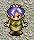
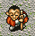
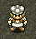
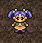
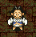

## Overview

Characters that can be found wandering around inside dungeons. They're represented as a yellow dot on the map, and only appear in [Table Mountain](/dungeons/table-mountain).

Characteristics:

- Slow movement.
- Can swap places with Shiren and ally characters.
- Monsters won't attack them.

Ally characters can also appear as wandering NPCs, and can be recruited by talking. NPCs turn hostile when you attack them under most circumstances.

<ul class="quickLinksUL">
  <li><a href="#npc-list">NPC List</a></li>
</ul>

## NPC List

<table class="npcTable">
  <tr>
    <th>NPC</th>
    <th>Floors</th>
    <th>Notes</th>
  </tr>
  <tr>
    <td class="highlightGray"> Pekeji</td>
    <td>1-14F (Ally)</td>
    <td>→ Pekeji side quest. Unlocked as Ally Talk to Pekeji to have him join you as an ally.</td>
  </tr>
  <tr>
    <td class="highlightGray"> Oryu</td>
    <td>1-4F (NPC) 1-14F (Ally)</td>
    <td>→ Oryu side quest. 1st Encounter Talk to Oryu and answer "Yes" twice to be blinded by her. 2nd Encounter Talk to Oryu to be blinded by her again. Unlocked as Ally Talk to Oryu to have her join you as an ally.</td>
  </tr>
  <tr>
    <td class="highlightGray"> Kechi</td>
    <td>1-4F (NPC) 1-14F (Ally)</td>
    <td>→ Kechi side quest. 1st Encounter Pay 200 Gitan to receive a massage with either a good or bad result. Unlocked as Ally Talk to Kechi to have him join you as an ally.</td>
  </tr>
  <tr>
    <td class="highlightGray"> Naoki</td>
    <td>1-2F</td>
    <td>→ Naoki side quest. 1st Encounter Gives you a Bufu's Staff [0] and asks you to obtain Mamel Meat for him. As thanks, he'll cook the meat and serve it to you. 2nd Encounter Guide him to Mountaintop Town as part of the side quest to unlock a diner facility.</td>
  </tr>
  <tr>
    <td class="highlightGray"> Lost Surala</td>
    <td>8-11F</td>
    <td>→ Lost Surala side quest. Guide her to Cryptic Rock Valley to unlock the warehouse facility there.</td>
  </tr>
  <tr>
    <td class="highlightGray"> Blinded Girl</td>
    <td>1-9F</td>
    <td>Throw Herb of Sight at her to cure her blindness and receive a kiss (Strength +1). (Alternate dialogue: Throw Medicinal Herb, Restorative Herb, or Scroll of Need)</td>
  </tr>
  <tr>
    <td class="highlightGray"> Kindly Man</td>
    <td>1-14F</td>
    <td>Talk to him when you're in need to receive a helpful item. HP &le; 10% - Medicinal Herb, Restorative Herb, Scroll of Need, or Chiropractic Jar. Fullness &le; 10% - Riceball, Big Riceball, Giant Riceball, Special Riceball, Riceball Scroll, Hen Meat, or Egg Thing Meat.</td>
  </tr>
  <tr>
    <td class="highlightGray"> Courier</td>
    <td>5-14F</td>
    <td>Offers to deliver an item to the Canyon Hamlet warehouse for free. (The item is delivered instantly, so it won't be lost even if he collapses afterward)</td>
  </tr>
  <tr>
    <td class="highlightGray"> Blacksmith</td>
    <td>8-14F</td>
    <td>Pay 1000 Gitan to increase a selected weapon's upgrade value by 1. If you're lucky, upgrade value will be increased by 3 instead.</td>
  </tr>
  <tr>
    <td class="highlightGray"> Riceball Man</td>
    <td>1-16F</td>
    <td>Rarely appears when you try to eat your last riceball while starving. Gives you a Happiness Herb if you give him your last riceball, but otherwise collapses. If he collapses, he'll reappear as Riceball Resentment to haunt you on the next floor alongside lots of Polygon Spin monsters. ※ Riceball Resentment appears after the village if the next floor is a village.</td>
  </tr>
  <tr>
    <td class="highlightGray"> Third Apprentice</td>
    <td>5-14F</td>
    <td>Throw an identification related item (ex: Scroll of Identity) at him to help him out. He can then be used to identify jars for free going forward. ※ Unlocked after seeing the Venting Jar Gaibara event.</td>
  </tr>
  <tr>
    <td class="highlightGray"> Priest</td>
    <td>8-14F</td>
    <td>Throw a Scroll of Blessing at him to help him out. He can then be used to remove curses from items for free going forward.</td>
  </tr>
  <tr>
    <td class="highlightGray"> Kamahige</td>
    <td>10-14F</td>
    <td>Throw Herb of Sight at him to cure his blindness and receive a kiss (Strength -1). He can then be used to identify bracelets for free going forward.</td>
  </tr>
  <tr>
    <td class="highlightGray">Dogs and Wanderers</td>
    <td>1-14F</td>
    <td>10 or so different NPCs who give you gameplay advice.</td>
  </tr>
</table>
