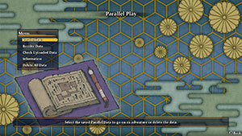

  

# Overview

Parallel Play is a feature where a player can create a separate suspend point in a dungeon. Once created, the player can upload the data online for others to play, or play the data themselves. This Parallel Play feature is most often used as a way to host an event or challenge of some sort. Loading and playing a Parallel Play adventure does not impact your actual save file in any way, and it's possible to load your own Parallel Data to scout upcoming floors without risk. ※ Most players consider loading your own Parallel Data mid-adventure to be cheating. ※ This page was last edited on May 22nd, 2025.

# Mechanics

- "Parallel Play in progress..." is displayed on screen during a Parallel Play adventure.
- The player can create new Parallel Data during a Parallel Play adventure.
- Uploaded Parallel Data displays the following information:
    - Dungeon name, Floor, Player stats, Parallel ID, Download Period, Creator
- Only 1 Parallel Data can be uploaded at a time.
    - If you upload new Parallel Data, the previously uploaded data will be deleted.
- Parallel Data is region-locked based on language settings.
    - Example: Japanese Parallel Data IDs cannot be used in the English version of the game.
- Up to 10 Parallel Data can be uploaded online per day.
    - You can create new Parallel Data for offline use an unlimited number of times.
- The Parallel Data is assigned an expiration date when uploaded by a regular player.
    - Parallel Data uploaded by Spike Chunsoft does not have an expiration date.
- Up to 5 Parallel Data can be saved at any given time.
- Parallel Data cannot be created in the following areas:
    - Secluded Path, Ghost Ship, Golden Highway, Tunnel of Wishes
- Once Parallel Data is created, you can restart from that point an unlimited number of times.
    - The data does not get automatically deleted even if you collapse or clear the dungeon.
- The player cannot take any items or Gitan to their save file upon clearing a Parallel Data.
    - Inserting an item into a Warehouse Pot simply makes the item fall underfoot.
- The player cannot send a rescue request if they collapse during a Parallel Play adventure.
- Notebook and Adventure Log are based on the suspend point, not your actual save file.
    - New entries recorded during a Parallel Play adventure won't appear in your save file.
- Overworld areas and villages are skipped during a Parallel Play adventure.
- It's possible to manipulate RNG for your real save by trying actions out in Parallel Play.

# Official IDs

The following table lists official IDs that are currently usable in the English version of the game.

|ID|Dungeon & Description|Location|Notes|
|-|-|-|-|
|SPCH-UNe6|Serpentcoil Island - Beginner|Sozoro Bay 1F|5 Revival Grass, etc.|
|SPCH-UN3H|Heart of Serpentcoil Island - Super Hard|Heart of Serpentcoil Island 1F|Blank Notebook.|
|SPCH-UNKT|Isle of the Mighty - Minimal Gear|Isle of the Mighty 1F|Golden Sword/Shield+30, etc.|
|SPCH-UN73|Researcher's Experimental Site - Normal|Researcher's Experimental Site 1F|DLC required to play.|
|SPCH-UNDW|Soul of Serpentcoil Island - Normal|Soul of Serpentcoil Island 1F|DLC required to play.|
|SPCH-UNhL|Strolling Highway - Mamel Fun|Strolling Highway|Lots of Mamel monsters.|
|SPCH-UNdg|Strolling Highway - Natural Rune Test|Strolling Highway|Test map for Natural Runes.|
|SPCH-UN2N|Strolling Highway - Powerful Monsters|Strolling Highway|Aggressive Incense in effect.|
|SPCH-UNWr|Heart of Serpentcoil Island - Tatsumi|Heart of Serpentcoil Island 1F|Play as Tatsumi Shiren.|
|SPCH-UNPQ|Cliff of Condensing - Companions|Cliff of Condensing 1F|Start with Asuka, Hibiki, Seki.|
|SPCH-UN9T|Wild Monster Path - Porky Survival|Wild Monster Path 1F|Start with Porky the Pirate.|
