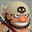
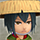
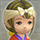
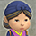
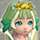
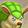
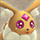

# Overview

Roamers are NPC characters who can be found walking around inside certain dungeons. They're represented as a green circle on the map.

Characteristics:

- 100 HP and slow movement.
- Can swap places with Shiren and companion characters.
- Monsters won't intentionally target them with attacks.
- 100% chance to evade flying weapons or shields.

Travel companion characters also appear as Roamers, and can be recruited by talking. Monster Pups can only appear as Roamers when their affection is currently at the max value. Roamers who aren't companions or monster pups will turn hostile if you attack them.

# Roamer List

<table class="roamerTable pageLinksTable">
  <tr>
    <th colspan="3">Roamers</th>
  </tr>
  <tr>
    <th>Image</th>
    <th>Name</th>
    <th>Notes</th>
  </tr>
  <tr>
    <td colspan="3" class="centeredText highlightDarkGray">Non-Player Characters</td>
  </tr>
  <tr>
    <td></td>
    <td class="priceTableName">Hikyaku</td>
    <td class="leftText">Delivers a selected item to the Shukuba Beach Warehouse. If you give him a pot, the pot gets delivered with all items inside.</td>
  </tr>
  <tr>
    <td></td>
    <td class="priceTableName">Nazoh</td>
    <td class="leftText">Buys and sells items. Merchandise sometimes limited to 1 category. (Same name as the peddler character from Shiren Monsters: Netsal)</td>
  </tr>
  <tr>
    <td></td>
    <td class="priceTableName">Kante the Appraiser</td>
    <td class="leftText">Identifies 1 random category of items in your inventory.</td>
  </tr>
  <tr>
    <td></td>
    <td class="priceTableName">Bundle'emall</td>
    <td class="leftText">Combines 1 type of staff in your inventory into a single staff.</td>
  </tr>
  <tr>
    <td></td>
    <td class="priceTableName">Togi the Swordsmith</td>
    <td class="leftText">Pay 1000 Gitan to upgrade a selected weapon or shield by +2. On rare occasions, upgrade value increases by +5.</td>
  </tr>
  <tr>
    <td></td>
    <td class="priceTableName">Jiru the Rune Engraver</td>
    <td class="leftText">Pay 2000 Gitan to add a random rune to a selected weapon or shield. The rune can be a natural rune normally found on sacred items.</td>
  </tr>
  <tr>
    <td></td>
    <td class="priceTableName">Bokon the Pirate</td>
    <td class="leftText">Reads a random scroll that is beneficial to the player.</td>
  </tr>
  <tr>
    <td></td>
    <td class="priceTableName">Kouka the Wanderer</td>
    <td class="leftText">Trade 1 of your items for a random item. Commonly appears on 1-2F of Serpentcoil Island.</td>
  </tr>
  <tr>
    <td></td>
    <td class="priceTableName">Hoku the Rice Cook</td>
    <td class="leftText">Trade 1 of your items for an onigiri.</td>
  </tr>
  <tr>
    <td></td>
    <td class="priceTableName">Tabu the Samurai</td>
    <td class="leftText">Trade 1 of your items for a weapon or shield.</td>
  </tr>
  <tr>
    <td></td>
    <td class="priceTableName">Retto the Jeweler</td>
    <td class="leftText">Trade 1 of your items for a bracelet.</td>
  </tr>
  <tr>
    <td></td>
    <td class="priceTableName">Kusan the Farmer</td>
    <td class="leftText">Trade 1 of your items for a grass or seed.</td>
  </tr>
  <tr>
    <td></td>
    <td class="priceTableName">Tsuemaki the Peddler</td>
    <td class="leftText">Trade 1 of your items for a staff or scroll.</td>
  </tr>
  <tr>
    <td></td>
    <td class="priceTableName">Yaki the Potter</td>
    <td class="leftText">Trade 1 of your items for a pot.</td>
  </tr>
  <tr>
    <td></td>
    <td class="priceTableName">Fullabell the Fairy</td>
    <td class="leftText">Give them all food in your inventory and all food on the ground to instantly increase Max Fullness to 150 and activate Sumo status. (Nothing happens if you have the Fasting shield rune)</td>
  </tr>
  <tr>
    <td colspan="3" class="centeredText highlightDarkGray">Monster Pups</td>
  </tr>
  <tr>
    <td></td>
    <td class="priceTableName">Maaamel (Mamel)</td>
    <td class="leftText">Offers to give you an Otogirisou.</td>
  </tr>
  <tr>
    <td></td>
    <td class="priceTableName">Walrus Pup (Thiefwalrus)</td>
    <td class="leftText">Offers to give you a Walrus Pot.</td>
  </tr>
  <tr>
    <td></td>
    <td class="priceTableName">Nigiri Pup (Nigiri Baby)</td>
    <td class="leftText">Offers to give you an Onigiri.</td>
  </tr>
  <tr>
    <td></td>
    <td class="priceTableName">Pop Pup (Pop Tank)</td>
    <td class="leftText">Offers to give you a Dragon Grass.</td>
  </tr>
  <tr>
    <td></td>
    <td class="priceTableName">Dillo Pup (Armordillo)</td>
    <td class="leftText">Offers to give you a Balance Staff.</td>
  </tr>
  <tr>
    <td></td>
    <td class="priceTableName">Mr. Radish (Ghost Radish)</td>
    <td class="leftText">Offers to give you an Antidote Grass.</td>
  </tr>
  <tr>
    <td></td>
    <td class="priceTableName">Li'l Octo (Octopling)</td>
    <td class="leftText">Offers to give you a Fixer Scroll.</td>
  </tr>
  <tr>
    <td></td>
    <td class="priceTableName">Gazer Pup (Gazer)</td>
    <td class="leftText">Offers to give you a Sealing Staff.</td>
  </tr>
  <tr>
    <td></td>
    <td class="priceTableName">Kappa Pup (Bored Kappa)</td>
    <td class="leftText">Offers to give you a Water Gun Pot.</td>
  </tr>
  <tr>
    <td></td>
    <td class="priceTableName">Bunny Pup (Fluffy Bunny)</td>
    <td class="leftText">Appears and restores your HP when you have Danger status. (Danger status occurs when Shiren's HP is very low)</td>
  </tr>
  <tr>
    <td colspan="6" class="centeredText highlightDarkGray">Travel Companions</td>
  </tr>
  <tr>
    <td></td>
    <td class="priceTableName">Hibiki</td>
    <td rowspan="5" class="leftText">Talk to the character to recruit them as a companion.</td>
  </tr>
  <tr>
    <td></td>
    <td class="priceTableName">Tugai</td>
  </tr>
  <tr>
    <td></td>
    <td class="priceTableName">Seki</td>
  </tr>
  <tr>
    <td></td>
    <td class="priceTableName">Asuka</td>
  </tr>
  <tr>
    <td></td>
    <td class="priceTableName">Porky the Pirate</td>
  </tr>
</table>
