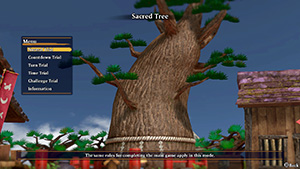
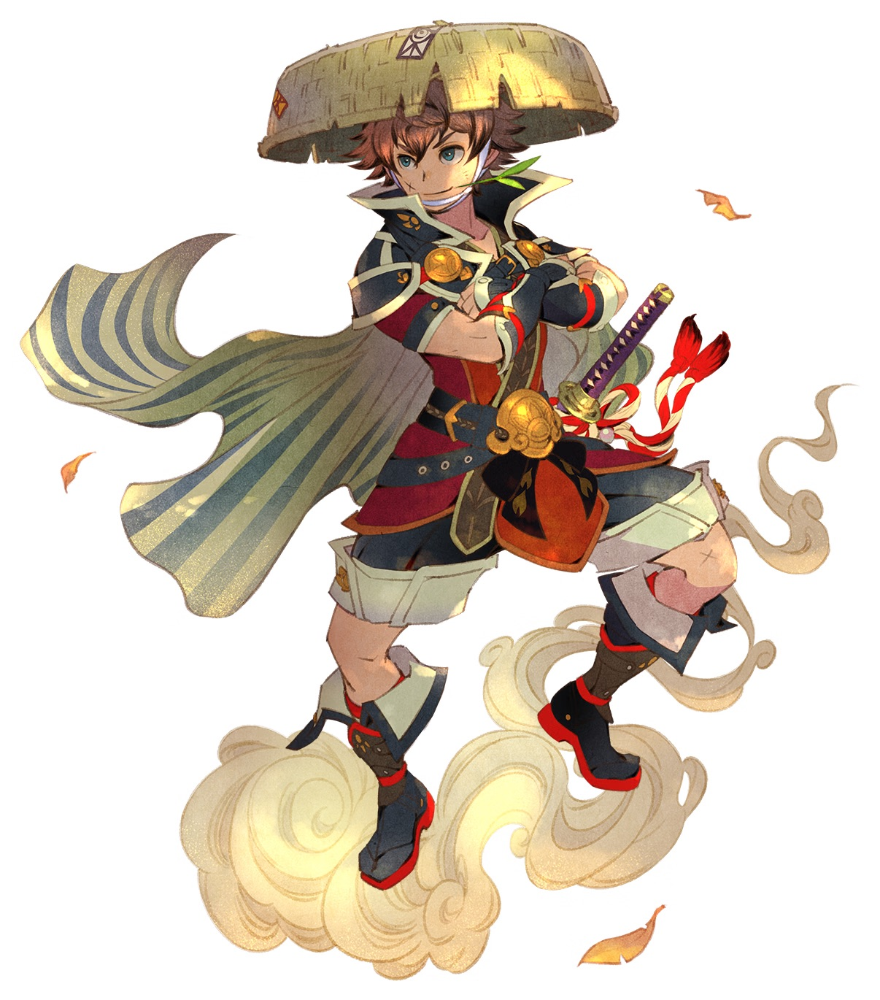
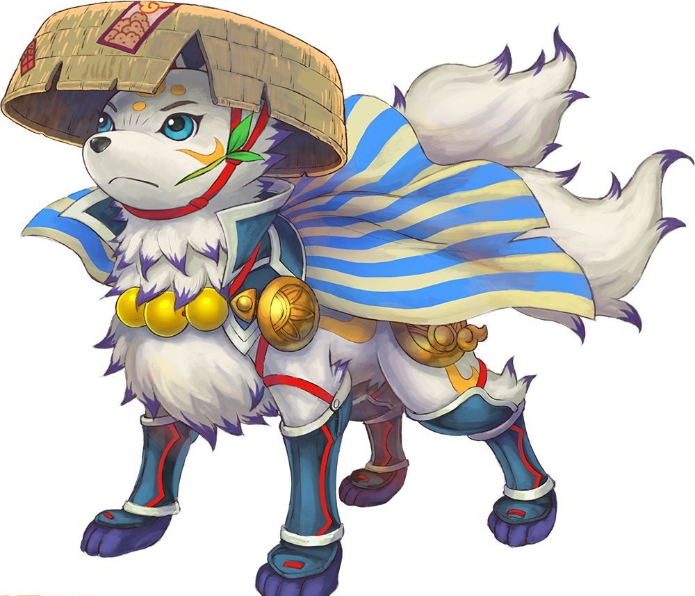
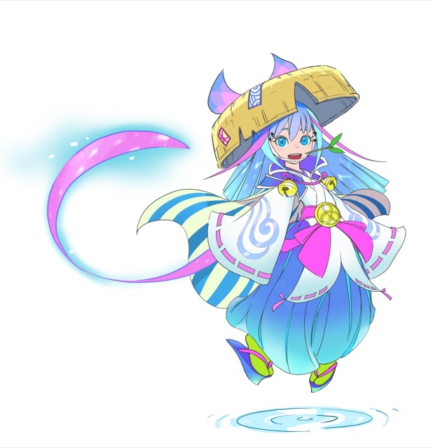

  

# Overview

The Sacred Tree is a feature that was added in the version 1.1.0 update. It's unlocked after clearing [Serpentcoil Island](/dungeons/serpentcoil-island), and lets you challenge dungeons under special rules.

Notes:

- Villages and overworld areas are skipped.
- The player cannot request any rescues - Be very careful if you bring items!
- Monster slots you encounter inside a dungeon will get recorded in the Adventure Log like normal.
- Bosses are present in Serpentcoil Island, Dune of Batsu, Cavern of Suiryu, and Yamakagashi Pass.
- Press in the right analog stick to pause gameplay, including counters for Countdown Trial and such.

# Player Select

Sacred Tree dungeons offer an option to play as characters other than Shiren.

### Shiren

  

Description: Default player character, and protagonist of this game's story. Unlock Condition: Available from the start.

#### Restrictions

- Dungeons: None.
- Item Categories: None.

#### Characteristics

- Max HP increases by a random amount in the range of 3\~6 per level up.
- Normal Attack (No Runes) = Reaches 1 tile ahead, deals damage, 0% critical hit rate.
    - Damage increases primarily based on level, strength, equipped weapon, and other effects.
        - Other effects include runes (ex: Anti-Dragon) and status conditions (ex: Empowered, Damage-up).
        - See [Gameplay Basics](/system/gameplay-basics#damage-dealt) for details about Shiren's damage dealt formula.
- Defense = Shiren has no innate defense, and increasing level or strength does nothing for defense.
    - Damage received decreases primarily based on equipped shield and other effects.
        - Other effects include runes (ex: Costly Block) and status conditions (ex: Fortified, Damage-down).
        - See [Gameplay Basics](/system/gameplay-basics#damage-received) for details about Shiren's damage received formula.

#### Abilities / Altered Effects

- None.

#### Techniques

- All standard techniques that don't require other player character abilities can be performed.

### Kokatsu Shiren

  

Description: Shiren fused with Kokatsu. Unlock Condition: Clear <a href="/shiren-6/dungeons/cavern-of-suiryu">Cavern of Suiryu</a> → Visit Sacred Tree.

#### Restrictions

- Dungeons: Peach Dungeon / Trapper's Secret Path / Peachy Trap Domain
- Item Categories: Weapons / Shields / Bracelets / Arrows / Rocks

#### Characteristics

- [Content]

#### Abilities / Altered Effects

Abilities:

|Name|Fullness|Effect|
|-|-|-|
|Sand-handling|10|Creates a pillar of sand in front of you. If the tile in front is a wall, digs out the wall tile.|
|Deception|20|Creates a decoy (60 HP).|
|Blazing Heat|60|Deals 40\~50 damage and inflicts Blind status to all monsters in the room.|
|Sun's Blessing|10|Transforms the selected item into a random Grass or Onigiri category item.|

Altered Effects:

|Trap / Monster|Notes|
|-|-|
|Mudkin|Lowers Attack Power and Defense Power.|
|Removal Trap|Lowers Attack Power and Defense Power.|
|Silver-seal Trap|Inflicts Sealed status.|

#### Techniques

- [Content]

### Tatsumi Shiren

  

Description: Shiren fused with Tatsumi. Unlock Condition: Unlock Kokatsu Shiren → Visit Sacred Tree.

#### Restrictions

- Dungeons: Peach Dungeon / Trapper's Secret Path / Peachy Trap Domain
- Item Categories: Weapons / Shields / Bracelets / Arrows / Rocks

#### Characteristics

- [Content]

#### Abilities / Altered Effects

Abilities:

|Name|Fullness|Effect|
|-|-|-|
|Vault|10|Vaulting Staff effect, but you won't warp when landing on a water tile. However, you'll still warp like usual if you land on an air tile.|
|Raging Tornado|20|Warps every monster in the room to a different spot, including behemoths. Effective even in a single large room, unlike Sweet Potato. Range is reduced to a 1 tile radius in hallways.|
|Summon Kappa Squad|40|Summons up to 3 Kappa Squad guardians (15 HP). Kappa Squad guardians throw items at targets within a 3 tile radius. Items: Wooden Arrow, Iron Arrow, Rock, Gitan, Dragon Grass, Leaping Grass. ※ Items can miss, stops throwing items after about 5 items.|
|Rain's Blessing|20|Transforms the selected item into a random Grass or Onigiri category item. More likely to result in a negative item than Kokatsu Shiren's Sun's Blessing. Unlike Sun's Blessing, Berserk Seed is possible.|

Altered Effects:

|Trap / Monster|Notes|
|-|-|
|Mudkin|Lowers Attack Power and Defense Power.|
|Removal Trap|Lowers Attack Power and Defense Power.|
|Silver-seal Trap|Inflicts Sealed status.|

#### Techniques

- [Content]

### Koppa

  

Description: [Content] Unlock Condition: Unlock Tatsumi Shiren → Event at Mount Jingara Summit → Visit Sacred Tree.

#### Restrictions

- Dungeons: [Content]
- Item Categories: [Content]

#### Characteristics

- [Content]

#### Abilities / Altered Effects

Abilities:

|Name|Fullness|Effect|
|-|-|-|
|Burrow|10|Go underground and move up to 3 tiles ahead in 1 turn. Can be used to traverse past water or air tiles. Occasionally find Onigiri, Large Onigiri, or Rotten Onigiri.|
|Frantic Fart|15|Makes all creatures in the room warp to a different location.|
|Dig & Escape|15|Makes Koppa warp to a different room. Can be used even if Weighted Incense is active. Occasionally find Onigiri, Large Onigiri, or Rotten Onigiri.|
|Flee|100|Immediately advance to the next floor, similar to Floor-exiting Trap. Can be used even on the last floor of a dungeon, including boss floors. This ability cannot be used during Thief Mode.|

Altered Effects:

|Trap / Monster|Notes|
|-|-|
|Mudkin|Lowers Attack Power and Defense Power.|
|Removal Trap|Lowers Attack Power and Defense Power.|
|Silver-seal Trap|Inflicts Sealed status.|

#### Techniques

- [Content]

### Asuka

  

Description: [Content] Unlock Condition: Go through Peach Bun events and have Asuka join as an ally → Visit Sacred Tree.

#### Restrictions

- Dungeons: None.
- Item Categories: None.

#### Characteristics

- Normal Attack (No Runes) = Reaches 1 tile ahead, deals damage, 15% critical hit rate.
    - Asuka's critical hits deal x3.0 damage, crit chance boosting runes are additive.
        - Damage for guaranteed critical hit sources like Jagged Sword is possibly halved.
    - Damage increases primarily based on level, strength, equipped weapon, and other effects.
        - Other effects include runes (ex: Anti-Dragon) and status conditions (ex: Empowered, Damage-up).
    - Asuka deals more damage with weapons than Shiren \~ Rough damage calculation:
        - (WEP_ATK + STR_ATK + LV_ATK) - [ENEMY_DEF x 0.5] + 1 x RNG (87.5 ~ 112.5%)
            - WEP_ATK = [AP x 0.9768866551] + [AP x Strength x 0.0406122449]
                - AP = Weapon's attack power
            - STR_ATK = Strength
            - LV_ATK:
                - Level &le; 4 = 0.5 + (Lv - 1) x 2
                - 5 &le; Level &le; 13 = 6.5 + (Lv - 4) x 1
                - 14 &le; Level = 15.5 + (Lv - 13) x 0.5
- Defense = Asuka has no innate defense, and increasing level or strength does nothing for defense.
    - Damage received decreases primarily based on equipped shield and other effects.
        - Other effects include runes (ex: Costly Block) and status conditions (ex: Fortified, Damage-down).
    - Asuka's damage reduction based on shield strength is weaker than Shiren's:
        - Asuka:
            - Shield defense &le; 40 = Reduce damage by 0.5 per point of defense less than or equal to 40.
            - Shield defense > 40 = Reduce damage by 0.3 per point of defense above 40.
        - Shiren:
            - Shield defense &le; 20 = Reduce damage by 1.0 per point of defense less than or equal to 20.
            - Shield defense > 20 = Reduce damage by 0.6 per point of defense above 20.

#### Abilities / Altered Effects

- None.

#### Techniques

- All standard techniques that don't require other player character abilities can be performed.

# Normal Trial

#### Normal Trial Rules

Challenge a dungeon using the same rules as the main game.

# Countdown Trial

#### Countdown Trial Rules

Turns have a time limit called Turn Countdown, which resets every time you take an action. Total Countdown will begin to decrease when Turn Countdown reaches 0. If Total Countdown reaches 0, you fail the adventure. Total Countdown will regain a little bit of time when you advance floors. The adventure cannot be suspended during a Countdown Trial.

#### Time Limit (Turn/Total in seconds)

|Dungeon|Novice|Veteran|Expert|
|-|-|-|-|
|Serpentcoil Island|5/465|5/310|5/155|
|Dune of Batsu|5/450|5/300|5/150|
|Cavern of Suiryu|5/300|5/200|5/100|
|Yamakagashi Pass|5/375|5/250|5/125|
|Kiki Island|5/375|5/250|5/125|
|Training Path of Inference|5/300|5/200|5/100|
|Training Path of Extra Inference|5/300|5/200|5/100|
|Peach Dungeon|5/375|5/250|5/125|
|Sumo Dungeon|5/300|5/200|5/100|
|Cat-Ching's Divine Will|5/150|5/100|5/50|
|Trapper's Secret Path|5/300|5/200|5/100|
|Training Path of Gimmicks|5/300|5/200|5/100|
|Training Path of Shopping|5/600|5/400|5/200|
|Behemoth Rush|5/450|5/300|5/150|
|Sacred Ocean Tunnel|5/225|5/150|5/75|
|Domain of Staves and Scrolls|5/300|5/200|5/100|
|Isle of the Mighty|5/750|5/500|5/250|
|Heart of Serpentcoil Island|5/1485|5/990|5/495|

# Turn Trial

#### Turn Trial Rules

Try to clear a dungeon in as few turns as possible. A counter displaying the number of elapsed turns is displayed in the top left corner of the screen.

# Time Trial

#### Time Trial Rules

Try to clear a dungeon as quickly as possible. A counter displaying the time elapsed is displayed in the top left corner of the screen. The adventure cannot be suspended during a Time Trial.

# Challenge Trial

#### Challenge Trial Rules

Try to clear a dungeon under a specific set of rules. Select which rules to apply with the Select Rules command - More than 1 rule can be selected.

#### Selectable Rules

|Rule|Notes|
|-|-|
|Complete without equipping items.|Can be completed as any character.|
|Complete without Sumo Power.|Sumo status won't activate at 150 Fullness.|
|Complete without using Grass.|-|
|Complete without using Scrolls.|-|
|Complete without using Staves.|-|
|Complete without using Pots.|-|
|Complete without collapsing.|Revival Grass won't activate.|

# Monster Trial

#### Monster Trial Rules

Select a monster as your playable character and see how far you can go. HP doesn't naturally regenerate as turns elapse, but Fullness will not deplete. Level increases as you defeat monsters, fully restoring HP while reducing Fullness by 4. Items cannot be used, but eating an item replenishes Fullness by 2. Playable monsters can be unlocked by completing Dojo Challenges in the [Monster Dojo](/system/monster-dojo).

#### Dungeon Selection

The following dungeons cannot be selected in this mode:

- Training Path of Extra Inference
- Trapper's Secret Path
- Peach Dungeon
- Peachy Trap Domain
