# Overview

This game has side quests which reward you with items, allies, or new facilities. Some side quests must be completed as a prerequisite to unlocking certain postgame dungeons. ※ Check the overview section on individual dungeon pages for dungeon unlock conditions.

# Barman

Talk to the Barman in Canyon Hamlet to receive a Big Riceball once per adventure.

  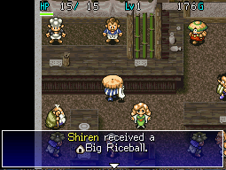

Requirement: None. Location: Canyon Hamlet

1. Enter the bar, talk to the Barman, and tell him your name when asked.
    - Answer - Say name
2. You'll be given a Big Riceball in response.
    - From now on, you can talk to him to receive a Big Riceball once per adventure.
    - He won't give you a Big Riceball on the adventure immediately following clearing [Table Mountain](/dungeons/table-mountain).

# Pekeji

Complete this side quest to unlock Pekeji as an ally.

  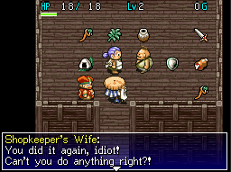

#### Pekeji is your brother!?

Requirement: None. Location: Bamboo Village

1. Enter Green Bamboo (Bamboo Village Item Shop) for an event.
2. Talk to Shopboy and tell him your name is Shiren.
    - Answer - Yes
3. Go to Yoidore (Bar near the village's exit) and walk to the tile in front of the Barman for an event.
    - Your answers here don't change the outcome of the side quest.
4. Proceed to <b>Request for Money</b>.

#### Request for Money

Requirement: 1 adventure later. Location: Bamboo Village

1. Enter Green Bamboo (Bamboo Village Item Shop) and talk to Pekeji.
2. Go to Yoidore (Bar near the village's exit) and walk to the tile in front of the Barman for an event.
3. Pekeji will ask for 1000 Gitan, so choose the following options to give him the money:
    - Answer - How much do you need?
    - Answer - Wait! If it's money you need...
4. Proceed to <b>Brotherly Love</b>.
    - If you didn't give him the money, proceed to <b>Request for Money (2)</b>.

#### Request for Money (2)

Requirement: 2 adventures later. Location: Bamboo Village

1. Enter Green Bamboo (Bamboo Village Item Shop) and talk to Pekeji.
2. Go to Yoidore (Bar near the village's exit) and walk to the tile in front of the Barman for an event.
3. Pekeji will ask for 1000 Gitan, so choose the following option to give him the money:
    - Answer - Wait! If it's money you need...
4. Proceed to <b>Brotherly Love</b>.

#### Brotherly Love

Unlike the SFC version, the DS version won't let you continue without punching Pekeji on step 4. This ensures Pekeji is always unlocked as an ally regardless of your answers.

Requirement: 1 adventure later. Location: Bamboo Village

1. Walk by Yoidore (Bar near the village's exit) for an event.
2. Ask Pekeji 3 questions to learn what happened to the money you gave him.
    - The order you ask the questions in doesn't matter.
3. Show Pekeji some brotherly love by punching him when given the option.
    - Answer - Punch him
4. Show Pekeji some more brotherly love by punching him again when given the option.
    - Answer - Punch him
5. Pekeji is now an ally!
    - See [Pekeji](/system/allies#pekeji) for his stats and characteristics.
    - He can now randomly appear between 1-14F of [Table Mountain](/dungeons/table-mountain).

# Oryu

Complete this side quest to unlock Oryu as an ally.

  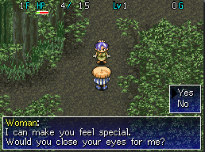

#### Blinding Encounter

Requirement: None. Location: Table Mountain 1-4F (Wandering NPC)

1. Talk to Oryu and agree to close your eyes.
    - Answer - Yes
2. When prompted again, keep your eyes closed.
    - Answer - Yes
3. You'll become afflicted with Blinded status for a short while.
4. Proceed to <b>Blinding Encounter (2)</b>.

#### Blinding Encounter (2)

Requirement: 1 adventure later. Location: Table Mountain 1-4F (Wandering NPC)

1. Talk to Oryu to hear about her "twin sister" who goes around blinding people.
2. You'll become afflicted with Blinded status for a short while.
3. Proceed to <b>Girl In Trouble</b>.

#### Girl In Trouble

Requirement: 1 adventure later. Location: Bamboo Village

1. Oryu is cornered by 2 men near the entrance to Fudou (Blacksmith).
2. Talk to one of the men to progress the event, then choose to help Oryu.
    - Answer - Help
3. Defeat the 2 men, then talk to Oryu and agree when she asks to join you.
    - Answer - Yes
4. You'll become afflicted with Blinded status for a short while.
5. Oryu is now an ally!
    - See [Oryu](/system/allies#oryu) for her stats and characteristics.
    - She can now randomly appear between 1-14F of [Table Mountain](/dungeons/table-mountain).

# Kechi

Complete this side quest to unlock Kechi as an ally.

  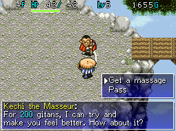

#### Successful Massage

Requirement: Reach Old Mine (8-9F), then 1 adventure later. Location: Table Mountain 1-4F (Wandering NPC)

1. Talk to Kechi when you're not at full HP and pay 200 Gitan to get a massage.
    - The massage must be successful to progress this side quest - If it fails, try again.
2. Proceed to <b>The Wanted Man</b>.

#### The Wanted Man

Requirement: 1 adventure later. Location: Bamboo Village

1. Approach Kechi for an event.
2. Talk to Kechi after the event to learn more about him.
3. Proceed to <b>Another Chance</b>.

#### Another Chance

Requirement: 1 adventure later. Location: Mountaintop Town

1. Walk right from the town's entrance until you encounter Kechi and 4 other characters.
2. Talk to the 4 other characters, then talk to Kechi for an event.
3. Agree to Kechi joining you when he asks if it'd be okay to do so.
    - Answer - Yes
4. Kechi is now an ally!
    - See [Kechi](/system/allies#kechi) for his stats and characteristics.
    - He can now randomly appear between 1-14F of [Table Mountain](/dungeons/table-mountain).

# Inn Talk

Eavesdrop on a couple staying at the Mountaintop Town Inn for experience points.

  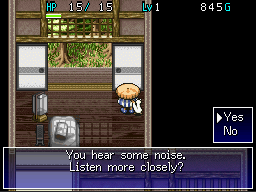

Requirement: None. Location: Mountaintop Town

1. Enter the Inn and walk through the doorway to the back room.
2. If Koppa stops and says "Did you hear something from the next room?", the event can proceed.
    - If Koppa doesn't say anything, the event won't trigger during this adventure.
3. After hearing Koppa say the above sentence, walk to the upper right corner of the room.
4. When the game asks you if you want to listen more closely, select Yes.
5. Listen to the conversation, then gain 1,000 experience points.

# Heiji

Friendly man who gives you advice and a Plating Scroll on rare occasions.

  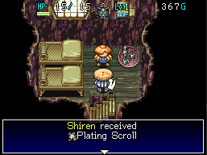

Requirement: Before unlocking Ceremonial Cave. Location: Canyon Hamlet → Cryptic Rock Valley

After talking to him on 2 separate occasions, Heiji can disappear from Canyon Hamlet. When he isn't in Canyon Hamlet, he has a chance to appear on the 2nd floor of the Cryptic Rock Valley Inn. Talk to him there, and he'll give you a Plating Scroll and some advice about Waterfall Marsh.

# Dog Gift

The dog near the Inn in Cryptic Rock Valley will give you a random item on rare occasions.

  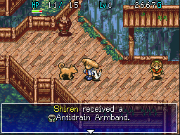

Requirement: Before unlocking Ceremonial Cave. Location: Cryptic Rock Valley

Talk to the dog near the Inn for a chance to receive one of the following items:

<table class="dungeonTable">
  <tr>
    <th colspan="2">Possible Items</th>
  </tr>
  <tr>
    <td>Drain Buster</td>
    <td>Restorative Herb</td>
  </tr>
  <tr>
    <td>Gold Shield</td>
    <td>Big Riceball</td>
  </tr>
  <tr>
    <td>Antidote Armband</td>
    <td>Kigny Seed</td>
  </tr>
  <tr>
    <td>Antidrain Armband</td>
    <td>Staff of Happiness</td>
  </tr>
</table>

# Selfish Girl

Girl who asks for a random item from your inventory, and gives you a different item as thanks.

  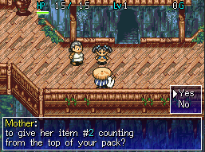

Requirement: None. Location: Cryptic Rock Valley

On rare occasions, the girl and mother in the northeast house will be outdoors when you visit. If you have 3 or more items, the girl will ask for a random item counting from the top of your inventory. Give her the item she requests, and you'll be given one of the following items as thanks:

<table class="dungeonTable">
  <tr>
    <th colspan="2">Possible Items</th>
  </tr>
  <tr>
    <td class="highlightGray">From a wanderer</td>
    <td>Kabra's Blade, Windshield, Katana+10, Hide Shield+10</td>
  </tr>
  <tr>
    <th class="highlightGray">Regular item</th>
    <td>Scroll of Need, Dragon Herb, Special Riceball</td>
  </tr>
  <tr>
    <th class="highlightGray">From a dog</th>
    <td>Blank Scroll, Storehouse Jar [5], Happy Armband</td>
  </tr>
</table>

※ Items she received from a wanderer are very rare, and items she received from a dog are common.

# Lost Surala

Girl who is lost inside a dungeon - Guide her to Cryptic Rock Valley to unlock the warehouse.

  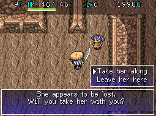

Requirement: None. Location: Table Mountain 8-11F (Wandering NPC)

Surala can be found as a wandering NPC between 8-11F in [Table Mountain](/dungeons/table-mountain). Once you select to help her, she'll follow you like an ally and monsters will begin to attack her. You'll likely need to step toward monsters and use your body as a shield to protect her at times. If you manage to safely guide her to Cryptic Rock Valley, you'll gain access to the warehouse. ※ Don't worry if Surala collapses - She can be found again on a subsequent adventure.

# Gaibara

Side quest which unlocks Melding Jar as an obtainable item, along with a Jar Shop in Mountaintop Town.

  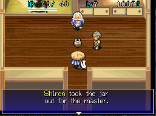

#### Meet Gaibara Sensei

Requirement: 1 jar in inventory (Not Walrus Jar or Monster Jar) Location: Mountaintop Town

1. Enter Gaibara's manor for an event.
    - Gaibara breaks the jar that gets randomly selected during this event, and contents are lost.
    - If you have important jars, place them in the warehouse before entering the manor.
2. Proceed to <b>Pointless Jar</b>.

#### Pointless Jar

Requirement: 1 adventure later. Location: Mountaintop Town

1. Enter Gaibara's manor for an event.
    - Pointless Jar is introduced, which is an ordinary jar without a special effect.
2. Proceed to <b>Unbreakable Jar</b>.

#### Unbreakable Jar

Requirement: 1 jar in inventory (Not Walrus Jar or Monster Jar), 1 adventure later. Location: Mountaintop Town

1. Enter Gaibara's manor for an event.
    - Gaibara will not break the jar that gets randomly selected during the event this time.
    - Unbreakable Jar is introduced, which is a jar that bounces away when thrown.
2. Proceed to <b>Venting Jar</b>.

#### Venting Jar

Requirement: 1 adventure later. Location: Mountaintop Town

1. Enter Gaibara's manor for an event.
    - Venting Jar is introduced, which is a jar that explodes when thrown.
2. Proceed to <b>Melding Jar</b>.

#### Melding Jar

Requirement: 1 adventure later. Location: Mountaintop Town

1. Enter Gaibara's manor for an event.
    - Melding Jar is introduced, which is a jar that can combine weapons, shields, and staves.
2. Proceed to <b>Gaibara Kilns Gallery</b>.

#### Gaibara Kilns Gallery

Requirement: 1 adventure later. Location: Mountaintop Town

1. Melding Jar can now be obtained inside dungeons.
2. Gaibara Kilns Gallery (Jar Shop) located to the right of Gaibara's Manor is now open.
    - Possible merchandise - Jar of Change, Jar of Holding, Chiropractic Jar, and Melding Jar.

# Naoki

Side quest which unlocks a Diner which offers free meals to Shiren in Mountaintop Town.

  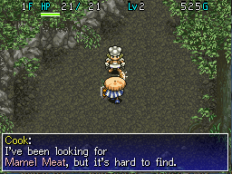

#### Meet Naoki

Requirement: None. Location: Table Mountain 1-2F (Wandering NPC)

1. Talk to Naoki, and he'll give you a Bufu's Staff [0] and ask you to obtain Mamel Meat for him.
2. Throw Bufu's Staff [0] at a Mamel to obtain the meat, then talk to Naoki again.
3. He'll cook up a dish called Roasted Mamel Tail, so go ahead and eat it.
    - Fully replenishes fullness, strength +1, and max HP +3.
4. Proceed to <b>Rumored Restaurant</b>.

#### Rumored Restaurant

Requirement: <a href="#gaibara">Meet Gaibara Sensei</a> event completed, 1 adventure later. Location: Mountaintop Town

1. Enter a restaurant called "The Cliffs" for an event.
    - The restaurant is located in the upper right corner of the map.
2. The menu options all have the same negative effect, so it's fine to order the cheapest option.
    - Fullness set to 10, Strength -2, HP -30 (1 HP remaining if you had 30 or less HP).
3. Proceed to <b>Request to Naoki</b>.

#### Request to Naoki

Requirement: 1 adventure later. Location: Table Mountain 1-2F (Wandering NPC)

1. Talk to Naoki and agree to going to Mountaintop Town together.
    - He'll follow you like an ally, but won't attack monsters.
2. You'll part ways once you arrive in Mountaintop Town, so head over to The Cliffs for an event.
    - Again, the restaurant is located in the upper right corner of the map.
3. Agree to pay 10,000 Gitan to Naoki to have him work for The Cliffs.
    - Answer - Pay 10000 gitans
    - Answer - Yes
4. Pay Naoki 10,000 Gitan.
    - The amount does not have to be paid in full immediately.
4. Continue to <b>Gaibara's Review</b>.

#### Gaibara's Review

Requirement: 1 adventure later. Location: Mountaintop Town

1. Enter The Cliffs, walk over to the nearby table, and eat a free meal.
    - As you're about to leave, an event will occur.
2. When Toshio asks if you know someone with influence in the culinary world, say that you do.
    - Answer - I know someone.
3. When asked who that person is, name Gaibara.
    - Answer - Gaibara
4. You'll receive a letter for Gaibara, which you'll need to deliver.
5. Go to Gaibara's Manor and give Gaibara the letter, then return to The Cliffs.
6. Talk to the villager near the entrance to The Cliffs, then enter and talk to Toshio for an event.
7. Go to the restaurant called The Peak for an event.
    - The restaurant is located next to the Inn near the town's entrance.
8. Go to Gaibara's Manor for an event.
9. Proceed to <b>Naoki's Gift</b>.

#### Naoki's Gift

Requirement: 1 adventure later. Location: Mountaintop Town

1. Go to The Cliffs and talk to Toshio to learn that Naoki left the restaurant.
    - You'll receive a Bufu's Staff [4] from Toshio which Naoki left behind for Shiren.
2. Proceed to <b>The Cliffs Unlocked</b>.

#### The Cliffs Unlocked

Requirement: 1 adventure later. Location: Mountaintop Town

1. You can now eat at The Cliffs for free one time per adventure.
    - The menu option they offer is randomly selected - You can't choose a specific meal.

# Bungee Jump

Side quest which unlocks the Bungee Jumping activity at Janus Valley.

  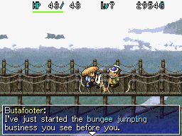

#### Bungee Jump Rumors

Requirement: Reach Stream Village, Pekeji is in your party. Location: Mountaintop Town

1. Enter Mountaintop Town with Pekeji in your party for an event.
    - You must have also reached Stream Village at least once in the past for the event to trigger.
2. Proceed to <b>Meet Butafooter</b>.

#### Meet Butafooter

Requirement: No allies are with you. Location: Janus Valley

1. Talk to Butafooter in Janus Valley to learn that he runs a bungee jumping business.
    - He won't be there if you have allies with you, so be sure to go to Janus Valley alone.
2. Proceed to <b>Let's Bungee Jump!</b>

#### Let's Bungee Jump!

Requirement: Pekeji is your only party member. Location: Janus Valley

1. Go to Janus Valley for an event.
2. Choose who jumps first - Pekeji or Shiren.
    - Pekeji gains a level upon success.
    - Shiren gains 2,000 experience points upon success, or fails the adventure if the rope breaks.
        - If you're carrying important items, DO NOT have Shiren jump.
3. Proceed to <b>Bungee Jump Unlocked</b>.

#### Bungee Jump Unlocked

Requirement: No allies are with you, 1 adventure later. Location: Janus Valley

1. You can now go bungee jumping at Janus Valley for 500 Gitan when you don't have allies with you.
    - Fine - 2000 exp, remove curses.
    - Good - Fine result + max HP +10.
    - Great - Fine & Good results + strength +5, replenish fullness.
    - Fail - Lose all items and money, return to Canyon Hamlet.

# Apprentice

Side quest where you have an opportunity to obtain a Mastersword+30 depending on friendship level.

  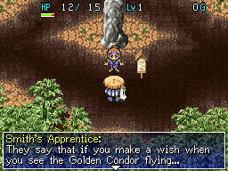

#### Kobami Valley's Legend

Requirement: None. Location: Bamboo Village

1. Talk to Smith's Apprentice, who is located in front of the statue dedicated to Bufu.
    - Apprentice - "There's a legend here in Kobami Valley."
2. Talk to the old man and young girl inside the house next door to the Blacksmith.
    - Man - "They say the Golden Condor used to fly these skies..."
    - Girl - "Really? I always thought that was just a fairy tale..."
3. Proceed to <b>Kobami Valley's Legend (2)</b>.

#### Kobami Valley's Legend (2)

Requirement: 1 adventure later. Location: Bamboo Village

1. Talk to Smith's Apprentice, who is located inside the house next door to the Blacksmith.
    - Apprentice - "The Golden Condor is hidden away in legend."
2. Proceed to <b>Try My Best</b>.

#### Try My Best

Requirement: 1 adventure later. Location: Bamboo Village

1. Talk to Smith's Apprentice, who is located inside the Blacksmith.
    - Apprentice - "I came from a village very far from Kobami Valley to study here."
2. Proceed to <b>My Dream</b>.

#### My Dream

Requirement: 2 adventures later. Location: Bamboo Village

1. Talk to Smith's Apprentice, who is located in the south side of the village.
    - Apprentice - "It's been three years since I came here."
2. Proceed to <b>Mistake</b>.

#### Mistake

Requirement: 2 adventures later. Location: Bamboo Village

1. Talk to Smith's Apprentice, who is located near the statue dedicated to Bufu.
    - "Was... there... something you wanted?"
2. Select the top dialogue option to raise friendship.
    - Answer - Are you okay?
3. Proceed to <b>Startled</b>.

#### Startled

Requirement: 2 adventures later. Location: Bamboo Village

1. Talk to Smith's Apprentice, who is located inside the Blacksmith.
    - Apprentice - "Oh! You startled me!"
2. Proceed to <b>Day Off</b>.

#### Day Off

Requirement: 2 adventures later. Location: Bamboo Village

1. Talk to Smith's Apprentice, who is located inside the house next door to the Blacksmith.
    - Apprentice - "Today's my first day off in a long time!"
2. Proceed to <b>Injured Hand</b>.

#### Injured Hand

Requirement: 2 adventures later. Location: Bamboo Village

1. Talk to Smith's Apprentice, who is located inside the Blacksmith.
    - "Ow..."
2. Select the 2nd dialogue option. (3rd option reduces friendship)
    - Answer - Are you okay?
3. Throw a Medicinal Herb, Restorative Herb, or Scroll of Need at her to raise friendship.
4. Proceed to <b>Watch And Learn</b>.

#### Watch And Learn

Requirement: 2 adventures later. Location: Bamboo Village

1. Talk to Smith's Apprentice, who is located inside the Blacksmith.
    - Apprentice - "I was just remembering how the smith moves when he strikes the steel."
2. Proceed to <b>Lost Confidence</b>.

#### Lost Confidence

Requirement: 2 adventures later. Location: Bamboo Village

1. Talk to Smith's Apprentice, who is located near the statue dedicated to Bufu.
    - "I suddenly... seem to have lost my confidence..."
2. Select the 3rd dialogue option to raise friendship.
    - Answer - Remember your dream!
3. Proceed to <b>Regained Confidence</b>.

#### Regained Confidence

Requirement: 2 adventures later. Location: Bamboo Village

1. Talk to Smith's Apprentice, who is located near the bar called Yoidore.
    - Apprentice - "The other day, the smith told me I did a good job!"
2. Proceed to <b>Apprentice's Request</b>.

#### Apprentice's Request

Requirement: Clear Table Mountain and talk to Smith's Apprentice, 2 adventures later. Location: Bamboo Village

1. Talk to Smith's Apprentice, who is located inside the Blacksmith.
    - "So, I'd like to ask if you'd let me work on your equipment for you."
2. Agree to let her work on your equipment (Select a weapon).
    - Answer - Sure, okay.
3. Say yes to letting her hold on to the weapon for a bit.
    - Answer - Yes
4. Proceed to <b>First Job</b>.

#### First Job

Requirement: 1 adventure later. Location: Bamboo Village

1. Talk to Smith's Apprentice, who is located inside the Blacksmith.
    - She'll return your weapon, which will have gained +1 upgrade value.
2. Proceed to <b>Real Smith</b>.

#### Real Smith

Requirement: 2 adventures later. Location: Bamboo Village

1. Talk to Smith's Apprentice, who is located outside the Blacksmith (lower right of path).
    - Apprentice - "The smith... he... suddenly told me I was ready!"
2. Proceed to <b>Going Home</b>.

#### Going Home

Requirement: 1 adventure later. Location: Bamboo Village

1. Talk to Smith's Apprentice, who is located inside the house next door to the Blacksmith.
    - Apprentice - "Now that I'm a real blacksmith, I decided to go home."
2. Four dialogue options appear mid conversation, but they shouldn't have an effect on friendship.
    - However, what she says in response to the bottom 2 options varies based on friendship level.
3. Proceed to the next event based on friendship level.
    - High friendship - <b>Apprentice's Gift</b>.
    - Low friendship - Skip to <b>Apprentice's Letters 1-5</b>.

#### Apprentice's Gift

Requirement: 1 adventure later (Might need to clear a dungeon or select "Give up"). Location: Bamboo Village

1. Talk to the old man inside the house next door to the Blacksmith.
    - Man - "The smith's apprentice asked me to give this to you."
2. Receive a Mastersword+30 from the old man.
3. Proceed to <b>Apprentice's Letters 1-5</b>.

#### Apprentice's Letters 1-5

Requirement: 3 adventures later (Between each letter as well). Location: Bamboo Village

1. Talk to the old man inside the house next door to the Blacksmith to read letters from Smith's Apprentice.
    - There are 5 letters total, and 3 adventures are needed between each one.
2. After reading the 5th letter, proceed to <b>Reunited</b>.

#### Reunited

Requirement: 3 adventures later. Location: Bamboo Village

1. Talk to Smith's Apprentice, who is located inside the house next door to the Blacksmith.
2. Proceed to <b>Stopping By</b>.

#### Stopping By

Requirement: 1 adventure later. Location: Bamboo Village

1. The Smith's Apprentice will now stop by the Blacksmith in Bamboo Village on rare occasions.
