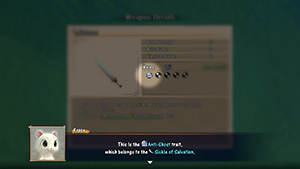

  

# Overview

Runes are abilities that can be added to weapons or shields using a Synthesis Pot or Mixer monster. Generally runes make your adventure easier, but some have a negative effect.

Runes are retained up to a certain number of slots when you transform an item at the Blacksmith. This applies to creating a Kajin Fuuma (10 slots), Kabura Sutegi (15 slots), or Rasen Fuuma (15 slots).

#### Obtaining Runes

There are 3 ways to obtain or add runes to equipment.

- The weapon or shield has an innate rune.
    - Example: Golden Sword always has Rustproof.
- Synthesize items to transfer runes.
    - Example: Katana + Golden Sword = Katana with Rustproof.
- Sacred Items can be generated with random runes.

#### Synthesis Methods

Synthesis Pots and Mixers must be unlocked through a Side Quest before they can appear in dungeons.

- Synthesis Pot
    - The first item you insert acts as the base.
    - Runes and upgrade values of subsequent items are added to the base item.
        - Example: Katana first, Kama Itachi+3 second → Katana+3 that can attack in 3 directions.
- Mixer
    - Throw items at a Mixer to have it synthesize the items in its stomach.
    - Similar to Synthesis Pot, but can also synthesize different category items (Cross-Mixing).
        - Example: Katana first, Paralyzing Staff second → Katana that can paralyze opponents.

#### Erasing Runes

It's possible to erase runes on equipment.

- Traveling Blacksmith (Shukuba Beach)
    - This Blacksmith can erase unwanted runes for 5000 Gitan each.
- Mudster or Mudder
    - These monsters have a special attack that can erase a random rune.
- Rune-eraser Scroll
    - The rune in the last slot of the selected item is erased.

#### Silver-Sealed Rune Slots

New mechanic introduced in Shiren 6 where a rune slot can become sealed by silver.

- Non-empty rune slots that are sealed will transfer when synthesized, but the runes remain sealed.
- The base item's empty rune slots that are sealed will be skipped when synthesizing new runes.
    - In other words, you must remove the empty slot's silver before the slot can be used.
- Methods to remove silver:
    - Traveling Blacksmith (Shukuba Beach) - 1000 Gitan each.
    - Silverpurge Scroll - Removes 2\~4 silver from the selected item.
    - Mudster or Mudder - Equip a Rustproof Bracelet and let it use its special attack.

# Weapon Runes

Priority is mostly aimed at dungeons that do not allow carry-in items.

<table class="runeTable">
  <tr>
    <th colspan="5">Weapon Runes ~ Notebook Order</th>
  </tr>
  <tr>
    <th>Icon</th>
    <th>Name</th>
    <th>Source</th>
    <th>Priority</th>
    <th>Notes</th>
  </tr>
  <tr>
    <td></td>
    <td>Rustproof</td>
    <td>Golden Sword Plating Scroll</td>
    <td class="highlightPink">High</td>
    <td>Prevents upgrade value from decreasing due to rust. Raises accuracy of normal attacks by 2.0% (92% → 94%).</td>
  </tr>
  <tr>
    <td></td>
    <td>Frontal Attack</td>
    <td>Kama Itachi</td>
    <td class="highlightRed">Top</td>
    <td>Attack 3 forward directions at the same time.</td>
  </tr>
  <tr>
    <td></td>
    <td>Back Attack</td>
    <td>Sacred Item</td>
    <td class="highlightYellow">Mid</td>
    <td>Attack in front and behind you at the same time.</td>
  </tr>
  <tr>
    <td></td>
    <td>Side Attack</td>
    <td>Sacred Item</td>
    <td class="highlightYellow">Mid</td>
    <td>Attack in front and to your left and right at the same time.</td>
  </tr>
  <tr>
    <td></td>
    <td>Critical</td>
    <td>Axe of the Minotaur</td>
    <td class="highlightPink">High</td>
    <td>Roughly 1/3 chance to land a x1.5 damage critical hit.</td>
  </tr>
  <tr>
    <td></td>
    <td>Accurate</td>
    <td>Accurate Sword</td>
    <td class="highlightRed">Top</td>
    <td>Your normal attacks always hit.</td>
  </tr>
  <tr>
    <td></td>
    <td>Swift Strikes</td>
    <td>Swift Sword</td>
    <td class="highlightRed">Top</td>
    <td>Roughly 25% chance to attack 2 times in a row. The second hit has 50% attack power.</td>
  </tr>
  <tr>
    <td></td>
    <td>Anti-Aquatic</td>
    <td>Watersplitter</td>
    <td class="highlightYellow">Mid</td>
    <td>Deal x1.5 damage to Aquatic type monsters. Families: Bored Kappa, Pullfrog, Spearfish, Thiefwalrus, Mudkin, Explochin, Octopling.</td>
  </tr>
  <tr>
    <td></td>
    <td>Anti-Beast</td>
    <td>Primal Axe</td>
    <td class="highlightPink">High</td>
    <td>Deal x1.5 damage to Beast type monsters. Families: Porky, Tiger Thrower, Fluffy Bunny, Taur, Hen, Chintala, Armordillo.</td>
  </tr>
  <tr>
    <td></td>
    <td>Anti-Dragon</td>
    <td>Dragonkiller</td>
    <td class="highlightYellow">Mid</td>
    <td>Deal x1.5 damage to Dragon type monsters. Families: Dragon, Floor Dragon, Shagga, Firepuff.</td>
  </tr>
  <tr>
    <td></td>
    <td>Anti-Exploding</td>
    <td>Crescent Blade</td>
    <td class="highlightBlue">Low</td>
    <td>Deal x1.5 damage to Exploding type monsters. Families: Pop Tank, Explochin.</td>
  </tr>
  <tr>
    <td></td>
    <td>Anti-Ghost</td>
    <td>Sickle of Salvation</td>
    <td class="highlightPink">High</td>
    <td>Deal x1.5 damage to Ghost type monsters. Families: Ghost Radish, Skull Mage, Ghost Samurai, Death Reaper, Pumphantasm.</td>
  </tr>
  <tr>
    <td></td>
    <td>Anti-Draining</td>
    <td>Drain Slayer</td>
    <td class="highlightPink">High</td>
    <td>Deal x1.5 damage to Draining type monsters. Families: Twisty Hani, Scorpion, Polygon Spinna, Mudkin.</td>
  </tr>
  <tr>
    <td></td>
    <td>Anti-Cyclops</td>
    <td>Cyclops Bane</td>
    <td class="highlightYellow">Mid</td>
    <td>Deal x1.5 damage to Cyclops type monsters. Families: Hat Urchin, Explochin, Metalhead, Egg Thing, Gazer.</td>
  </tr>
  <tr>
    <td></td>
    <td>Anti-Metal</td>
    <td>Steel Severer</td>
    <td class="highlightBlue">Low</td>
    <td>Deal x1.5 damage to Metal type monsters. Families: Pop Tank, Karakuroid, Zapdon, N'dubba.</td>
  </tr>
  <tr>
    <td></td>
    <td>Anti-Floating</td>
    <td>Sky Sword</td>
    <td class="highlightYellow">Mid</td>
    <td>Deal x1.5 damage to Floating type monsters. Families: Death Reaper, Pumphantasm, Firepuff, Chow, Crow Tengu.</td>
  </tr>
  <tr>
    <td></td>
    <td>Anti-Behemoth</td>
    <td>Sacred Item</td>
    <td class="highlightBlue">Low</td>
    <td>Lets you attack through a Behemoth monster's barrier.</td>
  </tr>
  <tr>
    <td></td>
    <td>Confusing</td>
    <td>Confusion Grass</td>
    <td class="highlightPink">High</td>
    <td>Roughly 10.5% chance to inflict Confused status.</td>
  </tr>
  <tr>
    <td></td>
    <td>Sedating</td>
    <td>Sedating Grass</td>
    <td class="highlightRed">Top</td>
    <td>Roughly 10.5% chance to inflict Asleep status.</td>
  </tr>
  <tr>
    <td></td>
    <td>Sealing</td>
    <td>Sealing Staff</td>
    <td class="highlightBlue">Low</td>
    <td>Roughly 8.9% chance to inflict Sealed status.</td>
  </tr>
  <tr>
    <td></td>
    <td>Blinding</td>
    <td>Blinding Grass</td>
    <td class="highlightPink">High</td>
    <td>Roughly 8.9% chance to inflict Blind status.</td>
  </tr>
  <tr>
    <td></td>
    <td>Paralyzing</td>
    <td>Paralyzing Staff</td>
    <td class="highlightPink">High</td>
    <td>Roughly 11.3% chance to inflict Paralyzed status.</td>
  </tr>
  <tr>
    <td></td>
    <td>Flame Shot</td>
    <td>Kajin Fuuma</td>
    <td class="highlightYellow">Mid</td>
    <td>Shoot a 10 damage flame when HP is full.</td>
  </tr>
  <tr>
    <td></td>
    <td>Thunderbolt</td>
    <td>Sacred Item</td>
    <td class="highlightYellow">Mid</td>
    <td>~24% chance to deal an extra 20 damage to a target. The damage spreads through adjacent enemies. Shiren, companions, and NPCs won't receive damage.</td>
  </tr>
  <tr>
    <td></td>
    <td>Knockback</td>
    <td>Whopping Harisen</td>
    <td class="highlightRed">Top</td>
    <td>Roughly 53.7% chance to deal 1 tile of knockback.</td>
  </tr>
  <tr>
    <td></td>
    <td>Healing</td>
    <td>Healing Sword</td>
    <td class="highlightPink">High</td>
    <td>Restore HP equal to 10% of damage dealt.</td>
  </tr>
  <tr>
    <td></td>
    <td>Peach Bun</td>
    <td>Peach Club</td>
    <td class="highlightRed">Top</td>
    <td>30% chance for an enemy to drop a Peach Bun when slain.</td>
  </tr>
  <tr>
    <td></td>
    <td>Costly Hit</td>
    <td>Spender's Club</td>
    <td class="highlightPurple2">Varies</td>
    <td>Deal x1.5 damage, but spend 100 Gitan per hit. Weapon attack set to 0 without enough Gitan.</td>
  </tr>
  <tr>
    <td></td>
    <td>Voracious Hit</td>
    <td>Ferrous Greatsword</td>
    <td class="highlightBlue">Low</td>
    <td>Deal x1.5 damage, but spend 2 fullness per hit. Weapon attack set to 0 without enough fullness.</td>
  </tr>
  <tr>
    <td></td>
    <td>Hunger Power</td>
    <td>Steak Knife</td>
    <td class="highlightPurple2">Varies</td>
    <td>Deal x2.0 damage when you're starving.</td>
  </tr>
  <tr>
    <td></td>
    <td>Danger Power</td>
    <td>Sacred Item</td>
    <td class="highlightBlue">Low</td>
    <td>Deal more damage when your HP is low (Danger status).</td>
  </tr>
  <tr>
    <td></td>
    <td>Third Strike</td>
    <td>Jagged Sword</td>
    <td class="highlightYellow">Mid</td>
    <td>100% accuracy x1.5 damage critical hit after 2 misses.</td>
  </tr>
  <tr>
    <td></td>
    <td>Quintessence</td>
    <td>Quad-edge</td>
    <td class="highlightPink">High</td>
    <td>100% accuracy x1.5 damage critical hit after 4 hits.</td>
  </tr>
  <tr>
    <td></td>
    <td>Critical At 0</td>
    <td>Sacred Item</td>
    <td class="highlightYellow">Mid</td>
    <td>x1.5 damage critical hit when last digit of your HP is 0.</td>
  </tr>
  <tr>
    <td></td>
    <td>Critical At 1</td>
    <td>Sacred Item</td>
    <td class="highlightYellow">Mid</td>
    <td>x1.5 damage critical hit when last digit of your HP is 1.</td>
  </tr>
  <tr>
    <td></td>
    <td>Critical At 2</td>
    <td>Sacred Item</td>
    <td class="highlightYellow">Mid</td>
    <td>x1.5 damage critical hit when last digit of your HP is 2.</td>
  </tr>
  <tr>
    <td></td>
    <td>Critical At 3</td>
    <td>Sacred Item</td>
    <td class="highlightYellow">Mid</td>
    <td>x1.5 damage critical hit when last digit of your HP is 3.</td>
  </tr>
  <tr>
    <td></td>
    <td>Critical At 4</td>
    <td>Sacred Item</td>
    <td class="highlightYellow">Mid</td>
    <td>x1.5 damage critical hit when last digit of your HP is 4.</td>
  </tr>
  <tr>
    <td></td>
    <td>Critical At 5</td>
    <td>Sacred Item</td>
    <td class="highlightYellow">Mid</td>
    <td>x1.5 damage critical hit when last digit of your HP is 5.</td>
  </tr>
  <tr>
    <td></td>
    <td>Critical At 6</td>
    <td>Sacred Item</td>
    <td class="highlightYellow">Mid</td>
    <td>x1.5 damage critical hit when last digit of your HP is 6.</td>
  </tr>
  <tr>
    <td></td>
    <td>Critical At 7</td>
    <td>Auspicious Kumade</td>
    <td class="highlightYellow">Mid</td>
    <td>x1.5 damage critical hit when last digit of your HP is 7.</td>
  </tr>
  <tr>
    <td></td>
    <td>Critical At 8</td>
    <td>Sacred Item</td>
    <td class="highlightYellow">Mid</td>
    <td>x1.5 damage critical hit when last digit of your HP is 8.</td>
  </tr>
  <tr>
    <td></td>
    <td>Critical At 9</td>
    <td>Sacred Item</td>
    <td class="highlightYellow">Mid</td>
    <td>x1.5 damage critical hit when last digit of your HP is 9.</td>
  </tr>
  <tr>
    <td></td>
    <td>Wall Dig</td>
    <td>Pickaxe</td>
    <td class="highlightGray">Avoid</td>
    <td>Dig walls, but 50% chance for upgrade value -1.</td>
  </tr>
  <tr>
    <td></td>
    <td>Max Wall Dig</td>
    <td>Golden Pickaxe</td>
    <td class="highlightBlue">Low</td>
    <td>Dig walls, upgrade value never decreases.</td>
  </tr>
  <tr>
    <td></td>
    <td>Trap Bust</td>
    <td>Wooden Mallet</td>
    <td class="highlightGray">Avoid</td>
    <td>Break items/traps, but 50% chance for upgrade value -1.</td>
  </tr>
  <tr>
    <td></td>
    <td>Max Trap Bust</td>
    <td>Epic Hammer</td>
    <td class="highlightGray">Avoid</td>
    <td>Break items/traps, upgrade value never decreases.</td>
  </tr>
  <tr>
    <td></td>
    <td>Trap-finding</td>
    <td>Trapseeker</td>
    <td class="highlightBlue">Low</td>
    <td>Trap check range increases to a 3x2 tile area.</td>
  </tr>
  <tr>
    <td></td>
    <td>Dried Bonito</td>
    <td>Bonito Block</td>
    <td class="highlightPurple2">Varies</td>
    <td>Can nibble on the weapon to replenish 20 fullness. Nibbling lowers upgrade value by 1.</td>
  </tr>
  <tr>
    <td></td>
    <td>Cursed Might</td>
    <td>Yamanba's Cleaver</td>
    <td class="highlightPurple2">Varies</td>
    <td>Strength increases by 1 when weapon is cursed.</td>
  </tr>
  <tr>
    <td></td>
    <td>Dulling</td>
    <td>Break-Off Blade</td>
    <td class="highlightGray">Avoid</td>
    <td>Upgrade value -1 each time your attack connects.</td>
  </tr>
  <tr>
    <td></td>
    <td>HP +5</td>
    <td>Herb</td>
    <td class="highlightBlue">Low</td>
    <td>Increase max HP by 5.</td>
  </tr>
  <tr>
    <td></td>
    <td>HP +10</td>
    <td>Otogirisou</td>
    <td class="highlightBlue">Low</td>
    <td>Increase max HP by 10.</td>
  </tr>
  <tr>
    <td></td>
    <td>HP +15</td>
    <td>Healing Grass</td>
    <td class="highlightBlue">Low</td>
    <td>Increase max HP by 15.</td>
  </tr>
  <tr>
    <td></td>
    <td>HP +20</td>
    <td>Life Grass</td>
    <td class="highlightBlue">Low</td>
    <td>Increase max HP by 20.</td>
  </tr>
</table>

# Shield Runes

Priority is mostly aimed at dungeons that do not allow carry-in items.

<table class="runeTable">
  <tr>
    <th colspan="5">Shield Runes ~ Notebook Order</th>
  </tr>
  <tr>
    <th>Icon</th>
    <th>Name</th>
    <th>Source</th>
    <th>Priority</th>
    <th>Notes</th>
  </tr>
  <tr>
    <td></td>
    <td>Rustproof</td>
    <td>Golden Shield Plating Scroll</td>
    <td class="highlightPink">High</td>
    <td>Prevents upgrade value from decreasing due to rust.</td>
  </tr>
  <tr>
    <td></td>
    <td>Retribution</td>
    <td>Counter Shield</td>
    <td class="highlightPink">High</td>
    <td>Reflect 50% damage received back at attacker.</td>
  </tr>
  <tr>
    <td></td>
    <td>Shadow Payback</td>
    <td>Sacred Item</td>
    <td class="highlightYellow">Mid</td>
    <td>Chance to inflict Shadowbound status on attacker.</td>
  </tr>
  <tr>
    <td></td>
    <td>Jitter Payback</td>
    <td>Jitters Scroll</td>
    <td class="highlightRed">Top</td>
    <td>9.4% chance to inflict Jittery status on attacker.</td>
  </tr>
  <tr>
    <td></td>
    <td>Berserk Payback</td>
    <td>Berserk Seed</td>
    <td class="highlightBlue">Low</td>
    <td>Chance to inflict Berserk status on attacker.</td>
  </tr>
  <tr>
    <td></td>
    <td>Delusion Payback</td>
    <td>Sacred Item</td>
    <td class="highlightRed">Top</td>
    <td>Chance to inflict Deluded status on attacker.</td>
  </tr>
  <tr>
    <td></td>
    <td>Onigiri Payback</td>
    <td>Onigiri Scroll</td>
    <td class="highlightRed">Top</td>
    <td>10.2% chance to inflict Onigiri status on attacker.</td>
  </tr>
  <tr>
    <td></td>
    <td>Leap Payback</td>
    <td>Leaping Grass</td>
    <td class="highlightBlue">Low</td>
    <td>9.9% chance to make the attacker warp elsewhere.</td>
  </tr>
  <tr>
    <td></td>
    <td>Keen</td>
    <td>Watchful Shield</td>
    <td class="highlightRed">Top</td>
    <td>22.6% chance to dodge enemy normal attacks.</td>
  </tr>
  <tr>
    <td></td>
    <td>Anti-Dragon</td>
    <td>Dragon Shield</td>
    <td class="highlightPink">High</td>
    <td>Reduces normal attack and fire damage by 50%. Only works on Dragon type monsters.</td>
  </tr>
  <tr>
    <td></td>
    <td>Anti-Blast</td>
    <td>Blast Shield</td>
    <td class="highlightPink">High</td>
    <td>Reduces damage from explosions by 50%.</td>
  </tr>
  <tr>
    <td></td>
    <td>Critproof</td>
    <td>Targe of the Minotaur</td>
    <td class="highlightPurple2">Varies</td>
    <td>Reduces damage from enemy critical hits by 55%.</td>
  </tr>
  <tr>
    <td></td>
    <td>Waterproof</td>
    <td>Spearscale Shield</td>
    <td class="highlightBlue">Low</td>
    <td>Prevents inventory items from getting wet.</td>
  </tr>
  <tr>
    <td></td>
    <td>Walrusproof</td>
    <td>Walrus Stopper</td>
    <td class="highlightYellow">Mid</td>
    <td>Thiefwalrus monsters can't steal your items.</td>
  </tr>
  <tr>
    <td></td>
    <td>Froggoproof</td>
    <td>Froggo Stopper</td>
    <td class="highlightBlue">Low</td>
    <td>Froggo monsters can't steal your Gitan.</td>
  </tr>
  <tr>
    <td></td>
    <td>Hatproof</td>
    <td>Hat Stopper</td>
    <td class="highlightBlue">Low</td>
    <td>Hat Urchin monsters can't steal your items.</td>
  </tr>
  <tr>
    <td></td>
    <td>Nigiriproof</td>
    <td>Nigiri Stopper</td>
    <td class="highlightYellow">Mid</td>
    <td>Nigiri Morph monsters can't turn items into onigiri. Protects against Onigiri status.</td>
  </tr>
  <tr>
    <td></td>
    <td>Projectileproof</td>
    <td>Kappa's Dish</td>
    <td class="highlightYellow">Mid</td>
    <td>39.2% chance to evade enemy projectiles.</td>
  </tr>
  <tr>
    <td></td>
    <td>Hypnosisproof</td>
    <td>Gazer Shield</td>
    <td class="highlightYellow">Mid</td>
    <td>Protects against Gazer's hypnosis.</td>
  </tr>
  <tr>
    <td></td>
    <td>Magic Cancel</td>
    <td>Shield of Negation</td>
    <td class="highlightPink">High</td>
    <td>Nullifies magic bullets aimed at you.</td>
  </tr>
  <tr>
    <td></td>
    <td>Magic Reflect</td>
    <td>Sacred Item</td>
    <td class="highlightPink">High</td>
    <td>Reflects magic bullets aimed at you.</td>
  </tr>
  <tr>
    <td></td>
    <td>Unmoving</td>
    <td>Unmoving Wall</td>
    <td class="highlightBlue">Low</td>
    <td>Prevents being moved from current position.</td>
  </tr>
  <tr>
    <td></td>
    <td>Breakfalling</td>
    <td>Zabuton</td>
    <td class="highlightBlue">Low</td>
    <td>No damage when you bump into something or trip. Does not prevent tripping.</td>
  </tr>
  <tr>
    <td></td>
    <td>Costly Block</td>
    <td>Spender's Shield</td>
    <td class="highlightPurple2">Varies</td>
    <td>Reduce normal attack damage received by 30%. Spend 100 Gitan per hit received. Shield defense set to 0 without enough Gitan.</td>
  </tr>
  <tr>
    <td></td>
    <td>Voracious Block</td>
    <td>Ferrous Kite</td>
    <td class="highlightBlue">Low</td>
    <td>Reduce normal attack damage received by 30%. Spend 2 fullness per hit received. Shield defense set to 0 without enough fullness.</td>
  </tr>
  <tr>
    <td></td>
    <td>Hunger Power</td>
    <td>Steak Plate</td>
    <td class="highlightPurple2">Varies</td>
    <td>Reduce normal attack damage received by 30%. Must have Starving status to activate.</td>
  </tr>
  <tr>
    <td></td>
    <td>Guts</td>
    <td>Gutsy Shield</td>
    <td class="highlightBlue">Low</td>
    <td>30% chance to endure a fatal hit with 1 HP. Never activates when current HP is 1.</td>
  </tr>
  <tr>
    <td></td>
    <td>Full Armor</td>
    <td>Hunky-dory Shield</td>
    <td class="highlightRed">Top</td>
    <td>Reduces damage from any attack by 50%. Must be at full HP to activate.</td>
  </tr>
  <tr>
    <td></td>
    <td>Sating</td>
    <td>Shield of Sating</td>
    <td class="highlightRed">Top</td>
    <td>Halves hunger rate (1 fullness / 20 turns).</td>
  </tr>
  <tr>
    <td></td>
    <td>Fasting</td>
    <td>Bodhi Shield</td>
    <td class="highlightPurple2">Varies</td>
    <td>Stops natural fullness depletion. Max Fullness becomes 1.</td>
  </tr>
  <tr>
    <td></td>
    <td>Trap-proof</td>
    <td>Sacred Item</td>
    <td class="highlightBlue">Low</td>
    <td>Chance to nullify trap activation.</td>
  </tr>
  <tr>
    <td></td>
    <td>Tough At 0</td>
    <td>Sacred Item</td>
    <td class="highlightYellow">Mid</td>
    <td>Reduce normal attack damage received by 30%. Last digit of HP must be 0 to activate.</td>
  </tr>
  <tr>
    <td></td>
    <td>Tough At 1</td>
    <td>Sacred Item</td>
    <td class="highlightYellow">Mid</td>
    <td>Reduce normal attack damage received by 30%. Last digit of HP must be 1 to activate.</td>
  </tr>
  <tr>
    <td></td>
    <td>Tough At 2</td>
    <td>Sacred Item</td>
    <td class="highlightYellow">Mid</td>
    <td>Reduce normal attack damage received by 30%. Last digit of HP must be 2 to activate.</td>
  </tr>
  <tr>
    <td></td>
    <td>Tough At 3</td>
    <td>Sacred Item</td>
    <td class="highlightYellow">Mid</td>
    <td>Reduce normal attack damage received by 30%. Last digit of HP must be 3 to activate.</td>
  </tr>
  <tr>
    <td></td>
    <td>Tough At 4</td>
    <td>Sacred Item</td>
    <td class="highlightYellow">Mid</td>
    <td>Reduce normal attack damage received by 30%. Last digit of HP must be 4 to activate.</td>
  </tr>
  <tr>
    <td></td>
    <td>Tough At 5</td>
    <td>Sacred Item</td>
    <td class="highlightYellow">Mid</td>
    <td>Reduce normal attack damage received by 30%. Last digit of HP must be 5 to activate.</td>
  </tr>
  <tr>
    <td></td>
    <td>Tough At 6</td>
    <td>Sacred Item</td>
    <td class="highlightYellow">Mid</td>
    <td>Reduce normal attack damage received by 30%. Last digit of HP must be 6 to activate.</td>
  </tr>
  <tr>
    <td></td>
    <td>Tough At 7</td>
    <td>Auspicious Omamori</td>
    <td class="highlightYellow">Mid</td>
    <td>Reduce normal attack damage received by 30%. Last digit of HP must be 7 to activate.</td>
  </tr>
  <tr>
    <td></td>
    <td>Tough At 8</td>
    <td>Sacred Item</td>
    <td class="highlightYellow">Mid</td>
    <td>Reduce normal attack damage received by 30%. Last digit of HP must be 8 to activate.</td>
  </tr>
  <tr>
    <td></td>
    <td>Tough At 9</td>
    <td>Sacred Item</td>
    <td class="highlightYellow">Mid</td>
    <td>Reduce normal attack damage received by 30%. Last digit of HP must be 9 to activate.</td>
  </tr>
  <tr>
    <td></td>
    <td>Oracle</td>
    <td>Shield of Presage</td>
    <td class="highlightYellow">Mid</td>
    <td>Chime plays when Wishing Shrine is present. Buried items glow brightly.</td>
  </tr>
  <tr>
    <td></td>
    <td>Cursed Might</td>
    <td>Yamanba's Potlid</td>
    <td class="highlightPurple2">Varies</td>
    <td>Strength increases by 1 when shield is cursed.</td>
  </tr>
  <tr>
    <td></td>
    <td>Dulling</td>
    <td>Break-Off Shield</td>
    <td class="highlightGray">Avoid</td>
    <td>Upgrade value -1 each time you get hit.</td>
  </tr>
  <tr>
    <td></td>
    <td>HP +5</td>
    <td>Herb</td>
    <td class="highlightBlue">Low</td>
    <td>Increase max HP by 5.</td>
  </tr>
  <tr>
    <td></td>
    <td>HP +10</td>
    <td>Otogirisou</td>
    <td class="highlightBlue">Low</td>
    <td>Increase max HP by 10.</td>
  </tr>
  <tr>
    <td></td>
    <td>HP +15</td>
    <td>Healing Grass</td>
    <td class="highlightBlue">Low</td>
    <td>Increase max HP by 15.</td>
  </tr>
  <tr>
    <td></td>
    <td>HP +20</td>
    <td>Life Grass</td>
    <td class="highlightBlue">Low</td>
    <td>Increase max HP by 20.</td>
  </tr>
</table>

# In-Depth Notes

Source for most of this section is [feketerigo's notes](https://note.com/feketerigo6/n/n6f7f5d8be0f7).

#### Damage Multiplier Stacking

Damage multipliers are additive instead of being multiplicative in this game.

##### Critical, Type-Effective (Anti-Aquatic, etc.), Costly Hit, Voracious Hit

- +0.5 to damage multiplier.
    - Example 1: Critical rune (1.0 + 0.5 = x1.5).
    - Example 2: Anti-Dragon rune (1.0 + 0.5 = x1.5).
    - Example 3: Anti-Aquatic + Anti-Cyclops runes (1.0 + 0.5 + 0.5 = x2.0).
    - Example 4: Critical + Costly Hit + Anti-Beast runes (1.0 + 0.5 + 0.5 + 0.5 = x2.5).

##### Hunger Power

- +1.0 to damage multiplier.
    - Example 1: Hunger Power rune (1.0 + 1.0 = x2.0).
    - Example 2: Critical + Hunger Power runes (1.0 + 0.5 + 1.0 = x2.5).

##### Swift Strikes

- Second hit has x0.5 base damage compared to the first hit.
    - Example: Anti-Aquatic rune, 1st hit (1.0 + 0.5 = x1.5) and 2nd hit (0.5 + 0.5 = x1.0).

##### Resonance Effects

- Rune Boost = Damage multiplier increases from x1.5 → x2.5.
    - Watersplitter + Spearscale Shield, Dragonkiller + Dragon Shield, Crescent Blade + Blast Shield, Cyclops Bane + Watchful Shield

#### Chance-based Activation Rates

The listed values are rough estimates based on testing inside the Monster Dojo.

##### Weapon Runes

- Critical → 29.8% (447/1500)
- Confusing, Sedating → 10.5% (63/600)
- Sealing → 8.9% (71/800)
- Blinding → 8.9% (107/1200)
- Paralyzing → 11.3% (68/600)
- Knockback → 53.7% (102/190)
- Peach Bun → 30.0% (45/150)
- Wall Dig → 51.8% (100/193)
    - Dig a minimum of 8 tiles, average of 16 tiles.
- Trap Bust → 49.5% (50/101)

##### Shield Runes

- Jitter Payback → 9.4% (17/181)
- Onigiri Payback → 10.2% (151/1484)
- Leap Payback → 9.9% (43/435)
- Keen → 22.6% (113/500)
    - Shiren's normal attack evade roll (~12.7%) occurs after the check for this rune.
- Projectileproof → 39.2% (196/500)
    - Shiren's projectile dodge roll occurs after the check for this rune.
- Guts → 32.3% (100/310)
    - Doesn't activate when Shiren has 1 HP.

##### Resonance Effects

- Golden Sword + Golden Shield → 24.1% (138/576)
- Axe of the Minotaur + Targe of the Minotaur
    - Player critical hit chance: 29.8% (447/1500) → 40.4% (727/1800)
    - Monster critical hit chance: 33.2% (230/693)
- Whopping Harisen + Zabuton → 10.4% (48/462)
- Bonito Block + Shield of Sating → 10.5% (11/105)
- Auspicious Kumade + Auspicious Omamori → 70% chance to avoid the trap.
    - Shiren's trap activation roll occurs after the check for this effect.

#### Other Notes

##### Rune Related

- Healing → Restore HP equal to 10% of damage dealt.
- Flame Shot → 10 damage, infinite range in a straight line.
    - Only shoots flame once even when Swift Strikes activates.
    - Doesn't shoot a flame if the normal attack already defeated the monster.
- Third Strike → Next hit has 100% accuracy and becomes a critical hit after 2 misses.
    - The critical hit only applies to the first hit when Swift Strikes activates.
    - Missing multiple times in 1 turn with Frontal Attack still only counts as 1 miss.
    - Missing with Swift Strikes's second hit counts as 1 miss.
- Quintessence → Next hit has 100% accuracy and becomes a critical hit after 4 hits in a row.
    - The critical hit only applies to the first hit when Swift Strikes activates.
    - You must hit all targets in 1 turn when using Frontal Attack for it to count as 1 hit.
    - Connecting with Swift Strikes's second hit counts as 1 hit.
- Critical At (number) → Swift Strikes's second hit also becomes a critical hit.
- Retribution → Reflects 50% of damage received.
    - Doesn't reflect damage when Shiren collapses from the enemy's attack.
- Sating → Turns until 1 fullness depleted goes from 10 turns → 20 turns.
    - Sumo status: 1 fullness every 5 turns → 1 fullness every 10 turns.
    - Healing Bracelet: 3 fullness every 5 turns → 3 fullness every 10 turns.

##### Resonance Related

- Manji Kabura / Kajin Fuuma / Kabura Sutegi + Fuuma Shield / Rasen Fuuma
    - The +5 or +10 normal attack damage is fixed damage, so multipliers don't apply to it.
- Spender's Club + Spender's Shield
    - Reduces Gitan cost from 100 → 75 per hit.
- Ferrous Greatsword + Ferrous Kite
    - Reduces Fullness cost from 2 → 1 per hit.

##### Damage Reduction

- Anti-Dragon → Reduces damage from Dragon type monster normal attacks and fire by 50%.
- Anti-Blast → Reduces damage from explosions by 50%.
- Critproof → Reduces damage from monster critical hits by 55%.
- Costly Block → Reduces damage from normal attacks by 30%, 100 Gitan per hit.
    - Shield's defense set to 0 without enough Gitan, but runes still function.
- Voracious Block → Reduces damage from normal attacks by 30%, 2 fullness per hit.
    - Shield's defense set to 0 without enough fullness, but runes still function.
- Hunger Power → Reduces damage from normal attacks by 30% while starving.
- Full Armor → Reduces damage received by 50% when HP is full.
    - Applies to any damage source, not just normal attacks.
