# Overview

- Traps are found on the ground and activate when stepped on.
    - They generally apply a negative effect, but some can be utilized to your advantage.
- Traps are normally hidden, and are revealed when you step on them or do a direct attack above them.
    - They become visible if you eat Herb of Sight or have Trap Master status.
    - Springs needed to escape rooms without hallways are always visible.

# Trap List

<table class="trapTable">
  <thead>
    <tr>
      <th>Image</th>
      <th>Name</th>
      <th>Shiren</th>
      <th>Monster</th>
    </tr>
  </thead>
  <tbody>
    <tr>
      <td>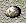</td>
      <td>Stumble</td>
      <td>Trip and drop up to 5 items (pots can break). Also receive 2~3 damage.</td>
      <td>Receive 2~3 damage. Thiefwalrus drops their stolen item.</td>
    </tr>
    <tr>
      <td>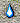</td>
      <td>Rusty</td>
      <td>Lowers upgrade value of your equipped weapon and shield by 1.</td>
      <td>Lowers defense to 0. Exceptions: Inferno: Instantly collapses. Popster Tank family: 1/2 speed and defense. Green Slime family: Levels up by 1.</td>
    </tr>
    <tr>
      <td>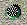</td>
      <td>Unequip</td>
      <td>Equipped items become unequipped. (Includes cursed equipment)</td>
      <td>Inflicts Sealed status.</td>
    </tr>
    <tr>
      <td>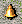</td>
      <td>Summons</td>
      <td>Up to 4 monsters appear around the trap.</td>
      <td>Up to 4 monsters appear around the trap.</td>
    </tr>
    <tr>
      <td>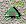</td>
      <td>Rotten</td>
      <td>Riceball items turn into Rotten Riceballs. Riceball status: Instantly collapse.</td>
      <td>Monster turns into a Rotten Riceball. (No experience points)</td>
    </tr>
    <tr>
      <td>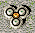</td>
      <td>Multiplication</td>
      <td>Generates lots of new traps on the floor.</td>
      <td>Generates lots of new traps on the floor.</td>
    </tr>
    <tr>
      <td>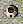</td>
      <td>Alarm</td>
      <td>Sleeping monsters on the floor wake up. (Excludes monsters with Deep Sleep status)</td>
      <td>Sleeping monsters on the floor wake up. (Excludes monsters with Deep Sleep status)</td>
    </tr>
    <tr>
      <td>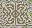</td>
      <td>Pitfall</td>
      <td>Receive 3~6 damage, then change floors. If there isn't a floor below the current one, you won't change floors.</td>
      <td>Monster vanishes from the floor. (No experience points)</td>
    </tr>
    <tr>
      <td>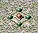</td>
      <td>Spring</td>
      <td>Warp to a different spot on the floor.</td>
      <td>Warp to a different spot on the floor.</td>
    </tr>
    <tr>
      <td>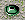</td>
      <td>Dream Gas</td>
      <td>Inflicts Puzzled status (20 turns).</td>
      <td>Monster becomes afraid of Shiren (30 turns).</td>
    </tr>
    <tr>
      <td>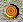</td>
      <td>Log</td>
      <td>Log flies at you from the front and deals 10 tiles of knockback and 5 damage.</td>
      <td>Log flies at enemy from the front and deals 10 tiles of knockback and 5 damage.</td>
    </tr>
    <tr>
      <td>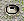</td>
      <td>Sleeping Gas</td>
      <td>Inflicts Sleepy status (4~6 turns).</td>
      <td>Inflicts Sleepy status (4~6 turns).</td>
    </tr>
    <tr>
      <td>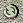</td>
      <td>Spinning</td>
      <td>Inflicts Confused status (6~10 turns).</td>
      <td>Inflicts Confused status (10~15 turns). Note: Double check duration!</td>
    </tr>
    <tr>
      <td>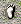</td>
      <td>Slowness</td>
      <td>Reduce action speed by 1 stage (10 turns).</td>
      <td>Reduce action speed by 1 stage.</td>
    </tr>
    <tr>
      <td>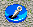</td>
      <td>Immobilization</td>
      <td>Inflicts Immobilized status (3~4 turns).</td>
      <td>Inflicts Immobilized status (3~4 turns).</td>
    </tr>
    <tr>
      <td>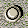</td>
      <td>Boulder</td>
      <td>Deals 10~14 damage.</td>
      <td>Deals 10~14 damage.</td>
    </tr>
    <tr>
      <td>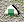</td>
      <td>Hunger</td>
      <td>Decreases fullness by 10. (Effect occurs even with Ever-Full status)</td>
      <td>Monster instantly collapses. (No experience points) Exceptions: Polygon Spin family: Levels up by 1.</td>
    </tr>
    <tr>
      <td>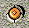</td>
      <td>Landmine</td>
      <td>Reduces current HP to 1/2. Blast Shield: Reduces current HP to 3/4. (Collapse if you were at 1 HP)</td>
      <td>Reduces current HP to 1/2. Exceptions: Spike Bomb family: Explodes. Inferno: Multiplies. Hen: Turns into Hen Meat.</td>
    </tr>
    <tr>
      <td>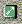</td>
      <td>Poison Dart</td>
      <td>Take 3~6 damage from a Poison Arrow. Also reduces strength by 1.</td>
      <td>Take 3~6 damage from a Poison Arrow. Also reduces attack power to 3/4.</td>
    </tr>
    <tr>
      <td>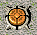</td>
      <td>Big Landmine</td>
      <td>Reduces current HP to 1. Blast Shield: Reduces current HP to 1/2. (Won't collapse even if you were at 1 HP) Note: Double check not collapsing!</td>
      <td>Reduces current HP to 1. Exceptions: Spike Bomb family: Explodes. Inferno: Multiplies. Hen: Turns into Hen Meat.</td>
    </tr>
    <tr>
      <td></td>
      <td>Wood Arrow</td>
      <td>Take 3~6 damage from a Wooden Arrow.</td>
      <td>Take 3~6 damage from a Wooden Arrow.</td>
    </tr>
    <tr>
      <td></td>
      <td>Knockback</td>
      <td>Receive 5 damage + 10 tiles knockback in the direction indicated by the arrow.</td>
      <td>Receive 5 damage + 10 tiles knockback in the direction indicated by the arrow.</td>
    </tr>
    <tr>
      <td>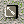</td>
      <td>Iron Arrow</td>
      <td>Take 9~12 damage from an Iron Arrow.</td>
      <td>Take 9~12 damage from an Iron Arrow.</td>
    </tr>
    <tr>
      <td></td>
      <td>Riceball</td>
      <td>Inflicts Riceball status (10 turns).</td>
      <td>Inflicts Riceball status (10 turns). Exceptions: Rice Baby family: Levels up by 1.</td>
    </tr>
    <tr>
      <td></td>
      <td>One-way</td>
      <td>Move in the direction of the arrow. (Doesn't use a turn)</td>
      <td>Move in the direction of the arrow. (Doesn't use a turn)</td>
    </tr>
    <tr>
      <td>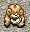</td>
      <td>Curse</td>
      <td>1 inventory item gets cursed.</td>
      <td>Inflicts Sealed status. Exceptions: Curse Girl family: Levels up by 1.</td>
    </tr>
    <tr>
      <td></td>
      <td>Stairway</td>
      <td>A random trap disguised as stairs. Reveals itself and triggers when stepped on.</td>
      <td>N/A</td>
    </tr>
  </tbody>
</table>
