# Overview

- Traps are found on the ground and activate when stepped on.
    - They generally apply a negative effect, but some can be utilized to your advantage.
- Traps are normally hidden, and are revealed when you step on them or do a normal attack above them.
    - They become visible if you eat Seewell Grass or equip a Trapper's Bracelet.
    - Spring Traps needed to escape item islands are always visible.

# Trap List

<table id="monsterList" class="pageLinksTable">
  <tr>
    <th colspan="6">Traps ~ Notebook Order</th>
  </tr>
  <tr>
    <th>Image</th>
    <th>Name</th>
    <th>Target</th>
    <th>In-Game Description</th>
  </tr>
  <tr>
    <td rowspan="2">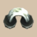</td>
    <td rowspan="2" class="priceTableName">Tripping Trap</td>
    <td>Player</td>
    <td class="leftText">Causes you to trip and take a little damage. Also scatters items. May break Pots or Incense.</td>
  </tr>
  <tr>
    <td>Monster</td>
    <td class="leftText">Causes a monster to trip and take a little damage. Thiefwalrus family, Froggo family, and Mixer family drop stolen or swallowed items.</td>
  </tr>
  <tr>
    <td colspan="4" class="tableDivider"></td>
  </tr>
  <tr>
    <td rowspan="2">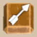</td>
    <td rowspan="2" class="priceTableName">Wooden Arrow Trap</td>
    <td>Player</td>
    <td class="leftText"></td>
  </tr>
  <tr>
    <td>Monster</td>
    <td class="leftText"></td>
  </tr>
  <tr>
    <td colspan="4" class="tableDivider"></td>
  </tr>
  <tr>
    <td rowspan="2"></td>
    <td rowspan="2" class="priceTableName">Poison Arrow Trap</td>
    <td>Player</td>
    <td class="leftText"></td>
  </tr>
  <tr>
    <td>Monster</td>
    <td class="leftText"></td>
  </tr>
  <tr>
    <td colspan="4" class="tableDivider"></td>
  </tr>
  <tr>
    <td rowspan="2">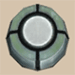</td>
    <td rowspan="2" class="priceTableName">Rock Trap</td>
    <td>Player</td>
    <td class="leftText"></td>
  </tr>
  <tr>
    <td>Monster</td>
    <td class="leftText"></td>
  </tr>
  <tr>
    <td colspan="4" class="tableDivider"></td>
  </tr>
  <tr>
    <td rowspan="2"></td>
    <td rowspan="2" class="priceTableName">Boulder Trap</td>
    <td>Player</td>
    <td class="leftText"></td>
  </tr>
  <tr>
    <td>Monster</td>
    <td class="leftText"></td>
  </tr>
  <tr>
    <td colspan="4" class="tableDivider"></td>
  </tr>
  <tr>
    <td rowspan="2">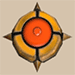</td>
    <td rowspan="2" class="priceTableName">Blast Trap</td>
    <td>Player</td>
    <td class="leftText"></td>
  </tr>
  <tr>
    <td>Monster</td>
    <td class="leftText"></td>
  </tr>
  <tr>
    <td colspan="4" class="tableDivider"></td>
  </tr>
  <tr>
    <td rowspan="2">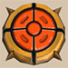</td>
    <td rowspan="2" class="priceTableName">Explosion Trap</td>
    <td>Player</td>
    <td class="leftText"></td>
  </tr>
  <tr>
    <td>Monster</td>
    <td class="leftText"></td>
  </tr>
  <tr>
    <td colspan="4" class="tableDivider"></td>
  </tr>
  <tr>
    <td rowspan="2">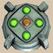</td>
    <td rowspan="2" class="priceTableName">Spring Trap</td>
    <td>Player</td>
    <td class="leftText"></td>
  </tr>
  <tr>
    <td>Monster</td>
    <td class="leftText"></td>
  </tr>
  <tr>
    <td colspan="4" class="tableDivider"></td>
  </tr>
  <tr>
    <td rowspan="2"></td>
    <td rowspan="2" class="priceTableName">Log Trap</td>
    <td>Player</td>
    <td class="leftText"></td>
  </tr>
  <tr>
    <td>Monster</td>
    <td class="leftText"></td>
  </tr>
  <tr>
    <td colspan="4" class="tableDivider"></td>
  </tr>
  <tr>
    <td rowspan="2"></td>
    <td rowspan="2" class="priceTableName">Hunger Trap ※ Duplicate name</td>
    <td>Player</td>
    <td class="leftText"></td>
  </tr>
  <tr>
    <td>Monster</td>
    <td class="leftText"></td>
  </tr>
  <tr>
    <td colspan="4" class="tableDivider"></td>
  </tr>
  <tr>
    <td rowspan="2">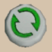</td>
    <td rowspan="2" class="priceTableName">Spinning Trap</td>
    <td>Player</td>
    <td class="leftText"></td>
  </tr>
  <tr>
    <td>Monster</td>
    <td class="leftText"></td>
  </tr>
  <tr>
    <td colspan="4" class="tableDivider"></td>
  </tr>
  <tr>
    <td rowspan="2">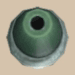</td>
    <td rowspan="2" class="priceTableName">Sleep Trap</td>
    <td>Player</td>
    <td class="leftText"></td>
  </tr>
  <tr>
    <td>Monster</td>
    <td class="leftText"></td>
  </tr>
  <tr>
    <td colspan="4" class="tableDivider"></td>
  </tr>
  <tr>
    <td rowspan="2"></td>
    <td rowspan="2" class="priceTableName">Shadowbind Trap</td>
    <td>Player</td>
    <td class="leftText"></td>
  </tr>
  <tr>
    <td>Monster</td>
    <td class="leftText"></td>
  </tr>
  <tr>
    <td colspan="4" class="tableDivider"></td>
  </tr>
  <tr>
    <td rowspan="2"></td>
    <td rowspan="2" class="priceTableName">Blinding Trap</td>
    <td>Player</td>
    <td class="leftText"></td>
  </tr>
  <tr>
    <td>Monster</td>
    <td class="leftText"></td>
  </tr>
  <tr>
    <td colspan="4" class="tableDivider"></td>
  </tr>
  <tr>
    <td rowspan="2"></td>
    <td rowspan="2" class="priceTableName">Delusion Trap</td>
    <td>Player</td>
    <td class="leftText"></td>
  </tr>
  <tr>
    <td>Monster</td>
    <td class="leftText"></td>
  </tr>
  <tr>
    <td colspan="4" class="tableDivider"></td>
  </tr>
  <tr>
    <td rowspan="2"></td>
    <td rowspan="2" class="priceTableName">Onigiri Trap</td>
    <td>Player</td>
    <td class="leftText"></td>
  </tr>
  <tr>
    <td>Monster</td>
    <td class="leftText"></td>
  </tr>
  <tr>
    <td colspan="4" class="tableDivider"></td>
  </tr>
  <tr>
    <td rowspan="2">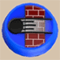</td>
    <td rowspan="2" class="priceTableName">Far-throwing Trap</td>
    <td>Player</td>
    <td class="leftText"></td>
  </tr>
  <tr>
    <td>Monster</td>
    <td class="leftText"></td>
  </tr>
  <tr>
    <td colspan="4" class="tableDivider"></td>
  </tr>
  <tr>
    <td rowspan="2">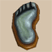</td>
    <td rowspan="2" class="priceTableName">Sluggish Trap</td>
    <td>Player</td>
    <td class="leftText"></td>
  </tr>
  <tr>
    <td>Monster</td>
    <td class="leftText"></td>
  </tr>
  <tr>
    <td colspan="4" class="tableDivider"></td>
  </tr>
  <tr>
    <td rowspan="2">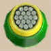</td>
    <td rowspan="2" class="priceTableName">Removal Trap</td>
    <td>Player</td>
    <td class="leftText"></td>
  </tr>
  <tr>
    <td>Monster</td>
    <td class="leftText"></td>
  </tr>
  <tr>
    <td colspan="4" class="tableDivider"></td>
  </tr>
  <tr>
    <td rowspan="2">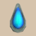</td>
    <td rowspan="2" class="priceTableName">Rust Trap</td>
    <td>Player</td>
    <td class="leftText"></td>
  </tr>
  <tr>
    <td>Monster</td>
    <td class="leftText"></td>
  </tr>
  <tr>
    <td colspan="4" class="tableDivider"></td>
  </tr>
  <tr>
    <td rowspan="2"></td>
    <td rowspan="2" class="priceTableName">Rotting Trap</td>
    <td>Player</td>
    <td class="leftText"></td>
  </tr>
  <tr>
    <td>Monster</td>
    <td class="leftText"></td>
  </tr>
  <tr>
    <td colspan="4" class="tableDivider"></td>
  </tr>
  <tr>
    <td rowspan="2">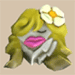</td>
    <td rowspan="2" class="priceTableName">Curse Trap</td>
    <td>Player</td>
    <td class="leftText"></td>
  </tr>
  <tr>
    <td>Monster</td>
    <td class="leftText"></td>
  </tr>
  <tr>
    <td colspan="4" class="tableDivider"></td>
  </tr>
  <tr>
    <td rowspan="2">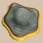</td>
    <td rowspan="2" class="priceTableName">Silver-seal Trap</td>
    <td>Player</td>
    <td class="leftText"></td>
  </tr>
  <tr>
    <td>Monster</td>
    <td class="leftText"></td>
  </tr>
  <tr>
    <td colspan="4" class="tableDivider"></td>
  </tr>
  <tr>
    <td rowspan="2">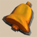</td>
    <td rowspan="2" class="priceTableName">Summoning Trap</td>
    <td>Player</td>
    <td class="leftText"></td>
  </tr>
  <tr>
    <td>Monster</td>
    <td class="leftText"></td>
  </tr>
  <tr>
    <td colspan="4" class="tableDivider"></td>
  </tr>
  <tr>
    <td rowspan="2">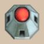</td>
    <td rowspan="2" class="priceTableName">Alarm Switch</td>
    <td>Player</td>
    <td class="leftText"></td>
  </tr>
  <tr>
    <td>Monster</td>
    <td class="leftText"></td>
  </tr>
  <tr>
    <td colspan="4" class="tableDivider"></td>
  </tr>
  <tr>
    <td rowspan="2">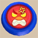</td>
    <td rowspan="2" class="priceTableName">Rage Trap</td>
    <td>Player</td>
    <td class="leftText"></td>
  </tr>
  <tr>
    <td>Monster</td>
    <td class="leftText"></td>
  </tr>
  <tr>
    <td colspan="4" class="tableDivider"></td>
  </tr>
  <tr>
    <td rowspan="2"></td>
    <td rowspan="2" class="priceTableName">Monsterizing Trap</td>
    <td>Player</td>
    <td class="leftText"></td>
  </tr>
  <tr>
    <td>Monster</td>
    <td class="leftText"></td>
  </tr>
  <tr>
    <td colspan="4" class="tableDivider"></td>
  </tr>
  <tr>
    <td rowspan="2">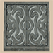</td>
    <td rowspan="2" class="priceTableName">Pitfall Trap</td>
    <td>Player</td>
    <td class="leftText"></td>
  </tr>
  <tr>
    <td>Monster</td>
    <td class="leftText"></td>
  </tr>
  <tr>
    <td colspan="4" class="tableDivider"></td>
  </tr>
  <tr>
    <td rowspan="2">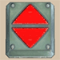</td>
    <td rowspan="2" class="priceTableName">Floor-exiting Trap</td>
    <td>Player</td>
    <td class="leftText"></td>
  </tr>
  <tr>
    <td>Monster</td>
    <td class="leftText"></td>
  </tr>
  <tr>
    <td colspan="4" class="tableDivider"></td>
  </tr>
  <tr>
    <td rowspan="2">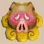</td>
    <td rowspan="2" class="priceTableName">Gassy Trap</td>
    <td>Player</td>
    <td class="leftText"></td>
  </tr>
  <tr>
    <td>Monster</td>
    <td class="leftText"></td>
  </tr>
  <tr>
    <td colspan="4" class="tableDivider"></td>
  </tr>
  <tr>
    <td rowspan="2">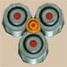</td>
    <td rowspan="2" class="priceTableName">Trap-setting Trap</td>
    <td>Player</td>
    <td class="leftText"></td>
  </tr>
  <tr>
    <td>Monster</td>
    <td class="leftText"></td>
  </tr>
  <tr>
    <td colspan="4" class="tableDivider"></td>
  </tr>
  <tr>
    <td rowspan="2">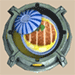</td>
    <td rowspan="2" class="priceTableName">Feeding Trap</td>
    <td>Player</td>
    <td class="leftText"></td>
  </tr>
  <tr>
    <td>Monster</td>
    <td class="leftText"></td>
  </tr>
  <tr>
    <td colspan="4" class="tableDivider"></td>
  </tr>
  <tr>
    <td rowspan="2">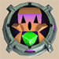</td>
    <td rowspan="2" class="priceTableName">Hunger Trap ※ Duplicate name</td>
    <td>Player</td>
    <td class="leftText"></td>
  </tr>
  <tr>
    <td>Monster</td>
    <td class="leftText"></td>
  </tr>
</table>
